# 望仙谷绝美夜景的背后：不能立电线杆的景区如何流光溢彩

> 来源：中国经济周刊官网（中央新闻网站、互联网新闻信息稿源单位）。本刊记者：宋杰；编辑：杨琳。发布时间：2026-04-01 17:21。本篇为基于报道的精读整理稿。

---

## 文章结构信息图

1. **导引部：望仙谷夜景的视觉盛宴与社会影响**
   - 第1段：描绘望仙谷夜景实况，引用外交部推介，确立文章基调（视觉奇观与名片效应）。
   - 第2段：转折句，引出核心矛盾——绝美景观背后的电力保障攻坚。

2. **第一板块：从「抢修忙」到「零停电」——电力基建的质变历程**
   - 第3–5段：回溯2023年春节危机。详陈游客激增数据与当时供电设施薄弱（容量不足）的尖锐矛盾，借基层所长与员工回忆展现抢修高压状态。
   - 第6–8段：阐述「治标+治本」双轨战略。
     - **治标**（解决当下）：全市资源调度、倒排工期、低压线路紧急改造。
     - **治本**（长远规划）：新建配电化台区、10千伏专项线路，将「串联」改为「网格」结构。
   - 第9–10段：标志性成果。110千伏郑坊变电站投运，实现从「电网末端」到「首端」的战略地位转移，达成「零抢修」目标。

3. **第二板块：缆线入地与灯火上山——生态美学与电力技术的融合**
   - 第11–13段：施工难点。强调人力搬运、避让生态红线、协调村民青苗补偿，体现「生态优先」原则。
   - 第14–15段：美学考量。解释地下管廊建设的必要性，说明高成本铜芯电缆投入对景观保护的价值。
   - 第16–17段：智能化管控。介绍灯火秀的分时段控制与漏电保护机制，兼顾负荷调节与游客体验。

4. **第三板块：现代服务与未来规划——构建韧性电力网络**
   - 第18–19段：新业态支撑。专门服务新能源汽车充电桩的变压器改造，保障江浙沪闽自驾游客需求。
   - 第20–21段：防御性运维。针对山区气候（雷雨、结冰）的网格化驻守，运用无人机、红外测温、配电自动化系统进行预防。
   - 第22–23段：愿景展望。110千伏郑坊变二台主变规划，构建「互为备用」网络，升华「守护一线」的服务承诺。

---

傍晚时分，江西上饶望仙谷的悬崖栈道上，游客络绎不绝。暮色渐浓，灯光次第亮起，金黄色的光晕勾勒出赣派古建的飞檐翘角，整座山谷仿佛被点亮的天宫。这帧被外交部发言人毛宁在海外社交平台点赞的绝美夜景，如今已成为当地的一张亮丽名片。

> **望仙谷**：位于江西省上饶市广信区望仙乡，国家AAAA级旅游景区。其特色在于利用废弃矿山（原为铅锌矿区）进行生态修复，在悬崖峭壁上复建古建筑群，形成了独特的**「悬崖仙侠小镇」**景观。
>
> **赣派古建**（Gan-style architecture）：江西传统建筑风格。重点词汇：**飞檐翘角**（upturned eaves），指屋檐角向上翘起，形态轻盈。其特征还包括马头墙、青砖黛瓦，具有极高的艺术和防灾价值。
>
> **毛宁**：现任外交部发言人、新闻司副司长。

然而，这片流光溢彩的背后，却有着一场持续数年的供电攻坚战。

> **流光溢彩**（flowing light and overflowing colors）：形容灯光光彩绚丽。近义词：五彩斑斓、灿烂夺目。

## 从「抢修忙」到「零停电」

时间回溯到2023年春节。望仙谷凭借废弃矿区生态修复成果迅速走红，7天假期涌进20多万游客，单日最高峰超过4万人次。激增的客流让供电短板瞬间凸显。

> **回溯**（trace back/recall）：追忆过去。
>
> **客流**（tourist flow）：游客流量。

「当时望仙乡民宿聚集区只有7台配变，总容量才1100千伏安，整个华坛山镇也只有11台、总容量3260千伏安，根本扛不住。」国家电网江西上饶市广信区供电公司华坛山供电所所长潘凯卿回忆。

> **配变**：即**配电变压器**（Distribution Transformer）。
>
> **千伏安**（kVA）：电力容量单位。对于高二文科生，可理解为供电系统能带动的电器总功率上限。
>
> **潘凯卿**：国网江西上饶市广信区供电公司华坛山供电所所长。

华坛山供电所七级职员严冰对那个忙碌的正月记忆犹新：「正月初一晚上，樟涧民宿村的变压器出现故障，低压线路也断了。」

> **严冰**：国网华坛山供电所七级职员。
>
> **记忆犹新**（remain fresh in one's memory）：指过去的事至今记得清清楚楚。

那个春节，他和同事们几乎天天抢修到深夜，「游客和民宿业主询问的电话不断，我们只能一遍遍解释」。

面对民生需求，国网上饶供电公司迅速启动「治标+治本」双轨行动。

> **双轨行动**（dual-track action）：两条路径同时进行。
>
> **治标与治本**：中医术语转外延至管理学。**治标**（treat the symptoms）指解决表面的、紧急的问题；**治本**（get to the root of the problem）指从根本上解决问题。

「治标」先解燃眉之急。针对电能表短缺问题，在上饶供电公司统筹下，全市县区电表资源统一调度，华坛山供电所逐户确认民宿开业时间，按轻重缓急倒排安装计划。多个供电所联合作战，出动300余人次，在20天内完成新增及待建民宿区域约8万米低压四线改造，安装三相表计300余只，轮换配变17台，新增容量4820千伏安。

> **燃眉之急**（urgent matter）：形容情况非常紧迫。近义词：迫在眉睫。
>
> **轻重缓急**：指各种事情的分量和紧迫程度。
>
> **低压四线**：指三相四线制低压配电线，常用于居民和商业用电，保证电压稳定。
>
> **三相表计**（three-phase meter）：通常用于大功率用电设备或商业场所的电能计量工具。

「治本」着眼长远升级。结合景区发展规划，供电部门新建一座35千伏配电化台区、一条10千伏线路，打通景区及周边民宿「第二路电源」；推进10千伏沙洲线改造，使之专门服务民宿聚集区；新建环网柜3台，将景区内配变由原来「串葫芦」式的连接方式改造为网状结构。通过挨家挨户走访建立台账，精准预测用电负荷，民宿聚集区配变从18台增至44台，总容量从4360千伏安跃升至20653千伏安。

> **第二路电源**：即**备用电源**（redundant power supply）。当主供电线路故障时，第二路电源可迅速切换，保证不停电。
>
> **环网柜**（Ring Main Unit）：一种高压开关柜。其作用是实现**「环网供电」**，即使某处线路断开，电也能从另一个方向绕过来，极大提高可靠性。
>
> **台账**（ledger）：详细的记录汇总。
>
> **用电负荷**（electric load）：指用电设备在某一段时间内消耗的功率。

2025年1月，距景区仅5公里的郑坊110千伏变电站建成投运，望仙景区及民宿集聚区从电网「末端」变为「首端」，供电半径大幅缩短，电压质量与供电可靠性显著提升。

> **郑坊110千伏变电站**：位于上饶广信区郑坊镇。
>
> **末端与首端**：电网中的**末端**（terminal end）因传输距离长，易出现低电压、易受上游故障影响；**首端**（head end）靠近变电站，电压稳、损耗小。
>
> **供电半径**：变电站到最远用户的距离。半径越短，电能损耗越小。

「今年春节，我们一张抢修单都没有。」严冰笑着说。

## 缆线入地，灯火上山

穿行在望仙谷，记者看不见一根电杆，只有古建与山水的和谐相融。

「施工时全靠人力，一根粗电缆几个人抬，还要避开生态红线，不能破坏植被。」严冰回忆说，山区地形复杂，机械上不去，只能靠人扛肩挑。为了不损坏老百姓的青苗，施工队尽量绕道，实在绕不开的，还要和村民协调补偿事宜。

> **生态红线**（Ecological protection redline）：中国为维护国家或区域生态安全实施的刚性约束。在红线范围内严禁大规模开发建设。
>
> **青苗**：农田中正在生长的庄稼。

景区核心区不允许立电线杆，如何兼顾美观与安全？国家电网江西上饶市广信区供电公司副经理何宗林道出其中不易：「在核心景区立杆，既不美观也有安全隐患，还会破坏自然生态。我们与政府协商，由他们出资建设地下管廊，电缆全部入地。」

> **何宗林**：国网江西上饶市广信区供电公司副经理。
>
> **地下管廊**（Utility tunnel）：在城市地下建造一个隧道空间，将电力、通信、供水等管线集于一体，设有专门检修口。

他指着远处的山脊说：「入地的铜芯电缆成本比架空线路高很多，但为了景区美观和安全，这笔钱必须花。」

> **铜芯电缆**（copper core cable）：导电性极好但成本昂贵。与**铝芯电缆**相比，损耗更低，使用寿命更长。

灯光秀是景区的「点睛之笔」。为保障演出用电，供电公司协助景区安装定时器和漏电保护器，实现分时段、分路控制。

> **点睛之笔**（the touch that brings the dragon to life）：指最精彩、最关键的一笔。
>
> **漏电保护器**（Residual Current Circuit Breaker, RCCB）：安全装置。检测到漏电时会自动跳闸，防止人员触电或火灾。

「降低瞬间负荷的同时，即便出现单路故障也不影响景区整体效果，这既减轻了我们的工作量，也保障了游客体验。」严冰说。

在望仙谷景区外的樟涧民宿村停车场，一台崭新的630千伏安变压器格外显眼。这是供电公司专门为服务新能源汽车充电桩新增的。

> **樟涧村**：望仙谷景区配套的重要民宿集散地。

「平时一天用电500多度，能充十几台车；春节高峰期一天用了3000多度，充了100多台车。」严冰指着充电桩向记者介绍说，自驾游客大多来自江苏、上海、浙江、福建，有了稳定供电，他们再不用为充电发愁。

山区气候多变，春季雷雨频繁，冬季毛竹结冰倾覆可能危及导线。供电所将辖区划分为两个网格，一组驻守望仙谷，一组守在民宿点，24小时待命。春节期间，8台发电车提前就位，无人机巡线、红外测温、局放检测轮番上阵。

> **网格化**（Grid management）：将区域划分为若干格块进行精细化管理。
>
> **无人机巡线**（Drone inspection）：利用无人机搭载摄像头或激光雷达检查高空及险要地形的输电线路。
>
> **红外测温**：利用红外技术探测设备发热情况，预判接触不良等隐患。
>
> **局放检测**（Partial Discharge test）：即局部放电检测，用于评估高压设备绝缘性能的预警技术。

「配电自动化系统能及时发现过流和接地信号，通过分段分级快速定位故障点。」严冰介绍，即便突发故障，也能快速隔离、转供电，游客几乎感觉不到停电。

> **配电自动化**（DA）：通过通信网络监测电网，实现故障的自动识别、隔离和恢复供电。

如今，行走在望仙谷周边，明清风格的赣派民宿错落有致。曾经的「供电难题」已成历史，但供电人的脚步并未停歇：110千伏郑坊变增加第2台主变的规划已提上议程，2条新建10千伏线路正在实施中，预计今年4月份正式投运，将形成互为备用的供电网络，进一步增强景区用电可靠性。

> **错落有致**（strewn at random but in an orderly fashion）：形容事物的布局虽然参差不齐，但很有情趣。
>
> **互为备用**（mutual backup）：指两路电互为依托，A路故障B路顶上，确保供电不中断（即**N-1安全准则**）。

「只要客户需要，我们始终守在一线。」这是华坛山供电所全体供电人给出的承诺。

## 前情提要

### 文章来源与基本信息
- 来源：`China Economic Weekly`（经济网 / 中国经济周刊相关平台，国家级新闻网站）
- 英文标题：`Behind the stunning night view of Wangxian Valley`
- 副标题：`How a scenic area where utility poles cannot be erected shines with dazzling light`
- 作者：`Song Jie`（宋杰）
- 编辑：`Yang Lin`（杨琳）
- 文中标注时间：`2026-04-01 17:21`
- 体裁：新闻特写 / infrastructure feature / scenic-area development report

### 作者背景简介
根据经济网/中国经济周刊站内公开署名信息检索，`Song Jie`长期以`记者 / 本刊记者`身份在该平台发表报道，选题覆盖`产业经济、城市发展、科技、文旅、区域观察`等领域；多篇稿件署名形式出现为`本刊记者 宋杰`，并常见`上海报道、北京报道`等区域采访标识。可据此判断：他是该媒体体系内较活跃的新闻记者，擅长`实地探访式`与`产业观察式`报道。
说明：以上为基于公开署名记录所作的审慎归纳，并非作者本人完整官方履历。

### 文章结构信息图

```mermaid
flowchart TB
    A["文章主旨<br/>Wangxian Valley夜景背后的供电保障"]:::main
    A --> B["第1段<br/>夜景震撼登场<br/>Scenic image & public attention"]:::p1
    A --> C["第2段<br/>提出核心反差<br/>美景背后是长期保电攻坚"]:::p2
    A --> D["第3-10段<br/>从'抢修不断'到'零停电'<br/>power-supply upgrade journey"]:::p3
    A --> E["第11-19段<br/>为什么看不见电线杆<br/>underground cables & construction difficulty"]:::p4
    A --> F["第20-24段<br/>充电桩、气候风险、智能运维、未来扩容"]:::p5

    D --> D1["2023春节游客暴增<br/>原有容量不足"]:::sub
    D --> D2["抢修频繁<br/>游客与民宿诉求集中爆发"]:::sub
    D --> D3["治标：调电表、改低压线、增容"]:::sub
    D --> D4["治本：新建线路/台区/环网柜/网架优化"]:::sub
    D --> D5["2025年110kV变电站投运<br/>供电末端变前端"]:::sub

    E --> E1["景区核心区禁立电杆"]:::sub
    E --> E2["靠人背肩扛施工"]:::sub
    E --> E3["兼顾生态、作物、美观与安全"]:::sub
    E --> E4["电缆全部入地"]:::sub
    E --> E5["灯光秀分时分路控制"]:::sub

    F --> F1["新增630kVA变压器保障充电桩"]:::sub
    F --> F2["应对雷暴、覆冰、竹倒风险"]:::sub
    F --> F3["自动化+无人机+红外测温"]:::sub
    F --> F4["继续扩建主变与10kV线路"]:::sub
    F --> F5["结尾回到一线承诺"]:::sub

    classDef main fill:#ffe7a8,stroke:#c58b00,color:#222,stroke-width:2px;
    classDef p1 fill:#d9ecff,stroke:#4a90e2,color:#123;
    classDef p2 fill:#e8ddff,stroke:#8a63d2,color:#222;
    classDef p3 fill:#dff5e3,stroke:#3aa76d,color:#123;
    classDef p4 fill:#ffe3e3,stroke:#d96b6b,color:#222;
    classDef p5 fill:#fff1d6,stroke:#d89b2b,color:#222;
    classDef sub fill:#f8f8f8,stroke:#999,color:#333;
```

---

## 逐句精读

🔹At dusk, / the cliffside walkway in `Wangxian Valley`, `Shangrao`, `Jiangxi`, / is filled with a steady stream of visitors.
🔸黄昏时分，江西上饶`望仙谷`的临崖栈道上，游客`络绎不绝`。

背景注释：
- `Wangxian Valley`：望仙谷，江西上饶知名文旅景区，以山谷、悬崖步道、夜景灯光和仿古建筑见长。
- `Shangrao`：上饶，江西东北部城市，近年文旅发展较快。
- `at dusk`：新闻写景常见起笔，既交代时间，也烘托氛围。
- `steady stream`：字面为“稳定的水流”，此处比喻“连续不断的人流”。

> **`steady stream` 络绎不绝的人流；源源不断的流动**
>
> 1. 英文释义（n. phrase）：a continuous and regular flow of people or things；持续而稳定的人流或物流。
> 中文：`连续不断的流动；川流不息`
>
> 2. 语域：新闻、书面、描写
>
> 3. 画龙点睛：这是新闻写作里很地道的`比喻型名词短语`，常搭配`visitors, traffic, inquiries, complaints`。比起 many people，更能写出`动态感`与`现场感`。翻译时常处理为`络绎不绝、川流不息、接连不断`。

> **`cliffside walkway` 临崖步道；悬崖边栈道**
>
> 1. 英文释义（n. phrase）：a path or walkway built along the side of a cliff；修建在悬崖边上的步道。
> 中文：`临崖步道；崖边栈道`
>
> 2. 语域：旅游、地理、描写
>
> 3. 画龙点睛：`cliffside`= along the side of a cliff，常用于旅游报道；`walkway`比`road`更强调`供步行`。写作中可替换为`boardwalk, footpath, trail`，但语义并不完全重合。

---

🔹As night falls, / lights come on one by one, / and golden halos outline the upturned eaves and corners of `Gan-style` ancient architecture, / making the whole valley look like a heavenly palace lit up.
🔸夜幕降临，灯光`次第亮起`，金色光晕勾勒出`赣派`古建筑飞檐翘角的轮廓，使整座山谷宛如一座被点亮的`天上宫阙`。

背景注释：
- `Gan-style architecture`：赣派建筑，江西地方传统建筑风格。`Gan`是江西的简称“赣”的拼音化/英语化表达。
- `upturned eaves`：飞檐，传统中式建筑重要特征。
- `halo`：原义“光环”，这里指灯光形成的金色轮廓。
- `heavenly palace`：天宫、仙宫式比喻，强化景区“望仙”意象。

> **`outline` 勾勒……轮廓；描出边线**
>
> 1. 英文释义（v.）：to show the edge or shape of something；勾勒出某物边缘或形状。
> 中文：`勾勒；描出轮廓`
>
> 2. 语域：通用、描写、新闻
>
> 3. 画龙点睛：`outline`常见熟词僻义。很多考生只认识名词“提纲”，但动词义在阅读中很常见。句中是`灯光勾边`的视觉表达。写作可说`Streetlights outlined the old bridge against the dark sky.`

> **`upturned eaves` 飞檐**
>
> 1. 英文释义（n. phrase）：roof edges that curve upward at the corners；屋檐边角向上翘起的结构。
> 中文：`飞檐；翘檐`
>
> 2. 语域：建筑、文化、旅游
>
> 3. 画龙点睛：这是介绍中国古建时非常实用的表达。`eave`单数常指“屋檐”，`eaves`更常见。翻译题和文化类写作里很加分，注意不要误写成`roof corner`这种过泛表达。

> **`halo` 光晕；光环**
>
> 1. 英文释义（n.）：a ring or circle of light around something；环绕某物的光圈。
> 中文：`光晕；光环`
>
> 2. 语域：文学、描写、宗教延伸义
>
> 3. 画龙点睛：`halo`既可实指视觉光圈，也可引申为`荣耀效应`，如`halo effect`。本句是典型视觉描写词，能提升作文画面感，比单纯的`light`更精确。

---

🔹This stunning night view, / praised by Chinese Foreign Ministry spokesperson `Mao Ning` on overseas social media platforms, / has now become a shining local calling card.
🔸这一`惊艳`的夜景曾被中国外交部发言人`毛宁`在海外社交媒体平台上点赞，如今已成为当地一张`闪亮的名片`。

背景注释：
- `Mao Ning`：中国外交部发言人。
- `calling card`：本义“名片”，引申为“代表性标识、城市名片”。
- `overseas social media platforms`：面向境外受众的平台，新闻中常用于强调国际传播效果。

> **`calling card` 名片；标志性形象**
>
> 1. 英文释义（n. phrase）：something that represents a place, person, or organization in a memorable way；能代表某地或某主体的鲜明标识。
> 中文：`名片；招牌；代表性标识`
>
> 2. 语域：新闻、宣传、半正式
>
> 3. 画龙点睛：这是高频新闻表达。谈城市、产业、旅游品牌时都很常见。写作里可用于替换`symbol`。如`The museum has become the city's cultural calling card.` 语感自然、正式度适中。

> **`stunning` 令人惊艳的；震撼的**
>
> 1. 英文释义（adj.）：extremely impressive or attractive；极其令人印象深刻或美丽动人的。
> 中文：`惊艳的；令人震撼的`
>
> 2. 语域：通用、新闻、口语均可
>
> 3. 画龙点睛：`stunning`既可写景，也可写成绩、设计、表现。比`beautiful`信息量更强，带有`一下子抓住注意力`的感觉。雅思口语和写作都很实用，但正式学术文中使用频率略低。

---

🔹However, / behind this dazzling display of lights / lies a years-long battle to secure power supply.
🔸然而，在这片`流光溢彩`的灯火背后，隐藏着一场持续多年的`保供电攻坚战`。

背景注释：
- 本句实现文章叙述重心转折：从“美景”切入“基础设施”。
- `lies`前置结构属于新闻写作常见倒装，增强庄重感。
- `secure power supply`：确保供电稳定、安全、可靠。

> **`dazzling` 炫目的；令人眼花缭乱的**
>
> 1. 英文释义（adj.）：extremely bright, impressive, or skillful；极其耀眼、出众或令人炫目的。
> 中文：`炫目的；耀眼的`
>
> 2. 语域：新闻、描写、评论
>
> 3. 画龙点睛：`dazzling`既可写字面上的强光，也可写抽象上的“辉煌表现”。常见搭配有`dazzling lights, dazzling performance, dazzling success`。翻译时视语境处理为`璀璨、耀眼、令人目眩`。

> **`secure` 保障；确保……安全稳定**
>
> 1. 英文释义（v.）：to obtain or make certain of something；获得并确保某事。
> 中文：`确保；保障；落实`
>
> 2. 语域：正式、新闻、政策
>
> 3. 画龙点睛：很多人只熟悉形容词`secure`“安全的”，但动词义在阅读中非常高频。尤其常见于`secure funding / supply / support / access`。写作时用它能明显提升正式度。

---

🔹From “busy emergency repairs” / to “zero power outages”
🔸从“`抢修不断`”到“`零停电`”

背景注释：
- 这是小标题，概括后文主题推进。
- `power outage`：停电；断电事故。
- 中文译法可保留对比感，体现治理成效。

> **`power outage` 停电**
>
> 1. 英文释义（n. phrase）：a period when the electricity supply stops；供电中断的一段时间。
> 中文：`停电；断电`
>
> 2. 语域：通用、新闻、工程
>
> 3. 画龙点睛：美式英语中`outage`很高频，除电力外还可说`internet outage, service outage`。若写“停电频繁”，可说`frequent power outages`，比`electricity cut`更地道。

---

🔹Let us turn back to the `Spring Festival` of 2023.
🔸让我们把时间拉回到`2023年春节`。

背景注释：
- `Spring Festival`：春节。对外传播中常用这一表达。
- `turn back to`：回到、追溯到某一时间点，是叙述回溯常用句型。

> **`turn back to` 回到；追溯到**
>
> 1. 英文释义（v. phrase）：to return in discussion or thought to an earlier time or topic；在叙述或思路上回到较早时间或话题。
> 中文：`回到；追溯到`
>
> 2. 语域：叙述、书面
>
> 3. 画龙点睛：这是写时间倒叙时很顺手的表达。比单纯`in 2023`更有叙事推进感。可替换为`rewind to, go back to`，但`turn back to`较稳妥、书面感更强。

---

🔹`Wangxian Valley` quickly rose to fame / thanks to the ecological restoration of its abandoned mining area.
🔸`望仙谷`凭借废弃矿区的`生态修复`而迅速走红。

背景注释：
- `abandoned mining area`：废弃矿区，意味着景区前身并非传统景区，而是资源开发遗址。
- `ecological restoration`：生态修复，环境治理领域常见术语。
- `rose to fame`：迅速出名。

> **`rise to fame` 成名；走红**
>
> 1. 英文释义（v. phrase）：to become well known in a short time；在较短时间内迅速出名。
> 中文：`迅速成名；走红`
>
> 2. 语域：新闻、人物、文旅报道
>
> 3. 画龙点睛：很适合形容景点、品牌、艺人、城市IP爆红。比`become famous`更自然、更有过程感。写作中可与`overnight`连用：`The village rose to fame almost overnight.`

> **`ecological restoration` 生态修复**
>
> 1. 英文释义（n. phrase）：the process of repairing damaged natural environments；修复受损自然生态系统的过程。
> 中文：`生态修复`
>
> 2. 语域：环保、政策、科技、新闻
>
> 3. 画龙点睛：这是环境类阅读高频词组。`restoration`比`protection`更强调`修复已受损对象`。写作中可与`wetlands, rivers, mining sites, habitats`搭配，属于很有专业感的表达。

---

🔹During the seven-day holiday, / more than 200,000 tourists poured in, / with the daily peak exceeding 40,000.
🔸在为期七天的假期中，涌入景区的游客超过`20万人次`，单日峰值突破`4万人次`。

背景注释：
- `poured in`：大量涌入，形象地表现客流密集。
- `daily peak`：单日峰值。
- 这里数字信息是理解后文“电力承载不足”的前提。

> **`pour in` 大量涌入**
>
> 1. 英文释义（v. phrase）：to arrive in large numbers or quantities quickly；大量、迅速地到来。
> 中文：`涌入；蜂拥而至`
>
> 2. 语域：新闻、通用、描写
>
> 3. 画龙点睛：这是阅读中描写`游客、资金、订单、求助信息`集中出现的高频短语。它带有明显的`数量压力`色彩，因此常为后文问题铺垫。写作中比`many tourists came`更鲜活。

> **`peak` 峰值；高峰**
>
> 1. 英文释义（n.）：the highest level or number reached；达到的最高水平或数量。
> 中文：`峰值；高峰`
>
> 2. 语域：通用、数据、新闻
>
> 3. 画龙点睛：`peak`既可作名词，也可作动词。新闻里常见`peak season, peak demand, peak hours, peak load`。考研翻译中要注意根据语境灵活译为`高峰期`或`峰值`。

---

🔹The surge in visitors / immediately exposed shortcomings in the power supply.
🔸游客数量的`激增`，立刻暴露出供电方面的`短板`。

背景注释：
- `surge`：激增。
- `expose shortcomings`：暴露问题/短板，是政策与新闻文体常见搭配。
- `power supply`：供电系统，不只是“电”，更包括配网承载能力。

> **`surge` 激增；猛增**
>
> 1. 英文释义（n./v.）：a sudden large increase; to increase suddenly and strongly；突然的大幅增长；猛增。
> 中文：`激增；猛涨`
>
> 2. 语域：新闻、经济、能源、社会
>
> 3. 画龙点睛：`surge`是数据类报道高频词，可搭配`visitors, demand, prices, infections`。写作时既可作名词，也可作动词，表达紧凑有力，明显优于普通的`increase a lot`。

> **`shortcoming` 缺陷；短板**
>
> 1. 英文释义（n.）：a weakness or fault in a system or person；系统或个人存在的弱点、缺陷。
> 中文：`缺点；不足；短板`
>
> 2. 语域：正式、新闻、分析
>
> 3. 画龙点睛：比`problem`更偏向`结构性不足`。在政策、治理、产业分析里，常译为`短板`。复数`shortcomings`十分常见，可搭配`expose, reveal, address`。

---

🔹“At that time, / the homestay cluster in `Wangxian Township` / had only 7 distribution transformers, / with a total capacity of just 1,100 kVA.
🔸“当时，`望仙乡`民宿集群只有`7台配变`，总容量仅`1100千伏安`。

背景注释：
- `homestay cluster`：民宿集群，指相对集中分布的民宿经营区。
- `distribution transformer`：配电变压器，简称配变。
- `kVA`：kilovolt-ampere，千伏安，电力设备容量单位。

> **`distribution transformer` 配电变压器**
>
> 1. 英文释义（n. phrase）：a transformer used in power distribution systems to reduce voltage for end users；配电系统中用于降压并向终端用户供电的变压器。
> 中文：`配电变压器；配变`
>
> 2. 语域：电力、工程、技术
>
> 3. 画龙点睛：技术类词汇要学会`按行业理解`。新闻中不必死记原理，但要知道它关系到`局部供电承载能力`。阅读遇到此类专业词时，抓住“供电节点设备”即可理解全句。

> **`capacity` 容量；承载能力**
>
> 1. 英文释义（n.）：the maximum amount that something can contain or produce；某物可容纳或输出的最大量。
> 中文：`容量；负荷能力`
>
> 2. 语域：通用、工程、经济
>
> 3. 画龙点睛：在电力语境里，`capacity`往往不是抽象“能力”，而是可量化的`设备容量`。翻译要结合行业背景，不能机械处理成“能力”。常见搭配有`installed capacity, total capacity, spare capacity`。

---

🔹The entire `Huatanshan Town` / had only 11 transformers / with a total capacity of 3,260 kVA. / It simply couldn’t handle the load,” / recalled `Pan Kaiqing`, director of the Huatanshan Power Supply Station under the State Grid Jiangxi Shangrao Guangxin District Power Supply Company.
🔸“整个`华坛山镇`也只有`11台变压器`，总容量为`3260千伏安`，根本`带不动`这样的负荷。”国网江西上饶广信区供电公司华坛山供电所所长`潘开清`回忆道。

背景注释：
- `handle the load`：承受负荷、带动负载。
- `State Grid`：国家电网，中国主要电网企业。
- 机构全称较长，是中文行政/国企系统常见表达。

> **`load` 负荷；用电负载**
>
> 1. 英文释义（n.）：the amount of power demanded from a system; a burden carried；系统所承受的功率需求；负载。
> 中文：`负荷；负载`
>
> 2. 语域：工程、通用
>
> 3. 画龙点睛：`load`是典型熟词僻义。平时学“负担”，到电力语境中就成了`电力负荷`。考场上若只按日常义理解，会错过关键信息。常见搭配：`peak load, heavy load, load demand`。

> **`handle` 承受；应对；处理**
>
> 1. 英文释义（v.）：to deal with, manage, or be capable of supporting something；处理、应对或承载某事。
> 中文：`处理；应付；承受`
>
> 2. 语域：通用
>
> 3. 画龙点睛：`handle`非常灵活。这里不是“拿把手”，也不是简单“处理”，而是`系统承载`。写作中可用于`The network cannot handle such a sharp rise in traffic.` 很地道。

---

🔹`Yan Bing`, / a grade-seven staff member at the Huatanshan Power Supply Station, / still vividly remembers that busy first lunar month: / “On the night of the first day of the Lunar New Year, / the transformer in `Zhangjian Homestay Village` failed, / and the low-voltage line also went down.”
🔸华坛山供电所七级职员`闫冰`至今仍清楚记得那个忙碌的正月：“大年初一晚上，`张涧民宿村`的变压器发生故障，低压线路也跳掉了。”

背景注释：
- `the first lunar month`：农历正月。
- `Lunar New Year`：农历新年。
- `low-voltage line`：低压线路。
- `went down`：口语化，但在技术/服务语境中常指“停运、失效”。

> **`vividly` 清晰地；生动地**
>
> 1. 英文释义（adv.）：in a way that produces clear, strong images or memories；以非常鲜明、清楚的方式。
> 中文：`清晰地；历历在目地`
>
> 2. 语域：叙述、描写
>
> 3. 画龙点睛：和`remember`搭配很常见：`remember vividly`。翻译时常处理为`记忆犹新、仍历历在目`。它能强化叙述的真实性和情绪力度，是阅读中值得积累的副词搭配。

> **`go down` 停运；失效；中断**
>
> 1. 英文释义（v. phrase）：to stop working or become unavailable；停止运行或无法使用。
> 中文：`停掉；瘫痪；中断`
>
> 2. 语域：口语、新闻、技术场景
>
> 3. 画龙点睛：这是极高频短语动词。除了“下降”，还可表示`服务器宕机、线路停运、系统不可用`。阅读中要靠上下文判断。这里绝不能译成“线下去了”。

---

🔹That `Spring Festival`, / he and his colleagues / were carrying out emergency repairs almost every night until late.
🔸那个`春节`期间，他和同事们几乎每晚都在进行`紧急抢修`，常常忙到深夜。

背景注释：
- `carry out emergency repairs`：实施应急抢修。
- 这句补足一线工作状态，与上文的故障场景形成因果关系。

> **`carry out` 开展；执行**
>
> 1. 英文释义（v. phrase）：to perform or complete a task, plan, or action；实施、完成某项任务或行动。
> 中文：`开展；执行；实施`
>
> 2. 语域：正式、新闻、通用
>
> 3. 画龙点睛：这是写作里非常万能的动词短语，可搭配`investigation, reform, repairs, experiment, policy`。比简单的`do`正式得多，也是考试中高频替换表达。

> **`emergency repairs` 应急抢修**
>
> 1. 英文释义（n. phrase）：urgent repair work done to restore normal operation after a failure；为恢复正常运行而紧急进行的修复工作。
> 中文：`应急抢修；紧急维修`
>
> 2. 语域：工程、新闻、公共服务
>
> 3. 画龙点睛：`repair`与`maintain`要区分：前者偏`修故障`，后者偏`保养维护`。加上`emergency`后，语义更聚焦于突发事故后的应对场景。

---

🔹“Calls from tourists and homestay owners / kept coming in, / and we could only explain the situation / over and over again.”
🔸“游客和民宿老板的电话`一个接一个打进来`，我们只能`一遍又一遍`地解释情况。”

背景注释：
- `kept coming in`：不断涌入，多用于电话、订单、投诉、消息。
- `over and over again`：一再地，反复地。
- 表现的不只是工作量，也有舆情与服务压力。

> **`keep coming in` 不断涌来；接连而至**
>
> 1. 英文释义（v. phrase）：to continue arriving without stopping；持续不断地到来。
> 中文：`不断涌来；接连不断`
>
> 2. 语域：口语、新闻、服务场景
>
> 3. 画龙点睛：适用于`calls, complaints, requests, orders, messages`。这是非常口语但很地道的表达。口语和写作都能用，能自然体现“应接不暇”的状态。

> **`over and over again` 反复地；一再地**
>
> 1. 英文释义（adv. phrase）：many times repeatedly；一次又一次地重复。
> 中文：`反复地；一遍遍地`
>
> 2. 语域：通用、口语、叙述
>
> 3. 画龙点睛：强调重复劳动或重复解释时特别自然。比单独的`repeatedly`更有口语现场感；而`repeatedly`则更适合正式写作。两者要会根据文体切换。

---

🔹In response to people’s livelihood needs, / `State Grid Shangrao Power Supply Company` / quickly launched a two-track campaign of / “treating the symptoms + addressing the root causes.”
🔸针对民生用电需求，`国网上饶供电公司`迅速启动了一场“`治标+治本`”双线并进的行动。

背景注释：
- `people’s livelihood`：民生。
- `two-track campaign`：双轨行动 / 双线推进。
- `treat the symptoms / address the root causes`：对应中文治理话语中的“治标/治本”。

> **`in response to` 针对；回应**
>
> 1. 英文释义（prep. phrase）：as a reaction to or because of something；作为对某事的回应。
> 中文：`针对；回应；因应`
>
> 2. 语域：正式、新闻、政策
>
> 3. 画龙点睛：非常高频的官方与新闻表达。可用于`in response to public concern / market changes / the crisis`。写作时比`because of`更体现“主动回应”的意味。

> **`address the root causes` 从根源上解决问题**
>
> 1. 英文释义（v. phrase）：to deal with the fundamental reasons behind a problem；处理问题背后的根本原因。
> 中文：`从根源上解决；治本`
>
> 2. 语域：正式、政策、分析
>
> 3. 画龙点睛：这是高质量议论文表达。`address`在这里不是“地址”，也不是简单“处理一下”，而是`正面解决`。与`symptoms`形成政策分析常见对照，写大作文十分好用。

---

🔹The “symptom treatment” / first solved urgent problems.
🔸所谓“`治标`”，首先解决的是`燃眉之急`。

背景注释：
- 这里承上启下，进入短期应急措施。
- `urgent problems`强调时效性和现实压力。

> **`urgent` 紧急的；迫切的**
>
> 1. 英文释义（adj.）：requiring immediate action or attention；需要立刻处理或关注的。
> 中文：`紧急的；迫切的`
>
> 2. 语域：通用、新闻、行政
>
> 3. 画龙点睛：`urgent`常与`need, issue, problem, task, appeal`连用。写作里可表达“迫切需求”`an urgent need`，非常常见，是议论文和新闻文体里的基础高频词。

---

🔹To address the shortage of electric meters, / under the overall coordination of Shangrao Power Supply Company, / meter resources across counties and districts in the city were centrally dispatched.
🔸为解决电表短缺问题，在上饶供电公司的统一协调下，全市各县区的`电表资源`被集中调配。

背景注释：
- `electric meter`：电能表/电表。
- `centrally dispatched`：统一调拨、集中调配。
- 体现的是公司层面的资源统筹。

> **`dispatch` 调派；调度；派遣**
>
> 1. 英文释义（v.）：to send people, equipment, or resources to where they are needed；把人员、设备或资源派往所需地点。
> 中文：`调派；调度；派遣`
>
> 2. 语域：新闻、物流、应急、管理
>
> 3. 画龙点睛：`dispatch`比`send`更正式，也更有组织调度意味。可用于`dispatch workers, vehicles, supplies, rescue teams`。新闻阅读里遇到这个词，往往暗示“统一指挥”。

> **`coordination` 统筹协调**
>
> 1. 英文释义（n.）：the act of organizing different people or parts to work together effectively；把不同人员或环节组织起来协同运作。
> 中文：`协调；统筹`
>
> 2. 语域：正式、管理、政策
>
> 3. 画龙点睛：在行政和项目语境中，`coordination`很重要。常见搭配：`under the coordination of..., improve coordination between..., lack coordination`。翻译时可灵活处理为`统筹、协调、协同`。

---

🔹The Huatanshan Power Supply Station / confirmed the opening times of homestays one by one / and arranged installation plans according to priority.
🔸华坛山供电所逐一核实民宿的开业时间，并按照轻重缓急安排安装方案。

背景注释：
- `one by one`：逐个、逐一。
- `according to priority`：按照优先顺序。
- 体现基层执行的精细化。

> **`priority` 优先事项；优先顺序**
>
> 1. 英文释义（n.）：something given greater importance or urgency than others；被赋予更高重要性或紧迫性的事项。
> 中文：`优先事项；优先级`
>
> 2. 语域：通用、管理、项目
>
> 3. 画龙点睛：`priority`是写任务排序、政策倾斜、资源分配时的核心词。常见搭配`top priority, give priority to, set priorities`。写作中非常实用，能明显提升条理感。

---

🔹Multiple power supply stations / fought together, / dispatching more than 300 personnel trips, / and within 20 days completed the renovation of about 80,000 meters of low-voltage four-wire lines in newly added and planned homestay areas, / installed more than 300 three-phase meters, / rotated 17 distribution transformers, / and added 4,820 kVA of new capacity.
🔸多个供电所协同作战，累计出动`300余人次`，并在`20天`内完成新增及规划民宿区约`8万米低压四线线路`改造，安装`300余只三相电表`，轮换`17台配变`，新增容量`4820千伏安`。

背景注释：
- `three-phase meters`：三相电表，用于较大用电负荷场景。
- `rotated transformers`：此处可理解为调换/轮换配置变压器。
- 数据密集句，典型新闻“工程量展示”。

> **`renovation` 改造；整修**
>
> 1. 英文释义（n.）：the process of repairing and improving something so it becomes more modern or efficient；对某物进行修整和升级，使其更适用。
> 中文：`改造；翻新；整修`
>
> 2. 语域：工程、建筑、新闻
>
> 3. 画龙点睛：`renovation`不只是“装修”，在基建语境下常指`线路改造、设施升级`。要注意与`reconstruction`（重建）和`maintenance`（维护）区别。

> **`capacity` 容量；增容**
>
> 1. 英文释义（n.）：the maximum output or load a system can support；系统可承受的最大输出或负荷。
> 中文：`容量；承载能力`
>
> 2. 语域：工程、能源
>
> 3. 画龙点睛：在电力报道中，`add capacity`常可译成`增容`，这是很地道的行业化中文处理。考试翻译不必死扣字面，要努力译出专业语境中的自然表达。

---

🔹The “root treatment” / focused on long-term upgrades.
🔸所谓“`治本`”，则着眼于`长期升级`。

背景注释：
- 承上启下，转入中长期网架建设。
- `long-term upgrades`：强调基础设施韧性，而非单次补漏。

> **`upgrade` 升级；改造提升**
>
> 1. 英文释义（n./v.）：to improve something to a higher standard or level；把某物提升到更高标准。
> 中文：`升级；提升改造`
>
> 2. 语域：通用、科技、工程、政策
>
> 3. 画龙点睛：`upgrade`非常常用，名词动词都高频。写基建、系统、服务都能用。与`expand`相比，它更强调`质量和层级提升`，不只是数量增加。

---

🔹In line with the scenic area’s development plans, / the power supply department built a new 35 kV distribution area and a new 10 kV line, / opening a “second power source” for the scenic area and surrounding homestays; / promoted the renovation of the 10 kV `Shazhou` line / so that it would specially serve the homestay cluster; / built 3 new ring main units; / and transformed the connection mode of distribution transformers in the scenic area / from the original “string of gourds” layout into a meshed structure.
🔸结合景区发展规划，供电部门新建了`35千伏配电区域`和`10千伏线路`，为景区及周边民宿打开了“`第二电源`”；推进`10千伏沙洲线`改造，使其专门服务民宿集群；新建`3座环网柜`；并将景区配变原先“`串葫芦`式”的接线方式改造成`网状结构`。

背景注释：
- `35 kV / 10 kV`：电压等级。
- `second power source`：第二电源，意味着冗余和可靠性提升。
- `ring main unit`：环网柜，配电网关键设备。
- `string of gourds layout`：直译“串葫芦式”，形象说明原有线路串联、脆弱性较高。
- `meshed structure`：网状结构，更利于灵活切换和故障隔离。

> **`in line with` 与……一致；按照……**
>
> 1. 英文释义（prep. phrase）：in accordance with; matching or following something；与某事一致，按照某事来。
> 中文：`符合；根据；按照`
>
> 2. 语域：正式、政策、新闻
>
> 3. 画龙点睛：这是非常高频的正式表达，常替换`according to`。用于政策、规划、标准时尤其自然。写作中可说`in line with national goals / market demand / safety standards`。

> **`meshed structure` 网状结构**
>
> 1. 英文释义（n. phrase）：a networked arrangement in which different parts are interconnected；不同部分相互连通的网络式结构。
> 中文：`网状结构；网格化结构`
>
> 2. 语域：工程、技术
>
> 3. 画龙点睛：阅读中遇到这类技术表达，不必陷入细枝末节，只要抓住与前文串联式结构相对，它强调`互联、冗余、稳定性更强`即可。翻译时可根据领域译为`网状`或`网格化`。

---

🔹By visiting households one by one / and establishing detailed records, / they accurately predicted electricity load demand.
🔸通过逐户走访并建立详细台账，他们`较为精准地预测`了用电负荷需求。

背景注释：
- `establish records`：建档立册。
- `load demand`：负荷需求。
- 这句强调治理不是粗放增容，而是基于摸排的数据化决策。

> **`predict` 预测**
>
> 1. 英文释义（v.）：to say or estimate that something will happen in the future；对未来情况作出判断或估计。
> 中文：`预测`
>
> 2. 语域：通用、数据、科技、管理
>
> 3. 画龙点睛：在实务语境中，`predict`往往依赖调研与数据，而非主观猜测。可搭配`demand, growth, trend, risk`。写作时若想更正式，可用`forecast`，但`predict`更通用。

---

🔹The number of transformers in the homestay cluster / increased from 18 to 44, / and total capacity jumped / from 4,360 kVA to 20,653 kVA.
🔸民宿集群的变压器数量从`18台`增至`44台`，总容量也从`4360千伏安`跃升至`20653千伏安`。

背景注释：
- `jumped`：用于数据，表示显著上升。
- 数字对比强烈，是“治本成效”的直观体现。

> **`jump` 跃升；猛增**
>
> 1. 英文释义（v.）：to increase suddenly and by a large amount；突然且大幅地上升。
> 中文：`跃升；激增`
>
> 2. 语域：新闻、数据、经济
>
> 3. 画龙点睛：用于数据时非常生动。比`increase`更强调幅度和速度。常见于`prices jumped, profits jumped, capacity jumped`。翻译时可灵活用`飙升、跃升、大幅上升`。

---

🔹In `January 2025`, / the `Zhengfang 110 kV substation`, / located only 5 kilometers from the scenic area, / was completed and put into operation.
🔸`2025年1月`，距离景区仅`5公里`的`郑坊110千伏变电站`建成并投运。

背景注释：
- `substation`：变电站。
- `put into operation`：投运、投入运行，是基建新闻固定表达。
- 具体日期和距离共同强化其战略意义。

> **`put into operation` 投入运行；投运**
>
> 1. 英文释义（v. phrase）：to begin operating officially after completion or installation；建成或安装后正式开始运行。
> 中文：`投入运行；投运`
>
> 2. 语域：工程、能源、新闻
>
> 3. 画龙点睛：这是设施建设报道的固定搭配。还可见`put into use`，但`put into operation`更偏正式、技术化，尤其适用于设备、工厂、变电站、产线等。

---

🔹`Wangxian Scenic Area` and its homestay cluster / changed from the “end” of the grid / to the “front end,” / greatly shortening the power supply radius / and significantly improving voltage quality and supply reliability.
🔸`望仙景区`及其民宿集群由电网的“`末端`”转变为“`前端`”，大幅缩短了供电半径，并显著提升了电压质量和供电可靠性。

背景注释：
- `the end of the grid`：电网末端，通常意味着距离远、压降大、可靠性弱。
- `power supply radius`：供电半径。
- `voltage quality`：电压质量。
- `reliability`：可靠性，电力系统核心指标。

> **`reliability` 可靠性**
>
> 1. 英文释义（n.）：the quality of being consistently good, stable, and dependable；持续稳定、值得依赖的特性。
> 中文：`可靠性`
>
> 2. 语域：工程、科技、管理
>
> 3. 画龙点睛：在工程文章中这是核心概念词。比日常的`can be trusted`更抽象、更专业。写科技或基础设施议题时，`improve reliability` 是很标准的书面表达。

> **`radius` 半径；覆盖半径**
>
> 1. 英文释义（n.）：the distance from the center to the outer edge of an area; in infrastructure, the range of coverage；从中心到边缘的距离；延伸为覆盖范围。
> 中文：`半径；覆盖半径`
>
> 2. 语域：数学、工程、空间表达
>
> 3. 画龙点睛：基础义是数学“半径”，但在能源、物流、服务领域常引申为`服务半径、供电半径、配送半径`。遇到时要学会从抽象空间概念转化为行业理解。

---

🔹“This `Spring Festival`, / we didn’t have a single repair order,” / Yan Bing said with a smile.
🔸“这个`春节`，我们`一张抢修工单都没有`。”闫冰笑着说。

背景注释：
- `repair order`：抢修工单/维修单。
- 与前文“几乎每晚抢修”形成鲜明对照，构成报道的阶段性成果。

> **`not a single` 连一个……都没有**
>
> 1. 英文释义（phrase）：used to emphasize that there were absolutely none；用于强调完全没有。
> 中文：`一个也没有；连一个……都没有`
>
> 2. 语域：通用、强调表达
>
> 3. 画龙点睛：这是非常有力的强调结构。写作中可说`not a single mistake / not a single complaint / not a single delay`。比`no`更有语势，更适合突出成绩或反差。

---

🔹Behind the beautiful night view of `Wangxian Valley` / is the protection of `State Grid Jiangxi Electric Power` staff / Photo by staff reporter `Song Jie`
🔸`望仙谷`美丽夜景的背后，是`国网江西电力`员工的守护。图片由本刊记者`宋杰`拍摄。

背景注释：
- 这是图片说明/图注。
- `protection`在这里可理解为“守护、保障”，并非狭义“保护”。
- 新闻网页精读时，图注也属于有效文本信息。

> **`protection` 守护；保障；保护**
>
> 1. 英文释义（n.）：the act of keeping someone or something safe from harm or problems；使某人某物免受伤害或问题影响的行为。
> 中文：`保护；守护；保障`
>
> 2. 语域：通用、新闻
>
> 3. 画龙点睛：本词在不同场景下要灵活译。这里若直译成“保护”略生硬，译为`守护`更符合中文新闻风格。考试翻译常考这种语境转换能力。

---

🔹Cables underground, / lights up the mountain
🔸电缆入地，灯火满山

背景注释：
- 这是小标题。
- 结构简短有力，形成口号式概括。
- `up the mountain`这里不是固定搭配，而是标题压缩表达，意为“点亮整座山”。

> **`underground` 在地下；地下敷设的**
>
> 1. 英文释义（adv./adj.）：beneath the ground; placed below the surface；在地面以下；埋设于地下的。
> 中文：`在地下；地下的`
>
> 2. 语域：工程、空间、交通
>
> 3. 画龙点睛：在基础设施语境中，`underground cables / pipelines / passages`很常见。注意与文化语境中的`underground music`等引申义区分。

---

🔹Walking through `Wangxian Valley`, / the reporter could not see a single utility pole— / only the harmonious blend of ancient architecture and landscape.
🔸行走在`望仙谷`中，记者看不到一根电线杆，映入眼帘的只有古建筑与山水景观的`和谐交融`。

背景注释：
- `utility pole`：电线杆/公用杆塔。
- `harmonious blend`：和谐融合。
- 本句是后文“为何电缆必须入地”的现场铺垫。

> **`blend` 融合；混合**
>
> 1. 英文释义（n./v.）：to combine smoothly and attractively with something else；与其他事物自然、协调地结合。
> 中文：`融合；交融`
>
> 2. 语域：描写、设计、文化、新闻
>
> 3. 画龙点睛：`blend`是很有质感的词，尤其适合写`tradition and modernity, architecture and nature, colors, flavors`。比简单的`mix`更强调`协调美感`。

> **`utility pole` 电线杆；公用杆**
>
> 1. 英文释义（n. phrase）：a pole used to support electricity, telephone, or other utility lines；支撑电力或通信线路的杆体。
> 中文：`电线杆；公用杆`
>
> 2. 语域：基础设施、通用
>
> 3. 画龙点睛：`utility`在这里指`公用事业`，不是“实用性”。阅读时要警惕熟词多义。`utility pole`在景观、供电、城市更新报道中都可能出现。

---

🔹“Construction / relied entirely on manpower. / Several people had to carry one thick cable, / and we also had to avoid ecological red lines / and could not damage the vegetation,” / Yan Bing recalled.
🔸闫冰回忆说：“施工`完全靠人力`。一根粗电缆往往得好几个人一起抬，而且还必须避开`生态红线`，不能破坏植被。”

背景注释：
- `manpower`：人力。
- `ecological red lines`：生态红线，中国生态保护治理语境中的固定表达。
- `vegetation`：植被。

> **`manpower` 人力**
>
> 1. 英文释义（n.）：the supply of workers available for a task or organization；可用于某项任务或组织的人力资源。
> 中文：`人力；劳动力`
>
> 2. 语域：管理、工程、正式
>
> 3. 画龙点睛：与`labor`相比，`manpower`更强调`可调配的人手数量`。虽含`man`，但现代语境有时也会用更中性的`workforce`。本句突出的是施工条件艰苦、机械受限。

> **`vegetation` 植被**
>
> 1. 英文释义（n.）：plants in general, especially those covering an area；某一区域内的植物总体。
> 中文：`植被`
>
> 2. 语域：生态、地理、环境
>
> 3. 画龙点睛：这是环境类阅读基础词。比`plants`更概括、更书面。常与`damage, cover, dense, sparse, native`搭配，在生态修复主题里出现率很高。

---

🔹The mountainous terrain / was complex, / and machinery could not get up there, / so everything had to be carried / by hand and on shoulders.
🔸山区地形`复杂`，机械设备上不去，因此所有材料都只能靠手提肩扛运上去。

背景注释：
- `terrain`：地形。
- `by hand and on shoulders`：手提肩扛，极具现场画面感。
- 说明地下敷缆的施工成本不仅体现在材料，也体现在运输条件。

> **`terrain` 地形**
>
> 1. 英文释义（n.）：the physical features of a piece of land, especially how difficult it is to travel across；某片土地的地貌特征，尤其是通行难度。
> 中文：`地形；地势`
>
> 2. 语域：地理、军事、工程
>
> 3. 画龙点睛：`terrain`常与`mountainous, rough, complex, difficult`搭配。阅读中它往往与交通、施工、战争、生态等议题相关，是典型跨话题核心词。

---

🔹In order not to damage villagers’ crops, / the construction team tried to detour whenever possible.
🔸为了不损坏村民的庄稼，施工队只要有可能就尽量`绕行`。

背景注释：
- `crops`：农作物。
- `detour`：绕行，说明施工路线不仅受地形限制，也受民生因素约束。

> **`detour` 绕行；绕道**
>
> 1. 英文释义（v./n.）：to go by a longer, indirect route to avoid something；为避开某物而绕道而行。
> 中文：`绕行；绕道`
>
> 2. 语域：交通、工程、通用
>
> 3. 画龙点睛：既可作名词也可作动词。写道路施工、旅行、项目推进都能用。比`go another way`更凝练、书面。注意其隐含的是`为避免损害或障碍而多走一段路`。

---

🔹If there was no way around, / they also had to coordinate compensation matters with villagers.
🔸如果实在绕不开，他们还得与村民协调`补偿事宜`。

背景注释：
- `compensation`：补偿。
- 这反映出工程推进中的基层协商机制。

> **`compensation` 补偿；赔偿**
>
> 1. 英文释义（n.）：money or something given to make up for loss, damage, or inconvenience；为弥补损失、损坏或不便而给予的补偿。
> 中文：`补偿；赔偿`
>
> 2. 语域：法律、管理、工程、新闻
>
> 3. 画龙点睛：在征地、施工、劳动、侵权等话题中都很常见。要区分`compensation`（补偿）与`salary`（工资）。写作中可用`offer compensation, seek compensation, compensation scheme`。

---

🔹No utility poles / are allowed in the scenic area’s core zone.
🔸景区核心区域`不允许架设电线杆`。

背景注释：
- `core zone`：核心区。
- 这是后文所有地下敷设决策的根本约束条件。

> **`core zone` 核心区**
>
> 1. 英文释义（n. phrase）：the most important or sensitive central area of a place；某地最核心、最敏感的区域。
> 中文：`核心区`
>
> 2. 语域：规划、环保、旅游、管理
>
> 3. 画龙点睛：`zone`是很有空间管理意味的词。常见于`buffer zone, industrial zone, protected zone, core zone`。写阅读理解时，抓住其“功能分区”含义即可。

---

🔹How can aesthetics and safety / both be ensured?
🔸如何才能同时确保`美观`与`安全`？

背景注释：
- 设问句，引出专业解释。
- `aesthetics`：审美效果/美观性。
- 新闻特写里，这种问句能自然转换到采访对象发言。

> **`aesthetics` 审美；美观性**
>
> 1. 英文释义（n.）：the principles or qualities concerned with beauty and appearance；与美和外观相关的原则或特性。
> 中文：`审美；美观性`
>
> 2. 语域：艺术、设计、建筑、评论
>
> 3. 画龙点睛：很多学生只把它当“美学”学术词，其实在实际表达里也常指`视觉效果`。如`improve the aesthetics of the street`。本句就更接近“美观性”。

---

🔹`He Zonglin`, / deputy manager of the State Grid Jiangxi Shangrao Guangxin District Power Supply Company, / explained the difficulty: / “Putting up poles in the core scenic area / would be neither attractive nor safe, / and it would also damage the natural ecology. / After consulting with the government, / they funded the construction of underground utility corridors, / and all cables were buried underground.”
🔸国网江西上饶广信区供电公司副经理`何宗林`解释了其中难点：“在景区核心区域立杆，既`不好看`，也`不安全`，还会破坏自然生态。与政府协商后，由政府出资建设`地下综合管沟`，所有电缆都改为`入地敷设`。”

背景注释：
- `underground utility corridors`：地下综合管沟/地下管廊。
- `consult with the government`：与政府协商。
- `bury cables underground`：将电缆埋于地下，是城市景观与安全治理常见方案。

> **`consult` 协商；咨询**
>
> 1. 英文释义（v.）：to discuss something with someone before making a decision; to seek advice；作决定前与某人商议；征询意见。
> 中文：`协商；咨询`
>
> 2. 语域：正式、行政、商务
>
> 3. 画龙点睛：`consult`后可接`with sb.`表示协商，也可直接接`a doctor/lawyer/expert`表示咨询。阅读时注意区分。这里明显是“与政府协商”，不是“查资料”。

> **`bury` 埋设；埋入**
>
> 1. 英文释义（v.）：to put something under the ground；把某物放到地下。
> 中文：`埋；埋设`
>
> 2. 语域：通用、工程
>
> 3. 画龙点睛：在工程语境里，`bury cables/pipes underground`是固定搭配。不要只记“埋葬”这一义项。熟词在专业文本中经常发生语义转移，这是阅读拿分关键。

---

🔹Pointing to a distant ridge, / he said: / “The cost of underground copper-core cables / is much higher / than that of overhead lines, / but for the scenic area’s appearance and safety, / this money had to be spent.”
🔸他指着远处的山脊说：“地下`铜芯电缆`的成本比`架空线路`高得多，但为了景区的观感和安全，这笔钱`必须花`。”

背景注释：
- `ridge`：山脊。
- `copper-core cables`：铜芯电缆。
- `overhead lines`：架空线路。
- `had to be spent`：强调必要性而非可选性。

> **`overhead line` 架空线路**
>
> 1. 英文释义（n. phrase）：an electrical line carried above the ground on poles or towers；架设在地面以上、由杆塔支撑的输配电线路。
> 中文：`架空线路`
>
> 2. 语域：电力、工程
>
> 3. 画龙点睛：与`underground cable`构成基础对照。考试中不需掌握全部技术细节，只需知道前者成本相对低、视觉影响更明显、环境暴露更多。

> **`appearance` 外观；观感**
>
> 1. 英文释义（n.）：the way that something looks；某物呈现出来的样子。
> 中文：`外观；观感`
>
> 2. 语域：通用、设计、旅游
>
> 3. 画龙点睛：本词常被学得太浅。此处不是人“出场”，而是景区整体视觉效果。翻译成`观感`比单纯`外表`更贴切、更符合中文表达习惯。

---

🔹The light show / is the “finishing touch” of the scenic area.
🔸灯光秀是这个景区的“`点睛之笔`”。

背景注释：
- `finishing touch`：最后一笔润色、点睛之笔。
- 在文旅场景中，夜景灯光往往决定游客感知和传播效果。

> **`finishing touch` 点睛之笔；收尾妙笔**
>
> 1. 英文释义（n. phrase）：a final detail that makes something complete or especially attractive；使事物完整或格外出彩的最后细节。
> 中文：`点睛之笔；最后的润色`
>
> 2. 语域：描写、评论、新闻
>
> 3. 画龙点睛：这是非常高级但又实用的表达，可写设计、装修、文章、表演、城市景观。比`important part`更有画面感和审美意味，适合写作提分。

---

🔹To ensure electricity for the performances, / the power supply company / assisted the scenic area / in installing timers and leakage protectors / to achieve control by time period and by circuit.
🔸为保障演出的用电，供电公司协助景区安装了`定时器`和`漏电保护器`，从而实现按`时段`、按`回路`进行控制。

背景注释：
- `timers`：定时器。
- `leakage protectors`：漏电保护器。
- `by circuit`：按回路控制，体现精细化配电。

> **`assist` 协助**
>
> 1. 英文释义（v.）：to help someone do something；帮助某人完成某事。
> 中文：`协助；辅助`
>
> 2. 语域：正式、通用、工作场景
>
> 3. 画龙点睛：比`help`更正式，尤其适合书面表达。常用结构为`assist sb. in doing sth.`。这是英语写作中十分稳妥的高频升级词。

> **`circuit` 回路；电路**
>
> 1. 英文释义（n.）：a complete path through which electricity flows；电流通过的完整路径。
> 中文：`电路；回路`
>
> 2. 语域：电力、电子、工程
>
> 3. 画龙点睛：基础义是电路，但在供配电场景中译成`回路`更自然。阅读中与`line, cable, transformer`共同出现时，通常都属于电力系统层面的具体控制单元。

---

🔹“While reducing instantaneous load, / even if a single circuit fails, / it does not affect the overall effect of the scenic area. / This not only reduces our workload, / but also guarantees the visitor experience,” / Yan Bing said.
🔸闫冰说：“这样既能降低`瞬时负荷`，又能保证即便某一条回路出现故障，也不会影响景区整体效果。这不仅减轻了我们的工作量，也保障了游客体验。”

背景注释：
- `instantaneous load`：瞬时负荷。
- `overall effect`：整体呈现效果。
- 句子体现了“电力系统设计”与“游客体验管理”的结合。

> **`instantaneous` 瞬时的；即时的**
>
> 1. 英文释义（adj.）：happening or existing at a particular instant; immediate；发生在某一瞬间的；即时的。
> 中文：`瞬时的；即时的`
>
> 2. 语域：科技、工程、物理
>
> 3. 画龙点睛：`instantaneous load`是技术化表达，指短时间内突然出现的高负荷。写作中若谈电力、流量、压力峰值，这个词能显著提升专业度。

> **`guarantee` 保证；保障**
>
> 1. 英文释义（v.）：to make certain that something will happen or be available；确保某事会发生或得到提供。
> 中文：`保证；保障`
>
> 2. 语域：正式、通用
>
> 3. 画龙点睛：`guarantee`强于`ensure`时带有更明确的承诺色彩，但两者常可互换。搭配很广：`guarantee safety, quality, access, experience`。写作中属于非常稳健的高频词。

---

🔹In the parking lot of `Zhangjian Homestay Village` / outside Wangxian Valley Scenic Area, / a brand-new 630 kVA transformer / stands out conspicuously.
🔸在望仙谷景区外`张涧民宿村`的停车场里，一台崭新的`630千伏安变压器`格外显眼。

背景注释：
- 630 kVA：中等配电容量级别，此处服务于充电桩需求。
- `stands out conspicuously`：十分醒目。

> **`stand out` 显眼；突出**
>
> 1. 英文释义（v. phrase）：to be very noticeable or easy to see；非常明显，容易被注意到。
> 中文：`显眼；突出`
>
> 2. 语域：通用、描写
>
> 3. 画龙点睛：既能写人，也能写物、特征、成绩。常见搭配`stand out among, stand out for, stand out as`。在写景句中搭配`conspicuously`进一步增强“醒目”程度。

---

🔹It was newly added / by the power supply company / specifically to serve electric vehicle charging piles.
🔸这台设备是供电公司专门新增的，用来服务`新能源汽车充电桩`。

背景注释：
- `charging piles`：充电桩，中国语境中常用。英语国际传播里也常说`charging stations`。
- 说明景区用电需求已从照明、民宿扩展到新能源车配套。

> **`specifically` 专门地；特意地**
>
> 1. 英文释义（adv.）：for a particular purpose or reason；出于某一特定目的。
> 中文：`专门地；特意地`
>
> 2. 语域：通用、正式
>
> 3. 画龙点睛：写“专项设置、定向服务、特意安排”时非常好用。比`especially`更强调`目标明确`，而不是一般性的“尤其”。这一点在翻译中值得注意。

---

🔹“Usually / it uses more than 500 kWh of electricity a day / and can charge more than a dozen cars; / during the Spring Festival peak period, / it used more than 3,000 kWh a day / and charged over 100 cars,” / Yan Bing told the reporter, / pointing to the charging piles.
🔸闫冰指着充电桩对记者说：“平时它一天耗电`500多千瓦时`，能给`十几辆车`充电；春节高峰期时，一天用电量超过`3000千瓦时`，充电车辆超过`100辆`。”

背景注释：
- `kWh`：kilowatt-hour，千瓦时，即通常说的“度电”。
- 数据对比显示节假日峰谷差明显。
- `more than a dozen`：十几。

> **`peak period` 高峰期**
>
> 1. 英文释义（n. phrase）：the busiest or most demanding period of time；最繁忙或需求最高的时段。
> 中文：`高峰期`
>
> 2. 语域：通用、服务、交通、能源
>
> 3. 画龙点睛：用途很广，适合写客流、交通、旅游、用电、购物等。可替换为`peak season`（偏季节）或`peak hours`（偏具体时段），要注意语义细分。

---

🔹Most self-driving tourists / come from `Jiangsu`, `Shanghai`, `Zhejiang`, and `Fujian`.
🔸大多数`自驾游客`来自`江苏、上海、浙江和福建`。

背景注释：
- 这些地区均位于华东沿海，相对靠近江西，且自驾出行活跃。
- `self-driving tourists`：自驾游客。

> **`self-driving` 自驾的**
>
> 1. 英文释义（adj.）：traveling by one’s own vehicle rather than by public transport or organized tour；自己开车出行的。
> 中文：`自驾的`
>
> 2. 语域：旅游、出行、新闻
>
> 3. 画龙点睛：中文里“自驾游”很常见，英语可说`self-driving tour/travelers`，也可更自然地说`tourists traveling by car`。本词组在中文新闻英译中较常见，要会识别。

---

🔹With stable power supply, / they no longer have to worry about charging.
🔸有了稳定的供电，他们再也不必为`充电问题`担心。

背景注释：
- 这里的`they`指自驾游客。
- `no longer have to`：不再需要、不必再。
- 功能上是对前一句的结果说明。

> **`stable` 稳定的**
>
> 1. 英文释义（adj.）：steady and not likely to change or fail；平稳可靠、不易变化或失效的。
> 中文：`稳定的`
>
> 2. 语域：通用、技术、经济
>
> 3. 画龙点睛：在基础设施语境中，`stable`很关键，可修饰`power supply, voltage, network, growth`。虽是基础词，但应用范围极广，写作中属于高频刚需词。

---

🔹The mountain climate / is highly changeable.
🔸山地气候`变化多端`。

背景注释：
- 简短句，但功能重要：引出运维风险。
- `changeable`：易变的、多变的。

> **`changeable` 多变的；易变的**
>
> 1. 英文释义（adj.）：likely to change frequently and unpredictably；容易频繁且难以预测地变化。
> 中文：`多变的；变化无常的`
>
> 2. 语域：通用、天气、性格
>
> 3. 画龙点睛：常见搭配`changeable weather/climate`。写天气时比`unstable`更自然。阅读中也可引申为“局势多变、情绪易变”，属于很实用的形容词。

---

🔹Thunderstorms are frequent in spring, / and in winter, / bamboo can freeze and topple over, / possibly threatening conductors.
🔸春季`雷暴频繁`，冬季竹子还可能因结冰而倒伏，从而威胁到导线安全。

背景注释：
- `topple over`：倾倒、倒伏。
- `conductors`：导线，电力语境中指输配电导线，而不是“指挥家”。
- 这里体现山区配网面临的自然灾害风险。

> **`topple over` 倒下；倒伏**
>
> 1. 英文释义（v. phrase）：to fall over, usually because of instability or external force；因不稳或外力而倒下。
> 中文：`倒下；倒伏`
>
> 2. 语域：通用、新闻、自然灾害
>
> 3. 画龙点睛：可写树木、建筑、货架、人等倒下。比单纯`fall down`更强调“翻倒、倾覆”的画面感。自然灾害和事故新闻里很常见。

> **`conductor` 导线；导体**
>
> 1. 英文释义（n.）：a material or wire that allows electricity to pass through it；允许电流通过的材料或电线。
> 中文：`导体；导线`
>
> 2. 语域：物理、电力、工程
>
> 3. 画龙点睛：这是典型一词多义。很多学生只知道“指挥家/售票员”，在科技阅读里则常是“导体、导线”。一定要根据上下文领域迅速切换词义。

---

🔹The power supply station / divided its jurisdiction / into two grids: / one group stationed in Wangxian Valley, / and another stationed at homestay sites, / on call 24 hours a day.
🔸供电所将辖区划分为两个网格：一组驻守在`望仙谷`，另一组驻守在民宿点位，实行`24小时值守待命`。

背景注释：
- `jurisdiction`：管辖范围。
- `grid`：这里不是“电网”本义，而是“网格化管理单元”。
- `on call`：随时待命。

> **`on call` 待命；随叫随到**
>
> 1. 英文释义（adj./adv. phrase）：ready to work or respond whenever needed；在需要时随时可以响应工作。
> 中文：`待命；随叫随到`
>
> 2. 语域：医疗、应急、运维、服务
>
> 3. 画龙点睛：这个短语非常实用，可写医生、工程人员、安保、客服。表达“24小时待命”时，`be on call 24 hours a day` 是很标准的说法。

---

🔹During the Spring Festival, / 8 generator trucks were positioned in advance, / while drone line inspections, / infrared temperature measurement, / and partial discharge detection / were carried out in rotation.
🔸春节期间，`8台发电车`提前部署到位，同时轮流开展`无人机巡线`、`红外测温`和`局部放电检测`。

背景注释：
- `generator trucks`：发电车。
- `infrared temperature measurement`：红外测温。
- `partial discharge detection`：局放检测，是电力设备状态监测手段。
- `in advance`：提前。

> **`position` 部署；安置**
>
> 1. 英文释义（v.）：to place something in a particular location for a purpose；为某种目的将某物布置到特定位置。
> 中文：`部署；安置`
>
> 2. 语域：军事、工程、新闻、管理
>
> 3. 画龙点睛：比`put`更有计划性、部署感。新闻里常见于`position troops / equipment / vehicles / staff`。这里很好地体现应急保障的前置准备。

> **`in rotation` 轮流地；轮班地**
>
> 1. 英文释义（adv. phrase）：taking turns in a regular order；按照顺序轮流进行。
> 中文：`轮流地；轮班地`
>
> 2. 语域：管理、工作安排
>
> 3. 画龙点睛：可用于人员值班，也可用于设备、任务安排。写作中如果想表达“轮流开展、轮班执行”，这个短语比简单的`in turns`更书面、自然。

---

🔹“The distribution automation system / can promptly detect overcurrent and grounding signals, / and quickly locate fault points / through segmented and graded response,” / Yan Bing explained.
🔸闫冰解释说：“`配电自动化系统`能够及时识别`过流`和`接地`信号，并通过`分段分级响应`快速定位故障点。”

背景注释：
- `distribution automation system`：配电自动化系统。
- `overcurrent`：过流。
- `grounding`：接地故障信号。
- `fault point`：故障点。
- `segmented and graded response`：分段、分级响应。

> **`promptly` 及时地；迅速地**
>
> 1. 英文释义（adv.）：without delay; quickly and at the right time；不拖延地，迅速而及时地。
> 中文：`迅速地；及时地`
>
> 2. 语域：正式、服务、技术
>
> 3. 画龙点睛：比`quickly`多一层“没有耽误”的意味。常见于客服、行政、技术应答场景。写作中可用于`respond promptly, detect promptly, act promptly`。

> **`locate` 定位；找到……位置**
>
> 1. 英文释义（v.）：to find the exact position of something；找到某物的准确位置。
> 中文：`定位；找出位置`
>
> 2. 语域：通用、技术、侦查
>
> 3. 画龙点睛：在工程语境下，`locate fault points`是极自然搭配。不要只把它理解成“位于”。这个动词在科技文和新闻文中的主动用法非常常见。

---

🔹Even in the event of a sudden fault, / the system can quickly isolate it / and switch power supply, / so tourists can hardly notice an outage.
🔸即便发生突发故障，系统也能迅速将其`隔离`并完成`电源切换`，因此游客几乎察觉不到停电。

背景注释：
- `in the event of`：如果发生、在……情况下。
- `isolate`：隔离故障。
- `switch power supply`：切换供电。
- 体现“无感停电”能力。

> **`in the event of` 一旦发生；如果出现**
>
> 1. 英文释义（prep. phrase）：if something happens; in the case of something occurring；如果某事发生。
> 中文：`如果发生；一旦出现`
>
> 2. 语域：正式、应急、法律、说明文
>
> 3. 画龙点睛：比`if`更正式，常见于应急预案、通知、技术说明。写作中用于风险场景很加分，如`in the event of an emergency / failure / delay`。

> **`isolate` 隔离；切除影响**
>
> 1. 英文释义（v.）：to separate something so that it does not affect others；将某物分离出来，以免影响其他部分。
> 中文：`隔离；隔开`
>
> 2. 语域：医学、工程、管理
>
> 3. 画龙点睛：在电力系统中，`isolate a fault`是专业高频搭配，意为把故障局部切出去，防止扩大。这个用法对科技阅读很重要，不要只记“孤立某人”。

---

🔹Today, / walking around `Wangxian Valley`, / one can see `Gan-style` homestays in `Ming and Qing` architectural styles / arranged in orderly fashion.
🔸如今漫步`望仙谷`，可以看到一排排`明清风格`的`赣派民宿`井然有序地分布其间。

背景注释：
- `Ming and Qing`：明清风格，指建筑审美与样式借鉴明清时期。
- `in orderly fashion`：井然有序地。

> **`orderly` 有序的；井然的**
>
> 1. 英文释义（adj.）：arranged or organized neatly and logically；整齐而有条理地安排好的。
> 中文：`有序的；井然的`
>
> 2. 语域：通用、描写、管理
>
> 3. 画龙点睛：可修饰`rows, process, arrangement, market, evacuation`。写城市、建筑、秩序类场景都很好用。比`neat`更偏结构性的“秩序感”。

---

🔹The former “power supply problem” / has become history, / but the steps of the power workers / have not stopped: / plans to add a second main transformer / at the 110 kV Zhengfang substation / have already been put on the agenda, / and 2 new 10 kV lines are under construction.
🔸昔日的“`供电难题`”已成往事，但电力工人的脚步并未停歇：在`110千伏郑坊变电站`增设`第二台主变`的计划已经提上日程，同时还有`2条新的10千伏线路`正在建设中。

背景注释：
- `main transformer`：主变压器，简称主变。
- `put on the agenda`：提上议程 / 提上日程。
- 说明基础设施建设仍在持续扩容。

> **`put on the agenda` 提上议程；提上日程**
>
> 1. 英文释义（v. phrase）：to make something an official topic for planning or discussion；把某事列为正式规划或讨论事项。
> 中文：`提上议程；提上日程`
>
> 2. 语域：正式、行政、项目管理
>
> 3. 画龙点睛：这是非常典型的书面表达。写政策、公司规划、学校改革都能用。比`start planning`更正式，也更有“进入执行前程序”的意味。

> **`under construction` 在建设中**
>
> 1. 英文释义（adj. phrase）：being built and not yet completed；正在建造中，尚未完工。
> 中文：`在建；正在建设中`
>
> 2. 语域：新闻、工程、通用
>
> 3. 画龙点睛：这是固定表达，建筑、道路、线路、工厂都能用。非常适合阅读判断项目状态：`completed`、`under construction`、`put into operation`三者常构成时间链条。

---

🔹They are expected to be officially put into operation / in `April this year`, / forming a mutually backup power supply network / and further enhancing the reliability of electricity use in the scenic area.
🔸这些项目预计将于`今年4月`正式投运，届时将形成一个`互为备用`的供电网络，并进一步提升景区用电的可靠性。

背景注释：
- `mutually backup`：英文略显中式，但语义明确，可理解为“互相备用的、互为备份的”。
- `April this year`：若以文中时间`2026-04-01`计，则指`2026年4月`。
- 此句具有明显前瞻性。

> **`backup` 备用；后备**
>
> 1. 英文释义（adj./n.）：kept in reserve in case the main system fails；在主系统失效时作为替补或备用而保留的。
> 中文：`备用的；后备的`
>
> 2. 语域：科技、工程、通用
>
> 3. 画龙点睛：常见于`backup system, backup power, backup plan`。本句中的`mutually backup`不够标准，更自然可说`a mutually supportive backup network`或`a network with mutual backup capacity`。这类语病识别对精读很重要。

---

🔹“As long as customers need us, / we will `תמיד` remain on the front line.” / This is the promise given by all the power workers / at the Huatanshan Power Supply Station.
🔸“只要客户有需要，我们就会`始终`坚守在一线。”这就是华坛山供电所全体电力工人作出的承诺。

背景注释：
- 句中`תמיד`是希伯来语，意为`always`。结合上下文看，这里极可能是转录/编码异常，本应为英语`always`或中文“始终”。
- `on the front line`：在一线，表示直接面向问题和服务现场。
- 结尾以承诺句收束全文，回到人物与职业精神。

> **`front line` 一线；前线**
>
> 1. 英文释义（n. phrase）：the place or position where the most important or difficult work is being done directly；直接承担关键或困难工作的现场位置。
> 中文：`一线；前线`
>
> 2. 语域：新闻、医疗、应急、工作场景
>
> 3. 画龙点睛：原本带有军事色彩，现广泛引申到`frontline workers`。写公共服务、医疗、抢险、基层治理时极高频。翻译时按语境通常译为`一线`最自然。

> **`as long as` 只要**
>
> 1. 英文释义（conj.）：on the condition that; if only；只要在某条件下。
> 中文：`只要`
>
> 2. 语域：通用
>
> 3. 画龙点睛：这是条件句写作基础连接词，表达`充分条件`。与`as far as`、`as soon as`、`so long as`要区分清楚。作文中使用频率非常高，但基础错误也很多。

---

## 可直接积累的全文核心表达

- `a steady stream of visitors` 络绎不绝的游客
- `rise to fame` 迅速走红
- `expose shortcomings` 暴露短板
- `handle the load` 承载负荷
- `emergency repairs` 应急抢修
- `treat the symptoms + address the root causes` 治标 + 治本
- `centrally dispatch resources` 集中调配资源
- `put into operation` 投运
- `improve supply reliability` 提升供电可靠性
- `underground utility corridors` 地下综合管沟
- `overhead lines` 架空线路
- `the finishing touch` 点睛之笔
- `on call 24 hours a day` 24小时待命
- `locate fault points` 定位故障点
- `isolate a sudden fault` 隔离突发故障
- `put ... on the agenda` 将……提上日程
- `remain on the front line` 坚守在一线

## 参考来源
- 经济网 / 中国经济周刊站内公开署名检索结果（用于核对作者署名与作者活跃报道范围）：
  - https://www.ceweekly.cn/cewsel/2025/0228/468293.html
  - https://www.ceweekly.cn/cewsel/2025/0516/473747.html
  - https://www.ceweekly.cn/mag/2025/0701/476208.html

