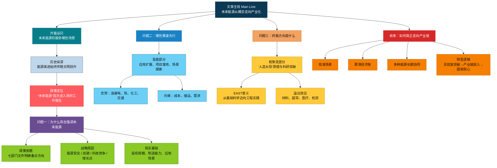
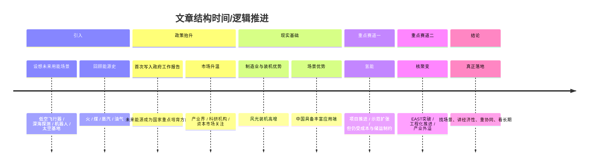

# 从实验室走向产业链 「未来能源」这样走入未来

> 来源：人民日报社《中国经济周刊》周刊原创。作者：谢玮、张燕；编辑：郭霁瑶。发布时间：2026-04-01。本篇为基于报道的精读整理稿。  
> **阅读提示**：主文为下方「精读笔记正文」（中文摘录 + 解析注释）；至「精读笔记全文完」止。其后为**附录**（来源与作者、Mermaid 结构图、英文逐句对照与词汇扩展），可与主文对照使用。

---

## 前情提要：文章结构信息图

文章标题：从实验室走向产业链 「未来能源」这样走入未来  
来源：人民日报社《中国经济周刊》  
时间：2026-04-01  
核心主题：解析「未来能源」进入国家战略序列的背景、中国的发展优势、氢能与核聚变两大赛道的现状及产业化路径。

1. **引言：未来能源的应用愿景**
   1.1 场景勾勒：低空、深海、机器人、太空（排比句式引出无限可能）
   1.2 历史纵深：能源形态演进与人类文明跃升的关系
   1.3 核心事件：近年「未来能源」写入政府工作报告

2. **战略解析：为什么是现在？为什么是中国？**
   2.1 政策定调：工信部等七部门实施意见，聚焦核能、氢能等领域
   2.2 专家视点：林伯强论述政策重心前移的必然性
   2.3 战略考量：
       2.3.1 能源安全：从资源依赖转向技术自主
       2.3.2 「双碳」目标：提供零碳基荷电源
       2.3.3 全球博弈：大国科技竞争的「终极赛道」
       2.3.4 经济增长：培育新质生产力的增长点
   2.4 中国底气（硬件优势）：
       2.4.1 装机数据：光伏/风电装机规模（18亿千瓦量级，约82个三峡）
       2.4.2 产业配套：全产业链制造能力（以氢能、核聚变配套为例）
   2.5 市场优势（软件环境）：应用需求多样，具备丰富的试验场和迭代空间

3. **重点赛道一：氢能先行，应用探索**
   3.1 现状：从概念走向工厂、港口、加氢站
   3.2 专家论述：欧阳明高解读氢能三大功能（氢储能、氢原料、氢动力）
   3.3 实践案例：新疆库车、内蒙古、海南等地的示范项目
   3.4 企业反馈：东德氢能的实测数据与全球布局
   3.5 行业冷静思考：朱彤论述避免盲目跟风，聚焦优势场景
   3.6 痛点剖析：储运成本与效率是当前核心「卡点」

4. **重点赛道二：核聚变，面向未来的终极能源**
   4.1 政策定位：「十五五」规划纲要重点培育方向
   4.2 科学原理：赵永涛解释「人造太阳」能量级（化学反应的百万倍量级）
   4.3 重大突破：东方超环（EAST）1亿摄氏度1066秒运行纪录
   4.4 「溢出效应」：
       4.4.1 材料突破：钨铜复合材料、偏滤器
       4.4.2 超导技术：低温/高温超导带动医疗（质子治疗）
       4.4.3 产业集群：合肥及周边形成的产业链布局
   4.5 商业化进程：刘敏胜论述工程验证期（预计还需10-20年）

5. **结语：实干步入未来**
   5.1 场景匹配：聚焦难以电气化的长途运输与重工业
   5.2 经济性约束：依赖规模化、技术进步与电价机制改革
   5.3 转型观：多种能源协同补充，强调耐心与定力

---

### 文章基本信息

**标题**：从实验室走向产业链 「未来能源」这样走入未来  
**作者**：谢玮、张燕  
**来源**：人民日报社《中国经济周刊》  
**时间**：2026-04-01  
**编辑**：郭霁瑶  
**栏目**：周刊原创  

---

### 精读笔记正文

**【原文】**  
试想一下：未来，能源会用在什么地方？  
可能是**低空飞行器**的日常续航，可能是**深海探测舱**的稳定运转，可能是机器人的自主作业，也可能是**太空基地**的持续供电。  
从钻木取火到煤炭利用，从蒸汽机的轰鸣到油气时代，人类文明的每一次**跃升**，都伴随着能源形态的演进。  
今年，「未来能源」首次写入**政府工作报告**，并与生物制造、量子科技、具身智能、6G等并列，进入国家重点培育的**未来产业**序列。  
消息一出，产业界、科研机构和资本市场迅速升温。氢能、**核聚变**、新型储能等前沿方向，正在从实验室和示范项目中走向更广阔的政策与产业视野。

> [**解析与注释**]  
> 1. **低空飞行器 (Low-altitude aircraft)**：指在低空空域活动的各类飞行器，包括无人机、eVTOL（电动垂直起降飞行器）等。这是当前「低空经济」发展的核心载体。  
> 2. **跃升 (Leap/Jump)**：**重点表达**。指跳跃式地提升，程度极深。  
>    *   **近义词**：飞跃、跨越、突进。  
>    *   **金句积累**：每一次能源形态的演进，都是人类文明的一次伟大跃升。  
> 3. **政府工作报告 (Government Work Report)**：中国政府每年的例行报告，部署年度经济社会发展目标。「未来能源」写入报告，标志着其从科研探索进入**顶层设计**（具体首次写入年份以当届报告表述为准）。  
> 4. **未来产业 (Future Industries)**：指由前沿技术驱动，处于孕育阶段或产业化初期，具有显著战略性、引领性和颠覆性的产业。  
> 5. **核聚变 (Nuclear Fusion)**：即轻原子核（如氘和氚）结合成较重原子核时释放巨大能量的反应。由于其原料丰富、几乎无污染，被视为**终极能源解决方案 (Ultimate Energy Solution)**。  

---

**【原文】**  
未来能源走到台前  
把「未来能源」放在更突出的位置，并非偶然。  
2024年，工信部等七部门发布的《关于推动未来产业创新发展的实施意见》就提出，未来能源主要聚焦核能、核聚变、氢能、生物质能等重点领域。  
「这不是简单增加了一个产业概念，而是政策重心的**一次前移**。」在厦门大学中国能源政策研究院院长**林伯强**看来，未来能源的提出，是当下能源格局、发展需求和全球竞争共同作用的必然结果，是立足当下、着眼长远的战略抉择。

> [**解析与注释**]  
> 1. **林伯强**：著名能源经济学家，现任厦门大学中国能源政策研究院院长。其观点常作为国家能源政策制定的参考。  
> 2. **前移 (Shift forward)**：这里指国家规划不再仅仅关注已成熟的产业，而是将目光提前投向尚在实验室阶段的储备技术。  
> 3. **战略抉择 (Strategic decision)**：关系全局、长远的重大选择。  

---

**【原文】**  
能源安全事关经济社会发展全局。我国是全球最大的能源消费国之一，能源供给总体稳定，但油气对外依存度仍然较高。未来能源之所以重要，就在于它不只是解决当下问题，更关系中长期能源自主能力和产业主动权。  
「从国家战略和经济发展角度看，提前布局未来能源，是应对能源安全挑战、实现『**双碳**』目标、抢占科技制高点和培育新经济增长点的战略性抉择，与我国长远发展考量高度契合，形成了**多重战略共振**。」 

> [**解析与注释**]  
> 1. **依存度 (Dependency)**：指一国某种资源消耗量中依赖进口的比例。我国原油对外依存度长期在70%以上，发展未来能源有助于实现**能源自给**。  
> 2. **「双碳」目标 (Dual Carbon Goals)**：即碳达峰（Carbon Peaking，2030年前）和碳中和（Carbon Neutrality，2060年前）。  
> 3. **制高点 (Commanding heights)**：原指作战中必须争夺的最高点，现比喻科技或经济竞争中的**决定性地位**。  
> 4. **战略共振 (Strategic resonance)**：指多个维度的国家战略目标在同一交汇点上产生互相促进、叠加增益的效果。  

---

**【原文】**  
一位行业人士告诉记者，能源安全方面，提前布局未来能源，有助于实现从「资源依赖」 到 「**技术自主**」 的根本转变；「双碳」目标方面，它能提供**零碳基荷电源**，大量减少碳排放；科技竞争方面，未来能源也是大国博弈的 「**终极赛道**」，提前布局将提升国家科技实力和国际影响力，抢占未来产业制高点；高质量发展方面，未来能源作为未来六大产业之一，将催生新的经济增长点。  
政策信号背后，更为关键的问题是，中国为什么有条件在未来能源上提前**落子**？  
这背后是几十年产业积累和技术突破提供的坚实**底气**。  

> [**解析与注释**]  
> 1. **基荷电源 (Base-load power source)**：指能提供全天候24小时稳定电力的电源。核聚变相比于受天气影响的风光电，具有明显的基荷优势。  
> 2. **终极赛道 (Ultimate track)**：比喻竞争的最高阶段或最终领域。  
> 3. **落子 (Placing a chess piece)**：**高级词汇**。借用围棋术语，比喻在关键点上进行战略布局。  
> 4. **底气 (Confidence/Underpinning)**：  
>    *   **词汇辨析**：不同于「勇气」，「底气」强调有坚实的基础支撑。  
>    *   **英语积累**：Underlying strength / Confidence derived from solid foundation.  

---

**【原文】**  
国家能源局数据显示，截至2025年底，全国累计发电装机容量38.9亿千瓦，同比增长16.1%。其中，太阳能发电装机容量12.0亿千瓦，同比增长35.4%；风电装机容量6.4亿千瓦，同比增长22.9%。风电光伏累计装机首次超过18亿千瓦，相当于约82个**三峡电站**总装机。  
无论是新能源装备、输变电装备，还是压力容器、材料工业、自动化控制，中国都已形成较完整的**产业配套能力**。对于未来能源而言，这种制造和配套能力尤为关键。  
以氢能为例，从制氢设备到储运装备，从燃料电池系统到终端应用设施，产业链长、配套要求高。再看核聚变，其背后涉及超导、低温、真空、材料、精密加工等诸多复杂技术体系。没有完整的工业基础，很多前沿设想就难以真正落地。  

> [**解析与注释**]  
> 1. **三峡电站 (Three Gorges Dam)**：位于湖北省宜昌市，是世界上规模最大的水电站。此处用作**计量参照**，突显中国新能源装机规模之巨。  
> 2. **产业配套能力 (Industrial supporting capacity)**：指一个国家或地区提供产业链上下游所需零部件、技术支持及服务的能力。中国拥有全工业门类，是未来能源落地的巨大优势。  

---

**【原文】**  
「未来能源不是**另起炉灶**，而是建立在现有新能源和制造业基础上的继续跃升。」林伯强说。  
更重要的是，中国是全球能源生产和消费大国，工业体系完备，应用需求多样。从重化工业到交通运输，从大型园区到新型电力系统，不同类型的能源技术都能找到**试验场**和应用端。  
这意味着，一项前沿技术只要具备一定成熟度，就有可能在中国找到落地空间，并在应用中不断**迭代**完善。  
「技术不是在图纸上长大的，而是在实际应用中磨出来的。」林伯强说，未来能源尤其如此。很多环节只有进入工程系统和产业场景，问题才会暴露，能力才会提升，成本才有下降空间。「市场足够大，场景足够丰富，这是中国布局未来能源非常重要的**底气**。」  

> [**解析与注释**]  
> 1. **另起炉灶 (To start all over again)**：比喻放弃原来的，另外从头做起。林伯强强调了未来能源与现有工业体系的**传承性**。  
> 2. **试验场 (Proving ground)**：进行试验、验证理论或技术的场所。中国丰富的应用场景是技术成熟的「加速器」。  
> 3. **迭代 (Iteration)**：**重点词汇**。原指计算机科学中重复反馈的过程，现广泛用于技术或产品不断优化升级。  
>    *   **易混淆词**：替代（指完全更换，迭代指在原有基础上升级）。  

---

**【原文】**  
氢能先行，应用场景正在打开  
在一系列未来能源赛道中，氢能和核聚变无疑是最受关注的两个方向。  
走进一些工业园区和交通枢纽，氢能已不再停留在概念里。**燃料电池重卡**在港口和矿区穿梭，**加氢站**与充电站并立，可再生能源制氢项目加快落地，钢厂和化工企业也开始尝试用氢替代部分化石能源。  
在当前的能源转型中，氢能被寄予厚望。  
中国科学院院士、国际氢能燃料电池协会理事长**欧阳明高**撰文指出，在零碳能源体系建设中，氢能可用于氢储能、氢原料与氢动力。  

> [**解析与注释**]  
> 1. **燃料电池 (Fuel Cell)**：通过化学反应直接将化学能转化为电能的装置，排放物仅为水。  
> 2. **欧阳明高**：动力系统工程专家，中国科学院院士，长期从事新能源动力系统研究。  
> 3. **氢储能、氢原料、氢动力**：这是氢能应用的三大主要路径。  
>    *   **氢储能**：利用多余的电制氢储存，需要时再发电。  
>    *   **氢原料**：替代煤/气进行化学反应（如绿色合成氨）。  
>    *   **氢动力**：主要指交通领域的燃料电池应用。  

---

**【原文】**  
氢储能是通过电解水装置使得**绿氢**将可再生能源电力储存下来，通过燃料电池等发电装置为城市生产生活提供绿电。  
氢原料是在化工行业与冶金行业中，将氢用于工业原料，比如在化工行业，氢气主要应用于合成氨与合成甲醇等。  
氢动力是将氢应用于动力系统，其中，氢燃料电池发展较快，已经从道路车辆扩展到工程机械、小型船舶、飞行器、潜航器等领域。近年来，**氢内燃机**也取得很多进展。  
「氢能不是『**万能钥匙**』，但在一些应用场景里，它可能是为数不多、有效选项。」林伯强说。  

> [**解析与注释**]  
> 1. **绿氢 (Green Hydrogen)**：指利用风能、太阳能等可再生能源通过电解水制取的氢气，全过程零碳排放。  
>    *   **对比词**：灰氢（化石燃料制氢，污染高）、蓝氢（配合碳捕集技术的化石燃料制氢）。  
> 2. **氢内燃机**：直接燃烧氢气产生动力的引擎，结构类似传统汽油机，是氢动力的另一技术路线。  
> 3. **万能钥匙 (Master key)**：**成语辨析**。比喻解决一切问题的办法。林伯强在此处提醒，氢能应发挥其在特定领域的不可替代性，而非盲目铺开。  

---

**【原文】**  
从新疆的中石化新星库车绿氢项目到内蒙古的深能鄂托克旗风光制氢一体化合成绿氨及氢能耦合应用项目，从首个百千瓦级工厂化**海水直接制氢**科研项目到全国首座碳中和加氢站，我国氢能产业正在加速跑。特别是在风光资源富集地区，围绕绿电制氢、氢基化工等方向的探索明显增多。  
「截至2025年2月，搭载氢气循环泵的车辆累计行驶里程超过3.7亿公里，单车最高里程达到50万公里。我们已为全球100多座加氢站提供核心装备，参与30多个国家级、省级氢能示范项目。」东德氢能营销总监**刘姗姗**告诉记者，该公司近年参与建设了一批示范项目，业务覆盖制、储、运、加、用等多个环节。  

> [**解析与注释**]  
> 1. **海水直接制氢**：颠覆性技术，无需先淡化海水，直接利用海水电解，解决了淡水资源消耗问题。  
> 2. **耦合 (Coupling)**：指两个或多个系统通过相互作用而彼此影响。如「氢能耦合应用」指将氢能整合进现有的工业系统。  
> 3. **东德氢能**：国内氢燃料电池核心零部件的领先企业，专注于流体机械技术。  

---

**【原文】**  
这些项目覆盖多类场景：海南综合能源补给示范站将加氢、充电等功能集成布局；黑龙江东部绿氢生产基地围绕风光制氢展开；临沂钢投焦炉煤气提氢项目则把工业副产气综合利用与低碳改造结合起来。  
「氢能的价值，不只是替代某一种燃料，更重要的是它能把电、热、化工、交通这些系统连接起来。」刘姗姗认为，氢能作为**能源载体**，既可以解决新能源发电与终端用能之间的**时空错配**，也是在交通、钢铁、化工等难以完全电气化领域推进深度脱碳的重要路径。  
中国社会科学院工业经济研究所能源经济室主任**朱彤**说，过去一段时间，氢能一度被赋予过高期待，但实践表明，并不是所有场景都适合「氢替代」。他认为，产业发展越往后，越需要**算清楚账**，避免简单跟风。  

> [**解析与注释**]  
> 1. **时空错配 (Spatio-temporal mismatch)**：指能源生产（如中午阳光最足）与需求（如夜晚用电高峰）在时间和空间上的不一致。氢能可以通过储存和运输解决此问题。  
> 2. **朱彤**：能源经济领域知名专家，侧重能源体制机制研究。  
> 3. **算清楚账 (Calculate accurately)**：口语化的表达，指要评估项目的**经济效益 (Economic feasibility)**，不能仅靠政府补贴。  

---

**【原文】**  
受访业内人士普遍认为，我国氢能产业已经从「概念导入期」进入「**场景探索期**」，下一步的关键不是铺得多快，而是能否把少数优势场景做实做透。  
但产业化进程并不轻松。  
「制氢成本仍高、储运效率仍待突破、终端需求尚未完全打开，都是当前制约氢能规模化的关键因素。」刘姗姗直言，其中，最紧迫的「**卡点**」在储运环节。高效、低成本的氢能储运技术，直接决定了氢能的可及性，也是连接制氢端与用氢端的关键纽带。该公司正通过高压压缩机、液驱增压装备等技术创新，着力破解这一难题。  
她预计，2030年至2035年，随着绿氢成本下降和基础设施完善，将进入大规模市场化应用阶段。  

> [**解析与注释**]  
> 1. **卡点 (Bottleneck)**：  
>    *   **近义词**：瓶颈、阻碍。  
>    *   **英语积累**：Key bottleneck / Pain point.  
> 2. **储运 (Storage and Transportation)**：氢气极轻且易爆，储运是目前产业链中成本最高、风险最大的环节。  

---

**【原文】**  
核聚变，面向终极能源的长期竞逐  
「十五五」规划纲要明确将核聚变能纳入未来产业重点培育方向。  
可控核聚变常被称作「**人造太阳**」。简单来说，就是让氢的同位素（**氘和氚**）在极端高温高压环境下发生核聚变反应，同时确保整个过程安全可控。  
「之所以被称为『人造太阳』，是因为这个技术原理与太阳发光发热的本质如出一辙。在太阳核心，1500万摄氏度的高温让氢原子不断碰撞聚变，释放出巨大能量。」西安交通大学物理学院教授**赵永涛**告诉记者，核聚变释放的能量远高于化学反应。单次核聚变反应释放的能量约为化学反应的10^6至10^7倍（百万至千万倍）。因此，核聚变的功率远大于化学燃烧，但其实现难度也更高。  

> [**解析与注释**]  
> 1. **氘 (Deuterium) 和 氚 (Tritium)**：氢的两种同位素。氘在海水中储量巨大，一升海水提炼的氘聚变产生的能量相当于300升汽油。  
> 2. **赵永涛**：西安交通大学物理学院教授、博导，核科学与技术领域的专家。  
> 3. **如出一辙 (Identical/To be exactly the same)**：比喻两件事非常相似。  

---

**【原文】**  
「人类如果能掌握这项技术，就相当于在地球上建造了一个微型太阳，为人类提供近乎无限的清洁能源。」赵永涛说。  
在科研端，我国核聚变研究近年不断取得关键进展。近期，**东方超环（EAST）**实现了 **1亿摄氏度1066秒**稳态高约束模运行纪录，标志着核聚变研究从基础科学阶段迈向工程实践的关键拐点。  
东方超环（EAST）是全球首个**全超导非圆截面托卡马克**核聚变实验装置，主要承担长脉冲、高参数等离子体约束的技术验证与物理规律探索任务，为国际热核聚变实验堆（**ITER**）及未来聚变工程堆提供关键技术支撑。  

> [**解析与注释**]  
> 1. **东方超环 (EAST)**：位于安徽合肥，由中国科学院等离子体物理研究所自主研制。  
> 2. **1亿摄氏度1066秒**：这是一项世界纪录。核聚变点火温度需达到1亿度以上，且必须长时间稳定维持，1066秒是工程化的一大步。  
> 3. **托卡马克 (Tokamak)**：一种利用磁约束来实现受控核聚变的环形装置。  
> 4. **ITER**：国际热核聚变实验堆计划，由中国、欧盟、美、俄、日、韩、印七方共同参与，是目前全球规模最大、影响最深的国际科研合作项目之一。  

---

**【原文】**  
不过，聚变研究的意义并不局限于未来发电。  
东方超环（EAST）一位从事聚变研究的高级工程师告诉记者，核聚变研究的「**溢出效应**」覆盖高端材料、超导技术、医疗健康、工业检测等多个领域。东方超环（EAST）的探索已经催生了诸多实际应用与产业升级。  
比如，在材料领域，东方超环（EAST）推动了钨铜复合材料、抗辐照第一壁材料等关键技术突破；安泰科技研发的主动水冷全钨偏滤器实现批量交付并通过ITER认证；西部超导的铌钛超导线材成为国内唯一供应商，支撑核聚变与高端制造并行发展。  

> [**解析与注释**]  
> 1. **溢出效应 (Spillover Effect)**：指某项活动（如高端科研）不仅对本项目产生影响，还会对相关领域或社会产生额外的好处。  
> 2. **偏滤器 (Divertor)**：托卡马克装置中的关键部件，用于排除杂质和热量，需承受极高的热负荷。  
> 3. **安泰科技、西部超导**：国内先进材料领军企业。  

---

**【原文】**  
在超导技术领域，东方超环（EAST）全超导磁体技术带动了**低温超导**产业化，也助力联创光电等企业攻克**高温超导**缆线制备，并推动超导**质子治疗系统**等医疗设备落地。在其他领域，东方超环（EAST）的太赫兹偏振干涉仪诊断技术，还衍生出安检与工业检测设备，已经应用于合肥地铁及食品检测。相关高通量中子源技术，则为硼中子俘获治疗、核废料处理等提供了新路径。  
「围绕东方超环（EAST），目前合肥及周边已孵化30余家核聚变相关企业，形成涵盖材料、超导、诊断、控制等环节的产业链。」前述工程师说。  

> [**解析与注释**]  
> 1. **质子治疗 (Proton therapy)**：利用质子线照射肿瘤的先进放射疗法，精度高、对健康组织损伤小。其核心组件（加速器、超导磁体）得益于核聚变技术。  
> 2. **高通量中子源**：利用核反应产生的中子流，可用于材料科学研究、医疗治疗（如BNCT，硼中子俘获疗法）。  

---

**【原文】**  
这意味着，核聚变研究虽然尚未真正走入千家万户，但其技术外溢已经开始**反哺**高端制造、医疗健康等多个领域。  
「聚变研究不是孤立存在的，它背后连着超导材料、真空装备、控制系统、人工智能算法等很多产业。」新奥集团能源研究院院长**刘敏胜**告诉记者，聚变从科研走向工程化，不只是物理问题，也是一场系统性产业能力的考验。  
他介绍，全球聚变已历经70余年探索，目前进入工程验证与商业化探索关键期。中国在球形环、超导磁体等方向已跻身国际第一梯队。新奥集团自2017年以来在聚变研发方面累计投入已超过40亿元，围绕「**氢硼聚变+球形环+人工智能**」路线展开探索。  

> [**解析与注释**]  
> 1. **反哺 (To feed back/To reciprocate)**：比喻对曾经支持过自己的事物给予回报。  
> 2. **新奥集团**：国内大型民营能源企业，在受控核聚变领域走在民营资本前列。  
> 3. **氢硼聚变**：一种先进的聚变路线，其优点是不产生中子辐射（中子会活化材料），实现难度高于氘氚聚变。  

---

**【原文】**  
多位受访人士表示，核聚变距离真正「点亮千家万户」仍需时间。在刘敏胜看来，从当前发展阶段看，聚变商业化大约还需要10至20年，关键难点既包括稳定实现**正能量增益**，也包括材料在极端环境下长时间服役、工程系统集成和成本控制。  
从实验室走向产业链，在真实需求中证明价值  
未来能源不是展厅里的「样板工程」，最终要在真实需求中证明价值。因此，无论是氢能还是核聚变，都要从「值得期待」走向「真正可用」。  

> [**解析与注释**]  
> 1. **点亮千家万户 (Lighting up thousands of households)**：  
>    *   **成语积累**：常用比喻义，形容重大基础建设惠及大众。  
> 2. **正能量增益 (Q > 1)**：指核聚变产生的能量大于启动和维持反应所投入的能量。这是商业化运行的**前提条件**。  
> 3. **样板工程 (Showcase project)**：指仅供参观展示、不具备普遍推广价值的项目。文章强调未来能源必须具备**实用性**。  

---

**【原文】**  
首先要把场景找准。  
在朱彤看来，氢能不能「什么都想做」，而应聚焦长途重卡、航运、航空、冶金、化工、长周期储能等真正**难以电气化**且具备比较优势的场景。「在电动汽车已经成熟的情况下，氢能应避开与其直接竞争，聚焦自身优势领域。」他说。  
经济性则是**硬约束**。  
「未来能源的影响力将十分显著，但其发展进程取决于何时具备经济性。」林伯强说，经济性的实现，不仅依赖技术进步，也依赖规模化发展以及电价机制改革等系统性条件支撑，尤其需要扩大电价差、提升新型能源体系的竞争力。  

> [**解析与注释**]  
> 1. **难以电气化 (Hard-to-abate)**：指那些由于能量密度、设备结构等原因，难以简单通过电池充电来替代化石燃料的行业（如炼钢、跨洋货轮）。  
> 2. **硬约束 (Hard constraint)**：指必须满足、没有商量余地的限制条件。  

---

**【原文】**  
在他看来，当前储能仍是新型能源基础设施中的关键环节，预计随着政策对电网侧储能提供容量电价支持，储能增长将加快，这也将为未来能源体系演进提供支撑。  
还要看到，未来能源的落地并不意味着对传统能源和现有新能源的简单替代，而是多种能源长期协同、优势互补。  
真正的能源变革，从来不是**一蹴而就**。它往往始于实验室里的某项突破，成于产业链上的持续投入，最终落脚于一个国家对于未来的耐心和**定力**。  

> [**解析与注释**]  
> 1. **一蹴而就 (Accomplished in one move)**：形容事情轻而易举，一下子就能完成。  
>    *   **近义词**：一朝一夕、一举成功。  
>    *   **反义词**：循序渐进、日积月累。  
> 2. **定力 (Strategic Focus/Patience)**：**重点表达**。指在面对诱惑或困难时保持意志坚定的能力。  
>    *   **金句积累**：能源变革成于持续投入，落脚于国家定力。  
> 3. **金句积累 (Advanced Expression)**：  
>    *   能源是文明的底色，技术是发展的底气。  
>    *   立足当下，着眼长远，在真实需求中磨砺未来之剑。  

---

**（精读笔记全文完）**

---

## 附录：英文逐句精读与辅助资料

以下为基于原文的英文逐句学习与词汇扩展，可与上文「精读笔记正文」对照使用。

### 来源与作者

- 来源：`China Economic Weekly` / `Economic Net`（中国经济周刊·经济网，人民日报社主管主办的官方财经媒体）
- 文章标题（英）：`From the laboratory to the industrial chain / How “future energy” is entering the future`
- 中文原题（据官网原文）：`从实验室走向产业链｜“未来能源”这样走入未来`
- 记者：`Xie Wei`（谢玮）；文中署名还包括 `Zhang Yan`（张燕）
- 编辑：`Guo Jiyao`（郭霁瑶）
- 官网发布时间：`2026-04-01 16:26`
- 文章页：与 YAML `source_url` 字段一致（`https://www.ceweekly.cn/cewsel/2026/0401/491861.html`）
- 作者背景简介：
  - `谢玮（Xie Wei）`：据《中国经济周刊》官网「关于我们」页面，谢玮为该刊`采制中心采访部副主任`，长期参与财经、产业与能源相关报道。
  - `郭霁瑶（Guo Jiyao）`：据官网「关于我们」页面，郭霁瑶为该刊`编辑`。
- 参考：`https://www.ceweekly.cn/site.html`（官网「关于我们」）

### 文章主线结构图（Mermaid）

---

**逐句英汉对照（英译学习与词汇扩展）**

### 🔹Imagine this: / in the future, / where will energy be used?
### 🔸不妨设想一下：`在未来`，能源将会被用于哪些地方？

背景注释：
- `Imagine this`：英语写作中常见的引入式表达，用于激发读者想象，常见于特稿、评论、演讲开头。
- `energy`：此处并非泛指抽象“精力”，而是指`能源/能量供给体系`。

> **`Imagine this` 想象一下；设想这样的情景**
>
> 1. 英文释义（固定表达）：used to invite the reader to picture a possible situation；`用来邀请读者设想某种情景`
> 2. 语域：新闻、演讲、议论文、叙事引入
> 3. 画龙点睛：这是很地道的`引导想象型开场句`。写作中可替换为`picture this`、`consider this`。用于雅思写作或口语时，能自然引出假设场景，但正式学术论文中使用要适度。

> **`in the future` 在未来**
>
> 1. 英文释义（adv. phrase）：at a later time; in times to come；`在将来；未来某个时期`
> 2. 语域：通用
> 3. 画龙点睛：是最基础但极高频的时间状语。写作中若想更正式，可用`in the years ahead`、`over the coming decades`。注意它常引出`趋势预测`，适合图表作文、科技类阅读。

---

### 🔹Perhaps / in the daily endurance of low-altitude aircraft, / perhaps in the stable operation of deep-sea exploration capsules, / perhaps in the autonomous work of robots, / or perhaps in the continuous power supply of space bases.
### 🔸也许，它会用于低空飞行器的日常`续航`，也许会用于深海探测舱的稳定运转，也许会用于机器人的自主作业，抑或用于太空基地的持续供电。

背景注释：
- `low-altitude aircraft`：低空飞行器，通常指低空经济相关飞行器，如无人机、eVTOL 等。
- `deep-sea exploration capsules`：深海探测舱，用于海洋科考、深海资源勘探等。
- `space bases`：太空基地，偏科幻但也对应未来航天能源需求。

> **`endurance` 续航能力；持久力**
>
> 1. 英文释义（n.）：the ability to continue doing something difficult for a long time；`持久力，耐久力`；in engineering, the capacity to operate for a sustained period；`在工程语境中指续航能力`
> 2. 语域：通用 / 工程 / 航空
> 3. 画龙点睛：这是典型的`熟词僻义`考点。日常中常指“忍耐力”，在航空、车辆、设备场景里常引申为`续航能力`。可与`range`辨析：`range`偏“航程/里程”，`endurance`偏“持续工作时长”。

> **`autonomous` 自主的；自动控制的**
>
> 1. 英文释义（adj.）：able to operate independently without direct human control；`能够在没有直接人工控制下独立运行的`
> 2. 语域：科技、工程、AI、自动驾驶
> 3. 画龙点睛：该词在科技阅读里极常见，如`autonomous driving`、`autonomous systems`。注意它不只是“自动”，更强调`自主决策`。比`automatic`层级更高，后者偏“按预设自动执行”。

> **`continuous power supply` 持续供电**
>
> 1. 英文释义（n. phrase）：an uninterrupted provision of electrical power；`不间断电力供应`
> 2. 语域：能源、电力、工程
> 3. 画龙点睛：写作中可积累`continuous`、`stable`、`reliable`三组搭配：`continuous supply`强调不断，`stable supply`强调稳定，`reliable supply`强调可信赖，三者语义接近但侧重点不同。

---

### 🔹From drilling wood to make fire / to the use of coal, / from the roar of the steam engine / to the era of oil and gas, / every leap in human civilization / has been accompanied by the evolution of energy forms.
### 🔸从钻木取火到煤炭利用，从蒸汽机的轰鸣到油气时代，人类文明的每一次跃升，都伴随着能源形态的`演进`。

背景注释：
- `drilling wood to make fire`：指古代钻木取火。
- `steam engine`：蒸汽机，工业革命标志性技术。
- `oil and gas`：石油与天然气，是现代工业社会的核心能源。

> **`leap` 飞跃；跃升**
>
> 1. 英文释义（n.）：a large or sudden increase, improvement, or change；`重大跃升；飞跃`
> 2. 语域：通用、新闻、科技
> 3. 画龙点睛：常见搭配有`a leap in productivity`、`a major leap forward`。阅读中它常不是字面“跳跃”，而是抽象意义上的`跨越式发展`。写作中非常适合替换普通的`big improvement`。

> **`be accompanied by` 伴随着；与……同时发生**
>
> 1. 英文释义（v. phrase）：to happen or exist together with something else；`与某事同时出现或存在`
> 2. 语域：正式、新闻、学术
> 3. 画龙点睛：这是高频被动结构。比`go with`更正式。常见于阅读理解中表示`并行关系`：economic growth is often accompanied by urbanization。翻译时可灵活处理为“伴随”“与……相伴”“同时出现”。

> **`evolution` 演变；演进**
>
> 1. 英文释义（n.）：the gradual development of something over time；`事物随时间逐步发展变化的过程`
> 2. 语域：学术、新闻、科技
> 3. 画龙点睛：不要只理解为生物学上的“进化”。在社科、科技、产业报道里，它经常表示`渐进式演化`。与`revolution`辨析：前者重渐变，后者重突变与颠覆。

---

### 🔹This year, / “future energy” was written into the government work report for the first time, / and alongside biomanufacturing, quantum technology, embodied intelligence, 6G, and others, / it entered the sequence of future industries / that the country will focus on cultivating.
### 🔸今年，`future energy`（未来能源）首次被写入政府工作报告，并与生物制造、量子技术、具身智能、6G 等并列，进入国家将重点培育的未来产业序列。

背景注释：
- `government work report`：中国语境中的“政府工作报告”，通常在全国两会期间发布。
- `biomanufacturing`：生物制造，利用生物技术进行生产制造。
- `embodied intelligence`：具身智能，强调智能体与物理世界互动的能力。
- `6G`：第六代移动通信技术，属未来产业方向之一。

> **`write ... into` 写入；纳入正式文件**
>
> 1. 英文释义（v. phrase）：to formally include something in a document, law, or report；`把某内容正式写入文件、法律或报告`
> 2. 语域：正式、政策、法律、新闻
> 3. 画龙点睛：这是政策英语常见搭配。与`include`相比，`write into`更强调`正式文本化、制度化`。翻译时常可译为“写入”“纳入”“列入”。

> **`alongside` 与……并列；与……一道**
>
> 1. 英文释义（prep./adv.）：next to or together with someone or something；`与……并列；和……一起`
> 2. 语域：正式、新闻
> 3. 画龙点睛：该词既有空间含义“在旁边”，也有抽象含义“与……并列”。新闻报道中后一种更常见。写作替换可用`together with`，但`alongside`更凝练、更书面。

> **`cultivate` 培育；扶持；培养**
>
> 1. 英文释义（v.）：to develop or support the growth of something；`促进某事物的发展；培育`
> 2. 语域：正式、政策、经济
> 3. 画龙点睛：不要只记“耕种”。在产业政策中，`cultivate emerging industries`极常见，表示`培育新兴产业`。是典型的熟词扩展义，考研阅读里很喜欢考。

---

### 🔹As soon as the news came out, / industry, research institutions, and the capital market / quickly heated up.
### 🔸消息一出，产业界、科研机构和资本市场便迅速`升温`。

背景注释：
- `capital market`：资本市场，主要指股票、债券、投资融资等市场体系。
- `heated up`：新闻报道中常指“关注度上升、投资活跃、讨论增多”。

> **`come out` 公布；传出；出现**
>
> 1. 英文释义（v. phrase）：to become known or be made public；`被公布；传出来`
> 2. 语域：通用、新闻
> 3. 画龙点睛：`come out`义项很多，本句是“消息传出”的意思，不是“出来”。阅读中必须依靠语境判断。新闻里常见`when the report came out`、`after the data came out`。

> **`heat up` 升温；变得活跃**
>
> 1. 英文释义（v. phrase）：to become more intense, active, or competitive；`变得更激烈、更活跃`
> 2. 语域：新闻、商业、口语
> 3. 画龙点睛：既可字面“加热”，也可抽象指市场、竞争、讨论`升温`。如`the market is heating up`。写作中比`become active`更地道、更有动态感。

---

### 🔹Frontier directions / such as hydrogen energy, nuclear fusion, and new energy storage / are moving from laboratories and demonstration projects / into a broader policy and industrial vision.
### 🔸诸如氢能、核聚变和新型储能等前沿方向，正从实验室和示范项目走向更广阔的政策与产业视野。

背景注释：
- `hydrogen energy`：氢能。
- `nuclear fusion`：核聚变。
- `new energy storage`：新型储能，包括电化学储能、压缩空气储能、飞轮储能等。
- `demonstration projects`：示范项目，常指技术验证与推广先行项目。

> **`frontier` 前沿的；尖端的**
>
> 1. 英文释义（adj./n.）：relating to the most advanced area of development or research；`处于最先进发展阶段的；前沿领域`
> 2. 语域：科技、学术、新闻
> 3. 画龙点睛：常见搭配`frontier technology`、`frontier research`。比`advanced`更强调`探索边界`。阅读中它经常带有“尚未成熟但潜力巨大”的意味。

> **`demonstration project` 示范项目**
>
> 1. 英文释义（n. phrase）：a project designed to test and display the feasibility of a technology or model；`用于验证并展示某项技术/模式可行性的项目`
> 2. 语域：政策、工程、产业
> 3. 画龙点睛：这类表达在能源、环保、基建报道中非常高频。它往往意味着项目还处于`商业化之前的验证阶段`。翻译时可结合语境处理为“示范工程”“试点示范项目”。

> **`vision` 愿景；蓝图；构想**
>
> 1. 英文释义（n.）：an idea or plan of what the future could be like；`对未来的设想、愿景或蓝图`
> 2. 语域：正式、商业、政策
> 3. 画龙点睛：不要只理解成“视力”。在政策与商业话语中，`vision`常表示`战略想象与方向感`。如`industrial vision`可译为“产业图景/产业愿景”。

---

### 🔹It is no coincidence / that “future energy” / has been placed in a more prominent position.
### 🔸“未来能源”被放在更突出的位置，`并非偶然`。

背景注释：
- 这是承上启下句，起到从“现象”转入“原因分析”的作用。

> **`coincidence` 巧合**
>
> 1. 英文释义（n.）：a situation in which things happen together by chance；`巧合；偶然一致`
> 2. 语域：通用
> 3. 画龙点睛：固定句式`It is no coincidence that...`在议论文和新闻中特别常见，意思是“这不是巧合，背后有原因”。这是阅读理解中重要的`态度/强调`信号。

> **`prominent` 突出的；显著的；重要的**
>
> 1. 英文释义（adj.）：important, noticeable, or easily seen；`重要的；显眼的；突出的`
> 2. 语域：正式、新闻
> 3. 画龙点睛：常见搭配`a prominent role`、`a prominent position`。既可指“显眼”，也可指“地位重要”。翻译时需结合上下文选择“突出”“重要”“显著”。

---

### 🔹In 2024, / the “Implementation Opinions on Promoting Innovative Development of Future Industries” / issued by the Ministry of Industry and Information Technology and six other departments / proposed that future energy / should mainly focus on key fields / such as nuclear energy, nuclear fusion, hydrogen energy, and biomass energy.
### 🔸2024 年，工业和信息化部等七部门发布的《关于推动未来产业创新发展的实施意见》提出，未来能源应主要聚焦核能、核聚变、氢能、生物质能等重点领域。

背景注释：
- `Ministry of Industry and Information Technology`：中国工业和信息化部，常缩写为 MIIT。
- `Implementation Opinions`：政策文件名中常译为“实施意见”。
- `biomass energy`：生物质能，利用有机物质生产能源。

> **`issue` 发布；颁布**
>
> 1. 英文释义（v.）：to officially publish or announce something；`正式发布、颁布`
> 2. 语域：正式、政策、法律
> 3. 画龙点睛：在政策语境中，`issue a document/report/guideline`非常常见。和`publish`相比，`issue`更强调`官方正式发布`。翻译时常用“印发、发布、颁布”。

> **`focus on` 聚焦于；集中于**
>
> 1. 英文释义（v. phrase）：to give most attention to something；`把主要注意力放在某事上`
> 2. 语域：通用
> 3. 画龙点睛：虽然基础，但在正式写作中极高频。可替换为`concentrate on`、`center on`、`be oriented toward`。其中`focus on`最自然、最万能。

> **`biomass` 生物质**
>
> 1. 英文释义（n.）：organic material from plants and animals used as fuel or energy source；`可作为燃料或能源来源的动植物有机物`
> 2. 语域：能源、环境、科学
> 3. 画龙点睛：考试中看到`bio-`前缀要敏感，它常和“生命、生物”相关。`biomass energy`是能源环保类阅读高频词组，要整体识记。

---

### 🔹“This is not simply / the addition of an industrial concept, / but a forward shift of policy focus.”
### 🔸“这不仅仅是增加了一个产业概念，而是政策重心的一次`前移`。”

背景注释：
- 这是专家引语，典型的政策解读型表达。
- `policy focus`：政策关注重点。

> **`addition` 增加；添加之物**
>
> 1. 英文释义（n.）：the act of adding something, or something that has been added；`增加这一行为；新增内容`
> 2. 语域：通用、正式
> 3. 画龙点睛：本句里不是数学“加法”，而是抽象义“增加一个概念”。阅读中常考`抽象名词化表达`。写作中可用`not merely an addition but a shift`增强论证力度。

> **`forward shift` 前移；向前转移**
>
> 1. 英文释义（n. phrase）：a movement toward an earlier, more proactive, or more advanced position；`向更早、更主动、更前瞻位置的转移`
> 2. 语域：政策、战略、分析
> 3. 画龙点睛：这是很有“政策评论味”的表达。它强调的不是简单变化，而是`布局提前、重心前置`。翻译时“前移”比“向前移动”更符合中文政经语体。

---

### 🔹In the view of Lin Boqiang, / dean of the China Institute for Studies in Energy Policy at Xiamen University, / the proposal of future energy / is the inevitable result / of the combined effects of the current energy landscape, development needs, and global competition, / and is a strategic choice / based on the present / while looking to the long term.
### 🔸在厦门大学中国能源政策研究院院长林伯强看来，提出“未来能源”，是当前能源格局、发展需求与全球竞争共同作用下的`必然结果`，也是立足当下、着眼长远的战略选择。

背景注释：
- `Lin Boqiang`：林伯强，中国能源经济与能源政策研究学者。
- `Xiamen University`：厦门大学，中国重点高校。
- `energy landscape`：能源格局，指能源供需结构、技术结构、地缘格局等综合图景。

> **`inevitable` 不可避免的；必然的**
>
> 1. 英文释义（adj.）：certain to happen and impossible to avoid；`注定会发生、无法避免的`
> 2. 语域：正式、新闻、学术
> 3. 画龙点睛：该词常用于作者或专家的强判断。比`likely`更强，比`possible`肯定得多。阅读中看到`inevitable`通常意味着论证态度明确，应特别注意其后因果链。

> **`combined effects` 共同作用；综合效应**
>
> 1. 英文释义（n. phrase）：the result produced by several factors acting together；`多个因素共同作用产生的结果`
> 2. 语域：正式、学术、分析
> 3. 画龙点睛：这是写作中非常实用的抽象表达，适合替换简单的`because of many reasons`。如`under the combined effects of policy support and market demand`，表达更高级、更凝练。

> **`look to the long term` 着眼长远**
>
> 1. 英文释义（v. phrase）：to consider future, long-range consequences or goals；`考虑长期后果或长远目标`
> 2. 语域：正式、政策、商业
> 3. 画龙点睛：和`in the long run`不同，后者偏“从长期来看”；`look to the long term`则强调主动的`长期视角`。很适合用于写作中的政策、教育、科技话题。

---

### 🔹Energy security / concerns the overall situation of economic and social development.
### 🔸能源安全关系到经济社会发展的全局。

背景注释：
- `energy security`：能源安全，指能源供应的稳定性、可负担性、自主性与抗风险能力。

> **`energy security` 能源安全**
>
> 1. 英文释义（n. phrase）：the reliable and sufficient availability of energy at affordable prices and without major disruption；`以可承受成本稳定获取充足能源且不受重大中断影响的状态`
> 2. 语域：能源、政策、国际关系
> 3. 画龙点睛：这是能源议题核心术语。不要只理解为“防止被偷电”。它涵盖供应链、进口依赖、地缘政治、基础设施韧性等。适合在写作中作为宏观论点使用。

> **`concern` 关系到；涉及**
>
> 1. 英文释义（v.）：to be important to or affect something；`与……有关；影响……`
> 2. 语域：正式
> 3. 画龙点睛：这里不是名词“担忧”，而是动词“涉及、关系到”。属典型的一词多义考点。新闻中`This concerns national security`常译为“这关系国家安全”。

---

### 🔹China is one of the world’s largest energy consumers.
### 🔸中国是世界上最大的能源消费国之一。

背景注释：
- `energy consumers`：此处指国家层面的能源消费主体，不是个人消费者。

> **`consumer` 消费者；消费体**
>
> 1. 英文释义（n.）：a person, organization, or country that uses goods, services, or resources；`使用商品、服务或资源的人、组织或国家`
> 2. 语域：通用、经济
> 3. 画龙点睛：在宏观报道里，`consumer`可指`国家/行业`，不是只指“顾客”。如`the largest oil consumer`就是“最大石油消费国”。阅读时要扩大名词适用范围。

---

### 🔹Overall energy supply is stable, / but dependence on foreign oil and gas / remains relatively high.
### 🔸总体能源供应是稳定的，但对外国油气的依赖程度仍然相对较高。

背景注释：
- `oil and gas`：石油和天然气。
- `dependence on foreign oil and gas`：对外油气依存度。

> **`dependence` 依赖**
>
> 1. 英文释义（n.）：the state of relying on someone or something else；`依靠、依赖某人或某物的状态`
> 2. 语域：正式、经济、政治
> 3. 画龙点睛：常见搭配`dependence on`。写作中可用其反义表达`reduce reliance on`。注意与`dependency`相近，但政策文体里`dependence`更常见。

> **`remain` 仍然是；保持**
>
> 1. 英文释义（v.）：to continue to be in the same state or condition；`继续保持某种状态`
> 2. 语域：通用、正式
> 3. 画龙点睛：`remain`是阅读高频词，常与形容词、过去分词、名词表语连用：`remain high/stable/uncertain a challenge`。写作中比`still is`更书面。

---

### 🔹The importance of future energy / lies in the fact / that it is not only about solving current problems, / but also about medium- and long-term energy autonomy / and industrial initiative.
### 🔸未来能源的重要性在于：它不仅关乎解决当前问题，也关乎中长期的能源`自主能力`和产业主动权。

背景注释：
- `autonomy`：在能源政策中指自主可控、自主保障能力。
- `industrial initiative`：产业主动权，即在技术、供应链、规则和市场中的主动地位。

> **`lie in` 在于**
>
> 1. 英文释义（v. phrase）：to exist or be found in something；`存在于；在于`
> 2. 语域：正式、议论文
> 3. 画龙点睛：固定搭配`The key/problem/importance lies in...`是写作万能句型，特别适合大作文论证。比`is`更有分析感和书面感。

> **`autonomy` 自主；自治；自主能力**
>
> 1. 英文释义（n.）：the ability to act independently and control one’s own affairs；`独立行动并掌控自身事务的能力`
> 2. 语域：政治、经济、技术
> 3. 画龙点睛：在产业/科技语境中，常译为`自主性、自主可控能力`。与`independence`相比，`autonomy`更强调系统内部的自我支配能力，不一定是完全脱离外部。

> **`initiative` 主动权；进取心；首创精神**
>
> 1. 英文释义（n.）：the power or opportunity to act first or take control；`先行行动或掌控局面的能力`
> 2. 语域：正式、商业、军事、政策
> 3. 画龙点睛：本句中的`industrial initiative`不是“倡议”，而是“主动权”。这正是一词多义重点。阅读中要注意在不同语境下译为“倡议”或“主动权”。

---

### 🔹“From the perspectives of national strategy and economic development, / laying out future energy in advance / is a strategic choice / for responding to energy security challenges, / achieving the ‘dual carbon’ goals, / seizing technological commanding heights, / and cultivating new economic growth points.”
### 🔸“从国家战略和经济发展角度看，提前布局未来能源，是应对能源安全挑战、实现‘双碳’目标、抢占科技制高点以及培育新的经济增长点的一项战略选择。”

背景注释：
- `dual carbon goals`：双碳目标，通常指碳达峰与碳中和。
- `commanding heights`：制高点，源于军事隐喻，常用于科技竞争报道。
- `growth points`：增长点，指新的经济增长来源。

> **`lay out ... in advance` 提前布局**
>
> 1. 英文释义（v. phrase）：to plan and arrange something ahead of time；`提前规划并部署`
> 2. 语域：政策、商业、战略
> 3. 画龙点睛：这里的`lay out`不是“摆开”，而是“布局、规划”。加上`in advance`，构成典型政策表达。可记作“提前布局某产业/赛道”。

> **`commanding heights` 制高点**
>
> 1. 英文释义（n. phrase）：the most strategically important position in a field；`某一领域最具战略意义的高位`
> 2. 语域：政策、经济、军事隐喻
> 3. 画龙点睛：新闻评论中极高频。它用军事意象表示`核心竞争优势位置`。写作中若用英文，显得很地道；翻译成中文一般就是“制高点”。

> **`growth point` 增长点**
>
> 1. 英文释义（n. phrase）：a source or driver of future economic growth；`未来经济增长的来源或驱动点`
> 2. 语域：经济、政策
> 3. 画龙点睛：可与`growth engine`、`driver of growth`互换。`point`更偏“具体发力点”，`engine`更偏“发动机、核心驱动器”。

---

### 🔹It highly aligns with China’s long-term development considerations / and creates multiple strategic resonances.
### 🔸这与中国的长期发展考量高度一致，并形成了多重战略`共振`。

背景注释：
- `strategic resonances`：比喻表达，指多个战略目标互相强化、彼此呼应。

> **`align with` 与……一致；与……相契合**
>
> 1. 英文释义（v. phrase）：to match or agree with something；`与某事相符、相一致`
> 2. 语域：正式、商业、政策
> 3. 画龙点睛：写作中非常实用，适合表达政策、价值、目标的一致性。比`be the same as`高级得多。常见搭配：`align with national priorities`.

> **`resonance` 共鸣；共振**
>
> 1. 英文释义（n.）：a quality that makes an idea or event strongly meaningful or influential; literally, vibration in response to another vibration；`引发强烈呼应的特性；字面义为共振`
> 2. 语域：修辞、政策评论、文学
> 3. 画龙点睛：本句是比喻义，不是物理学术语。表示不同战略方向彼此呼应、互相放大效果。阅读中这种抽象隐喻词很值得积累。

---

### 🔹In terms of energy security, / laying out future energy in advance / helps achieve a fundamental shift / from “resource dependence” / to “technological autonomy”.
### 🔸在能源安全方面，提前布局未来能源有助于实现从“资源依赖”到“技术自主”的根本性转变。

背景注释：
- `resource dependence`：资源依赖。
- `technological autonomy`：技术自主、自主可控。

> **`fundamental` 根本的；基础性的**
>
> 1. 英文释义（adj.）：forming the base or core of something; essential；`构成基础的；根本性的`
> 2. 语域：正式、学术、新闻
> 3. 画龙点睛：常搭配`fundamental change/shift/problem/right`。写作中用它能显著增强论证力度，表示不是表层变化，而是结构性、底层变化。

> **`shift` 转变；转移**
>
> 1. 英文释义（n./v.）：a change in position, direction, or emphasis；`位置、方向或重点的变化`
> 2. 语域：通用、正式
> 3. 画龙点睛：宏观分析里极常见，如`a shift from A to B`。这是英文学术写作表达变化趋势的核心词之一，建议搭配结构整体记忆。

---

### 🔹Regarding the “dual carbon” goals, / it can provide zero-carbon baseload power / and substantially reduce carbon emissions.
### 🔸就“双碳”目标而言，它能够提供零碳的`基荷电力`，并大幅减少碳排放。

背景注释：
- `baseload power`：基荷电力，指能够稳定持续输出、承担系统基本负荷的电力。
- `zero-carbon`：零碳，不产生或基本不产生二氧化碳排放。

> **`baseload` 基荷的**
>
> 1. 英文释义（adj./n.）：the minimum level of demand on an electrical grid over a period of time; power that meets this demand；`电网长期稳定存在的最低负荷；承担该负荷的电力`
> 2. 语域：电力、能源
> 3. 画龙点睛：这是能源阅读中的专业术语。与`peak load`（峰荷）相对。理解这个词，有助于读懂为什么某些能源不仅要“清洁”，还要“稳定可持续输出”。

> **`substantially` 大幅地；实质性地**
>
> 1. 英文释义（adv.）：to a large or significant degree；`在很大程度上；实质性地`
> 2. 语域：正式、学术、新闻
> 3. 画龙点睛：是正式写作中非常好用的副词，可替换口语化的`a lot`。如`substantially increase/reduce/improve`，既自然又学术感强。

---

### 🔹In technological competition, / future energy is also the “ultimate track” / in competition among major powers, / and early deployment / will enhance national scientific and technological strength / and international influence.
### 🔸在科技竞争方面，未来能源也是大国竞争中的“终极赛道”，而及早部署将提升国家科技实力与国际影响力。

背景注释：
- `major powers`：大国。
- `ultimate track`：终极赛道，借用竞技比喻。
- `deployment`：在科技/产业语境中指部署、布局、投放。

> **`track` 赛道；发展路径；领域**
>
> 1. 英文释义（n.）：a course or path; figuratively, an area of competition or development；`路径；引申为竞争领域、发展赛道`
> 2. 语域：新闻、商业、科技
> 3. 画龙点睛：近年中文媒体很常说“赛道”，英文中对应词之一就是`track`。如`AI track`、`new-energy track`。这类比喻适合商业/科技报道，不宜在过于严肃法学文本中滥用。

> **`deployment` 部署；布局；投放应用**
>
> 1. 英文释义（n.）：the act of putting something into use or arranging it strategically；`把某物投入使用或进行战略性配置`
> 2. 语域：军事、科技、政策
> 3. 画龙点睛：一词多义明显。军事中是“部署兵力”；科技产业中则常指`部署技术、提前布局`。看到`early deployment`可优先理解为“及早部署/布局”。

---

### 🔹In terms of high-quality development, / as one of the six future industries, / future energy will give rise to new economic growth points.
### 🔸在高质量发展方面，未来能源作为六大未来产业之一，将催生新的经济增长点。

背景注释：
- `high-quality development`：中国政策语境中的“高质量发展”，强调结构优化、创新驱动、绿色发展等。

> **`give rise to` 引发；带来；催生**
>
> 1. 英文释义（v. phrase）：to cause something to happen or exist；`导致某事发生；催生`
> 2. 语域：正式、学术、新闻
> 3. 画龙点睛：这是高级替换表达，可替换普通的`cause`、`lead to`。在写作中用它能增强语言层次，尤其适合抽象结果，如`give rise to new opportunities/challenges`.

---

### 🔹Behind the policy signal, / a more crucial question is: / why does China have the conditions / to make an early move in future energy?
### 🔸在这一政策信号背后，一个更关键的问题是：中国为什么具备在未来能源上`提前落子`的条件？

背景注释：
- `policy signal`：政策信号，指政策释放出的方向性信息。
- `make an early move`：字面“先走一步”，此处指提前布局、先发行动。

> **`crucial` 至关重要的；关键的**
>
> 1. 英文释义（adj.）：extremely important or necessary；`极其重要的；关键的`
> 2. 语域：正式、通用
> 3. 画龙点睛：比`important`更强。阅读里`crucial`、`vital`、`critical`都是高频强调词，做题时往往对应作者重点论点。

> **`make a move` 采取行动；出手**
>
> 1. 英文释义（v. phrase）：to take action, especially strategically；`采取行动，尤指带有策略性的动作`
> 2. 语域：通用、商业、政治
> 3. 画龙点睛：这里的`make an early move`很像棋局语言，中文可译“提前出手/提前布局/先行一步”。体现战略竞争意味。

---

### 🔹Behind this / lies the solid confidence / provided by decades of industrial accumulation / and technological breakthroughs.
### 🔸这背后，是数十年产业积累与技术突破所提供的坚实底气。

背景注释：
- `industrial accumulation`：长期工业积累，包括制造能力、配套体系、人才、供应链等。
- `technological breakthroughs`：技术突破。

> **`accumulation` 积累**
>
> 1. 英文释义（n.）：the gradual gathering or increase of something over time；`随着时间逐渐形成的积累`
> 2. 语域：正式、学术、经济
> 3. 画龙点睛：在产业分析中，`accumulation`常表示长期沉淀的能力，不只是数量堆积。可搭配`capital accumulation`、`knowledge accumulation`、`industrial accumulation`。

> **`breakthrough` 突破**
>
> 1. 英文释义（n.）：an important discovery or development that helps improve a situation or solve a problem；`重大突破`
> 2. 语域：科技、新闻、商业
> 3. 画龙点睛：高频新闻词。注意它既可表示技术突破，也可表示市场突破、外交突破。搭配`make/achieve a breakthrough in...`尤其常见。

---

### 🔹Data from the National Energy Administration / show that / by the end of 2025, / the country’s cumulative installed power generation capacity / reached 3.89 billion kilowatts, / a year-on-year increase of 16.1%.
### 🔸国家能源局数据显示，截至 2025 年底，全国累计发电装机容量达到 38.9 亿千瓦，同比增长 16.1%。

背景注释：
- `National Energy Administration`：国家能源局。
- `installed power generation capacity`：发电装机容量。
- `year-on-year`：同比，与上年同期相比。

> **`cumulative` 累计的**
>
> 1. 英文释义（adj.）：increasing or added together over time；`经过持续累加形成的；累计的`
> 2. 语域：统计、财经、学术
> 3. 画龙点睛：数据报道高频词。与`annual`（年度）不同，`cumulative`强调截至某一时点的累计总量。图表作文中很常用。

> **`installed capacity` 装机容量**
>
> 1. 英文释义（n. phrase）：the maximum output that equipment, especially power-generation equipment, is designed to produce；`设备尤其发电设备的额定最大输出能力`
> 2. 语域：能源、电力、工程
> 3. 画龙点睛：能源阅读必备术语。不要望文生义译成“安装能力”。它专指“设备装上后理论可提供的容量”，与`actual generation`（实际发电量）不同。

> **`year-on-year` 同比**
>
> 1. 英文释义（adv./adj.）：compared with the same period in the previous year；`与上一年同期相比`
> 2. 语域：财经、统计
> 3. 画龙点睛：财经英语中超高频。要与`month-on-month`（环比）区分。阅读数字时，一定分清“同比增速”和“绝对规模”。

---

### 🔹Among this, / solar power generation capacity / was 1.20 billion kilowatts, / up 35.4% year-on-year; / wind power capacity / was 640 million kilowatts, / up 22.9% year-on-year.
### 🔸其中，太阳能发电装机容量为 12.0 亿千瓦，同比增长 35.4%；风电装机容量为 6.4 亿千瓦，同比增长 22.9%。

背景注释：
- `solar power generation capacity`：太阳能发电装机容量。
- `wind power capacity`：风电装机容量。

> **`up` 上升了；增长了**
>
> 1. 英文释义（adj./adv. in data reporting）：having increased by a certain amount；`在数据表达中表示增长了……`
> 2. 语域：新闻、财经
> 3. 画龙点睛：这是财经简洁写法，如`profits were up 10%`。语法上看似简单，实则很地道。写作中若想更正式，可用`rose by`、`increased by`。

---

### 🔹The cumulative installed capacity of wind and solar power / exceeded 1.8 billion kilowatts / for the first time, / equivalent to the total installed capacity / of about 82 Three Gorges power stations.
### 🔸风电和光伏的累计装机容量首次超过 18 亿千瓦，相当于约 82 座三峡电站的总装机容量。

背景注释：
- `Three Gorges power stations`：三峡电站，世界著名大型水电工程，常被用作装机规模参照。

> **`exceed` 超过**
>
> 1. 英文释义（v.）：to be greater than a number, amount, or limit；`超过某一数字、数量或限度`
> 2. 语域：正式、通用
> 3. 画龙点睛：比`be more than`更简洁、更书面。图表与阅读中极常见。其名词形式`excess`也值得一起记。

> **`equivalent to` 相当于**
>
> 1. 英文释义（adj. phrase）：equal in value, amount, meaning, or importance to something else；`在价值、数量、意义上相当于`
> 2. 语域：正式、学术、新闻
> 3. 画龙点睛：用于把抽象数字转化为更直观参照，非常常见。写作中可以帮助增强说明效果，如`equivalent to the annual output of...`。

---

### 🔹Whether in new energy equipment, power transmission and transformation equipment, pressure vessels, the materials industry, or automation control, / China has already formed relatively complete industrial supporting capabilities.
### 🔸无论是在新能源装备、输变电设备、压力容器、材料工业还是自动化控制领域，中国都已经形成了相对完整的产业`配套能力`。

背景注释：
- `power transmission and transformation equipment`：输变电设备。
- `pressure vessels`：压力容器，工业中用于高压气体或液体储存反应。
- `automation control`：自动化控制。

> **`supporting capabilities` 配套能力**
>
> 1. 英文释义（n. phrase）：the ability of related industries and systems to provide necessary support and components；`相关产业系统提供必要支持和配件的能力`
> 2. 语域：产业、制造、政策
> 3. 画龙点睛：这是很“中国产业报道风格”的表达。核心意思不是“支持能力”那么简单，而是`上下游供应链是否齐备`。翻译成“配套能力”最贴切。

> **`pressure vessel` 压力容器**
>
> 1. 英文释义（n.）：a container designed to hold gases or liquids at a pressure substantially different from ambient pressure；`用于承受高于或低于环境压力的气体/液体容器`
> 2. 语域：工程、化工、能源
> 3. 画龙点睛：这是专业术语，能源装备类文章常见。考试中遇到这类名词，不必纠缠技术细节，先抓其所属范畴：它属于工业基础装备。

---

### 🔹For future energy, / such manufacturing and supporting capacity / is especially critical.
### 🔸对于未来能源而言，这种制造与配套能力尤其`关键`。

> **`critical` 关键的；至关重要的**
>
> 1. 英文释义（adj.）：extremely important for success or survival；`对成功或生存极其重要的`
> 2. 语域：正式、通用、学术
> 3. 画龙点睛：与`crucial`、`vital`近义。需注意它还有“批判的、挑剔的”义项。阅读中须靠上下文判断，在科技报道里通常表示“关键的”。

---

### 🔹Take hydrogen energy as an example.
### 🔸以氢能为例。

> **`take ... as an example` 以……为例**
>
> 1. 英文释义（v. phrase）：to use something as an illustration of a general point；`把某事作为例证来说明观点`
> 2. 语域：通用、写作、演讲
> 3. 画龙点睛：这是非常实用的写作句型，适合议论文、图表作文、口语 Part 3。还可替换为`for example`、`to illustrate this`，但本句型更完整、更有组织感。

---

### 🔹From hydrogen production equipment / to storage and transportation equipment, / from fuel cell systems / to terminal application facilities, / the industrial chain is long / and requires a high level of support.
### 🔸从制氢设备到储运设备，从燃料电池系统到终端应用设施，氢能产业链很长，并且对配套支持的要求很高。

背景注释：
- `fuel cell systems`：燃料电池系统。
- `terminal application facilities`：终端应用设施，即面向实际应用场景的设备设施。

> **`industrial chain` 产业链**
>
> 1. 英文释义（n. phrase）：the connected sequence of activities and industries involved in producing and delivering a product；`生产并交付某产品所涉及的相互连接的产业环节`
> 2. 语域：经济、产业、政策
> 3. 画龙点睛：与`supply chain`有重合但不完全相同。`industrial chain`更强调整个产业结构与上下游关系，`supply chain`更偏供应流转与物流组织。

> **`terminal` 终端的**
>
> 1. 英文释义（adj.）：relating to the end point of a system or process；`与系统或流程末端有关的`
> 2. 语域：产业、通信、能源
> 3. 画龙点睛：不要只理解为“末期的”。在技术产业里，`terminal applications`常指最终用户侧、应用侧。可译“终端应用”。

---

### 🔹Nuclear fusion, meanwhile, / involves many complex technological systems / including superconductivity, cryogenics, vacuum technology, materials, and precision machining.
### 🔸与此同时，核聚变涉及超导、低温技术、真空技术、材料以及精密加工等诸多复杂技术系统。

背景注释：
- `superconductivity`：超导。
- `cryogenics`：低温技术，研究极低温环境及其应用。
- `precision machining`：精密加工。

> **`meanwhile` 与此同时**
>
> 1. 英文释义（adv.）：at the same time; in comparison；`与此同时；作为对比`
> 2. 语域：通用、正式
> 3. 画龙点睛：非常好用的衔接副词，能自然引出并列或对比信息。写作中比机械地重复`at the same time`更简练。

> **`precision machining` 精密加工**
>
> 1. 英文释义（n. phrase）：manufacturing processes that produce highly accurate components；`制造高精度部件的加工过程`
> 2. 语域：制造业、工程
> 3. 画龙点睛：工业技术类文章中经常出现。理解重点不在具体工艺，而在它象征`高端制造基础能力`。

---

### 🔹Without a complete industrial foundation, / many frontier concepts / would be difficult / to truly implement.
### 🔸如果没有完整的工业基础，许多前沿概念就很难真正`落地实现`。

> **`foundation` 基础**
>
> 1. 英文释义（n.）：the base or underlying support of something；`某事物的基础或支撑`
> 2. 语域：通用、正式
> 3. 画龙点睛：在产业语境中，`industrial foundation`通常可译“工业基础/产业基础”。它往往指制造、工艺、人才、供应链等综合底座。

> **`implement` 实施；落实；实现**
>
> 1. 英文释义（v.）：to put a plan, idea, or system into effect；`把计划、想法或制度付诸实施`
> 2. 语域：正式、政策、商业
> 3. 画龙点睛：这是写作高频动词。与`realize`相比，`implement`更强调`执行过程`；与`apply`相比，更偏“系统性落地”。

---

### 🔹“Future energy / is not starting from scratch, / but a continued leap / built on the foundation / of existing new energy and manufacturing industries,” / Lin Boqiang said.
### 🔸林伯强表示：“未来能源并不是`从零开始`，而是在现有新能源和制造业基础之上的持续跃升。”

> **`start from scratch` 从零开始；白手起家**
>
> 1. 英文释义（v. phrase）：to begin without any previous work, resources, or advantage；`在没有既有基础的情况下开始`
> 2. 语域：通用、口语、新闻
> 3. 画龙点睛：非常地道的固定表达。写作中既可用于个人经历，也可用于产业发展。比简单的`start from zero`自然得多。

> **`built on the foundation of` 建立在……基础之上**
>
> 1. 英文释义（v. phrase）：developed using something existing as the base；`以既有事物为基础发展起来`
> 2. 语域：正式、学术、新闻
> 3. 画龙点睛：这是论证“连续性而非断裂性”时的核心句式。可以直接迁移到写作中：`Innovation is built on the foundation of basic research.`

---

### 🔹More importantly, / China is a major global producer and consumer of energy, / with a complete industrial system / and diverse application demands.
### 🔸更重要的是，中国是全球主要的能源生产国和消费国，同时拥有完整的工业体系与多样化的应用需求。

> **`diverse` 多样的**
>
> 1. 英文释义（adj.）：showing a great deal of variety；`呈现多种多样特征的`
> 2. 语域：正式、通用
> 3. 画龙点睛：比`different`更适合正式写作。常见搭配`diverse needs/scenarios/populations/backgrounds`。在科技产业文中，它常暗示“场景丰富，便于试验和推广”。

---

### 🔹From heavy chemical industries / to transportation, / from large industrial parks / to new power systems, / different types of energy technologies / can all find testing grounds / and application ends.
### 🔸从重化工业到交通运输，从大型产业园区到新型电力系统，不同类型的能源技术都能找到试验场和应用端。

背景注释：
- `heavy chemical industries`：重化工业，如钢铁、化工、冶炼等高能耗行业。
- `new power systems`：新型电力系统，通常指以新能源为主体、智能化协同的新型电网体系。
- `testing grounds`：试验场。
- `application ends`：应用端。

> **`testing ground` 试验场；试验平台**
>
> 1. 英文释义（n. phrase）：a place or situation in which ideas or technologies can be tested；`可供检验想法或技术的环境`
> 2. 语域：科技、新闻、商业
> 3. 画龙点睛：可字面指物理场地，也可指“现实世界验证环境”。科技文章里常带有“真实场景验证”的含义。

> **`application end` 应用端**
>
> 1. 英文释义（n. phrase）：the point or side where a technology is actually used；`技术被实际使用的一端`
> 2. 语域：产业、技术
> 3. 画龙点睛：这是产业链分析中的常见概念，对应上游研发和中游制造。理解“终端/应用端”有助于把技术路线和商业场景对应起来。

---

### 🔹This means that / as long as a frontier technology / has reached a certain degree of maturity, / it is possible / for it to find room for implementation in China / and to be continuously iterated and improved in application.
### 🔸这意味着，只要一项前沿技术达到了一定成熟度，它就有可能在中国找到落地空间，并在实际应用中持续`迭代`和完善。

> **`maturity` 成熟度**
>
> 1. 英文释义（n.）：the state of being fully developed or ready for practical use；`发展成熟、可投入实际使用的状态`
> 2. 语域：商业、技术、投资
> 3. 画龙点睛：在科技报道里，`technology maturity`是重要判断指标。和“先进不先进”不同，它强调“能不能稳定落地”。

> **`iterate` 迭代；反复改进**
>
> 1. 英文释义（v.）：to repeat a process again and again, making improvements each time；`通过重复过程不断优化`
> 2. 语域：科技、产品、工程
> 3. 画龙点睛：互联网和工程语境中特别高频。写作中使用`iterative improvement`会显得很专业。它强调`试错—反馈—优化`的循环。

---

### 🔹“Technology / does not grow up on blueprints, / but is honed / in real applications,” / Lin Boqiang said.
### 🔸林伯强说：“技术并不是在图纸上长大的，而是在真实应用中被`打磨`出来的。”

> **`blueprint` 蓝图；设计图**
>
> 1. 英文释义（n.）：a detailed plan or technical drawing; figuratively, a plan for achieving something；`详细设计图；引申为蓝图、方案`
> 2. 语域：工程、政策、商业
> 3. 画龙点睛：既可指建筑图纸，也可指抽象“发展蓝图”。阅读中如果与技术实现相对，多半强调“纸面方案”与“真实落地”的对照。

> **`hone` 磨炼；打磨；使更锋利**
>
> 1. 英文释义（v.）：to improve or perfect something over time；`通过长期训练或改进使更完善`
> 2. 语域：正式、商业、教育
> 3. 画龙点睛：本义是“磨刀”，引申为“打磨技能/技术”。如`hone one’s skills`。这是很地道的高级动词，比`improve`更有“反复磨炼”的质感。

---

### 🔹This is especially true / for future energy.
### 🔸对于未来能源而言，这一点尤其如此。

> **`This is especially true for ...` 这对……尤其适用**
>
> 1. 英文释义（fixed sentence pattern）：this statement applies even more strongly in the case of...；`这一说法对……尤其成立`
> 2. 语域：正式、议论文、新闻
> 3. 画龙点睛：这是非常实用的承接句式，可把前一句一般性论点自然推进到某个重点对象上。雅思大作文里很好用。

---

### 🔹Many problems / are only exposed / after entering engineering systems / and industrial scenarios; / only then / can capabilities improve / and costs have room to decline.
### 🔸许多问题只有在进入工程系统和产业场景之后才会`暴露`出来；也只有到那时，能力才可能提升，成本才有下降空间。

背景注释：
- `engineering systems`：工程系统。
- `industrial scenarios`：产业场景，即真实产业应用环境。

> **`expose` 暴露；显露**
>
> 1. 英文释义（v.）：to make something visible or known, especially a problem or weakness；`使问题、弱点显现出来`
> 2. 语域：正式、新闻、学术
> 3. 画龙点睛：常见被动结构`be exposed`。不仅可指“暴露在外”，也可指“问题暴露”。阅读中这个抽象义更高频。

> **`have room to` 有……空间；有余地去……**
>
> 1. 英文释义（v. phrase）：to have the possibility or capacity for something to happen；`具有发生某事的空间或余地`
> 2. 语域：正式、新闻
> 3. 画龙点睛：如`costs have room to fall`、`there is room for improvement`。这是经济与议论文中极自然的表达，值得整块记忆。

---

### 🔹“The market is large enough / and the scenarios are rich enough. / This is very important confidence / for China / in laying out future energy.”
### 🔸“市场足够大，场景也足够丰富。这是中国布局未来能源时非常重要的底气。”

> **`scenario` 场景；应用场景**
>
> 1. 英文释义（n.）：a possible situation or, in industry contexts, a use case or practical setting；`可能情形；在产业语境中指使用场景`
> 2. 语域：通用、商业、科技
> 3. 画龙点睛：近年科技新闻中`scenario`几乎等于中文“场景”。考试中它不再只是“剧本梗概”，而常指`实际应用情境`。

---

### 🔹Among a series of future energy tracks, / hydrogen energy and nuclear fusion / are undoubtedly the two directions / receiving the most attention.
### 🔸在一系列未来能源赛道中，氢能和核聚变无疑是最受关注的两个方向。

> **`undoubtedly` 无疑地**
>
> 1. 英文释义（adv.）：certainly; without doubt；`毫无疑问地`
> 2. 语域：正式、新闻
> 3. 画龙点睛：是典型的作者态度副词，表示强调。阅读做题时这类词通常提示后面是作者或受访者的明确判断。

---

### 🔹Walking into some industrial parks and transportation hubs, / hydrogen energy / no longer remains merely a concept.
### 🔸走进一些工业园区和交通枢纽，氢能已不再仅仅停留于概念层面。

背景注释：
- `transportation hubs`：交通枢纽，如港口、物流节点、综合换乘中心等。

> **`merely` 仅仅；只不过**
>
> 1. 英文释义（adv.）：only; simply；`仅仅；只是`
> 2. 语域：正式、通用
> 3. 画龙点睛：比`just`更书面。常用于削弱、限定语气，如`not merely ... but also ...`是经典高级句式。

---

### 🔹Fuel cell heavy trucks / shuttle through ports and mining areas, / hydrogen refueling stations / stand alongside charging stations, / renewable-energy hydrogen production projects / are accelerating implementation, / and steel mills and chemical enterprises / have also begun trying to use hydrogen / to replace part of fossil energy.
### 🔸燃料电池重卡穿梭于港口和矿区之间，加氢站与充电站并立，可再生能源制氢项目正在加快落地，钢厂和化工企业也开始尝试用氢来替代部分化石能源。

背景注释：
- `fuel cell heavy trucks`：燃料电池重型卡车。
- `hydrogen refueling stations`：加氢站。
- `renewable-energy hydrogen production`：利用可再生能源电力制氢，通常即“绿氢”相关路径。
- `fossil energy`：化石能源。

> **`shuttle` 穿梭往来**
>
> 1. 英文释义（v.）：to travel frequently between two or more places；`在多个地点间频繁往返`
> 2. 语域：通用、新闻
> 3. 画龙点睛：该词画面感很强，写作中可用于交通、物流、人员往来。比`move`更动态具体。

> **`stand alongside` 与……并立；与……并存**
>
> 1. 英文释义（v. phrase）：to exist next to or together with something else；`与某物并排存在；并存`
> 2. 语域：新闻、正式
> 3. 画龙点睛：既可字面指“站在旁边”，也可抽象表示两种设施/制度并存。本句正是后者。

> **`fossil` 化石的**
>
> 1. 英文释义（adj.）：derived from ancient organic matter preserved in the earth；`由远古有机物形成的`
> 2. 语域：能源、地质、环保
> 3. 画龙点睛：`fossil fuel`是绝对高频词组，要整体记忆为“化石燃料”。本句中的`fossil energy`同理。

---

### 🔹In the current energy transition, / great hopes / are being placed on hydrogen energy.
### 🔸在当前的能源转型过程中，人们对氢能寄予了厚望。

> **`place hopes on` 把希望寄托于**
>
> 1. 英文释义（v. phrase）：to depend on someone or something for future success；`把成功的希望寄托在某人或某物上`
> 2. 语域：正式、新闻
> 3. 画龙点睛：被动式`great hopes are being placed on...`很有新闻文体色彩。翻译时常处理为“被寄予厚望”。

---

### 🔹Ouyang Minggao, / academician of the Chinese Academy of Sciences / and chairman of the International Hydrogen Fuel Cell Association, / wrote that / in the construction of a zero-carbon energy system, / hydrogen energy / can be used for hydrogen energy storage, hydrogen feedstock, and hydrogen power.
### 🔸中国科学院院士、国际氢能燃料电池协会理事长欧阳明高撰文指出，在零碳能源体系建设中，氢能可用于氢储能、氢原料和氢动力。

背景注释：
- `Chinese Academy of Sciences`：中国科学院。
- `feedstock`：工业原料。
- `hydrogen power`：氢动力。

> **`feedstock` 原料**
>
> 1. 英文释义（n.）：raw material supplied to an industrial process；`供工业生产过程使用的原材料`
> 2. 语域：化工、工业、能源
> 3. 画龙点睛：这是专业词，尤其常见于化工和能源文本。不要误解成“喂料”这个动作，它在产业中通常就是“原料”。

> **`zero-carbon` 零碳的**
>
> 1. 英文释义（adj.）：producing no net carbon emissions；`不产生净碳排放的`
> 2. 语域：环保、能源、政策
> 3. 画龙点睛：与`low-carbon`不同，`zero-carbon`要求更高。阅读中要注意不同减排强度对应的不同词汇。

---

### 🔹Hydrogen energy storage / refers to using water electrolysis devices / so that green hydrogen stores renewable electricity, / and then using fuel cells / and other power generation devices / to provide green electricity / for urban production and daily life.
### 🔸所谓氢储能，是指通过电解水装置，让绿氢把可再生电力储存起来，再通过燃料电池等发电装置，为城市生产生活提供绿色电力。

背景注释：
- `water electrolysis`：电解水。
- `green hydrogen`：绿氢，通常指利用可再生能源制取的氢。
- `fuel cells`：燃料电池。

> **`refer to` 指的是**
>
> 1. 英文释义（v. phrase）：to mean or describe something；`表示；指的是`
> 2. 语域：通用、定义句
> 3. 画龙点睛：除“提到”外，它还常用于下定义。阅读里必须根据语境判断。此处明显是释义功能。

> **`electrolysis` 电解**
>
> 1. 英文释义（n.）：a chemical process in which electricity is used to cause a chemical change；`利用电流引发化学变化的过程`
> 2. 语域：化学、能源
> 3. 画龙点睛：词根`electro-`与电有关，`-lysis`有“分解”意味。遇到复合科技词，可用词根辅助理解。

---

### 🔹Hydrogen feedstock / means using hydrogen / as an industrial raw material / in the chemical and metallurgical industries.
### 🔸所谓氢原料，是指在化工和冶金行业中，把氢作为工业原料来使用。

> **`metallurgical` 冶金的**
>
> 1. 英文释义（adj.）：relating to the science and technology of metals；`与金属冶炼、加工相关的`
> 2. 语域：材料、工业、工程
> 3. 画龙点睛：属于专业词，但在工业、制造类文章中并不少见。看到词根`metal`可帮助联想记忆。

---

### 🔹For example, / in the chemical industry, / hydrogen / is mainly used / in synthetic ammonia / and synthetic methanol.
### 🔸例如，在化工行业中，氢气主要用于合成氨和合成甲醇。

背景注释：
- `synthetic ammonia`：合成氨，重要化工原料。
- `synthetic methanol`：合成甲醇，重要基础化工品。

> **`synthetic` 合成的；人工合成的**
>
> 1. 英文释义（adj.）：made by chemical synthesis rather than obtained naturally；`通过化学合成而非自然获得的`
> 2. 语域：化学、工业
> 3. 画龙点睛：与`artificial`不同，`synthetic`更强调“通过合成工艺制得”。化工、材料阅读中很高频。

---

### 🔹Hydrogen power / means applying hydrogen / in power systems.
### 🔸所谓氢动力，是指将氢应用于动力系统之中。

> **`apply ... in ...` 将……应用于……**
>
> 1. 英文释义（v. phrase）：to use something in a particular field or system；`把某物用于某一领域或系统`
> 2. 语域：通用、学术、科技
> 3. 画龙点睛：`apply`在考试里非常高频，不仅是“申请”，更常表示“应用、使用”。是经典一词多义。

---

### 🔹Among these, / hydrogen fuel cells / have developed relatively quickly / and have already expanded / from road vehicles / to fields such as engineering machinery, small vessels, aircraft, and submersibles.
### 🔸其中，氢燃料电池发展相对较快，且已经从道路车辆拓展到工程机械、小型船舶、飞行器和潜航器等领域。

背景注释：
- `engineering machinery`：工程机械。
- `vessels`：船舶。
- `submersibles`：潜航器、潜水器。

> **`expand to` 扩展到**
>
> 1. 英文释义（v. phrase）：to grow so as to include new areas or uses；`扩展至新的领域或用途`
> 2. 语域：新闻、商业、科技
> 3. 画龙点睛：比`be used in more places`更简洁。写作中常用于市场、技术、应用范围的扩展描述。

---

### 🔹In recent years, / hydrogen internal combustion engines / have also made much progress.
### 🔸近年来，氢内燃机也取得了很大进展。

> **`internal combustion engine` 内燃机**
>
> 1. 英文释义（n. phrase）：an engine in which fuel is burned inside the engine to produce power；`在发动机内部燃烧燃料以产生动力的发动机`
> 2. 语域：机械、交通、能源
> 3. 画龙点睛：常缩写为`ICE`。在新能源议题中，它常与电机、电池、燃料电池形成对照体系。

---

### 🔹“Hydrogen energy / is not a ‘master key,’ / but in some application scenarios, / it may be / one of the few effective options,” / Lin Boqiang said.
### 🔸林伯强说：“氢能不是一把`万能钥匙`，但在某些应用场景中，它可能是少数几种有效选项之一。”

> **`master key` 万能钥匙**
>
> 1. 英文释义（n.）：a key that opens many different locks; figuratively, a universal solution；`能开多把锁的钥匙；引申为万能解法`
> 2. 语域：通用、修辞
> 3. 画龙点睛：这是比喻表达。文章借此提醒读者不要把氢能神化为“包治百病”的方案。阅读中碰到这类比喻，要抓其论证功能：限制期待、强调适用边界。

---

### 🔹From Sinopec Star’s Kuqa green hydrogen project in Xinjiang / to the integrated wind-solar hydrogen production, green ammonia synthesis, and hydrogen energy coupling application project in Otog Banner, Inner Mongolia, / from the first 100-kilowatt-scale factory-based direct seawater hydrogen production research project / to the country’s first carbon-neutral hydrogen refueling station, / China’s hydrogen energy industry / is accelerating.
### 🔸从新疆中石化新星库车绿氢项目，到内蒙古鄂托克旗风光制氢一体化合成绿氨及氢能耦合应用项目；从首个百千瓦级工厂化直接海水制氢科研项目，到全国首座碳中和加氢站——中国氢能产业正在加速发展。

背景注释：
- `Sinopec`：中国石化（中国石油化工集团）。
- `Kuqa`：库车，新疆地名。
- `green ammonia`：绿氨，通常由绿氢参与合成、具有低碳属性。
- `carbon-neutral`：碳中和。

> **`coupling` 耦合；联动结合**
>
> 1. 英文释义（n.）：the linking or integration of two systems or processes；`两个系统或过程的连接与协同`
> 2. 语域：工程、能源、系统科学
> 3. 画龙点睛：在能源文章里常表示不同技术/系统的联合运行，如`energy coupling`。翻译成“耦合”很专业，也可按读者习惯解释为“协同联动”。

> **`accelerate` 加速**
>
> 1. 英文释义（v.）：to happen or make something happen faster；`使加快；加速发生`
> 2. 语域：正式、新闻、商业
> 3. 画龙点睛：可及物也可不及物。新闻中常见进行时`is accelerating`，营造发展提速感。写作时比`develop quickly`更有力。

---

### 🔹Especially in areas rich in wind and solar resources, / exploration around green electricity hydrogen production / and hydrogen-based chemicals / is clearly increasing.
### 🔸尤其是在风光资源富集地区，围绕绿电制氢和氢基化工的探索明显增多。

> **`rich in` 富含；丰富于**
>
> 1. 英文释义（adj. phrase）：having a large amount of something；`拥有大量某种资源或特征`
> 2. 语域：通用、地理、资源
> 3. 画龙点睛：常见搭配`rich in resources/minerals/protein`。比`have a lot of`更精炼正式。

> **`hydrogen-based` 以氢为基础的**
>
> 1. 英文释义（adj.）：based on or centered around hydrogen；`以氢为基础或核心的`
> 2. 语域：能源、化工
> 3. 画龙点睛：`-based`构词极高频，如`market-based`、`evidence-based`。掌握这种后缀有助于快速识词。

---

### 🔹“As of February 2025, / vehicles equipped with hydrogen circulation pumps / had accumulated more than 370 million kilometers of driving mileage, / and the highest mileage of a single vehicle / reached 500,000 kilometers.
### 🔸“截至 2025 年 2 月，搭载氢气循环泵的车辆累计行驶里程已超过 3.7 亿公里，单车最高里程达到 50 万公里。

背景注释：
- `as of`：截至某一时间点。
- `hydrogen circulation pumps`：氢气循环泵，燃料电池系统相关核心部件之一。

> **`as of` 截至**
>
> 1. 英文释义（prep. phrase）：up to and including a particular time；`截至某个时间点`
> 2. 语域：正式、财经、统计
> 3. 画龙点睛：数据新闻高频表达。不要与`as for`、`as if`混淆。看到它，务必关注后面的具体日期。

> **`accumulate` 累积；积累**
>
> 1. 英文释义（v.）：to gradually collect or increase over time；`随着时间逐步累积`
> 2. 语域：通用、统计、财经
> 3. 画龙点睛：可用于数据、财富、经验、问题。比简单的`increase`更强调“长期累加形成”。

---

### 🔹We have already provided core equipment / for more than 100 hydrogen refueling stations worldwide / and participated in more than 30 national- and provincial-level hydrogen energy demonstration projects,” / Liu Shanshan, / marketing director of Dongde Hydrogen Energy, / told the reporter.
### 🔸东德氢能营销总监刘姗姗告诉记者：“我们已经为全球 100 多座加氢站提供核心设备，并参与了 30 多个国家级、省级氢能示范项目。”

背景注释：
- `Dongde Hydrogen Energy`：东德氢能，氢能设备相关企业。
- `national- and provincial-level`：国家级和省级。

> **`core equipment` 核心设备**
>
> 1. 英文释义（n. phrase）：key or essential equipment in a technical system；`技术系统中的关键设备`
> 2. 语域：制造、工程、产业
> 3. 画龙点睛：类似`core technology`、`core component`。在产业报道中，`core`往往暗示技术门槛与竞争力所在。

---

### 🔹In recent years, / the company has participated in building a number of demonstration projects, / with business covering multiple links / including production, storage, transportation, refueling, and use.
### 🔸近年来，该公司参与建设了一批示范项目，业务覆盖制、储、运、加、用等多个环节。

> **`cover` 覆盖；涉及**
>
> 1. 英文释义（v.）：to include or deal with a range of things；`包含；涉及`
> 2. 语域：通用、商业、新闻
> 3. 画龙点睛：这里不是字面“盖住”，而是“覆盖多个环节”。属于高频引申义。写作中可大量使用，如`The program covers three areas.`

> **`link` 环节；链条中的一环**
>
> 1. 英文释义（n.）：a stage or part in a connected process or system；`相互连接体系中的一个环节`
> 2. 语域：产业、供应链、通用
> 3. 画龙点睛：与前文`industrial chain`呼应。中文常译“环节”，很符合产业链语境。

---

### 🔹These projects / cover a variety of scenarios: / the Hainan integrated energy replenishment demonstration station / integrates functions such as hydrogen refueling and charging; / the eastern Heilongjiang green hydrogen production base / is centered on wind-solar hydrogen production; / and the Linyi Steel Investment coke oven gas hydrogen extraction project / combines comprehensive utilization of industrial by-product gas / with low-carbon transformation.
### 🔸这些项目覆盖了多种场景：海南综合能源补给示范站集成了加氢、充电等功能；黑龙江东部绿氢生产基地以风光制氢为核心；临沂钢投焦炉煤气提氢项目则把工业副产气综合利用与低碳转型结合起来。

背景注释：
- `integrated energy replenishment demonstration station`：综合能源补给示范站。
- `coke oven gas`：焦炉煤气。
- `industrial by-product gas`：工业副产气。
- `low-carbon transformation`：低碳转型。

> **`integrate` 整合；集成**
>
> 1. 英文释义（v.）：to combine parts into a whole so that they work together；`把多个部分整合为一个协调运行的整体`
> 2. 语域：科技、商业、政策
> 3. 画龙点睛：在系统工程和商业运营中都很常见。`integrated`往往意味着协同效率更高，不只是简单放在一起。

> **`by-product` 副产品；副产物**
>
> 1. 英文释义（n.）：something produced accidentally or as a secondary result of a process；`某个过程附带产生的次要产物`
> 2. 语域：工业、环保、通用
> 3. 画龙点睛：阅读中可引申到抽象义，如`a by-product of urbanization`。本句是字面工业义。

---

### 🔹“The value of hydrogen energy / is not just / to replace a certain fuel; / more importantly, / it can connect systems / such as electricity, heat, chemicals, and transportation,” / Liu Shanshan believes.
### 🔸刘姗姗认为：“氢能的价值，不只是替代某一种燃料；更重要的是，它能够把电、热、化工和交通等系统连接起来。”

> **`value` 价值**
>
> 1. 英文释义（n.）：the usefulness, importance, or benefit of something；`某物的有用性、重要性或益处`
> 2. 语域：通用、商业、哲学
> 3. 画龙点睛：在产业文章里，`value`常偏“实际功能价值/系统价值”，不只是价格。写作中可以从`economic value`扩展到`strategic value`、`social value`。

---

### 🔹As an energy carrier, / hydrogen / can not only solve the temporal and spatial mismatch / between new energy power generation / and end-use energy consumption, / but is also an important path / for advancing deep decarbonization / in fields such as transportation, steel, and chemicals / that are difficult to fully electrify.
### 🔸作为一种能源载体，氢不仅能够解决新能源发电与终端用能之间在时间和空间上的`错配`问题，也是推动交通、钢铁、化工等难以完全电气化领域实现深度脱碳的重要路径。

背景注释：
- `energy carrier`：能源载体，如电、氢等可承载和转移能量的形式。
- `temporal and spatial mismatch`：时空错配。
- `end-use energy consumption`：终端用能。
- `decarbonization`：脱碳。
- `electrify`：电气化。

> **`carrier` 载体**
>
> 1. 英文释义（n.）：something that carries or transmits something else；`承载、输送其他事物的媒介`
> 2. 语域：科技、能源、生物
> 3. 画龙点睛：在能源里，`energy carrier`很重要，表示某种形式用于储存、运输、转换能量。电和氢都是典型载体。

> **`mismatch` 不匹配；错配**
>
> 1. 英文释义（n.）：a lack of fit or proper correspondence between two things；`两者之间的不相配、不对应`
> 2. 语域：经济、统计、商业、通用
> 3. 画龙点睛：可以用于劳动力市场、供需关系、时间地点关系等多种语境。与`match`构成鲜明对照，含义一眼可猜。

> **`decarbonization` 脱碳**
>
> 1. 英文释义（n.）：the process of reducing or eliminating carbon emissions；`减少或消除碳排放的过程`
> 2. 语域：能源、环保、政策
> 3. 画龙点睛：气候与能源阅读核心词。动词是`decarbonize`。写作中可与`carbon neutrality`、`emission reduction`配合使用。

---

### 🔹Zhu Tong, / director of the Energy Economics Office / of the Institute of Industrial Economics / at the Chinese Academy of Social Sciences, / said that / for some time in the past, / hydrogen energy / was once given excessively high expectations, / but practice has shown / that not all scenarios / are suitable for “hydrogen substitution.”
### 🔸中国社会科学院工业经济研究所能源经济室主任朱彤表示，过去一段时间里，氢能一度被赋予了过高期待，但实践表明，并非所有场景都适合“氢替代”。

背景注释：
- `Chinese Academy of Social Sciences`：中国社会科学院。
- `hydrogen substitution`：以氢替代其他能源或原料的路径。

> **`excessively` 过度地；过高地**
>
> 1. 英文释义（adv.）：to a greater degree than is reasonable or necessary；`超过合理或必要程度地`
> 2. 语域：正式、批评性分析
> 3. 画龙点睛：比`too`更书面。新闻评论中常用来表达审慎态度，如`excessively optimistic expectations`。

> **`substitution` 替代；替换**
>
> 1. 英文释义（n.）：the act of replacing one thing with another；`用一种事物替换另一种事物的行为`
> 2. 语域：经济、化学、通用
> 3. 画龙点睛：常见搭配`A substitution for B`。在能源语境下，它强调的是`替代性路径`是否可行，而非简单“换一下”。

---

### 🔹He believes that / the further industrial development goes, / the more necessary it is / to calculate the economics clearly / and avoid simply following trends.
### 🔸他认为，产业发展越往后推进，就越有必要把`经济账`算清楚，避免简单跟风。

> **`economics` 经济性；经济账**
>
> 1. 英文释义（n.）：the financial practicality or cost-effectiveness of something；`某事在成本收益上的可行性`
> 2. 语域：商业、工程、投资
> 3. 画龙点睛：这里不是学科意义上的“经济学”，而是“经济性”。是典型熟词僻义。工程、能源文本里`the economics of a project`常译“项目的经济性”。

> **`follow trends` 跟风**
>
> 1. 英文释义（v. phrase）：to do something just because it is popular or fashionable；`因为流行而盲目追随`
> 2. 语域：通用、批评性评论
> 3. 画龙点睛：可用于消费、投资、产业。若想更书面，可替换为`blindly imitate market trends`，但原表达更自然有力。

---

### 🔹Interviewed industry insiders / generally believe that / China’s hydrogen energy industry / has moved / from the “concept introduction stage” / to the “scenario exploration stage.”
### 🔸受访业内人士普遍认为，中国氢能产业已经从“概念导入期”进入“场景探索期”。

> **`insider` 内部人士；业内人士**
>
> 1. 英文释义（n.）：someone with special knowledge because they are involved in a field or organization；`由于身处其中而掌握内部信息的人`
> 2. 语域：新闻、商业
> 3. 画龙点睛：新闻中`industry insiders`很常见，表示业内人士、知情人士。做阅读时要注意其信息权威程度通常高于普通评论者。

> **`stage` 阶段**
>
> 1. 英文释义（n.）：a particular period or step in a process of development；`发展过程中的某个阶段`
> 2. 语域：通用、学术、商业
> 3. 画龙点睛：科技与产业分析离不开`stage`。常见结构是`move from A to B stage`，表示发展阶段转换。

---

### 🔹The key next step / is not / how quickly it can be spread, / but whether a few advantageous scenarios / can be solidly and thoroughly developed.
### 🔸下一步的关键，不在于它推广得有多快，而在于能否把少数具有优势的场景做实、做透。

> **`advantageous` 有利的；具备优势的**
>
> 1. 英文释义（adj.）：helpful or likely to lead to success；`有帮助的；更有成功可能的`
> 2. 语域：正式、商业
> 3. 画龙点睛：比`good`、`beneficial`更偏“竞争优势”色彩。适合形容市场条件、应用场景、地理位置等。

> **`thoroughly` 彻底地；充分地**
>
> 1. 英文释义（adv.）：completely and carefully；`完全而仔细地`
> 2. 语域：正式、通用
> 3. 画龙点睛：与`solidly`并列，强调不仅要做，而且要做深做透。副词连用是英语强化语气的常见手段。

---

### 🔹But / the industrialization process / is not easy.
### 🔸但是，产业化进程并不轻松。

> **`industrialization` 产业化**
>
> 1. 英文释义（n

> 1. 英文释义（n.）：the process of turning a technology, product, or sector into large-scale industrial production and application；`把某项技术、产品或领域转化为大规模工业生产与应用的过程`
> 2. 语域：经济、产业、科技
> 3. 画龙点睛：在科技报道里，`industrialization`并非宏观历史上的“工业化”而已，常特指`技术成果产业化`。要与`commercialization`区分：前者偏生产体系成形，后者偏进入市场变现。

---

### 🔹“The cost of hydrogen production / remains high, / storage and transportation efficiency / still needs breakthroughs, / and terminal demand / has not yet fully opened up— / all of these / are key factors / currently constraining the large-scale development of hydrogen energy,” / Liu Shanshan said frankly.
### 🔸刘姗姗坦言：“制氢成本仍然较高，储运效率仍需突破，终端需求也尚未完全打开——所有这些，都是当前制约氢能实现大规模发展的关键因素。”

背景注释：
- `terminal demand`：终端需求，即最终用户侧真实形成的需求。
- `opened up`：这里不是“打开门”，而是“被真正激发、形成规模”。
- `large-scale development`：大规模发展。

> **`constraint` / `constrain` 制约；限制**
>
> 1. 英文释义（v./n.）：to limit something and prevent it from developing fully；`限制某事的发展；构成约束`
> 2. 语域：正式、学术、政策、商业
> 3. 画龙点睛：本句用的是`constraining`，是分析类文章高频词。比`stop`、`block`更温和，却更专业，常用于讨论`瓶颈因素`、`制度约束`、`资源约束`。

> **`breakthrough` 突破**
>
> 1. 英文释义（n.）：an important advance that helps solve a problem；`帮助解决问题的重要进展或突破`
> 2. 语域：科技、产业、新闻
> 3. 画龙点睛：在这里强调的是`储运效率`上的技术突破，而不是笼统的科研进展。写作时常用搭配有`achieve a breakthrough in`、`a major breakthrough in efficiency/cost/materials`。

> **`open up` 打开；拓展；真正启动**
>
> 1. 英文释义（v. phrase）：to create opportunities for development or demand；`使发展空间或需求真正形成`
> 2. 语域：通用、商业、新闻
> 3. 画龙点睛：一词多义明显。这里不是物理动作，而是“终端需求尚未充分释放”。商业英语里`a market opens up`、`demand opens up`都很常见。

---

### 🔹Among them, / the most urgent “bottleneck” / lies in storage and transportation.
### 🔸其中，最紧迫的“瓶颈”在于储存与运输。

背景注释：
- `bottleneck`：瓶颈，比喻限制整体效率或扩张速度的关键短板。

> **`bottleneck` 瓶颈**
>
> 1. 英文释义（n.）：a factor that limits progress or capacity in a process；`限制某个流程进展或能力的关键因素`
> 2. 语域：商业、工程、管理、新闻
> 3. 画龙点睛：这是极高频的比喻词。无论是供应链、技术、管理还是学习方法，都可用`bottleneck`表示“卡脖子环节”。写作中非常实用。

> **`lie in` 在于**
>
> 1. 英文释义（v. phrase）：to exist in or be caused by something；`存在于；症结在于`
> 2. 语域：正式、议论文
> 3. 画龙点睛：本句再次体现`The problem lies in...`这一写作黄金句型。遇到论证题、原因分析题时尤其好用。

---

### 🔹Efficient and low-cost hydrogen storage and transportation technology / directly determines the accessibility of hydrogen energy / and is also the key link / connecting the hydrogen production end / and the hydrogen use end.
### 🔸高效、低成本的储氢运氢技术，直接决定着氢能的`可及性`，也是连接制氢端与用氢端的关键环节。

背景注释：
- `accessibility`：在能源语境中指是否容易获得、运输、部署和使用。
- `production end / use end`：产业链中的生产端和使用端。

> **`accessibility` 可及性；可获得性**
>
> 1. 英文释义（n.）：the quality of being easy to reach, obtain, or use；`容易到达、获得或使用的性质`
> 2. 语域：政策、基础设施、公共服务、科技
> 3. 画龙点睛：不要只把它理解成“无障碍设施”里的可达性。能源、医疗、教育文本里，它常表示`资源能否被广泛、便利地获取`，是很重要的抽象名词。

> **`determine` 决定**
>
> 1. 英文释义（v.）：to directly affect or decide something；`对某事起决定作用`
> 2. 语域：正式、通用、学术
> 3. 画龙点睛：阅读中常见强因果动词。比`affect`更强，意味着决定性影响。写作中要谨慎使用，避免因果判断过度。

> **`link` 环节；连接点**
>
> 1. 英文释义（n.）：a connection or stage joining two parts of a system；`连接系统两端的环节或纽带`
> 2. 语域：产业、管理、通用
> 3. 画龙点睛：和前文的产业链表达呼应。在中文里译成“关键环节”往往比直译“链接”更自然、更专业。

---

### 🔹The company / is working to solve this problem / through technological innovation / in high-pressure compressors, / liquid-driven pressurization equipment, / and other technologies.
### 🔸该公司正试图通过高压压缩机、液驱增压设备等方面的技术创新来解决这一问题。

背景注释：
- `high-pressure compressors`：高压压缩机。
- `liquid-driven pressurization equipment`：液驱增压设备，常用于高压介质输送与压力提升。

> **`compressor` 压缩机**
>
> 1. 英文释义（n.）：a machine that increases the pressure of a gas by reducing its volume；`通过缩小体积提高气体压力的机器`
> 2. 语域：工程、机械、能源
> 3. 画龙点睛：在氢能储运里是核心装备名词。阅读碰到陌生设备词时，可先判断其类别：它属于基础机械设备，而非抽象概念。

> **`pressurization` 增压；加压**
>
> 1. 英文释义（n.）：the process of increasing pressure in a system；`提高系统压力的过程`
> 2. 语域：工程、航空、能源
> 3. 画龙点睛：词根`pressure`很熟，后缀`-ization`构成名词。掌握构词法后，专业词理解会轻松很多。

---

### 🔹She expects that / from 2030 to 2035, / as the cost of green hydrogen declines / and infrastructure improves, / the industry / will enter a stage / of large-scale market-oriented application.
### 🔸她预计，到 `2030—2035 年`，随着绿氢成本下降、基础设施改善，行业将进入大规模、市场化应用阶段。

背景注释：
- `green hydrogen`：绿氢。
- `infrastructure`：基础设施，这里主要指制、储、运、加体系。
- `market-oriented`：市场化导向的。

> **`market-oriented` 市场化的；以市场为导向的**
>
> 1. 英文释义（adj.）：guided by market demand and commercial viability；`由市场需求和商业可行性主导的`
> 2. 语域：经济、政策、商业
> 3. 画龙点睛：这是政策和商业语境中的高频形容词。它强调项目不再只是靠补贴和试点，而是真正接受市场检验。

> **`enter a stage of` 进入……阶段**
>
> 1. 英文释义（v. phrase）：to begin a particular phase of development；`开始进入某个发展阶段`
> 2. 语域：正式、学术、新闻
> 3. 画龙点睛：这是分析行业周期、产业演进时的标准句型。适合在作文中描述发展进程。

---

### 🔹The outline of the 15th Five-Year Plan / clearly includes fusion energy / among the key directions / for cultivating future industries.
### 🔸“十五五”规划纲要已明确将聚变能源纳入培育未来产业的重点方向之中。

背景注释：
- `the 15th Five-Year Plan`：中国第十五个五年规划，时间上通常对应未来五年国家发展规划。
- `fusion energy`：聚变能源。

> **`outline` 纲要；要点框架**
>
> 1. 英文释义（n.）：a general plan or summary giving the main points；`概括主要内容的提纲、纲要`
> 2. 语域：政策、学术、行政
> 3. 画龙点睛：与`plan`相比，`outline`更强调框架性、方向性。阅读政策文本时，这两个词的层级和精细度常常不同。

> **`include ... among ...` 将……列入……之中**
>
> 1. 英文释义（v. phrase）：to place something within a specified group or category；`把某事纳入某一类别中`
> 2. 语域：正式、政策
> 3. 画龙点睛：这是很常见的制度表达。比单独的`include`更完整，强调“归入某一重点范围”。

---

### 🔹Controlled nuclear fusion / is often called / an “artificial sun.”
### 🔸受控核聚变常常被称为“`人造太阳`”。

背景注释：
- `controlled nuclear fusion`：受控核聚变，强调反应可控、可持续、安全。
- `artificial sun`：人造太阳，是科普与媒体报道中的常用比喻。

> **`controlled` 受控的**
>
> 1. 英文释义（adj.）：managed so that it happens in a regulated and safe way；`被调控并以安全、可管理方式进行的`
> 2. 语域：科技、工程
> 3. 画龙点睛：在核聚变语境里，这个词极关键。不是普通“控制”，而是强调反应要长期稳定而非失控爆发。

> **`artificial` 人造的；人工的**
>
> 1. 英文释义（adj.）：made by humans rather than occurring naturally；`由人制造而非自然形成的`
> 2. 语域：通用、科技
> 3. 画龙点睛：和前文`synthetic`有相似处，但`artificial`范围更广，未必特指化学合成。`artificial sun`是媒体中非常形象的科普说法。

---

### 🔹Simply put, / it means causing hydrogen isotopes / (deuterium and tritium) / to undergo nuclear fusion reactions / under extremely high-temperature and high-pressure conditions, / while ensuring / that the entire process / is safe and controllable.
### 🔸简单来说，它就是让氢的同位素——氘和氚——在极高温、极高压条件下发生核聚变反应，同时确保整个过程安全且可控。

背景注释：
- `hydrogen isotopes`：氢同位素。
- `deuterium`：氘，重氢。
- `tritium`：氚，超重氢。
- `undergo`：经历、发生。
- `controllable`：可控制的。

> **`isotope` 同位素**
>
> 1. 英文释义（n.）：atoms of the same element with different numbers of neutrons；`同一元素中中子数不同的原子`
> 2. 语域：物理、化学
> 3. 画龙点睛：理工科文章里高频基础术语。记住`iso-`有“相同”之意，有助于理解“同元素的不同形式”。

> **`undergo` 经历；承受；发生**
>
> 1. 英文释义（v.）：to experience or be subjected to a process or change；`经历某过程；经受某变化`
> 2. 语域：正式、学术、科技
> 3. 画龙点睛：这不是“进行”而是“经历某过程”。如`undergo treatment`、`undergo transformation`。属于阅读高频正式动词。

> **`controllable` 可控的**
>
> 1. 英文释义（adj.）：able to be controlled or regulated；`能够被控制和调节的`
> 2. 语域：科技、工程、管理
> 3. 画龙点睛：在核技术语境里，`safe and controllable`是一组典型搭配，表达“可用的前提是可控”。

---

### 🔹“The reason / it is called an ‘artificial sun’ / is that / its technical principle / is essentially the same as the nature of the sun’s light and heat generation.
### 🔸“它之所以被称为‘人造太阳’，是因为它的技术原理在本质上与太阳发光发热的机理相同。

背景注释：
- 这是对“人造太阳”比喻来源的解释。
- `technical principle`：技术原理。
- `essentially`：本质上。

> **`principle` 原理；原则**
>
> 1. 英文释义（n.）：a basic scientific law or rule explaining how something works；`解释事物如何运作的基本原理`
> 2. 语域：科技、教育、学术
> 3. 画龙点睛：不要只记“原则”。在理工文中它常译为“原理”。这是考试中非常重要的一词多义。

> **`essentially` 本质上；基本上**
>
> 1. 英文释义（adv.）：in the most important or basic way；`从最核心、最根本的角度来看`
> 2. 语域：正式、学术
> 3. 画龙点睛：用于降低表面差异、强调核心一致性。写作中是很好用的逻辑副词。

---

### 🔹In the sun’s core, / the high temperature of 15 million degrees Celsius / causes hydrogen atoms / to constantly collide and fuse, / releasing enormous energy,” / Zhao Yongtao, / a professor at the School of Physics at Xi’an Jiaotong University, / told the reporter.
### 🔸西安交通大学物理学院教授赵永涛告诉记者：“在太阳核心，`1500 万摄氏度`的高温使氢原子不断碰撞并发生聚变，从而释放出巨大的能量。”

背景注释：
- `sun’s core`：太阳核心。
- `collide and fuse`：碰撞并聚变。
- `Xi’an Jiaotong University`：西安交通大学，中国重点高校。

> **`core` 核心**
>
> 1. 英文释义（n.）：the central and most important part of something；`某物最中心、最重要的部分`
> 2. 语域：通用、科技、商业
> 3. 画龙点睛：既可指物理中心，也可指抽象核心，如`core technology`、`core interests`。高频基本词，扩展义要熟练掌握。

> **`collide` 碰撞**
>
> 1. 英文释义（v.）：to hit something violently or forcefully；`猛烈碰撞`
> 2. 语域：物理、交通、新闻
> 3. 画龙点睛：在物理语境中常与粒子、原子、分子连用；在新闻中常用于车辆相撞。一个词跨场景通用，值得积累。

> **`enormous` 巨大的**
>
> 1. 英文释义（adj.）：very large in size, amount, or degree；`数量、程度或体量非常巨大的`
> 2. 语域：通用、正式
> 3. 画龙点睛：比`big`正式得多。写作里常用于强调规模、影响、能量、成本等。

---

### 🔹The energy released by nuclear fusion / is far higher / than that of chemical reactions.
### 🔸核聚变释放的能量，远远高于化学反应所释放的能量。

> **`release` 释放**
>
> 1. 英文释义（v.）：to let something out, especially energy, gas, or information；`释放出某物，尤指能量、气体、信息`
> 2. 语域：科技、新闻、通用
> 3. 画龙点睛：科技文中常和`energy`、`heat`、`radiation`搭配。翻译时需根据对象灵活处理为“释放”“发出”“散发”。

---

### 🔹The energy released by a single nuclear fusion reaction / is about 10^6 to 10^7 times / that of a chemical reaction, / that is, / millions to tens of millions of times greater.
### 🔸一次核聚变反应释放的能量，大约是一次化学反应的 `10^6 到 10^7` 倍，也就是高出数百万到数千万倍。

> **`that is` 也就是说；即**
>
> 1. 英文释义（fixed expression）：used to explain or restate something more clearly；`用于进一步解释、换一种更清楚的说法`
> 2. 语域：正式、学术、说明文
> 3. 画龙点睛：这是逻辑衔接中的“解释型标记”。写作中常替换为`in other words`，但`that is`更简洁、更书面。

---

### 🔹Therefore, / the power of nuclear fusion / is much greater / than chemical combustion, / but it is also much more difficult to achieve.
### 🔸因此，核聚变所蕴含的能量远大于化学燃烧，但它也要难得多，因而更难实现。

> **`combustion` 燃烧**
>
> 1. 英文释义（n.）：the process of burning；`燃烧过程`
> 2. 语域：化学、能源、工程
> 3. 画龙点睛：能源文章高频术语。注意它是正式词，比口语的`burning`更适合科技写作。

> **`achieve` 实现；达到**
>
> 1. 英文释义（v.）：to succeed in doing or obtaining something；`成功做到；实现目标`
> 2. 语域：通用、正式
> 3. 画龙点睛：基础词但非常重要。与`realize`都可译“实现”，但`achieve`更偏“通过努力达到”。

---

### 🔹“If humanity / can master this technology, / it would be equivalent / to building a miniature sun on Earth, / providing humanity / with nearly unlimited clean energy,” / Zhao Yongtao said.
### 🔸赵永涛说：“如果人类能够掌握这项技术，那就相当于在地球上建造一颗微型太阳，为人类提供近乎无限的清洁能源。”

> **`master` 掌握；精通**
>
> 1. 英文释义（v.）：to learn or gain complete control over a skill, subject, or technology；`充分掌握某项技能、学科或技术`
> 2. 语域：正式、教育、科技
> 3. 画龙点睛：这里不是名词“主人”或“硕士”，而是动词“掌握”。一词多义非常典型。写作中`master a technology/language/skill`很常见。

> **`miniature` 微型的；缩小版的**
>
> 1. 英文释义（adj.）：much smaller than normal; a small model of something；`比正常尺寸小得多的；缩微版的`
> 2. 语域：通用、科技、艺术
> 3. 画龙点睛：比`small`更有“缩微复制品”意味。`miniature sun`的形象感很强。

---

### 🔹On the research side, / China’s nuclear fusion research / has continuously made key progress / in recent years.
### 🔸在科研层面，近年来中国的核聚变研究持续取得关键进展。

> **`on the ... side` 在……层面/方面**
>
> 1. 英文释义（phrase）：with regard to a particular aspect of something；`就某一方面而言`
> 2. 语域：正式、新闻、分析
> 3. 画龙点睛：这是很常见的结构，如`on the policy side`、`on the demand side`。写作中能帮助你自然分层论述。

> **`continuously` 持续地**
>
> 1. 英文释义（adv.）：without stopping; repeatedly over a period of time；`持续不断地；反复地`
> 2. 语域：正式、学术、新闻
> 3. 画龙点睛：强调“连续性”，与`continually`相近，但前者更偏“不间断”，后者更偏“多次发生”。

---

### 🔹Recently, / the Experimental Advanced Superconducting Tokamak (EAST) / achieved a record / of 1,066 seconds / of steady-state high-confinement mode operation / at 100 million degrees Celsius, / marking a key turning point / in fusion research / from the stage of basic science / toward engineering practice.
### 🔸最近，实验先进超导托卡马克装置（`EAST`）在 `1 亿摄氏度` 条件下实现了 `1066 秒`稳态高约束模运行，创下纪录，这标志着聚变研究从基础科学阶段迈向工程实践的一个关键转折点。

背景注释：
- `EAST`：Experimental Advanced Superconducting Tokamak，位于中国合肥的重要核聚变实验装置。
- `tokamak`：托卡马克，一种利用磁约束实现可控核聚变的装置。
- `steady-state high-confinement mode`：稳态高约束模，是聚变等离子体运行的重要指标。

> **`steady-state` 稳态的**
>
> 1. 英文释义（adj.）：remaining constant over time without major fluctuation；`在一段时间内保持稳定状态的`
> 2. 语域：工程、物理、控制系统
> 3. 画龙点睛：科技文中常用于系统运行状态，表示不是瞬时成功，而是`稳定持续`地维持。

> **`mark` 标志着**
>
> 1. 英文释义（v.）：to show that something is happening or changing；`表明、标志某种变化或节点`
> 2. 语域：正式、新闻
> 3. 画龙点睛：`marking a turning point`是新闻报道的经典搭配。非常适合写作中表达“某事件是转折点”。

> **`turning point` 转折点**
>
> 1. 英文释义（n. phrase）：a time when an important change happens；`发生重大变化的关键时刻`
> 2. 语域：通用、新闻、历史
> 3. 画龙点睛：可用于科技、历史、人生、市场。属于非常好用的高级名词词组。

---

### 🔹EAST / is the world’s first fully superconducting non-circular cross-section tokamak nuclear fusion experimental device.
### 🔸`EAST` 是世界上第一座全超导、非圆截面的托卡马克核聚变实验装置。

背景注释：
- `fully superconducting`：全超导。
- `non-circular cross-section`：非圆截面，指装置截面不是简单圆形设计。

> **`cross-section` 截面**
>
> 1. 英文释义（n.）：the shape or area formed by cutting across something；`横切某物后形成的截面`
> 2. 语域：几何、工程、物理
> 3. 画龙点睛：阅读理工文时常见。也有抽象义，指“横断面/典型样本群体”，要结合语境判断。

---

### 🔹It mainly undertakes tasks / of technical verification / and physical law exploration / for long-pulse, high-parameter plasma confinement, / providing key technical support / for the International Thermonuclear Experimental Reactor (ITER) / and future fusion engineering reactors.
### 🔸它主要承担长脉冲、高参数等离子体约束方面的技术验证与物理规律探索任务，并为国际热核聚变实验堆（`ITER`）以及未来聚变工程堆提供关键技术支持。

背景注释：
- `plasma confinement`：等离子体约束。
- `ITER`：International Thermonuclear Experimental Reactor，国际热核聚变实验堆，全球重大国际科研合作项目。
- `engineering reactors`：工程堆，面向工程化应用的聚变反应堆。

> **`undertake` 承担**
>
> 1. 英文释义（v.）：to accept responsibility for doing something；`承担某项任务或责任`
> 2. 语域：正式、学术、新闻
> 3. 画龙点睛：比`do`、`take`更正式。常见搭配`undertake research/tasks/projects/responsibility`。

> **`verification` 验证**
>
> 1. 英文释义（n.）：the process of checking that something is true, accurate, or works properly；`核实某事真实、准确或有效的过程`
> 2. 语域：科技、工程、法律
> 3. 画龙点睛：技术研发中常见`verification`与`validation`。前者偏“是否符合设计/理论”，后者偏“是否满足实际需求”。

> **`confinement` 约束；限制；封闭**
>
> 1. 英文释义（n.）：the state of being kept within limits or boundaries；`被控制在一定边界内的状态`
> 2. 语域：物理、工程、正式
> 3. 画龙点睛：在聚变语境里是专业术语，指把高温等离子体稳定限制在特定区域，是实现核聚变的核心难题之一。

---

### 🔹However, / the significance of fusion research / is not limited to / future power generation.
### 🔸然而，聚变研究的意义并不局限于未来发电。

> **`significance` 意义；重要性**
>
> 1. 英文释义（n.）：the importance or meaning of something；`某事的重要性或意义`
> 2. 语域：正式、学术、新闻
> 3. 画龙点睛：这是写作中非常高级、好用的名词。比`importance`更有“值得解释的深层意义”之感。

> **`be limited to` 局限于**
>
> 1. 英文释义（v. phrase）：to be restricted only to a certain area or amount；`被限制在某个范围内`
> 2. 语域：正式、学术
> 3. 画龙点睛：非常适合议论文写作，例如`The impact is not limited to the economy.` 用于拓展论证很自然。

---

### 🔹A senior engineer / engaged in fusion research / at EAST / told the reporter / that the “spillover effect” / of nuclear fusion research / covers many fields / including high-end materials, superconducting technology, medical health, and industrial inspection.
### 🔸一位在 `EAST` 从事聚变研究的高级工程师告诉记者，核聚变研究的“`溢出效应`”覆盖高端材料、超导技术、医疗健康和工业检测等多个领域。

背景注释：
- `spillover effect`：溢出效应，指一个领域的投入或创新对其他领域带来的附加收益。
- `industrial inspection`：工业检测。

> **`engaged in` 从事于**
>
> 1. 英文释义（v. phrase）：involved in a particular activity or work；`参与并从事某项活动或工作`
> 2. 语域：正式、简历、新闻
> 3. 画龙点睛：是非常实用的书面表达，常用于职业背景、研究方向介绍。比`work in`更正式。

> **`spillover effect` 溢出效应**
>
> 1. 英文释义（n. phrase）：benefits or impacts that spread from one area to another；`某一领域的收益或影响扩散到其他领域的效应`
> 2. 语域：经济、创新、政策
> 3. 画龙点睛：经济学和创新政策中的核心概念。比如科研投入不仅产出论文，也会带动材料、设备、人才等外溢收益。

---

### 🔹EAST’s exploration / has already given rise to / many practical applications / and industrial upgrades.
### 🔸`EAST` 的探索已经催生出许多实际应用和产业升级。

> **`practical` 实际的；实用的**
>
> 1. 英文释义（adj.）：useful and suitable for real situations；`适用于现实情况、具有实际用途的`
> 2. 语域：通用、科技、教育
> 3. 画龙点睛：与`theoretical`相对。科技文章里强调`practical applications`，就是突出从理论走向落地。

> **`upgrade` 升级**
>
> 1. 英文释义（n./v.）：an improvement to a better or more advanced level；`提升到更先进水平`
> 2. 语域：商业、技术、产业
> 3. 画龙点睛：产业报道中`industrial upgrade`常译“产业升级”，是中国经济类阅读高频词组。

---

### 🔹For example, / in the field of materials, / EAST / has driven breakthroughs / in key technologies / such as tungsten-copper composite materials / and radiation-resistant first-wall materials;
### 🔸例如，在材料领域，`EAST` 已推动钨铜复合材料、耐辐照第一壁材料等关键技术取得突破；

背景注释：
- `tungsten-copper composite materials`：钨铜复合材料。
- `radiation-resistant`：耐辐照的。
- `first-wall materials`：第一壁材料，指核聚变装置中直接面向等离子体的壁面材料。

> **`composite` 复合的；复合材料的**
>
> 1. 英文释义（adj./n.）：made of two or more different materials combined；`由两种或以上不同材料组合而成的`
> 2. 语域：材料、工程
> 3. 画龙点睛：材料科学文章高频词。`composite material`要整体记忆为“复合材料”。

> **`radiation-resistant` 耐辐照的**
>
> 1. 英文释义（adj.）：able to withstand radiation without serious damage；`能够承受辐射而不严重受损的`
> 2. 语域：核工程、材料
> 3. 画龙点睛：`-resistant`是重要后缀，如`heat-resistant`、`water-resistant`、`drug-resistant`。掌握后很容易扩展词汇。

---

### 🔹Advanced Technology & Materials Co., Ltd. / developed the actively water-cooled full-tungsten divertor / and achieved batch delivery / and ITER certification;
### 🔸安泰科技股份有限公司研发出主动水冷全钨偏滤器，并实现了批量交付和 `ITER` 认证；

背景注释：
- `Advanced Technology & Materials Co., Ltd.`：安泰科技股份有限公司。
- `divertor`：偏滤器，托卡马克装置中的关键部件。
- `ITER certification`：ITER 认证，说明产品满足国际重大项目标准要求。

> **`batch delivery` 批量交付**
>
> 1. 英文释义（n. phrase）：delivery of products in quantity rather than as a single prototype；`不是单件样机，而是成批量交付产品`
> 2. 语域：制造、工程、供应链
> 3. 画龙点睛：这类表达往往意味着技术从实验样机走向工程化生产，具有明显的产业化信号。

> **`certification` 认证**
>
> 1. 英文释义（n.）：official approval showing that something meets required standards；`表明某物符合标准要求的官方认可`
> 2. 语域：质量管理、工程、商业
> 3. 画龙点睛：`obtain/achieve certification`是固定搭配。产业报道中，认证常意味着进入高端供应链的门槛被突破。

---

### 🔹Western Superconducting’s niobium-titanium superconducting wire / has become the only domestic supplier, / supporting the parallel development / of nuclear fusion / and high-end manufacturing.
### 🔸西部超导的铌钛超导线材已成为国内唯一供应商，支撑着核聚变与高端制造的并行发展。

背景注释：
- `Western Superconducting`：西部超导，国内超导材料企业。
- `niobium-titanium`：铌钛，一种重要超导材料组合。
- `domestic supplier`：国内供应商。

> **`supplier` 供应商**
>
> 1. 英文释义（n.）：a company or person that provides goods or services；`提供商品或服务的公司或个人`
> 2. 语域：商业、供应链
> 3. 画龙点睛：在产业链报道中，`only domestic supplier`意味非常强，表示本土替代和供应链安全能力。

> **`parallel` 并行的；同时发展的**
>
> 1. 英文释义（adj.）：happening or developing at the same time；`同时发生或发展的`
> 2. 语域：通用、科技、商业
> 3. 画龙点睛：不只是几何中的“平行”。在分析文章里，`parallel development`指两条路径同步推进。

---

### 🔹In the field of superconducting technology, / EAST’s fully superconducting magnet technology / has promoted the industrialization / of low-temperature superconductivity / and also helped companies such as Lianchuang Optoelectronics / overcome the preparation of high-temperature superconducting cables, / while promoting the implementation / of medical equipment / such as superconducting proton therapy systems.
### 🔸在超导技术领域，`EAST` 的全超导磁体技术推动了低温超导的产业化，也帮助联创光电等企业突破了高温超导电缆制备，同时促进了超导质子治疗系统等医疗设备的落地。

背景注释：
- `low-temperature superconductivity`：低温超导。
- `high-temperature superconducting cables`：高温超导电缆。
- `superconducting proton therapy systems`：超导质子治疗系统，用于肿瘤治疗等高端医疗。

> **`promote` 推动；促进**
>
> 1. 英文释义（v.）：to help something develop or happen；`推动某事发展或促成某事发生`
> 2. 语域：正式、政策、商业
> 3. 画龙点睛：是政策与产业写作中的万能动词。可搭配`promote development/implementation/cooperation/industrialization`。

> **`overcome` 克服；攻克**
>
> 1. 英文释义（v.）：to successfully deal with or defeat a problem or difficulty；`成功解决难题、克服障碍`
> 2. 语域：通用、科技、新闻
> 3. 画龙点睛：在科技语境中，常可译为“攻克”，比“克服”更符合中文专业表达。

> **`implementation` 落地实施；实施**
>
> 1. 英文释义（n.）：the process of putting a plan, system, or technology into effect；`把计划、制度或技术付诸实施的过程`
> 2. 语域：政策、科技、管理
> 3. 画龙点睛：与前文`implement`对应。中文常根据语境译“实施”“落地”“应用推进”。

---

### 🔹In other fields, / EAST’s terahertz polarization interferometer diagnostic technology / has also spawned security inspection / and industrial testing equipment, / which has already been applied / in the Hefei Metro / and food testing.
### 🔸在其他领域，`EAST` 的太赫兹偏振干涉诊断技术还催生了安检和工业检测设备，并已应用于合肥地铁和食品检测。

背景注释：
- `terahertz`：太赫兹，介于微波和红外之间的电磁波频段。
- `interferometer`：干涉仪。
- `diagnostic technology`：诊断技术。
- `Hefei Metro`：合肥地铁。

> **`spawn` 催生；引发；产生**
>
> 1. 英文释义（v.）：to cause something new to develop or be produced；`促使新事物产生或发展`
> 2. 语域：新闻、科技、商业
> 3. 画龙点睛：比`produce`更有“衍生出”“孕育出”的动态感。科技报道里非常形象、生动。

> **`apply` 应用**
>
> 1. 英文释义（v.）：to put something to practical use；`把某物用于实际用途`
> 2. 语域：通用、科技、学术
> 3. 画龙点睛：再次提醒，这个词远不止“申请”。在阅读理解里，`be applied in/to`很常见，表示“被应用于”。

---

### 🔹Related high-flux neutron source technology / has provided new paths / for boron neutron capture therapy, / nuclear waste treatment, / and others.
### 🔸相关的高通量中子源技术，也为硼中子俘获治疗、核废料处理等提供了新的路径。

背景注释：
- `high-flux neutron source`：高通量中子源。
- `boron neutron capture therapy`：硼中子俘获治疗，一种肿瘤治疗技术。
- `nuclear waste treatment`：核废料处理。

> **`flux` 通量**
>
> 1. 英文释义（n.）：the rate of flow of particles, energy, or fluid through a surface；`粒子、能量或流体通过某一面的流率`
> 2. 语域：物理、工程
> 3. 画龙点睛：理工词汇中常见，如`magnetic flux`（磁通量）、`heat flux`（热通量）。遇到时可先把握“流动强度”这一核心概念。

> **`capture` 俘获；捕获**
>
> 1. 英文释义（v./n.）：to seize or trap; in science, to absorb or take in；`捕捉；在科学中指吸收、俘获`
> 2. 语域：通用、物理、医学
> 3. 画龙点睛：科学语境中常有专业含义，不是日常“抓住”那么简单。比如`carbon capture`、`neutron capture`。

---

### 🔹“Centered around EAST, / Hefei and its surrounding areas / have currently incubated / more than 30 nuclear fusion-related enterprises, / forming an industrial chain / covering materials, superconductivity, diagnostics, control, / and other links,” / the aforementioned engineer said.
### 🔸上述工程师表示：“围绕 `EAST`，合肥及周边地区目前已孵化出 30 多家核聚变相关企业，形成了覆盖材料、超导、诊断、控制等环节的产业链。”

背景注释：
- `incubate`：在产业语境中表示“孵化企业”。
- `diagnostics`：诊断技术。
- `the aforementioned engineer`：前述那位工程师。

> **`incubate` 孵化；培育**
>
> 1. 英文释义（v.）：to help a business, idea, or project develop in its early stages；`帮助企业、想法或项目在早期成长`
> 2. 语域：创新、创业、产业政策
> 3. 画龙点睛：本义是“孵化”，在创业和产业生态中已高度固定化。`incubate startups/enterprises`很常见。

> **`aforementioned` 上述的；前文提到的**
>
> 1. 英文释义（adj.）：mentioned earlier in a text or conversation；`前文已经提到的`
> 2. 语域：正式、法律、书面语
> 3. 画龙点睛：非常书面，常见于法律文本、正式报道、学术写作。阅读中认出它，就知道作者在回指前文对象。

---

### 🔹This means that / although nuclear fusion research / has not yet truly entered ordinary households, / its technological spillover / has already begun / feeding back into fields / such as high-end manufacturing / and medical health.
### 🔸这意味着，尽管核聚变研究尚未真正进入寻常百姓家，但它的技术外溢已经开始反哺高端制造、医疗健康等领域。

> **`feed back into` 反哺；反馈到**
>
> 1. 英文释义（v. phrase）：to return benefits or effects to another area or system；`把收益或影响重新反馈到另一个领域`
> 2. 语域：系统分析、产业、科技
> 3. 画龙点睛：这个表达很有“系统循环”意味。比简单的`benefit`更能体现技术从科研端回流到产业端的动态关系。

> **`ordinary households` 普通家庭**
>
> 1. 英文释义（n. phrase）：regular families or homes in everyday society；`日常社会中的普通家庭`
> 2. 语域：新闻、社会、政策
> 3. 画龙点睛：这里是借“进入千家万户”来表示技术尚未民用普及，是非常典型的中文语义对应表达。

---

### 🔹“Fusion research / does not exist in isolation.
### 🔸“聚变研究并不是孤立存在的。

> **`in isolation` 孤立地；脱离联系地**
>
> 1. 英文释义（adv. phrase）：separately from other things or influences；`与其他事物脱离联系地`
> 2. 语域：正式、学术
> 3. 画龙点睛：议论文中非常常见，如`This problem cannot be viewed in isolation.` 是很好的写作句型。

---

### 🔹Behind it / are many industries / such as superconducting materials, vacuum equipment, control systems, / and artificial intelligence algorithms,” / Liu Minsheng, / dean of the Energy Research Institute of ENN Group, / told the reporter.
### 🔸新奥集团能源研究院院长刘敏生告诉记者：“它背后关联着超导材料、真空设备、控制系统和人工智能算法等许多产业。”

背景注释：
- `ENN Group`：新奥集团，中国能源企业。
- `vacuum equipment`：真空设备。
- `artificial intelligence algorithms`：人工智能算法。

> **`algorithm` 算法**
>
> 1. 英文释义（n.）：a set of rules or steps for solving a problem or performing a task, especially by a computer；`解决问题或执行任务的一套规则或步骤，尤指计算机算法`
> 2. 语域：计算机、AI、科技
> 3. 画龙点睛：AI时代核心词。考试中看到时不要慌，本质就是“规则/步骤体系”的技术化表达。

---

### 🔹The move of fusion / from scientific research / to engineering / is not just a physics problem, / but also a test / of systemic industrial capability.
### 🔸聚变从科研走向工程，并不只是一个物理学问题，也是对整体产业能力的一场考验。

背景注释：
- `systemic industrial capability`：系统性的产业能力，强调整体协同而非单点突破。

> **`systemic` 系统性的**
>
> 1. 英文释义（adj.）：relating to an entire system rather than one part of it；`涉及整个系统而非单一部分的`
> 2. 语域：学术、政策、管理
> 3. 画龙点睛：与`systematic`区分：`systemic`强调“系统本身层面的”，`systematic`强调“有条理、有系统的方法”。这是高频辨析点。

> **`capability` 能力**
>
> 1. 英文释义（n.）：the ability to do something effectively；`有效完成某事的能力`
> 2. 语域：正式、商业、军事、科技
> 3. 画龙点睛：比`ability`更偏“可形成体系的能力、产能、实力”，产业报道中非常常见。

---

### 🔹He introduced that / global fusion / has gone through / more than 70 years of exploration / and is now entering / a critical period / of engineering verification / and commercialization exploration.
### 🔸他介绍说，全球核聚变已经历了 70 多年的探索，如今正进入工程验证与商业化探索的关键时期。

> **`go through` 经历**
>
> 1. 英文释义（v. phrase）：to experience or pass through something；`经历某过程`
> 2. 语域：通用、正式
> 3. 画龙点睛：基础短语但义项很多。这里不是“浏览”，而是“经历”。阅读时一定要靠语境判断。

> **`commercialization` 商业化**
>
> 1. 英文释义（n.）：the process of bringing a product or technology to the market for practical use and profit；`把技术或产品推向市场并实现实际应用与盈利的过程`
> 2. 语域：商业、科技、产业
> 3. 画龙点睛：与前文`industrialization`相关但不同。`commercialization`更强调市场接受度、商业模式和回报闭环。

---

### 🔹China / has already entered / the international first tier / in directions / such as spherical torus devices / and superconducting magnets.
### 🔸在球形环面装置、超导磁体等方向上，中国已经跻身国际第一梯队。

背景注释：
- `first tier`：第一梯队。
- `spherical torus devices`：球形环面装置，是聚变装置的一种技术路线。

> **`first tier` 第一梯队**
>
> 1. 英文释义（n. phrase）：the top level or leading group in a field；`某一领域中的领先层级`
> 2. 语域：新闻、商业、竞争分析
> 3. 画龙点睛：这是竞争力描述中的高频表达，可用于大学、企业、国家、产品等排名层级。

---

### 🔹Since 2017, / ENN Group / has invested / more than 4 billion yuan cumulatively / in fusion R&D, / exploring a route / centered on / “hydrogen-boron fusion + spherical torus + artificial intelligence.”
### 🔸自 `2017 年`以来，新奥集团已累计投入 `40 多亿元人民币`用于聚变研发，探索“`氢硼聚变 + 球形环面 + 人工智能`”这一技术路线。

背景注释：
- `R&D`：research and development，研发。
- `hydrogen-boron fusion`：氢硼聚变，是与常见氘氚聚变不同的一种路线。
- `route`：这里指技术路线。

> **`cumulatively` 累计地**
>
> 1. 英文释义（adv.）：in a way that increases over time by addition；`通过不断累加而形成总量地`
> 2. 语域：统计、财经、新闻
> 3. 画龙点睛：和前文`cumulative`呼应。一个是形容词，一个是副词，词族一起记忆更牢。

> **`route` 路线；路径**
>
> 1. 英文释义（n.）：a way or method of achieving something；`实现某事的方法或路径`
> 2. 语域：通用、商业、科技
> 3. 画龙点睛：不仅是“路线”。在产业和科研中，`technical route`常译“技术路线”，是判断方案选择的重要术语。

---

### 🔹Many interviewees said that / nuclear fusion / still needs time / before it can truly “light up thousands of households.”
### 🔸多位受访者表示，核聚变要真正“点亮千家万户”，仍然需要时间。

> **`light up` 点亮；照亮**
>
> 1. 英文释义（v. phrase）：to provide light to; figuratively, to bring into widespread use or visibility；`提供光亮；引申为让某技术广泛服务社会`
> 2. 语域：通用、修辞、新闻
> 3. 画龙点睛：这里是典型比喻，借“点亮万家灯火”表示技术进入普遍民用阶段，翻译时要保留这种形象感。

---

### 🔹In Liu Minsheng’s view, / judging from the current stage of development, / fusion commercialization / will still require / about 10 to 20 years.
### 🔸在刘敏生看来，从当前发展阶段判断，聚变商业化仍需要大约 `10 到 20 年`。

> **`judge from` 根据……判断**
>
> 1. 英文释义（v. phrase）：to form an opinion based on available evidence；`依据已有证据作出判断`
> 2. 语域：正式、新闻、分析
> 3. 画龙点睛：这是非常实用的分析表达。写作中可说`Judging from current data, ...`，逻辑很自然。

---

### 🔹The key difficulties / include not only / stably achieving net energy gain, / but also having materials / serve for long periods / under extreme environments, / engineering system integration, / and cost control.
### 🔸关键难点不仅包括稳定实现`净能量增益`，还包括让材料在极端环境下长期服役、工程系统集成以及成本控制。

背景注释：
- `net energy gain`：净能量增益，指输出能量大于输入能量。
- `extreme environments`：极端环境，如高温、强辐照、强磁场等。
- `system integration`：系统集成。

> **`net` 净的**
>
> 1. 英文释义（adj.）：remaining after all deductions or inputs are accounted for；`扣除投入、损耗后剩余的净值`
> 2. 语域：财经、能源、工程
> 3. 画龙点睛：`net profit`、`net zero`、`net energy gain`中的`net`都强调“扣除之后的真实净值”，是理解数据和目标的关键。

> **`integration` 集成；整合**
>
> 1. 英文释义（n.）：the act of combining parts into a whole system；`把多个部分整合为统一系统的过程`
> 2. 语域：工程、IT、管理
> 3. 画龙点睛：工程化往往难在单项技术之外的`系统集成`，这是科技产业文中高频概念。

---

### 🔹From the laboratory / to the industrial chain, / proving value / in real demand
### 🔸从实验室走向产业链，在真实需求中证明价值。

背景注释：
- 这是文章的小标题，起承上启下作用，强调“能否落地”的核心判断标准。

> **`prove value` 证明价值**
>
> 1. 英文释义（v. phrase）：to demonstrate that something is useful, worthwhile, or commercially meaningful；`证明某事具有实际、战略或商业价值`
> 2. 语域：商业、评论、产业
> 3. 画龙点睛：产业文章里，“证明价值”往往不是抽象评价，而是看是否能在真实市场和需求中站得住。

---

### 🔹Future energy / is not a “showcase project” / in an exhibition hall; / in the end, / it must prove its value / in real demand.
### 🔸未来能源不是展厅里的“展示项目”；归根到底，它必须在真实需求中证明自己的价值。

背景注释：
- `showcase project`：展示项目，偏“陈列”“观赏”性质，而非真正可持续应用。
- `exhibition hall`：展厅。

> **`showcase` 展示；陈列**
>
> 1. 英文释义（n./v.）：a place or activity for displaying something impressive；`展示引人注目之物的场所或行为`
> 2. 语域：商业、媒体、展览
> 3. 画龙点睛：本句含有批评意味，强调未来能源不能只停留在“看起来先进”的样板工程层面。

> **`in the end` 归根到底；最终**
>
> 1. 英文释义（adv. phrase）：after considering everything; finally；`综合一切来看，最终`
> 2. 语域：通用、议论文
> 3. 画龙点睛：用于收束论点特别自然。比单纯`finally`更有“最终标准/最终结论”的意味。

---

### 🔹Therefore, / whether hydrogen energy / or nuclear fusion, / both must move / from being “worth looking forward to” / to being “truly usable.”
### 🔸因此，无论是氢能还是核聚变，都必须从“值得期待”走向“真正可用”。

> **`look forward to` 期待**
>
> 1. 英文释义（v. phrase）：to feel pleased and excited about something that is going to happen；`对即将发生的事抱有期待`
> 2. 语域：通用
> 3. 画龙点睛：虽然基础，但在这里被名词化为“值得期待”。阅读中要学会识别熟词在抽象评价语境中的灵活用法。

> **`usable` 可用的；能投入使用的**
>
> 1. 英文释义（adj.）：able to be used effectively in practice；`能够在实践中有效使用的`
> 2. 语域：通用、科技、产品
> 3. 画龙点睛：和`useful`不同，`usable`更强调“能不能真正上手/落地使用”，而`useful`偏“有用”。

---

### 🔹First, / the right scenarios / must be identified.
### 🔸首先，必须找准合适的应用场景。

> **`identify` 识别；确定；找出**
>
> 1. 英文释义（v.）：to recognize and select something correctly；`识别并准确确定某物`
> 2. 语域：正式、学术、商业
> 3. 画龙点睛：写作高频动词。比`find`更正式，也更强调“准确判断”。如`identify problems/opportunities/scenarios`.

---

### 🔹In Zhu Tong’s view, / hydrogen energy / cannot “try to do everything,” / but should focus on scenarios / that are truly difficult to electrify / and where it has comparative advantages, / such as long-haul heavy trucks, shipping, aviation, metallurgy, chemicals, / and long-duration energy storage.
### 🔸在朱彤看来，氢能不能“什么都想做”，而应聚焦那些真正难以电气化、且自身具有`比较优势`的场景，例如长途重卡、航运、航空、冶金、化工以及长时储能。

背景注释：
- `comparative advantages`：比较优势，经济学术语，指相对于其他方案更适合、更有成本或性能优势。
- `long-duration energy storage`：长时储能。

> **`electrify` 电气化**
>
> 1. 英文释义（v.）：to equip or convert something to use electricity；`使某物转向使用电力`
> 2. 语域：能源、工程、交通
> 3. 画龙点睛：气候与能源类文章高频动词。与`decarbonize`有交叉但不完全相同：电气化是路径，脱碳是目标之一。

> **`comparative advantage` 比较优势**
>
> 1. 英文释义（n. phrase）：an advantage a person, company, or country has in producing or doing something relative to others；`相较其他主体在某项生产或活动中的相对优势`
> 2. 语域：经济学、贸易、产业分析
> 3. 画龙点睛：是经济学核心概念，也广泛用于产业选择分析。写作中使用它，会比单纯说`advantage`更准确、更有理论感。

> **`long-haul` 长途运输的**
>
> 1. 英文释义（adj.）：covering very long distances, especially in transport；`涉及长距离运输的`
> 2. 语域：交通、物流、商业
> 3. 画龙点睛：常见搭配`long-haul trucks/flights/shipping`。与城市短途、高频补能场景形成鲜明对比。

---

### 🔹“Now that electric vehicles / have matured, / hydrogen energy / should avoid direct competition with them / and focus on fields / where it has its own advantages,” / he said.
### 🔸他说：“既然电动车已经成熟，氢能就应避免与其正面竞争，而应聚焦于那些自身更具优势的领域。”

> **`now that` 既然**
>
> 1. 英文释义（conj.）：since something is now the case；`由于某事已成事实，因此……`
> 2. 语域：通用、议论文
> 3. 画龙点睛：逻辑功能很强，常用于“既然前提已成立，就应采取相应策略”。比`because`更带有“现实已如此”的语感。

> **`mature` 成熟；发展完善**
>
> 1. 英文释义（v./adj.）：to become fully developed; fully developed；`发展完善；成熟的`
> 2. 语域：商业、产业、科技
> 3. 画龙点睛：产业语境中的“成熟”通常意味着技术稳定、成本下降、供应链完善、市场接受度高。

> **`avoid direct competition` 避免正面竞争**
>
> 1. 英文释义（v. phrase）：to refrain from competing head-on with another product or system；`避免与他者进行直接、正面的竞争`
> 2. 语域：商业、战略
> 3. 画龙点睛：这是典型的战略思维表达。写作中用于市场定位、产业分工时非常自然。

---

### 🔹Economic viability / is a hard constraint.
### 🔸经济可行性是一项`硬约束`。

> **`economic viability` 经济可行性**
>
> 1. 英文释义（n. phrase）：the ability of a project or technology to be financially sustainable and worthwhile；`某项目或技术在财务上可持续、值得推进的能力`
> 2. 语域：商业、投资、工程、政策
> 3. 画龙点睛：这是评估新技术能否真正落地的核心概念。不要只看技术能不能做出来，还要看能否算得过账。

> **`hard constraint` 硬约束**
>
> 1. 英文释义（n. phrase）：a strict limitation that cannot easily be ignored or changed；`不能轻易忽视或改变的严格限制`
> 2. 语域：经济、管理、政策
> 3. 画龙点睛：与“软约束”相对。这里强调经济性不是可有可无的附加因素，而是决定成败的底线条件。

---

### 🔹“The impact of future energy / will be very significant, / but its development process / depends on / when it becomes economically viable,” / Lin Boqiang said.
### 🔸林伯强表示：“未来能源的影响将会非常深远，但它的发展进程取决于它何时能够具备经济可行性。”

> **`significant` 重要的；显著的**
>
> 1. 英文释义（adj.）：important or large enough to be noticed；`重要且足以引起注意的`
> 2. 语域：正式、学术、新闻
> 3. 画龙点睛：是学术和数据分析中的高频词。既可表示“重要”，也可表示“显著”。需根据语境判断。

> **`depend on` 取决于**
>
> 1. 英文释义（v. phrase）：to be decided or influenced by something；`由某事决定；依赖于某事`
> 2. 语域：通用
> 3. 画龙点睛：基础但极关键。阅读理解中往往是因果关系的核心提示词。

---

### 🔹The realization of economic viability / depends not only on technological progress, / but also on support / from systemic conditions / such as large-scale development / and reforms of electricity pricing mechanisms.
### 🔸经济可行性的实现，不仅取决于技术进步，也取决于大规模发展、电价机制改革等系统性条件的支持。

背景注释：
- `electricity pricing mechanisms`：电价形成机制或电价机制。
- `systemic conditions`：系统性条件，指制度、市场、规模、基础设施等整体环境。

> **`realization` 实现**
>
> 1. 英文释义（n.）：the act or process of making something real or actual；`把某事变成现实的过程`
> 2. 语域：正式、学术、政策
> 3. 画龙点睛：与动词`realize`对应。名词化后更适合正式写作和抽象分析。

> **`mechanism` 机制**
>
> 1. 英文释义（n.）：a system or process by which something works or is done；`某事运作或完成的系统/机制`
> 2. 语域：学术、政策、科技
> 3. 画龙点睛：是理解政策文本的核心词。很多时候并不是机械意义上的“机械装置”，而是制度与运行规则。

---

### 🔹In particular, / it requires widening electricity price differentials / and enhancing the competitiveness / of the new energy system.
### 🔸尤其是，需要拉大电价差，并提升新能源系统的竞争力。

背景注释：
- `electricity price differentials`：电价差，指不同时间、不同用途、不同侧别之间的电价差异。
- `competitiveness`：竞争力。

> **`differential` 差额；差异**
>
> 1. 英文释义（n./adj.）：a difference between amounts, prices, or conditions；`数量、价格、条件之间的差异`
> 2. 语域：财经、政策、工程
> 3. 画龙点睛：在经济语境里，`price differential`是高频术语，表示“价差”。比简单的`difference`更专业。

> **`competitiveness` 竞争力**
>
> 1. 英文释义（n.）：the ability to compete successfully；`成功参与竞争的能力`
> 2. 语域：经济、商业、政策
> 3. 画龙点睛：国家、产业、企业、产品都可以谈`competitiveness`。是宏观经济和商业写作中的核心词汇。

---

### 🔹In his view, / energy storage / remains a key link / in new energy infrastructure / at present.
### 🔸在他看来，当前储能仍然是新能源基础设施中的关键环节。

> **`infrastructure` 基础设施**
>
> 1. 英文释义（n.）：the basic physical and organizational structures needed for a society or system to operate；`社会或系统运行所需的基础物质与组织设施`
> 2. 语域：政策、经济、工程
> 3. 画龙点睛：不仅可指道路、电网，也可扩展到数字基础设施。是现代议论文高频核心词。

---

### 🔹It is expected that / as policy provides capacity electricity price support / for grid-side energy storage, / energy storage growth / will accelerate, / which will also support / the evolution / of the future energy system.
### 🔸预计随着政策为电网侧储能提供容量电价支持，储能增长将加快，这也将支撑未来能源体系的演进。

背景注释：
- `capacity electricity price support`：容量电价支持，即对电力容量提供补偿或激励的价格机制。
- `grid-side energy storage`：电网侧储能。
- `evolution`：此处仍指系统演进。

> **`grid-side` 电网侧的**
>
> 1. 英文释义（adj.）：related to the side of the electricity grid rather than the generation or user end；`与电网这一侧相关的，而非发电侧或用户侧`
> 2. 语域：电力、能源政策
> 3. 画龙点睛：电力系统常分`generation side / grid side / user side`。掌握这种“侧”概念，对理解能源文章很有帮助。

> **`evolution` 演进**
>
> 1. 英文释义（n.）：gradual development or change over time；`随时间逐步发展的变化过程`
> 2. 语域：学术、科技、新闻
> 3. 画龙点睛：这里再次出现，强调未来能源系统不是一蹴而就，而是逐步演进。重复词往往正是文章核心概念。

---

### 🔹It should also be recognized / that the implementation of future energy / does not mean / the simple replacement / of traditional energy / and existing new energy, / but rather / the long-term coordination / and complementary advantages / of multiple forms of energy.
### 🔸还应当认识到，未来能源的落地，并不意味着对传统能源和现有新能源的简单替代，而是多种能源形态之间长期的协调与优势互补。

背景注释：
- `complementary advantages`：优势互补。
- `multiple forms of energy`：多种能源形态。

> **`recognize` 认识到；承认**
>
> 1. 英文释义（v.）：to understand and accept that something is true or important；`认识并承认某事真实或重要`
> 2. 语域：正式、议论文
> 3. 画龙点睛：这类表达常用于作者提出“需要正视的一点”。在阅读中常预示后面是纠偏或补充观点。

> **`coordination` 协调**
>
> 1. 英文释义（n.）：the act of organizing different parts so that they work together effectively；`使不同部分有效协同运作的过程`
> 2. 语域：管理、政策、工程
> 3. 画龙点睛：与`cooperation`相近，但`coordination`更强调系统内部的配合和衔接。

> **`complementary` 互补的**
>
> 1. 英文释义（adj.）：combining with something else in a way that improves or completes it；`与其他事物结合后能相互补充、完善的`
> 2. 语域：经济、商业、系统分析
> 3. 画龙点睛：`complementary advantages`是固定化程度很高的表达。写作中能很好地表达“不是非此即彼，而是协同互补”。

---

### 🔹Real energy transformation / is never achieved overnight.
### 🔸真正的能源转型，从来不是一夜之间就能实现的。

> **`overnight` 一夜之间**
>
> 1. 英文释义（adv.）：suddenly or in a very short time；`突然地；在极短时间内`
> 2. 语域：通用、新闻、议论文
> 3. 画龙点睛：既可字面指“过夜”，也常用作比喻，表示“迅速完成”。`not achieved overnight`是非常地道的否定表达。

> **`transformation` 转型；转变**
>
> 1. 英文释义（n.）：a complete change in form, nature, or appearance；`形式、性质或状态上的重大变化`
> 2. 语域：商业、社会、能源、学术
> 3. 画龙点睛：比普通的`change`更强调深层次、系统性变化。适合描述产业升级、社会变迁、能源转型。

---

### 🔹It often begins / with a breakthrough / in the laboratory, / succeeds / through sustained investment / along the industrial chain, / and ultimately rests on / a country’s patience / and resolve / for the future.
### 🔸它往往始于实验室中的一次突破，通过产业链上的持续投入而取得进展，并最终有赖于一个国家面向未来的耐心与决心。

背景注释：
- `sustained investment`：持续投入。
- `resolve`：决心，尤其是面向长期目标时的坚定意志。

> **`sustained` 持续的**
>
> 1. 英文释义（adj.）：continuing for a period of time without interruption；`在一段时间内持续不断的`
> 2. 语域：正式、商业、政策
> 3. 画龙点睛：比`continuous`更常用于“长期坚持”的抽象投入，如`sustained effort/investment/growth`。

> **`rest on` 取决于；依赖于**
>
> 1. 英文释义（v. phrase）：to depend on something as a basis or support；`以某物为基础；取决于某物`
> 2. 语域：正式、议论文
> 3. 画龙点睛：很高级的因果表达，可替换`depend on`。如`Success rests on trust.` 语感更沉稳、更书面。

> **`resolve` 决心；坚定意志**
>
> 1. 英文释义（n.）：strong determination to do something；`做成某事的坚定决心`
> 2. 语域：正式、演讲、新闻
> 3. 画龙点睛：不要只记动词“解决”。作为名词时，它表示“决心、坚定”。这是一词多义中的高价值词。

---

**（附录完）**