# 赣州南康区城发集团「好房子」建设：细节里感受民生为大

> **原文标题**：细节里感受民生为大  
> **来源**：People's Daily China Economic Weekly（中国经济周刊 / 经济网，人民日报社主管主办的中央新闻网站）  
> **原文链接**：[经济网页面](https://www.ceweekly.cn/cewsel/2026/0401/491888.html)  
> **本刊记者**：郭志强；**编辑**：郭霁瑶；**网页显示发布时间**：2026-04-01 17:12。  
> 本篇为基于报道的精读整理稿（含英汉逐句对照与词汇拓展）。

---

## 前情提要

### 文章来源与基本信息

- 来源网站：`People's Daily China Economic Weekly`（中国经济周刊 / 经济网，人民日报社主管主办的中央新闻网站）
- 原文标题：`细节里感受民生为大`
- 用户提供英文标题：`Ganzhou Nankang District Urban Development Group's "Good Houses" Construction`
- 记者 / 作者：`郭志强`（Guo Zhiqiang）
- 编辑：`郭霁瑶`（Guo Jiyao）
- 原文发布时间：`April 1, 2026, 17:12`（据经济网网页显示）
- 原文链接：<https://www.ceweekly.cn/cewsel/2026/0401/491888.html>

### 作者背景简介

- `郭志强`为`中国经济周刊 / 经济网`作者页可检索到的记者作者，站内作者页显示其名下有持续发布的新闻稿件记录。
- 目前公开可直接检索到的权威资料中，未见更详细的个人履历简介；可确认的是：他是该媒体体系内持续发稿的记者/作者。
- **核验来源**：
  - 作者页：<https://app.ceweekly.cn/pc/user/author/guozhiqiang>
  - 文章来源页：<https://www.ceweekly.cn/cewsel/2026/0401/491888.html>

### 文章结构信息图

```mermaid
flowchart TD
    A["文章主旨<br/>People's livelihood matters most<br/>民生为大，重在落实"]:::root
    A --> B["开篇立意<br/>引用十五五规划纲要<br/>引出普惠性 / 基础性 / 兜底性民生建设"]:::blue
    A --> C["主体一：口袋公园建设<br/>回应居民运动休闲需求<br/>体现小而美的民生改善"]:::green
    A --> D["主体二：保障性住房建设<br/>以木匠之星项目为例<br/>服务产业人才安居"]:::orange
    A --> E["结尾提升<br/>从单个项目上升到系统治理<br/>由小家汇聚成大家"]:::red

    B --> B1["第1段：提出总论<br/>民生为大，关键在实"]:::blue
    B --> B2["第2段：政策依据<br/>15th Five-Year Plan outline"]:::blue
    B --> B3["第3段：集团总体做法<br/>people-centered approach"]:::blue
    B --> B4["第4段：负责人表态<br/>国企三化转型 + 民生项目攻坚"]:::blue

    C --> C1["第5段：小标题<br/>保基本、暖民心"]:::green
    C --> C2["第6段：公园建成开放<br/>面积与功能信息"]:::green
    C --> C3["第7段：主题设计<br/>green ecology + sports and leisure"]:::green
    C --> C4["第8段：项目意义<br/>优化城市空间，刷新城市形象"]:::green
    C --> C5["第9段：选址逻辑与居民受益"]:::green
    C --> C6["第10段：细节场景描写<br/>增强幸福感"]:::green
    C --> C7["第11段：建设难点与解决方案"]:::green

    D --> D1["第12段：小标题<br/>兜住底、兜好底"]:::orange
    D --> D2["第13段：项目负责人介绍<br/>高性价比保障房受关注"]:::orange
    D --> D3["第14段：项目定位<br/>服务产业人才落户"]:::orange
    D --> D4["第15段：区位优势与配套"]:::orange
    D --> D5["第16段：文化 + 绿色建造细节"]:::orange
    D --> D6["第17段：好房子标准<br/>从有居到优居"]:::orange

    E --> E1["第18段：不仅是住房<br/>还有规划设计院的公共空间研究"]:::red
    E --> E2["第19段：收束全文<br/>倾听每个小家诉求"]:::red

    classDef root fill:#f8f1ff,stroke:#7b61ff,color:#111,stroke-width:2px;
    classDef blue fill:#eaf3ff,stroke:#4a90e2,color:#111;
    classDef green fill:#eafaf1,stroke:#2e9d62,color:#111;
    classDef orange fill:#fff3e8,stroke:#f08c2e,color:#111;
    classDef red fill:#ffecec,stroke:#d9485f,color:#111;
```

---

## 逐句精读

🔹 `People's livelihood matters most, / and the key lies / in being "practical."`  
🔸 `民生`最为重要，/ 而关键 / 在于一个“`实`”字。

背景注释

- `people's livelihood`：中文语境中常对应`民生`，是政策报道和政府文件中的高频表达，涉及住房、教育、医疗、就业、养老等基本生活保障。
- `practical`：这里不是简单的“实用的”，而是偏政策语境中的“务实、落实到位、见实效的”。

> **`people's livelihood` 民生**
>
> 1) 英文释义（n., fixed expression）：the welfare and basic living conditions of ordinary people；`人民福祉；民生状况`。
> 2) 语域：新闻、政治、公共政策。
> 3) 画龙点睛：这是中文政策话语译成英文时的常见表达。写作中常搭配 `improve people's livelihood`、`livelihood issues`、`livelihood projects`。注意它不是单个家庭的“生计”那么窄，而是带有`公共治理`色彩，考试翻译中很容易误缩成 only `income` 或 only `jobs`。

> **`lie in` 在于；取决于**
>
> 1) 英文释义（v. phrase）：to exist or be found in something; to depend on a particular factor；`在于；存在于；取决于`。
> 2) 语域：正式、新闻、议论文。
> 3) 画龙点睛：`the key lies in...` 是高频正式句型，适合阅读和写作。后面常接 `noun / doing`，如 `The challenge lies in balancing growth and equity.` 比单纯用 `is` 更有书面感。注意不要误写成 `lie on`。

> **`practical` 务实的；切实可行的**
>
> 1) 英文释义（adj.）：concerned with real action and actual results rather than theory；`注重实际行动和结果的；务实的`。
> 2) 语域：正式、新闻、政策。
> 3) 画龙点睛：本句中 `practical` 带有`落地、见效`之意，不只是“实用”。可积累为政策表达：`practical measures`（务实举措）, `practical results`（实际成效）。阅读中要警惕熟词僻义，这是考试常考点。

---

🔹 `The outline of the 15th Five-Year Plan / proposes / to "strengthen inclusive, foundational, and basic livelihood development, / solve the urgent difficulties and pressing concerns of the people, / smooth channels for social mobility, / and improve people's quality of life."`
🔸 `“十五五”规划纲要`提出，/ 要“加强`普惠性`、`基础性`、`兜底性`民生建设，/ 解决好人民群众急难愁盼问题，/ 畅通社会流动渠道，/ 提高人民生活品质。”

背景注释

- `the 15th Five-Year Plan`：中国国民经济和社会发展五年规划体系中的第十五个五年规划，属宏观政策框架。
- `inclusive, foundational, and basic livelihood development`：对应中文政策表达“普惠性、基础性、兜底性民生建设”。（注：英文表述与中文三层术语并非一一严格对译，阅读时以中文政策原文为准。）
- `social mobility`：社会成员在教育、职业、收入与阶层上的流动机会，是社会政策与社会公平讨论中的核心概念。

> **`outline` 纲要；概要**
>
> 1) 英文释义（n.）：a general description or plan showing the main points of something；`纲要；要点；总体框架`。
> 2) 语域：正式、政策、学术。
> 3) 画龙点睛：在政策语境里，`outline` 常指正式文件的框架性文本。可搭配 `policy outline`, `development outline`。区别于 `summary`，它更强调`结构性框架`，而不是单纯概述。

> **`inclusive` 包容性的；普惠性的**
>
> 1) 英文释义（adj.）：including many different types of people and treating them fairly and equally；`覆盖广泛、兼顾不同群体的；包容性的；普惠性的`。
> 2) 语域：政策、教育、社会治理。
> 3) 画龙点睛：在中国政策新闻里常译“普惠”。典型搭配有 `inclusive finance`（普惠金融）, `inclusive education`（包容性教育）。写作时它比 `for everyone` 更正式，也更贴近制度设计层面。

> **`pressing concerns` 迫切关切；急难愁盼**
>
> 1) 英文释义（n. phrase）：issues or worries that require immediate attention；`需要立即关注和解决的问题`。
> 2) 语域：新闻、政策、评论。
> 3) 画龙点睛：`pressing` 表“紧迫的”，与 `concerns` 搭配很自然。可拓展到 `pressing issue / pressing need`。写作中若谈民生、环境、教育等公共议题，这组搭配非常稳妥，能迅速提升正式度。

> **`social mobility` 社会流动**
>
> 1) 英文释义（n.）：the ability of individuals or groups to move within a social hierarchy, often through education, work, or income change；`个人或群体在社会阶层结构中的流动能力`。
> 2) 语域：社会学、政策、学术。
> 3) 画龙点睛：这是阅读高频社科词。不要误解成 physical movement。常与 `upward social mobility`（向上社会流动）连用。作文谈教育公平时也可使用，体现社科表达能力。

---

🔹 `In recent years, / Ganzhou Nankang District Urban Development Group / has always adhered to a people-centered approach, / actively responding to public concerns / and wholeheartedly handling practical matters related to people's livelihood.`
🔸 近年来，/ `赣州南康区城发集团`始终坚持`以人民为中心`的发展思路，/ 积极回应民生关切，/ 用心用情办好与民生相关的实事。

背景注释

- `Ganzhou`：赣州，江西省重要城市。
- `Nankang District`：南康区，赣州市下辖市辖区。
- `Urban Development Group`：城市发展集团，通常为地方国有企业平台，涉及城建、土地开发、公共服务配套等业务。
- `people-centered approach`：常见政策表达，对应“以人民为中心”。

> **`adhere to` 坚持；遵循**
>
> 1) 英文释义（v. phrase）：to continue to support or follow a rule, belief, or principle；`坚持；遵循；恪守`。
> 2) 语域：正式、新闻、政策。
> 3) 画龙点睛：这是标准书面表达，常接 `principle / policy / approach / standard`。比 `stick to` 更正式。阅读里若看到 `adhere to a people-centered approach`，要整体理解为“坚持以人民为中心”，不宜逐词硬译。

> **`people-centered` 以人民为中心的**
>
> 1) 英文释义（adj.）：designed or guided by the needs and interests of the people；`以人民需求和利益为导向的`。
> 2) 语域：政策、治理、新闻。
> 3) 画龙点睛：这是典型政策复合形容词。可仿写 `people-centered development`, `people-centered governance`。注意连字符写法，尤其在定语位置最常见；不用连字符虽有时可见，但规范写作中建议保留。

> **`wholeheartedly` 全心全意地**
>
> 1) 英文释义（adv.）：with complete sincerity, effort, or commitment；`全心全意地；诚恳而尽力地`。
> 2) 语域：正式、新闻、演讲。
> 3) 画龙点睛：该词语气较强，适合政府表态、公益服务、价值立场。可搭配 `serve wholeheartedly`, `support wholeheartedly`。写作中用它能增强语气，但不宜过度堆砌，以免显得宣示味过重。

---

🔹 `Liu Kangming, Party Secretary and Chairman of Ganzhou Nankang District Urban Development Group, / told this magazine's reporter: / "Upholding the principle / that people's livelihood matters most / and putting practical work first, / we must accelerate the transformation / from a traditional local financing platform and a single urban builder / into a new infrastructure promoter, / a comprehensive urban operator, / and a development and operation entity for industrial parks, / and solidly advance the 'three transformations' of state-owned enterprises. / Focusing on our main responsibilities and core businesses, / we will make every effort / to tackle project construction in livelihood fields / such as public welfare protection, urban renewal, and the improvement of education and medical care."`
🔸 赣州南康区城发集团党委书记、董事长`刘康明`向本刊记者表示：/ “坚持`民生为大`、`实干为先`，/ 我们必须加快转型，/ 从传统的地方融资平台和单一城市建设者，/ 转变为新型基础设施推动者、/ 城市综合运营商、/ 以及产业园区开发运营主体，/ 扎实推进国有企业‘三化’转型。/ 聚焦主责主业，/ 我们将全力攻坚/ 民生保障、城市更新、教育医疗提升等领域的项目建设。”

背景注释

- `Party Secretary and Chairman`：中国国企治理结构中的常见职务组合。
- `local financing platform`：地方融资平台，常指地方政府投融资平台公司。
- `new infrastructure`：新型基础设施，常见于数字基础设施、智慧城市、产业配套等政策场景。
- `urban renewal`：城市更新，指老旧片区改造、空间品质提升、公共设施更新等。
- `three transformations`：此处是中国国企改革的特定提法，具体内涵需结合当地政策语境理解，一般指经营模式、功能定位、发展方式等转变。

> **`accelerate the transformation` 加快转型**
>
> 1) 英文释义（v. phrase）：to speed up a process of change into a different form, role, or model；`加快向新模式、新角色或新形态的转变`。
> 2) 语域：政策、商业、产业。
> 3) 画龙点睛：`transformation` 是商业新闻和政策材料高频词，常指组织升级、产业转型。搭配有 `digital transformation`, `green transformation`, `industrial transformation`。翻译时比简单的 `change` 更正式、更有结构性。

> **`comprehensive` 综合的；全面的**
>
> 1) 英文释义（adj.）：including all or nearly all elements or aspects of something；`综合性的；全面的`。
> 2) 语域：正式、学术、新闻。
> 3) 画龙点睛：`comprehensive urban operator` 不是“复杂的运营商”，而是“综合性城市运营主体”。`comprehensive` 常考词义辨析，既可表示“全面详尽”，也可表示“综合性覆盖广”，需结合搭配判断。

> **`make every effort` 全力以赴**
>
> 1) 英文释义（v. phrase）：to do everything possible in order to achieve something；`竭尽全力；不遗余力`。
> 2) 语域：正式、新闻、演讲。
> 3) 画龙点睛：它是写作中的万能高频搭配。可替换口语化的 `try hard`。结构常为 `make every effort to do sth.`。在翻译题中，这是典型的得分表达，语气充足又自然。

> **`urban renewal` 城市更新**
>
> 1) 英文释义（n. phrase）：the redevelopment and improvement of old or underused urban areas；`对旧城区或低效城市空间进行更新改造`。
> 2) 语域：城市规划、政策、新闻。
> 3) 画龙点睛：不要简单等同于 `rebuild the city`。`urban renewal` 强调更新、活化、功能重整，常与 `public spaces`, `historic districts`, `infrastructure` 搭配。阅读规划类文章时出现频率很高。

---

🔹 `The Huali Wood Road Park / located on Furong North Avenue in Nankang District / has been officially completed.`
🔸 位于南康区`芙蓉北大道`的`花梨木路公园`已正式建成。

背景注释

- `Furong North Avenue`：芙蓉北大道，为地名专有名词。
- `Huali Wood Road Park`：花梨木路公园，`Huali wood` 指花梨木，和当地家具木作文化语境有关。

> **`officially` 正式地**
>
> 1) 英文释义（adv.）：in a formal and authorized way；`正式地；官方地`。
> 2) 语域：新闻、公文。
> 3) 画龙点睛：新闻中常用来表示项目、政策、机构等已进入法定或公开生效状态，如 `officially opened`, `officially launched`。它能提示读者：事情不再只是规划或试运行，而是进入正式阶段。

> **`be completed` 建成；完工**
>
> 1) 英文释义（v. phrase）：to be finished or brought to an end, especially a project or building；`竣工；建成；完成`。
> 2) 语域：新闻、工程、项目管理。
> 3) 画龙点睛：基建类报道里非常常见。与 `finish` 相比，`complete` 更正式。常见搭配有 `the project was completed`, `construction has been completed`。注意被动语态的识别，这是阅读中快速提取信息的重要技巧。

---

🔹 `Rendering of the "Carpenter's Star" sale-based affordable housing project in Nankang District`
🔸 南康区“`木匠之星`”`配售型保障性住房项目效果图`。

背景注释

- 这是图片说明，不是完整句，但在新闻阅读中同样有信息价值。
- `rendering`：建筑、规划领域常指“效果图”。
- `sale-based affordable housing`：配售型保障性住房，指面向特定保障对象出售而非纯租赁的保障房形式。
- `Carpenter's Star`：木匠之星，名称体现南康木作、家具产业文化背景。

> **`rendering` 效果图；渲染图**
>
> 1) 英文释义（n.）：a visual representation of how a building or project is expected to look；`建筑或项目的视觉效果图`。
> 2) 语域：建筑、设计、房地产。
> 3) 画龙点睛：不要和 `translation / interpretation` 那个义项混淆。`rendering` 是多义词，考试中常通过专业语境考查词义判断。见到建筑项目、设计展示时，优先理解为“效果图”。

> **`affordable housing` 保障性住房；可负担住房**
>
> 1) 英文释义（n. phrase）：housing that is priced so that people with lower or moderate incomes can afford it；`中低收入群体可负担的住房`。
> 2) 语域：社会政策、房地产、城市治理。
> 3) 画龙点睛：这是国际媒体中也非常常见的表达。可拓展 `housing affordability`（住房可负担性）。注意它不一定等于政府公租房，范围更广；具体制度设计需看上下文。

---

🔹 `Ensuring the basics and warming people's hearts / by responding well to residents' needs`
🔸 `保基本、暖民心`，/ 关键在于对接好居民需求。

背景注释

- 这是小标题，概括本部分重点：基础公共服务 + 情感温度 + 需求导向。
- `warming people's hearts` 带有明显中文宣传语气色彩，译文采用意译色彩较强。

> **`ensure the basics` 保障基本需求**
>
> 1) 英文释义（v. phrase）：to guarantee the basic conditions or services necessary for daily life；`保障日常生活所需的基本条件或服务`。
> 2) 语域：政策、新闻。
> 3) 画龙点睛：`the basics` 在此不是“基础知识”，而是“基本民生保障”。阅读时必须结合政策语境。写作中也可借用：`The government should ensure the basics before pursuing luxury projects.`

> **`respond to` 回应；应对**
>
> 1) 英文释义（v. phrase）：to react to something, especially a need, problem, or request；`回应；对……作出反应或处理`。
> 2) 语域：通用、正式、新闻。
> 3) 画龙点睛：这是极高频动词搭配。可接 `needs`, `concerns`, `changes`, `crises`。在政策文体里，`respond to residents' needs` 表示“以需求为导向”，是阅读与写作中的核心表达之一。

---

🔹 `Recently, / the Huali Wood Road Park / located on Furong North Avenue in Nankang District / was officially completed / and opened to the public.`
🔸 近日，/ 位于南康区芙蓉北大道的`花梨木路公园`/ 已正式建成，/ 并向公众开放。

背景注释

- `opened to the public`：公共设施正式对外开放，是城市更新报道中常用表达。

> **`open to the public` 向公众开放**
>
> 1) 英文释义（v. phrase）：to become available for use or visit by the general public；`向社会公众开放使用或参观`。
> 2) 语域：新闻、公共管理、旅游。
> 3) 画龙点睛：这是固定搭配。常用于 parks, museums, libraries, exhibitions。与 `open for business`、`open access` 不同，它强调`公众可进入、可使用`这一公共属性。

---

🔹 `The project / covers a total area / of about 15,000 square meters, / of which the pocket sports park / accounts for about 10,000 square meters.`
🔸 该项目 / 总占地面积约`15,000平方米`，/ 其中`口袋体育公园`面积约`10,000平方米`。

背景注释

- `pocket sports park`：口袋体育公园，指面积较小、嵌入社区或街区、功能集约的运动休闲空间。
- `square meters`：平方米，面积单位。

> **`cover an area of` 占地面积为**
>
> 1) 英文释义（v. phrase）：to extend over a particular amount of space；`覆盖；占据一定面积`。
> 2) 语域：正式、新闻、地理、建筑。
> 3) 画龙点睛：描述项目、园区、国家、森林面积时特别常见。比 `is ... square meters` 更地道。可积累：`The campus covers an area of...`，这是写说明文、图表作文时的优质表达。

> **`account for` 占；构成**
>
> 1) 英文释义（v. phrase）：to form or make up a particular part or amount of something；`占据；构成……比例或部分`。
> 2) 语域：学术、新闻、商务。
> 3) 画龙点睛：这是考试高频短语，义项多。此处是“占……比例/面积”；别的语境中还可表示“解释说明”。一定要根据宾语判断词义。GRE、考研阅读里尤其爱考这种多义短语。

---

🔹 `With the theme of "green ecology + sports and leisure," / the park integrates natural landscapes and multifunctional activity spaces, / providing nearby residents and visitors / with a high-quality green open space / that combines leisure and relaxation, fitness and exercise, and sightseeing.`
🔸 以“`绿色生态 + 运动休闲`”为主题，/ 该公园融合了自然景观与多功能活动空间，/ 为周边居民和游客 / 提供了一处高品质的绿色开放空间，/ 集`休闲放松`、`健身运动`与`观光游览`于一体。

背景注释

- `green ecology`：绿色生态，强调生态环保与自然景观。
- `multifunctional activity spaces`：多功能活动空间，指兼具运动、休憩、社交等功能的公共场所。
- `sightseeing`：观光游览，常见于旅游语境。

> **`integrate` 融合；整合**
>
> 1) 英文释义（v.）：to combine two or more things so that they work together effectively；`使结合；使整合；使融为一体`。
> 2) 语域：正式、学术、新闻、商业。
> 3) 画龙点睛：这是功能型强词，适用于写作中描述“资源整合、功能融合、学科融合”。常见搭配 `integrate A and B`, `be integrated into...`。相比 `combine`，它更强调系统化、协调化的整合效果。

> **`multifunctional` 多功能的**
>
> 1) 英文释义（adj.）：having several different purposes or uses；`具有多种功能用途的`。
> 2) 语域：城市规划、产品、科技。
> 3) 画龙点睛：复合形容词，考试中常考构词法。写作里用它描述公共空间、设备、制度设计都很自然，如 `multifunctional public spaces`。注意拼写和重音，别拆成 `multi functional`。

> **`combine` 结合；兼具**
>
> 1) 英文释义（v.）：to have or bring together different features or qualities；`结合；兼而有之`。
> 2) 语域：通用、正式。
> 3) 画龙点睛：本句中的 `combine leisure..., fitness..., and sightseeing` 很适合模仿。写作中描述优点时，`A combines efficiency, affordability, and convenience` 非常好用，结构清晰、表达自然。

---

🔹 `As an important project in Nankang District / to optimize urban space / and promote the construction of "pocket sports parks," / the completion of Huali Wood Road Park / has not only refreshed the city's "appearance," / but has also, through its exquisite "small but beautiful" layout, / integrated sporting vitality and natural ecology / into residents' daily lives.`
🔸 作为南康区`优化城市空间`、`推进口袋体育公园建设`的重要项目，/ `花梨木路公园`的建成 / 不仅刷新了城市“`颜值`”，/ 还通过其精致的“`小而美`”布局，/ 将运动活力与自然生态 / 融入了居民的日常生活。

背景注释

- `small but beautiful`：常见表达，意为“体量不大但品质精致、效果突出”。
- `appearance` 此处加引号，是对中文“颜值”的意译处理，带有修辞色彩。
- `sporting vitality`：运动活力，即城市活力的一部分。

> **`optimize` 优化**
>
> 1) 英文释义（v.）：to make something as effective, useful, or functional as possible；`使最优化；优化`。
> 2) 语域：正式、科技、政策、商业。
> 3) 画龙点睛：高频正式词，适合替代 `improve`。但它带有“通过配置、设计、算法或制度使之达到更优状态”的意味，语义更精确。常见于 `optimize urban space`, `optimize resource allocation`。

> **`refresh` 使焕然一新**
>
> 1) 英文释义（v.）：to make something look or feel new, cleaner, or more attractive；`使更新；使焕新；使更有活力`。
> 2) 语域：通用、新闻、商业。
> 3) 画龙点睛：这里不是“刷新网页”，而是“提升城市面貌”。这是熟词在新闻中的引申义。写作中可说 `The renovation refreshed the neighborhood's image.`，比单纯 `improved` 更生动。

> **`exquisite` 精致的**
>
> 1) 英文释义（adj.）：extremely beautiful and carefully made or designed；`精美的；精致细腻的`。
> 2) 语域：较正式、描写性。
> 3) 画龙点睛：表示“精细、考究”，语气比 `beautiful` 更凝练。可用于 design, craftsmanship, layout。注意它常带欣赏色彩，适合描述建筑、工艺、文字设计等，阅读中见到往往涉及“细部品质”。

---

🔹 `Liu Mingwei, / the project leader of Ganzhou Nankang District Urban Development Group Engineering Investment Management Co., Ltd., / introduced / that the project had focused closely on "people's livelihood needs" / from the very beginning of site selection.`
🔸 赣州南康区城发集团工程投资管理有限公司项目负责人`刘明玮`介绍说，/ 该项目从选址之初 / 就紧扣“`民生需求`”。

背景注释

- `site selection`：选址，工程建设和城市规划中的关键前期环节。
- `Engineering Investment Management Co., Ltd.`：工程投资管理类公司名称，反映项目管理主体。

> **`site selection` 选址**
>
> 1) 英文释义（n.）：the process of choosing the most suitable place for a project, building, or activity；`为项目或建筑选择最合适地点的过程`。
> 2) 语域：工程、规划、商业。
> 3) 画龙点睛：这是项目开发类高频名词。可延伸动词表达 `select a site`。写作中若讨论工厂、学校、公共设施建设，`site selection` 是非常专业且自然的说法。

> **`focus closely on` 紧密围绕；紧扣**
>
> 1) 英文释义（v. phrase）：to pay very careful and direct attention to something；`密切关注并围绕某事展开`。
> 2) 语域：新闻、正式。
> 3) 画龙点睛：虽然 `focus on` 很常见，但加上 `closely` 语气更强，表示“高度贴合”。适合写作中强调问题导向或需求导向，如 `policy design should focus closely on local needs`。

---

🔹 `The three large residential communities nearby / will in the future house more than 10,000 people, / yet there had been a lack / of centralized spaces for sports and leisure.`
🔸 附近三个大型住宅社区 / 未来将容纳`一万多人`，/ 然而此前一直缺乏 / 集中的运动与休闲空间。

背景注释

- `residential communities`：住宅社区、小区。
- `centralized spaces`：集中设置的公共空间，不是“中央”而是“集中化”。

> **`house` 容纳；给……提供居住空间**
>
> 1) 英文释义（v.）：to provide space for people to live in; to contain or accommodate；`容纳；安置；为……提供居住空间`。
> 2) 语域：正式、新闻、建筑。
> 3) 画龙点睛：这是熟词活用。`house` 不只是名词“房子”，作动词时常见于人口、机构、设备容纳，如 `The stadium houses 50,000 spectators.`，是阅读中常考的词性转换点。

> **`lack` 缺乏**
>
> 1) 英文释义（n./v.）：the state of not having enough of something; to not have enough of something；`缺乏；不足`。
> 2) 语域：通用、正式。
> 3) 画龙点睛：本句是名词用法：`a lack of...`。写作中可替换重复的 `not enough`。搭配有 `lack of facilities`, `lack of access`, `lack the ability to...`。名词与动词两种用法都很高频。

---

🔹 `After the completion of this pocket park, / nearby residents / have realized the beautiful vision / of "seeing greenery by opening the window / and entering a park upon stepping out the door," / greatly enhancing their sense of gain and happiness.`
🔸 这个`口袋公园`建成后，/ 周边居民 / 实现了“`推窗见绿，出门入园`”的美好愿景，/ 这极大提升了他们的`获得感`与`幸福感`。

背景注释

- `seeing greenery by opening the window and entering a park upon stepping out the door`：对中文口号式表达的直译性英译，强调居住环境与公共空间可达性。
- `sense of gain`：中国特色政策表达，常译作“获得感”。

> **`realize` 实现**
>
> 1) 英文释义（v.）：to achieve something desired or planned；`实现；使成为现实`。
> 2) 语域：正式、通用。
> 3) 画龙点睛：注意区分两义：一是“意识到”，二是“实现”。本句取第二义。考试很常通过语境区分这两个义项。搭配有 `realize a dream`, `realize a vision`, `realize one's potential`。

> **`vision` 愿景；设想**
>
> 1) 英文释义（n.）：an idea or picture of what one hopes the future will be like；`对未来的构想；愿景`。
> 2) 语域：正式、商业、政策。
> 3) 画龙点睛：常见于组织发展、城市规划、个人成长语境。`beautiful vision` 在英文本土写法中略带直译色彩，但理解上没有问题。自己写作时更自然的搭配可用 `shared vision`, `long-term vision`。

> **`enhance` 提升；增强**
>
> 1) 英文释义（v.）：to improve the quality, value, or effectiveness of something；`提高；增强；增进`。
> 2) 语域：正式、学术、新闻。
> 3) 画龙点睛：这是写作升级词，可替换普通的 `improve`。常搭配 `enhance efficiency`, `enhance well-being`, `enhance competitiveness`。若作文想提升正式度，这个词非常值得高频使用。

---

🔹 `A home that opens onto greenery, / newly paved roads in front of the door, / cheers on the tennis courts, / the city's vitality blending with its new look… / Local residents now feel an even stronger sense of happiness, / and in Nankang, / one can feel the lively warmth / of the idea that people's livelihood matters most / in these gentle details.`
🔸 推门见绿的家，/ 门前新铺的道路，/ 网球场上的加油声，/ 城市活力与新面貌彼此交融……/ 当地居民如今感受到更强烈的幸福感，/ 而在南康，/ 人们正是在这些温柔细节中 / 体会到“`民生为大`”那种热气腾腾的温度。

背景注释

- 这是带明显抒情性的新闻写法，通过并列意象营造城市生活场景。
- `lively warmth` 与 `gentle details` 都带有较强修辞色彩。

> **`vitality` 活力；生命力**
>
> 1) 英文释义（n.）：energy, liveliness, and the ability to continue being active or successful；`活力；生机；生命力`。
> 2) 语域：正式、描写、新闻。
> 3) 画龙点睛：可形容城市、经济、文化、个人状态，如 `urban vitality`, `economic vitality`。它比 `energy` 更抽象、更偏整体生命力，阅读中常用于城市发展和宏观经济报道。

> **`blend` 融合；交融**
>
> 1) 英文释义（v.）：to mix together smoothly and harmoniously；`混合；融合；协调地交织在一起`。
> 2) 语域：通用、正式、描写。
> 3) 画龙点睛：本句 `blending with` 形象表达新旧、动静、人与城的融合。写作时很适合描述文化融合、风格融合、功能融合。搭配比 `mix` 更细腻，语感更高级。

---

🔹 `The warmth of people's livelihood / is hidden / in the subtle considerations / made to meet demand.`
🔸 `民生的温度` / 藏在 / 为满足需求而作出的 / 那些细微考量之中。

背景注释

- `subtle considerations`：细微考量，强调设计与决策层面的体贴和周密。
- `meet demand`：满足需求，公共服务语境常用。

> **`subtle` 细微的；不易察觉却重要的**
>
> 1) 英文释义（adj.）：small and not obvious, but important and often skillful；`细微而不显眼的；微妙的；精巧的`。
> 2) 语域：正式、描写、学术。
> 3) 画龙点睛：这是高价值词。既可表“微妙”，也可表“细腻精巧”。本句应理解为“细致入微”。阅读中遇到 `subtle change`, `subtle difference`, `subtle design`，都要根据语境把握轻微但关键的意味。

> **`consideration` 考量；考虑因素**
>
> 1) 英文释义（n.）：careful thought; a factor to be taken into account；`考虑；考量；需要顾及的因素`。
> 2) 语域：正式、商务、政策。
> 3) 画龙点睛：非常实用的抽象名词。常见搭配 `take ... into consideration`, `safety considerations`, `environmental considerations`。作文中使用它可以让论证更成熟，不至于总是停留在 `think about` 的层面。

---

🔹 `Liu Mingwei said: / "During the construction process, / we mainly addressed / two key issues.`
🔸 `刘明玮`表示：/ “在建设过程中，/ 我们主要解决了 / 两个关键问题。

背景注释

- `addressed` 在这里不是“演讲”，而是“处理、解决”。

> **`address` 处理；解决**
>
> 1) 英文释义（v.）：to deal with a problem, issue, or concern；`处理；应对；解决`。
> 2) 语域：正式、新闻、政策、学术。
> 3) 画龙点睛：这是考试高频多义词。除“地址”“致辞”外，作动词时常表示“处理问题”。在阅读中看到 `address climate change / address inequality / address key issues` 时，不要误判。

> **`key issue` 关键问题**
>
> 1) 英文释义（n. phrase）：an important problem or matter that needs attention；`核心问题；关键议题`。
> 2) 语域：正式、新闻、会议、学术。
> 3) 画龙点睛：这是论述文里的万能表达。可积累相关说法：`central issue`, `major concern`, `critical problem`。写作时用它引出分点论证很自然，逻辑感强。

---

🔹 `First was efficient land use.`
🔸 第一是`土地高效利用`。

背景注释

- `efficient land use`：城市规划和土地资源配置中的重要概念，强调在有限土地上实现功能最优。

> **`efficient` 高效的；效率高的**
>
> 1) 英文释义（adj.）：working well without wasting time, effort, or resources；`效率高的；不浪费资源的`。
> 2) 语域：通用、正式、技术、管理。
> 3) 画龙点睛：它既可形容人，也可形容制度、配置、能源使用等。本句用于土地利用，非常符合规划文体。写作中可搭配 `efficient use of resources`, `energy-efficient buildings`。

---

🔹 `This site / was a reserved space within the city plan, / and through scientific planning, / we achieved the optimal ratio / between sports venues and ecological green space / within a limited area.`
🔸 这块地 / 是城市规划中的`预留空间`，/ 而通过科学规划，/ 我们在有限面积内 / 实现了运动场地与生态绿地之间的`最优配比`。

背景注释

- `reserved space`：预留空间，指在规划中预先留出的土地。
- `scientific planning`：科学规划，强调理性、数据、统筹。
- `optimal ratio`：最优比例/配比。

> **`reserved` 预留的；保留的**
>
> 1) 英文释义（adj.）：kept for a particular purpose or future use；`留作特定用途的；预留的`。
> 2) 语域：规划、管理、通用。
> 3) 画龙点睛：这里不是“拘谨的”那个形容词义，而是“预留的”。这也是熟词多义。阅读时一定看搭配：`reserved seat`（预订座位）, `reserved land/space`（预留土地/空间）。

> **`optimal` 最优的**
>
> 1) 英文释义（adj.）：best or most favorable under given conditions；`在既定条件下最优的`。
> 2) 语域：学术、科技、规划、经济。
> 3) 画龙点睛：比 `best` 更理性、更专业，常出现于数据、模型、配置讨论中，如 `optimal solution`, `optimal allocation`, `optimal ratio`。写作中用它能显著提升术语感。

> **`ratio` 比例；比率**
>
> 1) 英文释义（n.）：the relationship between two quantities showing how much of one there is compared with the other；`两个数量之间的比例关系`。
> 2) 语域：数学、经济、科学、规划。
> 3) 画龙点睛：常与 `proportion` 比较。`ratio` 更强调数量对数量的关系，常用于公式化、技术化表达；`proportion` 则在一般文字中更灵活。此处用 `ratio` 很符合工程和规划语体。

---

🔹 `Second was functional suitability.`
🔸 第二是`功能适配性`。

背景注释

- `functional suitability`：功能适配性，强调设施配置与实际使用需求之间的匹配程度。

> **`suitability` 适合性；适配性**
>
> 1) 英文释义（n.）：the quality of being right or appropriate for a particular purpose or situation；`适宜性；适合程度`。
> 2) 语域：正式、学术、规划。
> 3) 画龙点睛：来自 `suitable` 的名词形式，适合在正式写作中替换口语化表达。常用于 `site suitability`, `functional suitability`, `candidate suitability`。构词法清晰，值得主动积累。

---

🔹 `The park / was built strictly / according to provincial standards for pocket sports parks, / with complete supporting facilities inside / to fully meet diverse park-use needs.`
🔸 该公园 / 严格按照`省级口袋体育公园标准`建设，/ 园内配套设施完善，/ 能充分满足多样化的游园需求。

背景注释

- `provincial standards`：省级标准。
- `supporting facilities`：配套设施，如照明、座椅、运动设备、导视系统等。
- `park-use needs`：使用公园的多样需求。

> **`strictly according to` 严格按照**
>
> 1) 英文释义（prep. phrase）：in exact compliance with a rule, standard, or instruction；`严格依据；严格按照`。
> 2) 语域：正式、工程、法律、新闻。
> 3) 画龙点睛：规范性很强的表达，适用于写工程标准、制度执行、实验流程。作文中可写 `Policies should be implemented strictly according to the law.`，既地道又正式。

> **`supporting facilities` 配套设施**
>
> 1) 英文释义（n. phrase）：additional equipment, services, or infrastructure that help a place function well；`使某场所正常运转和提升体验的辅助设施`。
> 2) 语域：城市建设、房地产、规划。
> 3) 画龙点睛：新闻和地产报道高频词。不要机械译成“支持设施”。常见搭配有 `complete supporting facilities`, `public supporting facilities`。写作中可用于描述学校、社区、园区的功能完备性。

> **`diverse` 多样的**
>
> 1) 英文释义（adj.）：showing a great deal of variety; including many different types；`多种多样的`。
> 2) 语域：正式、通用。
> 3) 画龙点睛：比 `different` 更书面、更概括。常见于 `diverse needs`, `diverse groups`, `diverse opinions`。政策和议论文写作里非常常用，能有效提升表达层次。

---

🔹 `These details / were all optimized / based on opinions gathered from residents in earlier surveys, / all to provide residents / with a more considerate and comfortable experience."`
🔸 这些细节 / 都是在前期居民调研所收集意见的基础上 / 进行优化的，/ 目的都是为了给居民 / 提供更`贴心`、更`舒适`的使用体验。”

背景注释

- `earlier surveys`：前期调研，指项目实施前的民意收集、需求调查。
- `considerate`：在服务设计中常表示“周到、体贴”。

> **`survey` 调研；调查**
>
> 1) 英文释义（n.）：a method of collecting information from people, usually by asking questions；`通过提问等方式收集信息的调查`。
> 2) 语域：学术、商业、新闻、公共政策。
> 3) 画龙点睛：研究方法和政策评估中的基础词。注意它既可作名词也可作动词。与 `investigation` 相比，`survey` 更偏系统收集意见或数据；与 `poll` 相比，范围更广。

> **`considerate` 体贴的；周到的**
>
> 1) 英文释义（adj.）：careful not to inconvenience or upset others; showing thought for other people's needs；`为他人着想的；体贴周到的`。
> 2) 语域：通用、正式。
> 3) 画龙点睛：写服务体验时很好用，如 `a considerate design`, `considerate service`。不要与 `considerable`（相当大的）混淆，这是常见易错词对。一个讲“体贴”，一个讲“数量大”。

---

🔹 `Providing a bottom line of support and doing it well, / responding to public expectations with warm details`
🔸 `兜住底、兜好底`，/ 以有温度的细节回应群众期待。

背景注释

- 这是小标题。
- `bottom line of support` 是对中文“兜底保障”的意译化表达，指保障基本民生底线。

> **`bottom line` 底线**
>
> 1) 英文释义（n.）：the minimum acceptable level or the most important thing to protect；`最低可接受标准；底线`。
> 2) 语域：商业、政策、评论。
> 3) 画龙点睛：原义可指财务“净利润”，但在政策和评论中常引申为“底线”。阅读中一定要靠上下文判断。这里是“民生保障底线”，绝不是财务含义。

> **`expectation` 期待；预期**
>
> 1) 英文释义（n.）：a belief or hope that something will happen or that someone will achieve something；`期待；期望；预期`。
> 2) 语域：通用、正式。
> 3) 画龙点睛：搭配很广：`meet expectations`, `public expectations`, `high expectations`。写作中若想表达“回应社会期待”，直接用 `respond to public expectations` 简洁而正式。

---

🔹 `"Our sale-based affordable housing / has a great location / and high cost performance.`
🔸 “我们的`配售型保障性住房` / 地段很好，/ 而且`性价比`很高。

背景注释

- `cost performance`：中式英语色彩较强，表达“性价比高”时更自然的英语常用 `good value for money`。但在中文语境英译中，`high cost performance` 常见且能被理解。
- `sale-based affordable housing`：配售型保障房。

> **`location` 地段；位置**
>
> 1) 英文释义（n.）：the place where something is situated, especially in relation to convenience or value；`位置；地段`。
> 2) 语域：通用、房地产、商业。
> 3) 画龙点睛：房地产语境里 `great location` 往往不仅指地理位置，还暗含交通、配套、升值潜力。写作中可说 `The apartment benefits from a prime location.`，比单纯 `is in a good place` 更自然。

> **`cost performance` 性价比**
>
> 1) 英文释义（n. phrase, China English）：the relationship between cost and quality/value；`价格与性能/价值之间的关系，即性价比`。
> 2) 语域：商业、消费、媒体（偏中式表达）。
> 3) 画龙点睛：能理解，但更自然的英语通常是 `value for money`。考试写作里建议优先用 `good value for money`，更符合英语母语者表达习惯；阅读中遇到 `cost-performance ratio` 则多见于技术或亚洲商业文本。

---

🔹 `Before the buildings are even completed, / residents keep coming one after another / to ask about the sales opening date," / Liu Yong, project leader of Ganzhou Nankang District Kangcheng Chuangmei Development and Operation Co., Ltd., / told this magazine's reporter.`
🔸 “楼房甚至还没有建成，/ 就不断有居民一个接一个地前来 / 询问何时开盘。”/ 赣州南康区康城创美开发运营有限公司项目负责人`刘勇` / 对本刊记者这样说。

背景注释

- `sales opening date`：开盘日期，即房产项目正式对外销售的时间。
- `one after another`：一个接一个，表示络绎不绝。

> **`one after another` 接连不断地；一个接一个地**
>
> 1) 英文释义（adv. phrase）：in a continuous sequence, with one following the next；`连续不断地；接踵而至地`。
> 2) 语域：通用、叙述性。
> 3) 画龙点睛：这是很实用的叙述短语，可增强场景感。比简单的 `many people came` 更具体生动。写作中既可写人，也可写事件：`Questions arose one after another.`

> **`opening date` 开始日期；开业/开盘日期**
>
> 1) 英文释义（n. phrase）：the date on which something officially begins operation or sales；`某事正式开始运营或销售的日期`。
> 2) 语域：商业、房地产、活动管理。
> 3) 画龙点睛：要通过语境判断具体含义。对商店是“开业日”，对楼盘是“开盘日”。翻译题中不要死译成“开放日期”，而要根据行业语境准确落地。

---

🔹 `He said / this housing development / is intended more / to play a role in safeguarding people's livelihood.`
🔸 他表示，/ 这一住房开发项目 / 更重要的定位 / 是发挥`民生保障`作用。

背景注释

- `housing development`：住房开发项目、住宅项目。
- `safeguarding people's livelihood`：保障民生。

> **`be intended to` 旨在；打算用于**
>
> 1) 英文释义（v. phrase）：to be designed or planned for a particular purpose；`旨在；被设计为用于某种目的`。
> 2) 语域：正式、说明文、新闻。
> 3) 画龙点睛：很适合解释项目或政策的功能定位。结构上常接 `do sth.`。写作中能快速表达“某措施不是为了A，而是为了B”的目的导向。

> **`safeguard` 保障；维护**
>
> 1) 英文释义（v.）：to protect something from harm or loss；`保护；保障；维护`。
> 2) 语域：法律、政策、正式。
> 3) 画龙点睛：比 `protect` 更正式，常见于 `safeguard rights`, `safeguard stability`, `safeguard public interests`。在政策文体中非常高频，是阅读和写作都值得掌握的关键词。

---

🔹 `The sought-after affordable housing project / Liu Yong referred to / is the "Carpenter's Star" sale-based affordable housing in Nankang District.`
🔸 `刘勇`所说的这个`很抢手的保障房项目`，/ 就是南康区“`木匠之星`”`配售型保障性住房`。

背景注释

- `sought-after`：抢手的、受欢迎的。
- `Carpenter's Star`：项目名，体现地方木匠/家具文化特色。

> **`sought-after` 抢手的；备受青睐的**
>
> 1) 英文释义（adj.）：wanted or desired by many people；`被许多人想要的；很受欢迎的`。
> 2) 语域：商业、媒体、消费。
> 3) 画龙点睛：这是很地道的定语表达，常用来形容 jobs, neighborhoods, products, schools。写作中若想表达“受欢迎”，比 `popular` 更具体，且带有“供不应求”的意味。

---

🔹 `The project / has a very distinct public-welfare character: / the affordable housing / is intended / to help local industrial talent settle in Nankang / and promote local industrial development.`
🔸 该项目 / 具有非常鲜明的`公益属性`：/ 这类保障性住房 / 旨在 / 帮助本地产业人才在南康安居落户，/ 并推动当地产业发展。

背景注释

- `public-welfare character`：公益属性、公共福利性质。
- `industrial talent`：产业人才，指服务于当地产业体系的技术、管理、技能型人才。
- `settle in`：落户、安顿下来。

> **`distinct` 鲜明的；明显的**
>
> 1) 英文释义（adj.）：easily seen, recognized, or understood; clearly different；`清晰可辨的；鲜明的；明显不同的`。
> 2) 语域：正式、学术、新闻。
> 3) 画龙点睛：可表示“清楚的”或“截然不同的”。本句取“鲜明明显”。搭配 `distinct feature`, `distinct advantage`, `distinct character` 都很常见，是阅读高频形容词。

> **`public welfare` 公共福利；公益**
>
> 1) 英文释义（n. phrase）：the well-being of the public, especially as supported by social or government measures；`通过社会或政府措施维护的公共福祉；公益`。
> 2) 语域：政策、社会治理、公益。
> 3) 画龙点睛：与 `charity` 不完全一样，`public welfare` 更偏制度化、公共性。中文“公益属性”在英文里常用 `public-welfare nature/character`。写作中谈政策项目定位时，这个表达很实用。

> **`settle in` 定居；安顿下来**
>
> 1) 英文释义（v. phrase）：to begin living in a place and become comfortable there；`定居；落脚并逐渐适应`。
> 2) 语域：通用。
> 3) 画龙点睛：非常生活化但也能用于政策新闻。可用于人、家庭、新员工、新移民等。注意与 `settle down` 有交叉，但 `settle in` 更强调“进入新环境并适应”的过程。

---

🔹 `The local government / has provided the best land parcel / and offered full support and guarantees / in project approval, design, funding, and many other aspects.`
🔸 当地政府 / 提供了最优质的`地块`，/ 并在`项目审批`、`设计`、`资金保障`等多个方面 / 给予了全方位支持和保障。

背景注释

- `land parcel`：地块，房地产和土地规划专业术语。
- `project approval`：项目审批。
- `funding`：资金支持、融资安排。

> **`parcel` 地块；一宗土地**
>
> 1) 英文释义（n.）：a piece of land considered as an area for ownership or development；`作为产权或开发单元的一块土地`。
> 2) 语域：房地产、法律、规划。
> 3) 画龙点睛：普通学习者较陌生，但专业文本中很常见。不要只记它“包裹”的义项。在土地、房产材料中，`land parcel` 是标准说法，考试阅读中遇到要迅速识别。

> **`approval` 审批；批准**
>
> 1) 英文释义（n.）：official permission for something to happen or be done；`正式许可；批准`。
> 2) 语域：正式、政府、商业。
> 3) 画龙点睛：常见搭配 `project approval`, `government approval`, `gain approval`。注意它既可表示“赞同”，也可表示“审批通过”；政策和工程报道里几乎总是后者。

---

🔹 `The "Carpenter's Star" sale-based affordable housing in Nankang District / is located / at a prime node / at the entrance and exit of the city viaduct, / adjacent to the Zhangjiang River, / with complete surrounding facilities / such as schools, parks, hospitals, and supermarkets, / which can meet the full-scenario needs / of new urban residents, young people, and salaried groups.`
🔸 南康区“`木匠之星`”配售型保障性住房 / 位于城市高架桥出入口的`黄金节点`，/ 紧邻`章江`，/ 周边学校、公园、医院、超市等配套齐全，/ 可以满足`新市民`、`青年人`和`工薪群体`的`全场景需求`。

背景注释

- `viaduct`：高架桥。
- `Zhangjiang River`：章江，赣州地区重要水系。
- `new urban residents`：新市民，通常指新进入城市就业生活的人群。
- `salaried groups`：工薪群体，有固定工资收入的人群。
- `full-scenario needs`：全场景需求，中式政策/商业表达，意指从居住、通勤到教育、医疗、消费等多维度需求。

> **`prime` 最优质的；黄金的**
>
> 1) 英文释义（adj.）：of the best quality or most important; excellent or most desirable；`最优质的；最佳的；黄金地段的`。
> 2) 语域：商业、房地产、新闻。
> 3) 画龙点睛：`prime location`, `prime time`, `prime example` 都很常见。不要只理解成“首要的”，在地产语境里往往就是“黄金地段”。属于高频多义形容词。

> **`adjacent to` 邻近；毗邻**
>
> 1) 英文释义（adj. phrase）：next to or very near something；`与……相邻；毗邻`。
> 2) 语域：正式、地理、法律、房地产。
> 3) 画龙点睛：比 `next to` 更正式，适合书面表达。地图说明、规划文件、论文里都很常见。搭配十分稳定：`adjacent to the river / campus / highway`。

> **`salaried` 领薪水的；工薪的**
>
> 1) 英文释义（adj.）：earning a regular salary rather than being paid hourly or by task；`领取固定薪资的`。
> 2) 语域：经济、就业、社会新闻。
> 3) 画龙点睛：构词上来自 `salary`。`salaried groups` 指“工薪群体”，与 self-employed、freelancers 有别。阅读社会结构类文章时常见，是理解群体划分的重要词。

---

🔹 `Every detail of Nankang District Urban Development Group's service to people's livelihood / speaks to the warmth / of this work.`
🔸 南康区城发集团服务民生的`每一处细节` / 都在诉说着 / 这项工作的温度。

背景注释

- `speaks to`：这里不是“对……说话”，而是“体现、说明、印证”。

> **`speak to` 体现；说明；印证**
>
> 1) 英文释义（v. phrase）：to show the nature or truth of something; to be evidence of something；`体现；说明；印证`。
> 2) 语域：正式、评论、新闻。
> 3) 画龙点睛：这是高级短语义，非字面义。除“与……交谈”外，在议论文和报道中经常表示“说明某问题”。如 `These figures speak to a broader trend.` 很适合写作中引用事实后作分析。

---

🔹 `Liu Yong / revealed / that in the design of "Carpenter's Star," / they incorporated symbols of carpenter culture, / built a carrier for cultural communication, / created a carpenter IP, / and realized deep integration / between culture and the affordable housing project.`
🔸 `刘勇`透露，/ 在“木匠之星”的设计中，/ 他们融入了`木匠文化`符号，/ 搭建了文化传播载体，/ 打造了`木匠IP`，/ 实现了文化与保障房项目的`深度融合`。

背景注释

- `carpenter culture`：木匠文化，与南康家具、木作产业传统相关。
- `IP`：在中文商业语境中常指“知识产权化的文化形象/品牌符号”，不是互联网协议。
- `carrier for cultural communication`：文化传播载体，指承载文化表达的媒介或平台。

> **`incorporate` 纳入；融入**
>
> 1) 英文释义（v.）：to include something as part of a whole；`将……纳入；使并入；融入`。
> 2) 语域：正式、商业、学术、设计。
> 3) 画龙点睛：非常好用的书面动词，常替代 `include`。区别在于它更强调“作为整体的一部分被整合进去”。可搭配 `incorporate ideas/features/elements into...`，写作里十分加分。

> **`carrier` 载体**
>
> 1) 英文释义（n.）：something that carries, holds, or conveys something else；`承载或传播某事物的媒介/载体`。
> 2) 语域：科技、传播、政策。
> 3) 画龙点睛：本义广，可指运输工具、病原携带者、信息载体等。本句取抽象义“文化传播载体”。阅读时需高度依赖语境，不能只背单一义项。

> **`integration` 融合；整合**
>
> 1) 英文释义（n.）：the process of combining parts so that they work together as a whole；`整合为一个整体的过程；融合`。
> 2) 语域：正式、学术、商业、社会政策。
> 3) 画龙点睛：搭配丰富，如 `deep integration`, `social integration`, `system integration`。这是写作中极有用的抽象名词，可以把分散描述提升为结构性表达。

---

🔹 `In addition, / prefabricated processes and water-saving irrigation / were introduced during construction, / combined with low-energy-consumption building methods / to achieve a green, low-carbon, and environmentally friendly result.`
🔸 此外，/ 在施工过程中还引入了`装配式工艺`和`节水灌溉`，/ 并结合`低能耗建造方式`，/ 以实现`绿色、低碳、环保`的建设效果。

背景注释

- `prefabricated processes`：装配式工艺，指预制构件现场装配等工业化建造方法。
- `water-saving irrigation`：节水灌溉。
- `low-energy-consumption building methods`：低能耗建造方式，绿色建筑领域常用概念。

> **`prefabricated` 预制的；装配式的**
>
> 1) 英文释义（adj.）：made in sections in advance so that they can be put together later；`预先制成部件、再现场组装的`。
> 2) 语域：建筑、工程、制造。
> 3) 画龙点睛：建筑类专业词，常见搭配 `prefabricated building/components`。它体现工业化建造思路。阅读科技与工程文章时，掌握这种构词词汇能快速判断领域和语义。

> **`low-carbon` 低碳的**
>
> 1) 英文释义（adj.）：causing only a small amount of carbon emissions；`碳排放较低的`。
> 2) 语域：环境、政策、能源。
> 3) 画龙点睛：环境议题核心词。常见 `low-carbon development`, `low-carbon economy`, `low-carbon lifestyle`。写作谈环保时比单纯 `environmentally friendly` 更具体，带有政策和减排导向。

---

🔹 `In recent years, / centering on the standards of good housing / that are "safe, comfortable, green, and smart," / Nankang District Urban Development Group / has focused on the housing needs of the public / and steadily promoted the construction of "good houses" in affordable housing, / enabling more people / to move from "having a place to live" / to "living well" / and share in the dividends of development.`
🔸 近年来，/ 围绕“`安全、舒适、绿色、智慧`”的`好房子标准`，/ 南康区城发集团 / 聚焦群众住房需求，/ 稳步推进保障性住房中的“`好房子`”建设，/ 让更多人 / 从“`有居`”迈向“`优居`”，/ 并共享发展红利。

背景注释

- `good housing` / `good houses`：中文政策中“好房子”的英译，强调安全、舒适、绿色、智慧等品质。
- `smart`：此处指智慧化、智能化住宅。
- `dividends of development`：发展红利，指经济社会发展成果的共享。

> **`center on` 围绕；以……为中心**
>
> 1) 英文释义（v. phrase）：to focus on or be mainly concerned with something；`围绕；以……为中心展开`。
> 2) 语域：正式、新闻、学术。
> 3) 画龙点睛：与 `focus on` 相近，但 `center on` 更强调“以某核心为轴心”。议论文中非常好用，如 `The debate centers on fairness and access.`，逻辑感很强。

> **`steadily` 稳步地**
>
> 1) 英文释义（adv.）：in a regular, gradual, and controlled way；`稳定地；持续稳步地`。
> 2) 语域：新闻、经济、正式写作。
> 3) 画龙点睛：经济新闻高频副词。可搭配 `steadily increase`, `steadily improve`, `steadily promote`。它暗含“不冒进、持续推进”的节奏感，特别适合政策和发展类文本。

> **`dividend` 红利；收益**
>
> 1) 英文释义（n.）：a benefit or advantage resulting from an action or condition; originally a company profit payment；`收益；红利；由某种发展带来的好处`。
> 2) 语域：经济、政策、商业。
> 3) 画龙点睛：除了金融里的“股息”，新闻中常引申为 `demographic dividend`, `reform dividend`, `development dividend`。这是阅读中常见的经济比喻义，必须掌握。

---

🔹 `This is only one aspect / of Nankang District Urban Development Group's work / in safeguarding people's livelihood.`
🔸 这只是 / 南康区城发集团`民生保障`工作 / 的一个方面。

背景注释

- 该句起承上启下作用，从住房项目过渡到更广义的城市公共服务治理。

> **`aspect` 方面；层面**
>
> 1) 英文释义（n.）：one part or feature of a situation, problem, or subject；`某事物的一个方面或一个层面`。
> 2) 语域：通用、正式、学术。
> 3) 画龙点睛：议论文核心词。它可以帮助文章展开分层论述，如 `economic aspects`, `social aspects`, `another important aspect is...`。写作中善用 `aspect`，结构会更清晰。

---

🔹 `The group's subordinate Nankang District Spatial Planning and Design Institute / has long carried out investigations and research / in urban public areas / such as improving the city's environmental appearance, / improving road traffic flow, / optimizing the layout of education and health facilities, / and enhancing public open spaces.`
🔸 集团下属的`南康区空间规划设计院` / 长期围绕城市公共领域开展调查研究，/ 内容包括改善城市环境风貌、/ 改善道路交通流线、/ 优化教育与卫生设施布局、/ 提升公共开放空间等。

背景注释

- `Spatial Planning and Design Institute`：空间规划设计院，负责城市规划、空间设计、公共空间研究等。
- `traffic flow`：交通流线或交通流状况。
- `education and health facilities`：教育和卫生设施，即学校、医院、社区卫生服务等。

> **`subordinate` 下属的；从属的**
>
> 1) 英文释义（adj.）：belonging to or controlled by a larger organization；`隶属于上级机构的；下属的`。
> 2) 语域：正式、组织管理。
> 3) 画龙点睛：除“次要的”义项外，在组织结构中常表示“下属的”。这是阅读中常见的一词多义现象。结合名词如 `subordinate institute/company/agency` 时，通常应理解为隶属关系。

> **`layout` 布局**
>
> 1) 英文释义（n.）：the way in which parts are arranged or organized；`布局；布置方式`。
> 2) 语域：设计、规划、工程、写作。
> 3) 画龙点睛：适用范围很广：城市布局、页面布局、设备布局都可以说 `layout`。阅读和写作都十分高频，尤其在图表作文、说明文、建筑规划类文本中。

> **`enhance public open spaces` 提升公共开放空间**
>
> 1) 英文释义（v. phrase）：to improve areas in a city that are publicly accessible and open, such as plazas, parks, and squares；`改善城市中公众可自由进入的开放区域`。
> 2) 语域：城市规划、公共政策。
> 3) 画龙点睛：`public open space` 是规划术语。不要误译成“开着门的空间”。它强调公共性与开放可达性，是现代城市治理和宜居性评估中的高频概念。

---

🔹 `It has actively offered suggestions and proposals / to improve urban living experience / and promote the implementation / of various inclusive livelihood projects.`
🔸 该机构积极建言献策，/ 以改善城市生活体验，/ 并推动各类`普惠性民生项目`落地实施。

背景注释

- `inclusive livelihood projects`：普惠性民生项目，指覆盖面广、受益群体广泛的民生工程。
- `implementation`：实施、落地。

> **`proposal` 建议；提案；方案**
>
> 1) 英文释义（n.）：a suggestion or plan put forward for consideration；`建议；提案；方案`。
> 2) 语域：正式、政府、商业、学术。
> 3) 画龙点睛：与 `suggestion` 相比，`proposal` 更正式，通常更完整、更具可执行性。新闻中 `offer suggestions and proposals` 带有“从研究到方案”的层级感，适合政策类写作。

> **`implementation` 实施；落实**
>
> 1) 英文释义（n.）：the process of putting a decision, plan, or law into effect；`把决定、方案或法律付诸实行的过程`。
> 2) 语域：正式、政策、管理。
> 3) 画龙点睛：这是“从纸面到现实”的关键词。常与 `policy`, `reform`, `project`, `measure` 搭配。写作中若想表达“仅有政策不够，关键在落实”，`implementation` 是非常核心的词。

---

🔹 `"We are promoting / the high-quality construction / of a number of livelihood infrastructure projects / and convenient public service facilities," / Liu Kangming said.`
🔸 “我们正在推进 / 一批`民生基础设施项目` / 和`便民公共服务设施`的`高质量建设`。”/ `刘康明`表示。

背景注释

- `livelihood infrastructure`：民生基础设施，如公园、道路、教育医疗配套等。
- `convenient public service facilities`：便民公共服务设施，如社区服务点、便民驿站等。

> **`infrastructure` 基础设施**
>
> 1) 英文释义（n.）：the basic physical and organizational systems needed for a society or project to operate；`社会或项目运行所必需的基础设施和基础系统`。
> 2) 语域：经济、工程、政策、新闻。
> 3) 画龙点睛：高频不可数名词。不要写成 `infrastructures`（一般语境下多用单数集合概念）。常搭配 `transport infrastructure`, `digital infrastructure`, `public infrastructure`。

> **`high-quality` 高质量的**
>
> 1) 英文释义（adj.）：of a high standard in terms of performance, design, or effectiveness；`质量高、标准高的`。
> 2) 语域：正式、新闻、商业、政策。
> 3) 画龙点睛：虽然看似简单，但在政策语境中是高频核心表达，常用于 `high-quality development`, `high-quality construction`。连字符形式在定语位置最规范，写作时值得注意。

---

🔹 `Only when the demands / of every "small family" / are carefully listened to / and public expectations / are answered / with more warm details / can countless vibrant "small families" / come together / into a thriving "big family."`
🔸 只有当每一个“`小家`”的诉求 / 都被认真倾听，/ 只有当公众期待 / 被更多有温度的细节所回应，/ 无数充满生机的“`小家`” / 才能汇聚成一个蒸蒸日上的“`大家`”。

背景注释

- `small family` / `big family`：这里是具有中文修辞特色的比喻表达，分别指个体家庭与更大的社会共同体。
- 句子采用 `Only when... can...` 倒装结构，书面感强，值得重点掌握。
- `thriving`：蒸蒸日上、蓬勃发展的。

> **`Only when... can...` 只有……才……**
>
> 1) 英文释义（sentence pattern）：an inverted structure used to emphasize that one condition must be met before something else can happen；`通过倒装强调前提条件的句式`。
> 2) 语域：正式、议论文、演讲。
> 3) 画龙点睛：这是写作高分句型。当前置 `Only when / only by / only after` 时，主句常部分倒装，如 `Only when we act now can we...`。考研、雅思写作中恰当使用，能显著提升句式层次。

> **`thriving` 兴旺的；蓬勃发展的**
>
> 1) 英文释义（adj.）：growing, developing, or being successful strongly and healthily；`繁荣的；蒸蒸日上的`。
> 2) 语域：正式、新闻、商业。
> 3) 画龙点睛：可修饰 economy, business, community, city。比 `developing well` 更凝练。阅读中常与 `vibrant` 接近，但 `thriving` 更强调持续成长和兴旺结果。

> **`vibrant` 充满活力的**
>
> 1) 英文释义（adj.）：full of energy, life, and activity；`充满活力的；生机勃勃的`。
> 2) 语域：正式、描写、城市与文化报道。
> 3) 画龙点睛：这是描述城市、社区、文化氛围时的高频优质词。可搭配 `vibrant city`, `vibrant community`, `vibrant economy`。与 `lively` 相比，它更书面、更适合新闻和议论文。

---

## 参考来源

- 经济网原文页面：<https://www.ceweekly.cn/cewsel/2026/0401/491888.html>
- 作者页（郭志强）：<https://app.ceweekly.cn/pc/user/author/guozhiqiang>

