# 青海德令哈10万千瓦光储数融合项目开工 年减碳超16万吨

> 本文为基于《人民网》青海频道报道的精读整理稿。原文题：「青海德令哈10万千瓦光储数融合项目开工 年减碳超16万吨」；栏目：本网专稿/要闻。稿内能源数据、官员表述以原报道为准；英文注释供阅读辅助。

---

## 基本信息

- **标题**：青海德令哈10万千瓦光储数融合项目开工 年减碳超16万吨
- **作者**：杨启红（记者）
- **来源**：人民网－青海频道
- **发布时间**：2026年04月16日
- **栏目**：本网专稿 / 要闻
- **原文链接**：[青海德令哈10万千瓦光储数融合项目开工 年减碳超16万吨 - 青海频道](http://qh.people.com.cn/n2/2026/0416/c378418-41554163.html)

---

## 前情提要：文章结构信息图

```text
文章结构概览：
1. 核心新闻导语
   ├── 时间、地点、人物：2026年4月16日，海西州德令哈，青海省重大能源项目开工
   └── 项目概况：10万千瓦光储数融合，包含光伏、储能及附属设施
   └── 战略意义：标志性工程、绿色转型关键一步
2. 环境效益分析（定量描述）
   ├── 发电能力：年供清洁电能约1.96亿kWh
   └── 节能减排数据：节约标煤量、减排二氧化碳、二氧化硫及氮氧化物
   └── 附加环境利好：减少灰渣烟尘、节约用水及废水排放
3. 社会民生效益
   ├── 就业带动：提供200余个岗位
   └── 发展协同：项目建设与民生增收同频共振
4. 官方政策解读（昂智访谈）
   ├── 宏观背景：贯彻「双碳」战略、能源结构升级
   ├── 产业定位：资源禀赋转化、新赛道培育、新质生产力标志
   └── 技术示范：光储数深度融合，提升电网能力，驱动数字化转型
5. 企业主体责任与战略布局（杨键访谈）
   ├── 任务落实：落实「四地」建设部署，契合清洁能源布局
   └── 历史成果：海西国投在抽蓄、光储领域的既有成绩与未来格局
   └── 综合效益：社会支撑与企业效益的双赢
```

---

## 全文精读笔记

**4月16日，青海省海西州德令哈10万千瓦光储数融合项目开工，项目规划光伏电站装机容量为100兆瓦，配套15兆瓦/30兆瓦时储能及相关附属设施，该项目是德令哈推动「绿电+储能」融合的标志性工程，更是海西州加快绿色转型、赋能高质量发展的关键一步。**

> **【注释解析】**
> *   **德令哈**：Delingha。蒙古语意为「金色的世界」，青海省海西蒙古族藏族自治州州府，地处柴达木盆地东部。因其丰富的光热资源，被誉为中国的「光热之都」。
> *   **光储数融合**：Integration of Photovoltaics, Storage, and Digital technology。指将**光伏发电**（Photovoltaic）、**储能系统**（Energy Storage）与**数字技术**（Digital Technology）深度结合，通过算法优化能量分配，提高能源利用效率。
> *   **兆瓦 (MW)**：功率单位。100兆瓦即10万千瓦。
> *   **赋能**：Empowerment。原为心理学专业术语，现多用于管理和经济领域，指通过技术、政策等手段赋予对象新的能力或动力。
> *   **高质量发展**：High-quality development。中国新时代经济发展的基本特征，强调从「有没有」转向「好不好」。
> *   **重点词汇辨析**：
>     *   **标志性**：Landmark / Symbolic。指具有代表性、能代表某一阶段特征的。
>     *   **近义词**：典型性、代表性、里程碑式。
>     *   **反义词**：平庸的、普通的、微不足道的。

**项目建成后，每年可为电网提供清洁电能19624.9万kWh。**

> **【注释解析】**
> *   **清洁电能**：Clean Energy。指在生产过程中不产生或极少产生污染物的能源，如风、光、水、核等。
> *   **kWh**：千瓦时，即通俗所说的「度」。

**按照火电煤耗每度电耗标准煤300.7g测算，投运后每年可节约标准煤约58917.02t，每年可减少二氧化碳排放量约161448.71t，二氧化硫排放量约16.26t、氮氧化物排放量约26.06t。**

> **【注释解析】**
> *   **标准煤**：Standard Coal。能源衡量的统一标准，我国规定每公斤标准煤的热值为7000千卡。
> *   **投运**：Commissioning。工程项目建成并投入正式运行。
> *   **二氧化碳/二氧化硫/氮氧化物**：CO2（温室气体）、SO2（酸雨主要诱因）、NOx（导致光化学烟雾和雾霾）。
> *   **成语积累**：
>     *   **未雨绸缪**：比喻事先做好准备。在本段语境中，体现了通过新能源建设提前布局应对气候变化的战略眼光。

**同时，每年还可减少大量的灰渣及烟尘排放，节约用水，并减少相应的废水排放，节能减排效益显著。**

> **【注释解析】**
> *   **灰渣**：Cinder/Ash。火电厂燃烧煤炭后留下的固体废物。
> *   **节能减排**：Energy conservation and emission reduction。我国的一项重大战略举措。
> *   **效益显著**：Significant benefits。形容产生的结果非常明显且正面。

**此外，项目在建设及运营过程中，将带动当地200余人就业，切实拓宽本地群众就业增收渠道，实现项目建设与民生发展同频共振。**

> **【注释解析】**
> *   **同频共振**：Resonate at the same frequency。原物理学名词，现多比喻两件事物协调一致，产生巨大的叠加效应。
> *   **金句积累**：**实现项目建设与民生发展同频共振**。此句可用于论述产业发展与社会责任相结合的政论文章。

**「该项目既是海西州深入贯彻落实国家『双碳』战略、推动能源结构优化升级、加快绿色低碳发展的具体实践，更是立足本地资源禀赋、抢占新能源产业赛道、培育新质生产力的标志性工程。」海西州发改委副主任、州能源局局长昂智介绍。**

> **【注释解析】**
> *   **「双碳」战略**：Carbon Peak & Carbon Neutrality。即中国力争2030年前实现**碳达峰**，2060年前实现**碳中和**的重大战略目标。
> *   **资源禀赋**：Resource Endowment。指一个地区先天拥有的自然资源，如德令哈的太阳能、土地资源。
> *   **新质生产力**：New Quality Productive Forces。这是当前党的创新理论最前沿概念，指以全要素生产率大幅提升为核心标志，特点是创新，关键在质优，本质是先进生产力。
> *   **高级表达**：
>     *   **抢占……赛道**：Seize the track。生动形象地描述在产业竞争中占据领先地位。
>     *   **具体实践**：Concrete practice。

**项目深度融合光伏发电、高效储能与数字智能技术，对提升区域电网调峰调频能力、促进新能源高效消纳、推动能源产业数字化转型、激活绿色发展新动能，具有不可替代的示范引领意义。**

> **【注释解析】**
> *   **调峰调频**：Peak Shaving and Frequency Regulation。电网运行术语。**调峰**指在用电高峰多发、低谷少发；**调频**指通过调整发电机功率使电网频率维持在50Hz。
> *   **消纳**：Consumption / Absorption。指电网接受并消耗产生的电能，特别是解决风光电「靠天吃饭」带来的并网难题。
> *   **新动能**：New Driving Force。指支撑经济持续增长的新兴产业、新技术、新模式。
> *   **不可替代**：Irreplaceable。
> *   **示范引领**：Demonstration and leading role。指作为典范，带动其他同类项目。

**海西州国有资本投资运营（集团）有限公司党委书记、董事长杨键表示，该项目是贯彻落实青海省产业「四地」建设部署、紧扣海西州清洁能源发展布局的重点工程、民心工程。**

> **【注释解析】**
> *   **产业「四地」**：这是习近平总书记考察青海时提出的战略定位，即：建设**世界级盐湖产业基地**、**国家清洁能源产业高地**、**国际生态旅游目的地**、**绿色有机农畜产品输出地**。本项目属于「国家清洁能源产业高地」建设。
> *   **民心工程**：People's livelihood project。指政府或组织实施的、关系到广大人民群众切身利益的工程。

**据悉，近年来，海西国投重点布局抽水蓄能、光储数融合等新兴赛道，成功中标那棱格勒抽水蓄能等一批重大项目，加快构建「源网荷储」一体化发展新格局。**

> **【注释解析】**
> *   **抽水蓄能**：Pumped Storage。利用电力负荷低谷时的电能抽水至上水库，高峰时放水至下水库发电。目前最成熟的大规模储能方式。
> *   **源网荷储**：Source-Grid-Load-Storage。一种包含「电源、电网、负荷、储能」整体解决方案的运营模式，实现能源精准匹配。
> *   **那棱格勒**：Qinghai Nalenggele River。位于柴达木盆地，是青海省重要的水利设施所在地。

**聚焦全州所需、企业所能，累计完成投资27.7亿元，相继建成海西州光伏「领跑者」、1950兆瓦风电共建工程，投运柴达木大厦、西宁柴达木国际大酒店、海西州博物馆等一批重点项目，既为海西经济社会发展提供了坚实支撑，又助推企业实现良好效益。**

> **【注释解析】**
> *   **「领跑者」计划**：Top Runner Program。国家能源局推出的光伏产业专项计划，旨在通过设定较高的技术准入门槛，引导行业技术进步。
> *   **坚实支撑**：Solid support。
> *   **易混淆词辨析**：
>     *   **效益** (Benefit)：多指经济或社会方面的成果。
>     *   **效率** (Efficiency)：指投入与产出的比率。
>     *   **效果** (Effect)：指某种力量、做法产生的结果。
> *   **重点词汇积累**：
>     *   **聚焦**：Focus on。比喻视线、力量等集中于一点。
>     *   **相继**：Successively。一个接一个地。

---

## 来源

- 人民网青海频道，2026-04-16。本文精读整理录入日期：2026-04-26。
# 前情提要

```mermaid
flowchart TD
    A["文章基本信息<br/>人民网－青海频道｜本网专稿<br/>题目：青海德令哈10万千瓦光储数融合项目开工 年减碳超16万吨<br/>记者：杨启红｜发布时间：2026年4月16日14:22"]:::head

    A --> B["标题<br/>点明地点：青海德令哈<br/>点明项目：10万千瓦光储数融合项目<br/>点明核心环境效益：年减碳超16万吨"]:::title

    B --> C["第1段<br/>项目正式开工；说明装机规模、储能配置与项目定位<br/>关键词：100兆瓦光伏、15兆瓦/30兆瓦时储能、绿电+储能、绿色转型、高质量发展"]:::p1

    C --> D["图片说明<br/>项目开工现场；摄影署名为人民网记者杨启红"]:::cap

    D --> E["第2段<br/>项目建成后的清洁电力供给与节能减排测算<br/>关键词：19624.9万kWh、标准煤、二氧化碳、二氧化硫、氮氧化物、灰渣、烟尘、节水、废水减排"]:::p2

    E --> F["第3段<br/>项目建设和运营带动就业、拓宽群众增收渠道<br/>关键词：200余人就业、就业增收、民生发展、同频共振"]:::p3

    F --> G["第4段<br/>海西州发改委、能源局相关负责人说明项目战略意义<br/>关键词：双碳战略、能源结构优化、新能源赛道、新质生产力、调峰调频、新能源消纳、数字化转型"]:::p4

    G --> H["图片说明<br/>同一图片说明再次出现：项目开工现场；摄影署名为人民网记者杨启红"]:::cap

    H --> I["第5段<br/>海西州国有资本投资运营集团负责人说明项目与青海产业“四地”建设、海西州清洁能源布局的关系<br/>关键词：产业“四地”、重点工程、民心工程"]:::p5

    I --> J["第6段<br/>补充海西国投近年来新能源与重点项目布局<br/>关键词：抽水蓄能、光储数融合、源网荷储、27.7亿元投资、光伏领跑者、1950兆瓦风电、重点项目、企业效益"]:::p6

    classDef head fill:#17324D,color:#FFFFFF,stroke:#0B1A29,stroke-width:2px;
    classDef title fill:#F7C873,color:#1F2933,stroke:#B7791F,stroke-width:1px;
    classDef p1 fill:#D6F5E3,color:#17324D,stroke:#2F855A,stroke-width:1px;
    classDef cap fill:#E8EAF6,color:#1A237E,stroke:#5C6BC0,stroke-width:1px;
    classDef p2 fill:#D7ECFF,color:#17324D,stroke:#2B6CB0,stroke-width:1px;
    classDef p3 fill:#FFF0D6,color:#3B2F2F,stroke:#C05621,stroke-width:1px;
    classDef p4 fill:#E7D8FF,color:#2D1B45,stroke:#6B46C1,stroke-width:1px;
    classDef p5 fill:#FFE0E6,color:#4A102A,stroke:#B83280,stroke-width:1px;
    classDef p6 fill:#E2F0CB,color:#1F3A1F,stroke:#6B8E23,stroke-width:1px;
```



| 项目 | 信息 |
|---|---|
| 文章来源 | 人民网－青海频道 |
| 栏目 | 人民网 >> 青海频道 >> 本网专稿 |
| 题目 | 青海德令哈10万千瓦光储数融合项目开工 年减碳超16万吨 |
| 作者 | 人民网记者 杨启红 |
| 发布时间 | 2026年04月16日14:22 |
| 原文链接 | 人民网－青海频道原文 [<sup>1</sup>](https://qh.people.com.cn/n2/2026/0416/c378418-41554163.html) |
| 作者背景 | 杨启红为人民网记者，公开署名报道多见于人民网青海频道，报道主题涵盖青海地方发展、生态保护、能源项目、民生与政务活动等；暂未检索到更完整的公开个人履历。相关检索依据见人民网青海频道原创稿件列表 [<sup>2</sup>](https://qh.people.com.cn/GB/346783/index191.html)与青海新闻网转载信息 [<sup>3</sup>](https://www.qhnews.com/2023zt/system/2023/08/16/030074122.shtml)。 |
| 延伸背景 | 青海产业“四地”通常指建设世界级盐湖产业基地、打造国家清洁能源产业高地、打造国际生态旅游目的地、打造绿色有机农畜产品输出地；参见青海省人民政府相关报道 [<sup>4</sup>](https://www.qinghai.gov.cn/zwgk/system/2026/03/05/030094038.shtml)。 |

---

🔸青海德令哈 **`10万千瓦光储数融合项目`** 开工 / 年 **`减碳`** 超16万吨。
🔹A **`100-MW solar-storage-digital integration project`** breaks ground in Delingha, Qinghai / with annual **`carbon-emission reductions`** expected to exceed 160,000 metric tons.

背景注释：
- 德令哈：青海省海西蒙古族藏族自治州州府所在地之一，位于柴达木盆地东北缘，是青海清洁能源与光热、光伏项目布局中的重要节点城市。
- 10万千瓦：即100,000 kW，等于100 MW；新闻英语中常译作 **100-MW**，作定语时通常加连字符。
- 光储数融合：这里可理解为光伏发电、储能系统与数字化/智能化技术的融合应用。

> **`solar-storage-digital integration`** /ˈsoʊlər ˈstɔːrɪdʒ ˈdɪdʒɪtl ˌɪntɪˈɡreɪʃn/ n. phr.
> 英文释义：the coordinated combination of solar power generation, energy storage, and digital technologies（太阳能发电、储能与数字技术的协同结合）。
> 语域：能源科技、产业新闻、政策报道。
> 画龙点睛：这是典型的中式政策/产业新概念英译。写作中可用 `X-Y-Z integration` 表示“多要素融合”，如 `source-grid-load-storage integration`。注意 `solar` 比 `photovoltaic` 更通俗；`photovoltaic` 更技术化，常缩写为 `PV`。

> **`break ground`** /breɪk ɡraʊnd/ v. phr.
> 英文释义：to begin construction on a building or project（为建筑或项目破土动工、开工建设）。
> 语域：新闻、工程、商业报道。
> 画龙点睛：`break ground on a project` 是新闻英语中表达“项目开工”的地道搭配。名词形式为 `groundbreaking`，如 `a groundbreaking ceremony` 开工仪式；另有形容词义“开创性的”，如 `groundbreaking research`。

> **`carbon-emission reductions`** /ˈkɑːrbən ɪˈmɪʃn rɪˈdʌkʃənz/ n. phr.
> 英文释义：decreases in the amount of carbon dioxide or carbon-related greenhouse gases released into the atmosphere（碳排放量的减少）。
> 语域：环境、气候政策、能源经济。
> 画龙点睛：`emission` 常用复数 `emissions` 指排放总量；`carbon reduction` 更简洁，`carbon-emission reductions` 更正式、数据报告感更强。搭配：`achieve emission reductions`、`annual emissions reductions`、`cut carbon emissions by...`。

---

🔸人民网德令哈4月16日电 （记者杨启红）/ 4月16日，青海省海西州德令哈 **`10万千瓦光储数融合项目`** 开工，/ 项目规划 **`光伏电站装机容量`** 为100兆瓦，/ 配套15兆瓦/30兆瓦时 **`储能`** 及相关附属设施，/ 该项目是德令哈推动“**`绿电+储能`**”融合的标志性工程，/ 更是海西州加快 **`绿色转型`**、赋能 **`高质量发展`** 的关键一步。
🔹People’s Daily Online, Delingha, April 16 (Reporter Yang Qihong) — On April 16, the **`100-MW solar-storage-digital integration project`** in Delingha, Haixi Prefecture, Qinghai Province, broke ground; / the project plans a **`photovoltaic power station`** with an **`installed capacity`** of 100 MW, / together with a 15-MW/30-MWh **`energy-storage system`** and related auxiliary facilities; / it is a landmark project for Delingha in promoting the integration of “**`green electricity plus energy storage`**,” / and, more importantly, a key step for Haixi Prefecture to accelerate its **`green transition`** and empower **`high-quality development`**.

背景注释：
- 人民网：英文常译为 **People’s Daily Online**，是人民日报社建设的中央重点新闻网站。
- 海西州：全称海西蒙古族藏族自治州，位于青海省西部，柴达木盆地是其重要地理与产业空间。
- 光伏电站：将太阳能通过光伏组件转化为电能的发电设施。
- 15兆瓦/30兆瓦时储能：15 MW 指储能系统功率，30 MWh 指储能容量；可粗略理解为在15 MW功率下可持续放电约2小时。
- 绿电：通常指来自风能、太阳能、水能等可再生能源的电力。

> **`photovoltaic`** /ˌfoʊtoʊvɑːlˈteɪɪk/ adj.; n.
> 英文释义：relating to the direct conversion of light into electricity（与光直接转化为电有关的；光伏的）。
> 中文翻译：光伏的；光电的。
> 语域：能源技术、工程、学术。
> 画龙点睛：`photovoltaic` 常缩写为 `PV`，如 `PV panels` 光伏板、`PV power station` 光伏电站。与 `solar` 相比，`solar` 范围更广，包含光伏、光热等；`photovoltaic` 专指通过光伏效应发电。

> **`installed capacity`** /ɪnˈstɔːld kəˈpæsəti/ n. phr.
> 英文释义：the maximum rated output that a power plant or energy system is designed to produce（电站或能源系统设计可达到的最大额定输出能力）。
> 中文翻译：装机容量。
> 语域：能源、电力、工程新闻。
> 画龙点睛：能源报道高频词。表达“装机容量为100兆瓦”可写 `has an installed capacity of 100 MW`。注意 `capacity` 在此不是“能力”泛义，而是电力系统的额定规模；常见搭配：`total installed capacity`、`renewable installed capacity`。

> **`energy-storage system`** /ˈenərdʒi ˈstɔːrɪdʒ ˈsɪstəm/ n. phr.
> 英文释义：a system that stores energy for later use, often to balance supply and demand in a power grid（储存能量以供后续使用、常用于平衡电网供需的系统）。
> 中文翻译：储能系统。
> 语域：能源工程、新型电力系统。
> 画龙点睛：写作中可简写为 `storage system`，但首次出现建议写全。常见搭配有 `battery energy-storage system` 电池储能系统、`grid-scale energy storage` 电网级储能、`storage capacity` 储能容量。`MW` 看功率，`MWh` 看电量容量。

> **`landmark project`** /ˈlændmɑːrk ˈprɑːdʒekt/ n. phr.
> 英文释义：a project of special importance that marks a significant stage in development（具有重要标志意义、代表发展阶段的项目）。
> 中文翻译：标志性工程；里程碑项目。
> 语域：新闻、政策、商业。
> 画龙点睛：`landmark` 作名词是“地标”，作形容词可表示“具有里程碑意义的”。如 `a landmark decision` 里程碑式决定。比 `important project` 更有新闻张力，但不宜滥用，适合重大工程或制度变化。

> **`green transition`** /ɡriːn trænˈzɪʃn/ n. phr.
> 英文释义：the shift from carbon-intensive development to environmentally sustainable and low-carbon development（从高碳发展转向环境可持续、低碳发展的过程）。
> 中文翻译：绿色转型。
> 语域：气候政策、经济发展、能源新闻。
> 画龙点睛：`transition` 强调过程和结构性变化，常与 `energy transition`、`low-carbon transition` 连用。写作可用句型：`The project will accelerate the region’s green transition.` 项目将加快该地区绿色转型。

---

🔸图片说明（两处相同）：**`项目开工现场`**。人民网记者杨启红摄。
🔹Photo caption (appearing twice): The **`project groundbreaking site`**. Photo by People’s Daily Online reporter Yang Qihong.

背景注释：
- “摄”在新闻图片说明中表示“摄影/拍摄者为……”，英文新闻图片署名常用 **Photo by...**。
- 图片说明重复出现，说明网页中两张现场图均使用同一类说明文字。

> **`caption`** /ˈkæpʃn/ n.; v.
> 英文释义：a short piece of text under or beside a picture that explains it（图片下方或旁边用于说明图片内容的简短文字）。
> 中文翻译：图片说明；说明文字。
> 语域：新闻编辑、出版、媒体。
> 画龙点睛：`caption` 作动词可表示“给图片配说明”，如 `The photo was captioned...`。新闻英语中 `photo caption` 是固定搭配；不要误写成 `picture title`，后者不够专业。

> **`groundbreaking site`** /ˈɡraʊndbreɪkɪŋ saɪt/ n. phr.
> 英文释义：the location where a project’s construction officially begins（项目正式开工、破土动工的现场）。
> 中文翻译：开工现场；破土动工现场。
> 语域：工程新闻、项目报道。
> 画龙点睛：`groundbreaking` 既可指“开工的”，也可指“开创性的”。在 `groundbreaking ceremony/site` 中是“开工”；在 `groundbreaking technology` 中是“突破性的”。考试阅读要根据后接名词判断词义。

---

🔸项目建成后，/ 每年可为电网提供 **`清洁电能`** 19624.9万kWh。
🔹After completion, / the project will be able to supply the power grid with **`196.249 million kWh of clean electricity`** each year.

背景注释：
- 19624.9万kWh：即196,249,000 kWh，英文常写作 **196.249 million kWh**。
- 电网：指发电、输电、变电、配电和用电构成的电力系统网络。

> **`completion`** /kəmˈpliːʃn/ n.
> 英文释义：the act or state of finishing something（完成；竣工；完工状态）。
> 中文翻译：完成；建成；竣工。
> 语域：工程、合同、正式写作。
> 画龙点睛：工程报道中 `after completion` 比 `after it is built` 更简洁正式。常见搭配：`upon completion` 建成后、`project completion` 项目竣工、`completion date` 完工日期。

> **`supply the power grid with...`** /səˈplaɪ ðə ˈpaʊər ɡrɪd wɪð/ v. phr.
> 英文释义：to provide electricity to the interconnected electricity network（向电力网络供应电力）。
> 中文翻译：向电网供应……。
> 语域：能源新闻、工程报告。
> 画龙点睛：`supply A with B` 是高频结构，等于 `supply B to A`。本句也可写 `supply clean electricity to the grid`。写作中注意介词不要混乱：`provide A with B`、`provide B for/to A` 均可。

> **`clean electricity`** /kliːn ɪˌlekˈtrɪsəti/ n. phr.
> 英文释义：electricity generated with low or no greenhouse-gas emissions, often from renewable sources（以低温室气体排放或零排放方式产生的电力，常来自可再生能源）。
> 中文翻译：清洁电力；清洁电能。
> 语域：能源政策、气候新闻。
> 画龙点睛：`clean electricity` 与 `green electricity` 接近，但 `clean` 更强调低污染、低排放；`green` 更强调可再生、环境友好。政策写作中二者常可互换，但严格语境下 `clean` 范围可能包括核电等低碳电源。

> **`kWh` / `kilowatt-hour`** /ˈkɪləwɑːt ˌaʊər/ n.
> 英文释义：a unit of energy equal to one kilowatt of power used for one hour（能量单位，等于1千瓦功率持续使用1小时所消耗或产生的能量）。
> 中文翻译：千瓦时；度电。
> 语域：电力计量、工程、日常用电。
> 画龙点睛：`kW` 是功率，`kWh` 是电量。中文常把1 kWh称为“一度电”。英文数字表达中，`196.249 million kWh` 比逐字翻译“19624.9 ten-thousand kWh”自然得多。

---

🔸按照 **`火电煤耗`** 每度电耗标准煤300.7g测算，/ 投运后每年可节约 **`标准煤`** 约58917.02t，/ 每年可减少 **`二氧化碳排放量`** 约161448.71t，/ **`二氧化硫排放量`** 约16.26t、/ **`氮氧化物排放量`** 约26.06t。
🔹Based on a calculation using a **`standard-coal consumption`** rate of 300.7 grams per kWh for thermal power generation, / once put into operation, the project can save about 58,917.02 metric tons of **`standard coal`** each year, / while reducing annual **`carbon dioxide emissions`** by about 161,448.71 metric tons, / **`sulfur dioxide emissions`** by about 16.26 metric tons, / and **`nitrogen oxide emissions`** by about 26.06 metric tons.

背景注释：
- 标准煤：一种能源折算单位，用于把不同能源按热值统一折算，便于节能统计与比较。
- 火电：通常指燃煤、燃气等热力发电；中国语境下很多减排测算常以燃煤火电为基准。
- 二氧化硫、氮氧化物：燃煤等化石能源燃烧可能产生的大气污染物，与酸雨、雾霾及空气质量密切相关。
- t：metric ton，公吨，等于1,000 kg。

> **`thermal power generation`** /ˈθɜːrml ˈpaʊər ˌdʒenəˈreɪʃn/ n. phr.
> 英文释义：the production of electricity by converting heat energy, often from coal, gas, or oil, into electrical energy（通过热能转换发电，常来自煤、天然气或石油等）。
> 中文翻译：火力发电；热力发电。
> 语域：能源、电力、环境统计。
> 画龙点睛：中文“火电”不可直译为 `fire electricity`。常用 `thermal power`，若明确为煤电，可用 `coal-fired power generation`。环境写作中常与 `renewable power generation` 对比。

> **`standard coal`** /ˈstændərd koʊl/ n. phr.
> 英文释义：a reference unit used to convert different fuels into a common energy equivalent based on calorific value（按热值把不同燃料折算成统一能源当量的参考单位）。
> 中文翻译：标准煤。
> 语域：能源统计、政策报告。
> 画龙点睛：`standard coal` 是中国能源统计中常见概念，英文读者可能不熟悉，首次出现可解释为 `standard coal equivalent`。写学术或报告时可用 `tons of standard coal equivalent`，缩写有时写作 `tce`。

> **`put into operation`** /pʊt ˈɪntuː ˌɑːpəˈreɪʃn/ v. phr.
> 英文释义：to start using a facility, system, or project officially（使设施、系统或项目正式投入使用）。
> 中文翻译：投运；投入运行。
> 语域：工程、基础设施、正式新闻。
> 画龙点睛：工程英语中极常见。主动语态：`put the plant into operation`；被动语态：`the plant is put into operation`。同义表达有 `begin operation`、`come online`，其中 `come online` 更偏新闻口语化。

> **`carbon dioxide emissions`** /ˈkɑːrbən daɪˈɑːksaɪd ɪˈmɪʃənz/ n. phr.
> 英文释义：the release of carbon dioxide gas into the atmosphere, especially from burning fossil fuels（二氧化碳气体排入大气，尤其来自化石燃料燃烧）。
> 中文翻译：二氧化碳排放。
> 语域：气候变化、环保、能源。
> 画龙点睛：`emission` 作可数名词时常用复数 `emissions` 指排放总量。动词搭配：`reduce emissions`、`cut emissions`、`curb emissions`。注意 `carbon dioxide` 是具体气体，`carbon emissions` 是更宽泛的碳排放概念。

> **`sulfur dioxide`** /ˈsʌlfər daɪˈɑːksaɪd/ n.
> 英文释义：a toxic gas produced especially by burning sulfur-containing fuels such as coal（尤其由燃烧含硫燃料如煤产生的有毒气体）。
> 中文翻译：二氧化硫。
> 语域：环境科学、空气污染、化学。
> 画龙点睛：美式拼写为 `sulfur`，英式常写 `sulphur`。新闻与国际环境报告中多见 `SO₂ emissions`。写作中可说 `reduce sulfur dioxide emissions`，不要漏掉复数 `emissions`。

> **`nitrogen oxides`** /ˈnaɪtrədʒən ˈɑːksaɪdz/ n. pl.
> 英文释义：a group of gases made of nitrogen and oxygen, often produced by combustion processes（由氮和氧组成的一类气体，常由燃烧过程产生）。
> 中文翻译：氮氧化物。
> 语域：环境科学、工业排放。
> 画龙点睛：氮氧化物常写作 `NOx`，读作 /ˌen oʊ ˈeks/。它不是单一气体，而是一组污染物，因此英文常用复数 `oxides`。搭配：`NOx emissions`、`control nitrogen oxides`。

---

🔸同时，/ 每年还可减少大量的 **`灰渣`** 及 **`烟尘排放`**，/ **`节约用水`**，/ 并减少相应的 **`废水排放`**，/ **`节能减排效益`** 显著。
🔹At the same time, / it can also reduce large amounts of **`ash and slag`** as well as **`smoke and dust emissions`** each year, / conserve water, / and cut corresponding **`wastewater discharges`**, / delivering significant benefits in **`energy conservation and emissions reduction`**.

背景注释：
- 灰渣：燃煤电厂燃烧后产生的固体废弃物，常包括粉煤灰、炉渣等。
- 烟尘：燃烧和工业生产中随烟气排出的颗粒物。
- 节能减排：中文政策语境中的高频表达，英文通常译为 **energy conservation and emissions reduction**。

> **`ash and slag`** /æʃ ænd slæɡ/ n. phr.
> 英文释义：solid residues left after coal or other materials are burned or processed（煤或其他材料燃烧、加工后留下的固体残余物）。
> 中文翻译：灰渣；灰和炉渣。
> 语域：环保、工业、能源。
> 画龙点睛：`ash` 指灰，`slag` 多指炉渣、矿渣。环境报道中常与 `solid waste`、`industrial residue` 相联系。翻译“减少灰渣排放/产生”可用 `reduce ash and slag generation` 或 `reduce ash and slag emissions`，视语境而定。

> **`smoke and dust emissions`** /smoʊk ænd dʌst ɪˈmɪʃənz/ n. phr.
> 英文释义：the release of smoke and particulate matter into the air（烟气和颗粒物排入空气）。
> 中文翻译：烟尘排放。
> 语域：空气污染、环境监管。
> 画龙点睛：中文“烟尘”有时可译为 `particulate emissions`，更技术、更简洁。若面向专业环境报告，`particulate matter emissions` 更准确；新闻报道中 `smoke and dust emissions` 更直观。

> **`conserve water`** /kənˈsɜːrv ˈwɔːtər/ v. phr.
> 英文释义：to use water carefully and avoid wasting it（节约用水，避免浪费水资源）。
> 中文翻译：节约用水。
> 语域：环保、资源管理、公共政策。
> 画龙点睛：`conserve` 比 `save` 更正式，常用于自然资源保护：`conserve energy` 节能、`conserve biodiversity` 保护生物多样性。名词为 `conservation`，如 `water conservation` 水资源节约/保护。

> **`wastewater discharges`** /ˈweɪstwɔːtər dɪsˈtʃɑːrdʒɪz/ n. phr.
> 英文释义：the release of used or contaminated water from industrial, municipal, or other sources（工业、市政或其他来源的使用后或受污染水体的排放）。
> 中文翻译：废水排放。
> 语域：环境监管、工业环保。
> 画龙点睛：`discharge` 作名词和动词都可表示“排放”。环境英语中 `wastewater discharge standards` 是“废水排放标准”。注意 `waste water` 可分写，但现代专业文本常合写为 `wastewater`。

> **`energy conservation and emissions reduction`** /ˈenərdʒi ˌkɑːnsərˈveɪʃn ænd ɪˈmɪʃənz rɪˈdʌkʃn/ n. phr.
> 英文释义：the practice of saving energy and reducing pollutant or greenhouse-gas emissions（节约能源并减少污染物或温室气体排放的做法）。
> 中文翻译：节能减排。
> 语域：政策、公文、环境新闻。
> 画龙点睛：这是中文政策高频词的标准译法。也可简化为 `energy-saving and emission-reduction benefits`。注意 `emission reduction` 前可用单数作定语，但作名词短语时常用复数 `emissions reduction`。

---

🔸此外，/ 项目在 **`建设及运营过程中`**，/ 将带动当地200余人 **`就业`**，/ 切实拓宽本地群众 **`就业增收渠道`**，/ 实现项目建设与 **`民生发展`** 同频共振。
🔹In addition, / during its **`construction and operation`**, / the project will create jobs for more than 200 local residents, / effectively broaden local people’s **`employment and income-growth channels`**, / and align project construction with **`livelihood improvement`**.

背景注释：
- 建设及运营：项目生命周期中的两个阶段，建设阶段通常带来施工、安装、运输等岗位，运营阶段带来运维、管理、安保等岗位。
- 民生：在政策话语中指就业、收入、教育、医疗、养老、住房等与群众生活直接相关的事项。
- 同频共振：中文政务与新闻表达，意思是二者节奏一致、相互促进；英文不宜直译为“same frequency resonance”，应意译为 **align with** 或 **advance in step with**。

> **`construction and operation`** /kənˈstrʌkʃn ænd ˌɑːpəˈreɪʃn/ n. phr.
> 英文释义：the building phase and the later phase in which a facility is used or managed（建设阶段和设施投入使用后的运营阶段）。
> 中文翻译：建设和运营。
> 语域：工程、项目管理、商业。
> 画龙点睛：工程项目常说 `during construction and operation`。`operation` 在这里不是“手术”，而是“运营、运行”。动词形式 `operate` 可表示“运行设备/经营业务”，如 `operate a power plant`。

> **`create jobs`** /kriˈeɪt dʒɑːbz/ v. phr.
> 英文释义：to provide new employment opportunities（创造就业岗位）。
> 中文翻译：创造就业；带动就业。
> 语域：经济新闻、政策、商业。
> 画龙点睛：比 `bring employment` 更地道。常见句型：`The project is expected to create over 200 jobs.` 若强调本地就业，可写 `create local jobs`；若强调直接和间接就业，可写 `direct and indirect jobs`。

> **`employment and income-growth channels`** /ɪmˈplɔɪmənt ænd ˈɪnkʌm ɡroʊθ ˈtʃænlz/ n. phr.
> 英文释义：ways through which people can obtain jobs and increase their income（人们获得就业和增加收入的途径）。
> 中文翻译：就业增收渠道。
> 语域：政策新闻、发展经济学、民生报道。
> 画龙点睛：中文“拓宽渠道”可用 `broaden channels`，但英文中过于直译时略显政策腔。更自然的表达还有 `expand opportunities for employment and income growth`，适合雅思写作和考研翻译。

> **`livelihood improvement`** /ˈlaɪvlihʊd ɪmˈpruːvmənt/ n. phr.
> 英文释义：the process of improving people’s means of living, income, and basic welfare（改善人们生活来源、收入和基本福利的过程）。
> 中文翻译：民生改善；民生发展。
> 语域：发展政策、公共管理、新闻。
> 画龙点睛：`livelihood` 不只是“生活”，更强调“生计、谋生手段”。常见搭配：`improve livelihoods`、`people’s livelihoods`、`livelihood security`。翻译“民生”时，`people’s well-being` 也常用，更宽泛。

> **`align with`** /əˈlaɪn wɪð/ v. phr.
> 英文释义：to make something consistent with or supportive of something else（使某事与另一事保持一致或相互支持）。
> 中文翻译：与……相一致；与……协同。
> 语域：正式写作、政策、商业管理。
> 画龙点睛：处理“同频共振”“协同推进”时，`align with` 非常实用。例：`Industrial development should align with environmental protection.` 产业发展应与环境保护相协调。

---

🔸“该项目既是海西州深入贯彻落实国家‘**`双碳`**’战略、/ 推动 **`能源结构优化升级`**、/ 加快 **`绿色低碳发展`** 的具体实践，/ 更是立足本地 **`资源禀赋`**、/ 抢占 **`新能源产业赛道`**、/ 培育 **`新质生产力`** 的标志性工程。”/ 海西州发改委副主任、州能源局局长昂智介绍。
🔹“The project is not only a concrete practice by Haixi Prefecture to thoroughly implement the national **`dual-carbon strategy`**, / promote the **`optimization and upgrading of the energy structure`**, / and accelerate **`green and low-carbon development`**; / it is also a landmark project that builds on local **`resource endowments`**, / gains a foothold in the **`new-energy industry track`**, / and cultivates **`new quality productive forces`**,” / said Ang Zhi, deputy director of the Haixi Prefecture Development and Reform Commission and head of the prefecture’s Energy Bureau.

背景注释：
- “双碳”战略：指中国提出的碳达峰、碳中和目标，即力争2030年前实现碳达峰、2060年前实现碳中和。
- 发改委：发展和改革委员会，负责经济社会发展规划、投资、产业、能源等方面的重要管理与协调工作。
- 能源局：地方能源管理部门，负责能源规划、项目协调、行业管理等相关工作。
- 新质生产力：近年来中国政策话语中的高频概念，强调以科技创新为主导、摆脱传统增长方式、符合高质量发展要求的先进生产力。

> **`dual-carbon strategy`** /ˈduːəl ˈkɑːrbən ˈstrætədʒi/ n. phr.
> 英文释义：China’s strategy to peak carbon dioxide emissions and achieve carbon neutrality（中国实现碳达峰与碳中和的战略）。
> 中文翻译：“双碳”战略。
> 语域：政策、气候治理、能源新闻。
> 画龙点睛：首次出现可解释为 `carbon peaking and carbon neutrality goals`。在对外写作中，`dual-carbon goals` 也常见。注意 `carbon neutrality` 是“碳中和”，不是“碳平衡”的普通说法。

> **`optimization and upgrading`** /ˌɑːptəməˈzeɪʃn ænd ˌʌpˈɡreɪdɪŋ/ n. phr.
> 英文释义：the process of making a system more efficient and moving it to a higher level of quality or performance（使系统更高效并提升其质量或性能层级的过程）。
> 中文翻译：优化升级。
> 语域：政策、产业、经济新闻。
> 画龙点睛：中文“优化升级”常用于产业、能源、消费、技术结构。英文中 `optimization` 强调效率，`upgrading` 强调层级提升。搭配：`industrial upgrading` 产业升级、`structural optimization` 结构优化。

> **`energy structure`** /ˈenərdʒi ˈstrʌktʃər/ n. phr.
> 英文释义：the composition of different energy sources used in an economy or region（一个经济体或地区使用的不同能源来源构成）。
> 中文翻译：能源结构。
> 语域：能源经济、政策、环境研究。
> 画龙点睛：写“推动能源结构优化”可用 `optimize the energy structure` 或 `improve the energy mix`。其中 `energy mix` 更地道，常用于国际能源报告，指煤、油、气、核、可再生能源等比例构成。

> **`resource endowment`** /ˈriːsɔːrs ɪnˈdaʊmənt/ n. phr.
> 英文释义：the natural or economic resources that a place inherently possesses（一个地区天然拥有或相对具备的资源条件）。
> 中文翻译：资源禀赋。
> 语域：经济学、区域发展、政策。
> 画龙点睛：`endowment` 原义为“捐赠、天赋”，在经济学中指“禀赋”。常见搭配：`natural resource endowment` 自然资源禀赋。不要把“资源禀赋”译为 `resource talent`，那是误译。

> **`gain a foothold in`** /ɡeɪn ə ˈfʊthoʊld ɪn/ v. phr.
> 英文释义：to establish a secure position in a market, field, or activity（在某一市场、领域或活动中站稳脚跟）。
> 中文翻译：抢占；站稳；取得立足点。
> 语域：商业、产业竞争、新闻。
> 画龙点睛：处理“抢占赛道”时，`gain a foothold in` 比直译 `occupy the track` 更自然。还可用 `position itself in`、`move early into`。`foothold` 强调初步但稳定的立足点。

> **`new quality productive forces`** /nuː ˈkwɑːləti prəˈdʌktɪv fɔːrsɪz/ n. phr.
> 英文释义：advanced productive forces driven by innovation, technology, and high-quality development（由创新、技术和高质量发展驱动的先进生产力）。
> 中文翻译：新质生产力。
> 语域：中国政策话语、经济新闻。
> 画龙点睛：这是政策术语，常按官方译法使用复数 `forces`。写作时可加解释性同位语：`new quality productive forces, or innovation-driven advanced productivity`，帮助国际读者理解。

---

🔸项目深度融合 **`光伏发电`**、**`高效储能`** 与 **`数字智能技术`**，/ 对提升区域电网 **`调峰调频能力`**、/ 促进新能源 **`高效消纳`**、/ 推动能源产业 **`数字化转型`**、/ 激活绿色发展 **`新动能`**，/ 具有不可替代的 **`示范引领意义`**。
🔹The project deeply integrates **`photovoltaic power generation`**, **`high-efficiency energy storage`**, and **`digital-intelligent technologies`**; / it has an irreplaceable demonstration and guiding significance for improving the regional power grid’s **`peak-shaving and frequency-regulation capabilities`**, / promoting the **`efficient absorption of new energy`**, / driving the **`digital transformation`** of the energy industry, / and unleashing new momentum for green development.

背景注释：
- 调峰：根据用电负荷高低调整电力系统出力，以平衡供需。
- 调频：维持电网频率稳定，保障电力系统安全运行。
- 新能源消纳：指把风电、光伏等新能源发出的电有效接入、输送并使用，避免弃风弃光。
- 数字智能技术：通常包括数字化监测、智能调度、数据平台、AI算法、远程运维等。

> **`photovoltaic power generation`** /ˌfoʊtoʊvɑːlˈteɪɪk ˈpaʊər ˌdʒenəˈreɪʃn/ n. phr.
> 英文释义：the generation of electricity by converting sunlight directly into electrical energy through photovoltaic cells（通过光伏电池把太阳光直接转化为电能的发电方式）。
> 中文翻译：光伏发电。
> 语域：能源技术、工程报道。
> 画龙点睛：可简写为 `PV power generation`。与 `solar thermal power generation` 光热发电区分：前者用光伏效应直接发电，后者用太阳能集热产生热能再发电。

> **`high-efficiency energy storage`** /haɪ ɪˈfɪʃnsi ˈenərdʒi ˈstɔːrɪdʒ/ n. phr.
> 英文释义：energy storage that can store and release electricity with relatively low losses and high performance（能够以较低损耗和较高性能储存并释放电能的储能方式）。
> 中文翻译：高效储能。
> 语域：新能源、电力系统、工程。
> 画龙点睛：`efficient` 是形容词，“高效的”；`efficiency` 是名词，“效率”。表达“提高储能效率”可说 `improve energy-storage efficiency`。注意 `effective` 强调“有效”，`efficient` 强调“高效、少浪费”。

> **`digital-intelligent technologies`** /ˈdɪdʒɪtl ɪnˈtelɪdʒənt tekˈnɑːlədʒiz/ n. phr.
> 英文释义：technologies that combine digital systems with intelligent functions such as data analytics, automation, and AI（结合数字系统与数据分析、自动化、人工智能等智能功能的技术）。
> 中文翻译：数字智能技术；数智技术。
> 语域：科技、产业升级、能源数字化。
> 画龙点睛：中文“数智”可译为 `digital-intelligent` 或 `digital and intelligent`。若面向国际读者，`digital and smart technologies` 更自然；若保持政策术语风格，`digital-intelligent technologies` 更贴近原文。

> **`peak-shaving`** /piːk ˈʃeɪvɪŋ/ n.
> 英文释义：the practice of reducing or shifting electricity demand or supply during peak-load periods to balance the grid（在用电高峰期削减或转移负荷/调整供给以平衡电网的做法）。
> 中文翻译：调峰；削峰。
> 语域：电力系统、储能、能源管理。
> 画龙点睛：`peak` 是峰值，`shave` 原义“刮掉”，合起来形象表示削减高峰负荷。常见搭配：`peak-shaving capacity` 调峰能力、`peak-shaving service` 调峰服务。

> **`frequency regulation`** /ˈfriːkwənsi ˌreɡjuˈleɪʃn/ n.
> 英文释义：the process of maintaining the power grid’s frequency within a stable range（将电网频率维持在稳定范围内的过程）。
> 中文翻译：调频。
> 语域：电力系统、工程技术。
> 画龙点睛：`regulation` 不只是“规定”，在工程中常指“调节、控制”。电力系统中 `frequency regulation` 与 `voltage regulation` 电压调节并列，是储能参与电网辅助服务的重要场景。

> **`absorption of new energy`** /əbˈzɔːrpʃn əv nuː ˈenərdʒi/ n. phr.
> 英文释义：the ability of a grid or market to take in and use electricity generated from new-energy sources（电网或市场接纳并使用新能源发电的能力）。
> 中文翻译：新能源消纳。
> 语域：中国能源政策、电力系统。
> 画龙点睛：`absorption` 是对“消纳”的常见译法，但国际能源语境中也常用 `integration`，如 `renewable energy integration`。如果强调避免弃光弃风，可写 `reduce curtailment of renewable power`。

> **`digital transformation`** /ˈdɪdʒɪtl ˌtrænsfərˈmeɪʃn/ n. phr.
> 英文释义：the process of using digital technologies to change how an industry, organization, or system operates（利用数字技术改变行业、组织或系统运行方式的过程）。
> 中文翻译：数字化转型。
> 语域：商业、产业、科技政策。
> 画龙点睛：`transformation` 比 `change` 更强，暗示深层结构变化。常见搭配：`drive digital transformation`、`accelerate digital transformation`。雅思写作可用于科技赋能产业升级类话题。

> **`demonstration and guiding significance`** /ˌdemənˈstreɪʃn ænd ˈɡaɪdɪŋ sɪɡˈnɪfɪkəns/ n. phr.
> 英文释义：the value of serving as an example and providing direction for similar efforts（作为示范并为类似实践提供方向的价值）。
> 中文翻译：示范引领意义。
> 语域：政策、公文、新闻报道。
> 画龙点睛：这是政策报道常用表达。若想更自然，可写 `serve as a model for...`。例如：`The project can serve as a model for other regions.` 该项目可为其他地区提供示范。

---

🔸海西州国有资本投资运营（集团）有限公司党委书记、董事长杨键表示，/ 该项目是贯彻落实青海省产业“**`四地`**”建设部署、/ 紧扣海西州 **`清洁能源发展布局`** 的 **`重点工程`**、**`民心工程`**。
🔹Yang Jian, Party secretary and chairman of Haixi Prefecture State-owned Capital Investment and Operation (Group) Co., Ltd., said / the project is a **`key project`** and a **`people-centered project`** that implements Qinghai Province’s plan to build the industrial “**`Four Bases`**” / and closely follows Haixi Prefecture’s **`clean-energy development layout`**.

背景注释：
- 海西州国有资本投资运营（集团）有限公司：地方国有资本投资运营平台，通常承担重大基础设施、产业投资、国有资产运营等职能。
- 产业“四地”：青海省产业发展战略表述，通常包括世界级盐湖产业基地、国家清洁能源产业高地、国际生态旅游目的地、绿色有机农畜产品输出地。
- 民心工程：强调项目回应群众需求、改善民生、增强获得感；英文可意译为 **people-centered project** 或 **livelihood project**。

> **`state-owned capital`** /steɪt oʊnd ˈkæpɪtl/ n. phr.
> 英文释义：capital or assets owned by the state and managed through government-related entities（由国家拥有并通过政府相关实体管理的资本或资产）。
> 中文翻译：国有资本。
> 语域：经济、国企治理、政策。
> 画龙点睛：`state-owned` 意为“国有的”，常见于 `state-owned enterprise` 国有企业，缩写 `SOE`。`capital` 在经济语境中不是“首都”，而是“资本、资金、资产”。

> **`investment and operation`** /ɪnˈvestmənt ænd ˌɑːpəˈreɪʃn/ n. phr.
> 英文释义：the activities of investing funds in projects and managing assets or businesses（向项目投入资金并管理资产或业务的活动）。
> 中文翻译：投资运营。
> 语域：商业、金融、国资管理。
> 画龙点睛：`operation` 在公司名称中常译为“运营”。`investment and operation group` 指兼具投资、建设、运营或资产管理职能的平台公司。不要把 `operation` 机械译为“操作”。

> **`Four Bases`** /fɔːr ˈbeɪsɪz/ n. phr.
> 英文释义：a policy shorthand referring to Qinghai’s four major industrial development orientations or bases（指青海四个主要产业发展方向或基地的政策简称）。
> 中文翻译：产业“四地”。
> 语域：中国地方政策、产业规划。
> 画龙点睛：中文“四地”直译为 `Four Places` 略生硬；根据其内容译为 `Four Bases` 或 `four major industrial bases` 更便于理解。首次出现最好补充具体内容，避免国际读者不明所指。

> **`development layout`** /dɪˈveləpmənt ˈleɪaʊt/ n. phr.
> 英文释义：the planned arrangement of industries, projects, or resources for future development（为未来发展而安排产业、项目或资源的规划布局）。
> 中文翻译：发展布局。
> 语域：产业规划、政策新闻。
> 画龙点睛：`layout` 本义为“布局、版面”，政策语境中可指产业空间和项目安排。也可用 `development plan`，但 `layout` 更强调空间与结构配置。

> **`people-centered project`** /ˈpiːpl ˈsentərd ˈprɑːdʒekt/ n. phr.
> 英文释义：a project designed to serve people’s needs and improve their well-being（以服务人民需求、改善民生为目标的项目）。
> 中文翻译：民心工程；以人民为中心的项目。
> 语域：政策、公共治理、新闻。
> 画龙点睛：中文“民心工程”不能直译为 `people’s heart project`。可根据语境译为 `people-centered project`、`livelihood project` 或 `project that benefits local residents`。

---

🔸据悉，/ 近年来，海西国投重点布局 **`抽水蓄能`**、**`光储数融合`** 等 **`新兴赛道`**，/ 成功中标那棱格勒 **`抽水蓄能`** 等一批重大项目，/ 加快构建“**`源网荷储`**”一体化发展新格局。
🔹It is learned that, / in recent years, Haixi State Investment has focused on emerging fields such as **`pumped-storage hydropower`** and **`solar-storage-digital integration`**, / successfully winning bids for a number of major projects, including the Nalenggele **`pumped-storage`** project, / and accelerating the building of a new pattern of integrated development involving “**`source-grid-load-storage`**.”

背景注释：
- 海西国投：海西州国有资本投资运营（集团）有限公司的简称。
- 抽水蓄能：利用电力低谷时抽水至高处水库，在用电高峰时放水发电，是大规模储能和电网调节的重要方式。
- 中标：在招投标中被确定为项目承接方。
- 源网荷储：源指电源，网指电网，荷指负荷，储指储能；该概念强调发电、电网、用电和储能协同优化。

> **`It is learned that...`** /ɪt ɪz lɜːrnd ðæt/ sentence pattern
> 英文释义：a news-reporting phrase meaning “according to information obtained” or “it has been reported that”（新闻报道中表示“据悉、据了解”的表达）。
> 中文翻译：据悉；据了解。
> 语域：新闻报道、正式。
> 画龙点睛：`It is learned that...` 有新闻体色彩。更自然的英文新闻也可写 `According to sources` 或直接用主动句。考试写作中不建议频繁使用，可用 `According to the report,...` 更清晰。

> **`pumped-storage hydropower`** /pʌmpt ˈstɔːrɪdʒ ˈhaɪdroʊˌpaʊər/ n. phr.
> 英文释义：a type of energy storage that pumps water uphill when electricity is abundant and releases it to generate power when needed（电力充裕时把水抽到高处，需要时放水发电的一种储能方式）。
> 中文翻译：抽水蓄能；抽水蓄能水电。
> 语域：能源工程、电力系统。
> 画龙点睛：常简写为 `pumped storage`。它不是普通水电，而是一种大规模储能和调峰手段。搭配：`pumped-storage power station` 抽水蓄能电站、`pumped-storage project` 抽水蓄能项目。

> **`emerging fields`** /ɪˈmɜːrdʒɪŋ fiːldz/ n. phr.
> 英文释义：new or rapidly developing areas of activity, technology, or business（新出现或快速发展的活动、技术或商业领域）。
> 中文翻译：新兴领域；新兴赛道。
> 语域：商业、科技、产业新闻。
> 画龙点睛：中文“赛道”在产业新闻中常译为 `field`、`sector`、`track`。若强调资本和竞争，可用 `emerging tracks`；若追求自然地道，`emerging fields/sectors` 更稳妥。

> **`win bids for`** /wɪn bɪdz fɔːr/ v. phr.
> 英文释义：to be selected through a competitive tendering process to undertake projects or provide services（通过竞争性招投标被选中承接项目或提供服务）。
> 中文翻译：中标；成功竞得。
> 语域：商业、工程、政府采购。
> 画龙点睛：`bid` 既可作名词“投标”，也可作动词“投标”。表达“中标某项目”可说 `win the bid for a project`。反义表达：`lose a bid` 未中标。

> **`source-grid-load-storage`** /sɔːrs ɡrɪd loʊd ˈstɔːrɪdʒ/ n. phr.
> 英文释义：an integrated power-system concept coordinating generation sources, the grid, power loads, and energy storage（统筹电源、电网、负荷和储能的电力系统一体化理念）。
> 中文翻译：源网荷储。
> 语域：中国新型电力系统、能源政策。
> 画龙点睛：这是中文能源政策中的组合术语，英译时用连字符串联最清楚。首次出现最好解释四个部分：`source` 电源，`grid` 电网，`load` 用电负荷，`storage` 储能。

> **`integrated development`** /ˈɪntɪɡreɪtɪd dɪˈveləpmənt/ n. phr.
> 英文释义：development that coordinates multiple sectors, systems, or resources as a whole（把多个领域、系统或资源作为整体进行协调的发展）。
> 中文翻译：一体化发展；融合发展。
> 语域：政策、区域规划、产业协同。
> 画龙点睛：`integrated` 强调整体协同，不是简单“合并”。常见搭配：`integrated energy system` 综合能源系统、`integrated regional development` 区域一体化发展。

---

🔸聚焦全州所需、企业所能，/ 累计完成 **`投资`** 27.7亿元，/ 相继建成海西州光伏“**`领跑者`**”、1950兆瓦 **`风电共建工程`**，/ 投运柴达木大厦、西宁柴达木国际大酒店、海西州博物馆等一批 **`重点项目`**，/ 既为海西 **`经济社会发展`** 提供了坚实支撑，/ 又助推企业实现良好 **`效益`**。
🔹Focusing on what the prefecture needs and what the enterprise is capable of delivering, / the company has completed cumulative **`investment`** of 2.77 billion yuan, / successively built Haixi Prefecture’s photovoltaic “**`Top Runner`**” project and a 1,950-MW **`joint wind-power construction project`**, / and put into operation a number of **`key projects`** such as the Qaidam Building, the Xining Qaidam International Hotel, and the Haixi Prefecture Museum; / these efforts have not only provided solid support for Haixi’s **`economic and social development`**, / but also helped the enterprise achieve sound **`returns`**.

背景注释：
- 27.7亿元：英文可译为 **2.77 billion yuan**。中文“亿元”转换为英文时，1亿元 = 100 million yuan；27.7亿元 = 2.77 billion yuan。
- 光伏“领跑者”：可能指中国曾推行的光伏发电领跑基地/领跑者项目，强调先进技术和示范应用。
- 1950兆瓦：即1,950 MW，也可写作1.95 GW。
- 柴达木：柴达木盆地位于青海西北部，是盐湖、能源、矿产和新能源开发的重要区域。
- “既……又……”：中文并列递进结构，英文可用 **not only... but also...**。

> **`cumulative investment`** /ˈkjuːmjələtɪv ɪnˈvestmənt/ n. phr.
> 英文释义：the total amount of money invested over a period of time（某一时期内累计投入的资金总额）。
> 中文翻译：累计投资。
> 语域：财经、工程、产业新闻。
> 画龙点睛：`cumulative` 表示“累计的、渐增的”，常见于数据写作：`cumulative sales` 累计销量、`cumulative installed capacity` 累计装机容量。不要与 `accumulative` 混用；现代正式写作更常用 `cumulative`。

> **`Top Runner`** /tɑːp ˈrʌnər/ n. phr.
> 英文释义：a program or project label associated with high-performing or advanced technologies, especially in energy efficiency or photovoltaics（与高性能或先进技术相关的项目标签，常见于能效或光伏领域）。
> 中文翻译：领跑者。
> 语域：能源政策、示范项目。
> 画龙点睛：`runner` 原义“跑者”，`top runner` 指“领先者”。中国光伏语境中常译作 `PV Top Runner Program/Project`。如果读者不熟悉，应加解释：`a demonstration project using advanced PV technologies`。

> **`wind-power construction project`** /wɪnd ˈpaʊər kənˈstrʌkʃn ˈprɑːdʒekt/ n. phr.
> 英文释义：a project involving the construction of facilities that generate electricity from wind energy（建设利用风能发电设施的项目）。
> 中文翻译：风电建设工程。
> 语域：可再生能源、工程新闻。
> 画龙点睛：`wind power` 指风力发电；`wind farm` 指风电场。若强调装机，可说 `a 1,950-MW wind-power project`。`MW` 前的数字作定语时，常用连字符：`1,950-MW project`。

> **`put into operation`** /pʊt ˈɪntuː ˌɑːpəˈreɪʃn/ v. phr.
> 英文释义：to officially start the use or operation of a facility, project, or system（正式开始使用或运行某设施、项目或系统）。
> 中文翻译：投运；投入运营。
> 语域：工程、基础设施、项目新闻。
> 画龙点睛：前文已出现一次，此处用于酒店、大厦、博物馆等项目，说明该短语不仅用于电力设施，也可用于各类基础设施和公共项目。替换表达：`start operation`、`open to the public`、`come into service`。

> **`economic and social development`** /ˌiːkəˈnɑːmɪk ænd ˈsoʊʃl dɪˈveləpmənt/ n. phr.
> 英文释义：the combined progress of an economy and society, including growth, services, welfare, and living standards（经济增长与社会事业、公共服务、福利和生活水平等方面的综合发展）。
> 中文翻译：经济社会发展。
> 语域：政策、新闻、发展研究。
> 画龙点睛：中文“经济社会发展”是固定表达，英文对应为 `economic and social development`。不要译成 `economy society development`。在正式写作中可与 `sustainable development`、`high-quality development` 搭配。

> **`solid support`** /ˈsɑːlɪd səˈpɔːrt/ n. phr.
> 英文释义：strong and reliable assistance or backing（有力且可靠的支持）。
> 中文翻译：坚实支撑；有力支持。
> 语域：正式写作、新闻、政策。
> 画龙点睛：`solid` 不只是“固体的”，还可表示“可靠的、扎实的”。如 `solid evidence` 可靠证据、`solid foundation` 坚实基础。写作中比 `good support` 更正式有力。

> **`returns`** /rɪˈtɜːrnz/ n. pl.
> 英文释义：profits, benefits, or gains obtained from an investment or business activity（从投资或经营活动中获得的利润、收益或效益）。
> 中文翻译：收益；回报；效益。
> 语域：金融、商业、投资。
> 画龙点睛：`return` 作名词可指“回报”，常用复数 `returns` 表示投资收益。搭配：`generate returns`、`achieve sound returns`、`return on investment (ROI)` 投资回报率。这里译“效益”比只译 `profits` 更宽，包括经济与运营效果。