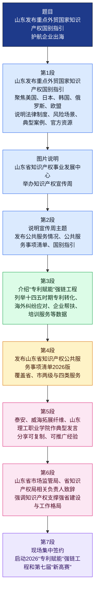

# 山东发布重点外贸国家知识产权国别指引 护航企业出海

> 本文为基于中国新闻网（财经频道）报道的精读整理稿。稿内活动主题、数据与人物引述以原报道与公开政务信息为参照；文内英文夹注供阅读辅助。

---

## 文章基本信息

* **标题**：山东发布重点外贸国家知识产权国别指引 护航企业出海
* **来源**：中国新闻网（中新网济南）
* **作者**：孙倩
* **时间**：2026年04月22日 22:32
* **编辑**：王琴
* **栏目**：财经中心 > 财经频道
* **原文链接**：[山东发布重点外贸国家知识产权国别指引护航企业出海 - 中国新闻网](https://www.chinanews.com.cn/cj/2026/04-22/10608893.shtml)

---

## 前情提要：文章结构脉络图

```markdown
山东发布重点外贸国家知识产权国别指引 护航企业出海 (结构图)
│
├── [第一部分：核心新闻点] (第1段)
│   └── 核心事件：山东发布五大重点外贸国家和地区知识产权国别指引。
│       └── 内部结构：背景(宣传周) -> 对象(美日韩俄欧) -> 内容(法律、风险、案例)。
│
├── [第二部分：活动主题与政务公开] (第2段)
│   └── 核心内容：明确2026年宣传周主题，发布公共服务及事项清单。
│       └── 内部结构：主题揭晓 -> 关键信息发布人 -> 发布内容汇总。
│
├── [第三部分：实践成果与数据支撑] (第3段)
│   └── 核心内容：总结“十四五”以来山东知识产权服务在创造、运用、保护上的成效。
│       └── 内部结构：
│           ├── “专利赋能”强链工程逻辑。
│           ├── 专利转化量化指标（173件、2.06亿元）。
│           ├── 海外维权预警数据（4500余件诉讼、105家企业、挽损6000万）。
│           └── 专家帮扶与人才对接成果。
│
├── [第四部分：服务标准发布] (第4段)
│   └── 核心内容：正式发布《山东省知识产权公共服务事项清单（2026版）》。
│       └── 内部结构：覆盖范围(省市两级) -> 业务类别(申请、管理、法律、信息)。
│
├── [第五部分：基层经验与主体感言] (第5段)
│   └── 核心内容：多方代表分享典型经验。
│       └── 内部结构：泰安经验 -> 企业视角(威海拓展) -> 高校视角(山东理工职院)。
│
├── [第六部分：高位引领与格局定位] (第6段)
│   └── 核心内容：省局领导阐述山东知识产权工作的整体格局。
│       └── 内部结构：强省建设支撑 -> 全链条保护 -> 高效协同格局。
│
└── [第七部分：尾声与展望] (第7段)
    └── 核心内容：签约仪式及新一届“新高赛”启动。
        └── 内部结构：集中签约 -> “专利赋能”2026启动 -> “新高赛”开幕。
```

---

## 精读笔记正文

**山东发布重点外贸国家知识产权国别指引 护航企业出海**

**（第1段）中新网济南4月22日电(孙倩) 记者22日从山东省知识产权事业发展中心举办的知识产权宣传周上了解到，该省发布了重点外贸国家知识产权国别指引，聚焦美国、日本、韩国、俄罗斯、欧盟五大重点外贸国家和地区，详解法律制度、风险场景、典型案例与官方资源。**

> * **知识产权宣传周 (World Intellectual Property Week)**：每年的4月26日是世界知识产权日。中国通常在此前后开展宣传周活动。
> * **护航 (Escort/Safeguard)**：原指军舰、飞机在航行中保护主要舰船。此处指通过法律服务为企业海外经营提供安全保障。
>   * **近义词**：保驾护航、提质增效。
>   * **反义词**：掣肘、阻碍。
> * **国别指引 (Country-specific Guidelines)**：针对特定国家的政策或法律指南。这是中国政府在“走出去”战略中提供的**公共产品 (Public Product)**，旨在降低企业的合规成本。
> * **风险场景 (Risk Scenarios)**：指企业在经营中可能面临法律诉讼或侵权指控的具体情况。

**（第2段）“今年宣传周的主题是‘加强新兴领域知识产权保护 加快新质生产力发展’。”山东省知识产权事业发展中心党委书记、主任刘路在现场发布了该省知识产权公共服务情况、知识产权公共服务事项清单、重点外贸国家知识产权国别指引等信息。**

> * **新质生产力 (New Quality Productive Forces)**：由技术突破性创新、生产要素创新性配置、产业深度转型升级而催生的当代先进生产力。其核心在于“创新”，载体是“产业”。
> * **新兴领域 (Emerging Fields)**：主要指人工智能、量子信息、生物技术、新能源等前沿领域。
> * **山东省知识产权事业发展中心**：山东省市场监督管理局（省知识产权局）直属的正处级公益一类事业单位，负责全省知识产权战略实施的具体事务。

**（第3段）刘路表示，该中心深入推进“专利赋能”强链工程，将公共服务融入知识产权创造、运用、保护、管理全链条。据悉，“十四五”时期，山东省知识产权事业发展中心促成专利转化173件，帮助创新主体挖掘专利技术895项，转化金额2.06亿元(人民币，下同)。同时，该省布局工作站14家，跟踪排查海外诉讼4500余件，发布知识产权风险预警40个，帮助105家企业成功应对海外纠纷，挽回经济损失6000余万元，让企业出海更为稳健。此外，该省组织114名国家专利审查员进驻46家企业贴近帮扶，解决企业技术难题425项，有效“助企攀登”，并将服务触角延伸至创新一线，累计对接高端创新人才及团队273个，举办各类培训510场，提供精准服务1300余次。**

> * **专利赋能 (Patent Empowerment)**：赋予企业利用专利进行融资、维权和市场竞争的能力。
> * **“十四五”时期**：即2021年至2025年。
> * **转化 (Transformation/Commercialization)**：指将实验室里的专利技术变为市场上实际产品的过程。
> * **风险预警 (Risk Warning)**：在危机发生前发出的信号，类似于天气预报，提醒企业避开专利陷阱。
> * **挽回 (Retrieve/Recover)**：
>   * **辨析**：常指挽回损失、挽回影响；与“挽留”区分（多指人）。
> * **国家专利审查员 (Patent Examiner)**：国家知识产权局中负责审核专利申请是否符合授权条件的专业人员。其“进驻企业”是一种高水平的技术指导。
> * **助企攀登**：山东省特有的扶持优质企业做大做强的政策用语。

**（第4段）活动现场正式发布了《山东省知识产权公共服务事项清单(2026版)》，服务清单覆盖省、市两级，涵盖申请、管理、法律、信息四大类服务，清晰明确创新主体服务事项与获取渠道。**

> * **公共服务事项清单 (List of Public Service Items)**：政府向社会公布的法定服务内容，体现了政务的透明化与标准化。
> * **创新主体 (Innovation Entities)**：指在创新活动中占据主体地位的组织，主要包括企业、高校和科研院所。

**（第5段）现场，泰安市知识产权事业发展中心、威海拓展纤维有限公司、山东理工职业学院分别作典型发言，分享可复制、可推广的经验。威海拓展纤维有限公司董事长丛宗杰认为，企业在专利方面所取得的成绩，离不开持续的知识产权投入与科学管理。山东理工职业学院党委副书记、校长张隆海说，“知识产权一头连着创新，一头连着产业，学院将以此次宣传周为新起点，在公共服务、成果转化和决策咨询等方面作出新的贡献。”**

> * **威海拓展纤维有限公司**：国内领先的高性能碳纤维研发和生产企业。董事长**丛宗杰**（1968年生，高级经济师，长期致力于碳纤维国产化事业）。
> * **山东理工职业学院**：位于山东济宁的一所公办全日制普通高职院校。校长**张隆海**。
> * **金句积累**：**“知识产权一头连着创新，一头连着产业”**。这句话深刻揭示了知识产权在**价值链 (Value Chain)** 中的桥梁作用。
> * **典型发言 (Typical Speech)**：在会议中作为成功范例进行的经验介绍。

**（第6段）山东省市场监管局副局长、一级巡视员，省知识产权局副局长于智勇在致辞中提到，山东始终把知识产权作为强省建设的关键支撑，创新创造动能强劲，全链条保护纵深推进，转化运用效能加速释放，公共服务提质增效，构建更加高效协同的知识产权工作格局。**

> * **强省建设 (Building a strong province)**：山东省提出的发展目标，如“知识产权强省”、“文化强省”等。
> * **纵深推进 (Advance in depth)**：指工作由浅入深，全面展开。
> * **提质增效 (Improve quality and efficiency)**：
>   * **反义词**：低效冗余。
>   * **应用**：在经济工作中常用于形容高质量发展。

**（第7段）当日，活动现场进行多轮集中签约，并举行了2026“专利赋能”强链工程、第七届“新高赛”启动仪式。(完)**

> * **新高赛 (New-High Competition)**：通常指新旧动能转换高价值专利培育大赛。
> * **集中签约 (Collective Signing)**：多方合作协议在同一场合集中签署，体现招商引资或合作开发的效率。

---

## 重点词汇扩展与注释

| 词汇 | 注释与辨析 | 近义词 / 反义词 |
| :--- | :--- | :--- |
| **赋能** (Empower) | **[解析]**：给某人/某物赋予某种能力。在管理学中指通过授权或提供资源提升其效率。<br>**[英]**：Enable / Empower | [近] 授权、助力<br>[反] 削弱、掣肘 |
| **出海** (Overseas Expansion) | **[解析]**：原意指船只驶向大海，现特指中国企业开拓海外市场。 | [近] 跨国经营、走向全球 |
| **全链条** (Full Chain) | **[解析]**：覆盖从研究开发、知识产权申请、后期转化到法律维权的所有环节。 | [近] 全流程、闭环 |
| **可复制** (Replicable) | **[解析]**：指某种成功的模式或经验可以被其他地区或单位借鉴并成功实施。 | [近] 可借鉴、可推广 |
| **决策咨询** (Decision-making Consultation) | **[解析]**：为政府或机构提供专业意见，辅助其进行科学决策。 | [近] 智库支持 |

---

## 背景深度补充：中国企业的海外知识产权挑战

在“中国制造”向“中国智造”转型过程中，中国企业频繁遭遇海外专利诉讼。以**美国337调查**（由美国国际贸易委员会ITC负责）为例，它是中资企业出海面临的主要法律壁垒。山东此次发布的**《国别指引》**重点涵盖美、日、韩、欧、俄，是因为这些地区是山东外贸出口的主要目的地。

* **风险防范**：通过发布案例，帮助企业识别**专利流氓 (Patent Trolls)** 或恶意诉讼。
* **海外挽损**：文中提到的“挽回6000余万元”通常通过降低律师费成本、协商减少赔偿额度或反诉成功实现。


## 前情提要

| 项目 | 信息 |
|---|---|
| 文章来源 | 中国新闻网（Chinanews.com）财经频道：原文链接 [<sup>1</sup>](https://www.chinanews.com/cj/2026/04-22/10608893.shtml) |
| 题目 | 山东发布重点外贸国家知识产权国别指引 护航企业出海 |
| 刊发时间 | 2026年4月22日 22:32 |
| 电头/记者 | 中新网济南4月22日电，正文署名：孙倩 |
| 编辑/责任编辑 | 王琴 |
| 作者背景简介 | 公开检索可见孙倩多次参与中国新闻网及中新网山东地方报道，如山东地方社会、财经、政务类新闻；未检索到可靠的官方个人简历，因此不补充未经证实的履历信息。 |
| 媒体背景 | 中国新闻网为中国新闻社官方网站。中国新闻社英文简介称其为面向世界提供新闻报道的中国国家级新闻机构之一；Chinanews.com为其重要新闻网站。参考：Chinanews About us [<sup>2</sup>](https://www.chinanews.com/common/footer/aboutus.shtml) |
| 补充核对 | “新高赛”公开报道显示为“中国·山东新质生产力高价值专利转化运用大赛”的简称，2026年4月22日启动第七届。参考：新浪财经转载相关报道 [<sup>3</sup>](https://cj.sina.com.cn/articles/view/1893761531/v70e081fb020031mea?froms=ggmp) |



---

## 逐句精读

🔸山东 / 发布 **`重点外贸国家知识产权国别指引`** / **`护航企业出海`**

🔹Shandong / releases **`country-specific intellectual property guides`** / for **`major foreign-trade markets`** / to **`support companies going global`**.

背景注释：
“山东”是中国东部沿海经济大省，制造业、外贸和产业链基础较强。标题中的“企业出海”不是字面“出海”，而是指企业拓展海外市场、参与国际竞争。“知识产权国别指引”强调按不同国家或地区的法律制度和风险环境，提供有针对性的知识产权合规与保护信息。

> **`country-specific`** /ˈkʌntri spəˈsɪfɪk/ adj.
> 英文释义：designed for, applying to, or relating to a particular country；针对特定国家的，国别化的。
> 语域：政策、法律、商业、国际关系；正式。
> 画龙点睛：`country-specific` 常用于写作中表达“因国而异、按国家定制”，如 `country-specific regulations / risks / strategies`。它比 `national` 更强调“面向某一特定国家的差异化安排”，适合雅思、考研和GRE写作中的政策分析。

> **`intellectual property`** /ˌɪntəˈlektʃuəl ˈprɑːpərti/ n.
> 英文释义：legal rights over creations of the mind, such as patents, trademarks, copyrights and trade secrets；知识产权，包括专利、商标、著作权、商业秘密等。
> 语域：法律、商业、科技创新；正式。
> 画龙点睛：常缩写为 `IP`，但正式写作首次出现建议写全称：`intellectual property (IP)`。常见搭配有 `IP protection`、`IP rights`、`IP disputes`、`IP strategy`。注意 `property` 在此为不可数集合概念。

> **`foreign-trade market`** /ˈfɔːrən treɪd ˈmɑːrkɪt/ n.
> 英文释义：a market connected with the exchange of goods and services between countries；外贸市场，国际贸易市场。
> 语域：财经、贸易、政策新闻；正式。
> 画龙点睛：新闻英语中常说 `major foreign-trade markets`，比简单的 `foreign countries` 更强调“贸易目的地和商业环境”。写作时可搭配 `expand into / enter / target foreign-trade markets`，表达企业拓展海外市场。

> **`go global`** /ɡoʊ ˈɡloʊbəl/ v. phr.
> 英文释义：to expand operations, sales, investment, or influence to international markets；走向全球，拓展国际市场。
> 语域：商业、媒体、政策；中性偏新闻化。
> 画龙点睛：`go global` 是“企业出海”的地道译法之一，简洁自然。若强调过程，可说 `companies’ overseas expansion`；若强调战略，可说 `globalization strategy`。不要机械译成 `go to sea`，那是字面误译。

---

🔸中新网济南4月22日电(孙倩) / 记者22日从山东省知识产权事业发展中心举办的 **`知识产权宣传周`** 上了解到，/ 该省发布了 **`重点外贸国家知识产权国别指引`**，/ 聚焦 **`美国、日本、韩国、俄罗斯、欧盟`** 五大重点外贸国家和地区，/ 详解 **`法律制度`**、**`风险场景`**、**`典型案例`** 与 **`官方资源`**。

🔹Jinan, April 22 (Chinanews.com), Sun Qian — / The reporter learned on April 22 at an **`Intellectual Property Publicity Week`** event hosted by the Shandong Provincial Intellectual Property Development Center / that the province had released **`country-specific intellectual property guides`** for key foreign-trade countries and regions, / focusing on five major foreign-trade markets—the **`United States, Japan, South Korea, Russia and the European Union`**—/ and detailing **`legal systems`**, **`risk scenarios`**, **`representative cases`** and **`official resources`**.

背景注释：
“中新网济南4月22日电”是新闻电头，说明报道发自济南，时间为4月22日。“山东省知识产权事业发展中心”是本文核心活动举办方。美国、日本、韩国、俄罗斯、欧盟均是不同法系、审查规则和知识产权执法机制差异较大的市场，因此企业开展专利、商标、版权、商业秘密保护时需要国别化信息。欧盟不是单一国家，而是区域性政治经济组织，知识产权制度中既有欧盟层面规则，也有成员国层面规则。

> **`host`** /hoʊst/ v.
> 英文释义：to organize and provide the place or platform for an event；主办，承办，举办。
> 语域：新闻、会议、活动报道；正式/中性。
> 画龙点睛：`host an event / conference / forum / ceremony` 是新闻写作高频搭配。它比 `hold` 更突出“主办方身份”，比 `organize` 更强调提供场地、平台和活动安排。名词 `host` 也可指“主持人、东道主”。

> **`focus on`** /ˈfoʊkəs ɑːn/ v. phr.
> 英文释义：to give particular attention to something；聚焦于，重点关注。
> 语域：通用、学术、新闻；中性。
> 画龙点睛：`focus on` 后接名词或动名词，如 `focus on risk prevention`。写作中可替换 `pay attention to`，更凝练。若要表达“把重点放在……上”，可用 `place emphasis on`，语气更正式。

> **`legal system`** /ˈliːɡəl ˈsɪstəm/ n.
> 英文释义：the set of laws, institutions and procedures through which rules are made and enforced；法律制度，法律体系。
> 语域：法律、政策、社科；正式。
> 画龙点睛：`legal system` 不等同于单个 `law`，它包括法院、行政机关、程序和执行机制。常见表达有 `a country’s legal system`、`differences between legal systems`。涉外知识产权写作中非常实用。

> **`risk scenario`** /rɪsk səˈnærioʊ/ n.
> 英文释义：a possible situation in which a risk may arise or cause harm；风险场景，可能产生风险的情境。
> 语域：合规、法律、商业风险管理；正式。
> 画龙点睛：`scenario` 常用于分析“假设情形”，如 `best-case scenario`、`worst-case scenario`。`risk scenario` 比 `risk situation` 更专业，适合写企业合规、供应链和跨境贸易风险。

> **`representative case`** /ˌreprɪˈzentətɪv keɪs/ n.
> 英文释义：a case that serves as a typical example of a broader issue；典型案例，代表性案例。
> 语域：法律、政策、学术分析；正式。
> 画龙点睛：中文“典型案例”不要译成 `typical case` 一概了事；在法律或政策语境中，`representative case` 更强调“可供参考、具有代表意义”。若是法院发布案例，也可用 `guiding case` 或 `model case`，视制度语境而定。

---

🔸4月22日，/ 山东省知识产权事业发展中心 / 举办 **`知识产权宣传周`**。/ 山东省知识产权事业发展中心 **`供图`**

🔹On April 22, / the Shandong Provincial Intellectual Property Development Center / held an **`Intellectual Property Publicity Week`** event. / Photo **`provided by`** the Center.

背景注释：
这是一条图片说明，不是正文叙述句。“供图”是新闻图片署名方式，说明图片由某机构提供，而非记者现场拍摄。知识产权宣传周通常围绕知识产权保护、运用、服务、创新发展等主题开展宣传、发布、培训或签约活动。

> **`hold an event`** /hoʊld ən ɪˈvent/ v. phr.
> 英文释义：to organize or conduct a public or formal activity；举办活动。
> 语域：新闻、商务、公共活动；中性。
> 画龙点睛：`hold` 是活动报道最稳妥的动词，常搭配 `meeting / ceremony / forum / exhibition / training session`。与 `host` 相比，`hold` 更中性，不一定强调“主办方身份”。

> **`publicity week`** /pʌbˈlɪsəti wiːk/ n.
> 英文释义：a week-long campaign or series of activities designed to raise public awareness；宣传周。
> 语域：政府活动、公共传播；正式/新闻。
> 画龙点睛：`publicity` 不只是“广告宣传”，在公共政策语境中常指“公众宣传、普及”。类似表达有 `awareness campaign`。若面向公众普及知识，`publicity week` 或 `awareness week` 都可使用。

> **`provided by`** /prəˈvaɪdɪd baɪ/ prep. phr.
> 英文释义：supplied or made available by someone or an organization；由……提供。
> 语域：新闻图片、资料来源说明；正式/中性。
> 画龙点睛：图片说明常用 `Photo provided by ...`，比完整句 `The photo was provided by ...` 更符合新闻体裁。注意 `provided that` 另有“只要、条件是”的意思，不要混淆。

---

🔸“今年宣传周的 **`主题`** / 是‘加强 **`新兴领域`** 知识产权保护 / 加快 **`新质生产力`** 发展’。”

🔹“The **`theme`** of this year’s Publicity Week / is ‘strengthening intellectual property protection in **`emerging fields`** / and accelerating the development of **`new quality productive forces`**.’”

背景注释：
“新兴领域”可指人工智能、生物技术、低空经济、数字经济、新材料等快速发展的技术与产业领域。“新质生产力”是中国政策语境中的重要表达，强调以科技创新为主导、具有高科技、高效能、高质量特征的生产力。翻译时通常保留政策术语的结构，可译为 `new quality productive forces`。

> **`theme`** /θiːm/ n.
> 英文释义：the main subject or central idea of a speech, event, text or activity；主题，主旨。
> 语域：通用、新闻、学术、活动报道；中性。
> 画龙点睛：`theme` 常用于活动或文章主旨，如 `the theme of the conference`。不要与 `topic` 完全混用：`topic` 偏“话题”，`theme` 更强调贯穿全局的核心思想。

> **`emerging field`** /ɪˈmɝːdʒɪŋ fiːld/ n.
> 英文释义：a newly developing area of technology, industry, study or activity；新兴领域。
> 语域：科技、产业、学术、政策；正式。
> 画龙点睛：`emerging` 来自 `emerge`，强调“正在出现并快速发展”。常见搭配有 `emerging technology`、`emerging market`、`emerging industry`。写作中比 `new field` 更高级、更具动态感。

> **`accelerate`** /əkˈseləreɪt/ v.
> 英文释义：to make something happen faster or develop more quickly；加快，促进提速。
> 语域：政策、经济、科技、学术；正式。
> 画龙点睛：`accelerate development / growth / reform / innovation` 是政策英语高频搭配。反义词为 `slow down` 或 `decelerate`。名词为 `acceleration`，形容词为 `accelerated`，如 `accelerated growth`。

> **`productive forces`** /prəˈdʌktɪv ˈfɔːrsɪz/ n. pl.
> 英文释义：the factors and capabilities that enable production, including labor, technology, tools and organization；生产力，生产要素与生产能力的总称。
> 语域：政治经济学、政策理论；正式。
> 画龙点睛：该词常用复数 `forces`，在政策翻译中应避免随意改成 `productivity`。`productivity` 更偏“生产效率”，而 `productive forces` 更宏观，涵盖技术、劳动者、组织方式和产业体系。

---

🔸山东省知识产权事业发展中心党委书记、主任 **`刘路`** / 在现场发布了 / 该省 **`知识产权公共服务`** 情况、/ **`知识产权公共服务事项清单`**、/ **`重点外贸国家知识产权国别指引`** 等信息。

🔹At the event, / **`Liu Lu`**, Party secretary and director of the Shandong Provincial Intellectual Property Development Center, / released information on the province’s **`public intellectual property services`**, / its **`list of public IP service items`**, / and **`country-specific IP guides`** for major foreign-trade markets.

背景注释：
本句说明发布人和发布内容。中国机构新闻中常见“党委书记、主任”等职务并列，用于交代发言人的机构身份。“知识产权公共服务”通常包括检索咨询、政策咨询、申请服务、信息服务、风险预警、维权援助等公共性服务。

> **`release information on`** /rɪˈliːs ˌɪnfərˈmeɪʃən ɑːn/ v. phr.
> 英文释义：to make information about a subject publicly available；发布关于……的信息。
> 语域：新闻、政府公告、企业披露；正式。
> 画龙点睛：`on` 在这里意为“关于”，不要误解成“在……上面”。类似搭配有 `issue a statement on`、`publish data on`。新闻写作中 `release` 比 `give out` 更正式。

> **`public intellectual property services`** /ˈpʌblɪk ˌɪntəˈlektʃuəl ˈprɑːpərti ˈsɝːvɪsɪz/ n. pl.
> 英文释义：publicly provided services that help individuals or organizations create, use, protect or manage IP；知识产权公共服务。
> 语域：政策、公共管理、法律服务；正式。
> 画龙点睛：`public services` 指公共部门或公共平台提供的服务，不是“公开服务”的直译。写作时可说 `improve public IP services`、`provide accessible IP services`，体现公共性和可获得性。

> **`service item`** /ˈsɝːvɪs ˈaɪtəm/ n.
> 英文释义：a specific service listed as available to users；服务事项，具体服务项目。
> 语域：政府服务、行政清单、平台说明；正式。
> 画龙点睛：中文“事项”在政务语境中常译为 `item`，如 `approval item`、`service item`。它强调可办理、可查询的具体条目，而不是抽象的 `matter`。

> **`at the event`** /æt ði ɪˈvent/ prep. phr.
> 英文释义：during or in the setting of a particular event；在活动现场，在该活动中。
> 语域：新闻报道、会议报道；中性。
> 画龙点睛：新闻中 `at the event` 比 `on the scene` 更自然。`on the scene` 多用于事故、灾害、突发现场；会议、发布会、仪式类报道常用 `at the event / at the ceremony / at the forum`。

---

🔸刘路表示，/ 该中心深入推进“**`专利赋能`**”**`强链工程`**，/ 将 **`公共服务`** 融入 / 知识产权 **`创造、运用、保护、管理`** **`全链条`**。

🔹Liu said / the Center has been advancing in depth the **`“Patent Empowerment” industrial-chain strengthening project`**, / integrating **`public services`** into / the **`full chain`** of intellectual property **`creation, utilization, protection and management`**.

背景注释：
“专利赋能”强调通过专利信息、专利转化、专利布局等方式提升企业创新能力和产业竞争力。“强链工程”中的“链”通常指产业链，意在补短板、强优势、促协同。“全链条”是政策文本高频词，表示从产生、使用到保护、管理的全过程覆盖。

> **`advance`** /ədˈvæns/ v.
> 英文释义：to help something progress, develop or move forward；推进，促进发展。
> 语域：政策、项目、改革、学术；正式。
> 画龙点睛：`advance a project / reform / cause / agenda` 是正式写作常用结构。`advance` 比 `promote` 更有“向前推进”的方向感；名词 `advance` 可指“进展、进步”，如 `technological advances`。

> **`in depth`** /ɪn depθ/ adv. phr.
> 英文释义：thoroughly and in a detailed way；深入地，全面细致地。
> 语域：政策、研究、分析；正式。
> 画龙点睛：`in-depth` 作形容词要加连字符，如 `an in-depth analysis`；`in depth` 作副词短语，不加连字符，如 `analyze the issue in depth`。这是考试写作中常见细节。

> **`integrate ... into`** /ˈɪntɪɡreɪt ... ˈɪntuː/ v. phr.
> 英文释义：to combine one thing with another so that they work together；把……融入……，整合进……。
> 语域：政策、管理、科技、教育；正式。
> 画龙点睛：`integrate A into B` 强调系统性嵌入，不只是简单加入。常见搭配有 `integrate technology into education`、`integrate services into the whole process`。名词为 `integration`。

> **`full chain`** /fʊl tʃeɪn/ n.
> 英文释义：the entire sequence of connected stages in a process；全链条，全流程。
> 语域：产业、供应链、政策治理；正式。
> 画龙点睛：`full-chain` 作定语常加连字符，如 `full-chain protection`。在产业政策中，它可覆盖研发、生产、转化、销售、服务、保护等环节。不要简单译成 `whole link`。

> **`utilization`** /ˌjuːtələˈzeɪʃən/ n.
> 英文释义：the act of using something effectively for a particular purpose；运用，利用，使用。
> 语域：正式、政策、科技管理；偏正式。
> 画龙点睛：`use` 是普通词，`utilization` 更正式，常用于资源、技术、知识产权的有效运用，如 `resource utilization`、`patent utilization`。动词为 `utilize`，但过度使用会显得生硬。

---

🔸据悉，/ “**`十四五`**”时期，/ 山东省知识产权事业发展中心 / 促成 **`专利转化`** 173件，/ 帮助 **`创新主体`** 挖掘专利技术895项，/ **`转化金额`** 2.06亿元(人民币，下同)。

🔹It is learned that / during the **`14th Five-Year Plan`** period, / the Shandong Provincial Intellectual Property Development Center / facilitated **`the commercialization of 173 patents`**, / helped **`innovation entities`** identify 895 patent technologies, / with **`commercialization transactions`** totaling 206 million yuan (RMB; the same below).

背景注释：
“十四五”指中国第十四个五年规划时期，即2021年至2025年。本文发表于2026年4月，因此这里是在回顾上一规划期的知识产权服务成果。“专利转化”不是简单“翻译专利”，而是指把专利技术转化为实际应用、交易、许可、产业化成果等。

> **`Five-Year Plan`** /ˌfaɪv jɪr ˈplæn/ n.
> 英文释义：a national development plan covering a five-year period；五年规划。
> 语域：中国政策、经济规划、国际报道；正式。
> 画龙点睛：中国“十四五”常译为 `the 14th Five-Year Plan`。注意 `Year` 和 `Plan` 常大写，作为专名处理。写作中可补充时间范围：`the 14th Five-Year Plan period (2021–2025)`。

> **`facilitate`** /fəˈsɪlɪteɪt/ v.
> 英文释义：to make an action or process easier or more likely to happen；促进，促成，使便利。
> 语域：正式、学术、政策、商务。
> 画龙点睛：`facilitate` 是高级替换词，可替代 `help`，但更强调“创造条件、降低阻碍”。常见搭配有 `facilitate cooperation / trade / innovation / technology transfer`。名词为 `facilitation`。

> **`commercialization`** /kəˌmɝːʃələˈzeɪʃən/ n.
> 英文释义：the process of turning an idea, technology or invention into a marketable product or service；商业化，产业化转化。
> 语域：科技创新、商业、知识产权；正式。
> 画龙点睛：专利语境中的“转化”常译为 `commercialization`，尤其涉及交易金额、落地应用、产业化收益时。若强调从科研到应用，也可说 `technology transfer` 或 `translation of research into practice`。

> **`innovation entity`** /ˌɪnəˈveɪʃən ˈentəti/ n.
> 英文释义：an organization or individual that carries out innovative activities, such as a company, university or research institute；创新主体。
> 语域：政策、科技管理；正式。
> 画龙点睛：`entity` 指“实体、主体、组织单位”，在法律和政策文本中非常常见。`innovation entity` 比 `innovator` 范围更广，可包括企业、高校、科研院所和团队。

> **`total`** /ˈtoʊtəl/ v.
> 英文释义：to amount to a particular number or sum；总计为，合计达。
> 语域：财经、统计、新闻；中性。
> 画龙点睛：`total` 除形容词“总的”外，也可作动词，如 `losses totaled $2 million`。新闻数字表达中很高频，可替代 `amount to`，语气简洁。

---

🔸同时，/ 该省布局 **`工作站`** 14家，/ 跟踪排查 **`海外诉讼`** 4500余件，/ 发布 **`知识产权风险预警`** 40个，/ 帮助105家企业成功应对 **`海外纠纷`**，/ 挽回 **`经济损失`** 6000余万元，/ 让企业 **`出海`** 更为稳健。

🔹At the same time, / the province set up 14 **`workstations`**, / tracked and screened more than 4,500 **`overseas lawsuits`**, / issued 40 **`IP risk alerts`**, / helped 105 companies successfully respond to **`overseas disputes`**, / recovered more than 60 million yuan in **`economic losses`**, / making their **`overseas expansion`** more secure.

背景注释：
海外知识产权诉讼通常涉及专利侵权、商标抢注、海关扣押、禁令、许可纠纷等问题。企业进入海外市场后，知识产权具有地域性，即在中国取得的权利不一定自动在其他国家或地区有效，因此需要提前布局和风险监测。“风险预警”就是在潜在纠纷或制度风险发生前提供提示。

> **`set up`** /set ʌp/ v. phr.
> 英文释义：to establish, create or arrange something；建立，设立，搭建。
> 语域：通用、新闻、商务、政策；中性。
> 画龙点睛：`set up a workstation / office / system / mechanism` 都很自然。它比 `build` 更适合抽象制度、机构或平台。注意 `set-up` 作名词时常加连字符，表示“安排、配置”。

> **`lawsuit`** /ˈlɔːsuːt/ n.
> 英文释义：a legal case brought before a court；诉讼，官司。
> 语域：法律、新闻；正式/中性。
> 画龙点睛：`lawsuit` 多指民事诉讼，可说 `file a lawsuit against ...` 起诉某人。`litigation` 更抽象，指诉讼过程或诉讼活动；`case` 更宽泛，可指案件本身。

> **`risk alert`** /rɪsk əˈlɝːt/ n.
> 英文释义：a warning that informs people or organizations of potential risks；风险预警，风险提示。
> 语域：合规、金融、法律、公共管理；正式。
> 画龙点睛：`alert` 既可作名词“警报”，也可作动词“提醒”。常见表达有 `issue a risk alert`、`receive an alert`、`stay alert to risks`。比 `warning` 更偏即时提示。

> **`dispute`** /dɪˈspjuːt/ n.
> 英文释义：a disagreement or conflict, especially one involving legal, commercial or political interests；纠纷，争端。
> 语域：法律、商业、国际关系；正式。
> 画龙点睛：`dispute` 比 `argument` 更正式，常用于商业和法律语境，如 `trade dispute`、`IP dispute`、`contract dispute`。动词读音可为 /dɪˈspjuːt/，表示“争议、质疑”。

> **`recover losses`** /rɪˈkʌvər ˈlɔːsɪz/ v. phr.
> 英文释义：to regain money or value that has been lost；挽回损失，追回损失。
> 语域：财经、法律、商业；正式/中性。
> 画龙点睛：`recover` 不只有“恢复健康”，也可表示“追回、收回”。常见搭配有 `recover damages` 追回赔偿、`recover costs` 收回成本。新闻数字表达中非常常用。

> **`overseas expansion`** /ˌoʊvərˈsiːz ɪkˈspænʃən/ n.
> 英文释义：the process of extending business operations into foreign countries or regions；海外扩张，海外拓展。
> 语域：商业、财经新闻；正式/中性。
> 画龙点睛：这是“企业出海”的正式译法之一。`going global` 更口语化、媒体化；`overseas expansion` 更适合财经报道和学术写作。可搭配 `support / facilitate / safeguard overseas expansion`。

---

🔸此外，/ 该省组织114名 **`国家专利审查员`** / 进驻46家企业 **`贴近帮扶`**，/ 解决企业 **`技术难题`** 425项，/ 有效“**`助企攀登`**”，/ 并将 **`服务触角`** 延伸至 **`创新一线`**，/ 累计对接高端创新人才及团队273个，/ 举办各类培训510场，/ 提供 **`精准服务`** 1300余次。

🔹In addition, / the province arranged for 114 **`national patent examiners`** / to be stationed in 46 enterprises for **`hands-on assistance`**, / resolving 425 corporate **`technical problems`**, / effectively helping enterprises **`scale new heights`**, / and extended its **`service reach`** to the **`front line of innovation`**, / cumulatively connecting with 273 high-end innovation talents and teams, / holding 510 training sessions, / and providing more than 1,300 instances of **`targeted service`**.

背景注释：
专利审查员具备技术和专利法审查能力，通常负责判断专利申请是否具备新颖性、创造性、实用性等。“进驻企业”在这里指靠前服务、现场帮扶。“助企攀登”是政策宣传语，意思是帮助企业提升创新能力和竞争层级。“创新一线”指企业、科研团队、研发现场等创新活动最直接发生的地方。

> **`patent examiner`** /ˈpætnt ɪɡˈzæmɪnər/ n.
> 英文释义：an official or specialist who reviews patent applications to determine whether inventions meet legal requirements；专利审查员。
> 语域：知识产权、法律、科技管理；正式。
> 画龙点睛：`examiner` 来自 `examine`，不只是“考试考官”，也可指专业审查人员。常见搭配有 `patent examiner`、`tax examiner`、`medical examiner`。专利语境中不可译成 `patent checker`。

> **`be stationed in`** /bi ˈsteɪʃənd ɪn/ v. phr.
> 英文释义：to be assigned to work or stay in a particular place for a period of time；被派驻在，进驻。
> 语域：新闻、行政、军事、机构安排；正式。
> 画龙点睛：`station` 作动词常见于“派驻人员”，如 `experts were stationed in local firms`。它比 `go to` 更正式，暗含组织安排和持续服务。被动结构最常见：`be stationed at/in ...`。

> **`hands-on assistance`** /ˌhændz ˈɑːn əˈsɪstəns/ n.
> 英文释义：practical help given through direct involvement rather than only advice；贴近帮扶，实操性帮助。
> 语域：教育、培训、企业服务；中性。
> 画龙点睛：`hands-on` 强调“亲自操作、实践导向”，如 `hands-on training`、`hands-on experience`。它比 `practical` 更生动，适合描述专家深入企业一线解决实际问题。

> **`technical problem`** /ˈteknɪkəl ˈprɑːbləm/ n.
> 英文释义：a problem involving specialized knowledge, engineering, technology or methods；技术难题，技术问题。
> 语域：科技、工程、企业研发；中性。
> 画龙点睛：`technical` 不等于“技巧性的”那么简单，在科技企业语境中多指专业技术。可说 `solve technical problems`、`overcome technical barriers`。若强调“瓶颈”，可用 `technical bottleneck`。

> **`scale new heights`** /skeɪl nuː haɪts/ v. phr.
> 英文释义：to reach a higher level of achievement or performance；攀登新高度，取得更高成就。
> 语域：新闻、演讲、宣传语；较正式且有修辞色彩。
> 画龙点睛：`scale` 作动词可指“攀登”，`heights` 是“高度”。该短语适合翻译“攀登、迈上新台阶”。但在严肃学术写作中可换成更朴素的 `improve performance` 或 `move up the value chain`。

> **`front line of innovation`** /frʌnt laɪn əv ˌɪnəˈveɪʃən/ n.
> 英文释义：the place or level where innovation is actively taking place；创新一线。
> 语域：政策、科技新闻、产业报道；正式。
> 画龙点睛：`front line` 原指战争前线，引申为某项工作最直接、最关键的现场。类似表达有 `front line of research`、`front line of public service`。用于新闻写作有较强画面感。

> **`targeted service`** /ˈtɑːrɡɪtɪd ˈsɝːvɪs/ n.
> 英文释义：service designed for the specific needs of a person, organization or group；精准服务，有针对性的服务。
> 语域：公共管理、商业服务、政策；正式。
> 画龙点睛：`targeted` 强调“定向、精准、按需”。常见搭配有 `targeted support`、`targeted measures`、`targeted training`。比 `accurate service` 地道得多，后者容易显得中式。

---

🔸活动现场 / 正式发布了《**`山东省知识产权公共服务事项清单(2026版)`**》，/ 服务清单覆盖 **`省、市两级`**，/ 涵盖 **`申请、管理、法律、信息`** 四大类服务，/ 清晰明确 **`创新主体`** **`服务事项`** 与 **`获取渠道`**。

🔹At the event, / the **`Shandong Provincial List of Public Intellectual Property Service Items (2026 Edition)`** was officially released; / the service list covers both **`provincial and municipal levels`**, / encompasses four categories of services—**`application, management, legal and information services`**—/ and clearly specifies the **`service items`** available to **`innovation entities`** and the **`channels for access`**.

背景注释：
“服务事项清单”是政务服务中常见文件形式，用来告诉服务对象可以办理什么、在哪里办、如何办、需要什么材料或通过什么渠道获取帮助。“省、市两级”说明服务体系覆盖山东省级与市级层面，有利于企业和创新主体就近获得服务。

> **`officially release`** /əˈfɪʃəli rɪˈliːs/ v. phr.
> 英文释义：to formally make something public through an authorized channel；正式发布。
> 语域：政府公告、企业披露、新闻报道；正式。
> 画龙点睛：`officially` 强调权威性和正式性。常见搭配有 `officially release a list/report/plan`。若用于产品，也可说 `officially launch`，但文件、报告更常用 `release`。

> **`encompass`** /ɪnˈkʌmpəs/ v.
> 英文释义：to include a wide range of things；涵盖，包括。
> 语域：正式、学术、政策、商业报告。
> 画龙点睛：`encompass` 是 `include` 的高级替换，强调范围较广。可说 `The policy encompasses legal, financial and technical support.` 写作中适合用于概括多项内容，但不要滥用在很小范围内。

> **`category`** /ˈkætəɡɔːri/ n.
> 英文释义：a group of things that share similar features；类别，种类。
> 语域：通用、学术、行政管理；中性。
> 画龙点睛：`category` 强调分类体系。常见表达有 `fall into four categories`、`be divided into several categories`。注意复数为 `categories`，不是 `categorys`，拼写常考。

> **`specify`** /ˈspesɪfaɪ/ v.
> 英文释义：to state something clearly and exactly；明确说明，具体列明。
> 语域：法律、合同、政策、说明书；正式。
> 画龙点睛：`specify` 比 `say` 更精确，常用于规则、标准、要求，如 `specify requirements / procedures / channels`。名词为 `specification`，在工程中也指“规格说明”。

> **`channel for access`** /ˈtʃænəl fər ˈækses/ n. phr.
> 英文释义：a route or method through which people can obtain a service or information；获取渠道，获得服务或信息的途径。
> 语域：公共服务、信息服务、商业运营；正式。
> 画龙点睛：`access` 可作名词“获取机会、入口”，如 `access to information`。中文“获取渠道”不要直译成 `get channel`，可说 `access channel` 或 `channel for access`。

---

🔸现场，/ **`泰安市知识产权事业发展中心`**、**`威海拓展纤维有限公司`**、**`山东理工职业学院`** / 分别作 **`典型发言`**，/ 分享 **`可复制、可推广`** 的经验。

🔹At the venue, / the **`Tai’an Intellectual Property Development Center`**, **`Weihai Tuozhan Fiber Co., Ltd.`**, and **`Shandong Polytechnic College`** / each delivered a **`model-case presentation`**, / sharing experience that can be **`replicated and promoted`**.

背景注释：
泰安、威海均为山东省城市。威海拓展纤维有限公司公开资料显示其与碳纤维研发生产相关，威海市政府相关报道称其为中国较早从事碳纤维研发生产的民营企业之一。山东理工职业学院位于山东省，是高等职业院校，本文中作为知识产权公共服务、成果转化等经验分享主体出现。

> **`venue`** /ˈvenjuː/ n.
> 英文释义：the place where an event, meeting or activity happens；活动地点，会场。
> 语域：新闻、活动、会议；中性。
> 画龙点睛：`venue` 不只是“场馆”，也可指会议、仪式、比赛的举办地点。常见搭配有 `at the venue`、`event venue`、`conference venue`。比 `place` 更正式、更新闻化。

> **`deliver a presentation`** /dɪˈlɪvər ə ˌprezənˈteɪʃən/ v. phr.
> 英文释义：to give a formal talk explaining information to an audience；作报告，作发言，进行展示。
> 语域：会议、商务、学术；正式/中性。
> 画龙点睛：`deliver` 可与 `speech / lecture / presentation / address` 搭配，表示正式“发表、作”。不要只用 `make a speech`；在商务或学术场景，`deliver a presentation` 更自然。

> **`model-case presentation`** /ˈmɑːdəl keɪs ˌprezənˈteɪʃən/ n.
> 英文释义：a presentation that shares a representative or exemplary case；典型发言，示范案例发言。
> 语域：政策会议、经验交流；正式。
> 画龙点睛：中文“典型发言”在政策新闻中不是“typical speech”那么简单，重点是介绍可借鉴案例。`model-case presentation` 能体现“示范性、可学习性”。也可译为 `best-practice presentation`。

> **`replicate`** /ˈreplɪkeɪt/ v.
> 英文释义：to copy or repeat something successfully in another place or situation；复制，复现，推广应用。
> 语域：科研、管理、政策、商业；正式。
> 画龙点睛：`replicable` 表示“可复制的”，常与 `scalable` 连用：`replicable and scalable experience`。政策写作中，“可复制、可推广”可译为 `replicable and promotable` 或 `replicable and scalable`。

> **`promote`** /prəˈmoʊt/ v.
> 英文释义：to encourage the spread, growth or acceptance of something；推广，促进，宣传。
> 语域：通用、政策、商业；中性。
> 画龙点睛：`promote` 多义：可指“促进发展”、也可指“推广产品”、还可指“晋升某人”。具体含义依宾语而定，如 `promote innovation`、`promote a product`、`be promoted to manager`。

---

🔸威海拓展纤维有限公司董事长 **`丛宗杰`** 认为，/ 企业在 **`专利`** 方面所取得的成绩，/ 离不开持续的 **`知识产权投入`** 与 **`科学管理`**。

🔹**`Cong Zongjie`**, chairman of Weihai Tuozhan Fiber Co., Ltd., said / the company’s **`patent-related achievements`** / would not have been possible without sustained **`investment in intellectual property`** and **`scientific management`**.

背景注释：
本句体现企业视角：专利成果并非偶然，而依赖长期投入与管理机制。知识产权投入可能包括研发投入、专利申请与维护费用、专利布局、专利预警、法务合规、人才培养等。“科学管理”强调制度化、规范化、数据化或专业化管理。

> **`patent-related`** /ˈpætnt rɪˌleɪtɪd/ adj.
> 英文释义：connected with patents or patent work；与专利相关的。
> 语域：法律、科技、企业管理；正式/中性。
> 画龙点睛：`-related` 是非常实用的构词后缀，表示“与……有关的”，如 `trade-related`、`health-related`、`policy-related`。它能避免中文式长定语，提升英文表达紧凑度。

> **`achievement`** /əˈtʃiːvmənt/ n.
> 英文释义：something important or successful that has been done through effort；成就，成绩。
> 语域：通用、教育、企业、新闻；中性。
> 画龙点睛：`achievement` 强调努力后取得的成果。常见搭配有 `major achievement`、`remarkable achievement`、`patent-related achievements`。不可数时可指“成就感或取得成就的过程”，可数时指具体成果。

> **`would not have been possible without`** /wʊd nɑːt həv bɪn ˈpɑːsəbəl wɪˈðaʊt/ phr.
> 英文释义：used to say that something depended on a particular condition or support；如果没有……就不可能实现。
> 语域：正式发言、感谢、分析；正式/中性。
> 画龙点睛：这是表达“离不开……”的高级句式。比 `cannot leave` 地道得多。可写作：`These results would not have been possible without long-term investment.` 适合总结原因和强调支撑条件。

> **`sustained`** /səˈsteɪnd/ adj.
> 英文释义：continuing for a long time without interruption；持续的，长期的。
> 语域：正式、政策、商业、学术。
> 画龙点睛：`sustained efforts / investment / growth / support` 都是高频搭配。它比 `continuous` 更强调“稳定保持、长期投入”。动词 `sustain` 还可表示“维持、支撑、遭受损失”。

> **`scientific management`** /ˌsaɪənˈtɪfɪk ˈmænɪdʒmənt/ n.
> 英文释义：management based on systematic methods, evidence, standards or professional procedures；科学管理，系统化管理。
> 语域：企业管理、公共管理；正式。
> 画龙点睛：`scientific` 在中文政策和管理语境中常对应“科学的、规范的、系统的”。英文中也可根据语境译为 `systematic management`，有时比 `scientific management` 更自然，尤其非理论管理学语境。

---

🔸山东理工职业学院党委副书记、校长 **`张隆海`** 说，/ “**`知识产权`** 一头连着 **`创新`**，/ 一头连着 **`产业`**，/ 学院将以此次宣传周为 **`新起点`**，/ 在 **`公共服务`**、**`成果转化`** 和 **`决策咨询`** 等方面 / 作出新的贡献。”

🔹**`Zhang Longhai`**, deputy Party secretary and president of Shandong Polytechnic College, said, / “**`Intellectual property`** connects **`innovation`** at one end / and **`industry`** at the other; / taking this Publicity Week as a **`new starting point`**, / the college will make new contributions / in **`public services`**, **`commercialization of research outcomes`** and **`decision-making consulting`**.”

背景注释：
“知识产权一头连着创新，一头连着产业”是一种对称表达，强调知识产权在科技成果和产业应用之间的桥梁作用。“成果转化”通常指高校或科研机构将研究成果推向企业应用、技术交易、产品开发或产业化。“决策咨询”指为政府、机构、企业提供政策、产业、知识产权等方面的专业建议。

> **`connect ... at one end and ... at the other`** /kəˈnekt ... æt wʌn end ænd ... æt ði ˈʌðər/ phr.
> 英文释义：to link two different sides, fields or functions；一头连接……另一头连接……。
> 语域：演讲、政策、说明性写作；正式/修辞化。
> 画龙点睛：该结构适合翻译中文排比句，能保留对称感。类似表达还有 `serve as a bridge between A and B`，更简洁。若追求写作自然，可写：`IP serves as a bridge between innovation and industry.`

> **`new starting point`** /nuː ˈstɑːrtɪŋ pɔɪnt/ n.
> 英文释义：a new stage from which further action or development begins；新起点。
> 语域：新闻、演讲、政策；中性偏正式。
> 画龙点睛：中文“以……为新起点”可译为 `take ... as a new starting point`。若要更自然，也可说 `build on this event to ...`，强调在已有基础上继续推进。

> **`commercialization of research outcomes`** /kəˌmɝːʃələˈzeɪʃən əv rɪˈsɝːtʃ ˈaʊtkʌmz/ n. phr.
> 英文释义：the process of turning research results into marketable products, services or technologies；科研成果转化，研究成果商业化。
> 语域：高校、科研、技术转移、产业政策；正式。
> 画龙点睛：`research outcomes` 比 `research results` 更正式，常指可应用、可转化的成果。若偏技术交易，可说 `technology transfer`；若偏产业落地，可说 `commercialization and industrialization of research outcomes`。

> **`decision-making consulting`** /dɪˈsɪʒən ˌmeɪkɪŋ kənˈsʌltɪŋ/ n.
> 英文释义：professional advice provided to support policy, management or strategic decisions；决策咨询。
> 语域：智库、公共管理、企业战略；正式。
> 画龙点睛：`decision-making` 作定语时常加连字符。也可译为 `policy consulting` 或 `advisory services for decision-making`。若对象是政府政策，`policy advisory services` 更地道。

> **`make contributions`** /meɪk ˌkɑːntrɪˈbjuːʃənz/ v. phr.
> 英文释义：to do something that helps achieve a result or supports a cause；作出贡献。
> 语域：正式发言、新闻、学术；中性偏正式。
> 画龙点睛：常见搭配为 `make a contribution to ...` 或 `make contributions in ...`。注意 `contribute to` 后接名词或动名词，如 `contribute to innovation`，不要写成 `contribute for`。

---

🔸山东省市场监管局副局长、一级巡视员，省知识产权局副局长 **`于智勇`** / 在致辞中提到，/ 山东始终把 **`知识产权`** 作为 **`强省建设`** 的关键支撑，/ **`创新创造动能`** 强劲，/ **`全链条保护`** 纵深推进，/ **`转化运用效能`** 加速释放，/ **`公共服务`** 提质增效，/ 构建更加 **`高效协同`** 的知识产权工作格局。

🔹In his address, / **`Yu Zhiyong`**, deputy director of the Shandong Provincial Administration for Market Regulation, first-level inspector, and deputy director of the provincial Intellectual Property Administration, / said that Shandong has consistently regarded **`intellectual property`** as a key pillar in **`building itself into a strong province`**; / the momentum for **`innovation and creation`** is strong, / **`full-chain protection`** is advancing in depth, / the effectiveness of **`commercialization and application`** is being released at a faster pace, / **`public services`** are improving in quality and efficiency, / and a more **`efficient and coordinated`** IP work framework is being built.

背景注释：
“市场监管局”在中国地方治理中通常涉及市场秩序、质量监管、知识产权、反不正当竞争等职责。“省知识产权局”与知识产权行政管理相关。本句是典型政策新闻表达，使用多个并列短语展示工作成效：创新动能、全链条保护、转化运用、公共服务、协同格局。

> **`address`** /əˈdres/ n.
> 英文释义：a formal speech given to an audience；致辞，正式讲话。
> 语域：会议、仪式、新闻报道；正式。
> 画龙点睛：`address` 作名词时还可指“地址”；作动词可指“处理问题”或“发表讲话”。在会议报道中，`in his address` 是“在致辞中”的地道表达，比 `in his speech` 更正式。

> **`regard ... as`** /rɪˈɡɑːrd ... æz/ v. phr.
> 英文释义：to consider or think of someone or something in a particular way；把……视为……。
> 语域：正式写作、新闻、学术；中性偏正式。
> 画龙点睛：`regard A as B` 是写作高频结构，可替代 `think A is B`。近义表达有 `view A as B`、`see A as B`、`consider A to be B`。注意不要漏掉 `as`。

> **`key pillar`** /kiː ˈpɪlər/ n.
> 英文释义：a central support or essential element of a system, policy or strategy；关键支柱，重要支撑。
> 语域：政策、战略、商业；正式。
> 画龙点睛：`pillar` 原指“柱子”，引申为支撑性因素。常见表达有 `a pillar of economic growth`、`one of the key pillars of reform`。比 `support` 更形象，也更适合政策文本。

> **`momentum`** /moʊˈmentəm/ n.
> 英文释义：the force or speed of development that makes something continue growing or moving forward；势头，动能。
> 语域：经济、政治、体育、科技发展；正式/中性。
> 画龙点睛：`gain momentum` 表示“势头增强”，`lose momentum` 表示“势头减弱”。本句 `the momentum for innovation is strong` 对应“创新创造动能强劲”，比 `power is strong` 地道。

> **`full-chain protection`** /ˌfʊl ˈtʃeɪn prəˈtekʃən/ n.
> 英文释义：protection covering every stage of a process or chain；全链条保护。
> 语域：知识产权、产业治理、政策；正式。
> 画龙点睛：`full-chain` 作复合形容词需加连字符。知识产权中可指从创造、申请、审查、运用、维权、执法到纠纷应对的全过程保护。它比 `complete protection` 更有政策语境。

> **`efficient and coordinated`** /ɪˈfɪʃənt ænd koʊˈɔːrdɪneɪtɪd/ adj. phr.
> 英文释义：working effectively and in an organized way with different parts cooperating；高效协同的。
> 语域：公共管理、商业管理、政策；正式。
> 画龙点睛：`efficient` 强调效率，`coordinated` 强调多方配合。二者并列常用于治理体系、工作机制、组织管理，如 `an efficient and coordinated response mechanism`。

---

🔸当日，/ 活动现场进行 **`多轮集中签约`**，/ 并举行了2026“**`专利赋能`**”**`强链工程`**、/ 第七届“**`新高赛`**”**`启动仪式`**。(完)

🔹On the same day, / multiple rounds of **`centralized signings`** were conducted at the event, / and launch ceremonies were held for the 2026 **`“Patent Empowerment” industrial-chain strengthening project`** / and the seventh **`“Xin-Gao Competition”`**. (End)

背景注释：
“集中签约”是中国会议和项目活动中常见环节，表示多个合作项目在同一活动现场集中签署协议。“新高赛”根据公开报道，为“中国·山东新质生产力高价值专利转化运用大赛”的简称，聚焦高价值专利培育、转化与运用。文末“(完)”是通讯社稿件常见结束标记。

> **`centralized signing`** /ˈsentrəlaɪzd ˈsaɪnɪŋ/ n.
> 英文释义：a signing activity in which multiple agreements are signed together at one event；集中签约。
> 语域：政务活动、商务合作、项目发布；正式。
> 画龙点睛：`centralized` 强调“集中统一安排”。若是多个协议在同一现场签署，可说 `a centralized signing ceremony`。不要直译成 `concentrated signing`，后者不够自然。

> **`conduct`** /kənˈdʌkt/ v.
> 英文释义：to organize and carry out an activity, process or operation；开展，进行，实施。
> 语域：正式、新闻、科研、行政；正式。
> 画龙点睛：`conduct` 常搭配 `research / survey / investigation / training / signing`。名词读作 /ˈkɑːndʌkt/，意为“行为、举止”；动词重音在后，读作 /kənˈdʌkt/，注意区别。

> **`launch ceremony`** /lɔːntʃ ˈserəmoʊni/ n.
> 英文释义：a formal event held to start or introduce a project, campaign or product；启动仪式，发布启动活动。
> 语域：新闻、政务、商业、科技发布；正式/中性。
> 画龙点睛：`launch` 可作动词或名词，表示“启动、推出、发射”。项目启动用 `launch a project`，产品发布用 `launch a product`，火箭发射也用 `launch a rocket`，语境决定含义。

> **`high-value patent`** /ˌhaɪ ˈvæljuː ˈpætnt/ n.
> 英文释义：a patent with strong technological, legal, market or strategic value；高价值专利。
> 语域：知识产权、科技创新、产业政策；正式。
> 画龙点睛：`high-value` 作复合形容词要加连字符。高价值专利不只数量多，更强调质量、稳定性、市场前景、产业支撑作用。常见搭配有 `cultivate high-value patents`、`high-value patent portfolio`。

> **`commercialization and utilization`** /kəˌmɝːʃələˈzeɪʃən ænd ˌjuːtələˈzeɪʃən/ n. phr.
> 英文释义：the process of turning something into market value and putting it into effective use；转化运用，商业化并有效利用。
> 语域：知识产权、科技成果转化、产业政策；正式。
> 画龙点睛：`commercialization` 偏“进入市场、产生商业价值”，`utilization` 偏“有效使用”。二者并列可准确表达中文“转化运用”，尤其适合专利、科研成果、技术成果语境。