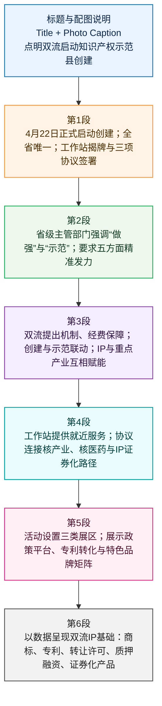

# 成都双流启动国家知识产权强县建设示范县创建

> 本文为基于人民网四川频道报道的精读整理稿；稿内事件脉络、人物引述与数据以原报道及公开政务信息为参照；文内英文夹注供阅读辅助。

---

## 前情提要

```text
文章标题：成都双流启动国家知识产权强县建设示范县创建
文章结构脉络图：
1. 核心事件概述 (第一自然段)
   ├── 时间：2026年4月22日
   ├── 地点：成都双流
   ├── 事件：启动国家知识产权强县建设示范县创建工作
   └── 关键动作：揭牌知识产权服务工作站、签署三项合作协议
2. 省级层面部署与期待 (第二自然段)
   ├── 核心理念：做强、示范
   ├── 历史基础：从“试点县”到“示范县”的跨越
   └── 发展路径：五大发力点（创造、运用、保护、管理、服务）
3. 地方政府表态与战略 (第三自然段)
   ├── 保障机制：机制、经费“双重保障”
   ├── 核心逻辑：创建与示范“双向发力”
   └── 产业耦合：重点产业（光伏、核医药）与知识产权“双向赋能”
4. 务实举措与平台支撑 (第四自然段)
   ├── 平台建设：专审协作四川中心驻双流服务站的功能
   └── 合作落地：
       ├── 核衍生技术创新（与中国核动力院等签约）
       └── 金融工具运用（知识产权证券化合作）
5. 现场展示与成果转化 (第五自然段)
   ├── 综合成就：政策体系与平台功能
   ├── 创新成果：高价值专利实物展示
   └── 特色经济：地理标志（GI）与区域公用品牌
6. 现状盘点与数据支撑 (第六自然段)
   ├── 品牌实力：年销售额过亿商标品牌数量
   ├── 创新质量：高价值发明专利拥有量及密度
   └── 转化效益：“十四五”期间转让、质押、证券化数据
```

---

## 文章基本信息

* **标题**：成都双流启动国家知识产权强县建设示范县创建
* **来源**：人民网－四川频道
* **作者**：赵祖乐
* **时间**：2026年04月23日
* **栏目**：四川频道·要闻
* **原文链接**：[成都双流启动国家知识产权强县建设示范县创建 - 四川频道](http://sc.people.com.cn/n2/2026/0423/c345167-41561015.html)

---

## 正文精读与深度解析

**启动仪式现场。主办方供图**

**人民网成都4月23日电 （赵祖乐）4月22日，成都双流正式启动国家知识产权强县建设示范县创建工作。这是全省唯一获批该创建对象的区县。当天，国家知识产权局专利局专利审查协作四川中心（以下简称“专利审查协作四川中心”）驻双流区知识产权服务工作站同步揭牌，三项合作协议现场签署。**

> * **双流（Shuangliu）**：位于四川省成都市中心城区西南部，境内拥有成都双流国际机场。近年来，双流由“门户枢纽”向“产业高地”转型，重点发展航空经济、电子信息、生物医药等产业。
> * **国家知识产权强县建设示范县**：这是国家知识产权局（CNIPA）为深入贯彻落实《知识产权强国建设纲要（2021—2035年）》而开展的评选，标志着该地区在知识产权管理和运用上处于全国领先水平（leading level）。
> * **专利审查协作中心（Patent Examination Cooperation Center）**：隶属于国家知识产权局专利局，主要职责是受专利局委托承担专利申请的审查工作。四川中心是其在西南地区的重要布局，落户双流有助于实现专利申请的“就近办理”和“快速审查”。

**“核心是‘做强’、关键在‘示范’。”四川省市场监督管理局党组成员、副局长高晓宇在创建动员部署会上表示，双流从国家知识产权强县建设试点县到示范县创建，已形成一批可复制、可推广的经验。他希望双流对照国家创建标准，在创造质量、运用效益、保护效果、管理能力、服务水平五个方面精准发力，打造知识产权工作突出的样板区县。**

> * **可复制、可推广（Reproducible and scalable）**：这是中国深化改革中的高频词汇，指在某一局部地区的先行先试（pilot run）取得成功后，形成的模式可以应用到更广泛的区域。
> * **精准发力（Targeted efforts）**：近义词包括：有的放矢、对症下药。常用于强调在关键环节投入力量，避免“大水漫灌”。
> * **样板（Benchmark/Model）**：指起示范作用的范例。在行政话语中常与“窗口”、“标杆”连用。

**双流区委副书记、区长杨钒表示，双流将突出机制、经费“双重保障”，做到创建与示范“双向发力”，推动知识产权与光伏、核医药等重点产业“双向赋能”，实现“以产兴知、以知强产”的良性互动。**

> * **双向赋能（Dual empowerment）**：指两个主体或要素之间相互提供动力和支持。在此处指知识产权通过法律保护支撑产业创新，而产业的壮大又为知识产权的产生提供土壤。
> * **光伏（Photovoltaics, PV）**：太阳能电池。双流是成都光伏产业的重要承载地，聚集了通威太阳能等龙头企业。
> * **核医药（Nuclear Medicine）**：利用放射性同位素进行诊断和治疗的学科。双流依托中国核动力研究设计院等资源，正在打造“医用同位素及放射性药物”产业集群。
> * **以产兴知、以知强产**：这是一个结构对称的**金句（Golden phrase）**。含义是：通过产业发展带动知识产权（知识）的产出，通过知识产权的运用增强产业的竞争力。

**新揭牌的工作站是专利审查协作四川中心在“家门口”设立的知识产权服务站。区内企业能够更便捷地获得专利预警、技术协同、成果转化等一站式服务。现场还签署了三项合作协议：专利审查协作四川中心分别与中国核动力研究设计院、成都纽瑞特医疗科技股份有限公司签约，以高能级资源护航核衍生技术创新与自主可控；双流区市场监管局与成都中小企业融资担保有限责任公司签约，用证券化工具打通知识产权资本化路径。**

> * **专利预警（Patent Warning/Alert）**：指通过收集分析专利信息，防范可能发生的专利侵权纠纷。
> * **中国核动力研究设计院（NPIC）**：总部位于成都，是中国唯一的集核动力科研、设计、试验、运行、小批量生产为一体的大型综合性设备设计研究所。
> * **高能级（High-level/High-energy）**：在此处指层级高、影响力大、资源整合能力强的机构或资源。
> * **自主可控（Independent and controllable）**：中国科技发展的核心战略，旨在关键核心技术上不受制于人（Self-reliance in technology）。
> * **证券化（Securitization）**：这里特指**知识产权证券化（IP Securitization）**，即将知识产权预期的未来收益作为底层资产，在资本市场发行证券融资。这是解决轻资产科技型企业“贷款难”的重要金融创新。

**活动现场设有综合成就、创新成果、特色经济三个展区。综合成就展区展示双流知识产权政策体系与平台功能；创新展区由高新技术企业人员实物讲解高价值专利转化产品；特色经济展区展示“双流冬草莓”“蜀锦”“蜀盏”等地理标志和非遗产品，以及“瞿上珍品”区域公用品牌，通过图文、实物和品鉴呈现品牌矩阵助推特色经济发展。**

> * **地理标志（Geographical Indications, GI）**：标示某商品来源于某地区，该商品的特定质量、信誉或其他特征，主要由该地区的自然因素或人文因素所决定的标志。
> * **蜀锦（Shu Brocade）**：中国四大名锦之首，产于四川成都，有着2000多年的历史，是国家级非物质文化遗产。
> * **瞿上（Qushang）**：相传是古蜀文明的发祥地之一，位于双流境内。此处“瞿上珍品”借用文化典故提升品牌底蕴。
> * **矩阵（Matrix）**：原为数学术语，现常用于形容多维度、多层次的组合排列。如“品牌矩阵”指由多个相互关联的品牌构成的集合。

**数据显示，双流知识产权工作基础扎实：目前全区年销售额超亿元的商标品牌达150个，高价值发明专利拥有量3757件，每万人口高价值发明专利24.77件，均居全省县域前列；“十四五”期间累计完成专利转让许可2057件、知识产权质押融资金额9.26亿元，已发行知识产权证券化产品2单。**

> * **高价值发明专利（High-value invention patents）**：不同于普通专利，高价值专利通常指维持年限长、被引次数多、权利要求数多或获得过国家科学技术奖、中国专利奖的专利，更能体现区域的创新含金量（Gold content of innovation）。
> * **质押融资（Pledge financing）**：企业以合法拥有的知识产权作为质押物从银行获得贷款。
> * **“十四五”期间（The 14th Five-Year Plan period）**：即2021年至2025年。
> * **县域（County-level areas）**：在中国行政区划中，县、县级市、市辖区均可视为县域经济的研究范畴。


# 基本信息与背景核验

- 文章来源：人民网－四川频道（People.cn Sichuan Channel）
  原文链接：成都双流启动国家知识产权强县建设示范县创建 [<sup>1</sup>](https://sc.people.com.cn/BIG5/n2/2026/0423/c345167-41561015.html)
- 题目：成都双流启动国家知识产权强县建设示范县创建
- 作者：赵祖乐
- 发布时间：2026年04月23日11:34
- 配图信息：启动仪式现场，主办方供图
- 作者背景：公开可检索资料中暂未见赵祖乐的系统个人履历；从署名报道看，其为人民网四川频道署名采编/记者，报道内容涵盖四川地方政务、城市建设、文化遗产、产业经济、会展活动与科技创新等方向。署名样例可见：四川省住房和城乡建设厅转载的人民网四川报道 [<sup>2</sup>](https://jst.sc.gov.cn/scjst/swcsgzhyMtjj/2025/11/7/6e5db6114db847d2848d3bde9f18a8cb.shtml)。
- 政策背景核验：国家知识产权局2026年3月2日通知中，成都市双流区被列入“国家知识产权强县建设示范县创建对象”；该类创建属于2025—2027年知识产权强国建设示范创建工作，创建期满后将进行评估验收。相关文件见：国家知识产权局2026年通知 [<sup>3</sup>](https://www.cnipa.gov.cn/art/2026/3/2/art_75_204817.html)、国家知识产权局2025年组织通知 [<sup>4</sup>](https://www.cnipa.gov.cn/art/2025/10/11/art_75_201966.html)。
- 机构与企业核验：专利审查协作四川中心为国家知识产权局专利局委托承担发明专利实质审查及知识产权服务的事业单位，可见：国家知识产权局招聘公告说明 [<sup>5</sup>](https://www.cnipa.gov.cn/art/2025/12/9/art_2194_203015.html?xxgkhide=1)。成都纽瑞特医疗科技股份有限公司英文官网列明其英文名为 Chengdu New Radiomedicine Technology Co., Ltd.，见：纽瑞特英文官网 [<sup>6</sup>](https://en.nrtmedtech.com/)。

# 前情提要



# 标题

🔸 成都双流 / 启动 **`国家知识产权强县建设示范县创建`**

🔹 Chengdu’s Shuangliu / launches work to create a **`national demonstration county for building intellectual-property strength`**.

背景注释：
- **Shuangliu / 双流**：成都市下辖区，新闻中虽为“区”，但在国家知识产权强县建设体系中被纳入“县域/区县”层级创建对象。
- **Intellectual property / 知识产权**：通常包括专利、商标、著作权、地理标志、商业秘密等。本文重点围绕专利、商标、地理标志、知识产权融资与转化展开。
- **Demonstration county / 示范县**：此处不是普通行政表述，而是国家层面的示范创建项目，强调可复制、可推广、可验收的地方工作样板。

> **`launch work`** /lɔːntʃ wɜːrk/
> 英文释义（v. phrase）：to formally begin a program, project, or organized task；中文：正式启动一项工作、项目或任务。
> 语域：新闻/政务/商务。
> 画龙点睛：`launch` 比 `start` 更正式，常用于 `launch a campaign / initiative / project`。新闻标题中用 `launch work to...` 能表达“正式部署并进入执行阶段”，适合政务与商业写作。

> **`intellectual property`** /ˌɪntəˈlektʃuəl ˈprɑːpərti/
> 英文释义（n., usually uncountable）：legal rights protecting creations of the mind, such as inventions, brands, designs, and creative works；中文：知识产权。
> 语域：法律/商业/科技/政策。
> 画龙点睛：常缩写为 `IP`，但首次出现宜写全称。搭配包括 `IP protection` 知识产权保护、`IP rights` 知识产权权利、`IP commercialization` 知识产权商业化。

> **`demonstration county`** /ˌdemənˈstreɪʃən ˈkaʊnti/
> 英文释义（n. phrase）：a county-level area selected to serve as a model for others；中文：示范县，作为样板的县域或区县单位。
> 语域：政策/发展规划/新闻。
> 画龙点睛：`demonstration` 在政策语境中常译“示范”，不等于普通的“演示”。如 `demonstration zone` 示范区、`demonstration project` 示范项目，强调可学习、可复制。

# 配图说明

🔸 **`启动仪式现场`** /。主办方供图。

🔹 The **`launch ceremony`** site / is shown; the photo / was provided by the organizer.

背景注释：
- **Organizer / 主办方**：原文未列明具体主办单位，此处只按图片说明翻译为“the organizer”。
- **Launch ceremony / 启动仪式**：政务新闻常用表达，指某项工作、项目或活动正式开始的现场仪式。

> **`launch ceremony`** /ˈlɔːntʃ ˌserəmoʊni/
> 英文释义（n. phrase）：a formal event held to mark the start of a project, campaign, or program；中文：启动仪式。
> 语域：正式/新闻/商务。
> 画龙点睛：`ceremony` 强调“正式仪式感”，常见搭配有 `opening ceremony` 开幕式、`signing ceremony` 签约仪式、`launch ceremony` 启动仪式。

> **`provide`** /prəˈvaɪd/
> 英文释义（v.）：to give, supply, or make something available；中文：提供，供给。
> 语域：通用/正式。
> 画龙点睛：新闻图片说明常用被动 `provided by...`，表示“由……供图/提供”。写作中可搭配 `provide support / services / evidence / funding`，比简单的 `give` 更正式。

# 第1段

🔸 人民网成都4月23日电 / （赵祖乐）4月22日，成都双流 / 正式启动 **`国家知识产权强县建设示范县创建`** 工作。

🔹 People.cn, Chengdu, April 23 / by Zhao Zule: On April 22, Chengdu’s Shuangliu District / officially launched its work to create a **`national demonstration county for building intellectual-property strength`**.

背景注释：
- **People.cn / 人民网**：人民日报社主管主办的中央重点新闻网站。新闻电头“人民网成都4月23日电”说明报道发自成都，发布时间节点为4月23日。
- **April 22 / 4月22日**：正文所述启动时间；文章发布时间为2026年4月23日11:34。
- **Officially launched / 正式启动**：说明该创建工作从筹备或获批阶段进入公开部署与执行阶段。

> **`officially`** /əˈfɪʃəli/
> 英文释义（adv.）：in a formal, authorized, or publicly recognized way；中文：正式地，经正式确认地。
> 语域：正式/新闻/政务。
> 画龙点睛：`officially` 常用于新闻事实确认，如 `officially announce / launch / approve / recognize`。它强调权威性和程序性，适合翻译“正式”“官方确认”。

> **`create`** /kriˈeɪt/
> 英文释义（v.）：to bring something into existence or cause a new status or system to be formed；中文：创建，创设，形成。
> 语域：通用/政策/商业。
> 画龙点睛：在政策语境中，`create` 不只是“创造”，还可表示“创建某种称号、机制或平台”。如 `create a demonstration zone` 创建示范区，`create a mechanism` 建立机制。

> **`district`** /ˈdɪstrɪkt/
> 英文释义（n.）：an administrative area within a city or region；中文：区，行政区。
> 语域：行政/地理/新闻。
> 画龙点睛：`district` 常译“区”，而 `county` 常译“县”。中国“区县”在英文报道中可用 `districts and counties`，若强调县域层级，可用 `county-level locality`。

---

🔸 这是全省 / 唯一获批该 **`创建对象`** 的区县。

🔹 It is / the only district or county-level locality in the province / approved for this **`creation designation`**.

背景注释：
- **In the province / 全省**：指四川省范围内。
- **Creation designation / 创建对象**：国家知识产权局文件中“创建对象”指获准进入示范创建阶段的地方或单位，尚需通过后续评估验收后方可正式认定为示范单位。
- **Only / 唯一**：突出双流在四川省县域层级知识产权示范创建中的唯一性。

> **`county-level locality`** /ˈkaʊnti ˈlevəl loʊˈkæləti/
> 英文释义（n. phrase）：a local administrative area at the county or equivalent level；中文：县级或相当于县级的地方行政单元。
> 语域：行政/政策/新闻。
> 画龙点睛：翻译中国行政区划时，`locality` 很有用，可避免在“区、县、市、旗”等名称之间硬套英文。`county-level locality` 强调行政层级而非具体名称。

> **`approved for`** /əˈpruːvd fɔːr/
> 英文释义（adj. phrase）：formally accepted or authorized for a particular purpose；中文：获准用于……，被批准为……。
> 语域：正式/行政/商业。
> 画龙点睛：`approve` 常见结构为 `be approved for + 名词` 或 `approve sb/sth to do sth`。如 `approved for clinical use` 获准临床使用，`approved for the program` 获准参加项目。

> **`designation`** /ˌdezɪɡˈneɪʃən/
> 英文释义（n.）：an official name, status, or category given to someone or something；中文：指定，认定，称号，资格。
> 语域：正式/行政/法律。
> 画龙点睛：`designation` 常用于“官方身份/称号”。如 `heritage designation` 遗产认定、`official designation` 官方认定。比 `name` 更正式，强调制度性资格。

---

🔸 当天，国家知识产权局专利局专利审查协作四川中心 / （以下简称“专利审查协作四川中心”）驻双流区 **`知识产权服务工作站`** 同步揭牌，三项 **`合作协议`** / 现场签署。

🔹 On the same day, the Shuangliu-based **`intellectual-property service workstation`** / of the Sichuan Patent Examination Cooperation Center under the Patent Office of CNIPA / was unveiled at the same time, and three **`cooperation agreements`** / were signed on site.

背景注释：
- **CNIPA / China National Intellectual Property Administration / 国家知识产权局**：中国负责知识产权宏观管理、专利与商标等相关工作的国家机构。
- **Patent Office of CNIPA / 国家知识产权局专利局**：承担专利审查等相关职能。
- **Sichuan Patent Examination Cooperation Center / 专利审查协作四川中心**：成立于2013年10月，受国家知识产权局专利局委托，承担发明专利申请实质审查及知识产权服务工作。
- **Service workstation / 服务工作站**：通常是专业机构在地方设立的前端服务点，用于把专业资源下沉到企业和产业集聚地。

> **`intellectual-property service workstation`** /ˌɪntəˈlektʃuəl ˈprɑːpərti ˈsɜːrvɪs ˈwɜːrksteɪʃən/
> 英文释义（n. phrase）：a local service point that provides IP-related support, consultation, and resources；中文：知识产权服务工作站。
> 语域：政务/知识产权/公共服务。
> 画龙点睛：`workstation` 不仅指电脑工位，在政务服务语境中可指“工作站/服务点”。搭配 `service workstation` 可表达“前端、就近、常态化”的服务节点。

> **`be unveiled`** /bi ʌnˈveɪld/
> 英文释义（passive v.）：to be formally revealed, opened, or introduced to the public；中文：揭牌，亮相，正式发布。
> 语域：新闻/正式活动。
> 画龙点睛：`unveil` 原义为“揭开面纱”，新闻中常译“揭牌、发布、公开”。如 `a plan was unveiled` 方案发布，`a new center was unveiled` 新中心揭牌。

> **`cooperation agreement`** /koʊˌɑːpəˈreɪʃən əˈɡriːmənt/
> 英文释义（n. phrase）：a formal arrangement between parties to work together；中文：合作协议。
> 语域：商务/法律/政务。
> 画龙点睛：`agreement` 强调协议文本或共识，`contract` 更偏合同法律约束。政务新闻中的“签署合作协议”常译为 `sign a cooperation agreement`。

> **`on site`** /ɑːn saɪt/
> 英文释义（adv. phrase）：at the place where an event or activity happens；中文：在现场，当场。
> 语域：通用/新闻/商务。
> 画龙点睛：`on-site` 作形容词要加连字符，如 `on-site services` 现场服务；`on site` 作副词短语，如 `signed on site` 现场签署。考试写作中要注意词性差异。

# 第2段

🔸 “核心是 **`做强`**、关键在 **`示范`**。”

🔹 “The core task / is to **`build strength`**; the key / lies in **`setting a model`**.”

背景注释：
- 这是四川省市场监督管理局有关负责人对创建工作的概括性表述。
- **Build strength / 做强**：指提升知识产权创造、运用、保护、管理和服务等方面的综合能力。
- **Setting a model / 示范**：指形成可复制、可推广的经验，而不仅是获得一个称号。

> **`core task`** /kɔːr tæsk/
> 英文释义（n. phrase）：the most important job or objective in a larger plan；中文：核心任务。
> 语域：正式/政策/管理。
> 画龙点睛：`core` 表“核心的、最重要的”，常搭配 `core task / core issue / core competence / core value`。比 `main` 更有战略意味，适合政策和商业表达。

> **`build strength`** /bɪld streŋθ/
> 英文释义（v. phrase）：to develop capacity, capability, or competitiveness over time；中文：做强，增强实力。
> 语域：政策/商业/发展规划。
> 画龙点睛：`build` 可表示“逐步形成能力”，如 `build capacity` 能力建设、`build resilience` 增强韧性。翻译“做强”时，`build strength` 比 `become strong` 更动态。

> **`set a model`** /set ə ˈmɑːdl/
> 英文释义（v. phrase）：to create an example that others can follow；中文：树立样板，形成示范。
> 语域：正式/政策/教育。
> 画龙点睛：也可说 `serve as a model`。若强调“供别人学习”，可用 `set a model for others`；若强调已经具备样板作用，用 `serve as a model` 更自然。

---

🔸 四川省市场监督管理局党组成员、副局长高晓宇 / 在 **`创建动员部署会`** 上表示，双流 / 从国家知识产权强县建设 **`试点县`** 到 **`示范县创建`**，已形成一批 **`可复制、可推广`** 的经验。

🔹 Gao Xiaoyu, a member of the Party leadership group and deputy director of the Sichuan Provincial Market Regulation Bureau, / said at the **`mobilization and deployment meeting`** for the creation work / that Shuangliu, moving from a national **`pilot county`** for building IP strength to a **`demonstration-county creation`** stage, / has developed a body of experience that is **`replicable and scalable`**.

背景注释：
- **Sichuan Provincial Market Regulation Bureau / 四川省市场监督管理局**：省级市场监管部门，知识产权管理职能通常与市场监管体系相关。
- **Pilot county / 试点县**：先行探索、积累经验的地方。
- **Demonstration-county creation / 示范县创建**：在试点基础上进一步对标国家标准，形成更高层级示范。
- 中国官员个人履历此处不展开；文章已给出其职务信息。

> **`mobilization and deployment meeting`** /ˌmoʊbələˈzeɪʃən ænd dɪˈplɔɪmənt ˈmiːtɪŋ/
> 英文释义（n. phrase）：a formal meeting held to rally participants and arrange tasks for implementation；中文：动员部署会。
> 语域：政务/组织管理。
> 画龙点睛：`mobilization` 强调“动员资源和人员”，`deployment` 强调“安排任务和步骤”。翻译政务新闻中的“动员部署”时，两词连用较准确。

> **`pilot county`** /ˈpaɪlət ˈkaʊnti/
> 英文释义（n. phrase）：a county-level area selected to test policies or practices before wider use；中文：试点县。
> 语域：政策/改革/发展规划。
> 画龙点睛：`pilot` 作名词可指飞行员，作形容词常指“试点的”。如 `pilot program` 试点项目、`pilot reform` 试点改革。不要误译成“飞行员县”。

> **`replicable`** /ˈreplɪkəbl/
> 英文释义（adj.）：able to be repeated or reproduced in other places or situations；中文：可复制的，可复现的。
> 语域：正式/政策/科研/管理。
> 画龙点睛：`replicable` 强调“方法能照着做”。科研中指结果可复现，政策中指经验可复制。常与 `scalable` 搭配，形成“可复制、可推广”的地道表达。

> **`scalable`** /ˈskeɪləbl/
> 英文释义（adj.）：able to be expanded or applied on a larger scale；中文：可扩展的，可推广的。
> 语域：商业/科技/政策。
> 画龙点睛：`scale` 有“规模”义，`scalable` 常用于商业模式、技术系统、政策经验。如 `a scalable solution` 可推广的解决方案，特别适合替代中文式 `can be promoted`。

---

🔸 他希望双流 / 对照国家 **`创建标准`**，在 **`创造质量`**、**`运用效益`**、**`保护效果`**、**`管理能力`**、**`服务水平`** 五个方面 / 精准发力，打造知识产权工作突出的 **`样板区县`**。

🔹 He expressed the hope that Shuangliu / would benchmark itself against national **`creation standards`** and make targeted efforts in five areas—**`creation quality`**, **`utilization benefits`**, **`protection effectiveness`**, **`management capacity`**, and **`service level`**—/ so as to build itself into a **`model district or county-level locality`** with strong IP performance.

背景注释：
- 这五项指标与国家知识产权强国建设示范创建的评价逻辑相吻合，强调从“创造—运用—保护—管理—服务”的全链条提升。
- **Creation quality / 创造质量**：通常指专利、商标等知识产权产出的质量，而非单纯数量。
- **Utilization benefits / 运用效益**：强调知识产权能否转化为产业价值、融资价值和市场竞争力。
- **Protection effectiveness / 保护效果**：强调维权、执法、纠纷处理等实效。

> **`benchmark against`** /ˈbentʃmɑːrk əˈɡenst/
> 英文释义（v. phrase）：to compare performance with a standard or best practice；中文：对照……进行标杆比较，对标。
> 语域：管理/商业/政策。
> 画龙点睛：`benchmark` 是高分写作词，可替代 `compare with`。常见搭配：`benchmark against national standards` 对标国家标准，`benchmark performance` 对标绩效。

> **`targeted efforts`** /ˈtɑːrɡɪtɪd ˈefərts/
> 英文释义（n. phrase）：actions directed precisely at specific goals or problems；中文：精准发力，有针对性的努力。
> 语域：正式/政策/管理。
> 画龙点睛：中文“精准发力”不宜直译为 `precisely exert force`。英文可用 `make targeted efforts`，既自然又能表达“方向明确、措施聚焦”。

> **`utilization benefits`** /ˌjuːtələˈzeɪʃən ˈbenɪfɪts/
> 英文释义（n. phrase）：the practical, economic, or social gains produced by putting something to use；中文：运用效益，使用后产生的收益。
> 语域：政策/经济/管理。
> 画龙点睛：`utilization` 比 `use` 更正式，常用于资源、技术、知识产权的“有效利用”。如 `resource utilization` 资源利用、`IP utilization` 知识产权运用。

> **`management capacity`** /ˈmænɪdʒmənt kəˈpæsəti/
> 英文释义（n. phrase）：the ability of an organization or government to manage systems, resources, and processes；中文：管理能力。
> 语域：管理/政务/发展研究。
> 画龙点睛：`capacity` 在政策英语中常译“能力建设”的“能力”，如 `governance capacity` 治理能力、`service capacity` 服务能力，比 `ability` 更制度化。

# 第3段

🔸 双流区委副书记、区长杨钒 / 表示，双流将突出机制、经费 **`双重保障`**，做到创建与示范 **`双向发力`**，推动知识产权与光伏、核医药等重点产业 **`双向赋能`**，实现 **`以产兴知、以知强产`** 的良性互动。

🔹 Yang Fan, deputy secretary of the Shuangliu District Party Committee and district mayor, / said that Shuangliu would emphasize a **`dual guarantee`** of mechanisms and funding, ensure **`two-way efforts`** in both creation and demonstration, promote **`mutual empowerment`** between IP and key industries such as photovoltaics and nuclear medicine, / and achieve a virtuous interaction in which **`industry invigorates IP and IP strengthens industry`**.

背景注释：
- **Photovoltaics / 光伏**：指利用太阳能电池等技术把光能转化为电能的产业，属于新能源产业。
- **Nuclear medicine / 核医药**：利用放射性核素、放射性药物等进行疾病诊断与治疗的医学与产业领域。
- **“以产兴知、以知强产”**：其中“知”指知识产权，而非泛泛的知识；表达产业发展与知识产权能力提升之间的双向促进关系。
- 中国官员个人履历此处不展开；文章已说明其职务。

> **`dual guarantee`** /ˈduːəl ˌɡærənˈtiː/
> 英文释义（n. phrase）：two forms of assurance or support provided together；中文：双重保障。
> 语域：正式/政策/管理。
> 画龙点睛：`dual` 表“两方面的、双重的”，比 `double` 更正式。常见搭配有 `dual role` 双重角色、`dual approach` 双轨方法、`dual guarantee` 双重保障。

> **`mutual empowerment`** /ˈmjuːtʃuəl ɪmˈpaʊərmənt/
> 英文释义（n. phrase）：a process in which two sides strengthen or enable each other；中文：双向赋能，互相增强。
> 语域：政策/商业/创新。
> 画龙点睛：中文“赋能”近年高频，英文可用 `empowerment` 或动词 `empower`。但应避免滥用；若强调实际作用，可写 `enable`, `strengthen`, `support`。

> **`photovoltaics`** /ˌfoʊtoʊvɑːlˈteɪɪks/
> 英文释义（n., plural form often used as singular field）：technology that converts sunlight directly into electricity；中文：光伏技术，光伏产业。
> 语域：科技/能源/产业。
> 画龙点睛：常缩写为 `PV`。相关表达：`photovoltaic industry` 光伏产业、`PV modules` 光伏组件、`solar power` 太阳能发电。`photovoltaic` 可作形容词。

> **`nuclear medicine`** /ˈnuːkliər ˈmedɪsɪn/
> 英文释义（n. phrase）：a medical field using radioactive substances for diagnosis and treatment；中文：核医学，核医药。
> 语域：医学/科技/产业。
> 画龙点睛：`nuclear` 不只指“核武器”，也可用于能源、医学和科研。`nuclear medicine` 常涉及 `radioisotopes` 放射性同位素和 `radiopharmaceuticals` 放射性药物。

> **`virtuous interaction`** /ˈvɜːrtʃuəs ˌɪntərˈækʃən/
> 英文释义（n. phrase）：a positive relationship in which two factors reinforce each other；中文：良性互动。
> 语域：正式/经济/政策。
> 画龙点睛：`virtuous` 在这里不是单纯“有美德的”，而是“良性的、正向循环的”。常见表达 `virtuous cycle` 良性循环，反义为 `vicious cycle` 恶性循环。

# 第4段

🔸 新揭牌的工作站 / 是专利审查协作四川中心在 **`家门口`** 设立的 **`知识产权服务站`**。

🔹 The newly unveiled workstation / is an **`IP service station`** set up by the Sichuan Patent Examination Cooperation Center right **`on the doorstep`**.

背景注释：
- **On the doorstep / 家门口**：中文“家门口”是比喻，强调服务距离近、便利性强，并非真的设在企业家门口。
- **IP service station / 知识产权服务站**：面向地方企业和产业主体提供知识产权相关服务的站点。

> **`newly unveiled`** /ˈnuːli ʌnˈveɪld/
> 英文释义（adj. phrase）：recently opened, introduced, or revealed to the public；中文：新揭牌的，新近亮相的。
> 语域：新闻/正式活动。
> 画龙点睛：`newly + past participle` 是新闻常用结构，如 `newly built` 新建的、`newly released` 新发布的、`newly established` 新成立的，简洁正式。

> **`set up`** /set ʌp/
> 英文释义（phrasal v.）：to establish, create, or arrange something for use；中文：设立，建立，搭建。
> 语域：通用/商务/政务。
> 画龙点睛：`set up` 比 `establish` 口语化一点，但在新闻中仍常见。正式写作可替换为 `establish`；若强调配置设备或安排结构，用 `set up` 更自然。

> **`on the doorstep`** /ɑːn ðə ˈdɔːrstep/
> 英文释义（idiom）：very near to someone or something；中文：就在附近，在家门口。
> 语域：口语化/新闻可用。
> 画龙点睛：该表达很地道，表示“近在咫尺”。如 `services on residents’ doorstep` 居民家门口的服务。注意不是字面“站在门阶上”。

---

🔸 区内企业 / 能够更便捷的获得 **`专利预警`**、**`技术协同`**、**`成果转化`** 等 **`一站式服务`**。

🔹 Enterprises within the district / will be able to obtain **`patent alerts`**, **`technical collaboration`**, **`commercialization of research outcomes`**, and other **`one-stop services`** more conveniently.

背景注释：
- **Patent alerts / 专利预警**：通常指对专利风险、侵权风险、竞争对手专利布局、海外专利壁垒等进行监测和提示。
- **Technical collaboration / 技术协同**：指企业、科研机构、审查与服务机构之间围绕技术信息、研发方向、专利布局等开展协作。
- **Commercialization of research outcomes / 成果转化**：把科研成果、专利技术转化为产品、服务、产业收益或资本价值。

> **`patent alert`** /ˈpætənt əˈlɜːrt/
> 英文释义（n. phrase）：a warning or monitoring notice about patent risks, opportunities, or competitive activity；中文：专利预警。
> 语域：知识产权/法律/商业。
> 画龙点睛：`alert` 可作名词“警报、提醒”，也可作动词“提醒”。知识产权语境中，`patent alert` 强调提前识别风险，而非事后维权。

> **`technical collaboration`** /ˈteknɪkəl kəˌlæbəˈreɪʃən/
> 英文释义（n. phrase）：cooperation involving technical knowledge, expertise, or development；中文：技术协同，技术合作。
> 语域：科技/产业/商务。
> 画龙点睛：`collaboration` 比 `cooperation` 更强调共同参与、共同解决问题。科研和产业写作中常见 `research collaboration`、`industry-academia collaboration`。

> **`commercialization of research outcomes`** /kəˌmɜːrʃələˈzeɪʃən əv rɪˈsɜːrtʃ ˈaʊtkʌmz/
> 英文释义（n. phrase）：the process of turning research results into marketable products, services, or economic value；中文：成果转化，科研成果商业化。
> 语域：科技政策/商业/高校科研。
> 画龙点睛：中文“成果转化”不能机械译为 `achievement transformation`。更地道的是 `commercialization of research outcomes` 或 `technology transfer`，视语境选择。

> **`one-stop service`** /ˌwʌn ˈstɑːp ˈsɜːrvɪs/
> 英文释义（n. phrase）：a service model that provides multiple related services in one place or through one channel；中文：一站式服务。
> 语域：政务/商务/公共服务。
> 画龙点睛：`one-stop` 作定语常加连字符，如 `one-stop platform`、`one-stop solution`。它强调“少跑腿、集中办、全流程服务”。

---

🔸 现场还签署了三项合作协议：专利审查协作四川中心 / 分别与中国核动力研究设计院、成都纽瑞特医疗科技股份有限公司签约，以 **`高能级资源`** 护航 **`核衍生技术创新`** 与 **`自主可控`**；双流区市场监管局 / 与成都中小企业融资担保有限责任公司签约，用 **`证券化工具`** 打通知识产权 **`资本化路径`**。

🔹 Three cooperation agreements / were also signed on site: the Sichuan Patent Examination Cooperation Center / signed agreements respectively with the Nuclear Power Institute of China and Chengdu New Radiomedicine Technology Co., Ltd., using **`high-level resources`** to support **`innovation in nuclear-derived technologies`** and **`indigenous controllability`**; the Shuangliu District Market Regulation Bureau / signed an agreement with Chengdu SME Financing Guarantee Co., Ltd. to use **`securitization tools`** to open up pathways for **`capitalizing intellectual property`**.

背景注释：
- **Nuclear Power Institute of China / 中国核动力研究设计院**：隶属于中核集团，是核反应堆工程研究、设计、试验、运行等领域的重要科研机构。
- **Chengdu New Radiomedicine Technology Co., Ltd. / 成都纽瑞特医疗科技股份有限公司**：聚焦医用同位素、放射性药物等核医药方向。
- **Nuclear-derived technologies / 核衍生技术**：指由核技术外延应用形成的相关技术，如核能、核医学、同位素、核技术应用等产业方向。
- **Indigenous controllability / 自主可控**：常用于高端技术与产业链安全语境，强调关键技术、供应链或核心能力能够自主掌握、可控可用。
- **Securitization / 证券化**：把未来可产生现金流的资产或权益打包形成证券化产品，用于融资。知识产权证券化通常将专利许可费、质押债权等与知识产权相关的现金流进行金融产品化。
- **Capitalizing IP / 知识产权资本化**：把专利、商标等无形资产转化为可融资、可交易、可估值的资本资源。

> **`high-level resources`** /haɪ ˈlevəl ˈriːsɔːrsɪz/
> 英文释义（n. phrase）：advanced, influential, or high-capacity resources that can support development；中文：高层次资源，高能级资源。
> 语域：政策/产业/管理。
> 画龙点睛：中文“高能级”可译为 `high-level`、`high-caliber` 或 `high-capacity`。若强调机构平台能级，`high-level resources` 最稳妥；若强调人才，可用 `high-caliber talent`。

> **`nuclear-derived technologies`** /ˈnuːkliər dɪˈraɪvd tekˈnɑːlədʒiz/
> 英文释义（n. phrase）：technologies developed from or related to nuclear science and its applications；中文：核衍生技术。
> 语域：科技/产业/政策。
> 画龙点睛：`derived from` 表“源自……”。`nuclear-derived` 可表达核技术外延应用，不等同于 `nuclear weapons-related`。科技翻译中要避免把 `nuclear` 自动理解为军事。

> **`indigenous controllability`** /ɪnˈdɪdʒənəs kənˌtroʊləˈbɪləti/
> 英文释义（n. phrase）：the ability to independently develop, control, and secure key technologies or systems；中文：自主可控。
> 语域：科技政策/产业安全。
> 画龙点睛：也可译为 `self-reliance and controllability`。`indigenous` 在技术语境中指“本土自主的”，不是“土著的”贬义，要结合语境理解。

> **`securitization tool`** /sɪˌkjʊrətəˈzeɪʃən tuːl/
> 英文释义（n. phrase）：a financial instrument that packages assets or cash flows into tradable securities；中文：证券化工具。
> 语域：金融/资本市场。
> 画龙点睛：`securitization` 来自 `security` 的金融义“证券”。知识产权证券化常用于把无形资产未来收益转化为融资工具，写作中可搭配 `asset-backed securitization`。

> **`capitalize intellectual property`** /ˈkæpɪtəlaɪz ˌɪntəˈlektʃuəl ˈprɑːpərti/
> 英文释义（v. phrase）：to turn IP assets into capital value, financing capacity, or marketable financial assets；中文：使知识产权资本化。
> 语域：金融/知识产权/商业。
> 画龙点睛：`capitalize` 有“利用、资本化、大写”多义。此处不是“把字母大写”，而是把无形资产转化为资本价值。常见搭配：`capitalize on an opportunity` 利用机会。

# 第5段

🔸 活动现场 / 设有 **`综合成就`**、**`创新成果`**、**`特色经济`** 三个展区。

🔹 The event venue / featured three exhibition areas: **`comprehensive achievements`**, **`innovation outcomes`**, and the **`specialty economy`**.

背景注释：
- **Exhibition areas / 展区**：活动现场按主题设置的展示空间。
- **Specialty economy / 特色经济**：指依托本地特色产品、品牌、文化资源或地理标志发展起来的经济形态。
- 该句起到承上启下作用，引出下一句对三个展区内容的具体说明。

> **`feature`** /ˈfiːtʃər/
> 英文释义（v.）：to include or present something as an important part；中文：以……为特色，设有，呈现。
> 语域：新闻/广告/展览/通用。
> 画龙点睛：`feature` 作动词非常地道，可译“设有、展示、主打”。如 `The exhibition features new products.` 展览展示新产品。比 `have` 更有新闻感。

> **`exhibition area`** /ˌeksɪˈbɪʃən ˈeriə/
> 英文释义（n. phrase）：a designated space for displaying products, achievements, or information；中文：展区。
> 语域：会展/新闻/商务。
> 画龙点睛：`exhibition` 是“展览”，`exhibit` 是“展品/展出”。`exhibition area` 指空间，`exhibit area` 也可见，但前者更稳妥正式。

> **`innovation outcomes`** /ˌɪnəˈveɪʃən ˈaʊtkʌmz/
> 英文释义（n. phrase）：results produced through innovation, such as technologies, patents, or products；中文：创新成果。
> 语域：科技/政策/商业。
> 画龙点睛：`outcome` 强调“结果、成效”，比 `result` 更常用于政策和项目评估。`innovation outcomes` 可覆盖专利、产品、技术方案等多种成果。

> **`specialty economy`** /ˈspeʃəlti ɪˈkɑːnəmi/
> 英文释义（n. phrase）：an economy built around distinctive local products, industries, or cultural resources；中文：特色经济。
> 语域：区域经济/政策/产业。
> 画龙点睛：`specialty` 指“特色产品、专门领域”。如 `local specialties` 地方特产。翻译“特色经济”时，`specialty economy` 比 `characteristic economy` 更自然。

---

🔸 **`综合成就展区`** / 展示双流知识产权政策体系与平台功能；**`创新展区`** / 由高新技术企业人员实物讲解高价值专利转化产品；**`特色经济展区`** / 展示“双流冬草莓”“蜀锦”“蜀盏”等 **`地理标志`** 和 **`非遗产品`**，以及“瞿上珍品”区域公用品牌，通过图文、实物和品鉴 / 呈现 **`品牌矩阵`** 助推特色经济发展。

🔹 The **`comprehensive achievements area`** / displayed Shuangliu’s IP policy system and platform functions; the **`innovation area`** / featured staff from high-tech enterprises explaining physical products transformed from high-value patents; the **`specialty economy area`** / displayed **`geographical indications`** and **`intangible cultural heritage products`** such as “Shuangliu winter strawberries,” “Shu brocade,” and “Shu cups,” as well as the regional public brand “Qushang Treasures,” using graphics, physical exhibits, and tastings / to present a **`brand matrix`** that helps drive the development of the specialty economy.

背景注释：
- **High-tech enterprises / 高新技术企业**：通常指经认定具备较强研发能力、核心知识产权和技术创新能力的企业。
- **High-value patents / 高价值专利**：一般指技术含量、市场价值、稳定性或战略意义较高的专利。
- **Geographical indication / 地理标志**：标示某商品来源于特定地区，且其质量、声誉或其他特征主要由该地区自然或人文因素决定。
- **Intangible cultural heritage / 非物质文化遗产**：包括传统技艺、表演艺术、民俗等非物质文化资源。
- **Shu brocade / 蜀锦**：四川传统丝织技艺与产品，具有地方文化属性。
- **Regional public brand / 区域公用品牌**：由特定区域共同使用、体现区域特色与质量信誉的公共品牌。

> **`policy system`** /ˈpɑːləsi ˈsɪstəm/
> 英文释义（n. phrase）：an organized set of policies, rules, and measures in a particular field；中文：政策体系。
> 语域：政务/政策研究。
> 画龙点睛：`system` 在中文政策翻译中常对应“体系”。如 `legal system` 法律体系、`service system` 服务体系、`policy system` 政策体系，强调结构完整性。

> **`high-value patent`** /haɪ ˈvæljuː ˈpætənt/
> 英文释义（n. phrase）：a patent with strong technical, legal, market, or strategic value；中文：高价值专利。
> 语域：知识产权/科技政策。
> 画龙点睛：`high-value` 是常用复合形容词，要加连字符。类似表达有 `high-quality development` 高质量发展、`high-end manufacturing` 高端制造。

> **`geographical indication`** /ˌdʒiːəˈɡræfɪkəl ˌɪndɪˈkeɪʃən/
> 英文释义（n. phrase）：a sign used on products that have a specific geographical origin and qualities or reputation linked to that origin；中文：地理标志。
> 语域：知识产权/农业/贸易。
> 画龙点睛：常缩写为 `GI`。如香槟、帕尔马火腿等都涉及地理标志保护。中国语境中，茶叶、水果、工艺品等地方特产常申请地理标志保护。

> **`intangible cultural heritage`** /ɪnˈtændʒəbl ˈkʌltʃərəl ˈherɪtɪdʒ/
> 英文释义（n. phrase）：cultural practices, expressions, knowledge, or skills passed down through generations；中文：非物质文化遗产。
> 语域：文化/联合国教科文组织/新闻。
> 画龙点睛：`intangible` 指“无形的”，反义为 `tangible` 有形的。非遗不是建筑文物，而是技艺、表演、习俗等活态文化资源。

> **`brand matrix`** /brænd ˈmeɪtrɪks/
> 英文释义（n. phrase）：a structured portfolio or network of related brands that support one another；中文：品牌矩阵。
> 语域：市场营销/区域经济。
> 画龙点睛：`matrix` 原义“矩阵”，商业中指多品牌、多产品、多渠道构成的组合。`brand matrix` 强调品牌之间形成体系，而非孤立品牌。

# 第6段

🔸 数据显示，双流知识产权工作基础扎实：目前全区年销售额超亿元的 **`商标品牌`** 达150个，**`高价值发明专利拥有量`** 3757件，每万人口高价值发明专利24.77件，均居全省县域前列；“十四五”期间累计完成 **`专利转让许可`** 2057件、**`知识产权质押融资金额`** 9.26亿元，已发行 **`知识产权证券化产品`** 2单。

🔹 Data show that Shuangliu has a solid foundation for IP work: at present, the district has 150 **`trademark brands`** with annual sales exceeding 100 million yuan, owns 3,757 **`high-value invention patents`**, and has 24.77 high-value invention patents per 10,000 people, all ranking among the top county-level localities in the province; during the **`14th Five-Year Plan`** period, it completed 2,057 **`patent transfer and licensing`** transactions, recorded 926 million yuan in **`IP pledge financing`**, and has issued two **`IP securitization products`**.

背景注释：
- **Annual sales exceeding 100 million yuan / 年销售额超亿元**：这里“亿元”指人民币一亿元，即100 million yuan。
- **High-value invention patents / 高价值发明专利**：通常用于衡量地区创新质量与产业技术含量。
- **Per 10,000 people / 每万人口**：区域创新能力常用统计口径，便于不同人口规模地区之间比较。
- **14th Five-Year Plan / “十四五”**：中国2021—2025年国民经济和社会发展五年规划时期。
- **Patent transfer and licensing / 专利转让许可**：专利权转移或许可他人实施，是专利转化的重要方式。
- **IP pledge financing / 知识产权质押融资**：企业以专利、商标等知识产权作为质押物获得融资。
- **IP securitization products / 知识产权证券化产品**：以知识产权相关收益或债权为基础资产设计发行的金融产品。

> **`solid foundation`** /ˈsɑːlɪd faʊnˈdeɪʃən/
> 英文释义（n. phrase）：a strong and reliable base that supports further development；中文：扎实基础，坚实基础。
> 语域：正式/通用/政策。
> 画龙点睛：`solid` 不只表示“固体的”，还可表示“可靠的、扎实的”。常见搭配：`solid evidence` 可靠证据、`solid progress` 扎实进展、`solid foundation` 坚实基础。

> **`trademark brand`** /ˈtreɪdmɑːrk brænd/
> 英文释义（n. phrase）：a brand protected or identified through trademark registration or use；中文：商标品牌。
> 语域：知识产权/市场营销。
> 画龙点睛：`trademark` 是商标，强调法律识别和保护；`brand` 是品牌，强调市场认知和商业价值。`trademark brand` 同时体现法律权利与市场价值。

> **`invention patent`** /ɪnˈvenʃən ˈpætənt/
> 英文释义（n. phrase）：a patent granted for a new technical solution relating to a product, process, or improvement；中文：发明专利。
> 语域：知识产权/科技。
> 画龙点睛：中国专利类型包括发明、实用新型、外观设计。`invention patent` 通常技术门槛和审查要求较高，常用于衡量创新质量。

> **`patent transfer and licensing`** /ˈpætənt trænsˈfɜːr ænd ˈlaɪsənsɪŋ/
> 英文释义（n. phrase）：the assignment of patent ownership or permission for others to use patented technology；中文：专利转让与许可。
> 语域：知识产权/商业/法律。
> 画龙点睛：`transfer` 偏“权利转让”，`licensing` 偏“许可使用”。二者是专利价值实现的重要路径，区别在于权利是否完全转移。

> **`IP pledge financing`** /ˌaɪ ˈpiː pledʒ ˈfaɪnænsɪŋ/
> 英文释义（n. phrase）：financing obtained by pledging intellectual property rights as collateral；中文：知识产权质押融资。
> 语域：金融/知识产权。
> 画龙点睛：`pledge` 作名词可指“质押、承诺”，金融中 `pledge financing` 指以资产作担保融资。这里的质押物不是厂房设备，而是专利、商标等无形资产。

> **`securitization product`** /sɪˌkjʊrətəˈzeɪʃən ˈprɑːdʌkt/
> 英文释义（n. phrase）：a financial product created by pooling assets or cash flows and issuing securities backed by them；中文：证券化产品。
> 语域：金融/资本市场。
> 画龙点睛：`product` 在金融语境中可译“产品”，如 `wealth-management product` 理财产品、`structured product` 结构性产品。`IP securitization product` 突出基础资产与知识产权相关。