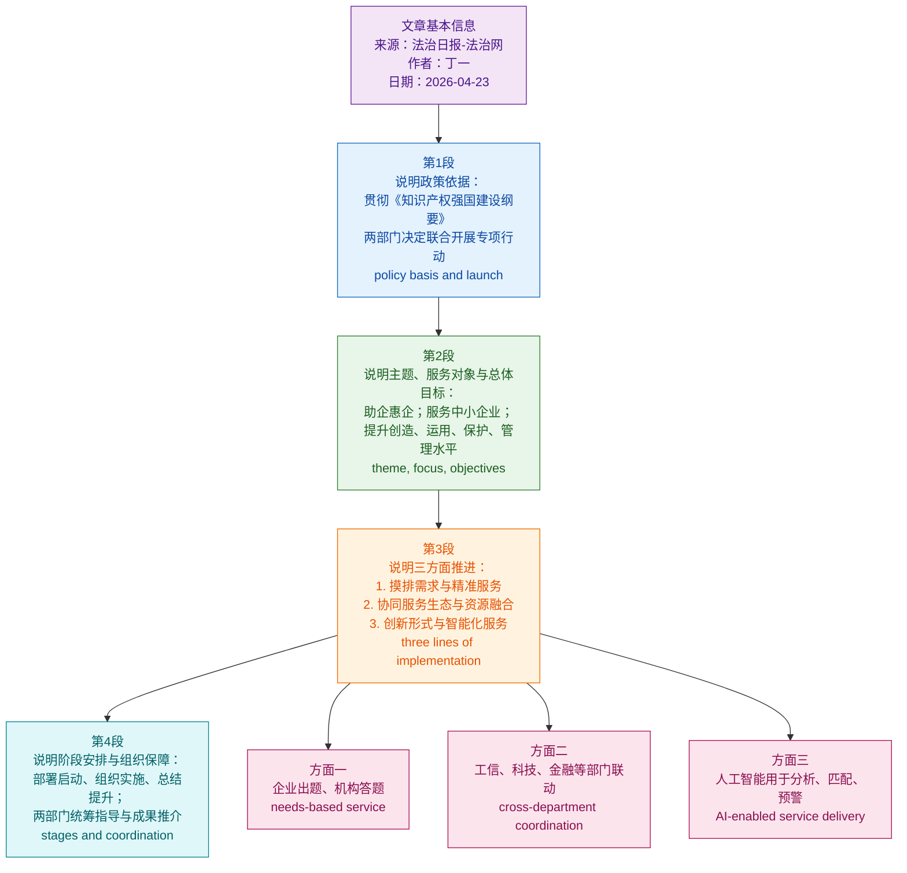

# 国家知识产权局联合工业和信息化部开展2026年中小企业知识产权公共服务专项行动

> 本文为基于法治日报·法治网报道的精读整理稿；`source_url` 待补：请在法治网以标题或发布时间检索同题页面后填入。专项行动正式通知可参见国家知识产权局官网：[国家知识产权局 工业和信息化部关于开展2026年中小企业知识产权公共服务专项行动的通知](https://www.cnipa.gov.cn/art/2026/4/22/art_75_205972.html)。

---

**文章基本信息**

**标题：** 国家知识产权局联合工业和信息化部开展2026年中小企业知识产权公共服务专项行动

**来源：** 法治日报-法治网

**作者：** 丁一

**时间：** 2026-04-23 11:50:04

**编辑：** 康婧轩

**栏目：** 首页即时滚动新闻

**网站信息：** 法治网（原法制网）是中央重点新闻网站，由法治日报社主办，是党和国家推进依法治国的重要舆论阵地。

```text
文章结构信息图：
第一部分：行动背景与启动（第1段）
└── 政策依据：贯彻落实《知识产权强国建设纲要（2021—2035年）》
└── 核心事件：国家知识产权局与工信部联合部署2026年专项行动

第二部分：总体要求与核心目标（第2段）
└── 行动主题：“知识产权公共服务助企惠企”
└── 服务对象：以中小企业（SMEs）为重点
└── 四大能力提升：创造质量、运用效益、保护能力、管理水平
└── 宏观愿景：
    ├── 促进科技创新与产业创新深度融合
    └── 培育新质生产力，推动高质量发展

第三部分：重点任务与推进路径（第3段）
└── 任务一：精准服务（需求侧）
    ├── 重点对象：专利产业化样板库企业、科技型/创新型中小企业
    └── 模式创新：企业“出题”、机构“答题”的互动模式
    └── 业务范畴：专利分析、产业导航、技术转化等
└── 任务二：协同生态（供给侧）
    ├── 联动机制：省级知识产权局牵头，工信、科技、金融多部委联动
    └── 资源配置：整合共享服务资源，下沉服务至科研一线
└── 任务三：效能提升（手段侧）
    ├── 形式创新：区域特色专场活动
    └── 技术赋能：AI技术在信息分析、匹配、预警中的深度应用

第四部分：实施步骤与保障（第4段）
└── 三阶段安排：部署启动 -> 组织实施 -> 总结提升
└── 督导机制：国家两部委统筹指导，宣传优秀成果
```

**精读笔记正文**

**国家知识产权局联合工业和信息化部开展2026年中小企业知识产权公共服务专项行动**

**为深入贯彻落实《知识产权强国建设纲要（2021—2035年）》，近日国家知识产权局、工业和信息化部决定联合组织开展2026年中小企业知识产权公共服务专项行动。**

> - **国家知识产权局 (CNIPA)**：国务院直属机构，负责保护知识产权，推动知识产权保护体系建设，负责商标、专利、原产地地理标志的注册登记和行政裁决等。
> - **工业和信息化部 (MIIT)**：负责拟订实施行业规划、产业政策和标准，监测工业日常运行，推动重大技术装备发展和信息化建设。
> - **《知识产权强国建设纲要（2021—2035年）》**：中共中央、国务院印发的顶层设计文件，旨在全面提升中国知识产权综合实力，目标是到2035年我国知识产权综合竞争力跻身世界前列。
> - **中小企业 (Small and Medium-sized Enterprises, SMEs)**：在国民经济中具有“56789”的特征（贡献50%税收、60%GDP、70%创新、80%就业、90%企业数量）。
> - **专项行动**：指在特定时间内，为解决突出问题或达成特定目标，由政府部门发起的大规模协同工作。

**本次专项行动以“知识产权公共服务助企惠企”为主题，以服务中小企业为重点，致力于充分发挥知识产权公共服务机构和中小企业公共服务机构作用，着力提升企业知识产权创造质量、运用效益、保护能力和管理水平，促进科技创新和产业创新深度融合，为培育新质生产力、推动经济高质量发展提供有力支撑。**

> - **公共服务 (Public Service)**：由政府或相关机构提供的具有普惠性、基础性的服务。
> - **创造质量、运用效益、保护能力和管理水平**：这是衡量知识产权工作水平的四个核心维度。
>   - **创造质量** (Quality of Creation)：强调从“数量大国”向“质量强国”转变，摒弃低质量垃圾专利。
>   - **运用效益** (Efficiency of Utilization)：核心是**专利产业化** (Patent Industrialization)，即将实验室的专利转化为生产线上的产品。
> - **新质生产力 (New Quality Productive Forces)**：习近平总书记提出的重大理论创新。指由技术革命性突破、生产要素创新性配置、产业深度转型升级而催生的当代先进生产力。其核心特征是**全要素生产率**大幅提升，本质是**创新驱动**。
>   - **[金句积累]**：科技创新是发展新质生产力的**核心要素**，知识产权是创新的**制度保障**。
> - **深度融合 (Deep Integration)**：指两者不再是简单的相加，而是产生化学反应，形成互促共进的闭环。

**根据部署，专项行动将从三方面重点推进。一是深入摸排企业需求，提供精准服务。深入摸排专利产业化样板企业培育库入库企业、科技和创新型中小企业等在技术研发、知识产权保护运用等方面的需求，采用企业“出题”、服务机构“答题”的互动服务模式，为企业精准提供专利分析、产业导航、技术转化等业务咨询、辅导和信息服务，切实提升针对性和实效性。**

> - **摸排 (Screening/Surveying)**：实地调查并排查详细情况。近义词：**调研、摸底**。
> - **专利产业化样板企业培育库**：政府筛选的一批具有核心技术潜力的企业，旨在通过政策引导使其专利实现大规模商业应用。
> - **企业“出题”、服务机构“答题”**：这是一种**需求导向** (Demand-oriented) 的服务模式。
>   - **[表达辨析]**：
>     - **精准 (Precision)**：强调侧重于细分领域的对口支持。
>     - **精确 (Accuracy)**：强调数据或数值上的准确。
> - **专利分析 (Patent Analysis)**：通过对专利文献的挖掘，分析竞争对手、技术趋势等。
> - **产业导航 (Industrial Navigation)**：利用专利信息分析为产业发展指明路径，避免盲目投资和低水平重复研发。

**二是构建协同服务生态，推动资源融合。各省级知识产权局要探索建立与工信、科技、金融等相关部门的协调联动机制，推动服务资源整合共享，加强对科技创新一线的服务供给。**

> - **协同服务生态 (Collaborative Service Ecosystem)**：打破部门壁垒，形成政府、机构、市场多方参与的系统性环境。
> - **协调联动机制**：指不同职能部门为了共同目标，实现信息互通、步调一致。
> - **金融 (Finance)**：此处特指**知识产权金融**，如知识产权质押融资（用专利权作为抵押向银行贷款），缓解中小企业“融资难、融资贵”问题。
> - **服务供给 (Service Supply)**：反义词：**服务需求**。

**三是创新服务形式，提升服务效能。结合区域产业特点，策划组织专场活动。深化人工智能技术在信息分析、供需匹配、风险预警等场景的应用，提升服务信息化智能化水平。**

> - **人工智能 (Artificial Intelligence, AI)**：
>   - **信息分析**：利用大模型提取专利价值。
>   - **供需匹配**：通过算法将高校的闲置专利精准推送到有需求的生产企业。
>   - **风险预警 (Risk Early-warning)**：提前发现潜在的侵权风险（Freedom to Operate, FTO），保护企业出海。
> - **信息化智能化 (Informatization & Intelligence)**：
>   - **信息化**：侧重于数据的数字化。
>   - **智能化**：侧重于系统能自主学习和处理复杂任务。

**行动分为部署启动、组织实施、总结提升三个阶段。国家知识产权局、工业和信息化部将加强统筹指导和工作总结，及时宣传推介优秀服务成果。**

> - **部署启动、组织实施、总结提升**：典型的公文“三段式”工作流程。
> - **统筹指导 (Overall Guidance)**：从全局角度进行统一筹划和引领。
> - **宣传推介 (Promotion)**：挖掘典型案例（Best Practices），发挥示范带动作用。
> - **[成语积累]**：
>   - **因地制宜**：结合“区域产业特点”开展活动。
>   - **协同发力**：各部委建立联动机制，共同推进。
>   - **有的放矢**：深入摸排需求，精准提供服务。


# 前情提要与文章信息

| 项目 | 信息 |
|---|---|
| 文章来源 | 法治日报-法治网 |
| 栏目 | 首页即时滚动新闻 |
| 题目 | 国家知识产权局联合工业和信息化部开展2026年中小企业**`知识产权公共服务专项行动`** |
| English Title | The China National Intellectual Property Administration and the Ministry of Industry and Information Technology Jointly Launch the 2026 **`Special Campaign for Public Intellectual Property Services`** for Small and Medium-Sized Enterprises |
| 发布时间 | 2026-04-23 11:50:04 |
| 作者 | 法治日报全媒体记者 丁一 |
| 编辑 | 康婧轩 |
| 作者背景简介 | 丁一为法治日报/法治日报-法治网公开报道中署名的记者，近期可检索到其围绕**`知识产权`**、**`法治政府`**、**`数字消费治理`**、**`农业农村政策`**、**`外贸与公共政策`**等议题发稿。公开资料中暂未检索到权威、完整的个人履历简介。 |
| 政策核验 | 国家知识产权局官网显示，《国家知识产权局 工业和信息化部关于开展2026年中小企业知识产权公共服务专项行动的通知》成文日期为2026-04-13，发布时间为2026-04-21，文号为国知发服字〔2026〕11号。 |



| 核心术语 | 推荐英文表达 | 备考理解 |
|---|---|---|
| 知识产权公共服务 | **`public intellectual property services`** | 政策新闻常用表达，指政府或公共机构面向创新主体提供的知识产权信息、咨询、分析、保护与运用支持。 |
| 中小企业 | **`small and medium-sized enterprises`** / **`SMEs`** | 第一次写全称，后文可用缩写**`SMEs`**。雅思、考研、GRE写作中常用于产业政策、创新政策和就业话题。 |
| 助企惠企 | **`help and benefit enterprises`** | 兼具“帮助企业解决问题”和“让企业实际受益”的含义，不能只译成**`help enterprises`**。 |
| 新质生产力 | **`new quality productive forces`** | 中国政策语境中的固定译法，强调由科技创新、产业升级、数字化、绿色化等推动的新型生产能力。 |
| 深度融合 | **`deep integration`** | 常用于科技、产业、教育、数字经济等领域，表示不是表层合作，而是机制、资源、场景的深入结合。 |
| 供需匹配 | **`supply-demand matching`** | 政策与商业英语中常见，用于资源对接、平台服务、人才市场、技术转化等语境。 |

---

# 逐句精读

🔸中文：为深入贯彻落实《**`知识产权强国建设纲要（2021—2035年）`**》，/ 近日**`国家知识产权局`**、**`工业和信息化部`**决定 / **`联合组织开展`**2026年中小企业**`知识产权公共服务专项行动`**。

🔹English: To **`thoroughly implement`** the **`Outline for Building an Intellectual Property Powerhouse (2021–2035)`**, / the **`China National Intellectual Property Administration`** and the **`Ministry of Industry and Information Technology`** have recently decided / to **`jointly organize`** the 2026 **`Special Campaign for Public Intellectual Property Services`** for **`SMEs`**.

背景注释：
- **`Outline for Building an Intellectual Property Powerhouse (2021–2035)`**：对应《知识产权强国建设纲要（2021—2035年）》，是中国知识产权中长期战略文件，强调知识产权创造、保护、运用、管理与服务能力建设。
- **`China National Intellectual Property Administration`**：国家知识产权局，常缩写为**`CNIPA`**，负责专利、商标、地理标志等知识产权相关管理与公共服务。
- **`Ministry of Industry and Information Technology`**：工业和信息化部，常缩写为**`MIIT`**，负责工业、通信业、信息化、中小企业等相关政策工作。
- **`SMEs`**：即**`small and medium-sized enterprises`**，中小企业，是创新政策、产业升级政策和公共服务政策中的重要服务对象。

> **`thoroughly implement`** /ˈθɜːrəli ˈɪmplɪment/
> 英文释义（v. phr.）：to put a policy, plan, or decision fully and carefully into effect; 中文：全面、深入、认真地贯彻执行某项政策、计划或决定。
> 语域：正式、政策、公文、新闻。
> 画龙点睛：**`implement`**强调“把政策落到执行层面”，常见搭配有**`implement a policy`**、**`implement a strategy`**、**`implement reforms`**。注意区分**`enforce`**：后者多指“执行法律、规则、禁令”，带有执法强制性。

> **`Outline`** /ˈaʊtlaɪn/
> 英文释义（n.）：a general plan giving the main ideas, goals, or structure of something; 中文：纲要、提纲、总体方案。
> 语域：正式、政策、学术。
> 画龙点睛：**`outline`**在普通英语中可指“提纲”，在政策语境中常指“顶层设计文件”。写作中可用**`set out an outline for...`**表示“为……勾勒总体框架”；作动词时意为“概述”，如**`The report outlines three priorities.`**

> **`intellectual property powerhouse`** /ˌɪntəˈlektʃuəl ˈprɑːpərti ˈpaʊərhaʊs/
> 英文释义（n. phr.）：a country or entity with strong capability and influence in intellectual property creation, protection, use, and governance; 中文：在知识产权创造、保护、运用和治理方面具有强大能力与影响力的主体或国家。
> 语域：政策、国际关系、产业新闻。
> 画龙点睛：**`powerhouse`**不是“发电站”本义，而常引申为“强国、强者、实力中心”，如**`manufacturing powerhouse`**“制造业强国”、**`innovation powerhouse`**“创新强国”。该词比**`strong country`**更有新闻感和战略感。

> **`jointly organize`** /ˈdʒɔɪntli ˈɔːrɡənaɪz/
> 英文释义（v. phr.）：to arrange and carry out an activity together with another organization or party; 中文：与另一机构或主体共同组织开展某项活动。
> 语域：正式、新闻、公文。
> 画龙点睛：**`jointly`**强调“共同、联合”，常用于多部门行动：**`jointly issue a notice`**、**`jointly launch a program`**、**`jointly organize an event`**。若要更简洁，也可用**`co-organize`**，但政策翻译中**`jointly organize`**更稳妥。

---

🔸中文：本次专项行动 / 以“**`知识产权公共服务助企惠企`**”为主题，/ 以**`服务中小企业`**为重点，/ 致力于充分发挥**`知识产权公共服务机构`**和**`中小企业公共服务机构`**作用，/ 着力提升企业知识产权**`创造质量`**、**`运用效益`**、**`保护能力`**和**`管理水平`**，/ 促进**`科技创新和产业创新深度融合`**，/ 为培育**`新质生产力`**、推动**`经济高质量发展`**提供有力支撑。

🔹English: With “**`public intellectual property services that help and benefit enterprises`**” as its theme / and **`service to SMEs`** as its focus, / the special campaign is **`committed to`** giving **`full play to`** the role of public IP service institutions and SME public service institutions, / improving enterprises’ IP creation quality, utilization benefits, protection capacity, and management level, / promoting **`deep integration`** between scientific and technological innovation and industrial innovation, / and providing strong support for cultivating **`new quality productive forces`** and advancing **`high-quality economic development`**.

背景注释：
- **`public IP service institutions`**：知识产权公共服务机构，通常承担知识产权信息检索、专利分析、政策咨询、培训辅导、公共平台建设等职能。
- **`IP creation, utilization, protection, and management`**：对应知识产权工作的四个关键环节：创造高价值专利或品牌资产；推动转化运用；维护权利、应对侵权；建立企业内部知识产权管理制度。
- **`new quality productive forces`**：政策术语，强调以科技创新为主导，推动产业升级、数字化转型、绿色发展和高端制造。
- **`high-quality economic development`**：中国经济政策中的核心表达，区别于单纯追求速度的**`high-speed growth`**，更强调质量、效率、结构、创新与可持续性。

> **`be committed to`** /bi kəˈmɪtɪd tuː/
> 英文释义（adj. phr.）：to be willing and determined to do something or support something; 中文：致力于、坚定投入于、承诺做某事。
> 语域：正式、商务、政策、学术。
> 画龙点睛：**`to`**在这里是介词，后接名词或动名词：**`be committed to improving services`**，不是**`be committed to improve`**。写作中它比**`want to`**更正式，适合表达政府、机构、企业的长期目标。

> **`give full play to`** /ɡɪv fʊl pleɪ tuː/
> 英文释义（v. phr.）：to fully use or bring out the role, value, or potential of something; 中文：充分发挥某事物的作用、价值或潜力。
> 语域：正式、政策翻译、新闻。
> 画龙点睛：这是翻译“充分发挥”的常用表达，但在更自然的英语写作中，也可换成**`fully leverage`**、**`make full use of`**、**`maximize the role of`**。例如：**`fully leverage public service platforms`**更具商务和政策英语质感。

> **`utilization`** /ˌjuːtələˈzeɪʃən/
> 英文释义（n.）：the act of using something effectively, especially resources, technologies, or rights; 中文：利用、运用、有效使用。
> 语域：正式、科技、管理、政策。
> 画龙点睛：**`use`**最普通，**`utilization`**更正式，常用于资源、技术、知识产权、数据等：**`resource utilization`**、**`technology utilization`**、**`IP utilization`**。英式英语常拼作**`utilisation`**。考试写作中可用它提升正式度，但不要滥用。

> **`deep integration`** /diːp ˌɪntɪˈɡreɪʃən/
> 英文释义（n. phr.）：a close and substantive combination of different systems, sectors, or processes; 中文：不同系统、领域或流程之间的深入融合。
> 语域：政策、科技、产业、学术。
> 画龙点睛：**`integration`**比**`combination`**更强调“融为一体、机制相连”。常见搭配有**`regional integration`**、**`economic integration`**、**`digital integration`**。这里的**`deep`**说明不是浅层合作，而是创新链、产业链、服务链之间的深度衔接。

> **`new quality productive forces`** /nuː ˈkwɑːləti prəˈdʌktɪv ˈfɔːrsɪz/
> 英文释义（n. phr.）：advanced productive capacity driven mainly by innovation, high technology, new industries, and improved production factors; 中文：主要由创新、高技术、新产业和生产要素优化推动的先进生产力。
> 语域：中国政策、经济新闻、发展研究。
> 画龙点睛：这是较固定的政策译法，注意**`forces`**用复数。写作中若面向国际读者，可在首次出现时解释：**`new quality productive forces, namely innovation-driven advanced productivity`**，这样既保留政策术语，又降低理解门槛。

> **`high-quality economic development`** /haɪ ˈkwɑːləti ˌiːkəˈnɑːmɪk dɪˈveləpmənt/
> 英文释义（n. phr.）：economic development that emphasizes efficiency, innovation, sustainability, structural improvement, and long-term value rather than sheer speed; 中文：强调效率、创新、可持续、结构优化和长期价值的经济发展。
> 语域：政策、经济、新闻。
> 画龙点睛：不要机械译成**`high-speed economic development`**。**`high-quality`**侧重“发展质量”，可搭配**`growth`**、**`development`**、**`services`**、**`education`**。例如：**`promote high-quality growth`**比**`promote fast growth`**更符合当前政策语境。

---

🔸中文：根据**`部署`**，/ 专项行动 / 将从**`三方面`**重点推进。

🔹English: According to the **`deployment`**, / the special campaign / will be **`advanced`** along **`three priority lines`**.

背景注释：
- **`deployment`**在军事中可指“部署兵力”，在政策新闻中常对应“工作部署、安排”。
- **`three priority lines`**不是原文逐字“three aspects”的机械译法，而是更符合政策英语的表达，强调三个重点推进方向。
- 该句起承上启下作用：从总体目标转入具体执行路径。

> **`deployment`** /dɪˈplɔɪmənt/
> 英文释义（n.）：the organized arrangement or allocation of people, resources, plans, or measures for a specific purpose; 中文：为特定目的而进行的部署、安排、配置。
> 语域：军事、政策、管理、科技。
> 画龙点睛：**`deployment`**常见于三类语境：军事“兵力部署”、技术“系统部署”、政策“工作部署”。如**`software deployment`**“软件部署”、**`policy deployment`**“政策部署”。阅读时要根据语境判断，不要只记“军事部署”。

> **`advance`** /ədˈvæns/
> 英文释义（v.）：to move something forward, develop it, or help it make progress; 中文：推进、推动发展、使前进。
> 语域：正式、新闻、政策、学术。
> 画龙点睛：**`advance`**作动词时很适合政策与改革话题：**`advance reform`**、**`advance innovation`**、**`advance cooperation`**。作名词可指“进展、进步”，如**`scientific advances`**。注意不要只理解为“提前”。

> **`priority lines`** /praɪˈɔːrəti laɪnz/
> 英文释义（n. phr.）：main directions or areas of work that receive special attention and resources; 中文：重点方向、优先工作线、重点推进领域。
> 语域：政策、项目管理、战略规划。
> 画龙点睛：**`priority`**意为“优先事项”，比**`important thing`**更正式。常见表达包括**`top priority`**、**`policy priority`**、**`strategic priority`**。**`line`**在此不是“线条”，而是“工作线、方向”，如**`lines of action`**。

---

🔸中文：一是 / 深入**`摸排企业需求`**，/ 提供**`精准服务`**。

🔹English: First, / conduct in-depth **`mapping of enterprise needs`** / and provide **`targeted services`**.

背景注释：
- **`摸排企业需求`**是政策执行中的前置步骤，意思是系统了解企业在技术、专利、融资、维权、培训等方面的真实需求。
- **`精准服务`**强调服务供给不是“一刀切”，而是根据企业类型、行业特点、发展阶段和具体问题进行匹配。
- 该句是三方面推进中的第一项，属于“需求导向型服务”。

> **`mapping of enterprise needs`** /ˈmæpɪŋ əv ˈentərpraɪz niːdz/
> 英文释义（n. phr.）：a systematic process of identifying, recording, and analyzing what enterprises require; 中文：对企业需求进行系统识别、记录和分析的过程。
> 语域：政策、咨询、项目管理。
> 画龙点睛：**`map`**作动词不只是“画地图”，还可指“梳理、摸清、对应”：**`map customer needs`**、**`map industry risks`**、**`map the supply chain`**。相比**`survey`**，**`map`**更强调结构化呈现和后续匹配。

> **`targeted services`** /ˈtɑːrɡətɪd ˈsɝːvɪsɪz/
> 英文释义（n. phr.）：services designed for a specific group, need, problem, or objective; 中文：面向特定群体、需求、问题或目标而设计的精准服务。
> 语域：政策、商业、公共管理。
> 画龙点睛：**`targeted`**表示“有针对性的”，常见搭配有**`targeted support`**、**`targeted measures`**、**`targeted advertising`**。写作中它比**`specific`**更强调“瞄准对象并解决问题”的动作感。

---

🔸中文：深入**`摸排`**专利产业化样板企业培育库入库企业、科技和创新型中小企业等 / 在**`技术研发`**、**`知识产权保护运用`**等方面的需求，/ 采用企业“**`出题`**”、服务机构“**`答题`**”的互动服务模式，/ 为企业精准提供**`专利分析`**、**`产业导航`**、**`技术转化`**等业务咨询、辅导和信息服务，/ 切实提升**`针对性`**和**`实效性`**。

🔹English: The needs of enterprises included in the **`cultivation pool`** for model patent industrialization enterprises, as well as technology-based and innovative SMEs, / will be thoroughly **`identified`** in areas such as **`technological R&D`** and IP protection and utilization; / an **`interactive service model`** in which enterprises “**`set the questions`**” and service institutions “**`provide the answers`**” will be adopted; / and tailored business consulting, guidance, and information services, such as **`patent analysis`**, **`industry navigation`**, and **`technology transfer`**, / will be provided to enterprises, thereby effectively enhancing **`relevance`** and **`effectiveness`**.

背景注释：
- **`专利产业化样板企业培育库`**：可理解为面向专利产业化的重点培育企业名单或储备库，强调把专利技术转化为产品、产业和经济效益。
- **`科技和创新型中小企业`**：指具有科技研发、技术创新、成果转化潜力的中小企业。
- 企业“**`出题`**”、服务机构“**`答题`**”：这是形象化政策表达，意思是企业提出真实问题，服务机构围绕问题提供解决方案。
- **`专利分析`**帮助企业了解技术路线、竞争格局、侵权风险和专利布局；**`技术转化`**强调把技术成果转化为实际生产力或商业价值。

> **`cultivation pool`** /ˌkʌltɪˈveɪʃən puːl/
> 英文释义（n. phr.）：a selected group or database of entities that are to be supported, developed, or nurtured over time; 中文：被纳入重点支持、培育或发展范围的对象库、储备库。
> 语域：政策、产业、项目管理。
> 画龙点睛：**`cultivation`**不仅是“种植”，也可指“培养、培育”。**`pool`**除“水池”外，还常指“资源池、人才库、候选群体”，如**`talent pool`**“人才库”、**`patent pool`**“专利池”。

> **`technological R&D`** /ˌteknəˈlɑːdʒɪkəl ˌɑːr ən ˈdiː/
> 英文释义（n. phr.）：research and development activities related to technology, products, processes, or applied innovation; 中文：与技术、产品、工艺或应用创新相关的研究与开发活动。
> 语域：科技、产业、商业、政策。
> 画龙点睛：**`R&D`**是**`research and development`**的缩写，读作字母音。常见搭配有**`R&D investment`**、**`R&D capability`**、**`R&D expenditure`**。正式写作首次出现可写全称，后文用缩写。

> **`interactive service model`** /ˌɪntərˈæktɪv ˈsɝːvɪs ˈmɑːdl/
> 英文释义（n. phr.）：a service approach in which providers and users communicate, respond to each other, and shape services together; 中文：服务提供方与服务对象相互沟通、响应并共同塑造服务内容的模式。
> 语域：公共管理、商业、平台服务。
> 画龙点睛：**`interactive`**强调“双向互动”，区别于单向通知或灌输。**`model`**在这里是“模式”，不是“模特”。常见表达有**`business model`**、**`service model`**、**`governance model`**。

> **`set the questions`** /set ðə ˈkwestʃənz/
> 英文释义（v. phr.）：to define the problems or tasks that need to be addressed; 中文：提出需要解决的问题或任务。
> 语域：比喻表达、政策翻译、服务场景。
> 画龙点睛：这里不是考试命题的字面意思，而是比喻“企业提出需求”。与之对应的**`provide the answers`**表示“服务机构给出解决方案”。英语中也可更自然地说**`enterprises raise the issues, and service providers respond with solutions`**。

> **`patent analysis`** /ˈpætənt əˈnæləsɪs/
> 英文释义（n. phr.）：the examination of patent data to understand technologies, competitors, legal risks, and innovation trends; 中文：通过分析专利数据来了解技术、竞争者、法律风险和创新趋势。
> 语域：知识产权、科技、咨询。
> 画龙点睛：**`patent`**美式常读/ˈpætənt/，英式也常读/ˈpeɪtənt/。**`patent analysis`**常服务于研发方向选择、专利布局、侵权预警、竞争情报。不要把**`patent`**误解成“明显的”这个形容词义。

> **`technology transfer`** /tekˈnɑːlədʒi ˈtrænsfɝː/
> 英文释义（n. phr.）：the process of moving technologies, research results, or know-how from one organization or setting into practical use or commercialization; 中文：将技术、科研成果或专门知识从一个机构或场景转移到实际应用或商业化中的过程。
> 语域：科技、商业、知识产权、大学科研。
> 画龙点睛：**`transfer`**在此不是“转账”或“转学”，而是“转移、转化、转让”。常见表达有**`technology transfer office`**“技术转移办公室”、**`transfer of know-how`**“专门技术转移”。

> **`relevance and effectiveness`** /ˈreləvəns ænd ɪˈfektɪvnəs/
> 英文释义（n. phr.）：the degree to which something is connected to actual needs and produces intended results; 中文：某事与实际需求的关联程度，以及产生预期效果的程度。
> 语域：政策评估、项目管理、学术。
> 画龙点睛：**`relevance`**对应“针对性、相关性”，**`effectiveness`**对应“实效性、有效性”。写作中常与**`efficiency`**区分：**`effectiveness`**看“有没有达成目标”，**`efficiency`**看“是否节省成本和时间”。

---

🔸中文：二是 / 构建**`协同服务生态`**，/ 推动**`资源融合`**。

🔹English: Second, / build a **`collaborative service ecosystem`** / and promote **`resource integration`**.

背景注释：
- **`协同服务生态`**强调多个服务主体之间形成网络，而不是单个机构孤立提供服务。
- **`资源融合`**涉及政府部门、公共服务机构、市场化服务机构、行业协会、园区平台等资源之间的整合共享。
- 这一句是三方面推进中的第二项，重点在“组织协同”和“资源配置”。

> **`collaborative`** /kəˈlæbərətɪv/
> 英文释义（adj.）：involving two or more people, organizations, or systems working together; 中文：协作的、合作的、协同的。
> 语域：商务、政策、学术、管理。
> 画龙点睛：**`collaborative`**比**`cooperative`**更强调共同完成任务、共同创造成果。常见搭配有**`collaborative innovation`**、**`collaborative governance`**、**`collaborative platform`**。写作中可替换简单的**`working together`**。

> **`ecosystem`** /ˈiːkoʊsɪstəm/
> 英文释义（n.）：a network of interconnected organizations, actors, resources, and processes that function together; 中文：由相互连接的组织、主体、资源和流程构成的生态系统。
> 语域：商业、科技、政策、管理。
> 画龙点睛：**`ecosystem`**原指自然生态系统，现在常用于商业与创新：**`innovation ecosystem`**、**`digital ecosystem`**、**`startup ecosystem`**。它暗含“多主体互动、资源循环、共同演化”的含义。

> **`resource integration`** /ˈriːsɔːrs ˌɪntɪˈɡreɪʃən/
> 英文释义（n. phr.）：the process of combining and coordinating different resources so that they can be used more effectively; 中文：对不同资源进行整合、协调，以便更有效使用的过程。
> 语域：管理、政策、商业。
> 画龙点睛：**`integration`**强调“整合成体系”，比**`collection`**“收集”更进一步。常见搭配有**`data integration`**、**`service integration`**、**`resource integration`**。政策阅读中遇到它，通常意味着跨部门、跨平台、跨区域协作。

---

🔸中文：各省级**`知识产权局`** / 要探索建立与**`工信`**、**`科技`**、**`金融`**等相关部门的**`协调联动机制`**，/ 推动**`服务资源整合共享`**，/ 加强对**`科技创新一线`**的服务供给。

🔹English: Provincial **`intellectual property offices`** / should **`explore the establishment of`** coordination and linkage mechanisms with departments responsible for industry and information technology, science and technology, finance, and other related areas; / promote the **`integration and sharing`** of service resources; / and strengthen **`service provision`** to the **`front line of scientific and technological innovation`**.

背景注释：
- **`Provincial intellectual property offices`**：指各省级知识产权管理部门，是政策落地的重要执行主体。
- **`industry and information technology, science and technology, finance`**：对应工信、科技、金融等部门，体现知识产权服务与产业、科研、融资等环节联动。
- **`front line of scientific and technological innovation`**：可理解为企业研发现场、科技园区、产业园区、高校科研机构、创新平台等实际创新发生的地方。
- 该句体现“部门协同+资源共享+服务下沉”的政策执行逻辑。

> **`provincial`** /prəˈvɪnʃəl/
> 英文释义（adj.）：relating to a province or the administrative level of a province; 中文：省级的、省的、与省有关的。
> 语域：行政、政策、新闻。
> 画龙点睛：**`provincial government`**是“省政府”，**`provincial authorities`**是“省级主管部门”。注意在某些英语语境中**`provincial`**还可贬义表示“地方气、狭隘的”，但在行政语境中无贬义。

> **`explore the establishment of`** /ɪkˈsplɔːr ði ɪˈstæblɪʃmənt əv/
> 英文释义（v. phr.）：to study, test, or consider ways to create a system, mechanism, or institution; 中文：探索建立某种制度、机制或机构。
> 语域：政策、公文、管理。
> 画龙点睛：政策英语中**`explore`**常表示“探索推进”，不是随便“探险”。**`establishment`**是名词，常搭配**`the establishment of a mechanism/system/platform`**。这一表达比**`try to build`**更正式。

> **`coordination and linkage mechanism`** /koʊˌɔːrdɪˈneɪʃən ænd ˈlɪŋkɪdʒ ˈmekənɪzəm/
> 英文释义（n. phr.）：an arrangement that enables different departments or organizations to coordinate actions and connect their work; 中文：使不同部门或机构能够协调行动、衔接工作的机制。
> 语域：政策、公共管理。
> 画龙点睛：**`mechanism`**是政策英语高频词，常译“机制”。**`coordination`**强调协调，**`linkage`**强调联动和衔接。常见搭配：**`interdepartmental coordination mechanism`**、**`long-term mechanism`**、**`working mechanism`**。

> **`integration and sharing`** /ˌɪntɪˈɡreɪʃən ænd ˈʃerɪŋ/
> 英文释义（n. phr.）：the combining of resources and making them available to different users or institutions; 中文：资源整合并在不同用户或机构之间共享。
> 语域：政策、平台治理、信息化。
> 画龙点睛：**`sharing`**在政策语境中不仅是“分享”，还指“共享使用、开放利用”。如**`data sharing`**“数据共享”、**`resource sharing`**“资源共享”。与**`integration`**连用，表示先整合、再共享、再提高效率。

> **`service provision`** /ˈsɝːvɪs prəˈvɪʒən/
> 英文释义（n. phr.）：the act or process of supplying services to users, clients, or the public; 中文：向用户、客户或公众提供服务的行为或过程。
> 语域：公共管理、社会政策、商业服务。
> 画龙点睛：**`provision`**在这里不是“条款”，而是“提供、供给”。常见表达有**`public service provision`**、**`healthcare provision`**、**`service provision capacity`**。阅读中需结合语境判断它是“条款”还是“供给”。

> **`front line`** /frʌnt laɪn/
> 英文释义（n. phr.）：the place or situation where important practical work or direct action happens; 中文：重要实际工作或直接行动发生的一线、前沿。
> 语域：新闻、政策、军事引申、公共管理。
> 画龙点睛：**`front line`**原有军事色彩，后广泛引申为“工作一线”。如**`front-line workers`**“一线工作人员”、**`the front line of innovation`**“创新一线”。它比**`place`**更有行动感和现场感。

---

🔸中文：三是 / **`创新服务形式`**，/ 提升**`服务效能`**。

🔹English: Third, / **`innovate service formats`** / and improve **`service effectiveness`**.

背景注释：
- **`服务形式`**可包括专场活动、项目路演、线上平台、智能工具、上门服务、流动工作室等。
- **`服务效能`**不仅指服务数量，还包括效率、质量、精准度、覆盖面、企业获得感等。
- 该句是三方面推进中的第三项，重点在“形式创新”和“效率提升”。

> **`innovate`** /ˈɪnəveɪt/
> 英文释义（v.）：to introduce new ideas, methods, products, or ways of doing something; 中文：创新、革新、引入新方法或新思路。
> 语域：科技、商业、政策、教育。
> 画龙点睛：**`innovate`**既可不及物：**`Companies must innovate.`** 也可及物，但及物用法更常见于政策翻译，如**`innovate service models`**。名词为**`innovation`**，形容词为**`innovative`**。

> **`service formats`** /ˈsɝːvɪs ˈfɔːrmæts/
> 英文释义（n. phr.）：the forms, channels, or methods through which services are delivered; 中文：服务交付的形式、渠道或方式。
> 语域：公共服务、商业、管理。
> 画龙点睛：**`format`**不只指文件格式，也可指活动或服务的组织形式，如**`online format`**、**`hybrid format`**、**`training format`**。这里用复数**`formats`**，暗示服务方式多样化。

> **`service effectiveness`** /ˈsɝːvɪs ɪˈfektɪvnəs/
> 英文释义（n. phr.）：the degree to which services achieve their intended goals and meet users’ needs; 中文：服务实现预期目标、满足用户需求的程度。
> 语域：公共管理、项目评估、商业服务。
> 画龙点睛：**`effectiveness`**看结果，**`efficiency`**看投入产出比。服务可能很快但不一定有效，因此政策文本常强调**`improve service effectiveness`**，即真正解决问题、产生实际效果。

---

🔸中文：结合**`区域产业特点`**，/ 策划组织**`专场活动`**。

🔹English: Specialized events / will be planned and organized / **`in light of`** the **`characteristics of regional industries`**.

背景注释：
- **`区域产业特点`**指不同地区产业结构、优势行业、企业类型、技术方向和发展阶段各不相同。
- **`专场活动`**可能包括政策宣讲、供需对接、专利分析培训、项目路演、企业咨询会等。
- 该句强调因地制宜，而不是全国各地采用完全相同的服务模板。

> **`specialized events`** /ˈspeʃəlaɪzd ɪˈvents/
> 英文释义（n. phr.）：events designed for a specific topic, industry, group, or purpose; 中文：面向特定主题、行业、群体或目的而设计的专门活动。
> 语域：商务、政策、会展、培训。
> 画龙点睛：**`specialized`**表示“专业化、专门化”，区别于普通的**`special`**“特别的”。如**`specialized training`**“专门培训”、**`specialized services`**“专业化服务”。它突出“针对具体领域”。

> **`in light of`** /ɪn laɪt əv/
> 英文释义（prep. phr.）：considering or taking something into account; 中文：鉴于、考虑到、结合。
> 语域：正式、学术、法律、政策。
> 画龙点睛：**`in light of`**是写作高级替换，可替代**`because of`**或**`considering`**，但语气更正式。例如：**`In light of regional differences, policies should be tailored.`** 它特别适合原因、背景和决策依据类句子。

> **`characteristics of regional industries`** /ˌkærəktəˈrɪstɪks əv ˈriːdʒənəl ˈɪndəstriz/
> 英文释义（n. phr.）：the distinctive features, strengths, structures, or needs of industries in a particular region; 中文：特定区域产业的特征、优势、结构或需求。
> 语域：产业政策、区域经济、商业分析。
> 画龙点睛：**`characteristics`**比**`features`**更正式，常用于分析类写作。**`regional industries`**可用于讨论地方产业集群、比较优势、产业政策。常见句型：**`tailor services to the characteristics of regional industries`**。

---

🔸中文：深化**`人工智能技术`** / 在**`信息分析`**、**`供需匹配`**、**`风险预警`**等场景的应用，/ 提升服务**`信息化智能化`**水平。

🔹English: The application of **`artificial intelligence technologies`** / in **`scenarios`** such as information analysis, **`supply-demand matching`**, and **`risk early warning`** / will be deepened, / so as to enhance the level of **`digital and intelligent service delivery`**.

背景注释：
- **`artificial intelligence technologies`**在知识产权服务中可用于专利检索、文本分析、语义匹配、风险识别、自动化咨询等。
- **`supply-demand matching`**可理解为把企业需求与服务机构、专利技术、专家资源、培训项目等进行匹配。
- **`risk early warning`**在知识产权领域可能涉及侵权风险、海外维权风险、专利布局风险、商标抢注风险等。
- **`信息化智能化`**表示服务从传统人工、线下、分散模式转向数字平台与智能工具支持。

> **`artificial intelligence technologies`** /ˌɑːrtɪˈfɪʃəl ɪnˈtelɪdʒəns tekˈnɑːlədʒiz/
> 英文释义（n. phr.）：technologies that enable machines or software systems to perform tasks requiring human-like intelligence, such as analysis, recognition, prediction, or matching; 中文：使机器或软件系统能够执行类似人类智能任务的技术，如分析、识别、预测或匹配。
> 语域：科技、政策、产业。
> 画龙点睛：**`AI`**是缩写，正式写作首次出现可写**`artificial intelligence (AI)`**。常见搭配：**`AI-powered tools`**、**`AI-enabled services`**、**`AI applications`**。政策文中常与产业升级、公共服务和风险治理相连。

> **`scenario`** /səˈnærioʊ/
> 英文释义（n.）：a situation, setting, or use case in which something happens or is applied; 中文：场景、情境、应用场景。
> 语域：科技、商业、政策、风险分析。
> 画龙点睛：**`scenario`**既可指“可能发生的情况”，也可指“应用场景”。在科技英语中，**`application scenario`**非常常见。不要只译成“剧本”；在商业分析中还有**`best-case scenario`**、**`worst-case scenario`**。

> **`supply-demand matching`** /səˈplaɪ dɪˈmænd ˈmætʃɪŋ/
> 英文释义（n. phr.）：the process of connecting what is available with what is needed; 中文：将供给方资源与需求方需求进行匹配的过程。
> 语域：经济、平台服务、公共管理、商业。
> 画龙点睛：该表达适合写平台经济、就业服务、技术转移、金融服务等话题。**`matching`**比**`connection`**更强调“适配”。如**`talent-job matching`**“人岗匹配”、**`technology-market matching`**“技术与市场匹配”。

> **`risk early warning`** /rɪsk ˈɝːli ˈwɔːrnɪŋ/
> 英文释义（n. phr.）：a system or process that identifies potential risks before they become serious problems; 中文：在风险变严重之前进行识别和提示的预警机制或过程。
> 语域：风险管理、金融、公共治理、知识产权。
> 画龙点睛：**`early warning`**常用于灾害、金融、合规、网络安全等领域。搭配可写**`early-warning system`**。知识产权语境中，它常涉及侵权监测、海外诉讼风险、专利冲突和商标抢注风险。

> **`digital and intelligent service delivery`** /ˈdɪdʒɪtəl ænd ɪnˈtelɪdʒənt ˈsɝːvɪs dɪˈlɪvəri/
> 英文释义（n. phr.）：the provision of services through digital platforms and intelligent tools to improve accessibility, accuracy, and efficiency; 中文：通过数字平台和智能工具提供服务，以提高可达性、精准度和效率。
> 语域：公共服务、数字政府、商业科技。
> 画龙点睛：**`service delivery`**是公共管理和商业中的高频表达，意思是“服务交付”。不要逐字译成“递送服务”。如**`improve public service delivery`**表示“改进公共服务供给/交付”。

---

🔸中文：行动 / 分为**`部署启动`**、**`组织实施`**、**`总结提升`**三个阶段。

🔹English: The campaign / will **`proceed in three stages`**: / **`launch and deployment`**, **`organization and implementation`**, and **`review and enhancement`**.

背景注释：
- **`部署启动`**：通常包括通知下发、任务明确、计划制定、活动设计等。
- **`组织实施`**：对应具体落地阶段，包括需求摸排、资源统筹、供需对接、活动开展等。
- **`总结提升`**：意味着对成果、经验、案例和问题进行总结，并推动机制优化。
- 该句是典型的政策行动时间结构：先启动、再实施、后总结。

> **`proceed in three stages`** /proʊˈsiːd ɪn θriː ˈsteɪdʒɪz/
> 英文释义（v. phr.）：to move forward or be carried out through three separate phases; 中文：分三个阶段推进或开展。
> 语域：正式、项目管理、政策。
> 画龙点睛：**`proceed`**比**`go on`**正式，常用于流程推进：**`The project will proceed in phases.`** **`stage`**强调阶段性安排，常见搭配有**`initial stage`**、**`implementation stage`**、**`final stage`**。

> **`launch and deployment`** /lɔːntʃ ænd dɪˈplɔɪmənt/
> 英文释义（n. phr.）：the initial phase in which an initiative is started and related tasks are arranged; 中文：行动启动并安排相关任务的初始阶段。
> 语域：政策、项目管理、新闻。
> 画龙点睛：**`launch`**可指“启动、推出”，常搭配**`campaign`**、**`program`**、**`platform`**。**`deployment`**强调资源和任务安排。二者连用体现“开始行动+完成布置”的政策逻辑。

> **`implementation`** /ˌɪmplɪmenˈteɪʃən/
> 英文释义（n.）：the process of putting a plan, policy, or decision into practical effect; 中文：把计划、政策或决定付诸实践的过程，实施、执行。
> 语域：正式、政策、管理、学术。
> 画龙点睛：动词是**`implement`**。常见搭配：**`policy implementation`**、**`implementation plan`**、**`implementation measures`**。阅读政策文本时，**`implementation`**通常标志从“文件制定”进入“实际执行”。

> **`review and enhancement`** /rɪˈvjuː ænd ɪnˈhænsmənt/
> 英文释义（n. phr.）：the process of evaluating what has been done and improving it further; 中文：对已完成工作进行评估总结，并进一步改进提升。
> 语域：项目管理、政策评估、质量管理。
> 画龙点睛：**`review`**不只是“评论”，在工作流程中常指“复盘、评估”。**`enhancement`**表示“增强、提升”，比**`improvement`**更偏正式。常见搭配有**`quality enhancement`**、**`capacity enhancement`**。

---

🔸中文：国家知识产权局、工业和信息化部 / 将加强**`统筹指导`**和**`工作总结`**，/ 及时**`宣传推介`**优秀服务成果。

🔹English: CNIPA and MIIT / will strengthen **`overall coordination and guidance`** as well as **`work reviews`**, / and will promptly **`publicize and recommend`** outstanding **`service outcomes`**.

背景注释：
- **`overall coordination and guidance`**：体现中央层面对地方或执行单位的统筹、协调、指导作用。
- **`work reviews`**：对应“工作总结”，不是单纯写报告，而是对执行情况、经验做法、问题改进进行梳理。
- **`outstanding service outcomes`**：指在公共服务行动中形成的优秀案例、有效做法、服务产品、平台经验等。
- 该句收束全文，强调行动不是一次性发布文件，而有后续指导、总结、宣传与推广。

> **`overall coordination`** /ˌoʊvərˈɔːl koʊˌɔːrdɪˈneɪʃən/
> 英文释义（n. phr.）：the comprehensive organization and alignment of different tasks, actors, and resources; 中文：对不同任务、主体和资源进行全面组织、协调和统筹。
> 语域：政策、管理、项目治理。
> 画龙点睛：**`overall`**表示“整体的、全局的”，**`coordination`**表示“协调”。政策写作中常见**`strengthen overall coordination`**，即避免各自为政，让部门、地区、资源形成合力。

> **`guidance`** /ˈɡaɪdns/
> 英文释义（n.）：advice, direction, or instructions given to help someone do something properly; 中文：指导、引导、指引。
> 语域：正式、教育、政策、管理。
> 画龙点睛：**`guidance`**不可数名词，不能说**`a guidance`**。可说**`provide guidance`**、**`offer guidance`**、**`policy guidance`**。它比**`advice`**更正式，常来自上级机构、专业人员或权威文件。

> **`work reviews`** /wɝːk rɪˈvjuːz/
> 英文释义（n. phr.）：organized assessments or summaries of work that has been carried out; 中文：对已开展工作的系统评估或总结。
> 语域：管理、政策执行、项目评估。
> 画龙点睛：**`review`**作名词可指“审查、复盘、总结”。如**`annual review`**“年度总结/评估”、**`performance review`**“绩效评估”。这里译“工作总结”时，用**`work reviews`**比**`work summary`**更突出评估和改进功能。

> **`publicize and recommend`** /ˈpʌblɪsaɪz ænd ˌrekəˈmend/
> 英文释义（v. phr.）：to make something known to the public and encourage others to learn from or adopt it; 中文：公开宣传并推荐他人学习、采用或推广。
> 语域：新闻、政策、公共传播。
> 画龙点睛：**`publicize`**强调“让公众知道”，**`recommend`**强调“推荐采用”。“宣传推介”不能只译成**`propagate`**，后者有时带生硬或意识形态色彩；在服务成果语境中，**`publicize and promote/recommend`**更自然。

> **`service outcomes`** /ˈsɝːvɪs ˈaʊtkʌmz/
> 英文释义（n. phr.）：the results, effects, or achievements produced by service activities; 中文：服务活动产生的结果、成效或成果。
> 语域：公共管理、项目评估、商业服务。
> 画龙点睛：**`outcome`**比**`result`**更强调“产生的效果和影响”，常用于政策评估和公共服务：**`learning outcomes`**、**`health outcomes`**、**`policy outcomes`**。这里的**`outstanding service outcomes`**即“优秀服务成果”。

---

# 参考与核验链接

- 国家知识产权局官方通知：
  国家知识产权局 工业和信息化部关于开展2026年中小企业知识产权公共服务专项行动的通知 [<sup>1</sup>](https://www.cnipa.gov.cn/art/2026/4/21/art_562_205962.html?xxgkhide=1)

- 法治日报/法治网官方简介参考：
  法治日报简介页面 [<sup>2</sup>](https://www.legaldaily.com.cn/about/node_107609.html)
  法治网简介页面 [<sup>3</sup>](https://www.legaldaily.com.cn/about/about_legaldaily.html)

- 丁一公开署名相关报道参考：
  以法治思维和法治方式加强知识产权行政保护 [<sup>4</sup>](https://www.legaldaily.com.cn/index/content/2026-04/17/content_9375415.html)
  专利文献馆2026年4月公益讲座计划：“加强新兴领域知识产权保护”专题 [<sup>5</sup>](https://www.legaldaily.com.cn/index/content/2026-04/16/content_9374496.html)
  《知识产权信息分析利用指南》印发 [<sup>6</sup>](https://epaper.legaldaily.com.cn/fzrb/content/20260313/Articel06006GN.htm)