# 神经数据：数字时代的新“富矿”

> 本文为基于科技日报报道（中国经济网转载）的精读整理稿；`source_url` 待补。

---

**文章基本信息**

**标题：** 神经数据：数字时代的新“富矿”

**来源：** 科技日报

**来源网站：** 中国经济网

**记者：** 刘霞

**责任编辑：** 韩璐

**发布时间：** 2026-04-23 08:46

---

## 前情提要：文章结构信息图

```text
1. [引言：神经技术的普及与数据捕获]
   ├── 现状描述：从实验室走向日常生活（头显、BCI、芯片）
   └── 核心现象：海量神经数据在应用中被无声捕获
2. [总体价值与挑战：数字经济的新资产]
   ├── 战略地位：私密、个人化的数据成为关键资源（个性化医疗、定向广告）
   ├── 发展愿景：数字经济蓬勃发展的重要资产
   └── 潜在隐忧：伦理、隐私与安全带来的前所未有的挑战
3. [产业现状：神经技术产业的迅猛发展]
   ├── 技术现实：轻量化AI眼镜与植入式脑机接口（BCI）的突破
   ├── 领军企业与产品：
   │   ├── 医疗类：Neuralink(N1)、Synchron(Stentrode)、Blackrock Neurotech、Neuralace
   │   └── 消费级：Muse（冥想睡眠）、Neurosity（专注力）
   └── 行业广度：30余种非侵入性产品，涵盖认知提升、疲劳监测、疾病辅助治疗
4. [市场预期：神经数据的规模化与资源化]
   ├── 数据支撑：2026年市场规模约198.4亿美元，2029年近300亿，10年内破550亿
   ├── 技术逻辑：硬件进步（智能眼镜、可穿戴设备）实现实时分析解读
   └── 结论：神经数据成为数字时代新的基础资源
5. [深度解析：神经数据的独特性与价值内核]
   ├── 特性对比：与传统健康数据（如心率）的区别（深度绑定、洞察心理/情绪）
   ├── 经济意义：从观察“行为”转向理解“认知”，开辟价值创造与控制的新疆域
   └── 行业赋能：
       ├── 健康领域：精神疾病早期预测、个性化治疗、智能假肢
       ├── 教育领域：评估表现、调整教学节奏
       ├── 安全领域：监测驾驶/飞行状态，预防事故
       └── AI领域：提供直接认知反馈回路（Cognitive feedback loop），成为未来最有价值的数据
6. [监管博弈：伦理与法律框架的滞后与探索]
   ├── 核心矛盾：市场发展迅猛与法律监管滞后的失衡
   ├── 典型案例（智利首例）：
   │   ├── 涉案双方：圭多·吉拉迪 vs Emotiv公司（Insight耳机）
   │   ├── 争议焦点：服务条款中的数据所有权（永久许可、无法访问）
   │   └── 裁决结果：维护“精神完整权”，责令删除数据并禁售，确立全球判例
   └── 各国立法进程：
       ├── 智利：2021年宪法确立保护
       ├── 美国：科罗拉多/加州州级立法（2024），联邦《心智法案》（2025.9）
       ├── 欧盟：GDPR框架下的生物识别/健康数据保护
7. [结语：未来展望与监管灰色地带]
   ├── 监管难点：消费级产品的“非医疗器械”身份导致的监管盲区
   ├── 待解议题：数据留存期、对决策方式的影响、服务条款的透明度
   └── 成功关键：构建增强信任与监管清晰度的法律政策框架
```

---

## 全文精读笔记

## 神经数据：数字时代的新“富矿”

从脑电图头显、可穿戴脑机接口到植入式芯片，神经技术早已迈出实验室，悄然走进人们日常生活。当人们借助这些设备监测健康、沉浸娱乐或专注工作时，海量的神经数据也正被无声地捕获。

> **【注释解析】**
>
> - **脑电图（Electroencephalogram, EEG）**：通过精密的电子仪器，从头皮上将脑部的自发性生物电位加以放大记录而获得的图形。
> - **脑机接口（Brain-Computer Interface, BCI）**：指在人或动物大脑与外部设备之间创建的直接连接通路。
> - **植入式（Invasive）**：指通过手术等方式将装置放入体内。其反义词为**非侵入性（Non-invasive）**。
> - **富矿（Rich mine/Bonanza）**：原指矿产储量丰富的矿床，此处比喻具有巨大开发潜力和价值的资源领域。近义词：**宝库、沃土**。
> - **悄然**：形容寂静无声。此处生动地描述了技术渗透的隐蔽性。

澳大利亚《对话》杂志网站报道指出，在算法时代，这些最私密、最个人化的神经数据，已成为推动个性化医疗乃至定向广告的关键资源。若善加利用，神经数据有望成为数字经济蓬勃发展的重要资产。然而，捕捉与收集这些数据，也带来了前所未有的伦理、隐私与安全挑战。

> **【注释解析】**
>
> - **《对话》杂志（The Conversation）**：国际知名媒体，主要刊发学术界和研究界提供的观点与分析，强调客观性。
> - **个性化医疗（Personalized Medicine）**：又称精准医疗，根据患者的基因、环境和生活方式量身定制治疗方案。
> - **资产（Asset）**：在此语境下特指**数据要素（Data element）**。
> - **前所未有**：历史上从来没有过。近义词：**史无前例、破天荒**。
> - **伦理（Ethics）**：处理人与人、人与社会、人与自然相互关系时应遵循的道理和准则。

## 神经技术产业发展迅速

从轻量化人工智能（AI）眼镜如思想延伸般轻巧，到可植入脑机接口帮助瘫痪患者重获运动、语言与独立能力，2026年的今天，这一切已不再是科幻，而是触手可及的现实。

> **【注释解析】**
>
> - **轻量化（Lightweight）**：指产品通过优化设计和材料，在保持性能的同时减轻重量。
> - **触手可及**：形容近在手边，容易得到。反义词：**遥不可及、高不可攀**。

在这一领域，“神经连接”公司的N1芯片、Synchron公司的Stentrode系统、贝莱德神经科技公司的高通道阵列与Neuralace等产品，均已进入人体试验阶段。

> **【注释解析】**
>
> - **“神经连接”公司（Neuralink）**：由**马斯克（Elon Musk）**等人创办，致力于研发植入式脑机接口。
> - **Synchron**：美国脑机接口初创公司，其**Stentrode系统**通过血管植入，无需开颅手术。
> - **贝莱德神经科技公司（Blackrock Neurotech）**：脑机接口领域的资深企业，其**高通道阵列（High-channel array）**技术在学术和临床研究中应用广泛。注意：此处的“贝莱德”非金融巨头BlackRock，而是专注于神经科技的独立实体。
> - **人体试验（Human trials）**：技术从实验室走向临床应用的关键步骤，受伦理委员会严格监管。

而专注冥想与睡眠的Muse、致力于提升专注力的Neurosity等公司，则共同催生了消费级神经技术产业。目前至少有30种非侵入性神经技术消费品面向公众开放，并承诺可提升认知能力、监测工作与疲劳状态、改善睡眠问题乃至辅助治疗抑郁等疾病。

> **【注释解析】**
>
> - **冥想（Meditation）**：一种身心训练，旨在提高专注力、减轻压力。
> - **消费级（Consumer-grade）**：指直接面向普通消费者的产品，通常操作简便、成本较低。其对应词为**医疗级（Medical-grade）**。
> - **抑郁（Depression）**：此处指**抑郁症**，一种常见的心理障碍。

市场研究机构的数据显示，全球神经技术市场规模2026年预计约198.4亿美元，年增长率达14.4%；至2029年有望攀升至298亿美元，10年内将突破550亿美元。

智能眼镜、脑机接口、可穿戴脑电设备及认知感知系统的进步，使实时捕捉、分析与解读神经活动成为可能，由此催生了数字时代新的基础资源——神经数据。

> **【注释解析】**
>
> - **实时（Real-time）**：指信息处理的速度与实际物理过程同步。
> - **认知感知（Cognitive sensing）**：通过技术手段获取个体对外部信息的感知和认知处理状态。

## 有望造福众多行业

与人们更熟悉的个人健康数据（如心率）不同，神经数据由大脑实时生成。它与数据主体深度绑定，能深入洞察个人的大脑功能与心理状态，甚至可推断出未曾主动透露的情绪反应、认知模式，以及某些尚未意识到的状态与意图，其内涵之丰富远超传统行为数据，更贴近人类真实的内心世界。

> **【注释解析】**
>
> - **数据主体（Data subject）**：指数据所指向的、可被识别的自然人。
> - **洞察（Insight）**：观察得非常透彻。近义词：**察觉、发现**。
> - **意图（Intention/Intent）**：心里计划着要达到的目的。

神经数据的崛起，标志着数字经济正从观察人类行为向理解人类认知转变。这远非一个简单的数据集，而是一片价值创造与控制的全新疆域。

> **【注释解析】**
>
> - **疆域（Territory/Frontier）**：此处指技术或经济活动涉及的新领域。
> - **金句积累**：**“神经数据的崛起，标志着数字经济正从观察人类行为向理解人类认知转变。”**（揭示了数字化深化的本质）

神经数据能揭示大脑活动的模式，有望造福众多行业。在健康领域，它推动了对大脑与神经系统功能的研究，使科学家得以捕捉神经或精神疾病的早期迹象，实现早期诊断与行为预测，从而在极早阶段开展个性化治疗。借助脑机接口等技术，人们还能设计出通过大脑活动响应用户意图的智能假肢。在教育领域，对大脑活动进行分析，可评估学生的表现与学习效果，从而调整教学方法与节奏。在安全领域，神经数据可用于监测驾驶员或飞行员的嗜睡、注意力分散等情况，有效防范事故发生。

> **【注释解析】**
>
> - **精神疾病（Mental disorders）**：包括精神分裂症、双相情感障碍等。
> - **智能假肢（Smart prosthetics）**：集成传感器和控制系统，能模拟自然肢体动作的仿生设备。
> - **嗜睡（Drowsiness）**：想睡觉的状态，在驾驶安全中属于重点监控指标。

神经数据的价值在AI时代尤为突出。AI系统受益于高质量的人类反馈，而神经数据恰能提供直接的认知反馈回路与实时的意图信息。未来10年，最有价值的数据或许不再源于人们的行动，而是源自人们的思想。

> **【注释解析】**
>
> - **反馈回路（Feedback loop）**：系统输出的信息返还给输入端，从而影响下一次输出的过程。
> - **高级表达**：**“源于行动”到“源自思想”的跨越。**

## 伦理和法律框架亟待跟上

尽管神经技术市场发展迅猛，但相关的法律与监管指导却明显滞后。

> **【注释解析】**
>
> - **亟待（Urgently need）**：急迫地等待。
> - **滞后（Lagging behind）**：落在现实或形势后面。

2023年8月，智利最高法院作出了全球首例关于商业神经数据的裁决。案件涉及参议员圭多·吉拉迪与旧金山Emotiv公司，后者销售一款名为Insight的无线耳机，主打专注、冥想与认知表现。吉拉迪发现，接受服务条款即意味着授予Emotiv公司对其大脑数据全球性、不可撤销且永久性的许可。除非他付费注册高级账户，否则数据将存储于Emotiv云端，他本人无法访问或导出自己的神经记录。智利最高法院裁定Emotiv公司侵犯了吉拉迪宪法所保障的精神完整权，责令该公司立即删除吉拉迪的数据，并禁止在智利销售Insight设备，直至其隐私政策修订完毕。

> **【注释解析】**
>
> - **圭多·吉拉迪（Guido Girardi）**：智利著名政治家，长期关注生物伦理和数字权利，是智利“神经权利”立法的推动者。
> - **Emotiv**：总部位于美国旧金山的神经科技公司，开发脑电图（EEG）设备及软件。
> - **不可撤销（Irrevocable）**：不能取消或反悔。
> - **精神完整权（Mental Integrity）**：指个体拥有不受干扰地控制自己意识、思想和精神状态的权利。这是近年来在法律界兴起的“神经权利（Neurorights）”核心概念。
> - **地点定位**：**智利（Chile）**，南美洲国家。**旧金山（San Francisco）**，美国加利福尼亚州重要港口城市。

Emotiv公司在此案中败诉的关键，在于智利宪法对精神完整权的明确保护。该条款于2021年正式确立。然而，绝大多数司法体系并未提供类似保障，神经数据如何融入现有法律框架仍是悬而未决的难题。

> **【注释解析】**
>
> - **司法体系（Judicial system）**：国家行使司法权的各种机构、规则、制度的总称。
> - **悬而未决**：形容事情正在商议中，还没有决定。近义词：**未定之天、尚无定论**。

部分国家和地区已有所行动。例如，美国科罗拉多州与加利福尼亚州于2024年颁布了首批专门管理神经数据的州级隐私法律。2025年9月，美国参议员提出《心智法案》，这是国会首次郑重尝试将神经技术行业纳入专门监管框架。该法案授权联邦贸易委员会监督神经数据治理，并禁止联邦机构使用侵犯精神隐私的技术。

> **【注释解析】**
>
> - **《心智法案》（MIND Act）**：全称或为“Mental Integrity and Neural Data Act”。
> - **联邦贸易委员会（Federal Trade Commission, FTC）**：美国政府机构，负责执行反垄断法和保护消费者。
> - **治理（Governance）**：在此指对数据流转、安全、权属的综合管理。

根据欧盟《通用数据保护条例》，大脑信号可能被视为生物识别数据或健康数据，两者均受更严格的保护。然而，当消费级神经技术以健康产品而非医疗器械的身份销售时，往往陷入监管的灰色地带，游走于健康法、消费者保护法与数据隐私规则之间。

> **【注释解析】**
>
> - **《通用数据保护条例》（GDPR）**：欧盟于2018年施行的关于数据保护和隐私的法规，是目前全球最严格的隐私保护标准之一。
> - **生物识别数据（Biometric data）**：如指纹、人脸、脑电波等具有唯一生物特征的数据。
> - **灰色地带（Gray area）**：指规则不明确、难以界定是否违法的中间地带。
> - **易混淆词汇辨析**：**医疗器械（Medical device）**受药监部门（如中国的NMPA、美国的FDA）极严格审批；而**健康产品/消费品**准入门槛较低，数据监管力度相对较弱。

此外，诸多问题仍悬而未决：用户在接受神经头显的服务条款时，究竟同意了哪些内容？这些数据将留存多久？持续的大脑监测是否会悄然改变人们的思维乃至决策方式？这些都有待更深入地研究与探讨。而未来神经技术发展的成败，有赖于构建既能增强消费者信任，又能提供监管清晰度的法律与政策框架。

> **【注释解析】**
>
> - **服务条款（Terms of Service, ToS）**：用户使用互联网产品前必须同意的法律协议，常因篇幅过长、内容复杂而被用户忽视。
> - **金句积累**：**“未来神经技术发展的成败，有赖于构建既能增强消费者信任，又能提供监管清晰度的法律与政策框架。”**（指明了产业可持续发展的核心逻辑）
# 基本信息与作者背景

- 文章来源：中国经济网——国家经济门户 [<sup>1</sup>](https://www.ce.cn/cysc/yy/hydt/202604/t20260423_2924554.shtml)，转载/来源标注为《科技日报》；人民日报亦转载同文，来源标注为《科技日报》。
- 题目：神经数据：数字时代的新“富矿”
- 发布时间：2026年04月23日 08:46
- 记者：刘霞。《科技日报》记者，长期撰写国际科技、人工智能、生命科学、量子技术、医学前沿等“科技创新世界潮”类报道；公开检索到多篇其署名报道，但未检索到官方个人简历页。
- 外文源文参考：文章内容明显参考 The Conversation 2026年4月7日文章 Your brain for sale? The new frontier of neural data [<sup>2</sup>](https://techxplore.com/news/2026-04-brain-sale-frontier-neural.html)，作者为 Alberto Rinaldi 与 Johan Mårtensson。
- Alberto Rinaldi：隆德大学法学院高级讲师 [<sup>3</sup>](https://portal.research.lu.se/en/persons/alberto-rinaldi/)，研究方向包括人权法、国际法、人工智能、颠覆性技术、网络与认知战、数据与数字化、生物技术、神经技术、生物识别等。
- Johan Mårtensson：隆德大学高级讲师/副教授 [<sup>4</sup>](https://portal.research.lu.se/en/persons/johan-m%C3%A5rtensson/)，研究脑如何随学习而改变和适应，结合认知测试与磁共振成像，关注语言学习、儿童阅读困难干预、虚拟现实语言学习等。
- 相关核验资料：The Conversation 原文由 Tech Xplore 转载，页面标注作者、日期与“researcher(s) written”；MIND Act 可见于美国国会资料 S.2925 - MIND Act of 2025 [<sup>5</sup>](https://www.congress.gov/bill/119th-congress/senate-bill/2925/text)。

# 前情提要

```mermaid
flowchart TD
    A["文章总论：神经数据成为数字时代的新基础资源"] --> B["开篇：神经技术走出实验室，日常设备开始捕获脑信号"]
    A --> C["产业层面：植入式与非侵入式神经技术快速商业化"]
    A --> D["数据价值：神经数据比传统行为数据更接近人的认知与心理状态"]
    A --> E["应用前景：医疗、教育、安全、AI反馈系统等领域受益"]
    A --> F["风险治理：伦理、隐私、安全、法律监管明显滞后"]

    B --> B1["脑电头显、可穿戴脑机接口、植入式芯片"]
    B --> B2["健康监测、沉浸娱乐、专注工作"]
    B --> B3["神经数据被静默收集"]

    C --> C1["Neuralink N1、Synchron Stentrode、Blackrock Neurotech、Neuralace"]
    C --> C2["Muse、Neurosity等消费级产品"]
    C --> C3["市场规模快速增长"]

    D --> D1["由大脑实时生成"]
    D --> D2["与数据主体深度绑定"]
    D --> D3["可推断情绪、认知模式、潜在意图"]

    E --> E1["健康：早诊断、行为预测、个性化治疗、智能假肢"]
    E --> E2["教育：评估学习效果，调整教学节奏"]
    E --> E3["安全：监测驾驶员或飞行员困倦与分心"]
    E --> E4["AI：高质量人类反馈与实时意图信息"]

    F --> F1["智利最高法院：商业神经数据首案"]
    F --> F2["美国州法与MIND Act"]
    F --> F3["欧盟GDPR下的生物识别/健康数据路径"]
    F --> F4["消费级健康产品造成监管灰区"]
    F --> F5["未来成败取决于信任与清晰监管框架"]

    classDef blue fill:#E8F4FF,stroke:#3B82F6,color:#0F172A;
    classDef green fill:#EAF8EF,stroke:#22C55E,color:#0F172A;
    classDef orange fill:#FFF4E6,stroke:#F59E0B,color:#0F172A;
    classDef red fill:#FDECEC,stroke:#EF4444,color:#0F172A;
    classDef purple fill:#F3E8FF,stroke:#A855F7,color:#0F172A;

    class A blue;
    class B,C green;
    class D,E orange;
    class F red;
    class B1,B2,B3,C1,C2,C3,D1,D2,D3,E1,E2,E3,E4,F1,F2,F3,F4,F5 purple;
```



# 逐句精读

## 神经数据：数字时代的新“富矿”

🔸 从**`脑电图头显`**、**`可穿戴脑机接口`**到**`植入式芯片`**，/ **`神经技术`**早已迈出实验室，/ 悄然走进人们日常生活。
🔹 From **`EEG headsets`** and **`wearable brain-computer interfaces`** to **`implantable chips`**, / **`neurotechnology`** has long since stepped beyond the laboratory / and quietly entered everyday life.

背景注释：**脑电图 EEG** 指记录大脑电活动的技术；**脑机接口 BCI** 指在大脑与外部设备之间建立直接通信通道的技术；**implantable chips** 通常涉及外科植入，监管要求远高于普通消费电子产品。

> **`neurotechnology`** /ˌnjʊəroʊtekˈnɑːlədʒi/ n. — technology designed to monitor, stimulate, or interface with the nervous system（用于监测、刺激或连接神经系统的技术）。语域：科技/医学/产业新闻。画龙点睛：常与 `brain-computer interface`、`neural signals`、`implantable device` 连用；写作中可用 “neurotechnology is moving from clinical settings into consumer markets” 表达“从临床走向消费市场”。
>
> **`implantable`** /ɪmˈplæntəbl/ adj. — capable of being inserted into the body by surgery（可植入体内的）。语域：医学/工程。画龙点睛：来自动词 `implant`，常见搭配 `implantable chip/device/sensor`；注意区别 `wearable` 可穿戴的，`implantable` 植入式的，二者在隐私、伦理和监管强度上差别很大。

---

🔸 当人们借助这些设备 / **`监测健康`**、**`沉浸娱乐`**或**`专注工作`**时，/ 海量的**`神经数据`**也正被无声地捕获。
🔹 As people use these devices / to **`monitor their health`**, enjoy **`immersive entertainment`**, or stay **`focused at work`**, / vast amounts of **`neural data`** are also being silently captured.

背景注释：本句点出“便利性”与“数据收集”之间的张力：用户以健康、娱乐、效率为目的使用设备，但设备同时可能持续采集脑电、注意力、压力等数据。

> **`neural data`** /ˈnʊrəl ˈdeɪtə/ n. — data derived from activity in the nervous system, especially the brain（源自神经系统，尤其是大脑活动的数据）。语域：科技/法律/数据治理。画龙点睛：`neural` 指“神经的”，不要误解为“神经质的”；考试写作可表达为 “Neural data may reveal cognitive and emotional states that ordinary behavioral data cannot capture.”
>
> **`capture`** /ˈkæptʃər/ v. — to record, collect, or seize something, often automatically（记录、收集、捕获）。语域：科技/新闻。画龙点睛：在数据语境中，`capture data/signals/images` 很地道；比 `collect` 更强调“通过设备或系统捕捉到信号”，常带有“用户未必察觉”的意味。

---

🔸 澳大利亚《对话》杂志网站报道指出，/ 在**`算法时代`**，这些最**`私密`**、最**`个人化`**的神经数据，/ 已成为推动**`个性化医疗`**乃至**`定向广告`**的关键资源。
🔹 According to a report on the Australian edition of **`The Conversation`**, / in the **`algorithmic age`**, these highly **`intimate`** and deeply **`personalized`** forms of neural data / have become a key resource driving **`personalized medicine`** and even **`targeted advertising`**.

背景注释：**The Conversation** 是以学者撰稿、编辑加工为特色的知识传播平台；这里的“澳大利亚《对话》杂志网站”对应 The Conversation 体系。**targeted advertising** 指依据用户画像、行为或推断偏好投放广告。

> **`algorithmic age`** /ˌælɡəˈrɪðmɪk eɪdʒ/ n. phrase — an era in which algorithmic systems shape decisions, services, and social life（算法系统深度影响决策、服务与社会生活的时代）。语域：科技评论/社会科学。画龙点睛：`algorithmic` 常搭配 `bias/governance/decision-making`; 写作可用 “In the algorithmic age, data has become both an economic asset and a governance challenge.”
>
> **`targeted advertising`** /ˈtɑːrɡɪtɪd ˈædvərtaɪzɪŋ/ n. — advertising directed at specific groups based on data-driven profiling（基于数据画像面向特定群体投放的广告）。语域：商业/互联网/法律。画龙点睛：`targeted` 不只是“被瞄准”，在商业英语里常指“精准投放”；可与 `behavioral advertising` 行为广告辨析。

---

🔸 若善加利用，/ **`神经数据`**有望成为**`数字经济`**蓬勃发展的重要资产。
🔹 If used wisely, / **`neural data`** could become a major asset / powering the growth of the **`digital economy`**.

背景注释：**digital economy** 指以数据、网络、平台、算法、数字基础设施为关键生产要素的经济形态。这里“资产”强调神经数据的商业、科研和社会治理价值。

> **`asset`** /ˈæset/ n. — something valuable or useful, especially in business or strategy（有价值的资源；资产）。语域：商业/金融/战略。画龙点睛：`asset` 可指有形资产也可指无形资产，如 `data assets`、`strategic asset`；写作中 “Data is increasingly treated as a strategic asset” 很常用。
>
> **`power`** /ˈpaʊər/ v. — to supply energy, force, or momentum to something（为……提供动力；推动）。语域：新闻/商业。画龙点睛：熟词僻义，作动词时不只是“供电”，还可表示“驱动增长/创新”，如 `AI-powered tools`、`data-powered economy`。

---

🔸 然而，/ 捕捉与收集这些数据，/ 也带来了前所未有的**`伦理`**、**`隐私`**与**`安全挑战`**。
🔹 However, / capturing and collecting such data / also raises unprecedented **`ethical`**, **`privacy`**, and **`security challenges`**.

背景注释：神经数据涉及内心状态、潜在意图、疾病风险等高度敏感信息，因此其治理难度超过普通浏览记录、位置信息或消费记录。

> **`unprecedented`** /ʌnˈpresɪdentɪd/ adj. — never having happened or existed before（前所未有的）。语域：正式/新闻/学术。画龙点睛：常用于重大变化或风险，搭配 `unprecedented challenges/risks/opportunities`; 注意不是简单的 `new`，而是强调“没有先例可循”。
>
> **`ethical`** /ˈeθɪkl/ adj. — relating to moral principles about right and wrong（伦理的；道德原则相关的）。语域：学术/医学/科技治理。画龙点睛：常见搭配 `ethical concerns/dilemmas/frameworks`; 与 `moral` 相近，但 `ethical` 更常用于专业规范、制度与行业治理。

---

## 神经技术产业发展迅速

🔸 从**`轻量化人工智能（AI）眼镜`**如思想延伸般轻巧，/ 到**`可植入脑机接口`**帮助瘫痪患者重获运动、语言与独立能力，/ 2026年的今天，/ 这一切已不再是科幻，/ 而是触手可及的现实。
🔹 From lightweight **`AI glasses`** that feel almost like an extension of thought / to **`implantable brain-computer interfaces`** that help paralyzed patients regain movement, speech, and independence, / today in 2026, / all this is no longer science fiction / but a reality within reach.

背景注释：**AI glasses** 结合摄像头、语音、显示、环境感知与AI助手；**paralyzed patients** 指因脊髓损伤、神经疾病等导致运动功能受限的人群；BCI 的医学目标之一是恢复沟通、控制设备或辅助运动。

> **`within reach`** /wɪˈðɪn riːtʃ/ phrase — close enough to be achieved, obtained, or accessed（触手可及；可以实现）。语域：新闻/演讲/写作。画龙点睛：比 `possible` 更有画面感；可写 “A once-distant technology is now within reach”，表示“曾经遥远的技术如今已可实现”。
>
> **`regain`** /rɪˈɡeɪn/ v. — to get back something that was lost（重新获得；恢复）。语域：正式/医学/新闻。画龙点睛：常搭配 `regain mobility/speech/independence/confidence`; 医学写作中比 `get back` 更正式、更有力度。

---

🔸 在这一领域，/ “神经连接”公司的**`N1芯片`**、Synchron公司的**`Stentrode系统`**、贝莱德神经科技公司的**`高通道阵列`**与**`Neuralace`**等产品，/ 均已进入人体试验阶段。
🔹 In this field, / products such as Neuralink’s **`N1 chip`**, Synchron’s **`Stentrode system`**, and Blackrock Neurotech’s **`high-channel arrays`** and **`Neuralace`** / have entered stages of human testing.

背景注释：**Neuralink** 由埃隆·马斯克参与创立，开发植入式脑机接口；**Synchron Stentrode** 是经血管植入的支架电极系统；**Blackrock Neurotech** 长期研发高通道神经电极阵列；**Neuralace** 是 Blackrock Neurotech 发布的下一代高通道柔性神经接口概念/产品线，具体临床状态应以监管登记与公司公告为准。

> **`human testing`** /ˈhjuːmən ˈtestɪŋ/ n. phrase — testing conducted with human participants, often after preclinical research（人体试验；人体测试）。语域：医学/监管/新闻。画龙点睛：也可说 `human trials`、`clinical trials`; `trial` 更强调有方案、有伦理审批、有监管流程的临床研究。
>
> **`high-channel array`** /haɪ ˈtʃænl əˈreɪ/ n. phrase — an electrode array with many recording or stimulation channels（具有大量记录或刺激通道的电极阵列）。语域：神经工程。画龙点睛：`channel` 在工程语境中指信号通道；`array` 指排列成组的器件，常见 `electrode array`、`sensor array`。

---

🔸 而专注**`冥想`**与**`睡眠`**的Muse、致力于提升**`专注力`**的Neurosity等公司，/ 则共同催生了**`消费级神经技术产业`**。
🔹 Meanwhile, companies such as Muse, which focuses on **`meditation`** and **`sleep`**, and Neurosity, which aims to improve **`focus`**, / have together given rise to a **`consumer neurotechnology industry`**.

背景注释：**Muse** 推出面向冥想和睡眠场景的脑电头带；**Neurosity** 面向专注力、生产力和开发者应用场景。它们代表神经技术从医疗研究走向普通消费市场的趋势。

> **`give rise to`** /ɡɪv raɪz tuː/ phrase — to cause something to emerge or develop（引发；催生；导致……出现）。语域：正式/学术/新闻。画龙点睛：常用于因果表达，替代简单的 `cause`; 例如 “Consumer demand has given rise to a new market for wearable neurotechnology.”
>
> **`consumer neurotechnology`** /kənˈsuːmər ˌnjʊəroʊtekˈnɑːlədʒi/ n. phrase — neurotechnology products sold directly to ordinary consumers rather than only to clinics or labs（面向普通消费者销售的神经技术产品）。语域：产业/科技治理。画龙点睛：`consumer` 在这里不是“消费者本人”，而是“消费级/面向消费者的”，如 `consumer electronics` 消费电子。

---

🔸 目前至少有30种**`非侵入性神经技术消费品`**面向公众开放，/ 并承诺可提升**`认知能力`**、监测工作与疲劳状态、改善睡眠问题 / 乃至辅助治疗抑郁等疾病。
🔹 At present, at least 30 types of **`non-invasive consumer neurotechnology products`** are available to the public, / promising to enhance **`cognitive ability`**, monitor work and fatigue states, improve sleep problems, / and even help treat conditions such as depression.

背景注释：**non-invasive** 指无需手术进入人体，如头戴式EEG设备；**depression** 是常见精神障碍，若产品声称“治疗”，通常会触及医疗器械或医疗广告监管边界。

> **`non-invasive`** /ˌnɑːn ɪnˈveɪsɪv/ adj. — not requiring entry into the body or surgical penetration（非侵入性的；无需进入体内的）。语域：医学/科技。画龙点睛：反义词是 `invasive`; 常见搭配 `non-invasive monitoring/testing/brain stimulation`; 写作中可用来凸显便利性与较低身体风险。
>
> **`cognitive ability`** /ˈkɑːɡnətɪv əˈbɪləti/ n. — mental capacities such as attention, memory, reasoning, and learning（认知能力，包括注意、记忆、推理和学习）。语域：心理学/教育/医学。画龙点睛：`cognitive` 是雅思/考研/GRE 高频学术词，可搭配 `cognitive function/load/decline/enhancement`。

---

🔸 市场研究机构的数据显示，/ **`全球神经技术市场规模`**2026年预计约198.4亿美元，/ **`年增长率`**达14.4%；/ 至2029年有望攀升至298亿美元，/ 10年内将突破550亿美元。
🔹 Data from market research institutions show that / the **`global neurotechnology market`** is expected to reach about US$19.84 billion in 2026, / with an **`annual growth rate`** of 14.4%; / by 2029 it may climb to US$29.8 billion, / and within a decade exceed US$55 billion.

背景注释：市场规模估算通常来自不同市场研究公司，具体口径可能包括医疗神经技术、脑机接口、可穿戴脑电、神经刺激、神经诊断等不同范围。

> **`market size`** /ˈmɑːrkɪt saɪz/ n. — the total value or volume of a market（市场规模）。语域：商业/财经/产业分析。画龙点睛：常用句型 “The market is projected to reach...” 表示“市场预计达到……”，比 “will be” 更符合预测语气。
>
> **`annual growth rate`** /ˈænjuəl ɡroʊθ reɪt/ n. — the rate at which something grows over one year（年增长率）。语域：财经/统计。画龙点睛：`growth rate` 可修饰经济、人口、营收、市场；如果强调复合年增长率，用 `CAGR`，即 `compound annual growth rate`。

---

🔸 **`智能眼镜`**、**`脑机接口`**、**`可穿戴脑电设备`**及**`认知感知系统`**的进步，/ 使实时捕捉、分析与解读**`神经活动`**成为可能，/ 由此催生了数字时代新的基础资源——**`神经数据`**。
🔹 Advances in **`smart glasses`**, **`brain-computer interfaces`**, **`wearable EEG devices`**, and **`cognitive sensing systems`** / have made it possible to capture, analyze, and interpret **`neural activity`** in real time, / thereby giving rise to a new foundational resource of the digital age: **`neural data`**.

背景注释：**cognitive sensing systems** 指通过传感器、算法和模型推断注意力、负荷、疲劳、情绪等认知状态的系统；**real time** 是神经数据商业化和安全应用的重要前提。

> **`interpret`** /ɪnˈtɜːrprət/ v. — to explain or assign meaning to information, signals, or behavior（解释；解读；赋予意义）。语域：学术/科技/法律。画龙点睛：在数据语境中，`interpret signals/data/results` 很常用；比 `read` 更正式，强调从原始信号推断意义。
>
> **`foundational resource`** /faʊnˈdeɪʃənəl ˈriːsɔːrs/ n. phrase — a basic resource on which systems, industries, or economies are built（基础性资源）。语域：政策/经济/科技评论。画龙点睛：`foundational` 比 `basic` 更正式，常用于 `foundational technology/model/infrastructure/resource`。

---

## 有望造福众多行业

🔸 与人们更熟悉的**`个人健康数据`**（如心率）不同，/ **`神经数据`**由大脑实时生成。
🔹 Unlike more familiar forms of **`personal health data`**, such as heart rate, / **`neural data`** is generated by the brain in real time.

背景注释：心率、步数、睡眠时长等已被智能手表和健身追踪器广泛采集；神经数据则更接近认知、情绪和意图层面，因此敏感度更高。

> **`personal health data`** /ˈpɜːrsənəl helθ ˈdeɪtə/ n. — information related to an individual’s physical or mental health（个人健康数据）。语域：医疗/隐私法/数字健康。画龙点睛：常与 `sensitive data`、`health records`、`data protection` 连用；在法律语境中通常受更严格保护。
>
> **`in real time`** /ɪn ˈriːəl taɪm/ phrase — as events happen, without significant delay（实时地）。语域：科技/商业。画龙点睛：常修饰 `monitor/analyze/process/respond`; 写作中可表达 “real-time monitoring enables early intervention”。

---

🔸 它与**`数据主体`**深度绑定，/ 能深入洞察个人的**`大脑功能`**与**`心理状态`**，/ 甚至可推断出未曾主动透露的**`情绪反应`**、**`认知模式`**，以及某些尚未意识到的状态与意图，/ 其内涵之丰富远超传统行为数据，/ 更贴近人类真实的内心世界。
🔹 It is deeply tied to the **`data subject`**, / capable of offering profound insight into a person’s **`brain function`** and **`mental state`**, / and may even infer **`emotional responses`**, **`cognitive patterns`**, and certain states or intentions that the person has not actively disclosed or may not yet be aware of; / its richness far exceeds that of traditional behavioral data / and comes closer to the true inner world of human beings.

背景注释：**data subject** 是数据保护法中的术语，指数据所指向的自然人；**infer** 是神经数据治理的核心风险之一，即系统可能从信号中推断出本人并未主动表达的信息。

> **`data subject`** /ˈdeɪtə ˈsʌbdʒekt/ n. — an identifiable person to whom personal data relates（个人数据所对应的可识别自然人；数据主体）。语域：法律/隐私治理。画龙点睛：GDPR 等法律常用术语；不要直译成“数据主题”。句型：`the rights of data subjects` 表示“数据主体的权利”。
>
> **`infer`** /ɪnˈfɜːr/ v. — to reach a conclusion from evidence or data rather than direct statements（推断；推知）。语域：学术/科技/法律。画龙点睛：过去式/过去分词 `inferred`；名词 `inference`。AI写作高频：`AI systems can infer sensitive attributes from seemingly harmless data`。

---

🔸 **`神经数据`**的崛起，/ 标志着**`数字经济`**正从观察人类行为 / 向理解人类认知转变。
🔹 The rise of **`neural data`** / marks a shift in the **`digital economy`** / from observing human behavior to understanding human cognition.

背景注释：传统互联网主要记录点击、浏览、购买、停留时长等“行为”；神经数据则可能进一步触及注意力、情绪、意图、负荷等“认知”。

> **`shift`** /ʃɪft/ n./v. — a change in direction, emphasis, or position（转变；转向）。语域：正式/新闻/学术。画龙点睛：常用结构 `a shift from A to B`; 可替代 `change`，更强调结构性转向，如 `a shift from behavior tracking to cognitive profiling`。
>
> **`cognition`** /kɑːɡˈnɪʃən/ n. — mental processes such as knowing, thinking, learning, and understanding（认知；认识过程）。语域：心理学/神经科学/教育。画龙点睛：形容词 `cognitive`; GRE/学术写作高频，可搭配 `human cognition`、`social cognition`、`cognitive science`。

---

🔸 这远非一个简单的**`数据集`**，/ 而是一片**`价值创造`**与**`控制`**的全新疆域。
🔹 This is far more than a simple **`dataset`**; / it is an entirely new frontier of **`value creation`** and **`control`**.

背景注释：本句用“frontier”隐喻新边疆，强调神经数据既能带来经济价值，也可能带来对注意、情绪和决策的干预或操控能力。

> **`far more than`** /fɑːr mɔːr ðæn/ phrase — much beyond or not merely something（远不只是；远超）。语域：通用/正式写作。画龙点睛：强调反差时非常好用：`AI is far more than a productivity tool`; 比 `not only` 更简洁有力。
>
> **`frontier`** /frʌnˈtɪr/ n. — a new or developing area of knowledge, activity, or opportunity（前沿；新疆域）。语域：科技/商业/学术。画龙点睛：常见 `new frontier in/of...`; 既可表示机会，也可暗含风险和未知性。

---

🔸 **`神经数据`**能揭示**`大脑活动`**的模式，/ 有望造福众多行业。
🔹 **`Neural data`** can reveal patterns of **`brain activity`** / and holds the potential to benefit many industries.

背景注释：神经数据应用横跨医学、教育、交通安全、军事训练、游戏娱乐、广告营销与AI系统训练等领域。

> **`reveal`** /rɪˈviːl/ v. — to make something known that was hidden or not obvious（揭示；显示）。语域：新闻/学术。画龙点睛：常搭配 `reveal patterns/insights/risks`; 比 `show` 更正式，强调“揭开隐藏信息”。
>
> **`hold the potential to`** /hoʊld ðə pəˈtenʃəl tuː/ phrase — to have the possibility or capacity to do something（有潜力做某事）。语域：正式/科技报道。画龙点睛：比 `can` 更谨慎，适合写尚未完全实现的科技前景。

---

🔸 在**`健康领域`**，/ 它推动了对**`大脑`**与**`神经系统功能`**的研究，/ 使科学家得以捕捉神经或精神疾病的早期迹象，/ 实现**`早期诊断`**与**`行为预测`**，/ 从而在极早阶段开展**`个性化治疗`**。
🔹 In the **`healthcare sector`**, / it advances research into the **`brain`** and **`nervous-system function`**, / enabling scientists to detect early signs of neurological or psychiatric disorders, / achieve **`early diagnosis`** and **`behavioral prediction`**, / and thereby deliver **`personalized treatment`** at a very early stage.

背景注释：**neurological disorders** 通常指帕金森病、癫痫、阿尔茨海默病等神经系统疾病；**psychiatric disorders** 指抑郁、焦虑、精神分裂症等精神障碍。二者相关但不完全相同。

> **`healthcare sector`** /ˈhelθker ˈsektər/ n. — the part of the economy and society concerned with medical care and health services（医疗健康领域）。语域：政策/商业/医学。画龙点睛：`sector` 比 `field` 更强调行业属性；可写 `the education sector`、`the public sector`。
>
> **`early diagnosis`** /ˈɜːrli ˌdaɪəɡˈnoʊsɪs/ n. — identification of a disease or condition at an early stage（早期诊断）。语域：医学。画龙点睛：`diagnosis` 复数为 `diagnoses`; 动词是 `diagnose`; 搭配 `early detection and diagnosis` 常用于医学文章。

---

🔸 借助**`脑机接口`**等技术，/ 人们还能设计出通过**`大脑活动`**响应用户意图的**`智能假肢`**。
🔹 With technologies such as **`brain-computer interfaces`**, / engineers can also design **`smart prosthetic limbs`** that respond to users’ intentions through **`brain activity`**.

背景注释：**smart prosthetic limbs** 可通过肌电信号、神经信号或脑机接口控制，目标是帮助截肢者或瘫痪患者恢复部分运动功能。

> **`prosthetic limb`** /prɑːsˈθetɪk lɪm/ n. — an artificial arm or leg used to replace a missing or nonfunctional limb（假肢）。语域：医学/康复工程。画龙点睛：`prosthetic` 可作形容词或名词；常见 `prosthetic arm/hand/leg`; 注意不是 `artificial limb` 的唯一表达，`prosthesis` 是更专业名词。
>
> **`respond to`** /rɪˈspɑːnd tuː/ v. phrase — to react or act in accordance with something（响应；对……作出反应）。语域：通用/科技。画龙点睛：科技写作常用 `systems respond to signals/commands/intentions`; 比 `react` 更中性正式。

---

🔸 在**`教育领域`**，/ 对**`大脑活动`**进行分析，/ 可评估学生的**`表现`**与**`学习效果`**，/ 从而调整教学方法与节奏。
🔹 In the **`education sector`**, / analyzing **`brain activity`** / can help assess students’ **`performance`** and **`learning outcomes`**, / allowing teaching methods and pacing to be adjusted accordingly.

背景注释：教育神经科学试图理解学习、注意力、记忆与脑活动之间的关系，但在实际课堂使用中还涉及学生隐私、未成年人保护与算法误判风险。

> **`learning outcomes`** /ˈlɜːrnɪŋ ˈaʊtkʌmz/ n. — measurable results of learning, such as knowledge, skills, or competencies（学习成果；学习效果）。语域：教育/政策。画龙点睛：比 `learning effect` 更地道；常用于课程设计、教育评估和学术论文。
>
> **`pacing`** /ˈpeɪsɪŋ/ n. — the speed at which teaching, work, or an activity progresses（节奏；进度安排）。语域：教育/工作管理。画龙点睛：`adjust the pacing` 表示“调整节奏”；也可说 `self-paced learning` 自主节奏学习。

---

🔸 在**`安全领域`**，/ **`神经数据`**可用于监测驾驶员或飞行员的**`嗜睡`**、**`注意力分散`**等情况，/ 有效防范事故发生。
🔹 In the **`safety sector`**, / **`neural data`** can be used to monitor **`drowsiness`**, **`distraction`**, and related states in drivers or pilots, / helping to prevent accidents effectively.

背景注释：驾驶员疲劳监测和飞行员注意力监测属于高风险场景安全技术；但持续监测也涉及劳动者隐私、数据保存和责任界定问题。

> **`drowsiness`** /ˈdraʊzinəs/ n. — a state of being sleepy or not fully alert（困倦；嗜睡状态）。语域：医学/交通安全。画龙点睛：形容词 `drowsy`; 常见搭配 `driver drowsiness detection`; 与 `fatigue` 相近，但 `fatigue` 更强调疲劳，`drowsiness` 更强调困意。
>
> **`distraction`** /dɪˈstrækʃən/ n. — a state in which attention is pulled away from a task（分心；注意力分散）。语域：心理学/交通安全/教育。画龙点睛：动词 `distract`; 形容词 `distracted`; 搭配 `driver distraction` 是交通安全高频表达。

---

🔸 **`神经数据`**的价值 / 在AI时代尤为突出。
🔹 The value of **`neural data`** / is especially pronounced in the age of AI.

背景注释：AI系统越来越依赖高质量训练数据、反馈数据和用户意图信号；神经数据可能提供比点击、评分、文本反馈更直接的认知反馈。

> **`pronounced`** /prəˈnaʊnst/ adj. — very noticeable or strongly marked（明显的；显著的）。语域：正式/学术/新闻。画龙点睛：熟词僻义，不是“发音的”；常见 `a pronounced effect/difference/trend`; 比 `obvious` 更书面。
>
> **`the age of AI`** /ði eɪdʒ əv ˌeɪ ˈaɪ/ n. phrase — the period in which artificial intelligence becomes a major force in society and industry（人工智能时代）。语域：科技评论。画龙点睛：类似表达 `the digital age`、`the information age`; 写作中可用来引出宏观背景。

---

🔸 **`AI系统`**受益于高质量的**`人类反馈`**，/ 而**`神经数据`**恰能提供直接的**`认知反馈回路`**与实时的**`意图信息`**。
🔹 **`AI systems`** benefit from high-quality **`human feedback`**, / and **`neural data`** can provide a direct **`cognitive feedback loop`** as well as real-time **`intent information`**.

背景注释：**human feedback** 常见于机器学习中的 RLHF（reinforcement learning from human feedback）；神经数据可能使AI不只学习用户行为结果，还学习注意、偏好、负荷和意图变化。

> **`feedback loop`** /ˈfiːdbæk luːp/ n. — a process in which outputs are returned as inputs to influence future behavior（反馈回路）。语域：工程/系统科学/AI。画龙点睛：`loop` 强调循环机制；可写 `a real-time feedback loop between users and AI systems`，表达“用户与AI之间的实时反馈机制”。
>
> **`intent`** /ɪnˈtent/ n. — purpose or intention behind an action（意图；目的）。语域：科技/法律/心理学。画龙点睛：与 `intention` 相近，但 `intent` 在技术和法律语境更常见，如 `user intent`、`search intent`、`criminal intent`。

---

🔸 未来10年，/ 最有价值的数据或许不再源于人们的**`行动`**，/ 而是源自人们的**`思想`**。
🔹 Over the next decade, / the most valuable data may no longer come from people’s **`actions`**, / but from their **`thoughts`**.

背景注释：本句是文章的核心判断之一：数据经济可能从“行为数据时代”进一步走向“认知数据时代”。

> **`over the next decade`** /ˈoʊvər ðə nekst ˈdekeɪd/ phrase — during the coming ten years（未来十年）。语域：新闻/预测/政策。画龙点睛：预测类写作高频；注意 `decade` 是十年，不是“十天”。可写 `Over the next decade, regulation will struggle to keep pace with innovation.`
>
> **`no longer...but...`** /noʊ ˈlɔːŋɡər bʌt/ structure — used to contrast a previous source or state with a new one（不再……而是……）。语域：正式/通用。画龙点睛：比 `not...but...` 更强调时代变化；适合描述技术转型和社会变迁。

---

## 伦理和法律框架亟待跟上

🔸 尽管**`神经技术市场`**发展迅猛，/ 但相关的**`法律`**与**`监管指导`**却明显滞后。
🔹 Although the **`neurotechnology market`** is developing rapidly, / the relevant **`legal`** and **`regulatory guidance`** is clearly lagging behind.

背景注释：科技发展快于法律制定是新兴技术治理的常见问题，尤其在AI、生物技术、数据隐私、脑机接口等领域更突出。

> **`regulatory guidance`** /ˈreɡjələtɔːri ˈɡaɪdns/ n. — official or semi-official instructions on how rules should be applied（监管指引）。语域：法律/政策/商业合规。画龙点睛：`regulatory` 来自 `regulate`; 常见 `regulatory framework/approval/compliance`; 企业合规写作高频。
>
> **`lag behind`** /læɡ bɪˈhaɪnd/ v. phrase — to fail to keep up with others or with developments（落后于；滞后于）。语域：新闻/学术。画龙点睛：常写 `law lags behind technology`; 也可作名词 `a regulatory lag` 表示“监管滞后”。

---

🔸 2023年8月，/ **`智利最高法院`**作出了全球首例关于**`商业神经数据`**的裁决。
🔹 In August 2023, / **`Chile’s Supreme Court`** issued the world’s first ruling on **`commercial neurodata`**.

背景注释：智利最高法院 2023年8月关于 Emotiv 的案件被广泛视为商业神经数据隐私与“神经权利”领域的标志性判例。

> **`ruling`** /ˈruːlɪŋ/ n. — an official decision made by a court or authority（裁决；判决）。语域：法律/新闻。画龙点睛：`issue a ruling` 是固定搭配；与 `judgment` 相近，`ruling` 更适合新闻报道。
>
> **`commercial neurodata`** /kəˈmɜːrʃl ˈnʊroʊˌdeɪtə/ n. phrase — neural data collected, used, or monetized in commercial contexts（商业场景下收集、使用或变现的神经数据）。语域：法律/科技治理。画龙点睛：`commercial` 强调市场行为，不等于“商业化成功”，而是涉及销售、服务条款、数据许可和盈利模式。

---

🔸 案件涉及参议员**`圭多·吉拉迪`**与旧金山**`Emotiv公司`**，/ 后者销售一款名为**`Insight`**的无线耳机，/ 主打专注、冥想与认知表现。
🔹 The case involved Senator **`Guido Girardi`** and San Francisco-based **`Emotiv Inc.`**; / the latter sold a wireless headset called **`Insight`**, / marketed for focus, meditation, and cognitive performance.

背景注释：**Guido Girardi** 是智利前参议员，长期推动神经权利相关立法；**Emotiv** 是消费级EEG设备公司；**Insight** 是其无线脑电耳机/头显产品。

> **`involve`** /ɪnˈvɑːlv/ v. — to include or be connected with someone or something（涉及；牵涉）。语域：新闻/法律/学术。画龙点睛：案件报道常用 `The case involved...`; 不要只用 `include`，`involve` 更强调关联与牵涉。
>
> **`marketed for`** /ˈmɑːrkɪtɪd fɔːr/ phrase — promoted or sold as suitable for a particular purpose（以……为卖点销售；面向……推广）。语域：商业/广告/监管。画龙点睛：`market` 作动词意为“营销、推销”，如 `a device marketed as a wellness product`。

---

🔸 吉拉迪发现，/ 接受**`服务条款`**即意味着授予Emotiv公司对其**`大脑数据`**全球性、不可撤销且永久性的许可。
🔹 Girardi discovered that / accepting the **`terms of service`** meant granting Emotiv a worldwide, irrevocable, and perpetual license over his **`brain data`**.

背景注释：服务条款常隐藏复杂的数据授权条款；**worldwide, irrevocable, perpetual license** 是数字服务合同中非常强势的授权表达，意味着范围广、难撤回、期限无限。

> **`terms of service`** /tɜːrmz əv ˈsɜːrvɪs/ n. — contractual rules users agree to when using a product or service（服务条款）。语域：法律/互联网。画龙点睛：常缩写为 `ToS`; 与 `privacy policy` 不同，前者是使用合同，后者说明数据处理方式。
>
> **`irrevocable`** /ɪˈrevəkəbl/ adj. — impossible to cancel, reverse, or withdraw（不可撤销的）。语域：法律/合同。画龙点睛：词根 `revoke` 表示撤销；反义可说 `revocable`; 合同中 `irrevocable and perpetual license` 表示用户几乎失去撤回空间。

---

🔸 除非他付费注册**`高级账户`**，/ 否则数据将存储于**`Emotiv云端`**，/ 他本人无法访问或导出自己的**`神经记录`**。
🔹 Unless he paid for a **`premium account`**, / the data would be stored in **`Emotiv’s cloud`**, / with no way for him to access or export his own **`neural records`**.

背景注释：本句涉及数据可访问权与可携带权。若用户无法访问或导出自身数据，可能削弱其对个人信息的控制。

> **`premium account`** /ˈpriːmiəm əˈkaʊnt/ n. — a paid account offering enhanced features or privileges（高级账户；付费账户）。语域：互联网/商业。画龙点睛：`premium` 在商业中常指“高端/付费/增值”，如 `premium features`、`premium subscription`。
>
> **`export`** /ɪkˈspɔːrt/ v. — to transfer data out of a system in a usable format（导出数据）。语域：科技/数据治理。画龙点睛：除“出口商品”外，IT中 `export data/files/records` 很常见；与 `import` 相对。

---

🔸 **`智利最高法院`**裁定Emotiv公司侵犯了吉拉迪宪法所保障的**`精神完整权`**，/ 责令该公司立即删除吉拉迪的数据，/ 并禁止在智利销售Insight设备，/ 直至其隐私政策修订完毕。
🔹 **`Chile’s Supreme Court`** ruled that Emotiv had violated Girardi’s constitutionally protected **`right to mental integrity`**, / ordering the company to delete Girardi’s data immediately / and banning the sale of the Insight device in Chile / until its privacy policy had been revised.

背景注释：**right to mental integrity** 指个人精神、心理和认知完整性不受未经授权干预的权利；智利在神经权利领域具有先行性。

> **`mental integrity`** /ˈmentl ɪnˈteɡrəti/ n. — the wholeness and inviolability of a person’s mental and psychological life（精神完整；心理完整性）。语域：法律/人权/伦理。画龙点睛：`integrity` 不只是“诚实”，还表示“完整性、不可侵犯性”，如 `bodily integrity` 身体完整权。
>
> **`ban`** /bæn/ v./n. — to officially prohibit something（禁止；禁令）。语域：法律/新闻。画龙点睛：`ban the sale/use/export of...`；比 `stop` 更正式，强调官方禁止。

---

🔸 Emotiv公司在此案中败诉的关键，/ 在于智利宪法对**`精神完整权`**的明确保护。
🔹 The key reason Emotiv lost the case / was Chile’s explicit constitutional protection of the **`right to mental integrity`**.

背景注释：该案并非仅基于普通消费者权益，而是基于智利宪法层面对精神完整权的保护，因此具有更强的原则意义。

> **`explicit`** /ɪkˈsplɪsɪt/ adj. — stated clearly and directly, leaving no room for doubt（明确的；明示的）。语域：正式/法律/学术。画龙点睛：反义词 `implicit` 隐含的；法律写作中 `explicit consent/protection/provision` 都很常见。
>
> **`constitutional protection`** /ˌkɑːnstɪˈtuːʃənəl prəˈtekʃən/ n. — protection guaranteed by a constitution（宪法保护）。语域：法律/政治。画龙点睛：`constitutional` 指“宪法的”，不是“体质的”；常见 `constitutional right/amendment/court`。

---

🔸 该条款 / 于2021年正式确立。
🔹 That provision / was formally established in 2021.

背景注释：智利在2021年成为较早将与大脑和神经数据相关权利写入宪法层级保护的国家之一。

> **`provision`** /prəˈvɪʒn/ n. — a clause or rule in a legal document（法律条款；规定）。语域：法律/政策。画龙点睛：熟词僻义，不是“提供”；在法律文本中 `a provision of the Constitution` 表示“宪法中的一项条款”。
>
> **`formally`** /ˈfɔːrməli/ adv. — officially and according to established rules（正式地；依照程序地）。语域：正式/法律/新闻。画龙点睛：区别 `formerly` /ˈfɔːrmərli/ “以前”；两词拼写相近，考试易混。

---

🔸 然而，/ 绝大多数**`司法体系`**并未提供类似保障，/ **`神经数据`**如何融入现有**`法律框架`**仍是悬而未决的难题。
🔹 However, / the vast majority of **`jurisdictions`** offer no comparable safeguards, / and how **`neural data`** should fit into existing **`legal frameworks`** remains an unresolved problem.

背景注释：不同国家对个人数据、健康数据、生物识别数据的定义不同；神经数据究竟属于哪一类，是否需要独立立法，仍在讨论中。

> **`jurisdiction`** /ˌdʒʊrɪsˈdɪkʃən/ n. — a legal system, territory, or authority with power to make and enforce laws（司法管辖区；司法体系；管辖权）。语域：法律。画龙点睛：可数名词；`in many jurisdictions` 表示“在许多司法管辖区”。不要简单译为“司法权”。
>
> **`unresolved`** /ˌʌnrɪˈzɑːlvd/ adj. — not yet settled, answered, or solved（未解决的；悬而未决的）。语域：正式/学术/法律。画龙点睛：常搭配 `unresolved issue/question/problem`; 比 `unsolved` 更适合法律、政策和争议问题。

---

🔸 部分国家和地区 / 已有所行动。
🔹 Some countries and regions / have already taken action.

背景注释：下文承接美国州级立法、美国联邦层面 MIND Act、欧盟 GDPR 等不同治理路径。

> **`take action`** /teɪk ˈækʃən/ phrase — to do something in response to a problem or situation（采取行动）。语域：通用/新闻/政策。画龙点睛：比 `do something` 更正式；常见 `take urgent action`、`take regulatory action`。
>
> **`region`** /ˈriːdʒən/ n. — an area that may be geographical, political, or administrative（地区；区域）。语域：通用/政策。画龙点睛：在法律比较中，`countries and regions` 常用于涵盖国家、州、省、联盟等不同治理单位。

---

🔸 例如，/ 美国**`科罗拉多州`**与**`加利福尼亚州`**于2024年颁布了首批专门管理**`神经数据`**的州级**`隐私法律`**。
🔹 For example, / the U.S. states of **`Colorado`** and **`California`** enacted in 2024 the first state-level **`privacy laws`** specifically governing **`neural data`**.

背景注释：科罗拉多州和加利福尼亚州分别通过或修订隐私法，将神经数据纳入敏感数据或相近保护范围，代表美国州级立法先行。

> **`enact`** /ɪˈnækt/ v. — to make a bill or proposal into law（制定；颁布法律）。语域：法律/政策。画龙点睛：主语通常是立法机构或政府；搭配 `enact legislation/laws/reforms`; 比 `make a law` 更正式。
>
> **`state-level`** /steɪt ˈlevl/ adj. — operating or existing at the level of a U.S. state rather than the federal government（州一级的）。语域：美国法律/政策。画龙点睛：美国法中需区分 `federal` 联邦、`state` 州、`local` 地方；理解新闻非常关键。

---

🔸 2025年9月，/ 美国参议员提出**`《心智法案》`**，/ 这是国会首次郑重尝试将**`神经技术行业`**纳入专门**`监管框架`**。
🔹 In September 2025, / U.S. senators introduced the **`MIND Act`**, / Congress’s first serious attempt to bring the **`neurotechnology industry`** under a dedicated **`regulatory framework`**.

背景注释：MIND Act 全称为 **Management of Individuals’ Neural Data Act of 2025**，由 Schumer、Cantwell、Markey 等参议员提出，指向神经数据治理和FTC研究/报告机制。

> **`introduce a bill`** /ˌɪntrəˈduːs ə bɪl/ phrase — to formally present proposed legislation for consideration（提出法案）。语域：法律/政治新闻。画龙点睛：`introduce` 在这里不是“介绍”，而是“提交/提出”；法案通过则用 `pass` 或 `enact`。
>
> **`dedicated regulatory framework`** /ˈdedɪkeɪtɪd ˈreɡjələtɔːri ˈfreɪmwɜːrk/ n. — a specialized system of rules and oversight for a particular field（专门监管框架）。语域：法律/政策。画龙点睛：`dedicated` 表示“专门用于……的”；`framework` 强调整套制度，而非单一规则。

---

🔸 该法案授权**`联邦贸易委员会`**监督**`神经数据治理`**，/ 并禁止联邦机构使用侵犯**`精神隐私`**的技术。
🔹 The bill authorizes the **`Federal Trade Commission`** to oversee **`neural data governance`** / and prohibits federal agencies from using technologies that violate **`mental privacy`**.

背景注释：**FTC** 是美国联邦贸易委员会，主要处理消费者保护和反不正当竞争事务。依据国会文本，MIND Act 重点是要求FTC研究神经数据治理、识别法律空白并提出建议；本文表述为“授权监督”是新闻概括式说法。

> **`governance`** /ˈɡʌvərnəns/ n. — the systems, rules, and processes by which something is managed and controlled（治理；管理机制）。语域：政策/商业/数据治理。画龙点睛：`data governance` 指数据的收集、使用、共享、保存、删除和问责机制，不等于单纯“政府管理”。
>
> **`mental privacy`** /ˈmentl ˈpraɪvəsi/ n. — privacy relating to one’s thoughts, emotions, intentions, and mental states（精神隐私；心理隐私）。语域：人权/科技伦理。画龙点睛：比 `data privacy` 更进一步，强调内心活动不被未经许可地读取、推断或操纵。

---

🔸 根据欧盟**`《通用数据保护条例》`**，/ **`大脑信号`**可能被视为**`生物识别数据`**或**`健康数据`**，/ 两者均受更严格的保护。
🔹 Under the EU’s **`General Data Protection Regulation`**, / **`brain signals`** may be treated as **`biometric data`** or **`health data`**, / both of which enjoy stronger protections.

背景注释：**GDPR** 是欧盟核心数据保护法规；**biometric data** 指用于识别个人的生物特征数据，如面部、指纹、虹膜等；脑信号是否构成生物识别或健康数据，取决于具体用途和处理方式。

> **`biometric data`** /ˌbaɪoʊˈmetrɪk ˈdeɪtə/ n. — data relating to unique biological characteristics used to identify a person（生物识别数据）。语域：法律/技术/隐私。画龙点睛：`bio-` 生命，`metric` 测量；常见 `biometric identification/authentication`。
>
> **`stronger protections`** /ˈstrɔːŋɡər prəˈtekʃənz/ n. phrase — more stringent legal or practical safeguards（更强保护措施）。语域：法律/政策。画龙点睛：隐私法中常写 `special categories of data attract stronger protections`，表示特殊类型数据适用更严格规则。

---

🔸 然而，/ 当**`消费级神经技术`**以**`健康产品`**而非**`医疗器械`**的身份销售时，/ 往往陷入监管的**`灰色地带`**，/ 游走于健康法、消费者保护法与数据隐私规则之间。
🔹 However, / when **`consumer neurotechnology`** is sold as **`wellness products`** rather than **`medical devices`**, / it often falls into a **`regulatory gray area`**, / sitting uneasily between health law, consumer protection law, and data privacy rules.

背景注释：**wellness product** 通常声称改善睡眠、放松、专注等，不直接宣称诊断或治疗疾病；一旦宣称医疗用途，可能触发医疗器械监管。

> **`wellness product`** /ˈwelnəs ˈprɑːdʌkt/ n. — a product marketed for general well-being rather than medical diagnosis or treatment（健康/养生类产品，而非医疗诊断或治疗产品）。语域：商业/监管。画龙点睛：`wellness` 常用于消费健康产业，法律风险在于产品宣传是否越界成医疗功效声明。
>
> **`regulatory gray area`** /ˈreɡjələtɔːri ɡreɪ ˈeriə/ n. — an area where rules are unclear or overlapping（监管灰色地带）。语域：法律/政策/商业。画龙点睛：美式拼写 `gray`，英式 `grey`; 可写 “The technology falls into a regulatory gray area.”

---

🔸 此外，/ 诸多问题仍悬而未决：/ 用户在接受**`神经头显`**的**`服务条款`**时，/ 究竟同意了哪些内容？
🔹 In addition, / many questions remain unresolved: / when users accept the **`terms of service`** for a **`neural headset`**, / what exactly are they consenting to?

背景注释：本句强调“同意”是否真正知情。数字服务中的长篇条款常导致形式同意多、实质理解少的问题。

> **`consent to`** /kənˈsent tuː/ v. phrase — to agree to something, especially after being informed of it（同意；准许）。语域：法律/医学/隐私。画龙点睛：名词也是 `consent`; 隐私法强调 `informed consent` 知情同意、`explicit consent` 明示同意。
>
> **`neural headset`** /ˈnʊrəl ˈhedset/ n. — a head-worn device that measures or interacts with neural signals（神经头显；脑信号头戴设备）。语域：科技/消费电子。画龙点睛：`headset` 不一定是耳机，也可指头戴式传感器设备；语境决定含义。

---

🔸 这些数据 / 将留存多久？
🔹 How long / will this data be retained?

背景注释：数据留存期限是隐私合规的核心要素；过度长期保存会增加泄露、滥用和二次利用风险。

> **`retain`** /rɪˈteɪn/ v. — to keep or continue to hold something（保留；保存）。语域：正式/法律/数据治理。画龙点睛：`retain data/records/information`；名词 `retention`，常见 `data retention period/policy`。
>
> **`how long`** /haʊ lɔːŋ/ phrase — used to ask about duration（多久；多长时间）。语域：通用。画龙点睛：法律文件常问 `how long data is retained`; 注意与 `how often` 频率、`how far` 距离区分。

---

🔸 持续的**`大脑监测`** / 是否会悄然改变人们的**`思维`**乃至**`决策方式`**？
🔹 Could continuous **`brain monitoring`** / quietly alter the way people **`think`** and even **`make decisions`**?

背景注释：如果设备实时反馈注意力、情绪或认知负荷，用户可能逐渐按照设备评价调整自身行为；这涉及自主性、认知自由和行为塑造问题。

> **`continuous monitoring`** /kənˈtɪnjuəs ˈmɑːnɪtərɪŋ/ n. — ongoing observation or measurement without interruption（持续监测）。语域：医学/安全/数据治理。画龙点睛：常搭配 `continuous health monitoring`、`continuous surveillance`; 后者更强调监控风险。
>
> **`alter`** /ˈɔːltər/ v. — to change something, often in a significant way（改变；改动）。语域：正式/学术。画龙点睛：比 `change` 更书面，可用于 `alter behavior/perception/decision-making`; 名词 `alteration`。

---

🔸 这些都有待更深入地**`研究`**与**`探讨`**。
🔹 All of these issues / call for deeper **`research`** and **`discussion`**.

背景注释：本句承接前面未决问题，强调神经技术不仅是技术问题，也是伦理、法律、社会科学和公共政策问题。

> **`call for`** /kɔːl fɔːr/ phrase — to require or demand something（需要；要求）。语域：正式/新闻/政策。画龙点睛：比 `need` 更正式，常见 `call for urgent action`、`call for further research`。
>
> **`discussion`** /dɪˈskʌʃən/ n. — careful exchange of views or analysis of a topic（讨论；探讨）。语域：学术/政策。画龙点睛：学术写作中 `further discussion is needed` 可表达“仍需进一步探讨”，但要避免空泛，可接具体问题。

---

🔸 而未来**`神经技术`**发展的成败，/ 有赖于构建既能增强**`消费者信任`**，/ 又能提供**`监管清晰度`**的**`法律与政策框架`**。
🔹 The future success or failure of **`neurotechnology`** / will depend on building **`legal and policy frameworks`** that can both strengthen **`consumer trust`** / and provide **`regulatory clarity`**.

背景注释：文章以治理框架收束全文：若缺乏信任，用户难以接受神经技术；若缺乏规则，企业难以合规创新，监管者也难以执法。

> **`depend on`** /dɪˈpend ɑːn/ v. phrase — to be determined or affected by something（取决于；有赖于）。语域：通用/正式。画龙点睛：写作中可替代 `be based on`; 句型 `The success of X depends on Y` 简洁有力。
>
> **`regulatory clarity`** /ˈreɡjələtɔːri ˈklærəti/ n. — clear understanding of applicable rules and oversight requirements（监管清晰度；监管规则明确性）。语域：政策/商业合规。画龙点睛：企业常要求 `regulatory clarity`，因为规则不清会增加合规成本、投资不确定性和创新风险。