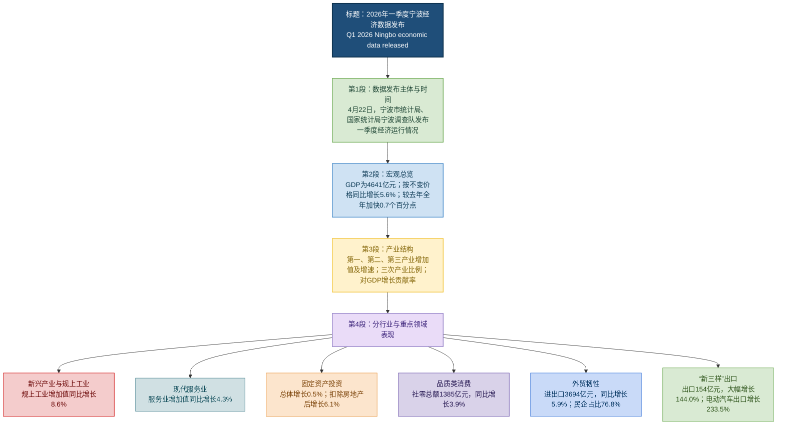

# 2026年一季度宁波经济数据出炉

> 本文为基于中国宁波网报道（人民网浙江频道转载）的精读整理稿。原文题：「2026年一季度宁波经济数据出炉」；栏目：党政/要闻。统计数据口径以原报道及官方发布为准；英文术语注释供阅读辅助。

---

## 基本信息

- **标题**：2026年一季度宁波经济数据出炉
- **作者**：冯瑄、沈莉、陈巧云
- **来源**：中国宁波网（人民网转发）
- **发布时间**：2026年04月23日 09:00
- **栏目**：党政/要闻
- **原文链接**：[2026年一季度宁波经济数据出炉 - 人民网浙江频道](http://zj.people.com.cn/n2/2026/0423/c186327-41560584.html)
- **网站信息**：人民网（people.com.cn）是《人民日报》建设的以新闻为主的大型网上信息发布平台，也是互联网上最大的中文和多语种新闻网站之一。

---

## 前情提要：文章结构信息图

```text
# 2026年一季度宁波经济数据文章结构
│
├── [第一段] 核心动态发布
│   └── 明确发布主体（市统计局、国家统计局宁波调查队）与发布时间（4月22日）。
│
├── [第二段] 宏观总量与整体增速
│   ├── GDP核算结果：4641亿元。
│   ├── 增长指标：同比增长5.6%（按不变价格计算）。
│   └── 趋势研判：比去年全年加快0.7个百分点；“稳中有进、向新向好”。
│
├── [第三段] 三次产业结构分析
│   ├── 第一产业（农业）：增加值72亿元，增长4.1%。
│   ├── 第二产业（工业/建筑业）：增加值1968亿元，增长7.5%。
│   ├── 第三产业（服务业）：增加值2601亿元，增长4.3%。
│   └── 效益分析：产业占比（1.5∶42.4∶56.1）及对GDP增长的贡献率。
│
└── [第四段] 细分领域运行亮点
    ├── 工业动力：规模以上工业增加值增长8.6%（新动能）。
    ├── 服务业态：现代服务业增势良好。
    ├── 投资表现：固定资产投资止跌回稳，非房地产投资增长显著（6.1%）。
    ├── 消费市场：社会消费品零售总额1385亿元，品质类消费活跃。
    └── 对外贸易：进出口总额3694亿元，民营企业主导，重点关注“新三样”出口爆发。
```

---

## 全文精读笔记

**原文：4月22日，宁波市统计局、国家统计局宁波调查队发布一季度全市经济运行情况。**

> **【注释解析】**
> *   **宁波市统计局**：主管全市统计和国民经济核算工作的市政府主管局。
> *   **国家统计局宁波调查队**：隶属于国家统计局的派出机构，与地方统计局既有合作又有独立调查职能，主要负责居民收支、价格等民生数据监测。
> *   **经济运行情况 (Economic Performance)**：指一定时期内经济活动的总体状态，包括增长、结构、效益等维度。

**原文：根据浙江省地区生产总值统一核算结果，一季度宁波市地区生产总值4641亿元，按不变价格计算，同比增长5.6%，比去年全年加快0.7个百分点。全市经济运行稳中有进、向新向好，实现良好开局。**

> **【注释解析】**
> *   **地区生产总值 (GDP)**：指一个地区所有常住单位在一定时期内生产活动的最终成果。
> *   **不变价格 (Constant Price)**：在计算不同时期的价值指标时，扣除价格变动因素，以确切反映物量变化。**近义词**：可比价格。
> *   **百分点 (Percentage Point)**：指以百分数形式表示的相对指标的变化幅度。**易混淆**：不要与“百分比”混淆，增加0.7%和增加0.7个百分点含义不同。
> *   **稳中有进 (Stable progress)**：指在保持总量稳定的基础上，结构和质量有所提升。
> *   **向新向好**：这是近年来党政公文中的**高级表达**，强调经济增长的动力正在向“新质生产力”转化。
> *   **开局 (Start/Beginning)**：常用语**“实现开门红”**，比喻初始阶段取得显著成绩。

**原文：分产业看，宁波第一产业增加值72亿元，增长4.1%；第二产业增加值1968亿元，增长7.5%；第三产业增加值2601亿元，增长4.3%。三次产业之比为1.5∶42.4∶56.1。三次产业对GDP增长的贡献率分别为1.2%、56.5%和42.3%。**

> **【注释解析】**
> *   **第一、二、三产业**：根据国民经济行业分类，分别指农林牧渔业；工业和建筑业；除一二产业外的其他行业（服务业）。
> *   **增加值 (Value-added)**：生产过程中产出的价值减去投入的中间消耗后的余额。
> *   **贡献率 (Contribution Rate)**：指各部分增加值增长量占GDP增长量的比重。宁波第二产业（工业）贡献率过半，显示了其作为“制造之都”的强大底色。

**原文：分行业看，宁波新兴产业引领增长。一季度，全市规模以上工业增加值同比增长8.6%，比去年全年加快3.3个百分点。现代服务业增势良好。一季度，全市服务业增加值同比增长4.3%。**

> **【注释解析】**
> *   **规模以上工业 (Industrial Enterprises above Designated Size)**：通常指年主营业务收入在2000万元及以上的工业法人单位。
> *   **新兴产业 (Emerging Industries)**：指由新技术、新模式驱动的产业，如生物技术、新材料等。
> *   **现代服务业 (Modern Service Industry)**：相对于传统服务业，指依托信息技术和现代管理理念发展的行业，如金融、信息软件、研发设计等。

**原文：固定资产投资止跌回稳。一季度，全市固定资产投资同比增长0.5%，扣除房地产开发投资，固定资产投资增长6.1%。品质类消费持续活跃。一季度，全市社会消费品零售总额1385亿元，同比增长3.9%，增速较去年全年回升2.1个百分点。**

> **【注释解析】**
> *   **固定资产投资 (Fixed Asset Investment)**：建造和购置固定资产的经济活动。
> *   **止跌回稳**：指经过下滑后开始企稳。**反义词**：震荡下行。
> *   **房地产开发投资**：指房地产开发公司在土地开发、房屋建设等方面的投资。此处扣除该项后增长6.1%，说明制造业和基础设施投资增长强劲。
> *   **社会消费品零售总额 (Total Retail Sales of Consumer Goods)**：衡量消费市场活跃度的核心指标。
> *   **品质类消费**：指消费者从“买得到”向“买得好”转变，追求品牌、文化、科技含量的消费行为。

**原文：外贸保持较强韧性。一季度，全市进出口总额3694亿元，同比增长5.9%。民营企业进出口2835亿元，增长5.1%，占进出口总额的76.8%。“新三样”产品出口154亿元，大幅增长144.0%，其中电动汽车出口增长233.5%。**

> **【注释解析】**
> *   **韧性 (Resilience)**：经济学术语，指系统遭受外部冲击后恢复和保持运行的能力。**金句积累**：**“中国经济韧性强、潜力大、活力足。”**
> *   **民营企业**：宁波经济的底色。其占比近八成，体现了民间投资和贸易的活跃度。
> *   **“新三样” (The "New Three")**：指**电动汽车 (EVs)、锂电池 (Lithium-ion batteries)、光伏产品 (Solar cells)**。这是相对于服装、家具、家电“老三样”而言的高技术、高附加值出口产品。
> *   **背景补充**：宁波拥有世界级大港（宁波舟山港），在“新三样”出海中占据地理和产业配套优势。电动汽车出口增长233.5%属于爆发式增长（Exponential growth）。

**原文：(责编：孙鹏、康梦琦)**

> **【注释解析】**
> *   **责编 (Responsible Editor)**：责任编辑的简称。
> *   **孙鹏、康梦琦**：人民网/中国宁波网的编辑人员。在规范的新闻报道中，须列出采编人员以示文责自负。


# 精读笔记

## 基本信息

- 文章来源：人民网浙江频道，转载来源为中国宁波网
- 题目：2026年一季度宁波经济数据出炉
- 作者：冯瑄、沈莉、陈巧云
- 发布时间：2026年04月23日09:00
- 原文链接：人民网浙江频道：《2026年一季度宁波经济数据出炉》 [<sup>1</sup>](https://zj.people.com.cn/n2/2026/0423/c186327-41560584.html)
- 作者背景简介：
  - 冯瑄：公开检索结果显示，冯瑄常以“甬派客户端记者”身份发表宁波本地经济、城市建设、产业与民生相关新闻；甬派客户端隶属宁波本地主流媒体传播体系。可参考其在其他媒体转载稿中的署名信息：澎湃新闻转载稿示例 [<sup>2</sup>](https://m.thepaper.cn/newsDetail_forward_31940002)。
  - 沈莉：未检索到足够可靠、可交叉验证的公开个人背景简介；本文仅据署名列为作者之一。
  - 陈巧云：公开检索结果显示，陈巧云常见于宁波经济运行、统计数据类报道的通讯员或相关署名中，例如宁波经济运行数据报道转载信息中出现“通讯员 陈巧云”。可参考：相关转载示例 [<sup>3</sup>](https://www.sina.cn/news/detail/5278501323147908.html)。
- 文章性质：地方经济数据新闻；核心内容为宁波市2026年一季度宏观经济运行情况，包括GDP、三次产业、工业、服务业、投资、消费、外贸与“新三样”出口等指标。

## 前情提要



## 逐句精读

🔸中文：2026年一季度 / 宁波 **`经济数据`** **`出炉`**

🔹English: **`Ningbo’s economic data`** for **`the first quarter of 2026`** / have been **`released`**.

背景注释：
- 宁波：浙江省副省级城市、计划单列市，位于长三角南翼，是中国重要港口城市和制造业、外贸城市。
- 一季度：通常指1月、2月、3月，是观察全年经济开局的重要时间窗口。
- “经济数据出炉”是中文新闻标题常用表达，语气简洁，强调官方数据已经公布。

> **`economic data`** /ˌiːkəˈnɑːmɪk ˈdeɪtə/ n. — facts and figures that describe an economy’s performance（反映经济运行状况的数据）。语域：新闻、经济、学术。画龙点睛：`data` 在英式英语中可作复数，在现代新闻英语中常作不可数集合名词使用；搭配常见于 `release economic data`、`official economic data`、`macroeconomic data`。写作中比 `numbers` 更正式。
>
> **`the first quarter`** /ðə ˌfɜːrst ˈkwɔːrtər/ n. — the first three-month period of a year, from January to March（第一季度）。语域：商业、财报、统计。画龙点睛：季度表达常写作 `Q1`，如 `Q1 growth`、`Q1 results`；第二、三、四季度分别为 `Q2`、`Q3`、`Q4`。雅思图表作文和财经阅读中极常见。
>
> **`release`** /rɪˈliːs/ v. — to make information available to the public（发布、公布）。语域：新闻、官方、商业。画龙点睛：比 `give out` 更正式，常用于 `release data / figures / results / a report`；名词也是 `release`，如 `a press release` 指“新闻稿”。

---

🔸中文：4月22日，/ 宁波市统计局、国家统计局宁波调查队 / 发布 **`一季度`** **`全市经济运行情况`**。

🔹English: On April 22, / the Ningbo Municipal Bureau of Statistics and the Ningbo Survey Team of the National Bureau of Statistics / **`released`** the city’s **`economic performance`** for **`the first quarter`**.

背景注释：
- 宁波市统计局：宁波地方政府统计主管部门，负责组织、管理和发布地方经济社会统计信息。
- 国家统计局宁波调查队：国家统计局派驻宁波的调查机构，承担价格、居民收支、劳动力等统计调查任务，也参与地方经济运行数据发布。
- “经济运行情况”在英语中通常不直译为 “economic operation situation”，更自然的译法是 `economic performance` 或 `economic activity`。

> **`municipal`** /mjuːˈnɪsɪpəl/ adj. — relating to a city or town government（市政的、市级的）。语域：政府、法律、新闻。画龙点睛：`municipal government` 指“市政府”，`municipal services` 指供水、道路、垃圾处理等市政服务；不要简单等同于 `local`，`municipal` 更强调“城市行政层级”。
>
> **`bureau`** /ˈbjʊroʊ/ n. — a government department or office（局、办事处）。语域：政府、行政。画龙点睛：美式英语中常见于政府机构名称，如 `the Federal Bureau of Investigation`；中国政府部门英译中，统计局常译为 `Bureau of Statistics`。
>
> **`survey team`** /ˈsɜːrveɪ tiːm/ n. — a group responsible for collecting and analyzing data through surveys（调查队、调查组）。语域：统计、研究、政府。画龙点睛：`survey` 作名词是“调查”，作动词是“调查、测量”；统计语境中常搭配 `conduct a survey`、`household survey`、`sample survey`。
>
> **`economic performance`** /ˌiːkəˈnɑːmɪk pərˈfɔːrməns/ n. — how well an economy is functioning, measured by indicators such as growth, investment, consumption and trade（经济表现、经济运行情况）。语域：经济、新闻、政策。画龙点睛：这是翻译“经济运行情况”的高频地道表达；比 `economic situation` 更偏向用指标衡量的“表现”。

---

🔸中文：根据浙江省 **`地区生产总值统一核算结果`**，/ 一季度宁波市 **`地区生产总值`** 4641亿元，/ 按 **`不变价格`** 计算，/ 同比增长5.6%，/ 比去年全年加快0.7个百分点。

🔹English: According to the **`unified accounting results`** for Zhejiang’s **`gross regional product`**, / Ningbo’s **`gross regional product`** reached RMB 464.1 billion in the first quarter; / calculated at **`constant prices`**, / it grew by 5.6% **`year on year`**, / 0.7 **`percentage points`** faster than for the whole of last year.

背景注释：
- 地区生产总值：英文通常译为 `gross regional product`，简称 `GRP`，是一个地区在一定时期内生产活动最终成果的价值总量。
- 统一核算：在中国统计体系中，为提高地区GDP数据的可比性和协调性，地方GDP由国家或省级层面按统一制度进行核算。
- 不变价格：用某一基期价格计算产出，目的是剔除价格变动影响，更准确反映实际增长。
- 4641亿元人民币等于464.1 billion yuan，即4641 × 100 million yuan。

> **`unified accounting`** /ˈjuːnɪfaɪd əˈkaʊntɪŋ/ n. — a standardized method of calculating economic indicators under the same rules（统一核算）。语域：统计、经济、政府。画龙点睛：`accounting` 不只指企业会计，也可指“核算”；宏观统计中常见 `national accounts`，即“国民经济核算”。
>
> **`gross regional product`** /ɡroʊs ˈriːdʒənəl ˈprɑːdʌkt/ n. — the total value of final goods and services produced in a region over a period（地区生产总值）。语域：经济、统计。画龙点睛：国家层面常说 `GDP`，地区层面更严谨可说 `GRP`；但新闻中也常泛称为 `GDP`。写作中首次出现可写 `gross regional product (GRP)`。
>
> **`constant prices`** /ˈkɑːnstənt ˈpraɪsɪz/ n. — prices adjusted to remove the effect of inflation or deflation（不变价格、可比价格）。语域：统计、经济。画龙点睛：与之相对的是 `current prices`，即“现价”。若题目问“实际增长”，通常对应 `at constant prices`，不要误译成“固定价格”。
>
> **`year on year`** /ˌjɪr ɑːn ˈjɪr/ adv./adj. — compared with the same period in the previous year（同比）。语域：财经、统计、新闻。画龙点睛：也写作 `year-over-year` 或 `YoY`；区别于 `month on month` 环比。图表作文中可写 `rose 5.6% year on year`。
>
> **`percentage point`** /pərˈsentɪdʒ pɔɪnt/ n. — a unit used to express the arithmetic difference between two percentages（百分点）。语域：统计、财经。画龙点睛：`percentage` 是“百分比”，`percentage point` 是两个百分比之间的差值；5%升至6%是 `up by 1 percentage point`，不是 `up by 1 percent`。

---

🔸中文：全市 **`经济运行`** / **`稳中有进`**、**`向新向好`**，/ 实现 **`良好开局`**。

🔹English: The city’s **`economy`** / remained stable while making progress and became increasingly innovation-driven and positive, / achieving **`a good start`**.

背景注释：
- “稳中有进”是中国经济新闻和政策文件中的常见表述，强调总体稳定基础上的改善。
- “向新向好”强调新产业、新动能、新模式带来的积极变化，常与“新质生产力”“产业升级”等政策语境相关。
- “良好开局”通常用于季度或年度初期数据，表示经济表现为全年发展奠定基础。

> **`remain stable`** /rɪˈmeɪn ˈsteɪbəl/ v. phr. — to continue without major negative change（保持稳定）。语域：经济、新闻、政策。画龙点睛：`remain` 后接形容词，表示“继续处于某状态”，如 `remain strong / weak / uncertain`；比 `be still stable` 更书面自然。
>
> **`make progress`** /meɪk ˈprɑːɡres/ v. phr. — to improve or develop（取得进展）。语域：通用、正式。画龙点睛：`progress` 作名词通常不可数，不能说 `make a progress`；正确表达是 `make progress in doing sth.`。
>
> **`innovation-driven`** /ˌɪnəˈveɪʃən ˈdrɪvən/ adj. — powered or led by innovation（创新驱动的）。语域：经济、科技、政策。画龙点睛：`-driven` 是高频后缀，表示“由……驱动”，如 `export-driven growth`、`consumer-driven demand`、`data-driven decision-making`。
>
> **`get off to a good start`** /ɡet ɔːf tə ə ɡʊd stɑːrt/ idiom — to begin successfully（开局良好）。语域：新闻、口语、商务。画龙点睛：比 `have a good beginning` 更地道；可用于经济、项目、比赛、学期等，如 `The campaign got off to a strong start.`

---

🔸中文：分产业看，/ 宁波 **`第一产业增加值`** 72亿元，增长4.1%；/ **`第二产业增加值`** 1968亿元，增长7.5%；/ **`第三产业增加值`** 2601亿元，增长4.3%。

🔹English: By sector, / Ningbo’s **`added value`** of the **`primary industry`** reached RMB 7.2 billion, up 4.1%; / the **`secondary industry`** recorded RMB 196.8 billion, up 7.5%; / and the **`tertiary industry`** reached RMB 260.1 billion, up 4.3%.

背景注释：
- 第一产业：主要包括农业、林业、牧业、渔业等。
- 第二产业：主要包括工业和建筑业，是宁波制造业基础的重要体现。
- 第三产业：主要包括服务业，如金融、物流、信息服务、批发零售、住宿餐饮等。
- 增加值：指各产业在生产过程中创造的新增价值，是GDP核算的核心概念。

> **`by sector`** /baɪ ˈsektər/ adv. phr. — classified according to parts or divisions of the economy（按产业、按部门划分）。语域：经济、商业、统计。画龙点睛：`sector` 可指经济部门，如 `manufacturing sector`、`service sector`；也可指领域，如 `public sector` 公共部门、`private sector` 私营部门。
>
> **`added value`** /ˈædɪd ˈvæljuː/ n. — the extra value created by production beyond the cost of inputs（增加值）。语域：经济、统计、商业。画龙点睛：宏观统计中指产业对GDP的贡献；商业中 `value-added services` 是“增值服务”，含义相关但场景不同。
>
> **`primary industry`** /ˈpraɪmeri ˈɪndəstri/ n. — the sector involving extraction or production of raw materials, especially agriculture（第一产业）。语域：经济、统计。画龙点睛：`primary` 有“首要的、初级的”之意；在产业分类中指农业等基础生产部门。
>
> **`secondary industry`** /ˈsekənderi ˈɪndəstri/ n. — the sector involving manufacturing and construction（第二产业）。语域：经济、统计。画龙点睛：常与 `manufacturing`、`construction` 相关；宁波作为制造业城市，第二产业数据常是观察经济动能的重要指标。
>
> **`tertiary industry`** /ˈtɜːrʃieri ˈɪndəstri/ n. — the service sector of an economy（第三产业、服务业）。语域：经济、统计。画龙点睛：`tertiary` 原义为“第三的”，发音较难；英语新闻中也常直接说 `the service sector`，更自然易懂。

---

🔸中文：**`三次产业之比`** / 为1.5∶42.4∶56.1。

🔹English: The **`ratio`** of the three industries / stood at 1.5:42.4:56.1.

背景注释：
- 三次产业之比表示第一、第二、第三产业在地区生产总值中的结构占比。
- 宁波第三产业占比超过一半，说明服务业在经济总量中占主导；第二产业占比仍高，体现制造业基础较强。
- 该比例不是增速，而是经济结构比例。

> **`ratio`** /ˈreɪʃioʊ/ n. — the relationship between two or more quantities expressed in numbers（比率、比例）。语域：数学、统计、经济。画龙点睛：读比例时英语用 `to`，如 1:2 读作 `one to two`；写作中可说 `the ratio of A to B`，注意介词是 `of ... to ...`。
>
> **`stand at`** /stænd æt/ v. phr. — to be at a particular level or amount（处于某一数值、为）。语域：财经、新闻、统计。画龙点睛：描述数据时比 `is` 更有新闻感，如 `Inflation stood at 3%`、`unemployment stood at 5.2%`。
>
> **`industry structure`** /ˈɪndəstri ˈstrʌktʃər/ n. — the composition of different sectors within an economy（产业结构）。语域：经济、政策。画龙点睛：谈经济升级时常用 `optimize the industry structure` 或 `upgrade the industrial structure`；注意 `industry` 可泛指“产业”，不只“工业”。

---

🔸中文：三次产业 / 对 **`GDP增长`** 的 **`贡献率`** / 分别为1.2%、56.5%和42.3%。

🔹English: The three industries’ **`contribution rates`** / to **`GDP growth`** / were 1.2%, 56.5% and 42.3%, **`respectively`**.

背景注释：
- 贡献率：衡量某一产业对整体经济增长的拉动贡献，并不等同于该产业在GDP中的占比。
- 第二产业贡献率为56.5%，高于其产业占比42.4%，说明第二产业对一季度增长的拉动较强。
- GDP：`gross domestic product`，中文为国内生产总值；在地方报道中也常泛指地区生产总值。

> **`contribution rate`** /ˌkɑːntrɪˈbjuːʃən reɪt/ n. — the share of total growth attributable to a specific factor or sector（贡献率）。语域：统计、经济。画龙点睛：`contribution` 常搭配介词 `to`，如 `make a contribution to growth`；注意贡献率不是占比，阅读数据题时要分清。
>
> **`GDP growth`** /ˌdʒiː diː ˈpiː ɡroʊθ/ n. — the increase in gross domestic product over a period（GDP增长）。语域：经济、新闻。画龙点睛：`growth` 可数性视语境而定，表示“增长”常不可数；常用搭配有 `drive GDP growth`、`boost GDP growth`、`slow GDP growth`。
>
> **`respectively`** /rɪˈspektɪvli/ adv. — in the same order as the items already mentioned（分别地、依次地）。语域：正式、学术、新闻。画龙点睛：用于多个数据与多个对象一一对应，位置通常在句末；翻译时要回看前文顺序，避免对应错位。

---

🔸中文：分行业看，/ 宁波 **`新兴产业`** / **`引领增长`**。

🔹English: By industry, / Ningbo’s **`emerging industries`** / **`led growth`**.

背景注释：
- 新兴产业：通常指技术含量较高、成长性较强、代表未来产业方向的行业，如新能源、新材料、高端装备、数字经济相关产业等。
- “分产业”和“分行业”不同：前者是第一、第二、第三产业的大类；后者更细分，可指工业、服务业、外贸、消费等具体行业或领域。
- 宁波的产业基础包括绿色石化、汽车零部件、高端装备、智能家电、港航物流等。

> **`emerging industries`** /ɪˈmɜːrdʒɪŋ ˈɪndəstriz/ n. — new or fast-growing sectors with strong future potential（新兴产业）。语域：经济、科技、政策。画龙点睛：`emerging` 表示“正在出现并发展中的”，常见于 `emerging markets` 新兴市场、`emerging technologies` 新兴技术。
>
> **`lead growth`** /liːd ɡroʊθ/ v. phr. — to be the main force driving an increase（引领增长、带动增长）。语域：财经、新闻。画龙点睛：`lead` 作动词读 /liːd/，过去式和过去分词为 `led` /led/；不要与金属铅 `lead` /led/ 混淆。
>
> **`by industry`** /baɪ ˈɪndəstri/ adv. phr. — classified according to specific industries or business fields（按行业划分）。语域：经济、统计。画龙点睛：`industry` 在英语里既可指“工业”，也可泛指“行业”；`the tourism industry` 是旅游业，`the tech industry` 是科技行业。

---

🔸中文：一季度，/ 全市 **`规模以上工业增加值`** 同比增长8.6%，/ 比去年全年加快3.3个百分点。

🔹English: In the first quarter, / the city’s **`value added of above-designated-size industrial enterprises`** grew by 8.6% year on year, / 3.3 percentage points faster than for the whole of last year.

背景注释：
- 规模以上工业：在中国统计口径中，通常指年主营业务收入达到一定标准以上的工业企业；常见门槛为年主营业务收入2000万元及以上。
- 工业增加值：衡量工业生产过程中新增价值，是观察工业生产景气度的重要指标。
- 该句显示宁波工业增速明显快于去年全年水平。

> **`above-designated-size`** /əˌbʌv ˈdezɪɡneɪtɪd saɪz/ adj. — meeting or exceeding an official size threshold for statistical reporting（规模以上的）。语域： 中国统计、经济新闻。画龙点睛：这是中国特色统计术语，英语中常见译法还有 `above-scale`；翻译时不要按字面译成 `large-scale only`，因为它强调“达到统计口径门槛”。
>
> **`industrial enterprise`** /ɪnˈdʌstriəl ˈentərpraɪz/ n. — a business engaged in industrial production or manufacturing（工业企业）。语域：经济、商业、统计。画龙点睛：`enterprise` 比 `company` 更正式，常见于政府和统计文本；`state-owned enterprise` 是国有企业，`private enterprise` 是民营企业。
>
> **`value added`** /ˈvæljuː ˈædɪd/ n. — the newly created value in production after deducting intermediate inputs（增加值）。语域：经济、统计。画龙点睛：有时写作 `value-added` 作形容词，如 `value-added tax` 增值税、`value-added products` 高附加值产品。
>
> **`accelerate`** /əkˈseləreɪt/ v. — to increase in speed or rate（加快、加速）。语域：经济、科技、通用。画龙点睛：经济数据中常说 `growth accelerated` 增长加快；反义词是 `decelerate` 减速，名词分别是 `acceleration` 和 `deceleration`。

---

🔸中文：**`现代服务业`** / **`增势良好`**。

🔹English: The **`modern service sector`** / maintained **`solid growth momentum`**.

背景注释：
- 现代服务业：通常包括金融、信息服务、现代物流、科技服务、商务服务、数字服务等较高附加值服务行业。
- “增势良好”不是单纯“good increase”，地道表达应强调增长势头，如 `solid growth momentum`。
- 该句承接上文工业表现，说明服务业同样保持增长。

> **`modern service sector`** /ˈmɑːdərn ˈsɜːrvɪs ˈsektər/ n. — service industries based on advanced technology, specialized knowledge or high value-added activities（现代服务业）。语域：经济、产业政策。画龙点睛：常涵盖 `finance`、`logistics`、`information services`、`business services` 等；写作中比单说 `services` 更能体现产业升级含义。
>
> **`solid`** /ˈsɑːlɪd/ adj. — strong, reliable or satisfactory（稳健的、良好的）。语域：财经、新闻、商务。画龙点睛：财经英语中 `solid growth` 是“稳健增长”，比 `good growth` 更专业；还可说 `solid performance`、`solid demand`。
>
> **`growth momentum`** /ɡroʊθ moʊˈmentəm/ n. — the force or tendency that keeps growth continuing（增长势头）。语域：经济、财经。画龙点睛：`momentum` 原指物理中的“动量”，引申为“势头”；常见搭配 `maintain momentum`、`lose momentum`、`gain momentum`。

---

🔸中文：一季度，/ 全市 **`服务业增加值`** / 同比增长4.3%。

🔹English: In the first quarter, / the city’s **`service-sector added value`** / grew by 4.3% year on year.

背景注释：
- 服务业增加值是第三产业在一定时期内创造的新增价值。
- 4.3%的增速与前文第三产业增加值增长4.3%相对应，说明这里从行业表现角度再次强调服务业增长。
- 服务业对城市经济韧性、就业吸纳和消费活跃度都有重要意义。

> **`service-sector`** /ˈsɜːrvɪs ˈsektər/ adj. — relating to industries that provide services rather than goods（服务业的）。语域：经济、商业。画龙点睛：作形容词时常加连字符，如 `service-sector growth`；名词短语可写 `the service sector`，表示整个服务业。
>
> **`grow by`** /ɡroʊ baɪ/ v. phr. — to increase by a specific amount or percentage（增长了……）。语域：统计、财经。画龙点睛：`grow by 4.3%` 表示增长幅度是4.3%；`grow to 100 billion` 表示增长到1000亿。`by` 和 `to` 是数据题高频考点。
>
> **`year on year`** /ˌjɪr ɑːn ˈjɪr/ adv. — compared with the same period a year earlier（同比）。语域：财经、统计。画龙点睛：可写作 `YoY`；若与上一季度相比，则是 `quarter on quarter` 或 `QoQ`，不可混用。

---

🔸中文：**`固定资产投资`** / **`止跌回稳`**。

🔹English: **`Fixed-asset investment`** / stopped declining and stabilized.

背景注释：
- 固定资产投资：指用于建造和购置固定资产的经济活动，如基础设施、厂房、设备、房地产开发等投资。
- “止跌回稳”表示此前可能处于下降状态，现在下跌趋势停止，并呈现稳定迹象。
- 固定资产投资是拉动经济增长的重要指标之一，与消费、出口并称宏观需求的重要部分。

> **`fixed-asset investment`** /ˌfɪkst ˈæset ɪnˈvestmənt/ n. — spending on long-term physical assets such as buildings, machinery and infrastructure（固定资产投资）。语域：经济、统计、政策。画龙点睛：`asset` 是“资产”，`fixed asset` 指长期使用的有形资产；中国经济新闻中该术语极常见，常缩写为 `FAI`。
>
> **`stop declining`** /stɑːp dɪˈklaɪnɪŋ/ v. phr. — to cease falling or decreasing（停止下降）。语域：经济、新闻。画龙点睛：`decline` 比 `fall` 更正式，可作动词或名词；如 `a decline in investment`，表示投资下降。
>
> **`stabilize`** /ˈsteɪbəlaɪz/ v. — to become or make something steady and less likely to change suddenly（稳定、趋稳）。语域：经济、政策、通用。画龙点睛：名词是 `stability`，形容词是 `stable`；经济新闻常见 `the market stabilized`、`prices stabilized`。

---

🔸中文：一季度，/ 全市 **`固定资产投资`** 同比增长0.5%，/ **`扣除房地产开发投资`**，/ 固定资产投资增长6.1%。

🔹English: In the first quarter, / the city’s **`fixed-asset investment`** rose by 0.5% year on year; / **`excluding real estate development investment`**, / fixed-asset investment grew by 6.1%.

背景注释：
- 该句通过“扣除房地产开发投资”展示非房地产领域投资表现。
- 总体固定资产投资仅增长0.5%，但扣除房地产后增长6.1%，说明房地产开发投资可能拖累了总体投资数据。
- 在中国地方经济报道中，房地产开发投资常被单独列出，因为其对固定资产投资总量影响较大。

> **`excluding`** /ɪkˈskluːdɪŋ/ prep. — not including something in a calculation or group（不包括、扣除）。语域：统计、财经、正式。画龙点睛：数据表达中常用 `excluding food and energy`、`excluding real estate`；反义词是 `including`，名词是 `exclusion`。
>
> **`real estate development investment`** /ˈriːəl ɪˌsteɪt dɪˈveləpmənt ɪnˈvestmənt/ n. — investment in developing property projects such as housing and commercial buildings（房地产开发投资）。语域：房地产、经济统计。画龙点睛：`real estate` 美式常用，英式英语也可说 `property`；但中国统计文本中官方英译多用 `real estate`。
>
> **`rise by`** /raɪz baɪ/ v. phr. — to increase by a stated amount（上涨、增长了……）。语域：财经、统计。画龙点睛：`rise by 0.5%` 是“增长了0.5%”；`rise to 0.5%` 是“升至0.5%”。介词决定含义，考试中常考。
>
> **`overall figure`** /ˌoʊvərˈɔːl ˈfɪɡjər/ n. — the total number or result including all components（总体数据）。语域：统计、财经。画龙点睛：虽然原句未直接出现，但理解此句需区分 `overall figure` 与 `figure excluding real estate`，即总体口径与剔除口径。

---

🔸中文：**`品质类消费`** / **`持续活跃`**。

🔹English: **`Quality-oriented consumption`** / remained active.

背景注释：
- 品质类消费：通常指居民对更高品质、更好体验、更高附加值商品和服务的消费需求，如智能家电、新能源汽车、文化旅游、健康消费等。
- “持续活跃”表明相关消费需求保持较强，不是短期偶发。
- 该表述常用于消费升级相关报道。

> **`quality-oriented consumption`** /ˈkwɑːləti ˈɔːrientɪd kənˈsʌmpʃən/ n. — consumption focused on higher-quality goods and services（品质类消费、质量导向型消费）。语域：经济、消费研究、政策。画龙点睛：`-oriented` 表示“以……为导向”，如 `market-oriented` 市场导向的、`consumer-oriented` 以消费者为导向的。
>
> **`consumption`** /kənˈsʌmpʃən/ n. — the act of buying or using goods and services（消费）。语域：经济、学术、新闻。画龙点睛：宏观经济中 `consumption` 是拉动GDP的重要需求项；常见搭配 `domestic consumption`、`household consumption`、`boost consumption`。
>
> **`remain active`** /rɪˈmeɪn ˈæktɪv/ v. phr. — to continue to show strong activity or demand（保持活跃）。语域：财经、新闻。画龙点睛：可用于市场、交易、消费、投资等，如 `the housing market remained active`；比 `was still active` 更正式。

---

🔸中文：一季度，/ 全市 **`社会消费品零售总额`** 1385亿元，/ 同比增长3.9%，/ 增速较去年全年回升2.1个百分点。

🔹English: In the first quarter, / the city’s **`total retail sales of consumer goods`** reached RMB 138.5 billion, / up 3.9% year on year, / with the **`growth rate`** rebounding by 2.1 percentage points compared with the whole of last year.

背景注释：
- 社会消费品零售总额：衡量消费市场规模的重要指标，反映批发零售、住宿餐饮等面向居民和社会集团的商品零售情况。
- 1385亿元人民币等于138.5 billion yuan。
- 增速回升2.1个百分点说明消费恢复或改善程度较去年全年更强。

> **`total retail sales of consumer goods`** /ˈtoʊtl ˈriːteɪl seɪlz əv kənˈsuːmər ɡʊdz/ n. — the total value of consumer goods sold through retail channels（社会消费品零售总额）。语域：宏观经济、统计。画龙点睛：中国统计高频术语，可简称 `retail sales`；但完整表达更正式，适用于翻译政府统计文本。
>
> **`retail sales`** /ˈriːteɪl seɪlz/ n. — sales of goods directly to consumers（零售销售额）。语域：商业、财经。画龙点睛：`retail` 是零售，反义词是 `wholesale` 批发；美国经济新闻中 `retail sales data` 是重要宏观指标。
>
> **`growth rate`** /ɡroʊθ reɪt/ n. — the speed at which something increases over time（增长率、增速）。语域：统计、财经。画龙点睛：`rate` 强调“速度或比率”；不要把 `growth rate` 译为“增长数量”，它表示百分比意义上的增长速度。
>
> **`rebound`** /rɪˈbaʊnd/ v./n. — to rise again after a decline or weak period（回升、反弹）。语域：财经、体育、新闻。画龙点睛：经济数据中常见 `sales rebounded`、`a rebound in demand`；含义比 `increase` 更具体，暗含此前曾走弱。
>
> **`compared with`** /kəmˈperd wɪð/ prep. phr. — measured against another thing to show similarities or differences（与……相比）。语域：学术、统计、通用。画龙点睛：也可说 `compared to`；严格比较数据时 `compared with` 更稳妥。

---

🔸中文：**`外贸`** / 保持 **`较强韧性`**。

🔹English: **`Foreign trade`** / maintained relatively strong **`resilience`**.

背景注释：
- 外贸：即对外贸易，包括进口和出口。
- 宁波是中国重要外贸城市，宁波舟山港对进出口贸易具有关键支撑作用。
- “韧性”在经济语境中指面对外部压力、需求波动、贸易摩擦等不利因素时仍能保持稳定或恢复的能力。

> **`foreign trade`** /ˈfɔːrən treɪd/ n. — trade in goods and services between countries or regions（对外贸易、外贸）。语域：经济、国际贸易、新闻。画龙点睛：可分为 `exports` 出口和 `imports` 进口；中国地方经济报道常把外贸作为开放型经济的重要指标。
>
> **`maintain`** /meɪnˈteɪn/ v. — to keep something at the same level or in good condition（保持、维持）。语域：正式、新闻、学术。画龙点睛：比 `keep` 更正式，常搭配 `maintain growth`、`maintain stability`、`maintain momentum`。
>
> **`resilience`** /rɪˈzɪliəns/ n. — the ability to recover quickly from difficulties or withstand pressure（韧性、恢复力、抗压能力）。语域：经济、心理学、环境、工程。画龙点睛：形容词是 `resilient`；可说 `economic resilience`、`supply-chain resilience`，近年国际新闻和政策文本中高频出现。

---

🔸中文：一季度，/ 全市 **`进出口总额`** 3694亿元，/ 同比增长5.9%。

🔹English: In the first quarter, / the city’s **`total imports and exports`** reached RMB 369.4 billion, / up 5.9% year on year.

背景注释：
- 进出口总额：进口额与出口额之和，是衡量一个地区外贸规模的核心指标。
- 3694亿元人民币等于369.4 billion yuan。
- 同比增长5.9%说明与2025年一季度相比，宁波外贸总额有所扩大。

> **`imports and exports`** /ˈɪmpɔːrts ənd ˈekspɔːrts/ n. — goods and services bought from and sold to other countries or regions（进口和出口）。语域：国际贸易、经济。画龙点睛：`import` 作名词重音常在前 /ˈɪmpɔːrt/，作动词重音常在后 /ɪmˈpɔːrt/；`export` 也类似。
>
> **`total`** /ˈtoʊtl/ adj./n. — the complete amount when everything is added together（总的、总额）。语域：通用、统计。画龙点睛：作动词时读音仍为 /ˈtoʊtl/，表示“总计达”，如 `exports totaled $10 billion`。
>
> **`reach`** /riːtʃ/ v. — to arrive at a particular level, amount or number（达到）。语域：财经、新闻、通用。画龙点睛：描述数据时 `reach` 比 `be` 更动态，如 `GDP reached 464.1 billion yuan`；常用于创纪录或达到某规模。
>
> **`up`** /ʌp/ adv./adj. — increased by a stated amount（上涨、增长）。语域：新闻、财经。画龙点睛：财经标题常用 `up 5.9%` 省略 `was` 或 `were`，简洁有力；完整句可写 `was up 5.9% year on year`。

---

🔸中文：**`民营企业`** 进出口2835亿元，/ 增长5.1%，/ 占进出口总额的76.8%。

🔹English: **`Private enterprises`** recorded RMB 283.5 billion in imports and exports, / up 5.1%, / **`accounting for`** 76.8% of the city’s total imports and exports.

背景注释：
- 民营企业：指非国有控股的企业，是中国市场经济中重要主体。
- 2835亿元人民币等于283.5 billion yuan。
- 民营企业占进出口总额76.8%，说明宁波外贸中民营企业贡献突出。

> **`private enterprise`** /ˈpraɪvət ˈentərpraɪz/ n. — a business owned or controlled by private individuals or non-state entities（民营企业、私营企业）。语域：经济、商业、政策。画龙点睛：在中国语境中 `private enterprise` 常译“民营企业”；与 `state-owned enterprise` 国有企业相对。
>
> **`record`** /rɪˈkɔːrd/ v. — to register or report a particular amount, result or figure（录得、记录为）。语域：财经、新闻、统计。画龙点睛：作名词时读 /ˈrekərd/，作动词时读 /rɪˈkɔːrd/；财经新闻常说 `record growth` 或 `record sales`。
>
> **`account for`** /əˈkaʊnt fɔːr/ v. phr. — to make up a particular proportion of something（占……比例）。语域：统计、学术、财经。画龙点睛：高频考研和雅思词组；`A accounts for 76.8% of B` 表示A占B的76.8%。另一个意思是“解释”，如 `account for the difference`。
>
> **`total imports and exports`** /ˈtoʊtl ˈɪmpɔːrts ənd ˈekspɔːrts/ n. — the combined value of all imports and exports（进出口总额）。语域：国际贸易、统计。画龙点睛：`combined value` 可帮助理解“总额”含义；若只说 `exports` 则不包含进口。

---

🔸中文：“**`新三样`**”产品出口154亿元，/ **`大幅增长`** 144.0%，/ 其中 **`电动汽车`** 出口增长233.5%。

🔹English: Exports of **`the “new three” products`** totaled RMB 15.4 billion, / **`surging`** by 144.0%, / with **`electric vehicle`** exports growing by 233.5%.

背景注释：
- “新三样”：中国外贸语境中通常指电动载人汽车、锂离子蓄电池、太阳能电池等出口增长较快、代表制造业升级的新型产品。
- 电动汽车出口增长233.5%，说明该类产品出口增速极高，是宁波外贸增长的重要亮点之一。
- 154亿元人民币等于15.4 billion yuan。
- “大幅增长”在英文新闻中可根据程度译为 `rose sharply`、`increased significantly` 或 `surged`；这里144.0%的增幅较大，用 `surge` 较贴切。

> **`the “new three” products`** /ðə nuː θriː ˈprɑːdʌkts/ n. — China’s fast-growing export products commonly referring to electric vehicles, lithium-ion batteries and solar cells（“新三样”产品）。语域：中国外贸、产业政策、新闻。画龙点睛：这是中国特色表达，翻译时可保留引号并补充解释；首次出现最好写作 `the “new three” products — electric vehicles, lithium-ion batteries and solar cells`。
>
> **`surge`** /sɜːrdʒ/ v./n. — to increase suddenly and strongly（激增、飙升、大幅增长）。语域：财经、新闻、自然现象。画龙点睛：`surge` 比 `increase` 语气强，常用于大幅增长，如 `exports surged by 144%`；名词可说 `a surge in exports`。
>
> **`electric vehicle`** /ɪˈlektrɪk ˈviːəkl/ n. — a vehicle powered fully or partly by electricity（电动汽车）。语域：科技、汽车、能源。画龙点睛：常缩写为 `EV`；复数为 `electric vehicles` 或 `EVs`。相关表达有 `EV battery`、`charging station`、`range anxiety`。
>
> **`export`** /ˈekspɔːrt/ n.; /ɪkˈspɔːrt/ v. — goods sold to another country; to sell goods to another country（出口商品；出口）。语域：国际贸易、经济。画龙点睛：作名词重音在前，作动词重音在后；`exports grew` 是“出口增长”，`export products` 是“出口产品”。
>
> **`total`** /ˈtoʊtl/ v. — to amount to a particular number or value（总计达）。语域：统计、财经。画龙点睛：`Exports totaled RMB 15.4 billion` 是地道财经句式；比 `were 15.4 billion` 更正式、更有数据新闻风格。


# 2026年一季度宁波经济数据：公考资料分析拓展整理与计算

> 说明：以下计算均基于题干原文给出的四舍五入数据进行。实际统计中，GDP及各产业增速可能涉及不变价核算、现价总量、口径调整与四舍五入，因此个别复算结果与官方贡献率、占比可能存在轻微差异。公考资料分析中，一般直接按材料给定数据计算即可。

---

## 一、原文核心数据总表

| 指标 | 2026年一季度数据 | 同比增速 | 其他信息 |
|---|---:|---:|---|
| 宁波地区生产总值 GDP/GRP | 4641亿元 | 5.6% | 比去年全年加快0.7个百分点 |
| 第一产业增加值 | 72亿元 | 4.1% | 三次产业比重约1.5% |
| 第二产业增加值 | 1968亿元 | 7.5% | 三次产业比重约42.4% |
| 第三产业增加值 | 2601亿元 | 4.3% | 三次产业比重约56.1% |
| 三次产业之比 | 1.5∶42.4∶56.1 | — | 第一、二、三产业占GDP比重 |
| 第一产业对GDP增长贡献率 | — | — | 1.2% |
| 第二产业对GDP增长贡献率 | — | — | 56.5% |
| 第三产业对GDP增长贡献率 | — | — | 42.3% |
| 规模以上工业增加值 | 未给出绝对值 | 8.6% | 比去年全年加快3.3个百分点 |
| 服务业增加值 | 2601亿元左右 | 4.3% | 与第三产业增加值对应 |
| 固定资产投资 | 未给出绝对值 | 0.5% | 止跌回稳 |
| 扣除房地产开发投资后的固定资产投资 | 未给出绝对值 | 6.1% | 比整体投资增速高5.6个百分点 |
| 社会消费品零售总额 | 1385亿元 | 3.9% | 增速较去年全年回升2.1个百分点 |
| 进出口总额 | 3694亿元 | 5.9% | 外贸保持较强韧性 |
| 民营企业进出口额 | 2835亿元 | 5.1% | 占进出口总额76.8% |
| “新三样”产品出口额 | 154亿元 | 144.0% | 大幅增长 |
| 电动汽车出口 | 未给出绝对值 | 233.5% | 属于“新三样”相关亮点 |

---

## 二、基本单位换算

公考资料分析中，亿元、万亿元、百分数、百分点经常混合出现，先统一单位。

| 数据 | 换算 |
|---|---:|
| 4641亿元 | 0.4641万亿元 |
| 1968亿元 | 0.1968万亿元 |
| 2601亿元 | 0.2601万亿元 |
| 1385亿元 | 0.1385万亿元 |
| 3694亿元 | 0.3694万亿元 |
| 2835亿元 | 0.2835万亿元 |
| 154亿元 | 0.0154万亿元 |

---

## 三、同比基期量与增长量计算

资料分析中最常考的是：

> 现期量 = 基期量 × 1 + 增长率
> 基期量 = 现期量 ÷ 1 + 增长率
> 增长量 = 现期量 − 基期量
> 增长量 = 现期量 × 增长率 ÷ 1 + 增长率

---

### 1. 地区生产总值 GDP

原文数据：

- 2026年一季度GDP：4641亿元
- 同比增长：5.6%

计算：

\[
2025年一季度GDP \approx \frac{4641}{1+5.6\%}
= \frac{4641}{1.056}
\approx 4394.9亿元
\]

\[
增长量 \approx 4641 - 4394.9 = 246.1亿元
\]

| 指标 | 数值 |
|---|---:|
| 2026年一季度GDP | 4641亿元 |
| 2025年一季度GDP约 | 4394.9亿元 |
| 同比增长量约 | 246.1亿元 |
| 同比增速 | 5.6% |

可记为：

> 宁波2026年一季度GDP约比上年同期增加246亿元。

---

### 2. 第一产业增加值

原文数据：

- 2026年一季度第一产业增加值：72亿元
- 同比增长：4.1%

计算：

\[
2025年同期第一产业增加值 \approx \frac{72}{1.041}
\approx 69.2亿元
\]

\[
增长量 \approx 72 - 69.2 = 2.8亿元
\]

| 指标 | 数值 |
|---|---:|
| 2026年一季度第一产业增加值 | 72亿元 |
| 2025年同期约 | 69.2亿元 |
| 同比增长量约 | 2.8亿元 |
| 同比增速 | 4.1% |

---

### 3. 第二产业增加值

原文数据：

- 2026年一季度第二产业增加值：1968亿元
- 同比增长：7.5%

计算：

\[
2025年同期第二产业增加值 \approx \frac{1968}{1.075}
\approx 1830.7亿元
\]

\[
增长量 \approx 1968 - 1830.7 = 137.3亿元
\]

| 指标 | 数值 |
|---|---:|
| 2026年一季度第二产业增加值 | 1968亿元 |
| 2025年同期约 | 1830.7亿元 |
| 同比增长量约 | 137.3亿元 |
| 同比增速 | 7.5% |

---

### 4. 第三产业增加值

原文数据：

- 2026年一季度第三产业增加值：2601亿元
- 同比增长：4.3%

计算：

\[
2025年同期第三产业增加值 \approx \frac{2601}{1.043}
\approx 2493.8亿元
\]

\[
增长量 \approx 2601 - 2493.8 = 107.2亿元
\]

| 指标 | 数值 |
|---|---:|
| 2026年一季度第三产业增加值 | 2601亿元 |
| 2025年同期约 | 2493.8亿元 |
| 同比增长量约 | 107.2亿元 |
| 同比增速 | 4.3% |

---

### 5. 三次产业基期量与增长量汇总

| 产业 | 2026年一季度现期量 | 同比增速 | 2025年同期基期量约 | 同比增长量约 |
|---|---:|---:|---:|---:|
| 第一产业 | 72亿元 | 4.1% | 69.2亿元 | 2.8亿元 |
| 第二产业 | 1968亿元 | 7.5% | 1830.7亿元 | 137.3亿元 |
| 第三产业 | 2601亿元 | 4.3% | 2493.8亿元 | 107.2亿元 |
| 合计 | 4641亿元 | — | 4393.6亿元左右 | 247.4亿元左右 |

注意：

- 这里三次产业复算出的基期合计约为4393.6亿元。
- 前面按GDP整体增速复算的2025年同期GDP约为4394.9亿元。
- 二者相差约1.3亿元，主要是因为材料中的数据经过四舍五入，且GDP增速通常按不变价格计算，绝对值可能是现价口径。

公考中如果没有特殊说明，允许存在这种微小误差。

---

## 四、三次产业结构占比计算

原文给出：

> 三次产业之比为1.5∶42.4∶56.1。

我们用原始数据复算：

### 1. 第一产业占GDP比重

\[
第一产业占比 = \frac{72}{4641} \times 100\%
\approx 1.55\%
\]

约为1.5%。

---

### 2. 第二产业占GDP比重

\[
第二产业占比 = \frac{1968}{4641} \times 100\%
\approx 42.4\%
\]

---

### 3. 第三产业占GDP比重

\[
第三产业占比 = \frac{2601}{4641} \times 100\%
\approx 56.0\%
\]

原文给出56.1%，与复算结果差异来自四舍五入。

---

### 4. 三次产业占比复算表

| 产业 | 增加值 | 占GDP比重约 | 原文比重 |
|---|---:|---:|---:|
| 第一产业 | 72亿元 | 1.55% | 1.5% |
| 第二产业 | 1968亿元 | 42.4% | 42.4% |
| 第三产业 | 2601亿元 | 56.0% | 56.1% |
| 合计 | 4641亿元 | 100% | 100% |

---

## 五、三次产业之间的倍数、差值与比重关系

这类题型在公考中非常常见。

---

### 1. 第二产业是第一产业的多少倍？

\[
\frac{1968}{72} \approx 27.3
\]

结论：

> 第二产业增加值约是第一产业的27.3倍。

---

### 2. 第三产业是第一产业的多少倍？

\[
\frac{2601}{72} \approx 36.1
\]

结论：

> 第三产业增加值约是第一产业的36.1倍。

---

### 3. 第三产业是第二产业的多少倍？

\[
\frac{2601}{1968} \approx 1.32
\]

结论：

> 第三产业增加值约是第二产业的1.32倍。

---

### 4. 第三产业比第二产业多多少亿元？

\[
2601 - 1968 = 633亿元
\]

结论：

> 第三产业增加值比第二产业多633亿元。

---

### 5. 第三产业比第二产业多百分之多少？

以第二产业为基数：

\[
\frac{2601-1968}{1968} \times 100\%
= \frac{633}{1968} \times 100\%
\approx 32.2\%
\]

结论：

> 第三产业增加值比第二产业约多32.2%。

---

### 6. 第二、三产业合计增加值

\[
1968 + 2601 = 4569亿元
\]

---

### 7. 第二、三产业合计占GDP比重

\[
\frac{4569}{4641} \times 100\%
\approx 98.45\%
\]

结论：

> 第二产业和第三产业合计占GDP约98.5%。

这说明宁波经济中，农业等第一产业占比较小，第二产业和第三产业是绝对主体。

---

### 8. 第一产业占比有多小？

\[
\frac{72}{4641} \approx 1.55\%
\]

也可以从另一个角度看：

\[
第二、三产业合计占比 = 100\% - 1.55\% = 98.45\%
\]

结论：

> 第一产业占比约1.5%，第二、三产业占比约98.5%。

---

## 六、贡献率与拉动百分点计算

原文数据：

- 第一产业对GDP增长贡献率：1.2%
- 第二产业对GDP增长贡献率：56.5%
- 第三产业对GDP增长贡献率：42.3%
- GDP同比增长：5.6%

资料分析中经常考：

> 拉动增长百分点 = 总增长率 × 贡献率

注意：

- 贡献率是对增长量的贡献比例。
- 产业占比是对总量的占比。
- 二者不是一回事。

---

### 1. 第一产业拉动GDP增长多少个百分点？

\[
5.6\% \times 1.2\% = 5.6 \times 0.012 = 0.0672个百分点
\]

约为：

> 第一产业拉动GDP增长0.07个百分点。

---

### 2. 第二产业拉动GDP增长多少个百分点？

\[
5.6\% \times 56.5\% = 5.6 \times 0.565 = 3.164个百分点
\]

约为：

> 第二产业拉动GDP增长3.16个百分点。

---

### 3. 第三产业拉动GDP增长多少个百分点？

\[
5.6\% \times 42.3\% = 5.6 \times 0.423 = 2.3688个百分点
\]

约为：

> 第三产业拉动GDP增长2.37个百分点。

---

### 4. 三次产业拉动GDP增长百分点汇总

| 产业 | 对GDP增长贡献率 | 拉动GDP增长百分点约 |
|---|---:|---:|
| 第一产业 | 1.2% | 0.07个百分点 |
| 第二产业 | 56.5% | 3.16个百分点 |
| 第三产业 | 42.3% | 2.37个百分点 |
| 合计 | 100.0% | 5.60个百分点 |

---

### 5. 按GDP增长量折算各产业贡献增量

前面算出GDP同比增长量约为246.1亿元。

如果按贡献率折算：

#### 第一产业贡献的GDP增量

\[
246.1 \times 1.2\% \approx 3.0亿元
\]

#### 第二产业贡献的GDP增量

\[
246.1 \times 56.5\% \approx 139.1亿元
\]

#### 第三产业贡献的GDP增量

\[
246.1 \times 42.3\% \approx 104.1亿元
\]

| 产业 | 贡献率 | 折算贡献增量约 |
|---|---:|---:|
| 第一产业 | 1.2% | 3.0亿元 |
| 第二产业 | 56.5% | 139.1亿元 |
| 第三产业 | 42.3% | 104.1亿元 |
| 合计 | 100.0% | 246.1亿元 |

注意：

这个折算是基于整体GDP增长量和官方贡献率进行的近似计算。它与直接用各产业现期量、基期量相减得到的增长量可能略有差异，原因仍然是价格口径和四舍五入。

---

## 七、产业占比与贡献率对比

这是资料分析中容易设陷阱的地方。

| 产业 | 占GDP比重 | 对GDP增长贡献率 | 特征 |
|---|---:|---:|---|
| 第一产业 | 约1.5% | 1.2% | 占比小，贡献率也小 |
| 第二产业 | 42.4% | 56.5% | 贡献率明显高于占比 |
| 第三产业 | 56.1% | 42.3% | 占比最高，但贡献率低于第二产业 |

---

### 1. 第二产业为什么值得注意？

第二产业占GDP比重为42.4%，但对GDP增长贡献率为56.5%。

二者相差：

\[
56.5\% - 42.4\% = 14.1个百分点
\]

结论：

> 第二产业对经济增长的拉动作用高于其在经济总量中的占比。

---

### 2. 第三产业占比最高，但贡献率不是最高

第三产业占GDP比重为56.1%，高于第二产业的42.4%。

但第三产业对GDP增长贡献率为42.3%，低于第二产业的56.5%。

二者贡献率相差：

\[
56.5\% - 42.3\% = 14.2个百分点
\]

结论：

> 一季度宁波GDP增长主要由第二产业拉动，而不是由占比最高的第三产业拉动。

---

### 3. 第二产业贡献率是第三产业的多少倍？

\[
\frac{56.5}{42.3} \approx 1.34
\]

结论：

> 第二产业对GDP增长的贡献率约为第三产业的1.34倍。

---

### 4. 第三产业占比是第二产业占比的多少倍？

\[
\frac{56.1}{42.4} \approx 1.32
\]

结论：

> 第三产业占GDP比重约为第二产业的1.32倍。

注意区分：

- 第三产业总量大于第二产业；
- 但第二产业对增长的贡献大于第三产业。

这是非常典型的资料分析判断题考点。

---

## 八、各项增速比较

原文涉及多个增速，整理如下。

| 指标 | 同比增速 |
|---|---:|
| “新三样”产品出口 | 144.0% |
| 电动汽车出口 | 233.5% |
| 规模以上工业增加值 | 8.6% |
| 第二产业增加值 | 7.5% |
| 进出口总额 | 5.9% |
| GDP | 5.6% |
| 民营企业进出口 | 5.1% |
| 第三产业增加值/服务业增加值 | 4.3% |
| 第一产业增加值 | 4.1% |
| 社会消费品零售总额 | 3.9% |
| 固定资产投资 | 0.5% |
| 扣除房地产开发投资后的固定资产投资 | 6.1% |

---

### 1. 常规经济指标增速排序

如果不考虑“新三样”和电动汽车这种局部高增长项目，主要宏观指标增速从高到低约为：

| 排名 | 指标 | 增速 |
|---:|---|---:|
| 1 | 规模以上工业增加值 | 8.6% |
| 2 | 第二产业增加值 | 7.5% |
| 3 | 扣除房地产开发投资后的固定资产投资 | 6.1% |
| 4 | 进出口总额 | 5.9% |
| 5 | GDP | 5.6% |
| 6 | 民营企业进出口 | 5.1% |
| 7 | 第三产业/服务业增加值 | 4.3% |
| 8 | 第一产业增加值 | 4.1% |
| 9 | 社会消费品零售总额 | 3.9% |
| 10 | 固定资产投资 | 0.5% |

---

### 2. 增速高于GDP增速的指标

GDP增速为5.6%。

高于GDP增速的有：

| 指标 | 增速 | 比GDP增速高 |
|---|---:|---:|
| 电动汽车出口 | 233.5% | 227.9个百分点 |
| “新三样”产品出口 | 144.0% | 138.4个百分点 |
| 规模以上工业增加值 | 8.6% | 3.0个百分点 |
| 第二产业增加值 | 7.5% | 1.9个百分点 |
| 扣除房地产开发投资后的固定资产投资 | 6.1% | 0.5个百分点 |
| 进出口总额 | 5.9% | 0.3个百分点 |

---

### 3. 增速低于GDP增速的指标

| 指标 | 增速 | 比GDP增速低 |
|---|---:|---:|
| 民营企业进出口 | 5.1% | 0.5个百分点 |
| 第三产业/服务业增加值 | 4.3% | 1.3个百分点 |
| 第一产业增加值 | 4.1% | 1.5个百分点 |
| 社会消费品零售总额 | 3.9% | 1.7个百分点 |
| 固定资产投资 | 0.5% | 5.1个百分点 |

---

## 九、“比去年全年加快/回升”相关计算

原文有三个“比去年全年”的数据：

1. GDP同比增长5.6%，比去年全年加快0.7个百分点。
2. 规模以上工业增加值同比增长8.6%，比去年全年加快3.3个百分点。
3. 社会消费品零售总额同比增长3.9%，增速较去年全年回升2.1个百分点。

---

### 1. 去年全年GDP增速

\[
去年全年GDP增速 = 5.6\% - 0.7\% = 4.9\%
\]

注意这里应该说：

> 去年全年GDP增速为4.9%。

不能说：

> 去年全年GDP为4.9%。

因为4.9%是增速，不是总量。

---

### 2. GDP增速提高的相对幅度

从4.9%提高到5.6%。

提高了：

\[
5.6 - 4.9 = 0.7个百分点
\]

如果问“增速提高了百分之多少”，则是：

\[
\frac{0.7}{4.9} \times 100\%
\approx 14.3\%
\]

结论：

> GDP增速比去年全年提高0.7个百分点；若按相对幅度看，提高约14.3%。

---

### 3. 去年全年规模以上工业增加值增速

\[
去年全年规上工业增加值增速 = 8.6\% - 3.3\% = 5.3\%
\]

---

### 4. 规上工业增速提高的相对幅度

\[
\frac{3.3}{5.3} \times 100\%
\approx 62.3\%
\]

结论：

> 规上工业增加值增速比去年全年提高3.3个百分点；相对提高约62.3%。

---

### 5. 去年全年社会消费品零售总额增速

\[
去年全年社零总额增速 = 3.9\% - 2.1\% = 1.8\%
\]

---

### 6. 社零增速提高的相对幅度

\[
\frac{2.1}{1.8} \times 100\%
\approx 116.7\%
\]

结论：

> 社会消费品零售总额增速比去年全年回升2.1个百分点；相对去年全年增速提高约116.7%。

---

### 7. 三个指标去年全年增速汇总

| 指标 | 2026年一季度增速 | 比去年全年变化 | 去年全年增速 |
|---|---:|---:|---:|
| GDP | 5.6% | 加快0.7个百分点 | 4.9% |
| 规模以上工业增加值 | 8.6% | 加快3.3个百分点 | 5.3% |
| 社会消费品零售总额 | 3.9% | 回升2.1个百分点 | 1.8% |

---

## 十、固定资产投资相关分析

原文数据：

- 固定资产投资同比增长0.5%。
- 扣除房地产开发投资，固定资产投资增长6.1%。

---

### 1. 扣除房地产后的投资增速比整体投资增速高多少？

\[
6.1\% - 0.5\% = 5.6个百分点
\]

结论：

> 扣除房地产开发投资后的固定资产投资增速比整体固定资产投资增速高5.6个百分点。

---

### 2. 扣除房地产后的投资增速是整体投资增速的多少倍？

\[
\frac{6.1}{0.5} = 12.2
\]

结论：

> 扣除房地产开发投资后的固定资产投资增速是整体固定资产投资增速的12.2倍。

注意：

这里是“增速的倍数”，不是“投资额的倍数”。

---

### 3. 能不能算出房地产开发投资的增速？

不能直接算出。

原因是材料没有给出：

- 固定资产投资总额；
- 房地产开发投资额；
- 扣除房地产开发投资后的投资额；
- 房地产投资在固定资产投资中的占比。

只能判断：

> 整体固定资产投资增速为0.5%，扣除房地产后为6.1%，说明房地产开发投资对整体固定资产投资形成了明显拖累。

但不能精确推出房地产开发投资同比下降多少。

---

### 4. 资料分析判断题提醒

如果题目问：

> 根据材料，可以推出房地产开发投资同比下降了多少？

答案应为：

> 无法推出。

如果题目问：

> 扣除房地产开发投资后，固定资产投资增速高于整体固定资产投资增速多少个百分点？

答案为：

> 5.6个百分点。

---

## 十一、社会消费品零售总额计算

原文数据：

- 2026年一季度社会消费品零售总额：1385亿元
- 同比增长：3.9%
- 增速较去年全年回升2.1个百分点

---

### 1. 2025年一季度社会消费品零售总额

\[
2025年同期社零总额 \approx \frac{1385}{1.039}
\approx 1334.0亿元
\]

---

### 2. 社零总额同比增长量

\[
1385 - 1334.0 = 51.0亿元
\]

结论：

> 2026年一季度宁波社会消费品零售总额约比上年同期增加51亿元。

---

### 3. 去年全年社零增速

\[
3.9\% - 2.1\% = 1.8\%
\]

---

### 4. 社零增速与GDP增速比较

\[
5.6\% - 3.9\% = 1.7个百分点
\]

结论：

> 社会消费品零售总额增速比GDP增速低1.7个百分点。

---

### 5. 社零总额占GDP的比重

虽然二者不是完全同一核算口径，但资料分析中若题目要求简单比重，可计算：

\[
\frac{1385}{4641} \times 100\%
\approx 29.8\%
\]

结论：

> 一季度社会消费品零售总额约相当于同期GDP的29.8%。

注意：

这不是“消费对GDP贡献率”，只是两个总量之间的简单比例。

---

## 十二、进出口总额计算

原文数据：

- 2026年一季度进出口总额：3694亿元
- 同比增长：5.9%

---

### 1. 2025年一季度进出口总额

\[
2025年同期进出口总额 \approx \frac{3694}{1.059}
\approx 3488.2亿元
\]

---

### 2. 进出口总额同比增长量

\[
3694 - 3488.2 = 205.8亿元
\]

结论：

> 2026年一季度宁波进出口总额约比上年同期增加205.8亿元。

---

### 3. 进出口总额占GDP的比例

\[
\frac{3694}{4641} \times 100\%
\approx 79.6\%
\]

结论：

> 一季度宁波进出口总额约相当于同期GDP的79.6%。

注意：

进出口总额和GDP不是同一核算概念，不能说“进出口占GDP贡献率为79.6%”，只能说“进出口总额相当于GDP的约79.6%”。

---

### 4. 进出口增速与GDP增速比较

\[
5.9\% - 5.6\% = 0.3个百分点
\]

结论：

> 进出口总额增速比GDP增速高0.3个百分点。

---

## 十三、民营企业进出口计算

原文数据：

- 民营企业进出口额：2835亿元
- 同比增长：5.1%
- 占进出口总额：76.8%
- 全市进出口总额：3694亿元

---

### 1. 2025年一季度民营企业进出口额

\[
2025年同期民营企业进出口额 \approx \frac{2835}{1.051}
\approx 2697.4亿元
\]

---

### 2. 民营企业进出口同比增长量

\[
2835 - 2697.4 = 137.6亿元
\]

结论：

> 民营企业进出口额约比上年同期增加137.6亿元。

---

### 3. 用文中整数复算民营企业进出口占比

\[
\frac{2835}{3694} \times 100\%
\approx 76.7\%
\]

原文给出76.8%。

差异原因：

> 原文数据为四舍五入后的整数，官方占比可能基于未四舍五入的精确数据计算。

---

### 4. 非民营企业进出口额

\[
3694 - 2835 = 859亿元
\]

结论：

> 非民营企业进出口额约为859亿元。

---

### 5. 非民营企业进出口占比

\[
100\% - 76.8\% = 23.2\%
\]

或用复算：

\[
\frac{859}{3694} \times 100\%
\approx 23.3\%
\]

结论：

> 非民营企业进出口占比约为23.2%至23.3%。

---

### 6. 2025年同期非民营企业进出口额

前面已算出：

- 2025年同期进出口总额约3488.2亿元；
- 2025年同期民营企业进出口额约2697.4亿元。

因此：

\[
2025年同期非民营企业进出口额
\approx 3488.2 - 2697.4
= 790.8亿元
\]

---

### 7. 非民营企业进出口同比增长量

\[
859 - 790.8 = 68.2亿元
\]

---

### 8. 非民营企业进出口同比增速

\[
\frac{68.2}{790.8} \times 100\%
\approx 8.6\%
\]

结论：

> 非民营企业进出口额同比增长约8.6%。

这个是根据总量和民营企业数据反推出来的结果。

---

### 9. 民营企业与非民营企业进出口对比

| 指标 | 民营企业 | 非民营企业 |
|---|---:|---:|
| 2026年一季度进出口额 | 2835亿元 | 859亿元 |
| 2025年同期进出口额约 | 2697.4亿元 | 790.8亿元 |
| 同比增长量约 | 137.6亿元 | 68.2亿元 |
| 同比增速约 | 5.1% | 8.6% |
| 2026年占比约 | 76.8% | 23.2% |

---

### 10. 民营企业对进出口增长的贡献率

全市进出口增长量约205.8亿元。

民营企业进出口增长量约137.6亿元。

\[
民营企业贡献率
= \frac{137.6}{205.8} \times 100\%
\approx 66.9\%
\]

结论：

> 民营企业贡献了全市进出口增量的约66.9%。

---

### 11. 非民营企业对进出口增长的贡献率

\[
100\% - 66.9\% = 33.1\%
\]

或：

\[
\frac{68.2}{205.8} \times 100\%
\approx 33.1\%
\]

结论：

> 非民营企业贡献了全市进出口增量的约33.1%。

---

### 12. 民营企业进出口增速与全市进出口增速比较

\[
5.9\% - 5.1\% = 0.8个百分点
\]

结论：

> 民营企业进出口增速低于全市进出口增速0.8个百分点。

---

### 13. 民营企业占比是否上升？

2025年同期民营企业占比约为：

\[
\frac{2697.4}{3488.2} \times 100\%
\approx 77.3\%
\]

2026年一季度民营企业占比约为76.8%。

变化：

\[
76.8\% - 77.3\% = -0.5个百分点左右
\]

结论：

> 民营企业进出口占比可能较上年同期略有下降，约下降0.5个百分点。

原因：

> 民营企业进出口增速5.1%，低于全市进出口总额增速5.9%，所以其占比会下降。

---

## 十四、“新三样”产品出口计算

原文数据：

- “新三样”产品出口额：154亿元
- 同比增长：144.0%

这里的144.0%很关键。

同比增长144.0%，表示：

\[
现期量 = 基期量 \times (1 + 144\%) = 基期量 \times 2.44
\]

也就是说：

> 2026年一季度“新三样”产品出口额是2025年同期的2.44倍。

---

### 1. 2025年同期“新三样”产品出口额

\[
2025年同期新三样出口额
= \frac{154}{2.44}
\approx 63.1亿元
\]

---

### 2. “新三样”产品出口增长量

\[
154 - 63.1 = 90.9亿元
\]

结论：

> “新三样”产品出口额约比上年同期增加90.9亿元。

---

### 3. “新三样”产品出口现期是基期的多少倍？

\[
1 + 144\% = 244\% = 2.44倍
\]

结论：

> 现期是基期的2.44倍。

---

### 4. “新三样”产品出口增长量是基期的多少倍？

同比增长144.0%，本身就表示：

\[
增长量 = 基期量 \times 144\% = 基期量 \times 1.44
\]

结论：

> 增长量是上年同期出口额的1.44倍。

---

### 5. “新三样”产品出口增长量占现期量的比重

\[
\frac{90.9}{154} \times 100\%
\approx 59.0\%
\]

也可用公式：

\[
\frac{增长率}{1+增长率}
= \frac{144\%}{244\%}
\approx 59.0\%
\]

结论：

> “新三样”产品出口额中，约59.0%是同比新增部分。

这是高增长率题目中的常见速算考点。

---

### 6. “新三样”产品出口额占进出口总额的比例

\[
\frac{154}{3694} \times 100\%
\approx 4.17\%
\]

结论：

> “新三样”产品出口额约相当于全市进出口总额的4.2%。

注意：

“新三样”是出口额，进出口总额包含进口和出口，二者不是完全同一层级。若题目只是要求“占进出口总额的比例”，可以计算；但不能称为“占出口总额的比例”，因为材料没有给出出口总额。

---

### 7. 2025年同期“新三样”占进出口总额的比例

用前面算出的数据：

- 2025年同期“新三样”出口额约63.1亿元；
- 2025年同期进出口总额约3488.2亿元。

\[
\frac{63.1}{3488.2} \times 100\%
\approx 1.81\%
\]

---

### 8. “新三样”占进出口总额的比例提高了多少个百分点？

2026年约4.17%。

2025年约1.81%。

\[
4.17\% - 1.81\% = 2.36个百分点
\]

结论：

> “新三样”产品出口额相当于进出口总额的比例较上年同期提高约2.36个百分点。

---

### 9. “新三样”产品出口增量占全市进出口增量的比例

前面算出：

- “新三样”产品出口增长量约90.9亿元；
- 全市进出口总额增长量约205.8亿元。

\[
\frac{90.9}{205.8} \times 100\%
\approx 44.2\%
\]

结论：

> “新三样”产品出口增量约相当于全市进出口增量的44.2%。

注意：

这个比例说明“新三样”出口对外贸增量有较强拉动，但严格表述应为“其增量相当于全市进出口增量的约44.2%”，不要简单说成“贡献率一定为44.2%”，因为材料没有披露全部出口和进口内部结构。

---

### 10. “新三样”产品出口增速是全市进出口增速的多少倍？

\[
\frac{144.0}{5.9} \approx 24.4
\]

结论：

> “新三样”产品出口增速约是全市进出口总额增速的24.4倍。

---

### 11. “新三样”产品出口增速是民营企业进出口增速的多少倍？

\[
\frac{144.0}{5.1} \approx 28.2
\]

结论：

> “新三样”产品出口增速约是民营企业进出口增速的28.2倍。

---

## 十五、电动汽车出口相关计算

原文数据：

- 电动汽车出口增长233.5%。
- 未给出电动汽车出口额。

因此可以做比例类推导，但不能算出绝对金额。

---

### 1. 电动汽车出口现期是上年同期的多少倍？

同比增长233.5%，表示：

\[
现期量 = 基期量 \times (1 + 233.5\%)
\]

\[
1 + 233.5\% = 333.5\% = 3.335
\]

结论：

> 电动汽车出口额是上年同期的3.335倍。

---

### 2. 电动汽车出口基期量与现期量关系

\[
基期量 = \frac{现期量}{3.335}
\]

也就是说：

> 2025年同期电动汽车出口额约为2026年一季度电动汽车出口额的30.0%。

因为：

\[
\frac{1}{3.335} \approx 29.99\%
\]

---

### 3. 电动汽车出口增长量与现期量关系

\[
增长量 = 现期量 - 基期量
\]

\[
增长量占现期量比重
= 1 - \frac{1}{3.335}
\approx 70.0\%
\]

结论：

> 2026年一季度电动汽车出口额中，约70.0%是同比新增部分。

---

### 4. 电动汽车出口增长量是基期量的多少倍？

同比增长233.5%，说明：

\[
增长量 = 基期量 \times 233.5\%
= 基期量 \times 2.335
\]

结论：

> 电动汽车出口增长量是上年同期出口额的2.335倍。

---

### 5. 电动汽车出口增速与“新三样”出口增速比较

\[
233.5\% - 144.0\% = 89.5个百分点
\]

结论：

> 电动汽车出口增速比“新三样”产品出口增速高89.5个百分点。

---

### 6. 电动汽车出口增速是“新三样”产品出口增速的多少倍？

\[
\frac{233.5}{144.0} \approx 1.62
\]

结论：

> 电动汽车出口增速约是“新三样”产品出口增速的1.62倍。

---

### 7. 能不能算出电动汽车出口额？

不能。

原因：

材料只给出电动汽车出口增速233.5%，没有给出现期出口额，也没有给出其在“新三样”中的占比。

因此不能推出：

- 电动汽车出口额；
- 电动汽车出口增长量；
- 电动汽车占“新三样”的比重；
- 电动汽车对“新三样”出口增长的贡献率。

如果考试选项中出现这些精确数值，应判断为：

> 无法推出。

---

## 十六、进出口内部结构拓展表

| 指标 | 2026年一季度 | 2025年同期约 | 增长量约 | 增速 |
|---|---:|---:|---:|---:|
| 全市进出口总额 | 3694亿元 | 3488.2亿元 | 205.8亿元 | 5.9% |
| 民营企业进出口 | 2835亿元 | 2697.4亿元 | 137.6亿元 | 5.1% |
| 非民营企业进出口 | 859亿元 | 790.8亿元 | 68.2亿元 | 8.6% |
| “新三样”产品出口 | 154亿元 | 63.1亿元 | 90.9亿元 | 144.0% |

---

## 十七、现期占比与基期占比变化

资料分析常考：

> 现期比重与基期比重比较。

判断口诀：

> 部分增速 > 整体增速，则比重上升。
> 部分增速 < 整体增速，则比重下降。
> 部分增速 = 整体增速，则比重不变。

---

### 1. 民营企业进出口占比变化

- 民营企业进出口增速：5.1%
- 全市进出口总额增速：5.9%

因为：

\[
5.1\% < 5.9\%
\]

所以：

> 民营企业进出口占全市进出口总额的比重下降。

前面计算：

- 2025年同期占比约77.3%；
- 2026年一季度占比约76.8%；
- 下降约0.5个百分点。

---

### 2. “新三样”产品出口额相当于进出口总额的比例变化

- “新三样”产品出口增速：144.0%
- 全市进出口总额增速：5.9%

因为：

\[
144.0\% > 5.9\%
\]

所以：

> “新三样”产品出口额相当于全市进出口总额的比例明显上升。

前面计算：

- 2025年同期约1.81%；
- 2026年一季度约4.17%；
- 提高约2.36个百分点。

---

### 3. 第二产业占GDP比重是否可能上升？

已知：

- 第二产业增加值增速：7.5%
- GDP增速：5.6%

因为：

\[
7.5\% > 5.6\%
\]

所以如果按相同可比口径粗略判断：

> 第二产业占GDP比重趋于上升。

但注意：

材料中给的是现期产业结构比，没有给出上年同期的产业结构。严格计算基期比重可以用现期量和增速反推。

---

### 4. 第二产业基期占比估算

前面算出：

- 2025年同期第二产业增加值约1830.7亿元；
- 2025年同期GDP约4394.9亿元。

\[
2025年同期第二产业占比
\approx \frac{1830.7}{4394.9} \times 100\%
\approx 41.7\%
\]

2026年一季度第二产业占比约42.4%。

变化：

\[
42.4\% - 41.7\% = 0.7个百分点左右
\]

结论：

> 第二产业占GDP比重约提高0.7个百分点。

---

### 5. 第三产业基期占比估算

- 2025年同期第三产业增加值约2493.8亿元；
- 2025年同期GDP约4394.9亿元。

\[
2025年同期第三产业占比
\approx \frac{2493.8}{4394.9} \times 100\%
\approx 56.7\%
\]

2026年一季度第三产业占比约56.0%至56.1%。

变化：

\[
56.1\% - 56.7\% \approx -0.6个百分点
\]

结论：

> 第三产业占GDP比重约下降0.6个百分点。

---

### 6. 第一产业基期占比估算

- 2025年同期第一产业增加值约69.2亿元；
- 2025年同期GDP约4394.9亿元。

\[
2025年同期第一产业占比
\approx \frac{69.2}{4394.9} \times 100\%
\approx 1.57\%
\]

2026年一季度第一产业占比约1.55%。

变化较小，略有下降。

---

## 十八、常见公考题型模拟与答案

### 题型一：求上年同期量

问：

> 2025年一季度宁波地区生产总值约为多少亿元？

已知：

- 2026年一季度GDP为4641亿元；
- 同比增长5.6%。

计算：

\[
\frac{4641}{1.056} \approx 4395亿元
\]

答案：

> 约4395亿元。

---

### 题型二：求增长量

问：

> 2026年一季度宁波GDP同比约增加多少亿元？

计算：

\[
4641 - \frac{4641}{1.056}
\approx 246亿元
\]

答案：

> 约246亿元。

---

### 题型三：求比重

问：

> 2026年一季度宁波第三产业增加值占GDP的比重约为多少？

计算：

\[
\frac{2601}{4641} \times 100\%
\approx 56.0\%
\]

答案：

> 约56.0%，与材料中的56.1%接近。

---

### 题型四：求倍数

问：

> 2026年一季度宁波第三产业增加值约是第一产业的多少倍？

计算：

\[
\frac{2601}{72} \approx 36.1
\]

答案：

> 约36.1倍。

---

### 题型五：求多百分之几

问：

> 2026年一季度第三产业增加值比第二产业多百分之几？

计算：

\[
\frac{2601-1968}{1968} \times 100\%
\approx 32.2\%
\]

答案：

> 约多32.2%。

---

### 题型六：求拉动增长百分点

问：

> 第二产业拉动GDP增长多少个百分点？

已知：

- GDP增长5.6%；
- 第二产业贡献率56.5%。

计算：

\[
5.6 \times 56.5\% = 3.164
\]

答案：

> 约3.16个百分点。

---

### 题型七：求去年全年增速

问：

> 2025年宁波全年GDP增速是多少？

已知：

- 2026年一季度GDP增长5.6%；
- 比去年全年加快0.7个百分点。

计算：

\[
5.6\% - 0.7\% = 4.9\%
\]

答案：

> 4.9%。

---

### 题型八：求民营企业以外进出口额

问：

> 2026年一季度宁波非民营企业进出口额约为多少亿元？

计算：

\[
3694 - 2835 = 859亿元
\]

答案：

> 859亿元。

---

### 题型九：求民营企业进出口增长量

问：

> 2026年一季度宁波民营企业进出口额同比约增加多少亿元？

计算：

\[
2835 - \frac{2835}{1.051}
\approx 2835 - 2697.4
= 137.6亿元
\]

答案：

> 约138亿元。

---

### 题型十：判断比重上升下降

问：

> 2026年一季度民营企业进出口额占全市进出口总额的比重较上年同期如何变化？

判断：

- 民营企业进出口增速5.1%；
- 全市进出口总额增速5.9%。

因为部分增速低于整体增速，所以比重下降。

答案：

> 下降。

---

### 题型十一：求“新三样”上年同期出口额

问：

> 2025年一季度宁波“新三样”产品出口额约为多少亿元？

计算：

\[
\frac{154}{1+144\%}
= \frac{154}{2.44}
\approx 63.1亿元
\]

答案：

> 约63亿元。

---

### 题型十二：求“新三样”出口增长量

问：

> 2026年一季度宁波“新三样”产品出口额同比约增加多少亿元？

计算：

\[
154 - 63.1 = 90.9亿元
\]

答案：

> 约91亿元。

---

### 题型十三：求电动汽车出口倍数

问：

> 2026年一季度宁波电动汽车出口额是上年同期的多少倍？

已知同比增长233.5%。

计算：

\[
1 + 233.5\% = 333.5\% = 3.335倍
\]

答案：

> 3.335倍。

---

### 题型十四：判断无法推出

问：

> 根据材料，能否推出2026年一季度宁波电动汽车出口额？

答案：

> 不能。材料只给出电动汽车出口增速，没有给出出口额或占比。

---

## 十九、易错点专项提醒

### 易错点1：百分点不是百分比

例如：

> GDP增长5.6%，比去年全年加快0.7个百分点。

这表示去年全年GDP增速为：

\[
5.6\% - 0.7\% = 4.9\%
\]

不能理解为：

\[
5.6\% \times (1 - 0.7\%)
\]

---

### 易错点2：贡献率不是占比

第二产业：

- 占GDP比重：42.4%
- 对GDP增长贡献率：56.5%

这两个指标完全不同。

占比回答的是：

> 第二产业在GDP总量中占多少？

贡献率回答的是：

> 第二产业对GDP增长量贡献多少？

---

### 易错点3：同比增长144%不是增长到144%

“新三样”产品出口同比增长144.0%，表示：

\[
现期量 = 基期量 \times 2.44
\]

不是：

\[
现期量 = 基期量 \times 1.44
\]

1.44倍是增长量相当于基期量的倍数，2.44倍才是现期量相当于基期量的倍数。

---

### 易错点4：增速高不等于增量一定最大

“新三样”产品出口增速144.0%，远高于进出口总额5.9%。

但其现期量只有154亿元，而进出口总额为3694亿元。

因此：

- “新三样”增速很高；
- 但总量规模仍远小于全市进出口总额。

资料分析中，判断增长量大小要同时看：

> 现期量和增长率。

---

### 易错点5：不能随意推出材料没有给出的绝对值

材料没有给出：

- 规模以上工业增加值绝对值；
- 固定资产投资总额；
- 扣除房地产后的固定资产投资额；
- 房地产开发投资额；
- 出口总额；
- 进口总额；
- 电动汽车出口额；
- 电动汽车占“新三样”出口比重。

因此这些绝对量不能直接计算。

---

## 二十、可直接背诵的关键结论

1. 2026年一季度宁波GDP为4641亿元，同比增长5.6%，上年同期约4395亿元，同比增加约246亿元。
2. 第一、二、三产业增加值分别为72亿元、1968亿元、2601亿元。
3. 三次产业结构约为1.5∶42.4∶56.1，第三产业占比最高。
4. 第二产业增加值约是第一产业的27.3倍，第三产业约是第一产业的36.1倍。
5. 第三产业增加值比第二产业多633亿元，约多32.2%。
6. 第二产业对GDP增长贡献率为56.5%，高于第三产业的42.3%，是GDP增长的主要拉动力量。
7. 第二产业拉动GDP增长约3.16个百分点，第三产业拉动约2.37个百分点。
8. GDP增速比去年全年加快0.7个百分点，去年全年GDP增速为4.9%。
9. 规模以上工业增加值增长8.6%，去年全年增速约为5.3%。
10. 固定资产投资增长0.5%，扣除房地产开发投资后增长6.1%，后者比前者高5.6个百分点。
11. 社会消费品零售总额1385亿元，同比增长3.9%，上年同期约1334亿元，增长约51亿元。
12. 进出口总额3694亿元，同比增长5.9%，上年同期约3488亿元，增长约206亿元。
13. 民营企业进出口2835亿元，同比增长5.1%，上年同期约2697亿元，增长约138亿元。
14. 民营企业进出口占全市进出口总额约76.8%，非民营企业进出口额约859亿元。
15. 民营企业进出口增速低于全市进出口总额增速，因此民营企业占比同比略有下降。
16. “新三样”产品出口154亿元，同比增长144.0%，上年同期约63.1亿元，增长约90.9亿元。
17. “新三样”产品出口现期是上年同期的2.44倍，增长量是上年同期的1.44倍。
18. 电动汽车出口增长233.5%，现期是上年同期的3.335倍。
19. 电动汽车出口额无法计算，因为材料没有给出绝对值或占比。
20. 房地产开发投资增速无法计算，因为材料没有给出房地产开发投资额或其占固定资产投资比重。