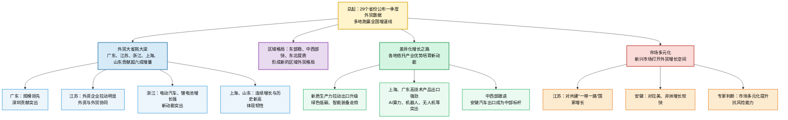

# 一季度各省份外贸数据亮点纷呈

> 本文为基于《证券日报》报道的精读整理稿。原文题：「一季度各省份外贸数据亮点纷呈」；作者刘萌；责任编辑朱晓航；栏目：国内时政 / 财经。《证券日报》由经济日报社主管主办，为中国证监会指定披露上市公司信息报刊。统计数据与专家引述以原报道为准；英文术语注释供阅读辅助。若需原文链接可补入 `source_url`。

---

## 基本信息

- **标题**：一季度各省份外贸数据亮点纷呈
- **来源**：证券日报（经济日报社主管主办，中国证监会指定披露上市公司信息报刊）
- **作者**：刘萌
- **时间**：2026年04月23日
- **责任编辑**：朱晓航
- **栏目**：国内时政 / 财经

---

## 文章结构信息图

```text
[一季度各省份外贸数据亮点纷呈]
├── 1. 总体概况 (Para 1-2)
│   ├── 各省份成绩单公布：29省已发布，14省跑赢全国。
│   ├── 排名居前省份：陕西（73.7%）、海南（38.5%）、重庆（34.3%）。
│   └── 专家观点（朱克力）：差异化增长，夯实根基，彰显韧性。
├── 2. 外贸大省支撑作用 (Para 3-8)
│   ├── 增量贡献：五大省（粤苏浙沪鲁）贡献超六成全国增量。
│   ├── 广东表现：进出口2.54万亿元，深圳核心驱动（占5成体量/8成增量）。
│   ├── 江苏表现：1.59万亿元，外资外贸协同（外资企业贡献9.7个百分点）。
│   ├── 浙江、上海、山东：新动能出口、持续增长趋势、创历史同期新高。
│   ├── 专家评价（陈建伟）：产业集群积淀，供应链响应，结构升级。
│   └── 区域格局：“东部稳、中西部快、东北提质”的协同发展态势。
└── 3. 差异化与创新动能 (Para 9-16)
    ├── 核心动力：新质生产力带动出口升级（绿色低碳、智能装备）。
    ├── 转型方向：从传统劳动力密集型转向创新驱动与品质升级。
    ├── 典型案例：
    │   ├── 上海：AI算力、智能装备出口翻倍。
    │   ├── 广东：3D打印、无人机、数字相机高占比（占据全国绝大部分份额）。
    │   └── 安徽：高新技术产品标杆，汽车出口量值位居全国首位。
    └── 市场布局：
        ├── 多元化拓展：共建“一带一路”国家、拉美、非洲市场显著增长。
        └── 战略意义（陈建伟）：战略纵深拓展，分散风险，构筑屏障。
```

---

## 【精读笔记】

### 一季度各省份外贸数据亮点纷呈

> 「亮点纷呈」：形容精彩或引人注目的地方很多。此处指中国各地区在对外贸易中展现出的多样化优势和强劲表现。
> **Highlights Abound** (or **Numerous Highlights**).

### 各地一季度外贸“成绩单”陆续公布。

> 「成绩单」：原指学生的成绩记录，此处比喻各地经济发展的统计数据（Economic performance / Scorecard）。

### 据《证券日报》记者统计，截至4月22日，全国已有29个省份公布了一季度外贸数据，其中近半数省份（14个）跑赢“全国线”（15%）。

> 「全国线」：指全国对外贸易增长的平均水平或预期目标值。2026年一季度该基准线为15%，显示出外贸强劲的回升态势。
> 「跑赢」：金融及经济学用语，指增长率超过某一参考标准（Outperform）。
> **背景**：一季度（First Quarter, Q1）数据是研判全年经济走势的“风向标”。

### 陕西、海南、重庆分别以73.7%、38.5%、34.3%的同比增速，暂居前三位。

> 「同比增速」：与去年同期（2025年一季度）相比的增长速度（Year-on-Year Growth Rate）。
> 「陕西」：位于西北内陆，其高增长通常与半导体、新能源车等出口链条以及中欧班列的枢纽作用有关。
> 「海南」：主要得益于海南自由贸易港（FTP）的政策红利释放及免税品贸易、大宗商品进出口。
> 「重庆」：西南重镇，内陆开放高地，依赖电子信息制造及成渝地区双城经济圈建设带动。

### 国研新经济研究院创始院长朱克力对《证券日报》记者表示，今年一季度，各地依托自身产业禀赋跑出差异化增长态势，既夯实了全国外贸增长的根基，也彰显了我国外贸的强劲韧性。

> 「国研新经济研究院」：专注于新经济、数字化转型及区域战略的专业智库。
> 「产业禀赋」：指一个地区在产业发展上拥有的天然优势、资源储备或历史积累的工业基础（Industrial endowment）。
> 「夯实」：**夯**（hāng），原指砸实地基，引申为巩固、打牢（Consolidate / Strengthen）。
> 「韧性」：指经济体在遭遇外部冲击后恢复和保持稳定增长的能力（Resilience）。其反义词为「脆弱性」(Fragility)。

### 外贸大省挑大梁

> 「挑大梁」：成语，比喻起骨干或支柱作用（Take the lead / Play a leading role）。

### 数据显示，一季度外贸大省挑大梁，广东、江苏、浙江、上海、山东合计贡献全国超过六成的进出口增量。

> 「进出口增量」：指在原规模基础上的增加部分（Incremental volume）。
> **地域注释**：上述五省市均位于东部沿海，是中国经济的“定海神针”和对外开放的门户。

### 具体来看，广东以2.54万亿元的进出口总值领跑全国，同比增长19.4%，季度规模首次突破2.5万亿元，连续11个季度保持同比正增长，连续14个月保持同比正增长。

> 「领跑」：处于领先位置（To lead）。
> 「总值」：**Total Value**。
> 「广东」：连续40多年外贸总值位居全国第一，是“世界工厂”和国际贸易中心。

### 其中，深圳作为其核心增长极，以占全省五成的外贸体量，贡献了超八成的增量。

> 「增长极」：指能带动周边及关联地区经济增长的核心节点（Growth pole）。
> 「体量」：指规模、数量级（Volume / Scale）。
> **深圳注释**：计划单列市，拥有华为、比亚迪、腾讯等科技巨头，其出口结构已实现从低端代工向自主品牌的跨越。

### 江苏一季度进出口1.59万亿元，同比增长17.2%。

> 「江苏」：中国制造业第一大省，拥有最为完整的产业链条之一。

### 其中，外资企业进出口7678亿元，同比增长20.7%，拉动全省增长9.7个百分点，外资外贸协同发力成效显著。

> 「拉动」：指某一因素的增长对总量增长的贡献百分比（Drive / Pulling effect）。
> 「协同发力」：多个主体或因素共同作用（Synergy）。

### 此外，一季度，浙江进出口1.38万亿元，同比增长7.1%。

> 「浙江」：民营经济最活跃的省份，跨境电商和专业市场（如义乌）高度发达。

### 其中，电动汽车、锂电池出口分别增长90.7%和124.2%，合计贡献超两成出口增量，新动能拉动作用突出。

> 「新动能」：指以高科技、高效能、高质量为特征的新增长动力（New momentum）。
> 「新三样」：指电动载人汽车、锂离子蓄电池、太阳能电池。此处提及前两样，反映了中国出口从“老三样”（服装、家具、家电）向绿色高科技产品的转型。

### 上海进出口1.23万亿元，同比增长21.9%。

> 「上海」：中国最大的国际贸易中心城市。

### 从趋势看，进出口连续14个月同比增长，出口已连续18个月同比增长。

> **近义词辨析**：**持续**（持续不断地进行）vs **陆续**（有先有后，时断时续）。此处强调的是“持续”稳定增长。

### 山东进出口8598.1亿元，同比增长4.7%，创历史同期新高。

> 「山东」：北方外贸第一大省，重工业和农业出口实力强劲。

### 其中，3月份进口值达1301.4亿元，创下历史月度新高。

> 「创下新高」：达到历史最高点（Hit a record high）。

### 对外经济贸易大学国家对外开放研究院教授陈建伟对《证券日报》记者表示，广东、江苏、浙江、上海、山东合计贡献了超六成的进出口增量，这不仅源于其深厚的产业集群积淀和成熟的供应链响应速度，更在于其在复杂国际形势下率先实现了贸易结构的优化升级。

> 「产业集群」：指在特定领域中，大量相互关联的企业及其支撑机构在空间上的集中（Industrial cluster）。
> 「供应链响应速度」：指企业或区域应对市场需求变化、调整生产及运输的效率（Supply chain responsiveness）。
> 「优化升级」：指质量提升、结构更趋合理。

### 外贸大省的稳健表现，不仅撑起了全国外贸的“半壁江山”，更带动东部地区外贸整体增长14.3%，与中西部地区20.2%的高速增长、东北地区4%的稳中有进形成呼应，构建起“东部稳、中西部快、东北提质”的区域外贸发展新格局。

> 「半壁江山」：成语，原指半边疆土，现多形容占据很大份额（Half the country / Large share）。
> 「稳中有进」：在保持稳定的基础上寻求发展和进步。
> 「呼应」：相互配合、联系（Coordinate / Echo）。
> **格局解析**：反映了中国经济梯次发展的深度。东部作为“压舱石”，中西部承接产业转移表现出更高增速，东北则从规模扩张转向质量提升（提质）。

### 在陈建伟看来，未来，外贸大省持续发力有望带动中西部地区协同增长，形成“以点带面、中心辐射”的稳外贸新格局。

> 「以点带面」：通过点上的经验或力量带动全局的发展。
> 「中心辐射」：核心区域向周边区域传递能量、技术和资金（Radiation from the center）。

### 各地走出差异化增长之路

### 整体来看，一季度各省份外贸数据亮点纷呈，各地纷纷立足自身产业优势，聚焦新动能培育和新市场拓展，走出了差异化增长之路。

> 「立足」：基于、根据（Based on）。
> 「差异化」：**Differentiation**。指在竞争中形成自己独特的优势。

### 朱克力表示，一季度我国外贸实现高速增长，背后最鲜明的特征，就是新质生产力正在成为拉动出口升级的核心动力。

> 「新质生产力」：**New Quality Productive Forces**。这是党的创新理论中的前沿概念，强调以科技创新起主导作用，摆脱传统增长路径，具有高科技、高效能、高质量特征。
> 「核心动力」：**Core Driving Force**。

### 绿色低碳、智能装备等高端产品持续走俏，外贸出口不再简单依靠传统劳动密集型商品，创新驱动、品质升级已经成为外贸转型的主流方向。

> 「走俏」：形容商品销路好，受欢迎（In high demand / Popular）。
> 「劳动密集型」：**Labor-intensive**。如纺织、组装等依赖大量廉价劳动力的产业。
> 「创新驱动」：**Innovation-driven**。

### “这种变化不局限于传统外贸强省，内陆地区同样紧跟产业升级浪潮，依托自身培育的新兴产业体系，在外贸赛道上实现快速追赶。整体呈现创新动能多点迸发、产业优势多点开花的局面。”朱克力说。

> 「迸发」：由内而外地突然发出（Burst out / Unleash）。
> 「多点开花」：比喻在多个领域或地区同时取得好成绩（Prosper in multiple areas）。

### 数据显示，各省份新兴产业展现出爆发力。

> 「爆发力」：**Explosive power**。指短期内巨大的能量释放。

### 在上海，以AI算力为核心的集成电路、电脑零部件等出口增长近七成，工业机器人、手术机器人等智能装备出口翻倍增长；

> 「AI算力」：**AI Computing Power**。
> 「集成电路」：**Integrated Circuits (IC)**，即芯片。
> 「手术机器人」：代表了医疗器械领域的最高科技水平，反映出口产品的高附加值。

### 在广东，3D打印机、无人机、数字照相机等高技术产品出口势头迅猛，分别同比增长136.9%、51.2%、60.2%，占全国出口比重分别高达88.2%、93.1%、74.9%。

> 「势头迅猛」：形容发展的趋势非常强大且快速（Rapid and powerful momentum）。
> **数据注释**：这些产品的极高全国占比凸显了广东（尤其是深圳、东莞）作为全球先进制造业基地的绝对领先地位。

### 中西部省份也紧跟步伐。

> 「紧跟步伐」：不落后，保持同步（Keep pace with）。

### 比如，一季度安徽高新技术产品出口表现亮眼，汽车（含底盘）出口尤为突出，共出口43.7万辆，同比增加118.8%，出口金额达450.8亿元，同比增长120.1%，出口量与出口值均位居全国首位，成为中部外贸增长标杆。

> 「安徽」：近年来凭借合肥等地的跨越式发展，成为“新一轮产业革命”的受益者，尤其是奇瑞、江淮及蔚来等车企的出口表现。
> 「标杆」：榜样、准则（Benchmark）。
> 「底盘」：**Chassis**。

### 此外，今年一季度各地持续深化市场多元化布局，新兴市场打开外贸增长新空间。

> 「市场多元化」：**Market Diversification**。即不将出口集中于美欧等传统单一市场，而是向全球拓展，降低地缘政治风险。

### 比如，江苏对共建“一带一路”国家进出口8214.2亿元，增长24.6%，拉动全省进出口增长12个百分点；

> 「一带一路」：**Belt and Road Initiative (BRI)**。中国提出的国际经济合作倡议，已成为全球最大的公共产品和合作平台。

### 安徽积极开拓新兴市场，一季度对拉丁美洲的进出口增长41%，对非洲的进出口增长56%。

> 「拉丁美洲」：**Latin America**。
> 「新兴市场」：**Emerging Markets**。

### 陈建伟表示，重点发力新兴市场是我国外贸战略纵深拓展的关键举措，通过市场多元化有效分散单一市场波动带来的不确定性，构筑了坚实的战略屏障。

> 「战略纵深」：原军事术语，指地理空间或资源储备带来的防御弹性（Strategic depth）。此处指贸易市场的广泛分布增加了中国经济的回旋余地。
> 「波动」：**Fluctuation**。
> 「屏障」：**Barrier / Shield**。起到保护作用的事物。

### 未来，随着新兴市场增长潜力持续释放，我国外贸的抗风险能力将进一步提升。

> 「潜力释放」：**Unleashing potential**。
> 「抗风险能力」：**Risk resistance capability**。

---

## 金句积累

1. **外贸大省挑大梁**：强调核心省份在国家大局中的责任担当。
2. **东部稳、中西部快、东北提质**：精炼地总结了当前中国区域协调发展的特征。
3. **新质生产力正在成为拉动出口升级的核心动力**：点出了中国外贸转型升级的本质逻辑。
4. **以点带面、中心辐射**：描述经济带动作用的经典表达。
5. **战略纵深拓展的关键举措**：用于描述提升经济韧性的宏观叙事。
## 前情提要

### 文章基本信息

| 项目 | 信息 |
|---|---|
| 文章来源 | 中国经济网转载，原载《证券日报》；人民网亦转载同文。用户提供页面显示来源为《证券日报》。参考链接：人民网转载页 [<sup>1</sup>](https://finance.people.com.cn/n1/2026/0423/c1004-40707129.html) |
| 题目 | **`一季度各省份外贸数据亮点纷呈`** |
| 作者 | **`刘萌`**，用户提供页面显示为《证券日报》记者。公开检索未找到其完整官方个人履历；从可检索报道看，刘萌长期以《证券日报》记者身份参与财经、外贸、宏观经济等领域报道。 |
| 发布时间 | **`2026年04月23日`** |
| 文章主题 | 以各省份一季度外贸数据为线索，分析中国区域外贸增长、外贸大省支撑作用、新兴产业出口与市场多元化趋势。 |
| 相关受访专家 | **`朱克力`**：国研新经济研究院创始院长，长期关注新经济、数字经济、产业升级等议题。参考：朱克力简介相关页面 [<sup>2</sup>](https://www.mingca.net/wap/zfzjia/2667.html)。<br>**`陈建伟`**：对外经济贸易大学国家对外开放研究院相关研究人员，研究涉及开放经济、贸易、教育与经济等领域。参考：对外经济贸易大学页面 [<sup>3</sup>](https://schpa.uibe.edu.cn/szdw/xxjs/jyzcyjzx/27e7eb93fc1049f5b4a3c27dd75f8bfa.htm)。 |

### 文章结构信息图



---

## 逐句精读

🔸中文：各地一季度外贸**`“成绩单”`** / 陆续公布。
🔹英文：First-quarter foreign trade **`report cards`** / from regions across China / have been released **`in succession`**.

背景注释：
“成绩单”在中文财经新闻中常用于比喻地方、行业或企业的阶段性数据表现，英文可译为 **`report card`**，带有新闻化、形象化色彩。这里的“一季度”指 **2026年第一季度，即2026年1月至3月**。

> `report card` /rɪˈpɔːrt kɑːrd/ n. an evaluation of performance; 成绩单，表现评估。语域：新闻、教育、财经。画龙点睛：原义是学校成绩单，财经新闻中常作隐喻，如 `the economy's report card` 指经济表现。写作中可用来增强形象性，但比 `performance data` 更口语化、新闻化；正式论文中宜换成 `performance indicators` 或 `data profile`。
>
> `in succession` /ɪn səkˈseʃn/ adv. one after another; 接连地，陆续地。语域：正式、新闻。画龙点睛：强调事件按顺序连续发生。常见搭配：`win three games in succession` 连赢三场；`be released in succession` 陆续发布。注意不要与 `success` 混淆，`succession` 核心是“连续、继承”。

---

🔸中文：据《证券日报》记者统计，/ 截至**`4月22日`**，/ 全国已有**`29个省份`**公布了一季度外贸数据，/ 其中近半数省份（**`14个`**）跑赢**`“全国线”`**（**`15%`**）。
🔹英文：According to calculations by a Securities Daily reporter, / as of **`April 22`**, / **`29 provincial-level regions`** across China had released their first-quarter foreign trade data, / with nearly half of them — **`14 regions`** — **`outperforming`** the national benchmark of **`15%`**.

背景注释：
《证券日报》是中国财经类报纸，报道资本市场、宏观经济、上市公司与金融政策等内容。“全国线”在此并非正式统计术语，而是新闻表达，指全国一季度外贸同比增速 **15%** 这一参照水平。“省份”在英文处理中宜译为 **`provincial-level regions`**，因为中国统计口径通常包括省、自治区、直辖市等。

> `calculation` /ˌkælkjəˈleɪʃn/ n. the process or result of using numbers to find an amount; 计算，统计。语域：正式、财经、学术。画龙点睛：新闻中 `according to calculations by...` 常译“据……统计/测算”。若强调官方数据，用 `official figures show`; 若强调记者整理，用 `calculations` 或 `a tally by`。
>
> `provincial-level region` /prəˈvɪnʃl ˈlevl ˈriːdʒən/ n. a province, autonomous region, municipality, or similar administrative unit; 省级地区。语域：正式、政治经济报道。画龙点睛：翻译中国行政区划时，`province` 有时不够精确；涉及省、自治区、直辖市合并统计时，用 `provincial-level region` 更稳妥。
>
> `outperform` /ˌaʊtpərˈfɔːrm/ v. to do better than others or than a standard; 表现优于，跑赢。语域：财经、商业、正式。画龙点睛：常用于比较数据或资产表现，如 `outperform the market` 跑赢市场，`outperform expectations` 超出预期。反义词为 `underperform`，即“表现逊于”。

---

🔸中文：**`陕西`**、**`海南`**、**`重庆`** / 分别以**`73.7%`**、**`38.5%`**、**`34.3%`**的同比增速，/ 暂居前三位。
🔹英文：**`Shaanxi`**, **`Hainan`**, and **`Chongqing`** / currently rank as the top three, / with year-on-year growth rates of **`73.7%`**, **`38.5%`**, and **`34.3%`**, respectively.

背景注释：
陕西、海南、重庆分别代表中国西部内陆省份、自由贸易港建设重点地区和西部直辖市。三地增速靠前，反映外贸增长并不只集中在传统沿海大省。“同比”即与上一年同期相比，英文常译 **`year-on-year`** 或 **`YoY`**。

> `rank` /ræŋk/ v. to have a position in an ordered list; 排名，位列。语域：通用、新闻、财经。画龙点睛：`rank first/second/third` 表示“排名第一/第二/第三”；`rank as the top three` 强调整体处于前三。注意 `rank` 可作及物或不及物动词：`The city ranks first`; `They ranked the city first`。
>
> `year-on-year` /ˌjɪr ɑːn ˈjɪr/ adj./adv. compared with the same period in the previous year; 同比的/同比地。语域：财经、统计。画龙点睛：英式财经报道常用 `year-on-year`，美式也常见 `year-over-year`，缩写为 `YoY`。与 `month-on-month` 环比区分清楚。

---

🔸中文：国研新经济研究院创始院长**`朱克力`** / 对《证券日报》记者表示，/ 今年一季度，各地依托自身**`产业禀赋`** / 跑出**`差异化增长态势`**，/ 既夯实了全国外贸增长的根基，/ 也彰显了我国外贸的强劲**`韧性`**。
🔹英文：**`Zhu Keli`**, founding president of the China New Economy Research Institute, / told Securities Daily / that in the first quarter of this year, regions across China, drawing on their own **`industrial endowments`**, / achieved **`differentiated growth patterns`**, / both strengthening the foundation of national foreign trade growth / and demonstrating the strong **`resilience`** of China’s foreign trade.

背景注释：
“国研新经济研究院”属于智库型研究机构，关注新经济、产业升级、数字经济等议题。“产业禀赋”指一个地区既有的产业基础、资源条件、技术积累、供应链配套和人才结构等综合优势。朱克力在文中作为产业经济观察者，对区域外贸增长作解释性评价。

> `industrial endowment` /ɪnˈdʌstriəl ɪnˈdaʊmənt/ n. the industrial resources, capabilities, and advantages a place possesses; 产业禀赋，产业基础条件。语域：经济学、政策分析。画龙点睛：`endowment` 原指“天赋、捐赠基金”，经济学中常指资源禀赋，如 `resource endowment`。翻译“产业禀赋”时不要直译成 `industrial gift`，应使用 `industrial endowment` 或 `industrial advantages`。
>
> `differentiated` /ˌdɪfəˈrenʃieɪtɪd/ adj. made or developed in different ways; 差异化的。语域：商业、经济、政策。画龙点睛：常见搭配：`differentiated growth` 差异化增长，`differentiated strategy` 差异化战略。写作中用于说明不同地区、企业、产品根据自身条件走不同路径。
>
> `resilience` /rɪˈzɪliəns/ n. the ability to recover or remain strong despite difficulties; 韧性，恢复力，抗冲击能力。语域：正式、经济、心理学、政策。画龙点睛：宏观经济写作高频词，如 `economic resilience` 经济韧性，`supply-chain resilience` 供应链韧性。近义词 `robustness` 更偏“稳健性”，`resilience` 更强调“受冲击后仍能恢复”。

---

🔸中文：**`外贸大省`** / 挑大梁。
🔹英文：Major foreign trade provinces / are **`shouldering the main burden`**.

背景注释：
“挑大梁”是中文习语，原指戏曲或工程中承担关键角色，财经报道中指主要主体承担支撑作用。英文不能直译为 “carry a big beam”，可译为 **`shoulder the main burden`**, **`play a leading role`**, 或 **`serve as the backbone`**。

> `shoulder` /ˈʃoʊldər/ v. to accept or carry a responsibility or burden; 承担，肩负。语域：正式、新闻。画龙点睛：`shoulder responsibility` 肩负责任，`shoulder the burden` 承担重担。它比 `take` 更有画面感，适合翻译“挑大梁、扛重任”。
>
> `main burden` /meɪn ˈbɜːrdn/ n. the principal responsibility or load; 主要负担，核心责任。语域：正式。画龙点睛：`burden` 不一定全是负面，也可指任务压力。财经新闻中可用 `bear the brunt` 表示“首当其冲”，但本文是积极支撑，不宜用过于负面的 `brunt`。

---

🔸中文：数据显示，/ 一季度**`外贸大省`**挑大梁，/ **`广东`**、**`江苏`**、**`浙江`**、**`上海`**、**`山东`** / 合计贡献全国超过**`六成`**的进出口增量。
🔹英文：Data show that / major foreign trade provinces shouldered the main burden in the first quarter, / with **`Guangdong`**, **`Jiangsu`**, **`Zhejiang`**, **`Shanghai`**, and **`Shandong`** / together contributing more than **`60%`** of China’s incremental import and export growth.

背景注释：
广东、江苏、浙江、上海、山东均为中国东部沿海或沿海经济强省市，长期拥有制造业集群、港口物流、跨境贸易企业和供应链优势。“增量”不是总量，而是与上一期或上一年同期相比新增的部分，英文可译 **`incremental growth`** 或 **`increase`**。

> `incremental` /ˌɪŋkrəˈmentl/ adj. increasing gradually or referring to added amounts; 增量的，逐步增加的。语域：财经、管理、统计。画龙点睛：`incremental growth` 指新增增长部分，不等于总规模。考试翻译中要区分 `total volume` 总量、`increase` 增加额、`incremental contribution` 增量贡献。
>
> `contribute` /kənˈtrɪbjuːt/ v. to help cause or provide part of something; 贡献，促成。语域：通用、正式。画龙点睛：财经句型高频：`A contributes X percent of B`，表示“A贡献了B的X%”。名词为 `contribution`，常见搭配 `make a significant contribution to`。
>
> `together` /təˈɡeðər/ adv. combined; 合计，共同。语域：通用。画龙点睛：在数据表达中，`together` 常放在主语后或谓语前，表示“合计”。如 `The five provinces together accounted for...`，比 `in total` 更自然地连接多个主体。

---

🔸中文：具体来看，/ **`广东`**以**`2.54万亿元`**的进出口总值领跑全国，/ 同比增长**`19.4%`**，/ 季度规模首次突破**`2.5万亿元`**，/ 连续**`11个季度`**保持同比正增长，/ 连续**`14个月`**保持同比正增长。
🔹英文：More specifically, / **`Guangdong`** led the country with a total import and export value of **`2.54 trillion yuan`**, / up **`19.4%`** year on year; / its quarterly trade volume exceeded **`2.5 trillion yuan`** for the first time, / maintaining positive year-on-year growth for **`11 consecutive quarters`** / and **`14 consecutive months`**.

背景注释：
广东长期是中国外贸第一大省，拥有珠三角制造业集群、深圳和广州等外贸中心、完善港口和供应链体系。“万亿元”译为 **`trillion yuan`**，2.54万亿元即 2.54 trillion yuan。中文“领跑全国”在英文中常译 **`led the country`**。

> `lead the country` /liːd ðə ˈkʌntri/ phr. to rank first nationwide; 领跑全国，位居全国首位。语域：新闻、财经。画龙点睛：`lead` 的过去式和过去分词为 `led`，不要误写成 `lead`。可替换为 `rank first nationwide`，后者更直白正式。
>
> `trade volume` /treɪd ˈvɑːljuːm/ n. the total amount or value of trade; 贸易规模，贸易额。语域：财经、国际贸易。画龙点睛：`volume` 可指数量，也可指规模；若强调金额，用 `trade value` 更精确。本文“季度规模”指进出口总值，译为 `trade volume/value` 均可。
>
> `consecutive` /kənˈsekjətɪv/ adj. following one after another without interruption; 连续的。语域：正式、统计、新闻。画龙点睛：常见搭配：`for three consecutive years` 连续三年，`consecutive quarters` 连续季度。注意它强调“不中断”，比 `continuous` 更适合统计报道。

---

🔸中文：其中，/ **`深圳`**作为其核心**`增长极`**，/ 以占全省**`五成`**的外贸体量，/ 贡献了超**`八成`**的增量。
🔹英文：Among them, / **`Shenzhen`**, as Guangdong’s core **`growth pole`**, / accounted for half of the province’s foreign trade volume / and contributed more than **`80%`** of its incremental growth.

背景注释：
深圳是中国重要的外贸城市和科技制造中心，拥有电子信息、通信设备、跨境电商、供应链服务等优势。“增长极”来自区域经济学，指能带动周边或整体增长的核心区域或产业中心，英文常用 **`growth pole`**。

> `growth pole` /ɡroʊθ poʊl/ n. a region, city, or sector that drives broader economic growth; 增长极。语域：经济学、区域发展。画龙点睛：`pole` 在此不是“杆子”，而是“极点、中心”。常用于区域经济：`a regional growth pole` 区域增长极。
>
> `account for` /əˈkaʊnt fɔːr/ phr.v. to make up a particular share or proportion; 占，占比为。语域：财经、学术、新闻。画龙点睛：数据写作必备表达：`A accounts for 50% of B`。不要用 `occupy 50%` 翻译“占比”，`occupy` 多指占据空间或职位。
>
> `incremental growth` /ˌɪŋkrəˈmentl ɡroʊθ/ n. added growth compared with a previous period; 增量增长，新增增长部分。语域：财经、统计。画龙点睛：它强调“新增贡献”，不是总盘子。一个地区总量大不一定增量贡献高；本文深圳在广东增量中贡献超八成，说明其新增拉动很强。

---

🔸中文：**`江苏`**一季度进出口**`1.59万亿元`**，/ 同比增长**`17.2%`**。
🔹英文：**`Jiangsu`** recorded **`1.59 trillion yuan`** in imports and exports in the first quarter, / up **`17.2%`** year on year.

背景注释：
江苏是中国制造业和外向型经济大省，苏州、南京、无锡、南通等城市在电子信息、装备制造、生物医药、新能源等领域外贸基础较强。英文财经报道中，省份“实现某一数值”常用 **`recorded`**。

> `record` /rɪˈkɔːrd/ v. to officially show or achieve a figure; 记录为，实现，录得。语域：财经、统计、新闻。画龙点睛：`record` 作动词时重音在第二音节 /rɪˈkɔːrd/；作名词“记录”时重音在第一音节 /ˈrekərd/。财经写作中 `recorded growth of...` 表示“录得……增长”。
>
> `imports and exports` /ˈɪmpɔːrts ænd ˈekspɔːrts/ n. goods or services bought from and sold to other countries; 进出口。语域：国际贸易。画龙点睛：中文“进出口”常对应复数 `imports and exports`；若指总额，可说 `import and export value` 或 `foreign trade value`。

---

🔸中文：其中，/ **`外资企业`**进出口**`7678亿元`**，/ 同比增长**`20.7%`**，/ 拉动全省增长**`9.7个百分点`**，/ **`外资外贸协同发力`**成效显著。
🔹英文：Among them, / foreign-funded enterprises posted **`767.8 billion yuan`** in imports and exports, / up **`20.7%`** year on year, / driving provincial growth by **`9.7 percentage points`**; / the coordinated strength of **`foreign investment and foreign trade`** was clearly evident.

背景注释：
“外资企业”指由境外投资者设立或参股的企业，是中国外贸体系的重要组成部分。“百分点”译为 **`percentage points`**，不同于 **`percent`**：从10%到15%是增加5个百分点，而不是增加5%。

> `foreign-funded enterprise` /ˈfɔːrən ˈfʌndɪd ˈentərpraɪz/ n. a company funded wholly or partly by foreign investors; 外资企业。语域：经济、法律、政策。画龙点睛：也可说 `foreign-invested enterprise`，中国政策文本中常见缩写 `FIE`。注意不要简单译成 `foreign company`，因为外资企业可能在中国注册运营。
>
> `percentage point` /pərˈsentɪdʒ pɔɪnt/ n. a unit used to express the arithmetic difference between two percentages; 百分点。语域：统计、财经。画龙点睛：`percent` 是比例，`percentage point` 是两个百分比之间的差值。写作中非常容易混淆：`increase by 5%` 与 `increase by 5 percentage points` 含义不同。
>
> `coordinated` /koʊˈɔːrdɪneɪtɪd/ adj. working together effectively; 协同的，协调一致的。语域：正式、政策、管理。画龙点睛：常见搭配：`coordinated development` 协同发展，`coordinated efforts` 协同发力。本文 `coordinated strength` 用来表达“协同发力”。

---

🔸中文：此外，/ 一季度，/ **`浙江`**进出口**`1.38万亿元`**，/ 同比增长**`7.1%`**。
🔹英文：In addition, / in the first quarter, / **`Zhejiang`** registered **`1.38 trillion yuan`** in imports and exports, / up **`7.1%`** year on year.

背景注释：
浙江是中国民营经济和外贸大省，义乌小商品、宁波舟山港、杭州数字经济以及新能源汽车相关产业链均对外贸具有支撑作用。英文中 **`registered`** 与 **`recorded`** 类似，常用于正式数据报道。

> `in addition` /ɪn əˈdɪʃn/ adv. used to add another piece of information; 此外，另外。语域：正式、写作。画龙点睛：用于段落推进，语气比 `besides` 更正式。雅思/考研写作中可替换 `also`，但不要堆砌，可与 `moreover`, `furthermore` 区分使用。
>
> `register` /ˈredʒɪstər/ v. to record or show an amount officially; 登记，录得，达到。语域：财经、统计。画龙点睛：新闻句式 `The province registered growth of 7.1%` 表示“该省录得7.1%的增长”。比 `have` 更正式，比 `achieve` 更客观。

---

🔸中文：其中，/ **`电动汽车`**、**`锂电池`**出口分别增长**`90.7%`**和**`124.2%`**，/ 合计贡献超**`两成`**出口增量，/ **`新动能`**拉动作用突出。
🔹英文：Among them, / exports of **`electric vehicles`** and **`lithium batteries`** rose by **`90.7%`** and **`124.2%`**, respectively, / together contributing more than **`20%`** of export growth, / highlighting the strong pull of **`new growth drivers`**.

背景注释：
电动汽车和锂电池是中国外贸中常被称为“新三样”的核心产品之一，代表绿色低碳和高端制造方向。“新动能”是中国宏观经济与产业政策常用词，指新的增长来源和驱动力。

> `electric vehicle` /ɪˈlektrɪk ˈviːəkl/ n. a vehicle powered by electricity; 电动汽车。语域：科技、产业、环保。画龙点睛：常缩写为 `EV`。复数可写 `electric vehicles` 或 `EVs`。与 `new energy vehicle` 不完全等同，后者在中国语境中还包括插电混动、燃料电池汽车等。
>
> `lithium battery` /ˈlɪθiəm ˈbætəri/ n. a battery using lithium-based technology; 锂电池。语域：科技、制造、能源。画龙点睛：更具体可说 `lithium-ion battery` 锂离子电池。出口报道中常与 `solar cells`、`electric vehicles` 一起出现，构成中国外贸“新动能”。
>
> `growth driver` /ɡroʊθ ˈdraɪvər/ n. a factor that powers economic or business growth; 增长动力，增长引擎。语域：财经、商业。画龙点睛：翻译“新动能”时，`new growth drivers` 非常地道。不要直译为 `new kinetic energy`，那是物理意义上的“动能”。

---

🔸中文：**`上海`**进出口**`1.23万亿元`**，/ 同比增长**`21.9%`**。
🔹英文：**`Shanghai`** posted **`1.23 trillion yuan`** in imports and exports, / up **`21.9%`** year on year.

背景注释：
上海是中国重要的国际贸易、航运、金融和高端制造中心，外贸中既有货物贸易，也受跨国公司总部、港口物流和高端产业链影响。

> `post` /poʊst/ v. to announce or achieve a financial result; 公布，录得，实现。语域：财经、新闻。画龙点睛：`post a profit/loss/growth` 是财经报道高频搭配。这里 `posted 1.23 trillion yuan` 表示“录得1.23万亿元”。比 `got` 正式，比 `achieved` 更客观。
>
> `year on year` /ˌjɪr ɑːn ˈjɪr/ adv. compared with the same period last year; 同比。语域：财经、统计。画龙点睛：作副词时可不加连字符，如 `grew 21.9% year on year`；作形容词放在名词前时常写 `year-on-year growth`。

---

🔸中文：从趋势看，/ 进出口连续**`14个月`**同比增长，/ 出口已连续**`18个月`**同比增长。
🔹英文：In terms of trend, / imports and exports have grown year on year for **`14 consecutive months`**, / while exports have expanded year on year for **`18 consecutive months`**.

背景注释：
这句话强调上海外贸增长的连续性和稳定性，而不仅仅是单个季度的数据表现。英文中 **`in terms of trend`** 用于从趋势角度切入分析。

> `in terms of` /ɪn tɜːrmz əv/ prep. with regard to; 从……角度，就……而言。语域：正式、学术、通用。画龙点睛：非常适合议论文和图表作文，如 `in terms of efficiency` 从效率角度看。注意不要滥用；可替换为 `with regard to`, `as for`, `from the perspective of`。
>
> `expand` /ɪkˈspænd/ v. to increase in size, amount, or scope; 扩大，增长。语域：财经、商业、正式。画龙点睛：`exports expanded by...` 是比 `exports increased` 更有财经报道色彩的表达。名词为 `expansion`，反义词为 `contract` 收缩。

---

🔸中文：**`山东`**进出口**`8598.1亿元`**，/ 同比增长**`4.7%`**，/ 创**`历史同期新高`**。
🔹英文：**`Shandong`** recorded **`859.81 billion yuan`** in imports and exports, / up **`4.7%`** year on year, / reaching a **`record high for the same period`**.

背景注释：
山东是中国重要的制造业、农业、能源化工和港口大省，青岛港等港口体系对其外贸具有重要支撑。“历史同期新高”指与历年同一时间段相比达到最高水平，英文通常译为 **`a record high for the same period`**。

> `record high` /ˈrekərd haɪ/ n. the highest level ever recorded; 历史新高，纪录高点。语域：财经、统计、新闻。画龙点睛：`hit/reach a record high` 是固定搭配。若强调“同期”，加 `for the same period`；若强调“月度”，可说 `a monthly record high`。
>
> `same period` /seɪm ˈpɪriəd/ n. the corresponding period in another year; 同期。语域：统计、财经。画龙点睛：常见表达：`compared with the same period last year` 与去年同期相比。不要机械译成 `same time`，统计语境下 `same period` 更准确。

---

🔸中文：其中，/ **`3月份`**进口值达**`1301.4亿元`**，/ 创下**`历史月度新高`**。
🔹英文：Among them, / imports in **`March`** reached **`130.14 billion yuan`**, / setting a **`new monthly record high`**.

背景注释：
这里从季度数据进一步下探到单月数据，说明山东3月进口表现尤其突出。“进口值”强调金额而非数量，英文宜用 **`import value`** 或直接用 **`imports reached...`**。

> `monthly record high` /ˈmʌnθli ˈrekərd haɪ/ n. the highest monthly level ever recorded; 月度历史新高。语域：财经、统计。画龙点睛：可搭配 `set`, `hit`, `reach`。其中 `set a new record` 强调创造纪录，`hit a record` 更新闻化。
>
> `reach` /riːtʃ/ v. to arrive at a particular level or amount; 达到。语域：通用、财经。画龙点睛：数据表达中 `reach` 很常用，如 `sales reached $1 billion`。它强调达到某一数值，不必翻译出“抵达”的空间意义。

---

🔸中文：对外经济贸易大学国家对外开放研究院教授**`陈建伟`** / 对《证券日报》记者表示，/ **`广东`**、**`江苏`**、**`浙江`**、**`上海`**、**`山东`**合计贡献了超**`六成`**的进出口增量，/ 这不仅源于其深厚的**`产业集群积淀`**和成熟的**`供应链响应速度`**，/ 更在于其在复杂国际形势下率先实现了**`贸易结构的优化升级`**。
🔹英文：**`Chen Jianwei`**, a professor at the Academy of China Open Economy Studies of the University of International Business and Economics, / told Securities Daily / that Guangdong, Jiangsu, Zhejiang, Shanghai, and Shandong together contributed more than **`60%`** of the incremental growth in imports and exports; / this stemmed not only from their deep **`industrial cluster accumulation`** and mature **`supply-chain responsiveness`**, / but, more importantly, from their early progress in **`optimizing and upgrading their trade structures`** amid a complex international environment.

背景注释：
对外经济贸易大学是中国外经贸研究重镇之一，国家对外开放研究院关注开放型经济、国际贸易、全球价值链等议题。陈建伟在这里从产业集群、供应链和贸易结构三个层面解释外贸大省为何能贡献主要增量。“供应链响应速度”指供应链面对订单变化、国际需求波动、物流变化时的快速调整能力。

> `industrial cluster` /ɪnˈdʌstriəl ˈklʌstər/ n. a geographic concentration of related firms and suppliers; 产业集群。语域：经济学、产业政策。画龙点睛：如 `electronics industrial cluster` 电子产业集群。`cluster` 强调空间集聚和协同效应，不只是“很多企业”。
>
> `responsiveness` /rɪˈspɑːnsɪvnəs/ n. the ability to react quickly and effectively; 响应能力，反应速度。语域：管理、供应链、正式。画龙点睛：常见搭配 `market responsiveness` 市场响应能力，`supply-chain responsiveness` 供应链响应能力。比 `speed` 更强调“对变化作出有效反应”。
>
> `optimize and upgrade` /ˈɑːptɪmaɪz ænd ˌʌpˈɡreɪd/ phr. to improve structure, quality, or efficiency; 优化升级。语域：政策、财经。画龙点睛：中文政策文本中的“优化升级”可译为 `optimize and upgrade`。若强调产业结构，可说 `industrial upgrading`; 若强调质量提升，可说 `quality upgrading`。
>
> `amid` /əˈmɪd/ prep. in the middle of or against the background of; 在……之中，在……背景下。语域：正式、新闻。画龙点睛：`amid a complex international environment` 比 `in a complex international environment` 更有新闻语感，常用于困难、变化、风险背景。

---

🔸中文：**`外贸大省`**的稳健表现，/ 不仅撑起了全国外贸的**`“半壁江山”`**，/ 更带动东部地区外贸整体增长**`14.3%`**，/ 与中西部地区**`20.2%`**的高速增长、东北地区**`4%`**的稳中有进形成呼应，/ 构建起**`“东部稳、中西部快、东北提质”`**的区域外贸发展新格局。
🔹英文：The solid performance of major foreign trade provinces / not only supported **`a major share`** of China’s overall foreign trade, / but also drove a **`14.3%`** overall increase in foreign trade in the eastern region; / it echoed the rapid **`20.2%`** growth in central and western regions and the steady **`4%`** improvement in the northeast, / shaping a new regional foreign trade pattern marked by **`stability in the east, speed in the central and western regions, and quality improvement in the northeast`**.

背景注释：
“半壁江山”是中文惯用表达，直译为“half of the country”，但在英文财经文体中可处理为 **`a major share`** 或 **`the backbone`**。东部、中西部、东北是中国区域经济常见划分，体现不同地区外贸增长的速度与质量差异。

> `solid performance` /ˈsɑːlɪd pərˈfɔːrməns/ n. stable and reliable results; 稳健表现。语域：财经、商业。画龙点睛：`solid` 在财经英语中常表示“稳健、不错、扎实”，如 `solid growth`, `solid earnings`。不要只理解为“固体的”。
>
> `a major share` /ə ˈmeɪdʒər ʃer/ n. a large proportion; 重要份额，相当大部分。语域：正式、财经。画龙点睛：翻译“半壁江山”时，若数据不是严格50%，用 `a major share` 比 `half of` 更安全。
>
> `echo` /ˈekoʊ/ v. to correspond to or reinforce something; 呼应，回应。语域：正式、新闻、文学。画龙点睛：除“回声”外，`echo` 可作动词表示“与……相呼应”。如 `The findings echo previous studies`，意为“这些发现与先前研究相呼应”。
>
> `regional pattern` /ˈriːdʒənl ˈpætərn/ n. the structure or arrangement across regions; 区域格局。语域：经济、地理、政策。画龙点睛：`pattern` 不只是“图案”，在社会科学中常指“模式、格局”。如 `development pattern`, `trade pattern`, `consumption pattern`。

---

🔸中文：在**`陈建伟`**看来，/ 未来，/ 外贸大省持续发力 / 有望带动中西部地区**`协同增长`**，/ 形成**`“以点带面、中心辐射”`**的稳外贸新格局。
🔹英文：In **`Chen Jianwei’s`** view, / going forward, / sustained efforts by major foreign trade provinces / are expected to drive **`coordinated growth`** in central and western regions, / creating a new pattern for stabilizing foreign trade in which **`key hubs radiate outward and drive broader development`**.

背景注释：
“以点带面、中心辐射”是中国政策和区域发展文本中的常见表达，指通过若干核心城市、产业集群或开放平台带动周边和更大范围发展。英文宜意译，不宜机械直译。

> `going forward` /ˈɡoʊɪŋ ˈfɔːrwərd/ adv. in the future; 未来，今后。语域：商务、新闻。画龙点睛：比 `in the future` 更具商务语感，常用于展望。注意不要在学术论文中过度使用，可换成 `in the years ahead`。
>
> `coordinated growth` /koʊˈɔːrdɪneɪtɪd ɡroʊθ/ n. growth achieved through mutual support and alignment; 协同增长。语域：政策、经济。画龙点睛：常用于区域经济、产业链和城乡发展。它强调不同主体之间不是孤立增长，而是联动发展。
>
> `radiate outward` /ˈreɪdieɪt ˈaʊtwərd/ phr.v. to spread influence from a center to surrounding areas; 向外辐射。语域：正式、区域经济。画龙点睛：`radiate` 原指光、热向外散发，引申为影响力扩散。翻译“中心辐射”时非常贴切。

---

🔸中文：各地 / 走出**`差异化增长之路`**。
🔹英文：Regions across China / have charted **`differentiated paths of growth`**.

背景注释：
这是文章第二部分的小标题，概括各地外贸增长并非单一路径，而是依托各自产业基础、产品结构和目标市场形成不同增长模式。

> `chart` /tʃɑːrt/ v. to plan or map out a course; 制定，开辟，规划。语域：正式、新闻、战略写作。画龙点睛：`chart a path/course` 是高级表达，意为“开辟道路、规划路线”。比 `take a path` 更主动、更有战略感。
>
> `path of growth` /pæθ əv ɡroʊθ/ n. a route or model of development; 增长路径。语域：经济、政策。画龙点睛：可写作 `growth path`，如 `a sustainable growth path` 可持续增长路径。本文 `differentiated paths of growth` 突出“各地不同”。

---

🔸中文：整体来看，/ 一季度各省份外贸数据**`亮点纷呈`**，/ 各地纷纷立足自身**`产业优势`**，/ 聚焦**`新动能培育`**和**`新市场拓展`**，/ 走出了**`差异化增长之路`**。
🔹英文：Overall, / first-quarter foreign trade data across provincial-level regions showed **`a wide range of bright spots`**; / localities built on their own **`industrial strengths`**, / focused on cultivating **`new growth drivers`** and expanding into **`new markets`**, / and charted differentiated paths of growth.

背景注释：
“亮点纷呈”是新闻常用表达，指多个方面表现突出。“新动能培育”强调产业升级、技术创新、高端制造、绿色产品等形成新增长点；“新市场拓展”多指拓展“一带一路”、东盟、拉美、非洲等市场。

> `bright spot` /braɪt spɑːt/ n. a positive feature in an otherwise broad situation; 亮点，积极因素。语域：新闻、财经。画龙点睛：常见表达 `one bright spot is...`。翻译“亮点纷呈”可用 `a wide range of bright spots`，比 `many highlights` 更自然。
>
> `build on` /bɪld ɑːn/ phr.v. to use something as a foundation for further progress; 立足于，在……基础上发展。语域：正式、通用。画龙点睛：`build on strengths` 表示“发挥优势、以优势为基础”。不要直译为 `stand on industrial advantages`。
>
> `cultivate` /ˈkʌltɪveɪt/ v. to develop or foster something carefully; 培育，培养。语域：正式、政策、教育。画龙点睛：可用于人、能力、市场、产业：`cultivate talent`, `cultivate new industries`, `cultivate demand`。比 `develop` 更强调长期培育过程。
>
> `expand into` /ɪkˈspænd ˈɪntuː/ phr.v. to enter and grow in a new area or market; 拓展进入。语域：商业、财经。画龙点睛：`expand into new markets` 是商务英语高频搭配，表示进入并扩大新市场存在感。

---

🔸中文：**`朱克力`**表示，/ 一季度我国外贸实现**`高速增长`**，/ 背后最鲜明的特征，/ 就是**`新质生产力`**正在成为拉动**`出口升级`**的核心动力。
🔹英文：**`Zhu Keli`** said / that China’s foreign trade achieved **`rapid growth`** in the first quarter, / and the most striking feature behind it / is that **`new quality productive forces`** are becoming the core engine driving **`export upgrading`**.

背景注释：
“新质生产力”是中国近年高频政策概念，强调以科技创新为主导、摆脱传统增长方式、具有高科技、高效能、高质量特征的先进生产力。英文通常译为 **`new quality productive forces`**。这里将其与出口结构升级联系起来。

> `rapid growth` /ˈræpɪd ɡroʊθ/ n. fast expansion or increase; 高速增长，快速增长。语域：财经、通用。画龙点睛：`rapid` 比 `fast` 更正式，适合新闻和论文。可替换为 `strong growth`, `robust growth`; 其中 `robust` 更强调强劲稳健。
>
> `striking` /ˈstraɪkɪŋ/ adj. very noticeable or impressive; 鲜明的，显著的。语域：正式、新闻、学术。画龙点睛：`a striking feature` 是高分写作表达，意为“一个显著特征”。不要只把 `strike` 理解为“罢工、打击”。
>
> `productive forces` /prəˈdʌktɪv ˈfɔːrsɪz/ n. the forces that create economic output, including technology, labor, tools, and organization; 生产力。语域：政治经济学、政策。画龙点睛：`new quality productive forces` 是固定政策译法。一般英语读者可能需要解释其内涵：innovation-led, advanced, high-quality productivity。
>
> `export upgrading` /ˈekspɔːrt ˌʌpˈɡreɪdɪŋ/ n. improvement in the quality, technology, and value-added level of exports; 出口升级。语域：国际贸易、产业经济。画龙点睛：`upgrading` 常用于结构、产业、消费、出口等：`industrial upgrading`, `consumption upgrading`, `value-chain upgrading`。

---

🔸中文：**`绿色低碳`**、**`智能装备`**等高端产品持续**`走俏`**，/ 外贸出口不再简单依靠传统**`劳动密集型商品`**，/ **`创新驱动`**、**`品质升级`**已经成为外贸转型的主流方向。
🔹英文：High-end products such as **`green and low-carbon goods`** and **`intelligent equipment`** have continued to **`gain popularity`**; / foreign trade exports no longer rely simply on traditional **`labor-intensive goods`**, / as **`innovation-driven development`** and **`quality upgrading`** have become the mainstream direction of foreign trade transformation.

背景注释：
“绿色低碳”对应全球能源转型、碳减排和环保产业趋势；“智能装备”包括工业机器人、自动化设备、智能制造系统等。“劳动密集型商品”指主要依靠大量劳动力投入生产的产品，如传统服装、玩具、低端组装产品等。

> `green and low-carbon` /ɡriːn ænd ˌloʊ ˈkɑːrbən/ adj. environmentally friendly and producing low carbon emissions; 绿色低碳的。语域：环保、能源、政策。画龙点睛：常见搭配：`green and low-carbon transition` 绿色低碳转型，`low-carbon economy` 低碳经济。
>
> `gain popularity` /ɡeɪn ˌpɑːpjuˈlærəti/ phr. to become increasingly liked or demanded; 走俏，受欢迎。语域：通用、商业。画龙点睛：翻译“产品走俏”时，`gain popularity` 或 `be in strong demand` 都自然。若强调销售火爆，可用 `sell well`，但语域较口语。
>
> `labor-intensive` /ˈleɪbər ɪnˌtensɪv/ adj. requiring a large amount of labor; 劳动密集型的。语域：经济学、产业分析。画龙点睛：与 `capital-intensive` 资本密集型、`technology-intensive` 技术密集型构成重要辨析。国际贸易写作高频。
>
> `mainstream direction` /ˈmeɪnstriːm dəˈrekʃn/ n. the dominant trend or path; 主流方向。语域：政策、新闻。画龙点睛：`mainstream` 可作名词、形容词，表示“主流”。如 `mainstream media` 主流媒体，`enter the mainstream` 进入主流。

---

🔸中文：这种变化不局限于传统**`外贸强省`**，/ **`内陆地区`**同样紧跟**`产业升级浪潮`**，/ 依托自身培育的**`新兴产业体系`**，/ 在外贸赛道上实现**`快速追赶`**。
🔹英文：This shift is not confined to traditional **`foreign trade powerhouses`**; / **`inland regions`** are also keeping pace with the wave of **`industrial upgrading`**, / relying on the **`emerging industrial systems`** they have cultivated / to achieve **`rapid catch-up`** in the foreign trade arena.

背景注释：
“外贸强省”通常指长期在进出口总量、产业链、港口物流和国际市场网络方面占优的省份。内陆地区过去外贸基础相对弱，但近年来依托汽车、新能源、电子信息、开放通道和中欧班列等实现追赶。

> `powerhouse` /ˈpaʊərhaʊs/ n. a person, organization, or place with great strength or influence; 强者，强省，强大主体。语域：新闻、商业。画龙点睛：`an export powerhouse` 出口强国/强省，`manufacturing powerhouse` 制造业强国。比 `strong province` 更地道。
>
> `be confined to` /bi kənˈfaɪnd tuː/ phr. to be limited to; 局限于。语域：正式、学术。画龙点睛：`not confined to...` 表示“不局限于……”，适合扩展论证范围。近义表达：`not limited to`。
>
> `keep pace with` /kiːp peɪs wɪð/ phr. to move or develop at the same speed as; 跟上，与……同步。语域：正式、通用。画龙点睛：常见搭配：`keep pace with technological change` 跟上技术变化。反义表达：`lag behind` 落后于。
>
> `catch-up` /ˈkætʃ ʌp/ n./adj. the process of reaching the same level as others; 追赶，赶超。语域：经济、发展研究。画龙点睛：`catch-up growth` 指落后地区或经济体快速追赶式增长。作动词短语为 `catch up with`。

---

🔸中文：整体呈现**`创新动能多点迸发`**、**`产业优势多点开花`**的局面。/ **`朱克力`**说。
🔹英文：Overall, / the picture is one of **`innovation momentum bursting forth at multiple points`** and **`industrial strengths flourishing across multiple areas`**, / Zhu Keli said.

背景注释：
“多点迸发”“多点开花”是中文新闻中常用于描述多个地区、多个产业同时出现增长亮点的表达。英文处理时可适当意译为 **`at multiple points`**, **`across multiple areas`**, **`in many sectors`**。

> `momentum` /moʊˈmentəm/ n. the force or speed with which something develops; 动能，势头。语域：财经、物理、新闻。画龙点睛：经济报道中 `growth momentum` 增长动能，`innovation momentum` 创新动能。不要机械译为“动量”，应根据语境译为“势头/动力”。
>
> `burst forth` /bɜːrst fɔːrθ/ phr.v. to emerge suddenly and strongly; 迸发，喷薄而出。语域：文学、新闻。画龙点睛：比 `appear` 更有力度，适合翻译“迸发”。但正式论文中可换成 `emerge strongly`。
>
> `flourish` /ˈflɜːrɪʃ/ v. to grow or develop successfully; 繁荣，蓬勃发展。语域：正式、新闻。画龙点睛：`industries flourish`, `businesses flourish` 都可表示发展良好。比 `develop` 更有积极色彩。

---

🔸中文：数据显示，/ 各省份**`新兴产业`**展现出**`爆发力`**。
🔹英文：Data show that / **`emerging industries`** across provincial-level regions / have demonstrated strong **`explosive growth potential`**.

背景注释：
“新兴产业”通常指以新技术、新模式、新需求为基础的产业，如人工智能、新能源汽车、集成电路、机器人、生物医药、新材料等。“爆发力”在经济报道中指短期内快速增长、释放潜能的能力。

> `emerging industry` /ɪˈmɜːrdʒɪŋ ˈɪndəstri/ n. a newly developing industry with growth potential; 新兴产业。语域：经济、科技、政策。画龙点睛：`emerging` 表示“正在兴起的”，不等于 `emergent` 的所有用法。常见搭配：`emerging markets` 新兴市场，`emerging technologies` 新兴技术。
>
> `explosive growth` /ɪkˈsploʊsɪv ɡroʊθ/ n. extremely rapid growth; 爆发式增长。语域：财经、科技、商业。画龙点睛：`explosive` 原义“爆炸性的”，用于增长表示速度快、幅度大。若需更克制，可用 `rapid growth potential`。
>
> `potential` /pəˈtenʃl/ n. the ability to develop or become successful; 潜力。语域：通用、商业。画龙点睛：`growth potential` 增长潜力，`market potential` 市场潜力。注意 `potential` 作形容词表示“潜在的”，作名词表示“潜力”。

---

🔸中文：在**`上海`**，/ 以**`AI算力`**为核心的**`集成电路`**、电脑零部件等出口增长近**`七成`**，/ **`工业机器人`**、**`手术机器人`**等智能装备出口**`翻倍增长`**；/ 在**`广东`**，/ **`3D打印机`**、**`无人机`**、**`数字照相机`**等高技术产品出口势头迅猛，/ 分别同比增长**`136.9%`**、**`51.2%`**、**`60.2%`**，/ 占全国出口比重分别高达**`88.2%`**、**`93.1%`**、**`74.9%`**。
🔹英文：In **`Shanghai`**, / exports of **`integrated circuits`**, computer components, and other products centered on **`AI computing power`** grew by nearly **`70%`**, / while exports of intelligent equipment such as **`industrial robots`** and **`surgical robots`** **`doubled`**; / in **`Guangdong`**, / exports of high-tech products such as **`3D printers`**, **`drones`**, and **`digital cameras`** gained strong momentum, / rising year on year by **`136.9%`**, **`51.2%`**, and **`60.2%`**, respectively, / and accounting for as much as **`88.2%`**, **`93.1%`**, and **`74.9%`** of national exports in those categories.

背景注释：
AI算力指支撑人工智能训练和推理所需的计算能力，带动芯片、服务器、电脑零部件等需求。集成电路是现代电子产业核心。工业机器人用于制造自动化，手术机器人用于医疗场景。广东在无人机、数字影像、3D打印等高技术产品方面拥有较强制造和出口基础。

> `integrated circuit` /ˈɪntɪɡreɪtɪd ˈsɜːrkɪt/ n. a tiny electronic circuit built on a semiconductor chip; 集成电路。语域：科技、半导体。画龙点睛：常缩写为 `IC`。不要简单译为 `chip`，因为 `chip` 更口语、更宽泛；正式产业报道用 `integrated circuit` 更准确。
>
> `computing power` /kəmˈpjuːtɪŋ ˈpaʊər/ n. the capacity of computers to process data; 算力，计算能力。语域：科技、AI。画龙点睛：`AI computing power` 指人工智能所需算力。相关表达：`computing infrastructure` 算力基础设施，`data center` 数据中心。
>
> `double` /ˈdʌbl/ v. to become twice as much; 翻倍，增加一倍。语域：通用、财经。画龙点睛：`exports doubled` 表示出口翻倍。若“增长两倍”在中文中可能歧义，英文需明确：`double` 是变为原来的两倍；`triple` 是变为三倍。
>
> `drone` /droʊn/ n. an unmanned aircraft; 无人机。语域：科技、军事、商业。画龙点睛：正式说法为 `unmanned aerial vehicle`，缩写 `UAV`；日常和新闻报道中 `drone` 更常见。
>
> `account for as much as` /əˈkaʊnt fɔːr æz mʌtʃ æz/ phr. to represent a surprisingly high share; 占比高达。语域：财经、新闻。画龙点睛：`as much as` 强调比例之高，适合翻译“高达”。如 `The product accounted for as much as 90% of exports`。

---

🔸中文：**`中西部省份`** / 也紧跟步伐。
🔹英文：**`Central and western provinces`** / are also keeping pace.

背景注释：
中西部地区通常包括中国中部和西部多个省区市，过去相较沿海地区外贸基础较弱，但近年来通过产业转移、交通通道建设、开放平台和新兴产业发展加快追赶。

> `central and western` /ˈsentrəl ænd ˈwestərn/ adj. referring to central and western regions; 中西部的。语域：区域经济、政策。画龙点睛：中国区域经济英译中，`central and western regions` 是固定表达；不要译成 `middle-west`，那会让英语读者联想到美国中西部。
>
> `keep pace` /kiːp peɪs/ phr. to maintain the same speed of progress; 跟上步伐。语域：正式、通用。画龙点睛：可单独用 `keep pace`，也可接 `with`：`keep pace with coastal provinces` 跟上沿海省份。

---

🔸中文：比如，/ 一季度**`安徽`**高新技术产品出口表现**`亮眼`**，/ **`汽车（含底盘）`**出口尤为突出，/ 共出口**`43.7万辆`**，/ 同比增加**`118.8%`**，/ 出口金额达**`450.8亿元`**，/ 同比增长**`120.1%`**，/ 出口量与出口值均位居全国首位，/ 成为中部外贸增长**`标杆`**。
🔹英文：For example, / **`Anhui`** delivered an **`impressive`** export performance in high-tech products in the first quarter, / with exports of **`automobiles, including chassis`**, standing out in particular; / it exported **`437,000 vehicles`** in total, / up **`118.8%`** year on year, / with export value reaching **`45.08 billion yuan`**, / up **`120.1%`** year on year; / both export volume and export value ranked first nationwide, / making Anhui a **`benchmark`** for foreign trade growth in central China.

背景注释：
安徽近年来在新能源汽车、智能网联汽车、家电、显示面板等产业方面发展较快。汽车出口中的“含底盘”指统计中包括完整车辆及车辆底盘相关出口。中部地区包括安徽、河南、湖北、湖南、江西、山西等省份。

> `impressive` /ɪmˈpresɪv/ adj. causing admiration because of size, quality, or success; 亮眼的，令人印象深刻的。语域：通用、新闻。画龙点睛：比 `good` 更高级。常见搭配：`impressive performance`, `impressive growth`, `impressive results`。
>
> `chassis` /ˈʃæsi/ n. the base frame of a vehicle; 底盘。语域：汽车、工程。画龙点睛：单复数形式常相同或用 `chassis` 作复数。发音注意不是按拼写读成 “cha-sis”，而是 /ˈʃæsi/。
>
> `export volume` /ˈekspɔːrt ˈvɑːljuːm/ n. the quantity of goods exported; 出口量。语域：国际贸易。画龙点睛：与 `export value` 出口金额区分：`volume` 看数量，`value` 看金额。二者同时第一，说明既卖得多，也金额高。
>
> `benchmark` /ˈbentʃmɑːrk/ n. a standard or point of reference; 标杆，基准。语域：商业、管理、财经。画龙点睛：`set a benchmark for...` 为……树立标杆。比 `example` 更强调可参照、可学习的标准意义。

---

🔸中文：此外，/ 今年一季度各地持续深化**`市场多元化布局`**，/ **`新兴市场`**打开外贸增长新空间。
🔹英文：In addition, / in the first quarter of this year, localities continued to deepen their **`market diversification strategies`**, / while **`emerging markets`** opened up new space for foreign trade growth.

背景注释：
市场多元化指不依赖单一出口市场，而是拓展多个国家和地区，以分散风险。新兴市场通常指增长较快、工业化和消费升级潜力较大的经济体或地区，如东盟、拉美、非洲、中东等。

> `market diversification` /ˈmɑːrkɪt daɪˌvɜːrsɪfɪˈkeɪʃn/ n. the strategy of expanding into multiple markets to reduce dependence; 市场多元化。语域：商业、国际贸易、战略。画龙点睛：`diversification` 是风险管理核心词。常见搭配：`export market diversification`, `portfolio diversification`。
>
> `emerging market` /ɪˈmɜːrdʒɪŋ ˈmɑːrkɪt/ n. a developing market with high growth potential; 新兴市场。语域：财经、国际贸易。画龙点睛：`emerging markets` 不等于“刚出现的市场”，而是指经济发展阶段和增长潜力较高的国家或地区。
>
> `open up` /ˈoʊpən ʌp/ phr.v. to create or make available; 打开，开辟。语域：通用、商业。画龙点睛：`open up new space/opportunities` 是常见搭配，适合翻译“打开新空间、创造新机会”。

---

🔸中文：比如，/ **`江苏`**对共建**`“一带一路”`**国家进出口**`8214.2亿元`**，/ 增长**`24.6%`**，/ 拉动全省进出口增长**`12个百分点`**；/ **`安徽`**积极开拓**`新兴市场`**，/ 一季度对**`拉丁美洲`**的进出口增长**`41%`**，/ 对**`非洲`**的进出口增长**`56%`**。
🔹英文：For example, / **`Jiangsu`** recorded **`821.42 billion yuan`** in imports and exports with countries participating in the **`Belt and Road Initiative`**, / up **`24.6%`**, / driving the province’s overall import and export growth by **`12 percentage points`**; / **`Anhui`** actively expanded into **`emerging markets`**, / with its imports and exports with **`Latin America`** rising **`41%`** in the first quarter / and those with **`Africa`** increasing **`56%`**.

背景注释：
“一带一路”倡议是中国提出的国际合作倡议，英文通用译法为 **`the Belt and Road Initiative`**，简称 **`BRI`**。拉丁美洲和非洲在中国外贸多元化中扮演重要角色，涉及资源、制造品、基础设施、消费品和新能源产品等贸易往来。

> `Belt and Road Initiative` /belt ænd roʊd ɪˈnɪʃətɪv/ n. China’s international cooperation framework involving infrastructure, trade, and connectivity; “一带一路”倡议。语域：国际政治经济、政策。画龙点睛：首次出现可写全称并加缩写 `BRI`，之后可用 `the initiative`。注意 `Initiative` 常大写。
>
> `participating countries` /pɑːrˈtɪsɪpeɪtɪŋ ˈkʌntriz/ n. countries taking part in a program or initiative; 参与国家，共建国家。语域：正式、国际合作。画龙点睛：“共建‘一带一路’国家”可译为 `countries participating in the Belt and Road Initiative`，比 `Belt and Road countries` 更清楚。
>
> `expand into emerging markets` /ɪkˈspænd ˈɪntuː ɪˈmɜːrdʒɪŋ ˈmɑːrkɪts/ phr. to enter and develop business in emerging markets; 拓展新兴市场。语域：商务、外贸。画龙点睛：这是外贸写作高频表达，可用于企业、地区、国家：`Chinese firms are expanding into emerging markets`。
>
> `Latin America` /ˌlætɪn əˈmerɪkə/ n. the region of the Americas where Romance languages are widely spoken; 拉丁美洲。语域：地理、国际贸易。画龙点睛：通常包括中南美洲及部分加勒比地区。写作中不要与 `South America` 完全等同，后者是地理大陆概念。

---

🔸中文：**`陈建伟`**表示，/ 重点发力**`新兴市场`**是我国外贸**`战略纵深拓展`**的关键举措，/ 通过**`市场多元化`**有效分散单一市场波动带来的**`不确定性`**，/ 构筑了坚实的**`战略屏障`**。
🔹英文：**`Chen Jianwei`** said / that placing greater emphasis on **`emerging markets`** is a key measure for expanding the **`strategic depth`** of China’s foreign trade; / through **`market diversification`**, China can effectively disperse the **`uncertainties`** arising from fluctuations in any single market, / thereby building a solid **`strategic buffer`**.

背景注释：
“战略纵深”原常用于军事和战略分析，指可供回旋、调整和承压的空间；在外贸语境中，指市场、产业链、供应链和贸易伙伴更加多元，从而降低外部冲击。“战略屏障”强调风险防护作用，英文可译为 **`strategic buffer`** 或 **`strategic shield`**。

> `place emphasis on` /pleɪs ˈemfəsɪs ɑːn/ phr. to give special importance to; 重视，重点发力。语域：正式、学术、商务。画龙点睛：比 `focus on` 更正式。也可说 `put emphasis on`。名词 `emphasis` 后常接 `on`，不要误用 `emphasis in`。
>
> `strategic depth` /strəˈtiːdʒɪk depθ/ n. room for maneuver and resilience in strategy; 战略纵深。语域：战略、政策、军事、经济。画龙点睛：用于经济时表示抗压和回旋空间。翻译时若读者不熟悉，可补充解释为 `broader strategic room for maneuver`。
>
> `disperse` /dɪˈspɜːrs/ v. to spread things over a wide area or among different places; 分散，疏散。语域：正式、风险管理。画龙点睛：风险管理中可说 `disperse risk` 或 `spread risk`。`disperse` 更正式，强调把集中风险分散到多处。
>
> `uncertainty` /ʌnˈsɜːrtnti/ n. a situation in which something is not known or predictable; 不确定性。语域：经济、金融、通用。画龙点睛：经济写作核心词，如 `policy uncertainty`, `market uncertainty`, `external uncertainty`。常作不可数名词，也可用复数指多种不确定因素。
>
> `strategic buffer` /strəˈtiːdʒɪk ˈbʌfər/ n. a protective layer or mechanism that reduces shocks; 战略缓冲，战略屏障。语域：战略、政策、财经。画龙点睛：`buffer` 原指缓冲物，引申为风险缓冲机制。比 `barrier` 更强调吸收冲击，而不只是阻挡。

---

🔸中文：未来，/ 随着**`新兴市场增长潜力`**持续释放，/ 我国外贸的**`抗风险能力`**将进一步提升。
🔹英文：Looking ahead, / as the **`growth potential of emerging markets`** continues to be unleashed, / China’s foreign trade will further strengthen its **`risk-resistance capacity`**.

背景注释：
文章结尾以趋势判断收束：新兴市场需求增长、贸易伙伴多元化和产业升级将共同提升中国外贸抗冲击能力。“抗风险能力”在英文中可根据语境译为 **`risk-resistance capacity`**, **`resilience against risks`**, 或 **`ability to withstand risks`**。

> `looking ahead` /ˈlʊkɪŋ əˈhed/ adv. considering the future; 展望未来。语域：新闻、商务、财经。画龙点睛：文章结尾展望常用表达，比简单 `in the future` 更自然。也可写 `Looking forward`，但商务邮件中 `look forward to` 另有“期待”之意。
>
> `unleash` /ʌnˈliːʃ/ v. to release a strong force or potential; 释放，激发。语域：正式、新闻、商业。画龙点睛：常见搭配：`unleash potential` 释放潜力，`unleash innovation` 激发创新。注意语气较强，适合描述潜力释放。
>
> `risk-resistance capacity` /rɪsk rɪˈzɪstəns kəˈpæsəti/ n. the ability to withstand risks; 抗风险能力。语域：财经、政策。画龙点睛：也可译为 `ability to withstand risks`，更自然；若强调系统受冲击后恢复，用 `resilience`。本文外贸语境下二者可结合：`resilience and risk-resistance capacity`。
>
> `further strengthen` /ˈfɜːrðər ˈstreŋθn/ phr. to make even stronger; 进一步增强。语域：正式、政策、新闻。画龙点睛：政策文本高频结构：`further strengthen cooperation`, `further improve efficiency`, `further enhance resilience`。`strengthen` 的名词为 `strength`，注意拼写中有 `gth`。

---