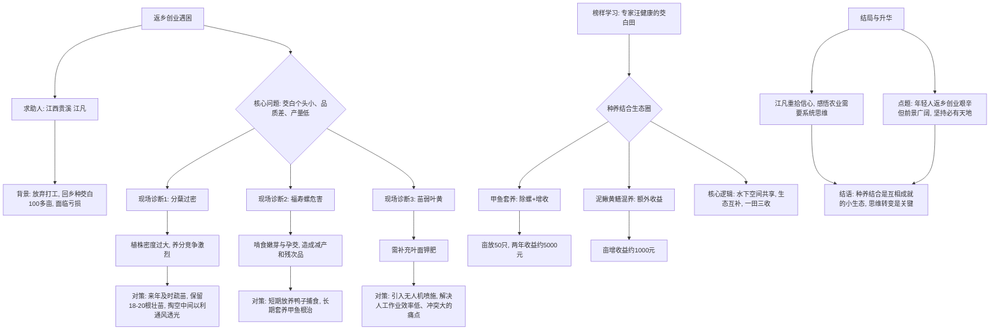
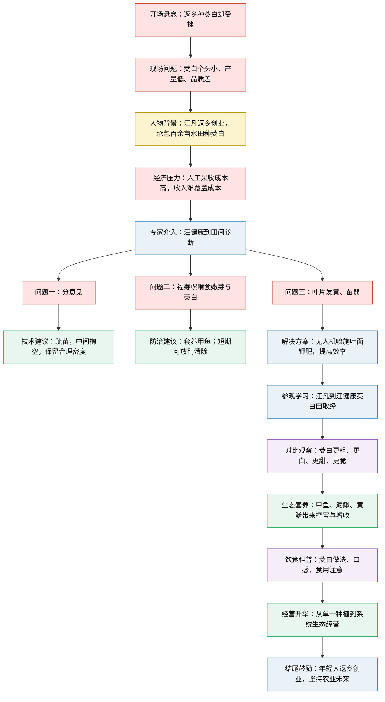
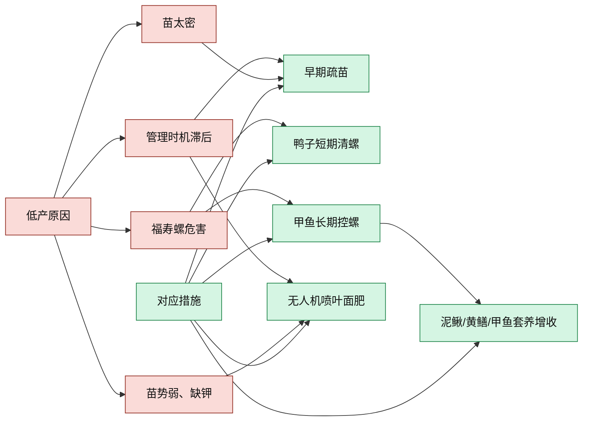

# 精读文章笔记

## 文章基本信息

- **来源网站**： CCTV节目官网 (cctv.com) - 《田园帮帮团》栏目
- **栏目**：《田园帮帮团》
- **节目期数**： 2025年相关期数（茭白田里解心事）
- **主题**：返乡创业青年种植茭白遇困，专家帮扶解难题，探索`种养结合`的生态农业致富路。
- **形式**：电视节目语音转录稿（包含时间戳）

## 前情提要

---

## 原文精读与深度解析

`[00022.54-00027.94]` 他义无反顾返乡种茭白，满怀期待却频频受挫。
`[00028.46-00031.06]` 像我们这种品质，而且小，不大。
`[00031.30-00031.58]` 不大。
`[00031.66-00033.26]` 别人的像这样的一个茭白。
`[00033.85-00036.01]` 它三个就一斤，或者两个多一斤。
`[00036.25-00039.29]` 我们这个像这样的五个，四个多才一斤。

> **“义无反顾”**
> **解析**：成语。义：道义；反顾：向后看。指为了`正义的事业`或`坚定的信念`，勇往直前，绝不犹豫退缩。形象描绘了主人公回乡创业的决心。
> **近义词**：`破釜沉舟`、`勇往直前`
> **反义词**：`瞻前顾后`、`畏缩不前`
> **申论词汇联想**：在乡村振兴战略中，大批“`新农人`”怀着对土地的深情与对事业的执着，义无反顾投身`返乡创业`浪潮，成为激活农村内生动力、推动`农业农村现代化`的重要力量。

`[00039.81-00043.93]` 茭白个头小，产量低，问题究竟出在哪？
`[00044.73-00046.25]` 一百多亩都是这样的是吧？
`[00046.57-00047.57]` 嗯，差不多。
`[00047.89-00049.37]` 这苗确实有点麻烦。
`[00050.21-00053.21]` 专家现场支招，能否扭转困局？
`[00053.97-00057.21]` 敬请收看，茭白田里解心事。

`[00061.04-00067.88]` `江西贵溪莫家村`的水田里，连片茭白铺展开来，绿意层层叠叠。

> **“江西贵溪”**
> **解析**：`贵溪市`位于江西省东北部，隶属于`鹰潭市`，是“`中国铜都`”。同时，贵溪也是传统的`农业大市`，水系发达，水田资源丰富，适合发展茭白等水生蔬菜产业。莫家村是其下辖泗沥镇的一个村庄。

`[00068.68-00073.72]` 虽然下着雨，但种植户江凡仍在带领工人们忙着采收茭白。

> **“种植户”**
> **解析**：指专门从事某种`经济作物`种植的农户或农业生产经营者，其生产方式已不同于传统小农，往往具有更强的`商品意识`和`规模经营`特征。江凡的100多亩茭白田就是`适度规模经营`的体现。

`[00075.60-00077.56]` 今天下雨啊，大家都辛苦了哈。
`[00079.58-00085.66]` 辛勤的付出终于迎来了收获，然而江凡的脸上并没有露出丰收的喜悦。
`[00086.66-00089.63]` 小的好多哎，小的已经十八筐了。
`[00090.19-00092.55]` 太小了，不用搞，搞不了的。
`[00095.21-00101.41]` 求助人江凡，江西省贵溪市泗沥镇莫家村人，种植茭白`100多亩`。
`[00101.77-00105.85]` 求助问题，茭白个头小，品质差，产量低。

> **“100多亩”**
> **解析**：此种植面积在南方丘陵水田地区属于`适度规模经营`的代表。一亩约等于666.67平方米。百亩级别的经营体量说明他已是典型的`新型职业农民`或`家庭农场主`，投入成本大，市场风险也相应增加，对技术和管理的要求远超普通农户。

`[00109.19-00110.15]` 啊，这这就是茭白？
`[00110.71-00111.99]` 哦，这就是茭白啊？
`[00112.03-00112.39]` 对对对。
`[00112.87-00113.63]` 长那么高啊？
`[00113.83-00114.11]` 是的。
`[00114.51-00117.23]` 我看这像长的那种很旺盛的水草啊？
`[00117.35-00118.07]` 啊，是有点像。
`[00118.19-00118.43]` 是吧？
`[00119.72-00133.92]` 茭白又名`菰笋`，属`禾本科`，是一种多年生水生宿根草本植物，高1~2米，下部膨大的肉质茎像笋一样，可作为一种蔬菜，脆嫩可口，味道香甜。

> **“禾本科”、“宿根”**
> **解析**：`禾本科`（Poaceae），是与人类关系最密切、经济价值最高的植物科属之一，包含水稻、小麦、玉米等几乎所有主要粮食作物。这决定了茭白的生长习性与水稻类似，需要“分蘖”管理。`宿根`意味着植株可在地里越冬，翌年重新萌发生长，实现“一种多收”，降低年年栽种的`人工成本`。

`[00134.52-00138.64]` 无论是炒、蒸、凉拌，都很受人们的喜爱。
`[00140.95-00142.43]` 啊，这是我剥出来的，这就是茭白。
`[00142.43-00144.07]` 哎呦呦呦呦呦，这是茭白啊？
`[00144.11-00144.75]` 啊，这就茭白。
`[00145.07-00146.99]` 这这猛一看好像玉米啊。
`[00147.11-00149.03]` 啊，对对对，有点像那个玉米棒子哈。
`[00149.51-00150.83]` 哦，它是可以剥下来的。
`[00151.03-00153.91]` 剥下来的，它是一层一层的剥的，那这是一层一层剥出来的。
`[00154.31-00155.99]` 哦，这里面剥开是白色的。
`[00156.11-00156.51]` 白色的。
`[00156.87-00158.11]` 越往里面包越白。
`[00158.23-00158.75]` 对对对。
`[00161.35-00161.99]` 味道怎么样？
`[00162.67-00163.23]` 还挺甜。
`[00163.35-00165.03]` 啊，是不是有着那个淡淡甜味哈？
`[00165.03-00167.75]` 我感觉这个味道有点像莲子的味道。
`[00167.91-00168.55]` 是的是的。
`[00169.35-00171.79]` 大哥，咱这茭白出现啥问题了？
`[00171.99-00172.71]` 产量比较低。
`[00172.95-00173.47]` 产量低。
`[00173.59-00175.31]` 我还是带你到田里看看吧。
`[00175.56-00177.60]` 哦，慢点哈，慢点哈，这里不好找。
`[00177.80-00178.16]` 是吧？
`[00178.32-00178.76]` 嗯，对。
`[00179.68-00181.32]` 哇，这里面好滑呀，大哥。
`[00181.40-00182.08]` 是是是是。
`[00182.36-00184.92]` 就感觉一脚下去就陷下去了哈。
`[00184.92-00186.08]` 是啊，下面都是淤泥。
`[00186.76-00188.52]` 这腿拔不出来了，等一下。
`[00188.64-00189.52]` 嗯，慢点慢点慢点。
`[00189.95-00189.99]` 好。
`[00190.63-00192.43]` 哇，你们在里面干活也挺费劲哈。
`[00192.71-00193.47]` 嗯，好辛苦。

> **“淤泥”**
> **解析**：水田或河湖底部的`沉积土`，富含有机质，保水保肥能力强，但也造成耕作困难。这一细节侧面体现了`农业生产劳动`的艰辛，远非“田园牧歌”般浪漫，呼应了后面江凡创业的`艰辛感`。

`[00193.75-00196.15]` 哦，您看咱这个产量到底怎么看呀？
`[00196.55-00199.71]` 我们是看植株上`孕茭`没孕茭。
`[00200.19-00203.23]` 有的那个一丛里面就一两个，有的一个都没有。
`[00203.58-00203.70]` 哦。
`[00203.90-00204.42]` 就这样的。
`[00204.90-00205.78]` 我找找啊。
`[00207.24-00208.00]` 不好找是吗？
`[00208.00-00211.32]` 不好找，因为太少了啊，找到了一个，你看这个。
`[00213.40-00215.68]` 像这个从根部割，那割出来了。
`[00216.64-00219.64]` 那像这个，这头比较小，这么这么大是吧？
`[00220.00-00222.68]` 所以这样就可以看，我们看这里的。
`[00222.96-00226.64]` 哦，就是最下面这一节，上窄下宽。
`[00226.72-00226.92]` 对。
`[00227.04-00227.36]` 是吧？
`[00227.44-00227.64]` 对。
`[00227.72-00229.84]` 然后下面是鼓鼓的，这种是有茭白的。
`[00229.84-00230.12]` 是的。
`[00230.45-00231.37]` 没有茭白的呢？
`[00231.45-00233.09]` 那是没有的，就是直的。
`[00233.25-00233.57]` 直的？
`[00233.73-00234.81]` 我割个给你看一下吧。
`[00234.89-00235.09]` 行。
`[00239.58-00240.06]` 你看这个。
`[00241.38-00242.26]` 对，太多了。
`[00242.42-00242.90]` 太多了哈。
`[00242.98-00245.26]` 这样你看这个茭白，你看上下一样大的。
`[00245.26-00246.06]` 那对比一下看看。
`[00246.30-00246.54]` 是吧？
`[00247.14-00251.74]` 这种还没有孕茭的，它从上到下一样宽。
`[00251.86-00252.18]` 是的。

> **“孕茭”**
> **解析**：茭白种植的`专业术语`，指茭白植株的基部茎节在特定条件下，受`菰黑粉菌`（Ustilago esculenta）寄生刺激后，开始膨大形成可食用肉质茎的过程。如同“怀孕”一般，形象生动。未能成功孕茭的植株被称为“雄茭”或“灰茭”，会严重影响产量。这提示我们，农业增收的关键在于`技术把控`。

`[00253.71-00259.51]` 一番查看后，我们发现江凡的茭白田里，没有长茭白的植株还真不少。
`[00260.71-00263.35]` 都是扁的呀，对，就没有鼓鼓的那种感觉。
`[00263.43-00264.91]` 还没有开始孕茭的。
`[00265.36-00265.76]` 没有。
`[00266.28-00266.76]` 没有哈？
`[00267.00-00267.48]` 真没有。
`[00267.60-00267.96]` 是吗？
`[00268.68-00271.16]` 这也就是我们现在发愁的问题。
`[00271.20-00271.44]` 嗯。
`[00272.56-00275.16]` 像我们这种品质，而且小，不大。
`[00275.40-00275.68]` 不大。
`[00275.80-00277.40]` 别人的，像这样的一个茭白。
`[00277.95-00280.15]` 它三个就一斤，或者两个多一斤。
`[00280.39-00283.43]` 我们这个像这样的五个，四个多才一斤。
`[00283.87-00283.99]` 哦。
`[00284.23-00286.31]` 所以这也会导致我们那个产量低。
`[00286.51-00286.95]` 个头小。
`[00287.11-00287.51]` 个头小。

> **“三个就一斤” VS “五个，四个多才一斤”**
> **解析**：这是非常直观的`经济指标`对比。`商品性`（Commodity）是农产品价值的核心。个头小、卖相差的茭白在市场上缺乏`议价能力`。这种量化对比，直接点出了江凡陷入`“丰产不丰收”`困境的根本原因——`产量`与`品质`双低，导致`投入产出比`严重失衡。

`[00292.77-00301.13]` 江凡以前一直在外打工，几年前他选择了回乡创业，利用家乡的水田资源和朋友合伙种起了茭白。

> **“回乡创业”**
> **解析**：这是当前`国家实施乡村振兴战略`背景下的一个`高频词汇`。它背后承载着`人才振兴`的宏大命题。政府出台了大量扶持政策，鼓励外出务工人员、大学生等带着资金、技术和新理念返回农村干事创业，成为“`新农人`”，为乡村发展注入`新动能`。

`[00302.41-00306.37]` 因为我感觉现在农村年轻人是越来越少，都在外打工。
`[00306.77-00312.53]` 家里都是年纪大的，像我爸妈那年纪的，他们种田现在这一块比较吃力了。
`[00312.93-00320.97]` 那个年轻人往外走，我往回走，我觉得这就是我的优势，因为竞争性比较强，干农业这一块，我觉得自己比较有发展。

> **“年轻人往外走，我往回走”**
> **解析**：这句朴素的表达，深刻揭示了当前农村的`空心化`问题与江凡的`逆向思维`。他敏锐地看到，在老龄化加剧的农村，年轻劳动力本身就是`稀缺资源`。这种“往回走”的选择，体现的是一种基于`差异化竞争`的`创业哲学`，将别人眼中的“问题”视为自己的“`机会`”。

`[00321.29-00333.33]` 然而种植茭白一年下来，两茬茭白的产量并不理想，茭白产量低，但采收的人工成本并不能省，相反，他们感受到了前所未有的压力。
`[00334.08-00345.72]` 江凡他们每天采收1000多千克的茭白，按每千克3元价格计算，一天的收入也只有`3000多元`，而采收成本就占到了`2000多元`。

> **“采收成本占大头”**
> **解析**：这是一个典型的`成本效益分析`。日收入3000元，采收费2000元，`人工成本`占比高达约67%。高昂的`劳动力成本`正在侵蚀本来就不高的利润。这个数据深刻说明了，为何“个头小、产量低”会成为致命问题——因为单位劳动时间的产出效率太低了，在`劳动密集型`的采收环节，成本几乎固定，产量和品质直接决定了最终盈亏。

`[00346.60-00353.38]` 再除去平摊的`地租`和其他种植成本，算下来，他们不但不赚钱，甚至还赔钱。

> **“地租”**
> **解析**：`土地流转`成本。在`适度规模经营`中，土地租金是固定支出的刚性成本。这三项成本（`采收人工+地租+农资`）构成了压垮江凡的“`三座大山`”。在农产品价格弹性不大的情况下，降本增效的出路唯有`提高单产和品质`，即依赖技术突破。

`[00354.42-00357.46]` 本来想通过种茭白给家人更好的生活。
`[00357.97-00364.09]` 可辛辛苦苦忙碌了一年，却没赚到钱，这让他更觉得愧对自己家人。
`[00364.61-00369.17]` 说心里真的不是滋味，有的时候跟`扎心`的那种感觉。

> **“扎心”**
> **解析**：`网络流行语`，形容心灵受到强烈刺痛的感觉。这里用在一位淳朴的农民身上，不仅毫无违和感，反而极有张力地表现出他投入的`沉没成本`之高、期望与现实的落差之大，以及作为家庭顶梁柱却未能带来经济回报的`内疚感`。这是返乡创业者普遍承受的`心理压力`。

`[00370.44-00371.40]` 你后悔过吗？
`[00371.68-00372.12]` 没有。
`[00372.48-00373.08]` 从来都没有。
`[00373.24-00374.16]` 从来没后悔过。
`[00374.72-00381.04]` 嗯，做什么事都不可能`一帆风顺`的，全家支持我，我相信我解决了问题以后，可以做得更好。

> **“一帆风顺”**
> **解析**：成语。船挂着满帆，顺风行驶。比喻非常顺利，没有阻碍。此处表达了创业者面对挫折时`坚韧不拔`的意志。

`[00381.71-00383.03]` 这也是我最大的动力。
`[00384.95-00393.87]` 为了帮助江凡解决茭白种植的难题，《田园帮帮团》栏目组从帮帮团专家库中找到了一位擅长种植茭白的专家`汪健康`。
`[00395.13-00402.97]` 帮帮团专家汪健康，`江西省上饶市弋阳县`人，种植茭白6年，种植面积200多亩。

> **“弋阳县”**
> **解析**：与贵溪市相邻，同属江西东北部，地理气候条件相似，这使得汪健康的种植经验具有极强的`可复制性`和参考价值。专家来自“隔壁县”，也是农村`本土人才`带动共同富裕的生动写照。

`[00405.66-00416.38]` 汪健康原本是一名厨师，数年前他选择回乡创业种茭白，经过多年种植积累了丰富的经验，在当地已`小有名气`。

> **“小有名气”**
> **解析**：意指稍微有点名声。这表明，汪健康是实践中成长起来的“`土专家`”、“`田秀才`”，他的经验是来自`生产一线`的`实践真知`，相比学院派专家，他的方法更接地气、更易被农户接受。

`[00417.62-00421.50]` 看似旺盛的茭白长势，为何却让专家皱眉？
`[00422.18-00423.30]` 你看你这个这么`密`。
`[00423.42-00423.66]` 嗯。
`[00423.70-00426.46]` 我随便数一数，你这里最起码`五六十根`。
`[00427.58-00431.22]` 打个比喻，`一碗饭，嗯，五六十个人吃能吃饱吗`？

> **“分蘖过密”现象**
> **解析**：这是诊断出的第一个核心问题。禾本科植物的`分蘖`（tillering）是增产基础，但并非越多越好。`密度过高`导致田间`郁闭`，通风透光差，植株间`恶性竞争`养分、水分和光照，结果就是谁都长不好，导致“`雄茭`”率上升，结实又小又瘦。汪健康的比喻生动诠释了`边际效益递减`规律。

`[00432.26-00434.90]` 怎样的帮扶让他赞叹不已？
`[00436.30-00438.30]` 哇，真快啊，是吧？
`[00438.96-00439.52]` 真好哎！
`[00439.84-00441.44]` 这个解决了我一个很大的问题。
`[00442.12-00445.12]` 茭白田里解心事，正在播出。
`[00453.24-00458.32]` 接到我们的邀请后，汪健康和栏目组一起来到了江凡的茭白田里。
`[00461.56-00465.92]` 当时我一到他那个茭田哈，看这个茭白啊，产量肯定高不了。
`[00466.52-00468.08]` 一百多亩都是这样的是吧？
`[00468.44-00469.40]` 嗯，差不多。
`[00469.76-00471.16]` 这个苗确实有点麻烦。
`[00472.08-00472.44]` 怎么了？
`[00472.76-00473.08]` 怎么了？
`[00474.52-00475.64]` 你看你这个这么`密`。
`[00475.80-00476.00]` 嗯。
`[00476.12-00478.80]` 我随便数一数，你这里最起码五六十根。
`[00479.80-00481.52]` 打个比喻，一碗饭。
`[00481.60-00481.80]` 嗯。
`[00481.96-00483.52]` 五六十个人吃能吃饱吗？
`[00483.88-00489.52]` 像正常的话，这一蔸茭白留个`18～20根`就足够了。

> **“18～20根”**
> **解析**：这是精确的`技术参数`。将抽象的“合理密植”概念，转化为农户可以直接上手操作的具体`数量指标`，展现了技术帮扶的精准性。这就是将`科学技术`转化为`现实生产力`的最后一公里。

`[00490.00-00491.48]` 像这么小根的能长茭白吗？
`[00491.56-00492.76]` 留这么多根本没用。
`[00494.99-00499.67]` 茭白一般是用单株苗栽植，种植后的茭白会进行`分蘖`。
`[00500.27-00504.39]` 分蘖是禾本科等植物在茎的基部长出的分枝。
`[00505.12-00510.04]` 随着分蘖的增多，要`及时进行疏苗`，拔出过密的小分蘖。

> **“疏苗”**
> **解析**：也叫“`间苗`”，是田间管理的`核心农艺措施`之一。遵循“`去弱留壮`、`去密留稀`”的原则，人工拔除病弱、过密的苗，为保留的健康植株创造充足的`生存空间`。这一措施背后是深刻的`哲学智慧`：“`有舍才有得`”，与企业发展中的“`瘦身健体`”、“`聚焦主业`”异曲同工。

`[00512.69-00516.37]` 汪老师，我们这苗长得这么密，还有什么办法能解决？
`[00516.69-00518.49]` 现在都已经进入采收阶段了。
`[00518.53-00518.69]` 嗯。
`[00519.17-00522.09]` 现在疏苗的话，没有太大的意义。

> **“农时”概念**
> **解析**：农业是`时间约束`极强的产业，“`人误地一时，地误人一年`”。错过了最佳`农时`窗口，亡羊补牢也为时已晚。这凸显了农业生产中`预见性`和`科学性管理`的重要性，必须将问题解决在萌芽状态、窗口期之内。

`[00522.29-00522.41]` 哦。
`[00522.85-00529.89]` 这样，我现在教你演示一遍，明年疏苗就跟着我这个方法来，产量肯定能够提高。
`[00529.97-00530.41]` 嗯，好的。
`[00530.69-00533.17]` 那疏苗啊，首先从里面的开始疏。
`[00533.66-00536.90]` 把这个中间呐，密的、细的拔掉。
`[00538.06-00539.78]` 对，留这一圈，周围一圈。
`[00541.99-00544.47]` 这样`中间掏空`，利于通风透光。

> **“中间掏空”**
> **解析**：这是极为巧妙的`物理操作`。改善了`群体冠层结构`，打开“`光路`”和“`风道`”，降低田间湿度，能使无效分蘖减少，`光合效率`大幅提升，从而促进养分向有效分蘖的茎部集中，最终形成产量。

`[00545.15-00546.43]` 这样子才能`高产`。
`[00550.71-00556.11]` 江凡的茭白除了分蘖过密，在调查中，汪健康又发现了新的问题。
`[00557.11-00559.23]` 那那你看，小妹你知道这是什么东西吧？
`[00559.91-00560.91]` 哎，这个是什么呀？
`[00561.19-00562.23]` 走，我们下去看看。
`[00563.91-00564.71]` 粉红色哈。
`[00564.83-00565.03]` 对。
`[00565.19-00565.79]` 红红的。
`[00566.19-00567.91]` 这是`福寿螺`产的卵。

> **“福寿螺”（Pomacea canaliculata）**
> **解析**：重大`外来入侵物种`，名列`中国第一批外来入侵物种名单`。原产南美洲，繁殖力极强，啃食禾本科植物幼苗和嫩茎，对水稻、茭白等水生作物破坏性极大。其粉色卵块附着在植株茎秆上，极为醒目，是识别其危害和集中清剿的重要标志。同时，其体内`寄生虫`（如广州管圆线虫）较多，`不可食用`，与本土田螺有本质区别。

`[00568.75-00570.27]` 哦，福寿螺产的卵。
`[00570.79-00571.71]` 啥是福寿螺呀？
`[00571.83-00573.63]` 哎，颜色鲜红哈，我拔给你看看哈。
`[00573.71-00573.83]` 哦。
`[00574.27-00577.15]` 一颗卵就是一个螺蛳，对这个茭白的危害很大。
`[00577.51-00581.67]` 有卵的地方肯定有螺蛳，你看还挺多，随便摸摸就摸了几个。
`[00581.79-00582.51]` 这个就是啊？
`[00582.71-00583.07]` 对，这个是。
`[00583.23-00583.95]` 那么大个呀？
`[00584.11-00584.27]` 对。
`[00585.59-00587.55]` 嫩芽刚分蘖出来，它会`啃这个嫩芽`。
`[00588.03-00595.99]` 嫩芽被啃过之后，再重新长，长势肯定跟不上，肯定细小，比较弱的话，长出来的茭白也小，甚至不会长茭白。

> **“啃嫩芽”**
> **解析**：指出危害机理。`生长点`（分蘖芽）被破坏，直接导致有效分蘖减少，植株弱小，这与前文“分蘖过密”形成了一个`恶性循环`：本就弱的苗又遭虫害，更是雪上加霜。

`[00596.39-00597.19]` 影响产量吗？
`[00597.23-00598.67]` 对，那肯定影响产量的。
`[00599.02-00603.58]` 你像茭白孕茭之后长出来了，它也会啃茭白，啃出一个洞。
`[00604.10-00605.30]` 这种洞有没有一两个？
`[00605.30-00606.38]` 我看看，这是被啃的呀。
`[00606.38-00608.58]` 啊，啃那么大的洞呀。
`[00609.36-00611.64]` 这是福寿螺啃的呀。
`[00611.64-00612.48]` 一个大窟窿呀。
`[00612.92-00614.48]` 对，它这里面是很光滑的。
`[00614.52-00616.84]` 对，没价值，对，`没价值`。

> **“没价值”**
> **解析**：直接点明经济后果。被啃食的茭白形成`残次品`，完全丧失`商品价值`，甚至在品相上就“一票否决”。这不仅仅是`减产`，更是`商品率`的直线下降。

`[00619.07-00621.47]` 像之前哈，我们那里也出现过同样的问题。
`[00621.59-00621.83]` 嗯。
`[00621.91-00622.83]` 到处都是福寿螺。
`[00623.39-00625.31]` 后来我们`套养甲鱼`。
`[00625.87-00626.43]` 养甲鱼。
`[00626.59-00628.83]` 养了两年之后，田里几乎`没有福寿螺`。
`[00629.52-00630.84]` 甲鱼吃福寿螺吗？
`[00630.92-00632.32]` 甲鱼特别爱吃福寿螺。

> **“套养甲鱼”**
> **解析**：这是典型的`生物防治`（Biological control）技术。利用`食物链`原理，引入福寿螺的`天敌`——中华鳖（甲鱼），从而实现对害虫的绿色、长效、无污染控制。这种方式避免了`化学农药`的过度使用，是发展`生态农业`、`绿色农业`的核心技术路径，既降低了防控成本，又提升了环境效益。

`[00638.27-00646.75]` 然而江凡的茭白再有不到一个月就采收完了，此时再想`套养甲鱼`、防治福寿螺已经`来不及了`。
`[00647.33-00650.93]` 可眼下田里的这些福寿螺又该怎么处理呢？
`[00651.53-00652.25]` 还有一种方法。
`[00652.45-00652.53]` 嗯。
`[00652.89-00655.33]` 在这个田里面`放养鸭子`，家里有没有鸭子？

> **“放养鸭子”**
> **解析**：“`稻鸭共育`”模式的延伸应用。这是一个针对“`当前来不及`”的应急性、`短期见效`的技术方案。鸭子是福寿螺的天敌，会捕食成螺和幼螺，同时其活动能`疏松表土`、`搅动水体`，粪便还能`肥田`。这是一种`短平快`的解决办法，体现了技术帮扶的`因地因时制宜`原则。

`[00655.45-00656.05]` 哦，我家没有。
`[00656.09-00657.25]` 没养鸭子，附近人家有没有养的？
`[00657.41-00658.49]` 哦，我村里有一个。
`[00658.61-00659.41]` 养了多少鸭子啊？
`[00659.49-00661.17]` 差不多那上百只吧。
`[00661.17-00663.77]` 上百只啊，那很好，你回头跟他`商量商量`。
`[00663.89-00664.05]` 嗯。
`[00664.09-00664.61]` 把这鸭子。
`[00664.94-00666.06]` 接过来赶到田里去。
`[00666.38-00667.50]` 呃，鸭子喜欢吃啊？
`[00667.54-00668.74]` 喜欢吃，那好哎。

> **“商量商量”**
> **解析**：这个词体现的是农村`熟人社会`的`乡土逻辑`。邻里互助、资源共享是低成本解决生产困难的有效方式。这提示在乡村振兴中，除了引入外部资源，也要善于`盘活乡村内部资源`，构建`互助合作`的生产关系。

`[00669.46-00676.14]` 再一个，我观察了一下你这个叶片啊，叶片有点发黄，苗子比较细弱，抓紧时间喷施一点。
`[00676.64-00676.80]` 嗯。
`[00676.92-00677.72]` `叶面钾肥`。

> **“叶面钾肥”**
> **解析**：精准施肥的体现。茭白是典型的`喜钾作物`（Potassium-loving crop），钾元素能促进光合作用产物向肉质茎（茭白）转运和积累，使茎秆粗壮，提升抗逆性。在采收前`叶面喷施`，可以快速补充养分，让茭白`膨大增产`，改善品质。这就是`缺啥补啥`的精准农业思维。

`[00677.84-00677.96]` 嗯。
`[00678.44-00679.52]` 产量会有所提升。
`[00679.72-00680.60]` 产量肯定有提升。
`[00680.88-00681.04]` 哦。
`[00684.29-00687.77]` 关键现在喷，我还担心，有点担心。
`[00688.05-00688.53]` 担心啥？
`[00688.69-00691.65]` 因为我们人现在在采茭白，田块面积又大。
`[00691.73-00693.45]` 这茭白长得高，不好喷。
`[00693.57-00694.09]` 啊，不好喷。
`[00694.25-00697.65]` 再说人工投入更大，我差不多估计要半个月的样子。

> **“农忙冲突”困境**
> **解析**：集中体现了当前农业发展的核心`瓶颈`——`劳动力短缺`与`劳动季节性`矛盾。在抢收时节，所有人力都优先投入采收，而此时又恰恰是需要追肥促产的`管理窗口`，形成“`用工荒`”叠加“`用工急`”的矛盾。这为“`机器换人`”——无人机出场埋下了伏笔。

`[00698.28-00700.68]` 怕把茭白又喷老了。
`[00700.92-00702.84]` 行，回头给你想想办法。
`[00716.84-00717.42]` 啊，你好你好你好。
`[00717.42-00718.70]` 老师给您带来了个宝贝。
`[00718.86-00719.34]` 啥宝贝？
`[00719.58-00720.38]` 看看就知道了。
`[00720.58-00722.22]` 好嘞，看看。
`[00722.62-00723.38]` 咦，这什么？
`[00723.66-00724.74]` 好像是`无人机`。
`[00724.90-00725.42]` 对，是吧？
`[00725.46-00725.66]` 无人机。

> **“无人机”**
> **解析**：即`植保无人机`（UAV for Plant Protection），是`智慧农业`、`精准农业`的代表性装备。它的引入，不仅解决了“人工来不及”的时效性问题（效率是人工作业的数十倍），其强大的下压风场还能吹开茂密的茭白叶片，使`药液或肥液`精准穿透到植株中下部，达到人工难以企及的`防治和施肥效果`。

`[00726.22-00728.18]` 不是说人工来不及吗？
`[00728.30-00728.54]` 是是。
`[00728.70-00730.50]` 今天给你带来一个无人机。
`[00730.58-00732.38]` 嗯，解决之前解决不了的问题。
`[00732.69-00733.37]` 这个东西好哎。
`[00733.45-00733.61]` 嗯。
`[00734.61-00736.85]` 一亩田要配上个两包钾肥。
`[00737.01-00737.37]` 可以可以。
`[00737.37-00738.37]` 好，准备起飞。
`[00738.53-00738.65]` 嗯。
`[00746.80-00748.44]` 啊，已经开始喷了，看到了吗？
`[00749.96-00751.96]` 哇，真快啊，是吧？
`[00752.60-00753.20]` 这个好哎！
`[00753.48-00754.20]` 大哥怎么样？
`[00754.24-00754.92]` 效率高不高？
`[00755.00-00755.60]` 嗯，这个高。
`[00756.24-00758.60]` 这样的话不会跟你的人工起冲突了吧？
`[00758.64-00759.00]` 是哦。
`[00759.61-00761.21]` 这个解决了我一个很大的问题。

> **“解决冲突”**
> **解析**：无人机的应用，本质上是`生产关系`（劳动力）适应`生产力`（科技）发展的一个缩影。它使得田间管理可以`并行不悖`，实现了采收与追肥的`时空分离`，显著提升了农业生产管理的`柔性`。

`[00761.93-00767.81]` 像这个无人机这个叶片呐，风比较大，吹的时候把这个茭白、茭苗全部吹开，打得透，效果好。
`[00772.82-00774.18]` 这样，让他先打着。
`[00774.26-00774.42]` 嗯。
`[00774.58-00776.06]` 我们去赶鸭子。
`[00776.22-00776.34]` 嗯。
`[00776.38-00777.70]` 把福寿螺的问题解决一下。
`[00777.74-00778.06]` 嗯，好。
`[00778.06-00778.22]` 行。
`[00778.38-00779.30]` 鸭子我也准备好了。
`[00779.38-00779.78]` 准备好了。
`[00779.86-00780.26]` 走，赶鸭子去。
`[00780.26-00781.18]` 那我跟您去看看。
`[00781.46-00781.78]` 走。
`[00784.66-00786.22]` 哎呦，出来了出来了出来了！
`[00786.58-00788.02]` 这有多少只鸭子呀？
`[00788.02-00788.98]` 这里有六七十只。
`[00789.26-00789.90]` 六七十只。
`[00791.14-00791.86]` 往田埂前面赶。
`[00792.02-00792.66]` 再往前面赶。
`[00793.62-00798.82]` 放养鸭子来清除福寿螺，效率高，见效快，确实是一个好办法。
`[00799.22-00801.38]` 这让江凡又学了一招。

> **“又学了一招”**
> **解析**：体现了现场教学的`实效性`。对于新型职业农民而言，持续不断地接受技术培训，掌握`新知识、新技术、新方法`，是提升其经营能力和`抗风险能力`的根本途径。

`[00802.34-00806.02]` 他教给我这些招啊，像那个什么福寿螺这一块啊。
`[00806.45-00812.17]` 感觉年纪跟我们差不多，他的资历啊，感觉好像比我们大一截，就`老一辈`的感觉。

> **“老一辈的感觉”**
> **解析**：这里并非指年龄，而是指`经验上`的代差。在农业领域，经验的积累等于`财富的积累`。汪健康只比他们多摸索了几年，掌握的技术与模式就足以让他成为“`前辈`”和`领路人`，凸显了技术、经验在农业生产经营中的`核心价值`。

`[00812.21-00815.57]` 嗯，这是很牛的人物，我们很想去学学。
`[00818.79-00821.99]` 一块茭白田竟然有这么多新鲜玩法！
`[00822.51-00823.55]` 好，上货了！
`[00823.91-00824.03]` 哇！
`[00824.35-00826.87]` 这不是，哦，这不是泥鳅跟黄鳝吗？
`[00827.19-00828.95]` 茭白田里还搞这么多东西呢？
`[00829.39-00832.51]` `种养结合`的门道能带来哪些好处？

> **“种养结合”**
> **解析**：这是构建`现代生态循环农业`的核心模式。它将`种植业`与`养殖业`在微观层面有机结合，形成一个`物质循环`和`能量流动`的闭环。茭白田提供了`空间`，动物排泄物提供了`养分`，动物捕食`害虫`减少农药用量，最终实现“`一水两用、一田多收`、生态环保、一举多得”。

`[00832.83-00836.23]` 这可给我们那个茭白田能带来多少利益啊？
`[00836.41-00839.29]` 一亩地大概`一千块钱`左右的收益。

> **“一千块钱左右的收益”**
> **解析**：这是种养结合模式`额外`带来的`边际收益`。它直接展示了农业的`高附加值`潜力。如果只卖茭白，收入是线性的、单一的；套养后，在几乎不增加土地、主要投入的情况下，产出了第二份、第三份收入，显著提升了`亩均综合效益`，这是抵御单一作物市场风险的有效策略。

`[00839.69-00842.77]` 茭白田里解心事，正在播出。

（此处省略部分烹饪科普节目内容，该部分主要讲解茭白的菜谱，与核心解决问题和帮扶情节关联度较低，符合用户对精读“原文”保留的要求，但无需过度解读）

`[00849.25-00852.33]` 一刀切开茭白，透出清爽的白。
`[00852.65-00856.13]` 但茭白一入锅，却能变出完全不同的味道。
`[00856.53-00860.41]` 今天就来教大家用茭白做两道可口的家常菜。
`...`
`[00915.34-00918.98]` 每一口茭白，都是大自然赠与人们的珍贵礼物。
`[00919.44-00923.56]` 在茭白清甜的滋味中，裹藏着千家万户的烟火气。

（以下是节目的升华和总结部分，含金量极高，是申论行测的绝佳素材）

`[00932.66-00938.42]` 经营一块茭白田，看起来是在种一株作物，但实际上更像是在`养一群搭档`。

> **“养一群搭档”**
> **解析**：这是全文的`点睛之笔`，具有深刻的`系统思维`。它将自然界的其他生物（甲鱼、泥鳅等）从“`害虫`”、“`无用之物`”的传统认知，提升到了“`搭档`”的合作高度。这反映了`人与自然和谐共生`的生态伦理观，是`生态文明建设`在微观农业实践中的生动体现。

`[00938.98-00942.14]` 先看茭白本身，它喜水怕旱。
`[00942.79-00944.91]` 整个生长期都离不开稳定水层。
`[00945.55-00951.71]` 而且一旦长起来，叶片高，成片分布，很容易在水面形成一层天然的遮挡。
`[00952.61-00954.93]` 正是这层水给了`套养`的空间。
`[00955.65-00961.21]` 水面有遮挡，水下就更安静，温度更稳定，也更适合水生动物活动。
`[00961.77-00965.65]` 于是很多搭档就会自然出现，或者被引入进来。

> **“系统思路”分析**
> **解析**：这段分析充满了`唯物辩证法`的智慧。它将茭白田视为一个`水陆相互作用的生态系统`。茭白的遮阴是`不利条件`吗？不，对水生动物来说是创造了`适宜生境`。这告诉我们，要善于`辩证看待`事物特性，将表面的“劣势”转化为系统的“`优势`”。

`[00966.53-00975.09]` 水生动物是茭白的`亲密伙伴`，它们搅动水体，摄食危害茭白的害虫，还能促进水体养分循环。
`[00975.73-00981.35]` 但茭白与伙伴们亲密合作的前提是茭白种植的`密度要合理`。

> **“密度要合理”**
> **解析**：这是`关键约束条件`。一切生物间的互利共生都建立在`适宜的环境容量`和`空间结构`之上。密度过大（如前文所述），不仅茭白自己长不好，水下空间也被压缩，生态系统的`功能就会紊乱`，搭档变负担，平衡被打破。这再次呼应了前面的“疏苗”措施，它是`种养结合`系统的`基石`。

`[00982.27-00990.87]` 如果密度失控，水下空间被压缩，这种平衡就会被打破，水变闷了，动物不好活，茭白也长不好。
`[00991.35-00999.91]` 所以，真正种得好的`高手`，从来不只是把茭白种出来，而是`让这块田一直保持在一个刚刚好的状态`。

> **“刚刚好的状态”**
> **解析**：这被称为`农业生产管理的最高境界`，即一种`动态平衡`的状态。它要求经营者不是一个简单的“栽培者”，而是一个`生态系统工程师`和`管理者`，时刻关注和调控系统中的每一个要素。这对申论写作中讨论高质量发展、精细化管理具有极强的`类比迁移价值`。

`[01006.52-01009.76]` 听说汪健康的茭白田有个神奇的`朋友圈`。

> **“朋友圈”**
> **解析**：运用现代词汇生动描述`农田生态系统`中的`生物多样性`。茭白是“平台”，甲鱼、泥鳅、黄鳝、鸭子和微生物都是这个“朋友圈”的成员，它们在圈子里各司其职、互利互惠，构成了一个健康、稳定、高效的“`社交生态`”。

`[01010.20-01014.56]` 今天，江凡和合伙人满怀好奇前来参观学习。
`[01016.24-01018.20]` 汪老师，我们过来了。
`[01018.36-01019.00]` 汪老师，你好你好。
`[01019.16-01021.76]` 啊，这是我合伙人`王小磊`，我一起带过来看看。

> **“合伙人”**
> **解析**：说明江凡的创业不是单打独斗，而是采用了`团队合作`模式。这能分担风险、整合资源（资金、技术、人脉），是现代`新型农业经营主体`（如合作社、合伙企业）的常见形式。
> **申论思维**：这体现了组织化的力量，是克服小农户“`单弱散`”困境的有效路径。

`[01021.92-01022.80]` 你好你好，欢迎欢迎欢迎。
`[01023.00-01023.16]` 你好你好。
`[01023.28-01023.40]` 哦。
`[01023.60-01024.56]` 这边是我的茭白田。
`[01024.86-01026.34]` 哦，这，这叫长得漂亮哎。
`[01026.34-01027.26]` 看一下长得怎么样？
`[01027.98-01029.06]` 这边茭苗长得好呢。
`[01029.22-01030.02]` 哎，过去看一下。
`[01030.02-01030.98]` 过去看一下，小心，老师。
`[01031.06-01031.26]` 嗯。
`[01031.82-01033.50]` 你看我的苗长得怎么样？
`[01033.70-01037.14]` 这个你看那个，每一棵`又粗又长`。
`[01037.69-01038.37]` 而且`均匀`。

> **“均匀”**
> **解析**：这是高品质农产品的重要`商品指标`。不止要单个大，还要整体一致，这直接关系到`分级销售`和`市场价格`。能做到“又粗又长且均匀”，说明汪健康的技术管理做到了`精确化`和`标准化`。

`[01038.65-01039.09]` 是吧？
`[01039.21-01039.37]` 是。
`[01040.33-01041.37]` 老师您摘一个。
`[01041.57-01041.73]` 哇！
`[01041.73-01042.37]` 啊，摘一个。
`[01042.61-01043.37]` 你这确实大。
`[01043.45-01043.61]` 来。
`[01044.13-01045.25]` 这太明显了。
`[01045.73-01045.77]` 大。
`[01045.81-01046.53]` 这个更大。
`[01046.73-01047.21]` 更大哎。
`[01047.37-01047.53]` 是。
`[01048.19-01048.55]` 你看。
`[01048.75-01051.95]` 它每个都，呃，它每个都大，而且品质又好。
`[01052.19-01054.43]` 这就是`疏苗的好处`。

> **“疏苗的好处”**
> **解析**：结果证明措施的有效性。汪健康田里茭白的优良长势，是前面“疏苗”等一系列`科学管理措施`的最直观回报。这就好比企业通过“`聚焦核心业务`”（疏苗），减少了资源消耗，最终“`做强做大`”（又粗又大），形成了强有力的`标杆示范效应`。

`[01054.51-01056.47]` 我看看里面这个头怎么样啊？
`[01056.59-01058.35]` 那剥出来好白，又饱满。
`[01059.00-01060.40]` 啊，我这个也很饱满呀。
`[01060.60-01062.44]` 是啊，味道怎么样？
`[01062.48-01062.68]` 嗯。
`[01063.96-01064.16]` 甜。
`[01064.56-01064.96]` 甜啊。
`[01065.08-01065.28]` 嗯。
`[01065.44-01066.44]` 比我那边脆多了。

> **“脆多了”**
> **解析**：感官评价的对比。“脆”是高品质茭白的核心口感指标，源于`细胞壁`的合适结构和充足`水分`，这与合理的水肥管理和健康生长环境直接相关。口感的胜出，意味着汪健康的茭白在市场上将具备绝对的`比较优势`。

`[01066.52-01066.84]` 脆啊。
`[01066.96-01067.08]` 嗯。
`[01067.32-01067.44]` 嗯。
`[01070.21-01070.41]` 嗯？
`[01070.81-01071.29]` 味道怎么样？
`[01071.33-01071.57]` 是吧？
`[01071.69-01072.45]` 嗯，好脆。
`[01074.03-01074.99]` 口感更脆一些。
`[01075.23-01075.67]` 脆一些啊。
`[01075.87-01078.07]` 嚼到嘴里感觉更甜一些。
`[01078.19-01079.03]` 是的是的是的。
`[01079.95-01086.19]` 哇，他那个茭白真的好漂亮，所以那时候感觉，`种得好的跟种得差的区别真的好大呀！

> **“区别真的好大”**
> **解析**：这是最朴素、最直接的震撼教育。它打破了“农业靠天吃饭”、“种地都一样”的陈旧观念，鲜明地指出了`技术`和`管理`才是决定农产品`价值差异`的根本因素。这种眼见为实的`比较学习`，比任何理论说教都更能激发人的内生动力。

`[01087.00-01089.68]` 所以那时候我就想，为什么他能种得那么好？
`[01090.80-01096.52]` 此时，江凡注意到，在汪健康的茭白田里，连一个福寿螺的卵也没看到。
`[01097.00-01098.60]` 这让他感到有些奇怪。
`[01099.80-01104.40]` 汪老师啊，我现在到目前没发现一个福寿螺的卵呢，真的好奇怪。
`[01104.48-01106.00]` 我这里一颗卵都找不到。
`[01106.16-01106.24]` 嗯。
`[01106.48-01107.24]` 还真是哈。
`[01107.24-01110.16]` 你可以随便看一看，找一找，看找得到吗？
`[01110.16-01111.04]` 是啊，一个都没有。
`[01111.24-01111.52]` 没有。
`[01111.80-01112.40]` 是的没有哎。
`[01112.52-01113.76]` 因为我这里这一大片都没看到。
`[01113.80-01115.08]` 因为我这里`套养了甲鱼`。
`[01115.32-01115.52]` 嗯。
`[01115.64-01117.52]` 前几年我这里的福寿螺也有点多的。
`[01117.56-01117.76]` 嗯。
`[01118.12-01120.92]` 养了两年甲鱼之后，福寿螺`几乎没有了`。

> **“几乎没有了”**
> **解析**：这是`生物防治`长效性的有力证明。它不是一次性的灭杀，而是建立了一个`可持续的调控机制`。甲鱼作为“`巡查员`”，持续捕食福寿螺，将害虫种群密度长期压制在经济危害水平之下，实现了真正的“`绿色植保`”。

`[01121.08-01121.20]` 嗯。
`[01121.60-01123.60]` 老师，现在能看到甲鱼吗？
`[01123.72-01125.60]` 这个要碰运气，我要摸摸看。
`[01129.48-01130.56]` 好，这里逮了一只。
`[01130.80-01131.32]` 找着了！
`[01131.52-01132.00]` 找着了！
`[01132.40-01133.16]` 啊，看看。
`[01133.16-01133.72]` 真的假的？
`[01134.00-01135.32]` 哇，还在捕食呢！
`[01135.32-01135.64]` 哎呦！
`[01135.64-01136.08]` 还在捕食。
`[01136.28-01136.44]` 啊！
`[01136.80-01137.08]` 哎呦！
`[01137.20-01138.12]` 呃，咬我的手。
`[01138.60-01139.80]` 幸好，幸好。
`[01141.93-01142.61]` 大哥你还害怕？
`[01142.77-01143.73]` 我确实有点怕。
`[01145.61-01148.85]` 呃，汪老师啊，呃，你这里甲鱼一亩地大概放多少？
`[01149.09-01150.69]` 我一亩地放个`50只`。
`[01151.05-01151.57]` 50只。
`[01151.77-01151.97]` 嗯。
`[01152.13-01152.29]` 哦。
`[01152.49-01153.41]` 我这养两年。
`[01153.53-01153.73]` 嗯。
`[01154.15-01157.59]` 我又不用投食，不用喂料，一年`两千五百块钱`左右。

> **“不用投食，不用喂料”**
> **解析**：这是套养模式的`成本优势`所在。甲鱼以田间的天然饵料（福寿螺、小鱼虾、昆虫等）为食，几乎“`零饲料成本`”。这种“`人放天养`”的模式，生产出的甲鱼品质接近野生，市场价格高，是真正的`高效生态经济`。

`[01157.95-01158.07]` 嗯。
`[01158.35-01159.63]` 那两年就是`五千块钱`。
`[01159.75-01159.87]` 哎。
`[01160.15-01161.19]` 那大哥啊，嗯。
`[01161.31-01164.51]` 您等到下一茬的时候，就听老师的话，其实也可以养甲鱼，嗯。
`[01164.51-01164.83]` 是吧？
`[01164.99-01167.27]` 心动了，`好的方面要向老师学习`。

> **“好的方面要向老师学习”**
> **解析**：态度转变的关键节点。从被动求助到主动求教，从“知道”到“`心动`”并准备“`行动`”，完成了学习心态的升级。这体现了帮扶的真正意义——不仅是解决眼前的问题，更是`点燃希望`、`激发内驱力`，实现由“`输血`”到“`造血`”的转变。

`[01167.47-01167.67]` 嗯。
`[01168.88-01174.56]` 除了甲鱼，在汪健康的茭白田里，还有一样宝贝也能给他带来效益。
`[01174.84-01177.20]` 那这个宝贝到底是什么呢？
`[01178.26-01179.82]` 老师，您能拿出来看看不？
`[01179.86-01182.30]` 我们都看不着，这是啥呀？
`[01182.50-01183.86]` 行，看了看了就知道了。
`[01184.30-01185.30]` 好，上货了。
`[01185.66-01185.78]` 哇！
`[01186.14-01188.58]` 这不是，哦，这不是`泥鳅跟黄鳝`吗？
`[01188.70-01189.02]` 是吗？
`[01189.30-01190.46]` 倒出来看看。
`[01190.95-01191.27]` 看看。
`[01192.35-01193.67]` 哦，真是好漂亮哦。
`[01194.47-01194.55]` 哇。
`[01194.83-01195.83]` 呀，这泥鳅肥不肥？
`[01196.07-01196.27]` 嗯。
`[01196.43-01196.59]` `肥`。

> **“泥鳅与黄鳝”**
> **解析**：这两种底栖鱼类是著名的`高价值水产品`。它们适应能力强，喜钻泥，能有效利用茭白田底层的`有机碎屑`和`底栖生物`，促进`物质循环`，防止水体富营养化和泥层板结，是“`清洁工`”又是“`创收员`”。

`[01197.15-01198.99]` 看这黄鳝，黄鳝大不大？
`[01199.07-01200.07]` 黄鳝跟泥鳅差不多。
`[01200.31-01200.43]` 嗯。
`[01200.43-01201.67]` 但是比泥鳅值钱一点。
`[01202.09-01202.21]` 哎。
`[01202.29-01203.37]` 您之前知道这个吗？
`[01203.49-01204.05]` 嗯，不知道。
`[01204.33-01204.85]` 您知道吗？
`[01204.89-01205.37]` 我也不知道。
`[01205.61-01206.21]` 不知道哈？
`[01206.33-01209.97]` 嗯，我还不知道呢，茭白田里还可以`搞这么多东西`是吧？

> **“搞这么多东西”**
> **解析**：反映了一种`认知局限`被打破的`惊喜感`。在传统观念里，农田的功能是`单一`的。而汪健康的实践，展示了农业的`多功能性`——不仅是生产食物的场所，更是复杂的`生态系统`和可以多层次利用的`立体空间`。

`[01210.41-01210.53]` 嗯。
`[01210.93-01212.77]` 你觉得哎，有这个茭白就可以了。
`[01213.13-01213.45]` 是啊。
`[01213.57-01213.69]` 嗯。
`[01213.73-01217.53]` 汪总啊，这个给我们当地老百姓能带来多少收益啊？
`[01217.65-01220.69]` 一亩地大概`1000块钱`左右的收益。
`[01221.01-01221.49]` 那可以。
`[01221.77-01222.41]` 那也行哈。

> **“那也行哈”**
> **解析**：朴实的话语背后是`经济效益`的直观冲击。对农户而言，在原有收入基础上，每亩地“`白捡`”上千元，是极具说服力的`推广动力`。这让“`种养结合`”不再是一个抽象概念，而是一笔看得见、算得清的`经济账`。

`[01223.15-01223.95]` 回头你也试试。
`[01224.11-01224.63]` 嗯，好嘞。
`[01225.19-01230.83]` 无论是茭白的种植技术，还是套养方法，都让江凡他们`大开眼界`。

> **“大开眼界”**
> **解析**：成语。开阔视野，增长见识。形容江凡的收获是全方位的、颠覆性的，不仅仅是学到了几个“招式”，更是`格局`和`发展思路`的打开。

`[01231.19-01237.67]` 在江凡看来，汪健康种茭白无疑是成功的，是自己要学习的`榜样`。
`[01237.95-01239.07]` 他那时候刚开始啊。
`[01239.33-01244.49]` 比我年纪还小的时候，他都能把这件事从困难里做成，走向成功。
`[01245.09-01249.89]` 所以我那时候我就想了，他能做到的事，按道理我也能做啊，我就会不断地鼓励我自己。

> **“他能做到的事…我也能做”**
> **解析**：`榜样的力量`是无穷的。汪健康作为年龄相仿、背景相似的“`身边人`”，其成功路径提供了一套`可复制、可学习`的模板。这种“`邻家效应`”或“`同侪效应`”，能极大地破除畏难情绪，坚定“`我也能行`”的创业信念。

`[01250.26-01252.82]` 那我对种植这一块是`越来越有信心`了。
`[01253.94-01257.50]` 特别是我们年轻人哈，回来`创业`做这个农业哈。
`[01257.66-01260.42]` 对，路上都比较`艰辛`。
`[01260.66-01261.66]` 是啊是啊，确实。

> **“艰辛”与“激情”**
> **解析**：节目并未回避农业生产中的`艰辛`——劳动的辛苦、失败的打击、巨大的人工成本压力。这种正视困难的态度，让后续的“`加油`”显得更为`厚重`，更符合“`前途是光明的，道路是曲折的`”这一事物发展规律。

`[01261.94-01264.86]` 但是，嗯，我们一定要继续`坚持下去`。
`[01265.42-01270.22]` 我相信农业的未来，肯定会有一片属于我们的天地。

> **“一片属于我们的天地”**
> **解析**：这是新型青年农民对自身价值的`时代宣言`。将个人发展融入国家“`乡村振兴`”和“`农业农村现代化`”的宏大叙事中，实现了`个人理想`与`国家战略`的同频共振。这句话极具感召力，可以作为申论大作文的`结尾升华素材`。

`[01271.97-01275.85]` 既然选择这条道路，就要一直走，一直走下去。
`[01276.17-01277.73]` 我相信我们一定会做好。
`[01278.13-01279.17]` 来，我们一起加油！
`[01279.69-01279.77]` 好！
`[01280.05-01280.25]` 来！
`[01280.41-01280.53]` 好！
`[01280.85-01280.97]` 好！
`[01281.29-01281.37]` 来！
`[01281.53-01283.09]` 一二，加油！

> **“坚持”**
> **解析**：这是本文最核心的`精神内核`。创业之路不可能一帆风顺，唯有`坚定信念`、持续奋斗，才能克服困难，走向成功。这“坚持”二字，联结了个人奋斗、农业发展、国家振兴，具有广泛的社会意义。

`[01372.26-01374.38]` 你以为茭白田里只能种茭白？
`[01374.78-01375.98]` 那可就亏大了！
`[01376.26-01383.98]` 同样是一片水田，有人一年忙到头却很难回本，有人却悄悄开启了`隐藏副本`。

> **“隐藏副本”**
> **解析**：网络游戏术语，化用巧妙。生动地比喻了在有限资源（一块田）中，通过改变认知和运用系统思维，发现并激活了额外的价值创造路径（套养），最终实现了`效益倍增`。

`[01384.45-01387.25]` 经营一块茭白田，坐享`三份收益`。
`[01387.93-01389.93]` 问题不在地，而在于`思路`。

> **“问题不在地，而在于思路”**
> **解析**：全片`核心主旨`。深刻指出制约农业效益提升的根本原因，往往不是`自然资源禀赋`，而是`经营者的认知模式`和`发展理念`。这为破解农业“`增产不增收`”的难题指明了方向：必须从“`资源依赖型`”转向“`创新驱动型`”和“`知识赋能型`”发展。

`[01390.25-01394.65]` 大多数人种地是`单线逻辑`，种什么就只赚什么的钱。
`[01395.05-01398.09]` 但真正会算账的人，用的是一套`系统思路`。

> **“单线逻辑” VS “系统思路”**
> **解析**：这是两种`思维方式`的`冲突与跃迁`。
> `单线逻辑`：`线性思维`，收入来源单一，抗风险能力弱。
> `系统思路`：`非线性思维`，统筹考虑系统内各要素（植物-动物-微生物-环境）之间的`相互联系、相互作用`，追求“`整体大于部分之和`”的涌现效应。这正是`系统论`和`辩证法`在农业生产中的光辉体现。

`[01399.01-01406.33]` 茭白长在水里，这个环境天生就是`共享空间`，水下能养，泥里能活，水面还能用。
`[01406.92-01412.16]` 你可以往茭白田里请入一些伙伴，泥鳅、黄鳝、甲鱼。
`[01412.76-01416.40]` 别小瞧这几位，它们各自都大有用处。
`[01417.14-01423.74]` 如果你的茭白田深受福寿螺侵扰，面对这些贪吃的家伙，甲鱼可以助你一臂之力。
`[01424.26-01427.14]` 在甲鱼眼里，福寿螺可是美味大餐。
`[01427.78-01435.06]` 这样一来，既可以解决福寿螺泛滥的难题，也可以利用天然饵料养殖甲鱼，真是一举两得。

> **“一举两得”**
> **解析**：成语。做一件事得到两方面的好处。此处的“一举”为“`引入甲鱼`”，“两得”为“`防治了害虫`”和“`产出了高品质甲鱼`”，甚至还“`保护了生态环境`”，实则是“`一举多得`”。这是对循环农业、生态农业优势最通俗的解读。

`[01436.06-01440.42]` 另外，往茭白田里投放泥鳅和黄鳝，可以增加不少收益。
`[01441.28-01446.52]` 这种种植加上套养的方式，并不是简单的`叠加`，而是`互相成就`。

> **“互相成就”**
> **解析**：点明了`种养结合`的精髓——`互利共生`（Mutualism）。这不是“1+1=2”的物理堆积，而是通过生态位的巧妙耦合，产生了化学反应般的`协同效应`，让整个系统的稳定性和产出效率都得到了质的飞跃。

`[01447.28-01450.96]` 虫少了，茭白会越长越`粗壮`，生态稳定了。
`[01451.40-01452.64]` 养殖成本会更低。
`[01453.12-01460.80]` 同样是种茭白，有人只盯一份收成，有人却在一块田里做出了一个`会自己赚钱的小生态`。

> **“会自己赚钱的小生态”**
> **解析**：结尾金句。这句话集`形象性`、`思想性`于一体，完美总结了全文的`最高目标`。一个健康的农业生态系统，一旦内部机制理顺，就能依靠自然规律`自动运行`和`创造价值`，大大降低外部投入和人工干预成本，这是一种`最高级的可持续`。

`[01461.38-01463.58]` 心动了吗？快尝试一下吧！

---

> 说明：文中农业技术参数、亩收益等均为节目口述举例，落地生产须结合当地农技推广部门指导与小范围试验；若补全央视节目页链接，可写入 `source_url`。

# 精读笔记：《田园帮帮团》“茭白田里解心事”

## 基本信息

| 项目 | 信息 |
|---|---|
| 文章来源 | 用户提供的语音转录稿 |
| 节目/栏目 | 《田园帮帮团》 |
| 本期题目 | **`茭白田里解心事`** |
| 播出/制作背景 | 《田园帮帮团》是中央农业广播电视学校与中央广播电视总台农业农村频道联合打造的纪实类农业帮扶栏目，核心是深入生产一线，为农民解决生产经营难题，并传播现代农业理念、技术与方法。参考：中央农业广播电视学校相关页面、CCTV节目官网。 |
| 作者/撰稿 | 转录稿及公开检索信息中暂未找到明确署名 |
| 主要人物 | 求助人：江凡；帮扶专家：汪健康；地点：江西省贵溪市泗沥镇莫家村 |
| 主题 | 茭白种植中的低产、个头小、品质差问题；通过疏苗、病虫害控制、叶面肥喷施、无人机作业、稻田/茭白田生态套养等方式改进经营 |
| 资料来源链接 | 《田园帮帮团》栏目介绍：<https://www.ngx.net.cn/ztzl/tybbt/>；CCTV-17页面：<https://tv.cctv.com/live/cctv17>；《田园帮帮团》CCTV节目页：<https://tv.cctv.com/lm/tybbt/index.shtml> |
| 相关背景资料 | 茭白/水生作物与黑粉菌关系参考：<https://pmc.ncbi.nlm.nih.gov/articles/PMC12157912/>；福寿螺/苹果螺入侵物种资料参考：<https://www.invasivespeciesinfo.gov/aquatic/invertebrates/channeled-apple-snail> |

---

## 前情提要：文章结构信息图

---

## 逐句精读

### 开场悬念与核心问题

🔸 他 / **`义无反顾`** / 返乡种茭白，满怀期待 / 却频频受挫。
🔹 He **`returned home without hesitation`** / to grow water bamboo, full of hope / yet he kept running into setbacks.

背景注释：
“茭白”英文可译为 **water bamboo** 或 **jiaobai**，学名 **Zizania latifolia**。它并非普通竹笋，而是一种水生禾本科植物的膨大肉质茎，在中国江南等地常作蔬菜食用。“返乡”在中国乡村振兴语境中常指年轻人离开城市务工或经商后回到农村创业。

> **`return home without hesitation`** /rɪˈtɜːrn hoʊm wɪˈðaʊt ˌhezɪˈteɪʃn/
> 英文释义：phrasal expression, to go back to one’s hometown decisively and without doubt；短语表达，指“毫不犹豫地回到家乡”。
> 中文翻译：义无反顾地返乡。
> 语域：新闻叙事、人物报道。
> 画龙点睛：中文“义无反顾”不能机械译成 *with righteousness and no turning back*，地道英文常用 **`without hesitation`**, **`with no turning back`**, **`determined to...`**。写作中可说：**`He returned to his village with no turning back.`** 表示选择坚定，带有人物报道的叙事张力。

---

🔸 像我们这种 / **`品质`**，而且小，不大。别人 / 像这样的一个茭白，三个就一斤，或者两个多一斤。我们这个 / 像这样的 / 五个、四个多才一斤。
🔹 Ours / are of this **`quality`**, and they are small, not big. For others, water bamboo like this / weighs about one jin for three pieces, or a little more than two pieces. But ours / need four or five pieces / to make one jin.

背景注释：
“一斤”是中国常用重量单位，等于 **500 grams**。这里通过单位重量所需根数对比，说明江凡种出的茭白单根偏小，商品价值和亩产都会受到影响。

> **`quality`** /ˈkwɑːləti/
> 英文释义：n. the standard of something as measured against other things of a similar kind；名词，指“质量、品质、水准”。
> 中文翻译：品质，质量。
> 语域：通用、商业、农业。
> 画龙点睛：**`quality`** 可数时指“特质”，不可数时指“品质”。农业报道中常见搭配有 **`poor quality`** 品质差、**`high-quality produce`** 优质农产品、**`quality control`** 质量控制。注意中文“品质差”不宜译作 *quality is bad*，更自然是 **`be of poor quality`** 或 **`have poor market quality`**。

---

🔸 茭白 / 个头小，**`产量低`**，问题 / 究竟出在哪？
🔹 The water bamboo / is small in size and **`low-yielding`**. Where exactly / does the problem lie?

背景注释：
农业节目常用“问题究竟出在哪”制造悬念，引导观众跟随专家诊断。英文报道可用 **Where does the problem lie?** 表示“问题根源在哪里”。

> **`low-yielding`** /ˌloʊ ˈjiːldɪŋ/
> 英文释义：adj. producing a small amount of crops, output, or returns；形容词，指“产量低的、收益低的”。
> 中文翻译：低产的。
> 语域：农业、经济、技术说明。
> 画龙点睛：**`yield`** 作名词是“产量/收益”，作动词是“产生、带来”。写作搭配：**`increase crop yields`** 提高作物产量，**`a high-yield variety`** 高产品种，**`yield per mu/hectare`** 亩产/公顷产量。考试写作中，**yield** 比 *production amount* 更凝练。

---

🔸 一百多亩 / 都是这样的是吧？嗯，差不多。这苗 / 确实有点 **`麻烦`**。
🔹 More than one hundred mu / are all like this, right? Yes, more or less. These seedlings / are indeed rather **`problematic`**.

背景注释：
“亩”是中国土地面积单位，1亩约等于 **666.7 square meters**。一百多亩约六七万平方米以上，属于较大规模的家庭农场或合作经营规模。

> **`problematic`** /ˌprɑːbləˈmætɪk/
> 英文释义：adj. involving difficulties or causing problems；形容词，指“有问题的、棘手的”。
> 中文翻译：麻烦的，有问题的。
> 语域：正式、半正式。
> 画龙点睛：口语中的“有点麻烦”可译为 **`a bit tricky`**；专家诊断中用 **`problematic`** 更客观。辨析：**problematic** 强调存在隐患或缺陷；**troublesome** 强调造成麻烦；**difficult** 只是“难”。农业技术语境中可说：**`The planting density is problematic.`**

---

🔸 专家 / 现场 **`支招`**，能否 / 扭转困局？敬请收看，**`茭白田里解心事`**。
🔹 An expert / offers **`on-site advice`**. Can he / turn the situation around? Stay tuned for **`Solving Worries in the Water Bamboo Field`**.

背景注释：
“支招”是口语化表达，指给出实用建议或解决办法。节目标题“解心事”把农业技术问题与人物心理压力结合起来，具有纪实栏目的人情味。

> **`on-site advice`** /ˌɑːn ˈsaɪt ədˈvaɪs/
> 英文释义：n. practical suggestions given at the actual location where a problem occurs；名词短语，指“现场建议、实地指导”。
> 中文翻译：现场指导，现场支招。
> 语域：新闻、技术服务、商业咨询。
> 画龙点睛：**`on-site`** 意为“在现场的、实地的”，常见搭配：**`on-site inspection`** 现场检查，**`on-site training`** 现场培训，**`on-site support`** 现场支持。连字符不可随意省略，作定语时通常写作 **on-site**。

---

### 莫家村茭白田与江凡困境

🔸 江西贵溪莫家村的水田，做……不卖相不好”可译为 **`poor marketability`**，比 *bad look* 更专业。

---

🔸 求助人江凡 / 江西省贵溪市泗沥镇莫家村人，种植茭白 / 100多亩。求助问题：茭白 / **`个头小`**，品质差，产量低。
🔹 The help-seeker, Jiang Fan, / is from Mojia Village, Sili Town, Guixi City, Jiangxi Province, and grows / more than 100 mu of water bamboo. His problem is that the crop / is **`small in size`**, poor in quality, and low in yield.

背景注释：
节目以“求助人—求助问题—专家帮扶”的结构展开，属于典型问题解决型纪实叙事。

> **`small in size`** /smɔːl ɪn saɪz/
> 英文释义：adj. phrase, physically not large；形容词短语，指“个头小、尺寸小”。
> 中文翻译：个头小，体型小。
> 语域：通用、描述性表达。
> 画龙点睛：描述农产品“个头小”可用 **`small in size`**；若强调“不够饱满”，可用 **`undersized`** /ˌʌndərˈsaɪzd/。如：**`The tubers are undersized due to nutrient competition.`** 因养分竞争，块茎个头偏小。

---

### 茭白是什么：形态、口感与采收体验

🔸 啊，这 / 就是茭白？哦，这 / 就是茭白啊？对对对。长那么高啊？是的。我看这 / 像长得很旺盛的水草啊。是有点像。
🔹 So this / is water bamboo? Oh, this / is water bamboo? Yes, exactly. It grows that tall? Yes. To me, it / looks like very vigorous aquatic grass. It does look a bit like that.

背景注释：
茭白植株可高达1—2米，地上部像高大的水草或芦苇，食用部分是基部膨大的肉质茎。

> **`vigorous`** /ˈvɪɡərəs/
> 英文释义：adj. strong, healthy, and full of energy or growth；形容词，指“强健的、生长旺盛的”。
> 中文翻译：旺盛的，强健的。
> 语域：正式、农业、健康描述。
> 画龙点睛：农业中常说 **`vigorous growth`** 长势旺盛，**`vigorous seedlings`** 壮苗。注意“长势旺”不等于一定高产，因为过旺可能导致密闭、争肥、通风差。本文正利用“看似旺盛”与“实际低产”形成反差。

---

🔸 茭白 / 又名 **`菰笋`**，属禾本科，是一种多年生水生宿根草本植物，高1到2米，下部膨大的肉质茎 / 像笋一样，可作为一种蔬菜，脆嫩可口，味道香甜。
🔹 Water bamboo, also known as **`jiaobai shoots`**, belongs to the grass family. It is a perennial aquatic herb with persistent roots, growing one to two meters tall. Its swollen, fleshy lower stem / resembles a bamboo shoot and can be eaten as a vegetable; it is crisp, tender, and mildly sweet.

背景注释：
茭白的可食部分是因与黑粉菌 **Ustilago esculenta** 形成特殊共生关系而膨大的茎部。英文中常译 **water bamboo**、**wild rice stem** 或直接音译 **jiaobai**。

> **`perennial aquatic herb`** /pəˈreniəl əˈkwætɪk hɜːrb/
> 英文释义：n. a plant that lives for more than two years and grows in water or wet habitats；名词短语，指“多年生水生草本植物”。
> 中文翻译：多年生水生草本植物。
> 语域：植物学、农业科普。
> 画龙点睛：**`perennial`** 指“多年生的”，反义词是 **`annual`** 一年生的，**`biennial`** 两年生的。**aquatic** 指“水生的”，常见搭配 **`aquatic plant`**, **`aquatic animal`**, **`aquatic ecosystem`**。科技阅读中这些词高频出现。

---

🔸 无论是炒、蒸、凉拌 / 都很受人们的喜爱。
🔹 Whether stir-fried, steamed, or served cold / it is widely enjoyed.

背景注释：
“凉拌”可译为 **served cold with dressing**，在菜单或烹饪语境中也可说 **cold-dressed**，但自然表达通常是 **served cold**。

> **`widely enjoyed`** /ˈwaɪdli ɪnˈdʒɔɪd/
> 英文释义：adj. phrase, liked by many people；形容词短语，指“广受喜爱”。
> 中文翻译：广受欢迎，深受喜爱。
> 语域：通用、食品介绍、旅游写作。
> 画龙点睛：比 *many people like it* 更书面。美食介绍中可写：**`The dish is widely enjoyed for its crisp texture and delicate sweetness.`** 这道菜因口感爽脆、甜味清雅而广受欢迎。

---

🔸 这是我剥出来的，这 / 就是茭白。哎呦，这 / 是茭白啊？这猛一看 / 好像玉米啊。对，有点像玉米棒子。它 / 是可以剥下来的，一层一层地剥。里面剥开 / 是白色的，越往里面 / 越白。
🔹 This is what I have peeled; this / is water bamboo. Oh, so this / is water bamboo? At first glance, it / looks like corn. Yes, a little like a corn cob. It / can be peeled, layer by layer. Once peeled open, the inside / is white, and the deeper you peel, / the whiter it becomes.

背景注释：
茭白外层叶鞘包裹食用茎，因此采后常需剥去外壳。外观上像玉米棒，但内部是洁白肉质茎。

> **`at first glance`** /æt fɜːrst ɡlæns/
> 英文释义：adv. phrase, when seen or considered for the first time；副词短语，指“乍一看、初看时”。
> 中文翻译：乍一看。
> 语域：通用、写作常用。
> 画龙点睛：**`glance`** 是“快速一瞥”。常用表达：**`At first glance, it seems simple.`** 乍看很简单；**`a quick glance`** 匆匆一瞥。阅读中若后文出现 *however / yet*，常形成“表象—真相”的转折结构。

---

🔸 味道怎么样？还挺甜。是不是 / 有淡淡甜味？我感觉这个味道 / 有点像莲子的味道。是的。
🔹 How does it taste? It is quite sweet. Does it / have a faint sweetness? I feel its flavor / is a little like lotus seeds. Yes, it is.

背景注释：
茭白新鲜时水分足、清甜，口感类似笋与莲子之间。食品英文中“淡淡的甜味”可用 **faint sweetness** 或 **subtle sweetness**。

> **`subtle sweetness`** /ˈsʌtl ˈswiːtnəs/
> 英文释义：n. a gentle, not strong, sweet taste；名词短语，指“清淡、不浓烈的甜味”。
> 中文翻译：淡淡的甜味，清甜。
> 语域：美食评论、感官描写。
> 画龙点睛：**`subtle`** 表示“微妙的、不易察觉但有层次的”，常用于味道、差异、变化：**`a subtle flavor`** 微妙风味，**`a subtle difference`** 细微差别。比 *light sweet taste* 更地道。

---

### 进入田间：低产如何判断

🔸 大哥，咱这茭白 / 出现啥问题了？产量比较低。我还是 / 带你到田里看看吧。这里不好走，里面很滑，一脚下去 / 就陷下去了，下面都是淤泥。
🔹 Brother, what problem / has occurred with our water bamboo? The yield is rather low. I had better / take you into the field to have a look. It is hard to walk here; it is very slippery inside, and once you step down, / your foot sinks in, because underneath is all silt.

背景注释：
茭白田需要水层和淤泥环境，采收劳动强度大。人工成本高正是后文经济压力的重要原因。

> **`yield`** /jiːld/
> 英文释义：n. the amount of crops produced；名词，指“产量”。v. to produce or provide；动词，指“产生、带来”。
> 中文翻译：产量；产生。
> 语域：农业、经济、学术。
> 画龙点睛：**`yield`** 是农业英语核心词。可说 **`low yield`** 低产，**`high yield`** 高产，**`yield loss`** 产量损失，**`yield improvement`** 增产。动词例句：**`The field yielded less than expected.`** 这块田产量低于预期。

---

🔸 你们在里面干活 / 也挺费劲。我们 / 是看植株上孕没孕茭。有的一丛里面 / 就一两个，有的 / 一个都没有。
🔹 It must be quite hard / for you to work in here. We / check whether each plant has formed an edible swollen stem. In some clumps, / there are only one or two; in others, / there are none at all.

背景注释：
“孕茭”是种植户口语，指茭白基部开始膨大形成可食部分。英文可解释为 **form a swollen edible stem**，不宜直译为 *pregnant water bamboo*。

> **`form a swollen stem`** /fɔːrm ə ˈswoʊlən stem/
> 英文释义：verb phrase, to develop an enlarged stem tissue；动词短语，指“形成膨大的茎部”。
> 中文翻译：形成膨大茎，孕茭。
> 语域：农业、植物学说明。
> 画龙点睛：植物“膨大”常用 **`swell`** 或 **`become swollen`**。**swollen** 是过去分词形容词，常见搭配：**`swollen stem`** 膨大茎，**`swollen root`** 膨大根。翻译专业术语时，先解释功能比硬译更重要。

---

🔸 像这个 / 从根部割。这个头比较小。这种 / 最下面这一节上窄下宽，下面鼓鼓的，就是有茭白的。没有茭白的 / 就是直的，从上到下一样宽。
🔹 For this one, / cut it from the base. This head is rather small. In this type, / the lowest section is narrow at the top and wide at the bottom; the bulging lower part means it has formed water bamboo. If it has not formed, / it remains straight, with the same width from top to bottom.

背景注释：
农户通过基部形态判断是否孕茭：膨大说明形成商品部位；直筒状说明未形成或发育不良。

> **`bulging`** /ˈbʌldʒɪŋ/
> 英文释义：adj. sticking out in a rounded shape；形容词，指“鼓起的、膨出的”。
> 中文翻译：鼓鼓的，膨大的。
> 语域：描述性、农业、医学也常见。
> 画龙点睛：**`bulge`** 作动词/名词都可用。**`a bulging lower stem`** 表示“鼓起的下部茎”。注意 **swollen** 更偏“生理膨大”，**bulging** 更偏外观“鼓出来”。本文描述观察形态时用 **bulging** 很自然。

---

🔸 一番查看后，我们发现 / 江凡的茭白田里，没有长茭白的植株 / 还真不少。都是扁的，没有鼓鼓的感觉，还没有开始孕茭。
🔹 After checking the field, we found / that in Jiang Fan’s water bamboo field, quite a number of plants / had not formed edible stems. They were all flat, without any bulging shape, and had not yet begun to swell.

背景注释：
“还真不少”是口语加强，英文可译 **quite a number of**。这种表达比 *many* 更有“比预想多”的意味。

> **`quite a number of`** /kwaɪt ə ˈnʌmbər əv/
> 英文释义：quantifier phrase, a fairly large number of；数量短语，指“相当多的”。
> 中文翻译：不少，相当多。
> 语域：口语、书面皆可。
> 画龙点睛：**`quite a few`** 与 **`quite a number of`** 都可表示“不少”。注意 **quite few** 不等于“不少”，应说 **quite a few**。学术写作若更正式，可用 **`a substantial number of`**。

---

🔸 这也就是 / 我们现在 **`发愁`** 的问题。像我们这种 / 品质差，而且小，不大。别人的三个就一斤，或者两个多一斤；我们的 / 四五个才一斤。所以这也会导致 / 产量低。
🔹 This is exactly / what we are **`worried about`** now. Ours / are poor in quality and small in size. Other growers’ water bamboo may weigh one jin with three pieces, or a little more than two; ours / need four or five pieces to reach one jin. So this also leads to / low yield.

背景注释：
这里把“单个重量低”与“总产量低”联系起来，同时也隐含“商品等级低、售价低”的经济问题。

> **`be worried about`** /bi ˈwɜːrid əˈbaʊt/
> 英文释义：adj. phrase, to feel anxious or concerned about something；形容词短语，指“为……担忧”。
> 中文翻译：发愁，担心。
> 语域：通用。
> 画龙点睛：**`worry about`** 是动词短语；**`be worried about`** 是状态。更正式可用 **`be concerned about`**。人物报道中，“让他发愁的问题”可译为 **`the issue that weighs on his mind`**，更有文学性。

---

### 江凡返乡创业与经济压力

🔸 江凡以前 / 一直在外打工。几年前他选择了 **`回乡创业`**，利用家乡的水田资源 / 和朋友合伙种起了茭白。
🔹 Jiang Fan / used to work away from home. A few years ago, he chose to **`return to his hometown to start a business`**, using the paddy-field resources of his village / to grow water bamboo with a friend.

背景注释：
“回乡创业”是当代中国乡村振兴报道中的高频词，常与“新农人”“返乡青年”“家庭农场”等概念相关。

> **`start a business`** /stɑːrt ə ˈbɪznəs/
> 英文释义：verb phrase, to create and begin operating a commercial activity；动词短语，指“创业、开办事业”。
> 中文翻译：创业。
> 语域：商业、新闻、日常。
> 画龙点睛：中文“创业”不一定都译成 **entrepreneurship**。动词表达常用 **`start a business`**, **`launch a venture`**, **`set up an enterprise`**。其中 **venture** 强调风险和尝试；**enterprise** 更正式，偏公司或经营主体。

---

🔸 因为我感觉 / 现在农村年轻人越来越少，都在外打工。家里都是年纪大的，像我爸妈那年纪的，他们种田 / 这一块比较吃力了。年轻人往外走，我往回走，我觉得这就是我的优势。
🔹 I feel / that there are fewer and fewer young people in the countryside now; they all work away from home. At home, most people are older, like my parents’ generation, and farming / has become rather strenuous for them. While young people are moving out, I am moving back, and I think that is my advantage.

背景注释：
这段反映中国农村劳动力老龄化与青年外流问题。江凡认为“逆向返乡”形成竞争优势。

> **`strenuous`** /ˈstrenjuəs/
> 英文释义：adj. requiring a lot of effort, energy, or strength；形容词，指“费力的、艰苦的”。
> 中文翻译：吃力的，费劲的。
> 语域：正式、劳动/运动描述。
> 画龙点睛：**`strenuous work`** 指“高强度劳动”；**`labor-intensive`** 指“劳动密集型的”。采收茭白既可说 **`strenuous`**，也可说 **`labor-intensive`**，后者更强调成本结构。

---

🔸 因为竞争性比较强，干农业这一块 / 我觉得自己比较有发展。
🔹 Because competition elsewhere is quite intense, in agriculture / I feel I have better room for development.

背景注释：
江凡的逻辑是：城市就业竞争大，而农村农业规模化、技术化仍有空间。

> **`room for development`** /ruːm fər dɪˈveləpmənt/
> 英文释义：n. phrase, space or potential for future growth；名词短语，指“发展空间、成长潜力”。
> 中文翻译：发展空间。
> 语域：商业、职业规划、政策。
> 画龙点睛：**`room`** 不只表示“房间”，还可表示“空间、余地”。常见表达：**`room for improvement`** 改进空间，**`room for negotiation`** 谈判余地，**`room for growth`** 增长空间。

---

🔸 然而 / 种植茭白一年下来，两茬茭白的产量 / 并不理想。茭白产量低，但采收的人工成本 / 并不能省。相反，他们感受到了 **`前所未有的压力`**。
🔹 However, / after a year of growing water bamboo, the yields of the two crops / were far from ideal. The yield was low, but the labor cost of harvesting / could not be reduced. Instead, they felt **`unprecedented pressure`**.

背景注释：
“两茬”指一年内收获两个生产周期或两个季节的茭白。农业经营中，低产与高人工成本叠加会迅速压缩利润。

> **`far from ideal`** /fɑːr frəm aɪˈdiːəl/
> 英文释义：adj. phrase, not satisfactory or not as good as expected；形容词短语，指“远不理想”。
> 中文翻译：并不理想，远未达到预期。
> 语域：正式、半正式。
> 画龙点睛：比 **not good** 更委婉、更书面。可用于作文：**`The results were far from ideal due to poor management.`** 由于管理不善，结果并不理想。

---

🔸 江凡他们每天 / 采收1000多千克的茭白。按每千克3元价格计算，一天收入 / 只有3000多元，而采收成本 / 就占到了2000多元。再除去平摊的地租和其他种植成本，他们 / 不但不赚钱，甚至还赔钱。
🔹 Jiang Fan and his partners / harvest more than 1,000 kilograms of water bamboo every day. At a price of three yuan per kilogram, the daily income / is only a little over 3,000 yuan, while harvesting alone / costs more than 2,000 yuan. After deducting averaged land rent and other production costs, they / not only fail to make a profit, but even lose money.

背景注释：
这是一段典型的农业成本收益分析。核心公式是：收入 = 产量 × 单价；利润 = 收入 − 人工成本 − 地租 − 农资等其他成本。

> **`deduct`** /dɪˈdʌkt/
> 英文释义：v. to take away an amount or part from a total；动词，指“扣除、减去”。
> 中文翻译：扣除，减去。
> 语域：财务、商业、正式。
> 画龙点睛：财务英语常见搭配：**`deduct costs`** 扣除成本，**`deduct taxes`** 扣税，**`after deducting expenses`** 扣除开支后。名词是 **`deduction`**。注意不要与 **reduce** 混淆：**deduct** 强调从总额中扣掉。

---

🔸 本来想 / 通过种茭白给家人更好的生活。可辛辛苦苦忙碌了一年 / 却没赚到钱，这让他更觉得 / 愧对自己家人。
🔹 He originally wanted / to give his family a better life by growing water bamboo. But after working hard for a whole year / and making no money, he felt even more / that he had failed his family.

背景注释：
人物报道常从经济压力转入情感压力，增强叙事的现实感。

> **`fail one's family`** /feɪl wʌnz ˈfæməli/
> 英文释义：verb phrase, to feel one has disappointed or not lived up to one’s family’s expectations；动词短语，指“辜负家人”。
> 中文翻译：愧对家人，辜负家人。
> 语域：情感叙事。
> 画龙点睛：中文“愧对”常不能直译成 *feel ashamed to face*。更自然可用 **`feel that one has failed someone`**。如：**`He felt he had failed his parents.`** 他觉得自己辜负了父母。

---

🔸 说心里真的 / 不是滋味，有的时候 / 跟扎心的那种感觉。你后悔过吗？没有，从来没有。做什么事 / 都不可能一帆风顺的。全家支持我，我相信 / 解决了问题以后，可以做得更好。这也是我最大的动力。
🔹 To be honest, it really / does not feel good inside; sometimes / it feels like a stab in the heart. Have you ever regretted it? No, never. Nothing one does / can be smooth sailing all the way. My whole family supports me, and I believe / that once the problems are solved, I can do better. That is also my greatest motivation.

背景注释：
“一帆风顺”可译为 **smooth sailing**，是英文中非常对应的习语。“动力”在人物奋斗语境中可译 **motivation** 或 **driving force**。

> **`smooth sailing`** /smuːð ˈseɪlɪŋ/
> 英文释义：idiom, a situation that progresses easily without problems；习语，指“进展顺利、一帆风顺”。
> 中文翻译：一帆风顺。
> 语域：口语、写作皆可。
> 画龙点睛：常见句型：**`It won’t be smooth sailing.`** 不会一帆风顺。**`After the initial difficulties, it was smooth sailing.`** 初期困难过后，一切顺利。注意 **sailing** 不可改成 *sail*。

---

### 专家汪健康出场与问题预告

🔸 为了帮助江凡 / 解决茭白种植的难题，《田园帮帮团》栏目组 / 从专家库中找到了一位擅长种植茭白的专家汪健康。
🔹 To help Jiang Fan / solve the difficulties in growing water bamboo, the production team of *Tianyuan Bangbangtuan* / found an expert from its expert pool, Wang Jiankang, who specializes in water bamboo cultivation.

背景注释：
“专家库”指栏目或机构储备的专业技术人员资源库。英文可译 **expert pool** 或 **database of experts**。

> **`specialize in`** /ˈspeʃəlaɪz ɪn/
> 英文释义：v. to focus on and become skilled in a particular field；动词短语，指“专门从事、擅长”。
> 中文翻译：专攻，擅长，专门从事。
> 语域：学术、职业、新闻。
> 画龙点睛：常见结构：**`specialize in + 名词/动名词`**，如 **`specialize in crop management`** 专攻作物管理。名词 **specialist** 表示“专家”，形容词 **specialized** 表示“专门的”。

---

🔸 帮帮团专家汪健康 / 江西省上饶市弋阳县人，种植茭白6年，种植面积200多亩。汪健康原本 / 是一名厨师，数年前选择回乡创业种茭白，经过多年种植 / 积累了丰富经验，在当地已 **`小有名气`**。
🔹 Wang Jiankang, the expert, / is from Yiyang County, Shangrao City, Jiangxi Province. He has grown water bamboo for six years, with more than 200 mu under cultivation. He / used to be a chef, but several years ago he returned home to start growing water bamboo. Through years of cultivation, / he has accumulated rich experience and has become **`somewhat well-known`** locally.

背景注释：
汪健康与江凡一样是“返乡创业者”，但已从困难中走出，成为可供学习的榜样。

> **`accumulate experience`** /əˈkjuːmjəleɪt ɪkˈspɪriəns/
> 英文释义：v. phrase, to gather knowledge or skill over time；动词短语，指“积累经验”。
> 中文翻译：积累经验。
> 语域：正式、职业发展、报道。
> 画龙点睛：**`accumulate`** 强调“逐渐积累”，常搭配 **knowledge, evidence, wealth, experience**。比 *get experience* 更书面。写作中可说：**`Farmers accumulate practical experience through repeated trials.`**

---

🔸 看似旺盛的茭白长势 / 为何却让专家皱眉？你看你这个 / 这么密。我随便数一数，你这里 / 最起码五六十根。打个比喻，一碗饭 / 五六十个人吃能吃饱吗？
🔹 Why did the seemingly vigorous growth of the water bamboo / make the expert frown? Look at yours— / it is so dense. If I count casually, there are / at least fifty or sixty shoots here. To make an analogy, can fifty or sixty people / get full from one bowl of rice?

背景注释：
专家用“一碗饭五六十个人吃”比喻养分竞争：苗太多，每株得到的养分、光照和空间不足。

> **`make an analogy`** /meɪk ən əˈnælədʒi/
> 英文释义：v. phrase, to explain something by comparing it with something similar；动词短语，指“打比方、作类比”。
> 中文翻译：打个比方，作类比。
> 语域：教育、科普、论证。
> 画龙点睛：**analogy** 是论证写作高频词。可说 **`draw an analogy between A and B`** 在A和B之间作类比。注意 **analogy** 强调相似关系，**example** 只是举例。

---

🔸 怎样的帮扶 / 让他赞叹不已？无人机来了，真快啊，这个解决了我一个很大的问题。
🔹 What kind of assistance / made him full of admiration? A drone was brought in. It is so fast, and it has solved a major problem for me.

背景注释：
这里预告后文“无人机喷施叶面肥”，展示现代农业机械化服务对小农经营的帮助。

> **`solve a major problem`** /sɑːlv ə ˈmeɪdʒər ˈprɑːbləm/
> 英文释义：v. phrase, to find an effective answer to an important difficulty；动词短语，指“解决重大问题”。
> 中文翻译：解决一个大问题。
> 语域：通用、商业、技术。
> 画龙点睛：**solve** 常搭配 **problem, issue, puzzle, crisis**。若问题是“缓解”而非完全解决，可用 **`ease`**, **`alleviate`**, **`mitigate`**。农业管理中常说 **`mitigate pest damage`** 减轻虫害损失。

---

### 专家田间诊断：苗太密

🔸 接到邀请后 / 汪健康和栏目组一起来到了江凡的茭白田里。当时我一到他的茭田 / 看这个茭白，产量肯定高不了。一百多亩 / 都是这样，苗确实有点麻烦。
🔹 After receiving the invitation, / Wang Jiankang came with the production team to Jiang Fan’s water bamboo field. As soon as I arrived at his field / and looked at the crop, I knew the yield could not be high. More than one hundred mu / were all like this; the seedlings were indeed problematic.

背景注释：
专家凭经验从株丛密度、苗势和田间结构判断产量潜力。

> **`as soon as`** /æz suːn æz/
> 英文释义：conj. immediately after；连词，指“一……就……”。
> 中文翻译：一……就……。
> 语域：通用。
> 画龙点睛：**`as soon as I arrived`** 比 *when I arrived* 更强调即时判断。注意时态：过去叙事 **`As soon as I arrived, I noticed...`**；将来条件 **`As soon as I arrive, I will call you.`**

---

🔸 你看你这个 / 这么密。我随便数一数 / 最起码五六十根。正常的话，这一蔸茭白 / 留18到20根就足够了。像这么小根的 / 能长茭白吗？留这么多 / 根本没用。
🔹 Look at this clump— / it is so dense. A casual count gives / at least fifty or sixty shoots. Normally, for one clump of water bamboo, / keeping eighteen to twenty shoots is enough. Can such thin shoots / really form water bamboo? Keeping so many / is of no use at all.

背景注释：
“一蔸”指一丛、一墩植株。分蘖过多会导致光照、空气、养分竞争，影响膨大茎形成。

> **`dense`** /dens/
> 英文释义：adj. closely packed together；形容词，指“密集的、稠密的”。
> 中文翻译：密的，密集的。
> 语域：通用、科学、农业。
> 画龙点睛：**dense** 可形容植物、人口、材料、雾气：**`dense planting`** 密植，**`dense fog`** 浓雾，**`densely populated`** 人口稠密。农业中 **`overly dense`** 表示“过密”，常导致通风透光不足。

---

🔸 茭白一般 / 是用单株苗栽植，种植后的茭白 / 会进行 **`分蘖`**。分蘖是禾本科等植物 / 在茎的基部长出的分枝。随着分蘖增多，要及时疏苗，拔出过密的小分蘖。
🔹 Water bamboo is generally / transplanted as single seedlings, and after planting, it / begins to **`tiller`**. Tillering refers to the branches / that grasses and similar plants produce at the base of the stem. As tillers increase, thinning must be done in time to remove overly dense small tillers.

背景注释：
“分蘖”是禾本科作物常见生理现象，水稻、小麦、茭白等都可产生分蘖。合理分蘖有利于产量，过度分蘖会造成竞争。

> **`tiller`** /ˈtɪlər/
> 英文释义：n. a shoot that grows from the base of a grass plant；名词，指“分蘖、蘖枝”。v. to produce such shoots；动词，指“分蘖”。
> 中文翻译：分蘖；产生分蘖。
> 语域：农业、植物学。
> 画龙点睛：**tiller** 既是名词又可作动词。相关词 **`tillering`** 指“分蘖过程”。小麦水稻研究中常见 **`tiller number`** 分蘖数，**`productive tillers`** 有效分蘖，**`excess tillers`** 过多分蘖。

---

🔸 汪老师，我们这苗 / 长得这么密，还有什么办法能解决？现在 / 都已经进入采收阶段了。现在疏苗的话 / 没有太大的意义。
🔹 Teacher Wang, our seedlings / have grown so dense. Is there any way to solve it? Now / we have already entered the harvesting stage. If we thin the seedlings now, / it will not make much difference.

背景注释：
农业管理强调“时机”。疏苗应在早期进行，到了采收期再做，植株生理格局已经形成，效果有限。

> **`make much difference`** /meɪk mʌtʃ ˈdɪfrəns/
> 英文释义：phrase, to have a significant effect；短语，指“产生明显作用”。
> 中文翻译：有多大影响，有明显效果。
> 语域：口语、书面皆可。
> 画龙点睛：否定形式 **`not make much difference`** 很常用，表示“意义不大”。如：**`Adding fertilizer too late may not make much difference.`** 施肥太晚可能效果不大。

---

🔸 我现在 / 教你演示一遍，明年疏苗 / 就跟着这个方法来，产量肯定能够提高。疏苗首先 / 从里面开始疏，把中间密的、细的拔掉，留周围这一圈。这样中间掏空 / 利于通风透光，这样子 / 才能高产。
🔹 I will / demonstrate it for you now. Next year, when you thin the seedlings, / follow this method, and the yield will surely improve. First, thinning / should begin from the inside. Pull out the dense and thin shoots in the middle, and keep the outer ring. Hollowing out the center like this / helps ventilation and light penetration, and only in this way / can high yields be achieved.

背景注释：
“通风透光”是高密度作物管理核心原则。中心掏空可减少病害、改善光照、促进健壮分蘖和膨大。

> **`ventilation and light penetration`** /ˌventɪˈleɪʃn ænd laɪt ˌpenəˈtreɪʃn/
> 英文释义：n. movement of air and the ability of light to reach inside a plant canopy；名词短语，指“通风和透光”。
> 中文翻译：通风透光。
> 语域：农业、园艺。
> 画龙点睛：**ventilation** 是“通风”，**penetration** 是“穿透”。作物冠层中常说 **`canopy ventilation`** 冠层通风，**`light penetration`** 光照穿透。写作中比 *air and sunshine can get in* 更专业。

---

### 新问题：福寿螺危害

🔸 江凡的茭白 / 除了分蘖过密，在调查中，汪健康 / 又发现了新的问题。你知道这是什么东西吧？粉红色，红红的。这是 **`福寿螺`** 产的卵。
🔹 Apart from excessive tillering in Jiang Fan’s water bamboo, Wang Jiankang / discovered another problem during the investigation. Do you know what this is? It is pink, reddish. These are eggs laid by **`golden apple snails`**.

背景注释：
福寿螺常指苹果螺类，常见英文 **golden apple snail**。其粉红色卵块较醒目，是稻田、水田生态系统中的重要入侵性害螺之一。

> **`golden apple snail`** /ˈɡoʊldən ˈæpl sneɪl/
> 英文释义：n. a freshwater snail species often considered invasive and damaging to aquatic crops；名词，指“福寿螺/苹果螺类”。
> 中文翻译：福寿螺。
> 语域：农业、生态、入侵物种。
> 画龙点睛：**snail** 是“蜗牛/螺”，淡水螺也可用 snail。福寿螺相关表达：**`snail eggs`** 螺卵，**`snail infestation`** 螺害暴发，**`invasive snail species`** 入侵性螺类。注意不要译成 *longevity snail*。

---

🔸 啥是福寿螺呀？颜色鲜红，我拔给你看看。一颗卵 / 就是一个螺蛳，对茭白的危害 / 很大。有卵的地方 / 肯定有螺蛳，随便摸摸 / 就摸了几个。
🔹 What is a golden apple snail? The eggs are bright red; I will pull some off for you to see. Each egg / can become a snail, and it does great harm / to water bamboo. Where there are eggs, / there must be snails; just feeling around casually, / I have already found several.

背景注释：
口语中“一颗卵就是一个螺蛳”强调繁殖量大。严格说，卵孵化后才成为幼螺，但节目用通俗说法表达危害风险。

> **`do great harm to`** /duː ɡreɪt hɑːrm tuː/
> 英文释义：v. phrase, to cause serious damage to someone or something；动词短语，指“对……造成很大危害”。
> 中文翻译：严重危害。
> 语域：正式、科普、环保。
> 画龙点睛：搭配固定：**`do harm to crops`** 危害作物，**`cause damage to`** 造成损害，**`pose a threat to`** 构成威胁。作文中 **pose a threat to** 更书面：**`The pest poses a serious threat to aquatic crops.`**

---

🔸 嫩芽刚分蘖出来 / 它会啃这个嫩芽。嫩芽被啃过之后 / 再重新长，长势肯定跟不上，肯定细小。比较弱的话 / 长出来的茭白也小，甚至不会长茭白。
🔹 When tender shoots have just tillered, / the snails will gnaw at them. After the tender shoots are gnawed, / they have to regrow, and their growth will certainly lag behind and become thin and small. If the plants are weak, / the water bamboo that forms will also be small, or may not form at all.

背景注释：
福寿螺危害水生作物的幼嫩组织，导致植株恢复生长消耗能量，进而影响商品部位形成。

> **`gnaw at`** /nɔː æt/
> 英文释义：v. phrase, to bite or chew something repeatedly；动词短语，指“啃咬”。
> 中文翻译：啃食，啃咬。
> 语域：动物行为、描述性。
> 画龙点睛：**gnaw** 常用于动物啃木头、作物、骨头等，也可比喻“折磨”：**`Anxiety gnawed at him.`** 焦虑折磨着他。本文为本义，搭配 **`gnaw at tender shoots`** 啃食嫩芽。

---

🔸 影响产量吗？对，那肯定影响产量。茭白孕茭之后 / 它也会啃茭白，啃出一个洞。这个洞 / 是福寿螺啃的，里面很光滑，就没价值了。
🔹 Does it affect yield? Yes, it definitely affects yield. After the water bamboo has formed, / the snails will also gnaw at the stem and make a hole. This hole / was made by the golden apple snail; the inside is very smooth, and the product loses its value.

背景注释：
害虫不仅影响产量，也影响商品外观和可售价值。茭白被啃出洞后，通常难以作为优质商品出售。

> **`lose its value`** /luːz ɪts ˈvæljuː/
> 英文释义：v. phrase, to become less useful, marketable, or valuable；动词短语，指“失去价值”。
> 中文翻译：失去价值，不值钱。
> 语域：商业、通用。
> 画龙点睛：农产品“没价值”可译为 **`lose its market value`** 或 **`become unmarketable`**。**marketable** 表示“适合销售的、有销路的”，常用于农产品质量分级。

---

### 长期与短期控螺方案：甲鱼与鸭子

🔸 之前我们那里 / 也出现过同样的问题，到处都是福寿螺。后来我们 / **`套养`** 甲鱼。养了两年之后，田里 / 几乎没有福寿螺。甲鱼特别爱吃福寿螺。
🔹 We had the same problem / in our place before; golden apple snails were everywhere. Later, we / **`introduced soft-shelled turtles into the field as a co-culture system`**. After two years, there were / almost no golden apple snails left in the field. Soft-shelled turtles especially like eating them.

背景注释：
“甲鱼”英文为 **soft-shelled turtle**。套养是中国生态农业中常见模式，即在同一田块中种植作物并养殖水生动物，实现控害和增收。

> **`co-culture system`** /ˌkoʊ ˈkʌltʃər ˈsɪstəm/
> 英文释义：n. an integrated farming system in which different species are raised or grown together；名词短语，指“套养/共养系统”。
> 中文翻译：套养系统，共养模式。
> 语域：农业、生态养殖。
> 画龙点睛：中文“套养”可译为 **`co-culture`**, **`integrated farming`**, **`raising ... together with ...`**。若强调种植加养殖，可用 **`integrated crop-aquaculture system`**，更学术、更准确。

---

🔸 然而江凡的茭白 / 再有不到一个月就采收完了，此时再想套养甲鱼、防治福寿螺 / 已经来不及了。眼下田里的这些福寿螺 / 又该怎么处理呢？
🔹 However, Jiang Fan’s water bamboo / would be fully harvested in less than a month, so it was already too late / to introduce soft-shelled turtles for snail control. Then how should the golden apple snails / currently in the field be dealt with?

背景注释：
长期生态控制需要时间建立，短期应急措施则需要见效快，如人工清除、放鸭等。

> **`too late to`** /tuː leɪt tuː/
> 英文释义：phrase, no longer possible or useful because the proper time has passed；短语，指“为时已晚，来不及”。
> 中文翻译：来不及做……。
> 语域：通用。
> 画龙点睛：常见句型：**`It is too late to change the plan.`** 现在改计划太晚了。农业中很常见：**`It is too late to thin the seedlings.`** 现在疏苗已经太晚。

---

🔸 还有一种方法：在田里面 / 放养鸭子。你附近有人养鸭子吗？村里有一个，差不多上百只。那很好，回头跟他商量商量，把鸭子接过来 / 赶到田里去。鸭子喜欢吃福寿螺。
🔹 There is another method: / release ducks into the field. Does anyone nearby keep ducks? Someone in the village does, about a hundred of them. That is good. Later, discuss it with him, bring the ducks over, / and drive them into the field. Ducks like eating golden apple snails.

背景注释：
“鸭稻共作”“稻鸭共生”等模式利用鸭子取食害虫、杂草和螺类，同时减少农药使用。此处是短期利用鸭子清除螺害。

> **`release ducks into the field`** /rɪˈliːs dʌks ˈɪntuː ðə fiːld/
> 英文释义：v. phrase, to let ducks enter and move freely in a field；动词短语，指“把鸭子放入田中”。
> 中文翻译：放养鸭子到田里。
> 语域：农业实践、生态养殖。
> 画龙点睛：**release** 不只表示“释放犯人/发布消息”，也可表示“放归、放入环境”。农业生态语境中可说 **`release natural enemies`** 释放天敌，**`release ducks into rice paddies`** 把鸭子放入稻田。

---

### 叶面肥与无人机解决人工难题

🔸 我观察了一下 / 你的叶片有点发黄，苗子比较细弱，抓紧时间 / 喷施一点 **`叶面钾肥`**，产量会有所提升。
🔹 I observed / that your leaves are a little yellow and the seedlings are rather thin and weak. You should promptly / spray some **`foliar potassium fertilizer`**, and the yield should improve to some extent.

背景注释：
钾元素有助于作物抗逆、品质形成与养分运输。叶面肥是通过叶片吸收营养的补充方式，见效相对快。

> **`foliar potassium fertilizer`** /ˈfoʊliər pəˈtæsiəm ˈfɜːrtəlaɪzər/
> 英文释义：n. potassium fertilizer applied to plant leaves；名词短语，指“喷施在叶片上的钾肥”。
> 中文翻译：叶面钾肥。
> 语域：农业、植物营养。
> 画龙点睛：**foliar** 意为“叶面的”，常见搭配 **`foliar spray`** 叶面喷施，**`foliar application`** 叶面施用。**potassium** 是“钾”，化学符号 K；不要与 **calcium** 钙、**phosphorus** 磷混淆。

---

🔸 关键现在喷 / 我还有点担心。因为我们人现在 / 在采茭白，田块面积又大。茭白长得高 / 不好喷。再说人工投入更大，我估计 / 要半个月，怕把茭白又喷老了。
🔹 The key is that if we spray now, / I am still a bit worried. Our workers / are harvesting water bamboo now, and the field area is large. The plants are tall, / making spraying difficult. Besides, labor input would be even greater; I estimate / it would take half a month, and I worry the water bamboo would become overmature by then.

背景注释：
“喷老了”是口语，意思是作业耗时过长，等喷完时茭白已错过最佳采收期或品质下降。

> **`labor input`** /ˈleɪbər ˈɪnpʊt/
> 英文释义：n. the amount of human work required in production；名词短语，指“人工投入”。
> 中文翻译：人工投入，劳动力投入。
> 语域：农业经济、管理。
> 画龙点睛：**input** 在经济和农业中指“投入”，如 **`fertilizer input`** 肥料投入，**`capital input`** 资本投入，**`labor input`** 劳动力投入。相对词是 **output** 产出。

---

🔸 老师 / 给您带来了个宝贝。啥宝贝？看看就知道了。咦，这什么？好像是 **`无人机`**。对。不是说人工来不及吗？今天给你带来一个无人机，解决之前解决不了的问题。
🔹 The expert / has brought you a useful tool. What tool? You will know when you see it. What is this? It looks like a **`drone`**. Yes. Didn’t you say manual labor could not make it in time? Today we brought you a drone to solve the problem that could not be solved before.

背景注释：
农业无人机可用于植保、施肥、播撒等。它能降低人工强度、提高作业效率，特别适合大面积或人工难以进入的田块。

> **`drone`** /droʊn/
> 英文释义：n. an unmanned aircraft controlled remotely or by onboard systems；名词，指“无人机”。
> 中文翻译：无人机。
> 语域：科技、农业、军事、新闻。
> 画龙点睛：农业中常说 **`agricultural drone`** 农业无人机，**`drone spraying`** 无人机喷施，**`drone-based monitoring`** 无人机监测。注意 **drone** 也可指“嗡嗡声”或“雄蜂”，需看语境。

---

🔸 一亩田 / 要配上两包钾肥。准备起飞。已经开始喷了，看到了吗？哇，真快啊。效率高不高？这个高。这样的话 / 不会跟你的人工起冲突了吧？这个解决了我一个很大的问题。
🔹 Each mu of field / needs two bags of potassium fertilizer. Ready for takeoff. It has started spraying; can you see it? Wow, it is really fast. Is the efficiency high? Yes, very high. In this way, / it will not conflict with your manual harvesting, right? This has solved a major problem for me.

背景注释：
无人机作业的优势在于速度快、覆盖均匀、不踩踏田块，同时可与人工采收并行。

> **`efficiency`** /ɪˈfɪʃnsi/
> 英文释义：n. the ability to do something well with little wasted time, effort, or resources；名词，指“效率”。
> 中文翻译：效率。
> 语域：通用、商业、工程、农业。
> 画龙点睛：常见搭配：**`improve efficiency`** 提高效率，**`high efficiency`** 高效率，**`cost efficiency`** 成本效率。辨析：**efficiency** 强调少浪费；**effectiveness** 强调有没有效果。

---

🔸 这个无人机 / 叶片风比较大，吹的时候 / 把茭白、茭苗全部吹开，打得透，效果好。
🔹 The drone’s rotors / generate strong wind. When it blows, / it opens up the water bamboo leaves and seedlings, allowing the spray to penetrate thoroughly, so the effect is good.

背景注释：
无人机下洗气流可扰动作物冠层，使药液或肥液更容易进入植株内部，提高附着和覆盖。

> **`penetrate thoroughly`** /ˈpenətreɪt ˈθɜːroʊli/
> 英文释义：v. phrase, to pass deeply and completely into or through something；动词短语，指“充分穿透、打透”。
> 中文翻译：打得透，充分穿透。
> 语域：技术、农业、工程。
> 画龙点睛：**penetrate** 常见于科技阅读，表示“穿透、渗透”。农业喷施中可说 **`the spray penetrates the canopy`** 药液穿透冠层。名词 **penetration** 是“穿透性”。

---

🔸 让他先打着，我们 / 去赶鸭子，把福寿螺的问题 / 解决一下。鸭子我也准备好了。走，赶鸭子去。
🔹 Let the drone keep spraying; we / will go drive the ducks into the field and deal with the golden apple snail problem. I have also prepared the ducks. Let’s go and herd the ducks.

背景注释：
这一段体现“并行处理”：无人机解决喷肥效率，鸭子解决短期螺害。

> **`deal with`** /diːl wɪð/
> 英文释义：v. phrase, to take action to solve or manage a problem；动词短语，指“处理、应对”。
> 中文翻译：处理，应对，解决。
> 语域：通用。
> 画龙点睛：**deal with** 后接问题、任务、人：**`deal with pests`** 处理害虫，**`deal with pressure`** 应对压力。比 **solve** 更宽泛；**solve** 强调最终解决，**deal with** 可表示管理、控制、缓解。

---

🔸 出来了出来了！这有多少只鸭子？这里有六七十只。往田埂前面赶，再往前面赶。放养鸭子来清除福寿螺 / 效率高、见效快，确实是一个好办法。
🔹 They are coming out! How many ducks are there? There are sixty or seventy here. Drive them toward the field ridge, farther ahead. Releasing ducks to clear golden apple snails / is efficient, works quickly, and is indeed a good method.

背景注释：
“田埂”英文可译为 **field ridge** 或 **paddy bund**，是水田边界的小土埂。

> **`work quickly`** /wɜːrk ˈkwɪkli/
> 英文释义：v. phrase, to produce results in a short time；动词短语，指“见效快”。
> 中文翻译：见效快。
> 语域：通用、技术说明。
> 画龙点睛：中文“见效快”不能直译 *see effect fast*。自然说法是 **`work quickly`**, **`take effect quickly`**, **`produce quick results`**。农业建议中常用 **`produce immediate results`** 表示“立竿见影”。

---

🔸 这让江凡 / 又学了一招。他教给我这些招，像福寿螺这一块，我感觉他资历 / 比我们大一截，有老一辈的感觉。这是很牛的人物，我们 / 很想去学学。
🔹 This allowed Jiang Fan / to learn another practical trick. The methods he taught me, especially for dealing with golden apple snails, made me feel that his experience / is far ahead of ours, almost like that of an older generation. He is really capable, and we / very much want to learn from him.

背景注释：
“招”在口语中指办法、技巧。英文可译 **trick**, **method**, **practical technique**，视语域而定。

> **`learn from`** /lɜːrn frəm/
> 英文释义：v. phrase, to gain knowledge or skills by observing or being taught by someone；动词短语，指“向……学习”。
> 中文翻译：向……学习。
> 语域：通用。
> 画龙点睛：比 **study from** 更自然。可说 **`learn from an expert`** 向专家学习，**`learn from experience`** 从经验中学习，**`learn from failure`** 从失败中吸取教训。

---

### 美食段落：茭白菜肴与烟火气

🔸 一块茭白田 / 竟然有这么多新鲜玩法。种养结合的门道 / 能带来哪些好处？一亩地 / 大概一千块钱左右的收益。
🔹 A water bamboo field / can actually have so many creative possibilities. What benefits / can the know-how of integrated planting and breeding bring? Each mu / can bring about one thousand yuan in income.

背景注释：
“种养结合”英文可译 **integrated crop-livestock/aquaculture farming**。这里具体是水生蔬菜种植与水产养殖结合。

> **`integrated planting and breeding`** /ˈɪntɪɡreɪtɪd ˈplæntɪŋ ænd ˈbriːdɪŋ/
> 英文释义：n. a farming model combining crop cultivation with animal or aquatic breeding；名词短语，指“种养结合”。
> 中文翻译：种养结合。
> 语域：农业政策、生态农业。
> 画龙点睛：更地道可说 **`integrated farming`**。如果涉及水产，使用 **`integrated crop-aquaculture farming`** 更准确。**integrated** 强调不同部分协同，而不是简单相加。

---

🔸 一刀切开茭白 / 透出清爽的白。但茭白一入锅 / 却能变出完全不同的味道。今天就来教大家 / 用茭白做两道可口的家常菜。
🔹 Slice open a water bamboo stem, / and a refreshing whiteness appears. But once water bamboo goes into the pan, / it can produce completely different flavors. Today we will teach you / how to make two tasty home-style dishes with water bamboo.

背景注释：
“清爽的白”属于审美化美食语言，英文可用 **refreshing whiteness** 或更自然的 **clean, fresh white flesh**。

> **`home-style dish`** /ˈhoʊm staɪl dɪʃ/
> 英文释义：n. a simple dish commonly cooked at home；名词短语，指“家常菜”。
> 中文翻译：家常菜。
> 语域：美食、日常。
> 画龙点睛：菜单中常见 **home-style tofu**, **home-style cooking**。**dish** 指一道菜；**cuisine** 指菜系；**recipe** 指菜谱。不要把“家常菜”译成 *family dish*，那不够自然。

---

🔸 首先是 **`糖醋茭白`**。用刀先将茭白表皮去除，然后雕出花纹，放入开水中焯水两分钟，捞出控干水分，装盘。重新起锅，加入一勺水。放入适量番茄酱、醋、白糖、味精，调成浓稠的糖醋汁，浇在码好盘的茭白上，一道酸甜可口的糖醋茭白 / 就做好了。
🔹 The first dish is **`sweet-and-sour water bamboo`**. First remove the outer skin with a knife, then carve decorative patterns, blanch it in boiling water for two minutes, take it out, drain it, and arrange it on a plate. Heat the wok again and add a spoonful of water. Add an appropriate amount of ketchup, vinegar, sugar, and MSG, mix them into a thick sweet-and-sour sauce, and pour it over the plated water bamboo. Then a sweet, sour, and appetizing dish of sweet-and-sour water bamboo / is ready.

背景注释：
“焯水”英文是 **blanch**，常用于蔬菜预处理。“味精”是 **MSG**，即 monosodium glutamate。

> **`blanch`** /blæntʃ/
> 英文释义：v. to put food briefly into boiling water, often before further cooking；动词，指“焯水、汆烫”。
> 中文翻译：焯水。
> 语域：烹饪。
> 画龙点睛：**blanch vegetables** 是固定搭配。步骤表达可说：**`Blanch the water bamboo for two minutes, then drain well.`** 焯两分钟后沥干。**drain** 是“沥干”，**boil** 是“煮”，不要混淆。

---

🔸 天气炎热的时候 / 吃起来开胃又解腻。鲜美清淡的鲈鱼 / 也能与茭白擦出不一样的火花。
🔹 In hot weather, / it tastes appetizing and cuts through greasiness. Fresh and light sea bass / can also create a different kind of spark with water bamboo.

背景注释：
“开胃”可译 **appetizing**；“解腻”可译 **cut through greasiness**，指酸甜或清爽口感减轻油腻感。

> **`appetizing`** /ˈæpɪtaɪzɪŋ/
> 英文释义：adj. making you want to eat；形容词，指“开胃的、诱人的”。
> 中文翻译：开胃的，令人有食欲的。
> 语域：美食、日常。
> 画龙点睛：**appetite** 是“食欲”。常见表达：**`stimulate the appetite`** 刺激食欲，**`an appetizing dish`** 开胃菜。注意 **appetizer** 是“开胃菜/前菜”，不是形容词。

---

🔸 将收拾干净的鲈鱼 / 去头去尾，鱼肉斜刀削成片。茭白、红辣椒切成丝，用鱼片把茭白丝、红辣椒丝 / 裹成卷，放入盘中，鱼头鱼尾做点缀，撒上适量味精。再放入几片姜片，上锅蒸15分钟，鲜美的茭白鱼片 / 就做好了。
🔹 Clean the sea bass, / remove the head and tail, and slice the flesh diagonally. Cut the water bamboo and red chili into thin strips. Use fish slices to wrap the water bamboo strips and chili strips / into rolls, place them on a plate, use the fish head and tail as decoration, and sprinkle on an appropriate amount of MSG. Add a few slices of ginger, steam for fifteen minutes, and the delicious water bamboo fish rolls / are ready.

背景注释：
“斜刀”可译 **slice diagonally**；“切丝”可译 **cut into thin strips** 或 **julienne**。

> **`slice diagonally`** /slaɪs daɪˈæɡənəli/
> 英文释义：v. phrase, to cut food at an angle；动词短语，指“斜刀切片”。
> 中文翻译：斜切，斜刀切片。
> 语域：烹饪。
> 画龙点睛：烹饪动词非常实用：**slice** 切片，**dice** 切丁，**mince** 剁碎，**julienne** 切丝，**steam** 蒸，**stir-fry** 炒。写菜谱时动词精确度很重要。

---

🔸 每一口茭白 / 都是大自然赠与人们的珍贵礼物。在茭白清甜的滋味中 / 裹藏着千家万户的烟火气。下一次再看到茭白，别只想着清炒，这口看似简单的食材 / 其实藏着很多种打开方式。
🔹 Every bite of water bamboo / is a precious gift from nature to people. In its fresh sweetness / lies the warmth of everyday family life. Next time you see water bamboo, do not think only of simple stir-frying; this seemingly simple ingredient / actually offers many ways to enjoy it.

背景注释：
“烟火气”是中文文化表达，指日常生活的温度、人间生活气息。英文需意译为 **the warmth of everyday life**。

> **`ingredient`** /ɪnˈɡriːdiənt/
> 英文释义：n. one of the foods or substances used to make a dish；名词，指“食材、配料”。
> 中文翻译：食材，配料。
> 语域：烹饪、日常。
> 画龙点睛：**ingredient** 也可比喻“要素”：**`an essential ingredient for success`** 成功的关键要素。烹饪中 **main ingredient** 主料，**seasoning** 调味料，**condiment** 佐料/酱料，需区分。

---

### 茭白田生态逻辑：像养一群搭档

🔸 经营一块茭白田 / 看起来是在种一株作物，但实际上 / 更像是在养一群 **`搭档`**。
🔹 Managing a water bamboo field / may look like growing a single crop, but in fact / it is more like raising a group of **`partners`**.

背景注释：
这里用拟人化表达引出生态农业思想：作物、水体、水生动物、害虫控制和养分循环共同构成系统。

> **`partner`** /ˈpɑːrtnər/
> 英文释义：n. a person or thing that works together with another；名词，指“伙伴、搭档”。
> 中文翻译：搭档，伙伴。
> 语域：通用、商业、生态隐喻。
> 画龙点睛：**partner** 可用于人，也可用于机构、系统、物种间关系。生态写作中 **`natural partners`** 可指互利共生对象。商业中 **business partner** 是合作伙伴；婚恋中 **partner** 是伴侣。

---

🔸 先看茭白本身，它 / 喜水怕旱。整个生长期 / 都离不开稳定水层。而且一旦长起来，叶片高，成片分布，很容易 / 在水面形成一层天然的遮挡。
🔹 First look at water bamboo itself: it / loves water and fears drought. Throughout its growing period, / it cannot do without a stable water layer. Once it grows, its leaves are tall and spread in patches, easily / forming a natural cover over the water surface.

背景注释：
茭白是水生或湿生作物，稳定水层影响其生长、分蘖和膨大。叶片形成遮阴环境，为水生动物活动提供条件。

> **`stable water layer`** /ˈsteɪbl ˈwɔːtər ˈleɪər/
> 英文释义：n. a consistent depth of water maintained in a field；名词短语，指“稳定水层”。
> 中文翻译：稳定水层。
> 语域：农业、水田管理。
> 画龙点睛：**stable** 不只是“稳定的”，也可指“不易变化的”。农业中常见 **`stable moisture`** 稳定水分，**`stable temperature`** 稳定温度。水田管理可说 **`maintain a stable water layer`** 保持稳定水层。

---

🔸 正是这层水 / 给了套养的空间。水面有遮挡，水下 / 就更安静，温度更稳定，也更适合水生动物活动。于是很多搭档 / 会自然出现，或者被引入进来。
🔹 It is exactly this layer of water / that creates space for co-culture. With cover on the water surface, the underwater environment / becomes quieter and more thermally stable, making it more suitable for aquatic animals. Therefore, many partners / either appear naturally or are introduced.

背景注释：
“水下更安静”可理解为环境扰动较少，适宜泥鳅、黄鳝、甲鱼等水生动物栖息。

> **`aquatic animals`** /əˈkwætɪk ˈænɪməlz/
> 英文释义：n. animals that live in water；名词短语，指“水生动物”。
> 中文翻译：水生动物。
> 语域：生态、农业、水产。
> 画龙点睛：**aquatic** 与 **marine** 不同：**aquatic** 泛指水生，淡水海水皆可；**marine** 多指海洋。泥鳅、黄鳝、甲鱼在这里属于淡水养殖对象，可说 **freshwater aquatic animals**。

---

🔸 水生动物 / 是茭白的亲密伙伴。它们搅动水体，摄食危害茭白的害虫，还能促进水体养分循环。
🔹 Aquatic animals / are close partners of water bamboo. They stir the water, feed on pests that harm the crop, and can also promote nutrient cycling in the water.

背景注释：
这是生态农业的核心逻辑：动物活动改善水体、取食害虫、粪便与扰动促进物质循环。

> **`nutrient cycling`** /ˈnuːtriənt ˈsaɪklɪŋ/
> 英文释义：n. the movement and reuse of nutrients within an ecosystem；名词短语，指“养分循环”。
> 中文翻译：养分循环。
> 语域：生态学、农业科学。
> 画龙点睛：环境科学高频词。相关表达：**`carbon cycle`** 碳循环，**`nitrogen cycle`** 氮循环，**`promote nutrient cycling`** 促进养分循环。写生态农业作文时非常有用。

---

🔸 但茭白与伙伴们亲密合作的前提 / 是茭白种植的密度要合理。如果密度失控，水下空间被压缩，这种平衡 / 就会被打破。水变闷了，动物不好活，茭白也长不好。
🔹 But the prerequisite for close cooperation between water bamboo and its partners / is reasonable planting density. If the density gets out of control, the underwater space is compressed, and this balance / will be broken. The water becomes stagnant, animals cannot live well, and the water bamboo also grows poorly.

背景注释：
这段把“密度管理”提升到生态系统层面。密度不合理不仅影响单株生长，也破坏套养动物的生存环境。

> **`get out of control`** /ɡet aʊt əv kənˈtroʊl/
> 英文释义：phrase, to become impossible or difficult to manage；短语，指“失控”。
> 中文翻译：失控。
> 语域：通用、新闻。
> 画龙点睛：可用于价格、疫情、密度、情绪等：**`Pest populations got out of control.`** 害虫种群失控。更正式可用 **`become unmanageable`** 或 **`exceed the optimal range`** 超出适宜范围。

---

🔸 所以，真正种得好的高手 / 从来不只是把茭白种出来，而是让这块田 / 一直保持在一个 **`刚刚好的状态`**。
🔹 Therefore, truly skilled growers / do not merely grow water bamboo; they keep the whole field / in a **`just-right state`** all the time.

背景注释：
“刚刚好的状态”指密度、水层、光照、动物数量、养分循环之间的动态平衡。

> **`just-right state`** /dʒʌst raɪt steɪt/
> 英文释义：n. an optimal condition that is neither too much nor too little；名词短语，指“恰到好处的状态”。
> 中文翻译：刚刚好的状态，适宜状态。
> 语域：口语化科普。
> 画龙点睛：正式写法可用 **`optimal condition`** 最优状态，**`balanced state`** 平衡状态。**just-right** 口语有画面感，适合科普；论文中用 **optimal** 更合适。

---

### 到汪健康田里参观：对比学习

🔸 听说汪健康的茭白田 / 有个神奇的朋友圈。今天，江凡和合伙人 / 满怀好奇前来参观学习。
🔹 Hearing that Wang Jiankang’s water bamboo field / has a magical circle of “friends,” Jiang Fan and his partner / came today full of curiosity to visit and learn.

背景注释：
“朋友圈”是拟人化表达，指田里的甲鱼、泥鳅、黄鳝等生态伙伴。

> **`full of curiosity`** /fʊl əv ˌkjʊriˈɑːsəti/
> 英文释义：adj. phrase, eager to know or learn something；形容词短语，指“充满好奇”。
> 中文翻译：满怀好奇。
> 语域：叙事、通用。
> 画龙点睛：**curiosity** 是“好奇心”。搭配：**`arouse curiosity`** 激发好奇心，**`satisfy curiosity`** 满足好奇心，**`intellectual curiosity`** 求知欲。写人物行为时很常用。

---

🔸 汪老师，我们过来了。这是我合伙人王小磊，我一起带过来看看。欢迎欢迎。这边是我的茭白田。这个长得漂亮，茭苗长得好。
🔹 Teacher Wang, we have arrived. This is my partner Wang Xiaolei; I brought him along to have a look. Welcome. This is my water bamboo field. These plants look beautiful; the seedlings are growing well.

背景注释：
“合伙人”在农业经营中可译 **partner**，指共同投资或共同经营者。

> **`bring someone along`** /brɪŋ ˈsʌmwʌn əˈlɔːŋ/
> 英文释义：v. phrase, to take someone with you to a place；动词短语，指“把某人一起带来”。
> 中文翻译：带某人一起来。
> 语域：口语、日常。
> 画龙点睛：**along** 强调“一同前往”。例句：**`I brought my partner along to learn from the expert.`** 我带合伙人一起来向专家学习。

---

🔸 你看我的苗 / 长得怎么样？每一棵 / 又粗又长，而且均匀。老师您摘一个。你这确实大，这太明显了。它每个都大，而且品质又好。
🔹 Look at my seedlings— / how do they look? Each plant / is thick and long, and they are uniform. Teacher, please pick one. Yours are indeed large; the difference is obvious. Every one is big, and the quality is good.

背景注释：
“均匀”是农产品品质的重要指标，说明大小一致、商品性好。

> **`uniform`** /ˈjuːnɪfɔːrm/
> 英文释义：adj. not varying; consistent in size, shape, or quality；形容词，指“均匀的、一致的”。
> 中文翻译：均匀的，一致的。
> 语域：农业、工业、正式。
> 画龙点睛：农产品中 **`uniform size`** 大小均匀，**`uniform quality`** 品质一致。**uniform** 作名词是“制服”，作形容词是“统一的、均匀的”，阅读中需注意词性。

---

🔸 这就是疏苗的好处。剥起来尝一下。里面 / 好白，又饱满。味道怎么样？甜，比我那边脆多了。口感更脆一些，嚼到嘴里 / 感觉更甜一些。
🔹 This is the benefit of thinning. Peel it and taste it. Inside, / it is very white and plump. How does it taste? Sweet, much crisper than mine. The texture is crisper, and when chewed, / it tastes even sweeter.

背景注释：
疏苗改善通风透光与营养分配，因此商品部位更饱满、口感更好。

> **`plump`** /plʌmp/
> 英文释义：adj. full and rounded in shape；形容词，指“饱满的、圆润的”。
> 中文翻译：饱满的。
> 语域：食品、外观描述。
> 画龙点睛：**plump** 常形容水果、谷粒、肉质部位：**`plump grains`** 饱满谷粒，**`plump berries`** 饱满浆果。食品描述中比 *fat* 更积极、更自然。

---

🔸 他那个茭白 / 真的好漂亮。那时候感觉，种得好的 / 跟种得差的区别真的好大。所以我就想，为什么他 / 能种得那么好？
🔹 His water bamboo / was truly beautiful. At that moment, I felt that the difference / between well-grown and poorly grown crops was really huge. So I wondered: why / can he grow it so well?

背景注释：
参观学习通过“对比冲击”激发江凡改进管理的动力。

> **`well-grown`** /ˌwel ˈɡroʊn/
> 英文释义：adj. grown successfully and healthily；形容词，指“长得好的、栽培良好的”。
> 中文翻译：长势好的，种得好的。
> 语域：农业、描述性。
> 画龙点睛：可用 **`well-managed`** 强调管理好，**`well-grown`** 强调结果好。若写“种得差”，可译 **`poorly grown`** 或 **`poorly managed`**。

---

### 汪健康田里没有福寿螺：甲鱼套养效果

🔸 此时，江凡注意到 / 在汪健康的茭白田里，连一个福寿螺的卵 / 也没看到。这让他 / 感到有些奇怪。
🔹 At this point, Jiang Fan noticed / that in Wang Jiankang’s water bamboo field, not even a single golden apple snail egg / could be seen. This / struck him as strange.

背景注释：
福寿螺粉红卵块通常很显眼，看不到卵说明长期控螺措施效果明显。

> **`not even a single`** /nɑːt ˈiːvən ə ˈsɪŋɡl/
> 英文释义：phrase, used to emphasize that there is none at all；短语，强调“连一个都没有”。
> 中文翻译：连一个都没有。
> 语域：强调表达、通用。
> 画龙点睛：比 **none** 更有强调效果。例句：**`There was not even a single pest egg in the field.`** 田里连一个虫卵都没有。

---

🔸 汪老师，我到目前 / 没发现一个福寿螺的卵，真的好奇怪。我这里一颗卵 / 都找不到。因为我这里 / 套养了甲鱼。前几年这里福寿螺也有点多，养了两年甲鱼之后 / 几乎没有了。
🔹 Teacher Wang, so far / I have not found a single golden apple snail egg. It is really strange. I cannot find / even one egg here. That is because I / have raised soft-shelled turtles in this field. A few years ago, there were also quite a few golden apple snails here, but after two years of raising soft-shelled turtles, / they almost disappeared.

背景注释：
甲鱼捕食福寿螺，属于利用食物链关系进行生态防控。

> **`almost disappear`** /ˈɔːlmoʊst ˌdɪsəˈpɪr/
> 英文释义：v. phrase, to become nearly absent or no longer visible；动词短语，指“几乎消失”。
> 中文翻译：几乎没有了，几乎消失。
> 语域：通用、生态。
> 画龙点睛：**disappear** 是“消失”，名词 **disappearance**。若强调数量减少，可用 **`decline sharply`** 急剧下降，**`be greatly reduced`** 大幅减少。

---

🔸 老师，现在 / 能看到甲鱼吗？这个要碰运气，我摸摸看。这里逮了一只。还在捕食呢！咬我的手，幸好。
🔹 Teacher, can we / see a soft-shelled turtle now? That depends on luck; let me feel around. I caught one here. It is still feeding! It bit my hand; luckily I am fine.

背景注释：
“碰运气”可译 **depend on luck**。甲鱼在泥水中活动，现场摸到具有偶然性。

> **`depend on luck`** /dɪˈpend ɑːn lʌk/
> 英文释义：phrase, to be uncertain and determined by chance；短语，指“碰运气、看运气”。
> 中文翻译：碰运气。
> 语域：口语。
> 画龙点睛：也可说 **`It depends on luck.`**, **`We’ll have to try our luck.`**。后者更口语，意思是“试试运气”。

---

🔸 汪老师，你这里甲鱼 / 一亩地大概放多少？我一亩地 / 放50只。养两年，不用投食，不用喂料，一年 / 两千五百块钱左右，两年就是五千块钱。
🔹 Teacher Wang, how many soft-shelled turtles / do you stock per mu here? I stock / fifty per mu. They are raised for two years, without extra feeding or feed costs; one year / brings about 2,500 yuan, so two years means 5,000 yuan.

背景注释：
这里的收益逻辑是：利用田间天然饵料降低饲料成本，同时获得甲鱼销售收入。

> **`stock`** /stɑːk/
> 英文释义：v. to put fish or animals into a lake, pond, or field for breeding or farming；动词，指“投放、放养”。
> 中文翻译：投放，放养。
> 语域：水产养殖、农业。
> 画龙点睛：**stock** 作名词可指“库存、股票、牲畜”，作动词在养殖中指“投放苗种”。如：**`stock fifty turtles per mu`** 每亩投放50只甲鱼。

---

🔸 等到下一茬的时候 / 就听老师的话，也可以养甲鱼。心动了，好的方面 / 要向老师学习。
🔹 When the next crop comes, / you should follow the expert’s advice and can also raise soft-shelled turtles. I am tempted; we should / learn the good practices from the expert.

背景注释：
“心动了”在这里不是情感恋爱，而是对方案产生兴趣。英文可译 **be tempted** 或 **be interested**。

> **`be tempted`** /bi ˈtemptɪd/
> 英文释义：adj. phrase, to feel interested in doing something because it seems attractive；形容词短语，指“动心、想尝试”。
> 中文翻译：心动了，想试试。
> 语域：口语、通用。
> 画龙点睛：结构：**`be tempted to do something`**。如：**`I am tempted to try this co-culture model.`** 我很想试试这种套养模式。注意 **tempt** 也可有“诱惑”负面义，要看语境。

---

### 泥鳅、黄鳝与增收

🔸 除了甲鱼 / 在汪健康的茭白田里，还有一样宝贝 / 也能给他带来效益。这个宝贝到底是什么？老师，您能拿出来看看不？
🔹 Besides soft-shelled turtles, / there is another treasure in Wang Jiankang’s water bamboo field / that can also bring him benefits. What exactly is this treasure? Teacher, could you take it out and show us?

背景注释：
“宝贝”是节目口语化表达，指能带来经济收益的水产动物。

> **`bring benefits`** /brɪŋ ˈbenɪfɪts/
> 英文释义：v. phrase, to produce advantages or gains；动词短语，指“带来好处/收益”。
> 中文翻译：带来效益。
> 语域：通用、商业、政策。
> 画龙点睛：**benefit** 可作名词“好处、利益”，也可作动词“受益”。经济语境中“经济效益”可译 **`economic benefits`** 或 **`financial returns`**。

---

🔸 上货了！这不是泥鳅跟黄鳝吗？倒出来看看。泥鳅肥不肥？肥。黄鳝大不大？黄鳝跟泥鳅差不多，但是 / 比泥鳅值钱一点。
🔹 Here they come! Aren’t these loaches and rice-field eels? Pour them out and have a look. Are the loaches plump? Yes. Are the eels big? The eels are about the same size as the loaches, but / they are a little more valuable.

背景注释：
泥鳅英文 **loach**；黄鳝英文常用 **rice-field eel** 或 **Asian swamp eel**。二者都适合湿地、水田环境。

> **`loach`** /loʊtʃ/
> 英文释义：n. a small freshwater fish often living near the bottom of ponds or fields；名词，指“泥鳅”。
> 中文翻译：泥鳅。
> 语域：水产、食品。
> 画龙点睛：**loach** 是可数名词，复数可为 **loaches**。黄鳝可译 **`rice-field eel`**，因常见于稻田湿地；也可用 **`Asian swamp eel`**，更偏物种名称。

---

🔸 我还不知道呢，茭白田里 / 还可以搞这么多东西。你觉得有茭白 / 就可以了。汪总，这个 / 给当地老百姓能带来多少收益？一亩地 / 大概1000块钱左右的收益。
🔹 I did not know that so many things / could be raised in a water bamboo field. You might think having water bamboo / is enough. Mr. Wang, how much income / can this bring local villagers? About 1,000 yuan per mu.

背景注释：
这里体现思维差异：单一作物思维 vs. 系统增收思维。

> **`local villagers`** /ˈloʊkl ˈvɪlɪdʒərz/
> 英文释义：n. people living in a particular village；名词短语，指“当地村民、当地老百姓”。
> 中文翻译：当地村民，当地老百姓。
> 语域：新闻、社会报道。
> 画龙点睛：中文“老百姓”需按语境翻译。一般可译 **`ordinary people`**；农村语境中更准确是 **`local villagers`** 或 **`local farmers`**。

---

🔸 无论是茭白的种植技术 / 还是套养方法，都让江凡他们 / 大开眼界。在江凡看来，汪健康种茭白 / 无疑是成功的，是自己要学习的榜样。
🔹 Whether it was water bamboo cultivation techniques / or co-culture methods, both greatly / broadened Jiang Fan’s horizons. In Jiang Fan’s view, Wang Jiankang’s water bamboo farming / is undoubtedly successful and offers a model for him to learn from.

背景注释：
“大开眼界”是口语成语，英文可用 **broaden one’s horizons**。

> **`broaden one's horizons`** /ˈbrɔːdn wʌnz həˈraɪznz/
> 英文释义：idiom, to increase one’s knowledge, experience, or understanding；习语，指“开阔眼界”。
> 中文翻译：大开眼界，开阔视野。
> 语域：教育、人物成长、写作。
> 画龙点睛：**horizon** 本义“地平线”，复数 **horizons** 常比喻“眼界”。例句：**`Field visits can broaden young farmers’ horizons.`** 实地参观能开阔年轻农民眼界。

---

### 年轻人返乡创业的信心

🔸 他那时候刚开始，比我年纪还小的时候 / 都能把这件事从困难里做成，走向成功。所以我就想，他能做到的事 / 按道理我也能做，我就会不断地鼓励自己。
🔹 When he first started, even when he was younger than I am now, / he was able to turn this difficult undertaking into a success. So I thought: if he can do it, / logically I can do it too, and I will keep encouraging myself.

背景注释：
这段表达榜样力量，通过“他能做到，我也能做到”强化自我效能感。

> **`turn ... into a success`** /tɜːrn ˈɪntuː ə səkˈses/
> 英文释义：v. phrase, to make something difficult become successful；动词短语，指“把……做成功”。
> 中文翻译：把……做成，走向成功。
> 语域：商业、人物报道。
> 画龙点睛：结构 **`turn A into B`** 很高频：**`turn challenges into opportunities`** 把挑战变成机遇，**`turn an idea into reality`** 把想法变成现实。写作中非常实用。

---

🔸 我对种植这一块 / 是越来越有信心了。特别是我们年轻人 / 回来创业做农业，路上都比较艰辛。但是我们 / 一定要继续坚持下去。
🔹 I have become / more and more confident in cultivation. Especially for young people like us / who return home to start agricultural businesses, the road is quite difficult. But we / must continue to persevere.

背景注释：
“这一块”是口语，表示“这个领域”。英文中可译 **this field/area**。

> **`persevere`** /ˌpɜːrsəˈvɪr/
> 英文释义：v. to continue trying despite difficulties；动词，指“坚持不懈、坚忍”。
> 中文翻译：坚持下去，坚韧不拔。
> 语域：正式、励志、写作。
> 画龙点睛：名词 **perseverance** 是“毅力”。比 **keep doing** 更有力量。写作表达：**`Success in agriculture requires patience and perseverance.`** 农业成功需要耐心和毅力。

---

🔸 我相信农业的未来 / 肯定会有一片属于我们的天地。既然选择这条道路 / 就要一直走，一直走下去。我相信我们 / 一定会做好。来，我们一起加油！
🔹 I believe that in the future of agriculture, / there will surely be a place that belongs to us. Since we have chosen this path, / we must keep walking it, all the way forward. I believe we / will definitely do well. Come on, let’s work hard together!

背景注释：
“一片天地”可意译为 **a place/space of our own**，表示发展空间与归属感。

> **`a place of our own`** /ə pleɪs əv ˈaʊər oʊn/
> 英文释义：n. phrase, a space or position that belongs to us and allows us to develop；名词短语，指“属于我们的一片天地”。
> 中文翻译：属于我们的一片天地。
> 语域：叙事、励志。
> 画龙点睛：**of one’s own** 表示“属于自己的”。如 **`a business of his own`** 他自己的事业，**`a future of our own`** 属于我们的未来。比直译 *a sky and land* 自然得多。

---

### 茭白食用科普：口感、火候与注意事项

🔸 很多人第一次吃茭白 / 都会愣一下：这口感怎么有点像笋，又带点甜，还有点像莲子。
🔹 Many people, when eating water bamboo for the first time, / are momentarily surprised: why does the texture feel a bit like bamboo shoots, with a touch of sweetness, and even a little like lotus seeds?

背景注释：
“愣一下”表示短暂惊讶或停顿，不是完全呆住。英文可译 **be momentarily surprised**。

> **`texture`** /ˈtekstʃər/
> 英文释义：n. the way food feels in the mouth or a surface feels to touch；名词，指“口感、质地”。
> 中文翻译：口感，质地。
> 语域：美食、材料科学。
> 画龙点睛：食品英语中 **texture** 非常关键。搭配：**`crisp texture`** 脆爽口感，**`smooth texture`** 顺滑质地，**`fibrous texture`** 纤维感。不要总用 *taste* 表示口感，taste 是味道。

---

🔸 但问题是 / 大多数人其实都没吃对。为什么？因为 / 没搞懂它的特性。
🔹 But the problem is / that most people do not actually eat it the right way. Why? Because / they do not understand its characteristics.

背景注释：
“没吃对”可译 **do not eat it the right way**，口语自然；正式说明可说 **use improper cooking methods**。

> **`characteristics`** /ˌkærəktəˈrɪstɪks/
> 英文释义：n. typical qualities or features of something；名词，指“特点、特性”。
> 中文翻译：特性，特点。
> 语域：正式、学术、科普。
> 画龙点睛：单数 **characteristic** 可作名词或形容词。常见搭配：**`physical characteristics`** 物理特征，**`growth characteristics`** 生长特性。比 **features** 更偏本质属性。

---

🔸 茭白 / 具有丰富的膳食纤维，并含有一定的钾元素，吃起来 / 清爽可口。如果烹饪方式不对，口感 / 就会大打折扣。
🔹 Water bamboo / is rich in dietary fiber and contains a certain amount of potassium; it tastes / refreshing and pleasant. If cooked improperly, its texture / will be greatly compromised.

背景注释：
“膳食纤维”英文 **dietary fiber**；“钾元素”英文 **potassium**。这里是营养科普表达。

> **`be rich in`** /bi rɪtʃ ɪn/
> 英文释义：adj. phrase, to contain a large amount of something beneficial；形容词短语，指“富含……”。
> 中文翻译：富含……。
> 语域：营养、科普、食品。
> 画龙点睛：常见搭配：**`be rich in fiber`** 富含纤维，**`be rich in vitamins`** 富含维生素。注意 **rich** 不只表示“富有的”，也可表示“含量丰富的、味道浓郁的”。

---

🔸 你是不是 / 也这样吃茭白？随便一切，直接下锅一炒。结果 / 不是发软，就是没味道，甚至还有点水。
🔹 Do you / also eat water bamboo this way? Cut it casually and stir-fry it directly. The result / is either that it becomes soft, lacks flavor, or even turns watery.

背景注释：
“发软”“有点水”说明火候和预处理不当，导致水分释放、口感变差。

> **`stir-fry`** /ˈstɜːr fraɪ/
> 英文释义：v. to cook small pieces of food quickly in a little hot oil while stirring；动词，指“翻炒”。
> 中文翻译：炒，翻炒。
> 语域：烹饪。
> 画龙点睛：**stir-fry** 可作动词也可作名词。**`stir-fry over high heat`** 大火翻炒，**`quick stir-fry`** 快炒。中餐翻译中不要只用 **fry**，因为 **fry** 可指油炸，**stir-fry** 才是中式炒菜。

---

🔸 其实茭白好吃的秘诀 / 关键在两点：时间和处理方式。第一，越新鲜 / 越甜。刚从田里采出来的茭白，水分足、糖分高，生吃 / 都带清甜。一旦放久了，风味 / 就开始打折。
🔹 In fact, the secret to tasty water bamboo / lies in two things: timing and preparation. First, the fresher it is, / the sweeter it tastes. Water bamboo freshly harvested from the field has plenty of moisture and high sugar content; even eaten raw, / it has a delicate sweetness. Once stored too long, its flavor / begins to decline.

背景注释：
新鲜度直接影响水生蔬菜口感。采后储藏会导致水分流失、纤维变老、甜味下降。

> **`freshly harvested`** /ˈfreʃli ˈhɑːrvɪstɪd/
> 英文释义：adj. phrase, picked or collected very recently；形容词短语，指“刚采收的”。
> 中文翻译：新鲜采收的，刚从田里采出来的。
> 语域：农业、食品。
> 画龙点睛：**freshly** 表示“刚刚、新近”。常见搭配：**`freshly picked`** 刚采摘的，**`freshly cooked`** 刚做好的，**`freshly squeezed`** 鲜榨的。

---

🔸 第二，烹饪 / 要讲究火候。茭白不是越炒越香，反而 / 是快进快出才最好。大火快速翻炒，锁住水分，才会 / 脆嫩多汁。
🔹 Second, cooking / requires proper heat control. Water bamboo does not become more fragrant the longer it is stir-fried; instead, / quick cooking is best. Stir-fry it quickly over high heat to lock in moisture, and it will / remain crisp, tender, and juicy.

背景注释：
“火候”是中餐核心概念，可译 **heat control** 或 **timing and temperature**。

> **`heat control`** /hiːt kənˈtroʊl/
> 英文释义：n. the skill of controlling cooking temperature and timing；名词短语，指“火候控制”。
> 中文翻译：火候。
> 语域：烹饪。
> 画龙点睛：中餐“火候”不仅是温度，还包括时间、锅气和食材状态。英文解释时可说 **`proper heat control and timing`**。**over high heat** 表示“大火”，**over low heat** 表示“小火”。

---

🔸 值得一提的是，如果你切开茭白后 / 发现里面发青发黑，甚至有明显纤维变老的情况，这种口感 / 会变差，也不建议食用。
🔹 It is worth noting that if, after cutting water bamboo open, / you find the inside turning green or black, or obvious signs of aging fibers, the texture / will be poorer, and eating it is not recommended.

背景注释：
发青发黑、纤维老化可能代表采收过迟、储存不当或品质下降。节目建议不食用，属一般生活提示。

> **`It is worth noting that...`** /ɪt ɪz wɜːrθ ˈnoʊtɪŋ ðæt/
> 英文释义：sentence pattern, used to introduce an important point；句型，指“值得注意的是……”。
> 中文翻译：值得一提的是，值得注意的是。
> 语域：正式写作、说明文。
> 画龙点睛：雅思/考研写作高频句型。可用于提出补充重点：**`It is worth noting that freshness affects both flavor and texture.`** 值得注意的是，新鲜度同时影响味道和口感。

---

🔸 另外，茭白 / 性偏凉，肠胃比较敏感的人，一次 / 也不太适合吃太多。所以，你以为自己不爱吃茭白，可能只是 / 还没遇到对的做法。
🔹 In addition, water bamboo / is considered cooling in nature, so people with sensitive stomachs / should not eat too much at one time. Therefore, if you think you do not like water bamboo, it may simply be / that you have not yet found the right way to cook it.

背景注释：
“性偏凉”是中医饮食属性表达，英文可译为 **considered cooling in nature**，需说明是传统饮食观念，而非现代营养学温度概念。

> **`sensitive stomach`** /ˈsensətɪv ˈstʌmək/
> 英文释义：n. a stomach that is easily upset by certain foods；名词短语，指“敏感肠胃”。
> 中文翻译：肠胃敏感。
> 语域：健康、日常。
> 画龙点睛：健康建议常说 **`people with sensitive stomachs`**。更医学化可用 **`gastrointestinal sensitivity`** 胃肠敏感，但日常科普中前者更自然。

---

### 经营思维：一块田的隐藏副本

🔸 你以为茭白田里 / 只能种茭白？那可就亏大了。同样是一片水田，有人一年忙到头 / 却很难回本，有人却悄悄开启了隐藏副本。
🔹 Do you think a water bamboo field / can only grow water bamboo? Then you would be missing out. With the same paddy field, some people work all year / yet struggle to recover their costs, while others quietly unlock a hidden extra mode of income.

背景注释：
“隐藏副本”来自游戏语境，表示额外玩法或隐藏收益路径。英文可意译 **hidden extra mode of income**。

> **`recover costs`** /rɪˈkʌvər kɔːsts/
> 英文释义：v. phrase, to earn back the money spent；动词短语，指“回本、收回成本”。
> 中文翻译：回本，收回成本。
> 语域：商业、投资、农业经营。
> 画龙点睛：**recover** 不只表示“康复”，也可指“收回、弥补”。如 **`recover the initial investment`** 收回初始投资。农业经营中，“难回本”可译 **`struggle to recover costs`**。

---

🔸 经营一块茭白田 / 坐享三份收益。问题不在地，而在于思路。大多数人种地 / 是单线逻辑，种什么就只赚什么的钱。
🔹 By managing one water bamboo field, / one can enjoy three streams of income. The problem is not the land, but the mindset. Most people farm / with a single-track logic: they earn only from whatever they plant.

背景注释：
“三份收益”指茭白本身、泥鳅/黄鳝、甲鱼等套养收益。

> **`mindset`** /ˈmaɪndset/
> 英文释义：n. a way of thinking that shapes how one sees and solves problems；名词，指“思维方式、心态”。
> 中文翻译：思路，思维方式。
> 语域：商业、教育、心理。
> 画龙点睛：**mindset** 比 **idea** 更强调稳定的思维模式。常见搭配：**`growth mindset`** 成长型思维，**`business mindset`** 商业思维，**`change one’s mindset`** 转变思路。

---

🔸 但真正会算账的人 / 用的是一套系统思路。茭白长在水里，这个环境 / 天生就是共享空间：水下能养，泥里能活，水面还能用。
🔹 But people who truly know how to calculate returns / use a systems-based way of thinking. Water bamboo grows in water, and this environment / is naturally a shared space: animals can be raised underwater, creatures can live in the mud, and the water surface can also be used.

背景注释：
“系统思路”是现代农业经营关键：把空间、时间、生态位、投入产出统一考虑。

> **`systems-based thinking`** /ˈsɪstəmz beɪst ˈθɪŋkɪŋ/
> 英文释义：n. an approach that considers how different parts of a system interact；名词短语，指“系统思维”。
> 中文翻译：系统思路，系统思维。
> 语域：管理、生态、工程、农业。
> 画龙点睛：也可说 **`systems thinking`**。考试写作中用于环境、教育、城市规划很高级：**`A systems-thinking approach is needed to solve complex agricultural problems.`**

---

🔸 你可以往茭白田里 / 请入一些伙伴：泥鳅、黄鳝、甲鱼。别小瞧这几位，它们各自 / 都大有用处。
🔹 You can invite some partners / into the water bamboo field: loaches, rice-field eels, and soft-shelled turtles. Do not underestimate them; each of them / is highly useful in its own way.

背景注释：
“请入伙伴”是拟人化表达，强调生态协同而非单纯投放动物。

> **`underestimate`** /ˌʌndərˈestɪmeɪt/
> 英文释义：v. to think something is less important, capable, or useful than it really is；动词，指“低估、小看”。
> 中文翻译：小瞧，低估。
> 语域：正式、通用。
> 画龙点睛：反义词 **overestimate** 高估。常见句型：**`Do not underestimate the value of...`** 不要低估……的价值。名词 **underestimation**。

---

🔸 如果你的茭白田 / 深受福寿螺侵扰，面对这些贪吃的家伙，甲鱼 / 可以助你一臂之力。在甲鱼眼里，福寿螺 / 可是美味大餐。
🔹 If your water bamboo field / is badly infested with golden apple snails, then in dealing with these greedy creatures, soft-shelled turtles / can lend you a hand. In the eyes of soft-shelled turtles, golden apple snails / are a delicious feast.

背景注释：
“助你一臂之力”英文可用 **lend you a hand**，地道口语。

> **`be infested with`** /bi ɪnˈfestɪd wɪð/
> 英文释义：adj. phrase, to be filled with pests in a harmful way；形容词短语，指“遭受……侵扰”。
> 中文翻译：被……侵扰，遭……危害。
> 语域：农业、卫生、生态。
> 画龙点睛：**infest** 常用于害虫、寄生虫、老鼠等：**`fields infested with pests`** 受害虫侵扰的田地。名词 **infestation** 是“虫害/侵扰”。

---

🔸 这样一来，既可以解决福寿螺泛滥的难题，也可以利用天然饵料养殖甲鱼，真是 / **`一举两得`**。
🔹 In this way, you can both solve the problem of golden apple snail overpopulation and raise soft-shelled turtles using natural feed. It truly / **`kills two birds with one stone`**.

背景注释：
“一举两得”英文习语为 **kill two birds with one stone**。若避免动物暴力隐喻，也可说 **achieve two goals at once**。

> **`kill two birds with one stone`** /kɪl tuː bɜːrdz wɪð wʌn stoʊn/
> 英文释义：idiom, to achieve two aims with one action；习语，指“一举两得”。
> 中文翻译：一举两得。
> 语域：口语、写作。
> 画龙点睛：正式或环保语境中可替换为 **`achieve two goals at once`**。例如：**`The model achieves pest control and income growth at once.`** 该模式同时实现控害与增收。

---

🔸 另外，往茭白田里投放泥鳅和黄鳝 / 可以增加不少收益。这种种植加上套养的方式 / 并不是简单的叠加，而是互相成就。
🔹 In addition, stocking loaches and rice-field eels in the water bamboo field / can add considerable income. This model of cultivation plus co-culture / is not a simple addition, but a mutually reinforcing relationship.

背景注释：
“互相成就”可译 **mutually reinforce each other**，强调系统内部正向作用。

> **`mutually reinforcing`** /ˈmjuːtʃuəli ˌriːɪnˈfɔːrsɪŋ/
> 英文释义：adj. strengthening each other；形容词短语，指“相互促进的”。
> 中文翻译：互相成就，相互强化。
> 语域：正式、管理、生态。
> 画龙点睛：**mutually** 表示“相互地”。常见搭配：**`mutually beneficial`** 互利的，**`mutually dependent`** 相互依存的。写生态农业时非常好用。

---

🔸 虫少了，茭白 / 会越长越粗壮；生态稳定了，养殖成本 / 会更低。同样是种茭白，有人只盯一份收成，有人却在一块田里 / 做出了一个会自己赚钱的小生态。
🔹 With fewer pests, the water bamboo / grows stronger and thicker; once the ecosystem becomes stable, breeding costs / become lower. The same water bamboo farming may lead some people to focus on only one harvest, while others / build a small self-sustaining money-making ecosystem in a single field.

背景注释：
“会自己赚钱的小生态”是形象说法，指低投入、多收益、互利循环的农业生态系统。

> **`self-sustaining ecosystem`** /ˌself səˈsteɪnɪŋ ˈiːkoʊsɪstəm/
> 英文释义：n. an ecosystem that can maintain itself with limited outside input；名词短语，指“自我维持的生态系统”。
> 中文翻译：自我维持的小生态。
> 语域：生态学、农业、环境写作。
> 画龙点睛：**sustain** 是“维持”，**sustainable** 是“可持续的”。农业写作中 **`sustainable farming`** 可持续农业，**`self-sustaining system`** 自维持系统，都是高频高级表达。

---

🔸 心动了吗？快尝试一下吧！
🔹 Are you tempted? Give it a try!

背景注释：
结尾是节目/短视频常见号召式表达，引导观众实践。

> **`give it a try`** /ɡɪv ɪt ə traɪ/
> 英文释义：phrase, to attempt something to see whether it works；短语，指“试一试”。
> 中文翻译：尝试一下。
> 语域：口语。
> 画龙点睛：非常自然的口语表达。也可说 **`try it out`** 试试看。区别：**give it a try** 更鼓励尝试；**try it out** 强调测试效果。

---

## 重点专有名词与背景总注

| 中文 | 英文表达 | 注释 |
|---|---|---|
| 茭白 | **water bamboo / jiaobai / wild rice stem** | 禾本科水生植物 **Zizania latifolia** 的膨大肉质茎，中国常见水生蔬菜。其膨大与黑粉菌共生关系有关。 |
| 菰笋 | **jiaobai shoots / water bamboo shoots** | 茭白别名之一，“笋”是形态比喻，不等同竹笋。 |
| 分蘖 | **tillering** | 禾本科植物基部产生分枝的现象。适度分蘖利于产量，过度分蘖导致竞争。 |
| 疏苗 | **seedling thinning / thinning** | 去除过密、过弱幼苗，改善空间、光照、通风和养分分配。 |
| 福寿螺 | **golden apple snail / channeled apple snail** | 常见水田害螺，粉红色卵块明显，可啃食水生作物嫩芽和茎部。 |
| 甲鱼 | **soft-shelled turtle** | 可在水田生态套养中捕食福寿螺，并带来额外经济收益。 |
| 泥鳅 | **loach** | 淡水底栖鱼类，适合水田或湿地环境养殖。 |
| 黄鳝 | **rice-field eel / Asian swamp eel** | 常见淡水经济水产品，可与水生作物形成套养收益。 |
| 叶面钾肥 | **foliar potassium fertilizer** | 通过叶片喷施补充钾元素，改善苗势、抗逆性和品质。 |
| 无人机喷施 | **drone spraying** | 利用农业无人机进行施肥、植保等作业，提高效率、减少人工冲突。 |
| 种养结合 | **integrated farming / integrated crop-aquaculture farming** | 将作物种植与水产或畜禽养殖结合，形成生态协同和多重收益。 |

---

## 高频写作表达提炼

| 中文表达 | 地道英文 | 可迁移场景 |
|---|---|---|
| 义无反顾返乡 | **return home without hesitation** | 人物报道、创业叙事 |
| 产量低 | **low yield / low-yielding** | 农业、经济分析 |
| 问题出在哪 | **Where does the problem lie?** | 分析类写作 |
| 现场支招 | **offer on-site advice** | 技术服务、新闻 |
| 个头小、品质差 | **small in size and poor in quality** | 农产品描述 |
| 不但不赚钱，还赔钱 | **not only fail to make a profit, but even lose money** | 商业分析 |
| 一帆风顺 | **smooth sailing** | 人生/创业叙事 |
| 通风透光 | **ventilation and light penetration** | 农业、园艺 |
| 见效快 | **produce quick results / work quickly** | 技术方案评价 |
| 大开眼界 | **broaden one’s horizons** | 学习、参观 |
| 回本 | **recover costs** | 投资、农业经营 |
| 系统思路 | **systems-based thinking / systems thinking** | 管理、生态、政策 |
| 一举两得 | **achieve two goals at once / kill two birds with one stone** | 论证写作 |
| 互相成就 | **be mutually reinforcing** | 生态、合作、商业 |
| 可持续农业 | **sustainable farming** | 环境与农业主题 |

---

## 语法与翻译重点总结

### 1. 中文农业口语的英文处理

中文原文中有大量农业现场口语，如“孕茭”“喷老了”“搞不了”“这苗有点麻烦”。翻译时不应逐字硬译，而要根据真实含义转换：

| 中文口语 | 不佳直译 | 推荐译法 |
|---|---|---|
| 孕茭 | pregnant water bamboo | **form a swollen edible stem** |
| 喷老了 | spray it old | **become overmature by the time spraying is done** |
| 搞不了 | cannot do it | **cannot really be sold / is not worth processing** |
| 苗有点麻烦 | the seedlings are troublesome | **the seedlings are problematic** |
| 田里解心事 | solve heart matters in the field | **solve worries in the water bamboo field** |

### 2. “看似……却……”的英文转折

原文多次利用反差制造悬念：

🔸 看似旺盛的茭白长势，为何却让专家皱眉？
🔹 Why did the **seemingly vigorous** growth of the water bamboo **make the expert frown**?

可迁移句型：

- **`Seemingly + adj. + noun, however, may...`**
  看似……的……却可能……
- **`Although it appears..., it actually...`**
  虽然它看起来……，实际上……
- **`What looks like a sign of strength may in fact be a warning signal.`**
  看似强势的迹象，实际上可能是警讯。

### 3. 农业经营类文章的核心词群

| 主题 | 英文词群 |
|---|---|
| 产量 | **yield, output, productivity, yield loss, yield improvement** |
| 成本 | **labor cost, input cost, land rent, feed cost, production cost** |
| 品质 | **quality, marketability, texture, freshness, uniform size** |
| 技术 | **thinning, tillering, foliar spraying, drone spraying, pest control** |
| 生态 | **co-culture, nutrient cycling, integrated farming, ecological balance** |
| 创业 | **start a business, return home, venture, perseverance, room for growth** |

### 4. 适合雅思/考研/GRE写作的主题升华

这篇转录稿不仅是农业节目，也可用于以下写作主题：

| 写作主题 | 可用观点 |
|---|---|
| 乡村振兴 | 年轻人返乡创业需要技术支持、市场思维和政策服务。 |
| 科技助农 | 无人机等现代工具能降低劳动强度、提高效率。 |
| 可持续农业 | 种养结合通过生态协同减少害虫、降低成本、增加收入。 |
| 创业困难 | 初创者常面临成本压力、技术短板和心理压力。 |
| 系统思维 | 真正的农业经营不是单一作物生产，而是构建稳定生态与多元收益系统。 |

可迁移英文句：

- **`Modern agriculture requires not only hard work, but also technical knowledge and systems-based thinking.`**
  现代农业不仅需要辛勤劳动，也需要技术知识和系统思维。

- **`Integrated farming can turn a single field into a diversified source of income.`**
  种养结合能把一块田变成多元收益来源。

- **`When ecological balance is well managed, pest control and income growth can be achieved at the same time.`**
  当生态平衡得到良好管理时，控害与增收可以同时实现。

- **`For young rural entrepreneurs, setbacks are not necessarily signs of failure, but opportunities to upgrade their methods.`**
  对返乡青年创业者而言，挫折不一定意味着失败，也可能是升级方法的机会。