# 精读笔记：《环球同此凉热》第二季·第一集

**栏目：** 学习进行时 / 生态文明建设  
**编辑：** 理论编辑组  
**时间：** 2025年  
**来源：** 纪录片《环球同此凉热》第二季第一集解说词（语音转录整理，如有错漏系转录之故）  
**核心主题：** 气候变化、碳中和、人类命运共同体  

---

## 前情提要

```mermaid
graph TD
    A[灾难序章]:::nodeStyle --> B[青藏高原/第三极]:::nodeStyle
    B --> B1[冰心科考：海拔6500米]:::nodeStyle
    B1 --> B1a[透底冰心与百年冰川消融对比]:::nodeStyle
    B --> B2[水系变化]:::nodeStyle
    B2 --> B2a[青海湖扩张：400平方千米]:::nodeStyle
    B2 --> B2b[湖泊扩张与未来水资源危机]:::nodeStyle
    B2 --> B2c[亚洲十大水系源头]:::nodeStyle

    A --> C[全球气候现场]:::nodeStyle
    C --> C1[南极增温事件]:::nodeStyle
    C1 --> C1a[2022年3月：高于均温38.5℃]:::nodeStyle
    C1 --> C1b[雪龙二号科考与自动气象站]:::nodeStyle
    C --> C2[英国：工业遗产与气候代价]:::nodeStyle
    C2 --> C2a[巴特西发电站：历史排放]:::nodeStyle
    C2 --> C2b[费尔伯恩小镇：沉没倒计时]:::nodeStyle
    C2 --> C2c[居民坚守与心理冲击]:::nodeStyle

    A --> D[数据与证据]:::nodeStyle
    D --> D1[冰心实验室：重建气候记忆]:::nodeStyle
    D1 --> D1a[污染物加速：1950年以后]:::nodeStyle
    D --> D2[瓦里关大气本底站]:::nodeStyle
    D2 --> D2a[瓦里关曲线：375ppm→420ppm]:::nodeStyle

    A --> E[全球共识与行动]:::nodeStyle
    E --> E1[巴黎协定：1.5℃~2℃界限]:::nodeStyle
    E --> E2[中国双碳承诺：2030达峰，2060中和]:::nodeStyle
    E2 --> E2a[时间挑战：30年降幅全球最高]:::nodeStyle
    E --> E3[生态文明：2035气候适应型社会]:::nodeStyle
    E3 --> E3a[14亿人的气候长征]:::nodeStyle

    classDef nodeStyle fill:#f9f9fc,stroke:#4b7bec,stroke-width:2px,color:#1e272e;
```

---

`[00062.99-00066.47]` 起初，没有人在意这一场灾难。  
`[00070.59-00072.35]` 这不过是一场`山火`。  
`[00074.11-00077.47]` 一次`旱灾`，一个物种的灭绝。  
`[00080.35-00082.23]` 乃至一部分陆地的消失。  
`[00084.52-00089.40]` 直到这场灾难`悄无声息地`编织进`每个人的命运`。

>`山火`：指发生于山地林区的火灾，常由自然或人为因素引发。近义词：`林火`、`野火`。在气候话语中常与炎热干旱关联。  
>`旱灾`：长期降水不足导致的灾害。反义词：`涝灾`。  
>`悄无声息`：成语，形容寂静无声或无声无息。此处隐喻气候危机是缓慢累积、不易察觉的过程。近义词：`潜移默化`、`不声不响`。  
>`每个人的命运`：强调气候变化从宏观叙事深入到个体生存，是人类命运的`最大公约数`。

---

`[00094.38-00125.25]` Dear friends, humanity is waging war on nature. This is suicide. Nature always strikes back. With forecasters predicting a new UK record temperature could be set, the heatwave sending well... 野火导致当地超过1000人疏散，过火面积868公顷。  
>（翻译）亲爱的朋友们，`人类正在向自然开战`。这无异于`自杀`。自然总会反击。预报员预测英国可能创下新的高温纪录，热浪滚滚……野火导致当地超过1000人疏散，过火面积868公顷。

>`waging war on nature`：向自然发动战争。这是联合国秘书长古特雷斯曾用的警语。近义表达：`fight against nature`、`combat nature`。`suicide`本义自杀，此处指`自取灭亡`。  
>`Nature always strikes back`：自然的报复。揭示人类活动打破平衡后必然承受反噬。同义可积累：`Nature bites back`、`Reap what you sow`。  
>`heatwave`：热浪，指持续高温天气，阈值因地区而异。英国2022年首次发布极端高温红色预警。  
>`过火面积868公顷`：约等于8.68平方公里，相当于1200个标准足球场。

---

`[00139.02-00148.70]` 青藏高原，这颗星球最接近苍穹的`褶皱地带`，正以地质纪元的节奏缓缓苏醒。  
`[00150.16-00157.28]` 作为地球的`第三极`，这里的地表升温速度超过全球平均水平的两倍。  
`[00158.16-00162.76]` 当万古冰层与21世纪的气候变局相遇。  
`[00163.28-00169.12]` 一场关乎几十亿人存续的宏大巨作已然拉开帷幕。

>`褶皱地带`：地质学术语，指地壳受到挤压形成弯曲的岩层地带。此处拟人化描述青藏高原是地壳运动的产物，赋予其`苍穹`的意像。  
>`第三极`：青藏高原的别称，因其极寒高海拔、储存巨大冰量，与南北极并列。`Third Pole`。  
>`地表升温速度超过全球平均水平的两倍`：北极和第三极均出现`极地放大效应`。这是气候科学的关键事实。  
>`宏大巨作`：将自然变化比喻为史诗剧作，暗示其影响深远。可与“`旷世画卷`”、“`命运交响曲`”互文。

---

`[00180.29-00189.89]` 在海拔5200米的`科考大本营`，`冰冻圈科学与冻土工程全国重点实验室`的科考团队正在做最后准备。  
`[00191.23-00194.35]` 即将向海拔6500米发起冲击。

>`科考大本营`：登山或极地科学考察的基地营地，承担物资补给、人员休整等功能。  
>`冰冻圈科学与冻土工程全国重点实验室`：我国冰冻圈研究领域的国家级科研机构，聚焦冰川、冻土、积雪等变化及其工程影响。  
>`海拔6500米`：极高海拔科研区，空气含氧量仅约为海平面的40%，挑战人类生理极限。

---

`[00199.43-00204.87]` 科考队长陈鹏飞已经是第七次站在这座世界之巅脚下。  
`[00209.26-00221.34]` 这一次，他们的目的地是位于海拔6500米的`东绒布冰川`，试图从冰封深处挖掘出地球气候变迁的真相。  
`[00225.56-00234.64]` 当时制定的目标是打两根`透底冰心`，对过去的这个气候变化以及环境变化进行一些更深入的研究。  
`[00235.16-00243.30]` 冰心啊，它就是气候和环境变化的记录，能够记录到我们20世纪快速升温的历史变化。

>`东绒布冰川`：珠峰北坡的主要冰川，位于西藏定日县。绒布冰川退缩显著，是气候变暖的敏感指示器。  
>`透底冰心`：穿透冰川到底部基岩的完整冰芯，包含从现代到数万年甚至更久远的气候信息。英文`bedrock core`。  
>`冰心`：冰芯（ice core），通过钻取冰层获取的圆柱体样本，记录了过去的气温、降水、大气成分等，堪称`气候档案`。

---

`[00245.89-00253.53]` 这座世界之巅正在以每年4毫米的速度增长，微弱且难以发觉。  
`[00256.57-00263.77]` 而对于常年在此观测的科考者而言，冰川末梢的改变以肉眼可见。  
`[00272.11-00281.71]` 接近30年，肉眼可见冰川在快速的消融，冰川末端在萎缩，特别是冰川下部的`冰塔林`在垮塌。

>`每年4毫米的增长`：喜马拉雅山脉仍处于抬升期，源于印度板块与欧亚板块持续碰撞。与此相对，冰川消融速度远超抬升。  
>`冰塔林`：冰川表面因差别消融形成的塔状冰体，高数米到数十米，堪称`冰川上的雕塑`。其垮塌是冰川萎缩的直观标志。

---

`[00282.93-00287.25]` 1921年英国登山队，他们拍了一个照片。  
`[00287.69-00292.73]` 我们在2023年，也就接近100年以后，在同一个位置拍了个照片。  
`[00293.19-00299.07]` 可以看到冰塔林的后退，冰川的消失是非常明显的。

>`1921年英国登山队`：指由乔治·马洛里率领的英国首次珠峰侦察探险队，拍摄了大量早期地貌影像，为后世提供了珍贵参照。  
>`百年对比`：这种`重复摄影法`是冰川学常用手段，直观展示百年尺度气候变化，极具视觉冲击力。

---

`[00309.87-00313.91]` 气候变化的气息早已弥漫至雪山脚下。  
`[00317.64-00322.48]` 位于青藏高原的`青海湖`正经历着千年未有的扩张期。  
`[00324.43-00335.27]` 这个曾经依靠冰川融水维持平衡的超级水体，自2004年起，青海湖水域面积持续扩大了400多平方千米。  
`[00336.22-00339.18]` 相当于近6万个标准足球场的大小。

>`青海湖`：我国最大内陆咸水湖，地处青藏高原东北部，对气候变暖极为敏感。近期扩张主要源于降水增加和冰川融水补给增多。  
>`400多平方千米`：约等于一个北京市朝阳区面积的接近全部。`超级水体`指其面积达4500多平方公里。`标准足球场`约7140平方米，6万个即4284万平方米，约为42.8平方公里，原文表述或为误差或修辞。

---

`[00342.22-00347.22]` 青藏高原百分之八十以上的湖泊都在处于扩张的状态。  
`[00347.58-00357.98]` 但是随着未来冰川，我们说进一步的消融达到`拐点`以后，它实际上对未来的长期的水资源，它就带来了非常不利的影响。

>`拐点`：此处指冰川消融补给从增加转为减少的临界点。一旦冰川大幅萎缩，融水径流将锐减，引发“`水塔干涸`”危机。  
>`长期的水资源`：亚洲十大水系依赖青藏高原补给，关系20多亿人口用水。冰川消退将威胁`亚洲水塔`稳定性。

---

`[00361.34-00370.98]` 青藏高原作为`亚洲十大水系`的发源地，从长江源头到恒河三角洲，`第三极`的每一次呼吸。  
`[00371.60-00374.56]` 都在重新谱写亚洲水系的命运。  
`[00378.48-00385.20]` 恒河下游的`孟加拉国`是世界上受气候变化冲击最严重的国度之一。

>`亚洲十大水系`：包括长江、黄河、澜沧江－湄公河、怒江－萨尔温江、雅鲁藏布江－布拉马普特拉河、印度河、恒河、塔里木河等。  
>`孟加拉国`：大部分领土海拔不足10米，海平面上升和极端天气使其成为气候脆弱性最高的国家之一。人口超1.6亿，`气候难民`风险极高。

---

`[00397.77-00402.81]` 随着气候变迁，珠穆朗玛峰上的天气也愈发`难以预测`。  
`[00405.06-00408.78]` 科考团队面对极端天气的概率也大大增加。  
`[00412.56-00420.68]` 在海拔6500米科学考察营地，科考队对所有钻取设备进行最后一次检查和整理。

>`难以预测`：气候变化导致天气系统不稳定性增强，极端事件频发，给登山和科考带来更大风险。  
>`钻取设备`：冰心钻机，通常采用电驱动机械钻或热钻，需在极寒低氧条件下保持精密运转。

---

`[00433.39-00439.59]` 根据往年科考经验，珠穆朗玛峰留给科考队的`窗口期`只有20天。  
`[00440.75-00445.51]` 这个短暂的窗口期在未来将会伴随着气候变暖。  
`[00445.97-00447.37]` 变得越来越短。

>`窗口期`：指适合科考的气象稳定时段，在珠峰地区主要是5月。气候变暖导致天气系统更紊乱，适宜时段缩短，增加作业难度。

---

`[00452.17-00457.89]` 到了6千米以上，其实呢，很多人确实是身体已经达到了一种极限了。  
`[00459.97-00462.17]` 往后的一段路，其实全靠自己的`坚持`。  
`[00463.29-00470.41]` 作为我们出野外的工作人员来说，我们当然是想呃尽可能的去完成这个任务。

>`极限`：高海拔缺氧引起的高原反应可致脑水肿、肺水肿，体力消耗巨大。`坚持`二字凝聚了科考队员的意志力。

---

`[00478.55-00484.47]` 陈鹏飞等人必须要赶在山路冰雪融化期之前完成冰心钻探任务。  
`[00484.95-00488.51]` 在极度缺氧和狂风肆虐的高海拔地区。  
`[00490.07-00492.71]` 每个人的身心都饱受折磨。  
`[00493.31-00501.47]` 在经历数次失败后，科考团队终于在第12天完成了第一根透底冰心的钻取。  
`[00502.97-00508.69]` 冰心颜色已经明显变黑，表明非常接近底部。

>`透底冰心`：钻及基岩的冰芯，底部因包含岩屑和矿物沉淀呈暗黑色，代表气候记录的`最古老篇章`。

---

`[00514.98-00522.78]` 透过这两根冰心，科学家将会获取青藏高原地区千年以来气候变化的规律。  
`[00523.70-00536.30]` 这就是我们透底冰心，最底部呢，我们的我们的冰心呢是呈暗色的，你看上面这边呢，我们上部的冰心呢是晶莹剔透，底部的这个泥质，你看这里边有一个泥质的成分。  
`[00536.99-00542.27]` 大大家能看到，你看看我左侧这边，哎，所以这就是我们透顶冰溪的最明显的一个证据。

>`晶莹剔透`：形容冰层纯净，代表近代降雪压实成冰。底部`泥质`则是古气候的重要载体。`千年以来`涵盖中世纪暖期、小冰期及现代暖期。  
>（备考注：`透顶冰溪`疑为口误或转录误差，宜对照画面理解为`透底冰心`的最底部证据。）

---

`[00545.54-00557.10]` 就在冰心团队传出胜利消息的几天前，一支远赴南极洲的气象科学考察队成功完成考察任务，回到`上海极地科考码头`。  
`[00566.01-00575.97]` 来自中国气象科学研究院的田彪，在结束了自己长达163天的南极之旅后，回到了位于北京的实验室。  
`[00577.21-00581.53]` 继续开展从南极带回来的空气和血样样品研究。

>`上海极地科考码头`：位于浦东，是中国极地考察船的专用码头，承担雪龙号和雪龙2号的停靠、补给。  
>`163天的南极之旅`：越冬考察或内陆深冰芯钻探项目，体现了我国极地科考的强度与规模。  
>（备考注：`血样`在极地语境中或为`雪样`之误，以科考正式通报为准。）

---

`[00588.20-00595.08]` 南极被称为地球气候最恶劣之域，亦是最远离人烟的`净土`。  
`[00598.67-00604.23]` 最初没人能想象这片`无人之境`也会被人类活动扰动。

>`净土`、`无人之境`：指南极洲受《南极条约》保护，禁止军事活动和矿产开发，是地球上受人类直接干扰最小的区域，却仍无法逃逸全球变暖的影响。`Pristine land`。

---

`[00610.94-00621.18]` 2022年10月，田彪乘坐`雪龙二号`极地考察船前往南极，开展南极内陆大气本体观测试验。  
`[00622.40-00630.12]` 并要在南极内陆新架设三个自动气象站，以助于形成长期连续的气象观测。

>`雪龙二号`：我国第一艘自主建造的极地科学考察破冰船，2019年交付，具备全球航行能力。  
>`自动气象站`：自动采集温度、湿度、风速、气压等数据的设备，是极地无人区监测的重要基础设施。

---

`[00635.33-00638.81]` 此次的南极科考任务主要是在南极冰盖内陆开展的。  
`[00640.18-00643.50]` 通过在东南极判断断面架设超低温自动气象站。  
`[00645.35-00651.51]` 同时呢利用无人机和探空气球进行高清的地物扫描和大气垂直火线的监测。  
`[00652.51-00658.67]` 通过这些形式的监测呢，为我们监测全球的气候变暖提供关键数据支撑。

>`东南极判断断面`：可能指横穿东南极冰盖的断面，用于研究冰盖物质平衡和气候。`超低温自动气象站`可耐受-80℃以下低温。  
>`探空气球`：携带探空仪升空，测量大气垂直剖面数据，是三维气象观测的基础手段。  
>`大气垂直火线`：转录可能有误，或应为“大气垂直廓线”（vertical profile），指大气温度、湿度等随高度分布。

---

`[00660.94-00666.66]` 连续的气象观测让人们发现南极的气温正在发生巨大的变化。  
`[00670.02-00681.82]` 2022年3月，根据气象监测数据显示，南极洲东部内陆海拔3千米的冰盖记录的温度比平均温度高出`38.5摄氏度`。  
`[00684.02-00689.74]` 这个事件可以说是有气象观测历史以来的南极的最强的一次`增温事件`。  
`[00690.86-00700.68]` 如果按照目前的这个增温幅度的话，南极将面临整个冰盖的这种消融的加剧，整个南极的生态系统也会遭受很大的威胁。

>`38.5摄氏度`：指距平均值的异常偏高，并非绝对温度，实际观测到该处气温约-10℃，而当日该地区同期平均为-50℃左右。这被称为`极端热浪`，震惊科学界。  
>`增温事件`：反常高温骤升的短期天气气候事件，反映出大气环流的异常。`Extreme warming event`。

---

`[00704.10-00708.50]` 沉睡在南北极数千万年的冰川正在慢慢被`唤醒`。  
`[00716.45-00720.01]` 沿海城市正在面临着被吞没的危险。

>`唤醒`：拟人手法，指古老冰川由稳定转为消融的动态过程。`被吞没`直面海平面上升的后果。全球近40%人口居住在距海岸100公里以内区域。

---

`[00724.82-00732.82]` 在中国兰州的`冰心实验室`里，各地冰川的冰心在这里被一一切片研究。  
`[00735.34-00741.26]` 这是呃2019年从南极呃`昆仑站`带回来的。  
`[00744.06-00750.02]` 这些冰心里的数据正在帮助现在的人们重建地球`气象的记忆`。

>`冰心实验室`：指冰冻圈科学国家重点实验室（兰州）等机构，拥有超净室处理冰芯，分析其中化学物质、同位素等。  
>`昆仑站`：我国南极首个内陆考察站，位于冰穹A地区，海拔4093米，是南极冰盖最高点。  
>`气象的记忆`：冰芯如同`气候U盘`，封存了千百年的大气信息和环境密码。

---

`[00753.30-00760.50]` 这些记录刚好告诉了你在区域上的大气污染是何时加速排放或者何时最高。  
`[00760.94-00764.22]` 在青藏高原中部的`格拉丹东`还有很多区域啊。  
`[00764.52-00769.16]` 可以看到咱们大气污染物快速增长的，是在`1950年以后`。  
`[00769.84-00773.52]` 大部分的污染物都是从外地传来的。  
`[00773.72-00774.68]` 如果是你要去看。  
`[00775.18-00785.14]` 北极的格陵兰，南美的冰心，比如说汞，还有其他重金属污染，它的时代比我们早，因为你想`西方的工业革命`确实比我们还要早一些。

>`格拉丹东`：唐古拉山脉主峰，海拔6621米，长江源头区域，冰川广布。  
>`1950年以后`：对应二战后全球工业加速，也对应新中国的工业化建设。冰芯捕捉到的大气汞等污染物峰值时间差异可以`解读文明发展史`。  
>`西方的工业革命`：约18世纪中叶始于英国，大规模燃烧煤炭导致大气污染物剧增。冰芯中的重金属含量成为`产业史的化学指纹`。

---

`[00795.36-00802.00]` 十八世纪六十年代，英国发起了第一次`工业革命`，世界进入狂奔时代。  
`[00806.67-00812.79]` 在英国首都伦敦，有一座壮观的历史工业建筑，`巴特西发电站`。  
`[00814.55-00825.11]` 在二十世纪三十年代，巴特西发电站在全盛时期，一年燃烧超百万吨煤炭，为伦敦供应了1/5的电力。  
`[00826.45-00832.21]` 四根51米高的大烟囱依旧可以证明着那个工业时代的辉煌。  
`[00833.45-00837.93]` `化石燃料`疯狂的燃烧，让英国逐渐走向世界强国的前列。

>`工业革命`：通常指第一次工业革命（1760-1840年），以蒸汽机、煤炭为标志，开启大规模化石能源时代。  
>`巴特西发电站`：伦敦泰晤士河南岸的燃煤电厂，完工于1930年代，现改造为商业综合体，烟囱成为保留地标。`Battersea Power Station`。  
>`化石燃料`：煤、石油、天然气等由古代生物遗体形成的燃料，燃烧释放大量二氧化碳。英文`fossil fuels`。反义词：`清洁能源`、`可再生能源`。

---

`[00839.00-00848.96]` 直到2008年，英国政府推出了全球首部以法律形式确立温室气体减排目标的法案，`气候变化法案`。  
`[00849.86-00852.38]` 开始逐步放弃化石能源的使用。

>`气候变化法案`：英国《Climate Change Act 2008》，全球首个法定减排框架，设定2050年较1990年减排80%（后更新为净零）。开创了`气候立法`先河。

---

`[00854.76-00889.36]` The reason why the British government agreed to this was simply because we realized as an island nation that as sea levels rise with global warming the country gets smaller. We eventually lose London and we lose many of our cities on coastlines. 但是时至今日，这些历史的二氧化碳仍旧留存在大气中，长达数百年之久。  
>（翻译）英国政府之所以同意这一点，仅仅是因为我们意识到，作为一个`岛国`，随着全球变暖海平面上升，国家会越来越小。我们最终会失去伦敦，失去许多海岸线上的城市。

>`岛国`：英国由大不列颠岛及周边岛屿组成，对海平面上升极度敏感。`Island nation`。  
>`历史的二氧化碳`：人类排放的部分CO₂可在大气中存留数百年，形成`气候债务`的累积效应。`Legacy carbon dioxide`。

---

`[00889.36-00897.16]` 在威尔士西北海岸线之下，`费尔伯恩小镇`的命运正在上演着众多海边城市气候危机的未来缩影。  
`[00898.13-00903.57]` 这座仅有800居民的沿海小镇，整体海拔位于`海平面之下`。  
`[00904.49-00911.01]` 2014年，这座城市就被英国政府和媒体打上了`即将退役`的标签。

>`费尔伯恩`：Fairbourne，位于威尔士圭内斯，因海平面上升和风暴潮威胁，政府决定不再维护海防，计划在本世纪中叶前`搬迁撤离`，成为英国首个因气候因素被官方“弃守”的社区。  
>`海平面之下`：该镇部分区域地势低洼，完全依赖堤坝和排水系统。`即将退役`即`managed retreat`，有管理的撤退。

---

`[00920.76-00924.44]` 伊夫斯已经在这里生活并工作超过了40年。  
`[00927.97-00933.05]` 他在这里经营着一家露营地，为来到这里的游客提供旅游服务。  
`[00935.25-00938.49]` 伊芙斯的家人们早已迁离了这座城镇。

>`伊夫斯`/`伊芙斯`：镇上的居民经营者，反映气候移民对个体的撕裂。家人们先迁离，留下坚守者心理压力巨大。

---

`[00947.38-00951.88]` When that's came out on the BBC.  
`[00951.92-00958.08]` The psychological impact on the older people of the village was devastating for them, absolutely devastating.  
`[00959.44-00962.80]` They tried to put across that we wouldn't be here.  
>（翻译）当这件事在BBC播出时，对村里老年人的心理冲击是毁灭性的，绝对是毁灭性的。他们试图传达我们不会继续在这里了。

>`BBC`：英国广播公司。报道播出后，费尔伯恩的“死亡宣判”被公众所知，引发居民极大恐慌。  
>`devastating`：毁灭性的，形容心理创伤极重。近义词：`crushing`、`shattering`。

---

`[00964.85-00994.46]` When the council were trying to say we're gonna move in and we're gonna start knocking the village down. If you knock the village down what are you gonna do with four hundred families? No answer. 一旦所有...随着退役事件的发酵，这座美丽的海滨城市一度失去了活力。这里关停了学校、医院和超市，房屋不再接受任何保险及贷款等金融服务。  
`[01001.31-01005.35]` 如今这里只剩下少数老年人和两个酒吧。

>`council`：市政会，地方政府。宣布不再维护海防后，基础设施撤出，社区`慢性死亡`。房屋被`红标`，失去市场价值，不承保不按揭，居民`资产清零`。

---

`[01008.71-01014.03]` 留在这里的居民时刻活在科学家们预测的`洪水威胁`之下。

>`洪水威胁`：风暴潮和海平面上升的联合风险。科学预测本世纪中叶该地将时常被淹没，迫使居民生活在`倒计时`中。

---

`[01018.01-01030.77]` There's a high proportion of elderly older residence there. It's a place where many people go to retire. And they've spent their life savings maybe to buy a home there and now they've been told basically it's worthless. So you can imagine that that would be a very traumatic experience for for an individual and family to experience.  
>（翻译）那里有很高比例的老年居民，是很多人养老的地方。他们很可能花了一生的积蓄在那儿买了房，现在却被告知房子基本不值钱了。所以你可以想象，这对个人和家庭来说是多么`创伤性的经历`。

>`traumatic experience`：创伤性经历，指身体或心理受到严重损害的事件，可能导致长期心理障碍。`Life savings`（毕生积蓄）的蒸发加剧了悲剧性。

---

`[01030.97-01046.36]` 如今政府不再为费尔伯恩提供任何帮助和防御基础设施的修缮，唯一的屏障是一座数米高的堤坝。  
`[01049.08-01055.40]` 庆幸的是，十年过去了，费尔伯恩还仍旧存在在这片陆地之上。  
`[01061.92-01067.56]` 但是气候变化就像一把`利刃`始终悬在费尔伯恩的头上。

>`堤坝`：人工防洪墙，但标准不足以应对未来极端事件。`利刃`比喻`达摩克利斯之剑`，悬而未决的致命威胁。英文`Damocles' sword`。

---

`[01073.63-01087.15]` We're gonna stand up and we are gonna stay. We are gonna fight and we're gonna stay. And that attitude is still here now. This is our home. When I'm up to my knees in the water and I can't sit in the deck chair then I know I'll have to go.  
>（翻译）我们会站起来，我们会留下来。我们会战斗，我们会留下。那种态度现在依然在。这是我们的家。当水没过我的膝盖，我没法再坐在躺椅上时，那我才知道我该走了。

>`stand up`、`fight and stay`：居民抗争决心的话语。`up to my knees in the water`形象刻画出直面淹没的无奈与底线。`Deck chair`（折叠躺椅）是海滨生活的象征。

---

`[01097.75]` （承上句）  
`[01099.94-01103.22]` 费尔伯恩的命运或许正是现代文明应对气候变化的一个`隐秘预兆`。  
`[01112.28-01122.04]` 中国青海省`瓦里关全球大气本底站`，是亚欧大陆腹地上唯一一座全球大气本底站，为地球测温。  
`[01122.50-01125.70]` 是这座大气本底站成立至今的重要使命。

>`隐秘预兆`：微缩的灾难样本，暗示若不行动更多地区将步其后尘。  
>`瓦里关全球大气本底站`：位于青海省海南州，海拔3816米，是世界气象组织/全球大气观测计划（WMO/GAW）成员，以长期稳定、背景值高纯度数据著称，产出了著名的`瓦里关曲线`。

---

`[01130.94-01134.90]` 黄建清是瓦里关成立之初的第一代观测员。  
`[01138.25-01142.41]` 大气本体观测需要最大限度减少`人为因素干扰`。  
`[01144.34-01150.14]` 每周在没有降水和风速合适的时候，观测人员都要采集空气样本。  
`[01151.58-01155.42]` 这些样本将会被送到北京和联合国的气象机构。

>`人为因素干扰`：本底站须远离城市、工业源，确保监测的是大尺度大气背景值。采样需在特定条件下进行，避免局地污染。

---

`[01157.82-01166.98]` 瓦里关人用30多年从未间断的监测数据，绘制了一条举世闻名的二氧化碳浓度变化曲线。  
`[01167.89-01168.97]` `瓦里关曲线`。  
`[01169.85-01177.21]` 91年二氧化碳浓度是375左右，30年时间里面，这个二氧化碳浓度已经增加到。  
`[01177.69-01178.97]` 现在的420。

>`瓦里关曲线`：以中国瓦里关数据绘制的CO₂浓度曲线，与美国`莫纳罗亚曲线`齐名。`375ppm`到`420ppm`，增长45ppm，直观显示全球增暖趋势。ppm：parts per million，每百万分之一。

---

`[01181.74-01192.18]` 二零二三年，不只是瓦里关曲线，全球多个本底观测站的二氧化碳浓度变化曲线都超过了`420PPM`。  
`[01192.88-01196.12]` 一时间给全人类敲响了警钟。

>`420PPM`：2023年夏威夷莫纳罗亚站曾达424ppm，为200多万年来最高。`警钟`常译作`wake-up call`或`alarm bell`。

---

`[01205.69-01217.21]` 2015年的`巴黎气候大会`上，所有人都意识到气候变化是人类共同的挑战，气候已成为世界最大的`公共产品`。  
`[01218.06-01221.62]` 一场关于拯救未来气候的辩论就此开始。

>`巴黎气候大会`：COP21，196个缔约方通过《巴黎协定》。  
>`公共产品`：指消费上具有非排他性和非竞争性的物品。气候稳定是全球`最大公共品`，任何国家不减排都损害他国。

---

`[01225.26-01234.26]` 在十三天的时间里，以美英为首的发达国家和以中国为首的发展中国家不断的切磋协商。  
`[01235.74-01242.46]` 我今天做两件事情，一个是让他们出钱，一个让他们承认`乐视不能到期末的责任`。

>`十三天`：大会延期一天，体现博弈之激烈。  
>`乐视不能到期末的责任`：转录有误，可能为“历史不能到期末的责任”或“历史排放责任不能只算到期末”。实际应为“让他们承认`历史责任`不能忽视”，指发达国家应承担历史排放责任并提供资金。`共同但有区别的责任`原则是核心。

---

`[01246.23-01270.37]` For China is a course we will be talking about because China will manage the universe. The face of an unprecedented challenge. 我们需要一个公平合理体现公约的原则。  
`[01271.42-01274.18]` 有力度有信心的一个协议。  
>（翻译）中国是我们会谈的议题，因为中国将驾驭这前所未有的挑战。我们需要一个公平合理、体现公约的原则，一个有力度、有信心的协议。

>`China will manage the universe`或转录错误，可能指中国在全球气候治理中的关键角色。`公平合理`、`有力度有信心`为中方的立场表述。

---

`[01281.53-01297.77]` Xiu let go of the baby Hold the baby It's okay. 在全场的欢呼下，巴黎协定正式通过，人们达成共识，`1.5摄氏度至2摄氏度`。  
`[01298.37-01299.69]` 这是最终界限。

>`Xiu let go...`可能混入杂音或为会场花絮，无实义。  
>`1.5℃至2℃`：《巴黎协定》目标：把全球平均气温升幅控制在工业化前水平以上低于2℃之内，并努力限制在1.5℃。这是`不可逾越的防线`。

---

`[01306.61-01311.69]` 巴黎协定的成功签署，让世界各国坚定减碳的决心。  
`[01315.63-01320.07]` 众多国家也纷纷在这十年里提出了`碳中和`目标。

>`碳中和`：通过减排和抵消措施使净碳排放为零。`Carbon neutrality`。全球已有130多个国家提出碳中和目标。

---

`[01325.27-01336.83]` 二零二零年九月二十二日，在第七十五届联合国大会上，中国郑重提出二氧化碳排放，力争于2030年前达到`峰值`。  
`[01337.49-01347.05]` 努力争取2060年前实现`碳中和`，成为了世界上第一个设定碳中和目标的发展中国家。

>`峰值`：碳达峰，指排放量不再增长并开始下降的拐点。中国承诺`2030年前碳达峰`，体现责任担当。  
>`第一个设定碳中和目标的发展中国家`：该承诺的时间节点和雄心远超同类经济体水平。

---

`[01349.44-01360.28]` 相对于欧洲的国家，还有美国来讲，他们呢达峰的时间呢，分别是1979年左右，所以他们承诺了2050年的这样的。  
`[01360.66-01366.14]` 中和的时间分别都有70来年，而我们国家呢，我们实现的时间呢，只有`30年左右`。

>`30年左右`：发达国家从碳达峰到承诺中和大多有70-80年过渡期，中国仅30年，意味着转型强度和时间压力空前巨大。

---

`[01367.54-01377.54]` 在这十年中，中国在饱受气候灾害的同时，也为发展中国家早期预警和适应气候变化提供支持。  
`[01378.65-01384.05]` 一直在致力于探索出中国可持续发展战略的实施方法。

>`早期预警`：台风、洪水、高温等预警系统，中国已向非洲、南亚等提供援助。`适应气候变化`指采取措施减少脆弱性。

---

`[01385.45-01406.13]` Chinese government has a policy which I fully approve of and that is a policy to eventually become an eco civilization. Right so the communist party decided this first. And then the government followed up and agreed to change their constitution. So you're aiming towards being an eco civilization.  
>（翻译）中国政府有一项我完全赞同的政策，就是最终建成一个`生态文明`。是这样，共产党率先做出决定，然后政府跟进，同意修改宪法。所以你们正朝着成为生态文明的方向前进。

>`生态文明`：中国独创的发展理念，写入宪法和党章，强调人与自然和谐共生。英文`ecological civilization`。评论者称赞了这一顶层设计。

---

`[01407.82-01420.77]` 二零二五年九月二十四日，在联合国气候变化峰会上，中国对照巴黎协定要求，承诺在`二零三五年`基本建成`气候适应型社会`。  
`[01423.99-01433.07]` 作为世界上最大的发展中国家，中国的绿色答卷也将为其他发展中国家提供未来路径。

>`二零三五年`：中国《国家适应气候变化战略2035》提出该目标。  
>`气候适应型社会`：具备恢复力、能够应对气候风险的社会形态。

---

`[01435.18-01443.26]` 气候变化是全球面临的共同挑战，应对气候变化也关系到人类的前途和未来。  
`[01443.58-01445.82]` 我们向世界庄严的承诺。  
`[01446.40-01460.43]` 碳达峰碳中和目标愿景将完成全球最高的碳排放强度降幅，用全球历史上最短的时间实现碳达峰到碳中和。  
`[01462.23-01464.63]` `大道至简，实干为要`。  
`[01465.07-01471.75]` 此刻，14亿人参与的这场`气候长征`，正将天人冲突的挑战。  
`[01472.19-01476.79]` 转化为人与地球共同进化的未来诗篇。

>`碳排放强度降幅`：单位GDP排放量下降幅度。中国承诺降幅远超全球平均，展现`转型力度`。  
>`大道至简，实干为要`：出自老子哲学，大道理极其简单，关键在于`落实行动`。近义：`空谈误国，实干兴邦`。  
>`气候长征`：将碳中和比作新长征，突出艰巨性、全民参与和历史意义。从`天人冲突`到`共同进化`，点出文明跃迁方向。
