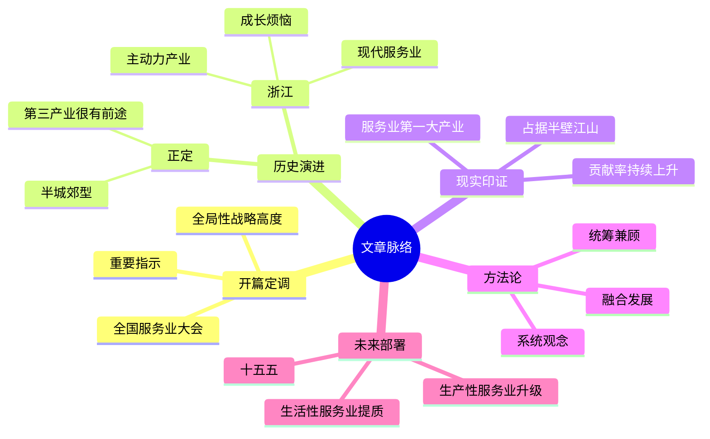

# 领会总书记对服务业发展的战略擘画

> **来源**：新华社国内部（新华网）。本篇为基于公开报道与会议背景的精读整理稿；**背景**：全国服务业大会于 2026 年 4 月 7 日至 8 日在北京召开，习近平总书记就服务业发展作出重要指示，强调要深入实施服务业扩能提质行动。

---

## 前情提要

### 文章信息

**文章来源**：新华社国内部  
**题目**：领会总书记对服务业发展的战略擘画  
**作者**：原文署名为「来源：新华社国内部」，未见具体个人作者署名  
**部门背景**：新华社国内部负责国内时政、经济社会与重大政策主题报道，承担重要会议、重要指示和重大主题的综合性新闻采写与政策解读任务。

### 文章主线（段落脉络）

```mermaid
flowchart TD
    A["文章主线<br/>service-sector development as a national strategy"]:::t

    A --> B["第1段<br/>以全国服务业大会开篇<br/>提出服务业上升到全局性战略高度"]:::a
    A --> C["第2段<br/>回答'为何重要'<br/>顺应经济规律+推进增长转型"]:::b
    A --> D["第3段<br/>总领全文<br/>从地方到中央的一贯思考"]:::c
    A --> E["第4-5段<br/>正定时期<br/>提出半城郊型思路，洞察服务业潜力"]:::d
    A --> F["第6-7段<br/>浙江时期<br/>服务业成为结构调整关键变量"]:::e
    A --> G["第8-9段<br/>历史判断得到现实数据印证<br/>服务业已成第一大产业"]:::f
    A --> H["第10-11段<br/>'十五五'部署<br/>强调前瞻把握形势与高质量发展"]:::g
    A --> I["第12-15段<br/>产业结构调整必须统筹兼顾<br/>突出融合发展、系统观念"]:::h
    A --> J["第16-17段<br/>最新指示与未来前景<br/>生产性+生活性服务业双向发力"]:::i

    classDef t fill:#1f4e79,color:#fff,stroke:#163a5c,stroke-width:2px;
    classDef a fill:#d9eaf7,color:#111,stroke:#7aa6c2;
    classDef b fill:#e6f4ea,color:#111,stroke:#7fb27f;
    classDef c fill:#fce8d6,color:#111,stroke:#c78b46;
    classDef d fill:#f4d9e6,color:#111,stroke:#c27ba0;
    classDef e fill:#e4def8,color:#111,stroke:#8e7cc3;
    classDef f fill:#d9f0ee,color:#111,stroke:#5aa6a6;
    classDef g fill:#fef3d1,color:#111,stroke:#d6b656;
    classDef h fill:#e2ecfb,color:#111,stroke:#6d9eeb;
    classDef i fill:#f3e0f7,color:#111,stroke:#b47cc7;
```





### 逻辑结构提要（与原文段落对应）

```markdown
# 文章逻辑结构图：领会总书记对服务业发展的战略擘画

1. 时代背景与战略定调 (Paragraph 1-3)
   ├── 现状触发：2026年4月全国服务业大会召开
   ├── 核心论点：发展服务业是党和国家事业的全局性战略
   └── 理论逻辑：顺应经济规律，推进增长转型

2. 历史经纬与实践探索 (Paragraph 4-9)
   ├── 正定时期：提出“半城郊型”经济，洞察第三产业潜力
   ├── 浙江时期：提出“三个70%”与“主动力产业”，破解成长烦恼
   └── 经验升华：从县域到省域，把握产业结构演进规律

3. 现状成效与未来布局 (Paragraph 10-12)
   ├── 历史性跨越：服务业成为第一大产业，连续11年占据半壁江山
   └── “十五五”前瞻：优化经济布局，支撑高质量发展与国际竞争力

4. 产业协同与系统观念 (Paragraph 13-17)
   ├── 历练总结：正定、福建、浙江、上海各阶段的协调发展思想
   ├── 顶层设计：二十大要求构建“优质高效服务业新体系”
   └── 融合逻辑：服务业是制造业提升的助推器，产业深度融合

5. 实施路径与宏伟蓝图 (Paragraph 18-20)
   ├── 任务细分：生产性服务业（专业化/高端化）与生活性服务业（高品质/多样化）
   ├── 规模预判：“十五五”时期规模预计突破100万亿元
   └── 愿景展望：满足人民美好生活需要，谱写高质量发展新篇章
```

---

## 全文精读笔记

**领会总书记对服务业发展的战略擘画**

> **擘画 (bò huà)**  
> 【释义】筹划；安排。多用于重大战略、蓝图的制定。  
> 【近义词】筹谋、规划、布局。  
> 【金句积累】“宏伟蓝图已经绘就，战略擘画指引航程。”  
> 【English】Strategic planning / blueprinting.

### （一）战略高度与理论逻辑

**四月的北京，一场高规格的全国服务业大会召开，习近平总书记作出重要指示，将发展服务业提升到党和国家事业发展的全局性战略高度。**

> **高规格 (High-specification/High-level)**  
> 【注释】此处指 2026 年 4 月 7 日至 8 日在京召开的全国服务业大会。  
> 【背景】此次大会是继 2012 年全国服务业工作会议以来，又一次关于服务业发展的重量级会议，体现了党中央对“十五五”开局之年产业结构优化的重视。

**发展服务业为何如此重要？习近平总书记曾指出，加快发展服务业，是顺应经济发展规律、推进增长转型的客观要求。**

> **增长转型 (Growth transformation)**  
> 【注释】指经济增长动力由投资、出口驱动向消费、服务和创新驱动转变。  
> 【辨析】“增长”侧重规模扩大，“发展”侧重质量提升。

**从地方到中央，习近平总书记对发展服务业有着深邃认识和思考，一系列前瞻谋划、科学部署，彰显出对经济发展规律的深刻把握。**

> **深邃 (profound)**  
> 【近义词】深刻、精深。  
> 【反义词】肤浅、浅薄。

### （二）历史实践：从正定到浙江

**上世纪 80 年代，习近平同志到河北省正定县任职，提出走“半城郊型”经济发展的路子。**

> **“半城郊型”经济 (Semi-suburban economy)**  
> 【背景】1982—1985 年，习近平在正定工作期间，针对正定邻近石家庄的地理优势，提出“投其所好，供其所需”，大力发展蔬菜、瓜果及旅游服务业，使正定从农业大县转向多元经营。  
> 【地理定位】河北省正定县，位于石家庄市北侧。

**精准研判“10 万劳动力种地已经足够”“应该更多地投到工业、副业、服务业”的县情，习近平同志极具前瞻性地提出“服务业是很有前途的第三产业”，深刻洞察服务业对吸纳劳动力、释放生产力的潜力。**

> **洞察 (Insight/Discern)**  
> 【成语积累】洞若观火、明察秋毫。

**2005 年，进入工业化中后期的浙江，面临着结构层次低、经营方式粗放的“成长烦恼”。此时，浙江服务业在经济总量中的份额在 40% 左右。时任浙江省委书记习近平同志敏锐指出，“发达国家服务业多数都达到三个‘70%’的水平，即服务业产值占经济总量的 70% 左右，GDP 增长的 70% 来自于服务业的增长，服务业吸纳了 70% 的就业人口”，要求为大力发展现代服务业创造更多的便利条件。**

> **成长烦恼 (Growing pains)**  
> 【注释】隐喻经济在高速增长后遇到的资源瓶颈和结构矛盾。  
> **三个“70%”**  
> 【专业术语】这是衡量一个国家或地区是否进入“服务经济时代”的重要国际通用指标。

**在当年 1 月的一次演讲中，习近平同志强调，浙江经济结构的战略性调整和增长方式的根本性转变越来越依赖于服务业的发展。2 个月后，他在“之江新语”专栏撰文指出“必须遵循经济规律，将服务业逐步培育壮大成为推动经济发展的‘主动力产业’”，谋定经济发展的主导产业和增长动力。**

> **之江新语 (Zhijiang Xinyu)**  
> 【注释】习近平同志在担任浙江省委书记期间，在《浙江日报》头版撰写的专栏。  
> **主动力产业 (Main driver industry)**  
> 【辨析】区别于“支柱产业”，强调其对整体经济的牵引和支撑作用。

**正定到浙江，县域到省域，发展阶段不同、条件不同。从“很有前途的第三产业”到“主动力产业”，习近平同志科学把握经济发展阶段特征和产业结构演进规律，超前布局服务业，破解发展瓶颈、推进经济转型。**

> **产业结构演进规律 (Evolution of industrial structure)**  
> 【背景】源于克拉克（Clark）定律，即随着人均收入提升，劳动力由第一产业向第二、三产业转移。

### （三）现状成效与“十五五”愿景

**顺势而为，往往事半功倍。跃动的曲线，有力印证服务业已成为我国经济发展的第一大产业。服务业对经济增长的贡献率自 2015 年首次超过 50%，到 2025 年达 61.4%，连续 11 年占据国民经济的半壁江山。**

> **顺势而为 (Ride the trend)**  
> 【近义词】因势利导、趁热打铁。  
> 【反义词】逆流而上。  
> **半壁江山 (Half of the territory/Half the sky)**  
> 【注释】此处形容服务业在 GDP 中占比超过 50%，是经济的主体。

**谋划“十五五”时期经济社会发展，习近平总书记强调“要前瞻性把握国际形势发展变化对我国的影响，因势利导对经济布局进行调整优化”。**

> **“十五五”时期**  
> 【时间范围】2026 年至 2030 年。

**“十五五”开局起步，在经济转向高质量发展关键阶段，促进服务业优质高效发展，既能为建设现代化产业体系、推动经济高质量发展提供重要支撑，也能创造高品质生活，同时有助于增强国际竞争力、扩大高水平对外开放，战略意义重大而深远。**

> **高质量发展 (High-quality development)**  
> 【English】High-quality development is the primary task of building a modern socialist country in all respects.

### （四）统筹兼顾与深度融合

**调整优化产业结构，必须坚持统筹兼顾。**

> **统筹兼顾 (Overall consideration)**  
> 【成语积累】并行不悖、面面俱到（褒义）。

**在正定，习近平同志指出必须“建立合理的、平衡发展的经济结构”；在福建，指引构建“制造与创造融合、传统与新兴并重、二产与三产并举”的晋江“新实体经济”；在浙江，指出“发达的服务业是制造业提升的助推器”“要把服务业发展与城乡统筹结合起来”；在上海，认为三大产业要协调发展、共同发展、融合发展……**

> **晋江“新实体经济” (Jinjiang's new real economy)**  
> 【背景】福建晋江以民营经济著称，习近平在闽工作期间总结了“晋江经验”，强调实业立省，同时推动制造业向服务型制造转型。  
> **助推器 (Booster/Catalyst)**  
> 【近义词】催化剂、动力源。

**党的二十大报告明确要求构建优质高效的服务业新体系，推动现代服务业同先进制造业、现代农业深度融合。**

> **两业融合 (Integration of services and manufacturing)**  
> 【注释】即生产性服务业与制造业深度融合，如工业设计、智能物流、售后供应链等。

**融合发展，相得益彰。习近平总书记对产业发展的深刻理解，彰显了坚持系统观念、注重整体统筹，推动产业协同发展的思想方法和工作智慧。**

> **相得益彰 (Complement each other)**  
> 【释义】指两个人或两件事物互相配合，双方的能力和作用更能显示出来。  
> 【English】Complement each other to bring out the best in both.

**没有产业体系的现代化，就没有经济的现代化。没有强大的服务业，就难有强大的制造业，也难有均衡、顺畅的经济循环。**

> **金句积累**  
> “没有强大的服务业，就难有强大的制造业。”——强调了服务业对实体经济的赋能作用。

### （五）分类指导与未来使命

**近日，习近平总书记在就服务业发展作出的重要指示中，强调要“推进生产性服务业向专业化和价值链高端延伸，促进生活性服务业高品质多样化便利化发展”。**

> **生产性服务业 (Producer services)**  
> 【注释】为生产过程提供中间投入的服务，如金融、研发、物流、信息技术服务。其重点是“向专业化和价值链高端延伸”。  
> **生活性服务业 (Consumer services)**  
> 【注释】直接面向居民消费的服务，如教育、医疗、旅游、养老、家政。其重点是“高品质多样化便利化”。

**“十五五”时期，我国服务业规模预计将突破 100 万亿元，空间广阔。沿着总书记指引的方向，生产性服务业正在加快突破技术封锁、提升产业链韧性，生活性服务业聚焦民生需求、不断满足人民美好生活需要，必将共同谱写服务业优质高效发展新篇章。**

> **100 万亿元 (100 trillion yuan)**  
> 【数据背景】反映了中国作为世界级消费市场和服务业大国的体量。  
> **产业链韧性 (Resilience of the industrial chain)**  
> 【注释】指产业链在遭受外部冲击时保持运行及快速恢复的能力。  
> 【English】Supply chain resilience.

---

## 逐句精读

🔸**领会**总书记对`服务业发展`的`战略擘画`
🔹Understand the General Secretary’s `strategic blueprint` for the `development of the service sector`.

**背景注释**
- `战略擘画`：强调从整体、长远和全局角度进行系统谋划。
- `服务业`：英文常译为 `service sector`，也可视语境译为 `services industry`，但宏观经济语境下 `service sector` 更稳妥。

> **`blueprint`** /ˈbluːprɪnt/ n. `蓝图；总体规划`
> 英文释义：a detailed plan or design for achieving something 详细计划；蓝图。语域：正式、政策、商业。
> 画龙点睛：`blueprint for...` 是新闻、政策和学术写作中的高频表达，强调`系统设计`与`长远安排`，比普通的 `plan` 更具全局感。常见搭配：`a blueprint for reform / modernization / development`。

---

🔸点击上方`蓝字` `关注我们`
🔹Tap the `blue text` above to `follow us`.

**背景注释**
- 这是微信公众号常见页面提示语，不属于正文论证内容，但属于原始文本中的可识别信息。

> **`tap`** /tæp/ v. `轻触；轻点`
> 英文释义：to touch a screen lightly to choose or open something 轻触屏幕以选择或打开。语域：日常、数字媒体。
> 画龙点睛：手机语境下常用 `tap`，电脑鼠标语境更常用 `click`。翻译平台提示语时，`Tap ... to ...` 简洁自然，非常地道。

---

🔸`四月的北京`，/ 一场`高规格`的`全国服务业大会`召开，/ 习近平总书记作出`重要指示`，/ 将发展服务业提升到党和国家事业发展的`全局性战略高度`。
🔹In `April` in `Beijing`, / a `high-level` `national conference on the service sector` was convened, / and General Secretary Xi Jinping issued `important instructions`, / elevating service-sector development to a `strategic priority` bearing on the `overall cause` of the Party and the country.

**背景注释**
- `北京`：中国首都，全国性重大会议的重要举办地。
- `全国服务业大会`：围绕服务业发展进行系统部署的全国性会议。
- `全局性战略高度`：意思是这一议题不再只是单一产业问题，而是关系国家整体发展布局。

> **`high-level`** /ˌhaɪˈlevəl/ adj. `高层级的；高规格的`
> 英文释义：involving senior officials or important matters 涉及高级别官员或重大事项的。语域：新闻、外交、政策。
> 画龙点睛：`high-level meeting / conference / dialogue` 是时政英语高频搭配。不要机械理解为“高级的”，在新闻语境里通常应译为`高规格`或`高层级`。

> **`convene`** /kənˈviːn/ v. `召开；召集`
> 英文释义：to bring people together for an official meeting 召集正式会议。语域：正式、法律、新闻。
> 画龙点睛：比 `hold` 更正式，常见搭配有 `convene a meeting / session / conference`。适合政府、国际组织、议会等正式场景。

> **`elevate`** /ˈelɪveɪt/ v. `提升；提高到更高层面`
> 英文释义：to raise something to a more important level 提升到更重要的层级。语域：正式、政策、学术。
> 画龙点睛：`elevate A to B` 非常实用，可表示“把A提升到B的高度”。常用于政策优先级、风险等级、社会地位等抽象语境。

---

🔸发展服务业`为何如此重要`？/ 习近平总书记曾指出，/ 加快发展服务业，/ 是`顺应经济发展规律`、`推进增长转型`的`客观要求`。
🔹Why is the `development of the service sector` so important? / General Secretary Xi Jinping once pointed out that / accelerating the development of the service sector / is an `objective requirement` for following the `laws of economic development` and advancing the `transformation of the growth model`.

**背景注释**
- `经济发展规律`：指产业升级、消费升级、结构变化等客观趋势。
- `增长转型`：从粗放型增长转向更高质量、更有效率、更可持续的发展方式。

> **`objective requirement`** /əbˈdʒektɪv rɪˈkwaɪərmənt/ n. `客观要求；现实需要`
> 英文释义：a necessity arising from objective conditions rather than personal preference 由客观条件决定的需要。语域：正式、政策、学术。
> 画龙点睛：用来表达“这不是主观选择，而是现实所决定”。写作中可灵活替换为 `objective necessity`，但 `requirement` 更贴合政策语感。

> **`advance`** /ədˈvæns/ v. `推进；促进`
> 英文释义：to help something develop or move forward 推进某事向前发展。语域：正式、学术、新闻。
> 画龙点睛：常见搭配 `advance reform / cooperation / transformation / growth`。比 `promote` 更有“向前推进”的动态感，适合正式写作。

> **`transformation`** /ˌtrænsfəˈmeɪʃn/ n. `转型；转变`
> 英文释义：a complete or major change in form or nature 形式或性质上的重大改变。语域：正式、经济、学术。
> 画龙点睛：比 `change` 更强调`结构性`与`深层次`变化。经济、科技、教育等主题中都很常见，如 `digital transformation`。

---

🔸从`地方`到`中央`，/ 习近平总书记对发展服务业有着`深邃认识`和思考，/ 一系列`前瞻谋划`、`科学部署`，/ 彰显出对`经济发展规律`的`深刻把握`。
🔹From the `local level` to the `central leadership`, / General Secretary Xi Jinping has developed `profound` understanding and reflection on the development of the service sector, / and a series of `forward-looking` plans and `well-calibrated` policy arrangements / demonstrate a `deep grasp` of the laws governing economic development.

**背景注释**
- `从地方到中央`：说明其对服务业问题的认识贯穿多个治理层级。
- `科学部署`：强调政策安排并非经验拍脑袋，而是基于规律与实际的系统决策。

> **`profound`** /prəˈfaʊnd/ adj. `深刻的；深邃的`
> 英文释义：very great or deep 深刻而深远的。语域：正式、学术、评论。
> 画龙点睛：`profound understanding / impact / change` 是高分写作高频搭配。比 `deep` 更正式，更适合书面表达。

> **`forward-looking`** /ˌfɔːrwərd ˈlʊkɪŋ/ adj. `前瞻性的`
> 英文释义：planning for the future with awareness of likely changes 具有面向未来的预见性。语域：正式、政策、商业。
> 画龙点睛：非常适合翻译“前瞻、着眼长远”。典型搭配：`forward-looking strategy / policy / vision`。

> **`grasp`** /ɡræsp/ n./v. `把握；理解`
> 英文释义：a firm understanding of something 对某事的牢固理解或把握。语域：正式、通用。
> 画龙点睛：`a deep grasp of...` 非常自然，既可表示“理解深刻”，也可表示“把握到位”。写作中比普通的 `understanding` 更有力度。

---

🔸上世纪80年代，/ 习近平同志到`河北省正定县`任职，/ 提出走“`半城郊型`”经济发展的路子。
🔹In the `1980s`, / Comrade Xi Jinping took up a post in `Zhengding County, Hebei Province`, / and proposed pursuing a `suburban-oriented` path of economic development.

**背景注释**
- `正定县`：河北省历史文化名城，兼具农业基础与接近城市的区位特点。
- `半城郊型`：带有依托城市辐射、发展城乡结合型经济的思路，属于特定历史语境下的地方发展提法。

> **`pursue`** /pərˈsuː/ v. `实行；追求；致力于`
> 英文释义：to follow or try to achieve something 努力实行或实现某事。语域：正式、通用。
> 画龙点睛：`pursue a path / goal / strategy / career` 都非常常见。翻译“走……路子”时，用 `pursue a ... path` 很地道。

> **`oriented`** /ˈɔːriəntɪd/ adj. `导向的；面向……的`
> 英文释义：directed toward a particular purpose or type 以某一方向或目标为导向。语域：正式、政策、商业。
> 画龙点睛：`market-oriented / service-oriented / innovation-oriented` 都是高频搭配。掌握 `-oriented` 能快速提升翻译与写作表达能力。

---

🔸精准研判“`10万劳动力种地已经足够`”“`应该更多地投到工业、副业、服务业`”的`县情`，/ 习近平同志极具`前瞻性`地提出“`服务业是很有前途的第三产业`”，/ 深刻洞察服务业对`吸纳劳动力`、`释放生产力`的`潜力`。
🔹With an `accurate assessment` of local conditions—namely, that `100,000 workers were already enough for farming` and that `more labor should be directed into industry, sideline occupations, and services`— / Comrade Xi Jinping, with notable `foresight`, proposed that `the service sector is a highly promising tertiary industry`, / demonstrating deep insight into its potential to `absorb labor` and `unleash productive forces`.

**背景注释**
- `县情`：指一个县的产业结构、人口、就业、资源条件等综合情况。
- `第三产业`：即服务业，相对于农业和工业而言。
- `吸纳劳动力`：指提供就业岗位，承接劳动力转移。
- `释放生产力`：通过更合理的配置方式提升经济效率。

> **`assessment`** /əˈsesmənt/ n. `评估；研判`
> 英文释义：the act of judging or evaluating something carefully 审慎评估与判断。语域：正式、学术、政策。
> 画龙点睛：`accurate assessment of...` 很常见，适用于局势、风险、市场、能力等对象。写作中比 `judgment` 更专业。

> **`foresight`** /ˈfɔːrsaɪt/ n. `远见；前瞻性`
> 英文释义：the ability to predict and prepare for the future 预见未来并提前准备的能力。语域：正式、评论。
> 画龙点睛：`foresight` 偏“预见未来”，而 `insight` 偏“看透本质”。两者都重要，但不能混用。

> **`tertiary industry`** /ˈtɜːrʃieri ˈɪndəstri/ n. `第三产业`
> 英文释义：the sector of the economy that provides services 经济中提供各类服务的产业。语域：经济、学术。
> 画龙点睛：要与 `primary industry`、`secondary industry` 成组记忆。经济类阅读中很常见。

> **`unleash`** /ʌnˈliːʃ/ v. `释放；激发`
> 英文释义：to release something so that it can operate fully 使某种力量得到充分释放。语域：正式、商业、新闻。
> 画龙点睛：常见搭配有 `unleash potential / productivity / creativity / innovation`。比 `release` 更有力量感。

---

🔸2005年，/ 进入`工业化中后期`的`浙江`，/ 面临着`结构层次低`、`经营方式粗放`的“`成长烦恼`”。
🔹In `2005`, / `Zhejiang`, which had entered the `middle and later stages of industrialization`, / was confronted with the `growing pains` of a `low-level industrial structure` and an `extensive mode of operation`.

**背景注释**
- `浙江`：中国东部沿海经济大省，民营经济活跃，制造业基础雄厚。
- `工业化中后期`：意味着发展重点开始从规模扩张转向结构优化和质量提升。
- `成长烦恼`：借喻发展过程中的结构性矛盾和升级压力。

> **`growing pains`** /ˈɡroʊɪŋ peɪnz/ n. `成长烦恼；发展阵痛`
> 英文释义：problems that arise as something develops or expands 在成长或扩张过程中出现的问题。语域：新闻、商业、评论。
> 画龙点睛：非常地道的比喻性表达，适合翻译“成长中的烦恼、发展中的阵痛”，比一般的 `problems` 更生动。

> **`extensive`** /ɪkˈstensɪv/ adj. `粗放的；外延式的`
> 英文释义：involving large input with limited efficiency 依靠大量投入而效率不高的。语域：经济、学术。
> 画龙点睛：经济语境中常与 `intensive` 对比。`extensive growth` 指粗放型增长，考试中常见。

---

🔸此时，/ 浙江`服务业`在`经济总量`中的`份额`在40%左右。
🔹At that time, / the `service sector` in Zhejiang `accounted for` about `40 percent` of the `overall economy`.

**背景注释**
- 这里的数据为后文关于“服务业仍有较大提升空间”的判断提供背景。
- `份额`：宏观经济语境中常用 `share` 或 `account for ... percent` 来表达。

> **`account for`** /əˈkaʊnt fər/ phr.v. `占（比例）`
> 英文释义：to form or constitute a part of a total 构成总数中的一部分。语域：通用、学术、新闻。
> 画龙点睛：图表作文和经济报道中的核心表达。注意它还有“解释说明”的意思，阅读中要根据语境辨义。

> **`share`** /ʃer/ n. `份额；占比`
> 英文释义：a part of a whole 一部分，占比。语域：商业、经济、通用。
> 画龙点睛：`market share`, `share of GDP`, `share in total output` 都很常见。是图表和数据题的基础词。

---

🔸时任`浙江省委书记`习近平同志敏锐指出，/ “发达国家服务业多数都达到三个‘`70%`’的水平，/ 即`服务业产值`占`经济总量`的70%左右，/ `GDP增长`的70%来自于`服务业的增长`，/ 服务业`吸纳了70%的就业人口`”，/ 要求为大力发展`现代服务业`创造更多的`便利条件`。
🔹Xi Jinping, then `Secretary of the Zhejiang Provincial Party Committee`, perceptively noted that / “in most `developed countries`, the service sector has reached three `70 percent` benchmarks: / `service output` accounts for about `70 percent` of the total economy, / `70 percent of GDP growth` comes from growth in services, / and the service sector `absorbs 70 percent of employment`,” / and he called for creating more `favorable conditions` for the vigorous development of `modern services`.

**背景注释**
- `三个70%`：用发达经济体的经验数据说明服务业在成熟经济中的核心地位。
- `现代服务业`：一般指金融、信息、研发、物流、商务服务等高附加值服务领域。
- `便利条件`：包括制度、环境、要素配置、政策支持等。

> **`benchmark`** /ˈbentʃmɑːrk/ n. `基准；标杆`
> 英文释义：a standard used for comparison or measurement 用于比较或衡量的标准。语域：商业、政策、学术。
> 画龙点睛：可用于数据比较、绩效衡量、行业对标。搭配如 `set a benchmark`、`use A as a benchmark for B`。

> **`absorb`** /əbˈzɔːrb/ v. `吸纳；吸收`
> 英文释义：to take in or make use of something, especially labor or resources 吸收并利用劳动力或资源。语域：经济、通用、新闻。
> 画龙点睛：`absorb labor / employment / capital / shock` 都很常见。经济类文本里经常译“吸纳就业”。

> **`favorable conditions`** `有利条件；便利条件`
> 英文释义：circumstances that help something happen or succeed 有助于某事发生或成功的条件。语域：正式、政策、商业。
> 画龙点睛：`create / provide favorable conditions for...` 是标准书面表达，适用范围极广。

---

🔸在当年1月的一次`演讲`中，/ 习近平同志强调，/ 浙江`经济结构`的`战略性调整`和`增长方式`的`根本性转变`越来越`依赖于`服务业的发展。
🔹In a `speech` delivered in `January` that year, / Comrade Xi Jinping stressed that / the `strategic adjustment` of Zhejiang’s `economic structure` and the `fundamental transformation` of its `growth model` were becoming increasingly `dependent on` the development of the service sector.

**背景注释**
- `战略性调整`：指方向性、全局性的结构重塑。
- `根本性转变`：并非局部修补，而是增长逻辑和发展模式的深层变化。

> **`strategic adjustment`** n. `战略性调整`
> 英文释义：a major adjustment made from an overall and long-term perspective 从整体和长远视角作出的重大调整。语域：政策、经济。
> 画龙点睛：这是翻译“战略性调整”的常见表达，适合产业结构、资源配置、政策重点等主题。

> **`dependent on`** phr. `依赖于`
> 英文释义：relying on something for support or success 依靠某事获得支撑或成功。语域：正式、通用。
> 画龙点睛：`depend on` 和 `be dependent on` 都常见，后者更书面，适合正式文章和翻译。

---

🔸2个月后，/ 他在“`之江新语`”专栏撰文指出“必须`遵循经济规律`，/ 将服务业逐步`培育壮大`成为推动经济发展的‘`主动力产业`’”，/ 谋定经济发展的`主导产业`和`增长动力`。
🔹Two months later, / he wrote in the column `Zhijiang Xinyu` that “economic laws must be followed, / and the service sector must be gradually `fostered and strengthened` into a `primary driving industry` for economic development,” / thereby defining the `leading industry` and `growth driver` of economic development.

**背景注释**
- `之江新语`：习近平在浙江工作期间发表的重要短评专栏。
- `主动力产业`：指在经济增长中起主要拉动作用的产业。
- `主导产业`：一个地区或经济体中对发展方向具有引领作用的产业部门。

> **`foster`** /ˈfɑːstər/ v. `培育；促进`
> 英文释义：to encourage the growth or development of something 促进某事成长壮大。语域：正式、政策、商业。
> 画龙点睛：常见搭配有 `foster innovation / talent / growth / cooperation`。强调长期培育过程，比 `promote` 更有“养成”意味。

> **`driving industry`** n. `驱动性产业；主动力产业`
> 英文释义：an industry that plays a leading role in driving growth 对增长起主要带动作用的产业。语域：经济、政策。
> 画龙点睛：更常见的近义搭配是 `driving force`。遇到中文“主动力”时，可结合语境灵活处理为 `primary driver`、`driving force` 或 `driving industry`。

> **`thereby`** /ˌðerˈbaɪ/ adv. `从而；由此`
> 英文释义：as a result of that 由前述动作自然导出后果。语域：正式、学术。
> 画龙点睛：写作中连接因果非常好用，比 `so` 更书面、更凝练。

---

🔸`正定`到`浙江`，/ `县域`到`省域`，/ `发展阶段`不同、`条件`不同。
🔹From `Zhengding` to `Zhejiang`, / from the `county level` to the `provincial level`, / the `stages of development` and the `conditions` were different.

**背景注释**
- 这是一个承前启后的概括句，强调治理场景不同，但服务业发展的思路具有内在连续性。
- `县域到省域`：体现政策思考在不同层级上的贯通。

> **`stage of development`** n. `发展阶段`
> 英文释义：a particular phase in the process of development 发展过程中的某一阶段。语域：经济、学术、政策。
> 画龙点睛：比较国家、地区或产业差异时很常用，如 `different stages of development`，是经济类阅读核心表达。

---

🔸从“`很有前途的第三产业`”到“`主动力产业`”，/ 习近平同志科学把握`经济发展阶段特征`和`产业结构演进规律`，/ `超前布局`服务业，/ `破解发展瓶颈`、`推进经济转型`。
🔹From “a `highly promising tertiary industry`” to “a `primary driving industry`,” / Comrade Xi Jinping scientifically grasped the `features of different stages of economic development` and the `laws governing the evolution of industrial structure`, / made `advance plans` for the service sector, / and worked to `break through development bottlenecks` and `advance economic transformation`.

**背景注释**
- `产业结构演进规律`：通常指经济由农业占主导转向工业、再向服务业比重上升的演进路径。
- `超前布局`：在趋势尚未完全显现时就提前部署。
- `发展瓶颈`：制约进一步增长和升级的关键障碍。

> **`evolution`** /ˌevəˈluːʃn/ n. `演进；演化`
> 英文释义：gradual development or change over time 随时间逐步发生的发展变化。语域：学术、正式。
> 画龙点睛：除生物学外，在经济社会语境中也常见，如 `the evolution of institutions / markets / industrial structure`。

> **`bottleneck`** /ˈbɑːtlnek/ n. `瓶颈；制约因素`
> 英文释义：a point of congestion or a factor that slows progress 阻碍进展的关键卡点。语域：商业、经济、工程。
> 画龙点睛：`break through / remove / address a bottleneck` 都是很高频的固定搭配。

---

🔸`顺势而为`，/ 往往`事半功倍`。
🔹Acting `in accordance with the underlying trend` / often yields `twice the result with half the effort`.

**背景注释**
- `顺势而为`：根据客观趋势和现实条件采取行动。
- `事半功倍`：强调投入更少而成效更大。

> **`in accordance with`** phr. `依据；顺应`
> 英文释义：in a way that agrees with something 按照某种规律、原则或要求。语域：正式、法律、政策。
> 画龙点睛：比 `according to` 更正式。特别适合翻译“遵循规律、按照原则、顺应趋势”。

> **`yield`** /jiːld/ v. `产生；带来`
> 英文释义：to produce or provide a result 产生某种结果、收益或效果。语域：正式、学术、经济。
> 画龙点睛：常见搭配有 `yield results / benefits / returns`。比 `bring` 更书面。

---

🔸`跃动的曲线`，/ 有力`印证`服务业已成为我国经济发展的`第一大产业`。
🔹The `upward-moving curves` / provide `powerful evidence` that the service sector has become the `largest sector` in China’s economic development.

**背景注释**
- `跃动的曲线`：借指统计数据所显示出的持续上升趋势。
- `第一大产业`：指在经济中体量最大、作用最突出的产业门类。

> **`evidence`** /ˈevɪdəns/ n. `证据；佐证`
> 英文释义：facts or information showing that something is true 证明某事属实的事实或信息。语域：学术、新闻、通用。
> 画龙点睛：`provide evidence that...` 是非常标准的论证句型，图表分析和议论文中都好用。

> **`sector`** /ˈsektər/ n. `部门；行业；产业部门`
> 英文释义：one part of an economy or society 经济或社会中的某一组成部分。语域：经济、商业、新闻。
> 画龙点睛：`service sector`, `public sector`, `financial sector` 都很常见。宏观分类时通常比 `industry` 更自然。

---

🔸服务业对`经济增长`的`贡献率`自`2015年`首次超过`50%`，/ 到`2025年`达`61.4%`，/ `连续11年`占据`国民经济`的`半壁江山`。
🔹The `contribution` of the service sector to `economic growth` first exceeded `50 percent` in `2015`, / reached `61.4 percent` by `2025`, / and has accounted for half of the `national economy` for `11 consecutive years`.

**背景注释**
- 具体年份和数据强化了前文关于服务业已成为主导力量的判断。
- `半壁江山`：这里可理解为“占据国民经济的重要半数份额”。

> **`contribution`** /ˌkɑːntrɪˈbjuːʃn/ n. `贡献；贡献率`
> 英文释义：the part played by something in producing a result 在形成某一结果中所起的作用。语域：经济、学术、新闻。
> 画龙点睛：图表和数据论证高频词。常见结构：`the contribution of A to B`。

> **`consecutive`** /kənˈsekjətɪv/ adj. `连续的`
> 英文释义：following one after another without interruption 接连不断的。语域：正式、通用。
> 画龙点睛：常修饰 `years / days / wins / losses`。比普通的 `continuous` 更适合离散时间单位。

---

🔸谋划“`十五五`”时期`经济社会发展`，/ 习近平总书记强调“要`前瞻性`把握`国际形势发展变化`对我国的影响，/ `因势利导`对`经济布局`进行`调整优化`”。
🔹In planning `economic and social development` for the `Fifteenth Five-Year Plan` period, / General Secretary Xi Jinping emphasized that “we must grasp in a `forward-looking` way the impact of `changes in the international landscape` on our country / and, by responding to circumstances, `adjust and optimize` the `economic layout`.”

**背景注释**
- `十五五`：第十五个五年规划时期。
- `国际形势发展变化`：国际政治经济环境、全球产业链、科技竞争等方面的变化。
- `因势利导`：根据形势变化作出引导和调整。
- `经济布局`：产业、区域、资源配置等总体安排。

> **`landscape`** /ˈlændskeɪp/ n. `格局；形势`
> 英文释义：the general situation of a field or environment 某一领域的总体局面或格局。语域：新闻、政策、商业。
> 画龙点睛：`political landscape`, `global landscape`, `competitive landscape` 都是常见搭配，不要只记“风景”。

> **`optimize`** /ˈɑːptɪmaɪz/ v. `优化；使最优`
> 英文释义：to make something as effective as possible 使效果达到更优。语域：技术、商业、政策。
> 画龙点睛：现代书面语高频词，可用于结构、流程、资源配置、算法、政策等多种对象。

---

🔸“`十五五`”`开局起步`，/ 在经济转向`高质量发展`的`关键阶段`，/ 促进服务业`优质高效发展`，/ 既能为建设`现代化产业体系`、推动经济`高质量发展`提供`重要支撑`，/ 也能创造`高品质生活`，/ 同时有助于`增强国际竞争力`、`扩大高水平对外开放`，/ `战略意义`重大而深远。
🔹At the `opening stage` of the `Fifteenth Five-Year Plan` period, / as the economy enters a `crucial phase` of shifting toward `high-quality development`, / promoting the `high-quality and efficient development` of the service sector / can not only provide `important support` for building a `modern industrial system` and advancing `high-quality economic development`, / but also create a `high-quality life`, / while helping `enhance international competitiveness` and `expand high-standard opening up`, / making its `strategic significance` both substantial and `far-reaching`.

**背景注释**
- `高质量发展`：强调质量、效率、创新、协调、绿色、安全等维度。
- `现代化产业体系`：现代农业、先进制造业、现代服务业协调融合的产业体系。
- `高水平对外开放`：更高层次、更广领域、更深程度的开放。

> **`crucial`** /ˈkruːʃl/ adj. `关键的；至关重要的`
> 英文释义：extremely important 极其重要的。语域：通用、正式。
> 画龙点睛：比 `important` 力度更强。`a crucial stage / role / factor / issue` 都是高频搭配。

> **`support`** /səˈpɔːrt/ n./v. `支撑；支持`
> 英文释义：help or strength that enables something to exist or succeed 帮助某事存在、运行或成功的力量。语域：通用、正式。
> 画龙点睛：`provide support for...` 是非常稳妥的书面表达，政策和议论文都常用。

> **`far-reaching`** /ˌfɑːr ˈriːtʃɪŋ/ adj. `深远的`
> 英文释义：having important effects in the future 在未来产生重大影响的。语域：正式、评论。
> 画龙点睛：常见搭配有 `far-reaching impact / significance / consequences`，比 `long-term` 更强调影响之深与范围之广。

---

🔸`调整优化产业结构`，/ 必须坚持`统筹兼顾`。
🔹To `adjust and optimize the industrial structure`, / it is essential to `balance all relevant considerations in an overall manner`.

**背景注释**
- `产业结构`：各产业的比例关系、层次关系与相互作用方式。
- `统筹兼顾`：既看整体，也照顾不同领域和不同目标之间的平衡。

> **`overall`** /ˌoʊvərˈɔːl/ adj./adv. `整体的；总体上`
> 英文释义：including everything or everyone; in general 涵盖全部的；总体而言。语域：正式、通用。
> 画龙点睛：翻译“总体、全局、统筹”时极常用，如 `overall planning`, `overall coordination`。

> **`consideration`** /kənˌsɪdəˈreɪʃn/ n. `考量；需要考虑的因素`
> 英文释义：something that must be carefully thought about 需要认真考虑的事项或因素。语域：正式、通用。
> 画龙点睛：复数 `considerations` 很常见，适合表达“多方面因素”。

---

🔸在`正定`，/ 习近平同志指出必须“建立`合理的`、`平衡发展的`经济结构”；/ 在`福建`，/ 指引构建“`制造与创造融合`、`传统与新兴并重`、`二产与三产并举`”的晋江“新实体经济”；/ 在`浙江`，/ 指出“`发达的服务业`是`制造业提升`的`助推器`”“要把`服务业发展`与`城乡统筹`结合起来”；/ 在`上海`，/ 认为`三大产业`要`协调发展`、`共同发展`、`融合发展`……
🔹In `Zhengding`, / Comrade Xi Jinping pointed out the need to “build a `sound` and `balanced economic structure`”; / in `Fujian`, / he guided the building of Jinjiang’s `new real economy`, featuring “the `integration of manufacturing and creation`, `equal emphasis on traditional and emerging industries`, and the `simultaneous advancement of the secondary and tertiary industries`”; / in `Zhejiang`, / he noted that “a `developed service sector` is a `booster` for the `upgrading of manufacturing`” and that “`service-sector development` should be integrated with `coordinated urban-rural development`”; / in `Shanghai`, / he held that the `three major industries` should develop in a `coordinated`, `joint`, and `integrated` way...

**背景注释**
- `晋江`：福建县域经济与民营经济的重要代表地区。
- `新实体经济`：强调实体经济与创新、服务、创造等要素融合发展。
- `三大产业`：第一产业、第二产业、第三产业。
- `城乡统筹`：把城市与乡村作为一个整体来进行协调发展。

> **`integration`** /ˌɪntɪˈɡreɪʃn/ n. `融合；整合`
> 英文释义：the combining of parts so that they work together as a whole 将不同部分结合成一个协同整体。语域：商业、政策、学术。
> 画龙点睛：非常重要的抽象词，适用于产业、技术、城乡、市场等多种对象。写作中很有通用性。

> **`booster`** /ˈbuːstər/ n. `助推器；促进因素`
> 英文释义：something that helps something increase or improve 促进增长、升级或改善的因素。语域：新闻、商业。
> 画龙点睛：带有生动比喻色彩。正式分析中也可换成更中性的 `driver`。

> **`coordinated`** /koʊˈɔːrdɪneɪtɪd/ adj. `协调的；协同的`
> 英文释义：organized so that different parts work together effectively 协调配合良好的。语域：正式、政策、商业。
> 画龙点睛：`coordinated development / action / policy` 都很常见，适合表达多主体、多领域联动。

---

🔸党的`二十大报告`明确要求构建`优质高效`的`服务业新体系`，/ 推动`现代服务业`同`先进制造业`、`现代农业` `深度融合`。
🔹The report to the `20th National Congress of the Communist Party of China` explicitly called for building a `new high-quality and efficient service-sector system` / and promoting the `deep integration` of `modern services` with `advanced manufacturing` and `modern agriculture`.

**背景注释**
- `二十大报告`：中国共产党第二十次全国代表大会报告。
- `深度融合`：强调资源、技术、流程和价值链层面的深层互动，而非简单并列发展。

> **`explicitly`** /ɪkˈsplɪsɪtli/ adv. `明确地；清楚地`
> 英文释义：in a clear and direct manner 清楚而直接地。语域：正式、学术、新闻。
> 画龙点睛：非常适合强调政策要求、规则条文、研究结论“写得明白、说得清楚”。

> **`deep integration`** n. `深度融合`
> 英文释义：a high level of combination and interconnection between different parts 高层次、深层次的结合与联通。语域：政策、商业、科技。
> 画龙点睛：不同于简单 `cooperation`，它强调结构性的嵌合关系，是现代产业政策中的高频术语。

---

🔸`融合发展`，/ `相得益彰`。
🔹`Integrated development` / allows different sectors to `complement and reinforce one another`.

**背景注释**
- `相得益彰`：彼此配合、相互增益，使整体效果更强。
- 这句话强调融合不是替代关系，而是互补增效关系。

> **`complement`** /ˈkɑːmplɪment/ v. `补充；相辅相成`
> 英文释义：to make something else better by adding what is needed 通过补充使另一事物更完善。语域：正式、商业、学术。
> 画龙点睛：注意不要和 `compliment`（赞美）混淆。`A complements B` 是非常实用的高分句型。

> **`reinforce`** /ˌriːɪnˈfɔːrs/ v. `强化；增强`
> 英文释义：to strengthen or support something further 进一步加强或巩固。语域：正式、学术、新闻。
> 画龙点睛：常见搭配如 `reinforce cooperation / confidence / trends / arguments`，正式感很强。

---

🔸习近平总书记对`产业发展`的`深刻理解`，/ 彰显了坚持`系统观念`、注重`整体统筹`，/ 推动`产业协同发展`的`思想方法`和`工作智慧`。
🔹General Secretary Xi Jinping’s `profound understanding` of `industrial development` / reflects a way of thinking and a practical wisdom that upholds `systems thinking`, emphasizes `overall coordination`, / and advances `coordinated industrial development`.

**背景注释**
- `系统观念`：从整体联系、相互作用和长期演变中看问题。
- `产业协同发展`：不同产业之间形成支持、配套和联动关系。
- `思想方法`：处理复杂问题的认识方式和分析路径。

> **`systems thinking`** n. `系统思维；系统观念`
> 英文释义：an approach that views issues as parts of an interconnected whole 把问题看作整体系统中相互联系部分的一种思维方式。语域：学术、管理、政策。
> 画龙点睛：现代治理、管理学和公共政策中的关键词，表达层次很高。

> **`coordination`** /koʊˌɔːrdɪˈneɪʃn/ n. `协调；统筹`
> 英文释义：the act of organizing different elements so they work together effectively 使不同要素有效协作的安排。语域：正式、政策、商业。
> 画龙点睛：`overall coordination`, `policy coordination`, `inter-agency coordination` 都很常见，写复杂治理问题时很好用。

---

🔸没有`产业体系`的`现代化`，/ 就没有`经济`的`现代化`。
🔹Without the `modernization` of the `industrial system`, / there can be no `modernization` of the `economy`.

**背景注释**
- 这是一种强强调句式，用“没有……就没有……”突出产业体系现代化的基础性地位。
- `现代化`：不仅指技术更新，也包括结构优化、制度完善与体系升级。

> **`modernization`** /ˌmɑːdərnəˈzeɪʃn/ n. `现代化`
> 英文释义：the process of making something modern in methods, structure, or technology 使某事在方法、结构或技术上现代化的过程。语域：正式、学术、政策。
> 画龙点睛：是政治、经济、社会发展文本中的核心抽象名词，适用范围很广。

---

🔸没有`强大的服务业`，/ 就难有`强大的制造业`，/ 也难有`均衡`、`顺畅`的`经济循环`。
🔹Without a `strong service sector`, / it is difficult to have a `strong manufacturing sector`, / or a `balanced` and `smooth economic circulation`.

**背景注释**
- `经济循环`：包括生产、分配、流通、消费等环节的顺畅衔接。
- 这句话强调服务业与制造业之间不是彼此独立，而是深度相互支撑。

> **`circulation`** /ˌsɜːrkjəˈleɪʃn/ n. `循环；流通`
> 英文释义：the movement and flow of goods, money, or resources 货物、资金或资源的流动与循环。语域：经济、正式。
> 画龙点睛：宏观经济中 `economic circulation` 是重要术语，不要只联想到医学上的“循环”。

> **`balanced`** /ˈbælənst/ adj. `均衡的；平衡的`
> 英文释义：even and reasonable in proportion or distribution 在比例或分布上均衡合理的。语域：通用、正式。
> 画龙点睛：`balanced development / diet / approach / structure` 都是高频搭配，实用范围很广。

---

🔸近日，/ 习近平总书记在就`服务业发展`作出的`重要指示`中，/ 强调要“推进`生产性服务业`向`专业化`和`价值链高端`延伸，/ 促进`生活性服务业` `高品质` `多样化` `便利化发展`”。
🔹Recently, / in important instructions on the `development of the service sector`, / General Secretary Xi Jinping emphasized the need to “promote `producer services` toward greater `specialization` and extension to the `high end of the value chain`, / and advance `consumer services` toward `high-quality`, `diversified`, and more `convenient` development.”

**背景注释**
- `生产性服务业`：面向生产和企业经营活动的服务，如研发、金融、物流、法律、信息等。
- `生活性服务业`：面向居民日常生活需求的服务，如养老、家政、教育、医疗、零售等。
- `价值链高端`：附加值更高、技术和知识含量更高的环节。

> **`producer services`** n. `生产性服务业`
> 英文释义：services that support production and business activities 为生产和经营活动提供支持的服务。语域：经济、政策。
> 画龙点睛：与 `consumer services` 对举时尤其常见，是理解现代产业结构的重要概念。

> **`specialization`** /ˌspeʃələˈzeɪʃn/ n. `专业化`
> 英文释义：the process of becoming more focused on a specific field or function 向特定领域或功能集中发展的过程。语域：经济、教育、学术。
> 画龙点睛：动词是 `specialize in`。写产业升级、岗位分工、技能提升时都非常实用。

> **`value chain`** n. `价值链`
> 英文释义：the full set of activities needed to create and deliver a product or service 创造并交付产品或服务所涉及的全部环节。语域：商业、经济。
> 画龙点睛：常见搭配有 `move up the value chain`, `global value chain`, `high end of the value chain`，是商科和经济英语高频词。

> **`diversified`** /daɪˈvɜːrsɪfaɪd/ adj. `多样化的`
> 英文释义：including many different types or forms 包含多种不同类型或形式的。语域：商业、政策、通用。
> 画龙点睛：可用于服务、产品、投资、市场结构等对象。动词 `diversify` 也很重要。

---

🔸“`十五五`”时期，/ 我国`服务业规模`预计将`突破100万亿元`，/ `空间广阔`。
🔹During the `Fifteenth Five-Year Plan` period, / the `size of China’s service sector` is expected to `exceed 100 trillion yuan`, / indicating `vast room for development`.

**背景注释**
- `100万亿元`：体现服务业市场空间巨大。
- `空间广阔`：这里指发展潜力、市场需求和政策施展空间都很大。

> **`be expected to`** phr. `预计将……；有望……`
> 英文释义：to be likely or predicted to do something 被预测将会发生。语域：通用、正式。
> 画龙点睛：图表预测、经济分析、趋势判断中非常高频，比 `will probably` 更书面。

> **`vast`** /væst/ adj. `广阔的；巨大的`
> 英文释义：extremely large in amount, size, or area 非常大、非常广。语域：正式、通用。
> 画龙点睛：`vast potential / vast market / vast resources / vast room for development` 都很地道。

---

🔸沿着总书记`指引的方向`，/ `生产性服务业`正在`加快突破技术封锁`、`提升产业链韧性`，/ `生活性服务业`聚焦`民生需求`、不断满足人民`美好生活需要`，/ 必将共同`谱写`服务业`优质高效发展` `新篇章`。
🔹Following the direction `charted by the General Secretary`, / `producer services` are accelerating efforts to `break through technological blockades` and `enhance the resilience of industrial chains`, / while `consumer services` are focusing on `people’s livelihood needs` and continuously meeting the public’s `aspiration for a better life`; / together, they will surely `write a new chapter` in the `high-quality and efficient development` of the service sector.

**背景注释**
- `技术封锁`：常指关键技术、设备、规则和标准等方面的外部限制。
- `产业链韧性`：产业链在冲击下的稳定性、恢复力和适应能力。
- `民生需求`：教育、医疗、养老、托育、文化、消费便利等现实生活需求。
- `美好生活需要`：政策语境中的固定说法，强调人民对更高品质生活的追求。

> **`resilience`** /rɪˈzɪliəns/ n. `韧性；恢复力；抗冲击能力`
> 英文释义：the ability to recover quickly from difficulties or adapt to change 从困难中迅速恢复或适应变化的能力。语域：经济、管理、心理、政策。
> 画龙点睛：近年高频词。常见于 `economic resilience`, `supply-chain resilience`, `industrial resilience`，是现代经济报道中的关键词。

> **`livelihood`** /ˈlaɪvlihʊd/ n. `民生；生计`
> 英文释义：people’s means of living or their living conditions 人们的生计来源或生活状况。语域：政策、新闻、发展研究。
> 画龙点睛：中文“民生”常译 `people’s livelihood`，尤其适合公共政策语境。

> **`aspiration`** /ˌæspəˈreɪʃn/ n. `愿望；追求；向往`
> 英文释义：a strong hope, ambition, or desire 强烈的希望或追求。语域：正式、新闻、学术。
> 画龙点睛：`aspiration for a better life / future` 很常见，比 `wish` 更正式、更有格调。

> **`chart`** /tʃɑːrt/ v. `规划；指明路径`
> 英文释义：to plan or map out a course for the future 为未来规划路径。语域：正式、新闻、商业。
> 画龙点睛：除“图表”外，它作动词时很高级。`chart a course / path / future` 是高分写作表达。

---

🔸来源：`新华社国内部`
🔹Source: `Xinhua News Agency, Domestic News Department`.

**背景注释**
- `新华社`：中国国家通讯社。
- `国内部`：负责国内新闻采编和重大主题报道的重要业务部门。

> **`source`** /sɔːrs/ n. `来源；出处`
> 英文释义：the place, person, or thing from which something comes 事物的来源、出处或提供者。语域：通用、新闻、学术。
> 画龙点睛：新闻和学术中都极常见，如 `source of information`, `cite the source`。是识别文本出处的基础词。

---

## 文档说明

- **来源**：新华社国内部（新华网）；**编辑**：[原文未具名]。  
- **整理说明**：本文依据 2026 年 4 月全国服务业大会相关精神整理；上部为全文精读提要，下部「逐句精读」为英汉对照与词汇扩展，可与上文对照使用。