# 海关总署：扛稳守国门促发展重任 以更大作为推动主题教育入心见行（学思想、强党性、重实践、建新功）

> **说明**：本篇为基于新华网（新华社北京 2023 年 8 月 30 日电）公开报道整理的精读笔记；海关总署官网「新闻发布 > 媒体聚焦」等栏目亦有刊发或转载。原文链接可后续补入 `source_url`。

---

## 文章基本信息

| 项目 | 内容 |
|------|------|
| **标题** | 海关总署：扛稳守国门促发展重任 以更大作为推动主题教育入心见行（学思想、强党性、重实践、建新功） |
| **来源** | 新华网（新华社北京 8 月 30 日电） |
| **发布时间** | 2023-08-31（新华网页面标注 10:58 等以网页为准） |
| **原始电头** | 新华社北京 2023 年 8 月 30 日电 |
| **作者** | 邹多为（新华社记者） |
| **编辑/栏目** | 媒体聚焦 / 守国门 促发展 |
| **转载提示** | 同类稿件亦见于海关总署官网「媒体聚焦」等入口，具体以各平台页面为准 |

### 作者背景

- **邹多为**：新华社记者，常见署名于宏观经济、外贸、产业政策、民生与政务报道。
- 公开可检索的权威个人履历较少，本节为根据新华社/新华网署名报道方向所作的概括性归纳。

---

## 文章结构信息图

- **I. 总体概况与核心主旨**（第 1–2 段）
  - **A.** 主题教育开展背景：学习贯彻习近平新时代中国特色社会主义思想。
  - **B.** 核心行动方向：防范化解风险、解决企业困难、推动外贸提质。
  - **C.** 职责定位：国内国际双循环交汇枢纽，准军事化纪律部队。
- **II. 理论学习与思想武装**（第 3 段）
  - **A.** 学习机制：带头学、常态学、联动学。
  - **B.** 数字化支撑：特色做法库、典型案例库、海关 e 课堂。
- **III. 维护国门安全与口岸监管**（第 4–6 段）
  - **A.** 安全攻坚：严防外来物种入侵、打击洋垃圾、遏制离岛免税「套代购」。
  - **B.** 食品与生物安全：准入管理协议、特殊物品入境试点。
  - **C.** 科技赋能安全：天津海关矿产品固废排查仪。
  - **D.** 风险治理逻辑：排查、排序、排除，防范极端风险事件。
- **IV. 调查研究与助企纾困**（第 7–8 段）
  - **A.** 区域通关优化：北京中欧班列陆运新通道。
  - **B.** 粤港澳大湾区建设：大湾区组合港辐射范围扩大。
  - **C.** 乡村振兴支撑：拱北海关助力荔枝龙眼出口。
- **V. 服务大国外交与全球治理**（第 9 段）
  - **A.** 外交对接：检验检疫合作与国际议题设计。
  - **B.** 国际规则话语权：WCO 选举规则提案、APEC 智慧海关研讨。
- **VI. 整改落实与未来展望**（第 10–11 段）
  - **A.** 自我革命：查摆问题落实整改。
  - **B.** 愿景蓝图：智慧海关建设与「智关强国」行动，向强国海关转变。

### 段落脉络（示意）

```mermaid
flowchart TD
    A["文章主旨<br/>守国门、促发展，主题教育见行见效"]:::root

    A --> B1["第1段<br/>总述成效：学用转化与三个毫不"]:::p1
    A --> B2["第2段<br/>枢纽职责与组织推进"]:::p2
    A --> B3["第3段<br/>理论学习机制与资源平台"]:::p3
    A --> B4["第4段<br/>国门安全：疫情、物种、洋垃圾、套代购等"]:::p4
    A --> B5["第5段<br/>食品、生物、生态安全案例"]:::p5
    A --> B6["第6段<br/>风险治理：源头与系统施治"]:::p6
    A --> B7["第7段<br/>调研与助企纾困总述"]:::p7
    A --> B8["第8段<br/>北京/深圳/拱北案例"]:::p8
    A --> B9["第9段<br/>元首外交与国际海关合作"]:::p9
    A --> B10["第10段<br/>整改数据与实效"]:::p10
    A --> B11["第11段<br/>智慧海关、智关强国与愿景"]:::p11

    classDef root fill:#dbeafe,stroke:#1d4ed8,color:#111827,stroke-width:2px;
    classDef p1 fill:#fee2e2,stroke:#dc2626,color:#111827;
    classDef p2 fill:#fef3c7,stroke:#d97706,color:#111827;
    classDef p3 fill:#dcfce7,stroke:#16a34a,color:#111827;
    classDef p4 fill:#ede9fe,stroke:#7c3aed,color:#111827;
    classDef p5 fill:#fae8ff,stroke:#c026d3,color:#111827;
    classDef p6 fill:#cffafe,stroke:#0891b2,color:#111827;
    classDef p7 fill:#fde68a,stroke:#ca8a04,color:#111827;
    classDef p8 fill:#e0f2fe,stroke:#0284c7,color:#111827;
    classDef p9 fill:#fce7f3,stroke:#db2777,color:#111827;
    classDef p10 fill:#ecfccb,stroke:#65a30d,color:#111827;
    classDef p11 fill:#e5e7eb,stroke:#4b5563,color:#111827;
```

---

## 全文精读笔记

### 第一部分：背景与主旨

【原文】学习贯彻习近平新时代中国特色社会主义思想主题教育开展以来，海关总署认真学习贯彻习近平总书记重要讲话和重要指示批示精神，切实把所学所悟转化为防范化解重大风险、解决企业急难愁盼、推动外贸促稳提质等具体行动，做到守护国门安全毫不含糊、促进高质量发展毫不保留、服务大国外交毫不懈怠，以更大作为推动主题教育入心见行，以更大担当为中国式现代化贡献海关力量。

> **注释与解析**：
>
> 1. **主题教育**：指在全党开展的学习贯彻习近平新时代中国特色社会主义思想主题教育。总要求是「**学思想、强党性、重实践、建新功**」。
> 2. **急难愁盼**：形容群众或企业最迫切需要解决的问题。
> 3. **入心见行**：指思想上真正接受（入心），并体现在实际行动上（见行）。
> 4. **外贸促稳提质**：近义词为「外贸稳规模优结构」。即不仅要保持出口总量的稳定（Stability），更要提升贸易的质量和含金量（Quality Improvement）。
> 5. **中国式现代化**：Chinese modernization。这是党的二十大提出的核心概念，强调是人口规模巨大、全体人民共同富裕、物质文明和精神文明相协调、人与自然和谐共生、走和平发展道路的现代化。

【原文】海关处在国内国际双循环的交汇枢纽，承担着维护国门安全和促进对外开放的重要职责。

> **注释与解析**：
>
> 1. **双循环**：Dual Circulation。以国内大循环为主体、国内国际双循环相互促进的新发展格局。海关作为「守门人」和「连接器」，是连接 Internal（国内）与 External（国际）的关键节点。

【原文】主题教育开展过程中，海关总署党委凝聚全国海关力量，以**准军事化纪律部队**的高标准、严要求，加强组织领导，周密部署安排，努力抓严抓实抓出成效。

> **注释与解析**：
>
> 1. **准军事化纪律部队**：这是中国海关的显著特征。海关实行垂直领导体制，统一着装，执行严格的纪律要求，确保政令畅通。
> 2. **周密部署**：同义词：统筹规划、细致安排。反义词：草率从事、敷衍了事。

### 第二部分：理论武装

【原文】筑牢信仰之基、补足精神之钙、把稳思想之舵。

> **注释与解析**：
>
> 1. **金句积累**：这是一组经典的三段式比喻。**基（基础）、钙（力量）、舵（方向）**。常用于描述思想政治建设。
> 2. **精神之钙**：喻指理想信念。习近平总书记曾指出：「理想信念坚定，骨头就硬，没有理想信念，或者理想信念不坚定，精神上就会『缺钙』，就会得『软骨病』。」

【原文】以主题教育为契机，海关把理论学习作为主线贯穿始终，抓好带头学、常态学、联动学三个机制：认真研读中央规定的 8 种学习材料，全国海关两级党委共举办党委中心组学习 306 次、读书班 70 次；建立主题教育「特色做法库」「典型案例库」成果 320 个、232 个；依托思想理论学用讲坛、青年理论学习小组、「海关 e 课堂」等方式共开展各类形式联学联建活动 2241 次……在强化理论武装中提升能力本领。

> **注释与解析**：
>
> 1. **党委中心组学习**：指各级党委、党组领导班子成员的集体学习制度，是加强领导班子思想政治建设的重要手段。
> 2. **联学联建**：Joint learning and construction。指不同单位、部门之间共同开展学习和党建活动，打破「信息孤岛」。
> 3. **能力本领**：易混淆辨析。**能力**多指解决具体问题的手段（Ability）；**本领**则更强调经过锻炼获得的过硬技术或素质（Mastery）。

### 第三部分：国门安全

【原文】不论是防范疫情疫病，还是开展严防外来物种入侵三年专项行动，不论是严禁「**洋垃圾**」进境，还是打击海南离岛免税「**套代购**」走私，作为国门卫士，面对五花八门、暗藏乾坤的风险问题，海关坚定不移贯彻总体国家安全观，以实打实的措施构建口岸新安全格局。

> **注释与解析**：
>
> 1. **洋垃圾**：Solid Waste。指进口的固体废物。中国已全面禁止洋垃圾入境，这体现了对生态文明建设（Ecological Civilization）的坚守。
> 2. **套代购**：指利用海南离岛免税政策，通过组织他人购买或套取免税额度，将免税品进行二次销售牟利的违法行为。
> 3. **暗藏乾坤**：成语积累。比喻内部另有玄机或隐藏着巨大的秘密。在此指走私或安全隐患极其隐蔽。
> 4. **总体国家安全观**：Holistic Approach to National Security。涵盖政治、国土、军事、经济、文化、社会、科技、信息、生态、资源、核、海外利益、生物等多个领域的安全。

【原文】为了确保人民群众「餐桌上的安全」，海关总署进出口食品安全局严格实施准入管理，今年 4 月以来，已与 13 个国家（地区）签署猪肉及制品等进出口食品安全监管领域合作协议 16 份；为了助力微生物、血液及其制品等生物医药研发用「原材料」安全快速通关，上海海关联合相关部门将特殊物品入境便利化试点和生物医药企业「白名单」制度范围扩大到全市；为了守护祖国绿水青山，天津海关不断改造升级科技装备，如今的矿产品固废排查仪在码头内即可对铁矿、锰矿、铬矿、锌矿等 7 种矿产品，开展卸货前固体废物属性的现场快速筛查，第一时间将「洋垃圾」拒于国门之外……

> **注释与解析**：
>
> 1. **准入管理**：Market Access Management。即只有符合中国安全标准的产品和企业才能进入中国市场。
> 2. **白名单**：Whitelist。指在信用、安全等方面符合要求的企业名单，通常可享受简易申报、快速通关等便利。
> 3. **天津海关**：驻地天津市，是我国北方重要的海关监管枢纽，重点监管北方最大港口——天津港。
> 4. **矿产品固废排查仪**：一种利用物理或化学分析技术（如 X 射线荧光光谱）对矿石成分进行快速检测的设备，用于区分正常矿石与非法废物。

【原文】宁可向前一步形成重叠，决不后退一步造成缝隙。

> **注释与解析**：
>
> 1. **金句积累**：强调主动作为（Proactive）和协同配合。在职责边界处不推诿，确保监管全覆盖，无死角。

【原文】通过坚持源头治理、系统施治，加强风险排查、排序、排除，海关有效疏通「滞」的堵点、着力化解「瞒」的风险、严厉打击「逃」的行径、坚决整治「骗」的行为、严密防范「害」的输入，避免「**黑天鹅**」「**灰犀牛**」事件发生。

> **注释与解析**：
>
> 1. **排查、排序、排除**：工作方法论。即先发现问题（Discovery），再评估严重性（Evaluation），最后消除隐患（Elimination）。
> 2. **滞、瞒、逃、骗、害**：
>    - **滞**：通关延滞。
>    - **瞒**：瞒报、虚报。
>    - **逃**：逃避监管、逃税。
>    - **骗**：骗取出口退税等。
>    - **害**：有害生物或传染病。
> 3. **黑天鹅**：Black Swan。指极罕见、不可预测但影响巨大的突发事件。
> 4. **灰犀牛**：Gray Rhino。指概率大且影响巨大，但常被忽视的潜在危机。

### 第四部分：调研与服务

【原文】突出问题导向，大兴调查研究。海关广大党员干部深入一线，找准海关现代化的定位和工作的结合点、发力点，依靠管理理念的创新和先进技术手段的运用，千方百计助企纾困，全力推动外贸稳规模优结构，服务高水平对外开放战略大局。

> **注释与解析**：
>
> 1. **问题导向**：Problem-oriented。指不搞花架子，直接针对实际困难去解决问题。
> 2. **助企纾困**：纾（shū），解开、解决。指帮助企业减轻负担、克服困难。

【原文】北京海关以开辟陆运新通道为突破，助力开通北京地区首趟「本地报关、全国通关」的中欧班列，帮助企业更好开拓「一带一路」国际市场；深圳海关与大湾区各直属海关开展协同监管，拓展「深圳枢纽港 + 珠江沿线支线港」的「大湾区组合港」辐射范围，目前已累计开辟航线 35 条，实现粤港澳大湾区内地城市全覆盖，进一步促进资源要素便捷高效流动；拱北海关针对广东荔枝、龙眼保鲜期短、单一果品附加值低、出口销路不畅等实际问题，帮助企业规划引进自动化生产线提升产能，建设配套冷库，创新产品研发，拓展出口市场，促进农户增产增收……

> **注释与解析**：
>
> 1. **北京海关**：驻地北京市，负责首都及其周边的进出口监管。
> 2. **中欧班列**：China-Europe Railway Express。共建「一带一路」的标志性项目。
> 3. **深圳海关**：驻地深圳市，是我国业务量最大的海关之一。
> 4. **粤港澳大湾区组合港**：将沿海枢纽港与内陆支线港视为「同一个港口」，货物在支线港即可完成报关，通过驳船运至枢纽港直接出海，极大压缩了通关时间和成本。
> 5. **拱北海关**：驻地珠海市，主要负责珠海、中山两个城市的监管，紧邻澳门（Macao）。
> 6. **附加值**：Value-added。指产品在加工过程中新增的价值。

### 第五部分：外交与整改

【原文】主题教育期间，海关总署以服务元首外交为主线，在贸易便利、检验检疫合作等海关业务领域以及加强议题设计和主动对接上取得明显成效：完善世界海关组织（WCO）选举规则提案；筹备办好海关食品安全研讨会、亚太经合组织（APEC）「智慧海关」国际研讨会；积极参与全球海关治理体系改革和建设……

> **注释与解析**：
>
> 1. **元首外交**：Head-of-state diplomacy。最高层级的外交活动，引领双边或多边关系方向。
> 2. **WCO**：World Customs Organization。总部位于布鲁塞尔，旨在提高成员海关的有效性和效率。
> 3. **APEC**：Asia-Pacific Economic Cooperation。亚太地区层级最高、领域最广、最具影响力的经济合作机制。
> 4. **智慧海关**：Smart Customs。利用 AI、大数据、物联网等技术提升监管效能。

【原文】海关总署把问题整改贯穿主题教育始终，坚持边学习、边对照、边检视、边整改。截至目前，总署党委及各直属海关单位党委查摆问题 909 个，制定整改措施 2616 条，全部落实整改；开展专项整治 150 个、典型案例剖析 326 个，确保主题教育取得实实在在成效。

> **注释与解析**：
>
> 1. **边学习、边对照、边检视、边整改**：强调动态优化。不要等全部学完再改，而是发现一个改一个。
> 2. **查摆**：指检查并排寻（问题）。

【原文】海关总署主要负责同志表示，海关总署牢牢把握主题教育「学思想、强党性、重实践、建新功」的总要求，铸忠诚、担使命、守国门、促发展、齐奋斗，以**智慧海关**建设、「**智关强国**」行动作为开展主题教育的重要实践，推动实现大国海关向强国海关转变，更好服务强国建设、民族复兴大局。

> **注释与解析**：
>
> 1. **智关强国**：Smart Customs for a Strong Nation。这是中国海关提出的新时代愿景。
> 2. **铸忠诚、担使命**：忠诚是核心要求，使命是行动指南。
> 3. **由大向强**：标志着中国海关不仅要在贸易规模上领先，更要在监管模式、科技运用、国际标准制定上拥有引领力和话语权。

---

以下为报道正文的**英汉逐句对照**及词汇注释，与上文「全文精读笔记」互补：前者偏纲要式中文精读，此处偏句对句与语言点。

## 逐句精读

🔸守国门　促发展当好让党放心　让人民满意的国门卫士
🔹Guard the national border and promote development, striving to be border guardians trusted by the Party and satisfactory to the people.

> **`guard` 守卫；保卫** /ɡɑːrd/
> 语域：正式、新闻、政治表述。
> 英文释义：`to protect someone or something from danger or attack`（保护某人或某物免受危险或攻击）；中文：守卫，保卫。
> 画龙点睛：`guard` 既可作动词也可作名词，常见搭配有 `guard the border`、`guard against risk`、`on guard`。考试中常延伸到“防范”义，如 `guard against inflation/misjudgment`，写作里非常实用。

> **`promote development` 促进发展**
> 语域：正式、政策、新闻。
> 英文释义：`to help development happen or progress`（推动发展发生或取得进展）；中文：促进发展。
> 画龙点睛：这是政策英语高频搭配，`promote` 比 `help` 更正式。写作中可替换为 `boost development`、`advance development`，但 `promote` 语气更稳健，适合议论文与翻译。

---

🔸海关总署：扛稳`守国门`促发展重任 / 以更大作为推动主题教育`入心见行`。
🔹The General Administration of Customs / has shouldered the heavy responsibility of `guarding the nation’s gates` and promoting development / and is taking more vigorous actions to ensure that the thematic education truly `takes root in people’s minds and is translated into practice`.

### 背景注释
- `海关总署`：即 the General Administration of Customs of the People’s Republic of China，中华人民共和国海关系统的最高主管部门。
- `主题教育`：此处特指中共党内开展的“学习贯彻习近平新时代中国特色社会主义思想主题教育”。
- `入心见行`：政治语境中的固定表达，意为不仅理解认同，而且落实到行动层面。

> **`shoulder` 承担（责任）** /ˈʃoʊldər/
> 语域：正式、新闻。
> 英文释义：`to accept responsibility for something`（承担某事的责任）；中文：肩负，承担。
> 画龙点睛：常用于 `shoulder responsibility/blame/burden/task`。它带有“主动扛起”的意味，比 `take` 更有力度。阅读里经常出现于政府、企业、个人承担社会责任的语境。

> **`vigorous` 有力的；积极的** /ˈvɪɡərəs/
> 语域：正式、新闻。
> 英文释义：`done with energy and determination`（以充沛精力和决心进行的）；中文：有力的，积极的。
> 画龙点睛：常见搭配 `vigorous action`、`vigorous growth`、`vigorous debate`。写作中可替换 `strong`，使表达更正式。注意它强调力度与活力，不单纯表示“强大”。

> **`translate ... into practice` 把……转化为实践**
> 语域：正式、学术、政策。
> 英文释义：`to put an idea into real action`（把观念落实为现实行动）；中文：转化为实践。
> 画龙点睛：极高频写作搭配。还可说 `translate theory into action/results/policy`。翻译题中遇到“把……转化为……”时，优先考虑 `translate ... into ...`，地道且正式。

---

🔸新华社北京8月30日电。
🔹Xinhua News Agency, Beijing, August 30.

### 背景注释
- `新华社`：Xinhua News Agency，中国国家通讯社。
- 这是中文新闻电头格式，英文中常简化为 `Xinhua News Agency, Beijing, August 30`.

> **`agency` 通讯社；机构** /ˈeɪdʒənsi/
> 语域：新闻、正式。
> 英文释义：`an organization that provides a particular service`；在新闻语境中特指 `a news agency`（新闻机构，通讯社）。
> 中文：机构；通讯社。
> 画龙点睛：`agency` 是熟词多义，除“代理机构”外，在新闻里常表示“通讯社”。如 `Reuters is a global news agency.` 阅读中需根据上下文辨义。

---

🔸题：海关总署：扛稳`守国门`促发展重任 / 以更大作为推动主题教育`入心见行`。
🔹Headline: The General Administration of Customs / shoulders the major task of `guarding the border` and promoting development / and advances the thematic education with stronger and more substantial action.

### 背景注释
- `题：`：中文新闻标题引导词，相当于英文中的 `Headline:` 或直接列出标题。
- `重任`：在英文里多译为 `major task`、`heavy responsibility` 或 `important mission`，须按语境选择。

> **`headline` 标题** /ˈhedlaɪn/
> 语域：新闻。
> 英文释义：`the title of a newspaper report`（新闻标题）；中文：标题，大字标题。
> 画龙点睛：除名词外，`headline` 也可作动词，表示“成为头条”。新闻阅读中很常见，且标题语言常省略主语、冠词和时态成分，要学会从简洁表达中还原完整逻辑。

> **`substantial` 实质性的；显著的** /səbˈstænʃl/
> 语域：正式、学术、新闻。
> 英文释义：`large in amount or important in effect`（数量大的；效果显著的；实质性的）；中文：实质性的，显著的。
> 画龙点睛：常考熟词僻义。它不只是“大量的”，还可表示“实质性的”。如 `substantial progress/support/evidence`。写作替换 `big`、`important` 很好用。

---

🔸新华社记者`邹多为`。
🔹By Xinhua reporter `Zou Duowei`.

### 背景注释
- `By ...`：英文新闻署名常用格式。
- `Zou Duowei`：新华社记者，主要见于经济、政务、外贸等报道署名。

> **`by` 由；由……撰写** /baɪ/
> 语域：基础、新闻。
> 英文释义：`used to show who wrote something`（用于表明作者或撰写者）；中文：由……所写。
> 画龙点睛：虽然是基础词，但在新闻署名、书籍封面、艺术作品说明中非常重要，如 `a novel by Dickens`、`a report by Reuters`。翻译时不要机械译成“通过”。

---

🔸学习贯彻习近平新时代中国特色社会主义思想主题教育开展以来，/ 海关总署认真学习贯彻习近平总书记重要讲话和重要指示批示精神，/ 切实把所学所悟转化为防范化解重大风险、解决企业急难愁盼、推动外贸促稳提质等具体行动，/ 做到守护国门安全毫不含糊、促进高质量发展毫不保留、服务大国外交毫不懈怠，/ 以更大作为推动主题教育`入心见行`，/ 以更大担当为中国式现代化贡献海关力量。
🔹Since the launch of the campaign to study and implement Xi Jinping Thought on Socialism with Chinese Characteristics for a New Era, / the General Administration of Customs has earnestly studied and implemented the spirit of General Secretary Xi Jinping’s important speeches and instructions, / and has truly transformed what it has learned and understood into concrete actions such as preventing and defusing major risks, solving the pressing difficulties of enterprises, and promoting the stability and quality improvement of foreign trade. / It has remained unwavering in safeguarding border security, unreserved in promoting high-quality development, and tireless in serving major-country diplomacy, / thereby pushing the thematic education to `take root internally and show results in action`, / and contributing customs strength to Chinese modernization with a stronger sense of responsibility.

### 背景注释
- `习近平新时代中国特色社会主义思想`：官方政治理论名称，英文通常采用规范译法 `Xi Jinping Thought on Socialism with Chinese Characteristics for a New Era`。
- `中国式现代化`：常译为 `Chinese modernization`，是近年高频政治表达。
- `大国外交`：常译为 `major-country diplomacy` 或 `major-country diplomacy with Chinese characteristics`，具体视上下文而定。
- `急难愁盼`：指企业或群众面临的紧迫、困难、焦虑、期盼问题，英文多需意译，不能逐字硬译。

> **`earnestly` 认真地；诚恳地** /ˈɜːrnɪstli/
> 语域：正式、新闻。
> 英文释义：`in a serious and sincere way`（以严肃而诚恳的方式）；中文：认真地，郑重地。
> 画龙点睛：比 `seriously` 更带有“真诚、郑重”色彩。新闻政务文体高频。写作时用于描述态度非常合适，如 `earnestly implement policies`。

> **`defuse` 缓解；化解** /ˌdiːˈfjuːz/
> 语域：正式、新闻、安全。
> 英文释义：`to make a dangerous or difficult situation less serious`（使危险或困难局势缓和）；中文：化解，缓解。
> 画龙点睛：常搭配 `defuse tensions/crisis/risk`。与 `solve` 不同，`defuse` 强调先把风险“降温”或解除引爆点，十分适合政策与国际关系语境。

> **`pressing` 紧迫的** /ˈpresɪŋ/
> 语域：正式、新闻。
> 英文释义：`needing immediate attention`（需要立即关注的）；中文：紧迫的。
> 画龙点睛：高频搭配有 `pressing problem/need/issue/challenge`。比 `important` 更强调“当下急需处理”。阅读中看到它，往往意味着问题不能拖延。

> **`unwavering` 坚定不移的** /ʌnˈweɪvərɪŋ/
> 语域：正式、政治、新闻。
> 英文释义：`not changing or becoming weaker`（不动摇的，不减弱的）；中文：坚定不移的。
> 画龙点睛：常用于抽象立场，如 `unwavering commitment/support/determination`。写作中能显著提升正式度，适合表达坚定态度。

> **`tireless` 不知疲倦的；不懈的** /ˈtaɪərləs/
> 语域：正式、褒义。
> 英文释义：`working very hard and without stopping`（持续努力而不懈怠的）；中文：不懈的，不知疲倦的。
> 画龙点睛：多用于表扬努力与投入，如 `tireless efforts`。是英文报道中常见的高度概括性褒义词，翻译题中可译为“不懈”“孜孜不倦”。

---

🔸海关处在国内国际双循环的交汇枢纽，/ 承担着维护国门安全和促进对外开放的重要职责。
🔹Customs authorities are positioned at the key junction of the domestic and international `dual circulation` systems / and shoulder the important responsibilities of safeguarding the national gateway and promoting opening-up.

### 背景注释
- `双循环`：政策术语，英文通常译为 `dual circulation`，指国内大循环为主体、国内国际双循环相互促进。
- `对外开放`：英文常译为 `opening-up`，是中国政策语境中的固定表达。
- `国门`：此处非物理“门”，而是国家边境口岸与海关监管防线的象征性说法。

> **`junction` 交汇点；枢纽** /ˈdʒʌŋkʃn/
> 语域：正式、新闻。
> 英文释义：`a place or point where things meet or join`（连接或交汇之处）；中文：交汇点，枢纽。
> 画龙点睛：可用于交通、逻辑、系统结构等多种语境，如 `rail junction`、`at the junction of policy and technology`。比 `point` 更具结构感。

> **`opening-up` 对外开放**
> 语域：政策、新闻。
> 英文释义：`the policy or process of opening a country to external trade and investment`（向外部贸易和投资开放的政策或过程）；中文：对外开放。
> 画龙点睛：这是中国特色政策表达的固定译法。考试翻译中不要随意改为 `open to the outside world`，虽能懂，但不如 `opening-up` 规范凝练。

---

🔸主题教育开展过程中，/ 海关总署党委凝聚全国海关力量，/ 以准军事化纪律部队的高标准、严要求，/ 加强组织领导，周密部署安排，/ 努力抓严抓实抓出成效。
🔹During the course of the thematic education, / the Party leadership of the General Administration of Customs brought together the strength of customs offices nationwide / and, with the high standards and strict requirements of a `quasi-militarized` disciplined force, / strengthened organizational leadership, made meticulous arrangements, / and worked to ensure that every measure was carried out rigorously, solidly, and effectively.

### 背景注释
- `党委`：在此指中国共产党在该机构中的党组/党委领导体系。
- `准军事化纪律部队`：强调海关队伍在纪律、作风、执行力上的严格要求，并非字面意义上的军队。

> **`quasi-militarized` 准军事化的** /ˌkweɪzaɪ ˈmɪləˌterɪzd/
> 语域：正式、制度。
> 英文释义：`having some features similar to a military organization`（具有某些类似军事组织特征的）；中文：准军事化的。
> 画龙点睛：`quasi-` 表示“准、类、近似”。学会这个前缀很有用，如 `quasi-judicial`（准司法的）。词汇题里常考前缀理解。

> **`meticulous` 一丝不苟的；周密的** /məˈtɪkjələs/
> 语域：正式。
> 英文释义：`very careful and with great attention to detail`（极其仔细、注重细节的）；中文：周密的，细致的。
> 画龙点睛：常搭配 `meticulous planning/preparation/attention to detail`。写作中比 `careful` 更高级，尤其适合形容部署、研究、实验等。

> **`rigorously` 严格地；严密地** /ˈrɪɡərəsli/
> 语域：正式、学术、新闻。
> 英文释义：`in a very thorough and strict way`（以非常严格、严谨的方式）；中文：严格地，严密地。
> 画龙点睛：适用于制度执行、科学研究、逻辑论证，如 `rigorously tested`、`rigorously enforced`。常与 `strictly` 比较：前者更强调系统严谨，后者更口语化。

---

🔸筑牢信仰之基、补足精神之钙、把稳思想之舵。
🔹They have worked to consolidate the foundation of faith, replenish the `calcium` of the spirit, and keep a firm hold on the `helm` of thought.

### 背景注释
- 这是典型中文政治修辞，使用比喻链条表达思想建设。
- `精神之钙`：比喻精神力量、理想信念的支撑。
- `思想之舵`：比喻思想方向、政治方向的把握。

> **`consolidate` 巩固** /kənˈsɑːlɪdeɪt/
> 语域：正式、学术、新闻。
> 英文释义：`to make something stronger and more secure`（使某物更稳固、更牢靠）；中文：巩固。
> 画龙点睛：常见于 `consolidate power/position/gains/foundation`。写作中可用于抽象和具体对象，属于非常实用的正式动词。

> **`helm` 舵；领导地位** /helm/
> 语域：正式、比喻。
> 英文释义：`a position of control or leadership`; literally, the steering equipment of a ship（舵；引申为掌控、领导位置）；中文：舵；掌控权。
> 画龙点睛：常见短语 `at the helm` 表示“掌舵、掌权、负责”。阅读里经常作比喻义，不要只理解成航海术语。

---

🔸以主题教育为契机，/ 海关把理论学习作为主线贯穿始终，/ 抓好带头学、常态学、联动学三个机制：
🔹Taking the thematic education as an opportunity, / Customs has treated theoretical study as the main thread running throughout the process / and has strengthened three mechanisms: learning by leading officials first, learning on a regular basis, and coordinated learning.

### 背景注释
- `契机`：英文可译为 `opportunity`、`occasion`、`turning point`，此处 `opportunity` 最自然。
- `主线贯穿始终`：常译为 `serve as the main thread throughout`，属抽象组织结构表达。

> **`thread` 线索；主线** /θred/
> 语域：正式、比喻。
> 英文释义：`an idea or feature that continues through something`（贯穿某事物的线索或主线）；中文：主线，线索。
> 画龙点睛：除本义“线”外，阅读中常见比喻义，如 `a common thread`。写作可用于结构表达：`Innovation is the thread running through the article.`

> **`mechanism` 机制** /ˈmekənɪzəm/
> 语域：正式、学术、新闻。
> 英文释义：`a system or process for achieving something`（为实现某事而设的系统或机制）；中文：机制。
> 画龙点睛：高频学术写作词。可搭配 `market mechanism`、`feedback mechanism`、`coordination mechanism`。注意它不总是机械装置，常表示制度安排。

---

🔸认真研读中央规定的8种学习材料，/ 全国海关两级党委共举办党委中心组学习306次、读书班70次；
🔹They carefully studied the eight sets of learning materials prescribed by the central authorities, / while Party committees at two levels across the national customs system held 306 theoretical study sessions of Party leadership groups and 70 reading seminars.

### 背景注释
- `中央`：此处指中央层级党政机关，不宜机械直译成 `the center`。
- `党委中心组学习`：通常可意译为 Party leadership group theoretical study sessions。
- `读书班`：在政务语境中多指集中研学班，不是字面意义上的普通“book club”。

> **`prescribe` 规定；指定** /prɪˈskraɪb/
> 语域：正式、法律、制度。
> 英文释义：`to state officially what must be done`（正式规定必须做什么）；中文：规定，指定。
> 画龙点睛：除“开药方”外，`prescribe` 在制度文本中很常见，如 `the law prescribes that...`。熟词僻义很重要，阅读时须结合语境判断。

> **`seminar` 研讨会；研修班** /ˈsemɪnɑːr/
> 语域：正式、教育、学术。
> 英文释义：`a meeting for discussion or training`（用于讨论或培训的会议）；中文：研讨会，研修班。
> 画龙点睛：学术语境中常指小型讨论课；政务语境可译“研修班”“读书班”。翻译时要根据对象和场景灵活处理，不能固定死译。

---

🔸建立主题教育“特色做法库”“典型案例库”成果320个、232个；
🔹They established a “repository of distinctive practices” and a “repository of model cases” for the thematic education, / producing 320 and 232 outcomes respectively.

### 背景注释
- `特色做法库`：可理解为汇集可复制、可推广工作经验的案例库。
- `典型案例库`：汇集具有代表性的案例，用于学习、警示或推广。

> **`repository` 资料库；存放处** /rɪˈpɑːzətɔːri/
> 语域：正式、技术、学术。
> 英文释义：`a place where things are stored, especially information or resources`（储存事物、尤其是信息资源的地方）；中文：资料库，库。
> 画龙点睛：在数字化和学术语境中高频，如 `data repository`、`code repository`。写作中比 `database` 更宽泛，不局限于纯数据结构。

> **`distinctive` 有特色的；独特的** /dɪˈstɪŋktɪv/
> 语域：正式。
> 英文释义：`having a quality that makes something different and easy to recognize`（具有鲜明特点的）；中文：有特色的，鲜明的。
> 画龙点睛：与 `distinct`、`special` 易混。`distinctive` 强调“特征鲜明、易识别”，写作里用于评价方法、风格、制度设计非常自然。

---

🔸依托思想理论学用讲坛、青年理论学习小组、“海关e课堂”等方式 / 共开展各类形式联学联建活动2241次…… / 在强化理论武装中提升能力本领。
🔹Relying on platforms such as forums on studying and applying theory, youth theory study groups, and the “Customs e-Classroom,” / they organized 2,241 joint learning and co-building activities in various forms, / thereby improving competence and capability through stronger theoretical grounding.

### 背景注释
- `海关e课堂`：应为海关系统的线上学习平台。
- `联学联建`：政务语境中指联合学习、联合建设，强调跨部门、跨层级协同。
- `理论武装`：政治语境固定说法，意为以理论学习强化思想和能力基础。

> **`rely on` 依托；依靠**
> 语域：通用、正式。
> 英文释义：`to depend on something or use it as support`（依赖、依靠某物）；中文：依靠，依托。
> 画龙点睛：非常高频的基础短语。正式写作中不仅可指人，还可指平台、制度、技术，如 `rely on digital platforms/data support`。注意后接名词或动名词。

> **`competence` 能力；胜任力** /ˈkɑːmpɪtəns/
> 语域：正式、教育、人力资源。
> 英文释义：`the ability to do something successfully`（成功完成某事的能力）；中文：能力，胜任力。
> 画龙点睛：与 `competency`、`ability` 接近，但更常用于职业与专业语境。写作中谈人才培养、治理能力时很适合。

> **`grounding` 基础；根基** /ˈɡraʊndɪŋ/
> 语域：正式、教育。
> 英文释义：`basic knowledge or understanding of a subject`（某学科或领域的基础知识、根基）；中文：基础，根基。
> 画龙点睛：常见于 `a solid grounding in...`。英语写作中用于表达“扎实基础”非常地道，优于简单说 `basic knowledge`。

---

🔸不论是防范疫情疫病，/ 还是开展严防外来物种入侵三年专项行动，/ 不论是严禁“洋垃圾”进境，/ 还是打击海南离岛免税“套代购”走私，/ 作为国门卫士，/ 面对五花八门、暗藏乾坤的风险问题，/ 海关坚定不移贯彻总体国家安全观，/ 以实打实的措施构建口岸新安全格局。
🔹Whether in preventing epidemics and animal or plant diseases, / carrying out a three-year special campaign against invasive alien species, / strictly banning the entry of foreign waste, / or cracking down on smuggling linked to proxy shopping under Hainan’s duty-free policy for outbound island travelers, / Customs, as the guardian of the national gateway, / has faced a wide variety of concealed risks / and has unswervingly implemented the holistic approach to national security, / building a new security framework at ports with concrete and effective measures.

### 背景注释
- `疫情疫病`：这里既可涉及公共卫生疫情，也可涉及动植物疫病。
- `外来物种入侵`：英文常译为 `invasive alien species`，是生态与生物安全领域术语。
- `洋垃圾`：指国家禁止进口的固体废物等，英文常译为 `foreign waste` 或 `foreign garbage`，正式场景中以 `foreign waste` 更稳妥。
- `套代购`：一种利用免税政策套利并从事代购牟利甚至走私的行为，需要意译解释。
- `总体国家安全观`：官方规范译法通常为 `a holistic approach to national security`。

> **`crack down on` 严厉打击**
> 语域：新闻、执法。
> 英文释义：`to take severe action against illegal or undesirable behavior`（对违法或不良行为采取严厉行动）；中文：严厉打击。
> 画龙点睛：新闻里极高频，常用于 `crack down on smuggling/fraud/corruption`。比 `fight against` 更突出执法力度，是翻译“严打”的优先表达。

> **`invasive` 入侵性的** /ɪnˈveɪsɪv/
> 语域：科学、生态。
> 英文释义：`spreading in a harmful way into a new environment`（以有害方式进入并扩散的）；中文：入侵性的。
> 画龙点睛：多见于 `invasive species`。注意它和医学上的“侵入性的”是同一个词，不同语境义项不同，阅读时要精准辨义。

> **`unswervingly` 坚定不移地** /ʌnˈswɜːrvɪŋli/
> 语域：正式、政治。
> 英文释义：`without changing direction, purpose, or commitment`（不偏离方向、目标或承诺地）；中文：坚定不移地。
> 画龙点睛：比 `firmly` 更书面、更有政治文风。适合搭配 `implement/pursue/uphold`，用于表达政策或立场的稳定性。

> **`framework` 框架；格局** /ˈfreɪmwɜːrk/
> 语域：正式、学术、新闻。
> 英文释义：`a basic structure or system`（基本结构或体系）；中文：框架，格局。
> 画龙点睛：超级高频正式词。可用于制度、理论、合作、治理，如 `legal framework`、`security framework`。写作中十分万能。

---

🔸为了确保人民群众“餐桌上的安全”，/ 海关总署进出口食品安全局严格实施`准入管理`，/ 今年4月以来，/ 已与13个国家（地区）签署猪肉及制品等进出口食品安全监管领域合作协议16份；
🔹To ensure the safety of the food on the people’s tables, / the Bureau of Import and Export Food Safety under the General Administration of Customs has strictly implemented `access management`, / and since April this year / has signed 16 cooperation agreements with 13 countries and regions in the field of import and export food safety supervision, covering products such as pork and pork products.

### 背景注释
- `进出口食品安全局`：海关总署下设业务机构之一，负责进出口食品安全监管相关事务。
- `准入管理`：在贸易、食品安全和监管语境中，通常指市场准入、检疫准入、审批与合规门槛管理，英文常译为 `access management` 或更具体的 `market access management`；此处按原文语境译为较宽泛的 `access management`。
- `猪肉及制品`：英文中常说 `pork and pork products`，属于贸易与食品监管文件中的常见搭配。

> **`access` 准入；进入机会** /ˈækses/
> 语域：正式、政策、商业。
> 英文释义：`the right or opportunity to enter, use, or approach something`（进入、使用或接近某物的权利或机会）；中文：准入；进入权；获取机会。
> 画龙点睛：`access` 是高频多义词。政策与贸易里常不是“访问”，而是“准入”，如 `market access`。写作中若涉及制度门槛、资格许可，优先考虑这个词，准确且专业。

> **`supervision` 监督；监管** /ˌsuːpərˈvɪʒn/
> 语域：正式、法律、政策。
> 英文释义：`the act of watching and directing a person or activity`（监督、管理某人或某项活动的行为）；中文：监督，监管。
> 画龙点睛：在行政与制度语境中，`supervision` 常译“监管”；若强调规则执行，也可见 `regulation`。二者区别在于：`regulation` 偏规则体系，`supervision` 偏监督过程。

> **`cover` 涵盖；包括** /ˈkʌvər/
> 语域：通用、正式。
> 英文释义：`to include something within the range of a subject or agreement`（把某事物包括在某范围内）；中文：涵盖，包括。
> 画龙点睛：熟词僻义非常常考。`cover` 不只是“覆盖”，也常表示“涉及、包括、涵盖”，如 `The agreement covers digital trade.` 阅读里务必敏感。

---

🔸为了助力微生物、血液及其制品等生物医药研发用“原材料”`安全快速通关`，/ 上海海关联合相关部门 / 将特殊物品入境便利化试点和生物医药企业“白名单”制度范围扩大到全市；
🔹To help the `safe and rapid customs clearance` of “raw materials” used in biopharmaceutical research and development, such as microorganisms, blood, and blood products, / Shanghai Customs, together with relevant departments, / expanded the scope of the pilot program for facilitating the entry of special items and the “whitelist” system for biopharmaceutical enterprises to cover the whole city.

### 背景注释
- `特殊物品`：在海关和检疫语境中通常指需要特别监管的生物材料、样本、制品等。
- `白名单`：英文常译 `whitelist`，指经过审核认可、可享有更便利管理安排的企业或主体。
- `通关`：根据语境可译为 `customs clearance`；若强调快，可说 `rapid customs clearance`。
- `生物医药`：英文常见表达为 `biopharmaceutical` 或 `biomedicine`；此处修饰企业与研发材料，`biopharmaceutical` 更贴切。

> **`clearance` 清关；放行** /ˈklɪrəns/
> 语域：贸易、海关、正式。
> 英文释义：`official permission for goods to pass through customs`（货物通过海关的官方许可）；中文：清关，放行。
> 画龙点睛：`customs clearance` 是国际贸易绝对高频词组。写作与翻译中若涉及进出口、物流效率、口岸便利化，这是核心术语，必须熟练掌握。

> **`facilitate` 便利；促进** /fəˈsɪlɪteɪt/
> 语域：正式、学术、政策。
> 英文释义：`to make a process easier or more likely to happen`（使某过程更容易进行或更容易发生）；中文：促进；便利。
> 画龙点睛：比 `help` 正式得多，适合写作。常搭配 `facilitate trade/communication/entry/access`。翻译“便利化”时，常可处理为 `facilitate` 或 `facilitation`。

> **`scope` 范围** /skoʊp/
> 语域：正式、学术、政策。
> 英文释义：`the range of things that something deals with or includes`（某事涉及或包含的范围）；中文：范围。
> 画龙点睛：高频写作词。常见搭配 `expand the scope of`、`within the scope of`。它比 `range` 更书面，也更适合制度、项目、研究对象等抽象内容。

---

🔸为了守护祖国绿水青山，/ 天津海关不断改造升级科技装备，/ 如今的矿产品固废排查仪 / 在码头内即可对铁矿、锰矿、铬矿、锌矿等7种矿产品，/ 开展卸货前固体废物属性的现场快速筛查，/ 第一时间将“洋垃圾”拒于国门之外……
🔹To protect the country’s green landscapes and clear waters, / Tianjin Customs has continuously upgraded its technological equipment. / Its current mineral-product solid-waste inspection device / can, right at the dock, conduct rapid on-site screening before unloading / to determine whether seven types of mineral products, including iron ore, manganese ore, chromium ore, and zinc ore, possess the attributes of solid waste, / thereby keeping “foreign waste” outside the national border at the earliest possible stage.

### 背景注释
- `绿水青山`：中文政策话语中的生态文明表达，英文常意译为 `green landscapes and clear waters`，也可更概括为 `lucid waters and lush mountains`，但在非口号化叙述中前者更顺畅。
- `固废排查仪`：属技术装备名称，直译需兼顾可理解性，因此译为 `solid-waste inspection device`。
- `属性`：这里指是否具有“固体废物”的法律和监管属性，并非一般意义上的物理性质。
- `洋垃圾`：此处仍指禁止入境或严格监管的固体废物。

> **`screen` 筛查；筛检** /skriːn/
> 语域：医学、科技、执法、正式。
> 英文释义：`to examine something to find out if there is anything unwanted or dangerous`（检查某物以发现是否存在不需要或危险的东西）；中文：筛查，筛检。
> 画龙点睛：词义很活跃。医学里筛查疾病，海关里筛查风险货物。名词、动词都常见，如 `screening test`。写作中比 `check` 更专业。

> **`attribute` 属性；特征** /ˈætrɪbjuːt/
> 语域：正式、科技、法律。
> 英文释义：`a quality or feature regarded as a characteristic of something`（被视为某物特征的性质）；中文：属性，特征。
> 画龙点睛：注意名词与动词同形不同音。名词常用于技术、法律、数据分类；动词 `attribute A to B` 表示“把A归因于B”，考试里很常见。

> **`at the earliest possible stage` 在最早可能阶段**
> 语域：正式。
> 英文释义：`as early as it is possible in a process`（在一个过程所能达到的最早阶段）；中文：第一时间，尽早。
> 画龙点睛：这是处理“第一时间”很自然的正式表达，比机械直译 `at the first time` 地道得多，写作与翻译都很实用。

---

🔸宁可向前一步形成重叠，/ 决不后退一步造成缝隙。
🔹It is better to move one step forward and create overlap / than to step one step back and leave gaps.

### 背景注释
- 这是一种强调监管衔接、责任压实与防线前移的中文表达。
- `重叠` 与 `缝隙` 在这里都是比喻义：前者指监管覆盖更严密，后者指管理漏洞。

> **`overlap` 重叠；交叠** /ˌoʊvərˈlæp/
> 语域：通用、正式。
> 英文释义：`to partly cover the same area or have shared parts`（部分覆盖同一区域或存在交叉部分）；中文：重叠，交叠。
> 画龙点睛：既可指空间重叠，也可指职责、时间、内容重叠，如 `overlapping responsibilities`。政策英语中常带“宁密勿疏”的意味。

> **`gap` 缺口；漏洞；空白** /ɡæp/
> 语域：通用、正式。
> 英文释义：`an empty space or a missing part in something`（某物中的空隙、缺失部分）；中文：缝隙；缺口；漏洞。
> 画龙点睛：`gap` 是核心词，搭配极多：`generation gap`、`funding gap`、`loopholes and gaps`。抽象语境中经常译为“差距”或“漏洞”，要看上下文。

---

🔸通过坚持源头治理、系统施治，/ 加强风险排查、排序、排除，/ 海关有效疏通“滞”的堵点、着力化解“瞒”的风险、严厉打击“逃”的行径、坚决整治“骗”的行为、严密防范“害”的输入，/ 避免“黑天鹅”“灰犀牛”事件发生。
🔹By adhering to governance at the source and systematic treatment, / and by strengthening the identification, prioritization, and elimination of risks, / Customs has effectively cleared the bottlenecks of delay, worked hard to defuse the risks of concealment, severely cracked down on acts of evasion, resolutely rectified fraudulent practices, and tightly guarded against the importation of harmful factors, / thus preventing the occurrence of “black swan” and “gray rhino” events.

### 背景注释
- `源头治理`：强调从问题源头进行治理，英文可处理为 `governance at the source` 或 `source-based governance`。
- `系统施治`：强调系统性、协同性治理。
- `黑天鹅`：指低概率但影响巨大的突发事件，英文固定为 `black swan event`。
- `灰犀牛`：指高概率、影响大却容易被忽视的风险，英文固定为 `gray rhino` 或 `grey rhino`。
- 句中的“滞、瞒、逃、骗、害”是高度概括的汉语归类表达，翻译时宜意译为相应风险类别。

> **`bottleneck` 瓶颈；堵点** /ˈbɑːtlnek/
> 语域：正式、商业、新闻。
> 英文释义：`a point where progress is slowed because of a restriction`（因限制而导致进展变慢的关键堵塞点）；中文：瓶颈，堵点。
> 画龙点睛：写作高频，尤其适合经济、管理、技术流程。可搭配 `remove/clear/ease bottlenecks`。比单纯 `problem` 更具体。

> **`evasion` 逃避；逃漏；规避** /ɪˈveɪʒn/
> 语域：法律、税务、执法。
> 英文释义：`the act of avoiding something, especially illegally`（逃避某事，尤指非法规避）；中文：逃避；逃漏；规避。
> 画龙点睛：常见于 `tax evasion`、`evasion of customs duties`。法律色彩较强。与 `avoidance` 比，`evasion` 更可能带非法意味。

> **`rectify` 整治；纠正** /ˈrektɪfaɪ/
> 语域：正式、制度、法律。
> 英文释义：`to correct something or make it right`（纠正错误，使其恢复正确状态）；中文：整治，纠正。
> 画龙点睛：比 `correct` 更正式、更书面，常见于政策或制度治理语境，如 `rectify misconduct/problems`。写作能显著提升文体层次。

> **`importation` 输入；进口** /ˌɪmpɔːrˈteɪʃn/
> 语域：贸易、法律、正式。
> 英文释义：`the act of bringing goods or harmful things into a country`（将货物或有害因素带入一国的行为）；中文：进口；输入。
> 画龙点睛：不一定只指商品，也可指 `the importation of disease/pests/risk`。在海关、生物安全与法务文本里非常实用。

---

🔸突出问题导向，/ 大兴调查研究。
🔹They highlighted a problem-oriented approach / and vigorously carried out investigation and research.

### 背景注释
- `问题导向`：政策与治理话语高频表达，英文常译 `problem-oriented approach`。
- `调查研究`：在中文政务语境中是固定搭配，不是简单的 `survey`，更强调深入一线、发现问题、形成对策。

> **`problem-oriented` 问题导向的**
> 语域：正式、政策、学术。
> 英文释义：`focused on identifying and solving concrete problems`（聚焦识别并解决具体问题的）；中文：问题导向的。
> 画龙点睛：这是治理、教育、研究文本中的高频结构。可类推记忆 `goal-oriented`、`results-oriented`、`evidence-based` 等表达，写作非常加分。

> **`investigation` 调查** /ɪnˌvestɪˈɡeɪʃn/
> 语域：正式、学术、执法。
> 英文释义：`the process of trying to find out facts about something`（查明某事事实的过程）；中文：调查。
> 画龙点睛：与 `research` 搭配时，`investigation and research` 强调“调研”。单独使用时可能偏执法调查，需看语境。

---

🔸海关广大党员干部深入一线，/ 找准海关现代化的定位和工作的结合点、发力点，/ 依靠管理理念的创新和先进技术手段的运用，/ 千方百计助企纾困，/ 全力推动外贸稳规模优结构，/ 服务高水平对外开放战略大局。
🔹Party members and officials throughout the customs system went deep into frontline settings, / accurately identifying the positioning of customs modernization as well as the points of integration and force in their work. / By relying on innovation in management philosophy and the application of advanced technological means, / they did everything possible to help enterprises relieve difficulties, / made every effort to keep foreign trade stable in scale and improved in structure, / and served the broader strategy of high-level opening-up.

### 背景注释
- `一线`：指工作第一现场，英文可译 `frontline settings`、`the front line`。
- `结合点、发力点`：汉语政务表达，前者指工作衔接处，后者指重点突破方向；英文需意译。
- `助企纾困`：固定表达，指帮助企业缓解经营困难。
- `稳规模优结构`：即保持规模稳定、优化结构，是外贸政策常见目标表述。
- `高水平对外开放`：近年政策高频表达，英文通常为 `high-level opening-up`。

> **`frontline` 前线的；一线的** /ˈfrʌntlaɪn/
> 语域：新闻、管理、公共服务。
> 英文释义：`in the position where important work or direct action takes place`（重要工作或直接行动发生的一线位置）；中文：一线的。
> 画龙点睛：疫情报道后该词更常见，不只用于战争。可说 `frontline workers/staff/inspection posts`。翻译“一线”时非常自然。

> **`integration` 结合；整合** /ˌɪntɪˈɡreɪʃn/
> 语域：正式、学术、政策。
> 英文释义：`the process of combining things into a whole`（把事物结合成整体的过程）；中文：结合；整合。
> 画龙点睛：在政策文本中，`point of integration` 可表达“结合点”。它也是雅思写作高频抽象名词，适合谈技术、市场、区域、制度的融合。

> **`relieve difficulties` 纾困；缓解困难**
> 语域：正式、政策。
> 英文释义：`to reduce the severity of difficulties faced by someone`（减轻某人面临困难的严重程度）；中文：纾困，缓解困难。
> 画龙点睛：翻译“纾困”时常需拆开处理，不宜硬译。可灵活说 `ease difficulties`、`relieve pressure`、`help enterprises through difficulties`，要根据主语对象调整。

> **`broader strategy` 战略大局**
> 语域：正式。
> 英文释义：`the larger strategic framework or overall plan`（更宏观的战略框架或总体安排）；中文：战略大局。
> 画龙点睛：中文“大局”往往不是单个词能直接对应，英译需转化为 `overall strategy`、`broader strategic picture` 等，更符合英文逻辑。

---

🔸北京海关以开辟陆运新通道为突破，/ 助力开通北京地区首趟“本地报关、全国通关”的中欧班列，/ 帮助企业更好开拓“一带一路”国际市场；
🔹Beijing Customs took the opening of a new land transport corridor as a breakthrough, / helping launch the first China-Europe freight train service in the Beijing area featuring “local customs declaration and nationwide clearance,” / and assisting enterprises in better exploring international markets related to the Belt and Road Initiative.

### 背景注释
- `中欧班列`：英文常译 `China-Europe freight train service`。
- `本地报关、全国通关`：表示企业可在本地完成申报并实现跨区域通关便利，需解释性翻译。
- `一带一路`：规范译法 `the Belt and Road Initiative`，简称 `BRI` 也常见。

> **`corridor` 通道；走廊；运输走廊** /ˈkɔːrɪdɔːr/
> 语域：正式、交通、地缘经济。
> 英文释义：`a route or area through which something moves`（事物流动经过的路线或区域）；中文：通道；走廊。
> 画龙点睛：国际贸易与区域合作中常见 `economic corridor`、`transport corridor`。它比 `route` 更突出网络与战略意义。

> **`breakthrough` 突破** /ˈbreɪkθruː/
> 语域：正式、新闻、科技、政策。
> 英文释义：`an important advance or success that overcomes a barrier`（克服障碍后取得的重要进展）；中文：突破。
> 画龙点睛：可指科技突破，也可指工作切入口。搭配 `make a breakthrough in`、`as a breakthrough point`。中文“以……为突破”常需灵活转化。

> **`explore markets` 开拓市场**
> 语域：商业、正式。
> 英文释义：`to seek opportunities in new markets`（在新市场中寻找机会）；中文：开拓市场。
> 画龙点睛：商业英语高频。也可说 `tap into new markets`，后者更生动，常用于写作和商务报道。

---

🔸深圳海关与大湾区各直属海关开展协同监管，/ 拓展“深圳枢纽港+珠江沿线支线港”的“大湾区组合港”辐射范围，/ 目前已累计开辟航线35条，/ 实现粤港澳大湾区内地城市全覆盖，/ 进一步促进资源要素便捷高效流动；
🔹Shenzhen Customs has carried out coordinated supervision with customs offices directly under the administration across the Greater Bay Area, / expanding the coverage of the “Greater Bay Area combined port” model linking the “Shenzhen hub port” with feeder ports along the Pearl River. / So far, 35 shipping routes have been opened in total, / achieving full coverage of mainland cities in the Guangdong-Hong Kong-Macao Greater Bay Area, / and further promoting the convenient and efficient flow of resources and production factors.

### 背景注释
- `大湾区`：即 `the Guangdong-Hong Kong-Macao Greater Bay Area`。
- `直属海关`：指直属于海关总署管理体系的地方海关机构。
- `枢纽港`：`hub port`。
- `支线港`：`feeder port`，航运物流术语。
- `资源要素`：政策语境中常指资本、劳动力、技术、数据、土地等发展要素，英文常处理为 `resources and production factors` 或更概括的 `factors of production`。

> **`coordinated` 协同的；协调一致的** /koʊˈɔːrdɪneɪtɪd/
> 语域：正式、管理、政策。
> 英文释义：`organized so that different parts work together effectively`（组织得使不同部分能够有效协同运作的）；中文：协同的，协调一致的。
> 画龙点睛：政策写作高频。常搭配 `coordinated efforts/action/supervision/response`。比单独的 `joint` 更强调系统协作。

> **`coverage` 覆盖范围** /ˈkʌvərɪdʒ/
> 语域：正式、商业、媒体、技术。
> 英文释义：`the extent to which something reaches or includes people or places`（某事物到达或涵盖人群、地区的范围）；中文：覆盖范围。
> 画龙点睛：除“新闻报道”义外，`coverage` 在政策与商业语境中常指“覆盖面”。如 `full coverage`、`nationwide coverage`。

> **`feeder` 支线的；供给的** /ˈfiːdər/
> 语域：航运、物流、正式。
> 英文释义：`serving a larger system by bringing goods or traffic into it`（为更大系统输送货物或流量的）；中文：支线的。
> 画龙点睛：在港航术语中，`feeder port`、`feeder service` 很常见。属于专业词，但国际物流阅读中会频繁出现。

> **`factor` 要素；因素** /ˈfæktər/
> 语域：通用、学术、经济。
> 英文释义：`one of several things that influence a result or form part of a situation`（影响结果或构成情形的因素/要素之一）；中文：因素；要素。
> 画龙点睛：经济语境中 `factors of production` 是固定搭配。写作中注意区分“因素”与“要素”两层义，中文不同场景可对应同一英文词。

---

🔸拱北海关针对广东荔枝、龙眼保鲜期短、单一果品附加值低、出口销路不畅等实际问题，/ 帮助企业规划引进自动化生产线提升产能，/ 建设配套冷库，/ 创新产品研发，/ 拓展出口市场，/ 促进农户增产增收……
🔹In response to practical problems such as the short shelf life of Guangdong lychees and longans, the low added value of single fruit products, and sluggish export sales, / Gongbei Customs helped enterprises plan and introduce automated production lines to raise capacity, / build supporting cold-storage facilities, / innovate in product research and development, / expand export markets, / and increase both output and income for farmers.

### 背景注释
- `拱北海关`：位于珠海，是重要口岸海关机构之一。
- `荔枝、龙眼`：分别是 `lychee` 和 `longan`。
- `附加值`：英文常为 `added value` 或 `value added`。
- `销路不畅`：可意译为 `sluggish sales channels`、`weak market access`、`poor sales`；此处结合出口语境译为 `sluggish export sales`。

> **`shelf life` 保鲜期；货架期**
> 语域：食品、商业、正式。
> 英文释义：`the length of time that food or a product remains suitable for use or sale`（食品或产品保持适合使用或销售状态的时间长度）；中文：保鲜期；货架期。
> 画龙点睛：食品与药品类文章高频。注意不是单纯 `storage time`。写作中可搭配 `extend shelf life`，非常实用。

> **`added value` 附加值**
> 语域：经济、商业。
> 英文释义：`the increase in value created at a particular stage of production`（在某一生产阶段增加的价值）；中文：附加值。
> 画龙点睛：经济写作核心词组。可用于产品升级、产业链提升、品牌建设等主题，如 `high value-added products`。

> **`sluggish` 迟缓的；不景气的** /ˈslʌɡɪʃ/
> 语域：商业、新闻。
> 英文释义：`moving or operating more slowly than normal`（比正常更慢地运作或发展）；中文：迟缓的；低迷的。
> 画龙点睛：经济报道里很常见，如 `sluggish demand/sales/growth`。比 `slow` 更有“疲弱、不振”的意味。

> **`capacity` 产能；能力；容量** /kəˈpæsəti/
> 语域：通用、工业、经济。
> 英文释义：`the amount that can be produced or achieved`（可生产或可实现的数量）；中文：产能；能力；容量。
> 画龙点睛：多义核心词。工业语境里常指“产能”，如 `increase production capacity`。写作中要根据行业判断义项。

---

🔸主题教育期间，/ 海关总署以服务元首外交为主线，/ 在贸易便利、检验检疫合作等海关业务领域 / 以及加强议题设计和主动对接上 / 取得明显成效：
🔹During the thematic education, / the General Administration of Customs took serving head-of-state diplomacy as the main thread / and achieved notable results in customs business areas such as trade facilitation and inspection-and-quarantine cooperation, / as well as in strengthening agenda design and proactive coordination:

### 背景注释
- `元首外交`：通常指国家领导人层面的外交活动，英文常译 `head-of-state diplomacy`。
- `贸易便利`：常规范译为 `trade facilitation`。
- `检验检疫`：常译 `inspection and quarantine`。
- `议题设计`：指在国际合作或会谈中对议题设置、议程安排进行前期谋划。

> **`facilitation` 便利化；促进** /fəˌsɪlɪˈteɪʃn/
> 语域：贸易、政策、正式。
> 英文释义：`the process of making something easier`（使某事更容易进行的过程）；中文：便利化；促进。
> 画龙点睛：`trade facilitation` 是国际贸易固定术语。它比简单的 `making trade easier` 更专业，写作时建议直接使用固定搭配。

> **`agenda` 议程；议题清单** /əˈdʒendə/
> 语域：正式、政治、会议。
> 英文释义：`a list of matters to be discussed or acted on`（待讨论或处理事项的清单）；中文：议程；议题。
> 画龙点睛：熟词常考引申义，如 `set the agenda` 可表示“主导议题设置”。写作中很适合谈国际关系、会议、公共政策。

> **`proactive` 主动的；积极先行的** /ˌproʊˈæktɪv/
> 语域：正式、管理、商业。
> 英文释义：`taking action by causing change rather than only reacting`（主动采取行动而非仅仅被动应对的）；中文：主动的，前瞻行动的。
> 画龙点睛：职场、政策、商业写作高频。与 `active` 相比，`proactive` 更强调“提前行动、先发制人”。

---

🔸完善世界海关组织（WCO）选举规则提案；
🔹They improved the proposal on the election rules of the World Customs Organization (WCO);

### 背景注释
- `世界海关组织`：World Customs Organization，简称 `WCO`，是全球海关事务重要国际组织。
- 此处表示海关总署在国际海关治理规则层面参与制度性工作。

> **`proposal` 提案；建议** /prəˈpoʊzl/
> 语域：正式、会议、政策。
> 英文释义：`a formal suggestion or plan for consideration`（供审议的正式建议或方案）；中文：提案；建议。
> 画龙点睛：可数名词。与 `suggestion` 相比更正式、更制度化。常见搭配 `submit a proposal`、`proposal for reform/rules`.

> **`election rules` 选举规则**
> 语域：正式、组织治理。
> 英文释义：`the rules governing how elections are conducted`（规范选举如何进行的规则）；中文：选举规则。
> 画龙点睛：组织治理、国际机构和学生会场景都会出现。学会 `govern` 的隐含逻辑：规则“支配、规范”程序。

---

🔸筹备办好海关食品安全研讨会、亚太经合组织（APEC）“智慧海关”国际研讨会；
🔹They prepared for and successfully organized the Customs Food Safety Seminar and the Asia-Pacific Economic Cooperation (APEC) International Seminar on “Smart Customs”;

### 背景注释
- `亚太经合组织`：Asia-Pacific Economic Cooperation，简称 `APEC`。
- `智慧海关`：常译 `Smart Customs`，是近年海关数字化、智能化建设的重要概念。
- `研讨会`：根据正式程度与规模，可译 `seminar`、`symposium` 等；此处按原机构活动名称译 `seminar`。

> **`organize` 组织；筹办** /ˈɔːrɡənaɪz/
> 语域：通用、正式。
> 英文释义：`to arrange for something to happen`（安排某事发生）；中文：组织；筹办。
> 画龙点睛：在活动语境中非常高频。若想更正式，可用 `host`、`stage`、`convene`。但 `organize` 最稳妥通用。

> **`seminar` 研讨会** /ˈsemɪnɑːr/
> 语域：学术、正式。
> 英文释义：`a meeting for discussion or training`（讨论或培训性质的会议）；中文：研讨会。
> 画龙点睛：重复出现的高频词要反复吃透。写作中若会议规模较小、重交流，可选 `seminar`；较正式学术会议则可用 `conference` 或 `symposium`。

---

🔸积极参与全球海关治理体系改革和建设……
🔹They actively participated in the reform and development of the global customs governance system...

### 背景注释
- `全球海关治理体系`：指国际海关合作、规则、标准、机制与组织网络构成的治理框架。
- `改革和建设`：中文常并列出现，英译可按英文习惯处理为 `reform and development`、`reform and improvement` 等。

> **`governance` 治理** /ˈɡʌvərnəns/
> 语域：正式、学术、政策。
> 英文释义：`the way in which something is governed or managed`（某事物被治理或管理的方式）；中文：治理。
> 画龙点睛：国际关系、公共管理、企业制度都高频使用。和 `government` 不同，`governance` 强调治理过程、机制与多元参与。

> **`participate in` 参与**
> 语域：通用、正式。
> 英文释义：`to take part in something`（参加某事）；中文：参与。
> 画龙点睛：虽然基础，但极高频。正式写作中可替换为 `engage in`、`be involved in`，但 `participate in` 最中性稳妥。

---

🔸海关总署把问题整改贯穿主题教育始终，/ 坚持边学习、边对照、边检视、边整改。
🔹The General Administration of Customs integrated problem rectification throughout the entire thematic education / and adhered to learning, benchmarking, self-examination, and rectification at the same time.

### 背景注释
- `整改`：英文常译 `rectification`，在政策文本中指针对发现问题进行纠正和落实。
- `对照`：此处指对照要求、标准、目标进行检查，并非日常 `compare` 那种简单比对。
- `检视`：强调自我审视、排查问题。

> **`rectification` 整改；纠正** /ˌrektɪfɪˈkeɪʃn/
> 语域：正式、政策、制度。
> 英文释义：`the act of correcting something that is wrong`（纠正错误问题的行为）；中文：整改；纠正。
> 画龙点睛：是前文 `rectify` 的名词形式。政策翻译里非常常见，适合表达“整改落实”“专项整改”等正式内容。

> **`benchmarking` 对标；参照比较** /ˈbentʃmɑːrkɪŋ/
> 语域：管理、商业、正式。
> 英文释义：`the practice of comparing something with standards or best practices`（将某事与标准或最佳实践进行比较）；中文：对标；对照比较。
> 画龙点睛：这是把中文“对照”处理得更现代管理化的一种译法。用于制度、绩效、流程改进语境很自然。

> **`self-examination` 自我检视；自查** /ˌself ɪɡˌzæmɪˈneɪʃn/
> 语域：正式、管理、心理。
> 英文释义：`careful examination of one’s own conduct or condition`（对自身行为或状态的仔细审视）；中文：自我检视；自查。
> 画龙点睛：写作中不仅可用于组织治理，也可用于个人成长类表达，属于很有概括力的正式词组。

---

🔸截至目前，/ 总署党委及各直属海关单位党委查摆问题909个，/ 制定整改措施2616条，/ 全部落实整改；
🔹Up to now, / the Party leadership of the General Administration and the Party committees of customs units directly under it have identified 909 problems, / formulated 2,616 rectification measures, / and implemented all of them.

### 背景注释
- `查摆问题`：指查找、梳理并摆出来的问题，英译通常需拆分为 `identify`、`find`、`sort out` 等。
- `直属海关单位`：指直接隶属海关总署体系的海关单位。

> **`identify` 识别；发现；确定** /aɪˈdentɪfaɪ/
> 语域：通用、正式、学术。
> 英文释义：`to recognize and name something, especially a problem or need`（识别并确定某物，尤指问题或需求）；中文：识别；发现；确定。
> 画龙点睛：学术写作和政策文体高频核心词。可搭配 `identify problems/risk factors/trends`。比 `find` 更正式、更精确。

> **`formulate` 制定** /ˈfɔːrmjəleɪt/
> 语域：正式、政策、学术。
> 英文释义：`to develop or prepare something carefully and systematically`（系统、审慎地制定某事）；中文：制定。
> 画龙点睛：常用于 `formulate policies/strategies/measures`。写作中很有“制度设计感”，比 `make` 高级得多。

> **`implement` 落实；实施** /ˈɪmplɪment/
> 语域：正式、政策、管理。
> 英文释义：`to put a decision, plan, or system into effect`（使决定、计划或制度生效）；中文：实施；落实。
> 画龙点睛：绝对高频正式词。与 `carry out` 接近，但 `implement` 更偏制度和政策落地，雅思写作中非常常用。

---

🔸开展专项整治150个、典型案例剖析326个，/ 确保主题教育取得实实在在成效。
🔹They also carried out 150 special rectification campaigns and conducted 326 analyses of typical cases, / ensuring that the thematic education produced solid and tangible results.

### 背景注释
- `专项整治`：通常指围绕特定问题展开的集中治理行动。
- `典型案例剖析`：指对代表性案例进行深入分析，用于整改、警示或经验总结。
- `实实在在成效`：英文常处理为 `solid and tangible results`，以体现“可见、可感、可验证”的效果。

> **`campaign` 专项行动；运动** /kæmˈpeɪn/
> 语域：新闻、政策、公共事务。
> 英文释义：`a planned series of activities aimed at achieving a particular result`（为实现特定结果而开展的一系列有计划活动）；中文：专项行动；运动。
> 画龙点睛：常见于 `anti-smoking campaign`、`public awareness campaign`、`special campaign`。不一定是政治选举，范围很广。

> **`tangible` 切实的；有形的；可感知的** /ˈtændʒəbl/
> 语域：正式、学术、新闻。
> 英文释义：`clear enough to be noticed or measured; able to be touched`（清楚到足以被察觉或衡量的；可触摸的）；中文：切实的；有形的。
> 画龙点睛：熟词僻义高频。抽象语境中常表示“切实可见的”，如 `tangible benefits/results`，非常适合翻译“实实在在”。

---

🔸海关总署主要负责同志表示，/ 海关总署牢牢把握主题教育“学思想、强党性、重实践、建新功”的总要求，/ 铸忠诚、担使命、守国门、促发展、齐奋斗，/ 以智慧海关建设、“智关强国”行动作为开展主题教育的重要实践，/ 推动实现大国海关向强国海关转变，/ 更好服务强国建设、民族复兴大局。
🔹The principal responsible official of the General Administration of Customs stated that / the administration has firmly grasped the overall requirements of the thematic education—“studying thought, strengthening Party spirit, emphasizing practice, and making new achievements.” / It has forged loyalty, undertaken its mission, guarded the national gateway, promoted development, and advanced in unity. / Taking Smart Customs development and the action of “building a strong nation through smart customs” as important practices in carrying out the thematic education, / it is pushing forward the transformation from a major customs administration to a strong customs administration, / so as to better serve the overall cause of building a strong country and achieving national rejuvenation.

### 背景注释
- `主要负责同志`：中文政务文本中的常见称谓，英文常处理为 `the principal responsible official`，避免生硬逐字翻译。
- `学思想、强党性、重实践、建新功`：主题教育总要求，英译宜保留并列节奏。
- `智关强国`：带政策口号色彩的表达，直译需兼顾含义与可读性，因此处理为 `building a strong nation through smart customs`。
- `民族复兴`：常译 `national rejuvenation`，是政治语境高频表达。

> **`grasp` 牢牢把握；理解** /ɡræsp/
> 语域：通用、正式。
> 英文释义：`to understand something firmly or to hold it tightly`（牢固理解某事，或紧紧抓住某物）；中文：把握；抓住。
> 画龙点睛：熟词多义。抽象语境里 `grasp the requirements/key point/opportunity` 很常见，写作比 `understand` 更有力度。

> **`forge` 铸就；锻造** /fɔːrdʒ/
> 语域：正式、文学、政治。
> 英文释义：`to create something strong or enduring through effort`（通过努力塑造出强大而持久之物）；中文：铸就；锻造。
> 画龙点睛：非常适合翻译“铸忠诚”“铸就精神”。比 `build` 更有力量感与过程感。注意它另有“伪造”义，需结合语境判断。

> **`undertake` 承担；着手进行** /ˌʌndərˈteɪk/
> 语域：正式、商务、政策。
> 英文释义：`to accept responsibility for or begin doing something`（承担某事责任，或着手做某事）；中文：承担；着手进行。
> 画龙点睛：不规则动词：`undertake-undertook-undertaken`。写作中可替换 `take on`，更书面、更稳重。

> **`rejuvenation` 复兴；振兴** /rɪˌdʒuːvəˈneɪʃn/
> 语域：正式、政治、社会发展。
> 英文释义：`the process of making something strong, active, or new again`（使某物重新强盛、充满活力的过程）；中文：复兴；振兴。
> 画龙点睛：常见于国家、城市、产业等宏观语境，也可用于个人状态恢复。和 `revival` 接近，但 `rejuvenation` 更有“恢复青春活力”之感。

---

## 编辑说明

- 正文精读已剔除典型网页噪音（导航、页脚、搜索框、备案信息等），仅保留报道正文与必要元数据。
- 署名为新华社记者 **邹多为**；更完整的权威个人履历公开来源有限，作者背景见上文「作者背景」。