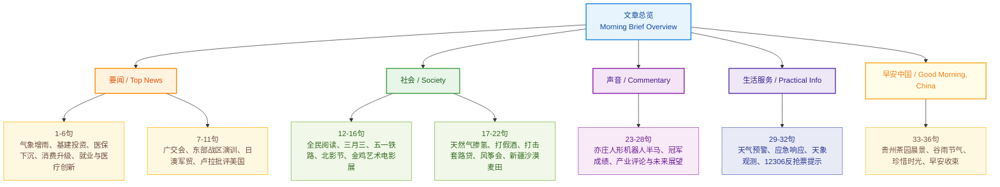

# 《新闻早班车》精读笔记（2026年4月20日）

**文章基本信息**

- **来源**：人民日报/新华社综合
- **编辑**：石磊、陈康宁（实习）
- **主播**：蓝艳
- **日期**：2026年4月20日（农历三月初四）

---

## 【前情提要：文章结构信息图】

```markdown
1. 栏目导语：来了！新闻早班车（点击跳转精彩内容）
2. 要闻版块（国内大事与宏观政策）
   2.1 农业气象：人工影响天气"春润"行动降水成效
   2.2 宏观经济：国家发改委下达2026年第二批"两重"建设项目清单及国债分配
   2.3 民生医疗：医保支持基层医疗卫生服务发展14条措施
   2.4 消费贸易：商务部数据及以旧换新热点、第139届广交会一期结束
   2.5 产业就业：新质生产力行业招聘需求分析、肿瘤防治创新药及机器人技术
   2.6 军事外交：东部战区过航横当水道、日澳护卫舰合作、卢拉批评美国干涉内政
3. 社会版块（文化生活与地方资讯）
   3.1 文化阅读：2026年"全民阅读活动周"启动
   3.2 民俗节日：三月初三民俗活动
   3.3 交通出行：五一假期增开夜间直通高铁
   3.4 影视艺术：北京国际电影节露天放映、2026金鸡艺术电影展
   3.5 科技民生：潍坊天然气掺氢项目启动
   3.6 法治维稳：晋川假酒案、锦州"套路贷"组织覆灭
   3.7 地方特色：潍坊风筝会、新疆昆玉市麦田景观
4. 声音版块（评论与深度分析）
   - 亦庄人形机器人半马夺冠及"人民锐评"产业变革深度解析
5. 生活服务（实用资讯）
   - 天气：中东部降水、北方大风沙尘、四级应急响应
   - 天象：4月21日"三星相聚"
   - 出行：12306官方平台购票提醒
6. 早安中国（意境美学与寄语）
   - 贵州凤冈茶海景观与"谷雨"节气感悟
```

---

## 【全文精读笔记】

### 第一部分：要闻

**1. 人工影响天气"春润"行动有序开展，截至18日，增加降水约1.06亿吨，为北方大地"补水"，助力春耕春播。**

> - **人工影响天气** (Weather Modification)：指通过人工干预云层的物理过程，实现增雨、防雹等目的。
> - **春润**：此为行动代号，寓意"春雨润如酥"。
> - **近义词辨析**：**助农**（侧重帮扶）/ **惠农**（侧重政策优惠）。

**2. 国家发展改革委下达2026年第二批"两重"建设项目清单，安排超长期特别国债资金2168亿元支持336个重大项目。**

> - **"两重"建设**：指**国家重大战略实施**和**重点领域安全能力建设**。
> - **超长期特别国债** (Ultra-long Special Government Bonds)：指期限极长（通常为30年、50年）、专门用于特定重大项目的国家债券，不计入常规财政赤字。
> - **背景补充**：2026年是"十四五"与"十五五"衔接的关键年，"两重"建设旨在筑牢国家长远发展的根基。

**3. 《关于医保支持基层医疗卫生服务发展的指导意见》近日印发，提出14条具体措施，让家门口就医看得上、看得起、看得好。**

> - **金句积累**：**看得上、看得起、看得好**。这九个字概括了医疗改革的终极目标：可及性、负担性与优质性。
> - **基层医疗卫生服务**：Primary Health Care Services。

**4. 商务部最新数据显示，数码和智能产品成消费品以旧换新热点，其中手机销售占比超八成，呈现"中高端扩容、消费结构优化"态势。**

> - **以旧换新** (Trade-in)：通过补贴鼓励消费者更换旧设备，从而拉动内需。
> - **扩容**：扩大容量/规模。此处指中高端手机市场份额增大。

**5. 今年一季度，以先进材料、新一代信息技术、新能源汽车等为代表的新质生产力行业招聘需求呈现明显活跃态势，研发技术岗需求增长明显。**

> - **新质生产力** (New Quality Productive Forces)：2024年以来中国经济的高频词，指由技术革命性突破、生产要素创新性配置、产业深度转型升级而催生的当代先进生产力。

**6. 我国肿瘤防治加快创新步伐，在研创新药数量约占全球三分之一，单孔手术机器人等医疗技术正实现"从0到1"的突破。**

> - **从0到1**：指原始创新，从无到有的过程。
> - **单孔手术机器人**：Single-port Surgical Robot。相较于多孔，创伤更小，对算法和精准度要求更高。

**7. 第139届广交会第一期线下展19日结束，到会境外采购商数量创历届新高。**

> - **广交会** (Canton Fair)：全称"中国进出口商品交易会"，创办于1957年，是中国对外贸易的"晴雨表"。

**8. 东部战区组织133号舰艇编队过航横当水道，赴西太平洋海域开展演训活动。**

> - **133号舰**：即**包头舰**（052D型导弹驱逐舰）。
> - **横当水道** (Yokoate-suido)：位于琉球群岛大岛支厅，是连接东海与太平洋的重要国际水道，也是我军常态化远海演训的合法航道。

**9. 日本将借共同开发之名向澳大利亚出口护卫舰。**

> - **背景解析**：这标志着日本在突破"武器出口限制"方面越走越远，加深了地区安全博弈。

**10. 巴西总统卢拉批评美国非法干涉他国内政。卢拉表示，"我们不能每天早上醒来和晚上睡前，都要看到一名总统用帖文威胁世界、发动战争。"**

> - **卢拉** (Luiz Inácio Lula da Silva)：巴西现任总统，主张多边主义和"南南合作"。
> - **非西方视角**：卢拉的表态反映了广大"全球南方"国家对美式霸权的普遍抵制。

### 第二部分：社会

**1. 2026年"全民阅读活动周"今天启动，本次活动周主题为"共促全民阅读，共建书香社会"。**

> - **书香社会**：A Reading-oriented Society。

**2. 19日是农历三月初三，我国多地举行丰富多彩的民俗活动，欢度"三月三"传统节日。**

> - **三月三**：又称"上巳节"，是壮族等多个民族的盛大节日，被誉为"壮族三月三"。

**3. 铁路部门在五一假期首尾高峰时段，在京沪、京广、京哈等高铁干线，增开多趟夜间直通高铁，旅客提前7至5天可购票。**

> - **夜间直通高铁**：通常指所谓的"红眼高铁"，利用深夜时段运输旅客以缓解运输压力。

**4. 正在举办的北京国际电影节日前首次走进城市核心商圈，开展约20场露天放映，丰富市民观影体验。**

> - **核心商圈**：Core Business District (CBD)。

**5. 2026金鸡艺术电影展在上海举办，《破·地狱》《但愿人长久》《月光里的男孩》等10部影片集中展映。**

> - **金鸡艺术电影展**：中国金鸡百花电影节的子品牌，侧重学术与艺术性。

**6. 我国首个10万户级天然气掺氢规模化应用项目19日在山东潍坊正式启动。天然气掺氢可减少二氧化碳排放，居民无需更换原有燃气设备。**

> - **天然气掺氢** (Hydrogen-enriched Natural Gas)：将氢气按比例混入天然气，是降低化石能源碳排放的有效手段。

**7. 山西、四川两省市场监管、公安部门联合行动，成功摧毁一个特大假酒网络，查获涉嫌侵权假冒白酒近2万箱，查明涉案金额2.6亿元。**

> - **侵权假冒** (Infringement and Counterfeiting)。

**8. 辽宁锦州打掉一个"套路贷"犯罪组织，抓获杨某军（绰号"大军"）等多名组织成员。**

> - **套路贷**：以民间借贷为虚假名义，通过骗取、威胁等手段非法占有公私财物的犯罪。

**9. 第43届潍坊国际风筝会开幕，来自全球57个国家和地区的2300多只匠心独运的风筝翱翔天际。**

> - **匠心独运**：形容艺术构思巧妙、独特。
> - **成语积累**：**独出心裁**（中性）、**别具一格**（褒义）。

**10. 近日，新疆昆玉市，塔克拉玛干沙漠边缘的8000亩小麦进入拔节期，25个巨型种植圈连片铺开，宛若镶嵌在大地之上的翡翠环带。**

> - **拔节期** (Jointing Stage)：禾谷类作物生长过程中茎秆节点间迅速伸长的时期，是决定穗大粒多的关键期。
> - **昆玉市**：隶属于新疆生产建设兵团第十四师，位于昆仑山北麓。

### 第三部分：声音

**4月19日，2026北京亦庄人形机器人半程马拉松鸣枪开跑。齐天大圣队的自主导航机器人"闪电"凭借50分26秒的成绩夺冠。这一成绩，超越了目前57分20秒的人类男子半马世界纪录。人民锐评发文："以赛促研、以赛促产、以赛促用"，一条跑道，照见的是一场深刻的产业变革。当人形机器人跑过马拉松的终点，他们的脚步终将会抵达更远的未来。中国智造，值得期待。**

> - **人形机器人** (Humanoid Robot)。
> - **以赛促研**：以比赛推动研发。此类四字短语是中国政策文件中常用的表述方式。
> - **中国智造** (Intelligent Manufacturing in China)：从"中国制造"到"中国智造"的转型。
> - **辨析**：**自主导航** (Autonomous Navigation) 与 **遥控操作**。

### 第四部分：生活服务

**1. 天气：19日夜间至23日，受冷暖空气共同影响，我国中东部有一次较大范围降水过程；北方地区受冷空气影响有大风沙尘。中国气象局启动四级应急响应。**

> - **四级应急响应**：国家自然灾害应急预案中级别最低的一级（最高为一级），但仍需各部门严阵以待。

**2. 天象：21日，水星、火星和土星将迎来最近相聚，届时若天气晴好，感兴趣的公众可尝试观测这幕难得一见的"星星相吸"。**

> - **"星星相吸"**：此为生动的拟人化表述，指多颗行星在视觉上靠得很近。

**3. 出行：铁路12306持续识别遏制恶意抢票行为，建议旅客务必使用12306官方平台购票，通过"抢票软件"购票不仅不会增加成功率，反而会更慢或购票失败。**

### 第五部分：早安中国

**贵州凤冈县茶海之心，万亩茶园正值新绿，薄雾轻笼，茶香弥漫。今日谷雨，暮春既至，初夏将来，入眼尽是蓬勃生机。让我们珍惜韶华，不负时光。**

> - **谷雨** (Grain Rain)：二十四节气之第六个节气，春季的最后一个节气。古人云："雨生百谷"。
> - **暮春**：春季的最后一段时间。
> - **韶华**：美丽的时光，常指青年时代。
> - **金句积累**：**暮春既至，初夏将来**；**珍惜韶华，不负时光**。
## 基本信息

- 文章来源：`人民日报`微信公众号固定栏目《`来了！新闻早班车`》；公开转载页常见标注来源为 `人民网－人民日报`。
- 题目：`人民日报来了！新闻早班车`
- 期次判断：结合文内 `今日谷雨`、`2026年“全民阅读活动周”今天启动`、`4月19日` 北京亦庄人形机器人半程马拉松、`4月21日` 水星火星土星最近相聚等线索，可将本文对应到 `2026年4月20日` 左右这一期。
- 署名信息：本期编辑 `石磊`，实习生 `陈康宁`，主播 `蓝艳`。
- 作者/团队背景简介：公开检索可确认的是，《`来了！新闻早班车`》是《人民日报》微信公众号的固定晨间新闻栏目，常在清晨 `5:30—6:00` 左右推送，内容通常采用“要闻—社会—生活提示—早安语”等板块化编排。人民日报社官方简介显示，报社设有 `新媒体中心`，负责人民日报在微信等平台账号的运营与内容生产。至于本期署名三位人员，公开网页未检索到稳定、完整且可直接对应本期栏目的个人履历，因此这里只依据署名栏与栏目归属作最小限度说明，不对其个人经历作超出处证推断。

## 前情提要



## 逐句精读

### 要闻

🔸 人工影响天气“`春润`”行动 / 有序开展，/ 截至18日，/ 增加降水约`1.06亿吨`，/ 为北方大地“补水”，/ 助力`春耕春播`。
🔹 The `Spring Moisture` weather-modification campaign / has been carried out in an orderly manner; / as of `April 18`, / it had generated about `106 million tons` of additional precipitation, / replenishing moisture across northern China / and supporting `spring plowing and sowing`.
背景注释：`人工影响天气`通常指通过人工增雨（雪）等方式干预局地天气；`春润`是围绕春季抗旱保墒、农业生产等目标展开的季节性行动。这里的“补水”是新闻写作中的形象表达，本质上指增加土壤墒情和地表有效降水。

> `weather modification` /ˈweðər ˌmɒdɪfɪˈkeɪʃən/ n. deliberate intervention in atmospheric processes to alter weather conditions; `通过技术手段主动改变天气条件；人工影响天气`。语域：气象、科技、新闻。画龙点睛：正式表达里常见 `weather-modification operations`、`cloud-seeding missions`、`enhance precipitation`。考试翻译里比口语化的 `make rain` 更专业，适合科技政策语境。

> `replenish` /rɪˈplenɪʃ/ v. to fill something up again or restore what has been used; `补充；补足；恢复`。语域：正式、新闻、学术。画龙点睛：常搭配 `replenish water supplies / soil moisture / reservoirs`。与 `refill` 相比，`replenish` 更强调“把消耗掉的资源补回来”，写环境、能源、库存时非常高频。

---

🔸 国家发展改革委 / 下达`2026年`第二批“`两重`”建设项目清单，/ 安排`超长期特别国债`资金`2168亿元` / 支持`336个`重大项目。
🔹 China’s National Development and Reform Commission / has issued the second batch of the `2026` project list for `Two Major Priorities` construction, / allocating `216.8 billion yuan` in `ultra-long special treasury bond` funds / to support `336` major projects.
背景注释：`国家发展改革委`即 NDRC。`两重`是政策简称，官方语境中通常指 `国家重大战略实施` 与 `重点领域安全能力建设`。`超长期特别国债`是中央层面的长期政策性融资工具。

> `ultra-long special treasury bond` /ˌʌltrə lɔːŋ ˈspeʃl ˈtreʒəri bɒnd/ n. a special government bond with an exceptionally long maturity issued for specific policy purposes; `超长期特别国债`。语域：财经、政策、新闻。画龙点睛：写作中可和 `allocate funds through...`, `finance major projects`, `policy support` 连用；`treasury bond` 是国债核心词，`special` 与 `ultra-long` 共同限定其用途与期限。

> `allocate` /ˈæləkeɪt/ v. to distribute resources for a particular purpose; `分配；拨付；配置`。语域：正式、财经、行政。画龙点睛：高频搭配有 `allocate funds/resources/budget`。它比 `give`、`spend` 更强调“按计划分配”，在政府预算、企业资源配置、学术写作中都很常见。

---

🔸 《关于医保支持基层医疗卫生服务发展的指导意见》 / 近日印发，/ 提出`14条`具体措施，/ 让家门口就医 / `看得上、看得起、看得好`。
🔹 The recently issued Guiding Opinions on medical-insurance support for the development of `primary-level medical and health services` / set out `14` concrete measures / so that people can obtain care close to home that is `available`, `affordable`, and `good in quality`.
背景注释：`基层医疗卫生服务`对应社区卫生服务中心、乡镇卫生院、村卫生室等基层体系；中文里的“看得上、看得起、看得好”是政策表达中的三重目标，分别强调 `可及性`、`可负担性`、`服务质量`。

> `primary-level healthcare` /ˈpraɪməri ˌlevl ˈhelθkeə(r)/ n. basic medical services provided at the community or local level; `基层医疗服务`。语域：医疗、公共政策。画龙点睛：也可说 `primary care`。写作中常见 `strengthen primary-level healthcare`, `improve access to primary care`。它是医疗公平、分级诊疗、公共卫生话题里的核心表达。

> `affordable` /əˈfɔːdəbl/ adj. inexpensive enough for people to pay for; `负担得起的`。语域：通用、政策、社会议题。画龙点睛：常与 `housing`, `healthcare`, `education` 连用。考试写作中若想表达“价格可承受”，`affordable` 比单纯 `cheap` 更自然，也更中性、更正式。

---

🔸 商务部最新数据显示，/ `数码和智能产品` / 成消费品`以旧换新`热点，/ 其中`手机`销售占比超`八成`，/ 呈现“`中高端扩容、消费结构优化`”态势。
🔹 The latest data from the Ministry of Commerce show that `digital and smart products` / have become a major focus of the consumer `trade-in` program; / among them, `mobile phones` account for more than `80 percent` of sales, / pointing to expanding mid- to high-end demand and an optimized `consumption mix`.
背景注释：`以旧换新`是当前中国消费促进政策中的常见说法，指消费者用旧产品置换新产品并获得补贴或优惠。`消费结构优化`常用于宏观经济报道，表示消费层级、品类和质量的升级。

> `trade-in` /ˈtreɪd ɪn/ n. the practice of giving an old item as part of payment for a new one; `以旧换新；折价置换`。语域：商业、消费、新闻。画龙点睛：可作名词也可作形容词，如 `trade-in program`。翻译政策新闻时，它是最标准的对应表达；不要只写成 `exchange old for new`，那样信息不够凝练。

> `consumption mix` /kənˈsʌmpʃən mɪks/ n. the composition of what consumers buy across categories and levels; `消费结构`。语域：经济、市场分析。画龙点睛：常见于数据解读句型：`optimize the consumption mix`, `shift the consumption mix toward higher-value goods`。适合用于图表作文和经济类阅读表达。

---

🔸 今年一季度，/ 以`先进材料`、`新一代信息技术`、`新能源汽车`等为代表的`新质生产力`行业 / 招聘需求呈现明显活跃态势，/ `研发技术岗`需求增长明显。
🔹 In the first quarter, / hiring demand in industries representing `new-quality productive forces`—such as `advanced materials`, `next-generation information technology`, and `new-energy vehicles`— / showed clear momentum, / with especially notable growth in demand for `R&D and technical positions`.
背景注释：`新质生产力`是近年中国经济报道中的高频政策概念，强调科技创新、高附加值产业和生产效率提升。`研发技术岗`在英文里常处理为 `R&D and technical positions/jobs`。

> `momentum` /məˈmentəm/ n. force that keeps something moving or developing; `势头；动能；推进力`。语域：新闻、商业、学术。画龙点睛：经济报道中极常见：`growth momentum`, `gain momentum`, `maintain momentum`。它比 `speed` 更抽象，常表示“发展后劲”而非物理速度。

> `R&D` /ˌɑːr ən ˈdiː/ n. short for research and development; `研发`。语域：商业、科技、新闻。画龙点睛：高频搭配有 `R&D spending`, `R&D staff`, `R&D-intensive industries`。写作时可展开为 `research and development`，首现全写，后文再缩写更规范。

---

🔸 我国`肿瘤防治` / 加快创新步伐，/ 在研`创新药`数量 / 约占全球`三分之一`，/ `单孔手术机器人`等医疗技术 / 正实现“`从0到1`”的突破。
🔹 China is accelerating innovation in `cancer prevention and treatment`; / the number of investigational `innovative drugs` under development / accounts for about `one-third` of the global total, / and medical technologies such as `single-port surgical robots` / are achieving breakthroughs `from zero to one`.
背景注释：`肿瘤防治`通常涵盖筛查、诊疗、药物研发与术后管理；`从0到1`常指原创性、首创性突破，而不是简单改良。`单孔手术机器人`强调微创手术能力。

> `oncology` /ɒnˈkɒlədʒi/ n. the branch of medicine dealing with tumors and cancer; `肿瘤学`。语域：医学、学术、新闻。画龙点睛：与 `cancer prevention and treatment`, `oncology drugs`, `oncology research` 高频搭配。阅读中见到 `oncology pipeline`，多指肿瘤药物研发管线。

> `from zero to one` /frəm ˈzɪərəʊ tə wʌn/ phr. describing a breakthrough that creates something fundamentally new; `从无到有；原创性突破`。语域：科技、商业、评论。画龙点睛：它强调“首创”，不同于 `from one to ten` 那种规模扩张。写作时可引申为 `make a from-zero-to-one breakthrough`，非常适合科技创新主题。

---

🔸 第`139届`广交会第一期`线下展` / `19日`结束，/ 到会`境外采购商`数量 / 创历届新高。
🔹 The first phase of the `139th` Canton Fair’s `offline exhibition` / concluded on `April 19`, / and the number of `overseas buyers` attending / hit a record high for all previous editions.
背景注释：`广交会`即 China Import and Export Fair，是中国外贸领域最重要的综合性展会之一。`线下展`与 `online exhibition` 对应；`境外采购商`是会展报道中的固定表达。

> `offline exhibition` /ˌɒfˈlaɪn ˌeksɪˈbɪʃən/ n. an exhibition held in a physical venue rather than online; `线下展`。语域：会展、商业、新闻。画龙点睛：后疫情语境中，`online`, `offline`, `hybrid` 三组词非常常见。写作中说“恢复线下办展”，用 `resume offline exhibitions` 很自然。

> `overseas buyer` /ˌəʊvəˈsiːz ˈbaɪə(r)/ n. a purchaser from outside the country; `境外采购商`。语域：贸易、会展。画龙点睛：与 `attend a fair`, `place orders`, `source products` 连用。`buyer` 在外贸语境里比笼统的 `customer` 更准确，因为它突出采购角色。

---

🔸 东部战区 / 组织`133号舰艇编队` / 过航`横当水道`，/ 赴`西太平洋海域` / 开展`演训活动`。
🔹 The Eastern Theater Command / organized a flotilla led by `vessel No. 133` / to transit the `Balintang Channel`, / proceed to the `western Pacific`, / and conduct `training and drill` activities.
背景注释：`东部战区`是中国人民解放军战区之一；`横当水道`常对应菲律宾北部附近的 `Balintang Channel`；`演训`是“演习+训练”的合成说法，英语里常处理为 `training and drills` 或 `exercise and training`.

> `transit` /ˈtrænzɪt/ v. to pass through or across a place; `通过；穿越；过航`。语域：航运、军事、正式。画龙点睛：海空新闻里很常用，如 `transit a strait`, `transit international waters`。它比 `pass` 更正式、更专业，尤其适合军事和航海报道。

> `drill` /drɪl/ n. a practice activity for training people to respond effectively; `操练；演练；演训`。语域：军事、安全、教育。画龙点睛：可与 `military drills`, `emergency drills`, `live-fire drills` 搭配。注意 `drill` 既能作名词也能作动词，新闻标题里非常高频。

---

🔸 日本 / 将借`共同开发`之名 / 向澳大利亚`出口护卫舰`。
🔹 Japan / will `export frigates` to Australia / under the banner of `joint development`.
背景注释：`护卫舰`是海军水面作战舰艇类型之一，英语常译 `frigate`。中文“借……之名”带有明显评论色彩，英文可用 `under the banner of`、`under the guise of`；前者相对中性，后者更带批评意味。

> `frigate` /ˈfrɪɡət/ n. a medium-sized warship used for escort and combat missions; `护卫舰`。语域：军事、国际新闻。画龙点睛：海军装备词汇中，`destroyer` 是驱逐舰，`frigate` 是护卫舰，二者不要混。军事阅读里区分舰种有助于准确理解报道分量。

> `under the banner of` /ˈʌndə(r) ðə ˈbænə(r) əv/ phr. using a stated purpose as a public justification; `打着……旗号；以……名义`。语域：新闻、评论、政治。画龙点睛：常带立场色彩。若语气更强，可换成 `under the guise of`。翻译时它比直译 `in the name of` 更有新闻评论味。

---

🔸 巴西总统`卢拉` / 批评美国 / `非法干涉`他国内政。
🔹 Brazilian President `Luiz Inácio Lula da Silva` / criticized the United States / for `illegally interfering` in other countries’ internal affairs.
背景注释：`卢拉`是巴西总统 Luiz Inácio Lula da Silva。`干涉内政`是国际政治报道中的高频表达，英语通常是 `interfere in internal affairs`。

> `interfere in` /ˌɪntəˈfɪə(r) ɪn/ v. to become involved in a situation in a way that is not wanted; `干涉；插手`。语域：政治、外交、通用。画龙点睛：固定搭配是 `interfere in something`；而 `interfere with` 更多指“妨碍、影响”。外交文本里别混用，这是一类非常典型的搭配考点。

---

🔸 卢拉表示，/ “我们不能 / 每天早上醒来和晚上睡前，/ 都要看到 / 一名总统 / 用`帖文`威胁世界、发动战争。”
🔹 Lula said, / “We cannot / wake up every morning and go to bed every night / only to see / a president / using `social-media posts` to threaten the world and start wars.”
背景注释：这里的 `帖文`对应网络平台上的发文、贴文，英语可处理为 `post` 或 `social-media post`。原句中的节奏感很强：`wake up every morning / go to bed every night` 形成对称结构，增强批评力度。

> `post` /pəʊst/ n. a message published on the internet, especially on social media; `帖子；网帖；社交媒体发文`。语域：互联网、新闻、日常。画龙点睛：新闻语境下为避免歧义，可写全 `social-media post`。作动词时是 `post something online`。考试翻译碰到“发帖”“帖文”，这是最稳妥的核心词。

> `threaten` /ˈθretn/ v. to express an intention to harm, or to pose a danger to; `威胁；构成威胁`。语域：通用、新闻、外交。画龙点睛：既可表示人的言语威胁，也可表示事物构成风险，如 `threaten peace`, `threaten stability`。写国际关系话题时，它是非常高频的判断动词。

---

### 社会

🔸 `2026年`“`全民阅读活动周`” / 今天启动，/ 本次活动周主题为“`共促全民阅读，共建书香社会`”。
🔹 China’s `2026 National Reading Week` / began today, / with the theme of `advancing nationwide reading together and building a book-loving society together`.
背景注释：结合公开活动安排与文内时间线，这里的“今天”对应 `2026年4月20日`。`全民阅读活动周`是国家层面的阅读推广活动；`书香社会`可理解为全民普遍重视阅读、文化氛围浓厚的社会。

> `nationwide` /ˈneɪʃənwaɪd/ adj./adv. happening across the whole country; `全国范围的；全国性地`。语域：正式、新闻。画龙点睛：和 `national` 相比，`nationwide` 更突出“覆盖全国”。如 `nationwide campaign / nationwide rollout / nationwide reading initiative`。

> `book-loving society` /ˈbʊk ˌlʌvɪŋ səˈsaɪəti/ n. a society in which reading is widely valued and practiced; `书香社会`。语域：文化、政策、宣传。画龙点睛：这是意译型表达，写作时也可换成 `a society with a strong reading culture`，更自然、更书面。

---

🔸 `19日` / 是农历`三月初三`，/ 我国多地 / 举行丰富多彩的`民俗活动`，/ 欢度“`三月三`”传统节日。
🔹 `April 19` / fell on the `third day of the third lunar month`, / and many places across China / held colorful `folk-custom activities` / to celebrate the traditional `Sanyuesan` festival.
背景注释：`三月三`在不同地区、不同民族中有不同节俗，常与歌会、祭祀、踏青等活动相关。英语表达里可保留拼音 `Sanyuesan`，再辅以解释，以兼顾文化准确性与可读性。

> `folk custom` /fəʊk ˈkʌstəm/ n. a traditional social practice of a particular community; `民俗；民间习俗`。语域：文化、人类学、新闻。画龙点睛：常见搭配有 `folk customs`, `folk activities`, `folk traditions`。写中国传统节日时，比泛泛的 `tradition` 更具体，能凸显“民间生活实践”色彩。

---

🔸 铁路部门 / 在`五一假期`首尾高峰时段，/ 在京沪、京广、京哈等`高铁干线`，/ 增开多趟`夜间直通高铁`，/ 旅客提前`7至5天`可购票。
🔹 During the peak travel periods at the beginning and end of the `May Day holiday`, / railway authorities / added multiple `overnight direct high-speed trains` on trunk lines such as Beijing–Shanghai, Beijing–Guangzhou, and Beijing–Harbin; / passengers can buy tickets `five to seven days in advance`.
背景注释：`五一假期`即 Labor Day holiday。`直通高铁`强调中途换乘减少；`干线`指骨干运输线路。新闻里的 `7至5天` 可理解为根据不同出发日期，旅客可在五到七天前购票。

> `trunk line` /trʌŋk laɪn/ n. a main transport route connecting major places; `干线；主干线路`。语域：交通、物流。画龙点睛：除了铁路，也可用于通信、电力、管网等语境。写交通网络时，`main line` 可以用，但 `trunk line` 更专业。

> `in advance` /ɪn ədˈvɑːns/ phr. before a particular time; `提前`。语域：通用。画龙点睛：高频搭配 `book / pay / prepare / purchase in advance`。考试写作里表达“提前购票”“提前准备”非常实用，是简单但稳定得分的短语。

---

🔸 正在举办的`北京国际电影节` / 日前首次走进`城市核心商圈`，/ 开展约`20场`露天放映，/ 丰富市民观影体验。
🔹 The ongoing `Beijing International Film Festival` / has, for the first time, entered `core urban commercial districts`, / staging about `20` open-air screenings / to enrich residents’ movie-going experience.
背景注释：`商圈`常指商业综合体密集的城市消费区域；`露天放映`在英文里多用 `open-air screening`。这里体现的是电影节从影院空间向城市公共空间外溢。

> `core commercial district` /kɔː(r) kəˈmɜːʃl ˈdɪstrɪkt/ n. a central urban area concentrated with business and retail activities; `城市核心商圈`。语域：城市、商业、新闻。画龙点睛：也可写 `shopping district`，但 `commercial district` 更正式。谈城市更新、消费场景时都很常见。

> `open-air screening` /ˌəʊpən ˈeə(r) ˈskriːnɪŋ/ n. a film showing held outdoors; `露天放映`。语域：影视、文化活动。画龙点睛：`screening` 是“放映”核心词，远比 `show a movie outside` 更地道。可扩展记忆 `premiere screening`, `special screening`, `private screening`。

---

🔸 `2026金鸡艺术电影展` / 在上海举办，/ 《`破·地狱`》《`但愿人长久`》《`月光里的男孩`》等`10部影片` / 集中展映。
🔹 The `2026 Golden Rooster Art Film Exhibition` / was held in Shanghai, / where `10 films`, including `Po·Diyu`, `May We Live Long`, and `Boy in the Moonlight`, / were shown in a concentrated screening program.
背景注释：`金鸡`指中国电影金鸡奖相关品牌活动；`艺术电影展`可对应 `art film exhibition/festival`。对影片中文片名，新闻翻译里常会出现 `音译+意译` 并存的处理方式，考试中不必强求统一官方英译，只要保持可识别即可。

> `art film` /ɑːt fɪlm/ n. a film valued mainly for artistic expression rather than commercial appeal; `艺术电影`。语域：影视、评论。画龙点睛：与 `commercial film` 对应。阅读中也会见到 `arthouse film`，后者更偏“艺术院线/文艺片”语感。

---

🔸 我国首个`10万户级`天然气`掺氢`规模化应用项目 / `19日`在山东潍坊正式启动。
🔹 China’s first large-scale natural-gas `hydrogen-blending` application project / serving `100,000 households` / was officially launched in Weifang, Shandong, on `April 19`.
背景注释：`掺氢`指在天然气中按一定比例混入氢气，以改善能源结构、降低碳排放。`10万户级`体现项目覆盖规模，是中文新闻里典型的“数量级表达”。

> `hydrogen blending` /ˈhaɪdrədʒən ˈblendɪŋ/ n. the mixing of hydrogen into another fuel, especially natural gas; `掺氢；氢气混配`。语域：能源、工程、科技。画龙点睛：常见说法有 `blend hydrogen into natural gas`。这类名词化表达很适合科技翻译，信息密度高，句子更正式。

---

🔸 天然气`掺氢` / 可减少`二氧化碳排放`，/ 居民无需更换原有`燃气设备`。
🔹 `Blending hydrogen` into natural gas / can reduce `carbon dioxide emissions`, / and residents will not need to replace their existing `gas appliances`.
背景注释：这里补充说明上一句项目的现实意义：既有环保收益，又兼顾居民端使用成本。`燃气设备`在家庭语境中常用 `gas appliances`，如灶具、热水器等。

> `emission` /ɪˈmɪʃn/ n. something, especially gas, that is sent out into the air; `排放物；排放`。语域：环保、能源、政策。画龙点睛：高频搭配 `carbon emissions`, `cut emissions`, `emission reduction`。写气候变化、工业转型时，这是绕不开的核心词。

> `appliance` /əˈplaɪəns/ n. a household machine or device; `家用器具；家电设备`。语域：日常、商业、技术。画龙点睛：`electrical appliances` 是电器，`gas appliances` 是燃气器具。比泛词 `equipment` 更贴近日常生活场景。

---

🔸 山西、四川两省市场监管、公安部门 / 联合行动，/ 成功摧毁一个`特大假酒网络`，/ 查获涉嫌`侵权假冒`白酒近`2万箱`，/ 查明涉案金额`2.6亿元`。
🔹 The market-regulation and public-security authorities of Shanxi and Sichuan / carried out a joint operation, / successfully dismantling a massive `counterfeit-liquor network`, / seizing nearly `20,000` boxes of spirits suspected of `trademark infringement and counterfeiting`, / with the case involving `260 million yuan`.
背景注释：`市场监管`对应 market regulation authorities；`侵权假冒`是知识产权与制假售假报道中的固定组合。`白酒`在英译里可根据语境译为 `Chinese liquor`、`spirits` 或 `baijiu`。

> `counterfeit` /ˈkaʊntəfɪt/ adj./n. made to look like the real thing in order to deceive people; `假冒的；仿冒品`。语域：法律、商业、新闻。画龙点睛：高频搭配 `counterfeit goods / products / labels`。与 `fake` 相比，`counterfeit` 更正式，也更贴合法律和执法语境。

> `infringement` /ɪnˈfrɪndʒmənt/ n. the act of breaking a law or violating a right; `侵害；侵权`。语域：法律、商业。画龙点睛：常见 `copyright infringement`, `trademark infringement`, `patent infringement`。名词后接具体权利对象，是知识产权题材的高频考点。

---

🔸 辽宁锦州 / 打掉一个“`套路贷`”犯罪组织，/ 抓获杨某军（绰号“`大军`”）等多名组织成员。
🔹 Jinzhou, Liaoning, / busted a criminal organization engaged in a `predatory loan scam`, / arresting multiple members including Yang Moujun, nicknamed `Dajun`.
背景注释：`套路贷`不是普通高利贷，而是以欺骗、诱导、虚增债务、暴力催收等方式实施的违法犯罪行为。英文处理时，常用 `predatory lending scam`、`loan-sharking scam` 等解释性译法。

> `predatory lending` /ˈpredətəri ˈlendɪŋ/ n. unfair or abusive lending practices that exploit borrowers; `掠夺性放贷；套路式高利放贷`。语域：法律、金融、新闻。画龙点睛：这是解释 `套路贷` 很好用的对应表达。若强调“骗局”性质，可加 `scam`；若强调高利贷，可联想 `loan shark`.

---

🔸 第`43届`潍坊国际风筝会 / 开幕，/ 来自全球`57个国家和地区`的`2300多只` `匠心独运`的风筝 / 翱翔天际。
🔹 The `43rd` Weifang International Kite Festival / opened, / with more than `2,300` `ingeniously crafted` kites from `57 countries and regions` / soaring into the sky.
背景注释：山东潍坊素有“世界风筝都”之称。`匠心独运`带有鲜明褒义，可译为 `ingeniously crafted`, `exquisitely designed` 等。

> `ingeniously` /ɪnˈdʒiːniəsli/ adv. in a clever, original, and skillful way; `巧妙地；匠心独运地`。语域：正式、评论、文化。画龙点睛：它由 `ingenious` 派生，常修饰设计、机制、作品。比 `cleverly` 更有“精巧构思”的审美色彩，适合文化和工艺类文本。

---

🔸 近日，/ 新疆昆玉市，/ 塔克拉玛干沙漠边缘的`8000亩`小麦 / 进入`拔节期`，/ `25个巨型种植圈`连片铺开，/ 宛若镶嵌在大地之上的`翡翠环带`。
🔹 Recently, / in Kunyu, Xinjiang, / `8,000 mu` of wheat on the edge of the Taklamakan Desert / entered the `jointing stage`, / while `25 giant planting circles` spread out in contiguous stretches, / like `emerald belts` inlaid into the earth.
背景注释：`拔节期`是小麦等禾本科作物茎节迅速伸长的重要生长期；`巨型种植圈`多与中心支轴式喷灌形成的圆形农田景观有关。`塔克拉玛干沙漠`是中国最大沙漠之一。

> `jointing stage` /ˈdʒɔɪntɪŋ steɪdʒ/ n. the growth stage in which stems elongate and nodes become obvious; `拔节期`。语域：农业、植物学。画龙点睛：农业英文里生长阶段词很多，如 `seedling stage`, `flowering stage`, `maturity stage`。精准使用能明显提升农业类阅读与翻译的专业度。

---

### 声音

🔸 `4月19日`，/ `2026北京亦庄人形机器人半程马拉松` / 鸣枪开跑。
🔹 On `April 19`, / the `2026 Beijing Yizhuang Humanoid Robot Half Marathon` / got underway with the starter’s gun.
背景注释：`亦庄`是北京经济技术开发区所在地，近年在人形机器人、智能制造等产业布局密集。`鸣枪开跑`是赛事报道中的固定表达。

> `get underway` /ɡet ˌʌndəˈweɪ/ phr. to begin and start making progress; `开始；启动；开跑`。语域：新闻、正式。画龙点睛：它比简单的 `start` 更有报道感，常用于会议、工程、比赛、调查等正式场景，如 `the talks got underway`, `construction got underway`.

---

🔸 齐天大圣队的`自主导航机器人`“`闪电`” / 凭借`50分26秒`的成绩 / 夺冠。
🔹 `Lightning`, an `autonomous-navigation robot` from the Qitian Dasheng team, / claimed the title / with a time of `50 minutes and 26 seconds`.
背景注释：`自主导航`表示机器人可依靠算法与感知系统自行规划路径、识别环境并持续运动；新闻里“夺冠”常译为 `win the title`, `claim the championship`, `take first place`。

> `autonomous` /ɔːˈtɒnəməs/ adj. able to operate independently without direct human control; `自主的；自动独立运行的`。语域：科技、工程、汽车、AI。画龙点睛：高频搭配 `autonomous vehicle`, `autonomous robot`, `autonomous navigation`。它不是简单的 `automatic`；前者强调“自主决策”，后者更偏“自动执行”。

> `claim the title` /kleɪm ðə ˈtaɪtl/ phr. to win first place in a competition; `夺冠；摘得桂冠`。语域：体育、新闻。画龙点睛：是体育报道常用表达，比 `be the winner` 更地道、更有赛事文体色彩。

---

🔸 这一成绩，/ 超越了目前`57分20秒`的人类男子`半马世界纪录`。
🔹 This result / surpassed the current men’s human `half-marathon world record` of `57 minutes and 20 seconds`.
背景注释：`半马`即 half marathon，标准距离为 21.0975 公里。这里的“世界纪录”在语言功能上主要是作为“人类基准成绩”来构造对比关系，阅读时要抓住其比较功能。

> `surpass` /səˈpɑːs/ v. to do better than or go beyond something; `超过；超越`。语域：正式、新闻、学术。画龙点睛：比 `beat` 更书面，也更适合非人称主语，如 `sales surpassed expectations`, `the figure surpassed the previous record`。图表作文中非常好用。

---

🔸 人民锐评发文：/ “`以赛促研、以赛促产、以赛促用`”，/ 一条跑道，/ 照见的是一场深刻的`产业变革`。
🔹 In a People’s Daily commentary, it was argued that / “using competition to spur `research`, `production`, and `application`,” / this single track / reveals a profound `industrial transformation`.
背景注释：`人民锐评`是人民日报系评论性表达中的栏目化写法。中文“以A促B”常可译为 `use A to promote B`、`leverage A to drive B`。`照见`带比喻色彩，这里不是“看见”，而是“折射出、映现出”。

> `spur` /spɜː(r)/ v. to encourage something to develop or happen faster; `激励；促进；推动`。语域：正式、商业、评论。画龙点睛：常见 `spur growth / spur innovation / spur reform`。它比 `promote` 更有“刺激、催化”的力量感，特别适合政策和产业分析文本。

> `transformation` /ˌtrænsfəˈmeɪʃn/ n. a thorough or dramatic change; `转型；变革`。语域：通用、商业、产业。画龙点睛：高频搭配有 `industrial transformation`, `digital transformation`, `green transformation`。写作时若谈“深刻变化”，这个词比 `change` 更强、更完整。

---

🔸 当`人形机器人` / 跑过马拉松的终点，/ 他们的脚步 / 终将会抵达 / 更远的未来。
🔹 When `humanoid robots` / run past the finish line of a marathon, / their steps / will eventually carry them / toward a farther future.
背景注释：这是典型评论句，采用拟人和象征手法。`跑过终点`表层写比赛，深层写技术成熟度、产业应用与社会想象空间的延展。

> `humanoid` /ˈhjuːmənɔɪd/ adj./n. resembling a human in form or movement; `人形的；类人的；人形机器人`。语域：科技、科幻、工程。画龙点睛：常与 `robot` 连用成 `humanoid robot`。与 `human-like` 相比，`humanoid` 更专业、更凝练，常见于机器人与科幻新闻。

---

🔸 `中国智造`，/ 值得期待。
🔹 China’s `intelligent manufacturing` / holds great promise.
背景注释：`中国智造`是对“中国制造”升级版的概括，强调智能化、数字化、高端化生产能力。翻译时常处理为 `intelligent manufacturing in China` 或 `China’s intelligent manufacturing`.

> `hold great promise` /həʊld ɡreɪt ˈprɒmɪs/ phr. to seem likely to be very successful or valuable; `前景可期；大有希望`。语域：正式、评论、科技。画龙点睛：评论结尾非常常用。它比简单的 `is promising` 更有评述语气，适合总结句、展望句。

---

### 生活服务

🔸 `天气：` / `19日夜间至23日`，/ 受冷暖空气共同影响，/ 我国中东部 / 有一次较大范围`降水过程`；/ 北方地区受冷空气影响 / 有`大风沙尘`。
🔹 `Weather:` / From the night of `April 19` to `April 23`, / under the combined influence of warm and cold air masses, / central and eastern China / will experience a relatively large-scale `precipitation process`; / affected by cold air, northern regions / will see strong winds and blowing dust.
背景注释：按文内时间线，这一段对应 `2026年4月19日至23日` 的天气提示。`降水过程`是气象报道术语，不只是“下雨”，还包含雨雪等。`沙尘`可译 `dust` 或 `blowing dust`。

> `precipitation` /prɪˌsɪpɪˈteɪʃn/ n. rain, snow, or any water that falls from the sky; `降水`。语域：气象、地理、学术。画龙点睛：它是天气报道专业词，覆盖 `rain`, `snow`, `sleet` 等。阅读里见 `precipitation process/event`，可理解为“一轮降水过程”。

---

🔸 中国气象局 / 启动`四级应急响应`。
🔹 The China Meteorological Administration / has activated a `Level-IV emergency response`.
背景注释：`四级应急响应`是中国应急管理中的等级化响应机制之一。翻译时保留罗马数字 `IV` 更符合正式文本习惯，也可写 `Level 4`。

> `activate` /ˈæktɪveɪt/ v. to make something start working or take effect; `启动；激活；使生效`。语域：正式、行政、科技。画龙点睛：常见 `activate an emergency response`, `activate a mechanism`, `activate an account`。它比 `start` 更适合制度、程序、机制语境。

---

🔸 `天象：` / `21日`，/ `水星、火星和土星`将迎来最近相聚，/ 届时若天气晴好，/ 感兴趣的公众 / 可尝试观测这幕难得一见的“`星星相吸`”。
🔹 `Astronomy:` / On `April 21`, / `Mercury, Mars, and Saturn` will make their closest apparent grouping; / if the weather is clear then, / interested members of the public / may try to observe this rare scene of the planets appearing to “`draw together`.”
背景注释：这里的“相吸”是形象化说法，并非真的引力异常，而是指从地球观测视角看，几颗行星在天球上的视位置彼此接近。`最近相聚`常可译为 `closest grouping`、`close conjunction`。

> `grouping` /ˈɡruːpɪŋ/ n. a number of things positioned close together; `成组出现；聚集`。语域：天文、通用、新闻。画龙点睛：天文科普里可与 `planetary grouping`, `close grouping` 连用。若更专业，可用 `conjunction`，但 `grouping` 对普通读者更直观。

---

🔸 `出行：` / 铁路`12306`持续识别遏制`恶意抢票行为`，/ 建议旅客务必使用`12306官方平台`购票，/ 通过“`抢票软件`”购票 / 不仅不会增加成功率，/ 反而会更慢或购票失败。
🔹 `Travel:` / China Railway’s `12306` platform continues to identify and curb `malicious ticket-snatching behavior`, / and passengers are strongly advised to use the `official 12306 platform` when buying tickets; / purchasing through so-called `ticket-grabbing apps` / not only fails to increase the success rate, / but may actually be slower or end in failure.
背景注释：`12306`是中国铁路官方售票平台。中文里的 `抢票软件` 指第三方自动刷新、自动提交的购票工具；英语里用 `ticket-grabbing apps`、`ticket-snatching software` 都可以，前者更易懂。

> `curb` /kɜːb/ v. to control or limit something undesirable; `遏制；抑制`。语域：新闻、政策、正式。画龙点睛：常见 `curb inflation`, `curb crime`, `curb speculation`, `curb malicious behavior`。它比 `stop` 更像“压制势头”，很适合政策措施类语境。

> `success rate` /səkˈses reɪt/ n. the percentage of attempts that achieve the intended result; `成功率`。语域：通用、数据分析。画龙点睛：图表作文和说明文都很实用，可扩展为 `improve the success rate`, `raise the failure rate`。注意和 `win rate` 区分，后者更偏竞技或游戏。

---

### 早安中国

🔸 贵州凤冈县`茶海之心`，/ `万亩茶园`正值新绿，/ `薄雾轻笼`，/ 茶香弥漫。
🔹 At the `Heart of the Tea Sea` in Fenggang County, Guizhou, / `vast tea plantations` are in fresh spring green, / lightly `shrouded in mist`, / with the fragrance of tea filling the air.
背景注释：`茶海之心`带有景区命名色彩，英译可适度意译。`万亩茶园`突出规模感；中文四字短句营造晨景节奏，英文需适度舒展，才能保留画面感。

> `shroud` /ʃraʊd/ v. to cover or hide something; `笼罩；覆盖`。语域：文学、新闻、描写。画龙点睛：常见 `be shrouded in mist/fog/secrecy`。比 `cover` 更有氛围感，是景物描写和高级写作中很值得掌握的词。

---

🔸 今日`谷雨`，/ 暮春既至，/ 初夏将来，/ 入眼尽是`蓬勃生机`。
🔹 Today is `Grain Rain`, / late spring has arrived, / early summer is on its way, / and everywhere one looks is full of `vibrant life`.
背景注释：`谷雨`是二十四节气之一，通常在公历 `4月19日至21日` 之间。这里借节气写时序更替，兼有自然节律与文化抒情双重作用。

> `vibrant` /ˈvaɪbrənt/ adj. full of energy and life; `充满活力的；生机勃勃的`。语域：通用、描写、评论。画龙点睛：可搭配 `vibrant life`, `vibrant city`, `vibrant economy`。它既能写景，也能写社会发展，是非常“百搭”的高级形容词。

---

🔸 让我们 / `珍惜韶华`，/ `不负时光`。
🔹 Let us / `cherish the best years of our youth` / and `live up to time`.
背景注释：`韶华`是典型书面词，常指青春年华、美好时光；`不负时光`不是字面上的“不辜负时间”，而是“把时间过得有意义”。

> `cherish` /ˈtʃerɪʃ/ v. to value something deeply and care for it; `珍惜；珍爱`。语域：通用、抒情、正式。画龙点睛：常搭配 `cherish time`, `cherish memories`, `cherish opportunities`。它比 `value` 更带感情色彩，适合励志与抒情表达。

> `live up to` /lɪv ʌp tə/ phr. to fulfill what is expected or worthy of; `不辜负；配得上；达到……标准`。语域：通用、正式。画龙点睛：非常重要的短语。可说 `live up to expectations`, `live up to one’s promise`, `live up to the trust placed in us`。这里引申为“对得起时间”。

---

🔸 `新的一天`，/ `早安`！
🔹 `A new day` begins— / `good morning`!
背景注释：结尾用极短句完成情绪收束，典型晨间栏目口吻。中文省略主语，英文补出 `begins`，句意更完整自然。

> `begin` /bɪˈɡɪn/ v. to start; `开始`。语域：通用。画龙点睛：最基础的词，越基础越要会用得自然。像 `A new day begins`、`A new chapter begins` 都是简洁有力的收束句式，适合写作结尾。

---

## 检索依据

1. 人民日报社简介（含 `新媒体中心` 与 `人民网` 说明）：
   https://www.people.com.cn/GB/50142/104580/

2. 关于《人民日报》微信公众号《来了！新闻早班车》栏目形态的研究性介绍：
   https://m.thepaper.cn/newsDetail_forward_7563023

3. 人工影响天气“春润”行动增加降水约1.06亿吨（用于交叉核对正文时间与事实背景）：
   https://society.people.com.cn/n1/2026/0420/c1008-40704266.html

4. 2026年“全民阅读活动周”各地区重点活动（用于核对“今天启动”的时间线）：
   https://www.nationalreading.gov.cn/xwzx/tzwj/202604/P020260411462020471371.pdf

5. 2026北京亦庄人形机器人半马圆满举办（用于核对 `4月19日` 赛事信息）：
   https://kfqgw.beijing.gov.cn/ywdt/gzdt/202604/t20260420_4596493.html

如果你愿意，我下一条可以继续把这份笔记再升级成一版“`考研/雅思/GRE`专用冲刺版”，在保留全文逐句结构的基础上，额外补上：
- 全文高频写作替换表达
- 长难句改写模板
- 可直接背诵的翻译句型
- 全文主题词汇总表