# 陆军第71集团军某旅“王杰班”：做新时代王杰式好战士

全文按「**导读与结构** → **中文批注精读** → **逐句中英对照**」三层编排：前两层对应报道脉络与语言注释，第三层按段落给出拆句译文与词汇注解。

## 来源与元数据

- **标题**：陆军第71集团军某旅“王杰班”：做新时代王杰式好战士  
- **来源**：新华网 · 时政  
- **发布时间**：2020-10-02 14:54:53  
- **文稿署名**：刘新（新华社记者）、韩成（解放军报记者）  
- **编辑**：刘阳  
- **原文链接**：[新华网稿件](https://www.xinhuanet.com/politics/2020-10/02/c_1126569934.htm)（与笔记 frontmatter `source_url` 一致）

### 作者背景（检索摘要）

- **刘新**：公开可检索的官方署名报道显示，刘新以“新华社记者刘新”身份参与过武警抗洪、地震救援等军事与应急题材报道，可判断其长期参与新华社系统内相关报道。公开个人履历资料较少。参考：2016年武警抗洪报道 [1](https://www.xinhuanet.com/mil/2016-07/07/c_1119181748.htm)、2022年泸定地震报道 [2](https://www.news.cn/2022-09/05/c_1128978272.htm)  
- **韩成**：在中国军网/解放军报多篇报道中以“解放军报记者韩成”或主要作者身份出现，持续参与军队建设、演训、基层连队等军事新闻报道。公开个人履历资料较少。参考：中国军网示例1 [3](https://www.81.cn/yw_208727/10168609.html)、中国军网示例2 [4](https://www.81.cn/yw_208727/16372077.html)

## 结构与脉络

### 叙事要点（十二条）

1. **导引段：抗洪一线的精神传承**  
   - 连长刘新清的对讲机动员  
   - “两不怕”精神在大堤上的象征意义  
2. **背景交代：特殊的纪念日与现实战位的交织**  
   - 王杰牺牲55周年纪念  
   - 任务转换：从祭扫到抗洪抢险实战  
3. **训练实况：海训场上的战斗力建设**  
   - 训练地点：海训场岸滩  
   - 班长王大毛的带兵思路：以老带新、战斗力“满格”  
4. **核心驱动：习主席的视察与嘱托**  
   - 时间节点：2017年12月13日  
   - 视察内容：生活、训练、学习的关怀  
   - 政治号召：带头做新时代王杰式好战士  
5. **转型跨越：从工兵到装甲步兵的涅槃**  
   - 装备换装：某新型两栖步战车  
   - 职业转型：由“工”转“步”的零起步挑战  
6. **攻坚克难：王杰精神的现实转化**  
   - 心理动员：在王杰塑像前的誓言  
   - 刻苦训练的具体表现：早起、干粮、野外宿营  
7. **统帅情怀：士兵来信与主席回信**  
   - 写信契机：转型首年的总结报告  
   - 回信时间：2019年春节前夕  
   - 回信内涵：勉励拼搏奋斗，弘扬王杰精神  
8. **转型成果：战斗力多元化与冗余度提升**  
   - 专业技能：3大专业等级、11种打击武器  
   - 创新战法：全员全战位互换、战斗减员训练法  
9. **辐射效应：建班育人的“蒲公英”计划**  
   - 旅政委张振东的介绍：联训联育  
   - 培养规模：带动培养骨干500余人  
10. **个体践行：杜凯的抗洪日记与细节**  
    - “两不怕”精神的具象化：救生衣里的背包绳  
11. **骨干流动：王杰精神的“播种”机制**  
    - 王佳锋的成长与任职：从副班长到八班班长  
    - 机制解读：“不挑兵、不留兵”的流动管理  
12. **总结升华：英雄精神的广泛传承**  
    - 车炮场日的日常维护：谢彬彬的细致  
    - 结尾意境：王杰精神如蒲公英般在全军沃土绽放  

### 叙事流程图（Mermaid）

```mermaid
flowchart TD
    P1["P1 导语 / Lead<br/>`特殊的日子` + 大堤喊话<br/>memory, command, spirit"] --> P2["P2 黄龙回忆 / Huang Long recalls<br/>7月14日夜 / radio call still echoes"]
    P2 --> P3["P3 纪念与奔赴 / remembrance & deployment<br/>55周年 / rush to Jiujiang"]
    P3 --> P4["P4 海训现场 / sea training ground<br/>以老带新 / full combat readiness"]
    P4 --> P5["P5 2017年12月13日视察<br/>inspection & encouragement"]
    P5 --> P6["P6 换装改编 / re-equipment & re-role<br/>工兵 → 装甲步兵"]
    P6 --> P7["P7 转型受阻 / setbacks in transition<br/>难度课目难突破"]
    P7 --> P8["P8 塑像前承诺 / pledge before statue<br/>give honor to the name"]
    P8 --> P9["P9 极限训练 / extreme routine<br/>5 a.m. hills / field cooking"]
    P9 --> P10["P10 咬牙前闯 / gritting through pain<br/>remember the goal"]
    P10 --> P11["P11 年终总结写信 / year-end review<br/>write to Beijing"]
    P11 --> P12["P12 春节前夕回信 / reply before Spring Festival<br/>letter received / glad to know"]
    P12 --> P13["P13 统帅与士兵 / commander & soldiers<br/>hearts bound together"]
    P13 --> P14["P14 练兵成果 / training achievements<br/>certificates / 11 weapons / interchangeable posts"]
    P14 --> P15["P15 联训联育扩散 / diffusion effect<br/>500+ backbone personnel"]
    P15 --> P16["P16 杜凯受教 / Du Kai influenced<br/>remember the instruction"]
    P16 --> P17["P17 日常制度与震撼 / daily discipline & shock<br/>roll call / never fall behind"]
    P17 --> P18["P18 九江抗洪再验证 / flood-fighting test<br/>farewell letter / probing rope"]
    P18 --> P19["P19 熔炉隐喻 / furnace metaphor<br/>temper people / sow the spirit"]
    P19 --> P20["P20 王佳锋成长 / Wang Jiafeng grows<br/>commended & promoted"]
    P20 --> P21["P21 新岗位带头 / new post leadership<br/>lead by example"]
    P21 --> P22["P22 不挑兵不留兵 / no handpicking, no hoarding<br/>carry forward the red legacy"]
    P22 --> P23["P23 车炮场日 / maintenance day<br/>confidence for a flying start"]
    P23 --> P24["P24 结尾意象 / closing image<br/>song, dandelion seeds, heroic flowers"]

    classDef c1 fill:#E3F2FD,stroke:#1E88E5,color:#0D47A1;
    classDef c2 fill:#E8F5E9,stroke:#43A047,color:#1B5E20;
    classDef c3 fill:#FFF3E0,stroke:#FB8C00,color:#E65100;
    classDef c4 fill:#F3E5F5,stroke:#8E24AA,color:#4A148C;
    classDef c5 fill:#FCE4EC,stroke:#D81B60,color:#880E4F;
    classDef c6 fill:#ECEFF1,stroke:#546E7A,color:#263238;

    class P1,P2,P3,P4 c1;
    class P5,P6,P7,P8 c2;
    class P9,P10,P11,P12 c3;
    class P13,P14,P15,P16 c4;
    class P17,P18,P19,P20 c5;
    class P21,P22,P23,P24 c6;
```

---

## 中文精读与批注

**陆军第71集团军某旅“王杰班”：做新时代王杰式好战士**

**“同志们，今天是一个特殊的日子……我们缅怀王杰老班长的最好方式，就是不管险情多么严重，都要把‘两不怕’的旗帜牢牢插在大堤上！”**

> **【注释解析】**
>
> - **第71集团军**：隶属于**中国人民解放军东部战区**，军部驻地为**江苏省徐州市**。这是一支英雄辈出的部队，王杰生前所在部队即隶属该军。
> - **王杰**：(1942-1965)，山东金乡人。原坦克二师工兵营五连班长。1965年7月14日，在组织民兵训练时，炸药包意外即将爆炸，他为保护在场的12名民兵，**毅然扑向炸药包**，英勇牺牲。
> - **“两不怕”**：即**“一不怕苦、二不怕死”**（Not afraid of hardship or death）。这是王杰生前日记中写下的豪言壮语，后被毛泽东主席高度赞扬，成为中国军人的精神图腾。
> - **词汇辨析**：**缅怀** (Cherish the memory of) vs **纪念**。缅怀侧重于对死者或往事的深情怀念，带有庄重、追思的感情色彩。

**尽管已经从抗洪一线凯旋，但陆军第71集团军某旅“王杰班”副班长黄龙告诉记者，7月14日那天夜里连长刘新清在对讲机里的喊话，还是会在他耳边回荡。**

> **【注释解析】**
>
> - **凯旋**：(Triumph) 谓战争获胜，军队归来。现泛指工作、任务圆满成功归来。**注意“凯旋而归”属于语意重复的误用**。
> - **回荡**：(Resonate) 声音在一定空间内来回翻动。
> - **金句积累**：精神的感召力往往在最艰苦的时刻爆发，一句临战动员就是一颗定心丸。

**那一天是王杰牺牲55周年。往年“王杰班”的战士都会去老班长牺牲的地方祭扫，今年这一天，他们却在紧急奔赴九江抗洪的机动途中。**

> **【注释解析】**
>
> - **九江**：江西省地级市，地处**长江中下游**。因长江在此处的地理特征，历年易发洪水，是防汛抗洪的重点地段。
> - **机动**：(Maneuver) 军事术语，指部队根据任务需要进行的有组织的移动。
> - **近义词辨析**：**祭扫** (Tomb-sweeping/Paying respects at a grave) 侧重于扫墓；**瞻仰** (Visit and pay respect) 则更侧重于怀着崇敬的心情观看建筑物、塑像等。

**初秋时节，记者冒雨赶到海训场时，“王杰班”战士正驾着战车在茫茫岸滩上驰骋。班长王大毛对记者说：“今年班里新加入4名成员，我们这次海训的目标是以老带新，让新同志尽快适应战位需求，让‘王杰班’始终保持战斗力满格状态！”**

> **【注释解析】**
>
> - **海训场**：解放军进行渡海登陆、滩头阵地巩固等针对性训练的沿海场地。
> - **驰骋**：(Gallop/Ride at full speed) 骑马飞快地跑。文中形容步战车在岸滩快速行进。
> - **战斗力满格**：(Full-throttle combat effectiveness) 借用手机信号/电量的意象，形容状态达到巅峰或极致。
> - **以老带新**：(The veterans leading the rookies) 中国军队优良的传帮带传统。

**2017年12月13日下午，习主席视察陆军第71集团军，来到“王杰班”与战士们围坐一圈，详细询问大家的学习、训练、生活情况，勉励大家再接再厉，带头做新时代王杰式的好战士。**

> **【注释解析】**
>
> - **再接再厉**：(Make unremitting efforts) 语出韩愈，形容一次又一次加倍努力。**注意“厉”不能写成“励”**。
> - **背景补充**：习主席此次视察明确指出，**王杰精神过去是、现在是、将来永远是我们的宝贵精神财富**。
> - **新时代王杰式好战士**：指在新时代的强军目标下，既要传承不怕牺牲的精神，又要掌握现代化战争的精尖技术。

**习主席视察后不久，部队换装某新型两栖步战车，“王杰班”由工兵班变成装甲步兵班，开启了一场从零起步的跨越。**

> **【注释解析】**
>
> - **两栖步战车**：(Amphibious Infantry Fighting Vehicle, AIFV) 既能在陆地行驶，也能在水上浮渡并进行射击的战斗车辆。
> - **工兵班 vs 装甲步兵班**：这是**质的转型**。工兵主要负责地雷埋设/排除、架桥、爆破等保障任务；装甲步兵则是直接参与一线突击的核心打击兵种。这意味着战士要从拿铁锹、雷达，转变为操纵火控系统、火炮。

**转型的艰难随之而来。尽管付出了很大努力，一些难度课目始终无法实现突破。如果遇到困难的是王杰老班长，他会怎么办？**

> **【注释解析】**
>
> - **转型**：(Transformation) 这里的转型不仅是武器的更新，更是作战思维和专业技能的重塑。
> - **词汇辨析**：**随之而来** (Followed by) 形容某种现象接踵而至。

**王大毛带着全班人来到老班长的塑像前，让每人都向老班长倾诉心里话。大伙儿郑重向老班长承诺：一定要用实实在在的优异成绩给“王杰班”这3个字增光添彩。**

> **【注释解析】**
>
> - **增光添彩**：(Add luster/Bring honor to) 为集体争光。
> - **心理建设**：在解放军基层建设中，利用英雄模范的政治符号进行**精神感召**是克服技术瓶颈的重要动力来源。

**从那时起，“王杰班”每天早晨5点起床上山训练，为了节省来回吃饭时间，战士们每人到炊事班拿两个馒头装在衣服口袋里，最后索性自带炊具在野外埋锅做饭……**

> **【注释解析】**
>
> - **埋锅做饭**：(Cooking in the wild) 军事术语，指在野外实战环境下通过挖掘土灶进行饮食保障。
> - **成语积累**：**宵衣旰食**（形容勤于政事），此处可形容战士们刻苦训练，不顾饮食。
> - **索性**：(Might as well / Simply) 表示干脆。

**“从工兵到步兵，转型第一年过得是真苦，但我们都咬紧牙关，一个小目标接着一个小目标地往前闯！”黄龙回忆说，训练一天回来，累得瘫倒在床上，总是不由自主地回想起习主席视察时的场景，在心里鼓励自己一句：别忘了习主席给我们提出的目标。**

> **【注释解析】**
>
> - **咬紧牙关**：(Clench one's teeth) 形容极端痛苦或困难时坚持下去。
> - **不由自主**：(Involuntarily) 由不得自己，控制不住。

**那年年底，“王杰班”组织年终总结，当全班战士一个个站起来汇报完成目标情况时，大家几乎不约而同地说道：“咱们给习主席写封信吧！报告一下这一年咱们的进步……”**

> **【注释解析】**
>
> - **不约而同**：(Happen to coincide / Take the same action without prior consultation) 事先没有约定而采取一致行动。
> - **政治意义**：这种“统帅与士兵”的直接互动，体现了人民军队**官兵一致、军民同心**的政治底色。

**就这样，一封士兵写的信寄往了北京，寄给了习主席。**

**2019年春节前夕，“王杰班”全体战士欣喜万分：习主席给我们回信了——**

**“你们好！来信收悉，看到一年多前我们一起交流的照片，当时的情景又浮现在我的眼前。得知你们认真学习贯彻新时代党的强军思想，弘扬王杰精神，努力拼搏奋斗，取得了新的优异成绩，我为你们感到高兴……”**

> **【注释解析】**
>
> - **收悉**：(Received and noted) 公文用语，表示收到并知道了。
> - **浮现**：(Emerge / Surface) 指过去的事物再次呈现，常与“脑海”、“眼前”连用。
> - **金句积累**：统帅的关怀是三军将士最大的动力。

**统帅与士兵的心紧紧地连在了一起。**

**习主席的亲切勉励，成为“王杰班”练兵的不竭动力。这3年，“王杰班”9名战士获得通信、射击、驾驶3大专业等级证书、熟练掌握11种打击武器。同时，全班还实现了所有战位任意互换的目标，并率先探索出战斗减员训练法，战车减员至7人不影响战斗、减员至5人可继续战斗、减员至两人能坚持战斗，成果在全旅推广。**

> **【注释解析】**
>
> - **不竭**：(Inexhaustible) 不会枯竭。
> - **战斗减员训练法**：(Combat attrition training) 这是一种极高难度的战术训练。正常情况下，步战车需要满员操作才能发挥最大效能。通过此项训练，意味着班内每个成员都是“全才”（Multi-talented），即**“一专多能”**。例如，驾驶员牺牲了，射手能顶上开车；射手牺牲了，载员能顶上操作火炮。
> - **11种打击武器**：包括自动步枪、机枪、反坦克火箭筒、步战车火炮等。

**旅政委张振东介绍说，3年来，他们广泛开展联训联育活动，发挥“王杰班”建班育人的辐射带动作用，每年分批组织骨干住进“王杰班”，让官兵现地感悟王杰精神，学习建班经验。如今，“王杰班”已带动培养各类骨干500余人。**

> **【注释解析】**
>
> - **辐射带动**：(Radiation and driving effect) 借用物理学术语，形容一个核心点向四周扩散影响力。
> - **联训联育**：共同训练、共同教育。
> - **现地**：(On-site) 军事用语，指在实际发生的地点。

**“习主席强调，王杰精神过去是、现在是、将来永远是我们的宝贵精神财富，要学习践行王杰精神，让王杰精神绽放新的时代光芒。”曾到“王杰班”参加联训联育活动的装甲步兵七连四班班长杜凯，牢牢记得习主席的嘱托。**

> **【注释解析】**
>
> - **践行**：(Practice / Fulfil) 用实际行动去实现。
> - **光芒**：(Radiance) 向四面放射的强烈光线。

**晚点名时第一个呼点的是王杰、平日里从老班长的故事中总结经验、宁愿掉皮掉肉也不让成绩掉队……“王杰班”面对转型攻坚克难的劲头和对“两不怕”精神的践行与坚守，让杜凯深受震撼。**

> **【注释解析】**
>
> - **呼点**：(Roll call) 部队晚点名时的传统。王杰班的传统是点名第一个点“王杰”，全班合答“到！”，以此象征**英雄从未离去**。
> - **掉皮掉肉不掉队**：(Rather lose skin and flesh than fall behind) 经典的强军口号，体现极限意志训练。
> - **深受震撼**：(Deeply shocked/shaken) 强调精神受到的冲击力极大。

**今年九江抗洪，杜凯和“王杰班”战士一样，在大堤上给家人写下了一封告别信。而在救生衣里，他悄悄藏下一根背包绳，这根背包绳是遇到紧急情况绑在身上下水探路用的。杜凯说，在“王杰班”那些日子，他真正懂得了什么叫“一不怕苦、二不怕死”。**

> **【注释解析】**
>
> - **告别信**：(Farewell letter) 在极度危险的任务前，军人写给家属的信，通常包含遗嘱内容，体现了**向死而生**的英雄气概。
> - **背包绳**：(Backpack rope) 军队通用装备。在洪水中绑在身上，是为了防止被激流冲走，或者是即便牺牲也要让战友能找到遗体（**“死也要死在岸上”**）。
> - **易混淆词辨析**：**悄悄** (Quietly) vs **偷偷**。悄悄多指动作轻，不惊动他人；偷偷则含有不希望被人发觉的贬义或私密义。此处体现的是一种**无声的壮举**。

**英雄的集体是一个火热的熔炉，走进“王杰班”的人会淬火加钢，从“王杰班”走出去的骨干也成了王杰精神的播种者。**

> **【注释解析】**
>
> - **熔炉**：(Melting pot / Furnace) 比喻能锻炼人的环境。
> - **淬火加钢**：(Quenching and tempering) 原指金属热处理工艺，比喻在艰苦环境中的磨练使意志更加坚强。
> - **金句积累**：聚是一团火，散是满天星。

**“王杰班”原副班长王佳锋近两年参加了多场演训比武，2018年12月被陆军第71集团军表彰为“练兵备战先进个人”。去年年底，王大毛找到王佳锋：“你不再适合当我的副班长，不是因为没这个能力，而是你已具备当班长的资格。”**

> **【注释解析】**
>
> - **演训比武**：(Drills and skill competitions) 军队中检验训练水平的比赛。
> - **表彰**：(Commend / Honor) 宣扬好人好事。

**王佳锋被王大毛推荐到八班担任班长。到了新岗位后，从思想作风到训练标准，王佳锋都像老班长一样带头做表率，让班级训练成绩和人员精神状态发生很大转变。**

> **【注释解析】**
>
> - **表率**：(Role model / Example) 好榜样。
> - **转变**：(Transformation) 强调从一种状态向另一种状态的彻底更迭。

**“‘王杰班’从不挑兵，也从不留兵，这是让王杰精神在全旅开花结果的关键所在。”张振东说，旅党委着眼持续推进“两不怕”精神培育向深处落地，常态开展“十学王杰”“像王杰那样当班长”等活动，引导官兵赓续红色血脉，争当新时代英雄。**

> **【注释解析】**
>
> - **不挑兵、不留兵**：(Neither picking soldiers nor retaining them) 这是一个非常高尚的境界。不挑兵说明有信心把任何兵都带好；不留兵说明愿意将优秀人才输出到其他岗位，带动全旅进步。
> - **赓续**：(Continue / Carry forward) 继续。多用于**赓续血脉、赓续传统**等庄重语境。
> - **红色血脉**：(Red lineage) 指中国共产党的革命精神和优良传统。

**采访离开时正是车炮场日，记者登上“王杰班”步战车，看到中士谢彬彬正在细心擦拭火炮，他胸有成竹地说：“保养好武器装备，今年海训还要打个‘开门红’！”**

> **【注释解析】**
>
> - **车炮场日**：(Vehicle and Artillery Maintenance Day) 解放军每周固定的保养武器装备的时间。
> - **中士**：(Sergeant) 中国人民解放军士官军衔的一级。
> - **胸有成竹**：(Confident / Have a well-thought-out plan) 比喻做事之前已经有了通盘的考虑。
> - **开门红**：(Big start / Initial success) 比喻工作、事业刚开始就取得显著成绩。

**“王杰的枪，我们扛；王杰的歌，我们唱。一不怕苦、二不怕死，一心为革命，永远跟着党……”如今，王杰精神像蒲公英的种子一样，飘洒军营沃土，开出灿烂的“英雄花”。**

> **【注释解析】**
>
> - **王杰的枪，我们扛**：语出歌曲《王杰的枪我们扛》，是该旅的传统歌曲。
> - **蒲公英的种子**：(Dandelion seeds) 极佳的比喻，象征着英雄精神具有极强的**生命力**和**传播力**，随风而动，落土生根。
> - **沃土**：(Fertile soil) 这里代指充满朝气的军营环境。
> - **英语点拨**：**Inheritance** (继承) and **Dissemination** (传播). The Wang Jie Spirit is a vivid example of how red genes are passed down from generation to generation.

---

## 逐句中英对照精读

以下与上文「中文精读与批注」同源，按原文顺序拆句：🔸 为中文行，🔹 为对应英译行，其后为背景注释与词汇点拨。段落编号与上节叙事推进大致对应，便于交叉查阅。

### 段落1

🔸“同志们，今天是一个`特殊的日子`……/ 我们`缅怀`王杰老班长的`最好方式`，/ 就是`不管险情多么严重`，/ 都要把“`两不怕`”的旗帜牢牢插在大堤上！”

🔹“Comrades, today is a `special day`... / The `best way` to honor veteran squad leader Wang Jie / is that, `no matter how grave the danger`, / we must plant the banner of `‘fear neither hardship nor death’` firmly on the dike!”

背景注释：王杰是中国人民解放军著名英模人物；“两不怕”通常指“`一不怕苦、二不怕死`”；“大堤”指防汛抗洪的一线堤坝。

> `honor` /ˈɒnə(r)/ *v./n.* to show deep respect to someone or commemorate them 表示敬意；纪念。语域：正式、演讲、新闻。画龙点睛：比 `respect` 更庄重，常见 `honor the memory of...`, `be honored to do`, `in honor of`. 写人物、牺牲、传统时非常有分量。

---

### 段落2

🔸尽管已经`从抗洪一线凯旋`，/ 但陆军第71集团军某旅“王杰班”副班长黄龙告诉记者，/ 7月14日那天夜里连长刘新清在对讲机里的`喊话`，/ 还是会在他耳边`回荡`。

🔹Although he had already `returned in triumph from the flood-fighting front`, / Huang Long, deputy squad leader of the “Wang Jie Squad” of a brigade under the PLA Army’s 71st Group Army, told reporters / that Company Commander Liu Xinqing’s `call over the radio` on the night of July 14 / still `echoed` in his ears.

背景注释：第71集团军隶属东部战区陆军；“凯旋”在新闻语体里带有完成重大任务后庄重归来的意味。

> `echo` /ˈekəʊ/ *v./n.* to be repeated in sound or memory 回响；萦绕。语域：通用、文学、新闻。画龙点睛：既可写真实声音，也可写记忆与情绪，常见 `echo in one's ears`, `echo a concern`. 抽象义在阅读中非常高频。

---

### 段落3

🔸那一天 / 是王杰`牺牲55周年`。

🔹That day / marked the `55th anniversary of Wang Jie’s sacrifice`.

背景注释：中文军旅语境中的“牺牲”通常指为执行任务或为国家、集体利益献出生命。

> `sacrifice` /ˈsækrɪfaɪs/ *n./v.* the act of giving up something highly valued, especially life 牺牲；献身。语域：正式、新闻、历史。画龙点睛：常见 `make a sacrifice`, `the ultimate sacrifice`. 既能写生命牺牲，也能写为更大目标舍弃个人利益。

🔸往年“王杰班”的战士 / 都会去老班长牺牲的地方`祭扫`，/ 今年这一天，/ 他们却在`紧急奔赴`九江抗洪的机动途中。

🔹In previous years, soldiers of the “Wang Jie Squad” / would go to the place where their former squad leader was killed to `pay respects`, / but on that day this year, / they were instead `rushing to Jiujiang` on the move for flood control.

背景注释：九江位于江西省北部，是长江防汛的重要区域；“机动途中”体现部队快速投送、边走边执行任务的状态。

> `pay respects` /peɪ rɪˈspekts/ *phrase* to show honor formally, especially to the dead 致敬；祭奠。语域：正式、新闻。画龙点睛：比 `visit` 更带礼仪和哀思意味，常见 `pay respects to the fallen/the dead`. 纪念、吊唁类翻译非常实用。

---

### 段落4

🔸初秋时节，/ 记者`冒雨赶到`海训场时，/ “王杰班”战士正驾着战车 / 在`茫茫岸滩上驰骋`。

🔹In early autumn, / when the reporter `hurried through the rain` to the sea-training ground, / soldiers of the “Wang Jie Squad” were driving armored vehicles / `across the vast shoreline`.

背景注释：海训场指海上或滨海条件下的训练场地；岸滩训练常与两栖机动、复杂地形适应相关。

> `shoreline` /ˈʃɔːlaɪn/ *n.* the line where land meets the sea 海岸线；岸边地带。语域：地理、军事、新闻。画龙点睛：比 `beach` 更客观，强调地理边界；常和 `coastal`, `amphibious`, `terrain` 连用。

🔸班长王大毛对记者说：/ “今年班里`新加入4名成员`，/ 我们这次海训的目标 / 是`以老带新`，/ 让新同志尽快`适应战位需求`，/ 让‘王杰班’始终保持`战斗力满格状态`！”

🔹Squad leader Wang Damao told the reporter, / “This year, `four new members have joined` the squad. / The goal of this sea training / is for veterans to `mentor the newcomers`, / help the new comrades quickly `adapt to the demands of their combat posts`, / and keep the ‘Wang Jie Squad’ at `full combat effectiveness` at all times!”

背景注释：“战位”指具体作战岗位；“以老带新”是军队训练、企业培训中都常见的传帮带机制。

> `combat effectiveness` /ˈkɒmbæt ɪˈfektɪvnəs/ *n.* the ability of a force to fight effectively 战斗效能；战斗力。语域：军事、正式。画龙点睛：常搭 `maintain`, `enhance`, `sustain`, `full`. 比普通 `power` 更专业，适合军事与组织执行力语境。

---

### 段落5

🔸2017年12月13日下午，/ 习主席`视察`陆军第71集团军，/ 来到“王杰班”与战士们`围坐一圈`，/ 详细询问大家的学习、训练、生活情况，/ 勉励大家`再接再厉`，/ 带头做新时代王杰式的好战士。

🔹On the afternoon of December 13, 2017, / President Xi `inspected` the PLA Army’s 71st Group Army / and came to the “Wang Jie Squad,” where he `sat in a circle` with the soldiers, / asked in detail about their study, training, and daily life, / and encouraged them to `make persistent efforts` / and take the lead in becoming fine soldiers in Wang Jie’s mold for the new era.

背景注释：“视察”在官方英语中常译为 `inspect` 或 `visit on an inspection tour`；“再接再厉”是鼓励继续努力、保持势头的固定表达。

> `inspect` /ɪnˈspekt/ *v.* to examine officially or carefully 视察；检查。语域：正式、行政、军事。画龙点睛：既可指领导视察，也可指设备检查；名词是 `inspection`. 政府、公务、军务报道中极高频。

---

### 段落6

🔸习主席视察后不久，/ 部队`换装`某新型`两栖步战车`，/ “王杰班”由工兵班变成装甲步兵班，/ `开启了一场从零起步的跨越`。

🔹Not long after President Xi’s inspection, / the unit `was re-equipped` with a new type of `amphibious infantry fighting vehicle`, / and the “Wang Jie Squad” changed from an engineer squad into an armored infantry squad, / `beginning a leap from scratch`.

背景注释：两栖步战车可在陆地与水域机动；工兵主要承担工程保障、排障等任务，装甲步兵则更侧重伴随装甲平台机动作战。

> `from scratch` /frəm skrætʃ/ *phrase* from the very beginning 从零开始。语域：通用、写作、口语。画龙点睛：常见 `build/start/create something from scratch`; 比 `from the beginning` 更强调“原本几乎没有基础”。

---

### 段落7

🔸`转型`的艰难 / 随之而来。

🔹The hardship of the `transition` / soon followed.

背景注释：这是承上启下句，把“换装改编”与后文的训练困难紧密衔接起来。

> `transition` /trænˈzɪʃn/ *n.* a change from one state or role to another 转型；过渡。语域：正式、教育、商业、军事。画龙点睛：常搭 `undergo`, `make`, `during the transition to...`. 可用于组织、产业、身份多类变化。

🔸尽管`付出了很大努力`，/ 一些`难度课目` / 始终无法实现`突破`。

🔹Although they `made tremendous efforts`, / they still could not achieve a `breakthrough` / in some of the more demanding training subjects.

背景注释：“课目”是军队训练术语，指具体训练项目；“突破”可指长期瓶颈的打破。

> `breakthrough` /ˈbreɪkθruː/ *n.* an important advance or success 突破；重大进展。语域：新闻、学术、商业、军事。画龙点睛：常见 `make/achieve a breakthrough in...`; 适用于科研、谈判、训练等多种场景。

🔸如果`遇到困难`的是王杰老班长，/ 他会怎么办？

🔹If veteran squad leader Wang Jie were the one `facing such adversity`, / what would he do?

背景注释：此句用反问方式引出精神参照，把现实训练难题转化为价值选择与行动标准。

> `adversity` /ədˈvɜːsəti/ *n.* difficulties or misfortune 逆境；困境。语域：正式、文学、演讲。画龙点睛：比 `difficulty` 更书面、更有分量；常见 `in the face of adversity`, `overcome adversity`.

---

### 段落8

🔸王大毛带着全班人 / 来到老班长的塑像前，/ 让每人都向老班长`倾诉心里话`。

🔹Wang Damao led the whole squad / to the statue of their former squad leader / and asked each man to `pour out what was in his heart` to him.

背景注释：塑像在军营纪念空间中兼具缅怀、教育与象征功能。

> `pour out` /pɔːr aʊt/ *phrasal v.* to express feelings freely 倾诉；倾吐。语域：通用、叙事。画龙点睛：常见 `pour out one's heart/soul`; 比 `say` 更强调情感释放，适合心理描写与回忆叙事。

🔸大伙儿`郑重`向老班长承诺：/ 一定要用`实实在在的优异成绩` / 给“王杰班”这3个字`增光添彩`。

🔹The men `solemnly` pledged to their former squad leader / that they would use `real and outstanding results` / to `bring honor` to the name “Wang Jie Squad.”

背景注释：“增光添彩”是典型汉语褒义表达，英译常处理为 `bring honor to`, `add luster to`, `do credit to`.

> `solemnly` /ˈsɒləmli/ *adv.* seriously and formally 郑重地；庄严地。语域：正式、宗教、新闻。画龙点睛：常与 `pledge`, `declare`, `promise`, `swear` 连用，能把普通承诺提升为仪式化、责任化表达。

---

### 段落9

🔸从那时起，/ “王杰班”每天早晨5点`起床上山训练`，/ 为了节省来回吃饭时间，/ 战士们每人到炊事班拿两个馒头装在衣服口袋里，/ 最后索性`自带炊具` / 在野外`埋锅做饭`……

🔹From then on, / the “Wang Jie Squad” `got up at 5 a.m. to train in the hills` every morning. / To save the time spent going back and forth for meals, / each soldier took two steamed buns from the cookhouse and stuffed them into his pockets. / In the end, they even `brought their own cooking gear` / and `cooked in the field`...

背景注释：炊事班是负责伙食保障的后勤单元；“埋锅做饭”是野外宿营或训练中就地生火做饭的形象表达。

> `in the field` /ɪn ðə fiːld/ *phrase* away from base; in outdoor operational conditions 在野外；在现场。语域：军事、商务、调查、新闻。画龙点睛：既可指军训野外条件，也可指 `field work`, `field research`. 是学术与新闻英语高频短语。

---

### 段落10

🔸“从工兵到步兵，/ 转型第一年过得是`真苦`，/ 但我们都`咬紧牙关`，/ 一个小目标接着一个小目标地`往前闯`！”

🔹“From engineers to infantry, / the first year of the transition was `truly grueling`, / but we all `gritted our teeth` / and `pressed ahead` one small goal after another!”

背景注释：工兵与步兵训练体系差异显著，此处强调的不仅是体能吃苦，更是专业体系重建。

> `grit one’s teeth` /ɡrɪt wʌnz tiːθ/ *phrase* to endure pain or difficulty firmly 咬紧牙关；硬扛过去。语域：通用、叙事。画龙点睛：常用于逆境描写，带有强烈意志色彩；比普通 `endure` 更有画面感。

🔸黄龙回忆说，/ 训练一天回来，/ 累得瘫倒在床上，/ 总是`不由自主地`回想起习主席视察时的场景，/ 在心里鼓励自己一句：/ 别忘了习主席给我们提出的目标。

🔹Huang Long recalled that, / after a whole day of training, / he would collapse onto his bed in exhaustion / and `involuntarily` think back to the scene of President Xi’s inspection, / telling himself inwardly: / Don’t forget the goal he set for us.

背景注释：“不由自主地”常译为 `involuntarily`, `cannot help but`, `without meaning to`; 这里更偏心理自然回返。

> `involuntarily` /ɪnˈvɒləntrəli/ *adv.* without intending to 不由自主地；非自愿地。语域：正式、心理描写。画龙点睛：比 `automatically` 更强调主观控制不足；常与 memory, reaction, movement 等搭配。

---

### 段落11

🔸那年年底，/ “王杰班”组织`年终总结`，/ 当全班战士一个个站起来汇报完成目标情况时，/ 大家几乎`不约而同`地说道：/ “咱们给习主席写封信吧！/ 报告一下这一年咱们的进步……”

🔹At the end of that year, / the “Wang Jie Squad” held its `year-end review`. / As the soldiers stood up one by one to report how they had met their goals, / they said `almost in unison`, / “Let’s write a letter to President Xi / and report the progress we’ve made this year...”

背景注释：年终总结是中国军队和机关单位常见的制度化复盘场景；`in unison` 表示“齐声、一致”。

> `in unison` /ɪn ˈjuːnɪsən/ *phrase* at the same time; with one voice 一齐；一致地。语域：正式、叙事。画龙点睛：既可写动作同步，也可写意见一致；比 `together` 更整齐、更有整体感。

---

### 段落12

🔸就这样，/ 一封士兵写的信 / `寄往了北京`，/ 寄给了习主席。

🔹And so, / a letter written by the soldiers / `was sent to Beijing`, / addressed to President Xi.

背景注释：此句很短，但叙事功能强，把“内部自我激励”推进为“上达中央并等待回音”。

> `address` /əˈdres/ *v.* to write a name and destination on mail; *n.* 地址；致辞。语域：通用、正式。画龙点睛：这里是动词“写明收件人”；学习者常只熟悉名词义。`be addressed to sb` 很实用。

🔸2019年`春节前夕`，/ “王杰班”全体战士`欣喜万分`：/ 习主席给我们回信了——

🔹On the `eve of the 2019 Spring Festival`, / all the soldiers of the “Wang Jie Squad” were `overjoyed`: / President Xi had written back to us—

背景注释：春节前夕在中文叙事中常带有团圆、关怀、慰问的时间情感。

> `overjoyed` /ˌəʊvəˈdʒɔɪd/ *adj.* extremely happy 欣喜万分的。语域：通用、书面。画龙点睛：比 `very happy` 强得多；适合写久盼回音、重大荣誉、意外好消息。

🔸“你们好！”

🔹“`Greetings` to you all!”

背景注释：这是正式回信开头的问候语，简短但礼仪意味明确。

> `greetings` /ˈɡriːtɪŋz/ *n.* words of welcome or polite good wishes 问候；致意。语域：正式、书信、节庆。画龙点睛：常见于书信和贺卡开头，如 `Season's greetings`; 比口语 `hello` 更适合正式文本。

🔸“`来信收悉`，/ 看到一年多前我们一起交流的照片，/ 当时的情景又`浮现在我的眼前`。”

🔹“I have `received your letter`, / and when I saw the photo of our conversation more than a year ago, / the scene `came back vividly before my eyes`.”

背景注释：“来信收悉”是中文公文与书信里的固定套语；英文不宜机械直译，应自然处理为 `I have received your letter`.

> `vividly` /ˈvɪvɪdli/ *adv.* in a clear and lifelike way 清晰生动地。语域：书面、叙事。画龙点睛：常与 `remember`, `recall`, `picture`, `describe` 搭配，能把“记得很清楚”写得更高级。

🔸“得知你们`认真学习贯彻`新时代党的强军思想，/ 弘扬王杰精神，/ 努力拼搏奋斗，/ 取得了新的优异成绩，/ 我为你们感到高兴……”

🔹“I am glad to know that you have `earnestly studied and carried out` the Party’s thinking on strengthening the military for the new era, / carried forward Wang Jie’s spirit, / worked hard and striven forward, / and achieved new outstanding results...”

背景注释：“贯彻”不是简单的 `learn`，而是“学习并落实”；官方语境里常译为 `study and implement/carry out`.

> `carry out` /ˈkæri aʊt/ *phrasal v.* to put into action 实施；贯彻；执行。语域：正式、行政、新闻。画龙点睛：可搭 `plan`, `policy`, `reform`, `research`. 学术写作里也常见 `carry out an experiment/study`.

---

### 段落13

🔸统帅与士兵的心 / `紧紧地连在了一起`。

🔹The hearts of the commander and the soldiers / were `closely bound together`.

背景注释：此处“统帅”不是普通 commander 泛指，而是军队最高统帅语境下的新闻表达。

> `bind` /baɪnd/ *v.* to tie or unite closely 连接；凝聚；束缚。语域：正式、文学、新闻。画龙点睛：比 `connect` 更强，常见 `be bound together by...`. 抽象义可写情感、命运、责任共同体。

---

### 段落14

🔸习主席的`亲切勉励`，/ 成为“王杰班”练兵的`不竭动力`。

🔹President Xi’s `warm encouragement` / became an `inexhaustible driving force` for the “Wang Jie Squad” in training.

背景注释：“练兵”是军队训练备战语境中的高频词，英译多按语义处理为 `military training` 或 `training for combat readiness`.

> `inexhaustible` /ˌɪnɪɡˈzɔːstəbl/ *adj.* incapable of being used up 取之不尽的；不竭的。语域：正式、文学。画龙点睛：常修饰 `energy`, `patience`, `source`, `enthusiasm`. 相比 `endless` 更强调“不会被耗尽”。

🔸这3年，/ “王杰班”9名战士获得通信、射击、驾驶3大专业`等级证书`、/ `熟练掌握`11种打击武器。

🔹Over the past three years, / nine soldiers in the “Wang Jie Squad” obtained grade `certificates` in the three specialties of communications, shooting, and driving, / and `mastered` 11 types of offensive weapons.

背景注释：专业等级证书体现军种岗位技能认证；“打击武器”指直接用于火力打击的装备。

> `master` /ˈmɑːstə(r)/ *v.* to learn completely and use skillfully 熟练掌握。语域：通用、学术、军事。画龙点睛：比 `learn` 或 `know` 更强，强调“真正精通”；常见 `master a skill/language/system/weapon`.

🔸同时，/ 全班还实现了`所有战位任意互换`的目标，/ 并率先探索出`战斗减员训练法`，/ 战车减员至7人不影响战斗、/ 减员至5人可继续战斗、/ 减员至两人能坚持战斗，/ 成果在全旅推广。

🔹At the same time, / the whole squad also achieved the goal that `all combat posts could be interchanged at will`, / and took the lead in developing a `reduced-strength combat training method`: / the vehicle could still fight normally with seven men, / continue fighting with five, / and even keep fighting with only two. / The approach was later promoted across the brigade.

背景注释：“减员”指人员减少；“推广”在官方英语里常可译为 `promote`, `roll out`, `apply more widely`.

> `interchangeable` /ˌɪntəˈtʃeɪndʒəbl/ *adj.* able to replace each other 可互换的；可替补的。语域：技术、组织、军事。画龙点睛：很适合写岗位轮换、模块替换、零件通用；搭 `be interchangeable with` 高频。

---

### 段落15

🔸旅政委张振东介绍说，/ 3年来，他们`广泛开展`联训联育活动，/ 发挥“王杰班”建班育人的`辐射带动作用`，/ 每年分批组织骨干住进“王杰班”，/ 让官兵`现地感悟`王杰精神，/ 学习建班经验。

🔹Political commissar Zhang Zhendong of the brigade said that, / over the past three years, they had `widely carried out` joint training and joint education programs, / leveraging the `radiating and leading effect` of the “Wang Jie Squad” in team-building and personnel development. / Each year, they organized backbone personnel in batches to live with the squad, / so that officers and soldiers could `experience Wang Jie’s spirit on site` / and learn from its team-building practices.

背景注释：政委是中国人民解放军政治工作系统的重要领导职务；“联训联育”可理解为训练与教育相结合、联合开展。

> `radiate` /ˈreɪdieɪt/ *v.* to spread out from a center 辐射；扩散。语域：正式、科技、比喻写作。画龙点睛：作比喻时常写影响力向外扩散，如 `radiate influence/confidence`. 词族有 `radiation`, `radiant`.

🔸如今，/ “王杰班”已`带动培养`各类骨干500余人。

🔹Today, / the “Wang Jie Squad” has already `helped train and inspire` more than 500 backbone personnel of various kinds.

背景注释：“骨干”在中文组织语境中指核心成员、中坚力量，英文常译为 `backbone personnel`, `key personnel`.

> `backbone` /ˈbækbəʊn/ *n.* the main support or most reliable part 中坚；骨干。语域：通用、组织、新闻。画龙点睛：既可指脊梁骨，也可指团队主力，是非常重要的熟词僻义，常见 `the backbone of...`.

---

### 段落16

🔸“习主席强调，/ 王杰精神过去是、现在是、将来永远是我们的`宝贵精神财富`，/ 要学习践行王杰精神，/ 让王杰精神`绽放新的时代光芒`。”

🔹“President Xi stressed that / Wang Jie’s spirit was, is, and will always be our `precious spiritual asset`; / we must study it and put it into practice, / and let it `shine with new radiance in our era`.”

背景注释：“精神财富”不宜机械直译为 `spiritual wealth`，`spiritual asset` 更符合英语表达习惯。

> `asset` /ˈæset/ *n.* something valuable and useful 资产；宝贵资源。语域：商业、正式、抽象议论。画龙点睛：除财产外，常指优势与资源，如 `a real asset`, `human assets`, `cultural asset`. 是熟词常考引申义。

🔸曾到“王杰班”参加联训联育活动的装甲步兵七连四班班长杜凯，/ `牢牢记得`习主席的嘱托。

🔹Du Kai, squad leader of the Fourth Squad of the Seventh Armored Infantry Company, / who had once joined the joint training and education program with the “Wang Jie Squad,” / `kept President Xi’s instruction firmly in mind`.

背景注释：此句把叙述焦点从“王杰班”扩展到其精神辐射影响到的外部对象杜凯。

> `keep ... in mind` /kiːp ... ɪn maɪnd/ *phrase* to remember carefully 牢记；记在心里。语域：通用、写作。画龙点睛：比 `remember` 更强调持续放在心上；常见 `bear/keep sth in mind`.

---

### 段落17

🔸晚点名时`第一个呼点`的是王杰、/ 平日里从老班长的故事中总结经验、/ 宁愿掉皮掉肉也不让成绩`掉队`……/ “王杰班”面对转型`攻坚克难`的劲头 / 和对“两不怕”精神的践行与坚守，/ 让杜凯`深受震撼`。

🔹At evening roll call, `the first name called` is Wang Jie; / in daily life, the soldiers draw lessons from their former squad leader’s stories, / and would rather suffer physically than `fall behind` in performance... / The “Wang Jie Squad’s” resolve to `tackle tough obstacles` during transformation / and its practice and steadfast upholding of the spirit of “fear neither hardship nor death” / left Du Kai `deeply shaken`.

背景注释：晚点名是部队夜间集合清点制度；“掉队”既可指落后，也可指脱离队伍。

> `fall behind` /fɔːl bɪˈhaɪnd/ *phrase* to fail to keep up 落后；掉队。语域：通用、教育、组织。画龙点睛：既能写学习、业绩，也能写真实队列；反义常见 `keep up with`.

---

### 段落18

🔸今年九江抗洪，/ 杜凯和“王杰班”战士一样，/ 在大堤上给家人`写下了一封告别信`。

🔹During this year’s flood-fighting in Jiujiang, / Du Kai, like the soldiers of the “Wang Jie Squad,” / `wrote a farewell letter` to his family on the dike.

背景注释：告别信在灾害抢险、战斗一线报道中常用来凸显任务危险程度和个体心理准备。

> `farewell` /ˌfeəˈwel/ *n./adj.* goodbye; parting 告别；告别的。语域：通用、文学、新闻。画龙点睛：常见 `farewell letter/speech/tour`; 语义明显重于普通 `goodbye`.

🔸而在救生衣里，/ 他悄悄藏下一根背包绳，/ 这根背包绳 / 是遇到紧急情况`绑在身上下水探路`用的。

🔹And inside his life jacket, / he quietly hid a pack rope, / which was meant to be `tied to his body before entering the water to probe the way` in an emergency.

背景注释：“探路”在抢险场景中常指试探水深、地形或安全通道；背包绳兼具固定、救援、回撤标识等功能。

> `probe` /prəʊb/ *v./n.* to investigate or test carefully 探查；探测。语域：正式、科技、新闻、军事。画龙点睛：比 `check` 更专业，常见 `probe the cause`, `probe the ground`, `space probe`. 可写实探，也可写抽象调查。

🔸杜凯说，/ 在“王杰班”那些日子，/ 他真正`懂得了什么叫`“一不怕苦、二不怕死”。

🔹Du Kai said that / during those days with the “Wang Jie Squad,” / he truly `came to understand what it means` to “fear neither hardship nor death.”

背景注释：`懂得了什么叫...` 要译出“经由经历才真正明白”的过程感，不能只平铺成 `knew`.

> `come to understand` /kʌm tə ˌʌndəˈstænd/ *phrase* to gradually or experientially realize 逐渐明白；真正体会到。语域：通用、叙事。画龙点睛：比 `understand` 更强调过程与体验，特别适合写成长、转变、觉悟。

---

### 段落19

🔸英雄的集体 / 是一个火热的`熔炉`，/ 走进“王杰班”的人会`淬火加钢`，/ 从“王杰班”走出去的骨干 / 也成了王杰精神的`播种者`。

🔹A heroic collective / is a blazing `forge`; / those who enter the “Wang Jie Squad” are `tempered like steel`, / and the backbone personnel who leave it / become `sowers` of Wang Jie’s spirit.

背景注释：此句连续使用冶炼与播种隐喻：前半写“锻造人”，后半写“传播人”。

> `temper` /ˈtempə(r)/ *v.* to strengthen by heating and cooling; to toughen 锻炼；使更坚强；回火。语域：材料、文学、比喻。画龙点睛：材料学本义很强，转为比喻后很适合写人在磨炼中变硬变强；`be tempered by hardship` 很地道。

---

### 段落20

🔸“王杰班”原副班长王佳锋 / 近两年参加了多场演训比武，/ 2018年12月被陆军第71集团军表彰为“练兵备战先进个人”。

🔹Wang Jiafeng, former deputy squad leader of the “Wang Jie Squad,” / took part in many drills, exercises, and competitions over the past two years / and was commended by the PLA Army’s 71st Group Army in December 2018 as an “advanced individual in military training and combat readiness.”

背景注释：“演训比武”可概括为 drills, exercises, competitions；“先进个人”是官方表彰称号。

> `commend` /kəˈmend/ *v.* to praise formally 表彰；嘉奖；称赞。语域：正式、新闻、行政。画龙点睛：比 `praise` 更正式，常见 `be commended for...`, `commendable`. 在履历、奖项、新闻中都很实用。

🔸去年年底，/ 王大毛找到王佳锋：/ “你不再`适合`当我的副班长，/ 不是因为没这个能力，/ 而是你已`具备`当班长的资格。”

🔹At the end of last year, / Wang Damao said to Wang Jiafeng, / “You are no longer `suited` to being my deputy squad leader— / not because you lack the ability, / but because you are already `qualified` to be a squad leader yourself.”

背景注释：这是“表面否定、实则晋级肯定”的反向评价式表达。

> `qualified` /ˈkwɒlɪfaɪd/ *adj.* having the necessary ability or credentials 合格的；具备资格的。语域：教育、职场、正式。画龙点睛：常见 `be qualified to do`, `be qualified for a post`; 与 `competent` 相比，前者更偏资格达标。

🔸王佳锋被王大毛`推荐`到八班担任班长。

🔹Wang Jiafeng was `recommended` by Wang Damao to serve as squad leader of the Eighth Squad.

背景注释：`recommend` 在组织任用语境里不仅是“建议”，也含“背书、举荐”的意味。

> `recommend` /ˌrekəˈmend/ *v.* to suggest as suitable 推荐；举荐。语域：通用、正式、职场。画龙点睛：常见 `recommend sb for/as...`, `highly recommend`; 可用于求职、任命、书影音评价等多场景。

---

### 段落21

🔸到了新岗位后，/ 从思想作风到训练标准，/ 王佳锋都像老班长一样`带头做表率`，/ 让班级训练成绩和人员精神状态`发生很大转变`。

🔹After taking the new post, / from work style and mindset to training standards, / Wang Jiafeng `led by example` just like his former squad leader, / bringing about major changes in the squad’s training results and morale.

背景注释：“思想作风”在中文里是政治纪律与工作风格的综合说法，英译常按上下文拆开处理。

> `lead by example` /liːd baɪ ɪɡˈzɑːmpl/ *phrase* to influence others through one’s own behavior 以身作则。语域：通用、教育、管理。画龙点睛：写领导力时极高频；比 `set an example` 更突出“先做给别人看”的持续性。

---

### 段落22

🔸“‘王杰班’从不`挑兵`，/ 也从不`留兵`，/ 这是让王杰精神在全旅`开花结果`的关键所在。”

🔹“The ‘Wang Jie Squad’ never `handpicks its soldiers`, / nor does it `keep them to itself`; / this is the key to letting Wang Jie’s spirit `take root, blossom, and bear fruit` throughout the brigade.”

背景注释：“挑兵”意为挑选条件最好的兵；“留兵”意为把优秀骨干长期留在本班，不向外输送。

> `handpick` /ˌhændˈpɪk/ *v.* to choose very carefully 精挑细选。语域：通用、新闻、管理。画龙点睛：常含“特意挑最好的人/物”之意；译 `挑兵` 很传神，也有助于理解句中“不挑兵”的制度含义。

🔸张振东说，/ 旅党委着眼持续推进“两不怕”精神培育`向深处落地`，/ 常态开展“十学王杰”“像王杰那样当班长”等活动，/ 引导官兵`赓续红色血脉`，/ 争当新时代英雄。

🔹Zhang Zhendong said that / the brigade Party committee aimed to keep advancing the cultivation of the spirit of “fear neither hardship nor death” `in a deeper and more concrete way`, / regularly carrying out activities such as “Ten Ways of Learning from Wang Jie” and “Be a Squad Leader like Wang Jie,” / and guiding officers and soldiers to `carry forward the red legacy` / and strive to become heroes of the new era.

背景注释：“赓续”是正式书面词，意为延续、接续；“红色血脉”指革命传统与政治精神传承。

> `carry forward` /ˈkæri ˈfɔːwəd/ *phrase* to preserve and develop an idea or tradition 继承并发扬。语域：正式、演讲、新闻。画龙点睛：比 `inherit` 多一层“继续发展、向前推进”之意，特别适合传统、精神、文化类写作。

---

### 段落23

🔸采访离开时 / 正是车炮场日，/ 记者登上“王杰班”步战车，/ 看到中士谢彬彬正在细心擦拭火炮，/ 他`胸有成竹`地说：/ “保养好武器装备，/ 今年海训还要打个‘`开门红`’！”

🔹As the interview was ending, / it happened to be vehicle-and-artillery maintenance day. / The reporter climbed aboard the “Wang Jie Squad’s” infantry fighting vehicle / and saw Sergeant Xie Binbin carefully wiping down the gun. / He said `with full confidence`, / “If we keep the weapons and equipment in good condition, / we’ll still `get off to a flying start` in this year’s sea training!”

背景注释：“车炮场日”指装备维护保养的固定工作日；“开门红”常指开局良好、首战告捷。

> `get off to a flying start` /ɡet ɒf tə ə ˈflaɪɪŋ stɑːt/ *phrase* to begin very successfully 取得开门红；开局顺利。语域：新闻、商务、口语。画龙点睛：适用于比赛、项目、学期、市场表现等多种“起步即强”的场景，比 `start well` 更生动。

---

### 段落24

🔸“王杰的枪，/ 我们扛；/ 王杰的歌，/ 我们唱。”

🔹“Wang Jie’s gun, / we `shoulder`; / Wang Jie’s song, / we sing.”

背景注释：短句、对偶与重复共同增强了口号感和传承感。

> `shoulder` /ˈʃəʊldə(r)/ *v.* to carry on the shoulder; to take on 扛；承担。语域：通用、文学、新闻。画龙点睛：既有实义“肩扛武器”，又有引申义 `shoulder responsibility/burden`. 是非常值得积累的熟词僻义。

🔸“`一不怕苦、二不怕死`，/ 一心为革命，/ 永远跟着党……”

🔹“`Fear neither hardship nor death`; / devote ourselves wholeheartedly to the revolution, / and follow the Party forever...”

背景注释：这是王杰精神中识别度最高的口号化表达，也是全文标题与情感力量的核心支点。

> `devote` /dɪˈvəʊt/ *v.* to give time, energy, or oneself completely to 致力于；献身于。语域：正式、书面。画龙点睛：常见 `devote oneself to`, `be devoted to`; 注意一个是动词短语，一个是形容词结构，考试里很爱考。

🔸如今，/ 王杰精神像`蒲公英的种子`一样，/ `飘洒军营沃土`，/ 开出灿烂的“`英雄花`”。

🔹Today, / Wang Jie’s spirit is like `dandelion seeds`, / `drifting over the fertile soil of the barracks`, / and blossoming into splendid “`heroic flowers`.”

背景注释：结尾使用自然生长意象，表现精神的扩散、扎根与再生；“蒲公英种子”强调轻、远、广的传播方式。

> `dandelion` /ˈdændɪlaɪən/ *n.* a common wild flower whose seeds are blown by the wind 蒲公英。语域：通用、文学。画龙点睛：常与 `seed`, `blow`, `scatter`, `wish` 连用；写“传播、扩散、再生”时，是很美也很常见的意象词。