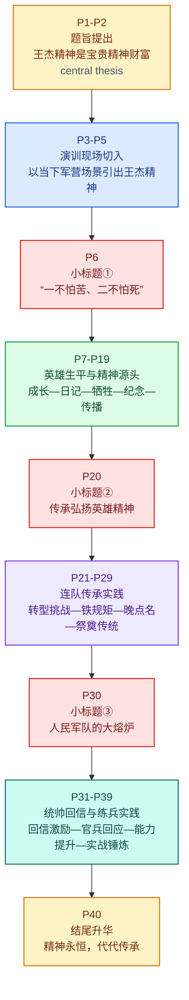

# 王杰精神永远是我们的宝贵精神财富

## 来源与元数据

- **标题**：王杰精神永远是我们的宝贵精神财富  
- **来源**：《人民日报》  
- **日期**：2021年11月26日 · 07版 · 栏目「中国共产党人的精神谱系」  
- **编辑/栏目**：理论 / 党史学习教育  
- **版面与署名**：本报电子版未单列作者署名，显示**本版统筹：徐隽**；同题扩展稿见《人民日报海外版》2021年11月29日第05版，署名**徐隽、刘博通**。  
- **作者/编务（检索摘要）**  
  - **徐隽**：公开可核署名显示，长期在人民日报系统从事评论、人物与要闻相关采写或编务。  
  - **刘博通**：公开可核署名显示，为人民日报系统记者，参与要闻、国防、评论等报道。  
  - 就本文而言，2021年11月26日《人民日报》版面稿更接近专题统筹稿；海外版同题稿提供更明确记者署名。  
- **原文与参阅链接**  
  - [人民日报电子版（07版）](https://paper.people.com.cn/rmrb/html/2021-11/26/nw.D110000renmrb_20211126_1-07.htm)（与 frontmatter `source_url` 一致）  
  - [人民网·中国共产党新闻网转载](https://cpc.people.com.cn/n1/2021/1126/c64387-32292366.html)  
  - [人民日报电子版 WAP 入口（07版）](https://paper.people.com.cn/rmrbwap/html/2021-11/26/nw.D110000renmrb_20211126_1-07.htm)  
  - [当日第07版版面目录](https://paper.people.com.cn/rmrbwap/html/2021-11/26/nbs.D110000renmrb_07.htm)  
  - [《人民日报海外版》同题稿](https://paper.people.com.cn/rmrbhwb/html/2021-11/29/content_25891050.htm)  

## 文章结构脉络图

1. **核心导引（第1–2段）**  
   - 引用习主席重要论述：王杰精神的地位与时代价值。  
2. **场景切入（第3–5段）**  
   - 现地描绘：第71集团军某合成旅考核现场。  
   - 引入主体：“王杰班”的优异表现及其历史渊源。  
3. **历史溯源：一不怕苦、二不怕死（第6–18段）**  
   - 视察背景：2017年习主席视察第71集团军。  
   - 英雄生平：王杰入伍经历、荣誉记录及日记感悟。  
   - 壮烈牺牲：1965年舍己救人的英勇事迹。  
   - 精神沉淀：入党愿望的达成与荣誉室的教育意义。  
4. **实践维度：“三不伸手”与时代转型（第19–30段）**  
   - 纪律标尺：“三不伸手”的镜子作用。  
   - 转型挑战：工兵班向装甲步兵班的跨越式转变。  
   - 连队传统：晚点名呼唤、整理床铺、烈士陵园祭奠。  
5. **统帅关怀与强军实践（第31–42段）**  
   - 统帅回信：2019年习主席回信的激励作用。  
   - 练兵动力：官兵将关怀转化为备战动能（如战士徐彬）。  
   - 实战检验：西北戈壁演训与“互换战位”能力。  
   - 总结升华：王杰精神在全军范围内的永恒价值。  

### 叙事流程（Mermaid）

### 结构速览（对照阅读）

- 前半部分先用「实弹射击考核」制造现场感，再回到「王杰生平」与「精神原点」。  
- 中段重点写「王杰班」如何把精神转化为制度、训练与作风。  
- 后半部分写习主席回信带来的持续激励，以及练兵备战中的现实成果。  
- 结尾把个体英雄精神上升为「人民军队代代传承的精神谱系」。  

---

## 中文批注精读

**【原文】** 王杰精神过去是、现在是、将来永远是我们的宝贵精神财富，要学习践行王杰精神，让王杰精神绽放新的时代光芒。——习近平主席2017年12月在第71集团军视察时强调

> **【注释解析】**
> *   **第71集团军**：隶属于**中国人民解放军东部战区陆军**，军部驻地为江苏省徐州市。该军由原第12集团军等部队为基础调整组建，历史悠久，战功卓越。
> *   **绽放 (Blossom/Radiate)**：原指花开，此处比喻精神在新的历史条件下展现出旺盛的生命力和感召力。
> *   **金句积累**：王杰精神过去是、现在是、将来永远是我们的宝贵精神财富。

**【原文】** 铁甲轰鸣，硝烟弥漫。皖北某训练场，第71集团军某合成旅组织装甲分队跨昼夜实弹射击考核。

> **【注释解析】**
> *   **皖北 (Northern Anhui)**：指安徽省淮河以北地区，地形平坦，多为平原，是重要的军事演练场所。
> *   **合成旅 (Combined Arms Brigade)**：中国陆军编制改革后的重要作战单元，将步兵、装甲、炮兵、防空等多个兵种整合，实现**模块化 (Modularization)**协同作战。

**【原文】** “全车注意！冲击！”战车轰鸣而动，向射击地域发起冲击。行进间，各乘员密切协同，一发发炮弹精准命中目标靶。“王杰班”打出了满堂彩，赢得官兵们的阵阵欢呼。

> **【注释解析】**
> *   **满堂彩 (A round of applause from the whole house)**：原为戏曲术语，此处指表现极其优异，赢得全场喝彩。
> *   **近义词辨析**：**满堂彩**（强调全场反应） vs **开门红**（强调初始顺利）。

**【原文】** “王杰班”是伟大的共产主义战士王杰同志生前所在班，王杰同志用生命践行的“一不怕苦、二不怕死”精神穿越时空、历久弥新，不断激励广大官兵奋勇前行。

> **【注释解析】**
> *   **一不怕苦、二不怕死 (Fear neither hardship nor death)**：这是王杰精神的核心，也是解放军战斗精神的高度概括，体现了革命军人的**血性胆魄**。
> *   **历久弥新 (Ever-lasting and even fresher with time)**：经历时间长久反而更加鲜活。

> **【编者注】** 紧接上一段，正文再次完整引用习主席同段论述以承上启下；此处不重复单列「原文」，避免与篇首引语机械重复。下条「原文」从理论小标题起。

**【原文】** 一不怕苦、二不怕死是血性胆魄的生动写照

> **【注释解析】**
> *   **血性 (Grit/Spirit)**：指勇猛、刚强、不屈的性格，是现代军魂的重要组成部分。

**【原文】** 淮海大地，沃野千里。2017年12月13日，习主席来到第71集团军某旅，首先看望了王杰同志生前所在连官兵。习主席详细了解王杰同志一不怕苦、二不怕死的事迹，动情地讲，一不怕苦、二不怕死是血性胆魄的生动写照，要成为革命军人的座右铭。

> **【注释解析】**
> *   **淮海大地 (Huaihai region)**：地理概念，通常指以徐州为中心的苏鲁豫皖交界地区，即著名的**淮海战役**发生地。
> *   **座右铭 (Motto/Maxim)**：写在座位旁边提醒自己的铭文，比喻作为准则的话。

**【原文】** 王杰同志，1942年出生，山东省金乡县人。他从小就崇尚英雄，1961年8月，他放弃了读高中的机会应征入伍，被分配到当时的济南军区装甲师某部工兵营1连。

> **【注释解析】**
> *   **金乡县**：隶属于山东省济宁市，是著名的英雄家乡。
> *   **济南军区 (Jinan Military Command)**：原中国人民解放军七大军区之一，2016年改革后其职能由中部战区和北部战区等承接。
> *   **工兵 (Engineers)**：负责开路、架桥、排雷等工程保障任务的兵种。

**【原文】** 入伍后，王杰同志很快加入了共青团，并连续3年被评为“五好战士”，两次荣立三等功。

> **【注释解析】**
> *   **“五好战士”**：特定历史时期的荣誉称号，指思想好、技术好、作风好、体育好、勤俭节约好。

**【原文】** 当兵4年，王杰同志写下了300多篇、总计超10万字的心得日记。这些日记真实记录了英雄成长的心路历程——

> **【注释解析】**
> *   **心路历程 (Mental journey/Psychological course)**：指思想或感情发展变化的过程。

**【原文】** “什么是理想？革命到底就是理想。什么是前途？革命事业就是前途。什么是幸福？为人民服务就是幸福。”

> **【注释解析】**
> *   **金句积累**：王杰的三句式自问自答，深刻诠释了正确的**人生观、价值观、利益观**。

**【原文】** “为了党，我不怕进刀山入火海；为了党，哪怕粉身碎骨我也甘心情愿。”

> **【注释解析】**
> *   **粉身碎骨 (Being crushed to pieces)**：身体粉碎，比喻为了某种目的牺牲生命。**反义词**：苟且偷生。

**【原文】** “我们要‘一不怕苦、二不怕死’，做一个大无畏的人。”

**【编者注】** 此处报纸正文省略部分日记摘录，笔记从略。

**【原文】** 他是这么写的，也是这么做的。1965年7月，王杰同志在组织民兵训练时突遇炸药包意外爆炸。危急关头，年仅23岁的他为保护在场的12名民兵和人民武装干部的安全，用身体扑向炸药包，挽救了其他人的生命，而他自己却壮烈牺牲。

> **【注释解析】**
> *   **民兵 (Militia)**：不脱离生产的群众武装组织，是中国武装力量的重要组成部分。
> *   **英雄壮举背景**：1965年7月14日，王杰在江苏邳县（现邳州市）运河镇实地辅导民兵爆破。

**【原文】** 王杰同志生前曾14次向组织递交入党申请书，写下“在荣誉上不伸手，在待遇上不伸手，在物质上不伸手”，工作干劲始终高涨。王杰同志牺牲后，根据他生前愿望，所在部队党委追认他为中国共产党党员。1965年，他生前所在的班被命名为“王杰班”。

> **【注释解析】**
> *   **“三不伸手” (Three Not Reaching Out)**：是党员干部修身律己的高尚境界，体现了无私奉献的品格。
> *   **追认 (Posthumously recognize/Posthumously admit)**：指在一个人去世后，根据其生前表现给予某种称号或资格。

**【原文】** 在“王杰班”所在连荣誉室，王杰同志牺牲时遗留的血衣和钢笔残片，一页页泛黄的日记，一幅幅珍贵的照片，记录着他在平凡岗位上的不平凡事迹。官兵们来到这里，缅怀王杰同志，从老班长的经历中汲取奋进力量。

> **【注释解析】**
> *   **汲取 (Derive/Absorb)**：原指吸取水分，此处比喻获取知识、力量等。

**【原文】** “王杰精神永远是我们宝贵的精神财富。我们一定牢记习主席嘱托，大力弘扬王杰精神，把王杰精神融入血液，担当强军重任，用实际行动让王杰精神绽放新的时代光芒。”“王杰班”班长黄龙说。

**【原文】** 王杰同志舍生忘死扑向炸药包，用生命践行了“一不怕苦、二不怕死”的铿锵誓言。半个多世纪以来，他的光荣事迹广泛流传，英雄精神代代传承。1968年，王杰同志的出生地改名为王杰村。如今，王杰广场、王杰中学、王杰班、王杰少先队、王杰示范岗……无论在军营还是在地方，王杰精神正发扬光大。

> **【注释解析】**
> *   **舍生忘死 (Disregard for one's own life)**：不顾生命危险，形容极其勇敢。
> *   **铿锵 (Clanging/Resonant)**：形容声音响亮有力。

**【原文】** 传承弘扬英雄精神，争当新时代王杰式好战士

**【原文】** 习主席指出，王杰“在荣誉上不伸手，在待遇上不伸手，在物质上不伸手”，这“三不伸手”是一面镜子，共产党员都要好好照照这面镜子。

> **【注释解析】**
> *   **易混淆词辨析**：**待遇**（一般指报酬、福利） vs **礼遇**（指尊重的待遇）。

**【原文】** 长期以来，王杰同志生前所在连队官兵继承王杰老班长遗志，铸牢铁心跟党走的坚定信念，锻造能打胜仗的过硬本领，锤炼英勇顽强的战斗作风，将王杰精神熔铸进血脉、代代赓续，留下一串串闪亮的足迹。

> **【注释解析】**
> *   **赓续 (Continue)**：继续，多用于事业、传统、血脉的延续。**近义词**：接续、绵延。

**【原文】** 2017年4月，“王杰班”由工兵班调整组建为装甲步兵班，同时又要换装新型两栖步兵战车，这给“王杰班”的官兵带来全新挑战。全班战士面向王杰老班长的雕塑，立下铮铮誓言：一定不会愧对王杰传人的荣誉，再苦再难也要迈过转型这道坎。聚焦转型，全班立下3条“铁规矩”：训练时间一秒不能少，规定内容一个不能落，训练强度一点不能降。

> **【注释解析】**
> *   **两栖步兵战车 (Amphibious Infantry Fighting Vehicle, AIFV)**：既能在陆地行驶又能在水上浮渡、进行作战任务的装甲战斗车辆。
> *   **铮铮誓言 (Clanging oath)**：形容誓言极其坚定、有力。

**【原文】** 自那时起，“王杰班”战士每天早晨5点起床训练。在野外训练场，全班坚持像当年王杰同志“专拣坚硬的坦克道挖雷坑”一样苦练硬功，坚持训练进度比人快一步，训练强度比人高一分，训练难度比人大一些。

**【原文】** 苦心人，天不负。列装不足百天，“王杰班”在新装备首次实弹射击中，首发命中、发发命中。

> **【注释解析】**
> *   **用典**：**苦心人，天不负**。出自清代蒲松龄自勉联：“有志者事竟成，破釜沉舟，百二秦关终属楚；苦心人天不负，卧薪尝胆，三千越甲可吞吴。”强调刻苦努力终会成功。

**【原文】** “王杰。”“到！”

**【原文】** 王杰同志生前所在连队每天晚点名时，呼点的第一个名字永远是“王杰”。

**【原文】** 走进“王杰班”，王杰同志生前的床铺依然保持着原样。50多年来，历任“王杰班”班长每天晚上都要把老班长的被子打开，清晨再把被子工工整整叠好。对大家来说，这既是一种纪念和敬仰，也是一种传承和激励。

> **【注释解析】**
> *   **晚点名 (Evening roll call)**：部队一日生活制度，检查人数、点评当日工作、部署次日任务。此处的特殊呼唤体现了英雄精神的**永存性 (Perpetuity)**。

**【原文】** 今年是王杰同志牺牲56周年，为缅怀王杰同志，王杰生前所在连官兵来到王杰同志长眠地——江苏邳州王杰烈士陵园祭奠他。这是连队坚持了50多年的传统。在英雄长眠的地方，官兵们组织出操、纪念仪式、参观见学、座谈交流等活动，深刻缅怀王杰同志，感悟王杰精神。

> **【注释解析】**
> *   **时间语境**：按见报日期 **2021-11-26**，文中「今年」指 **2021 年**（王杰牺牲于 1965 年，至见报年为 56 周年）。  
> *   **邳州 (Pizhou)**：江苏省辖县级市，由徐州市代管。王杰烈士陵园位于此地，是全国爱国主义教育示范基地。

**【原文】** 连长刘新清代表全连官兵许下坚定誓言：“在强军兴军伟大征程上，我们要接过王杰老班长手中的钢枪，学习践行‘一不怕苦、二不怕死’精神，争做新时代王杰式好战士。”

**【原文】** 在人民军队的大熔炉中书写火热的青春篇章

> **【注释解析】**
> *   **大熔炉 (Great melting pot/Great furnace)**：比喻能使人在思想、品德、技术等方面经受锻炼而迅速成长的环境。

**【原文】** 2019年1月，习主席给“王杰班”全体战士回信，勉励他们好好学习、坚定信念、苦练本领、再创佳绩，努力做新时代的好战士，在人民军队的大熔炉中书写火热的青春篇章，并向战士们和战士们的家人致以新春祝福。

**【原文】** 统帅牵挂士兵，士兵想念统帅，统帅与士兵心连心。此前，“王杰班”全体战士满怀深情给习主席写信，汇报他们一年多来工作、学习和个人成长进步等方面情况，表达牢记习主席嘱托，砥砺奋进、再创佳绩的决心和态度。

> **【注释解析】**
> *   **砥砺 (Temper/Hone)**：磨炼，如“砥砺意志”、“砥砺锋芒”。

**【原文】** 收到习主席回信的那天，“王杰班”全体官兵激动得难以入眠。官兵们纷纷表示，一定要坚决听习主席的话、自觉做英雄传人，继续取得新的成绩。

**【原文】** “全旅上下将习主席的亲切关怀转化为练兵备战的动力源泉，通过学习讨论、专题授课、‘十学王杰’等活动，深入贯彻落实习近平强军思想。”时任“王杰班”所在旅政委张振东说。

> **【注释解析】**
> *   **习近平强军思想 (Xi Jinping Thought on Strengthening the Military)**：中国共产党在新时代的强军指导思想，核心是**听党指挥、能打胜仗、作风优良**。

**【原文】** “生死有些沉重，但军人必须敢说，一旦有需要，我也会像老班长那样奋不顾身……”“王杰班”战士徐彬在给家人的信中这样写道。第二天，旅里组织新装备水上驾驶训练。该课目有一定危险性。徐彬向连队提交申请书，争取到了头车。

> **【注释解析】**
> *   **奋不顾身 (Disregard of one's own safety)**：为了正义事业不顾及个人安危。
> *   **头车 (Lead vehicle)**：车队中的第一辆车，在训练和实战中风险往往最高，也最考验胆识。

**【原文】** 习主席的亲切勉励，成为“王杰班”战士练兵的不竭动力。如今，“王杰班”成员人人掌握步战车驾驶、射击、通信三大专业内容，个个能熟练使用装甲步兵的10余种打击武器，实现了所有战位任意互换的目标，确保了战场环境下的持久战斗力，成果在全旅推广。

> **【注释解析】**
> *   **战位互换 (Position swapping)**：现代战争对全能型战士的需求，确保个别乘员战损时，战车仍能发挥战斗效能。

**【原文】** 风沙滚滚，炮声隆隆。今年夏天，第71集团军某旅炮兵分队转战千里，奔赴西北戈壁遂行演训任务，锤炼火力打击能力。

> **【注释解析】**
> *   **时间语境**：同上，「今年夏天」在见报语境中指 **2021 年夏季**。  
> *   **遂行 (Carry out/Execute)**：军事用语，指执行任务、命令。
> *   **西北戈壁 (Northwest Gobi)**：泛指中国西北干旱、多砾石的荒漠地区，气候恶劣，是极佳的实战化演兵场。

**【原文】** 阵地上，一声令下，炮兵分队迅即向指定区域进发，一发发炮弹呼啸而出，精准覆盖目标区域。从黎明奋战到深夜，部队连续作战长达20余小时，充分检验了官兵战斗作风和指挥能力。

**【原文】** 时刻准备上战场，时刻准备洒热血，时刻准备打胜仗。如今，该旅战士把“能打胜仗”内化为一种高度自觉，使挑战自我练、主动加压练、自找苦吃练成为一种习惯，把每一次走上训练场都当作提高打仗本领的难得机遇，在千锤百炼的熔铸中，一把把“尖刀”锋芒愈发锐利。

> **【注释解析】**
> *   **千锤百炼 (Thoroughly tempered)**：比喻经历多次艰苦斗争的锻炼和考验。
> *   **内化 (Internalize)**：指将外部的要求、精神通过认知和体验转变为自身稳固的性格或自觉的习惯。

**【原文】** 时光流逝，精神永恒。大江南北、长城内外的座座军营，一代代革命军人用王杰精神凝神聚魂、精武强能，许下铮铮誓言，积极练兵备战，砥砺胜战本领，在人民军队的大熔炉中书写火热的青春篇章。

> **【注释解析】**
> *   **大江南北、长城内外**：泛指全中国。
> *   **凝神聚魂 (Concentrating spirit and soul)**：指凝聚战斗精神，铸就军魂。
> *   **高阶表达**：书写火热的青春篇章。

---

## 逐句中英精读

以下接续同一篇《人民日报》正文，补充**逐句英译**与**词汇扩展**；与上文「中文批注精读」内容重叠处为有意保留，便于中英对照。译文中对「今年」「今年夏天」等表述按见报年份（**2021**）作具体化处理。

### 题旨引语

🔸 王杰精神过去是、现在是、将来永远是我们的`宝贵精神财富`，/要学习践行王杰精神，/让王杰精神绽放新的时代光芒。
🔹 The spirit of Wang Jie has been, is, and will always remain our `precious spiritual asset`; we must study it and `put it into practice` so that it may `shine with renewed brilliance` in the new era.

注：`王杰`（1942—1965）是中国人民解放军战士，通常与“一不怕苦、二不怕死”精神联系在一起；`精神财富`是政治话语、评论写作中常见的抽象表达，强调可传承、可滋养、可转化的价值资源。

> **`spiritual asset` 精神财富** /ˈspɪrɪtʃuəl ˈæset/ n. *an intangible but lasting source of value, strength, or inspiration* 无形但持久的价值与精神资源。语域：正式、评论、政治叙述。
> 画龙点睛：比 `wealth` 更强调“可积累、可继承、可发挥作用”的属性。写作中常与 `legacy / heritage / resource` 形成近义替换；表达“宝贵精神财富”时，`precious spiritual asset` 比生硬直译更地道。

> **`put ... into practice` 践行；付诸实践** /pʊt ... ˈɪntuː ˈpræktɪs/ phr. *to apply an idea, principle, or belief in real life* 把理念真正落实到行动中。语域：正式、通用。
> 画龙点睛：非常适合写作，常搭配 `principle / teaching / policy / belief`。和 `implement` 相比，更强调“从认知到行动”的转化过程。

🔸 ——习近平主席`2017年12月`在`第71集团军`视察时强调
🔹 —President Xi Jinping, emphasizing this point during an `inspection` of the `71st Group Army` in December 2017.

注：`第71集团军`是中国人民解放军陆军集团军序列单位之一。此处是引语出处说明句，常见于新闻报道的题记部分。

> **`inspection` 视察；巡视** /ɪnˈspekʃən/ n. *an official visit to examine, review, or supervise* 官方视察、检查。语域：新闻、正式、行政。
> 画龙点睛：`inspection` 既可用于工厂、学校，也可用于军队、机构；搭配常见 `conduct an inspection / during an inspection visit`。

---

### 开篇场景

🔸 `铁甲轰鸣`，/`硝烟弥漫`。
🔹 Armored vehicles `roared`, and the air was thick with `gunsmoke`.

注：这是典型新闻特写式开头，用两个四字短语迅速建立战场化、实战化氛围。

> **`gunsmoke` 硝烟** /ˈɡʌnˌsmoʊk/ n. *smoke produced by gunfire or explosions* 枪炮射击或爆炸后的烟雾。语域：军事、文学、新闻。
> 画龙点睛：比普通 `smoke` 更具军事感、画面感；在英语写作中常和 `battlefield / roar / shell / artillery` 连用。

🔸 皖北某训练场，/第71集团军某合成旅/组织装甲分队/`跨昼夜实弹射击考核`。
🔹 At a training ground in northern Anhui, a `combined-arms brigade` under the 71st Group Army organized a `round-the-clock live-fire evaluation` for an armored detachment.

注：`皖北`即安徽北部；`合成旅`对应现代军队中多兵种协同作战的 brigade 级作战单位；`跨昼夜`体现高强度、连续性训练。

> **`combined-arms brigade` 合成旅** /kəmˌbaɪnd ˈɑːrmz brɪˈɡeɪd/ n. *a brigade integrating different combat arms for coordinated operations* 多兵种协同的一体化旅级部队。语域：军事。
> 画龙点睛：`combined arms` 是重要军事术语，体现“协同作战”。阅读军政新闻时，看到 `combined-arms` 往往意味着现代化、模块化、联合作战能力。

> **`live-fire evaluation` 实弹考核** /ˌlaɪv ˈfaɪər ɪˌvæljuˈeɪʃən/ n. *an assessment conducted with real ammunition* 使用真实弹药进行的测试或考核。语域：军事、新闻。
> 画龙点睛：`live-fire drill / exercise / test / evaluation` 是一组高频搭配，考试和翻译中都值得积累。

🔸 “全车注意！冲击！”/战车轰鸣而动，/向射击地域发起冲击。
🔹 “All crew, attention! `Charge!`” The combat vehicle lunged forward with a thunderous roar, surging toward the firing area.

注：此处把直接引语嵌入叙事，增强临场感。`射击地域`是军事训练中的专业表述。

> **`charge` 冲击；突击** /tʃɑːrdʒ/ v. *to rush forward in attack* 向前猛冲、发起冲击。语域：军事、正式。
> 画龙点睛：`charge` 可作名词也可作动词。作动词时常见于战场、运动、情绪描写；比 `rush` 更有“带目标、带攻势”的色彩。

🔸 行进间，/各乘员密切协同，/一发发炮弹精准命中目标靶。
🔹 `On the move`, the crew members coordinated closely, and round after round struck the targets `with precision`.

注：`行进间`说明并非静止射击，而是动态条件下完成打击任务，训练难度明显更高。

> **`on the move` 在行进中；在移动状态下** /ɑːn ðə muːv/ phr. *while moving rather than staying still* 在移动过程中。语域：通用、军事、新闻。
> 画龙点睛：既可用于军队，也可用于商业和日常语境，如 `learn on the move`。这里体现动态射击的高难度。

🔸 “王杰班”/打出了`满堂彩`，/赢得官兵们的阵阵欢呼。
🔹 The “Wang Jie Squad” delivered a `flawless performance`, drawing wave after wave of cheers from officers and soldiers.

注：`王杰班`是英雄生前所在班，此处开始把现实训练成绩与英雄精神传承连接起来。

> **`flawless performance` 表现极佳；满堂彩** /ˈflɔːləs pərˈfɔːrməns/ n. *a performance with no noticeable mistakes and strong impact* 近乎无可挑剔的表现。语域：通用、新闻、评价。
> 画龙点睛：比单纯 `good result` 更有表现力；可用于比赛、演讲、考试、任务执行等多种场景。

🔸 “王杰班”是伟大的共产主义战士王杰同志生前所在班，/王杰同志用生命践行的`“一不怕苦、二不怕死”精神`/穿越时空、历久弥新，/不断激励广大官兵奋勇前行。
🔹 The “Wang Jie Squad” is the squad where Wang Jie, the great communist soldier, once served. The spirit of `fearing neither hardship nor death`, which Wang Jie embodied with his life, has `transcended time`, remained ever fresh, and continually inspired countless service members to press ahead courageously.

注：`一不怕苦、二不怕死`是理解全文的核心精神口号；`穿越时空、历久弥新`属于评论和纪念类文章中的高频表达。

> **`transcend time` 穿越时空；超越时代局限** /trænˈsend taɪm/ phr. *to remain meaningful across different times* 跨越时代仍有意义。语域：正式、评论、纪念叙事。
> 画龙点睛：适合写人物精神、经典作品、制度价值。可扩展为 `transcend generations / borders / circumstances`。

🔸 习近平主席强调，/王杰精神过去是、现在是、将来永远是我们的宝贵精神财富，/要学习践行王杰精神，/让王杰精神绽放新的时代光芒。
🔹 President Xi emphasized that the spirit of Wang Jie has been, is, and will always remain our precious spiritual asset, and that it must be studied and practiced so it may glow with fresh brilliance in the new era.

注：这一句再次点题，形成“开篇—场景—回扣主旨”的新闻结构闭环。

> **`emphasize` 强调** /ˈemfəsaɪz/ v. *to give special importance to something* 着重指出、强调。语域：通用、正式、新闻。
> 画龙点睛：写作中可替换 `stress / underscore / highlight`。若搭配 that 从句，特别适合议论文与新闻引述。

---

### 小标题一

🔸 `一不怕苦、二不怕死`/是`血性胆魄`的生动写照
🔹 “Fear neither hardship nor death” is a vivid embodiment of `courage and fighting spirit`.

注：这是小标题句，起到概括后文、统领材料的作用。`血性胆魄`在军事语境中强调勇气、意志和敢战精神。

> **`embodiment` 体现；化身** /ɪmˈbɑːdimənt/ n. *a concrete expression of an idea or quality* 某种精神、品质的具体体现。语域：正式、评论。
> 画龙点睛：常见搭配 `a vivid embodiment of ...`。写作中用于“某人/某事是某种品质的体现”非常自然。

---

### 英雄生平与精神源头

🔸 淮海大地，/沃野千里。
🔹 Across the Huaihai region stretch vast expanses of `fertile land`.

注：`淮海`一般指江苏、山东、安徽、河南交界一带的区域概念。此句是典型散文化新闻笔法，用地理画面导入历史叙述。

> **`fertile` 肥沃的** /ˈfɜːrtl/ adj. *able to produce abundant crops or results* 肥沃的；也可引申为“富有成效的”。语域：通用、书面。
> 画龙点睛：既能修饰 `land / soil`，也能用于抽象搭配如 `fertile imagination`。熟词多义要注意。

🔸 `2017年12月13日`，/习主席来到第71集团军某旅，/首先看望了王杰同志生前所在连官兵。
🔹 On `December 13, 2017`, President Xi visited a brigade under the 71st Group Army and first met officers and soldiers from the company where Wang Jie had once served.

注：这里给出明确日期，构成新闻事实锚点。`所在连`即王杰生前所属连队。

> **`officer and soldier` 官兵** /ˈɔːfɪsər ənd ˈsoʊldʒər/ n. *military personnel including both officers and enlisted soldiers* 泛指军中人员。语域：军事、新闻。
> 画龙点睛：中文“官兵”常整体表达，英译时多作复数 `officers and soldiers`，不要误译成单数或只译一半。

🔸 习主席详细了解/王杰同志一不怕苦、二不怕死的事迹，/动情地讲，/一不怕苦、二不怕死是血性胆魄的生动写照，/要成为革命军人的`座右铭`。
🔹 After learning in detail about Wang Jie’s deeds of fearing neither hardship nor death, he said with emotion that this spirit vividly embodied courage and resolve and should become the `maxim` of revolutionary soldiers.

注：`座右铭`原指放在座位右边用来自警的话，现泛指格言、箴言。

> **`maxim` 座右铭；格言** /ˈmæksɪm/ n. *a short statement expressing a rule of conduct or principle* 格言、行为准则。语域：正式、书面。
> 画龙点睛：比 `motto` 更偏“富含训诫意味的格言”；`motto` 更常见也更口语化。考试翻译中二者要能辨析。

🔸 王杰同志，/`1942年`出生，/山东省金乡县人。
🔹 Wang Jie was born in `1942` and hailed from Jinxiang County, Shandong Province.

注：`金乡县`位于山东济宁。人物介绍句常用“出生年份 + 籍贯”结构。

> **`hail from` 来自；出身于** /heɪl frəm/ phr. *to come from a particular place* 来自某地。语域：新闻、正式、口语皆可。
> 画龙点睛：比单纯 `be from` 略正式、更有书面色彩，人物介绍里十分常见。

🔸 他从小就崇尚英雄，/`1961年8月`，/他放弃了读高中的机会应征入伍，/被分配到当时的济南军区装甲师某部工兵营1连。
🔹 Admiring heroes from an early age, he gave up the chance to attend senior high school and `enlisted` in August 1961, later being assigned to the 1st Company of an `engineer battalion` under an armored division of the then Jinan Military Region.

注：`济南军区`是中国军改前的原大军区名称；`工兵营`即工程兵、工兵单位。

> **`enlist` 应征入伍** /ɪnˈlɪst/ v. *to join the armed forces voluntarily* 参军、应征入伍。语域：军事、正式。
> 画龙点睛：常见搭配 `enlist in the army / enlist as a soldier`。与 `conscription`（征兵、义务兵役）不同，`enlist` 更强调“加入”。

> **`engineer battalion` 工兵营** /ˌendʒɪˈnɪr bəˈtæliən/ n. *a military unit specializing in engineering tasks such as building, clearing, and demolition* 工程保障、爆破、架桥等任务单位。语域：军事。
> 画龙点睛：英语里的 `engineer` 在军事中常不是“工程师个人”，而是“工兵”这一兵种概念。

🔸 入伍后，/王杰同志很快加入了共青团，/并连续`3年`被评为“五好战士”，/两次荣立三等功。
🔹 After joining the army, Wang Jie soon entered the Communist Youth League, was named a “Five-Good Soldier” for three `consecutive` years, and was awarded third-class `merit` twice.

注：`共青团`即中国共产主义青年团；`三等功`是中国军队和相关系统的立功奖励等级之一。

> **`consecutive` 连续的** /kənˈsekjətɪv/ adj. *following one after another without interruption* 连续的。语域：正式、通用。
> 画龙点睛：高频考试词，常与 `days / years / wins / losses` 搭配。和 `continuous` 相比，更强调“一个接一个”。

> **`merit` 功绩；记功** /ˈmerɪt/ n. *deserved praise, reward, or recognition for good service* 功劳、荣誉上的嘉奖。语域：正式。
> 画龙点睛：在新闻翻译里，`荣立三等功`不宜硬译，可处理为 `was awarded third-class merit`，兼顾准确与可读性。

🔸 当兵`4年`，/王杰同志写下了`300多篇`、总计超`10万字`的心得日记。
🔹 During four years of service, Wang Jie wrote more than 300 `reflective diary entries` totaling over 100,000 Chinese characters.

注：数字密集出现，增强人物勤思善记、持续自我塑造的形象。

> **`reflective` 反思性的；心得式的** /rɪˈflektɪv/ adj. *showing careful thought about one’s experience* 带有思考、反省性质的。语域：书面、教育、写作。
> 画龙点睛：`reflective writing / reflective journal` 是英语学习与学术写作中的常见表达，值得迁移使用。

🔸 这些日记/真实记录了/英雄成长的`心路历程`——
🔹 These diaries faithfully recorded the hero’s `inner journey` of growth—

注：`心路历程`不是简单的“经历”，而是包含内心变化、思想成长轨迹的过程。

> **`inner journey` 心路历程** /ˈɪnər ˈdʒɜːrni/ n. *a process of inner emotional or spiritual development* 内心成长过程。语域：文学、评论、人物叙事。
> 画龙点睛：比机械直译 `mental path` 自然得多。写人类文章时可与 `growth / transformation / awakening` 搭配。

🔸 “什么是理想？/革命到底就是理想。/什么是前途？/革命事业就是前途。/什么是幸福？/为人民服务就是幸福。”
🔹 “What is an ideal? To `carry the revolution through to the end`—that is the ideal. What is a future? The revolutionary `cause` itself is the future. What is happiness? Serving the people is happiness.”

注：这组排比反问构成强烈的信念表达，也呈现出高度统一的价值判断。

> **`cause` 事业；崇高目标** /kɔːz/ n. *an aim, movement, or principle people devote themselves to* 事业、理想追求。语域：正式、政治、社会。
> 画龙点睛：`cause` 常用于带理想色彩的事业，如 `a just cause`。比 `career` 更强调公共性与使命感。

🔸 “为了党，/我不怕`进刀山入火海`；/为了党，/哪怕粉身碎骨我也甘心情愿。”
🔹 “For the Party, I fear neither `mountains of blades nor seas of fire`; for the Party, even if I were shattered to pieces, I would do so willingly.”

注：`刀山火海`是汉语夸张性成语，英译宜保留意象并兼顾可读性。

> **`willingly` 甘心情愿地** /ˈwɪlɪŋli/ adv. *readily and without reluctance* 心甘情愿地。语域：通用。
> 画龙点睛：写作中能很好表达“主动承担、毫不勉强”的态度；和 `voluntarily` 相比，更突出内心意愿。

🔸 “我们要`一不怕苦、二不怕死`，/做一个`大无畏`的人。”
🔹 “We must fear neither hardship nor death and become people of `utter fearlessness`.”

注：`大无畏`带有强烈精神褒义色彩，英译可用抽象名词强化气势。

> **`fearlessness` 无畏；勇敢无惧** /ˈfɪrləsnəs/ n. *the quality of having no fear in the face of danger or hardship* 无惧艰险的品质。语域：正式、文学、评论。
> 画龙点睛：比 `bravery` 更强调“无所畏惧”；可搭配 `moral fearlessness / fearless determination`。

🔸 …………
🔹 `[Ellipsis indicating omitted diary excerpts.]`

注：这里的省略号表示还有更多日记内容未展开，是新闻叙述中常见的“留白式”处理。

🔸 他是这么写的，/也是这么做的。
🔹 He wrote this way, and he acted this way too.

注：这是承上启下句，功能是把“日记中的信念”转接到“现实中的行动”。

> **`act` 行动；付诸实行** /ækt/ v. *to behave or take action in a particular way* 行动、实践。语域：通用。
> 画龙点睛：和前文 `write` 形成对照，最常见的地道表达就是 `say what you mean and act accordingly` 一类结构。

🔸 `1965年7月`，/王杰同志在组织民兵训练时/突遇炸药包意外爆炸。
🔹 In `July 1965`, Wang Jie was unexpectedly confronted with an accidental explosion of a `demolition charge` while organizing militia training.

注：`民兵`在中国语境中指地方武装群众组织；`炸药包`在军事语境中可灵活译作 demolition charge / explosive pack。

> **`demolition charge` 炸药包** /ˌdeməˈlɪʃən tʃɑːrdʒ/ n. *an explosive charge used for blasting or demolition* 用于爆破的炸药装置。语域：军事、工程。
> 画龙点睛：这是比笼统 `explosive` 更具体的说法，翻译军事细节时更专业。

🔸 `危急关头`，/年仅23岁的他/为保护在场的12名民兵和人民武装干部的安全，/用身体扑向炸药包，/挽救了其他人的生命，/而他自己却壮烈牺牲。
🔹 At the `critical moment`, only 23 years old, he threw himself onto the explosives to protect the 12 militiamen and local people’s armed cadres present, saving their lives while sacrificing his own heroically.

注：这是全文叙述的核心事件，`扑向炸药包`构成英雄牺牲的决定性动作。

> **`critical moment` 危急关头** /ˈkrɪtɪkəl ˈmoʊmənt/ n. *a decisive and dangerous point in time* 生死攸关的时刻。语域：新闻、叙事。
> 画龙点睛：`critical` 不仅是“批评的”，更常见的是“关键的、危急的”；阅读时务必辨析熟词义项。

🔸 王杰同志生前曾`14次`向组织递交入党申请书，/写下“在荣誉上不伸手，/在待遇上不伸手，/在物质上不伸手”，/工作干劲始终高涨。
🔹 During his lifetime, Wang Jie submitted 14 applications to join the Party and wrote the words, “Never reach out for honors, benefits, or material gains,” all the while maintaining `unflagging enthusiasm` for his work.

注：`三不伸手`是后文反复回扣的重要精神概括；`不伸手`并非字面“伸手”，而是“不向组织索取”。

> **`unflagging` 不减弱的；持续高昂的** /ʌnˈflæɡɪŋ/ adj. *showing no sign of weakening* 持续不衰的。语域：正式、书面。
> 画龙点睛：高质量写作词，常见搭配 `unflagging effort / interest / enthusiasm / determination`。

🔸 王杰同志牺牲后，/根据他生前愿望，/所在部队党委追认他为中国共产党党员。
🔹 After Wang Jie’s death, and in accordance with his wish during life, the Party committee of his unit `posthumously admitted` him into the Communist Party of China.

注：`追认`是正式组织语汇，表示在死后依据事实和意愿予以确认或授予。

> **`posthumously` 死后地；身后地** /ˈpɑːstʃəməsli/ adv. *after a person’s death* 在死后。语域：正式、新闻、历史。
> 画龙点睛：常与 `award / recognize / publish / admit` 连用，是人物报道和历史叙事高频词。

🔸 `1965年`，/他生前所在的班/被命名为“王杰班”。
🔹 In `1965`, the squad where he had served was named the “Wang Jie Squad.”

注：命名是纪念英雄、制度化传承记忆的常见方式。

> **`name ... after` 以……命名** /neɪm ... ˈæftər/ phr. *to give something the name of a person* 用某人名字命名。语域：通用。
> 画龙点睛：本句写作时可扩展成 `was named after Wang Jie`；比机械被动表达更自然。

🔸 在“王杰班”所在连荣誉室，/王杰同志牺牲时遗留的血衣和钢笔残片，/一页页泛黄的日记，/一幅幅珍贵的照片，/记录着他在平凡岗位上的不平凡事迹。
🔹 In the honor room of the company to which the “Wang Jie Squad” belongs, the bloodstained clothes and broken pen fragments left at his death, page after yellowed page of diaries, and one precious photograph after another all `testify to` his extraordinary deeds in an ordinary post.

注：`荣誉室`是军队、学校、单位常见的展陈空间；句中多个并列名词共同构成“实物证据链”。

> **`testify to` 证明；见证** /ˈtestɪfaɪ tuː/ phr. *to serve as evidence of something* 作为证据表明、见证。语域：正式、书面。
> 画龙点睛：非常适合写作，能把静态事物写活，如 `These documents testify to...`。

🔸 官兵们来到这里，/缅怀王杰同志，/从老班长的经历中`汲取奋进力量`。
🔹 Officers and soldiers come here to commemorate Wang Jie and `draw strength for progress` from the former squad leader’s life.

注：`缅怀`是纪念逝者的庄重用语；`汲取力量`是评论文、讲话文高频搭配。

> **`draw strength from` 从……汲取力量** /drɔː streŋθ frəm/ phr. *to gain motivation or courage from something* 从某事中获得力量。语域：正式、通用。
> 画龙点睛：可迁移到写作中，如 `draw strength from history / family / faith / failure`。

🔸 “王杰精神永远是我们宝贵的精神财富。
🔹 “The spirit of Wang Jie will always be our precious spiritual wealth.

注：这是引语上半句，强调精神传承的长期性。

> **`will always` 将永远** /wɪl ˈɔːlweɪz/ phr. *used to stress lasting truth or permanence* 强调持久不变。语域：通用。
> 画龙点睛：英语中用普通将来时也能表达“恒常判断”，不一定只表示未来时间。

🔸 我们一定牢记习主席嘱托，/大力弘扬王杰精神，/把王杰精神融入血液，/担当强军重任，/用实际行动让王杰精神绽放新的时代光芒。”
🔹 We will surely bear President Xi’s instructions in mind, vigorously carry forward Wang Jie’s spirit, let it `course through our blood`, shoulder the major task of building a strong military, and let that spirit shine with renewed radiance in the new era through concrete action.”

注：`融入血液`是高度形象化表达，表示内化到价值系统与行为本能之中。

> **`course through one’s blood` 融入血液；深入骨髓** /kɔːrs θruː wʌnz blʌd/ phr. *to become deeply internalized as part of one’s being* 深深内化。语域：文学、评论、演讲。
> 画龙点睛：比直译 `integrate into blood` 更自然；类似表达还有 `run in one’s blood`。

🔸 “王杰班”班长黄龙说。
🔹 This was said by Huang Long, squad leader of the “Wang Jie Squad.”

注：引语归属句。`班长`在此是军队班一级指挥员。

> **`squad leader` 班长** /skwɑːd ˈliːdər/ n. *the leader of a squad-level military unit* 班一级带兵骨干。语域：军事。
> 画龙点睛：不要和学校语境中的 `class monitor` 混淆；军队里的“班长”宜译 `squad leader`。

🔸 王杰同志`舍生忘死`扑向炸药包，/用生命践行了“一不怕苦、二不怕死”的`铿锵誓言`。
🔹 Risking death to save others, Wang Jie hurled himself onto the explosives and fulfilled with his life the `ringing vow` of fearing neither hardship nor death.

注：`铿锵誓言`强调誓言坚定有力、掷地有声。

> **`ringing vow` 铿锵誓言** /ˈrɪŋɪŋ vaʊ/ n. *a forceful and resonant pledge* 坚定有力的誓言。语域：文学、评论、演讲。
> 画龙点睛：`ringing` 本义“响亮的”，引申为“有力量、令人振奋的”；类似还有 `ringing endorsement`。

🔸 半个多世纪以来，/他的光荣事迹广泛流传，/英雄精神代代传承。
🔹 For more than half a century, his glorious deeds have been widely told, and his heroic spirit has been passed down from generation to generation.

注：现在完成时很适合翻译这种“从过去延续至今”的事实。

> **`pass down` 传承；传下去** /pæs daʊn/ phr. *to hand something on to later generations* 传递给后代。语域：通用。
> 画龙点睛：可用于文化、故事、价值、技艺等，非常高频，适合写作替代 `inherit`.

🔸 `1968年`，/王杰同志的出生地/改名为王杰村。
🔹 In `1968`, Wang Jie’s birthplace was renamed Wangjie Village.

注：地名更改体现纪念活动已经从部队扩展到地方社会。

> **`rename` 改名** /ˌriːˈneɪm/ v. *to give a new name to a place or thing* 重新命名。语域：通用、正式。
> 画龙点睛：名词形式 `renaming` 也很常见；可用于城市、机构、项目、文件等。

🔸 如今，/王杰广场、王杰中学、王杰班、王杰少先队、王杰示范岗……/无论在军营还是在地方，/王杰精神正`发扬光大`。
🔹 Today, Wang Jie Square, Wang Jie Middle School, the Wang Jie Squad, Wang Jie Young Pioneers groups, Wang Jie model posts, and more—whether in military camps or local communities—show that Wang Jie’s spirit is being `carried forward on an ever broader scale`.

注：`少先队`指中国少年先锋队；`示范岗`指标杆岗位、示范性工作岗位。

> **`carry forward` 发扬；弘扬** /ˈkæri ˈfɔːrwərd/ phr. *to preserve and develop something valuable* 继承并发扬。语域：正式、评论、演讲。
> 画龙点睛：比 `promote` 更强调“承继 + 发展”；常搭配 `tradition / spirit / fine style / legacy`。

---

### 小标题二

🔸 `传承弘扬英雄精神`，/争当新时代王杰式好战士
🔹 Carry forward the spirit of heroes and strive to become exemplary soldiers of the new era `in the mold of` Wang Jie.

注：`王杰式`不是字面“王杰风格的”，而是“以王杰为榜样、具有其精神特征的”。

> **`in the mold of` 以……为范型；照……的样子** /ɪn ðə moʊld əv/ phr. *formed in the style or pattern of someone* 按照某人榜样、类型。语域：正式、人物评论。
> 画龙点睛：非常适合写“某某式人物”；比简单 `like` 更有“范型、模范”意味。

🔸 习主席指出，/王杰“在荣誉上不伸手，/在待遇上不伸手，/在物质上不伸手”，/这“三不伸手”是一面镜子，/共产党员都要好好照照这面镜子。
🔹 President Xi pointed out that Wang Jie “never reached out for honors, benefits, or material comforts”; these “three never-seekings” are a `mirror` in which every Communist Party member should take a good look at himself or herself.

注：`一面镜子`是典型比喻，表示可资对照、反省、自警的标准。

> **`mirror` 镜子；借鉴对象** /ˈmɪrər/ n. *something that reflects or reveals what one should examine* 用来照见自身的参照物。语域：通用、评论。
> 画龙点睛：抽象义很常见，如 `history is a mirror`。写作中是高频修辞表达。

🔸 长期以来，/王杰同志生前所在连队官兵/继承王杰老班长遗志，/铸牢铁心跟党走的坚定信念，/锻造能打胜仗的过硬本领，/锤炼英勇顽强的战斗作风，/将王杰精神熔铸进血脉、代代赓续，/留下一串串闪亮的足迹。
🔹 For a long time, the officers and soldiers of Wang Jie’s former company have carried forward their old squad leader’s will, forged firm conviction in following the Party, developed solid skills for winning battles, tempered a brave and tenacious fighting style, and embedded Wang Jie’s spirit into their very bloodstream so that it is carried on from generation to generation, leaving behind a string of shining achievements.

注：这句典型“多动词并列推进”，层层递进：信念—能力—作风—传承—成果。

> **`temper` 锤炼；磨炼** /ˈtempər/ v. *to strengthen something through difficult experience or discipline* 通过磨炼使更坚强。语域：正式、文学、军事。
> 画龙点睛：`temper character / will / fighting style` 很高级；与金属锻造的本义有关，形象鲜明。

🔸 `2017年4月`，/“王杰班”由工兵班调整组建为装甲步兵班，/同时又要换装新型两栖步兵战车，/这给“王杰班”的官兵带来全新挑战。
🔹 In `April 2017`, the “Wang Jie Squad” was reorganized from an engineer squad into an armored infantry squad, and at the same time had to transition to a new type of amphibious infantry fighting vehicle, bringing brand-new challenges to its officers and soldiers.

注：`换装`是军事高频词，指换发、列装新装备；`两栖步兵战车`强调水陆两栖作战能力。

> **`transition to` 转入；过渡到** /trænˈzɪʃən tuː/ phr. *to change from one state or system to another* 转型、切换到新状态。语域：正式、通用、军事。
> 画龙点睛：可广泛用于制度、职业、技术、组织变革，是阅读和写作高频表达。

🔸 全班战士面向王杰老班长的雕塑，/立下`铮铮誓言`：/一定不会愧对王杰传人的荣誉，/再苦再难也要迈过转型这道坎。
🔹 Facing the statue of their former squad leader Wang Jie, all the soldiers made a `solemn vow`: they would never disgrace the honor of being Wang Jie’s successors, and no matter how hard it was, they would overcome the hurdle of transformation.

注：`愧对`表示“对不起、不配得”；`这道坎`比喻转型中的难关。

> **`solemn vow` 郑重誓言；铮铮誓言** /ˈsɑːləm vaʊ/ n. *a serious and formal promise* 郑重严肃的誓言。语域：正式、演讲、纪念叙事。
> 画龙点睛：`solemn` 是正式感很强的词，可替换普通的 `serious`，提升写作质感。

🔸 聚焦转型，/全班立下`3条“铁规矩”`：/训练时间一秒不能少，/规定内容一个不能落，/训练强度一点不能降。
🔹 With transformation as the focus, the squad laid down three `iron rules`: not one second less training time, not one required item omitted, and not the slightest drop in training intensity.

注：`铁规矩`强调刚性、不可违背。三项并列句式整齐有力。

> **`iron rule` 铁规矩** /ˈaɪərn ruːl/ n. *a strict rule that must not be violated* 非常严格、必须遵守的规则。语域：正式、新闻、管理。
> 画龙点睛：`iron` 在英语里常引申“坚硬、严格、不可动摇”，如 `iron discipline / iron will`。

🔸 自那时起，/“王杰班”战士每天早晨`5点`起床训练。
🔹 From then on, soldiers of the “Wang Jie Squad” got up at `5 a.m.` every morning to train.

注：时间数字突出训练的规律性与艰苦性。

> **`from then on` 从那时起** /frəm ðen ɑːn/ phr. *starting at that time and continuing afterward* 自此以后。语域：通用。
> 画龙点睛：叙事写作中非常好用，用于承接转折后的持续行动。

🔸 在野外训练场，/全班坚持像当年王杰同志“专拣坚硬的坦克道挖雷坑”一样苦练硬功，/坚持训练进度比人快一步，/训练强度比人高一分，/训练难度比人大一些。
🔹 At field training grounds, the whole squad persisted in `honing tough skills` just as Wang Jie once did when he deliberately chose the hardest tank tracks for digging mine pits; they kept their training a step faster, a notch more intense, and a bit more difficult than others’.

注：`专拣坚硬的坦克道挖雷坑`突出“主动找苦吃、主动提高难度”的训练精神。

> **`hone` 磨炼；打磨** /hoʊn/ v. *to sharpen or improve a skill through practice* 通过反复练习打磨技能。语域：正式、通用。
> 画龙点睛：比 `practice` 更高级，常见搭配 `hone skills / craft / ability / instinct`。

🔸 `苦心人，天不负`。
🔹 Heaven does not fail those who devote themselves wholeheartedly.

注：这是汉语格言式表达，强调付出终有回报。英译宜传意而非死译。

> **`devote oneself wholeheartedly` 全心投入** /dɪˈvoʊt wʌnˈself ˌhoʊlˈhɑːrtɪdli/ phr. *to put in one’s full effort and heart* 全身心投入。语域：正式、书面。
> 画龙点睛：写作中很适合表达“笃志、专注、苦干”的状态，比单独 `work hard` 更丰富。

🔸 列装不足百天，/“王杰班”在新装备首次实弹射击中，/`首发命中、发发命中`。
🔹 Less than one hundred days after being equipped with the new vehicle, the “Wang Jie Squad” achieved a `first-round hit` and then scored `a hit with every round` in its first live-fire test on the new equipment.

注：`列装`指装备正式列入部队使用；`首发命中、发发命中`极具口号感和战术成绩感。

> **`first-round hit` 首发命中** /fɜːrst raʊnd hɪt/ n. *a successful hit with the first shot* 第一发即命中。语域：军事。
> 画龙点睛：军事实战和射击报道中很有辨识度；可类推 `first-shot kill` 等表达。

🔸 “王杰。”
🔹 “Wang Jie.”

注：这是晚点名时呼点的姓名，极短句却极具仪式感。

> **`roll call` 点名** /roʊl kɔːl/ n. *the calling of names to check who is present* 点名。语域：学校、军队、组织管理。
> 画龙点睛：后文理解这一单句，关键就是联想到 `roll call` 场景。

🔸 “到！”
🔹 “Present!”

注：与前一句构成呼点应答，凸显英雄虽逝、精神“仍在列”。

> **`present` 到；在场** /ˈpreznt/ interj. *used to answer one’s name in roll call* 点名时答“到”。语域：正式、学校、军队。
> 画龙点睛：不要和形容词 `present`（目前的）混淆；点名应答时很典型。

🔸 王杰同志生前所在连队/每天晚点名时，/呼点的第一个名字/永远是“王杰”。
🔹 At evening roll call every day in the company where Wang Jie once served, the first name called is always “Wang Jie.”

注：`晚点名`是军队日常管理制度之一。这里把制度行为转化成纪念形式。

> **`evening roll call` 晚点名** /ˈiːvnɪŋ roʊl kɔːl/ n. *a nightly calling of names in military routine* 夜间点名。语域：军事。
> 画龙点睛：比单独 `roll call` 更具体；翻译制度场景时增加时间修饰更准确。

🔸 走进“王杰班”，/王杰同志生前的床铺/依然保持着原样。
🔹 Entering the “Wang Jie Squad,” one finds Wang Jie’s bed still kept `exactly as it was` during his lifetime.

注：`依然保持原样`强化“纪念的日常化、持续化”。

> **`exactly as it was` 仍旧原样** /ɪɡˈzæktli æz ɪt wəz/ phr. *in the same condition as before* 保持原先状态。语域：通用。
> 画龙点睛：这一表达很地道，可用于房间、习惯、制度、文物陈设等。

🔸 `50多年来`，/历任“王杰班”班长/每天晚上都要把老班长的被子打开，/清晨再把被子工工整整叠好。
🔹 For more than fifty years, every successive squad leader of the “Wang Jie Squad” has unfolded the old squad leader’s quilt each night and neatly folded it again at dawn.

注：`历任`表示“每一任、历届、 successive”；细节动作增强纪念传统的具体性。

> **`successive` 历任的；连续接替的** /səkˈsesɪv/ adj. *following one another in sequence* 一任接一任的。语域：正式。
> 画龙点睛：非常适合写“历任校长、历届政府、连续几任负责人”等。

🔸 对大家来说，/这既是一种纪念和敬仰，/也是一种传承和激励。
🔹 For everyone there, this is both an act of remembrance and reverence, and a form of inheritance and inspiration.

注：`既……也……`构成平衡句，突出了行为的双重意义。

> **`reverence` 敬仰；崇敬** /ˈrevərəns/ n. *deep respect mixed with admiration* 敬重、崇敬。语域：正式、文学。
> 画龙点睛：比 `respect` 感情色彩更强，更适合纪念、人物精神、宗教和仪式语境。

🔸 `今年是王杰同志牺牲56周年`，/为缅怀王杰同志，/王杰生前所在连官兵来到王杰同志长眠地——江苏邳州王杰烈士陵园祭奠他。
🔹 `2021 marked the 56th anniversary of Wang Jie’s death.` To honor him, officers and soldiers from the company where he once served came to his resting place—the Wang Jie Martyrs’ Cemetery in Pizhou, Jiangsu—to pay tribute.

注：文章刊于`2021年11月26日`，因此这里的“今年”需具体落实为`2021年`；`邳州`位于江苏省徐州代管区域。

> **`pay tribute` 祭奠；致敬** /peɪ ˈtrɪbjuːt/ phr. *to show respect and honor publicly* 表达敬意、悼念。语域：正式、纪念、新闻。
> 画龙点睛：极高频表达，可用于人物、纪念活动、艺术作品等多个领域。

🔸 这是连队坚持了`50多年`的传统。
🔹 This is a tradition the company has maintained for more than `fifty years`.

注：`坚持传统`不是被动保存，而是主动延续。

> **`maintain` 维持；保持；坚持延续** /meɪnˈteɪn/ v. *to keep something in existence or continue it* 维持、持续保持。语域：通用、正式。
> 画龙点睛：除“维护”外，还可表示“坚持某一传统、制度、关系”。

🔸 在英雄长眠的地方，/官兵们组织出操、纪念仪式、参观见学、座谈交流等活动，/深刻缅怀王杰同志，/感悟王杰精神。
🔹 At the place where the hero rests, officers and soldiers conduct drills, memorial ceremonies, visits and study tours, seminars and exchanges, and other activities to commemorate Wang Jie deeply and `reflect on` his spirit.

注：`长眠`是对逝者更庄重的说法；`感悟`比“理解”更强调体验式、情感化的领会。

> **`reflect on` 深思；体悟** /rɪˈflekt ɑːn/ phr. *to think carefully and seriously about something* 深入思考、体会。语域：通用、书面。
> 画龙点睛：学习写作里非常实用，常见于 `reflect on history / experience / lesson / spirit`。

🔸 连长刘新清代表全连官兵许下坚定誓言：/“在强军兴军伟大征程上，/我们要接过王杰老班长手中的钢枪，/学习践行‘一不怕苦、二不怕死’精神，/争做新时代王杰式好战士。”
🔹 Company commander Liu Xinqing, on behalf of all the officers and soldiers in the company, made a firm pledge: “On the great journey of building a strong military, we will take up the rifle from the hands of our old squad leader Wang Jie, learn and practice the spirit of fearing neither hardship nor death, and strive to become fine soldiers of the new era in the mold of Wang Jie.”

注：`接过钢枪`是象征性表达，表示接续使命、继承传统。

> **`pledge` 誓言；郑重承诺** /pledʒ/ n./v. *a serious promise or commitment* 誓言；郑重承诺。语域：正式、政治、仪式。
> 画龙点睛：既可作名词也可作动词，写作中比 `promise` 更庄重、更有分量。

---

### 小标题三

🔸 在人民军队的`大熔炉`中/书写火热的青春篇章
🔹 Write a blazing chapter of youth in the great `crucible` of the people’s army.

注：`大熔炉`比喻军队对人的锤炼、塑造与融合功能。

> **`crucible` 熔炉；锤炼人的严酷环境** /ˈkruːsɪbl/ n. *a severe test or place of intense transformation* 熔炉；严酷磨炼之地。语域：正式、文学、评论。
> 画龙点睛：高阶词。可写 `the crucible of war / hardship / reform / the military`，很适合提升写作层次。

🔸 `2019年1月`，/习主席给“王杰班”全体战士回信，/勉励他们好好学习、坚定信念、苦练本领、再创佳绩，/努力做新时代的好战士，/在人民军队的大熔炉中书写火热的青春篇章，/并向战士们和战士们的家人致以新春祝福。
🔹 In `January 2019`, President Xi wrote back to all the soldiers of the “Wang Jie Squad,” encouraging them to study hard, strengthen their convictions, hone their skills, achieve new success, strive to become fine soldiers of the new era, write a blazing chapter of youth in the great crucible of the people’s army, and extending New Year greetings to the soldiers and their families.

注：这是全文后半部分的重要时间节点；`回信`在中国新闻中常代表高度重视与政治激励。

> **`encourage` 勉励；鼓励** /ɪnˈkɜːrɪdʒ/ v. *to give support, confidence, or hope* 鼓励、激励。语域：通用、正式。
> 画龙点睛：比中文“勉励”更宽泛，但在正式叙述中完全可承载“鼓舞并寄予期望”的意义。

🔸 统帅牵挂士兵，/士兵想念统帅，/统帅与士兵`心连心`。
🔹 The commander-in-chief cares for the soldiers, the soldiers hold the commander-in-chief in affectionate remembrance, and they are `bound heart to heart`.

注：`心连心`是高度凝练的情感政治表达，强调双向情感联系。

> **`heart to heart` 心贴心；心连心地** /hɑːrt tə hɑːrt/ phr. *in close emotional understanding or connection* 心与心相连。语域：口语、文学、演讲。
> 画龙点睛：既可作副词短语，也能构成 `a heart-to-heart talk`。这里用作比喻性表达很自然。

🔸 此前，/“王杰班”全体战士满怀深情给习主席写信，/汇报他们一年多来工作、学习和个人成长进步等方面情况，/表达牢记习主席嘱托，/砥砺奋进、再创佳绩的决心和态度。
🔹 Before that, all the soldiers of the “Wang Jie Squad” had written to President Xi with deep feeling, reporting on their work, study, and personal growth over more than a year, and expressing their resolve to remember his instructions, forge ahead with determination, and win new achievements.

注：`砥砺奋进`是正式书面高频词组，强调在磨砺中前进。

> **`forge ahead` 砥砺奋进；奋勇向前** /fɔːrdʒ əˈhed/ phr. *to move forward with determination despite difficulty* 坚定前行。语域：正式、新闻、演讲。
> 画龙点睛：与 `push on` 相比更庄重有力，适合议论文和新闻翻译。

🔸 收到习主席回信的那天，/“王杰班”全体官兵激动得`难以入眠`。
🔹 On the day they received President Xi’s reply, all officers and soldiers of the “Wang Jie Squad” were so excited that they found it `hard to fall asleep`.

注：这是情绪结果句，口语化较强，增强真实感。

> **`find it hard to do` 难以做某事** /faɪnd ɪt hɑːrd tə duː/ phr. *to experience difficulty in doing something* 难以……。语域：通用。
> 画龙点睛：比机械 `cannot` 更细腻，常用于考试作文与阅读改写。

🔸 官兵们纷纷表示，/一定要坚决听习主席的话、/自觉做英雄传人，/继续取得新的成绩。
🔹 They all said they would resolutely follow President Xi’s words, consciously carry on the hero’s legacy, and continue to make new achievements.

注：`英雄传人`可理解为“精神继承者、传统接续者”。

> **`carry on` 继承并延续** /ˈkæri ɑːn/ phr. *to continue or preserve something* 延续、接续。语域：通用。
> 画龙点睛：这是极高频短语动词，意思很多；这里是“把某种事业/精神继续下去”，不要误解成“继续做（手头的事）”而已。

🔸 “全旅上下/将习主席的亲切关怀/转化为练兵备战的`动力源泉`，/通过学习讨论、专题授课、‘十学王杰’等活动，/深入贯彻落实习近平强军思想。”
🔹 “Throughout the brigade, we have turned President Xi’s cordial concern into a `wellspring of motivation` for training and war preparedness, and through study discussions, special lectures, and activities such as ‘Ten Ways of Learning from Wang Jie,’ we have thoroughly implemented Xi Jinping’s thinking on strengthening the military.”

注：`动力源泉`可直译为 source，但 `wellspring` 更有“源源不断涌出”的修辞色彩。

> **`wellspring` 源泉** /ˈwelsprɪŋ/ n. *an original and continuing source of something* 源头、源泉。语域：正式、文学。
> 画龙点睛：比 `source` 更形象，适合表达“精神动力源泉、创意源泉、力量之源”。

🔸 时任“王杰班”所在旅政委张振东说。
🔹 This was said by Zhang Zhendong, then political commissar of the brigade where the “Wang Jie Squad” was based.

注：`时任`对应 `then`；`政委`是军队政治委员职务。

> **`then` 当时的；时任的** /ðen/ adj. *holding a position at that particular time* 当时担任某职的。语域：新闻、正式。
> 画龙点睛：人物报道中非常常见，如 `then president / then mayor / then commander`。

🔸 “生死有些沉重，/但军人必须敢说，/一旦有需要，/我也会像老班长那样奋不顾身……”
🔹 “Life and death are weighty matters, but a soldier must dare to speak plainly: if the need arises, I too will `throw myself forward without hesitation`, just like our old squad leader...”

注：`奋不顾身`强调在关键时刻不顾个人安危。

> **`without hesitation` 毫不犹豫地** /wɪˈðaʊt ˌhezɪˈteɪʃən/ phr. *immediately and resolutely* 毫不迟疑地。语域：通用。
> 画龙点睛：常用于写决断、勇气、责任感，是作文中非常有用的加分表达。

🔸 “王杰班”战士徐彬/在给家人的信中/这样写道。
🔹 Xu Bin, a soldier of the “Wang Jie Squad,” wrote this in a letter to his family.

注：引语来源说明句。

> **`in a letter to` 在写给……的信中** /ɪn ə ˈletər tuː/ phr. *appearing in a letter addressed to someone* 在致某人的书信里。语域：通用。
> 画龙点睛：简单但实用，阅读和翻译中很高频。

🔸 第二天，/旅里组织新装备`水上驾驶训练`。
🔹 The next day, the brigade organized `water-driving training` on the new equipment.

注：这里的 `水上驾驶` 指装甲车辆等装备在水域中的驾驶训练。

> **`the next day` 第二天** /ðə nekst deɪ/ phr. *on the day following the one just mentioned* 次日。语域：通用、叙事。
> 画龙点睛：时间推进中常用，比重复写具体日期更流畅。

🔸 该课目/有一定危险性。
🔹 This training subject involved a certain degree of `risk`.

注：`课目`在军事训练中指具体训练项目。

> **`risk` 风险；危险性** /rɪsk/ n. *the possibility of danger or loss* 风险、危险。语域：通用。
> 画龙点睛：除了名词，`risk doing sth.` 也是高频结构，写作时很好用。

🔸 徐彬向连队提交申请书，/争取到了`头车`。
🔹 Xu Bin submitted an application to the company and won the chance to take the `lead vehicle`.

注：`头车`即编组中位于最前面的车辆，通常任务更重、风险更高。

> **`lead vehicle` 头车；前导车** /liːd ˈviːəkl/ n. *the vehicle moving at the front of a convoy or formation* 队伍最前面的车辆。语域：军事、交通。
> 画龙点睛：`lead` 这里读 /liːd/，表示“领头的”；不要和金属 `lead` /led/ 混淆。

🔸 习主席的亲切勉励，/成为“王杰班”战士练兵的`不竭动力`。
🔹 President Xi’s warm encouragement has become an `inexhaustible source of motivation` for the “Wang Jie Squad” soldiers in their training.

注：`不竭`强调持续不断、长期有效。

> **`inexhaustible` 不竭的；用不完的** /ˌɪnɪɡˈzɔːstəbl/ adj. *impossible to use up* 源源不断的、取之不尽的。语域：正式、书面。
> 画龙点睛：高级词，常与 `energy / enthusiasm / source / supply` 搭配。

🔸 如今，/“王杰班”成员人人掌握步战车驾驶、射击、通信三大专业内容，/个个能熟练使用装甲步兵的10余种打击武器，/实现了所有战位任意互换的目标，/确保了战场环境下的`持久战斗力`，/成果在全旅推广。
🔹 Today, every member of the “Wang Jie Squad” has mastered the three core specialties of infantry fighting vehicle driving, shooting, and communications; each can skillfully use more than ten kinds of armored-infantry strike weapons; they have achieved the goal of switching among all combat positions at will, ensuring `sustained combat capability` on the battlefield, and their results have been promoted throughout the brigade.

注：这是典型“能力清单式”新闻句，突出训练成果的系统性、可复制性。

> **`sustained combat capability` 持久战斗力** /səˈsteɪnd ˈkɑːmbæt ˌkeɪpəˈbɪləti/ n. *the ability to keep fighting effectively over time* 持续作战能力。语域：军事。
> 画龙点睛：`sustained` 在很多领域都表示“持续的”，如 `sustained growth / effort / attention`。

🔸 `风沙滚滚`，/炮声隆隆。
🔹 Windblown sand billowed, and artillery thundered.

注：再次以双短句制造实战化画面，与开头“铁甲轰鸣，硝烟弥漫”相呼应。

> **`thunder` 轰鸣；发出雷鸣般声音** /ˈθʌndər/ v. *to make a deep, loud sound* 发出轰隆巨响。语域：文学、新闻。
> 画龙点睛：动词化后很有画面感；写天气、炮火、掌声都能用。

🔸 `今年夏天`，/第71集团军某旅炮兵分队转战千里，/奔赴西北戈壁遂行演训任务，/锤炼火力打击能力。
🔹 `In the summer of 2021`, an artillery detachment from a brigade under the 71st Group Army traveled over a thousand miles to the northwestern Gobi to carry out training and exercise missions and sharpen its fire-strike capability.

注：结合文章发布日期，这里的“今年夏天”应落实为`2021年夏天`；`戈壁`即 Gobi desert / gobi region。

> **`sharpen` 锤炼；提升** /ˈʃɑːrpən/ v. *to improve and make more effective* 使更敏锐、更强。语域：通用、正式。
> 画龙点睛：除“削尖”外，还可表示“提高能力”，如 `sharpen skills / awareness / competitiveness`。

🔸 阵地上，/一声令下，/炮兵分队迅即向指定区域进发，/一发发炮弹呼啸而出，/精准覆盖目标区域。
🔹 At the position, once the order was given, the artillery unit moved swiftly toward the designated area, and shell after shell screamed out to `cover the target zone with precision`.

注：`一声令下`是条件状语，突出指挥—行动之间的高效联动。

> **`designated` 指定的** /ˈdezɪɡneɪtɪd/ adj. *officially chosen or specified* 指定的、划定的。语域：正式、通用、军事。
> 画龙点睛：常见搭配 `designated area / place / driver / route / authority`。

🔸 从黎明奋战到深夜，/部队连续作战长达`20余小时`，/充分检验了官兵战斗作风和指挥能力。
🔹 Fighting from daybreak until late at night, the unit conducted continuous operations for more than `twenty hours`, fully testing the troops’ combat style and command capability.

注：`检验`在这里不是书面考试意义，而是“在高强度环境中验证”。

> **`conduct` 开展；实施** /kənˈdʌkt/ v. *to carry out an activity or operation* 实施、进行。语域：正式、新闻。
> 画龙点睛：`conduct an operation / test / survey / experiment` 是极高频写作搭配。

🔸 时刻准备上战场，/时刻准备洒热血，/时刻准备打胜仗。
🔹 At all times ready to go to the battlefield, at all times ready to shed hot blood, at all times ready to win.

注：三个“时刻准备”形成强烈排比，节奏短促有力，具有口号式鼓动效果。

> **`at all times` 时刻；始终** /æt ɔːl taɪmz/ phr. *always; under all circumstances* 始终、随时。语域：正式、强调句。
> 画龙点睛：比 `always` 更有庄重与强调色彩，适合演讲、议论文、正式叙事。

🔸 如今，/该旅战士把“能打胜仗”内化为一种高度自觉，/使挑战自我练、主动加压练、自找苦吃练成为一种习惯，/把每一次走上训练场都当作提高打仗本领的难得机遇，/在千锤百炼的熔铸中，/一把把“尖刀”锋芒愈发锐利。
🔹 Today, the soldiers of this brigade have `internalized` the goal of “being able to win” as a high degree of conscious commitment. They have made it a habit to train by challenging themselves, by taking on extra pressure of their own accord, and by voluntarily seeking hardship; they treat every trip to the training ground as a rare chance to improve their fighting skills, and in the forging of repeated tempering, each “sharp blade” grows ever keener.

注：`内化`和前文“融入血液”语义相通，都表示由外在要求转变为内在自觉。

> **`internalize` 内化** /ɪnˈtɜːrnəlaɪz/ v. *to absorb an idea or value so deeply that it becomes part of one’s thinking* 将外在原则吸收到内心。语域：正式、教育、心理、评论。
> 画龙点睛：高级词，适合写价值观、规则意识、文化认同等主题；搭配 `internalize values / norms / discipline` 很地道。

🔸 时光流逝，/精神永恒。
🔹 Time passes; the spirit endures forever.

注：典型收束句，形成高度凝练的价值判断。

> **`endure` 持续存在；经久不衰** /ɪnˈdʊr/ v. *to last or continue despite time or hardship* 长存、持久。语域：正式、文学。
> 画龙点睛：不要只记“忍受”；它还有“持续、存续”的重要义项，是熟词僻义考点。

🔸 大江南北、长城内外的座座军营，/一代代革命军人/用王杰精神凝神聚魂、精武强能，/许下铮铮誓言，/积极练兵备战，/砥砺胜战本领，/在人民军队的大熔炉中书写火热的青春篇章。
🔹 In military camps across the land, on both sides of the Yangtze and beyond the Great Wall, generation after generation of revolutionary soldiers have used Wang Jie’s spirit to fortify their souls, hone their skills, and strengthen their abilities; they make solemn pledges, train and prepare for combat with initiative, sharpen their ability to prevail, and write blazing chapters of youth in the great crucible of the people’s army.

注：这是全文总括句，把地域广度、时间纵深和精神传承三者合拢到一起，完成主题升华。

> **`fortify` 强化；增强** /ˈfɔːrtɪfaɪ/ v. *to strengthen mentally, morally, or physically* 加强、巩固。语域：正式、书面。
> 画龙点睛：既可用于城防工事，也常用于抽象意义上的“强固意志、强化信心”，很适合高阶写作。

---

## 附录：新华网《王杰精神述评》对照精读

以下材料基于新华社/新华网 2021-11-25 述评稿《一不怕苦 二不怕死——王杰精神述评》（记者刘小红等），**与上文《人民日报》2021-11-26 专稿并非同一篇文本**；段落编号、小标题划分以新华网稿为准。同主题独立笔记见：[📄 一不怕苦 二不怕死——王杰精神述评（新华网精读）](034-一不怕苦二不怕死-王杰精神述评-新华网-精读笔记-2026-04-21.md)。

### 文献与作者信息

- 文章来源：新华网 / 新华社（2021年11月25日） [1](https://www.news.cn/politics/2021-11/25/c_1128100349.htm)
- 题目：**奋斗百年路 启航新征程·中国共产党人的精神谱系丨一不怕苦 二不怕死——王杰精神述评**
- 英文题目（对应译名）：**Fear No Hardship, Fear No Death — A Commentary on the Spirit of Wang Jie**
- 作者：**刘小红**（新华社记者）
- 作者背景：据新华社公开署名报道可见，**刘小红**长期参与军事、强军、英模人物等题材采写；且公开报道中可见其稿件明确标注来源为“新华社解放军分社”。这说明本文应放在新华社军事/时政人物报道语境中理解。
  参考核对：
  新华社解放军分社署名报道 1 [2](https://www.news.cn/mil/2021-09/01/c_1211351859.htm) ｜ 新华社相关军事题材署名报道线索 [3](https://www.news.cn/2023-09/30/c_1129894101.htm) ｜ 新华网“王杰精神”补充材料 [4](https://www.news.cn/book/20250715/104843442a0345ddaaa82c453993eaea/c.html)

---

### 前情提要（新华网稿结构）

```mermaid
flowchart TD
    A["文章信息<br/>新华社人物精神述评<br/>时间：2021-11-25"]:::meta

    subgraph S1["开篇：现实战场切入"]
    P1["第1段：以一次`实兵对抗`开篇，先写今天的“王杰班”"]:::blue
    P2["第2段：回溯56年前训练意外与王杰牺牲瞬间"]:::blue
    P3["第3段：一句话总提——王杰精神激励部队不断创造辉煌"]:::blue
    end

    subgraph S2["第一部分：生平、牺牲与日记"]
    P4["第4段：小标题——10余万字日记"]:::green
    P5["第5段：交代王杰生平、籍贯、入伍经历、立功受奖"]:::green
    P6["第6段：1965-07-14爆炸事故与舍己救人"]:::green
    P7["第7段：牺牲后所在班被命名为“王杰班”"]:::green
    P8["第8段：4年写350多篇日记；谢梦琪评价其精神价值"]:::green
    P9["第9段：入伍第一篇日记，写从军志愿"]:::green
    P10["第10段：刻苦训练，技术过硬，获“郭兴福式”教练员称号"]:::green
    P11["第11段：日记写下“两不怕”，两个月后以生命践行"]:::green
    P12["第12段：2017-12-13习近平视察第71集团军时作出评价"]:::green
    end

    subgraph S3["第二部分：精神传承与新“王杰”"]
    P13["第13段：小标题——王杰精神是新“王杰”的“催化剂”"]:::orange
    P14["第14段：英雄远去，精神永存"]:::orange
    P15["第15段：连队点名、重大任务前后仪式化传承"]:::orange
    P16["第16段：汤炜谈纪念与传承；新兵入营“四个第一”"]:::orange
    P17["第17段：总结——精神传承催生新“王杰”"]:::orange
    P18["第18段：小标题——“王杰”涌现在战位上"]:::orange
    P19["第19段：王大毛从“门外汉”成长为多能骨干"]:::orange
    P20["第20段：谢彬彬成长为“最佳射手”"]:::orange
    P21["第21段：小标题——“王杰”涌现在人民需要的时候"]:::orange
    P22["第22段：2020年抗洪驰援九江、淮南"]:::orange
    P23["第23段：长期在救人、灭火、扶贫中涌现事迹"]:::orange
    end

    subgraph S4["第三部分：精神转化为战斗力"]
    P24["第24段：小标题——王杰精神是战斗力提升的“加速器”"]:::purple
    P25["第25段：50多年历久弥新，推动精武强能"]:::purple
    P26["第26段：4年前转型装甲步兵班，换装新型两栖步战车"]:::purple
    P27["第27段：立下“三铁”规矩，训练标准极严"]:::purple
    P28["第28段：新装备列装不足百天即首次实弹全中"]:::purple
    P29["第29段：王杰精神激励官兵勇攀高峰"]:::purple
    P30["第30段：开展“减员战斗训练”，形成未来战场能力"]:::purple
    P31["第31段：战位互换、成果推广，成为训练标杆"]:::purple
    P32["第32段：王杰精神激发训练热情"]:::purple
    P33["第33段：全旅向“王杰班”看齐、与之比拼"]:::purple
    P34["第34段：新体制下创新训练理念，从难从严摔打部队"]:::purple
    P35["第35段：王杰精神加速战斗力提升"]:::purple
    P36["第36段：比武竞赛中摘金夺银"]:::purple
    P37["第37段：时间流逝，精神永恒"]:::purple
    P38["第38段：50多年落地生根、开花结果"]:::purple
    P39["第39段：结尾——争当传人，续写新篇章"]:::purple
    end

    A --> P1 --> P2 --> P3 --> P4
    P4 --> P5 --> P6 --> P7 --> P8 --> P9 --> P10 --> P11 --> P12 --> P13
    P13 --> P14 --> P15 --> P16 --> P17 --> P18 --> P19 --> P20 --> P21 --> P22 --> P23 --> P24
    P24 --> P25 --> P26 --> P27 --> P28 --> P29 --> P30 --> P31 --> P32 --> P33 --> P34 --> P35 --> P36 --> P37 --> P38 --> P39

    classDef meta fill:#f3f4f6,stroke:#6b7280,color:#111;
    classDef blue fill:#dbeafe,stroke:#3b82f6,color:#111;
    classDef green fill:#dcfce7,stroke:#22c55e,color:#111;
    classDef orange fill:#ffedd5,stroke:#f97316,color:#111;
    classDef purple fill:#ede9fe,stroke:#8b5cf6,color:#111;
```

---

### 逐句精读（新华网稿）

#### 第1段

🔸 在最近一次`实兵对抗`中，/ 面对`蓝军`多重设障、层层阻击，/ 参与攻坚任务的第71集团军某`合成旅``“王杰班”`车组 / 顶住强大火力，直插纵深，/ 帮助后续部队进攻成功撕开`突破口`。
🔹 In a recent `live-force confrontation` exercise, the vehicle crew of the `Wang Jie Squad` from a combined-arms brigade under the PLA 71st Group Army withstood heavy fire, thrust deep into the opposing force’s defense, and helped the follow-on troops tear open a `breach`.
背景注释：`蓝军`是演训中的假想敌（opposing force）；`合成旅`相当于 combined-arms brigade；`王杰班`是王杰生前所在班延续下来的荣誉称号；`突破口`在军事语境中常译为 `breach` 或 `opening in the line`。

> `breach` /briːtʃ/ n. an opening made in a wall, defense, or line; `缺口，突破口`。语域：军事、新闻、正式。画龙点睛：常见搭配有 `tear open a breach`, `force a breach`, `exploit a breach`。阅读中它既可指物理缺口，也可指防线被打穿后的战术窗口，写作时比泛泛的 `gap` 更有战场感。

---

#### 第2段

🔸 `56年前`，/ 王杰在组织民兵`埋排雷训练`时，/ 现场突发意外。
🔹 `Fifty-six years earlier`, Wang Jie was organizing a militia `mine-laying and mine-clearing drill` when an unexpected accident occurred on site.
背景注释：本文发表于**2021年11月25日**，句中的“56年前”对应**1965年**；`民兵`是 militia；`埋排雷训练`指布设与清除地雷的训练。

> `drill` /drɪl/ n. a practice activity repeated for training; `操练，训练，演练`。语域：军事、教育、应急。画龙点睛：`drill` 强调反复操练形成反应，和 `exercise` 相比更突出“训练动作本身”。军事英语里常见 `combat drill`, `fire drill`, `training drill`，翻译时注意不要一律译成“演习”。

---

🔸 `生死瞬间`，/ 为保护他人，/ 王杰用生命践行`“一不怕苦、二不怕死”`誓言。
🔹 In that split second between life and death, Wang Jie protected others and `lived out` the vow to `fear no hardship and fear no death` with his own life.
背景注释：`一不怕苦、二不怕死`是王杰精神最核心的概括之一；`践行`在英语中常可译为 `live out`, `put into practice`, `embody`，此处用 `live out` 更能体现“以生命兑现”。

> `live out` /ˌlɪv ˈaʊt/ v. to express something fully in one’s actions or life; `以行动体现，把……活成现实`。语域：正式、新闻。画龙点睛：它比 `do` 或 `practice` 更有“把信念落实为整个人生选择”的意味。写作中可用于价值观、理想、承诺，如 `live out one’s faith / principles / promise`。

---

#### 第3段

🔸 `56年来`，/ 王杰精神激励着英雄部队不断创造辉煌。
🔹 For `56 years`, the spirit of Wang Jie has inspired this heroic unit to keep creating new glories.
背景注释：这里的 `英雄部队` 指与王杰事迹密切相关、长期传承其精神的部队；`辉煌`在新闻文体中常译为 `glories`, `distinction`, `remarkable achievements`。

> `inspire` /ɪnˈspaɪə(r)/ v. to encourage or fill someone with the urge to act; `激励，鼓舞`。语域：通用、正式、新闻。画龙点睛：`inspire sb. to do sth.` 是高频句型；名词是 `inspiration`。阅读里它既可表“激发情感”，也可表“促使采取行动”，比 `encourage` 更强、更有精神感召色彩。

---

#### 第4段

🔸 `10余万字日记` / 是践行`“两不怕”精神`的生动写照。
🔹 More than `100,000 Chinese characters` of diary writing stand as a vivid testimony to Wang Jie’s practice of the `Two Fear-Nots` spirit.
背景注释：中文里的“10余万字”若直译为英文，应说明是 `Chinese characters`，避免误解为英文单词数；`两不怕`即 “一不怕苦、二不怕死”。

> `testimony` /ˈtestɪməni/ n. evidence that proves or shows something; `见证，证明`。语域：正式、新闻、法律。画龙点睛：在议论文和阅读中，`be a testimony to ...` 是很好的书面表达，表示“有力证明……”。比 `proof` 更柔和，也更适合描述历史、精神、成长轨迹等抽象对象。

---

#### 第5段

🔸 王杰，/ `1942年出生`，/ `山东省金乡县`人。
🔹 Wang Jie, `born in 1942`, was a native of `Jinxiang County, Shandong Province`.
背景注释：`native of ...` 是介绍籍贯的典型英语表达；`金乡县`位于山东省西南部。

> `native` /ˈneɪtɪv/ n./adj. a person born in a particular place; `本地人，本国人；本地的`。语域：通用、正式。画龙点睛：`a native of Beijing` 很常见；但注意和 `indigenous` 区分，后者更偏“原住民、本土物种”语义。写人物简介时，`be a native of ...` 比 `come from ...` 更书面。

---

🔸 `1961年`入伍来到原`济南军区`装甲兵某部工兵营一连，/ 连续3年被评为`“五好战士”`，/ 2次荣立`三等功`。
🔹 In `1961`, he enlisted and was assigned to the First Company of an engineer battalion in an armored unit under the former `Jinan Military Region`; he was named a `Five-Good Soldier` for three consecutive years and received `two third-class merit citations`.
背景注释：`济南军区`是中国人民解放军历史上的大军区之一；`五好战士`是特定时期的军队荣誉称号；`三等功`可译为 `third-class merit citation`。

> `enlist` /ɪnˈlɪst/ v. to join the armed forces voluntarily; `应征入伍，参军`。语域：军事、正式。画龙点睛：主动入伍常用 `enlist`，被征召则常说 `be drafted`。写作中可和 `join the army` 区分：后者口语化，前者更准确、更正式，更适合考试翻译与新闻体。

---

#### 第6段

🔸 `1965年7月14日`，/ 班长王杰在组织民兵训练时 / 突遇`炸药包意外爆炸`。
🔹 On `July 14, 1965`, squad leader Wang Jie was organizing militia training when an `explosive charge unexpectedly detonated`.
背景注释：这是全文最关键的历史时间点；`炸药包`在语义上可处理为 `explosive charge` 或 `explosive pack`，前者更自然。

> `detonate` /ˈdetəneɪt/ v. to explode or cause something to explode; `爆炸；引爆`。语域：军事、科技、新闻。画龙点睛：`explode` 是普通词，`detonate` 更专业；名词是 `detonation`。科技/军事类阅读里出现它，往往提示“受控引爆”或“爆炸机制”，比 `blast` 更技术化。

---

🔸 `危急关头`，/ 为保护在场的12名民兵和人武干部的生命安全，/ 他毅然扑向炸药包，/ 献出了23岁的年轻生命。
🔹 At the critical moment, to protect the lives of the 12 militia members and local armed-forces cadres present, he resolutely `threw himself onto` the explosive charge and gave his 23-year-old life.
背景注释：`人武干部`指地方人民武装系统干部，可解释为 `local armed-forces cadres`；`扑向`在此不是普通“冲过去”，而是带有保护他人、以身相护的动作色彩。

> `throw oneself onto` /θrəʊ wʌnˈself ˈɒntuː/ v. to hurl one’s body onto something, often to shield others; `扑向，以身体压住`。语域：新闻、叙事、军事。画龙点睛：这一表达常出现在英雄叙事中，强调动作的突然性与主动牺牲。翻译时比简单的 `rush toward` 更准确，因为后者不一定包含“用身体覆盖”的意味。

---

#### 第7段

🔸 王杰`舍己救人`牺牲后，/ 他生前所在班被国防部命名为`“王杰班”`。
🔹 After Wang Jie died `sacrificing himself to save others`, the squad he had belonged to was officially named the `Wang Jie Squad` by the Ministry of National Defense.
背景注释：`王杰班`既是荣誉命名，也是精神传承载体；此类 `be named ... by ...` 结构在英译新闻中很常见。

> `sacrifice oneself` /ˈsækrɪfaɪs wʌnˈself/ v. to give up one’s life or interests for others or a cause; `牺牲自己`。语域：正式、新闻、文学。画龙点睛：常见搭配 `sacrifice oneself to save others / for the country / for a cause`。与 `die for` 相比，它更突出主动、自觉的奉献选择，翻译英烈事迹时尤其常用。

---

#### 第8段

🔸 `当兵4年`，/ 王杰写下了350多篇、`10余万字`的日记。
🔹 During his four years of service, Wang Jie wrote more than 350 diary entries, totaling `over 100,000 Chinese characters`.
背景注释：这里通过具体数字增强人物真实感；`entry` 比单纯 `article` 更适合“日记篇目”。

> `entry` /ˈentri/ n. a piece of writing in a diary, list, or record; `（日记等的）一则，一篇记录`。语域：通用、正式。画龙点睛：`diary entry`、`journal entry` 是固定搭配。阅读中它也可表示“条目、参赛作品、进入权限”，属于常见多义词，考研/GRE里要特别留意语境判断。

---

🔸 “这些日记真实记录了英雄成长的`心路历程`，/ 是他践行`‘两不怕’精神`的生动写照。”/ 这个旅王杰事迹陈列馆解说员谢梦琪说。
🔹 “These diaries faithfully `chronicle` the inner journey of the hero’s growth and offer a vivid reflection of how he practiced the `Two Fear-Nots` spirit,” said Xie Mengqi, a guide at the brigade’s Wang Jie Memorial Exhibition Hall.
背景注释：`心路历程`可译为 `inner journey`, `mental journey`, `course of inner growth`；`陈列馆解说员`此处译为 `guide` 比 `commentator` 更自然。

> `chronicle` /ˈkrɒnɪkl/ v./n. to record events over time; `按时间顺序记录；编年记录`。语域：正式、历史、新闻。画龙点睛：它比 `record` 更有“持续、过程性、带时间纵深”的意味。学术写作中可用 `chronicle the rise / transformation / development of ...`，非常适合描述成长历程和历史演变。

---

#### 第9段

🔸 `应征入伍`，/ 王杰写下了第一篇日记——“人一生，能服从祖国的需要为最快乐，服兵役是第一志愿。”
🔹 When he `answered the call to enlist`, Wang Jie wrote in his first diary entry: “In one’s life, the greatest happiness is to obey the needs of the motherland; military service is my first choice.”
背景注释：`第一志愿`在这里不是高考语境，而是“首要选择、首选人生方向”；英语中可灵活处理为 `first choice`。

> `enlist` /ɪnˈlɪst/ v. to join the armed forces; `入伍，参军`。语域：军事、正式。画龙点睛：本句中可延展为 `answer the call to enlist`，这种表达带有时代叙事色彩，新闻和演讲中很常见。和 `register` 不同，`enlist` 专门指进入军队系统。

---

#### 第10段

🔸 `服役期间`，/ 王杰刻苦训练，/ 仅两年就考取了工兵五大专业技术`“满堂红”`，/ 第三年被原济南军区表彰为`“郭兴福式”教练员`。
🔹 During his service, Wang Jie trained with exceptional diligence. In just two years, he earned top marks across the five major combat-engineering specialties, and in his third year he was commended by the former Jinan Military Region as an instructor `in the mold of Guo Xingfu`.
背景注释：`满堂红`是中文形象说法，英译不宜硬译成 `full hall red`，应意译为 `top marks across all five specialties`；`郭兴福式`源于解放军训练史上有影响力的“郭兴福教学法”。

> `in the mold of` /ɪn ðə məʊld əv/ phr. formed according to a certain model or example; `以……为范式，按……模式塑造`。语域：正式、新闻。画龙点睛：这是高级替换表达，可替代简单的 `like`。用于人物评价时，既保留“相似性”，又有“承继传统、成为某一路数代表”的意味，书面感很强。

---

#### 第11段

🔸 `1965年`，/ 王杰在日记中写下“我要一不怕苦、二不怕死，做一个`大无畏`的人”。
🔹 In `1965`, Wang Jie wrote in his diary, “I want to fear no hardship, fear no death, and be a `dauntless` person.”
背景注释：`大无畏`可译为 `dauntless`, `fearless`, `intrepid`；其中 `dauntless` 书面色彩更强，也更适合英雄叙事。

> `dauntless` /ˈdɔːntləs/ adj. not frightened or discouraged by danger or difficulty; `无畏的，不屈不挠的`。语域：正式、文学、新闻。画龙点睛：这是高阶词，常出现在人物品质描写中。与 `fearless` 相比，`dauntless` 更突出“遭遇困难仍不被吓退”，很适合写作中提升词汇层次。

---

🔸 `仅仅两个月后`，/ 他用自己的生命践行了`铮铮誓言`。
🔹 `Just two months later`, he `lived up to` that solemn vow with his life.
背景注释：`铮铮誓言`重在“坚定、响亮、不可动摇”，可译为 `solemn vow`, `firm pledge`；`用生命践行`译为 `lived up to ... with his life` 很有力度。

> `live up to` /lɪv ʌp tuː/ v. to do what is expected or promised; `不负，兑现，实践`。语域：通用、正式。画龙点睛：高频搭配有 `live up to a promise / ideal / expectation / reputation`。阅读里常考它的引申义：不是“活到某个水平”，而是“达到、配得上、兑现”。

---

#### 第12段

🔸 `2017年12月13日`，/ 中共中央总书记、国家主席、中央军委主席习近平到第71集团军视察时强调，/ 王杰精神过去是、现在是、将来永远是我们的`宝贵精神财富`，/ 要学习践行王杰精神，/ 让王杰精神`绽放新的时代光芒`。
🔹 On `December 13, 2017`, during an inspection visit to the 71st Group Army, Xi Jinping stressed that the spirit of Wang Jie has always been, is now, and will forever remain our `precious spiritual asset`, and that it should be studied and practiced so that it may `shine with renewed radiance in the new era`.
背景注释：本句核心在于对“王杰精神”作出历史定位；`宝贵精神财富`可译为 `precious spiritual asset / valuable spiritual heritage`；`绽放新的时代光芒`可处理为 `shine with renewed radiance in the new era`。

> `asset` /ˈæset/ n. something valuable or useful; `资产；宝贵资源`。语域：通用、经济、引申义常见于新闻。画龙点睛：除金融语境外，`asset` 很常用于抽象表达，如 `cultural asset`, `strategic asset`, `a real asset to the team`。考试中常考其“有价值的人或事物”这一引申义。

---

#### 第13段

🔸 王杰精神是众多新`“王杰”`涌现成长的`“催化剂”`。
🔹 The spirit of Wang Jie is a `catalyst` for the emergence and growth of many new “Wang Jies.”
背景注释：这里的“新‘王杰’”并非字面重名，而是指继承王杰精神、在岗位上表现突出的后来者；`催化剂`是很典型的比喻义。

> `catalyst` /ˈkætəlɪst/ n. something that causes change or speeds it up; `催化剂；促成因素`。语域：科学、新闻、正式。画龙点睛：本义是化学中的催化剂，引申到社会新闻里常表示“加速某种变化的力量”。写作中可套用 `serve as a catalyst for change / growth / reform`，很地道。

---

#### 第14段

🔸 英雄从未走远，/ 他的精神永远传承。
🔹 The hero has never truly gone far away; his spirit is carried forward forever.
背景注释：这是典型的纪念性、抒写性句子；`传承`在英语中常见表达有 `carry forward`, `pass on`, `inherit`。

> `carry forward` /ˈkæri ˈfɔːwəd/ v. to continue and develop something valuable; `传承，发扬`。语域：正式、演讲、新闻。画龙点睛：它不只是“传下去”，还含“继续推进、使之发展”的意思。可与 `tradition`, `spirit`, `legacy`, `values` 搭配，是政治、文化、教育类文章里的高频表达。

---

#### 第15段

🔸 王杰生前所在连每次`点名`，/ 呼点的第一个名字永远是`“王杰”`。
🔹 At every `roll call` in the company where Wang Jie once served, the first name called is always `Wang Jie`.
背景注释：`点名`最自然的表达是 `roll call`；句子强调的是一种制度化、日常化纪念方式。

> `roll call` /ˈrəʊl kɔːl/ n. the calling out of names to check who is present; `点名`。语域：军队、学校、机构管理。画龙点睛：这是固定表达，不要生造为 `call names one by one`。阅读中它也可引申指“成员名单”，如 `a roll call of famous writers`。

---

🔸 每逢重大任务前后，/ 官兵都要整齐列队，/ 向老班长宣誓、汇报。
🔹 Before and after every major mission, officers and soldiers line up in formation to swear an oath to, and report back to, their former squad leader.
背景注释：这里的 `老班长` 指王杰；`宣誓、汇报`体现军队文化中的仪式感与精神传承。

> `in formation` /ɪn fɔːˈmeɪʃn/ phr. arranged in an ordered military line or pattern; `列队成形，按队形`。语域：军事。画龙点睛：`line up in formation` 是很常见的军事描写；`formation` 也可指“编队、阵型、形成过程”，是典型多义词，阅读里要根据上下文判断。

---

#### 第16段

🔸 “这是一种`纪念`和`景仰`，/ 更是一种传承和激励。”/ 旅政委汤炜说，/ 旅队始终注重用王杰精神`建队育人`。
🔹 “This is not only an act of `remembrance` and `admiration`, but also one of inheritance and motivation,” said brigade political commissar Tang Wei, noting that the brigade has always attached importance to using the spirit of Wang Jie to `build the unit and cultivate its people`.
背景注释：`政委`通常译为 `political commissar`；`建队育人`是并列结构，可意译为“以此建强队伍、培育官兵”。

> `remembrance` /rɪˈmembrəns/ n. the act of remembering and honoring; `纪念，缅怀`。语域：正式、纪念文体。画龙点睛：与 `memory` 不同，`remembrance` 更偏“有意识地纪念”。常见于 `in remembrance of`, `a day of remembrance`。翻译纪念活动时，比普通 `remembering` 更书面、更庄重。

---

🔸 新兵入营，/ 做的第一件事是参观王杰事迹陈列馆，/ 学唱的第一首歌是《王杰的枪我们扛》，/ 上的第一堂教育课是“弘扬`‘两不怕’精神`，当好王杰传人”，/ 读的第一本书是《王杰日记故事选》……
🔹 When new recruits arrive at the camp, the first thing they do is visit the Wang Jie memorial exhibition hall; the first song they learn is *We Carry Wang Jie’s Rifle*; the first education class they attend is on carrying forward the `Two Fear-Nots` spirit and becoming Wang Jie’s successors; and the first book they read is *Selected Stories from Wang Jie’s Diaries* ...
背景注释：这一长句通过一连串 `第一` 形成排比，突出制度化育人路径；`新兵入营`即 `new recruits arrive at the camp`。

> `recruit` /rɪˈkruːt/ n. a newly enlisted member of the armed forces; `新兵，新成员`。语域：军事、人力资源。画龙点睛：作动词时是“招募”，作名词时是“新招入的人”。军事英语里 `new recruits` 很常见；不要和 `rookie` 混用，后者更口语、也不专指军队。

---

#### 第17段

🔸 正是这种`传承弘扬`，/ 王杰精神成为众多新`“王杰”`涌现成长的`“催化剂”`。
🔹 It is precisely through such `inheritance and promotion` that the spirit of Wang Jie has become the `catalyst` for the emergence and growth of many new “Wang Jies.”
背景注释：本句是对上一段制度化传承方式的归纳总结；`传承弘扬`常可并译为 `inherit and promote`, `carry forward and develop`.

> `inheritance` /ɪnˈherɪtəns/ n. something received from the past; `继承，传承所得`。语域：正式、文化、法律。画龙点睛：除了“遗产”，它也常表文化与精神上的传承，如 `cultural inheritance`。与 `legacy` 相比，`inheritance` 更强调“承接过程”，`legacy` 更强调“留下的结果”。

---

#### 第18段

🔸 `“王杰”`涌现在`战位上`。
🔹 New “Wang Jies” are emerging at their `battle posts`.
背景注释：`战位`不是一般岗位，而是战斗位置、作战岗位，英语可译为 `battle post`, `combat post`, `fighting position`。

> `battle post` /ˈbætl pəʊst/ n. a designated combat position or duty station; `战位，战斗岗位`。语域：军事。画龙点睛：它比普通 `post` 更明确地带有作战属性。翻译涉军文章时，`岗位` 要看语境选 `post`, `position`, `station`, `battle post`，不能一概而论。

---

#### 第19段

🔸 `“王杰班”`第31任班长、三级军士长王大毛，/ 刚转岗装甲步兵专业时是个地道的`“门外汉”`，/ 他坚持像王杰当年`“专挑坚硬的坦克道挖雷坑”`一样苦练硬功，/ 很快熟练掌握了必备技能，/ 能操作10种轻武器。
🔹 Wang Damao, the 31st squad leader of the `Wang Jie Squad` and a master sergeant, was a complete `layman` when he first transferred into armored infantry. Yet he persisted in honing hard skills just as Wang Jie had once insisted on digging mine pits on the hardest tank roads, and he soon mastered the required skills and became able to operate ten kinds of light weapons.
背景注释：`三级军士长`可概括性译为 `master sergeant`；`门外汉`可译为 `layman`, `novice`, `outsider`，此处 `layman` 更贴切。

> `layman` /ˈleɪmən/ n. a person without professional knowledge in a field; `外行，门外汉`。语域：通用、正式。画龙点睛：常见搭配 `to a layman`, `in layman’s terms`。考试中它经常和 `expert / specialist / professional` 对照出现；写作时可借它表达“起点低、后天努力成长”的对比。

---

#### 第20段

🔸 上士谢彬彬，/ 不断向王杰老班长学习，/ 在新岗位上迅速成长为旅`“最佳射手”`，/ 被集团军表彰为`“新时代王杰式好战士”`。
🔹 Staff Sergeant Xie Binbin kept learning from Wang Jie, his former model squad leader, and quickly grew into the brigade’s `best marksman` in his new post; he was commended by the group army as a `good soldier in the style of Wang Jie for the new era`.
背景注释：`最佳射手`常译为 `best marksman`；`王杰式`中的 `-style` 体现“以其为范型”。

> `marksman` /ˈmɑːksmən/ n. a person skilled at shooting accurately; `神枪手，射击能手`。语域：军事、射击运动。画龙点睛：比普通 `shooter` 更强调准度与专业性。相关词有 `marksmanship`（射击技术）。阅读里若见 `sharpshooter`, 语气更强，更偏“狙击/神射”色彩。

---

#### 第21段

🔸 `“王杰”`涌现在人民需要的时候。
🔹 New “Wang Jies” emerge whenever the people need them.
背景注释：这是承上启下的过渡句，把“战位上的传承”转到“为人民服务的传承”。

> `emerge` /ɪˈmɜːdʒ/ v. to appear or become known; `出现，涌现，显露`。语域：通用、新闻、学术。画龙点睛：`emerge` 在阅读中是高频词，可表示“新现象出现”“真相浮出水面”“从困境中走出”。与 `appear` 相比，它更带“逐渐显现”的动态过程。

---

#### 第22段

🔸 `2020年夏天`，/ 洪水肆虐，/ `九江、淮南`先后告急，/ 王杰部队2000余名将士星夜驰援，/ 辗转近千公里，/ 在人民群众与`洪魔`之间筑起一道不可逾越的`钢铁长城`。
🔹 In the summer of `2020`, as devastating floods raged and `Jiujiang` and `Huainan` came under successive threat, more than 2,000 officers and soldiers from Wang Jie’s unit rushed to the rescue overnight, covered nearly a thousand kilometers, and built an `impregnable iron wall` between the people and the floodwaters.
背景注释：`九江`在江西，`淮南`在安徽；`洪魔`是拟人化说法，可译为 `the floodwaters` 或 `the raging flood`；`钢铁长城`是比喻，强调坚不可摧的防线。

> `impregnable` /ɪmˈpreɡnəbəl/ adj. impossible to defeat or break through; `坚不可摧的，无法攻破的`。语域：正式、军事、文学。画龙点睛：它常与 `fortress`, `defense`, `position` 搭配。比 `strong` 强烈得多，能直接传达“不可逾越”的意味，是描写防线、城池、论证结构时都很有力量的词。

---

#### 第23段

🔸 一直以来，/ 王杰部队官兵们`勇救落水群众`、`扑救山火`、`扶贫帮困`的英雄事迹不断涌现。
🔹 Over the years, heroic deeds by officers and soldiers from Wang Jie’s unit have kept surfacing—from rescuing people from drowning, to fighting mountain fires, to aiding the poor and those in need.
背景注释：本句用并列动词串联部队在多种非战争任务中的表现；`扶贫帮困`可处理为 `aid the poor and those in need`。

> `surface` /ˈsɜːfɪs/ v. to appear or become known; `浮现，显现，被发现`。语域：通用、新闻。画龙点睛：新闻英语里 `stories/problems/evidence surface` 很常见。它和 `emerge` 接近，但 `surface` 更有“从隐藏状态浮出”的感觉，适合描述事迹、问题、证据陆续显现。

---

#### 第24段

🔸 王杰精神是部队`战斗力提升`的`“加速器”`。
🔹 The spirit of Wang Jie is an `accelerator` for the enhancement of the unit’s `combat effectiveness`.
背景注释：`战斗力`在军事英语里常用 `combat effectiveness`；`加速器`是比喻性说法，可译为 `accelerator` 或 `driving force`。

> `combat effectiveness` /ˈkɒmbæt ɪˈfektɪvnəs/ n. the ability of a military unit to fight effectively; `战斗力`。语域：军事、战略研究。画龙点睛：这是比 `combat capability` 更强调“实际作战效果”的表达。翻译军事新闻时，如果上下文讲训练成果转化、任务表现提升，用它很贴切。

---

#### 第25段

🔸 `50多年来`，/ 王杰精神，`历久弥新`，/ 激励广大官兵不断精武强能，/ 提升实战技能，/ 在强军路上留下一串串闪亮足迹。
🔹 For more than fifty years, the spirit of Wang Jie has `stood the test of time`, inspiring officers and soldiers to keep sharpening their military skills and strengthening their capabilities, enhancing real-combat proficiency, and leaving one shining footprint after another on the road to a stronger military.
背景注释：`历久弥新`是高频汉语书面表达，英语常译为 `stand the test of time`；`精武强能`是四字格概括，可意译为 `sharpen military skills and strengthen capabilities`。

> `stand the test of time` /stænd ðə test əv taɪm/ phr. remain valuable or true over a long period; `经得起时间考验，历久弥新`。语域：正式、评论、议论文。画龙点睛：这是非常实用的写作表达，可用于制度、理论、作品、精神传统等。比简单的 `last long` 更成熟，更适合高分作文和翻译。

---

#### 第26段

🔸 `4年前`，/ `“王杰班”`由工兵班转型装甲步兵班，/ 换装某新型`两栖步兵战车`，/ 这是新的挑战。
🔹 `Four years earlier`, the `Wang Jie Squad` transformed from an engineer squad into an armored infantry squad and was reequipped with a new type of `amphibious infantry fighting vehicle`, a fresh challenge for the whole team.
背景注释：本文发表于2021年，句中“4年前”对应约**2017年**；`两栖步兵战车`常译为 `amphibious infantry fighting vehicle`，简称 `IFV`。

> `reequip` /ˌriːɪˈkwɪp/ v. to provide with new equipment; `重新装备，换装`。语域：军事、正式。画龙点睛：它由 `re-` + `equip` 构成，见到前缀就能迅速猜义。军事报道常见 `reequip with new weapons / vehicles / systems`，非常适合翻译“换装新型装备”。

---

#### 第27段

🔸 聚焦转型，/ 全班立下`“三铁”规矩`：/ 训练时间一秒不能少，规定时间外加练；/ 规定内容一个不能落，不达优秀不罢休；/ 训练强度一点不能降，每周2次8公里武装越野，每月2次20公里拉练。
🔹 Focusing on transformation, the squad laid down `three iron rules`: not a second less than the required training time, with extra practice beyond it; not a single required item omitted, and no stopping short of excellence; and not the slightest reduction in intensity, including two 8-kilometer armed cross-country runs each week and two 20-kilometer field marches each month.
背景注释：`三铁`可直译为 `three iron rules`；`武装越野`是 `armed cross-country run`；`拉练`可译为 `field march` 或 `route march`。

> `lay down` /leɪ daʊn/ v. to establish a rule or principle officially; `制定，规定`。语域：正式、法律、新闻。画龙点睛：这是多义词组，既可表“放下”，也可表“规定”。阅读理解很爱考这种熟词僻义。写作中 `lay down rules / standards / conditions` 非常地道。

---

#### 第28段

🔸 新装备`列装`不足百天，/ `“王杰班”`首次`实弹射击`全部命中目标。
🔹 Less than one hundred days after the new equipment was `put into service`, the `Wang Jie Squad` hit every target in its first `live-fire` shooting exercise.
背景注释：`列装`常译为 `be commissioned`, `enter service`, `be put into service`；`实弹射击`是 `live-fire shooting / live-fire exercise`。

> `live-fire` /ˈlaɪv faɪə(r)/ adj. using real ammunition; `实弹的`。语域：军事。画龙点睛：高频搭配有 `live-fire drill`, `live-fire exercise`, `live-fire training`。注意不要误解成“火是活的”；这里的 `live` 指“真弹、实弹”，和 `blank-fire`（空包弹）对应。

---

#### 第29段

🔸 王杰精神激励官兵`勇攀高峰`。
🔹 The spirit of Wang Jie inspires the troops to `scale new heights`.
背景注释：`勇攀高峰`在英语中通常不直译为“climb peaks bravely”，而用更成熟的表达 `scale new heights`。

> `scale new heights` /skeɪl njuː haɪts/ phr. achieve a higher level of success; `勇攀高峰，再上新台阶`。语域：正式、新闻、演讲。画龙点睛：这个表达常用于科技、教育、事业发展，也可用于精神激励。它是非常典型的高级替换，适合写作中表达“不断突破上限”。

---

#### 第30段

🔸 `“王杰班”`率先在全旅开展`“减员战斗训练”`，/ 成为集团军首个`“减员至7人不影响战斗，减员至5人可继续战斗，减员至2人能坚持战斗”`的装甲步兵班，/ 赢得了走向未来战场的`“资格证”`。
🔹 The `Wang Jie Squad` took the lead in launching `reduced-strength combat training` across the brigade and became the first armored infantry squad in the group army able to keep fighting with seven men without affecting combat performance, continue fighting with five, and still hold out with only two—thus earning its `ticket` to the future battlefield.
背景注释：`减员战斗训练`指在减员条件下保持作战能力的训练；末尾的 `资格证` 是比喻，英译不宜死译成 literal certificate，可灵活处理为 `ticket`, `passport`, `qualification`.

> `hold out` /həʊld aʊt/ v. to continue resisting or enduring; `坚持住，支撑下去`。语域：通用、军事、新闻。画龙点睛：在战场语境中，它常表示“在不利条件下继续支撑作战”；在生活语境中也可表“食物/资源够用多久”。这是非常常见的短语动词，值得积累。

---

#### 第31段

🔸 如今，/ `“王杰班”`战士个个能在`步战车`所有战位`任意互换`，/ 成为集团军班组训练`标杆`，/ 成果在全旅推广。
🔹 Today, every soldier in the `Wang Jie Squad` can `switch freely` among all positions on the infantry fighting vehicle, making the squad a `benchmark` for group-army squad training, with its methods promoted across the brigade.
背景注释：`步战车`是 infantry fighting vehicle；`任意互换`突出多岗位适应能力；`标杆`常译为 `benchmark`。

> `benchmark` /ˈbentʃmɑːk/ n. a standard against which others are measured; `标杆，基准`。语域：商业、教育、管理、新闻。画龙点睛：它既可指“标准”，也可指“业内参照对象”。写作中常用 `set a benchmark`, `become a benchmark for ...`，是非常实用的正式表达。

---

#### 第32段

🔸 王杰精神激发`训练热情`。
🔹 The spirit of Wang Jie ignites enthusiasm for training.
背景注释：这是总起句，下接全旅比学赶超的氛围；`训练热情`可译为 `enthusiasm for training`, `training zeal`.

> `ignite` /ɪɡˈnaɪt/ v. to set on fire or cause strong feelings to begin; `点燃；激发`。语域：通用、新闻、议论文。画龙点睛：本义是“点火”，引申义常见于抽象名词：`ignite interest`, `ignite debate`, `ignite passion`。比 `arouse` 更形象，比 `stimulate` 更有爆发感。

---

#### 第33段

🔸 旅队官兵纷纷向`“王杰班”`看齐，/ 跟`“王杰班”``PK`。
🔹 Officers and soldiers across the brigade have all begun to `measure themselves against` the `Wang Jie Squad` and compete with it head to head.
背景注释：中文 `PK` 是口语化借词，正式英译不宜照搬，可处理为 `compete head to head`, `go head-to-head with`；`看齐`常译为 `align oneself with` 或 `measure oneself against`.

> `measure oneself against` /ˈmeʒə(r) wʌnˈself əˈɡenst/ phr. compare one’s performance with a high standard; `以……为参照衡量自己，向……看齐`。语域：正式、书面。画龙点睛：这个表达非常适合把中文“看齐”译得自然。它既有“比照”的客观含义，又有“追赶、对标”的竞争意味，适合写作提升语言层次。

---

#### 第34段

🔸 特别是`新体制运行以来`，/ 这个旅瞄准战场，/ 创新训练理念和方法手段，/ 从难从严`摔打磨练`部队。
🔹 Especially since the `new organizational system` came into operation, the brigade has kept its eyes on the battlefield, innovated its training concepts and methods, and `tempered` the troops under demanding and rigorous conditions.
背景注释：`新体制运行以来`是组织改革后的运行阶段；`摔打磨练`是形象化说法，英译常用 `temper`, `toughen`, `hone`.

> `temper` /ˈtempə(r)/ v. to strengthen or toughen through experience; `锤炼，磨炼，使更坚强`。语域：正式、文学、新闻。画龙点睛：它本义与金属淬炼有关，所以引申到人时，很有“千锤百炼”的意味。常见搭配 `temper one’s will`, `temper a team in hardship`，非常适合翻译“磨练”。

---

#### 第35段

🔸 王杰精神加速`战斗力提升`。
🔹 The spirit of Wang Jie accelerates the improvement of `combat capability`.
背景注释：与前文 `combat effectiveness` 相关，这里更偏“能力增长过程”，译为 `combat capability` 也自然。

> `capability` /ˌkeɪpəˈbɪləti/ n. the ability to do something effectively; `能力，本领，作战能力`。语域：正式、管理、军事。画龙点睛：`ability` 更通用，`capability` 更正式、更偏“系统化能力”。军事和政策文本里，`capability` 高频出现，常与 `combat`, `operational`, `industrial` 等搭配。

---

#### 第36段

🔸 旅队`捷报频传`，/ 先后在陆军各项比武中`摘金夺银`。
🔹 Good news has kept coming from the brigade, which has gone on to `win golds and silvers` in various Army competitions.
背景注释：`捷报频传`是新闻式概括表达；`摘金夺银`是形象说法，可简洁译为 `win golds and silvers`。

> `go on to` /ɡəʊ ɒn tuː/ phr. to continue and then achieve something more; `继而，接着又`。语域：通用、新闻。画龙点睛：非常适合连接“前期努力—后续成就”的逻辑链，如 `He trained hard and went on to win ...`。阅读里它常表示动作的顺承与结果推进。

---

#### 第37段

🔸 `时光流逝`，/ `精神永恒`。
🔹 Time passes, but the spirit endures.
背景注释：这是高度凝练的对偶句；英译时保持简洁最有力量。

> `endure` /ɪnˈdjʊə(r)/ v. to last or continue for a long time; `持久存在，延续；忍受`。语域：正式、文学、新闻。画龙点睛：这是典型多义词。作不及物动词时常表“持续”；作及物动词时常表“忍受”。考试里很喜欢考它的双重义项，需要依靠宾语和语境判断。

---

#### 第38段

🔸 `50多年来`，/ 王杰精神在一代代官兵中`落地生根`，/ `开花结果`。
🔹 For more than fifty years, the spirit of Wang Jie has `taken root` among generation after generation of officers and soldiers and has `borne fruit`.
背景注释：`落地生根、开花结果`都是植物隐喻，英译中用 `take root` 和 `bear fruit` 对应最自然。

> `take root` /teɪk ruːt/ v. to become established firmly; `生根，扎根，牢固建立`。语域：通用、正式、新闻。画龙点睛：既可写植物，也可写观念、政策、传统，如 `new ideas took root`。它常和 `bear fruit` 连用，构成“扎根—见效”的完整表达链，非常适合议论文写作。

---

#### 第39段

🔸 他们争当王杰传人，/ 用王杰精神`凝神聚魂`、`精武强能`、`练兵备战`，/ 不断书写着王杰精神`新篇章`。
🔹 They strive to become Wang Jie’s true successors, using his spirit to `forge their souls`, sharpen military skills, and train in preparation for war, constantly writing `new chapters` in the story of that spirit.
背景注释：`凝神聚魂`重在精神塑造，可译为 `forge their souls` 或 `strengthen their spirit`；`新篇章`是高频书面比喻，英译为 `new chapters` 很自然。

> `strive` /straɪv/ v. to make great efforts to achieve something; `努力，奋力争取`。语域：正式、书面。画龙点睛：常见结构 `strive to do sth.`、`strive for sth.`。它比 `try` 更强，也更有持续奋斗感，适合写目标、理想、建设、成长类主题，在雅思/考研写作中很好用。

---

### 语言与写作总抓手（两篇可读共用）

- 这类精神述评的行文方式很典型：先写`现实中的战场场景`，再回溯`历史原点`，接着通过`日记、制度化传承、人物群像、训练成果`把“精神”一步步转化为`可见的战斗力与行动力`。
- 翻译时要特别注意三类表达：
  1. `军事术语`：如 `combined-arms brigade`, `live-fire`, `combat effectiveness`。
  2. `精神品质词`：如 `dauntless`, `inspire`, `carry forward`, `stand the test of time`。
  3. `汉语比喻`英译：如 `催化剂` → `catalyst`，`钢铁长城` → `iron wall` / `iron Great Wall`（视语境选择），`落地生根、开花结果` → `take root and bear fruit`。

---

### 参考来源

**《人民日报》专稿（上文「中文批注精读」主文）**

- 电子版（07版）：https://paper.people.com.cn/rmrb/html/2021-11/26/nw.D110000renmrb_20211126_1-07.htm  
- 人民网转载：https://cpc.people.com.cn/n1/2021/1126/c64387-32292366.html  

**新华网述评稿（上文「附录」逐句精读所依文本）**

- 《一不怕苦 二不怕死——王杰精神述评》：https://www.news.cn/politics/2021-11/25/c_1128100349.htm  
- 刘小红署名军事报道（新华社解放军分社）：https://www.news.cn/mil/2021-09/01/c_1211351859.htm  
- 王杰精神补充材料（新华网）：https://www.news.cn/book/20250715/104843442a0345ddaaa82c453993eaea/c.html  
- 新华社解放军分社相关公开线索：
  https://www.news.cn/2023-09/30/c_1129894101.htm
