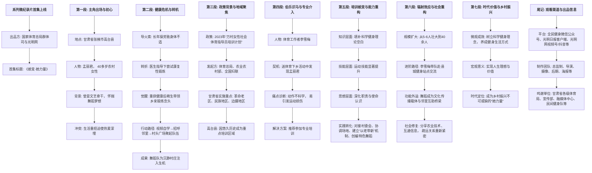
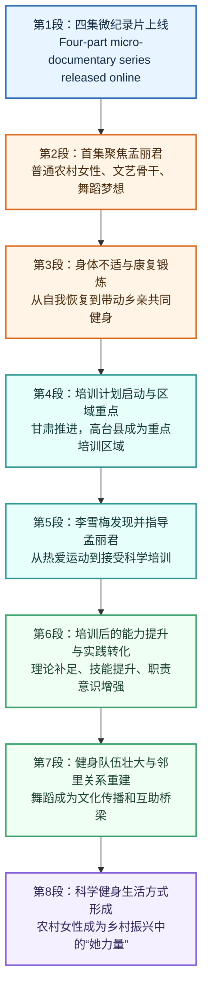

# 「万村女性社会体育指导员培训计划」微纪录片首集《蜕变·她力量》

## 来源与元数据

- **来源**：光明网  
- **栏目**：全民健身  
- **编辑**：李佳琦  
- **责编**：张魏桔  
- **说明**：本文为光明网全民健身栏目相关报道及延伸精读整理；若需核对首发时间与网页版链接，请以光明网同名稿件为准。

## 文章结构脉络图

---

**原文：**

由国家体育总局群体司、光明网联合出品的**“万村女性社会体育指导员培训计划”**四集微纪录片，今日起全网上线。

> **背景补充与名词注释：**
> `国家体育总局群体司`：全称为国家体育总局群众体育司，是主管全国群众体育工作的职能部门，核心职责是推动`全民健身`国家战略的实施。`光明网`作为中央重点新闻网站，在此承担了主流媒体参与公共文化服务供给、记录社会变革的职能。`“万村女性社会体育指导员培训计划”`是一项由国家体育总局、农业农村部、全国妇联于2023年联合发起的**国家级专项人才培育行动**。其目标是在广袤农村地区播撒科学健身的火种，提升农村女性参与社会治理的主体意识。`微纪录片`这种形式，适应了碎片化传播语境，通过“小切口”展现“大主题”。
> **词汇积累：**
> `联合出品`：**近义词**有`共同制作`、`协力推出`；**反义词**为`独家发行`。`上线`：**同义词**为`登陆`、`首播`；**英语对应表达**为 `premiere` 或 `launch online`。`微纪录片`（Micro-documentary）区别于传统长纪录片，**特征**是时长短、聚焦细节、传播力强，常用作`主流叙事`的创新载体。

**原文：**

今日上线的第一集**《蜕变·她力量》**，聚焦**甘肃省张掖市高台县**农村女性社会体育指导员**孟丽君**的成长心路。今年40多岁的孟丽君是一名普通农村女性，洗衣做饭、收拾家务、下地干农活是她的全部生活。作为村里曾经的**文艺骨干**，她在忙碌之余仍怀揣着`学习舞蹈的梦想`。然而生活的重担，让她不得不将这份`热爱`深埋心底。

> **深度解析与词汇剥析：**
> `蜕变`（Metamorphosis）：本指动物蜕皮变化，现多指事物发生**质的飞跃**。在本文中，它精准概括了农村女性从围着灶台转到登上健身大舞台的“化蝶”过程。`她力量`：这是一个极具**时代感**的现代政治语汇，强调女性在经济社会发展中不可替代的推动作用。
> **地点注释：** `张掖市`古称“甘州”，即甘肃省名中“甘”字的由来，自古就是丝绸之路的重镇。`高台县`因境内有明朝修建的`高台寺`而得名，地处河西走廊中部，不仅拥有深厚的红色历史底蕴（中国工农红军西路军纪念馆所在地），更是典型的**西部农业县**，选取此地具有很强的样本意义。
> `文艺骨干`：指在基层群众文化活动中起带头作用的**核心分子**。“骨”取其支撑之意，“干”取其主体之意，同义词有`文化能人`、`活动积极分子`。`深埋心底`：这是一种极具情感张力的文学化表达，将抽象的“热爱”具象化为可被埋葬的物体，突出了`现实压力`与`内心向往`的矛盾冲撞。**成语积累**：类似表达隐忍的成语有`忍辱负重`、`含辛茹苦`。

**原文：**

长年累月的操劳使孟丽君身体出现不适。在医生的指导下，她开始尝试**康复性锻炼**。通过运动重获健康后，孟丽君萌生了带领乡亲们一起锻炼的念头。从跟着视频自学，到招呼邻里结伴，再到村头广场聚起健身队伍，孟丽君的舞蹈队如**催化剂**般，为**沉静**的村庄注入了生机与活力。

> **逻辑推演与知识延展：**
> “长年累月的操劳”揭示了农村女性普遍面临的`健康赤字`问题，即因繁重体力劳动和缺乏科学保养导致的身体透支。`康复性锻炼`不同于竞技体育，它侧重于**物理治疗与功能恢复**，强调动作的温和性与矫正性。孟丽君身份的转变路径是：**患者 → 实践者 → 传播者**。
> `催化剂`（Catalyst）：化学名词借用到社会学领域，指能加速事物发展变化而其自身在结尾处质与量并无损耗的中介物。孟丽君正是那个加速村庄文明进程、改善人际关系的`动因`。`沉静`一词用得极为考究，它在此处不仅指环境的安静，更暗示了乡村在现代化进程中因年轻人口流失而产生的一种**文化惰性与生机匮乏**。`生机`与`活力`是并列式词语，互为补充。

**原文：**

2023年，体育总局联合农业农村部、全国妇联开展**“万村女性社会体育指导员培训计划”**，甘肃省积极推进，并将**革命老区、民族地区、边疆地区**等作为重点。拥有悠久历史的高台县，便成为了重点培训区域。

> **政策解读与战略视野：**
> 这是一个典型的`政策落地`段落。`“三部门联合”`体现了跨系统协同治理的逻辑：`体育总局`提供技术标准，`农业农村部`对接农村阵地，`全国妇联`激活妇女组织网络。
> `革命老区、民族地区、边疆地区`：这三个词语是政治术语中的**固定搭配**，统称为“老少边”地区，通常与“贫困地区”并列。将资源向这些区域倾斜，体现了`基本公共体育服务均等化`的公平正义原则。高台县作为`革命老区`（红西路军浴血奋战之地），被选为重点理所应当。
> **英语词汇融入：** `全国妇联`全称为 `All-China Women’s Federation`。`社会体育指导员`标准译名为 `Social Sports Instructor`。`均等化`对应 `Equalization` of basic public services.

**原文：**

甘肃省张掖市高台县社会体育指导中心体育工作者**李雪梅**，在日常`送体育下乡`活动中，发现了孟丽君对体育运动的`热爱`。在对其**手把手教学**指导后发现，孟丽君虽掌握了健身基本动作，但**不够科学**，稍不注意就会引发**运动损伤**。于是，李雪梅推荐孟丽君参加“万村女性社会体育指导员培训”。

> **人物关系与专业诊断：**
> `李雪梅`作为体制内的基层体育工作者，起到了**伯乐**与**摆渡人**的作用。`送体育下乡`是“三下乡”（文化、科技、卫生/体育）活动的重要组成部分，旨在解决城乡体育资源不均衡问题。
> `手把手教学`：一种强调极致耐心与近距离互动的指导方式。**易混淆辨析**：区分`运动损伤`与`运动酸痛`。损伤是病理性的，需要医疗介入；酸痛是生理性的，是乳酸堆积的正常反应。本段精准点出了“野生健身”的最大痛点——**动作模式错误**。例如深蹲时膝盖过度内扣、核心没收紧导致的腰痛等，不仅无效反而伤身。`专业性`在此构成了**刚需**。

**原文：**

通过培训，孟丽君不仅填补了科学健身理论知识的`空白`，运动技能得到**显著提升**，更对农村女性社会体育指导员的`职责`与`使命`有了更加**深刻**的认识。学成归来后，她开始将所学转换为`所用`：积极对接村委会，协调运动场地；根据队员不同基础水平，建立**“以老带新”**互助机制；同时创编**特色舞蹈**，以适应`特殊群体`的健身需求。

> **蜕变实证与治理创新：**
> `空白`（Gap）：这里的理论空白指的是缺乏**运动解剖学、运动生理学、运动营养学**等基础常识。`职责`（Duty）与`使命`（Mission）：前者侧重于岗位要求，后者侧重于价值追求。
> `以老带新`：这是一个经典的**基层治理智慧**。不仅解决了教学资源不足的问题，更在社会学意义上构建了队员之间的**情感链接与责任回路**，防止了队伍松散。`特色舞蹈`的创编展示了`适应性体育`的理念，即根据参与者的身体状况（如`残疾人`、`慢性病患者`等特殊群体）调整运动处方，这种**包容性**是社会文明进步的标志。`学以致用`：同义词有`活学活用`、`知行合一`。

**原文：**

在孟丽君的带动下，她的健身队伍从最初的`五六人壮大到四十余人`。为了继续提高运动技能，李雪梅还会定期带领孟丽君和队员们前往县城**健身站点**，参与锻炼交流。在这里，舞蹈不仅是文化传播的**载体**，也成为`邻里互助`的**桥梁**。大家随着节拍锻炼的同时，还分享着农业技术、互通生活信息，曾经`疏远`的关系在汗水与欢笑中重新变得**紧密**。

> **量化成果与社会功能嬗变：**
> `从五六人壮大到四十余人`：数字的变化是`社会动员`成功的最直观证据。`健身站点`是国家体育总局推行“六边工程”（完善群众身边的健身组织、设施、活动、赛事、指导、文化）的**基本单元**。
> `载体`（Carrier）与`桥梁`（Bridge）：两个词生动阐释了体育功能的**溢出效应**。这种溢出效应冲破了单纯的强身健体，进入了`社会关系再生产`的领域。`疏远`与`紧密`构成**反义词对比**，反映出在城镇化进程中，原子的个人主义如何通过集体性身体运动重新回归`集体温情`。这一过程也符合**共同体美学**。

**原文：**

如今，村民们树立了`科学健身理念`，养成了健身运动的`生活方式`。在万村女性社会体育指导员培训计划的**引领**下，像孟丽君一样普普通通的农村女性实现了`人生理想`，找到了`人生价值`，成为了乡村振兴不可或缺的**“她力量”**。

> **价值升华与时代落点：**
> `科学健身理念`：核心在于`运动是良医`（Exercise is Medicine）这一现代健康观。不仅要有运动意愿，更要有`运动处方`意识。`生活方式`：同义词为`日常习惯`（Lifestyle），健身只有融入生活作息，像吃饭喝水一样自然，才算真正落地。
> `人生理想`与`人生价值`：此处将叙事从“强身健体”拔高到了“**自我实现**”的马斯洛需求最高层次。`引领`：常用来形容旗帜或精神的导向作用，**近义词**有`指引`、`带动`；**辨析**：“引领”侧重在方向上的牵引导航，“带领”侧重在行动上的并肩同行。`她力量`作为全文落脚点，强调的是**性别平等**视角下的`赋权`（Empowerment），即农村女性不仅是受助者，更是推动`产业兴旺、乡风文明、治理有效`的主体。

**原文：**

更多精彩内容，请点击**全民健身微信公众号**、**光明日报客户端**、**光明网视频号、抖音号**等平台线上观看。

> **传播矩阵观察：**
> 本项目的宣传布局覆盖了**政务新媒体**（全民健身公众号）、**新闻传媒客户端**（光明日报）、**社交平台**（视频号、抖音），构成了典型的`全媒体传播矩阵`。这表明优质的主旋律内容正在主动打破圈层，试图在`短视频`争夺注意力的时代，通过微纪录片的形式抢占年轻化、网络化的舆论阵地。

# 精读笔记

## 基本信息

- 文章来源：光明网体育频道·要点新闻：系列主题微纪录片正式上线！首集《蜕变·她力量》聚焦农村女性社会体育指导员成长之路 [1](https://sports.gmw.cn/2026-04/29/content_38736751.htm)
- 题目：系列主题微纪录片正式上线！首集《蜕变·她力量》聚焦农村女性社会体育指导员成长之路
- 发布时间：2026年4月29日 07:00
- 作者：正文未见个人作者署名；页面标注来源为光明网。
- 制作信息：出品单位为国家体育总局群体司、光明网；出品人为张舒、杨帆；监制及总导演为常洁、刘希尧。
- 作者与机构背景：
  - 光明网：据光明网“关于我们”页面介绍，光明网是思想理论文化领域的中央重点新闻网站，依托光明日报社资源开展新媒体传播与内容建设。
  - 国家体育总局群众体育司：据国家体育总局群众体育司官网介绍，其职责包括推行全民健身计划、推动全民健身服务体系建设、指导群众性体育活动、推动农村体育和城市体育发展等。
  - “万村女性社会体育指导员培训计划”：据国家体育总局群众体育司2023年7月25日发布的通知，该计划由体育总局、农业农村部、全国妇联联合开展，计划自2023年至2025年在1万个以上行政村培训女性社会体育指导员。

资料参考：光明网原文 [1](https://sports.gmw.cn/2026-04/29/content_38736751.htm)；光明网简介 [2](https://about.gmw.cn/aboutus.htm)；国家体育总局群众体育司 [3](https://www.sport.gov.cn/qts/)；“万村女性社会体育指导员培训计划”通知 [4](https://www.sport.gov.cn/qts/n4986/c25822523/content.html)

## 前情提要

---

🔸由国家体育总局群体司、光明网联合出品的 / “**`万村女性社会体育指导员培训计划`**”四集微纪录片，/ **`今日起`**全网上线。

🔹The four-part **`micro-documentary`** series / for the “**`Ten Thousand Villages Female Social Sports Instructors Training Program`**,” / **`jointly produced`** by the Mass Sports Department of the General Administration of Sport of China and Guangming Online, / was officially **`released across online platforms`** today.

背景注释：
“今日”指文章发布日期2026年4月29日。“国家体育总局群体司”即国家体育总局群众体育司，主要涉及全民健身、群众体育、社会体育指导等工作。“光明网”是光明日报社旗下中央重点新闻网站。“社会体育指导员”通常指在社区、乡村、健身站点等基层场景中，为群众提供健身指导、活动组织和科学健身服务的人员。

> **`micro-documentary`** /ˌmaɪkroʊ ˌdɑːkjuˈmentəri/
> 释义：n. a short documentary film that focuses on a specific person, event, or theme；微纪录片，围绕特定人物、事件或主题展开的短篇纪实影像。
> 语域：媒体、影视、新闻传播。
> 画龙点睛：`micro-`表示“微型、小规模”，常见组合有`micro-film`微电影、`micro-course`微课程、`micro-blog`微博。`documentary`强调纪实属性，区别于普通`short video`短视频。写作中可说`a micro-documentary on rural revitalization`，表达“关于乡村振兴的微纪录片”。

> **`jointly produced`** /ˈdʒɔɪntli prəˈduːst/
> 释义：phrase. created, made, or presented by two or more organizations together；联合制作，联合出品。
> 语域：影视制作、新闻稿、机构合作。
> 画龙点睛：`jointly`常见于正式报道，表示“共同地、联合地”，如`jointly launched`联合发起、`jointly issued`联合发布、`jointly organized`联合组织。`produce`在影视语境中不只是“生产”，还常指“制作、出品”。

> **`released across online platforms`** /rɪˈliːst əˈkrɔːs ˈɑːnlaɪn ˈplætfɔːrmz/
> 释义：phrase. made available on multiple internet platforms；在多个线上平台发布，全网上线。
> 语域：新闻、互联网、影视宣发。
> 画龙点睛：中文“全网上线”不宜直译为`online all over the Internet`，更自然的是`released across online platforms`或`rolled out online`。其中`across`突出“覆盖多个平台”，适合媒体宣发场景。

---

🔸今日上线的第一集《**`蜕变·她力量`**》，/ 聚焦甘肃省张掖市高台县农村女性社会体育指导员孟丽君的 / **`成长心路`**。

🔹The first episode released today, **`Metamorphosis: Her Power`**, / focuses on the **`inner journey of growth`** of Meng Lijun, / a rural female social sports instructor from Gaotai County, Zhangye City, Gansu Province.

背景注释：
《蜕变·她力量》是该系列微纪录片第一集的标题。“她力量”是中文公共传播中常用于表达女性主体性、女性参与公共事务、女性贡献社会发展的说法。甘肃省张掖市高台县位于河西走廊地区，文中是孟丽君成长与开展健身指导活动的地点。

> **`metamorphosis`** /ˌmetəˈmɔːrfəsɪs/
> 释义：n. a complete and striking change in form, character, or condition；蜕变，彻底而显著的变化。
> 语域：文学、新闻标题、科学。
> 画龙点睛：`metamorphosis`本义可指昆虫“变态发育”，引申为人的身份、命运或观念发生深刻变化。它比`change`更有力度，比`transformation`更具文学色彩，适合纪录片标题和人物成长叙事。

> **`Her Power`** /hɜːr ˈpaʊər/
> 释义：phrase. the strength, agency, and social contribution of women；她力量，女性力量。
> 语域：公共传播、女性议题、社会发展。
> 画龙点睛：`Her Power`类似宣传片标题表达，简短、有感染力。若用于政策或学术语境，可换成`women's empowerment`女性赋能，强调能力提升、机会获得和主体性增强。

> **`inner journey of growth`** /ˈɪnər ˈdʒɜːrni əv ɡroʊθ/
> 释义：phrase. the emotional and psychological process through which a person changes and matures；成长心路，内在成长历程。
> 语域：人物报道、传记、纪录片。
> 画龙点睛：中文“成长心路”不能直译为`growth road`。英语中`journey`常表示抽象历程，如`a journey of self-discovery`自我发现之旅、`a journey of healing`疗愈之旅，特别适合人物叙事。

---

🔸今年40多岁的孟丽君 / 是一名普通农村女性，/ 洗衣做饭、收拾家务、下地干农活 / 是她的全部生活。

🔹Meng Lijun, now **`in her forties`**, / was an **`ordinary rural woman`**, / whose entire life **`revolved around`** doing laundry, cooking, housework, / and farm labor in the fields.

背景注释：
本句通过“洗衣做饭、收拾家务、下地干农活”的并列铺陈，刻画孟丽君原先生活的重复性、日常性和劳动强度。“下地干农活”指在田间从事农业劳动，是农村生活叙事中常见的生活场景。

> **`in her forties`** /ɪn hɜːr ˈfɔːrtiz/
> 释义：phrase. aged between 40 and 49；四十多岁。
> 语域：日常、新闻人物介绍。
> 画龙点睛：年龄表达常用`in one's + 整十复数`，如`in his twenties`二十多岁、`in their sixties`六十多岁。注意`forty`变复数为`forties`，不是`fourtys`。该表达比`more than 40 years old`更自然。

> **`ordinary rural woman`** /ˈɔːrdneri ˈrʊrəl ˈwʊmən/
> 释义：n. phrase. a woman living in the countryside without a special public status or role；普通农村女性。
> 语域：新闻、社会报道。
> 画龙点睛：`ordinary`强调“普通、不特殊”，没有贬义；`rural`指“农村的、乡村的”，对应`urban`城市的。可拓展为`ordinary rural residents`普通农村居民、`rural communities`农村社区。

> **`revolve around`** /rɪˈvɑːlv əˈraʊnd/
> 释义：v. phrase. to have something as the main activity, focus, or concern；以……为中心，围绕……展开。
> 语域：通用、写作常用。
> 画龙点睛：`revolve around`非常适合翻译“生活全部围着……转”。例如：`Her daily life revolved around family chores.` 她的日常生活围绕家务展开。比`be all about`更正式，适合阅读翻译和写作。

---

🔸作为村里曾经的 **`文艺骨干`**，/ 她在忙碌之余 / 仍怀揣着学习舞蹈的梦想。

🔹As a former **`mainstay of village cultural activities`**, / she still **`cherished a dream`** of learning dance / despite her busy daily routine.

背景注释：
“文艺骨干”是中国基层文化活动中的常见说法，指在村庄、社区、单位文艺演出或群众文化活动中较活跃、能起带头作用的人。这里说明孟丽君原本就有文艺基础和舞蹈兴趣，为后文她组织舞蹈健身队埋下伏笔。

> **`mainstay`** /ˈmeɪnsteɪ/
> 释义：n. a person or thing that is a chief support or an important part of something；中坚力量，骨干，支柱。
> 语域：正式、新闻、人物报道。
> 画龙点睛：`mainstay`常用于表示某人或某事物是组织、活动、产业的主要支撑，如`a mainstay of the local community`当地社区的中坚。翻译“骨干”时，`mainstay`比`backbone`更温和、更适合人物报道。

> **`cherish a dream`** /ˈtʃerɪʃ ə driːm/
> 释义：v. phrase. to keep and value a hope deeply in one's heart；怀揣梦想，珍视梦想。
> 语域：文学、人物报道、演讲。
> 画龙点睛：`cherish`比`have`更有情感温度，表示“珍藏、珍视”。常见搭配有`cherish a hope`怀有希望、`cherish a memory`珍藏记忆、`cherish an ambition`怀有抱负。适合翻译“怀揣”。

> **`despite`** /dɪˈspaɪt/
> 释义：prep. in spite of; used to show that something happens although something else might have prevented it；尽管，虽然。
> 语域：正式、写作高频。
> 画龙点睛：`despite`后接名词、代词或动名词，不直接接完整句子。可以说`despite her busy schedule`，不能说`despite she was busy`。若要接句子，用`although`或`even though`。

---

🔸然而生活的 **`重担`**，/ 让她不得不将这份热爱 / **`深埋心底`**。

🔹Yet the **`burdens of life`** / forced her to **`bury this passion deep in her heart`**.

背景注释：
本句在叙事上形成转折：孟丽君有舞蹈梦想，但现实中的劳动、家庭责任和生活压力使她无法追求个人兴趣。这为后文“蜕变”提供了情感基础和人物前史。

> **`burdens of life`** /ˈbɜːrdnz əv laɪf/
> 释义：n. phrase. heavy responsibilities, pressures, or difficulties in daily existence；生活重担，人生压力。
> 语域：文学、新闻特写。
> 画龙点睛：`burden`可作名词“负担”，也可作动词“使负担”。常见搭配有`financial burden`经济负担、`emotional burden`情感负担、`shoulder a burden`承担重担。它比`pressure`更有重量感。

> **`bury ... deep in one's heart`** /ˈberi diːp ɪn wʌnz hɑːrt/
> 释义：v. phrase. to hide a feeling, wish, or passion inside oneself；把……深藏心底。
> 语域：文学、人物叙事。
> 画龙点睛：`bury`本义是“埋葬”，引申为“隐藏情感、压抑想法”。可说`bury one's feelings`隐藏感情、`bury one's dream`埋藏梦想。过去式和过去分词均为`buried`。

> **`passion`** /ˈpæʃən/
> 释义：n. a strong enthusiasm, love, or intense interest in something；热爱，激情，强烈兴趣。
> 语域：通用、人物报道、申请文书。
> 画龙点睛：`passion`常用于表达长期而强烈的兴趣，如`a passion for dance`对舞蹈的热爱。注意它常作不可数名词，但表示“一种强烈爱好”时可说`a passion`：`Dance became a passion for her.`

---

🔸**`长年累月`**的操劳 / 使孟丽君身体出现不适。

🔹Years of **`relentless toil`** / began to **`take a toll on`** Meng Lijun's health.

背景注释：
“操劳”含有长期辛苦劳作、为家庭或生计持续付出体力和精力的意味。这里的“身体出现不适”是人物故事的重要转折点，引出后文医生指导下的康复性锻炼。

> **`relentless toil`** /rɪˈlentləs tɔɪl/
> 释义：n. phrase. continuous hard and exhausting work that does not seem to stop；持续不断的辛苦劳作。
> 语域：文学、新闻特写。
> 画龙点睛：`toil`比`work`更强调艰辛、劳累，常用于体力劳动或长期苦干。`relentless`表示“不停的、不减弱的”，两者搭配能传达“长年累月”的消耗感。

> **`take a toll on`** /teɪk ə toʊl ɑːn/
> 释义：v. phrase. to have a harmful effect on someone or something over time；对……造成损害，产生负面影响。
> 语域：新闻、健康、社会议题。
> 画龙点睛：这是考试写作高频表达，可替换简单的`damage`。例如：`Long working hours take a toll on mental health.` 长时间工作损害心理健康。`toll`原指“通行费”，引申为“代价、损耗”。

---

🔸在医生的指导下，/ 她开始尝试 **`康复性锻炼`**。

🔹Under her doctor's **`guidance`**, / she began to try **`rehabilitative exercise`**.

背景注释：
“康复性锻炼”通常指为改善身体功能、缓解疼痛、恢复活动能力而进行的运动。它不同于单纯休闲健身，更强调医学建议、动作规范和恢复目标。

> **`under one's guidance`** /ˈʌndər wʌnz ˈɡaɪdns/
> 释义：prep. phrase. with the advice, direction, or supervision of someone；在某人的指导下。
> 语域：正式、教育、医疗、培训。
> 画龙点睛：`guidance`通常不可数，常见搭配有`professional guidance`专业指导、`medical guidance`医疗指导、`under the guidance of a coach`在教练指导下。它比`help`更强调方向性和专业性。

> **`rehabilitative exercise`** /ˌriːəˈbɪlɪteɪtɪv ˈeksərsaɪz/
> 释义：n. phrase. physical activity designed to restore health, strength, mobility, or function；康复性锻炼。
> 语域：医学、健康、运动康复。
> 画龙点睛：`rehabilitative`来自动词`rehabilitate`康复、恢复功能；名词为`rehabilitation`。医学英语中也常见`rehabilitation exercise`。注意`exercise`不只指减肥健身，也可服务于治疗和恢复。

---

🔸通过运动重获健康后，/ 孟丽君 **`萌生了`**带领乡亲们一起锻炼的念头。

🔹After **`regaining her health`** through exercise, / Meng Lijun **`conceived the idea of`** leading **`fellow villagers`** to work out together.

背景注释：
“乡亲们”指同村或同乡的人，带有亲近感。此处人物行动从“个人康复”转向“带动他人”，体现孟丽君从个体健身者向基层健身组织者的身份转变。

> **`regain one's health`** /rɪˈɡeɪn wʌnz helθ/
> 释义：v. phrase. to become healthy again after illness, weakness, or physical discomfort；重获健康，恢复健康。
> 语域：健康、人物报道。
> 画龙点睛：`regain`表示“重新获得”，比`get back`更正式。常见搭配有`regain confidence`重拾信心、`regain strength`恢复体力、`regain control`重新掌控。写作中很实用。

> **`conceive the idea of`** /kənˈsiːv ði aɪˈdiːə əv/
> 释义：v. phrase. to form an idea, plan, or intention in one's mind；萌生……想法，构想出……。
> 语域：正式、书面。
> 画龙点睛：`conceive`除“怀孕”外，也常表示“构思、想出”。如`conceive a plan`构思计划。翻译“萌生念头”时，`conceived the idea of doing sth.`非常地道。

> **`fellow villagers`** /ˈfeloʊ ˈvɪlɪdʒərz/
> 释义：n. phrase. people from the same village；乡亲，同村村民。
> 语域：新闻、乡村叙事。
> 画龙点睛：`fellow`作形容词表示“同类的、同伴的”，如`fellow students`同学、`fellow citizens`同胞。它能传达共同身份，比单纯`villagers`更亲切。

---

🔸从跟着视频自学，/ 到招呼邻里结伴，/ 再到村头广场聚起健身队伍，/ 孟丽君的舞蹈队如 **`催化剂`**般，/ 为沉静的村庄 **`注入了生机与活力`**。

🔹From learning by following videos, / to **`calling on`** neighbors to practice together, / and then to gathering a fitness team in the village square, / Meng Lijun's dance team acted like a **`catalyst`**, / **`infusing`** the quiet village with vitality and energy.

背景注释：
“村头广场”是许多中国乡村公共活动的重要空间，常用于广场舞、文艺演出、村民议事和节庆活动等。“催化剂”本是化学术语，此处作为隐喻，表示孟丽君的舞蹈队加速激发了村庄公共生活的活力。

> **`call on`** /kɔːl ɑːn/
> 释义：v. phrase. to ask, invite, or encourage someone to do something；号召，招呼，呼吁。
> 语域：新闻、公共表达、日常。
> 画龙点睛：`call on sb. to do sth.`是写作高频结构，表示“呼吁某人做某事”。本文语境中译为“招呼”更生活化。注意`call on`也可表示“拜访”，需根据上下文判断。

> **`catalyst`** /ˈkætəlɪst/
> 释义：n. something that causes an important change or event to happen more quickly；催化剂，促成变化的因素。
> 语域：科学、新闻、议论文。
> 画龙点睛：`catalyst`本义是化学“催化剂”，写作中常引申为“推动变化的人或事”。例如：`Education can be a catalyst for social mobility.` 教育可以成为社会流动的催化剂。

> **`infuse ... with`** /ɪnˈfjuːz wɪð/
> 释义：v. phrase. to fill something with a particular quality, feeling, or energy；把……注入……，使充满……。
> 语域：正式、文学、新闻。
> 画龙点睛：`infuse A with B`常用于抽象品质，如`infuse the community with energy`为社区注入活力。比`bring`更有画面感，适合翻译“注入生机”。

---

🔸2023年，/ 体育总局联合农业农村部、全国妇联开展“**`万村女性社会体育指导员培训计划`**”，/ 甘肃省积极推进，/ 并将革命老区、民族地区、边疆地区等作为重点。

🔹In 2023, / the General Administration of Sport of China, together with the Ministry of Agriculture and Rural Affairs and the All-China Women's Federation, / **`launched`** the “**`Ten Thousand Villages Female Social Sports Instructors Training Program`**”; / Gansu Province actively **`advanced the initiative`**, / **`giving priority to`** revolutionary base areas, ethnic minority areas, border regions, and other key areas.

背景注释：
“万村女性社会体育指导员培训计划”由体育总局、农业农村部、全国妇联联合开展。官方通知显示，该计划服务于全民健身、健康中国和乡村振兴等战略，计划在1万个以上行政村培训女性社会体育指导员。“革命老区”指具有重要革命历史地位的地区；“民族地区”通常指少数民族聚居地区；“边疆地区”指靠近国界的地区。

> **`launch`** /lɔːntʃ/
> 释义：v. to start or introduce a new project, campaign, product, or activity；发起，启动，推出。
> 语域：政策、新闻、商业。
> 画龙点睛：`launch`常用于新计划、新项目、新产品的启动，如`launch a campaign`发起运动、`launch a program`启动项目、`launch a product`推出产品。比`start`更正式、更有新闻感。

> **`advance the initiative`** /ədˈvæns ði ɪˈnɪʃətɪv/
> 释义：v. phrase. to promote, move forward, or implement a public plan or program；推进该行动，推动该计划实施。
> 语域：政策、公共管理、新闻。
> 画龙点睛：`initiative`常译为“倡议、行动、计划”，强调主动发起和公共目标。`advance`作动词时不仅是“前进”，还表示“推动、促进”，如`advance reform`推进改革、`advance cooperation`促进合作。

> **`give priority to`** /ɡɪv praɪˈɔːrəti tuː/
> 释义：v. phrase. to treat something as more important than other things；优先考虑，重点支持。
> 语域：政策、管理、学术写作。
> 画龙点睛：翻译“将……作为重点”时，`give priority to`非常自然。可用于写作：`The government should give priority to public health.` 政府应优先重视公共卫生。

> **`border regions`** /ˈbɔːrdər ˈriːdʒənz/
> 释义：n. phrase. areas near the boundary between countries；边疆地区，边境地区。
> 语域：地理、政策、新闻。
> 画龙点睛：`border`强调“边界、国境”。`frontier`也可指边疆，但更有历史开拓意味。正式政策语境中，`border regions`比`frontier areas`更中性、清晰。

---

🔸拥有悠久历史的高台县，/ 便成为了 **`重点培训区域`**。

🔹Gaotai County, / **`with its long history`**, / thus became a **`key training area`**.

背景注释：
高台县隶属甘肃省张掖市。本文没有展开高台县的历史细节，而是借“拥有悠久历史”说明该地兼具地域文化背景和政策实施意义，也承接前一句“重点地区”的政策背景。

> **`with its long history`** /wɪð ɪts lɔːŋ ˈhɪstəri/
> 释义：prep. phrase. having a long historical background；拥有悠久历史。
> 语域：地理介绍、城市宣传、新闻。
> 画龙点睛：介绍地点时，`with its long history`比`which has a long history`更简洁。类似结构有`with its rich culture`拥有丰富文化、`with its unique location`凭借独特位置。

> **`key training area`** /kiː ˈtreɪnɪŋ ˈeriə/
> 释义：n. phrase. an area selected as especially important for training activities；重点培训区域。
> 语域：政策、教育培训、项目管理。
> 画龙点睛：`key`在此不是“钥匙”，而是“关键的、重点的”。常见搭配有`key project`重点项目、`key region`重点区域、`key task`关键任务。比`important`更有政策文件感。

> **`thus`** /ðʌs/
> 释义：adv. as a result; therefore；因此，于是。
> 语域：正式、书面、学术。
> 画龙点睛：`thus`用于承接结果，比`so`正式。写作中可放句首或句中：`The program expanded rapidly; thus, more villagers benefited.` 注意其书面色彩较强，日常口语中不如`so`自然。

---

🔸甘肃省张掖市高台县社会体育指导中心体育工作者李雪梅，/ 在日常 **`送体育下乡`**活动中，/ 发现了孟丽君对体育运动的热爱。

🔹Li Xuemei, / a **`sports worker`** at the Social Sports Guidance Center of Gaotai County, Zhangye City, Gansu Province, / discovered Meng Lijun's **`passion for physical activity`** / during regular **`sports-to-the-countryside outreach`** activities.

背景注释：
“送体育下乡”是中国基层公共服务语境中的表达，类似于把体育服务、健身指导、赛事活动、健康理念等带到农村。李雪梅在文中起到发现者、指导者和推荐者的作用，是孟丽君进入系统化培训的重要连接人物。

> **`sports worker`** /spɔːrts ˈwɜːrkər/
> 释义：n. a person whose job involves organizing, promoting, guiding, or supporting sports activities；体育工作者。
> 语域：新闻、公共体育。
> 画龙点睛：`worker`不只指体力工人，也可表示某领域从业者，如`social worker`社工、`health worker`医务工作者、`cultural worker`文化工作者。翻译时要根据领域补足含义。

> **`outreach`** /ˈaʊtriːtʃ/
> 释义：n. efforts by an organization to provide services, information, or support to people who might not otherwise have access；外展服务，基层服务，下沉服务。
> 语域：公共服务、教育、医疗、公益。
> 画龙点睛：`outreach`非常适合翻译“送……下乡/进社区”。如`medical outreach`医疗下乡、`community outreach`社区外展服务。它强调主动走向服务对象，而不是等待对象上门。

> **`passion for physical activity`** /ˈpæʃən fər ˈfɪzɪkəl ækˈtɪvəti/
> 释义：n. phrase. strong enthusiasm for exercise and bodily movement；对体育运动的热爱。
> 语域：健康、人物报道。
> 画龙点睛：`physical activity`比`sports`范围更广，既包括运动项目，也包括日常身体活动和健身锻炼。公共健康写作中常用`promote physical activity`促进身体活动。

---

🔸在对其 **`手把手教学指导`**后发现，/ 孟丽君虽掌握了健身基本动作，/ 但不够科学，/ 稍不注意就会引发 **`运动损伤`**。

🔹After providing her with **`hands-on instruction`**, / Li found that although Meng had mastered the basic fitness movements, / her practice was not scientific enough, / and the **`slightest lapse`** could lead to **`sports injuries`**.

背景注释：
本句强调从“会做动作”到“科学健身”之间仍有距离。基层健身中常见的问题是模仿动作但缺乏运动生理、姿势控制、强度安排和损伤预防知识，因此规范培训非常重要。

> **`hands-on instruction`** /ˌhændz ˈɑːn ɪnˈstrʌkʃən/
> 释义：n. phrase. practical teaching that involves direct demonstration, correction, and participation；手把手指导，实操教学。
> 语域：教育、培训、技能教学。
> 画龙点睛：`hands-on`表示“亲身实践的、实操的”，如`hands-on experience`实操经验、`hands-on training`实操培训。它比`practical`更强调动手参与和现场指导。

> **`not scientific enough`** /nɑːt ˌsaɪənˈtɪfɪk ɪˈnʌf/
> 释义：phrase. lacking sufficient basis in scientific principles or proper technique；不够科学，不够符合科学原则。
> 语域：健康、体育、公共政策。
> 画龙点睛：`scientific`在此不是“科学学科的”，而是“符合科学方法或规律的”。可说`scientific training methods`科学训练方法、`scientific fitness guidance`科学健身指导。

> **`the slightest lapse`** /ðə ˈslaɪtəst læps/
> 释义：n. phrase. even a very small mistake, oversight, or moment of inattention；稍有疏忽，稍不注意。
> 语域：正式、风险说明。
> 画龙点睛：`slightest`是`slight`最高级，强调“哪怕最小的”。`lapse`可指“失误、疏忽、短暂中断”，如`a lapse in judgment`判断失误。该表达适合写风险后果。

> **`sports injuries`** /spɔːrts ˈɪndʒəriz/
> 释义：n. injuries caused by exercise, training, or athletic activity；运动损伤。
> 语域：医学、运动科学、健康。
> 画龙点睛：`injury`强调身体受伤，复数`injuries`常指多种损伤。常见搭配有`prevent sports injuries`预防运动损伤、`recover from an injury`从伤病中恢复。不要与`wound`混淆，`wound`多指外伤、创口。

---

🔸于是，/ 李雪梅推荐孟丽君参加“**`万村女性社会体育指导员培训`**”。

🔹Therefore, / Li Xuemei **`recommended that`** Meng Lijun **`take part in`** the “**`Ten Thousand Villages Female Social Sports Instructors Training`**” program.

背景注释：
本句承上启下：李雪梅发现孟丽君有热情、有基础，但缺少科学健身知识和规范指导，因此推荐她进入正规培训体系。此处“培训”是人物成长的关键制度性入口。

> **`recommend that ...`** /ˌrekəˈmend ðæt/
> 释义：v. structure. to advise that someone should do something；建议、推荐某人做某事。
> 语域：通用、正式写作。
> 画龙点睛：美式英语中`recommend that sb. do sth.`常用虚拟语气，动词用原形，如`I recommend that he join the program.` 也可说`recommend sb. to do sth.`，但正式程度略低。

> **`take part in`** /teɪk pɑːrt ɪn/
> 释义：v. phrase. to participate in an activity；参加，参与。
> 语域：通用、新闻、教育。
> 画龙点睛：`take part in`强调参与某活动，近义词有`participate in`更正式、`join in`更口语。注意`attend a training session`偏“出席培训”，`take part in`偏“参与过程”。

> **`training program`** /ˈtreɪnɪŋ ˈproʊɡræm/
> 释义：n. an organized course or project designed to teach skills or knowledge；培训项目，培训计划。
> 语域：教育、职业发展、政策。
> 画龙点睛：`program`在美式英语中常指“项目、计划”，英式拼写在非计算机语境中也常作`programme`。搭配包括`vocational training program`职业培训项目、`public health program`公共健康计划。

---

🔸通过培训，/ 孟丽君不仅填补了 **`科学健身理论知识`**的空白，/ 运动技能得到 **`显著提升`**，/ 更对农村女性社会体育指导员的职责与使命 / 有了更加深刻的认识。

🔹Through the training, / Meng Lijun not only **`filled the gap in`** her **`theoretical knowledge of scientific fitness`** / and **`significantly improved`** her exercise skills, / but also gained a deeper understanding of the duties and mission of rural female social sports instructors.

背景注释：
“科学健身”是全民健身语境中的核心概念，强调基于运动科学、健康评估、动作规范和强度控制进行锻炼。社会体育指导员不仅要自己会练，还要能指导他人、组织活动、传播健康理念。

> **`fill the gap in`** /fɪl ðə ɡæp ɪn/
> 释义：v. phrase. to supply what is missing in knowledge, skills, resources, or services；填补……空白。
> 语域：教育、研究、政策。
> 画龙点睛：`gap`常表示“差距、空白、缺口”，如`knowledge gap`知识空白、`skills gap`技能差距。`fill the gap`比`make up the lack`更地道，是写作高频表达。

> **`theoretical knowledge`** /ˌθiːəˈretɪkəl ˈnɑːlɪdʒ/
> 释义：n. knowledge based on principles, concepts, and systems rather than only practice；理论知识。
> 语域：教育、学术、培训。
> 画龙点睛：`theoretical`对应`practical`。表达“理论与实践结合”可用`combine theoretical knowledge with practical skills`。注意`knowledge`通常不可数，不能说`knowledges`。

> **`scientific fitness`** /ˌsaɪənˈtɪfɪk ˈfɪtnəs/
> 释义：n. exercise guided by scientific principles such as safety, intensity, technique, and health needs；科学健身。
> 语域：公共健康、体育政策。
> 画龙点睛：`fitness`不仅指“健康”，也指身体素质、健身状态。`scientific fitness`在中国公共体育英语中可用，若面向国际读者，也可解释为`evidence-based exercise guidance`基于证据的运动指导。

> **`significantly improve`** /sɪɡˈnɪfɪkəntli ɪmˈpruːv/
> 释义：v. phrase. to make something much better in a clear or important way；显著提升，明显改善。
> 语域：正式、学术、新闻。
> 画龙点睛：`significantly`是雅思、考研写作高频副词，可修饰`increase/decrease/improve/reduce`。它比`very`更正式，也更适合描述数据、变化和结果。

> **`duties and mission`** /ˈduːtiz ænd ˈmɪʃən/
> 释义：n. phrase. responsibilities and a broader sense of purpose；职责与使命。
> 语域：公共服务、组织管理、正式讲话。
> 画龙点睛：`duty`偏具体责任，`mission`偏更高层次的目标或使命感。两者并列时，既体现“该做什么”，也体现“为什么而做”，适合公共人物成长叙事。

---

🔸学成归来后，/ 她开始将所学 **`转换为所用`**：/ 积极对接村委会，协调运动场地；/ 根据队员不同基础水平，建立“**`以老带新`**”互助机制；/ 同时创编特色舞蹈，/ 以适应特殊群体的健身需求。

🔹After returning from the training, / she began to **`translate what she had learned into practice`**: / actively **`liaising with`** the village committee to coordinate exercise venues; / establishing a **`peer-support mechanism`** in which experienced members **`mentor newcomers`** according to members' different skill levels; / and creating distinctive dance routines / to meet the fitness needs of special groups.

背景注释：
“村委会”即村民委员会，是中国农村基层群众自治组织。这里体现孟丽君培训后的三类实践能力：资源协调、队伍管理和内容创新。“以老带新”指由经验较多者带动新加入者，是基层组织常见的传帮带机制。

> **`translate ... into practice`** /trænzˈleɪt ˈɪntuː ˈpræktɪs/
> 释义：v. phrase. to turn ideas, knowledge, or plans into actual action；把……转化为实践，将……落到实处。
> 语域：正式、教育、政策、管理。
> 画龙点睛：`translate`除“翻译”外，还有“转化、转变”的意思。`translate theory into practice`把理论转化为实践，是写作高级表达，对应中文“学以致用、落地”。

> **`liaise with`** /liˈeɪz wɪð/
> 释义：v. to communicate and cooperate with another person or organization；联络，对接，协调。
> 语域：正式、行政、商务。
> 画龙点睛：`liaise with`特别适合翻译“对接某单位”。名词是`liaison`联络、联络员。与`contact`相比，`liaise`更强调持续沟通和协作，而不只是简单联系一次。

> **`peer-support mechanism`** /pɪr səˈpɔːrt ˈmekənɪzəm/
> 释义：n. a system in which people in the same group help, guide, or support one another；同伴互助机制。
> 语域：教育、社区治理、组织管理。
> 画龙点睛：`peer`指“同伴、同辈、同级者”，如`peer learning`同伴学习、`peer review`同行评审。`mechanism`表示制度化安排，比`method`更正式，强调可持续运行。

> **`mentor newcomers`** /ˈmentɔːr ˈnuːkʌmərz/
> 释义：v. phrase. to guide, support, and teach people who have recently joined；指导新人，带新人。
> 语域：教育、职场、社群组织。
> 画龙点睛：`mentor`可作名词“导师”，也可作动词“指导”。`newcomer`是“新来者、新成员”。“以老带新”可译为`experienced members mentor newcomers`，既准确又地道。

---

🔸在孟丽君的带动下，/ 她的健身队伍 / 从最初的五六人 / **`壮大到`**四十余人。

🔹Under Meng Lijun's **`leadership`**, / her fitness group **`expanded from`** the initial five or six members / to more than forty.

背景注释：
数字变化体现孟丽君的组织带动力。从“五六人”到“四十余人”，不仅是规模扩大，也表明村民参与度、信任度和基层健身氛围都在提升。

> **`under one's leadership`** /ˈʌndər wʌnz ˈliːdərʃɪp/
> 释义：prep. phrase. while being guided, encouraged, or led by someone；在某人的带领下。
> 语域：正式、组织报道。
> 画龙点睛：`leadership`不仅指“领导职位”，也可指“带领能力、领导作用”。基层语境中的“带动下”可根据语气译为`under one's leadership`、`with one's encouragement`或`inspired by sb.`。

> **`expand from ... to ...`** /ɪkˈspænd frəm tuː/
> 释义：v. phrase. to grow in size, number, scale, or scope from one level to another；从……扩大到……。
> 语域：新闻、数据描述、商业。
> 画龙点睛：描述规模变化时，`expand from A to B`非常清晰。也可用`grow from A to B`。`expand`更正式，常用于组织、市场、项目、队伍、服务范围的扩大。

> **`initial`** /ɪˈnɪʃəl/
> 释义：adj. existing or occurring at the beginning；最初的，初始的。
> 语域：正式、新闻、学术。
> 画龙点睛：`initial`可替换`first`，更书面。如`the initial stage`初始阶段、`initial response`最初反应。注意发音重音在第二音节，名词`initials`则指姓名首字母。

---

🔸为了继续提高运动技能，/ 李雪梅还会定期带领孟丽君和队员们 / 前往县城健身站点，/ 参与 **`锻炼交流`**。

🔹To continue improving their exercise skills, / Li Xuemei **`regularly`** takes Meng Lijun and the team members / to fitness stations in the **`county seat`** / for practice and **`exchange`**.

背景注释：
“县城健身站点”指县域范围内较固定的群众健身活动或指导场所。“锻炼交流”兼具练习、观摩、学习和互动功能，是基层体育指导能力持续提升的一种方式。

> **`regularly`** /ˈreɡjələrli/
> 释义：adv. at fixed, repeated, or consistent intervals；定期地，经常地，有规律地。
> 语域：通用、正式。
> 画龙点睛：`regularly`强调“有规律地”，不同于`often`单纯表示频率高。健康话题中常用`exercise regularly`定期锻炼、`monitor regularly`定期监测、`attend regularly`定期参加。

> **`county seat`** /ˈkaʊnti siːt/
> 释义：n. the administrative center of a county；县城，县政府所在地。
> 语域：地理、行政、新闻。
> 画龙点睛：`county`在中国语境中常译“县”，`county seat`可对应“县城”。注意美国`county`是郡/县级行政单位，翻译中国行政区划时需结合具体语境。

> **`exchange`** /ɪksˈtʃeɪndʒ/
> 释义：n. the act of sharing ideas, experiences, information, or methods；交流，交换。
> 语域：教育、培训、文化。
> 画龙点睛：`exchange`既可指“交换物品”，也可指“交流经验”。常见搭配有`cultural exchange`文化交流、`academic exchange`学术交流、`experience exchange`经验交流。本文是“锻炼经验交流”。

---

🔸在这里，/ 舞蹈不仅是文化传播的 **`载体`**，/ 也成为邻里互助的 **`桥梁`**。

🔹Here, / dance is not only a **`vehicle`** for **`cultural transmission`**, / but also a **`bridge`** of **`mutual assistance`** among neighbors.

背景注释：
本句使用两个隐喻：“载体”和“桥梁”。“载体”突出舞蹈承载文化内容；“桥梁”突出舞蹈连接村民关系、促进互助合作的社会功能。

> **`vehicle`** /ˈviːəkl/
> 释义：n. a means by which something is expressed, achieved, or communicated；载体，媒介，工具。
> 语域：正式、文化研究、新闻。
> 画龙点睛：`vehicle`本义是“交通工具”，引申为“承载或实现某事的媒介”。如`Language is a vehicle for culture.` 语言是文化的载体。不要只理解为“车辆”。

> **`cultural transmission`** /ˈkʌltʃərəl trænzˈmɪʃən/
> 释义：n. the passing of cultural values, practices, knowledge, or traditions from one person or group to another；文化传播，文化传承。
> 语域：社会学、人类学、文化报道。
> 画龙点睛：`transmission`可指疾病传播、信号传输，也可指文化、知识的传递。若强调代际传承，可用`intergenerational transmission`代际传递。

> **`mutual assistance`** /ˈmjuːtʃuəl əˈsɪstəns/
> 释义：n. help that people give to one another；互助，相互帮助。
> 语域：正式、社区治理、公益。
> 画龙点睛：`mutual`表示“相互的”，常见搭配有`mutual respect`相互尊重、`mutual trust`互信、`mutual benefit`互利。`assistance`比`help`更正式。

---

🔸大家随着节拍锻炼的同时，/ 还分享着农业技术、互通生活信息，/ 曾经疏远的关系 / 在汗水与欢笑中 / 重新变得 **`紧密`**。

🔹As everyone **`exercises to the rhythm`**, / they also share agricultural techniques and **`exchange everyday information`**; / relationships that had once **`grown distant`** / become close again / **`amid sweat and laughter`**.

背景注释：
本句把健身活动扩展为乡村社会交往场景。村民在锻炼中交流农业技术和生活信息，说明公共健身空间也能增强社区关系、信息流动和社会凝聚力。

> **`exercise to the rhythm`** /ˈeksərsaɪz tuː ðə ˈrɪðəm/
> 释义：v. phrase. to work out while following a beat or rhythm；随着节拍锻炼。
> 语域：健身、舞蹈、日常。
> 画龙点睛：`to the rhythm`表示“随着节奏”，如`dance to the rhythm`随着节奏跳舞、`move to the beat`跟着节拍移动。`beat`更偏音乐节拍，`rhythm`更宽泛。

> **`exchange everyday information`** /ɪksˈtʃeɪndʒ ˈevrideɪ ˌɪnfərˈmeɪʃən/
> 释义：v. phrase. to share information about daily life；互通生活信息。
> 语域：社区生活、社会报道。
> 画龙点睛：`everyday`是形容词“日常的”，不同于`every day`这个副词短语“每天”。如`everyday life`日常生活；`I exercise every day.` 我每天锻炼。

> **`grow distant`** /ɡroʊ ˈdɪstənt/
> 释义：v. phrase. to become less close emotionally or socially；变得疏远。
> 语域：人际关系、文学叙事。
> 画龙点睛：`distant`既可指空间距离远，也可指关系冷淡。`grow + adj.`表示“逐渐变得……”，如`grow stronger`变强、`grow closer`变亲近、`grow distant`变疏远。

> **`amid sweat and laughter`** /əˈmɪd swet ænd ˈlæftər/
> 释义：prep. phrase. in the middle of physical effort and shared joy；在汗水与欢笑中。
> 语域：文学、新闻特写。
> 画龙点睛：`amid`比`in`更书面，表示“在……之中”。常用于描写氛围：`amid cheers`在欢呼声中、`amid difficulties`在困难中。本文表达兼有辛苦和快乐。

---

🔸如今，/ 村民们树立了 **`科学健身理念`**，/ 养成了健身运动的生活方式。

🔹Today, / the villagers have **`embraced`** the **`concept of scientific fitness`** / and developed a lifestyle centered on regular exercise.

背景注释：
“科学健身理念”强调村民从随意模仿、经验式锻炼，转向更规范、更安全、更持续的健身方式。“生活方式”说明健身已经从阶段性活动转变为日常习惯。

> **`embrace`** /ɪmˈbreɪs/
> 释义：v. to accept, support, or adopt an idea, belief, or way of life willingly；接受，认同，采纳，拥抱。
> 语域：正式、新闻、议论文。
> 画龙点睛：`embrace`本义“拥抱”，引申为“欣然接受”。可说`embrace change`拥抱变化、`embrace a healthier lifestyle`接受更健康的生活方式。它比`accept`更积极。

> **`concept of scientific fitness`** /ˈkɑːnsept əv ˌsaɪənˈtɪfɪk ˈfɪtnəs/
> 释义：n. phrase. the idea that exercise should be guided by scientific knowledge and proper methods；科学健身理念。
> 语域：公共健康、体育政策、新闻。
> 画龙点睛：`concept`强调“理念、概念”，常见搭配有`the concept of sustainability`可持续理念、`the concept of lifelong learning`终身学习理念。翻译“树立理念”可用`embrace/adopt/develop a concept`。

> **`lifestyle centered on regular exercise`** /ˈlaɪfstaɪl ˈsentərd ɑːn ˈreɡjələr ˈeksərsaɪz/
> 释义：n. phrase. a way of living in which regular physical activity plays an important role；以规律运动为中心的生活方式。
> 语域：健康、生活方式写作。
> 画龙点睛：`centered on`表示“以……为中心”，适合替代简单的`about`。健康类写作可用`a lifestyle centered on balanced diet and regular exercise`以均衡饮食和规律运动为核心的生活方式。

---

🔸在万村女性社会体育指导员培训计划的 **`引领下`**，/ 像孟丽君一样普普通通的农村女性 / 实现了人生理想，找到了人生价值，/ 成为了乡村振兴不可或缺的“**`她力量`**”。

🔹**`Guided by`** the Ten Thousand Villages Female Social Sports Instructors Training Program, / ordinary rural women like Meng Lijun / have **`realized their life aspirations`** and found personal value, / becoming an **`indispensable`** form of “**`Her Power`**” in **`rural revitalization`**.

背景注释：
“乡村振兴”是中国国家战略，涵盖产业、人才、文化、生态、组织等多个维度。本文将农村女性社会体育指导员与乡村振兴联系起来，强调她们在健康促进、基层组织、社区凝聚和公共文化生活中的作用。

> **`guided by`** /ˈɡaɪdɪd baɪ/
> 释义：participle phrase. directed, influenced, or led by someone or something；在……引导下，在……指导下。
> 语域：正式、政策、新闻。
> 画龙点睛：`guided by`既可指人指导，也可指理念、政策、计划引领。写作中常见：`guided by this principle`在这一原则指导下、`guided by policy support`在政策支持引导下。

> **`realize one's life aspirations`** /ˈriːəlaɪz wʌnz laɪf ˌæspəˈreɪʃənz/
> 释义：v. phrase. to achieve one's hopes, ambitions, or goals in life；实现人生理想。
> 语域：正式、人物报道、演讲。
> 画龙点睛：`realize`除“意识到”外，也表示“实现”。`aspiration`比`dream`更正式，常指较高层次的愿望、抱负。可写`educational aspirations`教育理想、`career aspirations`职业抱负。

> **`personal value`** /ˈpɜːrsənəl ˈvæljuː/
> 释义：n. a sense of worth, meaning, or significance in one's own life；人生价值，个人价值。
> 语域：人物报道、心理、社会议题。
> 画龙点睛：`value`作复数`values`时常指“价值观”；作抽象名词时可指“价值、意义”。`find personal value`比`find life value`更地道，可表达“找到自我价值”。

> **`indispensable`** /ˌɪndɪˈspensəbl/
> 释义：adj. absolutely necessary; too important to be without；不可或缺的，必不可少的。
> 语域：正式、新闻、议论文。
> 画龙点睛：`indispensable`常用于强调某人或某物的重要性。搭配：`be indispensable to/for sth.` 对……不可或缺。反义词是`dispensable`可有可无的。写作中比`very important`更高级。

> **`rural revitalization`** /ˈrʊrəl riːˌvaɪtələˈzeɪʃən/
> 释义：n. efforts to renew and develop rural areas economically, socially, culturally, and ecologically；乡村振兴。
> 语域：政策、发展研究、新闻。
> 画龙点睛：`revitalization`来自动词`revitalize`使恢复生机、使振兴。相关表达有`urban renewal`城市更新、`community revitalization`社区振兴。`rural revitalization`已是中国政策翻译中的固定表达。