```mermaid
flowchart TD
    A["全文主题：西迁精神与大学、国家、个人成长的关系"]:::main

    A --> B["点睛短评部分"]:::section
    B --> B1["第1段：阅读评论员连线后，作者回忆母校求学经历"]:::p1
    B --> B2["第2段：钟兆琳教授故事与老一辈知识分子的西迁选择"]:::p2
    B --> B3["第3段：年轻师生响应西迁，在建设新交大中奉献青春"]:::p3
    B --> B4["第4段：西迁精神融入办学传统、育人理念与文化基因"]:::p4
    B --> B5["第5段：毕业歌与桃李栋梁意象，连接学校教育与国家需要"]:::p5
    B --> B6["第6段：作者毕业后进入发展改革一线，以西迁精神自勉"]:::p6
    B --> B7["第7段：以对仗式诗句收束，表达代际传承"]:::p7

    A --> C["评论员连线部分"]:::section
    C --> C1["第1问：西迁精神如何塑造西安交大70年发展历程"]:::q1
    C --> C2["第1答：从上海到西安，精神底色转化为人才与科研成果"]:::a1
    C --> C3["第2问：西迁精神是否只是牺牲精神"]:::q2
    C --> C4["第2答：牺牲与成就并存，区域短板转化为整体增量"]:::a2
    C --> C5["第3问：高校如何服务世界科技强国建设"]:::q3
    C --> C6["第3答：基础研究、交叉融合、人工智能、产学研协同"]:::a3
    C --> C7["第4问：如何让西迁精神薪火相传"]:::q4
    C --> C8["第4答：以校史、话剧、育人全过程实现代际传承"]:::a4
    C --> C9["收束：一流大学成长与国家现代化相互成就"]:::nodeClosing

    classDef main fill:#1f4e79,color:#ffffff,stroke:#0b2f4f,stroke-width:2px;
    classDef section fill:#6fa8dc,color:#000000,stroke:#1f4e79,stroke-width:2px;
    classDef p1 fill:#d9ead3,stroke:#6aa84f,color:#000000;
    classDef p2 fill:#fce5cd,stroke:#e69138,color:#000000;
    classDef p3 fill:#fff2cc,stroke:#f1c232,color:#000000;
    classDef p4 fill:#d0e0e3,stroke:#45818e,color:#000000;
    classDef p5 fill:#ead1dc,stroke:#c27ba0,color:#000000;
    classDef p6 fill:#d9d2e9,stroke:#674ea7,color:#000000;
    classDef p7 fill:#f4cccc,stroke:#cc0000,color:#000000;
    classDef q1 fill:#cfe2f3,stroke:#3d85c6,color:#000000;
    classDef a1 fill:#d9ead3,stroke:#38761d,color:#000000;
    classDef q2 fill:#cfe2f3,stroke:#3d85c6,color:#000000;
    classDef a2 fill:#fff2cc,stroke:#bf9000,color:#000000;
    classDef q3 fill:#cfe2f3,stroke:#3d85c6,color:#000000;
    classDef a3 fill:#d9d2e9,stroke:#674ea7,color:#000000;
    classDef q4 fill:#cfe2f3,stroke:#3d85c6,color:#000000;
    classDef a4 fill:#ead1dc,stroke:#a64d79,color:#000000;
    classDef nodeClosing fill:#f4cccc,stroke:#990000,color:#000000;
```

# 精读笔记：西迁精神的时代回响

## 前情提要

```mermaid
graph TD
    A[文章总览：西迁精神的双重叙事] --> A1[校友点评篇：<br>西迁故交桑榆落，满园桃李旭日升]
    A --> A2[深度对话篇：<br>弘扬西迁精神，与祖国共成长]
  
    A1 --> B1[第一段：情感缘起]
    B1 --> B1_1[引出回忆：读到评论员连线]
    B1 --> B1_2[核心感受：求学成长点滴涌上心头]
  
    A1 --> B2[第二段：先贤风骨]
    B2 --> B2_1[人物聚焦：钟兆琳教授]
    B2 --> B2_2[历史地位：民族工业先驱、电机之父]
    B2 --> B2_3[育人成就：培养钱学森等元勋]
    B2 --> B2_4[经典语录：决不能失信于西北人民]
    B2 --> B2_5[实际行动：高龄走在西迁最前列]
  
    A1 --> B3[第三段：集体群像]
    B3 --> B3_1[群体热情：年轻教工和学生]
    B3 --> B3_2[信念口号：祖国的需要就是我们的志愿]
    B3 --> B3_3[生动场景：专列高唱《我们要和时间赛跑》]
    B3 --> B3_4[历史评价：一砖一瓦铸就辉煌，一生诠释无悔选择]
  
    A1 --> B4[第四段：精神滋养]
    B4 --> B4_1[比喻具象：根深叶茂的苍天大树]
    B4 --> B4_2[办学传统：起点高、基础厚、要求严、重实践]
    B4 --> B4_3[育人理念：砥砺第一等品行]
    B4 --> B4_4[师德典范：耄耋之年屹立讲台]
    B4 --> B4_5[精神传承：融入文化基因]
  
    A1 --> B5[第五段：毕业传承]
    B5 --> B5_1[标志场景：钟兆琳领唱毕业歌]
    B5 --> B5_2[精神感召：在祖国最需要的地方建功立业]
  
    A1 --> B6[第六段：个人践行]
    B6 --> B6_1[职业选择：双一流选调，进入机关]
    B6 --> B6_2[工作领域：集成电路、人工智能]
    B6 --> B6_3[精神动力：遇到难事想起母校与西迁精神]
  
    A1 --> B7[第七段：诗意点题]
    B7 --> B7_1[对仗工整：故交桑榆落 vs 桃李旭日升]
    B7 --> B7_2[意境升华：代际传承，生生不息]

    A2 --> C1[背景导入：交通大学130周年]
    C1 --> C1_1[核心回信：总书记强调传承弘扬西迁精神]
    C1 --> C1_2[精神定义：核心是爱国主义，精髓是听党指挥]
  
    A2 --> C2[第一问：西迁精神如何塑造历程？]
    C2 --> C2_1[诗词引入：《忆江南》道出豪情]
    C2 --> C2_2[精神底色：党让我们去哪里就去哪里]
    C2 --> C2_3[丰硕成果：40万人才、3万成果、百余项第一]
  
    A2 --> C3[第二问：西迁是牺牲精神吗？]
    C3 --> C3_1[辩证回应：牺牲也是成就]
    C3 --> C3_2[历史使命：填补西北工业教育空白]
    C3 --> C3_3[当代延伸：飞地创新、丝绸之路联盟]
  
    A2 --> C4[第三问：如何贡献科技强国？]
    C4 --> C4_1[核心理念：把国家所需与大学所能结合]
    C4 --> C4_2[具体抓手：人工智能+，学科交叉]
    C4 --> C4_3[标志成果：空间站、嫦娥六号交大印记]
    C4 --> C4_4[转化路径：产学研融合，新质生产力]
  
    A2 --> C5[第四问：如何薪火相传？]
    C5 --> C5_1[校史回溯：陈大燮、钟兆琳的故事]
    C5 --> C5_2[举措载体：原创话剧、舞台短剧]
    C5 --> C5_3[育人目标：从倾听者变为践行者]
  
    A2 --> C6[结论升华：大国崛起与大学赋能]
    C6 --> C6_1[双向奔赴：国家命运与教育事业]
    C6 --> C6_2[时代号召：国有召唤我必从]
    C6 --> C6_3[宏大愿景：拓展人类文明边界]
```

## 精读笔记

### 文章一：西迁故交桑榆落，满园桃李旭日升

**来源：** 人民日报评论“点睛”栏目  
**点评人：** `李泽文`（西安交通大学毕业生）  
**时间：** 文章提及交通大学建校130周年相关背景（2026年前后）

---

**原文：**  
读完评论员连线《弘扬西迁精神，与祖国共成长》（见下文），在母校求学成长的点点滴滴，涌上心头。

---

**原文：**  
还记得考入交大参加新生入学教育时，就听到了著名乡贤`钟兆琳`教授的故事。他是`民族工业发展先驱`、`中国电机之父`，培养出`钱学森`等`“两弹一星”元勋`。“交大西迁我是举双手赞成的。我们大学教师是知识分子，决不能失信于西北人民……”作为年纪最大的教授，钟先生意气风发地走在了西迁建设的最前列。

> **【人物注释】钟兆琳（1901-1990）**  
> `钟兆琳`是中国近代著名电机工程专家、教育家。生于浙江德清，早年留学美国康奈尔大学，获硕士学位。回国后长期执教于交通大学，是中国电机工业的`拓荒者`和`奠基人`之一。其学术造诣深厚，亲手培养了钱学森、张煦等一大批杰出科学家。1956年交大西迁时，钟兆琳已年过半百，且夫人病重卧床，但他率先报名，并将房产上交国家，孤身奔赴西安，其“决不能失信于西北人民”的誓言成为西迁精神最生动的注脚。
> 
> **【词汇解析】**
> - **先驱 (Pioneer)**：本义为走在前面引导的人，泛指某一事业的先行者。**近义词**：前驱、拓荒者。**反义词**：后继者。**辨析**：“先驱”侧重开创性贡献，常带有崇敬色彩；“先锋”多指起带头作用的个人或集体，更强调行动上的冲锋在前。
> - **“两弹一星”元勋**：指为我国核弹（原子弹、氢弹）、导弹和人造卫星研制作出突出贡献的科学家。1999年，在庆祝新中国成立50周年之际，党中央、国务院、中央军委表彰了23位“两弹一星”元勋，钱学森位列其中。这一称号代表着`国家最高荣誉`和`无私奉献精神`。
> - **意气风发 (High-spirited)**：形容精神振奋，气概昂扬。**近义词**：斗志昂扬、神采奕奕。**反义词**：萎靡不振、垂头丧气。**成语积累**：踌躇满志、风华正茂。
> - **决不能失信于西北人民**：体现了知识分子`重诺守信、以天下为己任`的士人精神。`“信”`是儒家核心伦理之一，孔子云“人而无信，不知其可也”。此处将个人信用上升到对一方百姓的庄严承诺，感召力极强。

---

**原文：**  
受老一辈教授的感染，在当年交大西迁集体中，年轻教工和学生们的热情极为高涨，成为队伍中最活跃的部分。他们秉持`“祖国的需要就是我们的志愿”`，在`“向科学进军”`的西迁专列上高唱《我们要和时间赛跑》。广大师生齐心协力，用一砖一瓦，铸就了成果辉煌的新交大；用一生的行动，诠释了`把青春献给祖国和人民`的无悔选择。

> **【背景注释】“向科学进军”与西迁专列**  
> 1956年1月，中共中央召开关于知识分子问题的会议，周恩来代表党中央发出`“向科学进军”`的伟大号召。同年，交通大学西迁工作全面启动。当时，师生们乘坐的专列从上海徐家汇出发，一路向西，车厢里贴满标语，歌声、口号声不断。《我们要和时间赛跑》是当时广为流传的社会主义建设歌曲，反映了新中国建设者`争分夺秒、建设祖国`的昂扬斗志。这趟列车承载的不只是数千名师生，更是一所百年名校的底蕴和一代知识分子的报国热忱。
> 
> **【词汇解析】**
> - **秉持 (Uphold/Adhere to)**：拿着，握着，引申为坚守、持有（某种信念、原则）。**近义词**：坚守、奉行。**辨析**：“秉持”多用于抽象事物如理想、宗旨，书面色彩较重。
> - **铸就 (Forge/Cast)**：铸造而成，比喻通过艰苦努力创建出辉煌的成就。**近义词**：缔造、营造。**金句高频词**：常用于描写宏大历史主题，如“用热血铸就丰碑”。
> - **无悔选择**：强调选择的坚定与不后悔。`“青春无悔”`是西迁群体的共同精神标识。

---

**原文：**  
西迁精神是一棵根深叶茂的苍天大树，在大树的滋养下学习成长，无疑是幸福的。这里有`“起点高、基础厚、要求严、重实践”`的办学传统，有`“欲成第一等学问、事业、人才，必先砥砺第一等品行”`的谆谆教诲，有一批`“不能耽误学生的一堂课”`，耄耋之年还屹立三寸讲台的教授老师……西迁精神的传统历久弥新，融入了一代代交大人的文化基因。

> **【校史注释】交通大学的办学传统**  
> `“起点高、基础厚、要求严、重实践”`是交大百余年来形成的育人特色。老交大素有“东方MIT”之称，重视数理基础，对学生的要求近乎苛刻，淘汰率极高，但培养出的学生基本功极为扎实。`“欲成第一等学问、事业、人才，必先砥砺第一等品行”`，源出交大老校长唐文治的育人理念，他极重`道德文章`，主张德才兼备、以德为先。这种“门槛高、过程严、出口强”的培养模式，使得交大毕业生在工程技术领域享有极高声誉。
> 
> **【词汇解析】**
> - **根深叶茂**：树根扎得深，枝叶就茂盛。比喻根基牢固，事业繁荣。**近义词**：根深蒂固、本固枝荣。**反义词**：根浅底薄。**英译参考**：Deep roots yield luxuriant foliage.
> - **砥砺 (Steel oneself/Temper)**：本义为磨刀石，引申为磨练、锻炼。**高级辨析**：“砥砺”侧重在艰苦环境中磨练意志；“磨练”更宽泛，指各种实践的锻炼。`“砥砺品行”`是非常典雅的固定搭配。
> - **历久弥新 (Ever-reviving)**：经历长久的时间而更加鲜活，更显价值。**近义词**：经久不衰、久而弥坚。**易混淆**：“历久弥新”强调越久越新；“日久弥坚”则强调越久越坚定。
> - **耄耋 (Octogenarian/Nonagenarian)**：古人对八九十岁老人的称呼。`八十、九十曰耄`。此处体现高龄教授仍坚守教学一线，突显师德之崇高。

---

**原文：**  
`“今天是桃李芬芳，明天是祖国的栋梁。”`——在当年的毕业生欢送会上，钟兆琳先生都会带领全场慷慨激昂地唱响毕业歌。伟大的西迁精神，激励着交大人投身各行各业，在祖国最需要的地方建功立业。

> **【典故解析】桃李芬芳与毕业歌**  
> “桃李”典出《韩诗外传》，比喻培养的优秀学生。“桃李芬芳”形容学生才华出众、朝气蓬勃；“国家栋梁”则比喻担负国家重任的人。此句摘自旧时毕业歌的著名歌词，原为电影《桃李劫》主题曲《毕业歌》，由田汉作词、聂耳作曲，创作于1934年。歌词“我们今天桃李芬芳，明天是社会的栋梁”，在民族危亡之际曾鼓舞无数青年走上救国之路。钟兆琳在和平建设年代带领学生齐唱此歌，赋予了它`建设祖国、报效人民`的新时代内涵。
> 
> **【词汇解析】**
> - **慷慨激昂 (Impassioned)**：形容情绪激昂，精神振奋。**近义词**：热血沸腾、激昂慷慨。**辨析**：“慷慨”常指大义凛然、胸襟开阔；“激昂”指情绪激动昂扬。两个词连用强化了现场的`情感张力`。
> - **建功立业 (Render meritorious service/Build up accomplishments)**：建立功勋，成就事业。**高频成语**：通常用于鼓励青年到基层、艰苦地区或国家需要的地方做出贡献。

---

**原文：**  
毕业后，我通过`“双一流”选调`进入机关工作，参与到`集成电路`、`人工智能`等产业工作，在发展改革一线服务`“专精特新”企业`突围发展。每当在工作中遇到难事时，我都会想起母校，想起西迁精神蕴含的`家国情怀`、交大前辈胸怀的`使命担当`。

> **【政策注释】双一流选调与专精特新**
> - **“双一流”选调**：这是部分省、市、自治区党委组织部门面向`世界一流大学和一流学科建设高校`定向招录公务员（选调生）的特殊通道。这类选调生往往被纳入`优秀年轻干部`培养体系，起点较高，目的是优化干部队伍的专业结构和知识结构。
> - **“专精特新”企业**：指具备`专业化、精细化、特色化、新颖化`特征的中小企业。该概念首次于2011年由工信部提出，后在2021年中央政治局会议强调发展“专精特新”中小企业，上升为国家战略，是解决核心技术`“卡脖子”`问题的重要依靠力量。
> - **突围发展**：形容企业在激烈竞争或技术封锁中，通过核心关键技术突破或商业模式创新实现破局。**近义词**：突出重围、逆势而上。
> 
> **【词汇解析】**
> - **家国情怀 (A sense of family-country bonding)**：中华传统文化的核心精神，指个人对家庭、国家怀有的深厚情感和责任意识，将`修齐治平`（修身、齐家、治国、平天下）融为一体。
> - **使命担当**：指对肩负的重大任务和责任，毫不推卸承担起来。`Cradle of responsibility`.

---

**原文：**  
西迁故交桑榆落，满园桃李旭日升。

> **【诗词赏析】全句释义与背景**  
> 这是一幅精妙的对仗联，诗意地概括了西迁精神的代际传承。
> - **西迁故交桑榆落**：`“桑榆”`本指日落时分阳光照在桑树和榆树顶端，比喻`人到晚年`。“故交”指老朋友，此处代指以钟兆琳为代表的第一代西迁老教授。这句描写了老一代开拓者如夕阳般渐渐落幕，暗含`致敬与感怀`，虽“落”而无悔，因为光芒已照耀大地。
> - **满园桃李旭日升**：`“桃李”`喻指学生，“满园”形容人才济济。“旭日”是初升的太阳，象征朝气蓬勃的年轻一代。这句表达了老一代虽已衰老，但他们培育的接班者正如`朝阳冉冉升起`，充满无限希望。
> - **哲理深意**：两句之间形成“落”与“升”的鲜明对比，揭示了`生命是有限的，但精神代代相传，事业永远长青`的深刻哲理。这是对西迁精神最好的礼赞。

---

### 文章二：弘扬西迁精神，与祖国共成长

**来源：** 人民日报 评论员连线  
**对话人：**  
`李拯`——本报评论员  
`张立群`——中国工程院院士、西安交通大学校长  
**时间：** 交通大学建校130周年之际（约2026年）

---

**原文：**  
李拯：在四所交通大学共同迎来建校130周年之际，习近平总书记给全体师生回信，强调`“传承弘扬西迁精神”`。西迁精神的核心是`爱国主义`，精髓是`听党指挥跟党走`，`与党和国家、与民族和人民同呼吸、共命运`。西迁70年来，西迁精神如何塑造西安交通大学的发展历程？

张立群：`“长安好，建设待支援，十万健儿湖海气，吴侬软语满街喧，何必忆江南！”`1957年发表在校刊上的这首《忆江南》，道出了交大西迁人`“向科学进军，建设大西北”`的豪情壮志。  
从黄浦江畔到渭水之滨，西迁精神一以贯之，塑造了交大人`“党让我们去哪里，我们背上行囊就去哪里”`的精神底色，至今仍激励全体师生爱国奋斗、争创一流。正是因为西迁精神滋养，扎根西部的西安交大，为国家培养了近40万名各类人才，其中一半以上选择在中西部地区建功立业，创造了3万余项科研成果、百余项`“国内第一”`。

> **【诗词注释】《忆江南》背景**  
> 这首词发表于交大校刊，词牌名`《忆江南》`本指对江南的回忆与怀念。“吴侬软语”指苏州、上海一带的方言，轻柔婉转。词中却写“何必忆江南”，反用词牌本意：`西北长安虽无江南温婉，却有建设热土、宏阔气象，豪情胜过乡愁。`这种`以天下为家`的壮志，正是西迁精神最浪漫的文学表达。
> 
> **【地理概念】黄浦江畔与渭水之滨**  
> 交大老校址在上海徐家汇，毗邻`黄浦江`；西迁新址在陕西西安，紧靠`渭水`（渭河）。两地相隔约1400公里，地理环境、气候条件、文化底蕴差异巨大。西迁意味着从温润的江南水乡，来到风沙漫卷的黄土高原。
> 
> **【数据事实】40万人才与百余项国内第一**  
> 西安交通大学`“扎根西部”`办学近70年，产出包括：研制成功我国第一台大型通用电子计算机、第一台自主知识产权大型鼓风机、第一个光导纤维传感器等。`“一半以上留中西部”`的数据有力回击了“人才流失论”，证明交大真正做到了为西部`造血`而非`抽血`。

---

**原文：**  
李拯：当年从上海西迁，众多教职员工不得不告别便利的都市生活、丰富的科研资源，因此有人认为“西迁精神”是一种牺牲精神，您怎么看？

张立群：辩证看，是牺牲，也是成就。交大到西安，是担负起在上海不能担负的使命。西迁后，学校先后兴办21个新专业，快速填补西北高等工业教育空白，助力解决国家工业建设布局不均衡、文化发展布局不平衡、西部高教力量薄弱等问题，把`区域短板`变为`整体增量`，许多教师也在这一过程中脱颖而出、建功立业。  
这样的大局观、发展观、价值观，今天依然引导着交大人。着眼全国一盘棋，我们重塑大学发展的区位内涵。立足国内，聚焦服务`新时代西部大开发`，构建`“飞地创新、离岸孵化”`模式；放眼全球，牵头成立`丝绸之路大学联盟`，承建`中国—上合组织高等教育合作中心`。以创新与合作超越地域限制，既打开了学校发展空间，更推动西部地区融入国家发展大局。

> **【政策注释】新时代西部大开发**  
> 2020年5月，中共中央、国务院印发《关于新时代推进西部大开发形成新格局的指导意见》，明确提出支持西部教育高质量发展。2024年4月，总书记在重庆主持召开新时代推动西部大开发座谈会，进一步强调要`“坚持把发展特色优势产业作为主攻方向”`。西安交大作为西部高教`龙头`，正是这一国家战略的重要支点。
> 
> **【概念解析】飞地创新、离岸孵化**  
> 指西安交大突破地理空间局限，在东部沿海发达城市或海外设立`创新飞地`，项目在“飞地”进行前端研发和孵化（离岸孵化），待成熟后转移至西部（本部）进行产业化。这种模式破解了西部`引才难、留才难`的瓶颈，实现了`研发要素的跨区域柔性流动`。
> 
> **【组织注释】丝绸之路大学联盟**  
> 2015年由西安交大发起成立，截至目前已吸引来自40多个国家和地区的近200所高校加入。联盟致力于在`“一带一路”`框架下促进高等教育开放合作，推动沿线国家文化交流、科研协作。
> 
> **【词汇辨析】短板 vs 增量**
> - **短板**：木桶理论中限制整体容量的短板，比喻薄弱环节、制约因素。**反义词**：长板、优势。
> - **增量**：新增加的量，喻指新的增长点、活力、动能。**辨析**：此处把西部从“拖后腿”的`成本耗散区`重新定义为“潜在增长”的`价值创造区`，思维层次跃升明显。

---

**原文：**  
李拯：当前，前沿科技竞争成为大国博弈的焦点。高校是国家战略科技力量的重要组成部分，西安交大如何为建设世界科技强国贡献力量？

张立群：大学是创造和传承知识的地方，是一个国家的知识开拓者、文明承载者。我们坚持把`国家所需、科技所向与大学所能`结合起来，实现建设世界一流大学和助力科技自立自强互促共进。  
以`基础研究`为源头活水，以`学科交叉融合`激发原始创新。比如，紧盯人工智能创新前沿，我们构建`“人工智能+教育、科研、治理”`的生态体系。在人才培养上，学校牵头教育部人工智能`“101计划”`，积极推进全学科`“人工智能+”`覆盖；在科研上，围绕空间视觉、空间作业机器人等，产出服务国家重大战略需求的创新成果，在中国空间站核心舱、`嫦娥六号`等`“国之重器”`任务中留下鲜明的`“交大印记”`。深入推进人工智能与材料、能源、医疗等学科交叉融合，我们将自身的深厚底蕴转化为源源不断的创新动能。  
一体推进教育科技人才发展，促进产学研深度融合，大学是最佳结合点。我们依托`中国西部科技创新港`汇聚全球创新资源，打造校企深度融合创新联合体，优化重塑国家大学科技园，促进科技创新转化为`新质生产力`，为强国建设作出新贡献。

> **【重大工程注释】嫦娥六号与中国空间站**
> - **嫦娥六号**：中国探月工程四期任务，于2024年5月3日发射，6月2日成功着陆月球背面南极-艾特肯盆地，完成`世界首次月球背面采样返回`。西安交大在其中承担了空间视觉、机械臂操作等关键技术攻关。
> - **中国空间站核心舱**：指“天和”核心舱，2021年4月发射入轨。空间站长期在轨运行，需要高度可靠的`空间机器人`和智能检测系统，西安交大在这些领域贡献了重要学术和技术力量。
> 
> **【政策术语】101计划**  
> 教育部于2021年末在计算机领域试点启动的`基础学科拔尖学生培养计划`的升级版。“101”取自`二进制`，寓意从基础着手、从源头创新。与以往的“985”“211”“双一流”侧重高校整体建设不同，**101计划聚焦核心课程、核心教材、核心实践项目和核心师资团队的建设**，旨在打造高水平的基础学科人才培养体系。人工智能领域的`“101计划”`由西安交大牵头，体现了其在人工智能领域的`国家级领军地位`。
> 
> **【热词解读】新质生产力**  
> 由习近平总书记于2023年在黑龙江考察时首次提出，后写入党的二十届三中全会《决定》。其核心是`以科技创新为主导，摆脱传统增长路径，具有高科技、高效能、高质量特征`的先进生产力。大学通过深化产教融合，将科研成果从大学科技园直接转化为符合新质生产力要求的产业动能。
> 
> **【词汇积累】源头活水**  
> 典出朱熹《观书有感》：“问渠那得清如许？为有源头活水来。”比喻事物发展的动力和源泉。**英文参考**：Fountainhead / Wellspring of vitality.

---

**原文：**  
李拯：习近平总书记高度赞扬“两弹一星”元勋和以“西迁人”为代表的老一辈知识分子。如何让西迁精神在一代代师生中薪火相传？

张立群：回顾校史，热力工程学家`陈大燮`放弃上海房产和优越环境；“中国电机之父”`钟兆琳`安顿好家人，只身一人来到西安……我们交大人从一开始就刻骨铭心：头顶上有`灿烂星空`，胸怀里有`家国使命`。  
我们精心打造原创校园话剧`《追忆西迁年华——向西而歌》`，以及以西迁`“大先生”`为原型的近20部舞台短剧，让西迁精神潜移默化浸润当代学子的心灵。把西迁精神融入`立德树人`全过程，让大学生从倾听者变为`践行者、参与者、传承者`，西迁精神才能代代传承、生生不息。

> **【人物注释】陈大燮**  
> 我国著名热力工程学家，交通大学教务长，一级教授。西迁时，他主动舍弃了上海法租界的花园洋房，携全家老小迁居西安，住在简陋的筒子楼里。他主持编写了中国第一部《工程热力学》教材，其学术风骨与无私品格，堪称`一代宗师`。
> 
> **【文化典故】“灿烂星空”与“道德律令”**  
> “头顶上的灿烂星空”语出德国哲学家`康德`的《实践理性批判》：“有两样东西，我们愈经常愈持久地加以思索，它们就愈使心灵充满日新月异、有加无已的景仰和敬畏：在我之上的星空和居我心中的道德法则。”这里将西方哲学中的人类崇高感，转化为交大人“`胸怀家国使命`”的东方文化自觉。
> 
> **【教育术语】立德树人与大先生**
> - **立德树人**：党的十八大报告首次提出，“把立德树人作为教育的根本任务”。“立德”出自《左传》“太上有立德”，意思是要树立德行；“树人”出自《管子》“十年树木，百年树人”，指培养人才。
> - **“大先生”**：习近平总书记多次强调，教师要成为“`大先生`”，做学生为学、为事、为人的示范，促进学生成长为全面发展的人。文中特指学识渊博、品德高尚、有家国情怀的老一辈西迁教授。

---

**原文：**  
李拯：从世界现代化历史来看，大国崛起与一流大学成长双向赋能。我国日益走近世界舞台中央，更加迫切需要建设中国特色、世界一流大学。西迁精神，映照着教育事业与国家命运的息息相关，诉说着个体奋斗与国家发展的相互成就，铭刻着`“国有召唤我必从”`的使命担当。扎根中国大地办大学，与祖国共成长，与时代同奋进，中国特色、世界一流大学将持续涌现，既为实现社会主义现代化提供智力支撑，更为拓展人类文明边界作出中国贡献。

> **【逻辑总结】大国崛起与大学赋能的二元关系**  
> 这段结论以宏大视野进行收束。其内在逻辑链条为：
> 1. **历史规律**：世界强国崛起往往伴随着一流大学的诞生（如英国工业革命与牛津剑桥、美国崛起与常春藤联盟）。
> 2. **现实需求**：中国走向世界舞台中央，不仅需要经济、军事硬实力，更需要大学提供可资引领世界的`思想源、理论源、人才源`。
> 3. **精神内核**：西迁精神所体现的“国有召唤我必从”，是中国特色世界一流大学独有的`精神气质`，区别于西方大学的高度自治传统，更强调大学与民族国家的命运共同体关系。
> 4. **最高目标**：不只为强国建设提供智力支撑，更要为全人类面临的共同挑战（气候、能源、治理等）提供`中国方案`，拓展人类文明的认知边界和实践边界。
> 
> **【词汇辨析】双向赋能 (Mutual empowerment)**  
> 指双方互相给予对方能量、能力。**近义词**：相互成就、共生共长。如：国家为大学提供稳定财政支持和制度土壤，大学为国家输送创新人才和尖端技术，形成`正反馈循环`。
> 
> **【金句积累】**
> - `“国有召唤我必从”`：口语化表达，言简意赅，极具感召力。**仿写句式**：国有战，召必回；国有需，我必应。
> - `“为拓展人类文明边界作出中国贡献”`：从“自立自强”上升到“`引领文明走向`”，格局宏阔，是公文写作中最高层次的立论立意点。**英文参考**：Expand the frontiers of human civilization.

# 精读笔记

## 基本信息与作者背景

- 文章来源：用户提供文本来自“人民锐评/人民网·观点”相关页面；正文《弘扬西迁精神，与祖国共成长（连线评论员）》已在人民网观点频道检索到，发布时间为 2026 年 4 月 29 日。参考链接：人民网·观点频道 [1](https://opinion.people.com.cn/n1/2026/0429/c461529-40710612.html)。
- 题目：
  - 点睛短评：《西迁故交桑榆落，满园桃李旭日升 | 点睛》
  - 评论员连线：《弘扬西迁精神，与祖国共成长》
- 点评人：李泽文，文中署名为“西安交通大学毕业生”。公开检索暂未发现其更完整、可靠的独立个人简介。
- 对话人：
  - 李拯：《人民日报》本报评论员，长期撰写或主持“评论员观察”“连线评论员”等评论文章；可参见人民网“李拯专栏”检索结果：人民网·李拯专栏 [2](https://opinion.people.com.cn/GB/41891/352874/index.html)。
  - 张立群：中国工程院院士，西安交通大学校长、党委副书记。西安交通大学官网信息显示，张立群 1969 年 2 月生，博士，教授，曾任北京化工大学副校长、华南理工大学校长，2024 年 3 月任西安交通大学校长。参考链接：西安交通大学官网·张立群 [3](https://www.xjtu.edu.cn/info/2147/2227747.htm)。
- 相关背景：2026 年 4 月 7 日，四所交通大学全体师生收到回信；“四所交通大学”指上海交通大学、西安交通大学、西南交通大学、北京交通大学。参考链接：相关官方转载页面 [4](https://sjrb.zj.gov.cn/art/2026/4/7/art_1229668460_58717154.html)。

## 前情提要

---

🔸中文：读完评论员连线《**`弘扬西迁精神，与祖国共成长`**》（见下文），/ 在母校求学成长的**`点点滴滴`**，/ 涌上心头。

🔹English: After reading the commentator dialogue “**`Carry Forward the Westward Relocation Spirit and Grow with the Motherland`**” below, / countless memories of studying and growing at my **`alma mater`** / came flooding back.

背景注释：
“评论员连线”是《人民日报》评论版常见栏目形式，通过评论员与专家、学者或相关人士对话，阐释公共议题。“西迁精神”指 20 世纪 50 年代交通大学主体由上海迁往西安过程中形成的精神传统，常被概括为胸怀大局、无私奉献、弘扬传统、艰苦创业。

> **`alma mater`** /ˌæl.mə ˈmɑː.tər/ n. English definition: the school, college, or university that someone once attended. 中文：母校。语域：正式、书面、校园文化。
> 画龙点睛：**`alma mater`** 常带有情感色彩，不只是 “former school”。写作中可说 **`return to one's alma mater`**、**`owe much to one's alma mater`**。注意它通常指本人曾就读的学校，而非一般意义上的 “school”。

> **`come flooding back`** /kʌm ˈflʌdɪŋ bæk/ phr. English definition: to return suddenly and powerfully to one’s mind. 中文：突然大量涌现；涌上心头。语域：叙事、文学、新闻特写。
> 画龙点睛：这个表达比 **`remember`** 更有画面感，强调记忆像潮水一样涌来。常见主语为 **`memories`**、**`feelings`**、**`images`**。如：**`Memories of childhood came flooding back.`**

---

🔸中文：还记得考入交大参加**`新生入学教育`**时，/ 就听到了著名乡贤**`钟兆琳`**教授的故事。

🔹English: I still remember that when I was admitted to Jiaotong University and attended **`freshman orientation`**, / I first heard the story of Professor **`Zhong Zhaolin`**, a renowned local scholar.

背景注释：
“交大”在本文语境中主要指西安交通大学。“新生入学教育”是中国高校面向新生开展的校史、校规、专业认知与价值引导活动。钟兆琳是交通大学电机工程领域重要教授，文中称其为“中国电机之父”。

> **`freshman orientation`** /ˈfreʃ.mən ˌɔːr.i.enˈteɪ.ʃən/ n. English definition: an introductory program for new university students. 中文：新生入学教育；迎新培训。语域：校园、教育。
> 画龙点睛：美式英语常说 **`freshman orientation`**，英式语境也可用 **`orientation week`** 或 **`induction week`**。**`orientation`** 本义是“定向、适应”，教育场景中指帮助新人熟悉环境与制度。

> **`renowned`** /rɪˈnaʊnd/ adj. English definition: famous and respected for a particular quality or achievement. 中文：著名的；享有声望的。语域：正式、书面。
> 画龙点睛：**`renowned`** 比 **`famous`** 更正式，通常含“因成就而受尊重”。常见搭配：**`renowned scholar`**、**`renowned expert`**、**`renowned for`**。写作中可替换 **`well-known`**，提升文体层次。

---

🔸中文：他是**`民族工业发展先驱`**、中国电机之父，/ 培养出钱学森等“**`两弹一星`**”元勋。

🔹English: He was a **`pioneer`** in the development of China’s national industry and was known as the father of Chinese electrical engineering, / having trained **`Two Bombs, One Satellite`** meritorious scientists such as Qian Xuesen.

背景注释：
钱学森是中国航天、导弹与系统工程领域重要科学家。“两弹一星”通常指核弹、导弹和人造卫星，是中国 20 世纪国防科技与航天事业的重要标志。“元勋”指作出奠基性贡献的人物。

> **`pioneer`** /ˌpaɪəˈnɪr/ n./v. English definition: a person who is among the first to develop or use a new area of knowledge, activity, or technology. 中文：先驱；开拓者。语域：正式、历史、科技。
> 画龙点睛：**`pioneer`** 可作名词或动词。名词常见搭配 **`a pioneer in/of modern science`**；动词如 **`pioneer a new approach`**。它强调“率先开拓”，比 **`founder`** 更突出探索性。

> **`meritorious`** /ˌmer.ɪˈtɔːr.i.əs/ adj. English definition: deserving praise or reward because of excellent service or achievement. 中文：有功绩的；值得嘉奖的。语域：正式、官方、历史。
> 画龙点睛：**`meritorious`** 常用于表彰、荣誉、军事或国家贡献语境，如 **`meritorious service`**。译“元勋”时可用 **`meritorious scientist`**，体现“有重大功勋”而非普通专家。

---

🔸中文：“交大西迁 / 我是**`举双手赞成`**的。

🔹English: “As for Jiaotong University’s westward relocation, / I **`wholeheartedly endorsed`** it.”

背景注释：
“交大西迁”指 1950 年代交通大学主体由上海迁往西安的历史事件。该迁移与当时国家工业、教育和科技布局调整有关，后来成为西安交通大学校史中的核心叙事。

> **`wholeheartedly`** /ˌhoʊlˈhɑːr.t̬ɪd.li/ adv. English definition: with complete sincerity, enthusiasm, and commitment. 中文：全心全意地；由衷地。语域：正式、书面、演讲。
> 画龙点睛：**`wholeheartedly`** 强调态度毫无保留，常搭配 **`support`**、**`endorse`**、**`agree with`**。比 **`strongly`** 更突出真诚与投入。写作中可用于表达坚定支持。

> **`endorse`** /ɪnˈdɔːrs/ v. English definition: to publicly or officially support an idea, plan, or person. 中文：支持；赞同；背书。语域：正式、政治、商业、新闻。
> 画龙点睛：**`endorse`** 常用于正式支持，如 **`endorse a policy`**、**`endorse a candidate`**。它比 **`support`** 更正式，常带“公开认可”的意味。名词为 **`endorsement`**。

---

🔸中文：我们大学教师是知识分子，/ 决不能**`失信于`**西北人民……”

🔹English: We university teachers are intellectuals, / and must never **`break faith with`** the people of Northwest China...”

背景注释：
“西北人民”指中国西北地区民众。20 世纪 50 年代，西北地区高等教育和工业基础相对薄弱，交通大学西迁被赋予支持西北建设、服务国家战略布局的意义。

> **`break faith with`** /breɪk feɪθ wɪð/ phr. English definition: to betray someone’s trust or fail to keep a promise to them. 中文：背弃信任；失信于。语域：正式、道德评价、政治评论。
> 画龙点睛：这是非常地道的书面表达，比 **`let down`** 更庄重。常见结构：**`break faith with the public`**、**`break faith with one’s allies`**。反义表达可用 **`keep faith with`**，意为“信守承诺”。

> **`intellectual`** /ˌɪn.t̬əlˈek.tʃu.əl/ n./adj. English definition: a person who uses the mind creatively and critically, especially in academic or public life. 中文：知识分子；智识的。语域：正式、社会、教育。
> 画龙点睛：作名词时 **`intellectual`** 指有公共责任感或学术思辨能力的人，不等同于普通 **`educated person`**。常见搭配：**`public intellectual`**、**`intellectual tradition`**。

---

🔸中文：作为年纪最大的教授，/ 钟先生**`意气风发`**地 / 走在了西迁建设的**`最前列`**。

🔹English: As the oldest professor, / Mr. Zhong, full of vigor and conviction, / stood at the **`forefront`** of the westward relocation and its construction efforts.

背景注释：
“钟先生”即钟兆琳教授。这里通过年龄与行动形成对比，突出老一辈教授并未因年长而退居其后，反而率先投身西迁建设。

> **`forefront`** /ˈfɔːr.frʌnt/ n. English definition: the leading or most important position in an activity or development. 中文：最前沿；最前列。语域：正式、新闻、科技、社会评论。
> 画龙点睛：**`at the forefront of`** 是高频写作搭配，表示“处于……最前沿”。可用于科技、改革、社会运动等：**`at the forefront of AI research`**。比 **`in front of`** 抽象且正式。

> **`vigor`** /ˈvɪɡ.ɚ/ n. English definition: physical strength, energy, and enthusiasm. 中文：活力；精力；气势。语域：正式、书面。
> 画龙点睛：**`vigor`** 常与精神状态、行动力度相关，如 **`with renewed vigor`**。形容词 **`vigorous`** 表示“精力充沛的；强有力的”，如 **`vigorous debate`** 不指体力，而指讨论激烈。

---

🔸中文：受老一辈教授的**`感染`**，/ 在当年交大西迁集体中，/ 年轻教工和学生们的热情极为高涨，/ 成为队伍中最活跃的部分。

🔹English: **`Inspired by`** the older generation of professors, / young faculty members and students in the relocation community / were filled with extraordinary enthusiasm / and became the most active part of the contingent.

背景注释：
“年轻教工”指青年教师和工作人员。“西迁集体”不仅包括教授，也包括学生、行政人员、技术人员及其家庭，体现高校整体迁移的社会性。

> **`inspired by`** /ɪnˈspaɪrd baɪ/ phr. English definition: influenced or encouraged by someone or something to act or feel strongly. 中文：受到……鼓舞；受……感染。语域：通用、书面。
> 画龙点睛：**`inspired by`** 既可表示“灵感来源”，也可表示“精神鼓舞”。如 **`Inspired by his teacher, he pursued physics.`** 注意不要机械译为“被启发”，语境中常译“受鼓舞”。

> **`contingent`** /kənˈtɪn.dʒənt/ n. English definition: a group of people representing a larger organization or sharing a purpose. 中文：队伍；代表团；分遣队。语域：正式、新闻、组织活动。
> 画龙点睛：**`contingent`** 常指具有共同任务的一群人，如 **`a student contingent`**、**`a military contingent`**。本文用来译“队伍”，比 **`group`** 更正式、更有组织感。

---

🔸中文：他们秉持“祖国的需要就是我们的志愿”，/ 在“**`向科学进军`**”的西迁专列上 / 高唱《我们要和时间赛跑》。

🔹English: Upholding the belief that “the motherland’s need is our own aspiration,” / they sang “We Must Race Against Time” aloud / aboard the westbound special train advancing “**`toward science`**.”

背景注释：
“向科学进军”是 20 世纪 50 年代中国科技发展语境中的重要口号，强调以科学技术服务国家建设。“西迁专列”指运送师生和设备由上海前往西安的专门列车。

> **`uphold`** /ʌpˈhoʊld/ v. English definition: to support or maintain an idea, principle, law, or value. 中文：秉持；维护；坚持。语域：正式、法律、政治、价值表达。
> 画龙点睛：**`uphold`** 常用于原则、传统、制度：**`uphold justice`**、**`uphold a tradition`**、**`uphold academic integrity`**。它比 **`hold`** 更正式，暗含“主动维护”。

> **`aspiration`** /ˌæs.pəˈreɪ.ʃən/ n. English definition: a strong hope or ambition to achieve something. 中文：志愿；抱负；追求。语域：正式、教育、个人发展。
> 画龙点睛：**`aspiration`** 常用于个人或集体目标，如 **`career aspirations`**、**`national aspirations`**。与 **`ambition`** 相比，它更积极、更理想化，少了“野心”的负面可能。

---

🔸中文：广大师生**`齐心协力`**，/ 用一砖一瓦，/ 铸就了成果辉煌的新交大；/ 用一生的行动，/ 诠释了把青春献给祖国和人民的**`无悔选择`**。

🔹English: Teachers and students worked **`in concert`**, / building a brilliant new Jiaotong University brick by brick; / through a lifetime of action, / they gave meaning to the **`unwavering choice`** of dedicating their youth to the motherland and the people.

背景注释：
“新交大”指迁至西安后建设发展的西安交通大学。“一砖一瓦”是具象化表达，强调从基础设施到学科体系都是一步步建设而成。

> **`in concert`** /ɪn ˈkɑːn.sɚt/ phr. English definition: acting together in a coordinated way. 中文：协同地；一致地。语域：正式、新闻、组织管理。
> 画龙点睛：**`in concert`** 不是“在音乐会里”，而是“共同协作”。常见搭配：**`work in concert with`**。如 **`Universities and industries must work in concert.`** 写作中可替代 **`together`**。

> **`unwavering`** /ʌnˈweɪ.vɚ.ɪŋ/ adj. English definition: steady and not changing or weakening. 中文：坚定不移的；毫不动摇的。语域：正式、价值表达。
> 画龙点睛：**`unwavering`** 常修饰信念、承诺、支持：**`unwavering commitment`**、**`unwavering support`**。它比 **`firm`** 更强调长期不变和不被困难动摇。

---

🔸中文：**`西迁精神`**是一棵根深叶茂的苍天大树，/ 在大树的**`滋养`**下学习成长，/ 无疑是幸福的。

🔹English: The **`Westward Relocation Spirit`** is like a towering tree with deep roots and luxuriant branches; / to study and grow under its **`nurture`** / is undoubtedly a blessing.

背景注释：
这里采用隐喻，把精神传统比作“大树”，突出其历史根基、文化庇荫和育人功能。此类比喻常见于中文政论、校史叙事和纪念文章。

> **`nurture`** /ˈnɝː.tʃɚ/ n./v. English definition: care, encouragement, and support given to someone or something while they are growing. 中文：滋养；培育；养育。语域：正式、教育、心理、文化。
> 画龙点睛：**`nurture`** 可作名词和动词。教育写作中常用 **`nurture talent`**、**`nurture creativity`**。它不只是“照顾”，还强调长期培养，使潜能发展。

> **`luxuriant`** /lʌɡˈʒʊr.i.ənt/ adj. English definition: growing thickly, strongly, and abundantly. 中文：茂盛的；繁茂的。语域：文学、正式。
> 画龙点睛：**`luxuriant`** 常描写植物、头发或文风。本文译“叶茂”，比 **`green`** 更文学化。注意它不同于 **`luxurious`**，后者表示“奢华的”。

---

🔸中文：这里有“起点高、基础厚、要求严、重实践”的**`办学传统`**，/ 有“欲成第一等学问、事业、人才，必先砥砺第一等品行”的谆谆教诲，/ 有一批“不能耽误学生的一堂课”，耄耋之年还屹立三寸讲台的教授老师……

🔹English: Here there is an educational tradition of “high starting points, solid foundations, strict requirements, and an emphasis on practice”; / there are earnest teachings that “to achieve first-rate scholarship, careers, and talent, one must first **`temper`** first-rate character”; / and there are professors who, even in their eighties, still stand at the lectern, insisting that “not a single class for students should be delayed.”

背景注释：
“耄耋”指高龄，通常泛指八九十岁。“三寸讲台”是教师职业的象征性表达，突出教师长期坚守教学岗位。“第一等品行”强调德育先于学业和事业成就。

> **`temper`** /ˈtem.pɚ/ v. English definition: to strengthen, refine, or discipline through experience or difficulty. 中文：磨炼；锤炼；砥砺。语域：正式、文学、教育。
> 画龙点睛：**`temper`** 作动词时不是“发脾气”，而是“锤炼、使坚韧”。如 **`character tempered by hardship`**。名词 **`temper`** 才常指“脾气”，需根据词性判断。

> **`lectern`** /ˈlek.tɚn/ n. English definition: a stand used by a speaker or teacher to hold notes or books. 中文：讲台；讲桌。语域：教育、正式。
> 画龙点睛：**`lectern`** 指演讲或授课时放讲稿的台架；**`podium`** 多指演讲者站立的平台。中文“三寸讲台”译为 **`lectern`** 更贴近教师授课场景。

---

🔸中文：西迁精神的传统**`历久弥新`**，/ 融入了一代代交大人的**`文化基因`**。

🔹English: The tradition of the Westward Relocation Spirit has grown ever more vital with time, / becoming woven into the **`cultural DNA`** of generation after generation of Jiaotong University people.

背景注释：
“文化基因”是比喻说法，指长期稳定传承的价值观、行为方式和精神气质。“交大人”包括师生、校友和与学校共同体相关的人。

> **`cultural DNA`** /ˈkʌl.tʃɚ.əl ˌdiː.enˈeɪ/ n. English definition: the deeply embedded values and patterns that shape a group’s identity. 中文：文化基因；深层文化特质。语域：评论、管理、文化研究。
> 画龙点睛：**`DNA`** 在此是隐喻，不指生物遗传。可说 **`innovation is part of the company’s cultural DNA`**。写作时用它可突出某种价值已经深植于组织身份之中。

> **`woven into`** /ˈwoʊ.vən ˈɪn.tuː/ phr. English definition: made an integral part of something. 中文：融入；织入；成为组成部分。语域：书面、文学、评论。
> 画龙点睛：**`woven into`** 来自 “weave 编织”，用于抽象事物时很地道，如 **`values woven into education`**。比 **`included in`** 更有融合感和整体感。

---

🔸中文：“今天是**`桃李芬芳`**，/ 明天是祖国的**`栋梁`**。”

🔹English: “Today you are fragrant blossoms in the teacher’s garden; / tomorrow you will become the **`pillars`** of the motherland.”

背景注释：
“桃李”在中文里常指学生，源自“桃李满天下”等表达。“栋梁”比喻能担当重任的人才，是中文教育与国家叙事中的常见意象。

> **`pillar`** /ˈpɪl.ɚ/ n. English definition: a person or thing that provides strong support for something. 中文：支柱；栋梁。语域：正式、比喻、社会评论。
> 画龙点睛：**`pillar`** 原指建筑支柱，引申为“重要支撑”。常见搭配 **`a pillar of society`**、**`the pillars of the economy`**。译“国家栋梁”时可用 **`pillars of the nation`**。

> **`blossom`** /ˈblɑː.səm/ n./v. English definition: a flower, or to develop and become more successful. 中文：花朵；开花；成长兴盛。语域：文学、教育。
> 画龙点睛：**`blossom`** 可作动词表示“成长、绽放”，如 **`students blossom under good guidance`**。比 **`flower`** 更带发展过程感，适合教育主题。

---

🔸中文：——在当年的毕业生欢送会上，/ 钟兆琳先生都会带领全场**`慷慨激昂`**地 / 唱响毕业歌。

🔹English: At graduation farewell gatherings in those years, / Mr. Zhong Zhaolin would lead everyone present / in singing the graduation song with **`fervor`** and passion.

背景注释：
“毕业生欢送会”是高校为毕业生举行的纪念性活动。钟兆琳带唱毕业歌的场景，强化了师生共同体和代际传承的仪式感。

> **`fervor`** /ˈfɝː.vɚ/ n. English definition: strong and sincere feeling or enthusiasm. 中文：热忱；激情；慷慨激昂。语域：正式、文学、演讲。
> 画龙点睛：**`fervor`** 常用于理想、信念、政治或宗教热情，如 **`patriotic fervor`**。比 **`enthusiasm`** 更强烈、更庄重。英式拼写为 **`fervour`**。

> **`farewell gathering`** /ˌferˈwel ˈɡæð.ɚ.ɪŋ/ n. English definition: an event held to say goodbye to someone. 中文：欢送会；送别会。语域：通用、校园、组织活动。
> 画龙点睛：**`farewell`** 比 **`goodbye`** 更正式或更有仪式感。可说 **`a farewell ceremony`**、**`a farewell speech`**。在毕业语境中比 **`party`** 更庄重。

---

🔸中文：伟大的西迁精神，/ 激励着交大人投身各行各业，/ 在祖国最需要的地方**`建功立业`**。

🔹English: The great Westward Relocation Spirit / has inspired Jiaotong University people to devote themselves to all walks of life / and **`make their mark`** where the motherland needs them most.

背景注释：
“各行各业”指不同职业领域。“在祖国最需要的地方”是中国高校毕业生就业、选调和基层服务语境中的常见表达，强调个人选择与国家需求相结合。

> **`make one's mark`** /meɪk wʌnz mɑːrk/ idiom. English definition: to become successful or important in a particular area. 中文：有所成就；建功立业。语域：通用、励志、职业发展。
> 画龙点睛：**`make one's mark`** 强调留下影响或成就。如 **`She made her mark in engineering.`** 比 **`succeed`** 更有“留下印记”的意味，适合翻译“建功立业”。

> **`all walks of life`** /ɔːl wɔːks əv laɪf/ idiom. English definition: all social, professional, or economic groups. 中文：各行各业；社会各界。语域：新闻、演讲、正式。
> 画龙点睛：**`walks of life`** 中 **`walk`** 指“生活道路/职业身份”，不是走路。常见表达：**`people from all walks of life`**，适合总括不同群体。

---

🔸中文：毕业后，/ 我通过“**`双一流`**”选调进入机关工作，/ 参与到集成电路、人工智能等产业工作，/ 在发展改革一线服务“**`专精特新`**”企业突围发展。

🔹English: After graduation, / I entered government service through the “**`Double First-Class`**” selected-transfer program, / took part in work related to industries such as integrated circuits and artificial intelligence, / and served specialized and sophisticated enterprises on the front line of development and reform as they sought breakthroughs.

背景注释：
“双一流”指中国建设世界一流大学和一流学科的政策。“选调”通常指面向高校优秀毕业生选拔到党政机关或基层工作的制度。“专精特新”指专业化、精细化、特色化、新颖化中小企业，常与产业链补链强链、科技创新相关。

> **`government service`** /ˈɡʌv.ɚn.mənt ˈsɝː.vɪs/ n. English definition: work in public administration or government institutions. 中文：政府机关工作；公共部门服务。语域：正式、职业、行政。
> 画龙点睛：**`government service`** 比 **`government work`** 更正式，也更强调公共服务属性。相关表达有 **`civil service`**，但在不同国家制度中含义不完全相同，翻译中国“机关工作”时需谨慎。

> **`breakthrough`** /ˈbreɪk.θruː/ n. English definition: an important discovery, achievement, or advance after difficulty. 中文：突破；重大进展。语域：科技、商业、新闻。
> 画龙点睛：**`breakthrough`** 可用于科研、产业、谈判等：**`a technological breakthrough`**、**`achieve a breakthrough`**。本文“突围发展”译为 **`seek breakthroughs`**，突出突破瓶颈。

---

🔸中文：每当在工作中遇到难事时，/ 我都会想起母校，/ 想起西迁精神蕴含的**`家国情怀`**、交大前辈胸怀的**`使命担当`**。

English: Whenever I encounter difficulties at work, / I think of my alma mater / and of the **`patriotic devotion`** embodied in the Westward Relocation Spirit and the **`sense of mission`** carried by earlier generations of Jiaotong University people.

背景注释：
“家国情怀”强调个人情感与国家责任相连，是中文政治、教育和文化表达中的高频概念。“使命担当”强调面对任务和责任时主动承担。

> **`patriotic devotion`** /ˌpeː.t̬ɪk dɪˈvo叙事。
> 画龙点睛：**`sense of mission`** 常用于组织、教育、公共服务：**`a strong sense of mission and responsibility`**。它比 **`task`** 更强调内在责任感和价值目标。

---

🔸中文：**`西迁故交桑榆落`**，/ **`满园桃李旭日升`**。

榆”常借指晚年或夕阳余 the sun near sunset, often symbolizing old age or decline. 中文：夕阳；晚照。语域：文学、诗性表达。
> 画龙点睛：中文“桑榆”不能直译为 **`mulberry and elm`**，否则英语读者难懂。翻译时应转化其文化含义，用 **`evening sun`** 或 **`twilight years`** 传达“晚年、迟暮”。

> **`morning light`** /ˈmɔːr.nɪŋ laɪt/ n. English definition: light at the beginning of the day, often symbolizing hope and renewal. 中文：晨光；旭日之光。语域：文学、象征。
> 画龙点睛：**`morning light`** 常象征新生、希望、未来。与 **`evening sun`** 构成意象对比，可自然对应中文“桑榆落 / 旭日升”的代际更替。

---

🔸中文：在四所交通大学共同迎来建校 130 周年之际，/ 习近平总书记给全体师生回信，/ 强调“**`传承弘扬西迁精神`**”。

🔹English: As the four Jiaotong universities jointly marked their 130th anniversary, / a reply letter was sent to all faculty members and students, / emphasizing the need to “**`inherit and carry forward`** the Westward Relocation Spirit.”

背景注释：
“四所交通大学”指上海交通大学、西安交通大学、西南交通大学、北京交通大学。2026 年是相关交通大学共同迎来建校 130 周年的年份。“传承弘扬”在中文政治与教育语体中常用，表示继承传统并进一步发扬。

> **`inherit and carry forward`** /ɪnˈher.ɪt ænd ˈkær.i ˈfɔːr.wɚd/ phr. English definition: to receive a tradition from the past and continue to develop it. 中文：传承并弘扬。语域：正式、文化、教育、政治。
> 画龙点睛：**`inherit`** 强调从前人那里承接，**`carry forward`** 强调继续推进。二者连用适合翻译“传承弘扬”。注意 **`carry forward`** 不是物理搬运，而是延续事业或精神。

---

🔸中文：西迁精神的核心是**`爱国主义`**，/ 精髓是听党指挥跟党走，/ 与党和国家、与民族和人民**`同呼吸、共命运`**。

🔹English: The core of the Westward Relocation Spirit is **`patriotism`**; / its essence lies in following the Party’s direction / and sharing the same breath and destiny with the Party and the country, and with the nation and the people.

背景注释：
“核心”“精髓”用于概括价值内涵。“同呼吸、共命运”是高度凝练的政治修辞，表示利益、命运和情感紧密相连。

> **`patriotism`** /ˈpeɪ.tri.ə.tɪ.zəm/ n. English definition: love for and devotion to one’s country. 中文：爱国主义；爱国精神。语域：政治、教育、公共话语。
> 画龙点睛：**`patriotism`** 通常中性或褒义，强调爱国情感与责任。需区别 **`nationalism`**，后者可指民族主义，在某些英语语境中可能带排外或强硬色彩。

> **`essence`** /ˈes.əns/ n. English definition: the most important quality or idea of something. 中文：本质；精髓。语域：正式、学术、评论。
> 画龙点睛：**`essence`** 常用于提炼核心：**`the essence of education`**、**`capture the essence of`**。比 **`main point`** 更正式，更适合概念阐释类文章。

---

🔸中文：西迁 70 年来，/ 西迁精神如何**`塑造`**西安交通大学的发展历程？

🔹English: Over the 70 years since the westward relocation, / how has the Westward Relocation Spirit **`shaped`** the development trajectory of Xi’an Jiaotong University?

背景注释：
“西迁 70 年”对应 1956 年交通大学开始迁往西安至 2026 年的 70 周年。“发展历程”可理解为学校在人才培养、科研布局、区域服务等方面的历史轨迹。

> **`shape`** /ʃeɪp/ v. English definition: to influence the development, character, or form of something. 中文：塑造；影响形成。语域：正式、学术、新闻。
> 画龙点睛：**`shape`** 是写作高频动词，可替代 **`influence`**，更强调“深层形成”。常见搭配：**`shape history`**、**`shape identity`**、**`shape the future`**。

> **`trajectory`** /trəˈdʒek.tɚ.i/ n. English definition: the path or course of development of something over time. 中文：轨迹；发展路径。语域：学术、科技、评论。
> 画龙点睛：**`trajectory`** 原指物体运动轨迹，引申为人生、组织、社会的发展路径。常说 **`career trajectory`**、**`development trajectory`**，比 **`process`** 更动态。

---

🔸中文：“长安好，建设待支援，/ 十万健儿湖海气，/ 吴侬软语满街喧，/ 何必忆江南！”

🔹English: “Chang’an is a fine place, awaiting support in its construction; / tens of thousands of vigorous youths carry the spirit of lakes and seas; / the soft accents of Wu fill the streets; / why keep longing for Jiangnan?”

背景注释：
“长安”是西安古称。“吴侬软语”指江南、上海一带柔和方言。“江南”在中文文化中常象征富庶、温婉、便利的生活环境。此处以词牌《忆江南》形式表达西迁者对西北建设的豪情。

> **`await`** /əˈweɪt/ v. English definition: to wait for something, or to be ready for something to happen. 中文：等待；有待。语域：正式、书面。
> 画龙点睛：**`await`** 比 **`wait for`** 更正式，后面直接接宾语，不加 **`for`**。如 **`The region awaits development.`** 本句 **`awaiting support`** 对应“待支援”。

> **`long for`** /lɔːŋ fɔːr/ phr. English definition: to want something very much, especially something absent or distant. 中文：渴望；思念。语域：文学、情感表达。
> 画龙点睛：**`long for`** 比 **`want`** 更有情感深度，常用于故乡、和平、自由等：**`long for home`**。本文 **`longing for Jiangnan`** 对应“忆江南”。

---

🔸中文：1957 年发表在校刊上的这首《忆江南》，/ 道出了交大西迁人“向科学进军，建设大西北”的**`豪情壮志`**。

🔹English: This “Recalling Jiangnan,” published in the university journal in 1957, / gave voice to the **`lofty aspirations`** of Jiaotong University’s westward movers: “advance toward science and build the great Northwest.”

背景注释：
1957 年处于交通大学西迁早期。校刊作品作为校园文化材料，记录了当时师生对国家建设、科学发展和西北开发的情感与理念。

> **`give voice to`** /ɡɪv vɔɪs tuː/ phr. English definition: to express feelings, ideas, or concerns that may otherwise remain unspoken. 中文：表达；道出；为……发声。语域：正式、文学、评论。
> 画龙点睛：**`give voice to`** 适合翻译“道出、表达出”。如 **`The novel gives voice to ordinary workers.`** 它比 **`say`** 更强调把集体情感表达出来。

> **`lofty aspirations`** /ˈlɑːf.ti ˌæs.pəˈreɪ.ʃənz/ n. English definition: noble and ambitious hopes or goals. 中文：崇高抱负；豪情壮志。语域：正式、文学、演讲。
> 画龙点睛：**`lofty`** 表示“崇高的、高远的”，常修饰 **`ideals`**、**`goals`**、**`aspirations`**。比 **`big dreams`** 更庄重，适合历史叙事。

---

🔸中文：从黄浦江畔到渭水之滨，/ 西迁精神**`一以贯之`**，/ 塑造了交大人“党让我们去哪里，我们背上行囊就去哪里”的精神底色，/ 至今仍激励全体师生爱国奋斗、争创一流。

🔹English: From the banks of the Huangpu River to the shores of the Wei River, / the Westward Relocation Spirit has remained **`consistent throughout`**, / shaping the spiritual foundation of Jiaotong University people—“wherever the Party asks us to go, we shoulder our bags and go”—/ and still inspires all faculty members and students to strive patriotically for excellence.

背景注释：
黄浦江代表上海，渭水代表陕西关中地区和西安。“背上行囊”强化服从国家需要、迁移奋斗的行动感。“争创一流”是高校建设世界一流大学语境中的高频表达。

> **`consistent throughout`** /kənˈsɪs.tənt θruːˈaʊt/ phr. English definition: remaining the same in principle or quality from beginning to end. 中文：一以贯之；始终如一。语域：正式、评论。
> 画龙点睛：中文“一以贯之”可译为 **`consistent throughout`**、**`running through`**。如 **`A concern for fairness is consistent throughout the policy.`** 强调价值主线不变。

> **`strive for excellence`** /straɪv fɔːr ˈek.səl.əns/ phr. English definition: to make great efforts to achieve the highest standard. 中文：追求卓越；争创一流。语域：教育、商业、正式。
> 画龙点睛：**`strive`** 比 **`try`** 更正式，强调持续努力。常见搭配：**`strive to do`**、**`strive for excellence`**。过去式可用 **`strove`** 或 **`strived`**。

---

🔸中文：正是因为西迁精神**`滋养`**，/ 扎根西部的西安交大，/ 为国家培养了近 40 万名各类人才，/ 其中一半以上选择在中西部地区建功立业，/ 创造了 3 万余项科研成果、百余项“国内第一”。

🔹English: Nourished by the Westward Relocation Spirit, / Xi’an Jiaotong University, rooted in western China, / has trained nearly 400,000 talents of various kinds for the country; / more than half of them have chosen to make their mark in central and western regions, / while the university has produced over 30,000 research achievements and more than 100 national firsts.

背景注释：
“扎根西部”指学校长期服务中国西部区域发展。“国内第一”通常指在某一科技、工程、教育或产业领域率先取得成果。

> **`rooted in`** /ˈruː.t̬ɪd ɪn/ phr. English definition: firmly based in or connected with a place, idea, or tradition. 中文：扎根于；深植于。语域：正式、文化、教育。
> 画龙点睛：**`rooted in`** 既可指地点，也可指价值来源：**`rooted in tradition`**、**`rooted in local communities`**。比 **`located in`** 更强调长期扎根和身份认同。

> **`national firsts`** /ˈnæʃ.ən.əl fɝːsts/ n. English definition: achievements that are the first of their kind within a country. 中文：国内第一；全国首创成果。语域：科技、新闻、成就表述。
> 画龙点睛：**`first`** 作名词可表示“首创、第一项成就”。如 **`a world first`** 表示“世界首创”。**`national firsts`** 简洁对应“国内第一”。

---

🔸中文：当年从上海西迁，/ 众多教职员工不得不告别便利的都市生活、丰富的科研资源，/ 因此有人认为“西迁精神”是一种**`牺牲精神`**，/ 您怎么看？

🔹English: When the university moved west from Shanghai, / many faculty and staff had to bid farewell to convenient urban life and abundant research resources; / for this reason, some see the Westward Relocation Spirit as a spirit of **`sacrifice`**. / What is your view?

背景注释：
上海在 20 世纪 50 年代已经具有较强工业、高教和科研基础，而当时西安及西北地区资源条件相对不足。因此“牺牲”主要指生活便利、科研条件和城市资源方面的放弃。

> **`bid farewell to`** /bɪd ˌferˈwel tuː/ phr. English definition: to say goodbye to someone or something, often formally or emotionally. 中文：告别；辞别。语域：正式、文学。
> 画龙点睛：**`bid farewell to`** 比 **`say goodbye to`** 更书面、更有仪式感。可用于人、地点、生活方式：**`bid farewell to city life`**。过去式可为 **`bid`** 或 **`bade`**。

> **`sacrifice`** /ˈsæk.rə.faɪs/ n./v. English definition: giving up something valuable for a higher purpose. 中文：牺牲；舍弃。语域：正式、宗教、政治、伦理。
> 画龙点睛：**`sacrifice`** 不仅指生命牺牲，也指为更高目标放弃利益、舒适或机会。常见搭配：**`make sacrifices`**、**`personal sacrifice`**、**`sacrifice comfort for duty`**。

---

🔸中文：辩证看，/ 是牺牲，/ 也是**`成就`**。

🔹English: Viewed **`dialectically`**, / it was sacrifice, / but it was also achievement.

背景注释：
“辩证看”是中文理论和评论中常见表达，指从矛盾双方、历史条件和发展结果综合理解问题，而非单向判断。

> **`dialectically`** /ˌdaɪ.əˈlek.tɪ.kəl.i/ adv. English definition: in a way that considers opposing forces or ideas and their interaction. 中文：辩证地。语域：哲学、理论、正式评论。
> 画龙点睛：**`dialectically`** 来自 **`dialectic`**，常用于分析矛盾统一关系。写作中可说 **`view the issue dialectically`**。但日常英语中较学术，不宜滥用。

> **`achievement`** /əˈtʃiːv.mənt/ n. English definition: something important or successful that is obtained through effort. 中文：成就；成果。语域：通用、正式。
> 画龙点睛：**`achievement`** 强调努力后取得的结果。可数时指具体成就，复数 **`achievements`**；不可数时指“成就感或成就这一概念”。常见搭配：**`remarkable achievement`**。

---

🔸中文：交大到西安，/ 是担负起在上海不能担负的**`使命`**。

🔹English: For Jiaotong University to move to Xi’an / was to shoulder a **`mission`** it could not have shouldered in Shanghai.

背景注释：
这句话把空间迁移解释为使命转变：在上海继续办学与在西北建设高水平工科大学所承担的国家功能不同。

> **`shoulder a mission`** /ˈʃoʊl.dɚ ə ˈmɪʃ.ən/ phr. English definition: to take on an important duty or responsibility. 中文：肩负使命。语域：正式、演讲、公共叙事。
> 画龙点睛：**`shoulder`** 作动词意为“承担”，常见搭配 **`shoulder responsibility`**、**`shoulder the burden`**。比 **`take`** 更有重量感，适合翻译“担负、肩负”。

---

🔸中文：西迁后，/ 学校先后兴办 21 个新专业，/ 快速填补西北高等工业教育空白，/ 助力解决国家工业建设布局不均衡、文化发展布局不平衡、西部高教力量薄弱等问题，/ 把区域短板变为整体增量，/ 许多教师也在这一过程中**`脱颖而出`**、建功立业。

🔹English: After the westward relocation, / the university successively launched 21 new majors, / quickly filling the gap in advanced industrial education in Northwest China; / it helped address such problems as imbalanced national industrial development, uneven cultural development, and weak higher-education capacity in the West; / it turned regional shortcomings into overall gains, / and many teachers **`distinguished themselves`** and made their mark in the process.

背景注释：
“高等工业教育”指以工程、技术和工业发展相关学科为主的高等教育。“区域短板变为整体增量”是发展政策话语，意思是弥补薄弱地区不足后，全国整体发展能力得到提升。

> **`distinguish oneself`** /dɪˈstɪŋ.ɡwɪʃ wʌnˈself/ phr. English definition: to do something very well and become respected or noticed. 中文：脱颖而出；表现卓越。语域：正式、职业、学术。
> 画龙点睛：**`distinguish oneself`** 常用于个人通过成就获得认可：**`distinguish oneself in research`**。比 **`stand out`** 更正式，适合履历、人物报道和学术语境。

> **`overall gains`** /ˌoʊ.vɚˈɔːl ɡeɪnz/ n. English definition: benefits or improvements considered as a whole. 中文：整体增量；总体收益。语域：经济、政策、发展评论。
> 画龙点睛：**`gain`** 不只指金钱收益，也可指发展、能力、效率的增加。**`overall gains`** 常用于政策评估，强调局部改善带来整体提升。

---

🔸中文：这样的**`大局观`**、发展观、价值观，/ 今天依然引导着交大人。

🔹English: Such a **`big-picture outlook`**, view of development, and value orientation / continue to guide Jiaotong University people today.

背景注释：
“大局观”指把个人、学校或局部利益放在国家整体需要和长远发展中理解。该词常用于政治、管理和组织决策语境。

> **`big-picture outlook`** /ˈbɪɡ ˈpɪk.tʃɚ ˈaʊt.lʊk/ n. English definition: a way of thinking that focuses on the overall situation rather than isolated details. 中文：大局观；整体视野。语域：管理、政策、评论。
> 画龙点睛：**`big-picture`** 是非常地道的表达，常作定语：**`big-picture thinking`**。它对应中文“大局、整体”，比 **`large view`** 自然得多。

> **`value orientation`** /ˈvæl.juː ˌɔːr.i.enˈteɪ.ʃən/ n. English definition: the values that guide choices and judgments. 中文：价值取向；价值观导向。语域：学术、社会评论。
> 画龙点睛：**`orientation`** 表示方向或取向。**`value orientation`** 常见于社会学、教育学、政策分析中，比简单的 **`values`** 更强调“指导行为的方向”。

---

🔸中文：着眼全国一盘棋，/ 我们重塑大学发展的**`区位内涵`**。

🔹English: With an eye to the country as one integrated whole, / we have redefined the **`locational significance`** of university development.

背景注释：
“全国一盘棋”是政策话语，强调从国家整体布局统筹资源和区域发展。“区位内涵”指地理位置不只是物理位置，也包含战略功能、资源连接和发展使命。

> **`with an eye to`** /wɪð ən aɪ tuː/ phr. English definition: considering something as an aim or factor. 中文：着眼于；考虑到。语域：正式、书面。
> 画龙点睛：**`with an eye to`** 后接名词或动名词，如 **`with an eye to future growth`**。它比 **`considering`** 更正式，适合政策和规划类表达。

> **`locational significance`** /loʊˈkeɪ.ʃən.əl sɪɡˈnɪf.ɪ.kəns/ n. English definition: the strategic meaning or importance of being in a particular place. 中文：区位意义；区位内涵。语域：地理、规划、政策。
> 画龙点睛：**`locational`** 指“区位的、位置相关的”。中文“区位”不宜简单译为 **`place`**，在发展语境中常需译为 **`location-based`** 或 **`locational`**。

---

🔸中文：立足国内，/ 聚焦服务新时代西部大开发，/ 构建“**`飞地创新、离岸孵化`**”模式；/ 放眼全球，/ 牵头成立丝绸之路大学联盟，/ 承建中国—上合组织高等教育合作中心。

🔹English: Domestically, / focusing on serving the new-era development of the western region, / we have built a model of “**`enclave innovation and offshore incubation`**”; / globally, / we have led the establishment of the University Alliance of the Silk Road / and undertaken the construction of the China–SCO Higher Education Cooperation Center.

背景注释：
“新时代西部大开发”指中国推进西部地区高质量发展的战略。“飞地创新”通常指创新资源跨区域布局，“离岸孵化”指在非本地空间开展项目培育。上合组织即上海合作组织，英文常称 SCO。

> **`enclave innovation`** /ˈen.kleɪv ˌɪn.əˈveɪ.ʃən/ n. English definition: innovation activities developed in a geographically separated but strategically connected area. 中文：飞地创新。语域：政策、创新管理。
> 画龙点睛：**`enclave`** 原指“飞地、被包围的区域”，在发展政策中可指跨区域布局的功能空间。译“飞地创新”时保留 **`enclave`** 能体现空间分离与资源连接。

> **`offshore incubation`** /ˌɔːfˈʃɔːr ˌɪŋ.kjəˈbeɪ.ʃən/ n. English definition: nurturing projects or start-ups outside their original or main location. 中文：离岸孵化。语域：科技、创业、政策。
> 画龙点睛：**`incubation`** 在创业语境中指“孵化培育”，不是生物孵蛋。常见搭配：**`business incubation`**、**`startup incubator`**。**`offshore`** 强调跨区域或境外布局。

---

🔸中文：以创新与合作超越地域限制，/ 既打开了学校发展空间，/ 更推动西部地区融入国家发展大局。

🔹English: By transcending geographical constraints through innovation and cooperation, / the university has expanded its own development space / and, more importantly, helped the western region become integrated into the overall national development framework.

背景注释：
此句体现“学校发展”与“区域发展”的双向关系：大学不只是地方机构，也可作为连接区域与国家战略的枢纽。

> **`transcend`** /trænˈsend/ v. English definition: to go beyond the limits of something. 中文：超越；突破限制。语域：正式、学术、评论。
> 画龙点睛：**`transcend`** 比 **`go beyond`** 更正式，常用于抽象限制：**`transcend boundaries`**、**`transcend differences`**。名词为 **`transcendence`**，形容词 **`transcendent`**。

> **`integrated into`** /ˈɪn.t̬ə.ɡreɪ.t̬ɪd ˈɪn.tuː/ phr. English definition: made part of a larger whole. 中文：融入；整合进。语域：正式、政策、经济。
> 画龙点睛：**`integrate into`** 强调从相对分散变成整体的一部分。常见搭配：**`integrate into the global economy`**、**`integrate into local communities`**。

---

🔸中文：当前，/ **`前沿科技竞争`**成为大国博弈的焦点。

🔹English: At present, / competition in **`frontier technologies`** has become the focal point of major-power rivalry.

背景注释：
“前沿科技”包括人工智能、量子信息、生物技术、航空航天、先进材料等具有战略意义的领域。“大国博弈”指主要国家之间在科技、产业、制度和安全等方面的竞争。

> **`frontier technologies`** /frʌnˈtɪr tekˈnɑː.lə.dʒiz/ n. English definition: advanced technologies at the leading edge of innovation. 中文：前沿科技。语域：科技、政策、国际关系。
> 画龙点睛：**`frontier`** 不只指边疆，也指“知识或技术前沿”。常见表达：**`the frontiers of science`**、**`frontier research`**。比 **`advanced technology`** 更突出探索性。

> **`major-power rivalry`** /ˈmeɪ.dʒɚ ˈpaʊ.ɚ ˈraɪ.vəl.ri/ n. English definition: competition among powerful countries for influence, security, or advantage. 中文：大国竞争；大国博弈。语域：国际关系、新闻、政策。
> 画龙点睛：**`rivalry`** 强调持续竞争关系，不一定直接冲突。常见搭配：**`geopolitical rivalry`**、**`strategic rivalry`**。比 **`competition`** 更有对抗性。

---

🔸中文：高校是国家战略科技力量的重要组成部分，/ 西安交大如何为建设**`世界科技强国`**贡献力量？

🔹English: Universities are an important component of a country’s strategic scientific and technological strength; / how can Xi’an Jiaotong University contribute to building China into a **`world leader in science and technology`**?

背景注释：
“国家战略科技力量”通常包括高水平研究型大学、国家科研机构、科技领军企业和国家实验室等。“世界科技强国”指在全球科技创新体系中具有领先能力和影响力的国家。

> **`strategic strength`** /strəˈtiː.dʒɪk streŋθ/ n. English definition: capacity that is important for long-term national goals or competition. 中文：战略力量；战略实力。语域：政策、军事、科技。
> 画龙点睛：**`strategic`** 强调长期、全局、关键性。常见搭配：**`strategic asset`**、**`strategic priority`**、**`strategic capability`**。译“战略科技力量”时要体现国家层面的长期意义。

> **`contribute to`** /kənˈtrɪb.juːt tuː/ phr. English definition: to help cause or achieve something. 中文：为……作贡献；有助于。语域：通用、正式。
> 画龙点睛：**`contribute to`** 后接名词或动名词：**`contribute to innovation`**、**`contribute to building a stronger economy`**。注意 **`to`** 是介词，后面动词用 **`-ing`**。

---

🔸中文：大学是创造和传承知识的地方，/ 是一个国家的**`知识开拓者`**、文明承载者。

🔹English: A university is a place where knowledge is created and passed on; / it is a nation’s **`knowledge pioneer`** and bearer of civilization.

背景注释：
此句概括大学的双重功能：一是创造新知识，二是保存、传承并传播文明成果。“文明承载者”强调大学在人文传统、价值教育和文化延续中的作用。

> **`pass on`** /pæs ɑːn/ phr. English definition: to give knowledge, traditions, or information to someone after you. 中文：传承；传递。语域：通用、教育、文化。
> 画龙点睛：**`pass on`** 可用于知识、技能、传统：**`pass on wisdom to the next generation`**。与 **`inherit`** 方向相反：前者“传给别人”，后者“从前人继承”。

> **`bearer`** /ˈber.ɚ/ n. English definition: a person or thing that carries or holds something. 中文：承载者；持有者。语域：正式、文化、法律。
> 画龙点睛：**`bearer`** 来自动词 **`bear`**“承载”。常见搭配 **`bearer of culture`**、**`bearer of responsibility`**。它比 **`carrier`** 更正式、更抽象。

---

🔸中文：我们坚持把国家所需、科技所向与大学所能结合起来，/ 实现建设世界一流大学和助力科技自立自强**`互促共进`**。

🔹English: We remain committed to aligning what the country needs, where science and technology are heading, and what the university can do, / so that building a world-class university and advancing self-reliance and strength in science and technology become **`mutually reinforcing`**.

背景注释：
“科技自立自强”是中国科技政策中的重要概念，强调关键核心技术自主可控和创新能力提升。“互促共进”指两个目标相互促进、共同推进。

> **`align`** /əˈlaɪn/ v. English definition: to arrange or adjust things so that they support or match each other. 中文：使一致；对齐；协调。语域：正式、管理、政策。
> 画龙点睛：**`align A with B`** 是高频结构，表示让目标、资源、行动一致。例：**`align education with national needs`**。它比 **`combine`** 更强调方向一致。

> **`mutually reinforcing`** /ˈmjuː.tʃu.ə.li ˌriː.ɪnˈfɔːr.sɪŋ/ adj. English definition: two things strengthening and supporting each other. 中文：相互促进的；互促共进的。语域：正式、政策、学术。
> 画龙点睛：**`mutually`** 表示“相互地”，**`reinforce`** 表示“加强”。常见表达：**`mutually reinforcing goals`**，适合写“两个目标不是冲突，而是相互加强”。

---

🔸中文：以基础研究为**`源头活水`**，/ 以学科交叉融合激发**`原始创新`**。

🔹English: We take basic research as the **`springhead`** of vitality / and use interdisciplinary integration to stimulate **`original innovation`**.

背景注释：
“基础研究”指探索自然规律、知识原理的研究，是应用技术和产业创新的重要源头。“学科交叉融合”指不同学科相互渗透，形成新的研究方向。

> **`springhead`** /ˈsprɪŋ.hed/ n. English definition: the source or origin of a stream, idea, or process. 中文：源头；源泉。语域：文学、正式。
> 画龙点睛：中文“源头活水”含有源源不断的生命力，**`springhead`** 可传达“源头”。也可译为 **`source of vitality`**，更直白。写作中按语体选择。

> **`interdisciplinary`** /ˌɪn.t̬ɚˈdɪs.ə.plə.ner.i/ adj. English definition: involving two or more academic fields. 中文：跨学科的；学科交叉的。语域：学术、教育、科研。
> 画龙点睛：**`interdisciplinary research`** 是高频学术搭配。注意 **`discipline`** 在学术语境中指“学科”，不是“纪律”。同类词有 **`multidisciplinary`**、**`cross-disciplinary`**。

---

🔸中文：比如，/ 紧盯人工智能创新前沿，/ 我们构建“人工智能+教育、科研、治理”的**`生态体系`**。

🔹English: For example, / by closely tracking the innovation frontier of artificial intelligence, / we have built an **`ecosystem`** of “AI plus education, research, and governance.”

背景注释：
“人工智能+”指人工智能与各领域深度结合。“治理”在高校语境中可指学校管理、资源配置、决策支持和公共事务管理。

> **`track`** /træk/ v. English definition: to follow or monitor the development or movement of something. 中文：跟踪；密切关注。语域：通用、科技、管理。
> 画龙点睛：**`track`** 不只是“轨道”，作动词可表示持续关注变化：**`track trends`**、**`track progress`**、**`track technological advances`**。比 **`watch`** 更有系统性。

> **`ecosystem`** /ˈiː.koʊˌsɪs.təm/ n. English definition: a system of interconnected people, institutions, technologies, or resources. 中文：生态体系；生态系统。语域：科技、商业、政策。
> 画龙点睛：**`ecosystem`** 从生态学引申到产业、创新、教育场景，如 **`innovation ecosystem`**、**`startup ecosystem`**。强调多主体相互作用，不是单一平台。

---

🔸中文：在人才培养上，/ 学校牵头教育部人工智能“101 计划”，/ 积极推进全学科“人工智能+”覆盖；/ 在科研上，/ 围绕空间视觉、空间作业机器人等，/ 产出服务国家重大战略需求的创新成果，/ 在中国空间站核心舱、嫦娥六号等“**`国之重器`**”任务中留下鲜明的“交大印记”。

🔹English: In talent cultivation, / the university has taken the lead in the Ministry of Education’s AI “101 Plan” / and actively promoted “AI plus” coverage across all disciplines; / in research, / focusing on space vision, space-operation robots, and related fields, / it has produced innovative achievements serving major national strategic needs / and left a distinctive “Jiaotong University mark” on missions involving **`pillars of national strength`** such as the core module of the China Space Station and Chang’e-6.

背景注释：
“101 计划”是教育部推动基础学科或关键领域课程体系和人才培养改革的项目名称。中国空间站核心舱是中国空间站的重要组成部分。嫦娥六号是中国探月工程任务之一。“国之重器”比喻对国家具有重大战略意义的工程、装备或平台。

> **`take the lead in`** /teɪk ðə liːd ɪn/ phr. English definition: to be the first or main person or organization to do something. 中文：牵头；率先。语域：正式、组织、项目管理。
> 画龙点睛：**`take the lead in doing sth.`** 表示“牵头做某事”。如 **`The university took the lead in curriculum reform.`** 比 **`lead`** 更突出主动承担主导角色。

> **`talent cultivation`** /ˈtæl.ənt ˌkʌl.təˈveɪ.ʃən/ n. English definition: the process of educating and developing skilled people. 中文：人才培养。语域：教育、政策。
> 画龙点睛：**`cultivation`** 强调长期培养，常见于教育政策翻译。也可用 **`talent development`**，更自然现代；但 **`talent cultivation`** 更贴近中文“人才培养”的制度语境。

> **`distinctive`** /dɪˈstɪŋk.tɪv/ adj. English definition: clearly different and easy to recognize. 中文：鲜明的；独特的。语域：正式、通用。
> 画龙点睛：**`distinctive mark`** 表示“鲜明印记”。注意 **`distinct`** 强调“清楚不同”，**`distinctive`** 强调“有特色、可识别”。如 **`a distinctive style`**。

---

🔸中文：深入推进人工智能与材料、能源、医疗等学科交叉融合，/ 我们将自身的**`深厚底蕴`**转化为源源不断的创新动能。

🔹English: By further promoting the interdisciplinary integration of AI with materials, energy, medicine, and other fields, / we are transforming our **`deep institutional foundation`** into a continuous source of innovation momentum.

背景注释：
“材料、能源、医疗”是现代工程与生命健康领域的重要学科方向，与人工智能结合可形成智能材料、能源系统优化、智慧医疗等新兴方向。

> **`institutional foundation`** /ˌɪn.stɪˈtuː.ʃən.əl faʊnˈdeɪ.ʃən/ n. English definition: the accumulated strengths, traditions, and resources of an institution. 中文：机构基础；办学底蕴。语域：正式、教育、组织管理。
> 画龙点睛：中文“底蕴”很难直译。若强调文化积累，可用 **`cultural depth`**；若强调学校长期积累的学科与资源，可用 **`institutional foundation`**。

> **`innovation momentum`** /ˌɪn.əˈveɪ.ʃən moʊˈmen.təm/ n. English definition: the continuing force that drives innovation forward. 中文：创新动能；创新势头。语域：科技、经济、政策。
> 画龙点睛：**`momentum`** 原指物理“动量”，引申为持续推进的势头。常见搭配：**`maintain momentum`**、**`gain momentum`**、**`innovation momentum`**。

---

🔸中文：一体推进教育科技人才发展，/ 促进**`产学研`**深度融合，/ 大学是最佳结合点。

🔹English: In advancing education, science and technology, and talent development in an integrated way / and promoting deep integration among industry, academia, and research, / universities are the best **`point of convergence`**.

背景注释：
“教育科技人才一体推进”强调教育、科技、人才不是孤立系统，而应协同发展。“产学研”指产业界、高校和科研机构之间的协作。

> **`industry, academia, and research`** /ˈɪn.də.stri ˌæk.əˈdiː.mi.ə ænd rɪˈsɝːtʃ/ phr. English definition: enterprises, universities, and research institutions working together. 中文：产学研。语域：政策、创新、教育。
> 画龙点睛：中文“产学研”英译常为 **`industry-university-research collaboration`** 或 **`industry-academia-research integration`**。若强调主体，可用 **`industry, academia, and research`**。

> **`point of convergence`** /pɔɪnt əv kənˈvɝː.dʒəns/ n. English definition: a place or role where different things come together. 中文：汇合点；结合点。语域：正式、学术、政策。
> 画龙点睛：**`convergence`** 表示“汇聚、融合”，常用于技术、学科、利益交汇：**`technological convergence`**。比 **`meeting point`** 更正式。

---

🔸中文：我们依托中国西部科技创新港 / 汇聚全球创新资源，/ 打造校企深度融合创新联合体，/ 优化重塑国家大学科技园，/ 促进科技创新转化为**`新质生产力`**，/ 为强国建设作出新贡献。

🔹English: Relying on the Western China Science and Technology Innovation Harbor, / we pool global innovation resources, / build deeply integrated university-enterprise innovation consortia, / optimize and reshape the National University Science Park, / promote the transformation of scientific and technological innovation into **`new quality productive forces`**, / and make new contributions to building a strong nation.

背景注释：
中国西部科技创新港是西安交通大学建设的重要科研与创新平台。“新质生产力”是近年来中国经济政策话语中的关键词，强调由科技创新驱动、具有高技术高效能高质量特征的先进生产力。

> **`pool resources`** /puːl rɪˈsɔːr.sɪz/ phr. English definition: to combine resources so they can be used more effectively. 中文：汇聚资源；集中资源。语域：管理、经济、合作。
> 画龙点睛：**`pool`** 作动词表示“集中、合并”。常见搭配：**`pool funds`**、**`pool expertise`**、**`pool global resources`**。比 **`collect`** 更强调共同使用。

> **`consortium`** /kənˈsɔːr.t̬i.əm/ n. English definition: a group of organizations working together on a shared project. 中文：联合体；联盟。语域：商业、科研、正式。
> 画龙点睛：**`consortium`** 常用于高校、企业、研究机构合作项目。复数为 **`consortia`** 或 **`consortiums`**。比 **`group`** 更正式，强调合作机制。

> **`new quality productive forces`** /nuː ˈkwɑː.lə.ti prəˈdʌk.tɪv fɔːr.sɪz/ n. English definition: advanced productive capacity driven by innovation, technology, and higher-quality growth. 中文：新质生产力。语域：政策、经济。
> 画龙点睛：这是中国政策关键词的常见译法。理解时抓住 **`new`**、**`quality`**、**`productive forces`** 三层：新技术、新模式、高质量生产能力，而非简单“新生产力”。

---

🔸中文：习近平总书记高度赞扬“**`两弹一星`**”元勋和以“西迁人”为代表的老一辈知识分子。

🔹English: High praise has been given to the **`Two Bombs, One Satellite`** meritorious scientists and to the older generation of intellectuals represented by the “westward movers.”

背景注释：
“两弹一星”元勋是中国科技史中对相关领域卓越贡献者的尊称。“西迁人”指参与、支持或代表交通大学西迁建设的一代师生和教职员工。

> **`older generation`** /ˈoʊl.dɚ ˌdʒen.əˈreɪ.ʃən/ n. English definition: people belonging to an earlier age group or historical period. 中文：老一辈。语域：通用、历史、社会。
> 画龙点睛：**`older generation`** 不仅指年龄大，也可指历史阶段更早的一代人。常见搭配：**`the older generation of scientists`**，适合翻译“老一辈科学家/知识分子”。

> **`represented by`** /ˌrep.rɪˈzen.tɪd baɪ/ phr. English definition: shown or exemplified by someone or something. 中文：以……为代表。语域：正式、学术、评论。
> 画龙点睛：**`represented by`** 可用于举例说明群体典型：**`emerging economies represented by China and India`**。注意不是“被代表发言”，而是“以……为典型”。

---

🔸中文：如何让西迁精神 / 在一代代师生中**`薪火相传`**？

🔹English: How can the Westward Relocation Spirit / be passed down like a torch from one generation of faculty members and students to the next?

背景注释：
“薪火相传”源自火种延续的意象，比喻学问、精神、事业代代传承。这里用于说明校史精神如何转化为当代学生的行动。

> **`pass down`** /pæs daʊn/ phr. English definition: to transmit knowledge, traditions, or values to later generations. 中文：传承；传给后代。语域：通用、文化、教育。
> 画龙点睛：**`pass down`** 常用于代际传承：**`stories passed down through generations`**。与 **`pass on`** 接近，但 **`down`** 更突出从上一代到下一代的纵向传递。

> **`like a torch`** /laɪk ə tɔːrtʃ/ phr. English definition: in a way that symbolizes continuity, guidance, and transmission. 中文：如火炬般；薪火相传。语域：文学、演讲。
> 画龙点睛：英语中 **`pass the torch`** 表示“交棒、传承责任”。翻译“薪火相传”时可用 **`pass the torch`**，既自然又保留火的意象。

---

🔸中文：回顾校史，/ 热力工程学家陈大燮放弃上海房产和优越环境；/ “中国电机之父”钟兆琳安顿好家人，/ 只身一人来到西安……

🔹English: Looking back on the university’s history, / thermal engineering scholar Chen Daxie gave up property and a privileged environment in Shanghai; / Zhong Zhaolin, the “father of Chinese electrical engineering,” settled his family / and came to Xi’an alone...

背景注释：
陈大燮是西安交通大学热能工程相关领域代表性学者之一。此句通过两个个体例子呈现老一辈知识分子在西迁中的个人取舍。

> **`give up`** /ɡɪv ʌp/ phr. English definition: to stop having or doing something, especially for a reason. 中文：放弃。语域：通用。
> 画龙点睛：**`give up`** 后接名词或动名词：**`give up property`**、**`give up living in Shanghai`**。正式写作中也可用 **`relinquish`**，但 **`give up`** 更自然。

> **`privileged environment`** /ˈprɪv.əl.ɪdʒd ɪnˈvaɪ.rən.mənt/ n. English definition: favorable conditions available to a relatively advantaged group or place. 中文：优越环境。语域：正式、社会、教育。
> 画龙点睛：**`privileged`** 不只指“有特权的”，也可指条件优越。常见搭配：**`privileged background`**、**`privileged access`**。用于环境时强调资源条件较好。

---

🔸中文：我们交大人从一开始就**`刻骨铭心`**：/ 头顶上有灿烂星空，/ 胸怀里有家国使命。

🔹English: From the very beginning, this has been **`etched into the hearts`** of Jiaotong University people: / above us is the brilliant starry sky; / within us is a mission to our country and people.

背景注释：
“头顶上有灿烂星空”带有理想主义和崇高感，容易让人联想到康德关于“星空与道德法则”的名句，但本文重点是以诗性语言表达理想与使命并存。

> **`etched into the hearts`** /etʃt ˈɪn.tuː ðə hɑːrts/ phr. English definition: remembered deeply and permanently. 中文：铭刻于心；刻骨铭心。语域：文学、正式。
> 画龙点睛：**`etch`** 原指“蚀刻、雕刻”，引申为深深铭记。常见表达：**`etched in memory`**。比 **`remember`** 更有永久、深刻的感觉。

> **`starry sky`** /ˈstɑːr.i skaɪ/ n. English definition: a sky filled with stars. 中文：星空。语域：文学、自然描写。
> 画龙点睛：**`starry`** 是形容词，表示“布满星星的”。文学语境中 **`starry sky`** 常象征理想、无限、崇高，与 **`mission`** 搭配形成精神高度。

---

🔸中文：我们精心打造原创校园话剧《追忆西迁年华——向西而歌》，/ 以及以西迁“大先生”为原型的近 20 部舞台短剧，/ 让西迁精神**`潜移默化`**浸润当代学子的心灵。

🔹English: We have carefully created the original campus drama “Remembering the Westward Years—Singing Westward,” / as well as nearly 20 short stage plays based on the “great teachers” of the westward relocation, / allowing the Westward Relocation Spirit to **`imperceptibly`** permeate the hearts of today’s students.

背景注释：
“大先生”常指德才兼备、以人格和学问影响学生的教育家。“校园话剧”和舞台短剧作为校史教育载体，把抽象精神转化为可感知的故事和人物。

> **`imperceptibly`** /ˌɪm.pɚˈsep.tə.bli/ adv. English definition: in a way that is so gradual or subtle that it is not easily noticed. 中文：潜移默化地；不知不觉地。语域：正式、文学、教育。
> 画龙点睛：**`imperceptibly`** 强调变化细微、不易察觉。可用于教育影响、文化变化：**`values are imperceptibly absorbed`**。比 **`slowly`** 更突出“无形中”。

> **`permeate`** /ˈpɝː.mi.eɪt/ v. English definition: to spread through every part of something. 中文：浸润；渗透；弥漫。语域：正式、文学、学术。
> 画龙点睛：**`permeate`** 常用于气味、思想、价值观：**`a sense of mission permeates the campus`**。比 **`enter`** 更有“全面渗入”的意味。

---

🔸中文：把西迁精神融入**`立德树人`**全过程，/ 让大学生从倾听者变为践行者、参与者、传承者，/ 西迁精神才能代代传承、**`生生不息`**。

🔹English: Only by integrating the Westward Relocation Spirit into the entire process of fostering virtue through education, / and by turning university students from listeners into practitioners, participants, and inheritors, / can the spirit be passed down from generation to generation and remain ever-renewing.

背景注释：
“立德树人”是中国教育话语中的核心概念，强调教育根本任务是培养有德行、有能力的人。“倾听者—践行者—参与者—传承者”呈现从被动接受到主动行动的转变。

> **`foster virtue through education`** /ˈfɑː.stɚ ˈvɝː.tʃuː θruː ˌedʒ.əˈkeɪ.ʃən/ phr. English definition: to cultivate moral character as a central purpose of education. 中文：立德树人。语域：教育、政策。
> 画龙点睛：中文“立德树人”较难一词对应，可译为 **`foster virtue through education`** 或 **`cultivate virtue and nurture talent`**。前者突出德育，后者更完整。

> **`practitioner`** /prækˈtɪʃ.ən.ɚ/ n. English definition: someone who actively practices or applies an idea, profession, or skill. 中文：践行者；实践者。语域：正式、职业、教育。
> 画龙点睛：**`practitioner`** 不仅指医生、律师等从业者，也可指理念的践行者，如 **`a practitioner of lifelong learning`**。比 **`doer`** 更正式。

> **`ever-renewing`** /ˌev.ɚ rɪˈnuː.ɪŋ/ adj. English definition: continually renewing itself and remaining alive. 中文：生生不息的；不断更新的。语域：文学、正式。
> 画龙点睛：**`ever-`** 作前缀表示“始终、不断”，如 **`ever-growing`**、**`ever-changing`**。**`ever-renewing`** 适合翻译“生生不息”，强调持续生命力。

---

🔸中文：从世界现代化历史来看，/ 大国崛起与一流大学成长**`双向赋能`**。

🔹English: Viewed from the history of global modernization, / the rise of major powers and the growth of first-class universities **`empower each other`**.

背景注释：
现代化历史中，德国、美国、英国等国家的一流大学与工业化、科技创新、国家实力提升之间存在紧密联系。此句强调大学发展和国家崛起并非单向关系。

> **`empower each other`** /ɪmˈpaʊ.ɚ iːtʃ ˈʌð.ɚ/ phr. English definition: to strengthen or enable one another. 中文：相互赋能；彼此促进。语域：管理、政策、教育。
> 画龙点睛：中文“赋能”在英语中不能总译 **`empower`**，但此处“互相增强能力”可用。也可说 **`reinforce each other`**，更自然、更少管理术语色彩。

> **`modernization`** /ˌmɑː.dɚ.nəˈzeɪ.ʃən/ n. English definition: the process of becoming modern in industry, society, institutions, or technology. 中文：现代化。语域：历史、社会科学、政策。
> 画龙点睛：**`modernization`** 不只是“变现代”，可涵盖工业、教育、制度、科技、城市等系统转型。常见搭配：**`economic modernization`**、**`national modernization`**。

---

🔸中文：我国日益走近世界舞台中央，/ 更加迫切需要建设中国特色、世界一流大学。

🔹English: As China moves ever closer to the center of the world stage, / it more urgently needs to build world-class universities with Chinese characteristics.

背景注释：
“世界舞台中央”是国际地位提升的比喻表达。“中国特色、世界一流大学”强调既要达到国际高水平，又要立足中国国情、制度和发展需求。

> **`the center of the world stage`** /ðə ˈsen.t̬ɚ əv ðə wɝːld steɪdʒ/ n. English definition: a position of high visibility and influence in global affairs. 中文：世界舞台中央。语域：政治、国际关系、演讲。
> 画龙点睛：**`stage`** 在这里是隐喻，指国际事务的展示与竞争空间。常见表达：**`on the world stage`**，如 **`play a larger role on the world stage`**。

> **`with Chinese characteristics`** /wɪð ˌtʃaɪˈniːz ˌker.ək.təˈrɪs.tɪks/ phr. English definition: adapted to China’s specific conditions, institutions, and cultural context. 中文：中国特色的。语域：政治、政策、教育。
> 画龙点睛：这是固定政治表达。翻译时通常保留为 **`with Chinese characteristics`**。其重点是“符合中国国情”，不是简单的“Chinese-style”。

---

🔸中文：西迁精神，/ 映照着教育事业与国家命运的**`息息相关`**，/ 诉说着个体奋斗与国家发展的**`相互成就`**，/ 铭刻着“国有召唤我必从”的使命担当。

🔹English: The Westward Relocation Spirit / reflects the close interdependence between education and the nation’s destiny, / speaks of the mutual fulfillment between individual striving and national development, / and engraves a sense of mission: “When the country calls, I will answer.”

背景注释：
这句话以三个并列动词“映照、诉说、铭刻”推进论述，分别对应教育与国家、个人与国家、召唤与担当三层关系。

> **`interdependence`** /ˌɪn.t̬ɚ.dɪˈpen.dəns/ n. English definition: a relationship in which two or more things depend on each other. 中文：相互依存；息息相关。语域：学术、正式、国际关系。
> 画龙点睛：**`interdependence`** 比 **`relationship`** 更强调互相依赖。常见搭配：**`economic interdependence`**、**`global interdependence`**。适合翻译“息息相关”。

> **`mutual fulfillment`** /ˈmjuː.tʃu.əl fʊlˈfɪl.mənt/ n. English definition: a situation in which two sides help each other realize value or purpose. 中文：相互成就。语域：正式、哲理、评论。
> 画龙点睛：**`fulfillment`** 不只是“完成”，还指“实现价值、获得成就”。**`mutual fulfillment`** 能表达个人奋斗与国家发展彼此成就的关系。

> **`answer the call`** /ˈæn.sɚ ðə kɔːl/ idiom. English definition: to respond to a request, duty, or summons, especially for service. 中文：响应召唤；听从号召。语域：正式、公共服务、军事、演讲。
> 画龙点睛：**`answer the call`** 非常适合译“有召唤我必从”。如 **`answer the call of duty`**。它比 **`follow the call`** 更地道，带有责任与行动感。

---

🔸中文：扎根中国大地办大学，/ 与祖国共成长，/ 与时代同奋进，/ 中国特色、世界一流大学将持续涌现，/ 既为实现社会主义现代化提供**`智力支撑`**，/ 更为拓展人类文明边界作出中国贡献。

🔹English: By running universities rooted in China’s soil, / growing together with the motherland, / and advancing in step with the times, / world-class universities with Chinese characteristics will continue to emerge, / providing **`intellectual support`** for socialist modernization / and, more importantly, making China’s contribution to expanding the boundaries of human civilization.

背景注释：
“扎根中国大地办大学”强调大学建设应立足中国实际。“社会主义现代化”是中国现代化建设目标。“拓展人类文明边界”把大学使命从国家发展延伸到人类知识和文明进步。

> **`rooted in China's soil`** /ˈruː.t̬ɪd ɪn ˈtʃaɪ.nəz sɔɪl/ phr. English definition: firmly grounded in China’s realities, society, and culture. 中文：扎根中国大地。语域：教育、政策、文化。
> 画龙点睛：**`soil`** 在这里是隐喻，指社会文化土壤。类似表达有 **`rooted in local realities`**。比 **`located in China`** 更强调价值、实践和国情基础。

> **`in step with`** /ɪn step wɪð/ phr. English definition: moving or developing at the same pace as something. 中文：与……同步；与……同频共进。语域：正式、通用。
> 画龙点睛：**`in step with the times`** 是固定表达，意为“与时代同步”。反义可用 **`out of step with`**，表示“与……脱节”。

> **`intellectual support`** /ˌɪn.t̬əlˈek.tʃu.əl səˈpɔːrt/ n. English definition: knowledge, ideas, research, and talent that help achieve a goal. 中文：智力支撑。语域：教育、政策、发展。
> 画龙点睛：**`intellectual`** 在此不是“知识分子”名词，而是形容词“智力的、知识的”。**`intellectual support`** 可包括人才、理论、技术、决策咨询等。

> **`boundaries of human civilization`** /ˈbaʊn.dər.iz əv ˈhjuː.mən ˌsɪv.əl.əˈzeɪ.ʃən/ n. English definition: the limits of human knowledge, culture, technology, and achievement. 中文：人类文明边界。语域：正式、宏大叙事、学术。
> 画龙点睛：**`boundary`** 可指具体边界，也可指知识、文明、技术的极限。常见搭配：**`push the boundaries of knowledge`**，表示“拓展知识边界”。