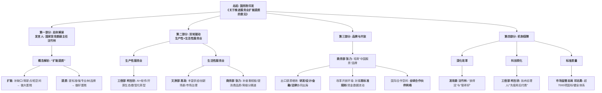
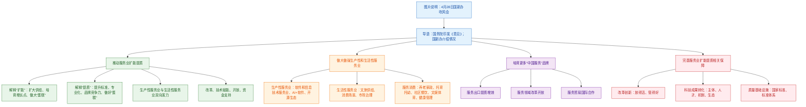

# 【政策精读笔记】

**标题**：促进服务业优质高效发展——国务院政策例行吹风会介绍《关于推进服务业扩能提质的意见》有关情况  
**来源**：新华社  
**作者**：记者 魏弘毅 邹雨沁  
**统筹**：高宇翔  
**编辑**：汪 鼎  
**审校**：李敏杰  
**终审**：周佳佳  
**发布时间**：2026年4月29日 14:36

---

## 前情提要

## 精读原文与注释

**原文**：4月28日，国务院新闻办公室在北京举行国务院政策例行吹风会，国家发展和改革委员会副主任沈竹林，工业和信息化部副部长柯吉欣，文化和旅游部副部长高政，国家市场监督管理总局副局长、国家标准化管理委员会主任邓志勇，商务部部长助理张力介绍《关于推进服务业扩能提质的意见》有关情况，并答记者问。新华社发（刘健 摄）近日，国务院印发《关于推进服务业扩能提质的意见》。如何以意见为抓手，落实全国服务业大会精神、推动服务业优质高效发展？国新办28日举行国务院政策例行吹风会，介绍相关情况。

---

**原文**：推动服务业扩能提质 国家发展改革委副主任沈竹林表示，`服务业是增长的动力源、转型的加速器、就业的主渠道、民生的幸福网`。《关于推进服务业扩能提质的意见》就推进服务业扩能提质作出系列部署。如何理解“扩能提质”这一关键词？“扩能”，就是要针对服务业现存的`供需缺口`，不断扩大服务供给，不断培育服务业新增长点和服务贸易新空间，来提升`发展能级`，即做大“蛋糕”。“提质”，就是要提升质量标准，提高专业化水平，增强品牌的竞争力，加快迈向`产业链价值链更高端`，即把“蛋糕”做好。

> **【比喻修辞与政策术语解析】**
>
> *   **“增长的动力源、转型的加速器、就业的主渠道、民生的幸福网”**：这是一种典型的公文排比句式，用四个生动的比喻来定性服务业的重要性。
>     *   `动力源` (Power Source)：强调服务业对GDP增长的拉动作用。当前我国服务业增加值占GDP比重已超过50%，是稳增长的核心引擎。
>     *   `加速器` (Accelerator)：指服务业尤其是生产性服务业，对于制造业转型升级（如数字化、智能化）具有催化作用。
>     *   `主渠道` (Main Channel)：服务业吸纳就业能力极强，是解决新增城镇就业和农村劳动力转移的“蓄水池”。
>     *   `幸福网` (Happiness Network)：强调家政、养老、文旅等生活性服务业直接关乎民生福祉。
> *   **“供需缺口” (Supply-demand Gap)**：高亮此词，指消费者日益增长的高品质、多样化服务需求，与当前供给体系不充分、不平衡之间的矛盾。
> *   **“发展能级” (Development Tier)**：不是单纯指规模大小，而是指核心竞争力、技术创新能力和全球资源配置能力的层级。简单说，就是从“低端跑量”向`“高端增值”`跃迁。
> *   **“产业链价值链更高端”**：源于“微笑曲线”理论，即向研发、设计、品牌、营销等高附加值环节攀升，而非停留在低利润的加工制造。
> *   **“做大蛋糕/做好蛋糕”**：形象比喻。“做大”侧重增量突破与规模扩张，“做好”侧重存量优化与质量提升。这背后对应的是供给侧结构性改革中`“扩量”与“提质”`的辩证关系。

**原文**：沈竹林表示，围绕贯彻扩能提质的要求，下一步重点在`生产性和生活性服务业`两方面加力推动。在生产性服务业方面，要以更强大的“中国服务”，来支撑更高端的“中国制造”。在生活性服务业方面，将以更优质的民生服务，托起更美好的人民生活。

> **【核心概念分类解析】**
>
> *   **生产性服务业 (Producer Services)**：亦称`“面向生产的服务业”`（Producer Services）。核心特征是为生产活动提供`中间投入`，而非直接面向最终消费者。
>     *   **易混淆辨析**：它与制造业是“唇齿相依”的关系，高度分工衍生出的独立产业。例如物流、研发、工业设计、数据处理、人力资源服务等。
>     *   **战略意义**：`“中国服务”支撑“中国制造”`这一提法极其重要，说明高层意识到，若缺少先进的生产性服务，制造业就难以突破“大而不强”的瓶颈。
> *   **生活性服务业 (Consumer Services)**：直接满足居民最终消费需求的服务。
>     *   **范围**：文旅、家政、养老、托育、餐饮、健康、体育等。
>     *   **政策导向**：从“有没有”转向`“好不好”`，重点关注“一老一小”（养老、托育）等高频刚需领域。

**原文**：解决服务业发展中的`短板弱项、瓶颈制约`，是未来我国服务业高质量发展的空间、潜力所在。“我们将以改革的办法来破除体制`机制障碍`，用技术赋能来`培育新增长点`，用更多务实的举措促进开放，拿出`‘真金白银’`来支持服务业扩能提质。”沈竹林说。

> **【高频政策词汇辨析】**
>
> *   **“短板弱项”与“瓶颈制约”**：这是一个近义词组合，但语义略有侧重。
>     *   `短板` (Weak Link / Short Slab)：源自“木桶效应”，指服务业体系中最薄弱的环节，如高端专业服务供给不足。
>     *   `瓶颈` (Bottleneck)：指限制整体发展的关键性狭窄关口，如数据跨境流动不畅、市场准入限制等。
>     *   **辨析**：短板是相对长板而言的结构性问题；瓶颈是卡住全行业甚至跨行业发展的硬性障碍。
> *   **“培育新增长点” (Foster New Growth Drivers)**：指通过技术创新（如AI大模型应用）、模式创新（如共享经济）、业态创新（如沉浸式文旅）催生新的经济增量。
> *   **“真金白银” (Real Gold and Silver)**：泛指实在的、量化的财政资金和税收优惠支持。这在政策宣传中用来凸显决心和力度，避免“口惠而实不至”。对应的英文表达可为 `tangible financial support` 或 `hard cash injection`。

---

**原文**：做大做强生产性和生活性服务业 意见提出`“全链条补强生产性服务业薄弱环节”`。软件和信息技术服务业是生产性服务业的重要组成部分。2025年软件和信息技术服务业整体行业营收达到15.48万亿元。工业和信息化部副部长柯吉欣表示，在人工智能赋能信息服务业方面，开展`“人工智能+软件”`专项行动，培育`模型即服务、智能体即服务`等相关新业态。进一步加强开源生态建设，推动基础软件、工业软件智能化升级。健全制造业`数智化转型`服务体系，分类分级培育优质的数智化转型服务商。

> **【前沿技术与政策热词解析】**
>
> *   **“全链条补强” (Strengthen the Entire Chain)**：不是头痛医头，而是覆盖研发设计、采购、生产、销售、售后等全环节的系统性提升。
> *   **“模型即服务 (MaaS) 与智能体即服务 (AaaS)”**：这是云计算时代“一切皆服务”（XaaS，即X as a Service）理念在AI时代的延伸。
>     *   `MaaS` (Model as a Service)：企业无需自研底层大模型，直接通过API（应用程序编程接口）调用云端的AI模型能力。
>     *   `AaaS` (Agent as a Service)：更高级的形态，用户不只是调用模型，而是调用一个能自主完成任务、调用工具的`“AI智能体”`（AI Agent）。
> *   **“数智化转型” (Digital and Intelligent Transformation)**：请注意这里不是常见的“数字化转型”，而是加了“智”。
>     *   **区分**：`数字化`侧重将业务转化为数据；`数智化`强调在数据基础上运用AI算法进行智能决策。这是当前的产业升级方向，词汇热度极高。
>     *   **成语/金句积累**：对应的英文为 `Digital & Intelligent Transformation`，体现的是从“数字化”到“智慧化”的跨越。

**原文**：意见对“提升生活性服务业重点领域发展能级”作出相关部署。文化和旅游部副部长高政表示，将从丰富文旅产品供给、创新文旅消费场景、加强文旅市场治理三方面满足人民群众高品质的文化和旅游需求。高政介绍，将引导`演艺、动漫、娱乐`等业态提质升级，推动`文化遗产、国风国潮`融入当代生活；支持创新打造`沉浸式演艺、国潮市集、非遗体验、特色音乐节`等消费场景；针对`不合理低价游、强制购物、网络非法招徕`等突出问题持续开展`专项整治`行动。

> **【文化消费场景注释】**
>
> *   **“国风国潮” (China-Chic / National Trend)**：将中国传统文化元素与现代时尚美学结合的社会风潮。不是简单的复古，而是`创造性转化与创新性发展`（“两创”方针）。
> *   **“沉浸式演艺” (Immersive Performance)**：打破传统舞台界限，让观众身临其境参与的演出形式。如景区实景剧、沉浸式戏剧（类似《不眠之夜》模式）。
> *   **“不合理低价游、强制购物、网络非法招徕”**：
>     *   这是老生常谈的旅游顽疾。`不合理低价游`即“零负团费”，靠购物回扣盈利。
>     *   `网络非法招徕`：指无旅行社业务经营许可资质，通过抖音、小红书等社交媒体组客盈利的个人或“野”组织。这种乱象隐蔽性强，取证难，是互联网+时代的旅游新问题。
> *   **“专项整治” (Special Rectification Campaign)**：具有中国特色的行政执法方式，指在特定时期内集中力量对突出违法行为进行高强度、系统化打击。

**原文**：当前，消费者的需求正在从`“有没有”向“好不好”`转变。聚焦扩大服务消费，商务部部长助理张力介绍，正在聚焦养老家政、托育托幼、社区餐饮等`高频刚需`领域，加快补齐普惠短板；聚焦文娱旅游、体育健身等消费升级领域，提升服务品质；聚焦体验消费、健康管理等个性化服务领域，培育壮大`细分赛道`，丰富高品质服务供给，满足多样化消费需求。

> **【消费趋势与商业术语解析】**
>
> *   **“有没有”向“好不好”转变**：对社会主要矛盾转化（人民日益增长的美好生活需要和不平衡不充分的发展之间的矛盾）在服务消费领域的具体表述。标志着市场进入了追求`品质化、个性化、体验化`的存量博弈与增量开拓期。
> *   **“高频刚需” (High-Frequency Rigid Demand)**：
>     *   `刚需`即刚性需求，价格变动对其影响较小，是生存或基本生活所必需的。
>     *   `高频`指消费频次高，如一日三餐的餐饮、日常的家政清扫。
>     *   **搭配应用**：这类词是商业分析和申论对策题的常用切入角度，强调市场稳定性强。
> *   **“细分赛道” (Niche Track / Segmented Track)**：原为赛车术语，引申为大产业中的专业化、精细化的市场细分领域。例如从“大健康”中细分出`“睡眠健康管理”`或`“更年期健康管理”`。

---

**原文**：培育更多“中国服务”品牌 当前我国服务贸易的规模稳居全球前列，但仍存在`逆差`。意见提出培育更多“中国服务”品牌。张力介绍，将从三个方面鼓励支持服务出口，推进服务业国际开放合作。推动服务出口提质增效，努力塑造“中国服务”新优势。努力培育一批具有国际竞争力的服务出口企业和`产业集群`，扩大`研发、设计、检测、维修`等生产性服务出口，带动`金融、法律、咨询`等专业服务`协同出海`。推动服务领域改革开放，优化“中国服务”发展环境。包括主动对接国际高标准经贸规则，有序放宽服务领域准入限制，推动与服务贸易密切相关的`资金、人员、数据等要素跨境便利安全流动`等。推动服务贸易国际合作，拓展“中国服务”市场空间。实施`服务贸易全球合作伙伴网络计划`，搭建各类服务贸易促进平台，助力服务企业更大范围参与国际竞争与合作。

> **【国际贸易环境与生态解析】**
>
> *   **“贸易逆差” (Trade Deficit)**：我国虽是货物贸易顺差大国，长期赚取外汇，但在服务贸易领域，由于在`知识产权使用费、高端专业咨询（律师/会计师）、出国旅游花费、跨境教育`等方面对外支出庞大，长期存在逆差。提升“中国服务”品牌是为了扭转这一局面。
> *   **“产业集群” (Industry Cluster)**：指在特定区域内，众多具有分工合作关系的企业及其发展密切相关的各种机构、组织等行为主体，通过纵横交错的网络关系紧密联系在一起的空间积聚体。
> *   **“协同出海” (Going Global in Concert)**：区别于过去单打独斗的出海模式。比如，高端装备出口后，随之带动后续的`远程运维服务、技术培训服务、海外金融租赁服务`等捆绑输出，形成“制造业+服务业”打包走出去的生态。
> *   **“资金、人员、数据等要素跨境便利安全流动”**：
>     *   **核心矛盾**：服务业开放最大的壁垒不是关税，而是`“边境后措施”`——即市场准入、执业资格互认、数据主权与隐私保护等。
>     *   **平衡点**：`便利`与`安全`并重，例如通过“数据出境安全评估”或者设立“离岸数据中心”等方式，在守住国家安全底线（安全可控）的前提下，促进数据要素流通（便利高效）。
> *   **“服务贸易全球合作伙伴网络计划”**：一种机制性安排，通过双边或多边协定，如FTA（自由贸易协定）升级版、DEPA（数字经济伙伴关系协定）等，建立长期稳定的服务贸易伙伴清单，扩大朋友圈。

---

**原文**：完善服务业扩能提质相关保障 推动意见落地见效，要`深化改革创新`。“主要目的就是让改革服务产业，真正能够`‘放得活’`，同时也能够`‘管得好’`。”沈竹林说。沈竹林表示，在“放得活”方面，要深入推进全国统一大市场建设，推动`要素市场化改革`，完善服务业标准体系建设。在“管得好”方面，通过运用`数智化技术`使管理工作进一步升级，以有效监管来促进高效发展。

> **【改革开放治理理念解析】**
>
> *   **“放得活”与“管得好” (Ensuring both dynamism and order)**：这是对“放管服”改革理念的深化。
>     *   `放得活`：侧重于效率，破除地方保护、行政垄断，让市场发挥决定性作用，激发微观主体活力。
>     *   `管得好`：侧重于公平与安全，利用大数据、非现场监管、信用分级等手段，实现`“无事不扰、利剑高悬”`的精准监管，避免“一放就乱、一管就死”。
>     *   **英文解析**：常常表述为 `"Enlivening while regulating"` 或 `Balancing vitality with order`。
> *   **“要素市场化改革” (Market-oriented reform of factors of production)**：指推动土地、劳动力、资本、技术、`数据（第五大要素）`等生产要素按照市场规则、市场价格、市场竞争进行高效配置。特别注意的是，数据被列为新型生产要素，其确权、定价、交易是改革的前沿阵地。

**原文**：当前我国科技成果转化还存在`专业服务支撑不足`等问题。柯吉欣表示，“十五五”期间，将围绕“主体、人才、机制、生态”打造优质高效的科技服务体系和发展生态。要建立科技服务机构分级分类评价体系，推动服务机构、投资机构、科技企业等多元主体合力培育和使用`技术经理人`，深入推进科技成果`“先使用后付费”`改革，打造科技、服务、产业协同联动的生态系统。

> **【科技成果转化系统创新解读】**
>
> *   **“技术经理人” (Technology Manager)**：不是简单的牵线红娘，而是懂技术、懂市场、懂金融、懂法律的复合型专业人才。他们负责从技术评估、专利布局、商业策划到寻找投资、对接市场的全过程，是粘合科学家与企业家的“翻译官”。
> *   **“先使用后付费” (Use First, Pay Later)**：一项极具突破性的微观改革。针对高校院所中大量因缺乏启动资金而被“闲置”的专利，允许中小微企业先免费获得许可实施（“先使用”），待产生经济效益且渡过生存期后，再进行财务结算（“后付费”）。这极大降低了科技成果产业化的`“死亡谷”`（Valley of Death）跨越难度和准入门槛。

**原文**：意见提出，`布局建设集成高效质量基础设施`。国家市场监督管理总局副局长、国家标准化管理委员会主任邓志勇介绍，目前服务业国家标准超过7000项。下一步将会同相关部门加快研究制定健全服务业国家标准的指导意见，聚焦生产性服务业和生活性服务业的重点领域，不断完善标准体系。

> **【质量标准体系术语详解】**
>
> *   **“集成高效质量基础设施” (Integrated & Efficient National Quality Infrastructure, NQI)**：这是一个专业术语。它并非简单的工厂基础建设，而是包含了`计量、标准、认证认可、检验检测`等在内的技术体系。
>     *   **重要性**：标准决定质量，有什么样的标准就有什么样的质量。服务业由于其无形性、不可储存性的特点，长期以来标准化程度远低于制造业。7000余项国标已是巨大体量，但针对新兴业态（如直播电商、露营管家服务、养老服务评估）仍然存在大量盲区或标准老化问题。
>     *   **目标**：通过完善标准体系，让服务变得“可量化、可评价、可视同”，从而解决信息不对称问题，促进优质优价。

## 前情提要

**资料信息**

- **文章来源**：用户提供页面显示为“全国政协”发布；经核验，正文为**新华社**通稿，新华网原发时间为 **2026-04-28 21:46:14**，中新网转载页显示来源为新华社，时间为 **2026-04-29 10:18:57**。用户页面显示时间为 **2026年4月29日 14:36，北京**。
- **题目**：促进服务业优质高效发展——国务院政策例行吹风会介绍《关于推进服务业扩能提质的意见》有关情况
- **英文题目参考译法**：Promoting the High-Quality and Efficient Development of the Services Sector — A State Council Policy Briefing Introduces Developments Concerning the Opinions on Advancing Capacity Expansion and Quality Improvement in the Services Sector
- **作者**：新华社记者 **魏弘毅、邹雨沁**。公开可核验的个人履历信息较少；从新华社署名报道看，魏弘毅、邹雨沁长期参与经济政策、国新办吹风会、消费、产业、科技转化等主题报道。
- **核验来源**：新华网原文 [1](https://www.news.cn/20260428/00155a0f3245420d83dbe7dd64710834/c.html)、中新网转载页 [2](https://www.chinanews.com.cn/gn/2026/04-29/10612782.shtml)、国务院关于推进服务业扩能提质的意见 [3](https://www.news.cn/politics/20260421/3f7ff7029a064f388f25e1a4d2767d70/c.html)、新华网图片说明 [4](https://www.news.cn/photo/20260428/834ace972fcd4f2eb150c0a243dd923f/c.html)。

---

## 逐句精读

🔸中文：4月28日，国务院新闻办公室 / 在北京举行 **`国务院政策例行吹风会`**，国家发展和改革委员会副主任沈竹林，工业和信息化部副部长柯吉欣，文化和旅游部副部长高政，国家市场监督管理总局副局长、国家标准化管理委员会主任邓志勇，商务部部长助理张力 / 介绍《关于推进服务业扩能提质的意见》有关情况，并答记者问。

🔹英文：On April 28, the State Council Information Office / held a **`routine State Council policy briefing`** in Beijing, where Shen Zhulin, vice chairman of the National Development and Reform Commission; Ke Jixin, vice minister of Industry and Information Technology; Gao Zheng, vice minister of Culture and Tourism; Deng Zhiyong, deputy head of the State Administration for Market Regulation and head of the Standardization Administration of China; and Zhang Li, assistant minister of Commerce / introduced developments concerning the Opinions on Advancing Capacity Expansion and Quality Improvement in the Services Sector and answered questions from reporters.

背景注释：
“国务院新闻办公室”常译为 **State Council Information Office**，简称 **SCIO**，负责组织新闻发布会、政策吹风会等信息发布活动。“国务院政策例行吹风会”不是一般会议，而是面向媒体解释国务院政策文件、回应公众关切的政务沟通形式。此句是图片说明，交代会议时间、地点、出席部门和议题。

> **`routine policy briefing`** /ruːˈtiːn ˈpɑːləsi ˈbriːfɪŋ/
> 释义：n. a regular meeting at which officials explain policy matters；例行政策说明会、政策吹风会。语域：新闻/政务。
> 画龙点睛：`briefing` 强调“向媒体或相关人员简要说明情况”，常搭配 `hold/convene/attend a briefing`。与 `press conference` 相比，`briefing` 更突出信息说明和政策解读，不一定是大型发布会。

> **`concerning`** /kənˈsɜːrnɪŋ/
> 释义：prep. about or relating to；关于，涉及。语域：正式/书面。
> 画龙点睛：新闻标题和正式文件中常用 `concerning/regarding/with respect to` 表示“关于”。`concerning` 比 `about` 更正式，也可作形容词表示“令人担忧的”，如 `a concerning trend`，需根据语境辨义。

> **`answer questions from reporters`** /ˈænsər ˈkwestʃənz frəm rɪˈpɔːrtərz/
> 释义：v. to respond to questions raised by journalists；答记者问。语域：新闻。
> 画龙点睛：中文“答记者问”在新闻英语中常译为 `answer questions from reporters` 或 `take questions from the press`。`take questions` 更口语化，`answer questions from reporters` 更直译、更适合政务新闻。

---

🔸中文：新华社发 / （刘健 摄）。

🔹英文：Published by Xinhua News Agency / photo by Liu Jian.

背景注释：
“新华社发”常见于新华社图片说明，表示图片由新华社发布。“摄”即“摄影”。在英文图片署名中，可译为 **photo by**，也可写作 **Photo: Liu Jian/Xinhua**。

> **`photo by`** /ˈfoʊtoʊ baɪ/
> 释义：prep. phrase used to credit the photographer；由……拍摄。语域：新闻/图片说明。
> 画龙点睛：图片署名常见格式有 `Photo by + photographer`、`Photo: photographer/agency`。写作中若表达“某图由某人拍摄”，可用 `The photo was taken by...`，但图片说明中 `photo by` 更简洁。

---

🔸中文：近日，国务院 / 印发《关于推进服务业 **`扩能提质`** 的意见》。

🔹英文：Recently, the State Council / issued the Opinions on Advancing **`Capacity Expansion and Quality Improvement`** in the Services Sector.

背景注释：
“国务院”是中国最高国家行政机关。“意见”在中国政策语境中通常指政策性指导文件，不等同于普通英文中的个人 opinion，因此常译为 **Opinions** 或 **Guidelines**。“扩能提质”是本文核心政策关键词，指扩大服务供给能力、提升服务质量。

> **`issue`** /ˈɪʃuː/
> 释义：v. to officially publish or announce something；正式发布，印发。语域：正式/政务/新闻。
> 画龙点睛：政府、机构发布文件常用 `issue`，如 `issue a statement`、`issue guidelines`、`issue regulations`。不要简单译成 `print`；中文“印发”重在正式公布和下发，而非物理“印刷”。

> **`capacity expansion`** /kəˈpæsəti ɪkˈspænʃən/
> 释义：n. an increase in the ability to provide goods or services；能力扩充，供给能力扩大。语域：经济/产业政策。
> 画龙点睛：`capacity` 可指“生产能力、承载能力、服务能力”。`capacity expansion` 常见于产业、能源、制造和服务供给语境；对应中文“扩能”，比单用 `expansion` 更准确。

> **`quality improvement`** /ˈkwɑːləti ɪmˈpruːvmənt/
> 释义：n. the act of making standards, performance, or service quality better；质量提升。语域：管理/经济/政策。
> 画龙点睛：`improve quality` 是动词搭配，`quality improvement` 是名词化表达，适合政策文件和学术写作。雅思写作中可用于服务、教育、医疗等话题，如 `quality improvement in public services`。

---

🔸中文：如何 / 以意见为 **`抓手`**，落实全国服务业大会精神、推动服务业 **`优质高效发展`**？

🔹英文：How can the Opinions / be used as a **`policy lever`** to implement the guiding principles of the national services-sector conference and promote the **`high-quality and efficient development`** of the services sector?

背景注释：
“抓手”是中国政策报道中的高频词，不能直译为 “handgrip”。这里指推动工作落地的切入点、工具或杠杆，可译为 **policy lever**, **starting point**, **vehicle**。“全国服务业大会”指围绕服务业发展召开的全国性会议，其“精神”即会议部署和政策导向。

> **`policy lever`** /ˈpɑːləsi ˈlevər/
> 释义：n. a tool or mechanism used by policymakers to influence outcomes；政策杠杆，政策抓手。语域：经济/政策分析。
> 画龙点睛：`lever` 本义是“杠杆”，引申为“可用来产生影响的手段”。写作中可说 `tax policy is a key lever for redistribution`。翻译“抓手”时，`policy lever` 比 `handle` 地道得多。

> **`implement`** /ˈɪmplɪment/
> 释义：v. to put a plan, decision, or policy into effect；贯彻，实施，落实。语域：正式/政务/商务。
> 画龙点睛：`implement a policy/plan/strategy` 是固定搭配。注意名词 `implementation` 表示“执行、落实”。考试写作中，`implement effective measures` 可替代简单的 `do something`。

> **`high-quality and efficient development`** /ˌhaɪ ˈkwɑːləti ənd ɪˈfɪʃənt dɪˈveləpmənt/
> 释义：n. development marked by better quality and higher efficiency；优质高效发展。语域：政策/经济。
> 画龙点睛：中文政策表达常并列抽象名词，英译时可保持形容词并列结构。`high-quality development` 是中国经济政策关键词，若加 `efficient`，强调不仅质量更高，而且资源配置和运行效率更好。

---

🔸中文：国新办 / 28日举行 **`国务院政策例行吹风会`**，介绍相关情况。

🔹英文：The SCIO / held a **`routine State Council policy briefing`** on April 28 to brief the press on relevant developments.

背景注释：
“国新办”即国务院新闻办公室，英文简称 **SCIO**。这里的“28日”在用户文章发布时间语境下指 **2026年4月28日**。英文中为避免歧义，应补足月份日期。

> **`brief the press`** /briːf ðə pres/
> 释义：v. to give journalists official information；向媒体通报情况。语域：新闻/政务。
> 画龙点睛：`brief` 作动词时表示“简要介绍、通报”，常用于政府、军方、公司场景。`brief the press on something` 是高频搭配，比 `introduce the situation` 更自然。

> **`relevant developments`** /ˈreləvənt dɪˈveləpmənts/
> 释义：n. related events, measures, or updates；相关情况，相关进展。语域：新闻/正式。
> 画龙点睛：中文“有关情况/相关情况”不宜机械译成 `related situation`。新闻英语中常用 `developments` 指事情的最新进展、政策安排或背景信息。

---

### 推动服务业扩能提质
### Advancing Capacity Expansion and Quality Improvement in the Services Sector

🔸中文：国家发展改革委副主任沈竹林表示，服务业 / 是增长的 **`动力源`**、转型的 **`加速器`**、就业的 **`主渠道`**、民生的 **`幸福网`**。

🔹英文：Shen Zhulin, vice chairman of the National Development and Reform Commission, said that the services sector / is a **`source of growth momentum`**, an **`accelerator of transformation`**, the **`main channel for employment`**, and a **`safety-and-well-being net`** for people’s livelihoods.

背景注释：
国家发展改革委通常译为 **National Development and Reform Commission, NDRC**，是宏观经济管理和发展规划的重要部门。此句采用四个隐喻并列，形成政策新闻中常见的排比结构，强调服务业在增长、转型、就业、民生中的多重功能。

> **`source of growth momentum`** /sɔːrs əv ɡroʊθ moʊˈmentəm/
> 释义：n. something that provides driving force for economic growth；增长动力源。语域：经济/政策。
> 画龙点睛：`momentum` 指“势头、动能”，常见搭配 `maintain/gain/lose momentum`。写经济作文时，`a key source of growth momentum` 可替代 `a reason for growth`，表达更专业。

> **`accelerator`** /əkˈseləreɪtər/
> 释义：n. something that makes a process happen faster；加速器，促进因素。语域：科技/经济/比喻。
> 画龙点睛：`accelerate` 是动词“加速”，名词 `accelerator` 可指汽车油门、粒子加速器，也可比喻“推动某进程加快的因素”。如 `digital technology is an accelerator of industrial upgrading`。

> **`main channel for employment`** /meɪn ˈtʃænl fər ɪmˈplɔɪmənt/
> 释义：n. the primary avenue through which jobs are created；就业主渠道。语域：经济/政策。
> 画龙点睛：`channel` 不仅是“频道”，也可指“渠道、途径”。`employment` 是不可数名词，表示“就业”；`job` 是可数名词，表示具体岗位。政策文本多用 `employment`。

---

🔸中文：《关于推进服务业扩能提质的意见》 / 就推进服务业 **`扩能提质`** 作出系列部署。

🔹英文：The Opinions on Advancing Capacity Expansion and Quality Improvement in the Services Sector / set out a series of arrangements for advancing **`capacity expansion and quality improvement`** in the sector.

背景注释：
“作出系列部署”是政策文本常用表达，指文件提出一揽子任务、措施和安排。英文中可译为 **set out a series of arrangements/measures**，比直译 “make deployments” 更自然。

> **`set out`** /set aʊt/
> 释义：phrasal v. to present or explain ideas, plans, or rules clearly；阐明，列明，提出。语域：正式/法律/政策。
> 画龙点睛：`set out measures/principles/objectives` 常见于政策和法律文本。注意 `set out to do` 也可表示“着手做某事”，如 `The report sets out to examine...`。

> **`a series of arrangements`** /ə ˈsɪriːz əv əˈreɪndʒmənts/
> 释义：n. a number of planned measures or institutional steps；一系列安排、部署。语域：正式/政务。
> 画龙点睛：中文“部署”不宜直译为 `deployment`，除非是军事部署。政策语境中常用 `arrangements`, `measures`, `plans`, `steps`，其中 `arrangements` 更偏制度性安排。

---

🔸中文：如何理解 / “**`扩能提质`**”这一关键词？

🔹英文：How should we understand / the key term **`capacity expansion and quality improvement`**?

背景注释：
这是记者提问式过渡句，引出对核心概念的解释。在政策报道中，先抛出概念，再分解定义，是常见结构。

> **`key term`** /kiː tɜːrm/
> 释义：n. an important word or expression central to a discussion；关键词，核心术语。语域：学术/政策/说明文。
> 画龙点睛：`term` 不只是“期限”，还可表示“术语、说法”。`key term/concept/phrase` 常用于阅读理解和学术写作，强调某个词承载核心含义。

---

🔸中文：“**`扩能`**”，就是要针对服务业现存的 **`供需缺口`**，不断扩大服务供给，不断培育服务业新增长点和服务贸易新空间，来提升发展能级，即做大“**`蛋糕`**”。

🔹英文：**`Capacity expansion`** means addressing existing **`supply-demand gaps`** in the services sector by continuously expanding service supply and cultivating new growth drivers in services as well as new space for trade in services, so as to raise the sector’s level of development — in other words, to make the “**`cake`**” bigger.

背景注释：
“做大蛋糕”是中文政策经济话语中的常用比喻，指扩大总量、提升规模，而非直接涉及分配。“服务贸易”指跨境提供服务的贸易，如金融、咨询、教育、旅游、研发设计等。

> **`supply-demand gap`** /səˈplaɪ dɪˈmænd ɡæp/
> 释义：n. the mismatch between what is supplied and what is needed；供需缺口。语域：经济。
> 画龙点睛：`gap` 常表示“差距、缺口”，搭配广泛：`income gap` 收入差距，`skills gap` 技能缺口，`funding gap` 资金缺口。经济类阅读中尤其高频。

> **`cultivate new growth drivers`** /ˈkʌltɪveɪt nuː ɡroʊθ ˈdraɪvərz/
> 释义：v. to develop new forces that can support economic growth；培育新的增长动力。语域：经济/政策。
> 画龙点睛：`cultivate` 本义“耕作、培养”，在经济政策中表示“培育产业、企业、市场”。`growth driver` 比 `growth point` 更地道，指带动增长的力量或因素。

> **`trade in services`** /treɪd ɪn ˈsɜːrvɪsɪz/
> 释义：n. cross-border trade involving services rather than goods；服务贸易。语域：国际贸易。
> 画龙点睛：英语中常说 `trade in goods` 与 `trade in services`。不要写成 `service trade` 虽然可懂，但在国际经贸语境中 `trade in services` 更规范。

---

🔸中文：“**`提质`**”，就是要提升质量标准，提高专业化水平，增强品牌的竞争力，加快迈向产业链价值链更高端，即把“**`蛋糕`**”做好。

🔹英文：**`Quality improvement`** means raising quality standards, enhancing the level of specialization, strengthening brand competitiveness, and moving more quickly toward the higher end of industrial and value chains — in other words, making the “**`cake`**” better.

背景注释：
“产业链价值链更高端”指从低附加值环节向高附加值、高技术、高品牌溢价环节升级。这里与上一句形成对照：扩能是“做大”，提质是“做好”。

> **`specialization`** /ˌspeʃələˈzeɪʃən/
> 释义：n. the process of focusing on a particular area of expertise；专业化。语域：经济/管理/学术。
> 画龙点睛：`specialized` 表示“专门的、专业化的”，如 `specialized services`。在产业升级话题中，`specialization` 常与 `efficiency`, `productivity`, `competitiveness` 同现。

> **`brand competitiveness`** /brænd kəmˈpetətɪvnəs/
> 释义：n. the ability of a brand to compete effectively in the market；品牌竞争力。语域：商业/经济。
> 画龙点睛：`competitive` 是形容词“有竞争力的”，`competitiveness` 是名词“竞争力”。写作中可用 `enhance/improve/strengthen competitiveness`，动词搭配很固定。

> **`the higher end of value chains`** /ðə ˈhaɪər end əv ˈvæljuː tʃeɪnz/
> 释义：n. the more profitable, knowledge-intensive parts of value chains；价值链高端。语域：产业经济。
> 画龙点睛：`value chain` 指从研发、生产到营销、服务的价值创造链条。`move up the value chain` 是高频表达，意为“向价值链高端攀升”。

---

🔸中文：沈竹林表示，围绕贯彻 **`扩能提质`** 的要求，下一步 / 重点在生产性和生活性服务业两方面加力推动。

🔹英文：Shen said that, in implementing the requirements for **`capacity expansion and quality improvement`**, the next step / is to step up efforts in both producer services and consumer-oriented services.

背景注释：
“生产性服务业”指服务生产活动、提升产业效率的服务业，如研发设计、物流、软件信息、检验检测、金融等。“生活性服务业”指面向居民生活消费的服务，如养老、托育、餐饮、文旅、家政、健康服务等。

> **`step up efforts`** /step ʌp ˈefərts/
> 释义：v. to increase the intensity or scale of action；加大力度，加力推动。语域：新闻/政策/商务。
> 画龙点睛：`step up` 是非常地道的动词短语，常搭配 `efforts`, `measures`, `campaigns`。比 `do more` 正式，适合写作表达“进一步发力”。

> **`producer services`** /prəˈduːsər ˈsɜːrvɪsɪz/
> 释义：n. services used as inputs by businesses and production sectors；生产性服务业。语域：经济。
> 画龙点睛：`producer services` 也可译为“生产者服务”。它服务于企业和产业链，如物流、研发、金融、软件等；与 `consumer services` 或 `personal services` 相对。

> **`consumer-oriented services`** /kənˈsuːmər ˈɔːrientɪd ˈsɜːrvɪsɪz/
> 释义：n. services mainly aimed at household and individual consumption；生活性服务业，面向消费者的服务业。语域：经济/政策。
> 画龙点睛：中文“生活性服务业”没有完全固定的英文一对一译法，可根据上下文译为 `consumer services`, `consumer-oriented services`, `life-related services`。这里强调居民消费，故用 `consumer-oriented`。

---

🔸中文：在生产性服务业方面，要以更强大的“**`中国服务`**”，来支撑更高端的“**`中国制造`**”。

🔹英文：In producer services, stronger “**`China Services`**” should be used to support higher-end “**`Made in China`**.”

背景注释：
“中国制造”在国际传播中常译为 **Made in China**，但此处不只是商品标签，而是指中国制造业体系升级。“中国服务”对应服务业品牌与服务能力，尤其是支撑制造升级的研发、软件、物流、检测、金融、咨询等服务。

> **`higher-end`** /ˌhaɪər ˈend/
> 释义：adj. more advanced, sophisticated, or high-value；更高端的。语域：商业/产业。
> 画龙点睛：`high-end` 可形容产品、服务、制造、消费，如 `high-end manufacturing`。比较级可写 `higher-end`，强调从低端向高端升级。

> **`support`** /səˈpɔːrt/
> 释义：v. to help something function, develop, or succeed；支撑，支持。语域：通用/政策。
> 画龙点睛：`support` 在经济文本中常指“为……提供基础或助力”，如 `services support manufacturing upgrading`。比 `help` 更正式，适合写作。

---

🔸中文：在生活性服务业方面，将以更优质的 **`民生服务`**，托起更美好的人民生活。

🔹英文：In consumer-oriented services, higher-quality **`public livelihood services`** will help underpin a better life for the people.

背景注释：
“民生服务”包括养老、托育、医疗健康、社区餐饮、家政、文旅等与居民日常生活直接相关的服务。“托起”是形象表达，英文可用 **underpin** 表示“支撑、奠基”。

> **`underpin`** /ˌʌndərˈpɪn/
> 释义：v. to support, strengthen, or form the basis of something；支撑，巩固，构成基础。语域：正式/学术/政策。
> 画龙点睛：`underpin` 比 `support` 更书面，常用于抽象名词：`policies underpin growth`、`education underpins social mobility`。阅读中见到它，常对应“支撑、奠定基础”。

> **`public livelihood services`** /ˈpʌblɪk ˈlaɪvlihʊd ˈsɜːrvɪsɪz/
> 释义：n. services related to people’s daily well-being and basic needs；民生服务。语域：政策。
> 画龙点睛：`livelihood` 指“生计、民生”。中国政策翻译中，`people’s livelihood` 很常见。若强调具体公共服务，也可译为 `services related to people’s well-being`。

---

🔸中文：解决服务业发展中的 **`短板弱项`**、**`瓶颈制约`**，是未来我国服务业高质量发展的空间、潜力所在。

🔹英文：Addressing **`weak links`** and **`bottlenecks`** in the development of the services sector / is where the space and potential for China’s future high-quality services-sector development lie.

背景注释：
“短板弱项”指制约发展的薄弱环节；“瓶颈制约”指阻碍进一步发展的关键障碍。此句强调问题本身也是增长空间：补短板即可释放潜力。

> **`weak link`** /wiːk lɪŋk/
> 释义：n. the least effective or most vulnerable part of a system；薄弱环节，短板。语域：通用/管理/政策。
> 画龙点睛：`link` 有“链条中的一环”之意。`the weak link in the chain` 是固定表达，适合翻译“短板、薄弱环节”，比 `short board` 自然。

> **`bottleneck`** /ˈbɑːtlnek/
> 释义：n. a point of congestion or obstruction that slows progress；瓶颈，制约因素。语域：经济/管理/技术。
> 画龙点睛：`bottleneck` 原指瓶颈处，引申为流程、供应链、制度中的卡点。常见搭配 `remove/address/ease bottlenecks`，分别表示消除、解决、缓解瓶颈。

> **`potential`** /pəˈtenʃəl/
> 释义：n. the possibility of future development or success；潜力。语域：通用/经济。
> 画龙点睛：`potential` 作名词通常不可数，如 `growth potential`。作形容词表示“潜在的”，如 `potential risks`。注意不要把“潜力所在”机械译成 `potential place`。

---

🔸中文：“我们将以改革的办法 / 来破除 **`体制机制障碍`**，用技术赋能来培育新增长点，用更多务实的举措促进开放，拿出‘**`真金白银`**’来支持服务业扩能提质。”沈竹林说。

🔹英文：“We will use reform-based approaches / to remove **`institutional barriers`**, empower the sector with technology to cultivate new growth drivers, promote opening-up through more practical measures, and provide **`substantial financial support`** for capacity expansion and quality improvement in the services sector,” Shen said.

背景注释：
“体制机制障碍”指制度安排、管理机制、市场准入、资源流动等方面的障碍。“真金白银”是中文口语化政策表达，指真实、可见、有效的资金支持或财政金融支持，英文不能直译为 “real gold and silver”。

> **`institutional barriers`** /ˌɪnstɪˈtuːʃənəl ˈbæriərz/
> 释义：n. obstacles arising from rules, systems, or institutional arrangements；体制机制障碍。语域：政策/学术。
> 画龙点睛：`institutional` 不只是“机构的”，还指“制度性的”。`barrier` 常搭配 `remove/eliminate/reduce barriers`。经济改革文本中，`institutional barriers` 是翻译“体制机制障碍”的常用表达。

> **`empower ... with technology`** /ɪmˈpaʊər wɪð tekˈnɑːlədʒi/
> 释义：v. to strengthen or enable something through technology；用技术赋能。语域：科技/商业/政策。
> 画龙点睛：`empower` 本义“授权、使有能力”，近年在科技语境中常译“赋能”。但英语中不要滥用，可具体写为 `use digital technologies to improve...`，更清楚。

> **`substantial financial support`** /səbˈstænʃəl faɪˈnænʃəl səˈpɔːrt/
> 释义：n. significant and concrete funding or monetary assistance；实实在在的资金支持。语域：正式/政策。
> 画龙点睛：中文“真金白银”可译为 `real money`, `concrete financial support`, `substantial financial support`。正式政务翻译中，`substantial financial support` 更稳妥。

---

### 做大做强生产性和生活性服务业
### Expanding and Strengthening Producer and Consumer-Oriented Services

🔸中文：意见 / 提出“**`全链条`** 补强生产性服务业薄弱环节”。

🔹英文：The Opinions / call for strengthening weak links in producer services across the **`entire chain`**.

背景注释：
“全链条”指覆盖产业链或服务链的各个环节，而不是只在某一环节发力。“补强薄弱环节”常用于产业链供应链、公共服务、技术体系等领域。

> **`call for`** /kɔːl fɔːr/
> 释义：phrasal v. to publicly require, demand, or advocate something；要求，呼吁，提出。语域：新闻/政策。
> 画龙点睛：政策文件“提出、要求”可译为 `call for`, `propose`, `require`, `urge`。`call for` 语气较正式但不僵硬，适合新闻报道。

> **`entire chain`** /ɪnˈtaɪər tʃeɪn/
> 释义：n. all stages of a process, supply chain, or industrial chain；全链条。语域：产业/政策。
> 画龙点睛：`chain` 在经济英语中很核心：`supply chain` 供应链，`industrial chain` 产业链，`value chain` 价值链。`across the entire chain` 表示“贯穿全链条”。

---

🔸中文：软件和信息技术服务业 / 是生产性服务业的重要组成部分。

🔹英文：The software and information technology services industry / is an important component of producer services.

背景注释：
软件和信息技术服务业包括软件开发、信息系统集成、数据服务、云计算、工业软件、基础软件等，是数字经济和制造业转型的重要支撑。

> **`component`** /kəmˈpoʊnənt/
> 释义：n. one part of a larger whole；组成部分，构成要素。语域：正式/技术/经济。
> 画龙点睛：`component` 比 `part` 更正式，常用于系统、产业、机器、政策框架。可数名词，如 `a key component of the strategy` 表示“战略的重要组成部分”。

> **`information technology services`** /ˌɪnfərˈmeɪʃən tekˈnɑːlədʒi ˈsɜːrvɪsɪz/
> 释义：n. services related to software, networks, data, and digital systems；信息技术服务。语域：科技/产业。
> 画龙点睛：常缩写为 `IT services`。注意 `information technology` 是不可数概念，但 `services` 可数复数，表示多类服务。产业报告中常见 `software and IT services`。

---

🔸中文：2025年 / 软件和信息技术服务业整体行业营收达到 **`15.48万亿元`**。

🔹英文：In 2025, / the software and information technology services industry recorded total operating revenue of **`15.48 trillion yuan`**.

背景注释：
“营收”即营业收入，英文可译为 **operating revenue** 或 **revenue**。15.48万亿元人民币即 **15.48 trillion yuan**，在英文数字表达中，“万亿”对应 **trillion**。

> **`record`** /rɪˈkɔːrd/
> 释义：v. to reach or register a particular amount or result；达到，录得。语域：财经/新闻。
> 画龙点睛：财经新闻常用 `record revenue/profit/growth`。注意读音：作动词重音在后 /rɪˈkɔːrd/，作名词“记录”重音在前 /ˈrekərd/。

> **`operating revenue`** /ˈɑːpəreɪtɪŋ ˈrevənuː/
> 释义：n. income generated from a company’s or industry’s main operations；营业收入。语域：财经/会计。
> 画龙点睛：`revenue` 是“收入、营收”，不同于 `profit` “利润”。公司可能营收增长但利润下降。阅读财经报道时要特别区分 `revenue`, `profit`, `earnings`, `income`。

> **`trillion`** /ˈtrɪljən/
> 释义：n. one thousand billion, 10¹²；万亿。语域：数字/财经。
> 画龙点睛：中文“大数字”英译要换算：`万` = ten thousand，`亿` = hundred million，`万亿` = trillion。`15.48万亿元` 即 `15.48 trillion yuan`，不能译成 `154,800 billion`。

---

🔸中文：工业和信息化部副部长柯吉欣表示，在人工智能 **`赋能`** 信息服务业方面，开展“**`人工智能+软件`**”专项行动，培育 **`模型即服务`**、**`智能体即服务`** 等相关新业态。

🔹英文：Ke Jixin, vice minister of Industry and Information Technology, said that to **`empower`** the information services industry with artificial intelligence, China will launch a special “**`AI plus software`**” initiative and foster new business forms such as **`model-as-a-service`** and **`agent-as-a-service`**.

背景注释：
工业和信息化部常译为 **Ministry of Industry and Information Technology, MIIT**。 “模型即服务”类似英文 **Model-as-a-Service, MaaS**，指以服务方式提供大模型能力。“智能体即服务”可译为 **Agent-as-a-Service**，指提供可执行任务的 AI agent 服务。

> **`empower`** /ɪmˈpaʊər/
> 释义：v. to give someone or something the ability, authority, or tools to do something；赋能，使有能力。语域：商业/科技/政策。
> 画龙点睛：`empower` 可用于人，也可用于行业或技术场景。写作时可说 `AI empowers healthcare services`，但如果过度使用会显空泛，可结合具体作用说明。

> **`initiative`** /ɪˈnɪʃətɪv/
> 释义：n. a new plan or action intended to solve a problem or achieve a goal；专项行动，倡议，举措。语域：正式/政策/商业。
> 画龙点睛：`launch an initiative` 是固定搭配。`initiative` 也可表示“主动性”，如 `take the initiative`。政策中多译为“行动、倡议、计划”。

> **`foster new business forms`** /ˈfɑːstər nuː ˈbɪznəs fɔːrmz/
> 释义：v. to encourage the development of new types of business models；培育新业态。语域：经济/政策。
> 画龙点睛：`foster` 表示“培育、促进”，比 `develop` 更强调外部支持。`business forms` 或 `business models` 可译“业态/商业模式”，政策翻译中很常用。

---

🔸中文：进一步加强 **`开源生态`** 建设，推动基础软件、工业软件 **`智能化升级`**。

🔹英文：Efforts will be made to further strengthen the **`open-source ecosystem`** and promote the **`intelligent upgrading`** of basic software and industrial software.

背景注释：
“开源生态”指围绕开源软件、开源社区、开发者、企业应用、治理规则等形成的系统。基础软件包括操作系统、数据库、中间件等；工业软件包括 CAD、CAE、MES、PLM 等支撑工业研发生产的软件。

> **`open-source ecosystem`** /ˌoʊpən ˈsɔːrs ˈiːkoʊsɪstəm/
> 释义：n. a network of communities, tools, rules, and firms built around open-source software；开源生态。语域：科技/产业。
> 画龙点睛：`open-source` 作形容词，意为“开源的”。`ecosystem` 原指生态系统，商业科技语境中指多主体协同网络，如 `innovation ecosystem`, `startup ecosystem`。

> **`intelligent upgrading`** /ɪnˈtelɪdʒənt ˌʌpˈɡreɪdɪŋ/
> 释义：n. the process of making systems smarter through AI or digital technologies；智能化升级。语域：科技/制造业。
> 画龙点睛：`upgrade` 可作动词或名词，`upgrading` 常用于产业升级。`intelligent upgrading` 指通过 AI、数据、算法提升软件或制造系统能力。

---

🔸中文：健全制造业 **`数智化转型`** 服务体系，分类分级培育优质的数智化转型服务商。

🔹英文：A sound service system for the **`digital-intelligent transformation`** of manufacturing will be improved, and high-quality digital-intelligent transformation service providers will be cultivated by category and tier.

背景注释：
“数智化”结合“数字化”和“智能化”，通常指以数据、算法、AI、工业互联网等推动流程、管理和生产方式升级。“分类分级”表示按不同类型和能力层级进行培育。

> **`digital-intelligent transformation`** /ˈdɪdʒɪtl ɪnˈtelɪdʒənt ˌtrænsfərˈmeɪʃən/
> 释义：n. transformation driven by digitalization and intelligent technologies；数智化转型。语域：科技/产业政策。
> 画龙点睛：`digital transformation` 是常用表达；中文“数智化”可扩展为 `digital and intelligent transformation`。连字符形式 `digital-intelligent` 更凝练，但正式写作中也可拆开表达。

> **`service provider`** /ˈsɜːrvɪs prəˈvaɪdər/
> 释义：n. a company or organization that supplies services；服务商，服务提供者。语域：商业/科技。
> 画龙点睛：`provider` 来自动词 `provide`。常见搭配 `cloud service provider`, `internet service provider`, `healthcare provider`。比 `supplier` 更强调“服务”而非实体产品供应。

> **`by category and tier`** /baɪ ˈkætəɡɔːri ənd tɪr/
> 释义：adv. according to type and level；分类分级地。语域：政策/管理。
> 画龙点睛：`tier` 指“层级、等级”，如 `tier-one cities` 一线城市，`multi-tier system` 多层体系。翻译“分级”时，`tiered` 也常用，如 `a tiered evaluation system`。

---

🔸中文：意见 / 对“提升生活性服务业重点领域 **`发展能级`**”作出相关部署。

🔹英文：The Opinions / also make arrangements for “raising the **`development level`** of key areas in consumer-oriented services.”

背景注释：
“发展能级”是政策语汇，指规模、质量、效率、创新能力、辐射带动能力等综合发展水平。英文可译为 **development level**, **development capacity**, 或 **development potential**，此处用 **development level** 较稳妥。

> **`make arrangements for`** /meɪk əˈreɪndʒmənts fɔːr/
> 释义：v. to plan or organize measures for something；为……作出安排/部署。语域：正式/政策。
> 画龙点睛：政策文本中的“部署”多译为 `make arrangements for` 或 `lay out measures for`。避免使用军事色彩较重的 `deployments`，除非上下文确为军事。

> **`development level`** /dɪˈveləpmənt ˈlevl/
> 释义：n. the degree of maturity, quality, and capacity in development；发展水平，发展能级。语域：政策/经济。
> 画龙点睛：`level` 简洁但宽泛。若强调能力，可用 `development capacity`；若强调高端化，可用 `development sophistication`。翻译政策词时需结合上下文取舍。

---

🔸中文：文化和旅游部副部长高政表示，将从丰富文旅产品供给、创新文旅消费场景、加强文旅市场治理三方面 / 满足人民群众高品质的文化和旅游需求。

🔹英文：Gao Zheng, vice minister of Culture and Tourism, said that efforts will be made in three areas — enriching the supply of cultural and tourism products, innovating cultural and tourism consumption scenarios, and strengthening governance of the cultural and tourism market — / to meet people’s demand for high-quality cultural and tourism services.

背景注释：
“文旅”是“文化和旅游”的合称，英文通常译为 **culture and tourism** 或 **cultural and tourism**。 “消费场景”近年来在政策和商业语境中高频出现，指特定消费空间、体验、活动和应用情境。

> **`enrich the supply of`** /ɪnˈrɪtʃ ðə səˈplaɪ əv/
> 释义：v. to make the range or variety of something more abundant；丰富……供给。语域：政策/商业。
> 画龙点睛：`enrich` 不只表示“使富有”，还可表示“使内容更丰富”。如 `enrich cultural life`, `enrich product offerings`。比 `increase` 更强调种类和质量。

> **`consumption scenario`** /kənˈsʌmpʃən səˈnærioʊ/
> 释义：n. a setting or situation in which consumption takes place；消费场景。语域：商业/政策。
> 画龙点睛：`scenario` 本义是“情景、设想”，在商业中表示消费发生的具体情境。中文“场景经济”可译为 `scenario-based economy` 或 `scenario-driven consumption`。

> **`market governance`** /ˈmɑːrkɪt ˈɡʌvərnəns/
> 释义：n. systems and actions for regulating and managing market order；市场治理。语域：政策/监管。
> 画龙点睛：`governance` 指治理体系和治理过程，不等同于 `government`。常见表达有 `corporate governance`, `data governance`, `market governance`。

---

🔸中文：高政介绍，将引导演艺、动漫、娱乐等业态 **`提质升级`**，推动文化遗产、**`国风国潮`** 融入当代生活；支持创新打造 **`沉浸式演艺`**、国潮市集、非遗体验、特色音乐节等消费场景；针对不合理低价游、强制购物、网络非法招徕等突出问题持续开展专项整治行动。

🔹英文：Gao said that authorities will guide performing arts, animation, entertainment and other business forms toward **`quality upgrading`**; promote the integration of cultural heritage and **`Chinese-style cultural trends`** into contemporary life; support innovative consumption scenarios such as **`immersive performances`**, Chinese-trend markets, intangible cultural heritage experiences and distinctive music festivals; and continue special rectification campaigns targeting prominent problems such as unreasonably low-priced tours, forced shopping and illegal online solicitation.

背景注释：
“国风国潮”指以中国传统文化元素、民族审美和本土品牌潮流为核心的消费与文化现象。“非遗”是“非物质文化遗产”，英文为 **intangible cultural heritage**。不合理低价游、强制购物等是旅游市场治理中的常见问题。

> **`quality upgrading`** /ˈkwɑːləti ˌʌpˈɡreɪdɪŋ/
> 释义：n. improvement in quality, standards, and value；提质升级。语域：经济/产业。
> 画龙点睛：`upgrade` 强调“升级”，`quality upgrading` 则兼有“质量提升”和“层次提高”。产业政策中可用于 `industrial upgrading`, `service upgrading`, `product upgrading`。

> **`immersive performance`** /ɪˈmɜːrsɪv pərˈfɔːrməns/
> 释义：n. a performance that surrounds or deeply involves the audience；沉浸式演艺。语域：文旅/艺术。
> 画龙点睛：`immersive` 来自 `immerse` “沉浸”。常搭配 `immersive experience`, `immersive theater`, `immersive exhibition`，强调观众不只是观看，而是身临其境参与。

> **`intangible cultural heritage`** /ɪnˈtændʒəbl ˈkʌltʃərəl ˈherɪtɪdʒ/
> 释义：n. cultural practices, expressions, skills, or knowledge passed down through generations；非物质文化遗产。语域：文化/联合国教科文组织。
> 画龙点睛：`tangible` 是“有形的”，`intangible` 是“无形的”。非遗包括传统技艺、表演艺术、民俗等，不是建筑遗址那类有形遗产。

> **`rectification campaign`** /ˌrektɪfɪˈkeɪʃən kæmˈpeɪn/
> 释义：n. a targeted campaign to correct misconduct or irregularities；专项整治行动。语域：监管/政策。
> 画龙点睛：`rectify` 表示“纠正、整顿”，名词 `rectification` 常用于监管报道。`campaign` 表示集中行动，不一定是选举竞选，也可指治理专项行动。

---

🔸中文：当前，消费者的需求 / 正在从“**`有没有`**”向“**`好不好`**”转变。

🔹英文：At present, consumer demand / is shifting from whether services are **`available at all`** to whether they are **`good enough`**.

背景注释：
“有没有”对应数量和可及性问题，“好不好”对应质量、体验和差异化需求。此句反映消费升级趋势：居民不只需要“有服务”，更关注“服务品质”。

> **`shift from ... to ...`** /ʃɪft frəm tə/
> 释义：v. to change from one state, focus, or pattern to another；从……转向……。语域：通用/学术/新闻。
> 画龙点睛：`shift` 是阅读写作高频词，可作名词或动词。常见搭配 `a shift in consumer behavior`, `shift the focus from A to B`。比 `change` 更强调方向性转变。

> **`available at all`** /əˈveɪləbl æt ɔːl/
> 释义：adj. phrase meaning existing or accessible in the first place；是否存在、是否可获得。语域：通用。
> 画龙点睛：`at all` 在疑问或否定语境中强调“到底、根本”。这里用于解释“有没有”的底层含义，即服务是否存在、是否可及，而非质量高低。

> **`good enough`** /ɡʊd ɪˈnʌf/
> 释义：adj. sufficiently satisfactory in quality；足够好，质量达标。语域：口语/通用。
> 画龙点睛：`good enough` 看似简单，但能自然表达“好不好”。若要更正式，可用 `of sufficient quality` 或 `meet consumers’ quality expectations`。

---

🔸中文：聚焦扩大 **`服务消费`**，商务部部长助理张力介绍，正在聚焦养老家政、托育托幼、社区餐饮等 **`高频刚需`** 领域，加快补齐 **`普惠短板`**；聚焦文娱旅游、体育健身等消费升级领域，提升服务品质；聚焦体验消费、健康管理等个性化服务领域，培育壮大 **`细分赛道`**，丰富高品质服务供给，满足多样化消费需求。

🔹英文：Focusing on expanding **`services consumption`**, Zhang Li, assistant minister of Commerce, said that work is being concentrated on high-frequency and essential-demand areas such as elderly care, domestic services, childcare and community dining to accelerate efforts to make up for shortcomings in **`inclusive services`**; on consumption-upgrading areas such as entertainment, tourism, sports and fitness to improve service quality; and on personalized service areas such as experience-based consumption and health management to cultivate and expand **`niche segments`**, enrich the supply of high-quality services and meet diversified consumer demand.

背景注释：
“服务消费”区别于商品消费，涵盖养老、家政、餐饮、旅游、文化娱乐、体育健康等。“高频刚需”指使用频率高且需求刚性的服务。“普惠”强调价格可承受、覆盖面广、普通公众可获得。“细分赛道”是商业语汇，指更具体、更垂直的市场领域。

> **`services consumption`** /ˈsɜːrvɪsɪz kənˈsʌmpʃən/
> 释义：n. consumption of services rather than physical goods；服务消费。语域：经济/消费。
> 画龙点睛：`consumption` 是不可数名词，表示“消费”。与 `goods consumption` 相对，`services consumption` 是消费升级和现代服务业发展中的核心概念。

> **`essential demand`** /ɪˈsenʃəl dɪˈmænd/
> 释义：n. demand for basic and necessary services or goods；刚性需求，刚需。语域：经济/商业。
> 画龙点睛：中文“刚需”不能直译为 `hard demand`。可译为 `essential demand`, `basic demand`, `inelastic demand`。若强调经济学“价格变化不敏感”，用 `inelastic demand`。

> **`inclusive services`** /ɪnˈkluːsɪv ˈsɜːrvɪsɪz/
> 释义：n. services designed to be affordable and accessible to broad groups；普惠服务。语域：政策/社会服务。
> 画龙点睛：`inclusive` 表示“包容的、覆盖广泛的”。常见搭配 `inclusive growth` 包容性增长，`inclusive finance` 普惠金融，`inclusive education` 融合教育。

> **`niche segment`** /niːʃ ˈseɡmənt/
> 释义：n. a specialized part of a market serving particular needs；细分赛道，细分市场。语域：商业/市场营销。
> 画龙点睛：`niche` 可读 /niːʃ/ 或 /nɪtʃ/，表示“小众但明确的市场定位”。`segment` 指市场分区。`niche market segment` 是商业写作高频表达。

---

### 培育更多“中国服务”品牌
### Cultivating More “China Services” Brands

🔸中文：当前 / 我国 **`服务贸易`** 的规模稳居全球前列，但仍存在 **`逆差`**。

🔹英文：At present, / China’s **`trade in services`** ranks among the largest in the world, but it still runs a **`deficit`**.

背景注释：
“逆差”指进口额大于出口额。服务贸易逆差通常可能来自旅游、知识产权使用费、运输、金融、专业服务等领域的收支差额。这里强调中国服务贸易规模大，但国际竞争力和出口能力仍有提升空间。

> **`rank among`** /ræŋk əˈmʌŋ/
> 释义：v. to be included within a certain leading group or category；位居……之列。语域：新闻/正式。
> 画龙点睛：`rank among the top...` 是常见表达，如 `rank among the world’s largest economies`。注意 `rank` 作动词不一定要被动，主动即可表达“位列”。

> **`deficit`** /ˈdefɪsɪt/
> 释义：n. the amount by which spending or imports exceed income or exports；赤字，逆差。语域：财经/经济。
> 画龙点睛：`trade deficit` 是贸易逆差，`budget deficit` 是财政赤字。其反义词是 `surplus`。不要把“逆差”译成 `reverse difference`。

---

🔸中文：意见 / 提出培育更多“**`中国服务`**”品牌。

🔹英文：The Opinions / call for cultivating more “**`China Services`**” brands.

背景注释：
“中国服务”品牌并非单一企业品牌，而是国家层面的服务能力和国际形象表达，类似“中国制造”从产品标签向质量品牌升级的过程。

> **`cultivate`** /ˈkʌltɪveɪt/
> 释义：v. to develop, support, or foster something over time；培育，培养，扶持。语域：正式/政策/教育。
> 画龙点睛：`cultivate` 常用于长期培育：`cultivate talent`, `cultivate a market`, `cultivate innovation capacity`。比 `create` 更强调渐进支持和持续成长。

> **`brand`** /brænd/
> 释义：n. a name, identity, or reputation associated with goods or services；品牌。语域：商业/传播。
> 画龙点睛：`brand` 不只是商标，也包括认知、信誉和价值。可作动词，如 `brand a city as a cultural destination`。政策中的“中国服务品牌”强调国际识别度和竞争力。

---

🔸中文：张力介绍，将从三个方面 / 鼓励支持 **`服务出口`**，推进服务业国际开放合作。

🔹英文：Zhang Li said that efforts will be made in three areas / to encourage and support **`services exports`** and advance international opening-up and cooperation in the services sector.

背景注释：
“服务出口”包括向境外客户提供研发设计、软件、咨询、金融、法律、维修、检测认证、文化旅游等服务。它可以跨境交付，也可以通过境外机构、人员流动、数字平台等方式实现。

> **`services exports`** /ˈsɜːrvɪsɪz ˈekspɔːrts/
> 释义：n. services sold or supplied to foreign consumers, firms, or markets；服务出口。语域：国际贸易。
> 画龙点睛：`export` 作名词时常读 /ˈekspɔːrt/，作动词读 /ɪkˈspɔːrt/。`services exports` 与 `goods exports` 相对，是国际收支和贸易统计的重要概念。

> **`opening-up`** /ˈoʊpənɪŋ ʌp/
> 释义：n. the process of making a market or sector more open to foreign participation；开放，对外开放。语域：中国政策/国际经贸。
> 画龙点睛：`opening-up` 是中国改革开放语境中的常用名词化表达。可说 `high-level opening-up`, `further opening-up`, `opening-up measures`。

---

🔸中文：推动服务出口 **`提质增效`**，努力塑造“**`中国服务`**”新优势。

🔹英文：China will promote **`quality and efficiency improvements`** in services exports and strive to shape new advantages for “**`China Services`**.”

背景注释：
“提质增效”是政策高频词，既指质量提升，也指效率和效益提升。服务出口的新优势可能来自数字服务、专业服务、品牌化服务、跨境交付能力等。

> **`quality and efficiency improvements`** /ˈkwɑːləti ənd ɪˈfɪʃənsi ɪmˈpruːvmənts/
> 释义：n. improvements in both quality and efficiency；提质增效。语域：经济/管理。
> 画龙点睛：中文四字格“提质增效”可译为名词短语，也可译为动词短语 `improve quality and efficiency`。写作中后者更自然，标题或政策表述中前者更凝练。

> **`strive to`** /straɪv tuː/
> 释义：v. to make great efforts to achieve something；努力，力争。语域：正式/书面。
> 画龙点睛：`strive` 比 `try` 更正式，后接不定式：`strive to achieve carbon neutrality`。名词是 `striving`，但较少用于普通写作。

> **`shape new advantages`** /ʃeɪp nuː ədˈvæntɪdʒɪz/
> 释义：v. to form or develop new strengths；塑造新优势。语域：政策/战略。
> 画龙点睛：`shape` 作动词可表示“塑造、形成、影响”。如 `technology shapes the future of work`。比 `make` 更有战略和长期塑造意味。

---

🔸中文：努力培育一批具有 **`国际竞争力`** 的服务出口企业和产业集群，扩大研发、设计、检测、维修等生产性服务出口，带动金融、法律、咨询等 **`专业服务`** 协同出海。

🔹英文：China will work to cultivate a group of services-export enterprises and industrial clusters with **`international competitiveness`**, expand exports of producer services such as R&D, design, testing and maintenance, and drive the coordinated global expansion of **`professional services`** such as finance, law and consulting.

背景注释：
“产业集群”指地理或产业链上相互关联企业、机构和服务平台集聚形成的产业生态。“协同出海”是中国商业语境中的说法，表示不同服务类型共同进入国际市场、相互带动。

> **`international competitiveness`** /ˌɪntərˈnæʃənəl kəmˈpetətɪvnəs/
> 释义：n. the ability to compete effectively in global markets；国际竞争力。语域：经济/商业。
> 画龙点睛：常见搭配 `enhance international competitiveness`, `globally competitive firms`。注意 `competitive` 既可指“有竞争力的”，也可指“竞争激烈的”，需看语境。

> **`industrial cluster`** /ɪnˈdʌstriəl ˈklʌstər/
> 释义：n. a geographic or sectoral concentration of interconnected firms and institutions；产业集群。语域：产业经济。
> 画龙点睛：`cluster` 本义“簇、群”，经济学中指企业和机构的集聚。常见表达 `innovation cluster`, `manufacturing cluster`, `industrial cluster development`。

> **`professional services`** /prəˈfeʃənəl ˈsɜːrvɪsɪz/
> 释义：n. specialized services provided by trained experts, such as legal, financial, and consulting services；专业服务。语域：商业/服务贸易。
> 画龙点睛：`professional services` 通常包括法律、会计、咨询、工程、金融等知识密集型服务。它们常是高附加值服务出口的重要组成部分。

---

🔸中文：推动服务领域 **`改革开放`**，优化“**`中国服务`**”发展环境。

🔹英文：China will promote **`reform and opening-up`** in the services sector and improve the development environment for “**`China Services`**.”

背景注释：
“改革开放”在中国政策语境中是固定概念。放在服务业中，通常涉及市场准入、监管规则、国际规则对接、要素跨境流动、营商环境等。

> **`reform and opening-up`** /rɪˈfɔːrm ənd ˈoʊpənɪŋ ʌp/
> 释义：n. policy efforts involving domestic reform and external opening；改革开放。语域：中国政策/历史/经济。
> 画龙点睛：这是中国语境固定译法。`reform` 强调内部制度调整，`opening-up` 强调扩大对外开放。两者并列时，不宜译成 `reform and openness`。

> **`development environment`** /dɪˈveləpmənt ɪnˈvaɪrənmənt/
> 释义：n. the policy, market, legal, and institutional conditions for development；发展环境。语域：政策/经济。
> 画龙点睛：`environment` 可指自然环境，也可指营商、政策、制度环境。常见搭配 `business environment`, `investment environment`, `innovation environment`。

---

🔸中文：包括主动对接 **`国际高标准经贸规则`**，有序放宽服务领域 **`准入限制`**，推动与服务贸易密切相关的资金、人员、数据等要素 **`跨境便利安全流动`** 等。

🔹英文：This includes proactively aligning with **`high-standard international economic and trade rules`**, steadily easing **`market-access restrictions`** in the services sector, and promoting the convenient and secure cross-border flow of factors such as capital, personnel and data that are closely related to trade in services.

背景注释：
“国际高标准经贸规则”通常指高水平自由贸易协定、投资规则、服务贸易规则、数字贸易规则等。“准入限制”关系到哪些外资、民资或企业能进入特定服务领域。资金、人员、数据跨境流动是服务贸易开放的重要制度条件。

> **`align with`** /əˈlaɪn wɪð/
> 释义：v. to bring something into agreement or consistency with something else；对接，与……保持一致。语域：政策/商务。
> 画龙点睛：`align` 原指“排成直线”，引申为“协调一致”。常见表达 `align policies with international standards`，比 `connect with rules` 更自然。

> **`market-access restrictions`** /ˈmɑːrkɪt ˈækses rɪˈstrɪkʃənz/
> 释义：n. rules or barriers limiting entry into a market；市场准入限制。语域：经贸/法律。
> 画龙点睛：`market access` 是国际经贸核心概念，表示进入市场的权利和条件。`ease/remove market-access restrictions` 分别表示“放宽/取消准入限制”。

> **`cross-border flow`** /ˌkrɔːs ˈbɔːrdər floʊ/
> 释义：n. movement of capital, people, data, or goods across national borders；跨境流动。语域：国际经贸/数字经济。
> 画龙点睛：`cross-border` 是复合形容词，常修饰 `trade`, `e-commerce`, `data flows`, `payments`。政策文本常强调 `secure and orderly cross-border data flows`。

---

🔸中文：推动服务贸易 **`国际合作`**，拓展“**`中国服务`**”市场空间。

🔹英文：China will promote **`international cooperation`** in trade in services and expand the market space for “**`China Services`**.”

背景注释：
服务贸易国际合作可包括双边或多边合作机制、展会平台、示范区、服务贸易协定、企业对接、人才和数据流动便利化等。

> **`international cooperation`** /ˌɪntərˈnæʃənəl koʊˌɑːpəˈreɪʃən/
> 释义：n. joint work between countries, regions, or institutions；国际合作。语域：外交/经贸/政策。
> 画龙点睛：`cooperation` 是不可数名词，常与 `promote`, `strengthen`, `deepen`, `expand` 搭配。注意美式也写 `co-operation` 的情况较少，现代英语多写 `cooperation`。

> **`market space`** /ˈmɑːrkɪt speɪs/
> 释义：n. room or potential for market growth and expansion；市场空间。语域：商业/经济。
> 画龙点睛：`space` 不只指物理空间，也表示“发展余地、市场容量”。如 `There is still ample space for growth` 表示“仍有较大发展空间”。

---

🔸中文：实施 **`服务贸易全球合作伙伴网络计划`**，搭建各类服务贸易促进平台，助力服务企业更大范围参与国际竞争与合作。

🔹英文：China will implement the **`Global Partnership Network Plan for Trade in Services`**, build various platforms for promoting trade in services, and help services enterprises participate in international competition and cooperation on a broader scale.

背景注释：
“全球合作伙伴网络计划”表示通过合作网络、平台机制、伙伴关系拓展国际市场。“服务贸易促进平台”可能包括展会、线上平台、合作园区、对接机制等。

> **`implement a plan`** /ˈɪmplɪment ə plæn/
> 释义：v. to put a plan into practical effect；实施计划。语域：正式/政策/管理。
> 画龙点睛：`implement` 后常接 `plan/policy/strategy/reform/measure`。其名词 `implementation` 在政策阅读中高频出现，如 `policy implementation` 政策落实。

> **`promoting trade in services`** /prəˈmoʊtɪŋ treɪd ɪn ˈsɜːrvɪsɪz/
> 释义：v.-ing phrase meaning encouraging and facilitating services trade；促进服务贸易。语域：经贸。
> 画龙点睛：`promote` 不仅是“宣传”，还可表示“推动、促进”。如 `promote investment`, `promote innovation`, `promote cooperation`，比 `push` 更正式。

> **`on a broader scale`** /ɑːn ə ˈbrɔːdər skeɪl/
> 释义：adv. over a wider range or to a greater extent；在更大范围内。语域：正式/新闻。
> 画龙点睛：`scale` 表示规模、范围。常见表达 `at scale` 大规模地，`on a national scale` 全国范围内，`scale up` 扩大规模。

---

### 完善服务业扩能提质相关保障
### Improving Support Measures for Capacity Expansion and Quality Improvement in the Services Sector

🔸中文：推动意见 **`落地见效`**，要深化改革创新。

🔹英文：To ensure that the Opinions are **`implemented effectively`**, it is necessary to deepen reform and innovation.

背景注释：
“落地见效”是政策执行语汇，指政策不仅出台，还要真正执行并产生实际效果。英文中可译为 **be implemented effectively**, **deliver results**, **take effect on the ground**。

> **`implemented effectively`** /ˈɪmplɪmentɪd ɪˈfektɪvli/
> 释义：adj. phrase meaning put into practice in a way that produces intended results；有效落实。语域：政策/管理。
> 画龙点睛：翻译“落地见效”时，`implement` 解决“落地”，`effectively` 或 `deliver results` 解决“见效”。写作中可说 `Policies must be effectively implemented rather than merely announced`。

> **`deepen reform`** /ˈdiːpən rɪˈfɔːrm/
> 释义：v. to make reform more extensive or thorough；深化改革。语域：政策。
> 画龙点睛：`deepen` 是动词“加深、深化”，常与抽象名词搭配：`deepen cooperation`, `deepen understanding`, `deepen reform`。比 `make reform deeper` 更地道。

---

🔸中文：“主要目的就是让改革服务产业，真正能够‘**`放得活`**’，同时也能够‘**`管得好`**’。”沈竹林说。

🔹英文：“The main purpose is to make reforms serve the industry so that it can truly be **`released with vitality`** while also being **`well regulated`**,” Shen said.

背景注释：
“放得活、管得好”是治理逻辑中的平衡表达：一方面放宽限制、激发市场活力；另一方面强化监管、维护秩序和安全。英文无法逐字对应，需要解释性翻译。

> **`release vitality`** /rɪˈliːs vaɪˈtæləti/
> 释义：v. to unleash energy, dynamism, or market potential；释放活力。语域：政策/经济。
> 画龙点睛：`vitality` 指“活力、生命力”。政策表达中常见 `unleash/release market vitality`。翻译“放得活”时，应突出“放开后更有活力”，而非简单 `let it go`。

> **`well regulated`** /wel ˈreɡjuleɪtɪd/
> 释义：adj. properly supervised and controlled by rules；监管良好的，管得好。语域：法律/政策。
> 画龙点睛：`regulate` 表示“监管、规范”。`well-regulated market` 指规则清晰、监管有效的市场。注意 `regulation` 既可指监管行为，也可指具体法规。

---

🔸中文：沈竹林表示，在“**`放得活`**”方面，要深入推进 **`全国统一大市场`** 建设，推动要素市场化改革，完善服务业标准体系建设。

🔹英文：Shen said that, in terms of **`releasing vitality`**, China will further advance the development of a **`unified national market`**, promote market-oriented reform of production factors, and improve the standards system for the services sector.

背景注释：
“全国统一大市场”指打破地方保护和市场分割，促进商品、服务和要素在全国范围内顺畅流动。“要素”包括土地、劳动力、资本、技术、数据等生产要素。

> **`unified national market`** /ˈjuːnɪfaɪd ˈnæʃənəl ˈmɑːrkɪt/
> 释义：n. a national market with unified rules, standards, and free flow of goods and factors；全国统一大市场。语域：政策/经济。
> 画龙点睛：`unified` 表示“统一的、一体化的”。该表达强调规则统一、市场联通和减少地区壁垒，不只是“全国很大的市场”。

> **`market-oriented reform`** /ˈmɑːrkɪt ˌɔːriˈentɪd rɪˈfɔːrm/
> 释义：n. reform that allows markets to play a greater role in allocation；市场化改革。语域：经济/政策。
> 画龙点睛：`-oriented` 表示“以……为导向”。如 `consumer-oriented`, `export-oriented`, `market-oriented`。政策写作中非常常见。

> **`production factors`** /prəˈdʌkʃən ˈfæktərz/
> 释义：n. inputs used in production, such as labor, capital, land, technology, and data；生产要素。语域：经济学。
> 画龙点睛：经济学中常说 `factors of production`，包括土地、劳动、资本、企业家才能；中国政策语境还常加入技术、数据等新型要素。

---

🔸中文：在“**`管得好`**”方面，通过运用 **`数智化技术`** 使管理工作进一步升级，以有效监管来促进高效发展。

🔹英文：In terms of being **`well regulated`**, digital and intelligent technologies will be used to further upgrade management, so that effective regulation can promote efficient development.

背景注释：
“数智化技术”指数字化与智能化技术，如大数据、人工智能、算法监管、智能监测系统等。该句强调以技术提升监管能力，形成“监管有效—发展高效”的关系。

> **`digital and intelligent technologies`** /ˈdɪdʒɪtl ənd ɪnˈtelɪdʒənt tekˈnɑːlədʒiz/
> 释义：n. technologies based on digital systems, data, AI, and intelligent automation；数智化技术。语域：科技/政策。
> 画龙点睛：中文“数智化”通常需要展开为 `digital and intelligent`。若只译成 `digital technologies`，会丢掉 AI、智能算法和自动化治理的含义。

> **`effective regulation`** /ɪˈfektɪv ˌreɡjuˈleɪʃən/
> 释义：n. regulation that achieves its intended supervisory goals；有效监管。语域：法律/政策。
> 画龙点睛：`effective` 强调“产生实际效果”，不同于 `efficient` “效率高、少浪费”。本文中 `effective regulation` 对应“管得好”，`efficient development` 对应“发展效率高”。

> **`efficient development`** /ɪˈfɪʃənt dɪˈveləpmənt/
> 释义：n. development achieved with high productivity and good use of resources；高效发展。语域：经济/政策。
> 画龙点睛：`efficient` 与 `effective` 常被混淆：`effective` 是“有效果”，`efficient` 是“有效率”。考试写作中可用 `efficient use of resources` 表示资源高效利用。

---

🔸中文：当前 / 我国 **`科技成果转化`** 还存在专业服务支撑不足等问题。

🔹英文：At present, / China still faces problems such as insufficient professional service support in the **`commercialization of scientific and technological achievements`**.

背景注释：
“科技成果转化”指把科研成果、实验室技术、专利等转化为可应用、可产业化、可市场化的产品、工艺或服务。其难点包括技术评估、知识产权、融资、中试、市场对接、法律服务等专业支持不足。

> **`commercialization`** /kəˌmɜːrʃələˈzeɪʃən/
> 释义：n. the process of turning ideas, research, or technology into marketable products or services；商业化，市场化转化。语域：科技/商业。
> 画龙点睛：`commercialize` 是动词“使商业化”。“科技成果转化”可译为 `commercialization of research results`, `technology transfer and commercialization`，视上下文选择。

> **`scientific and technological achievements`** /ˌsaɪənˈtɪfɪk ənd ˌteknəˈlɑːdʒɪkəl əˈtʃiːvmənts/
> 释义：n. results or outputs of scientific research and technological development；科技成果。语域：科技/政策。
> 画龙点睛：`achievement` 不仅指个人成就，也可指科研成果。若强调“研究成果”，可用 `research outcomes/results`；若强调可转化技术，可用 `technological outputs`。

> **`insufficient support`** /ˌɪnsəˈfɪʃənt səˈpɔːrt/
> 释义：n. not enough assistance, resources, or backing；支撑不足，支持不充分。语域：正式。
> 画龙点睛：`insufficient` 比 `not enough` 更正式。常见搭配 `insufficient funding`, `insufficient evidence`, `insufficient capacity`，适合写作和阅读。

---

🔸中文：柯吉欣表示，“**`十五五`**”期间，将围绕“主体、人才、机制、生态”打造优质高效的 **`科技服务体系`** 和发展生态。

🔹英文：Ke Jixin said that during the **`15th Five-Year Plan period`**, efforts will focus on “actors, talent, mechanisms and ecosystems” to build a high-quality and efficient **`science and technology service system`** and development ecosystem.

背景注释：
“十五五”指中国第十五个五年规划时期。根据当前日期语境，2026年为“十五五”开局之年，通常对应 **2026—2030年**。科技服务体系包括技术转移、检验检测、知识产权、孵化、中试、咨询、投融资等服务。

> **`Five-Year Plan period`** /ˌfaɪv jɪr plæn ˈpɪriəd/
> 释义：n. a five-year national planning period；五年规划时期。语域：中国政策/经济。
> 画龙点睛：`Five-Year Plan` 是固定译法，首字母常大写。第十五个五年规划可译为 `the 15th Five-Year Plan`，时期则为 `the 15th Five-Year Plan period`。

> **`mechanism`** /ˈmekənɪzəm/
> 释义：n. a system, process, or method through which something works；机制。语域：政策/学术。
> 画龙点睛：`mechanism` 是中文“机制”的常见译法，搭配 `coordination mechanism`, `market mechanism`, `incentive mechanism`。不要把它理解成只指机器装置。

> **`service system`** /ˈsɜːrvɪs ˈsɪstəm/
> 释义：n. an organized set of institutions, processes, and services；服务体系。语域：政策/管理。
> 画龙点睛：`system` 强调多个要素有组织地联动。政策翻译中，“体系”常译为 `system`，如 `standards system`, `healthcare system`, `innovation system`。

---

🔸中文：要建立科技服务机构 **`分级分类评价体系`**，推动服务机构、投资机构、科技企业等多元主体合力培育和使用 **`技术经理人`**，深入推进科技成果“**`先使用后付费`**”改革，打造科技、服务、产业 **`协同联动`** 的生态系统。

🔹英文：It is necessary to establish a **`tiered and categorized evaluation system`** for science and technology service institutions, encourage multiple actors such as service institutions, investment institutions and technology enterprises to jointly cultivate and employ **`technology managers`**, further advance the “**`use first, pay later`**” reform for scientific and technological achievements, and build an ecosystem in which technology, services and industry **`operate in coordination`**.

背景注释：
“技术经理人”通常指连接科研成果与市场需求、懂技术也懂商业转化的专业人才。“先使用后付费”改革旨在降低企业试用科技成果的门槛，促进成果转化。“协同联动”强调科技、服务和产业之间互相衔接、相互促进。

> **`tiered and categorized evaluation system`** /tɪrd ənd ˈkætəɡəraɪzd ɪˌvæljuˈeɪʃən ˈsɪstəm/
> 释义：n. an assessment system organized by levels and categories；分级分类评价体系。语域：政策/管理。
> 画龙点睛：`tiered` 表示“分层级的”，`categorized` 表示“分类的”。两者连用适合翻译“分级分类”，比 `classified and graded` 更自然。

> **`technology manager`** /tekˈnɑːlədʒi ˈmænɪdʒər/
> 释义：n. a professional who helps manage technology transfer, commercialization, and industry links；技术经理人。语域：科技服务/创新管理。
> 画龙点睛：`manager` 不一定是行政主管，也可指管理某类资源或流程的专业人员。技术经理人常涉及专利、项目评估、商业谈判、融资对接和成果转化。

> **`use first, pay later`** /juːz fɜːrst peɪ ˈleɪtər/
> 释义：phrase meaning users may try or apply a technology before paying agreed fees；先使用后付费。语域：政策/商业模式。
> 画龙点睛：这是解释性译法，类似消费领域 `buy now, pay later`，但对象是科技成果。翻译时要避免误解为普通消费信贷，应结合 `for scientific and technological achievements`。

> **`operate in coordination`** /ˈɑːpəreɪt ɪn koʊˌɔːrdɪˈneɪʃən/
> 释义：v. to work together in a connected and mutually supportive way；协同联动。语域：正式/政策。
> 画龙点睛：`coordination` 表示“协调、协同”。常见搭配 `policy coordination`, `coordinated development`, `operate in coordination`。比简单 `work together` 更正式。

---

🔸中文：意见提出，布局建设 **`集成高效质量基础设施`**。

🔹英文：The Opinions propose planning and building **`integrated and efficient quality infrastructure`**.

背景注释：
“质量基础设施”常指标准、计量、认证认可、检验检测、质量管理等支撑质量提升的制度和技术体系。国际上常用 **quality infrastructure** 表示这一概念。

> **`quality infrastructure`** /ˈkwɑːləti ˈɪnfrəstrʌktʃər/
> 释义：n. the system of standards, metrology, testing, certification, and accreditation supporting quality；质量基础设施。语域：质量管理/政策。
> 画龙点睛：`infrastructure` 不只指道路桥梁等“硬基础设施”，也可指制度、标准、技术支撑体系，如 `digital infrastructure`, `financial infrastructure`, `quality infrastructure`。

> **`integrated and efficient`** /ˈɪntɪɡreɪtɪd ənd ɪˈfɪʃənt/
> 释义：adj. connected as a whole and operating with high efficiency；集成高效的。语域：政策/管理。
> 画龙点睛：`integrated` 强调“整合、一体化”，`efficient` 强调“效率高”。两词连用适合翻译“集成高效”，常用于系统建设、平台建设、基础设施建设。

---

🔸中文：国家市场监督管理总局副局长、国家标准化管理委员会主任邓志勇介绍，目前 / 服务业 **`国家标准`** 超过7000项。

🔹英文：Deng Zhiyong, deputy head of the State Administration for Market Regulation and head of the Standardization Administration of China, said that at present / there are more than 7,000 **`national standards`** for the services sector.

背景注释：
国家市场监督管理总局负责市场监管、质量、标准、认证认可、食品药品安全等相关职能。国家标准化管理委员会负责国家标准化工作的统筹管理。“国家标准”是对服务质量、流程、安全、评价等进行规范的重要依据。

> **`national standard`** /ˈnæʃənəl ˈstændərd/
> 释义：n. an officially recognized standard at the national level；国家标准。语域：标准化/监管。
> 画龙点睛：`standard` 可指“标准、水平、规范”。复数 `standards` 常用于行业规范。常见搭配 `set standards`, `meet standards`, `national standards`, `international standards`。

> **`standardization`** /ˌstændərdəˈzeɪʃən/
> 释义：n. the process of making rules, procedures, or products conform to standards；标准化。语域：技术/管理/监管。
> 画龙点睛：动词是 `standardize`，形容词是 `standardized`。服务业标准化有助于服务质量稳定、消费者预期明确、跨地区服务可复制。

---

🔸中文：下一步 / 将会同相关部门加快研究制定健全服务业国家标准的 **`指导意见`**，聚焦生产性服务业和生活性服务业的重点领域，不断完善 **`标准体系`**。

🔹英文：In the next step, / authorities will work with relevant departments to accelerate the study and formulation of **`guiding opinions`** on improving national standards for the services sector, focus on key areas of producer services and consumer-oriented services, and continuously improve the **`standards system`**.

背景注释：
“会同相关部门”是政策执行中的常见表述，指由一个主管部门联合其他相关部门共同推进。“指导意见”是政策文件类型，通常提出方向、原则和措施。“标准体系”体现服务业从单项标准向系统化、成套化标准建设发展。

> **`work with relevant departments`** /wɜːrk wɪð ˈreləvənt dɪˈpɑːrtmənts/
> 释义：v. to cooperate with departments that have related responsibilities；会同相关部门。语域：政务/管理。
> 画龙点睛：中文“会同”不要硬译成 `meet with`。这里不是“会见”，而是“联合、协同办理”，可译为 `work with`, `in collaboration with`, `jointly with`。

> **`guiding opinions`** /ˈɡaɪdɪŋ əˈpɪnjənz/
> 释义：n. policy guidance documents that set directions and measures；指导意见。语域：中国政策文件。
> 画龙点睛：中国政策文件中的“意见”常译为 `Opinions`，但若强调指导性，可译 `guiding opinions` 或 `guidelines`。注意不同于普通个人“看法”。

> **`standards system`** /ˈstændərdz ˈsɪstəm/
> 释义：n. an organized framework of standards covering related fields；标准体系。语域：标准化/政策。
> 画龙点睛：`system` 强调整体框架，`standards system` 表示多项标准之间有层次、有衔接。服务业标准体系越完善，越利于质量提升和跨地区推广。