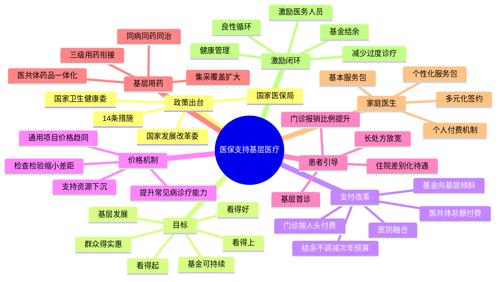

# 文章结构图：医保支持基层医疗卫生服务发展政策解读

1. 政策背景与总体要求
   - 联合发文单位：国家医保局、国家发改委、国家卫健委
   - 核心文件：《关于医保支持基层医疗卫生服务发展的指导意见》
   - 核心目标：解决“看得上、看得起、看得好”问题（14条措施）
   - 预期影响：基层机构发展、群众获益、基金可持续

2. 医保支付杠杆的作用机制
   - 基层现状：105.5万个机构，基本全覆盖但仍有短板
   - 增量倾斜：年度新增医保基金向基层倾斜
   - 紧密型医共体管理：
     - 结构优化：总额付费、绩效考核、结余留用
     - 激励机制：结余分配向基层倾斜，结余不作为次年总额扣减因素（最大亮点）
   - 支付方式改革：
     - 门诊改革：人头付费、慢病管理、家庭医生签约联动
     - 激励导向：医防融合发展

3. 医疗服务价格优化与引导
   - 价格趋同战略：
     - 通用型项目：缩小不同等级机构价格差距（换药、注射等）
     - 检查检验项目：设备物耗类项目价格趋同，推动资源下沉
     - 中低难度手术：合理缩小价格差距，提升基层常见病诊疗动力

4. 引导就医行为与保障用药
   - 待遇差别化政策：
     - 报销比例：基层比例不低于50%，拉开等级差距
     - 长期处方：支持慢病患者开具长期处方（稳定期患者一次可取约3个月药量；具体期限以政策与临床规范为准）
   - 药耗供应保障：
     - 衔接机制：建立“三级”用药衔接及医共体内一体化管理
     - 目录统一：医共体牵头医院与基层、乡村一体化目录统一
     - 精准匹配：坚持“药随病走”，扩大集采药覆盖面

5. 赋能家庭医生与个性化服务
   - 签约服务多元化：
     - 基本服务包：医保规范支付
     - 个性化服务包：个人支付，备案管理
   - 核心价值：
     - 激励机制：提质增效，调动医生积极性（公卫+医保资金联动）
     - 能力提升：通过固定服务对象提升全科专业技能
   - 良性循环：健康管理好 -> 基金效益高 -> 机构发展稳 -> 人员收入增

**【精读笔记】**

**1. 标题与导语**  
原标题：14条措施以医保支付**杠杆**撬动基层医疗机构发展。  
让家门口就医看得上、看得起、看得好（政策解读）。  
国家医保局会同国家发展改革委、国家卫生健康委近日印发《关于医保支持基层医疗卫生服务发展的指导意见》，聚焦切实保障群众在基层“看得上”“看得起”“看得好”病，提出14条具体措施，推动实现基层医疗卫生机构得发展、参保群众得实惠、医保基金可持续。  
这些具体措施涵盖哪些重点内容、如何发挥作用？国家医保局、国家卫生健康委相关负责同志和专家等进行了解读。

> - **杠杆 (Leverage)**：本意为物理学工具，此处比喻通过少量的医保政策调整带动大规模的基层医疗体系变革。  
> - **看得上、看得起、看得好**：这是我国医疗改革的三大核心维度，分别对应**医疗资源可及性 (Accessibility)**、**经济负担可承受性 (Affordability)**、**医疗服务质量 (Quality)**。  
> - **医保基金可持续 (Sustainability of medical insurance fund)**：指在扩大保障范围的同时，确保医保资金收支平衡，不发生系统性风险。

**2. 医保基金投入与支付改革**  
年度新增医保基金可适当向基层倾斜。  
截至2025年，全国基层医疗卫生机构数量达到105.5万个，基本实现城乡基层医疗卫生服务全覆盖。与群众就近就便、多样化、个性化的基本医疗卫生服务需求相比，对标建设分级诊疗体系要求，基层还是短板弱项，需要持续加大工作力度。“指导意见着眼于强基层、固基础、保基本，以医保支付杠杆作用为牵引，立足支持提高基层服务能力，夯实基层医疗卫生机构群众健康‘守门人’和医保基金‘守门人’功能。”国家医保局医药服务管理司副司长徐娜表示。

> - **分级诊疗 (Hierarchical Diagnosis and Treatment)**：我国医改的核心制度，旨在实现“小病在基层、大病到医院、康复回基层”的就医格局。  
> - **守门人 (Gatekeeper)**：在医疗体系中，基层医生作为首诊环节，既负责健康筛查，也负责合理分流患者，防止医疗资源浪费。

更加有力保障基层基金收入。指导意见优化了医保基金区域总额管理，在保障基金平稳运行的基础上，通过优化总额编制结构，合理体现对基层的支持，年度新增医保基金可适当向基层倾斜。完善紧密型医共体总额付费，重点对医共体总额、绩效考核、结余留用等提出要求，明确医共体结余分配要向基层倾斜。

> - **紧密型医共体 (Tightly-knit Medical Community)**：指县级医院与乡镇卫生院形成的利益共同体、责任共同体，通过资源共享、管理统一提高效率。  
> - **结余留用 (Retention of surplus)**：指医保基金在预付给医院后，如果医院通过精细化管理产生了结余，这部分钱留给医院使用，作为奖励。

**苗艳青**认为，完善总额付费政策最大的亮点在于，明确医共体通过精细化管理、强化健康管理、规范诊疗行为实现的当年医保基金结余，不作为次年总额指标的调减因素。这一举措彻底打消了医共体“节约基金反而降低次年支付额度”的顾虑，引导其转向“加强健康管理”，真正实现医保基金效益与群众健康效益的双赢。

> - **苗艳青**：**国家卫生健康委卫生发展研究中心健康战略与服务体系研究部副部长**，长期从事卫生经济、医保政策与健康策略研究。  
> - **近义词辨析**：**精细化管理 (Fine management)** vs **粗放化管理 (Extensive management)**。前者强调数据的精准和流程的优化。  
> - **金句积累**：**彻底打消顾虑，实现医保基金效益与群众健康效益的双赢。**

指导意见提出，更加有力推进适宜基层特点的支付改革。探索适宜基层的门诊支付方式，鼓励门诊按人头付费与慢病管理相结合、加强基层门诊付费与家庭医生签约联动，探索将签约居民门诊基金按人头支付给基层或家医团队等措施。苗艳青认为，这种多元复合支付方式，将为基层医防融合发展提供明确的政策导向和激励保障。

> - **按人头付费 (Capitation)**：按签约人数预付费用，鼓励医生少让病人得病以节省支出。  
> - **医防融合 (Integration of medical treatment and disease prevention)**：将医疗服务与公共卫生预防服务紧密结合，从“治已病”转向“治未病”。

以往，换药、注射、输液、采血等通用型价格项目，高级别医疗机构比基层收费标准高，指导意见针对性提出优化基层医疗卫生机构价格管理。国家医保局价格招采司医药价格处处长蒋炳镇表示，对这类项目，将鼓励探索区域内不同等级医疗机构价格趋同。对于以设备物耗为主的检查检验等价格项目，未来将缩小不同等级医院的价格差距，推动医疗资源合理下沉。同时，对于一、二级手术，以及技术劳务占比较高、均质化程度较高的医疗服务价格项目，合理缩小不同等级医院的价格差距，支持基层医疗机构提升常见病、多发病诊疗能力。

> - **价格趋同 (Price convergence)**：打破等级森严的定价体系，使基层也能通过提供同质化服务获得合理报酬。  
> - **均质化 (Homogenization)**：指服务水平、操作流程达到统一标准，没有质量高下之分。

**3. 引导就医流向与用药衔接**  
通过差别化待遇政策与长处方松绑，引导患者在基层就诊。  
生活改善、交通便捷，即便是小病，有些群众也想去大医院就诊。实际上，基层医疗机构能够满足这样的就诊需求，同时，高等级医院也更应聚焦复杂病情的治疗与科研。如何引导患者在基层就诊就医？  
徐娜表示，指导意见给出了更有力的门诊就医保障政策，包括职工医保普通门诊费用政策范围内支付比例不低于50%，居民医保政策范围内支付比例不低于50%，鼓励有条件的地区向基层倾斜，支持基层对符合条件的慢病患者开具长期处方；落实住院差别化待遇政策，适当拉开不同级别医疗机构报销比例；合理确定基层医疗卫生机构住院起付线等等。

> - **长期处方 (Long-term prescription)**：为慢性病患者开具的超过常规期限的处方。  
> - **起付线 (Deductible)**：医保报销的起点金额，基层起付线通常低于大医院。

“通过差别化待遇政策与长处方松绑双管齐下，引导患者下沉基层，减轻慢病患者负担。”**吴浩**认为，一方面，基层看病报销更多、自付更少，引导群众首选基层就医；另一方面，长处方松绑后，稳定期患者一次可取3个月药量，既省去患者奔波之苦，也让基层能放开手脚提供合理诊疗。

> - **吴浩**：**首都医科大学全科医学与继续教育学院院长**，主任医师，教授。作为全科医学领域的权威专家，他在社区卫生服务及分级诊疗模式研究方面有深厚造诣。  
> - **双管齐下 (A two-pronged approach)**：原指绘画时两支笔同时作画，现比喻两种方法同时采用。

“基层没好药”也是患者选择高级别医院就诊的原因之一。徐娜说，指导意见提出有力保障群众基层用药需求的举措，包括健全“三级”用药衔接联动机制和医共体内药品采购、配送、使用一体化管理机制，实现处方规范流转、用药需求精准匹配；扩大集采政策覆盖面，扩大基层常见病、慢性病药品采购、配备、使用范围等。  
国家卫生健康委基层司运行评价处处长胡同宇介绍，将通过加强衔接扩大基层用药使用范围，落实文件提出的医共体内基层医疗卫生机构与牵头医院用药目录统一，纳入乡村一体化管理、村卫生室与乡镇卫生院用药目录统一。同时，要结合医师下沉服务和患者上下转诊需求，突出重点人群和疾病，坚持“药随病走”，有针对性增加基层药品配备，实现“同病同药同治”。

> - **“三级”用药衔接**：政策原文表述为健全**“三级”**用药衔接联动机制，“三级”加引号，指多层级的用药衔接与联动安排（如上下级机构、医共体内外之间的目录衔接与处方流转等），**不宜**简单等同于医学机构分级中的“三级医院（三甲）”概念；具体口径以国家医保局、国家卫生健康委政策解读及各地实施办法为准。  
> - **药随病走 (Medicine follows the disease)**：形象化表达，指根据基层实际诊治的疾病种类，精准配置所需药品，解决基层缺药痛点。  
> - **金句积累**：**实现处方规范流转、用药需求精准匹配。**

**4. 家庭医生与个性化服务**  
个性化服务包满足群众多样化需求，又调动医生积极性。  
家庭医生是群众身边的“健康管家”。指导意见明确，支持基层开展多元化家庭医生签约服务。因地制宜细化签约基本服务包和个性化服务包。基本服务包中纳入医保的，按规定编码和医保支付；个性化服务包由签约基层机构向县级卫生健康部门备案后，由个人支付。

> - **家庭医生 (Family Doctor/General Practitioner)**：并非私人医生，而是以全科医生为核心，为居民提供连续性基本医疗和公共卫生服务的团队。  
> - **备案 (Record-filing)**：指将相关事项向主管部门报告备查，相比“审批”程序更简化，赋予基层更多自主权。

“当前家庭医生签约服务多局限于基本公卫与基础医疗，居民签约意愿较弱。明确支持基层开展多元化家庭医生签约服务，鼓励定制、备案并收取个性化服务包费用，将为家庭医生服务提质增效提供支撑。”**邵添谊**表示。

> - **邵添谊**：**北京市朝阳区太阳宫社区卫生服务中心副主任**，基层医疗一线管理者。  
> - **提质增效 (Improving quality and efficiency)**：管理学术语，指在提升质量的同时提高效率。

吴浩认为，政策通过“公卫+医保”资金联动与“个性化服务包”创新，推动签约服务从形式覆盖迈向实质惠民。推出由个人付费的“个性化服务包”，既满足群众多样化需求，又通过合理收入激励调动了全科医生的积极性。全科医生通过固定服务对象、聚焦常见病种开展针对性技能训练，其专业能力将快速提升。

> - **形式覆盖 vs 实质惠民**：指出签约服务不能只停留在纸面的签约率上，而要让群众真正感到实惠。  
> - **针对性技能训练 (Targeted skill training)**：全科医生需要处理各种小病及慢病管理，实操经验至关重要。

苗艳青表示，有条件的地区可将医保基金支付与群众健康管理效果直接挂钩。基层机构和家庭医生团队通过加强群众健康宣教、规范慢性病随访管理、开展健康体检等工作，提升群众健康素养和健康水平，减少过度诊疗，从而实现医保基金结余。而结余可用于激励基层医务人员，提高其收入水平，形成“健康管理越好、基金效益越高、机构发展越稳、医务人员积极性越高”的良性循环。

> - **健康素养 (Health Literacy)**：指个人获取、理解和处理基本健康信息和服务，并做出正确健康决策的能力。  
> - **过度诊疗 (Over-treatment)**：指超出病情需要的检查、用药和手术，是医保基金浪费的主要原因。  
> - **易混淆辨析**：**良性循环 (Virtuous circle)** vs **恶性循环 (Vicious circle)**。本政策旨在建立正向反馈机制。

**【网友评论整理】**  
网友主要对“规范基本医疗管理”、“实现基层医疗卫生机构发展”以及政策利民方向表示认可和赞同，认为这是利国利民的好事。

---
## 图解与前情提要

```mermaid
flowchart TD
    A["文章主旨<br/>Main Idea<br/>以`14条措施`推动基层医疗<br/>实现`看得上 / 看得起 / 看得好`"]:::main

    A --> B["第1段<br/>政策出台背景：<br/>国家医保局会同多部门印发指导意见"]:::p1
    A --> C["第2段<br/>提出核心目标：<br/>基层机构发展 / 群众得实惠 / 基金可持续"]:::p2
    A --> D["第3段<br/>引出全文任务：<br/>这些措施包括什么、如何发挥作用"]:::p3

    A --> E["第4段<br/>现实背景：<br/>基层机构数量大，但与需求和分级诊疗要求相比仍有短板"]:::p4
    A --> F["第5段<br/>医保支付杠杆：<br/>年度新增医保基金可适当向基层倾斜"]:::p5
    A --> G["第6段<br/>专家解读总额付费亮点：<br/>当年结余不作为次年调减因素"]:::p6
    A --> H["第7段<br/>支付改革方向：<br/>探索更适合基层门诊和慢病管理的支付方式"]:::p7
    A --> I["第8段<br/>价格机制改革：<br/>缩小不同等级医疗机构价格差距，促进资源下沉"]:::p8

    A --> J["第9段<br/>现实就医心理：<br/>群众即使小病也倾向去大医院"]:::p9
    A --> K["第10段<br/>门诊与住院保障：<br/>提高基层报销吸引力，落实差别化待遇"]:::p10
    A --> L["第11段<br/>专家评价：<br/>通过`差别化待遇 + 长处方`引导基层首诊"]:::p11
    A --> M["第12段<br/>基层用药保障：<br/>「三级」用药衔接与医共体内一体化管理"]:::p12
    A --> N["第13段<br/>卫健委解读：<br/>推进目录统一，实现`同病同药同治`"]:::p13

    A --> O["第14段<br/>家庭医生定位：<br/>群众身边的`健康管家`"]:::p14
    A --> P["第15段<br/>签约服务机制：<br/>基本服务包 + 个性化服务包"]:::p15
    A --> Q["第16段<br/>基层实践者评价：<br/>个性化服务包有助于提质增效"]:::p16
    A --> R["第17段<br/>专家评价：<br/>满足多样化需求并激励全科医生"]:::p17
    A --> S["第18段<br/>更深层机制：<br/>将医保支付与健康管理成效挂钩，形成良性循环"]:::p18

    classDef main fill:#dbeafe,stroke:#2563eb,color:#111827,stroke-width:2px;
    classDef p1 fill:#fef3c7,stroke:#d97706,color:#111827;
    classDef p2 fill:#fde68a,stroke:#ca8a04,color:#111827;
    classDef p3 fill:#fae8ff,stroke:#a21caf,color:#111827;
    classDef p4 fill:#dcfce7,stroke:#16a34a,color:#111827;
    classDef p5 fill:#ccfbf1,stroke:#0f766e,color:#111827;
    classDef p6 fill:#cffafe,stroke:#0891b2,color:#111827;
    classDef p7 fill:#e0e7ff,stroke:#4f46e5,color:#111827;
    classDef p8 fill:#fee2e2,stroke:#dc2626,color:#111827;
    classDef p9 fill:#f3e8ff,stroke:#7e22ce,color:#111827;
    classDef p10 fill:#ede9fe,stroke:#6d28d9,color:#111827;
    classDef p11 fill:#ddd6fe,stroke:#5b21b6,color:#111827;
    classDef p12 fill:#ffedd5,stroke:#ea580c,color:#111827;
    classDef p13 fill:#ecfccb,stroke:#65a30d,color:#111827;
    classDef p14 fill:#e0f2fe,stroke:#0284c7,color:#111827;
    classDef p15 fill:#fce7f3,stroke:#db2777,color:#111827;
    classDef p16 fill:#fae8ff,stroke:#c026d3,color:#111827;
    classDef p17 fill:#ede9fe,stroke:#7c3aed,color:#111827;
    classDef p18 fill:#dcfce7,stroke:#15803d,color:#111827;
```

以上流程图按报道段落顺序梳理主旨与递进关系。下文 **「逐句精读」** 与文首「文章结构图」「要点笔记」为同一主题下的展开：前者提纲与词条，此处为英汉逐句对照与词汇详解，可按需分段阅读。

---

## 逐句精读

🔸国家医保局会同国家发展改革委、国家卫生健康委近日印发《关于医保支持基层医疗卫生服务发展的指导意见》，/ 聚焦切实保障群众在基层“`看得上`”“`看得起`”“`看得好`”病，/ 提出`14条具体措施`，/ 推动实现基层医疗卫生机构得发展、参保群众得实惠、医保基金可持续。

🔹The National Healthcare Security Administration, together with the National Development and Reform Commission and the National Health Commission, recently issued the Guiding Opinions on Supporting the Development of Primary-Level Medical and Health Services through Medical Insurance, / focusing on effectively ensuring that people can `get access to`, `afford`, and `receive good-quality` medical care at the primary level, / and putting forward `14 specific measures` / to promote the development of primary healthcare institutions, deliver tangible benefits to insured citizens, and ensure the sustainability of the medical insurance fund.

背景注释：
- `National Healthcare Security Administration`：国家医保局，负责中国基本医疗保险制度、医保支付、药品耗材招采等事务。
- `National Development and Reform Commission (NDRC)`：国家发展改革委，负责宏观经济与重大政策统筹。
- `National Health Commission (NHC)`：国家卫生健康委，负责卫生健康政策、医疗服务体系建设等。
- `primary-level medical and health services`：基层医疗卫生服务，通常包括社区卫生服务中心、乡镇卫生院、村卫生室等。
- 文中“看得上、看得起、看得好”是政策文本中的高频表达，分别强调`可及性`、`可负担性`与`服务质量`。

> **`issue` / `issued`**  /ˈɪʃuː/  verb
> 英文释义：to officially publish or formally announce something；正式发布，颁布。
> 中文：发布；颁布。
> 语域：正式、新闻、法律、政策。
> 画龙点睛：`issue`在政策、文件、公告语境中极高频，常搭配 `issue a policy / statement / report / guideline`。注意与 `publish` 相比，`issue`更强调`官方正式发布`。考试写作中可替换普通的 `announce`，提升正式度。

> **`focus on`**  /ˈfəʊkəs ɒn/  phrase
> 英文释义：to give special attention to a particular subject or activity；聚焦于，重点关注。
> 中文：聚焦；着重于。
> 语域：通用、新闻、学术。
> 画龙点睛：后常接名词、动名词，如 `focus on reform / improving access / reducing costs`。写作中常用于概括政策、研究或文章主旨。与 `concentrate on` 接近，但 `focus on` 更自然、更常用。

> **`specific measure`**  /spəˈsɪfɪk ˈmeʒə(r)/  noun phrase
> 英文释义：a concrete action or step taken to achieve a goal；具体措施。
> 中文：具体举措；具体措施。
> 语域：政策、新闻、行政。
> 画龙点睛：中文“措施”在英译中常见 `measure`，若强调可执行细则，也可用 `step`、`initiative`。搭配有 `adopt measures`, `roll out measures`, `specific policy measures`。阅读中要区别 `measure` 作“措施”与“衡量”两义。

> **`sustainability`**  /səˌsteɪnəˈbɪləti/  noun
> 英文释义：the ability to continue over a period of time without causing failure or depletion；可持续性。
> 中文：可持续性。
> 语域：政策、经济、环境、公共管理。
> 画龙点睛：不仅用于环保，也常用于财政、社保、医保等语境，如 `financial sustainability`, `fund sustainability`。写作中可用于论证制度是否能长期运转，是高级政策词汇。

---

🔸这些具体措施涵盖哪些重点内容、如何发挥作用？/ 国家医保局、国家卫生健康委相关负责同志和专家等进行了解读。

🔹What key areas do these specific measures cover, / and how will they work? / Officials from the National Healthcare Security Administration and the National Health Commission, along with relevant experts, have provided explanations.

背景注释：
- 这是典型的新闻“设问+引入权威解读”句式。
- `officials` 指相关部门负责人；`experts` 指接受采访或被引用观点的专业人士。
- `provide explanations` 在新闻英语中常对应中文“进行了解读”。

> **`cover`**  /ˈkʌvə(r)/  verb
> 英文释义：to include or deal with something；涵盖；涉及。
> 中文：涵盖；覆盖。
> 语域：通用、新闻、学术。
> 画龙点睛：`cover` 是典型熟词僻义，除“覆盖”外，在阅读里常表示“涉及、包含、报道”。如 `The report covers healthcare reform.` 考试中极易考多义辨析。

> **`key area`**  /kiː ˈeəriə/  noun phrase
> 英文释义：an important field or aspect of something；重点领域；关键方面。
> 中文：重点内容；关键领域。
> 语域：新闻、政策、学术。
> 画龙点睛：可替换 `important aspect`。在政策分析写作中可用于搭建结构：`The policy covers three key areas...` 逻辑清楚、表达正式。

> **`provide explanations`**  /prəˈvaɪd ˌekspləˈneɪʃnz/  phrase
> 英文释义：to give detailed clarification or interpretation；作出解释；进行说明。
> 中文：解读；阐释。
> 语域：正式、新闻。
> 画龙点睛：汉语“解读”译法丰富，可根据语境用 `explain`, `interpret`, `elaborate on`。若强调权威政策说明，`provide explanations` / `offer an interpretation` 更稳妥。

---

🔸年度新增医保基金可适当向基层倾斜。

🔹Newly added annual medical insurance funds may be `appropriately tilted` toward the primary level.

背景注释：
- `医保基金` 指基本医疗保险基金。
- 中文政策语境中的“向基层倾斜”，英语通常不直译成物理意义的“lean”，而译为 `be tilted toward`, `be allocated with preference to`, `be directed more toward` 等。
- 这是本段的小标题式句子，概括后文重点。

> **`tilt toward`**  /tɪlt təˈwɔːd/  phrase
> 英文释义：to give greater support, preference, or allocation to one side；向……倾斜。
> 中文：向……倾斜；优先支持。
> 语域：政策、经济、新闻。
> 画龙点睛：这里是抽象义，表示资源分配上的`偏重`，常见于 `policy support is tilted toward rural areas / small firms / primary care`。写作时可与 `prioritize`、`channel more resources to` 互换。

> **`primary level`**  /ˈpraɪməri ˈlevl/  noun phrase
> 英文释义：the most basic level of a system, especially community-based services；基层层面。
> 中文：基层。
> 语域：政策、医疗、教育。
> 画龙点睛：在医疗中常与 `primary healthcare`, `primary care institutions`, `community-level services` 连用。注意不要误译成“小学阶段”的 `primary` 常规义。

---

🔸截至2025年，全国基层医疗卫生机构数量达到`105.5万个`，/ 基本实现城乡基层医疗卫生服务全覆盖。

🔹As of 2025, the number of primary-level medical and health institutions nationwide had reached `1.055 million`, / basically achieving full coverage of primary healthcare services in both urban and rural areas.

背景注释：
- `105.5万个` 即 1,055,000。英译时宜换算为国际读者更熟悉的数字表达。
- `城乡` = `urban and rural`。
- `全覆盖` 在政策英语中通常译为 `full coverage`。

> **`as of`**  /æz əv/  phrase
> 英文释义：used to indicate a particular time up to which something is true；截至。
> 中文：截至；到……为止。
> 语域：正式、数据、财务、新闻。
> 画龙点睛：极常用于图表、报告、新闻数据句：`As of June 2025...`。注意它强调“到某个时间点为止”的状态，常与完成时或过去完成色彩搭配。

> **`coverage`**  /ˈkʌvərɪdʒ/  noun
> 英文释义：the extent to which a service reaches people or areas；覆盖范围；覆盖率。
> 中文：覆盖；覆盖范围。
> 语域：政策、保险、通信、新闻。
> 画龙点睛：`coverage` 既可指“新闻报道”，也可指“保障范围、覆盖范围”。医疗场景中常见 `insurance coverage`, `service coverage`, `universal coverage`，是高频多义词。

---

🔸与群众就近就便、多样化、个性化的基本医疗卫生服务需求相比，/ 对标建设分级诊疗体系要求，/ 基层还是短板弱项，/ 需要持续加大工作力度。

🔹Compared with the public’s demand for convenient, diverse, and personalized basic medical and health services nearby, / and measured against the requirements for building a tiered diagnosis and treatment system, / the primary level remains a weak link, / and continued efforts are needed.

背景注释：
- `分级诊疗体系`：tiered diagnosis and treatment system，强调常见病在基层、疑难重症上转。
- `短板弱项` 是政策高频词，表示某方面仍是薄弱环节。
- `就近就便` 表示就医地点近、流程方便。

> **`measure against`**  /ˈmeʒə(r) əˈɡenst/  phrase
> 英文释义：to compare something with a standard；对照……标准衡量。
> 中文：对标；参照……衡量。
> 语域：正式、管理、政策。
> 画龙点睛：中文“对标”是行政和商业高频词，英译可用 `benchmark against`, `measure against`, `compare with`。其中 `benchmark against` 更专业，适合写作升级。

> **`weak link`**  /wiːk lɪŋk/  noun phrase
> 英文释义：the least strong or effective part of a system；薄弱环节。
> 中文：短板；薄弱环节。
> 语域：新闻、管理、政策。
> 画龙点睛：非常适合翻译中文“短板”。例如 `Primary care remains the weak link in the healthcare system.` 简洁地道，比机械直译 `short board` 好得多。

> **`tiered diagnosis and treatment system`**  noun phrase
> 英文释义：a healthcare system in which patients are treated at different levels according to the severity and type of illness；分级诊疗体系。
> 中文：分级诊疗体系。
> 语域：医疗政策。
> 画龙点睛：这是中国医疗政策专门表达，阅读时可理解为“分层分流的就医体系”。写作中若嫌长，可后文简化为 `the tiered system`。

---

🔸“指导意见着眼于`强基层`、`固基础`、`保基本`，/ 以医保支付杠杆作用为牵引，/ 立足支持提高基层服务能力，/ 夯实基层医疗卫生机构群众健康‘守门人’和医保基金‘守门人’功能。”/ 国家医保局医药服务管理司副司长徐娜表示。

🔹“The Guiding Opinions are aimed at `strengthening the primary level`, `consolidating the foundation`, and `ensuring basic services`; / guided by the leveraging role of medical insurance payment, / they are intended to support the improvement of primary-level service capacity / and reinforce the role of primary healthcare institutions as gatekeepers of both public health and the medical insurance fund,” said Xu Na, deputy director-general of the Department of Pharmaceutical Service Management under the National Healthcare Security Administration.

背景注释：
- `徐娜`：国家医保局医药服务管理司副司长。
- `杠杆作用` 在政策与经济英语中常译为 `leveraging role` 或 `leverage effect`。
- `守门人` 对应医疗政策术语 `gatekeeper`，强调基层首诊、健康管理、合理分流。

> **`be aimed at`**  /eɪmd æt/  phrase
> 英文释义：to have the purpose of doing or achieving something；旨在。
> 中文：着眼于；旨在。
> 语域：正式、学术、政策。
> 画龙点睛：用于目标表达非常常见，比 `want to` 更正式。可接名词或动名词：`be aimed at improving access / reducing costs`。写作中用于政策目的句尤其稳妥。

> **`leverage`**  /ˈliːvərɪdʒ/  noun/verb
> 英文释义：power or ability to influence a situation; to use something to maximum advantage；杠杆作用；有效利用。
> 中文：杠杆；撬动；借力。
> 语域：经济、商业、政策。
> 画龙点睛：是高阶词。名词如 `policy leverage`，动词如 `leverage resources / technology / funding`。写作中非常适合替换普通的 `use`，体现成熟表达。

> **`gatekeeper`**  /ˈɡeɪtkiːpə(r)/  noun
> 英文释义：a person or institution controlling access, especially in healthcare as the first point of contact；守门人。
> 中文：守门人；把关者。
> 语域：医疗、社会学、媒体研究。
> 画龙点睛：医疗语境中特指基层医生或机构承担首诊、分流、预防管理功能。这个词在阅读里含比喻义，不能只按字面理解。也常见于媒体研究，指“信息把关者”。

---

🔸更加有力保障基层基金收入。

🔹Stronger efforts will be made to ensure fund revenue for primary-level institutions.

背景注释：
- 这是段内提要句，概括后续政策方向。
- `基金收入` 在这里不是市场化“营收”，而是医保支付与财政分配带来的可支配资金来源。

> **`ensure`**  /ɪnˈʃʊə(r)/  verb
> 英文释义：to make certain that something happens；确保。
> 中文：确保；保障。
> 语域：通用、正式、政策。
> 画龙点睛：后常接 `that` 从句，也可接名词：`ensure safety / fairness / access`。比 `make sure` 更正式，是考试写作核心词之一。

> **`revenue`**  /ˈrevənjuː/  noun
> 英文释义：income, especially that received by an organization or government；收入；财政收入。
> 中文：收入；进账。
> 语域：经济、财政、管理。
> 画龙点睛：区别于 `profit`（利润），`revenue` 只指收入总额，不扣成本。政策语境中可指基金收入、政府收入、机构收入。阅读时要注意词义精确区分。

---

🔸指导意见优化了医保基金区域总额管理，/ 在保障基金平稳运行的基础上，/ 通过优化总额编制结构，/ 合理体现对基层的支持，/ 年度新增医保基金可适当向基层倾斜。

🔹The Guiding Opinions have optimized regional global-budget management of medical insurance funds. / On the basis of ensuring the stable operation of the fund, / they reasonably reflect support for the primary level / by improving the structure used in setting the global budget, / so that newly added annual medical insurance funds may be appropriately tilted toward primary-level institutions.

背景注释：
- `总额管理`：global-budget management / total budget management。
- `总额编制结构` 指预算测算、分配结构。
- `平稳运行` 在政策英语中常用 `stable operation`。

> **`on the basis of`**  /ɒn ðə ˈbeɪsɪs əv/  phrase
> 英文释义：based on; with something as the foundation；在……基础上。
> 中文：在……基础上。
> 语域：正式、学术、政策。
> 画龙点睛：书面表达高频结构，可替代简单的 `based on`。尤其适合翻译中文政策文体。后接名词、动名词都很自然。

> **`global budget`**  /ˈɡləʊbl ˈbʌdʒɪt/  noun phrase
> 英文释义：a fixed total amount of money allocated for a given period or system；总额预算。
> 中文：总额预算；总额付费框架中的预算总盘子。
> 语域：医疗支付、财政。
> 画龙点睛：在医保支付改革中属于术语。理解关键不是“全球预算”，而是“总盘子式预算控制”。考试阅读若遇到 healthcare financing，此词值得特别留意。

> **`reflect support for`**  phrase
> 英文释义：to show or embody support for something；体现对……的支持。
> 中文：体现支持；反映支持力度。
> 语域：正式、政策。
> 画龙点睛：`reflect` 常作“反映、体现”，是正式写作常用词。可搭配 `reflect changes / concerns / priorities / support for`。熟词多义明显，阅读中很常考。

---

🔸完善紧密型医共体总额付费，/ 重点对医共体总额、绩效考核、结余留用等提出要求，/ 明确医共体结余分配要向基层倾斜。

🔹The policy calls for improving global-budget payment for `closely integrated medical consortia`, / with key requirements concerning the consortia’s total budget, performance evaluation, and the retention and use of surpluses, / and makes it clear that the distribution of surpluses within such consortia should be tilted toward the primary level.

背景注释：
- `紧密型医共体`：通常指县域内以牵头医院为核心、基层机构共同参与、在人财物和业务协同上联系更紧密的医疗共同体。常译为 `closely integrated medical consortium` 或 `closely knit county medical community`。
- `总额付费`：医保支付方式之一，在预算总额框架下进行支付管理。
- `结余留用`：指节余资金可按规定保留并用于激励或机构发展，而非全部收回。

> **`consortium`** /kənˈsɔːtiəm/ noun
> 英文释义：an organization made up of several groups working together; 多方联合体；联盟。
> 中文：联合体；共同体。
> 语域：正式、商业、医疗治理。
> 画龙点睛：在医疗政策中常用来翻译“医共体/医联体”的一类表达。复数是 `consortia`，这一不规则复数形式常见于学术和正式写作，阅读中要能迅速识别。

> **`performance evaluation`** /pəˈfɔːməns ɪˌvæljuˈeɪʃn/ noun phrase
> 英文释义：a process for assessing effectiveness or achievement; 绩效评估。
> 中文：绩效考核；绩效评价。
> 语域：管理、政策、人力资源。
> 画龙点睛：`evaluation` 比 `assessment` 更偏正式制度化；与 `performance` 搭配极稳。写作中可扩展为 `performance-based incentives`, `performance indicators`，适合政策与管理类题材。

> **`surplus`** /ˈsɜːpləs/ noun
> 英文释义：an amount left over when more has been obtained than used; 结余；盈余。
> 中文：结余；盈余。
> 语域：经济、财政、政策。
> 画龙点睛：与 `deficit`（赤字）相对。医保、财政、预算类文章高频。注意它既可作名词也可作形容词，表示“过剩的”；而这里是典型名词义。

---

🔸国家卫生健康委卫生发展研究中心健康战略与服务体系研究部副部长苗艳青认为，/ 完善总额付费政策最大的亮点在于，/ 明确医共体通过精细化管理、强化健康管理、规范诊疗行为实现的当年医保基金结余，/ 不作为次年总额指标的调减因素。

🔹Miao Yanqing, deputy director of the Department of Health Strategy and Service System Research at the Health Development Research Center of the National Health Commission, believes that / the biggest highlight of improving the global-budget payment policy lies in clarifying that any medical insurance fund surplus achieved within the current year by medical consortia through refined management, stronger health management, and standardized diagnosis and treatment practices / will not be used as a factor for reducing the total budget indicator for the following year.

背景注释：
- `苗艳青`：国家卫生健康委卫生发展研究中心相关研究部门负责人。
- `精细化管理`：refined management，强调更细致、数据化、规范化的管理。
- `规范诊疗行为`：使诊疗活动更加符合指南、流程和支付要求。
- `调减因素`：即导致下一年度预算指标被下调的因素。

> **`highlight`** /ˈhaɪlaɪt/ noun
> 英文释义：the most important or interesting part of something; 亮点。
> 中文：亮点；最突出的部分。
> 语域：新闻、口语、正式说明。
> 画龙点睛：中文“亮点”最常对应 `highlight`。在政策解读、产品介绍、新闻总结中都很常见。写作中可用 `A key highlight is that...`，结构简洁而有概括力。

> **`refined management`** /rɪˈfaɪnd ˈmænɪdʒmənt/ noun phrase
> 英文释义：detailed, precise, and carefully organized management; 精细化管理。
> 中文：精细化管理。
> 语域：管理、政策、商业。
> 画龙点睛：这是中文政策话语中常见概念。可理解为“更精准、更细颗粒度的管理”。写作时可和 `data-driven management`, `targeted management` 区分：后两者更强调数据或定向，`refined` 更强调细致规范。

> **`standardize` / `standardized`** /ˈstændədaɪz/ verb
> 英文释义：to make something consistent according to rules or standards; 使标准化；使规范化。
> 中文：规范；标准化。
> 语域：正式、技术、政策。
> 画龙点睛：在医疗、工业、教育中很常用。`standardized treatment` 指规范化治疗；考试中可替换普通的 `make...regular`。派生词有 `standard`, `standardization`。

---

🔸这一举措彻底打消了医共体“节约基金反而降低次年支付额度”的顾虑，/ 引导其转向“加强健康管理”，/ 真正实现医保基金效益与群众健康效益的双赢。

🔹This move completely dispels the concern among medical consortia that `saving funds might instead lead to a lower payment quota the next year`, / guiding them to shift toward `strengthening health management`, / and truly enabling a win-win outcome for both medical insurance fund efficiency and public health benefits.

背景注释：
- 这里解释上一句政策设计的激励逻辑：如果节余不会导致次年预算被砍，医共体就更愿意主动控费和做健康管理。
- `双赢` 在政策英语中常见 `a win-win outcome / achieve win-win results`。

> **`dispel`** /dɪˈspel/ verb
> 英文释义：to remove fears, doubts, or false beliefs; 消除，打消。
> 中文：打消；消除。
> 语域：正式、新闻、学术。
> 画龙点睛：常搭配 `dispel concerns / doubts / myths / fears`。比 `remove` 更精准、更书面，是阅读和写作里都很实用的高级动词。

> **`quota`** /ˈkwəʊtə/ noun
> 英文释义：a fixed amount that is allowed or expected; 配额；额度。
> 中文：额度；限额；配额。
> 语域：经济、行政、政策。
> 画龙点睛：在中文“支付额度”里可对应 `payment quota` 或 `payment cap`。`quota` 强调事先规定的数量或金额；`cap` 更强调上限。辨析时要注意语义细微差异。

> **`win-win`** /ˌwɪn ˈwɪn/ adjective/noun
> 英文释义：beneficial to all sides involved; 双赢的。
> 中文：双赢。
> 语域：商业、政策、新闻。
> 画龙点睛：常见表达有 `a win-win outcome`, `create a win-win situation`。虽然略带宣传和商务色彩，但在政策报道中使用频率很高，适合概括互利结果。

---

🔸指导意见提出，/ 更加有力推进适宜基层特点的支付改革。

🔹The Guiding Opinions propose / making stronger efforts to advance payment reform suited to the characteristics of primary-level healthcare.

背景注释：
- `支付改革` 指医保支付方式改革，包括门诊支付、按人头付费、总额付费等。
- `适宜基层特点` 说明改革不能照搬大医院模式，需要符合基层服务结构与患者类型。

> **`advance`** /ədˈvɑːns/ verb
> 英文释义：to move something forward or help it develop; 推进；促进。
> 中文：推进；推动。
> 语域：正式、政策、学术。
> 画龙点睛：`advance reform / cooperation / research` 都很常见。作名词时是“进展”；作动词时比 `promote` 更强调“向前推进过程”，是正式写作常用替换词。

> **`suited to`** /ˈsuːtɪd tuː/ phrase
> 英文释义：appropriate for a particular purpose or situation; 适合于。
> 中文：适宜于；适合。
> 语域：通用、正式。
> 画龙点睛：可替换 `suitable for`，但 `suited to` 在书面语中更凝练。常见于 `suited to local conditions`, `suited to learners' needs`，非常适合翻译“适宜……特点/需求”。

---

🔸探索适宜基层的门诊支付方式，/ 鼓励门诊按人头付费与慢病管理相结合、加强基层门诊付费与家庭医生签约联动，/ 探索将签约居民门诊基金按人头支付给基层或家医团队等措施。

🔹It calls for exploring outpatient payment methods suitable for the primary level, / encouraging the integration of capitation-based outpatient payment with chronic disease management and strengthening the linkage between primary outpatient payment and family doctor contracting, / and exploring measures such as paying outpatient funds for contracted residents to primary-level institutions or family doctor teams on a per-capita basis.

背景注释：
- `门诊支付方式`：outpatient payment methods。
- `按人头付费`：capitation / capitation-based payment，按服务对象人数预先付费。
- `家庭医生签约`：family doctor contracting / family doctor service contracts，指居民与基层医生团队建立签约服务关系。
- `慢病`：chronic disease，如高血压、糖尿病等。

> **`explore`** /ɪkˈsplɔː(r)/ verb
> 英文释义：to investigate or consider a possibility; 探索；研究。
> 中文：探索；尝试研究。
> 语域：正式、学术、政策。
> 画龙点睛：政策文本中常表示“尚在研究推进中的方向”，语气比 `implement` 更审慎。写作中可用 `explore new mechanisms / solutions / pathways`。

> **`capitation`** /ˌkæpɪˈteɪʃn/ noun
> 英文释义：a payment system in which providers are paid a fixed amount for each person served; 按人头付费。
> 中文：按人头付费。
> 语域：医疗支付、卫生经济学。
> 画龙点睛：这是卫生政策核心术语。记忆重点在 `capita`“人头、每人”的词源。常见搭配 `capitation payment`, `capitated model`。阅读中遇到医保改革时非常重要。

> **`linkage`** /ˈlɪŋkɪdʒ/ noun
> 英文释义：a connection or relationship between two things; 联动；联系机制。
> 中文：联动；衔接。
> 语域：正式、政策、技术。
> 画龙点睛：比普通的 `link` 更偏制度化、机制化。常见于 `policy linkage`, `inter-agency linkage`, `urban-rural linkage`。翻译中文“联动机制”时很实用。

---

🔸苗艳青认为，/ 这种多元复合支付方式，/ 将为基层医防融合发展提供明确的政策导向和激励保障。

🔹Miao Yanqing believes that / this diversified and combined payment model / will provide clear policy guidance and incentive guarantees for the integrated development of medical treatment and disease prevention at the primary level.

背景注释：
- `医防融合`：integration of medical treatment and prevention，即把“看病”和“预防保健/健康管理”更紧密结合。
- `政策导向` 指政策给出的方向性信号。
- `激励保障` 强调不仅给方向，也给制度和资金上的支持。

> **`diversified`** /daɪˈvɜːsɪfaɪd/ adjective
> 英文释义：having variety; involving several different types; 多元化的。
> 中文：多元的；多样化的。
> 语域：正式、商业、政策。
> 画龙点睛：常搭配 `diversified services / investment / financing / payment methods`。比 `various` 更偏结构性、多类型并存的含义。

> **`guidance`** /ˈɡaɪdns/ noun
> 英文释义：help or advice about what should be done; 指导；导向。
> 中文：指导；引导。
> 语域：通用、正式、政策。
> 画龙点睛：在政策语境里，`provide guidance` 不只是“给建议”，还可表示政策方向引导。注意它通常是不可数名词，不说 `guidances`。

> **`incentive`** /ɪnˈsentɪv/ noun
> 英文释义：something that encourages a person or organization to act; 激励。
> 中文：激励；刺激因素。
> 语域：经济、管理、政策。
> 画龙点睛：高频词。搭配如 `financial incentive`, `create incentives for`, `incentive mechanism`。写作中很适合分析制度设计背后的行为引导逻辑。

---

🔸以往，换药、注射、输液、采血等通用型价格项目，/ 高级别医疗机构比基层收费标准高，/ 指导意见针对性提出优化基层医疗卫生机构价格管理。

🔹In the past, / for general pricing items such as dressing changes, injections, infusions, and blood collection, / higher-level medical institutions charged more than primary-level ones, / and the Guiding Opinions therefore specifically propose optimizing price management for primary healthcare institutions.

背景注释：
- `通用型价格项目` 指不同层级医疗机构都普遍开展的常规医疗服务项目。
- `高级别医疗机构` 通常指三级医院或较高等级医院。
- 本句在说明：对于这些标准化程度高的项目，价格差距可能需要调整。

> **`pricing item`** /ˈpraɪsɪŋ ˈaɪtəm/ noun phrase
> 英文释义：a chargeable service item in a pricing schedule; 价格项目；收费项目。
> 中文：价格项目；收费项目。
> 语域：医疗管理、财务、政策。
> 画龙点睛：在医疗收费语境里常指被单独定价的服务单元。翻译时不要简单处理成 `price`，否则会丢失“项目化收费”的制度含义。

> **`specifically`** /spəˈsɪfɪkli/ adverb
> 英文释义：in a clear and exact way; with particular focus; 针对性地；具体地。
> 中文：针对性地；明确地。
> 语域：通用、正式。
> 画龙点睛：可表示“具体而言”，也可表示“专门针对”。这里更接近“有针对性地”。在写作中用于引出细化措施非常自然。

> **`optimize`** /ˈɒptɪmaɪz/ verb
> 英文释义：to make something as effective as possible; 优化。
> 中文：优化。
> 语域：技术、管理、政策。
> 画龙点睛：现代书面语高频。可搭配 `optimize structure / allocation / pricing / management`。比 `improve` 更强调在现有体系基础上的调整完善。

---

🔸国家医保局价格招采司医药价格处处长蒋炳镇表示，/ 对这类项目，/ 将鼓励探索区域内不同等级医疗机构价格趋同。

🔹Jiang Bingzhen, director of the Pharmaceutical Pricing Division of the Department of Pricing and Procurement under the National Healthcare Security Administration, said that / for such items, / efforts will be encouraged to explore price convergence among medical institutions of different levels within a region.

背景注释：
- `价格招采司`：负责药品和医疗服务价格、集中采购等工作。
- `价格趋同`：price convergence，即不同等级机构对类似项目的价格差距缩小、逐渐接近。
- `区域内` 强调按地方统筹推进，而非全国立刻完全统一。

> **`convergence`** /kənˈvɜːdʒəns/ noun
> 英文释义：the process of becoming more similar or coming together; 趋同；收敛。
> 中文：趋同；接近。
> 语域：经济、技术、政策。
> 画龙点睛：常见于 `price convergence`, `policy convergence`, `economic convergence`。是分析变化趋势的高级词，适合阅读和议论文写作。

> **`within a region`** phrase
> 英文释义：inside a particular geographical or administrative area; 在一个区域内。
> 中文：在区域内。
> 语域：政策、地理、管理。
> 画龙点睛：中文政策文体中“区域内”很常见，英译时不必复杂化，直接 `within a region`、`within the region` 即可，准确简洁。

---

🔸对于以设备物耗为主的检查检验等价格项目，/ 未来将缩小不同等级医院的价格差距，/ 推动医疗资源合理下沉。

🔹For pricing items such as examinations and laboratory tests that are mainly driven by equipment use and material consumption, / the price gap among hospitals of different levels will be narrowed in the future, / so as to promote a rational downward shift of medical resources.

背景注释：
- `设备物耗为主`：主要成本来自设备和耗材，而不是医生技术劳动。
- `检查检验`：可分为 `examinations`（检查）与 `laboratory tests`（检验）。
- `医疗资源下沉`：资源更多向基层延伸配置，是中国医疗改革常见表述。

> **`material consumption`** /məˈtɪəriəl kənˈsʌmpʃn/ noun phrase
> 英文释义：the use of consumable materials in providing a service; 物耗；耗材消耗。
> 中文：物耗；耗材消耗。
> 语域：医疗管理、工业、财务。
> 画龙点睛：医疗服务成本分析中常见。这里强调项目价格更多由设备与耗材决定，而非医生个人技术含量，因此更适合推进价格差距缩小。

> **`narrow`** /ˈnærəʊ/ verb
> 英文释义：to make a gap or difference smaller; 缩小。
> 中文：缩小。
> 语域：通用、正式。
> 画龙点睛：常搭配 `narrow the gap / divide / difference`。写作中非常实用，尤其适合社会问题、教育、城乡差距、医疗差异等主题。

> **`downward shift`** /ˈdaʊnwəd ʃɪft/ noun phrase
> 英文释义：movement from higher levels to lower levels; 下移；下沉。
> 中文：下沉；向下转移。
> 语域：政策、组织管理。
> 画龙点睛：中文“下沉”没有完全固定唯一译法，可用 `shift downward`, `move downward`, `sink` 不合适。政策写作里 `downward shift of resources` 较稳妥自然。

---

🔸同时，/ 对于一、二级手术，/ 以及技术劳务占比较高、均质化程度较高的医疗服务价格项目，/ 合理缩小不同等级医院的价格差距，/ 支持基层医疗机构提升常见病、多发病诊疗能力。

🔹At the same time, / for Level I and Level II surgeries, / as well as medical service pricing items in which technical labor accounts for a relatively high proportion and the degree of standardization is relatively high, / the price gap among hospitals of different levels will be reasonably narrowed / to support primary healthcare institutions in improving their capacity to diagnose and treat common and frequently occurring diseases.

背景注释：
- `一、二级手术`：按手术难度、风险等进行分级后的较低级别手术。
- `技术劳务占比较高`：说明该服务更体现医务人员技术劳动价值。
- `均质化程度较高`：不同机构之间服务质量和技术标准相对接近。
- `常见病、多发病`：primary care 高频概念，指基层本应具备处理能力的疾病类型。

> **`account for`** /əˈkaʊnt fɔː(r)/ phrase
> 英文释义：to make up or constitute a part of something; 占比；构成。
> 中文：占；占据。
> 语域：通用、数据、学术。
> 画龙点睛：这是高频熟词短语，除“解释原因”外，还常表示“占……比例”。如 `Services account for 60% of GDP.` 阅读中一定要根据上下文辨义。

> **`standardization`** /ˌstændədaɪˈzeɪʃn/ noun
> 英文释义：the process of making things uniform according to standards; 标准化；均质化。
> 中文：标准化；同质化程度。
> 语域：技术、管理、政策。
> 画龙点睛：这里对应中文“均质化程度较高”，意指不同医院提供该类服务的差异没那么大。写作中可表达为 `a high degree of standardization`，很正式。

> **`frequently occurring diseases`** phrase
> 英文释义：diseases that occur often in the population; 多发病。
> 中文：多发病。
> 语域：医疗、公共卫生。
> 画龙点睛：常与 `common diseases` 并列出现。虽然略显直译，但在政策医疗语境中可接受；若更自然也可说 `common illnesses that occur frequently`。

---

🔸通过差别化待遇政策与长处方松绑，引导患者在基层就诊。

🔹By combining differentiated reimbursement policies with the loosening of rules on long-term prescriptions, / the policy seeks to guide patients to seek medical treatment at the primary level.

背景注释：
- 这是该部分的小标题句。
- `差别化待遇政策`：在医保报销比例、起付线、保障范围等方面，对不同层级医疗机构设置不同待遇，形成引导。
- `长处方松绑`：放宽长期处方限制，使稳定期慢病患者一次可开更长时长的药物。
- `在基层就诊`：即优先到社区卫生服务中心、乡镇卫生院等首诊。

> **`differentiated`** /ˌdɪfəˈrenʃieɪtɪd/ adjective
> 英文释义：showing differences according to category, level, or need; 差别化的；有区分的。
> 中文：差别化的；分类施策的。
> 语域：政策、经济、教育。
> 画龙点睛：常见搭配有 `differentiated policies`, `differentiated treatment`, `differentiated pricing`。写作中用于表达“不是一刀切”，非常实用，语义比 `different` 更制度化。

> **`reimbursement`** /ˌriːɪmˈbɜːsmənt/ noun
> 英文释义：the act of paying back money spent, especially under insurance; 报销；偿付。
> 中文：报销；医保偿付。
> 语域：保险、医疗、财务。
> 画龙点睛：医疗英语高频词。`reimbursement rate`=报销比例，`reimbursement policy`=报销政策。比普通 `repayment` 准确得多，考试阅读中常见于医保、商业保险语境。

> **`seek medical treatment`** phrase
> 英文释义：to go to a doctor or medical institution for care; 就诊；求医。
> 中文：就诊；求医。
> 语域：新闻、正式、医疗。
> 画龙点睛：非常地道的正式表达，可替换简单的 `go to the hospital`。写作中若讨论患者行为、医疗可及性，用它会更书面、更准确。

---

🔸生活改善、交通便捷，/ 即便是小病，/ 有些群众也想去大医院就诊。

🔹With living standards improving and transportation becoming more convenient, / some people still prefer to go to major hospitals / even for minor illnesses.

背景注释：
- 这里交代现实行为逻辑：随着收入增长与交通便利，患者跨区域、跨层级就医成本下降。
- `大医院` 在英文中可译为 `major hospitals`、`large hospitals`，若特指高等级医院，也可译为 `higher-level hospitals`。

> **`living standards`** /ˈlɪvɪŋ ˈstændədz/ noun phrase
> 英文释义：the level of wealth, comfort, and material goods available to people; 生活水平。
> 中文：生活水平。
> 语域：社会、经济、新闻。
> 画龙点睛：常见于宏观社会议题，如 `improve living standards`。是写作中表达“生活改善”的核心搭配，比 `life becomes better` 更规范。

> **`convenient`** /kənˈviːniənt/ adjective
> 英文释义：easy to use, reach, or do; 便利的；方便的。
> 中文：便捷的；方便的。
> 语域：通用。
> 画龙点睛：注意搭配 `convenient transportation`, `It is convenient for sb to do sth`。常见误区是直接说 `very convenience`，应为形容词 `convenient` 或名词 `convenience`。

> **`minor illness`** /ˈmaɪnə(r) ˈɪlnəs/ noun phrase
> 英文释义：a sickness that is not serious; 小病；轻症。
> 中文：小病；轻微疾病。
> 语域：通用、医疗。
> 画龙点睛：可与 `serious illness`, `severe condition` 对比。阅读中经常用于说明分级诊疗、医疗资源错配等问题。

---

🔸实际上，/ 基层医疗机构能够满足这样的就诊需求，/ 同时，/ 高等级医院也更应聚焦复杂病情的治疗与科研。

🔹In fact, / primary healthcare institutions are capable of meeting such medical needs; / at the same time, / higher-level hospitals should focus more on the treatment of complex conditions and on scientific research.

背景注释：
- 这是典型的分级诊疗逻辑：基层处理常见病，大医院处理疑难重症与科研教学。
- `复杂病情`：complex conditions / complicated cases。
- `科研`：scientific research 或 medical research，视语境可灵活处理。

> **`be capable of`** /ˈkeɪpəbl əv/ phrase
> 英文释义：to have the ability to do something; 能够；有能力。
> 中文：能够；有能力。
> 语域：正式、通用。
> 画龙点睛：比 `can` 更正式，常见于写作和新闻。后接名词或动名词：`be capable of handling common diseases`。能提升表达层次。

> **`complex condition`** /ˈkɒmpleks kənˈdɪʃn/ noun phrase
> 英文释义：a complicated medical case or health problem; 复杂病情。
> 中文：复杂病情；疑难情况。
> 语域：医疗。
> 画龙点睛：`condition` 在医疗英语中比 `disease` 更宽泛，可包括症状、状态和综合病情。阅读中这一熟词常有专业引申义。

> **`focus on`** /ˈfəʊkəs ɒn/ phrase
> 英文释义：to give special attention to something; 聚焦于。
> 中文：聚焦；专注于。
> 语域：通用、新闻、学术。
> 画龙点睛：在政策与论证文中极其常用。常见结构 `focus on doing sth` 或 `focus on sth rather than sth else`，非常适合表达资源配置重点。

---

🔸如何引导患者在基层就诊就医？

🔹How can patients be guided to seek medical care at the primary level?

背景注释：
- 这是承上启下的设问句，用于引出后面的政策工具。
- 中文“就诊就医”并列使用，英语通常不必重复，译为 `seek medical care` 即可。

> **`guide`** /ɡaɪd/ verb
> 英文释义：to influence or direct someone’s actions; 引导；指导。
> 中文：引导。
> 语域：通用、政策、教育。
> 画龙点睛：在政策文体中，`guide` 常表示通过制度设计影响行为，而非直接命令。与 `force` 相比语气更柔和、更符合治理语境。

---

🔸徐娜表示，/ 指导意见给出了更有力的门诊就医保障政策，/ 包括职工医保普通门诊费用政策范围内支付比例不低于`50%`，/ 居民医保政策范围内支付比例不低于`50%`，/ 鼓励有条件的地区向基层倾斜，/ 支持基层对符合条件的慢病患者开具长期处方；/ 落实住院差别化待遇政策，/ 适当拉开不同级别医疗机构报销比例；/ 合理确定基层医疗卫生机构住院起付线等等。

🔹Xu Na said that / the Guiding Opinions have introduced stronger outpatient coverage policies, / including a reimbursement rate of no less than `50 percent` for general outpatient expenses within the policy scope of employee medical insurance, / and a reimbursement rate of no less than `50 percent` for expenses within the policy scope of resident medical insurance; / they also encourage qualified regions to tilt support toward the primary level, / support primary institutions in issuing long-term prescriptions to eligible chronic-disease patients, / implement differentiated inpatient benefit policies, / appropriately widen the reimbursement gap among medical institutions of different levels, / and reasonably determine the inpatient deductible for primary healthcare institutions, among other measures.

背景注释：
- `职工医保`：employee medical insurance，通常面向城镇就业人群。
- `居民医保`：resident medical insurance，通常面向未就业城乡居民。
- `政策范围内支付比例`：指符合医保支付目录和政策规定的费用部分。
- `起付线`：deductible，医保开始报销前需由个人先承担的门槛费用。
- `慢病患者`：chronic-disease patients。
- 本句信息量很大，是全文关于患者激励机制的核心政策句之一。

> **`coverage policy`** /ˈkʌvərɪdʒ ˈpɒləsi/ noun phrase
> 英文释义：a policy defining what is included in insurance protection; 保障政策；覆盖政策。
> 中文：保障政策；医保覆盖政策。
> 语域：保险、政策。
> 画龙点睛：医疗保险语境中，`coverage` 既可指覆盖范围，也可指保障程度。`outpatient coverage policies` 比单说 `insurance policy` 更精准。

> **`reimbursement rate`** /ˌriːɪmˈbɜːsmənt reɪt/ noun phrase
> 英文释义：the percentage of eligible costs paid back by insurance; 报销比例。
> 中文：报销比例。
> 语域：保险、医疗、财务。
> 画龙点睛：这是医保英语核心短语。常与 `increase`, `set at`, `be no less than` 连用。阅读时要特别注意它和 `coverage scope`（报销范围）不是一回事。

> **`eligible`** /ˈelɪdʒəbl/ adjective
> 英文释义：having the right to receive something; 符合条件的。
> 中文：符合资格的；符合条件的。
> 语域：正式、法律、政策、保险。
> 画龙点睛：高频正式词。常见搭配 `eligible patients`, `eligible expenses`, `be eligible for benefits`。写作中可替换口语的 `qualified to get`。

> **`deductible`** /dɪˈdʌktəbl/ noun
> 英文释义：the amount a patient or policyholder must pay before insurance begins to pay; 起付线；免赔额。
> 中文：起付线；免赔额。
> 语域：保险、医疗。
> 画龙点睛：保险领域重要术语。与 `copayment`（共付额）不同，`deductible` 是先行自付门槛；理解这个词有助于读懂各类医保、商业保险材料。

---

🔸“通过差别化待遇政策与长处方松绑双管齐下，/ 引导患者下沉基层，/ 减轻慢病患者负担。”/ 首都医科大学全科医学与继续教育学院院长吴浩认为，/ 一方面，/ 基层看病报销更多、自付更少，/ 引导群众首选基层就医；/ 另一方面，/ 长处方松绑后，/ 稳定期患者一次可取`3个月`药量，/ 既省去患者奔波之苦，/ 也让基层能放开手脚提供合理诊疗。

🔹“By pursuing differentiated benefit policies and looser long-term prescription rules in parallel, / the policy guides patients downward to the primary level / and reduces the burden on chronic-disease patients,” said Wu Hao, dean of the School of General Practice and Continuing Education at Capital Medical University. / “On the one hand, / patients receive higher reimbursement and make lower out-of-pocket payments at primary institutions, / which encourages them to choose primary care first; / on the other hand, / after restrictions on long-term prescriptions are relaxed, / patients in stable condition can obtain up to `three months’` worth of medication at one time, / which not only saves them the trouble of frequent travel / but also gives primary institutions greater room to provide appropriate diagnosis and treatment.”

背景注释：
- `吴浩`：首都医科大学全科医学与继续教育学院院长，全科医学领域专家。
- `双管齐下`：pursue two approaches in parallel / adopt a two-pronged approach。
- `自付`：out-of-pocket payment，即患者个人承担部分。
- `稳定期患者`：patients in stable condition，多见于高血压、糖尿病等慢病随访管理。
- `放开手脚` 在此是比喻说法，指基层在处方和服务上拥有更大操作空间。

> **`in parallel`** phrase
> 英文释义：at the same time and in connection with each other; 并行地；同步地。
> 中文：双管齐下地；同步地。
> 语域：正式、技术、政策。
> 画龙点睛：翻译中文“同时推进、双管齐下”很实用。比简单的 `at the same time` 更突出两种措施并行配合的关系。

> **`out-of-pocket`** /ˌaʊt əv ˈpɒkɪt/ adjective
> 英文释义：paid directly by a person rather than by insurance; 自付的。
> 中文：自费的；自付的。
> 语域：医疗、保险、经济。
> 画龙点睛：常见搭配 `out-of-pocket costs / payments / spending`。医疗政策文章高频，是理解患者负担的关键概念。

> **`stable condition`** /ˈsteɪbl kənˈdɪʃn/ noun phrase
> 英文释义：a health state that is not worsening and is under control; 病情稳定状态。
> 中文：稳定期；病情稳定。
> 语域：医疗。
> 画龙点睛：医院病历、新闻报道都常见。与 `critical condition` 相对。这里强调适合长期续方和基层随访管理的人群。

> **`appropriate`** /əˈprəʊpriət/ adjective
> 英文释义：suitable or proper in the circumstances; 适当的；合理的。
> 中文：适当的；恰当的。
> 语域：通用、正式。
> 画龙点睛：写作高频词，可替换简单的 `good`、`right`。常见搭配 `appropriate measures`, `appropriate care`, `appropriate use of resources`，非常适合政策与议论文。

---

🔸“基层没好药”也是患者选择高级别医院就诊的原因之一。

🔹The perception that `primary institutions do not have good medicines` is also one of the reasons why patients choose to seek care at higher-level hospitals.

背景注释：
- 本句中的“没好药”带有群众口语色彩，实质上指基层药品种类、可及性、与上级医院衔接不足。
- `perception` 一词可较好传达“这种看法/印象”。

> **`perception`** /pəˈsepʃn/ noun
> 英文释义：a belief or way of understanding something; 看法；认知；印象。
> 中文：看法；印象；认知。
> 语域：通用、学术、新闻。
> 画龙点睛：不一定表示客观事实，常强调“人们如何看待”。写作中用于分析公众态度、社会认知、品牌印象都很常见。

> **`higher-level`** /ˈhaɪə(r) ˈlevl/ adjective
> 英文释义：of a more advanced or more senior tier; 更高层级的。
> 中文：高等级的；更高级别的。
> 语域：政策、组织、教育、医疗。
> 画龙点睛：在中文行政体系翻译中很常见，如 `higher-level hospitals`, `higher-level authorities`。比 `bigger` 准确，强调层级而非规模。

---

🔸徐娜说，/ 指导意见提出有力保障群众基层用药需求的举措，/ 包括健全“三级”用药衔接联动机制和医共体内药品采购、配送、使用一体化管理机制，/ 实现处方规范流转、用药需求精准匹配；/ 扩大集采政策覆盖面，/ 扩大基层常见病、慢性病药品采购、配备、使用范围等。

🔹Xu Na said that / the Guiding Opinions propose strong measures to ensure the public’s medication needs can be met at the primary level, / including improving the officially quoted “three-level” coordination and linkage mechanism for medication use (see background note; not the same as “tertiary hospital” in the tiered hospital sense) and the integrated management mechanism for drug procurement, distribution, and use within medical consortia, / so as to achieve standardized prescription circulation and precise matching of medication needs; / they also call for expanding the coverage of centralized procurement policies / and broadening the procurement, allocation, and use of medicines for common and chronic diseases at the primary level.

背景注释：
- `“三级”用药衔接`：与国务院有关部门政策解读表述一致；引号内的“三级”指政策所界定的**多层级用药衔接与联动**，不宜简单等同于日常所说的“三级医院（三甲）”。
- `处方流转`：prescription circulation / prescription transfer，指处方在不同医疗机构之间规范衔接。
- `集采`：centralized procurement，指国家或地方组织药品集中带量采购。
- `精准匹配`：更准确地与患者需求相匹配。
- `配备`：allocation / stocking，根据基层储备和供应语境可灵活处理。

> **`coordination mechanism`** /kəʊˌɔːdɪˈneɪʃn ˈmekənɪzəm/ noun phrase
> 英文释义：a system designed to make different parts work together effectively; 衔接联动机制；协调机制。
> 中文：协调机制；联动机制。
> 语域：政策、管理。
> 画龙点睛：翻译中文“机制”时，`mechanism` 是核心词。若强调协作衔接，可加 `coordination`、`linkage`。是政策文体非常高频的组合。

> **`integrated management`** /ˈɪntɪɡreɪtɪd ˈmænɪdʒmənt/ noun phrase
> 英文释义：management that combines multiple processes into a unified system; 一体化管理。
> 中文：一体化管理。
> 语域：管理、政策、医疗。
> 画龙点睛：常见于 `integrated care`, `integrated service delivery`, `integrated management`。表达“打通采购、配送、使用”等链条时非常贴切。

> **`centralized procurement`** /ˈsentrəlaɪzd prəˈkjʊəmənt/ noun phrase
> 英文释义：purchasing organized in a unified way for multiple institutions; 集中采购。
> 中文：集采；集中采购。
> 语域：政府采购、医疗、商业。
> 画龙点睛：中国医药政策报道高频术语。常和 `volume-based procurement` 连用，但这里说的是更一般的政策覆盖面扩展，因此 `centralized procurement` 足够准确。

> **`precise matching`** /prɪˈsaɪs ˈmætʃɪŋ/ noun phrase
> 英文释义：an accurate alignment between supply and actual demand; 精准匹配。
> 中文：精准匹配。
> 语域：政策、技术、管理。
> 画龙点睛：现代政策与产业文体常用表达。写作中可用于资源分配、供需对接、人才岗位匹配等多个场景。

---

🔸国家卫生健康委基层司运行评价处处长胡同宇介绍，/ 将通过加强衔接扩大基层用药使用范围，/ 落实文件提出的医共体内基层医疗卫生机构与牵头医院用药目录统一，/ 纳入乡村一体化管理、村卫生室与乡镇卫生院用药目录统一。

🔹Hu Tongyu, director of the Operation Evaluation Division of the Department of Primary Health of the National Health Commission, explained that / the scope of medication use at the primary level will be expanded by strengthening coordination, / and that the document’s requirement will be implemented that primary healthcare institutions within a medical consortium use a medication catalogue unified with that of the leading hospital; / likewise, under integrated village-township management, village clinics and township health centers will also use unified medication catalogues.

背景注释：
- `胡同宇`：国家卫生健康委基层司有关负责人。
- `牵头医院`：leading hospital，即医共体中负责统筹的核心医院。
- `用药目录统一`：意味着基层可使用与上级医院更一致的药品目录。
- `乡村一体化管理`：对乡镇卫生院与村卫生室在人员、药械、业务等方面进行统筹管理。

> **`catalogue`** /ˈkætəlɒɡ/ noun
> 英文释义：an organized list of items; 目录；清单。
> 中文：目录；清单。
> 语域：正式、商业、医疗管理。
> 画龙点睛：英式拼写为 `catalogue`，美式常作 `catalog`。在药品、课程、产品清单中都很常见。写作时两种拼写最好保持一致。

> **`leading`** /ˈliːdɪŋ/ adjective
> 英文释义：most important or taking the main role; 牵头的；主导的。
> 中文：牵头的；主导的。
> 语域：通用、政策、商业。
> 画龙点睛：这里不是“领先的”常规义，而是“负责统筹的”。熟词常见引申义，阅读时需根据制度语境判断。

> **`integrated`** /ˈɪntɪɡreɪtɪd/ adjective
> 英文释义：combined into a unified whole; 一体化的；整合的。
> 中文：一体化的；整合的。
> 语域：政策、管理、技术。
> 画龙点睛：常与 `care`, `management`, `system`, `services` 搭配。它强调“打通”与“整合”，是现代治理和医疗改革类文本核心词汇。

---

🔸同时，/ 要结合医师下沉服务和患者上下转诊需求，/ 突出重点人群和疾病，/ 坚持“药随病走”，/ 有针对性增加基层药品配备，/ 实现“同病同药同治”。

🔹At the same time, / it is necessary to take into account doctors’ downward outreach services and patients’ referral needs both upward and downward, / focus on key population groups and diseases, / adhere to the principle that `medicines should follow diseases`, / increase drug allocation at the primary level in a targeted manner, / and achieve the goal that `the same disease is treated with the same medicines and the same treatment approach`.

背景注释：
- `医师下沉服务`：医生到基层出诊、帮扶、带教等服务。
- `上下转诊`：referral upward and downward，基层与上级医院之间双向转诊。
- `药随病走`：政策概括性表述，意思是药品配置要跟着疾病谱和实际患者需求走。
- `同病同药同治`：强调不同层级机构对同类疾病在药物和治疗方案上尽可能保持一致性。

> **`outreach`** /ˈaʊtriːtʃ/ noun/adjective
> 英文释义：services provided beyond the main institution to reach more people; 延伸服务；外展服务。
> 中文：下沉服务；外展服务。
> 语域：医疗、社会工作、教育。
> 画龙点睛：很适合翻译“下沉服务、外展服务”。医疗场景中可指专家下基层、社区服务延伸等，比简单的 `go down` 专业得多。

> **`referral`** /rɪˈfɜːrəl/ noun
> 英文释义：the act of sending a patient to another doctor or institution; 转诊。
> 中文：转诊。
> 语域：医疗。
> 画龙点睛：常见于 `referral system`, `two-way referral`, `referral pathway`。是分级诊疗、基层首诊类文章的关键词。

> **`targeted`** /ˈtɑːɡɪtɪd/ adjective
> 英文释义：designed for a particular group, problem, or purpose; 有针对性的。
> 中文：有针对性的；定向的。
> 语域：政策、营销、管理。
> 画龙点睛：中文政策文体里极高频。可搭配 `targeted measures`, `targeted support`, `targeted intervention`。写作中能很好体现“精准施策”的意味。

🔸个性化服务包满足群众多样化需求，/ 又调动医生积极性。

🔹Personalized service packages / meet the public’s diverse needs / while also motivating doctors.

背景注释：
- 这是该部分的小标题句。
- `个性化服务包`：在基本家庭医生签约服务之外，根据不同人群需求设计的增值型服务内容。
- `调动积极性`：在政策语境中常指通过收入、机制、认可等方式激发工作动力。

> **`personalized`** /ˈpɜːsənəlaɪzd/ adjective
> 英文释义：designed to suit the needs of a particular person or group; 个性化的。
> 中文：个性化的；定制化的。
> 语域：医疗、教育、商业、服务。
> 画龙点睛：常见搭配有 `personalized services`, `personalized care`, `personalized learning`。它强调根据对象差异做调整，比 `individual` 更偏“量身定制”。

> **`motivate`** /ˈməʊtɪveɪt/ verb
> 英文释义：to make someone willing to act or work hard; 激励；调动积极性。
> 中文：激励；促使积极行动。
> 语域：通用、管理、教育。
> 画龙点睛：可搭配 `motivate staff / students / doctors`。名词是 `motivation`。写作中常用于分析政策、奖励和行为变化之间的关系。

> **`diverse`** /daɪˈvɜːs/ adjective
> 英文释义：showing a great deal of variety; 多样化的。
> 中文：多样的；多元的。
> 语域：通用、学术、政策。
> 画龙点睛：`diverse needs / backgrounds / perspectives` 都非常常见。与 `different` 比，`diverse` 更书面，也更强调“种类丰富”。

---

🔸家庭医生是群众身边的“健康管家”。

🔹Family doctors are the `health stewards` closest to the public.

背景注释：
- `家庭医生`：中国基层医疗体系中的签约服务提供者，通常由全科医生、护士、公卫人员等组成团队。
- `健康管家` 是比喻表达，强调长期、连续、贴近生活的健康管理作用。英语中可译为 `health steward`, `health manager`, `personal health caretaker`。此处用 `health steward` 更有“守护、管理”之意。

> **`steward`** /ˈstjuːəd/ noun
> 英文释义：a person who manages or takes care of something important; 管理者；守护者。
> 中文：管家；守护者；管理者。
> 语域：正式、管理、比喻表达。
> 画龙点睛：这个词比 `manager` 更有“受托照管、负责守护”的意味。用于 `health steward` 有一定修辞色彩，能体现家庭医生持续管理居民健康的角色。

> **`family doctor`** /ˈfæməli ˈdɒktə(r)/ noun phrase
> 英文释义：a doctor who provides general medical care for individuals and families, often as the first contact; 家庭医生。
> 中文：家庭医生。
> 语域：医疗、公共卫生。
> 画龙点睛：在英式体系中也常见 `general practitioner (GP)`。中国语境里的 `family doctor` 更强调签约和社区服务功能，阅读时要结合制度背景理解。

---

🔸指导意见明确，/ 支持基层开展多元化家庭医生签约服务。

🔹The Guiding Opinions make it clear that / primary-level institutions are supported in carrying out diversified family doctor contract services.

背景注释：
- `签约服务`：居民与家庭医生团队建立相对固定的服务关系。
- `多元化`：意味着服务内容、对象、支付方式、服务包类型更加丰富。
- `明确` 在政策语境中常译为 `make it clear that`、`specify that`。

> **`make it clear that`** phrase
> 英文释义：to state something explicitly and unambiguously; 明确指出。
> 中文：明确；清楚说明。
> 语域：正式、新闻、政策。
> 画龙点睛：是翻译中文“明确提出/明确指出”的稳妥结构。比单独用 `clarify` 更适合引导后面的完整从句内容。

> **`carry out`** /ˈkæri aʊt/ phrase
> 英文释义：to perform or implement something; 开展；执行。
> 中文：开展；实施。
> 语域：通用、正式。
> 画龙点睛：非常高频的正式短语动词。可搭配 `carry out reforms / services / research / policies`。写作中可自然替代 `do`，提升表达层次。

> **`contract service`** /ˈkɒntrækt ˈsɜːvɪs/ noun phrase
> 英文释义：a service provided under a formal service agreement; 签约服务。
> 中文：签约服务。
> 语域：医疗、商业、政策。
> 画龙点睛：在中国医疗语境下，`family doctor contract services` 是较固定译法。注意不是一般商业合同，而是居民与家医团队建立长期服务关系。

---

🔸因地制宜细化签约基本服务包和个性化服务包。

🔹Basic contract service packages and personalized service packages should be refined / in light of local conditions.

背景注释：
- `因地制宜`：根据地方实际情况灵活设计。
- `细化`：不是简单增加内容，而是把服务标准、对象、项目、流程做得更具体。
- `基本服务包`：通常对应基础公卫和基本医疗服务。
- `个性化服务包`：面向有额外需求者提供更细致服务。

> **`in light of`** phrase
> 英文释义：taking something into consideration; considering; 根据；鉴于。
> 中文：根据；鉴于。
> 语域：正式、学术、政策。
> 画龙点睛：翻译“因地制宜、结合……实际”时很好用。常见于 `in light of local conditions / recent developments / available evidence`。

> **`refine`** /rɪˈfaɪn/ verb
> 英文释义：to improve something by making small changes and adding detail; 细化；完善。
> 中文：细化；进一步完善。
> 语域：正式、管理、政策。
> 画龙点睛：比 `improve` 更强调“打磨、精修”。写作中可用于政策细则、产品设计、研究方法等多个场景。

> **`package`** /ˈpækɪdʒ/ noun
> 英文释义：a set of related services or items offered together; 一揽子内容；服务包。
> 中文：服务包；组合方案。
> 语域：商业、政策、医疗。
> 画龙点睛：在公共服务和商业服务中都很常见，如 `benefit package`, `service package`, `aid package`。这里强调服务内容的组合与打包供给。

---

🔸基本服务包中纳入医保的，/ 按规定编码和医保支付；/ 个性化服务包由签约基层机构向县级卫生健康部门备案后，/ 由个人支付。

🔹For items in the basic service package that are included in medical insurance coverage, / coding and insurance payment shall be handled in accordance with regulations; / as for personalized service packages, / after the contracted primary-level institution files them with the county-level health authority for the record, / the cost shall be paid by individuals themselves.

背景注释：
- `纳入医保`：included in medical insurance coverage，即可按医保规则支付。
- `编码`：医疗服务项目需要进入规范化编码体系，便于结算和管理。
- `备案`：file for the record，向主管部门登记备查。
- `个人支付`：不走医保基金，由服务接受者自行承担费用。

> **`be included in`** phrase
> 英文释义：to be made part of something larger; 被纳入。
> 中文：被纳入；列入。
> 语域：通用、正式、政策。
> 画龙点睛：常见搭配 `be included in the policy scope / budget / curriculum / insurance coverage`。政策写作中极高频，表达稳定。

> **`code` / `coding`** /kəʊd/ noun/verb
> 英文释义：to assign a standardized symbol or number for classification; 编码。
> 中文：编码；赋码。
> 语域：医疗管理、信息系统、技术。
> 画龙点睛：在医保语境下，`coding` 关系到结算、统计和支付。不要只理解为“写代码”，这是熟词的专业引申义。

> **`file for the record`** phrase
> 英文释义：to officially submit something to an authority for registration; 备案。
> 中文：备案；登记备查。
> 语域：法律、行政、政策。
> 画龙点睛：这是翻译“备案”非常常用且正式的表达。比简单的 `report to` 更准确，因为它强调正式登记而非一般汇报。

---

🔸“当前家庭医生签约服务多局限于基本公卫与基础医疗，/ 居民签约意愿较弱。/ 明确支持基层开展多元化家庭医生签约服务，/ 鼓励定制、备案并收取个性化服务包费用，/ 将为家庭医生服务提质增效提供支撑。”/ 北京市朝阳区太阳宫社区卫生服务中心副主任邵添谊表示。

🔹“At present, family doctor contract services are largely limited to basic public health services and basic medical care, / and residents’ willingness to sign up is relatively weak. / Explicit support for diversified family doctor contract services at the primary level, / together with encouragement to customize, file, and charge for personalized service packages, / will provide support for improving both the quality and efficiency of family doctor services,” said Shao Tianyi, deputy director of the Taiyanggong Community Health Service Center in Chaoyang District, Beijing.

背景注释：
- `基本公卫`：basic public health services，如健康档案、慢病随访、健康教育等。
- `签约意愿较弱`：居民认为服务吸引力不足，因此主动签约的动力不强。
- `提质增效`：improve both quality and efficiency，是中文政策话语中的固定搭配。
- `邵添谊`：北京市基层医疗机构管理与实践人员。

> **`be limited to`** phrase
> 英文释义：to be restricted to a certain range or extent; 局限于。
> 中文：局限于；仅限于。
> 语域：通用、正式。
> 画龙点睛：写作中常用来指出范围不足，如 `The program is limited to urban areas.` 结构简洁，论证性强。

> **`willingness`** /ˈwɪlɪŋnəs/ noun
> 英文释义：the state of being ready or prepared to do something; 意愿。
> 中文：意愿；意向。
> 语域：通用、学术、调查研究。
> 画龙点睛：常见搭配 `willingness to pay / participate / sign up / adopt`。社会调查和政策分析中非常高频，比 `wish` 更正式客观。

> **`customize`** /ˈkʌstəmaɪz/ verb
> 英文释义：to make or change something according to particular needs; 定制。
> 中文：定制；个性化设置。
> 语域：商业、服务、技术。
> 画龙点睛：适合表达“因人而异设计服务”。名词是 `customization`。在教育、医疗、产品服务中都越来越常见。

> **`quality and efficiency`** phrase
> 英文释义：the standard of excellence and the ability to achieve results with less waste; 质量与效率。
> 中文：质量与效率。
> 语域：管理、政策。
> 画龙点睛：翻译“提质增效”时最稳的核心组合。若要更完整可说 `improve quality and increase efficiency`，更具动作感。

---

🔸吴浩认为，/ 政策通过“公卫+医保”资金联动与“个性化服务包”创新，/ 推动签约服务从形式覆盖迈向实质惠民。

🔹Wu Hao believes that / through the linkage of funding for `public health + medical insurance` and innovation in `personalized service packages`, / the policy will push contract services from merely formal coverage toward delivering substantive benefits to the public.

背景注释：
- `公卫+医保`：把公共卫生经费与医保支付更好联动。
- `形式覆盖`：表面上签了约，但服务深度和获得感有限。
- `实质惠民`：真正让居民在健康和便利上受益。
- 这是对政策机制和预期效果的概括句。

> **`linkage`** /ˈlɪŋkɪdʒ/ noun
> 英文释义：a connection that makes two things work together; 联动；衔接。
> 中文：联动；联接。
> 语域：政策、管理、技术。
> 画龙点睛：在制度设计中，`funding linkage` 表示不同资金渠道形成合力。这个词比普通 `connection` 更偏机制层面。

> **`formal`** /ˈfɔːml/ adjective
> 英文释义：existing in form only, or official in appearance; 形式上的；正式的。
> 中文：形式上的；表面的。
> 语域：通用、正式。
> 画龙点睛：这里不是“正式场合的”意思，而是“停留在形式层面”。熟词多义，阅读里很容易误判，需要结合上下文。

> **`substantive`** /ˈsʌbstəntɪv/ adjective
> 英文释义：real, important, and meaningful rather than merely nominal; 实质性的。
> 中文：实质性的；真正有内容的。
> 语域：正式、法律、政策。
> 画龙点睛：常与 `progress`, `benefits`, `change`, `rights` 搭配。非常适合翻译中文“实质……”这一类表达，正式感强。

---

🔸推出由个人付费的“个性化服务包”，/ 既满足群众多样化需求，/ 又通过合理收入激励调动了全科医生的积极性。

🔹Introducing `personalized service packages` paid for by individuals / not only meets the public’s diverse needs, / but also motivates general practitioners through reasonable income incentives.

背景注释：
- `由个人付费` 表明这部分服务不由医保基金支付。
- `全科医生`：general practitioners，简称 `GPs`。
- `合理收入激励`：通过合规、适度的收入增长增强服务供给意愿。

> **`general practitioner`** /ˌdʒenrəl prækˈtɪʃənə(r)/ noun
> 英文释义：a doctor trained to treat a wide range of common illnesses and provide primary care; 全科医生。
> 中文：全科医生。
> 语域：医疗。
> 画龙点睛：常缩写为 `GP`。在基层医疗、家庭医生、初级保健语境中是核心词，和专科医生 `specialist` 形成对照。

> **`income incentive`** /ˈɪnkʌm ɪnˈsentɪv/ noun phrase
> 英文释义：financial motivation created by additional or better income; 收入激励。
> 中文：收入激励；经济激励。
> 语域：经济、管理、政策。
> 画龙点睛：政策分析常讨论 `financial incentives` 如何改变行为。这里强调收入安排对医生积极性的重要影响，属于公共管理常见逻辑。

> **`not only ... but also ...`** structure
> 英文释义：used to present two related advantages or facts; 不仅……而且……
> 中文：不仅……而且……
> 语域：通用。
> 画龙点睛：这是极常见但非常实用的并列强调结构。写作中如果运用得当，可以明显增强句子逻辑和层次，但注意前后平行一致。

---

🔸全科医生通过固定服务对象、/ 聚焦常见病种开展针对性技能训练，/ 其专业能力将快速提升。

🔹By serving a fixed group of patients / and carrying out targeted skills training focused on common diseases, / general practitioners will be able to improve their professional competence rapidly.

背景注释：
- `固定服务对象`：指长期面向相对稳定的签约居民人群开展服务。
- `常见病种`：基层最常接触的一类疾病类型。
- `针对性技能训练`：随着服务对象和疾病谱稳定，医生可以积累经验并有方向地训练能力。

> **`fixed`** /fɪkst/ adjective
> 英文释义：staying the same and not changing; 固定的；稳定的。
> 中文：固定的；相对稳定的。
> 语域：通用。
> 画龙点睛：这里不是“修理好的”，而是“稳定不变的服务对象”。熟词义简单，但在政策和管理语境里非常常用。

> **`targeted skills training`** noun phrase
> 英文释义：training designed to improve specific skills for specific needs; 针对性技能训练。
> 中文：针对性技能训练。
> 语域：教育、职业培训、医疗。
> 画龙点睛：这是很适合在写作中借用的表达。可替换泛泛的 `training`，体现训练内容与工作需求精确匹配。

> **`competence`** /ˈkɒmpɪtəns/ noun
> 英文释义：the ability to do something well; 能力；胜任力。
> 中文：专业能力；胜任力。
> 语域：教育、人力资源、专业评价。
> 画龙点睛：比 `ability` 更专业，常用于职业能力、教师能力、医生能力评估。搭配 `professional competence` 非常正式自然。

---

🔸苗艳青表示，/ 有条件的地区可将医保基金支付与群众健康管理效果直接挂钩。

🔹Miao Yanqing said that / in regions where conditions permit, medical insurance fund payments may be directly linked to the outcomes of public health management.

背景注释：
- `有条件的地区`：指具备制度基础、信息化能力和管理条件的地方。
- `挂钩`：linked to / tied to。
- `健康管理效果`：例如慢病控制率、随访质量、健康教育效果等。

> **`where conditions permit`** phrase
> 英文释义：if the necessary conditions are available; 在条件允许的地方/情况下。
> 中文：在条件允许的地区。
> 语域：正式、政策。
> 画龙点睛：翻译“有条件的地区/单位”非常地道。比机械直译 `qualified areas` 更自然、更符合英语表达习惯。

> **`be linked to`** phrase
> 英文释义：to be connected with or dependent on something; 与……挂钩；与……相联系。
> 中文：与……挂钩；联系起来。
> 语域：通用、正式、政策。
> 画龙点睛：中文政策文本中的“挂钩”最常见稳妥译法就是 `be linked to` 或 `be tied to`。用于薪酬、绩效、支付、考核等都非常合适。

> **`outcome`** /ˈaʊtkʌm/ noun
> 英文释义：the result or effect of an action or process; 结果；成效。
> 中文：结果；效果；成效。
> 语域：学术、医疗、政策。
> 画龙点睛：在医疗研究和政策评估中尤为高频，如 `health outcomes`, `treatment outcomes`。比普通 `result` 更专业、更适合正式写作。

---

🔸基层机构和家庭医生团队通过加强群众健康宣教、/ 规范慢性病随访管理、/ 开展健康体检等工作，/ 提升群众健康素养和健康水平，/ 减少过度诊疗，/ 从而实现医保基金结余。

🔹By strengthening public health education, / standardizing follow-up management for chronic diseases, / and carrying out health checkups, / primary institutions and family doctor teams can improve the public’s health literacy and health status, / reduce excessive diagnosis and treatment, / and thereby generate a surplus in the medical insurance fund.

背景注释：
- `健康宣教`：public health education / health education。
- `慢性病随访管理`：对慢病患者进行持续跟踪、复诊、用药和生活方式管理。
- `健康素养`：health literacy，指公众获取、理解和运用健康信息的能力。
- `过度诊疗`：excessive diagnosis and treatment，即不必要的检查、治疗或医疗消费。
- 这句展示了“健康管理—减少不必要医疗—基金结余”的因果链。

> **`health literacy`** /helθ ˈlɪtərəsi/ noun phrase
> 英文释义：people’s ability to obtain, understand, and use health information; 健康素养。
> 中文：健康素养。
> 语域：公共卫生、教育、医学研究。
> 画龙点睛：公共卫生领域关键术语。它不只是“懂健康知识”，还包括理解、判断并采取行动的能力。阅读和写作中都很有价值。

> **`follow-up`** /ˈfɒləʊ ʌp/ noun/adjective
> 英文释义：later care or contact after an initial visit or treatment; 随访；后续跟进。
> 中文：随访；后续管理。
> 语域：医疗、商业、管理。
> 画龙点睛：医疗里极高频，如 `follow-up visit`, `follow-up management`。注意连字符形式在作定语时更常见：`follow-up care`。

> **`excessive`** /ɪkˈsesɪv/ adjective
> 英文释义：more than is necessary or reasonable; 过度的。
> 中文：过度的；过量的。
> 语域：通用、正式、政策。
> 画龙点睛：可搭配 `excessive spending / intervention / diagnosis / treatment`。写作中很适合表达“超出合理范围”的否定评价，比 `too much` 更正式。

> **`thereby`** /ˌðeəˈbaɪ/ adverb
> 英文释义：as a result of that; 从而；由此。
> 中文：从而；因此。
> 语域：正式、学术。
> 画龙点睛：连接因果关系的高级副词，写作非常好用。比 `so` 更正式，特别适合学术和政策文体中的逻辑推进。

---

🔸而结余可用于激励基层医务人员，/ 提高其收入水平，/ 形成“健康管理越好、基金效益越高、机构发展越稳、医务人员积极性越高”的良性循环。

🔹The surplus, in turn, can be used to incentivize primary-level medical personnel / and raise their income levels, / thereby creating a virtuous cycle in which `the better the health management, the higher the fund efficiency; the more stable the institutional development, the greater the motivation of medical staff`.

背景注释：
- `基层医务人员`：包括基层医生、护士、公卫人员等。
- `良性循环`：virtuous cycle，与 `vicious cycle`（恶性循环）相对。
- 本句是全文最后的机制归纳：通过支付设计与健康管理，把患者、机构、基金、医生动力连接起来。

> **`in turn`** phrase
> 英文释义：as a result of the previous step, or one after another in a sequence; 进而；反过来；继而。
> 中文：进而；继而。
> 语域：通用、正式。
> 画龙点睛：用于链式因果关系特别好：A leads to B, which in turn leads to C。写作中能让逻辑层层推进，显得更成熟。

> **`incentivize`** /ɪnˈsentɪvaɪz/ verb
> 英文释义：to encourage someone to do something by offering incentives; 激励。
> 中文：给予激励；通过激励促使。
> 语域：经济、管理、政策。
> 画龙点睛：由 `incentive` 派生而来，是现代政策和商业英语中的高频动词。比 `encourage` 更强调“通过激励机制驱动行为”。

> **`virtuous cycle`** /ˌvɜːtʃuəs ˈsaɪkl/ noun phrase
> 英文释义：a situation in which one positive result leads to another positive result; 良性循环。
> 中文：良性循环。
> 语域：经济、政策、社会分析。
> 画龙点睛：与 `vicious cycle` 构成固定反义关系。议论文、政策评论、经济分析中都极常见，属于非常值得掌握的高频表达。

> **`motivation`** /ˌməʊtɪˈveɪʃn/ noun
> 英文释义：the willingness to do something with enthusiasm and effort; 积极性；动力。
> 中文：积极性；动力。
> 语域：通用、教育、管理。
> 画龙点睛：和前文 `motivate` 构成词族。写作中可以灵活使用 `boost motivation`, `lack motivation`, `employee motivation`，表达行为驱动力很常用。

---

## 来源与作者补充说明

文首 YAML 已列 `source`、`source_url`、`author`、`date` 等。**首发版面与时间**：人民日报客户端 / 人民网健康频道，2026年4月19日 12:47（以转载页信息为准）。

**孙秀艳**：《人民日报》记者，长期参与医疗卫生、医保改革、健康中国、民生政策等报道，多见于人民日报及其客户端、人民网相关栏目，体裁以政策解读与权威采访为主。

## 全文核心结构总览

