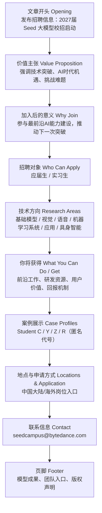

# ByteDance Seed 2027 Large Model Campus Recruitment（含实习）｜精读笔记

> **说明**：正文英文句段以 Seed 官网英文博文为主；个别栏目用词（如 Category）在不同页面快照中可能显示为 `Recruitment` 或 `Recruitment Information`，以当前官网为准。精读块中 `🔹` 为英文原文行，`🔸` 为中文对照行；`🔹` 行行尾已按仓库规则加**两个空格**以便 Markdown 硬换行。案例人物代号精读稿作 **Student C–R**，官网英文常见 **Employee / Intern**，文中已用「与官网英文对照」互参。

## 前情提要

### 文章基本信息

- **文章来源**：ByteDance Seed 官方网站
- **题目**：**ByteDance Seed 2027 Large Model Campus Recruitment Launches (Including Internships)**
- **发布日期**：**2026-04-01**
- **类别**：**Recruitment Information**（常见亦作 **Recruitment**）
- **作者信息**：该页面为 **ByteDance Seed 官方招聘/新闻页**，页面未标注具体署名作者，通常可视为 **ByteDance Seed 团队/官方编辑部** 发布。
- **作者背景简介**：**ByteDance Seed** 是字节跳动面向基础模型、多模态、语音、系统、具身智能等方向的前沿 AI 研究与工程团队，官方页面显示其长期围绕 **foundation model、multimodal、speech、agent、robotics、infrastructure** 等方向推进研发，并发布论文、模型成果与招聘信息。
  - 参考来源：<https://seed.bytedance.com/en/blog/bytedance-seed-2027-foundation-model-campus-recruitment-is-now-open-internships-included>  
  - <https://seed.bytedance.com/en/seedearlycareer>  
  - <https://seed.bytedance.com/career>

### 结构信息图

---

## 逐句精读

全文按**网页阅读顺序**编排：元信息 → 开篇理念 → 招聘对象 → 各技术方向 → 平台与回报 → 案例与投递 → 页脚导航。文末 **扩展学习模块** 为补充检索与词汇迁移，不与逐句块逐字绑定。

🔹**ByteDance Seed 2027 Large Model Campus Recruitment Launches (Including Internships)**  
🔸**字节跳动 Seed 2027 届大模型校园招聘启动（含实习岗位）。**

- **背景注释**
  - **ByteDance**：字节跳动，国际化互联网与 AI 公司。
  - **Seed**：字节跳动旗下聚焦基础模型及相关 AI 前沿研究的团队。
  - **Campus Recruitment**：校园招聘，通常指面向应届生或在校生的招聘项目。
  - **Including Internships**：说明此次项目不仅包含正式校招，也涵盖实习招聘。

> **Launches 启动；推出**
> 1. 英文释义（v.）to officially begin or introduce something / **正式开始；正式推出**
> 2. 语域：**新闻、商业、招聘、公关**
> 3. 画龙点睛：**launch** 是新闻标题高频词，常见于 **launch a program / campaign / product / recruitment drive**。标题中常用一般现在时表示“新闻性当前发生”。备考中要注意它不只是“发射”，还常表示**正式启动某项计划**。
>
> **Campus recruitment 校园招聘**
> 1. 英文释义（n. phrase）organized hiring aimed at students or recent graduates / **面向在校生或应届毕业生的招聘**
> 2. 语域：**招聘、人力资源、教育、商业**
> 3. 画龙点睛：常与 **graduate recruitment / internship recruitment / entry-level hiring** 对比。中国语境里“校招”常直接译为 **campus recruitment**，写作中可搭配 **launch, open, expand, participate in**。
>
> **Including internships 包括实习岗位**
> 1. 英文释义（prep. phrase）covering internship opportunities as part of the program / **将实习机会纳入其中**
> 2. 语域：**招聘说明**
> 3. 画龙点睛：**including** 在公告里常用于补充范围；注意其后可以接名词、名词短语。写作中可用于自然补充信息，避免重复使用 **and also**。

---

🔹**Date**  
🔸**日期。**

- **背景注释**
  - 此处为页面栏目标题，用于标示发布时间。

> **Date 日期**
> 1. 英文释义（n.）the particular day, month, and year of an event / **某一事件对应的具体日期**
> 2. 语域：**通用、行政、网页信息**
> 3. 画龙点睛：网页栏目中常单独写作 **Date / Category / Author**。注意 **date** 还有“约会”的常见义项，阅读中需依语境判断。

---

🔹**2026-04-01**  
🔸**2026年4月1日。**

- **背景注释**
  - 这是该页面的明确发布日期，应按绝对日期理解，而不是相对时间。

---

🔹**Category**  
🔸**类别。**

- **背景注释**
  - 页面元信息栏目标题，表示内容所属分类。

> **Category 类别；分类**
> 1. 英文释义（n.）a class or division of things sharing common features / **具有共同特征的类别、门类**
> 2. 语域：**通用、网页、学术、数据管理**
> 3. 画龙点睛：可用于 **product category / job category / category error**。在网页中多指内容标签或信息归类，属于功能性词汇，但在阅读中常决定文章定位。

---

🔹**Recruitment Information**  
🔸**招聘信息。**

- **背景注释**
  - 表示这篇内容属于招聘公告类信息，而非技术论文或团队新闻。（若页面显示为 **Recruitment**，语义相近，均指招聘类栏目。）

> **Recruitment information 招聘信息**
> 1. 英文释义（n. phrase）information related to hiring opportunities / **与招聘机会相关的信息**
> 2. 语域：**人力资源、招聘、公文**
> 3. 画龙点睛：**recruitment** 比 **hiring** 更正式，常见于 **recruitment process / recruitment drive / campus recruitment**。写作中若表达“求职信息”，可灵活替换为 **job information**，但正式度略低。

---

🔹**The Seed large model campus recruitment for the Class of 2027 / has officially launched.**  
🔸**Seed 面向 2027 届学生的大模型校园招聘现已正式启动。**

- **背景注释**
  - **the Class of 2027**：指 **2027 届毕业生**，是英美校园与招聘语境中的固定表达。
  - **officially**：强调项目已进入正式开放申请阶段。
  - 官网英文亦常见表述：**The Seed Foundation Model Campus Recruitment for 2027 graduates is now officially open.**（措辞略异，信息等价：校招已正式开放。）

> **Class of 2027 2027届毕业生**
> 1. 英文释义（n. phrase）students graduating in the year 2027 / **于2027年毕业的一届学生**
> 2. 语域：**教育、校园、招聘**
> 3. 画龙点睛：这是英文学术与招聘场景中的固定表达。可类推出 **Class of 2026/2028**。翻译时通常处理为“2027届”，不要直译成“2027班级”。
>
> **Officially 正式地**
> 1. 英文释义（adv.）in a formal, recognized, or authorized way / **正式地；官方地**
> 2. 语域：**新闻、公文、商业**
> 3. 画龙点睛：常搭配 **officially launch / announce / open / confirm**。它往往暗示此前可能已有预热，当前进入了**公开、有效**的阶段。
>
> **Launch 启动；推出**
> 1. 英文释义（v.）to begin or make available to the public / **启动；向公众推出**
> 2. 语域：**新闻、商业、项目管理**
> 3. 画龙点睛：本句中的 **has launched** 用现在完成时，强调“已经启动并对当前有效”。考试中要注意完成时与新闻标题一般现在时之间的区别。

---

🔹**We have always believed / that truly important technological progress / comes from continuously challenging difficult problems.**  
🔸**我们始终相信，真正重要的技术进步，源于持续不断地挑战艰难问题。**

- **背景注释**
  - 这是典型的组织价值观表达，用于塑造团队文化与招聘吸引力。
  - **technological progress**：不仅指单点发明，也包括系统性研发推进。
  - 官网英文另有相近版本：**We firmly believe that true technological progress stems from continuously seeking to scale new heights.**（动词与比喻不同：*scale new heights* 侧重“攀登新高峰”。）

> **Technological progress 技术进步**
> 1. 英文释义（n. phrase）advancement in technology over time / **技术随时间推进而取得的发展与进步**
> 2. 语域：**科技、经济、政策、学术**
> 3. 画龙点睛：是阅读中高频抽象名词搭配，常与 **drive, fuel, enable, hinder** 连用。写作中可作主语，如 **Technological progress has reshaped education.**
>
> **Come from 源于；来自**
> 1. 英文释义（v. phrase）to originate from or be caused by / **来源于；由……造成**
> 2. 语域：**通用**
> 3. 画龙点睛：相比 **result from**，**come from** 更口语、更自然；但在正式写作中也可使用。注意与 **come of**、**derive from** 的语气差别。
>
> **Continuously challenging difficult problems 持续挑战难题**
> 1. 英文释义（gerund phrase）persistently taking on hard problems / **持续不断地攻克困难问题**
> 2. 语域：**科技、商业激励、演讲**
> 3. 画龙点睛：这里 **challenging** 不是形容词“有挑战性的”，而是动名词用法。表达“挑战难题”时比 **solve problems** 更强调主动迎难而上。
>
> **Truly 真正地；确实地**
> 1. 英文释义（adv.）in a genuine or real sense / **真正地；确实地**
> 2. 语域：**通用、议论文、演讲**
> 3. 画龙点睛：在抽象论述中，**truly important** 能起到**聚焦与强调**作用。写作时可替换为 **genuinely, genuinely important**，但 **truly** 更凝练。

---

🔹**Facing the tremendous opportunities of the AI era, / the Seed team is not content with merely iterating on models, / but instead chooses to enter the deep waters of technology, / advancing breakthroughs in the next generation of AI paradigms / and constantly exploring the boundaries and limits of intelligence.**  
🔸**面对 AI 时代的巨大机遇，Seed 团队并不满足于仅仅对模型进行迭代，而是选择深入技术深水区，推动下一代 AI 范式的突破，并不断探索智能的边界与极限。**

- **背景注释**
  - **AI era**：人工智能时代，带有宏观时代叙事色彩。
  - **iterating on models**：对模型不断进行优化迭代，是 AI 工程中的常见说法。
  - **deep waters of technology**：比喻表达，指技术难度高、未知性强、进入门槛高的核心领域。
  - **AI paradigms**：AI 范式，指方法论、架构路线或研究框架层面的变化。
  - **the boundaries and limits of intelligence**：智能能力的边界与上限，常见于 AGI、基础模型等前沿论述。
  - 官网英文常见版本：**...does not stop at model iteration; instead, we dive into core cutting-edge technologies...**（用“不停留在迭代/潜入核心技术”替代“深水区”隐喻，可对照理解。）

> **Be content with 满足于**
> 1. 英文释义（adj. phrase）to be satisfied with what one has or does / **对……感到满足**
> 2. 语域：**正式、议论文、新闻评论**
> 3. 画龙点睛：常见结构 **be content with doing sth.**。本句用否定 **is not content with**，比 **is not satisfied with** 更书面、也更有“志不止于此”的意味。
>
> **Merely 仅仅；只是**
> 1. 英文释义（adv.）only; simply / **仅仅；只不过**
> 2. 语域：**正式、议论文、新闻**
> 3. 画龙点睛：比 **just** 更正式。与否定或转折连用时，常突出“不能停留于表层”。写作中可增强论证语气，如 **education is not merely about exams**。
>
> **Iterate on 对……进行迭代优化**
> 1. 英文释义（v. phrase）to improve something through repeated cycles of refinement / **通过反复改进对某事物进行迭代优化**
> 2. 语域：**科技、产品、工程**
> 3. 画龙点睛：现代科技英语高频表达。可搭配 **iterate on a model/product/design**。注意它不是单纯“重复”，而是**基于反馈持续改进**。
>
> **Paradigm 范式**
> 1. 英文释义（n.）a typical example or a model of how something is understood or done / **范式；模式；方法框架**
> 2. 语域：**学术、科技、哲学、社会科学**
> 3. 画龙点睛：考研/GRE 阅读高频词。常见于 **paradigm shift**，表示“范式转移/重大转变”。比 **model** 更抽象，侧重思维框架或方法体系。
>
> **Boundaries and limits 边界与极限**
> 1. 英文释义（n. phrase）the outer edges or maximum extent of something / **边界与最大限度**
> 2. 语域：**学术、科技、哲学、宣传表述**
> 3. 画龙点睛：这一搭配常用于前沿研究宣传，强调探索未知。写作中可借鉴为 **push the boundaries of science / test the limits of human endurance**。

---

🔹**By joining us, / you will directly participate in building the most cutting-edge AI capabilities / and help make the next breakthrough happen.**  
🔸**加入我们，你将直接参与构建最前沿的 AI 能力，并推动下一次突破真正发生。**

- **背景注释**
  - **cutting-edge**：前沿的、尖端的。
  - **AI capabilities**：AI 能力，既可指模型能力，也可指系统、应用、平台能力。
  - **make the next breakthrough happen**：典型招募式表达，强调候选人对未来成果的直接作用。
  - 官网英文常见版本：**Joining now, you will be at the forefront of building cutting-edge AI capabilities and driving the next breakthrough.**（*at the forefront* 与 *driving* 更强调“站在第一线/驱动突破”。）

> **Cutting-edge 尖端的；最前沿的**
> 1. 英文释义（adj.）highly advanced and innovative / **尖端的；处于技术前沿的**
> 2. 语域：**科技、商业、媒体**
> 3. 画龙点睛：高频褒义形容词，常搭配 **technology, research, tools, AI capabilities**。写作时比 **advanced** 更强，但也更宣传化。
>
> **Participate in 参与**
> 1. 英文释义（v. phrase）to take part in an activity or process / **参加；参与**
> 2. 语域：**通用、正式**
> 3. 画龙点睛：后面通常接 **noun / gerund**，如 **participate in research / building / discussions**。注意不要误写成 **participate sth.**。
>
> **Breakthrough 突破**
> 1. 英文释义（n.）an important discovery or development that helps improve a situation / **突破性进展；重大突破**
> 2. 语域：**科技、医学、商业、新闻**
> 3. 画龙点睛：极高频新闻词。常见搭配 **make/achieve a breakthrough in**。与 **progress** 相比，它强调**关键性跨越**而非一般进步。

---

🔹**Click to visit the project details page / to learn more**  
🔸**点击访问项目详情页，以了解更多信息。**

- **背景注释**
  - 典型网页行动按钮文案。
  - **project details page**：此处指招聘项目介绍页面。
  - 官网对应表述常见为：**Click to view the project page for more information**（动词 *view* 与 *visit* 近义）。

> **Visit 访问**
> 1. 英文释义（v.）to go to a website or place / **访问；前往**
> 2. 语域：**通用、网页、商务**
> 3. 画龙点睛：在互联网语境中，**visit a page/site** 很常见。与 **access** 相比更自然，但 **access** 更强调“获得进入权限/使用权”。
>
> **Learn more 了解更多**
> 1. 英文释义（v. phrase）to obtain additional information / **了解更多信息**
> 2. 语域：**网页、营销、通用**
> 3. 画龙点睛：极常见按钮文案。简洁、礼貌、行动导向强。写作中也可作句末不定式目的状语，如本句 **to learn more**。

---

🔹**We are looking for people like you**  
🔸**我们正在寻找像你这样的人。**

- **背景注释**
  - 招聘宣传中的直接招募式句子，语气亲近，旨在增强代入感。
  - 官网小标题亦作：**Who we are looking for**。

> **Look for 寻找；招募**
> 1. 英文释义（v. phrase）to seek or try to find / **寻找；寻求**
> 2. 语域：**通用、招聘**
> 3. 画龙点睛：在招聘场景中，**look for** 不仅是“寻找”，还隐含“招募符合条件的人”。比 **recruit** 更口语、更有对话感。
>
> **People like you 像你这样的人**
> 1. 英文释义（n. phrase）people with qualities similar to the reader’s / **具有与你相似特质的人**
> 2. 语域：**招聘、营销、宣传**
> 3. 画龙点睛：这是典型的**第二人称拉近距离**表达。写作中常用于广告或招募，不适合严肃学术文体。

---

🔹**Recent graduates / (undergraduate, master’s, and PhD students graduating from September 2026 to August 2027)**  
🔸**应届毕业生（2026年9月至2027年8月毕业的本科生、硕士生和博士生）。**

- **背景注释**
  - **Recent graduates**：此处具体被界定为符合毕业时间窗口的应届生。
  - **undergraduate, master’s, and PhD students**：对应本科、硕士、博士层级。
  - 时间范围是资格限制条件，招聘阅读中需特别注意。
  - 官网对应：**New graduates (for undergraduates, Master's and PhD students graduating between September 2026–August 2027)**（*New graduates* 与 *Recent graduates* 同场常见，均指应届/新毕业群体，以括号内时间为准。）

> **Recent graduates 应届/近期毕业生**
> 1. 英文释义（n. phrase）people who have graduated recently / **刚毕业或即将毕业不久的学生**
> 2. 语域：**招聘、教育**
> 3. 画龙点睛：不同公司对 **recent graduate** 的时间界定不同，所以做阅读题时要以括号内**具体日期**为准，不能想当然。
>
> **Undergraduate 本科生**
> 1. 英文释义（n./adj.）a student studying for a first degree / **攻读学士学位的学生；本科阶段的**
> 2. 语域：**教育**
> 3. 画龙点睛：可作名词也可作形容词，如 **undergraduate student / undergraduate study**。与 **postgraduate/graduate student** 区分是常考点。
>
> **PhD student 博士生**
> 1. 英文释义（n. phrase）a student pursuing a doctoral degree / **攻读博士学位的学生**
> 2. 语域：**教育、学术**
> 3. 画龙点睛：英语中也常说 **doctoral student / doctoral candidate**。其中 **candidate** 往往指进入博士后期阶段的人。

---

🔹**Interns / (current university students graduating in September 2027 or later)**  
🔸**实习生（2027年9月及以后毕业的在校大学生）。**

- **背景注释**
  - **current university students**：目前仍在读的大学生。
  - **or later**：及以后，表示资格范围向后延伸。
  - 官网对应：**Interns (for students graduating in September 2027 or later)**（未写 *current university*，但实习对象通常默认在校生；仍以括号规则为准。）

> **Intern 实习生**
> 1. 英文释义（n.）a student or trainee who works temporarily to gain experience / **实习生**
> 2. 语域：**招聘、教育、职场**
> 3. 画龙点睛：**intern** 可指身份，**internship** 指实习经历/项目。求职写作中注意区分 **summer intern**, **research intern**, **software engineering intern**。
>
> **Current 在读的；当前的**
> 1. 英文释义（adj.）happening now; existing at present / **当前的；现阶段的**
> 2. 语域：**通用、正式**
> 3. 画龙点睛：本句中 **current university students** 不是“当前大学生”直译，而应理解为“目前仍在校的学生”。语境判断很重要。
>
> **Or later 及以后**
> 1. 英文释义（phrase）or any time after the stated point / **或者更晚；及以后**
> 2. 语域：**公告、规则、时间说明**
> 3. 画龙点睛：资格条件里非常关键，常与日期连用。做信息匹配题时，这是判断是否符合要求的关键词。

---

🔹**Technical research directions**  
🔸**技术研究方向。**

- **背景注释**
  - 该标题引出后续招聘所覆盖的主要技术领域。

> **Direction 方向**
> 1. 英文释义（n.）a general course along which something develops / **发展方向；研究方向**
> 2. 语域：**学术、科研、招聘**
> 3. 画龙点睛：**research direction** 是科研英语常用搭配。比 **topic** 更宏观，比 **project** 更抽象，适合概括长期布局。

---

🔹**Foundation large models**  
🔸**基础大模型。**

- **背景注释**
  - 官网英文小标题常见写作：**Foundation models**（*foundation models* 为业界常用固定搭配；“large”可视为中文“大模型”口径的对应强调，但英文页面未必逐字出现 *large*）。
  - 指可迁移到多任务、多场景的大规模基础模型。

> **Foundation model 基础模型**
> 1. 英文释义（n.）a large, general-purpose model trained on broad data and adaptable to many tasks / **在广泛数据上训练、可适配多任务的通用基础模型**
> 2. 语域：**AI、机器学习、科技媒体**
> 3. 画龙点睛：当前 AI 领域核心术语。与 **large language model** 相比，**foundation model** 范围更广，可覆盖文本、视觉、多模态等模型。

---

🔹**Explore the upper limits of foundation large model capabilities and efficiency boundaries, / continuously optimizing model architecture, training paradigms, and key capabilities.**  
🔸**探索基础大模型能力的上限与效率边界，并持续优化模型架构、训练范式和关键能力。**

- **背景注释**
  - **upper limits**：能力上限。
  - **efficiency boundaries**：效率边界，既可能涉及算力利用率，也可能涉及训练/推理成本与性能之间的边界。
  - **model architecture**：模型架构。
  - **training paradigms**：训练范式，指训练方式、机制或整体方法论。
  - 官网博文对应要点句：**Pursue the edge of foundation models' capabilities and efficiency boundaries, and continuously optimize model architecture, training paradigms, and core capabilities.**（*Pursue the edge* 与 *upper limits* 近义；*core* 与 *key* 近义。）

> **Upper limits 上限**
> 1. 英文释义（n. phrase）the highest level something can reach / **上限；最高可达水平**
> 2. 语域：**科技、工程、分析**
> 3. 画龙点睛：常用于能力、性能、增长空间等语境。与 **lower bound / ceiling / cap** 相关，但 **upper limit** 更中性、更技术化。
>
> **Efficiency boundary 效率边界**
> 1. 英文释义（n. phrase）the practical limit of efficient performance / **效率所能达到的边界**
> 2. 语域：**工程、系统、优化**
> 3. 画龙点睛：这是较技术化的表述，常见于系统、模型优化语境。它强调“性能提升与资源消耗之间的极限关系”。
>
> **Architecture 架构**
> 1. 英文释义（n.）the overall design or structure of a system / **系统、模型的整体结构设计**
> 2. 语域：**计算机、工程、建筑（原义）**
> 3. 画龙点睛：在 AI 里 **model architecture** 是核心词。不要仅理解为“建筑学”。阅读中常见 **Transformer architecture**。
>
> **Optimize 优化**
> 1. 英文释义（v.）to make something as effective or functional as possible / **使最优化；提高效能**
> 2. 语域：**科技、商业、工程**
> 3. 画龙点睛：可搭配 **optimize performance / cost / workflow / architecture**。考试写作里比 **improve** 更专业，但不能滥用，需有“朝最优方向调整”的意味。

---

🔹**Visual intelligence**  
🔸**视觉智能。**

- **背景注释**
  - 指视觉理解、视觉生成、多模态视觉推理等相关方向。

> **Visual intelligence 视觉智能**
> 1. 英文释义（n. phrase）AI capabilities related to visual perception, understanding, and generation / **与视觉感知、理解、生成相关的人工智能能力**
> 2. 语域：**AI、计算机视觉**
> 3. 画龙点睛：可覆盖 **computer vision** 的传统任务，也包含多模态时代的图文视频联合能力。是新型宣传和研究概括性术语。

---

🔹**Focus on directions such as / new paradigms for multimodal pretraining, / multimodal fusion, / visual reasoning that unifies generation and understanding, / and multimodal agents.**  
🔸**聚焦于如下方向：多模态预训练的新范式、多模态融合、统一生成与理解的视觉推理，以及多模态智能体。**

- **背景注释**
  - **multimodal pretraining**：多模态预训练，指在文本、图像、音频、视频等多种模态数据上进行预训练。
  - **multimodal fusion**：多模态融合，强调不同模态信息的整合。
  - **visual reasoning**：视觉推理，从视觉输入中进行复杂推断。
  - **unifies generation and understanding**：统一生成与理解，即一个系统既能“看懂”，也能“生成”。
  - **multimodal agents**：多模态智能体，通常指可感知、理解并调用工具完成任务的 agent 系统。
  - 官网博文对应：**Focus on building new paradigms for multimodal pre-training, multimodal fusion, unified generation and understanding for visual reasoning, multimodal agents, and other related fields.**（信息更完整：含 *building*、*pre-training* 拼写、并补 *other related fields*。）

> **Multimodal 多模态的**
> 1. 英文释义（adj.）involving multiple modes of data such as text, image, audio, or video / **涉及文本、图像、音频、视频等多种数据模态的**
> 2. 语域：**AI、机器学习**
> 3. 画龙点睛：当前大模型领域超高频术语。注意与 **multimedia** 区分：前者更偏模型输入输出机制，后者偏媒体形式。
>
> **Fusion 融合**
> 1. 英文释义（n.）the process of combining different elements into one / **融合；整合**
> 2. 语域：**科技、工程、艺术**
> 3. 画龙点睛：在 AI 里常见 **feature fusion / multimodal fusion**。其重点在“信息整合后产生更强效果”，不是简单拼接。
>
> **Reasoning 推理**
> 1. 英文释义（n.）the process of thinking logically to form conclusions / **推理；推断过程**
> 2. 语域：**学术、AI、认知科学**
> 3. 画龙点睛：在大模型语境中，**reasoning** 常指链式推理、逻辑推断、复杂任务求解能力，是当下重点考察概念。
>
> **Agent 智能体**
> 1. 英文释义（n.）an autonomous system that can perceive, decide, and act / **能够感知、决策并执行动作的自主系统**
> 2. 语域：**AI、计算机科学**
> 3. 画龙点睛：现代 AI 里的 **agent** 不再只是“代理人”，而是具备任务执行能力的系统。阅读时要避免按传统商业义误解。

---

### （续）语音 / 系统 / 应用 / 具身智能及之后版块

🔹**Speech intelligence**  
🔸**语音智能。**

- **背景注释**
  - 指与音频、语音理解、语音生成、语音交互相关的 AI 研究方向。
  - 在当前大模型语境中，**speech intelligence** 往往不仅包括传统语音识别，还覆盖语音对话、音频理解、声音生成等更广泛能力。

> **Speech intelligence 语音智能**
> 1. 英文释义（n. phrase）AI capabilities related to speech and audio understanding, generation, and interaction / **与语音和音频的理解、生成、交互相关的人工智能能力**
> 2. 语域：**AI、语音技术、科研招聘**
> 3. 画龙点睛：它比传统 **speech recognition** 范围更大，更接近“大模型时代的语音系统能力总称”。写作时可与 **visual intelligence / embodied intelligence** 并列，体现技术分类意识。

---

🔹**Explore directions such as / unified generation and understanding of audio, / personalized dialogue, / speech agents, / and music generation.**  
🔸**探索如下方向：音频的统一生成与理解、个性化对话、语音智能体，以及音乐生成。**

- **背景注释**
  - **unified generation and understanding of audio**：统一音频生成与理解，意味着同一系统兼具“听懂”和“生成”的能力。
  - **personalized dialogue**：个性化对话，强调针对用户偏好、身份、历史上下文的定制化交互。
  - **speech agents**：语音智能体，可理解语音输入并进行任务执行或自然交互。
  - **music generation**：音乐生成，属于生成式 AI 的具体应用方向之一。
  - 官网英文常见版本：**Explore unified audio generation and understanding, personalized dialogue, speech agents, music generation, and other related fields.**（措辞略异，可对照。）

> **Unified 统一的**
> 1. 英文释义（adj.）combined into a single system or framework / **被整合进统一系统或框架中的**
> 2. 语域：**科技、学术、系统设计**
> 3. 画龙点睛：AI 语境中 **unified** 往往意味着原本分离的任务被纳入同一模型或同一训练框架。比 **combined** 更强调“体系化的一体设计”。
>
> **Personalized 个性化的**
> 1. 英文释义（adj.）designed to match the needs or preferences of a particular person / **针对特定个人需求或偏好定制的**
> 2. 语域：**产品、AI、商业**
> 3. 画龙点睛：常见于 **personalized recommendation / learning / dialogue**。注意英式拼法有时写作 **personalised**。考试中要会从词根 **person** 理解其“面向个体”。
>
> **Dialogue 对话**
> 1. 英文释义（n.）a conversation between two or more parties / **对话；交谈**
> 2. 语域：**通用、AI、文学**
> 3. 画龙点睛：在 AI 中，**dialogue system** 是固定说法。美式英语也常写作 **dialog**，但 **dialogue** 更常见、更正式。
>
> **Generation 生成**
> 1. 英文释义（n.）the act or process of producing something / **生成；产生过程**
> 2. 语域：**科技、工程、通用**
> 3. 画龙点睛：在生成式 AI 时代，**generation** 已成为核心术语，如 **text generation / image generation / music generation**。它不同于“世代”的义项，需结合上下文判断。

---

🔹**Machine learning systems**  
🔸**机器学习系统。**

- **背景注释**
  - 指支撑模型训练、推理、部署、资源调度、编译优化等底层系统方向。
  - 与“做模型算法”相比，**systems** 更强调工程基础设施和大规模运行能力。

> **Machine learning systems 机器学习系统**
> 1. 英文释义（n. phrase）systems and infrastructure that support machine learning training, inference, and deployment / **支持机器学习训练、推理与部署的系统和基础设施**
> 2. 语域：**计算机系统、AI工程、科研**
> 3. 画龙点睛：该术语连接算法与系统两大领域，是近年顶会和工业界的重要交叉方向。阅读时看到 **systems**，不要只理解成“系统软件”，还可能包括分布式框架、编译器、硬件协同等。

---

🔹**Focus on key problems such as / ultra-large-scale training, / large model reinforcement systems, / inference optimization, / hardware-software co-design, / and compilation acceleration.**  
🔸**聚焦如下关键问题：超大规模训练、大模型强化系统、推理优化、软硬件协同设计，以及编译加速。**

- **背景注释**
  - **ultra-large-scale training**：超大规模训练，涉及海量参数、海量数据、分布式集群等。
  - **large model reinforcement systems**：大模型强化系统，这里多半指强化学习/反馈优化相关系统支撑。
  - **inference optimization**：推理优化，即降低延迟、成本，提高吞吐与稳定性。
  - **hardware-software co-design**：软硬件协同设计，是系统与芯片领域的重要思路。
  - **compilation acceleration**：编译加速，可能涉及编译器优化、图优化、执行效率提升等。
  - 官网英文常见版本：**Focus on key technical issues, including ultra-large-scale training, foundation model reinforcement systems, inference optimization, hardware-software co-design, and compilation acceleration.**（*foundation model reinforcement systems* 与 *large model reinforcement systems* 可对照理解。）

> **Ultra-large-scale 超大规模的**
> 1. 英文释义（adj.）extremely large in scale / **规模极其巨大的**
> 2. 语域：**工程、系统、科研**
> 3. 画龙点睛：比 **large-scale** 更强，常用于强调算力、数据量、模型规模等达到工业级甚至极限级别。写作中带有明显技术色彩。
>
> **Inference 推理；推断执行**
> 1. 英文释义（n.）in AI, the process of using a trained model to make predictions or generate outputs / **在AI中，指使用训练好的模型进行预测或生成输出的过程**
> 2. 语域：**AI、机器学习、工程**
> 3. 画龙点睛：这是 AI 中的专业义，不是普通英语里“逻辑推断”的唯一含义。与 **training** 相对：**training** 负责学，**inference** 负责用。
>
> **Co-design 协同设计**
> 1. 英文释义（n.）the joint design of multiple components, especially hardware and software / **多个组成部分尤其软硬件的联合设计**
> 2. 语域：**工程、芯片、系统**
> 3. 画龙点睛：**hardware-software co-design** 是固定搭配，强调不是先做硬件再适配软件，而是从一开始联合优化。
>
> **Compilation 编译**
> 1. 英文释义（n.）the process of translating code into a form executable by a computer / **将代码转换为计算机可执行形式的过程**
> 2. 语域：**计算机科学**
> 3. 画龙点睛：在 AI 系统中，编译不仅是程序语言概念，还与图优化、算子融合、执行效率密切相关。搭配 **compilation acceleration** 很有系统研究色彩。
>
> **Optimization 优化**
> 1. 英文释义（n.）the act of making something as effective as possible / **优化；最优化处理**
> 2. 语域：**科技、商业、数学**
> 3. 画龙点睛：作为名词时，常与 **performance / inference / resource allocation** 搭配。备考中要掌握动词 **optimize** 与名词 **optimization** 的转换。

---

🔹**Large model applications**  
🔸**大模型应用。**

- **背景注释**
  - 指将大模型能力落地到具体产品、任务和用户场景中的应用层研发方向。
  - 官网英文亦作 **LLM applications**（与 **large model applications** 表述接近，以页面为准）。

> **Application 应用；应用场景；应用程序**
> 1. 英文释义（n.）the practical use of something; in some contexts, a software app / **应用；实际运用；某些语境下也指应用程序**
> 2. 语域：**通用、科技、产品**
> 3. 画龙点睛：本句中 **applications** 指“应用方向/落地方向”，不是“申请”。这是考试中很常见的多义词辨析点。

---

🔹**Optimize availability for key tasks, / build memory and personalization systems, / integrate search and tool calling, / and comprehensively improve the user experience of the Doubao App.**  
🔸**针对关键任务优化可用性，构建记忆与个性化系统，整合搜索与工具调用，并全面提升豆包 App 的用户体验。**

- **背景注释**
  - **availability**：在产品和系统中可指可用性、稳定可用程度，也可指任务适配性。
  - **memory and personalization systems**：在大模型应用中常指长期记忆、用户画像、偏好学习等机制。
  - **tool calling**：工具调用，即模型按需调用外部工具、API、搜索、数据库等能力。
  - **Doubao App**：豆包，字节跳动推出的 AI 应用产品。
  - 官网英文常见版本：**Optimize the usability of key tasks, build memory and personalization systems, and integrate search with tool-calling to comprehensively elevate user experience across ByteDance applications.**（*usability* 与 *availability*、*tool-calling* 与 *tool calling*、*Doubao App* 与 *ByteDance applications* 可对照。）

> **Availability 可用性**
> 1. 英文释义（n.）the state of being usable, accessible, or operational / **可用性；可获得性；可运行状态**
> 2. 语域：**系统、产品、工程**
> 3. 画龙点睛：在技术语境中，**availability** 往往不是“有空”，而是“系统能否稳定使用”。和 **reliability**、**usability** 相关但不完全相同。
>
> **Personalization 个性化**
> 1. 英文释义（n.）the process of tailoring services or content to individual users / **根据个体用户定制服务或内容的过程**
> 2. 语域：**产品、AI、营销**
> 3. 画龙点睛：可搭配 **personalization system / strategy / feature**。与前文形容词 **personalized** 构成词性变化，适合写作中灵活改写。
>
> **Integrate 整合；集成**
> 1. 英文释义（v.）to combine parts into a unified whole / **整合；使成为统一整体**
> 2. 语域：**科技、管理、教育**
> 3. 画龙点睛：高频动词，常搭配 **integrate A with B / integrate tools into a platform**。比 **combine** 更强调系统化嵌入。
>
> **Tool calling 工具调用**
> 1. 英文释义（n. phrase）the ability of a model to invoke external tools or APIs to complete tasks / **模型调用外部工具或API以完成任务的能力**
> 2. 语域：**AI、开发者、产品**
> 3. 画龙点睛：是当前 agent 与应用层大模型的重要机制。阅读中遇到该词，通常意味着模型不只是“回答”，而是能“行动”。
>
> **User experience 用户体验**
> 1. 英文释义（n. phrase）the overall experience a person has when using a product or service / **用户在使用产品或服务时获得的整体体验**
> 2. 语域：**产品、设计、商业**
> 3. 画龙点睛：常缩写为 **UX**。写作中可搭配 **improve, enhance, optimize, shape**。它不只包含界面美观，还包括效率、流畅度、满意度等。

---

🔹**Embodied intelligence**  
🔸**具身智能。**

- **背景注释**
  - **embodied intelligence** 指智能系统与物理身体、环境感知、动作执行相结合的方向，常见于机器人、现实环境交互等研究。
  - 中文学术和产业语境中通常译作“具身智能”。

> **Embodied intelligence 具身智能**
> 1. 英文释义（n. phrase）intelligence grounded in a physical body interacting with the real world / **建立在物理身体与真实世界交互基础上的智能**
> 2. 语域：**AI、机器人、认知科学**
> 3. 画龙点睛：这是近年高频前沿术语。它强调智能不是纯文本或纯虚拟推理，而是与**感知—决策—行动**闭环紧密相关。

---

🔹**Explore general robot manipulation large models, / data algorithms, / and reinforcement learning, / continuously improving robots’ perception, decision-making, and execution capabilities in real-world environments.**  
🔸**探索通用机器人操作大模型、数据算法与强化学习，并持续提升机器人在真实世界环境中的感知、决策和执行能力。**

- **背景注释**
  - **robot manipulation**：机器人操作/操控，通常指抓取、移动、装配等动作能力。
  - **reinforcement learning**：强化学习，机器学习重要分支，通过奖励机制学习策略。
  - **real-world environments**：真实世界环境，与模拟环境相对。
  - **perception, decision-making, and execution**：机器人智能中的经典三环节。
  - 官网英文常见版本：**Explore general-purpose robotic foundation models, data algorithms, and reinforcement learning to continuously improve robots’ perception, decision-making, and execution capabilities in real-world environments.**（*general-purpose robotic foundation models* 与 *general robot manipulation large models* 表述不同，精读稿可保留你的句式并对照官网。）

> **Manipulation 操作；操控**
> 1. 英文释义（n.）the act of handling or controlling objects; in robotics, object manipulation / **操作；操控；在机器人中指对物体的抓取、搬运、处理**
> 2. 语域：**机器人、工程；普通英语中也可有“操纵”义**
> 3. 画龙点睛：这是典型熟词僻义。一般英语里可能带“操纵他人”的贬义，但机器人领域中是中性技术词，常见 **robot manipulation**。
>
> **Reinforcement learning 强化学习**
> 1. 英文释义（n. phrase）a type of machine learning in which an agent learns through rewards and penalties / **一种通过奖励与惩罚进行学习的机器学习方法**
> 2. 语域：**AI、机器学习**
> 3. 画龙点睛：常缩写为 **RL**。是近年大模型后训练、机器人控制、决策系统中的核心术语，阅读和面试中极高频。
>
> **Decision-making 决策**
> 1. 英文释义（n.）the process of making choices among alternatives / **在多种选择中作出判断与选择的过程**
> 2. 语域：**通用、管理、AI、心理学**
> 3. 画龙点睛：可作名词整体使用，也可见 **decision-making ability/process**。与 **make decisions** 是动名词与动词表达的转换关系。
>
> **Execution 执行**
> 1. 英文释义（n.）the act of carrying out a plan, command, or task / **执行；实施**
> 2. 语域：**管理、工程、机器人**
> 3. 画龙点睛：在机器人里常与 **perception**、**planning**、**control** 并列。不要与法律语境中的“死刑执行”混淆，需依上下文判断。
>
> **Real-world environment 真实世界环境**
> 1. 英文释义（n. phrase）an actual physical environment rather than a simulated one / **相对于模拟环境而言的现实物理环境**
> 2. 语域：**机器人、AI、实验研究**
> 3. 画龙点睛：研究论文中常与 **simulation** 对照，强调落地难度更高、噪声更复杂、泛化要求更强。

---

🔹**Here, / you will be able to**  
🔸**在这里，你将能够——**

- **背景注释**
  - 这是引出后续并列优势条目的过渡句。
  - **Here** 不单指地理地点，也指“在这个团队/平台/组织中”。
  - 官网英文该段通常以 **What you can achieve here** 为小标题，下接若干条并列；此处为你的句式版本，可并存对照。

> **Be able to 能够**
> 1. 英文释义（v. phrase）to have the ability or opportunity to do something / **有能力或有机会做某事**
> 2. 语域：**通用**
> 3. 画龙点睛：与 **can** 相比，**be able to** 更适合正式文体，也更便于变换时态，如 **will be able to / have been able to**。
>
> **Here 在这里**
> 1. 英文释义（adv.）in this place, context, or organization / **在这里；在此处；在这一组织/环境中**
> 2. 语域：**通用、宣传、演讲**
> 3. 画龙点睛：宣传文案里 **Here** 常常不是字面地点，而是“在我们这里/在这个平台里”。翻译时应根据语境灵活处理。

---

🔹**Participate in the most challenging frontier AI work**  
🔸**参与最具挑战性的前沿 AI 工作。**

- **背景注释**
  - **frontier AI**：前沿 AI，指靠近学术与工程边界的最新研究方向。
  - **challenging**：此处表示“难度高、要求高”，不是负面评价。
  - 官网对应表述常见为：**Work on the most challenging frontiers in AI**（*frontier* 作名词复数 *frontiers* 的用法略不同）。

> **Frontier 前沿的；边界的**
> 1. 英文释义（adj./n.）relating to the newest and most advanced area of activity / **处于最前沿领域的；前沿**
> 2. 语域：**学术、科技、政策**
> 3. 画龙点睛：常见搭配 **frontier research / frontier technology / frontier AI**。它比 **advanced** 更强调“尚在开拓中的未知区域”。
>
> **Challenging 具有挑战性的**
> 1. 英文释义（adj.）difficult in a way that tests one’s abilities / **因要求高而富有挑战性的**
> 2. 语域：**通用、招聘、教育**
> 3. 画龙点睛：高频正向形容词。口语和面试中常用于表达“任务难但有成长价值”。不要一概译成“困难的”，有时“有挑战性”更贴切。

---

🔹**Build the world-leading Seed foundation large model and GenMedia large model, / and explore the next generation of AI.**  
🔸**打造世界领先的 Seed 基础大模型与 GenMedia 大模型，并探索下一代 AI。**

- **背景注释**
  - **world-leading**：世界领先的，常见于公司宣传和科研成果介绍。
  - **Seed foundation large model**：Seed 基础大模型，属于团队核心模型体系。
  - **GenMedia large model**：GenMedia 大模型，按字面理解是与生成媒体相关的大模型方向。
  - **the next generation of AI**：下一代 AI，指未来的新架构、新范式或新能力阶段。
  - 官网对应表述常见为：**Participate in building industry-leading Seed foundation models and GenMedia models, and explore the next generation of AI.**（*industry-leading* vs *world-leading*；*models* 单复数可对照。）

> **World-leading 世界领先的**
> 1. 英文释义（adj.）among the best and most advanced in the world / **处于全球领先水平的**
> 2. 语域：**商业、公关、科技宣传**
> 3. 画龙点睛：常见于企业对技术、产品、实验室的定位表述。写作时要注意其宣传色彩较强，学术写作中通常需用数据支撑。
>
> **Explore 探索**
> 1. 英文释义（v.）to investigate or examine something in order to learn more / **探索；研究；探究**
> 2. 语域：**学术、科技、通用**
> 3. 画龙点睛：比 **study** 更强调“面向未知”，比 **research** 更灵活。常搭配 **explore possibilities/directions/the next generation of...**。
>
> **Next generation 下一代**
> 1. 英文释义（n. phrase）the stage or version that comes after the current one / **当前阶段之后的新一代版本或阶段**
> 2. 语域：**科技、产品、产业**
> 3. 画龙点睛：常见于 **next-generation chips / networks / AI systems**。它暗示现有技术将发生较大升级，而非小修小补。

---

🔹**Receive full R&D resource support**  
🔸**获得完整的研发资源支持。**

- **背景注释**
  - **R&D**：Research and Development，研发。
  - 这句话是后文具体资源保障说明的标题式概括。
  - 官网对应小标题常见为：**Full support in accessing R&D resources**（句式不同，信息相近）。

> **R&D 研发**
> 1. 英文释义（n. abbreviation）research and development / **研究与开发**
> 2. 语域：**商业、科技、产业**
> 3. 画龙点睛：高频缩写。写作时第一次出现可写全称加括号：**research and development (R&D)**。后续再用缩写更规范。
>
> **Resource support 资源支持**
> 1. 英文释义（n. phrase）support in the form of resources such as funding, tools, or infrastructure / **以资金、工具、基础设施等形式提供的支持**
> 2. 语域：**管理、科技、招聘**
> 3. 画龙点睛：在招聘文案中是高频表达，通常隐含“不是让你单打独斗，而是提供平台与条件”。

---

🔹**With well-established AI infrastructure, / you will have guaranteed access to computing power, data, and engineering resources, / allowing you to focus on breaking through core technical challenges.**  
🔸**依托完善的 AI 基础设施，你将稳定获得算力、数据和工程资源，从而能够专注于攻克核心技术挑战。**

- **背景注释**
  - **well-established AI infrastructure**：成熟完善的 AI 基础设施。
  - **computing power**：算力。
  - **engineering resources**：工程资源，可包括平台、框架、人员协作、工程支持系统等。
  - **breaking through core technical challenges**：攻克核心技术难题。
  - 官网对应表述常见为：**With our robust AI infra, you will have access to sufficient computing power, data, and engineering resources to focus on overcoming core technical challenges.**（*robust* / *sufficient* / *guaranteed* 语气差异可对照。）

> **Infrastructure 基础设施**
> 1. 英文释义（n.）the basic systems and facilities needed for an organization or activity to function / **支撑某组织或活动运行的基础系统与设施**
> 2. 语域：**科技、经济、公共政策**
> 3. 画龙点睛：在 AI 中常指算力平台、数据管线、训练框架、部署平台等。是现代科技报道中的高频词。
>
> **Guaranteed access to 稳定获得；有保障地使用**
> 1. 英文释义（phrase）assured ability to obtain or use something / **被保证能够获得或使用某物**
> 2. 语域：**正式、商业、制度说明**
> 3. 画龙点睛：**access** 不只是“访问”，更可表示“获得使用权”。本短语比单纯 **have** 更强调制度或平台保障。
>
> **Computing power 算力**
> 1. 英文释义（n. phrase）the computational capacity available for processing tasks / **用于处理任务的计算能力**
> 2. 语域：**AI、计算机、产业**
> 3. 画龙点睛：当前 AI 报道高频词。中文常译“算力”，英文可写作 **compute**（更口语化、更行业化）或 **computing power**（更完整直观）。
>
> **Focus on 专注于**
> 1. 英文释义（v. phrase）to concentrate attention or effort on / **把注意力或精力集中于**
> 2. 语域：**通用、学术、职场**
> 3. 画龙点睛：高频基础短语，后接名词或动名词。写作中非常实用，如 **focus on solving core problems**。
>
> **Break through 突破；攻克**
> 1. 英文释义（v. phrase）to overcome a barrier or achieve an important advance / **突破障碍；取得关键进展**
> 2. 语域：**科技、商业、新闻**
> 3. 画龙点睛：既可作不及物也可接宾语语义扩展使用。名词形式是 **breakthrough**。在科研写作中常表示“攻克瓶颈”。

---

🔹**Create real value for billions of users**  
🔸**为数十亿用户创造真实价值。**

- **背景注释**
  - **billions of users**：数十亿用户，体现平台体量与影响范围。
  - **real value**：真实价值，即可感知、可落地、可转化的实际价值。
  - 官网英文常见版本：**Create real value for the world** 与 **hundreds of millions of users** 等表述并存；数字与范围以页面为准。

> **Real value 真实价值；实际价值**
> 1. 英文释义（n. phrase）practical and meaningful value in reality / **现实中切实存在且有意义的价值**
> 2. 语域：**商业、产品、管理**
> 3. 画龙点睛：在宣传和商业叙述中，**real value** 常用来对比“概念噱头”或“纸面成果”。写作中可表达成果落地。
>
> **Billions of 数十亿的**
> 1. 英文释义（phrase）a quantity amounting to several billion / **达到数十亿规模的**
> 2. 语域：**新闻、商业、统计**
> 3. 画龙点睛：**billions of + 可数名词复数** 是固定搭配，如 **billions of dollars / people / users**。注意与 **billion** 的单复数用法区别。

---

🔹**At present, / our AI business has already achieved leading advantages / on both the consumer and enterprise sides, / and your technical achievements / will create real value for billions of users.**  
🔸**目前，我们的 AI 业务已经在消费者端和企业端都取得了领先优势，而你的技术成果将为数十亿用户创造真实价值。**

- **背景注释**
  - **At present**：目前、当下。
  - **consumer and enterprise sides**：消费端与企业端，即 To C 与 To B 两类市场。
  - **technical achievements**：技术成果，可指算法、系统、产品功能等。
  - **leading advantages**：领先优势，商业宣传常用表达。
  - 官网英文常见版本：**We have competitive advantages in both consumer and enterprise products. Your technical achievements will deliver tangible value to hundreds of millions of users.**（句式与量级表述可对照。）

> **At present 目前**
> 1. 英文释义（adv. phrase）at the current time / **目前；现在**
> 2. 语域：**正式、新闻、书面**
> 3. 画龙点睛：比 **now** 更书面。阅读中常作为时间状语，引出当前情况，与 **in the future / historically** 形成对照。
>
> **Consumer 消费端；消费者的**
> 1. 英文释义（adj./n.）relating to end users who buy or use products for personal use / **与个人消费者相关的；消费者**
> 2. 语域：**商业、市场**
> 3. 画龙点睛：**consumer side/market** 常与 **enterprise/business side** 对照，是互联网与SaaS领域常见分类。
>
> **Enterprise 企业端；企业的**
> 1. 英文释义（adj./n.）relating to businesses or organizations / **与企业、组织相关的；企业级的**
> 2. 语域：**商业、技术产品**
> 3. 画龙点睛：**enterprise** 在产品语境中常有“企业级”的意思，如 **enterprise software**。不要只理解成“企业精神”。
>
> **Achievement 成果；成就**
> 1. 英文释义（n.）something successfully accomplished / **成功完成的成果；成就**
> 2. 语域：**通用、学术、招聘**
> 3. 画龙点睛：可数名词，常见于 **academic achievements / technological achievements**。比 **result** 更强调“值得肯定的成果”。
>
> **Advantage 优势**
> 1. 英文释义（n.）a condition that puts someone in a favorable position / **有利条件；优势**
> 2. 语域：**通用、商业、竞争分析**
> 3. 画龙点睛：搭配 **competitive advantage / leading advantage / take advantage of**。要注意与动词短语 **take advantage of** 的区别。

---

🔹**Gain rewards that match your technical contributions**  
🔸**获得与你的技术贡献相匹配的回报。**

- **背景注释**
  - 强调激励与贡献对应，是招聘中的薪酬与激励表述。
  - **match** 在这里表示“相称、相匹配”。
  - 官网对应表述常见为：**Get rewards matching technical contributions**（*matching* 作前置修饰 vs *that match* 从句，可对照）。

> **Reward 回报；奖励**
> 1. 英文释义（n.）something given in return for effort, achievement, or service / **对努力、成就或服务所给予的回报或奖励**
> 2. 语域：**通用、职场、商业**
> 3. 画龙点睛：**reward** 既可作名词也可作动词。与 **salary** 相比，它范围更广，可包括股权、奖金、认可等。
>
> **Match 相匹配；相称**
> 1. 英文释义（v.）to correspond to or be equal to something in quality or level / **在质量或程度上与……相当、相匹配**
> 2. 语域：**通用、招聘、商业**
> 3. 画龙点睛：本句中 **match your contributions** 是很常见的招聘表达。注意它不是“比赛”，而是“匹配、对应”。
>
> **Contribution 贡献**
> 1. 英文释义（n.）something that a person gives or does to help achieve a result / **对结果形成所作出的贡献**
> 2. 语域：**学术、职场、通用**
> 3. 画龙点睛：常见搭配 **make a contribution to**。在科研和求职文书中是高频词，用来体现个人价值与投入。

---

🔹**Compensation is highly competitive.**  
🔸**薪酬极具竞争力。**

- **背景注释**
  - **compensation**：薪酬、报酬，正式招聘用语。
  - **highly competitive**：非常有竞争力，常见于薪资说明。
  - 官网英文常见版本：**We offer highly competitive compensation packages.**（单句信息量不同，可对照。）

> **Compensation 薪酬；报酬**
> 1. 英文释义（n.）payment and benefits provided for work / **因工作而获得的薪资与福利性报酬**
> 2. 语域：**人力资源、法律、商业**
> 3. 画龙点睛：比 **pay**、**salary** 更正式，也更宽泛，通常包含基本工资、奖金、福利、股权等。
>
> **Competitive 有竞争力的**
> 1. 英文释义（adj.）strong compared with others of the same kind / **与同类相比具有优势的**
> 2. 语域：**商业、招聘、市场**
> 3. 画龙点睛：**competitive compensation/salary** 是招聘套语。不要误解为“好斗的”。在薪酬语境中表示“市场上有吸引力”。

---

🔹**Qualified recent graduates and outstanding interns / have the opportunity to receive Doubao shares.**  
🔸**符合条件的应届毕业生和表现突出的实习生，有机会获得豆包股份。**

- **背景注释**
  - **qualified**：符合条件的。
  - **outstanding interns**：优秀实习生。
  - **Doubao shares**：豆包股份，属于股权/权益激励表述。
  - **与官网英文对照**：英文招聘页常见表述为 **eligible new graduates and top-performing interns** 加入 **extra incentive program for AI talent**；是否涉及“股份/股权”及具体标的以 **offer** 与 HR 说明为准，本句保留你的精读句式，便于与变体对照。

> **Qualified 符合条件的；合格的**
> 1. 英文释义（adj.）meeting the necessary requirements or standards / **满足必要要求或标准的**
> 2. 语域：**招聘、教育、制度说明**
> 3. 画龙点睛：常见于 **qualified candidates / qualified applicants**。阅读中既可能指“有资格的”，也可能指“具备资质的”。
>
> **Outstanding 杰出的；表现突出的**
> 1. 英文释义（adj.）clearly excellent or superior / **明显优秀的；突出的**
> 2. 语域：**正式、教育、招聘**
> 3. 画龙点睛：是褒义强词，常见于 **outstanding student / performance / achievement**。比 **good**、**excellent** 更书面。
>
> **Share 股份；股票**
> 1. 英文释义（n.）a unit of ownership in a company / **公司所有权的一部分；股份**
> 2. 语域：**金融、商业、招聘激励**
> 3. 画龙点睛：与动词 **share（分享）** 不同，这里是名词“股份”。求职阅读中常见 **stock options / shares / equity incentives**。

---

🔹**The earlier you join, / the greater your chance / to share in the business’s enormous growth potential.**  
🔸**你加入得越早，就越有机会分享业务巨大的增长潜力。**

- **背景注释**
  - 这是典型的比较级关联结构：**the + 比较级..., the + 比较级...**
  - **share in**：分享、分担，这里指分享增长红利。
  - **growth potential**：增长潜力。
  - **注**：若该句仅见于你整理的稿本或另一页，而官网未收录，请以官网为准。

> **The earlier..., the greater... 越早……，越大……**
> 1. 英文释义（structure）a correlative comparative structure showing that one change leads to another / **表示一个变化引起另一个变化的关联比较结构**
> 2. 语域：**通用、正式写作**
> 3. 画龙点睛：这是语法高频结构，写作中非常加分，如 **The more you practice, the better you become.** 需注意两个 **the** 都不能省。
>
> **Share in 分享；分得**
> 1. 英文释义（v. phrase）to take part in or receive a part of something beneficial / **参与并分享其中一部分利益或成果**
> 2. 语域：**商业、正式**
> 3. 画龙点睛：与 **share** 单独使用不同，**share in** 更常表示“共同分享某种经历、利益、成功”。
>
> **Growth potential 增长潜力**
> 1. 英文释义（n. phrase）the capacity for future growth or expansion / **未来增长或扩张的潜在能力**
> 2. 语域：**商业、投资、战略**
> 3. 画龙点睛：在商业英语中非常常见。可搭配 **enormous / strong / long-term growth potential**。是阅读理解中判断公司发展叙事的重要词组。

---

🔹**Join us, / and you will also have the opportunity / to do industry-leading work**  
🔸**加入我们，你也将有机会从事行业领先的工作。**

- **背景注释**
  - 祈使句 + and + 将来结果，是英语中常见的招募/劝说结构。
  - **industry-leading**：行业领先的。
  - 官网对应表述常见为：**Join us to make industry-leading achievements**（*achievements* vs *work*，可对照）。

> **Industry-leading 行业领先的**
> 1. 英文释义（adj.）better or more advanced than others in the same industry / **在同一行业中领先的**
> 2. 语域：**商业、公关、招聘**
> 3. 画龙点睛：与 **world-leading** 相近，但范围缩小到某一行业内部。写作时适合商业宣传，不宜用于无证据的学术陈述。
>
> **Opportunity 机会**
> 1. 英文释义（n.）a favorable situation for doing or achieving something / **有利于采取行动或取得成就的机会**
> 2. 语域：**通用、招聘、教育**
> 3. 画龙点睛：高频核心词。常见搭配 **have the opportunity to do sth. / career opportunity / seize an opportunity**。
>
> **Join us 加入我们**
> 1. 英文释义（phrase）become part of our team or organization / **加入我们的团队或组织**
> 2. 语域：**招聘、宣传**
> 3. 画龙点睛：简洁有力的招募表达。比 **apply now** 更强调归属感和团队认同。

---

🔹**See more achievements: https://seed.bytedance.com/zh/models?view_from=homepage_tab**  
🔸**查看更多成果：https://seed.bytedance.com/zh/models?view_from=homepage_tab**

- **背景注释**
  - 这是页面中的跳转链接，用于查看更多模型或研究成果。
  - **achievements**：这里指模型成果、研究成果、系统进展等。

> **Achievement 成果；成就**
> 1. 英文释义（n.）a thing done successfully, especially through effort or skill / **通过努力或技能成功完成的成果**
> 2. 语域：**学术、招聘、商业**
> 3. 画龙点睛：本页多次出现该词，说明其在招聘语境中不仅表示“个人成就”，也表示“团队成果/产品成果”。

---

### 案例与投递信息（Student C–R · 地点 · 申请 · 页脚）

🔹**Student C**  
🔸**学生 C。**

- **背景注释**
  - 这里使用匿名化代称 **Student C**，是招聘宣传中常见的人物案例呈现方式。
  - 该类写法既展示个人成长轨迹，也保护个人身份信息。
  - **与官网英文对照**：英文页常见作 **Employee C**（员工案例）；精读稿用 **Student** 便于统一“学生/校招”叙事，二者为同一类匿名案例标签。

> **Student 学生**
> 1. 英文释义（n.）a person who is studying at a school, college, or university / **在学校、学院或大学学习的人**
> 2. 语域：**通用、教育、招聘**
> 3. 画龙点睛：在招聘案例中，**Student + 字母** 常作匿名标签。阅读时要注意，这里的重点不是身份本身，而是后面展示的研究经历与成果。

---

🔹**As a campus hire with less than one year since graduation, / Student C was deeply involved in the pretraining architecture breakthrough work for Seedance 2.0, / researched effective large-scale scaling algorithms, / and achieved breakthroughs in this field.**  
🔸**作为一名毕业未满一年的校招生，Student C 深度参与了 Seedance 2.0 的预训练架构突破工作，研究了有效的大规模扩展算法，并在这一领域取得了突破。**

- **背景注释**
  - **campus hire**：校招生，即通过校园招聘入职的人。
  - **less than one year since graduation**：毕业未满一年。
  - **pretraining architecture**：预训练架构，指模型预训练阶段的整体结构设计。
  - **Seedance 2.0**：页面提到的模型成果名称之一。
  - **large-scale scaling algorithms**：大规模扩展算法，通常与模型规模、数据规模、训练效率提升相关。
  - **breakthrough work**：突破性工作。
  - **与官网英文对照**：常见表述为 **new graduate with less than 1 year of work experience**、**building the ... pre-training architecture** 等，语序与用词可对照。

> **Campus hire 校招生**
> 1. 英文释义（n. phrase）a person hired through campus recruitment / **通过校园招聘录用的人**
> 2. 语域：**招聘、人力资源**
> 3. 画龙点睛：它强调招聘来源，而非学历层次。可与 **lateral hire / experienced hire** 对照，后者指社会招聘或有经验人才。
>
> **Be involved in 参与；卷入；投入到**
> 1. 英文释义（v. phrase）to take part in or be engaged in something / **参与；投入于某项活动或工作**
> 2. 语域：**通用、正式、职场**
> 3. 画龙点睛：比 **join** 更强调“实际参与过程”。常见于 **be deeply involved in research/project development**，很适合写简历和申请文书。
>
> **Pretraining 预训练**
> 1. 英文释义（n.）the initial stage of training a model on broad data before task-specific adaptation / **在针对具体任务微调之前，先在广泛数据上进行的初始训练阶段**
> 2. 语域：**AI、机器学习**
> 3. 画龙点睛：是大模型领域核心概念。常与 **post-training / fine-tuning** 对照，是理解模型研发流程的重要术语。
>
> **Scaling 扩展；规模化提升**
> 1. 英文释义（n./adj. use）in AI, increasing model, data, or compute scale to improve performance / **在AI中，通过扩大模型、数据或算力规模来提升性能**
> 2. 语域：**AI、系统、工程**
> 3. 画龙点睛：大模型语境里 **scaling** 不是普通“缩放”，而是“规模化扩展规律/方法”。**scaling laws** 是极常见搭配。
>
> **Breakthrough 突破**
> 1. 英文释义（n.）a major advance or discovery / **重大突破；关键进展**
> 2. 语域：**科技、新闻、招聘**
> 3. 画龙点睛：本句中既有 **breakthrough work**，又有 **achieved breakthroughs**，体现英语中同一词根反复使用的强化效果。写作中可适度借鉴，但注意避免机械重复。

---

🔹**Student Y**  
🔸**学生 Y。**

- **背景注释**
  - 与前文相同，这是一位匿名展示的学生案例。
  - **与官网英文对照**：英文页常见作 **Intern Y**。

> **Student 学生**
> 1. 英文释义（n.）a learner enrolled in an educational institution / **在教育机构注册学习的人**
> 2. 语域：**通用、教育**
> 3. 画龙点睛：此处虽为简单标题，但在结构上起到“案例切换”的提示作用。阅读时要敏感于这种版式信号，它常引出新的同类信息。

---

🔹**As an intern, / Student Y, / during the R&D process of Seed1.8 and Seed2.0, / used cutting-edge RL algorithms / to stably and efficiently integrate multidimensional expert capabilities into a unified foundation, / improving the upper limit of the model’s overall performance.**  
🔸**作为一名实习生，Student Y 在 Seed1.8 和 Seed2.0 的研发过程中，运用前沿的强化学习算法，稳定且高效地将多维度专家能力整合进统一基础之中，从而提升了模型整体性能的上限。**

- **背景注释**
  - **intern**：实习生。
  - **R&D process**：研发过程。
  - **Seed1.8 and Seed2.0**：团队模型版本。
  - **RL algorithms**：强化学习算法，RL = reinforcement learning。
  - **multidimensional expert capabilities**：多维度专家能力，可能指不同任务、模块或策略能力。
  - **unified foundation**：统一基础，可能指统一模型底座或统一框架。
  - **overall performance**：整体性能。
  - **与官网英文对照**：常见为 **unified foundation model**、**raising the bar** 等，可对照精读。

> **RL algorithms 强化学习算法**
> 1. 英文释义（n. phrase）algorithms based on reinforcement learning / **基于强化学习的方法与算法**
> 2. 语域：**AI、机器学习**
> 3. 画龙点睛：**RL** 是高频缩写，阅读时要能迅速还原为 **reinforcement learning**。和 **supervised learning / unsupervised learning** 一起构成机器学习常见分类。
>
> **Stably 稳定地**
> 1. 英文释义（adv.）in a steady, reliable, and controlled way / **稳定地；可靠地**
> 2. 语域：**工程、科研、系统**
> 3. 画龙点睛：技术文中常与 **efficiently, robustly, reliably** 并列，强调方法不仅有效，而且在实际运行中表现稳定。
>
> **Efficiently 高效地**
> 1. 英文释义（adv.）in a way that achieves good results without wasting time or resources / **高效地；以较少时间或资源达成良好效果地**
> 2. 语域：**通用、工程、商业**
> 3. 画龙点睛：与 **effectively** 易混。**effectively** 强调“有效”，**efficiently** 强调“效率高、资源省”。考试中常考辨析。
>
> **Integrate into 整合进；纳入**
> 1. 英文释义（v. phrase）to combine something into a larger whole / **将某物整合进更大的整体中**
> 2. 语域：**科技、管理、教育**
> 3. 画龙点睛：本句是 **integrate A into B** 经典结构。写作中非常实用，如 **integrate theory into practice**。
>
> **Overall performance 整体性能**
> 1. 英文释义（n. phrase）the total or aggregate performance of a system / **系统总体层面的性能表现**
> 2. 语域：**工程、评测、AI**
> 3. 画龙点睛：**overall** 在科技文中常表示“综合的、整体的”，与单项指标相对。阅读中看到它，要注意作者是在谈总效果，而非局部改进。

---

🔹**Student Z**  
🔸**学生 Z。**

- **背景注释**
  - 新一则匿名案例标题，用于引出后续个体经历说明。
  - **与官网英文对照**：英文页常见作 **Employee Z**。

> **Student 学生**
> 1. 英文释义（n.）someone engaged in study at a school or university / **正在学校或大学学习的人**
> 2. 语域：**通用**
> 3. 画龙点睛：虽然词汇简单，但连续案例中的统一命名方式，反映了招聘文本常用的“模板化并列结构”，有助于快速抓取信息。

---

🔹**As a campus hire with less than one year since graduation, / Student Z was deeply involved in the R&D of the Seed end-to-end simultaneous interpretation large model.**  
🔸**作为一名毕业未满一年的校招生，Student Z 深度参与了 Seed 端到端同声传译大模型的研发。**

- **背景注释**
  - **end-to-end**：端到端，指从输入到输出由统一系统直接完成。
  - **simultaneous interpretation**：同声传译/同声翻译。
  - **large model**：此处指用于同传任务的大模型系统。

> **End-to-end 端到端的**
> 1. 英文释义（adj.）covering the entire process from input to final output in one integrated system / **由一个统一系统覆盖从输入到最终输出的全过程的**
> 2. 语域：**AI、工程、产品**
> 3. 画龙点睛：技术文中极高频。它强调减少中间拆分环节，让模型直接学习整体映射。常见于 **end-to-end translation / speech recognition / system design**。
>
> **Simultaneous interpretation 同声传译**
> 1. 英文释义（n. phrase）real-time oral translation while the speaker is still speaking / **在说话者发言同时进行的实时口译**
> 2. 语域：**翻译、语言技术、会议场景**
> 3. 画龙点睛：与 **consecutive interpreting**（交替传译）对照，是翻译考试和语言技术里常见概念。注意 **interpretation** 在此不是“解释”，而是“口译”。
>
> **R&D 研发**
> 1. 英文释义（n. abbreviation）research and development / **研究与开发**
> 2. 语域：**科技、商业**
> 3. 画龙点睛：此处再次出现，说明该缩写在招聘和科技行业文本中使用频繁。熟悉缩写有助于提升阅读速度。

---

🔹**In the post-training stage, / they helped solve the challenge of cold-start data, / forming a capability enhancement closed loop of “data - training - evaluation,” / and effectively improved the model’s performance / in translation quality, latency, voice timbre, and other aspects.**  
🔸**在后训练阶段，他们帮助解决了冷启动数据这一挑战，形成了“数据—训练—评估”的能力增强闭环，并有效提升了模型在翻译质量、延迟、音色等方面的表现。**

- **背景注释**
  - **post-training stage**：后训练阶段，通常在预训练之后，包括对齐、强化学习、蒸馏、微调等。
  - **cold-start data**：冷启动数据，常指系统在初期样本稀缺、能力不足时面临的数据问题。
  - **closed loop**：闭环，表示从输入到反馈形成持续优化循环。
  - **translation quality**：翻译质量。
  - **latency**：延迟。
  - **voice timbre**：音色、音质特征。
  - **与官网英文对照**：英文稿常以 **Employee Z** 为主语的一条长句合并本段信息；精读稿拆句 + **they** 指代时，以原文主语为准核对。

> **Post-training 后训练**
> 1. 英文释义（n./adj. use）the stage after pretraining in which a model is further aligned or adapted / **在预训练之后，对模型进行进一步对齐或适配的阶段**
> 2. 语域：**AI、大模型研发**
> 3. 画龙点睛：是当前大模型流程中的关键术语。与 **pretraining** 相对，常涉及 **fine-tuning, alignment, RLHF** 等步骤。
>
> **Cold start 冷启动**
> 1. 英文释义（n. phrase）a situation where a system starts with little or no prior data / **系统在缺乏历史数据或经验的条件下启动的状态**
> 2. 语域：**推荐系统、AI、产品**
> 3. 画龙点睛：互联网与机器学习高频词。写作中可扩展为 **cold-start problem**，表示初始阶段因数据不足带来的困难。
>
> **Closed loop 闭环**
> 1. 英文释义（n. phrase）a feedback system in which outputs are used to improve future inputs or processes / **通过反馈将输出反过来用于优化输入或流程的系统闭环**
> 2. 语域：**工程、管理、AI、控制论**
> 3. 画龙点睛：商业和技术文本都很常见。它强调“不是一次性流程，而是可持续自我优化的循环体系”。
>
> **Latency 延迟**
> 1. 英文释义（n.）the delay before a system responds or produces output / **系统响应或输出前的时间延迟**
> 2. 语域：**计算机、网络、AI系统**
> 3. 画龙点睛：系统性能核心指标之一。与 **throughput**（吞吐量）常一起出现。面试和技术阅读中非常高频。
>
> **Timbre 音色**
> 1. 英文释义（n.）the quality of a sound that makes it distinct from others of the same pitch and loudness / **使一种声音区别于另一种同音高、同响度声音的音质特征，即音色**
> 2. 语域：**音乐、语音技术、声学**
> 3. 画龙点睛：这是较专业的词。对于英语学习者而言属于典型“熟悉概念但陌生英文表达”的词汇，需重点积累。

---

🔹**Student R**  
🔸**学生 R。**

- **背景注释**
  - 继续沿用匿名案例格式，引出第四位学生的经历。
  - **与官网英文对照**：英文页常见作 **Intern R**。

> **Student 学生**
> 1. 英文释义（n.）a person engaged in learning / **从事学习的人；学生**
> 2. 语域：**通用**
> 3. 画龙点睛：在连续案例中，同类标题虽然简短，但属于信息结构的重要组成部分，阅读题常据此设置段落匹配。

---

🔹**During the internship, / Student R conducted in-depth research / and attempted to solve the high-cost problem / of large model inference and RL training simulation environments.**  
🔸**在实习期间，Student R 开展了深入研究，并尝试解决大模型推理以及强化学习训练模拟环境中的高成本问题。**

- **背景注释**
  - **in-depth research**：深入研究。
  - **high-cost problem**：高成本问题，可能涉及算力、时间、资源投入。
  - **large model inference**：大模型推理。
  - **RL training simulation environments**：强化学习训练模拟环境，即为 RL 训练构建的仿真环境。
  - **与官网英文对照**：英文稿常作 **explore ways to address high costs in model inference and RL simulation environments**；**attempt** 与 **explore** 语气略异，可对照。

> **In-depth 深入的**
> 1. 英文释义（adj.）thorough and detailed / **深入的；全面细致的**
> 2. 语域：**学术、新闻、正式写作**
> 3. 画龙点睛：常见搭配 **in-depth research / analysis / interview**。比 **deep** 更书面，也更强调“系统而细致”。
>
> **Attempt to do 尝试做某事**
> 1. 英文释义（v. phrase）to try to do something, especially something difficult / **尝试去做某事，尤指困难之事**
> 2. 语域：**通用、正式**
> 3. 画龙点睛：比 **try to do** 更书面。写作中用 **attempt** 能提升正式度，但也带有“未必成功”的语感。
>
> **Simulation environment 模拟环境**
> 1. 英文释义（n. phrase）an artificial environment that imitates real conditions for testing or training / **用于测试或训练、模拟真实条件的人造环境**
> 2. 语域：**工程、AI、机器人、训练系统**
> 3. 画龙点睛：与 **real-world environment** 对照明显。许多机器人和 RL 系统先在 simulation 中训练，再迁移到现实。
>
> **High-cost 高成本的**
> 1. 英文释义（adj.）requiring a large amount of money, time, or resources / **需要大量资金、时间或资源的**
> 2. 语域：**商业、工程、技术评估**
> 3. 画龙点睛：成本不一定只指金钱，还可能包括算力、人力、延迟等。科技英语里常见 **high-cost / low-cost / cost-effective** 对比。

---

🔹**The related research results / were accepted by a top international systems conference / and have been widely applied / in Doubao’s online services and Seed large model post-training.**  
🔸**相关研究成果已被国际顶级系统会议接收，并已广泛应用于豆包在线服务和 Seed 大模型后训练之中。**

- **背景注释**
  - **research results**：研究成果。
  - **top international systems conference**：国际顶级系统会议，指计算机系统领域高水平学术会议。
  - **were accepted**：论文或成果被会议接收，是学术场景固定说法。
  - **online services**：在线服务。
  - **post-training**：后训练，再次出现。
  - **与官网英文对照**：常见为 **Doubao online services**、**Seed foundation model post-training**；**Seed large model** 与 **foundation model** 措辞可对照。

> **Research results 研究成果**
> 1. 英文释义（n. phrase）the findings or outputs produced by research / **研究产生的结果或成果**
> 2. 语域：**学术、科研、新闻**
> 3. 画龙点睛：比单独的 **results** 更明确指向科研产出。常用于论文、项目介绍和科研简历中。
>
> **Be accepted by 被……接收/录用**
> 1. 英文释义（v. phrase）to be formally approved for publication or presentation by a journal or conference / **被期刊或会议正式接收发表/展示**
> 2. 语域：**学术、科研申请**
> 3. 画龙点睛：学术英语高频表达。论文通常说 **be accepted by a conference/journal**，不要误写成单纯 **pass**。
>
> **Widely 广泛地**
> 1. 英文释义（adv.）to a large extent; in many places or by many people / **广泛地；大范围地**
> 2. 语域：**通用、学术、新闻**
> 3. 画龙点睛：常与 **used, adopted, recognized, applied** 搭配。副词虽简单，但在学术和科技陈述中非常常见。
>
> **Apply 应用；运用**
> 1. 英文释义（v.）to put something into practical use / **将某物用于实际场景中**
> 2. 语域：**通用、科技、商业**
> 3. 画龙点睛：本句为被动结构 **have been widely applied in**。注意 **apply for** 是“申请”，**apply to** 可表示“适用于”，而 **apply A to B** 是“把A应用到B”。

---

🔹**Work locations**  
🔸**工作地点。**

- **背景注释**
  - 页面中的信息标题，用于列出岗位所在地。
  - 官网英文亦常见 **Base locations**，语义相近。

> **Location 地点；位置**
> 1. 英文释义（n.）a particular place or position / **某一具体地点或位置**
> 2. 语域：**通用、招聘、地理**
> 3. 画龙点睛：在招聘信息中，**work location** 是关键信息之一，常与 **job type / team / application method** 并列出现。

---

🔹**Beijing, Shanghai, Shenzhen, Hangzhou, Singapore, San Jose, Seattle**  
🔸**北京、上海、深圳、杭州、新加坡、圣何塞、西雅图。**

- **背景注释**
  - **Beijing / Shanghai / Shenzhen / Hangzhou**：中国主要科技与互联网人才聚集城市。
  - **Singapore**：新加坡，亚洲重要国际科技与金融中心。
  - **San Jose**：美国加利福尼亚州圣何塞，位于硅谷核心区域。
  - **Seattle**：美国西雅图，科技产业高度集中的城市。

> **Work location 工作地点**
> 1. 英文释义（n. phrase）the city or place where a job is based / **岗位所在的城市或地点**
> 2. 语域：**招聘、人力资源**
> 3. 画龙点睛：虽然本句本身是地点列表，但实际做阅读时要学会把此类信息与岗位资格、申请入口对应起来，形成完整信息链。

---

🔹**Application method**  
🔸**申请方式。**

- **背景注释**
  - 页面栏目标题，用于提示如何投递申请。
  - 官网常见同义：**How to apply**。

> **Application method 申请方式**
> 1. 英文释义（n. phrase）the way or procedure by which one applies / **进行申请的方式或流程**
> 2. 语域：**招聘、行政、教育**
> 3. 画龙点睛：其中 **application** 在此意为“申请”，与前文 **applications（应用）** 构成典型一词多义，属于考试高频辨析点。

---

🔹**Click to apply**  
🔸**点击申请。**

- **背景注释**
  - 标准网页按钮文案。
  - 常用于外链或跳转到职位投递系统。
  - 官网博文常见变体：**Click to check out**（措辞更轻，仅引导查看）。

> **Apply 申请；应用**
> 1. 英文释义（v.）to formally request something, especially a job or program / **正式提出申请，尤指申请工作或项目**
> 2. 语域：**招聘、教育、行政**
> 3. 画龙点睛：该词多义非常常考：**apply for a job** = 申请工作；**apply a theory** = 应用理论。阅读中必须靠搭配判断。
>
> **Click 点击**
> 1. 英文释义（v.）to press a button on a mouse or screen to select something / **点击（鼠标或屏幕按钮）**
> 2. 语域：**网页、软件操作**
> 3. 画龙点睛：网页指令常用祈使句，如 **click to view / register / apply**，语言极简但行动指向明确。

---

🔹**Seed large model campus recruitment and internship positions**  
🔸**Seed 大模型校招与实习岗位。**

- **背景注释**
  - 这是申请入口的总类目标题，说明下面会细分不同地区岗位入口。

> **Position 岗位；职位**
> 1. 英文释义（n.）a job or role in an organization / **组织中的职位、岗位**
> 2. 语域：**招聘、职场**
> 3. 画龙点睛：常见于 **open positions / job positions / research positions**。不要与“位置”义混淆，招聘语境中基本译为“岗位”。

---

🔹**Positions in mainland China**  
🔸**中国大陆地区岗位。**

- **背景注释**
  - **mainland China**：中国大陆，是招聘信息中常见的地区分类表达。

> **Mainland China 中国大陆**
> 1. 英文释义（n. phrase）the mainland territory of China, excluding certain special administrative or other regions in specific contexts / **在特定语境下相对于其他地区而言的中国大陆地区**
> 2. 语域：**地理、行政、招聘**
> 3. 画龙点睛：这类地理分类表达在国际化招聘中很常见，阅读时要注意其与签证、工作地点、法律管辖等信息可能有关联。

---

🔹**Positions outside mainland China**  
🔸**中国大陆以外地区岗位。**

- **背景注释**
  - 与上一句对应，形成地域分类。
  - 这通常意味着招聘链接会分为境内与境外入口。

> **Outside 在……之外**
> 1. 英文释义（prep./adv.）not in or within a particular place or range / **在某范围或地点之外**
> 2. 语域：**通用、地理、招聘**
> 3. 画龙点睛：结构 **outside + 地点/范围** 很基础，但在规则、地域说明中极其常见。理解这类功能词对快速获取信息很关键。

---

🔹**If you have any questions, / please contact us**  
🔸**如果你有任何问题，请联系我们。**

- **背景注释**
  - 典型客服/招聘联系引导句。
  - **If you have any questions** 是英文邮件和网页中非常高频的礼貌表达。
  - 官网亦常见：**For any questions, please contact us:**（带冒号后接邮箱）。

> **If you have any questions 如果你有任何问题**
> 1. 英文释义（clause）a polite introductory clause inviting inquiries / **用于礼貌引出咨询的条件从句**
> 2. 语域：**邮件、公告、客服、招聘**
> 3. 画龙点睛：这是英语书信和官方沟通中的超级高频套语。写邮件时非常实用，如 **If you have any questions, please feel free to contact me.**
>
> **Contact 联系**
> 1. 英文释义（v.）to communicate with someone / **与某人取得联系**
> 2. 语域：**通用、正式、职场**
> 3. 画龙点睛：可作动词也可作名词。动词时常见搭配 **contact us / contact the team / contact me by email**。正式度高于 **reach out to**。

---

🔹**seedcampus@bytedance.com**  
🔸**seedcampus@bytedance.com**

- **背景注释**
  - 招聘咨询邮箱。
  - **@bytedance.com** 表明该邮箱域名属于字节跳动官方域名体系。

---

## 页脚导航与声明（逐句）

🔹**Model achievements**  
🔸**模型成果。**

- **背景注释**
  - 页脚导航栏目，用于展示模型项目或研究成果入口。

> **Model achievement 模型成果**
> 1. 英文释义（n. phrase）an achievement or accomplishment related to model development / **与模型研发相关的成果**
> 2. 语域：**科技、网页导航、招聘宣传**
> 3. 画龙点睛：这里是导航标签，而不是完整句子。网页英语经常省略冠词和功能词，以追求简洁。

---

🔹**Seed2.0**  
🔸**Seed2.0。**

- **背景注释**
  - 模型或项目名称，属于成果导航项。
  - 具体技术细节本页未展开，需从链接页另行了解。

> **版本号表达 2.0**
> 1. 英文释义（numbering form）a version label indicating a major release or stage / **表示某个主要版本或阶段的编号**
> 2. 语域：**软件、模型、产品**
> 3. 画龙点睛：**2.0 / 3.0 / Lite / Pro** 等版本标记在科技阅读中极常见，常隐含迭代升级关系。

---

🔹**Seedance 2.0**  
🔸**Seedance 2.0。**

- **背景注释**
  - 字节跳动 Seed 体系中的模型成果名称之一。
  - 结合前文案例，可知该模型与预训练架构等工作有关。

> **专有名词识别**
> 1. 英文释义（reading skill）recognizing that a capitalized term is a project or product name rather than a common word / **识别首字母大写词组是项目/产品名而非常规词义**
> 2. 语域：**阅读技巧**
> 3. 画龙点睛：英语阅读中遇到此类词，不必强行逐词翻译，应优先判断其是否为专有名词，再结合上下文理解其功能。

---

🔹**Seedream 5.0 Lite**  
🔸**Seedream 5.0 Lite。**

- **背景注释**
  - 又一模型成果名称。
  - **Lite** 常表示轻量版、简化版。

> **Lite 轻量版的**
> 1. 英文释义（adj./suffix-like label）a lighter or simplified version of a product / **某产品的轻量化或简化版本标识**
> 2. 语域：**软件、硬件、产品命名**
> 3. 画龙点睛：是 **light** 的变体拼法，常用于产品命名，如 **app lite**。强调更轻、更省资源，不一定表示功能最强。

---

🔹**Seeduplex**  
🔸**Seeduplex。**

- **背景注释**
  - 模型或项目名称，页面未进一步解释。
  - **注**：官网页脚/模型列表随迭代可能增删条目，以当前 `seed.bytedance.com` 展示为准（部分页面展示 **Seed Realtime Voice** 等，与 **Seeduplex** 不一定并存）。

---

🔹**Seed GR-RL**  
🔸**Seed GR-RL。**

- **背景注释**
  - 模型或研究方向名称。
  - **RL** 高概率指 **reinforcement learning**；**GR** 具体含义本页未解释，因此不作超出处页内容的断言。

> **RL 强化学习**
> 1. 英文释义（abbreviation）reinforcement learning / **强化学习**
> 2. 语域：**AI、机器学习**
> 3. 画龙点睛：缩写识别是技术阅读速度的关键。看到 **RL**，要能快速联想到奖励机制、策略学习、智能体优化等相关概念。

---

🔹**Research team**  
🔸**研究团队。**

- **背景注释**
  - 页脚导航项，可能链接至团队介绍页面。

> **Research team 研究团队**
> 1. 英文释义（n. phrase）a group of people engaged in research / **从事研究工作的一组人员或团队**
> 2. 语域：**学术、科研机构、企业研发**
> 3. 画龙点睛：在科研机构介绍中，常与 **research areas / publications / team members** 搭配出现。

---

🔹**Learn more**  
🔸**了解更多。**

- **背景注释**
  - 页脚常见导航或按钮文案，用于跳转查看更多信息。

> **Learn more 了解更多**
> 1. 英文释义（phrase）get additional information / **获取更多信息**
> 2. 语域：**网页、营销、导航**
> 3. 画龙点睛：本页前文已出现同一表达。网页文案中重复使用相同短语是常见现象，有助于统一交互风格。

---

🔹**Welcome to join ByteDance Seed**  
🔸**欢迎加入 ByteDance Seed。**

- **背景注释**
  - 页脚欢迎语，延续整篇招聘文本的招募语气。

> **Welcome to join... 欢迎加入……**
> 1. 英文释义（phrase）an expression inviting someone to become part of a group / **欢迎成为某团队或组织的一员**
> 2. 语域：**招聘、宣传**
> 3. 画龙点睛：中文里“欢迎加入”很自然；英语中更地道的招聘表达有时会写成 **Join us**。但在面向中文用户的英文页面中，这种写法也常出现。
>
> **Join 加入**
> 1. 英文释义（v.）to become a member of or take part in something / **加入；参加；成为……的一员**
> 2. 语域：**通用、招聘**
> 3. 画龙点睛：是招聘语境最高频动词之一。可搭配 **join a team / company / program / project**。

---

🔹**Copyright © 2026 Bytedance Seed**  
🔸**版权 © 2026 Bytedance Seed。**

- **背景注释**
  - 标准网站版权声明。
  - 表示该页面内容的版权归属及年份标识。

> **Copyright 版权**
> 1. 英文释义（n.）the legal right to control the use and reproduction of a work / **对作品使用和复制进行控制的法律权利**
> 2. 语域：**法律、出版、网页**
> 3. 画龙点睛：网页底部高频词。阅读时通常作为功能信息略读即可，但在法律和出版文本中是核心概念。

---

🔹**Website Statement**  
🔸**网站声明。**

- **背景注释**
  - 页脚法律/规范类链接标题。
  - 通常包含网站条款、免责声明、使用规范等内容。

> **Statement 声明**
> 1. 英文释义（n.）a formal written or spoken expression of facts, opinions, or policies / **正式陈述；声明**
> 2. 语域：**法律、行政、网页、公文**
> 3. 画龙点睛：在网页中常见 **privacy statement / legal statement / website statement**。比 **notice** 更正式，也更偏完整陈述。

---

## 补充核对信息

### 页面清洗说明后的有效内容识别

本次材料中，主体内容为 **ByteDance Seed 官方招聘公告页面**；其中诸如：

- **Click to visit the project details page to learn more**
- **Click to apply**
- **See more achievements**
- 页脚导航与版权信息

都属于网页结构性内容，虽然信息密度较低，但按精读要求已**逐句完整覆盖**，未省略。

### 参考来源

- 官方英文页：<https://seed.bytedance.com/en/blog/bytedance-seed-2027-foundation-model-campus-recruitment-is-now-open-internships-included>
- 官方职业页：<https://seed.bytedance.com/career>
- 官方早期人才页：<https://seed.bytedance.com/en/seedearlycareer>

---

**编译说明**：若你需要把本篇与官网英文逐字严格对齐，建议以浏览器打开 `source_url` 当前版本为准，并对照本稿中「Student / Employee」「Click to apply / check out」等表述变体注释进行统一。

---

## 扩展学习模块

> 与上文「逐句精读」互补：提供主题概览、实体与背景、词汇与地道表达、金句及检索关键词。文首 **前情提要** 已含文章元信息，本节表格与段落便于检索与导出；若与逐句精读中的表述变体不一致，以**官网当前页**及 `source_url` 为准。

### 主题领域与全文概要

**细分主题领域**：AI 人才招聘与企业人力资源战略 | AI Talent Recruitment and Enterprise Human Resources Strategy

**中英文对照概要**：

字节跳动 Seed 团队发布 2027 届大模型人才校招及实习生招聘公告，面向应届毕业生和在校实习生。招聘涵盖基础大模型、视觉智能、语音智能、机器学习系统、大模型应用、具身智能等六大技术方向，覆盖北京、上海、深圳、杭州及海外城市。公告强调该团队致力于 AI 范式突破而非仅停留在模型迭代，承诺提供算力与研发资源、具有竞争力的薪酬与激励安排。通过四个代表性校招生/实习生的成果案例，展示个人贡献与技术突破的可期价值，以吸引顶尖人才加盟。

ByteDance's Seed team releases its 2027 cohort recruitment announcement for large model talents and interns, targeting fresh graduates and current students for internships. The recruitment spans six major technical directions—foundation large models, visual intelligence, speech intelligence, machine learning systems, large model applications, and embodied intelligence—across Chinese cities including Beijing, Shanghai, Shenzhen, Hangzhou, and overseas locations. The announcement emphasizes the team's commitment to AI paradigm breakthrough rather than mere model iteration, promising strong computing and R&D resources, competitive compensation, and incentive programs. By showcasing four representative cases (fresh graduates and interns), it highlights individual contributions and technological breakthroughs, aiming to attract elite talent.

### 模块二：基本信息与注释

#### 2A. 文章基本信息

表格
信息项	中文	English
来源	字节跳动官网（Seed项目官方）	ByteDance Official Website (Official Seed Project Page)
题目	字节跳动 Seed 2027 届大模型人才校招启动（含实习）	ByteDance Seed 2027 Cohort Large Model Talent Recruitment Campaign Launched (Including Internships)
作者	字节跳动 Seed 团队（官方发布）	ByteDance Seed Team (Official Release)
发表日期	2026年4月1日	April 1, 2026
内容分类	招聘信息	Recruitment Information
媒介形式	网页公告	Web Announcement
#### 2B. 作者背景

作者背景概述（中文）：

字节跳动Seed团队成立于2023年，是字节跳动的AI基础研究部门，致力于通用智能的突破与基础大模型研发。该团队在全球多地设有研究室，包括中国（北京、杭州）和海外（新加坡、美国等）。Seed团队专注于基础大模型架构创新、多模态融合、强化学习等前沿技术方向，已发布多个主流大模型产品（如Seed系列基座模型、Seedance、Seedream等），在学术与产业界产出了多项研究成果。该团队的招聘信息代表了字节跳动在AI人才培养战略上的承诺。

Author Background Overview (English):

The ByteDance Seed team, established in 2023, is ByteDance's AI fundamental research division dedicated to breakthroughs in general intelligence and foundation large model development. The team operates research labs globally, including locations in China (Beijing, Hangzhou) and overseas (Singapore, United States, etc.). The Seed team focuses on cutting-edge technical directions such as foundation model architecture innovation, multimodal fusion, and reinforcement learning, having released multiple mainstream large model products (such as the Seed foundation model series, Seedance, Seedream, etc.) with numerous research outputs in both academia and industry. This recruitment announcement represents ByteDance's strategic commitment to AI talent cultivation.

#### 2C. 实体、地点、人物注释

表格

实体/地点/人物	注释（中文）	Annotation (English)
Seed / Seed团队	字节跳动旗下专门从事 AI 基础研究的部门，致力于大模型与通用智能研发	ByteDance's dedicated AI fundamental research division focused on large model and general intelligence development
豆包（Doubao）	字节跳动旗下的 AI 助手产品（对话应用）；与短视频平台「抖音（Douyin）」不同，勿混名	Doubao AI assistant product (conversational app); not the short-video app Douyin
GenMedia大模型	Seed团队研发的多模态生成大模型，用于生成和理解多种媒体形式	Multimodal generative large model developed by Seed team for generating and understanding multiple media formats
基座大模型（Foundation Model）	不专门针对特定任务、具有通用能力的预训练模型，作为下游任务的基础	Pre-trained model with general capabilities not specialized for specific tasks, serving as foundation for downstream applications
北京、上海、深圳、杭州	中国主要的一线城市与科技中心，是Seed团队的主要国内工作地点	China's primary first-tier cities and tech hubs; primary domestic work locations for Seed team
新加坡、圣何塞、西雅图	海外主要科技中心，新加坡是亚洲枢纽，圣何塞与西雅图是硅谷及美国西部科技重镇	Key overseas tech hubs; Singapore is Asia's major hub, San Jose and Seattle are major tech centers in Silicon Valley and the US West
Student C / Y / Z / R（精读稿代号）	代表性校招生与实习生匿名案例；官网英文常见 Employee / Intern 标签	Representative anonymous cases for fresh graduates and interns; official English pages often use Employee / Intern labels

---

### 模块三：素材与语料库积累

#### 3A. 重点词汇解析

##### W · 写作高频词
1. paradigm

音标：/'pærədaɪm/
词性：n. 范式；典范
英文释义：a typical example or pattern of something; a model（权威词典定义）
中文释义：范式；典范；模式
语域标注：学术、正式书面语、技术写作
同义词：model, pattern, framework, archetype
反义词：anomaly, exception
词性变化：paradigmatic (adj.) 范式性的；paradigmatically (adv.)
常见搭配：paradigm shift（范式转变）、new paradigm（新范式）、paradigm change（范式改变）
拓展：在科学哲学中常指托马斯·库恩所论述的科学革命中的概念转变。在AI领域，paradigm往往指代某种全新的技术方向或研究思路。
例句：The AI industry is experiencing a paradigm shift from rule-based systems to machine learning-based approaches. / AI行业正经历从基于规则的系统到基于机器学习方法的范式转变。
2. frontier

音标：/'frʌntɪr/
词性：n. 前沿；边界；未开发地区
英文释义：the most advanced point in a subject or activity; the border between countries（权威词典定义）
中文释义：前沿；尖端；前沿领域
语域标注：学术、新闻、正式书面语、技术领域
同义词：boundary, edge, forefront, cutting edge
反义词：rear, back, established field
可数性：可数名词
常见搭配：frontier research（前沿研究）、push the frontier（推进前沿）、frontiersman（开拓者）、frontier town（边境城镇）
拓展：作为"边界"的含义偏重地理；作为"前沿"的含义偏重学术和技术领域。Native speakers在形容技术或研究的最前端时常用"cutting-edge"和"frontier"混用。
例句：Researchers at leading universities are pushing the frontier of quantum computing capabilities. / 领先大学的研究人员正在推进量子计算能力的前沿。
3. venture

音标：/'ventʃə/
词性：v. 冒险；敢于 | n. 冒险事业；风险投资
英文释义：to undertake something difficult or dangerous; a risky or daring journey or undertaking（权威词典定义）
中文释义：冒险；冒风险；风险投资；企业
语域标注：正式书面语、商务语言、新闻
同义词：risk, dare, attempt, enterprise, endeavor
反义词（作动词）：avoid, refrain, abstain
词性变化：venturer (n.) 冒险者；venturesome (adj.) 敢于冒险的；venturously (adv.)
常见搭配：venture capital（风险投资）、venture into（冒险进入）、joint venture（合资企业）、venture out（冒险外出）
拓展：作动词时，venture常带介词into/on/upon，表示"冒然进入某领域或尝试"。venture capital是商务术语，专指为初创企业融资的资本。
例句：The tech company decided to venture into uncharted territory by exploring deep-space communication technologies. / 这家科技公司决定冒险进入深空通信技术这片未开发领域。
4. sustain / sustained

音标：/səˈsteɪn/
词性：v. 维持；支撑；经受
英文释义：to keep something going; to support or hold something up; to suffer something painful or unpleasant（权威词典定义）
中文释义：持续；维持；承受；支撑
语域标注：学术、正式书面语、环保、政策讨论
同义词：maintain, support, uphold, endure, bear
反义词：abandon, discontinue, weaken
词性变化：sustained (adj.) 持续的；sustainability (n.) 可持续性；sustainable (adj.) 可持续的；sustenance (n.) 生计；食物
可数性：不可数（作名词）
常见搭配：sustained growth（持续增长）、sustained effort（持续努力）、sustainable development（可持续发展）、sustained challenge（持续挑战）
拓展：sustained作形容词时强调"持续一段时间的、坚持不懈的"；sustainable强调"能够长期保持的、不会耗尽资源的"。两者在环保与发展语境中常混用但含义略有差异。
例句：The research team's sustained challenge against technical obstacles resulted in a major breakthrough. / 研究团队对技术难题的持续挑战最终带来了重大突破。
5. breakthrough

音标：/'breɪkθruː/
词性：n. 突破；突破性进展 | adj. 突破性的
英文释义：a sudden, important discovery or development; an act of moving through or beyond an obstacle（权威词典定义）
中文释义：突破；重大突破；突破口；突破性的
语域标注：新闻、学术、商务、技术领域
同义词：advancement, discovery, achievement, progress, innovation
反义词：setback, failure, stagnation
可数性：可数名词
常见搭配：major breakthrough（重大突破）、technological breakthrough（技术突破）、breakthrough moment（突破时刻）、make/achieve a breakthrough（取得突破）
拓展：breakthrough既可作名词表示"突破事件"，也可作形容词修饰名词表示"突破性的"。在AI和科技语境中频繁使用。
例句：The development of the breakthrough algorithm achieved significant improvements in model efficiency. / 突破性算法的开发实现了模型效率的重大改进。

6. explore

音标：/ɪkˈsplɔːr/
词性：v. 探索；探险；检查
英文释义：to travel through or investigate something systematically; to consider an idea carefully（权威词典定义）
中文释义：探索；探险；研究；检查
语域标注：学术、正式书面语、新闻、日常
同义词：investigate, examine, discover, search, probe
反义词：ignore, neglect, disregard
词性变化：exploration (n.) 探索；exploratory (adj.) 探索性的；explorer (n.) 探险者
不规则变化：无
常见搭配：explore possibilities（探索可能性）、explore new directions（探索新方向）、explore the boundaries（探索边界）、exploratory research（探索性研究）
拓展：explore作及物动词，可直接接宾语。在科学研究语境中常用explore表示"深入研究某课题"。
例句：The Seed team continues to explore the boundaries and upper limits of artificial intelligence capabilities. / Seed团队继续探索人工智能能力的边界与上限。

##### R · 阅读高频词
1. optimize / optimization

音标：/'ɑːptɪmaɪz/ / ,ɑːptɪ'meɪʃn/
词性：v. 优化 | n. 优化；最优化
英文释义：to make something as good or effective as possible; the process of making something the best it can be（权威词典定义）
中文释义：优化；最优化；完善
语域标注：学术、技术、商务、工程领域
同义词：improve, enhance, refine, maximize, streamline
反义词：worsen, deteriorate, degrade
词性变化：optimal (adj.) 最优的；optimally (adv.) 最优地；optimizer (n.) 优化器
常见搭配：optimize for（为...优化）、optimization algorithm（优化算法）、continuous optimization（持续优化）、parameter optimization（参数优化）
拓展：optimize是及物动词，可搭配for表达"为某个目标而优化"。在工程和算法领域，optimization专指通过数学方法寻找最优解的过程。
例句：The team optimized the training process for computational efficiency while maintaining model accuracy. / 团队为了计算效率而优化了训练流程，同时保持了模型准确度。
2. constraint

音标：/kən'streɪnt/
词性：n. 约束；限制；束缚
英文释义：a limitation or restriction on someone's actions or abilities; something that limits or prevents action（权威词典定义）
中文释义：约束；限制；约束条件；束缚
语域标注：学术、技术、法律、正式书面语
同义词：limitation, restriction, restraint, impediment, obstacle
反义词：freedom, liberty, flexibility
可数性：可数名词
常见搭配：resource constraint（资源约束）、time constraint（时间约束）、under constraint（在约束下）、budget constraint（预算约束）
拓展：constraint在数学、编程和管理领域都常见。在AI模型训练中，constraint指的是算法需要满足的条件限制。
例句：Despite hardware constraints, the research team successfully developed efficient inference systems. / 尽管存在硬件约束，研究团队成功开发了高效的推理系统。
3. capability / capabilities (pl.)

音标：/,keɪpə'bɪləti/
词性：n. 能力；容量；性能
英文释义：the power, skill, means, or ability to do something; the capacity to perform（权威词典定义）
中文释义：能力；能力范围；性能；本领
语域标注：学术、技术、商务、正式书面语
同义词：ability, capacity, competence, skill, power
反义词：inability, incapacity, incompetence
可数性：可数名词
常见搭配：technical capability（技术能力）、core capability（核心能力）、capability enhancement（能力提升）、multimodal capability（多模态能力）
拓展：capability指某人或某物的"能做某事的能力"，比ability更正式；capacities指"最大可能处理量"。在企业和技术语境中，capabilities常指"某公司或产品具备的各项功能"。
例句：The new model demonstrates enhanced multimodal capabilities for understanding and generating diverse content types. / 新模型展示了增强的多模态能力，可以理解和生成多种内容类型。
4. reinforce / reinforcement

音标：/,riːɪn'fɔːrs/ / ,riːɪn'fɔːrsmənt/
词性：v. 加强；强化 | n. 强化；增援
英文释义：to make something stronger or more effective; to encourage a pattern of behavior by rewarding it（权威词典定义）
中文释义：加强；强化；增强；强化学习
语域标注：学术、技术、心理学、教育、正式书面语
同义词：strengthen, boost, enhance, support, fortify
反义词：weaken, undermine, diminish
词性变化：reinforced (adj.) 加强的；reinforcement (n.) 强化；reinforcer (n.) 强化物
常见搭配：reinforcement learning（强化学习）、positive reinforcement（正强化）、negative reinforcement（负强化）、reinforce capability（强化能力）
拓展：在心理学中，reinforcement指"条件反射强化"；在机器学习中，reinforcement learning是一种关键算法范式。两个领域虽然用词相同，但具体应用不同。
例句：The "data-training-evaluation" reinforcement closed-loop effectively improves the model's performance in multiple dimensions. / "数据-训练-评测"的强化闭环有效提升了模型在多个维度的性能表现。
5. coherence / coherent

音标：/kəʊ'hɪrəns/ / kəʊ'hɪrənt/
词性：n. 连贯性；一致性 | adj. 连贯的；一致的
英文释义：the quality of being logical and consistent; logical and clear（权威词典定义）
中文释义：连贯性；一致性；连贯；一致
语域标注：学术、正式书面语、语言学、哲学
同义词：consistency, logical flow, coherency, unity, harmony
反义词：incoherence, inconsistency, confusion
词性变化：coherently (adv.) 一致地；coherent (adj.) 连贯的
常见搭配：narrative coherence（叙述连贯性）、semantic coherence（语义一致性）、coherent strategy（连贯策略）
拓展：coherence强调"整体的逻辑性和一致性"；consistency强调"行为和陈述之间的一致"。
例句：The recruitment campaign presents a coherent strategy linking technical excellence, resource support, and career advancement opportunities. / 招聘活动呈现了连贯的策略，将技术卓越、资源支持与职业发展机会联系起来。
6. diverse / diversity

音标：/daɪ'vɜːrs/ / daɪ'vɜːrsəti/
词性：adj. 多样化的 | n. 多样性；差异
英文释义：showing a lot of variety; different in character or form from others（权威词典定义）
中文释义：多样的；各种各样的；多样性；差异
语域标注：学术、商务、社会学、正式书面语
同义词：varied, various, multiple, different, heterogeneous
反义词：uniform, homogeneous, identical, similar
可数性：diversity多为不可数名词
词性变化：diversify (v.) 多样化；diversification (n.) 多样化；diversely (adv.) 多样地
常见搭配：diverse capabilities（多样能力）、diversity of content（内容的多样性）、diverse applications（多样应用）
拓展：diverse作形容词时，强调"多种不同的"；diversity作名词时，强调"多样性的特征或事实"。
例句：The team supports diverse technical directions, from multimodal generation to speech intelligence and embodied AI. / 团队支持多样的技术方向，从多模态生成到语音智能和具身AI。

##### T · 翻译重要词
1. coherent strategy / coherent approach

关键词组：coherent (连贯的) + strategy/approach (策略/方法)
中文翻译：一致的策略；连贯的方法；统一的策略
用法注释：表示多个目标、措施或方向之间逻辑清晰、方向一致的整体设计
翻译对应：在中文学术和商务语境中对应"系统化的""有机结合的"或"统一的"
例句对照：
英文：The company adopts a coherent strategy combining AI infrastructure, talent recruitment, and product application.
中文：该公司采取了一致的策略，将AI基础设施、人才招聘和产品应用相结合。
2. push the boundary / explore the boundary

关键词组：push/explore (推进/探索) + the boundary (边界)
中文翻译：突破边界；探索边界；拓展范围
用法注释：表示在某一领域内进行创新探索，超越现有的技术或认知边界
翻译对应：在中文语境中对应"突破瓶颈""开拓新领域"或"超越极限"
常见搭配：push/explore the boundaries/limits/frontiers of AI/intelligence
例句对照：
英文：The Seed team continually pushes the boundaries of AI capability and seeks to explore the upper limits of intelligence.
中文：Seed团队不断突破AI能力的边界，寻求探索智能的上限。
3. paradigm breakthrough / paradigm shift

关键词组：paradigm (范式) + breakthrough/shift (突破/转变)
中文翻译：范式突破；范式转变；范式创新
用法注释：表示在某一技术或理论领域实现从根本上的、质性的改变，而非渐进式的改进
翻译对应：在中文中对应"范式转变""根本性突破"或"理论创新"
例句对照：
英文：Rather than stopping at model iteration, the Seed team chooses to advance next-generation AI paradigm breakthroughs.
中文：Seed团队并不止步于模型迭代，而是选择推进下一代AI范式突破。
4. unified foundation model / unified baseline

关键词组：unified (统一的) + foundation model/baseline (基座/基线)
中文翻译：统一的基座；统一基础模型；统一的基准
用法注释：在AI语境中，表示将多个不同的模块或能力整合到单一的、通用的模型架构中
翻译对应：中文对应"统一基座""统一框架"或"通用基础模型"
例句对照：
英文：Through cutting-edge RL algorithms, they successfully integrated multi-dimensional expert capabilities into a unified foundation, improving the model's overall performance ceiling.
中文：通过前沿RL算法，他们成功地将多维专家能力融入统一基座，提升了模型的综合性能上限。
5. capability reinforcement closed-loop

关键词组：capability (能力) + reinforcement (强化) + closed-loop (闭环)
中文翻译：能力强化闭环；能力增强循环；能力反馈循环
用法注释：表示通过数据-训练-评测等环节相互促进，形成持续改进的循环过程，从而不断增强系统的某项能力
翻译对应：中文对应"闭环强化""能力提升循环"或"持续迭代优化"
例句对照：
英文：Forming a "data-training-evaluation" capability reinforcement closed-loop effectively improves the model's performance in translation quality, latency, and voice timbre.
中文：形成"数据-训练-评测"的能力强化闭环，有效提升模型在翻译质量、时延、音色等方面的性能表现。
6. cold start problem / cold start challenge

关键词组：cold start (冷启动) + problem/challenge (问题/挑战)
中文翻译：冷启动问题；初始数据不足问题；数据稀缺问题
用法注释：在机器学习中，指系统或算法在初期缺乏足够训练数据时面临的性能瓶颈；在推荐系统中指新用户或新物品的推荐困难
翻译对应：中文对应"冷启动问题""数据匮乏问题"或"初期训练困难"
例句对照：
英文：In the post-training phase, they helped solve the data cold-start problem, creating a "data-training-evaluation" reinforcement cycle.
中文：在后训练环节，他们帮助解决了数据冷启动问题，形成"数据-训练-评测"的能力强化闭环。

##### S · 熟词僻义/引申义
1. venture (冒险进入；敢于开拓)

常用义：冒险；冒风险
在此文中的引申义：选择（进入）、敢于涉足（某个困难的领域）
原文语境："the Seed team does not stop at model iteration; instead, we choose to venture into the deep waters of technology"
中文理解：不是简单的"冒险"，而是"主动选择进入"未知且充满挑战的技术深水区，强调有意识的战略决策
对比使用：
普通义：venture money (风险投资) → 投资风险项目
引申义：venture into uncharted territories (冒险进入未知领地) → 主动探索新的、困难的领域，蕴含创新精神
例句：The startup decided to venture into the quantum computing field despite its high barriers to entry. / 这家初创公司决定冒险进入量子计算领域，尽管其进入壁垒很高。
2. push / push the boundary (突破；推动；拓展)

常用义：推；推动；施压
在此文中的引申义：推进；突破；向...方向发展
原文语境："pushing the boundaries and upper limits of intelligence"
中文理解：不是物理意义的推动，而是在概念、技术或认知层面的突破和拓展，将某个领域的边界向前推进
对比使用：
普通义：push the door (推门) → 用力推动门
引申义：push the frontier (推进前沿) → 在该领域取得创新进展，拓展该领域的边界
例句：Researchers push the boundaries of what's possible in protein folding prediction. / 研究人员突破蛋白质折叠预测中可能性的界限。
3. champion / champion某个方向 (倡导；主推；支持)

常用义：冠军；拥护者
在此文中的引申义：倡导；支持；推动（某个技术方向或理念）
原文语境："champion six major technical directions" (虽原文中未出现，但这是类似的用法)
中文理解：在商务和学术语境中，champion作动词表示"积极支持和推动"某个想法或方向
对比使用：
普通义：Olympic champion (奥运冠军) → 赢得比赛的人
引申义：champion innovation (倡导创新) → 积极推动和支持创新工作
例句：The CTO championed the adoption of transformers architecture across all research teams. / CTO倡导在所有研究团队中采用Transformer架构。
4. anchor / anchor某个技术方向 (定锚；基础；中心)

常用义：锚；主播
在此文中的引申义：核心基础；主要支撑；奠基（某个方向）
原文语境：虽原文中未直接出现，但在AI招聘语境中常见
中文理解：表示某个元素是该系统或战略的基础性、核心性存在
对比使用：
普通义：anchor a ship (抛锚) → 用锚固定船只
引申义：anchor a research direction (锚定研究方向) → 将某个方向作为核心基础
例句：Foundation models anchor the entire stack of AI applications, serving as the bedrock for downstream tasks. / 基础大模型锚定整个AI应用栈，是下游任务的基石。
5. ecosystem (生态；生态系统)

常用义：生态系统（生物学）
在此文中的引申义：（技术、商业或应用的）生态；体系
原文语境："building an AI ecosystem" 虽原文未现，但此概念在科技招聘中常见
中文理解：将多个相关的技术、产品、团队或合作伙伴视为一个有机整体，各部分相互补充、相互促进
对比使用：
科学义：forest ecosystem (森林生态系统) → 自然界的生态平衡
商业义：app ecosystem (应用生态) → 互相关联、共同发展的多个应用程序
例句：ByteDance's AI ecosystem encompasses foundation models, multimodal systems, and industry applications. / 字节跳动的AI生态包括基础模型、多模态系统和行业应用。
6. harvest / harvest成果 (收获；获得；采集)

常用义：收获（农作物）；采集
在此文中的引申义：取得（成果）；获得（成就）；收获（回报）
原文语境："harvest the rewards of early involvement" (虽原文未直接出现，但隐含此意)
中文理解：在商务和职业发展语境中，harvest表示因早期投入而获得的长期收益
对比使用：
农业义：harvest grain (收割谷物) → 农业生产的结果
商业义：harvest value (获取价值) → 从投资或参与中获得好处
例句：Early joiners have the opportunity to harvest significant returns from the company's exponential growth. / 早期加入者有机会从公司的指数级增长中获得可观回报。

##### L · 地道表达
1. cutting-edge / state-of-the-art / frontier

地道表达：最前沿的；最尖端的
细微差异：
cutting-edge：强调"最新、最先进的"，常用于描述技术或产品的当前水平，较为非正式
state-of-the-art：强调"达到现有技术的最高水平"，更正式，常用于学术和企业语境
frontier：强调"未探索的边界"，较文学性，多用于描述研究或学术方向
中文对应：前沿的；尖端的；最先进的
英文用法：
cutting-edge research (前沿研究) vs. state-of-the-art performance (最先进的性能)
push the frontier (推进前沿) vs. leverage cutting-edge technology (利用尖端技术)
地道例句：
The Seed team works with state-of-the-art large models to achieve cutting-edge AI capabilities. / Seed团队使用最先进的大模型来实现前沿的 AI能力。
2. resource allocation / resource guarantee

地道表达：资源分配；资源保障；资源配置
搭配说明：
allocate resources (分配资源)
guarantee/ensure resources (保障资源)
resource-rich environment (资源丰富的环境)
resource constraints (资源约束)
中文对应：资源配置；资源保障；资源投入
英文用法：在招聘语境中，resource guarantee强调对员工的支持和投入承诺
地道例句：
The organization provides comprehensive resource guarantees including computing power, data, and engineering support. / 组织提供全面的资源保障，包括算力、数据和工程支持。
3. realize breakthrough / achieve breakthrough / make breakthrough

地道表达：实现突破；取得突破；取得进展
搭配说明：
realize/achieve a breakthrough (实现/取得突破) ← 最常用
make a breakthrough (取得突破)
breakthrough achievement (突破性成就)
have a breakthrough moment (有突破时刻)
中文对应：实现突破；取得突破；取得重大进展
英文用法：三种搭配在含义上基本相同，realize较achieve更强调"使...成为现实"
地道例句：
The team realized breakthrough progress in scaling algorithms through sustained research efforts. / 团队通过持续研究实现了Scaling算法的突破性进展。
4. hands-on experience / direct involvement

地道表达：亲身体验；直接参与；动手操作
搭配说明：
hands-on experience (亲身体验) ← 强调动手实践
direct involvement (直接参与) ← 强调亲身参与决策和执行
firsthand experience (第一手经验)
on-the-job training (在职培训)
中文对应：亲身体验；直接参与；动手实践
英文用法：hands-on常作形容词修饰名词；direct involvement常作名词短语
地道例句：
New hires will gain hands-on experience in cutting-edge AI projects with direct involvement in model development. / 新员工将在前沿AI项目中获得亲身体验，直接参与模型开发。
5. equity incentive / stock option / equity stake

地道表达：股权激励；股票期权；股权份额
搭配说明：
equity incentive (股权激励) ← 广义的股权相关激励
stock option (股票期权) ← 有行权价格和行权期限的选择权
equity stake (股权份额) ← 实际持有的股份比例
equity compensation (股权补偿)
中文对应：股权激励；股票期权；股权份额
英文用法：三者在商务和招聘语境中常混用，但法律上有细微区别
地道例句：
Outstanding interns have opportunities to acquire equity stakes in the company, sharing in its substantial growth. / 杰出的实习生有机会获得公司的股权份额，分享其显著的增长。
6. unlock potential / unleash capability / tap into opportunity

地道表达：挖掘潜力；释放能力；抓住机会
搭配说明：
unlock potential (挖掘/解锁潜力) ← 强调潜在价值的释放
unleash capability (释放/激发能力) ← 强调约束的解除
tap into opportunity (抓住/利用机会) ← 强调机会的把握
unlock value (创造价值)
中文对应：挖掘潜力；释放能力；抓住机会
英文用法：三个短语都含有"释放"的含义，但侧重点略有不同
地道例句：
By joining the Seed team, you can unlock your potential and unleash your capabilities to tap into unprecedented opportunities in AI research. / 加入Seed团队，你可以挖掘自身潜力、释放能力，抓住 AI研究中前所未有的机会。
#### 3B. 主题拓展搜索关键词
"large language models architecture innovation 2024-2026" / 大语言模型架构创新2024-2026

用途：深入了解当前大模型架构的最新发展趋势、Scaling定律的新进展、预训练范式的创新方向
"multimodal AI systems vision speech integration" / 多模态AI系统视觉语音融合

用途：探索多模态融合技术的最新突破、多模态Agent的应用前景、生成与理解统一范式的实现路径
"reinforcement learning from human feedback RLHF post-training" / 强化学习后训练RLHF技术

用途：了解当前AI模型后训练优化的核心技术、强化学习在大模型能力提升中的作用、模型对齐与评测的最新方法
#### 3C. 金句积累

以下为教学用**改写/摘要式金句**，若与逐句精读中引用的官网原文不完全一致，以逐句块与 `source_url` 为准。

**金句 1**

英文原文：

"We have always believed that truly important technological progress comes from sustained challenges against difficult problems."

中文翻译：

我们始终相信，真正重要的技术进步来自对高难度问题的持续挑战。

学习价值与应用场景：
这句话体现了技术创新的核心哲学——突破往往不是顺水推舟，而是在困难中的坚持。适用于：技术写作中论证研发方向的重要性、企业文化阐述、研究立项申请、技术团队的激励演讲等场景。强调了"challenge"和"sustained"的重要性，既展现了对问题难度的认知，也强调了长期投入的必要性。

**金句 2**

英文原文：

"The Seed team does not stop at model iteration; instead, we choose to venture into the deep waters of technology, advancing next-generation AI paradigm breakthrough, and continuously exploring the boundaries and upper limits of intelligence."

中文翻译：

Seed团队并不止步于模型迭代，而是选择进入技术深水区，推进下一代AI范式突破，不断探索智能的边界与上限。

学习价值与应用场景：
这句话通过对比（"不止步于...而是..."）来强调战略抱负的高度。其中"venture into the deep waters"是比喻性的强有力表达，"paradigm breakthrough"和"boundaries and upper limits"展现了目标的宏大性。适用于：企业战略阐述、研发方向论证、招聘文案、学术报告等需要突出远大目标的场景。该句式可广泛应用于其他技术或商业领域的目标阐述中。

**金句 3**

英文原文：

"The earlier you join, the more opportunities you have to share in the business's enormous value appreciation."

中文翻译：

越早加入，越有机会共享业务巨大增值空间。

学习价值与应用场景：
这句话以简洁有力的逻辑（时间因素 → 收益倍增）来激励人才加入。采用对比强化的修辞手法（earlier ... more），制造了紧迫感与机会感的结合。适用于：创业公司或高速增长企业的人才招聘、投资融资说明书、员工激励沟通等场景。该句式强调了"时间价值"这一重要因素，是吸引优秀人才的经典论证逻辑。