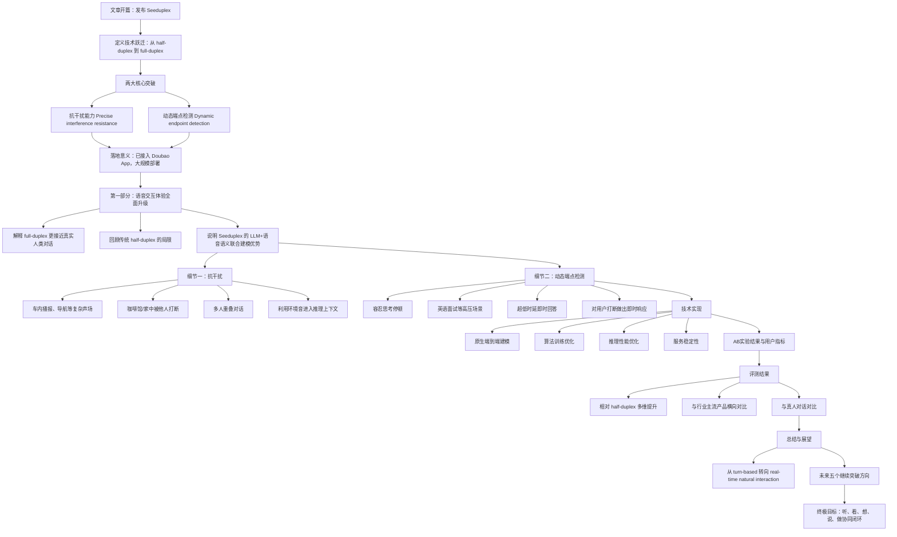
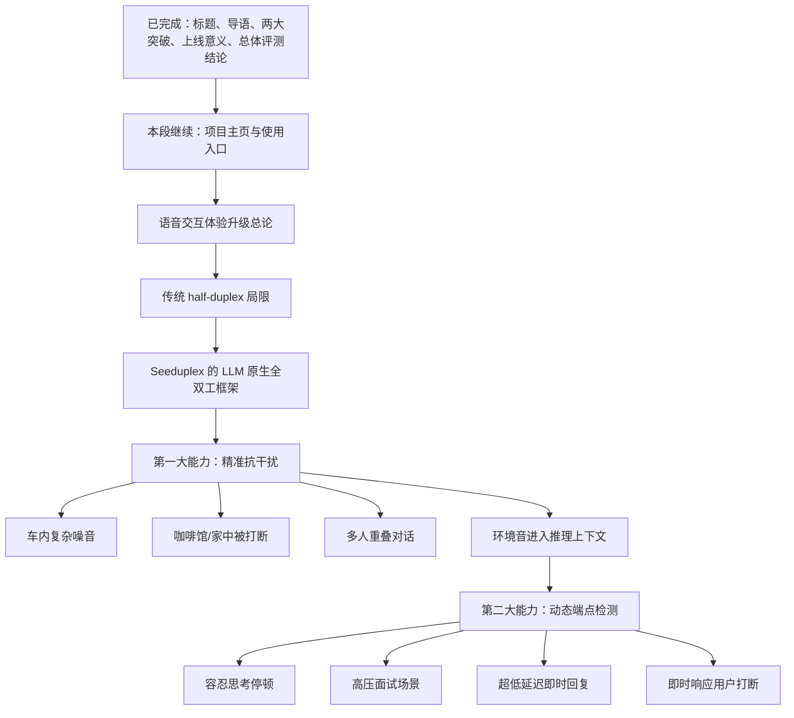
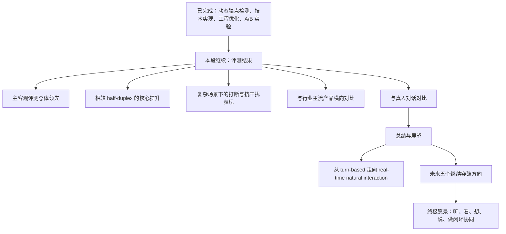

## 前情提要

### 文章基本信息
- 文章来源：ByteDance Seed 官方网站
- 题目：**Introducing Seed Full-Duplex Speech LLM: Attentive Listening, Robust Interference Suppression, Enabling More Natural Interaction**
- 日期：**2026-04-09**
- 类别：**Models**
- 作者信息：原页面未单列具体个人作者，属于 **ByteDance Seed Team / ByteDance Seed 官方团队发布**
- 作者/团队背景简介：**ByteDance Seed** 是字节跳动于 **2023 年**组建的 AI 大模型研究团队，研究方向覆盖 **LLM、语音、视觉、强化学习、AI Infra 与 AI Safety** 等，并为 **Doubao（豆包）** 等产品提供模型能力支持。
  参考来源：
  - 官方文章页：<https://seed.bytedance.com/en/blog/introducing-seed-full-duplex-speech-llm-attentive-listening-robust-interference-suppression-enabling-more-natural-interaction>
  - 团队介绍页相关信息：<https://seed.bytedance.com/blog/bytedance-and-tsinghua-air-establish-joint-research-center-to-advance-industry-academia-research-collaboration-on-large-models>

### 结构信息图

---

## 逐句精读

🔸中文说明：若页面元信息中出现 “Chinese” 等标注，正文主体仍以英文为主；以下按**英文原文精读 + 中文译文**处理。末尾网站导航类碎片信息视为网页杂项，已剔除，不作正文解析。

---

🔹**Seed Full-Duplex Speech Large Model Released: Understands Listening, Resists Interference, Moving Toward More Natural Interaction**
🔸**Seed 全双工语音大模型发布：更会“听”，更能抗干扰，迈向更自然的交互。**

- 背景注释：
  - **Full-duplex**：全双工，指系统可同时进行输入与输出。放在语音对话里，就是模型可以一边“听”一边“说”。
  - **Large model / LLM**：此处指大规模 AI 模型。
  - **Moving toward more natural interaction**：强调技术目标是接近人类自然对话，而非机械式轮流问答。

> **Released / 发布**
> 1. 英文释义（v.）to make something available to the public; to officially announce it｜**向公众发布；正式推出**
> 2. 语域：**新闻 / 产品发布 / 科技公关**
> 3. 画龙点睛：**release** 是科技新闻高频词，常见搭配有 **release a model / launch a feature / announce a product**。考试中注意它除“释放”外，更常表示“发布（产品、报告、版本）”。

> **full-duplex / 全双工的**
> 1. 英文释义（adj.）allowing communication in both directions at the same time｜**允许双方同时通信的**
> 2. 语域：**通信 / 计算机 / 语音技术**
> 3. 画龙点睛：与 **half-duplex（半双工）** 构成核心对比。写作时可表达为 **a full-duplex interaction system enables simultaneous listening and speaking**。这是本文的关键词，必须牢牢记住。

> **resist interference / 抗干扰**
> 1. 英文释义（phrase）to remain effective despite noise, disturbance, or unwanted signals｜**在噪声、扰动或无关信号存在时仍保持有效**
> 2. 语域：**工程 / 语音识别 / 通信**
> 3. 画龙点睛：**interference** 常指“干扰”，既可指物理噪音，也可指外部信号影响。写作中可替换为 **suppress interference / withstand interference / be robust to interference**。

---

🔹**Date**
🔸**日期**

- 背景注释：网页字段名，提示后面给出发布时间。

> **date / 日期**
> 1. 英文释义（n.）the particular day, month, or year when something happens｜**某事发生的具体日期**
> 2. 语域：**通用 / 正式文档**
> 3. 画龙点睛：在网页或学术资料中，**Date** 常作栏目标题；做阅读时要敏感识别这类元信息，它往往帮助判断文本的时效性与背景。

---

🔹**2026-04-09**
🔸**2026年4月9日**

- 背景注释：这是文章发布日期。按页面信息，该消息发表于 **2026 年 4 月 9 日**。

---

🔹**Category**
🔸**类别**

- 背景注释：网页栏目字段名，后面说明文章所属内容类型。

> **category / 类别**
> 1. 英文释义（n.）a class or division of things sharing common features｜**类别；分类**
> 2. 语域：**通用 / 网站信息架构**
> 3. 画龙点睛：在阅读网页内容时，**Category** 有助于迅速判断文体属性，如 **Models / Research / News / Opinion**，这会影响你的阅读预期与语言风格判断。

---

🔹**Model Release**
🔸**模型发布**

- 背景注释：说明本文属于产品/模型发布类文章，而不是纯学术论文或媒体报道。

> **release / 发布**
> 1. 英文释义（n.）an official act of making something available or public｜**发布；发行**
> 2. 语域：**商业 / 科技 / 新闻**
> 3. 画龙点睛：名词 **release** 常见搭配有 **product release, model release, official release**。注意与动词同形，阅读时要根据句法判断词性。

---

🔹**Today, / we officially launch Seeduplex, / a native full-duplex speech large model.**
🔸**今天，我们正式发布 Seeduplex——一款原生全双工语音大模型。**

- 背景注释：
  - **Seeduplex**：ByteDance Seed 推出的语音大模型名称。
  - **native**：这里不是“本地的”，而是“原生的、底层机制上就是如此设计的”。
  - **officially launch**：典型官方发布措辞。

> **officially launch / 正式发布**
> 1. 英文释义（phrase）to introduce a product or service in an official public way｜**以正式公开方式推出产品或服务**
> 2. 语域：**商业 / 科技发布 / 新闻**
> 3. 画龙点睛：比单纯的 **release** 更有“面向公众推出”的色彩。写作里可替换为 **officially unveil / formally introduce / roll out**，但 **launch** 最常见也最自然。

> **native / 原生的**
> 1. 英文释义（adj.）designed as an inherent or built-in part rather than added later｜**原生设计的；内建的，而非后加的**
> 2. 语域：**技术 / 产品**
> 3. 画龙点睛：本文中的 **native full-duplex** 意味着全双工不是外挂模块，而是系统架构层面直接支持。考试里 **native** 常见义还有“本国的、本族语的”，这里属于熟词僻义，值得重点记忆。

> **speech large model / 语音大模型**
> 1. 英文释义（phrase）a large-scale AI model built for speech understanding and generation｜**用于语音理解与生成的大规模 AI 模型**
> 2. 语域：**AI / 语音技术**
> 3. 画龙点睛：区别于纯文本 LLM，**speech large model** 强调输入输出可直接处理语音。可与 **text model / multimodal model / end-to-end speech model** 对照记忆。

---

🔹**Compared with the previous generation half-duplex Doubao end-to-end speech model, / Seeduplex is built on a brand-new “listen while speaking” framework, / greatly improving the naturalness and smoothness of interaction.**
🔸**与上一代采用半双工机制的豆包端到端语音模型相比，Seeduplex 建立在全新的“边听边说”框架之上，极大提升了交互的自然度与流畅度。**

- 背景注释：
  - **Doubao**：字节跳动旗下 AI 产品“豆包”。
  - **half-duplex**：半双工，通常指不能同时听说，而是轮流进行。
  - **end-to-end speech model**：端到端语音模型，强调从输入到输出由统一模型直接处理。
  - **listen while speaking**：本文核心机制描述。

> **compared with / 与……相比**
> 1. 英文释义（phrase）used to show differences between two things｜**用于比较两者差异**
> 2. 语域：**通用 / 学术 / 新闻**
> 3. 画龙点睛：作文中可用于引出优势对比：**Compared with conventional systems, the new model is more robust.** 注意也可写成 **compared to**，但技术文中 **compared with** 很常见。

> **framework / 框架**
> 1. 英文释义（n.）a basic structure or system underlying something｜**框架；基本结构体系**
> 2. 语域：**学术 / 技术 / 产品**
> 3. 画龙点睛：在 AI 文本中，**framework** 常不是具体软件框架，而是“方法框架、系统框架”。搭配如 **build on a framework / propose a framework / interaction framework**。

> **naturalness / 自然度**
> 1. 英文释义（n.）the quality of seeming natural, lifelike, or not forced｜**自然、不生硬的程度**
> 2. 语域：**语言学 / 人机交互 / 产品评测**
> 3. 画龙点睛：这是评价人机语音体验的高频指标。写作中可搭配 **improve naturalness / conversational naturalness / more natural interaction**。它比简单说 **good** 专业得多。

> **smoothness / 流畅度**
> 1. 英文释义（n.）the quality of operating continuously and without awkward pauses or problems｜**顺畅、流利、无卡顿的特性**
> 2. 语域：**产品体验 / HCI / 语音交互**
> 3. 画龙点睛：常与 **fluency** 接近，但 **smoothness** 更侧重过程顺滑、过渡自然；**fluency** 更偏“表达流利”。本文二者都很重要，要学会区分。

---

🔹**If the end-to-end architecture / gave AI the potential for natural expression / by unifying the “listening” and “speaking” modules, / then full-duplex technology / further unlocks that potential / by enabling simultaneous “listening” and “speaking.”**
🔸**如果说端到端架构通过统一“听”和“说”两个模块，让 AI 具备了自然表达的潜力，那么全双工技术则通过实现“听”和“说”的同步进行，进一步释放了这种潜力。**

- 背景注释：
  - 这是典型的 **If..., then...** 论证句式，用来递进说明技术升级。
  - **unlock potential** 是科技报道中高频表达，意为“释放潜力”。

> **end-to-end architecture / 端到端架构**
> 1. 英文释义（phrase）a system design where input is processed to output in one unified model or pipeline｜**从输入到输出由统一模型或流程直接处理的架构**
> 2. 语域：**AI / 工程**
> 3. 画龙点睛：写技术类作文时，这个词很加分。它常暗示减少人工模块切分、降低误差累积。反义上可对照 **modular / cascaded architecture**。

> **potential / 潜力**
> 1. 英文释义（n.）the capacity to develop into or achieve something in the future｜**潜力；可能实现的能力**
> 2. 语域：**通用 / 学术 / 商业**
> 3. 画龙点睛：常见搭配 **have the potential to do sth**、**unlock the potential of**。阅读中要警惕它不是“电势”时的理工义，而是抽象能力义。

> **unlock / 释放；解锁**
> 1. 英文释义（v.）to make something possible or accessible that was previously limited｜**使原本受限的能力得以实现；释放**
> 2. 语域：**商业 / 科技 / 宣传**
> 3. 画龙点睛：在科技文中极常见，如 **unlock new capabilities / unlock value / unlock performance gains**。比 **improve** 更强调“从受限到可实现”的变化。

> **simultaneous / 同时发生的**
> 1. 英文释义（adj.）happening at the same time｜**同时进行的**
> 2. 语域：**通用 / 技术**
> 3. 画龙点睛：高频搭配 **simultaneous listening and speaking**。与 **instant** 不同，前者强调“同时性”，后者强调“即时性”。

---

🔹**It gives the model / a more natural conversational rhythm / and stronger resistance to interference— / no longer just a simple question-and-answer system, / but one that can respond accurately amid noise and irrelevant voices, / handling pace and turn-taking with ease.**
🔸**这让模型拥有了更自然的对话节奏和更强的抗干扰能力——它不再只是一个简单的一问一答系统，而是能够在噪声和无关人声中准确作答，并且从容处理对话的节奏与轮次切换。**

- 背景注释：
  - **turn-taking**：会话轮替，是语言学和人机交互中的核心概念。
  - **amid noise and irrelevant voices**：强调真实场景中的复杂声学环境。

> **conversational rhythm / 对话节奏**
> 1. 英文释义（phrase）the timing and flow of speaking, pausing, and responding in a conversation｜**对话中发言、停顿与回应的时间流动节奏**
> 2. 语域：**语言学 / HCI / 语音交互**
> 3. 画龙点睛：这不是单纯“语速”，而是更综合的互动节奏。写作中可用 **maintain conversational rhythm / natural conversational rhythm / rhythm control**。

> **interference / 干扰**
> 1. 英文释义（n.）unwanted sound, signal, or influence that disrupts normal operation｜**妨碍正常运行的噪音、信号或外部影响**
> 2. 语域：**工程 / 通信 / 语音技术**
> 3. 画龙点睛：本文反复出现。常见搭配 **resistance to interference / suppress interference / acoustic interference**。注意与 **interruption** 区别：前者偏外部扰动，后者偏“打断”。

> **turn-taking / 轮流发言；轮替接话**
> 1. 英文释义（n.）the process by which speakers alternate turns in conversation｜**对话中说话者轮流接话的过程**
> 2. 语域：**语言学 / 会话分析 / HCI**
> 3. 画龙点睛：这是高阶阅读词。人机交互里，模型若不会 **turn-taking**，就会显得抢话、迟钝或不合时机。GRE/考研阅读中遇到时，多与 social interaction、conversation analysis 相关。

> **with ease / 从容地；轻松地**
> 1. 英文释义（phrase）without difficulty or strain｜**轻松地；不费力地**
> 2. 语域：**通用 / 正式**
> 3. 画龙点睛：一个地道短语，常用于提升表达质感，如 **handle multiple tasks with ease**。写作中很实用。

---

🔹**Specifically, / through model architecture innovation, training optimization, / and overcoming engineering challenges such as lag and stability under high concurrency, / Seeduplex achieves industry-leading full-duplex real-time speech interaction.**
🔸**具体而言，Seeduplex 通过模型架构创新、训练优化，以及攻克高并发条件下的延迟与稳定性等工程挑战，实现了行业领先的全双工实时语音交互。**

- 背景注释：
  - **high concurrency**：高并发，指大量用户同时访问或调用系统。
  - **industry-leading**：常见宣传语，表示在行业中处于领先水平。
  - **lag**：这里指系统延迟、卡顿。

> **specifically / 具体而言**
> 1. 英文释义（adv.）in a detailed and exact way｜**具体地；明确地**
> 2. 语域：**学术 / 新闻 / 正式说明**
> 3. 画龙点睛：常用于从概括转入细节，是段落组织的重要信号词。阅读时看到它，就知道后面常有举例、列点或技术拆解。

> **high concurrency / 高并发**
> 1. 英文释义（phrase）a condition in which many users or requests are handled at the same time｜**系统同时处理大量用户或请求的状态**
> 2. 语域：**计算机系统 / 工程**
> 3. 画龙点睛：面试、技术写作中常出现。不要误解成“高频率”；这里强调“并发数量大”。相关搭配：**under high concurrency / support high concurrency**。

> **industry-leading / 行业领先的**
> 1. 英文释义（adj.）better than most others in the same industry｜**在同行业内处于领先水平的**
> 2. 语域：**商业宣传 / 科技发布**
> 3. 画龙点睛：这是典型 PR 表达。阅读时既要理解字面，也要保持客观意识：它常表示“官方自我定位”，具体领先程度往往需结合评测数据判断。

---

🔹**While maintaining the model’s intelligence ceiling and ultra-low latency, / it delivers two key breakthroughs:**
🔸**在保持模型智能上限和超低延迟的同时，它实现了两项关键突破：**

- 背景注释：
  - **intelligence ceiling**：指模型能力上限、智能水平上限。
  - **ultra-low latency**：超低时延，语音交互中的核心体验指标。

> **while maintaining / 在保持……的同时**
> 1. 英文释义（phrase）without sacrificing a certain condition while doing something else｜**在不牺牲某种条件的情况下同时实现另一目标**
> 2. 语域：**学术 / 技术说明**
> 3. 画龙点睛：这是很强的写作句型，用来表达“兼顾”。如 **While maintaining accuracy, the system reduces cost.** 适合议论文和科技写作。

> **intelligence ceiling / 智能上限**
> 1. 英文释义（phrase）the upper limit of a model’s reasoning or task-performing ability｜**模型推理或任务执行能力的上限**
> 2. 语域：**AI / 模型评估**
> 3. 画龙点睛：这里的 **ceiling** 是熟词僻义，不是“天花板”实物，而是“上限”。类似还有 **price ceiling**。阅读中遇到要能迅速抽象化理解。

> **breakthrough / 关键突破**
> 1. 英文释义（n.）an important advance or discovery｜**重大进展；突破**
> 2. 语域：**科技 / 新闻 / 学术传播**
> 3. 画龙点睛：常见搭配 **achieve a breakthrough / key breakthrough / technological breakthrough**。写作中比 **improvement** 更强，表示跨越式进展。

---

🔹**Precise interference resistance: / The model has a continuous “listening” capability, / allowing it to better understand the user’s acoustic environment / and accurately ignore background noise and irrelevant conversations.**
🔸**精准抗干扰：模型具备持续“监听”的能力，这使它能够更好地理解用户所处的声学环境，并准确忽略背景噪音和无关对话。**

- 背景注释：
  - **acoustic environment**：声学环境，即用户周围声音条件的整体情况。
  - **continuous listening**：持续监听，不等于“偷听”，这里是技术机制表述。

> **precise / 精准的**
> 1. 英文释义（adj.）accurate and exact｜**精确的；精准的**
> 2. 语域：**通用 / 科技 / 学术**
> 3. 画龙点睛：**precise** 常比 **accurate** 更强调“细致、精到”。搭配如 **precise control / precise recognition / precise interference suppression**。

> **acoustic environment / 声学环境**
> 1. 英文释义（phrase）the overall sound conditions around a person or system｜**某人或系统周围整体的声音环境**
> 2. 语域：**声学 / 语音技术**
> 3. 画龙点睛：这是理解本文场景化能力的核心术语。可联想 **acoustic features / acoustic modeling / acoustic signal** 一组词。

> **background noise / 背景噪音**
> 1. 英文释义（phrase）unwanted sounds present behind the main sound or speech｜**主声音之外存在的杂音**
> 2. 语域：**语音 / 音频 / 通用**
> 3. 画龙点睛：IELTS 听力、口语场景里也常见。技术文中常见搭配 **filter out background noise / suppress background noise**。

---

🔹**In complex scenarios, / compared with half-duplex models, / its false reply rate and false interruption rate are reduced by half.**
🔸**在复杂场景中，与半双工模型相比，它的误回复率和误打断率都降低了一半。**

- 背景注释：
  - **false reply rate**：模型错误作出回应的比例。
  - **false interruption rate**：模型错误打断用户或错误中止交互的比例。
  - **reduced by half**：降为原来的一半，即下降 50%。

> **scenario / 场景**
> 1. 英文释义（n.）a particular situation in which something happens｜**特定情境；应用场景**
> 2. 语域：**商业 / 技术 / 产品**
> 3. 画龙点睛：科技文常说 **in real-world scenarios / complex scenarios / application scenarios**。写作中可用来替代反复出现的 **situation**。

> **false reply rate / 误回复率**
> 1. 英文释义（phrase）the proportion of cases in which the system replies when it should not｜**系统本不该回复却错误回复的比例**
> 2. 语域：**模型评测 / 语音交互**
> 3. 画龙点睛：这是技术评测指标表达。读科技新闻时，要抓住这类“rate”指标，它们往往是判断真实性能优劣的关键证据。

> **reduced by half / 减半**
> 1. 英文释义（phrase）decreased to 50 percent of the original level｜**降低到原来的一半**
> 2. 语域：**通用 / 数据表达**
> 3. 画龙点睛：注意 **reduced by half** 与 **reduced to half** 在结果上接近，但英语中前者更常见。写作时比单说 **decreased a lot** 更具体、更有说服力。

---

🔹**Dynamic endpoint detection: / The model can jointly use speech and semantic features / to comprehensively judge user intent, / enabling more natural control of conversational rhythm.**
🔸**动态端点检测：模型能够联合利用语音特征与语义特征，对用户意图作出综合判断，从而实现对对话节奏更自然的控制。**

- 背景注释：
  - **endpoint detection**：端点检测，判断用户是否说完、何时该轮到系统回应。
  - **semantic features**：语义特征，即语言内容层面的信息。
  - **jointly use**：联合使用，体现多信号融合。

> **dynamic / 动态的**
> 1. 英文释义（adj.）changing according to conditions rather than remaining fixed｜**根据条件变化而变化的；动态的**
> 2. 语域：**通用 / 技术**
> 3. 画龙点睛：与 **static** 相对。本文中强调系统不是用固定阈值判断，而是根据语音与语义实时调整。写作中 **dynamic adjustment / dynamic control** 很常见。

> **endpoint detection / 端点检测**
> 1. 英文释义（phrase）the process of deciding when a speaker has finished or paused in speech input｜**判断说话人何时说完或暂停的过程**
> 2. 语域：**语音识别 / 语音交互**
> 3. 画龙点睛：这是本文最重要的技术术语之一。半双工系统常因端点检测僵硬而“抢话”。理解这个概念，对读懂全文非常关键。

> **user intent / 用户意图**
> 1. 英文释义（phrase）what the user really means or aims to do｜**用户真正想表达或完成的目的**
> 2. 语域：**NLP / 产品 / 交互设计**
> 3. 画龙点睛：**intent** 是 AI、产品经理、NLP 领域高频词。常见搭配 **infer intent / detect intent / understand user intent**。别只译成“意向”，在交互里通常译成“意图”更准确。

---

🔹**When users hesitate or pause to think, / the model can listen patiently; / once the user finishes speaking, / it can respond quickly.**
🔸**当用户犹豫或停下来思考时，模型能够耐心倾听；而一旦用户说完，它又可以迅速作答。**

- 背景注释：这句话强调系统节奏控制的双重能力：**该等时等，该快时快**。

> **hesitate / 犹豫**
> 1. 英文释义（v.）to pause before doing or saying something because of uncertainty｜**因不确定而停顿、犹豫**
> 2. 语域：**通用**
> 3. 画龙点睛：口语和写作都非常常用。名词是 **hesitation**。本文中与停顿、思考相关，体现真实人类表达并非一口气说完。

> **pause to think / 停下来思考**
> 1. 英文释义（phrase）to stop briefly in order to think before continuing｜**短暂停下以思考后再继续**
> 2. 语域：**通用 / 口语 / 叙述**
> 3. 画龙点睛：是极自然的英语表达。口语中可说 **I paused to think for a second.** 科技文里用它来模拟真实会话中的停顿，非常生动。

> **patiently / 耐心地**
> 1. 英文释义（adv.）in a calm way that shows willingness to wait｜**耐心地；平静地等待**
> 2. 语域：**通用**
> 3. 画龙点睛：与本文“wait patiently”呼应。写作中可以描述系统体验：**The assistant listens patiently instead of interrupting users prematurely.**

---

🔹**Compared with half-duplex models, / its rate of interrupting the user is reduced by 40%.**
🔸**与半双工模型相比，它打断用户的比例降低了 40%。**

- 背景注释：
  - **interrupting the user**：这里是系统不合时宜地插入回复。
  - **reduced by 40%**：标准数据表达。

> **interrupt / 打断**
> 1. 英文释义（v.）to stop a person from speaking or a process from continuing by breaking in｜**打断（说话或过程）**
> 2. 语域：**通用 / 交互 / 礼仪**
> 3. 画龙点睛：本文高频词。名词是 **interruption**。注意与 **disrupt** 区别：**interrupt** 更强调“中途插入使其暂停”，特别常用于对话情境。

> **rate / 比率**
> 1. 英文释义（n.）a measure, amount, or frequency relative to something else｜**比率；发生率**
> 2. 语域：**统计 / 数据分析**
> 3. 画龙点睛：像 **error rate / retention rate / reply rate** 都是科技文常见指标。考研阅读里遇到 rate，常常是论证核心，不能轻轻带过。

---

🔹**Seeduplex is now fully available in the Doubao App, / which means full-duplex technology has officially moved out of the lab and, / for the first time in the industry, / achieved large-scale deployment, / bringing continuous, high-quality real-time voice interaction to hundreds of millions of users.**
🔸**Seeduplex 现已在豆包 App 中全面可用，这意味着全双工技术已经正式走出实验室，并且首次在业内实现大规模部署，为数亿用户带来持续、高质量的实时语音交互体验。**

- 背景注释：
  - **moved out of the lab**：比喻说法，表示技术从实验阶段进入真实应用。
  - **large-scale deployment**：大规模部署，说明不仅可演示，而且真正上线。
  - **hundreds of millions of users**：数亿用户，是中国互联网产品常见规模表述。

> **available / 可用的**
> 1. 英文释义（adj.）ready for use or accessible to users｜**可使用的；可获得的**
> 2. 语域：**产品 / 通用**
> 3. 画龙点睛：科技产品里常说 **is now available in...**，表示功能已经上线。很适合写产品说明或功能更新通知。

> **deployment / 部署**
> 1. 英文释义（n.）the act of putting a system or technology into practical use｜**将系统或技术投入实际使用；部署**
> 2. 语域：**工程 / IT / AI 产品**
> 3. 画龙点睛：与 **development** 区别明显：前者是“上线应用”，后者是“开发”。写作中 **large-scale deployment / commercial deployment** 很地道。

> **real-time / 实时的**
> 1. 英文释义（adj.）happening immediately as events occur, without noticeable delay｜**随着事件发生而即时进行的；实时的**
> 2. 语域：**计算机 / 通信 / 产品**
> 3. 画龙点睛：常见搭配 **real-time interaction / real-time processing / real-time feedback**。在语音系统中，它往往比精度还更影响主观体验。

---

🔹**Multi-dimensional evaluations show that Seeduplex significantly outperforms traditional half-duplex solutions and the voice call features of mainstream apps in dialogue fluency and rhythm; / in endpoint detection, / the model improves by 8% over half-duplex solutions, / demonstrating turn-taking that is closer to natural conversation.**
🔸**多维评测显示，在对话流畅度与节奏方面，Seeduplex 显著优于传统半双工方案和主流应用的语音通话功能；在端点检测方面，该模型较半双工方案提升了 8%，展现出更接近自然会话的轮替接话能力。**

- 背景注释：
  - **multi-dimensional evaluations**：多维评估，通常指主观+客观、多指标综合。
  - **mainstream apps**：主流应用，原文未具体点名。
  - **dialogue fluency**：对话流畅度。
  - **demonstrating turn-taking that is closer to natural conversation**：说明模型接话时机更像人。

> **multi-dimensional / 多维的**
> 1. 英文释义（adj.）involving several aspects, measures, or dimensions｜**涉及多个维度或方面的**
> 2. 语域：**评估 / 学术 / 商业分析**
> 3. 画龙点睛：很适合写作中表达“综合评估”，如 **a multi-dimensional assessment of performance**。比单说 **comprehensive** 更具体。

> **outperform / 优于；表现超过**
> 1. 英文释义（v.）to perform better than someone or something else｜**表现优于；胜过**
> 2. 语域：**学术 / 商业 / 测评**
> 3. 画龙点睛：非常适合替代普通的 **be better than**。如 **The new system outperforms baseline models.** 在论文和新闻中都常见。

> **fluency / 流畅度**
> 1. 英文释义（n.）the quality of being smooth, natural, and easy in speaking or operation｜**流畅、自然、不费力的特性**
> 2. 语域：**语言 / 交互 / 测评**
> 3. 画龙点睛：既可描述英语口语流利度，也可描述系统互动流畅度。本文偏后者。搭配有 **dialogue fluency / speaking fluency / fluency score**。

---

### 结构进度图（二）

---

🔹**Project homepage:**
🔸**项目主页：**

- 背景注释：网页栏目标签，用于引出项目官方页面链接。

> **homepage / 主页**
> 1. 英文释义（n.）the main page of a website or a project’s official web presence｜**主页；官方网站首页**
> 2. 语域：**互联网 / 产品**
> 3. 画龙点睛：科技文中 **project homepage** 常指项目总览页，可能包含论文、演示、代码、案例等。阅读时看到主页链接，通常意味着可以进一步核验信息来源。

---

🔹**https://seed.bytedance.com/seeduplex**
🔸**https://seed.bytedance.com/seeduplex**

- 背景注释：这是 Seeduplex 的项目主页链接。
- 来源核验：官方英文博文中也指向该项目页。

---

🔹**Access:**
🔸**体验入口：**

- 背景注释：说明后面给出实际使用方式。这里的 **Access** 不是“访问权限”之意，而是“如何进入/使用”。

> **access / 进入方式；访问**
> 1. 英文释义（n./v.）the way to reach or use something; to obtain or use it｜**访问途径；进入方式；访问、使用**
> 2. 语域：**产品 / IT / 通用**
> 3. 画龙点睛：此处是栏目标题义，近似 **How to access it**。做阅读时要注意一词多义：既可作名词“通道、权限”，也可作动词“访问”。

---

🔹**Please update the Doubao App to the latest version, / select “Call” in the chat box, / and enter the voice call interface to try it.**
🔸**请将豆包 App 更新到最新版本，在聊天框中选择“Call（通话）”，然后进入语音通话界面进行体验。**

- 背景注释：
  - **Doubao App**：豆包应用。
  - **Call**：产品内按钮名称，原文保留英文。
  - **voice call interface**：语音通话界面。

> **latest version / 最新版本**
> 1. 英文释义（phrase）the most recently released version of a software product｜**软件最近发布的最新版本**
> 2. 语域：**软件 / 产品**
> 3. 画龙点睛：高频表达。常见搭配 **update to the latest version**。写作时注意介词通常用 **to**，不是 *update into*。

> **select / 选择**
> 1. 英文释义（v.）to choose something from a number of options｜**从若干选项中选取**
> 2. 语域：**通用 / 产品说明**
> 3. 画龙点睛：比口语化的 **choose** 更书面、更适合说明文。UI 指引中常见 **tap / click / select**，三者语气略有差异。

> **interface / 界面**
> 1. 英文释义（n.）the visual or functional point where a user interacts with a system｜**用户与系统交互的界面**
> 2. 语域：**计算机 / 产品设计**
> 3. 画龙点睛：**user interface (UI)** 是常考搭配。本文中的 **voice call interface** 指具体功能页面，不是抽象“接口”。

---

🔹**A comprehensive upgrade to the voice interaction experience**
🔸**语音交互体验的全面升级**

- 背景注释：小标题，概括下文内容。

> **comprehensive / 全面的**
> 1. 英文释义（adj.）including many or all aspects of something｜**全面的；综合性的**
> 2. 语域：**正式 / 产品 / 学术**
> 3. 画龙点睛：高频高级词。常见搭配 **a comprehensive upgrade / comprehensive analysis / comprehensive reform**。比 **overall** 更正式。

> **interaction experience / 交互体验**
> 1. 英文释义（phrase）the overall quality of a user’s interaction with a system｜**用户与系统互动过程中的整体体验**
> 2. 语域：**产品 / UX / HCI**
> 3. 画龙点睛：这是产品分析常用表达。可延伸记忆 **user experience, interaction design, conversational experience**。

---

🔹**More precise, / more natural conversational rhythm**
🔸**更精准，更自然的对话节奏**

- 背景注释：小标题，强调本部分关注的改进方向。

> **conversational / 对话的；会话的**
> 1. 英文释义（adj.）related to conversation or the style of conversation｜**与对话有关的；会话式的**
> 2. 语域：**语言 / AI / HCI**
> 3. 画龙点睛：可与 **conversation** 区分：前者常作形容词，如 **conversational agent / conversational rhythm**；后者是名词“对话”。

---

🔹**Human conversation / is itself a kind of “full-duplex” communication / in which listening and speaking happen simultaneously, / filled with pauses, thinking, hesitation, background noise interference, / and overlapping speech.**
🔸**人类对话本身就是一种“全双工”交流：听与说同时发生，其中充满了停顿、思考、犹豫、背景噪声干扰，以及话语重叠。**

- 背景注释：
  - **overlapping speech**：多人同时说话或交叠发言。
  - 这一句从人类会话本质出发，为 full-duplex 的合理性提供理论依据。

> **simultaneously / 同时地**
> 1. 英文释义（adv.）at the same time｜**同时地**
> 2. 语域：**通用 / 正式**
> 3. 画龙点睛：与 **at the same time** 近义，但更书面。科技文喜欢用它表述并行机制，如 **process text and audio simultaneously**。

> **hesitation / 犹豫；迟疑停顿**
> 1. 英文释义（n.）a pause or delay caused by uncertainty｜**因不确定而产生的停顿或迟疑**
> 2. 语域：**通用 / 语言学**
> 3. 画龙点睛：口语、听力、会话分析中都很常见。与前文动词 **hesitate** 对应，记住词族变化对写作很有帮助。

> **overlapping speech / 重叠语音**
> 1. 英文释义（phrase）speech produced by more than one speaker at the same time｜**两个或多个说话者同时发出的重叠语音**
> 2. 语域：**语音技术 / 会话分析**
> 3. 画龙点睛：这是现实对话的典型难点。技术文里它常与 **speaker separation / diarization / turn-taking** 一起出现。

---

🔹**A speech dialogue system / aiming for natural interaction / must be able to handle this high-freedom, unstructured audio stream— / it must both “hear clearly” amid noise / and know how to “wait patiently” / while you gather your thoughts.**
🔸**一个以自然交互为目标的语音对话系统，必须能够处理这种高自由度、非结构化的音频流——它既要能在噪声中“听得清”，也要懂得在你整理思路时“耐心等待”。**

- 背景注释：
  - **high-freedom, unstructured audio stream**：高自由度、非结构化音频流，指真实对话并不整齐规范。
  - **gather your thoughts**：整理思路，十分地道。

> **aim for / 以……为目标**
> 1. 英文释义（phrase）to intend or try to achieve something｜**以……为目标；力求达到**
> 2. 语域：**通用 / 正式**
> 3. 画龙点睛：写作中非常好用，如 **aim for efficiency / aim for natural interaction**。比简单的 **want** 更正式、更抽象。

> **unstructured / 非结构化的**
> 1. 英文释义（adj.）not organized according to a fixed format or pattern｜**不按固定格式或模式组织的；非结构化的**
> 2. 语域：**数据科学 / AI / 学术**
> 3. 画龙点睛：可记 **structured data / unstructured data**。本文把真实音频流视作非结构化输入，说明处理难度更高。

> **gather one’s thoughts / 整理思路**
> 1. 英文释义（phrase）to think calmly and organize what one wants to say or do｜**平静思考并整理自己想说或想做的内容**
> 2. 语域：**通用 / 书面**
> 3. 画龙点睛：非常地道，口语和写作都能用。比 **think carefully** 更像真实说话场景，适合叙述停顿与思考过程。

---

🔹**In the past, / traditional half-duplex systems often relied on cascaded modular designs: / using independent VAD (voice activity detection) for mechanical segmentation, / or traditional algorithms for frontend noise reduction.**
🔸**过去，传统半双工系统往往依赖级联式模块化设计：例如使用独立的 VAD（语音活动检测）进行机械式切分，或者使用传统算法进行前端降噪。**

- 背景注释：
  - **cascaded modular designs**：级联模块化设计，多个独立模块顺序串联。
  - **VAD**：Voice Activity Detection，判断有没有人在说话。
  - **frontend noise reduction**：前端降噪，通常在主模型处理前先过滤噪音。

> **rely on / 依赖**
> 1. 英文释义（phrase）to depend on something for support or function｜**依赖；依靠**
> 2. 语域：**通用 / 学术**
> 3. 画龙点睛：学术写作高频词。搭配有 **rely on data / rely on manual rules / rely heavily on**。注意介词固定为 **on**。

> **cascaded / 级联的**
> 1. 英文释义（adj.）arranged in a sequence where the output of one stage feeds the next｜**按顺序串联、前一级输出进入后一级的**
> 2. 语域：**工程 / AI / 信号处理**
> 3. 画龙点睛：这是技术文很常见的专业词。可联想 **cascaded systems / cascade errors**。级联系统常见问题是误差会层层传递。

> **mechanical segmentation / 机械式切分**
> 1. 英文释义（phrase）rigidly dividing input according to simple rules rather than deep understanding｜**依据简单规则而非深层理解进行僵硬切分**
> 2. 语域：**技术评论 / 语音处理**
> 3. 画龙点睛：这里的 **mechanical** 不是“机械设备的”，而是“机械化、僵硬地”。这是熟词引申义，阅读时很重要。

> **frontend noise reduction / 前端降噪**
> 1. 英文释义（phrase）noise suppression applied before later-stage model processing｜**在后续模型处理之前进行的噪声抑制**
> 2. 语域：**语音工程 / 音频处理**
> 3. 画龙点睛：**frontend** 在技术中常表示“前端阶段/前处理环节”，不要只理解成网页开发中的“前端工程师”。

---

🔹**Because their decisions were based only on single acoustic features / or partial textual semantic features, / such systems were easily “thrown off” in complex environments / or triggered premature interruptions / when users paused.**
🔸**由于这类系统的决策只基于单一声学特征，或局部的文本语义特征，因此它们在复杂环境中很容易被“带偏”，或者在用户停顿时过早触发打断。**

- 背景注释：
  - **single acoustic features**：单一声学特征，意味着判断维度过窄。
  - **partial textual semantic features**：局部文本语义特征，表示理解不完整。
  - **thrown off**：口语化引号表达，意为被扰乱、被弄偏。
  - **premature interruptions**：过早打断。

> **be based on / 基于**
> 1. 英文释义（phrase）to have something as the foundation or basis｜**以……为基础**
> 2. 语域：**通用 / 学术**
> 3. 画龙点睛：写作必备表达。常见于论证与实验描述：**The conclusion is based on...**。注意被动结构很常见。

> **throw off / 扰乱；带偏**
> 1. 英文释义（phrasal verb）to confuse or disturb someone or something so that normal performance is affected｜**使困惑；扰乱；使偏离正常状态**
> 2. 语域：**通用 / 新闻 / 口语化书面**
> 3. 画龙点睛：这是很有表现力的短语动词。本文加引号，表示带一点形象化。写作中可说 **Background noise can throw the system off.**

> **premature / 过早的；不成熟的**
> 1. 英文释义（adj.）happening before the proper or expected time｜**过早发生的；时机未到的**
> 2. 语域：**正式 / 医学 / 技术 / 新闻**
> 3. 画龙点睛：常见搭配 **premature conclusion / premature interruption / premature optimization**。语感上比 **early** 更正式，也更强调“不合时宜”。

---

🔹**Seeduplex, however, / is built on a self-developed large language model (LLM) foundation / and innovatively creates a real-time full-duplex speech interaction framework.**
🔸**然而，Seeduplex 建立在自研大语言模型（LLM）底座之上，并创新性地构建了一个实时全双工语音交互框架。**

- 背景注释：
  - **self-developed**：自研。
  - **LLM foundation**：大语言模型底座/基础。
  - **however**：转折，表明下文开始说明新方案。

> **self-developed / 自主研发的**
> 1. 英文释义（adj.）developed by one’s own team or organization rather than obtained externally｜**由自身团队或机构开发的；自研的**
> 2. 语域：**商业 / 科技**
> 3. 画龙点睛：国产科技报道中高频。写作时也可用 **in-house developed**，但 **self-developed** 更直观。

> **foundation / 底座；基础**
> 1. 英文释义（n.）the underlying base on which something is built｜**基础；底层支撑**
> 2. 语域：**通用 / AI / 工程**
> 3. 画龙点睛：在 AI 语境里，**foundation model** 指基础模型；这里 **LLM foundation** 可理解为“大模型底座”。属于行业术语延伸用法。

> **innovatively / 创新性地**
> 1. 英文释义（adv.）in a way that introduces new ideas or methods｜**以创新方式地**
> 2. 语域：**正式 / 商业 / 科技传播**
> 3. 画龙点睛：是官方发布常用副词。写作中可替换为 **in a novel way / by proposing a novel framework**，后者更偏论文风格。

---

🔹**It also introduces large-scale speech data for pretraining, / giving it native joint modeling capability for speech and semantics.**
🔸**它还引入了大规模语音数据进行预训练，从而赋予模型对语音与语义进行原生联合建模的能力。**

- 背景注释：
  - **pretraining**：预训练，大模型训练流程中的核心阶段。
  - **joint modeling**：联合建模，同时学习多个维度。
  - **speech and semantics**：语音信号与语义内容。

> **pretraining / 预训练**
> 1. 英文释义（n.）the initial large-scale training stage before task-specific tuning｜**在特定任务微调之前的大规模初始训练阶段**
> 2. 语域：**机器学习 / AI**
> 3. 画龙点睛：与 **post-training / fine-tuning** 一起构成常见训练流程。AI 阅读中几乎必备词。

> **joint modeling / 联合建模**
> 1. 英文释义（phrase）modeling multiple types of information together rather than separately｜**将多种信息放在一起统一建模，而非分别处理**
> 2. 语域：**机器学习 / 统计 / NLP**
> 3. 画龙点睛：本文中的关键优势就在于不再把“声音”和“语义”拆开处理。写作里可用 **jointly model text and audio**。

> **semantics / 语义**
> 1. 英文释义（n.）meaning in language or symbols｜**语言或符号中的意义层面；语义**
> 2. 语域：**语言学 / NLP / AI**
> 3. 画龙点睛：与 **syntax（句法）**、**acoustics（声学）** 可形成对照。考试阅读里经常涉及这类分层概念。

---

🔹**It can globally understand the speech-semantic information in audio / and dynamically decide conversational rhythm, / achieving a leap over traditional systems / in both interference resistance and dialogue rhythm control.**
🔸**它能够从整体上理解音频中的语音—语义信息，并动态决定对话节奏，从而在抗干扰能力和对话节奏控制两方面都实现了对传统系统的跃升。**

- 背景注释：
  - **globally understand**：从整体层面理解，而不是局部、碎片化地判断。
  - **achieving a leap**：实现跃升，强调非线性提升。

> **globally / 全局地；整体上**
> 1. 英文释义（adv.）in a way that considers the whole rather than only parts｜**从整体上；全局地**
> 2. 语域：**学术 / 技术**
> 3. 画龙点睛：不要只理解成“全球地”。在技术语境里，它常表示“全局范围内”的处理，与 **locally** 相对。

> **a leap / 跃升；飞跃**
> 1. 英文释义（n.）a large or sudden improvement or advance｜**大幅度提升；飞跃**
> 2. 语域：**正式 / 科技传播**
> 3. 画龙点睛：比 **improvement** 语气更强，常见于 **a leap forward**。写作中若有数据支撑，用它很有力度。

> **rhythm control / 节奏控制**
> 1. 英文释义（phrase）the ability to manage the timing and flow of interaction｜**管理互动时间安排与流动节奏的能力**
> 2. 语域：**语音交互 / HCI**
> 3. 画龙点睛：本文反复强调不仅要“识别准”，还要“节奏对”。这类词很适合写 AI 产品体验分析。

---

🔹**1. Precise interference resistance: / powerful “acoustic focus” amid noise**
🔸**1. 精准抗干扰：噪声中的强大“声学聚焦”能力**

- 背景注释：
  - **acoustic focus**：并非严格术语，更像形象化表达，指系统能把注意力集中在真正重要的声音上。
  - **amid noise**：在噪声环境中。

> **focus / 聚焦；集中注意**
> 1. 英文释义（n./v.）the center of attention or the act of concentrating on something｜**焦点；聚焦；集中注意力**
> 2. 语域：**通用 / 技术引申**
> 3. 画龙点睛：本文中的 **acoustic focus** 可理解为“在声音层面做注意力选择”。写作中 **focus on key signals** 很常见。

---

🔹**Complex acoustic environments / have always been a challenge for speech interaction.**
🔸**复杂的声学环境一直是语音交互面临的一项挑战。**

- 背景注释：真实场景中的语音技术难点，典型包括地铁、车内、咖啡馆、多人同时说话等。

> **acoustic / 声学的**
> 1. 英文释义（adj.）related to sound or the science of sound｜**与声音或声学有关的**
> 2. 语域：**物理 / 语音技术**
> 3. 画龙点睛：与 **audio** 接近，但 **acoustic** 更偏“声音特性/声学层面”。例如 **acoustic environment, acoustic features, acoustic modeling**。

> **challenge / 挑战；难题**
> 1. 英文释义（n.）a difficult problem or task that requires effort to overcome｜**需要努力克服的难题**
> 2. 语域：**通用 / 学术 / 新闻**
> 3. 画龙点睛：科技文中常用来引出研究动机。搭配如 **pose a challenge / remain a challenge / major challenge**。

---

🔹**Background noise and voice interference / often “contaminate” users’ speech input, / causing slow system responses, interrupted playback, / or even false triggers.**
🔸**背景噪声和人声干扰常常会“污染”用户的语音输入，导致系统响应变慢、播放被打断，甚至出现误触发。**

- 背景注释：
  - **contaminate** 加引号，表示形象化表达，不一定是严格的物理污染。
  - **false triggers**：误触发，系统在不该启动或不该回应时被激活。

> **contaminate / 污染；干扰**
> 1. 英文释义（v.）to make something impure or less reliable by adding unwanted material or influence｜**通过加入不需要的成分或影响使其不纯净、不可靠**
> 2. 语域：**科学 / 技术 / 引申**
> 3. 画龙点睛：原义可指化学/环境污染，本文是引申义，指噪音“混入”有效语音。熟词在科技文里的抽象转义要特别注意。

> **playback / 播放**
> 1. 英文释义（n.）the act or process of playing recorded or generated audio/video｜**播放过程**
> 2. 语域：**音频 / 产品 / 技术**
> 3. 画龙点睛：常见搭配 **audio playback / playback interruption / playback lag**。不要误写成 *play back* 当名词。

> **false trigger / 误触发**
> 1. 英文释义（phrase）an incorrect activation of a system caused by irrelevant input｜**由无关输入引发的错误激活**
> 2. 语域：**语音唤醒 / 交互系统**
> 3. 画龙点睛：语音助手场景中常见。和 **false positive** 有相通之处，但 **false trigger** 更贴近交互事件本身。

---

🔹**In the past, / users often had to raise their voices / or find a quiet corner / to complete a stable interaction.**
🔸**过去，用户往往不得不提高音量，或者找一个安静的角落，才能完成一次稳定的交互。**

- 背景注释：这是从用户体验角度说明旧系统的现实不便。

> **raise one’s voice / 提高嗓门**
> 1. 英文释义（phrase）to speak louder than usual｜**比平时更大声地说话**
> 2. 语域：**通用**
> 3. 画龙点睛：既可中性表示“提高音量”，也可表示“发火、大声斥责”，需看语境。本文显然是前者。

> **stable / 稳定的**
> 1. 英文释义（adj.）reliable and not easily disrupted｜**稳定的；不易受扰的**
> 2. 语域：**通用 / 技术**
> 3. 画龙点睛：产品体验中 **stable interaction / stable performance / stable service** 都很常见。是科技写作的基本高频词。

---

🔹**The Seeduplex model / can continuously receive and understand user-side audio, / perceive the user’s overall acoustic environment, / and accurately determine which sounds are truly meant for interacting with the model / and which are interference.**
🔸**Seeduplex 模型能够持续接收并理解用户侧音频，感知用户整体的声学环境，并准确判断哪些声音是真正用来与模型交互的，哪些只是干扰。**

- 背景注释：
  - **user-side audio**：用户端传来的音频。
  - **determine which... and which...**：典型并列判断结构。

> **perceive / 感知；察觉**
> 1. 英文释义（v.）to notice, sense, or become aware of something｜**感知；察觉到**
> 2. 语域：**正式 / 心理学 / AI**
> 3. 画龙点睛：比 **see/hear** 更抽象、更高级。AI 语境里常与 **perception** 形成词族，如 **environmental perception**。

> **determine / 判定；确定**
> 1. 英文释义（v.）to decide or establish exactly｜**判定；确定**
> 2. 语域：**正式 / 学术 / 技术**
> 3. 画龙点睛：是论文和科技说明中的高频动词。比 **know** 专业得多。搭配 **determine whether / determine which / determine the cause**。

> **interacting with the model / 与模型交互**
> 1. 英文释义（phrase）communicating directly with the AI system as the intended target｜**以模型为对象进行交流互动**
> 2. 语域：**AI / 产品**
> 3. 画龙点睛：这体现了“目标指向性”的判断。真实环境中人可能在对朋友说话，不一定是在对 AI 说话。

---

🔹**This improvement in interference resistance / greatly reduces Seeduplex’s false reply rate / and false interruption rate.**
🔸**这种抗干扰能力的提升，大大降低了 Seeduplex 的误回复率和误打断率。**

- 背景注释：这是对前一句能力的结果总结。

> **greatly / 大幅地**
> 1. 英文释义（adv.）to a large extent｜**大大地；在很大程度上**
> 2. 语域：**正式 / 通用**
> 3. 画龙点睛：写作中是比 **very** 更成熟的副词。常搭配 **greatly improve / greatly reduce / greatly enhance**。

---

🔹**Separating interference and accurately recognizing the user’s voice**
🔸**分离干扰，并准确识别用户声音**

- 背景注释：小标题，下面给出示例场景。

> **separate / 分离；区分**
> 1. 英文释义（v.）to divide or distinguish one thing from another｜**分离；区分开**
> 2. 语域：**通用 / 技术**
> 3. 画龙点睛：在语音技术里可指 **source separation**。写作中可用于抽象义，如 **separate signal from noise**，非常贴题。

---

🔹**Inside a car with frequent announcements / and mixed navigation sounds, / Seeduplex can relatively stably separate background interference, / accurately identify the primary user’s voice, / and respond quickly to requests.**
🔸**在一个车内播报频繁、导航声音交织的环境中，Seeduplex 能够相对稳定地分离背景干扰，准确识别主要用户的声音，并快速响应其请求。**

- 背景注释：
  - **frequent announcements**：频繁播报，如车载提示、站点播报等。
  - **mixed navigation sounds**：导航语音等声音混杂。
  - **primary user**：主要用户，即当前真正与模型对话的人。

> **identify / 识别；确认**
> 1. 英文释义（v.）to recognize and establish who or what something is｜**识别；辨认；确认**
> 2. 语域：**通用 / 技术 / 法律**
> 3. 画龙点睛：在 AI 文中极常见，如 **identify speakers / identify patterns / identify intent**。与 **recognize** 相近，但往往更强调明确确认。

> **primary / 主要的；首要的**
> 1. 英文释义（adj.）main or most important｜**主要的；首要的**
> 2. 语域：**正式 / 通用**
> 3. 画龙点睛：科技文中常见 **primary user / primary task / primary objective**。是很实用的高级替换词。

---

🔹**Understanding intent and ignoring non-interactive sounds**
🔸**理解交互意图，并忽略非交互性声音**

- 背景注释：小标题，强调系统不仅听“声音”，还判断“是不是在对它说”。

> **non-interactive / 非交互性的**
> 1. 英文释义（adj.）not intended for interaction with the system｜**并非为了与系统交互而发出的**
> 2. 语域：**产品 / AI / HCI**
> 3. 画龙点睛：这是语境派生表达，理解即可。核心是：并非所有人声都应被系统当作输入。

---

🔹**Whether in a café / when unexpectedly saying goodbye to a friend, / or at home casually responding to a delivery person at the door, / if the user is interrupted by others / or other conversations are inserted / while interacting with the model, / the system can use semantics to identify which sounds truly intend to interact with the model, / avoiding mistaken interruptions / and keeping the main conversation natural and coherent.**
🔸**无论是在咖啡馆里突然和朋友道别，还是在家中随口回应门口的快递员，如果用户在与模型交互时被他人打断，或中途插入了别的对话，系统都可以利用语义来识别哪些声音才是真正意在与模型交互的，从而避免误打断，并让主要对话保持自然、连贯。**

- 背景注释：
  - **delivery person**：快递员、配送员。
  - **inserted**：插入进来，这里指其他人说话突然进入当前声场。
  - **coherent**：连贯的，是语篇与交流体验的重要评价词。

> **casually / 随意地；自然地**
> 1. 英文释义（adv.）in an informal, relaxed, or unplanned way｜**随意地；不经意地**
> 2. 语域：**通用**
> 3. 画龙点睛：这里强调现实对话不是“标准测试语料”，而是很随意的生活场景。写作时可用来增强语境真实感。

> **insert / 插入**
> 1. 英文释义（v.）to put or introduce something into something else｜**插入；加入**
> 2. 语域：**通用 / 技术**
> 3. 画龙点睛：本文中 **other conversations are inserted** 很形象，表示第三方对话闯入。也常见于写作：**insert data / insert a comment**。

> **coherent / 连贯的；一致的**
> 1. 英文释义（adj.）logically connected and consistent｜**连贯的；前后一致的**
> 2. 语域：**学术 / 写作 / 语言评价**
> 3. 画龙点睛：IELTS/GRE 写作高频词。可用于文章结构，也可用于对话质量，如 **a coherent argument / coherent conversation**。

---

🔹**Even in overlapping multi-person conversation scenarios, / it can accurately distinguish the conversational target, / understanding which words are directed at it as commands / and which are merely casual chat between other people.**
🔸**即使在多人重叠交谈的场景中，它也能准确区分对话目标，理解哪些话是作为指令对它说的，哪些话只是其他人之间的随意聊天。**

- 背景注释：
  - **conversational target**：对话目标，即发言究竟是朝谁而去。
  - **directed at it**：针对它说的。
  - **casual chat**：闲聊。

> **distinguish / 区分；辨别**
> 1. 英文释义（v.）to recognize the difference between things or people｜**区分；辨别**
> 2. 语域：**正式 / 通用 / 学术**
> 3. 画龙点睛：比 **tell apart** 更正式。常见搭配 **distinguish A from B / distinguish between A and B**。考试写作里很实用。

> **direct at / 针对；指向**
> 1. 英文释义（phrase）to aim words, actions, or attention toward a person or thing｜**将言语、行为或注意力指向某人或某物**
> 2. 语域：**通用**
> 3. 画龙点睛：非常地道。这里的 **directed at it** 表示“是对模型说的”。可以迁移到写作：**criticism directed at the policy**。

> **casual chat / 随意闲聊**
> 1. 英文释义（phrase）informal, non-serious conversation｜**非正式、随意的聊天**
> 2. 语域：**口语 / 通用**
> 3. 画龙点睛：在本文中，它与“有效指令”形成对比。做阅读时，要看到作者在强调系统具备语用层面的区分能力。

---

🔹**Perceiving the environment and proactively linking information**
🔸**感知环境，并主动关联信息**

- 背景注释：小标题，强调模型开始具备一定主动性，不再只是被动答复。

> **proactively / 主动地**
> 1. 英文释义（adv.）in a way that takes action in advance rather than merely reacting｜**主动地；前瞻性地**
> 2. 语域：**商业 / 产品 / 管理**
> 3. 画龙点睛：与 **reactively** 相对。科技产品升级常从“被动响应”走向“主动协助”，这是非常重要的能力升级词。

> **link information / 关联信息**
> 1. 英文释义（phrase）to connect pieces of information meaningfully｜**把不同信息有意义地联系起来**
> 2. 语域：**认知 / AI / 通用**
> 3. 画龙点睛：可延伸到写作与阅读：优秀读者也需要 **link information across paragraphs**。这是很好的迁移表达。

---

🔹**The model can even parse environmental sounds / and incorporate them into the reasoning context.**
🔸**模型甚至能够解析环境声音，并将其纳入推理语境之中。**

- 背景注释：
  - **parse**：在技术语境里常指解析、拆解并理解结构。
  - **reasoning context**：推理上下文，即后续判断与回答所依赖的背景信息。

> **parse / 解析**
> 1. 英文释义（v.）to analyze something in detail to understand its structure or meaning｜**对内容进行拆解分析以理解其结构或意义**
> 2. 语域：**语言学 / 计算机 / 技术**
> 3. 画龙点睛：高频技术词。程序、语法、数据、音频都可 **parse**。比 **analyze** 更强调“按结构拆解后理解”。

> **incorporate / 纳入；整合进**
> 1. 英文释义（v.）to include something as part of a whole｜**把某物并入整体之中**
> 2. 语域：**正式 / 学术 / 商业**
> 3. 画龙点睛：写作高频高级词。常见搭配 **incorporate A into B**。例如 **incorporate feedback into the design**。

> **reasoning context / 推理上下文**
> 1. 英文释义（phrase）the surrounding information used by a system to interpret and reason about input｜**系统用于理解输入并进行推理的背景信息集合**
> 2. 语域：**AI / NLP**
> 3. 画龙点睛：**context** 是大模型时代超级高频词，和 **reasoning** 连用时，强调不仅理解当前句子，还把它放进更大的思考链条中。

---

🔹**For example, / Seeduplex can understand an introduction to Hangzhou / playing in the background / and, / combined with the user’s plan to go to Hangzhou, / proactively connect environmental information with the conversation / and provide a thoughtful response.**
🔸**例如，Seeduplex 能够理解背景中正在播放的一段杭州介绍，并结合用户打算去杭州的计划，主动把环境信息与当前对话关联起来，从而给出贴切周到的回应。**

- 背景注释：
  - **Hangzhou**：杭州，中国浙江省省会，知名科技与旅游城市。
  - **thoughtful response**：体贴周到、考虑充分的回应。
  - 这里展示的是“环境感知 + 对话上下文”的联合推理。

> **combined with / 结合……**
> 1. 英文释义（phrase）used together with something else｜**与……结合起来**
> 2. 语域：**通用 / 学术**
> 3. 画龙点睛：写作常用结构，便于表达多因素联动：**combined with user history / combined with contextual cues**。

> **proactively connect / 主动关联**
> 1. 英文释义（phrase）to actively relate one piece of information to another without being explicitly told to do so｜**无需明确指示而主动把不同信息联系起来**
> 2. 语域：**AI / 产品**
> 3. 画龙点睛：这里体现的是“智能助理”而非“被动工具”的特征。写作中如讨论 AI 趋势，这个表达非常好用。

> **thoughtful / 周到的；考虑周全的**
> 1. 英文释义（adj.）showing careful consideration or attention｜**体现出细致考虑与体贴的**
> 2. 语域：**通用 / 产品评价**
> 3. 画龙点睛：既可形容人，也可形容系统回应。比 **good**、**useful** 更细腻。可用于口语与写作提质。

---

### 结构进度图（三）

```mermaid
flowchart TD
    A[已完成：项目入口、体验升级总论、传统半双工局限、Seeduplex 抗干扰能力] --> B[本段继续：动态端点检测]
    B --> B1[思考停顿时耐心等待]
    B --> B2[高压口语/面试场景]
    B --> B3[超低延迟瞬时作答]
    B --> B4[即时响应用户打断]
    B4 --> C[技术实现：从 demo 到大规模部署]
    C --> C1[原生端到端建模]
    C --> C2[交互逻辑自主判断]
    C --> C3[框架、算法、推理、稳定性优化]
    C3 --> D[AB 实验与用户指标提升]
```

---

🔹**2. Dynamic endpoint detection: / speeding up or slowing down at the right time**
🔸**2. 动态端点检测：在恰当的时候加速，在恰当的时候放慢。**

- 背景注释：
  - **endpoint detection**：判断用户是否说完、系统何时接话。
  - **at the right time**：强调时机感，而不是单纯追求速度。

> **speed up / 加快**
> 1. 英文释义（phrasal v.）to increase speed or make something happen faster｜**加速；使更快**
> 2. 语域：**通用**
> 3. 画龙点睛：很常见的短语动词。本文中不是物理移动速度，而是**对话响应节奏**。写作时可用于抽象表达：**speed up decision-making / speed up response time**。

> **slow down / 放慢**
> 1. 英文释义（phrasal v.）to reduce speed or proceed more slowly｜**减速；放慢**
> 2. 语域：**通用**
> 3. 画龙点睛：和 **speed up** 构成对照，体现系统节奏控制的弹性。写作中若能成对使用，表达会更有结构感。

> **at the right time / 在恰当的时候**
> 1. 英文释义（phrase）at the most suitable or appropriate moment｜**在最合适的时机**
> 2. 语域：**通用 / 正式**
> 3. 画龙点睛：科技文里很多优化不只是“更快”，而是“更合时宜”。这个短语很好地体现了产品体验里的**时机判断**。

---

🔹**The core of truly natural interaction / lies in accurately judging / when the user is thinking / and when the user has finished speaking.**
🔸**真正自然交互的核心，在于准确判断用户什么时候是在思考，什么时候已经说完。**

- 背景注释：
  - **lies in**：核心在于。
  - 这句话直接点出“自然交互”的本质不是不停抢答，而是判断用户状态。

> **the core of / ……的核心**
> 1. 英文释义（phrase）the most essential or central part of something｜**某事物最本质、最关键的部分**
> 2. 语域：**正式 / 学术**
> 3. 画龙点睛：议论文、说明文常用结构。可套用为 **The core of effective communication lies in...**，非常适合写作。

> **lie in / 在于**
> 1. 英文释义（phrase）to consist in or depend on something｜**在于；取决于**
> 2. 语域：**正式 / 书面**
> 3. 画龙点睛：这是高频书面表达，优于简单的 **is**。如 **The problem lies in poor coordination.** 很适合作文提分。

> **accurately judge / 准确判断**
> 1. 英文释义（phrase）to assess correctly and precisely｜**准确地作出判断**
> 2. 语域：**通用 / 学术 / 技术**
> 3. 画龙点睛：本文反复强调“判断时机”。可迁移到阅读写作：**accurately judge intent / risk / context**。

---

🔹**Through deep fusion of speech and semantic understanding, / Seeduplex has greater flexibility / in controlling conversational rhythm.**
🔸**通过对语音理解与语义理解的深度融合，Seeduplex 在控制对话节奏方面具备了更大的灵活性。**

- 背景注释：
  - **deep fusion**：深度融合，意味着不是简单叠加，而是更紧密的联合建模。
  - **flexibility**：弹性、灵活性，是体验自然的重要来源。

> **fusion / 融合**
> 1. 英文释义（n.）the process of joining different elements into a unified whole｜**把不同要素融合为整体的过程**
> 2. 语域：**技术 / 学术**
> 3. 画龙点睛：AI 文中常见 **multimodal fusion / feature fusion / deep fusion**。比 **combination** 更专业，强调系统性整合。

> **flexibility / 灵活性**
> 1. 英文释义（n.）the ability to adapt or change according to circumstances｜**根据情境调整变化的能力；灵活性**
> 2. 语域：**通用 / 技术 / 管理**
> 3. 画龙点睛：很适合评价系统是否僵硬。本文中与传统规则式方法形成对比，后者往往缺乏 flexibility。

> **control conversational rhythm / 控制对话节奏**
> 1. 英文释义（phrase）to manage the pace and timing of back-and-forth conversation｜**管理对话往返中的速度与时机**
> 2. 语域：**HCI / 语音交互**
> 3. 画龙点睛：这是全文能力主线之一。写科技作文时，可用来替代简单的 **improve interaction**，显得更专业。

---

🔹**Listening patiently / and tolerating thinking pauses**
🔸**耐心倾听，并容忍思考性停顿**

- 背景注释：小标题，下面进入具体场景说明。

> **tolerate / 容忍；接受**
> 1. 英文释义（v.）to allow something to happen or exist without reacting negatively｜**容忍；允许某事存在而不作负面反应**
> 2. 语域：**正式 / 通用**
> 3. 画龙点睛：比 **allow** 更强调“即使不完美也能接受”。本文中表示系统不会把停顿误判为结束。

> **thinking pause / 思考停顿**
> 1. 英文释义（phrase）a pause made while a speaker is organizing thoughts｜**说话者整理思路时产生的停顿**
> 2. 语域：**语言学 / 口语分析**
> 3. 画龙点睛：这是真实口语中的高频现象。理解这个词有助于认识为何“自然对话”不可能是没有停顿的流畅机器输出。

---

🔹**When users are expressing uncertain ideas, / they can think and revise as they speak, / without forcing themselves / to figure everything out / before speaking all at once.**
🔸**当用户在表达一些尚不确定的想法时，他们可以边说边想、边说边修改，而不必强迫自己在开口之前就一次性把所有内容都想清楚。**

- 背景注释：
  - **uncertain ideas**：尚未成形、还不完全确定的想法。
  - **revise as they speak**：一边说一边修正。
  - **all at once**：一下子、一次性。

> **revise / 修改；修正**
> 1. 英文释义（v.）to change, improve, or correct something｜**修改；修正；改进**
> 2. 语域：**通用 / 学术**
> 3. 画龙点睛：很多学生只知道 **revise** 表“复习”，其实它还有“修改”义。本文属于熟词常考引申义，要重点掌握。

> **force oneself to / 强迫自己去……**
> 1. 英文释义（phrase）to make oneself do something with effort or pressure｜**强迫自己做某事**
> 2. 语域：**通用**
> 3. 画龙点睛：很自然的表达。写作时可用 **People should not force themselves to conform...**。本文中体现系统降低了表达负担。

> **figure out / 弄清楚**
> 1. 英文释义（phrasal v.）to understand or solve something after thinking｜**经过思考后弄明白、解决**
> 2. 语域：**口语 / 通用**
> 3. 画龙点睛：极高频短语动词。科技文里出现它，会让文字显得更自然、贴近用户表达。作文中可用更书面替代词 **determine / work out**，但阅读必须认识它。

> **all at once / 一下子；一次性**
> 1. 英文释义（phrase）all together at one time｜**同时；一下子；一次性**
> 2. 语域：**通用**
> 3. 画龙点睛：非常实用的口语/书面短语。本文里传达“无需提前组织成完整话语再说”的意思。

---

🔹**The model remains in a listening state throughout, / and even when faced with repeated adjustments / or complex expressions / that overturn earlier logic, / it can still accurately capture the user’s true intent.**
🔸**模型在整个过程中始终保持倾听状态；即使面对反复调整的表达，或那些会推翻前面逻辑的复杂表述，它仍然能够准确捕捉用户真正的意图。**

- 背景注释：
  - **throughout**：自始至终。
  - **overturn earlier logic**：推翻前面逻辑，表示说话者可能中途改口、修正思路。
  - **true intent**：真实意图，而非字面碎片。

> **throughout / 自始至终**
> 1. 英文释义（adv./prep.）during the whole period of time; in every part of something｜**贯穿整个过程；始终**
> 2. 语域：**正式 / 通用**
> 3. 画龙点睛：是一个很好用的书面词。可说 **remain stable throughout the process**，用于写作很自然。

> **overturn / 推翻**
> 1. 英文释义（v.）to reverse or invalidate something previously established｜**推翻；颠覆；使失效**
> 2. 语域：**正式 / 法律 / 论证**
> 3. 画龙点睛：常见于 **overturn a decision / overturn an assumption**。本文中是抽象义：后面的表达把前面的逻辑改掉。

> **capture / 捕捉；把握**
> 1. 英文释义（v.）to successfully recognize, record, or grasp something｜**捕捉；准确把握**
> 2. 语域：**通用 / 技术**
> 3. 画龙点睛：在 AI 场景里，**capture intent / capture features / capture nuance** 都很常见。比 **understand** 更有“抓住关键信息”的感觉。

---

🔹**In high-pressure scenarios / such as simulated English interviews, / the model can “understand” / that a moment of getting stuck / is just a thinking pause / rather than the end of the conversation.**
🔸**在诸如模拟英语面试这样的高压场景中，模型能够“理解”：一时卡壳只是思考中的停顿，而不是对话已经结束。**

- 背景注释：
  - **high-pressure scenarios**：高压场景。
  - **simulated English interviews**：模拟英语面试。
  - **getting stuck**：卡住、语塞。
  - 引号中的 **understand** 带一点拟人化色彩。

> **high-pressure / 高压的**
> 1. 英文释义（adj.）involving stress, urgency, or strong performance demands｜**压力大、要求高的**
> 2. 语域：**通用 / 职场 / 教育**
> 3. 画龙点睛：非常常见，如 **high-pressure job / high-pressure environment**。本文用来说明模型在困难场景下仍能保持合理判断。

> **simulated / 模拟的**
> 1. 英文释义（adj.）made to imitate a real situation for practice or testing｜**为练习或测试而仿真的；模拟的**
> 2. 语域：**教育 / 科研 / 技术**
> 3. 画龙点睛：常见搭配 **simulated interview / simulated environment / simulated experiment**，适合考试口语与写作。

> **get stuck / 卡住；说不下去**
> 1. 英文释义（phrase）to be unable to continue because of difficulty or uncertainty｜**因困难或不确定而无法继续**
> 2. 语域：**口语 / 通用**
> 3. 画龙点睛：英语口语里极高频。比如 **I got stuck on the second question.** 本文用它刻画真实说话状态，很自然。

---

🔹**It listens patiently / and waits until you finish expressing yourself / before giving feedback, / making the practice process highly realistic.**
🔸**它会耐心倾听，并等到你完整表达结束之后再给出反馈，从而让练习过程变得高度真实。**

- 背景注释：
  - **express yourself**：表达自己。
  - **feedback**：反馈。
  - **highly realistic**：非常逼真、非常接近真实情境。

> **express oneself / 表达自己**
> 1. 英文释义（phrase）to communicate one’s thoughts, feelings, or ideas｜**表达自己的想法、情绪或观点**
> 2. 语域：**通用**
> 3. 画龙点睛：口语和写作都高频。常见于教育、语言学习、艺术等语境，是一个非常值得掌握的表达。

> **feedback / 反馈**
> 1. 英文释义（n.）comments, responses, or information given to help improvement or adjustment｜**反馈；回应意见**
> 2. 语域：**教育 / 产品 / 管理**
> 3. 画龙点睛：可数/不可数都常见。搭配如 **give feedback / user feedback / immediate feedback**。本文是互动系统回复中的反馈。

> **realistic / 逼真的；贴近现实的**
> 1. 英文释义（adj.）appearing true to real life or practical conditions｜**逼真的；贴近现实条件的**
> 2. 语域：**通用 / 教育 / 产品评价**
> 3. 画龙点睛：写作中比 **real** 更精确。可说 **a realistic simulation / realistic interaction**，非常符合本文场景。

---

🔹**Ultra-low latency, / responding in an instant**
🔸**超低时延，即刻响应**

- 背景注释：小标题，开始说明“该快时快”的一面。

> **in an instant / 瞬间；立刻**
> 1. 英文释义（phrase）immediately or in a very short time｜**立刻；转瞬之间**
> 2. 语域：**通用 / 新闻**
> 3. 画龙点睛：比 **immediately** 更有画面感。科技文中能增强“低延迟”的感受表达。

---

🔹**In addition to “slowing down when needed,” / Seeduplex can also avoid dragging its feet / in high-frequency interaction scenarios.**
🔸**除了“该慢时慢”之外，Seeduplex 在高频交互场景中也能避免拖泥带水。**

- 背景注释：
  - **drag its feet**：惯用表达，字面是“拖着脚走”，实际指行动迟缓、磨蹭。
  - **high-frequency interaction scenarios**：高频交互场景，如快问快答、连续回合对话。

> **in addition to / 除了……之外**
> 1. 英文释义（phrase）as well as; besides｜**除……之外（还）**
> 2. 语域：**正式 / 通用**
> 3. 画龙点睛：写作衔接高频结构。比简单的 **besides** 更稳健、正式。

> **drag one’s feet / 拖拖拉拉；行动迟缓**
> 1. 英文释义（idiom）to act slowly or reluctantly and cause delay｜**慢吞吞地行动；拖延**
> 2. 语域：**口语 / 新闻化表达**
> 3. 画龙点睛：这是地道习语。本文用它来拟人化描述系统反应慢。遇到这类习语时，不能按字面“拖脚”硬译。

> **high-frequency / 高频的**
> 1. 英文释义（adj.）happening often within a short period of time｜**在短时间内频繁发生的**
> 2. 语域：**技术 / 通用**
> 3. 画龙点睛：除物理学义外，也常用于产品和交互分析，如 **high-frequency tasks / high-frequency interactions**。

---

🔹**For example, / in rapid-fire Q&A games, / once the model detects / that the user has finished speaking, / it can “respond instantly” with low latency, / reducing delay by about 250 ms / compared with half-duplex systems, / achieving “speed when speed is needed.”**
🔸**例如，在快节奏问答游戏中，一旦模型检测到用户已经说完，它就能以低时延“即时作答”，相比半双工系统将延迟缩短约 250 毫秒，实现“该快时快”。**

- 背景注释：
  - **rapid-fire Q&A games**：快节奏连珠炮式问答游戏。
  - **250 ms**：约 250 毫秒。
  - **speed when speed is needed**：和前文“slowing down when needed”形成对照修辞。

> **rapid-fire / 连珠炮式的；高速连续的**
> 1. 英文释义（adj.）happening very quickly one after another｜**接连不断、速度很快的**
> 2. 语域：**新闻 / 口语 / 描述性表达**
> 3. 画龙点睛：原本可形容武器连续射击，后来广泛引申为“密集快速”的提问或发言，如 **rapid-fire questions**。

> **detect / 检测到**
> 1. 英文释义（v.）to discover or identify the presence of something｜**检测到；发现**
> 2. 语域：**科学 / 技术 / 通用**
> 3. 画龙点睛：AI 和工程文中高频。搭配 **detect speech / detect intent / detect anomalies**，比 **find** 更专业。

> **latency / 延迟；时延**
> 1. 英文释义（n.）the delay between an input/action and the system’s response｜**输入或动作与系统响应之间的延迟**
> 2. 语域：**计算机 / 网络 / 语音技术**
> 3. 画龙点睛：这是本文关键词之一。和 **delay** 相近，但 **latency** 更专业，常出现在系统评测指标中。

---

🔹**In Feihualing scenarios, / which place even greater demands / on reaction speed and classical poetry knowledge, / it can also answer fluently / and transition seamlessly.**
🔸**在“飞花令”这类对反应速度和古典诗词知识要求更高的场景中，它同样能够流畅应答，并实现无缝衔接。**

- 背景注释：
  - **Feihualing**：飞花令，中国传统诗词接龙/对答游戏，对反应速度和诗词储备要求高。
  - 这是带有中国文化背景的场景化例子。
  - **transition seamlessly**：过渡无缝，表示对话衔接自然。

> **place demands on / 对……提出要求**
> 1. 英文释义（phrase）to require a certain level of ability, effort, or resource from someone or something｜**对某人/某物提出某种能力或资源要求**
> 2. 语域：**正式 / 学术**
> 3. 画龙点睛：高频书面表达。可用于作文：**Modern life places heavy demands on attention.**

> **fluently / 流畅地**
> 1. 英文释义（adv.）smoothly and without awkward hesitation｜**流畅地；不磕绊地**
> 2. 语域：**语言 / 交互评价**
> 3. 画龙点睛：既可评价人说英语，也可评价系统输出。本文偏后者。和 **smoothly** 近义，但更强调表达自然连贯。

> **seamlessly / 无缝地**
> 1. 英文释义（adv.）smoothly and continuously, without noticeable breaks or problems｜**无缝地；毫无明显中断地**
> 2. 语域：**产品 / 技术 / 商业**
> 3. 画龙点睛：科技宣传中非常常见，如 **seamlessly integrate / transition seamlessly**。是一个很有产品感的高级副词。

---

🔹**Keen perception / and immediate response to interruptions**
🔸**敏锐感知，并对打断作出即时响应**

- 背景注释：小标题，说明模型不仅会等待，也会在用户打断时迅速停下。

> **keen / 敏锐的**
> 1. 英文释义（adj.）highly developed; sharp and sensitive｜**敏锐的；灵敏的**
> 2. 语域：**正式 / 通用**
> 3. 画龙点睛：常见搭配 **keen insight / keen awareness / keen perception**。比 **sharp** 更书面，适合高质量写作。

> **interruption / 打断；中断**
> 1. 英文释义（n.）an act of breaking into an ongoing process or conversation｜**打断；中途插入；中断**
> 2. 语域：**通用 / 交互**
> 3. 画龙点睛：和前文 **interrupt** 为同词族。名词形式在本文非常高频，必须熟练掌握。

---

🔹**Besides listening patiently / and replying in time, / Seeduplex can also quickly respond / to user interruptions.**
🔸**除了耐心倾听和及时作答之外，Seeduplex 还能够迅速对用户的打断作出反应。**

- 背景注释：这里把“耐心等待”和“及时停下”并列，说明系统具备双向时机控制。

> **in time / 及时**
> 1. 英文释义（phrase）before it is too late; at the appropriate moment｜**及时；在适当时机**
> 2. 语域：**通用**
> 3. 画龙点睛：不要和 **on time（准时）** 混淆。前者强调“来得及、时机对”，后者强调“按预定时间”。

---

🔹**For example, / when a user suddenly says, / “Wait a second, let me grab a pen and write this down,” / the model can keenly capture the user’s intent, / instantly stop replying, / smoothly cut off its voice, / and switch into a listening state / to wait for the user’s return.**
🔸**例如，当用户突然说出“等一下，我拿支笔把这个记下来”时，模型能够敏锐捕捉用户意图，立刻停止回复，平滑地切断自己的语音输出，并切换到倾听状态，等待用户回来继续。**

- 背景注释：
  - **grab a pen**：随手拿支笔，很口语化。
  - **write this down**：把内容记下来。
  - **switch into a listening state**：切换到聆听模式/状态。
  - 这体现了系统的中途打断处理能力。

> **grab / 抓起；顺手拿**
> 1. 英文释义（v.）to take hold of something quickly; to quickly get something｜**迅速拿起；顺手取来**
> 2. 语域：**口语 / 通用**
> 3. 画龙点睛：这里不是“抓住”字面义，而是很自然的口语表达：**grab a pen / grab a coffee**。做阅读时要注意口语化引申义。

> **write down / 记下**
> 1. 英文释义（phrasal v.）to record something in writing｜**把内容写下来；记下**
> 2. 语域：**通用**
> 3. 画龙点睛：极高频短语。和 **note down** 近义。口语、听力、阅读中都常出现。

> **switch into / 切换到**
> 1. 英文释义（phrase）to change from one mode, state, or system to another｜**切换进入某种模式或状态**
> 2. 语域：**技术 / 通用**
> 3. 画龙点睛：产品和系统描述中非常常见，如 **switch into sleep mode / switch into listening mode**。

---

🔹**Full-duplex speech technology implementation**
🔸**全双工语音技术的实现**

- 背景注释：大标题，下面开始从工程与架构角度解释如何真正落地。

> **implementation / 实现；落地实现**
> 1. 英文释义（n.）the process or result of putting a plan, system, or technology into effect｜**实施；实现；落地**
> 2. 语域：**技术 / 管理 / 学术**
> 3. 画龙点睛：和 **idea / design** 相比，**implementation** 更强调真正做出来并运行起来。技术写作高频。

---

🔹**From demos / to large-scale deployment**
🔸**从演示样机，到大规模部署**

- 背景注释：
  - **demos**：演示、Demo。
  - 对比“只在实验中可演示”和“真正服务海量用户”。

> **demo / 演示版本；演示**
> 1. 英文释义（n.）a demonstration or a limited version used to showcase a product or technology｜**演示；演示版**
> 2. 语域：**科技 / 产品 / 创业**
> 3. 画龙点睛：科技行业非常高频。句中 **From demos to large-scale deployment** 体现的是从“能展示”到“能大规模稳定使用”的跃迁。

---

🔹**Realizing full-duplex capability / places higher demands / on model architecture, algorithm implementation, / and the engineering pipeline.**
🔸**要实现全双工能力，就对模型架构、算法实现以及工程流水线提出了更高要求。**

- 背景注释：
  - **engineering pipeline**：工程流程/流水线，指整体系统链路。
  - 这句话说明 full-duplex 不只是单点算法问题，而是系统级挑战。

> **realize / 实现**
> 1. 英文释义（v.）to make something actual or operational｜**实现；使成为现实**
> 2. 语域：**正式 / 技术**
> 3. 画龙点睛：注意不要只记“意识到”。在科技文中，**realize** 经常表示“实现某种功能或目标”，属于高频熟词多义。

> **place demands on / 对……提出要求**
> 1. 英文释义（phrase）to require more from someone or something｜**要求某人/某物具备更高能力**
> 2. 语域：**正式**
> 3. 画龙点睛：前文已出现一次，这里再次出现，说明这是本文一个值得记忆的书面句型。

> **pipeline / 流水线；处理管线**
> 1. 英文释义（n.）a series of connected stages in a process or system｜**一系列相连的处理阶段；流程链路**
> 2. 语域：**工程 / 计算机 / 数据处理**
> 3. 画龙点睛：技术文中高频。比如 **training pipeline / data pipeline / inference pipeline**。不是字面“管道”，而是流程系统。

---

🔹**Seeduplex adopts / a native end-to-end modeling approach.**
🔸**Seeduplex 采用了一种原生的端到端建模方法。**

- 背景注释：
  - **adopt**：采用。
  - **modeling approach**：建模方法。
  - **native end-to-end**：强调其端到端设计并非拼接而成。

> **adopt / 采用**
> 1. 英文释义（v.）to choose and begin to use a method, idea, or system｜**采用；选用**
> 2. 语域：**正式 / 学术 / 技术**
> 3. 画龙点睛：论文和说明文高频词，比 **use** 更正式。搭配 **adopt an approach / adopt a strategy / adopt a model**。

> **approach / 方法；路径**
> 1. 英文释义（n.）a way of dealing with or doing something｜**处理问题的方法；路径**
> 2. 语域：**学术 / 通用**
> 3. 画龙点睛：非常高频，考研/GRE 阅读中常出现。**approach** 不只是“靠近”，作名词时常表示“方法论”。

---

🔹**The system has streaming perception capability, / enabling it to extract features / from incoming audio signals / and have the foundation model process them / in real time.**
🔸**该系统具备流式感知能力，使它能够从不断输入的音频信号中提取特征，并让基础模型实时处理这些特征。**

- 背景注释：
  - **streaming perception**：流式感知，意味着输入是边到边处理，而非整段音频结束后再处理。
  - **incoming audio signals**：持续输入的音频信号。
  - **foundation model**：基础模型。

> **streaming / 流式的**
> 1. 英文释义（adj.）processed continuously as data arrives rather than after the full input is complete｜**随着数据到达而连续处理的；流式的**
> 2. 语域：**计算机 / 语音处理**
> 3. 画龙点睛：这是理解实时系统的关键词。与 **batch** 处理相对。听到 **streaming ASR / streaming inference** 就要想到“边来边算”。

> **extract features / 提取特征**
> 1. 英文释义（phrase）to derive meaningful patterns or signals from raw input data｜**从原始输入中提取有意义的模式或信号**
> 2. 语域：**机器学习 / 信号处理**
> 3. 画龙点睛：AI 基础高频表达。即使模型端到端，也常会说到 feature extraction，这是技术阅读里的基础词组。

> **incoming / 输入中的；传入的**
> 1. 英文释义（adj.）coming in or being received｜**正在进入的；传入的**
> 2. 语域：**通用 / 技术**
> 3. 画龙点睛：如 **incoming calls / incoming data / incoming signals**。本文中指持续到达的音频。

---

🔹**In interaction logic, / the model autonomously judges the current state / through integrated modeling / of acoustic features and dialogue context, / deciding whether to start replying, / continue listening, / or respond to user interruption.**
🔸**在交互逻辑层面，模型通过对声学特征和对话上下文的综合建模，自主判断当前状态，并决定是开始回答、继续倾听，还是响应用户的打断。**

- 背景注释：
  - **interaction logic**：交互逻辑。
  - **autonomously**：自主地。
  - **dialogue context**：对话上下文。
  - 这里强调决策是动态的、状态驱动的。

> **autonomously / 自主地**
> 1. 英文释义（adv.）independently, without direct external control｜**自主地；独立地**
> 2. 语域：**技术 / 正式**
> 3. 画龙点睛：AI 场景中很常见，表示系统具备自己作判断的能力。可联想 **autonomous driving / autonomous decision-making**。

> **current state / 当前状态**
> 1. 英文释义（phrase）the system’s present condition or situation at a given moment｜**某一时刻系统所处的当前状态**
> 2. 语域：**计算机 / 系统设计**
> 3. 画龙点睛：状态机、交互设计、强化学习等领域都很常见。理解“状态”概念有助于读懂动态决策系统。

> **dialogue context / 对话上下文**
> 1. 英文释义（phrase）the surrounding information from previous and current dialogue turns｜**当前及先前多轮对话形成的背景信息**
> 2. 语域：**NLP / HCI**
> 3. 画龙点睛：大模型时代非常重要。很多错误并非听不见，而是没结合 context。写作中可直接使用，很专业。

---

🔹**To support the full launch of the model / in the Doubao App, / the team carried out extensive optimizations / in model framework design, algorithm optimization, engineering performance, / and stability:**
🔸**为了支持该模型在豆包 App 中全面上线，团队在模型框架设计、算法优化、工程性能以及稳定性等方面进行了大量优化：**

- 背景注释：
  - **full launch**：全面上线。
  - **extensive optimizations**：大规模、全方位优化。
  - 后面会进入列点。

> **carry out / 开展；实施**
> 1. 英文释义（phrasal v.）to perform or complete something such as a plan, task, or experiment｜**执行；实施；开展**
> 2. 语域：**正式 / 学术 / 商业**
> 3. 画龙点睛：很常见的书面短语，尤其在论文、报告里：**carry out experiments / carry out optimization**。

> **extensive / 大量的；广泛的**
> 1. 英文释义（adj.）large in amount or covering many areas｜**范围广的；大量的；全面的**
> 2. 语域：**正式 / 学术**
> 3. 画龙点睛：比 **a lot of** 正式得多。常见搭配 **extensive research / extensive testing / extensive optimization**。

---

🔹**Model framework design: / Built a model architecture / more closely aligned with the native characteristics / of real-time speech dialogue, / enabling the model to directly learn integrated representations / of speech and semantics / as well as rhythm control from data, / significantly improving interaction naturalness.**
🔸**模型框架设计：构建了一种更贴近实时语音对话原生特性的模型架构，使模型能够直接从数据中学习语音与语义的统一表征以及节奏控制能力，从而显著提升交互自然度。**

- 背景注释：
  - **aligned with**：与……对齐/贴合。
  - **integrated representations**：统一表征、融合表征。
  - 这一条强调“从架构层面就为实时语音而设计”。

> **align with / 与……对齐；与……匹配**
> 1. 英文释义（phrase）to match, correspond to, or be consistent with something｜**与……一致；贴合；匹配**
> 2. 语域：**正式 / 商业 / 技术**
> 3. 画龙点睛：非常实用的高级表达。可说 **align with user needs / align with the task structure**。科技文里高频。

> **representation / 表征**
> 1. 英文释义（n.）the way information is encoded or expressed inside a system or model｜**信息在系统或模型内部的编码表达形式；表征**
> 2. 语域：**机器学习 / 认知科学**
> 3. 画龙点睛：AI 阅读必备词。不要简单译成“代表”。在模型语境里，representation 是核心概念。

> **significantly / 显著地**
> 1. 英文释义（adv.）in a sufficiently large or important way｜**显著地；明显地**
> 2. 语域：**学术 / 统计 / 正式**
> 3. 画龙点睛：是论文和评测文中常见副词。比 **greatly** 更偏“统计/证据导向”。

---

🔹**Algorithms and training: / Relying on massive speech data / for large-scale pretraining, / and through a post-training system / covering multiple capabilities and tasks, / the team achieved coordinated optimization / of dialogue intelligence, ultra-low latency, conversational rhythm control, strong interference resistance, / and directional understanding, / giving the model stable, efficient, and natural interactive performance.**
🔸**算法与训练：依托海量语音数据进行大规模预训练，并通过一个覆盖多种能力与任务的后训练体系，团队实现了对对话智能、超低时延、对话节奏控制、强抗干扰能力以及定向理解能力的协同优化，从而赋予模型稳定、高效、自然的交互表现。**

- 背景注释：
  - **post-training**：后训练，通常指预训练之后的对齐、微调、强化等阶段。
  - **coordinated optimization**：协同优化。
  - **directional understanding**：定向理解，这里可理解为判断话语是否指向模型本身。

> **massive / 海量的；规模巨大的**
> 1. 英文释义（adj.）very large in amount, scale, or size｜**数量巨大、规模庞大的**
> 2. 语域：**正式 / 科技 / 新闻**
> 3. 画龙点睛：AI 报道高频词，如 **massive data / massive compute**。比 **large** 更强调量级。

> **post-training / 后训练**
> 1. 英文释义（n.）the stage after pretraining in which the model is further optimized for target behaviors or tasks｜**预训练之后，为目标行为或任务进一步优化模型的阶段**
> 2. 语域：**AI / 大模型**
> 3. 画龙点睛：这是大模型时代的核心术语。可联想 **supervised fine-tuning / RLHF / preference optimization** 等都可能属于广义后训练范畴。

> **coordinated optimization / 协同优化**
> 1. 英文释义（phrase）optimization of multiple objectives together in a balanced way｜**对多个目标进行平衡式联合优化**
> 2. 语域：**工程 / AI**
> 3. 画龙点睛：系统设计中往往不是单指标最优，而是多目标协调。这个表达非常适合高阶写作。

> **directional understanding / 定向理解**
> 1. 英文释义（phrase）the ability to understand whether speech is directed toward the system or elsewhere｜**判断话语是否是朝向系统发出的理解能力**
> 2. 语域：**语音交互 / AI**
> 3. 画龙点睛：虽然不是最常见大众词，但结合上下文很好理解。它与前文的“识别哪些声音真正意在与模型交互”相呼应。

---

🔹**Inference performance: / Through speculative sampling, quantization, / and other methods, / performance was optimized to the extreme, / achieving a balance between cost and latency.**
🔸**推理性能：通过推测式采样、量化等方法，系统性能被优化到极致，在成本与时延之间实现了平衡。**

- 背景注释：
  - **inference performance**：推理性能，即模型在线运行时的性能。
  - **speculative sampling**：推测式采样，一类用于加速推理的方法。
  - **quantization**：量化，用更低位数表示模型参数以提速降本。
  - **balance between cost and latency**：成本与时延平衡，是实际部署中的关键考量。

> **inference / 推理（模型运行）**
> 1. 英文释义（n.）the stage where a trained model is used to generate outputs from new inputs｜**训练完成后，模型对新输入进行输出生成的运行阶段**
> 2. 语域：**机器学习 / 部署工程**
> 3. 画龙点睛：不要和逻辑学里的“推论”混淆。AI 里 **training vs. inference** 是基本对立概念。

> **quantization / 量化**
> 1. 英文释义（n.）the technique of reducing numerical precision in model parameters or computations to improve efficiency｜**通过降低参数或计算数值精度来提升效率的技术**
> 2. 语域：**机器学习 / 系统优化**
> 3. 画龙点睛：部署优化高频词。即使不懂细节，也要知道它通常与**加速、降成本、压缩模型**有关。

> **balance / 平衡**
> 1. 英文释义（n./v.）a state in which competing factors are kept in suitable proportion｜**平衡；使保持适当比例**
> 2. 语域：**通用 / 商业 / 技术**
> 3. 画龙点睛：科技文中常说 **balance accuracy and efficiency / balance cost and latency**。这是非常常见的工程思维表达。

---

🔹**Service stability: / Focused on solving issues / such as audio capture and playback lag, / ensuring the model can run continuously and stably / under high traffic.**
🔸**服务稳定性：重点解决了音频采集与播放卡顿等问题，确保模型能够在高流量下持续、稳定地运行。**

- 背景注释：
  - **audio capture**：音频采集。
  - **high traffic**：高流量、高访问量。
  - 这是典型上线系统必须面对的服务层问题。

> **stability / 稳定性**
> 1. 英文释义（n.）the quality of operating reliably without failure or major fluctuation｜**可靠运行、无重大波动的特性；稳定性**
> 2. 语域：**工程 / 产品**
> 3. 画龙点睛：在真实部署中，稳定性常和能力本身一样重要。写作时可与 **scalability / reliability / robustness** 搭配。

> **capture / 采集**
> 1. 英文释义（v.）to record or obtain audio, video, or data from a source｜**采集；捕获（音频、视频、数据）**
> 2. 语域：**技术 / 媒体**
> 3. 画龙点睛：同一个词在不同上下文中有不同义。前面是“捕捉意图”，这里是“采集音频”，要根据搭配判断。

> **high traffic / 高流量**
> 1. 英文释义（phrase）a large volume of user requests or data flow at a given time｜**某一时段内大量用户请求或数据流量**
> 2. 语域：**互联网 / 系统运维**
> 3. 画龙点睛：和前文 **high concurrency** 相关但不完全相同。二者都指服务压力大，是部署类文章常见词。

---

🔹**Ultimately, / Seeduplex broke through core technical bottlenecks / in data construction, ultra-low-latency optimization, / and coordinated optimization of model performance.**
🔸**最终，Seeduplex 在数据构建、超低时延优化以及模型性能协同优化等方面突破了核心技术瓶颈。**

- 背景注释：
  - **bottlenecks**：瓶颈。
  - **data construction**：数据构建/数据体系建设。
  - **ultimately**：最终，起总结推进作用。

> **break through / 突破**
> 1. 英文释义（phrase）to overcome a barrier, limit, or difficulty｜**突破障碍、限制或难题**
> 2. 语域：**正式 / 新闻 / 科技**
> 3. 画龙点睛：和名词 **breakthrough** 构成词族。搭配 **break through bottlenecks / break through limitations** 很典型。

> **bottleneck / 瓶颈**
> 1. 英文释义（n.）a point of difficulty or limitation that slows progress or performance｜**限制进展或性能的关键障碍；瓶颈**
> 2. 语域：**商业 / 工程 / 管理**
> 3. 画龙点睛：这是科技和商业文最常见的隐喻词之一。作文中若讨论问题症结，用它会很自然。

---

🔹**Large-scale A/B experiment data / proved the value of the full-duplex interaction mode.**
🔸**大规模 A/B 实验数据证明了全双工交互模式的价值。**

- 背景注释：
  - **A/B experiment**：A/B 测试，比较两种方案对指标的影响。
  - **proved the value**：证明其有效性与商业/体验价值。

> **A/B experiment / A/B 实验**
> 1. 英文释义（phrase）a test comparing two versions to see which performs better｜**通过比较两个版本表现来判断优劣的实验**
> 2. 语域：**互联网产品 / 数据分析**
> 3. 画龙点睛：产品增长、推荐系统、交互设计中极高频。阅读到 A/B test，通常意味着结果更接近真实用户行为。

> **prove the value of / 证明……的价值**
> 1. 英文释义（phrase）to demonstrate through evidence that something is useful or worthwhile｜**通过证据证明某事物有价值**
> 2. 语域：**商业 / 学术 / 新闻**
> 3. 画龙点睛：是非常稳健的书面表达。可用于论文、报告、议论文。

---

🔹**Compared with the half-duplex model previously launched in Doubao, / Seeduplex achieved positive gains / in core metrics such as user call duration and retention, / while overall call satisfaction increased / by an absolute 8.34%, / and mentions of issues / such as “interrupting,” “slow response,” and “false interruption” / in user feedback declined significantly.**
🔸**与此前在豆包中上线的半双工模型相比，Seeduplex 在用户通话时长、留存等核心指标上取得了正向提升；同时，整体通话满意度的绝对值提升了 8.34%，而用户反馈中关于“打断”“响应慢”“误打断”等问题的提及则显著下降。**

- 背景注释：
  - **call duration**：通话时长。
  - **retention**：留存。
  - **absolute 8.34%**：绝对提升 8.34%，不是相对百分比提升。
  - **mentions of issues declined**：用户抱怨这些问题的频率下降。

> **retention / 留存**
> 1. 英文释义（n.）the ability to keep users returning to a product or service over time｜**用户持续回来使用产品的情况；留存**
> 2. 语域：**互联网产品 / 商业分析**
> 3. 画龙点睛：增长分析核心指标。和 **acquisition / engagement / churn** 常一起出现。考试阅读里若涉及商业科技，常会遇到。

> **absolute / 绝对的**
> 1. 英文释义（adj.）measured directly rather than relative to another value｜**按绝对数值计算的，而不是相对比较的**
> 2. 语域：**数据分析 / 统计**
> 3. 画龙点睛：**absolute increase** 和 **relative increase** 区别很重要。本文的 **an absolute 8.34%** 表示绝对增幅，不应误读为“增长了 8.34% 倍”。

> **mention / 提及**
> 1. 英文释义（n./v.）to refer to something briefly; a reference to something｜**提及；提到**
> 2. 语域：**通用 / 数据分析**
> 3. 画龙点睛：用户反馈分析里常统计某问题被提及的次数。这里 **mentions of issues** 可以理解为“相关抱怨出现频率”。

> **decline significantly / 显著下降**
> 1. 英文释义（phrase）to decrease in an important or noticeable way｜**明显、显著地减少**
> 2. 语域：**学术 / 数据报告**
> 3. 画龙点睛：这是报告中极其常见的结果表达。可替换为 **drop markedly / fall substantially**，但原式最稳。

---

### 结构进度图（四）

---

🔹**Seeduplex evaluation results**
🔸**Seeduplex 评测结果**

- 背景注释：大标题，进入评测章节。

> **evaluation / 评测；评估**
> 1. 英文释义（n.）the process of judging the quality, effectiveness, or value of something｜**对某事物质量、效果或价值进行判断的过程**
> 2. 语域：**学术 / 产品 / 技术**
> 3. 画龙点睛：是论文、产品白皮书、测评报告中的高频词。常见搭配 **objective evaluation / subjective evaluation / evaluation metrics**。

---

🔹**Significant improvements / over half-duplex models / across multiple dimensions**
🔸**在多个维度上，相较半双工模型实现了显著提升**

- 背景注释：小标题，概括结论。

> **across multiple dimensions / 在多个维度上**
> 1. 英文释义（phrase）in several aspects or measurement categories｜**在若干方面/指标维度上**
> 2. 语域：**评估 / 学术 / 商业分析**
> 3. 画龙点睛：很适合写综合型分析。比单纯 **in many ways** 更专业、更像报告语言。

---

🔹**We conducted / a series of subjective and objective evaluations / on Seeduplex.**
🔸**我们对 Seeduplex 进行了一系列主观和客观评测。**

- 背景注释：
  - **subjective evaluations**：主观评测，通常来自人类打分。
  - **objective evaluations**：客观评测，通常来自可量化指标。
  - 这是评测方法说明句。

> **conduct / 开展；实施**
> 1. 英文释义（v.）to carry out or organize an activity such as a study, survey, or experiment｜**开展；组织实施（研究、调查、实验等）**
> 2. 语域：**学术 / 正式**
> 3. 画龙点睛：论文和报告中极常见，如 **conduct experiments / conduct a survey**。比 **do** 更正式。

> **subjective / 主观的**
> 1. 英文释义（adj.）based on personal feelings, opinions, or impressions｜**基于个人感受、观点或印象的**
> 2. 语域：**学术 / 评测**
> 3. 画龙点睛：常与 **objective** 成对出现。理解这对概念，对阅读实验评测类文章非常重要。

> **objective / 客观的**
> 1. 英文释义（adj.）based on measurable facts rather than personal feelings｜**基于可测事实而非个人感受的；客观的**
> 2. 语域：**学术 / 评测**
> 3. 画龙点睛：写作中常说 **objective evidence / objective metrics**。与 **subjective ratings** 一起，构成完整评估体系。

---

🔹**The results show / that Seeduplex significantly outperforms half-duplex models / in interruption handling and endpoint detection, / and reaches industry-leading levels / on multiple key metrics.**
🔸**结果显示，Seeduplex 在打断处理和端点检测方面显著优于半双工模型，并在多项关键指标上达到行业领先水平。**

- 背景注释：
  - **interruption handling**：打断处理能力。
  - **key metrics**：关键指标。
  - 这是评测总体结论句。

> **interruption handling / 打断处理**
> 1. 英文释义（phrase）the ability of a system to correctly manage interruptions during interaction｜**系统在交互过程中正确处理打断的能力**
> 2. 语域：**语音交互 / 产品评测**
> 3. 画龙点睛：这是本文核心能力之一。读语音交互文章时，要把它与 **endpoint detection**、**latency** 放在一组理解。

> **metric / 指标**
> 1. 英文释义（n.）a standard of measurement used to assess performance or quality｜**衡量表现或质量的标准；指标**
> 2. 语域：**数据分析 / 商业 / 学术**
> 3. 画龙点睛：科技和商业文高频。常见搭配 **core metrics / evaluation metrics / performance metrics**。

---

🔹**Compared with the half-duplex dialogue framework / previously used in the Doubao App, / Seeduplex further improves / the overall interaction experience, / with endpoint detection MOS scores up 8% / and dialogue fluency MOS scores up 12%.**
🔸**与豆包 App 先前采用的半双工对话框架相比，Seeduplex 进一步提升了整体交互体验，其中端点检测的 MOS 分数提升了 8%，对话流畅度的 MOS 分数提升了 12%。**

- 背景注释：
  - **dialogue framework**：对话框架。
  - **MOS**：Mean Opinion Score，平均主观意见分，常用于语音/音频质量评测。
  - 这里的数据来自主观评分体系。

> **overall interaction experience / 整体交互体验**
> 1. 英文释义（phrase）the total quality of the user’s interaction with a system｜**用户与系统互动的整体体验质量**
> 2. 语域：**产品 / UX**
> 3. 画龙点睛：是产品分析中的综合概念，经常承接多个细分指标的汇总结论。

> **MOS score / MOS 分数；平均主观意见分**
> 1. 英文释义（phrase）a human rating score used to measure perceived quality, especially in speech or audio systems｜**用于衡量主观感知质量的人类评分指标，常见于语音/音频系统**
> 2. 语域：**语音评测 / 音频工程**
> 3. 画龙点睛：这是专业评测术语。遇到 MOS，通常意味着“人觉得好不好”被量化了。做技术阅读时要能识别它是主观评分，不是客观速度指标。

> **fluency / 流畅度**
> 1. 英文释义（n.）the quality of being smooth and natural in speaking or interaction｜**说话或交互过程中的顺畅自然程度**
> 2. 语域：**语言 / 交互评测**
> 3. 画龙点睛：本文多次出现，说明“自然流畅”是语音大模型体验评估的核心维度。

---

🔹**Specifically, / while reducing endpoint detection latency / by about 250 ms, / Seeduplex also reduces the relative rate / of AI interrupting users / by 40% in complex scenarios;**
🔸**具体来说，在将端点检测时延缩短约 250 毫秒的同时，Seeduplex 还把复杂场景下 AI 打断用户的相对比例降低了 40%；**

- 背景注释：
  - **relative rate**：相对比例。
  - 同时优化更快和更少打断，说明系统没有“用抢话换速度”。

> **relative / 相对的**
> 1. 英文释义（adj.）considered in relation to something else rather than in absolute terms｜**相对于其他基准而言的；相对的**
> 2. 语域：**数据分析 / 学术**
> 3. 画龙点睛：和前文 **absolute** 形成对照。阅读数字表达时，一定要分清 absolute 和 relative。

> **complex scenarios / 复杂场景**
> 1. 英文释义（phrase）situations involving multiple complicating factors｜**包含多种复杂因素的情境**
> 2. 语域：**产品 / 技术**
> 3. 画龙点睛：科技文里常见，用来区别实验室理想环境与真实世界环境。

---

🔹**for user interruption requests, / while achieving higher response accuracy, / Seeduplex further shortens interruption response latency / by about 300 ms;**
🔸**对于用户打断请求，Seeduplex 在实现更高响应准确率的同时，又将打断响应时延进一步缩短了约 300 毫秒；**

- 背景注释：
  - **user interruption requests**：用户要求系统停下或切换状态的打断信号。
  - **response accuracy**：响应准确率。
  - **interruption response latency**：对打断的响应时延。

> **accuracy / 准确率；准确性**
> 1. 英文释义（n.）the degree to which something is correct or precise｜**正确、精确的程度；准确率**
> 2. 语域：**学术 / 技术 / 测评**
> 3. 画龙点睛：AI 指标核心词。常与 **latency, robustness, recall** 等一起出现，阅读时要把它作为关键评价维度。

> **further / 进一步**
> 1. 英文释义（adv.）to a greater extent; in addition to what has already been done｜**进一步地；更进一步**
> 2. 语域：**正式 / 通用**
> 3. 画龙点睛：报告中非常常见，用来表示在已有改进上继续提升，如 **further improve / further reduce**。

---

🔹**in complex acoustic interference scenarios, / Seeduplex cuts both the false reply rate / and false interruption rate in half.**
🔸**在复杂声学干扰场景中，Seeduplex 将误回复率和误打断率都降低了一半。**

- 背景注释：这句话对应前文“精准抗干扰”的核心量化结论，再次强调关键结果。

> **cut ... in half / 将……减半**
> 1. 英文释义（phrase）to reduce something to half of its original amount｜**把某物减少到原来的一半**
> 2. 语域：**通用 / 新闻 / 数据表达**
> 3. 画龙点睛：是非常自然的数据表达。比简单说 **reduce by 50%** 更口语化一点，但同样准确。

---

🔹**In addition, / through horizontal comparison / with the original half-duplex model / and the voice call functions of mainstream industry apps, / Seeduplex shows clear advantages / in endpoint detection and interruption response tasks, / and significantly improves evaluation users’ ratings / of whether the overall interaction rhythm is reasonable and fluent.**
🔸**此外，通过与原始半双工模型以及行业主流应用语音通话功能的横向比较，Seeduplex 在端点检测和打断响应任务上展现出明显优势，并显著提升了评测用户对于整体交互节奏是否合理、是否流畅的评分。**

- 背景注释：
  - **horizontal comparison**：横向比较，即与同类方案做并列对比。
  - **mainstream industry apps**：行业主流应用，原文未具体列名。
  - **reasonable and fluent**：合理、流畅，是主观节奏评价。

> **horizontal comparison / 横向比较**
> 1. 英文释义（phrase）comparison across comparable systems or products at the same level｜**在同一层级、同类对象之间进行的并列比较**
> 2. 语域：**商业分析 / 产品评测**
> 3. 画龙点睛：和“纵向比较”相对。写作时可用于表达“同类产品对比”，很专业。

> **reasonable / 合理的**
> 1. 英文释义（adj.）fair, sensible, or suitable under the circumstances｜**在特定情境下合适、讲得通的；合理的**
> 2. 语域：**通用 / 评价**
> 3. 画龙点睛：这里不是逻辑题里的“理性”，而是“节奏是否合适”。评价系统时非常常见。

---

🔹**Subjective evaluation results / on conversational rhythm / against major industry benchmark products / (comparison products represented by letters)**
🔸**与行业主要基准产品在对话节奏方面的主观评测结果（对比产品以字母代称）**

- 背景注释：这是一张图表标题。
  - **benchmark products**：基准产品、对标产品。
  - **represented by letters**：以字母代称，说明未公开点名竞品。

> **benchmark / 基准；对标对象**
> 1. 英文释义（n.）a standard or point of reference against which others are compared｜**用来比较的标准或参照对象；基准**
> 2. 语域：**商业 / 测评 / 金融**
> 3. 画龙点睛：常见搭配 **benchmark performance / benchmark product / benchmark against**。非常适合写作与报告语言。

> **represent by letters / 以字母表示**
> 1. 英文释义（phrase）to refer to items using letters instead of full names｜**用字母而非全名来指代对象**
> 2. 语域：**图表说明 / 报告**
> 3. 画龙点睛：图表阅读常见表述，说明作者有意匿名处理竞品信息。

---

🔹**We also conducted / real-person dialogue tests / to make a preliminary assessment / of how current human-machine dialogue / compares with real human-human dialogue / (among the general population).**
🔸**我们还进行了真人对话测试，以便对当前的人机对话与真实人人对话（以普通大众为参照）之间的差距作出初步评估。**

- 背景注释：
  - **real-person dialogue tests**：真人对话测试。
  - **preliminary assessment**：初步评估。
  - **human-machine dialogue** vs **human-human dialogue**：人机对话与人人对话。
  - **among the general population**：普通人群中的一般水平，不是专家或专业主持人。

> **preliminary / 初步的**
> 1. 英文释义（adj.）coming before a more detailed or final stage｜**初步的；预备性的**
> 2. 语域：**学术 / 正式**
> 3. 画龙点睛：报告和论文里非常常见，表示结果还不是终局结论。写作中用它能让表述更谨慎、更专业。

> **assessment / 评估**
> 1. 英文释义（n.）the act of judging or estimating the nature or quality of something｜**评估；判断**
> 2. 语域：**学术 / 商业 / 教育**
> 3. 画龙点睛：与 **evaluation** 接近，但 **assessment** 常更强调“估计、判断过程”，语气略柔和。

---

🔹**The results show that, / using “human-human dialogue” as the benchmark, / Seeduplex improves endpoint detection performance / by 8% over half-duplex solutions.**
🔸**结果显示，以“人人对话”为基准时，Seeduplex 在端点检测性能上较半双工方案提升了 8%。**

- 背景注释：
  - **using ... as the benchmark**：以……为参照标准。
  - 这里是在“接近真人对话”的意义上比较。

> **use ... as the benchmark / 以……为基准**
> 1. 英文释义（phrase）to treat something as the standard for comparison｜**把某事物作为比较参照标准**
> 2. 语域：**评测 / 学术**
> 3. 画龙点睛：这是图表与评测分析中很典型的句式，适合总结实验设定。

---

🔹**As for interruption response, / real human-human dialogue / can sometimes be relatively delayed, / while Seeduplex performs more steadily / and is slightly better / than the average level of human-human dialogue.**
🔸**至于打断响应，真实的人人对话有时反而会显得相对滞后，而 Seeduplex 的表现更加稳定，并且略优于普通人人对话的平均水平。**

- 背景注释：
  - 这里的含义是：人在被打断时并不总是反应得特别快，而模型在这个单项上更稳定。
  - **average level of human-human dialogue**：普通人人对话的平均水准。

> **as for / 至于；说到**
> 1. 英文释义（phrase）used to introduce a new topic or aspect｜**至于；说到（某一方面）**
> 2. 语域：**通用 / 书面**
> 3. 画龙点睛：很实用的转题短语。作文中用于分项讨论非常顺手。

> **steadily / 稳定地**
> 1. 英文释义（adv.）in a consistent and reliable way｜**稳定地；持续可靠地**
> 2. 语域：**正式 / 技术 / 通用**
> 3. 画龙点睛：与 **stably** 近义，但 **steadily** 更强调“持续稳定、不大起伏”的表现曲线。

> **slightly / 略微地**
> 1. 英文释义（adv.）to a small degree｜**稍微地；略微地**
> 2. 语域：**通用 / 学术**
> 3. 画龙点睛：在学术写作中很好用，能避免夸张。比如 **slightly better / slightly lower**，体现客观克制。

---

🔹**However, / there is still a considerable gap / between Seeduplex and real human-human dialogue / in overall conversational fluency, / leaving room for further improvement.**
🔸**然而，在整体对话流畅度方面，Seeduplex 与真实的人人对话之间仍然存在相当明显的差距，这也意味着后续还有进一步提升的空间。**

- 背景注释：
  - **considerable gap**：相当大的差距。
  - **leaving room for further improvement**：留下进一步提升空间，是科技文章常见的审慎表述。

> **considerable / 相当大的；可观的**
> 1. 英文释义（adj.）fairly large or important｜**相当大的；相当重要的**
> 2. 语域：**正式 / 学术**
> 3. 画龙点睛：比 **big** 正式得多。常见搭配 **considerable gap / considerable amount / considerable progress**。

> **gap / 差距**
> 1. 英文释义（n.）a difference or distance between two things, especially in quality or level｜**差异；差距**
> 2. 语域：**通用 / 学术 / 商业**
> 3. 画龙点睛：非常高频。科技评测常说 **narrow the gap / close the gap / bridge the gap**。

> **room for improvement / 提升空间**
> 1. 英文释义（phrase）the possibility of becoming better in the future｜**未来仍可改进的空间**
> 2. 语域：**正式 / 商业 / 学术**
> 3. 画龙点睛：极常见且很得体，适合用于结论部分表示“有进步但还没到头”。

---

🔹**Comparative evaluation / with “human-human dialogue” / shows that Seeduplex / has further narrowed the gap / with real human-human dialogue**
🔸**与“人人对话”的对比评测表明，Seeduplex 已进一步缩小了与真实人人对话之间的差距。**

- 背景注释：图表标题式句子。
  - **narrowed the gap**：缩小差距，是评测结论高频表达。

> **narrow the gap / 缩小差距**
> 1. 英文释义（phrase）to reduce the difference between two levels or states｜**缩小两者之间的差距**
> 2. 语域：**学术 / 商业 / 新闻**
> 3. 画龙点睛：非常常见且适合写作。比如 **narrow the gap between theory and practice**，迁移性很强。

---

🔹**Summary and outlook**
🔸**总结与展望**

- 背景注释：大标题，进入结论部分。

> **outlook / 展望**
> 1. 英文释义（n.）a view or expectation regarding the future｜**对未来的展望；前景**
> 2. 语域：**正式 / 商业 / 报告**
> 3. 画龙点睛：总结段高频词。与 **prospect** 接近，但 **outlook** 更常用于报告和趋势判断。

---

🔹**The launch of Seeduplex / marks a key step / in the evolution of voice interaction / from “turn-based” / to “real-time natural interaction.”**
🔸**Seeduplex 的推出，标志着语音交互从“轮次式”向“实时自然交互”演进过程中的关键一步。**

- 背景注释：
  - **turn-based**：轮次式、回合制，指你说完我再说。
  - **marks a key step**：标志着关键一步，是典型结论表述。

> **mark / 标志着**
> 1. 英文释义（v.）to signify or indicate an important development or stage｜**标志；表明某一重要阶段或变化**
> 2. 语域：**正式 / 新闻 / 报告**
> 3. 画龙点睛：结论句高频动词。比如 **This discovery marks a turning point...** 很适合科技与议论文写作。

> **evolution / 演进；演化**
> 1. 英文释义（n.）gradual development or change over time｜**随着时间逐步发展的变化过程**
> 2. 语域：**学术 / 科技 / 通用**
> 3. 画龙点睛：科技文常说 **the evolution of AI / the evolution of communication**。比 **change** 更强调持续过程。

> **turn-based / 轮次式的；回合制的**
> 1. 英文释义（adj.）operating by taking turns one after another｜**按照轮流回合进行的**
> 2. 语域：**游戏 / 对话系统 / HCI**
> 3. 画龙点睛：本词原本在游戏中常见，如 **turn-based strategy**，这里引申到对话系统，很形象。

---

🔹**Its native full-duplex framework / not only improves the model’s interference resistance / and rhythm control, / but more importantly, / also provides support / for the model to achieve all-around integration / of perception, thinking, and execution.**
🔸**其原生全双工框架不仅提升了模型的抗干扰能力和节奏控制能力，更重要的是，它还为模型实现感知、思考与执行的全方位整合提供了支撑。**

- 背景注释：
  - **all-around integration**：全方位整合。
  - **perception, thinking, and execution**：感知、思考、执行，对应更完整的智能体能力链条。

> **not only ... but more importantly ... also ... / 不仅……更重要的是……还……**
> 1. 英文释义（structure）a contrastive structure emphasizing a more important second point｜**一种递进对比结构，突出后项更重要**
> 2. 语域：**正式 / 论述**
> 3. 画龙点睛：这是很强的议论文句型。用得好可以显著提升层次感，适合结论段和观点递进。

> **all-around / 全方位的**
> 1. 英文释义（adj.）covering many aspects in a complete way｜**全方位的；多方面覆盖的**
> 2. 语域：**正式 / 商业**
> 3. 画龙点睛：与 **comprehensive** 接近，但更强调“多个方面同时打通”。

> **execution / 执行**
> 1. 英文释义（n.）the act of carrying out actions or tasks｜**执行；实施动作或任务**
> 2. 语域：**管理 / AI Agent / 商业**
> 3. 画龙点睛：在智能体语境中，常与 **perception** 和 **reasoning/thinking** 并列，是“感知—决策—行动”链条的一环。

---

🔹**In the future, / we will continue making breakthroughs / in the following areas:**
🔸**未来，我们将继续在以下几个方向上寻求突破：**

- 背景注释：引出未来路线图。

> **make breakthroughs / 取得突破**
> 1. 英文释义（phrase）to achieve important advances in difficult areas｜**在困难领域取得重要进展**
> 2. 语域：**科技 / 新闻 / 正式**
> 3. 画龙点睛：很典型的研发路线表达。和前文 **breakthrough** 呼应，形成词族记忆。

---

🔹**Continue improving / the model’s audio understanding capability / and deeply optimize its performance / in complex interaction scenarios / such as multi-person conversations and smart hardware.**
🔸**继续提升模型的音频理解能力，并深度优化其在多人对话、智能硬件等复杂交互场景中的表现。**

- 背景注释：
  - **audio understanding capability**：音频理解能力。
  - **smart hardware**：智能硬件，如智能音箱、车机、穿戴设备等。

> **deeply optimize / 深度优化**
> 1. 英文释义（phrase）to improve something extensively and in a detailed way｜**进行深入、细致的优化**
> 2. 语域：**技术 / 产品**
> 3. 画龙点睛：是官方路线图中很常见的表达。比单纯 **improve** 更强调深入系统层面的打磨。

> **smart hardware / 智能硬件**
> 1. 英文释义（phrase）connected or AI-enabled physical devices such as smart speakers or wearables｜**具备联网或 AI 能力的实体设备，如智能音箱、可穿戴设备等**
> 2. 语域：**消费电子 / AI**
> 3. 画龙点睛：很适合科技阅读。看到 hardware，不要只想到电脑硬件，也包括各种终端设备。

---

🔹**Through data scaling / and algorithm optimization, / continuously improve the diversity / and controllability / of the model’s conversational rhythm.**
🔸**通过数据规模扩展和算法优化，持续提升模型对话节奏的多样性与可控性。**

- 背景注释：
  - **data scaling**：数据扩展/数据规模扩大。
  - **controllability**：可控性，大模型训练和生成控制中的高频概念。
  - **diversity**：多样性，说明节奏不应单一僵化。

> **scaling / 扩展；规模化提升**
> 1. 英文释义（n.）the process of increasing size, capacity, or amount in a systematic way｜**系统性扩大规模的过程**
> 2. 语域：**AI / 商业 / 工程**
> 3. 画龙点睛：大模型时代非常高频，如 **data scaling / scaling laws / scale up**。它常暗含“规模本身会带来能力变化”。

> **controllability / 可控性**
> 1. 英文释义（n.）the extent to which a system’s behavior can be guided or controlled｜**系统行为可被引导或控制的程度**
> 2. 语域：**AI / 控制理论 / 产品**
> 3. 画龙点睛：生成式 AI 关键指标。能力强但不可控，体验未必好。这个词在研究和产品里都很重要。

---

🔹**On the basis of “listening while speaking,” / introduce proactive capabilities, / such as backchanneling while listening / and proactively interacting / based on the acoustic environment / and dialogue context.**
🔸**在“边听边说”的基础上，引入更多主动能力，例如在倾听时进行回应性附和，以及基于声学环境和对话上下文主动发起互动。**

- 背景注释：
  - **backchanneling**：会话中的附和性回应，如 “嗯”“我明白”“对对”。
  - 这是人类自然对话中非常重要的现象。
  - **proactively interacting**：主动互动，而非只等指令。

> **on the basis of / 在……基础上**
> 1. 英文释义（phrase）building upon something already established｜**以……为基础；在……之上进一步展开**
> 2. 语域：**正式 / 学术**
> 3. 画龙点睛：写作中非常稳健的递进表达，可替代简单的 **based on**，语气更书面。

> **backchanneling / 附和性反馈；听者回应**
> 1. 英文释义（n.）brief listener responses such as “uh-huh” or “I see” that show attention without taking over the turn｜**听者在不抢占发言轮次时给出的简短回应，如“嗯”“我明白”等**
> 2. 语域：**语言学 / 会话分析 / HCI**
> 3. 画龙点睛：这是高阶会话分析术语。理解它会帮助你真正明白“自然对话”为什么不只是轮流说完整句子。

---

🔹**Achieve deeper multimodal integration / by introducing visual modality / on top of existing speech and text modalities, / enabling multi-dimensional coordination / of “listening, looking, and speaking” / at the same time.**
🔸**在现有语音与文本模态的基础上引入视觉模态，以实现更深层次的多模态整合，从而支持“听、看、说”同时进行的多维协同。**

- 背景注释：
  - **multimodal integration**：多模态融合。
  - **visual modality**：视觉模态。
  - **speech and text modalities**：语音与文本模态。
  - 体现未来从语音走向综合感知。

> **multimodal / 多模态的**
> 1. 英文释义（adj.）involving multiple forms of input or representation, such as text, speech, and vision｜**涉及文本、语音、视觉等多种输入或表示形式的**
> 2. 语域：**AI / 认知科学**
> 3. 画龙点睛：大模型阅读必备词。与 **unimodal** 相对。看到 multimodal，通常意味着模型能综合不同类型信息。

> **modality / 模态**
> 1. 英文释义（n.）a type or channel of data or sensory input｜**一种数据或感知输入通道；模态**
> 2. 语域：**AI / 认知科学**
> 3. 画龙点睛：是多模态领域核心术语。常见 **text modality / visual modality / audio modality**。

> **coordination / 协同**
> 1. 英文释义（n.）the organized working together of different elements｜**不同要素协调配合的状态；协同**
> 2. 语域：**通用 / 技术 / 管理**
> 3. 画龙点睛：本文从头到尾都在强调协同，而不是孤立能力。写作时用 **coordination between modules/modalities** 很加分。

---

🔹**Integrate perception, thinking, and output, / and further explore approaches / such as “listening while thinking” / and “listening while searching,” / giving the model deeper reasoning / and execution capabilities / and continuing to improve the fluency / of voice interaction.**
🔸**将感知、思考与输出进一步整合，并继续探索诸如“边听边想”“边听边搜”等路径，从而赋予模型更深层的推理与执行能力，并持续提升语音交互的流畅度。**

- 背景注释：
  - **output**：输出。
  - **listening while thinking / searching**：边听边思考、边听边检索，是向更强智能体方向推进。
  - **approaches**：方法路径。

> **output / 输出**
> 1. 英文释义（n.）the result produced by a system, especially after processing input｜**系统在处理输入后产生的结果；输出**
> 2. 语域：**计算机 / 通用**
> 3. 画龙点睛：与 **input** 构成基础技术词对。本文中的 output 既可指语音输出，也可泛指模型反应结果。

> **explore approaches / 探索路径/方法**
> 1. 英文释义（phrase）to investigate possible methods or ways of doing something｜**探索可行的方法或路径**
> 2. 语域：**学术 / 研发**
> 3. 画龙点睛：路线图表达常用。既保留开放性，又体现研究方向，不像 **will do** 那样过于僵硬。

> **reasoning capability / 推理能力**
> 1. 英文释义（phrase）the ability to draw conclusions, connect information, and make decisions based on input and context｜**基于输入与上下文进行信息连接、结论形成和决策的能力**
> 2. 语域：**AI / 认知**
> 3. 画龙点睛：大模型时代高频核心词。本文将其与语音交互结合，体现从“会说”走向“会想”。

---

🔹**Starting from full-duplex, / we hope that in the future AI / can continue evolving / and truly achieve coordinated listening, seeing, thinking, speaking, and acting / within a closed loop / of perception, interaction, and action.**
🔸**以全双工为起点，我们希望未来的 AI 能持续进化，并真正实现听、看、想、说、做的协同统一，在感知、交互与行动构成的闭环之中运转。**

- 背景注释：
  - **starting from**：以……为起点。
  - **closed loop**：闭环，表示从感知到行动形成反馈循环。
  - **listening, seeing, thinking, speaking, and acting**：对应更完整的通用智能体能力图景。

> **evolve / 进化；演进**
> 1. 英文释义（v.）to develop gradually into a more advanced or complex form｜**逐步发展为更高级、更复杂的形态**
> 2. 语域：**学术 / 科技 / 通用**
> 3. 画龙点睛：和前文 **evolution** 构成词族。科技结尾常用它表达持续发展趋势。

> **closed loop / 闭环**
> 1. 英文释义（phrase）a system in which outputs and actions feed back into perception and future decisions｜**输出与行动会反馈回感知与后续决策中的系统闭环**
> 2. 语域：**控制理论 / AI / 工程**
> 3. 画龙点睛：这是非常重要的系统概念。比“单向流程”更高级，表示系统可根据结果持续调整自身行为。

> **coordinated / 协同的；协调一致的**
> 1. 英文释义（adj.）working together in an organized and harmonious way｜**协调一致、配合运作的**
> 2. 语域：**正式 / 技术 / 管理**
> 3. 画龙点睛：本文的总主题之一就是 coordination。看到它，就要想到多个能力模块不再割裂。

---

## 补充说明：网页杂项信息处理

官网页面末尾的以下内容属于网页导航/页脚杂项，**不属于正文论述**，已按规则剔除，不纳入逐句精读正文：
- Model Results
- Seed2.0
- Seedance 2.0
- Seedream 5.0 Lite
- Seeduplex
- Seed GR-RL
- Research Team
- Learn More
- Welcome to join ByteDance Seed
- Copyright © 2026 Bytedance Seed
- Website Statement

---

## 文章来源与核验来源
- 官方英文文章页：<https://seed.bytedance.com/en/blog/introducing-seed-full-duplex-speech-llm-attentive-listening-robust-interference-suppression-enabling-more-natural-interaction>
- 项目主页：<https://seed.bytedance.com/seeduplex>
- ByteDance Seed 团队背景页（用于团队背景简介核验）：<https://seed.bytedance.com/blog/bytedance-and-tsinghua-air-establish-joint-research-center-to-advance-industry-academia-research-collaboration-on-large-models>