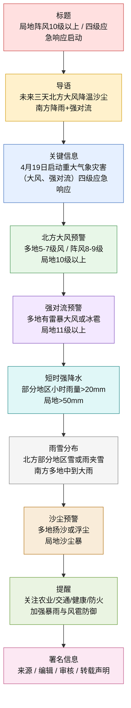
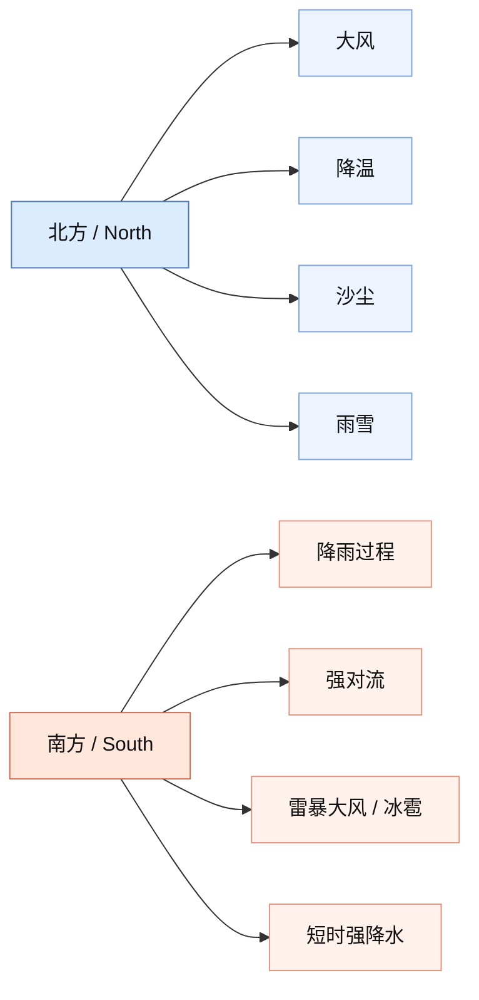

### 局地阵风10级以上！中国气象局启动重大气象灾害（大风、强对流）四级应急响应！

**文章信息**

* **来源**：中央气象台 / 中国气象局
* **发布时间**：2026年4月19日（预测/发布时间）
* **编辑**：李子涵
* **审核**：段昊书、王美丽
* **栏目**：天气预警 / 应急响应

---

#### 【前情提要】文章结构信息图

```text
- 核心动态：中国气象局启动重大气象灾害四级应急响应（大风、强对流）
- 第一部分：总体天气趋势（4月19日至21日）
  - 北方：冷空气影响，大风、显著降温、沙尘天气
  - 南方：自西向东降雨，伴有强对流天气
- 第二部分：详细灾害预警分布
  - 1. 大风黄色预警（北方及西藏等地）
    - 风力强度：5-7级，阵风8-9级
    - 极端阵风：新疆、内蒙古、河北、河南等地局地10级以上
  - 2. 强对流天气蓝色预警（中东部及西南地区）
    - 现象：雷暴大风（10级以上）、冰雹、短时强降水（50-60mm/h）
    - 影响时段：19日午后至夜间
  - 3. 降水及雪灾预报（内蒙古、黑龙江及南方地区）
    - 北方：雨夹雪转大到暴雪
    - 南方：中到大雨，局地暴雨（50-80mm）
  - 4. 沙尘暴蓝色预警（西北至华北、黄淮）
    - 现象：扬沙、浮尘、局地沙尘暴
- 第三部分：防灾减灾建议（“象象”提醒）
  - 北方重点：农业、交通、健康防护，森林草原及城镇防火
  - 南方重点：暴雨、风雹灾害防御
```

---

#### 【全文明精读笔记】

**1. 局地阵风10级以上！中国气象局启动重大气象灾害（大风、强对流）四级应急响应！**

> **[注释解析]**
>
> * **局地 (Localities)**：指部分地区，并非大范围覆盖。
> * **中国气象局 (China Meteorological Administration, CMA)**：国务院直属事业单位，负责全国气象工作。
> * **四级应急响应 (Level IV Emergency Response)**：中国气象灾害应急响应分为一至四级，**一级为最高**。四级响应意味着灾害风险较高，相关部门需进入应急状态，加强监测预报和值班值守。
> * **金句积累**：**防灾减灾，气象先行**。此类标题具有极强的**警示性 (Warning property)**。

**2. 中央气象台预计，未来三天（4月19日至21日），受较强冷空气影响，北方多大风天气，部分地区降温显著，西北地区、华北等地将经历沙尘天气，建议公众关窗，注意防护。**

> **[注释解析]**
>
> * **中央气象台 (National Meteorological Center, NMC)**：我国最高级别的气象预报机构。
> * **较强冷空气 (Strong cold air)**：指导致气温在48小时内下降8℃以上且最低气温小于8℃的空气冷平流过程。
> * **词汇辨析**：**显著 (Significant)** vs **细微**。显著强调程度深、易被察觉。
> * **近义词**：防护（Protection）— 防范、防御。

**3. 南方地区则会自西向东出现一轮降雨过程，并伴有强对流天气，需注意避雨、避雷，注意出行安全。**

> **[注释解析]**
>
> * **自西向东 (From west to east)**：描述天气系统移动的典型空间路径。
> * **强对流天气 (Severe convective weather)**：包括雷暴、大风、冰雹、短时强降水等。其特点是**生命史短、突发性强、破坏力大**。
> * **安全提示**：避雷 (Lightning protection) 是强对流天气的防御核心。

**4. 4月19日，中国气象局启动重大气象灾害（大风、强对流）四级应急响应。**

> **[注释解析]**
>
> * **背景补充**：此次响应是基于多重预警并发的复杂天气形势。**多灾种叠加**（大风、强对流、沙尘、雨雪）对综合治理能力提出了高要求。

**5. 预计今天白天到夜间，新疆东部和南疆盆地、内蒙古大部、山西、河北大部、北京西部和北部、天津、山东西部和北部、河南中北部、黑龙江西部和南部、吉林中西部、辽宁中西部、宁夏、陕西中北部、甘肃北部、青海北部、西藏中西部等地部分地区有5至7级风，阵风8至9级，其中，新疆东部山口地区和南疆盆地东部、内蒙古中部、河北南部、河南中北部局地有8至9级风，阵风10级以上。**

> **[注释解析]**
>
> * **南疆盆地 (Southern Xinjiang Basin)**：地理方位名词，位于天山以南。
> * **山口地区 (Mountain passes)**：受**狭管效应 (Venturi effect)** 影响，风力往往比平原地区更猛烈。
> * **阵风 (Gust)**：瞬间风力，比平均风力更具破坏性。10级风足以**拔起树木**。
> * **易混淆词辨析**：**局地 (Locally)** 指点状分布，**部分地区 (Some areas)** 范围稍大。

**6. 中央气象台4月19日06时继续发布大风黄色预警。**

> **[注释解析]**
>
> * **黄色预警 (Yellow Warning)**：在我国气象预警体系中，黄色通常为**第三级**（蓝、黄、橙、红）。意味着天气情况已经比较严重，需要采取实质性的防御措施。

**7. 预计今天白天到夜间，华北东部和南部、黄淮大部、江汉西部、西南地区东部和南部、华南西部等地的部分地区将有8级以上雷暴大风或冰雹天气，其中，河北南部、山东中西部、河南中北部和东部、安徽北部、湖南西部、四川盆地东南部、重庆中部、贵州中北部、广西西部等地的部分地区将有10级以上雷暴大风，最大风力可达11级以上。**

> **[注释解析]**
>
> * **黄淮 (Yellow River and Huaihe River basins)**：指黄河下游与淮河之间的地区。
> * **江汉 (Jianghan Plain)**：长江与汉江冲积而成的平原，主要在湖北境内。
> * **雷暴大风 (Thunderstorm gale)**：由于雷暴云内的强烈下沉气流形成的地面强风。
> * **11级风 (Storm)**：风速达28.5-32.6米/秒，能使**一般建筑物受损**。

**8. 华北南部、黄淮中西部、西南地区东部和南部、华南西部等地的部分地区将有小时雨量大于20毫米的短时强降水天气，其中，重庆中西部、贵州西部和北部、广西西部和南部沿海等地的部分地区小时雨量大于50毫米，最大可达60毫米以上。**

> **[注释解析]**
>
> * **短时强降水 (Short-term heavy rainfall)**：通常指1小时内降水量达到20毫米或以上。
> * **小时雨量 60毫米**：属于**极端降强**，极易诱发城市内涝、山洪及泥石流。
> * **地理定位**：**西南地区 (Southwest China)** 地形复杂，降水对山区影响极大。

**9. 强对流的主要影响时段为今天午后至夜间。中央气象台4月19日06时继续发布强对流天气蓝色预警。**

> **[注释解析]**
>
> * **时段特征**：强对流通常在午后至傍晚爆发，因为白天地表受热积攒了大量能量。
> * **蓝色预警 (Blue Warning)**：强对流天气预警的入门级别，但仍需高度警惕。

**10. 预计今天白天到夜间，内蒙古东北部、黑龙江西北部、新疆南疆西部山区和沿天山地区西段、青海南部和东北部等地部分地区有小到中雪或雨夹雪，其中，内蒙古东北部、黑龙江西北部、新疆南疆西部山区等地部分地区有大到暴雪（10至12毫米）；黑龙江西北部、河北南部、山东西部、四川东部、重庆、贵州、云南东部、湖南西部、广西大部等地部分地区有中到大雨，其中，重庆东南部、贵州北部、广西北部等地部分地区有暴雨（50至80毫米）。**

> **[注释解析]**
>
> * **雨夹雪 (Sleet)**：雨和雪同时降落。
> * **暴雪标准**：24小时内降雪量达到10.0-19.9毫米（折合融化后的水量）。
> * **暴雨标准**：24小时内降水量达到50.0-99.9毫米。
> * **高级词汇**：**纷至沓来 (Come in thick and fast)** 描述多地不同降水现象。

**11. 此外，今天白天到夜间，新疆南部和东部、甘肃中西部、青海北部、内蒙古中西部和东南部、宁夏、陕西大部、山西、河北、北京、天津、河南北部、山东西北部、辽宁西部、吉林西部等地的部分地区有扬沙或浮尘天气，其中，新疆南部、内蒙古中部等地的部分地区有沙尘暴。**

> **[注释解析]**
>
> * **扬沙 (Blowing sand)**：风将地面沙尘吹起，使空气混浊，能见度在1公里至10公里。
> * **浮尘 (Floating dust)**：由于远方沙尘飘过来或本地扬沙沉降，能见度小于10公里。
> * **沙尘暴 (Sandstorm)**：强风将地面尘沙吹起，能见度**小于1公里**。
> * **背景补充**：春季是北方沙尘天气的高发期，与冷空气活跃及地表植被尚未完全覆盖有关。

**12. 中央气象台4月19日06时继续发布沙尘暴蓝色预警。**

> **[注释解析]**
>
> * **联动响应**：此次气象预报体现了**多警种联动**（大风、强对流、沙尘三警齐发）。

**13. 象象提醒：19日至20日，北方地区将有大风、降温、沙尘和雨雪天气，需关注对农业、交通、人体健康等影响，并加强森林草原和城镇防火工作。**

> **[注释解析]**
>
> * **象象 (Xiangxiang)**：中国气象局的官方卡通形象或拟人化称呼，旨在拉近与公众距离，提高气象科普的亲和力。
> * **关注重点**：**农业**（防冻害、风灾）、**交通**（雨雪湿滑、沙尘低能见度）、**防火**（春季干燥、大风助火势）。

**14. 19日起南方地区有较强降雨和强对流天气，需做好暴雨和风雹灾害防御工作。**

> **[注释解析]**
>
> * **风雹灾害 (Wind and hail disaster)**：大风与冰雹的综合影响，对农作物及户外设施有毁灭性打击。
> * **防御 (Defense/Prevention)**：强调提前布局，化被动为主动。

**15. 来源：中央气象台；编辑：李子涵；审核：段昊书、王美丽。**

> **[注释解析]**
>
> * **段昊书**：中国气象局报社资深记者/编辑。
> * **王美丽**：中国气象频道知名气象分析师，多次担任国家级气象预警审核。
> * **版权说明**：体现了官方信息的**权威性 (Authority)** 和**严肃性 (Seriousness)**，受知识产权保护。
## 基本信息

- 文章来源：`中央气象台`相关气象信息转载稿
- 文本题目：`局地阵风10级以上！中国气象局启动重大气象灾害（大风、强对流）四级应急响应！`
- 发布机构：`中国气象局`、`中央气象台`
- 编辑：`李子涵`
- 审核：`段昊书`、`王美丽`

## 作者/机构背景简介

- `中国气象局`：中国国家级气象行政与业务管理机构，负责全国气象监测、预报预警、气象防灾减灾、气候服务等工作。
- `中央气象台`：隶属中国气象局，是国家级天气预报与灾害性天气预警中心，承担全国范围内的重要天气过程监测、预报、预警发布等职责。

---

## 前情提要





---

🔸`局地`阵风10级以上！中国气象局启动重大气象灾害（`大风`、`强对流`）四级应急响应！

🔹`Localized` gusts may exceed `Force 10`! / The China Meteorological Administration / has activated a `Level-IV emergency response` / for major meteorological disasters / involving `gales` and `severe convective weather`.

- 背景注释：
  - `局地`：指局部地区、个别区域，不代表大范围普遍情况。
  - `中国气象局`：China Meteorological Administration，常简称 `CMA`。
  - `重大气象灾害四级应急响应`：中国气象应急响应体系中的较低一级响应，但仍表明有关部门已进入针对性防范和应对状态。
  - `强对流`：通常包括雷暴大风、短时强降水、冰雹、龙卷等剧烈天气现象。
  - `10级`：中文气象报道常使用风力等级表述；英语中常根据语境译为 `Force 10` 或直接说明 very strong gusts.

> **`localized` 局地的；局部的** /ˈloʊkəlaɪzd/
> 词性：adj.
> 英文释义：limited to a particular place rather than widespread（局限于某一地区的，而非大范围的）
> 语域：新闻、地理、气象
> 画龙点睛：`localized` 常见于新闻与科研文本，强调“`局部发生`而非普遍出现”。可搭配 `localized rain`、`localized flooding`。注意与 `local` 区分：`local` 只是“当地的”，`localized` 更强调“`范围受限`”。

> **`gust` 阵风** /ɡʌst/
> 词性：n.
> 英文释义：a sudden strong increase in the speed of the wind（风速突然增强的一阵风）
> 语域：气象、新闻
> 画龙点睛：`gust` 是气象高频词，常与 `wind`、`strong`、`up to` 连用，如 `gusts of 90 km/h`。考试中常考其与持续风 `sustained wind` 的区别：前者是`瞬时增强`，后者是平均风速意义上的持续风。

> **`convective weather` 对流天气** /kənˈvektɪv/
> 词性：n. phr.
> 英文释义：weather caused by strong upward movement of warm air, often producing thunderstorms（由暖空气强烈上升运动引发的天气，常伴雷暴）
> 语域：气象、科学
> 画龙点睛：`convective` 源于 `convection`（对流）。在阅读中见到 `severe convective weather` 往往意味着`雷暴大风、冰雹、短时暴雨甚至龙卷`等风险。写作中可用于替代笼统的 `bad weather`，更专业。

> **`Level-IV emergency response` 四级应急响应**
> 词性：n. phr.
> 英文释义：the fourth-tier official emergency action mechanism activated in response to a risk or disaster（针对风险或灾害启动的第四级官方应急行动机制）
> 语域：行政、新闻、应急管理
> 画龙点睛：这是典型政策新闻表达。翻译时可保留 `Level-IV` 这种正式写法。注意 `response` 在此不是“回答”，而是`应对措施`。阅读中常与 `activate`、`launch`、`initiate` 搭配。

---

🔸中央气象台预计，未来三天（4月19日至21日），受`较强冷空气`影响，北方多`大风`天气，部分地区`降温显著`，西北地区、华北等地将经历`沙尘天气`，建议公众关窗，注意防护。

🔹The Central Meteorological Observatory / forecasts that / over the next three days (`April 19 to 21`), / under the influence of a `relatively strong cold air mass`, / northern China will see frequent `strong winds`, / with `significant temperature drops` in some areas, / while Northwest China and North China / will experience `dusty weather`; / the public is advised / to keep windows closed / and take protective measures.

- 背景注释：
  - `中央气象台`：英文常译为 `Central Meteorological Observatory`。
  - `冷空气`：在中国天气报道中是高频概念，往往意味着降温、大风、雨雪、沙尘等连锁天气影响。
  - `西北地区`：通常包括陕西、甘肃、青海、宁夏、新疆等。
  - `华北`：通常包括北京、天津、河北、山西、内蒙古部分地区。

> **`forecast` 预测；预报** /ˈfɔːrkæst/
> 词性：v./n.
> 英文释义：to say what is expected to happen in the future, especially in weather reporting（预测未来将发生的事，尤指天气预报）
> 中文：预测；预报
> 语域：新闻、气象、经济
> 画龙点睛：`forecast` 既可作动词也可作名词，如 `The agency forecast rain`、`according to the forecast`。写作中可与 `predict` 替换，但在`天气语境`里 `forecast` 更自然、更专业。

> **`under the influence of` 在……影响下**
> 词性：prep. phr.
> 英文释义：affected or shaped by something（受到某事物影响）
> 中文：在……影响下
> 语域：正式、新闻、学术
> 画龙点睛：这是新闻和说明文中的高频结构，适合写作升级。可用于天气、政策、文化、经济等多场景，如 `under the influence of climate change`。比简单的 `because of` 更正式。

> **`significant` 显著的；明显的** /sɪɡˈnɪfɪkənt/
> 词性：adj.
> 英文释义：large enough to be important or clearly noticeable（大到足以重要，或明显到可察觉）
> 中文：显著的；明显的
> 语域：正式、学术、新闻
> 画龙点睛：`significant` 在考试中极常见，既可表示“`数量上显著`”，也可表示“`意义重大`”。如 `a significant drop`、`a significant event`。注意不要一概机械翻成“重要的”，需看上下文。

> **`dusty weather` 沙尘天气**
> 词性：n. phr.
> 英文释义：weather conditions marked by airborne dust particles（空气中悬浮大量沙尘颗粒的天气）
> 中文：沙尘天气
> 语域：气象、新闻
> 画龙点睛：英文报道中还常见 `dust storm`（沙尘暴）、`blowing dust`（扬沙）、`floating dust`（浮尘）。做阅读时要注意这些术语之间的`强度差异`，不可混译。

---

🔸南方地区则会自西向东出现一轮`降雨过程`，并伴有`强对流天气`，需注意`避雨`、`避雷`，注意`出行安全`。

🔹In southern China, / a new round of `rainfall` / will move from west to east, / accompanied by `severe convective weather`; / people should take shelter from the rain and lightning / and pay attention to `travel safety`.

- 背景注释：
  - `自西向东`：表示天气系统推进方向，是气象报道中的常见空间表达。
  - `避雷`：在中文里是“躲避雷电”的意思，不是网络口语中的“避开雷点”。

> **`a round of` 一轮**
> 词性：phr.
> 英文释义：a single occurrence or cycle of an event, especially one that happens in stages（某事件的一次发生或一轮过程）
> 中文：一轮
> 语域：新闻、口语、说明
> 画龙点睛：`a round of` 用法很活，可接 `talks`、`rainfall`、`sanctions`、`applause`。在新闻英语中，它能很好表达“`一轮、一波`”的动态过程感，是写作中非常实用的升级表达。

> **`accompanied by` 伴有；伴随**
> 词性：v. phr.
> 英文释义：happening or existing together with something else（与另一事物同时发生或存在）
> 中文：伴有；伴随
> 语域：正式、新闻、医学、科学
> 画龙点睛：这是典型书面表达，可替代简单的 `with`。如 `The storm was accompanied by thunder`。在翻译和写作中能增强句子正式感，也常用于医学症状、社会现象等语境。

> **`take shelter` 躲避；寻求遮蔽处**
> 词性：v. phr.
> 英文释义：to go somewhere safe for protection from bad weather or danger（到安全地点躲避恶劣天气或危险）
> 中文：躲避；避险
> 语域：日常、新闻、应急
> 画龙点睛：`shelter` 可作名词也可作动词。`take shelter from...` 是固定搭配，后接 `rain`、`the storm`、`the sun` 等。比简单的 `hide from` 更自然，尤其适用于正式提示语。

> **`travel safety` 出行安全**
> 词性：n. phr.
> 英文释义：the condition of being safe while traveling or commuting（在出行或通勤过程中处于安全状态）
> 中文：出行安全
> 语域：公共安全、新闻
> 画龙点睛：可拓展为 `road safety`、`traffic safety`、`public safety`。写作中若涉及恶劣天气对生活影响，`travel safety` 是很高频且准确的表达。

---

🔸4月19日，中国气象局启动重大气象灾害（`大风`、`强对流`）四级应急响应。

🔹On `April 19`, / the China Meteorological Administration / activated a `Level-IV emergency response` / for major meteorological disasters / caused by `strong winds` and `severe convective weather`.

- 背景注释：
  - 此句是全文核心信息句，交代了时间与官方行动。
  - `启动应急响应` 常见英译包括 `activate`, `launch`, `initiate`，其中 `activate` 最符合行政响应“进入执行状态”的意味。

> **`activate` 启动；使生效** /ˈæktɪveɪt/
> 词性：v.
> 英文释义：to make something start working or become effective（使开始运作或生效）
> 中文：启动；激活
> 语域：正式、技术、行政
> 画龙点睛：`activate` 适用于设备、程序、机制、应急响应等。比 `start` 更正式、更精确。阅读中要注意它常隐含“`从待命状态转入运行状态`”之意。

> **`meteorological disaster` 气象灾害** /ˌmiːtiərəˈlɑːdʒɪkl dɪˈzæstər/
> 词性：n. phr.
> 英文释义：a disaster caused by severe weather or climate-related conditions（由严重天气或气候条件引发的灾害）
> 中文：气象灾害
> 语域：气象、行政、新闻
> 画龙点睛：`meteorological` 是高阶词，考研、雅思阅读中常见。注意不要与 `climatic` 混淆：前者偏具体天气过程，后者更偏长期气候特征。

---

🔸预计今天白天到夜间，`新疆东部`和`南疆盆地`、`内蒙古大部`、山西、河北大部、北京西部和北部、天津、山东西部和北部、河南中北部、黑龙江西部和南部、吉林中西部、辽宁中西部、宁夏、陕西中北部、甘肃北部、青海北部、西藏中西部等地部分地区有5至7级风，阵风8至9级，其中，`新疆东部山口地区`和`南疆盆地东部`、`内蒙古中部`、河北南部、河南中北部局地有8至9级风，阵风10级以上。

🔹From daytime to nighttime today, / parts of `eastern Xinjiang`, the `southern Xinjiang basin`, most of `Inner Mongolia`, Shanxi, most of Hebei, western and northern Beijing, Tianjin, western and northern Shandong, central and northern Henan, western and southern Heilongjiang, central and western Jilin, central and western Liaoning, Ningxia, central and northern Shaanxi, northern Gansu, northern Qinghai, and central and western Tibet / are expected to see winds of `Force 5 to 7`, / with gusts of `Force 8 to 9`; / in some places, including `mountain-pass areas in eastern Xinjiang`, the eastern part of the southern Xinjiang basin, central Inner Mongolia, southern Hebei, and central and northern Henan, / winds may reach `Force 8 to 9`, / with gusts `above Force 10`.

- 背景注释：
  - `南疆盆地`：通常指新疆南部塔里木盆地一带。
  - `山口地区`：由于地形狭管效应，风力往往更强。
  - 中国气象报道中的风力等级常对应蒲福风级系统，但中文“几级风”在翻译时需结合目标读者习惯灵活处理。

> **`mountain pass` 山口；隘口**
> 词性：n.
> 英文释义：a route through a mountain range, often lower than the surrounding peaks（穿越山脉、海拔相对较低的通道）
> 中文：山口；隘口
> 语域：地理、气象
> 画龙点睛：在地理与气象文章中，`mountain pass` 常暗示`风力增强`，因为气流被地形压缩。阅读中若见此词，应联想到地形对天气、交通、军事的影响。

> **`gusts above Force 10` 10级以上阵风**
> 词性：n. phr.
> 英文释义：sudden bursts of wind exceeding Force 10 on the wind scale（风级超过10级的瞬时强风）
> 中文：10级以上阵风
> 语域：气象、新闻
> 画龙点睛：这类表达是天气新闻中的重点危险信息。翻译时可保留 `Force 10`，也可在面向国际受众时补充更直观的风速单位。考试翻译里关键是准确传达“`阵风`而非持续风”。

> **`parts of` 部分地区**
> 词性：phr.
> 英文释义：some areas within a larger region（某一更大区域中的一些地方）
> 中文：部分地区
> 语域：新闻、说明
> 画龙点睛：这是地理描述中的基础高频表达。别小看它，写作中它能避免绝对化表述，如不是 `all areas` 而是 `parts of the region`，更符合客观报道习惯。

---

🔸中央气象台4月19日06时继续发布`大风黄色预警`。

🔹At `06:00 on April 19`, / the Central Meteorological Observatory / continued to issue a `yellow alert for strong winds`.

- 背景注释：
  - `黄色预警`：中国气象预警信号通常分级为蓝、黄、橙、红，黄色高于蓝色，表示风险进一步上升。
  - `06时`：正式新闻中可译为 `06:00`，更符合英文信息表达规范。

> **`issue an alert` 发布预警**
> 词性：v. phr.
> 英文释义：to officially announce a warning or notice of danger（正式发布危险警报或提醒）
> 中文：发布预警
> 语域：新闻、行政、公共安全
> 画龙点睛：`issue` 在新闻里非常常见，意为“`发布、颁布`”，不是“问题”。可搭配 `warning`、`statement`、`report`、`order`。属于考试中的熟词僻义重点。

> **`yellow alert` 黄色预警**
> 词性：n. phr.
> 英文释义：an official warning at the yellow level in a graded warning system（分级预警体系中的黄色级别警报）
> 中文：黄色预警
> 语域：公共安全、新闻
> 画龙点睛：颜色预警体系具有地域性。翻译时最好保留颜色和 `alert/warning`，必要时再补充其在系统中的相对级别，避免外国读者不明白严重程度。

---

🔸预计今天白天到夜间，华北东部和南部、黄淮大部、江汉西部、西南地区东部和南部、华南西部等地的部分地区将有8级以上`雷暴大风`或`冰雹`天气，其中，河北南部、山东中西部、河南中北部和东部、安徽北部、湖南西部、四川盆地东南部、重庆中部、贵州中北部、广西西部等地的部分地区将有10级以上雷暴大风，最大风力可达11级以上。

🔹From daytime to nighttime today, / parts of eastern and southern North China, most of the Huanghuai region, western Jianghan, eastern and southern Southwest China, and western South China / will experience `thunderstorm gales` of above `Force 8` / or `hail`; / in some areas, including southern Hebei, central and western Shandong, central, northern and eastern Henan, northern Anhui, western Hunan, the southeastern Sichuan Basin, central Chongqing, central and northern Guizhou, and western Guangxi, / thunderstorm winds may exceed `Force 10`, / with peak wind power reaching `above Force 11`.

- 背景注释：
  - `黄淮`：黄河与淮河之间区域，是中国地理和气象报道中的常见区域名称。
  - `江汉`：一般指长江与汉江之间或相关流域地区。
  - `四川盆地`：盆地地形对湿热空气和强对流发展有重要影响。
  - `冰雹`：英语为 `hail`，个体为 `hailstone`。

> **`thunderstorm gale` 雷暴大风**
> 词性：n. phr.
> 英文释义：a strong damaging wind associated with a thunderstorm（与雷暴相关的破坏性强风）
> 中文：雷暴大风
> 语域：气象、灾害预警
> 画龙点睛：这是强对流天气的核心术语之一。做题时不要只看到 `storm` 就笼统理解成“暴风雨”，它强调的是`雷暴系统产生的强风危害`，常与 `lightning`、`hail`、`downpour` 一并出现。

> **`hail` 冰雹** /heɪl/
> 词性：n./v.
> 英文释义：small balls of ice falling from the sky during a storm（暴风雨中从空中降下的小冰球）
> 中文：冰雹
> 语域：气象、日常
> 画龙点睛：`hail` 作名词表示冰雹，作动词还可表示“致意、招呼、称颂”，属于典型一词多义。阅读里若碰到 `hailed as`，千万别误解为“下冰雹”。

> **`peak` 最高的；峰值的** /piːk/
> 词性：adj./n./v.
> 英文释义：reaching the highest point or level（达到最高点或最高水平）
> 中文：峰值的；最高点
> 语域：新闻、数据、科学
> 画龙点睛：`peak` 是数据、天气、商业报道中的高频词。`peak wind speed`、`peak season`、`peak hours` 都常见。写作中比单纯的 `highest` 更凝练、更专业。

---

🔸华北南部、黄淮中西部、西南地区东部和南部、华南西部等地的部分地区将有小时雨量大于20毫米的`短时强降水`天气，其中，重庆中西部、贵州西部和北部、广西西部和南部沿海等地的部分地区小时雨量大于50毫米，最大可达60毫米以上。

🔹Parts of southern North China, central and western Huanghuai, eastern and southern Southwest China, and western South China / will experience `short-term heavy rainfall` / with hourly precipitation of more than `20 mm`; / in some areas, including central and western Chongqing, western and northern Guizhou, and western Guangxi as well as its southern coastal areas, / hourly rainfall may exceed `50 mm`, / with a maximum of `over 60 mm`.

- 背景注释：
  - `短时强降水`：强对流天气的重要表现之一，强调时间短、雨强大。
  - `小时雨量`：英文中常译为 `hourly precipitation` 或 `hourly rainfall`。
  - `沿海`：可译为 `coastal areas`。

> **`short-term heavy rainfall` 短时强降水**
> 词性：n. phr.
> 英文释义：intense rainfall occurring within a short period of time（在较短时间内发生的强降雨）
> 中文：短时强降水
> 语域：气象、灾害预警
> 画龙点睛：这是强对流报道中非常核心的术语，常与城市内涝、山洪、滑坡等风险相关。写作时它比 `heavy rain` 更精准，因为突出了`时间短而强度大`这一关键特征。

> **`hourly precipitation` 小时降水量**
> 词性：n. phr.
> 英文释义：the amount of rain or other precipitation recorded within one hour（一小时内记录到的降水量）
> 中文：小时降水量
> 语域：气象、科学
> 画龙点睛：`precipitation` 是总称，既可指雨，也可指雪、冰雹等。若明确只谈降雨，也可用 `hourly rainfall`。考试中这是很典型的学术词汇，值得掌握。

> **`exceed` 超过** /ɪkˈsiːd/
> 词性：v.
> 英文释义：to be greater than a number, amount, or limit（大于某数字、数量或限度）
> 中文：超过
> 语域：正式、新闻、学术
> 画龙点睛：`exceed` 非常适合数据表达，如 `exceed 50 mm`、`exceed expectations`。比 `be more than` 更书面、更紧凑。搭配数字、标准、限制尤其常见。

---

🔸强对流的主要影响时段为今天午后至夜间。

🔹The main period of impact for the `severe convective weather` / will be from this afternoon / to tonight.

- 背景注释：
  - `午后至夜间` 是强对流高发时段的典型表述，因为地面增温有利于不稳定能量积累与释放。

> **`period of impact` 影响时段**
> 词性：n. phr.
> 英文释义：the time span during which something has an effect（某事物产生影响的时间段）
> 中文：影响时段
> 语域：正式、新闻
> 画龙点睛：这是很实用的说明性表达，可迁移到经济、政策、医疗等领域。写作中比简单说 `when it happens` 更准确，能突出“`影响持续的时间窗口`”。

---

🔸中央气象台4月19日06时继续发布`强对流天气蓝色预警`。

🔹At `06:00 on April 19`, / the Central Meteorological Observatory / continued to issue a `blue alert for severe convective weather`.

- 背景注释：
  - `蓝色预警` 一般为预警体系中的较低级别，但仍表明相关风险已达到需要公众注意和防范的程度。

> **`blue alert` 蓝色预警**
> 词性：n. phr.
> 英文释义：an official warning at the blue level in a graded alert system（分级预警体系中的蓝色级别警报）
> 中文：蓝色预警
> 语域：新闻、公共安全
> 画龙点睛：和 `yellow alert` 一样，颜色预警有制度背景。翻译时若对象是不了解中国体系的读者，可在上下文用 `lower-level official warning` 一类解释性说法辅助理解。

---

🔸预计今天白天到夜间，内蒙古东北部、黑龙江西北部、新疆南疆西部山区和沿天山地区西段、青海南部和东北部等地部分地区有小到中雪或`雨夹雪`，其中，内蒙古东北部、黑龙江西北部、新疆南疆西部山区等地部分地区有大到暴雪（10至12毫米）；黑龙江西北部、河北南部、山东西部、四川东部、重庆、贵州、云南东部、湖南西部、广西大部等地部分地区有中到大雨，其中，重庆东南部、贵州北部、广西北部等地部分地区有暴雨（50至80毫米）。

🔹From daytime to nighttime today, / parts of northeastern Inner Mongolia, northwestern Heilongjiang, the western mountainous areas of southern Xinjiang and the western section along the Tianshan region, as well as southern and northeastern Qinghai, / will have light to moderate snow / or `sleet`; / in some areas of northeastern Inner Mongolia, northwestern Heilongjiang, and the western mountainous areas of southern Xinjiang, / there will be heavy snow to blizzards (`10 to 12 mm`); / meanwhile, parts of northwestern Heilongjiang, southern Hebei, western Shandong, eastern Sichuan, Chongqing, Guizhou, eastern Yunnan, western Hunan, and most of Guangxi / will see moderate to heavy rain, / with `torrential rain` in some areas of southeastern Chongqing, northern Guizhou, and northern Guangxi (`50 to 80 mm`).

- 背景注释：
  - `雨夹雪`：英语常用 `sleet`，但不同英语地区定义略有差异；在天气报道中可接受。
  - `天山`：中亚著名山系，在新疆天气格局中影响显著。
  - `暴雨`：英文可根据量级译为 `torrential rain`、`rainstorm` 等；此处用 `torrential rain` 更自然。
  - 降雪量使用毫米表示时，指水当量或官方统计口径，不宜简单误解为积雪深度。

> **`sleet` 雨夹雪；冻雨夹雪类降水** /sliːt/
> 词性：n.
> 英文释义：a mixture of rain and snow, or partially frozen rain depending on regional usage（雨和雪的混合物，或半冻结雨，具体定义因地区略异）
> 中文：雨夹雪
> 语域：气象
> 画龙点睛：这是英美定义偶有差异的词，阅读中需依上下文判断。对中文天气新闻翻译而言，`sleet` 是最常见对应。若担心歧义，可用 `rain and snow mixed` 解释性翻译。

> **`blizzard` 暴风雪** /ˈblɪzərd/
> 词性：n.
> 英文释义：a severe snowstorm with strong winds and reduced visibility（伴有强风和低能见度的强烈暴风雪）
> 中文：暴风雪
> 语域：气象、新闻
> 画龙点睛：`blizzard` 不只是“大雪”，关键在于`强风+雪+低能见度`。做阅读题时容易与 `snowstorm` 混淆；前者通常比后者更严重、更危险。

> **`torrential rain` 暴雨；倾盆大雨** /təˈrenʃl/
> 词性：n. phr.
> 英文释义：very heavy rain falling rapidly and intensely（快速而强烈的大雨）
> 中文：暴雨；倾盆大雨
> 语域：新闻、日常、气象
> 画龙点睛：`torrential` 常搭配 `rain`，突出雨势`急、猛、大`。在写作中它比 `heavy rain` 更生动、更高级，既可用于新闻，也可用于描写文体。

---

🔸此外，今天白天到夜间，新疆南部和东部、甘肃中西部、青海北部、内蒙古中西部和东南部、宁夏、陕西大部、山西、河北、北京、天津、河南北部、山东西北部、辽宁西部、吉林西部等地的部分地区有`扬沙`或`浮尘`天气，其中，新疆南部、内蒙古中部等地的部分地区有`沙尘暴`。

🔹In addition, / from daytime to nighttime today, / parts of southern and eastern Xinjiang, central and western Gansu, northern Qinghai, central-western and southeastern Inner Mongolia, Ningxia, most of Shaanxi, Shanxi, Hebei, Beijing, Tianjin, northern Henan, northwestern Shandong, western Liaoning, and western Jilin / will experience `blowing sand` or `floating dust`; / in some areas of southern Xinjiang and central Inner Mongolia, / there will be `sandstorms`.

- 背景注释：
  - `扬沙`：通常比 `沙尘暴` 弱，强调风把沙土吹扬起来。
  - `浮尘`：空气中悬浮尘土，能见度下降，但强度一般低于沙尘暴。
  - `沙尘暴`：英语常译 `sandstorm`，为较强沙尘天气。

> **`blowing sand` 扬沙**
> 词性：n. phr.
> 英文释义：sand lifted and driven by the wind near the ground（被风吹起并移动的沙粒）
> 中文：扬沙
> 语域：气象、环境
> 画龙点睛：这是沙尘天气分类中的术语，强度通常低于 `sandstorm`。若面向普通读者，也可解释成 `windblown sand`。阅读时要留意其与 `dust` 的物质差异：`sand` 颗粒更大。

> **`floating dust` 浮尘**
> 词性：n. phr.
> 英文释义：fine dust particles suspended in the air（悬浮在空气中的细小尘粒）
> 中文：浮尘
> 语域：气象、环境
> 画龙点睛：`floating dust` 强调悬浮状态，不一定有非常强的近地面风。翻译时若需更自然，也可处理为 `airborne dust`。两者都能表达“空气中有尘”。

> **`sandstorm` 沙尘暴** /ˈsændstɔːrm/
> 词性：n.
> 英文释义：a storm in which strong winds carry large amounts of sand through the air（强风携带大量沙粒形成的风暴）
> 中文：沙尘暴
> 语域：气象、新闻
> 画龙点睛：这是环境与气象新闻高频词。其近义相关词包括 `dust storm`。严格说二者侧重点略有区别，但新闻中常可互见。写作里用它能准确传达严重沙尘风险。

---

🔸中央气象台4月19日06时继续发布`沙尘暴蓝色预警`。

🔹At `06:00 on April 19`, / the Central Meteorological Observatory / continued to issue a `blue alert for sandstorms`.

- 背景注释：
  - 此句对应上一句沙尘天气内容，是官方预警层面的进一步确认。

> **`sandstorm alert` 沙尘暴预警**
> 词性：n. phr.
> 英文释义：an official warning about expected or ongoing sandstorms（关于预计发生或正在发生的沙尘暴的官方警报）
> 中文：沙尘暴预警
> 语域：新闻、公共安全
> 画龙点睛：在实际英文表达中，既可说 `a blue alert for sandstorms`，也可说 `a sandstorm warning`。前者保留中国预警体系色级信息，后者更利于国际读者迅速理解。

---

🔸象象提醒：19日至20日，北方地区将有`大风`、`降温`、`沙尘`和`雨雪天气`，需关注对农业、交通、人体健康等影响，并加强森林草原和城镇防火工作。

🔹A reminder from the forecaster: / from the `19th to the 20th`, / northern China / will experience `strong winds`, `cooling`, `dust`, and `rain-and-snow weather`; / attention should be paid / to the impact on agriculture, transportation, and human health, / and efforts should be strengthened / in forest, grassland, and urban fire prevention.

- 背景注释：
  - `象象提醒`：这里相当于气象平台的提醒语，可理解为 `weather service reminder`。
  - `森林草原和城镇防火`：大风和空气干燥会显著提高火灾风险。

> **`pay attention to` 关注；留意**
> 词性：v. phr.
> 英文释义：to watch, consider, or notice something carefully（认真注意、关注某事）
> 中文：关注；留意
> 语域：通用
> 画龙点睛：这是基础但极高频表达，写作中还能替换为更正式的 `give attention to`、`be alert to`、`closely monitor`。在官方提示中，它常引出风险点或重点事项。

> **`fire prevention` 防火**
> 词性：n. phr.
> 英文释义：measures taken to stop fires from starting or spreading（防止火灾发生或蔓延的措施）
> 中文：防火
> 语域：公共安全、应急管理
> 画龙点睛：`prevention` 是写作升级词，适合搭配 `disease prevention`、`crime prevention`、`fire prevention`。比单纯的 `prevent fires` 更像政策或管理文本中的正式名词结构。

---

🔸19日起南方地区有较强`降雨`和`强对流天气`，需做好`暴雨`和`风雹灾害`防御工作。

🔹Starting from the `19th`, / southern China / will face relatively strong `rainfall` / and `severe convective weather`; / precautions should be taken / against `rainstorms` / and `wind-and-hail disasters`.

- 背景注释：
  - `风雹灾害`：指由大风、冰雹等造成的灾害性影响。
  - `防御工作`：英文中常可译为 `precautionary measures`, `defensive measures`, `preparedness efforts` 等。

> **`starting from` 自……起**
> 词性：prep. phr.
> 英文释义：beginning at a particular time and continuing afterward（从某一时间开始并持续之后）
> 中文：自……起；从……开始
> 语域：通用、正式
> 画龙点睛：可替换 `from` 进行更清楚的起点强调。正式文本中用于说明政策、时间安排、天气过程起始都很自然。要注意后接时间点，而不是时间段终点。

> **`precaution` 预防措施；防备** /prɪˈkɔːʃn/
> 词性：n.
> 英文释义：an action taken in advance to prevent danger or problems（预先采取以防危险或问题的行动）
> 中文：预防措施；防备
> 语域：正式、新闻、安全提示
> 画龙点睛：`take precautions against...` 是高频搭配，适用于疾病、灾害、事故等语境。比 `be careful` 更正式、更有操作性，是写作中非常值得掌握的表达。

> **`hail disaster` 雹灾**
> 词性：n. phr.
> 英文释义：damage or disaster caused by hailstones（由冰雹造成的损害或灾害）
> 中文：雹灾
> 语域：气象、农业、保险
> 画龙点睛：农业、保险、灾害报道里经常出现。可扩展掌握 `crop damage`、`storm damage`、`disaster relief` 等相关词群，方便阅读同类文章。

---

🔸来源：中央气象台

🔹Source: `Central Meteorological Observatory`.

- 背景注释：
  - `来源` 是新闻或公众号转载稿中用于标注信息出处的常见格式。

> **`source` 来源；消息来源** /sɔːrs/
> 词性：n.
> 英文释义：the place, person, or document from which something comes（某信息或事物的出处、来源）
> 中文：来源；出处
> 语域：新闻、学术、通用
> 画龙点睛：`source` 在阅读和写作里都非常重要，可指新闻来源、数据来源、能量来源等。常见搭配有 `reliable source`、`source of information`、`cite the source`。

---

🔸编辑：李子涵

🔹Editor: `Li Zihan`.

- 背景注释：
  - `编辑` 指对稿件进行整理、校订、排版或发布处理的人员，不一定是原始作者。

> **`editor` 编辑** /ˈedɪtər/
> 词性：n.
> 英文释义：a person who prepares written material for publication by correcting or organizing it（为出版而整理、修改文字材料的人）
> 中文：编辑
> 语域：出版、媒体
> 画龙点睛：`editor` 与 `author` 不同：前者负责`编辑加工`，后者负责`写作创作`。考试中常见派生词 `edit`（编辑）、`editing`（编辑工作），值得一起掌握。

---

🔸审核：段昊书 王美丽

🔹Reviewed by `Duan Haoshu` and `Wang Meili`.

- 背景注释：
  - `审核` 指对稿件内容进行复核、把关，确保信息合规、准确。

> **`review` 审核；审查；复核** /rɪˈvjuː/
> 词性：v./n.
> 英文释义：to examine something again in order to check or assess it（再次检查某事以便核实或评估）
> 中文：审核；审查；复核
> 语域：通用、行政、学术
> 画龙点睛：`review` 语义范围很广，可表示“复习、评论、审核”。在媒体署名中译为“审核/复核”更合适。阅读时一定要依上下文判断，不要只记“评论”这一义项。

---

🔸未经许可请勿转载。

🔹Please do not repost / without authorization.

- 背景注释：
  - `转载`：指在其他平台再次发布原文内容。
  - `许可`：这里是版权或平台授权意义上的许可。

> **`authorization` 授权；许可** /ˌɔːθərəˈzeɪʃn/
> 词性：n.
> 英文释义：official permission for something to happen or be done（对某事进行的正式许可）
> 中文：授权；许可
> 语域：法律、出版、商务
> 画龙点睛：这是正式语体常用词，比 `permission` 更书面。常见搭配有 `without authorization`、`written authorization`。在版权、金融、行政文本中都很高频。

> **`repost` 转发；转载** /ˌriːˈpoʊst/
> 词性：v.
> 英文释义：to publish or post something again, especially online（再次发布，尤指在网络上转发）
> 中文：转发；转载
> 语域：网络、媒体
> 画龙点睛：数字媒体时代常用词。可与 `share` 区分：`share` 偏分享，`repost` 更强调`再次发布原内容`。版权语境下后者更准确。

---

🔸授权转载时请务必注明出处。

🔹If reposting is authorized, / please be sure / to indicate the `source`.

- 背景注释：
  - `注明出处` 是版权和媒体规范中的常见要求。

> **`indicate` 注明；表明** /ˈɪndɪkeɪt/
> 词性：v.
> 英文释义：to point out or state something clearly（清楚指出或说明某事）
> 中文：注明；表明
> 语域：正式、学术、新闻
> 画龙点睛：`indicate` 是书面语中的高频动词，可表示“表明、显示、指出、注明”。比 `show`、`say` 更正式，适用于数据、图表、版权声明等多种场景。