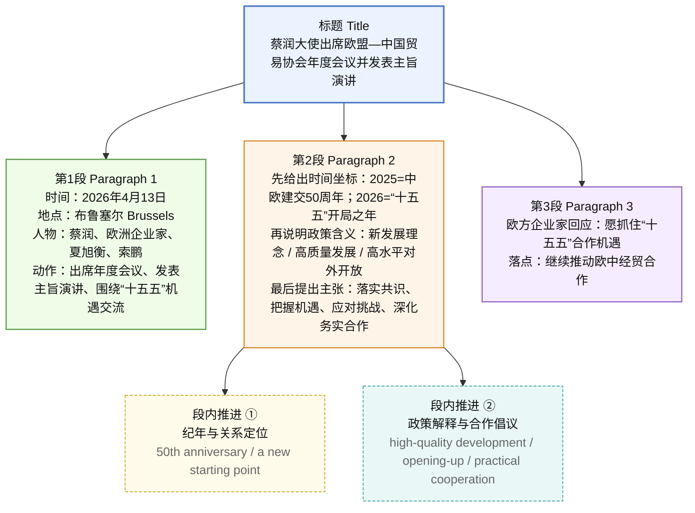

# 蔡润大使出席欧盟—中国贸易协会年度会议并发表主旨演讲

**来源**：中国驻欧盟使团官方平台  
**日期**：2026-04-13  
**栏目**：外交动态 / 经贸合作  
**核心人物**：蔡润、夏旭衡、索鹏

> **阅读指引**：前半为**结构脉络**、**中文精读**（含「往期推荐」延伸阅读）；后半为**前情提要（流程图）**、**标题双语拆解**与**英汉逐句精读**及词汇注释。同一新闻事实两处均有涉及时，可对照阅读，以后半逐句块的英文表述为准作复述练习。

## 【文章结构脉络图】

1. **活动概况 (Event Profile)**
   1.1 **时间与地点**：2026年4月13日，布鲁塞尔  
   1.2 **核心环节**：欧盟—中国贸易协会年度会议，主旨演讲  
   1.3 **参会人员**：蔡润大使（主宾）、夏旭衡（主持）、索鹏（陪同）、欧洲企业家  
   1.4 **核心议题**：中国“十五五”规划下的中欧经贸机遇

2. **主旨演讲内容 (Keynote Speech Contents)**
   2.1 **中欧关系的时间节点**
   - 2.1.1 **2025年**：建交50周年，承前启后  
   - 2.1.2 **2026年**：“十五五”开局，第二个50年起步  
   2.2 **“十五五”规划的三重维度**
   - 2.2.1 **发展维度**：新发展理念，高质量发展  
   - 2.2.2 **开放维度**：高水平对外开放  
   - 2.2.3 **全球维度**：共同创造和分享新机遇  
   2.3 **行动倡议与愿景**
   - 2.3.1 落实领导人共识  
   - 2.3.2 把握机遇，应对挑战  
   - 2.3.3 推动全面战略伙伴关系稳定发展

3. **欧方反馈与后续动态 (Feedback & Recommendations)**
   3.1 **欧方态度**：企业家表达合作愿望，肯定“十五五”机遇  
   3.2 **往期动态拓展**：能源安全、大型体育赛事、宏观经济风险、地缘安全  

---

## 全文精读笔记

**2026年4月13日，中国驻欧盟使团团长蔡润大使应邀出席欧盟—中国贸易协会在布鲁塞尔举行的年度会议并发表主旨演讲，同与会欧洲企业家就中国“十五五”规划给中欧经贸合作带来的重要机遇进行深入交流。欧中贸协主席夏旭衡主持会议，中国驻欧盟使团负责经贸事务的公使索鹏等参加。**

> * **蔡润**：现任中国驻欧盟使团团长、特命全权大使。曾任驻葡萄牙、驻以色列大使，具有深厚的对欧外交经验。
> * **欧盟—中国贸易协会（EU-China Business Association, EUCBA）**：总部设在**布鲁塞尔**，是欧洲主要的非营利性对华商务组织，由欧洲各国与中国相关的商会联合组成，旨在促进欧盟与中国之间的双边贸易和投资。
> * **布鲁塞尔 (Brussels)**：比利时首都，亦是**欧盟（EU）**总部所在地，被称为“欧洲心脏”，是国际外交与经贸政策的枢纽。
> * **“十五五”规划**：即**中华人民共和国国民经济和社会发展第十五个五年规划纲要**（2026-2030年）。
>   * **词汇辨析**：**“规划”（Plan/Program）**。在中国话语体系中，“规划”具有战略性、宏观性和长远性，不同于西方语境下的短期“计划”。
> * **夏旭衡 (Jochum Haakma)**：现任欧盟—中国贸易协会主席，同时担任荷中商务理事会主席，是欧洲资深的对华经贸专家。
> * **公使 (Minister)**：外交衔级中仅次于大使的高级外交官。此处索鹏公使负责经贸事务，体现了此次会议的高专业度。

**蔡大使表示，2025年是中欧建交50周年，是双方关系承前启后的重要年份，在双方共同努力下，中欧关系取得了新的发展。2026年是中国“十五五”规划开局之年，也是中欧关系第二个50年的起步之年。站在新起点上，中欧关系继续保持稳定发展势头。**

> * **承前启后 (Inheriting the past and ushering in the future)**：指继承前人的事业，为后人开辟道路。
>   * **近义词**：继往开来、推陈出新。
>   * **金句积累**：中欧关系正处于**“承前启后、继往开来”**的关键时刻。
> * **建交50周年**：中国与欧洲经济共同体（欧盟前身）于**1975年**正式建交。2025年作为半个世纪的节点，具有极高的政治与外交象征意义。
> * **开局之年 (Opening year / Inaugural year)**：指重大计划或规划实施的第一年。
> * **势头 (Momentum)**：指事物发展的趋向。在国际关系中常说“保持良好发展**势头**”。

**蔡大使强调，中国“十五五”规划是全面贯彻新发展理念、着力推动高质量发展的规划，是进一步扩大高水平对外开放的规划，也是中国与世界各国共同创造和分享新机遇的规划。中欧双方应携手努力，落实好双方领导人达成的重要共识，把握机遇，应对挑战，加强中欧经贸务实合作，推动中欧全面战略伙伴关系健康稳定发展。**

> * **新发展理念**：即**创新、协调、绿色、开放、共享**（Innovation, Coordination, Green, Openness, Sharing）的发展理念。
> * **高质量发展 (High-quality development)**：中国经济发展的新阶段特征，强调从“有没有”转向“好不好”，注重全要素生产率的提升。
> * **高水平对外开放**：指制度型开放（标准、规则、管理），而非仅仅是要素型开放。
> * **务实合作 (Pragmatic cooperation)**：指基于实际效益和具体项目的合作，而非仅停留在口头承诺。
>   * **反义词**：空谈（Empty talk）、形式主义。
> * **中欧全面战略伙伴关系 (China-EU Comprehensive Strategic Partnership)**：2003年建立。这一定位确立了双方在政治、经贸、人文等全方位合作的框架。

**与会欧方企业家表示，愿抓住中国“十五五”规划带来的合作机遇，为推动欧中经贸合作发挥积极作用。**

> * **解析**：此句体现了欧洲工商界对中国市场和政策稳定性的**预期向好**。在全球经济不确定性增加的背景下，中国规划的透明度和连续性是欧洲企业的“定心丸”。

---

## 【往期推荐内容解析】

**1. 【欧盟动态】国际航协警告欧洲可能因缺油出现“停飞潮”**

> * **国际航协 (IATA)**：国际航空运输协会。
> * **停飞潮 (Grounding wave)**：大规模航班因故无法起飞的现象。反映了欧洲能源供应链在复杂地缘政治背景下的脆弱性。

**2. 【欧盟动态】德国经济强州力挺申奥 打破欧洲“奥运冷”传闻**

> * **“奥运冷”**：指近年来由于成本高昂、民众反对，许多欧洲城市退出申办奥运会的现象。
> * **近义辨析**：**力挺**（Strongly support） vs **附和**（Echo/Follow）。“力挺”强调主动且有力的支持。

**3. 【欧盟动态】国际货币基金组织：若中东冲突持续 欧盟经济或“接近衰退”**

> * **国际货币基金组织 (IMF)**：总部设在华盛顿的国际组织，负责监察国际货币体系、提供技术援助及贷款。
> * **接近衰退 (Near recession)**：经济增长接近停滞或负增长。反映了外部冲突对欧洲外向型经济的负面溢出效应。

**4. 【欧盟动态】欧洲能否绕开美国 推动霍尔木兹海峡“战后护航”计划？**

> * **霍尔木兹海峡 (Strait of Hormuz)**：连接波斯湾和阿曼湾的战略水道，全球石油出口的“咽喉”。
> * **背景注释**：此议题反映了欧洲试图在安全领域寻求**“战略自主” (Strategic Autonomy)**，减少对美依赖的倾向。

---

## 基本信息

- **文章来源**：用户提供文本；结合中国驻欧盟使团官网同栏目报道体例，归类为**驻欧盟使团发布的活动消息**。
- **中文题目**：蔡润大使出席欧盟—中国贸易协会年度会议并发表主旨演讲  
- **英文题目**：Ambassador Cai Run Attends the Annual Meeting of the EU–China Trade Association and Delivers a Keynote Speech  
- **作者**：未署名（机构通稿体例，公开页面通常不单列个人作者）。  
- **活动日期**：通稿与笔记元信息采用 **2026年4月13日**。文中 **2025年**（中欧建交50周年）、**2026年**（“十五五”规划开局之年等）为**讲话中的政策与时间坐标表述**，勿与活动举办日混为一谈。  
- **整理说明**：网页侧栏中的「往期推荐」等已择要编入上文「往期推荐内容解析」，便于联系欧盟经贸与地缘语境；图片、二维码、留言区等未纳入正文。

---

## 前情提要

---

## 标题

🔸中文：蔡润大使出席`欧盟—中国贸易协会`年度会议并发表`主旨演讲`
🔹English：Ambassador `Cai Run` Attends the `Annual Meeting` of the `EU–China Trade Association` and Delivers a `Keynote Speech`

背景注释：
- `欧盟—中国贸易协会`：从公开英文材料看，通常可译作 **EU–China Trade Association**，属于促进欧中商业与经贸联系的商协会平台。
- `主旨演讲`：新闻语境中不是普通发言，而是**具有定调、统领主题功能**的正式演讲。

> `annual meeting` n. [ˈænjuəl ˈmiːtɪŋ]
> 英释：a formal meeting held once every year 年会、年度会议。语域：正式、商务、机构。
> 画龙点睛：高频搭配有 `hold / convene / attend an annual meeting`。比 `yearly meeting` 更正式、更书面，适合新闻报道、商会通知、公司治理和学术机构语境。

> `keynote speech` n. [ˈkiːnoʊt spiːtʃ]
> 英释：a speech that sets the main theme or tone of an event 主旨演讲、定调性发言。语域：正式、会议、媒体。
> 画龙点睛：常与 `deliver / give` 连用。和普通 `speech` 相比，它更强调“提出核心议题”；和 `opening remarks` 相比，它信息量更足、地位更重，常见于论坛、峰会、年会报道。

---

## 逐句精读

---

🔸中文：`2026年4月13日`，中国驻欧盟使团团长`蔡润大使`应邀出席`欧盟—中国贸易协会`在`布鲁塞尔`举行的`年度会议`并发表`主旨演讲`，同与会欧洲企业家就中国`“十五五”规划`给中欧经贸合作带来的`重要机遇`进行深入交流。
🔹English：On `April 13, 2026`, Ambassador `Cai Run`, Head of the Chinese Mission to the `European Union`, / was invited to attend the `annual meeting` of the `EU–China Trade Association` in `Brussels` and to deliver a `keynote speech`, / engaging in `in-depth exchanges` with participating European business leaders / on the important `opportunities` that China’s `15th Five-Year Plan` will bring to `China-EU economic and trade cooperation`.

背景注释：
- `中国驻欧盟使团`：中国面向欧盟机构的外交代表机构，驻地在比利时`布鲁塞尔`。
- `布鲁塞尔 Brussels`：比利时首都，也是欧盟委员会、欧盟理事会等主要机构所在地，因此常被视为欧盟政治与政策运作中心。
- `“十五五”规划`：即中国第十五个五年规划，通常指`2026—2030年`的国民经济和社会发展规划。
- `经贸合作`：英文常写作 `economic and trade cooperation`，是中文时政财经语境里的稳定搭配。

> `be invited to attend` v. phr. [bi ɪnˈvaɪtɪd tə əˈtend]
> 英释：to be formally asked to go to an event 应邀出席。语域：正式、新闻、外交。
> 画龙点睛：比单纯 `attend` 多出“受邀”信息，常见于外事新闻。可套用在写作中：`was invited to attend the forum / ceremony / reception`，非常适合正式报道文体。

> `in-depth exchanges` n. phr. [ˌɪn ˈdepθ ɪksˈtʃeɪndʒɪz]
> 英释：serious and detailed discussions 深入交流、深度交换意见。语域：正式、外交、商务。
> 画龙点睛：常与 `have / hold / engage in` 搭配。它比 `talks` 更强调“内容深入”，比 `discussion` 更像外交公文表达；外刊中也常写作 `substantive exchanges`，二者语感相近。

> `economic and trade cooperation` n. phr. [ˌiːkəˈnɑːmɪk ənd treɪd koʊˌɑːpəˈreɪʃn]
> 英释：cooperation in economy, commerce and trade 经贸合作。语域：正式、政策、商务。
> 画龙点睛：这是中文官方表述的稳定英译，写作中比单用 `trade cooperation` 范围更广，既可涵盖贸易，也可包纳投资、产业链、市场准入等议题，适合政策和新闻表达。

---

🔸中文：`欧中贸协主席夏旭衡`主持会议，中国驻欧盟使团负责经贸事务的`公使索鹏`等参加。
🔹English：The meeting was `chaired` by `Xia Xuheng`, President of the EU–China Trade Association, / and was attended by `Suo Peng`, `Minister-Counsellor` in charge of economic and trade affairs at the Chinese Mission to the EU, / among others.

背景注释：
- `主持会议`在正式英文里常用被动式：`The meeting was chaired by ...`。
- `公使`在外交语境里常对应 `Minister` 或 `Minister-Counsellor`；这里结合驻外使团经贸岗位语境，译为 `Minister-Counsellor` 更自然。
- `among others` 表示“以及其他与会人员”，是新闻英文中常见的收束表达。

> `chair` v. [tʃer]
> 英释：to preside over a meeting 主持（会议）。语域：正式、商务、学术、行政。
> 画龙点睛：名词可表示“主席”，动词则表示“主持”。常见句式 `The meeting was chaired by...`。注意它不是“搬椅子”的 `chair` 名词义，而是熟词僻义高频考点。

> `Minister-Counsellor` n. [ˈmɪnɪstər ˈkaʊnsələr]
> 英释：a senior diplomatic rank below ambassador and minister 高级外交职衔，通常译作公使衔参赞/公使。语域：外交、政府。
> 画龙点睛：这是典型外交专门词。阅读涉外报道时，建议把 `Ambassador`、`Minister-Counsellor`、`Counsellor`、`Consul General` 放在同一组记忆，便于快速识别人物层级与身份。

---

🔸中文：蔡大使表示，`2025年`是`中欧建交50周年`，是双方关系`承前启后`的重要年份，在双方共同努力下，`中欧关系`取得了`新的发展`。
🔹English：Ambassador Cai noted that `2025` marks the `50th anniversary of diplomatic relations between China and the EU` / and is an important year that `builds on past achievements and opens a new stage for the future`; / through the joint efforts of both sides, `China-EU relations` have achieved `new progress`.

背景注释：
- `中欧建交50周年`：中国与欧洲经济共同体于`1975年5月6日`建立外交关系；欧盟承接其地位与职权，因此`2025年`被视为中欧建交50周年。
- `承前启后`：这是汉语政治与正式写作中的高频表达，英文常灵活处理为 `build on the past and open the future`、`linking past and future`、`a pivotal milestone` 等。
- `新的发展` 在外交新闻中常常不是字面“development”那么简单，而是含有“取得新进展、新成果”的语义。

> `mark` v. [mɑːrk]
> 英释：to be a sign that an important event is happening or has happened 标志着、意味着。语域：正式、新闻、纪念语境。
> 画龙点睛：`2025 marks...` 是纪年类报道非常常见的句型，适合写作中引出周年、转折点、阶段性成果。比 `is` 更有“具有标志意义”的色彩。

> `build on past achievements` v. phr. [bɪld ɑːn pæst əˈtʃiːvmənts]
> 英释：to continue from earlier accomplishments and develop further 在既有成就基础上继续推进。语域：正式、政策、演讲。
> 画龙点睛：这是把中文 `承前` 译得比较地道的做法。`build on` 很重要，表示“以……为基础继续发展”，写作中可迁移到 `build on existing cooperation / previous success / institutional foundations`。

---

🔸中文：`2026年`是中国`“十五五”规划开局之年`，也是`中欧关系第二个50年`的`起步之年`。
🔹English：`2026` will be the `first year of the implementation` of China’s `15th Five-Year Plan`, / and also the `opening year` of the `second fifty years` of China-EU relations.

背景注释：
- `开局之年`：并非普通的 “first year” 那么简单，而是带有“开启新阶段、奠定基调”的政策话语色彩。
- `第二个50年`：并非固定国际术语，而是纪念性、阶段性说法，意为“中欧关系进入下一个50年”。

> `the first year of the implementation` n. phr. [ðə fɜːrst jɪr əv ði ˌɪmplɪmenˈteɪʃn]
> 英释：the year in which a plan officially begins to be carried out 实施的第一年、开局之年。语域：正式、政策。
> 画龙点睛：把 `开局` 译为 `implementation` 比机械直译更稳妥，尤其适合政策文本。写作中可类推：`the first year of implementation of the policy / program / reform agenda`。

> `opening year` n. phr. [ˈoʊpənɪŋ jɪr]
> 英释：the year that opens a new phase 起始之年、开启之年。语域：正式、纪念、政策。
> 画龙点睛：它带有“新阶段开篇”的意味，比单纯 `first year` 更有修辞力度。适合翻译 `起步之年`、`开篇之年` 一类中文表达，但使用时要看上下文是否偏纪念或政策文体。

---

🔸中文：站在`新起点`上，`中欧关系`继续保持`稳定发展势头`。
🔹English：Standing at a `new starting point`, / `China-EU relations` will continue to maintain `steady development momentum`.

背景注释：
- 这是典型的过渡句，作用是把前面的“时间坐标”转入后面的“政策阐释与合作倡议”。
- `势头` 在英文里常常不宜死译为 `trend`，而更自然地处理为 `momentum`，强调延续中的动力。

> `new starting point` n. phr. [nuː ˈstɑːrtɪŋ pɔɪnt]
> 英释：a new phase from which further progress begins 新起点。语域：正式、演讲、政策。
> 画龙点睛：这是政治和商务讲话的高频框架词，常搭配 `stand at / from / on a new starting point`。写作中可用于开启展望段，语气稳、结构清。

> `momentum` n. [moʊˈmentəm]
> 英释：the force that keeps a process developing 动能、势头。语域：正式、新闻、经济。
> 对应中文：势头、动力、发展惯性。
> 画龙点睛：`maintain momentum`、`gain momentum`、`lose momentum` 都很常见。它是新闻英语中非常值得掌握的“高级常用词”，比 `speed`、`trend` 更抽象，也更地道。

---

🔸中文：蔡大使强调，中国`“十五五”规划`是全面贯彻`新发展理念`、着力推动`高质量发展`的规划，是进一步扩大`高水平对外开放`的规划，也是中国与世界各国共同`创造和分享新机遇`的规划。
🔹English：Ambassador Cai stressed that China’s `15th Five-Year Plan` will be a plan for fully `implementing the new development philosophy` and advancing `high-quality development`; / a plan for further expanding `high-standard opening-up`; / and also a plan through which China and countries around the world will jointly `create and share new opportunities`.

背景注释：
- `新发展理念`：通常指`创新、协调、绿色、开放、共享`五大发展理念。
- `高质量发展`：中国政策语境中的核心概念，强调发展质量、结构、效率、可持续性，而不只追求速度。
- `高水平对外开放`：英文常见译法有 `high-standard opening-up`、`high-level opening-up`。这里选 `high-standard`，更强调制度型、规则型开放的标准维度。
- 这一句是全文的**政策解释核心句**，连续三个 `是……的规划` 构成并列递进。

> `implement` v. [ˈɪmplɪment]
> 英释：to put a plan, policy, or system into effect 实施、贯彻落实。语域：正式、政策、管理。
> 画龙点睛：它和 `carry out` 接近，但 `implement` 更书面、更常见于政策执行语境。考试中常见搭配有 `implement a policy / reform / plan / strategy`，写作替换 `do`、`use` 很有效。

> `new development philosophy` n. phr. [nuː dɪˈveləpmənt fəˈlɑːsəfi]
> 英释：China’s guiding concept for development, stressing innovation, coordination, green growth, openness and sharing 新发展理念。语域：政策、政府、时政。
> 画龙点睛：这是中国特色政策术语，阅读时要整体识别，不宜拆开按普通字面义处理。写作中若需解释，可在首次出现时补出五个关键词，增强准确性与可读性。

> `high-quality development` n. phr. [haɪ ˈkwɑːləti dɪˈveləpmənt]
> 英释：development that emphasizes quality, efficiency, sustainability and structural improvement 高质量发展。语域：政策、经济。
> 画龙点睛：这不是简单的“good development”。它常与 `innovation-driven`, `sustainable`, `structural upgrading` 等概念联动，适合写进经济类作文，表达会明显更成熟。

> `high-standard opening-up` n. phr. [haɪ ˈstændərd ˈoʊpənɪŋ ʌp]
> 英释：opening to the outside world at a higher institutional and regulatory level 高水平对外开放。语域：政策、经贸、国际关系。
> 画龙点睛：`opening-up` 是固定政策表达，不能随意改成 `open`。前面的 `high-standard` 常见于制度型开放、规则衔接、市场准入等语境，属于时政经贸阅读中的高频组合。

---

🔸中文：中欧双方应`携手努力`，`落实好`双方领导人达成的`重要共识`，`把握机遇`，`应对挑战`，加强中欧经贸`务实合作`，推动中欧`全面战略伙伴关系`健康稳定发展。
🔹English：China and the EU should `work hand in hand` / to `act on` the `important consensus` reached by their leaders, / `seize opportunities`, `meet challenges`, / strengthen `practical economic and trade cooperation`, / and promote the sound and stable development of the `China-EU comprehensive strategic partnership`.

背景注释：
- `重要共识`：外交语境中常指领导人会晤、通话或正式交往后达成的原则性、方向性共识。
- `全面战略伙伴关系`：中国与欧盟于`2003年`建立该关系定位，是理解中欧官方表述的关键背景。
- `务实合作`：在中文外交报道里，常与“政治互信”“人文交流”并列，强调可落地、可执行、可见成果的合作。

> `work hand in hand` v. phr. [wɜːrk hænd ɪn hænd]
> 英释：to cooperate closely and harmoniously 携手努力、紧密合作。语域：正式、演讲、媒体。
> 画龙点睛：这个短语兼具形象性与正式度，常见于外交和公益文本。比单纯 `cooperate` 更有“共同向前”的画面感，适合写作结尾提出倡议时使用。

> `consensus` n. [kənˈsensəs]
> 英释：general agreement among a group 共识、一致意见。语域：正式、政治、商务。
> 画龙点睛：搭配很重要：`reach consensus`, `build consensus`, `act on consensus`。它不等于 `agreement` 的所有用法；`agreement` 可指具体协议，`consensus` 更偏“意见一致、方向一致”。

> `practical cooperation` n. phr. [ˈpræktɪkl koʊˌɑːpəˈreɪʃn]
> 英释：cooperation focused on concrete results 务实合作、注重实效的合作。语域：正式、外交、商务。
> 画龙点睛：这是中文“务实合作”的常见英译。`practical` 在这里不是“实际的日常技能”，而是“讲求落地、注重效果”。可类推到 `practical measures`, `practical steps`。

> `comprehensive strategic partnership` n. phr. [ˌkɑːmprɪˈhensɪv strəˈtiːdʒɪk ˈpɑːrtnərʃɪp]
> 英释：a broad and long-term partnership covering major strategic areas 全面战略伙伴关系。语域：外交、国际关系。
> 画龙点睛：这是国际关系文本中的固定术语，建议整体记忆。`comprehensive` 表示领域广，`strategic` 表示层级高、影响深；阅读中一见到这个词组，就要意识到它不是普通商业伙伴关系。

---

🔸中文：与会欧方企业家表示，愿`抓住`中国`“十五五”规划`带来的`合作机遇`，为推动欧中经贸合作`发挥积极作用`。
🔹English：European entrepreneurs attending the meeting said they were willing to `seize` the `cooperation opportunities` brought by China’s `15th Five-Year Plan` / and `play an active role` in advancing EU-China economic and trade cooperation.

背景注释：
- 这一句是全文的回应句，作用是形成“中方阐述—欧方表态”的闭环结构。
- `发挥积极作用` 是中文高频搭配，英文中最稳妥的表达之一就是 `play an active role`。
- `欧中` 与 `中欧` 在中文中可视语序互换；英文里通常统一处理为 `EU-China` 或 `China-EU`。

> `seize` v. [siːz]
> 英释：to take hold of something quickly and effectively 抓住，把握。语域：正式、新闻、商务。
> 画龙点睛：`seize opportunities` 是极高频搭配，写作里非常实用。注意它也有“夺取、扣押”之义，具体要靠搭配判断；和 `grasp` 相比，`seize` 更正式、更有行动感。

> `play an active role` v. phr. [pleɪ ən ˈæktɪv roʊl]
> 英释：to have a positive and visible part in something 发挥积极作用。语域：正式、新闻、议论文。
> 画龙点睛：这是中英转换中最好用的模板之一，可直接迁移到作文：`play an active role in promoting...`。后面常接 `in doing sth.` 或 `in + 名词`，是议论文和报告文体里的稳妥高分表达。

---

## 参考链接

- 中国驻欧盟使团相关公开报道页面（同站点、同人物、同机构背景）：
  https://eu.china-mission.gov.cn/chn/dshd/202412/t20241217_11494535.htm
- 中国驻欧盟使团英文页面：蔡润大使身份与英文官方表述：
  https://eu.china-mission.gov.cn/eng/mh/202505/t20250521_11629940.htm
- 外交部：`1975年5月6日`中国与欧洲经济共同体建立外交关系：
  https://www.mfa.gov.cn/ziliao_674904/historytoday_674971/200305/t20030506_9284560.shtml
- 外交部：中欧关系基本情况与关系定位：
  https://www.mfa.gov.cn/wjb_673085/zzjg_673183/xos_673625/dqzz_673633/oumeng/gx_673639/
- 国家发展改革委：`“十五五”（2026—2030年）`相关公开说明：
  https://www.ndrc.gov.cn/wsdwhfz/202503/t20250303_1396402.html