> **读本导读**：编排顺序为「来源核验 → 结构总览（下图）→ 中文原文与批注 → 英汉逐句精读」。后两段同一主题、读法不同，便于对照，并非无关重复。

---

## 基本信息

- 文章来源：`海关总署`
- 题目：`永远做本领高强的海关精兵——海关队伍授衔二十周年记之三`
- 英文题目：`Always Be Elite Customs Officers of Superb Capability — Part III in the Series Marking the 20th Anniversary of the Conferment of Customs Ranks`
- 发布时间：`2023-07-31 09:18`
- 作者/发布者：页面`未署个人作者`；可核实的信息是该文由`海关总署`发布。
- 发布机构背景简介：根据海关总署官方简介，`中华人民共和国海关总署`是`国务院直属机构`、`正部级`，负责全国海关工作、进出口监管、税费征收、检验检疫、风险管理、打击走私综合治理等事项。本文因此属于`机构署名稿/政务宣传稿`，而非个人专栏文章。

核验来源：海关总署简介（官方） [1](https://online.customs.gov.cn/ocgb/hgzsjj.html) ｜ 海关政务服务首页（官方） [2](https://online.customs.gov.cn/)

---

## 文章结构总览

```mermaid
flowchart TB
    A["文章总轴<br/>`忠诚` + `能力` = 国门精兵<br/>Loyalty + Capability = Elite Customs Force"]:::title

    A --> B1["开篇铺垫<br/>2006—2007：准军事化纪律部队建设目标清晰化"]:::prep
    B1 --> P1["2006：提出<br/>`政治强 / 业务精 / 管理严 / 作风硬 / 廉政好 / 效率高`"]:::prep
    B1 --> P2["2007：青岛会议推广<br/>《岗位操作手册》与`岗位练兵`"]:::prep

    A --> B2["价值中轴<br/>`忠诚为骨，能力为肌`"]:::core
    B2 --> P3["海关既要`政治过硬`<br/>也要`本领高强`"]:::core
    B2 --> P4["20年主线：政治素质 + 业务素质并重"]:::core

    A --> C1["第一板块<br/>`提升政治能力是根本`"]:::pol
    C1 --> C11["政治能力始终`第一位`<br/>海关首先是`政治机关`"]:::pol
    C1 --> C12["关键权力必须掌握在<br/>`政治上绝对清醒、绝对可靠`的人手中"]:::pol
    C1 --> C13["20年集中教育：<br/>思想洗礼 / 党性锻炼 / 作风转变"]:::pol
    C1 --> C14["2023培训：<br/>厅局级、处级干部同步开班"]:::pol
    C1 --> C15["主题教育常态化：<br/>首课 / 主课 / 必修课"]:::pol
    C1 --> C16["知行合一：<br/>政治机关建设、机制完善、标准化推进"]:::pol
    C1 --> C17["风险防控：<br/>三级清单 + 岗位清单 + 工作手册"]:::pol
    C1 --> C18["结果：<br/>党员干部`政治能力显著提升`"]:::pol

    A --> D1["第二板块<br/>`锻炼把关本领是基础`"]:::biz
    D1 --> D11["海关业务`政策性强、业务性强`<br/>专业能力是`立身之本`"]:::biz
    D1 --> D12["2004以后持续部署：<br/>从`业务过硬`到`业务精通`"]:::biz
    D1 --> D13["青岛经验全国推广：<br/>手册化、练兵化、比武化"]:::biz
    D1 --> D14["机构改革后：<br/>关检融合、全员培训、执法考试"]:::biz
    D1 --> D15["实战导向：<br/>沈阳、南京等案例推进岗位练兵"]:::biz
    D1 --> D16["打击`洋垃圾`：<br/>实验室联盟 + `蓝天`专项行动"]:::biz
    D1 --> D17["培训逻辑：<br/>事业需要什么就培训什么"]:::biz
    D1 --> D18["2023新录用公务员培训：<br/>覆盖职业生涯各阶段"]:::biz
    D1 --> D19["学习平台：<br/>`海关e课堂` + `中国海关智慧学院`"]:::biz

    A --> E1["第三板块<br/>`推进智慧海关建设、“智关强国”行动是关键`"]:::smart
    E1 --> E11["时代背景：<br/>信息化、智慧化、科技革命"]:::smart
    E1 --> E12["总体要求：<br/>`智慧海关、智能边境、智享联通`"]:::smart
    E1 --> E13["改革谱系：<br/>现代海关制度 → 通关一体化 → 金关工程"]:::smart
    E1 --> E14["案例1：沙头角<br/>`智能眼镜 + 5G平板` 智慧查验"]:::smart
    E1 --> E15["案例2：海南自贸港<br/>大数据识别`套代购`风险"]:::smart
    E1 --> E16["案例3：杭州<br/>`无感通关`与智能审图"]:::smart
    E1 --> E17["案例4：广西<br/>智慧水果监管体系"]:::smart
    E1 --> E18["结尾落点：<br/>智慧化水平持续提升，队伍阔步前行"]:::smart

    classDef title fill:#eaf4ff,stroke:#2b6cb0,stroke-width:2px,color:#102a43;
    classDef prep fill:#fff4e6,stroke:#dd6b20,color:#4a2c17;
    classDef core fill:#f3e8ff,stroke:#805ad5,color:#322659;
    classDef pol fill:#e6fffa,stroke:#0f766e,color:#0f2f2f;
    classDef biz fill:#edfdf2,stroke:#2f855a,color:#183b2d;
    classDef smart fill:#eef2ff,stroke:#4c51bf,color:#1f2757;
```

---

## 原文与要点注释

**永远做本领高强的海关精兵——海关队伍授衔二十周年记之三**

2006年，经过前期探索试点，海关**准军事化纪律部队**建设的目标任务更加清晰，海关总署提出打造"**政治强、业务精、管理严、作风硬、廉政好、效率高**"的准军事化纪律部队，强调坚持内强素质与外树形象相统一，其中内强素质是根本。内强素质就是要牢记海关政治属性、增强政治能力，立足履行党和人民赋予的职责，不断提升队伍战斗力。

> **【注释解析】**
> *   **准军事化 (Quasi-military)**：指非军事组织参照军队的管理模式、纪律要求进行建设。海关作为国门卫士，以此强化执行力和战斗力。
> *   **六个好**：这是海关队伍建设的"**总纲领**"，涵盖了政治、业务、廉政等六大维度。
> *   **内强素质 (Internal competence enhancement)**：指内部提升综合能力水平。
> *   **近义词辨析**：**素质**（侧重内在品质） vs **能力**（侧重外在产出）。此处强调素质是能力的根源。

2007年4月，全国海关准军事化纪律部队建设工作会议在**青岛**召开，会议推广**青岛海关**《**岗位操作手册**》经验，部署开展**岗位练兵**活动，海关队伍能力建设全面展开，为海关事业发展提供了有力保障。

> **【注释解析】**
> *   **青岛海关 (Qingdao Customs)**：地处山东，是中国海关系统中勇于创新的"**排头兵**"。
> *   **岗位操作手册**：将碎片化制度转化为标准化作业的工具书。
> *   **岗位练兵**：指在职人员结合本职进行的技能训练。
> *   **成语积累**：**厉兵秣马**（指磨练本领，准备战斗）。

**忠诚为骨，能力为肌；无骨不立，无肌不强。**

> **【注释解析】**
> *   **金句积累**：极具哲理的比喻。**忠诚**（Loyalty）是支撑架构的**骨骼**，**能力**（Capability）是产生动能的**肌肉**。
> *   **近义表达**：**红与专**的有机统一。
> *   **反义词**：**外强中干**（指外表强大，内里空虚）。

海关作为党领导下的准军事化纪律部队，是坚守国门的忠诚卫士，既要**政治过硬**，也要**本领高强**。

20年来，海关队伍坚持政治素质和业务素质并重，将忠诚品格体现到为国把关的具体实践中，通过岗位练兵和**智慧赋能**不断深化能力建设，将海关人培养成为本领高强、堪当重任的国门精兵。

## 提升政治能力是根本

干部在干好工作所需的各种能力中，**政治能力**始终是第一位的。作为履行**中央事权**、实行**垂直管理**的中央和国家机关，海关首先是政治机关，提升政治能力是人民海关履行神圣职责的根本。

> **【注释解析】**
> *   **中央事权**：指由中央政府统一行使的权力，非地方事务。
> *   **垂直管理 (Vertical Management)**：指上级海关对下级海关的人、财、物直接领导，不归地方管辖。
> *   **政治机关**：明确了海关不仅是业务单位，更是党和国家的政治工具。

海关事业事关国家大局，"**金钥匙**"必须掌握在政治上绝对清醒、绝对可靠的人手中。

> **【注释解析】**
> *   **金钥匙 (The Golden Key)**：海关关徽的核心元素，寓意为祖国开启大门、守好大门。
> *   **核心语汇**：**绝对清醒、绝对可靠**。

20年来，尤其是**党的十八大**以来，海关系统认真组织开展历次集中教育，各级党组织坚持以党的政治建设为统领，以思想教育打头，让海关广大党员干部经受了一次次的思想大洗礼、党性大锻炼、作风大转变，政治能力不断提升。

> **【注释解析】**
> *   **党的十八大 (The 18th CPC National Congress)**：中国特色社会主义进入新时代的起点。
> *   **思想洗礼 (Ideological baptism)**：比喻通过教育使思想得到净化。

今年2月14日至18日，全国海关学习贯彻**党的二十大**精神厅局级干部专题培训（第一期）在**海关总署党校**举办。同步，海关总署机关处级干部集中轮训（第一期）在**中国海关管理干部学院**开班。

> **【注释解析】**
> *   **党的二十大**：2022年召开，描绘了中国式现代化的蓝图。
> *   **海关总署党校/干部学院**：海关系统的"**黄埔军校**"，位于秦皇岛和苏州等地。

黄浦江畔、渤海之滨，涌动着海关"**细学深悟、细照笃行**"的热潮。

> **【注释解析】**
> *   **黄浦江/渤海**：分别指代上海海关及北方沿海关区，代表海关分布之广。
> *   **高级词汇**：**细照笃行**。**笃行**（Practice earnestly）出自《礼记》，意为切实实行。

全国海关深入学习贯彻**习近平新时代中国特色社会主义思想**，把主题教育作为各级党委、党员干部教育的首课、主课、必修课以及各级党组织"**三会一课**"和主题党日的规定动作。及时制定培训计划，开展各级各类读书班、培训班，广泛运用**微党课**、党建联席会、青年理论学习小组、研讨交流、联学联训等形式，教育引导党员、干部胸怀"**国之大者**"，把握正确政治方向，始终将海关工作置于党和人民立场、党和国家工作大局中审视把握。

> **【注释解析】**
> *   **三会一课**：支部党员大会、支部委员会、党小组会和党课。
> *   **国之大者 (Top priorities of the country)**：关乎国家命运、民族复兴的重大事项。
> *   **易混淆辨析**：**审视**（侧重审查、观察） vs **视察**（侧重上级查看下级）。

**学以致用、知行合一。**

> **【注释解析】**
> *   **知行合一 (The unity of knowing and doing)**：王阳明心学核心，强调认知与行动的统一。

党的十八大以来，海关系统贯彻落实习近平总书记重要指示批示精神和党中央决策部署机制不断完善，海关三级党委领导机制同步健全，对标**讲政治、守纪律、负责任、有效率**要求，全国海关持续深化政治机关建设，开展政治工作体系课题研究，推动政治工作标准化、规范化。基层党组织政治功能不断发挥，广大党员干部深刻认识业务工作中蕴含的政治要求，做到了维护意识更牢、维护标准更高、维护效果更实。

当前，面对发展过程中的各类矛盾和风险，全国海关时刻以政治标准为要求，全领域开展风险隐患大排查、大起底，建立三级风险防控清单，分级分类滚动更新；组织编制岗位清单和"**两级一岗**"工作手册，明晰处（关）、科、具体岗位职责，推动政治要求与岗位职责、风险防控深度融合，坚决将危害国家安全、社会稳定和人民生命健康的威胁拒之国门之外，切实担负好党和人民赋予的政治责任。

> **【注释解析】**
> *   **两级一岗**：指处（关）级、科级以及具体的操作岗位。
> *   **大起底**：意为彻底的、全面的清查。

**知之愈明，则行之愈笃。**广大党员、干部的政治能力显著提升，为党和人民的海关事业拼搏奉献的动力更加强劲。

> **【注释解析】**
> *   **用典解析**：出自朱熹《朱子语类》。认识越深刻，行动越坚定。

## 锻炼把关本领是基础

海关工作政策性和业务性强，要履行好党和人民赋予海关的神圣使命和光荣职责，提升业务能力是海关**立身之本**。

自2004年开始，海关总署对准军事化纪律部队建设作出一系列部署，始终将内强素质作为重中之重，从海关准军事化纪律部队建设初创期的"业务过硬"发展到机构改革后海关的"业务精通"，充分展现了全国海关对过硬能力本领的**孜孜追求**。

> **【注释解析】**
> *   **立身之本**：指生存和发展的根本。
> *   **孜孜追求 (Assiduous pursuit)**：勤勉不懈地寻找、追求。

2006年，**青岛海关**以岗位为单元，将散落于不同时期的数千个文件制度汇总整合，形成全国直属海关首部业务操作规范——青岛海关《岗位操作手册》。2007年4月，全国海关准军事化纪律部队建设工作会议推广《岗位操作手册》经验，部署开展岗位练兵活动。12月，全国海关统计和**缉私**系统技能比武决赛在**天津**举行，80名选手经过激烈角逐，决出统计系统"一佳十优"、缉私系统"两佳二十优"，拉开了全国性岗位练兵的大幕。

> **【注释解析】**
> *   **缉私 (Anti-smuggling)**：打击走私违法犯罪行为。
> *   **天津 (Tianjin)**：北方最大的口岸城市。

此后，岗位练兵成为海关能力建设的重要抓手，各业务条线及**H986**、**X光机**、**12360热线**等专业领域纷纷开展岗位练兵和技能比武活动。

> **【注释解析】**
> *   **H986**：大型集装箱检查系统的简称，利用高能射线实现不拆箱查验。
> *   **12360**：全国海关统一服务热线。

2018年**国家机构改革**，**出入境检验检疫 (CIQ)** 职责和队伍并入海关，这是党和国家对海关的信任和重托。为更好地担负新职责，全国海关历时一年半，开展全员培训，组织线上线下培训、混岗实训和全员执法能力考试，补全关员能力"版图"，推动业务融合发展。

> **【注释解析】**
> *   **2018年机构改革**：原质检总局的出入境检验检疫职责划入海关。实现了"**关检融合**"，构建了国门安全的大监管格局。
> *   **版图 (Territory/Domain)**：原指疆域，此处借指能力覆盖的范围。

突出关键岗位和实战导向，群众性岗位练兵活动掀起热潮，把关本领在实战实训中得以进一步提升：**沈阳海关**用好"实战+实训"机制，建立各业务条线岗位练兵小组，扎实开展岗位练兵和技能比武，在全国稽查岗位练兵团体比武中以满分成绩获得一等奖；**南京海关**推动岗位练兵和技能比武纳入江苏省劳动技能竞赛，列为一级竞赛项目，成绩优异的关员直接获得江苏省"**五一劳动奖章**"和"**五一创新能手**"荣誉称号。

> **【注释解析】**
> *   **沈阳 (Shenyang)**：东北重镇。
> *   **南京 (Nanjing)**：江苏省省会。
> *   **稽查 (Audit)**：海关对进出口企业账簿、单证的真实性、合法性进行的核查。

精准打击**洋垃圾**走私事关国家生态文明建设大局。海关总署成立进境固体废物属性鉴定实验室联盟，精准组织鉴定岗位技能比武，各地海关纷纷围绕打击洋垃圾走私开展岗位练兵实战，学练结合、实操比拼，迅速培养起"**拉得出、用得上、打得赢**"的精兵队伍。2017年以来，全国海关连续7年开展"**蓝天**"专项行动，有力打击了洋垃圾走私犯罪。

> **【注释解析】**
> *   **洋垃圾 (Foreign waste)**：指国家明令禁止进口的固体废物。
> *   **"蓝天"行动 (Operation Blue Sky)**：海关打击走私洋垃圾的专项品牌行动。

事业发展需要什么就培训什么，改革推进到哪里培训工作就跟进到哪里。从萌芽期的正向引导，**扣好"第一粒扣子"**，到科学规划，合理安排新干部轮岗，全覆盖、全领域、全过程的教育培训有序开展，干部队伍能力素质不断提升。

> **【注释解析】**
> *   **扣好"第一粒扣子"**：比喻价值观引导要从头抓起，尤其是针对新录用公务员。
> *   **近义词**：**防微杜渐**、**正本清源**。

2023年7月13日，海关新录用公务员初任培训在**上海、天津、广州、苏州、秦皇岛、乌鲁木齐**等地同步开班，紧扣干部职业生涯的**萌芽期、成长期、成熟期、成就期、传承期**等不同时期特点，一以贯之加强业务培训和执法训练。

> **【注释解析】**
> *   **一以贯之 (Consistent)**：始终如一地坚持下去。

集中调训和日常学习相结合，课上课下相补充，线上线下相呼应，学习的形式和方法不断拓展，**海关e课堂**和**中国海关智慧学院**网上教学平台相继开发使用，关员可以把零散的时间利用起来，随时查、随时用、随时考，随时在岗位上检验学习成果、增强业务本领。

## 推进智慧海关建设、"智关强国"行动是关键

新时代是信息化、智慧化的时代，新一轮**科技革命**和**产业变革**正在重构着全球创新版图，重塑着全球经济结构。

面对新的形势要求，海关总署深入践行习近平总书记提出的建设"**智慧海关、智能边境、智享联通**"重要指示要求，这是全面学习、全面把握、全面落实党的二十大精神的具体行动，也是加强数字政府建设、服务网络强国、数字中国建设的应有之义，对于跑好海关改革的"接力棒"，无疑具有**里程碑**意义。

> **【注释解析】**
> *   **3S理念**：**Smart Customs, Smart Borders, Smart Connectivity**。这是中国海关向世界提出的国际贸易安全与便利化合作理念。
> *   **里程碑 (Milestone)**：比喻历史发展中可作为标志的大事。

从建立健全现代海关制度到区域通关一体化，从全国通关一体化改革到全面深化关检深度融合改革，从**金关工程**到海关信息化应用的"**四横四纵**"技术架构体系……在以习近平同志为核心的党中央坚强领导下，改革创新始终伴随海关事业发展。科技不断进步、技术加速迭代，对新时代海关准军事化纪律部队的能力本领提出了更高要求。

> **【注释解析】**
> *   **金关工程 (Golden Customs Project)**：国家信息化重点工程之一。
> *   **四横四纵**：海关特定的信息化架构术语。

在连结**深圳**与**香港**的**沙头角中英街**，2020年10月，穿梭其中的旅客们发现，海关查验人员戴上了一副特殊的眼镜。沙头角海关负责人告诉笔者，"这是**智能眼镜+5G平板**构成的'**5G智能单兵**'，相比于传统的执法记录仪，不仅功能更加集成，操作更加方便，还能对接人脸识别、智能卡口系统等多个系统，对风险信息进行实时甄别，实现智慧化查验。"

> **【注释解析】**
> *   **沙头角 (Shatoujiao)**：著名的边境口岸，具有特殊的历史政治意义。
> *   **5G智能单兵 (5G Smart individual equipment)**：利用5G高带宽实现远程协作与数据实时比对。

在**海南自由贸易港**，"**套代购**"风险甄别大数据模型梳理大量离岛免税数据，提炼出风险特征，将以往人工风险甄别转变为智能算法分析，通过机器自主学习，自动识别输出高风险人员和"套代购"组织者，在大数据算法之下，走私分子**无所遁形**。

> **【注释解析】**
> *   **海南自贸港 (Hainan Free Trade Port)**：中国对外开放的新高地。
> *   **套代购 (Daigou/Parallel import fraud)**：指非法利用他人免税额度进行代购并二次销售的违法行为。
> *   **无所遁形 (Nowhere to hide)**：指没有任何隐藏的余地，完全暴露。

智慧海关建设不仅让监管更严密，也让服务更高效。

在互联网经济发展高地的**杭州**，杭州海关在监管作业场所试点智能化设施集成应用，实现作业环节自动化，为货运司机们创造"**无感通关**"的新体验。**查验智能审图系统**，将集装箱查验扫描成像时间缩减至7秒，单票报关单平均机检作业时间缩减至18分钟，让通关跑出了互联网速度。

> **【注释解析】**
> *   **杭州 (Hangzhou)**：互联网经济之都。
> *   **无感通关 (Seamless/Non-intrusive clearance)**：指企业在无需感知到干预的情况下完成海关手续。
> *   **近义词**：**极速通关**、**智能审放**。

在我国最大的东盟水果集散中心**广西**，**南宁海关**创新智慧水果监管体系，通过"**有害生物图像识别APP+远程鉴定系统**"快速鉴定有害生物物种，将检测时间从2天压缩至2小时，以科技的实战本领实现进出境水果"通得快""检得准"。

> **【注释解析】**
> *   **广西 (Guangxi)**：面向东盟的前沿。
> *   **有害生物 (Hazardous organisms)**：可能危及国内生态安全的物种。
> *   **成语积累**：**风驰电掣**（形容速度极快，此处指通关速度）。

当前，智慧海关建设、"智关强国"行动已经全面展开，智慧党建、智慧稽查、智慧企管、智慧督审、智慧巡察等各项创新措施陆续推出，海关工作的智慧化水平持续提升，海关准军事化纪律部队正在新时代新征程上**阔步前行**。

> **【注释解析】**
> *   **智关强国**：海关总署提出的战略目标，旨在通过智慧化手段支撑强国建设。
> *   **阔步前行 (Stride forward)**：迈开大步向前走。

---

**编辑**：海关总署  
**时间**：2023-07-31  
**发布平台**：海关总署门户网站

---

## 逐句精读（英汉对照）

🔹 `In 2006`, / after preliminary exploration and pilot programs, / the goals and tasks for building the Customs `paramilitary, discipline-based force` became clearer, / and the General Administration of Customs proposed forging a force that was `politically strong`, `professionally competent`, `strictly managed`, `hard in style`, `clean in governance`, and `highly efficient`, / emphasizing the unity of strengthening internal quality and projecting an external image, / with the former being the foundation.
🔸 `2006年`，经过前期探索试点，海关准军事化纪律部队建设的目标任务更加清晰，海关总署提出打造“`政治强、业务精、管理严、作风硬、廉政好、效率高`”的准军事化纪律部队，强调坚持内强素质与外树形象相统一，其中内强素质是根本。

背景注释：`海关总署`即 `General Administration of Customs of China (GACC)`；“`准军事化纪律部队`”是强调海关队伍组织化、纪律化、执行力的制度表述，并不等同于军队编制。

> `forge` /fɔːrdʒ/ **v.** to form or create something strong and lasting 锻造；塑造；构建。语域：正式/新闻。
> 画龙点睛：`forge a team / forge a system / forge closer ties` 都很常见，比 `build` 更有“在压力中打造出来”的力度；另有“伪造”义，考试中常靠搭配辨别。

---

🔹 To strengthen `internal quality` / means remembering the political nature of Customs, / enhancing `political capability`, / focusing on the duties entrusted by the Party and the people, / and constantly raising the force’s `combat effectiveness`.
🔸 内强素质就是要牢记海关`政治属性`、增强`政治能力`，立足履行党和人民赋予的职责，不断提升队伍`战斗力`。

背景注释：这里的“`政治属性`”是中国党政机关语境中的核心概念；“`战斗力`”在政务写作中常引申为组织执行力、履职能力，并非只指军事意义上的 combat power。

> `combat effectiveness` /ˈkɒmbæt ɪˈfektɪvnəs/ **n.** the ability of a force or organization to operate effectively 战斗力；执行效能。语域：军事/政务延伸。
> 画龙点睛：可从军事义引申到组织管理义，写作中可替换普通的 `ability`、`capacity`，让表达更有力度；常见搭配 `raise / improve / sustain combat effectiveness`。

---

🔹 `In April 2007`, / the National Conference on Building the Customs `Paramilitary, Discipline-Based Force` was held in `Qingdao`; / the meeting promoted Qingdao Customs’ experience with the `Position Operation Manual` / and arranged `post-based training` activities, / fully launching capability building for the Customs force / and providing strong support for the development of Customs undertakings.
🔸 `2007年4月`，全国海关准军事化纪律部队建设工作会议在`青岛`召开，会议推广青岛海关《`岗位操作手册`》经验，部署开展`岗位练兵`活动，海关队伍能力建设全面展开，为海关事业发展提供了有力保障。

背景注释：`青岛海关`是直属海关之一；《`岗位操作手册`》可理解为岗位标准操作规范（SOP）式文件；`岗位练兵`指围绕具体岗位开展的常态化业务训练。

> `post-based training` /poʊst beɪst ˈtreɪnɪŋ/ **n.** training organized around specific job positions 岗位练兵；基于岗位的训练。语域：政务/组织培训。
> 画龙点睛：`post` 在此不是“邮政”，而是“岗位、职位”。写作里可与 `job-specific training` 互换；强调“围绕岗位能力模型训练”，适合翻译组织能力建设类文本。

---

🔹 `Loyalty` / is the `bone`; / `capability` / is the `muscle`.
🔸 `忠诚`为骨，`能力`为肌；

背景注释：这是典型的对偶式政论表达，用身体隐喻说明价值根基与能力支撑的关系。

> `loyalty` /ˈlɔɪəlti/ **n.** strong support or faithfulness to a person, group, or principle 忠诚；忠实。语域：正式/通用。
> 画龙点睛：常见搭配 `loyalty to the Party / loyalty to the state / customer loyalty`。既可用于政治语境，也常见于商业、品牌、组织行为学，是高频核心词。

---

🔹 Without `bone`, / nothing can stand; / without `muscle`, / nothing can grow strong.
🔸 无`骨`不立，无`肌`不强。

背景注释：承接上一句，进一步强调“忠诚”与“能力”缺一不可。

> `stand` /stænd/ **v.** to remain upright; to be valid or sustainable 站立；成立；经受住。语域：通用。
> 画龙点睛：`stand firm / stand tall / stand the test` 都是高频搭配。这里不是简单“站着”，而是“立得住、成立、支撑得起”的抽象含义，翻译时要注意引申义。

---

🔹 As a `paramilitary, discipline-based force` under the leadership of the Party, / Customs is a loyal guardian of the nation’s gateway, / and it must be both `politically steadfast` / and `highly capable`.
🔸 海关作为党领导下的`准军事化纪律部队`，是坚守`国门`的忠诚卫士，既要`政治过硬`，也要`本领高强`。

背景注释：中文里的“`国门`”常指国家边境口岸、防线与对外开放门户；此处的 `Customs` 指中国海关系统，而非抽象“海关制度”。

> `steadfast` /ˈstedfæst/ **adj.** firm and unwavering 坚定的；毫不动摇的。语域：正式/书面。
> 画龙点睛：比 `firm` 更强调“长期稳定、不动摇”。可用于 `steadfast support / steadfast belief / steadfast commitment`，写作中用它能明显提升正式度。

---

🔹 For `twenty years`, / the Customs force has given equal weight to `political caliber` and `professional caliber`, / embodying loyal character in the concrete practice of guarding the country, / and continuously deepening capability building through `post-based training` and `smart empowerment`, / so as to cultivate Customs officers into elite guardians of the national gateway / who are highly capable and equal to heavy responsibilities.
🔸 `20年来`，海关队伍坚持`政治素质`和`业务素质`并重，将忠诚品格体现到为国把关的具体实践中，通过岗位练兵和`智慧赋能`不断深化能力建设，将海关人培养成为本领高强、堪当重任的国门精兵。

背景注释：`智慧赋能`是近年中文政务与产业文本中的高频表达，通常对应数据、平台、算法、系统支持等带来的能力增强。

> `be equal to` /ˈiːkwəl tə/ **phrase** to be capable of dealing with or performing 胜任；经得起。语域：正式。
> 画龙点睛：`equal to the task / equal to the challenge / equal to the responsibility` 是非常好的写作搭配，常用于议论文和翻译，语义比 `can do` 更稳、更正式。

---

🔹 `Enhancing political capability` / is the `fundamental task`.
🔸 提升`政治能力`是`根本`。

背景注释：这是下文分论点的小标题，起统领作用。

> `fundamental` /ˌfʌndəˈmentl/ **adj.** forming the base or core 根本的；基础性的。语域：正式/学术。
> 画龙点睛：可搭配 `fundamental issue / fundamental principle / fundamental change`。与 `basic` 相比，`fundamental` 更强调“根基、底层逻辑”，适合政策文和论证文。

---

🔹 Among the various abilities / that officials need in order to do their work well, / `political capability` always comes `first`.
🔸 干部在干好工作所需的各种能力中，`政治能力`始终是`第一位`的。

背景注释：本句是总领判断句，后文将从制度属性、培训机制、风险防控等方面展开。

> `come first` /kʌm fɜːrst/ **phrase** to rank before all others 居于首位。语域：通用/正式。
> 画龙点睛：这是非常实用的表达，可迁移到作文中：`Safety comes first.` `Quality comes first.` 简洁有力，比 `is very important` 更地道。

---

🔹 As a central Party and state organ / that exercises functions under central authority / and operates under a `vertical administrative system`, / Customs is first and foremost a `political organ`; / enhancing political capability / is the foundation for the People’s Customs to fulfill its sacred duties.
🔸 作为履行`中央事权`、实行`垂直管理`的中央和国家机关，海关首先是`政治机关`，提升政治能力是人民海关履行神圣职责的根本。

背景注释：`中央事权`指由中央统一行使的权力和职责；`垂直管理`指上下一体、条线直管的组织管理方式。

> `vertical administrative system` /ˈvɜːrtɪkl ədˈmɪnɪstreɪtɪv ˈsɪstəm/ **n.** a system in which higher authorities directly supervise lower levels 垂直管理体制。语域：行政/制度。
> 画龙点睛：翻译中国制度文本时很常见。`vertical` 在这里不是“垂直方向”字面义，而是层级直管。写作时注意搭配 `system / management / leadership structure`。

---

🔹 The Customs cause / bears on the `overall national picture`; / the `golden key` / must be held in the hands of people / who are `absolutely clear-headed` and `absolutely reliable` politically.
🔸 海关事业事关`国家大局`，“`金钥匙`”必须掌握在政治上`绝对清醒、绝对可靠`的人手中。

背景注释：“`金钥匙`”是比喻说法，指关键权力、关键岗位、关键把关权。

> `clear-headed` /ˌklɪr ˈhedɪd/ **adj.** thinking clearly and sensibly 头脑清醒的；判断清楚的。语域：通用/正式。
> 画龙点睛：常用于评价判断力，搭配 `remain clear-headed / be clear-headed under pressure`。翻译“政治上清醒”时，可保留其“判断不糊涂”的核心含义。

---

🔹 Over the past `twenty years`, / especially since the `18th National Congress of the CPC`, / the Customs system has conscientiously organized every round of centralized education; / Party organizations at all levels have taken the Party’s political building as the overarching principle / and put ideological education first, / enabling the broad ranks of Customs Party members and officials to undergo repeated `major ideological cleansing`, `major tempering of Party spirit`, and `major transformation of work style`, / with their political capability continuously improving.
🔸 `20年来`，尤其是党的`十八大以来`，海关系统认真组织开展历次集中教育，各级党组织坚持以党的政治建设为统领，以思想教育打头，让海关广大党员干部经受了一次次的思想大洗礼、党性大锻炼、作风大转变，政治能力不断提升。

背景注释：`党的十八大`即 `the 18th National Congress of the Communist Party of China`，召开于`2012年11月`，在中国政治语境中常被视为新时代诸多制度与治理部署的重要时间节点。`集中教育`指围绕特定主题开展的成体系、阶段性教育整顿与学习活动。

> `overarching` /ˌoʊvərˈɑːrtʃɪŋ/ **adj.** most important; comprehensive 总领性的；总体性的。语域：正式/政策/学术。
> 画龙点睛：常见搭配有 `overarching principle / goal / framework`。写作中可替换普通的 `main` 或 `general`，更能体现“统摄全局”的意味，适合翻译“统领、总纲、总原则”等表达。

> `temper` /ˈtempər/ **v.** to strengthen or toughen through experience 使经受锻炼；磨炼。对应中文：锤炼、锻炼。语域：正式/书面。
> 画龙点睛：注意和名词 `temper`“脾气”区分。`be tempered by hardship`、`temper one’s will` 很常见。考试中常考其抽象义，不是“调和”而是“磨炼得更坚强”。

> `work style` /wɜːrk staɪl/ **n.** manner and discipline of carrying out work 工作作风。语域：政务/组织管理。
> 画龙点睛：在中文政策文本中“作风”常带纪律、效率、态度等综合意味，英译不宜机械化；可按上下文在 `conduct`、`work style`、`style of work` 之间灵活处理。

---

🔹 From `February 14 to 18` this year, / the first special training program for bureau-level officials across the national Customs system / on studying and implementing the spirit of the `20th CPC National Congress` / was held at the Party School of the General Administration of Customs.
🔸 `今年2月14日至18日`，全国海关学习贯彻党的`二十大精神`厅局级干部专题培训（第一期）在海关总署党校举办。

背景注释：`党的二十大`即 `the 20th National Congress of the CPC`，召开于`2022年10月`。`厅局级干部` roughly refers to bureau-level officials in China’s administrative hierarchy. `海关总署党校`是海关系统开展党性教育、干部培训的重要平台。

> `implement` /ˈɪmplɪment/ **v.** to put a plan, policy, or decision into effect 贯彻；落实；实施。语域：正式/政策/行政。
> 画龙点睛：`implement a policy / reform / decision` 是超高频搭配。与 `carry out` 相比更正式；与 `execute` 相比语气更稳健，适合公文翻译与作文。

> `special training program` /ˈspeʃl ˈtreɪnɪŋ ˈproʊɡræm/ **n.** a focused, theme-based training arrangement 专题培训。语域：教育/政务。
> 画龙点睛：可用于翻译“专题培训班、专题轮训、专项培训”。若强调“短期课程”，也可用 `special training course`；若强调“项目制安排”，`program` 更自然。

> `bureau-level` /ˈbjʊroʊ ˌlevl/ **adj.** at the level of a bureau or department 厅局级的。语域：行政/制度。
> 画龙点睛：涉及中国职级翻译时，`department-level`、`bureau-level` 均有使用，关键是前后一致。若读者不熟悉中国制度，最好配合简短注释说明层级性质。

---

🔹 At the same time, / the first round of centralized training for division-level officials / of the organs of the General Administration of Customs / opened at the China Customs Executive Leadership Academy.
🔸 同步，海关总署机关处级干部集中轮训（第一期）在`中国海关管理干部学院`开班。

背景注释：`处级干部`一般可译为 `division-level officials`。`中国海关管理干部学院`是海关系统的重要教育培训机构，承担干部教育、业务培训、研究交流等功能。

> `centralized training` /ˈsentrəlaɪzd ˈtreɪnɪŋ/ **n.** training organized in a concentrated, unified manner 集中培训；集中轮训。语域：教育/组织管理。
> 画龙点睛：常与 `regular`, `thematic`, `full-coverage` 等词搭配。翻译“轮训”时，可根据语境用 `rotational training` 或更自然的 `successive rounds of centralized training`。

> `division-level` /dɪˈvɪʒn ˌlevl/ **adj.** at the level of a division or section 处级的。语域：行政。
> 画龙点睛：`division` 在行政英文中很常见，但易与企业里的“事业部”混淆。做制度翻译时，可视对象读者加注，避免层级误读。

> `executive leadership academy` /ɪɡˈzekjətɪv ˈliːdərʃɪp əˈkædəmi/ **n.** an institution for management and leadership training 管理干部学院；领导力学院。语域：正式/教育。
> 画龙点睛：`academy` 比 `school` 更强调专门培训机构属性。英译中国各类干部学院时，这是很稳妥的表达。

---

🔹 Along the `banks of the Huangpu River` / and by the `shores of the Bohai Sea`, / a surge of enthusiasm was rising within Customs / for `careful study and deep understanding`, / and for `careful self-examination and steadfast practice`.
🔸 `黄浦江畔`、`渤海之滨`，涌动着海关“`细学深悟、细照笃行`”的热潮。

背景注释：`黄浦江`位于上海，`渤海`是中国北部近海海域，这里用地理意象指代多地海关系统同步推进学习教育。`细学深悟、细照笃行`是高度凝练的四字式政务表达，强调学习、对照、落实。

> `shore` /ʃɔːr/ **n.** the land along the edge of a sea or lake 滨；岸边。语域：通用/书面。
> 画龙点睛：`shore`, `coast`, `bank` 易混。`bank` 多指河岸，`shore` 可指海湖岸边，`coast` 更偏“海岸线、沿海地区”。考试常考这类近义辨析。

> `surge` /sɜːrdʒ/ **n./v.** a sudden strong increase; to rise strongly 涌动；激增。语域：新闻/书面。
> 画龙点睛：`a surge of enthusiasm / demand / support` 很常见。它比 `increase` 更有动态感，适合描写气氛、趋势、浪潮。

> `steadfast` /ˈstedfæst/ **adj.** firm and unwavering 坚定的；笃定的。语域：正式。
> 画龙点睛：在 `steadfast practice / steadfast commitment` 中，强调不仅“懂了”，而且持续不变地去做，和前文 `deep understanding` 形成知行对应。

---

🔹 Customs authorities across the country / have delved deeply into studying and implementing `Xi Jinping Thought on Socialism with Chinese Characteristics for a New Era`, / treating thematic education as the `first lesson`, the `main lesson`, and the `required lesson` / for the education of Party committees and Party members and officials at all levels, / and also as a required component of the `three meetings and one class` and `themed Party Day` activities of Party organizations at all levels.
🔸 全国海关深入学习贯彻`习近平新时代中国特色社会主义思想`，把主题教育作为各级党委、党员干部教育的`首课、主课、必修课`以及各级党组织“`三会一课`”和主题党日的规定动作。

背景注释：`习近平新时代中国特色社会主义思想`常正式译为 `Xi Jinping Thought on Socialism with Chinese Characteristics for a New Era`。`三会一课`是中国基层党建制度中的固定组织生活形式，通常指党员大会、支部委员会、党小组会和党课。`主题党日`是党组织围绕特定主题开展的组织活动。

> `thematic` /θiːˈmætɪk/ **adj.** organized around a particular theme 主题的；专题的。语域：正式/教育。
> 画龙点睛：`thematic education / thematic exhibition / thematic study` 都常见。比 `theme-based` 更凝练，适合书面表达与翻译。

> `required` /rɪˈkwaɪərd/ **adj.** necessary under rules or conditions 必修的；规定必须的。语域：通用/正式。
> 画龙点睛：`required course / required reading / required component` 很实用。翻译“规定动作”时，不宜直译成 `required action`，更自然是 `required component`、`standard requirement`。

> `component` /kəmˈpoʊnənt/ **n.** one part of a larger whole 组成部分。语域：学术/正式。
> 画龙点睛：写作中能很好替换笼统的 `part`，如 `a key component of reform`、`an essential component of governance`，更显结构化思维。

---

🔹 Training plans were drawn up in a timely manner; / reading sessions and training courses of various kinds and at various levels were carried out; / and diverse forms such as `micro Party lectures`, joint Party-building meetings, youth theory study groups, discussion exchanges, and joint study-and-training programs / were widely used / to educate and guide Party members and officials / to keep in mind the `larger interests of the country`, / grasp the correct political direction, / and always examine and understand Customs work / from the standpoint of the Party and the people / and within the overall context of the work of the Party and the state.
🔸 及时制定培训计划，开展各级各类读书班、培训班，广泛运用微党课、党建联席会、青年理论学习小组、研讨交流、联学联训等形式，教育引导党员、干部胸怀“`国之大者`”，把握正确政治方向，始终将海关工作置于党和人民立场、党和国家工作大局中审视把握。

背景注释：`国之大者`是中国政治话语中的关键词，强调从国家战略全局和根本利益出发思考问题。`微党课`指形式更短、更灵活的党课活动。`联学联训`即跨单位联合学习、联合培训。

> `in a timely manner` /ɪn ə ˈtaɪmli ˈmænər/ **phrase** without delay; at the appropriate time 及时地。语域：正式/公文。
> 画龙点睛：这是非常稳的公文表达，比 `promptly` 更完整。适用于“及时制定、及时响应、及时调整”等句型，翻译政策执行文本很好用。

> `keep in mind` /kiːp ɪn maɪnd/ **phrase** to remember and give due consideration to 牢记；心怀。语域：通用。
> 画龙点睛：非常高频，既能用于口语，也能用于正式写作。比 `remember` 更强调“持续放在心上并据此行动”。

> `overall context` /ˈoʊvərɔːl ˈkɑːntekst/ **n.** the larger setting or framework 大局；整体背景。语域：正式/学术。
> 画龙点睛：可用来翻译“大局、全局、宏观背景”。在议论文中用 `in the overall context of...` 能显著提升句子层次感。

---

🔹 `Apply what is learned`; / unite `knowledge` and `action`.
🔸 `学以致用`、`知行合一`。

背景注释：这是承上启下的四字表达。前者强调把学习转化为实际应用，后者强调认识与实践统一，均是中国传统与现代治理语境中常见的价值表述。

> `apply` /əˈplaɪ/ **v.** to use something in a practical situation 运用；应用。语域：通用/正式。
> 画龙点睛：`apply knowledge to practice`、`apply theory in real contexts` 是标准搭配。写作时比简单的 `use` 更准确，特别适合表达“把所学用于实践”。

> `unity` /ˈjuːnəti/ **n.** the state of being joined or combined as one 统一；一致。语域：正式。
> 画龙点睛：若将“知行合一”展开英译，可用 `the unity of knowledge and action`。`unity` 常用于抽象论证，是高分作文里很加分的名词。

> `practice` /ˈpræktɪs/ **n.** actual application or exercise 实践；运用。语域：通用/学术。
> 画龙点睛：注意英式拼写 `practise`（动词）与 `practice`（名词/美式动词）。`put...into practice` 是必须掌握的黄金搭配。

---

🔹 Since the `18th CPC National Congress`, / the mechanisms in the Customs system for implementing the important instructions and directives of General Secretary Xi Jinping / and the decisions and arrangements of the CPC Central Committee / have been continuously improved; / the leadership mechanisms of Party committees at the `three levels` of Customs have been strengthened in parallel; / and, in line with the requirements to be politically minded, disciplined, responsible, and efficient, / Customs authorities nationwide have kept deepening the building of political organs, / carrying out research on the political work system, / and promoting the standardization and normalization of political work.
🔸 党的`十八大以来`，海关系统贯彻落实习近平总书记重要指示批示精神和党中央决策部署机制不断完善，海关`三级党委`领导机制同步健全，对标讲政治、守纪律、负责任、有效率要求，全国海关持续深化政治机关建设，开展政治工作体系课题研究，推动政治工作标准化、规范化。

背景注释：`三级党委`指海关系统不同层级的党委组织体系。`指示批示`是中国政治行政文本中的固定搭配，指领导就重要事项作出的指示、批示。`标准化、规范化`是政务与管理领域高频双词并列结构。

> `directive` /dəˈrektɪv/ **n.** an official instruction or order 指示；指令。语域：行政/正式。
> 画龙点睛：与 `instruction` 相近，但 `directive` 更强调来自权威主体的正式要求。政策翻译中很常见，适合对应“指示、部署、命令”等语境。

> `in parallel` /ɪn ˈpærəlel/ **phrase** at the same time and in a coordinated way 同步地；并行地。语域：正式/技术/管理。
> 画龙点睛：不仅用于科技，也常用于制度建设。可写作 `reform proceeded in parallel with training`，很好地表达“同步推进”。

> `normalization` /ˌnɔːrmələˈzeɪʃn/ **n.** the process of making something regular or routine 规范化、常态化中的“制度固定化”。语域：正式/管理。
> 画龙点睛：和 `standardization` 搭配时，前者强调“常规运转”，后者强调“统一标准”。两者并列时常见于政策文书。

---

🔹 The political functions of primary-level Party organizations / have been brought into ever fuller play, / and Party members and officials have come to understand more deeply the political requirements embedded in professional work, / thereby achieving stronger consciousness in safeguarding core interests, / higher standards in doing so, / and more solid results.
🔸 基层党组织政治功能不断发挥，广大党员干部深刻认识业务工作中蕴含的政治要求，做到了维护意识更牢、维护标准更高、维护效果更实。

背景注释：`基层党组织`是中国组织体系中的基础单元。这里“`维护`”在政治语境中有特定指向，强调政治立场、纪律意识与执行要求。

> `bring ... into play` /brɪŋ ... ˈɪntuː pleɪ/ **phrase** to make something effective or operative 发挥；使起作用。语域：正式。
> 画龙点睛：非常地道，适用于翻译“发挥作用、发挥功能、发挥优势”。比单纯的 `play a role` 更强调“让潜在能力真正运转起来”。

> `embedded` /ɪmˈbedɪd/ **adj.** fixed firmly within; contained in 嵌入的；内含的。语域：学术/正式。
> 画龙点睛：`embedded requirements / embedded values / embedded risks` 都很自然。它很好地表达“蕴含于……之中”这一抽象关系。

> `solid` /ˈsɑːlɪd/ **adj.** reliable, firm, and substantial 扎实的；实在的。语域：通用/正式。
> 画龙点睛：写作中 `solid results / solid evidence / solid foundation` 都非常好用。它既有“坚固”的字面义，也有“可靠扎实”的抽象义。

---

🔹 At present, / in the face of various contradictions and risks arising in the course of development, / Customs authorities nationwide / are always guided by political standards, / carrying out comprehensive and all-field major inspections and bottom-up reviews of risks and hidden dangers; / establishing risk-prevention and control lists at `three levels`, / updated on a rolling basis by grade and category; / and organizing the compilation of post lists and `two levels, one post` work manuals, / clarifying the responsibilities of divisions, sections, and specific posts, / so as to promote deep integration of political requirements with post responsibilities and risk prevention and control, / resolutely keeping threats to national security, social stability, and the life and health of the people outside the national gateway, / and effectively shouldering the political responsibilities entrusted by the Party and the people.
🔸 当前，面对发展过程中的各类矛盾和风险，全国海关时刻以政治标准为要求，全领域开展风险隐患大排查、大起底，建立`三级风险防控清单`，分级分类滚动更新；组织编制岗位清单和“`两级一岗`”工作手册，明晰处（关）、科、具体岗位职责，推动政治要求与岗位职责、风险防控深度融合，坚决将危害国家安全、社会稳定和人民生命健康的威胁拒之国门之外，切实担负好党和人民赋予的政治责任。

背景注释：`三级风险防控清单`指分层级的风险台账和防控清单机制。`两级一岗`是特定组织管理语境中的术语，强调不同层级与岗位职责的细化落实；其英文处理宜保持解释性，而不宜僵硬字面直译。`大排查、大起底`是政策文本中常见的强调式并列结构。

> `hidden danger` /ˌhɪdn ˈdeɪndʒər/ **n.** a concealed or latent risk 隐患。语域：安全管理/政务。
> 画龙点睛：这是从中文治理语境发展出的常用英译，虽带有中国特色，但在安全、应急、监管文本中已较常见；也可按文体改成 `potential hazard`。

> `rolling update` /ˈroʊlɪŋ ˈʌpdeɪt/ **n.** continuous updating as conditions change 滚动更新。语域：管理/技术。
> 画龙点睛：`rolling` 在这里不是“滚动”的字面动作，而是“持续动态地”。可搭配 `forecast`, `plan`, `list`, `assessment`。

> `integrate` /ˈɪntɪɡreɪt/ **v.** to combine parts into a unified whole 融合；整合。语域：正式/学术/管理。
> 画龙点睛：`integrate A with B` 是非常高频的搭配。翻译“深度融合”时，可用 `deep integration of A with B`，比 `combine` 更有系统性和结构感。

---

🔹 The clearer one’s understanding becomes, / the more resolute one’s action will be.
🔸 知之愈明，则行之愈笃。

背景注释：这是文言色彩较强的表达，强调认识越清楚，行动越坚定，与前文“知行合一”形成呼应。

> `resolute` /ˈrezəluːt/ **adj.** determined and firm 坚定的；果决的。语域：正式/书面。
> 画龙点睛：比 `determined` 更庄重有力。常见搭配 `resolute action / resolute stance / resolute efforts`，在政论文和高分作文中很提气。

> `understanding` /ˌʌndərˈstændɪŋ/ **n.** knowledge or comprehension 理解；认识。语域：通用。
> 画龙点睛：`deepen one’s understanding of...` 是必备搭配，比 `know more about` 更学术、更成熟。

> `action` /ˈækʃn/ **n.** things done to achieve a purpose 行动；落实。语域：通用/正式。
> 画龙点睛：常用于抽象论证：`turn ideas into action`、`match words with action`。是“知—行”结构中的核心词。

---

🔹 The political capability of Party members and officials / has been markedly enhanced, / and their drive to strive and devote themselves / to the Customs cause of the Party and the people / has become even stronger.
🔸 广大党员、干部的政治能力显著提升，为党和人民的海关事业拼搏奉献的动力更加强劲。

背景注释：这是对前一部分的阶段性收束句，用结果导向总结政治能力建设成效。

> `markedly` /ˈmɑːrkɪdli/ **adv.** clearly and noticeably 显著地；明显地。语域：正式/学术。
> 画龙点睛：非常适合替代普通的 `greatly`、`obviously`。常见于数据分析、政策成效表达，如 `markedly improve / decline / increase`。

> `strive` /straɪv/ **v.** to make great efforts 奋斗；拼搏；努力争取。语域：正式/书面。
> 画龙点睛：过去式和过去分词都是 `strove / striven`（也可见 `strived`，但正式文体更推荐前者）。作文里用 `strive to do` 能显著提升用词档次。

> `devote oneself to` /dɪˈvoʊt wʌnˈself tuː/ **phrase** to dedicate one’s time and effort to 献身于；致力于。语域：正式。
> 画龙点睛：搭配非常稳：`devote oneself to public service / research / education`。注意后接名词或动名词，不接动词原形。

---

🔹 `Tempering the skills of guarding the gate` / is the `foundation`.
🔸 锻炼`把关本领`是`基础`。

背景注释：这里“`把关`”既有监管、审核、查验之义，也有守住国门安全与秩序底线的抽象意义。

> `foundation` /faʊnˈdeɪʃn/ **n.** the basis on which something is built 基础；根基。语域：通用/正式。
> 画龙点睛：与前文 `fundamental` 对照记忆：`fundamental` 常作形容词，`foundation` 常作名词。写作中 `lay a solid foundation for...` 是高频黄金搭配。

---

🔹 Customs work / is highly `policy-oriented` and `professionally demanding`; / to fulfill well the sacred mission and glorious duties entrusted to Customs by the Party and the people, / improving `professional capability` / is the very basis on which Customs stands.
🔸 海关工作`政策性`和`业务性`强，要履行好党和人民赋予海关的神圣使命和光荣职责，提升`业务能力`是海关`立身之本`。

背景注释：`政策性强`表示工作与法律政策、制度执行高度相关；`业务性强`表示专业技术要求高。`立身之本`是高度凝练的汉语表达，强调赖以存在和履职的根本能力。

> `policy-oriented` /ˈpɑːləsi ˈɔːrientɪd/ **adj.** closely related to policy frameworks 政策性强的；政策导向明显的。语域：正式/政策。
> 画龙点睛：这是翻译“政策性强”的好词。若强调“受政策约束”，也可用 `policy-sensitive`；若强调“以政策为导向”，`policy-oriented` 更贴切。

> `professionally demanding` /prəˈfeʃənəli dɪˈmændɪŋ/ **adj.** requiring high professional knowledge and skill 专业要求高的。语域：正式。
> 画龙点睛：比简单的 `professional` 信息量更大，强调“门槛高、要求严”。适合写作中描述复杂岗位和高技能工作。

> `stand` /stænd/ **v.** to rest upon; to depend on 立足于；以……为根基。语域：通用/正式。
> 画龙点睛：在 `the basis on which X stands` 中，`stand` 体现“赖以存在”的抽象义，翻译“立身之本”时非常自然。

---

🔹 Starting in `2004`, / the General Administration of Customs made a series of arrangements for building the `paramilitary, discipline-based force`, / always treating the strengthening of internal quality as the `top priority`; / from the initial emphasis on being `strong in business competence` / during the early stage of force building / to being `proficient in business` after institutional reform, / the evolution fully demonstrates the Customs system’s persistent pursuit of excellent capability and skill.
🔸 自`2004年`开始，海关总署对准军事化纪律部队建设作出一系列部署，始终将内强素质作为`重中之重`，从海关准军事化纪律部队建设初创期的“`业务过硬`”发展到机构改革后海关的“`业务精通`”，充分展现了全国海关对过硬能力本领的孜孜追求。

背景注释：这里时间线承接文章开头，说明海关队伍能力建设并非短期举措，而是跨年度持续推进。`机构改革`主要指后续涉及关检融合等重大体制调整。

> `top priority` /tɑːp praɪˈɔːrəti/ **n.** the most important thing to deal with 重中之重；首要任务。语域：通用/正式。
> 画龙点睛：非常实用，可直接用于作文：`Public safety should be a top priority.` 比 `very important` 更凝练有力。

> `proficient` /prəˈfɪʃnt/ **adj.** skilled and competent 熟练的；精通的。语域：正式。
> 画龙点睛：常见搭配 `be proficient in English / law enforcement / data analysis`。比 `good at` 正式得多，是能力型表达中的高分词。

> `persistent pursuit` /pərˈsɪstənt pərˈsuːt/ **n.** continual and unwavering striving 持续追求；孜孜以求。语域：正式/书面。
> 画龙点睛：这是翻译“孜孜追求”的好搭配。`pursuit of excellence` 也是雅思写作中非常漂亮的表达。

---

🔹 `In 2006`, / taking individual posts as the basic unit, / Qingdao Customs collected and integrated thousands of documents and institutional rules scattered across different periods, / forming the first business operation standard among all directly affiliated Customs offices in the country — / Qingdao Customs’ `Position Operation Manual`.
🔸 `2006年`，青岛海关以岗位为单元，将散落于不同时期的数千个文件制度汇总整合，形成全国直属海关首部业务操作规范——青岛海关《`岗位操作手册`》。

背景注释：`直属海关`指直接隶属于海关总署的海关机构。`岗位操作手册`本质上近似于岗位标准操作规范（SOP）与工作指引的结合体。

> `integrate` /ˈɪntɪɡreɪt/ **v.** to combine separate parts into a unified whole 整合；汇总融合。语域：正式/管理。
> 画龙点睛：与 `collect` 搭配很好：`collect and integrate data / rules / documents`。前者重“收集”，后者重“系统整合”，二者不能互相替代。

> `scattered` /ˈskætərd/ **adj.** spread over different places or times 零散的；散落的。语域：通用/书面。
> 画龙点睛：可描述信息、证据、文件、人口等。`scattered across different periods` 很适合翻译“散落于不同时期”。

> `standard` /ˈstændərd/ **n.** an accepted model or criterion 规范；标准。语域：通用/正式。
> 画龙点睛：`operation standard`, `technical standard`, `safety standard` 都是高频搭配。作为名词时注意其“规范文本”义，不只是“标准水平”。

---

🔹 `In April 2007`, / the National Conference on Building the Customs `Paramilitary, Discipline-Based Force` / promoted the experience of the `Position Operation Manual` / and arranged `post-based training` activities.
🔸 `2007年4月`，全国海关准军事化纪律部队建设工作会议推广《`岗位操作手册`》经验，部署开展`岗位练兵`活动。

背景注释：本句与下一句构成时间递进，说明从制度文本沉淀进一步走向全国性岗位训练与竞赛。

> `promote` /prəˈmoʊt/ **v.** to advance, encourage, or publicize 推广；促进。语域：通用/正式。
> 画龙点睛：在中文公文英译中，`推广经验` 常用 `promote the experience of...` 或更自然的 `disseminate the best practices of...`。后者更偏国际化表达。

> `arrange` /əˈreɪndʒ/ **v.** to plan or organize 安排；部署。语域：通用。
> 画龙点睛：虽是常见词，但在正式文本中很稳。若强调“上级统一部署”，可替换为 `organize`, `launch`, `roll out`。

> `best practices` /best ˈpræktɪsɪz/ **n.** proven effective methods 最佳实践；成熟经验。语域：管理/组织学习。
> 画龙点睛：如果想把“经验推广”翻译得更国际化，`share / replicate best practices` 是非常地道的表达，适合写作和口语展示。

---

🔹 `In December`, / the final round of the national skills competition / for the Customs statistics and anti-smuggling systems / was held in `Tianjin`; / after fierce competition, / `80 contestants` selected the `one best and ten outstanding` in the statistics system / and the `two best and twenty outstanding` in the anti-smuggling system, / marking the beginning of large-scale nationwide `post-based training`.
🔸 `12月`，全国海关统计和缉私系统技能比武决赛在`天津`举行，`80名选手`经过激烈角逐，决出统计系统“`一佳十优`”、缉私系统“`两佳二十优`”，拉开了全国性岗位练兵的大幕。

背景注释：`缉私系统`指海关系统中承担打击走私任务的专业力量。`一佳十优`、`两佳二十优`属于竞赛表彰称号，可保留解释性译法，不必逐字硬译。

> `contestant` /kənˈtestənt/ **n.** a person taking part in a competition 参赛者；选手。语域：通用。
> 画龙点睛：和 `competitor` 接近，但 `contestant` 更常见于比赛、竞赛场景。新闻写作和口语描述活动都很常用。

> `mark the beginning of` /mɑːrk ðə bɪˈɡɪnɪŋ əv/ **phrase** to signal the start of 标志着……的开始；拉开……序幕。语域：正式/新闻。
> 画龙点睛：这是翻译“拉开大幕、揭开序幕”的精品表达。后接名词性结构即可，使用范围很广。

> `fierce` /fɪrs/ **adj.** very intense or strong 激烈的。语域：通用/新闻。
> 画龙点睛：`fierce competition / fierce debate / fierce resistance` 都很高频。比 `intense` 更有力度和画面感。

---

🔹 Thereafter, / `post-based training` became an important lever for Customs capability building, / and various business lines as well as professional fields such as `H986`, X-ray machines, and the `12360` hotline / all launched post training and skills competitions one after another.
🔸 此后，`岗位练兵`成为海关能力建设的重要`抓手`，各业务条线及`H986`、`X光机`、`12360热线`等专业领域纷纷开展岗位练兵和技能比武活动。

背景注释：`H986`是海关监管查验中的大型集装箱检查设备相关称谓；`12360热线`是中国海关服务热线号码。`抓手`在中文组织管理语境中指可操作、可牵引工作的关键载体。

> `lever` /ˈlevər/ **n.** something used to achieve a result 抓手；杠杆；有效手段。语域：正式/管理。
> 画龙点睛：翻译“重要抓手”时，`an important lever` 很简洁；若想更自然，也可用 `a key vehicle`、`a major instrument`。

> `one after another` /wʌn ˈæftər əˈnʌðər/ **phrase** in succession; successively 纷纷；接连不断地。语域：通用。
> 画龙点睛：非常地道的顺承表达，适用于叙述一系列举措相继展开，比简单的 `successively` 更生动。

> `professional field` /prəˈfeʃənl fiːld/ **n.** a specialized area of work 专业领域。语域：正式。
> 画龙点睛：用于概括设备、热线、技术线等细分条线很自然。也可用 `specialized field`，后者更强调“专门化”。

---

🔹 The `2018` reform of state institutions / incorporated the responsibilities and personnel for entry-exit inspection and quarantine / into Customs; / this was a mark of the trust and great responsibility / placed in Customs by the Party and the state.
🔸 `2018年`国家机构改革，出入境检验检疫职责和队伍并入海关，这是党和国家对海关的信任和重托。

背景注释：这是中国机构改革的重要节点，海关系统与原出入境检验检疫相关职责进一步整合，通常简称为 `关检融合` 的制度背景之一。

> `incorporate` /ɪnˈkɔːrpəreɪt/ **v.** to include as part of a whole 并入；纳入；整合进。语域：正式/法律/管理。
> 画龙点睛：比 `merge` 更强调“纳入整体体系”。翻译机构改革、职责调整时尤其稳妥。

> `inspection and quarantine` /ɪnˈspekʃn ænd ˈkwɔːrəntiːn/ **n.** inspection for compliance and quarantine for health/safety 检验检疫。语域：海关/卫生/监管。
> 画龙点睛：这是专业固定搭配，做海关、口岸、动植物检疫文本时必须熟悉。不要拆成两个孤立动作来理解。

> `entrust` /ɪnˈtrʌst/ **v.** to give someone responsibility for something 委托；托付。语域：正式。
> 画龙点睛：`entrust sb with sth` 是黄金结构。名词形式 `entrustment` 偏法律和正式文书。

---

🔹 In order to shoulder the new responsibilities better, / Customs authorities nationwide / spent `a year and a half` carrying out full-staff training, / organizing online and offline training, mixed-post practical training, and a full-staff law-enforcement capability examination, / filling out the `capability map` of Customs officers / and promoting the integrated development of business operations.
🔸 为更好地担负新职责，全国海关历时`一年半`，开展全员培训，组织线上线下培训、混岗实训和全员执法能力考试，补全关员能力“`版图`”，推动业务融合发展。

背景注释：`混岗实训`是跨岗位、交叉岗位的实操训练方式。这里“`能力版图`”是比喻说法，指能力结构与知识边界的完整化。

> `full-staff` /ˌfʊl ˈstæf/ **adj.** involving all personnel 全员的。语域：组织培训/管理。
> 画龙点睛：可替代直译味较重的 `all-staff`；两者都能用，但 `full-staff training` 在正式文本里更稳。也可改写为 `training for all personnel`。

> `practical training` /ˈpræktɪkl ˈtreɪnɪŋ/ **n.** hands-on training 实训；实践训练。语域：教育/职业培训。
> 画龙点睛：与 `theoretical training` 对照记忆。若强调“真场景、真操作”，也可用 `hands-on training`，更口语化、更易懂。

> `capability map` /ˌkeɪpəˈbɪləti mæp/ **n.** a mapped picture of skills and competencies 能力版图；能力图谱。语域：管理/人力资源。
> 画龙点睛：这是组织能力建设中的好词，可用于人才培养、岗位模型、培训体系描述，显得很专业。

---

🔹 By highlighting key posts and a combat-oriented approach, / mass post-training activities / have surged, / and gatekeeping skills have been further improved in practical combat and practical training: / `Shenyang Customs` made good use of a `real-combat + real-training` mechanism, / established post-training groups in different business lines, / and carried out post training and skills competitions in a solid way, / winning first prize with a full score in the national collective inspection skills competition; / `Nanjing Customs` promoted the inclusion of post training and skills competitions / in the Jiangsu provincial labor skills competition as a first-level competition event, / enabling outstanding Customs officers to receive directly / the honors of the `Jiangsu May 1st Labor Medal` and `May 1st Innovation Pacesetter`.
🔸 突出关键岗位和实战导向，群众性岗位练兵活动掀起热潮，把关本领在实战实训中得以进一步提升：`沈阳海关`用好“`实战+实训`”机制，建立各业务条线岗位练兵小组，扎实开展岗位练兵和技能比武，在全国稽查岗位练兵团体比武中以满分成绩获得一等奖；`南京海关`推动岗位练兵和技能比武纳入江苏省劳动技能竞赛，列为一级竞赛项目，成绩优异的关员直接获得江苏省“`五一劳动奖章`”和“`五一创新能手`”荣誉称号。

背景注释：`实战导向`强调训练贴近真实监管与执法场景。`五一劳动奖章`是中国工会系统的重要荣誉。`稽查岗位`指海关稽查相关业务岗位。

> `combat-oriented` /ˈkɑːmbæt ˌɔːrientɪd/ **adj.** aimed at real operational needs 实战导向的。语域：军事/执法/政务延伸。
> 画龙点睛：可引申用于非军事场景，表示“贴近真实任务、讲求实效”。这是翻译“实战化、实战导向”非常有力度的表达。

> `surge` /sɜːrdʒ/ **v.** to rise quickly and strongly 掀起热潮；迅速增长。语域：新闻/书面。
> 画龙点睛：作动词时更有动感：`activities surged`, `demand surged`。注意与名词用法互相转化。

> `pacesetter` /ˈpeɪsˌsetər/ **n.** a person who sets the standard or leads the way 领跑者；标兵；能手。语域：正式/表彰。
> 画龙点睛：在荣誉称号翻译中很常见，比简单的 `expert` 更有“示范引领”意味。用于人物表彰类文本很贴切。

---

🔹 Precisely striking at the smuggling of `foreign waste` / bears on the overall situation of the country’s `ecological civilization` development.
🔸 精准打击`洋垃圾`走私事关国家`生态文明`建设大局。

背景注释：`洋垃圾`在中国新闻与监管语境中通常指禁止进口或严格限制的固体废物。`生态文明`是中国治理话语中的重要概念，强调环境保护与可持续发展。

> `bear on` /ber ɑːn/ **phrase** to be relevant to or affect 关系到；影响到。语域：正式。
> 画龙点睛：比 `relate to` 更有“切实影响”的力度。写作中可用 `This issue bears directly on public health.` 非常地道。

> `foreign waste` /ˈfɔːrən weɪst/ **n.** imported foreign garbage or waste materials 洋垃圾。语域：新闻/监管。
> 画龙点睛：这是政策语境下的常见译法。若具体到法律监管，可根据上下文细化为 `imported solid waste`。

> `ecological civilization` /ˌiːkəˈlɑːdʒɪkl ˌsɪvələˈzeɪʃn/ **n.** a development model emphasizing ecological sustainability 生态文明。语域：政策/环境治理。
> 画龙点睛：这是中国特色治理概念的固定译法，在正式文件和国际传播中已较稳定，建议整体记忆。

---

🔹 The General Administration of Customs / established an alliance of laboratories for identifying the nature of imported solid waste, / organized precisely targeted skills competitions for identification posts, / and Customs offices across the country / carried out practical post training around combating the smuggling of foreign waste; / by combining learning with training and comparing practical skills, / they quickly built an elite force / that can be `called out`, `put to use`, and `win when it fights`.
🔸 海关总署成立进境固体废物属性鉴定实验室联盟，精准组织鉴定岗位技能比武，各地海关纷纷围绕打击洋垃圾走私开展岗位练兵实战，学练结合、实操比拼，迅速培养起“`拉得出、用得上、打得赢`”的精兵队伍。

背景注释：`进境固体废物属性鉴定实验室联盟`体现海关系统在技术鉴定与执法支撑方面的协同机制。`拉得出、用得上、打得赢`是中国治理与执法语境中的高度凝练表达，强调快速反应、实际可用、结果有效。

> `identify` /aɪˈdentɪfaɪ/ **v.** to determine the nature of something 鉴定；识别；确认。语域：通用/科技/执法。
> 画龙点睛：在海关语境中既可指“识别风险对象”，也可指“鉴定物品属性”。不同语境下中文对应会变化，要靠搭配判断。

> `combine A with B` /kəmˈbaɪn eɪ wɪð biː/ **phrase** to bring two things together 把A与B结合起来。语域：通用。
> 画龙点睛：这是极高频基础结构，但非常重要。`combine learning with practice`、`combine regulation with service` 都很适合政策与作文。

> `elite force` /eɪˈliːt fɔːrs/ **n.** a highly capable select group 精兵队伍；精锐力量。语域：军事/执法/新闻。
> 画龙点睛：比 `good team` 高级太多，既可用于安保执法，也可用于企业核心团队，属于高质量表达。

---

🔹 Since `2017`, / Customs authorities nationwide / have carried out the `Blue Sky` special campaign for `seven consecutive years`, / forcefully cracking down on crimes involving the smuggling of foreign waste.
🔸 `2017年以来`，全国海关连续`7年`开展“`蓝天`”专项行动，有力打击了洋垃圾走私犯罪。

背景注释：`蓝天`专项行动是海关系统围绕禁止洋垃圾入境、打击相关走私违法犯罪所持续开展的专项执法行动名称。

> `consecutive` /kənˈsekjətɪv/ **adj.** following continuously one after another 连续的。语域：通用/正式。
> 画龙点睛：`for seven consecutive years / days / months` 是很标准的数量表达。考试中很常考，不要和 `continuous` 完全混同。

> `crack down on` /kræk daʊn ɑːn/ **phrase** to take severe action against 严厉打击。语域：新闻/执法。
> 画龙点睛：极高频新闻表达。可用于 `crime`, `fraud`, `smuggling`, `corruption` 等对象，正式且力度强。

> `special campaign` /ˈspeʃl kæmˈpeɪn/ **n.** a focused, time-bound campaign 专项行动。语域：政务/执法。
> 画龙点睛：翻译“专项整治、专项治理、专项行动”都很常用。若强调执法，可改用 `special enforcement campaign`。

---

🔹 The principle has been: / train for whatever the development of the cause requires, / and wherever reform advances, training work follows.
🔸 事业发展需要什么就培训什么，改革推进到哪里培训工作就跟进到哪里。

背景注释：这是对培训逻辑的高度概括，强调需求导向、改革导向与动态适配。

> `wherever` /werˈevər/ **conj./adv.** in every place or situation where 无论在哪里；凡是……之处。语域：通用。
> 画龙点睛：这里不是地点字面义，而是抽象地表示“凡改革推进到的地方/环节”。`wherever there is need` 也是很好用的写作句型。

> `advance` /ədˈvæns/ **v.** to move forward or develop 推进；前进。语域：通用/正式。
> 画龙点睛：`reform advances`, `technology advances`, `negotiations advance` 都常见。注意作动词和名词时重音位置相同但用法不同。

> `follow` /ˈfɑːloʊ/ **v.** to come after in sequence 跟进；随后展开。语域：通用。
> 画龙点睛：在正式表达中，`training follows reform` 很简洁；若想更书面，可用 `keep pace with`，强调同步适配。

---

🔹 From the budding stage, / when positive guidance is provided to fasten the `first button`, / to scientific planning and reasonable arrangements for the rotation of new officials, / education and training / covering all personnel, all fields, and the whole process / have been carried out in an orderly manner, / and the capability and quality of the cadre team / have continued to improve.
🔸 从萌芽期的正向引导，扣好“`第一粒扣子`”，到科学规划，合理安排新干部轮岗，全覆盖、全领域、全过程的教育培训有序开展，干部队伍能力素质不断提升。

背景注释：`扣好第一粒扣子`是中国教育与干部培养语境中的常见比喻，强调职业生涯或人生起步阶段的价值导向和规范塑造。`轮岗`指岗位轮换、交流任职。

> `fasten the first button` /ˈfæsən ðə fɜːrst ˈbʌtn/ **phrase** set the first step right at the outset 扣好第一粒扣子。语域：比喻/政务。
> 画龙点睛：这是中国特色表达，英译宜保留比喻并辅以语境理解。若面向国际普通读者，也可意译为 `get the first step right`。

> `rotation` /roʊˈteɪʃn/ **n.** movement through different posts or positions 轮岗；轮训。语域：管理/人力资源。
> 画龙点睛：`job rotation` 是固定搭配。它在干部培养、管理培训生项目、医院住院医培训中都很常见。

> `in an orderly manner` /ɪn ən ˈɔːrdərli ˈmænər/ **phrase** in a well-organized way 有序地。语域：正式。
> 画龙点睛：这是公文英译高频搭配，能很好对应“有序推进、有序开展、有序实施”。

---

🔹 On `July 13, 2023`, / induction training for newly recruited civil servants of Customs / was launched simultaneously in `Shanghai`, `Tianjin`, `Guangzhou`, `Suzhou`, `Qinhuangdao`, `Urumqi`, and other places, / closely following the characteristics of different stages of an official’s career — / the budding stage, growth stage, maturity stage, achievement stage, and inheritance stage — / and consistently strengthening business training and law-enforcement drills.
🔸 `2023年7月13日`，海关新录用公务员初任培训在`上海、天津、广州、苏州、秦皇岛、乌鲁木齐`等地同步开班，紧扣干部职业生涯的萌芽期、成长期、成熟期、成就期、传承期等不同时期特点，一以贯之加强业务培训和执法训练。

背景注释：`初任培训`是公务员录用后进入岗位前后的基础培训环节。`一以贯之`强调持续不变、贯穿始终。

> `induction training` /ɪnˈdʌkʃn ˈtreɪnɪŋ/ **n.** initial training for new employees or officials 初任培训；入职培训。语域：人力资源/教育。
> 画龙点睛：与 `orientation` 接近，但 `induction training` 更强调系统训练内容，而不仅是欢迎和介绍。

> `consistently` /kənˈsɪstəntli/ **adv.** in a steady and continuous way 一以贯之地；持续地。语域：通用/正式。
> 画龙点睛：写作中可替换反复使用的 `always`。如 `The policy has been consistently implemented.` 很自然。

> `drill` /drɪl/ **n.** a practice exercise, especially for skills or emergency response 训练；演练。语域：军事/执法/应急。
> 画龙点睛：`law-enforcement drills`, `emergency drills` 都常见。比 `practice` 更强调规范化、反复操练。

---

🔹 By combining centralized transfer training with daily study, / supplementing classroom learning with after-class learning, / and matching online learning with offline learning, / the forms and methods of study / have continued to expand; / the `Customs e-Classroom` and the online teaching platform of the `China Customs Smart Academy` / have successively been developed and put into use, / enabling Customs officers to make use of fragmented time, / to check, use, and test what they have learned at any time, / and to test learning outcomes and strengthen professional skills directly at their posts.
🔸 集中调训和日常学习相结合，课上课下相补充，线上线下相呼应，学习的形式和方法不断拓展，`海关e课堂`和`中国海关智慧学院`网上教学平台相继开发使用，关员可以把零散的时间利用起来，随时查、随时用、随时考，随时在岗位上检验学习成果、增强业务本领。

背景注释：`集中调训`指以组织调学方式进行的集中培训。`海关e课堂`、`中国海关智慧学院`是数字化学习平台，体现海关系统培训方式向线上化、智能化延展。

> `fragmented` /fræɡˈmentɪd/ **adj.** broken into small separate pieces 零散的；碎片化的。语域：通用/教育/技术。
> 画龙点睛：`fragmented time` 是很自然的表达，尤其适合移动学习、在线教育场景。注意它常带“被切碎、分散”的意味。

> `successively` /səkˈsesɪvli/ **adv.** one after another 相继地。语域：正式。
> 画龙点睛：比 `one by one` 更书面，常用于描述平台、制度、项目、政策连续推出。

> `put into use` /pʊt ˈɪntuː juːs/ **phrase** to begin using something officially 投入使用。语域：正式/技术。
> 画龙点睛：可替换 `be launched`，强调“真正开始使用”，适用于设备、平台、制度和设施。

---

🔹 Advancing the building of `Smart Customs` / and the `Smart Customs for a Strong Nation` initiative / is the `key`.
🔸 推进`智慧海关`建设、“`智关强国`”行动是`关键`。

背景注释：这是第三部分的小标题。`智慧海关`是海关系统推进数字化、智能化治理的重要方向；`智关强国`是带有行动纲领性质的概括性提法。

> `initiative` /ɪˈnɪʃətɪv/ **n.** a new plan or action intended to solve a problem or improve a situation 行动；倡议；举措。语域：正式/政策。
> 画龙点睛：比 `action` 更具项目化、政策化色彩。`policy initiative`, `reform initiative`, `green initiative` 都很常见。

---

🔹 The new era / is an era of `informationization` and `smart development`, / and a new round of scientific and technological revolution and industrial transformation / is reshaping the global innovation landscape / and remolding the global economic structure.
🔸 新时代是`信息化`、`智慧化`的时代，新一轮科技革命和产业变革正在重构着全球创新版图，重塑着全球经济结构。

背景注释：`信息化`在中国政策语境中常译为 `informationization`，强调信息技术深度融入治理与产业。`智慧化`可根据上下文译为 `smart development`, `intelligent transformation` 等。

> `reshape` /riːˈʃeɪp/ **v.** to change the shape or character of something 重构；重塑。语域：正式/新闻。
> 画龙点睛：`reshape the economy / industry / governance model` 很高频，适合宏观趋势类写作。

> `landscape` /ˈlændskeɪp/ **n.** the overall situation or pattern 格局；版图。语域：新闻/学术。
> 画龙点睛：这里不是自然风景，而是抽象义“格局、版图”。`innovation landscape`, `media landscape`, `policy landscape` 都很常见。

> `transformation` /ˌtrænsfərˈmeɪʃn/ **n.** a thorough or dramatic change 变革；转型。语域：正式。
> 画龙点睛：它比 `change` 更强调深层、系统性变化，常见于宏观经济、数字化、制度改革语境。

---

🔹 In the face of new circumstances and requirements, / the General Administration of Customs has deeply practiced the important instruction put forward by General Secretary Xi Jinping / to build `Smart Customs`, `Smart Borders`, and `Smart Connectivity`; / this is not only a concrete action for fully studying, fully grasping, and fully implementing the spirit of the `20th CPC National Congress`, / but also an inherent requirement for strengthening digital government, / serving the strategy of building China into a cyber power, / and advancing the building of a Digital China; / and it undoubtedly carries `milestone significance` / for carrying forward the `baton` of Customs reform.
🔸 面对新的形势要求，海关总署深入践行习近平总书记提出的建设“`智慧海关、智能边境、智享联通`”重要指示要求，这是全面学习、全面把握、全面落实党的`二十大精神`的具体行动，也是加强数字政府建设、服务网络强国、数字中国建设的应有之义，对于跑好海关改革的“`接力棒`”，无疑具有`里程碑意义`。

背景注释：`智慧海关、智能边境、智享联通`是海关数字化、智能化转型中的核心表述。`数字政府`、`网络强国`、`数字中国`均是中国数字治理与国家战略中的重要概念。`接力棒`为比喻，指改革任务的持续传承和推进。

> `inherent` /ɪnˈhɪrənt/ **adj.** existing as a natural and essential part of something 内在的；应有的。语域：正式/学术。
> 画龙点睛：`an inherent requirement` 是翻译“应有之义”的佳配。它强调这种要求并非附加，而是事物本身逻辑所决定。

> `milestone` /ˈmaɪlstoʊn/ **n.** a very important event or stage 里程碑。语域：通用/正式。
> 画龙点睛：常见搭配 `milestone significance`, `a milestone in reform`, `reach a milestone`。写作里能显著提升正式度和评价力度。

> `baton` /bəˈtɑːn/ **n.** a stick passed in a relay race; figuratively, a task handed on 接力棒；接续任务。语域：通用/比喻。
> 画龙点睛：用于改革、治理、事业传承的比喻很自然：`carry the baton forward`。但注意别和 `stick` 混用，`baton` 更准确。

---

🔹 From establishing and improving the modern Customs system / to regional customs-clearance integration, / from the nationwide customs-clearance integration reform / to the comprehensive deepening of Customs-inspection integration reform, / and from the `Golden Customs Project` / to the `four-horizontal, four-vertical` technological architecture for Customs informatization applications — / under the strong leadership of the CPC Central Committee with Xi Jinping at its core, / reform and innovation have always accompanied the development of the Customs cause.
🔸 从建立健全现代海关制度到区域通关一体化，从全国通关一体化改革到全面深化关检深度融合改革，从`金关工程`到海关信息化应用的“`四横四纵`”技术架构体系……在以习近平同志为核心的党中央坚强领导下，改革创新始终伴随海关事业发展。

背景注释：`金关工程`是中国海关信息化建设的重要工程。`四横四纵`指信息化技术架构的总体布局方式，属于系统建设中的概括性术语。`关检深度融合`是机构改革后海关与检验检疫职能深度整合的重要表述。

> `integration` /ˌɪntɪˈɡreɪʃn/ **n.** the process of combining into a whole 一体化；融合。语域：正式/技术/管理。
> 画龙点睛：在制度与流程改革中很高频，如 `regional integration`, `systems integration`, `clearance integration`。既可指结构整合，也可指流程打通。

> `architecture` /ˈɑːrkɪtektʃər/ **n.** the overall structure of a system 架构；体系结构。语域：技术/正式。
> 画龙点睛：不仅用于建筑，还广泛用于信息系统与制度设计，如 `technical architecture`, `system architecture`。是必须掌握的抽象名词。

> `accompany` /əˈkʌmpəni/ **v.** to happen together with 伴随；与……并行。语域：正式。
> 画龙点睛：`innovation has accompanied development` 很有书面感。比 `go with` 更正式，更适合政论文和学术写作。

---

🔹 As science advances continuously / and technology iterates at an accelerating pace, / higher requirements have been placed on the capability and competence / of the Customs `paramilitary, discipline-based force` in the new era.
🔸 科技不断进步、技术加速迭代，对新时代海关准军事化纪律部队的能力本领提出了更高要求。

背景注释：`技术迭代`是数字化、装备化治理背景下的高频概念，强调技术更新周期缩短、能力要求不断升级。

> `iterate` /ˈɪtəreɪt/ **v.** to repeat and improve, especially in stages 迭代更新；反复改进。语域：技术/商业。
> 画龙点睛：本是技术圈常用词，如今已扩展到产品、制度、治理模式。`accelerated iteration` 是很现代的表达。

> `competence` /ˈkɑːmpɪtəns/ **n.** the ability to do something well 胜任力；能力。语域：正式/人力资源。
> 画龙点睛：和 `competency`、`capability` 关系密切。`competence` 更偏“能胜任”，`capability` 更偏“总体能力潜力”。二者并用可增加层次感。

> `place requirements on` /pleɪs rɪˈkwaɪərmənts ɑːn/ **phrase** to impose demands on 对……提出要求。语域：正式。
> 画龙点睛：这是翻译“对……提出更高要求”的高质量结构，比简单的 `require` 更适合长句展开。

---

🔹 On `Zhongying Street` in `Shatoujiao`, / which links `Shenzhen` and `Hong Kong`, / travelers passing through there / discovered in `October 2020` / that Customs inspection officers had put on a special pair of glasses.
🔸 在连结`深圳`与`香港`的沙头角`中英街`，`2020年10月`，穿梭其中的旅客们发现，海关查验人员戴上了一副特殊的眼镜。

背景注释：`中英街`位于深圳盐田区沙头角，因历史原因而闻名，是特殊地理与口岸管理场景。这里引出智慧装备在查验执法中的应用案例。

> `inspection officer` /ɪnˈspekʃn ˈɔːfɪsər/ **n.** an officer conducting inspection 查验人员；检查人员。语域：海关/执法。
> 画龙点睛：`inspect` 是动作，`inspection` 是名词。海关语境里 `inspection officer` 比泛泛的 `staff` 更准确专业。

> `pass through` /pæs θruː/ **phrase** to go across or move through 穿过；经过。语域：通用。
> 画龙点睛：用于人流、车辆、信息都很常见。比 `go through` 更强调“经过某一地点”。

> `put on` /pʊt ɑːn/ **phrase** to wear 穿戴上。语域：通用。
> 画龙点睛：基础短语，但非常高频。注意与 `wear` 区分：`put on` 强调动作，`wear` 强调状态。

---

🔹 The head of `Shatoujiao Customs` / told the writer, / “This is a `5G smart single-officer device` made up of smart glasses and a 5G tablet. / Compared with traditional law-enforcement recorders, / it not only integrates more functions / and is easier to operate, / but can also connect with multiple systems such as facial recognition and intelligent checkpoint systems, / identify risk information in real time, / and realize smart inspection.”
🔸 沙头角海关负责人告诉笔者，“这是智能眼镜+5G平板构成的‘`5G智能单兵`’，相比于传统的执法记录仪，不仅功能更加集成，操作更加方便，还能对接人脸识别、智能卡口系统等多个系统，对风险信息进行实时甄别，实现智慧化查验。”

背景注释：`智能单兵`是执法装备场景中的术语，强调单个执法人员携行设备的集成化、移动化和智能化。`卡口系统`是口岸、边境、道路等场景中用于识别和管控的技术系统。

> `integrate` /ˈɪntɪɡreɪt/ **v.** to combine multiple functions into one 集成；整合。语域：技术/管理。
> 画龙点睛：在设备描述里，`integrate more functions` 比 `have more functions` 更专业，突出了系统整合能力。

> `identify` /aɪˈdentɪfaɪ/ **v.** to recognize or determine 甄别；识别。语域：通用/技术/执法。
> 画龙点睛：在风险管理中，`identify risk information / high-risk entities / anomalies` 都是典型搭配，是阅读和写作常客。

> `real time` /ˌriːəl ˈtaɪm/ **n./adj.** occurring instantly as events happen 实时；实时的。语域：技术。
> 画龙点睛：`in real time` 是固定搭配。数字化治理、AI、监控、交易系统里都是高频表达，必须熟练掌握。

---

🔹 In the `Hainan Free Trade Port`, / a big-data model for identifying the risks of `proxy shopping` / sorts through large volumes of offshore duty-free data, / extracts risk features, / and transforms the previous manual risk identification / into analysis by smart algorithms.
🔸 在`海南自由贸易港`，“`套代购`”风险甄别大数据模型梳理大量离岛免税数据，提炼出风险特征，将以往人工风险甄别转变为智能算法分析。

背景注释：`海南自由贸易港`是中国高水平对外开放的重要平台。`套代购`是海南离岛免税监管中的特定风险现象，通常指利用免税政策进行违规牟利、变相倒卖的行为。

> `sort through` /sɔːrt θruː/ **phrase** to examine and organize from a large amount 梳理；筛查整理。语域：通用/数据处理。
> 画龙点睛：比单纯的 `analyze` 更强调“从大量杂乱信息中整理筛选”。在数据、文件、证据处理中都很好用。

> `extract` /ɪkˈstrækt/ **v.** to take out or derive 提炼；提取。语域：技术/学术。
> 画龙点睛：`extract features / data / insights` 是数据分析语境中的核心搭配。对应中文“提炼出风险特征”非常贴切。

> `algorithm` /ˈælɡərɪðəm/ **n.** a set of rules used by a computer to solve problems 算法。语域：技术。
> 画龙点睛：现在已从计算机扩展到商业与社会治理写作。`algorithmic analysis`、`algorithm-driven` 是进阶表达。

---

🔹 Through autonomous machine learning, / it automatically identifies and outputs high-risk individuals / and organizers of proxy-shopping schemes; / under big-data algorithms, / smugglers have nowhere to hide.
🔸 通过机器自主学习，自动识别输出高风险人员和“`套代购`”组织者，在大数据算法之下，走私分子`无所遁形`。

背景注释：这里体现的是风控模型从辅助分析向自动识别预警延展。`无所遁形`是高度凝练的汉语表达，强调在技术监测下难以隐藏。

> `autonomous` /ɔːˈtɑːnəməs/ **adj.** able to operate independently 自主的；自动化自主运行的。语域：技术/正式。
> 画龙点睛：和 `automatic` 不完全一样。`autonomous` 更强调“自我决策、自主运行”，`automatic` 更强调“自动执行”。考试里很值得辨析。

> `high-risk` /ˌhaɪ ˈrɪsk/ **adj.** likely to involve danger or loss 高风险的。语域：通用/监管/金融。
> 画龙点睛：`high-risk individuals / transactions / goods` 非常高频，是风险管理文本中的核心修饰语。

> `have nowhere to hide` /hæv ˈnoʊwer tə haɪd/ **phrase** to be unable to conceal oneself or one’s actions 无所遁形。语域：新闻/书面。
> 画龙点睛：很形象的表达，适合打击犯罪、数字监管、证据链完善等场景，比直白的 `cannot escape detection` 更生动。

---

🔹 The building of `Smart Customs` / not only makes regulation tighter, / but also makes services more efficient.
🔸 `智慧海关`建设不仅让监管更严密，也让服务更高效。

背景注释：这是承上启下的转折句，把论述从“监管智慧化”引向“服务智慧化”。

> `regulation` /ˌreɡjuˈleɪʃn/ **n.** official control and supervision 监管；规制。语域：正式/法律/管理。
> 画龙点睛：在海关语境中，`regulation` 常指监管行为与制度安排，而非具体一条“法规”。要注意与 `rule`、`law` 区分。

> `efficient` /ɪˈfɪʃnt/ **adj.** working well without wasting time or resources 高效的。语域：通用。
> 画龙点睛：是写作中的万金油高频词，但最好搭配具体对象：`efficient service`, `efficient customs clearance`, `efficient governance`，比单独说 `be efficient` 更自然。

> `tight` /taɪt/ **adj.** strict and hard to evade 严密的；严格的。语域：通用/新闻。
> 画龙点睛：这里不是“紧的”，而是“监管严密、漏洞少”。`tight control / tight security` 都常见。

---

🔹 In `Hangzhou`, / a high ground of the internet economy, / Hangzhou Customs piloted the integrated application of intelligent facilities / at supervision work sites, / realizing the automation of work links / and creating a new `frictionless customs-clearance` experience for truck drivers.
🔸 在互联网经济发展高地的`杭州`，杭州海关在监管作业场所试点智能化设施集成应用，实现作业环节自动化，为货运司机们创造“`无感通关`”的新体验。

背景注释：`杭州`因数字经济、平台经济发展而常被描述为互联网经济高地。`无感通关`指在技术支撑下，通关主体感受到的手续、等待和人工干预大幅减少。

> `pilot` /ˈpaɪlət/ **v.** to test something on a small scale 试点；先行测试。语域：政策/管理/技术。
> 画龙点睛：作动词时很常见。`pilot a reform / platform / system` 是标准表达，翻译“试点开展”非常地道。

> `frictionless` /ˈfrɪkʃənləs/ **adj.** smooth and without unnecessary obstacles 无摩擦的；无感的；顺畅无阻的。语域：商业/技术。
> 画龙点睛：原意是“无摩擦”，在服务设计里常引申为“无感、顺滑”。用来翻译“无感通关”很有现代感。

> `automation` /ˌɔːtəˈmeɪʃn/ **n.** the use of machines or systems to operate automatically 自动化。语域：技术/工业。
> 画龙点睛：`process automation`、`customs automation` 都很常见。是数字治理与智能制造的核心词。

---

🔹 The smart image-review system for inspections / has shortened the scanning and imaging time for container inspection / to `seven seconds`, / and reduced the average machine-inspection time for a single customs declaration / to `eighteen minutes`, / enabling customs clearance to run at `internet speed`.
🔸 查验智能审图系统，将集装箱查验扫描成像时间缩减至`7秒`，单票报关单平均机检作业时间缩减至`18分钟`，让通关跑出了`互联网速度`。

背景注释：`审图系统`指对扫描图像进行智能分析和辅助研判的系统。`互联网速度`是借用互联网行业快速响应的形象说法，强调效率显著提升。

> `reduce ... to ...` /rɪˈduːs ... tuː/ **phrase** to make something become a smaller amount or level 把……缩减到……。语域：通用。
> 画龙点睛：这是数据描述类写作的核心句型。`reduce processing time to 10 minutes`、`reduce costs to half` 都很实用。

> `declaration` /ˌdekləˈreɪʃn/ **n.** an official statement to customs 报关单；申报。语域：海关/法律。
> 画龙点睛：海关语境中的 `customs declaration` 是固定搭配。注意它和一般“声明”义不同，属专业高频词。

> `at internet speed` /æt ˈɪntərnet spiːd/ **phrase** at extremely high speed 以互联网速度；极高速。语域：新闻/比喻。
> 画龙点睛：这是很鲜活的比喻表达，写作时可借鉴，但正式学术文中要根据文体决定是否保留这种形象说法。

---

🔹 In `Guangxi`, / the country’s largest distribution center for `ASEAN fruits`, / Nanning Customs has innovated a smart fruit-regulation system; / through a `pest image recognition app + remote identification system`, / it rapidly identifies pest species, / compressing the testing time from `two days` to `two hours`, / and using practical scientific and technological capability / to realize the goals that inbound and outbound fruits can `pass quickly` and `be inspected accurately`.
🔸 在我国最大的东盟水果集散中心`广西`，`南宁海关`创新智慧水果监管体系，通过“`有害生物图像识别APP+远程鉴定系统`”快速鉴定有害生物物种，将检测时间从`2天`压缩至`2小时`，以科技的实战本领实现进出境水果“`通得快`”“`检得准`”。

背景注释：`东盟`即 `ASEAN`，东南亚国家联盟。广西因地缘优势成为中国面向东盟的重要口岸和水果集散地。`有害生物`常见于进出境动植物检疫与食品安全语境。

> `distribution center` /ˌdɪstrɪˈbjuːʃn ˈsentər/ **n.** a place where goods are gathered and sent out 集散中心；配送中心。语域：物流/商业。
> 画龙点睛：适用于物流、供应链、贸易场景。比简单的 `market` 更能体现枢纽功能。

> `compress` /kəmˈpres/ **v.** to reduce in size, amount, or time 压缩；缩短。语域：正式/技术。
> 画龙点睛：除了物理“压缩”，也常用于时间和篇幅，如 `compress the testing time`、`compress a report into one page`。

> `accurately` /ˈækjərətli/ **adv.** in a correct and exact way 准确地。语域：通用。
> 画龙点睛：与 `quickly` 搭配形成“又快又准”的经典组合。考试写作中可用 `respond quickly and accurately`。

---

🔹 At present, / the building of `Smart Customs` and the `Smart Customs for a Strong Nation` initiative / have already been launched in an all-round way; / innovative measures such as smart Party building, smart inspection, smart enterprise management, smart auditing, and smart inspection tours / are being introduced one after another; / the smart level of Customs work / continues to rise; / and the Customs `paramilitary, discipline-based force` / is striding forward on the new era’s new journey.
🔸 当前，`智慧海关`建设、“`智关强国`”行动已经全面展开，智慧党建、智慧稽查、智慧企管、智慧督审、智慧巡察等各项创新措施陆续推出，海关工作的智慧化水平持续提升，海关准军事化纪律部队正在新时代新征程上阔步前行。

背景注释：`智慧党建、智慧稽查、智慧企管、智慧督审、智慧巡察`体现的是海关工作不同领域的数字化、智能化延伸。`新征程`是新时代中国政治话语中的常见表达，强调面向未来的持续推进。

> `all-round` /ˌɔːl ˈraʊnd/ **adj.** comprehensive; in all aspects 全面的；全方位的。语域：正式。
> 画龙点睛：`an all-round way` 可对应“全面展开”；若用于人，表示“全面发展的”。注意根据语境区分。

> `introduce` /ˌɪntrəˈduːs/ **v.** to bring in for use 推出；引入。语域：通用/正式。
> 画龙点睛：政策、系统、举措、设备都可以 `be introduced`。是翻译“推出、引入、施行”的万能词之一。

> `stride forward` /straɪd ˈfɔːrwərd/ **phrase** to move ahead with large confident steps 阔步前行。语域：书面/比喻。
> 画龙点睛：很适合结尾句，既保留形象，又有进取意味。比普通的 `move forward` 更有力量和节奏感。

---