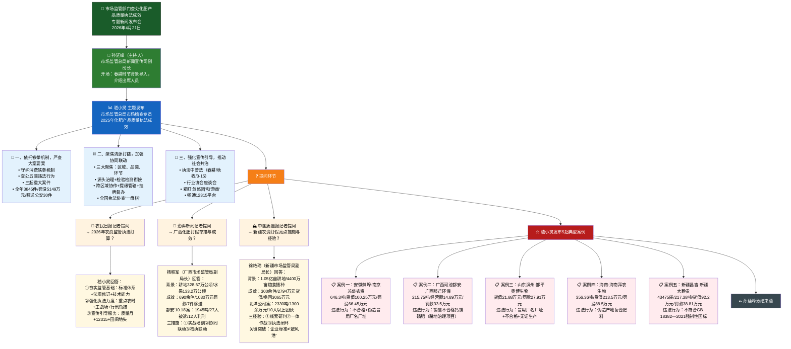
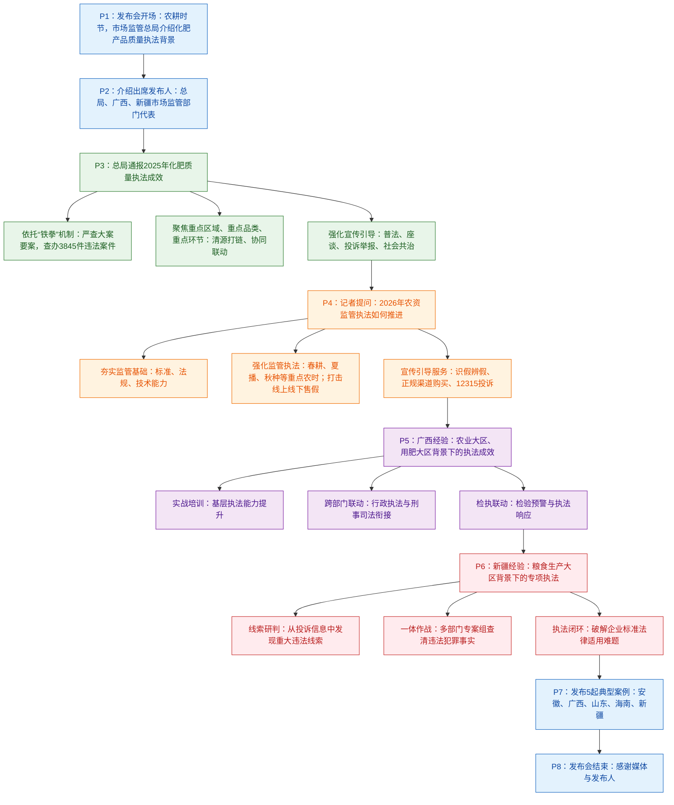

# 市场监管部门查处化肥产品质量执法成效专题新闻发布会 · 精读笔记

**时间**：2026年4月21日

**来源**：市场监管总局网站（发布平台：国务院新闻办公室网站 www.scio.gov.cn）

**栏目**：首页 > 新闻发布 > 部委新闻发布 > 国家市场监督管理总局

**原标题**：市场监管部门查处化肥产品质量执法成效专题新闻发布会实录

**责任编辑**：胡宵雯

---

## 前情提要



---

## 第一部分：开场介绍

> **市场监管总局新闻宣传司副司长孙延峰**：

大家上午好！欢迎参加市场监管总局专题新闻发布会。眼下正是`农耕时节`，市场监管总局深入推进化肥产品质量执法工作，切实维护广大农民群众合法权益。

> **孙延峰**：市场监管总局新闻宣传司副司长。新闻宣传司是市场监管总局内设机构，主要负责新闻发布、舆论引导、宣传报道等工作。作为本次发布会主持人，孙延峰承担议程把控和媒体协调职责。
>
> **`农耕时节`**：指春耕生产的关键时期。发布会选择在4月21日召开，正值全国春耕生产全面推进阶段。这一时间节点的选择体现了市场监管工作"因时制宜"——在农资使用高峰期前及时通报执法成效、发布典型案例，形成震慑。成语"不违农时"（语出《孟子·梁惠王上》）即强调农业生产必须顺应时节、不可延误。

今天我们邀请到市场监管总局市场稽查专员`嵇小灵`先生，广西壮族自治区市场监管局副局长`杨积军`先生，新疆自治区市场监管局副局长`徐艳玲`女士，通报市场监管部门查处化肥产品质量执法成效和发布典型案例，并回答大家感兴趣的问题。

> **`市场稽查专员`**：市场监管总局内设的专业稽查职务，通常由具有丰富执法经验的高级干部担任，负责重大案件的稽查督办、跨区域执法协调等工作。该职务体现了市场监管执法工作的专业化、专职化导向。稽查（inspection/investigation）不同于一般性的检查，更强调主动发现线索、深入调查取证的执法属性。
>
> **`嵇小灵`**：嵇姓较为罕见，源自夏朝少康帝封其子于会稽（今浙江绍兴一带），后人以地为氏。作为市场监管总局市场稽查专员，嵇小灵是本次发布会的核心发布人。
>
> **`杨积军`**：广西壮族自治区市场监管局副局长，负责广西区域内的市场监管执法工作。广西作为**农业大省和用肥大省**（耕地面积328.67万公顷），其化肥打假经验具有典型示范意义。
>
> **`徐艳玲`**：新疆维吾尔自治区市场监管局副局长。新疆是**全国粮食主产区**，耕地面积1.05亿亩，化肥质量执法对保障国家粮食安全战略意义重大。新疆生产建设兵团（"兵团"）与地方并行管理的特殊体制，也使其农资执法具有独特的地域特征。

首先，请嵇小灵先生介绍整体情况。

---

## 第二部分：嵇小灵主题发布——2025年执法成效

> **市场监管总局市场稽查专员嵇小灵**：

各位媒体朋友，上午好！感谢记者朋友长期以来对市场监管产品质量执法工作的关心与支持！农资是农业生产的基础，化肥产品质量`事关农民增收，关乎国家粮食安全和农民切身利益`。

> **`农资`**：农业生产资料的简称，主要包括肥料、农药、种子、农膜、农机具等。其中化肥是最基础、使用量最大的农资品类。据农业农村部数据，化肥对粮食增产的贡献率约在40%-50%，其质量安全直接关系到国家粮食产量与农民收入。
>
> **`事关农民增收，关乎国家粮食安全和农民切身利益`**：此句采用递进结构——从个体（农民增收）到国家（粮食安全）再到个体（切身利益），形成"个体—国家—个体"的回环修辞，凸显化肥质量问题的双重属性。**"事关"与"关乎"近义替换**，避免重复：前者偏重于"关系到"，后者侧重于"牵涉到"，两者连用增强语气层次。可积累为政策类写作模板：**"事关……关乎……"**，如"事关民生福祉，关乎国家长治久安"。

市场监管总局深入学习贯彻习近平总书记关于`"三农"工作`重要论述和重要指示批示精神，坚决落实党中央、国务院关于保障国家粮食安全的决策部署，将`农资打假`作为维护农民利益、保障农业生产安全的重要政治任务。

> **`"三农"工作`**：即农业、农村、农民工作。习近平总书记多次强调"三农"问题是全党工作的重中之重。2025年中央一号文件继续聚焦"三农"，提出"确保国家粮食安全"为底线任务。此处援引最高层论述，体现了市场监管执法工作的政治站位。
>
> **`农资打假`**：打击假冒伪劣农资产品的专项执法行动。该提法自1990年代起成为农业执法领域的固定用语，近年在"铁拳"行动框架下力度不断加大。**近义表达**：农资整治、农资专项执法、农资市场净化。**英文对应**：crackdown on counterfeit agricultural materials。

按照`全国农资打假工作要点`和总局工作要求，`锚定`化肥产品质量提升，深化`区域协同`、突出`源头治理`、坚持`线上线下全链条打击`，全力护航粮食生产安全，切实维护农民合法权益。

> **`全国农资打假工作要点`**：由农业农村部牵头，联合市场监管总局、公安部等多部门每年发布的指导性文件，明确年度农资打假的重点任务、重点品种和重点区域。
>
> **`锚定`**：原为航海术语，指船锚固定船只位置，引申为"牢牢锁定目标不动摇"。此处使用体现了政策语言的生动化趋势，比"确定""明确"更具力度感和方向感。**近义词**：锁定、聚焦、瞄准。**反义词**：动摇、游移。英文对应：anchor（v.），如 anchor the goal of...
>
> **`区域协同`**：跨行政区划的执法协作机制。由于化肥生产与使用存在地域分离（生产集中在资源富集区，使用遍布全国），单一地区执法难以根除跨区域违法行为，故需建立区域间信息共享、联合办案机制。
>
> **`源头治理`**：从违法行为的起点进行管控，而非仅打击终端销售环节。化肥质量问题根源在生产环节，源头治理意味着将执法重心前移至生产企业和集中生产区。
>
> **`线上线下全链条打击`**："全链条"指覆盖生产、流通、销售、使用各环节。近年来化肥网络销售（线上）日益普遍，部分违法经营者通过电商平台、"忽悠团"微信群等方式销售假劣化肥，线上监管成为新的执法重点。

下面向大家介绍总局2025年化肥产品质量执法成效和下步工作。主要开展以下三方面工作：

### （一）依托铁拳机制，严查大案要案

一是依托`"铁拳"机制`，严查大案要案。依托`"守护消费"铁拳机制`，印发《关于强化2025年化肥质量执法工作的通知》，部署开展化肥产品质量执法工作。

> **`"铁拳"机制`**：市场监管总局自2021年起持续开展的民生领域案件查办专项行动的品牌名称。之所以命名为"铁拳"（Iron Fist），意在传达执法力度之重、打击之准、震慑之强。2024年升级为"守护消费"铁拳机制，将消费者权益保护嵌入执法全流程。该机制特点：**精准打击**（聚焦重点领域）、**重拳出击**（从严从重处罚）、**公开曝光**（典型案例发布）。
>
> **成语积累**：**大案要案**——指情节严重、社会影响恶劣的重大案件。"大"指规模大、数量大；"要"指性质严重、地位重要。近义表达：重案、要案。英文：major and serious cases。

全国市场监管部门紧盯行业乱象和质量短板，严厉查处化肥产品不符合**`强制性国家标准`**、不符合**`生产许可准入要求`**，**`伪造产地`**、**`伪造或者冒用他人厂名厂址`**、**`伪造或者冒用质量标志`**，以及**`掺杂掺假`**、**`以假充真`**、**`以次充好`**、**`以不合格产品冒充合格产品`**等违法行为。

> **`强制性国家标准`**：代号GB，具有法律强制效力的国家标准。化肥产品涉及的主要强制性标准包括GB 18382—2021《肥料标识 内容和要求》等。与之相对的是**推荐性国家标准**（GB/T），不具有强制效力，但在产品质量诉讼中可作为重要参考依据。下文新疆案即涉及这一关键区分。
>
> **`生产许可准入要求`**：化肥生产企业须取得《全国工业产品生产许可证》方可从事生产。该制度源于《工业产品生产许可证管理条例》，是市场监管部门实施事前监管的重要手段。2025年邹平奥博案即涉及无证生产违法情形。
>
> **`伪造产地`**：在产品标识上虚假标注生产地。如将国内生产的化肥标注为"进口"或伪造国外产地，海南拜农案即涉及此类违法行为。**伪造**（forge）与**冒用**（fraudulent use of）的区别：前者是无中生有地虚构，后者是擅自使用他人真实存在的厂名厂址。
>
> **`掺杂掺假、以假充真、以次充好、以不合格产品冒充合格产品`**：此为《产品质量法》中四类典型质量违法行为的标准表述。四者存在递进关系——掺杂掺假（掺入杂质或假成分）、以假充真（完全用假货冒充真货）、以次充好（用低等级冒充高等级）、以不合格冒充合格（用不符合标准的产品冒充合格品）。这些术语在申论和行测法律类题目中常见，需精确区分其法律内涵。

如总局组织查处了广西**`"12.5"重大假劣磷肥案`**、海南**`拜农生物科技有限公司销售伪造产地的假冒进口化肥案`**、新疆自治区**`库尔勒北洋肥业有限公司生产销售伪劣化肥案`**。同时，加强公开发布典型案件，形成有力`警示震慑`。

> **`"12.5"重大假劣磷肥案`**：广西查处的重大化肥质量案件（案件代号"12.5"通常以案发日期或立案日期命名），涉及磷肥这一重要基础肥料品种。**磷肥**（phosphate fertilizer）是植物生长必需的三大营养元素（氮磷钾）之一，对作物根系发育和籽粒饱满至关重要。
>
> **`拜农生物科技有限公司销售伪造产地的假冒进口化肥案`**：海南查处的"假进口"化肥案。该案揭示了一种常见违法手法——将国产化肥包装为"进口化肥"以抬高售价。利用农民对"进口"品牌的信任溢价来牟取暴利。
>
> **`库尔勒北洋肥业有限公司生产销售伪劣化肥案`**：新疆查处的重大案件，涉案化肥2330吨、金额1300余万元，打掉10人以上跨省犯罪团伙。下文徐艳玲副局长将详细介绍该案的侦办过程。
>
> **`警示震慑`**：通过公开曝光形成"以案示警"的效果，使潜在违法者因畏惧法律后果而收敛行为。**震慑**（deterrence）是法律经济学中的核心概念，分为一般震慑（对全社会的警示效果）和特殊震慑（对具体当事人的惩罚效果）。

2025年，全国市场监管系统共查办各类化肥质量违法案件`3845件`，`罚没金额5149万元`，移送公安机关案件`30件`。

> **数据解读**：
> - **3845件**：全国月均约320件，日均超10件，表明化肥质量违法仍呈高发态势。
> - **罚没金额5149万元**：案均罚没约1.34万元，反映了行政处罚的经济惩戒力度。**罚没**为"罚款"和"没收违法所得"的合称。
> - **移送公安机关30件**：移送率约0.78%，说明大部分案件尚未达到刑事追诉标准。《刑法》第147条【生产、销售伪劣农药、兽药、化肥、种子罪】规定，使生产遭受较大损失的，处三年以下有期徒刑或拘役；使生产遭受重大损失的，处三年以上七年以下有期徒刑；使生产遭受特别重大损失的，处七年以上有期徒刑或无期徒刑。移送案件通常为涉案金额大、社会危害严重的刑事案件。
>
> **重点词汇辨析**：**查办**（investigate and handle）vs **查处**（investigate and punish）——查办侧重于办理过程，查处包含处理处罚结果。此处用"查办"更强调执法行动的整体性。

### （二）聚焦清源打链，加强协同联动

二是聚焦`清源打链`，加强协同联动。聚焦三大重点：

> **`清源打链`**：市场监管执法术语。**清源**指清理源头（生产环节），打链指打断违法产业链条。"清源"典出"正本清源"（《晋书·武帝纪》），意即从根本上整顿、从源头上清理。此处将成语拆解重组为"清源打链"，体现政策语言对传统文化的创造性转化。近义表达：正本清源、釜底抽薪、斩断利益链。

一是重点区域，以`化肥集中生产区`、`主要销售区`、`粮食主产区`等为重点区域；

> **三个重点区域**的逻辑关系：**生产区**管住供给端（如山东、湖北、贵州等磷肥生产大省）、**销售区**管住流通端、**粮食主产区**管住使用端（如东北平原、华北平原、长江中下游平原等）。三者构成"产—销—用"的完整监管闭环。

二是重点品类，以`氮、磷、钾单质基础肥料`、`复合（混）肥料`、`水溶肥料`等大宗和高风险品种为重点；

> **`氮、磷、钾单质基础肥料`**：化肥三大基础元素。氮肥（如尿素）促进茎叶生长，磷肥（如过磷酸钙）促进根系发育，钾肥（如氯化钾）增强抗逆性。三者是化肥工业的基础原料，也是掺假造假的高发品种。
>
> **`复合（混）肥料`**：含有氮磷钾中两种以上营养元素的肥料。复合肥通过化学反应合成（如磷酸二铵），掺混肥（BB肥）通过物理混合制成。两者在国标中有严格区分。都安"10.18"案中的不合格复合肥料即属此类。
>
> **`水溶肥料`**：可完全溶于水的肥料，主要用于滴灌、喷灌等水肥一体化系统。因其技术含量较高、价格较贵，成为"新型肥料"幌子下造假的重点品类。

三是重点环节，围绕`化肥生产、流通全链条`，全面摸排违法线索，深挖彻查违法行为，`斩断`非法生产销售化肥产品产业链条。

> **`化肥生产、流通全链条`**：生产环节包括原料采购、加工制造、包装标识；流通环节包括批发、零售、网络销售。全链条监管要求从原料到田头的每个节点都不留监管空白。
>
> **`斩断`**：形象化的政策用语，喻指彻底切断违法产业链，使其无法继续运转。"斩断产业链条"已成市场监管常用表述，比"打击""查处"更具决断力和画面感。英文对应：disrupt/shatter the illicit supply chain。

强化化肥产品源头治理，对于省辖区内案件，加强生产、流通和使用环节协同联动，强化市场监管执法与检验检测技术的高效衔接，组织行业专家制定解决方案，推动化肥企业标准制定，保护农民合法权益。

> **`市场监管执法与检验检测技术的高效衔接`**：即下文广西经验中提到的"检执联动"机制。检验检测机构提供技术判定（抽样、化验、出具检验报告），执法部门据此采取行政措施。两者无缝衔接可大幅提升执法效率，避免"检验结果等不来、执法行动跟不上"的脱节问题。
>
> **`企业标准`**：由企业自行制定并在"全国标准信息公共服务平台"上自我声明公开的标准。其技术要求不得低于强制性国家标准，但在实践中部分企业以"企业标准"为名制定低于国标要求的标准以规避监管。这正是下文新疆案中破解的核心法律难题——"企业标准不是避风港"。

对于重大案件、跨区域案件，市场监管主动作为，加强与公安、农业农村等部门的执法协同、联合办案，做好线索通报、案件移交、信息共享，采取`提级管辖`、`挂牌督办`，集中优势力量，开展执法攻坚。

> **`提级管辖`**：将原本由下级机关管辖的案件提升至上级机关直接办理。适用于案情重大复杂、下级机关办理存在困难或地方保护干扰的案件。该制度旨在打破地方保护主义，确保重大案件得到有力查处。
>
> **`挂牌督办`**：上级机关将重大案件列入督办名单、明确办理时限和要求并向社会公开的监督机制。挂牌督办案件通常社会关注度高、查处难度大，上级机关通过定期调度、限期办结等方式督促下级机关履职。**近义表达**：重点督办、专项督办。

同时，总局积极推进跨区域执法协作，通过`全国市场监管行政执法平台`案件协查功能，实现全国省、市、县市场监管部门平级跨区域协查和辖区内纵向贯通，形成全国跨区域执法协查`"一盘棋"`格局。

> **`全国市场监管行政执法平台`**：市场监管总局建设的信息化执法系统，集案件管理、线索移送、协查联办、数据分析等功能于一体，实现全国市场监管执法"一张网"。平台打破了传统执法中的信息壁垒，使得A省发现线索可即时通过平台向B省发起协查请求。
>
> **`"一盘棋"`**：围棋术语，引申为全国统一谋划、协同行动的工作格局。习近平总书记在多个场合强调"全国一盘棋"，此处将这一重要论述应用于市场监管领域，体现了系统观念和全局思维。**近义表达**：统筹推进、步调一致、协调联动。英文对应：a coordinated national strategy / acting in unison across the country。

### （三）强化宣传引导，推动社会共治

三是强化宣传引导，推动`社会共治`。坚持`执法中普法`，采用多形式开展普法宣传，在春耕、秋收重要季节、`3·15国际消费者保护权益日`，向农民群众普及化肥真假辨别常识、相关法律法规及投诉举报渠道。

> **`社会共治`**：社会治理领域核心理念之一，强调政府、市场、社会组织、公民个人等多元主体共同参与治理。在化肥质量监管中，社会共治意味着除政府执法外，还需行业协会自律、企业主体责任、消费者监督、媒体舆论监督等多方参与。
>
> **`执法中普法`**：将普法宣传融入执法全过程，在执法办案的同时向当事人和公众解释法律法规。"谁执法谁普法"是全面推进依法治国的重要制度安排。此处体现了"执法即普法、办案即宣传"的工作理念。
>
> **`3·15国际消费者保护权益日`**：每年3月15日，源于国际消费者联盟组织1983年确定的国际消费者权益日。中国自1987年起每年举办3·15晚会和相关活动，已成为消费者权益保护的重要品牌节点。化肥打假宣传选择3·15前后，可借助舆论关注高峰实现宣传效果最大化。

召开化肥行业协会和企业座谈会，督促化肥经营企业严格落实`进货查验`、`索证索票`等质量管控制度，推动经营主体主动履行`质量安全主体责任`。

> **`进货查验`**：经营者进货时对产品合格证明、标识标注等进行检查核验的法定义务，源于《产品质量法》第三十三条规定。未履行进货查验义务的，在发生质量问题时难以主张"不知情"的抗辩。
>
> **`索证索票`**：经营者向供货方索取生产许可证、产品合格证、进货发票等证明文件的制度。是追溯产品质量责任、建立产品溯源体系的基础性制度。**"索"**意为主动要求对方提供，体现经营者的积极义务而非被动接受。
>
> **`质量安全主体责任`**：企业作为产品质量的第一责任人，须对其生产销售的产品质量安全负首要责任。"主体责任"是新时代安全生产和质量监管的高频用语，强调企业不能将质量责任推给政府监管，必须自我约束、自我把关。

拓宽化肥产品质量案件线索来源渠道，紧盯`"忽悠团"`和`"游商"`等重点群体。畅通`12315举报投诉平台`，鼓励社会各界对违法行为开展投诉举报，营造全社会共同参与化肥质量监管的良好氛围。

> **`"忽悠团"`**：以夸大宣传、虚假承诺等手段走村串户推销假劣化肥的流动销售团伙。其特点：**组织化运作**（有明确分工：讲师、销售、司机）、**流窜作案**（打一枪换一个地方）、**精准人群定位**（针对留守老人等辨别能力较弱的群体）、**话术套路化**（"新型高科技肥料""免费试用"等）。"忽悠"一词源于东北方言，近年已被官方文件正式采用，形象地描述了此类违法行为。
>
> **`"游商"`**：无固定经营场所、流动销售农资的商贩。与"坐商"（有固定门店的商户）相对。游商因其流动性强、难以追踪，成为化肥质量监管的难点。**近义表达**：流动商贩、走贩。英文对应：itinerant vendor / mobile trader。
>
> **`12315举报投诉平台`**：市场监管总局整合的全国统一消费者投诉举报热线及网络平台，前身为工商12315、质检12365、食药12331、价监12358、知识产权12330五条热线。2019年统一为"12315"一个号码，实现"一号对外"。是市场监管领域社会共治的重要基础设施。

---

## 第三部分：孙延峰过渡

> **孙延峰**：

感谢嵇小灵先生的介绍。下面进入提问环节，提问前请通报一下所在的新闻机构。

---

## 第四部分：农民日报记者提问——2026年工作打算

> **农民日报记者**：

嵇局长您好！通过您的介绍，我们了解到总局在化肥产品质量执法领域取得了显著工作成效，受到社会普遍认可。请问2026年，总局对做好化肥等农资产品监管执法有何打算？

> **`农民日报`**：创刊于1980年，是农业农村部主管的中央级综合性报纸，面向全国农业农村战线。"三农"领域最具权威性和影响力的主流媒体之一。农民日报记者率先提问，契合本场新闻发布会的"三农"主题，也体现了媒体的精准定位。

> **嵇小灵**：

2026年是`"十五五"规划`开局起步之年。做好农资打假工作，对于稳定粮食生产、推动农业高质量发展意义重大。

> **`"十五五"规划`**：中华人民共和国国民经济和社会发展第十五个五年规划，时间跨度为2026—2030年。2026年是"十五五"开局之年，也是全面建设社会主义现代化国家进程中的关键节点。"十五五"规划编制工作于2025年启动，预计2026年全国两会期间审议通过。此处将农资打假置于"十五五"开局的宏观背景下定位，提升了工作的战略站位。**相关背景**："十四五"（2021-2025）期间粮食产量连续稳定在1.3万亿斤以上，"十五五"面临粮食安全的新形势新挑战。

当前化肥等农资产品质量问题`屡打不绝`，一些经营主体打着`"新型肥料"`的幌子，`夸大功效和虚假宣传`，违规生产并通过线上销售假冒劣质肥料产品。

> **`屡打不绝`**：屡次打击仍不能彻底杜绝，形容违法行为的顽固性和反复性。侧面反映出化肥制假售假的利润空间大、违法成本相对低、执法难度高的现实困境。**近义表达**：屡禁不止、禁而不绝、打而不死、反复回潮。**反义表达**：令行禁止、弊绝风清。
>
> **`"新型肥料"`**：本指采用新工艺、新配方、新功能的肥料产品（如缓控释肥、生物有机肥、水溶性肥料等），但此处加引号表明是违法经营者冒用"新型"概念进行虚假宣传。"新型肥料"的幌子之所以具有欺骗性，在于农民对科技含量高、增产效果好的产品有真实需求，违法者正是利用了这一信息不对称。

针对上述问题，全国市场监管部门将在前期工作基础上，`狠抓落实`，扎实做好包括化肥产品在内的各类农资产品监管执法。重点开展三方面工作：

> **`狠抓落实`**：强调执行力。"狠抓"体现了力度要求，"落实"强调结果导向。此四字组合是党政公文中极为高频的表述，适用于各项工作的推进表态。**近义表达**：务求实效、扎实推进、落地见效。

### 2026年第一方面：夯实监管工作基础

一是着力`夯实监管工作基础`。完善标准体系，积极配合有关部门，加快推进肥料命名等`强制性国家标准`研制。推动法规修订，配合主管部门尽快修订完善`《肥料登记管理办法》`，填补登记备案制度漏洞。提升技术能力，做好农机等相关检验检测机构`资质认定`工作，为监管提供坚强技术支撑。

> **`夯实监管工作基础`**：**夯实**原指用夯具把地基打实，比喻把基础工作做扎实。2026年的三项基础工作——标准、法规、技术——分别对应监管的"尺子""规矩""手段"，构成"三位一体"的基础体系。
>
> **`强制性国家标准研制`**：与前述"强制性国家标准"相呼应。目前肥料命名领域存在标准缺失或滞后问题（如"新型肥料""特效肥料"等名称缺乏规范），导致消费者难以辨别、执法缺乏明确依据。加快制定强制性国标旨在从源头正本清源。
>
> **`《肥料登记管理办法》`**：由农业农村部制定、规范肥料产品登记管理的部门规章。现行版本为2000年发布、后经多次修订。该办法规定了肥料产品须经登记方可进入市场的制度。嵇小灵指出存在"登记备案制度漏洞"——部分违法企业利用登记与备案之间的制度缝隙逃避监管，如以"备案"之名行"免于实质审查"之实。修订旨在堵住此类漏洞。
>
> **`资质认定`**：检验检测机构须经法定程序确认其具备相应的技术能力和管理水平，方可出具具有法律效力的检验报告。资质认定是检验检测结果作为执法证据使用的前提条件——若检验机构无资质，其报告在行政诉讼中可能被法院排除。

### 2026年第二方面：持续强化监管执法力度

二是持续`强化监管执法力度`。紧盯`春耕、夏播、秋种`等重点农时，把`农资主产地、主销区和粮食主产区`作为主战场，把化肥、地膜、农机等纳入重点监管目录，加大产品质量监督抽查力度。

> **`春耕、夏播、秋种`**：三个关键农时节点覆盖全年农业生产周期。**春耕**（3-5月，化肥使用量最大）、**夏播**（6-7月，追肥关键期）、**秋种**（9-10月，冬小麦等越冬作物播种期）。根据不同农时调整执法节奏和监管重点，体现了"因时制宜"的精准监管思路。
>
> **`农资主产地、主销区和粮食主产区`**：三个"主"字头的区域定位。主产地管生产端、主销区管流通端、粮食主产区管使用端，形成"产—销—用"全覆盖。**粮食主产区**包括黑龙江、河南、山东、吉林、安徽、河北、江苏、内蒙古、四川、湖南、湖北、辽宁、江西等13个省份。
>
> **`地膜`**：农用塑料薄膜，用于覆盖农田以保温、保湿、防草。地膜质量同样影响农业生产，此次纳入重点监管目录表明农资打假的范围在扩大。**农机**（agricultural machinery）的加入也体现了监管视角从单一化肥向综合性农资的拓展。

持续严厉打击线下`"忽悠团"`和线上`网络售假行为`，对`信誉差、屡查屡犯`的市场经营主体进行重点治理。继续深化与农业农村、公安等部门的协作，强化`行刑衔接`，形成打击合力。

> **`网络售假行为`**：化肥网络销售近年快速增长，但也成为假冒伪劣产品的新渠道。网络售假的监管难点在于：**跨地域性**（卖家在A省、仓库在B省、买家在C省）、**隐蔽性**（通过社交平台私域流量交易，脱离电商平台监管）、**取证难**（电子证据易灭失）。
>
> **`信誉差、屡查屡犯`**：两个定性标准——**信誉差**（reputation-based screening）是事前评价指标，**屡查屡犯**（repeat offender）是事后评价指标。对符合这两个标准的经营主体实施"重点治理"，体现了风险分级监管、精准打击的理念。英文对应：targeted enforcement against high-risk and repeat offenders.
>
> **`行刑衔接`**：行政执法与刑事司法的衔接机制。当行政违法达到刑事追诉标准时，行政执法机关须将案件移送公安机关；同时检察机关对行政执法机关的移送行为实施监督。行刑衔接不畅是长期存在的执法难点——"以罚代刑"（用行政处罚代替刑事追诉）或"移送难、立案难"等问题反复出现。此处强调"强化行刑衔接"，表明2026年将着力打通这一堵点。**全称**：行政执法与刑事司法衔接机制。

目前，总局正在组织河南、广东、广西等地市场监管部门联合公安机关查处一批假劣化肥案件。

> **河南、广东、广西**：三地分别代表北方粮食主产区（河南，全国小麦第一大省）、南方经济大省（广东）和南方农业大省（广西），体现了执法行动的地域覆盖性。正在查处的案件处于进行时，也说明农资打假是一项持续不断的工作。

### 2026年第三方面：注重宣传引导服务

三是注重宣传引导服务。将`农资打假与消费维权宣传相结合`，通过`质量月`等节点，深入`田间地头`，普及识假辨假知识，引导农民到正规经销商、正规平台店铺购买合格农资。畅通12315投诉举报渠道，及时受理和依法处理农民群众的投诉举报，切实维护消费者合法权益。

> **`农资打假与消费维权宣传相结合`**：将执法行动与消费者教育一体化推进。单纯依靠执法打击难以根除问题，必须让农民具备识假辨假能力、了解维权渠道，实现"打"与"防"的有机结合。
>
> **`质量月`**：每年9月在全国范围内开展的质量专题活动月，始于1978年。2026年质量月可将农资质量作为重点宣传主题之一。
>
> **`田间地头`**：指农业生产一线，也即农民群众生产生活的最前沿。"深入田间地头"要求宣传工作不能停留在会议室和城市广场，须真正下沉到农村基层。这是对工作作风的具体要求，折射出"从群众中来、到群众中去"的群众路线。

农资质量`事关农业根基，事关国家粮食安全大局`。市场监管系统将坚决贯彻落实党中央、国务院决策部署，以更加务实的作风、更加有力的举措，扎实做好2026年农资打假工作，推动化肥等农资产品质量稳定向好态势，保障国家粮食安全，助力农业高质量发展！

> **`事关农业根基，事关国家粮食安全大局`**：**根基**（foundation）与**大局**（overall situation）形成递进——从基础到全局，从农业到国家战略。"农业根基"典出"农为邦本"（农业是国家的根本），语出《尚书·无逸》《汉书·食货志》等。**金句积累**："农资质量事关农业根基，事关国家粮食安全大局"——可用于农业、市场监管、粮食安全等主题的申论写作。
>
> **`以更加务实的作风、更加有力的举措`**：典型的政治表态句式——"更加……的……，更加……的……"构成对仗排比，增强语势。此类句式在政务公文和申论中高频出现，可灵活套用。

---

## 第五部分：澎湃新闻记者提问——广西经验

> **澎湃新闻记者**：

我们注意到，广西近年来在化肥打假方面成效显著，查处了一批大案要案，形成有力震慑。请问广西市场监管局主要采取了哪些举措？取得了哪些成效？

> **`澎湃新闻`**：中国知名的互联网新闻媒体，总部位于上海，以深度调查报道和时政新闻见长。其提问关注地方执法创新的具体举措和经验，体现了媒体的深度报道取向。

> **广西壮族自治区市场监督管理局副局长杨积军**：

谢谢您的提问。`广西地处南疆`，是多民族聚居的少数民族自治区，全区`耕地面积328.67万公顷`，`水果种植面积约133.2万公顷`，是典型的`农业大省、用肥大省`。

> **`广西地处南疆`**：广西壮族自治区位于中国南部，南临北部湾，西南与越南接壤，是中国唯一沿海的自治区。**南疆**（southern borderland）一词既指明了地理位置，也暗含边疆治理、民族团结的战略意义。广西有12个世居民族，是中国少数民族人口最多的省级行政区。
>
> **`耕地面积328.67万公顷`**：约合4930万亩，在全国各省市区中排名中上水平。对比：黑龙江约2.39亿亩（全国第一），河南约1.22亿亩。
>
> **`水果种植面积约133.2万公顷`**：约合1998万亩，广西是全国最大的水果产区之一，柑橘、芒果、香蕉、火龙果等种植面积居全国前列。水果用肥量大且对肥料品质敏感，这解释了为何广西化肥质量问题直接关系到农业支柱产业。
>
> **`农业大省、用肥大省`**：两个"大省"并列使用，因果关系明确——因"农业大"故"用肥大"。**用肥**（fertilizer consumption）是农业经济指标之一。此处为下文执法成效提供了"需求侧"背景：用肥量越大，化肥打假的紧迫性和现实意义就越强。

近年来，广西市场监管局党组认真贯彻落实习近平总书记关于`"三农"工作的重要论述和广西工作论述的重要要求`，始终把化肥打假作为保障粮食安全、服务"三农"、助推`乡村振兴`的重要政治任务`抓实抓细抓好`，取得积极成效。

> **`"三农"工作的重要论述和广西工作论述的重要要求`**：双引述结构——前者是总书记关于"三农"工作的普遍性论述，后者是总书记针对广西的具体指示要求。习近平总书记多次考察广西，提出"建设新时代中国特色社会主义壮美广西"等要求。这种"普遍+特殊"的引述结构是地方党政公文的标准格式。
>
> **`乡村振兴`**：党的十九大提出的重大战略，涵盖产业振兴、人才振兴、文化振兴、生态振兴、组织振兴五大方面。化肥打假归入"乡村振兴"框架，将执法工作提升到国家战略高度。
>
> **`抓实抓细抓好`**：三"抓"递进——**抓实**（落到实处）、**抓细**（细化到具体环节）、**抓好**（取得良好效果）。这是近年来党政公文中的高频表述，体现精细化、高标准的工作要求。

近两年，广西区局查处化肥案件`690余件`，实施行政处罚`1030万元`，移送公安机关案件`7件`。在总局的组织指导下，我们查处一批化肥产品大案要案，先后查办了`都安"10.18"`、`横州"12.8"`、`上林"1.28"`等大案要案，其中联合多部门查办的`都安"10.18"案`打掉犯罪团伙一个，查获不合格复合肥料`1945.38吨`，起诉27人，`12人被依法判处有期徒刑`，其中`2人被判处有期徒刑15年`。

> **数据解读**：
> - **690余件**：广西两年查处的化肥案件数，在全国各省中属于较高水平，但案均罚款约1.49万元，说明相当部分为中小案件。
> - **移送公安7件**：移送率约1%，略高于全国平均水平，一定程度上反映了广西"行刑衔接"机制运转较为有效。
> - **都安"10.18"案**：广西河池市都安瑶族自治县查办的重大案件。**1945.38吨**不合格复合肥料——以一个标准火车皮载重60吨计，约需32个车皮；以每亩施肥50公斤计，可施用于近4万亩耕地。**起诉27人、12人被判刑**——体现了"全链条打击"（从生产者到销售者均被追诉）。**2人被判处有期徒刑15年**——有期徒刑15年属于较重刑罚（单个罪名有期徒刑最高为15年，数罪并罚可至25年），反映了犯罪情节的严重性和司法机关的从严惩处态度。
>
> **`都安、横州、上林`**：均为广西下辖县级行政区。都安瑶族自治县属河池市，横州市属南宁市代管，上林县属南宁市。三地分散在广西不同区域，表明化肥违法行为并非集中在单一地区，而是具有普遍性。

### 广西措施一：强化培训创新

一是强化培训创新，夯实基层执法根基。坚持`"战场在哪，课堂就开到哪"`。对全区一线执法人员实施`市、县、乡三级全覆盖实战教学`。2025年在南宁市实战教学中，通过现场教学与执法实践相结合，成功发现`清和牌钙镁磷肥`不合格线索。随即组织全区统一执法行动，抽样163个，查获不合格肥料500余吨。两年来，累计通过`"实战课堂"`培训执法人员3000余人次，极大提高了基层发现案件线索的能力。

> **`"战场在哪，课堂就开到哪"`**：广西市场监管局的培训理念，将执法现场作为教学场所，打破传统课堂培训模式。这与公安系统的"战训合一"理念类似。**金句积累**：可作为基层工作方法创新的表述范例——"战场在哪，XX就开到哪"。
>
> **`市、县、乡三级全覆盖实战教学`**：纵向到底的三级培训网络。**全覆盖**（full coverage）强调不留死角——不仅市级执法人员受训，县乡基层也要全面覆盖。基层市场监管所处于执法一线，其执法能力直接影响案件发现率。
>
> **`清和牌钙镁磷肥`**：在南宁实战教学中发现的不合格化肥品牌。**钙镁磷肥**（calcium magnesium phosphate fertilizer）是一种含钙、镁、磷等元素的弱碱性肥料，适用于酸性土壤改良，在南方红壤地区用量较大。该线索的发现路径值得关注——不是通过投诉举报，而是执法人员在实战教学中主动发现，说明培训确实提升了基层的线索发现能力。
>
> **`"实战课堂"`**：广西市场监管局打造的执法培训品牌，将"实战"与"课堂"融合。近义词辨析：**实战演练**（practical drill）偏重模拟训练，**实战课堂**更强调在真实执法场景中边干边学。英文：on-the-job training / field-based training program.

### 广西措施二：强化协同联动

二是强化协同联动，`凝聚跨部门打击合力`。我们与公安机关建立`案情共商、联合办案、双向衔接`等机制，推进`行政执法与刑事司法无缝衔接`，形成`闭环的工作格局`。

> **`凝聚跨部门打击合力`**：**合力**（synergy）是执法协作的核心追求——各部门单打独斗效果有限，只有形成合力才能实现"1+1>2"的效果。市场监管+公安+农业农村+检察的多部门联动模式，已成为各地化肥打假的标准配置。
>
> **`案情共商、联合办案、双向衔接`**：三个机制层层递进——**案情共商**（信息层，案件线索的交流研判）、**联合办案**（行动层，同步开展执法取证）、**双向衔接**（制度层，行政处罚与刑事追诉之间的正向移送和反向反馈）。三者构成完整的跨部门协作制度链条。
>
> **`行政执法与刑事司法无缝衔接`**：即前文**"行刑衔接"**的全称展开。"无缝"（seamless）强调衔接的紧密程度，要求消除执法与司法之间的制度缝隙，确保应当追究刑事责任的案件不因衔接不畅而逃脱刑法制裁。
>
> **`闭环的工作格局`**：**闭环**（closed loop）原为控制论术语，指系统输出反馈到输入形成自我调节的循环。在执法语境下，指从线索发现→调查取证→行政处罚→刑事移送→司法审判→信息反馈的完整流程。闭环的实质是"事事有回音、件件有着落"。

`上林"1.28"案`前期，广西市场监管、公安两部门执法人员克服冬春严寒恶劣环境，`伪装成二手车收购人员`对违法主体进行为期2周的`昼夜侦查`，摸清当事人违法作案规律，联合多部门集中收网，查获涉案化肥500余吨。

> **`上林"1.28"案`**：广西南宁市上林县的化肥大案。案件代号以日期命名（1月28日），正值冬春之交。执法人员**伪装侦查**的手段——伪装成二手车收购人员——体现了案件侦办的专业性和执法人员的奉献精神。**伪装侦查**（undercover investigation）在市场监管执法中并不常见，一般运用于重大疑难案件，说明该案违法主体的反调查意识较强。
>
> **`昼夜侦查`**：连续14天24小时不间断监控，凸显了案件的复杂性和执法的艰苦程度。此类细节在官方新闻发布中出现，有助于公众了解执法工作的艰辛和不易。
>
> **成语积累**：**集中收网**——比喻经过一段时间的侦查布控后统一实施抓捕行动。"收网"（close the net）源自捕鱼术语，形象地描述了执法行动从布控到收官的过程。

### 广西措施三：强化检执联动

三是强化`检执联动`，夯实技术支撑保障。建立`"检验预警、执法联动"快速响应机制`，检验机构发现不合格样品立即预警，我局随即启动调查程序，实现从发现问题到立案查处无缝衔接。同时，组织质检专家成立`"化肥技术支援小组"`，通过线上平台为基层执法人员实时解答成分、标识、标准等专业问题，为基层执法提供有力技术支撑。

> **`检执联动`**：检验检测与执法办案的联动机制。**检**（testing）提供技术判断，**执**（enforcement）提供法律判断，两者缺一不可。检验报告是化肥执法中最重要的证据类型，检验结论直接决定案件能否成立、处罚幅度大小。
>
> **`"检验预警、执法联动"快速响应机制`**：机制名称本身描述了一个流程——**检验预警**（发现不合格样品后立即发出预警信息）→**执法联动**（执法部门根据预警快速启动调查）。"快速响应"（rapid response）强调时间效率，避免因行政流程冗长而贻误战机。
>
> **`"化肥技术支援小组"`**：由质检专家组成的专业化技术支撑团队。化肥执法涉及大量技术问题（如成分判定、标准适用、标识合规性判断等），基层执法人员往往缺乏相关专业知识，技术支援小组通过线上实时解答填补了这一能力缺口。这种"远程技术支持+一线执法"的模式，可有效弥补基层技术力量不足的短板。

下一步，我们将不断巩固农资领域治理成效，统筹推进`常态巡查、专项打击和宣传引导`工作。目标不变、重心不移、干劲不松，全力护航好全区的用肥质量安全，促进`边疆各民族和谐共融新发展`！

> **`常态巡查、专项打击和宣传引导`**：三位一体的治理策略——**常态巡查**保底线（日常监管防患于未然）、**专项打击**破大案（集中力量攻坚克难）、**宣传引导**管长远（提升意识从根源减少违法行为）。三者分别对应日常监管、重点打击和源头预防。
>
> **`目标不变、重心不移、干劲不松`**：三"不"排比——不变（方向坚定）、不移（重点明确）、不松（力度持续）。**金句积累**：适用于工作表态、总结部署等公文场景，格式为"XX不变、XX不移、XX不松"。
>
> **`边疆各民族和谐共融新发展`**：结合广西的边疆区位和民族区域自治地方属性，将农资打假与民族团结、边疆稳定相联系，体现了经济执法工作的政治高度和社会价值。**和谐共融**（harmonious integration）是民族工作的高频表述。

---

## 第六部分：中国质量报记者提问——新疆经验

> **中国质量报记者**：

我们注意到，新疆近年来持续开展农资领域专项执法打假工作成效显著。请问新疆市场监管局在保障农业生产、净化农资市场环境等方面主要采取了哪些亮点措施？取得了哪些经验成果？

> **`中国质量报`**：由市场监管总局主管的全国性质量领域专业报纸，创刊于1989年。作为市场监管系统的"行业报"，其提问聚焦"亮点措施"和"经验成果"，具有鲜明的行业视角。

> **新疆维吾尔自治区市场监督管理局副局长徐艳玲**：

感谢您的提问。大家知道，`新疆作为全国的产粮大省`，有`1.05亿亩耕地`，`粮食播种面积达到4400万亩`。`"十四五"`以来，新疆粮食播种面积累计增加`1054.7万亩`，粮食产能累计增加`169.8亿斤`，粮食单产高达`552.8公斤/亩`，`三项数据均位居全国第一`。

> **数据解读——新疆粮食生产"三个第一"**：
> - **`1.05亿亩耕地`**：新疆耕地面积在全国排名靠前，加上后备耕地资源丰富，是国家粮食安全的战略后备基地。
> - **`粮食播种面积4400万亩`**：占耕地面积的比例约42%，其余耕地用于棉花等经济作物（新疆是全国最大棉花产区）。
> - **"十四五"累计增加播种面积1054.7万亩**：相当于五年间"多出一个中等农业省"的播种面积，增速惊人。
> - **产能累计增加169.8亿斤**：约849万吨，相当于新增了一个产粮大省的产能。
> - **单产552.8公斤/亩**：该单产水平在全国名列前茅，反映了新疆灌溉农业和规模化种植的技术优势。
> - **"三项数据均位居全国第一"**：指播种面积增量、产能增量、单产水平三项指标全国第一，但需注意这是"十四五"以来的累计或平均数据，而非年度总量排名。新疆粮食总产量与黑龙江、河南等传统产粮大省仍有差距，但其增速和单产表现非常突出。
>
> **`"十四五"`**：2021—2025年。"十四五"期间新疆粮食生产数据大幅提升，与国家"把新疆建设成全国重要粮食后备基地"的战略部署密切相关。

近年来，新疆市场监管局认真贯彻落实习近平总书记关于`"三农"工作`的重要论述和重要指示精神，坚持把农资领域专项执法作为保障农业生产的重要抓手，以`最严谨的执法标准、最务实的执法作风`推进农资领域执法工作`走深走实`。

> **`最严谨的执法标准、最务实的执法作风`**：两个"最"字排比——**严谨**（rigorous）偏重标准和程序，**务实**（pragmatic）偏重作风和效果。此句式化用了"四个最严"（最严谨的标准、最严格的监管、最严厉的处罚、最严肃的问责）的表述范式，但根据农资执法实际做了调整。
>
> **`走深走实`**：近年党政公文高频用语，意为向纵深推进、向实处着力。**走深**（go deeper）指触及深层次问题，**走实**（go more substantive）指取得实质性成效。近义表达：向纵深推进、落地见效。

近两年，全区立案查处农资领域案件`300余件`，货值金额`2794.74万元`，移送公安案件`18件`，为农民群众挽回经济损失`3065.8万元`。先后查办`"巴州12.30""阿克苏3.25""乌鲁木齐6.24"`等大要案件。

> **数据解读——与广西对比**：
> - **300余件 vs 690余件**：新疆案件数量少但案均货值高（约9.3万元/件，广西约1.5万元/件），说明新疆查处的案件普遍规模较大。
> - **移送公安18件 vs 7件**：新疆移送率约6%，远高于广西的约1%，反映出新疆查处的案件中涉嫌犯罪的比例更高。
> - **挽回经济损失3065.8万元**：该数据突出了执法为民的直接效果——不仅惩处违法者，更实实在在地保护了农民"钱袋子"。
>
> **`"巴州12.30""阿克苏3.25""乌鲁木齐6.24"`**：三个案件代号均以地州名称+日期组成，分别对应巴音郭楞蒙古自治州、阿克苏地区、乌鲁木齐市。新疆地域辽阔（面积166万平方公里，占全国六分之一），三案分布在天山南北不同地区，表明执法覆盖的地理范围广泛。

其中，新疆市场监管局联合多部门查办的**`"库尔勒北洋肥业有限公司生产销售伪劣化肥案"`**，打掉`10人以上跨省犯罪团伙1个`，涉案化肥达`2330吨`，涉案金额`1300余万元`，集中体现新疆市场局在农资打假方面的创新举措和执法作风。主要介绍三方面经验：

> **`库尔勒北洋肥业有限公司`**：库尔勒市位于新疆巴音郭楞蒙古自治州，是天山南麓的重要城市。**北洋**为公司字号。该公司为合法注册企业，却利用合法外衣从事违法生产——此即"披着合法外衣的违法经营"，其隐蔽性和欺骗性远超"黑作坊"式的违法行为。
>
> **数据冲击力**：**2330吨**——约需39个火车皮运输；**1300余万元**——案均吨价约5579元，远高于普通化肥价格，说明其以"高端肥料"为卖点实施价格欺诈。**10人以上跨省犯罪团伙**——跨省意味着犯罪网络超越新疆本地，涉及多个省份的原料供应、加工生产和销售渠道。

### 新疆经验一：重视线索研判

一是重视`线索研判`，深挖农资领域重大违法行为。2023年9月15日，我局接到基层部门反映：`和田洛浦县`农民使用库尔勒北洋肥业有限公司（以下简称`北洋公司`）化肥导致`农作物严重减产`。执法人员通过研判迅速梳理出该公司在`洛浦县、库尔勒市、和静县`等地的3条涉案信息和10余条投诉举报信息，`敏锐捕捉`到1条化肥质量重大违法线索。

> **`线索研判`**：对执法线索进行分析研判、确定侦查方向。"研判"（analysis and assessment）是执法调查的关键环节——如何从大量碎片化信息中识别出有价值的线索，决定了案件的走向和成败。
>
> **`和田洛浦县`**：洛浦县位于新疆和田地区，塔克拉玛干沙漠南缘，是典型的绿洲农业县。**地理位置**：距库尔勒市约1000余公里——化肥从库尔勒运输至洛浦，途经天山南北，跨区域特征明显。
>
> **`农作物严重减产`**：这是化肥质量问题的直接后果。农民购买化肥后施用，作物不仅不增产反而减产，经济损失严重。正因后果严重，此类违法行为极易引发社会矛盾和群体性事件，必须从严查处。
>
> **`洛浦县、库尔勒市、和静县`**：三地分散在天山南北——洛浦（南疆和田）、库尔勒（南疆巴州）、和静（北疆巴州辖区，天山腹地）。违法行为跨三个县市，说明北洋公司的销售网络覆盖面较广。
>
> **`敏锐捕捉`**：强调执法人员的专业敏感度和判断力。在3条涉案信息和10余条投诉举报中精准识别出关键线索，反映了一线执法人员的业务经验积累。

经查，北洋公司采用`"夜间隐蔽生产、频繁更换工人、伪造产品产地、伪造财务账册、定期销毁生产记录、隐藏真实资金账户、兵地跨区转移生产、制定反调查话术、真假化肥混掺销售、业务员代收款"`等手段规避调查，导致我局初期梳理的3起案件均不直接涉及北洋公司。

> **北洋公司的十项反调查手段——违法行为"教科书级"的反侦查策略**：
>
> 1. **`夜间隐蔽生产`**：利用夜间进行生产以避开监管视线，白天厂区看似正常运营。
> 2. **`频繁更换工人`**：不让工人长期在同一岗位工作以阻断信息外泄渠道。
> 3. **`伪造产品产地`**：虚假标注生产地以混淆产品来源、逃避溯源追查。
> 4. **`伪造财务账册`**：制作假账本以掩盖真实交易记录和资金流向。
> 5. **`定期销毁生产记录`**：有组织地毁灭证据，使执法部门难以追溯历史生产情况。
> 6. **`隐藏真实资金账户`**：使用非公司名义的账户收款以逃避资金追踪。
> 7. **`兵地跨区转移生产`**：利用新疆"地方—兵团"两条管理系统之间的信息壁垒，在两地之间转移生产地点以增加执法难度。**兵地**即新疆生产建设兵团与地方行政区域的合称，兵团在行政上具有相对独立性，管辖权协调是跨区执法的难点。
> 8. **`制定反调查话术`**：统一口径应对执法询问，组织化地对抗调查。
> 9. **`真假化肥混掺销售`**：将合格化肥与劣质化肥混合销售，增加检测难度——抽样时可能恰好抽到合格产品。
> 10. **`业务员代收款`**：通过个人账户代收货款以规避对公账户监管。
>
> 这十项手段的罗列产生了强烈的冲击力——**其反调查手段的系统性、组织化程度之高，表明已不是简单的"以次充好"，而是有预谋、有组织、有技术含量的团伙型违法犯罪**。

鉴于案情重大，我局会同相关部门开展`会商研判`，集中开展`重案攻坚`。2024年1月，根据我局梳理出的1条关键涉案线索，专案组`奔赴1500余公里`，在`兵团224团`将北洋公司主要骨干抓获并扣押涉案货物，成功锁定该公司销售伪劣化肥的`直接主观故意`和`团伙作案证据`，案件就此取得重大进展。

> **`会商研判`**：多部门联合分析案情、研判侦查方向的会议机制。在重大复杂案件中，单一部门难以全面把握案情，需公安、市场监管、农业农村、检察等联合"会诊"。
>
> **`重案攻坚`**：集中优势力量对重大案件进行重点突破。**攻坚**（storming/assault）原为军事术语，指对坚固阵地发起强攻，引申为集中力量解决老大难问题。反义词：消极应付、避重就轻。
>
> **`奔赴1500余公里`**：大致相当于北京到重庆的直线距离，凸显了新疆地域之辽阔和执法的艰辛。在新疆，一次跨地州执法往返数千公里是常态。
>
> **`兵团224团`**：新疆生产建设兵团第十四师224团，位于和田地区皮山县与墨玉县交界处。该地点远离库尔勒（直线距离约800公里），说明北洋公司确实利用了"兵地跨区转移生产"来逃避打击。
>
> **`直接主观故意`**：法律术语，指行为人明知自己的行为会产生危害结果而希望或放任其发生的心理状态。与之相对的是**间接故意**（放任）和**过失**（应当预见而未预见）。锁定"直接主观故意"意味着可以认定当事人是明知故犯，这对于刑事追诉中认定犯罪构成至关重要。英文：direct intent（直接故意）.
>
> **`团伙作案证据`**：证明多人共同实施犯罪的证据，是认定犯罪集团性质、追究各参与者刑事责任的基础。

### 新疆经验二：重视一体作战

二是重视`一体作战`，全面查清违法犯罪事实。我局联合`自治区公安厅、农业农村厅、兵团市场监管局、兵团公安局`等5部门成立`"12·30"专案组`，明确任务分工，集中开展全覆盖执法打击，顺利破解`管辖权难题`。

> **`一体作战`**：多部门作为一个整体统一行动，打破部门壁垒。类似军事术语中的"联合作战"（joint operation）。此处"5部门成立专案组"是一体作战的具体体现。
>
> **`自治区公安厅、农业农村厅、兵团市场监管局、兵团公安局`**：四个协作部门涵盖了地方和兵团两套体系、行政执法和刑事侦查两种职能。其中兵团市场监管局和兵团公安局的加入专门针对"兵地跨区"的管辖权难题，体现了一体作战的针对性。
>
> **`"12·30"专案组`**：以日期命名的专案组代号。专案组（special task force）是为办理特定重大案件而临时组建的跨部门工作机构，案件办结后即行解散。
>
> **`管辖权难题`**：如前所述，北洋公司利用"兵地跨区转移生产"制造管辖权冲突——地方市场监管部门对其在兵团辖区的生产行为是否有管辖权、兵团执法部门对其在地方辖区的销售行为能否查处，均存在模糊地带。成立联合专案组将地方和兵团执法力量整合在一起，从制度上破解了这一难题。

2024年2月，我局充分发挥专案组牵头作用，对北洋公司`15种不规范的化肥企业标准进行论证定性`，累计新增核定涉案金额609余万元。2024年3月，我局组织全区市场监管部门集中调查24家北洋公司直营店和全疆涉案产品经销网点的经营台账、合同协议、销售账册，累计核查北洋公司涉案化肥达867.5吨，涉案金额400余万元。同时，派遣5批检验人员`历时3个月`对全区10余县市的涉案化肥开展执法抽检，累计检验涉案化肥74个批次，为案件办理提供有力`证据支撑`。

> **`15种不规范的化肥企业标准进行论证定性`**：这是本案最具法律技术含量的环节。北洋公司宣称其产品执行"企业标准"，试图以此为挡箭牌规避国标约束。执法部门对这15种企业标准逐一论证——即逐条审查其是否符合强制性国家标准和推荐性国家标准的要求——最终定性为"不规范"。这一环节需要检验检测专家和法律专家的密切配合，体现了"技术+法律"复合型执法的特征。
>
> **`新增核定涉案金额609余万元`**：仅通过论证企业标准不合法就新增核定600多万元涉案金额——因为企业标准一旦被否定，其对应的全部产品均需按照国标重新评估，大量产品被重新判定为不合格。
>
> **数据意义**：**24家直营店**表明北洋公司已形成一定规模的连锁销售网络；**867.5吨、400余万元**为通过核查经营台账等商业记录追加认定的涉案化肥数量和金额。**5批检验人员历时3个月、10余县市、74个批次**——一组排比数据直观展现了执法抽检的工作量和艰巨性。
>
> **`历时3个月`**：新疆地域跨度大，10余县市之间往返路程漫长，加上抽样、送检、出具报告各环节耗时，3个月的检验周期在新疆执法中属于正常范围。
>
> **`证据支撑`**：74个批次的检验报告构成了该案的核心证据体系，每份报告对应一批涉案产品，形成"证据链"（chain of evidence）.

### 新疆经验三：重视执法闭环

三是重视`执法闭环`，助力破解`化肥领域全国性执法难题`。2024年6月29日，库尔勒北洋肥业有限公司生产销售伪劣化肥案移送至`库尔勒市人民检察院审查起诉`，司法机关对本案采用`推荐性国家标准和行业标准`检验涉案产品的合法性和正当性提出质疑。面对`执法困点`，我局积极向市场监管总局请示有关涉案标准合规性及法律适用等问题。

> **`执法闭环`**：新疆经验的第三个关键词，强调执法行为的最终完成——不仅查获、处罚，更重要的是推动案件进入司法程序并最终判决，实现从行政执法到刑事司法的完整闭环。
>
> **`化肥领域全国性执法难题`**：指企业标准能否作为规避强制性国标的"挡箭牌"这一法律适用难题。该问题不仅困扰新疆，也是全国各地化肥执法的共性痛点。新疆通过该案推动总局层面复函明确法律适用，为解决全国性难题提供了"新疆方案"。
>
> **`库尔勒市人民检察院审查起诉`**：检察院是连接行政执法与刑事审判的中间环节，负责审查案件是否达到起诉标准。检察院对检验标准提出质疑，说明案件在司法环节遇到了实质性障碍——如果检验标准的合法性被否定，整个案件的证据基础将动摇。
>
> **`推荐性国家标准和行业标准`**：推荐性国标（GB/T）本身不具备强制效力，行业标准同样如此。检察院的质疑具有法律合理性：如果企业标准被允许低于推荐性标准，那么以推荐性标准为依据判定产品不合格是否合法？
>
> **`执法困点`**：执法的难点、堵点。近义词辨析：**痛点**（pain point）指最让人难受的问题，**堵点**（bottleneck）指阻碍流程通畅的环节，**困点**（predicament）则偏重进退两难的困境。

2025年3月，市场监管总局复函新疆`涉案6个企业标准不合规`且明确`企业标准应当符合强制性国家标准、推荐性国家标准`。至此，我局在市场监管总局的大力支持下顺利解决了`企业标准法律适用的全国性执法难题`，`企业标准不再是不法分子从事违法活动的"避风港"`。

> **`涉案6个企业标准不合规`**：总局复函从15个企业标准中最终认定6个不合规（其余9个可能已自行纠正或不在争议范围内）。这一认定具有判例性质的指导意义。
>
> **`企业标准应当符合强制性国家标准、推荐性国家标准`**：这是总局复函的核心结论，也是破解全国性难题的"金钥匙"。其法律逻辑是：根据《标准化法》第二十一条，企业标准的技术要求不得低于强制性国家标准；同时，若企业自我声明其标准符合推荐性国标，则不得低于该推荐性标准。这一结论填补了法律适用中的模糊地带，从根本上堵住了"以企标规避监管"的法律漏洞。
>
> **`企业标准不再是不法分子从事违法活动的"避风港"`**：**"避风港"**原为航海术语（safe harbor），在法律语境中常指"避风港规则"（如网络平台的"通知—删除"免责机制）。此处借用该比喻，形象地揭示了违法者企图利用企业标准制度规避法律制裁的行为本质。**金句积累**："XX不再是不法分子的'避风港'"——可用于市场治理、法治建设等主题写作。英文对应：safe harbor / refuge / shelter.

下一步，我们将持续推进农资领域专项整治，统筹抓好`联合执法、精准执法和服务执法`工作，持续净化农资市场环境。坚持`标准不降、治理不停、力度不减`，以实际行动维护好、保障好全区广大农民群众的合法权益。

> **`联合执法、精准执法和服务执法`**：三类执法模式的有机组合——**联合执法**管广度（跨部门协同）、**精准执法**管深度（聚焦重点问题精准打击）、**服务执法**管温度（在执法中体现服务，帮助企业合规经营）。三者体现了从"粗放式执法"向"精细化治理"的理念转变。
>
> **`标准不降、治理不停、力度不减`**：三"不"排比与上文广西"目标不变、重心不移、干劲不松"形成呼应。**金句积累**：两组的共同特征是"XX不X"的三段式，适用于表达持续发力、久久为功的工作决心。可灵活替换："决心不摇、力度不减、尺度不松"等。

---

## 第七部分：典型案例发布

> **孙延峰**：

感谢记者朋友们的提问，今天我们的提问环节就到这里，下面由嵇小灵先生发布化肥产品质量执法典型案例。

> **嵇小灵**：

2025年，全国市场监管部门聚焦化肥产品质量安全，组织开展化肥产品质量执法行动，严厉打击制售假冒伪劣化肥违法行为，依法查办了一批`群众反映强烈、社会影响恶劣`的大案要案。现发布5起典型案件：

> **`群众反映强烈、社会影响恶劣`**：两个定性标准——前者关注民意反馈（群众满意度维度），后者关注社会效果（公共利益维度）。两者并用构成典型案例筛选的"双门槛"：不仅要违法情节严重，还要社会关注度高、警示意义强。这是政府发布典型案例的标准表述范式。

---

### 典型案例一：安徽蚌埠·南京苏盛农资案

**一、安徽省蚌埠市市场监管局查处南京苏盛农资有限公司生产销售以不合格产品冒充合格产品、伪造或冒用他人厂名厂址不合格化肥案**

> **`安徽省蚌埠市`**：蚌埠位于安徽省北部、淮河中游，是皖北地区的交通枢纽和重要工业城市。此处跨省执法（安徽查处江苏南京企业）体现了执法协作机制的实际运作。

2024年5月，蚌埠市市场监管局执法人员经深入调查核实、对涉案产品抽样送检，查明系`南京苏盛农资有限公司`（当事人）委托`安徽康坶`加工生产的涉案化肥，其中`8种产品伪造或冒用他人厂名厂址`，`3种产品经抽检判定不合格`，涉案化肥合计`646.3吨`，涉案货值`100.25万元`。

> **`南京苏盛农资有限公司`**：注册地位于江苏南京，却委托安徽企业加工生产，再由安徽市场监管部门查处——典型的**跨省委托加工违法模式**。委托加工（OEM）模式中，委托方负责品牌和销售，加工方负责生产，双方均可能承担责任。本案追究的是委托方（南京苏盛）的责任。
>
> **`安徽康坶`**：受委托的实际生产企业。"康坶"为字号。该企业接受苏盛委托加工，作为生产方同样可能面临法律责任追究，但本典型案例仅公示了对委托方的处罚。
>
> **违法行为的"组合拳"**：
> - **8种产品伪造或冒用他人厂名厂址**：占涉案产品的大部分，说明其主要违法手段是"傍名牌""冒充大厂"。
> - **3种产品经抽检判定不合格**：在伪造身份的同时，产品质量也不达标——"假身份+劣品质"双重违法。
>
> **数据**：646.3吨（约11个火车皮）、100.25万元（吨价约1551元，属于中低端化肥价位）。

2025年2月，蚌埠市市场监管局依据`《中华人民共和国产品质量法》第四十九条、第五十条、第五十三条`和`《中华人民共和国行政处罚法》第二十九条`之规定，依法作出`没收涉案肥料646.3吨、罚款66.45万元`的行政处罚。

> **法律依据详解**：
> - **《产品质量法》第四十九条**：生产、销售不符合保障人体健康和人身、财产安全的国家标准、行业标准产品的，责令停止生产、销售，没收违法生产、销售的产品，并处违法生产、销售产品货值金额等值以上三倍以下的罚款；有违法所得的，并处没收违法所得；情节严重的，吊销营业执照；构成犯罪的，依法追究刑事责任。
> - **第五十条**：在产品中掺杂、掺假，以假充真，以次充好，或者以不合格产品冒充合格产品的，责令停止生产、销售，没收违法生产、销售的产品，并处违法生产、销售产品货值金额百分之五十以上三倍以下的罚款；有违法所得的，并处没收违法所得；情节严重的，吊销营业执照；构成犯罪的，依法追究刑事责任。
> - **第五十三条**：伪造产品产地的，伪造或者冒用他人厂名、厂址的，伪造或者冒用认证标志等质量标志的，责令改正，没收违法生产、销售的产品，并处违法生产、销售产品货值金额等值以下的罚款；有违法所得的，并处没收违法所得；情节严重的，吊销营业执照。
> - **《行政处罚法》第二十九条**：对当事人的同一个违法行为，不得给予两次以上罚款的行政处罚。同一个违法行为违反多个法律规范应当给予罚款处罚的，按照罚款数额高的规定处罚。（**"一事不再罚"原则**的体现——本案涉及多项违法，但罚款合并按最高额执行。）
>
> **处罚力度分析**：罚款66.45万元，占货值100.25万元的约66.3%，落在第五十条"百分之五十以上三倍以下"区间的低端，说明处罚幅度考虑了违法行为的具体情节和当事人的配合程度等因素。同时**没收全部涉案产品646.3吨**，使违法者"人财两空"——不仅赚不到钱，库存也被清零。

---

### 典型案例二：广西河池都安·广西那芒环保案

**二、广西壮族自治区河池市都安瑶族自治县市场监管局查处广西那芒环保科技有限公司销售不合格钙镁磷肥案**

> **`都安瑶族自治县`**：位于广西河池市，是全国为数不多的瑶族自治县之一，属于滇桂黔石漠化片区，经济基础相对薄弱。在此地查处的化肥案涉及**耕地治理项目用肥**，性质尤为恶劣——提升耕地质量的国家项目资金被不法分子侵蚀。

2025年4月，都安瑶族自治县市场监管局对`"清和牌"钙镁磷肥`抽样送检，上述产品被判定为不合格。经查，该批肥料系`耕地治理项目用肥`，涉及不合格钙镁磷肥共`215.75吨`，违法经营额`14.89万元`。

> **`"清和牌"钙镁磷肥`**：该品牌与上文广西杨积军副局长提到的"清和牌钙镁磷肥"为同一品牌——即2025年在南宁实战教学中发现的线索。说明从发现线索到立案查处，形成了一个完整的执法闭环。
>
> **`耕地治理项目用肥`**：耕地治理是中央财政支持的土地整治项目，旨在提升耕地质量等级。此类项目肥料采购一般通过招投标程序，若中标企业供应不合格产品，不仅损害项目效果，还涉及骗取国家资金的更严重问题。本案**违法经营额仅14.89万元**，但**涉及国家项目**的定性使案件的社会危害性远超经营额所反映的经济损失。

2026年3月，都安瑶族自治县市场监管局依据`《中华人民共和国产品质量法》第五十条`之规定，责令当事人停止违法行为，依法作出`没收召回的不合格产品40.7吨、罚款33.5万元`的行政处罚。

> **处罚力度分析**：罚款33.5万元，约为违法经营额14.89万元的2.25倍，落在第五十条"百分之五十以上三倍以下"区间的偏上位置，处罚力度相对较重，可能与该案涉及国家耕地治理项目的恶劣性质有关。
>
> **`没收召回的不合格产品40.7吨`**：从215.75吨中仅召回40.7吨（约18.9%），说明大部分不合格化肥已施用到耕地中，难以追回。**召回**（recall）是产品安全领域的常见措施，但在化肥领域实施召回难度较大——化肥一旦施用即与土壤混合无法分离。剩余175吨的不合格化肥已对耕地治理项目造成不可逆的损害。

---

### 典型案例三：山东滨州·邹平奥博生物案

**三、山东省滨州市市场监管局查处邹平奥博生物科技有限公司冒用他人厂名厂址、以不合格产品冒充合格产品、未取得生产许可证生产列入目录化肥案**

> **`山东省滨州市`**：位于黄河三角洲，是山东重要的化工产业基地，化肥生产企业集中。**邹平**为滨州市下辖县级市。

2025年9月23日，根据`海南省市场监管局抽检结果`，山东省滨州市市场监管局查实`邹平奥博生物科技有限公司`存在`冒用他人厂名厂址`、`以不合格产品冒充合格产品`、`未取得生产许可证生产列入目录产品`等违法行为，涉案货值共计`21.88万元`。

> **`海南省市场监管局抽检结果`**：本案体现了跨区域执法协查的典型模式——**海南省在流通领域抽检发现问题→通报生产地质监部门→山东省进行源头查处**。这正是前文嵇小灵提到的"全国市场监管行政执法平台案件协查功能"的实际应用场景。
>
> **三项违法行为叠加**：
> - **冒用他人厂名厂址**：假冒他人名义生产，使消费者对产品来源产生误认。
> - **以不合格产品冒充合格产品**：质量不达标。
> - **未取得生产许可证生产列入目录产品**：化肥属于《工业产品生产许可证管理条例》列入目录的产品，无证生产本身即构成独立违法。
>
> 三项违法叠加使该案处罚依据涉及三个法律条款（见下文）。

2026年3月，滨州市市场监管局依据`《中华人民共和国产品质量法》第五十条、第五十三条`以及`《中华人民共和国工业产品生产许可证管理条例》第四十五条`之规定，责令当事人改正违法行为，依法作出`罚款27.91万元`的行政处罚。

> **《工业产品生产许可证管理条例》第四十五条**：企业未依照本条例规定申请取得生产许可证而擅自生产列入目录产品的，由工业产品生产许可证主管部门责令停止生产，没收违法生产的产品，处违法生产产品货值金额等值以上3倍以下的罚款；有违法所得的，没收违法所得；构成犯罪的，依法追究刑事责任。
>
> **处罚力度分析**：罚款27.91万元，约为涉案货值21.88万元的1.28倍，属于中等处罚水平。值得注意的是，本案仅作出罚款处罚，未提及没收产品——可能与部分产品已流入市场无法追回有关。

---

### 典型案例四：海南·海南拜农生物案

**四、海南省市场监管局查处海南拜农生物科技有限公司销售伪造产品产地复合肥料案**

> **海南省**：本案与案例三存在关联——海南抽检发现山东问题产品，同时海南本地也在查处化肥违法案件。海南省属于**化肥主要销区**（农业用肥大省，但化肥生产较少），其市场监管重点在流通和销售环节。

2025年，海南省市场监管局查实`海南拜农生物科技有限公司`从上游供货商`中苏农资有限公司`购进涉案复合肥料共计`356.36吨`，上述产品存在`伪造产地`的违法行为，涉案货值`213.5万元`。

> **`海南拜农生物科技有限公司`**：该公司名称在此前嵇小灵的主题发布中被提及为"销售伪造产地的假冒进口化肥案"的当事人。**"拜农"**之名与英文Bio（生物）谐音，利用"生物""科技"等概念包装产品。
>
> **`中苏农资有限公司`**：上游供货商，与案例一中的"南京苏盛农资有限公司"是否为关联企业值得关注（均带有"苏"字）。本案对下游销售者（海南拜农）进行处罚，上游生产者（中苏农资）的处理结果未在本次通报中体现。
>
> **`伪造产地`**：本案的核心违法行为。将国产化肥标注为"进口"或伪造国外产地，是利用农民对进口化肥的信任非法牟利。**涉案货值213.5万元**，吨价约5991元——以"进口"名义大幅提高售价。
>
> **数据**：356.36吨、213.5万元——在5起典型案例中货值最高。

海南省市场监管局依据`《中华人民共和国产品质量法》第五十三条`之规定，责令当事人改正违法行为，依法作出`没收伪造产品产地的复合肥料108.01吨、没收违法所得24.45万元、罚款64.05万元`的行政处罚。

> **《产品质量法》第五十三条**：伪造产品产地的，责令改正，没收违法生产、销售的产品，并处违法生产、销售产品货值金额等值以下的罚款；有违法所得的，并处没收违法所得。
>
> **"三管齐下"的处罚**：
> - **没收产品108.01吨**：从356.36吨中没收约30.3%，其余产品可能已售出并施用。
> - **没收违法所得24.45万元**：追缴非法获利，使其在经济上"无利可图"。
> - **罚款64.05万元**：约占货值213.5万元的30%，在"货值金额等值以下"区间居中。
>
> **总经济代价**：24.45万 + 64.05万 + 108.01吨产品损失 ≈ 远超其违法所得，体现了"使违法成本高于违法收益"的执法导向。

---

### 典型案例五：新疆昌吉·新疆大黔贵案

**五、新疆维吾尔自治区昌吉回族自治州市场监督管理局查处新疆大黔贵新型肥料有限责任公司生产不符合保障人身健康安全的强制性国家标准、行业标准的化肥案**

> **`昌吉回族自治州`**：位于新疆天山北坡经济带，是新疆重要的工业和农业区，州府昌吉市紧邻乌鲁木齐。该案由昌吉州局直接查处，属于新疆本地的化肥质量执法行动。

2025年，昌吉回族自治州市场监督管理局根据`群众举报`，依法对`新疆大黔贵新型肥料有限责任公司`生产的9个批次肥料进行抽样检验，发现产品包装标识均不符合`GB 18382—2021《肥料标识 内容和要求》`标准要求。涉案化肥共计`43475袋、217.38吨`，涉案金额`92.2万元`。

> **`群众举报`**：案件线索来源为"群众举报"而非执法部门主动发现，体现了社会共治在化肥打假中发挥的实际作用。此前的12315平台宣传、投诉举报渠道畅通等工作，正是在为这类"群众举报"提供制度保障。
>
> **`新疆大黔贵新型肥料有限责任公司`**：公司名称中包含"大黔贵"——**黔**指贵州，**贵**亦指贵州。该企业字号暗示其可能与贵州有关联（贵州是磷肥资源大省），但注册于新疆昌吉。"新型肥料"之名再次印证前文嵇小灵指出的"打着新型肥料幌子"的行业乱象。
>
> **`GB 18382—2021《肥料标识 内容和要求》`**：肥料标识的强制性国家标准，2021年修订发布（替代GB 18382—2001），规定了肥料产品包装标识的强制性要求，包括产品名称、养分含量、执行标准、生产许可证编号、净含量、生产日期、厂名厂址等内容。**该标准是所有化肥产品必须遵守的基础性标准**——不论企业执行何种企业标准，其标识标注必须符合GB 18382的要求。
>
> **数据特点**：**43475袋**——以袋数而非吨数为首列数据，提示该案违法行为的突出表现是袋装标识不合规。"袋袋都有问题"的表述更具视觉冲击力。吨价约4240元，属于中等价位化肥。

昌吉回族自治州市场监督管理局依据`《中华人民共和国产品质量法》第四十九条`及相关法律规定，对当事人作出`没收不合格肥料39.7吨，罚款38.81万元`的行政处罚。

> **《产品质量法》第四十九条**：生产、销售不符合保障人体健康和人身、财产安全的国家标准、行业标准产品的，责令停止生产、销售，没收违法生产、销售的产品，并处违法生产、销售产品货值金额等值以上三倍以下的罚款。
>
> **本案适用第四十九条（而非第五十条）的原因**：肥料标识涉及产品使用安全——若养分含量标识错误，农民可能误判施肥量导致作物受损甚至土壤污染，因此标识不合规被视为"不符合保障人身健康和财产安全的国家标准"，适用更为严厉的第四十九条（处罚幅度为货值金额**等值以上**三倍以下，第五十条为**百分之五十以上**三倍以下）。
>
> **处罚力度分析**：罚款38.81万元，约占涉案金额92.2万元的42.1%，低于货值金额的等值，处于第四十九条处罚区间的低端。可能考虑到标识不合规主要是形式违法（包装标注问题）而非产品内在质量缺陷。

---

## 第八部分：结束语

> **孙延峰**：

感谢各位媒体朋友的积极参与，也感谢各位发布人！今天的发布会就到这里，大家如有其他问题，欢迎会后与新闻宣传司联系。今天的新闻发布会到此结束。谢谢！

---

## 全文重点词汇总表

| 类别 | 词汇 | 含义/辨析 | 出处 |
|------|------|-----------|------|
| **政策术语** | 铁拳机制 | 市场监管总局民生领域案件查办专项行动品牌 | 嵇小灵发布 |
| **政策术语** | 清源打链 | 清理源头+打断违法产业链 | 嵇小灵发布 |
| **政策术语** | 行刑衔接 | 行政执法与刑事司法衔接机制 | 嵇小灵/杨积军 |
| **政策术语** | 社会共治 | 多元主体共同参与治理 | 嵇小灵发布 |
| **政策术语** | 挂牌督办 | 上级机关列入督办名单限期办结 | 嵇小灵发布 |
| **政策术语** | 提级管辖 | 将案件提升至上级机关办理 | 嵇小灵发布 |
| **法律术语** | 掺杂掺假/以假充真/以次充好/以不合格冒充合格 | 四类典型质量违法行为（递进关系） | 嵇小灵发布 |
| **法律术语** | 强制性国家标准 | 代号GB，具有法律强制效力 | 多段落 |
| **法律术语** | 直接主观故意 | 明知结果而希望或放任其发生的心理状态 | 徐艳玲 |
| **形象用语** | 忽悠团 | 走村串户推销假劣化肥的流动作案团伙 | 嵇小灵发布/2026打算 |
| **形象用语** | 避风港 | 比喻利用制度漏洞逃避法律制裁 | 徐艳玲 |
| **形象用语** | 一盘棋 | 全国统一谋划协同行动 | 嵇小灵发布 |
| **形象用语** | 田间地头 | 农业生产一线、农民群众生产生活前沿 | 嵇小灵2026打算 |
| **金句** | 事关农民增收，关乎国家粮食安全和农民切身利益 | "事关……关乎……"递进结构 | 嵇小灵开场 |
| **金句** | 战场在哪，课堂就开到哪 | 实战培训理念的形象化表达 | 杨积军 |
| **金句** | 目标不变、重心不移、干劲不松 | 三"不"排比 | 杨积军 |
| **金句** | 标准不降、治理不停、力度不减 | 三"不"排比 | 徐艳玲 |
| **金句** | 企业标准不再是不法分子从事违法活动的"避风港" | 隐喻+定性+警示 | 徐艳玲 |
| **成语积累** | 屡打不绝 | 屡次打击仍不能杜绝 | 嵇小灵2026打算 |
| **成语积累** | 锚定 | 牢牢锁定目标不动摇 | 嵇小灵发布 |
| **成语积累** | 狠抓落实 | 强调执行力+结果导向 | 嵇小灵2026打算 |

---

## 全文法律法规索引

| 法律法规 | 关键条款 | 涉及案例 |
|----------|----------|----------|
| 《中华人民共和国产品质量法》 | 第四十九条（不符合安全标准） | 案例五 |
| 《中华人民共和国产品质量法》 | 第五十条（掺杂掺假/以次充好等） | 案例一、二、三 |
| 《中华人民共和国产品质量法》 | 第五十三条（伪造产地/冒用厂名厂址） | 案例一、三、四 |
| 《中华人民共和国行政处罚法》 | 第二十九条（一事不再罚） | 案例一 |
| 《中华人民共和国工业产品生产许可证管理条例》 | 第四十五条（无证生产） | 案例三 |
| GB 18382—2021《肥料标识 内容和要求》 | 强制性国家标准 | 案例五 |
| 《肥料登记管理办法》 | 部门规章（拟修订） | 嵇小灵2026打算 |
| 《中华人民共和国标准化法》 | 第二十一条（企业标准不得低于强制性国标） | 新疆经验三 |
| 《中华人民共和国刑法》 | 第一百四十七条（生产销售伪劣农资罪） | 多案移送公安 |

---

*本精读笔记依据市场监管总局网站2026年4月21日发布的新闻发布会实录整理，所有注释内容均参考人民网、新华网及各级政府网站公开信息。*


## 基本信息

- 文章来源：国务院新闻办公室网站转载页面；原文来源标注为市场监管总局网站。另可见中国质量新闻网、新浪财经对同一实录的转载与刊发。
- 题目：市场监管部门查处化肥产品质量执法成效专题新闻发布会
- 原标题：市场监管部门查处化肥产品质量执法成效专题新闻发布会实录
- 发布时间：2026年4月21日
- 体裁：新闻发布会文字实录；政策执法通报；典型案例发布
- 作者：未见署名个人作者；文本为市场监管总局新闻发布会实录整理稿。
- 主要发言人：孙延峰，市场监管总局新闻宣传司副司长；嵇小灵，市场监管总局市场稽查专员；杨积军，广西壮族自治区市场监管局副局长；徐艳玲，新疆维吾尔自治区市场监管局副局长。
- 参考来源：
  - 中国质量新闻网转载页：<https://www.cqn.com.cn/zj/content/2026-04/21/content_9153853.htm>
  - 新浪财经转载页：<https://finance.sina.cn/2026-04-21/detail-inhvhrra4853634.d.html>
  - 市场监管总局新闻栏目检索页：<https://www.samr.gov.cn/xw/>

## 前情提要



---

## 逐句精读笔记

🔸 4月21日上午，**`市场监管总局`** / 召开 **`市场监管部门查处化肥产品质量执法成效`** 专题新闻发布会。
🔹 On the morning of April 21, the **`State Administration for Market Regulation`** / held a special press conference / on the **`law-enforcement results achieved by market regulation authorities in investigating fertilizer product-quality violations`**.

背景注释：State Administration for Market Regulation，简称 SAMR，是中国负责市场监管、产品质量、反垄断、价格监督、食品安全协调等职责的国务院直属机构。

> **`State Administration for Market Regulation`** /ˌsteɪt ədˌmɪnɪˈstreɪʃən fər ˈmɑːrkɪt ˌreɡjəˈleɪʃən/
> 词性：proper noun，专有名词；中文：国家市场监督管理总局。语域：政府、新闻、法律监管。
> 英文释义：China’s central government agency responsible for market regulation, product quality, business registration, competition enforcement and related administrative functions. 中文释义：负责市场秩序、产品质量、竞争执法等事务的国家级监管机构。
> 画龙点睛：正式英文中，中国部委机构常采用全称首次出现、缩写随后使用的写法，如 **`the State Administration for Market Regulation (SAMR)`**。写作中表示“某机构召开发布会”可用 **`hold a press conference on...`**，介词 **`on`** 后接主题，简洁地道。

---

🔸 以下 / 为发布会 **`文字实录`**。
🔹 The following / is the **`transcript`** of the press conference.

背景注释：文字实录指根据现场发言整理形成的逐字或近逐字记录，常见于政府新闻发布会、庭审记录、访谈文本等。

> **`transcript`** /ˈtrænskrɪpt/
> 词性：n. 名词；中文：文字记录，文字实录，成绩单。语域：新闻、法律、教育。
> 英文释义：a written or printed version of spoken material. 中文释义：把口头内容整理成的书面文本。
> 画龙点睛：**`transcript`** 在新闻语境中常指采访、发布会、演讲的书面记录；在教育语境中也指“成绩单”。常见搭配有 **`a court transcript`** 庭审记录、**`an interview transcript`** 访谈实录、**`an official transcript`** 官方文字记录。

---

🔸 **`市场监管总局新闻宣传司副司长`** 孙延峰：大家上午好！
🔹 Sun Yanfeng, **`Deputy Director-General of the Department of Press and Publicity of SAMR`**: Good morning, everyone.

背景注释：新闻宣传司通常负责政府部门新闻发布、舆论沟通、政策解读、媒体联络等工作。

> **`Deputy Director-General`** /ˈdepjəti dəˌrektər ˈdʒenrəl/
> 词性：n. 名词短语；中文：副司长，副局长，副主任。语域：政府、机构职务。
> 英文释义：an official who ranks below the director-general in an organization or government department. 中文释义：在司局级或机构负责人之下任职的副职官员。
> 画龙点睛：翻译中国政府职务时，**`司长`** 常译为 **`Director-General`**，**`副司长`** 常译为 **`Deputy Director-General`**。若是地方局“副局长”，也可译为 **`Deputy Director`** 或 **`Deputy Director-General`**，需看机构层级。

---

🔸 欢迎 / 参加 **`市场监管总局专题新闻发布会`**。
🔹 Welcome / to this **`special press conference of SAMR`**.

背景注释：special press conference 表示围绕特定议题召开的专题新闻发布会，不同于例行新闻发布会。

> **`special press conference`** /ˈspeʃəl pres ˈkɑːnfərəns/
> 词性：n. 名词短语；中文：专题新闻发布会，专场新闻发布会。语域：新闻、政府公关。
> 英文释义：a press conference held for a particular topic or event. 中文释义：围绕某一特定主题举行的新闻发布活动。
> 画龙点睛：**`press conference`** 是固定搭配，表示“新闻发布会”。“参加发布会”可说 **`attend a press conference`**；“召开发布会”可说 **`hold a press conference`**；“在发布会上宣布”可说 **`announce at a press conference`**。

---

🔸 眼下正是 **`农耕时节`**，市场监管总局 / 深入推进 **`化肥产品质量执法工作`**，切实维护 / 广大农民群众 **`合法权益`**。
🔹 At present, it is the **`farming season`**, and SAMR / is pressing ahead with **`law enforcement on fertilizer product quality`** / to effectively protect the **`lawful rights and interests`** of farmers.

背景注释：农耕时节通常指春耕、播种、施肥等农业生产关键阶段，化肥质量直接影响作物生长、农民收入与粮食安全。

> **`press ahead with`** /pres əˈhed wɪð/
> 词性：phrasal verb，短语动词；中文：坚定推进，继续推进。语域：正式、新闻。
> 英文释义：to continue doing something in a determined way. 中文释义：坚定而持续地推进某事。
> 画龙点睛：**`press ahead with reform / enforcement / a plan`** 是新闻写作中非常地道的搭配，比简单的 **`continue`** 更有“克服困难仍推进”的意味。注意 **`with`** 后接名词或动名词。

> **`lawful rights and interests`** /ˈlɔːfəl raɪts ænd ˈɪntrəsts/
> 词性：n. 名词短语；中文：合法权益。语域：法律、政府公文。
> 英文释义：rights and interests that are protected by law. 中文释义：受法律保护的权利和利益。
> 画龙点睛：中文公文中的“合法权益”常译为 **`lawful rights and interests`** 或 **`legitimate rights and interests`**。前者更强调“依法”，后者更强调“正当”。国际新闻中两者都常见。

---

🔸 今天 / 我们邀请到 **`市场监管总局市场稽查专员`** 嵇小灵先生，广西壮族自治区市场监管局副局长杨积军先生，新疆自治区市场监管局副局长徐艳玲女士，通报 / 市场监管部门 **`查处化肥产品质量执法成效`** 和发布 **`典型案例`**，并回答 / 大家感兴趣的问题。
🔹 Today, we have invited Mr. Ji Xiaoling, **`Market Inspection Commissioner of SAMR`**, Mr. Yang Jijun, Deputy Director of the Guangxi Zhuang Autonomous Region Market Regulation Administration, and Ms. Xu Yanling, Deputy Director of the Xinjiang Autonomous Region Market Regulation Administration, / to brief you on the **`results of enforcement actions against fertilizer product-quality violations`**, release **`typical cases`**, and answer questions of interest.

背景注释：typical cases 在中国政府执法发布语境中常指“具有警示、示范、指导意义的代表性案件”。

> **`brief someone on something`** /briːf ˈsʌmwʌn ɑːn ˈsʌmθɪŋ/
> 词性：v. 动词短语；中文：向某人通报某事，向某人介绍情况。语域：正式、新闻、商务。
> 英文释义：to give someone information or instructions about a situation. 中文释义：向某人提供有关情况或指示。
> 画龙点睛：发布会常用 **`brief the press on...`**，表示“向媒体通报……”。名词 **`briefing`** 即“情况通报会”。注意不要把 **`brief`** 误解成只表示“简短的”；作动词时是高频新闻词。

> **`typical cases`** /ˈtɪpɪkəl ˈkeɪsɪz/
> 词性：n. 名词短语；中文：典型案例。语域：法律、监管、新闻。
> 英文释义：representative cases selected to illustrate a pattern, rule, or enforcement focus. 中文释义：用于说明某类问题、规则或执法重点的代表性案件。
> 画龙点睛：**`typical`** 不只是“典型的”，还可表示“有代表性的”。法律监管报道中，“发布典型案例”可译为 **`release typical cases`** 或 **`publish representative cases`**。

---

🔸 首先，请嵇小灵先生 / 介绍 **`整体情况`**。
🔹 First, Mr. Ji Xiaoling / will give us an overview of the **`overall situation`**.

背景注释：整体情况在发布会中通常包括政策背景、总体成效、重点工作和下一步安排。

> **`overview`** /ˈoʊvərvjuː/
> 词性：n. 名词；中文：概述，综述，总体介绍。语域：正式、学术、商务。
> 英文释义：a general description or summary of a subject. 中文释义：对某一主题的总体性说明。
> 画龙点睛：**`give/provide an overview of...`** 是写作高频表达，可替代 **`introduce the general situation`**。雅思写作图表题开头也常用 **`an overview of the main trends`** 表示“总体趋势概述”。

---

🔸 **`市场监管总局市场稽查专员`** 嵇小灵：各位媒体朋友，上午好！
🔹 Ji Xiaoling, **`Market Inspection Commissioner of SAMR`**: Good morning, friends from the media.

背景注释：market inspection 涉及市场监管执法检查、案件查办、稽查督导等工作。

> **`commissioner`** /kəˈmɪʃənər/
> 词性：n. 名词；中文：专员，委员，长官。语域：政府、行政、法律。
> 英文释义：an official in charge of a government department or a particular area of administration. 中文释义：负责某一行政领域事务的官员或专员。
> 画龙点睛：**`commissioner`** 在英美语境中常指有行政权或监管职责的官员，如 **`police commissioner`** 警务专员、**`tax commissioner`** 税务专员。翻译中国职务时需结合语境，不宜机械译成“委员会成员”。

---

🔸 感谢记者朋友 / 长期以来对 **`市场监管产品质量执法工作`** 的关心与支持！
🔹 Thank you, members of the press, / for your long-standing concern and support for **`market regulation and product-quality enforcement`**.

背景注释：产品质量执法包括对生产、销售、标识、标准符合性、许可证要求等方面违法行为的查处。

> **`long-standing`** /ˌlɔːŋ ˈstændɪŋ/
> 词性：adj. 形容词；中文：长期存在的，长期以来的。语域：正式、新闻。
> 英文释义：having existed or continued for a long time. 中文释义：已经持续很长时间的。
> 画龙点睛：**`long-standing support / cooperation / problem / relationship`** 都很常见。注意它既可用于积极事物，也可用于问题，如 **`a long-standing dispute`** 长期争端。

---

🔸 **`农资`** / 是农业生产的基础，化肥产品质量 / 事关农民增收，关乎 **`国家粮食安全`** 和农民 **`切身利益`**。
🔹 **`Agricultural inputs`** / are the foundation of agricultural production, and the quality of fertilizer products / bears directly on farmers’ income growth, **`national food security`**, and farmers’ **`vital interests`**.

背景注释：农资即农业生产资料，包括种子、化肥、农药、农膜、农机具等。粮食安全在中国政策语境中是国家安全的重要组成部分。

> **`agricultural inputs`** /ˌæɡrɪˈkʌltʃərəl ˈɪnpʊts/
> 词性：n. 名词短语；中文：农业投入品，农资。语域：农业、经济、政策。
> 英文释义：materials and resources used in agricultural production, such as seeds, fertilizers, pesticides and machinery. 中文释义：用于农业生产的资料和资源，如种子、化肥、农药和农机。
> 画龙点睛：**`input`** 在经济学中表示“投入要素”，不是“输入”那么简单。写作中可用 **`labor inputs`** 劳动力投入、**`energy inputs`** 能源投入、**`farm inputs`** 农业投入品。

> **`bear directly on`** /ber dəˈrektli ɑːn/
> 词性：v. 动词短语；中文：直接关系到，直接影响。语域：正式、学术、新闻。
> 英文释义：to be directly connected with or relevant to something. 中文释义：与某事直接相关或对其产生直接影响。
> 画龙点睛：中文“事关、关乎”不宜总译为 **`concern`**。更地道的正式表达包括 **`bear on`**、**`have a bearing on`**、**`be directly related to`**。

---

🔸 市场监管总局 / 深入学习贯彻习近平总书记关于 **`“三农”工作`** 重要论述和重要指示批示精神，坚决落实党中央、国务院关于保障 **`国家粮食安全`** 的决策部署，将 **`农资打假`** / 作为维护农民利益、保障农业生产安全的重要政治任务。
🔹 SAMR / has thoroughly studied and implemented the important statements and instructions on **`agriculture, rural areas and farmers`**, and has resolutely carried out the decisions and plans of the CPC Central Committee and the State Council on ensuring **`national food security`**, treating the **`crackdown on counterfeit agricultural inputs`** / as an important political task for protecting farmers’ interests and safeguarding agricultural production.

背景注释：“三农”指农业、农村、农民，是中国政策话语中的高频概念。农资打假指打击假冒伪劣农业投入品的生产、销售、宣传等违法行为。

> **`crackdown on`** /ˈkrækdaʊn ɑːn/
> 词性：n. 名词短语；中文：对……的严厉打击，专项整治。语域：新闻、法律、执法。
> 英文释义：strong official action taken to punish people who break laws or rules. 中文释义：政府或执法部门针对违法违规行为采取的强力整治行动。
> 画龙点睛：**`crack down on`** 是动词短语，**`crackdown on`** 是名词短语。例：**`Authorities cracked down on counterfeit goods.`** 当局打击假冒商品。新闻写作中非常高频。

> **`safeguard`** /ˈseɪfɡɑːrd/
> 词性：v./n. 动词、名词；中文：维护，保障；保障措施。语域：正式、法律、政策。
> 英文释义：to protect something from harm or damage. 中文释义：保护某事物免受损害。
> 画龙点睛：**`safeguard national security / public health / consumers’ rights`** 是政策文本常见搭配。相比 **`protect`**，**`safeguard`** 更正式、更强调制度性保障。

---

🔸 按照全国 **`农资打假`** 工作要点和总局工作要求，锚定 **`化肥产品质量提升`**，深化区域协同、突出 **`源头治理`**、坚持线上线下 **`全链条打击`**，全力护航粮食生产安全，切实维护农民合法权益。
🔹 In line with the national priorities for the **`crackdown on counterfeit agricultural inputs`** and SAMR’s work requirements, the administration has focused on **`improving fertilizer product quality`**, deepened regional coordination, emphasized **`source-based governance`**, and pursued **`full-chain enforcement`** both online and offline, in order to fully safeguard grain-production security and effectively protect farmers’ lawful rights and interests.

背景注释：源头治理强调从生产、供应、标准、原料、经营主体等源头环节控制风险；全链条打击指覆盖生产、流通、销售、线上平台、下游使用等环节。

> **`in line with`** /ɪn laɪn wɪð/
> 词性：prep. phrase，介词短语；中文：按照，符合，与……一致。语域：正式、商务、政策。
> 英文释义：according to or consistent with something. 中文释义：依照某要求，或与某标准保持一致。
> 画龙点睛：中文“按照、根据、符合”可译为 **`in line with`**，尤其适合政策文件：**`in line with national standards`** 符合国家标准；**`in line with policy requirements`** 按照政策要求。

> **`full-chain enforcement`** /fʊl tʃeɪn ɪnˈfɔːrsmənt/
> 词性：n. 名词短语；中文：全链条执法，全链条打击。语域：监管、法律、政策。
> 英文释义：law-enforcement action covering every link of a production, distribution and sales chain. 中文释义：覆盖生产、流通、销售等各环节的执法行动。
> 画龙点睛：**`chain`** 在政策英语中可指产业链、供应链、责任链。类似表达有 **`whole-chain supervision`** 全链条监管、**`supply-chain traceability`** 供应链可追溯。

---

🔸 下面 / 向大家介绍总局2025年 **`化肥产品质量执法成效`** 和下步工作。
🔹 Next, I will brief you / on SAMR’s 2025 **`enforcement results regarding fertilizer product quality`** and its next steps.

背景注释：下步工作在政府发布中通常指下一阶段计划、重点任务和政策安排。

> **`next steps`** /nekst steps/
> 词性：n. 名词短语；中文：下一步工作，后续步骤。语域：商务、政府、项目管理。
> 英文释义：the actions that will be taken after the current stage. 中文释义：当前阶段之后将要采取的行动。
> 画龙点睛：**`next steps`** 比 **`future work`** 更具体，常用于会议纪要、项目推进、政策部署。例：**`We discussed the results and agreed on the next steps.`**

---

🔸 主要开展 / 以下三方面工作。
🔹 The work mainly covered / the following three areas.

背景注释：发布会中“主要开展以下三方面工作”是典型的总分结构引导句。

> **`cover`** /ˈkʌvər/
> 词性：v. 动词；中文：涵盖，涉及，覆盖。语域：通用、正式。
> 英文释义：to include or deal with a subject or range of things. 中文释义：包括或涉及某一主题或范围。
> 画龙点睛：**`cover`** 不只表示“覆盖”。在说明内容范围时非常自然：**`The report covers three issues.`** 这份报告涉及三个问题。比 **`include`** 更有“范围涵盖”的感觉。

---

🔸 一是 / 依托 **`铁拳机制`**，严查 **`大案要案`**。
🔹 First, relying on the **`Iron Fist mechanism`**, authorities strictly investigated **`major and important cases`**.

背景注释：“铁拳”是市场监管领域针对民生重点领域违法行为的专项执法品牌，强调重拳出击、严查重处。

> **`major and important cases`** /ˈmeɪdʒər ænd ɪmˈpɔːrtənt ˈkeɪsɪz/
> 词性：n. 名词短语；中文：大案要案。语域：法律、执法、新闻。
> 英文释义：cases that are large in scale, serious in nature, or significant in social impact. 中文释义：案值较大、性质严重或社会影响重大的案件。
> 画龙点睛：中文“大案要案”可译为 **`major cases`**、**`major and important cases`** 或 **`high-profile cases`**。若强调社会关注度，用 **`high-profile`**；若强调执法分量，用 **`major`**。

---

🔸 依托 **`“守护消费”铁拳机制`**，印发《关于强化2025年化肥质量执法工作的通知》，部署开展 **`化肥产品质量执法工作`**。
🔹 Relying on the **`“Safeguarding Consumption” Iron Fist mechanism`**, SAMR issued the Notice on Strengthening Fertilizer Quality Enforcement in 2025 and made arrangements for **`fertilizer product-quality enforcement`**.

背景注释：Notice 在政府英语中常用于“通知”；arrangements 表示工作部署、组织安排。

> **`issue a notice`** /ˈɪʃuː ə ˈnoʊtɪs/
> 词性：v. 动词短语；中文：发布通知，印发通知。语域：政府、法律、商务。
> 英文释义：to officially publish or send out a formal written notice. 中文释义：正式发布或印发书面通知。
> 画龙点睛：政策文件中“印发”常译为 **`issue`**，如 **`issue guidelines`** 发布指南、**`issue regulations`** 发布规定、**`issue a circular`** 印发通报。不要机械译成 **`print and distribute`**。

---

🔸 全国市场监管部门 / 紧盯 **`行业乱象`** 和 **`质量短板`**，严厉查处化肥产品不符合强制性国家标准、不符合生产许可准入要求，伪造产地、伪造或者冒用他人厂名厂址、伪造或者冒用质量标志，以及掺杂掺假、以假充真、以次充好、以不合格产品冒充合格产品等 **`违法行为`**。
🔹 Market regulation authorities nationwide / closely targeted **`industry irregularities`** and **`quality weaknesses`**, and severely investigated **`illegal acts`** such as fertilizer products failing to meet mandatory national standards or production-license access requirements, falsifying places of origin, forging or fraudulently using others’ factory names and addresses, forging or fraudulently using quality marks, adulteration, passing fake products off as genuine, passing inferior products off as good ones, and passing substandard products off as qualified products.

背景注释：强制性国家标准即 legally mandatory national standards；生产许可准入要求指特定产品生产必须取得许可或符合准入条件。

> **`mandatory national standards`** /ˈmændətɔːri ˈnæʃənəl ˈstændərdz/
> 词性：n. 名词短语；中文：强制性国家标准。语域：法律、标准化、监管。
> 英文释义：national standards that must be complied with by law. 中文释义：依法必须遵守的国家标准。
> 画龙点睛：**`mandatory`** 表示“强制性的、必须的”，反义词可用 **`voluntary`** 自愿性的。标准体系中常见对比：**`mandatory standards`** 强制标准 vs. **`recommended standards`** 推荐性标准。

> **`adulteration`** /əˌdʌltəˈreɪʃən/
> 词性：n. 名词；中文：掺假，掺杂使假。语域：食品、药品、产品质量、法律。
> 英文释义：the act of making a product poorer in quality by adding another substance. 中文释义：通过加入其他物质使产品质量下降或造假的行为。
> 画龙点睛：动词是 **`adulterate`**，常用于食品、药品、农资质量问题，如 **`adulterated fertilizer`** 掺假化肥、**`adulterated food`** 掺假食品。考试阅读中常表示“掺入劣质物”。

---

🔸 如总局 / 组织查处了广西 **`“12.5”重大假劣磷肥案`**、海南拜农生物科技有限公司销售伪造产地的假冒进口化肥案、新疆自治区库尔勒北洋肥业有限公司生产销售伪劣化肥案。
🔹 For example, SAMR / organized investigations into the Guangxi **`“December 5” major counterfeit and substandard phosphate fertilizer case`**, the case involving Hainan Bainong Biotechnology Co., Ltd. selling fake imported fertilizer with a falsified place of origin, and the case involving Korla Beiyang Fertilizer Co., Ltd. in Xinjiang producing and selling counterfeit and substandard fertilizer.

背景注释：假劣通常译为 counterfeit and substandard，既包括假冒，也包括质量不合格、以次充好等问题。

> **`counterfeit and substandard`** /ˈkaʊntərfɪt ænd ˌsʌbˈstændərd/
> 词性：adj. 形容词短语；中文：假冒伪劣的，假劣的。语域：法律、监管、产品质量。
> 英文释义：fake or failing to meet required quality standards. 中文释义：假冒的，或达不到规定质量标准的。
> 画龙点睛：**`counterfeit`** 强调“假冒、仿冒品牌或身份”，**`substandard`** 强调“质量低于标准”。“假冒伪劣商品”可译为 **`counterfeit and substandard goods`**，是监管报道常用表达。

---

🔸 同时，加强公开发布 **`典型案件`**，形成有力 **`警示震慑`**。
🔹 At the same time, authorities strengthened the public release of **`typical cases`** / to create a strong **`warning and deterrent effect`**.

背景注释：警示震慑常用于执法通报，强调通过公开案例让潜在违法者知晓后果。

> **`deterrent effect`** /dɪˈtɜːrənt ɪˈfekt/
> 词性：n. 名词短语；中文：震慑作用，威慑效果。语域：法律、刑事政策、监管。
> 英文释义：the effect of discouraging people from doing something by making them fear the consequences. 中文释义：通过后果警示使人不敢违法或违规的作用。
> 画龙点睛：**`deterrent`** 既可作名词“威慑因素”，也可作形容词“威慑性的”。常见搭配：**`serve as a deterrent`** 起到震慑作用，**`a strong deterrent effect`** 强大震慑效果。

---

🔸 2025年，全国市场监管系统 / 共查办各类化肥质量违法案件3845件，罚没金额5149万元，移送公安机关案件30件。
🔹 In 2025, the national market regulation system / investigated and handled 3,845 fertilizer-quality violation cases of various types, imposed fines and confiscations totaling 51.49 million yuan, and transferred 30 cases to public security organs.

背景注释：移送公安机关通常意味着案件可能涉嫌犯罪，需由公安机关立案侦查。

> **`transfer cases to public security organs`** /trænsˈfɜːr ˈkeɪsɪz tə ˈpʌblɪk sɪˈkjʊrəti ˈɔːrɡənz/
> 词性：v. 动词短语；中文：将案件移送公安机关。语域：法律、执法。
> 英文释义：to hand cases over to police authorities for criminal investigation. 中文释义：将案件交由公安机关进行刑事侦查处理。
> 画龙点睛：行政执法中若发现涉嫌犯罪，常用 **`transfer the case to...`**。法律英语中 **`public security organs`** 是中国语境下“公安机关”的常见译法，不宜简单译成 **`police`** 时遗漏制度语境。

---

🔸 二是 / 聚焦 **`清源打链`**，加强 **`协同联动`**。
🔹 Second, authorities / focused on **`tracing violations to their source and breaking illicit chains`** while strengthening **`coordination and linkage`**.

背景注释：清源打链是执法话语，指既追查源头，又切断生产、销售、运输、宣传等违法链条。

> **`trace ... to the source`** /treɪs tə ðə sɔːrs/
> 词性：v. 动词短语；中文：追溯至源头，追根溯源。语域：调查、监管、学术。
> 英文释义：to find where something began or where it came from. 中文释义：查明某事的起点或来源。
> 画龙点睛：**`trace`** 可表示“追踪、追溯”，常用于 **`trace the origin of a product`** 追溯产品来源、**`trace illegal funds`** 追踪非法资金。比 **`find`** 更正式、更具调查色彩。

> **`illicit chain`** /ɪˈlɪsɪt tʃeɪn/
> 词性：n. 名词短语；中文：非法链条。语域：法律、监管。
> 英文释义：a series of connected illegal activities or actors. 中文释义：由多个违法环节或违法主体组成的链条。
> 画龙点睛：**`illicit`** 比 **`illegal`** 更常用于走私、毒品、非法交易等语境，语气正式。**`illicit trade`** 非法贸易，**`illicit profits`** 非法收益，**`illicit network`** 非法网络。

---

🔸 聚焦三大重点：一是重点区域，以化肥集中生产区、主要销售区、粮食主产区等为重点区域；二是重点品类，以氮、磷、钾单质基础肥料、复合（混）肥料、水溶肥料等大宗和高风险品种为重点；三是重点环节，围绕化肥生产、流通全链条，全面摸排违法线索，深挖彻查违法行为，斩断 **`非法生产销售化肥产品产业链条`**。
🔹 The work focused on three key priorities: first, **`key regions`**, including major fertilizer production clusters, main sales areas, and major grain-producing areas; second, **`key categories`**, including high-volume and high-risk products such as nitrogen, phosphorus and potassium basic fertilizers, compound or blended fertilizers, and water-soluble fertilizers; and third, **`key links`**, with authorities comprehensively screening for illegal clues across the entire fertilizer production and distribution chain, digging deeply into violations, and cutting off **`illegal industrial chains for the production and sale of fertilizer products`**.

背景注释：氮、磷、钾是植物生长所需主要营养元素；复合肥料含两种或两种以上主要营养元素；水溶肥料可溶于水，常用于滴灌、喷施等现代农业场景。

> **`key priorities`** /kiː praɪˈɔːrətiz/
> 词性：n. 名词短语；中文：重点任务，重点事项。语域：政策、管理、新闻。
> 英文释义：the most important areas or tasks that require attention. 中文释义：最需要关注和推进的重要事项。
> 画龙点睛：**`priority`** 不是“优先权”一种含义，还常表示“重点事项”。搭配：**`set priorities`** 确定重点，**`policy priorities`** 政策重点，**`top priority`** 头等大事。

> **`screen for clues`** /skriːn fər kluːz/
> 词性：v. 动词短语；中文：排查线索，筛查线索。语域：调查、执法、医学。
> 英文释义：to examine information carefully in order to identify possible leads. 中文释义：仔细检查信息以发现可能的案件线索。
> 画龙点睛：**`screen`** 作动词时可表示“筛查、审查”，常见于 **`screen passengers`** 安检旅客、**`screen applicants`** 筛选申请者、**`screen for risks`** 排查风险。

---

🔸 强化 **`化肥产品源头治理`**，对于省辖区内案件，加强生产、流通和使用环节 **`协同联动`**，强化市场监管执法与 **`检验检测技术`** 的高效衔接，组织行业专家制定解决方案，推动化肥企业标准制定，保护农民合法权益。
🔹 Authorities strengthened **`source-based governance of fertilizer products`**; for cases within a province’s jurisdiction, they enhanced **`coordination among production, distribution and use links`**, improved the efficient connection between market-regulation enforcement and **`inspection and testing technologies`**, organized industry experts to develop solutions, promoted the formulation of fertilizer enterprise standards, and protected farmers’ lawful rights and interests.

背景注释：检验检测技术是产品质量执法的重要技术基础；企业标准是企业自行制定并公开执行的产品或服务标准，但不得与强制性标准相抵触。

> **`source-based governance`** /sɔːrs beɪst ˈɡʌvərnəns/
> 词性：n. 名词短语；中文：源头治理。语域：政策、监管、公共治理。
> 英文释义：governance that addresses problems at their origin rather than only at later stages. 中文释义：从问题产生的源头入手进行治理。
> 画龙点睛：中文政策语境中的“源头治理”可译为 **`source-based governance`** 或 **`address problems at the source`**。写作中后者更自然：**`The policy aims to address pollution at the source.`**

> **`inspection and testing`** /ɪnˈspekʃən ænd ˈtestɪŋ/
> 词性：n. 名词短语；中文：检验检测。语域：质量监管、工程、实验室。
> 英文释义：the process of examining and testing products to determine whether they meet standards. 中文释义：通过检验和测试判断产品是否符合标准的过程。
> 画龙点睛：**`inspection`** 偏“检查、检验”，**`testing`** 偏“测试、检测”。产品质量语境中二者常连用，表示完整的技术判断过程。

---

🔸 对于重大案件、跨区域案件，市场监管 / 主动作为，加强与公安、农业农村等部门的 **`执法协同`**、联合办案，做好线索通报、案件移交、信息共享，采取 **`提级管辖`**、**`挂牌督办`**，集中优势力量，开展执法攻坚。
🔹 For major cases and cross-regional cases, market regulation authorities / acted proactively, strengthened **`enforcement coordination`** and joint case handling with public security, agriculture and rural affairs departments, improved clue reporting, case transfer and information sharing, adopted **`higher-level jurisdiction`** and **`listed supervision`**, pooled superior resources, and carried out concentrated enforcement breakthroughs.

背景注释：提级管辖指由上一级机关直接管辖或组织办理；挂牌督办指对重点案件公开或内部挂牌，由上级持续督导办理。

> **`act proactively`** /ækt proʊˈæktɪvli/
> 词性：v. 动词短语；中文：主动作为，积极行动。语域：正式、管理、政策。
> 英文释义：to take action in advance or on one’s own initiative. 中文释义：主动采取行动，而不是被动应对。
> 画龙点睛：**`proactive`** 是写作提分词，反义词是 **`reactive`** 被动反应式的。可说 **`a proactive approach to regulation`** 主动型监管方式。

> **`joint case handling`** /dʒɔɪnt keɪs ˈhændlɪŋ/
> 词性：n. 名词短语；中文：联合办案。语域：执法、法律。
> 英文释义：the handling of a case by multiple agencies working together. 中文释义：多个部门共同办理案件。
> 画龙点睛：**`joint`** 表示“联合的、共同的”，常见搭配：**`joint operation`** 联合行动、**`joint investigation`** 联合调查、**`joint statement`** 联合声明。

---

🔸 同时，总局 / 积极推进 **`跨区域执法协作`**，通过全国市场监管行政执法平台案件协查功能，实现全国省、市、县市场监管部门 **`平级跨区域协查`** 和辖区内 **`纵向贯通`**，形成全国跨区域执法协查 **`“一盘棋”格局`**。
🔹 Meanwhile, SAMR / actively advanced **`cross-regional enforcement cooperation`**. Through the case-assistance function of the national market-regulation administrative enforcement platform, it enabled **`same-level cross-regional assistance`** among provincial, municipal and county-level market regulation authorities nationwide, as well as **`vertical connectivity`** within jurisdictions, forming a nationwide **`coordinated “one chessboard” pattern`** for cross-regional enforcement assistance.

背景注释：“一盘棋”是中文政策表达，强调全国统筹、协同推进、避免各自为战。英语可解释性翻译为 coordinated nationwide pattern。

> **`cross-regional`** /ˌkrɔːs ˈriːdʒənəl/
> 词性：adj. 形容词；中文：跨区域的。语域：政府、经济、执法。
> 英文释义：involving or extending across different regions. 中文释义：涉及或跨越不同地区的。
> 画龙点睛：**`cross-`** 可构成大量复合词：**`cross-border`** 跨境的，**`cross-sector`** 跨部门/跨行业的，**`cross-platform`** 跨平台的。注意连字符常用于形容词前置。

> **`vertical connectivity`** /ˈvɜːrtɪkəl ˌkɑːnekˈtɪvəti/
> 词性：n. 名词短语；中文：纵向贯通。语域：政策、组织管理、信息系统。
> 英文释义：effective connection between higher and lower levels within an administrative hierarchy. 中文释义：行政层级上下之间的顺畅衔接。
> 画龙点睛：**`vertical`** 不只表示“垂直的”，在组织语境中指“上下层级的”；相对的 **`horizontal`** 指“平级之间的”。如 **`horizontal coordination and vertical integration`** 横向协同与纵向整合。

---

🔸 三是 / 强化 **`宣传引导`**，推动 **`社会共治`**。
🔹 Third, authorities / strengthened **`publicity and guidance`** and promoted **`co-governance by society`**.

背景注释：社会共治指政府、企业、行业组织、公众、媒体等共同参与治理。

> **`co-governance`** /ˌkoʊ ˈɡʌvərnəns/
> 词性：n. 名词；中文：共同治理，共治。语域：公共治理、政策。
> 英文释义：a governance model in which multiple actors jointly participate in managing public affairs. 中文释义：多个主体共同参与公共事务治理的模式。
> 画龙点睛：**`co-`** 表示“共同、协同”，如 **`cooperation`** 合作、**`co-production`** 共同生产、**`co-regulation`** 共同监管。公共政策写作中 **`social co-governance`** 可译“社会共治”。

---

🔸 坚持 **`执法中普法`**，采用多形式开展 **`普法宣传`**，在春耕、秋收重要季节、3·15国际消费者保护权益日，向农民群众普及化肥真假辨别常识、相关法律法规及 **`投诉举报渠道`**。
🔹 Authorities adhered to **`law popularization during enforcement`**, carried out **`legal publicity`** in various forms, and, during key seasons such as spring plowing and autumn harvest as well as on March 15, International Consumer Rights Day, explained to farmers how to distinguish genuine fertilizer from fake products, relevant laws and regulations, and **`channels for complaints and reports`**.

背景注释：3·15国际消费者权益日是消费者权益保护宣传的重要节点；投诉举报渠道包括12315平台等。

> **`law popularization`** /lɔː ˌpɑːpjələrəˈzeɪʃən/
> 词性：n. 名词短语；中文：普法。语域：中国政策、法律宣传。
> 英文释义：efforts to make legal knowledge known to the public. 中文释义：向公众普及法律知识的活动。
> 画龙点睛：中文“普法”可译为 **`law popularization`** 或 **`public legal education`**。面向国际读者时，**`public legal education`** 更自然；政府文件中 **`law popularization`** 更贴合中国语境。

> **`distinguish A from B`** /dɪˈstɪŋɡwɪʃ eɪ frəm biː/
> 词性：v. 动词短语；中文：区分A和B，辨别A与B。语域：通用、学术。
> 英文释义：to recognize the difference between two things. 中文释义：识别两者之间的差异。
> 画龙点睛：写作中表达“识假辨假”可用 **`distinguish genuine products from fake ones`**。注意介词固定用 **`from`**，不要用 **`with`**。

---

🔸 召开化肥行业协会和企业座谈会，督促化肥经营企业 / 严格落实 **`进货查验`**、**`索证索票`** 等质量管控制度，推动经营主体主动履行 **`质量安全主体责任`**。
🔹 Authorities held symposiums with fertilizer industry associations and enterprises, urging fertilizer operators / to strictly implement quality-control systems such as **`purchase inspection`** and **`requiring certificates and invoices`**, and encouraging business operators to actively fulfill their **`primary responsibility for quality and safety`**.

背景注释：索证索票指经营者在进货时索取供货方资质证明、产品合格证明、发票或购货凭证，以便追溯来源。

> **`quality-control system`** /ˈkwɑːləti kənˈtroʊl ˈsɪstəm/
> 词性：n. 名词短语；中文：质量管控制度。语域：工业、监管、管理。
> 英文释义：a set of procedures used to ensure that products meet required quality standards. 中文释义：确保产品达到质量要求的一套流程和制度。
> 画龙点睛：**`quality control`** 偏生产和检测环节的质量控制；**`quality assurance`** 偏全过程质量保证。写作中不要混淆：前者更“检查控制”，后者更“体系保障”。

> **`primary responsibility`** /ˈpraɪmeri rɪˌspɑːnsəˈbɪləti/
> 词性：n. 名词短语；中文：主体责任，首要责任。语域：政策、法律、管理。
> 英文释义：the main responsibility that an entity must bear. 中文释义：某一主体应承担的主要责任。
> 画龙点睛：中文政策中的“落实主体责任”常译为 **`fulfill primary responsibility`** 或 **`assume primary responsibility`**。企业语境中可说 **`enterprises must assume primary responsibility for product quality`**。

---

🔸 拓宽 **`化肥产品质量案件线索来源渠道`**，紧盯 **`“忽悠团”`** 和 **`“游商”`** 等重点群体。
🔹 Authorities broadened the **`sources of clues for fertilizer product-quality cases`** and kept a close eye on key groups such as **`fraudulent traveling sales gangs`** and **`itinerant vendors`**.

背景注释：“忽悠团”通常指以讲座、推销会、下乡宣传等方式夸大功效、诱导购买假劣农资的流动销售团伙；“游商”指无固定经营地点、流动兜售商品的商贩。

> **`keep a close eye on`** /kiːp ə kloʊs aɪ ɑːn/
> 词性：idiom，习语；中文：密切关注，紧盯。语域：通用、新闻。
> 英文释义：to watch someone or something carefully. 中文释义：仔细观察或持续关注某人某事。
> 画龙点睛：比 **`watch`** 更生动，可用于监管、风险、市场变化：**`Regulators are keeping a close eye on online fraud.`** 监管部门正密切关注网络欺诈。

> **`itinerant vendor`** /aɪˈtɪnərənt ˈvendər/
> 词性：n. 名词短语；中文：流动商贩，游商。语域：商业、城市管理、新闻。
> 英文释义：a seller who travels from place to place rather than operating from a fixed shop. 中文释义：不在固定店铺经营、四处流动销售商品的人。
> 画龙点睛：**`itinerant`** 表示“巡回的、流动的”，常用于 **`itinerant workers`** 流动工人、**`itinerant traders`** 流动商贩。比 **`mobile`** 更正式。

---

🔸 畅通 **`12315举报投诉平台`**，鼓励社会各界 / 对违法行为开展投诉举报，营造全社会共同参与 **`化肥质量监管`** 的良好氛围。
🔹 Authorities kept the **`12315 complaint and reporting platform`** accessible, encouraged all sectors of society / to file complaints and reports against illegal conduct, and fostered a favorable atmosphere in which the whole society participates in **`fertilizer quality supervision`**.

背景注释：12315是中国市场监管部门受理消费者投诉举报的重要平台和热线。

> **`file a complaint`** /faɪl ə kəmˈpleɪnt/
> 词性：v. 动词短语；中文：提出投诉，提交投诉。语域：法律、消费维权、商务。
> 英文释义：to formally submit a complaint to an authority or organization. 中文释义：向有关机构正式提出投诉。
> 画龙点睛：**`file`** 作动词时表示“提交、提出”，常见于法律和行政场景：**`file a lawsuit`** 提起诉讼，**`file an appeal`** 提出上诉，**`file a report`** 提交报告。

> **`foster`** /ˈfɔːstər/
> 词性：v. 动词；中文：培育，促进，营造。语域：正式、写作高频。
> 英文释义：to encourage the development of something. 中文释义：促进某事物形成或发展。
> 画龙点睛：**`foster a favorable environment / atmosphere / culture`** 是正式写作常用表达，适合替换 **`create`**，但语气更强调长期培育。

---

🔸 孙延峰：感谢嵇小灵先生的介绍。
🔹 Sun Yanfeng: Thank you, Mr. Ji Xiaoling, for your briefing.

背景注释：briefing 在新闻发布语境中指情况介绍或通报。

> **`briefing`** /ˈbriːfɪŋ/
> 词性：n. 名词；中文：情况介绍，简报，吹风会。语域：新闻、政府、商务。
> 英文释义：a meeting or statement in which information is given to people. 中文释义：向有关人员提供信息的会议或说明。
> 画龙点睛：**`press briefing`** 是“新闻吹风会/媒体通气会”，通常比正式 **`press conference`** 更简短。动词 **`brief`** 对应“向……通报”。

---

🔸 下面 / 进入 **`提问环节`**，提问前 / 请通报一下所在的新闻机构。
🔹 We will now / move into the **`question-and-answer session`**; before asking a question, please identify your news organization.

背景注释：新闻发布会常要求记者提问前通报所属媒体机构，以便记录和回应。

> **`question-and-answer session`** /ˈkwestʃən ænd ˈænsər ˈseʃən/
> 词性：n. 名词短语；中文：问答环节，提问环节。语域：会议、新闻、课堂。
> 英文释义：a part of an event in which people ask questions and receive answers. 中文释义：活动中由听众提问、发言人回答的部分。
> 画龙点睛：常简写为 **`Q&A session`**。会议主持中可说 **`We will now open the floor for questions.`** 表示“现在开始提问”。

---

🔸 农民日报记者：嵇局长您好！
🔹 Reporter from Farmers’ Daily: Director Ji, hello.

背景注释：《农民日报》是面向农业、农村、农民领域的重要媒体。

> **`reporter from...`** /rɪˈpɔːrtər frəm/
> 词性：n. 名词短语；中文：来自……的记者。语域：新闻、会议。
> 英文释义：a journalist representing a particular media organization. 中文释义：代表某一媒体机构的新闻记者。
> 画龙点睛：发布会提问时常用 **`I’m a reporter from...`**。也可说 **`with`**：**`a reporter with Reuters`**，这是新闻英语中非常地道的用法。

---

🔸 通过您的介绍，我们了解到 / 总局在 **`化肥产品质量执法领域`** 取得了显著工作成效，受到社会普遍认可。
🔹 From your briefing, we have learned / that SAMR has achieved notable results in **`fertilizer product-quality enforcement`**, which have been widely recognized by society.

背景注释：社会普遍认可在新闻英语中常译为 widely recognized by society 或 received broad public recognition。

> **`notable results`** /ˈnoʊtəbəl rɪˈzʌlts/
> 词性：n. 名词短语；中文：显著成效，值得注意的成果。语域：正式、新闻、报告。
> 英文释义：results that are important or significant enough to be noticed. 中文释义：重要、明显、值得关注的成果。
> 画龙点睛：表示“显著成效”可用 **`notable results`**、**`significant achievements`**、**`marked progress`**。其中 **`marked`** 强调“明显的”，适合数据改善语境。

---

🔸 请问2026年，总局 / 对做好化肥等 **`农资产品监管执法`** 有何打算？
🔹 In 2026, what plans does SAMR have / for strengthening **`supervision and enforcement over agricultural inputs such as fertilizers`**?

背景注释：监管执法常译为 supervision and enforcement，前者偏日常监管，后者偏案件查处和行政处罚。

> **`supervision and enforcement`** /ˌsuːpərˈvɪʒən ænd ɪnˈfɔːrsmənt/
> 词性：n. 名词短语；中文：监管执法。语域：政府、法律、监管。
> 英文释义：oversight activities and legal actions taken to ensure compliance with rules. 中文释义：为确保遵守规则而进行的监督管理和执法行动。
> 画龙点睛：**`supervision`** 强调“监管、监督”，**`enforcement`** 强调“执行法律、查处违法”。中文“监管执法”通常两者并列，英文中也常搭配出现。

---

🔸 嵇小灵：2026年 / 是 **`“十五五”规划`** 开局起步之年。
🔹 Ji Xiaoling: The year 2026 / marks the starting year of the **`15th Five-Year Plan`**.

背景注释：“十五五”规划指中国第十五个五年规划，覆盖2026年至2030年。

> **`Five-Year Plan`** /faɪv jɪr plæn/
> 词性：n. 名词短语；中文：五年规划。语域：政策、经济、发展规划。
> 英文释义：a national development plan covering a five-year period. 中文释义：覆盖五年周期的国家发展规划。
> 画龙点睛：英文中中国的“十四五、十五五”常译为 **`the 14th Five-Year Plan`**、**`the 15th Five-Year Plan`**。注意序数词前一般加 **`the`**。

---

🔸 做好 **`农资打假工作`**，对于稳定粮食生产、推动农业 **`高质量发展`** 意义重大。
🔹 Doing a good job in the **`crackdown on counterfeit agricultural inputs`** is of great significance / for stabilizing grain production and promoting **`high-quality agricultural development`**.

背景注释：高质量发展是中国政策高频词，强调效率、质量、创新、绿色、安全等综合发展质量。

> **`be of great significance`** /bi əv ɡreɪt sɪɡˈnɪfɪkəns/
> 词性：formal phrase，正式表达；中文：具有重大意义。语域：正式、学术、政策。
> 英文释义：to be very important. 中文释义：非常重要，意义重大。
> 画龙点睛：这是正式写作常用句型：**`A is of great significance for B`**。也可简化为 **`A is highly significant for B`**。考试作文中可用于政策、教育、环保等话题。

---

🔸 当前化肥等农资产品质量问题 / **`屡打不绝`**，一些经营主体打着 **`“新型肥料”`** 的幌子，夸大功效和虚假宣传，违规生产并通过线上销售 **`假冒劣质肥料产品`**。
🔹 At present, quality problems involving fertilizers and other agricultural inputs / persist despite repeated crackdowns. Some business operators use **`“new-type fertilizers”`** as a cover, exaggerate product effects and engage in false advertising, produce products in violation of regulations, and sell **`counterfeit and inferior fertilizer products`** online.

背景注释：“新型肥料”本可指具有新功能、新形态或新应用方式的肥料，但文中指部分经营者借此概念进行夸大宣传或售假。

> **`persist despite repeated crackdowns`** /pərˈsɪst dɪˈspaɪt rɪˈpiːtɪd ˈkrækdaʊnz/
> 词性：v. 动词短语；中文：屡打不绝，反复整治仍然存在。语域：新闻、执法。
> 英文释义：to continue existing even after repeated enforcement actions. 中文释义：经过多次打击后仍未消除。
> 画龙点睛：中文“屡禁不止、屡打不绝”可译为 **`persist despite repeated bans/crackdowns`**。**`despite`** 后接名词或动名词，不能直接接完整句子。

> **`false advertising`** /fɔːls ˈædvərtaɪzɪŋ/
> 词性：n. 名词短语；中文：虚假广告，虚假宣传。语域：法律、市场监管。
> 英文释义：advertising that contains misleading or untrue claims. 中文释义：包含误导性或不真实内容的广告宣传。
> 画龙点睛：**`false advertising`** 是法律监管高频词；若强调“误导”可用 **`misleading advertising`**。两者常并列：**`false or misleading advertising`** 虚假或误导性宣传。

---

🔸 针对上述问题，全国市场监管部门 / 将在前期工作基础上，狠抓落实，扎实做好包括化肥产品在内的各类 **`农资产品监管执法`**。
🔹 In response to these problems, market regulation authorities nationwide / will build on earlier work, ensure rigorous implementation, and carry out solid **`supervision and enforcement over all types of agricultural inputs, including fertilizer products`**.

背景注释：狠抓落实是中文政策语体，强调把部署转化为具体执行结果。

> **`build on earlier work`** /bɪld ɑːn ˈɜːrliər wɜːrk/
> 词性：v. 动词短语；中文：在前期工作基础上。语域：正式、项目管理、政策。
> 英文释义：to use previous work as a foundation for further action. 中文释义：以前期成果为基础继续推进。
> 画龙点睛：**`build on`** 后接已有成果、经验、基础：**`build on past achievements`** 在既有成绩上继续推进。比 **`based on`** 更强调“继续发展”。

> **`rigorous implementation`** /ˈrɪɡərəs ˌɪmplɪmenˈteɪʃən/
> 词性：n. 名词短语；中文：严格落实，狠抓落实。语域：政策、管理。
> 英文释义：strict and thorough execution of plans or rules. 中文释义：严格、全面地执行计划或规定。
> 画龙点睛：**`implementation`** 是政策英语核心词，表示“执行、落实”。常见搭配：**`policy implementation`** 政策落实，**`effective implementation`** 有效执行。

---

🔸 重点开展 / 三方面工作。
🔹 The focus / will be on three areas of work.

背景注释：这是典型过渡句，引出后文三项工作部署。

> **`the focus will be on...`** /ðə ˈfoʊkəs wɪl bi ɑːn/
> 词性：sentence pattern，句型；中文：重点将放在……。语域：正式、报告、演讲。
> 英文释义：the main attention or effort will be directed toward something. 中文释义：主要注意力或努力将集中在某事上。
> 画龙点睛：比 **`we will focus on`** 更书面、更客观。写作中可用：**`The focus should be on prevention rather than punishment.`**

---

🔸 一是 / 着力夯实 **`监管工作基础`**。
🔹 First, efforts will be made / to strengthen the **`foundation for regulatory work`**.

背景注释：夯实基础在政策英语中可译为 strengthen/consolidate the foundation。

> **`strengthen the foundation`** /ˈstreŋθən ðə faʊnˈdeɪʃən/
> 词性：v. 动词短语；中文：夯实基础，加强基础。语域：正式、政策、教育。
> 英文释义：to make the basic conditions or support for something stronger. 中文释义：使某项工作的基础条件更加稳固。
> 画龙点睛：**`foundation`** 可指抽象基础，如 **`the foundation for growth`** 发展基础。中文“夯实”不宜直译为 **`tamp`**，政策语境中用 **`strengthen`** 或 **`consolidate`** 更自然。

---

🔸 完善 **`标准体系`**，积极配合有关部门，加快推进肥料命名等 **`强制性国家标准`** 研制。
🔹 Authorities will improve the **`standards system`**, actively work with relevant departments, and accelerate the development of **`mandatory national standards`** such as standards for fertilizer naming.

背景注释：肥料命名标准有助于规范产品名称，防止企业通过名称误导消费者或规避监管。

> **`standards system`** /ˈstændərdz ˈsɪstəm/
> 词性：n. 名词短语；中文：标准体系。语域：标准化、监管、工业。
> 英文释义：an organized set of standards governing a field or industry. 中文释义：规范某一领域或行业的一整套标准。
> 画龙点睛：**`standard`** 作名词可指“标准”，作形容词可指“标准的、通常的”。**`standards system`** 注意用复数 **`standards`** 作定语，表示多项标准构成的体系。

---

🔸 推动 **`法规修订`**，配合主管部门尽快修订完善《肥料登记管理办法》，填补 **`登记备案制度漏洞`**。
🔹 Authorities will promote **`regulatory revisions`**, work with competent departments to revise and improve the Measures for the Administration of Fertilizer Registration as soon as possible, and close **`loopholes in the registration and filing system`**.

背景注释：《肥料登记管理办法》涉及肥料产品登记、备案、管理和监督要求；制度漏洞可能被不法经营者利用。

> **`close loopholes`** /kloʊz ˈluːphoʊlz/
> 词性：v. 动词短语；中文：堵塞漏洞，填补漏洞。语域：法律、政策、监管。
> 英文释义：to remove gaps or weaknesses in rules that allow people to avoid legal obligations. 中文释义：消除制度或规则中可被规避利用的空隙。
> 画龙点睛：**`loophole`** 常指法律、制度、税收中的“漏洞”。搭配有 **`exploit a loophole`** 利用漏洞、**`legal loophole`** 法律漏洞、**`tax loophole`** 税收漏洞。

---

🔸 提升 **`技术能力`**，做好农机等相关检验检测机构 **`资质认定`** 工作，为监管提供坚强 **`技术支撑`**。
🔹 Authorities will enhance **`technical capacity`**, complete the **`qualification accreditation`** of relevant inspection and testing institutions for agricultural machinery and other products, and provide strong **`technical support`** for regulation.

背景注释：资质认定是对检验检测机构能力、条件、管理体系等进行确认，使其结果具备相应公信力。

> **`qualification accreditation`** /ˌkwɑːlɪfɪˈkeɪʃən əˌkredɪˈteɪʃən/
> 词性：n. 名词短语；中文：资质认定，资格认可。语域：认证认可、质量监管。
> 英文释义：official recognition that an institution or person meets required qualifications. 中文释义：官方确认某机构或人员符合规定资质要求。
> 画龙点睛：**`accreditation`** 强调由权威机构进行正式认可，常用于实验室、检测机构、学校等。与 **`certification`** 相比，前者更偏“认可机构能力”，后者更偏“证明产品或个人符合要求”。

---

🔸 二是 / 持续强化 **`监管执法力度`**。
🔹 Second, authorities will continue to intensify **`regulatory and enforcement efforts`**.

背景注释：强化力度常译为 intensify efforts 或 step up efforts。

> **`intensify efforts`** /ɪnˈtensɪfaɪ ˈefərts/
> 词性：v. 动词短语；中文：加大力度，强化努力。语域：新闻、政策、国际关系。
> 英文释义：to make efforts stronger or more forceful. 中文释义：进一步加大工作强度或推进力度。
> 画龙点睛：**`intensify`** 比 **`increase`** 更正式，常用于 **`intensify inspections`** 加强检查、**`intensify cooperation`** 加强合作、**`intensify the crackdown`** 加大打击力度。

---

🔸 紧盯春耕、夏播、秋种等 **`重点农时`**，把农资主产地、主销区和粮食主产区作为 **`主战场`**，把化肥、地膜、农机等纳入 **`重点监管目录`**，加大产品质量监督抽查力度。
🔹 Authorities will closely monitor **`key farming seasons`** such as spring plowing, summer sowing and autumn planting; take major production areas, major sales areas of agricultural inputs and major grain-producing areas as the **`main battlegrounds`**; include fertilizers, agricultural mulch film, agricultural machinery and other products in the **`key supervision catalogue`**; and increase product-quality supervision and spot checks.

背景注释：地膜即覆盖农田土壤的塑料薄膜，用于保温、保墒、抑草等；农机指农业机械设备。

> **`spot check`** /spɑːt tʃek/
> 词性：n./v. 名词、动词；中文：抽查，抽检。语域：监管、质量控制。
> 英文释义：a check made on a sample rather than on every item. 中文释义：不对全部对象检查，而抽取部分样本检查。
> 画龙点睛：监管语境中 **`conduct spot checks`** 表示“开展抽查”。如果突出技术检测，可用 **`sampling inspection`** 或 **`sample testing`**。

> **`main battleground`** /meɪn ˈbætəlɡraʊnd/
> 词性：n. 名词短语；中文：主战场。语域：比喻、新闻、政策。
> 英文释义：the most important area where a struggle or campaign is carried out. 中文释义：某项行动最核心、最关键的领域或区域。
> 画龙点睛：**`battleground`** 本义为“战场”，政策和新闻中常作比喻，如 **`the main battleground against poverty`** 脱贫攻坚主战场。

---

🔸 持续严厉打击线下 **`“忽悠团”`** 和线上 **`网络售假行为`**，对信誉差、屡查屡犯的市场经营主体 / 进行重点治理。
🔹 Authorities will continue to severely crack down on offline **`fraudulent sales gangs`** and online **`counterfeit-selling activities`**, and focus governance on market operators with poor credit records and repeated violations.

背景注释：线上售假涉及电商平台、直播电商、社交平台交易等多种形式。

> **`repeated violations`** /rɪˈpiːtɪd ˌvaɪəˈleɪʃənz/
> 词性：n. 名词短语；中文：屡次违法，反复违规。语域：法律、监管。
> 英文释义：violations committed more than once. 中文释义：多次发生的违法违规行为。
> 画龙点睛：**`repeat offender`** 表示“屡犯者”，法律新闻常用。中文“屡查屡犯”可译为 **`continue to violate rules despite repeated inspections`**，更完整表达“查后仍犯”。

---

🔸 继续深化与农业农村、公安等部门的协作，强化 **`行刑衔接`**，形成 **`打击合力`**。
🔹 Authorities will continue to deepen cooperation with agriculture and rural affairs departments, public security organs and others, strengthen **`coordination between administrative enforcement and criminal justice`**, and form a **`joint enforcement force`**.

背景注释：行刑衔接即行政执法与刑事司法衔接，确保涉嫌犯罪案件及时移送司法机关。

> **`criminal justice`** /ˈkrɪmɪnəl ˈdʒʌstɪs/
> 词性：n. 名词短语；中文：刑事司法。语域：法律。
> 英文释义：the system of laws, institutions and procedures used to deal with crimes. 中文释义：处理犯罪行为的法律制度、机构和程序。
> 画龙点睛：**`justice`** 不只表示“正义”，在法律英语中常指“司法”。**`criminal justice system`** 是“刑事司法体系”；**`administration of justice`** 是“司法实施”。

> **`joint enforcement force`** /dʒɔɪnt ɪnˈfɔːrsmənt fɔːrs/
> 词性：n. 名词短语；中文：执法合力，联合执法力量。语域：执法、政策。
> 英文释义：combined enforcement capacity created by multiple agencies working together. 中文释义：多个部门协同形成的综合执法力量。
> 画龙点睛：中文“形成合力”可灵活译为 **`pool efforts`**、**`create synergy`**、**`form a joint force`**。政策文本中 **`synergy`** 常译“协同效应”。

---

🔸 目前，总局 / 正在组织河南、广东、广西等地市场监管部门联合公安机关查处一批 **`假劣化肥案件`**。
🔹 At present, SAMR / is organizing market regulation authorities in Henan, Guangdong, Guangxi and other places to work with public security organs in investigating a number of **`counterfeit and substandard fertilizer cases`**.

背景注释：河南、广东、广西分别涉及农业生产、农资流通和区域监管协作等不同场景。

> **`a number of`** /ə ˈnʌmbər əv/
> 词性：quantifier，数量短语；中文：若干，一批。语域：通用、正式。
> 英文释义：several or many. 中文释义：一些、若干。
> 画龙点睛：**`a number of + 复数名词`** 作主语时谓语用复数：**`A number of cases have been investigated.`**；而 **`the number of`** 表示“……的数量”，谓语用单数。

---

🔸 三是 / 注重 **`宣传引导服务`**。
🔹 Third, authorities will attach importance to **`publicity, guidance and services`**.

背景注释：宣传引导服务是执法之外的治理手段，包括政策宣传、消费提醒、技术服务、投诉处理等。

> **`attach importance to`** /əˈtætʃ ɪmˈpɔːrtəns tə/
> 词性：v. 动词短语；中文：重视，注重。语域：正式、写作。
> 英文释义：to consider something important. 中文释义：认为某事重要并给予重视。
> 画龙点睛：这是正式写作常用表达，可替代 **`pay attention to`**。例：**`Governments should attach importance to food safety.`** 政府应重视食品安全。

---

🔸 将 **`农资打假`** 与 **`消费维权宣传`** 相结合，通过质量月等节点，深入田间地头，普及 **`识假辨假知识`**，引导农民到正规经销商、正规平台店铺购买合格农资。
🔹 Authorities will combine the **`crackdown on counterfeit agricultural inputs`** with **`consumer-rights publicity`**, use occasions such as Quality Month to go deep into fields and villages, popularize knowledge on **`identifying counterfeit products`**, and guide farmers to buy qualified agricultural inputs from legitimate dealers and authorized online platform stores.

背景注释：质量月通常指围绕质量提升、质量安全、质量意识开展宣传和治理活动的重要时间节点。

> **`legitimate dealer`** /lɪˈdʒɪtəmət ˈdiːlər/
> 词性：n. 名词短语；中文：正规经销商，合法经销商。语域：商业、监管。
> 英文释义：a dealer that operates legally and is properly authorized. 中文释义：依法合规经营、具备相应资质的经销商。
> 画龙点睛：**`legitimate`** 可表示“合法的、正当的、正规的”。常见搭配：**`legitimate business`** 合法经营，**`legitimate concerns`** 正当关切，**`legitimate rights`** 合法权利。

> **`identify counterfeit products`** /aɪˈdentɪfaɪ ˈkaʊntərfɪt ˈprɑːdʌkts/
> 词性：v. 动词短语；中文：识别假冒产品。语域：消费维权、产品质量。
> 英文释义：to recognize products that are fake or falsely labeled. 中文释义：辨认出假冒或虚假标识的产品。
> 画龙点睛：**`identify`** 比 **`find`** 更强调“辨认、识别”。考试阅读中常见 **`identify patterns / risks / causes`**，表示“识别模式/风险/原因”。

---

🔸 畅通12315 **`投诉举报渠道`**，及时受理和依法处理农民群众的投诉举报，切实维护消费者 **`合法权益`**。
🔹 Authorities will keep the 12315 **`complaint and reporting channels`** accessible, promptly accept and lawfully handle complaints and reports from farmers, and effectively protect consumers’ **`lawful rights and interests`**.

背景注释：受理指依法接收投诉举报并进入办理程序；依法处理强调程序和结果均符合法律规定。

> **`promptly`** /ˈprɑːmptli/
> 词性：adv. 副词；中文：及时地，迅速地。语域：正式、商务、法律。
> 英文释义：quickly and without delay. 中文释义：迅速且不拖延地。
> 画龙点睛：**`promptly handle complaints`** 是正式表达。近义词：**`quickly`** 普通，**`swiftly`** 更强调迅速果断，**`in a timely manner`** 更公文、更书面。

---

🔸 **`农资质量`** 事关农业根基，事关 **`国家粮食安全大局`**。
🔹 The quality of **`agricultural inputs`** bears on the foundation of agriculture and the overall picture of **`national food security`**.

背景注释：大局在政策英语中可根据语境译为 overall situation、overall picture、broader interests。

> **`bear on`** /ber ɑːn/
> 词性：v. 动词短语；中文：关系到，影响到。语域：正式、学术、新闻。
> 英文释义：to be relevant to or affect something. 中文释义：与某事相关或对某事产生影响。
> 画龙点睛：**`bear on`** 是熟词僻义，和“熊”无关。名词结构 **`have a bearing on`** 也常见：**`This decision has a direct bearing on public health.`**

---

🔸 市场监管系统 / 将坚决贯彻落实党中央、国务院决策部署，以更加务实的作风、更加有力的举措，扎实做好2026年农资打假工作，推动化肥等农资产品质量 **`稳定向好态势`**，保障国家粮食安全，助力农业高质量发展！
🔹 The market regulation system / will resolutely implement the decisions and plans of the CPC Central Committee and the State Council, adopt a more pragmatic work style and stronger measures, carry out the 2026 crackdown on counterfeit agricultural inputs in a solid manner, promote a **`steady improvement trend`** in the quality of fertilizers and other agricultural inputs, safeguard national food security, and support high-quality agricultural development.

背景注释：稳定向好态势指质量状况持续改善并保持良好趋势。

> **`pragmatic`** /præɡˈmætɪk/
> 词性：adj. 形容词；中文：务实的，讲求实际的。语域：正式、政治、商务。
> 英文释义：dealing with problems in a practical and realistic way. 中文释义：以实际可行的方式处理问题。
> 画龙点睛：**`pragmatic approach / policy / solution`** 是写作高频搭配。反义可用 **`idealistic`** 理想化的，或 **`impractical`** 不切实际的。

> **`steady improvement trend`** /ˈstedi ɪmˈpruːvmənt trend/
> 词性：n. 名词短语；中文：稳定向好态势，稳步改善趋势。语域：新闻、经济、政策。
> 英文释义：a trend in which something continues to improve in a stable way. 中文释义：某事物持续、平稳改善的趋势。
> 画龙点睛：中文“稳中向好、持续向好”常译为 **`continue to improve steadily`** 或 **`show a steady improvement trend`**。数据报告和政策总结中很实用。

---

🔸 澎湃新闻记者：我们注意到，广西近年来 / 在 **`化肥打假`** 方面成效显著，查处了一批 **`大案要案`**，形成有力震慑。
🔹 Reporter from The Paper: We have noticed that in recent years Guangxi / has achieved notable results in the **`crackdown on counterfeit fertilizer`**, investigated a number of **`major cases`**, and created a strong deterrent effect.

背景注释：澎湃新闻 The Paper 是中国新闻媒体，英文名常用 The Paper。

> **`deterrent effect`** /dɪˈtɜːrənt ɪˈfekt/
> 词性：n. 名词短语；中文：震慑效果。语域：法律、执法。
> 英文释义：an effect that discourages illegal or undesirable behavior. 中文释义：使违法或不良行为减少的威慑作用。
> 画龙点睛：可与动词 **`create`**、**`produce`**、**`have`** 搭配：**`The penalties have a strong deterrent effect.`** 处罚具有强大震慑作用。

---

🔸 请问广西市场监管局 / 主要采取了哪些举措？
🔹 What major measures / has the Guangxi market regulation authority taken?

背景注释：举措可译为 measures、steps、initiatives；新闻问答中 measures 最稳妥。

> **`measure`** /ˈmeʒər/
> 词性：n./v. 名词、动词；中文：措施；测量。语域：通用、政策。
> 英文释义：an action taken to achieve a particular purpose. 中文释义：为实现特定目的而采取的行动。
> 画龙点睛：**`take measures to do sth.`** 是高频搭配。注意 **`measure`** 作动词是“测量”，作名词才是“措施”。政策英语中常用复数 **`measures`**。

---

🔸 取得了哪些成效？
🔹 What results / have been achieved?

背景注释：成效在政策报道中可译为 results、outcomes、achievements，视正式程度而定。

> **`achieve results`** /əˈtʃiːv rɪˈzʌlts/
> 词性：v. 动词短语；中文：取得成效，获得结果。语域：通用、正式。
> 英文释义：to obtain successful outcomes. 中文释义：获得预期或积极的结果。
> 画龙点睛：避免中式表达 **`get effects`**。中文“取得成效”最自然的英文是 **`achieve results`**、**`deliver results`** 或 **`produce results`**。

---

🔸 广西壮族自治区市场监督管理局副局长杨积军：谢谢您的提问。
🔹 Yang Jijun, Deputy Director of the Guangxi Zhuang Autonomous Region Market Regulation Administration: Thank you for your question.

背景注释：广西壮族自治区是中国五个自治区之一，位于华南，与越南接壤。

> **`autonomous region`** /ɔːˈtɑːnəməs ˈriːdʒən/
> 词性：n. 名词短语；中文：自治区。语域：行政区划、政治。
> 英文释义：an administrative region with a degree of self-government under a national system. 中文释义：在国家行政体系内具有一定自治安排的行政区域。
> 画龙点睛：中国行政区划中“自治区”标准译法为 **`autonomous region`**，如 **`Guangxi Zhuang Autonomous Region`**、**`Xinjiang Uygur Autonomous Region`**。

---

🔸 广西 / 地处南疆，是多民族聚居的少数民族自治区，全区耕地面积328.67万公顷，水果种植面积约133.2万公顷，是典型的 **`农业大省`**、**`用肥大省`**。
🔹 Guangxi / is located in China’s southern frontier and is an ethnic autonomous region inhabited by multiple ethnic groups. It has 3.2867 million hectares of arable land and about 1.332 million hectares of fruit-growing area, making it a typical **`major agricultural region`** and **`major fertilizer-consuming region`**.

背景注释：南疆在此不是新疆南部，而是“祖国南疆/南部边疆”的简称；广西水果种植面积大，用肥需求较高。

> **`arable land`** /ˈærəbəl lænd/
> 词性：n. 名词短语；中文：耕地。语域：农业、地理、经济。
> 英文释义：land that is suitable for growing crops. 中文释义：适宜种植农作物的土地。
> 画龙点睛：**`arable`** 专指“可耕作的”，常见搭配 **`arable land area`** 耕地面积。不要用 **`cultivated land`** 与 **`arable land`** 随意混同；前者更强调已耕种状态。

> **`fertilizer-consuming region`** /ˈfɜːrtəlaɪzər kənˈsuːmɪŋ ˈriːdʒən/
> 词性：n. 名词短语；中文：用肥大区。语域：农业、市场分析。
> 英文释义：a region with high demand for and use of fertilizers. 中文释义：化肥使用量和需求较大的地区。
> 画龙点睛：**`consuming`** 作后置构词常表示“消费/使用……的”，如 **`energy-consuming industries`** 高耗能行业，**`water-consuming crops`** 耗水作物。

---

🔸 近年来，广西市场监管局党组 / 认真贯彻落实习近平总书记关于 **`“三农”工作`** 的重要论述和广西工作论述的重要要求，始终把化肥打假作为保障粮食安全、服务“三农”、助推 **`乡村振兴`** 的重要政治任务抓实抓细抓好，取得积极成效。
🔹 In recent years, the Party leadership group of the Guangxi market regulation authority / has earnestly implemented the important statements on **`agriculture, rural areas and farmers`** and the important requirements concerning Guangxi-related work, consistently treating the crackdown on counterfeit fertilizer as an important political task for ensuring food security, serving agriculture, rural areas and farmers, and advancing **`rural revitalization`**, and has achieved positive results.

背景注释：乡村振兴是中国在脱贫攻坚后推进农业农村现代化的重要国家战略。

> **`rural revitalization`** /ˈrʊrəl riˌvaɪtəlaɪˈzeɪʃən/
> 词性：n. 名词短语；中文：乡村振兴。语域：政策、发展经济学。
> 英文释义：policies and efforts aimed at revitalizing rural economies, communities, culture and governance. 中文释义：促进农村经济、社会、文化和治理全面振兴的政策行动。
> 画龙点睛：**`revitalize`** 表示“使恢复活力”。常见搭配：**`revitalize the economy`** 振兴经济，**`urban revitalization`** 城市更新振兴，**`rural revitalization strategy`** 乡村振兴战略。

---

🔸 近两年，广西区局 / 查处化肥案件690余件，实施行政处罚1030万元，移送公安机关案件7件。
🔹 Over the past two years, the Guangxi regional administration / has investigated more than 690 fertilizer cases, imposed administrative penalties totaling 10.3 million yuan, and transferred seven cases to public security organs.

背景注释：行政处罚包括罚款、没收违法所得、责令停产停业、吊销许可证等形式。

> **`administrative penalty`** /ədˈmɪnɪstreɪtɪv ˈpenəlti/
> 词性：n. 名词短语；中文：行政处罚。语域：法律、行政监管。
> 英文释义：a penalty imposed by an administrative authority for violations of administrative law. 中文释义：行政机关对违反行政管理秩序的行为依法给予的处罚。
> 画龙点睛：**`penalty`** 可指处罚、罚金；**`fine`** 特指罚款。行政处罚范围比罚款更广，因此“实施行政处罚”宜译为 **`impose administrative penalties`**。

---

🔸 在总局的组织指导下，我们 / 查处一批化肥产品大案要案，先后查办了都安“10.18”、横州“12.8”、上林“1.28”等大案要案，其中联合多部门查办的都安“10.18”案 / 打掉犯罪团伙一个，查获不合格复合肥料1945.38吨，起诉27人，12人被依法判处有期徒刑，其中2人被判处有期徒刑15年。
🔹 Under SAMR’s organization and guidance, we / investigated a number of major fertilizer-product cases, including the Du’an “October 18,” Hengzhou “December 8,” and Shanglin “January 28” cases. In the Du’an “October 18” case, handled jointly by multiple departments, / one criminal gang was dismantled, 1,945.38 tonnes of nonconforming compound fertilizer were seized, 27 people were prosecuted, and 12 were sentenced to fixed-term imprisonment according to law, including two who received 15-year sentences.

背景注释：都安、横州、上林均为广西地名；复合肥料指含有氮、磷、钾等两种或以上主要营养元素的肥料。

> **`dismantle a criminal gang`** /dɪsˈmæntəl ə ˈkrɪmɪnəl ɡæŋ/
> 词性：v. 动词短语；中文：打掉犯罪团伙，摧毁犯罪团伙。语域：执法、刑事新闻。
> 英文释义：to break up and stop the operation of a criminal group. 中文释义：瓦解并终止犯罪团伙的活动。
> 画龙点睛：**`dismantle`** 本义“拆除”，用于犯罪网络、非法组织时表示“摧毁、瓦解”。搭配：**`dismantle a network`** 瓦解网络，**`dismantle an operation`** 摧毁行动体系。

> **`fixed-term imprisonment`** /fɪkst tɜːrm ɪmˈprɪzənmənt/
> 词性：n. 名词短语；中文：有期徒刑。语域：刑法、法律新闻。
> 英文释义：imprisonment for a definite period set by a court. 中文释义：法院判处的有明确期限的监禁刑罚。
> 画龙点睛：刑罚翻译中，**`life imprisonment`** 是无期徒刑，**`fixed-term imprisonment`** 是有期徒刑，**`death penalty`** 是死刑。法律翻译需严格区分。

---

🔸 我们的措施 / 主要有：
🔹 Our measures / mainly include the following.

背景注释：include the following 是报告、演讲中引出分项措施的常用表达。

> **`include the following`** /ɪnˈkluːd ðə ˈfɑːloʊɪŋ/
> 词性：v. 动词短语；中文：包括以下内容。语域：正式、报告。
> 英文释义：to consist of the items that are about to be listed. 中文释义：包括接下来列举的事项。
> 画龙点睛：列举前可用 **`The measures include the following:`** 或 **`The main measures are as follows:`**。后者更正式，常用于书面报告。

---

🔸 一是 / 强化 **`培训创新`**，夯实 **`基层执法根基`**。
🔹 First, Guangxi / strengthened **`training innovation`** and consolidated the **`foundation of grassroots enforcement`**.

背景注释：基层执法指县、乡、市场监管所等一线执法单位的执法能力。

> **`grassroots enforcement`** /ˈɡræsruːts ɪnˈfɔːrsmənt/
> 词性：n. 名词短语；中文：基层执法。语域：政府、公共管理。
> 英文释义：law-enforcement activities carried out by local front-line authorities. 中文释义：由基层、一线机构开展的执法活动。
> 画龙点睛：**`grassroots`** 可作名词或形容词，表示“基层的”。常见搭配：**`grassroots officials`** 基层干部，**`grassroots governance`** 基层治理。

---

🔸 坚持 / **`“战场在哪，课堂就开到哪”`**。
🔹 We have upheld the principle that **`wherever the enforcement battleground is, the classroom should be there too`**.

背景注释：这是一种形象表达，强调实战化培训，把培训直接放到执法现场。

> **`wherever`** /werˈevər/
> 词性：conj./adv. 连词、副词；中文：无论在哪里，凡是……的地方。语域：通用、正式。
> 英文释义：in or to any place where. 中文释义：在任何……的地方。
> 画龙点睛：**`wherever`** 可引导让步状语从句或地点状语从句：**`Wherever problems arise, inspectors will respond.`** 哪里出现问题，执法人员就到哪里响应。

---

🔸 对全区一线执法人员 / 实施市、县、乡三级 **`全覆盖实战教学`**。
🔹 Guangxi provided **`full-coverage practical training`** / for front-line enforcement officers at the city, county and township levels across the region.

背景注释：全覆盖表示所有相关层级或对象均被纳入，不留空白。

> **`full-coverage`** /fʊl ˈkʌvərɪdʒ/
> 词性：adj. 形容词；中文：全覆盖的。语域：政策、管理、监管。
> 英文释义：covering all relevant people, areas or items. 中文释义：覆盖所有相关对象、地区或事项。
> 画龙点睛：**`full-coverage inspection / training / supervision`** 都是政策英语常见搭配。注意作前置定语时常加连字符：**`full-coverage training`**。

---

🔸 2025年在南宁市实战教学中，通过现场教学与执法实践相结合，成功发现 **`清和牌钙镁磷肥不合格线索`**。
🔹 During practical training in Nanning in 2025, by combining on-site teaching with enforcement practice, authorities successfully discovered a clue involving **`nonconforming Qinghe-brand calcium magnesium phosphate fertilizer`**.

背景注释：钙镁磷肥是一种磷肥，含钙、镁、磷等元素，常用于酸性土壤改良和补充磷素。

> **`on-site teaching`** /ɑːn saɪt ˈtiːtʃɪŋ/
> 词性：n. 名词短语；中文：现场教学。语域：教育、培训、执法。
> 英文释义：teaching conducted at the actual location where work or practice takes place. 中文释义：在实际工作或实践现场开展的教学。
> 画龙点睛：**`on-site`** 表示“现场的”，常见搭配：**`on-site inspection`** 现场检查，**`on-site training`** 现场培训，**`on-site response`** 现场处置。

> **`nonconforming`** /ˌnɑːnkənˈfɔːrmɪŋ/
> 词性：adj. 形容词；中文：不合格的，不符合要求的。语域：质量管理、标准化。
> 英文释义：not meeting required standards or specifications. 中文释义：不符合规定标准或技术要求的。
> 画龙点睛：质量语境中 **`nonconforming product`** 是“不合格产品”。也可用 **`substandard`**，但 **`nonconforming`** 更强调不符合具体标准。

---

🔸 随即 / 组织全区统一执法行动，抽样163个，查获不合格肥料500余吨。
🔹 Authorities then / organized a unified enforcement operation across the region, took 163 samples, and seized more than 500 tonnes of nonconforming fertilizer.

背景注释：抽样是产品质量检验的基础程序，通过样品检测推定批次产品是否合格。

> **`unified enforcement operation`** /ˈjuːnɪfaɪd ɪnˈfɔːrsmənt ˌɑːpəˈreɪʃən/
> 词性：n. 名词短语；中文：统一执法行动。语域：执法、监管。
> 英文释义：an enforcement action organized in a coordinated and consistent manner across an area. 中文释义：在某一区域统一组织、协同开展的执法行动。
> 画龙点睛：**`operation`** 在执法英语中指“行动”，如 **`anti-smuggling operation`** 反走私行动，**`joint operation`** 联合行动。不要只理解为“操作”。

---

🔸 两年来，累计通过 **`“实战课堂”`** 培训执法人员3000余人次，极大提高了基层发现 **`案件线索`** 的能力。
🔹 Over the past two years, more than 3,000 person-times of enforcement officers have been trained through **`“practical classrooms”`**, greatly improving grassroots capacity to discover **`case clues`**.

背景注释：人次表示培训参与次数统计，同一人多次参加可重复计数。

> **`person-times`** /ˈpɜːrsən taɪmz/
> 词性：n. 名词；中文：人次。语域：统计、政府报告。
> 英文释义：a statistical count of attendances, where the same person may be counted more than once. 中文释义：按参加次数统计的人数单位，同一人多次参加可重复计算。
> 画龙点睛：**`person-times`** 是中国统计语境常见译法。国际英语中也可解释为 **`attendances`**，如 **`3,000 attendances in training sessions`** 更自然。

> **`case clue`** /keɪs kluː/
> 词性：n. 名词短语；中文：案件线索。语域：执法、调查。
> 英文释义：information that may lead to the discovery or investigation of a case. 中文释义：可能引导发现或查办案件的信息。
> 画龙点睛：**`clue`** 常用于侦查、推理、执法。搭配：**`follow a clue`** 追踪线索，**`discover a clue`** 发现线索，**`valuable clue`** 有价值线索。

---

🔸 二是 / 强化 **`协同联动`**，凝聚跨部门 **`打击合力`**。
🔹 Second, Guangxi / strengthened **`coordination and linkage`** and brought together a cross-departmental **`joint force for enforcement`**.

背景注释：跨部门协作在农资打假中尤其重要，因为涉及市场监管、公安、农业农村、检验检测等多个系统。

> **`cross-departmental`** /ˌkrɔːs dɪˌpɑːrtˈmentəl/
> 词性：adj. 形容词；中文：跨部门的。语域：政府、组织管理。
> 英文释义：involving more than one department. 中文释义：涉及多个部门的。
> 画龙点睛：**`cross-departmental cooperation`** 是“跨部门合作”。类似构词还有 **`interagency cooperation`**，在政府执法语境也很常见，尤其指多个政府机构之间合作。

---

🔸 我们与公安机关 / 建立案情共商、联合办案、双向衔接等机制，推进 **`行政执法与刑事司法无缝衔接`**，形成 **`闭环的工作格局`**。
🔹 We have established mechanisms with public security organs / for joint case consultation, joint case handling and two-way linkage, promoted the **`seamless connection between administrative enforcement and criminal justice`**, and formed a **`closed-loop working pattern`**.

背景注释：闭环工作格局强调从发现问题、调查处理、移送追责、反馈整改到再监督的完整链条。

> **`seamless connection`** /ˈsiːmləs kəˈnekʃən/
> 词性：n. 名词短语；中文：无缝衔接。语域：管理、技术、政策。
> 英文释义：a connection in which different parts work together smoothly without gaps. 中文释义：不同环节之间顺畅连接、没有断点。
> 画龙点睛：**`seamless`** 本义“无缝的”，引申为“衔接顺畅的”。常见搭配：**`seamless integration`** 无缝整合，**`seamless transition`** 平稳过渡。

> **`closed-loop`** /kloʊzd luːp/
> 词性：adj. 形容词；中文：闭环的。语域：管理、工程、监管。
> 英文释义：forming a complete cycle in which feedback leads to further action. 中文释义：形成完整循环，并通过反馈推动后续行动。
> 画龙点睛：**`closed-loop management`** 是“闭环管理”，强调“发现—处理—反馈—改进”。在企业管理和政府监管中都很常见。

---

🔸 上林“1.28”案前期，广西市场监管、公安两部门执法人员 / 克服冬春严寒恶劣环境，伪装成二手车收购人员对违法主体进行为期2周的 **`昼夜侦查`**，摸清当事人违法作案规律，联合多部门集中收网，查获涉案化肥500余吨。
🔹 In the early stage of the Shanglin “January 28” case, enforcement officers from Guangxi’s market regulation and public security departments / overcame harsh cold conditions in winter and spring, disguised themselves as used-car buyers to conduct two weeks of **`round-the-clock surveillance`** on the illegal operators, identified their patterns of illegal conduct, launched a coordinated multi-department operation, and seized more than 500 tonnes of fertilizer involved in the case.

背景注释：集中收网是侦查执法比喻，指在掌握证据和作案规律后统一采取抓捕、查封、扣押等行动。

> **`disguise oneself as`** /dɪsˈɡaɪz wʌnˈself æz/
> 词性：v. 动词短语；中文：伪装成，乔装成。语域：执法、叙事。
> 英文释义：to make oneself look like someone or something else. 中文释义：把自己装扮成另一种身份或样子。
> 画龙点睛：**`disguise`** 作动词和名词都常见：**`in disguise`** 伪装着；**`a blessing in disguise`** 因祸得福，是高频习语。

> **`round-the-clock surveillance`** /ˌraʊnd ðə klɑːk sərˈveɪləns/
> 词性：n. 名词短语；中文：昼夜侦查，全天候监视。语域：执法、安保。
> 英文释义：continuous observation carried out all day and night. 中文释义：昼夜不间断进行的观察、侦查或监控。
> 画龙点睛：**`round-the-clock`** 表示“全天候的、昼夜不停的”，可用于 **`round-the-clock service`** 24小时服务、**`round-the-clock monitoring`** 全天候监测。

---

🔸 三是 / 强化 **`检执联动`**，夯实 **`技术支撑保障`**。
🔹 Third, Guangxi / strengthened **`linkage between inspection and enforcement`** and consolidated **`technical support and safeguards`**.

背景注释：检执联动指检验检测发现问题后，执法部门迅速跟进调查处理。

> **`linkage`** /ˈlɪŋkɪdʒ/
> 词性：n. 名词；中文：联动，联系，衔接。语域：正式、政策、技术。
> 英文释义：a connection between things that makes them work together. 中文释义：事物之间相互连接并协同发挥作用的关系。
> 画龙点睛：**`linkage between A and B`** 表示“A与B之间的联动/联系”。政策英语中常用于 **`policy linkage`** 政策衔接，**`enforcement linkage`** 执法联动。

---

🔸 建立 **`“检验预警、执法联动”快速响应机制`**，检验机构发现不合格样品立即预警，我局随即启动调查程序，实现从发现问题到立案查处 **`无缝衔接`**。
🔹 Guangxi established a **`rapid-response mechanism of “inspection warning and enforcement linkage”`**: once inspection institutions find nonconforming samples, they immediately issue warnings, and the administration promptly initiates investigation procedures, achieving a **`seamless connection`** from problem discovery to case filing and investigation.

背景注释：立案查处指行政机关正式决定受理案件并开展调查、处罚等程序。

> **`rapid-response mechanism`** /ˈræpɪd rɪˈspɑːns ˈmekənɪzəm/
> 词性：n. 名词短语；中文：快速响应机制。语域：应急管理、监管、公共治理。
> 英文释义：a system designed to respond quickly to problems or emergencies. 中文释义：为迅速应对问题或突发情况而建立的机制。
> 画龙点睛：**`rapid-response`** 作复合形容词时加连字符。常见表达：**`rapid-response team`** 快速反应小组，**`rapid-response system`** 快速响应系统。

> **`case filing`** /keɪs ˈfaɪlɪŋ/
> 词性：n. 名词短语；中文：立案。语域：法律、行政执法。
> 英文释义：the formal registration or acceptance of a case for investigation or proceedings. 中文释义：将案件正式登记并进入调查或处理程序。
> 画龙点睛：**`file a case`** 可表示“立案”或“提起案件”，但具体法律语境需明确。行政执法中 **`case filing and investigation`** 可译“立案查处”。

---

🔸 同时，组织质检专家成立 **`“化肥技术支援小组”`**，通过线上平台为基层执法人员实时解答成分、标识、标准等专业问题，为基层执法提供有力技术支撑。
🔹 At the same time, Guangxi organized quality-inspection experts to form a **`“fertilizer technical support team”`**, which uses online platforms to answer front-line enforcement officers’ professional questions in real time on composition, labeling, standards and other issues, providing strong technical support for grassroots enforcement.

背景注释：成分、标识、标准是化肥质量判断的核心要素，涉及营养成分含量、包装标识合规性和国家/行业/企业标准适用。

> **`in real time`** /ɪn ˈriːəl taɪm/
> 词性：adv. phrase，副词短语；中文：实时地。语域：技术、管理、新闻。
> 英文释义：immediately as events happen, without delay. 中文释义：随着事情发生立即进行，没有明显延迟。
> 画龙点睛：**`real-time monitoring`** 实时监测、**`real-time data`** 实时数据、**`real-time response`** 实时响应，都是科技和监管场景高频表达。

> **`labeling`** /ˈleɪbəlɪŋ/
> 词性：n. 名词；中文：标签标识，标注。语域：产品质量、食品药品、监管。
> 英文释义：information displayed on a product label. 中文释义：产品标签上标明的信息。
> 画龙点睛：美式英语常写 **`labeling`**，英式英语常写 **`labelling`**。产品监管中 **`labeling requirements`** 指“标签标识要求”。

---

🔸 下一步，我们 / 将不断巩固 **`农资领域治理成效`**，统筹推进常态巡查、专项打击和宣传引导工作。
🔹 Next, we / will continue to consolidate the **`governance results in the field of agricultural inputs`** and coordinate routine inspections, special crackdowns, and publicity and guidance work.

背景注释：常态巡查指非临时性、制度化、持续性的日常检查。

> **`routine inspection`** /ruːˈtiːn ɪnˈspekʃən/
> 词性：n. 名词短语；中文：常态巡查，例行检查。语域：监管、质量管理。
> 英文释义：a regular inspection carried out as part of normal supervision. 中文释义：作为日常监管一部分定期或常态化开展的检查。
> 画龙点睛：**`routine`** 表示“常规的、例行的”，不是“无聊的”一种含义。搭配：**`routine check`** 例行检查，**`routine maintenance`** 日常维护。

---

🔸 目标不变、重心不移、干劲不松，全力护航好全区的 **`用肥质量安全`**，促进边疆各民族 **`和谐共融`** 新发展！
🔹 With our goals unchanged, focus unwavering, and momentum undiminished, we will make every effort to safeguard **`fertilizer-use quality and safety`** across the region and promote new development marked by **`harmony and integration among all ethnic groups`** in the border area.

背景注释：边疆各民族和谐共融是广西作为边疆民族地区在治理与发展中的政策表达。

> **`unwavering`** /ʌnˈweɪvərɪŋ/
> 词性：adj. 形容词；中文：坚定不移的，不动摇的。语域：正式、演讲、政治。
> 英文释义：not becoming weaker or less determined. 中文释义：不减弱、不动摇的。
> 画龙点睛：**`unwavering commitment / support / focus`** 是正式写作常用搭配。可替代 **`firm`**，语气更强，适合演讲和政策文本。

> **`undiminished`** /ˌʌndɪˈmɪnɪʃt/
> 词性：adj. 形容词；中文：未减弱的，不减的。语域：正式。
> 英文释义：not reduced or weakened. 中文释义：没有减少或减弱。
> 画龙点睛：中文“干劲不松、力度不减”可用 **`momentum remains undiminished`** 或 **`efforts will not be reduced`**。**`diminish`** 是“减少、削弱”。

---

🔸 中国质量报记者：我们注意到，新疆近年来 / 持续开展 **`农资领域专项执法打假工作`** 成效显著。
🔹 Reporter from China Quality News: We have noticed that in recent years Xinjiang / has continuously carried out **`special enforcement campaigns against counterfeit products in the field of agricultural inputs`** with notable results.

背景注释：中国质量报是质量监管、市场监管领域专业媒体。

> **`special enforcement campaign`** /ˈspeʃəl ɪnˈfɔːrsmənt kæmˈpeɪn/
> 词性：n. 名词短语；中文：专项执法行动，专项执法活动。语域：政府、执法、监管。
> 英文释义：a targeted law-enforcement effort focused on a particular problem or sector. 中文释义：针对特定问题或领域开展的集中执法行动。
> 画龙点睛：**`campaign`** 在政府语境中不只指“竞选”，还指“运动、专项行动”。如 **`anti-fraud campaign`** 反欺诈行动，**`public health campaign`** 公共卫生宣传行动。

---

🔸 请问新疆市场监管局 / 在保障农业生产、净化 **`农资市场环境`** 等方面主要采取了哪些 **`亮点措施`**？
🔹 What **`notable measures`** has the Xinjiang market regulation authority / taken in ensuring agricultural production and purifying the **`market environment for agricultural inputs`**?

背景注释：净化市场环境指清除违法经营、虚假宣传、假冒伪劣等扰乱市场秩序的行为。

> **`purify the market environment`** /ˈpjʊrɪfaɪ ðə ˈmɑːrkɪt ɪnˈvaɪrənmənt/
> 词性：v. 动词短语；中文：净化市场环境。语域：政策、监管。
> 英文释义：to remove illegal, unfair or harmful practices from the market. 中文释义：清除市场中的违法、不公平或有害行为。
> 画龙点睛：**`purify`** 本义“净化”，政策语境中可用于市场、网络空间、行业生态等。也可译为 **`clean up the market environment`**，更自然、更新闻化。

---

🔸 取得了哪些 **`经验成果`**？
🔹 What experience and outcomes / have been gained?

背景注释：经验成果既包括可复制的做法，也包括案件查办、制度完善等实际成效。

> **`outcome`** /ˈaʊtkʌm/
> 词性：n. 名词；中文：结果，成效，成果。语域：学术、政策、项目管理。
> 英文释义：the result or effect of an action or process. 中文释义：行动或过程产生的结果。
> 画龙点睛：**`result`** 中性泛用，**`outcome`** 更强调最终效果，常用于政策评估：**`policy outcomes`** 政策成效，**`learning outcomes`** 学习成果。

---

🔸 新疆维吾尔自治区市场监督管理局副局长徐艳玲：感谢您的提问。
🔹 Xu Yanling, Deputy Director of the Xinjiang Uygur Autonomous Region Market Regulation Administration: Thank you for your question.

背景注释：新疆维吾尔自治区位于中国西北，是重要粮棉生产基地。

> **`Deputy Director`** /ˈdepjəti dəˈrektər/
> 词性：n. 名词短语；中文：副局长，副主任。语域：政府、机构职务。
> 英文释义：an official who serves below the director of an organization or department. 中文释义：在机构负责人之下任职的副职官员。
> 画龙点睛：职务翻译要根据机构层级灵活处理。地方局“副局长”常译 **`Deputy Director`**；若强调司局级层级，也可译 **`Deputy Director-General`**。

---

🔸 大家知道，新疆作为全国的 **`产粮大省`**，有1.05亿亩耕地，粮食播种面积达到4400万亩。
🔹 As you know, Xinjiang is one of the country’s **`major grain-producing regions`**, with 105 million mu of arable land and 44 million mu of grain-sown area.

背景注释：亩是中国传统土地面积单位，1亩约等于666.67平方米，15亩约等于1公顷。

> **`grain-sown area`** /ɡreɪn soʊn ˈeriə/
> 词性：n. 名词短语；中文：粮食播种面积。语域：农业统计。
> 英文释义：the area of land sown with grain crops. 中文释义：播种粮食作物的土地面积。
> 画龙点睛：**`sown`** 是 **`sow`** 的过去分词，意为“播种的”。**`sow`** 的过去式可为 **`sowed`**，过去分词可为 **`sown/sowed`**，农业语境中 **`sown area`** 很常见。

> **`mu`** /muː/
> 词性：n. 名词；中文：亩。语域：农业、土地统计、中国语境。
> 英文释义：a traditional Chinese unit of land area, equal to about 666.7 square meters. 中文释义：中国传统土地面积单位，约等于666.7平方米。
> 画龙点睛：英文报道中国土地面积时可保留 **`mu`** 并首次解释。若面向国际读者，也可换算成 hectares：**`15 mu equals one hectare`**。

---

🔸 “十四五”以来，新疆粮食播种面积累计增加1054.7万亩，粮食产能累计增加169.8亿斤，粮食单产高达552.8公斤/亩，三项数据均位居全国第一。
🔹 Since the start of the **`14th Five-Year Plan`** period, Xinjiang’s grain-sown area has increased by a cumulative 10.547 million mu, grain production capacity has increased by a cumulative 16.98 billion jin, and grain yield per unit area has reached as high as 552.8 kilograms per mu, with all three indicators ranking first nationwide.

背景注释：斤是中国重量单位，1斤等于500克；单产指单位面积产量。

> **`cumulative`** /ˈkjuːmjələtɪv/
> 词性：adj. 形容词；中文：累计的，累积的。语域：统计、经济、学术。
> 英文释义：increasing by successive additions over time. 中文释义：随时间逐步累加形成的。
> 画龙点睛：**`a cumulative increase of...`** 表示“累计增加……”。区别 **`annual`** 年度的、**`cumulative`** 累计的、**`year-on-year`** 同比的。

> **`yield per unit area`** /jiːld pər ˈjuːnɪt ˈeriə/
> 词性：n. 名词短语；中文：单位面积产量，单产。语域：农业、统计。
> 英文释义：the amount of crop produced per unit of land area. 中文释义：单位土地面积上生产出的作物数量。
> 画龙点睛：农业英语中 **`yield`** 可作名词“产量”，也可作动词“产生、产出”。**`crop yield`** 作物产量，**`high-yield varieties`** 高产品种。

---

🔸 近年来，新疆市场监管局 / 认真贯彻落实习近平总书记关于“三农”工作的重要论述和重要指示精神，坚持把 **`农资领域专项执法`** 作为保障农业生产的重要抓手，以最严谨的执法标准、最务实的执法作风推进农资领域执法工作 **`走深走实`**。
🔹 In recent years, the Xinjiang market regulation authority / has earnestly implemented the important statements and instructions on agriculture, rural areas and farmers, and has consistently treated **`special enforcement in the field of agricultural inputs`** as an important lever for ensuring agricultural production, advancing enforcement work in this field in a deeper and more practical manner with the most rigorous enforcement standards and the most pragmatic enforcement style.

背景注释：走深走实是政策表达，强调工作不仅推进到位，而且深入、扎实、见效。

> **`lever`** /ˈlevər/
> 词性：n. 名词；中文：杠杆，抓手，手段。语域：政策、经济、管理。
> 英文释义：a means of achieving a result or influencing a situation. 中文释义：实现目标或影响局势的工具和手段。
> 画龙点睛：中文“重要抓手”常译为 **`an important lever`** 或 **`an important means`**。**`policy lever`** 是“政策工具/政策抓手”，经济和公共管理写作高频。

> **`rigorous`** /ˈrɪɡərəs/
> 词性：adj. 形容词；中文：严格的，严谨的。语域：学术、法律、监管。
> 英文释义：very strict, thorough, and careful. 中文释义：非常严格、彻底、细致的。
> 画龙点睛：**`rigorous standards / testing / analysis`** 都很常见。它比 **`strict`** 更强调“严谨、周密”，适合学术和监管语境。

---

🔸 近两年，全区 / 立案查处农资领域案件300余件，货值金额2794.74万元，移送公安案件18件，为农民群众挽回经济损失3065.8万元。
🔹 Over the past two years, Xinjiang / has filed and investigated more than 300 cases in the field of agricultural inputs, involving goods worth 27.9474 million yuan, transferred 18 cases to public security organs, and recovered 30.658 million yuan in economic losses for farmers.

背景注释：货值金额指涉案产品按价格计算的价值；挽回经济损失指通过执法退赔、召回、赔偿等方式减少受害者损失。

> **`goods worth...`** /ɡʊdz wɜːrθ/
> 词性：n. phrase，名词短语；中文：价值……的货物。语域：商业、执法、新闻。
> 英文释义：goods whose value is a specified amount. 中文释义：价值达到某一金额的货物。
> 画龙点睛：表达“涉案货值金额”可用 **`goods worth...`** 或 **`the value of goods involved was...`**。其中后者更正式、更法律化。

> **`recover economic losses`** /rɪˈkʌvər ˌiːkəˈnɑːmɪk ˈlɔːsɪz/
> 词性：v. 动词短语；中文：挽回经济损失。语域：法律、保险、执法。
> 英文释义：to get back money or value that has been lost. 中文释义：追回或弥补已经遭受的经济损失。
> 画龙点睛：**`recover`** 可表示“恢复”，也可表示“追回”。法律财务语境中 **`recover damages / losses / debts`** 分别表示追回损害赔偿、损失、债务。

---

🔸 先后查办 **`“巴州12.30”`**、**`“阿克苏3.25”`**、**`“乌鲁木齐6.24”`** 等大要案件。
🔹 Xinjiang has successively investigated major cases such as the **`Bayingolin “December 30”`**, **`Aksu “March 25”`**, and **`Urumqi “June 24”`** cases.

背景注释：巴州通常指巴音郭楞蒙古自治州；阿克苏、乌鲁木齐均为新疆重要地名。

> **`successively`** /səkˈsesɪvli/
> 词性：adv. 副词；中文：先后地，接连地。语域：正式、新闻。
> 英文释义：one after another in a sequence. 中文释义：按顺序一个接一个地。
> 画龙点睛：**`successively`** 适合翻译“先后”，如 **`successively served as...`** 先后担任……。不要与 **`successfully`** 成功地混淆。

---

🔸 其中，新疆市场监管局联合多部门查办的 **`“库尔勒北洋肥业有限公司生产销售伪劣化肥案”`**，打掉10人以上跨省犯罪团伙1个，涉案化肥达2330吨，涉案金额1300余万元，集中体现新疆市场局在农资打假方面的 **`创新举措`** 和 **`执法作风`**。
🔹 Among them, in the case of **`Korla Beiyang Fertilizer Co., Ltd. producing and selling counterfeit and substandard fertilizer`**, jointly investigated by the Xinjiang market regulation authority and multiple departments, one cross-provincial criminal gang of more than ten people was dismantled, 2,330 tonnes of fertilizer were involved, and the case value exceeded 13 million yuan, fully reflecting Xinjiang’s **`innovative measures`** and **`enforcement style`** in cracking down on counterfeit agricultural inputs.

背景注释：库尔勒是新疆巴音郭楞蒙古自治州首府；跨省犯罪团伙指违法活动、成员或销售链条跨越多个省级行政区域。

> **`cross-provincial`** /ˌkrɔːs prəˈvɪnʃəl/
> 词性：adj. 形容词；中文：跨省的。语域：行政、执法。
> 英文释义：extending across or involving more than one province. 中文释义：跨越或涉及多个省级行政区域的。
> 画龙点睛：**`cross-provincial case / operation / cooperation`** 可译“跨省案件/行动/合作”。若是跨国，用 **`cross-border`** 或 **`transnational`**。

> **`reflect`** /rɪˈflekt/
> 词性：v. 动词；中文：反映，体现；反射；思考。语域：通用、正式。
> 英文释义：to show or express something. 中文释义：显示或体现某种情况、特点。
> 画龙点睛：**`reflect`** 是熟词多义。写作中表达“体现”非常好用：**`The data reflect a steady improvement.`** 数据反映出稳步改善。

---

🔸 主要介绍 / 三方面经验：
🔹 I will mainly introduce / three areas of experience.

背景注释：经验在此不是 personal experience，而是可总结、可推广的执法做法。

> **`area of experience`** /ˈeriə əv ɪkˈspɪriəns/
> 词性：n. 名词短语；中文：经验方面，经验领域。语域：报告、政策总结。
> 英文释义：a particular aspect of lessons or practices gained through work. 中文释义：通过实践形成的某一方面经验。
> 画龙点睛：中文“经验”在政策总结中可译为 **`experience`**、**`lessons`**、**`practices`**。若强调可推广做法，**`good practices`** 更自然。

---

🔸 一是 / 重视 **`线索研判`**，深挖农资领域 **`重大违法行为`**。
🔹 First, Xinjiang / attached importance to **`clue analysis and assessment`** and dug deep into **`major violations`** in the field of agricultural inputs.

背景注释：线索研判指对投诉举报、抽检结果、市场信息等进行比对分析，判断是否存在重大案件线索。

> **`analysis and assessment`** /əˈnæləsɪs ænd əˈsesmənt/
> 词性：n. 名词短语；中文：分析研判。语域：执法、情报、风险管理。
> 英文释义：the process of examining information and judging its significance. 中文释义：对信息进行分析并判断其重要性或风险程度。
> 画龙点睛：中文“研判”在英文中不能只译为 **`judge`**，常用 **`analysis and assessment`**、**`risk assessment`**、**`case analysis`** 根据语境处理。

---

🔸 2023年9月15日，我局 / 接到基层部门反映：和田洛浦县农民使用库尔勒北洋肥业有限公司化肥导致农作物 **`严重减产`**。
🔹 On September 15, 2023, our administration / received a report from a grassroots department that farmers in Lop County, Hotan, had suffered **`severe crop-yield reductions`** after using fertilizer produced by Korla Beiyang Fertilizer Co., Ltd.

背景注释：和田、洛浦县位于新疆南部；农作物严重减产可能触发质量调查、损害评估和执法程序。

> **`yield reduction`** /jiːld rɪˈdʌkʃən/
> 词性：n. 名词短语；中文：减产，产量下降。语域：农业、统计。
> 英文释义：a decrease in the amount of crop produced. 中文释义：农作物产量减少。
> 画龙点睛：农业语境中“增产”可用 **`yield increase`** 或 **`boost yields`**；“减产”可用 **`yield reduction`** 或 **`reduced yields`**。**`yield`** 是农业阅读高频词。

---

🔸 执法人员 / 通过研判迅速梳理出该公司在洛浦县、库尔勒市、和静县等地的3条涉案信息和10余条投诉举报信息，敏锐捕捉到1条 **`化肥质量重大违法线索`**。
🔹 Enforcement officers / quickly sorted out three pieces of case-related information and more than ten complaints and reports concerning the company in Lop County, Korla City, Hejing County and other places, and keenly identified one **`major clue involving fertilizer-quality violations`**.

背景注释：投诉举报信息与涉案信息相互印证，是行政执法发现重大案件的重要来源。

> **`sort out`** /sɔːrt aʊt/
> 词性：phrasal verb，短语动词；中文：整理，梳理，解决。语域：通用、新闻。
> 英文释义：to arrange or organize information; to solve a problem. 中文释义：整理信息或解决问题。
> 画龙点睛：**`sort out information`** 梳理信息，**`sort out a problem`** 解决问题。短语动词在口语和新闻中都很自然，但正式文件也可用 **`systematically review`**。

> **`keenly identify`** /ˈkiːnli aɪˈdentɪfaɪ/
> 词性：v. 动词短语；中文：敏锐识别，敏锐捕捉。语域：正式、新闻。
> 英文释义：to recognize something quickly and perceptively. 中文释义：凭敏锐判断迅速识别某事。
> 画龙点睛：**`keen`** 可表示“敏锐的、强烈的、热衷的”。搭配：**`a keen eye for detail`** 对细节有敏锐眼光，**`keen interest`** 浓厚兴趣。

---

🔸 经查，北洋公司 / 采用 **`夜间隐蔽生产`**、频繁更换工人、伪造产品产地、伪造财务账册、定期销毁生产记录、隐藏真实资金账户、兵地跨区转移生产、制定反调查话术、真假化肥混掺销售、业务员代收款等手段规避调查，导致我局初期梳理的3起案件均不直接涉及北洋公司。
🔹 Investigation found that Beiyang Company / used methods such as **`covert nighttime production`**, frequent worker replacement, falsifying product origins, falsifying financial books, regularly destroying production records, hiding real capital accounts, transferring production across jurisdictions between the Xinjiang Production and Construction Corps and local areas, preparing anti-investigation scripts, mixing genuine and fake fertilizer for sale, and having salespeople collect payments on its behalf, in order to evade investigation. As a result, the three cases initially sorted out by our administration did not directly involve Beiyang Company.

背景注释：兵地跨区涉及新疆生产建设兵团管理区域与地方行政区域之间的跨区域活动；反调查话术指为应对执法询问而预设的统一说辞。

> **`covert`** /ˈkoʊvɜːrt/
> 词性：adj. 形容词；中文：隐蔽的，秘密的。语域：执法、军事、新闻。
> 英文释义：hidden or secret. 中文释义：隐藏的、不公开的。
> 画龙点睛：**`covert operation`** 秘密行动，**`covert surveillance`** 秘密监视。反义词 **`overt`** 表示“公开的、明显的”。这组词在新闻阅读中常见。

> **`evade investigation`** /ɪˈveɪd ɪnˌvestɪˈɡeɪʃən/
> 词性：v. 动词短语；中文：规避调查，逃避调查。语域：法律、执法。
> 英文释义：to avoid being investigated, often by dishonest or secret means. 中文释义：通过隐瞒、欺骗等方式逃避调查。
> 画龙点睛：**`evade`** 强调“逃避、规避”，常用于 **`evade taxes`** 逃税、**`evade responsibility`** 逃避责任、**`evade detection`** 逃避侦测。

> **`falsify`** /ˈfɔːlsɪfaɪ/
> 词性：v. 动词；中文：伪造，篡改。语域：法律、学术诚信、财务。
> 英文释义：to change or create information dishonestly so that it is false. 中文释义：不诚实地编造或篡改信息。
> 画龙点睛：**`falsify records / data / accounts`** 分别表示伪造记录、数据、账目。名词 **`falsification`** 是“伪造、篡改”。

---

🔸 鉴于 **`案情重大`**，我局 / 多次与相关部门开展会商研判，集中开展 **`重案攻坚`**。
🔹 Given the **`seriousness of the case`**, our administration / held multiple consultations and assessments with relevant departments and launched a concentrated effort to break through the **`major case`**.

背景注释：重案攻坚指针对重大疑难案件集中资源、集中力量突破调查难点。

> **`given`** /ˈɡɪvən/
> 词性：prep. 介词；中文：鉴于，考虑到。语域：正式、学术、新闻。
> 英文释义：considering a particular fact. 中文释义：考虑到某一事实。
> 画龙点睛：**`Given the seriousness of the problem, action is needed.`** 鉴于问题严重，需要采取行动。**`given`** 后接名词短语，不接完整句子。

> **`break through`** /breɪk θruː/
> 词性：phrasal verb，短语动词；中文：突破，攻克。语域：通用、执法、科研。
> 英文释义：to overcome a barrier or difficulty. 中文释义：克服障碍或困难。
> 画龙点睛：名词 **`breakthrough`** 表示“突破”。科研写作中常说 **`a major breakthrough in technology`** 技术重大突破；执法中可说 **`make a breakthrough in the case`** 案件取得突破。

---

🔸 2024年1月，根据我局梳理出的1条 **`关键涉案线索`**，专案组奔赴1500余公里，在兵团224团将北洋公司主要骨干抓获并扣押涉案货物，成功锁定该公司销售伪劣化肥的 **`直接主观故意`** 和 **`团伙作案证据`**，案件就此取得重大进展。
🔹 In January 2024, based on a **`key case-related clue`** identified by our administration, the special task force traveled more than 1,500 kilometers and arrested the principal members of Beiyang Company at the 224th Regiment of the Xinjiang Production and Construction Corps, seizing goods involved in the case. The operation successfully established evidence of the company’s **`direct subjective intent`** to sell counterfeit and substandard fertilizer and evidence of **`gang-based criminal activity`**, marking a major breakthrough in the case.

背景注释：直接主观故意是法律概念，指行为人明知行为性质和后果仍积极追求或放任其发生；专案组指为特定案件成立的调查组。

> **`special task force`** /ˈspeʃəl tæsk fɔːrs/
> 词性：n. 名词短语；中文：专案组，特别工作组。语域：执法、政府、军事。
> 英文释义：a group formed to deal with a specific task or case. 中文释义：为处理特定任务或案件而成立的小组。
> 画龙点睛：**`task force`** 比 **`team`** 更正式，强调临时性、专项性和任务导向。常见搭配：**`anti-fraud task force`** 反欺诈专案组。

> **`subjective intent`** /səbˈdʒektɪv ɪnˈtent/
> 词性：n. 名词短语；中文：主观故意，主观意图。语域：法律。
> 英文释义：a person’s internal intention or state of mind when committing an act. 中文释义：行为人在实施行为时的内心意图或心理状态。
> 画龙点睛：刑法中常区分 **`intent`** 故意、**`negligence`** 过失。**`direct intent`** 可译“直接故意”，是判断犯罪构成的重要因素。

---

🔸 二是 / 重视 **`一体作战`**，全面查清 **`违法犯罪事实`**。
🔹 Second, Xinjiang / emphasized **`integrated operations`** to comprehensively establish the **`facts of violations and crimes`**.

背景注释：一体作战强调多部门、多层级、多环节同步行动、信息共享、协同推进。

> **`integrated operation`** /ˈɪntɪɡreɪtɪd ˌɑːpəˈreɪʃən/
> 词性：n. 名词短语；中文：一体作战，综合行动。语域：执法、军事、管理。
> 英文释义：an operation in which different units or agencies work together as one system. 中文释义：不同单位或部门像一个整体一样协同行动。
> 画龙点睛：**`integrated`** 表示“整合的、一体化的”。常见搭配：**`integrated governance`** 综合治理，**`integrated development`** 融合发展。

---

🔸 我局 / 联合自治区公安厅、农业农村厅、兵团市场监管局、兵团公安局等5部门成立 **`“12·30”专案组`**，明确任务分工，集中开展 **`全覆盖执法打击`**，顺利破解 **`管辖权难题`**。
🔹 Our administration / joined with five departments, including the regional public security department, agriculture and rural affairs department, the Xinjiang Production and Construction Corps market regulation bureau, and the Corps public security bureau, to establish the **`“December 30” special task force`**. It clarified task assignments, carried out **`full-coverage enforcement actions`**, and successfully resolved **`jurisdictional difficulties`**.

背景注释：管辖权难题在跨区域、跨兵地案件中常见，涉及哪个机关有权调查、处罚、移送等问题。

> **`jurisdictional difficulties`** /ˌdʒʊrɪsˈdɪkʃənəl ˈdɪfɪkəltiz/
> 词性：n. 名词短语；中文：管辖权难题。语域：法律、行政执法。
> 英文释义：difficulties in determining which authority has legal power over a case. 中文释义：确定哪个机关对案件具有法律管辖权时遇到的困难。
> 画龙点睛：**`jurisdiction`** 是法律英语核心词，表示“管辖权、司法管辖区”。搭配：**`within the jurisdiction of...`** 在……管辖范围内。

---

🔸 2024年2月，我局 / 充分发挥专案组牵头作用，对北洋公司15种不规范的 **`化肥企业标准`** 进行论证定性，累计新增核定涉案金额609余万元。
🔹 In February 2024, our administration / fully played its leading role in the task force, analyzed and legally characterized 15 nonstandard **`fertilizer enterprise standards`** of Beiyang Company, and newly verified additional case amounts totaling more than 6.09 million yuan.

背景注释：企业标准是企业制定的产品或服务标准；论证定性指通过专业和法律分析确定其性质及违法关联。

> **`legally characterize`** /ˈliːɡəli ˈkærəktəraɪz/
> 词性：v. 动词短语；中文：法律定性。语域：法律。
> 英文释义：to determine the legal nature or classification of an act, fact or document. 中文释义：确定某行为、事实或文件在法律上的性质。
> 画龙点睛：**`characterize`** 不只是“描述”，法律语境中可指“定性”。名词 **`characterization`** 表示“定性、性质认定”。

> **`verify`** /ˈverɪfaɪ/
> 词性：v. 动词；中文：核实，核定，验证。语域：正式、法律、科研。
> 英文释义：to check and confirm that something is true or accurate. 中文释义：检查并确认某事真实或准确。
> 画龙点睛：**`verify information / identity / amount`** 分别表示核实信息、身份、金额。名词 **`verification`** 是“核实、验证”。

---

🔸 2024年3月，我局 / 组织全区市场监管部门集中调查24家北洋公司直营店和全疆涉案产品经销网点的经营台账、合同协议、销售账册，累计核查北洋公司涉案化肥达867.5吨，涉案金额400余万元。
🔹 In March 2024, our administration / organized market regulation departments across Xinjiang to conduct concentrated investigations into operating ledgers, contracts, agreements and sales accounts of 24 Beiyang Company directly operated stores and distribution outlets for products involved in the case across Xinjiang. The investigations cumulatively verified 867.5 tonnes of Beiyang fertilizer involved in the case, with a case value exceeding 4 million yuan.

背景注释：经营台账和销售账册是查明货物流向、销售金额、责任主体的重要证据。

> **`operating ledger`** /ˈɑːpəreɪtɪŋ ˈledʒər/
> 词性：n. 名词短语；中文：经营台账。语域：会计、执法、商业监管。
> 英文释义：a record of business operations and transactions. 中文释义：记录经营活动和交易情况的账册或台账。
> 画龙点睛：**`ledger`** 是“分类账、台账”，常见搭配：**`sales ledger`** 销售账册，**`general ledger`** 总账。比 **`book`** 更专业。

> **`distribution outlet`** /ˌdɪstrɪˈbjuːʃən ˈaʊtlet/
> 词性：n. 名词短语；中文：经销网点，销售网点。语域：商业、供应链。
> 英文释义：a place or channel through which products are distributed or sold. 中文释义：产品分销或销售的地点或渠道。
> 画龙点睛：**`outlet`** 可指“商店、出口、渠道”。**`retail outlet`** 零售网点，**`media outlet`** 媒体机构，均为高频表达。

---

🔸 同时，派遣5批检验人员 / 历时3个月对全区10余县市的涉案化肥开展 **`执法抽检`**，累计检验涉案化肥74个批次，为案件办理提供有力 **`证据支撑`**。
🔹 At the same time, five groups of testing personnel were dispatched / over three months to conduct **`enforcement sampling inspections`** of fertilizer involved in the case in more than ten counties and cities across the region. A total of 74 batches of fertilizer involved in the case were tested, providing strong **`evidentiary support`** for case handling.

背景注释：批次是质量检验中的基本单位，通常指同一生产条件、同一规格、同一时间段形成的一组产品。

> **`batch`** /bætʃ/
> 词性：n. 名词；中文：批，批次。语域：生产、质量检测、物流。
> 英文释义：a quantity of goods produced or dealt with at one time. 中文释义：一次生产、处理或检验的一组产品。
> 画龙点睛：**`a batch of products`** 一批产品，**`batch testing`** 批次检测。产品召回和质量检测中 **`batch number`** 是“批号”。

> **`evidentiary support`** /ˌevɪˈdenʃəri səˈpɔːrt/
> 词性：n. 名词短语；中文：证据支撑。语域：法律、执法。
> 英文释义：support provided by evidence for a claim, investigation or legal action. 中文释义：证据对主张、调查或法律行为提供的支撑。
> 画龙点睛：**`evidentiary`** 是法律形容词，表示“证据的”。常见搭配：**`evidentiary basis`** 证据基础，**`evidentiary value`** 证据价值。

---

🔸 三是 / 重视 **`执法闭环`**，助力破解化肥领域 **`全国性执法难题`**。
🔹 Third, Xinjiang / emphasized the **`closed loop of enforcement`** and helped solve a **`nationwide enforcement difficulty`** in the fertilizer sector.

背景注释：全国性执法难题指并非单一地方问题，而是多个地区在法律适用或执法标准上可能共同面临的问题。

> **`nationwide`** /ˌneɪʃənˈwaɪd/
> 词性：adj./adv. 形容词、副词；中文：全国性的，在全国范围内。语域：新闻、政策。
> 英文释义：existing or happening throughout a whole country. 中文释义：覆盖或发生在整个国家范围内。
> 画龙点睛：**`nationwide campaign / survey / problem`** 分别表示全国性行动、全国性调查、全国性问题。注意 **`nationwide`** 通常不加连字符。

---

🔸 2024年6月29日，库尔勒北洋公司肥业有限公司生产销售伪劣化肥案 / 移送至库尔勒市人民检察院 **`审查起诉`**，司法机关对本案采用推荐性国家标准和行业标准检验涉案产品的 **`合法性和正当性`** 提出质疑。
🔹 On June 29, 2024, the case involving Korla Beiyang Fertilizer Co., Ltd. producing and selling counterfeit and substandard fertilizer / was transferred to the Korla Municipal People’s Procuratorate for **`review and prosecution`**. Judicial authorities raised questions about the **`legality and propriety`** of using recommended national standards and industry standards to test the products involved in the case.

背景注释：人民检察院负责审查起诉等检察职能；推荐性国家标准不同于强制性国家标准，一般不具有强制执行属性，但在特定法律适用中可能具有参考或评价作用。

> **`review and prosecution`** /rɪˈvjuː ænd ˌprɑːsɪˈkjuːʃən/
> 词性：n. 名词短语；中文：审查起诉。语域：刑事诉讼。
> 英文释义：the prosecutorial review of a case to decide whether to bring charges. 中文释义：检察机关审查案件并决定是否提起公诉的程序。
> 画龙点睛：中国刑事诉讼中的“审查起诉”可译为 **`review for prosecution`** 或 **`review and prosecution`**。若强调程序阶段，**`prosecutorial review`** 也很准确。

> **`recommended national standards`** /ˌrekəˈmendɪd ˈnæʃənəl ˈstændərdz/
> 词性：n. 名词短语；中文：推荐性国家标准。语域：标准化、法律。
> 英文释义：national standards that are recommended rather than legally mandatory unless incorporated by law or contract. 中文释义：通常不强制执行、但可被法律或合同引用的国家标准。
> 画龙点睛：标准化文本中 **`recommended`** 不等于“随便可用”，而是相对于 **`mandatory`**。若被法规、合同或企业标准引用，其实际约束力可能增强。

---

🔸 面对 **`执法困点`**，我局 / 积极向市场监管总局请示有关涉案标准合规性及 **`法律适用`** 等问题。
🔹 Facing this **`enforcement difficulty`**, our administration / proactively sought instructions from SAMR on issues such as the compliance of the standards involved and **`the application of law`**.

背景注释：法律适用指将具体法律、法规、标准适用于具体案件事实的过程。

> **`application of law`** /ˌæplɪˈkeɪʃən əv lɔː/
> 词性：n. 名词短语；中文：法律适用。语域：法律。
> 英文释义：the process of applying legal rules to specific facts or cases. 中文释义：把法律规则适用于具体事实或案件的过程。
> 画龙点睛：**`apply the law to the facts`** 是法律英语基本表达。名词结构 **`application of law`** 常见于判决、法律意见、执法请示中。

---

🔸 2025年3月，市场监管总局复函新疆 / 涉案6个企业标准不合规且明确企业标准应当符合强制性国家标准、推荐性国家标准。
🔹 In March 2025, SAMR replied to Xinjiang / that the six enterprise standards involved in the case were noncompliant and made clear that enterprise standards should conform to mandatory national standards and recommended national standards.

背景注释：复函是上级或有关机关对请示事项作出的书面答复。

> **`noncompliant`** /ˌnɑːnkəmˈplaɪənt/
> 词性：adj. 形容词；中文：不合规的，不符合规定的。语域：法律、监管、合规。
> 英文释义：not obeying or meeting rules, standards or requirements. 中文释义：不遵守或不符合规定、标准、要求的。
> 画龙点睛：名词是 **`compliance`** 合规，反义 **`noncompliance`** 不合规。企业管理中 **`compliance risk`** 是“合规风险”。

> **`conform to`** /kənˈfɔːrm tə/
> 词性：v. 动词短语；中文：符合，遵守。语域：正式、标准化、法律。
> 英文释义：to meet or comply with a rule, standard or requirement. 中文释义：符合某项规则、标准或要求。
> 画龙点睛：**`conform to standards`** 符合标准，**`comply with regulations`** 遵守规定。**`conform to`** 更强调“与标准一致”，**`comply with`** 更强调“依法遵守”。

---

🔸 至此，我局 / 在市场监管总局的大力支持下顺利解决了 **`企业标准法律适用`** 的全国性执法难题，企业标准不再是不法分子从事违法活动的 **`“避风港”`**。
🔹 At this point, with strong support from SAMR, our administration / successfully resolved the nationwide enforcement difficulty concerning the **`legal application of enterprise standards`**. Enterprise standards are no longer a **`“safe harbor”`** for lawbreakers to engage in illegal activities.

背景注释：“避风港”是比喻，指被不法分子用来逃避责任或规避监管的保护空间。

> **`safe harbor`** /seɪf ˈhɑːrbər/
> 词性：n. 名词短语；中文：避风港，安全港。语域：法律、金融、比喻。
> 英文释义：a provision, place or situation that protects someone from liability or risk. 中文释义：使某人免受责任、风险或追究的规定、场所或情形。
> 画龙点睛：法律英语中 **`safe harbor provision`** 指“安全港条款”。本文中为比喻，表示不法分子不能再借企业标准逃避监管。

---

🔸 下一步，我们 / 将持续推进 **`农资领域专项整治`**，统筹抓好联合执法、精准执法和服务执法工作，持续净化 **`农资市场环境`**。
🔹 Next, we / will continue to advance **`special rectification in the field of agricultural inputs`**, coordinate joint enforcement, targeted enforcement and service-oriented enforcement, and continuously clean up the **`market environment for agricultural inputs`**.

背景注释：精准执法强调针对重点对象、重点区域、重点风险实施高效执法；服务执法强调执法与指导、帮扶结合。

> **`special rectification`** /ˈspeʃəl ˌrektɪfɪˈkeɪʃən/
> 词性：n. 名词短语；中文：专项整治。语域：政府、监管。
> 英文释义：a targeted effort to correct problems in a specific area. 中文释义：针对特定领域问题开展的集中治理和纠正行动。
> 画龙点睛：中文“整治”可译 **`rectification`**、**`cleanup`**、**`crackdown`**。若偏纠正治理，用 **`rectification`**；偏打击违法，用 **`crackdown`**。

> **`targeted enforcement`** /ˈtɑːrɡɪtɪd ɪnˈfɔːrsmənt/
> 词性：n. 名词短语；中文：精准执法，定向执法。语域：监管、法律。
> 英文释义：enforcement focused on specific risks, targets or areas. 中文释义：针对特定风险、对象或区域开展的执法。
> 画龙点睛：**`targeted`** 表示“有针对性的”。常见搭配：**`targeted measures`** 精准措施，**`targeted support`** 精准支持，**`targeted regulation`** 精准监管。

---

🔸 坚持标准不降、治理不停、力度不减，以实际行动 / 维护好、保障好全区广大农民群众的 **`合法权益`**。
🔹 We will keep standards from being lowered, governance from stopping, and enforcement intensity from weakening, and through concrete actions / effectively protect and safeguard the **`lawful rights and interests`** of farmers across the region.

背景注释：标准不降、治理不停、力度不减是排比句式，常用于政策表态，强调持续性和稳定性。

> **`concrete action`** /ˈkɑːnkriːt ˈækʃən/
> 词性：n. 名词短语；中文：实际行动，具体行动。语域：正式、演讲。
> 英文释义：specific and practical action rather than words or plans alone. 中文释义：具体、实际的行动，而非停留在口头或计划。
> 画龙点睛：**`concrete`** 作形容词时可表示“具体的、实在的”，不是只有“混凝土”。搭配：**`concrete measures`** 具体措施，**`concrete evidence`** 确凿证据。

---

🔸 孙延峰：感谢记者朋友们的提问，今天我们的 **`提问环节`** 就到这里，下面由嵇小灵先生发布 **`化肥产品质量执法典型案例`**。
🔹 Sun Yanfeng: Thank you to the reporters for your questions. That concludes today’s **`Q&A session`**. Next, Mr. Ji Xiaoling will release **`typical enforcement cases concerning fertilizer product quality`**.

背景注释：典型案例发布通常具有警示、指导、宣传和法治教育功能。

> **`that concludes...`** /ðæt kənˈkluːdz/
> 词性：sentence pattern，句型；中文：……到此结束。语域：会议、主持、正式场合。
> 英文释义：used to say that a part of an event is finished. 中文释义：用于宣布某一环节结束。
> 画龙点睛：主持会议时非常实用：**`That concludes today’s meeting.`** 今天会议到此结束。比 **`is over`** 更正式礼貌。

---

🔸 嵇小灵：2025年，全国市场监管部门 / 聚焦 **`化肥产品质量安全`**，组织开展化肥产品质量执法行动，严厉打击制售 **`假冒伪劣化肥`** 违法行为，依法查办了一批群众反映强烈、社会影响恶劣的 **`大案要案`**。
🔹 Ji Xiaoling: In 2025, market regulation authorities nationwide / focused on **`fertilizer product quality and safety`**, organized enforcement actions on fertilizer product quality, severely cracked down on illegal production and sale of **`counterfeit and substandard fertilizer`**, and lawfully investigated a number of **`major cases`** that drew strong public complaints and had adverse social impacts.

背景注释：群众反映强烈、社会影响恶劣是中国执法通报常见标准，强调案件关注度和危害性。

> **`adverse social impact`** /ˈædvɜːrs ˈsoʊʃəl ˈɪmpækt/
> 词性：n. 名词短语；中文：恶劣社会影响，不良社会影响。语域：法律、新闻、政策。
> 英文释义：negative effects on society or public order. 中文释义：对社会或公共秩序造成的负面影响。
> 画龙点睛：**`adverse`** 是正式词，表示“不利的、负面的”。搭配：**`adverse effect`** 不利影响，**`adverse weather conditions`** 恶劣天气条件。

---

🔸 现发布5起 **`典型案件`**：
🔹 Five **`typical cases`** are now released.

背景注释：起是中文案件量词，英文一般直接用 cases。

> **`release`** /rɪˈliːs/
> 词性：v./n. 动词、名词；中文：发布，释放，发行。语域：新闻、法律、商业。
> 英文释义：to make information available to the public. 中文释义：向公众公布信息。
> 画龙点睛：**`release a report / statement / list / case`** 都常见。新闻中 **`press release`** 是“新闻稿”。

---

🔸 一、安徽省蚌埠市市场监管局 / 查处南京苏盛农资有限公司生产销售以不合格产品冒充合格产品、伪造或冒用他人厂名厂址 **`不合格化肥案`**。
🔹 Case 1: The Bengbu Market Regulation Bureau in Anhui Province / investigated Nanjing Susheng Agricultural Inputs Co., Ltd. for producing and selling **`nonconforming fertilizer`** by passing substandard products off as qualified ones and by forging or fraudulently using others’ factory names and addresses.

背景注释：蚌埠位于安徽省；冒用厂名厂址常涉及产品来源造假、责任主体混淆和消费者误导。

> **`pass A off as B`** /pæs eɪ ɔːf æz biː/
> 词性：v. 动词短语；中文：把A冒充为B。语域：法律、商业欺诈、口语。
> 英文释义：to falsely present something as something else. 中文释义：把某物虚假地说成另一物。
> 画龙点睛：这是翻译“以假充真、以次充好、以不合格冒充合格”的核心句型：**`pass fake goods off as genuine`** 以假充真。

---

🔸 2024年5月，蚌埠市市场监管局执法人员 / 经深入调查核实、对涉案产品抽样送检，查明系南京苏盛农资有限公司（当事人）委托安徽康坶加工生产的涉案化肥，其中8种产品伪造或冒用他人厂名厂址，3种产品经抽检判定不合格，涉案化肥合计646.3吨，涉案货值100.25万元。
🔹 In May 2024, enforcement officers of the Bengbu Market Regulation Bureau / conducted in-depth investigation and verification and sent samples of the products involved for testing. They found that the fertilizer involved had been produced through entrusted processing by Anhui Kangmu on behalf of Nanjing Susheng Agricultural Inputs Co., Ltd. Two findings were made: eight products had forged or fraudulently used others’ factory names and addresses, and three products were judged nonconforming after sampling inspections. The fertilizer involved totaled 646.3 tonnes, with a case value of 1.0025 million yuan.

背景注释：委托加工指委托其他企业生产加工；涉案货值是处罚幅度和案件严重程度的重要依据。

> **`entrusted processing`** /ɪnˈtrʌstɪd ˈprɑːsesɪŋ/
> 词性：n. 名词短语；中文：委托加工。语域：制造业、合同、监管。
> 英文释义：production or processing carried out by one company on behalf of another. 中文释义：一家公司受另一家公司委托进行生产或加工。
> 画龙点睛：**`entrust A with B`** 表示“把B委托给A”。商业语境中也可用 **`contract manufacturing`** 表示“代工生产”。

> **`verification`** /ˌverɪfɪˈkeɪʃən/
> 词性：n. 名词；中文：核实，验证。语域：正式、法律、科研。
> 英文释义：the process of checking that something is true or accurate. 中文释义：确认某事真实、准确的过程。
> 画龙点睛：动词 **`verify`** 常用于证据、身份、数据：**`verify the facts`** 核实事实，**`identity verification`** 身份验证。

---

🔸 2025年2月，蚌埠市市场监管局 / 依据《中华人民共和国产品质量法》第四十九条、第五十条、第五十三条和《中华人民共和国行政处罚法》第二十九条之规定，依法作出没收涉案肥料646.3吨、罚款66.45万元的 **`行政处罚`**。
🔹 In February 2025, pursuant to Articles 49, 50 and 53 of the Product Quality Law of the People’s Republic of China and Article 29 of the Administrative Penalty Law of the People’s Republic of China, the Bengbu Market Regulation Bureau / lawfully imposed an **`administrative penalty`** confiscating 646.3 tonnes of fertilizer involved and imposing a fine of 664,500 yuan.

背景注释：《产品质量法》是中国规范产品质量责任、监督检查和违法处罚的重要法律；《行政处罚法》规范行政处罚设定和实施程序。

> **`pursuant to`** /pərˈsuːənt tə/
> 词性：prep. phrase，介词短语；中文：依据，根据。语域：法律、正式文件。
> 英文释义：in accordance with a law, rule or regulation. 中文释义：依照某项法律、规则或规定。
> 画龙点睛：法律英语中 **`pursuant to Article...`** 是“依据第……条”。比 **`according to`** 更正式，适合法律翻译和合同写作。

> **`confiscate`** /ˈkɑːnfɪskeɪt/
> 词性：v. 动词；中文：没收，查没。语域：法律、执法。
> 英文释义：to officially take something away as a punishment or because it is illegal. 中文释义：因处罚或违法原因由机关依法收走财物。
> 画龙点睛：名词 **`confiscation`** 是“没收”。常见搭配：**`confiscate illegal gains`** 没收违法所得，**`confiscate goods`** 没收货物。

---

🔸 二、广西壮族自治区河池市都安瑶族自治县市场监管局 / 查处广西那芒环保科技有限公司销售 **`不合格钙镁磷肥案`**。
🔹 Case 2: The Market Regulation Bureau of Du’an Yao Autonomous County, Hechi City, Guangxi Zhuang Autonomous Region / investigated Guangxi Namang Environmental Protection Technology Co., Ltd. for selling **`nonconforming calcium magnesium phosphate fertilizer`**.

背景注释：都安瑶族自治县隶属广西河池市，是少数民族自治县。

> **`autonomous county`** /ɔːˈtɑːnəməs ˈkaʊnti/
> 词性：n. 名词短语；中文：自治县。语域：行政区划。
> 英文释义：a county-level administrative division with autonomy arrangements for an ethnic minority group. 中文释义：为少数民族设立的县级自治地方。
> 画龙点睛：中国行政区划翻译中，“自治州”是 **`autonomous prefecture`**，“自治县”是 **`autonomous county`**，需与 **`autonomous region`** 区分。

---

🔸 2025年4月，都安瑶族自治县市场监管局 / 对 **`“清和牌”钙镁磷肥`** 抽样送检，上述产品被判定为不合格。
🔹 In April 2025, the Du’an Yao Autonomous County Market Regulation Bureau / sampled and submitted **`Qinghe-brand calcium magnesium phosphate fertilizer`** for testing, and the product was determined to be nonconforming.

背景注释：抽样送检是产品质量监督执法中的常规技术程序。

> **`submit samples for testing`** /səbˈmɪt ˈsæmpəlz fər ˈtestɪŋ/
> 词性：v. 动词短语；中文：送样检测，抽样送检。语域：质量检测、监管。
> 英文释义：to send samples to a laboratory or institution for testing. 中文释义：将样品送至检测机构进行检验。
> 画龙点睛：也可说 **`send samples for inspection`**。若强调抽取样品再检测，可用 **`sample and test`** 或 **`sampling inspection`**。

---

🔸 经查，该批肥料 / 系 **`耕地治理项目用肥`**，涉及不合格钙镁磷肥共215.75吨，违法经营额14.89万元。
🔹 Investigation found that this batch of fertilizer / was intended for use in a **`cultivated-land improvement project`**, involving 215.75 tonnes of nonconforming calcium magnesium phosphate fertilizer and an illegal business turnover of 148,900 yuan.

背景注释：耕地治理项目通常涉及土壤改良、地力提升、污染修复或耕地质量保护等。

> **`illegal business turnover`** /ɪˈliːɡəl ˈbɪznəs ˈtɜːrnoʊvər/
> 词性：n. 名词短语；中文：违法经营额。语域：法律、市场监管。
> 英文释义：the revenue or transaction amount generated through illegal business activities. 中文释义：通过违法经营活动产生的销售额或经营金额。
> 画龙点睛：**`turnover`** 在商业中指“营业额”，在人员管理中指“流动率”。语境不同含义差异很大：**`employee turnover`** 员工流失率。

---

🔸 2026年3月，都安瑶族自治县市场监管局 / 依据《中华人民共和国产品质量法》第五十条之规定，责令当事人停止违法行为，依法作出没收召回的不合格产品40.7吨、罚款33.5万元的 **`行政处罚`**。
🔹 In March 2026, pursuant to Article 50 of the Product Quality Law of the People’s Republic of China, the Du’an Yao Autonomous County Market Regulation Bureau / ordered the party concerned to stop the illegal conduct and lawfully imposed an **`administrative penalty`** confiscating 40.7 tonnes of recalled nonconforming products and imposing a fine of 335,000 yuan.

背景注释：召回指生产者或经营者依法收回已售出或流入市场的问题产品。

> **`party concerned`** /ˈpɑːrti kənˈsɜːrnd/
> 词性：n. 名词短语；中文：当事人。语域：法律、行政执法。
> 英文释义：the person or entity involved in a legal or administrative matter. 中文释义：与法律或行政事项直接相关的个人或单位。
> 画龙点睛：法律英语中“当事人”可译为 **`party`**、**`party concerned`**、**`the respondent`** 等，需看程序身份。行政处罚文书中 **`party concerned`** 较稳妥。

> **`recalled product`** /rɪˈkɔːld ˈprɑːdʌkt/
> 词性：n. 名词短语；中文：召回产品。语域：产品质量、消费安全。
> 英文释义：a product taken back from the market because of defects or risks. 中文释义：因存在缺陷或风险而从市场收回的产品。
> 画龙点睛：动词 **`recall`** 在产品质量语境中是“召回”，不是“回忆”。**`product recall`** 是“产品召回”。

---

🔸 三、山东省滨州市市场监管局 / 查处邹平奥博生物科技有限公司冒用他人厂名厂址、以不合格产品冒充合格产品、未取得生产许可证生产列入目录 **`化肥案`**。
🔹 Case 3: The Binzhou Market Regulation Bureau in Shandong Province / investigated Zouping Aobo Biotechnology Co., Ltd. for fraudulently using others’ factory names and addresses, passing nonconforming products off as qualified ones, and producing catalogue-listed **`fertilizer products`** without obtaining a production license.

背景注释：列入目录产品指依法纳入工业产品生产许可证管理目录的产品，生产此类产品需取得相应许可。

> **`production license`** /prəˈdʌkʃən ˈlaɪsəns/
> 词性：n. 名词短语；中文：生产许可证。语域：工业监管、法律。
> 英文释义：an official permit allowing a company to produce certain products. 中文释义：允许企业生产特定产品的官方许可。
> 画龙点睛：**`license`** 美式拼写作名词和动词；英式英语名词常为 **`licence`**，动词为 **`license`**。中国政府英文多采用美式 **`license`**。

---

🔸 2025年9月23日，根据海南省市场监管局抽检结果，山东省滨州市市场监管局 / 查实邹平奥博生物科技有限公司存在冒用他人厂名厂址、以不合格产品冒充合格产品、未取得生产许可证生产列入目录产品等 **`违法行为`**，涉案货值共计21.88万元。
🔹 On September 23, 2025, based on sampling inspection results from the Hainan market regulation authority, the Binzhou Market Regulation Bureau in Shandong Province / verified that Zouping Aobo Biotechnology Co., Ltd. had committed **`illegal acts`** such as fraudulently using others’ factory names and addresses, passing nonconforming products off as qualified ones, and producing catalogue-listed products without obtaining a production license. The total value of goods involved was 218,800 yuan.

背景注释：跨省抽检结果可成为属地市场监管部门查处生产企业的线索来源。

> **`verify that...`** /ˈverɪfaɪ ðæt/
> 词性：v. 动词结构；中文：查实，核实确认。语域：正式、法律、监管。
> 英文释义：to confirm that something is true after checking. 中文释义：经过调查检查后确认某事属实。
> 画龙点睛：**`verify`** 后可接名词或从句：**`verify the facts`** 核实事实，**`verify that the company violated the law`** 查实该公司违法。

---

🔸 2026年3月，滨州市市场监管局 / 依据《中华人民共和国产品质量法》第五十条、第五十三条以及《中华人民共和国工业产品生产许可证管理条例》第四十五条之规定，责令当事人改正违法行为，依法作出罚款27.91万元的 **`行政处罚`**。
🔹 In March 2026, pursuant to Articles 50 and 53 of the Product Quality Law of the People’s Republic of China and Article 45 of the Regulations of the People’s Republic of China on the Administration of Production Licenses for Industrial Products, the Binzhou Market Regulation Bureau / ordered the party concerned to correct the illegal conduct and lawfully imposed an **`administrative penalty`** of a 279,100-yuan fine.

背景注释：《工业产品生产许可证管理条例》规范特定工业产品生产许可管理，防范不具备条件的企业生产重点产品。

> **`regulations on the administration of...`** /ˌreɡjəˈleɪʃənz ɑːn ði ədˌmɪnɪˈstreɪʃən əv/
> 词性：n. 名词结构；中文：……管理条例。语域：法律、行政法规。
> 英文释义：rules governing how a particular matter is administered. 中文释义：规范某事项管理方式的法规。
> 画龙点睛：中国法规名称中“管理条例”常译为 **`Regulations on the Administration of...`**。法律标题翻译要保持结构稳定、准确，不宜随意改写。

---

🔸 四、海南省市场监管局 / 查处海南拜农生物科技有限公司销售 **`伪造产品产地复合肥料案`**。
🔹 Case 4: The Hainan market regulation authority / investigated Hainan Bainong Biotechnology Co., Ltd. for selling **`compound fertilizer with falsified product origins`**.

背景注释：伪造产品产地可能误导消费者对产品来源、品质、进口属性或品牌价值的判断。

> **`falsified product origin`** /ˈfɔːlsɪfaɪd ˈprɑːdʌkt ˈɔːrɪdʒɪn/
> 词性：n. 名词短语；中文：伪造产品产地。语域：产品质量、法律。
> 英文释义：a false statement or indication about where a product was made or came from. 中文释义：对产品生产地或来源作出的虚假标示。
> 画龙点睛：**`origin`** 可指“起源、来源、产地”。贸易中常见 **`country of origin`** 原产国，**`certificate of origin`** 原产地证书。

---

🔸 2025年，海南省市场监管局 / 查实海南拜农生物科技有限公司从上游供货商中苏农资有限公司购进涉案复合肥料共计356.36吨，上述产品存在伪造产地的违法行为，涉案货值213.5万元。
🔹 In 2025, the Hainan market regulation authority / verified that Hainan Bainong Biotechnology Co., Ltd. had purchased a total of 356.36 tonnes of compound fertilizer involved in the case from its upstream supplier, Zhongsu Agricultural Inputs Co., Ltd. The products involved had illegal falsified-origin labeling, with a case value of 2.135 million yuan.

背景注释：上游供货商位于供应链前端，向下游销售商或经营者供货。

> **`upstream supplier`** /ˈʌpstriːm səˈplaɪər/
> 词性：n. 名词短语；中文：上游供货商。语域：供应链、商业。
> 英文释义：a supplier at an earlier stage of a supply chain. 中文释义：供应链中处于前端环节的供货方。
> 画龙点睛：供应链中 **`upstream`** 指上游，**`downstream`** 指下游。常见表达：**`upstream production`** 上游生产，**`downstream sales`** 下游销售。

> **`compound fertilizer`** /ˈkɑːmpaʊnd ˈfɜːrtəlaɪzər/
> 词性：n. 名词短语；中文：复合肥料。语域：农业、化工。
> 英文释义：fertilizer containing two or more primary nutrients such as nitrogen, phosphorus and potassium. 中文释义：含氮、磷、钾等两种或以上主要营养元素的肥料。
> 画龙点睛：**`compound`** 作形容词表示“复合的”，作名词也可指“化合物”。农业中 **`compound fertilizer`** 与 **`blended fertilizer`** 有区别，前者通常经化学或物理工艺形成复合养分产品。

---

🔸 海南省市场监管局 / 依据《中华人民共和国产品质量法》第五十三条之规定，责令当事人改正违法行为，依法作出没收伪造产品产地的复合肥料108.01吨、没收违法所得24.45万元、罚款64.05万元的 **`行政处罚`**。
🔹 Pursuant to Article 53 of the Product Quality Law of the People’s Republic of China, the Hainan market regulation authority / ordered the party concerned to correct the illegal conduct and lawfully imposed an **`administrative penalty`** confiscating 108.01 tonnes of compound fertilizer with falsified product origins, confiscating illegal gains of 244,500 yuan, and imposing a fine of 640,500 yuan.

背景注释：没收违法所得是行政处罚常见类型，旨在剥夺违法者通过违法行为取得的收益。

> **`illegal gains`** /ɪˈliːɡəl ɡeɪnz/
> 词性：n. 名词短语；中文：违法所得，非法收益。语域：法律、执法。
> 英文释义：money or benefits obtained through illegal activities. 中文释义：通过违法行为取得的金钱或利益。
> 画龙点睛：常见搭配：**`confiscate illegal gains`** 没收违法所得，**`recover illegal gains`** 追缴违法所得。不要译成 **`illegal income`**，后者不如 **`illegal gains`** 法律感强。

---

🔸 五、新疆维吾尔自治区昌吉回族自治州市场监督管理局 / 查处新疆大黔贵新型肥料有限责任公司生产不符合保障人身健康安全的强制性国家标准、行业标准的 **`化肥案`**。
🔹 Case 5: The Market Regulation Administration of Changji Hui Autonomous Prefecture, Xinjiang Uygur Autonomous Region / investigated Xinjiang Daqiangui New Fertilizer Co., Ltd. for producing **`fertilizer that failed to meet mandatory national standards and industry standards for protecting personal health and safety`**.

背景注释：昌吉回族自治州位于新疆北部；保障人身健康安全的强制性标准通常涉及重金属、有害物质、标识警示等安全要求。

> **`industry standard`** /ˈɪndəstri ˈstændərd/
> 词性：n. 名词短语；中文：行业标准。语域：标准化、监管、工业。
> 英文释义：a standard formulated for a particular industry. 中文释义：针对某一行业制定的标准。
> 画龙点睛：标准类别常见表达：**`national standard`** 国家标准，**`industry standard`** 行业标准，**`local standard`** 地方标准，**`enterprise standard`** 企业标准。

> **`personal health and safety`** /ˈpɜːrsənəl helθ ænd ˈseɪfti/
> 词性：n. 名词短语；中文：人身健康安全。语域：法律、产品安全。
> 英文释义：the health and physical safety of individuals. 中文释义：个人身体健康与安全。
> 画龙点睛：产品质量法语境中“保障人体健康和人身、财产安全”常译为 **`protecting human health and personal and property safety`**。

---

🔸 2025年，昌吉回族自治州市场监督管理局 / 根据群众举报，依法对新疆大黔贵新型肥料有限责任公司生产的9个批次肥料进行抽样检验，发现产品包装标识均不符合GB 18382—2021《肥料标识 内容和要求》标准要求。
🔹 In 2025, based on a public tip-off, the Changji Hui Autonomous Prefecture Market Regulation Administration / lawfully conducted sampling inspections of nine batches of fertilizer produced by Xinjiang Daqiangui New Fertilizer Co., Ltd. It found that all product packaging labels failed to meet the requirements of GB 18382—2021, Fertilizer Marking: Presentation and Requirement.

背景注释：GB 18382—2021《肥料标识 内容和要求》是中国肥料标识相关国家标准，用于规范肥料包装标识内容和要求。

> **`tip-off`** /ˈtɪp ɔːf/
> 词性：n. 名词；中文：举报线索，密报。语域：新闻、执法。
> 英文释义：information given to authorities about illegal activity. 中文释义：向有关机关提供的违法活动线索。
> 画龙点睛：**`public tip-off`** 可译“群众举报”。动词短语 **`tip off the police`** 是“向警方通风报信/举报”。语境决定褒贬。

> **`packaging label`** /ˈpækɪdʒɪŋ ˈleɪbəl/
> 词性：n. 名词短语；中文：包装标识，包装标签。语域：产品质量、消费品监管。
> 英文释义：information printed or attached to product packaging. 中文释义：印在或附在产品包装上的信息。
> 画龙点睛：产品监管中 **`label`** 既可指具体标签，也可指标签信息。**`labeling requirements`** 指标签标识规范要求。

---

🔸 涉案化肥 / 共计43475袋、217.38吨，涉案金额92.2万元。
🔹 The fertilizer involved / totaled 43,475 bags, or 217.38 tonnes, with a case value of 922,000 yuan.

背景注释：袋数和吨数分别反映包装数量和总重量，均可作为查扣、处罚和追溯依据。

> **`total`** /ˈtoʊtəl/
> 词性：v./adj./n. 动词、形容词、名词；中文：总计；总的；总数。语域：通用、统计。
> 英文释义：to amount to a particular number. 中文释义：合计达到某一数量。
> 画龙点睛：**`total`** 作动词时非常适合翻译“共计、合计”：**`The losses totaled $1 million.`** 损失总计100万美元。

---

🔸 昌吉回族自治州市场监督管理局 / 依据《中华人民共和国产品质量法》第四十九条及相关法律规定，对当事人作出没收不合格肥料39.7吨，罚款38.81万元的 **`行政处罚`**。
🔹 Pursuant to Article 49 of the Product Quality Law of the People’s Republic of China and relevant legal provisions, the Changji Hui Autonomous Prefecture Market Regulation Administration / imposed an **`administrative penalty`** on the party concerned, confiscating 39.7 tonnes of nonconforming fertilizer and imposing a fine of 388,100 yuan.

背景注释：相关法律规定可译为 relevant legal provisions，常用于法律适用依据不止一条的场景。

> **`relevant legal provisions`** /ˈreləvənt ˈliːɡəl prəˈvɪʒənz/
> 词性：n. 名词短语；中文：相关法律规定。语域：法律、正式文件。
> 英文释义：applicable clauses, articles or rules in laws or regulations. 中文释义：可适用于某事项的法律条款或规定。
> 画龙点睛：**`provision`** 在法律英语中不是“提供”，而是“条款、规定”。常见搭配：**`under the provisions of law`** 依照法律规定。

---

🔸 孙延峰：感谢各位媒体朋友的积极参与，也感谢各位发布人！
🔹 Sun Yanfeng: Thank you to all media friends for your active participation, and thank you to all the speakers.

背景注释：发布人指在新闻发布会上作情况介绍、回答问题或发布信息的人员。

> **`active participation`** /ˈæktɪv pɑːrˌtɪsɪˈpeɪʃən/
> 词性：n. 名词短语；中文：积极参与。语域：会议、公共事务、教育。
> 英文释义：involvement in an activity in an engaged and energetic way. 中文释义：以积极投入的方式参与某项活动。
> 画龙点睛：**`participation`** 后常接 **`in`**：**`participation in public affairs`** 参与公共事务。动词是 **`participate in`**，不要漏掉介词 **`in`**。

---

🔸 今天的发布会 / 就到这里，大家如有其他问题，欢迎会后与 **`新闻宣传司`** 联系。
🔹 That is all for today’s press conference. If you have any further questions, you are welcome to contact the **`Department of Press and Publicity`** after the meeting.

背景注释：会后联系通常用于媒体进一步采访、补充材料或核实信息。

> **`further questions`** /ˈfɜːrðər ˈkwestʃənz/
> 词性：n. 名词短语；中文：进一步问题，其他问题。语域：会议、邮件、服务。
> 英文释义：additional questions beyond those already asked. 中文释义：已提问题之外的补充问题。
> 画龙点睛：商务邮件结尾常用：**`If you have any further questions, please feel free to contact us.`** 如有其他问题，请随时联系我们。

---

🔸 今天的新闻发布会 / 到此结束。
🔹 Today’s press conference / is hereby concluded.

背景注释：is hereby concluded 是正式会议宣布结束的表达，hereby 增强正式性。

> **`hereby`** /ˌhɪrˈbaɪ/
> 词性：adv. 副词；中文：特此，以此。语域：法律、正式公告。
> 英文释义：by means of this statement or document. 中文释义：通过本声明或本文件正式作出某行为。
> 画龙点睛：**`hereby`** 常用于正式文件：**`I hereby declare...`** 我特此宣布……；**`The agreement is hereby terminated.`** 本协议特此终止。日常口语很少使用。

---

🔸 谢谢！
🔹 Thank you.

背景注释：发布会结束语，简洁礼貌。

> **`Thank you.`** /θæŋk juː/
> 词性：fixed expression，固定表达；中文：谢谢。语域：通用。
> 英文释义：an expression used to show gratitude. 中文释义：表达感谢的常用语。
> 画龙点睛：正式场合可扩展为 **`Thank you for your attention.`** 感谢大家关注；演讲结束可说 **`Thank you all for being here today.`** 感谢大家今天到场。


# 📊 化肥执法数据·资料分析备考手册

> 本手册从发布会实录中系统提取所有可量化数据，按资料分析题目常见考点进行分类整理，涵盖数据速查、单位换算、易错提醒、出题预测四大模块。


## 一、全国数据·核心指标速查表

### 2025年全国化肥质量执法总数据

| 指标 | 数值 | 单位 | 备注 |
|------|------|------|------|
| 查办化肥质量违法案件 | **3845** | 件 | 含全国各省市区 |
| 罚没金额 | **5149** | 万元 | 含罚款+没收违法所得 |
| 移送公安机关案件 | **30** | 件 | 移送率约0.78% |

### 衍生计算（备考必练）

| 计算类型 | 公式 | 结果 | 考点提示 |
|----------|------|------|----------|
| **案均罚没金额** | 5149万 ÷ 3845件 | ≈**1.34万元/件** | 平均数计算，注意单位换算（万元↔元） |
| **移送率** | 30件 ÷ 3845件 × 100% | ≈**0.78%** | 比重计算，提示：大部分案件未达刑事追诉标准 |
| **日均办案量** | 3845件 ÷ 365天 | ≈**10.5件/天** | 周期计算，注意区分全年与工作日 |

### ⚠️ 易错提醒

> **“罚没”**是**“罚款”+“没收违法所得”**的合称，不是仅指罚款。计算“案均罚款”时不能直接用5149万元÷3845件，因为5149万元中还包含了没收的违法所得，实际罚款均值会略低于1.34万元。若题目明确给出“罚款”子项，需注意区分口径。


## 二、地区数据·广西 vs 新疆对比

### 2.1 基本省情数据

| 指标 | 广西 | 新疆 |
|------|------|------|
| 耕地面积 | **328.67万公顷** | **1.05亿亩** |
| ⚠️单位统一 | **≈4930万亩**（1公顷=15亩） | **1.05亿亩**（1.05亿÷0.493亿≈**21.3倍于广西**） |
| 粮食播种面积 | — | **4400万亩** |
| “十四五”累计增加播种面积 | — | **1054.7万亩** |
| 粮食产能累计增加 | — | **169.8亿斤** |
| 粮食单产 | — | **552.8公斤/亩** |
| 水果种植面积 | **约133.2万公顷** | — |

### 2.2 近两年执法数据对比

| 指标 | 广西 | 新疆 | 对比分析 |
|------|------|------|----------|
| 时间范围 | 近两年 | 近两年 | 时间口径基本一致 |
| 立案查处案件 | **690余件** | **300余件** | 广西案件量多，约为新疆的**2.3倍** |
| 行政处罚金额 | **1030万元** | — | — |
| 货值金额 | — | **2794.74万元** | — |
| 移送公安机关 | **7件** | **18件** | 新疆移送量多，约为广西的**2.6倍** |
| 为农民挽回经济损失 | — | **3065.8万元** | — |

### 衍生计算（备考必练）

| 计算类型 | 公式 | 结果 | 考点 |
|----------|------|------|------|
| **广西案均处罚** | 1030万 ÷ 690件 | ≈**1.49万元/件** | 平均数，略高于全国案均1.34万元 |
| **新疆案均货值** | 2794.74万 ÷ 300件 | ≈**9.32万元/件** | 案均规模远大于广西（1.49万） |
| **广西移送率** | 7件 ÷ 690件 × 100% | ≈**1.01%** | 略高于全国平均0.78% |
| **新疆移送率** | 18件 ÷ 300件 × 100% | ≈**6.0%** | 远超广西1.01%、全国0.78% |
| **搬迁率倍数** | 新疆移送率 ÷ 广西移送率 | ≈**5.9倍** | **倍数计算高频考点** |
| **新疆挽回损失比** | 3065.8万 ÷ 2794.74万 | ≈**1.10** | 挽回损失略高于货值金额 |

### ⚠️ 核心易错点

> **①移送率差异的原因**：新疆案均货值（9.32万元）远超广西（约1.5万元），说明新疆查处的案件普遍规模更大、更容易达到刑事立案标准（**生产销售伪劣农资罪的追诉起点一般需要“使生产遭受较大损失”**），因此移送率显著偏高。**遇到“移送率高=执法力度大”的结论要警惕**，可能是案件结构不同导致。
>
> **②耕地单位陷阱**：广西用**公顷**，新疆用**亩**，1公顷=15亩。若题目混合出现需统一换算。
>
> **③新疆粮食单产552.8公斤/亩≈8284公斤/公顷**，在国际对比中约合8.28吨/公顷，处于较高水平。


## 三、重大案件·数据明细

### 3.1 广西都安“10.18”案

| 指标 | 数值 | 单位 |
|------|------|------|
| 查获不合格复合肥料 | **1945.38** | 吨 |
| 起诉人数 | **27** | 人 |
| 判处有期徒刑人数 | **12** | 人 |
| 其中判处15年有期徒刑 | **2** | 人 |

### 衍生计算

| 计算类型 | 公式 | 结果 | 隐含信息 |
|----------|------|------|----------|
| 起诉后被判刑比例 | 12人 ÷ 27人 × 100% | ≈**44.4%** | 提示：其余15人可能未被判刑或案件仍在审理 |
| 重刑率（15年） | 2人 ÷ 12人 × 100% | ≈**16.7%** | 15年已是单个罪名的最高刑期 |

### 3.2 新疆库尔勒北洋肥业案（“12·30”专案）

| 指标 | 数值 | 单位 |
|------|------|------|
| 跨省犯罪团伙人数 | **10人以上** | 人 |
| 涉案化肥总量 | **2330** | 吨 |
| 涉案金额 | **1300余万元** | 元 |
| 直营店数量 | **24** | 家 |
| 论证不规范企业标准 | **15** → 最终认定不合规**6**种 | 种 |
| 新增核定涉案金额（企标论证后） | **609余万元** | 元 |
| 集中核查涉案化肥 | **867.5** | 吨 |
| 集中核查涉案金额 | **400余万元** | 元 |
| 执法抽检批次 | **74** | 个 |
| 抽检涉及县市 | **10余** | 县市 |
| 检验人员批次 | **5** | 批 |
| 抽检历时 | **3个月** | — |
| 专案组奔赴距离 | **1500余公里** | — |
| 接到线索至起诉时间 | 2023.9.15 → 2024.6.29 | 约**9.5个月** |

### 衍生计算

| 计算类型 | 公式 | 结果 | 考点 |
|----------|------|------|------|
| **涉案化肥吨均价格** | 1300万 ÷ 2330吨 | ≈**5579元/吨** | 判断化肥档次（高于普通化肥，印证其以“高端”包装溢价） |
| **直营店店均销量** | 867.5吨 ÷ 24家 | ≈**36.1吨/家** | —— |
| **企标不合规率** | 6种 ÷ 15种 × 100% | =**40%** | 比重计算 |
| **追加金额占比** | 609万 ÷ 1300万 × 100% | ≈**46.8%** | 近一半金额是通过企标论证后追加认定的 |

### ⚠️ 关键注意点

> **①2330吨 vs 867.5吨**：两个数据口径不同——**2330吨**是案件**最终认定的全部涉案化肥总量**（含各方面核查汇总），**867.5吨**是2024年3月集中调查24家直营店时**单次核查的数量**（只是其中一部分）。切勿用867.5÷2330计算“核查覆盖率”，这不是正确的口径对应关系。
>
> **②1500余公里**：库尔勒到兵团224团（和田地区）的直线距离约800公里，但办案需要绕行天山，实际路程远超直线距离。


## 四、五起典型案例·数据矩阵

| 序号 | 案件名称 | 涉案吨数（吨） | 涉案货值（万元） | 吨均货值（万元/吨） | 罚款金额（万元） | 罚款占货值比 | 适用法条 |
|------|----------|:---:|:---:|:---:|:---:|:---:|------|
| 案例一 | 安徽蚌埠·南京苏盛农资 | **646.3** | **100.25** | ≈0.155 | **66.45** | ≈66.3% | 第49/50/53条 |
| 案例二 | 广西都安·广西那芒环保 | **215.75** | **14.89** | ≈0.069 | **33.5** | ≈225% | 第50条 |
| 案例三 | 山东滨州·邹平奥博生物 | — | **21.88** | — | **27.91** | ≈127.6% | 第50/53条+许可证条例 |
| 案例四 | 海南·海南拜农生物 | **356.36** | **213.5** | ≈0.599 | **64.05**（+没收24.45） | ≈30% | 第53条 |
| 案例五 | 新疆昌吉·新疆大黔贵 | **217.38**（43475袋） | **92.2** | ≈0.424 | **38.81** | ≈42.1% | 第49条 |

### 案例间横向对比·衍生计算

| 分析维度 | 数值 | 结论 |
|----------|------|------|
| **货值最高案** | 案例四：213.5万元 | 海南拜农案——伪造产地“假进口”溢价最高 |
| **吨均货值最高** | 案例四：≈5991元/吨 | 印证“假进口”化肥的暴利模式 |
| **吨均货值最低** | 案例二：≈690元/吨 | 钙镁磷肥属于低价基础肥料 |
| **罚款占货值比最高** | 案例二：≈225% | 第50条（以不合格冒充合格）最高可罚3倍 |
| **罚款占货值比最低** | 案例四：≈30% | 第53条（伪造产地）罚款上限为等值 |
| **没收产品占涉案比** | 案例一：646.3÷646.3=**100%**；案例二：40.7÷215.75≈**18.9%**；案例四：108.01÷356.36≈**30.3%**；案例五：39.7÷217.38≈**18.3%** | 案例一全部没收，其余三案大部分产品已流入市场 |

### ⚠️ 核心易错点

> **①罚款占货值比的“法条密码”**：不同法条对应不同处罚幅度——
> - 第49条（不符安全标准）：**等值以上三倍以下** → 最低罚100%
> - 第50条（掺杂掺假/以次充好）：**50%以上三倍以下** → 最低罚50%
> - 第53条（伪造产地/冒用厂名）：**等值以下** → 最高罚100%
>
> 案例二罚款占货值比高达225%而案例四仅30%，**根本原因在于适用法条不同而非执法力度差异**。资料分析题若考查“哪一案件处罚最严厉”，不能仅看罚款绝对值或比值，必须结合适用法条判断。
>
> **②案例三未给出涉案吨数**，不可随意用货值÷其他案件吨均价格反推。


## 五、资料分析·出题预测与专项训练

### 5.1 预测题型一：比重计算

**题干示例**：
> 2025年全国移送公安机关化肥案件30件，占查办案件总数的比重约为：

**解题**：30 ÷ 3845 × 100% ≈ **0.78%**

**陷阱设计**：选项可能同时出现0.78%、7.8%、78%，考查百分数与小数点的换算。


### 5.2 预测题型二：倍数比较

**题干示例**：
> 新疆“近两年”移送公安案件是广西的多少倍？

**解题**：18 ÷ 7 ≈ **2.57倍**

**陷阱设计**：用全国数据30件与广西7件对比（30÷7≈4.3倍），但30件是2025年**全年全国**数据，7件是广西**近两年**数据，时间口径不一致。


### 5.3 预测题型三：平均数计算

**题干示例**：
> 2025年全国化肥违法案件案均罚没金额约为多少元？

**解题**：5149万元 ÷ 3845件 ≈ **1.34万元/件 = 13400元/件**

**陷阱设计**：选项出现1.34和13400，考查万元与元的单位换算。


### 5.4 预测题型四：综合判断（“下列说法正确的是”）

**常见干扰项设计**：

| 干扰项 | 错误原因 |
|--------|----------|
| “新疆移送率高于广西，说明新疆执法力度更大” | 因果不必然——新疆案均货值高、案件规模大，更易达到刑事追诉标准 |
| “案例二罚款33.5万元，案例四罚款64.05万元，说明案例四处罚更重” | 罚款绝对值不能跨法条比较“轻重”，需看罚款占货值比及法条上限 |
| “五起典型案例的罚款均超过货值金额” | 案例四罚款64.05万元 < 货值213.5万元，案例五38.81万元 < 92.2万元 |
| “广西化肥案件量是新疆的2.3倍，说明广西化肥质量问题更严重” | 可能受用肥量、执法资源配置等因素影响，不直接反映问题严重程度 |


### 5.5 预测题型五：增长率/增速计算

**注意**：本场发布会**未给出同比数据**，无法直接计算增长率。但备考需熟悉以下增长类公式：

| 公式 | 适用场景 |
|------|----------|
| 增长率 = (现期 - 基期) ÷ 基期 × 100% | 今昔对比 |
| 年均增长率 ≈ (现期÷基期)^{1/n} - 1 | “十四五”期间年均增长 |
| 增长贡献率 = 部分增量 ÷ 整体增量 × 100% | 新疆对全国粮食增产的贡献 |

**若题干补充了2024年数据即可出题**，例如：
> “2024年全国化肥违法案件为XXX件，2025年为3845件，同比增长率是多少？”


## 六、单位换算速查

| 换算关系 | 公式 | 应用场景 |
|----------|------|----------|
| 公顷 → 亩 | × 15 | 广西耕地328.67万公顷 = 4930万亩 |
| 吨 → 斤 | × 2000 | 新疆增粮169.8亿斤 |
| 万元 → 元 | × 10000 | 案均值1.34万元 = 13400元 |
| 公斤 → 吨 | ÷ 1000 | 1000公斤=1吨 |
| 公斤/亩 → 吨/公顷 | × 15 ÷ 1000 = ×0.015 | 新疆单产552.8公斤/亩 ≈ 8.29吨/公顷 |


## 七、资料分析做题口诀

```
先看题干定题型，再回材料找数据。
统计口径要统一，单位换算莫忘记。
倍数比较看基期，增长率要除基期。
比重判断分整体，平均数看总量除个数。
“说明”“表明”需谨慎，因果推断要有据。
绝对数值比大小，相对比值看结构。
```


## 八、本场发布会数据·易错清单汇总

| 序号 | 易错点 | 正确理解 |
|:---:|--------|----------|
| 1 | 罚没5149万元≠纯罚款 | 含没收违法所得，案均罚款实际低于1.34万元 |
| 2 | 移送率高≠执法力度大 | 需考虑案件结构（案均货值、涉案规模） |
| 3 | 广西耕地（公顷）vs 新疆（亩） | 单位不同，1公顷=15亩 |
| 4 | 案例间罚款不能跨法条比轻重 | 不同法条处罚上限不同 |
| 5 | 2330吨 vs 867.5吨（北洋案） | 前者为全案总量，后者为一次集中核查量，不可直接做除法 |
| 6 | 新疆“三项数据全国第一” | 指“十四五”以来**增量**和**单产**，不是年度**总量**排名 |
| 7 | “近两年”具体指何时 | 大致为2024—2025年，但不等同于精确的“24个月” |


*数据来源：市场监管总局网站2026年4月21日专题新闻发布会实录。所有衍生计算均基于实录中明确给出的数据，未做任何推测性补充。*