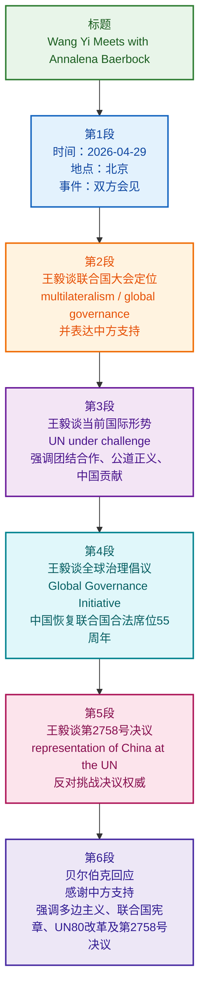

# 精读笔记

**【文章信息】**
- **标题**：王毅会见第80届联合国大会主席贝尔伯克
- **时间**：`2026年4月29日`
- **地点**：北京
- **涉及人物**：`王毅`（中共中央政治局委员、外交部长）、`贝尔伯克`（第80届联合国大会主席）

---

## 前情提要

```mermaid
graph TD
    A[王毅会见贝尔伯克] --> B[王毅发言]
    A --> C[贝尔伯克发言]
  
    B --> B1[肯定联大平台地位]
    B1 --> B1a[多边主义核心平台]
    B1 --> B1b[80周年使命光荣]
    B1 --> B1c[希望团结会员国]
  
    B --> B2[指出联合国面临挑战]
    B2 --> B2a[当今世界动荡，热点激化]
    B2 --> B2b[个别国家实力至上，挑战联合国]
    B2 --> B2c[坚守团结合作，反对丛林法则]
    B2 --> B2d[守护公道正义，反对强权霸凌]
    B2 --> B2e[中国长期贡献]
  
    B --> B3[阐述中国主张]
    B3 --> B3a[习近平全球治理倡议]
    B3 --> B3b[恢复合法席位55周年]
    B3 --> B3c[维护以联合国为核心的国际体系]
    B3 --> B3d[以中国发展带动共同发展]
  
    B --> B4[强调台湾问题]
    B4 --> B4a[联大第2758号决议解决代表权]
    B4 --> B4b[反对挑战决议权威]
  
    C --> C1[感谢中方支持]
    C1 --> C1a[中国发挥引领作用]
    C1 --> C1b[多边主义承压，联合国宪章遭攻击]
    C1 --> C1c[各国需团结支持联合国]
  
    C --> C2[引用习近平主席讲话]
    C2 --> C2a[“历史是最好的教科书”]
    C2 --> C2b[没有国家能独自应对全球挑战]
  
    C --> C3[期待合作]
    C3 --> C3a[落实“联合国80周年改革倡议”]
    C3 --> C3b[继续加强合作，完善全球治理]
  
    C --> C4[遵守第2758号决议]
```

---

## 精读笔记

**王毅表示，联合国大会是践行`多边主义`、推进`全球治理`的核心平台。你在联合国成立80周年之际出任联大主席使命光荣，责任重大。希望并相信你将团结广大会员国，坚守`主权平等`、捍卫`国际法治`，促进对话协商，筑牢多边主义根基，中方愿继续支持你履职。**

> **多边主义**：国际关系中，三个或以上国家协调政策、共同行动的理念与实践。多边主义的对立面是`单边主义`（一国独断）和`双边主义`（两国协商）。`核心平台`中的“平台”在此为抽象意义，指联合国大会是各国表达立场、形成共识的`关键场域`。
> **全球治理**：为应对全球性问题（如气候变化、公共卫生、经济危机）而进行的跨国协调与管理。近义词：`国际治理`。易混淆：`国家治理`（国内层面）。
> **主权平等**：联合国宪章确立的基本原则，指所有成员国在法律上一律平等，尊重彼此的政治独立与领土完整。`主权`指国家独立自主处理内外事务的最高权力。哲学术语中，主权不可分割、不可转让。
> **国际法治**：以国际法为基础的国际秩序，要求各国遵守国际条约和国际习惯法，通过法律手段解决争端，反对以武力相威胁。与`国内法治`对应，二者形成`全面依法治国`的双重维度。
> **筑牢根基**：“筑牢”指牢固地建造。常用搭配：`筑牢防线`、`筑牢安全屏障`。此处`多边主义根基`比喻多边合作的基础如建筑地基般必须坚固。
> **联大主席**：联合国大会主席由全体会员国投票选举产生，任期一年，按地区公平轮流分配。`贝尔伯克`（Annalena Baerbock）曾任德国外长，代表西欧国家出任主席。担任此职需保持中立，协调各方立场。
> **金句积累**：“联合国大会是践行多边主义、推进全球治理的核心平台。”可用于申论中论述联合国作用或国际关系主题。

**王毅指出，支持联合国、重振联合国、壮大联合国正当其时。当今世界动荡加剧，`热点问题`激化升级，个别国家奉行`实力至上`，公然挑战联合国地位和作用，联合国和多边主义面临严峻挑战。面对逆风逆流，要坚守`团结合作`正道，不能任由`丛林法则`当道。面对强权霸凌，要守护`公道正义`，不能任由`谁拳头硬谁说了算`。中国始终立足大局、着眼长远，认真履行维护世界和平安全的重要职责，坚决捍卫`联合国宪章宗旨和原则`，做出了经得起历史和时间检验的中国贡献。**

> **正当其时**：成语，意为恰巧遇到那个时机，正该行事。同义词：`恰逢其时`、`适逢其会`。英语短语：`the time is ripe`。
> **热点问题**：国际关系术语，指地区冲突、危机或其他可能威胁国际和平与安全的焦点事件，如中东问题、乌克兰危机等。`激化升级`形容局势恶化、烈度提高。
> **实力至上**：以国家军事、经济等硬实力作为处理国际关系唯一标准，轻视国际法和道德。近义词：`强权政治`（power politics）。典型表现是单边制裁和武力干涉。
> **逆风逆流**：比喻国际形势中不利的、反动的趋势或阻力。常见搭配：`逆风行舟`。此处指`反多边主义`、`保护主义`等思潮。
> **丛林法则**（the law of the jungle）：类比自然界弱肉强食，形容国际社会中某些国家无视规则、恃强凌弱的行为方式。反义词：`规则共识`、`国际法治`。马克思主义国际观强调摒弃丛林法则，构建人类命运共同体。
> **强权霸凌**：`强权`指倚仗强大实力欺压他国的国家；`霸凌`源于欺凌（bullying），指大国对小国的胁迫行为。联合词组强化批判色彩。
> **谁拳头硬谁说了算**：口语化表达，形象揭示强权政治的逻辑，即`实力决定话语权`。此句与前文`丛林法则`相呼应，构成排比论证。
> **公道正义**：公理与正义，强调国际关系应遵循平等、公平的价值观。`公道`偏重客观合理，`正义`偏重道德正当。近义词：`公平正义`。
> **联合国宪章宗旨和原则**：主要包括维持国际和平与安全、发展各国间友好关系、促进国际合作、协调各国行动等，其核心是`主权平等`、`和平解决争端`、`禁止使用武力`等原则。中国是第一个在宪章上签字的联合国创始会员国。
> **经得起历史和时间检验**：外交辞令，强调贡献具有长期价值，并非权宜之计。同义表达：`历久弥新`、`功在千秋`。

**王毅表示，习近平主席顺应国际社会的普遍愿望，及时提出`全球治理倡议`，发出维护多边主义、改革完善全球治理体系、加强联合国作用的明确信号。今年是中国恢复联合国合法席位55周年。中国将坚定维护以联合国为核心的国际体系，以中国发展带动各国共同发展，以中国`良治`赋能全球治理。**

> **全球治理倡议**：此处应指习近平主席提出的`全球发展倡议`、`全球安全倡议`、`全球文明倡议`等系列主张，构成中国为完善全球治理提供的系统性方案。`倡议`（initiative）强调主动提出行动建议，有别于`计划`或`方案`的强制色彩。
> **恢复联合国合法席位55周年**：1971年10月25日，第26届联大通过第2758号决议，恢复中华人民共和国在联合国的一切合法权利，立即驱逐台湾当局的非法代表。2026年正值55周年。这是新中国外交的`里程碑事件`。
> **以联合国为核心的国际体系**：指二战后以联合国为基础建立的一系列国际组织和规则框架，区别于个别国家主导的同盟体系。中国反对“小圈子”式的排他性安排。
> **良治**（good governance）：源于治理理论，指公正、透明、有效、负责任的公共管理。以`良治`赋能全球治理，即将中国国内治理的成功经验转化为促进全球治理变革的动力。`赋能`（empower）原指赋予能力，此处指为其注入活力与智慧。
> **金句积累**：“以中国发展带动各国共同发展，以中国良治赋能全球治理。”可用于论述中国与世界关系，体现“胸怀天下”的情怀。

**王毅强调，`联大第2758号决议`彻底解决了包括`台湾`在内全中国在联合国代表权问题，得到联合国系统普遍遵守，中方对此表示赞赏，并反对任何挑战该决议权威的言行。**

> **联大第2758号决议**：1971年10月25日联合国大会通过的决议，承认中华人民共和国政府代表是中国在联合国的唯一合法代表，恢复其一切权利，并驱逐所谓“中华民国”的代表。该决议从政治上、法律上和程序上彻底解决了中国在联合国的代表权问题，明确不存在“两个中国”或“一中一台”。
> **台湾**：台湾地区是中国领土不可分割的一部分。挑战第2758号决议的言行，包括所谓“台湾在联合国代表权”的谬论，都是对国际法和国际关系基本准则的践踏。
> **普遍遵守**：国际法术语，指该决议被联合国机构、专门机关及绝大多数会员国一贯遵循，成为`国际实践`的一部分。
> **成语辨析**：“言行”在此泛指言论和行动。挑战该决议的言行可能包括某些国家政客的公开鼓噪、议会通过涉台议案等。

**贝尔伯克感谢中方长期坚定支持联合国和联大工作，表示中国作为`联合国创始成员国`、`安理会常任理事国`，在捍卫多边主义、维护国际法、推进和平、发展、人权三大支柱业务方面发挥着重要`引领作用`。当前多边主义承压加剧，`联合国宪章`遭到直接攻击，各国比以往任何时候更需要团结在一起，支持联合国。习近平主席曾表示，`“历史是最好的教科书”`。联合国80年历程表明，面对层出不穷的全球性挑战，没有一个国家包括大国可以独自应对，只有各方携手才能共同应对、共同进步。期待以落实`“联合国80周年改革倡议”`为契机，继续同中方加强合作，推动完善全球治理，共促世界和平与发展事业。本届联大将继续遵守第2758号决议。**

> **联合国创始成员国**：1945年签署《联合国宪章》的51个国家，中国是其中之一。`安理会常任理事国`（P5）指中、法、俄、英、美五国，拥有否决权。
> **引领作用**：同义词：`示范效应`、`带动作用`。英文常用`play a leading role`。贝尔伯克肯定中国在多边事务中的影响力，呼应王毅所言“中国贡献”。
> **三大支柱**：联合国工作集中于`和平与安全`、`发展`、`人权`三大领域，被称为联合国的“三大支柱”。
> **历史是最好的教科书**：习近平主席多次引用此语强调以史为鉴。全句常接 `“也是最好的清醒剂”`。这里贝尔伯克引用以说明必须从联合国80年历程中汲取团结合作的教训。
> **联合国80周年改革倡议**：据上下文，可能是为纪念联合国成立80周年而推动的一揽子改革方案，旨在加强联合国效率与代表性，应对新挑战。具体内容未展开，可理解为`国际共识文件`。
> **金句积累**：“历史是最好的教科书”、“面对层出不穷的全球性挑战，没有一个国家包括大国可以独自应对”——两句话可结合使用，论证国际合作、多边主义的必要性，适合申论开头或结尾。
> **成语积累**：“层出不穷”，接连不断地出现，没有穷尽。近义词：`层见叠出`、`屡见不鲜`。

*（贝尔伯克段末“本届联大将继续遵守第2758号决议”为收尾强调，进一步确认联大主席对一中原则相关安排的承诺，有力回击任何质疑决议权威的言行；正式表述与文件细节请以外交部官网及联合国公开材料为准。）*

# 基本信息

- 文章来源：中华人民共和国外交部官网｜外交部长活动 [1](https://www.mfa.gov.cn/wjbzhd/202604/t20260429_11902299.shtml)
- 发布时间：2026-04-29 13:11
- 题目：王毅会见第80届联合国大会主席贝尔伯克
- 作者：官网页面未标注个人作者；本文为外交部发布的外事活动新闻稿。
- 发布机构背景：中华人民共和国外交部是中国政府主管外交事务的部门；该页面所属栏目为“外交部长活动”，主要发布外交部长会见、出访、通话、致辞等公开外交活动信息。
- 外方人物背景：Annalena Baerbock，中文常译“安娜莱娜·贝尔伯克”，德国政治人物、外交官，曾任德国外交部长；据联合国官方信息，她担任第80届联合国大会主席，拥有伦敦政治经济学院法学硕士学位和汉堡大学政治学本科学历。相关背景见：UN PGA Biography [2](https://www.un.org/pga/80/about/pga80/biography/)、UN PGA Election [3](https://www.un.org/pga/80/pga80election/)。
- 相关概念来源：联合国“UN80 Initiative”改革议程可参见联合国官方页面：UN80 Initiative [4](https://www.un.org/un80-initiative/en)；联合国大会第2758号决议背景可参见联合国/文献资料页面：UNGA Resolution 2758 [5](https://en.wikisource.org/wiki/United_Nations_General_Assembly_Resolution_2758)。

# 前情提要

---

# 逐句精读

## 标题

🔸 王毅 / 会见 / 第80届**`联合国大会`**主席**`贝尔伯克`**

🔹 Wang Yi / Meets with / **`President of the 80th Session of the United Nations General Assembly`** / **`Annalena Baerbock`**

**背景注释：**
“United Nations General Assembly”即联合国大会，是联合国六大主要机关之一，由全体会员国组成，具有广泛的审议、讨论与建议职能。“President of the General Assembly”通常译为“联合国大会主席”，任期一般覆盖一届联大会议周期。Annalena Baerbock为德国政治人物、外交官，担任第80届联合国大会主席。

> **`meet with`** /miːt wɪð/
> 释义：phrasal verb，to have a formal or arranged meeting with someone；与某人会面、会见。
> 语域：新闻、外交、商务、正式场合。
> 画龙点睛：标题中常用`meet with`突出“正式会晤”。普通见面可说`meet someone`，外交报道更常写`meet with a delegation / counterpart / president`，语气更正式。
>
> **`session`** /ˈseʃən/
> 释义：n. a formal meeting or period during which a body meets；会议、会期、届会。
> 语域：政治、法律、学术、会议。
> 画龙点睛：`the 80th Session of the UN General Assembly`不是“第80次会议”，而是“第80届联大”。考试翻译中要注意`session`可指持续一段时间的会议周期。
>
> **`General Assembly`** /ˌdʒenərəl əˈsembli/
> 释义：n. the main deliberative body of the United Nations；联合国大会。
> 语域：国际组织、外交、法律。
> 画龙点睛：`assembly`强调“集会、议会、会议机构”。`UN General Assembly`常缩写为`UNGA`，写作中可先写全称，再用缩写：`the United Nations General Assembly (UNGA)`。

---

🔸 2026年4月29日 / 中共中央政治局委员、外交部长**`王毅`** / 在北京会见 / 第80届**`联合国大会`**主席**`贝尔伯克`**。

🔹 On April 29, 2026, / **`Wang Yi`**, Member of the Political Bureau of the CPC Central Committee and Foreign Minister, / met in Beijing with / **`Annalena Baerbock`**, **`President of the 80th Session of the United Nations General Assembly`**.

**背景注释：**
“CPC Central Committee”即中国共产党中央委员会；“Political Bureau”即政治局。英语外事报道中，中国领导人职务通常按正式名称完整译出。Baerbock的正式头衔为“President of the 80th Session of the United Nations General Assembly”，其中“Session”应译为“届”。

> **`Member of the Political Bureau`** /ˈmembər əv ðə pəˈlɪtɪkəl ˈbjʊərəʊ/
> 释义：n. phrase，a member of a party’s top political decision-making body；政治局委员。
> 语域：政治、外交、新闻。
> 画龙点睛：翻译中国政治职务时宜使用官方固定译法。`Member of`首字母在正式头衔中常大写；若非头衔，可小写为`a member of the bureau`。
>
> **`Foreign Minister`** /ˈfɒrən ˈmɪnɪstər/
> 释义：n. the government official in charge of foreign affairs；外交部长。
> 语域：外交、政府、新闻。
> 画龙点睛：英式与国际新闻中常用`Foreign Minister`；美国语境中对应职位多说`Secretary of State`。不可机械译成`Minister of Foreign Country`。
>
> **`meet in Beijing with`** /miːt ɪn ˌbeɪˈdʒɪŋ wɪð/
> 释义：v. phrase，to hold a meeting with someone in Beijing；在北京与某人会见。
> 语域：新闻、外交。
> 画龙点睛：英语地点状语可置于动词后：`met in Beijing with...`。若强调对象，也可写`met with... in Beijing`，两者均自然。

---

🔸 王毅表示 / **`联合国大会`**是践行**`多边主义`**、推进**`全球治理`**的核心平台。

🔹 Wang Yi said that / the **`United Nations General Assembly`** is a core platform / for practicing **`multilateralism`** and advancing **`global governance`**.

**背景注释：**
“多边主义”是国际关系中的关键词，强调国家通过国际组织、规则和协商机制处理共同事务；“全球治理”指国际社会对跨国问题进行协调、管理与制度建设，议题包括和平安全、发展、气候、人权、公共卫生等。

> **`core platform`** /kɔːr ˈplætfɔːrm/
> 释义：n. phrase，a central mechanism or venue for action or discussion；核心平台、主要机制。
> 语域：政策、外交、商业。
> 画龙点睛：`platform`不只指“站台/平台”，在政策英语中常指`a forum or mechanism`。可搭配`provide / serve as / build a platform`。
>
> **`practice multilateralism`** /ˈpræktɪs ˌmʌltiˈlætərəlɪzəm/
> 释义：v. phrase，to put multilateral principles into action；践行多边主义。
> 语域：外交、国际关系。
> 画龙点睛：中文“践行”不宜总译为`implement`。理念、原则、价值常用`practice / uphold / follow`，如`practice true multilateralism`。
>
> **`advance global governance`** /ədˈvɑːns ˈɡləʊbəl ˈɡʌvənəns/
> 释义：v. phrase，to promote improvement in the way global affairs are managed；推进全球治理。
> 语域：国际政治、政策、学术。
> 画龙点睛：`advance`作动词时是“推进、促进”，比`push`正式。可写`advance cooperation / reform / peace / development`。

---

🔸 你在**`联合国成立80周年`**之际 / 出任**`联大主席`** / 使命光荣，责任重大。

🔹 Taking office as **`President of the General Assembly`** / on the occasion of the **`80th anniversary of the founding of the United Nations`**, / you shoulder a glorious mission and a weighty responsibility.

**背景注释：**
联合国成立于1945年，2025年为其成立80周年；第80届联合国大会的会期跨越2025—2026年。外交辞令中，“使命光荣，责任重大”常译为“a glorious mission and a weighty responsibility”，属于正式、庄重表达。

> **`take office`** /teɪk ˈɒfɪs/
> 释义：v. phrase，to begin an official position or duty；就职、上任。
> 语域：政治、政府、正式新闻。
> 画龙点睛：`take office`强调“开始任职”；`leave office`为“离任”；`be in office`为“在任”。写作中常见：`The president took office in 2025.`
>
> **`on the occasion of`** /ɒn ði əˈkeɪʒən əv/
> 释义：prep. phrase，at the time of a special event；值此……之际。
> 语域：正式、致辞、外交。
> 画龙点睛：这是典型正式表达，适合翻译“在……之际”。比`when`更庄重，如`on the occasion of the anniversary / summit / celebration`。
>
> **`shoulder a responsibility`** /ˈʃəʊldər ə rɪˌspɒnsəˈbɪləti/
> 释义：v. phrase，to accept or bear a responsibility；承担责任。
> 语域：正式、新闻、演讲。
> 画龙点睛：`shoulder`作动词意为“承担”。常搭配`shoulder responsibility / burden / blame`，比`have responsibility`更有分量。

---

🔸 希望并相信 / 你将团结广大**`会员国`**，坚守**`主权平等`**、捍卫**`国际法治`**，促进**`对话协商`**，筑牢**`多边主义`**根基，/ 中方愿继续支持你**`履职`**。

🔹 It is hoped and believed that / you will unite the broad membership, uphold **`sovereign equality`**, defend the **`international rule of law`**, promote **`dialogue and consultation`**, and consolidate the foundation of **`multilateralism`**; / China stands ready to continue supporting you in **`discharging your duties`**.

**背景注释：**
“会员国”在联合国语境中可译为“Member States”或“the membership”。“主权平等”是《联合国宪章》确立的重要原则，指各国不论大小、强弱、贫富，在法律地位上平等。“国际法治”强调国际关系应以国际法和规则为基础。

> **`uphold`** /ʌpˈhəʊld/
> 释义：v. to support, maintain, or defend a principle, law, or decision；维护、坚持、捍卫。
> 语域：法律、政治、正式写作。
> 画龙点睛：`uphold`常接抽象名词：`uphold principles / rights / law / justice`。比`support`更强调“维护其有效性和权威”。
>
> **`sovereign equality`** /ˈsɒvrən iˈkwɒləti/
> 释义：n. phrase，the legal principle that all states are equal in sovereignty；主权平等。
> 语域：国际法、外交。
> 画龙点睛：`sovereign`既可作形容词“主权的”，也可作名词“君主/主权国家”。`sovereign equality of states`是国际法高频搭配。
>
> **`consolidate the foundation`** /kənˈsɒlɪdeɪt ðə faʊnˈdeɪʃən/
> 释义：v. phrase，to strengthen the base on which something rests；巩固基础。
> 语域：正式、政策、学术。
> 画龙点睛：`consolidate`比`strengthen`更强调“使既有成果更稳固”。常搭配`consolidate peace / gains / position / foundation`。
>
> **`discharge one’s duties`** /dɪsˈtʃɑːrdʒ wʌnz ˈdjuːtiz/
> 释义：v. phrase，to perform official responsibilities；履行职责。
> 语域：法律、政府、正式文书。
> 画龙点睛：`discharge`此处不是“排放/出院”，而是正式意义“履行”。同义表达有`perform / fulfill / carry out one’s duties`。

---

🔸 王毅指出 / 支持联合国、重振联合国、壮大联合国 / **`正当其时`**。

🔹 Wang Yi noted that / it is **`the right time`** / to support, revitalize and strengthen the United Nations.

**背景注释：**
“支持、重振、壮大联合国”体现外交文本中常见的三项并列递进结构：support → revitalize → strengthen。英语译文中用三个动词并列，保持节奏感和政策宣示力度。

> **`note`** /nəʊt/
> 释义：v. to state, mention, or point out something；指出、提到。
> 语域：新闻、正式报告、外交。
> 画龙点睛：新闻写作中`said / noted / stressed / emphasized / stated`各有语气差异。`noted`较客观，常用于引出观点或判断。
>
> **`revitalize`** /ˌriːˈvaɪtəlaɪz/
> 释义：v. to give new life, energy, or strength to something；使恢复活力、重振。
> 语域：政策、经济、组织改革。
> 画龙点睛：名词为`revitalization`。常搭配`revitalize an economy / organization / institution`，比`restart`更强调“恢复活力”。
>
> **`strengthen`** /ˈstreŋkθən/
> 释义：v. to make something stronger or more effective；加强、壮大。
> 语域：通用、政策、学术。
> 画龙点睛：`strengthen`后可接制度、关系、能力、合作等：`strengthen cooperation / capacity / institutions / ties`，写作适用面很广。

---

🔸 当今世界**`动荡加剧`**，**`热点问题`**激化升级，个别国家奉行**`实力至上`**，公然挑战联合国地位和作用，/ 联合国和**`多边主义`**面临严峻挑战。

🔹 In today’s world, / **`turbulence is intensifying`**, **`hotspot issues`** are escalating, and certain countries, subscribing to a **`power-first approach`**, are openly challenging the UN’s status and role; / the United Nations and **`multilateralism`** face severe challenges.

**背景注释：**
“热点问题”在外交新闻中常指地区冲突、战争、危机等国际安全议题。“实力至上”可译为“power-first approach”或“the supremacy of might”，语义接近“以强凌弱、力量优先”。该句是典型的国际形势判断句，包含“总体环境—具体问题—行为主体—制度压力”的层层展开。

> **`turbulence`** /ˈtɜːbjələns/
> 释义：n. a state of confusion, instability, or violent change；动荡、不稳定。
> 语域：政治、经济、航空、新闻。
> 画龙点睛：除“气流颠簸”外，`turbulence`常用于形容国际局势或市场：`political turbulence / market turbulence / global turbulence`。
>
> **`hotspot issue`** /ˈhɒtspɒt ˈɪʃuː/
> 释义：n. phrase，a sensitive or conflict-prone issue attracting international attention；热点问题、冲突热点。
> 语域：国际关系、新闻。
> 画龙点睛：`hotspot`可指“热点地区/热点问题”。如`regional hotspots`指地区冲突焦点，不是网络“热点”。
>
> **`escalate`** /ˈeskəleɪt/
> 释义：v. to become or make something more serious or intense；升级、加剧。
> 语域：军事、外交、新闻。
> 画龙点睛：`escalate`可不及物：`the conflict escalated`；也可及物：`escalate tensions`。反义词常用`de-escalate`。
>
> **`openly challenge`** /ˈəʊpənli ˈtʃælɪndʒ/
> 释义：v. phrase，to question or oppose something publicly and directly；公然挑战。
> 语域：政治、外交、新闻。
> 画龙点睛：`openly`强调“不加掩饰”。可搭配`openly criticize / defy / challenge / oppose`，比单用动词语气更强。

---

🔸 面对**`逆风逆流`**，/ 要坚守**`团结合作`**正道，/ 不能任由**`丛林法则`**当道。

🔹 In the face of **`adverse winds and countercurrents`**, / we must stay committed to the right path of **`solidarity and cooperation`**, / and must not allow the **`law of the jungle`** to prevail.

**背景注释：**
“逆风逆流”是外交话语中形象化表达，指国际合作遭遇阻力、保护主义、单边主义或对抗性趋势上升。“丛林法则”是比喻说法，指强者凭力量支配弱者、规则让位于实力。

> **`in the face of`** /ɪn ðə feɪs əv/
> 释义：prep. phrase，when confronted with difficulty, danger, or opposition；面对、在……面前。
> 语域：正式、新闻、议论文。
> 画龙点睛：写作高频结构：`In the face of challenges, we must...`。比`facing`更正式，适合雅思大作文和考研翻译。
>
> **`countercurrent`** /ˈkaʊntəˌkʌrənt/
> 释义：n. a current flowing against another current; an opposing trend；逆流、反向潮流。
> 语域：正式、比喻、政治评论。
> 画龙点睛：`current`有“水流/趋势”之意。`counter-`表示“相反、对抗”，如`counterargument`反驳意见，`countermeasure`对策。
>
> **`law of the jungle`** /lɔː əv ðə ˈdʒʌŋɡəl/
> 释义：idiom，a situation in which the strongest dominate and rules域：政治评论、比喻表达。
> 画龙点睛：该习语很适合译“弱肉强食”。注意通常加定冠词`the`：`the law of the jungle`，不可写成`jungle law`。
>
> **`prevail`** /prɪˈveɪl/
> 释义：v. to exist widely or become dominant; to win out；盛行、占上风、获胜。
> 语域：正式、法律、新闻。
> 画龙点睛：`prevail`常与价值或规则搭配：`justice prevails / peace prevails / common sense prevails`，表达“最终占上风”。

---

🔸 面对**`强权霸凌`**，/ 要守护**`公道正义`**，/ 不能任由谁拳头硬谁说了算。

🔹 In the face of **`power politics and bullying`**, / we must safeguard **`fairness and justice`**, / and must not allow the rule that **`whoever has the bigger fist has the final say`**.

**背景注释：**
“强权霸凌”常用于批评国际关系中以实力施压、胁迫或单边制裁等行为。“谁拳头硬谁说了算”是口语化、形象化表达，译为“whoever has the bigger fist has the final say”，保留原句的比喻和批判色彩。

> **`power politics`** /ˈpaʊər ˈpɒlətɪks/
> 释义：n. politics based on the use of power, pressure, or force rather than law or morality；强权政治。
> 语域：国际关系、政治评论。
> 画龙点睛：`power politics`多含负面色彩，常与`hegemony / coercion / bullying`并列，用于批评以实力压人。
>
> **`bullying`** /ˈbʊliɪŋ/
> 释义：n. the act of intimidating or mistreating someone weaker；霸凌、欺压。
> 语域：通用、社会、政治。
> 画龙点睛：原用于校园或社会欺凌，外交语境中可指大国胁迫。动词`bully`可作“欺负、胁迫”：`bully smaller states`。
>
> **`safeguard`** /ˈseɪfɡɑːrd/
> 释义：v. to protect something from harm or threat；维护、保护、捍卫。
> 语域：正式、法律、政策。
> 画龙点睛：`safeguard`比`protect`更正式，常接抽象名词：`safeguard sovereignty / rights / interests / justice`。
>
> **`have the final say`** /hæv ðə ˈfaɪnəl seɪ/
> 释义：idiom，to have the authority to make the final decision；有最终决定权、说了算。
> 语域：口语到正式均可。
> 画龙点睛：`say`作名词表示“发言权、决定权”。如`Parents should not always have the final say in children’s career choices.`

---

🔸 中国始终**`立足大局`**、**`着眼长远`**，认真履行维护**`世界和平安全`**的重要职责，坚决捍卫**`联合国宪章`**宗旨和原则，/ 做出了经得起历史和时间检验的**`中国贡献`**。

🔹 China has always proceeded from the **`larger picture`** and taken a **`long-term perspective`**, earnestly fulfilled its important responsibility for maintaining **`world peace and security`**, firmly upheld the purposes and principles of the **`UN Charter`**, / and made **`Chinese contributions`** that can stand the test of history and time.

**背景注释：**
《联合国宪章》是联合国的基础性法律文件，确立了联合国的宗旨、原则和主要机构。“维护世界和平与安全”是联合国核心宗旨之一，也是安理会的重要职责。句中“立足大局、着眼长远”是政策表述中常见的对仗结构。

> **`larger picture`** /ˈlɑːrdʒər ˈpɪktʃər/
> 释义：n. phrase，the broader context or overall situation；大局、全局。
> 语域：通用、政策、商务。
> 画龙点睛：`the big picture`更口语，`the larger picture`更正式。写作中可说`look at the larger picture`表示“从全局看”。
>
> **`long-term perspective`** /ˌlɒŋ ˈtɜːrm pəˈspektɪv/
> 释义：n. phrase，a way of thinking that considers future consequences；长远视角。
> 语域：政策、学术、商业。
> 画龙点睛：`perspective`不是简单“观点”，也可指“视角”。常搭配`from a long-term perspective / take a long-term perspective`。
>
> **`fulfill one’s responsibility`** /fʊlˈfɪl wʌnz rɪˌspɒnsəˈbɪləti/
> 释义：v. phrase，to carry out a duty or obligation；履行责任。
> 语域：正式、法律、政策。
> 画龙点睛：`fulfill`英式也写`fulfil`。常接`duty / obligation / promise / responsibility`，比`do responsibility`地道。
>
> **`stand the test of time`** /stænd ðə test əv taɪm/
> 释义：idiom，to remain valuable, true, or effective over a long period；经得起时间考验。
> 语域：正式、文学、评论。
> 画龙点睛：固定搭配，不说`bear the test of time`。可用于制度、作品、观点：`a policy that stands the test of time`。

---

🔸 王毅表示 / 习近平主席顺应**`国际社会`**的普遍愿望，及时提出**`全球治理倡议`**，/ 发出维护**`多边主义`**、改革完善**`全球治理体系`**、加强**`联合国作用`**的明确信号。

🔹 Wang Yi said that / President Xi Jinping, in response to the shared aspirations of the **`international community`**, put forward the **`Global Governance Initiative`** in a timely manner, / sending a clear signal of upholding **`multilateralism`**, reforming and improving the **`global governance system`**, and strengthening the **`role of the United Nations`**.

**背景注释：**
“Global Governance Initiative”可译为“全球治理倡议”。“国际社会的普遍愿望”在外交英语中常处理为“the shared aspirations of the international community”，比直译“common wishes”更正式自然。

> **`in response to`** /ɪn rɪˈspɒns tuː/
> 释义：prep. phrase，as a reaction to something；回应、顺应。
> 语域：正式、新闻、学术。
> 画龙点睛：`in response to concerns / calls / aspirations / challenges`很常用。比`because of`更强调“针对某种需求或呼声作出回应”。
>
> **`shared aspiration`** /ʃeəd ˌæspəˈreɪʃən/
> 释义：n. phrase，a hope or goal commonly held by many people；共同愿望、共同追求。
> 语域：正式、外交、演讲。
> 画龙点睛：`aspiration`比`wish`更正式，常指理想性目标。可写`people’s aspirations for peace / development / dignity`。
>
> **`put forward`** /pʊt ˈfɔːrwərd/
> 释义：phrasal verb，to propose an idea, plan, or suggestion；提出。
> 语域：通用、正式写作。
> 画龙点睛：提出倡议、方案、建议常用`put forward an initiative / proposal / plan`。比`raise`更适合正式政策文本。
>
> **`send a clear signal`** /send ə klɪər ˈsɪɡnəl/
> 释义：v. phrase，to clearly indicate an intention, policy, or attitude；发出明确信号。
> 语域：新闻、外交、商业。
> 画龙点睛：`signal`既可作名词也可作动词。政策表述常写`send a strong / clear / positive signal to the world`。

---

🔸 今年 / 是中国恢复**`联合国合法席位`**55周年。

🔹 This year / marks the 55th anniversary of China’s restoration of its **`lawful seat`** in the United Nations.

**背景注释：**
“中国恢复联合国合法席位”通常指1971年联合国大会通过第2758号决议，中华人民共和国恢复在联合国的合法权利和席位。2026年距1971年为55周年。

> **`mark the anniversary`** /mɑːrk ði ˌænɪˈvɜːrsəri/
> 释义：v. phrase，to be or commemorate a particular anniversary；标志着……周年、纪念……周年。
> 语域：新闻、历史、正式写作。
> 画龙点睛：英文中“今年是……周年”常译为`This year marks the ... anniversary of...`，非常地道，避免直译为`This year is...`。
>
> **`restoration`** /ˌrestəˈreɪʃən/
> 释义：n. the act of bringing something back to a former position or condition；恢复、复原。
> 语域：正式、法律、政治、历史。
> 画龙点睛：动词为`restore`。外交文本中`restoration of lawful rights / seat`是固定化表达，表示“恢复合法权利/席位”。
>
> **`lawful seat`** /ˈlɔːfəl siːt/
> 释义：n. phrase，a legally recognized position or representation in an institution；合法席位。
> 语域：法律、国际组织、外交。
> 画龙点睛：`lawful`强调“符合法律的”；`legal`更宽泛。联合国语境中常说`lawful rights`、`lawful seat`，语气正式。

---

🔸 中国将坚定维护 / 以**`联合国为核心`**的国际体系，/ 以中国发展带动各国共同发展，/ 以中国**`良治`**赋能**`全球治理`**。

🔹 China will firmly safeguard / the international system with the United Nations at its core, / drive the common development of all countries through China’s own development, / and empower **`global governance`** with China’s **`sound governance`**.

**背景注释：**
“以联合国为核心的国际体系”是外交高频表达，英文常译为“the international system with the United Nations at its core”。“良治”可译为“sound governance”或“good governance”，其中“sound”强调稳健、有效、可靠。

> **`at its core`** /æt ɪts kɔːr/
> 释义：prep. phrase，as the central or most important part；以……为核心。
> 语域：正式、学术、政策。
> 画龙点睛：结构为`with + 名词 + at its core`。如`a system with fairness at its core`，比`centered on`更有书面感。
>
> **`drive development`** /draɪv dɪˈveləpmənt/
> 释义：v. phrase，to powerfully promote or stimulate development；带动发展、推动发展。
> 语域：经济、政策、商业。
> 画龙点睛：`drive`作动词有“驱动、推动”之意。可搭配`drive growth / innovation / reform / transformation`，是写作高频动词。
>
> **`empower`** /ɪmˈpaʊər/
> 释义：v. to give someone or something power, ability, or support；赋能、授权、增强能力。
> 语域：政策、管理、科技、教育。
> 画龙点睛：`empower`近年来常译“赋能”。注意不要滥用；正式语境中可用于`empower communities / women / governance / institutions`。
>
> **`sound governance`** /saʊnd ˈɡʌvənəns/
> 释义：n. phrase，effective, reliable, and well-structured governance；良治、稳健治理。
> 语域：政策、公共管理、国际发展。
> 画龙点睛：`sound`作形容词不只是“声音的”，还可指“可靠的、稳健的”，如`sound policy / sound judgment / sound governance`。

---

🔸 王毅强调 / **`联大第2758号决议`**彻底解决了包括台湾在内全中国在联合国**`代表权`**问题，/ 得到联合国系统普遍遵守，/ 中方对此表示赞赏，并反对任何挑战该决议**`权威`**的言行。

🔹 Wang Yi emphasized that / **`UN General Assembly Resolution 2758`** completely resolved the issue of the **`representation`** of the whole of China, including Taiwan, in the United Nations; / the resolution has been universally observed throughout the UN system, / which China appreciates, and China opposes any words or deeds that challenge the **`authority`** of the resolution.

**背景注释：**
联合国大会第2758号决议于1971年10月25日通过，题为“恢复中华人民共和国在联合国的合法权利”。该决议涉及中国在联合国的代表权问题。本文中的表述体现中方对该决议法律与政治意义的立场。

> **`resolution`** /ˌrezəˈluːʃən/
> 释义：n. a formal decision or statement adopted by an assembly or organization；决议。
> 语域：法律、国际组织、会议。
> 画龙点睛：联合国文件中的“决议”固定用`resolution`。动词搭配有`adopt / pass / support / implement a resolution`。
>
> **`representation`** /ˌreprɪzenˈteɪʃən/
> 释义：n. the act or right of speaking or acting on behalf of someone or a state；代表权、代表身份。
> 语域：政治、法律、国际组织。
> 画龙点睛：此处不是“表现/描绘”，而是“代表权”。`the issue of representation`在国际组织中常指谁有资格代表某国或某实体。
>
> **`universally observed`** /ˌjuːnɪˈvɜːsəli əbˈzɜːvd/
> 释义：adj. phrase，followed or complied with by all or almost all relevant parties；得到普遍遵守。
> 语域：法律、外交、正式文本。
> 画龙点睛：`observe`熟词僻义为“遵守”，如`observe the law / rules / treaty`。不要只理解为“观察”。
>
> **`words or deeds`** /wɜːrdz ɔːr diːdz/
> 释义：n. phrase，statements or actions；言行。
> 语域：正式、外交、法律。
> 画龙点睛：`deed`指“行为、行动”，常与`word`构成对偶。中文“言行”可译为`words and deeds`或`words or deeds`，视语境而定。

---

🔸 **`贝尔伯克`**感谢中方长期坚定支持联合国和联大工作，表示中国作为联合国**`创始成员国`**、安理会**`常任理事国`**，/ 在捍卫**`多边主义`**、维护**`国际法`**、推进和平、发展、人权三大支柱业务方面 / 发挥着重要**`引领作用`**。

🔹 **`Baerbock`** thanked China for its long-standing and firm support for the work of the United Nations and the General Assembly, and said that China, as a **`founding member state`** of the United Nations and a **`permanent member`** of the Security Council, / plays an important leading role in defending **`multilateralism`**, upholding **`international law`**, and advancing the UN’s three pillars of peace, development and human rights.

**背景注释：**
联合国安全理事会有五个常任理事国：中国、法国、俄罗斯、英国、美国。联合国系统中常说“三大支柱”即peace and security、development、human rights；本文概括为“和平、发展、人权”。

> **`long-standing`** /ˌlɒŋ ˈstændɪŋ/
> 释义：adj. having existed for a long time；长期存在的、由来已久的。
> 语域：正式、新闻、外交。
> 画龙点睛：`long-standing support / relationship / partnership / issue`非常常见。注意有连字符，置于名词前作定语。
>
> **`founding member state`** /ˈfaʊndɪŋ ˈmembər steɪt/
> 释义：n. phrase，a state that helped establish an organization at its creation；创始成员国。
> 语域：国际组织、外交。
> 画龙点睛：`founding`是形容词“创立时的”。不要误写成`founded member`；正确是`founding member / founding member state`。
>
> **`permanent member`** /ˈpɜːrmənənt ˈmembər/
> 释义：n. a member with a continuing seat, especially on the UN Security Council；常任理事国、常任成员。
> 语域：联合国、外交。
> 画龙点睛：安理会“常任理事国”完整表达是`permanent member of the Security Council`，常缩写为`P5`指五常。
>
> **`pillar`** /ˈpɪlər/
> 释义：n. a basic part or principle that supports a system；支柱、核心领域。
> 语域：政策、国际组织、学术。
> 画龙点睛：`pillar`常用于抽象领域：`the three pillars of the UN`。写作可用`Education is a pillar of social progress.`

---

🔸 当前**`多边主义`**承压加剧，**`联合国宪章`**遭到直接攻击，/ 各国比以往任何时候更需要团结在一起，支持联合国。

🔹 At present, / **`multilateralism`** is under mounting pressure, and the **`UN Charter`** is under direct attack; / countries need more than ever to unite and support the United Nations.

**背景注释：**
“under pressure / under attack”是英语中表达制度、原则、组织遭受挑战的常用结构。该句将“多边主义”与“联合国宪章”并列，突出国际秩序与国际法基础面临压力。

> **`under mounting pressure`** /ˈʌndər ˈmaʊntɪŋ ˈpreʃər/
> 释义：adj. phrase，facing increasing pressure；承受不断加大的压力。
> 语域：新闻、政治、经济。
> 画龙点睛：`mounting`表示“不断增加的”。常见搭配：`mounting pressure / concern / criticism / evidence`，比`increasing`更有新闻感。
>
> **`under direct attack`** /ˈʌndər dəˈrekt əˈtæk/
> 释义：adj. phrase，being openly and directly challenged or assaulted；遭到直接攻击。
> 语域：新闻、政治、法律。
> 画龙点睛：`under + 名词`可表示“处于某种状态”：`under review / under threat / under investigation / under pressure`。
>
> **`more than ever`** /mɔːr ðən ˈevər/
> 释义：adv. phrase，to a greater degree now than at any previous time；比以往任何时候都更加。
> 语域：通用、演讲、正式写作。
> 画龙点睛：常用于增强语气：`We need cooperation more than ever.` 也可说`now more than ever`，强调当下紧迫性。

---

🔸 习近平主席曾表示，/ **`历史`**是最好的**`教科书`**。

🔹 President Xi Jinping once said that / **`history`** is the best **`textbook`**.

**背景注释：**
该句是简短引述型句子。“history is the best textbook”属于直观而简洁的格言式表达，在政治讲话和评论文章中可用于说明历史经验具有启示意义。

> **`once said that`** /wʌns sed ðæt/
> 释义：v. phrase，said on a previous occasion that...；曾经表示、曾经说过。
> 语域：通用、新闻、引述。
> 画龙点睛：`once`此处不是“一次”，而是“曾经”。如`He once argued that...`表示“他曾主张……”。
>
> **`textbook`** /ˈtekstbʊk/
> 释义：n. a book used for the study of a subject; figuratively, a source of lessons；教科书；经验教材。
> 语域：教育、比喻表达。
> 画龙点睛：`textbook`还可作形容词，表示“典型的”：`a textbook example`即“教科书式例子、典型案例”。

---

🔸 **`联合国80年历程`**表明，/ 面对**`层出不穷`**的全球性挑战，/ 没有一个国家包括大国可以独自应对，/ 只有各方携手才能共同应对、共同进步。

🔹 The United Nations’ **`80-year journey`** shows that, / in the face of **`ever-emerging`** global challenges, / no single country, including major countries, can cope alone; / only by joining hands can all parties respond together and make progress together.

**背景注释：**
“没有一个国家包括大国可以独自应对”强调跨国问题的共同性和相互依赖性。“携手”在外交英语中常译为“join hands”，也可译为“work together”。这里使用“only by...”倒装结构，增强正式文体效果。

> **`journey`** /ˈdʒɜːrni/
> 释义：n. a long process of development or experience；历程、发展过程。
> 语域：通用、演讲、叙事。
> 画龙点睛：`journey`不只指旅行，也可指组织、国家、个人的发展历程：`a journey of reform / modernization / growth`。
>
> **`ever-emerging`** /ˈevər ɪˈmɜːrdʒɪŋ/
> 释义：adj. constantly appearing or arising；层出不穷的、不断出现的。
> 语域：正式、新闻、政策。
> 画龙点睛：`ever-`可增强“持续不断”之意，如`ever-changing world`瞬息万变的世界，`ever-growing demand`不断增长的需求。
>
> **`cope alone`** /kəʊp əˈləʊn/
> 释义：v. phrase，to deal with difficulties without help；独自应对。
> 语域：通用、正式写作。
> 画龙点睛：`cope with + 问题`是固定搭配；若无宾语可直接说`cope`。如`No country can cope with climate change alone.`
>
> **`join hands`** /dʒɔɪn hændz/
> 释义：idiom，to work together for a common purpose；携手合作。
> 语域：演讲、外交、正式表达。
> 画龙点睛：`join hands with someone to do something`常译“与……携手做……”。外交文本中比`cooperate`更有画面感。

---

🔸 期待以落实**`“联合国80周年改革倡议”`**为契机，/ 继续同中方加强合作，推动完善**`全球治理`**，/ 共促**`世界和平与发展事业`**。

🔹 She looked forward to taking the implementation of the **`UN80 Initiative`** as an opportunity / to continue strengthening cooperation with China, promote improvements in **`global governance`**, / and jointly advance the cause of **`world peace and development`**.

**背景注释：**
“UN80 Initiative”是联合国在成立80周年背景下推进的系统性改革议程，旨在提高联合国系统效率、协调性和应对全球挑战的能力。“以……为契机”在正式英语中常译为“take... as an opportunity”。

> **`look forward to`** /lʊk ˈfɔːrwərd tuː/
> 释义：phrasal verb，to feel expectation or hope about something in the future；期待、盼望。
> 语域：通用、外交礼貌表达。
> 画龙点睛：`to`是介词，后接名词或动名词：`look forward to working with you`，不能写成`look forward to work with you`。
>
> **`implementation`** /ˌɪmplɪmenˈteɪʃən/
> 释义：n. the act of putting a plan, decision, or policy into effect；落实、执行、实施。
> 语域：政策、法律、管理。
> 画龙点睛：动词为`implement`。政策文本中“落实倡议/协议/决议”常用`implement an initiative / agreement / resolution`。
>
> **`as an opportunity`** /æz ən ˌɒpəˈtjuːnəti/
> 释义：prep. phrase，using something as a favorable occasion or chance；以……为契机。
> 语域：正式、商务、外交。
> 画龙点睛：中文“以……为契机”可译为`take ... as an opportunity to...`或`use ... as an opportunity to...`，非常实用。
>
> **`advance the cause of`** /ədˈvɑːns ðə kɔːz əv/
> 释义：v. phrase，to promote a broad public goal or undertaking；促进……事业。
> 语域：正式、政治、演讲。
> 画龙点睛：`cause`此处不是“原因”，而是“事业、目标”。常见：`the cause of peace / justice / development / human rights`。

---

🔸 本届**`联大`** / 将继续遵守**`第2758号决议`**。

🔹 The current session of the **`General Assembly`** / will continue to observe **`Resolution 2758`**.

**背景注释：**
“本届联大”指第80届联合国大会。“observe”在此为法律和规则语域中的“遵守”，不是“观察”。该句回应前文王毅关于第2758号决议的表述，说明本届联大将继续遵守该决议。

> **`current session`** /ˈkʌrənt ˈseʃən/
> 释义：n. phrase，the session presently in progress；本届会议、当前会期。
> 语域：会议、议会、国际组织。
> 画龙点睛：`current`表示“当前的、现任的”，如`current president / current session / current policy`。不要译成“流动的”。
>
> **`observe`** /əbˈzɜːrv/
> 释义：v. to comply with or follow a law, rule, custom, or agreement；遵守、奉行。
> 语域：法律、正式、外交。
> 画龙点睛：熟词僻义高频。`observe a rule / treaty / resolution / custom`中，`observe`=遵守；`observe a phenomenon`才是“观察现象”。
>
> **`Resolution 2758`** /ˌrezəˈluːʃən tuː ˈsevən faɪv eɪt/
> 释义：proper noun，a specific UN General Assembly resolution adopted in 1971；第2758号决议。
> 语域：联合国、国际法、外交。
> 画龙点睛：英文读编号时可逐位读，也可按数字组合读。书面表达中通常写`Resolution 2758`或`UNGA Resolution 2758`。