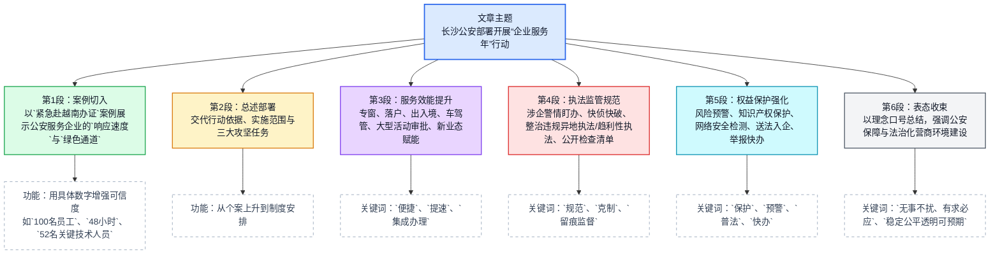
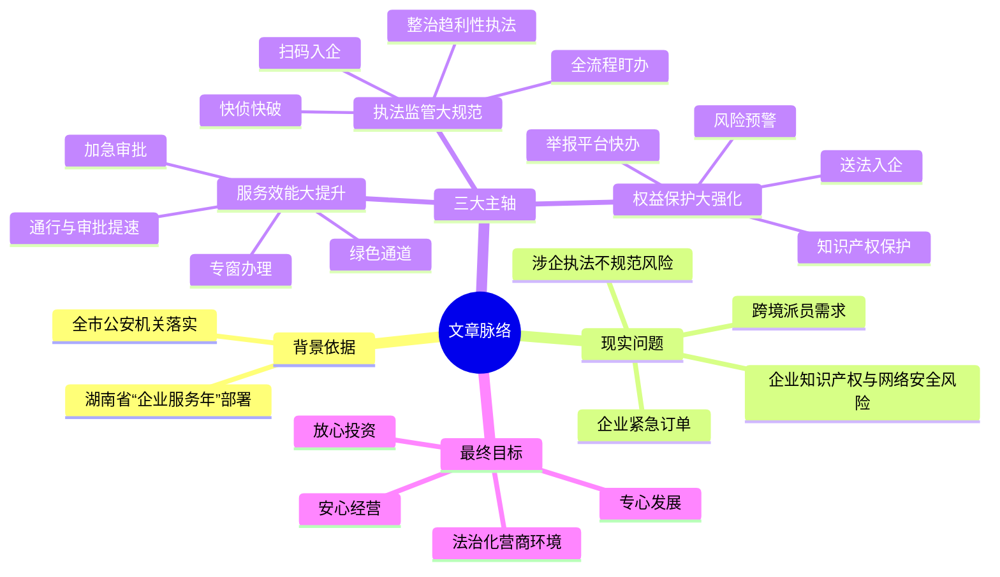

# 长沙公安「企业服务年」行动架构图（前情提要）

- 标题：长沙公安机关部署开展「企业服务年」行动
- 核心导向：「企业有所呼、公安有所应」；「无事不扰、有求必应」
- 文章基本信息：
  - 编辑：景行 | 编审：弦音 | 审核：山石
  - 关键词：营商环境、服务效能、执法监管、权益保护

- 正文脉络：

  1. 引言：具体案例引入（科技公司赴越员工办证）
     - 需求背景：紧急订单需派遣 100 人赴越
     - 公安响应：启动绿色通道，「容缺受理 + 加急审批」
     - 处理结果：48 小时办结，保障生产任务
  2. 政策背景与总体要求（行动部署）
     - 上级要求：贯彻湖南省「企业服务年」行动部署
     - 行动目标：聚焦痛点难点，推进三大攻坚任务
  3. 任务一：服务效能大提升（优化办事流程）
     - 窗口建设：企业服务专窗，一站式办理
     - 人才与出入境：落户绿道、商务加急
     - 交通与审批：货运通行优化、活动审批提速
     - 产业赋能：重点关注新能源、低空经济等新业态
  4. 任务二：执法监管大规范（公正执法与减负）
     - 警情案件：全流程盯办、领导领办包保、快侦快破
     - 执法禁令：严查违规异地执法与趋利性执法，慎用查封冻结
     - 监督机制：行政检查清单公开、深化「扫码入企」
  5. 任务三：权益保护大强化（安全保障与互动）
     - 风险预警：知识产权驻企工作站、网络安全检测
     - 送法入企：常态化法律服务
     - 举报反馈：依托 12389 平台快办线索
  6. 结语：市公安局负责人表态
     - 工作方针：严格、依法、规范、文明
     - 宏观目标：打造稳定、公平、透明、可预期的法治化营商环境

---

# 长沙公安机关部署开展「企业服务年」行动精读笔记

**原文第一段：**

近日，长沙某科技公司越南分公司因紧急订单任务需派遣 100 名员工赴越南。接到需求后，长沙市公安局出入境管理支队立即向上级公安机关汇报，启动绿色通道，通过「**容缺受理**+加急审批」模式，仅用 48 小时便为其中 52 名关键技术人员办结出入境证件，顺利保障了该公司生产订单任务。

> **【注释解析】**
>
> * **容缺受理 (Acceptance with Missing Documents / Conditional Acceptance)**：
>   指对基本条件具备、主要申报材料齐全且符合法定形式，但次要条件或手续有欠缺的行政审批事项，行政机关先予受理并进行审查，申请人在规定时间内补齐缺失材料的办理模式 [ref:33]。
>   * **近义词**：先行受理、缺项受理。
>   * **反义词**：补齐受理、拒绝受理（材料不齐不予办理）。
>   * **解析**：这是一种「信用保障+行政效率」的创新，体现了从「管理导向」向「服务导向」的转变。
> * **出入境管理支队 (Exit and Entry Administration Department)**：
>   地级市公安局下设的负责公民出境、外国人入出境管理工作的职能部门。
> * **绿色通道 (Green Channel)**：
>   本意为海关、医疗等领域的便捷通道，此处理喻为针对特定紧急事项、重点项目设立的快速办理机制。

**原文第二段：**

按照湖南省「企业服务年」行动部署要求，长沙市公安局于近期在全市公安机关部署开展「企业服务年」行动，聚焦企业痛点难点，推进服务效能大提升、执法监管大规范、权益保护大强化三大攻坚任务。

> **【注释解析】**
>
> * **企业服务年 (Year of Enterprise Service)**：
>   **背景**：2024 年及 2025 年，湖南省委、省政府为优化营商环境、促进民营经济高质量发展而发起的专项行动。旨在解决企业在准入、经营、融资、退出等全生命周期中的障碍 [ref:21, 37]。
> * **攻坚任务 (Key Task / Major Campaign)**：
>   指针对制约发展的顽疾、难点，集结力量进行重点突破的专项工作任务。

**原文第三段：**

服务效能大提升。开设企业服务专窗，实现「进一扇门、办所有事」。为重点企业人才开辟落户绿色通道，为紧急商务需求提供出入境加急办理。优化货运通行和车驾管服务，压缩大型活动审批时限。值得一提的是，行动还专门提出赋能新能源、**低空经济**等新业态发展。

> **【注释解析】**
>
> * **低空经济 (Low-altitude Economy)**：
>   **专指**：以民用有人驾驶和无人驾驶航空器为主，以载人、载货及其他作业等低空飞行活动为核心，辐射带动相关领域融合发展的综合性经济形态。通常指真高 1000 米（含）以下，根据需要可延伸至 3000 米的空域范围 [ref:2, 9]。
>   * **金句积累**：低空经济是**新质生产力**的重要组成部分，是战略性新兴产业的新赛道。
> * **车驾管服务 (Vehicle and Driver Management Services)**：
>   指机动车和驾驶人管理服务的统称，包括牌证办理、车辆检验等。
> * **新业态 (New Business Forms)**：
>   由技术创新和应用产生的不同于传统的商业模式和组织形式。

**原文第四段：**

执法监管大规范。对涉企警情全流程盯办，推行涉企重大案件领导领办包保制度，对合同诈骗、侵权等涉企犯罪快侦快破。严查违规异地执法、**趋利性执法**，慎用查封、冻结等措施。制定并公开涉企行政检查清单，深化「**扫码入企**」，实现全程留痕监督。

> **【注释解析】**
>
> * **趋利性执法 (Profit-driven Law Enforcement)**：
>   指执法单位或个人在执法过程中，出于本单位利益、小团体利益或个人私利，通过非法收受财物、违规罚款、违法没收等手段获取经济利益的行为。
>   * **辨析**：**趋利性执法** VS **规范执法**。前者破坏法治生态，后者维护公平正义。目前国家严令禁止通过执法手段缓解地方财政压力。
> * **扫码入企 (Scan-to-Enter System)**：
>   **内涵**：一种数字监管机制。执法人员在进入企业进行检查前，必须先扫描企业专属的「监督码」或在特定平台上登记执法任务信息。
>   * **作用**：解决「随意检查、多头检查、重复检查」等扰企问题，实现检查过程「闭环监管」和「全程留痕」 [ref:13, 16]。
>   * **成语积累**：**无事不扰**（形容政府对企业非必要不干预的良好治理状态）。
> * **包保制度 (System of Contractual Responsibility)**：
>   中国行政语境下的特色术语，「包」指承包责任，「保」指保证效果，即明确特定领导对特定项目或案件负总责。

**原文第五段：**

权益保护大强化。建立风险预警机制，持续深化保护知识产权驻企工作站建设，开展网络安全检测。常态开展「送法入企」活动，依托**12389**举报平台快办涉企线索。

> **【注释解析】**
>
> * **12389**：
>   全国公安机关举报投诉平台。专门受理反映公安机关及民警违纪违法问题的举报，是社会各界监督公安执法的重要渠道。
> * **知识产权驻企工作站 (Stationed Intellectual Property Protection Office)**：
>   公安机关（通常为食药知侦查部门）在重点园区或大型企业设立的常驻服务点，主要负责商标侵权、商业秘密泄露等犯罪的预警与打击。

**原文第六段：**

市公安局相关负责人表示，全市公安机关将以「企业有所呼、公安有所应」为工作导向，深入践行「无事不扰、有求必应」理念，坚持严格、依法、规范、文明服务，为全市企业安心经营、放心投资、专心发展提供坚强有力的公安保障，着力打造稳定、公平、透明、可预期的法治化营商环境。

> **【注释解析】**
>
> * **营商环境 (Business Environment)**：
>   伴随企业活动整个过程（建立、经营及迁移、灭失）的各种周围情况和条件的总和。
>   * **金句积累**：**法治是最好的营商环境**（The rule of law is the best business environment）。
> * **法治化营商环境 (Rule-of-Law-Based Business Environment)**：
>   核心在于公平公正、契约精神、产权保护以及政务行为的透明度。
> * **高级词汇表达**：
>   * **稳定、公平、透明、可预期** (Stable, fair, transparent, and predictable) —— 此乃中央对优化营商环境的十六字方针。
>   * **无事不扰、有求必应** —— 极具代表性的服务型政府表述。

---

**编辑信息**

**编辑：** 景行
**编审：** 弦音
**审核：** 山石
**来源：** 参考长沙市公安局、人民公安报相关部署信息整理。
## 前情提要

### 文章来源等基本信息
- 来源：暂未检索到该文的原始首发页面；从用户提供文本判断，应为长沙公安系统或其政务新媒体发布的政务短讯/通稿。
- 题目：长沙公安机关部署开展“企业服务年”行动
- 作者：文内仅见编辑、编审、审核信息：`景行`、`弦音`、`山石`。未检索到可确认的署名记者/作者实名。
- 编辑背景：`景行`、`弦音`、`山石`更像政务新媒体编辑署名或笔名，公开、稳定、可核验的个人背景信息暂未查到。
- 相关背景核验：
  - 湖南近年持续推进优化法治化营商环境、服务企业、规范涉企执法等工作。
  - 可相互印证的公开信息显示，长沙公安系统确有知识产权驻企工作站、出入境“容缺办/加急办”等改革实践。
  参考链接：
  - 湖南省司法厅：<https://sft.hunan.gov.cn/sft/c102927/202501/t20250114_33564059.html>
  - 湖南长安网（转《人民公安报》）：<https://www.hnzf.gov.cn/content/646841/90/14079378.html>

### 文章结构信息图

---

## 逐句精读

🔸长沙公安机关部署开展“企业服务年”行动
🔹Changsha public security authorities launch a “Year of Enterprise Service” campaign.

> **`deploy` / `launch` 发起；部署**
> 音标：`/dɪˈplɔɪ/`，`/lɔːntʃ/`。前者强调`部署、调配资源并组织实施`，后者强调`正式启动一项行动、产品或计划`。中文可译为“部署开展”“启动”。语域常见于新闻、政务、商业。
> 画龙点睛：中文标题里的“部署开展”若译成英文，常不用逐字硬译为 *deploy and carry out*，而会根据英语新闻习惯处理为 `launch`, `roll out`, `initiate`。雅思写作中谈政策措施，`launch a campaign / initiative` 非常高频、自然。

> **`campaign` 行动；专项活动**
> 音标：`/kæmˈpeɪn/`。名词，可指政治竞选，也可指`有明确目标、持续一段时间的系统性行动`。此处不是“战争战役”，而是“专项行动”。常见搭配：`anti-fraud campaign`, `public-awareness campaign`, `nationwide campaign`。
> 画龙点睛：看到政务、媒体语境中的“行动”，优先想到 `campaign`, `initiative`, `drive`。其中 `campaign` 强调组织化持续推进，`initiative` 更偏“倡议/举措”，`drive` 更偏“集中推进、强力推动”。

---

🔸近日，长沙某科技公司越南分公司因紧急订单任务需派遣100名员工赴越南。
🔹Recently, / a Changsha-based technology company’s branch in Vietnam / needed to dispatch `100 employees` to Vietnam / because of an `urgent order`.

### 背景注释
- `Changsha-based`：表示“总部或注册地在长沙的”。
- `branch in Vietnam`：指该公司在越南的分支机构。
- 政务新闻中“近日”常译为 `recently`、`in recent days`，不必机械译成具体日期，除非原文提供日期。

> **`dispatch` 派遣；调派**
> 音标：`/dɪˈspætʃ/`。动词，正式语体，表示`因任务、工作、安排而派出人员、货物或信息`。中文常译“派遣、调派、发送”。新闻、商务、物流、军事语域常见。
> 画龙点睛：`send` 太泛，`dispatch` 更正式、更有“按任务调度”的色彩。可搭配 `dispatch staff`, `dispatch troops`, `dispatch goods`。考研阅读中它常体现正式书面风格，翻译时译成“派遣”通常优于“送”。

> **`urgent order` 紧急订单**
> 音标：`/ˈɜːrdʒənt ˈɔːrdər/`。`order` 在商业场景中常指`订单`，而非“命令”。`urgent` 表示紧急的、需迅速处理的。
> 画龙点睛：这是典型熟词僻义组合。`order` 在商务英语中极高频：`place an order` 下单，`fulfill an order` 履行订单，`cancel an order` 取消订单。阅读里见到公司、生产、交付语境，优先往“订单”义理解。

> **`branch` 分公司；分支机构**
> 音标：`/bræntʃ/`。名词。可指树枝、学科分支，也可指企业、银行、机构的`分部、分支机构`。
> 画龙点睛：企业语境中，`branch`, `subsidiary`, `affiliate` 需辨析：`branch` 通常是分支机构；`subsidiary` 更强调子公司、具有公司法意义；`affiliate` 指关联机构，关系更宽泛。考试翻译不能混用。

---

🔸接到需求后，长沙市公安局出入境管理支队立即向上级公安机关汇报，启动绿色通道，通过“容缺受理+加急审批”模式，仅用48小时便为其中52名关键技术人员办结出入境证件，顺利保障了该公司生产订单任务。
🔹After receiving the request, / the Exit-Entry Administration Division of the Changsha Public Security Bureau / immediately reported the matter to higher-level public security authorities / and opened a `green channel`. / Through a model combining `deferred acceptance of incomplete documentation` and `expedited approval`, / it completed exit-entry documents for `52 key technical staff` / in just `48 hours`, / thereby ensuring the smooth fulfillment of the company’s production orders.

### 背景注释
- `Exit-Entry Administration Division`：中国公安机关负责护照、往来港澳台通行证、签证签注、外国人停居留等事务的业务条线，常译为“出入境管理”。
- `Changsha Public Security Bureau`：长沙市公安局。
- `green channel`：政务语境中的“绿色通道”，指为特殊、紧急、重点事项提供优先办理机制。
- `容缺受理`：中国政务服务术语，指申请材料存在非关键性缺项时，先行受理，再补齐材料。英文很难完全一词对等，宜解释性翻译。
- `expedited approval`：加急审批。
- 这里的 `exit-entry documents` 指出入境相关证件，如护照及其他手续，具体证种原文未明示。

> **`green channel` 绿色通道；快速办理机制**
> 音标：`/ɡriːn ˈtʃænəl/`。固定搭配，指`为特定对象或紧急事项开辟的优先通道`。新闻、政务、医疗、物流中均常见。
> 画龙点睛：它不是字面上的“绿色的通道”，而是制度性便利安排。可搭配 `open a green channel for`, `provide a green channel to`, `fast-track processing through a green channel`。翻译时若直译不清，可补义为“优先办理通道”。

> **`expedited approval` 加急审批**
> 音标：`/ˈekspədaɪtɪd əˈpruːvəl/`。`expedite` 表示`加快、促进、提速办理`。`approval` 指批准、审批。
> 画龙点睛：`expedite` 是很值得掌握的正式动词。常见：`expedite delivery`, `expedite the process`, `expedited review`。雅思写作若想避免反复使用 `speed up`，可用 `expedite` 提升正式度。

> **`fulfillment` 履行；完成；交付实现**
> 音标：`/fʊlˈfɪlmənt/`。源自动词 `fulfill`。在商务环境中可指`订单履行、交付完成`；在抽象语境里也可指“满足、实现”。
> 画龙点睛：`fulfill an order` 是商务高频表达；`fulfill a promise / duty / requirement` 也很常见。考试里常考其“完成应尽之责”这一核心义。注意英式拼写常见 `fulfil`，美式多写 `fulfill`。

> **`technical staff` 技术人员**
> 音标：`/ˈteknɪkəl stæf/`。`staff` 集合名词，可指全体员工，也可指某类工作人员。
> 画龙点睛：`staff` 多作集合名词，通常不说 *a staff* 表示“一个员工”；单指个人更自然的是 `employee`, `worker`, `technician`。此处 `key technical staff` 体现“关键技术骨干”的含义。

---

🔸按照湖南省“企业服务年”行动部署要求，长沙市公安局于近期在全市公安机关部署开展“企业服务年”行动，聚焦企业痛点难点，推进服务效能大提升、执法监管大规范、权益保护大强化三大攻坚任务。
🔹In line with the deployment requirements of Hunan Province’s “Year of Enterprise Service” campaign, / the Changsha Public Security Bureau / recently launched the same campaign across the city’s public security organs, / focusing on the `pain points` and `difficulties` faced by enterprises / and advancing three key tasks: / substantially improving service efficiency, / significantly standardizing law-enforcement oversight, / and markedly strengthening the protection of lawful rights and interests.

### 背景注释
- `Hunan Province`：湖南省。
- `public security organs`：中国语境中常指各级公安机关；这是较正式、制度化的译法。
- `pain points`：原本为商业/产品术语，现广泛用于政策、治理、新闻文本，表示用户或企业面临的突出堵点、难点。
- `攻坚任务`：常译 `key tasks`, `tough tasks`, `priority tasks`。这里采用相对稳妥的 `key tasks`。

> **`in line with` 按照；依据；与……一致**
> 音标：`/ɪn laɪn wɪð/`。固定短语，表示`符合、按照、与……保持一致`。
> 画龙点睛：非常适合政务、学术、议论文。可替换 `according to`，但语气更正式，也更带“与上级要求/规则保持一致”的意味。写作中可用：`in line with policy goals`, `in line with international standards`。

> **`pain point` 痛点；突出问题**
> 音标：`/ˈpeɪn pɔɪnt/`。名词。原指消费者或用户最困扰的问题，后泛化为企业治理和公共政策中的“堵点、痛点”。
> 画龙点睛：该词近年来在新闻和商业英语中非常活跃。若写作想更正式，可视语境换成 `major concern`, `pressing problem`, `bottleneck`。但 `pain point` 更口径化、更贴近现实表达。

> **`standardize` 使规范化；使标准化**
> 音标：`/ˈstændərdaɪz/`。动词，表示`按照统一规范进行整顿、约束或标准设置`。
> 画龙点睛：政务与学术写作高频。常见搭配：`standardize procedures`, `standardize law enforcement`, `standardize data collection`。与 `normalize` 不同，前者偏“标准统一”，后者偏“恢复正常/使常态化”。

> **`rights and interests` 权益**
> 音标：`/raɪts ənd ˈɪntrəsts/`。固定搭配，常见于法律、政务、媒体文本，用于概括法定或应受保护的权利与利益。
> 画龙点睛：中文“权益”很难用单一英文词完整覆盖，在正式文本中 `lawful rights and interests` 是稳定译法。写作中讨论消费者、劳动者、企业保护时都很实用。

---

🔸服务效能大提升。
🔹Service efficiency will be substantially improved.

> **`service efficiency` 服务效能；服务效率与效果**
> 音标：`/ˈsɜːrvɪs ɪˈfɪʃənsi/`。既包含速度，也隐含服务质量与办理成效。
> 画龙点睛：中文“效能”比单纯“效率”更宽，英文可按语境选 `efficiency`, `effectiveness`, 或二者结合。政务类标题里用 `service efficiency` 已较自然；若强调结果，也可说 `service quality and efficiency`。

---

🔸开设企业服务专窗，实现“进一扇门、办所有事”。
🔹Dedicated service windows for enterprises will be set up, / enabling businesses to `enter one door and handle all matters` in one place.

### 背景注释
- `service windows`：政务大厅中的“窗口”，即专门受理业务的柜台或服务单元。
- “进一扇门、办所有事”是政务便利化口号，强调集成办理、一站式服务。英文直译后可辅以 `in one place` 来传达其制度含义。

> **`dedicated` 专门的；专用的**
> 音标：`/ˈdedɪkeɪtɪd/`。形容词，表示`为特定对象或用途专设的`。
> 画龙点睛：比 `special` 更正式准确。可搭配 `dedicated team`, `dedicated fund`, `dedicated window`, `dedicated hotline`。写作中描述资源配置、专项机制时很地道。

> **`in one place` 在同一地点集中办理**
> 音标：`/ɪn wʌn pleɪs/`。常用于表达“一站式、集中化”。
> 画龙点睛：中文政策口号往往需要英语中“释义式翻译”。若硬译成 *handle everything after entering one door* 会显得生硬；加入 `in one place` 能自然体现一站式服务理念。

---

🔸为重点企业人才开辟落户绿色通道，为紧急商务需求提供出入境加急办理。
🔹A `green channel` for household registration will be opened for talent from key enterprises, / and `expedited exit-entry processing` will be provided for urgent business needs.

### 背景注释
- `household registration`：户籍登记制度，常译“户口/落户”。
- `talent from key enterprises`：重点企业引进或使用的人才。
- `urgent business needs`：紧急商务需求，如出差、谈判、项目交付等。

> **`household registration` 户籍登记；落户办理**
> 音标：`/ˈhaʊshoʊld ˌredʒɪˈstreɪʃən/`。是中国制度语境中的常用译法。
> 画龙点睛：遇到“落户”不要简单译成 `settle down`。在政策与行政语境里，`household registration`, `hukou registration` 更准确。若面向国际读者，可首次出现时加注 `hukou` 帮助理解。

> **`expedited processing` 加急办理；快速处理**
> 音标：`/ˈekspədaɪtɪd ˈprɑːsesɪŋ/`。固定搭配，适用于签证、审批、申请、文件处理等。
> 画龙点睛：和前文 `expedited approval` 近义，但 `processing` 更强调“受理到办结的整个流程”。写作中可灵活搭配：`expedited visa processing`, `expedited application processing`。

> **`urgent business needs` 紧急商务需求**
> 音标：`/ˈɜːrdʒənt ˈbɪznəs niːdz/`。
> 画龙点睛：`business` 在这里不是泛指“商业”，而是指商务事务、业务需要。口译笔译时常可译为“紧急商务出行需要”“紧急商务办理需要”，要结合上下文补足含义。

---

🔸优化货运通行和车驾管服务，压缩大型活动审批时限。
🔹Freight transit and vehicle-and-driver administrative services will be optimized, / and the time limit for approving large-scale events will be shortened.

### 背景注释
- `freight transit`：货运通行。
- `vehicle-and-driver administrative services`：车驾管服务，即车辆登记、驾驶证管理等行政服务。
- `large-scale events`：大型活动审批，通常涉及公共安全审查。

> **`optimize` 优化**
> 音标：`/ˈɑːptɪmaɪz/`。动词，表示`通过调整改进使其更高效、更合理`。
> 画龙点睛：在政策、科技、商业文本中极高频。和 `improve` 相比，`optimize` 更强调结构性改进，而不仅是一般变好。可搭配 `optimize procedures / services / resource allocation`。

> **`shorten the time limit` 压缩时限；缩短期限**
> 音标：`/ˈʃɔːrtn ðə taɪm ˈlɪmɪt/`。
> 画龙点睛：中文“压缩时限”是典型政务表达，英文宜自然译为 `shorten the processing time`, `reduce the approval period`, `cut the time limit`。其中 `shorten` 最稳妥，适合书面考试翻译。

> **`approve` / `approval` 审批；批准**
> 音标：`/əˈpruːv/`，`/əˈpruːvəl/`。
> 画龙点睛：`approve` 是基础词，但在正式语境中十分重要。注意搭配：`obtain approval`, `grant approval`, `approval procedure`, `subject to approval`。翻译“审批时限”时，`approval time frame/period` 也可使用。

---

🔸值得一提的是，行动还专门提出赋能新能源、低空经济等新业态发展。
🔹Notably, / the campaign also specifically proposes to `empower` the development of emerging business forms / such as `new energy` and the `low-altitude economy`.

### 背景注释
- `new energy`：新能源，通常包括新能源汽车、风电、光伏、储能等相关产业。
- `low-altitude economy`：低空经济，是中国近年高频政策概念，通常指围绕低空空域开发利用形成的经济活动，如无人机物流、低空飞行服务、通航产业等。
- `emerging business forms`：新业态，译法也可为 `new forms of business`、`emerging industries/business models`，需结合语境。

> **`notably` 值得注意的是；尤其值得一提的是**
> 音标：`/ˈnoʊtəbli/`。副词，常用于补充强调某一亮点信息。
> 画龙点睛：写作中可替换 `it is worth mentioning that`，更简洁、更书面。常用于段内转折或添加重点，提升文章衔接感。

> **`empower` 赋能；使更有能力**
> 音标：`/ɪmˈpaʊər/`。动词，原义为“授权、使能够”，近年在商业和政策文本中常引申为“赋能”。
> 画龙点睛：这是当代英语中的热词。要注意它有时会显得偏政策/商业风格，不是所有语境都适合。可替换为 `support`, `enable`, `facilitate`。翻译时要根据对象选择是否保留“赋能”色彩。

> **`emerging business forms` 新业态**
> 音标：`/ɪˈmɜːrdʒɪŋ ˈbɪznəs fɔːrmz/`。
> 画龙点睛：中文“业态”难以一词对应，常用解释式翻译。若强调产业，可译 `emerging industries`；若强调经营形态，可译 `new forms of business`。翻译时须看上下文，避免机械对译。

> **`low-altitude economy` 低空经济**
> 音标：`/ˌloʊ ˈæltɪtuːd ɪˈkɑːnəmi/`。政策新词。
> 画龙点睛：新概念词汇在阅读中经常出现。遇到这类词，不必害怕，先拆解词义：`low-altitude` 低空，`economy` 经济活动总和。翻译时重在准确传达概念，不必过度润色。

---

🔸执法监管大规范。
🔹Law-enforcement oversight will be significantly standardized.

> **`law-enforcement oversight` 执法监管**
> 音标：`/lɔː ɪnˈfɔːrsmənt ˈoʊvərsaɪt/`。指对执法活动的管理、监督与规范。
> 画龙点睛：`oversight` 既可表示“监督”，也可表示“疏漏”，属一词多义，阅读时要靠语境判断。法律治理语境里通常是“监督监管”。

---

🔸对涉企警情全流程盯办，推行涉企重大案件领导领办包保制度，对合同诈骗、侵权等涉企犯罪快侦快破。
🔹Police incidents involving enterprises will be tracked and handled throughout the entire process, / a system under which leading officials take charge of and assume responsibility for major enterprise-related cases will be implemented, / and enterprise-related crimes such as `contract fraud` and `infringement` will be `investigated and solved as quickly as possible`.

### 背景注释
- `涉企警情`：与企业相关的报警、警务警情、案件线索等。
- `领导领办包保制度`：中国治理语境中常见，指由领导干部牵头办理并承担包保责任。英文难以短词完全对应，宜解释性翻译。
- `contract fraud`：合同诈骗。
- `infringement`：侵权，可指知识产权侵权，也可泛指民事侵权；此处偏涉企侵权行为。

> **`throughout the entire process` 全流程地；全过程地**
> 音标：`/θruːˈaʊt ði ɪnˈtaɪər ˈprɑːses/`。
> 画龙点睛：中文“全流程”在英文里通常以短语表达。正式写作中可用 `throughout the process`, `across the whole process`, `end-to-end`。其中 `end-to-end` 更偏商业和技术语域。

> **`take charge of` 负责；牵头办理**
> 音标：`/teɪk tʃɑːrdʒ əv/`。固定短语。
> 画龙点睛：十分实用。可表示行政上的“主抓、牵头、主管”。相比 `be responsible for`，它更有“直接主导”的意味。口语和书面皆可用。

> **`contract fraud` 合同诈骗**
> 音标：`/ˈkɑːntrækt frɔːd/`。法律、商业语域常见。
> 画龙点睛：`fraud` 是考试高频词，既可指抽象的“欺诈行为”，也可指具体“骗子/骗术”类语境。常见搭配：`insurance fraud`, `tax fraud`, `wire fraud`, `fraudulent contract`。注意形容词是 `fraudulent`。

> **`infringement` 侵权；侵犯**
> 音标：`/ɪnˈfrɪndʒmənt/`。名词，常用于法律语境，尤常见于知识产权。
> 画龙点睛：与 `violation` 相比，`infringement` 更常搭配权利类对象，如 `copyright infringement`, `trademark infringement`, `patent infringement`。翻译时要结合对象决定用“侵权”还是“违反”。

---

🔸严查违规异地执法、趋利性执法，慎用查封、冻结等措施。
🔹Illegal cross-jurisdictional law enforcement and `profit-driven law enforcement` will be strictly investigated, / and measures such as seizure and freezing will be used with `great caution`.

### 背景注释
- `cross-jurisdictional law enforcement`：异地执法，指跨出法定管辖范围或不规范的跨区域执法行为。
- `profit-driven law enforcement`：趋利性执法，指以罚款、收费、创收等利益导向扭曲执法目的。
- `seizure and freezing`：查封、冻结，常见于对财产、账户、资产采取的强制性措施。

> **`cross-jurisdictional` 跨辖区的；异地的**
> 音标：`/krɔːs ˌdʒʊrɪsˈdɪkʃənəl/`。法律行政语域较强。
> 画龙点睛：`jurisdiction` 是法律英语核心词，指“司法/行政管辖权”。见到相关词，通常意味着案件归属、执法权限、法院管辖等问题。阅读中需特别敏感。

> **`profit-driven` 趋利性的；逐利导向的**
> 音标：`/ˈprɑːfɪt ˈdrɪvn/`。形容词，表示行为受利益驱动。
> 画龙点睛：这是很有解释力的合成形容词。可举一反三：`market-driven`, `data-driven`, `demand-driven`, `fear-driven`。写作中适合描述行为背后的驱动逻辑。

> **`with great caution` 谨慎地；慎重地**
> 音标：`/wɪð ɡreɪt ˈkɔːʃən/`。
> 画龙点睛：中文“慎用”常可译作 `use ... with caution`, `exercise caution in using`, `be cautious about using`。写作时这是表达克制、公正、审慎原则的好句型。

> **`freeze` 冻结**
> 音标：`/friːz/`。动词，不规则变化：`freeze–froze–frozen`。
> 画龙点睛：基础词在法律金融语境中常有专业义，如 `freeze assets`, `freeze an account`, `asset freeze`。考试常考熟词专业化使用，需特别注意。

---

🔸制定并公开涉企行政检查清单，深化“扫码入企”，实现全程留痕监督。
🔹Administrative inspection checklists related to enterprises will be formulated and made public, / the practice of `scanning a code before entering an enterprise` will be further deepened, / and supervision with a complete `traceable record` throughout the process will be achieved.

### 背景注释
- `administrative inspection checklists`：涉企行政检查清单，强调检查事项清单化、公开化。
- `扫码入企`：中国政务监管场景中的数字化管理方式，通常指执法检查人员入企前通过系统扫码登记，便于监管、留痕和防止随意检查。
- `留痕监督`：全过程记录、可追溯监督。

> **`checklist` 清单；核对表**
> 音标：`/ˈtʃeklɪst/`。
> 画龙点睛：非常常见但很重要。它体现程序化、标准化。可搭配 `inspection checklist`, `compliance checklist`, `safety checklist`。写作中谈规范管理、减少遗漏时很有用。

> **`make public` 公开；公布**
> 音标：`/meɪk ˈpʌblɪk/`。固定搭配。
> 画龙点睛：比单一动词 `publish` 更口径化，适合政策文件、决定、信息公开等。常见：`make the results public`, `make the list public`。

> **`traceable` 可追溯的；可查证的**
> 音标：`/ˈtreɪsəbl/`。形容词。
> 画龙点睛：源自 `trace`，意为“追踪、追查”。在监管、供应链、数据治理中都很常见，如 `traceable source`, `traceable record`, `full traceability`。写作时能很好地表达“留痕、可核查”。

---

🔸权益保护大强化。
🔹The protection of lawful rights and interests will be significantly strengthened.

> **`strengthen` 加强；强化**
> 音标：`/ˈstreŋkθn/`。动词。
> 画龙点睛：政务、学术、议论文中的万能正式词。可搭配 `strengthen protection`, `strengthen regulation`, `strengthen cooperation`, `strengthen resilience`。若想更强势，可换 `reinforce`，但 `strengthen` 最稳妥。

---

🔸建立风险预警机制，持续深化保护知识产权驻企工作站建设，开展网络安全检测。
🔹A `risk early-warning mechanism` will be established, / the building of in-enterprise workstations for intellectual property protection will be continuously deepened, / and `cybersecurity inspections` will be carried out.

### 背景注释
- `risk early-warning mechanism`：风险预警机制，常见于治理、金融、公共安全。
- `intellectual property`：知识产权，简称 `IP`，包括专利、商标、著作权、商业秘密等。
- `驻企工作站`：设在企业内部或面向企业服务的联络/服务工作站。
- `cybersecurity inspections`：网络安全检测，涉及系统漏洞、风险隐患排查等。

> **`early-warning` 预警的**
> 音标：`/ˌɜːrli ˈwɔːrnɪŋ/`。形容词，常作定语。
> 画龙点睛：高频搭配有 `early-warning system`, `early-warning mechanism`, `early-warning signal`。在阅读中它往往意味着“提前识别风险并触发应对”，比单纯的 `warning` 更强调机制性。

> **`intellectual property` 知识产权**
> 音标：`/ɪnˌteləktʃuəl ˈprɑːpərti/`。法律和商业核心术语。
> 画龙点睛：常缩写为 `IP`。下位概念要熟：`patent` 专利，`trademark` 商标，`copyright` 著作权，`trade secret` 商业秘密。雅思阅读和经济类文章中极常见。

> **`cybersecurity` 网络安全**
> 音标：`/ˌsaɪbərsɪˈkjʊrəti/`。
> 画龙点睛：这是科技与治理交叉高频词。注意与 `information security` 区别：前者偏网络与系统攻击防护，后者范围更广。搭配：`cybersecurity threat`, `cybersecurity audit`, `cybersecurity inspection`。

---

🔸常态开展“送法入企”活动，依托12389举报平台快办涉企线索。
🔹Activities that `bring legal knowledge and services into enterprises` will be carried out on a regular basis, / and enterprise-related leads will be handled promptly through the `12389 reporting platform`.

### 背景注释
- `送法入企`：中国法治宣传语境中的固定说法，指向企业提供普法宣传、法律咨询、合规指导等服务。
- `12389`：公安机关及相关系统使用的举报投诉平台号码。对于国际读者可保留数字并加解释。
- `leads`：线索，指举报、投诉、案件线索或问题线索。

> **`on a regular basis` 常态化地；定期持续地**
> 音标：`/ɑːn ə ˈreɡjələr ˈbeɪsɪs/`。
> 画龙点睛：是表达“常态开展”的稳妥译法。比 `regularly` 更正式、也更适合政策文本。写作中若谈制度化安排，这个短语很实用。

> **`lead` 线索**
> 音标：`/liːd/`。名词。注意与动词 `lead /liːd/` 拼写相同。
> 画龙点睛：新闻、调查、执法语境里，`lead` 常指“可供追查的线索”。如 `investigative lead`, `follow up a lead`。考试中这是典型熟词引申义。

> **`promptly` 迅速地；及时地**
> 音标：`/ˈprɑːmptli/`。副词。
> 画龙点睛：比 `quickly` 更正式，也隐含“没有拖延、按要求及时处理”。常用于公文、商务邮件：`Please respond promptly.` 写作中能提升书面正式度。

---

🔸市公安局相关负责人表示，全市公安机关将以“企业有所呼、公安有所应”为工作导向，深入践行“无事不扰、有求必应”理念，坚持严格、依法、规范、文明服务，为全市企业安心经营、放心投资、专心发展提供坚强有力的公安保障，着力打造稳定、公平、透明、可预期的法治化营商环境。
🔹A relevant official of the municipal public security bureau stated that / public security authorities across the city will take as their guiding principle the idea that `whenever enterprises voice a need, the police will respond`; / they will earnestly put into practice the philosophy of `causing no disturbance when there is no issue, and responding whenever help is needed`; / they will adhere to strict, law-based, standardized, and civil service, / provide strong and effective public-security support / for enterprises across the city to operate with peace of mind, invest with confidence, and pursue development with full focus, / and strive to build a law-based business environment that is `stable`, `fair`, `transparent`, and `predictable`.

### 背景注释
- `guiding principle`：工作导向、基本原则。
- “企业有所呼、公安有所应”与“无事不扰、有求必应”都是高度凝练的政策口号，英文宜意译，重在传达治理理念，而非字面逐词对应。
- `law-based business environment`：法治化营商环境，是中国近年来营商环境治理中的核心政策表达。

> **`guiding principle` 工作导向；指导原则**
> 音标：`/ˈɡaɪdɪŋ ˈprɪnsəpl/`。
> 画龙点睛：在政务、学术、议论文中都很好用。可替代 `principle`, `orientation`, `guideline`，其中 `guiding principle` 最能体现“具有引导性的总体原则”。

> **`put into practice` 践行；付诸实践**
> 音标：`/pʊt ˈɪntuː ˈpræktɪs/`。固定短语。
> 画龙点睛：这是写作高分替换表达，优于反复说 `carry out`。可搭配理念、政策、理论、承诺：`put a policy into practice`, `put theory into practice`。

> **`adhere to` 坚持；遵循**
> 音标：`/ədˈhɪr tuː/`。动词短语。
> 画龙点睛：正式写作常见，后接原则、规则、标准：`adhere to the law`, `adhere to standards`, `adhere to the agreement`。比 `follow` 更正式，也更强调持续遵守。

> **`predictable` 可预期的**
> 音标：`/prɪˈdɪktəbl/`。形容词。
> 画龙点睛：营商环境语境中很重要。企业最怕不确定性，因此 `stable, fair, transparent, and predictable` 是一组非常典型的政策搭配。写作讨论制度环境时可以直接借鉴。

> **`law-based business environment` 法治化营商环境**
> 音标：`/lɔː beɪst ˈbɪznəs ɪnˈvaɪrənmənt/`。
> 画龙点睛：这是兼具政策色彩与翻译价值的表达。`law-based` 表示“以法律为基础、由法治保障的”；`business environment` 即“营商环境”。若语境更学术，也可说 `a business environment under the rule of law`。

---

🔸编辑 | 景行  编审 | 弦音  审核 | 山石
🔹Editor: Jingxing  |  Reviewing Editor: Xianyin  |  Final Reviewer: Shanshi

### 背景注释
- 这三者应为编辑流程信息，而非正文内容。
- `景行`、`弦音`、`山石`更可能是笔名、编辑名或栏目署名；暂无可核验公开背景。

> **`editor` 编辑**
> 音标：`/ˈedɪtər/`。
> 画龙点睛：媒体与出版常用词。相关词：`edit` 编辑，`editorial` 编辑的/社论的，`editing` 编辑工作。阅读中需区分 `editor`（编辑）与 `author`（作者）。

> **`reviewer` 审核者；审阅者**
> 音标：`/rɪˈvjuːər/`。
> 画龙点睛：可用于论文审稿人、内容审核者、复核人员等。政务媒体里的“审核”有时也可译为 `review`, `reviewing`, `approving editor`，需看组织内部流程。

---

🔸留言
🔹Comments

> **`comment` 留言；评论**
> 音标：`/ˈkɑːment/`。名词。
> 画龙点睛：网页界面常见词。作动词时读音不同常仍写同形，表示“评论、发表意见”。阅读中注意名动词的语境区分。

---

🔸写留言
🔹Write a comment.

> **`write a comment` 写留言；发表评论**
> 音标：`/raɪt ə ˈkɑːment/`。
> 画龙点睛：网页按钮文案常常追求简洁。实际产品中也常写 `Leave a comment`，这比 `Write a comment` 更地道、更高频；两者都能懂，但若你自己写英文界面，优先考虑 `Leave a comment`。