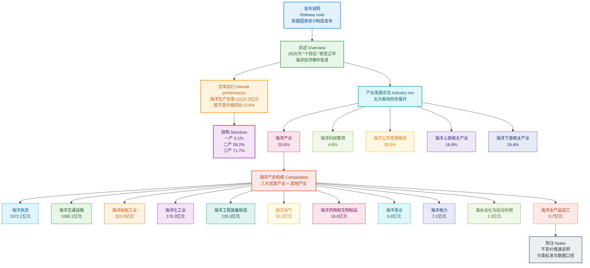

# 2025年上海市海洋经济统计公报精读笔记

> **阅读结构**：**文章基本信息**（来源与链）→ **前情提要**（文本结构大纲 + Mermaid 结构总览图）→ **中文精读总览**（分节数据与短注释）→ **逐句双语精读**（英汉对照与词汇精讲）→ **附表、附录** 与段末 **附注**（不变价/分类口径英文表述）。

## 文章基本信息

- **标题**：2025年上海市海洋经济统计公报（网页题名为《2025上海市海洋经济统计公报》与《2025年上海市海洋经济统计公报》之差异以官网/PDF 为准）
- **发布机构**：上海市海洋局
- **公报署期**：二〇二六年三月
- **网页登载时间**：2026 年 3 月 31 日（以上海市水务局官网「公示公告」页面为准，见下方链接 ①）
- **本笔记录入**：`date` 取公报文件日期 `2026-03-30`，`created_date` 为整理日期
- **数据属性**：初步核算数据（核算依据：自然资源部反馈与审定口径）
- **机构关系说明**：`上海市海洋局` 与 `上海市水务局` 为同一水务海洋行政公开体系中的海洋统计发布主体，政策与统计信息由该局链发布
- **原文与本地存档**
  - `source_url`：PDF 直链（与 [📄 026 元信息](026-2025年上海市海洋经济统计公报-上海市海洋局-2026-03-30.md) 一致）
  - ① [公示公告 · 网页发布页](https://swj.sh.gov.cn/swj-gsgg/20260331/09a087584dd64c58985fa523a982d5b9.html) ② [PDF 原文](https://swj.sh.gov.cn/cmsres/25/258172b35acb404fa75d3ee6a962419e/9dcbf54349b66e38bdfdb0fcf34fd65c.pdf) ③ [机构公开文件示例（供站点口径核对）](https://swj.sh.gov.cn/zcwj/20250221/bdec84846fb247b5a78a679f62f76adf.html)

## 前情提要

### 文本结构大纲

```text
2025年上海市海洋经济统计公报
├── 封面及发布说明
│   └── 明确核算制度、数据来源与发布日期
├── 引言：宏观背景与战略引领
│   ├── “十四五”规划收官之年背景
│   ├── 指导思想（习近平新时代中国特色社会主义思想）
│   ├── 战略要求（海洋强国建设、中央财经委六次会议精神）
│   └── 核心目标（陆海统筹、新质生产力、现代海洋城市、“五个中心”）
├── 一、海洋经济总体运行情况
│   ├── 总量指标：11122.2亿元（同比增长5%）
│   ├── 权重地位：占全市GDP 19.6%，占全国海洋生产总值 10.1%
│   └── 三次产业结构：0.1%（一产）：28.2%（二产）：71.7%（三产）
├── 二、海洋产业发展情况
│   ├── 1. 产业整体规模：五大板块增加值及占比
│   ├── 2. 产业结构构成：三大优势产业（旅游、航运、船舶）与其他产业
│   └── 3. 具体细分产业详述（分11个子项）：
│       ├── (一) 海洋旅游业：邮轮经济复苏，三年累计增长92%
│       ├── (二) 海洋交通运输业：集装箱吞吐量突破5500万标箱（世界首个）
│       ├── (三) 海洋船舶工业：增速领跑（39.2%），高技术/绿色化转型
│       ├── (四) 海洋化工业：高位趋稳，略有下降
│       ├── (五) 海洋工程装备制造业：能级跃升，研制能力提升
│       ├── (六) 海洋油气业：较快增长，能源安全保障
│       ├── (七) 海洋药物和生物制品业：总体提升，规模扩大
│       ├── (八) 海洋渔业：现代化转型，绿色健康养殖
│       ├── (九) 海洋电力业：平稳增长，年均复合增长率2.23%
│       ├── (十) 海水淡化与综合利用业：工艺突破，耦合电解制氢
│       └── (十一) 海洋水产品加工业：平稳运行
├── 附表：2024-2025年数据对照表
└── 附录：名词解释与统计标准
    └── 定义海洋生产总值、海洋经济及各细分产业范围
```

### 结构总览图



---

## 中文精读总览

### 【封面及发布说明】

2025 年上海市海洋经济统计公报  
上海市海洋局  
二〇二六年三月  
按照国家海洋经济统计制度要求，根据自然资源部初步核算数据，上海市海洋局编制了《2025年上海市海洋经济统计公报》，现予以发布。  
上海市海洋局局长：  
二○二六年三月

> **【注释解析】**
>
> - **自然资源部（Ministry of Natural Resources）**：根据 2018 年国务院机构改革，自然资源部负责海洋经济运行监测等工作。海洋生产总值的核算通常采取「地方核算、部委审定反馈」的机制。
> - **初步核算数据（Preliminary accounting data）**：统计学中，数据通常经历「初步核算」「初步核实」和「最终核实」三个阶段，反映了统计工作的严谨性。
> - **近义词辨析**：**发布** vs **颁布**。在政府公文中，「发布」多指通过媒体向公众公布信息；「颁布」则多用于法律、法令。

### 【引言：宏观背景】

2025 年是「十四五」规划收官之年，在上海市委、市政府的坚强领导下，全市坚持以习近平新时代中国特色社会主义思想为指导，深入学习领会习近平总书记关于海洋强国建设重要论述和中央财经委六次会议精神，以「五个更加注重」为引领，全面落实推动海洋经济高质量发展部署要求，坚持陆海统筹，加快培育和发展海洋新质生产力，海洋经济发展稳中有进，现代海洋城市建设提质增效，助力上海「五个中心」建设。

> **【注释解析】**
>
> - **「十四五」规划（The 14th Five-Year Plan）**：指《中华人民共和国国民经济和社会发展第十四个五年规划和 2035 年远景目标纲要》，2025 年是该规划执行的最后一年，具有承上启下的关键意义。
> - **中央财经委六次会议**：2020 年召开，重点研究黄河流域生态保护和成渝地区双城经济圈建设，但在广义上，其强调的「区域协调发展」和「生态文明建设」是海洋经济「陆海统筹」的重要理论依据。
> - **五个更加注重**：即「更加注重科技创新、更加注重绿色低碳、更加注重数字化转型、更加注重陆海统筹、更加注重开放合作」。
> - **海洋新质生产力（New quality productive forces in the marine sector）**：以海洋科技创新为核心驱动力，摆脱传统增长路径，具有高科技、高效能、高质量特征。
> - **五个中心**：指上海致力建设的**国际经济、金融、贸易、航运、科技创新中心**。其中「国际航运中心」和「科技创新中心」与海洋经济关联度最高。
> - **词汇积累**：**提质增效**（To improve quality and increase efficiency）；**稳中有进**（Steady progress while maintaining stability）。

### 【一、海洋经济总体运行情况】

根据自然资源部反馈的初步核算数据，2025 年上海市海洋生产总值 11122.2 亿元，按不变价格计算，同比增长 5%，占当年全市生产总值比重为 19.6%，占当年全国海洋生产总值比重为 10.1%。从产业结构来看，海洋第一产业增加值 9.8 亿元，第二产业增加值 3141.3 亿元，第三产业增加值 7971.2 亿元，分别占海洋生产总值的 0.1%、28.2% 和 71.7%。

> **【注释解析】**
>
> - **海洋生产总值（Gross Ocean Product, GOP）**：海洋经济产出的核心指标。
> - **不变价格（Constant price）**：剔除价格变动因素后计算的价格，用于计算实际增长率，反映物量的真实增长。
> - **产业结构（Industrial structure）**：上海海洋经济呈现明显的「三、二、一」倒金字塔结构，第三产业（主要为交通运输和旅游）占比超过七成，体现了上海作为超大型服务型城市的海洋经济特征。
> - **易混淆词汇**：**占比** vs **贡献率**。占比指部分在总体中的份额；贡献率指某部分增长量在总体增长量中的比例。

### 【二、海洋产业发展情况：总体】

2025 年，15 个海洋产业增加值 3398.6 亿元，比上年增长 4.3%；海洋科研教育增加值 507.9 亿元，比上年增长 3.9%；海洋公共管理服务增加值 3183.9 亿元，比上年增长 7.3%；海洋上游相关产业增加值 1871.6 亿元，比上年增长 3.1%；海洋下游相关产业增加值 2160.1 亿元，比上年增长 2.2%。五类占比分别为 30.6%、4.6%、28.6%、16.8%、19.4%。

> **【注释解析】**
>
> - **海洋公共管理服务**：包括海洋生态修复、地质勘查等，7.3% 的高增速反映了上海对海洋治理和生态投入的加大。
> - **海洋上/下游相关产业**：体现了海洋经济的延伸性。上游多涉及原材料和装备制造，下游涉及产品分销及相关服务。

### 【三大优势产业及构成】

上海市海洋产业包括海洋旅游业、海洋交通运输业、海洋船舶工业，以及海洋油气业、海洋化工业、海洋工程装备制造业、海洋渔业、海洋电力业、海水淡化与综合利用业、海洋药物和生物制品业、海洋工程建筑业、海洋水产品加工业。其中，海洋旅游业、海洋交通运输业、海洋船舶工业作为三大优势产业，分别占全市海洋产业增加值的 46.3%、31.2%、9.5%；其余海洋产业合计占比 13.0%。海洋旅游业、交通运输业稳步发展，海洋船舶工业实现快速发展，海洋工程装备制造、海洋电力等新兴动能加速培育。

> **【注释解析】**
>
> - **三大优势产业**：旅游、交运、船舶。这三者占海洋产业增加值的比例接近 90%，是上海海洋经济的「定海神针」。
> - **核心表达**：**加速培育**（To accelerate the cultivation of）；**稳步向好**（Steady improvement）。

### 【（一）海洋旅游业】

全年实现增加值 1572.2 亿元，比上年增长 2.4%。「十四五」期间，上海市海洋旅游业历经深度调整，行业增加值由 2022 年的 819.4 亿元，增长至 2025 年的 1572.2 亿元，三年累计增长 92%。邮轮经济全面复苏，有效拉动海洋消费市场回暖向好。2025 年上海邮轮口岸全年查验出入境旅客数超 180 万人次，同比增长 35%，出入境邮轮数超 540 艘次。

> **【注释解析】**
>
> - **深度调整**：隐含了 2022 年左右受公共卫生事件影响后的产业重塑。
> - **邮轮经济（Cruise Economy）**：上海是中国邮轮产业的策源地和核心区。**吴淞口国际邮轮港**（位于宝山区）是亚洲第一大邮轮母港。
> - **金句积累**：**有效拉动海洋消费市场回暖向好**。
> - **数据对比**：出入境旅客数增长 35%，显著高于行业增加值增速，说明邮轮旅游带动的流量红利正在向价值红利转化。

### 【（二）海洋交通运输业】

全年实现增加值 1060.1 亿元，与上年基本持平（同比下降 0.2%）。「十四五」期间，行业经历短期波动后稳步增长：2023 年总量出现明显回落，2024 年企稳回升，连续两年稳定在千亿规模以上。2025 年上海港集装箱吞吐量达 5506 万标准箱，成为全球首个突破 5000 万标准箱的港口，航运服务能级持续提升，为上海国际航运中心建设提供坚实支撑。

> **【注释解析】**
>
> - **上海港（Port of Shanghai）**：包括洋山深水港、外高桥港区等。2025 年突破 5506 万标准箱（TEU）是世界航运史的里程碑。
> - **标准箱（TEU）**：Twenty-foot Equivalent Unit，是以长度为 20 英尺的集装箱为标准的换算单位。
> - **能级（Capability and level）**：在公文语境下，指一个平台或中心所具备的功能、规模、地位和辐射力。
> - **辨析**：**企稳回升**（To stabilize and rebound）。

### 【（三）海洋船舶工业】

全年实现增加值 322.9 亿元，比上年增长 39.2%，增速领跑全市海洋产业，增加值较 2021 年实现翻番。「十四五」期间，行业绿色化、智能化转型成效显著，核心竞争力不断增强，稳步向全球产业链、价值链中高端跃升。高技术船型占比持续提升，LNG 船建造效率达世界先进水平，造船完工量、新接订单量、手持订单量等核心指标均位列全国前列。

> **【注释解析】**
>
> - **LNG 船（Liquefied Natural Gas Carrier）**：液化天然气运输船，被誉为世界造船业「皇冠上的明珠」，技术门槛极高。
> - **中高端跃升**：指产业不再依赖中低端劳动密集型加工，而转向高附加值、高技术含量的环节。
> - **造船三项指标**：完工量（反映产能）、新接订单量（反映市场竞争力）、手持订单量（反映生产后劲）。
> - **成语积累**：**脱颖而出**、**独占鳌头**。

### 【（四）海洋化工业】

全年实现增加值 176.3 亿元，比上年下降 1.8%。「十四五」期间，海洋化工业实现快速增长，2023 年突破 170 亿元后进入高位趋稳阶段。

> **【注释解析】**
>
> - **高位趋稳**：指总量处于历史较高水平，但增速放缓或微降，进入成熟期或结构调整期。
> - **背景**：上海海洋化工主要集中在**上海化学工业区**（金山/奉贤沿海）。

### 【（五）海洋工程装备制造业】

全年实现增加值 125.3 亿元，比上年增长 4.8%。「十四五」期间，上海市海洋工程装备制造业实现能级跃升，产业规模突破百亿元。关键核心技术不断突破，高端化、绿色化、国产化转型成效显著，海洋油气开发、海上风电、港口机械等海工装备研制能力不断提升。

> **【注释解析】**
>
> - **海洋工程装备（Offshore Engineering Equipment）**：除传统船舶外，用于海洋资源开发的大型构筑物，如钻井平台、海上风电桩基、浮式储油装置（FPSO）等。
> - **三个化**：高端化、绿色化、国产化。

### 【（六）海洋油气业】

全年实现增加值 92.0 亿元，比上年增长 19.0%。「十四五」期间行业保持较快增长，海洋能源安全保障供给能力稳步提升，在上海市海洋经济发展中的贡献度逐步显现。

> **【注释解析】**
>
> - **背景**：上海虽不产油气，但其拥有众多海洋油气研发机构和勘探服务企业（如中海油上海分公司），此项数据更多反映上海作为决策与保障中心的能力。

### 【（七）海洋药物和生物制品业】

全年实现增加值 16.6 亿元，比上年下降 0.6%。「十四五」期间，上海市海洋药物和生物制品业总体呈现逐步提升态势，产业规模有所扩大。

> **【注释解析】**
>
> - **背景**：这是海洋战略性新兴产业。虽然总量小，但潜力巨大，涉及生物医药前端研究。

### 【（八）海洋渔业】

全年实现增加值 9.8 亿元，比上年增长 15.3%。「十四五」期间，产业发展基础持续巩固，年均复合增长率 4.6%。海洋渔业稳步发展，绿色健康养殖模式有序推进，产业现代化转型步伐加快。

> **【注释解析】**
>
> - **绿色健康养殖**：相对于传统围网养殖，强调生态平衡、减药减量，注重水产品品质。

### 【（九）海洋电力业】

全年实现增加值 7.1 亿元，比上年增长 4.4%。「十四五」期间，上海市海洋电力业总体保持平稳增长态势，增加值由 2021 年的 6.5 亿元增至 2025 年的 7.1 亿元，累计增长 9.2%，年均复合增长率 2.23%。

> **【注释解析】**
>
> - **海上风电（Offshore Wind Power）**：是海洋电力业的主要组成部分。上海在**东海大桥**、**奉贤**、**临港**等地拥有成熟的海上风电场。

### 【（十）海水淡化与综合利用业】

全年实现增加值 1.3 亿元，与上年持平。「十四五」期间，上海市海水淡化与综合利用业总体保持平稳发展。海水淡化工艺取得突破，创新开发适合海水/废水直接耦合电解制氢技术，为海洋经济绿色低碳发展注入新动能。

> **【注释解析】**
>
> - **耦合电解制氢（Coupled electrolytic hydrogen production）**：这是一项前沿技术。利用海水直接制氢，解决了氢能生产中的水资源消耗问题，是绿色能源转型的重大突破。

### 【（十一）海洋水产品加工业】

全年实现增加值 0.7 亿元，比上年下降 12.5%。「十四五」期间，上海市海洋水产品加工业总体保持平稳运行态势。行业增加值由 2021 年的 0.4 亿元增至 2025 年的 0.7 亿元。

> **【注释解析】**
>
> - **数据波动**：由于基数极小（仅 0.7 亿），微小的变化都会导致两位数的百分比波动，此现象在统计学中称为「小基数效应」。

---

## 【附表：2024-2025 年数据分析】

（略去具体数字罗列，重点看同比趋势）

- **船舶工业增速最快（39.2%）**，显现出极强的产业爆发力。
- **工程建筑业下降明显（-18.2%）**，可能与「十四五」末期重大涉海工程项目阶段性收尾有关。
- **三次产业结构（0.09:28.24:71.67）**：第三产业占比略有下降（上年为 72.05%），第二产业占比提升，主要受船舶工业强势拉动。

## 【附录：重点术语解析】

> **【术语注释】**
>
> - **海洋及相关产业分类（GB/T 20794-2021）**：这是统计工作的「宪法」，确保了数据的全国可比性。2021 年的新标准增加了对新兴产业的细分。
> - **现价（Current price）** vs **不变价（Constant price）**：
>   - 现价：当年市场上的实际价格，受通胀影响。
>   - 不变价：用于纵向对比不同年度的实际产出变化。
> - **海洋交通运输业（Marine Transportation Services）**：不仅是开船，还包括港口装卸、理货、仓储、代理服务。
> - **沿海滩涂种植业（Coastal tidal flat planting）**：主要指耐盐碱作物的种植，对上海崇明、横沙等地具有生态价值。
> - **海洋公共管理服务（Marine Public Management and Services）**：这是政府职能的延伸，如**上海市海洋局**对海洋环境的监测、行政审批、海洋防灾减灾等支出均计入此类。

不变价、现价及 GB/T 20794-2021 在下方「逐句双语精读」末段 **《附注》** 有逐条英译与口径说明，可与本段对照阅读。

---

## 逐句双语精读

### 发布说明

🔸 按照国家`海洋经济统计制度`要求，/ 根据`自然资源部`初步核算数据，/ 上海市海洋局编制了《2025年上海市海洋经济统计公报》，/ 现予以`发布`。
🔹 In accordance with the requirements of the national `marine economy statistical system`, and on the basis of the Ministry of Natural Resources’ preliminary accounting data, the Shanghai Municipal Ocean Bureau compiled the *2025 Statistical Bulletin on Shanghai’s Marine Economy* and hereby `releases` it.

背景注释：`自然资源部`是中国国务院组成部门之一，负责自然资源管理与相关统计口径协调；`统计公报`常用于政府或机构发布年度、季度的正式统计结果，语言风格偏正式、凝练。

> `compile` /kəmˈpaɪl/ v. **to collect information from different sources and arrange it into an organized whole**；中文：`编制；汇编；整理成册`。语域：正式、学术、政府公文。
> 画龙点睛：高频搭配有 `compile a report / statistics / a database`。它强调“搜集并整合”，不同于单纯 `write`，也不同于偏修改性的 `edit`。做阅读、翻译、写作时，凡涉及“编制报告、汇总数据”，都可优先想到这个词。

---

🔸 2025年是`“十四五”规划收官之年`，/ 在上海市委、市政府的坚强领导下，/ 全市坚持以习近平新时代中国特色社会主义思想为指导，/ 深入学习领会习近平总书记关于海洋强国建设重要论述和`中央财经委六次会议`精神，/ 以`“五个更加注重”`为引领，/ 全面落实推动海洋经济`高质量发展`部署要求，/ 坚持陆海统筹，/ 加快培育和发展`海洋新质生产力`，/ 海洋经济发展稳中有进，/ 现代海洋城市建设提质增效，/ 助力上海`“五个中心”`建设。
🔹 In 2025, the concluding year of the `14th Five-Year Plan`, Shanghai, under the strong leadership of the municipal Party committee and government, upheld Xi Jinping Thought on Socialism with Chinese Characteristics for a New Era as its guide, thoroughly studied and implemented the important expositions on building a strong maritime nation and the guiding principles of the `sixth meeting of the Central Commission for Financial and Economic Affairs`, took the principle of placing greater emphasis in five respects as guidance, fully implemented the arrangements for the `high-quality development` of the marine economy, coordinated land and sea development, accelerated the cultivation and growth of `new quality productive forces` in marine sectors, and achieved steady progress in marine economic development, greater quality and efficiency in building a modern marine city, and stronger support for Shanghai’s development as the `five centers`.

背景注释：`“十四五”`即第十四个五年规划周期（2021—2025）；`中央财经委六次会议`指中央层面的重要经济决策会议；`五个更加注重`与`五个中心`均为中国政策语境中的固定表达，后者通常指国际经济、金融、贸易、航运、科技创新中心；`新质生产力`是近年高频政策概念，强调创新驱动、科技含量和高质量供给能力。

> `high-quality development` /haɪ ˈkwɑːləti dɪˈveləpmənt/ n. **development that emphasizes efficiency, structure, sustainability, and innovation rather than sheer speed**；中文：`高质量发展`。语域：政策、经济、新闻。
> 画龙点睛：这是中国经济英文文本中的核心政策表达，常与 `innovation-driven`, `sustainable`, `structural upgrading` 连用。写作中不要机械译成 “good development”，而应体现“质量、效率、结构、可持续性”这些内涵。

---

### 一、海洋经济总体运行情况

🔸 根据自然资源部反馈的`初步核算数据`，/ 2025年上海市`海洋生产总值`11122.2亿元，/ 按`不变价格`计算，/ 同比增长5.0%，/ 占当年全市生产总值比重为19.6%，/ 占当年全国海洋生产总值比重为10.1%。
🔹 According to the `preliminary accounting data` fed back by the Ministry of Natural Resources, Shanghai’s `gross ocean product` in 2025 reached RMB 1.11222 trillion; calculated at `constant prices`, it rose by 5.0 percent year on year, accounting for 19.6 percent of the city’s GDP that year and 10.1 percent of the national gross ocean product.

背景注释：`海洋生产总值`可理解为“海洋版GDP”，英文常译为 `gross ocean product`；`按不变价格计算`表示剔除价格变动后的实际增长，更接近“真实增速”。

> `gross ocean product` /ˌɡroʊs ˈoʊʃən ˈprɑːdʌkt/ n. **the total value created by marine-related economic activities in a region or country**；中文：`海洋生产总值`。语域：统计、经济、政策。
> 画龙点睛：它类比 `GDP`，但统计对象限定为海洋及涉海经济活动。阅读官方公报时常与 `share`, `growth rate`, `constant prices` 连用；翻译时不要误写成 `marine GDP`，虽然能懂，但正式文本里 `gross ocean product` 更标准。

---

🔸 从`产业结构`来看，/ 海洋第一产业增加值9.8亿元，/ 第二产业增加值3141.3亿元，/ 第三产业增加值7971.2亿元，/ 分别占海洋生产总值的0.1%、28.2%和71.7%。
🔹 In terms of `industrial structure`, the added value of the primary marine sector was RMB 0.98 billion, that of the secondary marine sector RMB 314.13 billion, and that of the tertiary marine sector RMB 797.12 billion, representing 0.1 percent, 28.2 percent, and 71.7 percent of the gross ocean product, respectively.

背景注释：`第一产业/第二产业/第三产业`是中国与国际通行的三次产业划分，对应 primary / secondary / tertiary sectors；这里体现上海海洋经济明显以服务业为主。

> `industrial structure` /ɪnˈdʌstriəl ˈstrʌktʃər/ n. **the composition of an economy by different industries or sectors**；中文：`产业结构`。语域：经济、学术、政策分析。
> 画龙点睛：常见搭配有 `optimize the industrial structure`, `industrial restructuring`, `industrial mix`。阅读题里常借它考查“结构变化”而非“总量变化”；写作时如要表达“服务业占比提高”，可直接写 `the industrial structure has become more service-oriented`。

---

### 二、海洋产业发展情况

🔸 2025年，/ 15个海洋产业增加值3398.6亿元，/ 比上年增长4.3%；/ 海洋科研教育增加值507.9亿元，/ 比上年增长3.9%；/ 海洋公共管理服务增加值3183.9亿元，/ 比上年增长7.3%；/ 海洋上游相关产业增加值1871.6亿元，/ 比上年增长3.1%；/ 海洋下游相关产业增加值2160.1亿元，/ 比上年增长2.2%。
🔹 In 2025, the added value of Shanghai’s 15 marine industries was RMB 339.86 billion, up 4.3 percent from the previous year; marine scientific research and education generated RMB 50.79 billion, up 3.9 percent; marine public administration and services generated RMB 318.39 billion, up 7.3 percent; marine upstream related industries generated RMB 187.16 billion, up 3.1 percent; and marine downstream related industries generated RMB 216.01 billion, up 2.2 percent.

背景注释：这一句把海洋经济拆成五个统计大类，其中`上游`通常偏原料、装备、基础支撑，`下游`通常偏消费、应用与延伸服务；公报里用分号串联多个平行数据点，是典型统计文体。

> `added value` /ˈædɪd ˈvæljuː/ n. **the value created by a sector after subtracting the value of intermediate inputs**；中文：`增加值`。语域：经济、统计、财经报道。
> 画龙点睛：这是公报最高频术语之一。它不是单纯的“收入”或“产值”，而是扣除中间消耗后的新增价值。考试中若看到 `value added tax`，那是“增值税”；不要把 `added value` 与 `output value` 混为一谈。

---

🔸 `五类`占比分别为30.6%、4.6%、28.6%、16.8%、19.4%。
🔹 These `five categories` accounted for 30.6 percent, 4.6 percent, 28.6 percent, 16.8 percent, and 19.4 percent, respectively.

背景注释：这里的`五类`承接上一句，依次指海洋产业、海洋科研教育、海洋公共管理服务、海洋上游相关产业、海洋下游相关产业；`respectively` 是解读此类并列数据的关键提示词。

> `account for` /əˈkaʊnt fɔːr/ v. **to form part of a total; to make up a proportion of something**；中文：`占……比重；构成……的一部分`。语域：正式、统计、财经。
> 画龙点睛：这是图表题和数据描述题常客。常见句型有 `A accounts for 30% of B`。它既可用于静态占比，也可与 `respectively` 搭配对应多个数字。注意不要误解成日常口语里的 “解释、说明”，那是它的另一层常见含义。

---

🔸 上海市海洋产业包括`海洋旅游业`、`海洋交通运输业`、`海洋船舶工业`，/ 以及海洋油气业、海洋化工业、海洋工程装备制造业、海洋渔业、海洋电力业、海水淡化与综合利用业、海洋药物和生物制品业、海洋工程建筑业、海洋水产品加工业。
🔹 Shanghai’s marine industries `include` marine tourism, marine transportation, and the marine shipbuilding industry, as well as the marine oil and gas industry, the marine chemical industry, marine engineering equipment manufacturing, marine fishery, marine electric power, seawater desalination and comprehensive utilization, marine pharmaceuticals and biological products, marine engineering construction, and marine aquatic-product processing.

背景注释：这句相当于全文的产业目录，后文各分行业就是在此清单中展开；`海洋工程建筑业`与`海洋工程装备制造业`不同，前者偏施工建设，后者偏设备研发制造。

> `include` /ɪnˈkluːd/ v. **to have something as part of a whole**；中文：`包括；包含`。语域：通用、正式均可。
> 画龙点睛：虽然是基础词，但在正式写作里非常高频。注意 `A includes B, C, and D` 强调“B/C/D 属于 A 的组成部分”；若想更书面，可替换为 `comprise`, `encompass`, `consist of`。其中 `include` 最灵活、最稳妥。

---

🔸 其中，/ `海洋旅游业`、`海洋交通运输业`、`海洋船舶工业`作为三大优势产业，/ 分别占全市海洋产业增加值的46.3%、31.2%、9.5%；/ 其余海洋产业合计占比13.0%。
🔹 Among them, marine tourism, marine transportation, and marine shipbuilding are the city’s three major `pillar industries`, accounting for 46.3 percent, 31.2 percent, and 9.5 percent of Shanghai’s marine industrial added value, respectively, while all other marine industries combined accounted for 13.0 percent.

背景注释：`优势产业`在英文正式表达中常可译作 `pillar industries`, `leading industries` 或 `competitive industries`；本句强调上海海洋经济的主支柱集中度较高。

> `pillar industry` /ˈpɪlər ˈɪndəstri/ n. **a major industry that strongly supports an economy or a region’s development**；中文：`支柱产业；优势产业`。语域：经济、政策、区域发展。
> 画龙点睛：`pillar` 本义是“柱子”，引申为“支撑物”。写作中若想表达某行业对地区经济至关重要，`a pillar industry of the regional economy` 很地道。与 `emerging industry` 相对，前者偏成熟支撑，后者偏新增长点。

---

🔸 海洋旅游业、交通运输业`稳步发展`，/ 海洋船舶工业实现`快速发展`，/ 海洋工程装备制造、海洋电力等`新兴动能`加速培育。
🔹 Marine tourism and transportation developed `steadily`, the marine shipbuilding industry achieved `rapid growth`, and `new growth drivers` such as marine engineering equipment manufacturing and marine electric power were cultivated at a faster pace.

背景注释：`新兴动能`是政策和经济报道中的常见词，强调能推动未来增长的新产业、新技术和新模式；这句属于概括性判断，为后文各分行业铺垫。

> `growth driver` /ɡroʊθ ˈdraɪvər/ n. **a factor, sector, or force that stimulates economic growth**；中文：`增长动能；增长驱动力`。语域：经济、新闻、投资分析。
> 画龙点睛：常见搭配有 `new growth drivers`, `key growth driver`, `become a driver of growth`。它比单纯说 `reason` 更专业，适合财经写作。翻译“新兴动能”时，用这个表达比直译成 `new momentum` 更贴近经济语境。

---

### （一）海洋旅游业

🔸 全年实现增加值1572.2亿元，/ 比上年增长2.4%。
🔹 Throughout the year, the sector generated RMB 157.22 billion in `added value`, up 2.4 percent from the previous year.

背景注释：这里的`全年实现增加值……`是统计公报固定句式，后文各行业会反复出现；读这类句子时要先锁定主语是“该行业”。

> `sector` /ˈsektər/ n. **a distinct part of an economy or area of activity**；中文：`行业；部门；领域`。语域：经济、新闻、学术。
> 画龙点睛：英语里写产业分析时，`sector` 非常常用，往往比反复使用 `industry` 更自然。常见搭配有 `the tourism sector`, `the public sector`, `the private sector`。阅读中注意它既可指经济行业，也可指公私部门。

---

🔸 `“十四五”期间`，/ 上海市海洋旅游业`历经深度调整`，/ 行业增加值由2022年的819.4亿元，/ 增长至2025年的1572.2亿元，/ 三年累计增长92%。
🔹 During the `14th Five-Year Plan period`, Shanghai’s marine tourism industry `underwent deep adjustment`, with its added value rising from RMB 81.94 billion in 2022 to RMB 157.22 billion in 2025, a cumulative increase of 92 percent over three years.

背景注释：`深度调整`通常指行业经历较大波动、重组、修复或经营模式变化；`累计增长`不是年均增长，不能与 CAGR 混同。

> `undergo` /ˌʌndərˈɡoʊ/ v. **to experience or pass through something, especially a change or process**；中文：`经历；经受；遭受`。语域：正式、学术、新闻。
> 画龙点睛：不规则变化为 `undergo - underwent - undergone`。常见搭配有 `undergo adjustment / reform / surgery / transformation`。它很适合描述“行业经历调整、制度经历改革”这类被动而持续的过程。

---

🔸 `邮轮经济`全面复苏，/ 有效拉动海洋消费市场`回暖向好`。
🔹 The `cruise economy` fully rebounded, effectively boosting the recovery and improvement of the marine consumer market.

背景注释：`邮轮经济`不只指邮轮航运本身，还包括旅游、零售、港口服务、餐饮住宿等链条性消费；`回暖向好`是经济报道中表示从低位恢复并持续改善的常用表述。

> `cruise economy` /kruːz ɪˈkɑːnəmi/ n. **the economic activities generated by cruise travel and related services**；中文：`邮轮经济`。语域：旅游、港口经济、政策。
> 画龙点睛：这是复合型经济概念，写作中可展开为 `cruise tourism, port services, retail, hospitality and related consumption`。如果文章强调其连带效应，可搭配 `spillover effects`, `boost local consumption`, `revitalize waterfront areas`。

---

🔸 2025年上海`邮轮口岸`全年查验出入境旅客数超180万人次，/ 同比增长35%，/ 出入境邮轮数超540艘次。
🔹 In 2025, Shanghai’s `cruise ports` inspected more than 1.8 million `inbound and outbound` passengers for the full year, up 35 percent year on year, and handled more than 540 inbound and outbound cruise ship calls.

背景注释：`口岸`在涉外交通语境中可指国家批准开放的港口、机场等通关点；`艘次`是船舶进出港统计中的次数单位；`查验`带有边检、海关等通关检查含义。

> `inbound and outbound` /ˈɪnbaʊnd ənd ˈaʊtbaʊnd/ adj. **coming into and going out of a country, port, or region**；中文：`入境和出境的；进港和出港的`。语域：交通、海关、旅游、新闻。
> 画龙点睛：旅游与口岸统计里非常常见，如 `inbound tourism`, `outbound travel`, `inbound and outbound passengers`。注意它是固定搭配，正式文本中比单写 `international` 更精确，因为它直接点明双向流动。

---

### （二）海洋交通运输业

🔸 全年实现增加值1060.1亿元，/ 与上年`基本持平`（同比下降0.2%）。
🔹 Throughout the year, the sector generated RMB 106.01 billion in added value, `remaining basically flat` from the previous year, with a year-on-year decrease of 0.2 percent.

背景注释：`基本持平`常见于公报、财报、新闻稿，表示总体变化很小，即使有轻微升降，也仍可归入“基本不变”范围。

> `remain basically flat` /rɪˈmeɪn ˈbeɪsɪkli flæt/ phrase **to stay at almost the same level with only slight change**；中文：`基本持平；大体不变`。语域：统计、财经、商业报道。
> 画龙点睛：描述数据波动很小时非常好用，常和括号里的精确百分比连用。近义表达还有 `stay broadly unchanged`, `be little changed`。图表作文里若不想机械重复 `increase/decrease`，它是很好的替换。

---

🔸 `“十四五”期间`，/ 行业经历短期波动后`稳步增长`：/ 2023年总量出现明显回落，/ 2024年企稳回升，/ 连续两年稳定在千亿规模以上。
🔹 During the `14th Five-Year Plan period`, the industry registered `steady growth` after short-term fluctuations: its total volume declined markedly in 2023, `stabilized and rebounded` in 2024, and stayed above the RMB 100 billion mark for two consecutive years.

背景注释：`企稳回升`是经济新闻高频搭配，表示先止跌或止缓，再重新恢复增长；`千亿规模`即超过 100 billion yuan 的体量级别。

> `rebound` /ˌriːˈbaʊnd/ v./n. **to recover after a fall; a recovery after decline**；中文：`反弹；回升；恢复`。语域：经济、金融、新闻。
> 画龙点睛：可作动词也可作名词，如 `sales rebounded`, `a rebound in demand`。与 `recover` 相比，`rebound` 更强调“从下滑后回弹”；用在经济走势描述里，力度感更强，也更常见于新闻标题和分析报告。

---

🔸 2025年上海港`集装箱吞吐量`达5506万标准箱，/ 成为全球首个突破5000万标准箱的港口，/ 航运服务能级持续提升，/ 为上海国际航运中心建设提供坚实支撑。
🔹 In 2025, Shanghai Port’s `container throughput` reached 55.06 million `TEUs`, making it the first port in the world to surpass 50 million TEUs, while the capacity and sophistication of its shipping services continued to improve, providing solid support for Shanghai’s development as an international shipping center.

背景注释：`标准箱`对应国际通用单位 `TEU`，即 twenty-foot equivalent unit；`吞吐量`是港口、物流与航运中衡量规模的核心指标；`航运服务能级`强调服务层级、辐射力与综合竞争力。

> `throughput` /ˈθruːpʊt/ n. **the amount of material, goods, or traffic handled in a given period**；中文：`吞吐量；处理量`。语域：物流、港口、工业管理。
> 画龙点睛：港口常说 `container throughput`，工厂常说 `production throughput`，网络系统也会说 `data throughput`。这是一个典型“熟词跨领域高频词”，GRE 和专业阅读里都值得掌握。

---

### （三）海洋船舶工业

🔸 全年实现增加值322.9亿元，/ 比上年增长39.2%，/ `增速领跑`全市海洋产业，/ 增加值较2021年`实现翻番`。
🔹 Throughout the year, the sector generated RMB 32.29 billion in added value, up 39.2 percent from the previous year, `posting the fastest growth` among all marine industries in the city, and `doubling` its 2021 level.

背景注释：`船舶工业`包括造船、修船、配套设备等链条；`翻番`是汉语统计表达中很典型的说法，英文常译为 `double`。

> `double` /ˈdʌbəl/ v. **to become twice as much or make something twice as much**；中文：`翻倍；加倍`。语域：通用、统计、财经。
> 画龙点睛：`double` 既可作动词，也可作形容词、名词。写数据句时非常高效，如 `output doubled in four years`。若想更正式，可写 `rose to twice its previous level`。考试里常和 `halve`, `triple` 一起出现。

---

🔸 `“十四五”期间`，/ 行业绿色化、智能化转型成效显著，/ `核心竞争力`不断增强，/ 稳步向全球产业链、价值链`中高端跃升`。
🔹 During the `14th Five-Year Plan period`, the industry made notable progress in green and intelligent transformation, its `core competitiveness` continued to strengthen, and it steadily moved toward the `mid-to-high end` of the global industrial and value chains.

背景注释：`产业链`强调生产分工链条，`价值链`更强调价值创造与利润分布位置；`中高端跃升`是产业升级类报道中的典型表达。

> `value chain` /ˈvæljuː tʃeɪn/ n. **the full range of activities through which a product gains value, from design to production and sales**；中文：`价值链`。语域：商业、管理、经济。
> 画龙点睛：常见搭配有 `move up the value chain`, `global value chains`, `high-end segment of the value chain`。和 `supply chain` 不同，`value chain` 更强调“价值增值过程”，不是单纯物流供给链。

---

🔸 `高技术船型`占比持续提升，/ `LNG船`建造效率达世界先进水平，/ 造船完工量、新接订单量、手持订单量等核心指标均位列全国前列。
🔹 The share of `high-tech vessel types` continued to rise, the efficiency of `LNG carrier` construction reached a world-advanced level, and key indicators such as ship completion volume, new orders, and `order backlog` all ranked among the top in China.

背景注释：`LNG` 是 `liquefied natural gas` 的缩写，即液化天然气；`手持订单量`通常指尚未交付、仍在手中的订单储备，能反映未来生产景气度。

> `LNG` /ˌel en ˈdʒiː/ n. **liquefied natural gas, natural gas cooled into liquid form for storage and transport**；中文：`液化天然气`。语域：能源、航运、工程。
> 画龙点睛：这个缩写在能源、造船、国际运输报道里极高频。相关搭配有 `LNG carrier`, `LNG terminal`, `LNG-powered vessel`。做阅读时见到全大写缩略词，先判断所属行业，往往能快速锁定文章主题。

---

### （四）海洋化工业

🔸 全年实现增加值176.3亿元，/ 比上年下降1.8%。
🔹 Throughout the year, the sector generated RMB 17.63 billion in added value, `down` 1.8 percent from the previous year.

背景注释：这一句非常典型地使用 `down ... from the previous year` 说明负增长；财经英语中，`fall`, `drop`, `decline`, `decrease` 都可表达下降，但语气和搭配略有不同。

> `decline` /dɪˈklaɪn/ v./n. **to decrease; a reduction or downward movement**；中文：`下降；减少；下滑`。语域：新闻、经济、学术。
> 画龙点睛：`decline` 书面感比 `drop` 更强，既可作动词也可作名词，如 `sales declined`, `a decline in output`。若想写得更稳健、正式，数据回落时优先考虑它。

---

🔸 `“十四五”期间`，/ 海洋化工业实现`快速增长`，/ 2023年突破170亿元后进入`高位趋稳阶段`。
🔹 During the `14th Five-Year Plan period`, the marine chemical industry achieved rapid growth and, after surpassing RMB 17 billion in 2023, entered a stage of `high-level stabilization`.

背景注释：`高位趋稳`表示处于相对高位后，增速放缓、水平趋于平稳，并不意味着下滑；化工业常受周期、价格、原料成本影响，因此“高位稳定”是重要判断。

> `stabilize` /ˈsteɪbəlaɪz/ v. **to become stable or cause something to become stable**；中文：`趋稳；稳定下来`。语域：经济、政策、科技。
> 画龙点睛：常见表达有 `prices stabilized`, `the market has stabilized`, `stabilize at a high level`。它比单纯 `stop changing` 更自然，也更适合正式文本。若写趋势分析，`surge → level off → stabilize` 是常见链条。

---

### （五）海洋工程装备制造业

🔸 全年实现增加值125.3亿元，/ 比上年增长4.8%。
🔹 Throughout the year, the sector generated RMB 12.53 billion in added value, up 4.8 percent from the previous year.

背景注释：`海洋工程装备制造业`常简称“海工装备”，涉及海上油气、风电、港机、海上平台等高端装备。

> `equipment manufacturing` /ɪˈkwɪpmənt ˌmænjuˈfæktʃərɪŋ/ n. **the industry of producing machinery and technical equipment**；中文：`装备制造业`。语域：工业、政策、产业分析。
> 画龙点睛：比单纯 `manufacturing` 更具体，强调“制造复杂设备”。写作中若要体现产业升级，可用 `high-end equipment manufacturing`, `advanced equipment manufacturing`, `marine engineering equipment manufacturing` 等扩展形式。

---

🔸 `“十四五”期间`，/ 上海市海洋工程装备制造业实现`能级跃升`，/ 产业规模突破百亿元。
🔹 During the `14th Five-Year Plan period`, Shanghai’s marine engineering equipment manufacturing industry achieved a `leap in capability`, with its industrial scale surpassing RMB 10 billion.

背景注释：`能级`是中文政策文本常见词，指综合层级、能力、辐射带动水平，不只是“规模”一个维度；英文里通常不能直译为 `energy level`。

> `leap` /liːp/ n./v. **a sudden and significant increase or improvement**；中文：`跃升；飞跃`。语域：正式、新闻、商业。
> 画龙点睛：可作名词也可作动词，如 `a leap in productivity`, `capability leaped forward`。比 `increase` 更强调“跨越式提升”。翻译“实现能级跃升”时，用 `achieve a leap in capability / capacity / sophistication` 都比生硬直译自然。

---

🔸 `关键核心技术`不断突破，/ 高端化、绿色化、`国产化`转型成效显著，/ 海洋油气开发、海上风电、港口机械等海工装备研制能力不断提升。
🔹 `Breakthroughs` in key core technologies continued to be made, transformation toward higher-end, greener, and more `indigenized` products delivered notable results, and R&D capabilities in offshore equipment such as marine oil and gas development, offshore wind power, and port machinery continued to improve.

背景注释：`国产化`在产业政策中常指核心零部件、设备或系统由本土研发制造替代进口；`海上风电`即 offshore wind power，是近年海工装备的重要应用场景。

> `indigenization` /ɪnˌdɪdʒɪnəˈzeɪʃən/ n. **the process of developing or producing something domestically rather than relying on imports**；中文：`国产化；本土化研发制造`。语域：产业、科技、政策。
> 画龙点睛：这个词在国防、芯片、装备制造、能源设备报道中特别常见。可搭配 `the indigenization of key components`, `indigenized supply chain`。翻译时要根据语境区分它与一般文化语境中的 `localization`。

---

### （六）海洋油气业

🔸 全年实现增加值92.0亿元，/ 比上年增长19.0%。
🔹 Throughout the year, the sector generated RMB 9.20 billion in added value, up 19.0 percent from the previous year.

背景注释：`海洋油气业`主要指海上石油、天然气勘探开发及相关活动，是海洋能源的重要组成部分。

> `oil and gas` /ɔɪl ənd ɡæs/ n. **petroleum and natural gas as an energy industry**；中文：`油气；石油与天然气行业`。语域：能源、财经、工程。
> 画龙点睛：这是能源报道里的核心固定搭配，常见于 `oil and gas development`, `offshore oil and gas`, `oil and gas reserves`。比单写 `petroleum` 更宽，能同时覆盖石油和天然气两类资源。

---

🔸 `“十四五”期间`行业保持较快增长，/ `海洋能源安全保障供给能力`稳步提升，/ 在上海市海洋经济发展中的`贡献度`逐步显现。
🔹 During the `14th Five-Year Plan period`, the industry maintained relatively fast growth, the capacity to ensure secure supplies of marine energy steadily improved, and its `contribution` to the development of Shanghai’s marine economy gradually became more evident.

背景注释：`能源安全保障供给能力`强调稳定、安全、持续供能的能力；`贡献度`在英文中常根据语境译为 `contribution`, `contribution level`, `importance` 等。

> `contribution` /ˌkɑːntrɪˈbjuːʃən/ n. **the part played by someone or something in making a result possible**；中文：`贡献；贡献度`。语域：通用、正式、学术。
> 画龙点睛：常见搭配有 `make a contribution to`, `the contribution of A to B`, `contribution rate`。在数据分析里，它既可表“定性作用”，也可接具体比率做“定量贡献”。写作中非常实用。

---

### （七）海洋药物和生物制品业

🔸 全年实现增加值16.6亿元，/ 比上年下降0.6%。
🔹 Throughout the year, the sector generated RMB 1.66 billion in added value, down 0.6 percent from the previous year.

背景注释：`海洋药物和生物制品业`通常指从海洋生物资源中开发药物、原料或生物制品的产业，技术密集度较高。

> `bioproduct` /ˌbaɪoʊˈprɑːdʌkt/ n. **a product derived from biological materials or biological processes**；中文：`生物制品`。语域：生物科技、医药、产业分析。
> 画龙点睛：相关词群有 `biotechnology`, `biopharmaceuticals`, `biomaterials`。阅读时若文章同时出现 `drug`, `marine organism`, `R&D`, `clinical`, 往往就是海洋生物医药语境。写作中 `marine bioproducts` 是很自然的复合表达。

---

🔸 `“十四五”期间`，/ 上海市海洋药物和生物制品业总体呈现`逐步提升态势`，/ 产业规模有所扩大。
🔹 During the `14th Five-Year Plan period`, Shanghai’s marine pharmaceuticals and biological products industry showed an overall `upward trend`, and the scale of the industry expanded somewhat.

背景注释：`总体呈现……态势`是中文公报高频句式，英文里常译为 `show an overall trend of...`；`有所扩大`语气相对克制，不是大幅扩张。

> `upward trend` /ˈʌpwərd trend/ n. **a general movement toward higher levels over time**；中文：`上升趋势；逐步提升态势`。语域：统计、商业、学术。
> 画龙点睛：图表作文里非常好用，可替换单调的 `increased`。常见表达有 `show an upward trend`, `maintain an upward trend`。如果趋势不是直线上涨，还可加 `overall`，体现“总体向上、局部波动”。

---

### （八）海洋渔业

🔸 全年实现增加值9.8亿元，/ 比上年增长15.3%。
🔹 Throughout the year, the sector generated RMB 0.98 billion in added value, up 15.3 percent from the previous year.

背景注释：`海洋渔业`包括捕捞、养殖及相关初级生产活动，是海洋第一产业的重要组成部分。

> `fishery` /ˈfɪʃəri/ n. **the industry or activity of catching, breeding, and processing fish and other aquatic life**；中文：`渔业`。语域：农业、海洋经济、政策。
> 画龙点睛：它既可指“渔业行业”，也可指“渔场资源”。注意单复数差异：`fishery` 常作总称，`fisheries` 在学术与政策文本中也很常见。与 `fishing` 相比，`fishery` 更偏产业体系而不只是捕鱼行为。

---

🔸 `“十四五”期间`，/ 产业发展基础持续巩固，/ 年均`复合增长率`4.6%。
🔹 During the `14th Five-Year Plan period`, the foundation for industrial development continued to consolidate, with a `compound annual growth rate` of 4.6 percent.

背景注释：`复合增长率`是长期增长分析的常用指标，能平滑年度波动，反映一段时期内的平均增长速度。

> `compound annual growth rate` /ˈkɑːmpaʊnd ˈænjuəl ɡroʊθ reɪt/ n. **the mean annual growth rate of an investment or sector over a period, assuming compounding**；中文：`年均复合增长率`，常缩写为 `CAGR`。语域：金融、商业、统计。
> 画龙点睛：这是图表和商业分析中的经典术语。若文章给你起点和终点数据，常可反推出 CAGR。写作中既能体现专业性，也能避免重复使用 `average growth rate` 这种相对宽泛的说法。

---

🔸 海洋渔业`稳步发展`，/ `绿色健康养殖模式`有序推进，/ 产业现代化转型步伐加快。
🔹 Marine fishery developed steadily, `green and healthy aquaculture models` were advanced in an orderly manner, and the pace of industrial modernization and transformation accelerated.

背景注释：`养殖模式`对应 aquaculture models；`有序推进`强调按规划、分步骤推进，而不是无序扩张。

> `aquaculture` /ˈækwəˌkʌltʃər/ n. **the farming of fish, shellfish, seaweed, and other aquatic organisms**；中文：`水产养殖`。语域：农业、海洋、环境。
> 画龙点睛：这是比 `fish farming` 更专业、更广义的词，因为它还涵盖贝类、海藻等。相关搭配有 `sustainable aquaculture`, `marine aquaculture`, `aquaculture practices`。环境类文章里常把它与 `wild capture fisheries` 对照。

---

### （九）海洋电力业

🔸 全年实现增加值7.1亿元，/ 比上年增长4.4%。
🔹 Throughout the year, the sector generated RMB 0.71 billion in added value, up 4.4 percent from the previous year.

背景注释：`海洋电力业`一般涉及海上风电、海洋能发电等涉海电力领域；在上海语境中，海上风电是较重要方向。

> `electric power` /ɪˈlektrɪk ˈpaʊər/ n. **electricity as generated and supplied for use**；中文：`电力；电力行业`。语域：能源、工业、政策。
> 画龙点睛：比口语化的 `electricity` 更偏行业与系统层面。常见搭配有 `power generation`, `power grid`, `electric power industry`。阅读时若谈产业而非日常用电，优先把它识别成专业术语。

---

🔸 `“十四五”期间`，/ 上海市海洋电力业总体保持`平稳增长态势`，/ 增加值由2021年的6.5亿元增至2025年的7.1亿元，/ 累计增长9.2%，/ 年均复合增长率2.23%。
🔹 During the `14th Five-Year Plan period`, Shanghai’s marine electric power industry generally maintained `steady growth`, with added value rising from RMB 0.65 billion in 2021 to RMB 0.71 billion in 2025, a cumulative increase of 9.2 percent and a compound annual growth rate of 2.23 percent.

背景注释：本句同时给出`累计增长`与`复合增长率`，前者看总增幅，后者看平均年化节奏；两者不能互相替代。

> `cumulative` /ˈkjuːmjələtɪv/ adj. **increasing or added together over time**；中文：`累计的；累积的`。语域：统计、财经、学术。
> 画龙点睛：常见搭配有 `cumulative growth`, `cumulative increase`, `cumulative effect`。与 `annual` 不同，它看的是一段时期“加总后的整体变化”。图表阅读里若同时出现 `cumulative` 和 `compound annual`, 一定要区分“总量变化”和“平均节奏”。

---

### （十）海水淡化与综合利用业

🔸 全年实现增加值1.3亿元，/ 与上年持平。
🔹 Throughout the year, the sector generated RMB 0.13 billion in added value, `unchanged` from the previous year.

背景注释：`持平`与前文`基本持平`接近，但`持平`语气通常更直接，表示与上一年大体相同。

> `unchanged` /ʌnˈtʃeɪndʒd/ adj. **remaining the same; not altered**；中文：`未变的；持平的`。语域：通用、统计、新闻。
> 画龙点睛：是描述静态数据最简洁的词之一，如 `sales remained unchanged`, `the figure was unchanged at...`。和 `stable` 相比，`unchanged` 更强调“数值没变”，而 `stable` 更强调“状态稳定”。

---

🔸 `“十四五”期间`，/ 上海市`海水淡化与综合利用业`总体保持平稳发展。
🔹 During the `14th Five-Year Plan period`, Shanghai’s `seawater desalination and comprehensive utilization` industry generally maintained stable development.

背景注释：`海水淡化`指去除海水中的盐分获得可用淡水；`综合利用`则通常指对淡化过程、副产物、浓盐水等进行延伸利用。

> `desalination` /diːˌsælɪˈneɪʃən/ n. **the process of removing salt from seawater to make it usable as fresh water**；中文：`海水淡化；脱盐处理`。语域：环境工程、水务、能源。
> 画龙点睛：常见搭配有 `seawater desalination`, `desalination technology`, `desalination plant`。这是环境与资源类阅读的常见词，常与 `water scarcity`, `membrane`, `reverse osmosis` 等一起出现。

---

🔸 `海水淡化工艺`取得突破，/ 创新开发适合海水/废水直接耦合电解制氢技术，/ 为海洋经济`绿色低碳发展`注入`新动能`。
🔹 `Breakthroughs` were achieved in seawater desalination processes, and innovative hydrogen-production technology suitable for the direct coupled electrolysis of seawater and wastewater was developed, `injecting new momentum` into the `green and low-carbon development` of the marine economy.

背景注释：`制氢`即 hydrogen production；`耦合`在工程语境中常指两个过程或系统直接联动；`绿色低碳发展`是能源与环境政策中的常用总括表述。

> `inject new momentum` /ɪnˈdʒekt nuː moʊˈmentəm/ phrase **to bring fresh energy or impetus to development**；中文：`注入新动能；带来新的推动力`。语域：新闻、政策、商业写作。
> 画龙点睛：这是十分地道的抽象表达，适合描述技术、政策、投资对某领域的带动作用。也可替换为 `provide fresh impetus`, `create a new driver of growth`。写作中比反复使用 `promote` 更有层次。

---

### （十一）海洋水产品加工业

🔸 全年实现增加值0.7亿元，/ 比上年下降12.5%。
🔹 Throughout the year, the sector generated RMB 70 million in added value, down 12.5 percent from the previous year.

背景注释：`海洋水产品加工业`主要涉及海产初加工、精深加工、保鲜、包装等环节，与前端渔业生产不同。

> `aquatic-product processing` /əˈkwætɪk ˈprɑːdʌkt ˈprɑːsesɪŋ/ n. **the processing of fish and other aquatic products into marketable goods**；中文：`水产品加工业`。语域：食品工业、渔业经济。
> 画龙点睛：`aquatic` 比 `water` 更专业，常用于生物、渔业、环境文本。若写产业链，可与 `fishery`, `cold-chain logistics`, `food preservation`, `deep processing` 连起来，构成完整表达。

---

🔸 `“十四五”期间`，/ 上海市海洋水产品加工业总体保持`平稳运行态势`。
🔹 During the `14th Five-Year Plan period`, Shanghai’s marine aquatic-product processing industry generally `remained on a stable footing`.

背景注释：`运行态势`是公报里比“发展态势”更偏产业运行面的表述，既关注增速，也关注经营状态与波动区间。

> `footing` /ˈfʊtɪŋ/ n. **a particular position, basis, or condition on which something stands**；中文：`立足点；基础；状态`。语域：正式、新闻、分析。
> 画龙点睛：`on a stable footing` 是很地道的搭配，表示“处于稳定状态”。和简单的 `stable` 相比，这个表达更书面，也更适合行业、企业或市场分析。值得作为写作高级替换积累。

---

🔸 行业增加值由2021年的0.4亿元/ 增至2025年的0.7亿元。
🔹 The industry’s added value `increased from` RMB 40 million in 2021 `to` RMB 70 million in 2025.

背景注释：这是最基础但极高频的数据变化句型，适合写图表题、财经摘要、研究结果描述。

> `increase from … to …` /ɪnˈkriːs frəm ... tuː .../ phrase **to rise from one amount or level to another**；中文：`由……增至……`。语域：通用、统计、学术。
> 画龙点睛：这是必须熟练掌握的核心句式，可与 `rise`, `grow`, `climb`, `surge` 互换。注意搭配逻辑：`increase from A to B`；若写增量，则用 `increase by`。很多考生常把 `from/to` 和 `by` 混用，这里要特别区分。

---

### 附注

🔸 注：/ 根据自然资源部结合全国和本地区有关价格指数进行`不变价测算`，/ 上海市2025年海洋生产总值`不变价增速`为5.0%。
🔹 Note: According to `constant-price calculations` made by the Ministry of Natural Resources in light of the relevant price indices nationwide and in the local region, the `real growth rate` of Shanghai’s gross ocean product in 2025 was 5.0 percent.

背景注释：这里是在说明统计口径：若按现价看，增长可能受价格变动影响；按`不变价`测算，才能更准确反映实际增长幅度。

> `constant prices` /ˈkɑːnstənt ˈpraɪsɪz/ n. **prices adjusted to remove the effects of inflation or price changes over time**；中文：`不变价`。语域：经济统计、国民核算。
> 画龙点睛：与之对应的是 `current prices`（现价）。经济类阅读里一旦出现这组概念，就要意识到作者在区分“名义增长”和“实际增长”。写作时若要表达“剔除通胀后的增长”，这个术语非常关键。

---

🔸 注释1：/ 本公报产业分类按照《海洋及相关产业分类》（GB/T 20794-2021）`执行`。
🔹 Note 1: The industrial `classification` used in this bulletin `follows` the *Classification of Marine and Related Industries* (GB/T 20794-2021).

背景注释：`GB/T` 表示中国推荐性国家标准；`20794-2021` 是该分类标准的编号与年份，说明这份公报采用的是统一国家口径。

> `classification` /ˌklæsɪfɪˈkeɪʃən/ n. **the act or system of arranging things into categories according to shared features**；中文：`分类；分类体系`。语域：学术、统计、法律、信息管理。
> 画龙点睛：常见搭配有 `industrial classification`, `classification standard`, `a system of classification`。做阅读时，这个词往往提示后面会进入“定义口径、边界划分、统计标准”等关键信息区域，不能略读。

---

🔸 注释2：/ 本公报2025年数据为`初步核算数`，/ 2024年数据为`初步核实数`。
🔹 Note 2: The 2025 data in this bulletin are `preliminary accounting figures`, while the 2024 data are `preliminary verified figures`.

背景注释：`初步核算数`表示初算结果，后续可能修订；`初步核实数`比初算更进一步，但仍未必是最终定稿数据。读统计公报时，务必关注数据口径与修订状态。

> `preliminary` /prɪˈlɪməˌneri/ adj. **coming before something more final, complete, or detailed**；中文：`初步的；预备性的`。语域：正式、学术、统计、法律。
> 画龙点睛：高频搭配有 `preliminary results`, `preliminary data`, `preliminary estimate`。它提醒读者“数据可能调整”。考试中若选项把 `preliminary` 偷换成 `final`，往往就是典型陷阱。

（全篇完。网页与 PDF 链见文首 [文章基本信息](#文章基本信息)。）