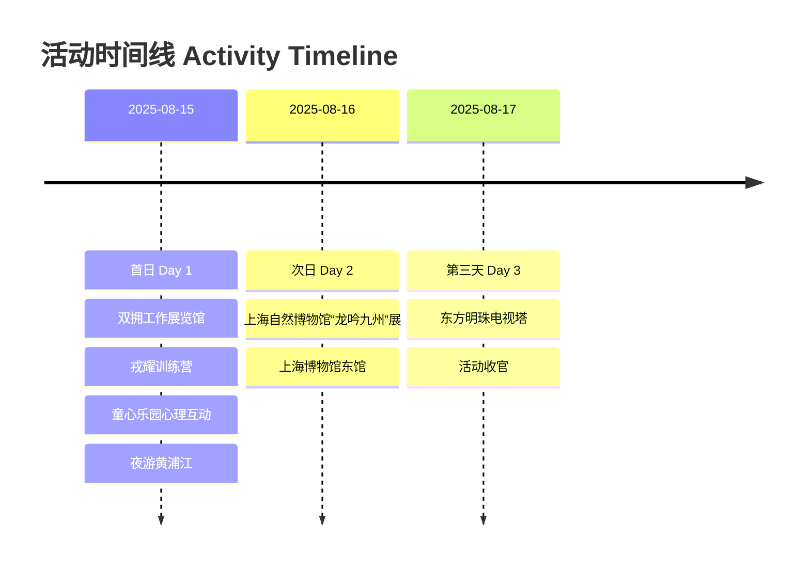

# 戎耀申城 共沐荣光——上海市双拥服务中心组织开展「情系边海防」随军家属优抚活动

**文章基本信息**

- **主题**：边海防部队官兵家庭随军家属来沪「看上海」优抚活动  
- **组织方**：上海市双拥服务中心  
- **活动时间**：2025 年 8 月 15 日—17 日（三日）  
- **规模与对象**：约 80 名军嫂、军娃；驻地偏远、条件艰苦的「边海防」部队官兵家庭  

---

#### 【结构总览】文章结构信息图

```text
[文章结构信息图]
1. 标题：戎耀申城 共沐荣光——上海市双拥服务中心「情系边海防」随军家属优抚活动
2. 第一部分（第1段）：活动综述与宏观背景
   - 核心宗旨：发扬拥军优属传统，解决军人后顾之忧。
   - 关键信息：时间（2025年8月15日-17日）、组织方（市双拥服务中心）、受众（「边海防」官兵家属）。
   - 情感基调：感受历史荣光，体悟城市拥军温度。
3. 第二部分（第2-5段）：活动首日——红色基因传承与心理情感建设
   - 红色研学（第2段）：走进上海双拥工作展览馆，听取双拥故事。
   - 国防教育（第3段）：戎耀训练营模拟训练，感悟父辈荣光。
   - 心理赋能（第4段）：童心乐园互动，专家引导情感联结。
   - 城市初探（第5段）：浦江夜游，增强作为军属的归属感。
4. 第三部分（第6-7段）：活动次日——科普探索与中华文脉寻根
   - 科学探索（第6段）：自然博物馆「龙吟九州」大展，认知生命演化。
   - 文化传承（第7段）：上博东馆青铜展，领略中华文脉。
5. 第四部分（第8-9段）：活动结束——云端俯瞰与意义升华
   - 登高望远（第8段）：登临东方明珠，纵览申城巨变。
   - 总结评价（第9段）：服务保障细节，凝聚强军伟力。
```

---

#### 【正文与注释】

> **戎耀（Military Glory）**：此处为「荣耀」的谐音，特指军人的光荣。  
> **申城**：上海的别称。因战国时期楚国令尹春申君黄歇曾封于此而得名。  
> **双拥**：即「拥军优属、拥政爱民」的简称。这是中国共产党在长期革命和建设实践中形成的优良传统。  
> **边海防（Frontier and Coastal Defense）**：指国家的陆地边境和领海防卫。在该语境下，特指在艰苦偏远地区服役的官兵。  
> **优抚（Preferential Treatment）**：即「优待」与「抚恤」。针对现役军人、退役军人及其家属提供的特殊社会保障。  
> **资料来源**：上海市双拥服务中心（隶属于上海市退役军人事务局）。

为发扬拥军优属优良传统，切实为军人军属办实事，关心关爱军人子女，助力随军家属更好融入上海，2025 年 8 月 15 日至 17 日，上海市双拥服务中心为本市驻地偏远、条件艰苦的「边海防」部队官兵家庭精心策划组织了「看上海」活动。

> **办实事**：源自「我为群众办实事」实践活动，强调工作的针对性和实效性，杜绝形式主义。  
> **随军家属**：经军队师（旅）级以上单位政治机关批准，随同现役军人生活的配偶、子女。

80 名军嫂军娃齐聚申城，开启了一段为期三天，感受历史荣光、城市魅力与亲情关怀的暖心之旅，深切体悟上海这座城市的拥军温度与尊崇情怀。

> **军嫂军娃**：对军人妻子和子女的亲昵称呼。  
> **尊崇（Veneration/Respect）**：强调对军人职业地位的高度认同。

活动首日，妈妈和孩子一起走进上海双拥工作展览馆。

> **上海双拥工作展览馆**：位于上海双拥大厦（浦东新区），是全国首个全面展示超大型城市双拥工作历程的综合性展馆。2024 年 5 月正式开馆 [ref:11,12]。

在一幅幅生动的图片、一件件珍贵的实物前聆听军民团结、鱼水情深的上海双拥故事。

> **鱼水情深**：比喻军民关系如鱼和水一样不可分离。近义词：情同手足、亲密无间。反义词：势不两立、水火不容。

在「戎耀训练营」学习国防知识，参加军事科目模拟训练，深切感受父辈的荣光。

> **戎耀训练营**：上海双拥展览馆配套的国防教育品牌项目，通过沉浸式体验增强青少年的国防观念 [ref:16]。  
> **国防（National Defense）**：国家为防备和抵抗侵略，制止武装颠覆，保卫国家的主权、统一、领土完整和安全所进行的军事活动。

在童心乐园的鼓圈游戏、冥想放松等趣味盎然又富有深意的互动游戏中，心理专家引导军嫂与军娃们在轻松愉快的氛围中学习沟通技巧，理解彼此情绪，增进情感联结。

> **鼓圈（Drum Circle）**：一种音乐治疗和团队协作形式。  
> **冥想（Meditation）**：此处指通过专注引导放松身心，缓解军属长期因聚少离多产生的心理压力。  
> **情感联结（Emotional Bond）**：重点关注长期两地分居的军人家庭成员间的深度沟通。

夜幕降临，游船穿梭于流光溢彩的江面，两岸璀璨的灯火勾勒出外滩的典雅与陆家嘴的摩登。

> **流光溢彩**：形容色彩鲜艳、光彩照人，多用于描写城市夜景。  
> **外滩（The Bund）**：上海的地标，保留了大量不同风格的近代西洋建筑，被称为「万国建筑博览群」。  
> **陆家嘴（Lujiazui）**：中国重要的金融中心，拥有东方明珠、三件套（金茂、环球、中心）等现代化地标。  
> **摩登（Modern）**：音译词，指时髦、现代。

孩子们依偎在妈妈身边，欣赏着这座「不夜城」的迷人夜景，作为守护这座城市的军人家属，归属感与自豪感油然而生。

> **油然而生**：自然地产生（多指某种思想感情）。  
> **不夜城**：形容城市夜晚灯火通明，繁华异常。

次日，在上海自然博物馆「龙吟九州」中国恐龙大展，堪称「国宝级」的化石让孩子们在这场超越时空的科学探索之旅中，对生命的演化和自然界的规律有了更深刻的认识。

> **上海自然博物馆（Shanghai Natural History Museum）**：位于静安雕塑公园内，是中国最大的自然博物馆之一。  
> **龙吟九州·中国恐龙大展**：2025 年重点特展，汇集了全国 12 家单位的百余件珍稀化石，包括多件国家一级文物 [ref:1,2,6]。

在崭新的上海博物馆东馆，又开启了一场中华文明的探索之旅。

> **上海博物馆东馆（Shanghai Museum East）**：位于浦东新区，是上海文化新地标。其展陈体系以中国古代艺术通史为主 [ref:23,26]。

在讲解员的带领下，揭开千年前古朴神秘的青铜器面纱，中华文脉的魅力让大家目不暇接，对上海的文化积淀赞叹不已。

> **青铜器（Bronzeware）**：上博东馆的青铜馆拥有海内外体系最完整的中国古代青铜器陈列，展品包括大克鼎等重器 [ref:21,29]。  
> **目不暇接**：形容美好的事物太多，眼睛看不过来。近义词：琳琅满目、应接不暇。

活动第三天登临东方明珠电视塔，浦江两岸的壮丽画卷尽收眼底。

> **东方明珠电视塔（Oriental Pearl Tower）**：高 468 米，上海标志性景观。  
> **尽收眼底**：指整个景观都在视线范围之内。

军娃们兴奋地指着鳞次栉比的摩天大楼和蜿蜒流淌的黄浦江欢呼雀跃。

> **鳞次栉比**：形容建筑物等排列得很密很整齐。比喻辨析：易混淆为「星罗棋布」（多指分布广而多，不强调整齐）。  
> **欢呼雀跃**：高兴得大叫并跳跃起来。

活动在东方明珠电视塔下落下帷幕，丰富多元的活动安排，细致入微的服务保障，温暖的是军属的心，为稳固军人「后方」，确保官兵心无旁骛投身练兵备战，凝聚起矢志强军兴军的团结伟力。

> **落下帷幕（Bring the curtain down）**：比喻活动结束。  
> **心无旁骛**：心思集中，不被外界干扰。旁骛：指正业以外的追求。  
> **练兵备战**：新时代人民军队的中心工作，强调随时准备打仗。  
> **矢志强军兴军**：  
> - **矢志**：立誓，表示意志坚决。  
> - **强军兴军**：实现中华民族伟大复兴的必然要求，体现了党对建设世界一流军队的战略规划 [ref:41,45]。  
> **金句积累**：**温暖的是军属的心，稳固的是强军的基石。**


## 前情提要

**文章来源**：上海市相关政务宣传稿（文末注明“资料来源：市双拥中心”）
**题目**：**《戎耀申城 共沐荣光——上海市双拥服务中心组织开展“情系边海防”随军家属优抚活动》**
**作者**：原文未署具体个人作者，暂未检索到明确署名；可确定资料来源为**上海市双拥服务中心**。
**作者/机构背景简介**：
上海市双拥服务中心是上海市退役军人事务系统相关服务机构，主要承担双拥宣传教育、拥军优属活动组织、相关展馆运行及军人军属服务保障等工作。根据上海市政府公开资料，其职能包括组织本市各类拥军优属活动、开展双拥宣传教育文化活动、为军人军属及优抚对象提供服务等。
**可核来源**：
- 上海市政府公开资料（中心职能、预算/决算信息）
- 上海双拥工作展览馆与“戎耀训练营”相关公开报道
链接：
1. https://www.shanghai.gov.cn/cmsres/32/324d5a6022e04c22a5c33174db6d60a9/74b61b9cf2b2d9570a3f760cc2a71710.pdf
2. https://www.shanghai.gov.cn/cmsres/76/768cba2819f540ba84daf52f54785da5/d4593e88237491e691e377e69b55eeba.pdf
3. https://www.shanghai.gov.cn/nw31406/20241121/a697e53ad65e497f9f13c680d62059be.html

```mermaid
flowchart TD
    A["全文主线 Main Thread<br/>上海市双拥服务中心组织边海防部队随军家属“看上海”"]:::main
    A --> B["第1段<br/>活动宗旨、时间、对象、总体意义<br/>support military families / integrate into Shanghai"]:::p1
    A --> C["第2段<br/>首日：参观上海双拥工作展览馆<br/>了解军民团结与双拥传统"]:::p2
    A --> D["第3段<br/>首日：进入“戎耀训练营”<br/>学习国防知识、体验模拟训练"]:::p3
    A --> E["第4段<br/>首日：心理互动活动<br/>沟通、情绪理解、亲子联结"]:::p4
    A --> F["第5段<br/>首日夜游：浦江夜景<br/>归属感、自豪感提升"]:::p5
    A --> G["第6段<br/>次日：自然博物馆恐龙大展<br/>科学探索与生命教育"]:::p6
    A --> H["第7段<br/>次日：上海博物馆东馆<br/>中华文明与文化积淀体验"]:::p7
    A --> I["第8段<br/>第三天：东方明珠登塔<br/>城市景观直观感受"]:::p8
    A --> J["第9段<br/>活动收束：服务保障与现实意义<br/>稳固后方、助力练兵备战"]:::p9

    classDef main fill:#dbeafe,stroke:#2563eb,color:#111827,stroke-width:2px;
    classDef p1 fill:#fef3c7,stroke:#d97706,color:#111827;
    classDef p2 fill:#dcfce7,stroke:#16a34a,color:#111827;
    classDef p3 fill:#fae8ff,stroke:#a21caf,color:#111827;
    classDef p4 fill:#ffe4e6,stroke:#e11d48,color:#111827;
    classDef p5 fill:#e0f2fe,stroke:#0284c7,color:#111827;
    classDef p6 fill:#ecfccb,stroke:#65a30d,color:#111827;
    classDef p7 fill:#f3e8ff,stroke:#7c3aed,color:#111827;
    classDef p8 fill:#cffafe,stroke:#0891b2,color:#111827;
    classDef p9 fill:#ede9fe,stroke:#5b21b6,color:#111827;
```





---

## 逐句精读

🔸**戎耀申城 共沐荣光——上海市双拥服务中心组织开展“情系边海防”随军家属优抚活动**
🔹**`Honor Shines over Shanghai`, `Sharing in Glory` — The Shanghai Double-Support Service Center organized a `preferential support activity` for `accompanying military families` under the theme of `Caring for Border and Coastal Defense`.**

这是一则标题句，采用宣传文体中常见的对仗式表达。`戎耀申城`中的“戎”借指军旅、军人；`共沐荣光`强调共同分享荣誉与光辉。英文翻译时兼顾了标题感与政策语境。

背景注释：
- `双拥`：即“拥军优属、拥政爱民”，是中国特有的军政军民团结工作传统。英文常可处理为 `double-support`，必要时可解释为 mutual support between the military and civilians/government.
- `边海防`：指边防和海防部队，即驻守边疆、沿海、海岛等艰苦地区的部队。
- `随军家属`：通常指因军人服役需要而迁移、安置或与军人共同生活安排相关的配偶及家庭成员。
- `优抚活动`：指面向军人军属、优抚对象的优待、帮扶、抚恤和关爱活动。

> **`honor`** /ˈɒnər/ n./v. 荣誉；尊敬
> 语域：正式、新闻、公共事务
> 英文释义：`honor` (n.) high respect; public recognition of worth or achievement（尊敬；因成就而获得的荣誉）
> 画龙点睛：`honor` 是高频正式词，写作中可用于 `a sense of honor`、`bring honor to`、`in honor of`。注意美式拼写 `honor`，英式常作 `honour`。可引申为“履行、信守”，如 `honor an agreement`。

> **`preferential support`** /ˌprefəˈrenʃl səˈpɔːrt/ n. 优待性支持；优抚
> 语域：政策、行政、新闻
> 英文释义： special support or favorable treatment given to a particular group（给予特定群体的优待性支持）
> 画龙点睛：该表达常用于政策翻译，适合对应“优抚、优待”。可与 `preferential policies`、`support measures` 搭配。写作时若怕生硬，也可换成更自然的 `care and support measures for military families`。

> **`accompanying military families`** /əˈkʌmpəniɪŋ ˈmɪləteri ˈfæməliz/ n. 随军家属
> 语域：政策、社会事务
> 英文释义： family members, especially spouses, who accompany or are attached to military personnel because of service arrangements（因军人服役安排而随行或关联安置的家属）
> 画龙点睛：这是偏解释型译法。遇到正式文本，可按语境替换为 `military spouses and children`、`service members’ families`。英译政策概念时，准确传达对象范围比逐字对应更重要。

---

🔸**为发扬拥军优属优良传统，切实为军人军属办实事，关心关爱军人子女，助力随军家属更好融入上海，2025年8月15日至17日，上海市双拥服务中心为本市驻地偏远、条件艰苦的“边海防”部队官兵家庭精心策划组织了“看上海”活动。**
🔹**To / carry forward the fine tradition of `supporting the military and giving preferential treatment to service members’ families`, / to do practical things for `military personnel and their families`, / to show care for `service members’ children`, / and to help accompanying military families better integrate into Shanghai, / the Shanghai Double-Support Service Center / carefully planned and organized / a `See Shanghai` activity / from `August 15 to 17, 2025`, / for the families of officers and soldiers / stationed in remote and harsh conditions / with `border and coastal defense` units in the city.**

这句话是典型的长句，前半部分由多个不定式结构构成**目的状语**，后半部分是句子的主干：`the Center ... organized a See Shanghai activity`。阅读时应先抓住主干，再回看前置目的链条。

背景注释：
- `2025年8月15日至17日`：这里是明确活动发生时间。
- `本市驻地偏远、条件艰苦的“边海防”部队`：说明服务对象是驻地较偏远、驻防条件较艰苦的部队家庭。
- `看上海`：中文中带有城市体验、融入与文化认同色彩，可灵活译为 `See Shanghai activity` 或 `Shanghai familiarization tour`。

> **`carry forward`** /ˌkæri ˈfɔːrwərd/ phr.v. 发扬，推进，继承并弘扬
> 语域：正式、新闻、政策
> 英文释义： to preserve and promote something valuable such as a tradition or spirit（继承并弘扬某种传统、精神）
> 画龙点睛：`carry forward` 常搭配 `tradition`、`spirit`、`legacy`。写作中比单纯 `keep` 更正式，更有“继续发扬光大”的意味。辨析：`carry on` 偏“继续进行”，`carry forward` 更强调“承传与推进”。

> **`preferential treatment`** /ˌprefəˈrenʃl ˈtriːtmənt/ n. 优待，优惠待遇
> 语域：政策、法律、行政
> 英文释义： treatment that gives someone an advantage or special consideration（给予某人特别照顾或优先待遇）
> 画龙点睛：这是翻译“优待、优属”时很常见的正式表达。注意它本身并不总是褒义，在商业或社会语境中也可表示“特殊照顾”。政策翻译中可搭配 `policies`, `measures`, `services`。

> **`integrate into`** /ˈɪntɪɡreɪt ˈɪntuː/ phr.v. 融入
> 语域：通用、教育、社会政策
> 英文释义： to become part of a group, community, or system（融入某个群体、社区或体系）
> 画龙点睛：雅思写作高频搭配：`integrate into society`、`integrate into urban life`。注意主动与被动皆常见：`help sb integrate into...`，`be integrated into...`。可用于移民、城市生活、教育适应等话题。

> **`stationed`** /ˈsteɪʃnd/ adj./v-ed 驻扎的；驻防的
> 语域：军事、新闻
> 英文释义： assigned to a particular place for military duty（被派驻在某地执行军事任务）
> 画龙点睛：常见于 `be stationed in/at`。如 `troops stationed on remote islands`。考试中常与 `deploy` 对比：`stationed` 强调驻地状态，`deployed` 强调调派执行任务。

> **`harsh conditions`** /hɑːrʃ kənˈdɪʃənz/ n. 恶劣条件
> 语域：新闻、军事、社会
> 英文释义： difficult and severe living or working conditions（艰难而严酷的生活或工作环境）
> 画龙点睛：`harsh` 可修饰 `weather`、`reality`、`punishment`、`conditions`。写作中比 `bad` 更准确有力，适合描述边防、高原、海岛、战地等环境。

---

🔸**80名军嫂军娃齐聚申城，开启了一段为期三天，感受历史荣光、城市魅力与亲情关怀的暖心之旅，深切体悟上海这座城市的拥军温度与尊崇情怀。**
🔹**`Eighty military spouses and children` gathered in Shanghai, / beginning a `three-day heartwarming journey` / to experience `historical glory`, `urban charm`, and `familial care`, / and to deeply appreciate / this city’s warmth in supporting the military / and its profound respect for service members and their families.**

这句主干是：`Eighty military spouses and children gathered... beginning...`。后面的 `to experience... and to deeply appreciate...` 表示此行的内容与效果。`申城`是上海的别称，译为 `Shanghai` 即可。

背景注释：
- `军嫂军娃`：中文宣传语式表达，分别指军人妻子与军人子女。英文通常不直译为口号式结构，而处理为 `military spouses and children` 更自然。
- `拥军温度`：不是字面“温度”，而是指政策与服务中的情感关怀、社会尊崇。

> **`spouse`** /spaʊs/ n. 配偶
> 语域：正式、法律、行政
> 英文释义： a husband or wife; a married partner（配偶）
> 画龙点睛：`spouse` 比 `husband/wife` 更中性、正式，常见于表格、公文和政策文本。可搭配 `military spouse`、`former spouse`。注意其单复数规则正常：`spouses`。

> **`heartwarming`** /ˈhɑːrtwɔːrmɪŋ/ adj. 暖心的，令人感到温暖的
> 语域：新闻、叙事、宣传
> 英文释义： causing feelings of happiness, affection, or sympathy（让人感到温暖、欣慰或感动的）
> 画龙点睛：适合翻译“暖心”“温情”。常见搭配 `a heartwarming story/gesture/journey`。比 `warm` 更有情感色彩，但正式议论文中不宜滥用。

> **`appreciate`** /əˈpriːʃieɪt/ v. 领会；欣赏；感激
> 语域：通用、正式
> 英文释义： to recognize the value, significance, or quality of something（认识到某事物的价值、意义或品质）
> 画龙点睛：熟词僻义重点。很多学生只会“感激”，但在阅读里常表示“理解、领会、意识到”，如 `appreciate the importance of...`。写作中极实用，语气比 `understand` 更成熟。

> **`profound`** /prəˈfaʊnd/ adj. 深刻的，深厚的
> 语域：正式、学术、新闻
> 英文释义： very great or intense; showing deep insight or feeling（深刻的；强烈的；深厚的）
> 画龙点睛：可搭配 `profound respect`、`profound impact`、`profound change`。比 `deep` 更正式。GRE/考研常考其抽象义，不仅是“深”的空间概念。

---

🔸**活动首日，妈妈和孩子一起走进上海双拥工作展览馆。**
🔹**On the `first day of the event`, / mothers and children / entered the `Shanghai Double-Support Work Exhibition Hall` together.**

这是一个简洁的叙事句。`活动首日`是时间状语；主干为 `mothers and children entered...`。

背景注释：
- `上海双拥工作展览馆`：上海开展双拥宣传教育的重要展馆。公开报道显示，该馆以展示上海解放以来双拥工作发展历程为主线。

> **`exhibition hall`** /ˌeksɪˈbɪʃn hɔːl/ n. 展览馆，展厅
> 语域：通用、文化、新闻
> 英文释义： a large space or building used for exhibitions（用于举办展览的场馆或展厅）
> 画龙点睛：常与 `museum` 区分：`museum` 侧重博物馆属性，`exhibition hall` 更强调展示空间。写作中可搭配 `visit an exhibition hall`、`hold an exhibition in...`。

---

🔸**在一幅幅生动的图片、一件件珍贵的实物前聆听军民团结、鱼水情深的上海双拥故事。**
🔹**Before `vivid photographs` and `precious artifacts`, / they listened to Shanghai’s stories of `military-civilian unity` / and the `deep, fish-and-water bond` between the army and the people.**

这句承接上句，省略了主语，实际主语仍是前句中的 `mothers and children`。`鱼水情深`是中国特色比喻，意为军民关系密切、相互依存。翻译时保留比喻并辅以解释最稳妥。

背景注释：
- `鱼水情深`：来自中国政治宣传与军民关系叙述中的常见比喻，表示军民关系像鱼和水一样不可分。
- `实物`：在展陈语境中常译为 `artifacts`、`objects`、`exhibits`。

> **`artifact`** /ˈɑːrtɪfækt/ n. 人工制品；文物；展品
> 语域：考古、博物馆、新闻
> 英文释义： an object made by a human being, especially one of historical or cultural interest（人工制作、具有历史或文化意义的物件）
> 画龙点睛：在展览、博物馆语境里，`artifact` 比普通 `object` 更专业。注意英式常拼作 `artefact`。写作中可用于文化遗产、历史展陈类话题。

> **`unity`** /ˈjuːnəti/ n. 团结；统一
> 语域：正式、政治、新闻
> 英文释义： the state of being joined together or in agreement（联合一致、团结的状态）
> 画龙点睛：搭配非常多，如 `national unity`、`social unity`、`military-civilian unity`。注意与 `union` 区分：`unity` 强调状态，`union` 可指组织或联合体。

> **`bond`** /bɒnd/ n. 纽带；联系；情谊
> 语域：通用、正式
> 英文释义： a close connection or relationship between people（人与人之间紧密的联系或情感纽带）
> 画龙点睛：高频抽象名词，常搭配 `emotional bond`、`family bond`、`forge a bond`。金融中也可指“债券”，阅读时要靠语境辨义，这是典型熟词多义。

---

🔸**在“戎耀训练营”学习国防知识，参加军事科目模拟训练，深切感受父辈的荣光。**
🔹**At the `Rongyao Training Camp`, / they learned `national defense` knowledge, / took part in `simulated military training tasks`, / and deeply felt the `glory of their parents’ generation`.**

这句仍是省略主语的并列动作句：`learned..., took part..., and felt...`。`父辈的荣光`在语境中指军人父母所承载的职业荣誉。

背景注释：
- `戎耀训练营`：根据上海政府公开报道，这是上海双拥工作展览馆中的国防教育展厅，以体验营方式向青少年普及国防知识并组织模拟训练。
- `国防知识`：英语常译为 `national defense knowledge` 或 `knowledge about national defense`。

> **`national defense`** /ˌnæʃnəl dɪˈfens/ n. 国防
> 语域：政治、军事、新闻
> 英文释义： the protection of a nation against external threats, especially by military means（国家抵御外部威胁的防务体系）
> 画龙点睛：正式文本高频搭配 `national defense education`、`defense capability`。注意美式常写 `defense`，英式为 `defence`。在考试中属于时政与公共事务常见词。

> **`simulated`** /ˈsɪmjuleɪtɪd/ adj. 模拟的
> 语域：教育、科技、军事
> 英文释义： made to imitate real conditions or situations（为了模仿真实情境而设置的）
> 画龙点睛：可搭配 `simulated training`、`simulated environment`、`simulation exercise`。写作中可用于教育实验、科技测试、军事演练，表达比 `fake` 准确得多。

> **`glory`** /ˈɡlɔːri/ n. 荣耀；光荣
> 语域：文学、新闻、宣传
> 英文释义： great honor, praise, and admiration; something that brings fame and respect（巨大的荣誉、赞美与敬佩；带来尊敬的事物）
> 画龙点睛：常见搭配 `historic glory`、`share in the glory`、`the glory of...`。有较强修辞色彩，适合标题、演讲、宣传文，不适合过度日常化使用。

---

🔸**在童心乐园的鼓圈游戏、冥想放松等趣味盎然又富有深意的互动游戏中，心理专家引导军嫂与军娃们在轻松愉快的氛围中学习沟通技巧，理解彼此情绪，增进情感联结。**
🔹**In the `Childlike Paradise` activities, / including `drum-circle games`, `meditation and relaxation`, and other interactive sessions / that were both engaging and meaningful, / psychological experts guided military spouses and children / to learn `communication skills`, / understand one another’s emotions, / and strengthen their `emotional bonds` / in a relaxed and pleasant atmosphere.**

这是全文中信息密度很高的一句。主干是：`psychological experts guided... to learn..., understand..., and strengthen...`。前面的长介词结构用来交代活动场景与形式。

背景注释：
- `鼓圈游戏`：通常指多人围圈击鼓的团体互动活动，常用于心理辅导、团体建设、亲子活动。
- `冥想放松`：在心理支持与情绪管理活动中常用来帮助参与者舒缓压力、提高情绪觉察。
- `心理专家`：在英文中可根据精确职业改为 `psychologists`、`mental health professionals`，此处用 `psychological experts` 保持概括。

> **`engaging`** /ɪnˈɡeɪdʒɪŋ/ adj. 有吸引力的；令人投入的
> 语域：教育、媒体、通用
> 英文释义： interesting and able to keep someone’s attention（有趣且能持续吸引注意力的）
> 画龙点睛：写作中形容课程、活动、演讲极好用，如 `an engaging lesson`。比 `interesting` 更强调“吸引参与感”。可与 `meaningful`, `interactive` 连用，表达层次更丰富。

> **`meditation`** /ˌmedɪˈteɪʃn/ n. 冥想；静思
> 语域：心理、健康、宗教
> 英文释义： the practice of focusing the mind for relaxation, awareness, or spiritual purposes（通过专注心神来达到放松、觉察或精神目的的练习）
> 画龙点睛：现代英语中常与心理减压相关，常见搭配 `guided meditation`、`meditation practice`。不要只理解为宗教概念，在健康管理语境很常见。

> **`communication skills`** /kəˌmjuːnɪˈkeɪʃn skɪlz/ n. 沟通技巧
> 语域：教育、职场、心理
> 英文释义： abilities that help people express ideas and understand others effectively（有效表达与理解他人的能力）
> 画龙点睛：雅思口语、写作、职场英语高频表达。可扩展为 `interpersonal communication skills`。写作时常搭配 `develop`, `improve`, `enhance`。

> **`emotional bond`** /ɪˈməʊʃənl bɒnd/ n. 情感联结
> 语域：心理、教育、家庭研究
> 英文释义： a close emotional connection between people（人与人之间紧密的情感连接）
> 画龙点睛：非常适合翻译“情感联结、情感纽带”。常见搭配 `strengthen the emotional bond between...`。在亲子、教育、心理健康类阅读中十分常见。

---

🔸**夜幕降临，游船穿梭于流光溢彩的江面，两岸璀璨的灯火勾勒出外滩的典雅与陆家嘴的摩登。**
🔹**As night fell, / the sightseeing boat moved across the `brilliantly illuminated` river, / while the dazzling lights on both banks / outlined the `elegance of the Bund` / and the `modernity of Lujiazui`.**

本句是典型画面描写。前半句写动态场景，后半句写城市夜景的对照：`外滩的典雅` vs. `陆家嘴的摩登`。这种对比构成了上海城市形象的经典叙事。

背景注释：
- `外滩`（the Bund）：上海著名滨水历史建筑群，体现近代城市风貌。
- `陆家嘴`（Lujiazui）：上海浦东核心金融区，高楼林立，象征现代都市发展。

> **`illuminated`** /ɪˈluːmɪneɪtɪd/ adj. 被照亮的
> 语域：文学、新闻、旅游
> 英文释义： lit up with light（被灯光照亮的）
> 画龙点睛：比 `bright` 更书面，适合景观描写。常见搭配 `illuminated skyline`、`illuminated streets`。动词原形 `illuminate` 也可作比喻义“阐明”。

> **`outline`** /ˈaʊtlaɪn/ v. 勾勒出轮廓；概述
> 语域：通用、文学、学术
> 英文释义： to show or mark the edge or shape of something; to summarize（勾勒轮廓；概述）
> 画龙点睛：熟词僻义要掌握。很多学生只认识名词“提纲”，其实动词义在阅读里很常见，如灯光 `outlined` 天际线。写作中也可表示“概述观点”。

> **`elegance`** /ˈelɪɡəns/ n. 优雅；典雅
> 语域：文学、艺术、旅游
> 英文释义： the quality of being graceful, stylish, and refined（优美、精致、典雅的特质）
> 画龙点睛：常搭配 `the elegance of historic architecture`。比 `beauty` 更强调格调与品位，适合描述建筑、设计、文风。

> **`modernity`** /məˈdɜːrnəti/ n. 现代性；现代气息
> 语域：学术、文化、新闻
> 英文释义： the quality or condition of being modern（现代的性质或状态）
> 画龙点睛：写作中是高级词，可讨论城市发展、文化变迁、技术社会。注意与 `modernization` 区分：后者是“现代化过程”，前者更偏“现代性特征”。

---

🔸**孩子们依偎在妈妈身边，欣赏着这座“不夜城”的迷人夜景，作为守护这座城市的军人家属，归属感与自豪感油然而生。**
🔹**The children nestled beside their mothers, / admiring the enchanting night view of this `sleepless city`; / as family members of those who protect the city, / they naturally felt a growing sense of `belonging` and `pride`.**

这句前半写动作与景，后半写心理反应。`油然而生`可译为 `naturally felt a growing sense of...`，避免机械直译。

背景注释：
- `不夜城`：常用来形容夜生活繁华、灯火通明的国际化大都市。
- `归属感`：是心理和社会学中常见概念，对应 `sense of belonging`。

> **`nestle`** /ˈnesl/ v. 依偎；舒适地靠着
> 语域：文学、叙事
> 英文释义： to settle closely and comfortably against someone or something（紧挨着、舒适地依靠）
> 画龙点睛：是很有画面感的动词，适合描写亲子、家庭、温馨场景。比 `sit beside` 更生动。过去式过去分词均为 `nestled`。

> **`sense of belonging`** /sens əv bɪˈlɒŋɪŋ/ n. 归属感
> 语域：心理、教育、社会研究
> 英文释义： the feeling of being accepted and connected to a group or place（被接纳并与某个群体或地方相连的感觉）
> 画龙点睛：高频固定搭配，雅思写作常用于社区、学校、城市融入话题。常和 `identity`, `attachment`, `inclusion` 一起出现。

> **`pride`** /praɪd/ n. 自豪；骄傲
> 语域：通用
> 英文释义： a feeling of pleasure and satisfaction because of something valued（因珍视的人或事而产生的满足与自豪）
> 画龙点睛：注意褒贬两义。`take pride in` 表褒义“以……为荣”；若表示傲慢，则看语境。写作中 `civic pride`、`national pride`、`parental pride` 都很常见。

---

🔸**次日，在上海自然博物馆“龙吟九州”中国恐龙大展，堪称“国宝级”的化石让孩子们在这场超越时空的科学探索之旅中，对生命的演化和自然界的规律有了更深刻的认识。**
🔹**The next day, / at the `Roaring Dragons Across China` dinosaur exhibition in the Shanghai Natural History Museum, / fossils regarded as `national treasures` / enabled the children, in this scientific journey transcending time and space, / to gain a deeper understanding of `the evolution of life` / and `the laws of the natural world`.**

句子主干是：`fossils ... enabled the children ... to gain...`。`在这场超越时空的科学探索之旅中`是插入性的场景描写。`规律`可译为 `laws` 或 `patterns`，这里用 `laws of the natural world` 较正式。

背景注释：
- `上海自然博物馆`：上海重要自然科学类博物馆。
- `龙吟九州`：应为展览名，英译可采用解释性方式，保留其文化气质。
- `国宝级`：非严格法律概念，表示极高珍贵程度。

> **`fossil`** /ˈfɒsl/ n. 化石
> 语域：科学、教育
> 英文释义： the preserved remains or traces of ancient plants or animals in rock（保存在岩石中的古代动植物遗骸或痕迹）
> 画龙点睛：自然科学类阅读高频词。可搭配 `fossil record`、`fossil fuel`，注意后者是“化石燃料”，不要混淆。名词可数，复数 `fossils`。

> **`transcend`** /trænˈsend/ v. 超越
> 语域：正式、文学、学术
> 英文释义： to go beyond the usual limits of something（超出某事物通常的界限）
> 画龙点睛：高级写作用词。可搭配 `transcend time and space`、`transcend boundaries`。比 `go beyond` 更书面、更凝练，很适合翻译“超越……”。

> **`evolution`** /ˌiːvəˈluːʃn/ n. 演化；进化
> 语域：科学、学术
> 英文释义： the gradual development of something, especially living organisms over time（事物，尤指生物，随时间逐渐发展变化的过程）
> 画龙点睛：既可用于生物学，也可用于抽象义，如 `the evolution of language`。注意与 `revolution` 区分；一个是渐进演变，一个是剧烈变革。

---

🔸**在崭新的上海博物馆东馆，又开启了一场中华文明的探索之旅。**
🔹**At the `new East Branch of the Shanghai Museum`, / another journey of exploring `Chinese civilization` began.**

这是一个简短的过渡句，功能是从自然科学体验切换到人文文明体验。`又开启了一场`可自然处理为 `another journey ... began`。

背景注释：
- `上海博物馆东馆`：上海博物馆的新馆区之一，承担重要文博展陈功能。
- `中华文明`：英文常译为 `Chinese civilization`，在学术和公共表达中都很常见。

> **`civilization`** /ˌsɪvəlaɪˈzeɪʃn/ n. 文明
> 语域：历史、学术、文化
> 英文释义： an advanced human society with developed culture, institutions, and knowledge（具有发达文化、制度与知识体系的人类文明）
> 画龙点睛：历史文化类高频核心词。常见搭配 `ancient civilization`、`human civilization`。写作中可用于文化遗产、历史传承、科技进步等主题。

---

🔸**在讲解员的带领下，揭开千年前古朴神秘的青铜器面纱，中华文脉的魅力让大家目不暇接，对上海的文化积淀赞叹不已。**
🔹**Led by a guide, / they unveiled the mystery of `ancient bronze ware` dating back thousands of years; / the charm of the `cultural lineage` of Chinese civilization / left everyone `too overwhelmed to take it all in`, / and filled them with admiration for Shanghai’s `deep cultural accumulation`.**

这句含有多个值得精读的抽象表达。`揭开……面纱`是比喻，英译时可用 `unveiled the mystery of...`。`目不暇接`不是“眼睛来不及接收”的直译，而是“精彩太多，看不过来”。`文化积淀`是中文抽象表达，英文可处理为 `deep cultural accumulation` 或 `rich cultural heritage`，此处偏向保留原意。

背景注释：
- `青铜器`：中国古代礼制、政治与工艺文明的重要代表器物。
- `中华文脉`：指中华文化与文明延续传承的内在脉络。
- `讲解员`：在博物馆语境中通常可译为 `guide` 或 `docent`；后者更专业。

> **`bronze ware`** /ˈbrɒnz weər/ n. 青铜器
> 语域：考古、博物馆、历史
> 英文释义： objects made of bronze, especially ancient ritual or cultural items（青铜制成的器物，尤指古代礼器或文化器物）
> 画龙点睛：比单纯 `bronze objects` 更贴近文博语境。中国历史文化文章中很常见，常与 `ritual vessels`、`inscriptions` 等词同现。

> **`lineage`** /ˈlɪniɪdʒ/ n. 血统；传承脉络
> 语域：正式、学术、文化
> 英文释义： a line of development, descent, or transmission（发展、传承或沿袭的脉络）
> 画龙点睛：熟词提升项。除了家族血统，还可表示思想、文化、学术传统的传承脉络，如 `intellectual lineage`、`cultural lineage`，非常适合高阶写作。

> **`overwhelmed`** /ˌəʊvərˈwelmd/ adj. 应接不暇的；被强烈情绪淹没的
> 语域：通用
> 英文释义： affected very strongly by something; unable to deal with the amount or intensity of something（因数量或强度过大而难以完全应对；情绪上被强烈触动）
> 画龙点睛：常见搭配 `feel overwhelmed by`。既可指负担过重，也可指震撼、感动。阅读中要结合语境判断是消极还是中性偏积极。

> **`heritage` / `cultural accumulation`** /ˈherɪtɪdʒ/ ; /əˌkjuːmjəˈleɪʃn/ n. 文化遗产；文化积淀
> 语域：文化、历史、学术
> 英文释义： `heritage` refers to traditions, values, and monuments passed down through generations（heritage 指代代相传的传统、价值与遗产）；`accumulation` emphasizes gradual buildup over time（accumulation 强调长期累积形成）
> 画龙点睛：翻译“文化积淀”时，若突出结果可用 `heritage`，若突出形成过程可用 `cultural accumulation`。考试翻译中这类抽象词要根据上下文灵活取舍。

---

🔸**活动第三天登临东方明珠电视塔，浦江两岸的壮丽画卷尽收眼底。**
🔹**On the third day of the event, / they ascended the `Oriental Pearl TV Tower`, / where the magnificent panorama on both sides of the Huangpu River / came fully into view.**

这句的核心是空间视角变化：从地面城市体验转向高空俯瞰。`尽收眼底`是常见汉语成语，英文可译为 `came fully into view`、`lay spread out before them`。

背景注释：
- `东方明珠电视塔`（Oriental Pearl TV Tower）：上海标志性建筑之一。
- `浦江`：在上海语境中通常指黄浦江。

> **`ascend`** /əˈsend/ v. 登上；上升
> 语域：正式、文学、旅游
> 英文释义： to go up, rise, or climb to a higher position（上升；登上更高处）
> 画龙点睛：比 `go up` 更正式有文采。可用于楼塔、山峰、台阶，也可用于抽象义如 `ascend to power`。新闻和书面描写中非常实用。

> **`panorama`** /ˌpænəˈrɑːmə/ n. 全景；壮丽景观
> 语域：旅游、摄影、文学
> 英文释义： a wide, unobstructed view of an extensive area（宽阔、无阻挡的全景视野）
> 画龙点睛：描写城市、自然景观时非常高级。常搭配 `a panoramic view of...`、`urban panorama`。比 `view` 更有画面感与层次感。

---

🔸**军娃们兴奋地指着鳞次栉比的摩天大楼和蜿蜒流淌的黄浦江欢呼雀跃。**
🔹**The military children excitedly pointed at the `closely packed skyscrapers` / and the `winding Huangpu River`, / cheering with delight.**

这句属于动态场面描写。`鳞次栉比`是一种比喻性成语，强调建筑排列密集整齐；`蜿蜒流淌`则带有视觉与动感。

背景注释：
- `黄浦江`（the Huangpu River）：流经上海市中心，是上海城市空间与历史发展中的核心水系。
- `军娃`：口语化、亲昵称谓，英文宜规范化处理为 `military children`。

> **`skyscraper`** /ˈskaɪˌskreɪpər/ n. 摩天大楼
> 语域：通用、城市、建筑
> 英文释义： a very tall modern building, especially in a city（城市中的高层现代建筑）
> 画龙点睛：城市发展、现代化、建筑类话题高频词。常搭配 `glass-and-steel skyscrapers`、`clusters of skyscrapers`。可数名词，复数 `skyscrapers`。

> **`winding`** /ˈwaɪndɪŋ/ adj. 蜿蜒的
> 语域：文学、地理、旅游
> 英文释义： following a twisting or curving course（沿曲折路线延伸的）
> 画龙点睛：常用于 `winding river/road/path`。比 `curved` 更强调延展过程与地形感，画面更强。写作中用于景物描写十分自然。

---

🔸**活动在东方明珠电视塔下落下帷幕，丰富多元的活动安排，细致入微的服务保障，温暖的是军属的心，为稳固军人“后方”，确保官兵心无旁骛投身练兵备战，凝聚起矢志强军兴军的团结伟力。**
🔹**The event / came to a close beneath the Oriental Pearl TV Tower. / Its `rich and diverse arrangements` / and `meticulous service support` / warmed the hearts of military families. / By helping to stabilize the `home front` of service members / and ensuring that officers and soldiers could devote themselves / wholeheartedly and without distraction / to military training and combat preparedness, / the program helped forge a powerful collective force / dedicated to strengthening and revitalizing the armed forces.**

这是全文的总结句，也是政策宣传文体最典型的一句。它既总结活动效果，也上升到国防建设层面的意义。句中有多个高度凝练的政治表达，需要用自然英语拆开翻译。
- `落下帷幕`：可译为 `came to a close`。
- `军人“后方”`：并非字面“rear area”，而是指军人的家庭后方、生活支撑系统，英译宜用 `home front`。
- `心无旁骛`：指专注、不受干扰。
- `练兵备战`：可译为 `military training and combat preparedness`。
- `强军兴军`：指建设强大军队、推动国防和军队发展。

背景注释：
- `后方`：在中文政治和军事叙事中，常借指家庭保障、家属安置、生活支撑。
- `练兵备战`：军事训练与战备准备的并称。
- `强军兴军`：中国军事建设语境中的常见政治表达。

> **`meticulous`** /məˈtɪkjələs/ adj. 细致入微的；一丝不苟的
> 语域：正式、新闻、学术
> 英文释义： showing great attention to detail; very careful and precise（对细节极其注意的；非常仔细严谨的）
> 画龙点睛：是高分写作替代 `careful` 的优质词。常搭配 `meticulous planning`、`meticulous service`、`meticulous research`。语气较强，强调细节层面的周到。

> **`home front`** /ˈhəʊm frʌnt/ n. 后方；家庭支撑面
> 语域：军事、新闻、引申义
> 英文释义： the people and activities supporting a nation or group from home, especially during military efforts（在本土或家庭层面对某项事业形成支撑的人与事务）
> 画龙点睛：这是翻译“后方”很地道的表达。既可用于战争时期的“国内后方”，也可引申指家庭支持系统。比直译 `rear area` 更符合英语习惯。

> **`wholeheartedly`** /həʊlˈhɑːrtɪdli/ adv. 全心全意地
> 语域：正式、通用
> 英文释义： with complete sincerity, energy, or commitment（完全真诚地、全力以赴地）
> 画龙点睛：可用于 `support wholeheartedly`、`devote oneself wholeheartedly to...`。比 `fully` 更带情感与投入色彩，适合正式陈述与演讲文体。

> **`combat preparedness`** /ˈkɒmbæt prɪˈpeədnəs/ n. 战备状态；战斗准备
> 语域：军事
> 英文释义： the state of being ready for military action or combat（为军事行动或战斗做好准备的状态）
> 画龙点睛：军事语境标准表达。常与 `training`, `readiness`, `capability` 搭配。翻译“备战”时若需更一般化，也可用 `combat readiness`。

> **`forge`** /fɔːrdʒ/ v. 锻造；凝聚形成
> 语域：正式、文学、新闻
> 英文释义： to create something strong, especially through effort or pressure（经过努力或磨砺形成强有力的事物）
> 画龙点睛：高频抽象动词，常见于 `forge unity`、`forge partnerships`、`forge a strong team`。比 `build` 更有“淬炼而成”的力量感，非常适合政策和演讲写作。

---

🔸**资料来源：市双拥中心**
🔹**Source: `Shanghai Double-Support Service Center`.**

这是信息标注句，说明文本资料来源。英语中用 `Source:` 即可。

> **`source`** /sɔːrs/ n. 来源；出处
> 语域：通用、学术、新闻
> 英文释义： the place, person, or thing from which something comes or is obtained（某事物的来源、出处）
> 画龙点睛：学术写作和新闻阅读都非常常见。常见搭配 `source of information`、`reliable source`、`according to official sources`。注意动词义也可表示“获取”。

---

