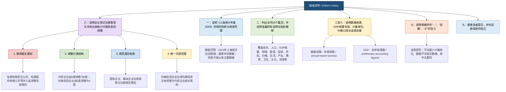

# 《上海统计年鉴2025》编者说明 · 精读笔记

---

## 前情提要

```mermaid
flowchart TD
    A[📘 编者说明 总览] --> B[一、年鉴定位]
    A --> C[二、内容结构]
    A --> D[三、数据来源]
    A --> E[四、度量衡与计量]
    A --> F[五、价格标准]
    A --> G[六、计算误差说明]
    A --> H[七、符号使用说明]
    A --> I[八、统计分类标准调整]
    A --> J[九、致谢]

    B --> B1["信息高度密集的资料工具书"]
    B --> B2["收录2024年统计数据及改革开放以来主要数据"]

    C --> C1[23个篇目]
    C1 --> C1a["综合 / 人口就业与工资 / 国民经济核算 / 财政收支"]
    C1 --> C1b["能源与环境 / 固定资产投资 / 对外经济贸易和旅游 / 价格水平"]
    C1 --> C1c["人民生活 / 城市建设 / 农业 / 工业 / 建筑业"]
    C1 --> C1d["服务业 / 交通运输邮政信息传输 / 批发零售住宿餐饮"]
    C1 --> C1e["金融业 / 房地产业 / 科学技术 / 教育"]
    C1 --> C1f["卫生社会保障社会福利 / 文化和体育 / 法律公证和其他"]
    C2["各篇目附简要说明和主要统计指标解释"]

    D --> D1["数据由上海市统计局和国家统计局上海调查总队通过年报调查收集"]
    D --> D2["2024年GDP数据为初步核算数"]

    E --> E1["度量衡单位：国际统一标准计量单位"]
    E --> E2["金额：除特别标明外，均以人民币计量"]

    F --> F1["总量指标计算采用现行价格"]

    G --> G1["合计数或相对数因单位取舍产生的误差未作机械调整"]

    H --> H1["符号体系"]
    H1 --> H1a["「…」数据不足本表最小计量单位数"]
    H1 --> H1b["「空格」统计数据不详或无该项数据"]
    H1 --> H1c["「＃」表示其中的主要项"]

    I --> I1[修订背景]
    I1 --> I1a["原标准：国统字〔2011〕86号"]
    I1 --> I1b["新标准：国统字〔2023〕14号"]
    I --> I2[1. 取消相关类别]
    I2 --> I2a["私营有限责任公司→有限责任公司"]
    I2 --> I2b["私营股份有限公司→股份有限公司"]
    I2 --> I2c["私营独资企业→个人独资企业"]
    I2 --> I2d["私营合伙企业→合伙企业"]
    I --> I3[2. 调整分类结构]
    I3 --> I3a["内资企业：8类→6类"]
    I3 --> I3b["外商投资企业：5类→4类"]
    I3 --> I3c["港澳台投资企业参照外资调整"]
    I --> I4[3. 规范类别名称]
    I4 --> I4a["国有企业→全民所有制企业（国有企业）"]
    I4 --> I4b["集体企业→集体所有制企业（集体企业）"]
    I --> I5[4. 统一内资范围]
    I5 --> I5a["外资境内再投资主体由「外商投资企业」调整为「内资企业」"]

    J --> J1["感谢国内外读者关心支持"]
    J --> J2["欢迎批评指正"]
```

---

## 精读正文

---

### 【第一段】

> 一、《上海统计年鉴2025》是一本`信息高度密集`的资料工具书。本书收录了`2024年`上海经济和社会等各方面的统计数据，以及`重要年份和改革开放以来`的主要统计数据。

---

**注释与解析**

- **《上海统计年鉴2025》**：由上海市统计局和国家统计局上海调查总队联合编纂的年度官方统计资料出版物。统计年鉴属于政府出版物中的“白皮书”类资料性文献，具有`权威性`（authoritativeness）、`系统性`（systematicity）和`连续性`（continuity）三大特征。年鉴的年份标识“2025”意指出版年份，收录数据截至2024年底。

- **`信息高度密集`**：公文写作中的高频表达方式，意指单位篇幅内承载的信息量大、数据浓缩程度高。“密集”对应的英文为 *dense* / *condensed*，近义表达有 **信息量大**、**内容丰富**、**资料翔实**。
  > **辨析**：“翔实”侧重内容详细而真实，“密集”侧重单位空间内的信息浓度。年鉴使用“信息高度密集”意在强调其作为工具书的检索效率——读者在有限篇幅内可获取最大量数据。

- **重要年份和改革开放以来**：
  > **改革开放**：1978年12月党的十一届三中全会开启的历史性决策，是当代中国命运的关键一招。年鉴以此作为时间起点，体现统计数据的`历史纵深`（historical depth），便于读者进行长周期比较分析。

---

### 【第二段】

> 二、全书内容分为`23个篇目`，即：1.综合；2.人口、就业与工资；3.国民经济核算；4.财政收支；5.能源与环境；6.固定资产投资；7.对外经济贸易和旅游；8.价格水平；9.人民生活；10.城市建设；11.农业；12.工业；13.建筑业；14.服务业；15.交通运输、邮政和信息传输；16.批发、零售和住宿、餐饮；17.金融业；18.房地产业；19.科学技术；20.教育；21.卫生、社会保障和社会福利业；22.文化和体育；23.法律、公证和其他。为便于读者正确地使用资料，`各篇目还附有简要说明和主要统计指标解释`。

---

**注释与解析**

- **23个篇目的逻辑结构**：篇目编排遵循“宏观→中观→微观”和“经济基础→上层建筑”两条逻辑线索，大致可划分为五个板块：

  | 板块 | 篇目 | 功能 |
  |---|---|---|
  | **宏观经济基本面** | 综合、国民经济核算、财政收支、价格水平 | 反映经济总量与运行态势 |
  | **要素与基础** | 人口就业与工资、能源与环境、固定资产投资、城市建设 | 反映生产要素投入与基础设施 |
  | **产业经济** | 农业、工业、建筑业、服务业、交通运输邮政信息传输、批发零售住宿餐饮、金融业、房地产业 | 反映各行业发展状况 |
  | **社会民生** | 人民生活、教育、卫生社会保障社会福利、文化和体育 | 反映社会事业发展与民生福祉 |
  | **开放与治理** | 对外经济贸易和旅游、科学技术、法律公证和其他 | 反映对外开放与制度环境 |

- **`各篇目还附有简要说明和主要统计指标解释`**：这是统计年鉴区别于一般数据汇编的`元数据`（metadata）特征。说明和解释解决了统计指标的口径问题——即“数据是怎么来的、统计范围是什么”，避免读者误用。例如“常住人口”与“户籍人口”的统计口径差异，正是通过这类说明加以界定的。

---

### 【第三段】

> 三、本年鉴数据除特别说明外，是由`上海市统计局`和`国家统计局上海调查总队`通过`年报调查`收集。本年鉴`2024年GDP数据为初步核算数`。

---

**注释与解析**

- **上海市统计局**：上海市人民政府直属机构，负责全市统计和国民经济核算工作。

- **国家统计局上海调查总队**：国家统计局的派驻机构，与地方统计局实行“局队分工”体制。调查总队主要负责`抽样调查`（sample survey）和专项调查，地方统计局主要负责`全面报表`制度。

- **`年报调查`**：区别于普查（如人口普查、经济普查）和抽样调查。年报调查是企事业单位按规定定期向统计部门报送的年度报表制度，属于`全面调查`（complete enumeration）范畴，覆盖面广，是我国统计体系的基础。

- **`2024年GDP数据为初步核算数`**：
  > **初步核算数**（preliminary estimate）：GDP核算实行“初步核算→初步核实→最终核实”三阶段制度。初步核算数一般在年后较快公布，时效性强但精度相对有限；后续会依据更完整的资料来源进行修订。此处特别标注体现了统计工作的`严谨性`（rigor）和`透明度`（transparency），提示使用者关注数据修订情况。

---

### 【第四段】

> 四、资料中所使用的`度量衡单位`均采用`国际统一标准计量单位`，金额除特别标明外，均以`人民币`计量。

---

**注释与解析**

- **`度量衡单位`**：“度量衡”本义为长度（度）、容积（量）、重量（衡）的计量制度。此处泛指一切计量标准。现代国际统一标准计量单位即`国际单位制`（SI, *Système International d'Unités*），包括米（m）、千克（kg）、秒（s）等七个基本单位。
  > **成语积累**：“度量衡”一词可追溯至《尚书·舜典》“同律度量衡”，秦始皇统一度量衡更是历史常识。与此相关的表达有**统一标准**（standardization）、**规范计量**、**接轨国际**等。

- **人民币计量**：人民币（RMB, *Renminbi*）是中华人民共和国的法定货币，ISO代码为CNY。此处强调以人民币计价，是为了避免外币计价的歧义，确保数据的`可比性`（comparability）。

---

### 【第五段】

> 五、本年鉴`总量指标`计算所采用的价格均为`现行价格`。

---

**注释与解析**

- **`总量指标`**：即反映社会经济现象总体规模或水平的绝对数指标，如GDP、工业总产值、社会消费品零售总额等。

- **`现行价格`**：亦称`当年价格`（current prices），即报告期实际发生的价格。与之对应的是`不变价格`（constant prices），即固定基期的价格，用于剔除价格变动因素后反映实际增长。
  > **辨析**：
  > - **现行价格**：反映名义值（nominal value），包含价格变动影响，用于反映经济规模结构。
  > - **不变价格**：反映实际值（real value），剔除通货膨胀因素，用于计算实际增长率。
  >
  > 使用者需注意，年鉴中的总量指标为名义值，若需计算实际增速，应另行查阅价格指数进行平减（deflation）。

---

### 【第六段】

> 六、本年鉴部分数据合计数或相对数由于`单位取舍不同产生的计算误差`均`未作机械调整`。

---

**注释与解析**

- **`单位取舍不同产生的计算误差`**：统计工作中，原始数据可能保留不同小数位数，或总量单位（如“亿元”vs“万元”）经四舍五入后再行加总，会产生微小的尾数差异。这是一种`舍入误差`（rounding error），并非统计错误。

- **`未作机械调整`**：
  > “机械调整”指为消除表面上的数字不一致而进行的人为修改。年鉴选择“不作机械调整”体现了**实事求是**（seeking truth from facts）的统计职业伦理——宁可呈现微小的技术性误差，也不伪造表面的完美契合。这也是国际统计界的通行做法。

---

### 【第七段】

> 七、本年鉴表中的符号使用说明：
>
> `“…”`表示数据不足本表最小计量单位数；
>
> `“空格”`表示该项统计数据不详或无该项数据；
>
> `“＃”`表示其中的主要项。

---

**注释与解析**

- **符号使用规范**：统计表格中的符号具有`约定俗成`的规范意义，类似于学术写作中的“凡例”（legend）。使用者应养成阅读表格前先看符号说明的习惯。

  | 符号 | 含义 | 英文对应 |
  |---|---|---|
  | `…` | 数据存在但数值太小，不足以最小计量单位显示 | *negligible* / *magnitude less than half of the unit* |
  | `空格` | 数据缺失或不适用 | *not available / not applicable* |
  | `＃` | 分类中的主要项，即“of which” | *of which* / major item |

  > **辨析**：`“…”`与`“空格”`容易被混淆。关键区别在于：前者承认数据存在但极小，后者表示根本没有数据或不适用。这一区别在分析结构性指标（如行业细分）时至关重要——不可将“微量”等同于“无”。

---

### 【第八段】

> 八、为了满足统计调查划分经济类型需要，`国家统计局`会同`市场监管总局`对《关于划分企业登记注册类型的规定》（`国统字〔2011〕86号`）（以下简称“原标准”）进行修订，联合印发《关于市场主体统计分类的划分规定》（`国统字〔2023〕14号`）（以下简称“新标准”），本年鉴对相关统计分类按“新标准”作出相应调整。

---

**注释与解析**

- **修订背景**：
  > 原标准（国统字〔2011〕86号）制定于2011年，以当时的企业登记注册类型为分类基础。十多年来，我国商事制度改革深入推进，《公司法》多次修订，《外商投资法》（2020年施行）取代“外资三法”，《私营企业暂行条例》被废止（2018年），原分类标准已与现实脱节。新标准（国统字〔2023〕14号）的出台，是统计分类体系与法律体系`协调衔接`（alignment）的必然要求。

- **国家统计局**：国务院直属机构，主管全国统计和国民经济核算工作。
- **市场监管总局**：即国家市场监督管理总局，2018年机构改革中组建，整合了原工商、质检、食药监等职能，负责市场主体统一登记注册。

- **公文发文字号解读**：`国统字〔2023〕14号`——“国统字”为国家统计局发文的机关代字，“2023”为年份，“14号”为当年发文顺序号。方括号使用`〔〕`（六角括号）是公文格式的国家标准，区别于一般的`[]`。

---

#### 【第八段·第1点】

> 1.`取消相关类别`
>
> 由于`《中华人民共和国私营企业暂行条例》已被废止`，根据`《中华人民共和国公司法》`、`《中华人民共和国个人独资企业法》`、`《中华人民共和国合伙企业法》`，将相关“私营有限责任公司”“私营股份有限公司”分别列入“有限责任公司”“股份有限公司”类别范围，“私营独资企业”调整为“个人独资企业”，“私营合伙企业”调整为“合伙企业”。

---

**注释与解析**

- **`《中华人民共和国私营企业暂行条例》已被废止`**：
  > 该条例1988年由国务院颁布，是改革开放初期为确认私营经济合法地位而出台的过渡性法规。随着社会主义市场经济体制的完善，私营企业的各类组织形式已分别由《公司法》（1993年颁布，历经多次修订）、《个人独资企业法》（2000年施行）、《合伙企业法》（1997年颁布，2006年修订）覆盖。2018年国务院发布第702号令正式废止该条例。废止意味着“私营企业”不再是一个独立的法律概念，而是融入现代企业制度分类体系。

- **从“私营”到现代企业类型**：
  > 此次调整的核心逻辑是**从按所有制分类转向按组织形式分类**（from ownership-based to organizational-form-based classification），与国际通行的企业分类标准接轨。具体映射关系：

  | 原类别（旧） | 新类别（新） | 法律依据 |
  |---|---|---|
  | 私营有限责任公司 | 有限责任公司 | 《公司法》 |
  | 私营股份有限公司 | 股份有限公司 | 《公司法》 |
  | 私营独资企业 | 个人独资企业 | 《个人独资企业法》 |
  | 私营合伙企业 | 合伙企业 | 《合伙企业法》 |

---

#### 【第八段·第2点】

> 2.`调整分类结构`
>
> 一是关于“内资企业”。根据`《中华人民共和国市场主体登记管理条例》`规定，将原内资企业分类中的“国有企业”“集体企业”“股份合作企业”“联营企业”“有限责任公司”“股份有限公司”“私营企业”“其他企业”等`8个类别`调整为“有限责任公司”“股份有限公司”“非公司企业法人”“个人独资企业”“合伙企业”“其他内资企业”等`6个类别`。其中，原“国有企业”“集体企业”“股份合作企业”“联营企业”纳入新类别“非公司企业法人”下；原“私营企业”类别取消（上段已述）。
>
> 二是关于“外商投资企业”和“港澳台投资企业”。根据`《中华人民共和国外商投资法》`规定，将原外商投资企业分类中的“中外合资经营企业”“中外合作经营企业”“外资企业”“外商投资股份有限公司”“其他外商投资企业”等`5个类别`调整为“外商投资有限责任公司”“外商投资股份有限公司”“外商投资合伙企业”“其他外商投资企业”等`4个类别`。港澳台投资企业参照外商投资企业分类方法调整。

---

**注释与解析**

- **`《中华人民共和国市场主体登记管理条例》`**：2021年国务院颁布，2022年3月1日起施行。这是我国第一部统一规范各类市场主体登记管理的行政法规，整合了此前分散的公司登记、企业法人登记、合伙企业登记等多部法规。其立法精神在于**统一市场准入、精简登记类型**。

- **内资企业：8类→6类**：
  > 关键变化在于创设了`“非公司企业法人”`（unincorporated enterprise legal person）这一新类别，将传统按所有制划分的“国有企业”“集体企业”“股份合作企业”“联营企业”归入其中。这四类企业的共同特征是：具有法人资格但未采用公司制组织形式。这一调整既尊重历史存量（大量老国企、集体企业仍存续），又向公司制主导的现代企业制度迈进。
  >
  > **“联营企业”**：指两个以上企业或事业单位在自愿互利基础上联合经营的经济组织，是改革开放初期的过渡性组织形式，如今已较为少见。

- **《中华人民共和国外商投资法》**：2019年3月15日第十三届全国人大第二次会议通过，2020年1月1日起施行，同时废止“外资三法”——《中外合资经营企业法》《中外合作经营企业法》《外资企业法》。新法确立`准入前国民待遇加负面清单管理`制度，标志着外商投资管理从审批制转向信息报告制。
  > **金句积累**：“法治是最好的营商环境”——外商投资法的颁布正是这一论断的生动体现。

- **外商投资企业：5类→4类**：
  > 取消了“中外合资经营企业”与“中外合作经营企业”的旧分类，统一按组织形式（有限责任公司、股份有限公司、合伙企业）划分，与内资企业分类逻辑一致。

- **港澳台投资企业**：在内地法律中，港澳台投资参照外商投资管理，但在政治和法律定位上有所不同——港澳台地区是中国领土不可分割的一部分，故不称“外资”而称“港澳台投资”。

---

#### 【第八段·第3点】

> 3.`规范类别名称`
>
> 根据市场监管部门对登记注册管理的规范名称，分别将原“国有企业”“集体企业”更名为“`全民所有制企业（国有企业）`”“`集体所有制企业（集体企业）`”。

---

**注释与解析**

- **名称规范化的深层含义**：
  > 原“国有企业”“集体企业”是俗称或简称。新名称“全民所有制企业”“集体所有制企业”更准确地揭示了两种企业的**所有制本质**：
  > - **全民所有制企业**：财产属于`全体人民`所有，由国务院和地方人民政府代表国家履行出资人职责。理论上体现了社会主义公有制的主体地位，“全民”涵盖了全体公民的共同所有权。
  > - **集体所有制企业**：财产属于`劳动群众集体`所有，是公有制经济的重要组成部分，常见于农村集体经济组织和城镇集体企业。
  >
  > 括号内保留简称（国有企业、集体企业）系兼顾社会惯用表达，体现了`原则性与灵活性`的统一。

---

#### 【第八段·第4点】

> 4.`统一内资范围`
>
> 根据《中华人民共和国外商投资法》和相关部门规定，将登记注册为内资公司的有限责任公司（外商投资企业投资）、登记注册为内资公司的股份有限公司(上市、外商投资企业投资)等市场主体，即`外商投资企业市场主体在中国境内的再投资市场主体`，由原标准中的“外商投资企业”调整为新标准中的“内资企业”相关类别。

---

**注释与解析**

- **再投资市场主体的定性调整**：
  > 这是一个技术性极强但意义深远的调整。原标准中，凡有外资成分的企业一律归入外商投资企业。但实践中，外商投资企业在中国境内设立的全资或控股子公司，其本身是中国法人，在市场监管部门登记为内资公司（营业执照上标注“有限责任公司（外商投资企业投资）”）。新标准据此将其`还原`为内资企业，更准确地反映了其**中国法人**的法律地位。
  >
  > 这一调整有助于**避免重复计算外资**、**准确反映外资在产业链中的实际参与度**，也有利于这类企业在国内市场的公平竞争。其政策理念与`国民待遇`原则一脉相承。

---

### 【第九段】

> 九、《上海统计年鉴》公开出版以来，受到了国内外广大读者的关心和支持，对本年鉴的内容和编辑工作提出了许多宝贵的意见，对此我们`深表谢意`。欢迎读者继续对年鉴的不足之处给予`批评和指正`，帮助我们进一步改进年鉴的编辑工作，以期更好地为广大读者服务。

---

**注释与解析**

- **致谢段的公文写作范式**：
  > 此段为典型的公文致谢/结尾语，包含三个层次：①回顾成绩——受到读者关心支持；②表达谢意——“深表谢意”；③征求意见——“批评和指正”。语言谦逊而规范，体现了`开门编鉴`（open-door compilation）的工作理念。

- **`深表谢意`**：正式书面感谢用语，语气较“感谢”更为郑重。
  > **近义表达**：由衷感谢、谨致谢忱、致以诚挚的谢意、不胜感激。
  > **英语对应**：*express our deep gratitude / heartfelt appreciation*

- **`批评和指正`**：公文常用自谦语，不能按字面理解为欢迎“批评攻击”。“批评”此处为“指出缺点和错误”之义，“指正”意为“指出并请改正”。两者合用的含义近似于 *comments and suggestions for improvement*（意见和建议）。
  > **金句积累**：“欢迎批评指正”是党政协同治理中群众路线的体现——**从群众中来，到群众中去**，以公开促规范，以监督促提升。

- **`以期更好地为广大读者服务`**：
  > 结尾点明了年鉴编纂的根本宗旨——`服务`。这是公共服务型政府理念（service-oriented government）在统计工作中的具体落实。统计工作的价值不在于数据的堆砌，而在于`服务决策、服务社会、服务人民`。

---

## 关键词汇总

| 关键词 | 类别 | 要点提示 |
|---|---|---|
| 信息高度密集 | 公文表述 | 强调工具书浓缩度与检索效率 |
| 年报调查 | 统计制度 | 企事业单位定期全面报送制度 |
| 初步核算数 | 统计术语 | GDP三阶段核算制度之首 |
| 现行价格 | 经济术语 | 当年实际价格，区别于不变价格 |
| 度量衡单位 | 传统术语 | 泛指计量标准，国际单位制SI |
| 非公司企业法人 | 法律概念 | 新创设分类，统合传统所有制企业 |
| 全民所有制企业 | 宪法概念 | 国有企业规范全称 |
| 国统字〔2023〕14号 | 公文发文字号 | 新标准文件编号 |
| 外商投资法 | 法律名称 | 2020年施行，取代外资三法 |
| 再投资市场主体 | 统计分类 | 外资境内子公司归入内资企业 |

---

*本精读笔记基于《上海统计年鉴2025》编者说明全文整理，注释内容综合参考了现行法律法规及相关政策文件。*
# 前情提要

**文章来源**：上海市统计局官网《2025上海统计年鉴》页面 [1](https://tjj.sh.gov.cn/tjnj/tjnj2025.htm)；“编者说明”页面为年鉴目录中的第一项：编者说明 [2](https://tjj.sh.gov.cn/tjnj/nj25.htm?d1=2025tjnj%2FBZSM.html)。
**题目**：编者说明 / **Editor’s Notes**
**作者 / 责任单位**：上海市统计局、国家统计局上海调查总队。CiNii 书目信息将《上海统计年鉴 = Shanghai Statistical Yearbook》的责任说明列为“上海市统计局，国家统计局上海调查总队 [编]”，出版者为中国统计出版社，出版年份为 2025 年。来源 [3](https://cir.nii.ac.jp/crid/1971430859810105642)
**作者背景简介**：
- **上海市统计局**：承担上海市统计制度实施、国民经济核算、重大普查、统计数据收集整理发布、统计分析与统计监督等职责。来源 [4](https://www.shbb.gov.cn/stjj/8973.jhtml)
- **国家统计局上海调查总队**：既是政府统计调查机构，也是统计执法机构，依法独立行使统计调查、统计监督职权，并向国家统计局独立上报调查结果。来源 [5](https://tjj.sh.gov.cn/tjjjgjj/19700101/0014-1000270.html)
- 文中提到的“新标准”即国家统计局、国家市场监督管理总局联合印发的《关于市场主体统计分类的划分规定》（国统字〔2023〕14号），用于规范市场主体统计类别划分。来源 [6](https://www.stats.gov.cn/sj/tjbz/gjtjbz/202302/t20230213_1902786.html)

---

🔸 **`编者说明`**
🔹 **`Editor’s Notes`**

背景注释：
“编者说明”通常对应英文 **Editor’s Notes** 或 **Explanatory Notes**。在统计年鉴、政府年报、资料汇编中，它不是正文论证部分，而是说明资料范围、统计口径、数据来源、符号含义和使用注意事项的前置文本。

> **`Editor’s Notes`** /ˈedɪtərz nəʊts/
> 英文释义（n. pl.）：introductory notes written by editors to explain the scope, method, and use of a publication；编辑者为说明出版物范围、方法和使用方式而写的前置说明。
> 中文翻译：编者说明；编辑说明。
> 语域：出版、学术、统计、正式书面语。
> 画龙点睛：在年鉴、报告、论文集中，**`Editor’s Notes`** 强调“使用说明”；若突出方法口径，也可译为 **`Explanatory Notes`**，比 **preface** 更技术化。

---

🔸 一、《上海统计年鉴2025》/ 是一本 **`信息高度密集`** 的 **`资料工具书`**。
🔹 I. The **`Shanghai Statistical Yearbook 2025`** / is a highly **`information-intensive`** **`reference work`**.

背景注释：
《上海统计年鉴2025》是上海市年度综合统计资料汇编，面向政府部门、研究机构、企业、媒体和公众，集中呈现上海经济社会发展相关数据。“资料工具书”在英文中不宜直译为 *tool book*，更自然的表达是 **reference work** 或 **reference book**。

> **`statistical yearbook`** /stəˈtɪstɪkəl ˈjɪrbʊk/
> 英文释义（n.）：an annual publication that presents statistical data for a country, region, sector, or institution；按年度出版、呈现国家、地区、行业或机构统计数据的资料书。
> 中文翻译：统计年鉴。
> 语域：统计、政府出版物、学术研究。
> 画龙点睛：**`yearbook`** 不只是“校刊”；在政府与统计语境中常指年度资料汇编，如 **statistical yearbook**、**economic yearbook**、**demographic yearbook**。

> **`information-intensive`** /ˌɪnfərˈmeɪʃən ɪnˈtensɪv/
> 英文释义（adj.）：containing, requiring, or processing a large amount of information；包含、需要或处理大量信息的。
> 中文翻译：信息密集型的；信息量很大的。
> 语域：正式、学术、技术、管理。
> 画龙点睛：**`-intensive`** 表示“高度依赖/大量使用”，常见搭配有 **labor-intensive** 劳动密集型、**capital-intensive** 资本密集型、**data-intensive** 数据密集型。

> **`reference work`** /ˈrefərəns wɜːrk/
> 英文释义（n.）：a book or publication designed to be consulted for specific information rather than read continuously；供查阅特定信息而非连续阅读的书籍或出版物。
> 中文翻译：参考书；工具书；资料工具书。
> 语域：出版、图书馆学、学术。
> 画龙点睛：**`reference work`** 比 **reference book** 更正式，适合年鉴、词典、百科全书。写作中可说 **a standard reference work on urban statistics**。

---

🔸 本书 / 收录了 **`2024年上海经济和社会等各方面的统计数据`**，以及 **`重要年份`** 和 **`改革开放以来`** 的主要统计数据。
🔹 This volume / contains **`statistical data`** on Shanghai’s economy, society, and other fields for **`2024`**, as well as major statistical data for **`key years`** and for the period **`since reform and opening-up`**.

背景注释：
“改革开放”通常译为 **reform and opening-up**，指中国自 1978 年起推行的经济体制改革和对外开放政策。统计年鉴常将“重要年份”作为历史比较节点，用于观察长期趋势、结构变化和阶段性发展。

> **`statistical data`** /stəˈtɪstɪkəl ˈdeɪtə/
> 英文释义（n.）：numerical information collected, processed, or analyzed for statistical purposes；为统计目的收集、处理或分析的数值资料。
> 中文翻译：统计数据。
> 语域：统计、学术、政府报告。
> 画龙点睛：**`data`** 在学术英语中可作复数或不可数名词；正式写作中常见 **data are collected**，现代通用写法也可用 **data is**。

> **`key years`** /kiː jɪrz/
> 英文释义（n. pl.）：selected years that are especially important for comparison or historical analysis；用于比较或历史分析的关键年份。
> 中文翻译：重要年份；关键年份。
> 语域：统计、历史、政策分析。
> 画龙点睛：**`key`** 作形容词意为“关键的”，常修饰 **indicator, factor, issue, period, year**；比 **important** 更凝练，更适合报告写作。

> **`reform and opening-up`** /rɪˈfɔːrm ənd ˌoʊpənɪŋ ˈʌp/
> 英文释义（n.）：China’s policy process of domestic economic reform and opening to the outside world, beginning in the late 1970s；中国自20世纪70年代末开始的国内改革与对外开放进程。
> 中文翻译：改革开放。
> 语域：中国政策、历史、经济。
> 画龙点睛：这是涉华英语中的固定译法。注意 **opening-up** 常带连字符，作名词；若作动词结构，可说 **open up the economy**。

---

🔸 二、全书内容 / 分为 **`23个篇目`**，即：1.综合； 2.人口、就业与工资；3.国民经济核算；4.财政收支；5.能源与环境；6.固定资产投资；7.对外经济贸易和旅游；8.价格水平；9. 人民生活;10.城市建设；11. 农业；12. 工业；13.建筑业 ；14. 服务业；15.交通运输、邮政和信息传输 ；16.批发、零售和住宿、餐饮； 17.金融业； 18.房地产业； 19.科学技术； 20.教育； 21.卫生、社会保障和社会福利业； 22.文化和体育；23.法律、公证和其他.。
🔹 II. The yearbook / is divided into **`23 sections`**, namely: 1. General Survey; 2. Population, Employment and Wages; 3. National Economic Accounts; 4. Government Revenue and Expenditure; 5. Energy and Environment; 6. Fixed Asset Investment; 7. Foreign Economic Relations and Trade, and Tourism; 8. Price Level; 9. People’s Livelihood; 10. Urban Construction; 11. Agriculture; 12. Industry; 13. Construction; 14. Services; 15. Transport, Postal Services and Information Transmission; 16. Wholesale and Retail Trades, Hotels and Catering Services; 17. Financial Industry; 18. Real Estate; 19. Science and Technology; 20. Education; 21. Health, Social Security and Social Welfare; 22. Culture and Sports; 23. Law, Notarization and Others.

背景注释：
“国民经济核算”对应 **National Economic Accounts**，核心包括地区生产总值、产业结构、增加值等核算内容。“固定资产投资”对应 **Fixed Asset Investment**，是中国宏观统计中的高频指标。“公证”在法政语境中译为 **notarization**，指由公证机构依法证明民事法律行为、有法律意义的事实和文书真实性、合法性的活动。

> **`be divided into`** /bi dɪˈvaɪdɪd ˈɪntuː/
> 英文释义（phr.）：to be separated or classified into parts, groups, or categories；被分成若干部分、组别或类别。
> 中文翻译：被分为；划分为。
> 语域：通用、正式、学术。
> 画龙点睛：说明结构时非常好用：**The report is divided into three parts.** 注意被动形式中 **into** 不可省略。

> **`section`** /ˈsekʃən/
> 英文释义（n.）：one of the parts into which a book, document, organization, or area is divided；书籍、文件、组织或区域中划分出的部分。
> 中文翻译：章节；篇目；部分。
> 语域：出版、行政、学术。
> 画龙点睛：**`section`** 比 **chapter** 更宽泛；年鉴中的“篇”常译 **section**，而书籍正文中的“章”更常译 **chapter**。

> **`national economic accounts`** /ˈnæʃənəl ˌiːkəˈnɑːmɪk əˈkaʊnts/
> 英文释义（n. pl.）：a systematic framework for measuring the economic activities of a country or region；衡量国家或地区经济活动的系统性核算框架。
> 中文翻译：国民经济核算。
> 语域：宏观经济、统计、政府报告。
> 画龙点睛：**`accounts`** 在此不是“账户”，而是“核算体系”。常见搭配有 **national accounts**、**regional accounts**、**GDP accounting**。

> **`notarization`** /ˌnoʊtəraɪˈzeɪʃən/
> 英文释义（n.）：the official certification of a document, fact, or legal act by a notary；由公证人或公证机构对文件、事实或法律行为作出的正式证明。
> 中文翻译：公证。
> 语域：法律、行政。
> 画龙点睛：动词是 **notarize**，名词 **notary** 指“公证人”。法律翻译中 **notarization services** 可译为“公证服务”。

---

🔸 为便于读者 / **`正确地使用资料`**，各篇目 / 还附有 **`简要说明`** 和 **`主要统计指标解释`**。
🔹 To help readers / **`use the materials correctly`**, each section / also includes **`brief notes`** and **`explanations of major statistical indicators`**.

背景注释：
统计年鉴中的“指标解释”非常关键，因为同一词语在统计口径中可能具有专门含义。例如“常住人口”“就业人员”“固定资产投资”等，均需按统计制度定义理解，而不能完全按日常语义理解。

> **`material`** /məˈtɪriəl/
> 英文释义（n.）：information, documents, or data used for a particular purpose；为特定目的使用的信息、文件或数据资料。
> 中文翻译：资料；材料。
> 语域：通用、学术、行政。
> 画龙点睛：作不可数名词时指“材料”；复数 **materials** 常指成套资料，如 **teaching materials**、**reference materials**、**survey materials**。

> **`brief notes`** /briːf noʊts/
> 英文释义（n. pl.）：short explanatory comments or instructions；简短的说明性文字或使用说明。
> 中文翻译：简要说明。
> 语域：出版、行政、学术。
> 画龙点睛：**`brief`** 表示“简明扼要”，不等于“粗略”。正式写作中 **brief notes on methodology** 可译为“方法简要说明”。

> **`statistical indicator`** /stəˈtɪstɪkəl ˈɪndɪkeɪtər/
> 英文释义（n.）：a measurable variable used to describe, compare, or assess a social or economic condition；用于描述、比较或评估社会经济状况的可计量变量。
> 中文翻译：统计指标。
> 语域：统计、政策分析、学术。
> 画龙点睛：**indicator** 常译“指标”，常搭配 **economic indicator**、**key indicator**、**leading indicator**；不要误译成“指示器”。

---

🔸 三、本年鉴数据 / 除 **`特别说明`** 外，是由 **`上海市统计局`** 和 **`国家统计局上海调查总队`** / 通过 **`年报调查`** 收集。
🔹 III. Except where **`otherwise specified`**, the data in this yearbook / were collected through **`annual-report surveys`** by the **`Shanghai Municipal Bureau of Statistics`** and the **`NBS Shanghai Survey Office`**.

背景注释：
上海市统计局是上海市政府统计主管部门；国家统计局上海调查总队隶属国家统计局调查队系统，承担国家抽样调查、价格调查、住户调查、统计执法等职责。英文中 **NBS** 通常指 **National Bureau of Statistics**，即国家统计局。

> **`except where otherwise specified`** /ɪkˈsept wer ˈʌðərwaɪz ˈspesɪfaɪd/
> 英文释义（phr.）：unless a different condition, method, or rule is explicitly stated；除非另有明确说明。
> 中文翻译：除特别说明外；除非另有规定。
> 语域：法律、合同、统计、技术文件。
> 画龙点睛：这是正式文件高频句型。类似表达有 **unless otherwise stated**、**unless otherwise indicated**，均可用于论文图表注释。

> **`annual-report survey`** /ˈænjuəl rɪˈpɔːrt ˈsɜːrveɪ/
> 英文释义（n.）：a statistical survey based on annual reports submitted by reporting units；基于填报单位年度报表进行的统计调查。
> 中文翻译：年报调查。
> 语域：统计、行政、政府报告。
> 画龙点睛：**annual** 是“年度的”，不同于 **yearly** 的口语化。统计制度中 **annual report** 常指“年度报表”，不是公司年报的狭义概念。

> **`collect data`** /kəˈlekt ˈdeɪtə/
> 英文释义（v. phr.）：to gather information systematically for analysis or record；系统性收集用于分析或记录的信息。
> 中文翻译：收集数据。
> 语域：统计、研究、通用学术写作。
> 画龙点睛：数据相关动词可形成链条：**collect data** 收集数据，**process data** 处理数据，**analyze data** 分析数据，**publish data** 发布数据。

---

🔸 本年鉴 **`2024年GDP数据`** / 为 **`初步核算数`**。
🔹 The **`2024 GDP data`** in this yearbook / are **`preliminary accounting figures`**.

背景注释：
GDP 即 **Gross Domestic Product**，中文为“国内生产总值”；在地方统计中常称“地区生产总值”。“初步核算数”说明该数据仍可能在后续核算、修订或年鉴更新中调整。

> **`GDP`** /ˌdʒiː diː ˈpiː/
> 英文释义（n.）：gross domestic product; the total value of goods and services produced within a country or region over a given period；一定时期内一国或地区生产的最终产品和服务的总价值。
> 中文翻译：国内生产总值；地区生产总值。
> 语域：经济、统计、政策。
> 画龙点睛：GDP 前常加地区或年份：**China’s GDP**、**Shanghai’s GDP**、**2024 GDP data**。注意 **GDP growth** 是“GDP增速”。

> **`preliminary`** /prɪˈlɪməneri/
> 英文释义（adj.）：coming before a more final or complete version; not final；初步的，非最终的。
> 中文翻译：初步的。
> 语域：正式、统计、研究、法律。
> 画龙点睛：反义可用 **final** 或 **definitive**。统计发布常见 **preliminary estimate** 初步估算、**revised figure** 修订数、**final figure** 最终数。

> **`accounting figure`** /əˈkaʊntɪŋ ˈfɪɡjər/
> 英文释义（n.）：a numerical result produced through an accounting or calculation process；通过核算或计算过程得出的数值。
> 中文翻译：核算数；核算结果。
> 语域：统计、会计、经济。
> 画龙点睛：这里 **accounting** 不是“会计行业”狭义，而是“核算”。宏观统计中 **GDP accounting** 指 GDP 核算。

---

🔸 四、资料中所使用的 **`度量衡单位`** / 均采用 **`国际统一标准计量单位`**，金额 / 除 **`特别标明`** 外，均以 **`人民币`** 计量。
🔹 IV. The **`units of measurement`** used in the materials / all follow **`internationally unified standard units`**; unless **`otherwise specified`**, monetary amounts / are denominated in **`RMB`**.

背景注释：
“度量衡单位”包括长度、质量、面积、体积、能耗等计量单位。人民币英文可写 **RMB** 或 **renminbi**；在国际金融语境中，货币代码常用 **CNY**，但政府文本中 **RMB** 很常见。

> **`unit of measurement`** /ˈjuːnɪt əv ˈmeʒərmənt/
> 英文释义（n.）：a standard quantity used to express a physical, economic, or statistical measure；用于表达物理、经济或统计量的标准单位。
> 中文翻译：计量单位；度量单位。
> 语域：科学、统计、技术。
> 画龙点睛：常见表达 **standard unit of measurement**。注意 **measurement** 不仅指“测量动作”，也可指“计量体系”。

> **`denominated in`** /dɪˈnɑːmɪneɪtɪd ɪn/
> 英文释义（phr.）：expressed or stated in a particular currency or unit；以某种货币或单位计价、表示。
> 中文翻译：以……计价；以……计量。
> 语域：金融、统计、正式文书。
> 画龙点睛：金融英语高频：**bonds denominated in dollars** 美元计价债券；**amounts denominated in RMB** 以人民币计价的金额。

> **`RMB`** /ˌɑːr em ˈbiː/
> 英文释义（n.）：renminbi, the official currency of the People’s Republic of China；中华人民共和国法定货币人民币。
> 中文翻译：人民币。
> 语域：金融、贸易、政府报告。
> 画龙点睛：**RMB** 是货币名称缩写，**CNY** 是 ISO 货币代码。写作中可说 **RMB-denominated assets**，即“人民币计价资产”。

---

🔸 五、本年鉴 **`总量指标`** 计算 / 所采用的价格 / 均为 **`现行价格`**。
🔹 V. The prices used / to calculate **`aggregate indicators`** in this yearbook / are all **`current prices`**.

背景注释：
“现行价格”即按报告期当时市场价格计算，英文为 **current prices**；与之相对的是 **constant prices**，即“不变价格”，用于剔除价格变动影响、比较实际增长。

> **`aggregate indicator`** /ˈæɡrɪɡət ˈɪndɪkeɪtər/
> 英文释义（n.）：a statistical measure that represents a total or combined amount across units or categories；反映多个单位或类别合计数量的统计指标。
> 中文翻译：总量指标。
> 语域：统计、经济。
> 画龙点睛：**aggregate** 作形容词是“总计的、合计的”，作动词是“汇总”。常见 **aggregate demand** 总需求、**aggregate output** 总产出。

> **`current prices`** /ˈkɜːrənt ˈpraɪsɪz/
> 英文释义（n. pl.）：prices prevailing during the period being measured, without adjustment for inflation；报告期实际通行价格，未剔除通胀因素。
> 中文翻译：现行价格；当年价格。
> 语域：宏观经济、统计。
> 画龙点睛：与 **constant prices** 对比记忆：**current prices** 看名义规模，**constant prices** 看实际增长。考试翻译常考这一组。

> **`calculate`** /ˈkælkjuleɪt/
> 英文释义（v.）：to determine a number or amount mathematically；通过数学方法计算数值或数量。
> 中文翻译：计算。
> 语域：通用、学术、统计。
> 画龙点睛：名词是 **calculation**。搭配有 **calculate the total**、**calculate growth rates**、**calculate based on current prices**。

---

🔸 六、本年鉴部分数据 **`合计数`** 或 **`相对数`** / 由于 **`单位取舍不同`** 产生的 **`计算误差`** / 均未作 **`机械调整`**。
🔹 VI. For some data in this yearbook, **`computational discrepancies`** in **`totals`** or **`relative figures`** arising from differences in **`rounding units`** / have not been **`mechanically adjusted`**.

背景注释：
统计表中常因单位换算、四舍五入、保留小数位不同，导致分项相加不完全等于合计数。这类差异属于报表呈现中的常见计算差异，不一定意味着原始数据错误。

> **`computational discrepancy`** /ˌkɑːmpjuˈteɪʃənəl dɪˈskrepənsi/
> 英文释义（n.）：a small difference caused by calculation, rounding, or numerical processing；由计算、四舍五入或数值处理造成的小差异。
> 中文翻译：计算误差；计算差异。
> 语域：统计、财务、技术。
> 画龙点睛：**discrepancy** 强调“不一致、差异”，比 **difference** 正式。常见 **data discrepancy** 数据差异、**accounting discrepancy** 账务差异。

> **`relative figure`** /ˈrelətɪv ˈfɪɡjər/
> 英文释义（n.）：a statistical figure expressed as a ratio, percentage, index, or rate rather than an absolute amount；以比率、百分比、指数或率表示的统计数。
> 中文翻译：相对数。
> 语域：统计。
> 画龙点睛：相对数对应 **absolute figure** 绝对数。阅读统计文本时，看到 **rate, ratio, percentage, index** 多属于相对指标。

> **`rounding`** /ˈraʊndɪŋ/
> 英文释义（n.）：the process of reducing the number of digits in a number while keeping its value close；保留近似值、减少数位的处理过程。
> 中文翻译：取整；四舍五入；单位取舍。
> 语域：数学、统计、财务。
> 画龙点睛：**round up** 向上取整，**round down** 向下取整，**round to two decimal places** 保留两位小数。

---

🔸 七、本年鉴表中的 **`符号使用说明`**：
🔹 VII. Explanation of **`symbols used`** in the tables of this yearbook:

背景注释：
统计年鉴通常在表格前说明符号系统，以避免读者误读空格、省略号、特殊标记等。此处不是普通标点说明，而是统计表读表规则。

> **`symbol`** /ˈsɪmbəl/
> 英文释义（n.）：a mark, sign, or character used to represent information, a quantity, or a category；用于表示信息、数量或类别的标记、符号或字符。
> 中文翻译：符号；标记。
> 语域：通用、数学、统计。
> 画龙点睛：**symbol** 偏“符号本身”，**sign** 偏“标志、迹象”，**mark** 偏“记号”。统计表中用 **symbol** 最自然。

> **`table`** /ˈteɪbəl/
> 英文释义（n.）：an arrangement of data in rows and columns；按行列排列的数据表。
> 中文翻译：表；表格。
> 语域：统计、学术、办公。
> 画龙点睛：论文中常写 **Table 1 shows...**。不要把统计表的 **table** 误解为“桌子”；语境决定词义。

---

🔸 “…” / 表示 **`数据不足本表最小计量单位数`**；
🔹 “…” / indicates that the figure is **`smaller than the minimum unit of measurement`** used in the table.

背景注释：
省略号在统计表中并不表示“内容省略”，而表示数据量低于该表所采用的最小计量单位，不能用当前单位有效显示。

> **`indicate`** /ˈɪndɪkeɪt/
> 英文释义（v.）：to show, point out, or make something clear；表明，显示，指示。
> 中文翻译：表示；表明。
> 语域：正式、学术、统计。
> 画龙点睛：**indicate** 比 **show** 更正式。图表作文常用 **The data indicate that...**，表示“数据显示……”。

> **`minimum unit of measurement`** /ˈmɪnɪməm ˈjuːnɪt əv ˈmeʒərmənt/
> 英文释义（n.）：the smallest unit used to report or display a value in a table or measurement system；表格或计量体系中用于呈现数值的最小单位。
> 中文翻译：最小计量单位。
> 语域：统计、计量、技术。
> 画龙点睛：**minimum** 是“最小的、最低限度的”，反义词 **maximum**。常见 **minimum requirement** 最低要求、**minimum wage** 最低工资。

---

🔸 “空格” / 表示该项 **`统计数据不详`** 或 **`无该项数据`**；
🔹 A **`blank space`** / indicates that the relevant **`statistical data are unavailable`** or that **`no such data exist`**.

背景注释：
统计表中的空格并不等于零。它可能表示数据未知、未取得、不能公布，或该项本身不适用。因此读表时要区分 **blank**、**zero**、**not available**。

> **`blank space`** /blæŋk speɪs/
> 英文释义（n.）：an empty area where no data, text, or mark is entered；未填写数据、文字或标记的空白处。
> 中文翻译：空格；空白。
> 语域：表格、出版、办公。
> 画龙点睛：**blank** 可作形容词“空白的”，如 **a blank cell** 空白单元格；表格说明中 **blank space** 很自然。

> **`unavailable`** /ˌʌnəˈveɪləbəl/
> 英文释义（adj.）：not able to be obtained, used, or accessed；无法获得、无法使用或无法取得的。
> 中文翻译：不可获得的；不详的；暂无的。
> 语域：正式、数据、行政。
> 画龙点睛：数据语境中 **data are unavailable** 常译“数据不可得/不详”。注意不同于 **unnecessary**，后者是“不必要”。

> **`no such data exist`** /noʊ sʌtʃ ˈdeɪtə ɪɡˈzɪst/
> 英文释义（clause）：there are no data of that kind or for that item；不存在该类或该项数据。
> 中文翻译：无该项数据。
> 语域：统计、正式说明。
> 画龙点睛：**such** 指“这类的”。正式写作中 **no such evidence exists**、**no such requirement exists** 都很常见。

---

🔸 “＃” / 表示 **`其中的主要项`**。
🔹 “#” / indicates a **`major item included therein`**.

背景注释：
统计表中的“＃”通常标出“其中项”，即某个总项下的重要分项。它不一定表示所有分项之和，而是提示读者该项属于上一级指标中的重要组成部分。

> **`major item`** /ˈmeɪdʒər ˈaɪtəm/
> 英文释义（n.）：an important component, entry, or category within a larger set；较大集合中的重要组成项、条目或类别。
> 中文翻译：主要项。
> 语域：统计、表格、行政。
> 画龙点睛：**item** 在表格、清单、财务报表中常译“项”。如 **line item** 明细项目，**expenditure item** 支出项目。

> **`therein`** /ˌðerˈɪn/
> 英文释义（adv.）：in that place, document, matter, or item；在其中；在该处；在该文件或事项中。
> 中文翻译：其中；在其中。
> 语域：法律、正式书面语。
> 画龙点睛：**therein** 很正式，适合法律和说明文。普通表达可用 **included in it**，但正式年鉴可用 **included therein**。

---

🔸 八、为了满足 **`统计调查划分经济类型需要`**，国家统计局 / 会同市场监管总局 / 对《关于划分企业登记注册类型的规定》（国统字〔2011〕86号）（以下简称“原标准”）进行修订，联合印发《关于市场主体统计分类的划分规定》（国统字〔2023〕14号）（以下简称“新标准”），本年鉴 / 对相关统计分类 / 按“新标准”作出相应调整。
🔹 VIII. To meet the need / for **`classifying economic types`** in **`statistical surveys`**, the National Bureau of Statistics, together with the State Administration for Market Regulation, revised the Provisions on the Classification of Enterprise Registration Types (Guo Tong Zi [2011] No. 86, hereinafter referred to as the **`“previous standard”`**) and jointly issued the Provisions on the Statistical Classification of Market Entities (Guo Tong Zi [2023] No. 14, hereinafter referred to as the **`“new standard”`**); this yearbook / makes corresponding adjustments to relevant statistical classifications / in accordance with the **`new standard`**.

背景注释：
国家统计局是中国政府统计主管部门；市场监管总局负责市场主体登记、市场秩序监管等职责。“市场主体”包括依法登记从事经营活动的各类企业、个体工商户、农民专业合作社等。文号“国统字〔2023〕14号”是中国行政公文编号形式。

> **`classify`** /ˈklæsɪfaɪ/
> 英文释义（v.）：to arrange people, things, or data into groups according to shared features；按共同特征将人、事物或数据归类。
> 中文翻译：分类；划分。
> 语域：统计、科学、行政。
> 画龙点睛：名词 **classification**，形容词 **classified**。常见 **classify by industry** 按行业分类，**classification standard** 分类标准。

> **`statistical survey`** /stəˈtɪstɪkəl ˈsɜːrveɪ/
> 英文释义（n.）：a systematic collection of data from individuals, enterprises, or institutions for statistical analysis；为统计分析而对个人、企业或机构进行的系统性数据收集。
> 中文翻译：统计调查。
> 语域：统计、政府、研究。
> 画龙点睛：**survey** 不只指“问卷”，也可指调查制度或抽样调查。搭配：**conduct a survey**、**survey sample**、**survey data**。

> **`market entity`** /ˈmɑːrkɪt ˈentəti/
> 英文释义（n.）：a legally registered participant in market activities, such as an enterprise or business operator；依法登记参与市场经营活动的主体，如企业或经营者。
> 中文翻译：市场主体。
> 语域：中国法律、市场监管、统计。
> 画龙点睛：**entity** 指“实体、主体”，法律英语常见 **legal entity** 法人实体、**business entity** 商业实体。

> **`in accordance with`** /ɪn əˈkɔːrdəns wɪð/
> 英文释义（prep. phr.）：according to a rule, law, standard, or agreement；依照、根据某项规则、法律、标准或协议。
> 中文翻译：按照；根据；依照。
> 语域：法律、正式公文、学术。
> 画龙点睛：比 **according to** 更正式。合同、政策、标准中常用 **in accordance with applicable laws** 依照适用法律。

---

🔸 1.**`取消相关类别`**
🔹 1. **`Cancellation of relevant categories`**

背景注释：
这里的“取消”不是取消企业本身，而是取消统计分类目录中的若干旧类别，将其并入或调整到新的登记注册类型分类中。

> **`cancellation`** /ˌkænsəˈleɪʃən/
> 英文释义（n.）：the act of ending, withdrawing, or making something no longer valid；取消、撤销或使某事不再有效。
> 中文翻译：取消；撤销。
> 语域：正式、行政、法律、商务。
> 画龙点睛：动词 **cancel**，名词 **cancellation**。行政文本中也可用 **abolition**，但 **cancellation of categories** 更贴近“取消类别”。

> **`category`** /ˈkætəɡɔːri/
> 英文释义（n.）：a group of people, things, or data sharing common characteristics；具有共同特征的一组人、事物或数据。
> 中文翻译：类别；种类。
> 语域：通用、统计、学术。
> 画龙点睛：**category** 强调分类结果；**classification** 强调分类体系或过程。统计写作中两者经常搭配使用。

---

🔸 由于《中华人民共和国私营企业暂行条例》/ 已被 **`废止`**，根据《中华人民共和国公司法》《中华人民共和国个人独资企业法》《中华人民共和国合伙企业法》，将相关“私营有限责任公司”“私营股份有限公司”/ 分别列入“有限责任公司”“股份有限公司”类别范围，“私营独资企业”/ 调整为“个人独资企业”，“私营合伙企业”/ 调整为“合伙企业”。
🔹 Since the Provisional Regulations of the People’s Republic of China on Private Enterprises / have been **`repealed`**, in accordance with the Company Law of the People’s Republic of China, the Law of the People’s Republic of China on Sole Proprietorship Enterprises, and the Partnership Enterprise Law of the People’s Republic of China, the relevant categories of “private limited liability companies” and “private companies limited by shares” / are included respectively within the categories of “limited liability companies” and “companies limited by shares”; “private sole proprietorship enterprises” / are adjusted to “sole proprietorship enterprises,” and “private partnership enterprises” / are adjusted to “partnership enterprises.”

背景注释：
“私营企业暂行条例”废止后，企业类型分类需与现行公司法、个人独资企业法、合伙企业法等法律体系相衔接。“有限责任公司”和“股份有限公司”是中国公司法下两类公司组织形式。

> **`repeal`** /rɪˈpiːl/
> 英文释义（v.）：to officially cancel or revoke a law, regulation, or statute；正式废止、撤销法律、法规或法令。
> 中文翻译：废止；撤销。
> 语域：法律、正式。
> 画龙点睛：**repeal a law** 是固定搭配。区别 **abolish**：后者可废除制度或做法；**repeal** 更常针对法律法规。

> **`limited liability company`** /ˌlɪmɪtɪd ˌlaɪəˈbɪləti ˈkʌmpəni/
> 英文释义（n.）：a company whose owners’ liability for debts is limited to their investment or subscribed capital；股东对公司债务以其出资或认缴资本为限承担责任的公司。
> 中文翻译：有限责任公司。
> 语域：法律、公司治理、商务。
> 画龙点睛：英文缩写常见 **LLC**，但中国法语境下翻译时不一定直接写 LLC，可保留 **limited liability company** 更稳妥。

> **`company limited by shares`** /ˈkʌmpəni ˈlɪmɪtɪd baɪ ʃerz/
> 英文释义（n.）：a company whose capital is divided into shares and whose shareholders bear limited liability；资本划分为股份、股东承担有限责任的公司。
> 中文翻译：股份有限公司。
> 语域：法律、公司法、商务。
> 画龙点睛：不要机械译为 **share company**。法律英语中 **limited by shares** 是关键结构，强调股东责任受限。

> **`sole proprietorship enterprise`** /soʊl prəˈpraɪətərʃɪp ˈentərpraɪz/
> 英文释义（n.）：a business owned and operated by one individual, with the owner generally bearing unlimited liability；由一个自然人投资经营、通常由投资人承担无限责任的企业。
> 中文翻译：个人独资企业。
> 语域：法律、商务、统计。
> 画龙点睛：**sole** 是“唯一的”，**proprietor** 是“业主”。美国英语常说 **sole proprietorship**，中国法名可加 **enterprise**。

---

🔸 2.**`调整分类结构`**
🔹 2. **`Adjustment of the classification structure`**

背景注释：
“分类结构”指统计分类体系内部的层级、类别数量和归属关系。该部分重点说明内资企业、外商投资企业、港澳台投资企业三个方向的结构调整。

> **`adjustment`** /əˈdʒʌstmənt/
> 英文释义（n.）：a change made to improve accuracy, suitability, or consistency；为提高准确性、适用性或一致性而作出的调整。
> 中文翻译：调整；调节。
> 语域：正式、统计、政策、商务。
> 画龙点睛：动词 **adjust**。常见 **make adjustments to data** 调整数据，**policy adjustment** 政策调整，**structural adjustment** 结构调整。

> **`classification structure`** /ˌklæsɪfɪˈkeɪʃən ˈstrʌktʃər/
> 英文释义（n.）：the arrangement of categories and subcategories within a classification system；分类体系中类别与子类别的排列结构。
> 中文翻译：分类结构。
> 语域：统计、标准化、数据治理。
> 画龙点睛：**structure** 强调内部关系，不只是“有哪些类别”。数据分类、行业分类、组织分类都可用 **classification structure**。

---

🔸 一是关于 **`“内资企业”`**。
🔹 First, regarding **`“domestic-funded enterprises”`**.

背景注释：
“内资企业”在中国统计分类中通常指资本来源、登记注册属性归为境内投资的企业类别。这里的“内资”不是简单指“本地企业”，而是与外商投资、港澳台投资分类相对应。

> **`regarding`** /rɪˈɡɑːrdɪŋ/
> 英文释义（prep.）：about or concerning a particular matter；关于，涉及。
> 中文翻译：关于；就……而言。
> 语域：正式、商务、行政。
> 画龙点睛：**regarding** 比 **about** 更正式。写邮件可用 **Regarding your request,...**；报告分点可用 **Regarding domestic-funded enterprises,...**

> **`domestic-funded enterprise`** /dəˈmestɪk ˈfʌndɪd ˈentərpraɪz/
> 英文释义（n.）：an enterprise classified as funded by domestic capital under a registration or statistical classification system；在登记或统计分类体系中被归为境内资本出资的企业。
> 中文翻译：内资企业。
> 语域：中国统计、企业登记、行政。
> 画龙点睛：**domestic** 是“国内的、境内的”，与 **foreign-funded** 相对。涉华统计翻译中常见 **domestic-funded** 与 **foreign-funded**。

---

🔸 根据《中华人民共和国市场主体登记管理条例》规定，将原内资企业分类中的“国有企业”“集体企业”“股份合作企业”“联营企业”“有限责任公司”“股份有限公司”“私营企业”“其他企业”等8个类别 / 调整为“有限责任公司”“股份有限公司”“非公司企业法人”“个人独资企业”“合伙企业”“其他内资企业”等6个类别。
🔹 In accordance with the Regulations of the People’s Republic of China on the Registration and Administration of Market Entities, the eight original categories under domestic-funded enterprises — “state-owned enterprises,” “collective enterprises,” “shareholding cooperative enterprises,” “associated enterprises,” “limited liability companies,” “companies limited by shares,” “private enterprises,” and “other enterprises” / are adjusted into six categories: “limited liability companies,” “companies limited by shares,” “unincorporated enterprise legal persons,” “sole proprietorship enterprises,” “partnership enterprises,” and “other domestic-funded enterprises.”

背景注释：
“市场主体登记管理条例”规范企业、个体工商户、农民专业合作社等市场主体登记管理。“非公司企业法人”是具有法人资格但不按公司法设立的企业法人类型，区别于有限责任公司和股份有限公司。

> **`registration and administration`** /ˌredʒɪˈstreɪʃən ənd ədˌmɪnɪˈstreɪʃən/
> 英文释义（n. phr.）：the official process of registering entities and managing them under regulatory rules；依法登记主体并进行监管管理的制度过程。
> 中文翻译：登记管理。
> 语域：行政、法律、市场监管。
> 画龙点睛：**registration** 是“登记注册”，**administration** 在法律标题中常译“管理”，不是“行政部门”本身。

> **`state-owned enterprise`** /ˈsteɪt oʊnd ˈentərpraɪz/
> 英文释义（n.）：an enterprise owned or controlled by the state；由国家所有或控制的企业。
> 中文翻译：国有企业。
> 语域：经济、公司治理、政策。
> 画龙点睛：常缩写 **SOE**。写作中可说 **SOE reform** 国企改革，**state-owned sector** 国有部门。

> **`unincorporated enterprise legal person`** /ˌʌnɪnˈkɔːrpəreɪtɪd ˈentərpraɪz ˈliːɡəl ˈpɜːrsən/
> 英文释义（n.）：an enterprise legal person that is not organized as a company；不以公司形式组织但具有法人资格的企业法人。
> 中文翻译：非公司企业法人。
> 语域：中国法律、企业登记、统计。
> 画龙点睛：**incorporated** 指“组成公司法人形式的”。**unincorporated** 在法律英语中表示“非公司制、未公司化”。

---

🔸 其中，原“国有企业”“集体企业”“股份合作企业”“联营企业”/ 纳入新类别 **`“非公司企业法人”`** 下；原“私营企业”类别 / 取消（上段已述）。
🔹 Among them, the former categories of “state-owned enterprises,” “collective enterprises,” “shareholding cooperative enterprises,” and “associated enterprises” / are incorporated under the new category of **`“unincorporated enterprise legal persons”`**; the former category of “private enterprises” / is cancelled, as stated in the preceding paragraph.

背景注释：
此句说明旧类别并非全部消失，其中部分被归入“非公司企业法人”；“私营企业”作为统计类别取消，但相关企业实体按新的组织形式类别归类。

> **`among them`** /əˈmʌŋ ðem/
> 英文释义（adv. phr.）：within the group just mentioned；在上述对象之中。
> 中文翻译：其中。
> 语域：通用、正式说明。
> 画龙点睛：统计说明中 **among them** 常引出子项，但如果表示表格“其中项”，也可用 **of which**，如 **total revenue, of which exports...**

> **`be incorporated under`** /bi ɪnˈkɔːrpəreɪtɪd ˈʌndər/
> 英文释义（phr.）：to be included or placed within a broader category, framework, or system；被纳入某个更大的类别、框架或体系之下。
> 中文翻译：被纳入……下；归入……类别。
> 语域：正式、法律、统计。
> 画龙点睛：**incorporate** 可表示“合并、纳入”，不一定是“注册成立公司”。搭配 **incorporate A into B** 很常用。

> **`preceding paragraph`** /prɪˈsiːdɪŋ ˈpærəɡræf/
> 英文释义（n.）：the paragraph immediately before the current one；当前段落之前的段落。
> 中文翻译：上段；前一段。
> 语域：正式文书、学术写作。
> 画龙点睛：**preceding** 表示“前面的”，反义是 **following**。论文中常用 **the preceding section**、**the following chapter**。

---

🔸 二是关于 **`“外商投资企业”`** 和 **`“港澳台投资企业”`**。
🔹 Second, regarding **`“foreign-invested enterprises”`** and **`“enterprises invested by Hong Kong, Macao and Taiwan investors”`**.

背景注释：
“外商投资企业”指外国投资者依法在中国境内投资设立的企业。“港澳台投资企业”在中国统计和登记语境中常单列，指香港、澳门、台湾地区投资者投资设立的企业。

> **`foreign-invested enterprise`** /ˈfɔːrən ɪnˈvestɪd ˈentərpraɪz/
> 英文释义（n.）：an enterprise established in a country or region with investment from foreign investors；由外国投资者在一国或地区投资设立的企业。
> 中文翻译：外商投资企业。
> 语域：中国法律、投资、统计。
> 画龙点睛：常缩写 **FIE**。注意不是 **foreign investment enterprise**；规范表达通常为 **foreign-invested enterprise**。

> **`investor`** /ɪnˈvestər/
> 英文释义（n.）：a person, company, or institution that puts money into a business, asset, or project to obtain returns；投入资金以获得回报的个人、公司或机构。
> 中文翻译：投资者。
> 语域：金融、商务、法律。
> 画龙点睛：动词 **invest**，名词 **investment**。搭配 **foreign investor** 外国投资者、**institutional investor** 机构投资者。

---

🔸 根据《中华人民共和国外商投资法》规定，将原外商投资企业分类中的“中外合资经营企业”“中外合作经营企业”“外资企业”“外商投资股份有限公司”“其他外商投资企业”等5个类别 / 调整为“外商投资有限责任公司”“外商投资股份有限公司”“外商投资合伙企业”“其他外商投资企业”等4个类别。
🔹 In accordance with the Foreign Investment Law of the People’s Republic of China, the five original categories under foreign-invested enterprises — “Chinese-foreign equity joint ventures,” “Chinese-foreign cooperative joint ventures,” “wholly foreign-owned enterprises,” “foreign-invested companies limited by shares,” and “other foreign-invested enterprises” / are adjusted into four categories: “foreign-invested limited liability companies,” “foreign-invested companies limited by shares,” “foreign-invested partnership enterprises,” and “other foreign-invested enterprises.”

背景注释：
《外商投资法》实施后，中国外商投资管理制度由过去“三资企业”分类向更统一的企业组织形式分类转变。原来的“中外合资”“中外合作”“外资企业”等概念在统计分类中相应调整。

> **`equity joint venture`** /ˈekwəti ˌdʒɔɪnt ˈventʃər/
> 英文释义（n.）：a joint venture in which partners contribute capital and share profits, risks, and control according to equity shares；各方按股权出资并按股权分享收益、风险和控制权的合资企业。
> 中文翻译：股权式合资企业；合资经营企业。
> 语域：投资、公司法、商务。
> 画龙点睛：**joint venture** 是“合资企业”。**equity** 强调按股权比例；与 **cooperative joint venture** 合作经营企业区分。

> **`cooperative joint venture`** /koʊˈɑːpərətɪv ˌdʒɔɪnt ˈventʃər/
> 英文释义（n.）：a joint venture in which partners cooperate under agreed contractual terms, not necessarily according to equity proportions；各方按合同约定合作、收益和责任不必完全按股权比例分配的合作企业。
> 中文翻译：合作经营企业。
> 语域：外商投资、法律、商务。
> 画龙点睛：**cooperative** 强调合同合作安排。历史上中国外资制度中常与 **equity joint venture**、**wholly foreign-owned enterprise** 并列。

> **`wholly foreign-owned enterprise`** /ˈhoʊlli ˈfɔːrən oʊnd ˈentərpraɪz/
> 英文释义（n.）：an enterprise fully owned by foreign investors；由外国投资者全部拥有的企业。
> 中文翻译：外资企业；外商独资企业。
> 语域：外商投资、法律、商务。
> 画龙点睛：常缩写 **WFOE** 或 **WOFE**。**wholly** 是“完全地”，不要写成 **whole foreign-owned**。

---

🔸 港澳台投资企业 / 参照 **`外商投资企业分类方法`** 调整。
🔹 Enterprises invested by Hong Kong, Macao and Taiwan investors / are adjusted by reference to the **`classification method for foreign-invested enterprises`**.

背景注释：
“参照”在行政文本中表示以某制度或方法作为参考依据进行处理，并不必然完全等同。港澳台投资企业在中国统计分类中常与外商投资企业并列，但本句说明其调整方式参照外商投资企业。

> **`by reference to`** /baɪ ˈrefərəns tuː/
> 英文释义（prep. phr.）：using something as a standard, basis, or point of comparison；以某事为依据、参照或比较基准。
> 中文翻译：参照；依据。
> 语域：法律、行政、正式。
> 画龙点睛：比 **according to** 更强调“参考某标准”。法律英语中常见 **calculate by reference to market value** 参照市场价值计算。

> **`classification method`** /ˌklæsɪfɪˈkeɪʃən ˈmeθəd/
> 英文释义（n.）：a method or approach used to assign items to categories；将对象划入类别所采用的方法。
> 中文翻译：分类方法。
> 语域：统计、数据科学、行政标准。
> 画龙点睛：**method** 强调方法；**standard** 强调规范；**criteria** 强调判断标准。三者在分类文本中常配合出现。

---

🔸 3.**`规范类别名称`**
🔹 3. **`Standardization of category names`**

背景注释：
“规范”在行政文本中常指与法定登记名称、标准名称、管理口径保持一致。这里不是改变企业性质，而是统一类别名称的正式表述。

> **`standardization`** /ˌstændərdaɪˈzeɪʃən/
> 英文释义（n.）：the process of making names, methods, or rules consistent with a standard；使名称、方法或规则符合统一标准的过程。
> 中文翻译：规范化；标准化。
> 语域：标准、行政、技术、统计。
> 画龙点睛：动词 **standardize**。常见 **data standardization** 数据标准化、**standardized terminology** 规范术语。

> **`category name`** /ˈkætəɡɔːri neɪm/
> 英文释义（n.）：the official or descriptive name assigned to a classification category；赋予某一分类类别的正式或描述性名称。
> 中文翻译：类别名称。
> 语域：统计、标准化、数据管理。
> 画龙点睛：数据治理中“名称统一”很重要，英文常说 **consistent category names** 或 **standardized category labels**。

---

🔸 根据市场监管部门 / 对 **`登记注册管理`** 的 **`规范名称`**，分别将原“国有企业”“集体企业”/ 更名为“全民所有制企业（国有企业）”“集体所有制企业（集体企业）”。
🔹 According to the **`standardized names`** used by market regulation authorities for **`registration management`**, the former names “state-owned enterprises” and “collective enterprises” / are renamed respectively as “enterprises owned by the whole people (state-owned enterprises)” and “collectively owned enterprises (collective enterprises).”

背景注释：
“全民所有制企业”是中国特定历史和法律语境中的企业形式，强调生产资料归全民所有；“集体所有制企业”强调归劳动群众集体所有。括号中保留“国有企业”“集体企业”有助于新旧名称对应。

> **`market regulation authorities`** /ˈmɑːrkɪt ˌreɡjuˈleɪʃən əˈθɔːrətiz/
> 英文释义（n. pl.）：government bodies responsible for regulating market entities, registration, competition, and market order；负责市场主体登记、市场秩序、竞争等监管的政府部门。
> 中文翻译：市场监管部门。
> 语域：行政、法律、市场监管。
> 画龙点睛：**authority** 作“主管机关”时常用复数 **authorities**，如 **tax authorities** 税务机关、**customs authorities** 海关部门。

> **`standardized name`** /ˈstændərdaɪzd neɪm/
> 英文释义（n.）：a name made consistent with an official or accepted standard；符合官方或通行标准的规范名称。
> 中文翻译：规范名称；标准化名称。
> 语域：行政、标准化、数据管理。
> 画龙点睛：**standardized** 不只是“标准的”，而是“经过统一规范的”。常见 **standardized format**、**standardized terminology**。

> **`rename`** /ˌriːˈneɪm/
> 英文释义（v.）：to give a new name to someone or something；给某人或某物重新命名。
> 中文翻译：更名；重新命名。
> 语域：通用、行政、法律。
> 画龙点睛：结构 **rename A as B** 或 **A is renamed B**。正式文本中也可用 **be redesignated as**，更偏“重新指定名称/身份”。

---

🔸 4.**`统一内资范围`**
🔹 4. **`Unification of the scope of domestic-funded enterprises`**

背景注释：
“内资范围”指哪些市场主体在统计分类中应归入“内资企业”。该部分重点处理外商投资企业在中国境内再投资形成的市场主体如何分类的问题。

> **`unification`** /ˌjuːnɪfɪˈkeɪʃən/
> 英文释义（n.）：the act or process of making separate rules, categories, or systems consistent or into one；使分散规则、类别或体系统一的过程。
> 中文翻译：统一。
> 语域：正式、政策、标准化。
> 画龙点睛：动词 **unify**。常见 **unify standards** 统一标准，**unified system** 统一体系，**unified classification** 统一分类。

> **`scope`** /skoʊp/
> 英文释义（n.）：the range or extent covered by a rule, activity, subject, or category；规则、活动、主题或类别所覆盖的范围。
> 中文翻译：范围。
> 语域：学术、法律、行政、商务。
> 画龙点睛：**scope of application** 适用范围，**within the scope of** 在……范围内。写作中比 **range** 更正式。

---

🔸 根据《中华人民共和国外商投资法》和相关部门规定，将登记注册为内资公司的有限责任公司（外商投资企业投资）、登记注册为内资公司的股份有限公司(上市、外商投资企业投资)等市场主体，即外商投资企业市场主体在中国境内的 **`再投资市场主体`**，由原标准中的“外商投资企业”/ 调整为新标准中的“内资企业”相关类别。
🔹 In accordance with the Foreign Investment Law of the People’s Republic of China and provisions of relevant departments, market entities such as limited liability companies registered as domestic-funded companies and invested by foreign-invested enterprises, and companies limited by shares registered as domestic-funded companies, listed, and invested by foreign-invested enterprises — that is, **`reinvestment market entities`** established within China by foreign-invested enterprise market entities — / are adjusted from the “foreign-invested enterprises” category under the previous standard / to the relevant “domestic-funded enterprises” categories under the new standard.

背景注释：
此句处理的是“外商投资企业在境内再投资”的归类。例如，一家外商投资企业在中国境内再投资设立公司，如果该公司登记注册为内资公司，则在新统计标准下归入“内资企业”相关类别，而非继续按外商投资企业统计。

> **`provisions`** /prəˈvɪʒənz/
> 英文释义（n. pl.）：specific rules, clauses, or requirements contained in a law, regulation, or document；法律、法规或文件中的具体规定、条款或要求。
> 中文翻译：规定；条款。
> 语域：法律、行政、正式。
> 画龙点睛：**provision** 在法律英语中不是“供应”，而是“规定”。常见 **under the provisions of the law** 根据法律规定。

> **`registered as`** /ˈredʒɪstərd æz/
> 英文释义（phr.）：officially recorded or recognized as a particular type or status；正式登记为某种类型或身份。
> 中文翻译：登记注册为。
> 语域：行政、法律、商务。
> 画龙点睛：**register as a company** 注册为公司；**be registered as a domestic-funded company** 登记为内资公司。

> **`reinvestment`** /ˌriːɪnˈvestmənt/
> 英文释义（n.）：the act of investing again, especially investing earnings or capital into another business or project；再次投资，尤指将收益或资本投入另一企业或项目。
> 中文翻译：再投资。
> 语域：投资、金融、商务。
> 画龙点睛：动词 **reinvest**。搭配 **reinvest profits** 将利润再投资，**foreign-invested enterprises’ reinvestment** 外商投资企业再投资。

> **`under the previous standard`** /ˈʌndər ðə ˈpriːviəs ˈstændərd/
> 英文释义（prep. phr.）：according to the earlier standard or rule；按照此前的标准或规则。
> 中文翻译：在原标准下；按照原标准。
> 语域：法律、行政、标准化。
> 画龙点睛：**under** 在法律和制度语境中常译“依据、按照、在……项下”，如 **under the contract** 根据合同，**under the law** 根据法律。

---

🔸 九、《上海统计年鉴》公开出版以来，/ 受到了国内外广大读者的 **`关心和支持`**，对本年鉴的内容和编辑工作 / 提出了许多 **`宝贵的意见`**，对此我们 / 深表谢意。
🔹 IX. Since the public publication of the **`Shanghai Statistical Yearbook`**, it / has received **`attention and support`** from a wide range of readers at home and abroad, who / have offered many **`valuable suggestions`** on the content and editorial work of this yearbook; for this, we / express our sincere gratitude.

背景注释：
“公开出版以来”表明该年鉴已持续向社会公开发行或发布。政府统计出版物常在编者说明末尾感谢读者反馈，以体现资料汇编的持续修订、改进和服务属性。

> **`public publication`** /ˈpʌblɪk ˌpʌblɪˈkeɪʃən/
> 英文释义（n.）：the act of making a publication available to the public；向公众公开出版或发布。
> 中文翻译：公开出版；公开发布。
> 语域：出版、行政、正式。
> 画龙点睛：**publication** 既可指“出版物”，也可指“出版行为”。如 **upon publication** 出版后，**official publication** 官方出版物。

> **`at home and abroad`** /æt hoʊm ənd əˈbrɔːd/
> 英文释义（adv. phr.）：in one’s own country and in foreign countries；在国内外。
> 中文翻译：国内外。
> 语域：正式、新闻、政府报告。
> 画龙点睛：这是固定搭配，常用于政府、新闻和学术文本：**readers at home and abroad** 国内外读者，**markets at home and abroad** 国内外市场。

> **`valuable suggestion`** /ˈvæljuəbəl səɡˈdʒestʃən/
> 英文释义（n.）：an opinion or proposal that is useful, constructive, and worth considering；有用、建设性且值得考虑的意见或建议。
> 中文翻译：宝贵意见；有价值的建议。
> 语域：正式、商务、行政。
> 画龙点睛：中文“意见”常可译 **suggestion**、**comment**、**feedback**；此处 **valuable suggestions** 比 **valuable opinions** 更地道。

> **`express sincere gratitude`** /ɪkˈspres sɪnˈsɪr ˈɡrætɪtuːd/
> 英文释义（v. phr.）：to formally say that one is deeply thankful；正式表达深切感谢。
> 中文翻译：深表谢意；表达诚挚感谢。
> 语域：正式、致谢、书面语。
> 画龙点睛：**gratitude** 比 **thanks** 更正式。常见 **We would like to express our sincere gratitude to...** 用于致谢段落。

---

🔸 欢迎读者 / 继续对年鉴的 **`不足之处`** 给予 **`批评和指正`**，帮助我们 / 进一步改进年鉴的 **`编辑工作`**，以期 / 更好地为广大读者服务。
🔹 Readers are welcome / to continue offering **`criticism and corrections`** regarding the **`shortcomings`** of the yearbook, thereby helping us / further improve its **`editorial work`**, with a view to / better serving a wide range of readers.

背景注释：
“批评和指正”是中文正式致谢和征求意见语体中的固定表达。英文可译为 **criticism and corrections**、**comments and corrections** 或 **critical comments and corrections**。此处语气应保持正式、谦逊、开放。

> **`shortcoming`** /ˈʃɔːrtkʌmɪŋ/
> 英文释义（n.）：a fault, weakness, or limitation in something；缺点、不足或局限。
> 中文翻译：不足之处；缺陷。
> 语域：正式、通用、评价性说明。
> 画龙点睛：常用复数 **shortcomings**。比 **weaknesses** 更委婉，适合正式文本：**address the shortcomings** 弥补不足。

> **`criticism and corrections`** /ˈkrɪtɪsɪzəm ənd kəˈrekʃənz/
> 英文释义（n. phr.）：comments pointing out problems and suggested corrections to improve accuracy or quality；指出问题并提出修改以提升准确性或质量的意见。
> 中文翻译：批评和指正。
> 语域：正式、出版、学术。
> 画龙点睛：英文 **criticism** 不一定是恶意批评，可指“批判性意见”。若想更温和，可用 **comments and corrections**。

> **`editorial work`** /ˌedɪˈtɔːriəl wɜːrk/
> 英文释义（n.）：the work of selecting, organizing, checking, revising, and preparing content for publication；为出版而进行的内容选择、组织、审核、修订和编排工作。
> 中文翻译：编辑工作。
> 语域：出版、媒体、学术。
> 画龙点睛：**editorial** 既可指“编辑的”，也可指“社论的”。这里是前者，如 **editorial process** 编辑流程，**editorial standards** 编辑标准。

> **`with a view to`** /wɪð ə vjuː tuː/
> 英文释义（prep. phr.）：with the aim or intention of doing something；以……为目的；旨在。
> 中文翻译：以期；为了。
> 语域：正式、法律、行政、学术。
> 画龙点睛：后接名词或动名词：**with a view to improving services**，不能接动词原形。比 **in order to** 更书面。