# 通知｜2026年度浦东新区中小企业发展专项资金专精特新企业申报指南

**发布机构**：`上海市浦东新区科技和经济委员会`  
**发布日期**：`2026年4月28日`  
**来源平台**：浦东企业政策在线  
**适用对象**：浦东新区中小企业  
**核心事项**：`专精特新企业认定资助申报`

---

## 前情提要

```mermaid
graph TD
    A[<b>通知发布</b><br>2026年度浦东新区<br>专精特新企业申报指南] --> B[<b>政策依据</b><br>《浦东新区中小企业<br>发展专项资金管理办法》]
    A --> C[<b>一、申报对象</b><br>特定批次认定企业]
    A --> D[<b>二、申报条件</b><br>首次认定且运营规范]
    A --> E[<b>三、支持方向</b><br>研发费用资助与补差]
    A --> F[<b>四、申报流程</b><br>全程网办]
    A --> G[<b>五、受理与咨询</b><br>时间与联系方式]

    C --> C1[2024年第四批<br>上海市专精特新企业]
    C --> C2[2025年第一批<br>上海市专精特新企业]
    C --> C3[2025年第二批<br>上海市专精特新企业]
    C --> C4[2025年第三批<br>上海市专精特新企业]
    C --> C5[第七批国家级<br>专精特新“小巨人”企业]

    D --> D1[项目效益在浦东<br>信用良好/安全生产]
    D --> D2[五批次中<br><b>首次认定企业</b>]

    E --> E1[一次性资助<br>按上年度研发费比例]
    E --> E2[升级补差资助<br>市级→国家级]

    F --> F1[<b>申报平台</b><br>浦东惠企政策平台]
    F --> F2[<b>核心材料</b><br>信息表与佐证材料<br>PDF上传/盖章签字]

    G --> G1[截止时间<br>即日起至5月31日]
    G --> G2[业务电话<br>68811105等]
    G --> G3[技术电话<br>20231082-855]

    style A fill:#fff2cc,stroke:#d4a017,stroke-width:2px,color:#333
    style B fill:#e1d5e7,stroke:#9673a6,stroke-width:2px,color:#333
    style C fill:#d9ead3,stroke:#6aa84f,stroke-width:2px,color:#333
    style D fill:#d9ead3,stroke:#6aa84f,stroke-width:2px,color:#333
    style E fill:#d9ead3,stroke:#6aa84f,stroke-width:2px,color:#333
    style F fill:#cfe2f3,stroke:#3d85c6,stroke-width:2px,color:#333
    style G fill:#fce5cd,stroke:#e06666,stroke-width:2px,color:#333
```

---

### 【精读笔记】

#### **标题与来源**

**原文**：  
通知｜2026年度浦东新区中小企业发展专项资金专精特新企业申报指南  
*图文由浦东企业政策在线综合整理，转载请注明出处*  
来源：上海市浦东新区科技和经济委员会

> **【背景补充】**：这份通知是典型的`政府专项申报指南`，是落实财政扶持政策的操作细则。**“专精特新”** 指的是具有 **“专业化、精细化、特色化、新颖化”** 特征的中小企业，是国家推动中小企业高质量发展的核心战略。该专项资金的设立，是地方政府通过财政杠杆激励企业深耕细分市场、强化创新的重要举措。

#### **政策依据**

**原文**：  
根据《浦东新区中小企业发展专项资金管理办法》（浦科经委〔2026〕81号）及相关要求，现发布2026年度浦东新区专精特新企业申报指南。

> **【重点词汇注释】**：
> - **《浦东新区中小企业发展专项资金管理办法》（浦科经委〔2026〕81号）**：此处为文件的`法律渊源`（Legal Source）。`浦科经委`是发文字号，代表`上海市浦东新区科技和经济委员会`。这类管理办法通常明确了资金的预算安排、资助标准、申报条件、审批流程和监管责任。此文件是本指南的直接上位法依据，所有操作都不得逾越其规定。
> - **专项资金（Special Fund）**：指政府通过特定渠道筹集和安排的、具有指定用途的资金。在使用上必须遵循`专款专用`原则，不得挪作他用。其对应的英文 `Earmarked Fund` 更能体现这种用途限定性。

#### **一、申报对象**

**原文**：  
1、《关于公布2024年上海市专精特新中小企业名单（第四批）的通知》（沪经信企〔2025〕215号）涉及企业；  
2、《关于公布2025年上海市专精特新中小企业名单（第一批）的通知》（沪经信企〔2025〕434号）涉及企业；  
3、《关于公布2025年上海市专精特新中小企业名单（第二批）的通知》（沪经信企〔2025〕611号）涉及企业；  
4、《关于公布2025年上海市专精特新中小企业名单（第三批）的通知》（沪经信企〔2025〕865号）涉及企业；  
5、《关于公布上海市第七批国家级专精特新“小巨人”企业和通过复核的第四批国家级专精特新“小巨人”企业名单的通知》（沪经信企〔2025〕822号）涉及的第七批企业。

> **【专有名词解析】**：
> - **专精特新“小巨人”企业（Little Giant）**：国家级认定，是专精特新企业中的佼佼者，位于产业基础核心领域、产业链关键环节，创新能力突出、掌握核心技术、细分市场占有率高、质量效益好。
> - **沪经信企**：上海市经济和信息化委员会发布的关于企业相关通知的公文字号。“经信”即经济与信息化，是企业的核心主管部门之一。
> - **【背景补充】**：本条将申报对象的范围精确锁定在`五份具体通知文件`中列出的企业，采用的是`名单制`审查方式。这意味着企业是否具备申报资格，最直接的标准就是其名称是否出现在这些已公开发布的红头文件名单里。这种做法的优点是`清晰透明、不可篡改`。

#### **二、申报条件**

**原文**：  
1、项目功能和主要效益发生在浦东新区，且经营状态正常、信用记录良好。企业应在生产经营过程中做好安全生产工作。  
2、以上5批次申报对象中首次认定的企业。

> **【重点词汇注释】**：
> - **信用记录良好（Good Credit Record）**：在`信用中国`、`国家企业信用信息公示系统`等官方平台无严重违法失信记录。这是现代政府治理中信用体系建设的核心应用，实行`一票否决`。`Credit` 一词在金融和企业管理中同样指信誉，但此处外延更广，指综合守信状态。
> - **首次认定的企业（First-time Certified）**：精准限定了资助的对象必须是`新晋`获得专精特新称号的企业。如果是`复审通过`或者`再次认定`的企业，则不在此次资助范围内。这体现了专项资金鼓励增量、激励突破的鲜明政策导向。
> - **【易混淆辨析】**：“项目功能和主要效益发生在浦东新区”强调的是`实际经营所在地`。这与一些企业`注册在浦东`但`经营在外`的“注册型”模式有本质区别。政策旨在奖补那些真正为浦东经济社会发展做出贡献的实体企业。

#### **三、支持方向**

**原文**：  
对首次认定的国家专精特新“小巨人”企业、上海市“专精特新”中小企业，按照上一年度研发费用的一定比例给予一次性资助。“专精特新”企业升级后给予补差资助。

> **【金句积累与该方向解读】**：  
> 本条是本指南的核心，“按研发费用比例给予一次性资助”，将财政激励直接与`创新驱动`挂钩。研发费用（R&D Expenditure）指企业在产品、技术、材料、工艺、标准的研究与开发过程中产生的各项费用。这是衡量企业`创新投入`的关键量化指标。
> - **补差资助**：`精准滴灌`式支持的体现。若一个企业先获得上海市专精特新资助，后又晋升为国家级“小巨人”，则可以申请`两者资助金额的差额部分`，而不是重复给予全额资助。这有效提高了财政资金的使用效率，同时持续激励企业不断向更高能级跃升。
> - **Extended Reading**: The term "R&D intensity", which is the ratio of R&D expenditure to revenue, is a globally recognized benchmark for measuring a company's or a region's innovation commitment.

#### **四、申报流程**

**原文**（整理稿；标点、书名号依文意补全）：  
（1）本专项采取网上申报形式。企业登录新区惠企政策服务平台，填写《企业信息表》（企业在线填写后，导出PDF文件，盖章签字再上传）；  
（2）可证明企业研发能力和经营情况的材料。  
以上附件材料要求PDF格式，清晰可辨，申报材料应真实有效。

> **note**：上段与正式原文如有出入，以浦东企业政策在线及科经委发布的正式通知为准。

> **【操作要点与概念解析】**：
> - **全程网办（Fully Online）**：`深化“一网通办”`改革的具体举措。"无需提交纸质材料"大大降低了企业的`制度性交易成本`。
> - **法人一证通（Corporate Digital Certificate）**：上海市法人网上身份统一认证的`数字证书`，是企业进入全市各类政务系统的`万能钥匙`。法人（Legal Person）不是指具体的自然人，而是指`企业本身`这个法律意义上的人。
> - **佐证材料（Supporting Documents）**：用以证明申请书中所述内容真实性的`凭据`。“可证明企业研发能力和经营情况的材料”可能包括但不限于：`研发费用审计报告`、`有效专利证书`、`参与制定的标准`、`研发设备清单`等。此处的模糊处理，给了审核部门一定的裁量空间，也要求企业要尽量提供有说服力的证明（Proof of Evidence）。
> - **PDF的要求**：`盖章签字`后的扫描件，确保了电子文档与纸质文件具有同等法律效力。`清晰可辨`是避免因材料模糊导致审核失败的基础要求，体现了`责任自负`原则。

#### **五、受理时间和联系方式**

**原文**：  
1、受理时间：即日起至5月31日  
2、业务咨询：68811105，68811102，68542671  
3、技术支持：20231082-855  
上海市浦东新区科技和经济委员会  
2026年4月28日

> **【关键时间点与行动提示】**：
> - **受理时间（Acceptance Period）**: `即日起至5月31日`。这是一个明确的`截止日期`（Deadline），逾期系统将 `自动关闭`。企业申报宜早不宜晚，以预留材料修改和应对突发技术问题的时间。
> - **业务咨询与技术支持的区别**：业务咨询电话解决的是`政策内容`、`申报条件`、`资助标准`等政策本身的问题；而技术支持电话解决的是`系统登录`、`文件上传`、`系统报错`等平台操作问题。这种分工是专业化服务的体现。电话 `20231082-855` 中的短横线表示分机号，提示用户拨通总机后还需按提示或直接拨打分机号。`855` 是Extension Number。
> - **落款（Signature）**：`上海市浦东新区科技和经济委员会`作为发文机关，盖公章是文件生效的标志。`2026年4月28日`是成文日期，标志着从这一天起，该指南正式进入执行阶段。
