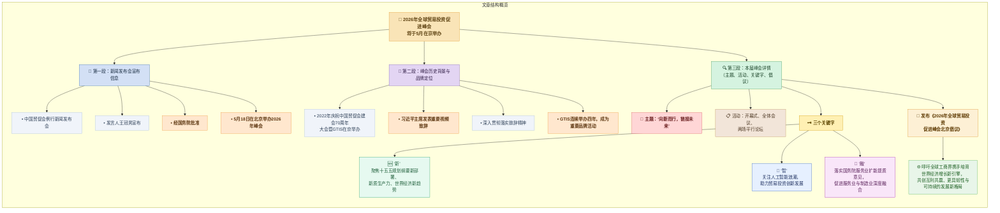

# 2026年全球贸易投资促进峰会将于5月在京举办

## 前情提要

## 精读文章笔记

**标题**：`2026年全球贸易投资促进峰会将于5月在京举办`  
**来源**：中国贸易报  
**时间**：2026年4月29日（发布会当天）  
**栏目**：中国贸促会例行新闻发布会报道  
**编辑**：张陈宇 李婧（实习生） | **审校**：陈丹丹 | **审核**：乔大伟  
**投稿信箱**：chinatradenews@ccpit.org

---

4月29日举办的中国贸促会例行新闻发布会上，中国贸促会新闻发言人王冠男应询介绍了峰会有关情况。

> **全球贸易投资促进峰会**：英文 `Global Trade and Investment Summit (GTIS)`，由中国贸促会发起主办的高级别国际工商界对话平台，旨在凝聚共识、促进全球经贸合作。

“`2022年`，庆祝`中国贸促会建会70周年`大会暨全球贸易投资促进峰会（`GTIS`）在京举办，`习近平主席`发表重要视频致辞。我们深入贯彻落实习近平主席重要视频致辞精神，GTIS已连续举办四年并越办越好，成为`中外工商界`加强沟通、深化合作、共谋发展的重要`品牌活动`。”王冠男说。

> **2022年中国贸促会建会70周年**：1952年5月，中国贸促会成立。2022年恰逢70周年，5月18日举办了庆祝大会暨峰会，习近平主席发表视频致辞，强调“聚力战胜疫情、重振贸易投资、坚持创新驱动、完善全球治理”四点建议。  
> **GTIS**：即 `Global Trade and Investment Summit`，全球贸易投资促进峰会的简写。连续四年指2022年至2025年已成功举办四届。  
> **中外工商界**：指国内外商业和工业界的企业、商协会组织等经济主体，是峰会的主要参与方。  
> **品牌活动**：比喻具有较高知名度、美誉度和持续影响力的标志性大型活动，此处表明峰会已成为国际经贸领域的标杆性平台。

本届峰会以`“向新而行，链接未来”`为主题，将举行`开幕式`、`全体会议`及两场`平行论坛`，突出三个关键字：一是`“新”`，聚焦`“十五五”规划纲要`关于引领发展`新质生产力`的新部署、新要求和当前世界经济发展的新趋势、新热点。二是`“智”`，关注`人工智能浪潮`，助力贸易投资创新发展。三是`“融”`，落实最新颁布的《`国务院关于推进服务业扩能提质的意见`》，探讨促进`服务业与制造业深度融合`，激发产业升级新活力。峰会期间将发布《`2026年全球贸易投资促进峰会北京倡议`》，呼吁`全球工商界`携手`培育世界经济增长新引擎`，共创`互利共赢`、`更具韧性与可持续`的发展新格局。

> **“向新而行，链接未来”**：本届峰会主题，“向新”指面向新兴产业、新型生产要素和新的发展方式，“链接未来”强调通过贸易投资连接全球、共创未来，蕴含“新质生产力”和“互联互通”双重内涵。  
> **全体会议**：`plenary session`，全体与会者参加的大会。**平行论坛**：`parallel forum`，在大会期间同时进行的若干专题论坛，便于深入研讨不同议题。  
> **“十五五”规划纲要**：中华人民共和国国民经济和社会发展第十五个五年规划纲要，规划期为2026年至2030年，是2026年全国人民代表大会刚刚审议通过的纲领性文件，为未来五年发展定调。  
> **新质生产力**：`new quality productive forces`，由习近平总书记创造性提出的重大概念，指由技术革命性突破、生产要素创新性配置、产业深度转型升级而催生的先进生产力，核心标志是全要素生产率大幅提升。此处强调峰会紧扣国家最新战略部署。  
> **人工智能浪潮**：英文 `AI wave`，指以生成式人工智能（如大语言模型）为代表的新一轮人工智能技术革命及其引发的产业变革。  
> **《国务院关于推进服务业扩能提质的意见》**：这是2025年底或2026年初国务院发布的重要文件，旨在通过扩大服务业开放、提升服务质量，推动服务业与制造业等深度融合，增强经济整体竞争力。峰会将进一步呼应此项政策。  
> **服务业与制造业深度融合**：指 `advanced integration of the service and manufacturing sectors`，即发展服务型制造、制造服务化，如工业设计、供应链管理、信息技术服务嵌入制造环节，是产业升级的重要方向。  
> **《2026年全球贸易投资促进峰会北京倡议》**：将在峰会闭幕时发布的纲领性文件，体现与会各国工商界的共同立场与行动承诺。“北京倡议”已成为GTIS的标志性成果，类似国际会议常有的“主席声明”或“联合宣言”。  
> **培育世界经济增长新引擎**：比喻加快形成新的经济增长动力，如绿色经济、数字经济、人工智能产业等，以应对传统增长动能减弱的挑战。  
> **更具韧性与可持续**：`more resilient and sustainable`，“韧性”指抵御冲击、快速恢复的能力，“可持续”强调经济、社会、环境的长期协调发展，呼应联合国2030年可持续发展议程。

---

**文中图片来源说明**（原文保留）：

本文中除标明来源的图片，其余均来自网络公开渠道，不能识别其来源，如有版权争议，请联系本账号。

**延伸阅读**（为原文附带的平台推荐，此处保留标题）：

- 实习招募！中国贸易报社（中国贸促会融媒体中心）就等你来🫵
- 在非洲大陆尽头，看见中南合作的“好望”
- 贸议天下 | 东南亚，中国短剧的“出海第一站”有多香？

# 前情提要

## 基本信息

- 文章来源：中国贸易报
- 标题：2026年全球贸易投资促进峰会将于5月在京举办
- 作者：原文未标明具体撰稿人；检索到同主题新闻由中新网、中国新闻网、人民网、新华社等媒体发布，但用户所给版本仅列出来源与编辑信息，未列作者署名。
- 编辑：张陈宇、李婧（实习生）
- 审校：陈丹丹
- 审核：乔大伟
- 媒体背景：中国贸易报社有限公司，即中国贸促会融媒体中心，负责编辑、出版《中国贸易报》《中国对外贸易》杂志；中国贸促会官网介绍其为贸促会直属融媒体/出版平台。参考：中国贸促会关于中国贸易报社 [1](https://www.ccpit.org/dept/enterprise/maoyibaoshe/)的介绍。
- 机构背景：中国贸促会，即中国国际贸易促进委员会，英文常译为 **China Council for the Promotion of International Trade, CCPIT**，成立于1952年，是全国性对外贸易投资促进机构，职责包括促进对外贸易、双向投资、经贸合作，组织经贸展览、论坛与国际会议等。参考：中国贸促会官网机构简介 [2](https://www.ccpit.org/a/20210104/20210104ixi6.html)及英文官网About CCPIT [3](https://en.ccpit.org/infoById/40288117521acbb80153a75e0133021e/5)。
- 事件核对：中新网在2026年4月29日发布同题材消息，确认2026年全球贸易投资促进峰会将于2026年5月18日在北京举办，主题为“向新而行，链接未来”。参考：中国新闻网报道 [4](https://www.chinanews.com.cn/cj/2026/04-29/10612912.shtml)。
- 政策背景核对：《国务院关于推进服务业扩能提质的意见》已于2026年4月发布，内容涉及生产性服务业、现代物流、软件和信息服务、服务业数智化等。参考：生态环境部转载中国政府网文件 [5](https://www.mee.gov.cn/zcwj/gwywj/202604/t20260422_1149897.shtml)。

## 文章结构信息图

```mermaid
flowchart TD
    A["标题：峰会将在2026年5月于北京举办"] --> B["第一层：新闻事实发布"]
    B --> B1["时间：4月29日新闻发布会"]
    B --> B2["主办：中国贸促会"]
    B --> B3["举办时间：5月18日"]
    B --> B4["地点：北京"]

    A --> C["第二层：历史延续与品牌建设"]
    C --> C1["2022年：贸促会建会70周年大会暨GTIS在京举办"]
    C --> C2["习近平主席发表重要视频致辞"]
    C --> C3["GTIS连续举办四年"]
    C --> C4["定位：中外工商界沟通、合作、发展平台"]

    A --> D["第三层：本届峰会主题与议程"]
    D --> D1["主题：向新而行，链接未来"]
    D --> D2["议程：开幕式"]
    D --> D3["议程：全体会议"]
    D --> D4["议程：两场平行论坛"]

    A --> E["第四层：三个关键词"]
    E --> E1["新：新质生产力、十五五规划、世界经济新趋势"]
    E --> E2["智：人工智能浪潮、贸易投资创新发展"]
    E --> E3["融：服务业与制造业深度融合、产业升级"]

    A --> F["第五层：预期成果"]
    F --> F1["发布北京倡议"]
    F --> F2["呼吁全球工商界合作"]
    F --> F3["培育世界经济增长新引擎"]
    F --> F4["构建互利共赢、韧性、可持续的新格局"]

    classDef title fill:#1f4e79,color:#ffffff,stroke:#0b2545,stroke-width:2px;
    classDef fact fill:#d9ead3,color:#1b4332,stroke:#40916c,stroke-width:1px;
    classDef history fill:#fff2cc,color:#7f6000,stroke:#d6a100,stroke-width:1px;
    classDef agenda fill:#d9eaf7,color:#073763,stroke:#3d85c6,stroke-width:1px;
    classDef keywords fill:#eadcf8,color:#4c1130,stroke:#8e7cc3,stroke-width:1px;
    classDef outcome fill:#f4cccc,color:#660000,stroke:#cc0000,stroke-width:1px;

    class A title;
    class B,B1,B2,B3,B4 fact;
    class C,C1,C2,C3,C4 history;
    class D,D1,D2,D3,D4 agenda;
    class E,E1,E2,E3 keywords;
    class F,F1,F2,F3,F4 outcome;
```

---

🔸 **`2026年全球贸易投资促进峰会`** / 将于 **`5月`** / 在 **`京`** 举办
🔹 The **`2026 Global Trade and Investment Promotion Summit`** / **`is to be held`** / in **`Beijing`** / in **`May`**.

背景注释：
- **Global Trade and Investment Promotion Summit, GTIS**：全球贸易投资促进峰会，通常用于聚合政府机构、国际组织、商协会、企业界人士，讨论全球贸易、投资、产业链、开放合作等议题。
- **Beijing**：这里的“京”是中文新闻标题中对北京的简称，英文一般不译为 *the capital*，而直接译为 **Beijing**。
- 标题采用新闻标题常见结构：省略主语、突出事件、时间与地点。英文标题中常用 **is to be held** 表示“将举行/定于举行”，带有正式新闻语体色彩。

> **`Global Trade and Investment Promotion Summit`** /ˈɡloʊbəl treɪd ənd ɪnˈvestmənt prəˈmoʊʃən ˈsʌmɪt/
> 英文释义：n. an international high-level meeting focused on promoting trade, investment, and business cooperation；名词，指围绕贸易、投资和工商合作展开的国际高级别会议。
> 中文翻译：全球贸易投资促进峰会。
> 语域：正式；新闻；经贸；国际会议。
> 画龙点睛：**`summit`** 本义是“山顶”，引申为“峰会、高层会议”，常见搭配有 **`hold a summit`** 举办峰会、**`attend a summit`** 出席峰会、**`summit declaration`** 峰会宣言。考试写作中可用 **`a summit aimed at promoting...`** 表达“旨在促进……的峰会”。

> **`is to be held`** /ɪz tuː bi held/
> 英文释义：phr. is scheduled or officially arranged to take place；短语，表示“按计划、经正式安排将要举行”。
> 中文翻译：将于；定于；计划举行。
> 语域：正式；新闻；公告。
> 画龙点睛：**`be to do`** 可表示正式安排或命令，如 **`The conference is to open on Monday.`** “会议定于周一开幕。”比 **`will be held`** 更有“官方日程已确定”的意味。注意 **`hold-held-held`** 是不规则动词，新闻标题中常见被动结构 **`be held in + 地点`**。

> **`promotion`** /prəˈmoʊʃən/
> 英文释义：n. the act of encouraging the growth, development, or acceptance of something；名词，指推动、促进、推广某事发展或被接受。
> 中文翻译：促进；推广；推动。
> 语域：正式；商业；政策；市场营销。
> 画龙点睛：**`promotion`** 不只指“促销”，在政策和经贸语境中常指“促进”，如 **`investment promotion`** 投资促进、**`trade promotion`** 贸易促进。动词是 **`promote`**，形容词可用 **`promotional`**，但 **`promotional campaign`** 多指营销推广活动。

---

🔸 **`4月29日`** 举办的 / **`中国贸促会例行新闻发布会`** 上，**`中国贸促会新闻发言人王冠男`** 表示，/ 经 **`国务院批准`**，**`5月18日`**，**`中国贸促会`** 将在 **`北京`** 举办 **`2026年全球贸易投资促进峰会`**。
🔹 At the **`regular press conference`** / held by the **`China Council for the Promotion of International Trade`** / on **`April 29`**, **`CCPIT spokesperson Wang Guannan`** said that, / with the **`approval of the State Council`**, the **`CCPIT`** / will host the **`2026 Global Trade and Investment Promotion Summit`** / in **`Beijing`** / on **`May 18`**.

背景注释：
- **China Council for the Promotion of International Trade, CCPIT**：中国贸促会，官方英文名称为 **China Council for the Promotion of International Trade**。在新闻英语中，首次出现可用全称加缩写，后文直接用 **CCPIT**。
- **regular press conference**：例行新闻发布会，通常指机构按固定频率举行的信息发布活动。
- **State Council**：国务院，中国最高国家行政机关。英文报道中通常译为 **the State Council**。
- **host**：此处不是“主人”，而是“主办、承办”，是会议、峰会、赛事新闻中的高频动词。

> **`regular press conference`** /ˈreɡjələr pres ˈkɑːnfərəns/
> 英文释义：n. a routinely scheduled meeting at which officials or organizations provide information to journalists；名词，指定期举行、向媒体发布信息的会议。
> 中文翻译：例行新闻发布会。
> 语域：新闻；政府；公共传播。
> 画龙点睛：**`regular`** 在这里不是“普通的”，而是“定期的、例行的”。常见搭配有 **`a regular meeting`** 例会、**`a regular briefing`** 例行吹风会。新闻英语中 **`press conference`** 偏正式，**`briefing`** 更强调简要说明和问答。

> **`spokesperson`** /ˈspoʊkspɜːrsən/
> 英文释义：n. a person who speaks officially on behalf of an organization or government；名词，指代表组织或政府正式发言的人。
> 中文翻译：发言人。
> 语域：正式；新闻；政府；机构传播。
> 画龙点睛：**`spokesperson`** 是较中性的现代用法，可替代带性别色彩的 **`spokesman`** 或 **`spokeswoman`**。常见表达：**`a spokesperson for the ministry`** 部门发言人、**`the company spokesperson said...`** 公司发言人表示……

> **`with the approval of`** /wɪð ði əˈpruːvəl əv/
> 英文释义：phr. after being officially permitted or authorized by someone or an institution；短语，表示经某人或某机构正式许可或授权。
> 中文翻译：经……批准；在……批准下。
> 语域：正式；行政；法律；新闻。
> 画龙点睛：**`approval`** 强调正式认可，常用于 **`seek approval`** 寻求批准、**`obtain approval`** 获得批准、**`subject to approval`** 须经批准。写作中可用 **`with official approval`** 表示“经官方批准”，比 **`with agreement`** 更正式。

> **`host`** /hoʊst/
> 英文释义：v. to organize and provide the place or arrangements for an event；动词，指组织、主办并提供活动安排。
> 中文翻译：主办；承办；举办。
> 语域：新闻；会议；体育；外交。
> 画龙点睛：**`host`** 可作名词“主人、主持人、主办方”，也可作动词“主办”。常见搭配：**`host a summit`** 主办峰会、**`host the Olympics`** 主办奥运会、**`host a webinar`** 主办线上研讨会。注意不要机械译成“招待”。

---

🔸 “**`2022年`**，庆祝 **`中国贸促会建会70周年大会`** 暨 **`全球贸易投资促进峰会（GTIS）`** / 在 **`京`** 举办，**`习近平主席`** / 发表 **`重要视频致辞`**。
🔹 “In **`2022`**, the **`Conference Marking the 70th Anniversary of the CCPIT`** / and the **`Global Trade and Investment Promotion Summit (GTIS)`** / were held in **`Beijing`**, where **`President Xi Jinping`** / delivered an **`important video address`**.

背景注释：
- **Conference Marking the 70th Anniversary of the CCPIT**：庆祝中国贸促会建会70周年大会。中国贸促会成立于1952年，因此2022年为建会70周年。
- **GTIS**：**Global Trade and Investment Promotion Summit** 的缩写。英文新闻中，机构或会议名称第一次出现时一般写全称，括号中标注缩写，后文可直接使用缩写。
- **video address**：视频致辞。相比 **speech**，**address** 更正式，常用于领导人、机构负责人在大会、典礼、峰会上的正式讲话。
- 本句英文译文中使用 **where** 引导非限制性定语从句，衔接“在北京举办”与“发表视频致辞”，使句子更自然。

> **`marking the 70th anniversary`** /ˈmɑːrkɪŋ ðə ˈsevəntiəθ ˌænɪˈvɜːrsəri/
> 英文释义：phr. celebrating or officially recognizing seventy years since an event or organization began；短语，表示纪念或庆祝某事件或机构成立七十周年。
> 中文翻译：庆祝七十周年；纪念七十周年。
> 语域：正式；新闻；纪念活动。
> 画龙点睛：**`mark`** 作动词时不只是“做标记”，还可表示“纪念、标志着”。如 **`The year 2022 marked the 70th anniversary of the CCPIT.`** “2022年标志着中国贸促会成立70周年。”这是新闻写作高分表达。

> **`anniversary`** /ˌænɪˈvɜːrsəri/
> 英文释义：n. the date on which an event happened in a previous year, especially one celebrated annually；名词，指周年纪念日。
> 中文翻译：周年；周年纪念日。
> 语域：通用；正式；纪念报道。
> 画龙点睛：**`anniversary`** 常搭配序数词：**`the 70th anniversary`** 七十周年。注意中文“建会70周年”不能直译为 **`built association 70 years`**，应译为 **`the 70th anniversary of the founding of...`** 或更凝练的 **`the 70th anniversary of...`**。

> **`video address`** /ˈvɪdioʊ əˈdres/
> 英文释义：n. a formal speech delivered through video rather than in person；名词，指通过视频形式发表的正式讲话。
> 中文翻译：视频致辞；视频讲话。
> 语域：正式；外交；会议；新闻。
> 画龙点睛：**`address`** 作名词时除“地址”外，还可指“正式讲话”。动词 **`address`** 也可表示“发表讲话”或“处理问题”，如 **`address the conference`** 向大会致辞，**`address a problem`** 处理问题，属于典型熟词僻义。

> **`deliver`** /dɪˈlɪvər/
> 英文释义：v. to give a speech, lecture, or formal statement；动词，表示发表演讲、讲话或正式声明。
> 中文翻译：发表；作；发表讲话。
> 语域：正式；新闻；演讲。
> 画龙点睛：**`deliver`** 不只表示“递送”，还可用于讲话：**`deliver a speech`** 发表演讲、**`deliver an address`** 致辞、**`deliver a keynote`** 作主旨演讲。写作中比 **`give a speech`** 更正式。动词变化：**`deliver-delivered-delivered`**。

---

🔸 我们 / 深入 **`贯彻落实`** **`习近平主席重要视频致辞精神`**，**`GTIS`** / 已 **`连续举办四年`** 并 **`越办越好`**，/ 成为 **`中外工商界`** 加强 **`沟通`**、深化 **`合作`**、共谋 **`发展`** 的 **`重要品牌活动`**。”王冠男说。
🔹 “We / have thoroughly **`implemented`** the guiding principles of **`President Xi’s important video address`**; **`GTIS`** / has been held for **`four consecutive years`** and has gone **`from strength to strength`**, / becoming an **`important branded event`** for the **`Chinese and foreign business communities`** to strengthen **`communication`**, deepen **`cooperation`**, and jointly pursue **`development`**,” Wang said.

背景注释：
- **implement the guiding principles of...**：中文政治新闻中“贯彻落实……精神”常见，英文不宜直译为 *carry out the spirit*，更自然正式的译法是 **implement the guiding principles of...**。
- **from strength to strength**：译“越办越好”，是英语中很地道的固定表达，表示某事持续进步、越来越成功。
- **business communities**：工商界。注意这里不是某一个“社区”，而是指商业、企业、行业组织等组成的群体。
- **branded event**：品牌活动，即具有稳定影响力、辨识度和持续举办基础的活动。

> **`implement`** /ˈɪmplɪment/
> 英文释义：v. to put a plan, decision, policy, or principle into effect；动词，指把计划、决定、政策或原则付诸实施。
> 中文翻译：实施；执行；贯彻。
> 语域：正式；政策；管理；法律。
> 画龙点睛：**`implement`** 是政策英语核心动词，常见搭配有 **`implement a policy`** 执行政策、**`implement reforms`** 推行改革、**`fully implement`** 全面落实。名词 **`implementation`** 常见于学术与政策文本，表示“实施、落实”。

> **`guiding principles`** /ˈɡaɪdɪŋ ˈprɪnsəpəlz/
> 英文释义：n. basic ideas or rules that direct decisions, actions, or policies；名词短语，指指导行动、决策或政策的基本原则。
> 中文翻译：指导原则；精神；基本遵循。
> 语域：正式；政策；组织管理。
> 画龙点睛：中文“精神”在政策语境中常指“核心要求、指导思想”，不能总译为 **`spirit`**。如“贯彻会议精神”常译为 **`implement the guiding principles of the meeting`**，比 **`carry out the spirit of the meeting`** 更符合英文公文表达。

> **`consecutive`** /kənˈsekjətɪv/
> 英文释义：adj. following one after another without interruption；形容词，指连续不断的。
> 中文翻译：连续的；接连的。
> 语域：正式；新闻；数据报道。
> 画龙点睛：**`consecutive`** 强调“中间没有中断”，常用于 **`for three consecutive years`** 连续三年、**`consecutive wins`** 连胜。近义词 **`successive`** 也可指“连续的”，但更强调“一个接一个”；**`continuous`** 则强调过程不中断。

> **`from strength to strength`** /frəm streŋkθ tə streŋkθ/
> 英文释义：idiom. becoming increasingly successful or confident over time；习语，指越来越成功、不断发展壮大。
> 中文翻译：越来越好；日益壮大；越办越好。
> 语域：正式偏自然；新闻评论；商业报道。
> 画龙点睛：这是表达“越办越好”的地道高分短语。可写：**`The initiative has gone from strength to strength.`** “该倡议不断发展壮大。”注意 **`strength`** 发音 /streŋkθ/，结尾有 /kθ/，对中文母语者较难。

> **`branded event`** /ˈbrændɪd ɪˈvent/
> 英文释义：n. an event with a recognizable identity, reputation, and repeated public presence；名词短语，指具有稳定品牌辨识度、声誉和持续影响力的活动。
> 中文翻译：品牌活动。
> 语域：商业；会展；传播；新闻。
> 画龙点睛：**`branded`** 不仅指“有商标的”，还可表示“形成品牌形象的”。类似表达有 **`flagship event`** 旗舰活动、**`signature event`** 标志性活动。若强调“最重要的品牌项目”，可说 **`a flagship branded event`**。

---

🔸 本届峰会 / 以 “**`向新而行，链接未来`**” 为 **`主题`**，/ 将举行 **`开幕式`**、**`全体会议`** 及 **`两场平行论坛`**，/ 突出 **`三个关键字`**：一是“**`新`**”，/ 聚焦 “**`十五五`**” **`规划纲要`** 关于引领发展 **`新质生产力`** 的 **`新部署`**、**`新要求`** / 和当前 **`世界经济发展`** 的 **`新趋势`**、**`新热点`**。
🔹 With the theme “**`Moving Toward the New, Connecting the Future`**,” / this year’s summit / will feature an **`opening ceremony`**, a **`plenary session`**, and **`two parallel forums`**, / highlighting **`three keywords`**: first, “**`new`**,” / focusing on the **`new arrangements`** and **`new requirements`** in the **`15th Five-Year Plan Outline`** for steering the development of **`new quality productive forces`**, / as well as **`new trends`** and **`hot topics`** in current **`world economic development`**.

背景注释：
- **Moving Toward the New, Connecting the Future**：对“向新而行，链接未来”的意译。**toward the new** 保留“向新”的方向感，**connecting the future** 对应“链接未来”。
- **plenary session**：全体会议，指所有与会代表共同参加的会议；与 **parallel forums** 平行论坛相对，后者通常同时分主题举行。
- **15th Five-Year Plan Outline**：“十五五”规划纲要，指中国2026—2030年国民经济和社会发展规划纲要。
- **new quality productive forces**：新质生产力。该译法已成为中国政策外宣中的常用译法，强调以科技创新、产业升级、效率提升为核心的新型生产力。
- **arrangements** 与 **requirements**：分别对应“部署”和“要求”。在政策英语中，**arrangements** 可指政策安排、工作部署。

> **`theme`** /θiːm/
> 英文释义：n. the main subject, idea, or message of an event, discussion, or piece of writing；名词，指活动、讨论或文章的核心主题。
> 中文翻译：主题；主旨。
> 语域：通用；正式；会议；写作。
> 画龙点睛：常见搭配：**`under the theme of...`** 以……为主题、**`with the theme...`** 主题为……。考试写作中可用 **`The conference was held under the theme of sustainable development.`** 表达“会议以可持续发展为主题”。

> **`feature`** /ˈfiːtʃər/
> 英文释义：v. to include someone or something as an important part；动词，指以某人或某事为重要组成部分，包含、设有。
> 中文翻译：设有；包括；以……为特色。
> 语域：新闻；商业；活动介绍。
> 画龙点睛：**`feature`** 作名词是“特征”，作动词是“以……为特色/包含”。会议新闻常写 **`The event will feature keynote speeches and panel discussions.`** “活动将包括主旨演讲和小组讨论。”比简单的 **`have`** 更正式、更有新闻感。

> **`plenary session`** /ˈpliːnəri ˈseʃən/
> 英文释义：n. a meeting attended by all participants of a conference or assembly；名词，指大会所有成员都参加的全体会议。
> 中文翻译：全体会议；大会全会。
> 语域：正式；会议；外交；学术。
> 画龙点睛：**`plenary`** 来自“完整、全体”之意，常见搭配 **`plenary meeting`**、**`plenary session`**。与之相对，**`breakout session`** 或 **`parallel forum`** 指分组会、平行论坛。雅思听力会议场景中也常出现 **`session`**。

> **`parallel forums`** /ˈpærəlel ˈfɔːrəmz/
> 英文释义：n. forums held at the same time, usually on different topics within a larger event；名词短语，指在同一大会框架下同时举行、主题不同的论坛。
> 中文翻译：平行论坛。
> 语域：会议；会展；学术；商业。
> 画龙点睛：**`parallel`** 本义为“平行的”，会议中指“同时进行的”。类似表达：**`parallel sessions`** 平行分会、**`side events`** 边会、**`sub-forums`** 分论坛。注意 **`forum`** 复数可为 **`forums`**，正式古典形式 **`fora`** 较少用。

> **`highlight`** /ˈhaɪlaɪt/
> 英文释义：v. to emphasize something so that people pay special attention to it；动词，指突出、强调，使人特别注意。
> 中文翻译：突出；强调；凸显。
> 语域：新闻；学术；商务；写作。
> 画龙点睛：**`highlight`** 是写作万能动词，可替代 **`show`**、**`emphasize`**。如 **`The report highlights the importance of innovation.`** “报告强调创新的重要性。”名词 **`highlight`** 还可指“亮点”，如 **`the highlights of the summit`** 峰会亮点。

> **`new quality productive forces`** /nuː ˈkwɑːləti prəˈdʌktɪv ˈfɔːrsɪz/
> 英文释义：n. emerging forms of productivity driven by innovation, advanced technology, upgraded industries, and higher efficiency；名词短语，指由创新、先进技术、产业升级和效率提升驱动的新型生产力。
> 中文翻译：新质生产力。
> 语域：政策；经济；产业；科技。
> 画龙点睛：这是政策关键词，不能译成 **`new-quality production power`**。写作可表述为 **`develop new quality productive forces through technological innovation`** “通过科技创新发展新质生产力”。其中 **`productive forces`** 偏马克思主义政治经济学语汇，正式而政策色彩强。

---

🔸 二是“**`智`**”，/ 关注 **`人工智能浪潮`**，/ 助力 **`贸易投资`** **`创新发展`**。
🔹 Second, “**`intelligence`**,” / focusing on the **`wave of artificial intelligence`** / and helping promote **`innovation-driven development`** in **`trade and investment`**.

背景注释：
- **intelligence**：这里的“智”并非单纯“智慧”，而是指以人工智能、智能化、数字化技术为代表的发展方向。
- **wave of artificial intelligence**：人工智能浪潮。**wave** 常用于描述技术、产业或社会趋势的快速兴起，如 **a wave of digital transformation**。
- **innovation-driven development**：创新发展，也可译为“创新驱动发展”。这比直译 **innovative development** 更突出“以创新驱动发展”的政策含义。

> **`intelligence`** /ɪnˈtelɪdʒəns/
> 英文释义：n. the ability to learn, understand, and think; in technology, the capacity of machines to perform tasks associated with human intelligence；名词，指智能、智力；技术语境中指机器执行类人智能任务的能力。
> 中文翻译：智能；智力；情报。
> 语域：科技；教育；军事；正式。
> 画龙点睛：**`intelligence`** 有多义：普通语境是“智力”，科技语境是“智能”，军事/安全语境是“情报”。**`artificial intelligence`** 是“人工智能”，常缩写为 **`AI`**。不要把 **`intelligence agency`** 误译为“智能机构”，应是“情报机构”。

> **`wave of artificial intelligence`** /weɪv əv ˌɑːrtɪˈfɪʃəl ɪnˈtelɪdʒəns/
> 英文释义：n. a powerful and widespread trend involving the rapid development and adoption of AI technologies；名词短语，指人工智能技术快速发展与广泛应用所形成的趋势。
> 中文翻译：人工智能浪潮。
> 语域：科技；商业；新闻。
> 画龙点睛：**`wave`** 常用来表达“浪潮、一波趋势”，如 **`a wave of innovation`** 创新浪潮、**`a wave of investment`** 投资热潮。比 **`trend`** 更有冲击力和扩散感，适合新闻与议论文写作。

> **`innovation-driven development`** /ˌɪnəˈveɪʃən ˈdrɪvən dɪˈveləpmənt/
> 英文释义：n. development powered mainly by innovation rather than by traditional factors alone；名词短语，指主要由创新而非传统要素驱动的发展。
> 中文翻译：创新驱动发展；创新发展。
> 语域：政策；经济；科技；正式。
> 画龙点睛：**`-driven`** 是高频构词，表示“由……驱动的”，如 **`technology-driven growth`** 技术驱动型增长、**`data-driven decision-making`** 数据驱动决策。写作中很实用，可增强表达的凝练度和学术感。

> **`trade and investment`** /treɪd ənd ɪnˈvestmənt/
> 英文释义：n. economic activities involving the exchange of goods and services and the allocation of capital for future returns；名词短语，指商品服务交换和资本投入活动。
> 中文翻译：贸易与投资。
> 语域：经贸；政策；国际关系。
> 画龙点睛：英文国际经贸报道常把 **`trade`** 和 **`investment`** 并列，形成固定搭配。可扩展为 **`trade and investment facilitation`** 贸易投资便利化、**`trade and investment cooperation`** 贸易投资合作、**`cross-border trade and investment`** 跨境贸易投资。

---

🔸 三是“**`融`**”，/ 落实最新颁布的 **`《国务院关于推进服务业扩能提质的意见》`**，/ 探讨促进 **`服务业`** 与 **`制造业`** **`深度融合`**，/ 激发 **`产业升级`** **`新活力`**。
🔹 Third, “**`integration`**,” / implementing the recently issued **`State Council Opinions on Expanding the Capacity and Improving the Quality of the Service Sector`**, / and exploring ways to promote the **`deep integration`** of the **`service sector`** and the **`manufacturing sector`**, / thereby unleashing **`new vitality`** for **`industrial upgrading`**.

背景注释：
- **integration**：这里译“融”，即融合、融通，尤其指服务业与制造业的深层结合。
- **State Council Opinions on Expanding the Capacity and Improving the Quality of the Service Sector**：对《国务院关于推进服务业扩能提质的意见》的功能性译法。官方英文译名若未统一发布，可采用该类说明性译法。
- **service sector**：服务业；包括生产性服务业、生活性服务业等。
- **manufacturing sector**：制造业。
- **industrial upgrading**：产业升级，常指产业从低附加值、低效率环节向高技术、高附加值、高效率环节转型。
- **thereby**：英文译文中加入 **thereby**，用于表达“通过前述措施，从而激发……”，使逻辑更清楚。

> **`integration`** /ˌɪntɪˈɡreɪʃən/
> 英文释义：n. the process of combining two or more things so that they work together effectively；名词，指把两个或多个部分结合起来，使其协同运作的过程。
> 中文翻译：融合；整合；一体化。
> 语域：正式；经济；科技；社会科学。
> 画龙点睛：**`integration`** 强调“结合为整体”。常见搭配有 **`economic integration`** 经济一体化、**`industrial integration`** 产业融合、**`regional integration`** 区域一体化。动词是 **`integrate`**，形容词是 **`integrated`**，如 **`an integrated approach`** 综合性方法。

> **`recently issued`** /ˈriːsəntli ˈɪʃuːd/
> 英文释义：adj. officially released or published not long ago；形容词短语，指不久前正式发布的。
> 中文翻译：最新颁布的；近日发布的。
> 语域：正式；政策；法律；新闻。
> 画龙点睛：政策、法规、文件“发布/颁布”可用 **`issue`**，如 **`issue a notice`** 发布通知、**`issue guidelines`** 发布指南。**`promulgate`** 更法律化，常译“颁布”；一般新闻里 **`issue`** 更自然高频。

> **`service sector`** /ˈsɜːrvɪs ˈsektər/
> 英文释义：n. the part of the economy that provides services rather than producing goods；名词，指提供服务而非直接生产实物商品的经济部门。
> 中文翻译：服务业；服务部门。
> 语域：经济；政策；统计。
> 画龙点睛：**`sector`** 指“行业、部门、领域”，比 **`industry`** 更适合宏观经济分类。常见表达：**`public sector`** 公共部门、**`private sector`** 私营部门、**`financial sector`** 金融业。服务业也可说 **`services industry`**，但宏观政策中 **`service sector`** 更常见。

> **`manufacturing sector`** /ˌmænjuˈfæktʃərɪŋ ˈsektər/
> 英文释义：n. the part of the economy involved in making goods, especially on a large scale using machinery；名词，指使用机器和工业流程大规模生产商品的经济部门。
> 中文翻译：制造业。
> 语域：经济；产业；政策。
> 画龙点睛：**`manufacturing`** 来自动词 **`manufacture`** “制造、生产”。常见搭配：**`advanced manufacturing`** 先进制造业、**`manufacturing base`** 制造业基地、**`manufacturing capacity`** 制造能力。不要把 **`manufacture`** 与 **`manufacturer`** 混淆，后者是“制造商”。

> **`industrial upgrading`** /ɪnˈdʌstriəl ˌʌpˈɡreɪdɪŋ/
> 英文释义：n. the process of improving industries through technology, higher value-added production, better efficiency, and structural transformation；名词，指通过技术进步、价值提升、效率改善和结构转型推动产业层次提高的过程。
> 中文翻译：产业升级。
> 语域：经济；产业政策；商业。
> 画龙点睛：**`upgrading`** 不只是“升级软件”，也可指产业、技能、基础设施提升。常见表达：**`industrial upgrading and transformation`** 产业转型升级、**`move up the value chain`** 向价值链高端攀升。后者在写作中很地道。

> **`unleash new vitality`** /ʌnˈliːʃ nuː vaɪˈtæləti/
> 英文释义：phr. to release or stimulate new energy, dynamism, or potential；短语，指释放或激发新的活力、动力或潜能。
> 中文翻译：激发新活力；释放新动能。
> 语域：正式；新闻；经济评论。
> 画龙点睛：**`unleash`** 本义是“解开皮带、放开”，引申为“释放力量/潜能”。常见搭配：**`unleash potential`** 释放潜力、**`unleash creativity`** 激发创造力。比 **`bring`** 或 **`create`** 更有力度。

---

🔸 峰会期间 / 将发布 **`《2026年全球贸易投资促进峰会北京倡议》`**，/ 呼吁 **`全球工商界`** 携手培育 **`世界经济增长新引擎`**，/ 共创 **`互利共赢`**、更具 **`韧性`** 与 **`可持续`** 的 **`发展新格局`**。
🔹 During the summit, / the **`Beijing Initiative of the 2026 Global Trade and Investment Promotion Summit`** / will be released, / calling on the **`global business community`** to work together to foster **`new engines of world economic growth`** / and to create a **`new development landscape`** that is **`mutually beneficial`**, **`win-win`**, more **`resilient`**, and **`sustainable`**.

背景注释：
- **Beijing Initiative**：北京倡议。国际会议中常见以举办地命名的成果文件，如 **Beijing Declaration**、**Shanghai Initiative** 等。
- **global business community**：全球工商界，涵盖企业、商协会、行业组织、投资机构等。
- **new engines of world economic growth**：世界经济增长新引擎。**engine** 是经济新闻中常用隐喻，表示推动增长的动力来源。
- **new development landscape**：发展新格局。**landscape** 不是“风景”，在政策、商业、学术语境中常指“格局、局面、生态”。
- **resilient and sustainable**：有韧性且可持续。国际经济治理、供应链、气候发展议题中高频出现。

> **`initiative`** /ɪˈnɪʃətɪv/
> 英文释义：n. a new plan, proposal, or action intended to solve a problem or achieve a goal；名词，指为解决问题或实现目标而提出的新计划、新倡议或行动。
> 中文翻译：倡议；主动行动；计划。
> 语域：正式；外交；政策；商业。
> 画龙点睛：**`initiative`** 在国际会议成果文件中常译“倡议”，如 **`the Belt and Road Initiative`** “一带一路”倡议。常见搭配：**`launch an initiative`** 发起倡议、**`support an initiative`** 支持倡议、**`joint initiative`** 联合倡议。

> **`call on`** /kɔːl ɑːn/
> 英文释义：phr.v. to publicly ask or urge someone to do something；短语动词，指公开呼吁、敦促某人做某事。
> 中文翻译：呼吁；号召；敦促。
> 语域：新闻；政治；公益；正式。
> 画龙点睛：**`call on sb. to do sth.`** 是新闻英语高频结构，表示“呼吁某人做某事”。如 **`The report calls on governments to strengthen cooperation.`** “报告呼吁各国政府加强合作。”注意不要与 **`call for`** 混淆，后者后面直接接“所要求的事物”。

> **`foster`** /ˈfɔːstər/
> 英文释义：v. to encourage the development or growth of something；动词，指促进、培育、助长某事的发展。
> 中文翻译：培育；促进；培养。
> 语域：正式；教育；政策；商业。
> 画龙点睛：**`foster`** 比 **`develop`** 更强调“提供条件、逐步培育”。常见搭配：**`foster innovation`** 培育创新、**`foster cooperation`** 促进合作、**`foster talent`** 培养人才。形容词 **`foster`** 另可指“寄养的”，如 **`foster family`**。

> **`engine of growth`** /ˈendʒɪn əv ɡroʊθ/
> 英文释义：n. a factor, sector, or force that drives economic expansion；名词短语，指推动经济增长的因素、行业或力量。
> 中文翻译：增长引擎；增长动力。
> 语域：经济；商业；新闻评论。
> 画龙点睛：**`engine`** 在经济英语中常作隐喻，表示“驱动力”。可写 **`consumption as a key engine of growth`** “消费作为重要增长引擎”。近义表达有 **`growth driver`** 增长驱动因素、**`driving force`** 推动力。

> **`mutually beneficial`** /ˈmjuːtʃuəli ˌbenɪˈfɪʃəl/
> 英文释义：adj. producing advantages or benefits for all parties involved；形容词，指对参与各方都有利的。
> 中文翻译：互利的；互惠的。
> 语域：正式；外交；商务；国际关系。
> 画龙点睛：**`mutually beneficial cooperation`** 是国际经贸英语常见表达，意为“互利合作”。**`mutual`** 强调“相互的”，如 **`mutual trust`** 相互信任、**`mutual respect`** 相互尊重。不要误写成 **`beneficial mutually`**，形容词短语顺序固定。

> **`win-win`** /ˌwɪn ˈwɪn/
> 英文释义：adj. benefiting all sides in a situation or agreement；形容词，指各方都能受益的。
> 中文翻译：双赢的；共赢的。
> 语域：商务；外交；政策；较常用。
> 画龙点睛：**`win-win`** 可作形容词，如 **`a win-win solution`** 双赢方案，也可作名词，如 **`This is a win-win.`** “这是双赢。”正式文本中常与 **`mutually beneficial`** 并列，形成“互利共赢”的表达。

> **`resilient`** /rɪˈzɪliənt/
> 英文释义：adj. able to recover quickly from difficulties, shocks, or disruptions；形容词，指能从困难、冲击或中断中迅速恢复的。
> 中文翻译：有韧性的；有复原力的。
> 语域：正式；经济；心理学；供应链；气候治理。
> 画龙点睛：**`resilient`** 是近年国际新闻和学术写作高频词。常见搭配：**`resilient supply chains`** 有韧性的供应链、**`economic resilience`** 经济韧性、**`climate resilience`** 气候韧性。名词是 **`resilience`**，动词无常用对应形式。

> **`sustainable`** /səˈsteɪnəbəl/
> 英文释义：adj. able to continue over time without causing serious harm or depletion；形容词，指能够长期持续且不造成严重损害或资源耗竭的。
> 中文翻译：可持续的。
> 语域：正式；经济；环境；发展政策。
> 画龙点睛：**`sustainable development`** 是固定搭配，译为“可持续发展”。动词 **`sustain`** 表示“维持、支撑”，名词 **`sustainability`** 表示“可持续性”。雅思写作中谈环境、经济、城市、企业责任时非常高频。

> **`development landscape`** /dɪˈveləpmənt ˈlændskeɪp/
> 英文释义：n. the overall pattern, environment, or structure in which development takes place；名词短语，指发展所处的整体格局、环境或结构。
> 中文翻译：发展格局；发展局面。
> 语域：正式；政策；经济；战略。
> 画龙点睛：**`landscape`** 除“风景”外，还可表示“格局、形势、生态”。如 **`the global economic landscape`** 全球经济格局、**`the media landscape`** 媒体生态、**`the competitive landscape`** 竞争格局。属于熟词僻义高频考点。