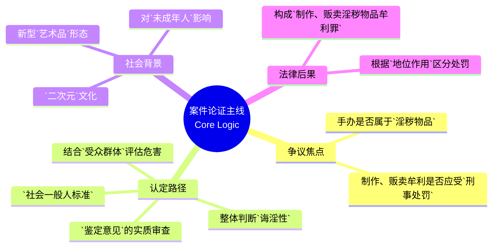

## 文章结构脉络图

```markdown
第378期丨许某等人制作、贩卖淫秽物品牟利案——手办艺术品与淫秽物品边界的司法认定

1. 导引部分
   1.1 栏目介绍：精品案例（最高法、公报、上海法院精品案例）
   1.2 编者按：
       - 核心对象：二次元动漫手办（受众为青少年）
       - 争议焦点：艺术创作与淫秽物品的界分
       - 案情价值：总结新兴艺术品“诲淫性”司法认定标准

2. 案件基本概况
   2.1 裁判要旨：
       - 要旨1：实质审查标准（造型、性暗示、社会一般人标准）
       - 要旨2：当罚性评价要素（销售模式、受众群体、社会危害性）
   2.2 基本案情：
       - 被告人许某：工厂制作+网店销售，涉案3万余件，金额200余万元
       - 被告人孟某：结伙制作+代销许某产品，涉及“妖兰”“狂三”手办
   2.3 裁判结果：上海市宝山区人民法院判决，主犯许某获刑四年九个月

3. 裁判理由（法理逻辑）
   3.1 争议焦点一：淫秽物品的实质认定
       - 法律依据：刑法第367条
       - 认定逻辑：鉴定意见实质审查 + 社会一般人标准判断
       - 具体分析：特定挑逗姿势、性器官露骨刻画、艺术价值消弭
   3.2 争议焦点二：刑事规制的必要性
       - 保护对象：青少年群体（从未成年人保护角度出发）
       - 行为评价：公然传播、受众精准、诱发违法犯罪

4. 案例注解（深度理论分析）
   4.1 淫秽物品的内涵特征及外延边界
       - 法律演进：从1988年暂行规定到1997年刑法，再到2004年网络司法解释
       - 核心特征：具体描绘性行为、露骨宣扬色情、诲淫性（无端挑起性欲）
       - 排除范围：科学著作、艺术价值作品（需警惕变异形态）
   4.2 新型淫秽物品的认定原则
       - 认定难点：隐蔽性、迷惑性、艺术性与诲淫性交织
       - 四大原则：综合性、整体性、社会性、灵活性
   4.3 手办艺术品诲淫性的司法认定方法（三步走）
       - 第一步：实质审查鉴定意见（同一性、效力、标准统一）
       - 第二步：社会一般人标准（性羞耻心、艺术性关联判断）
       - 第三步：主要受众群体判断（量化思维、青少年保护）
   4.4 刑事规则淫秽手办的合理限度
       - 治理必要性：对未成年人保护体系的补强
       - 宽严相济：区分设计者/生产者/经销商（主犯）与辅助人员（从犯）
       - 目标：三个效果（法律、社会、政治效果）有机统一

5. 附录
   5.1 相关法条：刑法第363条
   5.2 案件索引：案号、合议庭成员、编写人、编辑信息
```

---

# 第378期丨许某等人制作、贩卖淫秽物品牟利案——手办艺术品与淫秽物品边界的司法认定

**来源：** 上海法院精品案例  
**编写人：** 上海市宝山区人民法院 张国滨、宋文健  
**裁判日期：** 2025年4月9日

**【编者按】**  
本案涉案物品系受众群体主要为青少年的二次元动漫手办，争议焦点在于该类艺术创作产品与淫秽物品如何界定。在**现代**文化艺术背景下，艺术作品中掺杂色情因素并不鲜见，如何界分艺术作品和淫秽物品，众说纷纭。本案从涉案物品的特征出发，结合相关法理，系统总结提炼了新兴艺术品**诲淫性**的司法认定标准，全面回应了社会关切的争议问题，对确立类似案件的裁判规则具有一定的参考价值。

> **诲淫性 (Lasciviousness/Provocative nature)**：
> - **解析**：指作品具有诱导、教唆他人进行淫乱活动或激发他人性欲的特性。
> - **近义词**：挑逗性、猥亵性、色情性。
> - **金句积累**：**法律不仅是秩序的维护者，更是文明道德底线的守护者。**
> - **注意**：本词强调“教唆、引诱”的动作感和倾向性。

## 许某等人制作、贩卖淫秽物品牟利案——手办艺术品与淫秽物品边界的司法认定

**【裁判要旨】**  
1. 判断涉案物品是艺术作品还是淫秽物品，需实质审查相关鉴定意见，并全面考量手办具体造型姿态、色情刻画及其与艺术性的关联，遵循社会一般人标准判断其**诲淫性**。对于特意使用挑逗性姿势、刻意强化与艺术表达无关的性暗示，能够**无端挑起**人们的性欲和损害普通人正常的性行为观念的手办等新型艺术品，应当认定为淫秽物品。

> **无端挑起**：
> - **解析**：指没有任何正当理由或艺术必要性地激发起某种情绪或欲望。
> - **近义词**：平白无故、蓄意激荡。
> - **易混淆辨析**：与“艺术共鸣”相对。艺术共鸣是基于美感或深层思想的触动，而“无端挑起”通常指低级趣味的生理刺激。

2. 判断制作、贩卖淫秽物品牟利行为是否具有刑罚**当罚性**，要充分考虑销售模式、受众群体等要素，全面评价其社会危害性。对于通过网络平台公开销售，以青少年为主要受众（尤其要关注未成年人占比）制作、销售手办等新型淫秽物品牟利的，应当予以刑事处罚。

> **当罚性 (Punishability)**：
> - **解析**：法理学用语，指某一行为在法律上应当受到处罚的性质。
> - **重点词汇积累**：**刑事规制 (Criminal regulation)**、**社会危害性 (Social harmfulness)**。

**【基本案情】**  
一、被告人许某为牟利，经营某塑胶制品厂，雇佣被告人何某业、彭某、朱某、李某能、舒某华、何某福、雷某、黄某东、周某燕等人，制作手办类淫秽物品。同时，许某还经营网络店铺，雇佣被告人吴某等人具体运营，对外销售其制作的手办类淫秽物品。  
2023年12月7日，公安机关查获许某租用的两处仓库，查扣到3万余件手办类物品；经鉴定，上述被查扣的物品均为淫秽物品。另查明，至案发，许某经营的网店共销售上述经鉴定的手办类淫秽物品2万余件，销售金额人民币200余万元。

二、被告人孟某为牟利，结伙祝某琴、秦某、高某宾（均另案处理）等人，自2022年起，制作**妖兰**、**狂三**手办类淫秽物品并通过其经营的网店对外销售。同时，孟某、祝某琴等人与被告人许某等联络，对外销售许某等人制作的手办类淫秽物品。

> **妖兰、狂三 (Yaolan/Melusine, Kurumi)**：
> - **背景注释**：
>   - **妖兰**：通常指移动游戏《Fate/Grand Order》中的角色妖精骑士兰斯洛特（美露莘）。
>   - **狂三**：指轻小说及动画《约会大作战》中的人气角色时崎狂三。
>   - **注意**：此类角色拥有庞大的青少年粉丝基础，将其制作成色情手办具有极强的导向性和危害性。

2023年12月7日，公安机关查获孟某租用的仓库，查扣到手办类物品3000余件，其中妖兰1,176件，狂三2,600件；经鉴定，上述物品均为淫秽物品。另查明，至案发，孟某等人制作妖兰手办8,000件，累计对外销售5,000余件，另销售许某等人制作的手办类淫秽物品300余件。

**【裁判结果】**  
上海市宝山区人民法院于2025年4月9日作出（2024）沪0113刑初1034号刑事判决：被告人许某犯制作、贩卖淫秽物品牟利罪，判处有期徒刑四年九个月，并处罚金人民币十万元；对其余11名被告人以制作、贩卖淫秽物品牟利罪判处相应刑罚。宣判后，没有上诉、抗诉，判决已发生法律效力。

**【裁判理由】**  
本案的争议焦点有二：一是涉案手办是否属于淫秽物品，二是各被告人制作、贩卖涉案手办牟利是否应予刑事处罚。

第一、涉案手办经公安机关依法认定为淫秽物品，且特意使用挑逗性姿势、刻意强化与艺术表达无关的性暗示，遵循社会一般人标准判断，其有实质的**诲淫性**，应当认定为淫秽物品。根据《中华人民共和国刑法》第三百六十七条的规定，淫秽物品，是指具体描绘性行为或者露骨宣扬色情的诲淫性的书刊、影片、录像带、录音带、图片及其他淫秽物品。淫秽物品的实质属性一是**无端挑起**人们的性欲，二是有害于普通人正常的性行为观念。在当代艺术场域下，基于现代动漫所衍生出来的色情露骨的手办产品，是否可以被认定为淫秽物品，需实质审查鉴定意见，全面考量具体手办造型姿态、色情刻画及其与艺术性的关联，遵循社会一般人标准判断其诲淫性。

> **艺术场域 (Artistic field)**：
> - **解析**：社会学概念，指艺术创作、传播和评价所处的特定社会环境或空间。

本案中，公安机关根据线索查扣了涉案手办，并依照法定职责、遵守法定程序组织对涉案手办的鉴定，认定包括妖兰、狂三在内的部分手办为淫秽物品；法院经实质审查，认为该鉴定意见符合**证据三性**要求，具有参考价值，这是本案事实认定的基础。同时，法院遵循**社会一般人标准**，对涉案物品的诲淫性进行了实质判断。

> **证据三性 (Three attributes of evidence)**：
> - **注释**：指证据的**真实性、合法性、关联性**。  
> **社会一般人标准 (Standard of the reasonable person/Average person)**：
> - **解析**：法律判断时常用的一种客观化标准，即不以极少数人的极端观点为准，而以社会大众普遍认同的道德和认知水平为尺度。

其中，报案人黄某购买涉案手办后发现有明显的色情因素而报案，未成年人蔡某、陈某购买妖兰手办后亦认为有色情内容而羞于展示。合议庭对争议手办进行了实物观察、研判，一致认为该手办选取特定挑逗姿势，在衣服脱卸之后裸露乳房、阴部等性器官，并且用粉红色进行渲染使其更加逼真，这种对性器官的刻画与艺术性的表达既无关联，亦无必要。故从一般人的视角分析，涉案手办可无端挑起人们的性欲，带有明显淫秽特征，其艺术价值已被淡化**几近消弭**，整体应评价为淫秽物品。

> **几近消弭 (Nearly vanished/Extinguished)**：
> - **解析**：形容某种性质或事物快要完全消失。
> - **高级表达**：在法律论证中，常用来形容作品因违背基本原则而丧失了其正当性的合法外壳。

第二、涉案手办选取青少年感兴趣的形象制作，通过线上平台向社会公众销售，且有相当比例手办流向青少年群体，对青少年的迷惑性更强、危害性更大，制作、贩卖此类淫秽物品牟利应受刑事规制。全国人民代表大会常务委员会《关于惩治走私、制作、贩卖、传播淫秽物品的犯罪分子的决定》第三条规定，向不满十八岁的未成年人传播淫秽物品的，从重处罚。我国相关司法解释中也明确了公然传播重于隐蔽传播、向未成年传播从重处罚的原则。手办作为新型艺术品，制作、贩卖具有诲淫性的手办牟利是否应当予以刑事处罚，则应考虑淫秽物品的传播方式、受众群体等要素，全面评价其社会危害性。

本案中，被告人通过寻找动漫、游戏中青少年感兴趣的形象，选取特定挑逗姿势露骨刻画性器官、展现性行为，制作成为淫秽手办后又通过线上平台向社会公开销售，且在案销售记录证实有相当比例的涉案手办流向了青少年群体。然而，此类手办会**潜移默化**地侵蚀青少年性道德观念，长期接触极易误导其形成不正确的性观念，也容易诱发相关的性违法犯罪。故本案手办对青少年的迷惑性更强、危害性更大，充分考虑其销售模式、受众群体等因素，对各被告人的行为应当予以刑事处罚。

> **潜移默化 (Exerting a subtle influence)**：
> - **解析**：指人的思想或性格不知不觉受到外界感染而发生了变化。
> - **成语积累**：耳濡目染、熏陶成性。
> - **金句积累**：**青少年的价值观如白纸，法律的红线必须为其画好清晰的边界。**

## 【案例注解】

### 一、刑法中“淫秽物品”的内涵特征及外延边界

#### （一）淫秽物品相关法律规范演进

淫秽物品历来是国家重点打击的对象，淫秽物品的法律定义和标准经历了从模糊到明确的演变过程。早期的法律条文对淫秽物品的界定较为宽泛，例如1988年《国务院关于严禁淫秽物品的规定》，对淫秽物品的特征概括表述为具体描写性行为或露骨宣扬色情淫秽形象。同年，新闻出版署在发布的《关于认定淫秽及色情出版物的暂行规定》中指出，淫秽出版物是指在整体上宣扬淫秽行为……挑动人们的性欲，足以导致普通人**腐化堕落**，而又没有艺术价值或者科学价值的出版物。随着社会的发展和信息技术的进步，淫秽物品的形式和传播方式发生了巨大变化，这促使法律标准不断更新以适应新的挑战。

> **腐化堕落 (Depravity/Degeneration)**：
> - **解析**：指思想、行为变坏，道德沦丧。

1997年现行刑法颁布施行，第367条规定了淫秽物品的特性和范围：“本法所称淫秽物品，是指具体描绘性行为或者露骨宣扬色情的诲淫性的书刊、影片、录像带、录音带、图片及其他淫秽物品。有关人体生理、医学知识的科学著作不是淫秽物品。包含有色情内容的有艺术价值的文学、艺术作品不视为淫秽物品”。2004年《最高人民法院、最高人民检察院关于办理利用互联网、移动通讯终端、声讯台制作、复制、出版、贩卖、传播淫秽电子信息刑事案件具体应用法律若干问题的解释》结合互联网环境对淫秽物品作了进一步界定。法律规范的演进不仅体现了我国对淫秽物品打击的坚定立场，也反映了法律适应社会变迁、技术进步的动态调整。

#### （二）淫秽物品的内涵特征与外延边界

根据刑法及相关司法解释，淫秽物品可概括为具体描绘性行为或者露骨宣扬色情的诲淫性载体。

- **“具体描绘性行为”**：是指较详尽、具体地描写性行为的过程及其心理感受，淫亵性地描述或者传授性技巧，具体描写通奸、淫乱、卖淫、乱伦、强奸的过程细节，描写未成年人的性行为、同性恋的性行为或者其他性变态行为及与性变态有关的暴力、虐待、侮辱行为和令普通人不能容忍的对性行为等的淫亵描写。
- **“露骨宣扬色情”**：是指公然地、不加掩饰地宣扬色情淫荡形象，着力表现人体生殖器官等。
- **“诲淫性”**：是指挑动人们的性欲，足以导致普通人腐化堕落的具有刺激、挑逗性的文字和画面等。

由此，淫秽物品的内涵特征集中体现为三方面：一是内容具有直接、具体的性行为描述或性器官暴露；二是整体格调违背**社会主义核心价值观**，具备挑动普通人羞耻感和厌恶感的诲淫效果；三是欠缺文学艺术、医学教学等正当价值。

> **社会主义核心价值观**：
> - **注释**：富强、民主、文明、和谐（国家层面）；自由、平等、公正、法治（社会层面）；爱国、敬业、诚信、友善（公民层面）。在法律解释中，这是判断“格调”和“公共利益”的最高准则。

在外延边界上，刑法意义上的淫秽物品不仅包括传统的书籍、图片、影片等，也涵盖了现代网络环境下的视频、音频、电子出版物等数字化载体，亦应包括随着时代发展不断涌现出的其他具有诲淫性的事物。但包括生理生育知识、性知识、性道德等在内的性科学方面的作品，以及具有艺术价值的文艺作品、体现人体美的美术作品等艺术作品，不在淫秽物品之列。当下特别需警惕二次元文化领域出现的**可组合式模块化手办**、具有性暗示功能的关节可动模型等新型变异形态。

> **可组合式模块化手办 (Cast-off figures)**：
> - **解析**：指某些手办部分零件（如衣物）可以拆卸或更换，从而露出内部性器官或呈现色情姿态。这种“变异形态”往往以艺术为名，行淫秽之实。

### 二、当代艺术场域下新型淫秽物品的认定原则

#### （一）艺术作品诲淫性司法认定的难点

传统淫秽物品因其诲淫特质具有外显性，其违法性边界相对清晰，法律规制路径较为明确。相较而言，新型淫秽物品在犯罪表征层面具备高度隐蔽性和迷惑性，在生产、流通环节往往借助新型艺术形式进行伪装，认定难度加大。

在当代艺术场域下，诸如基于二次元现代动漫所衍生出来的周边产品等艺术作品与淫秽物品之间的界限变得较为模糊。关于艺术价值与诲淫性兼具时如何处理，有的认为，艺术性与诲淫性互斥；还有学者提出了**相对的淫秽物品概念**与**比较衡量说**。相较而言，比较衡量说则具有可取之处，但是作品的艺术价值同其对社会风化侵害程度究竟如何进行比较衡量，则是横亘于司法实践中的**棘手难题**。

> **棘手难题 (Thorny problem)**：
> - **解析**：指难以处理的问题。
> - **近义词**：疑难杂症、困局。

#### （二）艺术品诲淫性司法认定的基本原则

对于新型艺术创作产物，需构建完整的诲淫性认定证明体系，应坚持以下四个原则：

1. **综合性原则**：不仅要审查鉴定意见，还需基于社会一般人的角度深入了解涉案物品本身。
2. **整体性原则**：淫秽物品应当是整体具有诲淫性。较高的艺术性会淡化其诲淫性，反之，较强的诲淫性也会淡化其艺术性。
3. **社会性原则**：应严格对照社会主义核心价值观，考察其是否严重突破**公序良俗**的底线。
4. **灵活性原则**：司法认定应当契合时代背景，与社会文明进程保持同步。

> **公序良俗 (Public order and good morals)**：
> - **解析**：公共秩序和善良风俗的合称。在民法和刑法判断中，它是法律留给社会道德评价的接口。

### 三、手办艺术品诲淫性的司法认定方法

具体可从以下三步展开：

其一，**实质审查鉴定意见确定其证明力**。重点审查鉴定对象同一性、规范性文件效力等。本案中，鉴定意见符合证据三性标准，系事实认定的基础。  
其二，**遵循社会一般人标准，对涉案物品进行整体判断**。以普通人对性的羞耻心、良好的性道义观念为判断标准。本案中，报案人黄某及未成年人蔡某、陈某的反馈证明了涉案手办对普通大众及青少年的负面冲击，其艺术价值已被**消弭**。  
其三，**从涉案物品的主要受众群体判断社会危害性**。应建立量化思维，特别注重对未成年人的保护。

> **量化思维 (Quantitative thinking)**：
> - **解析**：指用数字或程度比例来分析问题的思维方式。在本案中指考察淫秽内容占比、未成年人购买占比等数据。

### 四、刑事规则淫秽手办的合理限度

既要充分尊重艺术创作自由，又要有效遏制淫秽物品对社会风气的侵蚀。淫秽手办治理并非司法权的**僭越**，而是对未成年人保护体系的必要补强。

> **僭越 (Arrogation/Encroachment)**：
> - **解析**：指超越本分或权限行事。此处指法院介入艺术领域是否属于越权。
> - **反义词**：恪守、守分。

在淫秽手办犯罪产业链中，应贯彻落实**宽严相济**刑事政策：

- **从严惩处**：核心设计者、生产者、主要经销商。
- **从轻处理**：产业链辅助人员（从犯）、次级销售人员，优先适用非监禁刑（如缓刑）。
- **行政处罚**：社会危害性显著轻微的边缘参与者，实现**行刑衔接**。

> **宽严相济 (Combining leniency with severity)**：
> - **解析**：中国特色社会主义刑事政策，该宽则宽，当严则严。  
> **三个效果的有机统一**：
> - **注释**：指**法律效果、社会效果、政治效果**。这是衡量中国司法实践成败的重要标准。

## 【相关法条】

《中华人民共和国刑法》第三百六十三条：【制作、复制、出版、贩卖、传播淫秽物品牟利罪】以牟利为目的，制作、复制、出版、贩卖、传播淫秽物品的，处三年以下有期徒刑、拘役或者管制，并处罚金；情节严重的，处三年以上十年以下有期徒刑，并处罚金；情节特别严重的，处十年以上有期徒刑或者无期徒刑，并处罚金或者没收财产。

## 【案件索引】

一审案号：上海市宝山区人民法院（2024）沪0113刑初1034号刑事判决书。  
一审合议庭成员：张国滨、葛利忠、刘力荣  
编写人：张国滨、宋文健  
责任编辑：张蕾  
执行编辑：肖乐洋

---

以下为承接上文**案件精编正文**（自「编者按」至「案件索引」）的延展模块：先说明本篇逐句精读体例，再以结构导图与文首「文章结构脉络图」对照呈现论证主线，最后按原文顺序给出中文句段、英文对应及词汇笺释。

## 基本信息

- 文章来源：`精品案例`栏目
- 题目：`第378期丨许某等人制作、贩卖淫秽物品牟利案——手办艺术品与淫秽物品边界的司法认定`
- 文本类型：中文法律案例评析
- 处理说明：本文原文为中文；以下模块在保留中文原句的基础上提供英文对应译文，并附逐句精读笺释（与上半部分案例精编相互衔接，而非另案重述）。

## 前情提要

```mermaid
flowchart TD
    A["文章整体结构<br/>Overall Structure"] --> B["开篇导语<br/>栏目说明 + 编者按"]
    A --> C["案件主体<br/>案名 + 裁判要旨 + 基本案情"]
    A --> D["裁判结论与裁判理由<br/>争议焦点 + 法院论证"]
    A --> E["案例注解<br/>法理展开 + 认定方法 + 刑法规制"]
    A --> F["结尾信息<br/>法条 + 案件索引 + 编写信息"]

    B --> B1["栏目定位：精选典型案例，进行深度解读"]
    B --> B2["编者按：聚焦二次元手办与淫秽物品的边界"]

    C --> C1["案名：许某等人制作、贩卖淫秽物品牟利案"]
    C --> C2["要旨1：如何区分艺术作品与淫秽物品"]
    C --> C3["要旨2：如何判断是否应受刑事处罚"]
    C --> C4["案情1：许某组织制作、网售涉案手办"]
    C --> C5["案情2：孟某等制作并销售相关手办"]

    D --> D1["裁判结果：一审判决及生效情况"]
    D --> D2["理由一：涉案手办是否属于淫秽物品"]
    D --> D3["理由二：牟利行为是否具有刑罚当罚性"]

    E --> E1["注解一：淫秽物品概念的规范演进"]
    E --> E2["注解二：淫秽物品的内涵与边界"]
    E --> E3["注解三：当代艺术场域下的认定难点"]
    E --> E4["注解四：司法认定的基本原则"]
    E --> E5["注解五：具体认定方法"]
    E --> E6["注解六：刑事规则的合理限度"]

    F --> F1["相关法条：刑法第363条"]
    F --> F2["案件索引：案号、合议庭成员、编写人"]
    F --> F3["文末提示与推荐阅读"]

    style A fill:#e8f0ff,stroke:#4a78c2,color:#111
    style B fill:#eef9f1,stroke:#46a36a,color:#111
    style C fill:#fff4e8,stroke:#d4882a,color:#111
    style D fill:#fdecef,stroke:#cc5c76,color:#111
    style E fill:#f3ecff,stroke:#8a63d2,color:#111
    style F fill:#f2f2f2,stroke:#888,color:#111
```





---

## 逐句精读

> **体例**：每一精读单元以 `### 🔸中文` 引出原句或原段，紧接 `🔹English` 给出对应译文，其下为要点说明与词汇扩展（顺序与平台原文一致，含文末推荐阅读标题等延展信息）。

### 🔸中文
欢迎光临 / `精品案例` 栏目。

🔹English
Welcome to the `Featured Cases` column.

- 这是一句栏目导语，结构简洁。
- `欢迎光临` 是典型的礼貌性引入语，在正式介绍栏目时可译为 `Welcome to ...`。
- `栏目` 在媒体语境中常对应 `column`、`feature`、`section`；这里译为 `column` 更贴近固定栏目之意。

> **`column` 栏目** /ˈkɒləm/
> 词性：noun
> 英文释义：`a regular section in a newspaper, magazine, or website devoted to a particular subject`；报刊、杂志或网站中围绕某一主题设置的固定栏目。
> 语域：新闻、出版、媒体
> 画龙点睛：`column` 常指媒体中的`固定专栏/栏目`，如 `a legal column`、`a weekly column`。不要和表格中的“列”义项混淆；在考试翻译中，结合语境判断是`专栏`还是`纵列`很关键。

> **`featured` 精选的；重点推出的** /ˈfiːtʃəd/
> 词性：adjective
> 英文释义：`given special attention or prominence`；被特别强调、重点呈现的。
> 语域：新闻、媒体、商业宣传
> 画龙点睛：`featured` 常用于 `featured article`、`featured product`、`featured cases`，强调`重点推荐`。比单纯的 `selected` 更有“平台突出展示”的意味，适合写作中表达“重点内容”。

---

### 🔸中文
精选最高法院指导性案例、公报案例、上海法院精品案例等高质量案件，/ 深度解读、理性分析。

🔹English
This column selects `high-quality cases`, including `guiding cases` of the Supreme Court, `gazette cases`, and selected cases from Shanghai courts, and provides `in-depth interpretation` and `rational analysis`.

- 这是一个省略主语的宣传句，实际主语承前省略，为“本栏目”。
- 前半部分交代栏目选材范围，后半部分说明栏目功能。
- `指导性案例` 可译为 `guiding cases`；
- `公报案例` 译为 `gazette cases`，属于带有中国法语境特色的表达；
- `深度解读、理性分析` 是并列结构，体现文章风格。

> **`guiding case` 指导性案例**
> 词性：noun phrase
> 英文释义：`a case officially designated to provide guidance for judicial practice`；被正式指定用于为司法实践提供指引的案例。
> 语域：法律、司法
> 画龙点睛：这是中国法语境中的重要表达，适合在法律英语翻译中保留中国特色制度含义。写作时可配合 `serve as guidance for lower courts` 使用，体现`指导功能`。

> **`in-depth interpretation` 深度解读**
> 词性：noun phrase
> 英文释义：`a detailed explanation or analysis of a subject`；对某一主题进行深入细致的解释或分析。
> 语域：学术、媒体、评论
> 画龙点睛：`in-depth` 是高频写作词，常搭配 `analysis`、`report`、`discussion`。它比 `detailed` 更强调`深入性`而非仅仅“信息多”，在雅思写作和阅读中都很常见。

> **`rational analysis` 理性分析**
> 词性：noun phrase
> 英文释义：`analysis based on reason, evidence, and logic rather than emotion`；基于理性、证据和逻辑而非情绪的分析。
> 语域：评论、学术、法律
> 画龙点睛：`rational` 常与 `emotional` 对比。写作中若要表达“应冷静客观分析”，可用 `a rational assessment`、`a rational approach`，非常适合议论文和法学文本。

---

### 🔸中文
编者按

🔹English
Editor’s Note

- 这是标题性短语，不是完整句，但在精读中仍应处理。
- `编者按` 是中文媒体常见格式，英文对应通常为 `Editor’s Note`。

> **`editor’s note` 编者按**
> 词性：noun phrase
> 英文释义：`a brief note written by an editor to introduce or comment on the content that follows`；编辑撰写的简短说明，用于引出或评论后文内容。
> 语域：出版、媒体
> 画龙点睛：这是非常固定的表达，注意 `editor’s` 要用所有格。考试翻译遇到“编者按、编者的话”时，`Editor’s Note` 是最稳妥、最地道的对应说法。

---

### 🔸中文
本案涉案物品 / 系受众群体主要为青少年的 `二次元动漫手办`，/ 争议焦点 / 在于该类 `艺术创作产品` 与 `淫秽物品` 如何界定。

🔹English
The items involved in this case were `anime figurines derived from ACG culture`, whose primary audience consists of `adolescents`, and the central issue in dispute lies in how to distinguish such `artistic creations` from `obscene materials`.

- 句子主干：`争议焦点在于……如何界定`。
- 前半部分先介绍涉案物品的属性：`受众群体主要为青少年的二次元动漫手办`。
- `二次元` 在对外表达中常可处理为 `ACG culture`（anime, comics, and games）或 `anime-style subculture`；这里译作 `anime figurines derived from ACG culture`，兼顾理解与准确。
- `淫秽物品` 在法律语境中可译为 `obscene materials`。
- `界定` 是法律文体高频词，对应 `define`、`distinguish`、`determine the boundary of`；本句用 `distinguish ... from ...` 更自然。

> **`figurine` 手办；小雕像** /ˌfɪɡjəˈriːn/
> 词性：noun
> 英文释义：`a small decorative model of a human figure or fictional character`；人物或虚构角色的小型装饰模型。
> 语域：艺术、收藏、商业
> 画龙点睛：`figurine` 是比 `toy` 更准确的词，强调`模型/摆件属性`。在二次元语境里，也可用 `anime figure`。考试翻译时应避免简单译成 `doll`，因为后者更像“玩偶”，不够精确。

> **`adolescent` 青少年** /ˌædəˈlesnt/
> 词性：noun / adjective
> 英文释义：`a young person who is developing from a child into an adult`；处于儿童向成年人过渡阶段的年轻人。
> 语域：教育、心理学、法律、正式文体
> 画龙点睛：`adolescent` 比 `teenager` 更正式，常用于法律、教育、医学语境。写作中涉及`未成年人保护`、`青春期发展`时，用它比口语化的 `teen` 更稳妥。

> **`obscene material` 淫秽物品**
> 词性：noun phrase
> 英文释义：`material considered offensive because it explicitly depicts sexual activity or sexual content`；因露骨描绘性行为或色情内容而被认定为淫秽的材料。
> 语域：法律、出版、新闻
> 画龙点睛：这是法律英语高频表达，可扩展为 `obscene publications`、`obscene content`。注意 `pornographic` 与 `obscene` 有交叉但不完全等同；`obscene` 更强调`法律与道德上的不可接受性`。

> **`distinguish A from B` 区分A与B**
> 词性：verb phrase
> 英文释义：`to recognize or show the difference between two things`；识别并表明两者之间的区别。
> 语域：通用、学术、法律
> 画龙点睛：这是阅读和写作中的核心句型。可替换为 `differentiate A from B`，后者更正式。若表达“界限模糊”，可说 `the line between A and B is blurred`，非常适合议论文。

---

### 🔸中文
在现在 `文化艺术背景` 下，/ `艺术作品` 中掺杂 `色情因素` 并不鲜见，/ 如何界分 `艺术作品` 和 `淫秽物品`，/ 众说纷纭。

🔹English
Against the backdrop of today’s `cultural and artistic environment`, it is not uncommon for `works of art` to contain `pornographic elements`, and opinions vary widely on how to distinguish `artistic works` from `obscene materials`.

- 句子前半部分说明现实背景，后半部分指出争议状态。
- `并不鲜见` 是汉语书面语中的委婉表达，英文可自然译为 `it is not uncommon`。
- `众说纷纭` 可译为 `opinions vary widely`、`there is no consensus`。
- 这里出现的 `色情因素` 与后文 `淫秽物品` 需注意区分：前者是内容层面，后者是法律定性层面。

> **`backdrop` 背景** /ˈbækdrɒp/
> 词性：noun
> 英文释义：`the general situation in which particular events happen`；某一事件发生所处的大背景。
> 语域：新闻、评论、学术
> 画龙点睛：`against the backdrop of ...` 是高级书面表达，常用于引入`时代背景/社会背景`。雅思写作中可直接套用，如 `against the backdrop of rapid urbanization`。

> **`not uncommon` 并不鲜见；相当常见**
> 词性：adjective phrase
> 英文释义：`occurring fairly often; not rare`；并非罕见，出现频率不低。
> 语域：正式、学术、新闻
> 画龙点睛：这是典型的`双重否定式委婉表达`，语气比 `common` 更克制、更客观。阅读中遇到这类表达时，要理解为“其实挺常见”，不要误判语气强弱。

> **`vary widely` 分歧很大；差异显著**
> 词性：verb phrase
> 英文释义：`to differ greatly from one another`；彼此之间存在很大差异。
> 语域：学术、评论、报告
> 画龙点睛：可用于观点、价格、水平、结果等多种对象，如 `views vary widely`、`income levels vary widely`。写作中可有效替代单调的 `are different`。

---

### 🔸中文
本案 / 从涉案物品的 `特征` 出发，/ 结合相关 `法理`，/ 系统总结提炼了新兴 `艺术品` `诲淫性` 的司法认定标准，/ 全面回应了社会关切的争议问题，/ 对确立类似案件的裁判规则 / 具有一定的 `参考价值`。

🔹English
Starting from the `features` of the items involved and integrating relevant `legal principles`, this case systematically summarizes and refines the judicial criteria for determining the `lascivious nature` of emerging `artworks`, comprehensively addresses disputed issues of social concern, and carries certain `reference value` for establishing adjudicative rules in similar cases.

- 主干是：`本案……具有一定的参考价值`。
- 中间连续多个动宾结构：`从……出发`、`结合……法理`、`总结提炼……标准`、`回应……问题`。
- `诲淫性` 是全文核心术语，英文可根据语境处理为 `lascivious nature`、`obscene tendency`、`prurient character`。这里用 `lascivious nature`，兼顾法律与语义。
- `参考价值` 是中文法学写作常用表达，英文常译为 `reference value` 或 `serve as a reference`。

> **`feature` 特征** /ˈfiːtʃə(r)/
> 词性：noun
> 英文释义：`an important quality or characteristic of something`；某事物重要的性质或特点。
> 语域：通用、学术、法律
> 画龙点睛：`feature` 在阅读中常见多义：可指`特征`、`特色报道`、`面部特征`。法律分析里常说 `the essential features of the act`，表示行为的关键特征，需结合语境辨义。

> **`legal principle` 法理；法律原则**
> 词性：noun phrase
> 英文释义：`a fundamental rule or doctrine underlying the law`；构成法律基础的根本规则或原理。
> 语域：法律、学术
> 画龙点睛：中文“法理”有时偏抽象，不宜一律直译。具体可译为 `legal principles`、`jurisprudential reasoning`。若强调法学理论基础，`jurisprudence` 更强；若强调可操作原则，`legal principles` 更自然。

> **`lascivious` 猥亵的；引起性欲的；诲淫的** /ləˈsɪviəs/
> 词性：adjective
> 英文释义：`expressing or causing sexual desire in an offensive way`；以令人反感的方式表现或激起性欲的。
> 语域：法律、正式文体
> 画龙点睛：这是处理“`诲淫性`”时很有用的高级词。它比普通的 `sexy`、`sexual` 更带有`负面法律评价`。写作时可用于 `lascivious content`、`lascivious display`，但属正式词，口语中少用。

> **`reference value` 参考价值**
> 词性：noun phrase
> 英文释义：`usefulness as a source of guidance or comparison`；作为参照或借鉴对象所具有的价值。
> 语域：学术、法律、评论
> 画龙点睛：中文论文里很常见，但英文中更自然的写法往往是 `serve as a useful reference` 或 `provide guidance for ...`。翻译时若直译成 `has reference value` 不算错，但略显中式；写作中可灵活升级表达。

---

### 🔸中文
`许某等人制作、贩卖淫秽物品牟利案`

🔹English
The case of `Xu and others` involving the `production and sale of obscene materials for profit`

- 这是案件名称，属于标题性短语。
- `某` 在中国裁判文书和案例报道中常用于隐名处理，英文一般直接用拼音姓氏加说明，如 `Xu`。
- `牟利` 可译为 `for profit`、`for pecuniary gain`；标题中 `for profit` 更简洁自然。

> **`for profit` 以牟利为目的**
> 词性：prepositional phrase
> 英文释义：`with the intention of making money`；以获取经济利益为目的。
> 语域：法律、商业、新闻
> 画龙点睛：这是高频法律表达，适合对应`牟利`。更正式可说 `for pecuniary gain`。在刑法或监管语境中，`for profit` 往往关系到行为性质和处罚轻重。

---

### 🔸中文
—— `手办艺术品` 与 `淫秽物品` 边界的司法认定

🔹English
— Judicial determination of the boundary between `figurine artworks` and `obscene materials`

- 这是副标题，点明文章核心议题。
- `司法认定` 可译为 `judicial determination`，强调法院或司法机关对性质的判断。
- `边界` 在抽象讨论中常译为 `boundary`、`line`；标题用 `boundary` 更正式。

> **`judicial determination` 司法认定**
> 词性：noun phrase
> 英文释义：`a determination or finding made through judicial process`；通过司法程序作出的认定或判断。
> 语域：法律
> 画龙点睛：可用于 `judicial determination of liability`、`judicial determination of facts`。与 `judgment` 不同，它更强调“认定过程与结果”，而不一定等同整份判决书。

> **`boundary` 边界** /ˈbaʊndri/
> 词性：noun
> 英文释义：`a line that marks the limit of something`；标示某种事物界限的线。
> 语域：通用、学术、法律
> 画龙点睛：抽象写作中常见，如 `ethical boundary`、`legal boundary`。若表达“界限模糊”，可说 `the boundary is blurred`，这是阅读写作都很实用的固定搭配。

---

### 🔸中文
裁判要旨

🔹English
Key points of the judgment

- 标题性短语。
- `裁判要旨` 指案例中可提炼的核心裁判规则或法律观点。
- 可译为 `Key points of the judgment`、`Main holdings`、`Adjudicative gist`；这里选最稳妥易懂的表达。

> **`key point` 要点**
> 词性：noun phrase
> 英文释义：`the most important idea or piece of information`；最重要的观点或信息。
> 语域：通用、学术、法律
> 画龙点睛：虽然简单，但很实用。正式写作中也可升级为 `central point`、`main point`、`core holding`。法律文本里如果强调裁判结论，`holding` 往往更专业。

---

### 🔸中文
1.判断涉案物品是 `艺术作品` 还是 `淫秽物品`，/ 需实质审查相关 `鉴定意见`，/ 并全面考量手办具体造型姿态、`色情刻画` 及其与艺术性的关联，/ 遵循 `社会一般人标准` 判断其 `诲淫性`。

🔹English
1. To determine whether the items involved are `artistic works` or `obscene materials`, it is necessary to conduct a substantive review of the relevant `expert appraisal opinions`, comprehensively consider the figurines’ specific poses, `pornographic depictions`, and their relationship to artistic value, and assess their `lascivious nature` in accordance with the `ordinary reasonable person standard` of society.

- 句子主干：`需……审查……并……考量……判断其诲淫性`。
- 这是法律规范性表达，多个动作并列，体现裁判方法。
- `实质审查` 对应 `substantive review`；
- `鉴定意见` 在证据法语境中常译为 `expert appraisal opinions` 或 `expert opinion`；
- `社会一般人标准` 接近英美法中的 `ordinary person standard` / `reasonable person standard`，这里结合语境译为 `ordinary reasonable person standard of society`。

> **`substantive review` 实质审查**
> 词性：noun phrase
> 英文释义：`a review that focuses on the actual content and merits rather than mere form`；关注实质内容与实体理由，而非仅停留于形式层面的审查。
> 语域：法律、行政、学术
> 画龙点睛：与 `procedural review`、`formal review` 相对。法律英语中，`substantive` 是极高频词，常见于 `substantive law`、`substantive rights`。翻译时要抓住“实质性、实体性”的核心。

> **`expert appraisal opinion` 鉴定意见**
> 词性：noun phrase
> 英文释义：`an opinion provided by qualified experts based on specialized examination`；由具有专业资质者基于专门检验所提出的意见。
> 语域：法律、司法鉴定
> 画龙点睛：可简化为 `expert opinion`，但在中国司法语境中，`appraisal` 能更好体现`鉴定`色彩。阅读时要注意它通常属于证据材料，但并不当然决定法院结论。

> **`depiction` 刻画；描绘** /dɪˈpɪkʃn/
> 词性：noun
> 英文释义：`a representation or description of something in words or images`；以文字或图像对某事物进行表现或描绘。
> 语域：文学、艺术、法律评论
> 画龙点睛：`depict`/`depiction` 是艺术与法律交叉文本的高频词，如 `depict violence`、`sexual depictions`。比 `description` 更强调`再现性、表现性`，非常适合评论视觉艺术作品。

> **`reasonable person standard` 一般理性人标准；社会一般人标准**
> 词性：noun phrase
> 英文释义：`a legal standard based on how an ordinary and reasonable person would think or act`；以普通且理性的人在类似情形下会如何看待或行动为基准的法律标准。
> 语域：法律
> 画龙点睛：这是法律英语核心概念。中文这里带有“社会一般人”意味，翻译时可略作扩展。写作中可说 `judged by the standards of an ordinary reasonable person`，很有法言法语色彩。

---

### 🔸中文
对于特意使用 `挑逗性姿势`、/ 刻意强化与 `艺术表达` 无关的 `性暗示`，/ 能够无端挑起人们的性欲和损害普通人正常的性行为观念的手办等 `新型艺术品`，/ 应当认定为 `淫秽物品`。

🔹English
Figurines and other `new forms of artwork` that deliberately employ `provocative poses`, intentionally amplify `sexual suggestiveness` unrelated to `artistic expression`, and are capable of gratuitously arousing sexual desire and undermining ordinary people’s normal views of sexual conduct should be identified as `obscene materials`.

- 句子主干：`……应当认定为淫秽物品`。
- 前面是一长串定语，从动作、目的、效果三个层面限定对象：
  - `特意使用挑逗性姿势`
  - `刻意强化……性暗示`
  - `能够无端挑起……并损害……`
- `无端挑起` 可译为 `gratuitously arouse`，体现“无正当理由地刺激”。
- `损害普通人正常的性行为观念` 是法律评价性表达。

> **`provocative` 挑逗性的；刺激性的** /prəˈvɒkətɪv/
> 词性：adjective
> 英文释义：`intended to cause sexual interest, anger, or another strong reaction`；意在引发性兴趣、愤怒或其他强烈反应的。
> 语域：新闻、评论、艺术
> 画龙点睛：在本文中主要是`带有性挑逗意味`。它也可表示“挑衅性的”，因此阅读时必须依语境判断。常见搭配有 `provocative dress`、`provocative gesture`、`provocative statement`。

> **`sexual suggestiveness` 性暗示**
> 词性：noun phrase
> 英文释义：`the quality of implying sexual meaning without stating it directly`；不直接明说而通过暗示传递性意味的性质。
> 语域：评论、法律、媒体
> 画龙点睛：这是比单纯 `sex` 更细腻的表达。写作时也可用 `sexually suggestive` 作形容词，如 `sexually suggestive imagery`。它强调`暗示性`而非赤裸裸呈现。

> **`gratuitously` 无端地；无正当理由地** /ɡrəˈtjuːɪtəsli/
> 词性：adverb
> 英文释义：`without good reason; unnecessarily`；没有正当理由地，不必要地。
> 语域：正式、法律、评论
> 画龙点睛：这是提升表达层次的好词。常见于 `gratuitous violence`、`gratuitously offensive`。考试阅读中它常带明显负面评价，表示“为了刺激而刺激”，不是中性副词。

> **`undermine` 损害；削弱** /ˌʌndəˈmaɪn/
> 词性：verb
> 英文释义：`to weaken something gradually or indirectly`；逐渐地、间接地削弱某事物。
> 语域：学术、法律、新闻
> 画龙点睛：写作万能动词，可搭配 `undermine confidence / authority / morality / stability`。比 `damage` 更强调`侵蚀式削弱`，非常适合表达观念、制度、信任受到破坏。

---

### 🔸中文
2.判断制作、贩卖 `淫秽物品` 牟利行为 / 是否具有 `刑罚当罚性`，/ 要充分考虑 `销售模式`、`受众群体` 等要素，/ 全面评价其 `社会危害性`。

🔹English
2. In determining whether the profit-making conduct of producing and selling `obscene materials` warrants `criminal punishment`, full consideration should be given to such factors as the `sales model` and the `target audience`, and a comprehensive assessment should be made of its `social harmfulness`.

- 句子核心：`判断……是否具有刑罚当罚性，要……全面评价……`
- `刑罚当罚性` 是刑法理论色彩很强的术语，可译为 `deservingness of criminal punishment`、`whether it warrants criminal punishment`；后者更自然。
- `社会危害性` 是中国刑法话语中的核心概念，常译为 `social harmfulness` 或 `degree of social harm`。

> **`warrant` 使……有必要；使……正当** /ˈwɒrənt/
> 词性：verb
> 英文释义：`to make something necessary or justified`；使某事成为必要或正当。
> 语域：法律、正式文体
> 画龙点睛：`warrant` 在考试中很常见，既可作动词，也可作名词“授权令、搜查令”。作动词时非常适合法律写作，如 `the conduct does not warrant criminal sanctions`，表达十分地道。

> **`target audience` 目标受众；受众群体**
> 词性：noun phrase
> 英文释义：`the particular group of people at whom something is aimed`；某一产品、信息或行为所针对的特定人群。
> 语域：媒体、市场、法律评论
> 画龙点睛：不仅用于广告，也适用于传播法、刑法中的对象分析。若强调“主要受众”，可说 `primary audience`；若强调“面向未成年人”，可说 `an audience including minors`。

> **`social harmfulness` 社会危害性**
> 词性：noun phrase
> 英文释义：`the degree to which conduct causes or may cause harm to society`；某种行为对社会已经造成或可能造成损害的程度。
> 语域：法律、刑法理论
> 画龙点睛：这是中国刑法语境中的高频概念。英文不是日常表达，因此翻译时要保持稳定。写作中可扩展为 `the social harm caused by the conduct`，有时比抽象名词更自然。

---

### 🔸中文
对于通过 `网络平台` 公开销售，/ 以 `青少年` 为主要受众（尤其要关注 `未成年人` 占比）/ 制作、销售手办等 `新型淫秽物品` 牟利的，/ 应当予以 `刑事处罚`。

🔹English
Where `new forms of obscene materials`, such as figurines, are produced and sold for profit through open sales on `online platforms`, with `adolescents` as the primary audience—particularly where the proportion of `minors` merits special attention—`criminal punishment` should be imposed.

- 主干：`应当予以刑事处罚`。
- 这是对前一句裁判要旨的进一步具体化。
- `网络平台` 译为 `online platforms`；
- `未成年人` 在法律英语中稳定对应 `minors`；
- `予以刑事处罚` 常译为 `impose criminal punishment`、`subject ... to criminal penalties`。

> **`online platform` 网络平台**
> 词性：noun phrase
> 英文释义：`a digital service or website through which goods, services, or information are provided`；提供商品、服务或信息的数字化平台或网站。
> 语域：互联网、商业、法律
> 画龙点睛：这是当代阅读高频表达。可搭配 `e-commerce platform`、`social media platform`。法律文本中常涉及其在`销售、传播、监管`中的作用，要注意具体语境下的功能区别。

> **`minor` 未成年人** /ˈmaɪnə(r)/
> 词性：noun
> 英文释义：`a person who is under the age at which the law recognizes full adult rights`；法律上尚未达到成年标准的人。
> 语域：法律、正式文体
> 画龙点睛：`minor` 是最标准的法律表达，比 `underage person` 更凝练。注意它还可作形容词表示“较小的、不严重的”，阅读中需根据词性判断。常见搭配 `protect minors`、`harm to minors`。

> **`criminal punishment` 刑事处罚**
> 词性：noun phrase
> 英文释义：`punishment imposed under criminal law for an offense`；基于刑法对犯罪行为施加的处罚。
> 语域：法律
> 画龙点睛：也可说 `criminal penalty`、`criminal sanction`。三者细微差别在于：`punishment` 偏“处罚本身”，`penalty` 稍广，`sanction` 更正式、更偏法学书面语。

---

### 🔸中文
基本案情

🔹English
Basic facts of the case

- 这是标题性短语，用于引出案件事实部分。
- `基本案情` 在法律文本中通常对应 `basic facts of the case`、`facts of the case`。
- 若在判决书语境中，也可见 `case facts`，但 `basic facts of the case` 更稳妥、完整。

> **`facts of the case` 案件事实**
> 词性：noun phrase
> 英文释义：`the factual circumstances underlying a legal case`；构成案件基础的事实情况。
> 语域：法律
> 画龙点睛：法律英语中，`fact` 与 `issue`、`holding`、`reasoning` 常构成分析框架。写作时可用 `the facts of the case show that ...` 引出事实论证，十分常见。

---

### 🔸中文
一、被告人许某 / 为 `牟利`，/ 经营某 `塑胶制品厂`，/ 雇佣被告人何某业、彭某、朱某、李某能、舒某华、何某福、雷某、黄某东、周某燕等人，/ 制作 `手办类淫秽物品`。

🔹English
1. Defendant `Xu`, for `profit`, operated a `plastic products factory` and employed defendants He Mouye, Peng Mou, Zhu Mou, Li Mou’neng, Shu Mouhua, He Moufu, Lei Mou, Huang Moudong, Zhou Mouyan, and others to produce `obscene figurine-type items`.

- 句子主干：`许某经营工厂，雇佣……制作……`
- `为牟利` 在句中表示目的。
- `塑胶制品厂` 是案件中的生产实体，直译为 `plastic products factory`。
- `手办类淫秽物品` 说明涉案物品的类别，强调其既是手办，又被定性为淫秽物品。

> **`for profit` 牟利；以营利为目的**
> 音标：/fɔː(r) ˈprɒfɪt/
> 词性：介词短语
> 英文释义：`with the intention of earning money`；以赚钱、获利为目的。
> 中文：为牟利；以营利为目的。
> 语域：法律、商业
> 画龙点睛：`for profit` 是法律与商业英语中的高频短语，常用于表明行为目的，如 `operate for profit`、`sell goods for profit`。和 `non-profit` 构成鲜明对照。考试中如涉及刑法、行政监管、公司法，看到该短语要立刻意识到其可能影响行为性质与处罚轻重。

> **`operate` 经营；运营**
> 音标：/ˈɒpəreɪt/
> 词性：verb
> 英文释义：`to manage or run a business, organization, or system`；经营、管理某一企业、机构或系统。
> 中文：经营；运营。
> 语域：商业、法律、通用
> 画龙点睛：`operate` 不仅表示“操作机器”，也常表示`经营企业`，这是熟词僻义中的重点。常见搭配有 `operate a factory`、`operate a business`、`operate illegally`。阅读中若主语是公司、工厂、平台，多半译为“经营/运营”而非“操作”。

> **`employ` 雇佣**
> 音标：/ɪmˈplɔɪ/
> 词性：verb
> 英文释义：`to pay someone to work for you`；雇用某人为自己工作。
> 中文：雇佣；聘用。
> 语域：法律、商业、正式
> 画龙点睛：`employ` 在法律事实叙述中极常见，后面可接 `sb to do sth`。同时它还有“使用、采用”之义，如 `employ a method`。考试里要注意区分“雇佣人”和“采用手段”两个义项。

> **`figurine-type` 手办类的**
> 音标：/ˌfɪɡjəˈriːn taɪp/
> 词性：adjective
> 英文释义：`belonging to or resembling the category of figurines`；属于手办类别的，或类似手办的。
> 中文：手办类的。
> 语域：描述性、案件翻译
> 画龙点睛：这是根据中文案件表达做的功能性译法，体现“`类`”的分类意味。翻译法律事实时，很多术语不必追求过度华丽，关键是`分类准确、逻辑清楚`。这里用 `figurine-type items` 比单纯 `figurines` 更贴近原文。

---

### 🔸中文
同时，许某还经营 `网络店铺`，/ 雇佣被告人吴某等人具体运营，/ 对外销售其制作的 `手办类淫秽物品`。

🔹English
Meanwhile, Xu also operated `online stores`, employing defendant Wu Mou and others to handle their day-to-day operation and to sell the `obscene figurine-type items` he had produced to the public.

- 主干：`许某还经营网络店铺，雇佣……运营，销售……`
- `同时` 在叙述中起承接补充作用，可译为 `meanwhile`、`in addition`。
- `具体运营` 指负责实际店铺管理、上架、客服、发货等事务，故译为 `handle their day-to-day operation` 更自然。
- `对外销售` 表示向外部公众出售。

> **`online store` 网络店铺**
> 音标：/ˌɒnlaɪn ˈstɔː(r)/
> 词性：noun phrase
> 英文释义：`a shop on the internet where goods are offered for sale`；在互联网上出售商品的店铺。
> 中文：网络店铺；网店。
> 语域：电商、商业、法律
> 画龙点睛：这是电商语境中的基础词。也可说 `web store` 或 `e-commerce shop`，但 `online store` 最通用。写作中若强调平台属性，可说 `storefront on an e-commerce platform`，更细致。

> **`day-to-day operation` 日常运营；具体运营**
> 音标：/ˌdeɪ tə ˈdeɪ ˌɒpəˈreɪʃn/
> 词性：noun phrase
> 英文释义：`the routine management and running of something`；对某事物进行日常管理和运作。
> 中文：日常运营；具体运营。
> 语域：商业、管理
> 画龙点睛：`day-to-day` 强调“日常、具体、实际执行层面”，与宏观管理相对。很适合对应中文中的“具体运营”“日常打理”。在阅读中，它常修饰 `activities / management / operations`。

> **`sell ... to the public` 向社会公众销售**
> 词性：verb phrase
> 英文释义：`to offer and sell something openly to members of the public`；公开面向社会公众出售某物。
> 中文：对外销售；向公众销售。
> 语域：法律、商业
> 画龙点睛：`to the public` 在监管、广告、刑法传播类文本中非常重要，意味着对象不是封闭圈层，而是`社会公众`。这类对象范围的扩大，往往直接影响违法性和社会危害性的判断。

---

### 🔸中文
2023年12月7日，/ 公安机关查获许某租用的两处仓库，/ 查扣到3万余件 `手办类物品`；/ 经 `鉴定`，/ 上述被查扣的物品均为 `淫秽物品`。

🔹English
On `December 7, 2023`, public security authorities uncovered two warehouses rented by Xu and seized more than `30,000 figurine-type items`; following `appraisal`, all of the seized items were determined to be `obscene materials`.

- 句子由时间状语开头，随后依次写明查获地点、扣押数量、鉴定结论。
- `公安机关` 译为 `public security authorities`。
- `查获` 与 `查扣` 在语义上有区别：前者偏发现并控制，后者偏扣押；英文可分别用 `uncovered` / `seized`。
- `经鉴定` 是法律事实常见固定表达。

> **`public security authorities` 公安机关**
> 音标：/ˈpʌblɪk sɪˈkjʊərəti ɔːˈθɒrətiz/
> 词性：noun phrase
> 英文释义：`government authorities responsible for public order, policing, and criminal investigation`；负责公共秩序、治安和刑事侦查的国家机关。
> 中文：公安机关。
> 语域：法律、行政
> 画龙点睛：这是中国法语境中较为标准的英译。若具体到“警方”，也可说 `police`，但在正式案件介绍中，`public security authorities` 更完整，也更符合制度表达。

> **`seize` 查扣；扣押**
> 音标：/siːz/
> 词性：verb
> 英文释义：`to take possession of something by legal authority or force`；依照法律授权或以强制方式取得对某物的控制。
> 中文：查扣；扣押；没收（视语境而定）。
> 语域：法律、执法、新闻
> 画龙点睛：`seize` 是执法场景高频动词。注意与 `confiscate` 区分：`seize` 强调`先行扣押/夺取控制`，`confiscate` 更偏最终依法没收。案件事实阶段多数用 `seize` 更准确。

> **`appraisal` 鉴定**
> 音标：/əˈpreɪzl/
> 词性：noun
> 英文释义：`an expert assessment or evaluation of something`；由专业人员作出的评估、鉴定。
> 中文：鉴定；评估。
> 语域：法律、专业评估
> 画龙点睛：`appraisal` 既可用于司法鉴定，也可用于资产评估、绩效评价。本文语境下偏向`司法鉴定`。和 `evaluation` 相比，它更带专业、正式色彩；和 `identification` 又不同，后者更偏“辨认、识别”。

---

### 🔸中文
另查明，/ 至案发，/ 许某经营的网店共销售上述经鉴定的 `手办类淫秽物品` 2万余件，/ 销售金额人民币200余万元。

🔹English
It was further ascertained that, by the time the case came to light, the online stores operated by Xu had sold more than `20,000` of the above `obscene figurine-type items` that had been appraised as such, with total sales exceeding `RMB 2 million`.

- 句子主干：`另查明……共销售……销售金额……`
- `另查明` 是判决书和案例叙述中的典型程式化表达，可译为 `it was further ascertained that`。
- `至案发` 指到案件被发现、发作为止，不是泛泛的“案发当天”，这里译为 `by the time the case came to light` 更贴合语义。
- `人民币200余万元` 英译时通常写作 `RMB 2 million` 或 `more than 2 million yuan`。

> **`ascertain` 查明；查清**
> 音标：/ˌæsəˈteɪn/
> 词性：verb
> 英文释义：`to find out something with certainty`；查清并确认某事。
> 中文：查明；弄清。
> 语域：法律、正式文体
> 画龙点睛：`ascertain` 是非常书面的词，常见于法律、调查、学术文本，如 `ascertain the facts`。比 `find out` 更正式、更强调`确定性`，很适合判决书和案件报告。

> **`come to light` 被披露；被发现**
> 音标：/kʌm tə laɪt/
> 词性：verb phrase
> 英文释义：`to become known or discovered`；变得为人所知，被发现。
> 中文：曝光；被发现；浮出水面。
> 语域：新闻、法律、正式
> 画龙点睛：这是很地道的固定表达。比简单的 `be discovered` 更有“事情原本隐藏、后来显现”的意味。写作和阅读中常用于丑闻、违法行为、隐情等场景。

> **`total sales` 销售总额**
> 音标：/ˈtəʊtl seɪlz/
> 词性：noun phrase
> 英文释义：`the full amount of money obtained from sales`；销售所得的总金额。
> 中文：销售总额；销售金额。
> 语域：商业、财务、法律
> 画龙点睛：`sales` 既可表示“销售行为”，也可表示“销售额”。阅读时要根据数字和语境判断。若强调营业收入，可进一步用 `sales revenue`；但本句用 `total sales` 已足够自然。

---

### 🔸中文
二、被告人孟某 / 为 `牟利`，/ 结伙祝某琴、秦某、高某宾（均另案处理）等人，/ 自2022年起，/ 制作妖兰、狂三 `手办类淫秽物品` 并通过其经营的网店对外销售。

🔹English
2. Defendant `Meng`, for `profit`, acted in concert with Zhu Mouqin, Qin Mou, Gao Moubin, and others (all of whom were handled in separate cases) and, since `2022`, produced the `obscene figurine-type items` known as Yaolan and Kurumi and sold them externally through the online stores they operated.

- 主干：`孟某……制作……并通过网店对外销售`
- `结伙` 是刑法事实描述高频词，强调共同实施行为，可译为 `acted in concert with`、`formed a group with`。
- `另案处理` 指不在本案一并审理，英文可译为 `handled in separate cases`。
- `妖兰`、`狂三` 为手办名称或角色指称，此处采用音译/通行译名保留。

> **`act in concert with` 结伙；共同行动**
> 音标：/ækt ɪn ˈkɒnsɜːt wɪð/
> 词性：verb phrase
> 英文释义：`to act together with others in a coordinated way`；与他人协调一致地共同行动。
> 中文：结伙；合谋行动。
> 语域：法律、正式
> 画龙点睛：这是非常适合刑法语境的表达，能体现“共同实施”的意味。比简单的 `work with` 更正式、更有法律色彩。考试写作中若描述共犯关系、联合作案，可优先使用。

> **`separate case` 另案处理；另案审理**
> 词性：noun phrase
> 英文释义：`a different legal case dealt with independently from the present one`；与当前案件分开处理的另一案件。
> 中文：另案处理；另案审理。
> 语域：法律
> 画龙点睛：中文“另案处理”并不一定都要机械直译，关键是表达其`未在本案中一并审理`。可灵活写为 `were not tried in the present case` 或 `were dealt with separately`。

> **`since` 自……起**
> 音标：/sɪns/
> 词性：preposition / conjunction
> 英文释义：`from a particular time in the past until now or until another point`；从过去某一时点持续到现在或另一时间点。
> 中文：自……起。
> 语域：通用
> 画龙点睛：虽然是基础词，但很重要。法律叙事中用来界定行为起始时间。注意与 `from` 的区别：`since` 常含持续性，后面时间点清晰，时态通常要配合完成时或叙事语境合理处理。

---

### 🔸中文
同时，/ 孟某、祝某琴等人与被告人许某等联络，/ 对外销售许某等人制作的 `手办类淫秽物品`。

🔹English
At the same time, Meng, Zhu Mouqin, and others were also in contact with defendant Xu and the others and sold to the public the `obscene figurine-type items` produced by Xu and his associates.

- 主干：`孟某……与许某等联络，销售……`
- `联络` 在本案中不是单纯“联系”，而是为销售协作而发生的业务性联系。
- `许某等人` 译为 `Xu and his associates`，比反复使用 `and others` 更自然。
- 句子体现出两组被告之间存在供销联系。

> **`be in contact with` 与……联络；保持联系**
> 音标：/bi ɪn ˈkɒntækt wɪð/
> 词性：verb phrase
> 英文释义：`to communicate with someone or remain connected to them`；与某人进行联系或保持沟通。
> 中文：与……联络；联系。
> 语域：通用、法律、商业
> 画龙点睛：这是常见表达，但在法律叙事中常暗含`协同、接洽、交易往来`之义。若要更强调业务对接，可用 `coordinate with`；若强调串通合谋，则可升级为 `collude with`，但后者带更强负面评价。

> **`associate` 同伙；关联人员；同伴**
> 音标：/əˈsəʊsieɪt/
> 词性：noun
> 英文释义：`a person connected with another, especially in work or criminal activity`；与某人有关联的人，尤指在工作或犯罪活动中相关之人。
> 中文：同伙；关联人员；伙伴。
> 语域：法律、正式
> 画龙点睛：`associate` 在普通语境可表示“同事、伙伴”，在刑事语境里常带“同案人员、同伙”意味。阅读中要结合上下文判断感情色彩，不能机械理解为中性“伙伴”。

---

### 🔸中文
2023年12月7日，/ 公安机关查获孟某租用的仓库，/ 查扣到 `手办类物品` 3000余件，/ 其中妖兰1,176件，狂三2,600件；/ 经 `鉴定`，/ 上述物品均为 `淫秽物品`。

🔹English
On `December 7, 2023`, public security authorities uncovered a warehouse rented by Meng and seized more than `3,000 figurine-type items`, including `1,176 Yaolan figures` and `2,600 Kurumi figures`; after `appraisal`, all of the above items were found to be `obscene materials`.

- 本句与前文许某部分的叙述结构基本平行。
- `其中……件` 用于具体列明数量，英译中直接前置数字即可。
- `均为淫秽物品` 为统一鉴定结论。

> **`including` 其中包括**
> 音标：/ɪnˈkluːdɪŋ/
> 词性：preposition
> 英文释义：`containing as part of the whole`；作为整体中的一部分而包含。
> 中文：包括；其中包括。
> 语域：通用
> 画龙点睛：非常基础，但在长句信息整合中作用很大。阅读中常用于列举具体项目；写作时用它能让数字、类别和总量关系更清晰。注意它后接并列名词或短语，结构要整齐。

> **`be found to be` 被认定为；被发现是**
> 词性：verb structure
> 英文释义：`to be determined or concluded to be something`；被查明、认定为某种性质。
> 中文：被认定为；被发现是。
> 语域：法律、正式
> 画龙点睛：这是判定类句型中的高频结构，如 `was found to be unlawful`。比简单 `were` 更能体现“经过审查后得出结论”的程序意味，法律文本尤其常见。

---

### 🔸中文
另查明，/ 至案发，/ 孟某等人制作妖兰手办8,000件，/ 累计对外销售5,000余件，/ 另销售许某等人制作的 `手办类淫秽物品` 300余件。

🔹English
It was further established that, by the time the case came to light, Meng and the others had produced `8,000 Yaolan figurines`, had cumulatively sold more than `5,000` of them to the public, and had additionally sold more than `300 obscene figurine-type items` produced by Xu and the others.

- 句子主干是三个并列动作：
  - `制作……8,000件`
  - `累计对外销售……5,000余件`
  - `另销售……300余件`
- `累计` 可译为 `cumulatively`，体现截至某一时间点的总量。
- 该句补充说明了孟某一方既销售自制产品，也销售许某一方产品。

> **`establish` 查实；确定；建立**
> 音标：/ɪˈstæblɪʃ/
> 词性：verb
> 英文释义：`to prove or determine something clearly`；明确证明或确定某事。
> 中文：查实；确定。
> 语域：法律、学术、正式
> 画龙点睛：`establish` 是阅读写作中的超级高频词。除“建立”外，在法律和学术中常表示`证实、确定`，如 `establish the facts`、`establish liability`。这类熟词僻义必须重点掌握。

> **`cumulatively` 累计地**
> 音标：/ˈkjuːmjələtɪvli/
> 词性：adverb
> 英文释义：`in a way that increases or is considered over a period of time`；以逐渐累积、按累计总量计算的方式。
> 中文：累计地。
> 语域：统计、法律、学术
> 画龙点睛：该词在数据、证据、风险分析中常见，如 `cumulative effect`、`cumulative sales`。它强调`逐步累积形成总量`，适合表达长期销售、累计损害、累积影响等概念。

---

### 🔸中文
裁判结果

🔹English
Judgment result

- 这是标题性短语。
- 在更自然的法律英语里，也常说 `Disposition`、`Outcome of the judgment`、`Judgment`。
- 这里保留直观表达，便于和后文内容对应。

> **`judgment` 判决；裁判**
> 音标：/ˈdʒʌdʒmənt/
> 词性：noun
> 英文释义：`the official decision of a court`；法院作出的正式决定。
> 中文：判决；裁判。
> 语域：法律
> 画龙点睛：`judgment` 是英式拼法，美式常写作 `judgment` 也通用。它既可指“判断”，也可指“法院判决”。法律文本中需优先理解为后者。相关搭配有 `deliver a judgment`、`enter judgment`。

---

### 🔸中文
上海市宝山区人民法院 / 于2025年4月9日 / 作出（2024）沪0113刑初1034号刑事判决：/ 被告人许某犯 `制作、贩卖淫秽物品牟利罪`，/ 判处有期徒刑四年九个月，/ 并处罚金人民币十万元；/ 对其余11名被告人以 `制作、贩卖淫秽物品牟利罪` 判处相应刑罚。

🔹English
On `April 9, 2025`, the `People’s Court of Baoshan District, Shanghai` rendered Criminal Judgment No. `(2024) Hu 0113 Xingchu 1034`, finding defendant Xu guilty of the `crime of producing and selling obscene materials for profit`, sentencing him to `four years and nine months of fixed-term imprisonment`, and imposing a fine of `RMB 100,000`; the remaining eleven defendants were also given corresponding criminal penalties for the same `offense`.

- 句子信息量大，核心是法院、日期、案号、定罪、量刑。
- `作出……刑事判决` 可译为 `rendered Criminal Judgment No...`。
- `刑初` 是中国案号结构中的程序简称，英译中一般保留拼音式编号，不强行解释。
- `有期徒刑` 是中国刑罚体系中的正式术语，可译为 `fixed-term imprisonment`。
- `相应刑罚` 说明其余被告也被判刑，但具体量刑各不相同。

> **`render` 作出（判决）**
> 音标：/ˈrendə(r)/
> 词性：verb
> 英文释义：`to officially give or deliver a judgment, decision, or verdict`；正式作出、宣示判决或裁决。
> 中文：作出（判决、裁决）。
> 语域：法律、正式
> 画龙点睛：这是法院语境中的典型动词，如 `render a judgment`。它比简单的 `make` 更专业。注意 `render` 还有“使得、提供、呈现”等多重义项，是标准的高频多义词。

> **`fixed-term imprisonment` 有期徒刑**
> 音标：/ˌfɪkst tɜːm ɪmˈprɪznmənt/
> 词性：noun phrase
> 英文释义：`imprisonment for a specified period of time`；期限明确的监禁刑。
> 中文：有期徒刑。
> 语域：法律
> 画龙点睛：这是中国刑法英译中的规范表达。不要简单写成 `prison for ... years`，虽然能懂，但不够术语化。与之对应的还有 `life imprisonment`（无期徒刑）。

> **`fine` 罚金**
> 音标：/faɪn/
> 词性：noun
> 英文释义：`a sum of money ordered by a court as punishment`；法院作为惩罚而判令缴纳的金钱。
> 中文：罚金；罚款（视语境而定）。
> 语域：法律
> 画龙点睛：刑法中的 `fine` 对应“罚金”，行政处罚中的“罚款”有时也用 `fine`，但法律性质不同。翻译时若是刑事判决，最好明确为 `criminal fine` 或结合上下文体现其刑罚属性。

> **`offense` 犯罪；违法行为**
> 音标：/əˈfens/
> 词性：noun
> 英文释义：`an illegal act; a crime or breach of law`；违反法律的行为；犯罪。
> 中文：犯罪；违法行为。
> 语域：法律
> 画龙点睛：`offense` 比 `crime` 范围略广，在法律文本中很常用。若对应具体罪名，`crime` 和 `offense` 通常都可用；但 `offense` 更灵活，可兼容轻重不同层级的违法行为。

---

### 🔸中文
宣判后，/ 没有 `上诉`、`抗诉`，/ 判决已发生 `法律效力`。

🔹English
After the judgment was announced, no `appeal` or `protest` was filed, and the judgment has already taken `legal effect`.

- 主干：`没有上诉、抗诉，判决已发生法律效力`
- `宣判后` 指法院公开宣告判决之后。
- `上诉` 是当事人不服判决提起的救济；
- `抗诉` 是检察机关提出的程序性监督救济；
- `发生法律效力` 是判决生效的固定表达，可译为 `take legal effect` / `become legally effective` / `enter into force`。

> **`appeal` 上诉**
> 音标：/əˈpiːl/
> 词性：noun / verb
> 英文释义：`a request to a higher court to change a lower court’s decision`；请求上级法院变更下级法院裁判的程序。
> 中文：上诉。
> 语域：法律
> 画龙点睛：这是诉讼法中的核心术语。作名词和动词都很常见，如 `file an appeal`、`appeal the judgment`。注意不要与日常义“吸引力”混淆，那是另一个常见义项。

> **`protest` 抗诉**
> 音标：/ˈprəʊtest/
> 词性：noun
> 英文释义：`an official objection or challenge to a legal decision, especially by a competent authority`；由有权机关对法律决定提出的正式异议或挑战。
> 中文：抗诉。
> 语域：法律
> 画龙点睛：中文“抗诉”在中国诉讼制度中有特定含义，英译没有完全对等的单词，因此 `protest` 只是功能性对应。必要时可补充解释为 `procuratorial protest`，更准确体现检察机关提起抗诉的制度特征。

> **`take legal effect` 发生法律效力；生效**
> 词性：verb phrase
> 英文释义：`to become legally binding and enforceable`；开始具有法律约束力并可执行。
> 中文：发生法律效力；生效。
> 语域：法律
> 画龙点睛：这是法律文件中的标准表达。也可说 `be legally effective`、`enter into force`。其中 `enter into force` 常用于法律法规，`take legal effect` 更适用于判决、协议、决定等文书。

---

### 🔸中文
裁判理由

🔹English
Reasoning of the judgment

- 这是标题性短语。
- `裁判理由` 是判决论证部分的核心内容，体现法院为何得出前述结论。
- 可译为 `Reasoning of the judgment`、`Court’s reasoning`；后者更自然。

> **`reasoning` 论证；推理理由**
> 音标：/ˈriːzənɪŋ/
> 词性：noun
> 英文释义：`the process of thinking about something in a logical way; the reasons underlying a decision`；对某事进行逻辑思考的过程；支撑决定的理由。
> 中文：论证；说理；推理。
> 语域：法律、学术
> 画龙点睛：法律阅读中，`reasoning` 通常比 `reason` 更系统，强调一整套论证链条。做阅读题时，准确抓住 `facts / issue / holding / reasoning` 的结构，理解会大幅提升。

---

### 🔸中文
本案的 `争议焦点` 有二：/ 一是涉案手办是否属于 `淫秽物品`，/ 二是各被告人制作、贩卖涉案手办 `牟利` 是否应予 `刑事处罚`。

🔹English
There are two `central issues in dispute` in this case: first, whether the figurines involved constitute `obscene materials`; and second, whether the defendants’ profit-making acts of producing and selling the figurines should be subject to `criminal punishment`.

- 句子采用总分结构，先总述“有二”，再分别列举两个焦点。
- `争议焦点` 是法律评论中的高频表达，可译为 `central issues in dispute`、`disputed issues`。
- 第二个焦点不仅问行为是否存在，还问其是否应受刑罚评价。

> **`issue in dispute` 争议焦点；争议问题**
> 音标：/ˈɪʃuː ɪn dɪˈspjuːt/
> 词性：noun phrase
> 英文释义：`a matter on which the parties or observers disagree`；当事人或相关主体之间存在分歧的问题。
> 中文：争议焦点；争议问题。
> 语域：法律、学术
> 画龙点睛：这是案件分析的核心框架词。写作中常见 `the central issue is whether ...`。若想表达多个争点，可用 `the dispute centers on ...`，非常适合议论文和法学文本。

> **`constitute` 构成；属于**
> 音标：/ˈkɒnstɪtjuːt/
> 词性：verb
> 英文释义：`to be or form something; to amount to`；构成；形成；相当于。
> 中文：构成；属于。
> 语域：法律、学术、正式
> 画龙点睛：`constitute` 是超级高频的正式动词，在法律中尤其常见，如 `constitute a crime`、`constitute evidence`。它比 `be` 更精确、更书面，考试写作中非常值得主动使用。

---

### 🔸中文
第一、涉案手办经公安机关依法认定为 `淫秽物品`，/ 且特意使用 `挑逗性姿势`、/ 刻意强化与 `艺术表达` 无关的 `性暗示`，/ 遵循 `社会一般人标准` 判断，/ 其有实质的 `诲淫性`，/ 应当认定为 `淫秽物品`。

🔹English
First, the figurines involved were lawfully identified by the public security authorities as `obscene materials`; moreover, they deliberately employ `provocative poses` and intentionally intensify `sexual suggestiveness` unrelated to `artistic expression`. Judged according to the `ordinary person standard`, they possess a substantive `lascivious nature` and should therefore be recognized as `obscene materials`.

- 句子主干是：`应当认定为淫秽物品`。
- 前半句先交代程序性基础：`经公安机关依法认定为淫秽物品`；
- 后半句再补充实体性判断理由：`挑逗性姿势`、`性暗示`、`社会一般人标准`、`诲淫性`。
- 这里体现出法院并未止步于鉴定结论，而是把`程序认定`与`实体审查`结合起来。

> **`lawfully` 依法地**
> 音标：/ˈlɔːfəli/
> 词性：adverb
> 英文释义：`in a way that is allowed or required by law`；依照法律允许或要求的方式。
> 中文：依法地；合法地。
> 语域：法律、正式
> 画龙点睛：`lawfully` 常见于案件叙述，用于强调行为或程序`符合法定要求`。与 `legally` 接近，但 `lawfully` 更常带“行为未违法”的意味。写作中若要表达“依法认定/依法处理”，可灵活使用。

> **`identify ... as ...` 认定为；识别为**
> 音标：/aɪˈdentɪfaɪ/
> 词性：verb phrase
> 英文释义：`to determine or state that someone or something is of a particular kind`；确定或指出某人某物属于某一类别。
> 中文：认定为；识别为。
> 语域：通用、法律
> 画龙点睛：在法律语境中，`identify as` 可承担“认定性质”的功能，但若要更强调正式法律判断，也可用 `determine to be`、`find to be`。阅读中要看说话主体：若是机关、法院，多半带法律评价意味。

> **`substantive` 实质的；实体的**
> 音标：/ˈsʌbstəntɪv/
> 词性：adjective
> 英文释义：`relating to the real nature or essential part of something`；涉及某事物真实本质或核心部分的。
> 中文：实质的；实体的。
> 语域：法律、学术、正式
> 画龙点睛：这是法律英语中的核心形容词，如 `substantive review`、`substantive law`、`substantive rights`。做题时看到它，要意识到它通常与“形式上的、程序上的”相对，强调`真正内容和本质`。

---

### 🔸中文
根据《中华人民共和国刑法》第三百六十七条的规定，/ `淫秽物品`，/ 是指具体描绘 `性行为` 或者露骨宣扬 `色情` 的 `诲淫性` 的书刊、影片、录像带、录音带、图片及其他 `淫秽物品`。

🔹English
According to `Article 367 of the Criminal Law of the People’s Republic of China`, `obscene materials` refer to books, periodicals, films, videotapes, audio recordings, pictures, and other items of a `lascivious` nature that specifically depict `sexual conduct` or openly promote `pornography`.

- 这是对法条内容的转述性引述。
- 核心句型：`……是指……`
- `具体描绘性行为` 对应 `specifically depict sexual conduct`；
- `露骨宣扬色情` 对应 `openly promote pornography` 或 `explicitly advocate pornographic content`；
- `书刊、影片、录像带……` 是法条列举的对象类型。

> **`Article` 第……条**
> 音标：/ˈɑːtɪkl/
> 词性：noun
> 英文释义：`a numbered provision in a legal document or statute`；法律文件中的编号条文。
> 中文：第……条；条款。
> 语域：法律
> 画龙点睛：法律翻译中，法条编号通常用 `Article + 数字`。不要和普通英语里的 `article`（文章；冠词）混淆。做法律阅读时，这类词的语境辨义非常关键。

> **`sexual conduct` 性行为**
> 音标：/ˈsekʃuəl ˈkɒndʌkt/
> 词性：noun phrase
> 英文释义：`sexual acts or behavior`；性方面的行为或举动。
> 中文：性行为。
> 语域：法律、正式、医学
> 画龙点睛：比单独的 `sex` 更正式，也更适合法律文本。常见于 `engage in sexual conduct`、`depict sexual conduct`。涉及法规或案件时，优先用这种较为规范的表达。

> **`pornography` 色情；色情作品**
> 音标：/pɔːˈnɒɡrəfi/
> 词性：noun
> 英文释义：`books, films, images, or other material intended to cause sexual excitement`；旨在引起性兴奋的书籍、影视、图像等材料。
> 中文：色情；色情作品。
> 语域：法律、媒体、社会议题
> 画龙点睛：`pornography` 与 `obscenity` 有交叉，但不完全重合。前者偏内容类别，后者更常带法律与道德评价。阅读中如果讨论“是否违法”，往往要特别关注两者的细微区别。

---

### 🔸中文
`淫秽物品` 的 `实质属性` / 一是无端挑起人们的 `性欲`，/ 二是有害于普通人正常的 `性行为观念`。

🔹English
The `essential attributes` of `obscene materials` are, first, that they gratuitously arouse `sexual desire`, and second, that they are harmful to ordinary people’s normal `conceptions of sexual conduct`.

- 句子结构非常清晰，为并列列举：
  - 一是……
  - 二是……
- `实质属性` 是法理分析中的关键词，强调概念的本质特征。
- `性行为观念` 在这里不是具体行为，而是对性行为的正常认知与价值判断。

> **`attribute` 属性；特征**
> 音标：/ˈætrɪbjuːt/
> 词性：noun
> 英文释义：`a quality or feature that someone or something has`；某人或某物具有的性质或特点。
> 中文：属性；特征。
> 语域：学术、法律、正式
> 画龙点睛：`attribute` 与 `feature` 相近，但前者更偏`内在性质`，后者更偏`可观察特征`。法学或哲学语境中谈“本质属性”时，`essential attributes` 很常用，正式感较强。

> **`sexual desire` 性欲**
> 音标：/ˈsekʃuəl dɪˈzaɪə(r)/
> 词性：noun phrase
> 英文释义：`a desire for sexual activity`；对性活动的欲望。
> 中文：性欲。
> 语域：医学、心理学、法律、正式
> 画龙点睛：这是规范表达，较少歧义。比口语化说法更适合学术和法律场景。若写作中谈“激起性欲”，可搭配 `arouse sexual desire`，是高频固定搭配。

> **`conception` 观念；理解**
> 音标：/kənˈsepʃn/
> 词性：noun
> 英文释义：`an idea or understanding of something`；对某事的看法、理解或观念。
> 中文：观念；理解。
> 语域：学术、正式
> 画龙点睛：`conception of ...` 是很有用的抽象表达，可表示“对……的观念/理解”，如 `conceptions of justice`、`conceptions of family`。在阅读中，它比 `idea` 更正式、更理论化，常见于社科类文章。

---

### 🔸中文
在当代 `艺术场域` 下，/ 基于现代 `动漫` 所衍生出来的色情露骨的手办产品，/ 是否可以被认定为 `淫秽物品`，/ 需实质审查 `鉴定意见`，/ 全面考量具体手办造型姿态、`色情刻画` 及其与 `艺术性` 的关联，/ 遵循 `社会一般人标准` 判断其 `诲淫性`。

🔹English
Within the context of the contemporary `artistic sphere`, whether sexually explicit figurine products derived from modern `anime` can be recognized as `obscene materials` requires a substantive review of the `appraisal opinions`, a comprehensive consideration of the figurines’ specific poses, `pornographic depictions`, and their connection with `artistic merit`, and an assessment of their `lascivious nature` under the `ordinary person standard`.

- 这是对前述裁判方法的进一步展开。
- `艺术场域` 是带有一定文化理论色彩的表达，译为 `artistic sphere`、`art world context` 都可以。
- 句子后半部分是判断路径：
  - 实质审查鉴定意见
  - 全面考量造型姿态与色情刻画
  - 结合社会一般人标准判断诲淫性

> **`sphere` 场域；领域**
> 音标：/sfɪə(r)/
> 词性：noun
> 英文释义：`an area of activity, interest, or influence`；活动、兴趣或影响的领域。
> 中文：领域；场域。
> 语域：学术、评论、正式
> 画龙点睛：`sphere` 比 `field` 更带抽象和社会文化色彩，适合翻译“艺术场域”“公共领域”等概念。社科阅读里它经常出现，理解其抽象义非常重要。

> **`derive from` 源自；衍生自**
> 音标：/dɪˈraɪv frəm/
> 词性：verb phrase
> 英文释义：`to come from or originate from something`；来源于某物，由某物衍生。
> 中文：源自；衍生自。
> 语域：学术、通用
> 画龙点睛：`derive from` 在阅读中很高频，可用于词源、理论来源、产品衍生等多种场景。写作中若要表达“某现象源于……”，它比 `come from` 更正式、更高级。

> **`artistic merit` 艺术性；艺术价值**
> 音标：/ɑːˈtɪstɪk ˈmerɪt/
> 词性：noun phrase
> 英文释义：`the artistic quality or value of a work`；作品所具有的艺术品质或艺术价值。
> 中文：艺术性；艺术价值。
> 语域：艺术评论、法律、学术
> 画龙点睛：`merit` 本义为“优点、价值”，搭配后可指某种正当价值，如 `literary merit`、`artistic merit`。这类搭配在判断作品是否具有独立价值时十分常用，法律与评论文本都爱用。

---

### 🔸中文
本案中，/ 公安机关根据线索查扣了涉案手办，/ 并依照 `法定职责`、遵守 `法定程序` 组织对涉案手办的 `鉴定`，/ 认定包括妖兰、狂三在内的部分手办为 `淫秽物品`；/ 法院经 `实质审查`，/ 认为该 `鉴定意见` 符合 `证据三性` 要求，/ 具有 `参考价值`，/ 这是本案 `事实认定` 的基础。

🔹English
In this case, the public security authorities, acting on leads, seized the figurines involved and, in accordance with their `statutory duties` and the applicable `legal procedures`, organized an `appraisal` of them, determining that some of the figurines—including Yaolan and Kurumi—were `obscene materials`; after conducting a `substantive review`, the court held that the `appraisal opinion` satisfied the requirements of the `three attributes of evidence`, possessed `reference value`, and thus formed the basis for the `fact-finding` in this case.

- 这是非常典型的法律论证句，先说侦查机关做了什么，再说法院如何评价该证据。
- `根据线索` 表示有前期举报、侦查信息或证据来源。
- `法定职责`、`法定程序` 强调鉴定启动的合法性。
- `证据三性` 是中国证据法话语中的常用概念，通常指客观性、关联性、合法性。
- `事实认定` 可译为 `fact-finding`，是法律英语中的常见术语。

> **`statutory` 法定的**
> 音标：/ˈstætʃətri/
> 词性：adjective
> 英文释义：`fixed, required, or authorized by law`；由法律规定、要求或授权的。
> 中文：法定的。
> 语域：法律
> 画龙点睛：`statutory` 是法律英语基础高频词，如 `statutory duty`、`statutory procedure`、`statutory interpretation`。它强调“来自成文法规定”，与一般的 `legal` 相比更具体、更技术化。

> **`appraisal opinion` 鉴定意见**
> 音标：/əˈpreɪzl əˈpɪnjən/
> 词性：noun phrase
> 英文释义：`an opinion given on the basis of professional appraisal or examination`；基于专业鉴定或审查作出的意见。
> 中文：鉴定意见。
> 语域：法律
> 画龙点睛：这是本文核心证据术语。与 `expert testimony` 相比，`appraisal opinion` 更贴近书面鉴定材料而非庭审口头作证。做题时要抓住：法院往往会审查其`能否采信`，而非机械照单全收。

> **`fact-finding` 事实认定**
> 音标：/ˈfækt faɪndɪŋ/
> 词性：noun
> 英文释义：`the process of determining the facts of a case`；确定案件事实的过程。
> 中文：事实认定。
> 语域：法律
> 画龙点睛：`fact-finding` 是诉讼与裁判分析的核心概念，与 `application of law` 相对。判决往往先完成事实认定，再进入法律适用。阅读法律文本时，这个层次区分很重要。

> **`reference value` 参考价值**
> 音标：/ˈrefrəns ˈvæljuː/
> 词性：noun phrase
> 英文释义：`value as a source of guidance or support in making a judgment`；在作出判断时可供参考、借鉴的价值。
> 中文：参考价值。
> 语域：法律、学术、评论
> 画龙点睛：在中文法学表达中极高频。若想让英文更自然，可写成 `is of persuasive value`、`serves as a useful reference`。但在保持原文思路时，`reference value` 也可以接受。

---

### 🔸中文
同时，/ 法院遵循 `社会一般人标准`，/ 对涉案物品的 `诲淫性` 进行了 `实质判断`。

🔹English
At the same time, the court, following the `ordinary person standard`, made a `substantive determination` of the `lascivious nature` of the items involved.

- 这是承上启下的一句。
- 前句强调鉴定意见的基础作用；本句强调法院并未止于鉴定，而是自行进行`实质判断`。
- `实质判断` 说明法院进行了内容层面的独立评价，而非形式接受鉴定结果。

> **`determination` 判断；认定**
> 音标：/dɪˌtɜːmɪˈneɪʃn/
> 词性：noun
> 英文释义：`an official decision or conclusion`；正式作出的决定或结论。
> 中文：判断；认定。
> 语域：法律、正式
> 画龙点睛：`determination` 常用于法律、行政场景，表示经过审查后形成的正式结论，如 `judicial determination`。比普通的 `decision` 更带程序性和技术性。

> **`substantive determination` 实质判断；实体认定**
> 词性：noun phrase
> 英文释义：`a determination based on the actual substance and merits of the matter`；基于事项真实内容和实体理由作出的认定。
> 中文：实质判断；实体认定。
> 语域：法律
> 画龙点睛：这是本文逻辑主轴之一：法院不仅看`形式上有无鉴定`，还看`实质上是否具有诲淫性`。做阅读题时，如果文章强调 `substantive`，通常就是在反对机械、表面化的判断方式。

---

### 🔸中文
其中，/ 报案人黄某购买涉案手办后发现有明显的 `色情因素` 而报案，/ `未成年人` 蔡某、陈某购买妖兰手办后亦认为有 `色情内容` 而羞于展示。

🔹English
Among the relevant circumstances, the reporting person Huang Mou purchased the figurines involved and, upon discovering obvious `pornographic elements`, reported the matter to the authorities; likewise, the `minors` Cai Mou and Chen Mou, after purchasing Yaolan figurines, also considered them to contain `pornographic content` and felt too embarrassed to display them.

- 这句引入了社会成员的真实反应，服务于`社会一般人标准`。
- `报案人` 译为 `the reporting person`，强调其系向机关报案者。
- `羞于展示` 并非简单“没有展示”，而是因羞耻感、不适感而不愿展示，这一点对法院判断作品性质很重要。

> **`report ... to the authorities` 向有关机关报案**
> 词性：verb phrase
> 英文释义：`to inform official authorities about suspected wrongdoing`；就涉嫌违法之事向官方机关报告。
> 中文：向有关机关报案。
> 语域：法律、新闻
> 画龙点睛：`report` 是基础词，但在执法语境中很实用。若明确“报警”，也可说 `report to the police`。阅读中看到它，不要只理解成“汇报”，要根据对象判断是否为“举报、报案”。

> **`embarrassed` 羞于……；尴尬的；难堪的**
> 音标：/ɪmˈbærəst/
> 词性：adjective
> 英文释义：`feeling ashamed, uncomfortable, or self-conscious`；感到羞愧、不自在或难为情。
> 中文：羞愧的；尴尬的；难堪的。
> 语域：通用
> 画龙点睛：这里对应中文“羞于展示”，可理解为 `too embarrassed to display them`。这比简单的 `did not want to show them` 更能体现心理状态。写作中可用于表达因社会评价而产生的羞耻感。

> **`pornographic content` 色情内容**
> 音标：/ˌpɔːnəˈɡræfɪk ˈkɒntent/
> 词性：noun phrase
> 英文释义：`content that is sexually explicit and intended to arouse sexual interest`；露骨表现性内容、意在引发性兴趣的内容。
> 中文：色情内容。
> 语域：法律、媒体
> 画龙点睛：与 `obscene materials` 相比，`pornographic content` 更偏内容描述层面，而不一定已完成法律定性。阅读时区分“内容属性”与“法律性质”非常重要。

---

### 🔸中文
合议庭 / 对争议手办进行了 `实物观察`、研判，/ 一致认为该手办选取特定 `挑逗姿势`，/ 在衣服脱卸之后裸露乳房、阴部等 `性器官`，/ 并且用粉红色进行渲染使其更加逼真，/ 这种对 `性器官` 的刻画与 `艺术性` 的表达既无关联，/ 亦无必要。

🔹English
The collegial panel conducted a `physical inspection` and assessment of the disputed figurines and unanimously concluded that the figurines adopted specific `provocative poses`; after the clothing was removed, sexual organs such as the breasts and the genital area were exposed, and pink coloring was used to make them appear more lifelike. This depiction of `sexual organs`, the panel held, was neither related nor necessary to the expression of `artistic merit`.

- 这是全文非常关键的一句，体现法院直接观察实物后作出判断。
- `合议庭` 是中国法院审理案件的合议审判组织，英译常用 `collegial panel`。
- `实物观察` 强调法院不是只看照片和描述，而是直接观察争议物品本身。
- `既无关联，亦无必要` 是典型的正式书面论证结构，语气非常有力。

> **`collegial panel` 合议庭**
> 音标：/kəˈliːdʒiəl ˈpænl/
> 词性：noun phrase
> 英文释义：`a panel of judges hearing and deciding a case together`；共同审理并裁判案件的法官组合。
> 中文：合议庭。
> 语域：法律
> 画龙点睛：这是中国法院制度语境中的常见英译。若写给普通读者，也可解释为 `a panel of judges`。翻译制度词汇时，既要尽量准确，也要考虑英文受众是否能理解。

> **`physical inspection` 实物观察；实物检视**
> 音标：/ˈfɪzɪkl ɪnˈspekʃn/
> 词性：noun phrase
> 英文释义：`an examination carried out directly on the physical object itself`；直接针对实体物品进行的检查或观察。
> 中文：实物观察；实物检视。
> 语域：法律、检验
> 画龙点睛：本文中这一表达很重要，因为它突出法院的判断建立在`直接观察实物`之上，而非仅凭文字报告。论证中这能增强事实判断的说服力。

> **`lifelike` 逼真的**
> 音标：/ˈlaɪflaɪk/
> 词性：adjective
> 英文释义：`looking very real or natural`；看起来非常真实、自然的。
> 中文：逼真的。
> 语域：艺术、描述性写作
> 画龙点睛：这是描写视觉效果的好词，比 `realistic` 更偏“像真的一样”。在本文语境下，它强调色彩渲染增强了性器官描绘的刺激性，是判断诲淫性的一个细节依据。

> **`neither ... nor ...` 既不……也不……**
> 词性：correlative conjunction
> 英文释义：`used to connect two negative alternatives`；用于连接两个并列的否定项。
> 中文：既不……也不……
> 语域：通用、正式
> 画龙点睛：这是写作中非常实用的并列否定结构，正式感强于反复使用 `not`。本文中对应“既无关联，亦无必要”，非常适合法律说理、议论文和翻译题。

---

### 🔸中文
故从 `一般人` 的视角分析，/ 涉案手办可无端挑起人们的 `性欲`，/ 带有明显 `淫秽特征`，/ 其 `艺术价值` 已被淡化几近消弭，/ 整体应评价为 `淫秽物品`。

🔹English
Therefore, from the perspective of an `ordinary person`, the figurines involved can gratuitously arouse `sexual desire`, bear obvious `obscene characteristics`, and have had whatever `artistic value` they possessed diluted to the point of near disappearance; taken as a whole, they should be evaluated as `obscene materials`.

- 主干：`整体应评价为淫秽物品`
- 前面是支撑这一整体评价的几个并列判断：
  - 无端挑起性欲
  - 带有明显淫秽特征
  - 艺术价值被淡化几近消弭
- `几近消弭` 是很强的书面表达，表示几乎被完全吞没、抹去。

> **`perspective` 视角；角度**
> 音标：/pəˈspektɪv/
> 词性：noun
> 英文释义：`a particular way of thinking about or judging something`；思考或判断某事的特定角度。
> 中文：视角；角度。
> 语域：通用、学术
> 画龙点睛：`from the perspective of ...` 是高频书面表达，适用于阅读和写作。它能快速引出判断立场，如 `from a legal perspective`、`from the consumer’s perspective`，实用性很强。

> **`obscene characteristic` 淫秽特征**
> 词性：noun phrase
> 英文释义：`a feature indicating obscenity or an obscene nature`；表明具有淫秽性质的特征。
> 中文：淫秽特征。
> 语域：法律、评论
> 画龙点睛：虽然不是特别固定的术语，但在翻译分析性文本时很好用。若要更自然，也可说 `obscene features`。这类表达重点在于把“特征”和“法律性质”连接起来。

> **`dilute` 淡化；削弱**
> 音标：/daɪˈluːt/
> 词性：verb
> 英文释义：`to make something weaker or less effective`；使某物变弱、减轻或削弱。
> 中文：淡化；削弱。
> 语域：学术、评论、法律
> 画龙点睛：`dilute` 原义是“稀释”，引申义非常常见，可表示“削弱力量、冲淡效果”。如 `dilute the impact`、`dilute artistic value`。考试阅读里这是典型熟词僻义，必须掌握。

> **`taken as a whole` 整体来看**
> 词性：phrase
> 英文释义：`considered in its entirety rather than in separate parts`；从整体而非零散部分来考虑。
> 中文：整体来看；通盘而论。
> 语域：法律、学术、正式
> 画龙点睛：这是本文“整体性原则”的语言体现。写作中若要强调不能割裂分析，可用 `taken as a whole`、`viewed in its entirety`，很适合议论文和法律论证。

---

### 🔸中文
第二、涉案手办选取 `青少年` 感兴趣的形象制作，/ 通过 `线上平台` 向 `社会公众` 销售，/ 且有相当比例手办流向 `青少年群体`，/ 对 `青少年` 的迷惑性更强、危害性更大，/ 制作、贩卖此类 `淫秽物品` 牟利应受 `刑事规制`。

🔹English
Second, the figurines involved were made by selecting character images that appeal to `adolescents`, were sold to the `general public` through `online platforms`, and in considerable proportion flowed into `adolescent groups`; because they are more deceptive to `young people` and more harmful to them, the profit-making production and sale of such `obscene materials` should be subject to `criminal regulation`.

- 句子主干：`制作、贩卖此类淫秽物品牟利应受刑事规制`
- 前面列举判断社会危害性的若干事实：
  - 选用青少年感兴趣的形象
  - 通过线上平台面向社会公众销售
  - 有相当比例流向青少年群体
- `迷惑性更强` 在这里不是“更有趣”，而是更容易误导青少年、让其失去辨别力。

> **`appeal to` 吸引；对……有吸引力**
> 音标：/əˈpiːl tuː/
> 词性：verb phrase
> 英文释义：`to attract or be interesting to someone`；对某人有吸引力，引起兴趣。
> 中文：吸引；迎合。
> 语域：通用、市场、评论
> 画龙点睛：该短语在阅读里非常高频，如 `appeal to young consumers`。不要只记得 `appeal` 作名词“上诉”，它作动词表示“吸引、呼吁”也极常见，是典型多义词考点。

> **`general public` 社会公众**
> 音标：/ˌdʒenrəl ˈpʌblɪk/
> 词性：noun phrase
> 英文释义：`ordinary people in society as a whole`；社会中的普通公众整体。
> 中文：社会公众。
> 语域：法律、媒体、公共政策
> 画龙点睛：这是政策、媒体和法律文本中的高频表达。与 `specific groups` 相对，强调对象范围广。涉及公开传播、公共风险、消费者保护时，这个词组非常常见。

> **`deceptive` 具有误导性的；迷惑性的**
> 音标：/dɪˈseptɪv/
> 词性：adjective
> 英文释义：`likely to give a wrong idea or impression`；可能造成错误理解或印象的。
> 中文：具有误导性的；迷惑性的。
> 语域：法律、商业、评论
> 画龙点睛：本文中对应“迷惑性更强”，强调容易误导青少年认知。写作中常见于 `deceptive advertising`、`deceptive appearance`。比 `confusing` 更有“造成错误判断”的意味。

> **`criminal regulation` 刑事规制**
> 词性：noun phrase
> 英文释义：`regulation or control through criminal law`；通过刑法进行的规范与控制。
> 中文：刑事规制。
> 语域：法律、法学
> 画龙点睛：这是法学讨论中的常见译法。若强调处罚，可说 `criminal sanction`；若强调制度性控制，可说 `criminal regulation` 或 `criminal-law regulation`。要根据上下文选择重心。

---

### 🔸中文
全国人民代表大会常务委员会《关于惩治走私、制作、贩卖、传播淫秽物品的犯罪分子的决定》第三条规定，/ 向不满十八岁的 `未成年人` 传播 `淫秽物品` 的，/ 从重处罚。

🔹English
Article 3 of the Decision of the Standing Committee of the National People’s Congress on Punishing Criminals Who Smuggle, Produce, Sell, or Disseminate Obscene Materials provides that anyone who disseminates `obscene materials` to `minors` under the age of eighteen shall be given a heavier punishment.

- 这是对规范性文件的援引。
- `从重处罚` 是中国刑法语境中的固定表达，英译可用 `be given a heavier punishment`、`be punished more severely`。
- `传播` 在本文中不限于线下传递，也涵盖销售与面向未成年人的扩散效应。

> **`disseminate` 传播；散布**
> 音标：/dɪˈsemɪneɪt/
> 词性：verb
> 英文释义：`to spread something, especially information or material, widely`；广泛传播某事物，尤指信息或材料。
> 中文：传播；散布。
> 语域：法律、学术、媒体
> 画龙点睛：比 `spread` 更正式，在法律、政策、新闻中很常见。可搭配 `disseminate information / harmful content / obscene materials`。雅思和考研阅读中都是高频正式动词。

> **`heavier punishment` 从重处罚**
> 词性：noun phrase
> 英文释义：`a more severe punishment than would otherwise be imposed`；比通常更严厉的处罚。
> 中文：从重处罚。
> 语域：法律
> 画龙点睛：也可写成 `more severe punishment`。其中 `severe` 更书面，`heavier` 更直观。法律翻译时，不必拘泥单一说法，但要准确体现“在既定框架内加重处罚”的含义。

---

### 🔸中文
我国相关 `司法解释` 中也明确了 `公然传播` 重于 `隐蔽传播`、/ 向 `未成年` 传播从重处罚的原则。

🔹English
Relevant `judicial interpretations` in China have also made clear the principles that `open dissemination` is treated more seriously than `covert dissemination`, and that dissemination to `minors` warrants heavier punishment.

- 主干：`司法解释中明确了……原则`
- `公然传播重于隐蔽传播` 可以理解为公开面向社会传播的危害通常大于私下、隐蔽传播。
- 这是典型的归纳性法理表述，用于为本案的处罚必要性提供规范支持。

> **`judicial interpretation` 司法解释**
> 音标：/dʒuːˈdɪʃl ɪnˌtɜːprɪˈteɪʃn/
> 词性：noun phrase
> 英文释义：`an authoritative interpretation of law issued by a judicial body`；由司法机关发布的具有权威性的法律解释。
> 中文：司法解释。
> 语域：法律
> 画龙点睛：这是中国法制度中的重要术语。对外表达时，`judicial interpretation` 是常见译法。若面对不了解中国法体系的读者，有时需要进一步解释其规范效力和适用地位。

> **`covert` 隐蔽的；秘密进行的**
> 音标：/ˈkʌvət/
> 词性：adjective
> 英文释义：`secret or hidden`；秘密的，隐藏进行的。
> 中文：隐蔽的；秘密的。
> 语域：正式、法律、军事
> 画龙点睛：`covert` 常与 `overt` 对立，表示“隐蔽的”与“公开的”。这一组反义词在阅读中很常考，适用于政治、军事、执法、传播等多种语境。

---

### 🔸中文
手办作为 `新型艺术品`，/ 制作、贩卖具有 `诲淫性` 的手办 `牟利` 是否应当予以 `刑事处罚`，/ 则应考虑 `淫秽物品` 的传播方式、`受众群体` 等要素，/ 全面评价其 `社会危害性`。

🔹English
As `new forms of artwork`, whether figurines of a `lascivious nature` that are produced and sold `for profit` should be subject to `criminal punishment` depends on such factors as the mode of dissemination of the `obscene materials` and the `target audience`, and requires a comprehensive evaluation of their `social harmfulness`.

- 这是把本案争点抽象化、一般化的关键句。
- 句子核心是：`是否应当予以刑事处罚，则应考虑……全面评价……`
- 这里说明：即便已经判断物品具有诲淫性，是否进入刑法规制，仍需进一步结合传播方式和受众等因素。

> **`mode of dissemination` 传播方式**
> 词性：noun phrase
> 英文释义：`the manner or channel through which something is spread`；某物被传播的方式或渠道。
> 中文：传播方式。
> 语域：法律、传播学、学术
> 画龙点睛：这是很实用的正式表达，可用于媒体研究、法律监管、公共卫生等领域。比简单的 `way of spreading` 更书面、更适合考试写作和翻译。

> **`depend on` 取决于；要看**
> 音标：/dɪˈpend ɒn/
> 词性：verb phrase
> 英文释义：`to be decided or influenced by something else`；由其他因素决定或影响。
> 中文：取决于。
> 语域：通用
> 画龙点睛：虽然基础，但非常重要。在复杂论证里，它可以自然引出判断标准。写作中用 `depends on` 能让论证更有层次，避免简单下结论。

---

### 🔸中文
本案中，/ 被告人通过寻找 `动漫`、`游戏` 中 `青少年` 感兴趣的形象，/ 选取特定 `挑逗姿势` 露骨刻画 `性器官`、展现 `性行为`，/ 制作成为 `淫秽手办` 后又通过 `线上平台` 向 `社会公众` 销售，/ 且在案销售记录证实有相当比例的涉案手办流向了 `青少年群体`。

🔹English
In this case, the defendants searched for character images from `anime` and `games` that would appeal to `adolescents`, selected specific `provocative poses` to explicitly depict `sexual organs` and present `sexual conduct`, produced them into `obscene figurines`, and then sold them to the `general public` through `online platforms`; moreover, the sales records in the case confirmed that a considerable proportion of the figurines involved flowed into `adolescent groups`.

- 这是对被告人行为模式的完整描述，信息链条非常清晰：
  - 找题材
  - 选姿势
  - 刻画性内容
  - 制作成手办
  - 线上公开销售
  - 流向青少年
- `在案销售记录` 指已经进入本案证据体系的销售记录。
- 该句是论证`社会危害性`的重要事实基础。

> **`appeal to` 吸引；对……有吸引力**
> 音标：/əˈpiːl tuː/
> 词性：verb phrase
> 英文释义：`to attract or interest someone`；吸引某人，使其产生兴趣。
> 中文：吸引；迎合。
> 语域：通用、市场、评论
> 画龙点睛：这里强调被告人在选材时有意迎合`青少年兴趣偏好`。`appeal to` 是阅读高频搭配，既可表示“吸引”，也可表示“呼吁”，是典型多义短语，做题时务必结合语境辨义。

> **`explicitly depict` 露骨刻画；明确描绘**
> 词性：verb phrase
> 英文释义：`to portray something clearly and directly, often in a graphic way`；清楚直接地表现某物，常带露骨意味。
> 中文：露骨刻画；明确描绘。
> 语域：法律、艺术评论、正式
> 画龙点睛：`depict` 是视觉文本分析中的核心动词，搭配 `explicitly` 后，更能体现中文“露骨刻画”的程度感。写作中若要表达“并非暗示而是直接呈现”，这个搭配很实用。

> **`sales record` 销售记录**
> 音标：/seɪlz ˈrekɔːd/
> 词性：noun phrase
> 英文释义：`a documented record of sales transactions`；对销售交易情况的书面或电子记录。
> 中文：销售记录。
> 语域：商业、法律
> 画龙点睛：在案件叙述中，`sales records` 往往不仅是经营数据，更是证明销售数量、对象范围、流向特征的重要证据。阅读法律材料时，要意识到这类商业文档常具有强证据意义。

> **`a considerable proportion` 相当比例**
> 词性：noun phrase
> 英文释义：`a fairly large share or percentage of the whole`；在整体中占比较大的一部分。
> 中文：相当比例。
> 语域：学术、法律、统计
> 画龙点睛：这是很地道的书面表达，比简单的 `many` 更精确、更客观。用于数据不需给出精确百分比但又要体现“比例不小”时，非常合适，雅思写作也常用。

---

### 🔸中文
然而，/ 此类手办会 `潜移默化` 地侵蚀 `青少年` `性道德观念`，/ 长期接触极易误导其形成不正确的 `性观念`，/ 也容易诱发相关的 `性违法犯罪`。

🔹English
However, such figurines can `imperceptibly` erode the `sexual moral values` of `adolescents`; long-term exposure can easily mislead them into forming distorted `sexual attitudes`, and may also induce related `sexual offenses`.

- 主干是三个递进危害：
  - 潜移默化地侵蚀性道德观念
  - 长期接触易形成不正确性观念
  - 容易诱发相关性违法犯罪
- `潜移默化` 强调影响并非立刻显现，而是渐进、隐蔽、持续发生。
- `诱发` 不是绝对导致，而是提高发生风险。

> **`imperceptibly` 潜移默化地；不知不觉地**
> 音标：/ˌɪmpəˈseptəbli/
> 词性：adverb
> 英文释义：`in a way that is gradual and not easily noticed`；以逐渐发生且不易被察觉的方式。
> 中文：潜移默化地；不知不觉地。
> 语域：学术、评论、正式
> 画龙点睛：这是翻译“潜移默化”时非常好的词，既有“渐进”又有“不易察觉”的意味。比 `gradually` 更细腻。社科、教育、文化影响类文章中很适合使用。

> **`erode` 侵蚀；削弱**
> 音标：/ɪˈrəʊd/
> 词性：verb
> 英文释义：`to gradually destroy or reduce something`；逐渐破坏或削弱某物。
> 中文：侵蚀；削弱。
> 语域：学术、新闻、评论
> 画龙点睛：`erode` 既可指自然界中的“侵蚀”，也可指抽象事物如 `erode trust / values / confidence`。本文中非常贴切，突出了道德观念受到渐进性侵害的过程感。

> **`exposure` 接触；暴露**
> 音标：/ɪkˈspəʊʒə(r)/
> 词性：noun
> 英文释义：`the state of being exposed to something`；接触到某种事物的状态。
> 中文：接触；暴露。
> 语域：医学、教育、媒体、法律
> 画龙点睛：`long-term exposure to ...` 是极高频搭配，可用于污染、信息、暴力内容、教育环境等。考试阅读中非常常见，要熟练掌握其抽象引申义“长期接触”。

> **`induce` 诱发；引起**
> 音标：/ɪnˈdjuːs/
> 词性：verb
> 英文释义：`to cause something to happen`；引起、导致某事发生。
> 中文：诱发；引起。
> 语域：医学、法律、学术、正式
> 画龙点睛：`induce` 比 `cause` 更书面，常见于 `induce disease / induce change / induce criminal behavior`。它往往带有“促使发生”的意味，适合表达风险增加、行为触发，而非机械因果。

---

### 🔸中文
故本案手办对 `青少年` 的 `迷惑性` 更强、`危害性` 更大，/ 充分考虑其 `销售模式`、`受众群体` 等因素，/ 对各被告人的行为应当予以 `刑事处罚`。

🔹English
Therefore, the figurines in this case are more `deceptive` to `adolescents` and more `harmful`; after full consideration of such factors as their `sales model` and `target audience`, the conduct of the defendants should be subject to `criminal punishment`.

- 主干：`对各被告人的行为应当予以刑事处罚`
- 前半部分是价值判断，后半部分是裁判结论。
- `迷惑性更强、危害性更大` 与上一句关于青少年影响的分析形成因果承接。

> **`deceptive` 迷惑性的；误导性的**
> 音标：/dɪˈseptɪv/
> 词性：adjective
> 英文释义：`giving a false impression or likely to mislead`；造成错误印象或容易误导的。
> 中文：迷惑性的；误导性的。
> 语域：法律、商业、评论
> 画龙点睛：本文中该词并非指“欺骗性宣传”那种狭义语境，而是强调此类物品对青少年认知具有更强误导作用。写作中可灵活用于 `deceptive appearance / deceptive message / deceptive content`。

> **`harmful` 有害的**
> 音标：/ˈhɑːmfl/
> 词性：adjective
> 英文释义：`causing or likely to cause harm`；造成伤害或可能造成伤害的。
> 中文：有害的。
> 语域：通用、法律、公共政策
> 画龙点睛：虽然是基础词，但在法律与政策文本中极为常见。其优势是范围广，能与具体名词结合形成稳定表达，如 `harmful to minors`、`socially harmful`、`harmful effects`，写作中非常好用。

---

### 🔸中文
案例注解

🔹English
Case commentary

- 这是标题性短语。
- `案例注解` 表明下文从裁判结论转入理论分析与延伸论证。
- 可译为 `Case commentary`、`Case analysis`；这里用 `Case commentary` 贴近“注解”语感。

> **`commentary` 注解；评论**
> 音标：/ˈkɒməntri/
> 词性：noun
> 英文释义：`explanation, interpretation, or critical discussion of a text or event`；对文本或事件的解释、阐释或评论。
> 中文：注解；评述；评论。
> 语域：学术、媒体、法律
> 画龙点睛：`commentary` 比 `comment` 更系统，常用于专栏评析、学术注解、法律评论。阅读中它通常意味着作者将进行解释性和分析性的展开，而非简单发表意见。

---

### 🔸中文
一、刑法中“`淫秽物品`”的 `内涵特征` 及 `外延边界`

🔹English
I. The `connotative features` and `outer boundaries` of “`obscene materials`” in criminal law

- 这是一级标题。
- `内涵特征` 与 `外延边界` 属于法学和逻辑学常见术语：
  - 内涵：概念内部所包含的本质属性
  - 外延：概念所覆盖对象的范围边界
- 英文可更自然处理为 `essential features and scope boundaries`，但这里保留较强理论色彩。

> **`connotation` 内涵**
> 音标：/ˌkɒnəˈteɪʃn/
> 词性：noun
> 英文释义：`the implied or associated meaning of a term; in logic, the set of attributes implied by a concept`；词语的隐含意义；在逻辑学中指概念所包含的属性。
> 中文：内涵。
> 语域：语言学、逻辑学、法学、学术
> 画龙点睛：做社科与理论类阅读时，`connotation` 很常见，往往和 `denotation`、`extension` 等概念相联系。这里不是“感情色彩”义，而是更偏概念论中的“内涵”，需特别注意语境。

> **`boundary` 边界**
> 音标：/ˈbaʊndri/
> 词性：noun
> 英文释义：`a line or limit that marks where something ends`；标示事物终点或限度的界线。
> 中文：边界。
> 语域：通用、学术、法律
> 画龙点睛：抽象议题中，`boundary` 很常用于表达规范界限、伦理界限、学科边界。相关搭配 `blur the boundary`、`define the boundary` 都非常高频，适合写作与翻译。

---

### 🔸中文
（一）`淫秽物品` 相关 `法律规范` 演进

🔹English
(1) The evolution of `legal norms` related to `obscene materials`

- 这是二级标题。
- `演进` 比普通的 `development` 更强调在时间中的逐步变化和调整。
- 法学文本中，`法律规范` 通常可译为 `legal norms`、`legal provisions`，前者更概括，后者更偏具体条文。

> **`evolution` 演进**
> 音标：/ˌiːvəˈluːʃn/
> 词性：noun
> 英文释义：`a gradual process of development or change over time`；随时间推移逐渐发展或变化的过程。
> 中文：演进；演变。
> 语域：学术、法律、历史
> 画龙点睛：`evolution` 不只用于生物学，在制度、观念、法律变化中也很常见。比 `change` 更强调过程性和阶段性，非常适合翻译“规范演进”“制度演化”。

> **`legal norm` 法律规范**
> 音标：/ˈliːɡl nɔːm/
> 词性：noun phrase
> 英文释义：`a standard or rule established by law`；由法律确立的规则或标准。
> 中文：法律规范。
> 语域：法学、学术
> 画龙点睛：这是法理学和法学论文中的常用术语。若语境偏条文，可用 `legal provision`；若偏抽象规则体系，则 `legal norm` 更合适。做翻译时要根据上下文灵活选择。

---

### 🔸中文
`淫秽物品` 历来是国家重点打击的对象，/ `淫秽物品` 的 `法律定义` 和标准经历了从模糊到明确的演变过程。

🔹English
`Obscene materials` have long been a key target of state crackdown, and the `legal definition` and standards concerning `obscene materials` have undergone an evolution from vagueness to clarity.

- 这是总领句，概括本节主旨。
- 前半句讲国家治理立场，后半句讲法律定义的历史变化。
- `重点打击的对象` 译为 `a key target of state crackdown`，体现政策与执法重点。

> **`crackdown` 严厉打击**
> 音标：/ˈkrækdaʊn/
> 词性：noun
> 英文释义：`a series of severe measures to restrict or punish undesirable or illegal behavior`；为遏制或惩罚不良、非法行为而采取的一系列严厉措施。
> 中文：严厉打击。
> 语域：新闻、法律、政策
> 画龙点睛：这是新闻与政策文本中的高频词，如 `a crackdown on corruption`、`a crackdown on piracy`。它带有明显的执法加强意味，考试阅读中很常见。

> **`legal definition` 法律定义**
> 音标：/ˈliːɡl ˌdefɪˈnɪʃn/
> 词性：noun phrase
> 英文释义：`the definition of a term as provided by law`；由法律所规定的某一术语的定义。
> 中文：法律定义。
> 语域：法律
> 画龙点睛：`definition` 在法律文本中非常关键，因为很多案件争议其实就是围绕某概念是否被法律定义所覆盖。阅读时只要出现“definition”，就要敏感地关注其边界和适用范围。

> **`vagueness` 模糊性**
> 音标：/ˈveɪɡnəs/
> 词性：noun
> 英文释义：`the quality of being unclear or not precisely defined`；不清楚、不够精确定义的性质。
> 中文：模糊性。
> 语域：学术、法律、语言学
> 画龙点睛：与 `clarity` 构成鲜明对照。法学和语言学讨论概念边界时常出现。若题目讨论规则是否明确、标准是否清晰，这个词非常有用。

---

### 🔸中文
早期的 `法律条文` 对 `淫秽物品` 的界定较为宽泛，/ 例如1988年《国务院关于严禁淫秽物品的规定》，/ 对 `淫秽物品` 的特征概括表述为具体描写 `性行为` 或露骨宣扬 `色情淫秽形象`。

🔹English
Early `legal provisions` defined `obscene materials` rather broadly. For example, the 1988 Regulations of the State Council on the Strict Prohibition of Obscene Materials summarized their characteristics as specifically depicting `sexual conduct` or explicitly promoting `pornographic and obscene images`.

- 主干：`早期法律条文……界定较为宽泛`
- 后面以1988年的行政规范作例证。
- `宽泛` 在法律语境中可译为 `broad`、`overbroad`，这里用较中性的 `rather broadly`。
- `概括表述为` 说明当时规定尚偏原则性、概括性。

> **`provision` 条文；规定**
> 音标：/prəˈvɪʒn/
> 词性：noun
> 英文释义：`a clause or rule in a legal document`；法律文件中的条款或规定。
> 中文：条文；规定。
> 语域：法律
> 画龙点睛：`provision` 是法律英语的超级高频词。它既可指一项规定，也可指合同、法规中的具体条款。和 `article` 不同，`article` 更强调编号条文；`provision` 更偏内容性规定。

> **`broadly` 宽泛地；广泛地**
> 音标：/ˈbrɔːdli/
> 词性：adverb
> 英文释义：`in a general or wide-ranging way`；以总体的、范围较大的方式。
> 中文：宽泛地； broadly广泛地。
> 语域：通用、学术、法律
> 画龙点睛：在法律分析中，`broadly defined` 常意味着概念边界不够精细，可能影响适用准确性。与 `narrowly` 相对，是理解规范范围的重要信号词。

> **`explicitly` 露骨地；明确地**
> 音标：/ɪkˈsplɪsɪtli/
> 词性：adverb
> 英文释义：`in a clear and direct way, leaving no doubt`；以清楚直接、毫不含糊的方式。
> 中文：明确地；露骨地。
> 语域：通用、正式
> 画龙点睛：本文语境中它既有“明确”，又带“赤裸、直接”的语感。做翻译时，要看搭配对象：若搭配法律规定，多译“明确地”；若搭配色情描写，则更适合译“露骨地”。

---

### 🔸中文
同年，/ 新闻出版署在发布的《关于认定淫秽及色情出版物的暂行规定》中指出，/ `淫秽出版物` 是指在整体上宣扬 `淫秽行为`……挑动人们的 `性欲`，/ 足以导致普通人腐化堕落，/ 而又没有 `艺术价值` 或者 `科学价值` 的出版物。

🔹English
In the same year, the National Press and Publication Administration stated in the Interim Provisions on the Identification of Obscene and Pornographic Publications that `obscene publications` are publications which, taken as a whole, promote `obscene conduct`, arouse people’s `sexual desire`, are sufficient to cause ordinary persons to become morally degenerate, and yet lack `artistic value` or `scientific value`.

- 句子核心是对`淫秽出版物`的定义。
- `在整体上` 很关键，说明判断不能只看局部片段。
- `腐化堕落` 在这里是带有规范评价色彩的表达，英译时需保持正式、克制。
- `艺术价值或者科学价值` 构成排除性标准：若具有这些正当价值，可能不应纳入淫秽物品范围。

> **`publication` 出版物**
> 音标：/ˌpʌblɪˈkeɪʃn/
> 词性：noun
> 英文释义：`a book, magazine, newspaper, or other work that has been published`；已出版的书籍、杂志、报纸等作品。
> 中文：出版物。
> 语域：出版、法律、媒体
> 画龙点睛：在法律语境里，`publication` 既可泛指出版行为，也可特指出版物本身。搭配 `obscene publications` 是传统色情出版物监管中的典型表达。

> **`morally degenerate` 腐化堕落的；道德败坏的**
> 词性：adjective phrase
> 英文释义：`having declined in moral standards or character`；在道德标准或品行上发生败坏。
> 中文：腐化堕落的；道德败坏的。
> 语域：正式、道德评价、法律评论
> 画龙点睛：这是较强烈的书面评价性表达。现代英文中并不属于日常常用语，但在法律史、道德治理、旧式规范文本中仍会出现，阅读时要理解其价值判断色彩。

> **`scientific value` 科学价值**
> 音标：/ˌsaɪənˈtɪfɪk ˈvæljuː/
> 词性：noun phrase
> 英文释义：`value in terms of science, knowledge, or educational usefulness`；在科学、知识或教育用途上的价值。
> 中文：科学价值。
> 语域：学术、法律
> 画龙点睛：与 `artistic value` 并列时，常用来划定某些涉及性内容的作品是否具有正当目的。考试中若谈“医学、教育、科学说明不应与色情混同”，这个表达非常关键。

---

### 🔸中文
随着社会的 `发展` 和 `信息技术` 的进步，/ `淫秽物品` 的形式和 `传播方式` 发生了巨大变化，/ 这促使 `法律标准` 不断更新以适应新的 `挑战`。

🔹English
With the `development` of society and the advance of `information technology`, the forms and `modes of dissemination` of `obscene materials` have undergone tremendous changes, which has prompted `legal standards` to be continually updated in order to meet new `challenges`.

- 主干：`这促使法律标准不断更新`
- 前半句点明时代背景：社会发展 + 信息技术进步；
- 中间说明对象变化：淫秽物品的形式和传播方式都变了；
- 后半句得出规范回应：法律标准需同步更新。
- 这是一种非常典型的“社会变迁—风险变化—规范调整”的论证结构。

> **`mode of dissemination` 传播方式**
> 音标：/məʊd əv dɪˌsemɪˈneɪʃn/
> 词性：noun phrase
> 英文释义：`the way or channel through which something is spread`；某事物被传播的方式或渠道。
> 中文：传播方式。
> 语域：法律、传播学、学术
> 画龙点睛：这是正式书面表达，适用于法律、传媒、公共卫生等多种题材。比简单的 `way of spreading` 更凝练、更专业。写作中如果想提升表达层次，这个词组很值得积累。

> **`prompt` 促使；推动**
> 音标：/prɒmpt/
> 词性：verb
> 英文释义：`to cause or encourage something to happen`；促成、推动某事发生。
> 中文：促使；推动。
> 语域：正式、学术、新闻
> 画龙点睛：`prompt` 是写作高频词，既可作动词，也可作形容词“迅速的”或名词“提示”。作动词时很适合表达“某变化促使政策调整、行为反应、制度改革”，比 `make` 更正式。

> **`challenge` 挑战**
> 音标：/ˈtʃælɪndʒ/
> 词性：noun
> 英文释义：`a new or difficult problem that tests someone’s ability`；考验能力的新问题或难题。
> 中文：挑战。
> 语域：通用、学术、政策
> 画龙点睛：基础词但极高频。抽象写作中，`new challenges` 几乎是万能搭配。若想更正式，可扩展为 `regulatory challenges`、`legal challenges`、`technological challenges`。

---

### 🔸中文
1997年现行 `刑法` 颁布施行，/ 第367条规定了 `淫秽物品` 的 `特性` 和 `范围`：/ “本法所称 `淫秽物品`，/ 是指具体描绘 `性行为` 或者露骨宣扬 `色情` 的 `诲淫性` 的书刊、影片、录像带、录音带、图片及其他 `淫秽物品`。

🔹English
When the current `Criminal Law` was promulgated and came into force in `1997`, `Article 367` set out the `characteristics` and `scope` of `obscene materials`: “For the purposes of this Law, `obscene materials` refer to books, periodicals, films, videotapes, audio recordings, pictures, and other items of a `lascivious` nature that specifically depict `sexual conduct` or openly promote `pornography`.”

- 这是对现行刑法相关规定的再次引述，并突出其时间节点意义。
- `颁布施行` 是法规范文本的固定搭配：
  - `promulgated` 对应颁布
  - `came into force` 对应施行
- `本法所称` 是典型定义条款表达，可译为 `For the purposes of this Law, ... refer to ...`

> **`promulgate` 颁布**
> 音标：/ˈprɒmlɡeɪt/
> 词性：verb
> 英文释义：`to announce or make a law or rule officially known`；正式公布法律或规则。
> 中文：颁布。
> 语域：法律、正式
> 画龙点睛：这是法律文体中的标准动词，常与 `law / regulation / decree` 搭配。与 `issue` 相比，`promulgate` 更强调正式立法或官方发布，法律翻译中非常常用。

> **`come into force` 生效；施行**
> 音标：/kʌm ˌɪntuː ˈfɔːs/
> 词性：verb phrase
> 英文释义：`to begin to have legal effect`；开始产生法律效力。
> 中文：生效；施行。
> 语域：法律
> 画龙点睛：这是法规文本中的固定表达。与判决书常见的 `take legal effect` 有关联，但 `come into force` 更常用于法律、条例、条约等规范性文件，需注意对象区别。

> **`for the purposes of ...` 就……而言；在……意义上**
> 词性：prepositional phrase
> 英文释义：`used to define the meaning or application of a term within a particular legal or practical context`；用于限定某术语在特定法律或实践语境中的含义或适用范围。
> 中文：就……而言；在……意义上。
> 语域：法律、正式
> 画龙点睛：这是定义条款中的经典表达，如 `For the purposes of this Act, ...`。做法律阅读时看到它，要马上意识到后面通常是在做术语界定，往往是理解全文的关键。

---

### 🔸中文
有关人体 `生理`、`医学知识` 的 `科学著作` 不是 `淫秽物品`。

🔹English
`Scientific works` relating to human `physiology` and `medical knowledge` are not `obscene materials`.

- 这是排除性规定。
- 它说明：只要内容指向正当的科学知识传播，就不应因涉及人体或性而当然被认定为淫秽物品。
- 这一句在全文中非常关键，因为它为“艺术与淫秽的边界判断”提供了平行参照：并非一切涉性内容都等于淫秽。

> **`physiology` 生理；生理学**
> 音标：/ˌfɪziˈɒlədʒi/
> 词性：noun
> 英文释义：`the way in which living bodies function; the scientific study of such functions`；生物体机能运作的方式；研究这些机能的科学。
> 中文：生理；生理学。
> 语域：医学、科学、教育
> 画龙点睛：这是正规医学与科学语境中的高频词。阅读时要注意它既可指“生理机能”，也可指“生理学”学科本身。与 `anatomy`（解剖结构）常构成对比。

> **`scientific work` 科学著作**
> 音标：/ˌsaɪənˈtɪfɪk wɜːk/
> 词性：noun phrase
> 英文释义：`a written work with scientific content or purpose`；具有科学内容或科学目的的著作。
> 中文：科学著作。
> 语域：学术、法律
> 画龙点睛：这里重点不在“形式”，而在“正当知识价值”。法律文本里，这类表达常承担排除违法性的功能。翻译时不要缩成单纯 `science books`，那样会损失正式感。

---

### 🔸中文
包含有 `色情内容` 的有 `艺术价值` 的文学、`艺术作品` 不视为 `淫秽物品`”。

🔹English
Literary and `artistic works` that contain `pornographic content` but possess `artistic value` shall not be regarded as `obscene materials`.”

- 这也是排除性条款，且与本案关系尤其密切。
- 句子结构虽然简洁，但法理意义重大：
  - 含有色情内容 ≠ 必然是淫秽物品
  - 关键要看整体是否具有艺术价值
- `不视为` 常译为 `shall not be regarded as`，具有正式、规范的法言法语色彩。

> **`shall not be regarded as` 不视为**
> 词性：verb structure
> 英文释义：`shall not be treated or classified as`；不得被当作、归类为。
> 中文：不视为；不认定为。
> 语域：法律
> 画龙点睛：`shall` 在法律文体中非常常见，表示规范性、约束性。这里的 `shall not be regarded as` 比普通的 `is not` 更像法条语言，翻译法律条文时很有用。

> **`literary work` 文学作品**
> 音标：/ˈlɪtərəri wɜːk/
> 词性：noun phrase
> 英文释义：`a written work with artistic or literary value`；具有文学性或艺术性的文字作品。
> 中文：文学作品。
> 语域：文学、法律、学术
> 画龙点睛：在艺术与淫秽边界讨论中，`literary work` 常与 `artistic work` 并列，用来强调某作品具有超越色情刺激的独立表达价值。做阅读时，这往往是判断“豁免”或“排除”范围的关键词。

---

### 🔸中文
2004年《最高人民法院、最高人民检察院关于办理利用互联网、移动通讯终端、声讯台制作、复制、出版、贩卖、传播 `淫秽电子信息` 刑事案件具体应用法律若干问题的解释》结合 `互联网环境` 对 `淫秽物品` 作了进一步界定，/ 解释第9条规定：/ “刑法第三百六十七条第一款规定的‘其他 `淫秽物品`’，/ 包括具体描绘 `性行为` 或者露骨宣扬 `色情` 的 `诲淫性` 的视频文件、音频文件、电子刊物、图片、文章、短信息等 `互联网`、移动通讯终端电子信息和声讯台语音信息。

🔹English
The 2004 Interpretation of the Supreme People’s Court and the Supreme People’s Procuratorate on Several Issues Concerning the Specific Application of Law in Criminal Cases Involving the Production, Reproduction, Publication, Sale, and Dissemination of `Obscene Electronic Information` through the `Internet`, mobile communication terminals, and audio information services further defined `obscene materials` in light of the `internet environment`. Article 9 of that Interpretation provides: “The term ‘other `obscene materials`’ in the first paragraph of Article 367 of the Criminal Law includes video files, audio files, electronic publications, pictures, articles, text messages, and other `internet` or mobile-terminal electronic information and audio-service voice information of a `lascivious` nature that specifically depict `sexual conduct` or openly promote `pornography`.”

- 这是长句中的法规引述，重点在于说明：法律对象已从传统载体扩展到电子信息。
- `结合互联网环境` 点明规范更新的背景。
- `其他淫秽物品` 的外延被司法解释进一步扩展到视频、音频、电子刊物、短信息等。
- 这为后文将传统规则延伸适用于新型手办提供了规范演进上的铺垫。

> **`interpretation` 解释；司法解释**
> 音标：/ɪnˌtɜːprɪˈteɪʃn/
> 词性：noun
> 英文释义：`an authoritative explanation of the meaning or application of law or text`；对法律或文本含义、适用所作的权威解释。
> 中文：解释；司法解释。
> 语域：法律、学术
> 画龙点睛：在中国法语境下，`judicial interpretation` 是特定制度概念。阅读法律文本时，要区分它与普通意义上的“理解、解释”，这里指具有规范指引作用的正式法律文件。

> **`electronic publication` 电子刊物；电子出版物**
> 音标：/ɪˌlekˈtrɒnɪk ˌpʌblɪˈkeɪʃn/
> 词性：noun phrase
> 英文释义：`a publication distributed in electronic form`；以电子形式发布、传播的出版物。
> 中文：电子刊物；电子出版物。
> 语域：出版、互联网、法律
> 画龙点睛：随着传播媒介变化，这类词汇在监管文本中很常见。和 `printed publication` 相对。考试中如果讨论数字化转型、网络传播、版权或监管，这一类词组值得重点积累。

> **`text message` 短信息；短信**
> 音标：/ˈtekst ˌmesɪdʒ/
> 词性：noun phrase
> 英文释义：`a short written message sent electronically, especially by mobile phone`；通过电子方式发送的简短书面信息，尤指手机短信。
> 中文：短信息；短信。
> 语域：通用、互联网、法律
> 画龙点睛：虽然是基础词，但放进法律语境时很关键，因为它说明淫秽内容的载体可以非常碎片化、日常化。阅读中别只把它当日常词，它也常出现在监管、数据、传播类文章里。

---

### 🔸中文
有关人体 `生理`、`医学知识` 的电子信息和声讯台语音信息不是 `淫秽物品`。

🔹English
Electronic information and audio-service voice information concerning human `physiology` and `medical knowledge` are not `obscene materials`.

- 这是对前述电子信息规则中的排除项说明。
- 与前面“科学著作不是淫秽物品”形成呼应，只是载体从传统纸质作品扩展到了电子信息和声讯信息。
- 逻辑上说明：判断重点不在载体，而在内容性质与正当价值。

> **`electronic information` 电子信息**
> 音标：/ɪˌlekˈtrɒnɪk ˌɪnfəˈmeɪʃn/
> 词性：noun phrase
> 英文释义：`information stored, transmitted, or presented in electronic form`；以电子形式存储、传输或呈现的信息。
> 中文：电子信息。
> 语域：互联网、法律、监管
> 画龙点睛：这是数字治理中的基础术语，应用面很广。它比 `data` 更宽泛，可涵盖文本、音频、图片、视频等多种信息形态。相关法律文本中极其常见。

> **`audio-service voice information` 声讯台语音信息**
> 词性：noun phrase
> 英文释义：`voice information provided through audio-information services`；通过声讯服务提供的语音信息。
> 中文：声讯台语音信息。
> 语域：法律、通信监管
> 画龙点睛：这是较强制度色彩的功能性译法。遇到这类中国特色术语时，翻译关键在于把核心功能交代清楚，而不必过度追求英语世界的完全对应概念。

---

### 🔸中文
包含 `色情内容` 的有 `艺术价值` 的电子文学、`艺术作品` 不视为 `淫秽物品`”。

🔹English
Electronic literary and `artistic works` containing `pornographic content` but possessing `artistic value` shall not be regarded as `obscene materials`.”

- 这是前文“文学、艺术作品不视为淫秽物品”的数字载体版本。
- 其意义在于：即使进入互联网时代，法律对“艺术价值”的保留态度仍然存在。
- 这为本文讨论“手办既有艺术属性又可能具有诲淫性”提供了核心规范背景。

> **`electronic literary work` 电子文学作品**
> 词性：noun phrase
> 英文释义：`a literary work presented or distributed in digital form`；以数字形式呈现或传播的文学作品。
> 中文：电子文学作品。
> 语域：文学、互联网、法律
> 画龙点睛：`electronic` 放在文学作品前，强调的是`载体数字化`而非文学性变化。阅读中，很多争议其实是“媒介变了，标准是否也变”，这类表达正好体现这一点。

---

### 🔸中文
`法律规范` 的 `演进` 不仅体现了我国对 `淫秽物品` 打击的坚定立场，/ 也反映了 `法律` 适应 `社会变迁`、`技术进步` 的动态调整。

🔹English
The `evolution` of these `legal norms` not only reflects China’s firm stance on combating `obscene materials`, but also shows the dynamic adjustment of the `law` in response to `social change` and `technological progress`.

- 这是对上一组规范演进材料的总结句。
- 句式是典型的 `not only ... but also ...` 并列递进结构。
- 前半句讲价值立场，后半句讲制度适应性。
- `动态调整` 是法治现代化语境中的高频表达，强调规则不是静止不变的。

> **`firm stance` 坚定立场**
> 音标：/fɜːm stɑːns/
> 词性：noun phrase
> 英文释义：`a clear and unwavering position on an issue`；在某一问题上的明确且不动摇的立场。
> 中文：坚定立场。
> 语域：政策、法律、评论
> 画龙点睛：这是非常常见的政策评论表达，如 `take a firm stance against ...`。写作中若要表达“坚决反对、态度鲜明”，这个词组很自然，也很正式。

> **`social change` 社会变迁**
> 音标：/ˈsəʊʃl tʃeɪndʒ/
> 词性：noun phrase
> 英文释义：`changes in social structures, values, behavior, or institutions over time`；社会结构、价值、行为或制度随时间发生的变化。
> 中文：社会变迁。
> 语域：社会学、法律、评论
> 画龙点睛：这是社科文章中的高频概念。相比简单的 `social development`，`social change` 更强调结构与观念的变化过程，适合用于法治与技术、文化演变的讨论。

> **`dynamic adjustment` 动态调整**
> 音标：/daɪˈnæmɪk əˈdʒʌstmənt/
> 词性：noun phrase
> 英文释义：`continuous or responsive adjustment in light of changing circumstances`；根据不断变化的情况作出的持续性、回应性调整。
> 中文：动态调整。
> 语域：政策、法律、学术
> 画龙点睛：这是很有中文政策文本色彩的概念，但译成英文后在学术和治理写作中也完全可用。常见于 `dynamic regulation`、`dynamic governance`，强调制度随现实变化而更新。

---

### 🔸中文
（二）`淫秽物品` 的 `内涵特征` 与 `外延边界`

🔹English
(2) The `essential features` and `outer boundaries` of `obscene materials`

- 这是二级标题，进入定义分析部分。
- 与上一节“规范演进”不同，这一节重心从“历史过程”转向“概念结构”。
- `内涵特征` 这里可自然处理为 `essential features`，比直译 `connotative features` 更顺畅。

> **`essential feature` 本质特征；核心特征**
> 音标：/ɪˈsenʃl ˈfiːtʃə(r)/
> 词性：noun phrase
> 英文释义：`a core characteristic that defines the nature of something`；界定某事物性质的核心特点。
> 中文：本质特征；核心特征。
> 语域：学术、法律
> 画龙点睛：这是分析概念时非常好用的表达。相比单纯的 `feature`，`essential feature` 更强调“缺了它，这个概念就不成立”，很适合法理分析和定义题。

---

### 🔸中文
根据 `刑法` 及相关 `司法解释`，/ `淫秽物品` 可概括为具体描绘 `性行为` 或者露骨宣扬 `色情` 的 `诲淫性载体`。

🔹English
According to the `Criminal Law` and relevant `judicial interpretations`, `obscene materials` may be summarized as `lascivious carriers` that specifically depict `sexual conduct` or explicitly promote `pornography`.

- 句子主干：`淫秽物品可概括为……`
- `载体` 在这里很关键，强调淫秽物品并不限于内容抽象本身，而是以某种媒介形态存在。
- `诲淫性载体` 可理解为“带有诲淫性质的承载物”。

> **`summarize as` 概括为**
> 词性：verb phrase
> 英文释义：`to express the main nature of something in a concise form`；用简洁方式概括某事物的主要性质。
> 中文：概括为。
> 语域：学术、法律、通用
> 画龙点睛：写作中非常实用，尤其适合在定义或总结段落中使用。与 `define as` 相比，`summarize as` 语气稍弱，表示归纳概括，而非严格法定定义。

> **`carrier` 载体**
> 音标：/ˈkæriə(r)/
> 词性：noun
> 英文释义：`something that carries or contains something else`；承载、携带另一事物的媒介或载体。
> 中文：载体。
> 语域：学术、科技、法律
> 画龙点睛：`carrier` 在不同语境里含义很多，如“运载工具、带菌者、载体”。在法律与传播语境中，它常表示内容借以存在和传播的媒介，理解这一抽象义很重要。

---

### 🔸中文
“具体描绘 `性行为`”，/ 是指较详尽、具体地描写 `性行为` 的过程及其 `心理感受`，/ 淫亵性地描述或者传授 `性技巧`，/ 具体描写通奸、淫乱、卖淫、乱伦、强奸的过程细节，/ 描写 `未成年人` 的 `性行为`、同性恋的 `性行为` 或者其他 `性变态行为` 及与 `性变态` 有关的暴力、虐待、侮辱行为和令普通人不能容忍的对 `性行为` 等的淫亵描写。

🔹English
“Specifically depicting `sexual conduct`” refers to describing in relatively detailed and concrete terms the process of `sexual conduct` and the associated `psychological sensations`; lasciviously describing or teaching `sexual techniques`; specifically describing the procedural details of adultery, promiscuity, prostitution, incest, or rape; and depicting the `sexual conduct` of `minors`, homosexual `sexual conduct`, or other `sexually deviant conduct`, as well as violence, abuse, humiliating acts related to `sexual deviance`, and obscene depictions of `sexual conduct` that ordinary people cannot tolerate.

- 这是定义性长句，逐层展开“具体描绘性行为”的范围。
- 结构上是总—分：
  - 先给出总定义
  - 再连续列举几种典型情形
- 其中大量词语属于规范性列举，不必按现代日常英语口吻弱化，关键是忠实呈现法条/解释中的范围。
- `心理感受` 说明不仅描写行为过程，也包括对欲望、刺激、感受的描摹。
- `令普通人不能容忍` 是引入社会一般人容忍度的判断标准。

> **`psychological sensation` 心理感受**
> 词性：noun phrase
> 英文释义：`the mental or emotional feelings associated with an experience`；与某种经历相关的心理或情绪感受。
> 中文：心理感受。
> 语域：心理学、法律、正式
> 画龙点睛：虽然不是最固定的词组，但在翻译此类规范列举时很有用。若想更自然，也可说 `psychological experience` 或 `mental sensations`，需根据上下文灵活调整。

> **`lasciviously` 淫亵地；猥亵地**
> 音标：/ləˈsɪviəsli/
> 词性：adverb
> 英文释义：`in a way that expresses offensive sexual desire`；以带有冒犯性性意味的方式。
> 中文：淫亵地；猥亵地。
> 语域：法律、正式
> 画龙点睛：这是较少见但很精准的正式副词，适合法律、审查、艺术评价语境。它能把一般的“描述”升级为带有明显诲淫色彩的“描述”，区分度很高。

> **`incest` 乱伦**
> 音标：/ˈɪnsest/
> 词性：noun
> 英文释义：`sexual relations between closely related family members`；近亲属之间的性关系。
> 中文：乱伦。
> 语域：法律、社会问题、正式
> 画龙点睛：这是社科和法律阅读中的高频敏感词。虽然日常使用较少，但考试阅读、法律文本、社会问题文章中可能出现，需准确识别而不要回避。

> **`deviant` 变态的；偏离常规的**
> 音标：/ˈdiːviənt/
> 词性：adjective / noun
> 英文释义：`departing from what is considered normal or acceptable`；偏离通常或可接受标准的。
> 中文：异常的；变态的；偏离常规的。
> 语域：心理学、社会学、法律、正式
> 画龙点睛：在现代英文中，`deviant` 带较强价值判断色彩，使用时需注意语境。本文属于规范性定义语境，保留其正式、分类性质即可。阅读中常见于 `deviant behavior`。

---

### 🔸中文
“露骨宣扬 `色情`”，/ 是指公然地、不加掩饰地宣扬 `色情淫荡形象`，/ 着力表现人体 `生殖器官` 等。

🔹English
“Openly promoting `pornography`” refers to publicly and without concealment advocating `pornographic and licentious imagery`, with particular emphasis on displaying the body’s `reproductive organs`, among other things.

- 这句定义“露骨宣扬色情”，重点在两个层面：
  - 方式：`公然地、不加掩饰地`
  - 内容：`着力表现生殖器官等`
- `着力表现` 意味着不是偶然涉及，而是刻意突出、强化展示。

> **`without concealment` 不加掩饰地**
> 词性：phrase
> 英文释义：`in an open and undisguised manner`；以公开、毫不遮掩的方式。
> 中文：不加掩饰地。
> 语域：正式、评论、法律
> 画龙点睛：这是很好的书面表达，能准确对应中文“露骨、毫无遮掩”。与 `openly` 连用时，可形成递进强调，使表达既自然又有力度。

> **`licentious` 淫荡的；放纵情欲的**
> 音标：/laɪˈsenʃəs/
> 词性：adjective
> 英文释义：`morally unrestrained, especially in sexual behavior`；在道德上缺乏约束的，尤指性方面放纵的。
> 中文：淫荡的；放纵情欲的。
> 语域：法律、文学、正式
> 画龙点睛：这是较正式、带强评价色彩的词，多见于文学评论、法律文本或较旧的道德论述。虽然日常少用，但阅读时遇到应能迅速把握其贬义和性道德色彩。

> **`reproductive organ` 生殖器官**
> 音标：/ˌriːprəˈdʌktɪv ˈɔːɡən/
> 词性：noun phrase
> 英文释义：`an organ involved in reproduction`；参与生殖过程的器官。
> 中文：生殖器官。
> 语域：医学、法律、教育
> 画龙点睛：这是比 `sex organ` 更正式、规范的表达，适合医学、教育和法律场景。考试翻译中遇到相关内容，优先用这种中性而准确的说法。

---

### 🔸中文
“`诲淫性`” / 是指挑动人们的 `性欲`，/ 足以导致普通人 `腐化堕落` 的具有刺激、挑逗性的文字和画面等。

🔹English
“`Lasciviousness`” refers to words, images, and the like that are stimulating and provocative, that arouse people’s `sexual desire`, and that are sufficient to cause ordinary persons to become `morally degenerate`.

- 这句定义全文核心概念 `诲淫性`。
- 结构上是中心词 + 两个功能效果：
  - 挑动性欲
  - 足以导致普通人腐化堕落
- `文字和画面等` 体现该概念适用对象不限于单一载体。

> **`lasciviousness` 诲淫性；淫荡性**
> 音标：/ləˈsɪviəsnəs/
> 词性：noun
> 英文释义：`the quality of being offensively sexual or tending to arouse lust`；具有冒犯性性意味、足以激发淫欲的性质。
> 中文：诲淫性；淫荡性。
> 语域：法律、正式
> 画龙点睛：这是 `lascivious` 的名词形式。虽然生僻，但在本文中是核心词。掌握形容词与名词的对应关系，有助于阅读和翻译灵活变换表达层级。

> **`provocative` 挑逗性的；刺激性的**
> 音标：/prəˈvɒkətɪv/
> 词性：adjective
> 英文释义：`causing strong sexual interest or reaction`；引起强烈性兴趣或反应的。
> 中文：挑逗性的；刺激性的。
> 语域：评论、艺术、法律
> 画龙点睛：这个词在本文多次出现，是理解法院为何认定某些姿势或描绘具有诲淫性的关键。它也可表示“挑衅性的”，一定要根据上下文判断是性意味还是一般意味。

---

### 🔸中文
由此，/ `淫秽物品` 的 `内涵特征` 集中体现为三方面：/ 一是内容具有直接、具体的 `性行为描述` 或 `性器官暴露`；/ 二是整体格调违背 `社会主义核心价值观`，/ 具备挑动普通人 `羞耻感` 和 `厌恶感` 的 `诲淫效果`；/ 三是欠缺文学 `艺术`、`医学教学` 等 `正当价值`。

🔹English
Accordingly, the `essential features` of `obscene materials` are concentrated in three aspects: first, the content contains direct and specific `descriptions of sexual conduct` or `exposure of sexual organs`; second, the overall tone runs counter to the `core socialist values` and has a `lascivious effect` capable of arousing ordinary people’s `sense of shame` and `disgust`; and third, it lacks legitimate value such as literary `artistic` value or `medical and educational` value.

- 这是对前文法律定义的总结提炼，列出三项核心特征。
- 这三项分别对应：
  1. 内容层面
  2. 效果/格调层面
  3. 正当价值层面
- `整体格调` 是判断作品气质和总效果的重要概念，说明不能只盯局部画面。
- `正当价值` 是一个很强的法理过滤器。

> **`overall tone` 整体格调；整体基调**
> 音标：/ˌəʊvərɔːl təʊn/
> 词性：noun phrase
> 英文释义：`the general character or atmosphere of a work`；作品总体呈现出的气质、风格或氛围。
> 中文：整体格调；整体基调。
> 语域：文学评论、艺术评论、法律分析
> 画龙点睛：这是分析作品时非常有用的表达。比 `style` 更强调“整体感觉”，比 `mood` 更客观。本文借此强调判断淫秽性必须从作品整体出发。

> **`disgust` 厌恶感**
> 音标：/dɪsˈɡʌst/
> 词性：noun
> 英文释义：`a strong feeling of dislike or revulsion`；强烈的反感或厌恶。
> 中文：厌恶感。
> 语域：心理学、评论、通用
> 画龙点睛：与 `shame` 并列时，体现作品对一般社会情感反应的冲击。阅读中，情感词常是作者评价立场的重要信号，不能忽视。

> **`legitimate value` 正当价值**
> 词性：noun phrase
> 英文释义：`value that is valid, acceptable, and justifiable in law or society`；在法律或社会上可被认可、可正当化的价值。
> 中文：正当价值。
> 语域：法律、学术、评论
> 画龙点睛：这是法学写作中的关键表达。与“单纯刺激性内容”相对，`legitimate value` 常用于判断某作品或行为是否具有正当目的，如艺术、教育、科研、公共利益等。

---

### 🔸中文
`淫秽物品` 完全违背了人类对性的 `羞耻感情`，/ 所导致的后果，/ 一是无端挑起人们的 `性欲`，/ 二是有害于普通人正常的 `性行为观念`。

🔹English
`Obscene materials` run completely contrary to the human `sense of sexual shame`, and the consequences they bring are, first, the gratuitous arousal of people’s `sexual desire`, and second, harm to ordinary people’s normal `conceptions of sexual conduct`.

- 这句承接前文，对淫秽物品的实质危害作进一步抽象概括。
- 结构仍然是并列列举：
  - 一是挑起性欲
  - 二是损害正常性观念
- `羞耻感情` 在这里并非单纯个人情绪，而是被放在一般人共同社会心理和伦理秩序的层面理解。

> **`run contrary to` 与……相违背**
> 音标：/rʌn ˈkɒntrəri tuː/
> 词性：verb phrase
> 英文释义：`to be opposed to or inconsistent with something`；与某事相对立或不一致。
> 中文：违背；与……相冲突。
> 语域：正式、学术、法律
> 画龙点睛：这是非常地道的正式表达，比简单的 `go against` 更书面。适用于价值、原则、规则、常识等抽象对象，如 `run contrary to public policy`、`run contrary to common sense`。

> **`sense of shame` 羞耻感**
> 音标：/sens əv ʃeɪm/
> 词性：noun phrase
> 英文释义：`a feeling or awareness that something is shameful or improper`；对某事是否可耻或不当的感受与意识。
> 中文：羞耻感。
> 语域：心理学、伦理学、法律评论
> 画龙点睛：`sense of ...` 是高频结构，如 `sense of duty`、`sense of justice`。这里的 `sense of shame` 不只是“觉得丢脸”，而是更接近道德与社会规范中的羞耻意识。

> **`conception of sexual conduct` 性行为观念**
> 词性：noun phrase
> 英文释义：`one’s understanding or view of sexual behavior`；对性行为的理解、看法与观念。
> 中文：性行为观念。
> 语域：法律、社会学、教育
> 画龙点睛：抽象概念翻译中，`conception of ...` 很有用，能保留中文“观念”的理论色彩。相比简单的 `idea about sex`，它更正式，也更适合法律与社会分析文本。

---

### 🔸中文
这也是 `淫秽物品` 的 `实质属性` 所在。

🔹English
This is also where the `essential nature` of `obscene materials` lies.

- 这句是高度概括性的总结句。
- `所在` 在中文法理文体中常用于强调“根本点、关键点”，英文用 `lies` 很自然。
- 它把上句中的两个后果上升为淫秽物品的本质属性。

> **`essential nature` 实质属性；本质属性**
> 音标：/ɪˈsenʃl ˈneɪtʃə(r)/
> 词性：noun phrase
> 英文释义：`the fundamental character of something`；某事物最根本的性质。
> 中文：本质属性；实质属性。
> 语域：学术、法律、哲学
> 画龙点睛：这是分析概念本质时的经典表达。相比 `feature`，`nature` 更强调内在本体性质。遇到中文“本质所在”“根本属性”，用这个词组往往很稳妥。

---

### 🔸中文
在 `外延边界` 上，/ 刑法意义上的 `淫秽物品` 不仅包括传统的书籍、图片、影片等，/ 也涵盖了现代 `网络环境` 下的视频、音频、电子出版物等 `数字化载体`，/ 亦应包括随着时代发展不断涌现出的其他具有 `诲淫性` 的事物。

🔹English
As for its `outer boundaries`, `obscene materials` in the sense of criminal law include not only traditional books, pictures, and films, but also `digital carriers` such as videos, audio materials, and electronic publications in the modern `online environment`; they should also encompass other things possessing a `lascivious nature` that continue to emerge with the development of the times.

- 主干：`淫秽物品……不仅包括……也涵盖……亦应包括……`
- 这是典型的外延扩张式论证。
- 从传统媒介到网络数字载体，再到未来不断涌现的新型载体，体现概念外延的开放性。
- `亦应包括` 显示作者是在做规范推论，而不只是复述现行条文。

> **`digital carrier` 数字化载体**
> 词性：noun phrase
> 英文释义：`a digital medium that carries or stores content`；承载或存储内容的数字媒介。
> 中文：数字化载体。
> 语域：互联网、传播、法律
> 画龙点睛：在讨论内容监管、版权、信息传播时，这类表达很实用。它比 `digital medium` 更突出“承载内容”的功能性，适合法律分析语境。

> **`encompass` 涵盖；包括**
> 音标：/ɪnˈkʌmpəs/
> 词性：verb
> 英文释义：`to include a wide range of things`；包含、涵盖较大范围的对象。
> 中文：涵盖；包括。
> 语域：学术、法律、正式
> 画龙点睛：`encompass` 是很好的高级替换词，比 `include` 更有“范围包容性”。写作中用它可以显著提升正式程度，如 `the concept encompasses ...`。

> **`emerge` 涌现；出现**
> 音标：/ɪˈmɜːdʒ/
> 词性：verb
> 英文释义：`to appear or become known, especially gradually`；出现，尤指逐渐浮现。
> 中文：涌现；出现。
> 语域：通用、学术、新闻
> 画龙点睛：用于新技术、新问题、新趋势时非常常见，如 `new risks emerge`、`new industries emerge`。它比 `appear` 更有“发展过程中逐渐浮现”的语感。

---

### 🔸中文
但包括 `生理生育知识`、`性知识`、`性道德` 等在内的 `性科学` 方面的作品，/ 以及具有 `艺术价值` 的文艺作品、体现 `人体美` 的美术作品等 `艺术作品`，/ 不在 `淫秽物品` 之列。

🔹English
However, works in the field of `sexual science`, including those concerning `physiological and reproductive knowledge`, `sexual knowledge`, and `sexual morality`, as well as literary and artistic works possessing `artistic value` and fine-art works that embody the `beauty of the human body`, do not fall within the category of `obscene materials`.

- 这是对淫秽物品外延的排除性界定。
- 句子分成两大类排除对象：
  1. 性科学方面作品
  2. 具有艺术价值、体现人体美的艺术作品
- 这一句对全文极其关键，因为它明确表明：涉性内容并不当然进入刑法规制对象。

> **`fall within the category of` 属于……之列**
> 词性：verb phrase
> 英文释义：`to belong to a particular category or classification`；属于某一类别或分类。
> 中文：属于……之列。
> 语域：法律、学术、正式
> 画龙点睛：这是分类判断类文本中的好用句型。比简单的 `be` 更正式，更适合定义、归类、法条解释等语境。否定形式 `do not fall within ...` 也十分常见。

> **`sexual morality` 性道德**
> 音标：/ˈsekʃuəl məˈræləti/
> 词性：noun phrase
> 英文释义：`moral principles concerning sexual behavior`；关于性行为的道德原则。
> 中文：性道德。
> 语域：伦理学、教育、法律评论
> 画龙点睛：这是较为正式的社科表达，适合翻译伦理、教育和法律文本。与 `sexual ethics` 相比，`sexual morality` 更贴近中文“道德”语感。

> **`the beauty of the human body` 人体美**
> 词性：noun phrase
> 英文释义：`the aesthetic beauty embodied in the human body`；人体所呈现出的审美之美。
> 中文：人体美。
> 语域：艺术评论、美学、法律评论
> 画龙点睛：这是处理中性、正当人体表现时很重要的表达。它强调审美价值，而不是色情刺激，对区分艺术表达与淫秽表达尤其关键。

---

### 🔸中文
当下特别需警惕 `二次元文化领域` 出现的可组合式模块化手办、/ 具有 `性暗示功能` 的 `关节可动模型` 等 `新型变异形态`。

🔹English
At present, special vigilance is needed against `new variant forms` emerging in the field of `ACG culture`, such as combinable modular figurines and `articulated models` with a `sexually suggestive function`.

- 主干：`当下特别需警惕……新型变异形态`
- `二次元文化领域` 这里延续前文思路，可用 `ACG culture` 解释性表达。
- `新型变异形态` 指在传统概念之外不断演变出的边缘形态。
- `关节可动模型` 是较专业的收藏模型词汇，英文可用 `articulated models`。

> **`vigilance` 警惕；警觉**
> 音标：/ˈvɪdʒɪləns/
> 词性：noun
> 英文释义：`careful attention to possible danger or problems`；对潜在危险或问题保持警觉。
> 中文：警惕；警觉。
> 语域：政策、法律、安全、评论
> 画龙点睛：`exercise vigilance against ...`、`special vigilance is needed` 都是正式表达。用于风险治理、监管、公共安全语境时非常自然，强于口语化的 `be careful about`。

> **`variant form` 变异形态；变体形式**
> 词性：noun phrase
> 英文释义：`a modified or altered form of something`；某事物经过变化后形成的形态。
> 中文：变异形态；变体形式。
> 语域：科技、法律、评论
> 画龙点睛：`variant` 常用于病毒、文本版本、技术形态等。本文中它强调这类手办并非传统意义上的固定艺术品，而是不断演化、带来新监管问题的“变体”。

> **`articulated model` 关节可动模型**
> 词性：noun phrase
> 英文释义：`a model with movable joints that allow changes in pose`；具有可活动关节、可以改变姿势的模型。
> 中文：关节可动模型。
> 语域：模型收藏、产品描述、法律分析
> 画龙点睛：这是功能性很强的表达。`articulated` 的核心是“有活动关节的”，如 `articulated doll`。翻译此类新兴文化产品时，准确体现其结构特性很重要，因为这往往直接关联法律评价。

---

### 🔸中文
如本案中的“妖兰”“狂三”等手办，/ 既有 `诲淫性特征`，/ 又有一定 `艺术价值`，/ 如何对待便成为 `社会关注焦点`。

🔹English
For example, figurines such as “Yaolan” and “Kurumi” in this case possess both `lascivious characteristics` and a certain degree of `artistic value`, and how they should be treated has therefore become a `focus of social concern`.

- 句子主干：`如何对待便成为社会关注焦点`
- 前半句指出这类手办的复杂性：既有诲淫性，又有一定艺术价值。
- 正是这种“双重属性”，使其边界问题比传统淫秽物更难处理。

> **`a certain degree of` 一定程度的**
> 词性：phrase
> 英文释义：`some amount or extent of something, though not necessarily a large amount`；有某种程度，但未必很高。
> 中文：一定程度的。
> 语域：学术、评论、正式
> 画龙点睛：这是很常见的缓和表达，适合在不宜绝对化判断时使用。本文中它保留了作者的谨慎态度：承认艺术价值存在，但并未说其足以压倒诲淫性。

> **`focus of social concern` 社会关注焦点**
> 词性：noun phrase
> 英文释义：`an issue that attracts significant public attention`；受到社会广泛关注的问题。
> 中文：社会关注焦点。
> 语域：新闻、评论、政策
> 画龙点睛：这是政策新闻和评论文章中的高频表达。若写作中想表达“引发广泛关注”，可用 `has become a focus of public concern`，正式且自然。

---

### 🔸中文
二、当代 `艺术场域` 下 `新型淫秽物品` 的 `认定原则`

🔹English
II. Principles for identifying `new forms of obscene materials` in the contemporary `artistic sphere`

- 这是一级标题。
- 本节从概念与规范基础转向认定方法论层面。
- `认定原则` 在法律文体中通常对应 `principles for identifying / determining ...`

> **`principle` 原则**
> 音标：/ˈprɪnsəpl/
> 词性：noun
> 英文释义：`a basic rule or idea that guides action or reasoning`；指导行为或推理的基本规则或理念。
> 中文：原则。
> 语域：通用、学术、法律
> 画龙点睛：法律和学术写作中极高频。`basic principle`、`general principle`、`guiding principle` 都很常见。遇到标题中的“原则”，往往意味着下文将进入框架性、方法性的归纳。

---

### 🔸中文
（一）`艺术作品` `诲淫性` 司法认定的 `难点`

🔹English
(1) Difficulties in the judicial determination of the `lascivious nature` of `artistic works`

- 这是二级标题。
- 关键词有三个：
  - 艺术作品
  - 诲淫性
  - 司法认定
- 意味着下文要讨论：为什么带有艺术外观或艺术属性的作品在司法上尤其难判断。

> **`difficulty` 难点；困难**
> 音标：/ˈdɪfɪkəlti/
> 词性：noun
> 英文释义：`a problem or point that is hard to deal with or understand`；难以处理或理解的问题。
> 中文：难点；困难。
> 语域：通用、学术
> 画龙点睛：在中文理论文章里，“难点”常不是泛泛困难，而是某一分析或实践中的关键卡点。英译时可用 `difficulty`，必要时也可根据语境升级为 `challenge`、`crux`。

---

### 🔸中文
传统 `淫秽物品` 因其 `诲淫特质` 具有 `外显性`，/ 其 `违法性边界` 相对清晰，/ `法律规制路径` 较为明确。

🔹English
Traditional `obscene materials`, because their `lascivious traits` are `externally manifest`, have relatively clear `boundaries of illegality`, and the `path of legal regulation` for them is comparatively well defined.

- 主干：`传统淫秽物品……边界清晰，规制路径明确`
- `外显性` 指其淫秽特质通常表现得比较直接、明显，不容易伪装。
- 因为性质清晰，所以法律应对方式也更直接。

> **`manifest` 外显的；明显的**
> 音标：/ˈmænɪfest/
> 词性：adjective
> 英文释义：`clearly shown or obvious`；清楚显现的，明显的。
> 中文：外显的；明显的。
> 语域：学术、法律、正式
> 画龙点睛：`manifest` 既可作形容词，也可作动词“表明、显现”。在理论分析中，它常用来对应中文“显性、外显、明示”的概念，是很有用的正式词。

> **`boundary of illegality` 违法性边界**
> 词性：noun phrase
> 英文释义：`the line marking when conduct or material becomes unlawful`；划定某行为或物品何时构成违法的界线。
> 中文：违法性边界。
> 语域：法律、学术
> 画龙点睛：这是法学分析中的典型表达。它强调的不是“有没有违法”，而是“违法从哪里开始”。边界意识是理解此类案例的核心。

> **`regulatory path` 规制路径**
> 词性：noun phrase
> 英文释义：`the legal or institutional route for regulating something`；对某事物进行法律或制度规制的方式路径。
> 中文：规制路径。
> 语域：法学、政策、学术
> 画龙点睛：这是中文政策和法学论文中很常见的抽象表达。英文中虽非最口语自然，但在学术写作中可接受。若想更自然，也可改写为 `the regulatory approach is clear`。

---

### 🔸中文
相较而言，/ `新型淫秽物品` 在 `犯罪表征` 层面具备高度 `隐蔽性` 和 `迷惑性`，/ 在生产、流通环节往往借助 `新型艺术形式` 进行伪装，/ `认定难度` 加大。

🔹English
By contrast, `new forms of obscene materials` display a high degree of `concealment` and `deceptiveness` at the level of `criminal manifestation`; in the stages of production and circulation, they often disguise themselves through `new artistic forms`, which increases the `difficulty of identification`.

- 主干：`认定难度加大`
- 前面说明原因：
  - 犯罪表征上更隐蔽
  - 更具迷惑性
  - 借助新型艺术形式伪装
- `犯罪表征` 可理解为在行为表现或外在呈现层面所展示出的特征。

> **`by contrast` 相较而言；相比之下**
> 词性：discourse marker
> 英文释义：`used to introduce a comparison showing difference`；用于引出对比差异。
> 中文：相比之下；相较而言。
> 语域：学术、评论、正式
> 画龙点睛：这是文章衔接中的高频信号词，看到它要立刻意识到作者在进行对比论证。写作中恰当使用 `by contrast` 能显著增强逻辑层次。

> **`concealment` 隐蔽性**
> 音标：/kənˈsiːlmənt/
> 词性：noun
> 英文释义：`the quality of being hidden or difficult to detect`；被隐藏、不易被发现的性质。
> 中文：隐蔽性。
> 语域：法律、评论、正式
> 画龙点睛：与 `openness`、`manifest nature` 相对。法律和犯罪学文本中常出现。掌握这类抽象名词，有助于理解作者在讨论违法行为的识别难度。

> **`disguise` 伪装**
> 音标：/dɪsˈɡaɪz/
> 词性：verb
> 英文释义：`to hide the true nature of something by giving it a different appearance`；通过赋予不同外观来掩盖某物的真实性质。
> 中文：伪装；掩饰。
> 语域：通用、法律、评论
> 画龙点睛：这是很形象又正式度适中的词。既可指人“乔装”，也可指事物“披上外衣”。在本文中它很好地表达了“借艺术形式掩盖淫秽本质”的意思。

> **`circulation` 流通**
> 音标：/ˌsɜːkjəˈleɪʃn/
> 词性：noun
> 英文释义：`the movement or distribution of goods, information, or materials`；商品、信息或材料的流转与分发。
> 中文：流通。
> 语域：经济、法律、传播
> 画龙点睛：在监管与市场语境中，`production, circulation, and consumption` 是很常见的分析链条。本文中它用来说明违法物品不仅在生产时有问题，在流通阶段也通过艺术外观降低识别门槛。

---

### 🔸中文
在当代 `艺术场域` 下，/ 诸如基于 `二次元` 现代 `动漫` 所衍生出来的周边产品等 `艺术作品` 与 `淫秽物品` 之间的 `界限` 变得较为模糊。

🔹English
In the contemporary `artistic sphere`, the `boundary` between `artistic works` and `obscene materials` has become increasingly blurred in the case of works such as derivative products generated from modern `ACG` `anime` culture.

- 主干：`界限变得较为模糊`
- 前面交代语境：当代艺术场域；
- 中间给出典型对象：基于二次元动漫衍生的周边产品。
- `周边产品` 在此不是普通商品意义上的“配套”，而是指围绕动漫角色和IP开发出的衍生商品。

> **`blurred` 模糊的**
> 音标：/blɜːd/
> 词性：adjective
> 英文释义：`not clear or sharply defined`；不清晰的，界线不分明的。
> 中文：模糊的。
> 语域：通用、学术、评论
> 画龙点睛：`the boundary is blurred` 是讨论界限问题时的高频表达，特别适合法律、伦理、科技等议题。比简单的 `unclear` 更有“原本边界被冲淡”的动态意味。

> **`derivative product` 衍生产品；周边产品**
> 词性：noun phrase
> 英文释义：`a product developed from an original creative work, brand, or intellectual property`；基于原始作品、品牌或知识产权开发出来的产品。
> 中文：衍生产品；周边产品。
> 语域：商业、文化产业、法律
> 画龙点睛：在文化产业语境中非常常见。它强调产品与原始IP的依附关系，适合对应动漫、游戏、影视的“周边”。比泛泛的 `related products` 更准确。

---

### 🔸中文
此类案件中，/ 行为人常辩解这些作品具有 `艺术价值`，/ 不属于 `淫秽物品`。

🔹English
In such cases, the actors often argue in their defense that these works possess `artistic value` and do not constitute `obscene materials`.

- 主干：`行为人常辩解……`
- `辩解` 不是中性的“解释”，而是带有自我开脱意味的程序性陈述。
- 这句点出实践中的典型抗辩理由：艺术价值抗辩。

> **`argue in one’s defense` 辩解；作抗辩**
> 词性：verb phrase
> 英文释义：`to make arguments in order to defend oneself against an accusation`；为应对指控而提出辩护性论证。
> 中文：辩解；作抗辩。
> 语域：法律、正式
> 画龙点睛：比单纯的 `explain` 或 `argue` 更贴近法律程序语境。阅读刑事、民事案例时，识别 `defense` 立场很重要，因为它往往对应后文法院的回应与驳斥。

> **`constitute` 构成；属于**
> 音标：/ˈkɒnstɪtjuːt/
> 词性：verb
> 英文释义：`to amount to or be considered as something`；构成、相当于、属于某一性质。
> 中文：构成；属于。
> 语域：法律、学术、正式
> 画龙点睛：这是法律文本中的高频正式动词，如 `constitute a crime`、`constitute infringement`。相比 `be`，它更有规范判断意味，在定义和归类时尤其常用。

---

### 🔸中文
关于 `艺术价值` 与 `诲淫性` 兼具时如何处理，/ 有的认为，/ `艺术性` 与 `诲淫性` 互斥，/ 作品客观上具有 `艺术性` 与 `科学性`，/ 就不能认定为 `淫秽物品`，/ 反之亦然；

🔹English
As to how to deal with works that possess both `artistic value` and `lasciviousness`, some hold that `artistic quality` and `lasciviousness` are mutually exclusive: if a work objectively possesses `artistic` and `scientific` value, it cannot be identified as `obscene material`, and vice versa.

- 这是学理争议中的第一种观点。
- 逻辑核心：`艺术性` 与 `诲淫性` 不能共存，二者互斥。
- `反之亦然` 表示双向排斥：如果是淫秽物，也就不可能有艺术或科学价值。

> **`mutually exclusive` 互斥的**
> 音标：/ˌmjuːtʃuəli ɪkˈskluːsɪv/
> 词性：adjective phrase
> 英文释义：`unable to exist together or both be true at the same time`；不能同时存在或同时为真的。
> 中文：互斥的。
> 语域：逻辑、法律、学术
> 画龙点睛：这是逻辑与论证中的高频词组。读到它时，要立刻意识到作者在讨论的是“非此即彼”的关系。写作中用它可以显著提升论证的抽象性和严谨感。

> **`vice versa` 反之亦然**
> 音标：/ˌvaɪs ˈvɜːsə/
> 词性：phrase
> 英文释义：`the opposite is also true`；反过来也是如此。
> 中文：反之亦然。
> 语域：通用、学术、正式
> 画龙点睛：这是非常常见的拉丁语借词，正式但并不生僻。适合用来简洁表达双向对应关系，尤其适用于比较、逻辑、法理分析。

---

### 🔸中文
还有学者提出了相对的 `淫秽物品概念` 与 `比较衡量说`，/ 前者认为 `艺术作品` 在特定的 `受众范围` 内属于 `淫秽物品`，/ 在其他场合则属于 `艺术品`；/ 后者则认为判断 `淫秽物品` 时要将作品的 `艺术性`、`科学性` 与 `诲淫性` 进行 `比较衡量`。

🔹English
Other scholars have proposed the concept of `relative obscenity` and the `comparative-balancing approach`: the former holds that an `artistic work` may qualify as `obscene material` within a particular `audience scope`, while being an `artwork` in other settings; the latter maintains that, when determining whether something is `obscene material`, one should `compare and balance` its `artistic`, `scientific`, and `lascivious` qualities.

- 这句提出另外两种理论路径：
  - `相对的淫秽物品概念`
  - `比较衡量说`
- 前者强调对象因受众和场合而异；
- 后者强调通过比较不同价值维度来判断。
- `受众范围` 在这里意味着作品性质可能因面向对象不同而不同。

> **`relative obscenity` 相对的淫秽物品概念**
> 词性：noun phrase
> 英文释义：`the idea that whether something is obscene may depend on context, audience, or circumstances`；认为某物是否淫秽可能取决于语境、受众或具体情形的观点。
> 中文：相对的淫秽物品概念。
> 语域：法学、学术
> 画龙点睛：这是理论化表达，重点不在固定术语是否唯一，而在准确传达其思想内核：淫秽性并非绝对不变，而可能受场景影响。法学论文翻译中，准确传达概念比机械逐词更重要。

> **`comparative balancing` 比较衡量**
> 词性：noun phrase
> 英文释义：`a method of weighing different factors against one another`；将不同因素相互权衡的一种方法。
> 中文：比较衡量；比较权衡。
> 语域：法学、政策分析、学术
> 画龙点睛：`balance` 在法律英语里很重要，常见于权利冲突、利益衡量、风险规制。这里的关键是：不是简单相加，而是比较不同属性何者更占主导。

> **`audience scope` 受众范围**
> 词性：noun phrase
> 英文释义：`the range or extent of people who form the audience for something`；构成某一对象受众的人群范围。
> 中文：受众范围。
> 语域：传播、法学、评论
> 画龙点睛：这是功能性表达，适合翻译“特定受众范围”。若强调更自然，也可写成 `for a specific audience`。翻译时要兼顾准确和英语可读性。

---

### 🔸中文
`淫秽物品` 的 `实质属性` 具有 `客观性`，/ 不应因 `传播方式` 和 `受众范围` 的差异得出截然不同的结论。

🔹English
The `essential attributes` of `obscene materials` are `objective`, and radically different conclusions should not be drawn merely because of differences in the `mode of dissemination` or `audience scope`.

- 这是对“相对淫秽物品概念”的回应和限制。
- 作者强调：淫秽物品的本质属性并不完全依赖受众和传播方式，而具有客观性。
- 这句话意味着作者不完全接受“相对说”。

> **`objective` 客观的**
> 音标：/əbˈdʒektɪv/
> 词性：adjective
> 英文释义：`based on facts rather than personal feelings or opinions`；基于事实而非主观情感或意见的。
> 中文：客观的。
> 语域：通用、学术、法律
> 画龙点睛：这是法理分析的核心词之一。与 `subjective` 对立。阅读中若作者强调某标准具有 `objective nature`，往往是在为统一适用和稳定判断寻求理论支撑。

> **`radically different` 截然不同的**
> 词性：adjective phrase
> 英文释义：`completely or fundamentally different`；完全不同、根本不同的。
> 中文：截然不同的。
> 语域：通用、学术、评论
> 画龙点睛：这是很实用的书面表达，既准确又自然。用于强调结论、观点、制度安排之间不是小差异，而是本质差异。雅思写作和阅读中都很常见。

---

### 🔸中文
相较而言，/ `比较衡量说` 则具有可取之处，/ 但是作品的 `艺术价值` 同其对 `社会风化` 侵害程度究竟如何进行 `比较衡量`，/ 则是横亘于 `司法实践` 中的 `棘手难题`。

🔹English
By comparison, the `comparative-balancing approach` has its merits. However, exactly how to `weigh and compare` a work’s `artistic value` against the extent to which it harms `public morals` remains a `thorny problem` standing in the way of `judicial practice`.

- 句子前半承认比较衡量说有一定合理性；
- 后半指出真正困难在于：如何衡量艺术价值与社会风化侵害程度。
- `社会风化` 是较传统、带伦理秩序色彩的法学表达。
- `横亘于……中的棘手难题` 是形象化的书面说法，强调难题长期存在且难以绕开。

> **`have its merits` 有可取之处**
> 词性：verb phrase
> 英文释义：`to have some strengths or worthwhile aspects`；具有某些优点或值得肯定之处。
> 中文：有可取之处。
> 语域：学术、评论、正式
> 画龙点睛：这是评价学说、观点、政策时非常常用的温和表达。它既表示肯定，又保留后续批评空间，特别适合学术写作中的平衡语气。

> **`public morals` 社会风化；社会公德**
> 词性：noun phrase
> 英文释义：`the moral standards generally accepted by society`；社会普遍接受的道德标准。
> 中文：社会风化；社会公德。
> 语域：法律、伦理、公共政策
> 画龙点睛：这是一个带规范性和文化背景的概念，在法律文本中很常见。与 `public order`、`public interest` 一样，属于宽泛但重要的价值判断词。

> **`thorny problem` 棘手难题**
> 词性：noun phrase
> 英文释义：`a difficult and complicated problem`；复杂而难处理的问题。
> 中文：棘手难题。
> 语域：通用、学术、评论
> 画龙点睛：`thorny` 原意“多刺的”，引申为“棘手的”。这是非常地道的形象化表达，用于政策、法律、伦理争议都很常见，既正式又有表现力。

---

### 🔸中文
（二）`艺术品` `诲淫性` 司法认定的 `基本原则`

🔹English
(2) Basic principles for the judicial determination of the `lascivious nature` of `artworks`

- 这是二级标题。
- 从上一节“难点”转入“原则”，意味着文章进入方法论解决阶段。
- `基本原则` 通常意味着下文将分条列明操作框架。

> **`basic principle` 基本原则**
> 词性：noun phrase
> 英文释义：`a fundamental principle that serves as a starting point for analysis or action`；作为分析或行动出发点的根本原则。
> 中文：基本原则。
> 语域：学术、法律
> 画龙点睛：标题中出现 `basic principles` 往往意味着后文将结构化展开。做阅读题时，这是识别文章层次、预测下文内容的重要信号。

---

### 🔸中文
对于 `新型艺术创作产物`，/ 需构建完整的 `诲淫性认定证明体系`，/ 确保 `裁判结论` 经得起 `逻辑推敲`。

🔹English
For `new products of artistic creation`, it is necessary to build a complete `evidentiary framework for determining lasciviousness`, so as to ensure that the `adjudicative conclusion` can withstand `logical scrutiny`.

- 主干：`需构建……体系，确保……`
- `证明体系` 是法学和证据法中的重要概念，不是单一证据，而是完整的论证与证据链结构。
- `经得起逻辑推敲` 表示结论不仅要符合法律，也要在推理上自洽、严密。

> **`evidentiary framework` 证明体系；证据框架**
> 词性：noun phrase
> 英文释义：`a structured system of evidence and reasoning used to establish a conclusion`；用于确立某一结论的结构化证据与论证体系。
> 中文：证明体系；证据框架。
> 语域：法律、学术
> 画龙点睛：这是非常适合法律分析的表达。它比单纯 `evidence` 更强调整体结构性，说明判断不是靠某一条证据，而是靠一套可相互支撑的证明链。

> **`withstand` 经受住；经得起**
> 音标：/wɪðˈstænd/
> 词性：verb
> 英文释义：`to remain strong or acceptable when tested or challenged`；在受到检验或挑战时仍能成立。
> 中文：经受住；经得起。
> 语域：正式、学术、法律
> 画龙点睛：非常高频的正式动词，如 `withstand scrutiny / pressure / criticism / challenge`。写作中它比 `stand` 或 `bear` 更高级，也更准确。

> **`scrutiny` 推敲；审查；细查**
> 音标：/ˈskruːtəni/
> 词性：noun
> 英文释义：`careful and thorough examination`；仔细而彻底的审查。
> 中文：审视；审查；推敲。
> 语域：学术、法律、新闻
> 画龙点睛：`under close scrutiny`、`withstand scrutiny` 都是高频搭配。它体现的不是普通“看一看”，而是细致、带批判性的审查，是法律论证里非常重要的词。

---

### 🔸中文
具体而言，/ 应坚持以下四个原则：

🔹English
More specifically, the following four principles should be adhered to:

- 这是承上启下的总领句。
- `具体而言` 用于从总体说明转入细项展开。
- `坚持原则` 在法学写作里通常表示应作为稳定方法框架予以遵守。

> **`adhere to` 坚持；遵循**
> 音标：/ədˈhɪə(r) tuː/
> 词性：verb phrase
> 英文释义：`to follow or stick firmly to a rule, principle, or belief`；坚定遵守某项规则、原则或信念。
> 中文：坚持；遵循。
> 语域：正式、学术、法律
> 画龙点睛：这是非常正式、很适合书面表达的动词短语。比 `follow` 更强调“持续而坚定地遵守”。在政策、法律、学术写作中极常见。

---

### 🔸中文
其一，/ 应坚持 `综合性原则`。

🔹English
First, the `principle of comprehensiveness` should be upheld.

- 这是第一项原则的总提。
- `综合性原则` 表示不能单凭单一证据、单一要素下结论，而应整体统筹考量。

> **`comprehensiveness` 综合性；全面性**
> 音标：/ˌkɒmprɪˈhensɪvnəs/
> 词性：noun
> 英文释义：`the quality of being complete and covering all relevant aspects`；完整覆盖所有相关方面的性质。
> 中文：综合性；全面性。
> 语域：学术、政策、法律
> 画龙点睛：这是理论和政策文本常见抽象词。它对应的不只是“内容多”，更是“相关因素都纳入考虑”。做阅读时，看到这类词要意识到作者主张的是多维度判断。

---

### 🔸中文
`司法机关` 在认定 `淫秽物品` 时，/ 必须全面、客观地分析所有 `证据`。

🔹English
When identifying `obscene materials`, `judicial authorities` must analyze all `evidence` in a comprehensive and objective manner.

- 句子主干：`司法机关必须分析所有证据`
- `全面、客观` 是并列副词，强调证据分析方法。
- 这句话把“综合性原则”具体化为证据审查要求。

> **`judicial authority` 司法机关**
> 音标：/dʒuːˈdɪʃl ɔːˈθɒrəti/
> 词性：noun phrase
> 英文释义：`an authority or institution exercising judicial functions`；行使司法职能的机关或机构。
> 中文：司法机关。
> 语域：法律
> 画龙点睛：这是较概括的表达，可涵盖法院等机关。若上下文明确是法院，也可直接用 `court`。翻译时应根据指向范围选择精确程度。

> **`objective` 客观地**
> 音标：/əbˈdʒektɪv/
> 词性：adjective
> 英文释义：`based on facts rather than bias or personal opinion`；以事实为基础，而非偏见或个人看法。
> 中文：客观的；客观地。
> 语域：通用、学术、法律
> 画龙点睛：在法律证据分析中，`objective` 是核心标准词。与 `comprehensive` 连用，形成一种经典搭配：既要看得全，也要看得中立。

---

### 🔸中文
不仅要通过审查 `鉴定人员` 的 `专业性`、`鉴定对象` 的 `完整性`、`鉴定方法` 的 `科学性` 等来评估 `鉴定意见` 的 `可采性`，/ 还需基于 `社会公众` 的普遍认知，/ 站在 `社会一般人` 的角度深入了解涉案物品本身，/ 综合考虑其 `传播范围`、`受众反应` 以及 `社会影响` 等因素，/ 最终作出兼具 `法理尺度` 与 `人情温度` 的 `司法判断`。

🔹English
It is necessary not only to assess the `admissibility` of the `appraisal opinion` by examining the `professional competence` of the `appraisers`, the `integrity` of the `objects appraised`, and the `scientific nature` of the `appraisal methods`, but also, on the basis of the common understanding of the `general public`, to examine the items involved themselves from the perspective of the `ordinary person`, comprehensively consider such factors as their `scope of dissemination`, `audience response`, and `social impact`, and ultimately make a `judicial determination` that combines both `jurisprudential measure` and `human sensitivity`.

- 这是“综合性原则”的完整展开，信息量很大。
- 前半部分强调对`鉴定意见`本身的审查：
  - 鉴定人员专业性
  - 鉴定对象完整性
  - 鉴定方法科学性
  - 最终评估可采性
- 后半部分强调不能只看鉴定，还要结合社会公众认知、一般人角度、传播范围、受众反应、社会影响等因素。
- `法理尺度与人情温度` 是中文司法论述中的典型表达，强调既要依法，也要考虑社会感受。

> **`admissibility` 可采性**
> 音标：/ədˌmɪsəˈbɪləti/
> 词性：noun
> 英文释义：`the quality of being acceptable as evidence in legal proceedings`；在法律程序中可被接受为证据的性质。
> 中文：可采性。
> 语域：法律、证据法
> 画龙点睛：这是证据法核心术语。不是“可信度”本身，而是先问“能不能进来被法院采用”。做法律阅读时，`admissibility` 和 `weight`（证明力）要区分清楚。

> **`appraiser` 鉴定人员；鉴定人**
> 音标：/əˈpreɪzə(r)/
> 词性：noun
> 英文释义：`a person who professionally assesses or evaluates something`；专业从事评估、鉴定的人。
> 中文：鉴定人员；鉴定人。
> 语域：法律、评估、专业领域
> 画龙点睛：对应 `appraisal` 的执行主体。翻译时若强调专家属性，也可用 `expert appraiser`。在案件中，鉴定人的资质常直接关系鉴定意见的可靠性和可采性。

> **`integrity` 完整性**
> 音标：/ɪnˈteɡrəti/
> 词性：noun
> 英文释义：`the state of being whole, complete, and unimpaired`；完整、未受损的状态。
> 中文：完整性。
> 语域：法律、科技、学术
> 画龙点睛：`integrity` 常见义是“正直”，但在这里是“完整性”，属于典型熟词僻义。阅读中一定要看搭配对象：若搭配 `data / evidence / object`，多半表示完整性而非品格。

> **`social impact` 社会影响**
> 音标：/ˈsəʊʃl ˈɪmpækt/
> 词性：noun phrase
> 英文释义：`the effect something has on society or the public`；某事物对社会或公众造成的影响。
> 中文：社会影响。
> 语域：政策、法律、评论
> 画龙点睛：这是社会治理与司法评论中的高频词。很多案件并非只看行为本身，还要看其传播后果和社会反应，这正是 `social impact` 的分析价值所在。

> **`judicial determination` 司法判断；司法认定**
> 词性：noun phrase
> 英文释义：`a judgment or conclusion made through judicial reasoning`；通过司法推理作出的判断或认定。
> 中文：司法判断；司法认定。
> 语域：法律
> 画龙点睛：这是本文主轴词之一。相比 `decision`，它更强调过程中的说理性与认定性。写作中用于指法院基于证据和法理作出的结论，非常稳妥。

---

### 🔸中文
其二，/ 应坚持 `整体性原则`。

🔹English
Second, the `principle of wholeness` should be upheld.

- 这是第二项原则的总提。
- `整体性原则` 的核心意思是：判断作品性质时不能割裂局部、孤立片段，而应通盘评价。
- 英文也可译为 `the principle of holistic evaluation`；这里先保留更贴近字面的表达，便于和后文对应。

> **`wholeness` 整体性**
> 音标：/ˈhəʊlnəs/
> 词性：noun
> 英文释义：`the quality of being complete and considered as an entire whole`；作为完整整体被看待的性质。
> 中文：整体性。
> 语域：学术、评论、法律
> 画龙点睛：这是较抽象的理论词。若想让英文更自然，在法律和学术写作中也常改写为 `holistic approach`、`holistic evaluation`。理解重点不在形式，而在“不能割裂看问题”。

---

### 🔸中文
`淫秽物品` 应当是整体具有 `诲淫性`。

🔹English
`Obscene materials` should be understood as possessing `lasciviousness` in their entirety.

- 句子短，但论证意义很强。
- 核心在于 `整体具有诲淫性`：
  - 不是只因局部细节就当然认定
  - 而是看整体是否呈现诲淫性质
- 这是后文“不能只看片段”的总原则。

> **`in its entirety` 整体上；作为整体**
> 词性：phrase
> 英文释义：`when considered as a whole rather than in separate parts`；作为一个整体而非零散部分来考虑。
> 中文：整体上；完整地。
> 语域：法律、学术、正式
> 画龙点睛：这是非常实用的正式表达，和 `taken as a whole` 类似。法律、评论、阅读理解中出现频率都很高，尤其适合分析作品、证据、政策时使用。

---

### 🔸中文
对于 `艺术作品` 而言，/ 较高的 `艺术性` 会淡化其 `诲淫性`，/ 反之，/ 较强的 `诲淫性` 也会淡化其 `艺术性`。

🔹English
As far as `artistic works` are concerned, a relatively high degree of `artistic quality` can dilute their `lasciviousness`; conversely, a relatively strong degree of `lasciviousness` can also dilute their `artistic quality`.

- 这是一个双向对冲关系的论述：
  - 艺术性强 → 诲淫性可能被淡化
  - 诲淫性强 → 艺术性可能被吞没
- 这也是后文整体评价的理论基础。
- `反之` 表示逻辑镜像关系。

> **`dilute` 淡化；冲淡；削弱**
> 音标：/daɪˈluːt/
> 词性：verb
> 英文释义：`to make something weaker or less noticeable`；使某物变弱或不那么明显。
> 中文：淡化；削弱。
> 语域：学术、评论、法律
> 画龙点睛：这是本文反复出现的核心词。原义是“稀释”，引申义广泛用于影响、价值、风险、艺术性等抽象对象，是阅读中非常值得掌握的熟词僻义。

> **`conversely` 反之；相反地**
> 音标：/kənˈvɜːsli/
> 词性：adverb
> 英文释义：`used to introduce a statement that expresses the opposite idea`；用于引出相反方向的陈述。
> 中文：反之；相反地。
> 语域：学术、正式
> 画龙点睛：这是书面论证中的高频连接词，比 `on the contrary` 更适合用于逻辑对照而非反驳。学术和法学文章里尤其常见。

---

### 🔸中文
因此在判断某一作品是否系 `淫秽作品` 时，/ 应从其 `基本内容`、`基本格调` 来看其是否以描绘 `性行为` 或者露骨宣扬 `色情` 为主，/ 而非仅仅关注其中的某些 `片段` 或 `元素`。

🔹English
Therefore, when determining whether a given work is an `obscene work`, one should look to its `basic content` and `overall tone` to see whether it is primarily concerned with depicting `sexual conduct` or explicitly promoting `pornography`, rather than focusing only on certain `fragments` or `elements` within it.

- 主干：`应从……来看……而非……`
- 这是对“整体性原则”的直接操作化表达。
- 判断重点在：
  - 基本内容
  - 基本格调
  - 是否以性行为描绘或露骨色情宣扬为主
- 反面则是只抓局部片段、元素做机械判断。

> **`primarily` 主要地；以……为主**
> 音标：/praɪˈmerəli/
> 词性：adverb
> 英文释义：`mainly; for the most part`；主要地，在很大程度上。
> 中文：主要地；以……为主。
> 语域：通用、学术、法律
> 画龙点睛：判断“是否以某内容为主”时，`primarily` 非常好用。比 `mainly` 稍正式，更适合学术和法律写作，如 `is primarily intended to ...`。

> **`fragment` 片段**
> 音标：/ˈfræɡmənt/
> 词性：noun
> 英文释义：`a small part broken or separated from a whole`；从整体中分离出来的一小部分。
> 中文：片段；碎片。
> 语域：文学、艺术、学术、通用
> 画龙点睛：在本文中，它强调“局部片段不能代表整体”。阅读与写作中，`fragment` 常带“割裂、不完整”的意味，适合搭配整体性论证。

> **`element` 元素**
> 音标：/ˈelɪmənt/
> 词性：noun
> 英文释义：`a part or feature of something`；构成某事物的一部分或特征。
> 中文：元素。
> 语域：通用、学术、法律
> 画龙点睛：基础词但使用范围极广。在文本分析里，`certain elements` 常表示某些局部因素。与 `feature`、`aspect` 接近，但 `element` 更强调“构成成分”。

---

### 🔸中文
即便某些 `文艺作品` 可能具有一定 `艺术价值`，/ 整体评价下来仍可能需纳入 `淫秽物品监管范围`。

🔹English
Even if certain `literary and artistic works` may possess some degree of `artistic value`, an overall evaluation may still require them to be brought within the `regulatory scope for obscene materials`.

- 这是对前文原则的补充说明。
- 句子强调：
  - 存在一定艺术价值，并不自动排除淫秽物定性；
  - 关键仍在整体评价结果。
- 这也是本文对“艺术价值抗辩”的限制性回应。

> **`regulatory scope` 监管范围**
> 音标：/ˈreɡjələtri skəʊp/
> 词性：noun phrase
> 英文释义：`the range of matters subject to regulation or supervision`；受到规制或监管的事项范围。
> 中文：监管范围。
> 语域：法律、政策、监管
> 画龙点睛：这是非常高频的治理类表达。可用于 `within the regulatory scope of ...`，适合讨论法律适用边界、平台监管、行政管制等题材。

> **`bring ... within ...` 纳入……范围**
> 词性：verb structure
> 英文释义：`to include something within a certain category or scope`；把某事物纳入某一类别或范围。
> 中文：纳入……范围。
> 语域：法律、政策、正式
> 画龙点睛：这是一种非常地道的书面结构，常见于法律和政策写作。比简单的 `include` 更有“经过判断后纳入规制”的正式意味。

---

### 🔸中文
其三，/ 应坚持 `社会性原则`。

🔹English
Third, the `principle of sociality` should be upheld.

- 这是第三项原则的总提。
- `社会性原则` 强调判断不能脱离社会伦理、社会影响和社会价值体系。
- 英文也可意译为 `the social principle` 或 `the principle of social evaluation`，但此处先保持与原文结构对应。

> **`sociality` 社会性**
> 音标：/ˌsəʊʃiˈæləti/
> 词性：noun
> 英文释义：`the quality of being related to society or social relations`；与社会或社会关系相关的性质。
> 中文：社会性。
> 语域：学术、理论性文本
> 画龙点睛：这个词本身不如 `social dimension` 常见，但在理论翻译中可用来对应“社会性”。如果更强调可读性，也可在具体语境中转换为 `social considerations`。

---

### 🔸中文
在 `淫秽物品` 的认定中，/ `社会影响` 是核心考量因素之一，/ 应严格对照 `社会主义核心价值观`，/ 将涉案物品置于 `社会伦理道德体系` 内进行 `双重审查`。

🔹English
In determining `obscene materials`, `social impact` is one of the core considerations. The items involved should be strictly measured against the `core socialist values` and subjected to a `twofold review` within the framework of the `social ethical and moral system`.

- 主干：
  - `社会影响是核心考量因素之一`
  - `应……进行双重审查`
- `双重审查` 的含义要结合下句理解：既审查法定诲淫性标准，也审查是否突破公序良俗底线。
- `置于……体系内` 表示评价标准不能脱离社会伦理背景。

> **`core consideration` 核心考量因素**
> 词性：noun phrase
> 英文释义：`a major factor that must be taken into account`；必须纳入考虑的重要因素。
> 中文：核心考量因素。
> 语域：学术、政策、法律
> 画龙点睛：这是分析性写作里很实用的词组。它强调某因素不是可有可无，而是判断中具有中心地位。适合议论文和法学分析。

> **`measure against` 对照……衡量**
> 词性：verb phrase
> 英文释义：`to judge something by comparing it with a particular standard`；通过与某一标准对照来评价某事。
> 中文：对照……衡量。
> 语域：正式、学术、法律
> 画龙点睛：这个搭配非常适合翻译“严格对照……”。比简单的 `compare with` 更有“拿某标准作尺度”的意味，正式度更高。

> **`twofold review` 双重审查**
> 词性：noun phrase
> 英文释义：`a review conducted on two separate but related dimensions`；从两个相互关联的维度展开的审查。
> 中文：双重审查。
> 语域：法律、学术
> 画龙点睛：`twofold` 是很地道的正式词，可译“双重的、两方面的”。适合概括“既……又……”式结构，能让表达更紧凑、更像学术语言。

---

### 🔸中文
既要考察其是否存在违反 `刑法` 第367条明示的 `诲淫性标准`，/ 也要评估其是否严重突破 `公序良俗` 的 `底线`。

🔹English
One must examine not only whether it violates the explicit `lasciviousness standard` set out in `Article 367` of the `Criminal Law`, but also whether it seriously transgresses the `bottom line` of `public order and good morals`.

- 这是对前句“`双重审查`”的具体展开。
- 两项审查分别是：
  1. 法条明示标准
  2. 公序良俗底线
- `公序良俗` 在法律翻译中常对应 `public order and good morals`，属于经典表达。

> **`set out` 明示；规定；列明**
> 词性：verb phrase
> 英文释义：`to state or explain something clearly in writing or speech`；清楚写明或说明。
> 中文：明示；规定；列明。
> 语域：法律、正式
> 画龙点睛：法律文本中极高频，如 `The law sets out ...`。它比 `say`、`state` 更书面，特别适合表达“法条规定了什么”。

> **`public order and good morals` 公序良俗**
> 词性：noun phrase
> 英文释义：`public order together with the generally accepted moral standards of society`；社会公共秩序与普遍认可的善良风俗。
> 中文：公序良俗。
> 语域：法律
> 画龙点睛：这是法律翻译中的经典固定表达，尤其在民法、行政法、国际私法中常见。看到它要立刻识别为一个整体概念，而不是分开机械翻译。

> **`transgress` 突破；逾越；违反**
> 音标：/trænzˈɡres/
> 词性：verb
> 英文释义：`to go beyond a limit or break a rule or moral boundary`；超越界限，违反规则或道德边界。
> 中文：逾越；突破；违反。
> 语域：正式、法律、伦理
> 画龙点睛：这是一个很有力度的正式动词，适合翻译“严重突破底线”。比 `break` 更书面，也更适合法律和伦理语境。

---

### 🔸中文
其四，/ 应坚持 `灵活性原则`。

🔹English
Fourth, the `principle of flexibility` should be upheld.

- 这是第四项原则的总提。
- `灵活性原则` 表示司法认定不能僵化、静止，而要与时代发展、社会认知变化相协调。

> **`flexibility` 灵活性**
> 音标：/ˌfleksəˈbɪləti/
> 词性：noun
> 英文释义：`the quality of being able to adapt to changing conditions`；能够适应变化情况的性质。
> 中文：灵活性。
> 语域：通用、学术、政策
> 画龙点睛：这是现代治理、政策和法律写作中的高频抽象词。与 `rigidity` 相对。文章一旦强调 `flexibility`，通常意味着作者主张规则适用要兼顾现实变化。

---

### 🔸中文
`淫秽物品` 的 `司法认定` 应当契合 `时代背景`，/ 与 `社会文明进程` 保持同步。

🔹English
The `judicial determination` of `obscene materials` should accord with the `background of the times` and remain in step with the `process of social civilization`.

- 主干：`司法认定应当契合……并保持同步`
- 句子强调法律判断的时代性。
- `时代背景` 和 `社会文明进程` 都表明标准并非一成不变，而应与社会发展互动。

> **`accord with` 契合；符合**
> 音标：/əˈkɔːd wɪð/
> 词性：verb phrase
> 英文释义：`to be in agreement with or suitable for something`；与某物一致、相符合。
> 中文：契合；符合。
> 语域：正式、学术、法律
> 画龙点睛：这是很书面的搭配，适合翻译“契合、符合、相适应”。比 `fit` 更正式，更适合政策与法学论证。

> **`remain in step with` 与……保持同步**
> 词性：verb phrase
> 英文释义：`to continue to develop in alignment with something else`；持续与另一事物保持一致步调地发展。
> 中文：与……保持同步。
> 语域：正式、评论、政策
> 画龙点睛：这是非常地道的表达，适合写技术、制度、教育、法律如何跟上时代变化。比简单的 `keep up with` 更正式、更适合书面文体。

---

### 🔸中文
伴随社会的 `发展演进` 与 `公众道德观念` 的转变，/ 既往被界定为 `淫秽物品` 的事物，/ 可能会因逐步获得 `社会宽容` 与 `认可` 而使其 `诲淫性` 消解。

🔹English
With the `evolution of society` and changes in `public moral views`, things that were previously defined as `obscene materials` may, by gradually gaining `social tolerance` and `recognition`, see their `lasciviousness` dissipate.

- 主干：`既往被界定为淫秽物品的事物，可能会……使其诲淫性消解`
- 这句话强调“灵活性原则”的一面：过去被认定为淫秽的，未来可能因社会观念变化而不再如此。
- `社会宽容与认可` 是社会评价变化的外在表现。
- `消解` 表示其原有的诲淫性评价被逐步削弱、化解。

> **`previously` 既往；此前**
> 音标：/ˈpriːviəsli/
> 词性：adverb
> 英文释义：`before now or before a particular time`；在现在或某一特定时间之前。
> 中文：此前；既往。
> 语域：通用、正式、法律
> 画龙点睛：在法律和历史叙述中非常常见。它比 `before` 更紧凑、更正式，适合引出过去的认定、规定、状态。

> **`tolerance` 宽容；容忍**
> 音标：/ˈtɒlərəns/
> 词性：noun
> 英文释义：`willingness to accept behavior or beliefs that are different or controversial`；对不同或有争议的行为、观念表现出的接受与容纳。
> 中文：宽容；容忍。
> 语域：社会学、伦理学、评论
> 画龙点睛：在社会文化议题中非常重要。`social tolerance` 表示社会整体的容纳程度变化，常用于讨论道德观念、文化差异、行为边界等问题。

> **`dissipate` 消解；消散**
> 音标：/ˈdɪsɪpeɪt/
> 词性：verb
> 英文释义：`to disappear gradually or cause something to disappear`；逐渐消失，或使某物逐渐消失。
> 中文：消解；消散。
> 语域：正式、学术、评论
> 画龙点睛：这是很有书面感的词，适合表达观念、风险、影响、紧张情绪等逐步减弱。比 `disappear` 更细腻，也更能体现渐进过程。

---

### 🔸中文
同时，/ 部分 `新型淫秽载体` 以 `艺术创作` 为幌子悄然渗透，/ 啃噬着 `青少年` 的 `价值认知`，/ `司法机关` 应主动亮剑，/ 在精准识别 `违法性` 的基础上严加打击，/ 以 `法治` 保障 `新兴文化产业` 健康发展。

🔹English
At the same time, some `new obscene carriers` quietly infiltrate society under the guise of `artistic creation`, eroding the `value cognition` of `adolescents`. `Judicial authorities` should proactively take a firm stand, crack down on them on the basis of accurately identifying their `illegality`, and use the `rule of law` to safeguard the sound development of `emerging cultural industries`.

- 这是“灵活性原则”的另一面：社会宽容并不意味着放任新型淫秽物品。
- 句子层层推进：
  - 以艺术创作为幌子
  - 悄然渗透
  - 啃噬青少年价值认知
  - 司法机关主动亮剑
  - 精准识别违法性并严打
  - 最终目标是保障新兴文化产业健康发展
- `主动亮剑` 是带有明显法治宣传色彩的表达，英文宜意译为主动采取坚决行动。

> **`under the guise of` 以……为幌子**
> 词性：prepositional phrase
> 英文释义：`pretending to be something else in order to hide the true nature of something`；以某种表面名义掩盖真实性质。
> 中文：以……为幌子。
> 语域：正式、评论、法律
> 画龙点睛：这是非常地道的固定表达。常用于揭示“表面正当、实则另有目的”的现象，如 `under the guise of reform / art / charity`，写作中很加分。

> **`infiltrate` 渗透**
> 音标：/ˈɪnfɪltreɪt/
> 词性：verb
> 英文释义：`to enter or spread into something gradually and often secretly`；逐渐且常常隐蔽地进入、扩散到某处。
> 中文：渗透。
> 语域：政治、社会评论、安全、法律
> 画龙点睛：这个词非常适合本文“悄然渗透”的语感，兼具渐进性和隐蔽性。可用于文化、意识形态、犯罪、组织渗入等多类语境。

> **`erode` 啃噬；侵蚀**
> 音标：/ɪˈrəʊd/
> 词性：verb
> 英文释义：`to gradually weaken or destroy something`；逐渐削弱或侵蚀某物。
> 中文：侵蚀；啃噬。
> 语域：学术、评论、新闻
> 画龙点睛：和上文一样，这是一个非常适合表达“价值认知被长期侵害”的动词。它有明显的过程感，比 `harm` 更生动、更精确。

> **`rule of law` 法治**
> 音标：/ruːl əv lɔː/
> 词性：noun phrase
> 英文释义：`the principle that society should be governed by law rather than arbitrary power`；社会应当由法律而非任意权力来治理的原则。
> 中文：法治。
> 语域：法律、政治、公共治理
> 画龙点睛：这是政治法律英语中的核心概念。不要简单理解为“法律规则”，它强调的是依法治理、权力受法约束。写作和阅读中都极高频。

> **`emerging industry` 新兴产业**
> 词性：noun phrase
> 英文释义：`a newly developing industry with growth potential`；新近发展起来并具有增长潜力的产业。
> 中文：新兴产业。
> 语域：经济、政策、评论
> 画龙点睛：可拓展为 `emerging cultural industries`、`emerging technologies`。在政策文本中，它常与“规范发展、健康发展、创新发展”搭配，属于高频政策词组。

---

### 🔸中文
具体到本案中的以 `二次元创作` 为名的 `手办产品` 上，/ 需全面考量具体手办 `造型姿态`、`销售模式`，/ 结合 `购买者年龄构成`（尤其关注 `未成年人` 占比）、`线下传播情况` 等要素，/ 综合判断其实质 `危害`。

🔹English
Applied specifically to the figurine products in this case, which are presented in the name of `ACG-style creation`, it is necessary to comprehensively consider the figurines’ specific `poses and forms` and `sales model`, together with such factors as the `age composition of purchasers`—with particular attention to the proportion of `minors`—and their `offline dissemination`, in order to make a comprehensive judgment of their substantive `harm`.

- 这是将前述原则重新落到本案。
- 关键考量因素包括：
  - 手办造型姿态
  - 销售模式
  - 购买者年龄构成
  - 未成年人占比
  - 线下传播情况
- `以二次元创作为名` 暗示其可能借艺术之名行其他之实。
- `实质危害` 再次回到刑法评价中的核心维度。

> **`age composition` 年龄构成**
> 词性：noun phrase
> 英文释义：`the distribution of people across different age groups`；某一人群在不同年龄层之间的分布构成。
> 中文：年龄构成。
> 语域：统计、社会学、法律
> 画龙点睛：这是非常实用的分析表达，适合人口、消费、犯罪学、市场研究等多种题材。比简单的 `age` 更强调群体结构而非个体年龄。

> **`offline dissemination` 线下传播情况**
> 词性：noun phrase
> 英文释义：`the spread or circulation of something through non-online channels`；通过非网络渠道进行的扩散或传播。
> 中文：线下传播情况。
> 语域：互联网、法律、传播
> 画龙点睛：在涉及线上售卖与线下扩散相结合的案件时，这个表达很有用。与 `online dissemination` 相对，能体现传播链条的完整性。

> **`substantive harm` 实质危害**
> 词性：noun phrase
> 英文释义：`actual and essential harm rather than merely formal or superficial harm`；真实且本质的危害，而非仅停留于形式层面的危害。
> 中文：实质危害。
> 语域：法律、学术
> 画龙点睛：`substantive` 再次出现，提醒我们本文始终强调“看本质而非看表象”。在法律阅读中，凡涉及 `substantive`，通常都是重要考点和逻辑重心。

---

### 🔸中文
三、`手办艺术品` `诲淫性` 的 `司法认定方法`

🔹English
III. Judicial methods for determining the `lasciviousness` of `figurine artworks`

- 这是一级标题。
- 前文讲了概念、边界与原则，这里进一步进入“怎么认定”的操作方法层面。
- `司法认定方法` 说明后文更偏程序性和技术性。

> **`method` 方法**
> 音标：/ˈmeθəd/
> 词性：noun
> 英文释义：`a particular way of doing or examining something`；做某事或审视某事的特定方式。
> 中文：方法。
> 语域：通用、学术、法律
> 画龙点睛：虽然是基础词，但在标题中很关键，意味着文章从“原则讨论”过渡到“可操作路径”。阅读时看到 `method`、`approach`、`framework`，通常意味着作者要给出步骤化分析。

---

### 🔸中文
当普通大众对某些 `露骨` 的 `动漫艺术品` 难以辨别 `艺术性` 和 `诲淫性` 的 `边界` 时，/ 究竟该由哪个 `主体`、以何种 `标准` 予以甄别认定，/ 系当下 `理论争议` 和 `舆论交锋` 的核心。

🔹English
When ordinary people find it difficult to distinguish the `boundary` between `artistic quality` and `lasciviousness` in certain `explicit` `anime artworks`, the question of which `institutional actor` should make the determination and according to what `standard` has become central to current `theoretical disputes` and `public debate`.

- 主干：`……系……的核心`
- 句子提出一个元问题：不是只问“怎么判断”，还问“谁来判断、按什么标准判断”。
- `主体` 在这里不是“主题”，而是“承担认定职责的主体”。
- `舆论交锋` 表示此问题不仅存在理论争议，也有社会层面的公开争论。

> **`explicit` 露骨的；直白的**
> 音标：/ɪkˈsplɪsɪt/
> 词性：adjective
> 英文释义：`clear, direct, and leaving nothing hidden, especially in sexual matters`；清楚直接、毫不遮掩的，尤指性方面。
> 中文：露骨的；直白的。
> 语域：通用、评论、法律
> 画龙点睛：这是高频词，在不同语境里可表示“明确的”或“露骨的”。本文属于后者。阅读时一定要根据搭配对象判断，不可一律译成“明确的”。

> **`institutional actor` 主体；制度性行为主体**
> 词性：noun phrase
> 英文释义：`an institution or body that plays a role in decision-making or action`；在决策或行动中发挥作用的机构性主体。
> 中文：主体；机构性主体。
> 语域：法学、政治学、学术
> 画龙点睛：这是翻译“由哪个主体”时很好用的术语。若语境更具体，也可直接说 `court`、`appraisal body`、`judicial authority`。抽象层面讨论制度分工时，这个表达很方便。

> **`public debate` 舆论交锋；公共争论**
> 词性：noun phrase
> 英文释义：`open disagreement and discussion among the public or in the media`；公众或媒体中的公开争论。
> 中文：公共争论；舆论交锋。
> 语域：媒体、评论、社会议题
> 画龙点睛：这是议题型文章中的高频词组。它比 `discussion` 更突出对立性与争议性，适合社会热点、伦理争议、政策冲突等语境。

---

### 🔸中文
在 `认定方法` 上，/ `普通法系` 关于 `淫秽物品` 判断的 `整体性`、`一般人` 和 `现代社区标准` 具有一定的 `参考价值`。

🔹English
In terms of `methods of determination`, the `common-law system`’s approaches to judging `obscene materials`—including `wholeness`, the `ordinary person` standard, and the `modern community standard`—have a certain `reference value`.

- 主干：`……具有一定的参考价值`
- 这里引入比较法视角，说明普通法系的若干判断标准可供借鉴。
- 三个关键词：
  - 整体性
  - 一般人标准
  - 现代社区标准
- `现代社区标准` 具有比较法背景，通常涉及美国淫秽认定中的社区标准思路。

> **`common-law system` 普通法系**
> 词性：noun phrase
> 英文释义：`a legal system based largely on judicial decisions and precedent`；主要以司法判例和先例为基础的法律体系。
> 中文：普通法系。
> 语域：比较法、法学
> 画龙点睛：这是法学基础概念。与 `civil-law system`（大陆法系）相对。比较法文章中常用于说明某一制度或标准的来源，阅读时应熟悉这一对基本概念。

> **`modern community standard` 现代社区标准**
> 词性：noun phrase
> 英文释义：`a standard that judges material by reference to the contemporary views of the community`；以当代社会共同体的普遍观念为参照来判断某物的标准。
> 中文：现代社区标准。
> 语域：比较法、法律
> 画龙点睛：这是一个带强烈比较法背景的术语，核心不在“社区”字面，而在“以当代社会普遍接受程度为尺度”。翻译时保留术语感很重要，理解时则要抓住其社会评价标准属性。

> **`reference value` 参考价值**
> 音标：/ˈrefrəns ˈvæljuː/
> 词性：noun phrase
> 英文释义：`value as something that can be consulted or drawn upon for guidance`；可供参照、借鉴的价值。
> 中文：参考价值。
> 语域：学术、法律、评论
> 画龙点睛：虽然略带中式表达色彩，但在法学翻译中常见。若追求更自然英文，可改写为 `can serve as a useful reference`，但本句保留其法学评论风格也可以接受。

---

### 🔸中文
具体可从以下三步展开：

🔹English
Specifically, the analysis may proceed in the following three steps:

- 这是总领句，说明后文将以“三步法”展开。
- `展开` 在这里表示“依次展开分析、操作”。

> **`proceed in ... steps` 分……步进行**
> 词性：verb phrase
> 英文释义：`to move forward or be carried out in a specified number of stages`；按特定数量的步骤推进或进行。
> 中文：分……步进行。
> 语域：学术、说明文、法律分析
> 画龙点睛：这是很实用的结构表达，适合写方法论、流程说明、答题模板。看到这类句子，要意识到后面大概率是清晰的条分缕析结构。

---

### 🔸中文
其一，/ `实质审查` `鉴定意见` 确定其 `证明力`。

🔹English
First, conduct a `substantive review` of the `appraisal opinion` in order to determine its `probative force`.

- 这是第一步的总提。
- 关键在于：不是有鉴定就直接采信，而是要审查其证明力。
- `证明力` 在证据法中是核心概念，区别于单纯的可采性。

> **`probative force` 证明力**
> 词性：noun phrase
> 英文释义：`the power of evidence to prove something`；证据对某一事实的证明能力。
> 中文：证明力。
> 语域：法律、证据法
> 画龙点睛：这是证据法高频术语。要与 `admissibility`（可采性）区分：前者问“能证明多少”，后者问“能不能进来作为证据”。这两个概念极易混淆，必须牢固掌握。

---

### 🔸中文
重点审查 `鉴定` 所指向的物品与 `涉案物品` 是否具有 `同一性`，/ 数量上是否遗漏、重复，/ `鉴定` 所遵循的 `规范性文件` 是否具有效力，/ 相似物品的 `评判标准` 是否统一等。

🔹English
The focus should be on examining whether the items identified in the `appraisal` are identical to the `items involved in the case`, whether there are any omissions or duplications in quantity, whether the `normative documents` followed in the `appraisal` are legally effective, and whether the `evaluation standards` applied to similar items are uniform.

- 这是对第一步的具体展开。
- 核心审查点包括四类：
  1. 鉴定对象与涉案物品是否同一
  2. 数量是否有遗漏或重复
  3. 所依据规范性文件是否有效
  4. 类似物品适用标准是否统一
- 这体现出法院对鉴定意见的审查是全方位的，不只是看结论。

> **`identity` 同一性**
> 音标：/aɪˈdentəti/
> 词性：noun
> 英文释义：`the quality of being the same as something else`；与另一事物属于同一对象的性质。
> 中文：同一性。
> 语域：法律、逻辑、哲学
> 画龙点睛：在法律与证据语境中，`identity` 常指对象、证据、物证是否具有一一对应关系。不要只记“身份”这一常见义项，这里属于重要的熟词僻义。

> **`normative document` 规范性文件**
> 词性：noun phrase
> 英文释义：`a formal document containing norms, rules, or guiding provisions`；载有规范、规则或指导性规定的正式文件。
> 中文：规范性文件。
> 语域：法律、行政、政策
> 画龙点睛：这是中国法语境中很常见的表达。英文世界不一定有完全对应概念，但作为功能性翻译完全可用。关键是体现其“提供规则依据”的属性。

> **`uniform` 统一的**
> 音标：/ˈjuːnɪfɔːm/
> 词性：adjective
> 英文释义：`consistent and not varying from case to case`；一致的，不因个案不同而随意变化的。
> 中文：统一的；一致的。
> 语域：法律、政策、正式
> 画龙点睛：在规则适用中，`uniform standards` 体现裁判的一致性和可预期性。阅读时若文章强调标准统一，往往是在回应“同案不同判”的风险。

---

### 🔸中文
在本案中，/ 公安机关根据线索对涉案工厂、商家的相关产品进行了 `扣押`，/ 依照 `法定职责`、遵守 `法定程序` 组织涉案手办的 `鉴定`，/ 认定包括“妖兰”“狂三”在内的部分手办为 `淫秽物品`，/ 根据 `鉴定结果` 出具《`淫秽物品审查鉴定书`》，/ `鉴定意见` 符合 `证据三性标准`，/ 系本案 `事实认定` 的基础。

🔹English
In this case, acting on leads, the public security authorities `seized` relevant products from the factory and merchants involved, organized an `appraisal` of the figurines in accordance with their `statutory duties` and `statutory procedures`, identified some of the figurines—including “Yaolan” and “Kurumi”—as `obscene materials`, and issued an `Obscene Materials Examination and Appraisal Report` on the basis of the `appraisal results`; the `appraisal opinion` met the `three standards of evidence` and formed the basis for the `fact-finding` in this case.

- 这是把前面提出的第一步方法落到本案事实上。
- 论证链条清晰：
  - 查扣产品
  - 合法启动鉴定
  - 得出淫秽物品结论
  - 出具正式鉴定文书
  - 鉴定意见符合证据三性
  - 成为事实认定基础
- `淫秽物品审查鉴定书` 属于专门文书名称，英译以功能呈现为主。

> **`seize` 扣押；查扣**
> 音标：/siːz/
> 词性：verb
> 英文释义：`to take possession of something under legal authority`；依据法律授权取得对某物的控制。
> 中文：扣押；查扣。
> 语域：法律、执法
> 画龙点睛：与 `confiscate` 相比，`seize` 更适合案件侦查阶段。前者常带最终没收的意味，后者强调先行控制物品，是执法报道中的高频词。

> **`appraisal result` 鉴定结果**
> 词性：noun phrase
> 英文释义：`the conclusion reached through professional appraisal`；通过专业鉴定得出的结论。
> 中文：鉴定结果。
> 语域：法律、专业评估
> 画龙点睛：和 `appraisal opinion` 接近，但 `result` 更强调结论本身，`opinion` 则保留其作为证据意见的性质。细分这两者，有助于提升法律阅读和翻译的精确度。

> **`fact-finding` 事实认定**
> 音标：/ˈfækt faɪndɪŋ/
> 词性：noun
> 英文释义：`the process of establishing the facts of a case`；查明并确定案件事实的过程。
> 中文：事实认定。
> 语域：法律
> 画龙点睛：这是司法推理中的重要环节词。案件分析通常可以拆成“事实认定 + 法律适用”，掌握这一结构对阅读判决和案例评析很有帮助。

---

### 🔸中文
其二，/ 遵循 `社会一般人标准`，/ 对 `涉案物品` 进行 `整体判断`。

🔹English
Second, follow the `ordinary person standard` and make a `holistic judgment` of the `items involved`.

- 这是第二步的总提。
- 两个关键词：
  - 社会一般人标准
  - 整体判断
- 说明判断不仅是技术性的，也是一种社会常识与整体印象的综合评价。

> **`holistic judgment` 整体判断**
> 词性：noun phrase
> 英文释义：`a judgment made by considering the object as a whole`；从整体出发所作出的判断。
> 中文：整体判断。
> 语域：学术、法律、评论
> 画龙点睛：这是对前文“整体性原则”的方法化表达。`holistic` 是非常实用的正式词，常见于教育、医学、法学中，表示“不割裂、通盘地看待”。

---

### 🔸中文
`一般人标准` 要求将普遍的 `价值观` 注入到 `法律判断` 中，/ 以普通人对性的 `羞耻心`、良好的 `性道义观念` 为 `判断标准`。

🔹English
The `ordinary person standard` requires that broadly shared `values` be incorporated into `legal judgment`, using ordinary people’s `sense of sexual shame` and sound `moral views on sexuality` as the `standard of judgment`.

- 主干：`一般人标准要求……`
- 这句话解释了一般人标准的规范内核：
  - 不是法官个人感受
  - 而是社会普遍价值观
  - 特别是普通人对性的羞耻心与性道义观念
- `注入到法律判断中` 表示社会常识和法律评价之间要发生连接。

> **`incorporate into` 注入；纳入；融入**
> 词性：verb phrase
> 英文释义：`to include something as part of a larger whole`；将某物纳入更大的整体之中。
> 中文：纳入；融入。
> 语域：学术、法律、正式
> 画龙点睛：比 `put into` 更正式，也更适合抽象对象，如 `incorporate values into law`、`incorporate evidence into analysis`。写作中非常好用。

> **`moral view` 道义观念；道德观念**
> 词性：noun phrase
> 英文释义：`a person’s or group’s moral understanding or outlook`；个人或群体对道德问题的看法与立场。
> 中文：道德观念；道义观念。
> 语域：伦理学、社会学、法律评论
> 画龙点睛：这里加上 `on sexuality` 后，具体限定到性道德领域。考试写作中谈价值观、伦理观、公共道德时，这类表达很实用。

---

### 🔸中文
在 `新型淫秽物品` 的认定中，/ 尤应重视评估包括 `买受人` 在内的普通 `社会成员` 的看法和反应。

🔹English
In determining `new forms of obscene materials`, special importance should be attached to evaluating the views and reactions of ordinary `members of society`, including `buyers`.

- 主干：`尤应重视评估……看法和反应`
- `买受人` 是法律语体中的正式表达，区别于一般口语中的 `customer`。
- 作者强调，认定不能脱离实际接触者、购买者的社会反应。

> **`buyer` 买受人**
> 音标：/ˈbaɪə(r)/
> 词性：noun
> 英文释义：`a person who buys something`；购买某物的人。
> 中文：买受人；购买者。
> 语域：法律、商业
> 画龙点睛：在民商法和证据叙述中，`buyer`、`purchaser` 都常见。若强调正式文体和法律语气，`purchaser` 更书面；这里用 `buyer` 简洁明了，也不失准确。

> **`attach importance to` 重视**
> 词性：verb phrase
> 英文释义：`to consider something important and worthy of attention`；认为某事重要并予以重视。
> 中文：重视。
> 语域：正式、学术、政策
> 画龙点睛：这是书面表达中的高频搭配，比 `value` 更适合搭配具体行动和评估过程。可扩展为 `attach special importance to ...`，对应中文“尤其重视”。

---

### 🔸中文
同时，/ 也要从 `整体` 出发，/ 考察其中的 `淫秽因素` 对 `作品整体` 的 `价值` 及 `意义`。

🔹English
At the same time, one must also proceed from the `whole` and examine the `value` and `significance` of the `obscene elements` in relation to the `work as a whole`.

- 主干：`也要……考察……`
- 这里再次强调整体性原则。
- 不是只问“有没有淫秽因素”，而是问这些因素放在整体作品中究竟占据什么地位、产生何种意义。

> **`in relation to` 就……而言；与……相关地**
> 词性：prepositional phrase
> 英文释义：`when considered in connection with something else`；与另一事物联系起来考虑时。
> 中文：与……相关地；就……而言。
> 语域：学术、正式
> 画龙点睛：这是分析关系时非常有用的表达，适合处理部分与整体、原因与结果、文本与语境之间的关系。书面感强，适合学术和法律英语。

> **`significance` 意义；重要性**
> 音标：/sɪɡˈnɪfɪkəns/
> 词性：noun
> 英文释义：`the importance or meaning of something`；某事物的重要性或所具有的意义。
> 中文：意义；重要性。
> 语域：学术、评论、正式
> 画龙点睛：高频学术词。和 `meaning` 相比，`significance` 更强调“重要意义”而不仅是字面含义。阅读和写作中都非常值得高频积累。

---

### 🔸中文
本案中，/ 报案人黄某本想在网上购买 `动漫手办` 供个人 `收藏`，/ 收到货后却发现具有明显的 `色情因素`，/ 遂 `报案`；

🔹English
In this case, the reporting person Huang Mou had originally intended to buy `anime figurines` online for personal `collection`, but after receiving the goods he found that they contained obvious `pornographic elements`, and therefore `reported the matter to the authorities`.

- 这是第二步方法在本案中的具体事实支撑之一。
- 句子体现购买者的真实初始目的：收藏，而非寻求色情内容。
- 正因为普通购买者在正常收藏预期下仍感受到明显色情因素，才更能支撑“社会一般人标准”的判断。

> **`collection` 收藏**
> 音标：/kəˈlekʃn/
> 词性：noun
> 英文释义：`the act of collecting objects, or the objects collected`；收集某类物品的行为，或所收藏的物品。
> 中文：收藏。
> 语域：通用、艺术、商业
> 画龙点睛：`for personal collection` 是很自然的说法，能准确体现“买来收藏而非使用”的目的。注意 `collection` 既可指行为，也可指收藏品本身。

> **`report the matter` 报案；举报该事**
> 词性：verb phrase
> 英文释义：`to formally report an incident or suspected wrongdoing`；正式报告某一事件或涉嫌违法行为。
> 中文：报案；举报。
> 语域：法律、新闻
> 画龙点睛：比单纯的 `report` 更明确对象。案件事实写作中，这种表达非常自然，既保留正式性，也避免重复使用 `report to the police`。

---

### 🔸中文
`未成年人` 蔡某、陈某购买“妖兰”手办后亦认为有 `色情内容` 而羞于展示。

🔹English
The `minors` Cai Mou and Chen Mou also considered the “Yaolan” figurine to contain `pornographic content` after purchasing it, and felt too embarrassed to display it.

- 这是第二个社会反应事实。
- 与上一句相互印证：不只是报案人，未成年人购买者本身也能感受到其中的色情内容。
- `羞于展示` 突出其主观不适、羞耻心理，对法院适用一般人标准有辅助意义。

> **`minor` 未成年人**
> 音标：/ˈmaɪnə(r)/
> 词性：noun
> 英文释义：`a person under the age of legal adulthood`；未达到法定成年年龄的人。
> 中文：未成年人。
> 语域：法律、正式
> 画龙点睛：这是最标准的法律表达。注意它还有形容词义“较小的、不严重的”，阅读中必须通过词性区分。本文中作为名词，指需要重点保护的群体。

> **`display` 展示**
> 音标：/dɪˈspleɪ/
> 词性：verb
> 英文释义：`to show or put something where it can be seen`；把某物展示出来、摆放出来供人看见。
> 中文：展示；陈列。
> 语域：通用、艺术、商业
> 画龙点睛：这里对应“羞于展示”，表示不仅不愿公开给人看，甚至难以正常陈列。`display` 既可作动词，也可作名词“展示、陈列品”，是常见多义词。

---

### 🔸中文
合议庭 / 对争议手办进行了 `实物观察`，/ 该手办的衣服拆卸之后裸露乳房、阴部等 `性器官`，/ 并且用粉红色进行渲染使其更加 `逼真`，/ 这种对 `性器官` 的刻画与 `艺术性` 的表达毫无关联，/ 亦无必要。

🔹English
The collegial panel conducted a `physical inspection` of the disputed figurine. Once its clothing was removed, sexual organs such as the breasts and genital area were exposed, and pink coloring was used to make them more `lifelike`. This depiction of `sexual organs`, the panel concluded, had no connection whatsoever with the expression of `artistic quality`, nor was it necessary.

- 这是法院直接观察后的实物判断，与前面“实质审查”形成呼应。
- 关键点包括：
  - 可拆卸衣物设计
  - 裸露性器官
  - 粉红色渲染加强逼真感
  - 与艺术表达无关且无必要
- `毫无关联，亦无必要` 是非常强的否定评价。

> **`physical inspection` 实物观察；实物检视**
> 音标：/ˈfɪzɪkl ɪnˈspekʃn/
> 词性：noun phrase
> 英文释义：`direct examination of the physical object itself`；对实体物品本身进行直接检视。
> 中文：实物观察；实物检视。
> 语域：法律、检验
> 画龙点睛：这个表达在本文反复重要，因为它强调法院并不是抽象讨论，而是亲自查看争议物品，从而增强判断的事实基础与说服力。

> **`lifelike` 逼真的**
> 音标：/ˈlaɪflaɪk/
> 词性：adjective
> 英文释义：`looking very real`；看起来非常真实的。
> 中文：逼真的。
> 语域：艺术、视觉描述
> 画龙点睛：在视觉作品分析中很实用。比 `realistic` 更强调“像活的一样”，特别适合描述渲染、细节、造型所产生的强烈真实感。

> **`whatsoever` 毫无；任何（用于加强否定）**
> 音标：/ˌwɒtsəʊˈevə(r)/
> 词性：adverb / determiner
> 英文释义：`used to emphasize a negative statement`；用于加强否定语气。
> 中文：丝毫；任何（用于强调否定）。
> 语域：正式、法律、强调表达
> 画龙点睛：如 `no connection whatsoever`，语气强而正式。写作中适度使用可以增强论证力度，但不宜过度堆砌。

---

### 🔸中文
从普通人的 `视角` 分析，/ 涉案手办带有明显 `淫秽特征`，/ 其 `艺术价值` 已被淡化几近消弭，/ 整体应评价为 `淫秽物品`。

🔹English
Analyzed from the `perspective` of an ordinary person, the figurines involved bear obvious `obscene characteristics`; their `artistic value` has been diluted to the point of near disappearance, and taken as a whole they should be evaluated as `obscene materials`.

- 主干：`整体应评价为淫秽物品`
- 前面是理由链：
  - 普通人视角
  - 明显淫秽特征
  - 艺术价值被淡化几近消弭
- 这句实际上是第二步方法在本案中的结论落点。

> **`perspective` 视角；角度**
> 音标：/pəˈspektɪv/
> 词性：noun
> 英文释义：`a particular way of looking at or thinking about something`；看待或思考某事的特定角度。
> 中文：视角；角度。
> 语域：通用、学术
> 画龙点睛：`from the perspective of ...` 是高频书面表达。阅读和写作中都很实用，适合引出消费者视角、法律视角、历史视角等。

> **`near disappearance` 几近消弭；几乎消失**
> 词性：noun phrase
> 英文释义：`a state close to complete disappearance`；接近完全消失的状态。
> 中文：几近消弭；几乎消失。
> 语域：正式、评论
> 画龙点睛：这是对中文“几近消弭”的较自然处理。表达很强，适合描述某种价值、影响、作用已被极大削弱，几乎不复存在。

---

### 🔸中文
其三，/ 从 `涉案物品` 的 `主要受众群体` 判断 `社会危害性`。

🔹English
Third, determine the `social harmfulness` from the `primary audience group` of the `items involved`.

- 这是第三步的总提。
- 重点是把受众分析与社会危害性判断连接起来。
- 也就是说，受众是谁，会直接影响对危害程度的评价。

> **`primary audience` 主要受众群体**
> 词性：noun phrase
> 英文释义：`the main group of people for whom something is intended or who are most likely to receive it`；某物主要面向或最可能到达的人群。
> 中文：主要受众群体。
> 语域：传播、市场、法律评论
> 画龙点睛：这是分析传播对象时的核心词组。与 `general public`、`target audience` 有交叉，但更强调“主要面向哪一群人”，很适合本文语境。

---

### 🔸中文
对 `诲淫性` 的审查应逐步建立 `量化思维`，/ 从 `淫秽内容` 占比和 `淫秽程度等级` 综合判断，/ 同时特别注重对 `未成年人` 的 `保护`。

🔹English
Review of `lasciviousness` should gradually develop a `quantitative mode of thinking`, making a composite judgment based on the proportion of `obscene content` and the `degree of obscenity`, while at the same time placing particular emphasis on the `protection` of `minors`.

- 主干：`审查应逐步建立量化思维`
- 后面说明量化的两个指标：
  - 淫秽内容占比
  - 淫秽程度等级
- 最后补充特别保护未成年人，说明即便量化分析，也不能忽视重点保护对象。

> **`quantitative` 量化的；定量的**
> 音标：/ˈkwɒntɪtətɪv/
> 词性：adjective
> 英文释义：`relating to quantity or measurement`；与数量或测量相关的。
> 中文：量化的；定量的。
> 语域：学术、法律、方法论
> 画龙点睛：社科和法学方法论中常出现，用来表示从模糊印象式判断转向更可比较、可度量的分析。与 `qualitative`（定性的）构成经典对照。

> **`proportion` 占比；比例**
> 音标：/prəˈpɔːʃn/
> 词性：noun
> 英文释义：`a part or share of a whole`；整体中的一部分或比例。
> 中文：比例；占比。
> 语域：统计、学术、法律
> 画龙点睛：这是数据分析中的基础高频词。写作中可搭配 `a high proportion of`、`the proportion of minors`，在描述结构性特征时非常有用。

> **`degree` 程度；等级**
> 音标：/dɪˈɡriː/
> 词性：noun
> 英文释义：`the level or extent of something`；某事物的水平或程度。
> 中文：程度；等级。
> 语域：通用、学术、法律
> 画龙点睛：基础词但用途极广。本文中的 `degree of obscenity` 很典型，表示不仅看“有无”，还看“轻重强弱”，这对法律评价非常关键。

---

### 🔸中文
本案中，/ 被告人寻找 `动漫`、`游戏` 中 `青少年` 感兴趣的形象，/ 选取特定姿势露骨刻画 `性器官`、展现 `性行为`，/ 通过 `线上平台` 向 `社会公众` 销售，/ 有相当比例手办流向 `青少年群体`。

🔹English
In this case, the defendants selected character images from `anime` and `games` that appeal to `adolescents`, chose specific poses to explicitly depict `sexual organs` and present `sexual conduct`, sold them to the `general public` through `online platforms`, and a considerable proportion of the figurines flowed into `adolescent groups`.

- 这是第三步方法在本案中的事实应用。
- 与前文裁判理由部分形成呼应，但这里放在方法论框架下重新出现。
- 结构上体现从“选材—制作—销售—受众流向”的完整危害链条。

> **`flow into` 流向**
> 词性：verb phrase
> 英文释义：`to move or be distributed into a particular group or place`；流入、流向某个群体或场所。
> 中文：流向；流入。
> 语域：通用、统计、法律评论
> 画龙点睛：这个短语形象且自然，很适合描述商品、资金、信息、风险流向某个群体。比简单的 `be sold to` 更强调分布趋势和对象集中性。

> **`considerable proportion` 相当比例**
> 词性：noun phrase
> 英文释义：`a fairly large part of the whole`；整体中占比较大的一部分。
> 中文：相当比例。
> 语域：学术、统计、法律
> 画龙点睛：这是非常稳妥的数量表达，适合没有精确百分比但需要体现“比例不小”的场景。正式写作中比 `many` 更客观、更精确。

---

### 🔸中文
此类商品 `潜移默化` 地侵蚀 `青少年` `性道德观念`，/ 长期接触极易误导其形成不正确的 `性观念`，/ 也容易诱发相关的 `性违法犯罪`。

🔹English
Such products `imperceptibly` erode the `sexual moral values` of `adolescents`; long-term exposure can easily mislead them into forming distorted `sexual attitudes`, and can also readily induce related `sexual offenses`.

- 主干是三个递进后果：
  - 潜移默化侵蚀性道德观念
  - 长期接触误导形成不正确性观念
  - 容易诱发性违法犯罪
- 这句是第三步“从受众判断社会危害性”的核心落点。
- `潜移默化` 强调慢性、隐蔽、累积性影响，不是一次性直接后果。

> **`imperceptibly` 潜移默化地；不知不觉地**
> 音标：/ˌɪmpəˈseptəbli/
> 词性：adverb
> 英文释义：`in a way that is gradual and not easily noticed`；以一种渐进且不易察觉的方式。
> 中文：潜移默化地；不知不觉地。
> 语域：学术、评论、正式
> 画龙点睛：这是翻译“潜移默化”非常精准的词。比 `gradually` 更能体现“过程不显眼但影响深”。教育、文化影响、心理变化类文章中都很常见。

> **`sexual moral values` 性道德观念**
> 词性：noun phrase
> 英文释义：`moral values concerning sexual behavior and sexuality`；与性行为和性相关问题有关的道德价值观。
> 中文：性道德观念。
> 语域：伦理学、教育、法律评论
> 画龙点睛：这是功能性很强的表达。它既保留“道德”维度，也保留“观念”维度，适合法律和社会治理文本，不会过于口语化。

> **`distorted` 不正确的；扭曲的**
> 音标：/dɪˈstɔːtɪd/
> 词性：adjective
> 英文释义：`twisted or changed from what is normal, true, or correct`；偏离正常、真实或正确状态的。
> 中文：扭曲的；不正确的。
> 语域：评论、心理学、法律
> 画龙点睛：比简单的 `wrong` 更书面、更有“偏离正常形态”的意味。用于观念、认知、市场信号、信息表达时都很合适。

> **`sexual offense` 性违法犯罪**
> 词性：noun phrase
> 英文释义：`an offense involving unlawful sexual conduct`；涉及非法性行为的违法犯罪。
> 中文：性违法犯罪。
> 语域：法律、犯罪学
> 画龙点睛：这是规范表达，既可指刑事犯罪，也可在更宽泛语境下指违法性行为。若上下文明确是犯罪，可进一步用 `sexual crime`；本文保留较宽概念更贴近原文。

---

### 🔸中文
从 `受众特征` 及 `社会危害性` 分析，/ 涉案手办具备 `诲淫性` 的 `危害`。

🔹English
Analyzed in light of the `characteristics of the audience` and the resulting `social harmfulness`, the figurines involved possess the harmfulness associated with `lasciviousness`.

- 这是对前文第三步分析的总结句。
- 句子较抽象，核心意思是：
  - 从受众特征和社会危害性两方面看，
  - 涉案手办不仅有诲淫性，而且这种诲淫性具有现实危害。
- 这里的 `危害` 已经不是单纯审美问题，而是法律规制意义上的危害。

> **`in light of` 从……来看；鉴于**
> 词性：prepositional phrase
> 英文释义：`considering or taking into account something`；考虑到、基于某种情况。
> 中文：鉴于；从……来看。
> 语域：正式、学术、法律
> 画龙点睛：这是非常高频的正式表达，适合引出分析依据。比 `according to` 更有“综合考虑后”的意味，在议论文和法律文体中尤其好用。

> **`associated with` 与……相关联的**
> 词性：verb phrase
> 英文释义：`connected with or linked to something`；与某事物相关联。
> 中文：与……相关的；由……所体现的。
> 语域：通用、学术、法律
> 画龙点睛：这是很灵活的搭配。本文中用来处理“诲淫性所体现出的危害”这一抽象关系，既自然又不会过度僵硬。

---

### 🔸中文
四、`刑事规制` `淫秽手办` 的 `合理限度`

🔹English
IV. The reasonable limits of `criminal regulation` over `obscene figurines`

- 这是一级标题。
- 本节讨论的不是“要不要规制”，而是“规制到什么程度、如何把握边界”。
- `合理限度` 是非常典型的法学权衡型表达。

> **`reasonable limit` 合理限度**
> 词性：noun phrase
> 英文释义：`a justified boundary or extent beyond which something should not go`；有正当依据的边界或程度限度。
> 中文：合理限度。
> 语域：法律、政策、学术
> 画龙点睛：法学文章中讨论权利限制、国家干预、刑法规制时，经常出现。核心是“既不能不足，也不能过度”，很适合理解权衡类论证。

---

### 🔸中文
既要充分尊重 `艺术创作自由`，/ 又要有效遏制 `淫秽物品` 对 `社会风气` 的侵蚀，/ 系当下 `法治建设` 中的重要 `课题`。

🔹English
Fully respecting the `freedom of artistic creation` while effectively curbing the erosion of `social ethos` by `obscene materials` is an important `task` in contemporary `rule-of-law development`.

- 这是典型的平衡型命题：
  - 一方面尊重艺术创作自由
  - 另一方面遏制淫秽物品侵蚀社会风气
- `系……重要课题` 可自然处理为 `is an important task/issue`。
- 这句话奠定了本节的价值平衡框架。

> **`freedom of artistic creation` 艺术创作自由**
> 词性：noun phrase
> 英文释义：`the freedom to create artistic works without undue interference`；不受不当干预地进行艺术创作的自由。
> 中文：艺术创作自由。
> 语域：法律、艺术评论、公共政策
> 画龙点睛：这是讨论审查、言论、文化政策时非常关键的表达。它既可放在宪法权利语境，也可放在文化产业与监管平衡语境中。

> **`curb` 遏制**
> 音标：/kɜːb/
> 词性：verb
> 英文释义：`to control or limit something that is harmful`；控制或限制有害之事的发展。
> 中文：遏制；抑制。
> 语域：政策、新闻、评论
> 画龙点睛：这是治理类文章中的高频动词，如 `curb inflation`、`curb crime`、`curb pollution`。它比 `stop` 更现实，强调“有效控制”而非绝对消灭。

> **`social ethos` 社会风气**
> 词性：noun phrase
> 英文释义：`the characteristic spirit, values, or moral atmosphere of a society`；社会所体现的总体精神气质、价值取向或道德氛围。
> 中文：社会风气。
> 语域：社会评论、法律、政策
> 画龙点睛：`ethos` 是一个很有质感的高级词，常用于表达群体或社会的整体价值氛围。比简单的 `social atmosphere` 更凝练，更适合正式写作。

> **`task` 课题；任务**
> 音标：/tɑːsk/
> 词性：noun
> 英文释义：`a duty, problem, or piece of work that needs to be done or addressed`；需要完成或应对的任务、问题。
> 中文：课题；任务。
> 语域：通用、学术、政策
> 画龙点睛：在中文“重要课题”语境中，`task`、`issue`、`subject` 都可能出现。若强调治理实践，`task` 很自然；若强调理论讨论，`issue` 也常见。

---

### 🔸中文
`淫秽手办` 属于 `新时代背景` 下衍生的 `新型淫秽物品`，/ 虽然当前 `第三方鉴定体系` 尚未完全构建，/ 但 `刑法` 介入 `淫秽手办治理` 并非 `司法权` 的 `僭越`，/ 而是对 `未成年人保护体系` 的必要补强，/ 彰显了 `刑事司法` 保障 `未成年人权益` 的坚定立场。

🔹English
`Obscene figurines` are a `new form of obscene material` derived under the `background of the new era`. Although a `third-party appraisal system` has not yet been fully established, the intervention of `criminal law` in the `governance of obscene figurines` does not constitute an `overreach` of `judicial power`; rather, it is a necessary reinforcement of the `system for protecting minors`, demonstrating the firm stance of `criminal justice` in safeguarding the `rights and interests of minors`.

- 句子主干是：
  - `刑法介入……并非司法权的僭越`
  - `而是……必要补强`
- 前面先界定对象：新时代背景下的新型淫秽物品；
- 中间承认现实问题：第三方鉴定体系尚未完全构建；
- 后面给出结论：刑法介入具有正当性，且是未成年人保护的必要补强。
- `僭越` 是很强的法学评价词，指越权、逾越本应属于他方的权限边界。

> **`third-party appraisal system` 第三方鉴定体系**
> 词性：noun phrase
> 英文释义：`an appraisal system carried out by independent institutions other than the parties directly involved`；由案件相关主体之外的独立机构进行鉴定的制度体系。
> 中文：第三方鉴定体系。
> 语域：法律、监管、制度建设
> 画龙点睛：这是现代治理和合规语境中的高频概念。重点在 `third-party` 所体现的独立性与中立性，这常常关系到鉴定公信力。

> **`overreach` 僭越；越权扩张**
> 音标：/ˌəʊvəˈriːtʃ/
> 词性：noun
> 英文释义：`an action that goes beyond proper or legal limits, especially by authority`；超出适当或合法界限的行为，尤指权力越界。
> 中文：僭越；越权。
> 语域：法律、政治、评论
> 画龙点睛：这是很有力度的正式词，常见于权力边界、行政干预、司法角色争议等场合。理解它有助于把握作者在回应“刑法介入是否过度”的质疑。

> **`reinforcement` 补强；加强**
> 音标：/ˌriːɪnˈfɔːsmənt/
> 词性：noun
> 英文释义：`the act of strengthening or making something stronger`；对某物进行强化、加强。
> 中文：补强；加强。
> 语域：法律、政策、正式
> 画龙点睛：在中文法学语境中，“补强”常有“弥补不足并强化既有体系”的意思。`reinforcement` 很适合表达这种在原有框架上增强保护的意味。

> **`criminal justice` 刑事司法**
> 词性：noun phrase
> 英文释义：`the system and process of dealing with crime through law enforcement, courts, and punishment`；通过执法、审判和处罚处理犯罪的制度与过程。
> 中文：刑事司法。
> 语域：法律、犯罪学
> 画龙点睛：这是法律英语核心词组，范围比 `criminal law` 更广，强调制度运行过程。若文章讨论侦查、起诉、审判、处罚的整体联动，常用它。

---

### 🔸中文
同时，/ 也要合理控制 `打击力度`，/ 贯彻落实 `宽严相济` `刑事政策`，/ 根据 `行为主体` 的 `主观恶性` 和 `客观危害` 分层处理，/ 做到 `罪刑均衡`，/ 使 `刑事裁判` 与 `公众普遍认知` 形成良性互动和 `情感共鸣`，/ 达到“`三个效果`”的 `有机统一`。

🔹English
At the same time, the `intensity of punishment` must also be kept within reasonable bounds, the `criminal policy` of combining leniency with severity must be implemented, and different participants must be treated in a layered manner according to their `subjective malignancy` and `objective harm`, so as to achieve `a balance between crime and punishment`, enable `criminal adjudication` to form a positive interaction and `emotional resonance` with `general public understanding`, and realize the `organic unity` of the “`three effects`.”

- 这句是本节最核心的刑事政策论述之一。
- 结构是多重并列递进：
  - 合理控制打击力度
  - 落实宽严相济刑事政策
  - 按主观恶性与客观危害分层处理
  - 做到罪刑均衡
  - 使刑事裁判与公众认知形成良性互动和情感共鸣
  - 达到三个效果的统一
- `三个效果` 属于中国司法话语中的常见提法，通常指法律效果、社会效果、政治效果。
- `主观恶性` 和 `客观危害` 是量刑与处理层级区分的重要标准。

> **`intensity` 力度**
> 音标：/ɪnˈtensəti/
> 词性：noun
> 英文释义：`the degree or strength of something`；某事物的强度或程度。
> 中文：力度；强度。
> 语域：政策、评论、正式
> 画龙点睛：翻译“打击力度”时，`intensity` 是很自然的选择。它适合与治理、执法、监管、宣传等抽象对象搭配，体现“强度大小”而非简单“有无”。

> **`leniency and severity` 宽严相济**
> 词性：noun phrase
> 英文释义：`the policy of combining lenient treatment and strict punishment as appropriate`；根据情况结合宽缓处理与严格处罚的政策。
> 中文：宽严相济。
> 语域：刑事政策、法律
> 画龙点睛：这是中国刑事政策中的关键词。翻译重点不在逐字对应，而在准确体现“该宽则宽、当严则严”的平衡理念。法律写作中很有中国特色制度意味。

> **`subjective malignancy` 主观恶性**
> 词性：noun phrase
> 英文释义：`the degree of bad intent or blameworthiness reflected in a person’s subjective state of mind`；行为人主观心理状态中所体现的恶意或可责性程度。
> 中文：主观恶性。
> 语域：刑法、法学
> 画龙点睛：这是刑法理论色彩很强的表达。重点不只是“故意”，还包括恶意深浅、逐利动机、认罪悔罪态度等可责性因素。阅读时应将其与客观危害相对照理解。

> **`balance between crime and punishment` 罪刑均衡**
> 词性：noun phrase
> 英文释义：`a proper proportionality between the gravity of the crime and the severity of the punishment`；犯罪严重程度与处罚严厉程度之间的恰当比例关系。
> 中文：罪刑均衡。
> 语域：刑法、法学
> 画龙点睛：这是刑法核心原则之一，和 `proportionality` 思想密切相关。做法律阅读时，看到这一概念要意识到作者在讨论“罚得是否恰当、是否过轻或过重”。

> **`organic unity` 有机统一**
> 词性：noun phrase
> 英文释义：`an integrated unity in which different parts work together coherently`；不同部分在内在协调中形成的统一。
> 中文：有机统一。
> 语域：政策、理论、正式
> 画龙点睛：这是中文政策文体中高频表达。英文里虽然略显中国特色，但在正式翻译中可以接受。若追求自然，也可根据语境改写为 `a coherent integration of ...`。

---

### 🔸中文
在 `淫秽手办犯罪产业链` 中，/ 可根据各 `行为人` 参与程度的不同，/ 进行相应的 `刑罚区分`：/ 对处于 `主体地位` 的直接获利的 `设计`、`生产`、`经销` `核心人员` 适度从严惩处；/ 对处于 `产业链辅助环节` 的 `生产人员`、`次级销售人员` 等 `从犯`，/ 优先适用 `非监禁刑`；/ 对于 `社会危害性` 显著轻微的 `边缘参与者`，/ 以 `行政处罚` 为主，/ 已进入 `刑事司法程序` 的，/ 被告人自愿 `认罪认罚`、积极 `退赔退赃` 的，/ 亦可由 `刑转行`，/ 通过 `反向衔接` 实现 `防治犯罪效能` 最优化。

🔹English
Within the `criminal industrial chain of obscene figurines`, corresponding `distinctions in punishment` may be made according to the different degrees of participation of each `actor`: those `core personnel` in a `principal position` who directly profit from `design`, `production`, and `distribution` should be punished with appropriate severity; for `accomplices`, such as `production workers` and `secondary sellers` in the `auxiliary links of the industrial chain`, `non-custodial penalties` should be given priority; and for `marginal participants` whose `social harmfulness` is manifestly slight, `administrative penalties` should be the primary response. Where a case has already entered the `criminal justice process`, and the defendant voluntarily `admits guilt and accepts punishment` and actively makes `restitution and disgorgement`, it may also be shifted `from criminal to administrative handling`, so as to optimize the `effectiveness of crime prevention and control` through `reverse coordination`.

- 这是全节中最复杂的一句，讨论的是分类治理和分层处罚。
- 逻辑结构非常清楚，可拆为三类对象：
  1. 主体地位、直接获利的核心人员 → 适度从严
  2. 产业链辅助环节的从犯 → 优先非监禁刑
  3. 社会危害性显著轻微的边缘参与者 → 以行政处罚为主
- 之后又补充一类程序性处理：
  - 已进入刑事程序但情节较轻、认罪认罚、退赔退赃的，可由刑转行
  - 通过反向衔接优化治理效果
- `刑转行` 是极具中国法实践色彩的概念，即从刑事处理转向行政处理。

> **`principal position` 主体地位**
> 词性：noun phrase
> 英文释义：`a central or leading role in a criminal or organizational structure`；在某一犯罪或组织结构中处于主要、主导位置。
> 中文：主体地位。
> 语域：法律、犯罪学
> 画龙点睛：这是功能性表达，强调行为人在整体犯罪结构中的核心性。和普通的 `main role` 相比，`principal position` 更正式，也更贴近共同犯罪语境。

> **`distribution` 经销；分销**
> 音标：/ˌdɪstrɪˈbjuːʃn/
> 词性：noun
> 英文释义：`the act of supplying goods to stores, sellers, or consumers`；向商家、销售者或消费者供给商品的行为。
> 中文：经销；分销。
> 语域：商业、法律
> 画龙点睛：用于产业链分析非常合适。和 `sale` 相比，`distribution` 更强调流通网络和中间环节，适合描述非法产品的产业链结构。

> **`accomplice` 从犯；同案帮助者**
> 音标：/əˈkʌmplɪs/
> 词性：noun
> 英文释义：`a person who helps another commit a crime`；帮助他人实施犯罪的人。
> 中文：从犯；帮凶。
> 语域：法律、犯罪学
> 画龙点睛：在普通英语中带明显负面意味，在法律语境里也可用来承载“从犯、共犯中的辅助角色”。如需更技术化，也可结合语境用 `secondary offender` 等表达。

> **`non-custodial penalty` 非监禁刑**
> 词性：noun phrase
> 英文释义：`a criminal penalty that does not involve imprisonment`；不以监禁为内容的刑罚。
> 中文：非监禁刑。
> 语域：刑法、司法政策
> 画龙点睛：这是正式且专业的刑事政策表达，常对应缓刑、罚金、社区矫正等。和 `custodial sentence`（监禁刑）相对，非常值得积累。

> **`administrative penalty` 行政处罚**
> 词性：noun phrase
> 英文释义：`a penalty imposed by an administrative authority rather than a criminal court`；由行政机关而非刑事法院作出的处罚。
> 中文：行政处罚。
> 语域：法律、行政法
> 画龙点睛：和 `criminal punishment` 区分非常关键。前者通常不构成刑事定罪，但同样具有制裁性。在比较法和中国法语境中，这一差异是重要考点。

> **`admit guilt and accept punishment` 认罪认罚**
> 词性：verb phrase
> 英文释义：`to voluntarily admit guilt and accept the legal consequences`；自愿承认有罪并接受相应法律后果。
> 中文：认罪认罚。
> 语域：刑事诉讼、法律
> 画龙点睛：这是中国刑事诉讼语境中特别常见的制度表达。英文虽为功能性翻译，但已能较好传达制度内涵。理解时要把它看作程序从宽的重要前提。

> **`restitution and disgorgement` 退赔退赃**
> 词性：noun phrase
> 英文释义：`returning compensation for losses and surrendering illicit gains`；返还赔偿损失并退还违法所得。
> 中文：退赔退赃。
> 语域：法律、刑事追赃
> 画龙点睛：这是很实用的双词组组合。`restitution` 偏退赔损失，`disgorgement` 偏吐出非法所得。二者合在一起，能较完整对应中文“退赔退赃”。

> **`reverse coordination` 反向衔接**
> 词性：noun phrase
> 英文释义：`a mechanism of linking criminal and administrative processes in a reverse or follow-up direction`；在刑事与行政程序之间进行反向或后续衔接的机制。
> 中文：反向衔接。
> 语域：中国法实践、政策、法律
> 画龙点睛：这是较强制度色彩的功能性表达，重点在于体现“刑事程序退出后与行政处理衔接”。翻译时不必过分追求英美法固定术语，关键是讲清其制度功能。

---

### 🔸中文
本案中，/ 被刑事追责的有 `淫秽手办` 的 `设计者`、`生产者`、`销售者` 等，/ 实现了 `全链条贯穿式打击`。

🔹English
In this case, those who were held criminally liable included the `designers`, `producers`, and `sellers` of the `obscene figurines`, thereby achieving a `full-chain, end-to-end crackdown`.

- 主干：`实现了全链条贯穿式打击`
- 前半部分列明被追责者覆盖设计、生产、销售多个环节。
- `全链条贯穿式打击` 表示不是只打某一个节点，而是覆盖整个产业链。

> **`hold ... criminally liable` 追究……刑事责任**
> 词性：verb phrase
> 英文释义：`to impose criminal responsibility on someone`；对某人追究刑事法律责任。
> 中文：追究……刑事责任。
> 语域：法律
> 画龙点睛：这是刑事法律文本中的高频表达。比简单的 `punish` 更精确，因为它不仅包括处罚，还包含责任归属与法律定性的意味。

> **`end-to-end` 贯穿式的；端到端的**
> 词性：adjective
> 英文释义：`covering all stages from beginning to end`；覆盖从起点到终点全部阶段的。
> 中文：贯穿式的；端到端的。
> 语域：技术、管理、政策
> 画龙点睛：原本在技术和流程管理中很常见，这里引申为覆盖全流程、全链条的治理模式。放在政策和执法语境中也很自然，表达很有力度。

---

### 🔸中文
同时，/ 法院充分考虑了各被告人在 `共同犯罪` 中的 `地位`、`作用`、`认罪悔罪态度` 等，/ 对三人判处 `实刑`，/ 九人适用 `缓刑`，/ 体现了 `罪责刑` 的 `统一`。

🔹English
At the same time, the court fully considered each defendant’s `position`, `role`, and `attitude of admitting guilt and showing remorse` in the `joint crime`; it imposed `immediate custodial sentences` on three of them and applied `suspended sentences` to nine others, thereby reflecting the `unity of crime, responsibility, and punishment`.

- 句子主干：`法院充分考虑……体现了罪责刑的统一`
- 中间给出具体处理结果：
  - 三人实刑
  - 九人缓刑
- `共同犯罪` 即共犯关系；
- `罪责刑统一` 是刑法理论中的重要原则，强调犯罪、责任与刑罚三者相适应。

> **`joint crime` 共同犯罪**
> 词性：noun phrase
> 英文释义：`a crime committed by two or more persons acting together`；两人以上共同实施的犯罪。
> 中文：共同犯罪。
> 语域：刑法
> 画龙点睛：这是中国刑法语境中的常见功能性翻译。也可根据上下文使用 `joint criminal act` 或 `co-offending`，但 `joint crime` 在说明性文本中已经足够清楚。

> **`suspended sentence` 缓刑**
> 词性：noun phrase
> 英文释义：`a sentence whose execution is suspended subject to certain conditions`；在满足一定条件下暂缓执行的刑罚。
> 中文：缓刑。
> 语域：刑法、司法
> 画龙点睛：这是法律英语中的标准表达。与 `probation` 有联系但不完全等同；`probation` 更偏监督考验制度本身，`suspended sentence` 更直接对应中文“缓刑”。

> **`remorse` 悔罪；悔意**
> 音标：/rɪˈmɔːs/
> 词性：noun
> 英文释义：`deep regret for wrongdoing`；对错误行为的深切悔恨。
> 中文：悔罪；悔意。
> 语域：法律、心理、正式
> 画龙点睛：在量刑和从宽处理中，这个词十分常见。搭配 `show remorse`、`genuine remorse`，常用于评价被告人的态度及其是否值得从宽。

> **`unity of crime, responsibility, and punishment` 罪责刑统一**
> 词性：noun phrase
> 英文释义：`the principle that punishment should correspond to the crime and the offender’s responsibility`；刑罚应与犯罪性质及行为人的责任程度相适应的原则。
> 中文：罪责刑统一。
> 语域：刑法、法学
> 画龙点睛：这是中国刑法理论中的关键表达。理解其核心就是“罚当其罪”，但又不仅看结果，还看责任程度。翻译时应尽量保留三者对应关系，而非只概括成 `proportionality`。

---

### 🔸中文
相关法条

🔹English
Relevant legal provisions

- 这是标题性短语。
- 表明下文将列出与本案直接相关的法规范依据。
- `法条` 可译为 `legal provisions`、`statutory provisions`；这里用较稳妥的 `relevant legal provisions`。

> **`legal provision` 法条；法律规定**
> 音标：/ˈliːɡl prəˈvɪʒn/
> 词性：noun phrase
> 英文释义：`a clause or rule contained in a law`；法律中包含的一项条文或规定。
> 中文：法条；法律规定。
> 语域：法律
> 画龙点睛：这是法律英语基本词。与 `article` 相比，`provision` 更强调内容；与 `section` 相比，它更具一般性。做法律阅读时这几个词常交替出现，要会辨析。

---

### 🔸中文
《中华人民共和国刑法》第363条

🔹English
Article 363 of the Criminal Law of the People’s Republic of China

- 这是条文指引信息，不是完整句，但在法律资料中具有独立信息功能。
- `第363条` 标准译法为 `Article 363`。
- 与前文多次讨论的第367条不同，这里列的是本案相关法条索引中的另一条。

> **`Article 363` 第363条**
> 词性：legal citation
> 英文释义：`the numbered article 363 in a statute`；某部法律中的第363条。
> 中文：第363条。
> 语域：法律引注
> 画龙点睛：处理法律条文时，编号本身也是关键信息。法律阅读中一定要对条文号敏感，因为它往往决定规范功能、构成要件和适用范围，不能忽略为“只是编号”。

---

### 🔸中文
案件索引

🔹English
Case index

- 这是标题性短语。
- `案件索引` 用于列示案号、法院、合议庭成员、编写人等检索信息。
- 也可译为 `Case reference`、`Case information`；这里用 `Case index` 保持直观。

> **`index` 索引**
> 音标：/ˈɪndeks/
> 词性：noun
> 英文释义：`an organized list or guide used for reference`；用于查找参考信息的有序列表或指引。
> 中文：索引。
> 语域：出版、法律、信息整理
> 画龙点睛：基础词但在文献、判例、书籍目录中很常见。这里强调的是“检索功能”，不是数学中的“指数”，注意语境区分。

---

### 🔸中文
一审案号：/ 上海市宝山区人民法院（2024）沪0113刑初1034号刑事判决书。

🔹English
First-instance case number: Criminal Judgment No. `(2024) Hu 0113 Xingchu 1034` of the People’s Court of Baoshan District, Shanghai.

- 这是标准的案件检索信息。
- `一审案号` 译为 `First-instance case number`。
- `沪` 属于上海地区案号简称，英译中通常保留拼音或原编码形式，不强行解释。
- `刑初` 为程序标识，也通常保留为拼音式转写。

> **`first-instance` 一审的**
> 音标：/ˌfɜːst ˈɪnstəns/
> 词性：adjective
> 英文释义：`relating to the first trial level in a legal case`；与案件第一审级相关的。
> 中文：一审的。
> 语域：法律
> 画龙点睛：和 `second-instance`（二审）相对，是诉讼程序中很常见的表达。阅读判例或裁判文书时，审级信息非常重要，直接关系到文书性质和法律效力理解。

> **`case number` 案号**
> 音标：/keɪs ˈnʌmbə(r)/
> 词性：noun phrase
> 英文释义：`the official number assigned to a legal case`；分配给案件的正式编号。
> 中文：案号。
> 语域：法律
> 画龙点睛：这是检索和引用案件的基础信息。正式写作中常见 `Case No.` 的简写形式。做法律材料整理时，案号往往比案名更具唯一性和检索价值。

---

### 🔸中文
一审合议庭成员：/ 上海市宝山区人民法院 张国滨、葛利忠、刘力荣

🔹English
Members of the first-instance collegial panel: Zhang Guobin, Ge Lizhong, and Liu Lirong of the People’s Court of Baoshan District, Shanghai.

- 这是合议庭成员信息。
- `合议庭成员` 译为 `members of the collegial panel`。
- 这里是案件承办法官信息的一部分，用于文书检索与责任识别。

> **`collegial panel` 合议庭**
> 音标：/kəˈliːdʒiəl ˈpænl/
> 词性：noun phrase
> 英文释义：`a panel of judges who hear and decide a case together`；共同审理并裁判案件的一组法官。
> 中文：合议庭。
> 语域：法律
> 画龙点睛：这是中国法院制度中重要的组织形式。翻译时可根据读者对象选择更解释性的 `panel of judges`，但 `collegial panel` 更贴近制度原貌。

---

### 🔸中文
编写人：/ 上海市宝山区人民法院 张国滨、宋文健

🔹English
Compiled by: Zhang Guobin and Song Wenjian of the People’s Court of Baoshan District, Shanghai.

- 这是案例材料的编写者信息。
- `编写人` 用 `Compiled by` 很自然，适合法律案例整理语境。
- 不等于原审判者，表示案例文本的整理、撰写人员。

> **`compile` 编写；汇编**
> 音标：/kəmˈpaɪl/
> 词性：verb
> 英文释义：`to collect, arrange, and prepare material into a finished text or document`；将材料收集、整理并编写成完整文本。
> 中文：编写；汇编。
> 语域：出版、法律、学术
> 画龙点睛：`compile` 强调整理已有材料形成成品，不一定是“原创写作”。在案例汇编、数据汇总、报告整理中都很常用，属于实用高频词。

---

### 🔸中文
责任编辑：张蕾

🔹English
Responsible editor: Zhang Lei

- 这是出版/推送信息。
- `责任编辑` 是媒体和出版中的固定角色名称。
- 英文常可译为 `responsible editor` 或 `editor in charge`。

> **`editor in charge` 责任编辑**
> 词性：noun phrase
> 英文释义：`the editor who is responsible for overseeing a particular piece or section`；负责某篇内容或某一板块编辑工作的编辑。
> 中文：责任编辑。
> 语域：出版、媒体
> 画龙点睛：这是出版语境常见表达。`responsible editor` 更贴字面，`editor in charge` 更自然。两者都可接受，做翻译时可根据整体风格选择统一版本。

---

### 🔸中文
执行编辑：肖乐洋

🔹English
Executive editor: Xiao Leyang

- 这是另一项编辑信息。
- `执行编辑` 常对应 `executive editor`。
- 与 `责任编辑` 相比，偏向执行统筹、编辑落实层面。

> **`executive editor` 执行编辑**
> 词性：noun phrase
> 英文释义：`an editor with executive responsibility for the preparation or production of content`；对内容编排、制作或执行具有统筹责任的编辑。
> 中文：执行编辑。
> 语域：出版、媒体
> 画龙点睛：这是媒体组织结构中的常见头衔。阅读出版物信息时，识别不同编辑岗位有助于理解文本来源与整理层级。

---

### 🔸中文
⏩ 评析部分仅代表作者个人观点 ⏪

🔹English
The commentary section represents only the author’s personal views.

- 这是免责声明性质的话语。
- `仅代表作者个人观点` 是中文媒体中非常常见的责任划分表达。
- 说明“案例注解/评析”部分不当然代表平台或机构立场。

> **`represent only` 仅代表**
> 词性：verb phrase
> 英文释义：`to reflect solely and not extend beyond`；只反映，而不延伸至其他主体。
> 中文：仅代表。
> 语域：媒体、声明、正式
> 画龙点睛：这是免责声明高频结构。常见于 `the views expressed are solely those of the author`。英文若进一步升级，可用更完整的标准声明句式。

> **`personal views` 个人观点**
> 词性：noun phrase
> 英文释义：`opinions held by an individual rather than an institution`；个人持有、而非机构立场的观点。
> 中文：个人观点。
> 语域：媒体、评论、正式
> 画龙点睛：在评论、论坛、专栏文章中极为常见。理解这类表述有助于区分事实陈述、机构表态与作者评论三者的不同性质。

---

### 🔸中文
推荐阅读

🔹English
Recommended reading

- 这是栏目性引导语。
- 说明后文进入平台内的延伸阅读推荐，不再属于本案主体内容。
- 推荐阅读与外链属平台编排信息：本节仅作体例识别与标题级处理，不对推荐条目作法理展开。

> **`recommended reading` 推荐阅读**
> 词性：noun phrase
> 英文释义：`materials suggested for further reading`；建议进一步阅读的材料。
> 中文：推荐阅读。
> 语域：出版、教育、媒体
> 画龙点睛：非常常见的栏目表达。也可写为 `further reading`，后者更偏学术；`recommended reading` 更适合媒体平台和公众号语境。

---

### 🔸中文
●【精品案例】第377期丨上海高院发布服务保障“五个中心”建设典型案例

🔹English
● [Featured Cases] Issue 377 | The Shanghai High People’s Court released typical cases on serving and safeguarding the development of the “Five Centers”

- 这是平台推荐阅读标题，不属于本案主体论证内容。
- 保留标题信息即可，不再展开逐法理分析。
- `高院` 即高级人民法院，此处按标题性信息处理。

> **`release` 发布**
> 音标：/rɪˈliːs/
> 词性：verb
> 英文释义：`to make something officially available to the public`；正式向公众公布某事物。
> 中文：发布。
> 语域：新闻、媒体、政府公文
> 画龙点睛：这是新闻和官方通稿中的高频动词。可搭配 `release a report / statement / cases`。比 `publish` 更宽泛，适合官方信息公开场景。

> **`typical case` 典型案例**
> 词性：noun phrase
> 英文释义：`a representative case used to illustrate a pattern or legal point`；具有代表性、可用于说明某类问题或法律观点的案例。
> 中文：典型案例。
> 语域：法律、媒体、政策宣传
> 画龙点睛：在中国司法发布语境中极常见。它强调案例的示范性和引导性，不一定等同于严格意义上的“指导性案例”。
