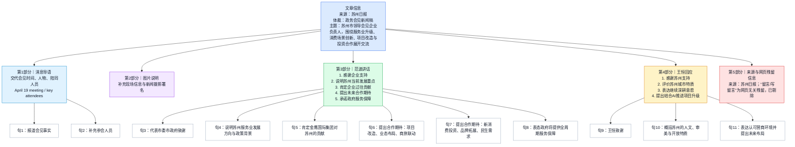

# 文章结构分析

# 标题：范波会见金鹰国际集团董事长王恒一行

# 来源：苏州日报 | 记者：倪黎祥

[1] 第一部分：会见概况与出席人员
    - 时间：4月19日
    - 核心事件：苏州市委书记范波会见金鹰国际集团董事长王恒一行
    - 出席名单：
        - 企方：王恒（金鹰集团）、方杰（歌林商业）
        - 政方：范波、季晶、俞愉、吴琦

[2] 第二部分：范波讲话要点（苏州市方立场）
    - 礼仪性致辞：表达感谢
    - 战略背景：
        - 贯彻习近平总书记关于服务业发展的重要指示
        - 落实全国服务业大会部署
        - 实施“服务业扩能提质”行动
        - 推动“两业”融合（先进制造业与现代服务业融合）
    - 对企评价：肯定金鹰在苏十余年的贡献
    - 合作建议：
        - 项目维度：狮山金鹰改造、布局高端业态
        - 模式维度：“景区+商圈”联动，打造文商体旅地标
        - 创新维度：沉浸体验、数字零售、助力“苏品苏货”与非遗
    - 服务承诺：开展“三服务”专项行动（服务企业、项目、园区和基层）

[3] 第三部分：王恒讲话要点（金鹰集团立场）
    - 城市评价：人文底蕴、城市温度、美学、开放基因
    - 投资信心：高度认可产业生态与营商环境
    - 未来规划：
        - 抢抓人工智能（AI）发展机遇
        - 存量项目改造升级
        - 布局核心业务、丰富消费场景
    - 最终目标：服务苏州高质量发展

---

**范波会见金鹰国际集团董事长王恒一行**

4月19日，市委书记范波会见了**金鹰国际集团**董事长**王恒**一行。**歌林商业集团**董事长**方杰**；副市长季晶，区党工委书记俞愉，区党工委副书记、管委会主任吴琦参加会见。

> **金鹰国际集团（Golden Eagle International Group）**：
> 1992年由王恒先生创立，总部位于南京。该集团是大型跨国集团，业务涵盖商贸流通（如著名的金鹰百货）、房地产开发、酒店管理等多个领域。其在长三角地区拥有极高的品牌知名度，是现代服务业的领军企业之一。
>
> **王恒（Roger Wang）**：
> 金鹰国际集团董事长，美籍华商。祖籍广州，出生于广州，成长于台湾。他是改革开放后早期进入中国大陆市场的著名企业家之一，在零售贸易及房地产开发领域具有深远影响力。
>
> **歌林商业集团（Gelin Commercial Group）**：
> 依托“绿色建筑”与“全生活中心”概念的商业运营商，代表项目包括苏州歌林公园等。
>
> **方杰**：
> 歌林商业集团创始人、董事长。
>
> **[重点词汇辨析]**
> *   **会见 (Meet/Interview)**：特指正式的会面，通常带有一定的礼仪性质，多用于上级对下级、官员对客商。近义词为**接见**（等级色彩更浓）、**接洽**（偏向业务商谈）。
> *   **一行 (And his/her party)**：固定搭配，指某人及随行人员。

市委书记范波会见金鹰国际集团董事长王恒一行。苏报融媒记者 倪黎祥/摄

范波代表市委、市政府对金鹰国际集团给予苏州发展的关心支持表示感谢。他说，当前，苏州正深入学习领会习近平总书记关于服务业发展的重要指示精神，认真落实全国服务业大会部署，大力实施**服务业扩能提质**行动，加快推动**“两业”融合**，充分激发文旅消费潜力，不断培育新的经济增长点。

> **服务业扩能提质**：
> 意为“扩大产能、提高质量”。在宏观经济语境下，指不仅要增加服务业的规模和覆盖面，更要提升服务业的科技含量、附加值和用户体验。
>
> **“两业”融合**：
> 指**先进制造业**和**现代服务业**深度融合发展。这是当前中国产业升级的重要路径，旨在通过服务业赋能制造业（如工业设计、品牌建设），或制造业服务化。
>
> **[高级表达/金句积累]**
> *   **深入学习领会...精神**：Deeply study and implement the spirit of...（政论文标准化表述）。
> *   **培育新的经济增长点**：Cultivate new economic growth poles/drivers.

金鹰国际集团扎根苏州十余年来，为提升城市品质、推动产业升级作出了积极贡献。希望企业进一步深化与苏州合作，加快推进**狮山金鹰**改造项目，布局更多**高端业态**，强化**“景区+商圈”整体联动**，携手打造**文商体旅**融合发展新地标。

> **狮山金鹰**：
> 位于苏州高新区（虎丘区）狮山路的核心地标。狮山片区是苏州高新区最繁华的区域，金鹰在此设有大型商业中心。
>
> **高端业态 (High-end business formats)**：
> 业态指经营形态。高端业态通常指引入国际奢侈品牌、旗舰店、首店、米其林餐厅等具有高消费引领力的商业形式。
>
> **文商体旅 (Culture, Commerce, Sports, and Tourism)**：
> “文化、商贸、体育、旅游”四大产业的深度结合。例如：在商场里看展（文）、购物（商）、滑冰（体）、体验景点（旅）。
>
> **[成语/表达积累]**
> *   **扎根 (Rooted in)**：比喻深入进去，打下基础。
> *   **联动 (Linkage/Synergy)**：意为“联合行动”，指各部分相互联系、相互影响、协调配合。

同时，围绕**沉浸体验**、**数字零售**等新消费领域深化投资，助力**苏品苏货**、**非遗**技艺等开拓市场、打响品牌，更好满足群众多样化、高品质生活需求。苏州将深入开展服务企业、服务项目、服务园区和基层**“三服务”专项行动**，为企业在苏发展提供**全周期、全链条**服务保障。

> **沉浸体验 (Immersive experience)**：
> 利用数字技术（VR/AR）、环境渲染等，让消费者全方位参与、体验的消费新模式。
>
> **数字零售 (Digital retail)**：
> 利用互联网、物联网、大数据等技术，对商品生产、流通与销售过程进行升级改造，实现线上线下一体化。
>
> **苏品苏货**：
> 苏州本地生产的优质产品和品牌。
>
> **非遗 (Intangible Cultural Heritage)**：
> 非物质文化遗产。苏州著名的非遗包括苏绣、昆曲、苏州评弹等。
>
> **“三服务”专项行动**：
> 江苏等地政府推行的行政管理模式，即“服务企业、服务项目、服务园区和基层”。
>
> **[重点词汇解析]**
> *   **全周期、全链条 (Full-cycle, whole-chain)**：
>     *   **全周期**：指从项目立项、开工、建设到投产、运营、退出的每一个阶段。
>     *   **全链条**：指从上游供应链到下游销售端的每一个环节。

王恒对苏州给予金鹰国际集团的支持帮助表示感谢。他说，苏州富有人文底蕴和城市温度，更兼具城市美学和**开放基因**。

> **[重点词汇解析]**
> *   **底蕴 (Background/Substance)**：指积累的厚度，常指文化。
> *   **开放基因 (Gene of openness)**：形象化表达。苏州自古就是通商大邑，近代以来也是外资高地，故称“基因”里自带开放。

金鹰国际集团在苏州发展多年，高度认可苏州的**产业生态**、**营商环境**，将充分发挥自身优势，抢抓**人工智能**发展机遇，加快推进**存量项目**改造升级，谋划布局更多核心业务，丰富多层次消费场景，打造高品质消费业态，更好服务苏州高质量发展。

> **产业生态 (Industrial ecology)**：
> 指产业内部各个企业、机构、环境之间形成的共生共长、相互促进的关系。
>
> **营商环境 (Business environment)**：
> 企业在市场准入、生产经营、退出等过程中涉及的体制机制性因素和条件。
>
> **存量项目 (Existing projects/Stock projects)**：
> 与“增量”相对。指已经建成或正在运行的项目。加快推进存量项目改造，意味着在不增加土地占用的情况下提高产出效率（即“老店换新颜”）。
>
> **[易混淆词辨析]**
> *   **抢抓 (Seize)** vs **抢夺 (Snatch)**：
>     *   **抢抓**：中性偏褒，指敏锐捕捉转瞬即逝的机遇（抢抓机遇）。
>     *   **抢夺**：贬义，指用暴力或非法手段夺取。

来源：苏州日报

## 前情提要

## 文章基本信息

- 文章来源：苏州日报
- 题目：范波会见金鹰国际集团董事长王恒一行
- 作者/采写信息：文中未单列署名记者；配图署名为“苏报融媒记者 倪黎祥/摄”
- 体裁：中文政务新闻稿
- 作者背景补注：
  苏州日报为苏州地区党报媒体。经公开网页可核实，范波现任江苏省委常委、苏州市委书记；该文中的“王恒”为金鹰国际集团董事长。由于企业官网公开高层个人介绍信息较有限，关于王恒的公开可核实背景以“金鹰国际集团董事长”这一身份为准，不作超出处公开信息的延伸推断。
  参考来源：
  - 苏州市人民政府：https://www.suzhou.gov.cn/szsrmzf/szyw/202511/7b94735697da4d73b1b9fc4008891436.shtml
  - 苏州市人民政府（同类公开报道，可佐证范波职务）：https://www.suzhou.gov.cn/szsrmzf/szyw/202512/705eba7f118e4775bd730d78f61d4f52.shtml

---

🔹`Fan Bo / met with / Wang Heng, chairman of Golden Eagle International Group, / and his delegation.`
🔸范波会见了`金鹰国际集团董事长王恒一行`。

### 背景注释
- `Fan Bo`：苏州市委书记，属于地级市党委主要负责人。
- `Golden Eagle International Group`：金鹰国际集团，中国商业地产与零售相关企业集团。
- `delegation`：新闻语境中常指“代表团、考察团、一行人员”，政务与商务报道高频词。

> **`meet with` 会见；与……会面** /miːt wɪð/
> 词性与释义：
> - `v. phr.` to have a meeting with someone, especially for official or business purposes 与……会见；与……正式会面
> 语域：正式、新闻、政务、商务
> 画龙点睛：`meet with`在新闻里常比`meet`更正式，尤其适合`官员会见企业负责人`这类场景。注意它还可表示“遭遇、经历”，如`meet with difficulties`。写作中可替换`hold talks with`、`have a meeting with`，但正式公文标题里`meet with`更凝练。

> **`chairman` 董事长；主席** /ˈtʃermən/
> 词性与释义：
> - `n.` the person in charge of the board of a company 董事长
> - `n.` the person who presides over a meeting or organization 主席
> 语域：正式、商务、公司治理
> 画龙点睛：`chairman`在公司语境里通常译为`董事长`，不要与`president`、`CEO`混淆。考试中常考组织架构辨析：`chairman`偏治理层，`CEO`偏经营层。现代英语中也常见性别中性表达`chair`。

> **`delegation` 代表团；一行人员** /ˌdelɪˈɡeɪʃn/
> 词性与释义：
> - `n.` a group of people chosen to represent an organization or country 代表团；代表人员
> 语域：正式、新闻、外交、政务
> 画龙点睛：中文新闻里的“某某一行”常可自然译为`... and his delegation`。这是非常地道的新闻表达。注意不要机械直译成`and others`。搭配有`lead a delegation`、`head a delegation`、`receive a delegation`。

---

🔹`On April 19, / Fan Bo, Party secretary of the municipal committee, / met with / Wang Heng, chairman of Golden Eagle International Group, / and his delegation.`
🔸`4月19日`，`市委书记`范波会见了`金鹰国际集团董事长王恒一行`。

### 背景注释
- `Party secretary of the municipal committee`：即“市委书记”，中国地方党委主要负责人。
- 时间表达中，中文政务新闻常前置日期；英文新闻翻译时保留时间状语置于句首，自然且正式。

> **`Party secretary` 党委书记** /ˈpɑːrti ˈsekrəteri/
> 词性与释义：
> - `n.` the principal official heading a Communist Party committee 党委书记
> 语域：正式、政治、新闻
> 画龙点睛：该词是中国特色政治术语英译中的高频表达。翻译时需结合层级补足，如`municipal Party secretary`、`Party secretary of the CPC Suzhou Municipal Committee`。考试翻译中要注意不能只译成`secretary`，否则信息严重不足。

> **`municipal` 市的；市政的** /mjuːˈnɪsɪpl/
> 词性与释义：
> - `adj.` relating to a city or town, or its local government 市的；市政的
> 语域：正式、行政、新闻
> 画龙点睛：`municipal`常与`government`、`committee`、`authority`搭配。它强调行政层级。阅读中要和`urban`区分：`urban`偏“城市化/城市空间”，`municipal`偏“市级行政”。

---

🔹`Fang Jie, chairman of Golin Commercial Group; / Ji Jing, vice mayor; / Yu Yu, secretary of the district Party working committee; / and Wu Qi, deputy secretary of the district Party working committee and director of the administrative committee, / attended the meeting.`
🔸`歌林商业集团董事长方杰`、`副市长季晶`、`区党工委书记俞愉`、`区党工委副书记、管委会主任吴琦`参加会见。

### 背景注释
- `vice mayor`：副市长，市政府领导成员。
- `Party working committee`：党工委，常见于开发区、高新区等功能区。
- `administrative committee`：管委会，即管理委员会。
- `Golin Commercial Group`：根据中文名作音译处理；若无权威英文公开名称，不宜擅自创造固定官方译名，故这里作工作性翻译。

> **`attend` 参加；出席** /əˈtend/
> 词性与释义：
> - `v.` to go to an event, meeting, or place 出席；参加
> 语域：通用、正式、新闻
> 画龙点睛：`attend`后直接接活动名词，如`attend the meeting`，不用加介词。它既可用于正式场合，也可用于`attend class`。考试中常与`join`、`participate in`辨析：`attend`强调到场，`participate in`强调实际参与。

> **`vice mayor` 副市长** /ˌvaɪs ˈmeɪər/
> 词性与释义：
> - `n.` a deputy to the mayor 副市长
> 语域：正式、行政、新闻
> 画龙点睛：这是地方政府职务常见译法。写作中要注意大小写：作头衔前置可写`Vice Mayor Ji Jing`，普通叙述中用小写。与`deputy mayor`在多数语境下接近，但中国新闻翻译更常见`vice mayor`。

> **`administrative committee` 管委会** /ədˈmɪnɪstreɪtɪv kəˈmɪti/
> 词性与释义：
> - `n.` a committee responsible for administration and management 管理委员会；行政委员会
> 语域：正式、行政
> 画龙点睛：在中国地区治理语境中，`administrative committee`常用于开发区、自贸区、功能区的“管委会”。翻译时要结合上下文补出具体层级，避免只译成泛泛的`committee`。

---

🔹`Fan Bo, / on behalf of / the municipal Party committee and municipal government, / expressed gratitude / to Golden Eagle International Group / for its concern for and support of Suzhou’s development.`
🔸范波`代表`市委、市政府，`对`金鹰国际集团给予苏州发展的`关心支持表示感谢`。

### 背景注释
- `on behalf of`：表示“代表……”，常用于正式讲话。
- `express gratitude to sb. for ...`：典型正式感谢句式。

> **`on behalf of` 代表……；为了……的利益** /ɒn bɪˈhæf əv/
> 词性与释义：
> - `prep. phr.` as the representative of someone, or for someone’s benefit 代表……；为了……
> 语域：正式、演讲、新闻、商务
> 画龙点睛：这是写作和口语都极实用的固定搭配。正式致辞中常见`On behalf of ..., I would like to ...`。注意不要写成`in behalf of`；现代英语里`on behalf of`更常用、更稳妥。

> **`express gratitude` 表达感谢** /ɪkˈspres ˈɡrætɪtuːd/
> 词性与释义：
> - `v. phr.` to show or state thankfulness 表达感谢
> 语域：正式、书面、新闻
> 画龙点睛：比`thank`更正式，适合公文、演讲、雅思写作高级替换。常见结构：`express gratitude to sb. for sth.`。名词`gratitude`比`thanks`更书面，能明显提升表达层次。

> **`support` 支持；援助** /səˈpɔːrt/
> 词性与释义：
> - `n./v.` help, encouragement, or approval 支持；帮助
> 语域：通用、正式
> 画龙点睛：`support`是写作高频词，但要学会搭配扩展，如`policy support`、`financial support`、`lend support to`。它既可作动词也可作名词。阅读中常考抽象义，不一定指物质援助，也可指政治、制度、舆论层面的支持。

---

🔹`He said / that Suzhou is currently / thoroughly studying and understanding / General Secretary Xi Jinping’s important instructions / on the development of the service sector, / conscientiously implementing / the arrangements made at the national conference on the service industry, / vigorously carrying out / initiatives to expand capacity and improve quality in the service sector, / accelerating the integration of the two industries, / fully unleashing the potential of cultural and tourism consumption, / and continuously cultivating / new drivers of economic growth.`
🔸他说，当前，苏州正`深入学习领会`关于服务业发展的重要指示精神，认真`落实`全国服务业大会部署，大力实施服务业`扩能提质`行动，加快推动`两业融合`，充分激发文旅消费潜力，不断培育新的经济增长点。

### 背景注释
- `the service sector`：服务业，宏观经济分类中的第三产业核心部分。
- `the national conference on the service industry`：全国服务业大会，指国家层面的相关工作会议。
- `the integration of the two industries`：结合原文，“两业”通常指先进制造业和现代服务业深度融合。
- `cultural and tourism consumption`：文旅消费，即文化与旅游融合相关消费活动。
- 本句为典型政务长句，采用多重并列动词结构推进政策信息。

> **`service sector` 服务业** /ˈsɜːrvɪs ˌsektər/
> 词性与释义：
> - `n.` the part of an economy that provides services rather than goods 服务业
> 语域：经济、政策、新闻
> 画龙点睛：与`manufacturing sector`、`industrial sector`并列出现时要注意经济结构对比。雅思阅读和经济类文章高频。可搭配`expand the service sector`、`modernize the service sector`、`high-end service sector`。

> **`implement` 落实；实施；执行** /ˈɪmplɪment/
> 词性与释义：
> - `v.` to put a decision, plan, or system into effect 实施；落实
> 语域：正式、政策、商务、学术
> 画龙点睛：这是中文“落实”最常见、最稳妥的英语对应之一。常见搭配有`implement a policy/plan/measure/reform`。写作中比`do`、`carry out`更正式。名词形式为`implementation`，也是考试高频。

> **`unleash` 释放；激发** /ʌnˈliːʃ/
> 词性与释义：
> - `v.` to release something powerful; to allow something to develop or be expressed 释放；激发
> 语域：正式、新闻、商业
> 画龙点睛：`unleash potential`是非常地道的高级搭配，常见于经济、教育、科技语境。比`develop potential`更有力度。阅读中常带有“原本受限，现在被放开”的动态意味。

> **`driver` 驱动因素；动力** /ˈdraɪvər/
> 词性与释义：
> - `n.` a factor that causes something to develop 促成因素；驱动力
> 语域：经济、商业、学术
> 画龙点睛：`growth driver`、`key driver`、`major driver of change`是高频搭配。不要只记“司机”这一基础义。考试中常考其抽象义，尤其在经济与社会发展类文章中极常见。

---

🔹`Having taken root in Suzhou / for more than a decade, / Golden Eagle International Group / has made positive contributions / to enhancing urban quality / and promoting industrial upgrading.`
🔸金鹰国际集团`扎根苏州十余年`来，为`提升城市品质`、推动`产业升级`作出了积极贡献。

### 背景注释
- `take root`：比喻“扎根、落地发展”，常用于企业、制度、文化。
- `urban quality`：城市品质，指城市功能、形象、商业环境、公共服务等综合水平。
- `industrial upgrading`：产业升级，经济政策高频术语。

> **`take root` 扎根；生根；落地发展** /teɪk ruːt/
> 词性与释义：
> - `v. phr.` to become established and begin to develop firmly 扎根；站稳脚跟
> 语域：正式、新闻、文学
> 画龙点睛：既可用于植物字面义，也可用于企业、理念、文化的比喻义。像`take root in Suzhou`就比简单的`operate in Suzhou`更生动、更有长期深耕意味。写作里很适合提升表达质感。

> **`enhance` 提升；增强** /ɪnˈhæns/
> 词性与释义：
> - `v.` to improve the quality, value, or extent of something 提高；增强
> 语域：正式、学术、新闻、商务
> 画龙点睛：`enhance`是雅思写作万能升级词，可替代`improve`。常搭配`enhance efficiency/quality/image/competitiveness`。注意它通常接积极可提升的抽象名词，语气比`boost`更稳重正式。

> **`industrial upgrading` 产业升级** /ɪnˈdʌstriəl ʌpˈɡreɪdɪŋ/
> 词性与释义：
> - `n.` the process of moving industry toward higher value-added, more advanced activities 产业升级
> 语域：经济、政策、新闻
> 画龙点睛：这是中国经济报道与英文时政文章中的重要术语。理解时要抓住`higher value-added`和`technological advancement`。写作中可与`economic transformation`、`structural adjustment`联用，形成更完整的政策表达。

---

🔹`It is hoped / that the company will further deepen cooperation with Suzhou, / accelerate the renovation project of Golden Eagle in Shishan, / introduce more high-end business formats, / strengthen the overall linkage between scenic areas and commercial districts, / and work together / to build a new landmark / for the integrated development of culture, commerce, sports, and tourism.`
🔸希望企业进一步`深化与苏州合作`，加快推进`狮山金鹰改造项目`，布局更多`高端业态`，强化`景区+商圈`整体联动，携手打造`文商体旅融合发展新地标`。

### 背景注释
- `Shishan`：狮山，苏州高新区重要片区。
- `high-end business formats`：高端业态，指高品质商业形态、品牌与消费场景。
- `scenic areas and commercial districts`：景区与商圈联动，是文旅消费场景常见政策提法。
- `landmark`：此处不是单纯地理建筑，也包含城市消费与文化形象标识意义。

> **`deepen cooperation` 深化合作** /ˈdiːpən koʊˌɑːpəˈreɪʃn/
> 词性与释义：
> - `v. phr.` to make cooperation closer, broader, or more substantial 深化合作
> 语域：正式、商务、外交、新闻
> 画龙点睛：这是官方和商业写作中的高频固定搭配。比`cooperate more`更自然、更成熟。可扩展为`deepen practical cooperation`、`deepen strategic cooperation`，很适合写作模板化储备。

> **`renovation` 改造；翻新** /ˌrenəˈveɪʃn/
> 词性与释义：
> - `n.` the act of repairing and improving a building or system 翻新；改造
> 语域：正式、建筑、商业
> 画龙点睛：`renovation`强调在原有基础上的改善升级，区别于`reconstruction`“重建”、`decoration`“装饰”。商业地产语境中很常见，如`mall renovation`、`urban renewal and renovation projects`。

> **`landmark` 地标；标志性事物** /ˈlændmɑːrk/
> 词性与释义：
> - `n.` an important building, place, or event that is easily recognized 地标；标志物
> 语域：通用、新闻、城市规划
> 画龙点睛：它既可指实体建筑，也可引申为具有代表性的项目、政策、成果。写作中`a landmark project`、`a landmark achievement`都很常见。注意不要只局限理解为“地标建筑”。

---

🔹`At the same time, / it is hoped / that the company will deepen investment / in new consumption fields / such as immersive experiences and digital retail, / help Suzhou-made products and goods, / as well as intangible cultural heritage skills, / expand into the market and build stronger brands, / and better meet / the people’s diversified and high-quality living needs.`
🔸同时，围绕`沉浸体验`、`数字零售`等`新消费领域`深化投资，助力`苏品苏货`、`非遗技艺`等开拓市场、打响品牌，更好满足群众`多样化、高品质生活需求`。

### 背景注释
- `immersive experiences`：沉浸体验，常用于文旅、展演、零售、数字场景。
- `digital retail`：数字零售，指线上线下一体化、数据驱动的零售模式。
- `intangible cultural heritage`：非物质文化遗产，常简写为`ICH`，但正式新闻中全称更稳妥。
- `Suzhou-made products and goods`：为体现地方品牌，可译作“苏州制造/苏州特色产品”，本句采取兼顾字面与语义的表达。

> **`immersive` 沉浸式的** /ɪˈmɜːrsɪv/
> 词性与释义：
> - `adj.` seeming to surround the user so that they feel completely involved 沉浸式的；使人身临其境的
> 语域：科技、文旅、媒体、商业
> 画龙点睛：近年来极高频的新消费词。常见搭配`immersive experience`、`immersive exhibition`、`immersive theatre`。写作时它能迅速体现你对数字消费、文化科技融合话题的熟悉度。

> **`retail` 零售；零售业** /ˈriːteɪl/
> 词性与释义：
> - `n./adj./v.` the sale of goods to the public in small quantities 零售；零售的
> 语域：商业、经济
> 画龙点睛：`retail`既可作名词也可作形容词，如`retail industry`、`retail market`。与`wholesale`“批发”常成对考查。现代商业英语中，`digital retail`、`smart retail`、`new retail`都值得重点积累。

> **`intangible cultural heritage` 非物质文化遗产** /ɪnˈtændʒəbl ˈkʌltʃərəl ˈherɪtɪdʒ/
> 词性与释义：
> - `n.` traditions, skills, and cultural practices recognized as heritage 非物质文化遗产
> 语域：文化、政策、学术、新闻
> 画龙点睛：这是文化类阅读高频术语，重点在`intangible`“无形的、非实体的”。常涉及技艺、表演、习俗等。翻译题中容易漏掉`cultural`，应完整保留概念范围。

> **`diversified` 多样化的** /daɪˈvɜːrsɪfaɪd/
> 词性与释义：
> - `adj.` having variety; developed into different forms 多样化的
> 语域：正式、商业、政策
> 画龙点睛：可替换常见词`various`，更显书面和成熟。常搭配`diversified needs`、`diversified products`、`diversified investment channels`。注意它常强调“结构上的多元化”，不只是数量上的多。

---

🔹`Suzhou will / carry out / the special action of “three services” in depth— / serving enterprises, / serving projects, / and serving industrial parks and grassroots units— / and provide / full-cycle and whole-chain service guarantees / for enterprises’ development in Suzhou.`
🔸苏州将深入开展服务企业、服务项目、服务园区和基层的`“三服务”专项行动`，为企业在苏发展提供`全周期、全链条`服务保障。

### 背景注释
- `the special action of “three services”`：此处属地方治理提法。原文列出“服务企业、服务项目、服务园区和基层”，虽称“三服务”，实质上将“园区和基层”并作一类服务对象。
- `full-cycle and whole-chain`：政务语境中常用于强调从前期到后期、从单点到系统的连续服务。
- `service guarantees`：并非字面“保证书”，而是制度化保障、支持机制。

> **`special action` 专项行动** /ˈspeʃl ˈækʃn/
> 词性与释义：
> - `n.` a focused campaign or initiative targeting a specific issue 专项行动
> 语域：正式、政策、新闻
> 画龙点睛：政府、企业管理、公检法新闻中都很常见。写作中可用于表达“有针对性的行动计划”。搭配如`launch a special action`、`carry out a special campaign`。

> **`full-cycle` 全周期的** /ˌfʊl ˈsaɪkl/
> 词性与释义：
> - `adj.` covering all stages of a process 全周期的
> 语域：政策、商业、管理
> 画龙点睛：这是近年来政策文本高频表达。可理解为`from start to finish`，但`full-cycle`更正式、更系统。常与`service`、`management`、`support`搭配，体现流程完整性。

> **`whole-chain` 全链条的** /ˌhoʊl ˈtʃeɪn/
> 词性与释义：
> - `adj.` covering all links in an industrial or service chain 全链条的
> 语域：政策、产业、经济
> 画龙点睛：侧重“链条上的各环节全部覆盖”，与`full-cycle`侧重点不同：前者偏纵向流程阶段，后者偏横向环节体系。翻译与写作时把两者并用，能准确传达政策原文的系统性。

---

🔹`Wang Heng / expressed gratitude / for the support and assistance / that Suzhou has provided / to Golden Eagle International Group.`
🔸王恒对苏州给予金鹰国际集团的`支持帮助表示感谢`。

### 背景注释
- 本句与前文形成新闻常见的“双方互致感谢”结构，体现政企会见报道的对称性与礼貌性。
- `support and assistance`：双名词并列，强调帮助既包括支持性条件，也包括具体协助。

> **`assistance` 帮助；援助；协助** /əˈsɪstəns/
> 词性与释义：
> - `n.` help or support 帮助；协助
> 语域：正式、书面、商务、新闻
> 画龙点睛：比`help`更正式，适合公文、邮件、新闻。常见搭配`provide assistance`、`technical assistance`、`financial assistance`。写作中与`support`联用时，语义更完整，既可指政策支持，也可指实际帮扶。

> **`provide` 提供** /prəˈvaɪd/
> 词性与释义：
> - `v.` to give someone something they need 提供
> 语域：通用、正式
> 画龙点睛：这是最基础也最重要的正式动词之一。固定搭配极多：`provide sb. with sth.`或`provide sth. for sb.`。考试中常考两种句式转换，必须熟练掌握。

---

🔹`He said / that Suzhou / is rich in cultural heritage and urban warmth, / and also possesses / urban aesthetics and an open spirit.`
🔸他说，苏州`富有人文底蕴和城市温度`，更兼具`城市美学和开放基因`。

### 背景注释
- `cultural heritage`：此处更接近“人文底蕴”，不单指文物，也指历史文化积淀。
- `urban warmth`：字面为“城市温度”，在中文修辞中指城市治理的人情味、宜居感、关怀感。
- `urban aesthetics`：城市美学，强调城市空间、风貌、审美品质。
- `open spirit`：根据“开放基因”意译，强调城市开放、包容、国际化倾向。

> **`heritage` 遗产；传统积淀** /ˈherɪtɪdʒ/
> 词性与释义：
> - `n.` traditions, buildings, or qualities passed down from the past 遗产；传统；历史积淀
> 语域：文化、历史、新闻
> 画龙点睛：`heritage`不只指“文化遗产名录”，也可泛指一个地方深厚的历史传承。常见搭配`cultural heritage`、`national heritage`。阅读中要注意其抽象义，不必总译成具体“遗址”。

> **`possess` 具有；拥有** /pəˈzes/
> 词性与释义：
> - `v.` to have or own a quality, skill, or object 具有；拥有
> 语域：正式、书面
> 画龙点睛：比`have`更正式，适合写作升级。尤其常接抽象宾语，如`possess the ability/confidence/qualities`。如果你想让作文更书面、更凝练，`possess`是高频替换词。

> **`aesthetics` 美学；审美原则** /iːsˈθetɪks/
> 词性与释义：
> - `n.` the study or appreciation of beauty and artistic taste 美学；审美
> 语域：学术、文化、评论
> 画龙点睛：`aesthetics`既可指学科，也可指审美风格。这里的`urban aesthetics`是很现代的城市叙事表达。写作中用于城市、设计、艺术、建筑类话题，能明显提升语言档次。

---

🔹`Having developed in Suzhou / for many years, / Golden Eagle International Group / highly recognizes / Suzhou’s industrial ecosystem and business environment, / and will fully leverage / its own strengths, / seize the opportunities brought by the development of artificial intelligence, / accelerate the renovation and upgrading of existing projects, / plan and lay out more core businesses, / enrich multi-level consumption scenarios, / create high-quality consumption formats, / and better serve / Suzhou’s high-quality development.`
🔸金鹰国际集团在苏州发展多年，`高度认可`苏州的`产业生态、营商环境`，将充分发挥自身优势，`抢抓人工智能发展机遇`，加快推进`存量项目改造升级`，谋划布局更多`核心业务`，丰富`多层次消费场景`，打造`高品质消费业态`，更好服务苏州`高质量发展`。

### 背景注释
- `industrial ecosystem`：产业生态，指产业链、创新链、人才、政策、市场等综合环境。
- `business environment`：营商环境，国际新闻和政府治理高频词。
- `artificial intelligence`：人工智能，英文常简写为`AI`。
- `existing projects`：对应“存量项目”，指已落地、已运营或既有资产项目，而非新增项目。
- `consumption scenarios`：消费场景，新消费商业分析中的常用术语。
- `high-quality development`：高质量发展，当前中国经济治理关键词。

> **`business environment` 营商环境** /ˈbɪznəs ɪnˈvaɪrənmənt/
> 词性与释义：
> - `n.` the overall conditions affecting business operation and investment 营商环境
> 语域：经济、政策、新闻
> 画龙点睛：这是理解中国经济新闻的核心词之一。涵盖审批效率、法治环境、市场开放度、基础设施等。写作中可搭配`optimize/improve the business environment`，非常实用。

> **`leverage` 充分利用；借助** /ˈlevərɪdʒ/
> 词性与释义：
> - `v.` to use something effectively in order to gain an advantage 充分利用；借力
> 语域：商业、管理、正式
> 画龙点睛：商业英语高频词，比`use`更专业。常见搭配`leverage strengths/resources/data/technology`。它体现“撬动资源、放大优势”的意味，很适合写作和面试表达。

> **`seize opportunities` 抓住机遇** /siːz ˌɑːpərˈtuːnətiz/
> 词性与释义：
> - `v. phr.` to act quickly in order to benefit from opportunities 抓住机遇
> 语域：通用、正式、商业
> 画龙点睛：中文“抢抓机遇”常可自然译为`seize opportunities`或`seize the opportunities brought by...`。比`catch opportunities`地道得多。是写作中表达行动导向的高分搭配。

> **`scenario` 场景；情境** /səˈnerioʊ/
> 词性与释义：
> - `n.` a situation in which something happens; a projected sequence of events 场景；情境
> 语域：商业、科技、学术
> 画龙点睛：近年来在中文商业语境中“场景”极热，对应英语多用`scenario`，但在消费语境中也可用`setting`、`use case`。`consumption scenarios`属于较有中国特色但已可理解的商务表达，适合政策与产业文本。

> **`format` 业态；形式；版式** /ˈfɔːrmæt/
> 词性与释义：
> - `n.` the arrangement, style, or type of something 形式；类型；业态
> 语域：商业、媒体、通用
> 画龙点睛：在零售商业中，`business format`、`retail format`可表示“业态”。这是`format`的延伸义，考试里容易忽略。不要只记“格式、版式”。理解熟词僻义是提升阅读速度的关键。

---

## 参考来源

- 苏州市人民政府（范波职务公开信息）：
  https://www.suzhou.gov.cn/szsrmzf/szyw/202511/7b94735697da4d73b1b9fc4008891436.shtml
- 苏州市人民政府（同类公开报道，佐证职务与报道体例）：
  https://www.suzhou.gov.cn/szsrmzf/szyw/202512/705eba7f118e4775bd730d78f61d4f52.shtml

如果你愿意，我下一步可以继续把这篇中文政务新闻**进一步升级为考研/雅思风格的高质量英译全文版**，或者整理成**可背诵的中英对照表达清单**。