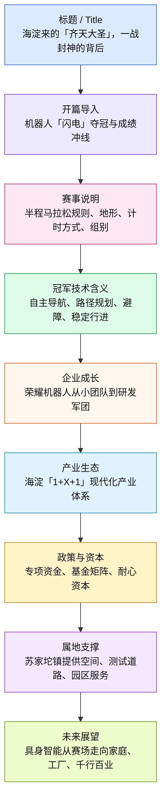
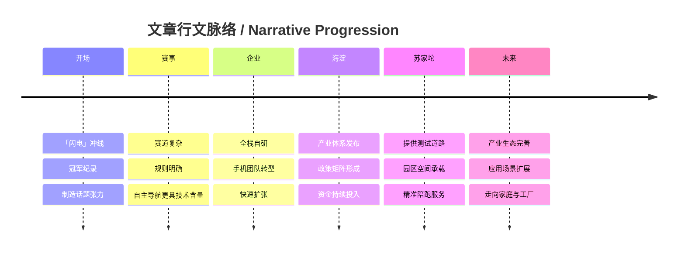

# 前情提要

1. 导言：创纪录的历史瞬间
   1.1 荣耀「闪电」机器人半马夺冠
   1.2 成绩分析：超越人类世界纪录（50分26秒 vs 57分20秒）
2. 冠军风采：「闪电」的技术硬核
   2.1 外观与性能：机甲风、空气动力学、爆发力
   2.2 赛事环境：南海子公园复杂地形考验
   2.3 核心指标：身高、步态稳定性、路径规划
   2.4 竞赛规则：自主导航 vs 遥控组别
3. 技术背后：海淀具身智能的生态支撑
   3.1 团队成长：初创小组到研发军团的跨越
   3.2 技术路线：全栈自研、从手机团队转型
   3.3 海淀「1+X+1」产业体系布局：
       - 1（塔尖）：人工智能产业
       - X（塔身）：战略性新兴产业与未来产业
       - 1（塔基）：科技服务业
   3.4 政策与资金：36项支持政策、90亿元专项资金
   3.5 资本保障：海淀基金系、耐心资本
4. 基层保障：苏家坨镇的精准「陪跑」
   4.1 实验室布局：五大核心领域（数据、动力、仿生等）
   4.2 空间供给：北分科技创新园、西山高端智造产业园
   4.3 专项服务：闭环测试道路保障
5. 宏观展望：从赛场到千行百业
   5.1 产业规模：海淀区具身智能产业集聚现状
   5.2 战略转型：从「站得住」向「干起来」跨越

---

**标题：** 海淀来的「齐天大圣」，一战封神的背后——  
**作者：** 赵磊  
**来源：** 北京海淀官方发布/海淀报  
**时间：** 2026年4月19日  
**编辑：** 关镓萍  

---

## 【精读笔记正文】

4月19日清晨，当荣耀人形机器人「闪电」以50分26秒的净用时冲过终点线时，它不仅仅创造了一项赛事纪录，甚至超越了人类半程马拉松57分20秒的世界纪录。（相关报道：50分26秒！「闪电」夺冠！来自海淀——）

> **齐天大圣/闪电**：此处不仅是机器人的名称，更是中国文化符号与科技实力的结合。「齐天大圣」寓意神通广大、无所畏惧；「闪电」直观体现了其速度优势。  
> **半程马拉松 (Half Marathon)**：全长21.0975公里。50分26秒的成绩远超肯尼亚、乌干达等国顶尖人类选手创造的57分台世界纪录，标志着**具身智能 (Embodied AI)** 在动力性能与运动控制上实现了质的飞跃。

在全球首个人形机器人半程马拉松的赛事——2026北京亦庄人形机器人半程马拉松赛上，来自海淀的「齐天大圣队」用钢铁之躯书写了中国具身智能的新篇章。而在荣耀机器人夺冠的背后，是一家企业、一条赛道与一片热土的「双向奔赴」。

> **具身智能 (Embodied Intelligence/Embodied AI)**：指有身体并支持物理交互的智能体。它不同于传统的纯算法AI（如聊天机器人），而是强调「身体」与「环境」的交互。  
> **北京亦庄 (Beijing E-Town)**：即北京经济技术开发区，是中国高端制造业和自动驾驶等未来产业的聚集地，也是本次赛事的举办地。  
> **双向奔赴**：
> - **近义词**：互促共进、相向而行、相得益彰。
> - **积累**：本词常用于政企合作或情感描述，此处指企业技术突破与地方产业生态支撑的完美契合。

从2025年6月最初10人左右的初创小组，快速成长为近200人规模的研发军团，荣耀机器人的跨越式成长，正是海淀区具身智能产业生态加速崛起的生动缩影。

> **崛起 (Rise/Emergence)**：
> - **近义词**：兴起、振兴、腾飞。
> - **反义词**：衰落、没落。
> - **辨析**：「崛起」强调从低位或无名状态迅速达到高峰，具有强大的生命力。

### 冠军时刻：当「闪电」创造历史

169cm的身高，潮酷机甲风的外观，兼具空气动力学与视觉冲击力——这就是冠军机器人「闪电」给人的第一印象。但在赛场上，真正令人震撼的是它的速度与爆发力。

> **空气动力学 (Aerodynamics)**：通常用于赛车或飞机设计。人形机器人应用此设计说明其运行速度已达到必须考虑空气阻力的程度。

此次人形机器人半程马拉松21.0975公里的赛程，首次引入南海子公园生态路段，融合平地、坡道、弯道、狭窄路段等10余种复杂地形，对机器人的步态稳定性、动作协调性、路径规划与算法响应速度有着极致考验。

> **南海子公园**：位于北京大兴区（亦庄），曾是辽、金、元、明、清五朝皇家猎场，现为北京最大的湿地公园。  
> **步态稳定性 (Gait Stability)**：人形机器人的核心技术难点。**双足 (Bipedal)** 行走天生不稳定，需要极高频率的算法反馈来维持平衡。

参赛机器人需符合「人形」「双足」「自主行进」三大原则，身高要求在75cm至180cm之间。赛事采用分批单发起跑，每次放行1台，出发间隔30秒，最终成绩由净完赛时间乘以加权系数并叠加罚时得出。其中，自主导航组别系数为1.0，遥控组别系数为1.2。

> **自主导航 (Autonomous Navigation)**：机器人依靠板载传感器（如激光雷达、摄像头）自行决策路径。  
> **加权系数 (Weighting Coefficient)**：一种评价公正性的算法手段。系数越低（1.0），说明对自主智能程度的要求越高，得分优势越大。

荣耀「闪电」选择了自主导航方式，这意味着它需要在没有任何人工遥控的情况下，独立完成路径规划、障碍识别、动态避障和稳定行进。50分26秒的净用时，不仅让它摘得桂冠，更向世人展示了海淀具身智能技术的硬核实力。

> **动态避障 (Dynamic Obstacle Avoidance)**：在行进中实时感知并绕过移动物体（如其他机器人或赛道设施）。  
> **摘得桂冠 (Win the Laurels)**：比喻获得第一名。**近义词**：夺魁、问鼎。

「全栈自研，都靠员工手搓做出来的。」据企业相关负责人介绍，从部门成立到现在还不到一年，这支从原手机团队转型而来的队伍，用一项项技术攻坚，将一个个零部件变成了能跑会跳的「钢铁运动员」。

> **全栈自研 (Full-stack R&D)**：指从最底层的芯片、算法到上层的应用软件、机械结构全部独立研发，不依赖第三方核心技术。**易混淆**：「全产业链」侧重制造，「全栈」侧重研发。

### 生态沃土：「1+X+1」如何长出「钢筋铁骨」

荣耀机器人的快速崛起离不开海淀这片创新沃土的滋养。在海淀「1+X+1」现代化产业体系中，具身智能被列为三大未来产业之一。这不是简单的产业规划，而是一场系统性的生态构建——政策、资本、空间、人才全链条支撑，形成了独特的「海淀模式」。

今年2月，《海淀区「1+X+1」现代化产业体系建设布局》正式发布，将具身智能纳入三大未来产业之列。其中，塔尖的「1」即人工智能产业。作为整个产业体系的核心引擎，人工智能将发挥「发动机」作用，驱动千行百业的智能升级与融合发展。

> **塔尖 (Peak/Spire)**：原指塔的顶端，此处比喻产业链中最核心、最高端的部分。  
> **千行百业 (Thousands of Industries)**：泛指各行各业。体现了人工智能作为**通用目的技术 (GPT)** 的广泛适用性。

塔身的「X」即战略性新兴产业和未来产业。面向未来，「X」代表着无限的产业可能——方向永不固化、永不封顶，将始终保持与全球科技创新和产业变革同频共振，适时迭代更新。

> **同频共振 (Sympathetic Vibration)**：物理学术语，此处比喻步调一致、相互促进。  
> **迭代更新 (Iterative Update)**：软件和高科技行业术语，指通过不断的重复反馈过程来实现产品的快速优化。

塔基「1」为科技服务业。构建覆盖「人才、投资、空间、平台、场景」的全链条服务网络，为「塔尖—塔身」提供坚实的要素保障，筑牢产业生态根基，让创新之花能在肥沃的土壤上持续绽放。

围绕具身智能等未来产业发展，海淀构建起覆盖科技创新全流程、企业发展全周期的政策矩阵，聚焦创新驱动、特色产业、企业梯度培育、产业要素四条主线，实施36项支持政策，2025年已落地的29项政策已惠及企业及创新主体超1300家。2026年，海淀区更是统筹安排不低于90亿元产业创新专项资金，针对具身智能产业技术研发、成果转化、场景落地等关键环节精准滴灌，为企业发展提供实打实的政策与资金支撑。

> **精准滴灌 (Precision Irrigation)**：原指农业节水技术，现常用于政策表述，意指政策支持精准触达最有需要的环节或企业，而非「大水漫灌」。

针对具身智能产业长周期、高投入的行业特性，海淀聚焦「资本供给多元化、投资周期全覆盖、循环效率最大化」三大方向，通过数字化对接、政策激励、渠道拓展等方式，推出扩容「海淀基金系」、培育壮大耐心资本、拓展新兴投资领域等9项重点举措，为各类投资主体打造更加透明、便利、高效的投资环境。

> **耐心资本 (Patient Capital)**：指不急于短期回报，愿意支持长期技术研发和成长的长线资金。对于具身智能等「硬科技」行业至关重要。

2026年新发布包括总规模80亿元中关村科学城科技成长四期基金、20亿元中关村科学城成果转化基金、海淀区关于支持「海青安居」的若干措施、海淀区支持金融业高质量发展提升服务实体经济质效的若干措施、海淀区促进企业上市培育服务工作方案、海淀区促进外资高质量发展的若干措施、海淀区促进外贸高质量发展的若干措施，为具身智能企业技术攻关提供稳定的资本保障。

> **中关村科学城 (Zhongguancun Science City)**：北京国际科技创新中心的核心区，位于海淀区内。  
> **海青安居**：海淀区针对青年科技人才提供的住房保障政策。

### 赛道背后：苏家坨镇的精心「陪跑」

如果说海淀的产业生态是荣耀机器人成长的「大气候」，那么苏家坨镇的精准服务就是滋养它的「小环境」。

> **陪跑 (Escorting/Supportive Running)**：原指马拉松赛场上的配速员，此处比喻政府部门全程跟随企业成长，提供贴心服务。

2025年6月，荣耀机器人部门正式成立，启动初期仅有10名左右核心成员，大多来自原手机团队与核心管理岗。在外界看来，人形机器人研发是长周期、高投入的硬科技赛道，不到一年的时间很难实现实质性突破，但荣耀机器人却走出了一条逆势加速的成长路径。

成立之初，荣耀便锚定全栈自研的技术路线，同步完成五大核心实验室的全面布局，覆盖具身智能、数据、交互安全、动力总成、仿生本体五大核心领域，为技术迭代筑牢了底层根基。

> **动力总成 (Powertrain)**：机器人的核心驱动系统，包括电机、减速器、控制器等。  
> **仿生本体 (Bionic Body)**：模拟生物结构制造的机器人躯体。

2025年四季度，团队启动规模化扩编，同步在苏家坨镇北分科技创新园（北分厂）设立独立实验区域，如今核心研发团队扎根海淀苏家坨镇，在上海、深圳同步布局分支力量，测试中心与组装实验室均落地海淀，形成了完整的研发、测试、组装全流程能力。

> **苏家坨镇 (Sujiatuo Town)**：位于海淀区西北部，是中关村科学城北区的重要组成部分。  
> **北分科技创新园**：依托原北京分析仪器厂（北分厂）空间资源打造的科创园区。

对于首次参赛、剑指冠军的荣耀团队而言，一处安全、稳定、高度适配赛事场景的闭环测试场地成为研发攻坚最核心的刚需。

> **剑指 (Aiming at)**：比喻目标直指向某处。**常用于**：剑指金牌、剑指总冠军。

赛前，苏家坨镇专门在园区内为其开辟测试道路，位于西山高端智造产业园6025地块周边的环形道路，提供了稳定、专业的测试场景保障。作为中关村科学城北区的重要产业承载地，苏家坨镇以「一镇一园」为抓手，规划建设总计150万平方米的集体产业空间，其中核心区域——西山高端智造产业园紧邻北清路沿线，重点聚焦具身智能、高端科学仪器等前沿领域，已建成26万平方米职住一体高品质办公空间，5万平米高标准厂房三季度即将投入使用。

> **西山高端智造产业园**：海淀区重点打造的高端制造基地。  
> **职住一体 (Integration of Industry and Housing)**：指工作场所与居住场所紧邻布局，减少通勤压力，提升人才吸引力。

这座产业园，集孵化、研发、小试中试、办公、住宅及休闲配套于一体，精准满足具身智能企业全链条空间需求。

> **小试中试 (Small-scale and Pilot-scale Test)**：产品大规模量产前的实验阶段，是科技成果转化的关键环节。

「这条路段交通干扰少、路况条件与赛事场景高度适配，能充分满足机器人步态、稳定性、协调性的测试需求，方便研发团队实时调整算法、优化性能。」苏家坨镇副镇长刘佳介绍，园区全程配合做好场地保障工作，为荣耀团队在赛前的密集测试与技术迭代扫清了障碍，让研发人员能够心无旁骛地打磨产品性能。

> **心无旁骛 (Concentrated)**：形容心思集中，专心致志。  
> **打磨 (Refining/Polishing)**：比喻对产品或技术进行反复修改和完善。

### 面向未来：从「冠军」跑向千行百业

苏家坨镇与荣耀机器人的双向奔赴依托于海淀在具身智能领域全国领先的产业生态。

近年来，海淀区在具身智能领域持续领跑全国，率先出台全国首个具身智能领域专项三年行动方案，构建起全国最完善的具身智能产业生态。数据显示，海淀区已集聚人工智能上下游企业2000余家、具身智能机器人相关企业300余家，形成了以「大脑、小脑、本体」为核心的全产业链条，成功入选工信部2024年度机器人产业中小企业特色产业集群。

> **大脑、小脑、本体**：
> - **大脑**：云端大模型，负责决策和感知。
> - **小脑**：运动控制算法，负责平衡和动作执行。
> - **本体**：机器人的机械躯干和硬件。

从测试赛道，到全方位的企业服务，再到全链条的产业生态，苏家坨镇与荣耀机器人的故事，正是海淀区以营商环境之「优」、产业生态之「强」，促科创发展之「进」的生动缩影。这场政企之间的双向奔赴仍在继续，随着西山高端智造产业园厂房的建成投用，随着海淀具身智能产业生态的持续完善，更多科创企业将在这里扎根成长，在人形机器人这条全新的赛道上，跑出更多属于中国智造的「冠军时刻」。

马拉松冲刺的终点，也是产业发展的新起点。我国人形机器人已经能够「站得住、走得稳、跑得快」，未来，将加速从「舞台上动起来」「赛场上跑起来」向「家庭里用起来」「工厂里干起来」转变。

> **金句积累**：
> - 「马拉松冲刺的终点，也是产业发展的新起点。」
> - 「从『舞台上动起来』向『工厂里干起来』转变。」
> - 此处排比生动勾勒了人形机器人从实验室走向实际应用场景的路线图。

---

## 逐句精读

🔹 **From Haidian came a “Great Sage Equal to Heaven,” and behind its meteoric rise to fame in a single battle—**

🔸 来自海淀的一个“齐天大圣”，以及它在一战之中迅速封神的背后——

- **背景注释**
  - **Great Sage Equal to Heaven** 对应中文文化意象“齐天大圣”，通常指《西游记》中的孙悟空。本文借此比喻机器人形象强悍、速度惊人、带有英雄色彩。
  - **meteoric rise to fame** 是英语中很常见的新闻写法，表示“迅速成名、爆红”。

> **`meteoric rise` 成名极快；迅速蹿红** /ˌmiːtiˈɒrɪk ˈraɪz/
> 词性：名词短语
> 英文释义：`a very rapid increase in fame, success, or importance`；某人或某事在名望、成功或重要性上的迅速上升。
> 中文：迅速蹿红；飞速崛起。
> 语域：新闻、评论、人物报道。
> 画龙点睛：这是英语媒体描写“突然爆火”时非常高频的表达，常与 `to fame`、`to prominence`、`career` 连用。写作中若想替代普通的 `became famous quickly`，用它更凝练、更具媒体感。

> **`behind` ……的背后** /bɪˈhaɪnd/
> 词性：介词 / 副词
> 英文释义：`the hidden causes, forces, or people responsible for something`；指某事物背后的原因、推动力量或操盘者。
> 中文：在……背后；促成……的深层原因。
> 语域：通用、新闻、分析。
> 画龙点睛：中文“背后”常不是空间意义，而是“机制、原因、支撑体系”。英语里 `behind` 也有这种抽象用法，如 `the science behind it`、`the people behind the project`，非常适合议论文和说明文。

---

🔹 **In the early morning of `April 19`,**

🔸 在`4月19日`清晨，

- **背景注释**
  - 这里是时间状语，起到新闻导语中“交代发生时间”的作用。
  - 原文存在与后文“2025”“2026”交叉出现的情况，说明文本可能存在发布时间或改稿过程中的时间混杂；此处仅按原句进行语言分析。

> **`in the early morning of` 在……清晨** /ˈɜːrli ˈmɔːrnɪŋ/
> 词性：介词短语
> 英文释义：`during the first hours of the morning on a particular date`；在某一天清晨的最初几个小时内。
> 中文：在……清晨；在……一大早。
> 语域：新闻、书面。
> 画龙点睛：该短语比简单的 `on April 19` 更有画面感，突出“清晨冲线”的时间氛围。写作中也可替换为 `at dawn on`、`early on the morning of`，但正式报道里本表达更平稳。

---

🔹 **when Glory’s humanoid robot `Lightning` / crossed the finish line / with a net time of `50 minutes and 26 seconds`,**

🔸 当荣耀的人形机器人`闪电` / 以`50分26秒`的净用时 / 冲过终点线时，

- **背景注释**
  - **Glory** 这里是根据中文“荣耀”作出的英文处理；若指品牌实体，更常见的官方英文名通常是 **HONOR**。
  - **humanoid robot** 指“人形机器人”，强调外形和运动方式接近人类。
  - **net time** 是马拉松等赛事术语，指从实际起跑到冲线的有效用时，不等同于发令枪时间。

> **`humanoid` 人形的；类人的** /ˈhjuːmənɔɪd/
> 词性：形容词 / 名词
> 英文释义：`having a human form or characteristics`；具有人的外形或特征。
> 中文：人形的；类人的。
> 语域：科技、机器人、科幻。
> 画龙点睛：备考中要分清 `human`、`humane`、`humanoid`：`human` 是“人的”，`humane` 是“人道的”，`humanoid` 则专指“像人的”。科技阅读中常见 `humanoid robot`、`humanoid system`。

> **`cross the finish line` 冲过终点线** /ˈfɪnɪʃ laɪn/
> 词性：动词短语
> 英文释义：`to complete a race or task successfully`；字面是冲过终点线，引申为完成比赛或任务。
> 中文：冲线；完成比赛；大功告成。
> 语域：体育、引申用于商业和项目管理。
> 画龙点睛：这个短语既可用于真实竞赛，也常用于比喻项目收尾，如 `The company finally crossed the finish line on the merger.` 写作时非常生动。

> **`net time` 净用时** /net taɪm/
> 词性：名词短语
> 英文释义：`the actual elapsed time from the moment a competitor starts to the moment they finish`；选手实际从起跑到完赛的用时。
> 中文：净用时；净成绩。
> 语域：体育赛事。
> 画龙点睛：与 `gun time` 相对。阅读体育新闻时，若起跑并非所有选手同时开始，`net time` 往往比总发令时间更公平、更具参考价值。

---

🔹 **it / not only set a record for the event,**

🔸 它 / 不仅创造了该项赛事的一项纪录，

- **背景注释**
  - 这里的 **it** 指前文的机器人“闪电”。
  - **set a record** 是体育报道核心搭配，常考固定表达。

> **`set a record` 创造纪录** /set ə ˈrekərd/
> 词性：动词短语
> 英文释义：`to achieve the best result ever recorded in a particular event or field`；取得某项赛事或领域中的最佳成绩。
> 中文：创纪录；刷新纪录。
> 语域：体育、商业、数据报道。
> 画龙点睛：很高频。可拓展为 `break a record`、`smash a record`、`hold a record`。其中 `set` 强调“创造”，`break` 强调“打破已有纪录”。写作时注意语义细微差别。

---

🔹 **but / even surpassed / the human half-marathon world record / of `57 minutes and 20 seconds`.**

🔸 而且 / 甚至超过了 / 人类半程马拉松`57分20秒`的世界纪录。

- **背景注释**
  - **half-marathon** 指半程马拉松，标准距离为 **21.0975 kilometers**。
  - 这里的说法在现实体育语境中非常醒目，因此报道意在凸显机器人成绩的戏剧性与技术突破意味。
  - 句中 **surpassed** 语气强于普通的 `exceeded`，带有“超越既有标杆”的意味。

> **`surpass` 超过；胜过** /sərˈpæs/
> 词性：动词
> 英文释义：`to do better than; to be greater than`；比……更好；超过。
> 中文：超越；超过；胜过。
> 语域：正式、新闻、学术。
> 画龙点睛：比 `beat` 更正式，比 `exceed` 更带“全面压过”的意味。常见搭配有 `surpass expectations`、`surpass rivals`、`surpass the previous record`，适合写作提分。

> **`half-marathon` 半程马拉松** /ˌhæf ˈmærəθən/
> 词性：名词
> 英文释义：`a race of 21.0975 kilometers, half the distance of a marathon`；全程马拉松一半距离的赛跑。
> 中文：半程马拉松。
> 语域：体育。
> 画龙点睛：考试中注意拼写与连字符。可顺带记忆 `marathon` 也常引申为“马拉松式的长时间活动”，如 `a marathon meeting`。

---

🔹 **(Related report: `50 minutes and 26 seconds`! `Lightning` wins the championship! From Haidian—)**

🔸 （相关阅读：`50分26秒`！`闪电`夺冠！来自海淀——）

- **背景注释**
  - 这类括号内容属于新媒体文章中的**关联跳转标题**，不是正文核心叙事，但保留后有助于理解传播链路。
  - **wins the championship** 是体育新闻中的标准表达。

> **`championship` 冠军；锦标赛** /ˈtʃæmpiənʃɪp/
> 词性：名词
> 英文释义：`the status of being a champion, or a competition that decides the champion`；冠军头衔，或决定冠军归属的赛事。
> 中文：冠军；锦标赛。
> 语域：体育。
> 画龙点睛：注意它既可指“冠军头衔”，也可指“锦标赛”。搭配如 `win the championship`、`defend the championship`、`championship title` 都很常见。

---

🔹 **At the world’s first humanoid robot half-marathon event,**

🔸 在全球首个人形机器人半程马拉松赛事上，

- **背景注释**
  - **the world’s first** 在新闻中常用于强调首创性、里程碑意义。
  - **event** 在体育语境中既可指“赛事”，也可指“竞赛项目”。

> **`the world’s first` 全球首个** /wɜːrldz fɜːrst/
> 词性：名词短语中的限定结构
> 英文释义：`the first of its kind anywhere in the world`；在全球范围内同类事物中的第一次。
> 中文：全球首个；世界首创。
> 语域：新闻、科技宣传、发布会。
> 画龙点睛：写作中这类表达很常见，但使用时要谨慎，最好有来源支撑。其宣传力很强，常用于科技成果、制度创新、国际赛事报道中。

---

🔹 **the `Qitian Dasheng Team` from Haidian / wrote a new chapter / in China’s embodied intelligence / with bodies of steel.**

🔸 来自海淀的`齐天大圣队` / 用钢铁之躯 / 书写了中国具身智能的新篇章。

- **背景注释**
  - **Qitian Dasheng** 是“齐天大圣”的拼音化/文化保留式译法。
  - **embodied intelligence** 指“具身智能”，是近年来人工智能和机器人领域的重要概念，强调智能必须通过身体与环境互动来形成和表现。
  - **with bodies of steel** 带有明显修辞色彩，既写实又拟人。

> **`embodied intelligence` 具身智能** /ɪmˈbɒdid ɪnˈtelɪdʒəns/
> 词性：名词短语
> 英文释义：`intelligence grounded in a body’s interaction with the physical world`；建立在身体与物理世界交互基础上的智能。
> 中文：具身智能。
> 语域：人工智能、机器人、认知科学。
> 画龙点睛：这是近年科技英语高频术语。不要简单理解为“装进机器身体里的智能”，它更强调 `perception-action-environment loop`，即感知、动作与环境的闭环耦合。

> **`write a new chapter` 书写新篇章** /ˈtʃæptər/
> 词性：动词短语
> 英文释义：`to begin an important new stage in development or history`；开启发展或历史中的一个重要新阶段。
> 中文：书写新篇章；开启新阶段。
> 语域：新闻、演讲、政策文本。
> 画龙点睛：这是典型中文宣传语英译表达。英语里虽带修辞，但依然自然，适合正式写作。常见搭配有 `write a new chapter in`、`open a new chapter for`。

---

🔹 **Behind Glory Robot’s championship victory / lies a “two-way commitment” / among a company, a development track, / and a fertile land for innovation.**

🔸 在荣耀机器人夺冠的背后，/ 是一家企业、一条赛道 / 与一片创新热土之间的“双向奔赴”。

- **背景注释**
  - **two-way commitment** 是对中文“**双向奔赴**”的意译，强调双方共同投入、彼此成就。
  - **development track** 对应“赛道”，在中文产业报道里指细分行业或技术方向，不是字面的物理跑道。
  - **fertile land for innovation** 对应“热土”，是带修辞色彩的政策传播表达。

> **`two-way commitment` 双向奔赴；双向投入** /ˈtuː weɪ kəˈmɪtmənt/
> 词性：名词短语
> 英文释义：`mutual effort, support, and dedication from both sides`；双方共同投入、支持与承诺。
> 中文：双向奔赴；相互成就。
> 语域：新闻、评论、宣传。
> 画龙点睛：中文“奔赴”近年很流行，直译成 `run toward each other` 不自然。正式场合可根据语境选 `mutual commitment`、`two-way engagement`、`reciprocal support`，更地道也更稳。

> **`track` 赛道；发展赛道** /træk/
> 词性：名词
> 英文释义：`a particular path of development, competition, or industry focus`；某种发展路径、竞争方向或产业领域。
> 中文：赛道；路径；细分领域。
> 语域：商业、科技、投资。
> 画龙点睛：现代中文商业语境里的“赛道”非常高频，英语里可按语境灵活处理：`sector`、`space`、`field`、`track`。其中 `track` 保留竞争和速度感，较贴近原文修辞。

---

🔹 **From an initial startup group of only about `ten people` in `June 2025`**

🔸 从`2025年6月`最初只有约`10人`的创业小组起步，

- **背景注释**
  - 此处交代企业成长的起点。
  - 该句实际上是下一句的前置状语，英语中需要与后句衔接理解。

> **`startup group` 初创团队** /ˈstɑːrtʌp ɡruːp/
> 词性：名词短语
> 英文释义：`a newly formed team starting a business or new project`；刚成立、处于起步阶段的创业或项目团队。
> 中文：初创团队；创业小组。
> 语域：商业、科技。
> 画龙点睛：`startup` 既可作名词，也可作定语。新闻里常见 `startup company`、`startup team`。表达规模小时，还可搭配 `lean`、`small but agile` 突出轻量与灵活。

---

🔹 **to a research-and-development force of nearly `200 members`,**

🔸 到成长为一个接近`200人`规模的研发军团，

- **背景注释**
  - **research-and-development force** 对“研发军团”做了偏宣传风格的英译，保留原文气势。
  - **force** 在这里不是军队本义，而是“力量、队伍”。

> **`research and development (R&D)` 研发** /rɪˈsɜːrtʃ ənd dɪˈveləpmənt/
> 词性：名词短语
> 英文释义：`work directed toward innovation, improvement, and the creation of new products or technologies`；面向创新、改进和新产品新技术创造的工作。
> 中文：研究与开发；研发。
> 语域：科技、商业、产业政策。
> 画龙点睛：极高频缩写为 `R&D`。写作时可与 `investment`、`capacity`、`team`、`center` 搭配。科研产业类文章中，掌握这个缩写几乎是必需项。

> **`force` 队伍；力量** /fɔːrs/
> 词性：名词
> 英文释义：`a group of people organized for a specific purpose`；为某一特定目标组织起来的一支队伍。
> 中文：力量；队伍；团队群体。
> 语域：正式、新闻。
> 画龙点睛：除“武力”外，`force` 常见抽象义，如 `labor force`、`task force`、`sales force`。这里用于强调团队规模化、组织化扩张，语气比 `team` 更强。

---

🔹 **the leapfrog growth of Glory Robot / is a vivid microcosm / of the accelerating rise / of Haidian’s embodied intelligence industrial ecosystem.**

🔸 荣耀机器人的跨越式成长 / 正是海淀区具身智能产业生态加速崛起的 / 一个生动缩影。

- **背景注释**
  - **leapfrog growth** 对应“跨越式成长”，突出非线性跃升。
  - **industrial ecosystem** 在产业报道中指企业、资本、政策、人才、空间、应用场景等共同构成的生态系统。
  - **microcosm** 常用于“某一更大趋势的缩影”。

> **`leapfrog` 跳跃式发展；跨越式提升** /ˈliːpfrɒɡ/
> 词性：动词 / 定语性用法
> 英文释义：`to improve or advance by skipping intermediate stages`；跳过中间阶段而实现快速推进。
> 中文：跨越式发展；跳跃式提升。
> 语域：经济、科技、发展研究。
> 画龙点睛：是高级写作里很有用的词。常见搭配 `leapfrog development`、`leapfrog competitors`。比单纯 `grow rapidly` 更强调“跳过常规路径、直接跃升”。

> **`microcosm` 缩影** /ˈmaɪkrəkɒzəm/
> 词性：名词
> 英文释义：`a small situation or system that represents something much larger`；能体现更大整体特征的一个小样本。
> 中文：缩影；典型样本。
> 语域：正式、文学、评论。
> 画龙点睛：阅读和写作都很加分。可替换普通的 `example`。常用结构 `a microcosm of...`，特别适合分析型作文与评论文章。

---

🔹 **Championship moment: / when `Lightning` made history**

🔸 冠军时刻：/ 当`闪电`创造历史之时

- **背景注释**
  - 这是一个小标题，起到段落切换作用。
  - **make history** 是英语中的固定表达，表示“创造历史”，常用于重大突破、创纪录事件。

> **`make history` 创造历史** /meɪk ˈhɪstri/
> 词性：动词短语
> 英文释义：`to do something that is considered important enough to be remembered in history`；做出足以被历史记住的重要之举。
> 中文：创造历史；载入史册。
> 语域：新闻、演讲、体育报道。
> 画龙点睛：这是非常高频的媒体表达，适用于体育、科技、政治、商业多个领域。比普通的 `achieve something important` 更有历史感和纪念意义，写作中很提气。

---

🔹 **At `169 cm` tall, / with a trendy mecha-style appearance / that combines aerodynamics / with visual impact, / champion robot `Lightning` / makes a striking first impression.**

🔸 身高`169厘米`，/ 拥有潮酷机甲风外观，/ 兼具空气动力学设计 / 与视觉冲击力，/ 冠军机器人`闪电` / 给人留下极为鲜明的第一印象。

- **背景注释**
  - **mecha-style** 来自 **mecha**，常见于科幻、动漫与工业设计语境，指“机甲风”。
  - **aerodynamics** 指空气动力学，强调外形设计与运动效率之间的关系。
  - **visual impact** 指视觉冲击力，是产品设计、广告、时尚报道中常见表达。

> **`mecha-style` 机甲风的** /ˈmekə staɪl/
> 词性：形容词
> 英文释义：`having a design style inspired by futuristic robots or mechanical armor`；具有受未来机器人或机械装甲启发的设计风格。
> 中文：机甲风的；机械未来感风格的。
> 语域：设计、动漫、科技传播。
> 画龙点睛：这是较新潮的跨文化表达，适合描述机器人、游戏角色、工业设计产品。若写正式文章，也可用 `futuristic robotic aesthetic` 替代，更偏书面。

> **`aerodynamics` 空气动力学** /ˌerədaɪˈnæmɪks/
> 词性：名词
> 英文释义：`the study of how gases interact with moving bodies, especially the behavior of air around objects in motion`；研究气体与运动物体相互作用，尤其是空气流经运动物体的规律。
> 中文：空气动力学。
> 语域：科学、工程、汽车、航空。
> 画龙点睛：阅读科技文章时很常见。它不仅是学科名，也可泛指“符合空气动力学的设计”。常见搭配 `aerodynamic design`、`aerodynamic efficiency`。

> **`striking` 引人注目的；鲜明的** /ˈstraɪkɪŋ/
> 词性：形容词
> 英文释义：`very noticeable, attractive, or unusual`；非常醒目、吸引人或不寻常。
> 中文：引人注目的；鲜明的；令人印象深刻的。
> 语域：通用、新闻、评论。
> 画龙点睛：这是写作中非常好用的升级词，可替代普通的 `impressive`、`noticeable`。如 `a striking contrast`、`a striking image`、`a striking first impression` 都很地道。

---

🔹 **But on the racecourse, / what is truly astonishing / is its speed / and explosive power.**

🔸 但在赛场上，/ 真正令人震撼的 / 是它的速度 / 与爆发力。

- **背景注释**
  - **racecourse** 指赛道、赛场。
  - **explosive power** 在体育和机器人语境中都可用，强调短时间内释放出的高强度动力表现。

> **`astonishing` 令人震惊的；惊人的** /əˈstɒnɪʃɪŋ/
> 词性：形容词
> 英文释义：`very surprising or impressive`；非常令人惊讶或赞叹的。
> 中文：令人震惊的；惊人的。
> 语域：通用、新闻。
> 画龙点睛：比 `surprising` 语气更强，更适合表达超出预期的科技或体育表现。写作中可与 `speed`、`achievement`、`result` 等名词搭配，增强表现力。

> **`explosive power` 爆发力** /ɪkˈspləʊsɪv ˈpaʊər/
> 词性：名词短语
> 英文释义：`the ability to generate a large amount of force in a short period of time`；在极短时间内产生巨大力量的能力。
> 中文：爆发力。
> 语域：体育、运动科学、机器人控制。
> 画龙点睛：这是跨学科高频词组。可用于人体运动能力，也可用于机器性能描述。和 `endurance`（耐力）、`stability`（稳定性）一起记忆很有帮助。

---

🔹 **The `21.0975-kilometer` course / of this humanoid robot half marathon / introduced, for the first time, / an ecological road section / through `Nanhaizi Park`,**

🔸 本次人形机器人半程马拉松`21.0975公里`的赛程 / 首次引入了 / 穿越`南海子公园`的一段生态路段，

- **背景注释**
  - **21.0975 kilometers** 是半程马拉松的标准距离。
  - **Nanhaizi Park** 即南海子公园，北京地区大型生态公园之一。
  - **ecological road section** 对应“生态路段”，强调自然环境中的真实复杂路况。

> **`course` 赛程；赛道路线** /kɔːrs/
> 词性：名词
> 英文释义：`the route or track along which a race is run`；比赛所经过的路线或赛道。
> 中文：赛程；赛道路线。
> 语域：体育。
> 画龙点睛：注意与“课程”之义区分。体育语境中 `course` 极常见，如 `marathon course`、`obstacle course`。考试阅读时要根据上下文迅速辨义。

> **`ecological` 生态的** /ˌiːkəˈlɒdʒɪkəl/
> 词性：形容词
> 英文释义：`relating to the relationships between living things and their environment`；与生物及其环境之间关系有关的。
> 中文：生态的。
> 语域：环境、城市规划、新闻。
> 画龙点睛：在中文语境里，“生态”常不止指自然生态，也可延伸到产业生态。但在本句中是物理环境含义，不能误解为抽象“ecosystem”。

---

🔹 **integrating / more than `ten` kinds of complex terrain, / including flat ground, slopes, curves, / and narrow stretches,**

🔸 它融合了 / `10余种`复杂地形，/ 包括平地、坡道、弯道 / 和狭窄路段，

- **背景注释**
  - 这里进一步说明赛道难度。
  - **terrain** 是地形、地势，科技和军事文献中也很高频。
  - **stretches** 在这里指“路段、区段”。

> **`terrain` 地形；地势** /təˈreɪn/
> 词性：名词
> 英文释义：`the physical features of a piece of land, especially as they affect movement or use`；土地的自然特征，尤其是会影响通行或使用的地貌。
> 中文：地形；地势。
> 语域：地理、军事、机器人导航。
> 画龙点睛：机器人、自动驾驶和军事阅读中很常见。可搭配 `complex terrain`、`rough terrain`、`terrain adaptation`。比简单的 `ground` 信息量更大。

> **`stretch` 路段；一段距离** /stretʃ/
> 词性：名词
> 英文释义：`a continuous section or length of something, especially road or land`；某物连续的一段，尤指道路或土地。
> 中文：一段；路段；区段。
> 语域：通用、新闻、交通。
> 画龙点睛：这个词很灵活，既可作动词“伸展”，也可作名词“一段”。如 `a narrow stretch of road`、`a stretch of coastline` 都是常见用法。

---

🔹 **posing an extreme test / for the robots’ gait stability, / movement coordination, / path planning, / and algorithmic response speed.**

🔸 这对机器人的步态稳定性、/ 动作协调性、/ 路径规划能力 / 和算法响应速度 / 构成了极致考验。

- **背景注释**
  - **gait** 是步态，常用于医学、运动科学、机器人控制。
  - **path planning** 是机器人领域基础概念，指从起点到目标点的路线生成与优化。
  - **algorithmic response speed** 可理解为算法层面对环境变化做出决策的速度。

> **`pose a test/challenge` 构成考验；带来挑战** /pəʊz/
> 词性：动词短语
> 英文释义：`to present or create a challenge, problem, or threat`；提出、造成、带来某种挑战或问题。
> 中文：构成挑战；形成考验。
> 语域：正式、新闻、学术。
> 画龙点睛：非常适合写作。比 `bring`、`cause` 更书面。常见搭配 `pose a threat`、`pose a challenge`、`pose difficulties`，一看就是高阶表达。

> **`gait` 步态** /ɡeɪt/
> 词性：名词
> 英文释义：`a person’s or animal’s manner of walking`；人或动物行走的方式。
> 中文：步态。
> 语域：医学、运动科学、机器人。
> 画龙点睛：属于专业但很常考的术语。机器人文章里 `gait stability`、`gait generation` 十分常见。比普通的 `way of walking` 更精准、更专业。

> **`path planning` 路径规划** /pɑːθ ˈplænɪŋ/
> 词性：名词短语
> 英文释义：`the computational process of determining an efficient route from one point to another`；通过计算确定从一点到另一点高效路线的过程。
> 中文：路径规划。
> 语域：机器人、自动驾驶、计算机科学。
> 画龙点睛：是具身智能和自动化领域核心术语。与 `navigation`、`obstacle avoidance`、`trajectory optimization` 构成常见概念群，阅读科技文时最好成组掌握。

---

🔹 **Competing robots / were required to comply with / three key principles: / being `humanoid`, `bipedal`, / and capable of `autonomous movement`.**

🔸 参赛机器人 / 需要符合 / 三项核心原则：/ 具备`人形`特征、采用`双足`结构，/ 并能够实现`自主行进`。

- **背景注释**
  - **bipedal** 指双足的，与 **quadrupedal**（四足的）相对。
  - **autonomous movement** 是自主运动、自主行进，强调无需人工实时操控。
  - **comply with** 是标准正式表达，表示“遵守、符合”。

> **`comply with` 遵守；符合** /kəmˈplaɪ wɪð/
> 词性：动词短语
> 英文释义：`to act according to a rule, requirement, or request`；按照规则、要求或请求行事。
> 中文：遵守；符合。
> 语域：正式、法律、规章、赛事规则。
> 画龙点睛：这是考试写作中非常有用的正式表达。比 `follow` 更书面。常与 `rules`、`regulations`、`requirements` 搭配。

> **`bipedal` 双足的** /baɪˈpiːdəl/
> 词性：形容词
> 英文释义：`using two legs for walking`；用两条腿行走的。
> 中文：双足的。
> 语域：生物学、机器人。
> 画龙点睛：这个词常见于科普和机器人文章。和 `biped`（双足动物/机器）一起记忆效果更好。它是典型的学术/技术词汇，能显著提升科技文理解力。

> **`autonomous` 自主的；自治的** /ɔːˈtɒnəməs/
> 词性：形容词
> 英文释义：`able to operate independently without direct human control`；能够在没有直接人工控制的情况下独立运行。
> 中文：自主的；自动运行的。
> 语域：科技、政治、法律。
> 画龙点睛：注意与 `automatic` 区分：`automatic` 偏“自动触发”，`autonomous` 偏“自主决策”。机器人、自动驾驶领域里后者更关键，也更高级。

---

🔹 **Their height / had to range / from `75 cm` to `180 cm`.**

🔸 它们的身高 / 必须在`75厘米`到`180厘米`之间。

- **背景注释**
  - **range from A to B** 是表示区间的核心句型。
  - 赛事往往设置身高限制，以保证同类竞赛的基本公平性和可比性。

> **`range from ... to ...` 范围从……到……** /reɪndʒ/
> 词性：动词短语
> 英文释义：`to vary between two limits`；在两个界限之间变化。
> 中文：范围从……到……；介于……之间。
> 语域：通用、学术、说明文。
> 画龙点睛：极高频句型，适用于数据、价格、温度、年龄、尺寸等各种表达。考试作文中用它比单纯写 `is between` 更自然、更有变化。

---

🔹 **The race / adopted a staggered individual-start format, / releasing `one robot` at a time / at `30-second` intervals,**

🔸 本次赛事 / 采用分批单发起跑的方式，/ 每次放行`1台机器人`，/ 间隔为`30秒`，

- **背景注释**
  - **staggered individual-start format** 可理解为“错峰单独出发制”。
  - **interval** 指间隔时间或间距。
  - 这种赛制有利于减少机器人之间相互干扰。

> **`staggered` 错开的；分批的** /ˈstæɡərd/
> 词性：形容词
> 英文释义：`arranged at different times so that not all occur together`；安排在不同时间进行的，因此不会同时发生。
> 中文：错开的；分批的。
> 语域：组织管理、赛事安排、交通。
> 画龙点睛：写作中可用于 `staggered work hours`、`staggered departure times`。它精准表达“避免拥挤、错峰安排”的含义，十分实用。

> **`interval` 间隔** /ˈɪntərvəl/
> 词性：名词
> 英文释义：`a period of time between two events or actions`；两个事件或动作之间的一段时间。
> 中文：间隔；间歇。
> 语域：通用、数学、体育。
> 画龙点睛：常见搭配有 `at intervals of`、`regular intervals`、`short intervals`。学术写作和说明文中都很好用。

---

🔹 **with final results / calculated by taking the net finishing time, / multiplying it by a weighting coefficient, / and then adding penalty time.**

🔸 最终成绩 / 则通过以下方式计算：/ 先取净完赛时间，/ 再乘以加权系数，/ 然后叠加罚时。

- **背景注释**
  - **weighting coefficient** 指加权系数，在评分、统计、模型计算中常见。
  - **penalty time** 是因违规、辅助、换件等因素增加的处罚时间。
  - 该句本质上是赛事计分规则的说明句。

> **`weighting coefficient` 加权系数** /ˈweɪtɪŋ ˌkoʊɪˈfɪʃənt/
> 词性：名词短语
> 英文释义：`a numerical factor used to give different levels of importance to components in a calculation`；在计算中用于赋予不同部分不同重要程度的数值因子。
> 中文：加权系数。
> 语域：数学、统计、评分规则。
> 画龙点睛：科技、经济和数据分析文章中经常出现。与 `weighted average`、`coefficient` 一起掌握，可以显著提升定量说明类文本的阅读能力。

> **`penalty time` 罚时** /ˈpenəlti taɪm/
> 词性：名词短语
> 英文释义：`extra time added to a competitor’s result as punishment for a rule violation or adjustment`；因违规或其他规则设定而加到成绩中的额外时间。
> 中文：罚时。
> 语域：体育赛事、竞赛规则。
> 画龙点睛：这是赛事报道常见术语。可顺带记 `penalty` 本身既可指“处罚”，也可指“点球（足球）”，具体含义要看语境。

---

🔹 **In this system, / the coefficient for the `autonomous navigation` category / was `1.0`, / while that for the `remote-control` category / was `1.2`.**

🔸 在这一规则下，/ `自主导航`组别的系数 / 为`1.0`，/ 而`遥控`组别的系数 / 为`1.2`。

- **背景注释**
  - **autonomous navigation** 指自主导航，即机器人自主感知、定位、决策并沿路径前进。
  - **remote-control category** 指遥控组别，与自主组形成对照。
  - 系数差异意味着两类成绩在评价标准上并不完全相同。

> **`autonomous navigation` 自主导航** /ɔːˈtɒnəməs ˌnævɪˈɡeɪʃən/
> 词性：名词短语
> 英文释义：`the ability of a machine to determine its route and move without direct human control`；机器在没有人工直接操控时自行确定路线并移动的能力。
> 中文：自主导航。
> 语域：机器人、自动驾驶、无人系统。
> 画龙点睛：这是具身智能核心能力之一。常与 `perception`、`localization`、`mapping`、`decision-making` 连用，建议成组积累。

> **`remote control` 遥控** /rɪˈmoʊt kənˈtroʊl/
> 词性：名词 / 名词短语
> 英文释义：`the control of a device or machine from a distance`；从远处对设备或机器进行操控。
> 中文：遥控；远程控制。
> 语域：通用、科技。
> 画龙点睛：注意 `remote-control` 作定语时常加连字符。现代科技写作中还常出现 `remote operation`、`teleoperation`，后者更专业。

---

🔹 **Glory’s `Lightning` / chose the autonomous navigation mode,**

🔸 荣耀的`闪电` / 选择了自主导航模式，

- **背景注释**
  - 这句话为下文展开技术难度做铺垫。
  - 选择自主导航，意味着机器人在比赛中承担更高程度的感知与决策任务。

> **`mode` 模式** /moʊd/
> 词性：名词
> 英文释义：`a particular way in which something operates or is done`；某物运行或完成的一种特定方式。
> 中文：模式；方式。
> 语域：科技、通用。
> 画龙点睛：`mode` 是非常基础但高频的词。科技语境中常见 `manual mode`、`automatic mode`、`navigation mode`。写作时可替代重复出现的 `way`。

---

🔹 **which means / it had to independently complete / path planning, obstacle detection, / dynamic obstacle avoidance, / and stable locomotion / without any human remote intervention.**

🔸 这意味着 / 它必须在没有任何人工遥控干预的情况下，/ 独立完成路径规划、障碍识别、/ 动态避障 / 和稳定行进。

- **背景注释**
  - **obstacle detection** 是障碍识别/检测。
  - **dynamic obstacle avoidance** 强调对移动障碍物的实时避让，比静态避障更难。
  - **locomotion** 是“移动/行走能力”的正式术语，比普通 `movement` 更专业。

> **`obstacle avoidance` 避障** /ˈɒbstəkəl əˈvɔɪdəns/
> 词性：名词短语
> 英文释义：`the ability or process of avoiding collisions with obstacles`；避免与障碍物发生碰撞的能力或过程。
> 中文：避障。
> 语域：机器人、自动驾驶、无人机。
> 画龙点睛：这是自动系统中的关键能力。可细分为 `static obstacle avoidance` 和 `dynamic obstacle avoidance`。科技阅读里见到这一术语，通常意味着系统具备一定实时感知与决策能力。

> **`locomotion` 运动；行进；移动能力** /ˌloʊkəˈmoʊʃən/
> 词性：名词
> 英文释义：`the ability or act of moving from one place to another`；从一处移动到另一处的能力或行为。
> 中文：运动；行进；移动能力。
> 语域：生物学、机器人、学术。
> 画龙点睛：比 `movement` 更学术化，常见于机器人论文，如 `bipedal locomotion`、`locomotion control`。写作中使用它会明显提升专业感。

> **`independently` 独立地** /ˌɪndɪˈpendəntli/
> 词性：副词
> 英文释义：`without outside help, control, or influence`；在没有外界帮助、控制或影响的情况下。
> 中文：独立地；自主地。
> 语域：通用、正式。
> 画龙点睛：看似简单，却是说明技术水平时非常关键的副词。和 `autonomously` 有重叠，但 `autonomously` 更偏系统自主性，`independently` 更偏“独立完成”。

---

🔹 **Its net time of `50 minutes and 26 seconds` / not only earned it the title,**

🔸 它`50分26秒`的净成绩 / 不仅为它赢得了冠军头衔，

- **背景注释**
  - **earn** 在这里不是“赚钱”，而是“赢得、博得”。
  - **the title** 在体育语境中指冠军头衔。

> **`earn` 赢得；获得** /ɜːrn/
> 词性：动词
> 英文释义：`to receive something as a result of effort, ability, or achievement`；因努力、能力或成就而得到某物。
> 中文：赢得；获得。
> 语域：通用、正式。
> 画龙点睛：很多学习者只熟悉 `earn money`。其实 `earn respect`、`earn praise`、`earn a title` 都很常见，是熟词僻义重点。

> **`title` 冠军头衔；称号** /ˈtaɪtəl/
> 词性：名词
> 英文释义：`the position or status of being the winner in a competition`；在比赛中作为胜者所拥有的身份或头衔。
> 中文：冠军头衔；称号。
> 语域：体育、新闻。
> 画龙点睛：和 `championship` 有关联，但 `title` 更强调“头衔”，如 `defend the title`。体育报道中出镜率极高。

---

🔹 **but also / showcased to the world / the hard-core strength / of Haidian’s embodied intelligence technology.**

🔸 更向世界 / 展示了 / 海淀具身智能技术的 / 硬核实力。

- **背景注释**
  - **showcase** 作动词时表示“展示、充分展现”。
  - **hard-core strength** 是对中文“硬核实力”的意译，保留强调技术硬实力的意味。
  - 这里的 **to the world** 体现新闻报道中常见的“全球展示”叙述框架。

> **`showcase` 展示；充分展现** /ˈʃoʊkeɪs/
> 词性：动词 / 名词
> 英文释义：`to present or display something in a way that attracts attention and admiration`；以吸引注意和赞赏的方式展示某物。
> 中文：展示；集中呈现。
> 语域：新闻、营销、展会、科技传播。
> 画龙点睛：比普通的 `show` 更有“集中亮相、凸显亮点”的感觉。写作中常见 `showcase innovation`、`showcase strength`、`showcase talent`。

> **`hard-core` 硬核的；核心而强悍的** /ˌhɑːrd ˈkɔːr/
> 词性：形容词
> 英文释义：`serious, intense, and fundamentally strong or uncompromising`；强硬、扎实、核心而不流于表面的。
> 中文：硬核的；过硬的。
> 语域：新闻、口语、科技传播。
> 画龙点睛：现代中文“硬核”很流行，英译时未必总用 `hard-core`。正式文体里也可视语境改成 `solid technological strength`、`robust capability`。这里保留宣传色彩是可以的。

---

🔹 **“It’s all `full-stack in-house R&D`; / everything was painstakingly built / by our employees by hand,” / a company representative said.**

🔸 “这完全是`全栈自研`；/ 一切都是员工一点一点 / 亲手‘搓’出来的，” / 企业相关负责人表示。

- **背景注释**
  - **full-stack in-house R&D** 对应“全栈自研”，强调软硬件、算法、本体、系统等关键环节由团队自主研发。
  - 中文里的“手搓”是一种口语化技术圈表达，强调从零做起、亲手搭建，不是字面意义上的手工打磨而已。
  - **company representative** 是新闻中常用的稳妥说法。

> **`full-stack` 全栈的** /ˈfʊl stæk/
> 词性：形容词
> 英文释义：`covering all layers or major components of a system or technology stack`；覆盖系统或技术栈的全部层级或主要环节。
> 中文：全栈的。
> 语域：计算机、科技创业。
> 画龙点睛：原本多用于软件开发，如 `full-stack developer`，现在也扩展到硬科技创业，表示从底层到应用层整体掌握。理解其“全链路覆盖”含义非常关键。

> **`in-house` 内部的；自主完成的** /ˌɪn ˈhaʊs/
> 词性：形容词 / 副词
> 英文释义：`done within an organization rather than by outsiders`；由组织内部而非外部机构完成的。
> 中文：内部完成的；自主完成的。
> 语域：商业、管理、科技。
> 画龙点睛：很实用。可搭配 `in-house team`、`in-house development`、`in-house counsel`。它强调能力掌握在自己手里，在产业报道中信息量很大。

> **`painstakingly` 煞费苦心地； painstakingly** /ˈpeɪnzˌteɪkɪŋli/
> 词性：副词
> 英文释义：`with great care, effort, and attention to detail`；以极大的细致、努力和耐心。
> 中文：煞费苦心地；精细地。
> 语域：正式、文学、新闻。
> 画龙点睛：这是很有质感的高级副词。比 `carefully` 更强调投入和繁复劳动。描述科研、修复、制作过程时尤其贴切。

---

🔹 **From the department’s establishment / to the present, / it has been less than `a year`;**

🔸 从该部门成立 / 到现在，/ 还不到`一年`；

- **背景注释**
  - 这里承接前文，强调时间短而进展快。
  - 该句本身为后一句铺垫背景。

> **`establishment` 成立；建立** /ɪˈstæblɪʃmənt/
> 词性：名词
> 英文释义：`the act of creating an organization, institution, or system`；建立某个组织、机构或体系的行为。
> 中文：成立；建立。
> 语域：正式、法律、新闻。
> 画龙点睛：比 `founding` 更中性、更偏行政或机构语境。常见搭配 `the establishment of a department/company/system`。

---

🔹 **this team, / transformed from the company’s former smartphone unit, / turned one technical breakthrough after another / into components / and then into “steel athletes” / that can run and jump.**

🔸 这支由公司原手机团队转型而来的队伍，/ 通过一次次技术攻坚，/ 把一个个零部件 / 变成了 / 能跑会跳的“钢铁运动员”。

- **背景注释**
  - **former smartphone unit** 对应“原手机团队”。
  - **technical breakthrough** 指技术突破，也可引申为攻坚成果。
  - **steel athletes** 是对“钢铁运动员”的形象化翻译，体现拟人修辞。

> **`transform` 转型；转变** /trænsˈfɔːrm/
> 词性：动词
> 英文释义：`to change completely in form, nature, or function`；在形式、性质或功能上发生彻底改变。
> 中文：转型；改造；转变。
> 语域：通用、商业、科技。
> 画龙点睛：既可用于组织转型，也可用于物理变化。搭配如 `transform from ... into ...`、`digital transformation` 都非常常见，写作价值很高。

> **`breakthrough` 突破** /ˈbreɪkθruː/
> 词性：名词
> 英文释义：`an important discovery or development that helps improve a situation or solve a problem`；有助于改善局面或解决问题的重要发现或进展。
> 中文：突破。
> 语域：科技、医学、商业、新闻。
> 画龙点睛：高频核心词。常见搭配 `make a breakthrough`、`technological breakthrough`、`major breakthrough`。写作中比泛泛的 `progress` 更具体、更有分量。

> **`component` 零部件；组成部分** /kəmˈpoʊnənt/
> 词性：名词
> 英文释义：`one of the parts that form something larger`；构成较大整体的一个部分。
> 中文：零部件；组成部分。
> 语域：工程、通用。
> 画龙点睛：既可指硬件零件，也可指抽象组成部分，如 `key components of success`。是理工文章中的基础词汇。

---

🔹 **Fertile ground for innovation: / how the `1+X+1` framework / grows “bodies of reinforced steel”**

🔸 创新沃土：/ `1+X+1`体系 / 如何长出“钢筋铁骨”

- **背景注释**
  - 这是小标题，功能是由“机器人夺冠”转向“产业生态支撑”。
  - **framework** 对应“体系/框架”，在政策与产业分析文章中极常见。
  - “长出钢筋铁骨”是比喻性表达，指产业生态孕育出强大的机器人本体与企业能力。

> **`framework` 框架；体系** /ˈfreɪmwɜːrk/
> 词性：名词
> 英文释义：`a basic structure, system, or set of ideas used to support something`；支撑某事物的基本结构、体系或观念系统。
> 中文：框架；体系。
> 语域：政策、学术、商业。
> 画龙点睛：这是写作中的高频抽象词，可用于 `policy framework`、`analytical framework`、`regulatory framework`。比 `system` 更强调结构化组织方式。

---

🔹 **The rapid rise of Glory Robot / could not have happened / without the nourishment / of this innovation-rich land in Haidian.**

🔸 荣耀机器人的快速崛起 / 离不开 / 海淀这片创新沃土的 / 滋养。

- **背景注释**
  - **could not have happened without** 是强调“若无……便不可能发生”的句式。
  - **innovation-rich land** 是对“创新沃土”的意译，保留了形象性。
  - **nourishment** 在这里是抽象义，指政策、人才、空间、资本等供给。

> **`nourishment` 滋养；养分** /ˈnɜːrɪʃmənt/
> 词性：名词
> 英文释义：`the food or support needed for growth and development`；维持成长与发展的养分或支持。
> 中文：滋养；养分；培育力量。
> 语域：通用、文学、政策传播。
> 画龙点睛：本义偏生物或饮食，但在抽象表达中常表示“精神、制度、环境上的养育与支持”。这种比喻义在高分写作里很常见。

> **`innovation-rich` 创新资源丰富的** /ˌɪnəˈveɪʃən rɪtʃ/
> 词性：复合形容词
> 英文释义：`having abundant innovative resources, activity, or capacity`；拥有丰富创新资源、活动或能力的。
> 中文：创新资源丰富的；富于创新的。
> 语域：政策、产业报道。
> 画龙点睛：这是很实用的复合表达思路。英语里可用 `resource-rich`、`data-rich`、`talent-rich` 类推构词，写作时会显得很自然。

---

🔹 **In Haidian’s `1+X+1` modern industrial system, / embodied intelligence / has been listed / as one of the `three future industries`.**

🔸 在海淀的`1+X+1`现代化产业体系中，/ 具身智能 / 被列为 / `三大未来产业`之一。

- **背景注释**
  - **modern industrial system** 对应“现代化产业体系”。
  - **be listed as** 表示“被列入、被认定为”。
  - **future industries** 指面向未来、具有战略前瞻性的产业方向。

> **`be listed as` 被列为；被认定为** /ˈlɪstɪd/
> 词性：动词短语
> 英文释义：`to be officially categorized or named as something`；被正式归类或认定为某类事物。
> 中文：被列为；被归入。
> 语域：正式、政策、新闻。
> 画龙点睛：这是政策文件与新闻报道中非常常见的表达，常与 `priority sector`、`protected species`、`strategic industry` 等名词搭配。

> **`future industry` 未来产业** /ˈfjuːtʃər ˈɪndəstri/
> 词性：名词短语
> 英文释义：`an industry expected to play a major role in future economic and technological development`；被预期将在未来经济与科技发展中发挥重要作用的产业。
> 中文：未来产业。
> 语域：产业政策、经济发展。
> 画龙点睛：这是中国政策语境中高频概念。英译时也可根据上下文写成 `industry of the future`，但 `future industry` 更简洁。

---

🔹 **This is not merely / a simple industrial plan; / rather, / it is a systematic effort / to build an ecosystem— / with full-chain support / in policy, capital, space, and talent, / forming a distinctive “`Haidian model`.”**

🔸 这不仅仅是 / 一项简单的产业规划；/ 相反，/ 它是一场系统性的生态构建—— / 在政策、资本、空间与人才方面 / 提供全链条支撑，/ 由此形成独特的“`海淀模式`”。

- **背景注释**
  - **merely** 表示“仅仅、只不过”，带有弱化意味。
  - **systematic effort** 强调并非零散措施，而是系统工程。
  - **ecosystem** 在产业语境中指多主体协同共生的生态体系。
  - **Haidian model** 是典型政策传播表达，指具有区域特征的发展模式。

> **`merely` 仅仅；只不过** /ˈmɪrli/
> 词性：副词
> 英文释义：`only; simply and no more than that`；只是，仅此而已。
> 中文：仅仅；只不过。
> 语域：正式、通用。
> 画龙点睛：常用于构成对比，如 `not merely A, but B`。这种结构在议论文里非常有力，既能否定片面理解，又能引出更深层判断。

> **`systematic` 系统性的** /ˌsɪstəˈmætɪk/
> 词性：形容词
> 英文释义：`done according to an organized plan or system`；按照有组织的方案或体系进行的。
> 中文：系统性的；有体系的。
> 语域：学术、政策、管理。
> 画龙点睛：和 `systemic` 易混。`systematic` 强调“有条理、有步骤”，`systemic` 强调“涉及整个系统、系统性的根源问题”。本句应是前者。

> **`full-chain support` 全链条支撑** /fʊl tʃeɪn səˈpɔːrt/
> 词性：名词短语
> 英文释义：`support provided across all stages or links of a process or industry chain`；覆盖一个流程或产业链所有环节的支持。
> 中文：全链条支撑。
> 语域：政策、产业、商业。
> 画龙点睛：中文政策报道里“全链条”很高频，英译时 `across the entire value chain`、`end-to-end support` 也都可用。这里用 `full-chain support` 较直观。

---

🔹 **This February, / the `Layout Plan for Building Haidian District’s “1+X+1” Modern Industrial System` / was officially released, / formally including embodied intelligence / among the three future industries.**

🔸 今年`2月`，/ 《海淀区“1+X+1”现代化产业体系建设布局》/ 正式发布，/ 将具身智能正式纳入 / 三大未来产业之列。

- **背景注释**
  - 这是政策文件名称。
  - **layout plan** 可理解为“布局规划/建设布局”。
  - **officially released** 是政策新闻中常见搭配。

> **`layout plan` 布局规划** /ˈleɪaʊt plæn/
> 词性：名词短语
> 英文释义：`a plan showing how something is to be arranged or developed`；展示某事物将如何安排或发展的规划。
> 中文：布局规划；建设布局。
> 语域：政策、城市规划、产业发展。
> 画龙点睛：`layout` 不只表示“版面”，也表示“布局、格局”。在城市、工业园区、产业集群语境中常出现这一用法。

> **`formally include` 正式纳入** /ˈfɔːrməli ɪnˈkluːd/
> 词性：动词短语
> 英文释义：`to officially bring something into a category, plan, or system`；正式把某事物纳入某一类别、计划或体系。
> 中文：正式纳入。
> 语域：政策、法律、新闻。
> 画龙点睛：政策文本中很常见。与 `incorporate into`、`bring into` 相比，`formally include` 更直接清晰。

---

🔹 **Among them, / the `1` at the apex / refers to the `artificial intelligence industry`.**

🔸 其中，/ 塔尖的`1` / 指的就是`人工智能产业`。

- **背景注释**
  - 原文采用“塔尖—塔身—塔基”的空间隐喻来解释产业体系。
  - **apex** 表示顶部、顶点，常用于几何、建筑、比喻结构。

> **`apex` 顶点；顶端** /ˈeɪpeks/
> 词性：名词
> 英文释义：`the highest point or most important position`；最高点或最重要的位置。
> 中文：顶点；顶端。
> 语域：正式、学术、说明文。
> 画龙点睛：这是比 `top` 更正式的词。既可指几何上的顶点，也常用于抽象表达，如 `the apex of power`、`at its apex`。

---

🔹 **As the core engine / of the entire industrial system, / artificial intelligence / will play the role of an “engine,” / driving the intelligent upgrading / and integrated development / of all sectors.**

🔸 作为整个产业体系的核心引擎，/ 人工智能 / 将发挥“发动机”的作用，/ 驱动千行百业的智能升级 / 与融合发展。

- **背景注释**
  - **core engine** 与后面的 **engine** 形成呼应，属于明显修辞。
  - **intelligent upgrading** 指智能化升级。
  - **integrated development** 指融合发展，常见于政策文本。

> **`drive` 驱动；推动** /draɪv/
> 词性：动词
> 英文释义：`to cause something to develop, function, or move forward`；促使某事发展、运转或向前推进。
> 中文：驱动；推动。
> 语域：通用、科技、经济。
> 画龙点睛：这是科技和商业文章中的超级高频词。除“驾驶”外，它最重要的抽象义就是“推动变化”。如 `drive growth`、`drive innovation`、`drive transformation`。

> **`upgrade` 升级** /ʌpˈɡreɪd/
> 词性：动词 / 名词
> 英文释义：`to improve something to a higher standard or level`；把某物提升到更高标准或水平。
> 中文：升级；提升。
> 语域：科技、商业、消费。
> 画龙点睛：在产业政策中，`industrial upgrading`、`intelligent upgrading` 极其常见。掌握其抽象用法很重要，不只是“给手机升级系统”。

---

🔹 **The `X` in the tower body / stands for / strategic emerging industries / and future industries.**

🔸 塔身中的`X` / 代表 / 战略性新兴产业 / 和未来产业。

- **背景注释**
  - **stand for** 在这里表示“代表、象征”。
  - **strategic emerging industries** 是政策语境中的固定概念，指具有战略意义的新兴产业。

> **`stand for` 代表；象征** /stænd fɔːr/
> 词性：动词短语
> 英文释义：`to represent, mean, or symbolize something`；表示、意味着或象征某事。
> 中文：代表；象征。
> 语域：通用、说明文。
> 画龙点睛：一个非常基础但极常用的短语。除“代表”外，还可表示“支持、容忍”，如 `stand for justice`、`won’t stand for this behavior`，要注意多义。

> **`strategic emerging industries` 战略性新兴产业** /strəˈtiːdʒɪk ɪˈmɜːrdʒɪŋ ˈɪndəstriz/
> 词性：名词短语
> 英文释义：`new and developing industries considered important for long-term national or regional strategy`；被认为对国家或地区长期战略具有重要意义的新兴产业。
> 中文：战略性新兴产业。
> 语域：政策、经济。
> 画龙点睛：是中国经济政策语境中的高频概念。阅读此类文章时，最好把它作为固定词块整体识记。

---

🔹 **Looking ahead, / `X` represents / limitless industrial possibilities— / its directions / will never be fixed / or capped, / but will always stay in step / with global technological innovation / and industrial transformation, / iterating and updating / whenever appropriate.**

🔸 面向未来，/ `X`代表着 / 无限的产业可能—— / 其发展方向 / 永不固化，/ 也没有上限，/ 而将始终与全球科技创新 / 和产业变革 / 同频共振，/ 并在适当时候持续迭代更新。

- **背景注释**
  - **looking ahead** 是典型展望型引导语。
  - **limitless** 强调无限的、无穷的。
  - **stay in step with** 意为“与……保持同步”。
  - **iterate** 在科技语境中指“迭代”，即持续更新优化。

> **`limitless` 无限的；无穷的** /ˈlɪmɪtləs/
> 词性：形容词
> 英文释义：`without limits or end`；没有限制或尽头的。
> 中文：无限的；无穷的。
> 语域：宣传、文学、评论。
> 画龙点睛：带有较强修辞色彩，适合用于愿景表达。若写更稳健的政策分析，也可换成 `vast`、`broad`、`expansive`。

> **`stay in step with` 与……保持同步** /steɪ ɪn step wɪð/
> 词性：动词短语
> 英文释义：`to remain aligned with or progress at the same pace as something else`；与另一事物保持一致步调或相同进展速度。
> 中文：与……同步；与……步调一致。
> 语域：正式、新闻、评论。
> 画龙点睛：这是很地道的表达。可用于 `stay in step with market changes`、`stay in step with global trends`。比简单的 `keep up with` 更正式一些。

> **`iterate` 迭代；反复优化** /ˈɪtəreɪt/
> 词性：动词
> 英文释义：`to repeat a process, usually in order to improve it step by step`；重复某一过程，通常为了逐步改进。
> 中文：迭代；反复优化。
> 语域：科技、产品、管理。
> 画龙点睛：互联网、软件和硬科技文章中的核心词。常见搭配 `iterate on a product`、`iterative improvement`。写作时很适合表达“持续打磨”。

---

🔹 **The `1` at the base / refers to the `science and technology services sector`.**

🔸 塔基的`1` / 指的是`科技服务业`。

- **背景注释**
  - 这里与塔尖、塔身形成三层结构对应关系。
  - **sector** 在产业分析中常用于表示行业、部门。

> **`sector` 行业；部门** /ˈsektər/
> 词性：名词
> 英文释义：`a distinct part of an economy, society, or area of activity`；经济、社会或活动领域中的一个独立部分。
> 中文：行业；部门；板块。
> 语域：经济、政策、新闻。
> 画龙点睛：与 `industry` 相近，但 `sector` 更偏宏观分类，如 `public sector`、`private sector`、`financial sector`。产业文章里二者常交替使用。

---

🔹 **It aims / to build a full-chain service network / covering `talent, investment, space, platforms, and scenarios`, / providing solid factor support / for the `apex` and the `body` of the tower, / strengthening the foundations / of the industrial ecosystem / so that the flowers of innovation / can continue to bloom / in fertile soil.**

🔸 它旨在 / 构建一个覆盖`人才、投资、空间、平台与场景`的 / 全链条服务网络，/ 为塔尖与塔身 / 提供坚实的要素保障，/ 夯实产业生态根基，/ 从而让创新之花 / 能够在肥沃土壤中 / 持续绽放。

- **背景注释**
  - **factor support** 对应“要素保障”，指人才、资金、土地、平台等生产要素的支撑。
  - **scenario** 在中国产业政策语境中常译为“应用场景”。
  - 末尾 **flowers of innovation** 是典型修辞表达。

> **`scenario` 场景；应用场景** /səˈnɛrioʊ/
> 词性：名词
> 英文释义：`a situation or setting in which something may happen or be applied`；某事可能发生或被应用的情境或环境。
> 中文：场景；应用场景。
> 语域：商业、科技、战略分析。
> 画龙点睛：现代中文“场景”使用非常广，英译时需根据语境灵活处理：`scene` 往往不合适，产业与产品语境下通常应用 `scenario` 或 `use case`。

> **`solid` 坚实的；可靠的** /ˈsɒlɪd/
> 词性：形容词
> 英文释义：`strong, dependable, and well built or well founded`；强有力的、可靠的、基础扎实的。
> 中文：坚实的；稳固的；可靠的。
> 语域：通用、正式。
> 画龙点睛：别只理解为“固体的”。抽象语境中，`solid support`、`solid evidence`、`solid foundation` 都很常见，是成熟写作必备词。

> **`bloom` 开花；蓬勃发展** /bluːm/
> 词性：动词 / 名词
> 英文释义：`to produce flowers; to flourish or develop successfully`；开花；兴旺发展。
> 中文：绽放；繁荣发展。
> 语域：文学、评论、政策修辞。
> 画龙点睛：这里是明显的比喻义。比 `develop` 更形象。写作中若想增添文采，可用 `innovation can bloom`、`talent can flourish` 等表达。

---

🔹 **With a focus / on the development of future industries / such as embodied intelligence, / Haidian has built / a policy matrix / spanning the entire process of technological innovation / and the full life cycle of enterprise development,**

🔸 围绕具身智能等未来产业的发展，/ 海淀已经构建起 / 一个覆盖科技创新全过程 / 和企业发展全生命周期的 / 政策矩阵，

- **背景注释**
  - **policy matrix** 指系统化、多维度的政策组合。
  - **the entire process** 与 **the full life cycle** 构成范围上的双重完整性强调。
  - **life cycle of enterprise development** 指企业从初创到成长壮大的全过程。

> **`policy matrix` 政策矩阵** /ˈpɒləsi ˈmeɪtrɪks/
> 词性：名词短语
> 英文释义：`a structured set of coordinated policies addressing multiple dimensions of a goal`；围绕某一目标、覆盖多个维度并相互协调的一组政策。
> 中文：政策矩阵。
> 语域：政策、管理、咨询。
> 画龙点睛：这是现代政策报道中很常见的抽象术语，体现政策并非单点发力，而是组合式、体系化支持。高阶写作中很有用。

> **`life cycle` 生命周期** /ˈlaɪf saɪkəl/
> 词性：名词短语
> 英文释义：`the series of stages through which something passes from beginning to end`；某事物从开始到结束所经历的一系列阶段。
> 中文：生命周期。
> 语域：商业、产品、生态、技术管理。
> 画龙点睛：是跨学科高频词。可用于 `product life cycle`、`enterprise life cycle`、`life-cycle management`。抽象思维很强的一个表达。

---

🔹 **focusing on four main lines: / innovation-driven growth, /特色产业 development, /梯度培育 of enterprises, / and industrial factors;**

🔸 聚焦四条主线：/ 创新驱动、/ 特色产业发展、/ 企业梯度培育 / 和产业要素保障；

- **背景注释**
  - 原中文为并列政策主线。
  - **innovation-driven growth/development** 是“创新驱动”的常见英译。
  - **梯度培育** 在政策语境中指按企业不同发展阶段进行分层培养。

> **`innovation-driven` 创新驱动的** /ˌɪnəˈveɪʃən ˈdrɪvən/
> 词性：形容词
> 英文释义：`powered or led primarily by innovation`；主要由创新推动或引领的。
> 中文：创新驱动的。
> 语域：政策、经济、商业。
> 画龙点睛：这是中国经济与科技政策中的高频表达。常与 `development`、`growth`、`strategy` 搭配，是写作中很常见的定语结构。

> **`gradient-based cultivation` 分梯度培育** /ˈɡreɪdiənt beɪst ˌkʌltɪˈveɪʃən/
> 词性：名词短语
> 英文释义：`the staged nurturing of enterprises according to their different levels or phases of development`；按照企业不同层级或发展阶段进行的分层培育。
> 中文：梯度培育；分层培育。
> 语域：政策、产业发展。
> 画龙点睛：这是偏中国特色政策表达，英译没有唯一固定形式。关键在于传达“按阶段、分层次、递进式支持”的含义，而不是直译字面。

---

🔹 **implementing `36 support policies`; / and in `2025`, / the `29` policies already put in place / benefited more than `1,300` enterprises / and innovation entities.**

🔸 共实施`36项支持政策`；/ 到`2025年`，/ 已落地的`29项政策` / 已惠及超过`1300家`企业 / 及创新主体。

- **背景注释**
  - **put in place** 表示“落实到位、实施到位”。
  - **innovation entities** 对应“创新主体”，包括企业、机构、团队等。
  - 原文年份信息与前文存在时间交错，语言分析仍按原句处理。

> **`put in place` 落实；实施到位** /pʊt ɪn pleɪs/
> 词性：动词短语
> 英文释义：`to establish and begin using something such as a policy, system, or arrangement`；建立并开始实施某项政策、制度或安排。
> 中文：落实；实施；安排到位。
> 语域：正式、管理、政策。
> 画龙点睛：非常地道的正式表达。比简单的 `implement` 更强调“从设计到就位”的状态变化，新闻里常见。

> **`entity` 实体；主体** /ˈentəti/
> 词性：名词
> 英文释义：`an organization or unit that has an independent existence`；具有独立存在形态的组织或单位。
> 中文：实体；主体。
> 语域：法律、商业、政策。
> 画龙点睛：在政策新闻里，`market entities`、`innovation entities` 都很常见。不要只理解为哲学意义上的“实体”。

---

🔹 **In `2026`, / Haidian District / has made coordinated arrangements / for no less than `9 billion yuan` / in special funds / for industrial innovation,**

🔸 到`2026年`，/ 海淀区 / 更统筹安排了 / 不低于`90亿元`的 / 产业创新专项资金，

- **背景注释**
  - **coordinated arrangements** 指统筹安排、统筹配置。
  - **special funds** 指专项资金。
  - `9 billion yuan` 即 90 亿元人民币。

> **`coordinate` 统筹；协调** /koʊˈɔːrdɪneɪt/
> 词性：动词
> 英文释义：`to organize different parts so that they work together effectively`；组织和协调不同部分，使其有效协同。
> 中文：统筹；协调。
> 语域：管理、政策、项目。
> 画龙点睛：不仅表示“协调”，还强调“使各部分协同运作”。政策和项目管理写作里非常实用，如 `coordinate resources`、`coordinate efforts`。

> **`special funds` 专项资金** /ˈspeʃəl fʌndz/
> 词性：名词短语
> 英文释义：`funds set aside for a particular purpose or program`；为某一特定用途或项目专门划拨的资金。
> 中文：专项资金。
> 语域：财政、政策、管理。
> 画龙点睛：这是政策报道中的高频表达。和 `earmarked funds` 近义，但 `special funds` 更直白易懂。

---

🔹 **providing targeted support / for key links / such as technological R&D, /成果转化, / and scenario deployment / in the embodied intelligence industry, / thus offering enterprises / tangible policy / and financial backing.**

🔸 针对具身智能产业中 / 技术研发、成果转化 / 与场景落地等关键环节，/ 提供精准支持，/ 从而为企业发展 / 提供实打实的政策 / 和资金支撑。

- **背景注释**
  - **targeted support** 是“精准支持/定向支持”。
  - **成果转化** 可译为 `commercialization of research outcomes` 或 `transformation of scientific and technological achievements`；这里为紧凑起见可处理为 `commercialization/translation of innovation outcomes`。
  - **scenario deployment** 对应“场景落地”，即在真实应用场景中部署和使用。
  - **tangible** 表示“实实在在的、可感知的”。

> **`targeted` 有针对性的；精准的** /ˈtɑːrɡɪtɪd/
> 词性：形容词
> 英文释义：`directed toward a specific objective, group, or problem`；针对特定目标、群体或问题的。
> 中文：有针对性的；精准的。
> 语域：政策、医疗、营销、管理。
> 画龙点睛：比 `specific` 更强调“瞄准某一对象”。如 `targeted measures`、`targeted therapy`、`targeted support` 都非常高频。

> **`commercialization` 商业化；成果转化** /kəˌmɜːrʃələˈzeɪʃən/
> 词性：名词
> 英文释义：`the process of turning a new product, idea, or technology into a commercially viable product or service`；将新产品、理念或技术转化为可商业运作成果的过程。
> 中文：商业化；成果转化。
> 语域：科技、产业、投资。
> 画龙点睛：科研政策文章里极其常见。比笼统的 `application` 更强调“走向市场、形成产业价值”的过程。

> **`tangible` 实实在在的；有形的** /ˈtændʒəbəl/
> 词性：形容词
> 英文释义：`clear and definite; able to be perceived or measured`；明确而具体的；能够被感知或衡量的。
> 中文：实实在在的；切实的；有形的。
> 语域：正式、新闻、商务。
> 画龙点睛：不仅可指“可触摸的”，还常指“切实存在、可感知的效果”，如 `tangible benefits`、`tangible progress`，很适合写作。

---

🔹 **In response to / the long development cycles / and high investment demands / characteristic of the embodied intelligence industry,**

🔸 针对具身智能产业 / `周期长`、`投入高`的 / 行业特性，

- **背景注释**
  - 这是一个前置状语，为后文“海淀如何应对”作铺垫。
  - **development cycle** 指从研发到应用落地所经历的时间周期。
  - **investment demands** 指资金需求强度大、持续性强。
  - **characteristic of** 表示“……所特有的；……的典型特征”。

> **`development cycle` 发展周期；研发周期** /dɪˈveləpmənt ˈsaɪkəl/
> 词性：名词短语
> 英文释义：`the period of time required for something to progress from an initial stage to a more mature stage`；某事物从起始阶段发展到较成熟阶段所需的时间。
> 中文：发展周期；研发周期。
> 语域：科技、产业、项目管理。
> 画龙点睛：在硬科技、制药、芯片、机器人等领域尤其常见。和 `product cycle`、`life cycle` 相比，它更强调“成长推进过程”本身。

> **`characteristic` 特征；典型属性** /ˌkærəktəˈrɪstɪk/
> 词性：名词 / 形容词
> 英文释义：`a typical feature or quality that identifies something`；能识别某事物的典型特征或性质。
> 中文：特征；特性。
> 语域：学术、说明文、新闻。
> 画龙点睛：`characteristic of` 是常见固定搭配，表示“是……的典型特征”。写作中比普通的 `feature` 更正式、更有分析感。

---

🔹 **Haidian / has focused on three major directions: / `diversifying capital supply`, / `covering the full investment cycle`, / and `maximizing circulation efficiency`,**

🔸 海淀 / 聚焦三大方向：/ `资本供给多元化`、/ `投资周期全覆盖` / 和 `循环效率最大化`，

- **背景注释**
  - 这里是在解释资本支持体系的顶层设计。
  - **diversify** 表示“使多元化”。
  - **cover the full investment cycle** 指从早期投资到后续成长融资的全周期支持。
  - **circulation efficiency** 在这里可理解为资本循环、流动和配置效率。

> **`diversify` 使多元化** /daɪˈvɜːrsɪfaɪ/
> 词性：动词
> 英文释义：`to make something more varied or composed of different kinds of elements`；使某事物更加多样化，由不同元素构成。
> 中文：使多元化；使多样化。
> 语域：经济、商业、政策。
> 画龙点睛：和 `diverse`、`diversity` 一起记忆效果最好。写作中常见 `diversify funding sources`、`diversify the economy`，非常实用。

> **`capital supply` 资本供给** /ˈkæpɪtl səˈplaɪ/
> 词性：名词短语
> 英文释义：`the provision of financial capital to support investment or development`；为投资或发展提供资金资本。
> 中文：资本供给。
> 语域：金融、政策、产业。
> 画龙点睛：这是经济金融类文章的重要词块。与 `capital market`、`capital allocation`、`capital inflow` 等概念相关联，建议成组掌握。

> **`maximize` 最大化** /ˈmæksɪmaɪz/
> 词性：动词
> 英文释义：`to make something as large, efficient, or effective as possible`；使某事物尽可能大、有效或高效。
> 中文：使最大化；尽量提高。
> 语域：正式、商业、管理。
> 画龙点睛：在政策和商业写作中非常高频，如 `maximize efficiency`、`maximize returns`、`maximize impact`。是表达目标导向时的好词。

---

🔹 **and, through means / such as digital matchmaking, / policy incentives, / and channel expansion, / has introduced `nine key measures`,**

🔸 并通过 / 数字化对接、/ 政策激励 / 和渠道拓展等方式，/ 推出了`9项重点举措`，

- **背景注释**
  - **digital matchmaking** 在这里不是婚恋意义，而是“数字化对接”，指借助平台和数据促进资本、项目、企业之间匹配。
  - **policy incentives** 指政策激励，如补贴、税收、奖励等。
  - **channel expansion** 指拓展融资或资源对接渠道。

> **`matchmaking` 对接；撮合** /ˈmætʃmeɪkɪŋ/
> 词性：名词
> 英文释义：`the act of bringing two suitable sides together`；将双方进行匹配和联结的行为。
> 中文：撮合；对接。
> 语域：商业、平台服务。
> 画龙点睛：虽然本义也可指婚介撮合，但在商业语境中完全可以指资源匹配。像 `investor-startup matchmaking` 就很常见，体现平台化撮合功能。

> **`incentive` 激励；鼓励措施** /ɪnˈsentɪv/
> 词性：名词
> 英文释义：`something that encourages a person or organization to do something`；促使个人或机构采取某种行动的激励因素。
> 中文：激励；鼓励措施。
> 语域：经济、政策、管理。
> 画龙点睛：和 `motivation` 不同，`incentive` 往往更偏外在刺激，如税收减免、奖金、补贴。政策文章中频率极高。

> **`measure` 举措；措施** /ˈmeʒər/
> 词性：名词
> 英文释义：`an action taken in order to achieve a particular purpose`；为实现某一目的而采取的行动。
> 中文：措施；举措。
> 语域：通用、政策、新闻。
> 画龙点睛：这是最核心的政策写作用词之一。搭配如 `policy measures`、`key measures`、`emergency measures` 都十分常见。

---

🔹 **including / expanding the “`Haidian Fund Series`,” / cultivating and strengthening `patient capital`, / and broadening emerging investment fields,**

🔸 其中包括 / 扩容“`海淀基金系`”、/ 培育壮大`耐心资本`，/ 以及拓展新兴投资领域，

- **背景注释**
  - **Fund Series** 对应“基金系”，可理解为一组相互协同的基金体系。
  - **patient capital** 是金融和产业投资中的重要概念，指愿意长期持有、容忍较长回报周期的资本。
  - **emerging investment fields** 指新兴投资方向或领域。

> **`patient capital` 耐心资本** /ˈpeɪʃənt ˈkæpɪtl/
> 词性：名词短语
> 英文释义：`long-term investment capital that is willing to wait for returns and tolerate uncertainty`；愿意长期等待回报并容忍不确定性的投资资本。
> 中文：耐心资本。
> 语域：金融、产业政策、投资。
> 画龙点睛：这是近年来非常重要的政策和投资术语，尤其适用于硬科技、基础研发、深科技赛道。与追求短期退出的资本形成鲜明对比。

> **`broaden` 拓宽；拓展** /ˈbrɔːdn/
> 词性：动词
> 英文释义：`to make something wider in range, scope, or understanding`；使范围、广度或理解更宽广。
> 中文：拓宽；拓展。
> 语域：通用、正式。
> 画龙点睛：很适合搭配 `broaden channels`、`broaden horizons`、`broaden access`。比单纯的 `expand` 更强调“范围上的扩展”。

---

🔹 **thereby creating / a more transparent, / convenient, / and efficient investment environment / for all types of investors.**

🔸 从而为各类投资主体 / 打造一个更加透明、/ 便利 / 且高效的 / 投资环境。

- **背景注释**
  - **thereby** 表示“从而，因此”，常用于说明前述措施带来的结果。
  - **all types of investors** 对应“各类投资主体”。
  - 这是典型“措施—结果”政策句式。

> **`thereby` 从而；因此** /ˌðerˈbaɪ/
> 词性：副词
> 英文释义：`by that means; as a result of that`；通过那种方式；因此。
> 中文：从而；因此。
> 语域：正式、学术、法律。
> 画龙点睛：非常适合书面表达中的因果衔接，比 `so` 更正式。常见于长句压缩逻辑，如 `..., thereby reducing costs.`

> **`transparent` 透明的** /trænsˈpærənt/
> 词性：形容词
> 英文释义：`open and clear, especially in the way information or processes are presented`；公开清晰的，尤指信息或流程方面。
> 中文：透明的；公开清晰的。
> 语域：商业、治理、政策。
> 画龙点睛：除了物理上的“透明”，更重要的是抽象义，如 `transparent governance`、`transparent rules`、`transparent investment environment`。

---

🔹 **Also newly released in `2026` / were a package of measures and funds, / including / the `8-billion-yuan` Zhongguancun Science City / Phase IV Technology Growth Fund,**

🔸 `2026年`新发布的 / 还有一揽子措施与基金，/ 其中包括 / 总规模`80亿元`的中关村科学城 / 科技成长四期基金，

- **背景注释**
  - **a package of measures and funds** 指“一揽子政策和基金安排”。
  - **Phase IV** 指第四期。
  - **Zhongguancun Science City** 是北京科创核心区域的重要品牌和空间概念。

> **`package` 一揽子；成套方案** /ˈpækɪdʒ/
> 词性：名词
> 英文释义：`a set of related measures, proposals, or products considered together`；被整体考虑的一组相关措施、提议或产品。
> 中文：一揽子方案；成套安排。
> 语域：政策、商业、新闻。
> 画龙点睛：写政策与经济新闻时非常高频，如 `stimulus package`、`aid package`、`policy package`。这个词一出现，往往意味着不是单项措施。

> **`phase` 阶段；期次** /feɪz/
> 词性：名词
> 英文释义：`a distinct stage in a process, development, or series`；某个过程、发展或系列中的特定阶段。
> 中文：阶段；期；期次。
> 语域：通用、项目、基金管理。
> 画龙点睛：注意在基金、工程、研究中，`Phase I/II/III/IV` 非常常见。既可表示阶段，也可表示项目的某一期。

---

🔹 **the `2-billion-yuan` / Zhongguancun Science City / Achievements Commercialization Fund,**

🔸 总规模`20亿元`的 / 中关村科学城 / 成果转化基金，

- **背景注释**
  - **achievements commercialization** 对应“成果转化”，即科研成果向市场和产业应用转化。
  - 在科技政策语境中，这类基金常服务于中试、转化、产业化等环节。

> **`commercialization fund` 商业化/成果转化基金** /kəˌmɜːrʃələˈzeɪʃən fʌnd/
> 词性：名词短语
> 英文释义：`a fund set up to support the commercialization of technologies, products, or research outcomes`；为支持技术、产品或科研成果商业化而设立的基金。
> 中文：成果转化基金；商业化基金。
> 语域：科技投资、政策。
> 画龙点睛：看到 `commercialization` 时要意识到其核心不是“卖东西”，而是“科研成果跨越实验室和市场之间鸿沟”的过程。

---

🔹 **several supportive policies / for young overseas returnees to settle in Haidian,**

🔸 以及支持海外青年人才 / 在海淀安居的 / 若干配套政策，

- **背景注释**
  - 原文“海青安居”具有项目命名色彩，这里按含义译出。
  - **overseas returnees** 指有海外学习或工作背景后回国发展的人员。
  - **settle in** 表示“定居、落户、安顿下来”。

> **`returnee` 归国人员；海归** /rɪˌtɜːrˈniː/
> 词性：名词
> 英文释义：`a person who returns to their home country after living, studying, or working abroad`；在海外生活、学习或工作后回到本国的人。
> 中文：归国人员；海归。
> 语域：人才政策、教育、就业。
> 画龙点睛：在中国人才政策语境中出现频率很高。相比 `people who studied abroad`，`returnees` 更简洁专业。

> **`settle in` 安顿下来；定居** /ˈsetl ɪn/
> 词性：动词短语
> 英文释义：`to become comfortable in a new place or begin living there permanently`；在新地方安顿适应，或开始长期居住。
> 中文：安顿下来；定居。
> 语域：通用、政策、生活。
> 画龙点睛：很实用的生活与政策表达。可用于人，也可用于企业某种程度上的“落地发展”语境延伸。

---

🔹 **measures / to improve the quality and effectiveness / of financial services / for the real economy,**

🔸 提升金融服务实体经济 / 质效的 / 若干措施，

- **背景注释**
  - **the real economy** 指实体经济，与纯金融投机活动相对。
  - **quality and effectiveness** 对应“质效”，即质量与效率。
  - 这是政策文本中高度概括的一类表达。

> **`real economy` 实体经济** /rɪəl ɪˈkɒnəmi/
> 词性：名词短语
> 英文释义：`the part of the economy that produces goods and services, rather than only financial transactions`；生产商品和服务的经济部分，而非仅仅金融交易。
> 中文：实体经济。
> 语域：经济、政策、金融。
> 画龙点睛：财经阅读中必须掌握。它常与 `financial sector`、`virtual economy`、`industrial economy` 等形成对比。

> **`effectiveness` 成效；有效性** /ɪˈfektɪvnəs/
> 词性：名词
> 英文释义：`the degree to which something is successful in producing a desired result`；某事实现预期结果的程度。
> 中文：成效；有效性。
> 语域：正式、学术、政策。
> 画龙点睛：和 `efficiency` 区分：`efficiency` 重效率，`effectiveness` 重是否真正有效。很多中文“提质增效”的英译都需要在两者间精准选择。

---

🔹 **a work plan / for supporting and cultivating / enterprises for listing,**

🔸 促进企业上市培育服务 / 的工作方案，

- **背景注释**
  - **listing** 在金融语境中指企业上市。
  - **cultivating enterprises for listing** 指帮助企业达到上市规范、能力与条件。
  - 这是政府金融服务类政策中常见内容。

> **`listing` 上市** /ˈlɪstɪŋ/
> 词性：名词
> 英文释义：`the act of having a company’s shares officially traded on a stock exchange`；公司股票正式在证券交易所交易。
> 中文：上市。
> 语域：金融、商业。
> 画龙点睛：不要与“列表”之义混淆。金融语境中常见 `go public`、`seek a listing`、`listing requirements`。这是财经英语核心词之一。

> **`cultivate` 培育；培养** /ˈkʌltɪveɪt/
> 词性：动词
> 英文释义：`to develop or encourage the growth of something`；发展、促进某事物成长。
> 中文：培育；培养。
> 语域：教育、政策、商业。
> 画龙点睛：本义是“耕种”，引申为“培育人才、企业、市场”。与 `nurture` 相近，但在政策文件里 `cultivate` 更正式、更常见。

---

🔹 **measures / to promote high-quality foreign investment development,**

🔸 促进外资高质量发展的 / 若干措施，

- **背景注释**
  - **foreign investment** 在中国政策语境中通常指“外商投资”。
  - **high-quality development** 是高频政策话语，强调质量、结构、可持续性，而非单纯规模增长。

> **`foreign investment` 外资；外商投资** /ˈfɔːrən ɪnˈvestmənt/
> 词性：名词短语
> 英文释义：`investment coming from foreign individuals, companies, or institutions`；来自外国个人、企业或机构的投资。
> 中文：外资；外商投资。
> 语域：经济、政策、国际贸易。
> 画龙点睛：在中国语境下，它常隐含 FDI（外商直接投资）色彩。阅读政策新闻时，要根据上下文判断是广义外资还是狭义直接投资。

---

🔹 **and measures / to promote high-quality foreign trade development,**

🔸 以及促进外贸高质量发展的 / 若干措施，

- **背景注释**
  - **foreign trade** 指对外贸易，即进出口相关活动。
  - 与上一句的 **foreign investment** 构成“外资—外贸”并列。

> **`foreign trade` 外贸；对外贸易** /ˈfɔːrən treɪd/
> 词性：名词短语
> 英文释义：`trade in goods or services between a country and other countries`；一个国家与其他国家之间进行的商品或服务贸易。
> 中文：外贸；对外贸易。
> 语域：经济、国际贸易、政策。
> 画龙点睛：和 `domestic trade` 相对。注意在写作里也可用 `international trade`，但 `foreign trade` 更贴近中文政策表述。

---

🔹 **all of which / provide stable capital guarantees / for embodied intelligence enterprises / to tackle key technologies.**

🔸 所有这些措施 / 都为具身智能企业 / 开展关键技术攻关 / 提供了稳定的资本保障。

- **背景注释**
  - **all of which** 引导非限制性定语从句，总结前述一系列基金与政策。
  - **capital guarantees** 不是法律担保意义上的“担保”，而是资金保障、资本支持。
  - **tackle key technologies** 对应“关键技术攻关”。

> **`tackle` 应对；攻克；着手解决** /ˈtækl/
> 词性：动词
> 英文释义：`to make a determined effort to deal with a problem or difficult task`；下决心处理某个问题或艰巨任务。
> 中文：应对；攻克；着手解决。
> 语域：通用、新闻、科技。
> 画龙点睛：比 `deal with` 更有“迎难而上”的力度。常见搭配如 `tackle climate change`、`tackle bottlenecks`、`tackle key technical challenges`。

> **`guarantee` 保障；保证** /ˌɡærənˈtiː/
> 词性：名词 / 动词
> 英文释义：`something that makes a particular result certain or more secure`；使某一结果更确定或更有保障的事物。
> 中文：保障；保证。
> 语域：通用、法律、政策。
> 画龙点睛：这里更接近“保障机制”的含义，而不是字面上的合同担保。政策写作中 `provide guarantees/support` 是很自然的搭配。

---

🔹 **Behind the race track: / the meticulous “pace-setting support” / of `Sujiatuo Town`**

🔸 赛道背后：/ `苏家坨镇`精心提供的 / “陪跑式”支持

- **背景注释**
  - 这是小标题，文章由“区级政策生态”转向“镇域精准服务”。
  - **pace-setting support** 是对“陪跑”的意译性表达，强调一路跟进、同步支持。
  - **Sujiatuo Town** 位于海淀区，是文中企业落地与测试服务的关键地点。

> **`meticulous` 细致周到的；一丝不苟的** /məˈtɪkjələs/
> 词性：形容词
> 英文释义：`showing great attention to detail; very careful and precise`；对细节极其关注的；非常仔细精确的。
> 中文：细致的；一丝不苟的。
> 语域：正式、评论、新闻。
> 画龙点睛：比 `careful` 更高级、更强调精细程度。适合描述服务保障、研究工作、设计打磨等场景。

> **`pace-setting` 领跑式的；伴跑推进的** /ˈpeɪs ˌsetɪŋ/
> 词性：形容词
> 英文释义：`helping set the rhythm, speed, or direction of progress`；帮助确定推进节奏、速度或方向的。
> 中文：领跑式的；陪跑推进的。
> 语域：新闻、比喻表达。
> 画龙点睛：这里并非固定官方术语，而是为贴近“陪跑”含义所作的自然化处理。若更稳妥，也可写 `close, hands-on support`。

---

🔹 **If Haidian’s industrial ecosystem / is the `macro-climate` / for Glory Robot’s growth,**

🔸 如果说海淀的产业生态 / 是荣耀机器人成长的 / “`大气候`”，

- **背景注释**
  - **macro-climate** 是对“大气候”的比喻性翻译，强调宏观环境。
  - 该句采用“如果说……那么……”的对照结构，为下句作铺垫。

> **`macro-` 宏观的** /ˈmækroʊ/
> 词性：构词成分
> 英文释义：`large-scale; relating to the overall system rather than small details`；大尺度的；涉及整体系统而非局部细节的。
> 中文：宏观的。
> 语域：经济、社会科学、分析。
> 画龙点睛：`macro` 与 `micro` 是一组非常重要的学术词根。看到它们时，要迅速识别“宏观—微观”的分析层级转换。

---

🔹 **then the precise services / of `Sujiatuo Town` / are the `micro-environment` / that nurtures it.**

🔸 那么苏家坨镇的精准服务 / 就是滋养它的 / “`小环境`”。

- **背景注释**
  - **micro-environment** 与前文 **macro-climate** 构成层级呼应。
  - **precise services** 对应“精准服务”，意为针对需求、细分到位的服务供给。
  - **nurture** 延续“滋养”的生态隐喻。

> **`micro-environment` 微环境；小环境** /ˌmaɪkroʊ ɪnˈvaɪrənmənt/
> 词性：名词
> 英文释义：`the immediate local environment surrounding and affecting a person, organization, or process`；围绕并影响某个人、组织或过程的直接局部环境。
> 中文：微环境；小环境。
> 语域：生物、商业、政策分析。
> 画龙点睛：这是一个可迁移性很强的词。既可用于医学中的“肿瘤微环境”，也可用于商业生态中的“局部营商环境”。

> **`precise` 精准的** /prɪˈsaɪs/
> 词性：形容词
> 英文释义：`exact and accurate; carefully targeted`；精确的；有针对性的。
> 中文：精准的；精确的。
> 语域：通用、政策、科技。
> 画龙点睛：中文政策语境中的“精准”很常见，英语里可根据语境选 `precise`、`targeted`、`tailored`。如果强调“量身定制”，`tailored` 往往更自然。

---

🔹 **In `June 2025`, / Glory’s robotics division / was officially established,**

🔸 在`2025年6月`，/ 荣耀机器人部门 / 正式成立，

- **背景注释**
  - **robotics division** 指机器人业务部门或事业部。
  - **was officially established** 是机构成立的标准表达。
  - 该句继续承接前文，进入企业发展史叙述。

> **`division` 部门；事业部** /dɪˈvɪʒən/
> 词性：名词
> 英文释义：`a major section of a company or organization with a particular function`；公司或组织中承担特定职能的主要部门。
> 中文：部门；事业部。
> 语域：商业、组织管理。
> 画龙点睛：比普通的 `department` 更常用于公司内部的业务板块划分。大公司报道中经常出现，如 `mobile division`、`research division`。

> **`establish` 建立；成立** /ɪˈstæblɪʃ/
> 词性：动词
> 英文释义：`to create or set up something such as an organization, system, or relationship`；建立、设立某个组织、体系或关系。
> 中文：建立；成立。
> 语域：正式、新闻、法律。
> 画龙点睛：这是机构成立最常见、最稳妥的正式动词。与 `found` 相比，`establish` 更中性、更常见于政策和组织语境。

---

🔹 **with only about `ten core members` / at the initial stage, / most of whom / came from the former smartphone team / and core management positions.**

🔸 启动初期 / 仅有约`10名核心成员`，/ 其中大多数人 / 来自原手机团队 / 和核心管理岗位。

- **背景注释**
  - **core members** 指核心成员、骨干人员。
  - **initial stage** 指起步阶段、早期阶段。
  - **core management positions** 可理解为公司关键管理岗位。

> **`core` 核心的；骨干的** /kɔːr/
> 词性：形容词 / 名词
> 英文释义：`central, most important, or essential`；中心的、最重要的、本质性的。
> 中文：核心的；骨干的。
> 语域：通用、商业、科技。
> 画龙点睛：高频基础词，但抽象表达能力极强。常见搭配有 `core team`、`core technology`、`core competence`。写作中比 `important` 更专业。

> **`initial stage` 初期；起步阶段** /ɪˈnɪʃl steɪdʒ/
> 词性：名词短语
> 英文释义：`the beginning phase of a process, project, or development`；某一过程、项目或发展的开始阶段。
> 中文：初期；起步阶段。
> 语域：通用、正式。
> 画龙点睛：常与 `in the initial stage` 连用。是说明项目演进阶段时非常实用的表达。

---

🔹 **To outsiders, / humanoid robot development / is a hard-tech track / marked by long cycles / and heavy investment,**

🔸 在外界看来，/ 人形机器人研发 / 是一条硬科技赛道，/ 其特点是周期长 / 且投入高，

- **背景注释**
  - **to outsiders** 指在外部观察者看来、在外界看来。
  - **hard-tech** 指硬科技，通常相对于轻资产互联网模式，强调底层技术、工程难度与研发门槛。
  - **marked by** 表示“以……为特征”。

> **`hard tech` 硬科技** /hɑːrd tek/
> 词性：名词短语
> 英文释义：`technology based on advanced scientific or engineering innovation, usually requiring heavy R&D and long development cycles`；基于先进科学或工程创新、通常需要高研发投入和长周期积累的技术。
> 中文：硬科技。
> 语域：科技创业、投资、产业分析。
> 画龙点睛：这是近年科技投资和产业报道中的高频词。其核心不在“硬件”，而在“技术壁垒高、研发周期长、工程复杂度高”。

> **`be marked by` 以……为特征** /mɑːrkt baɪ/
> 词性：动词短语
> 英文释义：`to be characterized by a particular feature or quality`；以某种特征或性质为标志。
> 中文：以……为特征。
> 语域：正式、学术、新闻。
> 画龙点睛：这是替代 `be characterized by` 的一个非常好用的表达。写作中能让句式更丰富。

---

🔹 **making it difficult / to achieve substantial breakthroughs / in less than `a year`;**

🔸 因而在不到`一年`的时间里 / 很难取得 / 实质性突破；

- **背景注释**
  - **substantial breakthroughs** 指实质性突破，而非表面进展。
  - 这里的 **making it difficult to...** 是结果状语结构，说明前述行业特性带来的后果。

> **`substantial` 实质性的；重大的** /səbˈstænʃl/
> 词性：形容词
> 英文释义：`large in amount, size, or importance; significant and meaningful`；数量大、程度深或意义重大的。
> 中文：实质性的；重大的。
> 语域：正式、新闻、学术。
> 画龙点睛：很适合替换普通的 `big`、`important`。如 `substantial progress`、`substantial evidence`、`substantial investment` 都很常见。

> **`breakthrough` 突破** /ˈbreɪkθruː/
> 词性：名词
> 英文释义：`an important development or discovery that helps improve a situation`；有助于显著改善局面的重要进展或发现。
> 中文：突破。
> 语域：科技、新闻、商业。
> 画龙点睛：此词前面若加 `substantial`、`major`、`significant`，都会显著增强语气，是科技报道和议论文中的常客。

---

🔹 **yet Glory Robot / managed to carve out / a growth path / that accelerated against the odds.**

🔸 然而荣耀机器人 / 却成功走出了一条 / 逆势加速的 / 成长路径。

- **背景注释**
  - **manage to** 表示“设法做到、成功做到”。
  - **carve out a path** 是比喻表达，指开辟出一条道路。
  - **against the odds** 是固定搭配，表示“顶着不利条件；逆势之下”。

> **`carve out` 开辟；闯出** /kɑːrv aʊt/
> 词性：动词短语
> 英文释义：`to create or obtain something through skill, effort, and determination`；通过技巧、努力和决心开创或赢得某种局面。
> 中文：开辟；闯出。
> 语域：新闻、商业、人物报道。
> 画龙点睛：比 `create` 更生动，带有“硬生生打出来”的意味。常见搭配 `carve out a niche`、`carve out a career`、`carve out a path`。

> **`against the odds` 逆势之下；克服不利条件** /əˈɡenst ði ɒdz/
> 词性：介词短语
> 英文释义：`despite a situation that seems very unlikely to lead to success`；尽管形势看起来极不利于成功。
> 中文：逆势之下；顶着不利局面。
> 语域：新闻、励志、人物报道。
> 画龙点睛：这是非常地道的表达。写作中一旦用得准确，会显得很自然、有英文味，而不仅仅是直译“against adversity”。

---

🔹 **At the very beginning, / Glory / fixed on a `full-stack self-developed` technology route,**

🔸 成立之初，/ 荣耀 / 就锚定了`全栈自研`的技术路线，

- **背景注释**
  - **at the very beginning** 强调“从一开始”。
  - **fix on** 在这里可理解为“锁定、确定、锚定”。
  - **technology route** 对应“技术路线”，即关键技术选择与发展路径。

> **`fix on` 确定；盯准；锁定** /fɪks ɒn/
> 词性：动词短语
> 英文释义：`to decide firmly on something or focus attention on it`；坚定确定某事，或把注意力集中于其上。
> 中文：确定；锁定；锚定。
> 语域：通用、商业、战略。
> 画龙点睛：比 `choose` 更有“明确聚焦”的意味。也可用 `set its sights on`、`anchor itself in`，但 `fix on` 简洁有力。

> **`route` 路线；路径** /ruːt/
> 词性：名词
> 英文释义：`a way of achieving something or a particular course of development`；实现某事的方法或发展路径。
> 中文：路线；路径。
> 语域：通用、科技、政策。
> 画龙点睛：除了物理路线外，`route` 很常有抽象义，如 `a route to growth`、`an alternative route`。与中文“技术路线”贴合度很高。

---

🔹 **while simultaneously / completing the full layout / of `five core laboratories`,**

🔸 同时 / 完成了`五大核心实验室`的 / 全面布局，

- **背景注释**
  - **simultaneously** 表示“同时地”。
  - **complete the full layout** 指系统性搭建相关实验平台。
  - 实验室是研发组织能力的重要基础设施。

> **`simultaneously` 同时地** /ˌsaɪmlˈteɪniəsli/
> 词性：副词
> 英文释义：`at the same time`；在同一时间。
> 中文：同时地。
> 语域：正式、学术、新闻。
> 画龙点睛：比简单的 `at the same time` 更紧凑、更书面，适合科技与政策文体。

> **`layout` 布局** /ˈleɪaʊt/
> 词性：名词
> 英文释义：`the arrangement or organization of something`；某事物的安排方式或组织结构。
> 中文：布局。
> 语域：规划、工程、产业。
> 画龙点睛：这个词的抽象义在产业报道中非常常见，如 `strategic layout`、`industrial layout`、`lab layout`。不要只理解成“版面设计”。

---

🔹 **covering the five key areas / of embodied intelligence, / data, / interaction security, / powertrain, / and bionic body design,**

🔸 覆盖 / 具身智能、/ 数据、/ 交互安全、/ 动力总成 / 与仿生本体 / 五大核心领域，

- **背景注释**
  - **interaction security** 可理解为人机交互安全、系统交互安全。
  - **powertrain** 原本常见于汽车领域，指动力总成，此处用于机器人动力系统。
  - **bionic body design** 对应“仿生本体”，强调机器人本体结构和仿生设计。

> **`powertrain` 动力总成** /ˈpaʊərtreɪn/
> 词性：名词
> 英文释义：`the system in a machine or vehicle that produces power and delivers it to the moving parts`；机器或车辆中产生动力并将其传递给运动部件的系统。
> 中文：动力总成。
> 语域：工程、汽车、机器人。
> 画龙点睛：属于典型工科高频词。机器人文章里出现时，通常意味着本体驱动能力、传动效率和能耗控制是研发重点。

> **`bionic` 仿生的** /baɪˈɒnɪk/
> 词性：形容词
> 英文释义：`relating to systems or designs that imitate biological structures or functions`；与模仿生物结构或功能的系统、设计有关。
> 中文：仿生的。
> 语域：生物工程、机器人、工业设计。
> 画龙点睛：和 `biomimetic` 意思接近，但 `bionic` 在大众传播中更常见、更好理解。科技阅读中经常看到这两个词交替出现。

---

🔹 **thus laying a solid foundation / for technological iteration.**

🔸 从而为技术迭代 / 筑牢了坚实的基础。

- **背景注释**
  - **lay a foundation for** 是非常常见的正式搭配。
  - **technological iteration** 指技术反复升级、持续优化的过程。

> **`lay a foundation for` 为……奠定基础** /leɪ ə faʊnˈdeɪʃən fɔːr/
> 词性：动词短语
> 英文释义：`to create the necessary conditions for something to develop later`；为某事后续发展创造必要条件。
> 中文：为……奠定基础。
> 语域：正式、学术、新闻。
> 画龙点睛：这是写作黄金句型。几乎适用于教育、科技、政策、个人成长等一切主题，建议熟练掌握。

> **`iteration` 迭代** /ˌɪtəˈreɪʃən/
> 词性：名词
> 英文释义：`a repeated process of refinement or improvement`；反复进行以实现完善和改进的过程。
> 中文：迭代。
> 语域：科技、产品、软件。
> 画龙点睛：名词形式非常常见，如 `product iteration`、`iterative design`。与动词 `iterate` 一起掌握最有效。

---

🔹 **In the `fourth quarter of 2025`, / the team / began large-scale expansion,**

🔸 在`2025年第四季度`，/ 团队 / 启动了规模化扩编，

- **背景注释**
  - **fourth quarter** 常缩写为 **Q4**。
  - **large-scale expansion** 指人员、能力或组织规模的系统扩张。
  - 企业成长叙述中，用时间节点非常重要。

> **`quarter` 季度** /ˈkwɔːrtər/
> 词性：名词
> 英文释义：`one of the four three-month periods of a year`；一年中四个三个月期间之一。
> 中文：季度。
> 语域：商业、财务、新闻。
> 画龙点睛：财经和公司新闻中极高频。常见缩写 `Q1/Q2/Q3/Q4`，必须熟悉。

> **`large-scale` 大规模的** /ˌlɑːrdʒ ˈskeɪl/
> 词性：形容词
> 英文释义：`involving many people or things; extensive in size or scope`；涉及人数或事物很多的；规模广泛的。
> 中文：大规模的。
> 语域：通用、正式。
> 画龙点睛：适合用于 `large-scale expansion`、`large-scale deployment`、`large-scale testing`，是说明产业化推进时的高频修饰语。

---

🔹 **and at the same time / set up an independent experimental area / in the `Beifen Science and Innovation Park` / in `Sujiatuo Town`,**

🔸 并同步 / 在苏家坨镇的`北分科技创新园` / 设立了独立实验区域，

- **背景注释**
  - **set up** 在这里表示设立、搭建。
  - **independent experimental area** 指独立实验空间/测试区域。
  - 园区名称属于专有名词，通常音译或意译结合处理。

> **`set up` 设立；搭建** /set ʌp/
> 词性：动词短语
> 英文释义：`to establish or arrange something for use`；建立或安排某物以供使用。
> 中文：设立；搭建。
> 语域：通用、商业、项目。
> 画龙点睛：非常高频，口语和书面都可用。它的多义很多，但在组织与设施语境中，通常就是“建立、设立”。

> **`independent` 独立的** /ˌɪndɪˈpendənt/
> 词性：形容词
> 英文释义：`separate and self-contained; not controlled by another part`；独立的、自成体系的，不受其他部分直接控制。
> 中文：独立的。
> 语域：通用、科技、组织管理。
> 画龙点睛：这里强调实验区域不是临时借用空间，而是独立配置、专门服务研发任务的场所。

---

🔹 **which is now / where the core R&D team / is rooted in `Sujiatuo`, Haidian,**

🔸 如今，/ 核心研发团队 / 已扎根于海淀`苏家坨`，

- **背景注释**
  - **be rooted in** 是“扎根于”的地道表达。
  - 这里强调企业核心研发力量与属地空间的稳定结合。

> **`be rooted in` 扎根于；植根于** /ˈruːtɪd ɪn/
> 词性：动词短语
> 英文释义：`to be firmly established in a place, idea, or tradition`；稳固地存在于某地、某观念或某传统之中。
> 中文：扎根于；植根于。
> 语域：正式、文学、新闻。
> 画龙点睛：这个表达既可用于地理意义，也可用于思想、文化、制度基础，如 `rooted in practice`、`rooted in history`，非常有文采。

---

🔹 **while branch teams / have been deployed / in `Shanghai` and `Shenzhen`,**

🔸 同时，/ 在`上海`和`深圳` / 也同步布局了分支力量，

- **背景注释**
  - **deploy** 在这里不是军事意义，而是“部署、配置、安排到位”。
  - 上海、深圳常在科技企业中承担不同的研发、供应链或市场职能。

> **`deploy` 部署；配置** /dɪˈplɔɪ/
> 词性：动词
> 英文释义：`to position people or resources where they are needed for a purpose`；把人员或资源安排到需要的地方。
> 中文：部署；配置。
> 语域：科技、军事、管理、商业。
> 画龙点睛：科技文章里常见 `deploy a model/system`，商业组织中可指资源布局。这个词比 `place`、`arrange` 更专业。

> **`branch` 分支；分部** /bræntʃ/
> 词性：名词
> 英文释义：`a local office or separate part of an organization`；一个组织的地方分部或独立部分。
> 中文：分支；分部。
> 语域：商业、组织。
> 画龙点睛：既可用于机构，也可用于抽象分类，如 `a branch of science`。在公司语境下，常与 `office`、`team`、`division` 搭配。

---

🔹 **and both the testing center / and the assembly laboratory / have been established in Haidian,**

🔸 而测试中心 / 与组装实验室 / 也都落地海淀，

- **背景注释**
  - **assembly laboratory** 指组装实验室。
  - **be established in** 表示在某地设立。
  - “落地”在中文产业语境中常指具体项目、机构、能力在某地实际部署。

> **`assembly` 组装；装配** /əˈsembli/
> 词性：名词
> 英文释义：`the process of putting parts together to make a whole machine or product`；将零件组合成完整机器或产品的过程。
> 中文：组装；装配。
> 语域：制造业、工程。
> 画龙点睛：`assembly line`（装配线）是非常常见的词组。机器人和制造业文章里，`assembly` 往往意味着工程化、制造能力开始成型。

> **`land in` / `be established in` 落地于；设在** /lænd ɪn/
> 词性：动词短语
> 英文释义：`to be set up or implemented in a particular place`；在某一地点被建立或实施。
> 中文：落地于；设在。
> 语域：商业、政策、项目。
> 画龙点睛：中文“落地”很常见，英译时可根据语境选择 `be established in`、`be based in`、`be launched in`、`be implemented in`，不能一律生硬直译。

---

🔹 **forming / a complete full-process capability / covering R&D, testing, / and assembly.**

🔸 从而形成了 / 覆盖研发、测试 / 与组装的 / 完整全流程能力。

- **背景注释**
  - **full-process capability** 指从前端研发到后端组装的完整能力链条。
  - **covering ...** 是说明范围的现在分词结构。

> **`capability` 能力；能力体系** /ˌkeɪpəˈbɪləti/
> 词性：名词
> 英文释义：`the ability or qualities needed to do something effectively`；有效完成某事所需的能力或素质。
> 中文：能力；能力体系。
> 语域：通用、科技、管理。
> 画龙点睛：比简单的 `ability` 更偏组织和系统层面。企业报道中 `R&D capability`、`manufacturing capability`、`core capability` 都是高频搭配。

> **`full-process` 全流程的** /fʊl ˈprəʊses/
> 词性：形容词
> 英文释义：`covering every stage of a process from beginning to end`；覆盖从开始到结束每一个环节的。
> 中文：全流程的。
> 语域：政策、产业、管理。
> 画龙点睛：与 `end-to-end` 近义。中文产业报道中“全流程”极常见，英语可灵活处理；这里用 `full-process` 比较贴近原文。

---

🔹 **For the Glory team, / entering the competition for the first time / with its sights set on the championship,**

🔸 对于首次参赛、/ 且目标直指冠军的 / 荣耀团队而言，

- **背景注释**
  - **with its sights set on** 是很地道的比喻表达，表示“把目标瞄准……”。
  - **enter the competition for the first time** 指首次参赛。

> **`set one’s sights on` 把目标瞄准；志在** /set wʌnz saɪts ɒn/
> 词性：动词短语
> 英文释义：`to decide that one wants to achieve or obtain something`；决定要争取实现或获得某事。
> 中文：志在；把目标锁定在。
> 语域：新闻、人物报道、商业。
> 画龙点睛：这是非常地道的英文表达。比普通的 `aim at` 更有形象感，适合写作提分。

---

🔹 **a safe, stable, / and highly competition-adapted / closed-loop testing site / became the most critical hard need / in the push to overcome technical hurdles.**

🔸 一处安全、稳定、/ 且高度适配赛事场景的 / 闭环测试场地，/ 成为了研发攻坚中 / 最核心的刚性需求。

- **背景注释**
  - **closed-loop testing site** 指封闭、可控、完整反馈链路的测试场地。
  - **hard need** 对应“刚需”，即不可或缺、无法替代的需求。
  - **technical hurdles** 指技术难关、技术障碍。

> **`closed-loop` 闭环的** /ˌkloʊzd ˈluːp/
> 词性：形容词
> 英文释义：`operating within a controlled system where outputs feed back into inputs for adjustment`；在受控系统中运行，输出能反馈并用于调整输入的。
> 中文：闭环的。
> 语域：工程、管理、控制系统。
> 画龙点睛：非常典型的现代科技和管理词汇。除了技术系统，也常用于业务流程，如 `closed-loop management`。它强调反馈可追踪、过程可控制。

> **`hard need` 刚性需求；硬需求** /hɑːrd niːd/
> 词性：名词短语
> 英文释义：`a necessity that is essential and cannot easily be dispensed with`；一种必不可少、难以替代的需求。
> 中文：刚需；硬需求。
> 语域：商业、房地产、评论。
> 画龙点睛：中文“刚需”很常见，英语里没有完全对应的唯一固定表达。`hard need` 能传达意思，但更正式时也可说 `critical necessity`、`non-negotiable requirement`。

---

🔹 **Before the race, / Sujiatuo Town / specially opened up / a testing road / for the team / inside the park.**

🔸 赛前，/ 苏家坨镇 / 专门在园区内 / 为团队开辟了一条 / 测试道路。

- **背景注释**
  - **open up** 在这里不是“开放思想”之类的抽象义，而是“开辟、打通、腾出”。
  - **inside the park** 指园区内部空间，不是公园意义上的 park。
  - 句子突出的是属地政府为企业提供了定制化测试条件。

> **`open up` 开辟；腾出；打通** /ˈoʊpən ʌp/
> 词性：动词短语
> 英文释义：`to create or make available a space, route, or opportunity`；开辟或提供某种空间、通道或机会。
> 中文：开辟；腾出；打通。
> 语域：通用、项目、政策。
> 画龙点睛：这个短语非常灵活，既可用于物理空间，也可用于市场、机会、交流渠道。阅读时一定结合上下文辨义。

> **`testing road` 测试道路** /ˈtestɪŋ roʊd/
> 词性：名词短语
> 英文释义：`a road section designated or prepared for testing vehicles, robots, or systems`；专门划定或准备出来用于测试车辆、机器人或系统的道路。
> 中文：测试道路；测试路段。
> 语域：工程、自动驾驶、机器人。
> 画龙点睛：虽然不是特别固定的唯一术语，但在科技和园区报道中完全自然。也可根据语境写成 `test track`，但本句强调的是实际道路环境。

---

🔹 **The loop road / around Plot `6025` / of the `Xishan High-end Intelligent Manufacturing Industrial Park`,**

🔸 位于`西山高端智造产业园` / `6025地块`周边的 / 环形道路，

- **背景注释**
  - **loop road** 指环形道路、环路。
  - **Plot 6025** 指编号为 6025 的地块。
  - **High-end Intelligent Manufacturing** 对应“高端智造”，强调高端制造与智能制造融合。

> **`loop road` 环形道路；环路** /luːp roʊd/
> 词性：名词短语
> 英文释义：`a road that forms a loop or circle around an area`；围绕某一区域形成环形的一条道路。
> 中文：环形道路；环路。
> 语域：交通、园区规划、工程。
> 画龙点睛：这是说明路网形态时很实用的表达。与 `ring road` 接近，但 `loop road` 更强调局部封闭环线。

> **`plot` 地块** /plɒt/
> 词性：名词
> 英文释义：`a measured area of land intended for a particular use`；一块经过划定、用于特定用途的土地。
> 中文：地块。
> 语域：地产、规划、园区开发。
> 画龙点睛：不要和小说“情节”那个 `plot` 混淆。城市开发和园区文章里，它常表示编号地块、建设用地。

---

🔹 **provided / a stable / and professional testing scenario / for the team.**

🔸 为团队 / 提供了一个稳定、/ 专业的 / 测试场景保障。

- **背景注释**
  - **professional testing scenario** 指专业化的测试环境/测试场景。
  - 这里的 **scenario** 不只是“画面”，而是可用于验证系统性能的具体应用环境。

> **`professional` 专业的** /prəˈfeʃənl/
> 词性：形容词
> 英文释义：`having the qualities, standards, or methods expected in a specialized field`；具备某一专业领域应有的标准、方法或素质。
> 中文：专业的。
> 语域：通用、商业、技术。
> 画龙点睛：基础词，但很常被低估。它不只是指“职业的”，也常指“达到专业标准的”，如 `professional testing environment`。

> **`scenario` 场景；应用环境** /səˈnɛrioʊ/
> 词性：名词
> 英文释义：`a specific situation or environment in which something is tested, used, or expected to happen`；某事被测试、使用或发生的具体情境或环境。
> 中文：场景；应用环境。
> 语域：科技、商业、战略分析。
> 画龙点睛：在产业文章里，这个词非常关键。中文“场景落地”“场景适配”往往都要靠 `scenario`、`use case` 这类词来表达。

---

🔹 **As an important industrial carrier / in the northern part / of `Zhongguancun Science City`,**

🔸 作为`中关村科学城`北区 / 重要的产业承载地，

- **背景注释**
  - **industrial carrier** 是政策和园区语境中的常见表达，指产业承载平台、承载空间。
  - **northern part of Zhongguancun Science City** 对应中关村科学城北区。

> **`industrial carrier` 产业承载地；产业承载平台** /ɪnˈdʌstriəl ˈkæriər/
> 词性：名词短语
> 英文释义：`a place or platform that accommodates and supports industrial development`；承接和支撑产业发展的空间或平台。
> 中文：产业承载地；产业承载平台。
> 语域：政策、园区规划、产业发展。
> 画龙点睛：这是典型中文政策语汇的英译词块。核心不是“运输”，而是“承接产业功能、容纳企业落地”。

---

🔹 **Sujiatuo Town / takes “`one town, one park`” / as its guiding approach,**

🔸 苏家坨镇 / 以“`一镇一园`” / 为抓手，

- **背景注释**
  - **guiding approach** 是对“为抓手”的意译，强调作为重要工作路径。
  - “一镇一园”是地方产业发展模式表达。
  - **take ... as** 是非常常见的结构。

> **`guiding approach` 指导性路径；工作抓手** /ˈɡaɪdɪŋ əˈproʊtʃ/
> 词性：名词短语
> 英文释义：`a leading method or approach used to organize and advance work`；用于组织和推进工作的主要方法或路径。
> 中文：指导性路径；工作抓手。
> 语域：政策、管理。
> 画龙点睛：中文“抓手”很难直译，关键是表达其“作为主要推进方式”的作用。必要时也可改写为 `as a key policy lever`、`as a central mechanism`。

---

🔹 **planning and building / a total of `1.5 million square meters` / of collectively owned industrial space,**

🔸 规划建设 / 总计`150万平方米`的 / 集体产业空间，

- **背景注释**
  - **collectively owned industrial space** 对应“集体产业空间”，带有中国土地与集体经济治理背景。
  - **a total of** 是总量表达的常见结构。

> **`collectively owned` 集体所有的** /kəˈlektɪvli oʊnd/
> 词性：形容词短语
> 英文释义：`owned by a collective group rather than by an individual or private company`；由集体而非个人或私营公司拥有的。
> 中文：集体所有的。
> 语域：法律、土地、政策。
> 画龙点睛：涉及中国土地、园区、农村集体经济等内容时会很常见。英译时要把“产权属性”表达出来，而不仅仅译成 `shared`。

> **`a total of` 总计；合计** /ə ˈtoʊtl əv/
> 词性：短语
> 英文释义：`the complete number or amount of something`；某事物的全部数量或总额。
> 中文：总计；合计。
> 语域：通用、数据说明。
> 画龙点睛：非常基础却非常实用，特别适合数据说明类写作，比单纯 `totally` 更准确。

---

🔹 **with its core area— / the `Xishan High-end Intelligent Manufacturing Industrial Park`— / located close to / the `Beiqing Road` corridor,**

🔸 其中核心区域—— / `西山高端智造产业园`—— / 紧邻`北清路`沿线，

- **背景注释**
  - **corridor** 在城市与产业规划中常指交通走廊、发展走廊。
  - **located close to** 表示地理邻近，常用于园区区位说明。

> **`corridor` 廊道；走廊带；沿线发展带** /ˈkɔːrɪdɔːr/
> 词性：名词
> 英文释义：`a long passage or a narrow area linking places, often used in planning to describe transport or development zones`；连接不同地点的狭长区域，在规划中常指交通或发展带。
> 中文：廊道；走廊带；沿线发展带。
> 语域：城市规划、交通、区域发展。
> 画龙点睛：这个词在规划英语里很重要，不只是建筑里的“走廊”。如 `economic corridor`、`innovation corridor` 都很常见。

---

🔹 **with a key focus / on frontier fields / such as embodied intelligence / and high-end scientific instruments;**

🔸 重点聚焦 / 具身智能 / 和高端科学仪器等 / 前沿领域；

- **背景注释**
  - **frontier fields** 指前沿领域。
  - **scientific instruments** 指科学仪器、科研设备。
  - 这是园区产业定位说明。

> **`frontier` 前沿的；尖端的** /ˈfrʌntɪr/
> 词性：形容词 / 名词
> 英文释义：`at the newest or most advanced edge of knowledge or development`；处于知识或发展最前端的。
> 中文：前沿的；尖端的。
> 语域：科技、学术、政策。
> 画龙点睛：`frontier technology`、`frontier research`、`frontier fields` 都是高频搭配。比 `advanced` 更强调“最前沿”。

> **`instrument` 仪器；器械** /ˈɪnstrəmənt/
> 词性：名词
> 英文释义：`a tool or device used for precise scientific, medical, or technical work`；用于精密科学、医疗或技术工作的工具或设备。
> 中文：仪器；器械。
> 语域：科学、工程、医学。
> 画龙点睛：和普通 `tool` 相比，`instrument` 更强调精密、专业、技术含量高。科研文章里频率很高。

---

🔹 **and has already completed / `260,000 square meters` / of high-quality office space / integrating work and living,**

🔸 并已建成 / `26万平方米` / 职住一体的 / 高品质办公空间，

- **背景注释**
  - **integrating work and living** 对应“职住一体”，强调工作与居住配套结合。
  - **high-quality office space** 是园区招商文本中的常见表达。

> **`integrate` 融合；整合** /ˈɪntɪɡreɪt/
> 词性：动词
> 英文释义：`to combine parts into a whole so that they function together`；把各部分结合成一个整体，使其协同运作。
> 中文：融合；整合。
> 语域：通用、科技、商业。
> 画龙点睛：和 `integrated`、`integration` 一起记忆。政策和科技写作中极常见，如 `integrated development`、`system integration`。

> **`office space` 办公空间** /ˈɒfɪs speɪs/
> 词性：名词短语
> 英文释义：`space used for office work in a building or workplace`；建筑或工作场所中用于办公的空间。
> 中文：办公空间。
> 语域：商业、地产、园区。
> 画龙点睛：在园区和房地产报道中是高频基础词。可与 `workspace` 区分：前者更偏物理空间，后者可更泛。

---

🔹 **while `50,000 square meters` / of high-standard factory buildings / will be put into use / in the `third quarter`.**

🔸 同时，/ `5万平方米`的 / 高标准厂房 / 将于`第三季度` / 投入使用。

- **背景注释**
  - **factory buildings** 指厂房。
  - **put into use** 是正式表达，意为“投入使用、启用”。
  - 这里继续说明园区空间供给能力。

> **`put into use` 投入使用** /pʊt ˈɪntuː juːs/
> 词性：动词短语
> 英文释义：`to begin using something officially or practically`；正式或实际开始使用某物。
> 中文：投入使用；启用。
> 语域：正式、工程、项目。
> 画龙点睛：很适合写基建、园区、设备、平台。比普通的 `start using` 更书面、更自然。

> **`high-standard` 高标准的** /haɪ ˈstændərd/
> 词性：形容词
> 英文释义：`built or designed to meet a high level of quality or specification`；按高质量或高规格要求建造或设计的。
> 中文：高标准的。
> 语域：工程、地产、政策。
> 画龙点睛：看似简单，但在政策和园区文本中很高频。可搭配 `high-standard factory buildings`、`high-standard farmland` 等。

---

🔹 **This industrial park / integrates incubation, / R&D, / pilot testing and small-scale trial production, / office functions, / housing, / and leisure facilities / into one,**

🔸 这座产业园 / 集孵化、/ 研发、/ 小试中试、/ 办公、/ 住宅 / 和休闲配套 / 于一体，

- **背景注释**
  - **incubation** 指孵化，常用于创新企业培育。
  - **pilot testing and small-scale trial production** 对应“小试中试”，是从实验室到产业化之间的关键环节。
  - **facilities** 指配套设施。

> **`incubation` 孵化** /ˌɪŋkjəˈbeɪʃən/
> 词性：名词
> 英文释义：`the support and development of new ideas, businesses, or technologies in their early stages`；对新想法、企业或技术在早期阶段进行支持和培育。
> 中文：孵化。
> 语域：创业、科技园区、商业。
> 画龙点睛：和 `incubator`（孵化器）一起记忆很有帮助。创新园区文章里几乎是必备词。

> **`pilot testing` 中试；试验验证** /ˈpaɪlət ˈtestɪŋ/
> 词性：名词短语
> 英文释义：`testing conducted on a small scale before full-scale production or deployment`；在全面生产或部署之前进行的小规模测试。
> 中文：中试；试验验证。
> 语域：工程、制造、科技转化。
> 画龙点睛：成果转化链条里非常关键。它是连接实验室研究与产业化量产的重要桥梁，阅读科技产业文章时常见。

> **`facility` 设施；配套** /fəˈsɪləti/
> 词性：名词
> 英文释义：`a place, amenity, or piece of equipment provided for a particular purpose`；为特定用途提供的场所、便利设施或设备。
> 中文：设施；配套。
> 语域：通用、地产、园区。
> 画龙点睛：可数名词，常用复数 `facilities`。园区、学校、医院等场景都非常高频。

---

🔹 **precisely meeting / the full-chain spatial needs / of embodied intelligence enterprises.**

🔸 从而精准满足 / 具身智能企业 / 全链条空间需求。

- **背景注释**
  - **precisely meet** 对应“精准满足”。
  - **spatial needs** 指企业对研发、测试、办公、生产等不同类型空间的需求。
  - 这里再次呼应文章前文的“全链条”逻辑。

> **`spatial` 空间的** /ˈspeɪʃl/
> 词性：形容词
> 英文释义：`relating to space, especially physical space or arrangement`；与空间，尤其是物理空间或空间布局有关的。
> 中文：空间的。
> 语域：规划、建筑、地理、园区。
> 画龙点睛：和外层空间 `outer space` 无关时，也可表示“物理空间层面”。像 `spatial planning`、`spatial layout` 都很常见。

---

🔹 **“This road section / has little traffic interference, / and its road conditions / are highly compatible / with the competition scenario,**

🔸 “这一路段 / 受到的交通干扰很少，/ 且其路况条件 / 与赛事场景 / 高度适配，

- **背景注释**
  - 这里开始引用苏家坨镇副镇长刘佳的原话。
  - **traffic interference** 指交通干扰。
  - **compatible with** 是“与……兼容/适配”的常见表达。

> **`interference` 干扰** /ˌɪntərˈfɪrəns/
> 词性：名词
> 英文释义：`the act of affecting something in a way that makes it difficult or impossible to function properly`；对某事产生影响，使其难以正常运作。
> 中文：干扰。
> 语域：科技、通信、通用。
> 画龙点睛：不只指电子信号干扰，也可指交通、外部因素对测试或活动造成的扰动。使用范围很广。

> **`compatible` 兼容的；适配的** /kəmˈpætəbl/
> 词性：形容词
> 英文释义：`able to exist or work together without conflict; well suited to each other`；能够无冲突地共同存在或运行；彼此适配。
> 中文：兼容的；适配的。
> 语域：科技、产品、通用。
> 画龙点睛：在硬件、软件和场景测试中都很常用。与 `with` 搭配最常见，如 `compatible with the system`。

---

🔹 **fully meeting / the testing needs / for robot gait, / stability, / and coordination,**

🔸 能够充分满足 / 机器人步态、/ 稳定性 / 与协调性 / 的测试需求，

- **背景注释**
  - **coordination** 指动作协调性。
  - 该句继续说明场地与测试目标的高度匹配。

> **`coordination` 协调性；协调** /koʊˌɔːrdɪˈneɪʃən/
> 词性：名词
> 英文释义：`the ability to use different parts together effectively and smoothly`；使不同部分有效、顺畅协同运作的能力。
> 中文：协调性；协调。
> 语域：运动科学、机器人、管理。
> 画龙点睛：在人体运动和机器人控制中都很高频。和 `stability`、`balance`、`precision` 一起构成性能描述词群。

---

🔹 **and making it convenient / for the R&D team / to adjust algorithms in real time / and optimize performance,”**

🔸 也便于研发团队 / 实时调整算法 / 并优化性能。” 

- **背景注释**
  - **in real time** 指实时地、即时地。
  - **optimize performance** 是工程和产品文中的高频搭配。
  - 该句仍是引语的一部分。

> **`in real time` 实时地** /ˈriːəl taɪm/
> 词性：介词短语
> 英文释义：`as events happen, without delay`；随着事件发生而即时进行，不产生延迟。
> 中文：实时地。
> 语域：科技、媒体、控制系统。
> 画龙点睛：是自动驾驶、机器人、直播、金融等领域的核心时间概念。和 `real-time monitoring`、`real-time adjustment` 一起记忆最好。

> **`optimize` 优化** /ˈɒptɪmaɪz/
> 词性：动词
> 英文释义：`to make something as effective, efficient, or functional as possible`；使某事物尽可能有效、高效或功能完善。
> 中文：优化。
> 语域：科技、商业、工程。
> 画龙点睛：这是现代科技文中的核心动词。可搭配 `optimize algorithms`、`optimize performance`、`optimize resource allocation`。

---

🔹 **said `Liu Jia`, / deputy mayor of Sujiatuo Town.**

🔸 苏家坨镇副镇长`刘佳`介绍道。

- **背景注释**
  - **deputy mayor of a town** 在中国行政语境中可理解为“副镇长”。
  - 这是新闻写作中常见的引语出处标注方式。

> **`deputy` 副的；副职** /ˈdepjəti/
> 词性：名词 / 形容词
> 英文释义：`a person whose rank is immediately below that of the leader and who may act for them`；级别仅次于负责人、可代行其职责的人。
> 中文：副职；副的。
> 语域：行政、组织、法律。
> 画龙点睛：常见于 `deputy mayor`、`deputy director`、`deputy chief`。在正式头衔中非常高频。

---

🔹 **The park / fully cooperated / in ensuring the site,**

🔸 园区 / 全程积极配合 / 做好场地保障工作，

- **背景注释**
  - **fully cooperated** 强调全程、充分配合。
  - **ensuring the site** 在这里可理解为场地保障、场地协调与维护。

> **`cooperate` 配合；合作** /koʊˈɒpəreɪt/
> 词性：动词
> 英文释义：`to work together or assist someone to achieve a shared goal`；共同工作或协助他人实现共同目标。
> 中文：配合；合作。
> 语域：通用、正式。
> 画龙点睛：`cooperate with` 是非常常用的结构。政策和新闻里常用来描述部门协同、政企协作。

> **`ensure` 确保；保障** /ɪnˈʃʊr/
> 词性：动词
> 英文释义：`to make certain that something happens or is the case`；确保某事发生或某种情况成立。
> 中文：确保；保障。
> 语域：通用、正式。
> 画龙点睛：和 `guarantee` 相近，但 `ensure` 更偏“采取措施确保结果成立”。写作中适用范围极广。

---

🔹 **clearing obstacles / for the Glory team’s / intensive pre-race testing / and technical iteration,**

🔸 为荣耀团队 / 赛前密集测试 / 与技术迭代 / 扫清障碍，

- **背景注释**
  - **clear obstacles for** 是很自然的抽象表达。
  - **intensive** 指密集的、高强度的。
  - 这里强调服务保障对研发节奏的支持作用。

> **`intensive` 密集的；高强度的** /ɪnˈtensɪv/
> 词性：形容词
> 英文释义：`involving a lot of effort, activity, or concentration in a short period`；在短时间内投入大量努力、活动或专注的。
> 中文：密集的；高强度的。
> 语域：通用、教育、医疗、项目。
> 画龙点睛：常见搭配有 `intensive training`、`intensive testing`、`intensive care`。语气比 `frequent` 更强。

> **`clear obstacles` 清除障碍；扫清障碍** /klɪr ˈɒbstəkəlz/
> 词性：动词短语
> 英文释义：`to remove problems or barriers that prevent progress`；移除阻碍进展的问题或障碍。
> 中文：扫清障碍；清除阻碍。
> 语域：正式、新闻、政策。
> 画龙点睛：非常适合抽象写作，不仅可指物理障碍，也可指制度、流程、协调方面的阻碍。

---

🔹 **allowing the R&D personnel / to focus wholeheartedly / on refining product performance.**

🔸 从而使研发人员 / 能够心无旁骛地 / 打磨产品性能。

- **背景注释**
  - **focus wholeheartedly on** 对应“心无旁骛地专注于”。
  - **refine** 表示精细打磨、进一步提升。
  - **product performance** 是产品性能。

> **`wholeheartedly` 全心全意地；专心致志地** /ˌhoʊlˈhɑːrtɪdli/
> 词性：副词
> 英文释义：`with complete sincerity, energy, or commitment`；以完全的真诚、投入或专注。
> 中文：全心全意地；专心致志地。
> 语域：正式、文学、评论。
> 画龙点睛：这个词带有较强情感和投入色彩，用来表达“心无旁骛”很贴切，比 `fully` 更有感情温度。

> **`refine` 打磨；改进；提炼** /rɪˈfaɪn/
> 词性：动词
> 英文释义：`to improve something by making small changes to make it more effective or precise`；通过细微调整使某物更有效、更精确。
> 中文：打磨；改进；优化。
> 语域：科技、写作、工艺。
> 画龙点睛：比 `improve` 更强调“精修、细抠细节”。科技产品、论文写作、工艺设计中都很常见，是很有质感的词。

---

🔹 **Looking to the future: / from “champion” / to all walks of life**

🔸 面向未来：/ 从“冠军” / 跑向千行百业

- **背景注释**
  - 这是小标题，功能是由“赛事成绩与地方服务”转向“产业应用前景”。
  - **all walks of life** 是固定表达，指社会各行各业。
  - 这里沿用了跑步意象，与前文马拉松主题呼应。

> **`all walks of life` 各行各业** /ɔːl wɔːks əv laɪf/
> 词性：固定短语
> 英文释义：`all different types of jobs, industries, or social groups`；各种不同的职业、行业或社会群体。
> 中文：各行各业；社会各界。
> 语域：通用、新闻、演讲。
> 画龙点睛：非常地道，考试写作里也能用。但如果强调“产业应用”，也可换成 `across industries`，会更聚焦经济与产业语境。

---

🔹 **The mutual commitment / between `Sujiatuo Town` / and Glory Robot**

🔸 `苏家坨镇`与荣耀机器人之间的 / 双向奔赴

- **背景注释**
  - 这是后续句子的前半部分，和下一句共同构成完整意思。
  - **mutual commitment** 对应“双向奔赴”，强调双方都有主动投入与长期配合。
  - 新闻写作中常把主语拆开成短行，以增强节奏感。

> **`mutual` 相互的；彼此的** /ˈmjuːtʃuəl/
> 词性：形容词
> 英文释义：`felt, shared, or done by two or more people or sides toward each other`；由双方或多方共同感受到、分享或实施的。
> 中文：相互的；彼此的。
> 语域：通用、正式。
> 画龙点睛：和 `common` 不同，`mutual` 更强调双向关系。常见搭配有 `mutual trust`、`mutual benefit`、`mutual support`，在政企合作、国际关系、人物关系中都很常见。

---

🔹 **is rooted in / Haidian’s nationally leading / industrial ecosystem / in the field of embodied intelligence.**

🔸 植根于 / 海淀在具身智能领域 / 全国领先的 / 产业生态。

- **背景注释**
  - **be rooted in** 延续前文“扎根于”的表达。
  - **nationally leading** 指在全国范围内处于领先位置。
  - 本句点明“双向奔赴”并非偶然，而是有产业生态基础。

> **`nationally leading` 全国领先的** /ˈnæʃənəli ˈliːdɪŋ/
> 词性：形容词短语
> 英文释义：`being in a leading position within a country`；在一个国家范围内处于领先地位的。
> 中文：全国领先的。
> 语域：政策、新闻、产业报道。
> 画龙点睛：这种副词 + 现在分词的结构在新闻英语里很常见，如 `globally recognized`、`widely used`。用来概括区域竞争力时非常简洁有力。

> **`ecosystem` 生态系统；产业生态** /ˈiːkoʊsɪstəm/
> 词性：名词
> 英文释义：`a connected system of people, organizations, resources, and conditions that support one another`；由相互支持的人、组织、资源和条件构成的关联体系。
> 中文：生态系统；产业生态。
> 语域：生物、商业、科技、政策。
> 画龙点睛：在现代商业与科技文章中，`ecosystem` 的抽象义非常重要。它不只是自然界生态，也指平台生态、创新生态、产业生态。

---

🔹 **In recent years, / Haidian District / has continued to lead the nation / in the field of embodied intelligence,**

🔸 近年来，/ 海淀区 / 在具身智能领域 / 持续领跑全国，

- **背景注释**
  - **lead the nation** 是常见报道表达，表示在全国范围内领先。
  - **in recent years** 是典型时间状语，常用于概述长期趋势。
  - 这句是总述，后面会具体展开政策与数据。

> **`lead` 领跑；领先** /liːd/
> 词性：动词
> 英文释义：`to be ahead of others in development, performance, or position`；在发展、表现或地位上领先于他人。
> 中文：领先；领跑。
> 语域：通用、新闻、商业。
> 画龙点睛：这个词非常基础，但在新闻语境中常有“领跑”的比喻意味。比简单的 `be ahead of` 更精炼，也更适合作为标题和导语。

---

🔹 **taking the lead / in issuing / the nation’s first dedicated / three-year action plan / for embodied intelligence,**

🔸 并率先出台了 / 全国首个 / 具身智能领域专项 / 三年行动方案，

- **背景注释**
  - **take the lead in doing** 表示“率先做某事”。
  - **dedicated** 在这里表示“专门针对某一主题的”。
  - **three-year action plan** 是政策文本中的常见结构。

> **`take the lead in` 率先；带头** /teɪk ðə liːd ɪn/
> 词性：动词短语
> 英文释义：`to be the first to do something or to play the main role in initiating it`；第一个做某事，或在发起某事中起主要作用。
> 中文：率先；带头。
> 语域：新闻、政策、商务。
> 画龙点睛：这是高频固定搭配，后面常接 `doing`。写作中非常实用，能自然表达“先行先试、率先布局”的意思。

> **`dedicated` 专项的；专门用于……的** /ˈdedɪkeɪtɪd/
> 词性：形容词
> 英文释义：`designed or intended for a particular purpose`；为某一特定目的而设计或使用的。
> 中文：专项的；专门的。
> 语域：正式、政策、技术。
> 画龙点睛：不要只理解成“奉献的”。在科技和政策文本中，它经常表示“专门配置给某用途的”，如 `dedicated fund`、`dedicated facility`。

> **`action plan` 行动方案** /ˈækʃən plæn/
> 词性：名词短语
> 英文释义：`a detailed plan describing specific steps to achieve a goal`；为实现某一目标而制定的具体行动安排。
> 中文：行动方案；行动计划。
> 语域：政策、管理、项目。
> 画龙点睛：和普通 `plan` 相比，`action plan` 更强调可执行步骤。政策与管理类文本中十分高频。

---

🔹 **and building / the nation’s most complete / embodied intelligence industrial ecosystem.**

🔸 并构建起 / 全国最完善的 / 具身智能产业生态。

- **背景注释**
  - **most complete** 对应“最完善的”，强调体系完整性。
  - 该句与上一句并列，共同说明海淀的先发与体系优势。

> **`complete` 完整的；完善的** /kəmˈpliːt/
> 词性：形容词
> 英文释义：`having all necessary parts; fully developed or comprehensive`；拥有所有必要部分的；充分发展的；全面的。
> 中文：完整的；完善的。
> 语域：通用、正式。
> 画龙点睛：在政策宣传中，中文“完善”常可译为 `complete`、`well-developed`、`comprehensive`。其中 `complete` 最强调构成要素齐全。

---

🔹 **Data show / that Haidian District / has already gathered / more than `2,000` AI upstream and downstream enterprises / and more than `300` embodied-intelligence robot-related companies,**

🔸 数据显示，/ 海淀区 / 已集聚 / `2000余家`人工智能上下游企业 / 和`300余家`具身智能机器人相关企业，

- **背景注释**
  - **upstream and downstream enterprises** 指产业链上下游企业。
  - **gathered** 在这里可理解为“集聚、汇聚”。
  - 这是典型的数据支撑句，用来增强客观性与说服力。

> **`upstream and downstream` 上下游的** /ˌʌpˈstriːm ənd ˌdaʊnˈstriːm/
> 词性：形容词短语
> 英文释义：`relating to earlier and later stages in a supply or industry chain`；与供应链或产业链前后阶段有关的。
> 中文：上下游的。
> 语域：产业、经济、供应链。
> 画龙点睛：理解这个词组对读产业文章非常关键。`upstream` 多指原料、基础技术、核心部件，`downstream` 多指应用、终端市场、服务延伸。

> **`gather` 集聚；汇聚** /ˈɡæðər/
> 词性：动词
> 英文释义：`to bring together or collect in one place`；把事物汇集到一个地方。
> 中文：集聚；汇聚。
> 语域：通用、正式、新闻。
> 画龙点睛：在区域发展报道中，`gather`、`cluster`、`attract` 都可表示企业集聚，但 `cluster` 更强调形成产业集群效应。

---

🔹 **forming / a complete industrial chain / centered on the `brain`, `cerebellum`, and `body`,**

🔸 从而形成了 / 以`大脑``小脑``本体`为核心的 / 完整产业链，

- **背景注释**
  - 这里的 **brain / cerebellum / body** 是具身智能领域常见的形象化说法。
  - **brain** 一般指大模型、决策系统等高层智能；
  - **cerebellum** 常指运动控制、平衡、协调等执行层智能；
  - **body** 指机器人本体、执行机构与硬件载体。

> **`industrial chain` 产业链** /ɪnˈdʌstriəl tʃeɪn/
> 词性：名词短语
> 英文释义：`the full sequence of activities, suppliers, and processes involved in producing and delivering an industry’s products or services`；某一产业生产和交付产品或服务所涉及的完整活动、供应商和流程链条。
> 中文：产业链。
> 语域：经济、政策、商业。
> 画龙点睛：与 `value chain` 相关但不完全相同。中文政策文中的“全产业链”“产业链条”几乎都离不开这个核心词。

> **`cerebellum` 小脑** /ˌserəˈbeləm/
> 词性：名词
> 英文释义：`the part of the brain that helps control movement, balance, and coordination`；大脑中帮助控制运动、平衡与协调的部分。
> 中文：小脑。
> 语域：生物、神经科学、机器人类比表达。
> 画龙点睛：在机器人报道中，`brain` 和 `cerebellum` 经常被借用来比喻高层决策与底层运动控制。理解这种类比，有助于读懂技术传播文章。

---

🔹 **and has been successfully selected / as a specialized SME industrial cluster / in the robotics industry / for `2024` / by the Ministry of Industry and Information Technology.**

🔸 并成功入选 / 工业和信息化部 / `2024年度`机器人产业 / 中小企业特色产业集群。

- **背景注释**
  - **SME** 是 **small and medium-sized enterprises**，即中小企业。
  - **specialized industrial cluster** 指特色产业集群。
  - **Ministry of Industry and Information Technology** 即中国工信部。

> **`SME` 中小企业** /ˌes em ˈiː/
> 词性：名词缩写
> 英文释义：`small and medium-sized enterprises`；规模较小和中等的企业。
> 中文：中小企业。
> 语域：经济、政策、金融。
> 画龙点睛：财经和政策文章中的高频缩写。阅读时要能迅速反应出完整形式，不然会影响理解。

> **`cluster` 集群；产业集群** /ˈklʌstər/
> 词性：名词 / 动词
> 英文释义：`a group of similar things or organizations located close together or functioning together`；彼此接近或共同运作的一组相似事物或组织。
> 中文：集群；产业集群。
> 语域：经济、科技、地理。
> 画龙点睛：这是区域经济和产业研究中的核心词。`industrial cluster`、`innovation cluster` 都非常常见，强调“集聚 + 协同 + 溢出效应”。

---

🔹 **From the testing track, / to all-around enterprise services, / to the full-chain industrial ecosystem,**

🔸 从测试赛道，/ 到全方位的企业服务，/ 再到全链条的产业生态，

- **背景注释**
  - 这是一个层层递进的并列结构。
  - 行文功能是回顾全文逻辑：场地支持 → 服务支持 → 生态支持。
  - 英语里这种排比结构很适合总结段落。

> **`all-around` 全方位的** /ˌɔːl əˈraʊnd/
> 词性：形容词
> 英文释义：`comprehensive and covering many different aspects`；全面的，覆盖多个不同方面的。
> 中文：全方位的；全面的。
> 语域：通用、新闻、商业。
> 画龙点睛：可替换 `comprehensive`，语气更直观。常见于 `all-around support`、`all-around services`、`all-around development`。

---

🔹 **the story / of Sujiatuo Town / and Glory Robot / is a vivid microcosm / of how Haidian District, / with the “excellence” of its business environment / and the “strength” of its industrial ecosystem, / advances scientific and technological innovation.**

🔸 苏家坨镇 / 与荣耀机器人的故事，/ 正是海淀区 / 以营商环境之“优” / 和产业生态之“强”，/ 促进科技创新发展之“进”的 / 一个生动缩影。

- **背景注释**
  - **business environment** 对应“营商环境”。
  - 句中 “优”“强”“进” 是中文政务文体中很典型的概括性修辞。
  - **microcosm** 再次呼应前文，表示“缩影”。

> **`business environment` 营商环境** /ˈbɪznəs ɪnˈvaɪrənmənt/
> 词性：名词短语
> 英文释义：`the overall conditions in which businesses operate, including policy, services, regulation, and market factors`；企业运营所处的整体条件，包括政策、服务、监管和市场因素。
> 中文：营商环境。
> 语域：经济、政策、商业。
> 画龙点睛：这是区域经济报道中的核心词。比单纯的 `market environment` 更包含制度与服务层面的含义。

> **`advance` 推进；促进** /ədˈvæns/
> 词性：动词
> 英文释义：`to help something move forward or develop`；帮助某事向前推进或发展。
> 中文：推进；促进。
> 语域：正式、政策、学术。
> 画龙点睛：非常好用的正式动词。常见于 `advance innovation`、`advance reform`、`advance cooperation`，比 `promote` 更显书面与沉稳。

---

🔹 **This two-way commitment / between government and enterprise / is still ongoing.**

🔸 这场政企之间的 / 双向奔赴 / 仍在继续。

- **背景注释**
  - **government and enterprise** 对应“政企”。
  - 句子起承上启下作用，把既有合作延伸到未来。

> **`ongoing` 正在进行的；持续中的** /ˈɒnɡoʊɪŋ/
> 词性：形容词
> 英文释义：`continuing to happen or develop at the present time`；目前仍在持续发生或发展的。
> 中文：仍在继续的；持续中的。
> 语域：通用、正式。
> 画龙点睛：非常高频，常见于 `ongoing efforts`、`ongoing negotiations`、`ongoing support`。写作中可自然表达“并未结束，而在持续推进”。

---

🔹 **As the factory buildings / in the `Xishan High-end Intelligent Manufacturing Industrial Park` / are completed and put into operation,**

🔸 随着`西山高端智造产业园`厂房 / 建成投用，

- **背景注释**
  - **put into operation** 和前文 **put into use** 相近，都表示启用、投用。
  - 这是“随着……”条件推进结构的前半句。

> **`put into operation` 投入运行；建成投用** /pʊt ˈɪntuː ˌɒpəˈreɪʃən/
> 词性：动词短语
> 英文释义：`to begin functioning or operating formally`；正式开始运转或运行。
> 中文：投入运行；建成投用。
> 语域：工程、项目、产业。
> 画龙点睛：适合用于厂房、设备、系统、基础设施。比普通的 `start` 更正式、更符合项目建设语境。

---

🔹 **and as Haidian’s embodied intelligence / industrial ecosystem / continues to improve,**

🔸 随着海淀具身智能 / 产业生态 / 持续完善，

- **背景注释**
  - **continues to improve** 不是简单“变好”，而是“持续走向更成熟、更完善”。
  - 本句与上一句并列，构成未来发展条件。

> **`improve` 改善；完善** /ɪmˈpruːv/
> 词性：动词
> 英文释义：`to become better or to make something better`；变得更好，或使某物变得更好。
> 中文：改善；完善。
> 语域：通用。
> 画龙点睛：虽然常见，但在政策和产业语境中，`improve` 往往对应中文“完善”，不必每次都强行换成更复杂的词，关键是语境贴切。

---

🔹 **more technology enterprises / will take root and grow here,**

🔸 将会有更多科技企业 / 在这里扎根成长，

- **背景注释**
  - **take root and grow** 是很自然的生长隐喻，呼应前文“沃土”“滋养”“绽放”等意象。
  - 表达的是对区域吸引力和承载能力的展望。

> **`take root` 扎根** /teɪk ruːt/
> 词性：动词短语
> 英文释义：`to become established and begin to develop strongly in a place or environment`；在某地或某种环境中立足并开始有力发展。
> 中文：扎根；立足。
> 语域：文学、新闻、商业。
> 画龙点睛：既可用于植物，也常用于企业、文化、观念等抽象对象。和 `grow` 连用时特别自然。

---

🔹 **running / more “champion moments” / of `China Smart Manufacturing` / on the new track / of humanoid robotics.**

🔸 并将在 / 人形机器人这条全新赛道上 / 跑出更多属于`中国智造`的 / “冠军时刻”。

- **背景注释**
  - **China Smart Manufacturing** 是对“中国智造”的意译，可理解为“智能化中国制造”。
  - **new track** 再次呼应“赛道”意象。
  - 句中将产业发展和马拉松语义做了统一。

> **`smart manufacturing` 智能制造** /smɑːrt ˌmænjuˈfæktʃərɪŋ/
> 词性：名词短语
> 英文释义：`manufacturing that uses advanced digital, intelligent, and automated technologies`；运用先进数字化、智能化和自动化技术的制造方式。
> 中文：智能制造。
> 语域：工业、科技、政策。
> 画龙点睛：和 `made in China` 不同，`smart manufacturing` 强调制造方式升级。若要表达“中国智造”，也可根据语境写成 `China’s intelligent manufacturing`.

> **`moment` 时刻；高光时刻** /ˈmoʊmənt/
> 词性：名词
> 英文释义：`a particular point in time, especially one of importance or significance`；某一特定时刻，尤指重要或值得记住的时刻。
> 中文：时刻；高光时刻。
> 语域：通用、新闻、宣传。
> 画龙点睛：中文“高光时刻”在英语里常直接靠上下文赋义，不一定非得写成 `highlight moment`。这里用 `champion moments` 很贴近原文语境。

---

🔹 **The finish line / of a marathon sprint**

🔸 马拉松冲刺的 / 终点

- **背景注释**
  - 这是拆分排版后的短句，和后句共同组成一个完整判断。
  - 具有明显的比喻意味：赛事终点对应产业新起点。

> **`finish line` 终点线** /ˈfɪnɪʃ laɪn/
> 词性：名词短语
> 英文释义：`the line marking the end of a race`；标志比赛结束的终点线。
> 中文：终点线；终点。
> 语域：体育、引申写作。
> 画龙点睛：除了真实比赛，也常用于项目管理、人生比喻、商业竞争。它是体育隐喻中最常见的意象之一。

---

🔹 **is also / a new starting point / for industrial development.**

🔸 也是 / 产业发展的 / 新起点。

- **背景注释**
  - **starting point** 对应“起点”。
  - 这里用对照结构强调：比赛结束并不是故事结束，而是产业化展开的开始。

> **`starting point` 起点** /ˈstɑːrtɪŋ pɔɪnt/
> 词性：名词短语
> 英文释义：`the point at which something begins`；某事开始的地方或时刻。
> 中文：起点。
> 语域：通用、正式。
> 画龙点睛：和 `finish line` 形成天然对照，在写作中用于结构性转折特别好用，能把“结束”顺势引到“新的开始”。

---

🔹 **China’s humanoid robots / are now already capable of / `standing steadily`, `walking stably`, / and `running fast`;**

🔸 我国的人形机器人 / 如今已经能够 / `站得住`、`走得稳`、/ `跑得快`；

- **背景注释**
  - 这是对技术成熟度的高度概括。
  - 中文三连结构非常有节奏感，英语也保留并列形式。
  - **capable of** 是说明能力的常用结构。

> **`capable of` 能够；具备……能力** /ˈkeɪpəbl əv/
> 词性：形容词短语
> 英文释义：`having the ability or qualities necessary to do something`；具有做某事所需能力或条件的。
> 中文：能够；具备……能力。
> 语域：通用、正式。
> 画龙点睛：非常高频且稳定的书面表达。后面接名词或动名词，如 `capable of running`、`capable of autonomous operation`。

> **`steadily` 稳稳地；稳定地** /ˈstedɪli/
> 词性：副词
> 英文释义：`in a firm, constant, or regular way`；以稳固、持续或规则的方式。
> 中文：稳定地；稳稳地。
> 语域：通用、新闻、科技。
> 画龙点睛：可用于动作稳定，也可用于趋势稳定增长，如 `grow steadily`。是描述性能与趋势的好词。

---

🔹 **in the future, / they will accelerate the shift / from `moving on stage` / and `running on the track`**

🔸 未来，/ 它们将加速实现 / 从`在舞台上动起来` / 到`在赛场上跑起来`的转变，

- **背景注释**
  - **accelerate the shift** 是“加速转变”的正式表达。
  - **on stage** 与 **on the track** 对应机器人从展示性表演到竞赛性能力验证的不同阶段。
  - 这是发展阶段的概括性总结。

> **`shift` 转变；转型** /ʃɪft/
> 词性：名词 / 动词
> 英文释义：`a change from one state, position, or way of doing things to another`；从一种状态、位置或做事方式转向另一种。
> 中文：转变；转型。
> 语域：通用、正式、商业。
> 画龙点睛：和 `change` 相比，`shift` 更强调“方向性变化”。政策和产业报道中常见 `structural shift`、`shift toward`。

> **`accelerate` 加速** /əkˈseləreɪt/
> 词性：动词
> 英文释义：`to make something happen faster or sooner`；使某事更快发生或更早实现。
> 中文：加速；促进提速。
> 语域：通用、科技、商业。
> 画龙点睛：既可表示物理加速，也可表示进程提速。搭配如 `accelerate innovation`、`accelerate deployment` 都非常常见。

---

🔹 **to `being used in homes` / and `working in factories`.**

🔸 向`在家庭里用起来` / 和`在工厂里干起来` / 转变。

- **背景注释**
  - **being used in homes** 对应家庭应用场景。
  - **working in factories** 对应工业应用场景。
  - 这句话把具身智能的未来落脚到真实生产生活场景。

> **`be used in` 被用于** /biː juːzd ɪn/
> 词性：动词结构
> 英文释义：`to serve a practical function in a certain place or context`；在某一场所或情境中发挥实际用途。
> 中文：被用于；在……中使用。
> 语域：通用、说明文。
> 画龙点睛：看似简单，却是说明应用场景最基础、最稳妥的表达。复杂概念最终落地时，往往离不开这种朴素句式。

> **`factory` 工厂** /ˈfæktri/
> 词性：名词
> 英文释义：`a building or set of buildings where goods are made, especially in large quantities`；生产商品，尤指大规模生产商品的建筑或建筑群。
> 中文：工厂。
> 语域：通用、工业。
> 画龙点睛：这里虽然简单，但与前文的 `industrial park`、`factory buildings`、`smart manufacturing` 一起，构成了完整的产业化语义链。

---

🔹 **Reporter: `Zhao Lei`**

🔸 记者：`赵磊`

- **背景注释**
  - 这是署名信息，不属于正文叙事内容，但应保留。
  - 作为新闻稿件元信息，可帮助判断文体与来源结构。

> **`reporter` 记者** /rɪˈpɔːrtər/
> 词性：名词
> 英文释义：`a person who gathers and writes news for newspapers, television, or other media`；为报纸、电视或其他媒体采写新闻的人。
> 中文：记者。
> 语域：新闻传媒。
> 画龙点睛：是新闻文体的标识性词汇。和 `editor`、`correspondent`、`journalist` 可顺带区分：`journalist` 更泛，`reporter` 更偏采写报道。

---

🔹 **Editor: `Guan Jiaping`**

🔸 编辑：`关镓萍`

- **背景注释**
  - 这是编辑署名信息。
  - 新闻稿件中记者与编辑通常共同构成基础元数据。

> **`editor` 编辑** /ˈedɪtər/
> 词性：名词
> 英文释义：`a person who prepares, reviews, and revises material for publication`；为发表而准备、审核并修改材料的人。
> 中文：编辑。
> 语域：新闻传媒、出版。
> 画龙点睛：和 `reporter` 的分工不同，`editor` 更偏审校、整合、呈现与把关。媒体英语中是基础词汇。

---

## 附录：原网页非正文素材

以下条目来自原发布页周边模块，**不属于稿件正文**，故未纳入上文「逐句精读」；仅作传播链与版面信息备忘。

- **推荐·阅读（关联跳转标题）**
  - `北京开始下雨了！预计全市将有阵雨+大风+沙尘，双预警中——`
  - `花香、书香、光影……送您一张地图，邀您共赏北京的春天`
  - `50分26秒！“闪电”夺冠！来自海淀——`
  - `共赴活力之约！海淀区直机关职工运动会现场直击——`

- **留言区摘录**
  - `周粥粥 / 北京 / 5分钟前 / 看了直播，太帅啦`

**署名与简介**：记者、编辑信息见文首 YAML；除署名外，未检索到可稳定对应本人的公开履历材料，故不展开推断。
