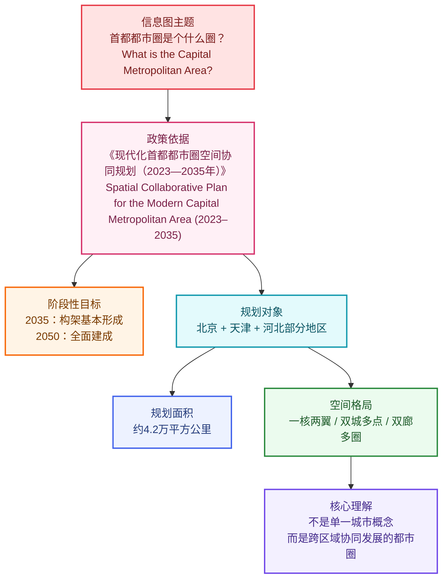

# 【精读笔记】一图读懂：现代化首都都市圈空间协同规划（2023—2035年）

## 基本信息

* **来源**：《北京日报》信息图/报道；规划全文与权威解读以**北京市人民政府**等公开发布为准。
* **对应规划**：《现代化首都都市圈空间协同规划（2023—2035年）》
* **信息图题目**：首都都市圈是个什么圈？——一图读懂
* **规划周期**：2023 年—2035 年（远景展望至 2050 年）
* **核心关键词**：京津冀协同发展、一核两翼、空间协同、新质生产力
* **2035 目标原文核对**（据规划全文《第二节 发展目标》）：到 2035 年，**现代化首都都市圈构架基本形成**（正式文本用「**构架**」，非「框架」；与「空间格局」条目中「一核两翼、双城多点、**双廊多圈**」一致）。
* **可核验公开时间（政府网站）**：
  * 规划公开页面：**2026 年 2 月 3 日**
  * 政策解读新闻发布会：**2026 年 2 月 12 日**

**政府公开链接**

* 规划页面：[北京市人民政府 — 规划公开](https://www.beijing.gov.cn/gongkai/guihua/wngh/ybzxgh/202602/t20260203_4487743.html)
* 政策解读：[首都之窗 — 政策解读](https://www.beijing.gov.cn/zhengce/zcjd/202602/t20260212_4511384.html)

---

## 作者背景简介

这张图属于**政策解读类信息图**，公开检索中可对应到北京市政府门户网站及相关新闻解读页面，但当前可识别部分**未显示具体个人作者署名**。因此就可核实层面，只能确认其属于**政府公开发布/政策传播材料**，而不能可靠指认某一位具名作者。

---

## 前情提要

### 结构树（信息图骨架）

```text
现代化首都都市圈空间协同规划 (2023-2035) 结构图
├── 标题及核心导语
│   ├── 主标题：首都都市圈是个什么圈？
│   └── 副标题：一图读懂
├── 规划时间轴与愿景
│   ├── 2035年目标：现代化首都都市圈构架基本形成
│   └── 2050年愿景：建成世界一流都市圈、中国式现代化首善之区
├── 首都都市圈定义与范围
│   ├── 核心层：以首都北京为核心
│   └── 辐射层：环京通勤圈、天津市、河北雄安新区、唐山、保定、张家口、沧州、承德、秦皇岛、廊坊、邯郸等节点城市
│   └── 产业协同层：石家庄都市圈产业协同
├── 空间规模数据
│   └── 规划实体范围：约4.2万平方公里
└── 空间格局详解 (三大支柱)
    ├── 一核两翼：北京（核）+ 雄安新区、北京城市副中心（翼）
    ├── 双城多点：京津“双城记” + 节点城市网络化支撑
    └── 双廊多圈：京津走廊、京雄走廊 + 空间嵌套的多圈层结构
```

### 结构关系（总览）



### 信息图阅读顺序


---

## 要点速览（原文摘录 + 注释）

以下五段对应信息图主干，便于与后文「逐条精读」对照：**先抓结构，再抠词句**。

#### 第一部分：规划愿景与战略时间点

**原文**：

《现代化首都都市圈空间协同规划（2023—2035年）》近日正式获批。规划提出——

* 到**2035年**，现代化首都都市圈**构架**基本形成。
* 展望到**2050年**，现代化首都都市圈**全面建成**，成为以首都为核心的**世界一流都市圈**、先行示范中国式现代化的**首善之区**。

> **【注释与解析】**
>
> * **现代化首都都市圈 (Modernized Capital Metropolitan Area)**：
>   这是在“京津冀协同发展”大框架下提出的更具**空间粘性**和**功能集成**的概念。不同于宏观的区域经济区，都市圈更强调核心城市与周边地区高度的**同城化 (Integration)** 和 **通勤化 (Commuting)**。
> * **首善之区 (The foremost area of virtue/model area)**：
>   * **解析**：原指首都北京，现引申为在文明、管理、现代化程度等方面起引领示范作用的区域。
>   * **近义词**：模范地区、示范区。
>   * **英文表达**：Model area; exemplary district.
> * **背景补充**：该规划是全国首个由**党中央、国务院**直接批复的都市圈规划，层级极高。它标志着首都功能疏解从“点对点”进入“圈层协同”的新阶段。

#### 第二部分：什么是首都都市圈？

**原文**：

**规划范围**：

以**首都为核心**，统筹考虑环京通勤、天津市和河北雄安新区功能提升、河北省唐山市、保定市、张家口市、沧州市、承德市、秦皇岛市、廊坊市、邯郸市等节点城市以及石家庄都市圈的产业协同而划定。

**规划实体范围**：约**4.2万平方公里**。

> **【注释与解析】**
>
> * **统筹 (Coordinate/Unified planning)**：
>   * **解析**：指统一筹划，兼顾各方。在规划语境下，强调跨行政区域的利益平衡。
> * **节点城市 (Node cities)**：
>   * **解析**：指在区域网络中起到关键连接、转换或支撑作用的中心城市。
>   * **易混淆词**：卫星城（Satellite city）。节点城市具有更强的独立功能和辐射能力，而非仅仅是核心城的附属。
> * **4.2万平方公里 (Approx. 42,000 sq km)**：
>   * **背景定位**：这相当于北京陆域面积（1.64万平方公里）的约2.5倍。该范围并非将整个京津冀划入，而是精准锁定了与北京**功能关联最紧密**的区域。

#### 第三部分：空间格局——一核两翼

**原文**：

**一核两翼**：充分发挥北京“一核”**辐射带动**作用，推动河北雄安新区和北京城市副中心“两翼”**比翼齐飞**。

> **【注释与解析】**
>
> * **一核 (The Core)**：即北京，其核心任务是疏解**非首都功能 (Non-capital functions)**，优化政治中心、文化中心、国际交往中心、科技创新中心功能。
> * **比翼齐飞 (Flying side by side/Developing in tandem)**：
>   * **成语积累**：形容两者地位相当，共同进步。
>   * **解析**：雄安新区主要承接北京非首都功能疏解，是“千年大计”；城市副中心（通州）则带动北京东部及廊坊北三县发展。两者一东一西，构成了北京新的发展骨架。
> * **辐射带动 (Radiation and driving effect)**：
>   * **解析**：经济学专业词汇，指核心增长极通过技术、资本、人才的流出，促进周边落后或欠发达地区的发展。

#### 第四部分：空间格局——双城多点

**原文**：

**双城多点**：唱好京津**“双城记”**，健全**同城化**发展体制机制，发挥北京各新城、天津及河北各节点城市的**网络化支撑**作用。

> **【注释与解析】**
>
> * **“双城记” (A Tale of Two Cities)**：
>   * **解析**：此处借用狄更斯小说名，特指北京与天津这两个超大城市之间的互补与协同。
>   * **金句积累**：京津协同，双峰并峙，相互赋能。
> * **同城化 (Inter-city integration)**：
>   * **解析**：指打破行政壁垒，使不同城市间在交通、社保、公共服务等方面实现像“一个城市”一样的便利。
> * **网络化支撑 (Networked support)**：
>   * **解析**：不再是单一的“核心-边缘”模式，而是通过高铁、高速等基础设施将各城市串联，形成多中心、网格状的城市群结构。

#### 第五部分：空间格局——双廊多圈

**原文**：

**双廊多圈**：依托京津、京雄**走廊**发展**新质生产力**，推动形成清晰合理、空间嵌套的多圈层结构。（规划全文将「双廊」与「多圈」分条表述时，双廊侧重京津走廊、京雄走廊；多圈侧重通勤圈、功能圈、产业协同圈等嵌套布局。）

> **【注释与解析】**
>
> * **新质生产力 (New Quality Productive Forces)**：
>   * **理论背景**：这是当前中国经济发展的核心理论名词。指由技术革命性突破、生产要素创新性配置、产业深度转型升级而催生的当代先进生产力。
>   * **核心关键词**：全要素生产率大幅提升、创新驱动 (Innovation-driven)。
> * **双廊 (Two corridors)**：
>   * **地理定位**（据规划表述）：**京津走廊**（北起北京怀柔科学城，南至天津港）、**京雄走廊**（北起北京怀柔科学城，南至雄安新区及保定中心城区一带），承担创新策源与高质量发展廊道功能。
> * **多圈层结构 (Multi-layered structure)**：
>   * **背景**：通常分为“通勤圈”（半径约30-50km）、“功能圈”（半径约100km）和“产业协同圈”。这种结构有助于缓解大城市病，实现梯次发展。

---

## 逐条精读

以下为信息图逐句展开，含中英对照与词汇注释；与上文「要点速览」如有表述差异，**以政府公开发布文本为准**，此处保留精读过程中的措辞版本并加说明。

🔸 `首都都市圈`是个什么圈？

🔹 What exactly is the `Capital Metropolitan Area`?

这是一句`设问式标题`。中文里的“什么圈”不是随意口语，而是一种`通俗化政策传播表达`，用于把“都市圈”这一专业概念讲得更易懂。“都市圈”在区域规划语境里，通常指以超大/特大城市或核心城市为引领、在交通联系、产业协作、人口流动、公共服务等方面形成紧密联系的区域。

> **`metropolitan area` / ˌmetrəˈpɒlɪtən ˈeəriə/（n.）**
> 英文释义：an area consisting of a large city and the surrounding areas that are socially and economically connected to it；`由大城市及其在社会、经济上紧密联系的周边区域构成的地区`。
> 语域：城市规划、地理、公共政策。
> 画龙点睛：`metropolitan area` 常用于正式书面表达，强调`城市—周边地区一体化联系`。考试中可与 `urban agglomeration`、`city cluster` 区分：前者更偏`单核辐射圈层`，后两者常更偏`多城市群体结构`。写作中可搭配 `integrated development`、`regional coordination`。

> **`exactly` / ɪɡˈzæktli/（adv.）**
> 英文释义：used to emphasize precision or to ask for a clear explanation；`确切地；究竟；到底`。
> 语域：通用，口语/书面皆可。
> 画龙点睛：标题里用 `What exactly is ...?` 很自然，表示`希望得到清晰解释`。阅读中常见于说明文导入；写作中可用来引出定义段，如 `What exactly does sustainable growth mean in practice?`

---

🔸 一图读懂

🔹 Understand it at a glance with one infographic.

这是典型的信息图副标题，强调`通过一张图快速把握核心内容`。中文“一图读懂”在政务传播、媒体传播中很常见，英文不宜死译为 *read with one picture*，更自然的表达是 `at a glance`、`through an infographic`、`in one infographic`。

> **`infographic` / ˌɪnfəˈɡræfɪk/（n.）**
> 英文释义：a visual representation of information or data；`信息图；数据图解`。
> 语域：媒体、传播、商业、教育。
> 画龙点睛：`infographic` 是高频现代传播词。常搭配 `interactive infographic`、`data infographic`。写作中若谈信息传递效率，可说 `Complex policy ideas can be conveyed through clear infographics.`

> **`at a glance`（phrase）**
> 英文释义：immediately or with a quick look；`一眼看懂；一目了然`。
> 语域：通用，偏书面说明。
> 画龙点睛：这是非常地道的固定搭配，常用于图表说明、产品介绍、信息摘要。与 `at first glance` 不同，后者更偏“乍一看”；`at a glance` 更偏“快速掌握要点”。

---

🔸 《现代化首都都市圈空间协同规划（2023—2035年）》近日正式获批，规划提出——

🔹 The `Spatial Collaborative Plan for the Modern Capital Metropolitan Area (2023–2035)` was officially approved recently, and the plan states that:

“获批”是政策语言，指经有权机关审批通过；“规划提出”是公文中非常常见的引出下文要点的表达。这里的“空间协同规划”中的“空间”并不是单纯物理空间，而是`区域布局、功能配置、交通联系、土地使用与发展结构`等综合空间治理概念。

背景注释：

* `空间协同规划`：强调跨行政区之间的空间组织与协作，不是某一座城市单独做的发展蓝图。
* `2023—2035年`：表示规划覆盖的时间周期。
* 根据公开页面可核验，该规划公开发布时间为`2026年2月3日`。

> **`approve` / əˈpruːv/（v.）**
> 英文释义：to officially agree to or accept something；`批准；核准；通过`。
> 语域：正式、行政、法律。
> 画龙点睛：在政策文本中，`be approved` 很常见，如 `The plan was approved by the central authorities.` 注意与 `endorse` 区分：后者更偏“公开支持、认可”；`approve` 更偏正式批准。

> **`collaborative` / kəˈlæbərətɪv/（adj.）**
> 英文释义：involving two or more parties working together；`协作的；合作的`。
> 语域：正式、政策、商业、学术。
> 画龙点睛：`collaborative` 比 `cooperative` 更常用于现代政策与项目表达，突出`共同参与、协同推进`。常见搭配：`collaborative governance`、`collaborative framework`、`collaborative planning`。

> **`state` / steɪt/（v.）**
> 英文释义：to formally express or declare something；`陈述；说明；规定`。
> 语域：正式、新闻、政策。
> 画龙点睛：在新闻和政策解读中，`the report states that...`、`the plan states that...` 非常常见，比 `say` 更正式。阅读中见到该词，多半引出权威文本中的`明确内容`。

---

🔸 到2035年，现代化首都都市圈构架基本形成。

🔹 By `2035`, the `modern capital metropolitan area` will have **largely formed its basic structure**.

与规划全文一致，采用**构架基本形成**（正式文本用「构架」）。英文可用 `basic structure` / `framework` 对译「构架」；都市圈是持续演进的区域系统，不宜理解为一次性“完工”。

背景注释：

* `2035年`在中国中长期规划语境里通常被视为重要阶段性节点。
* “现代化首都都市圈”说明其目标不是自然形成的通勤区域，而是`有明确功能定位和治理安排的现代化都市圈体系`。

> **`establish` / ɪˈstæblɪʃ/（v.）**
> 英文释义：to set up or bring something into existence on a firm basis；`建立；确立；使成形`。
> 语域：正式、政策、学术。
> 画龙点睛：`establish` 在政策语境中常表示`制度、框架、体系的形成`，不只是“创办”。常见搭配：`establish a mechanism`、`establish a framework`、`establish regional connectivity`。写作里可替代较普通的 `build`。

> **`basically` / ˈbeɪsɪkli/（adv.）**
> 英文释义：in the main or in essential respects；`基本上；总体上`。
> 语域：通用。
> 画龙点睛：政策文本中的 `basically` 不是口语里的“其实”，而是表示`主要目标大体实现`。要注意区分语气：正式语境里它有明确的阶段性含义，常见于发展指标与目标描述。

---

🔸 展望到2050年，现代化首都都市圈全面建成，成为以首都为核心的世界一流都市圈、先行示范中国式现代化的首善之区。

🔹 Looking ahead to `2050`, the modern capital metropolitan area will be `fully established`, becoming a `world-class metropolitan area` with the capital at its core and a leading demonstration zone for `Chinese modernization`.

这句话信息密度很高。

* “展望到2050年”表示长期目标。
* “全面建成”比“基本形成”层级更高，强调`成熟、完善、系统成型`。
* “世界一流都市圈”是发展能级表述。
* “先行示范”表示`率先探索、提供样板`。
* “首善之区”是带有中国政治与治理语境色彩的表达，通常可理解为`在治理、发展、文明水平等方面起引领示范作用的地区`。

背景注释：

* `world-class metropolitan area` 常用于描述国际竞争力强、创新资源密集、交通网络完善、产业协同高效的都市圈。
* `Chinese modernization` 是中国政策话语中的重要概念，英文一般译为 `Chinese modernization`。
* `首善之区` 很难完全一一对应到英文；若用于解释性翻译，宜突出“leading”与“demonstration”。

> **`look ahead to`（phrase）**
> 英文释义：to think about or prepare for the future；`展望；着眼于未来`。
> 语域：正式、说明文、政策。
> 画龙点睛：这是非常好用的写作表达，适合引出远期目标，如 `Looking ahead to 2050, ...`。比单纯的 `in 2050` 更能体现规划视角和时间递进逻辑。

> **`world-class` / ˌwɜːld ˈklɑːs/（adj.）**
> 英文释义：of the highest international standard；`世界一流的；国际顶尖的`。
> 语域：正式、宣传、政策、商业。
> 画龙点睛：`world-class` 是高频评价词，但在写作中要注意搭配真实对象，如 `world-class infrastructure`、`world-class universities`、`world-class metropolitan area`。它强调国际比较维度，不仅仅是“很好”。

> **`demonstration zone`（phrase）**
> 英文释义：an area designated to serve as a model for policy experimentation or development；`示范区`。
> 语域：政策、规划、区域发展。
> 画龙点睛：这是中国政策文本英译中的常见表达。可延伸记忆 `pilot zone`（试验区/先行区）、`model area`（样板区）。做翻译时要按语境区分是“试点”还是“示范”。

---

🔸 什么是首都都市圈？

🔹 What is the `Capital Metropolitan Area`?

这是对前文标题的再次提问，起到`由目标导入定义`的作用。信息图结构上属于承上启下的节点：前面说“为什么重要、要建成什么样”，这里开始说“它具体包括什么”。

> **`what is ...?`（pattern）**
> 英文释义：a basic defining structure used to introduce a concept；`用于界定概念的基础问句结构`。
> 语域：通用。
> 画龙点睛：虽然简单，但在说明文阅读和写作中非常重要。定义类段落常见结构：`What is X?` → `X refers to...` → `It includes...` → `It functions as...`。掌握这种结构有助于快速抓段落逻辑。

---

🔸 规划范围

🔹 Planning scope.

这是小标题，用于引出下文的地理覆盖范围。中文“规划范围”在政策与国土空间规划中非常常见，英文可译为 `planning scope` 或 `scope of the plan`。前者更适合作为小标题。

> **`scope` / skəʊp/（n.）**
> 英文释义：the extent or range of something；`范围；界限；涉及面`。
> 语域：正式、学术、政策。
> 画龙点睛：`scope` 是写作高频词。常见搭配：`the scope of the project`、`within the scope of the law`、`broaden the scope`。阅读里它往往对应中文的“范围、覆盖面、权限边界”。

---

🔸 以首都为核心，统筹考虑环京通勤、天津市和河北疏解承接功能提升，河北省唐山市、保定市、张家口市、沧州市、承德市、秦皇岛市、廊坊市、邯郸市等与首城协同以及石家庄都市圈的产业协同问题。

🔹 With the `capital` as the core, the plan takes an overall approach to `commuting around Beijing`, the enhancement of `Tianjin` and `Hebei` in undertaking functions relocated from Beijing, as well as coordination with cities in `Hebei Province`—including `Tangshan`, `Baoding`, `Zhangjiakou`, `Cangzhou`, `Chengde`, `Qinhuangdao`, `Langfang`, and `Handan`—together with industrial coordination involving the `Shijiazhuang metropolitan area`.

说明：此句依据图片可识别文字整理；与上文「要点速览」中「河北雄安新区功能提升」等表述，**以政府正式文本为准**，精读稿可能因识图或版本差异存在措辞出入。

背景注释：

* `环京通勤`：指北京与周边地区之间的跨界通勤联系。
* `疏解承接功能`：指承接北京非首都功能转移。
* `天津`：直辖市，在京津冀协同发展中地位重要。
* `河北`多市：承担与北京、天津在产业、交通、功能布局上的协同任务。
* `石家庄都市圈`：以石家庄为核心的区域协同单元。

> **`core` / kɔː(r)/（n./adj.）**
> 英文释义：the central or most important part；`核心；中心部分`。
> 语域：通用、政策、学术。
> 画龙点睛：`with A as the core` 是非常实用的表达，适合翻译“以A为核心”。写作中还可变形为 `core area`、`core function`、`core competitiveness`。注意它既可作名词也可作形容词。

> **`overall approach`（phrase）**
> 英文释义：a way of dealing with something in a comprehensive manner；`统筹性做法；整体性安排`。
> 语域：正式、政策。
> 画龙点睛：适合翻译“统筹考虑/统筹推进”。相比 `consider` 更能体现`全局协调`。写作可用：`The policy adopts an overall approach to regional governance.`

> **`undertake` / ˌʌndəˈteɪk/（v.）**
> 英文释义：to take responsibility for something or to accept a task；`承担；承接`。
> 语域：正式。
> 画龙点睛：在政策翻译中，`承接功能` 常可译为 `undertake relocated functions`。注意 `undertake` 比 `take` 更正式，也常见于承诺义，如 `undertake to do sth.`，考试中是高频熟词僻义点。

> **`relocate` / ˌriːləʊˈkeɪt/（v.）**
> 英文释义：to move something or someone to a new place；`迁移；转移；重新布局`。
> 语域：正式、政策、商业。
> 画龙点睛：在区域规划中可表示`功能、产业、机构`的转移，不仅是人搬家。搭配如 `relocated industries`、`relocated administrative functions` 很常见。

> **`coordination` / kəʊˌɔːdɪˈneɪʃn/（n.）**
> 英文释义：the act of organizing different elements to work together effectively；`协调；协同`。
> 语域：正式、政策、管理。
> 画龙点睛：这是政策英语核心词之一。常搭配 `regional coordination`、`policy coordination`、`industrial coordination`。写作中它优于简单的 `cooperation`，因为更强调`系统安排与配合机制`。

---

🔸 规划实体范围

🔹 Physical scope of the plan.

“实体范围”可理解为`在地图和空间落位上明确划定的实际范围`，区别于概念性、功能性、辐射性的更大范围。

> **`physical` / ˈfɪzɪkl/（adj.）**
> 英文释义：relating to actual, material, or spatial existence；`实体的；实际空间上的；物理性的`。
> 语域：通用、规划、科学。
> 画龙点睛：在规划语境中，`physical space`、`physical layout`、`physical boundary` 都很常见。不要把它只理解为“身体的”；它还有“实体存在的、实物层面的”意思，这是典型熟词僻义点。

---

🔸 约4.2万平方公里

🔹 Approximately `42,000 square kilometers`.

这里的“约”表示约数，英文里自然用 `approximately`、`about`。正式说明文中 `approximately` 更稳妥。数字表达上，`4.2万平方公里`应转化为 `42,000 square kilometers`。

> **`approximately` / əˈprɒksɪmətli/（adv.）**
> 英文释义：close to a particular number or amount, but not exact；`大约；约`。
> 语域：正式、学术、说明。
> 画龙点睛：比 `about` 更正式，适合图表、论文、新闻和政策解读。写作中若描述数据，优先用 `approximately`、`roughly`、`an estimated` 等正式表达。

> **`square kilometer`（n.）**
> 英文释义：a unit for measuring area equal to a square that is one kilometer on each side；`平方公里`。
> 语域：通用、地理、统计。
> 画龙点睛：面积表达要注意复数：`42,000 square kilometers`。考试中常见和 `square miles` 对比；做翻译时单位后通常不加 `of area`，直接写面积数值即可。

---

🔸 空间格局

🔹 Spatial structure.

“空间格局”是规划领域高频术语，通常指一个区域在`核心—节点—走廊—圈层`等方面形成的总体组织方式。英文用 `spatial structure` 最常见，也可根据语境说 `spatial pattern`，但标题里 `spatial structure` 更稳。

> **`spatial` / ˈspeɪʃl/（adj.）**
> 英文释义：relating to space or the position, area, and size of things；`空间的；与布局位置有关的`。
> 语域：正式、地理、规划、科技。
> 画龙点睛：这是阅读里常见学术词。常见搭配：`spatial distribution`、`spatial planning`、`spatial pattern`、`spatial inequality`。掌握后对地理、城市、社会科学文本很有帮助。

> **`structure` / ˈstrʌktʃə(r)/（n.）**
> 英文释义：the way in which parts are arranged or organized；`结构；组织方式`。
> 语域：通用、正式。
> 画龙点睛：`structure` 不只是建筑“结构”，更常表示抽象组织关系。写作中非常高频，如 `economic structure`、`sentence structure`、`social structure`。可用来精准表达“格局、架构”。

---

🔸 一核两翼

🔹 `One core, two wings`.

这是典型的空间结构概括语。

* “一核”通常指首都核心功能与核心区域。
* “两翼”在京津冀语境里，公开报道中常指`北京城市副中心`与`雄安新区`这“两翼”。
  英文采用直译 `one core, two wings` 即可，因其本身就是结构性概念。

背景注释：

* `北京城市副中心`：北京城市功能疏解和新发展空间的重要承载地。
* `雄安新区`：国家级新区，承担疏解北京非首都功能等重要任务。

> **`core` / kɔː(r)/（n.）**
> 英文释义：the central and most important part；`核心`。
> 语域：通用、规划、商业。
> 画龙点睛：在区域规划中，`core` 往往不是地理中心那么简单，更强调`功能中心、资源集聚中心`。写作中若谈城市发展，可说 `a strong urban core`。

> **`wing` / wɪŋ/（n.）**
> 英文释义：a part that extends from the main body; figuratively, a supporting side or branch；`翼；侧翼；延展支撑部分`。
> 语域：通用、比喻、规划表述。
> 画龙点睛：`wing` 原义是“翅膀”，在政策图解中引申为`两翼支撑`。这是很好的比喻性表达。阅读时要学会识别从具体到抽象的迁移义。

---

🔸 双城多点

🔹 `Two cities and multiple nodes`.

该结构强调由`两个重要城市增长极`与`多个支撑节点`共同构成网络化发展格局。
在首都都市圈语境中，“双城”通常需要结合图示与政策语境理解，往往指关键城市核心；“多点”则指多个重点城镇、节点地区或功能承载点。

> **`node` / nəʊd/（n.）**
> 英文释义：a central or connecting point in a network；`节点；枢纽点`。
> 语域：正式、规划、科技、网络。
> 画龙点睛：`node` 是非常重要的抽象词，在交通、城市规划、计算机网络中都常见。写作中用它比 `point` 更专业，如 `transport nodes`、`innovation nodes`、`growth nodes`。

> **`multiple` / ˈmʌltɪpl/（adj.）**
> 英文释义：many in number; more than one；`多个的；多重的`。
> 语域：通用、正式。
> 画龙点睛：比 `many` 更适合书面表达，尤其用于结构描述，如 `multiple centers`、`multiple stakeholders`。做阅读时它常暗示系统不是单点，而是`复合、多元、网络化`。

---

🔸 双廊多圈

🔹 `Two corridors and multiple circles`.

规划全文用语为**双廊多圈**：“双廊”即**京津走廊**与**京雄走廊**；“多圈”指通勤圈、功能圈、产业协同圈等嵌套结构。媒体信息图若写作“轴/带”，宜理解为与走廊、轴带类表述的互文，**以规划文本「双廊」为准**。

> **`corridor` / ˈkɒrɪdɔː(r)/（n.）**
> 英文释义：a strip linking places for transport, industry, or development；`走廊；廊道`。
> 语域：规划、交通、区域发展。
> 画龙点睛：规划中的「京津走廊」「京雄走廊」常用 `corridor`；与「发展轴」类表述常并存、互文。

> **`circle` / ˈsɜːkl/（n.）**
> 英文释义：a round area; figuratively, a zone or sphere of connection；`圈；圈层；范围`。
> 语域：通用、规划引申。
> 画龙点睛：在中文政策图解中，“圈”常被意译为 `circle`、`ring`、`zone`，具体要看语义。若强调圈层与辐射关系，`circle` 可保留原有比喻；若强调功能区，也可灵活处理为 `zone`。

---

## 补充背景注释

### 首都都市圈

`首都都市圈`不是仅指北京市行政区，而是以北京为核心、与天津及河北部分地区形成紧密联系的跨区域都市圈。其重点不只是地理接近，更在于`交通、产业、功能疏解、公共服务和空间治理的协同`。

### 京津冀协同发展

这是理解该规划的上位背景。京津冀分别指：

* `京`：北京
* `津`：天津
* `冀`：河北

“协同发展”强调突破行政边界，在更大区域尺度上优化资源配置和功能分工。

### 功能疏解

这里主要指`北京非首都功能疏解`。所谓“非首都功能”，一般是指不适合继续高度集中于北京核心区的部分产业、行政支撑、公共服务或人口承载功能。

---

## 可识别内容的英文整理版

以下为基于图片可可靠识别内容整理出的英文对应版本，便于整体复习：

🔹 What is the `Capital Metropolitan Area`?
🔹 Understand it at a glance with one infographic.
🔹 The `Spatial Collaborative Plan for the Modern Capital Metropolitan Area (2023–2035)` was officially approved recently.
🔹 By `2035`, the modern capital metropolitan area will have largely formed its basic structure.
🔹 Looking ahead to `2050`, it will be fully established as a world-class metropolitan area with the capital at its core and a leading demonstration zone for Chinese modernization.
🔹 What is the `Capital Metropolitan Area`?
🔹 `Planning scope`
🔹 With the capital as the core, the plan coordinates commuting around Beijing, the enhancement of Tianjin and Hebei in undertaking relocated functions, and industrial coordination with relevant cities in Hebei and the Shijiazhuang metropolitan area.
🔹 `Physical scope of the plan`
🔹 Approximately `42,000 square kilometers`
🔹 `Spatial structure`
🔹 `One core, two wings`
🔹 `Two cities and multiple nodes`
🔹 `Two corridors and multiple circles`

---

**编辑：** 理论前沿工作室

**审核：** 党的创新理论研究组

**版权说明：** 本精读笔记基于国家公开规划及权威媒体解读整理；引用与措辞如有出入，以政府正式公开文本为准。
