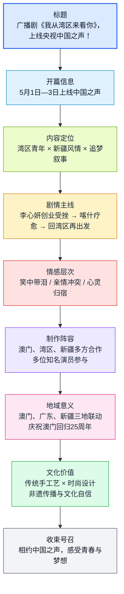

# 广播剧《我从湾区来看你》精读笔记

**文章基本信息**
*   **标题**：广播剧《我从湾区来看你》，上线央视中国之声！
*   **来源**：龙岗区委宣传部、镜屏文化
*   **发布媒体**：龙岗融媒
*   **编辑**：罗玮
*   **关键词**：粤港澳大湾区、新疆、民族团结、非遗传承、澳门回归25周年

---

#### 【前情提要】文章结构图

```text
[文章总分结构]
1. 资讯发布：播出平台（央视中国之声）与时间（5月1日-3日）
2. 核心主题：湾区青年追梦 + 新疆民族风情 + 东西协作“山海故事”
3. 剧情梗概：
   └── 3.1 主线：澳门女孩李心妍与喀什女孩阿米娜的创业/救赎之旅
   └── 3.2 辅线：父女、母子情感纠葛与心灵归宿
4. 制作团队与艺术价值：
   └── 4.1 阵容：澳门机构、湾区/新疆企业联合制作；知名声优与演员
   └── 4.2 意义：庆祝澳门回归25周年；展现澳门精神与新疆风情
5. 文化内涵：
   └── 5.1 核心：非遗传承、文化自信、匠心融合
   └── 5.2 体验：身临其境的“听觉”盛宴
6. 结语与政宣信息：
   └── 6.1 资助方：深圳市龙岗区宣传文化发展专项资金
   └── 6.2 升华：新征程奋斗者的共鸣
```

---

#### 【全文精读与深度解析】

**原文：** 广播剧《我从湾区来看你》，上线央视中国之声！5月1日—3日，原创广播剧《我从湾区来看你》震撼上线央视中国之声广播频道啦！

> **【注释】**
> *   **中国之声**：中央广播电视总台旗下的新闻综合广播频率，是中国最具权威性、影响力的广播媒体之一。
> *   **震撼 (Shocking/Stunning)**：此处形容广播剧场面宏大或给人带来心理冲击。
>     *   **近义词**：震动、惊叹。
>     *   **高级表达**：**振聋发聩**（侧重唤醒）、**惊心动魄**。

**原文：** 这部剧以大湾区青年为主角，巧妙地将湾区青年的追梦情节与新疆民族风情相融合。通过精彩的故事情节和栩栩如生的人物形象，为我们展现了当代青年奋斗、追梦的感人篇章，也再现了民族文化交融、东西协作的“山海故事”。

> **【注释】**
> *   **大湾区 (GBA - Guangdong-Hong Kong-Macao Greater Bay Area)**：即**粤港澳大湾区**，由香港、澳门两个特别行政区和广东省广州、深圳、珠海、佛山、惠州、东莞、中山、江门、肇庆九个珠三角城市组成。
> *   **栩栩如生 (Lifelike)**：形容生动逼真，就像活的一样。
>     *   **易混淆**：**惟妙惟肖**（侧重于模仿得像）。
> *   **东西协作**：中国为解决发展不平衡制定的战略，指东部发达地区（如大湾区）对口帮扶/协作西部欠发达地区（如新疆）。
> *   **山海故事**：这里的“山”多指西部内陆（新疆、贵州等山区/高原），“海”指东部沿海（大湾区）。隐喻两地跨越地理限制的深厚情谊。

**原文：** 快来和我们一起相约中国之声，聆听他们的故事吧！期待与你一同感受这份青春与梦想的力量！笑中带泪，湾区新疆欢乐一家亲。

> **【注释】**
> *   **笑中带泪**：常用文艺评论词汇，指作品兼具喜剧的幽默感和悲剧的感染力，能引起深层的情感共鸣。

**原文：** 《我从湾区来看你》，以青春为主线讲述精彩故事。剧中的澳门女孩李心妍在大湾区创业失败后，在新疆喀什经历了心灵的救赎。

> **【注释】**
> *   **喀什 (Kashi/Kashgar)**：位于新疆西南部，是古丝绸之路的交通枢纽，国家历史文化名城。被称为“不到喀什不算到新疆”。
> *   **救赎 (Redemption)**：原为宗教术语，现多指心理层面的自我完善、解脱或通过行动弥补过失。

**原文：** 回到大湾区后，她将传统工艺、地域文化与前卫设计完美结合，与喀什女孩“阿米娜”一起设计出了杰出且富含文化内涵的珠宝作品，最终东山再起！

> **【注释】**
> *   **东山再起 (To stage a comeback)**：指失势后重新恢复地位。
>     *   **典故**：源自东晋谢安辞官隐居东山，后重新出山，在淝水之战中获胜。
>     *   **反义词**：一蹶不振。

**原文：** 剧情跌宕起伏，笑中带泪，有父女传承的温暖，也有母子反目的纠葛，但最终每个人都找到了心灵的归宿。在追求自我理想实现的道路上，他们尽情享受着属于这个时代的快乐生活！一起感受这份独特的情感之旅！

> **【注释】**
> *   **跌宕起伏 (With ups and downs)**：形容情节多变。
> *   **归宿 (Final destination/Home)**：指人或事物的最终去向或安身之处。

**原文：** 匠心团队，湾区之声传澳情。这是首部中国大湾区与边疆民族特色文化传承题材剧。

> **【注释】**
> *   **匠心 (Ingenuity)**：巧妙的心思，常指**工匠精神**（Craftsmanship）。
> *   **首部**：强调了该作品在题材开拓上的先导性和创新性。

**原文：** 该剧由澳门机构、湾区及新疆企业、机构精心策划制作，更有著名配音演员季冠霖、赵岭，国家一级演员韩童生，中国澳门演员吴昕芳以及新疆演员迪丽沙·塔伊尔等众多优秀演员共同合作。

> **【注释】**
> *   **季冠霖**：中国著名配音演员，曾为《甄嬛传》甄嬛、《三生三世十里桃花》白浅等角色配音，被誉为配音界“女王”。
> *   **赵岭**：知名配音演员、演员，声音沉稳大气，代表作有《泰坦尼克号》（杰克 3D版配音）等。
> *   **韩童生**：国家一级演员，演技精湛，常活跃于影视剧及话剧舞台。
> *   **国家一级演员**：中国演员领域最高职称。

**原文：** 故事发生地跨越澳门、广东和新疆三地，通过这部广播剧作品，我们能感受到澳门人朝气蓬勃的精神面貌，领略新疆特色民族风情。这部广播剧也是为了庆祝澳门回归25周年！一起聆听这动人的故事吧！

> **【注释】**
> *   **澳门回归25周年**：1999年12月20日澳门回归。2024年是澳门回归祖国25周年纪念，该剧具有显著的政治礼赞意义。

**原文：** 新疆传统工艺，展现非遗之美。广播剧《我从湾区来看你》将新疆地区的传统手工艺与时尚设计理念完美融合，大力弘扬传承非物质文化遗产，让我们更加坚定文化自信！

> **【注释】**
> *   **非物质文化遗产 (Intangible Cultural Heritage)**：简称“非遗”，如新疆维吾尔木卡姆艺术、地毯织造技艺等。
> *   **文化自信 (Cultural Confidence)**：中国特色社会主义“四个自信”之一，强调对中华民族优秀传统文化的自豪与坚守。

**原文：** “听剧”犹如“看剧”，那种身临其境的感觉让人仿佛置身于新疆，尽情体会着新疆地区独特的风貌与风情。在与“阿米娜”交朋友的过程中，我们深入了解到新疆传统手工艺的魅力所在，感受着青春、美好、和谐、幸福的精神态度。

> **【注释】**
> *   **身临其境 (Immersive)**：就像亲身到了那个境地一样。
>     *   **近义词**：设身处地（侧重于替他人着想，不可混淆）。

**原文：** 本项目由深圳市龙岗区宣传文化发展专项资金资助，随着广播剧《我从湾区来看你》的正式上线，它不仅为听众带来了一部优秀的广播剧作品，更是一次对新疆文化的深入挖掘和传播。

> **【注释】**
> *   **深圳市龙岗区宣传文化发展专项资金**：地方政府设立的专项扶持基金，旨在激励文化产业创作和文化品牌推广。

**原文：** 在新的征程上，奋斗者的脚步永不停歇！广播剧《我从湾区来看你》期待与您相约中国之声，一起感受这份精彩！

> **【注释】**
> *   **金句积累**：**在新的征程上，奋斗者的脚步永不停歇！**（可用于公文写作、演讲结尾）。

---

#### 【延伸补充：龙岗区一季度经济简讯】
*   **核心数据**：2026年一季度龙岗区GDP实现1186.10亿元，同比增长10.5%。
*   **解读**：显示出龙岗区作为深圳工业大区、文化强区的强劲发展势头和韧性，文化事业（如本项目资助）的繁荣是建立在坚实的经济基础之上的。


## 前情提要

### 文章来源与作者信息
- 文章来源：读特客户端「龙岗发布」频道
- 题目：**广播剧《我从湾区来看你》，上线央视中国之声！**
- 发布时间：**2024年5月2日 17:06**
- 署名/来源：**龙岗区委宣传部、镜屏文化**
- 责编：**龙岗融媒（编辑 罗玮）**
- 作者背景简介：本文未见单独署名作者，发布主体为**“龙岗发布”**，其背后依托龙岗区融媒体传播体系。公开资料显示，**龙岗区融媒集团**成立于2020年8月，由原龙岗区新闻中心、龙岗广电中心、广播电台等单位组建而成，是深圳市龙岗区直属国有文化企业。另据公开报道，责编**罗玮**为“趣龙岗”小红书主理人，参与新媒体运营工作。
- 说明：原始复制内容中含有图片占位、相关推荐、留言区等无关信息，以下已按正文清理，仅对文章主干内容进行精读。

### 文章结构信息图



---

## 逐句精读

🔸 **5月1日—3日，/ 原创广播剧《我从湾区来看你》/ 震撼上线 / 央视中国之声广播频道啦！**
🔹 From **May 1 to May 3**, the original radio drama *From the Greater Bay Area, I’ve Come to See You* **premiered with great impact** on **China National Radio’s Voice of China** channel.

背景注释：
- **中国之声 / Voice of China**：中央广播电视总台旗下的重要广播频率，覆盖全国，具有较强权威性。
- **央视**：这里是广义上的中央级国家媒体表达，强调传播平台的权威与影响力。
- **上线**：在媒体语境中，指节目正式播出、发布或开播。

> **`premiere` / `premiered`**  /prɪˈmɪr/ or /prəˈmɪr/
> 词性与释义：
> - **v.** to be shown, performed, or broadcast for the first time 首次上演；首次播出
> - **n.** the first public performance 首映；首播
> 中文：`首播`，`首次亮相`
> 语域：新闻、影视、文娱、正式
> 画龙点睛：比起普通的 `go online`，`premiere` 更强调**“首次公开发布”**的仪式感，常用于电影、戏剧、纪录片、广播节目。写作里可替换 `be first shown`。常见搭配有 `world premiere`, `premiere on`, `have its premiere`。

> **`with great impact`**
> 词性与释义：固定表达
> - indicating a strong or impressive effect 具有强烈冲击力地；引人注目地
> 中文：`震撼上线`、`重磅推出`
> 语域：新闻宣传、正式
> 画龙点睛：这是对中文“震撼”的较稳妥英译。若更宣传化，可用 `with a bang`；若更正式，可用 `to wide attention`。考试写作中，`have a strong impact on` 是高频搭配，注意 `impact` 既可作名词也可作动词。

---

🔸 **这部剧 / 以大湾区青年为主角，/ 巧妙地将湾区青年的追梦情节 / 与新疆民族风情 / 相融合。**
🔹 The drama **features young people from the Greater Bay Area as its protagonists** and **skillfully blends** their dream-chasing stories with the **ethnic charm** of Xinjiang.

背景注释：
- **大湾区 / the Greater Bay Area**：通常指粤港澳大湾区，涵盖广东部分城市以及香港、澳门。
- **新疆**：中国西北地区，民族文化多样，手工艺、音乐、服饰等具有鲜明地域特色。
- **民族风情**：英文常可译为 `ethnic charm`、`ethnic flavor` 或 `local ethnic culture`，本句取较自然的宣传文体表达。

> **`protagonist`** /prəˈtæɡənɪst/
> 词性与释义：
> - **n.** the main character in a story 主角；主人公
> 中文：`主人公`，`主角`
> 语域：文学、影视、学术
> 画龙点睛：`protagonist` 比 `main character` 更书面、更文学。反义角色常见为 `antagonist`（对立者、反派）。阅读里常考人物关系判断，写作中用于替代重复的 `hero/heroine`，更中性、更稳妥。

> **`blend`** /blend/
> 词性与释义：
> - **v.** to mix different elements together in a harmonious way 融合；混合
> - **n.** a mixture 融合物；混合体
> 中文：`融合`，`交融`
> 语域：通用、文艺、商业、设计
> 画龙点睛：`blend A with B` 是高频结构，尤其适合写文化、科技、设计、教育跨界融合。比 `mix` 更强调**协调自然**，比 `combine` 更强调**融为一体**。写作中可套用：`blend tradition with innovation`。

> **`ethnic charm`**
> 词性与释义：名词短语
> - the distinctive appeal of an ethnic culture 民族文化魅力
> 中文：`民族风情`，`民族魅力`
> 语域：旅游、文化传播、宣传
> 画龙点睛：`ethnic` 在英语里要注意语境，描述文化特色时常见；但涉及族群身份时需更审慎。考试翻译里，“风情”常不能直译成 `style`，用 `charm`, `flavor`, `appeal` 更自然。

---

🔸 **通过精彩的故事情节 / 和栩栩如生的人物形象，/ 为我们展现了 / 当代青年奋斗、追梦的感人篇章，/ 也再现了民族文化交融、东西协作的“山海故事”。**
🔹 Through its compelling plot and vividly drawn characters, it presents a moving account of contemporary young people striving for their dreams, while also recreating a **story of mountains and seas** marked by **interethnic cultural exchange** and **east-west cooperation**.

背景注释：
- **山海故事**：中文修辞色彩很强，常借“山海”表达相隔遥远却彼此连接、协作共进。这里并非字面上的地理故事，而是象征区域协作。
- **东西协作**：通常指中国东部地区与西部地区之间的对口协作、资源互补、文化交流与产业支持。
- **栩栩如生**：英文宜转化为 `vividly drawn` / `lifelike`，强调人物刻画鲜活。

> **`compelling`** /kəmˈpelɪŋ/
> 词性与释义：
> - **adj.** very interesting or persuasive, so that it holds attention 引人入胜的；令人信服的
> 中文：`扣人心弦的`，`引人注目的`
> 语域：书评、影评、新闻、学术
> 画龙点睛：`compelling` 常用于剧情、论证、证据、理由。它不仅是“精彩”，还带有**让人无法移开注意力**之意。写作中常用 `a compelling argument`, `compelling evidence`, `a compelling narrative`。

> **`strive for`** /straɪv fɔːr/
> 词性与释义：动词短语
> - to make great efforts to achieve something 奋力争取；为……而努力
> 中文：`为……奋斗`，`力争`
> 语域：正式、书面、励志、新闻
> 画龙点睛：比 `try to get` 更正式有力，突出持续奋斗感。常见搭配：`strive for excellence`, `strive for success`, `strive to do sth.`。考试写作中很适合替换普通动词 `try`，显著提升语体层级。

> **`interethnic`** /ˌɪntərˈeθnɪk/
> 词性与释义：
> - **adj.** involving or occurring between different ethnic groups 族群之间的；跨民族的
> 中文：`民族间的`，`跨民族的`
> 语域：社会学、新闻、政策
> 画龙点睛：这是较正式词。读外刊时常见于 `interethnic relations`。若担心过于学术，也可换成 `cross-cultural`，但后者更宽泛，不一定突出“民族”维度。

---

🔸 **快来和我们一起 / 相约中国之声，/ 聆听他们的故事吧！**
🔹 Come and **join us on Voice of China** to **listen to their stories**.

背景注释：
- **相约**：此处不是字面意义上的“约会”，而是宣传语中的“共同收听、相聚于同一播出平台”。
- **聆听**：较书面、较有感染力，英语里用 `listen to` 最稳妥；若要更文艺，可用 `tune in to hear`。

> **`join us`**
> 词性与释义：动词短语
> - to come together with others to take part in something 和我们一起参与
> 中文：`加入我们`，`和我们一起`
> 语域：宣传、活动邀请、口语
> 画龙点睛：非常常见的邀请表达。若后接平台/活动，可说 `join us on...`；若后接行为，可说 `join us in doing...`。写邮件和活动海报时尤其高频。

> **`listen to`**
> 词性与释义：动词短语
> - to pay attention in order to hear something 听；倾听
> 中文：`聆听`，`听取`
> 语域：通用
> 画龙点睛：注意与 `hear` 区分：`hear` 偏“听见”，强调结果；`listen to` 偏“主动去听”，强调动作与注意力。阅读完形、语法辨析里这是经典考点。

---

🔸 **期待与你一同 / 感受这份青春与梦想的力量！**
🔹 We look forward to **experiencing with you** the power of **youth and dreams**.

背景注释：
- **青春与梦想的力量**：典型宣传文体中的抽象概括，英语可译为 `the power of youth and dreams`，保持鼓动性。

> **`look forward to`** /lʊk ˈfɔːrwərd tuː/
> 词性与释义：动词短语
> - to feel pleased and excited about something that is going to happen 期待
> 中文：`期待`
> 语域：通用、书信、正式
> 画龙点睛：后面必须接 **名词** 或 **doing**，不能直接接动词原形，这是语法高频点。比如 `look forward to meeting you`，不是 `look forward to meet you`。

> **`the power of`**
> 词性与释义：名词短语
> - the strength or influence of something ……的力量
> 中文：`……的力量`
> 语域：议论文、宣传、演讲
> 画龙点睛：极高频写作框架，可套用于 `the power of language`, `the power of education`, `the power of storytelling`。抽象名词写作时很好用，但要避免空泛，最好后文跟具体例证。

---

🔸 **《我从湾区来看你》，/ 以青春为主线 / 讲述精彩故事。**
🔹 *From the Greater Bay Area, I’ve Come to See You* tells an engaging story **with youth as its central thread**.

背景注释：
- **主线**：叙事学中指贯穿全文或全剧的核心线索。英文常用 `main thread`, `central thread`, `main line of narrative`。

> **`central thread`**
> 词性与释义：名词短语
> - the main idea or line running through a story or discussion 主线；核心线索
> 中文：`主线`
> 语域：文学评论、学术、影视评论
> 画龙点睛：这是表达结构分析的好词。阅读题里如果问文章主旨、作者线索推进，可借此表述。也可说 `the unifying thread`，更强调“贯穿并统一全篇”。

> **`engaging`** /ɪnˈɡeɪdʒɪŋ/
> 词性与释义：
> - **adj.** interesting and pleasant enough to keep attention 吸引人的；迷人的
> 中文：`引人入胜的`
> 语域：评论、推荐、媒体
> 画龙点睛：比 `interesting` 更细腻，表示“能把人吸进去”。适合评价书、剧、课程、演讲。常见搭配：`engaging story`, `engaging speaker`, `engaging style`。

---

🔸 **剧中的澳门女孩李心妍 / 在大湾区创业失败后，/ 在新疆喀什 / 经历了心灵的救赎。**
🔹 In the drama, **Li Xinyan**, a young woman from **Macao**, experiences **spiritual redemption** in **Kashgar, Xinjiang**, after failing in her business venture in the Greater Bay Area.

背景注释：
- **澳门 / Macao**：中国特别行政区；英文拼写现今官方常用 `Macao`。
- **喀什 / Kashgar**：新疆重要城市，历史上是丝绸之路重镇，文化色彩鲜明。
- **创业失败**：可译为 `fail in her startup/business venture`。
- **心灵的救赎**：文学色彩较强，可译为 `spiritual redemption` 或 `emotional healing`；本句偏文艺，取前者。

> **`venture`** /ˈventʃər/
> 词性与释义：
> - **n.** a business project or undertaking, often involving risk 事业项目；创业项目
> - **v.** to dare to do something 冒险去做
> 中文：`创业项目`，`冒险事业`
> 语域：商业、财经、正式
> 画龙点睛：比 `business` 更能体现“风险与开拓”。常见于 `business venture`, `joint venture`, `venture capital`。阅读里碰到 `venture into` 还可表示“大胆进入某领域”。

> **`redemption`** /rɪˈdempʃən/
> 词性与释义：
> - **n.** the act of being saved from error, guilt, or suffering 救赎；挽回；赎回
> 中文：`救赎`，`自我挽回`
> 语域：宗教、文学、评论
> 画龙点睛：是非常有文学感的词。除宗教义外，现代叙事中常指人物在失败、痛苦后获得精神重建。写人物分析时很加分，如 `a journey of redemption`。

> **`spiritual`** /ˈspɪrɪtʃuəl/
> 词性与释义：
> - **adj.** relating to the human spirit or soul 精神上的；心灵的
> 中文：`心灵的`，`精神层面的`
> 语域：文学、心理、宗教
> 画龙点睛：`spiritual` 不一定专指宗教，也可指内在精神世界。和 `mental` 不同，`mental` 更偏心理状态、认知层面；`spiritual` 更偏灵魂、价值、内在安顿。

---

🔸 **回到大湾区后，/ 她将传统工艺、地域文化 / 与前卫设计 / 完美结合，/ 与喀什女孩“阿米娜”一起 / 设计出了杰出且富含文化内涵的珠宝作品，/ 最终东山再起！**
🔹 After returning to the Greater Bay Area, she **perfectly integrates** traditional craftsmanship and regional culture with avant-garde design, and together with **Amina**, a girl from Kashgar, creates outstanding jewelry rich in cultural meaning, eventually **staging a comeback**.

背景注释：
- **传统工艺**：这里主要指手工艺传统与工艺技法传承。
- **前卫设计 / avant-garde design**：强调现代、先锋、实验性的设计理念。
- **阿米娜 / Amina**：常见女性名字，此处为剧中角色。
- **东山再起**：英文不宜直译，可译为 `make a comeback` 或 `stage a comeback`。

> **`craftsmanship`** /ˈkræftsmənʃɪp/
> 词性与释义：
> - **n.** skill in making things by hand 精湛工艺；手工技艺
> 中文：`工艺水平`，`匠艺`
> 语域：设计、制造、文化遗产
> 画龙点睛：不可数名词。比 `craft` 更强调技艺水准与制作质量。常见搭配 `traditional craftsmanship`, `fine craftsmanship`, `a masterpiece of craftsmanship`。

> **`avant-garde`** /ˌævɒ̃ˈɡɑːrd/
> 词性与释义：
> - **adj.** new and unusual, often experimental 前卫的；先锋的
> - **n.** people or works that are experimental 先锋派
> 中文：`前卫的`，`先锋的`
> 语域：艺术、时尚、设计、评论
> 画龙点睛：法语借词，文艺评论常用。与 `modern` 相比，`avant-garde` 更强调突破常规、实验性强。写作里用于艺术设计语境非常地道。

> **`stage a comeback`**
> 词性与释义：动词短语
> - to become successful again after a period of failure or decline 重新崛起；卷土重来
> 中文：`东山再起`
> 语域：新闻、体育、商业、人物报道
> 画龙点睛：`comeback` 本身是高频词，尤其常见于体育、娱乐、商业报道。`stage a comeback` 比简单的 `succeed again` 更生动、更像媒体英语。

---

🔸 **剧情 / 跌宕起伏，/ 笑中带泪，/ 有父女传承的温暖，/ 也有母子反目的纠葛，/ 但最终每个人 / 都找到了心灵的归宿。**
🔹 The plot is **full of twists and turns**, blending laughter with tears; it contains the warmth of father-daughter inheritance as well as the tensions of a mother and son becoming estranged, but in the end everyone finds a **spiritual home**.

背景注释：
- **父女传承**：不一定仅指财产继承，也可指技艺、精神、价值观的代际传递。
- **母子反目**：指亲人失和、关系破裂。
- **心灵的归宿**：在文学语境里可译为 `spiritual home`, `inner belonging`, `place of emotional belonging`。

> **`twists and turns`**
> 词性与释义：名词短语
> - unexpected changes in a story or situation 曲折变化；跌宕起伏
> 中文：`波折`，`起伏转折`
> 语域：影视评论、新闻、叙事写作
> 画龙点睛：固定搭配，极地道。可用于剧情，也可用于人生经历、谈判进程。写作中表达“过程并不平坦”时，比 `ups and downs` 更偏叙事结构。

> **`estranged`** /ɪˈstreɪndʒd/
> 词性与释义：
> - **adj.** no longer close or friendly; separated emotionally 疏远的；失和的
> 中文：`反目疏离的`，`关系破裂的`
> 语域：家庭、心理、新闻
> 画龙点睛：常见于 `estranged parents`, `an estranged couple`。它强调关系上的隔阂和情感断裂，比单纯的 `angry` 深得多。阅读中常用于人物关系描写。

> **`spiritual home`**
> 词性与释义：名词短语
> - a place or state where one feels deep inner belonging 精神归宿；心灵家园
> 中文：`心灵的归宿`
> 语域：文学、文化评论
> 画龙点睛：非常适合翻译中文里的“精神家园”“心灵归宿”。若用于议论文，也可引申为文化认同与价值归属，不仅仅是宗教意味。

---

🔸 **在追求自我理想实现的道路上，/ 他们尽情享受着 / 属于这个时代的快乐生活！**
🔹 On the road toward realizing their ideals, they fully enjoy the happy life that belongs to this era.

背景注释：
- **理想实现**：英语里常用 `realize one’s ideals/dreams`。
- **属于这个时代的快乐生活**：带有时代叙事色彩，强调青年在当下社会中的生活活力与获得感。

> **`realize`** /ˈriːəlaɪz/
> 词性与释义：
> - **v.** to achieve something desired or planned 实现
> - **v.** to understand clearly 意识到
> 中文：`实现；意识到`
> 语域：通用
> 画龙点睛：这是典型多义词，阅读里常考熟词僻义。`realize a dream` 是“实现梦想”，`realize that...` 是“意识到……”。必须根据后接结构判断意思。

> **`on the road toward`**
> 词性与释义：介词短语
> - in the process of moving toward a goal 在通往……的道路上
> 中文：`在追求……的道路上`
> 语域：正式、演讲、励志
> 画龙点睛：很适合中译英中的抽象表达。可替换 `in the pursuit of`。如果写作要更简练，可说 `in pursuing their ideals`。

---

🔸 **这是首部 / 中国大湾区与边疆民族特色文化传承题材剧。**
🔹 This is the **first radio drama of its kind** centered on the inheritance of the Greater Bay Area’s culture together with the distinctive ethnic cultures of China’s border regions.

背景注释：
- **首部**：英语里常用 `the first ... of its kind`，是媒体与学术中都很常见的说法。
- **边疆民族特色文化传承题材**：这是一个高度压缩的中文名词串，英译时应拆开处理，避免逐词硬译。
- **文化传承**：常译 `cultural inheritance`, `cultural preservation`, `passing on culture`，不同语境略有侧重。

> **`of its kind`**
> 词性与释义：固定表达
> - of that particular type 同类中的；这种类型的
> 中文：`同类中的`，`此类的`
> 语域：新闻、学术、正式
> 画龙点睛：`the first of its kind` 是超级高频表达，几乎是“首个/首部/首例”的标准译法之一。写作报道创新项目、政策、研究成果时尤其好用。

> **`inheritance`** /ɪnˈherɪtəns/
> 词性与释义：
> - **n.** something received from previous generations; in culture, what is passed down 继承；传承
> 中文：`继承`，`传承`
> 语域：法律、文化、历史
> 画龙点睛：法律语境里是“遗产继承”，文化语境里可指“文化传承”。若想更突出保护与延续，可配 `cultural inheritance and preservation`。

---

🔸 **该剧 / 由澳门机构、湾区及新疆企业、机构 / 精心策划制作，/ 更有著名配音演员季冠霖、赵岭，/ 国家一级演员韩童生，/ 中国澳门演员吴昕芳 / 以及新疆演员迪丽沙·塔伊尔等 / 众多优秀演员共同合作。**
🔹 The drama was **carefully planned and produced** by institutions in Macao, enterprises and organizations from the Greater Bay Area and Xinjiang, and also brought together many outstanding performers, including renowned voice actors **Ji Guanlin** and **Zhao Ling**, **National Class-A Actor** **Han Tongsheng**, Macao actor **Wu Xinfang**, and Xinjiang actor **Dilisha Tayir**.

背景注释：
- **季冠霖、赵岭**：中国较知名配音演员。
- **国家一级演员**：中国专业职称体系中的高级艺术职称，英文常采用解释性表达，如 `National Class-A Actor`。
- **精心策划制作**：常见官方宣传语，英语宜处理为 `carefully planned and produced`。

> **`renowned`** /rɪˈnaʊnd/
> 词性与释义：
> - **adj.** famous and respected 著名的；有声望的
> 中文：`知名的`，`享有盛名的`
> 语域：正式、新闻、人物介绍
> 画龙点睛：比 `famous` 更正式、更带尊敬色彩。常见搭配有 `renowned scholar`, `renowned actor`, `renowned for...`。写人物介绍时非常稳妥。

> **`bring together`**
> 词性与释义：动词短语
> - to gather people or things into one group 汇聚；联合；聚集
> 中文：`汇聚`，`集结`
> 语域：新闻、活动、项目介绍
> 画龙点睛：常用于团队、资源、创意的整合。比简单的 `have` 或 `include` 更能体现组织协调和合作色彩，适合项目介绍型写作。

> **`collaboration` / `collaborate`**
> 词性与释义：
> - **n.** working together 合作
> - **v.** to work jointly with others 合作
> 中文：`合作`，`协作`
> 语域：商业、学术、艺术
> 画龙点睛：现代英语中极高频。注意 `cooperate` 更泛，`collaborate` 更强调共同创作或共同完成复杂任务。艺术、科研、设计语境里常优先用 `collaborate`。

---

🔸 **故事发生地 / 跨越澳门、广东和新疆三地，/ 通过这部广播剧作品，/ 我们能感受到澳门人朝气蓬勃的精神面貌，/ 领略新疆特色民族风情。**
🔹 The story spans **Macao, Guangdong, and Xinjiang**, and through this radio drama we can sense the **energetic spirit** of the people of Macao and appreciate the distinctive ethnic charm of Xinjiang.

背景注释：
- **广东**：中国南部沿海省份，也是粤港澳大湾区核心区域之一。
- **朝气蓬勃的精神面貌**：中文常见宣传表达，英语中宜转化为 `energetic spirit`, `vibrant outlook`, `spirited vitality`。
- **领略**：此处不是简单的“看见”，而是带有“体会、欣赏、感受”的意味。

> **`span`** /spæn/
> 词性与释义：
> - **v.** to extend across; to cover 跨越；涵盖
> - **n.** a period or extent 跨度；持续时间
> 中文：`跨越`，`覆盖`
> 语域：正式、新闻、地理、学术
> 画龙点睛：非常适合地理空间、时间范围、内容范围的表达，如 `span three decades`, `span several regions`。比 `cover` 更有“延展跨越”感。

> **`vibrant`** /ˈvaɪbrənt/
> 词性与释义：
> - **adj.** full of energy and life 充满活力的；生气勃勃的
> 中文：`朝气蓬勃的`，`充满活力的`
> 语域：城市描述、人物气质、经济文化
> 画龙点睛：可形容城市、文化、市场、社区，也可形容人的状态。比 `lively` 更正式，更适合写作中描述“蓬勃发展”的社会与文化景象。

---

🔸 **这部广播剧 / 也是为了庆祝 / 澳门回归25周年！**
🔹 This radio drama was also created **to celebrate the 25th anniversary of Macao’s return to the motherland**.

背景注释：
- **澳门回归25周年**：澳门于**1999年12月20日**回归中国，因此25周年对应**2024年**。
- 为避免时间误解，这里用绝对时间说明：文章发布于**2024年5月2日**，文中所说“25周年”对应的是**2024年12月20日前后**这一纪念节点。

> **`anniversary`** /ˌænɪˈvɜːrsəri/
> 词性与释义：
> - **n.** the date on which an important event happened in a previous year 周年纪念日
> 中文：`周年`，`纪念日`
> 语域：通用、新闻、正式
> 画龙点睛：常与序数词连用，如 `the 25th anniversary of...`。写作中记住介词结构：`the anniversary of an event`。不要误写成 `anniversary for`。

> **`celebrate`** /ˈselɪbreɪt/
> 词性与释义：
> - **v.** to mark a special occasion with activities; to praise 庆祝；颂扬
> 中文：`庆祝`
> 语域：通用
> 画龙点睛：既可表示“举办活动庆祝”，也可表示“赞颂、彰显”。常见搭配：`celebrate an anniversary`, `celebrate success`, `celebrate cultural diversity`。

---

🔸 **广播剧《我从湾区来看你》 / 将新疆地区的传统手工艺 / 与时尚设计理念 / 完美融合，/ 大力弘扬传承 / 非物质文化遗产，/ 让我们更加坚定文化自信！**
🔹 The radio drama *From the Greater Bay Area, I’ve Come to See You* **seamlessly combines** traditional handicrafts from Xinjiang with modern fashion design concepts, vigorously promotes the inheritance of **intangible cultural heritage**, and helps strengthen our confidence in our culture.

背景注释：
- **非物质文化遗产 / intangible cultural heritage**：联合国教科文组织及中文政策语境中都非常常见的正式表达。
- **文化自信**：中文政治文化话语中的高频词，英译多用 `confidence in one’s culture` 或 `cultural confidence`。
- **传统手工艺** 与 **时尚设计理念** 的并置，体现“传统—现代”的融合叙事。

> **`seamlessly`** /ˈsiːmləsli/
> 词性与释义：
> - **adv.** in a smooth and natural way, without obvious breaks or problems 无缝地；流畅自然地
> 中文：`完美地`，`自然流畅地`
> 语域：设计、科技、评论、商业
> 画龙点睛：非常适合描述两种元素的自然衔接，如技术系统、文化元素、叙事结构。比 `perfectly` 更强调“连接无痕”，是高质量表达。

> **`intangible cultural heritage`**
> 词性与释义：名词短语
> - traditions, skills, and practices inherited within communities 非物质文化遗产
> 中文：`非物质文化遗产`
> 语域：文化、政策、学术、新闻
> 画龙点睛：这是固定术语，考试翻译与阅读中都值得直接记忆。常缩写为 `ICH`，但正式写作首现时最好写全称。典型内容包括技艺、节庆、表演艺术、民俗等。

> **`confidence in`**
> 词性与释义：名词短语
> - trust or belief in something 对……的信心
> 中文：`对……的自信/信心`
> 语域：通用、正式
> 画龙点睛：`confidence in our culture` 比直译式的 `cultural self-confidence` 更自然、更易被英语读者接受。写作时注意 `confidence in sth.` 这一介词搭配。

---

🔸 **“听剧” / 犹如“看剧”，/ 那种身临其境的感觉 / 让人仿佛置身于新疆，/ 尽情体会着 / 新疆地区独特的风貌与风情。**
🔹 Listening to the drama is much like watching it: the immersive feeling makes one seem to be physically present in Xinjiang, fully experiencing its unique landscapes and local charm.

背景注释：
- **听剧犹如看剧**：强调广播剧的声音塑造能力，可营造近似影视观看的画面感。
- **身临其境**：常译为 `immersive`, `as if one were there`, `be transported to...`。
- **风貌与风情**：前者偏整体面貌、景观风格；后者偏文化气息与地方情调。

> **`immersive`** /ɪˈmɜːrsɪv/
> 词性与释义：
> - **adj.** seeming to surround the audience so that they feel completely involved 沉浸式的；让人身临其境的
> 中文：`沉浸式的`，`身临其境的`
> 语域：媒体、游戏、艺术、教育技术
> 画龙点睛：是当代媒体评论常用词。可用于 `immersive experience`, `immersive storytelling`, `immersive technology`。写作文娱科技类话题时很加分。

> **`be present in` / `physically present`**
> 词性与释义：表达结构
> - to be in a place in person 亲临；置身于
> 中文：`置身于`，`身处于`
> 语域：通用、书面
> 画龙点睛：翻译“仿佛置身于”时，常可用 `as if one were in...`、`feel transported to...`。若想更文艺，`transport` 是很好的升级词。

> **`local charm`**
> 词性与释义：名词短语
> - the distinctive appeal of a place 地方魅力；地域风情
> 中文：`地方风情`
> 语域：旅游、文化传播
> 画龙点睛：翻译“风情”时很好用。比机械直译更自然。可扩展为 `regional charm`, `traditional charm`, `ethnic charm`，注意根据上下文微调。

---

🔸 **在与“阿米娜”交朋友的过程中，/ 我们深入了解到 / 新疆传统手工艺的魅力所在，/ 感受着青春、美好、和谐、幸福的精神态度。**
🔹 In the process of befriending **Amina**, we come to understand more deeply the appeal of Xinjiang’s traditional handicrafts and to feel a spirit of youth, beauty, harmony, and happiness.

背景注释：
- **交朋友的过程中**：这里并非现实中的直接交往，而是听众通过角色建立情感联系。
- **魅力所在**：英语不宜逐字翻译，可用 `the appeal of...`、`what makes ... appealing`。
- **精神态度**：中文偏概括性，英译常压缩为 `a spirit of...` 更自然。

> **`befriend`** /bɪˈfrend/
> 词性与释义：
> - **v.** to become friendly with someone 与……结交；对……友善
> 中文：`结识并成为朋友`
> 语域：书面、文学
> 画龙点睛：比 `make friends with` 更简洁，也更书面。叙事文、读后续写中非常好用。注意其宾语直接接人：`befriend her`。

> **`appeal`** /əˈpiːl/
> 词性与释义：
> - **n.** attractiveness or interest 吸引力；魅力
> - **v.** to attract; to make a serious request 吸引；呼吁
> 中文：`魅力；吸引力；呼吁`
> 语域：通用、新闻、广告
> 画龙点睛：又一个高频多义词。`the appeal of sth.` 表“某物的魅力”，`appeal to sb.` 表“吸引某人”，`appeal for help` 则是“呼吁帮助”。阅读中必须靠搭配辨义。

> **`harmony`** /ˈhɑːrməni/
> 词性与释义：
> - **n.** a state of peaceful agreement and balance 和谐；协调
> 中文：`和谐`
> 语域：社会、音乐、文化、议论文
> 画龙点睛：既可指社会和谐，也可指艺术上的协调统一。常见搭配：`live in harmony`, `social harmony`, `harmony between tradition and modernity`。

---

🔸 **本项目 / 由深圳市龙岗区宣传文化发展专项资金资助，/ 随着广播剧《我从湾区来看你》的正式上线，/ 它不仅为听众带来了一部优秀的广播剧作品，/ 更是一次对新疆文化的深入挖掘和传播。**
🔹 This project was funded by the **Special Fund for Publicity and Cultural Development of Longgang District, Shenzhen**. With the official launch of the radio drama *From the Greater Bay Area, I’ve Come to See You*, it has not only brought listeners an excellent radio production, but has also served as an in-depth exploration and dissemination of Xinjiang culture.

背景注释：
- **深圳市龙岗区**：深圳下辖行政区。
- **宣传文化发展专项资金**：政府专项支持资金，常用于文化传播、文艺创作、公共文化项目等。
- **挖掘和传播**：中文宣传语中常成对出现，英语里可处理为 `exploration and dissemination`。

> **`fund` / `funded`** /fʌnd/
> 词性与释义：
> - **v.** to provide money for something 为……提供资金
> - **n.** a sum of money for a purpose 资金；基金
> 中文：`资助`，`提供经费`
> 语域：财经、政府、项目申报、学术
> 画龙点睛：极高频正式词。写作中 `be funded by...` 是标准被动结构。相关词有 `funding`（经费）、`funder`（资助方）。

> **`dissemination`** /dɪˌsemɪˈneɪʃən/
> 词性与释义：
> - **n.** the act of spreading information, ideas, or knowledge 传播；散播
> 中文：`传播`
> 语域：学术、政策、新闻、公共传播
> 画龙点睛：比 `spread` 更正式，常用于文化、知识、研究成果传播。固定搭配：`the dissemination of culture/information/results`。研究生英语写作里很实用。

> **`not only ... but also ...`**
> 词性与释义：并列结构
> - used to connect two related ideas, with emphasis on the second 不仅……而且……
> 中文：`不仅……更……`
> 语域：通用、正式
> 画龙点睛：经典高级连接结构。注意并列成分要尽量对称。若置于句首，还会引起部分倒装，如 `Not only did it..., but it also...`，这是语法强化点。

---

🔸 **在新的征程上，/ 奋斗者的脚步 / 永不停歇！**
🔹 On this **new journey**, the steps of those who strive will **never cease**.

背景注释：
- **新的征程**：常见于演讲、宣传、政策文体，带有面向未来的新阶段含义。
- **奋斗者**：可译为 `those who strive`, `strivers`, `people who work hard`;为了稳妥自然，本句采用解释性表达。

> **`journey`** /ˈdʒɜːrni/
> 词性与释义：
> - **n.** travel from one place to another; a long process 旅程；历程
> 中文：`征程`，`历程`
> 语域：通用、演讲、文学
> 画龙点睛：英语里常将抽象人生阶段比作 `journey`。写作时可用于 `a lifelong journey`, `a journey toward modernization`。比 `road` 更具过程感和叙事感。

> **`cease`** /siːs/
> 词性与释义：
> - **v.** to stop happening or existing 停止；终止
> 中文：`停歇`，`终止`
> 语域：正式、法律、新闻
> 画龙点睛：比 `stop` 更正式。常见于 `cease to exist`, `hostilities ceased`, `never cease to amaze me`。后者还是很高频的地道表达，表示“总是让我惊叹”。

---

🔸 **广播剧《我从湾区来看你》 / 期待与您相约中国之声，/ 一起感受这份精彩！**
🔹 The radio drama *From the Greater Bay Area, I’ve Come to See You* looks forward to meeting you on **Voice of China**, so that we may experience this brilliance together.

背景注释：
- 这是典型收束式宣传句，功能是再次发出收听邀请、强化节目记忆点。
- **精彩** 在此并非单纯指“好看”，而是指整体艺术感染力与收听体验。

> **`meet you on...`**
> 词性与释义：表达结构
> - to connect with you through a platform or event 在某平台与您相见
> 中文：`与您相约于……`
> 语域：宣传、媒体、活动
> 画龙点睛：中文“相约某平台”在英语里常需意译，不是字面上的现实见面。可用 `join you on`, `meet you on`, `tune in on` 依语境调整。

> **`brilliance`** /ˈbrɪliəns/
> 词性与释义：
> - **n.** great skill, beauty, or excellence 杰出；精彩；光彩
> 中文：`精彩`，`卓越`
> 语域：评论、文艺、正式
> 画龙点睛：比 `wonderful` 更书面。可表示作品、想法、表演的出色程度。若怕过重，也可用 `splendor`（偏视觉）或 `excellence`（偏品质）。这里译“精彩”时带一定修辞色彩。

---

## 核心高频表达回收

- `premiere on ...`：在……首播
- `blend A with B`：将A与B融合
- `compelling plot`：引人入胜的情节
- `strive for one’s dreams`：为梦想奋斗
- `spiritual redemption`：心灵救赎
- `stage a comeback`：东山再起
- `twists and turns`：跌宕起伏
- `the first of its kind`：首个/首部同类作品
- `intangible cultural heritage`：非物质文化遗产
- `immersive experience`：沉浸式体验
- `the appeal of ...`：……的魅力
- `the dissemination of culture`：文化传播

## 参考来源
- 读特客户端原文页：<https://www.dutenews.com/n/ctmedia/517943?from=app>
- 龙岗区融媒集团简介：<https://annexserver.szlg.com/>
- 龙岗政府在线有关罗玮公开信息：<https://www.lg.gov.cn/lgysjdb/gkmlpt/content/12/12303/post_12303107.html>

