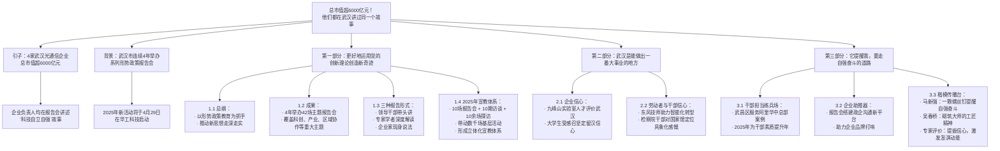

# 精读文章笔记

**文章标题**：总市值超6000亿元！他们都在武汉讲过同一个故事  
**来源**：武汉发布、长江日报  
**作者/文字**：长江日报记者 李建华、万凌、唐婕  
**编辑**：闵小丽  
**发布时间**：根据内容推断为2026年4月下旬（文中提及4月27日股市收盘及4月29日启动仪式）

---

# 前情提要

> **导图勘误**：正文写「今年」活动启动仪式为4月29日；若举办年份以正文为准，可将导图中「2025年新活动」改为与正文一致的「本年」或具体年份，以免与后文「2025年……宣教体系」表述混淆。

---

# 精读笔记

## 总市值超6000亿元！他们都在武汉讲过同一个故事

**4月27日，股市收盘，`长飞光纤`、`华工科技`、`烽火通信`和`光迅科技`等武汉4家光通信企业总市值超`6000亿元`。** 这4家资本市场「热捧」企业的有关负责人都在武汉市系列形势政策报告会上作过报告，`讲述企业推进科技自立自强的故事`。

> **背景补充**：  
> `长飞光纤`（601869.SH）、`华工科技`（000988.SZ）、`烽火通信`（600498.SH）、`光迅科技`（002281.SZ）均是中国光通信领域的龙头企业。武汉东湖高新区被誉为「`中国光谷`」，是中国最大的光纤光缆、光电器件生产基地。在数字经济与「东数西算」等国家战略背景下，光通信作为信息传输的「大动脉」，具有极高的战略价值。这4家企业市值合计突破6000亿，反映了资本市场对核心技术突破和国产替代逻辑的认可。
>
> **重点词汇解析**：  
> `科技自立自强`：指在关键核心技术上实现自主可控，把发展的主动权牢牢掌握在自己手中。  
> - **近义词**：自主创新、自主可控、高水平科技自立自强  
> - **反义词**：技术依附、受制于人、造不如买  
> - **金句积累**：`「把科技的命脉牢牢掌握在自己手中」`。

---

自2022年起，`武汉市连续4年举办系列形势政策报告会`，以「`学思想、强信心、促发展`」为要旨，激励全市干部群众「`牢记嘱托、感恩奋进`」，加快建设国家中心城市。

> **背景补充**：  
> 2022年6月28日，习近平总书记到湖北武汉考察，强调把科技的命脉掌握在自己手中，并提出武汉要「在科技自立自强上取得更大进展」。武汉系列形势政策报告会正是在这一背景下启动的常态化思想教育举措。
>
> **重点词汇解析**：  
> `形势政策报告会`：一种重要的政治宣教形式，旨在向干部群众解读当前国内外形势、党的重大方针政策和发展成就，`凝聚共识`、`激发干劲`。英文常译为 *situation and policy briefing*。  
> `要旨`：主要的意思、核心宗旨。  
> - **近义词辨析**：主旨、宗旨、核心要义  
> - **易混淆词汇**：要义（重要的内容）、要素（构成事物的必要因素）

今年，武汉将在全市范围内开展「`全力打造『五个中心』 全面建设现代化大武汉`」系列形势政策宣传教育活动。**4月29日，活动启动仪式暨首场报告会将在`华工科技`举行。**

> **背景补充**：  
> 武汉「五个中心」定位：全国经济中心、国家科技创新中心、国家商贸物流中心、国际交往中心和区域金融中心。这是武汉「十四五」期间的奋斗目标。在龙头企业园区内召开报告会，体现了「生产一线也是思想阵地」的融合导向。

---

## 01 「更好地运用党的创新理论创造新奇迹」

**「坚持不懈用`党的创新理论`最新成果武装头脑、指导实践、推动工作。」** 武汉市委宣传部相关负责人介绍，武汉市以形势政策教育为重要抓手，持续推动学习宣传贯彻`习近平新时代中国特色社会主义思想`走深走实，引导全市干部群众深刻认知新思想强大的`真理力量`和`实践伟力`。

> **重点词汇解析**：  
> `党的创新理论`：在当前语境下，特指`习近平新时代中国特色社会主义思想`。  
> `走深走实`：指学习或工作向纵深发展，落到实处，不浮于表面。  
> - **近义词**：入脑入心、见行见效  
> - **金句积累**：学思用贯通、知信行统一。  
> `真理力量`与`实践伟力`：前者强调理论的`科学性`，后者强调理论指导下的`行动成效`。英文对应 *power of truth* 和 *strength of practice*。

近4年来，武汉市相继举办「武汉这十年」「英雄城市新征程」「重塑新时代武汉之『重』」「建设支点 当好龙头」等系列形势政策报告会，**共举办主题报告会`42场`，涉及`科技创新`、`产业发展`、`区域协作`、`城市更新`、`乡村振兴`、`生态建设`等关乎武汉发展的重大主题。**

> **背景补充**：  
> `「英雄城市新征程」`源于2020年武汉抗疫保卫战，2021年后武汉主打「英雄城市」名片；`「重塑新时代武汉之『重』」`强调国家战略下武汉「国家重器」的使命担当；`「建设支点 当好龙头」`则对应中央关于湖北「建成支点、走在前列、谱写新篇」的战略定位。

**领导干部带头作报告**，结合主管部门、区域的主要问题谈认识、讲举措，`扎实担负起学习宣传贯彻习近平新时代中国特色社会主义思想的政治责任`。

**「在全球产业链深度重构与中国经济转型升级的历史交汇期，`科技创新`和`产业创新`的深度融合，已经成为大国博弈的`胜负手`、高质量发展的`主引擎`，也是我们勇当支点建设先锋的内在要求和关键举措。」** 2025年6月，在「推动科技创新和产业创新深度融合」报告会上，武汉市经信局主要负责人作主旨报告。

> **背景补充**：  
> `胜负手`：围棋术语，指决定全局胜负的关键一招。此处借喻科技与产业融合在中美战略博弈中的极端重要性。近期国家反复强调推动「`四链融合`」（创新链、产业链、资金链、人才链），正是在这一时代背景下展开的。
>
> **重点词汇解析**：  
> `胜负手`：  
> - **近义词**：关键一招、制胜法宝、杀手锏  
> - **成语积累**：`举足轻重`、`一决雌雄`  
> `主引擎`：比喻推动事物发展的主要动力来源。

**专家学者深度解读。** 数十位国际国内知名`院士`、专家学者，以全国乃至全球视野，深入阐发新思想指引武汉市高质量发展的方向和路径。

**「武汉在建设科技强国、扩大内需、畅通国内循环、`战略腹地建设`等重大战略中具有非常独特的地位。」** 2024年9月，在「打造支撑中部地区崛起的重要增长极」报告会上，国家高端智库专家、中国宏观经济研究院对外经济研究所新兴经济体研究室主任、研究员`李大伟`表示，随着我国内陆地区在经济版图中的地位日益重要，武汉将为新时代我国高水平开放创出新特色、提供新动力、开辟新空间。

> **人物/术语注释**：  
> `李大伟`：中国宏观经济研究院对外经济研究所研究员，长期关注全球价值链、新兴经济体发展。  
> `战略腹地建设`：指在国家战略后方基地建设，通常指向中西部内陆地区，以增强产业链供应链韧性和安全水平。  
> `中国宏观经济研究院`：国家发改委直属研究机构，具有极高的政策权威性。英文简称 *AMR*。

**企业家「现身说法」。** 一批知名企业负责人生动讲述攻克「`卡脖子`」技术，让大家深刻领悟「`把科技的命脉牢牢掌握在自己手中`」的重大意义，`勇担科技自立自强重任`。

> **重点词汇解析**：  
> `卡脖子`：指关键核心技术受制于人，像脖子被卡住一样难受。英文常译为 *bottleneck* 或 *stranglehold*。  
> - **近义词**：受制于人、掣肘  
> - **反义词**：自主可控、国产替代  
> `现身说法`：本为佛教用语，指佛力广大，能现出种种身形说法。现指用自己的亲身经历来劝诫或讲解。

**2024年6月，在「`世界光谷`」专场报告会上，`华工科技`党委书记、董事长`马新强`回顾2022年6月28日习近平总书记再次考察光谷时的情景。** 总书记强调突破「卡脖子」关键核心技术时，他在现场听到总书记用了「`刻不容缓`」四个字，足见科技自立自强的迫切性。「`华工科技要勇做新时代科技创新的排头兵`。」马新强在报告会上说。

> **背景/成语解析**：  
> `刻不容缓`：片刻也不能拖延，形容形势紧迫。  
> - **近义词**：迫在眉睫、十万火急、事不宜迟  
> - **反义词**：不急之务、来日方长  
> `排头兵`：站在队伍最前面的士兵，比喻在事业中带头的人或集体。  
> - **近义词**：先行者、开拓者、领头雁

**「经济总量跃升`2万亿元`、光电子产业`独树一帜`、『国之重器』闪耀武汉力量……报告会用生动鲜活的事实深刻阐明：武汉市经济社会发展取得的成就，根本在于习近平总书记的`领航掌舵`，在于习近平新时代中国特色社会主义思想的`科学指导`。」** 2025年第5期`《党建》`杂志中这样写道。

> **背景/成语解析**：  
> `独树一帜`：单独树起一面旗帜。比喻独特新奇，自成一家。此处形容武汉光电子产业在全球的领先地位。英文常作 *unique* 或 *in a class of its own*。  
> `国之重器`：本指国家的宝器，现多指能支撑国家战略需求的重大装备或核心技术。  
> `《党建》`杂志：由中央宣传部主管，是党建领域的重要理论刊物。  
> `领航掌舵`：比喻把握方向、统揽全局的领导核心作用。

2025年，武汉市通过办好`10场`主题报告会、`10期`访谈视频、`10余场`实地探访，带动全市开展`数千场`基层宣教活动，形成「`10+10+10+1000`」立体化宣教体系，促使`思想引领覆盖全城`。

**「让`党的创新理论『飞入寻常百姓家』`，全市干群更好地运用新思想创造新奇迹。」** 武汉市委宣传部相关负责人说。

> **用典解析**：  
> `飞入寻常百姓家`：出自唐代诗人刘禹锡的《乌衣巷》：「旧时王谢堂前燕，飞入寻常百姓家。」原意感慨世事变迁，此处引申为让高大深的理论政策通过群众喜闻乐见的方式普及到千家万户，实现理论的大众化、通俗化。这是新时期宣传思想工作的重要方法论。

---

## 02 「武汉是能做出一番大事业的地方」

**「如果要在中国版图上寻找`化合物半导体产业`的发展机遇，武汉光谷是一个`绕不开`的选择。」** 4月24日，多位来汉参加`九峰山论坛`的企业家看好武汉的产业优势。

> **术语/背景补充**：  
> `化合物半导体`：指由两种或两种以上元素组成的半导体材料，如`碳化硅（SiC）`、`氮化镓（GaN）`，是新一代通信、新能源汽车、雷达等领域的核心基础材料，被视为后摩尔时代的关键赛道。  
> `九峰山论坛`：武汉在化合物半导体领域的顶级专业论坛，由`九峰山实验室`主办。该实验室是湖北在半导体领域的重大布局。

**「武汉是能做出一番大事业的地方，有`大气魄`、`大手笔`、`大支持`。」** 对于武汉化合物半导体产业的未来，`九峰山实验室`主任`丁琪超`信心满满。

> **好词积累**：  
> `大气魄、大手笔、大支持`：运用排比，极具气势，体现了武汉发展高新技术产业的`决心`和`投入力度`。在申论写作中可用以形容政府的高站位和强举措。

对于这个评价，`九峰山实验室`运营主任`赵勇`和工艺中心总经理`柳俊`深表认同。此前两年，他们相继亮相相关主题报告会，介绍九峰山实验室`面向全球揽才`、`创新体制机制`等经验做法。

**「我仿佛看到了化合物半导体`全球灯塔`的光明前景，也更加坚定了留在武汉就业的信心。」** 「`城市观察团`」成员、湖北工业大学材料成型及控制工程专业大二学生`李沛熙`聆听了柳俊的报告后感慨地说。

> **术语注释**：  
> `全球灯塔`：即「`灯塔工厂`」（Lighthouse Factory），由世界经济论坛和麦肯锡联合评选，指在第四次工业革命（智能化）技术应用方面处于全球领先地位的生产基地。此处借喻技术最前沿的顶峰。  
> `城市观察团`：武汉形势政策宣教活动中组织市民、学生等群体参与实地探访的团队，旨在增强体验感和参与度。

形势政策宣传教育活动释放的`信心`也鼓舞着广大一线劳动者和机关干部。

**「我们将助力湖北汽车制造从『`电动化`』全面转型『`智能化`』，为武汉打造国家科技创新中心发挥主力军作用。」** 去年11月下旬，`东风汽车`集团有限公司研发总院特级技师`杨军`受邀为「产业工人队伍建设」报告会拍摄连线视频。4月26日，长江日报记者获悉，**杨军今年荣获`全国五一劳动奖章`。**

> **背景/词汇解析**：  
> `电动化` vs `智能化`：新能源汽车产业发展的两个阶段。电动化是上半场，即新能源替代化石能源；智能化是下半场，即自动驾驶、智能座舱等。武汉作为东风总部所在地，正全力推动汽车产业向「下一代汽车」跃迁。  
> `全国五一劳动奖章`：中华全国总工会授予在中国特色社会主义建设中作出突出贡献的劳动者的荣誉称号。

临近「五一」假期，位于`长江新区`的「`一带一路`」国家馆又在加紧进货，准备迎接大批市民前来「`海淘`」。「**国家商贸物流中心和国际交往中心的定位目标变得`具象化`了**。」「城市观察团」成员、武汉市检察院干部`张维明`边看边逛，不由得感慨：「此行收获满满，对武汉的赶超跨越也`信心倍增`。」

> **词汇解析**：  
> `具象化`：将抽象的、概念化的事物转化为具体的、可感知的形象或现实。  
> - **反义词**：概念化、抽象化  
> - **近义词**：具体化、落地生根  
> `海淘`：*overseas online shopping*，通过互联网检索海外商品信息并购买，此处指在本地即可购买「一带一路」沿线国家进口商品，体现了贸易便利化和高水平开放。

---

## 03 「它提醒我，要走自强奋斗的道路」

一场场报告会，成为`干部担当`的「练兵场」、`企业发展`的「助推器」、`楷模精神`的「传播台」。

> **好句积累**：  
> `练兵场、助推器、传播台`：用三个生动比喻高度概括了形势政策报告会的多重功能——锻炼干部、护航企业、弘扬正气。这种排比句式极适合申论大作文的分论点写作。

**领导干部在宣讲中总结工作经验，明晰发展思路，`激扬赶超气场`。**

**2023年7月，`武昌区`领导在黄鹤楼下讲述：`阿里巴巴华中总部`落户时，地块已出让、企业只需其中一部分。区里成立专班，创新拿出`收购`、`分割`、`转让`的方案，硬是把「`不可能`」变成了「`能`」。**

> **案例分析**：  
> 此案例是典型的`营商环境优化`范例。政府在面对企业特殊需求时，没有死守条条框框，而是通过`制度创新`破解土地分割难题（在土地出让后二次转让部分产权极为复杂），体现了「`店小二精神`」和「`有解思维`」。  
> `不可能`变`能`：强烈的反差对比，极具感染力，适用于体现改革攻坚的论述中。

**2025年10月22日，`武汉阿里中心`正式开园，吸引40余家头部企业落户。**

> **事实补充**：  
> 阿里中心即阿里巴巴华中区总部，选址武昌滨江。政府此前的主动作为直接促成了该总部的顺利落地和生态集聚，是武汉打造「数字经济发展高地」的关键一步。

干部带头宣讲，也是干部锤炼作风、提升能力的过程。2025年是「`干部素质提升年`」，全市开展形式多样的基层形势政策宣教活动`3000多场`。市生态环境局新洲区分局党组书记、局长`刘高`感受到：「活动`振奋了精神，提升了士气`，干部群众思想更统一、目标更明确了。」

**围绕`优化营商环境`，报告会对企业既宣传利好政策，又搭建助推平台。**

2025年7月，在「营商环境」专场，`中科慧拓`（北京）科技有限公司首席执行官`陈龙`分享将全国总部落户武汉的故事，视频迅速「`走红`」。

**「报告会为我们搭建起与政府部门沟通的新平台，比参加『`路演`』还高效。」** 陈龙说，报告会一结束，市、区有关部门就主动对接金融机构、匹配合作伙伴，企业品牌在武汉人工智能圈迅速打响。

> **术语解析**：  
> `路演`：*Roadshow*，原指证券发行前巡回推介的展示活动。现在泛指企业向投资人或客户推介项目、寻求合作的演讲展示。此处说比路演还高效，凸显报告会不仅是宣讲台，更是实质性的`政企对接平台`。

报告会还把助力企业发展延伸到`前沿科技产品`。去年6月，「科产融合」专场上，20余家本土科创企业携`脑机接口`、`智能芯片`等「`新物种`」亮相外场展区。有参展商感叹：「这场报告会好比一场专业展会，企业`知名度`一下子提高了。」

> **术语解析**：  
> `新物种`：指在新技术、新产业、新业态、新模式下涌现出的具有颠覆性创新的企业或产品。  
> - **近义词**：独角兽企业、瞪羚企业、破局者  
> `脑机接口`：*Brain-Computer Interface (BCI)*，在大脑与外部设备之间建立直接连接通路的技术，是未来产业的重要赛道。

**`楷模先锋`示范引领，凝聚全城`奋进力量`。** 报告会让科技大咖、一线工匠、先进楷模走上前台，成为主角。

**2024年6月，「世界光谷」专场上，`马新强`拿出一颗以前从国外进口的`螺丝钉`，告诉大家：「正是它提醒着我，要`走自强奋斗的道路`。」** `长飞光纤`执行董事兼总裁`庄丹`作报告时传递「科技自立自强」的坚定信念直击人心。网友纷纷留言：「你们才是`我们该追的星`。」

> **象征意义解析**：  
> `一颗螺丝钉`：这是极具冲击力的细节描写。这颗「以前进口」的螺丝钉象征着工业基础能力的差距，也象征着`受制于人的屈辱`。它既是实物，更是精神的「`警示钟`」，时刻鞭策企业家必须坚定不移走自主创新之路。习近平总书记多次强调，核心技术是要不来、买不来、讨不来的。  
> `我们该追的星`：借「追星」热点，正面引导青年价值观，颂扬科学家和企业家是真正的`国家栋梁`和`民族脊梁`。

去年底，「`大国工匠`」`吴春桥`走上报告会，分享自己从`木工`转型为「`毫米级`」砌筑大师的淬炼之路。「**劳动精神就是`脚踏实地地干`，劳模精神是`带领大家一起干`，工匠精神则是`永远追求零误差`。**」朴实话语传遍网络，化作全城`实干共振`。

> **精神内涵解读**：  
> 精辟界定了劳模精神、劳动精神、工匠精神的层级关系：  
> 1. **`劳动精神`**：崇尚劳动，辛勤诚实，是`基础`。  
> 2. **`劳模精神`**：爱岗敬业，淡泊名利，是`引领`。  
> 3. **`工匠精神`**：精益求精，追求卓越，是`升华`。  
> - **好词积累**：`实干共振`——共振本指物理上的共鸣，此处指微小的个体实干精神在全城引发巨大的同频回响。  
> `毫米级`：*millimeter-level*，形容精度极高。

**「武汉形势政策宣教活动提振全社会发展信心，激发全市上下共同奋斗的`澎湃动能`，有力推动武汉打造『五个中心』。」** `中国城市经济学会`副会长、长江经济带研究院院长、湖北省社科院研究员`秦尊文`评价道。

> **人物/背景补充**：  
> `秦尊文`：知名区域经济学家，长期研究长江经济带、中部崛起战略及武汉城市发展。  
> `中国城市经济学会`：城市经济学领域的全国性学术团体。
>
> **词汇解析**：  
> `澎湃动能`：*surging momentum*，形容气势雄伟、力量浩大的动力。常用于申论尾段升华。

