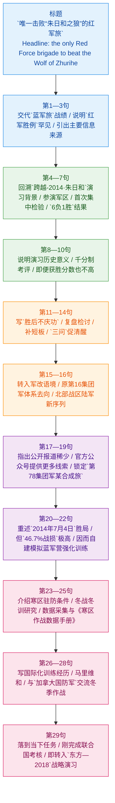

# 揭秘唯一击败“朱日和之狼”的红军旅：近五成超高战损终斩狼成功

> **来源**：澎湃新闻（原发；人民政协网转载）  
> **转载页标题**：揭秘唯一击败朱日和之狼的红军旅：战损近 5 成终获胜  
> **时间**：2018-09-13  
> **作者署名**：澎湃新闻（机构署名；原发页未见具体记者姓名）  
> **编辑**（转载页）：曾珂

## 前情提要



## 文章信息

- **来源网站**：你提供的文本来自 `人民政协网` 转载页；原发媒体为 `澎湃新闻`
- **题目**：`揭秘唯一击败朱日和之狼的红军旅：近五成超高战损终斩狼成功`
- **转载页标题**：`揭秘唯一击败朱日和之狼的红军旅:战损近5成终获胜`
- **发布日期**：`2018年9月13日`
- **作者署名**：`澎湃新闻`（机构署名；原发页未见具体记者姓名）
- **编辑信息**：转载页标注 `曾珂`
- **作者/机构背景简介**：`澎湃新闻` 为上海东方报业有限公司旗下综合性新闻平台。澎湃自述其由《东方早报》团队打造，并于 `2014年7月22日` 全面上线；官方页面显示版权主体为 `上海东方报业有限公司`。
- **参考链接**：
  - 原发页：[澎湃原发页](https://m.thepaper.cn/yidian_promDetail.jsp?contid=2435402&from=yidian)
  - 官方页面：[澎湃 work_us](https://www.thepaper.cn/work_us)
  - 澎湃自述上线背景：[新闻详情](https://www.thepaper.cn/newsDetail_forward_1285620)

## 逐句精读

🔸 `揭秘`唯一击败`"朱日和之狼"`的`红军旅`：/近`五成`超高战损，/终斩狼成功。  
🔹 An `inside look at` the only `Red Force brigade` ever to defeat the `“Wolf of Zhurihe”`: it finally prevailed despite sustaining an extraordinarily high `near-50 percent loss rate`.

背景注释：`朱日和`通常指内蒙古的`朱日和训练基地`，是中国最知名的大型陆军训练基地之一；`蓝军/红军`是演训中的对抗双方，不是历史语境中的“红军长征”那个`红军`。

> **`inside look at`** /ˌɪnˈsaɪd lʊk æt/ phr. a detailed view or explanation of something from within 对某事的内部披露、深入揭示。语域：新闻标题。画龙点睛：标题里常用来对应中文`揭秘`，比单纯 `introduction to` 更有“带你看内部情况”的新闻感；写作中可替换平淡的 `about`，增强标题吸引力。

> **`loss rate`** /lɔːs reɪt/ n. the proportion of personnel or equipment lost 损失率；战损率。语域：军事、统计。画龙点睛：军事报道里可指人员、装备或综合损失，常与 `casualty rate` 相关但不完全等同；做阅读时要看上下文判断是`战损`、`减员`还是更宽泛的`损耗`。

---

🔸 不少`军迷`都知道，/著名的`“中国第一蓝军旅”`陆军第81集团军某合成旅，/曾先后参加33场`实兵对抗演习`，/取得32胜1负的辉煌战绩，/被称为`“朱日和之狼”`。  
🔹 Many `military enthusiasts` know that a certain combined-arms brigade under the PLA Army’s `81st Group Army`, famed as `China’s first premier Blue Force brigade`, took part in 33 `live-force opposition exercises`, won 32 of them and lost only once, and was therefore dubbed the `“Wolf of Zhurihe.”`

背景注释：`蓝军`即在演训中扮演假想敌的部队；`第81集团军`是军改后的陆军集团军序列之一；`合成旅`大体对应英文里的 `combined-arms brigade`，强调多兵种编成。

> **`military enthusiast`** /ˈmɪləteri ɪnˈθuːziæst/ n. a person very interested in military affairs 军事爱好者，军迷。语域：通用、新闻。画龙点睛：`enthusiast` 比 `fan` 更正式，也更适合书面表达；常见搭配有 `history enthusiast`、`car enthusiast`。写作中用它能避免反复使用口语化的 `fan`。

> **`be dubbed`** /dʌbd/ v. to be given a particular name or title 被冠以，被称为。语域：新闻、评论。画龙点睛：常见结构是 `be dubbed + 称号`，比 `be called` 更书面，往往暗含媒体或公众“给出一个标签”；阅读中见到它，后面通常跟绰号、头衔或带评价意味的称呼。

---

🔸 不过，/对于那支唯一一次让`“朱日和之狼”`失手，/并最终获得`对抗胜利`的`“红军”`部队，/官方媒体此前的报道并不多。  
🔹 However, there had previously been very little reporting in official media on the `Red Force` unit that caused the `Wolf of Zhurihe` to stumble on its only loss and ultimately `won the confrontation`.

背景注释：这里的`失手`不是字面“手滑”，而是“失利、没能取胜”；`官方媒体`在中文新闻语境里通常指具有官方背景的主流媒体或军队媒体。

> **`stumble`** /ˈstʌmbəl/ v. to make a mistake or suffer a setback 失手；受挫；出差错。语域：新闻、通用。画龙点睛：`stumble` 原义是“绊倒”，引申为“受挫、出现失误”。比 `fail` 更形象，也更含“原本强势却突然受阻”的意味，新闻里很常用来写球队、政客、公司等短暂失利。

---

🔸 仅有的一些信息 /都来自于《`解放军报`》2014年演习之后刊发的系列报道《`回望朱日和，忧患之中见担当`——`“跨越-2014·朱日和”`实兵对抗系列演习调查与思考》。  
🔹 The only information available largely came from a series of post-exercise reports published by the `PLA Daily` in 2014, titled `Looking Back at Zhurihe: Responsibility Revealed Amid a Sense of Vigilance`—an investigative reflection on the `Stride-2014 · Zhurihe` live-force opposition exercise series.

背景注释：`解放军报`是中国军队的重要官方报纸；`回望朱日和，忧患之中见担当`是系列报道总标题；`跨越-2014·朱日和`是演习代号。

> **`series of reports`** /ˈsɪəriːz əv rɪˈpɔːrts/ n. a set of related news reports 系列报道。语域：新闻。画龙点睛：`series` 后既可接单数也可接复数名词搭配，但 `a series of reports` 是固定高频结构；在阅读中常提示“信息并非来自单篇报道，而是持续性报道框架”，有助于判断材料来源的完整性。

---

🔸 上述《`解放军报`》的报道介绍，/2014年5月31日至7月28日，/原`总参`依托北京军区`朱日和训练基地`，/组织`“跨越-2014·朱日和”`实兵对抗系列演习。  
🔹 According to the `PLA Daily` report, from May 31 to July 28, 2014, the former `General Staff Department` organized the `Stride-2014 · Zhurihe` series of live-force opposition exercises by relying on the `Zhurihe Training Base` of the former Beijing Military Region.

背景注释：`总参`是军改前常见简称，完整说法通常为`总参谋部`；`朱日和训练基地`位于内蒙古，是中国陆军重要合同战术训练基地。

> **`rely on`** /rɪˈlaɪ ɒn/ v. to use or depend on 依托；依靠。语域：通用、正式。画龙点睛：中文新闻里的`依托`常可译为 `rely on`、`based on`、`using`，要看语境。这里不是单纯“依赖”，而是“以某基地为平台组织实施”；翻译时不能机械套用“depend on”。

> **`General Staff Department`** /ˈdʒenrəl stɑːf dɪˈpɑːtmənt/ n. a former top-level military staff organ 总参谋部。语域：军事、正式。画龙点睛：遇到中国军改前机构名称，要注意历史时态，常加 `former`；这类专名在翻译中贵在稳定、准确，不宜随意意译，否则会影响机构层级判断。

---

🔸 `南京`、`广州`、`济南`、`沈阳`、`成都`、`兰州`6个军区 /各1支陆军`合成旅`，/轮番与我军第一支`专业化蓝军`——北京军区某`机步旅`展开对抗。  
🔹 One Army `combined-arms brigade` from each of the six military regions—`Nanjing`, `Guangzhou`, `Jinan`, `Shenyang`, `Chengdu`, and `Lanzhou`—took turns confronting the PLA’s first `professional Blue Force`, a `mechanized infantry brigade` under the Beijing Military Region.

背景注释：军改前中国实行`七大军区`体制；这里列出六个军区，是因为充当蓝军的部队来自原`北京军区`；`机步旅`即`机械化步兵旅`。

> **`mechanized infantry brigade`** /ˈmekənaɪzd ˈɪnfəntri brɪˈɡeɪd/ n. a brigade equipped with armored or mechanized transport 机械化步兵旅。语域：军事。画龙点睛：`mechanized` 指依托机械化平台机动，不等于 `motorized` 的一般车辆运输；考试翻译里这类词最容易失分，关键是区分 `armored`、`mechanized`、`combined-arms` 的编成与作战差别。

---

🔸 报道称，/此前，原`总参`结合北京军区某`装甲旅`参加演习，/对陆军合成旅集中检验评估方案规定、细则标准和组织实施流程 /进行了`验证完善`。  
🔹 The report said that before this, the former `General Staff Department`, through an exercise involving an armored brigade under the Beijing Military Region, had `tested and refined` the regulations, detailed criteria, and organizational procedures for the centralized inspection and evaluation of Army combined-arms brigades.

背景注释：`装甲旅`强调以坦克、装甲战车等重型装备为核心；`验证完善`是中文公文高频搭配，表示“先验证、再修订、再完善”。

> **`refine`** /rɪˈfaɪn/ v. to improve something by making small changes 使完善；使更精细。语域：正式、政策、学术。画龙点睛：`refine` 常与 `plan / process / system / method` 搭配，表示在已有基础上打磨优化，比 `improve` 更强调细化与校准；写作中非常适合翻译`完善细则`、`优化流程`这类表达。

---

🔸 由总部组织7个军区的部队 /赴同一训练基地演练，/在我陆军训练史上尚属`首次`；/其7场红蓝对抗，/结果`“红军”6负1胜`，/引起全军震动。  
🔹 It was the first time in the history of PLA Army training that units from all seven military regions, organized by headquarters, trained at the same base; in the seven Red-versus-Blue confrontations, the `Red Force` lost six and won one, sending shock waves through the entire military.

背景注释：这里的`7个军区`包括原北京军区在内的军区体系；`引起全军震动`是新闻写法，意为结果影响很大、在军队内部引发强烈反响。

> **`unprecedented`** /ʌnˈpresɪdentɪd/ adj. never done or known before 前所未有的；空前的。语域：正式、新闻。画龙点睛：本句英文我用结构 `It was the first time...` 来贴合原文；若换一种写法，也可用 `an unprecedented move`。考试中它常用于概括制度、规模、强度等“首次发生”的情况。

---

🔸 报道点评称：/在两个多月的时间里，/我陆军7大军区的参演部队`云集于此`，/轮番与陆军首支专业化模拟`“蓝军”`展开对抗。  
🔹 The commentary noted that over the course of more than two months, participating units from the Army components of all seven military regions `gathered there` and took turns engaging the Army’s first professional simulated `Blue Force`.

背景注释：`云集`是典型书面表达，强调大量人员或力量集中到同一地点；`模拟蓝军`说明这支部队并非真实敌军，而是按假想敌方式建构的专业对手。

> **`gather`** /ˈɡæðər/ v. to come together in one place 聚集；云集。语域：通用、新闻。画龙点睛：虽然是基础词，但在正式语境里可表达规模化集中，不一定比高级词弱；若想更书面，可替换为 `assemble`。考试里熟词能否精准贴义，往往比“生僻词堆砌”更重要。

---

🔸 这场代号为`“跨越-2014·朱日和”`的军事演习，/在中国陆军训练史上 /留下了`浓墨重彩的一笔`。  
🔹 This military exercise, codenamed `Stride-2014 · Zhurihe`, `left a vivid mark` on the history of Chinese Army training.

背景注释：`代号为`在军事和新闻英语中常译作 `codenamed`；`浓墨重彩的一笔`是比喻，用来表示影响突出、地位醒目。

> **`leave a vivid mark`** /liːv ə ˈvɪvɪd mɑːrk/ phr. to leave a striking trace or legacy 留下鲜明印记。语域：新闻、评论、文学化表达。画龙点睛：这是对中文比喻的自然化处理；若直译成 `a thick and colorful stroke` 会不地道。翻译时要学会把汉语修辞转成英语读者自然接受的抽象表达。

---

🔸 另外，/上述军报的报道还透露，/此次演习，导演部按`打仗标准`，/首次运用`千分制检验评估系统` /对参演部队作战能力进行`精确考评`，/7个旅平均成绩是675.6分，/即使唯一获胜的沈阳军区某机步旅，/也没有超过700分。  
🔹 In addition, the report in the military newspaper disclosed that during this exercise, the directing headquarters, using `wartime standards`, for the first time employed a `1,000-point inspection and evaluation system` to conduct a `precise assessment` of the participating units’ combat capability. The average score of the seven brigades was 675.6, and even the only winning mechanized infantry brigade from the Shenyang Military Region scored below 700.

背景注释：`导演部`在演习语境里指演习的组织导调机构，不是影视里的“导演组”；`千分制`就是总分1000分的量化评估方式；`打仗标准`强调训练向实战看齐。

> **`precise assessment`** /prɪˈsaɪs əˈsesmənt/ n. an accurate and exact evaluation 精确评估。语域：正式、军事、学术。画龙点睛：`assessment` 比 `evaluation` 更强调系统性判断过程；`precise` 常与数据化、指标化语境绑定。写作中可用于教育、政策、科研等多种场景，表达比 `careful evaluation` 更专业。

> **`wartime standards`** /ˈwɔːtaɪm ˈstændədz/ n. standards modeled on actual combat or war requirements 战时标准；打仗标准。语域：军事。画龙点睛：这里不是字面“战争期间的标准”，而是“以实战要求衡量训练”；翻译这类词时要抓功能义。遇到中文`按打仗标准`，可灵活处理为 `against combat requirements`、`to wartime standards` 等。

---

🔸 对于`“战后”`总结，/军报当时是这么描述的：/第16集团军某旅 /是`“跨越-2014·朱日和”`演习中 /唯一战胜`“蓝军”`的`红方部队`。  
🔹 As for the post-`battle` review, the military newspaper described it this way: a brigade under the former `16th Group Army` was the only `Red Force` unit to defeat the `Blue Force` in the `Stride-2014 · Zhurihe` exercise.

背景注释：这里的`战后`加引号，说明并非真实战争结束，而是演习结束后的类战后复盘；`红方部队`即演习中的我方、受检部队一侧。

> **`post-battle review`** /pəʊst ˈbætl rɪˈvjuː/ n. a review conducted after combat or a combat-like event 战后复盘；事后检讨总结。语域：军事、正式。画龙点睛：新闻里处理演习语境时，`battle` 往往带引申义；在写作中，`post-event review` 更泛，`post-battle review` 更贴近军事氛围。翻译加引号可保留原文修辞。

> **`Red Force`** /red fɔːs/ n. the force representing one side, usually the friendly/training side in an exercise 红方；红军。语域：军事。画龙点睛：别与历史上的 `Red Army` 混淆。现代军演里常见 `Red Force vs Blue Force`，前者通常是受训部队，后者多为模拟敌情的对抗力量。

---

🔸 令参演官兵没想到的是，/部队`凯旋`，/等待他们的不是庆功会，/而是一场`检讨式复盘总结`。  
🔹 To the surprise of the participating officers and soldiers, when the unit `returned in triumph`, what awaited them was not a celebration, but a `self-critical after-action review`.

背景注释：`凯旋`本有“得胜归来”之意；但本句通过“不是庆功会，而是……”形成明显转折，突出军队强调问题导向而非简单庆功。

> **`after-action review`** /ˈɑːftər ˈækʃn rɪˈvjuː/ n. a structured review after an operation or exercise 行动后复盘；事后评估。语域：军事、管理。画龙点睛：这是现代军事和组织管理中的高频术语，常缩写为 `AAR`；比单纯 `summary` 更强调“复盘过程”。延伸到职场英语，也能用于项目复盘、课程复盘等语境。

---

🔸 该旅自上而下 /反思得失、剖析问题，/补齐`战斗力建设`的`短板`。  
🔹 From top to bottom, the brigade reflected on its gains and losses, analyzed its problems, and moved to shore up the `weak links` in its `combat-capability development`.

背景注释：`自上而下`表示从领导层到基层整体推进；`短板`是中文高频比喻，相当于英语里的 `weak link / shortcoming / deficiency`。

> **`weak link`** /wiːk lɪŋk/ n. the weakest part of a system 薄弱环节；短板。语域：通用、正式。画龙点睛：这是翻译中文`短板`时很实用的自然表达，适用于制度、能力、供应链、论证结构等多种场景。相比直译 `short board`，`weak link` 更地道，也更容易被英语读者接受。

---

🔸 尤其是旅党委提出的`“三问”`，/为官兵注入了一针强有力的`“清醒剂”`。  
🔹 In particular, the brigade Party committee’s `three questions` served as a powerful `wake-up call` for the officers and soldiers.

背景注释：`三问`是文章中的概括说法，强调通过连续追问促使全员反思；`清醒剂`在这里是比喻，表示让人摆脱盲目乐观、恢复清醒判断。

> **`wake-up call`** /ˈweɪk ʌp kɔːl/ n. something that makes people realize a serious problem 警醒；警钟；令人清醒的提醒。语域：通用、新闻。画龙点睛：它既可字面表示“叫醒电话”，也可引申为“警示信号”。阅读中常见于政治、经济、公共卫生等报道，是典型熟词僻义考点。

---

🔸 在此之后，/`军改`大幕开启；/在深化国防和军队改革中，/`“脖子以下”阶段改革` /在打破一头沉的军兵种结构上 /迈出`实质性步伐`。/改革中，/中央军委决定以划归各战区陆军领导的18个集团军为基础 /调整组建13个集团军。  
🔹 After that, the curtain rose on military reform. In the course of deepening national defense and armed-forces reform, the stage of reform `below the neck` made `substantive progress` in breaking the former top-heavy service structure. As part of the reform, the Central Military Commission decided to reorganize 18 group armies assigned to the theater-command armies into 13 group armies.

背景注释：`脖子以下改革`是中文军改语汇，通常指中央军委层级以下的编制体制调整；`一头沉`形象地指结构失衡、上重下轻；`集团军` roughly 对应 `group army`。

> **`substantive`** /səbˈstæntɪv/ adj. real and meaningful, not merely formal 实质性的；有实际内容的。语域：正式、政策、学术。画龙点睛：`substantive progress` 是非常高频的正式搭配，适合翻译`取得实质性进展`。它强调“不是表面动作”，在写作中比单纯 `big`、`important` 更准确、更稳妥。

> **`reorganize`** /ˌriːˈɔːɡənaɪz/ v. to arrange again in a new structure 重组；改编；重新编制。语域：正式、军事、商业。画龙点睛：军改、公司架构调整、部门改组都能用它。与 `adjust` 相比，`reorganize` 更强调结构层面的重新设计；考试翻译遇到`调整组建`时，这是很常用且稳妥的动词。

---

🔸 此次调整改革之后，/处于`“主战”`和`“主建”`交汇点的各战区陆军部队相对均衡，/各辖2至3个新组建集团军。/之前领导原第16、26、39、40集团军的`北部战区陆军`，/下辖新组建的第78、79、80三个集团军。  
🔹 After this round of adjustment and reform, the Army forces under each theater command—positioned at the intersection of `operational responsibility` and `force building`—became relatively balanced, with each commanding two to three newly formed group armies. The `Northern Theater Command Army`, which had previously overseen the former 16th, 26th, 39th, and 40th Group Armies, came to command the newly formed 78th, 79th, and 80th Group Armies.

背景注释：`主战`可理解为偏向作战运用，`主建`则偏向部队建设；`北部战区`是军改后五大战区之一；`下辖`常译 `command / administer / have under its jurisdiction`。

> **`intersection`** /ˌɪntəˈsekʃn/ n. the point at which two things meet 交汇点；交叉点。语域：通用、正式。画龙点睛：基础词在抽象语境里很常见，如 `the intersection of policy and practice`。本句用于翻译制度职能交汇，比机械直译更自然，也能帮助写作中表达“多重角色叠加”。

> **`under one’s command`** /ˈʌndə wʌnz kəˈmɑːnd/ phr. controlled or led by someone 受……指挥；归……指挥。语域：军事、正式。画龙点睛：翻译`下辖`时不必总用 `subordinate to`；若强调编制归属、指挥关系，`command` 往往更贴切。军事英语里这是核心高频搭配，值得牢牢记住。

---

🔸 对于这一唯一一支战胜过`“朱日和之狼”`的`“红军”`部队原第16集团军某旅`去向`，/媒体报道并不多。  
🔹 There was also very little media reporting on the `whereabouts` of the former 16th Group Army brigade—the only `Red Force` unit ever to defeat the `Wolf of Zhurihe`.

背景注释：`去向`在新闻语境里常指“改编后归属到哪里、现在属于哪一支序列”；本句承上启下，把焦点从“历史胜利”转到“改革后身份”。

> **`whereabouts`** /ˈweəraʊbaʊts/ n. the place where someone or something is now located 下落；去向；所在位置。语域：新闻、正式。画龙点睛：它通常作复数形式但语义上可视作单数概念，用于人物、资金、文件、部队归属都很自然。比 `location` 更带“追寻去向”的意味。

---

🔸 不过，/`北部战区陆军政治工作部`主办微信公众号`“向雷锋学习”` /9月12日的一组报道，/则对这支`“挥刀斩狼”`的红军部队 /有了更多的介绍。  
🔹 However, a set of reports published on September 12 by the WeChat public account `Learn from Lei Feng`, run by the `Political Work Department of the Northern Theater Command Army`, provided more information about this Red Force unit that had `struck down the wolf`.

背景注释：`微信公众号`即微信平台上的官方或半官方内容账号；`向雷锋学习`是该部门主办账号名；`挥刀斩狼`属形象化说法，指击败“朱日和之狼”。

> **`provide more information about`** /prəˈvaɪd mɔːr ˌɪnfəˈmeɪʃn əˈbaʊt/ phr. to shed more light on a subject 提供更多介绍；披露更多信息。语域：新闻、说明文。画龙点睛：这类表达看似普通，却极高频；若想更书面，可替换成 `shed more light on`。阅读和写作中掌握这种稳健表达，比追求冷僻词更实用。

---

🔸 `“向雷锋学习”`微信公众号 /在近期的报道中 /详细介绍了参加`“东方－2018”`战略演习的 /第78集团军某`合成旅`。  
🔹 In its recent reports, the WeChat public account `Learn from Lei Feng` gave a detailed introduction to a `combined-arms brigade` under the `78th Group Army` that was taking part in the `Vostok-2018` strategic exercise.

背景注释：`东方-2018`通常对应俄语军演名 `Vostok-2018`；中国媒体有时写作`东方－2018`，英语处理时常直接用通行名称 `Vostok-2018`。

> **`strategic exercise`** /strəˈtiːdʒɪk ˈeksəsaɪz/ n. a large-scale military drill at the strategic level 战略演习。语域：军事。画龙点睛：与 `tactical exercise`、`field exercise` 相比，`strategic` 强调层级更高、规模更大、涉及更宏观的兵力运用。军事类阅读中，分清这些层级词非常关键。

---

🔸 报道称：/2014年7月4日，/内蒙古`朱日和训练基地`，/铁流奔涌，电磁激荡，/几番`鏖战`过后，/担任`“红军”`的该旅 /以微弱优势战胜了我军的`专业化模拟蓝军`，/取得了至今为止33场`“跨越朱日和”`系列实兵对抗演习 /唯一一场胜利。  
🔹 The report said that on July 4, 2014, at the `Zhurihe Training Base` in Inner Mongolia, after several rounds of fierce fighting amid surging armored columns and intense electromagnetic confrontation, the brigade acting as the `Red Force` narrowly defeated the PLA’s `professional simulated Blue Force`, securing what remains the only victory in the 33 `Stride across Zhurihe` live-force opposition exercises.

背景注释：`铁流奔涌，电磁激荡`是带文采的军事新闻写法，前者指装甲突击力量快速机动，后者指电子对抗环境激烈；`鏖战`指激战、苦战。

> **`narrowly defeat`** /ˈnærəʊli dɪˈfiːt/ v. to beat someone by only a small margin 险胜；以微弱优势战胜。语域：新闻、体育、军事。画龙点睛：`narrowly` 常和胜负、逃脱、避免等结果搭配，如 `narrowly win / narrowly avoid`。它能够精准表达“差一点、幅度很小”，是阅读和写作都很值得掌握的副词。

> **`simulated`** /ˈsɪmjəleɪtɪd/ adj. made to imitate real conditions 模拟的。语域：军事、科技、教育。画龙点睛：`simulate` 是高频学术词，既可用于军演，也可用于实验、训练、仿真系统。比单纯 `fake` 正式得多，也没有贬义；看到它要想到“按真实条件构造出来”。

---

🔸 虽然胜了，/然而`“一班人”`却认为 /胜得并不`荣光`，/`46.7%`的超高`战损` /让他们反思距离`实战标准`的差距。  
🔹 Although they won, the brigade’s leading team believed the victory was `far from glorious`; the extraordinarily high `46.7 percent loss rate` forced them to reflect on how far they still were from `real combat standards`.

背景注释：`一班人`在中文政治军事语境里常指一个领导班子或核心带队群体，不是字面“一班人员”；`实战标准`强调训练结果必须尽量贴近真正作战要求。

> **`far from glorious`** /fɑː frəm ˈɡlɔːriəs/ phr. not something worthy of much pride 并不光彩；谈不上荣耀。语域：评论、叙述。画龙点睛：`far from + adj.` 是非常好用的写作结构，表示“远非……、绝不……”。如 `far from ideal`、`far from enough`。它能使评价更克制、更书面。

> **`combat standards`** /ˈkɒmbæt ˈstændədz/ n. standards required in actual combat 实战标准。语域：军事。画龙点睛：这里可译 `real combat standards` 来帮助读者理解，不宜误成一般性的“比赛标准”。`combat` 常与 `readiness / capability / effectiveness` 连用，是军事新闻高频核心词。

---

🔸 就在那年，/部队驻地城市郊区的一片空地上，/该旅组建了自己的`模拟蓝军合成营`，/作为实战化训练的`“磨刀石”`，/轮番与`建制营连`进行`真打实抗`，/逼着部队训练向`实战聚焦`。  
🔹 Later that same year, on an open tract in the outskirts of the city where the unit was stationed, the brigade formed its own `simulated Blue Force combined battalion`. It served as a `whetstone` for realistic training, taking turns conducting hard, unscripted confrontations with organically structured battalions and companies, thereby forcing training to `focus on real combat`.

背景注释：`合成营`是更小一级的多兵种合成作战单位；`建制营连`指按原有正式编制存在的营、连；`真打实抗`强调尽量去脚本化、按对抗方式训练。

> **`whetstone`** /ˈwetstəʊn/ n. a stone used to sharpen blades; figuratively, something that hones ability 磨刀石。语域：通用、比喻。画龙点睛：它的字面义很具体，因此引申义也很形象，常用于写“艰苦环境是成长的磨刀石”。把中文比喻自然转换成英语时，这是非常贴切的词。

> **`organically structured`** /ɔːˈɡænɪkli ˈstrʌktʃəd/ adj. existing in normal formation or establishment 按建制编成的；建制内的。语域：军事。画龙点睛：军事语境里的 `organic` 不是“有机食品”的那个意思，而是“隶属于某编制、固有编成”。这是典型熟词僻义，考试里很容易误判。

---

🔸 报道还介绍：/作为`纬度最高`的野战部队，/该旅驻地冬季`降雪期`长达5个多月，/积雪平均深达20厘米以上。  
🔹 The report also noted that, as the field unit stationed at the `highest latitude`, the brigade’s garrison area has a winter `snow season` lasting more than five months, with average snow depth exceeding 20 centimeters.

背景注释：`纬度最高`说明驻地更靠北，通常意味着气候严寒、昼夜变化和冬训条件更加特殊；`野战部队`指具备机动作战、外场部署能力的地面作战部队。

> **`latitude`** /ˈlætɪtjuːd/ n. a geographic measure of north-south position 纬度。语域：地理、正式。画龙点睛：`high latitude` 不只是一条地理信息，往往还隐含寒冷、光照变化大、补给困难等背景。阅读时把地理词和环境条件关联起来，理解会更深。

---

🔸 着眼提升部队`全天候作战能力`，/打造特色`冬战冬训`，/他们坚持围绕`“冬季作战制胜机理”`、`“武器装备冬季作战性能”`和`“严寒条件下官兵作战能力”` /钻研`打仗课题`。  
🔹 With a view to improving the troops’ `all-weather combat capability` and building a distinctive program of winter operations and winter training, they kept studying key `warfighting topics`, including the mechanisms of victory in winter operations, the winter performance of weapons and equipment, and the combat ability of officers and soldiers under severe cold conditions.

背景注释：`全天候作战能力`指在雨雪、夜暗、严寒等复杂天气条件下持续作战的能力；`制胜机理`是军事理论语言，强调“如何形成优势并取胜”的内在逻辑。

> **`all-weather`** /ˌɔːl ˈweðə/ adj. able to operate in all weather conditions 全天候的。语域：军事、航空、科技。画龙点睛：它既可修饰 `capability`、`operation`，也可修饰 `road`、`facility`。在写作中用它表达“受天气影响较小”的能力，简洁而专业。

> **`warfighting`** /ˈwɔːfaɪtɪŋ/ adj./n. relating to the conduct of combat 作战的；战争行动的。语域：军事。画龙点睛：这是军事英语中的核心词之一，常见搭配有 `warfighting capability`、`warfighting concept`。比一般的 `combat-related` 更像术语，用在政策或军事实务文本里很自然。

---

🔸 另外，/该旅先后两次担任战区`冬季作战试点任务`，/累计采集了涵盖`装备性能`、`战场环境`、`作战指挥`等方面 /千余组数据，/形成《`寒区作战数据手册`》，/为我军冬季作战提供了基本的`数据支撑`。  
🔹 In addition, the brigade twice undertook theater-command `pilot tasks` for winter operations. It collected more than a thousand sets of data covering equipment performance, battlefield environment, and operational command, compiled them into a `Handbook of Cold-Region Combat Data`, and thereby provided foundational `data support` for the PLA’s winter operations.

背景注释：`试点任务`常指先行先试、为后续推广积累经验；`寒区作战数据手册`说明其成果已从训练经验上升为资料化、手册化成果。

> **`pilot`** /ˈpaɪlət/ adj. serving as a trial before wider use 试点的；先导的。语域：政策、管理、军事。画龙点睛：`pilot program / pilot task / pilot project` 都是高频表达。它不是“飞行员”那个词义，而是熟词僻义的“试行、试点”。阅读中要靠搭配判断意思。

> **`data support`** /ˈdeɪtə səˈpɔːt/ n. support provided by data 数据支撑。语域：正式、科技、政策。画龙点睛：中文报道里的`提供数据支撑`翻译成这个短语很稳妥；若想更地道，也可写 `provide an empirical basis`。两者侧重略不同，前者偏“支持”，后者偏“依据”。

---

🔸 除此以外，/该旅还`走出国门`交流`实战经验`，/迈向战场`磨练`打赢本领。  
🔹 Beyond that, the brigade also `went abroad` to exchange `practical combat experience` and moved closer to real battlefields to `hone` its war-winning skills.

背景注释：`走出国门`强调训练交流不再局限国内；`打赢本领`是军事表述，核心是“具备在未来战争中取胜的能力”。

> **`hone`** /həʊn/ v. to sharpen and improve a skill 磨练；打磨；提高。语域：正式、通用。画龙点睛：它和前文 `whetstone` 在意象上呼应，都是“磨刀”系统。`hone a skill / ability / instinct` 极常见，写作中比普通的 `improve` 更有“持续打磨”的感觉。

---

🔸 2016年5月，/该旅派出170人赴`马里`执行`维和任务`，/梳理总结出`警戒防卫`、`工事构筑`等方面 /战场经验34条；  
🔹 In May 2016, the brigade sent 170 personnel to `Mali` on a `peacekeeping mission`, and from that deployment it sorted out and summarized 34 items of battlefield experience in such areas as sentry security and `fortification` construction.

背景注释：`马里`位于西非，长期存在复杂安全问题，也是联合国维和行动的重要任务区之一；`工事构筑`指掩体、障碍、阵地等野战防护工程建设。

> **`peacekeeping mission`** /ˈpiːsˌkiːpɪŋ ˈmɪʃn/ n. a mission carried out to help maintain peace, often under the UN 维和任务。语域：国际关系、军事。画龙点睛：常见于联合国语境，可进一步搭配 `UN peacekeeping mission`。写作时它比简单的 `mission for peace` 专业得多，是时政与翻译中的标准表达。

---

🔸 2017年12月，/与`加拿大国防军`就`冬季作战`开展`深入交流`，/学习外军`极寒条件下`野外生存技能……  
🔹 In December 2017, it carried out `in-depth exchanges` with the `Canadian Armed Forces` on `winter operations`, learning field-survival skills used by foreign militaries under `extreme cold` conditions.

背景注释：`加拿大国防军`即 Canada’s military, 常见正式英文为 `Canadian Armed Forces`；加拿大因高纬度和寒冷环境，常被视为冬季作战与寒区生存训练的重要参考对象。

> **`in-depth`** /ˌɪn ˈdepθ/ adj. thorough and detailed 深入的；深度的。语域：正式、新闻、学术。画龙点睛：`in-depth analysis / discussion / exchange` 都很常见。它不是简单的“时间长”，而是“内容深、程度深”；写作时能很好替代平淡的 `deep`。

> **`extreme cold`** /ɪkˌstriːm ˈkəʊld/ n. very severe low-temperature conditions 极寒。语域：气象、军事、新闻。画龙点睛：表达严寒环境时，`extreme cold` 简洁而专业；比 `very cold weather` 更像正式文体。翻译中文`极寒条件`时，这是非常稳的选项。

---

🔸 如今，/这支刚刚完成`联合国`对`维和待命部队`考核任务的 /第78集团军某合成旅官兵`征尘未洗`，/即刻受领参加`“东方—2018”`战略演习任务，/再度为国出征。  
🔹 Now, the officers and soldiers of this combined-arms brigade under the `78th Group Army`, having just completed a `United Nations` assessment of its `standby peacekeeping force`, and with the dust of deployment still upon them, immediately received orders to take part in the `Vostok-2018` strategic exercise and once again set out on a mission for the country.

背景注释：`维和待命部队`可理解为已进入待命序列、接受国际标准考核、可在需要时执行维和任务的部队；`征尘未洗`是汉语修辞，强调刚结束上一项任务便立刻转入下一项任务。

> **`standby`** /ˈstændbaɪ/ adj. ready to be used or called upon when needed 待命的；备用的。语域：正式、军事、技术。画龙点睛：`standby force`、`standby unit` 都表示“处于备便状态、随时可投入”。它不是简单的 `waiting`，而是“已准备好，只待命令”的状态词。

> **`receive orders`** /rɪˈsiːv ˈɔːdəz/ phr. to be officially assigned or instructed to do something 受领命令；接到任务。语域：军事、正式。画龙点睛：中文`受领任务`不宜硬译成 `accept a task`；军事语境里 `receive orders / be tasked with` 更专业。做翻译时，要始终让动词体现机构性、命令性和行动性。

---

以上即为整理后的全文逐句精读笔记。

---

来源：澎湃新闻（转载于人民政协网）
时间：2018年09月13日
编辑：曾珂

```markdown
[文章结构信息图]
1. 标题及导引：核心事件——红军旅击败“朱日和之狼”及“战损近五成”的惨烈代价。
2. 蓝军背景介绍：
   2.1 介绍“中国第一蓝军旅”（陆军第81集团军某旅）的身份与32胜1负的辉煌战绩。
   2.2 引出唯一的“失手”案例：某神秘“红军”部队的胜利。
3. 演习背景追溯：
   3.1 明确演习代号与时间：“跨越-2014·朱日和”实兵对抗系列演习（2014.05-07）。
   3.2 演习规模：6大军区合成旅轮番对抗专业化蓝军。
   3.3 历史地位：我陆军训练史上首次由总部组织、7场对抗、6负1胜的震撼结果。
4. 战绩与复盘细节：
   4.1 评估标准：首次运用千分制检验评估系统。
   4.2 获胜部队身份初步揭秘：原沈阳军区第16集团军某旅（唯一胜者，分值未过700）。
   4.3 态度转变：凯旋后的“检讨式复盘”及“三问”清醒剂。
5. 军改后的编制变迁：
   5.1 “脖子以下”改革：18个集团军调整组建为13个集团军。
   5.2 隶属关系调整：北部战区陆军下辖第78、79、80集团军。
6. 该旅（第78集团军某合成旅）的深度写实：
   6.1 战胜细节补充：以46.7%的高战损代价惨胜。
   6.2 强军举措：组建自己的模拟蓝军合成营。
   6.3 特色战力：高纬度冬训、严寒条件下作战数据采集（《寒区作战数据手册》）。
7. 国际化与实战化展望：
   7.1 海外经验：马里维和行动（2016年）、中加冬季作战交流（2017年）。
   7.2 最新动向：参加“东方-2018”战略演习，再次受领国家任务。
```

**揭秘唯一击败朱日和之狼的红军旅:战损近5成终获胜**

> 【朱日和】**Zhurihe Training Base**。位于内蒙古自治区锡林郭勒盟苏尼特右旗朱日和镇，是**亚洲最大、功能最全、现代化程度最高**的陆军训练基地。其占地面积约1000多平方公里，是全军唯一的“复杂电磁环境建设试点单位”。
> 【红军/蓝军】**OPFOR (Opposing Force)**。演习中，我方参演部队通常被称为“红军”，而专门负责模拟敌军（通常模拟强敌军事组织结构和战法）的专业化部队被称为“蓝军”。

不少军迷都知道，著名的“中国第一蓝军旅”陆军第81集团军某合成旅，曾先后参加33场实兵对抗演习，取得32胜1负的辉煌战绩，被称为“朱日和之狼”。

> 【陆军第81集团军】隶属于**中部战区陆军**，军部驻地为河北省张家口市。其前身为著名的原第65集团军。
> 【合成旅】**Combined Arms Brigade**。军改后陆军的基本作战单元，通过将步兵、装甲兵、炮兵、防空兵等多个兵种有机整合，实现由“兵种协作”向“兵种合成”的质变。
> 【战绩/战果】近义词：战果、成果。**Record/Achievement**。
> 【朱日和之狼】喻指蓝军旅动作迅猛、战法狡黠、攻击性极强。**Wolf of Zhurihe**。

不过， 对于那支唯一一次让“朱日和之狼”失手，并最终获得对抗胜利的“红军”部队，官方媒体此前的报道并不多。

> 【失手】本意是动作不慎，此处指蓝军在维持不败金身时的唯一一次败北。反义词：得手、成功。
> 【金句积累】**“不鸣则已，一鸣惊人。”** 该部队此前虽报道不多，但一经披露便是打破神话的“斩狼”勇士。

仅有的一些信息都来自于《解放军报》2014年演习之后刊发的系列报道《回望朱日和，忧患之中见担当 ——“跨越-2014·朱日和”实兵对抗系列演习调查与思考》。

> 【《解放军报》】**PLA Daily**。中共中央军事委员会机关报，是中国最具权威性的军事报纸。
> 【回望/回顾】**Looking back/Retrospect**。近义词：回顾、反思。

上述《解放军报》的报道介绍，2014年5月31日至7月28日，原总参依托北京军区朱日和训练基地，组织“跨越-2014·朱日和”实兵对抗系列演习。南京、广州、济南、沈阳、成都、兰州6个军区各1支陆军合成旅，轮番与我军第一支专业化蓝军——北京军区某机步旅展开对抗。

> 【原总参】全称**中国人民解放军总参谋部**。2016年军改后，相关职能划归中央军委联合参谋部。
> 【北京军区】军改前七大军区之一，现相关区域主要划入**中部战区**。
> 【轮番】**In turns/Take turns**。近义词：接连、轮流。
> 【机步旅】**Mechanized Infantry Brigade**。以装甲输送车或步兵战车为主要装备的步兵部队，强调高机动性与突击力。

报道称，此前，原总参结合北京军区某装甲旅参加演习，对陆军合成旅集中检验评估方案规定、细则标准和组织实施流程进行了验证完善。由总部组织7个军区的部队赴同一训练基地演练，在我陆军训练史上尚属首次，其7场红蓝对抗，结果“红军”6负1胜，引起全军震动。

> 【检验评估】**Test and Evaluation (T&E)**。
> 【震动】形容影响巨大，引起广泛关注。近义词：震惊、轰动。**Shock/Tremor**。
> 【背景补充】在此之前的演习常带有“演戏”成分，红军必胜。2014年的朱日和演习打破了这一潜规则，确立了**“重真、重难、重实”**的实战化导向。

报道点评称：在两个多月的时间里，我陆军7大军区的参演部队云集于此，轮番与陆军首支专业化模拟“蓝军”展开对抗。这场代号为“跨越-2014·朱日和”的军事演习，在中国陆军训练史上留下了浓墨重彩的一笔。

> 【浓墨重彩】指绘画或描述时用墨重，色彩艳丽。引申为在重要历史节点上进行重点刻画。**In glowing colors**。
> 【云集】形容许多人或事物聚集在一起。近义词：荟萃、聚集。

另外，上述军报的报道还透露，此次演习，导演部按打仗标准，首次运用千分制检验评估系统对参演部队作战能力进行精确考评，7个旅平均成绩是675.6分，即使唯一获胜的沈阳军区某机步旅，也没有超过700分。

> 【导演部】**Exercise Control**。负责演习计划制定、导调实施和裁决评估的组织机构。
> 【千分制】**Thousand-point System**。一种精细化的定量考核方式，比传统的及格/不及格评价更具科学性。
> 【沈阳军区】军改前七大军区之一，现相关区域主要划入**北部战区**。

对于“战后”总结，军报当时是这么描述的：第16集团军某旅是“跨越-2014·朱日和”演习中唯一战胜“蓝军”的红方部队。令参演官兵没想到的是，部队凯旋，等待他们的不是庆功会，而是一场检讨式复盘总结。该旅自上而下反思得失、剖析问题，补齐战斗力建设的短板。尤其是旅党委提出的“三问”，为官兵注入了一针强有力的“清醒剂”。

> 【凯旋】**Return in triumph**。反义词：败北、战败。
> 【检讨式复盘】**After Action Review (AAR)**。借鉴棋类术语“复盘”，指在战斗结束后重新梳理过程，重点寻找失误与不足。
> 【短板】**Weak link/Short board**。源自木桶理论，指战斗力体系中最薄弱的环节。
> 【清醒剂】**Sobering agent/Wake-up call**。喻指促使人保持头脑清醒的事物。

在此之后，军改大幕开启，在深化国防和军队改革中，“脖子以下”阶段改革在打破一头沉的军兵种结构上迈出实质性步伐。改革中，中央军委决定以划归各战区陆军领导的18个集团军为基础调整组建13个集团军。

> 【深化国防和军队改革】**Deepening Reform on National Defense and the Armed Forces**。2015年启动的系统性改革。
> 【“脖子以下”改革】指在军委办公厅、总部机关等“脖子以上”改革完成后，针对师、旅、团、营等**作战部队及基层单位**的结构重塑。
> 【一头沉】比喻分配不均或结构不合理。此处指旧体制中陆军占比过大或机关臃肿。
> 【18个调整为13个】2017年4月，国防部宣布调整组建13个集团军，番号分别为第71至第83集团军。

此次调整改革之后，处于“主战”和“主建”的交汇点的各战区陆军部队相对均衡，各辖2至3个新组建集团军。之前领导原第16、26、39、40集团军的北部战区陆军下辖新组建的第78、79、80三个集团军。

> 【主战与主建】**Combat and Construction**。军改后确立了“军委管总、战区主战、军种主建”的总原则。
> 【北部战区】**Northern Theater Command**。司令部驻地为沈阳，领导和指挥辽宁、吉林、黑龙江、内蒙古、山东五省区的武装力量。

对于这一唯一一支战胜过“朱日和之狼”的“红军”部队原第16集团军某旅去向，媒体报道并不多。

> 【去向】**Whereabouts/Direction**。指改革后的编制调整和驻地变化。

不过， 北部战区陆军政治工作部主办微信公众号“向雷锋学习”9月12日的一组报道则对这只“挥刀斩狼”的红军部队有了更多的介绍。

> 【政治工作部】负责思想建设、党组织建设、干部管理等工作的机构。
> 【向雷锋学习】北部战区陆军的官方发布平台。雷锋生前所在的第79集团军（原第40集团军）隶属于该战区。

“向雷锋学习”微信公众号在近期的报道中详细介绍了参加“东方－2018”战略演习的第78集团军某合成旅。

> 【东方－2018】**Vostok-2018**。俄罗斯主办的战略级大规模军事演习，中国军队首次受邀参加，出兵3200余人。这是我军历史上派员出境参加演习规模最大的一次。

报道称：2014年7月4日，内蒙古朱日和训练基地，铁流奔涌，电磁激荡，几番鏖战过后，担任“红军”的该旅以微弱优势战胜了我军的专业化模拟蓝军，取得了至今为止33场“跨越朱日和”系列实兵对抗演习唯一一场胜利。虽然胜了，然而“一班人”却认为胜得并不荣光，46.7%的超高战损让他们反思距离实战标准的差距。就在那年，部队驻地城市郊区的一片空地上，该旅组建了自己的模拟蓝军合成营，作为实战化训练的“磨刀石”，轮番与建制营连进行真打实抗，逼着部队训练向实战聚焦。

> 【铁流】形容坦克、装甲车辆纵队。近义词：钢铁洪流。
> 【电磁激荡】指复杂的**电子战（Electronic Warfare）**对抗。
> 【鏖战】**Fierce battle**。近义词：苦战、血战。
> 【一班人】此处特指旅党委领导班子。
> 【战损】**Attrition Rate/Combat Loss**。指在战斗中损失的人员和装备。46.7%意味着该旅在名义上已基本丧失持续作战能力。
> 【磨刀石】比喻用于锤炼技艺的对象。**Whetstone**。

报道还介绍：作为纬度最高的野战部队，该旅驻地冬季降雪期长达5个多月，积雪平均深达20厘米以上。着眼提升部队全天候作战能力，打造特色冬战冬训，他们坚持围绕“冬季作战制胜机理”“武器装备冬季作战性能”和“严寒条件下官兵作战能力”钻研打仗课题。

> 【纬度】**Latitude**。该旅（第78集团军某合成旅）驻扎于黑龙江省，是我军最北端的野战部队之一。
> 【全天候】**All-weather**。指在各种气象条件下都能执行任务。
> 【制胜机理】**Victory-winning mechanism**。指战争取胜的内在逻辑和规律。

另外，该旅先后两次担任战区冬季作战试点任务，累计采集了涵盖装备性能、战场环境、作战指挥等方面千余组数据，形成《寒区作战数据手册》，为我军冬季作战提供了基本的数据支撑。

> 【试点】**Pilot project/Experiment**。
> 【寒区作战】**Cold-weather operations**。严寒条件下，火炮润滑油易凝固，电池效能下降，数据支撑至关重要。

除此以外，该旅还走出国门交流实战经验，迈向战场磨练打赢本领。2016年5月，该旅派出170人赴马里执行维和任务，梳理总结出警戒防卫、工事构筑等方面战场经验34条；2017年12月，与加拿大国防军就冬季作战开展深入交流，学习外军极寒条件下野外生存技能……

> 【马里维和】**Peacekeeping in Mali**。马里位于西非，气候炎热、反恐形势极其严峻。该旅派出的是第四批赴马里维和工兵和医疗分队。
> 【加拿大国防军】**Canadian Armed Forces (CAF)**。加拿大作为北极圈国家，拥有丰富的冬季作战和极寒生存经验。
> 【金句积累】**“他山之石，可以攻玉。”** 学习外军经验是为了更好地提升自身。

如今，这支刚刚完成联合国对维和待命部队考核任务的第78集团军某合成旅官兵征尘未洗，即刻受领参加“东方—2018”战略演习任务，再度为国出征。

> 【征尘未洗】形容刚从前线或外地回来，还没来得及休息就又投入新的战斗。**Unwashed dust of travel**。
> 【维和待命部队】**UN Peacekeeping Readiness Force**。一旦有联合国授权，可随时派往任务区的后备力量。
