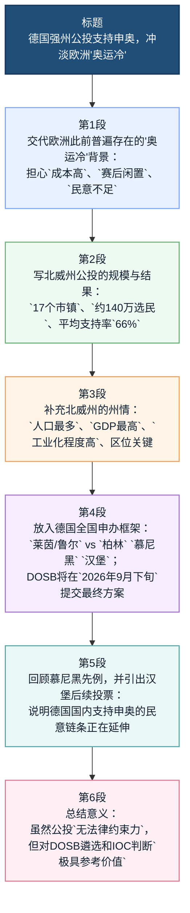

# 【欧盟动态】德国经济强州力挺申奥 打破欧洲「奥运冷」传闻

**来源**：综合国际体育报道与德新社（DPA）  
**时间**：2026 年 4 月

## 前情提要（文章结构信息图）

1. **背景导入**：欧洲申奥困局与德国「反其道而行之」
   1.1 **现状分析**：欧洲普遍存在的「奥运冷（Olympic Fatigue）」及其成因（高成本、赛后闲置）  
   1.2 **核心事件**：德国北威州（NRW）4 月 19 日举行申奥公投  
   1.3 **总体评价**：打破传闻，注入强大动力  
2. **投票细节与民意数据**
   2.1 **参与规模**：涵盖 17 个市镇，约 140 万选民参与  
   2.2 **支持率分布**：平均支持率 66%，局部超过 70%  
   2.3 **专项功能区**：基尔（Kiel）以 63.5% 支持率锁定帆船赛承办意向  
3. **北威州（NRW）的战略地位分析**
   3.1 **经济实力**：德国人口最多、GDP 最高、工业化程度最高的联邦州  
   3.2 **地理区位**：德国西部门户，邻近比利时、荷兰，欧洲交流中心  
4. **德国申奥的顶层设计与路线图**
   4.1 **候选版图**：莱茵/鲁尔、柏林、慕尼黑、汉堡四大申办地区  
   4.2 **决策机制**：德国奥体联（DOSB）负责综合考量，2026 年 9 月提交最终方案  
   4.3 **弹性时间窗**：目标锁定 2036 年至 2044 年间的任一届奥运会  
5. **全德范围内的联动响应**
   5.1 **慕尼黑**：去年 10 月先行通过公投（2/3 多数支持）  
   5.2 **汉堡**：计划 2026 年 5 月举行民意表决  
6. **结论**：民意基础与国际话语权
   6.1 **逻辑支撑**：国际奥委会（IOC）对公众支持率的硬性考量  
   6.2 **战略意义**：经济强州背书，增强德国申办的国际砝码  

---

## 精读笔记全文

此前，不少欧洲国家因民众担忧举办奥运会将带来高昂成本、赛后场馆闲置等问题，对举办奥运会普遍热情不高，呈现出**「奥运冷」**的态势。

> **【注释解析】**
>
> - **「奥运冷」（Olympic Fatigue/Apathy）**：指近年来由于奥运会承办费用激增（Exorbitant Costs）、安保压力大及**「白象工程」**（White Elephant，指耗资巨大但赛后利用率低、维护费用高的设施）问题，导致欧洲多国（如之前的汉堡、罗马、波士顿等）民众在公投中否决申奥，或政府主动退出的现象。  
> - **态势（Trend/Situation）**：事物发展的形势。**金句积累**：深刻把握世界体育政治发展的**复杂态势**，在变局中寻找转机。  
> - **场馆闲置**：近义词为**设施空置**、**资源错配**。  

然而，当地时间 4 月 19 日，德国**北莱茵-威斯特法伦州**就是否支持该州参与申办夏季奥运会举行**公投**，当地民众积极参与，最终以高支持率表明积极态度，为德国申办夏季奥运会注入强大动力。

> **【注释解析】**
>
> - **北莱茵-威斯特法伦州（North Rhine-Westphalia，简称 NRW）**：德国 16 个联邦州之一，是德国的**经济心脏**（Industrial Heartland）。  
> - **公投（Referendum）**：由全体选民对重大问题进行的直接投票。在西方政治语境下，体育赛事申办往往需要通过此程序以获取**合法性基础**（Legitimacy）。  
> - **注入强大动力**：高级表达。近义词：**提供有力支撑**、**按下「快进键」**。  

此次公投在北莱茵-威斯特法伦州的 17 个市镇中举行，约 140 万选民参与投票，体现了极高的参与热情。投票显示平均支持率达到 66%，部分市镇支持率更是超过 70%，其中北部城市**基尔**以 63.5% 的多数票通过了相关投票，若申办成功，基尔将承办帆船赛事。

> **【注释解析】**
>
> - **基尔（Kiel）**：位于德国北部石勒苏益格-荷尔斯泰因州的首府，是著名的海港城市和**帆船之都**。虽然它不在北威州境内，但在德国联合申奥框架下常作为水上项目承办点（曾承办 1936 年和 1972 年奥运帆船赛）。  
> - **多数票（Majority vote）**：注意其与「绝对多数（Absolute Majority）」的辨析。  
> - **参与热情**：易混淆词辨析——**参与度（Participation rate）**侧重数据，**热情（Enthusiasm）**侧重主观态度。  

北莱茵-威斯特法伦州作为德国人口最多、GDP 最高、工业化程度最高的联邦州，地理位置优越，它位于德国西部，首府为**杜塞尔多夫**，面积约 3.4 万平方公里，还邻近比利时和荷兰，在欧洲经济交流与合作中占据重要地位。

> **【注释解析】**
>
> - **杜塞尔多夫（Düsseldorf）**：北威州首府，不仅是重要的国际会展中心，也是欧洲著名的广告、服装和通信业中心。  
> - **地理位置优越**：常用成语——**四通八达**、**地处枢纽**。  
> - **工业化程度（Level of Industrialization）**：该州拥有历史悠久的**鲁尔工业区**，目前已成功实现从传统钢铁化工向高科技和现代服务业的**转型升级**。  

该州的莱茵/鲁尔地区，涵盖科隆、杜塞尔多夫和多特蒙德等知名城市，是德国四个申办地区之一，另外三个分别是柏林、慕尼黑和汉堡。**德国奥林匹克体育联合会**将综合考量这四个申办方案，并于 2026 年 9 月下旬向**国际奥林匹克委员会**提交最终方案。

> **【注释解析】**
>
> - **莱茵/鲁尔地区（Rhine-Ruhr Region）**：欧洲最大的大都市区之一，具有**多中心（Polycentric）**城市群特征，办赛优势在于现有体育设施密集，无需大规模新建。  
> - **德国奥林匹克体育联合会（DOSB）**：德国负责奥林匹克运动的最高组织。  
> - **国际奥林匹克委员会（IOC）**：总部位于瑞士洛桑。  
> - **考量（Consideration）**：近义词为**衡量**、**评判**、**甄选**。  

为增加申办成功几率，德国奥林匹克体育联合会并未选定特定年份，而是保留多种选择，目标是在 2036 年至 2044 年间至少举办一届奥运会。

> **【注释解析】**
>
> - **2036 年**：因恰逢 1936 年柏林奥运会（二战前）100 周年，在德国国内曾引发关于**历史反思**与**形象重塑**的辩论。保留多种年份选择体现了**策略灵活性**（Strategic Flexibility）。  
> - **几率（Probability）**：易混淆词辨析——**概率**（科学统计），**胜算**（更具竞争语境）。  

去年 10 月，**慕尼黑**就举行了类似倡议投票，并以三分之二多数票获得公众支持，为德国申奥拉开了积极序幕。而在慕尼黑和北莱茵-威斯特法伦州之后，德国另一个城市**汉堡**也计划于 2026 年 5 月 31 日举行投票，继续为申奥凝聚民意。

> **【注释解析】**
>
> - **慕尼黑（Munich）**：巴伐利亚州首府，1972 年夏季奥运会举办地。  
> - **汉堡（Hamburg）**：德国第二大城市，重要的水陆交通枢纽。其 2015 年曾因公投未过而撤回 2024 年申奥申请，此次重新启动投票具有**「卷土重来」**的意味。  
> - **凝聚民意（Consolidating Public Will）**：成语积累——**众志成城**、**博采众议**。  

虽然这些公投结果不具**法律约束力**，但积极的结果无疑将在德国奥林匹克体育联合会的选拔过程中发挥重要影响。国际奥林匹克委员会在授予奥运会举办权时，一直以来都重视**公众支持**这一关键因素。

> **【注释解析】**
>
> - **法律约束力（Binding Legal Effect）**：指投票结果是否强制要求政府执行。此处为咨询性公投，旨在摸底民意。  
> - **授予（Granting/Awarding）**：用于正式权力的移交或荣誉的给予。  
> - **关键因素**：近义词——**决定性变量**、**核心指标**。  

北莱茵-威斯特法伦州作为经济强州，民众展现出的热情与支持，为德国申奥增添了重要**砝码**，也让国际社会看到了德国不同地区对体育盛会的积极态度。

> **【注释解析】**
>
> - **砝码（Weight/Leverage）**：原指秤上用作重量标准的金属块，比喻增加胜算的重要条件。**金句积累**：实力是外交的**基础**，民意是申办的**砝码**。  
> - **国际社会（International Community）**：在宏观叙事中常指各国政府及国际组织。  
> - **积极态度**：反义词——**消极观望**、**抵触心理**。  

---

## 往期推荐相关解析

- **国际货币基金组织（IMF）**：总部位于华盛顿，负责监察国际货币体系和提供短期贷款。  
- **霍尔木兹海峡（Strait of Hormuz）**：全球能源运输的**「咽喉」**，战略位置极其关键。  
- **数字主权（Digital Sovereignty）**：指一国对其网络基础设施、数据资源及网络空间的管辖权，是新时期国家主权的重要组成部分。  

**编辑**：理论前沿工作组  
**栏目**：欧盟动态 · 环球视野

## 前情提要

### 文章基本信息
- 来源：微信公众号 `中国驻欧盟使团`
- 标题：`德国经济强州力挺申奥 打破欧洲“奥运冷”传闻`
- 作者：未署名
- 发布主体背景：`中国驻欧盟使团`是中国驻欧盟的官方代表机构，常驻比利时布鲁塞尔，承担对欧盟机构的外交沟通、政策阐释与公共信息发布工作。
- 时间线核对：文中涉及的关键时间点包括 `2026年4月19日`（北莱茵-威斯特法伦州相关公投）、`2026年5月31日`（汉堡计划投票）、`2026年9月下旬`（德国奥林匹克体育联合会拟向国际奥委会提交最终方案）。
- 事实核对要点：文中所述 `66%` 总体支持率、`约140万` 参与投票者、`基尔 63.5%` 支持率，以及德国申办窗口 `2036 / 2040 / 2044`，与公开可查资料基本一致。

### 文章结构信息图

---

## 逐句精读

### 标题

🔹 **Germany’s `economically powerful` state backs / an Olympic bid, / challenging claims / that Europe has gone cold on the Olympics.**
🔸 德国经济强州力挺申奥，打破欧洲“奥运冷”传闻。

背景注释：
这里的 `economically powerful state` 指德国北莱茵－威斯特法伦州（North Rhine-Westphalia, 简写 `NRW`）。标题中的 “gone cold on the Olympics” 是新闻化表达，指欧洲部分国家近年对申办奥运会热情下降，常见原因包括财政成本、基础设施建设压力和赛后利用率等问题。

> **`economically powerful` 经济实力强的** / /ɪˌkɑːnəˈmɪkli ˈpaʊərfəl/
> 形容词短语，英文释义：`having strong economic capacity or output`（具有较强经济实力或经济产出的）。中文可译为“经济强劲的、经济实力雄厚的”。语域偏新闻、政经。
> 画龙点睛：新闻标题里常用来压缩信息，既可修饰 `state`、`region`、`nation`，也可替换为 `economically robust`、`financially strong`。写作中比单说 `rich` 更正式、更客观，适合申论、图表作文和新闻评论。

> **`back` 支持；力挺** /bæk/
> 动词，英文释义：`to support a person, plan, or idea`（支持某人、某计划或某观点）。中文常译“支持、背书、力挺”。语域很常见，新闻和口语都高频。
> 画龙点睛：`back` 在政治和新闻英语中极常见，如 `back a proposal`、`back a bid`、`back reforms`。比 `support` 更有“公开站台、提供实际支持”的意味。写作中用于政策、选举、申办类话题非常自然。

> **`go cold on` 对……冷淡下来；失去热情**
> 短语动词，英文释义：`to become less interested in or enthusiastic about something`（对某事变得不再热衷）。中文译“转冷、冷下来、热情减退”。语域偏新闻、评论。
> 画龙点睛：这是非常地道的动态表达，强调“以前有兴趣，现在热度下降”。可说 `investors have gone cold on the market`，也可说 `the public has gone cold on mega-events`。考试写作中能显著提升表达地道度。

---

### 第一句

🔹 **Previously, / many European countries had shown / limited enthusiasm / for hosting the Olympic Games / because people worried / that doing so would bring / `high costs`, / `underused venues` after the event, / and other problems, / creating a broader sense / of an Olympic `chill` in Europe.**
🔸 此前，不少欧洲国家因民众担忧举办奥运会将带来 `高昂成本`、赛后 `场馆闲置` 等问题，对举办奥运会普遍热情不高，呈现出欧洲“奥运 `遇冷`”的态势。

背景注释：
这里概括的是欧洲近些年在大型体育赛事申办上的一种舆论趋势。许多城市或地区在申办奥运会时，会遭遇财政可持续性、基建投入、环保争议、居民搬迁、赛后场馆运营等公共讨论。

> **`limited enthusiasm` 热情有限**
> 名词短语，英文释义：`not much excitement or support`（热情或支持程度不高）。中文译“兴趣不大、热情有限”。语域偏新闻、评论。
> 画龙点睛：这是评价民意或机构态度的高频搭配，常与 `show`、`express` 连用。比直接说 `did not like` 更客观。写作中可用于描述公众、投资者、选民、消费者等群体态度。

> **`underused venue` 使用不足的场馆**
> 名词短语，`venue` /ˈvenjuː/ 指“场馆、举办地点”；`underused` 指“未被充分使用的”。整体可译“赛后利用不足的场馆”。语域偏新闻、城市规划、体育治理。
> 画龙点睛：奥运、世博、世界杯等话题中非常重要。与 `white elephant` 有语义关联，但 `underused venue` 更中性、更正式。作文中可拓展为 `post-event use of venues`、`long-term maintenance costs`。

> **`chill` 冷淡氛围；降温态势** /tʃɪl/
> 名词，英文释义：`a feeling of coldness, reserve, or reduced enthusiasm`（冷淡感、降温趋势）。中文这里可灵活译为“冷意、冷却、遇冷”。语域偏新闻修辞。
> 画龙点睛：本词本义是“寒冷”，新闻中常借喻态度冷却，如 `a chill in relations`、`a chill in the market`。属于熟词僻义，阅读里很值得积累，翻译时不要机械译成物理上的“寒冷”。

---

### 第二句

🔹 **However, / on April 19 local time, / the German state of North Rhine-Westphalia held / a referendum / on whether to support the state’s participation / in a bid for the Summer Olympics; / local residents took part actively / and ultimately signaled / a positive attitude / with a high level of support, / injecting strong momentum / into Germany’s effort / to bid for the Summer Games.**
🔸 然而，当地时间 `2026年4月19日`，德国北莱茵－威斯特法伦州就是否支持该州参与申办夏季奥运会举行公投；当地民众积极参与，最终以 `较高支持率` 表明了积极态度，为德国申办夏季奥运会 `注入强劲动力`。

背景注释：
`North Rhine-Westphalia` 是德国人口最多的联邦州之一，简称 `NRW`。`referendum` 指公民投票、公投。文中所说的德国申办并非立刻锁定某一届，而是为 `2036、2040、2044` 中的一届或数届可能性保留空间。

> **`referendum` 公投；全民投票** /ˌrefəˈrendəm/
> 名词，英文释义：`a direct vote in which people decide an important political or social question`（公众就重大政治或社会问题进行直接投票）。语域偏政治、法律、新闻。
> 画龙点睛：单复数要注意，复数常为 `referendums` 或 `referenda`。和 `election` 不同，`election` 通常是“选人”，`referendum` 更强调“就某项议题表决”。阅读中常见于宪法、地方政策、脱欧等话题。

> **`signal a positive attitude` 传递出积极态度**
> 动词短语，英文释义：`to indicate or show a favorable stance`（表明、显示出赞成或积极立场）。语域偏新闻、分析写作。
> 画龙点睛：`signal` 比 `show` 更有“释放信号”的意味，常见于市场、政策、外交报道，如 `signal confidence`、`signal readiness`。写作时可显著增强客观分析感。

> **`inject momentum into` 为……注入动力**
> 动词短语，英文释义：`to give new energy, drive, or speed to a process`（为某一进程注入新能量、推动力）。语域偏新闻、商务、政治。
> 画龙点睛：`momentum` 是高级高频词，表示“势头、动能”。可搭配 `gain momentum`、`build momentum`、`maintain momentum`。议论文里描述改革、合作、谈判、申办进程时特别好用。

---

### 第三句

🔹 **The referendum was held / across 17 municipalities / in North Rhine-Westphalia, / with about `1.4 million` voters taking part, / reflecting an exceptionally high level / of public engagement.**
🔸 此次公投在北莱茵－威斯特法伦州的 `17个市镇` 中举行，约 `140万` 选民参与投票，体现了极高的 `公众参与热情`。

背景注释：
`municipality` 是行政单位，通常可译为“市、镇、自治市镇”等，要根据语境灵活处理。这里强调的不只是结果，还包括投票参与度，这在大型赛事申办的合法性和民意基础上很关键。

> **`municipality` 市镇；自治市；地方行政区** /mjuːˌnɪsɪˈpæləti/
> 名词，英文释义：`a city, town, or other local area with its own local government`（拥有地方政府的城市、镇或其他地方行政区域）。语域偏行政、法律、新闻。
> 画龙点睛：这是正式词，常替代较口语的 `town` 或 `city`。做阅读时要识别其“行政区”色彩，而非单纯地理概念。翻译时可根据上下文处理为“市镇”“地方政府辖区”。

> **`take part` 参与**
> 动词短语，英文释义：`to participate in an activity or event`（参加、参与某项活动）。语域通用。
> 画龙点睛：虽然基础，但极常考。与 `join` 相比，`take part in` 更强调“参与过程”；与 `attend` 相比，它不只是“到场”。写作时可搭配 `actively`、`widely`、`directly`，如 `citizens actively took part in the vote`。

> **`public engagement` 公众参与；公共参与度**
> 名词短语，英文释义：`the degree to which the public is involved in an issue or activity`（公众卷入某一事务的程度）。语域偏政策、治理、传媒。
> 画龙点睛：这是学术和政策文本中的常见表达，比 `public participation` 更强调互动和持续关注。适合写城市治理、公共政策、环境评估、民主程序等主题。

---

### 第四句

🔹 **The vote showed / an average support rate / of `66 percent`, / while support in some municipalities / exceeded `70 percent`; / in the northern city of Kiel, / the proposal passed / with a `63.5 percent` majority, / and if the bid succeeds, / Kiel will host / the sailing events.**
🔸 投票显示，平均支持率达到 `66%`，部分市镇支持率更是超过 `70%`；其中北部城市 `基尔` 以 `63.5%` 的多数票通过相关投票，若申办成功，基尔将承办 `帆船比赛`。

背景注释：
`Kiel` 位于德国北部，是德国重要港口城市，也与帆船运动关系密切。公开资料显示，基尔公投中赞成票约为 `63.5%`，这一数字与文中表述一致。奥运申办常将不同项目分布在不同城市，帆船项目由于地理条件特殊，往往安排在沿海城市。

> **`support rate` 支持率**
> 名词短语，英文释义：`the percentage of people expressing support`（表达支持的人所占比例）。语域偏新闻、民调、选举分析。
> 画龙点睛：与 `approval rating` 相近，但 `approval rating` 常用于领导人或机构支持度；`support rate` 更适合某项提案、候选方案、公投议题。图表作文里可与 `rose to`、`stood at`、`exceeded` 连用。

> **`majority` 多数；多数票** /məˈdʒɔːrəti/
> 名词，英文释义：`the larger number or part of a group`（群体中占较大比例的一部分）。中文可译“多数、大多数、多数票优势”。语域通用，新闻高频。
> 画龙点睛：要会区分 `a majority of voters`（大多数选民）与 `win by a majority`（以多数票获胜）。它既可指“人数多数”，也可指“票差优势”。写作中比反复用 `most` 更正式。

> **`host` 主办；承办** /həʊst/
> 动词，英文释义：`to organize and provide the venue for an event`（举办、承办某活动）。语域通用，体育和商务场景高频。
> 画龙点睛：`host the Olympics`、`host a summit`、`host talks` 都很常见。既可作动词，也可作名词“东道主”。考试翻译中要根据语境选择“举办”“承办”“主办”，不要一律机械翻成“主持”。

---

### 第五句

🔹 **As Germany’s `most populous`, / `highest-GDP`, / and `most industrialized` federal state, / North Rhine-Westphalia enjoys / a favorable geographic position: / it lies in western Germany, / has Düsseldorf as its capital, / covers about `34,000 square kilometers`, / and borders Belgium and the Netherlands, / giving it an important place / in Europe’s economic exchanges and cooperation.**
🔸 北莱茵－威斯特法伦州作为德国 `人口最多`、`GDP最高`、`工业化程度最高` 的联邦州，地理位置优越：它位于德国西部，首府为 `杜塞尔多夫`，面积约 `3.4万平方公里`，还邻近 `比利时` 和 `荷兰`，在欧洲经济交流与合作中占据重要地位。

背景注释：
`North Rhine-Westphalia` 是德国西部核心经济区域之一，州府是 `Düsseldorf`。该州集中了鲁尔工业区和多个大型城市群，在交通、工业、会展、物流和跨境合作方面具有明显优势。

> **`populous` 人口众多的** /ˈpɑːpjələs/
> 形容词，英文释义：`having a large population`（人口众多的）。语域偏正式、新闻、学术。
> 画龙点睛：这是比 `crowded` 更正式的词。`crowded` 侧重“拥挤”，`populous` 强调“人口规模大”。写国家、城市、地区介绍时很常用，如 `one of the most populous states in Germany`。

> **`industrialized` 工业化的** /ɪnˈdʌstriəlaɪzd/
> 形容词，英文释义：`having developed industries on a large scale`（大规模发展工业的；工业化程度高的）。语域偏经济、地理、历史。
> 画龙点睛：可用于比较发展阶段，如 `highly industrialized economy`。与 `industrial` 区别要注意：`industrial` 只是“工业的”，`industrialized` 更强调“已经完成较高程度工业化”。

> **`economic exchanges and cooperation` 经济交流与合作**
> 名词短语，英文释义：`cross-border or interregional interaction and collaboration in economic activities`（跨区域经济往来与协作）。语域偏政经、外交。
> 画龙点睛：是中文政经语境里很常见的表达，对应英文可灵活处理为 `economic ties`、`economic interaction`、`economic cooperation`。写作时这个短语适合描述区域联系与区位优势。

---

### 第六句

🔹 **The state’s Rhine-Ruhr region, / which includes / well-known cities such as Cologne, Düsseldorf, and Dortmund, / is one of Germany’s four candidate regions, / with the other three being / Berlin, Munich, and Hamburg.**
🔸 该州的 `莱茵/鲁尔地区`，涵盖 `科隆`、`杜塞尔多夫` 和 `多特蒙德` 等知名城市，是德国四个申办地区之一，另外三个分别是 `柏林`、`慕尼黑` 和 `汉堡`。

背景注释：
`Rhine-Ruhr` 是德国乃至欧洲最重要的都市群和工业区之一。这里的 “four candidate regions” 指德国国内围绕未来夏季奥运会申办而提出的主要方案或申办单元。

> **`candidate region` 候选地区；申办候选区域**
> 名词短语，英文释义：`a region being considered as a possible option`（被纳入考虑范围的候选地区）。语域偏新闻、政策、申办程序。
> 画龙点睛：`candidate` 不只修饰“人”，也可修饰方案、城市、产品、区域，如 `candidate city`、`candidate site`。阅读中要养成“候选项”思维，不要狭隘理解为“候选人”。

> **`include` 包括；涵盖** /ɪnˈkluːd/
> 动词，英文释义：`to contain something as part of a whole`（作为整体的一部分而包含）。语域通用。
> 画龙点睛：虽然常见，但用法很关键。`include A, B, and C` 是最常见列举结构。注意 `including` 后常接举例，未必穷尽全部；翻译时可根据语气译为“包括”“涵盖”“如……在内”。

> **`well-known` 知名的**
> 形容词，英文释义：`famous or familiar to many people`（为许多人所知的）。语域通用。
> 画龙点睛：比 `famous` 稍弱、更中性，新闻里常用来避免夸张。写作中若描述城市、大学、企业，可用 `well-known` 增加客观性，不显得过度渲染。

---

### 第七句

🔹 **The German Olympic Sports Confederation / will weigh / these four bid proposals comprehensively / and submit the final plan / to the International Olympic Committee / in late September `2026`.**
🔸 德国奥林匹克体育联合会将对这四个申办方案进行 `综合评估`，并于 `2026年9月下旬` 向 `国际奥林匹克委员会` 提交最终方案。

背景注释：
`German Olympic Sports Confederation` 即 `DOSB`（Deutscher Olympischer Sportbund），是德国奥林匹克与体育组织体系中的核心机构。`International Olympic Committee` 即 `IOC`，是决定奥运会主办权归属的国际组织。

> **`weigh` 权衡；斟酌；审慎评估** /weɪ/
> 动词，英文释义：`to consider something carefully before making a decision`（作决定前仔细考虑、权衡）。语域偏正式、新闻、议论文。
> 画龙点睛：这是熟词僻义。基础义是“称重”，抽象义是“权衡”。阅读里高频，如 `weigh options`、`weigh the risks and benefits`。翻译时不要误解为物理动作。

> **`bid proposal` 申办方案**
> 名词短语，英文释义：`a formal plan submitted in order to compete for the right to host or obtain something`（为争取某项资格或主办权而正式提交的方案）。语域偏体育治理、商务、政府程序。
> 画龙点睛：`bid` 既可作名词也可作动词。体育报道里常见 `Olympic bid`，商务语境则常见 `submit a bid for a contract`。是跨场景高频词。

> **`submit` 提交；呈交** /səbˈmɪt/
> 动词，英文释义：`to present something formally for consideration`（正式提交以供审议）。语域偏正式、学术、法律、行政。
> 画龙点睛：高频正式动词。可搭配 `submit an application / plan / report / proposal / paper`。考试写作和翻译中，用它比 `send` 精确得多；要注意其后常接正式文件或材料。

---

### 第八句

🔹 **To improve / the chances of a successful bid, / the German Olympic Sports Confederation / has not fixed / a specific year; / instead, it has kept / multiple options open, / aiming to host / at least one Olympic Games / sometime between `2036` and `2044`.**
🔸 为增加申办成功几率，德国奥林匹克体育联合会并未锁定 `某一个特定年份`；相反，它保留了 `多种可能选项`，目标是在 `2036年至2044年` 之间至少举办一届奥运会。

背景注释：
根据公开信息，德国方面确实将目标年份设置为 `2036、2040 或 2044`，而不是提前把筹码全部押在某一个年份上。这体现出申办策略上的灵活性。

> **`fix a specific year` 确定某个特定年份**
> 动词短语，英文释义：`to decide on and make definite a particular year`（把某一年正式确定下来）。语域偏新闻、计划管理。
> 画龙点睛：这里的 `fix` 不是“修理”，而是“确定、敲定”。和前面的 `weigh` 一样，属于熟词多义。阅读中常见 `fix a date`、`fix a deadline`、`fix the venue`。

> **`keep options open` 保留选择余地**
> 动词短语，英文释义：`to avoid making a final decision so that different possibilities remain available`（暂不定案，以便保留不同可能性）。语域偏商务、谈判、战略分析。
> 画龙点睛：极地道、极实用。可用于升学、就业、投资、外交等各种语境。写作中表示“策略灵活”时非常好用，比 `have many choices` 更成熟、更自然。

> **`aim to` 目标是；力争**
> 动词短语，英文释义：`to intend or plan to achieve something`（计划实现某事，以……为目标）。语域通用。
> 画龙点睛：这是议论文、新闻和学术写作的基础高频结构。后面常接动词原形，表达组织、政策或个人目标。与 `seek to` 相比，`aim to` 更中性直接；与 `be aimed at` 结构不要混淆。

---

### 第九句

🔹 **In `October 2025`, / Munich held / a similar initiative vote, / and won public backing / by a two-thirds majority, / opening a positive chapter / in Germany’s renewed Olympic push.**
🔸 `2025年10月`，慕尼黑也举行了类似的倡议性投票，并以 `三分之二多数票` 获得公众支持，为德国新一轮申奥拉开了 `积极序幕`。

背景注释：
慕尼黑是德国重要体育城市，曾举办 `1972` 年夏季奥运会。文中提到的这次表决，作用在于提前测试地方民意，为全国层面的申办进程积累政治与社会支持。

> **`initiative vote` 倡议性投票；就某倡议进行表决**
> 名词短语，英文释义：`a vote centered on a specific proposal or initiative`（围绕某项倡议或提案进行的投票）。语域偏政治、公共事务。
> 画龙点睛：它不是固定唯一术语，但在解释“围绕某项倡议的投票”时很自然。若更正式，还可用 `referendum on a proposal`。翻译中注意区分“选举”“公投”“咨询性投票”等不同制度形式。

> **`public backing` 公众支持**
> 名词短语，英文释义：`support from the general public`（来自公众的支持）。语域偏新闻、政治。
> 画龙点睛：`backing` 很常见，意思不只是“后背”，还可指“支持、撑腰、背书”。与 `public support` 接近，但 `backing` 更有“站到你背后支持你”的力度感，新闻里很常用。

> **`open a positive chapter` 开启积极篇章；拉开积极序幕**
> 动词短语，英文释义：`to begin a favorable new stage`（开启一个积极的新阶段）。语域偏新闻修辞、评论。
> 画龙点睛：`chapter` 常被借喻为“阶段、篇章”。写作中可说 `open a new chapter in cooperation`。这是很好的抽象表达，适合外交、政策、合作关系类文章。

---

### 第十句

🔹 **After Munich and North Rhine-Westphalia, / another German city, Hamburg, / also plans to hold / a vote on `May 31, 2026`, / continuing to rally public opinion / behind the Olympic bid.**
🔸 在慕尼黑和北莱茵－威斯特法伦州之后，德国另一座城市 `汉堡` 也计划于 `2026年5月31日` 举行投票，继续为申奥 `凝聚民意`。

背景注释：
`Hamburg` 是德国重要港口城市。公开报道显示，汉堡确有计划在 `2026年5月31日` 就申奥相关问题举行全民表决或公民投票，这与文中信息一致。

> **`rally public opinion` 凝聚民意；动员舆论支持**
> 动词短语，英文释义：`to bring public opinion together in support of something`（使公众舆论向某一目标汇聚）。语域偏新闻、政治传播。
> 画龙点睛：`rally` 本义有“召集、集结、恢复”的意思，在政治语境里常表示“动员支持”。可说 `rally voters`、`rally support`、`rally the public behind reforms`，非常实用。

> **`behind` 支持；站在……背后**
> 介词/副词，英文释义：`in support of`（支持某人或某事）。语域通用。
> 画龙点睛：熟词僻义之一。`behind the bid` 不是“在申办后面”，而是“支持申办”。阅读中还常见 `behind the policy`、`behind the candidate`。翻译时要根据抽象义处理。

> **`plan to hold a vote` 计划举行投票**
> 结构短语，英文释义：`to intend to organize a formal vote`（打算组织正式投票）。语域偏新闻、行政。
> 画龙点睛：`hold` 在此表示“举行、举办”，与 `hold a meeting / ceremony / election / referendum` 用法一致。对中国学生来说，这种 “hold + 活动名词” 是非常值得固化的表达模板。

---

### 第十一句

🔹 **Although these referendums / are not legally binding, / positive results will undoubtedly play / an important role / in the German Olympic Sports Confederation’s selection process.**
🔸 虽然这些公投结果 `不具法律约束力`，但积极的投票结果无疑将在德国奥林匹克体育联合会的 `遴选过程` 中发挥重要作用。

背景注释：
“无法律约束力”意味着投票结果并不自动决定最终申办结论，但在现实政治和组织决策中，民意结果仍然会形成显著压力和参考价值。

> **`legally binding` 具有法律约束力的**
> 形容词短语，英文释义：`enforceable by law and carrying legal obligation`（受法律强制执行、具有法律义务效力的）。语域偏法律、政策、新闻。
> 画龙点睛：和 `binding agreement`、`binding decision` 一样非常常见。与之相对的是 `non-binding`。在法政阅读里，这是必须掌握的核心术语，翻译时比“有效的”更精确。

> **`selection process` 选拔过程；遴选程序**
> 名词短语，英文释义：`the procedure through which a choice is made among candidates or options`（在多个候选项中作出选择的程序）。语域偏正式、行政、招聘、招生。
> 画龙点睛：用途极广，可用于学校、招聘、招标、赛事主办权等场景。写作中比简单的 `selection` 更完整，因为它强调“过程”和程序性。

> **`undoubtedly` 无疑地；毫无疑问地** /ʌnˈdaʊtɪdli/
> 副词，英文释义：`without doubt; certainly`（毫无疑问地，确定地）。语域偏正式、评论、议论文。
> 画龙点睛：是提升书面表达力度的常见副词。与 `certainly` 相比，更强；与 `arguably` 相比，不留讨论空间。考试写作中要谨慎使用，确保论据足够支撑语气强度。

---

### 第十二句

🔹 **When awarding / the right to host the Olympic Games, / the International Olympic Committee / has long regarded / public support / as a `key factor`.**
🔸 国际奥林匹克委员会在授予奥运会举办权时，长期以来都将 `公众支持` 视为一个 `关键因素`。

背景注释：
`International Olympic Committee (IOC)` 是奥林匹克运动的最高管理机构之一，负责主办城市遴选等事务。现代大型赛事申办越来越强调可持续性与社会接受度，因此 `public support` 被持续看重。

> **`award` 授予；给予** /əˈwɔːrd/
> 动词，英文释义：`to officially give something to someone`（正式授予某物）。语域偏正式、法律、教育、体育。
> 画龙点睛：`award the right to host` 是典型正式搭配。与 `give` 相比，`award` 更突出制度化、正式授权色彩。名词形式也常见，如 `an award`“奖项”，注意区分词性。

> **`regard ... as ...` 将……视为……**
> 动词短语，英文释义：`to consider or think of something in a particular way`（把某事看作……）。语域偏正式、学术、新闻。
> 画龙点睛：非常经典的书面句型。与 `see ... as ...` 相比更正式；与 `treat ... as ...` 相比更偏“认知判断”而非“处理方式”。翻译、写作、完形中都极高频。

> **`key factor` 关键因素**
> 名词短语，英文释义：`an important element that strongly influences an outcome`（对结果具有重要影响的因素）。语域通用，学术和新闻都高频。
> 画龙点睛：议论文万能表达。可与 `major factor`、`crucial factor`、`driving factor` 辨析：`key` 中性稳妥，`crucial` 语气更强。考试写作中最稳当、最自然。

---

### 第十三句

🔹 **As an economically strong state, / North Rhine-Westphalia, / through the enthusiasm and support / shown by its residents, / has added / an important weight / to Germany’s Olympic ambitions / and has also shown the international community / the positive attitude / of different parts of Germany / toward a major sporting event.**
🔸 北莱茵－威斯特法伦州作为经济强州，民众展现出的 `热情` 与 `支持`，为德国申奥增添了 `重要砝码`，也让国际社会看到了德国不同地区对这场 `体育盛会` 的积极态度。

背景注释：
句中的 `international community` 是新闻英语常用抽象集合概念，指国际舆论、各国政府、国际组织、媒体和观察者等。`major sporting event` 在此即奥运会这样的全球性体育盛事。

> **`add weight to` 为……增加分量；增强说服力/筹码**
> 动词短语，英文释义：`to make something seem more important, convincing, or likely`（使某事更有分量、更具说服力或更有可能成功）。语域偏新闻、议论文。
> 画龙点睛：这是非常值得积累的高级表达。既能指物理上的“加重量”，也常作抽象义，表示“增加筹码、加强论据”。可用于辩论、谈判、政策分析、商业论证等多种场景。

> **`ambition` 目标；抱负；雄心** /æmˈbɪʃn/
> 名词，英文释义：`a strong desire to achieve something`（强烈的实现某事的愿望）。中文在此可译“申办雄心、申办目标”。语域通用，书面高频。
> 画龙点睛：既可褒义表示“进取心”，也可中性表示“目标追求”。常见搭配有 `harbor an ambition`、`realize one’s ambition`、`national ambition`。作文中比 `dream` 更成熟正式。

> **`major sporting event` 大型体育赛事；体育盛会**
> 名词短语，英文释义：`a large and important sports competition or gathering`（规模大、影响广的重要体育赛事）。语域偏新闻、体育管理。
> 画龙点睛：是描述奥运会、世界杯、欧锦赛等的通用表达。比直接重复 `Olympics` 更有概括力。写作时可灵活改写为 `mega sporting event`、`global sports event`，但 `major sporting event` 最稳妥。

---

## 核对资料
- 中国驻欧盟使团官网：<https://eu.china-mission.gov.cn/>
- DOSB 官方“奥运申办”页面：<https://www.dosb.de/en/themen/olympiabewerbung>
- DOSB 关于 2026 年 9 月遴选路径的说明：<https://www.dosb.de/en/aktuelles/news/detail/dosb-beschliesst-weiteren-weg-zur-olympiabewerbung>
- 北威州体育机构关于公投结果的公开信息：<https://www.lsb.nrw/medien/news/artikel/ueberwaeltigendes-ja-der-menschen-zur-olympiabewerbung-von-koelnrheinruhr>
- 基尔公投结果公开文件：<https://www.kiel.de/de/kiel_zukunft/statistik_kieler_zahlen/_statistische_wahlberichte/Olympia_Abstimmung_2026_-_vorlaeufiges_Endergebnis.pdf>
- 关于汉堡 `2026年5月31日` 投票安排的公开报道：<https://www.yahoo.com/news/articles/hamburg-referendum-olympic-bid-may-142442899.html>

如果你愿意，我下一条可以继续把这篇文章整理成：
1. `雅思/考研/GRE高频词清单版`
2. `全文语法树拆解版`
3. `可直接背诵的中英对照精简版`