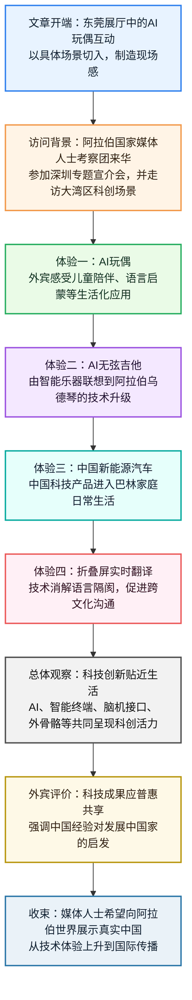
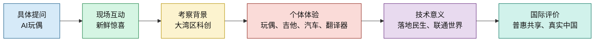

# 【精读笔记】特写：一场跨越山海的「科创邂逅」

```markdown
# 文章结构导航图
1. 引言：东莞中试基地的智能互动现场 (Para 1-5)
   - 1.1 场景切入：毛里塔尼亚外宾与AI玩偶的中文对话
   - 1.2 核心展示：AI玩偶的旅游攻略定制功能与智能化交互
2. 背景：阿拉伯国家媒体人士的湾区之行 (Para 6)
   - 2.1 邀请主体与活动背景：中联部邀请与“中国共产党的故事”宣介会
   - 2.2 考察路径：深圳河套到东莞科创基地，沉浸式体验大湾区活力
3. 具象体验：科技与生活、文化的深度共鸣 (Para 7-10)
   - 3.1 育儿视角：巴林媒体人对AI玩偶语言启蒙功能的期待
   - 3.2 文化联想：AI无弦吉他引发的阿拉伯乌德琴科技升级构想
   - 3.3 品牌认可：中国新能源汽车在巴林家庭的普及现状
4. 技术桥梁：智能终端消融沟通边界 (Para 11-13)
   - 4.1 核心技术：折叠屏手机实现中阿语实时翻译与双向呈现
   - 4.2 理念升华：由智能产品感受“中国智造”的温度与质感
5. 深度感知：从前沿科技到全球愿景 (Para 14-18)
   - 5.1 总体评价：外宾对中国科技领先地位的一致赞叹
   - 5.2 广度拓展：从河套合作区到脑机接口，全方位感知科创落地
   - 5.3 价值落点：普惠共享的创新发展观，向世界展示真实的中国
```

**文章信息**

*   **标题**：特写：一场跨越山海的“科创邂逅”
*   **作者**：复兴路上-中联部新闻办
*   **来源**：中联部新闻办官方社交账号（复兴路上）
*   **时间**：2024年4月25日（注：原文显示“8小时前”，结合文中4月24日动态推算）
*   **栏目**：特写

---

**精读笔记**

“你叫什么名字？”

> **【毛里塔尼亚（Mauritania）】**：位于非洲西北部，地跨撒哈拉沙漠南部。中毛两国传统友谊深厚，毛里塔尼亚是共建“一带一路”的重要合作伙伴。

4月24日，在广东**东莞**的**国家人工智能应用中试基地**展厅，毛里塔尼亚总统府新闻事务负责人阿卜杜达赫曼·穆罕默德微微俯身，用中文向一个毛茸茸的粉色AI玩偶提问。

> **【中试基地（Pilot Scale Test Base）】**：指在实验室研究成果与产业化生产之间进行的中间性试验环节。它是科技成果转化的关键环节。**东莞**作为大湾区制造业名城，布局中试基地意在强化“科技创新+先进制造”的城市底色。

“可以帮我定制一份旅游攻略吗？”

随后，在场工作人员发来语音指令，声音刚落，这个圆滚滚、形似熊猫的AI玩偶便回答出了一份详细的出行计划。有趣的智能交互让在场的外宾们纷纷举起手机，记录下这份智能科技带来的新鲜与惊喜。

> **【交互（Interaction）】**：指人与机器、系统之间的信息传递。
> *   **词汇积累**：**交互（Interaction）**、**互动（Interactive）**、**交流（Communication）**。
> *   **高阶表达**：**深度融合**、**实时响应**。

应中联部邀请，**阿拉伯国家媒体人士考察团**日前跨越山海，走进中国，出席在深圳举行的“**中国共产党的故事——习近平新时代中国特色社会主义思想在粤港澳大湾区的实践**”专题宣介会，并在东莞等地探访科创合作区、创新基地与企业展厅等，**沉浸式**“触摸”**粤港澳大湾区**澎湃的科创活力。

> **【中联部（IDCPC）】**：即中共中央对外联络部，负责中国共产党的对外工作。
> **【沉浸式（Immersive）】**：原指利用技术提供感官体验，现泛指全身心投入某种环境或状态。
> *   **近义词**：身临其境、感同身受。
> **【粤港澳大湾区（Guangdong-Hong Kong-Macao Greater Bay Area）】**：由香港、澳门两个特别行政区和广东省广州、深圳、珠海、佛山、惠州、东莞、中山、江门、肇庆九个城市组成，是中国开放程度最高、经济活力最强的区域之一。

轻抚AI玩偶，巴林《国家报》国际版负责人哈桑·阿德万眼里满是喜爱。“如果它会说阿拉伯语就好了，我很想买一个，送给一岁多的小女儿。”阿德万说，“它可以成为孩子的好朋友，还能助力语言**启蒙**和学习。”

> **【巴林（Bahrain）】**：位于波斯湾西南部的岛国，是海湾地区重要金融中心。
> **【启蒙（Enlightenment）】**：指传授知识或思想，使之从糊涂到明白。在此指幼儿教育的起始。

转身驻足，一把AI无弦吉他吸引了阿德万的目光。轻触和弦按键、拨动拨片，悠扬乐声即刻缓缓流淌。优美的旋律让他想起了阿拉伯传统弦乐器**乌德琴**。“希望乌德琴也能借助科技迭代升级，焕发新生。”

> **【乌德琴（Oud）】**：阿拉伯地区传统乐器，被称为“中东乐器之王”，是琵琶等乐器的祖先之一。
> **【迭代（Iteration）】**：本为数学术语，指重复反馈过程以逼近目标，现指产品或技术的不断改进。
> *   **词汇积累**：**推陈出新**、**更新换代**。
> *   **金句积累**：**以科技之翼助传统之美焕发新生**。

于阿德万而言，中国科技成果早已跨越国界，融入巴林家庭生活日常。“我家里有四台中国品牌的新能源汽车，父母与兄弟，每人都有一辆。”平实的话语中藏着对“**中国智造**”的认可。

> **【中国智造（Intelligent Manufacturing in China）】**：从“中国制造”到“中国智造”的转变，强调的是从单纯代工制造向高端研发、自动化和智能化生产的转型升级。

在一家通信企业的智能终端展厅，一台折叠屏手机弯折成90度夹角，内外屏幕各司其职，分别面向外宾与中方工作人员。毛里塔尼亚国家通讯社社长穆罕默德·莱德姆对着内屏说出一段阿拉伯语，中文译文便实时呈现于外屏之上。方寸之间，语言隔阂悄然消融，沟通无碍，心意相通。

> **【方寸之间】**：指极小的空间（本指手机屏幕），在方寸之间体现大乾坤。
> *   **近义词**：咫尺之间。
> *   **成语积累**：**消融隔阂**、**心意相通**、**各司其职**。

暖心的AI玩伴、牵动乡情的智能乐器、驶入万家生活的新能源汽车、智能的实时翻译器……一件件贴近生活的中国科技创新成果，让远道而来的外宾们在亲身体验中感受科技的温度与质感。

> **【金句积累】**：**科技不应是冰冷的公式与代码，而应是充满温度与质感的生活注解**。

“中国的科技太先进了！”行走各处，外宾的赞叹声此起彼伏。

从在**河套深港科技创新合作区**感受科技创新动能，到体验**脑机接口**外骨骼机器人等前沿科技成果，再到感受AI技术融入日常、赋能美好生活……一路行走、一路感知，阿拉伯国家媒体代表们真切看到中国科技创新加速落地、赋能民生、联通世界的生动实践。

> **【河套深港科技创新合作区（Hetao Shenzhen-Hong Kong Science and Technology Innovation Cooperation Zone）】**：位于深圳市福田区南部与香港接壤处，是国家级科技创新平台，重点发展信息技术、生物医药等。
> **【脑机接口（Brain-Computer Interface, BCI）】**：在人或动物大脑与外部设备之间创建的直接连接通路，是当前生命科学与信息技术交叉的前沿热点。

望着琳琅满目的科技产品，摩洛哥《今日声明报》记者穆罕默德·阿姆齐亚纳感慨道：“科技成果应当**普惠**共享，特别是惠及广大发展中国家。中国的创新发展为这一愿景作出了许多贡献，中国的经验也令人鼓舞。”

> **【摩洛哥（Morocco）】**：北非国家，连接地中海与大西洋，中摩在基础设施和能源领域合作广泛。
> **【普惠（Inclusivity / Universal benefit）】**：普遍惠及，让更多人分享成果。
> *   **易混辨析**：**普惠**（偏重广泛性、共享性）VS **优惠**（偏重特定对象的利好）。
> *   **反义词**：**垄断**（Monopoly）。

曾长期在中国工作的阿卜杜达赫曼·穆罕默德亲眼见证了这片土地的**日新月异**，十分了解中国近年来在科创等多个领域取得的发展和进步。“作为媒体人士，我们应该把中国的真实形象和面貌展示给毛里塔尼亚及阿拉伯世界的读者，向他们介绍一个真实的中国。”

> **【日新月异】**：每天都在更新，每月都在变化。形容发展进步极快。
> *   **近义词**：沧海桑田、翻天覆地。
> *   **金句积累**：**客观真实是中国故事最动人的底色**。
# 基本信息

- 文章来源：新华网客户端 / 新华社
- 原始题目：特写：一场跨越山海的“科创邂逅”
- 发稿时间：2026年4月25日 21:27:47
- 电头：新华社深圳4月25日电
- 作者：新华社记者 黄扬、孙楠
- 用户提供文本来源：复兴路上-中联部新闻办转载内容；“8小时前”“来自 REDMI K80”“收起”等为社交平台界面信息，已剔除。
- 核验来源：新华网客户端原文：特写：一场跨越山海的“科创邂逅” [<sup>1</sup>](https://app.xinhuanet.com/news/article.html?articleId=20260425508f46ad561b4e369af9c65e0fbd4b24)
- 机构背景：新华社是中国国家通讯社；新华网由新华社主办，是其重要中央新闻网站之一。参考：新华网简介 [<sup>2</sup>](https://www.xinhuanet.com/english/special/2015-09/06/c_134594253.htm)
- 中联部背景：中共中央对外联络部，简称中联部，是负责中国共产党对外工作的职能部门。参考：中联部简介 [<sup>3</sup>](https://www.idcpc.gov.cn/zlbjj/wbjj/)
- 作者背景：黄扬、孙楠为该文署名新华社记者。经公开检索，暂未找到两位作者权威、完整、可核验的个人履历页面；可确认信息以新华社署名为准。

---

# 前情提要





---

🔸 “你叫**`什么名字`**？”

🔹 “What is **`your name`**?”

背景注释：
这句话是现场互动的开场提问，展示外宾直接用中文与AI玩偶交流。英文翻译采用自然口语表达，不译成过度书面化的 “How are you called?”。

> **name** /neɪm/ n.
> 英文释义：a word or words by which a person, place, or thing is known 名称；名字。
> 语域：日常口语 / 基础书面语。
> 画龙点睛：`name` 是最基础但高频的词，既可作名词，也可作动词，表示“命名”。常见搭配有 `first name` 名、`last name` 姓、`full name` 全名、`name after` 以……命名。考试翻译中要注意中文“你叫什么名字”对应自然英语是 `What is your name?`，而不是逐字翻译。

---

🔸 **`4月24日`** / 在广东东莞的**`国家人工智能应用中试基地`**展厅 / 毛里塔尼亚总统府新闻事务负责人阿卜杜达赫曼·穆罕默德微微俯身 / 用中文向一个毛茸茸的粉色**`AI玩偶`**提问。

🔹 On **`April 24`**, / in the exhibition hall of the **`National Pilot Base for Artificial Intelligence Applications`** in Dongguan, Guangdong, / Abdurrahman Mohamed, head of news affairs at the Mauritanian President’s Office, leaned forward slightly / and asked a fluffy pink **`AI doll`** a question in Chinese.

背景注释：
广东东莞是粤港澳大湾区内的重要制造业与科创城市。毛里塔尼亚位于非洲西北部，官方名称为毛里塔尼亚伊斯兰共和国。President’s Office 在此指总统府或总统办公室下属新闻事务部门。AI doll 不是传统玩偶，而是嵌入人工智能语音交互功能的智能终端产品。

> **exhibition hall** /ˌeksɪˈbɪʃən hɔːl/ n.
> 英文释义：a large room or building where products, art, or technologies are displayed 展厅；展览馆。
> 语域：正式 / 新闻 / 商务。
> 画龙点睛：`exhibition` 来自动词 `exhibit`，表示“展出、展示”。常见搭配有 `trade exhibition` 贸易展、`technology exhibition` 科技展、`exhibition booth` 展位。写作中描述参观活动，可用 `in the exhibition hall of...` 表示“在……展厅”。

> **pilot base** /ˈpaɪlət beɪs/ n.
> 英文释义：a site used for trial operations before broader application 中试基地；试点基地。
> 语域：科技 / 政策 / 产业。
> 画龙点睛：`pilot` 不仅是“飞行员”，也常表示“试点的、试验性的”。例如 `pilot project` 试点项目、`pilot program` 试验计划。科技新闻中，“中试”可译为 `pilot testing` 或 `pilot-scale trial`，强调从实验室走向产业化前的验证阶段。

> **lean forward** /liːn ˈfɔːrwərd/ phr.
> 英文释义：to bend the upper body toward someone or something 身体前倾；俯身。
> 语域：叙事 / 新闻特写。
> 画龙点睛：`lean` 是描写动作和姿态的高频动词，可表示“倾斜、倚靠”。`lean forward` 常暗示专注、好奇或亲近；反义表达是 `lean back` 向后靠。人物描写中比 simply `bend` 更自然，更有画面感。

> **fluffy** /ˈflʌfi/ adj.
> 英文释义：soft and covered with light hair or fur 毛茸茸的；蓬松柔软的。
> 语域：日常 / 描写性语言。
> 画龙点睛：`fluffy` 常用于描写玩偶、动物、毛毯、云朵等，带有柔软可爱的感觉。近义词有 `soft`、`furry`，但 `fluffy` 更强调蓬松感。写作中可说 `a fluffy toy` 毛绒玩具，`fluffy clouds` 蓬松的云。

---

🔸 “可以帮我**`定制`**一份**`旅游攻略`**吗？”

🔹 “Could you help me **`customize`** a **`travel itinerary`**?”

背景注释：
“旅游攻略”在英文中可根据语境译为 `travel plan`、`travel guide` 或 `travel itinerary`。这里强调AI根据需求生成具体行程，因此译为 `travel itinerary` 更贴近“出行计划”。

> **customize** /ˈkʌstəmaɪz/ v.
> 英文释义：to change or make something according to a person’s particular needs 定制；按需调整。
> 语域：商务 / 科技 / 日常。
> 画龙点睛：`customize` 强调“按个人需求改造”。名词是 `customization`，形容词是 `customized`。常见搭配：`customized service` 定制化服务、`customized plan` 定制方案。注意不要与 `customer` 混淆，后者是“顾客”。

> **itinerary** /aɪˈtɪnəreri/ n.
> 英文释义：a detailed plan of a journey, including places and times 旅行计划；行程安排。
> 语域：旅游 / 商务 / 正式。
> 画龙点睛：`itinerary` 是雅思旅游类、商务差旅类高分词，比 `travel plan` 更正式、更具体。常见表达有 `a detailed itinerary` 详细行程、`change the itinerary` 更改行程、`follow the itinerary` 按行程走。

---

🔸 随后 / 在场工作人员发来**`语音指令`** / 声音刚落 / 这个圆滚滚、形似熊猫的**`AI玩偶`**便回答出了一份详细的**`出行计划`**。

🔹 Moments later, / a staff member on site sent a **`voice command`**; / no sooner had the words been spoken / than the round, panda-like **`AI doll`** produced a detailed **`travel plan`**.

背景注释：
这一句用“声音刚落”突出AI响应速度。英文中用 `no sooner ... than ...` 可以较好呈现“刚……就……”的时间紧密关系，是考试写作和翻译中的高级句式。

> **on site** /ɑːn saɪt/ adv./adj.
> 英文释义：at the place where something is happening 在现场；现场的。
> 语域：新闻 / 商务 / 工程。
> 画龙点睛：`on site` 强调“在事件发生地点”。作形容词时也写作 `on-site`，如 `on-site staff` 现场工作人员、`on-site inspection` 现场检查。注意与 `website` 无关，不要误解为“在网站上”。

> **voice command** /vɔɪs kəˈmænd/ n.
> 英文释义：an instruction given to a device by speaking 语音指令。
> 语域：科技 / 人机交互。
> 画龙点睛：`command` 在科技语境中常指“命令、指令”，不是“指挥官”。常见搭配：`voice command system` 语音指令系统、`execute a command` 执行命令。AI产品介绍中非常高频。

> **produce** /prəˈduːs/ v.
> 英文释义：to create, generate, or provide something 生成；产出；提供。
> 语域：中性 / 科技 / 学术。
> 画龙点睛：`produce` 不只表示“生产商品”，在AI语境中可表示“生成文本、图像、方案”。例如 `produce a report` 生成报告、`produce an answer` 给出答案。名词重音不同：`produce` /ˈproʊduːs/ 作名词时指农产品。

> **panda-like** /ˈpændə laɪk/ adj.
> 英文释义：resembling or similar to a panda 形似熊猫的。
> 语域：描写性 / 新闻特写。
> 画龙点睛：`-like` 是非常实用的后缀，表示“像……的”。如 `childlike` 孩子般的、`lifelike` 栩栩如生的、`robot-like` 像机器人的。写作中能让描写更简洁。

---

🔸 有趣的**`智能交互`** / 让在场的外宾们纷纷举起手机 / 记录下这份智能科技带来的**`新鲜与惊喜`**。

🔹 The engaging **`intelligent interaction`** / prompted the foreign guests present to raise their phones one after another, / capturing the **`novelty and delight`** brought by smart technology.

背景注释：
“外宾”在英文中可译为 `foreign guests`，比 `foreigners` 更礼貌、更符合正式新闻语体。`capture` 在新闻和摄影语境中表示“记录、拍下”。

> **engaging** /ɪnˈɡeɪdʒɪŋ/ adj.
> 英文释义：interesting and attractive enough to hold attention 有吸引力的；引人入胜的。
> 语域：正式 / 评论 / 媒体。
> 画龙点睛：`engaging` 比 `interesting` 更有“能抓住人”的意味。常见搭配：`engaging content` 吸引人的内容、`an engaging speaker` 有感染力的演讲者。动词 `engage` 还可表示“参与、吸引、雇用”。

> **interaction** /ˌɪntərˈækʃən/ n.
> 英文释义：communication or direct involvement between people, systems, or things 互动；相互作用。
> 语域：科技 / 社科 / 教育。
> 画龙点睛：`interaction` 常见于AI、人机交互、课堂教学、社会学文本。搭配有 `human-computer interaction` 人机交互、`social interaction` 社会互动。动词是 `interact`，形容词是 `interactive`。

> **prompt** /prɑːmpt/ v.
> 英文释义：to cause someone to do something 促使；引发。
> 语域：正式 / 新闻 / 学术。
> 画龙点睛：`prompt` 作动词时是阅读高频词，表示“促使、导致”，近义词有 `trigger`、`spur`、`lead to`。AI领域中 `prompt` 也指“提示词”，如 `write a prompt` 写提示词。需根据语境辨析。

> **novelty** /ˈnɑːvəlti/ n.
> 英文释义：the quality of being new, unusual, or interesting 新奇；新颖性。
> 语域：正式 / 新闻 / 学术。
> 画龙点睛：`novelty` 来自 `novel` 的形容词义“新颖的”，不是只指“小说”。常见搭配：`a sense of novelty` 新鲜感、`novelty wears off` 新鲜感消退。科技报道中常用于表达“新鲜体验”。

---

🔸 应**`中联部`**邀请 / 阿拉伯国家媒体人士考察团日前跨越山海，走进中国 / 出席在深圳举行的“中国共产党的故事——习近平新时代中国特色社会主义思想在粤港澳大湾区的实践”**`专题宣介会`** / 并在东莞等地探访科创合作区、创新基地与企业展厅等 / 沉浸式“触摸”粤港澳大湾区澎湃的**`科创活力`**。

🔹 At the invitation of the **`International Department of the CPC Central Committee`**, / a delegation of media professionals from Arab countries recently traveled across mountains and seas to China / to attend a **`thematic briefing`** in Shenzhen titled “The Stories of the Communist Party of China — Xi Jinping Thought on Socialism with Chinese Characteristics for a New Era in Practice in the Guangdong-Hong Kong-Macao Greater Bay Area,” / and visited sci-tech cooperation zones, innovation bases, and corporate exhibition halls in Dongguan and other places, / immersively “feeling” the vibrant **`sci-tech innovation vitality`** of the Guangdong-Hong Kong-Macao Greater Bay Area.

背景注释：
中联部即中共中央对外联络部，负责中国共产党对外工作。粤港澳大湾区包括香港、澳门以及广东省广州、深圳、珠海、佛山、惠州、东莞、中山、江门、肇庆等城市，是中国重要开放型经济和科技创新区域。`thematic briefing` 可译“专题宣介会”，指围绕特定主题的说明、介绍与交流活动。

> **delegation** /ˌdelɪˈɡeɪʃən/ n.
> 英文释义：a group of people sent to represent others 代表团；考察团。
> 语域：外交 / 新闻 / 商务。
> 画龙点睛：`delegation` 常用于外事新闻，如 `a trade delegation` 贸易代表团、`a government delegation` 政府代表团。动词 `delegate` 表示“委派、授权”，名词 `delegate` 表示“代表”。

> **media professional** /ˈmiːdiə prəˈfeʃənəl/ n.
> 英文释义：a person who works in journalism, broadcasting, or media-related fields 媒体人士；传媒从业者。
> 语域：正式 / 新闻。
> 画龙点睛：`professional` 不只是“专业的”，作名词指“专业人士”。比 `media person` 更正式。类似表达有 `legal professional` 法律从业者、`healthcare professional` 医护专业人员。

> **thematic briefing** /θiːˈmætɪk ˈbriːfɪŋ/ n.
> 英文释义：a meeting or presentation focused on a particular theme 专题说明会；专题宣介会。
> 语域：正式 / 政务 / 外交。
> 画龙点睛：`briefing` 指“情况介绍会”，常见于政府、军方、企业。`press briefing` 新闻吹风会，`security briefing` 安全简报。`thematic` 表示“主题性的”，适合翻译“专题”。

> **immersively** /ɪˈmɝːsɪvli/ adv.
> 英文释义：in a way that deeply involves someone in an experience 沉浸式地。
> 语域：科技 / 文旅 / 教育。
> 画龙点睛：`immersive` 是近年高频词，常用于 `immersive experience` 沉浸式体验、`immersive learning` 沉浸式学习。动词 `immerse` 表示“使沉浸于”，常搭配 `immerse oneself in` 沉浸在……中。

> **vitality** /vaɪˈtæləti/ n.
> 英文释义：energy, strength, and the ability to develop 活力；生命力。
> 语域：正式 / 新闻 / 评论。
> 画龙点睛：`vitality` 常用于城市、经济、创新、文化等抽象主题。搭配有 `economic vitality` 经济活力、`cultural vitality` 文化生命力。比 `energy` 更正式，更适合新闻写作。

---

🔸 轻抚**`AI玩偶`** / 巴林《国家报》国际版负责人哈桑·阿德万眼里满是**`喜爱`**。

🔹 Gently stroking the **`AI doll`**, / Hassan Adwan, head of the international edition of Bahrain’s Al-Bilad newspaper, / looked at it with unmistakable **`affection`**.

背景注释：
巴林是位于波斯湾的岛国。Al-Bilad 可译作《国家报》或音译《比拉德报》，在此按照中文原文处理为 Bahrain’s Al-Bilad newspaper。`with unmistakable affection` 用于表现“眼里满是喜爱”的神态。

> **stroke** /stroʊk/ v.
> 英文释义：to move one’s hand gently over a surface, person, or animal 轻抚；抚摸。
> 语域：叙事 / 描写。
> 画龙点睛：`stroke` 作动词表示“轻轻抚摸”，比 `touch` 更柔和、更有情感。作名词还可指“中风、一笔、一划”。阅读中需结合语境判断，医学语境里 `stroke` 多为“中风”。

> **edition** /ɪˈdɪʃən/ n.
> 英文释义：a particular version of a newspaper, book, or program 版本；版面；版次。
> 语域：出版 / 新闻。
> 画龙点睛：`international edition` 指“国际版”。常见搭配有 `print edition` 印刷版、`online edition` 网络版、`latest edition` 最新版。注意不要与 `editor` 编辑混淆。

> **affection** /əˈfekʃən/ n.
> 英文释义：a feeling of liking, fondness, or tenderness 喜爱；柔情。
> 语域：中性 / 文学性。
> 画龙点睛：`affection` 比 `love` 更含蓄，常表示温和的喜爱。搭配有 `show affection` 表达喜爱、`deep affection for` 对……深厚感情。形容词 `affectionate` 表示“深情的、充满爱意的”。

---

🔸 “如果它会说**`阿拉伯语`**就好了 / 我很想买一个 / 送给一岁多的小女儿。”

🔹 “If only it could speak **`Arabic`**; / I would really like to buy one / for my little daughter, who is just over one year old.”

背景注释：
`If only...` 是表达愿望或遗憾的经典结构，中文对应“要是……就好了”。此处体现智能产品的多语种适配需求。

> **If only** /ɪf ˈoʊnli/ phr.
> 英文释义：used to express a strong wish that something were true 要是……就好了。
> 语域：口语 / 书面语均可。
> 画龙点睛：`If only` 后常接虚拟语气，如 `If only I had more time.` 要是我有更多时间就好了。这里 `If only it could speak Arabic` 表示一种愿望。考试写作中可用于表达遗憾或期待，但不要滥用。

> **Arabic** /ˈærəbɪk/ n./adj.
> 英文释义：the language used in many Arab countries; related to Arab people or culture 阿拉伯语；阿拉伯的。
> 语域：中性 / 地理文化。
> 画龙点睛：`Arabic` 指语言；`Arab` 指阿拉伯人或阿拉伯的；`Arabian` 多用于地理、历史或固定搭配，如 `Arabian Peninsula` 阿拉伯半岛。三者在考试中容易混淆。

> **just over** /dʒʌst ˈoʊvər/ phr.
> 英文释义：slightly more than 刚超过；多一点。
> 语域：日常 / 新闻。
> 画龙点睛：`just over one year old` 表示“一岁多一点”。对应反义表达是 `just under` 不到一点，如 `just under ten minutes` 不到十分钟。数据描述题中非常实用。

---

🔸 阿德万说 / “它可以成为孩子的**`好朋友`** / 还能助力**`语言启蒙`**和学习。”

🔹 Adwan said, / “It could become a **`good companion`** for children / and also help with **`early language development`** and learning.”

背景注释：
“语言启蒙”不是简单的 `language enlightenment`。儿童教育语境中更自然的表达是 `early language development`，强调幼儿早期语言能力发展。

> **companion** /kəmˈpænjən/ n.
> 英文释义：someone or something that spends time with another and provides company 伙伴；陪伴者。
> 语域：中性 / 书面略正式。
> 画龙点睛：`companion` 比 `friend` 更强调陪伴功能，可用于人、动物、产品。常见搭配：`travel companion` 旅伴、`lifelong companion` 终身伴侣、`AI companion` AI陪伴产品。

> **early language development** /ˈɝːli ˈlæŋɡwɪdʒ dɪˈveləpmənt/ n.
> 英文释义：the process by which young children begin to acquire language 幼儿早期语言发展。
> 语域：教育 / 心理学。
> 画龙点睛：`development` 在教育、心理、经济等领域都很高频。`language development` 是比 `language learning` 更适合幼儿阶段的表达，因为婴幼儿更多是在自然习得语言，而不是系统学习。

> **help with** /help wɪð/ phr.
> 英文释义：to assist someone in doing or improving something 帮助；助力。
> 语域：日常 / 中性。
> 画龙点睛：`help with + 名词`，如 `help with homework` 帮忙做作业；`help someone do something` 后接动词原形。写作中可替换为更正式的 `contribute to`、`facilitate`、`support`。

---

🔸 转身驻足 / 一把**`AI无弦吉他`**吸引了阿德万的目光。

🔹 As he turned and paused, / an **`AI stringless guitar`** caught Adwan’s eye.

背景注释：
“无弦吉他”是通过传感器、按键、拨片和算法模拟传统吉他演奏的一类智能乐器。`catch one’s eye` 是地道表达，意为“吸引某人的注意”。

> **pause** /pɔːz/ v.
> 英文释义：to stop briefly before continuing 暂停；驻足。
> 语域：中性 / 叙事。
> 画龙点睛：`pause` 可用于动作、讲话、音乐、视频等。`pause for a moment` 暂停片刻，`pause to think` 停下来思考。比 `stop` 更强调短暂性和过程中的停顿。

> **stringless** /ˈstrɪŋləs/ adj.
> 英文释义：having no strings 无弦的。
> 语域：科技产品 / 描写。
> 画龙点睛：后缀 `-less` 表示“没有……的”，如 `wireless` 无线的、`cashless` 无现金的、`paperless` 无纸化的。`stringless guitar` 是技术产品名，突出其突破传统乐器结构。

> **catch one’s eye** /kætʃ wʌnz aɪ/ idiom
> 英文释义：to attract someone’s attention 吸引某人的目光。
> 语域：口语 / 新闻特写。
> 画龙点睛：这是描写“吸睛”的高频表达。可写作 `The display caught my eye.` 这个展示吸引了我的注意。比 `attract attention` 更口语、更生动。

---

🔸 轻触**`和弦按键`**、拨动拨片 / 悠扬乐声即刻缓缓**`流淌`**。

🔹 With a light touch on the **`chord buttons`** and a flick of the pick, / melodious music instantly began to **`flow`**.

背景注释：
这里用“流淌”描写音乐，是中文常见通感表达。英文中 `music flowed` 也可自然表达旋律顺畅响起。

> **chord** /kɔːrd/ n.
> 英文释义：three or more musical notes played together 和弦。
> 语域：音乐专业 / 中性。
> 画龙点睛：`chord` 是音乐术语，注意不要与 `cord` 混淆，后者表示“绳索、电线”。常见搭配：`play a chord` 弹一个和弦、`chord progression` 和弦进行。

> **flick** /flɪk/ n./v.
> 英文释义：a quick, light movement; to move something with a quick motion 轻弹；快速拨动。
> 语域：动作描写 / 口语。
> 画龙点睛：`flick` 常用于手指、开关、拨片等小而快的动作，如 `flick a switch` 啪地打开开关、`flick through a book` 快速翻书。比 `move` 更具体。

> **melodious** /məˈloʊdiəs/ adj.
> 英文释义：pleasant to listen to, like music 悦耳的；悠扬的。
> 语域：文学 / 音乐描写。
> 画龙点睛：`melodious` 来自 `melody` 旋律，适合描写音乐、鸟鸣、声音。近义词有 `tuneful`、`pleasant-sounding`。写作中比 `beautiful` 更精确。

> **flow** /floʊ/ v.
> 英文释义：to move smoothly and continuously 流动；流淌；顺畅展开。
> 语域：中性 / 文学性。
> 画龙点睛：`flow` 可用于水、音乐、语言、思想。`Ideas flowed freely.` 思路顺畅涌现。描写音乐时，`music flowed` 能表现自然、连续、优美的感觉。

---

🔸 优美的**`旋律`** / 让他想起了阿拉伯传统弦乐器**`乌德琴`**。

🔹 The beautiful **`melody`** / reminded him of the **`oud`**, a traditional Arab stringed instrument.

背景注释：
乌德琴 `oud` 是中东、北非地区常见传统拨弦乐器，常被认为与欧洲鲁特琴等乐器有历史关联。这里体现外宾将中国智能乐器体验与自身文化记忆相连接。

> **melody** /ˈmelədi/ n.
> 英文释义：a sequence of musical notes that is pleasant or recognizable 旋律；曲调。
> 语域：音乐 / 日常。
> 画龙点睛：`melody` 指可辨识的曲调；`rhythm` 是节奏；`harmony` 是和声。三者常在音乐类文本中并列出现。`a catchy melody` 表示朗朗上口的旋律。

> **remind A of B** /rɪˈmaɪnd əv/ phr.
> 英文释义：to make someone remember or think of something 使某人想起某事。
> 语域：日常 / 写作高频。
> 画龙点睛：结构是 `remind someone of something`，不要写成 `remind someone something`。例句：`The song reminds me of my childhood.` 这首歌让我想起童年。

> **stringed instrument** /strɪŋd ˈɪnstrəmənt/ n.
> 英文释义：a musical instrument that produces sound from vibrating strings 弦乐器。
> 语域：音乐 / 说明文。
> 画龙点睛：`stringed` 是形容词，表示“有弦的”。注意发音中 `-ed` 通常发 /d/。常见分类还有 `wind instrument` 管乐器、`percussion instrument` 打击乐器。

---

🔸 “希望**`乌德琴`**也能借助科技**`迭代升级`** / 焕发新生。”

🔹 “I hope the **`oud`**, too, can be **`upgraded through technological iteration`** / and gain a new lease on life.”

背景注释：
“焕发新生”不是字面“be born again”，这里采用英语习语 `gain a new lease on life`，表示重新获得活力、生命力或发展空间。

> **upgrade** /ˌʌpˈɡreɪd/ v./n.
> 英文释义：to improve something by adding or replacing parts 升级；改进。
> 语域：科技 / 商务 / 日常。
> 画龙点睛：`upgrade` 可作动词或名词。搭配有 `software upgrade` 软件升级、`upgrade a system` 升级系统。反义词是 `downgrade` 降级。科技产品报道中使用频率极高。

> **iteration** /ˌɪtəˈreɪʃən/ n.
> 英文释义：a repeated process of improving or developing something 迭代；反复改进。
> 语域：科技 / 产品开发 / 正式。
> 画龙点睛：`iteration` 是互联网、软件、产品领域高频词。动词 `iterate` 表示“迭代、反复改进”。常见表达：`rapid iteration` 快速迭代、`product iteration` 产品迭代。

> **a new lease on life** /ə nuː liːs ɑːn laɪf/ idiom
> 英文释义：a chance to become active, useful, or successful again 重获新生；焕发新活力。
> 语域：习语 / 新闻评论。
> 画龙点睛：这个表达常用于旧建筑、传统文化、老品牌、传统产业等“被重新激活”。如 `Digital tools gave the museum a new lease on life.` 数字工具让博物馆焕发新生。

---

🔸 于阿德万而言 / 中国**`科技成果`**早已跨越国界 / 融入巴林家庭生活日常。

🔹 For Adwan, / China’s **`technological achievements`** have long crossed national borders / and become part of everyday family life in Bahrain.

背景注释：
这一句从现场体验转入个人生活经验，说明中国科技产品已通过市场和消费进入阿拉伯国家家庭。`For Adwan` 对应“于阿德万而言”，是英文中很自然的立场引入结构。

> **technological achievement** /ˌteknəˈlɑːdʒɪkəl əˈtʃiːvmənt/ n.
> 英文释义：a successful result or development in technology 科技成果；技术成就。
> 语域：正式 / 科技 / 新闻。
> 画龙点睛：`achievement` 强调“取得的成果”，可数名词。常见搭配：`remarkable achievements` 显著成就、`scientific achievements` 科学成就。比 `result` 更有成就色彩。

> **cross national borders** /krɔːs ˈnæʃənəl ˈbɔːrdərz/ phr.
> 英文释义：to move or spread from one country to another 跨越国界。
> 语域：新闻 / 国际关系 / 商务。
> 画龙点睛：`border` 指国界、边境。搭配有 `border control` 边境管制、`cross-border trade` 跨境贸易。注意 `boarder` 是“寄宿者”，拼写不同。

> **everyday life** /ˈevrideɪ laɪf/ n.
> 英文释义：ordinary daily activities and routines 日常生活。
> 语域：中性 / 写作高频。
> 画龙点睛：`everyday` 作形容词，表示“日常的”；`every day` 是副词短语，表示“每天”。例如 `everyday life` 日常生活，`I study English every day.` 我每天学英语。

---

🔸 “我家里有四台中国品牌的**`新能源汽车`** / 父母与兄弟 / 每人都有一辆。”

🔹 “My family has four **`new energy vehicles`** made by Chinese brands; / my parents and brothers / each have one.”

背景注释：
“新能源汽车”在中国语境中通常包括纯电动汽车、插电式混合动力汽车、燃料电池汽车等。英文常用官方译法为 `new energy vehicles`，缩写 NEVs。

> **new energy vehicle** /nuː ˈenərdʒi ˈviːəkəl/ n.
> 英文释义：a vehicle powered fully or partly by non-traditional energy sources, especially electricity 新能源汽车。
> 语域：产业 / 政策 / 科技。
> 画龙点睛：该表达常缩写为 `NEV`。在国际语境中，也常见 `electric vehicle` 或 `EV`，但二者并不完全等同；`NEV` 范围可能更宽，包含插混和燃料电池车。

> **brand** /brænd/ n.
> 英文释义：a type of product made by a particular company under a particular name 品牌。
> 语域：商业 / 日常。
> 画龙点睛：`brand` 可指品牌，也可作动词“给……打上品牌”。常见搭配：`Chinese brand` 中国品牌、`global brand` 全球品牌、`brand recognition` 品牌认知度。

> **each** /iːtʃ/ pron./det./adv.
> 英文释义：every one of two or more people or things, considered separately 每个；各自。
> 语域：基础高频。
> 画龙点睛：`each` 强调个体，`every` 强调整体中的每一个。`each have one` 中主语是复数 `my parents and brothers`，所以动词用 `have`。若 `Each of them` 作主语，则常用单数：`Each of them has one.`

---

🔸 平实的话语中 / 藏着对“**`中国智造`**”的认可。

🔹 Behind these plain words / lay his recognition of **`intelligent manufacturing in China`**.

背景注释：
“中国智造”是对“中国制造”的升级表达，强调智能制造、技术含量和创新能力。英文可译为 `intelligent manufacturing in China`，也可视语境译为 `China’s smart manufacturing`。

> **plain** /pleɪn/ adj.
> 英文释义：simple and not elaborate 简朴的；平实的。
> 语域：中性 / 描写。
> 画龙点睛：`plain` 可表示“清楚的、朴素的、平坦的”。`plain words` 是“朴实的话语”；`plain English` 是“简单明了的英语”。不要只理解为“平原”。

> **recognition** /ˌrekəɡˈnɪʃən/ n.
> 英文释义：acceptance that something is true, valuable, or important 认可；承认。
> 语域：正式 / 新闻 / 学术。
> 画龙点睛：`recognition` 来自 `recognize`。常见搭配：`gain recognition` 获得认可、`international recognition` 国际认可、`recognition of one’s efforts` 对某人努力的认可。

> **intelligent manufacturing** /ɪnˈtelɪdʒənt ˌmænjəˈfæktʃərɪŋ/ n.
> 英文释义：manufacturing that uses advanced technologies such as AI, automation, and data systems 智能制造。
> 语域：产业 / 科技 / 政策。
> 画龙点睛：`manufacturing` 是“制造业、制造过程”，不是单纯“工厂”。搭配有 `advanced manufacturing` 先进制造、`smart manufacturing` 智能制造。写作中可用于产业升级话题。

---

🔸 在一家通信企业的**`智能终端`**展厅 / 一台**`折叠屏手机`**弯折成90度夹角 / 内外屏幕各司其职 / 分别面向外宾与中方工作人员。

🔹 In the **`smart-device`** exhibition hall of a communications company, / a **`foldable smartphone`** was bent at a 90-degree angle; / its inner and outer screens performed their respective functions, / facing the foreign guest and the Chinese staff member respectively.

背景注释：
“智能终端”泛指智能手机、平板、可穿戴设备、智能家居设备等连接信息服务的终端设备。折叠屏手机通过柔性屏幕和铰链结构实现多角度使用，此处用于展示双屏实时翻译场景。

> **smart device** /smɑːrt dɪˈvaɪs/ n.
> 英文释义：an electronic device connected to networks and capable of advanced functions 智能设备；智能终端。
> 语域：科技 / 商务。
> 画龙点睛：`device` 泛指“设备、装置”，比 `machine` 范围更广。`smart device` 可包括手机、手表、音箱、家电。`terminal` 也可译终端，但面向普通读者时 `smart device` 更自然。

> **foldable smartphone** /ˈfoʊldəbəl ˈsmɑːrtfoʊn/ n.
> 英文释义：a smartphone with a screen that can be folded 折叠屏手机。
> 语域：科技 / 消费电子。
> 画龙点睛：`foldable` 来自动词 `fold` 折叠，后缀 `-able` 表示“可……的”。类似词有 `portable` 便携的、`wearable` 可穿戴的、`adjustable` 可调节的。

> **respectively** /rɪˈspektɪvli/ adv.
> 英文释义：in the same order as the people or things already mentioned 分别地；各自地。
> 语域：正式 / 学术 / 数据描述。
> 画龙点睛：`respectively` 用于对应关系。例如 `Tom and Anna are 12 and 14, respectively.` 汤姆和安娜分别为12岁和14岁。不要误解为“尊敬地”，那是 `respectfully`。

> **function** /ˈfʌŋkʃən/ n./v.
> 英文释义：the purpose or work of something; to operate 功能；运转。
> 语域：科技 / 学术 / 中性。
> 画龙点睛：`function` 作名词指功能，作动词指“运转、发挥作用”。搭配有 `perform a function` 发挥功能、`core function` 核心功能、`function properly` 正常运转。

---

🔸 毛里塔尼亚国家通讯社社长穆罕默德·莱德姆 / 对着内屏说出一段**`阿拉伯语`** / 中文译文便**`实时呈现`**于外屏之上。

🔹 Mohamed Ladem, president of the Mauritanian News Agency, / spoke a passage in **`Arabic`** to the inner screen, / and the Chinese translation was **`displayed in real time`** on the outer screen.

背景注释：
毛里塔尼亚国家通讯社是毛里塔尼亚官方通讯机构。该场景展示的是语音识别、机器翻译、多屏显示等技术的集成应用。

> **news agency** /nuːz ˈeɪdʒənsi/ n.
> 英文释义：an organization that collects and supplies news to newspapers, broadcasters, or websites 通讯社。
> 语域：新闻 / 媒体。
> 画龙点睛：`agency` 可指机构、代理处、行动能力。`news agency` 是固定搭配，如 `Xinhua News Agency` 新华社、`Associated Press` 美联社。不要译成“新闻代理”。

> **passage** /ˈpæsɪdʒ/ n.
> 英文释义：a short section of speech or writing 一段话；一节文字。
> 语域：教育 / 阅读 / 中性。
> 画龙点睛：`passage` 在阅读考试中常指“文章段落、选段”；在这里指“一段阿拉伯语”。还可指“通道、经过、通过”，如 `a narrow passage` 狭窄通道。

> **display** /dɪˈspleɪ/ v./n.
> 英文释义：to show information on a screen; a screen or presentation 显示；展示；显示屏。
> 语域：科技 / 展示。
> 画龙点睛：`display` 在电子设备语境中非常高频。`display information` 显示信息，`display screen` 显示屏。作名词也可指“陈列展示”，如 `a product display` 产品展示。

> **in real time** /ɪn ˈriːəl taɪm/ adv.
> 英文释义：immediately as something happens 实时地。
> 语域：科技 / 新闻。
> 画龙点睛：`real-time` 作形容词时加连字符，如 `real-time translation` 实时翻译；`in real time` 作副词短语。AI、通信、金融、直播等语境中都很常见。

---

🔸 方寸之间 / **`语言隔阂`**悄然消融 / 沟通无碍 / 心意相通。

🔹 Within this small device, / **`language barriers`** quietly dissolved; / communication became effortless, / and hearts and minds drew closer.

背景注释：
“方寸之间”原指很小的空间，这里指折叠屏手机的屏幕空间。英文不能直译为 “between square inches”，需意译为 `within this small device`。后半句有较强文学色彩，翻译时需兼顾新闻文体与修辞美感。

> **barrier** /ˈbæriər/ n.
> 英文释义：something that prevents movement, communication, or progress 障碍；隔阂。
> 语域：正式 / 学术 / 新闻。
> 画龙点睛：`language barrier` 是固定搭配，表示语言障碍。其他搭配：`trade barrier` 贸易壁垒、`cultural barrier` 文化隔阂、`barrier to entry` 准入壁垒。

> **dissolve** /dɪˈzɑːlv/ v.
> 英文释义：to disappear gradually; to make something disappear 消融；消失；解除。
> 语域：正式 / 文学 / 科学。
> 画龙点睛：`dissolve` 可表示糖盐在水中溶解，也可表示关系、障碍、组织等“消解”。如 `dissolve tensions` 化解紧张关系。这里比 `disappear` 更有渐进和柔和感。

> **effortless** /ˈefərtləs/ adj.
> 英文释义：requiring little or no effort 毫不费力的；顺畅的。
> 语域：中性 / 略正式。
> 画龙点睛：`effortless communication` 表示无障碍、顺畅沟通。后缀 `-less` 表示“没有”，`effortless` 字面即“无需努力的”。副词是 `effortlessly`。

> **draw closer** /drɔː ˈkloʊsər/ phr.
> 英文释义：to become nearer physically or emotionally 靠近；关系更亲近。
> 语域：叙事 / 新闻评论。
> 画龙点睛：`draw` 不只表示“画画”，还可表示“拉近、吸引、临近”。`draw closer to each other` 表示彼此更接近，适合国际交流、民心相通等主题。

---

🔸 暖心的**`AI玩伴`**、牵动乡情的智能乐器、驶入万家生活的**`新能源汽车`**、智能的**`实时翻译器`**……一件件贴近生活的中国科技创新成果 / 让远道而来的外宾们在亲身体验中 / 感受科技的**`温度与质感`**。

🔹 Heartwarming **`AI companions`**, smart musical instruments that stirred homesickness, **`new energy vehicles`** entering countless households, and intelligent **`real-time translators`** — / one Chinese technological innovation after another, closely tied to everyday life, / allowed foreign guests from afar to experience firsthand / the **`warmth and texture`** of technology.

背景注释：
这一句是前文具体体验的归纳：AI玩偶、智能乐器、新能源汽车、实时翻译器共同构成“科技贴近生活”的叙事。`warmth and texture of technology` 是修辞化表达，用于强调技术不只是冷冰冰的工具，也能体现情感、便利与人文关怀。

> **heartwarming** /ˈhɑːrtˌwɔːrmɪŋ/ adj.
> 英文释义：causing feelings of happiness, kindness, or emotional warmth 暖心的；令人感到温暖的。
> 语域：新闻特写 / 情感描写。
> 画龙点睛：`heartwarming` 常用于人物故事、公益事件、亲情场景。类似表达有 `touching` 感人的、`moving` 动人的。它比 `warm` 更强调情感反应。

> **companion** /kəmˈpænjən/ n.
> 英文释义：a person, animal, or thing that provides company 陪伴者；伙伴。
> 语域：中性 / 科技产品。
> 画龙点睛：在AI语境中，`AI companion` 指陪伴型人工智能产品，强调情绪陪伴、互动交流。注意与 `assistant` 区分：`assistant` 重在帮助完成任务，`companion` 重在陪伴。

> **stir** /stɝː/ v.
> 英文释义：to make someone feel an emotion 激起；触动。
> 语域：文学 / 新闻特写。
> 画龙点睛：`stir homesickness` 表示“勾起乡愁”。`stir` 原意可为“搅拌”，引申为“激发情绪”。常见搭配：`stir memories` 唤起记忆、`stir debate` 引发争论。

> **firsthand** /ˌfɝːstˈhænd/ adj./adv.
> 英文释义：obtained or experienced directly 亲身的；直接地。
> 语域：新闻 / 学术 / 日常。
> 画龙点睛：`firsthand experience` 亲身体验，`firsthand information` 第一手信息。反义词是 `secondhand` 二手的、间接的。阅读中常用于强调信息来源可靠或体验直接。

> **texture** /ˈtekstʃər/ n.
> 英文释义：the feel, appearance, or quality of a surface or experience 质感；纹理；层次感。
> 语域：艺术 / 描写 / 抽象表达。
> 画龙点睛：`texture` 本指物体表面质地，也可抽象指体验的丰富层次。`the texture of urban life` 城市生活的质感。这里译“科技的质感”，表达技术体验可感、可触、可亲近。

---

🔸 “中国的**`科技`**太先进了！”

🔹 “China’s **`technology`** is so advanced!”

背景注释：
这是一句现场感很强的直接引语。`advanced` 在科技语境中表示“先进的、发达的”，常用于描述技术、设备、系统、经济体等。

> **advanced** /ədˈvænst/ adj.
> 英文释义：highly developed or modern 先进的；高级的。
> 语域：科技 / 教育 / 正式。
> 画龙点睛：`advanced technology` 先进技术，`advanced level` 高级水平，`advanced course` 高阶课程。注意 `advanced` 不等于“前进中的”，而是“发展程度高的”。

> **technology** /tekˈnɑːlədʒi/ n.
> 英文释义：scientific knowledge and tools used for practical purposes 技术；科技。
> 语域：通用 / 科技 / 学术。
> 画龙点睛：`technology` 通常不可数，但在表示不同技术种类时可用复数 `technologies`。如 `emerging technologies` 新兴技术、`digital technology` 数字技术。

---

🔸 行走各处 / 外宾的**`赞叹声`**此起彼伏。

🔹 As they moved from place to place, / the foreign guests’ **`exclamations of admiration`** rose one after another.

背景注释：
“此起彼伏”强调声音不断出现、接连不断。英文可用 `one after another`、`in waves` 或 `rose and fell in succession`。这里结合“赞叹声”译为 `rose one after another`。

> **exclamation** /ˌekskləˈmeɪʃən/ n.
> 英文释义：a sudden cry or remark expressing strong feeling 惊叹；感叹。
> 语域：中性 / 书面。
> 画龙点睛：`exclamation` 来自动词 `exclaim`，表示“惊呼、感叹”。标点里的感叹号是 `exclamation mark` 或美式 `exclamation point`。新闻特写中可用于表达现场反应。

> **admiration** /ˌædməˈreɪʃən/ n.
> 英文释义：a feeling of respect and approval 钦佩；赞赏。
> 语域：正式 / 情感表达。
> 画龙点睛：`admiration` 比 `praise` 更强调内心的欣赏和敬佩。搭配有 `express admiration for` 表达对……的赞赏、`win admiration` 赢得钦佩。

> **one after another** /wʌn ˈæftər əˈnʌðər/ phr.
> 英文释义：in a series, with one following the next 一个接一个地；接连不断。
> 语域：日常 / 新闻。
> 画龙点睛：可用于人、事件、声音、问题等连续出现。比如 `Questions came one after another.` 问题接踵而至。翻译“纷纷、接连、此起彼伏”时很实用。

---

🔸 从在**`河套深港科技创新合作区`**感受科技创新动能 / 到体验**`脑机接口`**外骨骼机器人等前沿科技成果 / 再到感受AI技术融入日常、赋能美好生活……一路行走、一路感知 / 阿拉伯国家媒体代表们真切看到中国科技创新**`加速落地`**、赋能民生、联通世界的生动实践。

🔹 From sensing the momentum of technological innovation in the **`Hetao Shenzhen-Hong Kong Science and Technology Innovation Cooperation Zone`**, / to experiencing cutting-edge achievements such as **`brain-computer interface`** exoskeleton robots, / and then to seeing how AI technology is integrated into daily life and empowers a better life, / the media representatives from Arab countries observed, at every step of the journey, / the vivid practice of China’s technological innovation being **`rapidly translated into real-world applications`**, improving people’s livelihoods, and connecting the world.

背景注释：
河套深港科技创新合作区位于深圳与香港交界区域，是深港科技合作的重要平台。脑机接口 `brain-computer interface, BCI` 指在人脑与外部设备之间建立直接通信路径的技术。外骨骼机器人可用于康复医疗、工业辅助、助行等场景。

> **momentum** /moʊˈmentəm/ n.
> 英文释义：the force or energy that keeps something developing or moving forward 动能；势头。
> 语域：正式 / 新闻 / 经济。
> 画龙点睛：`momentum` 常用于经济、改革、创新、运动等主题。搭配有 `gain momentum` 增强势头、`maintain momentum` 保持势头、`innovation momentum` 创新动能。

> **cutting-edge** /ˌkʌtɪŋ ˈedʒ/ adj.
> 英文释义：using the newest and most advanced ideas or technologies 前沿的；尖端的。
> 语域：科技 / 商务 / 新闻。
> 画龙点睛：`cutting-edge technology` 是科技写作高频搭配。近义词有 `state-of-the-art`、`advanced`。`cutting edge` 作名词时可表示“最前沿”。

> **brain-computer interface** /breɪn kəmˈpjuːtər ˈɪntərfeɪs/ n.
> 英文释义：a system that enables direct communication between the brain and an external device 脑机接口。
> 语域：科技 / 医疗 / 神经科学。
> 画龙点睛：常缩写为 `BCI`。`interface` 指两个系统之间的连接界面。AI、神经科学、康复工程类文章中常见，搭配有 `BCI technology` 脑机接口技术。

> **exoskeleton robot** /ˌeksoʊˈskelɪtən ˈroʊbɑːt/ n.
> 英文释义：a wearable robotic system that supports or enhances human movement 外骨骼机器人。
> 语域：机器人 / 医疗康复 / 工业。
> 画龙点睛：`exo-` 表示“外部”，`skeleton` 是“骨骼”。外骨骼机器人常用于帮助行动障碍者训练行走，或帮助工人减轻负重。

> **translate into real-world applications** /trænzˈleɪt ˈɪntuː ˈriːəl wɝːld ˌæplɪˈkeɪʃənz/ phr.
> 英文释义：to turn ideas or technologies into practical uses 转化为现实应用；落地应用。
> 语域：科技 / 商务 / 学术。
> 画龙点睛：中文“落地”不能机械译成 `land`。科技成果“落地”常译为 `be put into practice`、`be applied in real-world settings`、`be translated into applications`。

---

🔸 望着**`琳琅满目`**的科技产品 / 摩洛哥《今日声明报》记者穆罕默德·阿姆齐亚纳感慨道 / “科技成果应当**`普惠共享`** / 特别是惠及广大发展中国家。”

🔹 Looking at the **`dazzling array`** of technological products, / Mohamed Amzian, a journalist with Morocco’s Al Bayane newspaper, remarked with emotion, / “Technological achievements should be **`shared inclusively`**, / especially to benefit the vast number of developing countries.”

背景注释：
摩洛哥位于非洲西北部。《今日声明报》对应法语报刊 Al Bayane。`inclusive sharing` 或 `shared inclusively` 可表达“普惠共享”，强调技术成果不应只服务少数国家或群体。

> **dazzling array** /ˈdæzlɪŋ əˈreɪ/ n.
> 英文释义：a large and impressive variety of things 琳琅满目的大量事物。
> 语域：新闻 / 描写性写作。
> 画龙点睛：`array` 表示“一系列、大量排列”。`a wide array of` 是学术写作高频表达，意为“广泛的”。`dazzling` 强调令人眼花缭乱、印象深刻。

> **remark** /rɪˈmɑːrk/ v./n.
> 英文释义：to say something as a comment; a comment 评论；说道。
> 语域：新闻 / 书面。
> 画龙点睛：新闻报道中，`remarked` 比 `said` 更有“评论、发表看法”的意味。名词搭配：`opening remarks` 开场 remarks、`public remarks` 公开言论。

> **inclusive** /ɪnˈkluːsɪv/ adj.
> 英文释义：intended to include everyone, especially those who might otherwise be excluded 包容性的；普惠的。
> 语域：政策 / 社会 / 发展议题。
> 画龙点睛：`inclusive` 是国际发展、教育、公平议题中的高频词。搭配有 `inclusive growth` 包容性增长、`inclusive education` 融合教育、`inclusive development` 普惠发展。

> **developing countries** /dɪˈveləpɪŋ ˈkʌntriz/ n.
> 英文释义：countries with less industrialization or lower average income than highly developed economies 发展中国家。
> 语域：国际关系 / 经济 / 政策。
> 画龙点睛：注意使用 `developing countries`，避免过时或带有偏见的表达。相关概念有 `developed countries` 发达国家、`emerging economies` 新兴经济体、`Global South` 全球南方。

---

🔸 “中国的**`创新发展`**为这一愿景作出了许多贡献 / 中国的经验也令人鼓舞。”

🔹 “China’s **`innovation-driven development`** has contributed greatly to this vision, / and China’s experience is also encouraging.”

背景注释：
“愿景”译为 `vision`，在政策、发展和国际合作文本中非常常见。`innovation-driven development` 对应“创新发展”，强调以创新作为发展动力。

> **innovation-driven development** /ˌɪnəˈveɪʃən ˈdrɪvən dɪˈveləpmənt/ n.
> 英文释义：development powered or guided by innovation 创新驱动发展；创新发展。
> 语域：政策 / 经济 / 科技。
> 画龙点睛：`-driven` 是高分后缀结构，表示“由……驱动的”。如 `market-driven` 市场驱动的、`data-driven` 数据驱动的、`technology-driven` 技术驱动的。

> **contribute to** /kənˈtrɪbjuːt tuː/ phr.
> 英文释义：to help cause or bring about something; to give support to 促成；贡献于。
> 语域：正式 / 写作高频。
> 画龙点睛：`contribute to` 后接名词或动名词，如 `contribute to economic growth` 促进经济增长。`make a contribution to` 是名词结构。注意不是 `contribute for`。

> **vision** /ˈvɪʒən/ n.
> 英文释义：an idea or picture of a better future 愿景；远见。
> 语域：正式 / 政策 / 商务。
> 画龙点睛：`vision` 可指视力，也可指愿景。搭配有 `long-term vision` 长远愿景、`shared vision` 共同愿景、`strategic vision` 战略眼光。

> **encouraging** /ɪnˈkɝːɪdʒɪŋ/ adj.
> 英文释义：giving hope, confidence, or support 令人鼓舞的。
> 语域：中性 / 正式。
> 画龙点睛：`encouraging` 常用于积极趋势、成果、经验。动词 `encourage` 表示“鼓励、促进”。名词 `encouragement` 是“鼓励”。写作中可说 `encouraging signs` 令人鼓舞的迹象。

---

🔸 曾长期在中国工作的阿卜杜达赫曼·穆罕默德 / 亲眼见证了这片土地的**`日新月异`** / 十分了解中国近年来在科创等多个领域取得的发展和进步。

🔹 Abdurrahman Mohamed, who had worked in China for a long time, / witnessed firsthand the **`rapid transformation`** of this land / and knew well the development and progress China has made in recent years across multiple fields, including sci-tech innovation.

背景注释：
“日新月异”是高度凝练的中文成语，不能逐字译为 “new by day and different by month”。根据语境译为 `rapid transformation` 或 `dramatic changes` 更自然。`sci-tech innovation` 是新闻中常见的“科技创新”简洁译法。

> **witness firsthand** /ˈwɪtnəs ˌfɝːstˈhænd/ phr.
> 英文释义：to see or experience something directly 亲眼见证；直接经历。
> 语域：新闻 / 叙事 / 正式。
> 画龙点睛：`witness` 既可作名词“目击者”，也可作动词“见证”。`firsthand` 强调亲历性。搭配 `witness firsthand the changes` 非常适合翻译“亲眼见证变化”。

> **rapid transformation** /ˈræpɪd ˌtrænsfərˈmeɪʃən/ n.
> 英文释义：quick and significant change 快速转型；迅速变化。
> 语域：正式 / 新闻 / 社科。
> 画龙点睛：`transformation` 比 `change` 更强调深刻变化、结构性变化。搭配有 `digital transformation` 数字化转型、`urban transformation` 城市转型。

> **across multiple fields** /əˈkrɔːs ˈmʌltəpəl fiːldz/ phr.
> 英文释义：in many different areas or sectors 在多个领域。
> 语域：正式 / 写作高频。
> 画龙点睛：`across` 常表示跨越范围，不只是“穿过”。如 `across sectors` 跨行业、`across cultures` 跨文化、`across the country` 全国范围内。

> **sci-tech innovation** /ˈsaɪ tek ˌɪnəˈveɪʃən/ n.
> 英文释义：innovation in science and technology 科技创新。
> 语域：新闻 / 政策 / 科技。
> 画龙点睛：`sci-tech` 是 `science and technology` 的缩略形，常见于新闻标题和政策语境。正式论文中也可写全为 `scientific and technological innovation`。

---

🔸 “作为**`媒体人士`** / 我们应该把中国的真实形象和面貌展示给毛里塔尼亚及阿拉伯世界的读者 / 向他们介绍一个**`真实的中国`**。”

🔹 “As **`media professionals`**, / we should present China’s true image and reality to readers in Mauritania and the Arab world / and introduce to them a **`real China`**.”

背景注释：
这句话将文章主题从“科技体验”提升到“国际传播”。`true image and reality` 对应“真实形象和面貌”，`a real China` 对应“一个真实的中国”，强调通过媒体报道呈现亲身观察到的中国。

> **present** /prɪˈzent/ v.
> 英文释义：to show, describe, or offer something to others 展示；呈现；介绍。
> 语域：正式 / 新闻 / 学术。
> 画龙点睛：`present` 作动词时重音在第二音节 /prɪˈzent/；作形容词“在场的”或名词“礼物”时重音在第一音节 /ˈprezənt/。搭配：`present an image` 呈现形象、`present evidence` 提交证据。

> **true image** /truː ˈɪmɪdʒ/ n.
> 英文释义：an accurate public picture or impression of someone or something 真实形象。
> 语域：新闻 / 国际传播。
> 画龙点睛：`image` 不只指图片，也指“形象、印象”。如 `national image` 国家形象、`public image` 公众形象、`brand image` 品牌形象。翻译“形象”时常用 `image`。

> **reality** /riˈæləti/ n.
> 英文释义：the true situation as it exists 现实；真实情况。
> 语域：中性 / 正式。
> 画龙点睛：`reality` 可表示客观现实，与 `appearance` 表象相对。常见搭配：`reflect reality` 反映现实、`face reality` 面对现实、`a reality check` 现实检验。

> **introduce A to B** /ˌɪntrəˈduːs/ phr.
> 英文释义：to make someone know about another person, place, idea, or thing 把A介绍给B。
> 语域：基础高频 / 正式口语均可。
> 画龙点睛：结构要清楚：`introduce China to readers` 向读者介绍中国；也可说 `introduce readers to China`。不要写成中文式的 `introduce to them China`，更自然是 `introduce China to them` 或 `introduce to them a real China`。