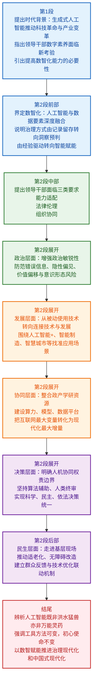

```mermaid
graph TD
    A[生成式 AI 与执政能力新考验] --> B[第一段：时代背景与总要求]
    B --> B1(生成式 AI 加速演进)
    B --> B2(对执政能力提出新考验)
    B --> B3(习近平总书记明确指示)
    B --> B4(提高能力是必然要求与紧迫任务)

    A --> C[第二段：数智化概念与核心要求]
    C --> C1(阶段跨越：记录留存→洞察预判 / 经验驱动→智能赋能)
    C --> C2(带来三重新挑战：能力适配 / 法律伦理 / 组织协同)
    C --> C3(应对态度：准确识变 / 科学应变 / 主动求变)
    C --> C4(政治要求：增强政治敏锐性)
    C4 --> C4a(识别显性错误与隐性偏见)
    C4 --> C4b(防范价值偏移与意识形态风险)
    C4 --> C4c(防止技术鸿沟与撕裂共识)
    C4 --> C4d(以人民立场驾驭智能工具)

    A --> D[第三段：统筹协调与连接者角色]
    D --> D1(跳出工具化与浅表化思维)
    D --> D2(把握重点领域赋能机理：产业 / 城市 / 应急 / 民生)
    D --> D3(行动落实：找准场景 + 试点先行)
    D --> D4(杜绝「为技术而技术」的形式主义)
    D --> D5(资源统筹：政产学研 / 算力 / 模型 / 数据)
    D --> D6(目标转化：最大变量→最大增量)

    A --> E[第四段：人机协同与权责边界]
    E --> E1(原则确立：算法辅助 + 人类终审)
    E --> E2(流程构建：数据支撑 / 算法建议 / 价值裁决)
    E --> E3(善用 AI 优势：分析 / 预判 / 生成)
    E --> E4(注入人文内核：伦理 / 民情 / 文化认同)
    E --> E5(决策标尺：局部与全局 / 当前与长远 / 效率与公平)
    E --> E6(目标统一：科学 / 民主 / 依法决策)

    A --> F[第五段：群众路线与温度治理]
    F --> F1(深入基层一线读懂民生)
    F --> F2(重点人群保障：适老化与无障碍改造)
    F --> F3(保留人工通道防止掉队)
    F --> F4(双向联动机制：民声校准算法 / 民心引领创新)
    F --> F5(治理目标：既有速度精度，更有温度力度)

    A --> G[第六段：总结与升华]
    G --> G1(辩证看待 AI：非洪水猛兽亦非万能灵药)
    G --> G2(核心定力：变的是工具方法，不变的是初心使命)
    G --> G3(实践路径：数智赋能 + 党性铸魂)
    G --> G4(愿景：提升治理现代化，推进中国式现代化)

    style A fill:#f9d5e5,stroke:#333,stroke-width:2px,color:#000
    style B fill:#eeeeee,stroke:#6a5acd,stroke-width:2px,color:#000
    style C fill:#e0f7fa,stroke:#00838f,stroke-width:2px,color:#000
    style D fill:#fff9c4,stroke:#fbc02d,stroke-width:2px,color:#000
    style E fill:#f3e5f5,stroke:#8e24aa,stroke-width:2px,color:#000
    style F fill:#e8f5e9,stroke:#2e7d32,stroke-width:2px,color:#000
    style G fill:#fbe9e7,stroke:#d84315,stroke-width:2px,color:#000
```

# 【精读笔记】领导干部要提高数智化能力

**文章基本信息**

- **标题：** 领导干部要提高数智化能力
- **来源：** 《学习时报》
- **栏目：** 党建参阅
- **作者：** 郑寰、孙晓辉
- **发布时间：** 2026年4月29日 15:08（北京）

---

## 前情提要

---

## 精读笔记

**标题**：领导干部要提高数智化能力

当前，以`生成式人工智能`为代表的新一轮科技革命和产业变革加速演进，对党的`执政能力`，特别是领导干部`数字素养`提出全新考验。

> **背景解析**：`生成式人工智能`（Generative AI）是利用复杂的算法、模型和规则，从大规模数据集中学习，以创造新的原创内容（如文本、图片、声音、视频、代码等）的技术。其标志性事件是2022年底ChatGPT的问世。与传统的分析式AI不同，生成式AI具备了更强的`创造力`和`交互性`。
>
> **词汇辨析**：
> *   `数字素养`（Digital Literacy）：通常指使用数字技术获取、理解、评估、创造和沟通信息的能力。
> *   `数字能力`（Digital Competence）：范围更广，不仅包含素养，还涉及利用数字技术解决问题、创新和实现特定目标的能力。
> *   **近义词辨析**：**信息素养**（Information Literacy）侧重对信息本身的批判性认知，而**数字素养**更侧重对数字工具和生态环境的适应与应用。此处将**数字素养**上升为党的`执政能力`的一部分，体现了极高的政治站位。
> *   **金句积累**：“加速演进”一词形象地描述了技术变革的动态性和紧迫感，可用于描述任何快速发展的社会现象。

习近平总书记明确指出，“各级领导干部要努力学习科技前沿知识，`把握人工智能发展规律和特点`，加强`统筹协调`，加大政策支持，形成`工作合力`”。

> **背景与深意**：这段引述凸显了顶层设计对于领导干部科技素养的刚性要求。习近平总书记多次在中央政治局集体学习时强调学习AI等前沿科技的重要性。
> *   `把握规律和特点`：要求领导干部不能停留在“外行看热闹”的阶段，必须深入理解AI的底层逻辑、技术边界与发展趋势，实现从“`经验决策`”向“**数据与经验融合决策**”的思维转变。
> *   `统筹协调`与`工作合力`：AI应用是一个系统工程，涉及数据、算力、算法、场景等多个要素，单靠某一部门无法完成，必须依靠跨层级、跨部门的`协同治理`（Collaborative Governance），这考验的是领导干部的组织协调能力。

提高领导干部`数智化能力`，既是顺应时代的`必然要求`，也是提升`治理效能`、服务发展大局的`紧迫任务`。

> **词汇注释**：`数智化能力`是一个合成词，深度远超过往的“`无纸化办公`”或简单的“`信息录入`”。
> *   **“数”**：指`大数据`、`数字技术`、数据要素。
> *   **“智”**：指`人工智能`、`智能决策`、机器学习。
> *   **英文对应**：Digital and Intelligent Capability。这里的`紧迫任务`（Urgent Task）表明这已不是可做可不做的“选答题”，而是必须完成好的“**必答题**”。

`数智化`标志着经济社会进入人工智能与`数据要素`深度融合的新阶段，标志着治理方式从“`记录留存`”向“`洞察预判`”跨越、从“`经验驱动`”向“`智能赋能`”转型。

> **深度解析**：
> *   `数据要素`（Data as a Factor of Production）：数据已与土地、劳动力、资本、技术并列，成为五大生产要素之一。这一提法首次出现在党的十九届四中全会。
> *   **“记录留存”到“洞察预判”**：这是质的飞跃。“记录留存”是静态的事后管理，而“`洞察预判`”（Insight & Foresight）则是动态的事前感知和趋势分析。
> *   **“经验驱动”到“智能赋能”**：传统治理依赖干部的个人阅历和水平，存在局限性；而“`智能赋能`”是让海量数据通过算法提供决策辅助，拓展了人类的认知边界。
> *   **成语积累**：`洞察秋毫`，形容目光敏锐，观察入微。此处“洞察预判”即是对这一能力的现代化升级。

这一深刻变革，对领导干部不仅带来`能力适配`的新挑战，还带来`法律伦理`的新考验，更带来`组织协同效能`的新要求。

> **逻辑拆解**：此处运用“**不仅...还...更**”的递进结构。
> 1.  **能力适配**：技术更新迭代极快，干部容易陷入“**本领恐慌**”；
> 2.  **法律伦理**：算法歧视、数据隐私、`深度伪造`（Deepfake）等灰色问题需要注入价值判断；
> 3.  **组织协同**：部门壁垒在数据共享面前暴露无遗，打破“`数据烟囱`”和“`信息孤岛`”，成为制约效率的关键。
> *   **关键词**：`协同效能`（Synergy in Efficiency），强调整体大于部分之和。

面对新情况、新任务，领导干部必须`准确识变`、`科学应变`、`主动求变`。

> **金句积累**：此为标准的“**三变**”表述，是马克思主义哲学世界观在变革时代的生动体现。
> *   **准确识变**（Identify Changes Accurately）：认知是前提；
> *   **科学应变**（Respond Scientifically）：方法是关键；
> *   **主动求变**（Pursue Change Proactively）：态度是核心。
> *   这种排比句是申论写作中体现深度的绝佳句式，适用于各种改革创新的论述。

领导干部必须增强`政治敏锐性`，不仅要识别显性错误信息，更要善于察觉`隐性偏见`、`价值偏移`与`意识形态风险`。

> **重点标注**：这里的`敏锐性`（Political Acuity）是考卷中的高频考点。
> *   **显性 vs 隐性**：显性错误（如事实错误）固然要防，但**隐性偏见**（Implicit Bias）才是数智时代的“隐形杀手”。算法基于历史数据训练，可能固化和放大社会原有的歧视与不平等。
> *   **“意识形态风险”**（Ideological Risk）：AI生成的内容并非“价值中立”，其训练语料若受西方价值观深度渗透，可能导致价值取向偏移，必须警惕“**技术就是政治**”。
> *   **词汇辨析**：`价值偏移`比“价值错误”更精准，强调在大模型的复杂语境下，主流价值观被潜移默化地带偏，而非直接的对抗。

始终站稳`人民立场`，坚决防止技术加剧`数字鸿沟`和撕裂`社会共识`的现象，以政治眼光审视技术应用，以政治定力驾驭智能工具，确保数智创新始终服务于高质量发展、服务于人民群众根本利益。

> **金句解析**：“以政治眼光审视技术应用，以政治定力驾驭智能工具”是极佳的`策论`表述。
> *   `数字鸿沟`（Digital Divide）：不仅仅指城乡、新老群体在硬件接入上的差距，更深层的是“**算法认知鸿沟**”，即所谓的“**信息茧房**”导致不同群体对社会现实的理解天差地别，从而撕裂社会共识。
> *   `人民立场`：科技应用的`初心`。必须用**政治标准**来定于一尊，确保不被技术带偏节奏。
> *   **英文对照**：**技术工具论**的陷阱在于漠视价值，必须强调**Political Steering** for Intelligent Tools.

领导干部不仅要做`技术`的被动使用者，还要成为`贯通技术与发展的连接者`。

> **角色转变**：这是对干部定位的重大创新。
> *   **被动使用者**：把AI当搜索引擎或写稿工具，这是低级阶段；
> *   **连接者**（Connector/Translator）：要求领导干部懂业务也懂技术逻辑，能够在产业痛点和技术供给之间架桥，完成从“`+AI`”到“`AI+`”的思维跨越。

努力跳出`工具化`、`浅表化`思维，深刻把握人工智能在`产业升级`、`城市治理`、`应急管理`、`民生服务`等领域的`赋能机理`，紧扣“`人工智能+`”行动部署，聚焦`智能制造`、`智慧城市`、`智慧农业`、`数字医疗`等重点领域，立足地方实际`找准应用场景`，坚持`试点先行`、稳步推广，坚决杜绝“`为技术而技术`”的形式主义。

> **政策热点**：此段直接关联国家战略。
> *   **“人工智能+”行动**（"AI+" Initiative）：连续两年写入《政府工作报告》。这是继“互联网+”之后的新一轮顶层设计，核心是通过`深度应用`赋能实体经济，重塑生产力。
> *   **“为技术而技术”**：这是典型的形式主义新变种。比如耗费巨资建设毫无决策辅助功能的“大屏名场面”，或者仅为了应付上级检查的僵尸数据平台。这种形式主义被称为“**数字炫技**”或“**智能政绩工程**”。
> *   **方法论**：“`找准应用场景`”与“`试点先行`”是改革的核心方法论，强调`切口要小、落地要实`，符合我们党一贯倡导的“**解剖麻雀**”的工作方法。

统筹整合`政产学研`资源，共建`算力支撑`、`模型研发`、`数据开放平台`，降低`基层`与`经营主体`应用成本，把互联网这个“`最大变量`”转化为推动中国式现代化的“`最大增量`”。

> **经典表述解析**：
> *   **政产学研用**：体现了新型举国体制的优势，强调整合政府、产业、学校（科研机构）、研究机构为一体化。
> *   **“最大变量”与“最大增量”**：此提法源于习近平总书记“**过不了互联网这一关，就过不了长期执政这一关**”的论述。从此处的泛化互联网指向了具体的`数智化`领域，要求将技术的不确定性（变量）转化为确定性增长（增量）。
> *   **重点词汇**：`降成本`是关键落点。基层财力有限，企业算力成本高昂，如果不解决这一点，“AI+”就是空中楼阁。这就对政府的数字化基础设施建设提出了高要求。

领导干部要明晰`人机协同权责边界`，明确`算法辅助、人类终审`，健全“`数据支撑、算法建议、价值裁决`”人机协作流程。

> **核心原则**：这是贯穿全文的`法理基石`。
> *   **算法辅助、人类终审**（Algorithm assists, humans decide）：这是国际前沿治理共识。无论AI多强大，**终审权**必须牢牢掌握在党和政府手中。
> *   **价值裁决**（Value Adjudication）：这是一个极具理论提升的词汇。将决策分为三个层次：底层数据、中层算法、顶层价值。人机分工明确——机器计算概率，人类做出选择，完成`价值判断`的最终闭环。

既要善用人工智能`数据分析`、`趋势预判`、`方案生成`优势，提升决策精准度与时效性，更要注入`伦理考量`与`民情体察`，把`群众感受`、`文化认同`、`社会稳定`、`长远利益`作为重要标尺，在`局部与全局`、`当前与长远`、`效率与公平`之间作出`价值排序`，实现`科学决策`、`民主决策`、`依法决策`的有机统一。

> **宏文解析**：此句是政论文笔法的集大成者。
> *   **三组矛盾的对立统一**：`局部与全局`、`当前与长远`、`效率与公平`，精准概括了数字化治理中面临的深层冲突。
> *   **“价值排序”**（Priority of Value）：AI算法追求单一目标最优（如效率最大化），但党政干部必须统筹兼顾。例如，在城市治理中，不能因为要提升市容（效率），就引入算法一刀切地禁止所有流动摊贩（公平与民生）。
> *   **三大决策统一**：`科学`对应技术的客观维度，`民主`对应人民的感受维度，`依法`对应规则的底线维度。这是对十九届四中全会“**推进决策科学化、民主化、法治化**”的具体呼应。

领导干部要坚持`走进田间地头`、`企业车间`、`社区楼栋`，读懂数据背后的`民生期盼`、`社情民意`。

> **实践路线**：这呼应了我们党“**拜人民为师**”的优良传统。
> *   **数据 vs 实情**：大数据的分析结论可能会有脱离现实的偏差。领导干部唯有深入基层“`脚踩泥土`”，才能在数据的“热度”中保有感知群众疾苦的“温度”。
> *   **成语积累**：`社情民意`，意指社会情况和民众意愿，是基层干部做决策的第一手参考资料。

推进`智能服务适老化`、`无障碍改造`，保留必要`人工服务通道`，不让任何群众在数字时代`掉队`。

> **人文关怀**：国务院办公厅专门印发过《关于切实解决老年人运用智能技术困难的实施方案》。
> *   **“掉队”**（Being Left Behind）：精准描绘了`数字弱势群体`的焦虑。保留`人工通道`不是保护落后，而是体现`社会公平`和`服务温度`的兜底之举。哪怕AI审批提高百倍效率，也必须为最后一位未入网老人保留**面对面窗口**。

建立群众反馈与技术优化`双向联动机制`，以`民声校准算法`、以`民心引领创新`，让数智治理既有`速度精度`，更有`温度力度`。

> **金句赏析**：“以`民声校准算法`、以`民心引领创新`”是全文的**文眼**之一。
> *   **双向联动**：闭环管理思维。群众的投诉和差评不仅是情绪，更是`活数据`，是**修正模型参数**的指引。
> *   **“速度精度”对“温度力度”**：从技术指标（速、精）上升到**人民情怀**（温、力）。在申论写作中，同样的意思可以表述为：治理不仅要有“`科技硬核`”，更要有“`人文底色`”。

人工智能既非`洪水猛兽`，亦非`万能灵药`。

> **哲学辩证**：这句非常通俗但一针见血。
> *   **防止两种极端**：
> 1.  悲观主义（`洪水猛兽`）：技术替代论，导致拒绝学习，保守主义；
> 2.  乐观主义（`万能灵药`）：技术万能论，导致唯数据论，懒政怠政。
> *   这要求领导干部必须具备**辩证思维**。

从“`数字化`”到“`数智化`”，变的是`工具方法`，不变的是`初心使命`。

> **核心逻辑**：此句可以作为全篇论述的结尾升华模板。
> *   **变与不变**（Change of tools, unchanged original aspiration）：这是深刻的哲学论述。中国共产党人最鲜明的品格就是在不断变化的时代条件中，始终保持为人民服务的宗旨。无论技术如何迭代，“**人民至上**”的坐标始终未变。

广大领导干部唯有将`数智赋能`与`党性铸魂`深度融合，以坚定`政治信念`驾驭技术，以深厚`为民情怀`引导智能，以开放`学习姿态`拥抱变革，方能持续提升`治理现代化水平`，更好服务人民群众，扎实推进`中国式现代化`。

> **全篇落脚点**：
> *   **“数智赋能”与“党性铸魂”**：这一组关系的提出，深刻对应了新时代干部建设的`又红又专`要求。“数智”代表专业水平，“党性”代表政治灵魂，两者互为表里，缺一不可。
> *   **三个“以”字排比**：
>     1.  **政治信念**为方向盘；
>     2.  **为民情怀**为动力源；
>     3.  **学习姿态**为助推器。
> *   最终将话语落脚在`中国式现代化`的大局之中，完成了从微观技术应用到宏观国家战略的闭环。
# 《领导干部要提高数智化能力》精读笔记

## 基本信息与作者背景

| 项目 | 信息 |
|---|---|
| 题目 | 领导干部要提高数智化能力 |
| 英译题目 | Leading Cadres Should Improve Their Digital-Intelligent Capabilities |
| 作者 | 郑寰、孙晓辉 |
| 文章来源 | 《学习时报》；学习时报网显示发布时间为 2026-04-24 08:52，来源为学习时报，作者为郑寰、孙晓辉。 |
| 用户粘贴来源 | “党建参阅”，2026年4月29日 15:08，北京 |
| 精读依据 | 以下逐句精读严格依据用户粘贴文本；网页公开版本与用户粘贴版本在个别句子上存在差异，本笔记不额外并入网页中未出现在用户粘贴文本里的句子。 |
| 作者背景 | 公开资料显示，郑寰曾以“中央党校党建部副教授、北京大学公共治理研究所研究员”身份主持北京大学公共治理研究所相关沙龙；公开可核验资料中，孙晓辉的作者页信息较有限，北京大学公共治理研究所网页曾出现“阿里研究院高级专家孙晓辉”参与数字社会治理主题活动的记录，但网页未直接说明其与本文作者是否完全同一。 |

资料来源：
学习时报网：《领导干部要提高数智化能力》 [1](https://www.studytimes.cn/ddjs/202604/t20260424_87307.html)
北京大学公共治理研究所相关活动信息 [2](https://www.ggzl.pku.edu.cn/info/1128/2023.htm)
国务院关于深入实施“人工智能+”行动的意见 [3](https://www.gov.cn/gongbao/2025/issue_12266/202509/content_7039598.html)

---

## 前情提要

---

## 逐句精读

---

🔸 当前，/以**`生成式人工智能`**为代表的新一轮**`科技革命`**和**`产业变革`**加速演进，/对党的**`执政能力`**，特别是领导干部**`数字素养`**提出全新考验。

🔹 At present, / a new round of **`scientific-technological revolution`** and **`industrial transformation`**, represented by **`generative artificial intelligence`**, is accelerating, / posing entirely new tests for the Party’s **`governing capacity`**, especially the **`digital literacy`** of leading cadres.

背景注释：
“生成式人工智能”通常指能够生成文本、图像、音频、视频、代码等内容的人工智能系统，例如大语言模型、图像生成模型等。本文将其视为新一轮技术革命和产业变革的代表性力量。“领导干部”在英文政治文本中常译为 leading cadres 或 leading officials；在中国政治语境中，cadre 带有组织体系和公共治理含义。

> **`generative artificial intelligence`** /ˈdʒenərətɪv ˌɑːrtɪˈfɪʃl ɪnˈtelɪdʒəns/ n.
> English definition: AI systems capable of producing new content such as text, images, audio, video, or code；中文：能够生成文本、图像、音频、视频或代码等新内容的人工智能。
> 语域：科技、政策、新闻。
> 画龙点睛：`generative AI` 是最常见缩写。写作中可用 represented by generative AI 表示“以生成式人工智能为代表”。注意 generative 强调“生成能力”，不同于 general AI，即“通用人工智能”。

> **`industrial transformation`** /ɪnˈdʌstriəl ˌtrænsfərˈmeɪʃn/ n.
> English definition: a major change in the structure, mode, or technology of industries；中文：产业结构、生产方式或技术形态的重大变化。
> 语域：经济、政策、学术。
> 画龙点睛：`transformation` 比 change 更正式，强调深层、系统性改变。常见搭配有 digital transformation 数字化转型、green transformation 绿色转型、industrial upgrading 产业升级。

> **`governing capacity`** /ˈɡʌvərnɪŋ kəˈpæsəti/ n.
> English definition: the ability of a government or ruling body to manage public affairs effectively；中文：政府或执政主体有效管理公共事务的能力。
> 语域：政治、公共管理。
> 画龙点睛：capacity 强调“能力、承载力、制度性能力”，比 ability 更宏观。表达“提升治理能力”可用 enhance governing capacity 或 improve governance capacity。

> **`digital literacy`** /ˈdɪdʒɪtl ˈlɪtərəsi/ n.
> English definition: the ability to use, understand, evaluate, and create information through digital technologies；中文：使用、理解、评估并创造数字信息的能力。
> 语域：教育、科技政策、公共治理。
> 画龙点睛：literacy 原义是“读写能力”，现代英语中常引申为“素养”。如 media literacy 媒介素养、financial literacy 金融素养、AI literacy 人工智能素养。

---

🔸 习近平总书记明确指出，/“各级领导干部要努力学习**`科技前沿知识`**，/把握**`人工智能发展规律`**和特点，/加强**`统筹协调`**，/加大**`政策支持`**，/形成工作合力”。

🔹 General Secretary Xi Jinping clearly stated, / “Leading cadres at all levels should make earnest efforts to learn **`frontier scientific and technological knowledge`**, / grasp the laws and features of **`artificial intelligence development`**, / strengthen **`overall planning and coordination`**, / increase **`policy support`**, / and build synergy in their work.”

背景注释：
此处引语强调领导干部面对人工智能时不能只停留在一般了解层面，而要学习前沿知识、理解发展规律，并通过政策与组织协调推动落地。英语中翻译政治引语时，应保持庄重、清晰，避免过度口语化。

> **`frontier scientific and technological knowledge`** /frʌnˈtɪr ˌsaɪənˈtɪfɪk ænd ˌteknəˈlɑːdʒɪkl ˈnɑːlɪdʒ/ n.
> English definition: knowledge at the most advanced edge of science and technology；中文：处于科学技术最前沿的知识。
> 语域：正式、科技、政策。
> 画龙点睛：frontier 可作名词或形容词，表示“前沿、边疆”。科技语境中 frontier technology 指前沿技术，the frontiers of science 指科学前沿，常用于高端写作。

> **`overall planning and coordination`** /ˌoʊvərˈɔːl ˈplænɪŋ ænd koʊˌɔːrdɪˈneɪʃn/ n.
> English definition: systematic arrangement and alignment of different actors, resources, and actions；中文：对不同主体、资源和行动进行系统安排与协同。
> 语域：政策、公文、管理。
> 画龙点睛：coordination 强调“协同、协调”。常见搭配：interdepartmental coordination 部门间协调，policy coordination 政策协调，coordinate resources 统筹资源。

> **`policy support`** /ˈpɑːləsi səˈpɔːrt/ n.
> English definition: assistance, incentives, or guidance provided through government policies；中文：通过政府政策提供的扶持、激励或引导。
> 语域：政策、经济。
> 画龙点睛：support 不仅是“支持”，在政策语境里可指资金、税收、监管、审批、人才等综合支持。可写 provide policy support for small businesses 为小企业提供政策支持。

> **`synergy`** /ˈsɪnərdʒi/ n.
> English definition: the combined effect achieved when different parts work together effectively；中文：不同部分有效协同后形成的合力。
> 语域：正式、管理、政策、商业。
> 画龙点睛：synergy 常用于“形成合力”。动词表达可用 create synergy、generate synergy、build synergy。注意不要滥用，正式写作中适合描述跨部门、跨领域合作效果。

---

🔸 提高领导干部**`数智化能力`**，/既是**`顺应时代`**的必然要求，/也是提升**`治理效能`**、服务**`发展大局`**的紧迫任务。

🔹 Improving leading cadres’ **`digital-intelligent capabilities`** / is not only an inevitable requirement for **`keeping pace with the times`**, / but also an urgent task for enhancing **`governance effectiveness`** and serving the **`overall development agenda`**.

背景注释：
“数智化”一般可理解为数字化与智能化的结合，突出数据、算法、人工智能等对决策、治理和生产的赋能作用。“发展大局”在政策英语中可译为 overall development agenda、broader development priorities 或 the larger development picture。

> **`digital-intelligent capabilities`** /ˈdɪdʒɪtl ɪnˈtelɪdʒənt ˌkeɪpəˈbɪlətiz/ n.
> English definition: capabilities to use data, digital technologies, and intelligent systems for analysis, decision-making, and governance；中文：运用数据、数字技术和智能系统进行分析、决策与治理的能力。
> 语域：政策、科技管理。
> 画龙点睛：`digital-intelligent` 是对“数智化”的意译，强调 digitalization 与 intelligence 的融合。若面向国际读者，也可解释为 data-and-AI-enabled capabilities，意思更透明。

> **`keep pace with the times`** /kiːp peɪs wɪð ðə taɪmz/ phr.
> English definition: to develop or adapt as society, technology, or conditions change；中文：随着社会、技术或形势变化而发展、适应。
> 语域：正式、半正式。
> 画龙点睛：该短语常译“与时俱进、顺应时代”。pace 指步伐。写作中可说 institutions must keep pace with technological change，机构必须跟上技术变化。

> **`governance effectiveness`** /ˈɡʌvərnəns ɪˈfektɪvnəs/ n.
> English definition: the degree to which governance achieves intended results efficiently and fairly；中文：治理实现预期目标的有效程度。
> 语域：公共管理、政策。
> 画龙点睛：effectiveness 侧重“是否有效达成目标”，efficiency 侧重“是否高效节约资源”。雅思、考研写作中要区分：effective 有效果，efficient 高效率。

---

🔸 **`数智化`**标志着经济社会进入**`人工智能`**与**`数据要素`**深度融合的新阶段，/标志着治理方式从“**`记录留存`**”向“**`洞察预判`**”跨越、/从“**`经验驱动`**”向“**`智能赋能`**”转型。

🔹 **`Digital-intelligent transformation`** marks a new stage in which the economy and society enter into deep integration between **`artificial intelligence`** and **`data as a factor of production`**; / it also marks a leap in governance methods from “**`record-keeping`**” to “**`insight and prediction`**,” / and a shift from “**`experience-driven`** approaches to “**`intelligence-enabled`** governance.

背景注释：
“数据要素”是中国数字经济政策中的重要概念，强调数据像土地、劳动力、资本、技术一样成为生产要素。“记录留存”偏向传统信息化管理，即把数据保存下来；“洞察预判”则强调用数据发现趋势、识别风险、辅助决策。

> **`data as a factor of production`** /ˈdeɪtə æz ə ˈfæktər əv prəˈdʌkʃn/ n.
> English definition: data treated as an economic input used to create value, like labor or capital；中文：像劳动力、资本一样被用于创造价值的经济投入要素。
> 语域：经济、政策、数字治理。
> 画龙点睛：“数据要素”不可简单译成 data element。面向政策读者时，data as a factor of production 更能传达“生产要素”的制度含义。

> **`record-keeping`** /ˈrekərd ˌkiːpɪŋ/ n.
> English definition: the practice of storing and maintaining information or documents；中文：保存和维护信息或文件的做法。
> 语域：行政、商业、法律。
> 画龙点睛：keep records 是动词表达，record-keeping 是名词。可用于写作：Poor record-keeping undermines accountability，记录保存不善会削弱问责。

> **`insight and prediction`** /ˈɪnsaɪt ænd prɪˈdɪkʃn/ n.
> English definition: deep understanding of patterns and the ability to anticipate future developments；中文：对规律的深层理解以及预判未来发展的能力。
> 语域：数据分析、治理、商业。
> 画龙点睛：insight 不只是“看见”，而是“洞察本质”。prediction 是“预测”，foresight 是“前瞻判断”。政策写作中 insight and foresight 也很地道。

> **`experience-driven`** /ɪkˈspɪriəns ˈdrɪvn/ adj.
> English definition: guided mainly by past experience rather than data or systematic analysis；中文：主要由过往经验而非数据或系统分析驱动的。
> 语域：管理、政策、商业。
> 画龙点睛：driven 可构成大量复合词，如 data-driven 数据驱动的、market-driven 市场驱动的、innovation-driven 创新驱动的，写作极常用。

---

🔸 这一**`深刻变革`**，/对领导干部不仅带来**`能力适配`**的新挑战，/还带来**`法律伦理`**的新考验，/更带来**`组织协同效能`**的新要求。

🔹 This **`profound transformation`** / brings leading cadres not only new challenges of **`capability adaptation`**, / but also new tests in **`law and ethics`**, / and, more importantly, new requirements for **`organizational coordination and effectiveness`**.

背景注释：
本句采用“不仅……还……更……”的递进结构，层层推进：个人能力是否适配、技术使用是否合法合伦理、组织之间能否协同高效。英文可用 not only..., but also..., and more importantly... 来体现递进。

> **`profound transformation`** /prəˈfaʊnd ˌtrænsfərˈmeɪʃn/ n.
> English definition: a deep and far-reaching change；中文：深刻且影响深远的变化。
> 语域：正式、学术、政策。
> 画龙点睛：profound 常修饰 impact、change、influence、implication。比 deep 更正式。写作中 a profound impact on society 表示“对社会产生深远影响”。

> **`capability adaptation`** /ˌkeɪpəˈbɪləti ˌædæpˈteɪʃn/ n.
> English definition: adjustment of one’s skills and abilities to meet new demands；中文：根据新要求调整和提升自身能力。
> 语域：管理、组织发展。
> 画龙点睛：adaptation 来自动词 adapt，常用于环境、制度、能力变化。adapt to 表示“适应”，be adapted for 表示“被改造用于”。

> **`law and ethics`** /lɔː ænd ˈeθɪks/ n.
> English definition: legal rules and moral principles governing behavior；中文：规范行为的法律规则与伦理原则。
> 语域：法律、科技治理、学术。
> 画龙点睛：ethics 通常作复数形式但可视作单数概念。AI ethics 人工智能伦理是热点表达，涉及公平、透明、责任、隐私、安全等问题。

> **`organizational coordination`** /ˌɔːrɡənəˈzeɪʃənl koʊˌɔːrdɪˈneɪʃn/ n.
> English definition: alignment and cooperation among different departments, institutions, or teams；中文：不同部门、机构或团队之间的协同配合。
> 语域：公共管理、企业管理。
> 画龙点睛：coordination 强调“横向协同”，integration 强调“整合成一体”。写作时可用 strengthen coordination among agencies 加强机构间协同。

---

🔸 面对**`新情况`**、**`新任务`**，/领导干部必须**`准确识变`**、**`科学应变`**、**`主动求变`**。

🔹 In the face of **`new circumstances`** and **`new tasks`**, / leading cadres must **`accurately discern change`**, **`respond to change scientifically`**, / and **`proactively seek change`**.

背景注释：
“识变、应变、求变”是典型中文政治表达，三词并列、节奏整齐。英译时不能逐字生硬处理，而应译出逻辑：先识别变化，再科学应对变化，最后主动创造变化。

> **`discern`** /dɪˈsɜːrn/ v.
> English definition: to recognize or understand something, especially when it is not obvious；中文：辨别、识别、看出，尤其指不明显之物。
> 语域：正式、学术、新闻。
> 画龙点睛：discern 比 see 或 notice 更正式，强调“经过判断而看出”。常见搭配：discern a pattern 识别模式，discern the truth 辨明真相。

> **`respond to change`** /rɪˈspɑːnd tuː tʃeɪndʒ/ phr.
> English definition: to take action in reaction to changing conditions；中文：对变化作出反应或应对。
> 语域：通用、管理、政策。
> 画龙点睛：respond to 强调“应对、回应”。response 是名词。注意 response to a crisis 危机应对，respondent 是“调查/诉讼中的回应者”。

> **`proactively`** /proʊˈæktɪvli/ adv.
> English definition: in a way that creates or controls a situation rather than merely reacting to it；中文：主动地、前瞻性地。
> 语域：管理、商务、政策。
> 画龙点睛：proactive 的反义词是 reactive，即“被动反应的”。写作中 proactive measures 主动措施、take a proactive approach 采取主动策略非常常用。

---

🔸 领导干部必须增强**`政治敏锐性`**，/不仅要识别**`显性错误信息`**，/更要善于察觉**`隐性偏见`**、**`价值偏移`**与**`意识形态风险`**。

🔹 Leading cadres must strengthen their **`political acuity`**; / they should not only identify **`explicit misinformation`**, / but also be adept at detecting **`implicit bias`**, **`value drift`**, / and **`ideological risks`**.

背景注释：
本句强调人工智能时代的信息风险不仅包括明显错误，也包括更隐蔽的偏见、价值导向偏移和意识形态风险。在 AI 语境中，implicit bias 常指模型训练数据、算法设计或输出结果中隐含的不公平倾向。

> **`political acuity`** /pəˈlɪtɪkl əˈkjuːəti/ n.
> English definition: sharpness in understanding political implications, risks, and dynamics；中文：理解政治含义、风险和动态的敏锐判断力。
> 语域：政治、公共管理。
> 画龙点睛：acuity 本义是“敏锐度”，可用于 visual acuity 视力敏锐度、mental acuity 思维敏锐度。political acuity 比 political sensitivity 更强调判断力。

> **`explicit misinformation`** /ɪkˈsplɪsɪt ˌmɪsɪnfərˈmeɪʃn/ n.
> English definition: clearly false or misleading information that can be directly identified；中文：可以被直接识别出的明显虚假或误导性信息。
> 语域：新闻、传播、科技治理。
> 画龙点睛：misinformation 指“错误信息”，不一定有意；disinformation 指“虚假信息”，通常暗含故意操纵。考试写作中二者辨析很重要。

> **`implicit bias`** /ɪmˈplɪsɪt ˈbaɪəs/ n.
> English definition: unconscious or hidden prejudice affecting judgment or behavior；中文：影响判断或行为的无意识、隐蔽性偏见。
> 语域：社会科学、AI伦理、法律。
> 画龙点睛：implicit 与 explicit 相对。bias 可作名词或动词，be biased against 表示“对……有偏见”，algorithmic bias 表示“算法偏见”。

> **`value drift`** /ˈvæljuː drɪft/ n.
> English definition: a gradual shift away from intended or accepted values；中文：逐渐偏离原定或公认价值取向的现象。
> 语域：AI治理、伦理、政策。
> 画龙点睛：drift 表示“漂移、逐渐偏离”。常见表达有 concept drift 概念漂移、policy drift 政策漂移。value drift 适合描述技术系统中的价值导向偏移。

---

🔸 始终站稳**`人民立场`**，/坚决防止技术加剧**`数字鸿沟`**和撕裂**`社会共识`**的现象，/以政治眼光审视**`技术应用`**，/以政治定力驾驭**`智能工具`**，/确保数智创新始终服务于**`高质量发展`**、服务于人民群众**`根本利益`**。

🔹 They must always stand firm on a **`people-centered position`**, / resolutely prevent technology from widening the **`digital divide`** or tearing apart **`social consensus`**, / examine **`technological applications`** through a political lens, / steer **`intelligent tools`** with political resolve, / and ensure that digital-intelligent innovation always serves **`high-quality development`** and the **`fundamental interests`** of the people.

背景注释：
“数字鸿沟”指不同群体、地区、年龄层在数字设备、网络接入、数字技能、数据权益等方面的差距。“高质量发展”是中国政策语境中的核心概念，强调从规模速度型增长转向质量效率型、创新驱动型发展。

> **`people-centered position`** /ˈpiːpl ˈsentərd pəˈzɪʃn/ n.
> English definition: a standpoint that gives priority to the needs, interests, and well-being of the people；中文：优先考虑人民需要、利益与福祉的立场。
> 语域：政治、政策。
> 画龙点睛：people-centered 是政策英语高频词，可译“以人民为中心的”。类似表达有 human-centered 以人为中心的，citizen-centered 以公民为中心的。

> **`digital divide`** /ˈdɪdʒɪtl dɪˈvaɪd/ n.
> English definition: the gap between people who have access to digital technologies and skills and those who do not；中文：拥有数字技术接入与技能的人群和缺乏者之间的差距。
> 语域：社会政策、教育、科技。
> 画龙点睛：divide 作名词指“分歧、鸿沟”。bridge the digital divide 表示“弥合数字鸿沟”，widen the divide 表示“扩大差距”。

> **`social consensus`** /ˈsoʊʃl kənˈsensəs/ n.
> English definition: broad agreement within society on basic values, facts, or goals；中文：社会成员对基本价值、事实或目标形成的广泛共识。
> 语域：社会学、政治、新闻。
> 画龙点睛：consensus 常与 build、reach、forge 搭配。reach a consensus 达成共识，broad consensus 广泛共识，social consensus 社会共识。

> **`steer`** /stɪr/ v.
> English definition: to guide or control the direction of something；中文：引导、驾驭、掌控方向。
> 语域：正式、管理、政策。
> 画龙点睛：steer 原指“掌舵”，引申为“引导方向”。steer policy direction 引导政策方向，steer a project through difficulties 带领项目渡过困难。

---

🔸 领导干部不仅要做技术的**`被动使用者`**，/还要成为贯通**`技术`**与**`发展`**的连接者。

🔹 Leading cadres should not merely be **`passive users`** of technology; / they should also become **`connectors`** who bridge **`technology`** and **`development`**.

背景注释：
本句强调从“会用工具”到“懂技术逻辑、懂发展需求、懂治理场景”的角色转型。connector 在英文中可指连接不同领域、组织或资源的人；bridge 也可作动词，表示“连接、弥合”。

> **`passive user`** /ˈpæsɪv ˈjuːzər/ n.
> English definition: a person who uses a tool or system without actively shaping, questioning, or improving it；中文：只使用工具或系统而不主动塑造、质疑或改进的人。
> 语域：科技、管理。
> 画龙点睛：passive 与 active 相对。passive consumption 被动消费，passive learning 被动学习。写作中可用 move from passive use to active engagement 表示角色升级。

> **`connector`** /kəˈnektər/ n.
> English definition: a person or thing that links people, systems, ideas, or domains；中文：连接不同人、系统、理念或领域的人或事物。
> 语域：通用、商业、管理。
> 画龙点睛：connector 有“连接器”和“连接者”两层含义。描述复合型人才时，可说 a connector between technology and policy 技术与政策之间的连接者。

> **`bridge`** /brɪdʒ/ v.
> English definition: to reduce or remove a gap between two things；中文：弥合、连接、架起桥梁。
> 语域：通用、正式。
> 画龙点睛：bridge 可作名词“桥”，也可作动词。bridge the gap 弥合差距，bridge theory and practice 连接理论与实践，非常适合议论文写作。

---

🔸 努力跳出**`工具化`**、**`浅表化思维`**，/深刻把握人工智能在**`产业升级`**、**`城市治理`**、**`应急管理`**、**`民生服务`**等领域的赋能机理，/紧扣“**`人工智能+`**”行动部署，/聚焦**`智能制造`**、**`智慧城市`**、**`智慧农业`**、**`数字医疗`**等重点领域，/立足地方实际找准**`应用场景`**，/坚持**`试点先行`**、稳步推广，/坚决杜绝“**`为技术而技术`**”的形式主义。

🔹 They should strive to move beyond **`tool-oriented`** and **`superficial thinking`**, / gain a deep understanding of how artificial intelligence empowers such fields as **`industrial upgrading`**, **`urban governance`**, **`emergency management`**, and **`public livelihood services`**, / closely follow the deployment of the “**`AI Plus`**” initiative, / focus on key areas such as **`smart manufacturing`**, **`smart cities`**, **`smart agriculture`**, and **`digital healthcare`**, / identify suitable **`application scenarios`** based on local realities, / proceed with **`pilots first`** and then expand steadily, / and resolutely reject the formalism of pursuing “**`technology for technology’s sake`**.”

背景注释：
“人工智能+”是中国推动 AI 与各行业融合的重要政策表述，类似“AI plus industry / AI plus governance / AI plus healthcare”等。“试点先行”是政策实施中的常见路径，先在小范围验证，再总结经验推广。“为技术而技术”批评的是只追求技术展示、忽视真实问题和应用价值。

> **`tool-oriented`** /tuːl ˈɔːriəntɪd/ adj.
> English definition: focused mainly on tools themselves rather than goals, systems, or outcomes；中文：主要关注工具本身而非目标、系统或效果的。
> 语域：管理、教育、科技评论。
> 画龙点睛：oriented 表示“以……为导向”。常见表达：market-oriented 市场导向的、problem-oriented 问题导向的、people-oriented 以人为本的。

> **`superficial thinking`** /ˌsuːpərˈfɪʃl ˈθɪŋkɪŋ/ n.
> English definition: thinking that stays on the surface and lacks depth or structural understanding；中文：停留在表面、缺乏深层或结构性理解的思维。
> 语域：批评、教育、管理。
> 画龙点睛：superficial 可形容理解、分析、关系、变化等“肤浅的、表层的”。反义词有 deep、profound、substantive。写作中避免 superficial analysis 表达很有用。

> **`application scenario`** /ˌæplɪˈkeɪʃn səˈnærioʊ/ n.
> English definition: a specific context in which a technology can be applied to solve a problem；中文：某项技术可用于解决问题的具体场景。
> 语域：科技、商业、政策。
> 画龙点睛：scenario 原指“情景、方案”。AI 落地常说 identify real-world application scenarios 找到真实应用场景，避免停留在概念展示。

> **`technology for technology’s sake`** /tekˈnɑːlədʒi fər tekˈnɑːlədʒiz seɪk/ phr.
> English definition: pursuing technology merely because it is fashionable or advanced, without clear purpose or value；中文：为了技术本身而使用技术，缺乏明确目的或实际价值。
> 语域：评论、政策批评、管理。
> 画龙点睛：for its own sake 表示“为其本身而……”。如 art for art’s sake 为艺术而艺术，innovation for innovation’s sake 为创新而创新，常带批判意味。

---

🔸 统筹整合**`政产学研资源`**，/共建**`算力支撑`**、**`模型研发`**、**`数据开放平台`**，/降低基层与经营主体**`应用成本`**，/把互联网这个“**`最大变量`**”转化为推动**`中国式现代化`**的“**`最大增量`**”。

🔹 They should coordinate and integrate resources from **`government, industry, academia, and research institutions`**, / jointly build platforms for **`computing-power support`**, **`model research and development`**, and **`open data`**, / reduce the **`cost of application`** for grassroots units and business entities, / and turn the internet as the “**`biggest variable`**” into the “**`largest increment`**” driving **`Chinese modernization`**.

背景注释：
“政产学研”指政府、产业界、高校和科研机构的协同。“算力”是人工智能发展的基础资源，包括计算设备、数据中心、云计算资源等。“最大变量/最大增量”是对互联网治理与发展作用的概括性表达，强调把不确定性转化为发展动力。

> **`integrate resources`** /ˈɪntɪɡreɪt ˈriːsɔːrsɪz/ phr.
> English definition: to combine and organize resources so that they work together effectively；中文：整合资源，使其协同发挥作用。
> 语域：管理、政策、商业。
> 画龙点睛：integrate 强调“整合进系统”。常见搭配：integrate data 整合数据，integrate services 整合服务，integrated development 融合发展。

> **`computing-power support`** /kəmˈpjuːtɪŋ ˈpaʊər səˈpɔːrt/ n.
> English definition: computational capacity and infrastructure needed to train or run digital and AI systems；中文：训练或运行数字系统和人工智能系统所需的计算能力与基础设施支撑。
> 语域：科技、AI产业、政策。
> 画龙点睛：computing power 对应“算力”。AI 语境下常与 data、algorithms 并列，构成模型训练和推理的三大基础之一。

> **`business entities`** /ˈbɪznəs ˈentətiz/ n.
> English definition: organizations or individuals engaged in business activities；中文：从事经营活动的组织或个人。
> 语域：法律、商业、政策。
> 画龙点睛：entity 指“实体、主体”。market entities 常译“市场主体”，business entity 常见于法律和政策文本，范围可包括企业、个体经营者等。

> **`increment`** /ˈɪŋkrəmənt/ n.
> English definition: an increase or addition, especially one that contributes to growth；中文：增量、增加部分，尤指推动增长的新增因素。
> 语域：经济、政策、数学。
> 画龙点睛：increment 常用于经济和技术语境，表示“新增量”。形容词 incremental 表示“渐进式的”，如 incremental reform 渐进改革，incremental innovation 渐进创新。

---

🔸 领导干部要明晰**`人机协同`**权责边界，/明确**`算法辅助`**、**`人类终审`**，/健全“**`数据支撑`**、**`算法建议`**、**`价值裁决`**”人机协作流程。

🔹 Leading cadres should clearly delineate the boundaries of rights and responsibilities in **`human-machine collaboration`**, / make clear that **`algorithms provide assistance`** while **`humans conduct the final review`**, / and improve the human-machine workflow of “**`data support`**, **`algorithmic recommendations`**, and **`value-based adjudication`**.”

背景注释：
本句是 AI 治理中非常关键的原则：算法可以辅助分析和提出建议，但涉及价值判断、责任承担和最终决策时，人类不能缺位。“人类终审”可译为 human final review 或 final human review，强调 human-in-the-loop 的治理逻辑。

> **`delineate`** /dɪˈlɪnieɪt/ v.
> English definition: to describe, define, or mark the exact limits of something；中文：划定、界定、清晰说明边界。
> 语域：正式、法律、政策、学术。
> 画龙点睛：delineate boundaries 是高频搭配，适合表达“划清边界”。比 define 更书面。名词 delineation 表示“界定、勾勒”。

> **`human-machine collaboration`** /ˈhjuːmən məˈʃiːn kəˌlæbəˈreɪʃn/ n.
> English definition: cooperation between humans and machines, especially intelligent systems, to complete tasks；中文：人与机器，尤其是智能系统协同完成任务。
> 语域：AI、工业、管理。
> 画龙点睛：collaboration 强调合作而非单向控制。类似表达有 human-AI collaboration 人工智能与人的协作，human-in-the-loop 人在回路中。

> **`algorithmic recommendations`** /ˌælɡəˈrɪðmɪk ˌrekəmenˈdeɪʃnz/ n.
> English definition: suggestions generated by algorithms based on data analysis or model outputs；中文：算法基于数据分析或模型输出生成的建议。
> 语域：AI、数据治理、平台经济。
> 画龙点睛：algorithmic 是形容词，algorithm 是名词。常见搭配：algorithmic bias 算法偏见，algorithmic transparency 算法透明度，algorithmic governance 算法治理。

> **`value-based adjudication`** /ˈvæljuː beɪst əˌdʒuːdɪˈkeɪʃn/ n.
> English definition: final judgment made according to values, norms, and public interests；中文：根据价值、规范和公共利益作出的最终裁断。
> 语域：法律、伦理、治理。
> 画龙点睛：adjudication 原常用于法律“裁决”。这里强调决策不能只看算法输出，还要进行价值判断。value-based 表示“以价值为基础的”。

---

🔸 既要善用人工智能**`数据分析`**、**`趋势预判`**、**`方案生成`**优势，/提升决策**`精准度`**与**`时效性`**，/更要注入**`伦理考量`**与**`民情体察`**，/把**`群众感受`**、**`文化认同`**、**`社会稳定`**、**`长远利益`**作为重要标尺，/在**`局部与全局`**、**`当前与长远`**、**`效率与公平`**之间作出价值排序，/实现科学决策、民主决策、依法决策的有机统一。

🔹 While making good use of AI’s strengths in **`data analysis`**, **`trend forecasting`**, and **`solution generation`** / to improve the **`precision`** and **`timeliness`** of decision-making, / they must also incorporate **`ethical considerations`** and **`an understanding of public sentiment`**, / take **`public feelings`**, **`cultural identity`**, **`social stability`**, and **`long-term interests`** as important yardsticks, / prioritize values between **`the local and the overall`**, **`the immediate and the long-term`**, and **`efficiency and fairness`**, / and achieve an organic unity of scientific, democratic, and law-based decision-making.

背景注释：
本句结构较长，核心是“既要……更要……”，强调 AI 决策辅助必须与伦理、民情、文化、稳定、长远利益结合。英文翻译时宜用 while... also... 来处理平衡关系。“效率与公平”是公共政策中的经典张力。

> **`trend forecasting`** /trend ˈfɔːrkæstɪŋ/ n.
> English definition: the practice of predicting future patterns or developments based on data and analysis；中文：基于数据和分析预测未来趋势的做法。
> 语域：数据分析、商业、政策。
> 画龙点睛：forecast 可作名词和动词。weather forecast 天气预报，economic forecast 经济预测。forecasting 更强调系统性预测过程。

> **`precision`** /prɪˈsɪʒn/ n.
> English definition: exactness and accuracy in measurement, judgment, or action；中文：测量、判断或行动中的精确性、精准度。
> 语域：科技、医学、政策。
> 画龙点睛：precision 强调“精确到细节”，accuracy 强调“正确性”。precision governance 可译“精准治理”，precision medicine 精准医疗。

> **`ethical considerations`** /ˈeθɪkl kənˌsɪdəˈreɪʃnz/ n.
> English definition: moral factors that should be taken into account when making decisions；中文：决策时应纳入考虑的伦理因素。
> 语域：伦理、法律、科技治理。
> 画龙点睛：consideration 可数，常用复数表示“各种考虑因素”。take ethical considerations into account 表示“将伦理考量纳入考虑”。

> **`yardstick`** /ˈjɑːrdstɪk/ n.
> English definition: a standard used for judging or measuring something；中文：衡量或判断某事的标准、尺度。
> 语域：正式、评论、政策。
> 画龙点睛：yardstick 原指“码尺”，引申为“衡量标准”。常用搭配：serve as a yardstick for success 作为衡量成功的标准。

> **`efficiency and fairness`** /ɪˈfɪʃnsi ænd ˈfernəs/ n.
> English definition: the policy balance between achieving results with minimal waste and ensuring just treatment；中文：以较低成本实现效果与确保公正对待之间的政策平衡。
> 语域：经济学、公共政策。
> 画龙点睛：efficiency 是效率，fairness 是公平。政策写作常讨论 the trade-off between efficiency and fairness，即效率与公平之间的权衡。

---

🔸 领导干部要坚持走进**`田间地头`**、**`企业车间`**、**`社区楼栋`**，/读懂数据背后的**`民生期盼`**、**`社情民意`**。

🔹 Leading cadres should persist in going into **`fields and farms`**, **`factory workshops`**, and **`community buildings`**, / so as to understand the **`people’s livelihood expectations`** and **`public sentiment`** behind the data.

背景注释：
“田间地头、企业车间、社区楼栋”构成基层治理场景的排比，分别对应农村、产业生产、城市社区。“读懂数据背后”强调数据不能脱离真实生活情境，治理者要通过实地调研理解数据背后的人的需求。

> **`factory workshop`** /ˈfæktəri ˈwɜːrkʃɑːp/ n.
> English definition: a section of a factory where production or manufacturing work is carried out；中文：工厂中进行生产制造的车间。
> 语域：工业、管理。
> 画龙点睛：workshop 可指“车间”，也可指“研讨会”。语境决定含义。academic workshop 是学术研讨会，machine workshop 是机械车间。

> **`public sentiment`** /ˈpʌblɪk ˈsentɪmənt/ n.
> English definition: the general feelings, opinions, or attitudes of the public；中文：公众的总体情绪、意见或态度。
> 语域：政治、新闻、公共管理。
> 画龙点睛：sentiment 不只是“感情”，也可指社会舆情、市场情绪。market sentiment 市场情绪，public sentiment 民意或公众情绪。

> **`behind the data`** /bɪˈhaɪnd ðə ˈdeɪtə/ phr.
> English definition: the real-world causes, human experiences, or social conditions reflected by data；中文：数据所反映的现实原因、人的体验或社会状况。
> 语域：数据分析、评论、政策。
> 画龙点睛：behind 表示“在……背后”。the story behind the numbers 是地道表达，意为“数字背后的真实情况”，适合数据类文章写作。

---

🔸 推进智能服务**`适老化`**、**`无障碍改造`**，/保留必要**`人工服务通道`**，/不让任何群众在**`数字时代`**掉队。

🔹 They should advance the **`age-friendly adaptation`** and **`accessibility renovation`** of intelligent services, / retain necessary **`manual service channels`**, / and ensure that no member of the public is **`left behind`** in the **`digital age`**.

背景注释：
“适老化”指产品、服务、流程等面向老年人进行优化，如字体放大、语音辅助、线下窗口保留等。“无障碍改造”强调便利残障人士、老年人等群体使用公共服务和数字服务。

> **`age-friendly adaptation`** /eɪdʒ ˈfrendli ˌædæpˈteɪʃn/ n.
> English definition: changes made to services or environments to make them easier for older people to use；中文：为方便老年人使用而对服务或环境作出的改造。
> 语域：公共服务、老龄政策、产品设计。
> 画龙点睛：age-friendly 常译“适老的、老年友好的”。类似表达：child-friendly 儿童友好的，user-friendly 用户友好的，environmentally friendly 环保的。

> **`accessibility`** /əkˌsesəˈbɪləti/ n.
> English definition: the quality of being usable or reachable by people, including those with disabilities；中文：可被人们，尤其是残障人士便利使用或接近的性质。
> 语域：公共政策、建筑、数字产品。
> 画龙点睛：accessibility 不只是“可进入性”，在数字产品中指无障碍可访问性。accessible website 表示“无障碍网站”，accessible services 表示“便利可及的服务”。

> **`manual service channel`** /ˈmænjuəl ˈsɜːrvɪs ˈtʃænl/ n.
> English definition: a service pathway handled by human staff rather than automated systems；中文：由人工工作人员而非自动化系统提供服务的渠道。
> 语域：公共服务、客户服务。
> 画龙点睛：manual 意为“手工的、人工的”，与 automated 相对。manual review 人工审核、manual operation 手动操作，常用于技术和管理语境。

> **`be left behind`** /bi left bɪˈhaɪnd/ phr.
> English definition: to fail to keep up with others or with social and technological change；中文：落后、掉队、未能跟上变化。
> 语域：通用、政策、教育。
> 画龙点睛：leave no one behind 是国际发展语境高频表达，意为“不让任何人掉队”，常用于包容性发展、教育公平、数字包容等话题。

---

🔸 建立**`群众反馈`**与**`技术优化`**双向联动机制，/以民声**`校准算法`**、以民心**`引领创新`**，/让**`数智治理`**既有速度精度，/更有温度力度。

🔹 They should establish a two-way linkage mechanism between **`public feedback`** and **`technological optimization`**, / use the people’s voices to **`calibrate algorithms`** and popular support to **`guide innovation`**, / so that **`digital-intelligent governance`** has not only speed and precision, / but also human warmth and practical impact.

背景注释：
“以民声校准算法”是形象表达，意思是算法不能只依赖技术指标，还要根据群众反馈修正。“温度力度”是中文政策文体中常见的对偶表达，温度强调人文关怀，力度强调执行效果和治理强度。

> **`public feedback`** /ˈpʌblɪk ˈfiːdbæk/ n.
> English definition: opinions, responses, or suggestions provided by members of the public；中文：公众提供的意见、反应或建议。
> 语域：公共管理、产品设计。
> 画龙点睛：feedback 可数性灵活，常作不可数名词。collect feedback 收集反馈，incorporate feedback 纳入反馈，feedback loop 反馈循环。

> **`calibrate algorithms`** /ˈkælɪbreɪt ˈælɡərɪðəmz/ phr.
> English definition: to adjust algorithms to improve accuracy, fairness, or alignment with goals；中文：调整算法，使其更准确、更公平或更符合目标。
> 语域：AI、数据科学、治理。
> 画龙点睛：calibrate 原指“校准仪器”，在 AI 中可指校准模型输出、概率或决策规则。calibrate with real-world feedback 用现实反馈进行校准。

> **`technological optimization`** /ˌteknəˈlɑːdʒɪkl ˌɑːptɪməˈzeɪʃn/ n.
> English definition: improvement of technology to make it more effective, efficient, or user-friendly；中文：改进技术，使其更有效、更高效或更易用。
> 语域：科技、工程、管理。
> 画龙点睛：optimization 来自动词 optimize，表示“优化”。常见搭配：process optimization 流程优化，model optimization 模型优化，resource optimization 资源优化。

> **`practical impact`** /ˈpræktɪkl ˈɪmpækt/ n.
> English definition: real and measurable effect in practice；中文：实践中的真实、可感知效果。
> 语域：政策、评估、管理。
> 画龙点睛：“力度”不能机械译成 strength。此处 practical impact 更自然，突出治理措施能真正落地、产生效果。impact 可搭配 tangible、lasting、measurable。

---

🔸 **`人工智能`**既非**`洪水猛兽`**，/亦非**`万能灵药`**。

🔹 **`Artificial intelligence`** is neither a **`scourge`** to be feared / nor a **`panacea`** for all problems.

背景注释：
“洪水猛兽”是汉语成语，形容极可怕的祸患；“万能灵药”对应英文 panacea，指能解决一切问题的办法。该句用对称结构反对两种极端态度：恐惧排斥和盲目崇拜。

> **`scourge`** /skɜːrdʒ/ n.
> English definition: something that causes great suffering or serious trouble；中文：造成巨大痛苦或严重麻烦的祸害。
> 语域：正式、新闻、文学。
> 画龙点睛：scourge 比 problem 强烈，常用于 scourge of war 战争祸害、scourge of poverty 贫困之害。此处用来译“洪水猛兽”较有力度。

> **`panacea`** /ˌpænəˈsiːə/ n.
> English definition: a solution or remedy believed to solve all problems；中文：被认为可以解决所有问题的万能办法、灵丹妙药。
> 语域：正式、学术、评论。
> 画龙点睛：panacea 常用于否定句：There is no panacea for... 表示“……没有万能药”。议论文中用来反对单一化、万能化解决方案非常地道。

> **`neither...nor...`** /ˈniːðər nɔːr/ conj.
> English definition: a structure used to deny both of two alternatives；中文：既不……也不……。
> 语域：通用、正式。
> 画龙点睛：neither...nor...连接两个并列成分，谓语通常与靠近的主语保持一致。写作中可形成平衡句式：It is neither simple nor easy.

---

🔸 从“**`数字化`**”到“**`数智化`**”，/变的是**`工具方法`**，/不变的是**`初心使命`**。

🔹 From “**`digitalization`**” to “**`digital-intelligent transformation`**,” / what changes are the **`tools and methods`**; / what remains unchanged is the **`original aspiration and mission`**.

背景注释：
“数字化”侧重将流程、信息、业务转为数字形式；“数智化”进一步强调数据、算法、人工智能赋能判断和行动。“初心使命”是中国政治语境中的固定表达，可译为 original aspiration and mission。

> **`digitalization`** /ˌdɪdʒɪtəlaɪˈzeɪʃn/ n.
> English definition: the process of using digital technologies to change information, processes, or services；中文：使用数字技术改造信息、流程或服务的过程。
> 语域：科技、商业、政策。
> 画龙点睛：digitization 指“把模拟信息转成数字格式”，digitalization 指“用数字技术改造流程与业务”，digital transformation 指更全面的数字化转型。

> **`tools and methods`** /tuːlz ænd ˈmeθədz/ n.
> English definition: instruments and ways used to accomplish tasks；中文：完成任务所使用的工具和方法。
> 语域：通用、管理、政策。
> 画龙点睛：method 强调方法路径，approach 强调整体思路，tool 强调具体工具。写作中可用 tools are changing, but goals remain constant 表达“工具变，目标不变”。

> **`original aspiration and mission`** /əˈrɪdʒənl ˌæspəˈreɪʃn ænd ˈmɪʃn/ n.
> English definition: the founding purpose and enduring responsibility that guide action；中文：指导行动的初始目标与长期责任。
> 语域：政治、正式。
> 画龙点睛：aspiration 指“愿望、志向”，比 wish 更正式。mission 指“使命、任务”。两者组合可较好翻译“初心使命”，兼有目标感和责任感。

---

🔸 广大领导干部唯有将**`数智赋能`**与**`党性铸魂`**深度融合，/以坚定**`政治信念`**驾驭技术，/以深厚**`为民情怀`**引导智能，/以开放**`学习姿态`**拥抱变革，/方能持续提升**`治理现代化水平`**，/更好服务人民群众，/扎实推进**`中国式现代化`**。

🔹 Only by deeply integrating **`digital-intelligent empowerment`** with **`Party-spirit cultivation`** / can leading cadres steer technology with firm **`political convictions`**, / guide intelligence with a deep **`commitment to serving the people`**, / embrace change with an open **`learning posture`**, / continuously improve the level of **`governance modernization`**, / better serve the people, / and steadily advance **`Chinese modernization`**.

背景注释：
本句是全文收束句，采用“唯有……方能……”结构，强调必要条件与最终目标之间的关系。中文逻辑为：数智赋能不能脱离政治信念、人民立场和学习能力；最终落脚点是治理现代化与中国式现代化。

> **`digital-intelligent empowerment`** /ˈdɪdʒɪtl ɪnˈtelɪdʒənt ɪmˈpaʊərmənt/ n.
> English definition: the enabling of work, governance, or development through data and intelligent technologies；中文：通过数据与智能技术赋能工作、治理或发展。
> 语域：政策、科技管理。
> 画龙点睛：empowerment 来自动词 empower，表示“赋权、赋能”。AI-powered 表示“由 AI 驱动的”，technology-enabled 表示“技术赋能的”。

> **`Party-spirit cultivation`** /ˈpɑːrti ˈspɪrɪt ˌkʌltɪˈveɪʃn/ n.
> English definition: the process of strengthening commitment to the Party’s principles, discipline, and mission；中文：强化对党的原则、纪律和使命的认同与践行过程。
> 语域：政治、组织建设。
> 画龙点睛：“党性铸魂”较难直译。cultivation 强调长期涵养、修炼；forging the soul 可体现“铸魂”的形象性，但 policy English 中 Party-spirit cultivation 更稳妥。

> **`political convictions`** /pəˈlɪtɪkl kənˈvɪkʃnz/ n.
> English definition: firmly held political beliefs or principles；中文：坚定持有的政治信念或原则。
> 语域：政治、正式。
> 画龙点睛：conviction 比 belief 更强调坚定性。常见搭配：deep conviction 深切信念，firm conviction 坚定信念，act on one’s convictions 按信念行事。

> **`commitment to serving the people`** /kəˈmɪtmənt tuː ˈsɜːrvɪŋ ðə ˈpiːpl/ n.
> English definition: a strong dedication to meeting the needs and interests of the people；中文：致力于服务人民、满足人民需要和利益的强烈责任感。
> 语域：政治、公共服务。
> 画龙点睛：commitment 表示承诺和投入，常搭配 to。commitment to public service 公共服务承诺，commitment to fairness 对公平的坚持。

> **`governance modernization`** /ˈɡʌvərnəns ˌmɑːdərnəˈzeɪʃn/ n.
> English definition: the process of making governance systems and capacities more modern, effective, lawful, and responsive；中文：使治理体系和治理能力更加现代、高效、法治化和回应性的过程。
> 语域：公共管理、政治、政策。
> 画龙点睛：modernization 不只是“现代化设备”，在治理语境里包含制度、能力、流程、法治、数字技术等系统提升。常见表达：modernize governance capacity。

> **`Chinese modernization`** /ˌtʃaɪˈniːz ˌmɑːdərnəˈzeɪʃn/ n.
> English definition: China’s path of modernization shaped by its national conditions, development goals, and governance framework；中文：基于中国国情、发展目标和治理框架的现代化道路。
> 语域：政治、发展政策。
> 画龙点睛：Chinese modernization 是固定政策译法，不宜译成 China-style modernization，除非强调解释性。正式文本中保持大写或小写均可，但概念表达要稳定。