## 基本信息

- **标题**：景德讲坛预告｜英国思克莱德大学校长斯蒂芬·麦克阿瑟教授特邀报告
- **来源**：清华大学电机工程与应用电子技术系（EE）官方网站｜通知公告 / 景德讲坛
- **发布时间**：2026年04月09日
- **原文链接**：https://www.eea.tsinghua.edu.cn/info/1039/6801.htm
- **署名情况**：网页未标注具体作者；经核对源页栏目，为电机系通知公告发布。
- **主讲人**：斯蒂芬·麦克阿瑟教授（Prof. Stephen McArthur）
- **讲座时间**：2026年04月13日 14:30
- **讲座地点**：清华大学西主楼3区217报告厅
- **主讲人背景（据校方与公开资料核验）**：Stephen McArthur 现任英国思克莱德大学 Principal and Vice-Chancellor，兼任 Distinguished Professor of Intelligent Energy Systems；曾任 UKRI EnergyREV 计划首席研究员，获 2021 年 IEEE Richard Harold Kaufmann Award。
- **高景德背景（据清华资料页）**：高景德曾任清华大学校长（1983年5月—1988年10月），系清华电机学科重要代表人物之一。

**核验与延伸阅读**：原文页面 [<sup>1</sup>](https://www.eea.tsinghua.edu.cn/info/1039/6801.htm) ｜ Strathclyde 官方简介 [<sup>2</sup>](https://www.strath.ac.uk/staff/universityleaders/principalprofessorstephenmcarthur/) ｜ Strathclyde 任命公告 [<sup>3</sup>](https://www.strath.ac.uk/whystrathclyde/news/2025/newprincipalannouncement/) ｜ EnergyREV [<sup>4</sup>](https://www.energyrev.org.uk/about/team/mcarthur-stephen/) ｜ IEEE 奖项页 [<sup>5</sup>](https://ias.ieee.org/awards/ieee-richard-harold-kaufmann-award/) ｜ 高景德资料 [<sup>6</sup>](https://www.tsinghua.edu.cn/info/1333/2630.htm) ｜ Voices of the Future / SIPTA [<sup>7</sup>](https://pureportal.strath.ac.uk/en/activities/voices-of-the-future-casfis-sipta-forum-on-systems-thinking-for-s/)

---

## 前情提要

### 提纲式结构

```markdown
1. 讲坛背景与文化传承
   └── 1.1 高景德先生生平与学术地位 (国家重点实验室创建人、清华原校长、院士)
   └── 1.2 景德讲坛的宗旨 (弘扬传统、纪念前辈、传承精神)
   └── 1.3 嘉宾构成与主题定位 (高层次专家、前沿科技与教育理念)

2. 讲座具体信息 (第十四期)
   └── 2.1 基础要素 (题目、嘉宾身份、时间、地点)
   └── 2.2 内容梗概 (脱碳背景、电网复杂性、数字技术与自治系统整合、挑战与机遇)
   └── 2.3 核心愿景 (构建可信控制与管理平台，保障电力供应三要素：安全、经济、可靠)

3. 嘉宾详细简历
   └── 3.1 学术与职务身份 (思克莱德大学校长、智能能源系统特聘教授)
   └── 3.2 核心研究领域 (人工智能在电力系统应用、多智能体架构)
   └── 3.3 国际学术荣誉 (2021年度IEEE理查德·哈罗德·考夫曼奖)
   └── 3.4 战略科研项目 (领导英国EnergyREV计划、支持工业战略挑战基金)

4. 中英学术外交与合作成果
   └── 4.1 高层战略互动 (与中国教育部、科技部、科学院、工程院对话)
   └── 4.2 顶尖高校联系 (清华、北大、香港科大，清华杰出访问教授身份)
   └── 4.3 务实合作项目 (国际联合教育、人才开发、学术协作)
   └── 4.4 战略联盟倡议 (发起中英“未来之声”可持续发展共享倡议)

5. 会务行政信息
   └── 5.1 参与方式 (校内外报名流程、二维码登记、报备截止时间)
   └── 5.2 机构联系方式 (地址、电话、邮箱、系部组织架构)
```

### 图示（Mermaid）

```mermaid
flowchart TB
    A["文章整体<br/>Seminar Notice / 讲座预告"] --> B["景德讲坛简介<br/>第1-4句"]
    A --> C["讲坛信息<br/>第5-12句"]
    A --> D["讲座嘉宾简介<br/>第13-27句"]
    A --> E["报名参会方式<br/>第28-29句"]

    B --> B1["高景德身份定位<br/>academic legacy"]
    B --> B2["讲坛宗旨<br/>tradition + innovation"]
    B --> B3["受邀对象范围<br/>electrical / energy / higher education"]
    B --> B4["报告议题范围<br/>frontier tech / strategy / education"]

    C --> C1["题目、嘉宾、时间、地点"]
    C --> C2["宏观背景：气候变化与能源转型"]
    C --> C3["系统矛盾：电网更关键，也更复杂"]
    C --> C4["解决路径：数字化 + 自治 + 智能系统"]
    C --> C5["落点：可信控制与管理平台"]

    D --> D1["现职与学术身份"]
    D --> D2["研究专长：AI for power & energy systems"]
    D --> D3["代表成果：smart grid / asset management / analytics"]
    D --> D4["学术荣誉：IEEE Kaufmann Award"]
    D --> D5["大型计划：UKRI EnergyREV"]
    D --> D6["国际合作：中英战略与高校协同"]
    D --> D7["四校联盟：Strathclyde + Imperial + PKU + THU"]
    D --> D8["成果转化：industry collaboration / real-world impact"]

    E --> E1["参会对象：校内外开放"]
    E --> E2["校外流程：扫码注册 + 入校报备"]
    E --> E3["明确截止时间"]

    classDef main fill:#E3F2FD,stroke:#1E88E5,color:#0D47A1,stroke-width:2px;
    classDef intro fill:#E8F5E9,stroke:#43A047,color:#1B5E20,stroke-width:1.8px;
    classDef info fill:#FFF3E0,stroke:#FB8C00,color:#E65100,stroke-width:1.8px;
    classDef bio fill:#F3E5F5,stroke:#8E24AA,color:#4A148C,stroke-width:1.8px;
    classDef reg fill:#FCE4EC,stroke:#D81B60,color:#880E4F,stroke-width:1.8px;

    class A main;
    class B,B1,B2,B3,B4 intro;
    class C,C1,C2,C3,C4,C5 info;
    class D,D1,D2,D3,D4,D5,D6,D7,D8 bio;
    class E,E1,E2,E3 reg;
```



---

## 逐句精读

### 景德讲坛简介

🔸 高景德先生 / 是我国`著名`的电力工程专家、`杰出`的教育家、中国科学院学部委员（院士）、清华大学原校长、电力系统及大型发电设备安全控制和仿真国家重点实验室创建人、IEEE Fellow。
🔹 Mr. Gao Jingde was a `renowned` power-engineering expert, an `eminent` educator, a member of the Chinese Academy of Sciences, a former president of Tsinghua University, the founder of the State Key Laboratory for the Safety Control and Simulation of Power Systems and Large Power Generation Equipment, and an IEEE Fellow.

背景注释：高景德（1922—1996）曾任清华大学校长，任期为 1983 年 5 月至 1988 年 10 月。`IEEE Fellow` 是 IEEE 授予的重要学术荣誉称号，通常代表该领域的国际影响力。

> `renowned` /rɪˈnaʊnd/ adj. **widely known and highly respected** 广为人知且备受尊敬的。语域：正式、学术、新闻。
> 画龙点睛：比 `famous` 更庄重，强调“因成就而受敬重”。写人物履历时常与 `scholar`、`expert`、`scientist` 搭配，适合替换普通表达，提升写作正式度。

> `founder` /ˈfaʊndər/ n. **a person who establishes an institution or organization** 创建者；创立人。语域：正式、机构介绍。
> 画龙点睛：高频搭配是 `founder of...`。对应动词是 `found`“创立”。学术机构、实验室、企业介绍中极常见，翻译“创建人”时十分稳妥。

---

🔸 景德讲坛宗旨 / 是弘扬电机系优良传统，纪念以高景德校长为代表的一大批电机系杰出前辈，传承他们`严谨治学`、`勇于创新`的精神。
🔹 The purpose of the Jingde Forum is to `carry forward` the fine traditions of the Department of Electrical Engineering, commemorate the distinguished predecessors represented by President Gao Jingde, and pass on their spirit of `rigorous scholarship` and courageous innovation.

背景注释：这里的“电机系”即清华大学电机工程与应用电子技术系。句中三个并列动词群——`carry forward`、`commemorate`、`pass on`——共同构成讲坛宗旨。

> `carry forward` /ˈkæri ˈfɔːrwərd/ phr.v. **to preserve and continue something valuable** 继承并发扬。语域：正式、演讲、机构表述。
> 画龙点睛：常用于传统、精神、价值观，如 `carry forward a tradition`。比单纯的 `continue` 更有“主动传承并发展”的意味，政策文体和议论文都很好用。

> `rigorous` /ˈrɪɡərəs/ adj. **careful, thorough, and exact** 严谨的；缜密的。语域：学术、正式。
> 画龙点睛：高频搭配有 `rigorous research`、`rigorous analysis`、`rigorous scholarship`。是学术英语高频赞誉词，强调方法、论证和标准都很严格。

---

🔸 邀请嘉宾 / 主要是国内外在电气、能源、高等教育等相关领域有`影响力`的高层次专家学者。
🔹 The invited speakers are mainly high-level experts and scholars with `influence` in fields such as electrical engineering, energy, and higher education, both in China and abroad.

背景注释：本句交代讲坛受邀对象的选择标准，不是“随机邀请”，而是基于学术地位、行业影响和国际代表性。

> `influence` /ˈɪnfluəns/ n. **the power to affect people, decisions, or developments** 影响力；影响。语域：通用、正式、新闻。
> 画龙点睛：写人物介绍时常见 `have influence in...`、`an influential scholar`。名词和形容词 `influential` 都很高频，后者在写作中尤其地道。

---

🔸 报告讲座主题 / 为`前沿科技进展`、`重大战略规划`、`人才培养模式`、`教育理念创新`等。
🔹 The lecture topics include `frontier scientific and technological advances`, major strategic planning, talent-development models, and innovation in educational philosophy.

背景注释：这里不是列举某一场讲座的具体内容，而是在概括整个“景德讲坛”的选题范围。

> `frontier` /ˈfrʌntɪr/ adj. **relating to the most advanced stage of knowledge or development** 前沿的；尖端的。语域：学术、科技、新闻。
> 画龙点睛：常见搭配 `frontier research`、`frontier technology`。和 `advanced` 相比，`frontier` 更强调“处于知识边界、正在开拓”的感觉。

---

### 讲坛信息

🔸 题目：`未来电力系统`：`韧性`、`数字化`与`自治`。
🔹 Title: `Future Electricity Systems`: `Resilient`, `Digital`, and `Autonomous`.

背景注释：`resilient` 在电力系统语境中，通常指系统在遭遇故障、极端天气、网络攻击等扰动后仍能维持运行并快速恢复的能力；`autonomous` 则指更高程度的自感知、自决策、自调节。

> `resilient` /rɪˈzɪliənt/ adj. **able to recover quickly from difficulties or disruptions** 有韧性的；能迅速恢复的。语域：科技、政策、管理。
> 画龙点睛：能源、供应链、城市治理中都常见。`resilience` 是核心名词，IELTS/GRE 阅读里经常出现，适合写“抗冲击、可恢复性”。

> `autonomous` /ɔːˈtɑːnəməs/ adj. **able to operate or make decisions independently** 自主的；自治的。语域：科技、工程、政治。
> 画龙点睛：在工程语境中不只是“自动化”，而是更接近“具备自主决策能力”。注意和 `automatic` 区分：后者偏机械自动，前者更强调独立判断。

---

🔸 讲座嘉宾：斯蒂芬·麦克阿瑟教授（Prof. Stephen McArthur） / 英国思克莱德大学校长。
🔹 Guest speaker: Professor Stephen McArthur, `Principal and Vice-Chancellor` of the University of Strathclyde in the United Kingdom.

背景注释：思克莱德大学位于英国苏格兰格拉斯哥。根据校方 2025 年 4 月 4 日官方公告，Stephen McArthur 被任命为该校 `Principal & Vice-Chancellor`，并于 2025 年 9 月 1 日起任职。

> `Principal and Vice-Chancellor` /ˈprɪnsəpl ənd vaɪs ˈtʃænsələr/ n. **the chief executive and academic head of a university** 大学校长（英制大学常用正式头衔）。语域：高等教育、正式。
> 画龙点睛：英国大学常见头衔，不宜直译成两个职位。整体理解为大学最高行政与学术负责人即可；读英国高校新闻时是高频表达。

---

🔸 时间：`2026年4月13日14：30`。
🔹 The seminar is `scheduled for` 2:30 p.m. on April 13, 2026.

背景注释：这是讲座举办时间，不是通知发布时间。文章发布时间为 2026 年 4 月 9 日。

> `scheduled for` /ˈskedʒuːld fɔːr/ phr. **planned to happen at a particular time** 定于；安排在。语域：正式、活动通知。
> 画龙点睛：非常适合写会议、考试、航班、比赛安排。比简单的 `is at` 更正式，也更像通知体与新闻体语言。

---

🔸 地点：`西主楼3区217报告厅`。
🔹 The venue is `Lecture Hall 217, Zone 3, West Main Building`.

背景注释：`venue` 是活动通知中常见的“举办地点”；`Lecture Hall` 比普通的 `room` 更符合报告场景。

> `venue` /ˈvenjuː/ n. **the place where an event happens** 场地；会场；举办地点。语域：正式、活动、新闻。
> 画龙点睛：高频搭配 `event venue`、`conference venue`。写通知、邮件、活动指南时非常常用，比 `place` 精准得多。

---

🔸 为应对`气候变化`，/ 可再生能源和分布式能源正在`快速发展`。
🔹 To address `climate change`, renewable and distributed energy resources are being developed `at a rapid pace`.

背景注释：`distributed energy resources` 通常指分布式能源资源，如分布式光伏、储能、微电网、可控负荷等，强调“靠近用户端、分散部署”。

> `renewable` /rɪˈnuːəbl/ adj. **able to be naturally replaced and used again** 可再生的。语域：能源、环境、政策。
> 画龙点睛：高频搭配 `renewable energy`、`renewable resources`。和 `sustainable` 不完全等同：前者强调资源可再生，后者强调整体可持续性。

> `at a rapid pace` /æt ə ˈræpɪd peɪs/ phr. **very quickly** 以很快的速度。语域：新闻、正式写作。
> 画龙点睛：是写趋势类句子的好搭配，可替换普通的 `quickly`。常见于科技、经济、社会变化类文章。

---

🔸 当今，/ 电网已成为实现`脱碳目标`的`核心基石`，/ 但其规划与运行的复杂性也日益增加。
🔹 Today, the electricity grid has become the `cornerstone` of achieving our `decarbonisation` goals, while its planning and operation are becoming increasingly complex.

背景注释：能源转型背景下，电网不再只是输电网络，而是连接发电、储能、负荷、电动交通和数字控制平台的核心基础设施。

> `decarbonisation` /diːˌkɑːrbənəˈzeɪʃn/ n. **the process of reducing carbon emissions** 脱碳；减碳进程。语域：政策、能源、环境。
> 画龙点睛：英式拼写常作 `decarbonisation`，美式多见 `decarbonization`。在气候政策、能源转型文章中极高频，需主动积累。

> `cornerstone` /ˈkɔːrnərstoʊn/ n. **the most basic and important part of something** 基石；核心支柱。语域：正式、议论文、政策。
> 画龙点睛：经典搭配 `the cornerstone of...`。写作中用它表达“不可替代的基础作用”，比 `important part` 更有力度。

---

🔸 我们必须 / 在这一复杂体系中保障电力供应的`安全`、`经济`与`可靠`。
🔹 We must ensure a `secure`, `economic`, and `reliable` supply of electricity within this complex system.

背景注释：电力系统分析里，`secure`、`economic`、`reliable` 常构成经典评价维度；其中 `economic` 更接近“经济高效、成本合理”，不等于“便宜”。

> `reliable` /rɪˈlaɪəbl/ adj. **able to be trusted to work well consistently** 可靠的；稳定可用的。语域：通用、工程、科技。
> 画龙点睛：可用于设备、系统、数据、供应。注意名词是 `reliability`，在工程类文章中是高频核心术语，如 `system reliability`。

> `economic` /ˌekəˈnɑːmɪk/ adj. **relating to costs, efficiency, or the economy** 经济上的；成本效率上的。语域：正式、学术、政策。
> 画龙点睛：不要和 `economical` 混淆。`economic supply` 更偏“符合经济性原则”，而 `economical` 常形容个人或产品“省钱、节约”。

---

🔸 本次报告 / 将阐述这些挑战，并探讨如何将快速发展的数字技术、自治能力与智能系统`整合`到未来电力系统`可信`控制与管理平台的构建中，同时分析由此产生的研究、创新挑战与机遇。
🔹 This seminar will explain these challenges and examine how rapidly advancing digital technologies, autonomous capabilities, and intelligent systems can be `integrated` into the platform on which the `trustworthy` control and management of future power systems will be built, while also analyzing the research and innovation challenges and opportunities that arise from this process.

背景注释：本句是全文最核心的内容句，交代了“问题—路径—目标—影响”四层逻辑：先有挑战，再谈技术整合，接着指向可信控制平台，最后落到研究与创新机遇。

> `integrate` /ˈɪntɪɡreɪt/ v. **to combine parts into a unified whole** 使整合；使一体化。语域：学术、科技、管理。
> 画龙点睛：高频结构是 `integrate A into B`。写科技与政策类文章时很实用，强调“嵌入并协同”，不是简单地“放进去”。

> `trustworthy` /ˈtrʌstwɜːrði/ adj. **deserving trust; dependable** 值得信赖的；可信的。语域：正式、科技伦理、AI治理。
> 画龙点睛：近年 AI 与数字治理文本中高频出现，强调系统不仅“能用”，还要“可验证、可依赖、可被信任”。

---

### 讲座嘉宾简介

🔸 斯蒂芬·麦克阿瑟教授 / 现任英国思克莱德大学校长。
🔹 Professor Stephen McArthur `currently serves as` Principal and Vice-Chancellor of the University of Strathclyde in the UK.

背景注释：该信息已由思克莱德大学官方页面核验。`currently serves as` 是履历写作中很地道的正式表达。

> `currently serves as` /ˈkɜːrəntli sɜːrvz æz/ phr. **holds a position at present** 现任；目前担任。语域：正式、履历、新闻。
> 画龙点睛：比 `is now` 更书面，适合人物简介、机构官网、推荐信与学术活动通知。

---

🔸 他 / 同时担任该校`智能能源系统特聘教授`。
🔹 He also holds the position of `Distinguished Professor of Intelligent Energy Systems` at the university.

背景注释：思克莱德大学官方简介使用的是 `Distinguished Professor of Intelligent Energy Systems`。`Distinguished Professor` 是一种强调学术声望和成就的高级职称表达。

> `Distinguished Professor` /dɪˈstɪŋɡwɪʃt prəˈfesər/ n. **a professor recognized for exceptional academic distinction** 特聘教授；杰出教授。语域：高等教育、正式。
> 画龙点睛：`distinguished` 强调“卓越且受正式认可”。写高校头衔时不要机械译成“著名教授”；它往往对应具体职称或荣誉头衔。

---

🔸 其核心专业领域 / 为人工智能在电力与能源系统中的应用。
🔹 His core area of `expertise` is the application of artificial intelligence in power and energy systems.

背景注释：`AI for power and energy systems` 是当前能源数字化、智能电网、预测控制、状态监测等研究的重要交叉方向。

> `expertise` /ˌekspɜːrˈtiːz/ n. **special skill or knowledge in a particular field** 专长；专业知识。语域：正式、履历、学术。
> 画龙点睛：不可数名词，常搭配 `area of expertise`。写人物背景时比 `specialty` 更正式，比 `ability` 更专业。

---

🔸 多年来，/ 他致力于解决`智能电网`、`资产管理`及`数据分析`领域的各类挑战，并提供了大量卓有成效的解决方案。
🔹 Over the years, he has worked to address challenges in `smart grids`, `asset management`, and `data analytics`, and has delivered many effective solutions.

背景注释：`smart grid` 指融合通信、感知、控制与计算能力的新型电网；`asset management` 在电力行业中常指设备全寿命周期管理。

> `smart grid` /smɑːrt ɡrɪd/ n. **an electricity network using digital technologies for monitoring and control** 智能电网。语域：能源、电力工程。
> 画龙点睛：这是能源英语核心术语。写作时常与 `monitoring`、`optimization`、`flexibility`、`resilience` 连用，需整体记忆。

> `asset management` /ˈæset ˈmænɪdʒmənt/ n. **the systematic management of valuable physical or financial assets** 资产管理；设备资产管理。语域：工程、商业、能源。
> 画龙点睛：在电力行业里通常不是金融投资语境，而是对变压器、开关设备等资产进行维护、评估与寿命管理。

---

🔸 他的研究重点 / 还包括将人工智能技术与`分布式智能`及`多智能体架构`相结合，为能源及更广泛的工业应用领域提供决策支持与自主化方案。
🔹 His research also focuses on combining artificial intelligence with `distributed intelligence` and `multi-agent architectures` to provide decision support and autonomous solutions for energy and broader industrial applications.

背景注释：`multi-agent` 常见于人工智能与控制系统，指由多个相互协作或竞争的“智能体”共同完成感知、决策与控制任务。

> `distributed intelligence` /dɪˈstrɪbjətɪd ɪnˈtelɪdʒəns/ n. **intelligence spread across multiple interacting units rather than one central controller** 分布式智能。语域：AI、控制、工程。
> 画龙点睛：其核心不是“很多电脑”，而是“智能与决策分布在多个节点”。理解这个词有助于读懂智能电网和自主系统论文。

> `multi-agent architecture` /ˌmʌlti ˈeɪdʒənt ˈɑːrkɪtektʃər/ n. **a system structure composed of multiple autonomous agents** 多智能体架构。语域：AI、计算机、控制。
> 画龙点睛：常与 `coordination`、`negotiation`、`decision-making` 联用。阅读科研简介时，见到它往往意味着系统具备协同自治特征。

---

🔸 因其在电力工程智能系统发展方面的`开创性贡献`，/ 麦克阿瑟教授荣获 2021 年度 IEEE 理查德·哈罗德·考夫曼奖，以表彰其在工业系统工程领域的`杰出成就`。
🔹 For his `pioneering contributions` to the development of intelligent systems in power engineering, Professor McArthur received the 2021 IEEE Richard Harold Kaufmann Award in recognition of his `outstanding achievements` in industrial systems engineering.

背景注释：IEEE 奖项页显示，`IEEE Richard Harold Kaufmann Award` 用于表彰工业系统工程领域的杰出贡献。该奖为 IEEE 技术领域奖项之一。

> `pioneering` /ˌpaɪəˈnɪrɪŋ/ adj. **introducing new ideas or methods for the first time** 开创性的；先驱性的。语域：正式、学术、新闻。
> 画龙点睛：常用于科研与技术突破，如 `pioneering work`、`pioneering research`。比 `innovative` 更强调“先做出来、先走一步”。

> `outstanding` /aʊtˈstændɪŋ/ adj. **extremely good; clearly excellent** 杰出的；卓越的。语域：正式、评价、奖项。
> 画龙点睛：奖项说明、推荐信、学术评价中极常见。高频搭配有 `outstanding contributions`、`outstanding achievement`、`outstanding scholar`。

---

🔸 他曾作为`首席研究员` / 领导英国研究与创新署的EnergyREV计划，/ 该计划汇集了 22 所大学和 32 位研究员，旨在通过先驱性研究与创新，`加速`智能局部能源系统的应用、价值提升及影响力释放。
🔹 He previously served as `Principal Investigator` of the UK Research and Innovation-funded EnergyREV programme, which brought together 22 universities and 32 investigators and aimed to `accelerate` the uptake, value, and impact of smart local energy systems through pioneering research and innovation.

背景注释：根据 EnergyREV 官方页面，Stephen McArthur 确为该项目 `Principal Investigator`。`UK Research and Innovation` 常缩写为 `UKRI`，是英国重要科研资助机构体系。

> `Principal Investigator` /ˌprɪnsəpl ɪnˈvestɪɡeɪtər/ n. **the lead researcher responsible for a project** 首席研究员；项目负责人。语域：科研、正式。
> 画龙点睛：常缩写为 `PI`。申请项目、读论文作者简介、看实验室网页时都是高频词，表示对项目负总责的人。

> `accelerate` /əkˈseləreɪt/ v. **to make something happen faster** 加速；促进提速。语域：通用、科技、政策。
> 画龙点睛：写政策或科技发展趋势时极常用，如 `accelerate innovation`、`accelerate adoption`。比 `speed up` 更正式。

---

🔸 EnergyREV / 是英国工业战略挑战基金“能源革命致富”计划的核心组成部分，/ 该计划倡导利用`集成方法`提供更清洁、更实惠的能源服务，并建立`可投资且可扩展`的本地商业模式。
🔹 EnergyREV is a core part of the UK Industrial Strategy Challenge Fund’s “Prospering from the Energy Revolution” programme, which promotes `integrated approaches` to deliver cleaner and more affordable energy services and to build local business models that are `investable` and `scalable`.

背景注释：UKRI 官方页面表明，`Prospering from the Energy Revolution (PFER)` 旨在推动 `smart local energy systems` 的部署，并强调 cleaner, cheaper energy 和 scalable local business models。

> `integrated approach` /ˈɪntɪɡreɪtɪd əˈproʊtʃ/ n. **a way of dealing with something by combining multiple elements into one coordinated system** 集成方法；综合路径。语域：政策、学术、管理。
> 画龙点睛：能源、医疗、教育改革文本里常见。它强调“协同统筹”，不是简单相加，适合翻译“系统化、一体化的方法”。

> `scalable` /ˈskeɪləbl/ adj. **able to grow or be expanded effectively** 可扩展的；可规模化的。语域：商业、科技、创业。
> 画龙点睛：与 `investable` 经常并列，表示一个模式不仅能试点，还能复制放大。商业计划、创新政策文本里非常高频。

---

🔸 麦克阿瑟教授 / 是中英战略合作的`积极倡导者`，与中国政府高层及顶尖学术机构建立了广泛且深厚的合作关系。
🔹 Professor McArthur is an active `advocate` of China-UK strategic cooperation and has established broad and deep relationships with senior Chinese counterparts and leading academic institutions.

背景注释：本句重在交代其国际合作定位。`advocate` 在此不是名词“律师”，而是“支持者、倡导者”。

> `advocate` /ˈædvəkeɪt/ n. **a person who publicly supports or recommends something** 倡导者；支持者。语域：正式、政策、评论。
> 画龙点睛：既可作名词，也可作动词。作名词时常见 `an advocate of...`；写观点表达和人物立场时非常实用。

---

🔸 他曾参与 / 同中国教育部部长、科技部部长以及中国科学院和中国工程院院长的`高层战略对话`，共同探讨并`推进`中英两国在高等教育、科研创新及技术发展领域的深度合作。
🔹 He has taken part in `high-level strategic dialogues` with senior Chinese education, science, and academy leaders to explore and `advance` in-depth cooperation between China and the UK in higher education, research innovation, and technological development.

背景注释：句中核心信息是“参与高层战略沟通并推进合作”。这里的 `advance` 是动词，意为“推动、促进”。

> `strategic dialogue` /strəˈtiːdʒɪk ˈdaɪəlɔːɡ/ n. **formal discussion aimed at long-term cooperation or policy coordination** 战略对话。语域：外交、政策、机构合作。
> 画龙点睛：常见于政府、高校、国际组织合作新闻。它比普通 `discussion` 更强调层级高、议题长期、方向性强。

> `advance` /ədˈvæns/ v. **to help something develop or move forward** 推进；促进。语域：正式、学术、政策。
> 画龙点睛：在论文、报告、机构介绍中都很高频，如 `advance cooperation`、`advance understanding`、`advance the field`。

---

🔸 他与包括清华大学、北京大学及香港科技大学在内的多所中国顶尖大学 / 保持着`紧密的学术联系`。
🔹 He maintains `close academic ties` with a number of leading Chinese universities, including Tsinghua University, Peking University, and the Hong Kong University of Science and Technology.

背景注释：`academic ties` 是高校合作报道中的常用表达，既可指联合研究，也可指访问交流、联合培养、学术网络。

> `academic ties` /ˌækəˈdemɪk taɪz/ n. **scholarly or institutional connections between academics or universities** 学术联系；学术纽带。语域：高等教育、国际合作。
> 画龙点睛：可与 `build`, `strengthen`, `maintain` 连用。写高校国际合作时非常自然，明显优于直译式的 `academic relationships`。

---

🔸 作为清华大学`杰出访问教授`，/ 他积极推动能源数字化、低碳技术及高层次人才培养等方面的`务实合作`。
🔹 As a `Distinguished Visiting Professor` at Tsinghua University, he has actively promoted `pragmatic collaboration` in areas such as energy digitalization, low-carbon technologies, and high-level talent cultivation.

背景注释：`Visiting Professor` 指访问教授；加上 `Distinguished` 后，语气更正式，强调身份层级与学术地位。`pragmatic` 体现“重落实、重成效”。

> `Visiting Professor` /ˈvɪzɪtɪŋ prəˈfesər/ n. **a professor temporarily affiliated with another institution for teaching or research** 访问教授。语域：高校、学术。
> 画龙点睛：高校新闻和学术履历中极常见。若前有 `Distinguished`，通常意味着该身份更具荣誉性或代表性。

> `pragmatic` /præɡˈmætɪk/ adj. **dealing with things in a practical and realistic way** 务实的；讲求实际的。语域：正式、政策、评论。
> 画龙点睛：常与 `cooperation`、`solution`、`approach` 连用。用它能准确传达“不是停留在口头，而是落到实际行动”。

---

🔸 通过这些交流，/ 他与多所中国合作院校共同开发了成功的`国际联合教育项目`，有力加强了两国间的学术交流、研究协作及人才开发。
🔹 Through these exchanges, he has worked with several Chinese partner institutions to develop successful `international joint education programmes`, thereby strengthening academic exchange, research collaboration, and talent development between the two countries.

背景注释：`joint education programmes` 常见于联合培养、双学位、交流项目、课程共建等国际教育合作模式。

> `joint programme` /dʒɔɪnt ˈproʊɡræm/ n. **a programme created and run together by two or more institutions** 联合项目。语域：教育、机构合作。
> 画龙点睛：`joint` 是国际合作文本中的高频核心词，常见 `joint research`、`joint initiative`、`joint degree programme`，务必熟悉。

---

🔸 麦克阿瑟教授 / 发起并建立了由思克莱德大学、伦敦帝国理工学院、北京大学和清华大学四所世界一流学府组成的中英“未来之声”可持续发展共享`倡议`，/ 这一战略联盟旨在共同推进气候、能源及健康领域的`系统科学研究`。
🔹 Professor McArthur initiated and established the China-UK “Voices of the Future” shared sustainability `initiative`, bringing together four world-class institutions—Strathclyde, Imperial College London, Peking University, and Tsinghua University—and this strategic alliance aims to advance `systems science research` in climate, energy, and health.

背景注释：Strathclyde 官方相关页面将该联盟称为 `SIPTA Alliance`，即 Strathclyde–Imperial–Peking University–Tsinghua University Alliance，强调围绕全球挑战开展联合研究、人才培养与知识交流。

> `initiative` /ɪˈnɪʃətɪv/ n. **a new plan or action intended to solve a problem or achieve a goal** 倡议；新举措。语域：政策、机构、国际合作。
> 画龙点睛：它比 `plan` 更正式，也更常见于国际合作新闻。常见搭配 `launch an initiative`、`joint initiative`、`strategic initiative`。

> `systems science` /ˈsɪstəmz ˈsaɪəns/ n. **the study of complex systems and the interactions among their parts** 系统科学。语域：学术、跨学科研究。
> 画龙点睛：读跨学科文章时很重要。它强调“整体—关系—反馈—耦合”，尤其适用于气候、能源、健康等复杂议题。

---

🔸 麦克阿瑟教授 / 始终高度重视学术成果的`转化`，强调通过深度行业协作将卓越的学术成就转化为实际的`现实社会影响力`。
🔹 Professor McArthur has consistently placed great importance on the `commercialisation and translation` of academic research outcomes, emphasizing that deep industry collaboration can turn outstanding academic achievements into `real-world societal impact`.

背景注释：这里的“转化”并非简单的“change”，而是科研成果从论文、原型走向产业与社会应用的全过程；英语里常见 `commercialisation`、`translation`、`impact` 等词。

> `commercialisation` /kəˌmɜːrʃələˈzeɪʃn/ n. **the process of turning research or ideas into marketable products or services** 商业化；成果转化。语域：科技创新、产业、政策。
> 画龙点睛：英式拼写多为 `commercialisation`，美式多作 `commercialization`。科研管理、大学创新创业文本里极高频。

> `real-world impact` /ˌriːəl ˈwɜːrld ˈɪmpækt/ n. **practical effect on society outside theory or academia** 现实世界中的实际影响。语域：学术评价、政策、机构宣传。
> 画龙点睛：这是现代高校科研评价中的关键词，强调成果不止停留在论文引用，还要进入产业、政策或社会实践。

---

### 报名参会方式

🔸 欢迎校内外人士 / 参加本次景德讲坛，校外参会代表请点击下方二维码，填写`注册信息`，以便办理清华大学进校报备。
🔹 All interested participants from both inside and outside the university are welcome to attend this Jingde Forum. External attendees should scan the QR code below and complete the `registration information` so that campus entry filing can be arranged.

背景注释：本句体现活动对校内外开放，但校外人员进入校园需要提前完成信息登记与入校报备。

> `registration` /ˌredʒɪˈstreɪʃn/ n. **the act of officially recording details to take part in something** 注册；登记。语域：活动、行政、教育。
> 画龙点睛：高频搭配 `registration form`、`registration information`、`complete registration`。写通知、邮件、表格说明时极常见。

> `attendee` /əˌtenˈdiː/ n. **a person who attends an event** 参加者；出席者。语域：会议、活动、正式。
> 画龙点睛：比 `participant` 更偏“到场者”，尤其适合会议、讲座、论坛场景；常见复数 `attendees`。

---

🔸 报名截止时间：`4月11日17点`。
🔹 The `deadline` for registration is 5:00 p.m. on April 11, 2026.

背景注释：这是校外报名与入校报备的最终时间节点，读通知时要特别敏感于 `deadline` 类信息。

> `deadline` /ˈdedlaɪn/ n. **the latest time by which something must be done** 截止时间；最后期限。语域：通用、正式、学术、行政。
> 画龙点睛：搭配极高频，如 `meet the deadline`、`miss the deadline`、`application deadline`。考试、申请、投稿、注册场景都要熟练掌握。

---

## 参考来源

- 清华大学电机工程与应用电子技术系：《景德讲坛预告｜英国思克莱德大学校长斯蒂芬·麦克阿瑟教授特邀报告》
  https://www.eea.tsinghua.edu.cn/info/1039/6801.htm
- University of Strathclyde：Professor Stephen McArthur 官方简介
  https://www.strath.ac.uk/staff/universityleaders/principalprofessorstephenmcarthur/
- University of Strathclyde：任命 Stephen McArthur 为新任 Principal 的公告（2025年4月4日）
  https://www.strath.ac.uk/whystrathclyde/news/2025/newprincipalannouncement/
- EnergyREV：Stephen McArthur 团队页
  https://www.energyrev.org.uk/about/team/mcarthur-stephen/
- IEEE Industry Applications Society：IEEE Richard Harold Kaufmann Award
  https://ias.ieee.org/awards/ieee-richard-harold-kaufmann-award/
- 清华大学：高景德资料页
  https://www.tsinghua.edu.cn/info/1333/2630.htm
- University of Strathclyde Pure Portal：Voices of the Future / SIPTA Alliance 相关页面
  https://pureportal.strath.ac.uk/en/activities/voices-of-the-future-casfis-sipta-forum-on-systems-thinking-for-s/