# 文章结构脉络图

## 第一部分：生平概略与学术地位（刊首语及简介）

- 出生背景与求学历程（1922-1956）
- 留苏深造：我国首位留苏博士的身份确立
- 清华任教与学术成就：中科院院士、IEEE Fellow
- 领导职务：清华校长、政协常委、民盟常委
- 专栏背景：诞辰100周年纪念

## 第二部分：临终追忆与高尚人格（第1-3自然段）

- 1995年住院期间的偶遇：病房中的相互勉励
- 病情演变：从糖尿病到顽疾恶化
- 临终细节：1996年年底逝世及作者的悲痛
- 学术形象：杰出专家、忠厚达观的学者

## 第三部分：校长任内的担当与贡献（第4-5自然段）

- 历史方位：1983-1988年改革开放重要阶段
- 政治定力：坚持党的教育方针，抵制错误思潮
- 办学方针：“一个根本、两个中心、三个结合”
- 指导方针：“着重提高，在提高中发展”
- 体系建设：工科主体、多学科格局及世界一流大学构想

## 第四部分：治学态度与教学改革（第6自然段）

- 纠正学风：对抗“读书无用论”，提倡严谨踏实
- 师资建设：坚持让“最有经验的教师”上讲台
- 教学理念：理论联系实际，基础课与专业融合

## 第五部分：研究生培养与学科攀登（第7自然段）

- 远见卓识：扩大博士生培养规模
- 制度创新：全国率先试办研究生院
- 个人示范：电工学科的高层次人才培养成就

## 第六部分：科研体制创新与落地（第8-9自然段）

- 科研格局：应用研究为主体，基础与开发为两翼
- 基地建设：核能、微电子、CIMS三大中心
- 体制改革：课题组长负责制，世行贷款国家实验室
- 抓落实的细节：指导申请自然科学基金，解决跨学科矛盾

## 第七部分：领导风范与民主作风（第10-11自然段）

- 决策风格：虚心民主、尊重集体领导
- 具体实例：校园征地决策与图书馆建设争论的处理
- 用人之道：“用人不疑，疑人不用”，开创性工作氛围
- 纪律意识：对后勤部门擅自放树行为的严肃批评

## 第八部分：道德情操与简朴生活（第12自然段）

- 品德评价：淡泊名利、艰苦朴素
- 思想纯洁：对“一切向钱看”风气的忧虑
- 生活点滴：拒绝专车，坚持简朴办公

## 第九部分：最后的荣誉与历史评价（第13-14自然段）

- 临终荣誉：获得第二届“孺子牛金球奖”杰出奖
- 诀别之语：功劳归于集体，叮嘱后辈保重
- 历史公论：1997年江泽民总书记的高度评价与深情怀念

---

## 精读笔记

### 文章基本信息

- **标题**：深切的怀念 不尽的回忆——对高景德同志的追忆
- **作者**：张孝文（清华大学原校长、原国家教委副主任）
- **来源**：清华校友通讯
- **时间**：2022年（春）109期
- **栏目**：纪念高景德校长百年诞辰

---

### 【导语部分】

高景德（1922.2－1996.12），我国杰出的电机工程科学家，著名教育家。1922年2月5日出生于陕西佳县，1945年西北工学院电机系毕业，1947年北京大学工学院电机系任教。1951年作为国家选派的首批赴苏留学生前往列宁格勒加里宁工学院学习，1956年获得博士学位，是我国第一位在苏联获得博士学位的学者。1956年回国后，在清华大学电机系任教，1980年当选为中国科学院学部委员，1985年当选IEEE Fellow。1978年开始担任学校的领导工作，曾任清华大学副校长、校长，校务委员会主任等重要管理、学术职务。第八届全国政协常委，中国民主同盟中央委员会常委。

今年是高景德校长诞辰100周年，本刊编辑部设置专栏以表达我们对他的深切怀念。

> **背景补充与名词注释**：
>
> - **西北工学院**：现西北工业大学的重要组成前身。抗战时期由北洋工学院、北平大学工学院、东北大学工学院和焦作工学院在陕西组建。
> - **列宁格勒加里宁工学院**：现为圣彼得堡彼得大帝理工大学，是俄罗斯著名的理工科大学，在电力工程领域久负盛名。
> - **中国科学院学部委员**：现称**中国科学院院士**。1993年10月，中科院学部委员改称中国科学院院士。
> - **IEEE Fellow**：国际电气与电子工程师学会会士。Fellow是该机构的最高等级会员，在相关学术领域有卓越贡献者的最高荣誉。
> - **中国民主同盟（民盟）**：中国八个民主党派之一，主要由从事科学技术及文化教育领域的高中级知识分子组成。

---

### 【追忆：临终前后的情景】

1995年12月，在我住院期间的一个下午，景德同志突然来病房告诉我说，因为糖尿病也住院来了，就在这层西头18号，还说，他住院时间不会太长，血糖稳定后就回去。那时我的情况不太好，他鼓励我安心治疗，战胜病魔。谁知道他这一住竟然会没有再离开病房。可能是已患有顽症的缘故，他的糖尿病比想象中要难控制，直到1996年3月初，他告诉我血糖指标有好转，准备回家去了。但就在这以后几天，他突然出现全身黄疸，检查发现有肿瘤，而且部位长得不好，已无法做切除手术。不久我倒出院了，但还定期去治疗和检查，因此有机会常去看望他。对他病情的变化我是清楚的，思想上也有生变的准备，但那年底得知他真的离开我们而去时，悲痛的心情仍是久久不能平静。

景德同志是我国第一个留苏博士，一位有杰出贡献的电机和电力系统专家，因而对他早有所闻。在大家心目中，他是一个忠厚、达观的学者。

> **词汇解析与表达**：
>
> - **黄疸（jaundice）**：因血液中胆红素浓度升高，导致皮肤、黏膜及巩膜发黄的临床征象。文中指高景德同志病情恶化的迹象。
> - **顽症（obstinate disease）**：久治不愈或难以治愈的疾病。
> - **生变**：发生变故。此处指心理上对高景德同志可能去世的预判。
> - **达观（philosophical/open-minded）**：对不如意的事情看得开，性格乐观。近义词：**乐观、豁达**；反义词：**悲观、狭隘**。
> - **久久不能平静**：形容心情激动或悲痛，长时间难以平复。
> - **金句积累**：他鼓励我**安心治疗，战胜病魔**。

---

### 【担当：改革开放关键期的领航】

与他接触较多是在1985年初我到学校任副校长以后。从1983年他接替刘达同志当校长，到1988年期满退下来，这五年是学校发展中承前启后的重要阶段。这个时期也是国家和学校能否在稳定的环境下进行改革开放受到严重挑战的时期。景德同志作为一校之长主持学校行政工作，坚持正确的办学方向和指导方针，对清华的发展和提高作出了重要贡献。他在多个场合表示：学校要坚持党的教育方针，培养又红又专的人才。有人写文章非难他，他知道后含笑说，不管别人怎么说，我们还要这样做。1986年前后，个别宣扬资产阶级自由化的代表人物到很多学校去散布奇谈怪论，有些青年学生也一时受到迷惑。在一次与学生座谈时，有学生问高校长，清华怎么不请他来作报告，景德同志说：“我当校长就应该给你们请好一些的老师。”

> **重点注释与背景**：
>
> - **刘达（1911—1994）**：曾任清华大学校长（1977-1983）。
> - **又红又专（Red and Expert）**：新中国教育的重要方针。“红”指政治觉悟和思想道德素质；“专”指业务能力和专业水平。坚持政治与业务的统一。
> - **非难（reproach/blame）**：指责、责难。
> - **资产阶级自由化（Bourgeois Liberalization）**：特指20世纪80年代违背四项基本原则、企图否定党的领导和社会主义制度的思潮。
> - **奇谈怪论（strange/absurd talk）**：指奇怪而没有根据的言论。

---

### 【方针：清华办学经验的凝练】

在总结历史和改革开放以来的办学经验后，这一时期清华进一步明确了“一个根本、两个中心、三个结合”的办学方针，即把培养人作为学校的根本任务，要把学校建成教学和科研两个中心，实行教学、科研和社会生产实践三结合。在发展规模和提高水平的关系上，在党委的支持下，景德同志明确提出“着重提高，在提高中发展”的指导方针。这就使学校学科的拓展、规模的扩大以及各项事业的发展，都能在保证质量和提高水平的基础上扎扎实实地进行。值得指出的是，提出这个方针时，正是在一些地方和学校不顾条件和质量，片面强调发展规模的时候，这就更显得他能从实际出发，不随波逐流的难能可贵。在他任期内，学校已初步形成了以工科为主体，理工结合，包括文科、管理学科等多学科格局，具有研究生、本科、继续教育、成人教育等层次及类型的、完整的高等教育体系，并开始提出要把清华大学建设成为具有世界一流水平的、有中国特色的社会主义大学，为学校以后的发展打下了坚实的基础。

> **办学方针深度解析**：
>
> - **“一个根本、两个中心、三个结合”**：这是清华大学历史上极其重要的教育思想凝练。它将教育（教学）与科研置于同等重要的地位，改变了过去高校只重教学的局面。
> - **“着重提高，在提高中发展”**：这体现了稳健与质量优先的发展观。
> - **随波逐流（drift with the tide）**：比喻没有坚定的立场，缺乏主见，盲目跟随潮流。此处褒扬高景德校长在“大学扩招/扩张风气”中保持清醒头脑。
> - **难能可贵**：指难以做到的事情居然做到了，值得宝贵。

---

### 【治学：教育教学的深厚内涵】

景德同志非常重视树立良好学风及加强教学工作。有一个时期受社会上出现的“读书无用论”的影响，校内学习风气受影响。1985年5月，在一次学代会上，景德同志亲自给学生作报告，提倡“发扬清华的优良传统，坚持严谨的治学态度和踏实的工作作风”。为保证本科教学质量，他提出要让最有经验的教师给大学生讲课。这里还有一个插曲，教务部门有同志原先提出要让老教师给大学生讲课，是景德同志提出要改为“最有经验的教师”的。有一次在他家里，我们两个讨论怎样的讲课才有好的效果，他说，其实两个在课堂上效果很不同的教师，往往所讲的内容却是基本相同的，而差别主要是教师对这些内容的理解深度不同，由此而形成讲课的重点、表达的方式以致感染力都不同。所以他要求教师应该理论联系实际，区别情况逐步做到既能上课，又能科研，并坚持基础课教学要与相关的专业融合的改革方向。

> **词汇辨析与表达**：
>
> - **读书无用论**：一种否定文化知识和教育价值的错误社会观点。
> - **最有经验的教师**：文中特别强调“最有经验”而非仅仅“老教师”，体现了高景德实事求是的作风，因为“老”不一定等于“教学效果好”。
> - **感染力（appeal/inspiration）**：能引起别人产生相同思想感情的力量。
> - **金句积累**：**坚持严谨的治学态度和踏实的工作作风**。

---

### 【远见：研究生教育的开拓】

清华在培养研究生工作方面的发展和改革所取得的成绩，很有代表性地体现出了景德同志的远见卓识。他在分析了学校的师资力量和科研条件后，明确指出：像清华这样的学校，研究生尤其是博士生的培养一定要有相当的规模。在他任校长期间，经批准清华在全国首先试办了研究生院，在研究生的招生、选拔、指导、培养、管理等方面进行了一系列的探索和改革。特别要指出的是，作为一个杰出的教育家和学者，他自己在学校电工学科的高层次人才培养方面，带头作出了卓越的贡献。以他为首的这个学术群体获颁发的国家级教学成果特等奖，就是一个有力的证明。丰富的实际经验和高瞻远瞩的教育思想相结合，这就使他始终能给工作以有力的指导。

> **背景补充**：
>
> - **清华大学研究生院**：1984年经国务院批准试办。高景德任内对研究生培养模式的探索，为中国高层次人才培养体制奠定了基础。
> - **国家级教学成果特等奖**：中国教育领域最高级别的奖励。高景德团队的获奖，标志着清华在该领域的国际先进水平。
> - **远见卓识（vision and sagacity）**：有远大的眼光和卓越的见识。近义词：**高瞻远瞩**；反义词：**鼠目寸光**。

---

### 【科研：面向主战场的体制改革】

清华大学的科研工作在这个时期也开创了新局面。学校明确了面向社会主义建设主战场，以应用研究为主体，基础研究及技术开发为两翼的发展格局。逐步形成了以核能工程、微电子技术、计算机集成制造系统(CIMS)为中心的三大国家重点项目和研究基地；组织起来并通过竞争，使“七五”攻关等一大批科研任务得到落实；争取到世界银行贷款，组建了一批跨学科的国家重点实验室。在管理体制上普遍实行了课题组长负责制，对课题组负责人提出了明确的要求，对责、权、利的统一也做了相应的规定，这就极大地调动了广大教师争取科研任务的积极性。

> **专有名词解析**：
>
> - **社会主义建设主战场**：指国民经济建设和社会发展的核心领域。
> - **CIMS（Computer Integrated Manufacturing System）**：计算机集成制造系统。高景德校长极具前瞻性地支持了该方向，使清华在该领域曾获得过国际奖项（大学领先奖）。
> - **“七五”攻关**：国家第七个五年计划（1986-1990年）期间的国家重点科技攻关计划。
> - **责、权、利**：责任、权力和利益的统一，是管理学中的核心原则。

---

### 【务实：深入基层的具体指导】

景德同志不仅抓学科规划、基地建设、体制改革等有关全局的重大问题，也非常注重工作的落实。他亲自给当时确定的六项重点课题负责人发聘书，并向他们提出要求。对很多具体工作，他做出明确指示，例如在国家科技体制改革实施以后，科研拨款制度也做了重大改革，相当多的教师不适应面向社会、通过各种渠道主动参与竞争、争取科研经费的新局面。他告诉我们说，很多教师一是信息不灵，二是不善于竞争，学校要给他们很具体的帮助。就是按照景德同志的这个指示，学校科研处采取了很多措施，如在得知我国自然科学基金正式设立，并准备开始接收申请以后，就在全校范围内召开了“如何申请自然科学基金”的指导会议，对推动学校教师申请自然科学基金的积极性及提高命中率起到了重要作用。这一做法从国家自然科学基金设立的第一年开始一直延续到现在。又如，景德同志对于跨系、跨学科的科研机构应该如何组织和运行非常重视，从清华第一个国家重点实验室，即摩擦学国家重点实验室建立开始，他要求我们，对它如何实现跨系运行的方式做出具体的规定。在文件初稿拟出来以后，他跟我们逐条进行讨论。他说，这件事很重要，组织跨系、跨学科研究任务及建设基地是一个方向，但往往与局部利益有矛盾，运行起来困难重重，希望能从中取得一些经验。

> **重点注释**：
>
> - **国家自然科学基金（NSFC）**：1986年正式成立。高景德校长敏锐觉察到这一体制变革，并主动培训教师，体现了高超的行政管理前瞻性。
> - **摩擦学国家重点实验室**：1988年建成并开放，是中国首批国家重点实验室之一。
> - **命中率（hit rate/success rate）**：此处指申请基金的成功率。
> - **困难重重**：形容困难非常多。

---

### 【作风：谦虚民主的领导风范】

景德同志居一校之长，又是在教育和科学事业上有丰富经验的长者，因此在学校领导核心中，大家对他是很尊敬的。而他的作风却是非常谦虚和民主，一些关系到全局的重大决策，他积极发表看法，参与讨论，并自觉维护和尊重党委的集体领导。像主楼前等校园六百多亩地的征购，由学校垫资提前建设微电子1微米技术基地等，他都十分明确地发表了后来被实践证明是正确的意见。凡是要校长决策的学校行政事务，他总是在充分听取有关同志的意见，包括不同的意见后才做决定。记得在图书馆新馆建设过程中，设计方和使用方在一些问题上意见相左，有的还争执得很厉害。景德同志带了我们到工地去观察后，再请双方负责人一起来开会。在充分听取他们不同的意见后，他还请学校其他领导同志发表意见，最后他才做结论，并做了耐心的解释。

> **背景补充与注释**：
>
> - **集体领导**：中国共产党领导体制的核心原则，重大问题由领导班子集体讨论决定。
> - **意见相左（hold different views）**：彼此的意见不一致。
> - **微电子1微米技术基地**：当时代表了中国集成电路制造的高端水平。
> - **图书馆新馆**：指清华大学图书馆三期工程（逸夫馆），由关肇邺院士设计。

---

### 【信任：用人不疑的用人艺术】

景德同志待人真诚，对周围的同志充分信任，他总是鼓励大家大胆、开创地工作。他说，我的方针是“用人不疑，疑人不用”，信任是使用的前提，既然用了就应该放手让人干。所以在他领导下的同志都感到心情舒畅，可以充分发挥主动性。但这不是说他对工作、对同志要求放松了。有这样一件事给我留下很深影响，为了拓宽学校南北方向的主干道，在一天夜里后勤有关部门把原来路两旁的树都放倒了，有位教授深夜返校，见此情景，连夜打电话询问高校长。第二天一早，高校长把有关的同志找来，严肃指出：这样重要的事，不仅要向学校领导请示报告，经审定后，还要在这个主干道的醒目处出安民告示，告知公众。有关同志诚恳地接受了批评，并在以后工作中做了改进。

> **词汇与典故解析**：
>
> - **用人不疑，疑人不用（trust the people you use, and do not use those you distrust）**：中国传统的用人哲学。出自《旧唐书》，指对任用的人不怀疑，怀疑的人不任用。
> - **安民告示（notice to reassure the public）**：原指官府出告示安定人心，现比喻做事先打招呼，让人有思想准备。
> - **心情舒畅（be in high spirits）**：心情愉快、开朗。

---

### 【品德：高尚纯粹的精神世界】

景德同志一生不仅在学术及教育事业上做出了卓越的成绩，而且他的品德非常高尚。他淡泊名利，艰苦朴素，平易近人，谦虚豁达，大凡与他接触过的人都能被他这些优秀的品质所感染。他待人宽容又诚恳，使人感到亲切。他的内心世界是这样的纯洁，想的只是事业和奉献。80年代中，我们一起参加一个会议，会上有同志很激动地谈到社会生活中存在的不正之风，并以他自己亲身的经历说，为了办一件小事，也要有“大团结”开路。这时，景德同志侧过身来，悄悄地问我：“这‘大团结’是什么东西?”我解释这是十元钱的代称后，他摇头轻轻地叹息了一声，表露了他对“一切向钱看”不良风气蔓延的忧虑。他对自己要求是很严的，到过他办公室和家里的同志，对他简朴的作风都会留下深刻的印象。考虑他作为清华的校长，校外活动又较多，和过去几任校长一样，学校准备给他相对固定一辆小车，他得知后坚决予以拒绝。他说：“用车时能从车队要到办公车就可以，千万不要为我配专车。”景德同志就是毛主席在《纪念白求恩》一文中提到的“一个高尚的人，一个纯粹的人，一个有道德的人，一个脱离了低级趣味的人，一个有益于人民的人”。

> **词汇解析与背景**：
>
> - **淡泊名利**：不追求名声和财利。
> - **“大团结”**：指第三套人民币中的十元纸币。因币面图案为“工农兵”等各族人民大团结而得名。在80年代，十元是较大面额。高景德同志不知此俗称，反证其清正廉洁。
> - **一切向钱看**：片面追求金钱利益的拜金主义思想。
> - **《纪念白求恩》**：毛泽东作于1939年。文中提到的“五个一人”已成为中国共产党人修身养德的最高标准。
> - **低级趣味（vulgar interest）**：庸俗、无聊的兴趣。

---

### 【结语：最后的荣光与历史回响】

景德同志对教育事业所作的贡献，使得他获得了一些荣誉。他是当之无愧的，令人惋惜的是有的来得晚了些。1996年12月初我因治疗而短期住院，得以有机会常去看他，那时他的病况已很严重，药物都难以制止的剧烈疼痛一直折磨着他。一天我在教育报上看到，他获得了第二届（1996年）“孺子牛金球奖”中的最高奖——杰出奖，我马上拿着报纸去告诉他。他听到这个消息时强忍着疼痛，脸上露出一丝笑容，断断续续地说：“工作的成绩是大家的……结果，我是不行了，你要保重。”这竟是他和我最后的一次谈话。

1997年12月26日，在中央领导同志接见获得首届国家级教学成果奖代表时，江泽民同志在即席讲话中，特别提到获得唯一特等奖的高景德同志的成果，并深情地惋惜他已作古，总书记亲切地称景德同志是过去和他一起工作过的“老朋友”。那天离景德同志过世差不多是一年，此情此景，实在是对他最好的纪念。

在景德同志诞辰100周年之际，我深切地怀念他。

> **重点注释**：
>
> - **孺子牛金球奖**：由香港柏宁顿教育基金会设立，旨在表彰为中国教育事业作出杰出贡献的教育工作者。
> - **当之无愧（worthy of the name）**：当得起某种称号或荣誉，无须感到惭愧。
> - **作古**：对死亡的委婉说法。
> - **即席（extemporaneous）**：在当场，不预先准备。
> - **首届国家级教学成果奖**：高景德及其学术集体的成果获得了唯一的特等奖，江泽民同志的慰问体现了党中央对高级知识分子的亲切关怀。

## 文章来源与作者信息

- 来源：清华校友总会《清华校友通讯》2022年01期（复89期），“纪念高景德校长百年诞辰”栏目
- 题目：`深切的怀念 不尽的回忆——对高景德同志的追忆`
- 作者：张孝文（1957届机械）
- 作者背景简介：张孝文为清华大学机械系1957届校友、教授，曾任清华大学副校长、校长，长期参与学校改革、科研与高等教育管理工作，因此本文既有私人追忆，也有身历其境的校史见证价值。
- 文本说明：以下笔记已剔除页码、栏目导语、图片说明等干扰信息；用户粘贴文本个别断裂处，参照清华校友总会官方检索结果做了校正。

资料链接：
清华校友通讯复89期目录 [1](https://www.tsinghua.org.cn/mtpt/qhxytx/zxyd/a2022/f89q.htm) ｜ 文章页 [2](https://www.tsinghua.org.cn/info/3751/37316.htm) ｜ 原PDF [3](https://www.tsinghua.org.cn/__local/2/9C/E9/C5CA6EBE5379E3542764CAFA473_1D9B2130_1F66D5.pdf) ｜ 张孝文：清华育我，我爱清华 [4](https://xsg.tsinghua.edu.cn/info/1004/1596.htm) ｜ 张孝文访谈 [5](https://xsg.tsinghua.edu.cn/info/1025/2546.htm) ｜ 清华历任领导：张孝文 [6](https://www.tsinghua.edu.cn/info/1333/2627.htm) ｜ 纪念高景德同志诞辰100周年 [7](https://www.tsinghua.org.cn/info/1012/37023.htm)

---

## 前情提要

```mermaid
flowchart TB
    A["第1段<br/>1995年12月同住院<br/>病情变化与噩耗"]:::c1
    B["第2段<br/>学界声望与<br/>忠厚达观的学者形象"]:::c2
    C["第3段<br/>1983—1988任校长时期<br/>办学方向与立场"]:::c3
    D["第4段<br/>办学方针明确化<br/>'着重提高，在提高中发展'"]:::c4
    E["第5段<br/>学风建设与本科教学<br/>重视'最有经验的教师'"]:::c5
    F["第6段<br/>研究生培养改革<br/>博士生规模与研究生院试办"]:::c6
    G["第7段<br/>科研布局新局面<br/>应用研究主体+两翼"]:::c7
    H["第8段<br/>重视落实<br/>基金申请、重点实验室、跨学科运行"]:::c8
    I["第9段<br/>领导风格<br/>谦虚民主、充分听取意见"]:::c9
    J["第10段<br/>用人理念与工作要求<br/>'用人不疑，疑人不用'"]:::c10
    K["第11段<br/>人格品德<br/>淡泊、朴素、清正、自律"]:::c11
    L["第12段<br/>病中获奖<br/>与作者最后一次谈话"]:::c12
    M["第13段<br/>身后纪念<br/>江泽民讲话与百年怀念"]:::c13

    A --> B --> C --> D --> E --> F --> G --> H --> I --> J --> K --> L --> M

    classDef c1 fill:#EAF4FF,stroke:#3B82F6,color:#0F172A
    classDef c2 fill:#EEFCE8,stroke:#22C55E,color:#14532D
    classDef c3 fill:#FFF4E5,stroke:#F59E0B,color:#7C2D12
    classDef c4 fill:#F5EEFF,stroke:#8B5CF6,color:#4C1D95
    classDef c5 fill:#E8FBFB,stroke:#14B8A6,color:#134E4A
    classDef c6 fill:#FFF1F2,stroke:#F43F5E,color:#881337
    classDef c7 fill:#F7F7E8,stroke:#84CC16,color:#365314
    classDef c8 fill:#ECFDF5,stroke:#10B981,color:#064E3B
    classDef c9 fill:#EFF6FF,stroke:#60A5FA,color:#1E3A8A
    classDef c10 fill:#FEF3C7,stroke:#D97706,color:#78350F
    classDef c11 fill:#F3E8FF,stroke:#A855F7,color:#581C87
    classDef c12 fill:#FEE2E2,stroke:#EF4444,color:#7F1D1D
    classDef c13 fill:#E0F2FE,stroke:#0EA5E9,color:#0C4A6E
```

---

## 逐句精读

---

🔸 `1995年12月`，/ 在我住院期间的一个下午，/ 景德同志突然来病房告诉我说，/ 因为`糖尿病`也住院来了，/ 就在这层西头18号，/ 还说，/ 他住院时间不会太长，/ `血糖`稳定后就回去。
🔹 One afternoon in `December 1995`, / while I was in the hospital, / Gao suddenly came into my ward and told me / that he too had been admitted because of `diabetes`, / that he was staying in Room 18 at the west end of the same floor, / and that he expected to go home once his `blood sugar` had `stabilized`.
注释：`糖尿病`即 diabetes mellitus；房间号与方位这种细节，属于回忆性散文中常见的“实录式细部”。
> **`stabilize` 稳定** /ˈsteɪbəlaɪz/ **v.** to make or become steady 使稳定；稳定下来。语域：通用/医学。画龙点睛：医学里常搭配 `stabilize blood sugar / blood pressure / a patient's condition`；名词 `stabilization`。写作中比 `become stable` 更正式、更像新闻或学术英语。

🔸 那时我的情况不太好，/ 他鼓励我`安心治疗`，/ `战胜病魔`。
🔹 At that time my own condition was not very good, / and he encouraged me to focus calmly on treatment / and `fight off the illness`.
注释：本句无新增专名，重点是人物关系与安慰语气。
> **`fight off` 战胜；击退** /faɪt ɔːf/ **phr. v.** to resist or defeat something harmful 抵御；战胜。语域：通用/医学语境常见。画龙点睛：可用于 `fight off infection / disease / an attack`；比单独的 `defeat` 更有“对抗过程”感，适合写病痛、压力、外部冲击。

🔸 谁知道 / 他这一住 / 竟然会`没有再离开病房`。
🔹 Little did anyone know / that once he was hospitalized, / he would `never leave the ward again`.
注释：这是强烈的情感转折句，由平静叙述突然转入沉痛结果。
> **`ward` 病房** /wɔːrd/ **n.** a room or section in a hospital for patients 病房。语域：医学/新闻。画龙点睛：常见搭配 `hospital ward / surgical ward / intensive care ward`；不要与 `room` 混同，`ward` 更专业，也更适合医院场景描写。

🔸 可能是 / 已患有`顽症`的缘故，/ 他的糖尿病 / 比想象中要`难控制`，/ 直到`1996年3月初`，/ 他告诉我 / 血糖指标有好转，/ 准备回家去了。
🔹 Perhaps because he was already suffering from an `intractable` underlying illness, / his diabetes proved harder to `bring under control` than expected; / not until early `March 1996` / did he tell me / that his blood-sugar readings were improving / and that he was preparing to go home.
注释：`顽症`在英文里常不直译为 “stubborn disease”，更地道可用 `intractable illness / serious underlying illness`。
> **`intractable` 难治的；棘手的** /ɪnˈtræktəbl/ **adj.** hard to manage, cure, or solve 难控制的；难处理的。语域：正式/医学/学术。画龙点睛：常搭配 `intractable disease / pain / problem`；比 `difficult` 更重，带“顽固、久拖不决”的意味，是高分写作很好的升级词。

🔸 但就在这以后几天，/ 他突然出现`全身黄疸`，/ 检查发现有`肿瘤`，/ 而且部位长得不好，/ 已无法做`切除手术`。
🔹 But only a few days later, / he suddenly developed `jaundice` throughout his body; / examinations revealed a `tumor`, / and it was so badly located / that `surgical removal` was no longer possible.
注释：`黄疸`是医学概念，英文常用 `jaundice`；“部位长得不好”不是口语化直译，而应处理为“肿瘤位置不利于手术”。
> **`jaundice` 黄疸** /ˈdʒɔːndɪs/ **n.** a medical condition causing yellowing of the skin and eyes 黄疸。语域：医学。画龙点睛：新闻或医学文章里常与 `develop / show signs of / suffer from` 连用；注意它不是普通颜色词，而是明确病理症状。

🔸 不久我倒出院了，/ 但还定期去治疗和检查，/ 因此有机会常去`看望`他。
🔹 I myself was discharged not long afterward, / but I still went back regularly for treatment and checkups, / which gave me opportunities to `visit` him often.
注释：本句叙事功能是交代“作者为何能持续观察病情”。
> **`discharge` 出院；准许离院** /dɪsˈtʃɑːrdʒ/ **v.** to allow a patient to leave hospital 准许出院。语域：医学/正式。画龙点睛：常见搭配 `be discharged from hospital`；名词也可指“排出物”，需靠语境辨义，是典型一词多义考点。

🔸 对他病情的变化 / 我是清楚的，/ 思想上也有`生变的准备`，/ 但那年底得知 / 他真的`离开我们而去`时，/ 悲痛的心情 / 仍是久久不能平静。
🔹 I was fully aware of the changes in his condition / and had mentally `braced myself` for a possible turn for the worse, / yet when I learned at the end of that year / that he had truly `passed away`, / my grief still did not subside for a long time.
注释：`离开我们而去`是汉语委婉说法，英语宜用 `pass away`，比 `die` 更符合追忆文体。
> **`brace oneself` 做心理准备** /breɪs/ **phr.** to prepare oneself mentally for something difficult 做心理准备。语域：通用/书面。画龙点睛：常说 `brace oneself for bad news / impact / change`；非常适合写阅读理解里的情绪预期与心理转折。

---

🔸 景德同志 / 是我国第一个`留苏博士`，/ 一位有`杰出贡献`的电机和电力系统专家，/ 因而对他`早有所闻`。
🔹 Gao was China’s first scholar to earn a `doctorate in the Soviet Union`, / and an electrical-engineering and power-systems expert of `outstanding distinction`; / for that reason, / I had heard of him long before I came to know him personally.
注释：`留苏博士`指在苏联完成博士学位；高景德是中国电机工程领域重要学者。
> **`distinction` 卓越；杰出** /dɪˈstɪŋkʃən/ **n.** excellence that makes someone notable 卓越；声望。语域：正式/学术。画龙点睛：常见搭配 `a scholar of distinction`；形容词是 `distinguished`，写人物评价时很常用，比 `great / famous` 更稳重。

🔸 在大家心目中，/ 他是一个`忠厚`、`达观`的学者。
🔹 In everyone’s eyes, / he was a scholar who was both `upright` and `open-minded`.
注释：`达观`这里不是“乐观”那么简单，更有通透、豁达、能看开之意。
> **`open-minded` 豁达的；思想开通的** /ˌoʊpən ˈmaɪndɪd/ **adj.** willing to consider things calmly and fairly 思想开明的；豁达的。语域：通用。画龙点睛：可写人也可写机构，常与 `tolerant / broad-minded` 近义；反义可记 `narrow-minded`。

---

🔸 与他`接触较多` / 是在1985年初 / 我到学校任副校长以后。
🔹 I came into `more frequent contact` with him / after I became a vice president of the university / in early 1985.
注释：本句交代叙述者视角的转换：从“早闻其名”转为“切身共事”。
> **`frequent` 频繁的** /ˈfriːkwənt/ **adj.** happening often 频繁的。语域：通用。画龙点睛：`frequent contact / visits / use` 很常见；动词 `frequent` 还可表示“常去某地”，如 `frequent a library`，属熟词僻义。

🔸 从1983年 / 他接替刘达同志当校长，/ 到1988年期满退下来，/ 这五年 / 是学校发展中`承前启后`的重要阶段。
🔹 From 1983, / when he succeeded Liu Da as president, / to 1988, when his term ended, / those five years were a crucial `transitional` stage in the university’s development, / linking what came before with what was to come.
注释：刘达曾任清华大学校长；`承前启后`可译为 `transitional`，也可展开为 “linking past and future”。
> **`transitional` 过渡性的** /trænˈzɪʃənl/ **adj.** serving as a bridge from one stage to another 过渡的；转型期的。语域：正式/学术/历史叙述。画龙点睛：常用于 `transitional period / stage / justice / economy`，写历史与政策变迁时很好用。

🔸 这个时期 / 也是国家和学校 / 能否在稳定的环境下进行`改革开放` / 受到严重挑战的时期。
🔹 It was also a period / when the question of whether the nation and the university could carry forward `reform and opening-up` in a stable environment / was under severe challenge.
注释：`改革开放`是中国当代政治经济语汇，英文固定表达常用 `reform and opening-up`。
> **`under challenge` 受到挑战** /ˈtʃælɪndʒ/ **phr.** being tested or threatened 面临考验；受到挑战。语域：正式/新闻。画龙点睛：可替换常见的 `face difficulties`，更抽象、更适合政策或制度层面的表达。

🔸 景德同志 / 作为一校之长主持学校行政工作，/ 坚持正确的`办学方向`和`指导方针`，/ 对清华的发展和提高 / 作出了重要贡献。
🔹 As president of the university, / Gao presided over its administration, / upheld the right `educational orientation` and `guiding principles`, / and made major contributions to Tsinghua’s development and improvement.
注释：`办学方向`在教育语境中不是简单的 “direction”，而是价值、目标与制度方向。
> **`guiding principle` 指导方针；指导原则** /ˈɡaɪdɪŋ ˈprɪnsəpl/ **phr.** a basic principle that directs action 指导原则。语域：正式/政策/学术。画龙点睛：常用于 policy discussion；近义有 `guideline`，但 `guiding principle` 更强调根本原则而非操作细则。

🔸 他在多个场合表示：/ 学校要坚持党的教育方针，/ 培养`又红又专`的人才。
🔹 On many occasions he stated / that the university must adhere to the Party’s educational policy / and cultivate people who were both `politically committed` and `professionally competent`.
注释：`又红又专`是中国教育政治语汇，直译会生硬，宜作解释性翻译。
> **`competent` 胜任的；专业过硬的** /ˈkɑːmpɪtənt/ **adj.** having the necessary ability or skill 有能力的；称职的。语域：通用/正式。画龙点睛：常搭配 `a competent teacher / engineer / administrator`；名词 `competence`、`competency` 都可见，写作中能自然提升正式度。

🔸 有人写文章`非难`他，/ 他知道后含笑说，/ 不管别人怎么说，/ 我们还要这样做。
🔹 When some people wrote articles `attacking` him, / he responded with a smile, saying / that no matter what others said, / this was still the course they would follow.
注释：本句体现其态度坚定而不激烈，`含笑说`很传神。
> **`attack` 抨击；攻击** /əˈtæk/ **v.** to criticize strongly 抨击；严厉批评。语域：通用/新闻/议论文。画龙点睛：熟词僻义重点。除“攻击”外，在评论文里常指“口头或文字抨击”；名词同形，搭配 `launch an attack on`。

🔸 `1986年前后`，/ 个别宣扬`资产阶级自由化`的代表人物 / 到很多学校去散布奇谈怪论，/ 有些青年学生 / 也一时受到`迷惑`。
🔹 Around `1986`, / certain figures advocating what was then labeled `bourgeois liberalization` / went from campus to campus spreading eccentric notions, / and some young students / were for a time `misled` by them.
注释：`资产阶级自由化`是80年代中国政治语境中的固定说法。
> **`mislead` 误导；使迷惑** /ˌmɪsˈliːd/ **v.** to cause someone to believe something false 误导。语域：正式/新闻/议论文。画龙点睛：过去式和过去分词都是 `misled`；常搭配 `mislead the public / readers / students`，是考试里常见的不规则变化词。

🔸 在一次与学生座谈时，/ 有学生问高校长，/ 清华怎么不请他来作报告，/ 景德同志说：/ “我当校长 / 就应该给你们请`好一些的老师`。”
🔹 At one discussion with students, / when a student asked President Gao / why Tsinghua had not invited that man to give a talk, / Gao replied: / “As president, / it is my responsibility to invite `better teachers` for you.”
注释：`高校长`即高景德校长；这句话既有价值判断，也体现其教育立场。
> **`responsibility` 职责；责任** /rɪˌspɑːnsəˈbɪləti/ **n.** a duty to deal with something 职责；责任。语域：通用/正式。画龙点睛：常与 `take / shoulder / bear / fulfill responsibility` 搭配；写作里可替换单薄的 `job`，更能体现制度角色感。

---

🔸 在总结历史和改革开放以来的办学经验后，/ 这一时期清华进一步明确了 / “一个根本、两个中心、三个结合”的`办学方针`，/ 即把`培养人`作为学校的根本任务，/ 要把学校建成`教学和科研两个中心`，/ 实行`教学、科研和社会生产实践三结合`。
🔹 After reviewing historical experience and the lessons accumulated since reform and opening-up, / Tsinghua further clarified in this period its educational policy of `one fundamental task, two centers, and three-way integration`: / taking `the cultivation of people` as the university’s basic mission, / building the university around both `teaching and research`, / and integrating `teaching, research, and social practice`.
注释：这是文章中最重要的教育政策句之一，需整体把握其结构展开。
> **`integration` 结合；整合** /ˌɪntɪˈɡreɪʃn/ **n.** the act of combining parts into a whole 结合；整合。语域：正式/学术/政策。画龙点睛：常见搭配 `integration of theory and practice / education and industry`；动词是 `integrate`，写教育改革、科技协同时非常高频。

🔸 在发展规模和提高水平的关系上，/ 在党委的支持下，/ 景德同志明确提出 / “`着重提高，在提高中发展`”的指导方针。
🔹 On the question of balancing expansion with quality, / and with the support of the Party committee, / Gao explicitly put forward the guiding principle of `prioritizing improvement and pursuing development through improvement`.
注释：本句是清华当时发展战略的核心提法。
> **`prioritize` 优先考虑** /praɪˈɔːrətaɪz/ **v.** to decide what is most important 优先安排；优先重视。语域：正式/管理/政策。画龙点睛：高频搭配 `prioritize quality / safety / education`；名词 `priority` 常考，动词形式更适合写政策动作。

🔸 这就使学校学科的拓展、/ 规模的扩大 / 以及各项事业的发展，/ 都能在`保证质量`和`提高水平`的基础上 / 扎扎实实地进行。
🔹 This enabled the expansion of disciplines, / the increase in scale, / and the development of all the university’s undertakings / to proceed in a `solid` way / on the basis of `quality assurance` and higher standards.
注释：`扎扎实实`重在“稳、实、不浮”。
> **`quality assurance` 质量保障** /ˈkwɑːləti əˈʃʊrəns/ **phr.** measures taken to ensure quality 质量保证。语域：教育/管理/质量体系。画龙点睛：在高校管理、企业管理、论文写作里都很常见；比简单 `good quality` 更制度化、更专业。

🔸 值得指出的是，/ 提出这个方针时，/ 正是在一些地方和学校 / 不顾条件和质量，/ 片面强调发展规模的时候，/ 这就更显得他能`从实际出发`，/ 不`随波逐流`的难能可贵。
🔹 It is worth noting / that he proposed this principle precisely at a time / when some places and schools, / regardless of conditions or quality, / were single-mindedly stressing expansion; / this makes it all the more valuable / that he proceeded `from realities on the ground` / instead of `drifting with the tide`.
注释：本句含明显对比：他与“片面扩张”风气形成反差。
> **`drift with the tide` 随波逐流** /drɪft/ **idiom** to follow what others are doing without independent judgment 随大流；随波逐流。语域：书面/评论。画龙点睛：适合议论文人物评价；近义可记 `go with the flow`，但后者更口语，也更弱。

🔸 在他任期内，/ 学校已初步形成了 / 以工科为主体，理工结合，/ 包括文科、管理学科等`多学科格局`，/ 具有研究生、本科、继续教育、成人教育等 / 层次及类型的、完整的高等教育体系，/ 并开始提出 / 要把清华大学建设成为具有`世界一流水平`的、/ 有中国特色的社会主义大学，/ 为学校以后的发展 / 打下了`坚实的基础`。
🔹 During his tenure, / the university had already begun to take shape as a `multidisciplinary` institution centered on engineering and integrating science with engineering, / while also including the humanities and management; / it had formed a complete higher-education system spanning graduate, undergraduate, continuing, and adult education, / and it had begun to articulate the goal of building Tsinghua into a `world-class` socialist university with Chinese characteristics, / thereby laying a `solid foundation` for later development.
注释：这是概述高景德任内学校整体格局变化的关键总结句。
> **`multidisciplinary` 多学科的** /ˌmʌltiˈdɪsəpləneri/ **adj.** involving several academic disciplines 多学科的。语域：学术/教育。画龙点睛：与 `interdisciplinary` 区别：前者强调“多个学科并存”，后者更强调“学科交叉融合”；二者都是高教英语高频词。

---

🔸 景德同志 / 非常重视树立良好`学风`及加强教学工作。
🔹 Gao attached great importance to fostering a sound `academic ethos` and strengthening teaching.
注释：`学风`不是简单“style of study”，更自然可译为 `academic ethos / academic culture`。
> **`ethos` 风气；精神气质** /ˈiːθɑːs/ **n.** the characteristic spirit or values of a community 风气；精神特质。语域：正式/学术。画龙点睛：是写学校、机构、时代气质的高级词；常见搭配 `academic ethos / institutional ethos`。

🔸 有一个时期 / 受社会上出现的`读书无用论`的影响，/ 校内`学习风气`受影响。
🔹 For a time, / under the influence of the social notion that `studying was useless`, / the university’s `learning atmosphere` was affected.
注释：`读书无用论`是具有时代色彩的社会观念表达。
> **`atmosphere` 氛围；风气** /ˈætməsfɪr/ **n.** the general feeling of a place 气氛；氛围。语域：通用。画龙点睛：阅读中常见于 `academic atmosphere / social atmosphere / tense atmosphere`；写作比反复用 `environment` 更自然。

🔸 `1985年5月`，/ 在一次学代会上，/ 景德同志亲自给学生作报告，/ 提倡“发扬清华的优良传统，/ 坚持`严谨的治学态度`和`踏实的工作作风`”。
🔹 In `May 1985`, / at a student congress, / Gao personally addressed the students / and advocated “carrying forward Tsinghua’s fine traditions / and maintaining a `rigorous attitude toward scholarship` and a `down-to-earth work style`.”
注释：`学代会`指学生代表大会。
> **`rigorous` 严谨的** /ˈrɪɡərəs/ **adj.** very careful, thorough, and exact 严密的；严谨的。语域：学术/正式。画龙点睛：常见搭配 `rigorous scholarship / analysis / method / training`；是评价学术能力和研究方法的核心高频词。

🔸 为保证本科教学质量，/ 他提出 / 要让`最有经验的教师` / 给大学生讲课。
🔹 To ensure the quality of undergraduate teaching, / he proposed / that `the most experienced teachers` / should teach undergraduates.
注释：此处重点不在“资历老”，而在“经验最足、理解最深”。
> **`undergraduate` 本科生；本科的** /ˌʌndərˈɡrædʒuət/ **n./adj.** a student studying for a first degree 本科生；本科阶段的。语域：教育。画龙点睛：与 `graduate`、`postgraduate` 对照记忆；写高校题材文章时极常见。

🔸 这里还有一个`插曲`，/ 教务部门有同志原先提出 / 要让老教师给大学生讲课，/ 是景德同志提出 / 要改为“最有经验的教师”的。
🔹 There was also a small `episode` here: / some people in academic affairs had originally suggested / that older teachers should lecture undergraduates, / but it was Gao who proposed changing that / to “the most experienced teachers.”
注释：本句体现高景德在措辞上的精确性：`老`不等于`有经验`。
> **`episode` 插曲；小事件** /ˈepɪsoʊd/ **n.** a brief incident or event 一段小插曲；一件小事。语域：通用/叙事。画龙点睛：除“电视剧集”外，叙事文里常表示“生活中的一段经历”，属熟词多义。

🔸 有一次在他家里，/ 我们两个讨论 / 怎样的讲课才有好的效果，/ 他说，/ 其实两个在课堂上效果很不同的教师，/ 往往所讲的内容却是基本相同的，/ 而差别主要是教师 / 对这些内容的`理解深度`不同，/ 由此而形成讲课的`重点`、`表达的方式` / 以致`感染力`都不同。
🔹 Once at his home, / the two of us discussed / what kind of teaching produced good results. / He said that in fact / two teachers whose classroom performance differed greatly / often taught essentially the same content; / the real difference lay mainly in the `depth of their understanding`, / which in turn shaped their `emphases`, their `mode of expression`, / and even their `power to move` the audience.
注释：这是很典型的“经验型教育哲学”表达，核心在“理解深度决定课堂表现”。
> **`depth` 深度** /depθ/ **n.** the quality of being deep; profundity 深度；深刻性。语域：通用/学术。画龙点睛：高频搭配 `depth of understanding / analysis / feeling`；写作里能把抽象能力说得更精准，比 `deep understanding` 更凝练。

🔸 所以他要求教师 / 应该`理论联系实际`，/ 区别情况逐步做到 / 既能上课，/ 又能科研，/ 并坚持 / 基础课教学要与相关的专业`融合`的改革方向。
🔹 He therefore required teachers / to `integrate theory with practice`, / and, in light of different circumstances, / gradually become able / to teach and do research at the same time, / while also upholding the reform direction / that basic-course teaching should be `integrated` with relevant specialties.
注释：本句出现两个教学改革关键词：`理论联系实际`与`基础课融合专业`。
> **`integrate` 使结合；整合** /ˈɪntɪɡreɪt/ **v.** to combine parts into a unified whole 使结合；整合。语域：正式/教育/管理。画龙点睛：常见 `integrate A with B`；名词 `integration` 高频，翻译中要注意与 `combine` 的区别：`integrate` 更强调系统性融合。

---

🔸 清华在培养研究生工作方面 / 的发展和改革所取得的成绩，/ 很有代表性地体现出了 / 景德同志的`远见卓识`。
🔹 The achievements Tsinghua made / in developing and reforming graduate education / were highly representative of Gao’s `foresight and sound judgment`.
注释：`远见卓识`不是两个并列简单词，英文宜整体处理。
> **`foresight` 远见** /ˈfɔːrsaɪt/ **n.** the ability to judge what is likely to happen in the future 远见；先见之明。语域：正式/评论。画龙点睛：常与 `vision` 近义，但 `foresight` 更强调预判能力；适合人物评价题和议论文。

🔸 他在分析了学校的师资力量和科研条件后，/ 明确指出：/ 像清华这样的学校，/ 研究生尤其是`博士生`的培养 / 一定要有相当的`规模`。
🔹 After analyzing the university’s faculty strength and research conditions, / he made it clear / that at a university like Tsinghua, / the training of graduate students—especially `doctoral students`— / had to reach a considerable `scale`.
注释：这是关于高层次人才培养规模化的重要判断。
> **`doctoral` 博士层次的** /ˈdɑːktərəl/ **adj.** relating to the highest university degree 博士的。语域：教育/学术。画龙点睛：常见搭配 `doctoral students / doctoral training / doctoral program`；比口语化的 `PhD` 更适合正式写作。

🔸 在他任校长期间，/ 经批准清华在全国首先`试办了研究生院`，/ 在研究生的招生、选拔、指导、培养、管理等方面 / 进行了一系列的探索和改革。
🔹 During his presidency, / with official approval, Tsinghua became the first in the country to `experiment with establishing a graduate school`, / and carried out a series of explorations and reforms / in graduate admission, selection, supervision, training, and administration.
注释：`研究生院`是高校研究生教育的重要组织形式。
> **`exploration` 探索** /ˌekspləˈreɪʃn/ **n.** the act of trying to find out or develop something 探索。语域：正式/学术/政策。画龙点睛：常搭配 `make explorations in / exploration and reform`；适合教育改革、制度创新类写作。

🔸 特别要指出的是，/ 作为一个杰出的教育家和学者，/ 他自己在学校电工学科的`高层次人才培养`方面，/ 带头作出了卓越的贡献。
🔹 It should be especially noted / that, as an outstanding educator and scholar, / he himself took the lead / in making exceptional contributions / to the cultivation of `high-level talent` in Tsinghua’s electrical-engineering discipline.
注释：这里从“制度推动者”转向“身体力行者”。
> **`take the lead` 带头；率先** /liːd/ **phr.** to act first and show others the way 带头；起带领作用。语域：通用/正式。画龙点睛：常用于人物行为评价，搭配 `take the lead in doing sth.`，是写作里极好用的结构。

🔸 以他为首的这个学术群体 / 获颁发的`国家级教学成果特等奖`，/ 就是一个有力的证明。
🔹 The `National Special Prize for Teaching Achievement` awarded to the academic group he led / is powerful proof of this.
注释：`国家级教学成果特等奖`是中国高等教育教学奖励中的最高等级之一。
> **`proof` 证明；证据** /pruːf/ **n.** evidence showing that something is true 证据；证明。语域：通用/正式。画龙点睛：注意与 `evidence` 区分：`proof` 更接近“足以证明”，力度更强；写作中非常实用。

🔸 丰富的`实际经验` / 和`高瞻远瞩`的教育思想相结合，/ 这就使他始终能给工作以有力的指导。
🔹 The combination of rich `practical experience` / and `far-sighted` educational thinking / enabled him always to give the work strong guidance.
注释：本句是人物领导能力的概括性总结。
> **`far-sighted` 有远见的** /ˌfɑːr ˈsaɪtɪd/ **adj.** able to think wisely about the future 有远见的。语域：正式/评论。画龙点睛：常写领导者、政策制定者、机构战略；不要和眼睛“远视”义项混淆，语境不同意义不同。

---

🔸 清华大学的科研工作 / 在这个时期 / 也`开创了新局面`。
🔹 During this period, / Tsinghua’s research work / also `opened up a new phase`.
注释：这是本段总领句。
> **`phase` 阶段；时期** /feɪz/ **n.** a stage in a process of change 阶段。语域：正式/学术。画龙点睛：常见 `enter a new phase / initial phase / transitional phase`；是概括发展进程时非常稳妥的名词。

🔸 学校明确了 / 面向社会主义建设主战场，/ 以`应用研究`为主体，/ `基础研究`及`技术开发`为两翼的发展格局。
🔹 The university clarified a development pattern / oriented toward the main arena of national construction, / with `applied research` as the main body / and `basic research` and `technology development` as its two wings.
注释：这里是典型政策表述，译文需兼顾忠实与自然。
> **`applied research` 应用研究** /əˈplaɪd rɪˈsɜːrtʃ/ **phr.** research aimed at practical use 应用研究。语域：学术/科研管理。画龙点睛：与 `basic research` 对照记忆；科技类阅读里极高频，常和 `innovation / commercialization` 关联。

🔸 逐步形成了 / 以`核能工程`、`微电子技术`、`计算机集成制造系统(CIMS)`为中心的 / 三大国家重点项目和研究基地；/ 组织起来并通过竞争，/ 使“七五”攻关等一大批科研任务得到落实；/ 争取到`世界银行贷款`，/ 组建了一批`跨学科`的国家重点实验室。
🔹 It gradually formed three major state key projects and research bases / centered on `nuclear engineering`, `microelectronics`, and `computer integrated manufacturing systems (CIMS)`; / by organizing teams and introducing competition, / it secured the implementation of a large number of research tasks, including those under the Seventh Five-Year Plan; / and by obtaining `World Bank loans`, / it established a number of `interdisciplinary` state key laboratories.
注释：`CIMS` 是 `Computer Integrated Manufacturing System(s)`；`七五`即第七个五年计划时期。
> **`interdisciplinary` 跨学科的** /ˌɪntərˈdɪsəpləneri/ **adj.** involving different fields working together 跨学科的。语域：学术/教育/科研。画龙点睛：是高校科研、课程改革、实验室建设中的核心高频词；和 `multidisciplinary` 区别前文已说，务必会分。

🔸 在管理体制上 / 普遍实行了`课题组长负责制`，/ 对课题组负责人提出了明确的要求，/ 对`责、权、利的统一` / 也做了相应的规定，/ 这就极大地调动了广大教师 / 争取科研任务的`积极性`。
🔹 In terms of administration, / a `project-leader responsibility system` was widely adopted; / clear requirements were set for project heads, / corresponding rules were established to align `responsibility, authority, and interests`, / and this greatly stimulated the faculty’s `initiative` in securing research projects.
注释：`责、权、利统一`是管理学与制度设计中的典型表达。
> **`initiative` 主动性；积极性** /ɪˈnɪʃətɪv/ **n.** the ability and willingness to act independently 主动性；积极性。语域：正式/管理/教育。画龙点睛：常说 `show initiative / stimulate initiative`；既能表示“主动精神”，也可表示“倡议”，属一词多义高频项。

---

🔸 景德同志 / 不仅抓`学科规划`、`基地建设`、`体制改革`等 / 有关全局的重大问题，/ 也非常注重工作的`落实`。
🔹 Gao was concerned not only with major matters of overall importance—such as `disciplinary planning`, infrastructure base-building, and institutional reform— / but also with the concrete `implementation` of work.
注释：本句突出他“抓战略，也抓落地”。
> **`implementation` 落实；实施** /ˌɪmplɪmenˈteɪʃn/ **n.** the process of putting a plan into effect 实施；落实。语域：正式/管理/政策。画龙点睛：与 `policy / reform / plan / measure` 高频搭配；是议论文与翻译中的万能正式词。

🔸 他亲自给当时确定的六项重点课题负责人`发聘书`，/ 并向他们提出要求。
🔹 He personally `issued letters of appointment` to the heads of the six key projects identified at the time / and set out his expectations for them.
注释：`发聘书`是非常具体的管理动作，说明其重视程度。
> **`appointment` 任命；聘任** /əˈpɔɪntmənt/ **n.** an act of selecting someone for a position 任命；聘任。语域：正式/人事。画龙点睛：`letter of appointment` 是固定搭配；也要注意它还有“约会、预约”义项，属常见一词多义。

🔸 对很多具体工作，/ 他做出明确指示，/ 例如在国家科技体制改革实施以后，/ 科研`拨款制度`也做了重大改革，/ 相当多的教师 / 不适应面向社会、/ 通过各种渠道主动参与竞争、/ 争取科研`经费`的新局面。
🔹 On many specific matters / he gave clear instructions. / For example, after the implementation of the national reform of the science-and-technology system, / the system of research `funding allocation` also underwent major change, / and quite a few teachers found it hard to adapt / to the new situation in which they had to face society directly, / compete proactively through various channels, / and seek research `funding`.
注释：这里的“面向社会”指科研不再主要依靠行政分配，而要更主动争取项目。
> **`allocate` 分配；拨给** /ˈæləkeɪt/ **v.** to distribute resources for a particular purpose 分配；拨付。语域：正式/财经/管理。画龙点睛：常搭配 `allocate funds / resources / time`；名词 `allocation` 也非常高频。

🔸 他告诉我们说，/ 很多教师 / 一是`信息不灵`，/ 二是`不善于竞争`，/ 学校要给他们很具体的帮助。
🔹 He told us / that many teachers suffered from two problems: / first, they lacked timely `access to information`; / second, they were not good at `competing`; / the university therefore needed to give them very concrete help.
注释：`信息不灵`不是“information is not灵”，而是“信息渠道不畅、信息不够及时”。
> **`access` 获取机会；接触渠道** /ˈækses/ **n.** the opportunity or right to obtain or use something 获取权；接触途径。语域：通用/正式。画龙点睛：常搭配 `access to information / education / resources`；介词固定用 `to`，是考试中很容易忽略的搭配点。

🔸 就是按照景德同志的这个指示，/ 学校科研处采取了很多措施，/ 如在得知我国`自然科学基金`正式设立，/ 并准备开始接收申请以后，/ 就在全校范围内召开了 / “如何申请自然科学基金”的指导会议，/ 对推动学校教师申请自然科学基金的积极性 / 及提高`命中率` / 起到了重要作用。
🔹 Acting on Gao’s instructions, / the university’s research office adopted many measures. / For instance, after learning that China’s `National Natural Science Foundation` had been formally established / and was about to begin accepting applications, / it convened a university-wide guidance meeting on `how to apply`, / which played an important role / in encouraging teachers to apply / and in raising their `success rate`.
注释：这里的 `自然科学基金` 即国家自然科学基金；`命中率`在申请语境里就是获批率、成功率。
> **`success rate` 成功率** /səkˈses reɪt/ **phr.** the percentage of attempts that succeed 成功率。语域：通用/学术/管理。画龙点睛：可用于 `application success rate / survival rate / pass rate`；非常实用的统计表达。

🔸 这一做法 / 从国家自然科学基金设立的第一年开始 / 一直`延续到现在`。
🔹 This practice, / begun in the very first year of the National Natural Science Foundation, / has `continued to the present day`.
注释：本句将当年措施与后续长期机制连起来。
> **`continue` 延续；继续** /kənˈtɪnjuː/ **v.** to keep happening or existing 继续；延续。语域：通用。画龙点睛：写作中若要更正式，可用 `continue to this day / remain in place / be sustained`；注意 `continue doing` 与 `continue to do` 均可。

🔸 又如，/ 景德同志对于`跨系、跨学科`的科研机构 / 应该如何组织和运行 / 非常重视，/ 从清华第一个国家重点实验室，/ 即`摩擦学国家重点实验室`建立开始，/ 他就要求我们，/ 对它如何实现跨系运行的方式 / 做出具体的规定。
🔹 Another example is that / Gao attached great importance / to how `cross-departmental and interdisciplinary` research institutions should be organized and operated. / From the establishment of Tsinghua’s first state key laboratory— / the `State Key Laboratory of Tribology`— / he required us / to formulate specific rules / for how it should function across departmental lines.
注释：`摩擦学`英文是 `tribology`，研究摩擦、磨损与润滑。
> **`operate` 运作；运行** /ˈɑːpəreɪt/ **v.** to function or be managed 运行；运作。语域：通用/管理。画龙点睛：常搭配 `operate a system / institution / lab`；既可作及物也可不及物，属高频基础词的正式用法。

🔸 在文件初稿拟出来以后，/ 他跟我们`逐条进行讨论`。
🔹 After the first draft of the document had been prepared, / he discussed it with us `article by article`.
注释：`逐条`体现其工作作风细致。
> **`draft` 草稿；起草** /dræft/ **n./v.** a preliminary version; to prepare one 草稿；起草。语域：正式/办公/学术。画龙点睛：`first draft / draft a document / revised draft` 都很常见，是写程序、论文、制度文本都能用的高频词。

🔸 他说，/ 这件事很重要，/ 组织跨系、跨学科研究任务及建设基地 / 是一个方向，/ 但往往与`局部利益`有矛盾，/ 运行起来`困难重重`，/ 希望能从中取得一些经验。
🔹 He said / that this matter was very important: / organizing cross-departmental and interdisciplinary research tasks and building such bases / was the direction to pursue, / but it often came into conflict with `partial or local interests`, / and in practice was `fraught with difficulties`; / he hoped some experience could be gained from it.
注释：`局部利益`可理解为部门利益、局部单位利益。
> **`fraught with` 充满，伴随** /frɔːt/ **phr.** full of something unpleasant or difficult 充满（困难、风险等）的。语域：正式/书面。画龙点睛：搭配极好：`fraught with danger / difficulty / uncertainty`；是阅读和写作里很高级的固定表达。

---

🔸 景德同志 / 居一校之长，/ 又是在教育和科学事业上 / 有丰富经验的长者，/ 因此在学校领导核心中，/ 大家对他是很`尊敬`的。
🔹 As the head of the university / and an elder with rich experience in education and science, / Gao naturally `commanded great respect` within the university’s leadership core.
注释：本句先写资历，再写威望。
> **`command respect` 赢得尊敬** /kəˈmænd rɪˈspekt/ **phr.** to deserve and receive respect 赢得尊重。语域：正式/评论。画龙点睛：比简单 `be respected` 更有力度，常用于人物传记与新闻评价。

🔸 而他的作风 / 却是非常`谦虚`和`民主`，/ 一些关系到全局的重大决策，/ 他积极发表看法，/ 参与讨论，/ 并自觉维护和尊重党委的`集体领导`。
🔹 Yet his style was notably `modest` and `democratic`: / on major decisions affecting the whole university, / he actively offered his views / and joined in discussion, / while consciously upholding and respecting `collective leadership` by the Party committee.
注释：`民主`在此是工作作风层面的“善于听取意见、重程序”，不是抽象政治口号。
> **`collective leadership` 集体领导** /kəˈlektɪv ˈliːdərʃɪp/ **phr.** leadership exercised through group decision-making 集体领导。语域：政治/组织管理。画龙点睛：适合翻译组织决策语境；注意 `collective` 强调“集体性的”，不是 `cooperative` 的简单替代。

🔸 像主楼前等校园六百多亩地的`征购`，/ 由学校垫资提前建设`微电子1微米技术基地`等，/ 他都十分明确地发表了 / 后来被实践证明是正确的意见。
🔹 On such matters as the `acquisition` of more than six hundred mu of land in front of the Main Building, / and the university’s advancing funds to build the `one-micron microelectronics technology base` ahead of schedule, / he expressed views with great clarity— / views later proven correct by practice.
注释：`1微米技术基地`是当时微电子发展的重要建设项目。
> **`acquisition` 购置；获得** /ˌækwɪˈzɪʃn/ **n.** the act of obtaining or buying something 取得；征购。语域：正式/经济/管理。画龙点睛：常用于 `land acquisition / acquisition of skills / company acquisition`，一词多义，需靠语境判断。

🔸 凡是要校长决策的学校行政事务，/ 他总是在`充分听取`有关同志的意见，/ 包括不同的意见后 / 才做决定。
🔹 Whenever an administrative matter required the president’s decision, / he would make it only after `fully hearing out` the views of the relevant colleagues, / including dissenting ones.
注释：本句表现其程序意识与听取异见的习惯。
> **`dissenting` 持不同意见的** /dɪˈsentɪŋ/ **adj.** expressing disagreement 持异议的。语域：正式/政治/学术。画龙点睛：常见 `dissenting views / voice / opinion`；是高质量写作里表达“不同意见”很好的词。

🔸 记得在图书馆新馆建设过程中，/ 设计方和使用方 / 在一些问题上`意见相左`，/ 有的还争执得很厉害。
🔹 I remember that during the construction of the new library, / the designers and the future users `disagreed sharply` on some issues, / and in some cases argued quite fiercely.
注释：`设计方`与`使用方`是工程项目里常见的两类主体。
> **`disagree sharply` 分歧很大** /ˌdɪsəˈɡriː/ **phr.** to differ strongly in opinion 严重分歧。语域：通用/正式。画龙点睛：比 `have different ideas` 更准确；可写谈判、政策、学术争论。

🔸 景德同志 / 带了我们到工地去观察后，/ 再请双方负责人 / 一起来开会。
🔹 After taking us to inspect the construction site, / Gao then invited the people in charge of both sides / to meet together.
注释：先现场看，再开会，是很典型的问题处理顺序。
> **`inspect` 察看；检查** /ɪnˈspekt/ **v.** to examine something carefully 查看；视察。语域：正式/工程/管理。画龙点睛：常见 `inspect a site / facility / document`；名词 `inspection` 也高频。

🔸 在充分听取他们不同的意见后，/ 他还请学校其他领导同志发表意见，/ 最后他才做`结论`，/ 并做了`耐心的解释`。
🔹 After fully hearing their differing views, / he also asked other university leaders to express their opinions, / and only then did he make a `final conclusion`, / accompanied by a `patient explanation`.
注释：本句收束前一案例，突出其决策并非武断。
> **`conclusion` 结论** /kənˈkluːʒn/ **n.** a final decision or judgment 结论；决定。语域：通用/正式。画龙点睛：阅读里既可指“文章结论”，也可指“决策结果”；高频搭配 `reach/draw a conclusion`。

---

🔸 景德同志`待人真诚`，/ 对周围的同志`充分信任`，/ 他总是鼓励大家 / 大胆、开创地工作。
🔹 Gao treated people with `sincerity`, / placed `full trust` in those around him, / and always encouraged everyone / to work boldly and creatively.
注释：本句是其领导风格的总括句。
> **`trust` 信任** /trʌst/ **n./v.** confidence in someone’s honesty or ability 信任；信赖。语域：通用。画龙点睛：常见 `place trust in sb.`、`earn trust`、`mutual trust`；写团队与领导关系时特别高频。

🔸 他说，/ 我的方针是 / “`用人不疑，疑人不用`”，/ 信任是使用的前提，/ 既然用了 / 就应该`放手让人干`。
🔹 He said, / “My principle is: `if you employ someone, do not doubt him; if you doubt him, do not employ him.` / Trust is the prerequisite for making use of people, / and once you have chosen someone, / you should `give him full scope to act`.”
注释：这是本文中非常醒目的用人理念。
> **`prerequisite` 前提条件** /ˌpriːˈrekwəzɪt/ **n.** something required before something else can happen 前提；先决条件。语域：正式/学术/管理。画龙点睛：适合写逻辑关系，常搭配 `a prerequisite for success / reform / trust`。

🔸 所以在他领导下的同志 / 都感到`心情舒畅`，/ 可以充分发挥`主动性`。
🔹 As a result, / those who worked under his leadership / all felt at ease / and were able to give full play to their `initiative`.
注释：这里承接上句“信任—放手—主动性”的逻辑链。
> **`at ease` 轻松自在；安心** /iːz/ **phr.** feeling relaxed and comfortable 放松的；自在的。语域：通用。画龙点睛：人物关系题里很常见；注意与 `with ease`（轻而易举地）区分。

🔸 但这不是说 / 他对工作、对同志 / 要求`放松`了。
🔹 But this did not mean / that he `relaxed` his standards / in work or in what he demanded of others.
注释：这是标准的转折句，防止前文“信任”被误读成“宽纵”。
> **`relax` 放松；放宽** /rɪˈlæks/ **v.** to make less strict or severe 放松；放宽。语域：通用。画龙点睛：熟词僻义重点。除“休息”外，`relax standards / rules / controls` 在正式文体里很常见。

🔸 有这样一件事 / 给我留下很深影响，/ 为了拓宽学校南北方向的主干道，/ 在一天夜里 / 后勤有关部门 / 把原来路两旁的树都`放倒`了，/ 有位教授深夜返校，/ 见此情景，/ 连夜打电话询问高校长。
🔹 One incident left a deep impression on me: / in order to widen the university’s main north-south road, / the logistics department had the trees along both sides `felled` one night; / when a professor returned to campus late and saw the scene, / he phoned President Gao that very night to ask about it.
注释：`放倒树`在英语里可用 `fell trees` 或 `have trees felled`。
> **`fell` 砍倒（树木）** /fel/ **v.** to cut down a tree 砍倒。语域：正式/林业/新闻。画龙点睛：与常见的 `fall` 形近但义不同，属于非常好的词汇辨析点；被动常见 `trees were felled`。

🔸 第二天一早，/ 高校长把有关的同志找来，/ 严肃指出：/ 这样重要的事，/ 不仅要向学校领导`请示报告`，/ 经审定后，/ 还要在这个主干道的醒目处 / 出`安民告示`，/ 告知公众。
🔹 Early the next morning, / President Gao called in the relevant staff / and pointed out sternly / that in a matter this important, / not only should they first `report and seek approval` from the university leadership, / but after review they should also put up a `public notice` in a prominent place along the avenue / to inform the public and reassure people.
注释：`安民告示`不是简单 `notice`，它带有“安抚、说明、消除疑虑”的意味。
> **`public notice` 公示；公告** /ˈpʌblɪk ˈnoʊtɪs/ **phr.** an official notice made known to the public 公告；公示。语域：正式/行政。画龙点睛：与 `announcement` 近义，但 `public notice` 更偏制度性、张贴式、面向公众的说明。

🔸 有关同志 / 诚恳地接受了批评，/ 并在以后工作中 / 做了改进。
🔹 The staff concerned / accepted the criticism sincerely / and made improvements in their later work.
注释：本句是案例的收束，写结果，不渲染冲突。
> **`improvement` 改进** /ɪmˈpruːvmənt/ **n.** a change that makes something better 改进；改善。语域：通用/正式。画龙点睛：常搭配 `make improvements in/to`；写整改、管理优化、学习进步都很好用。

---

🔸 景德同志一生 / 不仅在学术及教育事业上 / 做出了`卓越的成绩`，/ 而且他的`品德` / 非常高尚。
🔹 Throughout his life, / Gao not only made `outstanding achievements` in scholarship and education, / but also possessed `noble moral character`.
注释：此段开始转入“德”的书写。
> **`noble` 高尚的** /ˈnoʊbl/ **adj.** morally admirable 高尚的；崇高的。语域：正式/文学/评论。画龙点睛：常修饰 `character / spirit / cause`；比 `good`、`fine` 更有道德评价力度。

🔸 他`淡泊名利`，/ `艰苦朴素`，/ `平易近人`，/ `谦虚豁达`，/ 大凡与他接触过的人 / 都能被他这些优秀的品质所感染。
🔹 He was `indifferent to fame and gain`, / lived plainly and frugally, / was approachable, / and remained modest and broad-minded; / almost everyone who came into contact with him / was moved by these fine qualities.
注释：四字短语连用，形成高度凝练的人格描写。
> **`approachable` 平易近人的** /əˈproʊtʃəbl/ **adj.** easy to talk to or deal with 平易近人的；易接近的。语域：通用/人物描写。画龙点睛：写老师、领导、名人都很合适；反义可记 `distant / unapproachable`。

🔸 他待人`宽容`又`诚恳`，/ 使人感到亲切。
🔹 He was both `tolerant` and `sincere` in the way he treated people, / which made others feel warmly at ease with him.
注释：这是对上一句品格群的进一步细化。
> **`tolerant` 宽容的** /ˈtɑːlərənt/ **adj.** willing to accept differences or shortcomings 宽容的；容忍度高的。语域：通用。画龙点睛：常与 `of / toward` 连用；写人物品质时常和 `patient`, `forgiving` 形成辨析。

🔸 他的内心世界 / 是这样的`纯洁`，/ 想的只是`事业`和`奉献`。
🔹 His inner world was so `pure`, / and what occupied his mind was only his work and `dedication`.
注释：本句非常凝练，核心词是 `dedication`。
> **`dedication` 奉献；投入** /ˌdedɪˈkeɪʃn/ **n.** wholehearted commitment 奉献；全身心投入。语域：正式/人物评价。画龙点睛：常见 `dedication to education / science / public service`；写人物精神品质的黄金词。

🔸 `80年代中`，/ 我们一起参加一个会议，/ 会上有同志很激动地谈到 / 社会生活中存在的`不正之风`，/ 并以他自己亲身的经历说，/ 为了办一件小事，/ 也要有“`大团结`”开路。
🔹 In the `mid-1980s`, / we attended a meeting together. / At it, one participant spoke emotionally / about the `unhealthy practices` present in social life / and said from his own experience / that even to get a small matter handled, / one needed some “`great unity`” to pave the way.
注释：这里的“`大团结`”是当时十元人民币的俗称，源于票面“各族人民大团结”图案。
> **`unhealthy practices` 不正之风** /ʌnˈhelθi ˈpræktɪsɪz/ **phr.** improper social habits or practices 不良风气；不正之风。语域：正式/评论。画龙点睛：适合翻译社会问题类表达，比单纯 `bad behavior` 更概括、更书面。

🔸 这时，/ 景德同志侧过身来，/ 悄悄地问我：/ “这‘`大团结`’是什么东西?”
🔹 At that moment, / Gao leaned toward me / and asked in a low voice, / “What exactly is this ‘`great unity`’?”
注释：这一细节极能见其为人之清正与不谙世故。
> **`in a low voice` 低声地** /loʊ vɔɪs/ **phr.** speaking quietly 低声地。语域：通用/叙事。画龙点睛：叙事写作中很有画面感；还能替换为 `softly / quietly / in a whisper`。

🔸 我解释 / 这是`十元钱`的代称后，/ 他摇头轻轻地叹息了一声，/ 表露了他对“`一切向钱看`”不良风气蔓延的`忧虑`。
🔹 After I explained / that it was a slang term for a `ten-yuan note`, / he shook his head and let out a light sigh, / revealing his `concern` over the spread of the money-first mentality summed up in the phrase “`everything for money`.”
注释：`一切向钱看`是80年代常见社会批评语。
> **`concern` 忧虑；关切** /kənˈsɜːrn/ **n.** worry or care about something 忧虑；担心。语域：通用/正式。画龙点睛：一词多义要会：既可表“担忧”，也可表“关心的事”；写作中可替换反复出现的 `worry`.

🔸 他对自己要求 / 是很严的，/ 到过他办公室和家里的同志，/ 对他`简朴`的作风 / 都会留下深刻的印象。
🔹 He was very `strict with himself`, / and anyone who had been to his office or home / was left with a deep impression of his `plain and frugal` style.
注释：`对自己要求严`是中文里常见品质表达，英语可自然说 `be strict with oneself`。
> **`frugal` 俭朴的；节俭的** /ˈfruːɡl/ **adj.** economical in the use of money or resources 节俭的。语域：正式/人物描写。画龙点睛：比 `thrifty` 更书面，比 `cheap` 积极得多；适合写人物品格。

🔸 考虑他作为清华的校长，/ 校外活动又较多，/ 和过去几任校长一样，/ 学校准备给他`相对固定一辆小车`，/ 他得知后 / 坚决予以拒绝。
🔹 Given that he was the president of Tsinghua / and had many off-campus engagements, / the university, as it had done for several previous presidents, / planned to assign him a relatively fixed car, / but when he learned of it, / he refused firmly.
注释：这里写的是当时公车使用安排。
> **`assign` 分配；指派** /əˈsaɪn/ **v.** to give someone something as a duty or use 指派；分配。语域：正式/管理。画龙点睛：常见 `assign a task / room / car / role`；名词 `assignment` 在学习和工作语境都极高频。

🔸 他说：/ “用车时 / 能从车队要到办公车就可以，/ 千万不要为我配`专车`。”
🔹 He said, / “Whenever I need a car, / it is enough if I can get an office vehicle from the motor pool; / by no means should a `dedicated car` be assigned to me.”
注释：`专车`在此不是网约车，而是专门配给个人的固定车辆。
> **`dedicated` 专用的；专门配置的** /ˈdedɪkeɪtɪd/ **adj.** reserved or intended for a particular person or purpose 专用的；专门的。语域：正式。画龙点睛：常见 `dedicated line / team / facility / vehicle`；不要只记“奉献的”这一义。

🔸 景德同志 / 就是毛主席在《`纪念白求恩`》一文中提到的 / “一个高尚的人，/ 一个纯粹的人，/ 一个有道德的人，/ 一个脱离了低级趣味的人，/ 一个有益于人民的人”。
🔹 Gao was precisely the kind of person / described by Mao Zedong in `In Memory of Norman Bethune`: / “a noble man, / a pure man, / a moral man, / a man free from vulgar interests, / and a man beneficial to the people.”
注释：`《纪念白求恩》`是毛泽东1939年纪念白求恩的著名文章。
> **`vulgar` 庸俗的；低级趣味的** /ˈvʌlɡər/ **adj.** lacking good taste or higher values 庸俗的；粗俗的。语域：正式/文学/评论。画龙点睛：常搭配 `vulgar taste / display / interest`；写人物品格反衬时很有力度。

---

🔸 景德同志对教育事业 / 所作的贡献，/ 使得他获得了一些`荣誉`。
🔹 Gao’s contributions to education / earned him a number of `honors`.
注释：本段转入“荣誉—病中获奖—临终对话”。
> **`honor` 荣誉** /ˈɑːnər/ **n.** public recognition of achievement 荣誉。语域：通用/正式。画龙点睛：常见 `win / receive / be awarded an honor`；注意英式拼写 `honour`。

🔸 他是`当之无愧`的，/ 令人惋惜的是 / 有的来得晚了些。
🔹 They were `richly deserved`, / though it is regrettable / that some of them came rather late.
注释：`当之无愧`是评价荣誉与贡献相匹配的高频表达。
> **`richly deserved` 当之无愧的** /rɪtʃli dɪˈzɜːrvd/ **phr.** fully merited 完全应得的。语域：正式/评论。画龙点睛：人物表彰类英语里非常地道，远胜直译的 `deserve it very much`。

🔸 `1996年12月初` / 我因治疗而短期住院，/ 得以有机会常去看他，/ 那时他的病况已很严重，/ 药物都难以制止的`剧烈疼痛` / 一直折磨着他。
🔹 In early `December 1996`, / I was hospitalized briefly for treatment, / which gave me the chance to visit him often. / By then his condition was very serious, / and he was constantly tormented by `excruciating pain` / that even medication could scarcely relieve.
注释：`剧烈疼痛`可译为 `severe pain`，这里用 `excruciating pain` 更有力度。
> **`excruciating` 剧烈的；极其痛苦的** /ɪkˈskruːʃieɪtɪŋ/ **adj.** extremely painful 极其痛苦的。语域：正式/医学/文学。画龙点睛：常搭配 `excruciating pain / detail / embarrassment`；表示程度极强，是高分替换词。

🔸 一天我在教育报上看到，/ 他获得了第二届（1996年）“`孺子牛金球奖`”中的最高奖——`杰出奖`，/ 我马上拿着报纸去告诉他。
🔹 One day I read in an education newspaper / that he had received the top award—the `Distinguished Prize`— / in the second (`1996`) `Ruziniu Golden Ball Award`, / and I immediately took the newspaper to tell him.
注释：据清华电机系官方纪念文，高景德确曾获香港柏宁顿基金会（中国）第二届“孺子牛金球奖”杰出奖。
> **`distinguished` 杰出的** /dɪˈstɪŋɡwɪʃt/ **adj.** very successful and respected 杰出的；卓著的。语域：正式/学术/表彰。画龙点睛：常见 `distinguished scholar / guest / service / prize`；是写表彰和人物成就的核心词。

🔸 他听到这个消息时 / `强忍着疼痛`，/ 脸上露出一丝笑容，/ `断断续续地`说：/ “工作的成绩是大家的……结果，/ 我是不行了，/ 你要保重。”
🔹 On hearing the news, / he `forced himself through the pain`, / a faint smile appearing on his face, / and said `in broken phrases`: / “The achievements of the work belong to everyone... / As for me, / I am finished now—you must take care of yourself.”
注释：`断断续续地说`是病重状态的听觉细节；`结果，我是不行了`带明显临终自知。
> **`in broken phrases` 断断续续地** /ˈbroʊkən/ **phr.** speaking in incomplete, interrupted phrases 断续地说。语域：叙事/文学。画龙点睛：非常适合描写虚弱、哽咽、受伤或情绪激动时的说话状态。

🔸 这竟是 / 他和我最后的一次谈话。
🔹 This, / unexpectedly, / was the last conversation he and I would ever have.
注释：短句收束，情感力量很强。
> **`unexpectedly` 出乎意料地** /ˌʌnɪkˈspektɪdli/ **adv.** in a way not foreseen 出乎意料地。语域：通用/叙事。画龙点睛：适合句首或句中作转折副词；写阅读理解中的情节逆转很常用。

---

🔸 `1997年12月26日`，/ 在中央领导同志接见 / 获得首届国家级教学成果奖代表时，/ 江泽民同志在`即席讲话`中，/ 特别提到获得唯一`特等奖`的高景德同志的成果，/ 并深情地惋惜他已`作古`，/ 总书记亲切地称景德同志 / 是过去和他一起工作过的“`老朋友`”。
🔹 On `December 26, 1997`, / when central leaders met representatives who had won the first national-level Teaching Achievement Awards, / Jiang Zemin, in his `impromptu remarks`, / made special mention of Gao’s achievement, which had received the only `special prize`, / and spoke with feeling of his having `passed away`, / affectionately referring to Gao as an `old friend` with whom he had once worked.
注释：`即席讲话`常译 `impromptu remarks / extemporaneous remarks`；`作古`是较书面的“去世”。
> **`impromptu` 即席的** /ɪmˈprɑːmptuː/ **adj.** done without preparation 即兴的；即席的。语域：正式/演讲。画龙点睛：常见 `impromptu speech / remarks`；和 `improvised` 接近，但更偏“当场未经预先准备”。

🔸 那天离景德同志过世 / 差不多是一年，/ 此情此景，/ 实在是对他`最好的纪念`。
🔹 That day was almost exactly one year after Gao’s death, / and the scene and the words together / were truly the `best commemoration` of him.
注释：`纪念`在这里不是仪式本身，而是“被正确记住、被真切提及”。
> **`commemoration` 纪念** /kəˌmeməˈreɪʃn/ **n.** the act of remembering and honoring someone or something 纪念；缅怀。语域：正式/历史/纪念文体。画龙点睛：常搭配 `in commemoration of / a commemorative event`；动词是 `commemorate`。

🔸 在景德同志`诞辰100周年`之际，/ 我`深切地怀念`他。
🔹 On the `centenary of Gao’s birth`, / I remember him with `deep and heartfelt longing`.
注释：全文收束句，情感沉稳而深长。
> **`centenary` 百年纪念；百年诞辰** /senˈtiːnəri/ **n.** the hundredth anniversary 百年纪念。语域：正式/历史。画龙点睛：美式英语也常见 `centennial`；写校庆、诞辰、建馆百年都很实用。

---

## 补充说明：本文最值得反复体会的英文表达

- `stabilize blood sugar`：医学与新闻英语常用搭配
- `brace oneself for bad news`：表达“心理准备”极自然
- `a transitional stage`：历史发展类阅读高频
- `prioritize improvement`：政策写作里很强
- `academic ethos`：比 `study style` 地道得多
- `the depth of one's understanding`：评价教师、学者时很精准
- `interdisciplinary` / `multidisciplinary`：必须会区分
- `command respect`：人物评价高级表达
- `richly deserved`：表彰类英语非常常用
- `impromptu remarks`：讲话场景核心词

如果你愿意，我下一条可以继续把这篇文章整理成一份 **“可直接背诵的双语摘抄版 + 写作仿写句型版”**。