## 阅读导航

1. **文章脉络结构图**：层次速览。  
2. **来源说明**：刊登信息与作者背景；下附 Mermaid 关系图（与文字提纲互补）。  
3. **全文精读笔记（中文提要）**：提要式精读与词语注释。  
4. **逐句精读**：英汉逐句对照与词汇详解。  
5. **附录**：词语辨析与金句摘录。

---

## 文章脉络结构图

1. 活动总述：音乐会《蓝天礼赞》在京成功唱响
   - 背景：党领导新中国航空事业发展75周年
   - 主体：中国航空工业集团与中国歌剧舞剧院联袂演出
   - 形式：交响乐、歌唱、情景讲述、写意朗诵、立体演绎
   - 核心：讴歌“忠诚奉献、自力更生、艰苦奋斗、勇攀高峰”精神
2. 第一篇章：感受壮阔事业——成长向初心的汇报
   - 指引：习近平总书记对文艺工作者的殷殷嘱托
   - 历史跨度：从1951年航空工业建设决定到2026年“十五五”开局
   - 特色：航空一线职工“自编自演”，展现原汁原味
   - 成就巡礼：
     - 阅兵表现：35型134架战机
     - 海军装备：福建舰入列，歼15T、歼35、空警600
     - 国际市场：L15、翼龙、歼10CE
     - 民生应急：AG600“鲲龙”
   - 声音：音乐家、合唱团员及科研一线观众的感悟
3. 第二篇章：感佩昂扬精神——担当向使命的汇报
   - 核心：贯彻总书记号召，弘扬航空报国精神
   - 精神内涵：“干惊天动地事，做隐姓埋名人”的奉献本质
   - 艺术呈现：
     - 歌曲《征程》：聚焦幕后奉献者（词作者张理哲）
     - 歌曲《送你远航》：致敬宋文骢院士与歼10奋斗历程
   - 评价：中国歌剧舞剧院院长的深刻共鸣
4. 第三篇章：感恩伟大时代——向党和人民汇报
   - 象征：科研一线、总装线、海天战鹰中的党旗党徽
   - 传承：航空报国精神的接力与种子播种（戴胜辉视角）
   - 宏观视角：生逢盛世，献身伟业（总撰稿吴基伟观点）
5. 尾声与展望：苍穹无垠，征程又启
   - 政治要求：坚决贯彻党中央、国务院、中央军委决策部署
   - 战略目标：聚焦强军首责、自主创新、先进制造
   - 愿景：建设世界一流航空高科技产业集团，支撑建军百年奋斗目标

---

## 来源说明与文章结构示意图

### 文章来源与基本信息

- 来源：`中国航空工业集团`（文末署名：航空工业集团党群工作部）
- 题目：`以报国向强国汇报——党领导新中国航空事业发展75周年航空报国组歌交响音乐会《蓝天礼赞》在京唱响`
- 文字：`马慧星`；摄影：`岳书华`
- 责编：`谢志杰`；主编：`肖瑶`；监制：`李同礼`；栏目：`铁粉必看`

### 作者背景简介

- `马慧星`：本文为文字作者之一，服务于航空工业系统宣传报道语境；公开权威个人履历未检索到专条介绍。
- `岳书华`：本文为摄影作者；公开权威个人履历未检索到专条介绍。
- `航空工业集团党群工作部`：中国航空工业集团有限公司内部负责党建、宣传、群团等工作的职能部门，本文具有机构宣传报道属性。

### 文章结构关系图（Mermaid）

```mermaid
flowchart TD
    A["全文主题<br/>《蓝天礼赞》音乐会以艺术形式回望<br/>党领导新中国航空事业75年发展历程"]:::root

    A --> B["开篇引入<br/>以舞台与歌声展开75年航空事业发展叙事"]:::a
    A --> C["第一层<br/>感受壮阔事业——成长向初心汇报"]:::b
    A --> D["第二层<br/>感佩昂扬精神——担当向使命汇报"]:::c
    A --> E["第三层<br/>感恩伟大时代——向党和人民汇报"]:::d
    A --> F["结尾升华<br/>面向未来继续推进航空强国建设"]:::e
    A --> G["文末信息<br/>延伸阅读与署名来源"]:::f

    C --> C1["总书记文艺嘱托<br/>为文艺创作定向"]:::b2
    C --> C2["时间节点铺陈<br/>75周年、105周年、十五五开局"]:::b3
    C --> C3["回顾航空工业发展史<br/>从起步到体系建成"]:::b4
    C --> C4["音乐会形式说明<br/>交响、讲述、朗诵、演绎融合"]:::b5
    C --> C5["现实成就展示<br/>战机、航母舰载机、外贸机型、AG600等"]:::b6
    C --> C6["多方采访引语<br/>演员、职工、观众共同见证"]:::b7

    D --> D1["以歌词切入<br/>承接总书记关怀与强国梦想"]:::c2
    D --> D2["航空报国精神反复强调<br/>隐姓埋名、择一事终一生"]:::c3
    D --> D3["创作者与表演者发声<br/>呈现航空人的情感与信仰"]:::c4
    D --> D4["以具体节目为例<br/>《征程》《送你远航》强化人物精神"]:::c5

    E --> E1["党徽党旗视觉意象<br/>突出党的领导贯穿全过程"]:::d2
    E --> E2["合唱团成员与总撰稿表态<br/>强调时代机遇与责任"]:::d3
    E --> E3["以呼唤句式收束<br/>新时代思想召唤航空报国初心"]:::d4

    F --> F1["面向未来的政治表态与行动路径<br/>强军、自主创新、先进制造"]:::e2
    F --> F2["目标指向<br/>世界一流航空高科技产业集团"]:::e3

    classDef root fill:#1f4e79,color:#fff,stroke:#163a5c,stroke-width:2px;
    classDef a fill:#d9eaf7,color:#000,stroke:#7aa6c2;
    classDef b fill:#e8f3e8,color:#000,stroke:#7fb27f;
    classDef b2 fill:#f2fbf2,color:#000,stroke:#8ec78e;
    classDef b3 fill:#f2fbf2,color:#000,stroke:#8ec78e;
    classDef b4 fill:#f2fbf2,color:#000,stroke:#8ec78e;
    classDef b5 fill:#f2fbf2,color:#000,stroke:#8ec78e;
    classDef b6 fill:#f2fbf2,color:#000,stroke:#8ec78e;
    classDef b7 fill:#f2fbf2,color:#000,stroke:#8ec78e;
    classDef c fill:#fff0d9,color:#000,stroke:#d8a24c;
    classDef c2 fill:#fff7ea,color:#000,stroke:#e0b56b;
    classDef c3 fill:#fff7ea,color:#000,stroke:#e0b56b;
    classDef c4 fill:#fff7ea,color:#000,stroke:#e0b56b;
    classDef c5 fill:#fff7ea,color:#000,stroke:#e0b56b;
    classDef d fill:#f7e3ef,color:#000,stroke:#b97aa3;
    classDef d2 fill:#fdf2f8,color:#000,stroke:#c790b1;
    classDef d3 fill:#fdf2f8,color:#000,stroke:#c790b1;
    classDef d4 fill:#fdf2f8,color:#000,stroke:#c790b1;
    classDef e fill:#e6eefb,color:#000,stroke:#6c8ecf;
    classDef e2 fill:#f4f7fd,color:#000,stroke:#87a3d9;
    classDef e3 fill:#f4f7fd,color:#000,stroke:#87a3d9;
    classDef f fill:#eeeeee,color:#000,stroke:#aaaaaa;
```

---

## 全文精读笔记（中文提要）

**以报国向强国汇报——党领导新中国航空事业发展75周年航空报国组歌交响音乐会《蓝天礼赞》在京唱响**

> **报国（Serve the country）**：指报效国家。这里特指“航空报国”精神，是中国航空人的核心价值观。
> **强国（Powerful nation）**：意为使国家强大或强大的国家。此处呼应“强国建设”宏伟目标。
> **《蓝天礼赞》**：音乐会主题。“礼赞”意为怀着敬意地赞扬（Praise/Hymn）。

“从无到有，从弱到强，一个故事，热泪两行。”歌声渐起，一个承载着七十五载发展与跨越的故事随之层层铺展。

> **从无到有（Start from scratch）**：指从零开始，形容基础薄弱。**近义词**：白手起家。
> **层层铺展**：形容故事或画面像画卷一样逐层展开。

在党领导新中国航空事业发展75周年之际，航空报国组歌交响音乐会《蓝天礼赞》在北京中山公园音乐堂上演。

> **75周年**：1951年4月17日，中央人民政府革命军事委员会和政务院颁发《关于航空工业建设的决定》，标志着新中国航空工业正式创立。
> **中山公园音乐堂（Zhongshan Park Music Hall）**：位于北京天安门西侧中山公园内，是著名的专业音乐演出场馆。

中国航空工业集团与中国歌剧舞剧院再度联袂，一线航空人与青年歌唱家携手同台，面向全行业、全社会，用交响乐的恢宏，烘托不凡征程；用多形式的歌唱，传递细腻情感；用情景式的讲述，还原壮美故事；用写意式的朗诵，推动主题呈现；用立体式的演绎，讴歌强国奋斗，生动再现一代代航空人“忠诚奉献、自力更生、艰苦奋斗、勇攀高峰”的矢志追求，描绘了新时代以来航空事业自立自强、创新跨越、高飞远航的壮美画卷。

> **中国航空工业集团（AVIC, Aviation Industry Corporation of China）**：中国特大型中央企业，负责国防航空武器装备研发、民用航空产业发展等，是国家战略性高科技产业的主力军。
> **联袂（Joint performance）**：原指手牵着袖子，比喻合作、一同（参加活动）。**近义词**：携手、并肩。
> **恢宏（Grand/Great）**：形容宽阔、广大、气势雄伟。**反义词**：狭促、微小。
> **写意（Xieyi/Impressionistic）**：中国画的一种画法，通过简练的笔墨表现物象的意态神韵。此处指朗诵风格侧重意境与情感抒发。
> **忠诚奉献、自力更生、艰苦奋斗、勇攀高峰**：这是**新时代航空报国精神**的核心内涵。
> **矢志（Determine）**：立下誓志。常用于“矢志不渝”、“矢志奋斗”。
> **自立自强（Self-reliance and self-improvement）**：指不依赖他人，靠自己的力量谋求进步。是当前科技创新领域的关键词。

感受壮阔事业——是成长向初心汇报

> **初心（Original aspiration）**：指最初的愿望或信念。此处指航空人为国铸箭、保家卫国的赤子之心。

“希望广大文艺工作者心系民族复兴伟业，热忱描绘新时代新征程的恢宏气象。”习近平总书记的殷殷嘱托，为文艺事业发展、文艺创作指明了根本方向。

> **殷殷（Eager/Sincere）**：形容情意深厚、恳切。**易混淆词**：阴阴（形容阴暗或幽深）。

2026年是中国共产党成立105周年，是党领导新中国航空事业发展75周年，也是“十五五”开局之年。

> **“十五五”**：即第十五个五年规划（2026-2030年）。
> **关键节点**：文章明确了2026年这一特殊的时间坐标，突出了活动的时代意义。

从南湖的一艘小小红船到领航中国行稳致远的巍巍巨轮，雄关漫道，百年大党步履铿锵。

> **红船（Red Boat）**：指嘉兴南湖红船，是中国共产党的诞生地，“红船精神”是党的精神财富。
> **行稳致远（Steady and far-reaching）**：指走得稳才能走得远。**金句积累**：多用于描述事业、政策或大国关系发展的平稳。
> **雄关漫道（Difficult passes and long roads）**：出自毛泽东诗词《忆秦娥·娄山关》，原句“雄关漫道真如铁”，形容前途虽然艰难，但充满信心。

在党中央的坚强领导和亲切关怀下，新中国航空事业从一份不足千字的《关于航空工业建设的决定》起笔，书写下由一封封型号捷报、一页页英模事迹集结而成的壮阔长卷。

> **《关于航空工业建设的决定》**：即1951年“4·17”决定。当时抗美援朝战争爆发，中国空军急需装备，该文件标志着中国航空工业从维修转向制造的伟大起点。
> **捷报（News of victory）**：胜利的消息。

“在这台音乐会中，航空工业集团一线职工既自创自编，又自己演、演自己，能够最原汁原味地将投身航空报国事业的自豪感、荣誉感、责任感和使命感呈现出来。”中国航空文联副主席、艺术指导武越介绍。

> **武越**：中国航空工业集团相关文化宣传负责人，长期活跃在航空文艺创作一线。
> **原汁原味（Authentic）**：形容事物保持原来的味道或本质。

“九三”胜利日阅兵场上，35型134架战机重装亮相，以威武之姿接受党和人民的检阅；南海碧波间，福建舰庄严入列，歼15T、歼35、空警600三型舰载机“一舰三弹”，尽显深蓝底气；全球视野下，L15、“翼龙”、歼10CE外贸战机驰骋海外，蜚声国际；青山绿水中，AG600“鲲龙”水陆两栖飞机穿梭巡弋，守护生态安全屏障……

> **“九三”胜利日阅兵**：指2015年9月3日纪念中国人民抗日战争暨世界反法西斯战争胜利70周年阅兵。
> **福建舰（Fujian Ship）**：中国第三艘航空母舰（舷号18），是中国首艘完全自主设计建造的弹射型航空母舰。
> **歼15T/歼35/空警600**：均为中国海军新一代舰载机。“一舰三弹”指这三型战机均可使用福建舰上的电磁弹射系统进行起飞。
> **L15（猎鹰）**：高级教练机。**翼龙（Wing Loong）**：察打一体无人机序列。**歼10CE**：歼10C战机的出口型。
> **AG600“鲲龙”**：大型灭火/水上救援水陆两栖飞机，世界在研最大的水陆两栖飞机。
> **蜚声（Famous）**：扬名，声名远扬。**近义词**：闻名、驰名。

75年来，一代代航空人坚守航空报国、航空强国的初心使命，从故乡，到他乡，千里转战、四海奔忙。国产航空装备守护祖国蓝天，国产民机服务增进民生福祉，航空科技加快自立自强，航空创新链产业链更加安全可靠。我国航空工业建成了先进的航空科研生产体系，成为党和人民最值得信赖的坚强力量。

> **民生福祉（Livelihood and well-being）**：指民众的生活水平和幸福感。
> **产业链（Industry Chain）**：指产业部门之间基于经济技术联系而形成的链条。此处强调产业链的安全自主。

中国歌剧舞剧院交响乐团首席 元奕：
“能参与这份关乎国之重器的事业，与航空工业的职工共同服务国家战略、共筑大国航空脊梁，我倍感荣幸。”

> **元奕**：中国歌剧舞剧院交响乐团首席，著名小提琴演奏家。
> **国之重器（Pillar of the state）**：指对国家具有极其重要战略意义的装备或技术。
> **脊梁（Backbone）**：原指脊椎骨，比喻支撑事物的中坚力量。

航空工业放飞梦想合唱团团长 许波：
“参加这次音乐会的团员们都是在保证本职工作的同时抽时间参加排练，这份光荣与使命感让大家不辞辛苦、认真刻苦。创作者们把航空报国精神都写进了歌曲里，我们既感动又振奋，演唱时经常会眼含热泪。”

> **不辞辛苦（Spare no effort）**：不逃避劳苦。

航空工业职工艺术团团员、沈飞职工 王枭文：
“身为航空人，能向大众讲出新中国航空事业的发展历程，我感到非常自豪。”

> **沈飞（AVIC Shenyang Aircraft Corporation）**：沈阳飞机工业（集团）有限公司，被誉为“中国歼击机的摇篮”，曾诞生了歼5、歼6、歼8、歼11、歼15等主力战机。

来自科研生产一线的观众在现场频频鼓掌欢呼、泪洒盈眶：
“这些歌曲歌词真挚、旋律动听，讲述的很多场景让我觉得自己也是‘曲中人’。”
“歌曲中蕴含的自豪不仅属于航空人，也属于所有关心祖国航空事业发展的人。”
“音乐会加深了我对航空工业英雄群像的认识，作为‘罗阳青年突击队’队员，我将接过前辈的接力棒，一往无前，为实现航空强国梦而不懈奋斗。”
“衷心祝愿祖国航空事业再创辉煌，威震长空！”

> **罗阳青年突击队**：以“歼15舰载机研制现场总指挥”**罗阳**（2012年英年早逝，追授为“改革先锋”、“航空报国英模”）命名的青年先进群体。
> **威震长空（Shaking the vast sky）**：形容声势极大，威力震动天空。

感佩昂扬精神——是担当向使命汇报

> **感佩（Admire with gratitude）**：感激而钦佩。

“那一天您来到我们身边，殷切的嘱托化作无声誓言，您为我们指引奋斗的方向，那航空强国的梦想就在眼前……”

习近平总书记多次深入航空科研生产一线考察，作出系列重要指示批示，发出弘扬航空报国精神、建设航空强国的伟大号召。在百年未有之大变局加速演进中，在强国建设、民族复兴的伟大征程中，航空工业全线使命更加光荣，责任更为重大。

> **百年未有之大变局（Great changes unseen in a century）**：对当前国际形势的深刻政治判断。

航空工业放飞梦想合唱团副团长、中国航空报社编辑 马宁：
“在演唱、讲述的过程中，我们努力用自己自信昂扬的精神风貌，展现航空人对航空事业的无限热爱。”

“干惊天动地事，做隐姓埋名人” “择一事，执一业，终一生”……这些话语在一首首歌曲、一场场讲述中反复出场，传达着航空人的心声，承载着航空人的信仰。

> **金句解析**：“干惊天动地事，做隐姓埋名人”原是对“两弹一星”功勋们的赞誉，现也广泛用于航空、航天等涉及国防军工、需高度保密行业的奋斗者。
> **执一业**：专注并从事一种行业。体现了“大国工匠”的敬业精神。

航空工业放飞梦想合唱团成员、金城职工 李想：“这不只是一场演出，更是航空人用自己的方式向一代又一代默默奉献的航空人致以最深的敬意。”

> **金城（Jincheng Group）**：指位于南京的金城集团，是航空工业集团下属的机载系统科研生产基地。

“谁说无名的奋斗不被仰望？远洋破浪尽显必胜的锋芒，海天之间铺开复兴的新章……”歌曲《征程》为那些埋首疾行的身影写下鲜明注脚，它的词作者张理哲是航空工业声像战线的一名“00后”。

> **注脚（Footnote）**：原指解释词句的注解，此处比喻最生动的诠释或说明。
> **“00后”**：指2000年后出生的一代，强调航空事业后继有人。

张理哲：
“我把镜头背后无数默默奉献的航空人都写进了歌词。希望通过这首歌，让他们的忠诚与坚守被更多人听见、被更多人看见。”

“紧贴着你的肩膀，是我灼热的脸庞。不要说分手在即，我心已同你前往。”中国歌剧舞剧院一级演员男高音毋攀通过《送你远航》，深情演绎出“歼10之父”、中国工程院院士宋文骢“一切为了歼10飞机，歼10飞机就是我的一切”的奋斗历程和坚定信念。

> **毋攀**：中国歌剧舞剧院著名青年男高音歌唱家。
> **宋文骢（1930-2016）**：中国工程院院士，歼10飞机总设计师。他在研制过程中面临技术封锁和艰苦条件，带领团队实现了我国战斗机从第二代向第三代的跨越，被誉为“歼10之父”。

毋攀：
“没有强大的航空工业，我们今天就不会生活在这样和平的年代。唱出航空人的付出、唱响文化自信，是我们的职责所在。”

中国歌剧舞剧院党委书记、院长 冯俐：
“这是一台充满深情和激情的音乐会，演员们的讲述十分自然、柔和，但又非常深刻，让我对新中国航空事业有了更深刻、更生动的理解，也产生了更多的敬意。”

> **冯俐**：国家一级编剧，中国歌剧舞剧院现任院长、党委书记。

感恩伟大时代——是我们向党和人民汇报

“党徽伴我一起飞，千山万水紧依偎，航空强国梦，接力一辈辈，不忘初心永远听党指挥。”

> **金句积累**：体现了党对航空事业的绝对领导，强调“听党指挥”的政治灵魂。

大屏幕上，无论是灯火通明的科研大楼、风沙弥漫的试验外场、精密运转的总装生产线，还是托举战鹰呼啸的万里海天，始终有党旗猎猎、党徽熠熠。

> **猎猎（Fluttering/Sound of wind）**：形容旗帜随风飘动发出的声音。
> **熠熠（Shining/Glittering）**：形容光亮闪烁。**常搭配**：熠熠生辉。

航空工业放飞梦想合唱团成员、中航西飞职工 戴胜辉：
“希望通过这首歌，让航空人与党同心、跟党奋斗，为党分忧、为国担当精神感染更多人，为更多孩子埋下向往航空的种子。”

> **中航西飞（AVIC XAC）**：位于西安，是中国大中型军民用飞机的研制生产基地，运20、轰6系列、新舟系列飞机的产地。

总撰稿、航空工业集团工会副主席 吴基伟：
“正是生逢伟大时代，航空人才得以将毕生的心血和汗水献给伟大的事业。我们希望将航空工业进步的力度融入这台音乐会中，呈现给社会，呈现给时代，也呈现给即将奔赴更加高远征程的全体航空人。”

> **生逢（Be born in）**：出生遇到（某个时代）。**常用表达**：生逢盛世，不负韶华。

“我们听到，新时代新思想在呼唤，在呼唤航空报国的初心、航空强国的使命。”

苍穹无垠，征程又启。航空工业集团全线将牢记嘱托、感恩奋进，坚决贯彻习近平总书记重要指示批示精神，坚定落实党中央、国务院、中央军委重大决策部署，大力弘扬新时代航空报国精神，聚焦强军首责、聚焦自主创新、聚焦先进制造，奋力推进航空科技高水平自立自强、航空工业高质量发展，加快建设具有全球竞争力的世界一流航空高科技产业集团，坚强支撑建军一百年奋斗目标、世界一流军队建设目标如期实现。

> **苍穹（Firmament/Sky）**：天空。
> **强军首责**：指航空工业作为军工央企，第一位的责任是提供先进的武器装备以保卫国家。
> **自主创新（Independent innovation）**：核心技术必须掌握在自己手中。
> **世界一流航空高科技产业集团**：航空工业集团的发展愿景。
> **建军一百年奋斗目标**：即2027年。这是实现中华民族伟大复兴、建设社会主义现代化强国的战略支撑。

---

## 逐句精读

🔸以报国向强国汇报——党领导新中国航空事业发展75周年航空报国组歌交响音乐会《`蓝天礼赞`》/ 在京唱响。
🔹Reporting to a `strong nation` through `serving the country`—the patriotic aviation symphonic concert suite *`Ode to the Blue Sky`*, / marking the 75th anniversary of the Party’s leadership over the development of New China’s aviation industry, / was staged in Beijing.

背景注释：
- `蓝天礼赞`：本文所写的交响音乐会名称，可译为 *Ode to the Blue Sky*，带有强烈的抒情和礼赞意味。
- `在京唱响`：新闻标题常用表达，字面是“在北京唱响”，实际可理解为“在北京上演/举行/奏响”。
- `新中国航空事业发展75周年`：指文章所设定的重要纪念节点，属于政治宣传与行业纪念语境中的核心时间框架。

> **`report to` / `汇报；向……报告`**
> /rɪˈpɔːrt tuː/
> 词性：动词短语
> 英文释义：to give information or an account to a person or authority（向某人或某个权威主体作出报告、汇报）
> 中文：向……汇报；报告给……
> 语域：正式、新闻、行政
> 画龙点睛：`report to` 常见于`组织关系`、`工作汇报`、`层级管理`语境。标题里把“报国”与“汇报”并置，形成`双关修辞`：既有`serve the country`，又有`render an account to the nation`之意。写作中可用于 `report to the public / report to the Party / report to history`。

> **`mark` / `纪念；标志着`**
> /mɑːrk/
> 词性：动词
> 英文释义：to celebrate or recognize an important event; to signify（纪念；标志）
> 中文：纪念；标志着
> 语域：正式、新闻
> 画龙点睛：`mark the anniversary of...` 是新闻英语高频搭配，常用于纪念活动报道。比 `celebrate` 更`中性正式`，既可表庆祝，也可表纪念。可搭配 `mark a turning point / mark the beginning of...`。

> **`stage` / `上演；举办`**
> /steɪdʒ/
> 词性：动词
> 英文释义：to organize and present a public event or performance（组织并上演/举办公开活动）
> 中文：上演；举办
> 语域：新闻、文艺
> 画龙点睛：`be staged in Beijing` 是非常地道的新闻写法，既适用于`戏剧音乐会`，也适用于`展览、论坛、发布会`。注意与名词 `stage`“舞台”区分。考试中常考`熟词僻义`。

---

🔸“从无到有，/ 从弱到强，/ 一个故事，/ 热泪两行。” / 歌声渐起，/ 一个承载着`七十五载`发展与跨越的故事 / 随之层层铺展。
🔹“From `nothing` to `something`, / from `weakness` to `strength`— / one story, / and tears stream down in two lines.” / As the singing slowly rose, / a story carrying seventy-five years of development and leaps forward / unfolded layer by layer.

背景注释：
- 这句话明显带有`歌词`或舞台串联词特征。
- `七十五载`中的`载`是书面语量词，相当于“年”，增强庄重感。
- `层层铺展`是典型中文叙事表达，强调历史画卷徐徐展开的视觉感与层次感。

> **`from...to...` / `从……到……`**
> /frəm...tuː.../
> 词性：固定结构
> 英文释义：used to show a process of change between two states（表示从一种状态变化到另一种状态）
> 中文：从……到……
> 语域：通用、新闻、演讲
> 画龙点睛：这是表达`发展轨迹`最常见结构之一，如 `from poverty to prosperity`, `from dependence to self-reliance`。写作时尤其适合概括`历史进程`、`国家发展`、`个人成长`，简洁有力。

> **`unfold` / `展开；逐渐呈现`**
> /ʌnˈfoʊld/
> 词性：动词
> 英文释义：to develop or become clear gradually; to spread out（逐步展开；徐徐呈现）
> 中文：展开；展现
> 语域：正式、叙事、新闻
> 画龙点睛：`unfold` 常用于抽象事物，如 `a story unfolds`, `events unfolded rapidly`。比 `begin` 更有`画面感`。阅读中见到时，往往提示作者正从`开场`进入`具体叙述`。

> **`carry` / `承载`**
> /ˈkæri/
> 词性：动词
> 英文释义：to contain, support, or bear something significant（承载、负载某种重要内容）
> 中文：承载
> 语域：通用、文学、新闻
> 画龙点睛：中文“承载”英译常不能机械只用 `bear`，`carry` 在抽象表达中更自然，如 `carry history`, `carry memory`, `carry emotional weight`。写作中可提升语言的`比喻性与厚重感`。

---

🔸在党领导新中国航空事业发展75周年之际，/ 航空报国组歌交响音乐会《`蓝天礼赞`》 / 在北京中山公园音乐堂上演。
🔹On the occasion of the 75th anniversary of the Party’s leadership over the development of New China’s aviation industry, / the patriotic aviation symphonic concert suite *`Ode to the Blue Sky`* / was performed at the Zhongshan Park Concert Hall in Beijing.

背景注释：
- `中山公园音乐堂`：北京重要演出场馆，常承办交响乐、合唱、室内乐等高规格音乐活动。
- `之际`：正式书面表达，对应英语常用 `on the occasion of...`。
- `航空报国组歌交响音乐会`：兼具`组歌`、`交响音乐会`、`主题性文艺演出`三重属性。

> **`on the occasion of` / `值此……之际`**
> /ɒn ði əˈkeɪʒən əv/
> 词性：介词短语
> 英文释义：at the time of a special event or anniversary（值此某一重要时刻或纪念节点）
> 中文：在……之际
> 语域：极正式、演讲、新闻、公文
> 画龙点睛：这是`高频正式套语`，适合纪念、致辞、贺信、报道标题。写作时可替换普通的 `when`，显著提升`正式度`。如 `on the occasion of National Day`。

> **`perform` / `演出；表演`**
> /pərˈfɔːrm/
> 词性：动词
> 英文释义：to present a play, piece of music, or other entertainment before an audience（演出、表演）
> 中文：上演；表演
> 语域：文艺、新闻
> 画龙点睛：`perform` 强调实际进行表演；`stage` 更强调`组织并推出一场演出`。二者可在新闻中交替使用，但语义重心略不同，翻译时要注意。

> **`suite` / `组曲；组歌套作`**
> /swiːt/
> 词性：名词
> 英文释义：a set of connected musical pieces（相互关联的一组音乐作品）
> 中文：组曲；套曲
> 语域：音乐、正式
> 画龙点睛：音乐报道中，`suite` 常译作“组曲”；若强调歌唱与主题串联，可灵活处理为“组歌套作”。阅读时要注意它和酒店里的 `suite`“套房”是同形异义词，属于典型`熟词多义`。

---

🔸中国航空工业集团 / 与中国歌剧舞剧院 / 再度联袂，/ 一线航空人与青年歌唱家携手同台，/ 面向全行业、全社会，/ 用交响乐的恢宏，烘托不凡征程；/ 用多形式的歌唱，传递细腻情感；/ 用情景式的讲述，还原壮美故事；/ 用写意式的朗诵，推动主题呈现；/ 用立体式的演绎，讴歌强国奋斗，/ 生动再现一代代航空人“忠诚奉献、自力更生、艰苦奋斗、勇攀高峰”的矢志追求，/ 描绘了新时代以来航空事业自立自强、创新跨越、高飞远航的壮美画卷。
🔹The Aviation Industry Corporation of China / joined hands once again with the National Opera & Dance Drama Theater of China, / as frontline aviation workers and young singers appeared on the same stage, / addressing both the entire industry and society at large. / With the grandeur of symphonic music, they set off an extraordinary journey; / with singing in multiple forms, they conveyed delicate emotions; / with situational narration, they recreated magnificent stories; / with expressive recitation, they advanced the presentation of the theme; / and with multidimensional performance, they praised the struggle to build a strong nation, / vividly re-presenting the steadfast pursuit of generations of aviation professionals—`loyal dedication`, `self-reliance`, `hard struggle`, and `the courage to scale new heights`— / and portraying a magnificent panorama of self-reliant growth, innovative leaps, and soaring progress in the aviation industry in the new era.

背景注释：
- `中国航空工业集团`：通常对应 *Aviation Industry Corporation of China*，简称 `AVIC`，中国航空工业领域核心央企。
- `中国歌剧舞剧院`：国家级文艺院团，承担歌剧、舞剧、音乐会等重要演出任务。
- `忠诚奉献、自力更生、艰苦奋斗、勇攀高峰`：航空报国精神的高度概括，是全文核心价值表达。
- `新时代以来`：具有明确政治话语色彩，通常指进入新时代后的历史阶段。

> **`join hands with` / `联袂；携手合作`**
> /dʒɔɪn hændz wɪð/
> 词性：动词短语
> 英文释义：to cooperate or work together with someone（与……携手合作）
> 中文：联手；携手
> 语域：新闻、正式
> 画龙点睛：比单纯的 `cooperate with` 更具`形象感与宣传色彩`。常见于媒体报道：`join hands with universities / artists / partners`。适合写合作项目、联合倡议、跨界联动。

> **`frontline` / `一线的`**
> /ˈfrʌntlaɪn/
> 词性：形容词
> 英文释义：directly involved in the main work or action（处于一线、直接参与核心工作的）
> 中文：一线的；前线的
> 语域：新闻、工作、军事引申
> 画龙点睛：`frontline workers` 是高频表达，既可用于医疗、工业、科研，也可用于军事。它突出了`直接参与`而非幕后支持，带有一定`致敬`意味。

> **`convey` / `传递；表达`**
> /kənˈveɪ/
> 词性：动词
> 英文释义：to communicate or make known a feeling, idea, or meaning（传达、表达）
> 中文：传递；表达
> 语域：正式、写作、艺术评论
> 画龙点睛：`convey emotions / messages / meaning` 是学术和评论文章高频搭配。比 `show` 更抽象、更正式。写作中用它可以提升语言层次，特别适合分析艺术作品或文本效果。

> **`recreate` / `再现；重现`**
> /ˌriːkriˈeɪt/
> 词性：动词
> 英文释义：to make something appear or happen again in a similar way（重现；再创造）
> 中文：再现；还原
> 语域：正式、艺术、历史叙述
> 画龙点睛：`recreate` 既可指`场景还原`，也可指`重新创造某种氛围`。在艺术评论中很常用，如 `recreate a historical moment`，比 `repeat` 更自然、更有创作意味。

> **`portray` / `描绘；刻画`**
> /pɔːrˈtreɪ/
> 词性：动词
> 英文释义：to describe or represent something or someone in a particular way（描绘；刻画）
> 中文：描绘；刻画
> 语域：正式、文学、新闻
> 画龙点睛：常用于`人物形象`、`时代图景`、`社会现实`。如 `portray a vivid picture of...`。写作中替代 `describe` 能增强`文学性与力度`，是高分表达之一。

> **`self-reliance` / `自力更生；自立自强`**
> /ˌself rɪˈlaɪəns/
> 词性：名词
> 英文释义：the ability to depend on oneself rather than others（依靠自身、不依赖外部）
> 中文：自力更生；自立
> 语域：正式、政治、发展叙事
> 画龙点睛：这是中国发展话语中常见关键词，对应写作中可延展为 `independent capability`, `homegrown innovation`, `strategic autonomy`。需结合语境区分经济自立、科技自立、个人独立。

---

🔸感受壮阔事业—— / 是成长向初心汇报。
🔹To feel the grandeur of the cause— / this is growth reporting back to its original aspiration.

背景注释：
- 这是文章的小标题之一，采用对仗式表达。
- `初心`是政治语境高频词，常指最初的理想、信念与使命。

> **`grandeur` / `宏伟；壮阔`**
> /ˈɡrændʒər/
> 词性：名词
> 英文释义：greatness, magnificence, or impressive scale（宏伟；壮丽；气势恢宏）
> 中文：壮阔；宏伟
> 语域：正式、文学、评论
> 画龙点睛：常用于自然景观、历史进程、艺术作品，如 `the grandeur of history`。比 `greatness` 更强调`视觉与气势`，适合描写国家事业、交响音乐、时代图景。

> **`original aspiration` / `初心`**
> /əˈrɪdʒənl ˌæspəˈreɪʃn/
> 词性：名词短语
> 英文释义：the initial ideal, purpose, or commitment with which one began（最初的理想、志向、初衷）
> 中文：初心；初衷
> 语域：正式、政治、演讲
> 画龙点睛：这是翻译中文政治文本时极常见表达。比 `initial intention` 更自然、更有价值导向色彩。写作中若谈使命、理想、坚守，可灵活使用。

---

🔸“希望广大文艺工作者 / 心系民族复兴伟业，/ 热忱描绘新时代新征程的恢宏气象。” / 习近平总书记的殷殷嘱托，/ 为文艺事业发展、文艺创作 / 指明了根本方向。
🔹“It is hoped that the broad community of literary and art workers / will keep the great cause of national rejuvenation close to heart / and passionately depict the magnificent landscape of the new era and the new journey.” / This earnest instruction from General Secretary Xi Jinping / has pointed out the fundamental direction / for the development of the arts and for artistic creation.

背景注释：
- `民族复兴`：中国当代政治话语中的核心概念，通常译为 `national rejuvenation`。
- `新时代新征程`：政治修辞中常成套出现，突出新的历史方位与任务。
- `殷殷嘱托`：表示深切、郑重、富有期待的叮嘱。

> **`keep...close to heart` / `把……放在心上`**
> /kiːp kləʊs tə hɑːrt/
> 词性：动词短语
> 英文释义：to care deeply about something and always remember it（始终把某事放在心上）
> 中文：心系；牢记于心
> 语域：正式、抒情
> 画龙点睛：比 `care about` 更深，更有情感温度。适用于演讲、文学、报道，如 `keep the people close to heart`。有助于提升英文表达的`感染力`。

> **`depict` / `描绘`**
> /dɪˈpɪkt/
> 词性：动词
> 英文释义：to represent or describe something in words, painting, or another form（描绘；描写）
> 中文：描绘；刻画
> 语域：正式、文学、艺术评论
> 画龙点睛：常与 `vividly`, `faithfully`, `passionately` 连用。比 `describe` 更强调`艺术性呈现`。阅读和写作中常见于文学、影评、艺术评论、宣传报道。

> **`point out the direction` / `指明方向`**
> /pɔɪnt aʊt ðə dəˈrekʃn/
> 词性：动词短语
> 英文释义：to show clearly which way development or action should proceed（明确指出发展或行动方向）
> 中文：指明方向
> 语域：正式、政治、政策
> 画龙点睛：中文“指明方向”直译常可成立，但更自然写法还有 `provide guidance for`, `set the direction for`。做翻译时可视文体正式度灵活调整。

---

🔸`2026年` / 是中国共产党成立`105周年`，/ 是党领导新中国航空事业发展`75周年`，/ 也是“`十五五`”开局之年。
🔹The year `2026` / marks the `105th anniversary` of the founding of the Communist Party of China, / the `75th anniversary` of the Party-led development of New China’s aviation industry, / and also the opening year of the `15th Five-Year Plan` period.

背景注释：
- `2026年`：文中给出明确时间坐标。
- `105周年`：由1921年至2026年。
- `十五五`：中国国民经济和社会发展第十五个五年规划期，属政策规划话语。
- 这句是全文时间框架最关键的一句。

> **`mark` / `标志着；纪念`**
> /mɑːrk/
> 词性：动词
> 英文释义：to be a significant point in time; to commemorate（标志着；纪念）
> 中文：标志着；适逢
> 语域：新闻、正式
> 画龙点睛：表达年份节点时非常常见：`The year 2026 marks...`。比单纯 `is` 更符合新闻书面语，也更有“里程碑时刻”的意味。

> **`opening year` / `开局之年`**
> /ˈoʊpənɪŋ jɪr/
> 词性：名词短语
> 英文释义：the first year of a plan, stage, or period（某一规划或阶段的起始年份）
> 中文：开局之年
> 语域：政策、正式
> 画龙点睛：这是中文政策语境中的高频表达。英译时还可用 `the first year of...`。若要保留庄重感，`opening year` 较合适，但在自然英语中需结合上下文使用。

> **`Five-Year Plan` / `五年规划`**
> /ˌfaɪv jɪr ˈplæn/
> 词性：名词
> 英文释义：a national development plan covering five years（以五年为周期的国家发展规划）
> 中文：五年规划
> 语域：经济、政策、正式
> 画龙点睛：涉及中国语境时，通常首字母大写。可进一步搭配 `policy priorities`, `development blueprint`, `strategic goals`，是阅读中国时政英语的基础词汇。

---

🔸从南湖的一艘小小红船 / 到领航中国行稳致远的巍巍巨轮，/ 雄关漫道，/ 百年大党步履铿锵。
🔹From the small red boat on South Lake / to the mighty vessel steering China steadily toward a distant future, / the road has been long and arduous, / yet this century-old Party has marched forward with firm and sonorous steps.

背景注释：
- `南湖红船`：中国共产党建党叙事中的重要象征意象，指与中共一大相关的历史记忆。
- `行稳致远`：常见政治与治理表达，意为稳健前行以实现长远目标。
- `步履铿锵`：借声音意象表现坚定有力的步伐。

> **`arduous` / `艰巨的；艰难的`**
> /ˈɑːrdʒuəs/
> 词性：形容词
> 英文释义：involving great effort and difficulty（需要巨大努力的；艰难的）
> 中文：艰辛的；艰巨的
> 语域：正式、书面
> 画龙点睛：比 `hard` 更正式、更有书卷气，常见于历史、奋斗、科研、改革等语境，如 `an arduous journey`, `arduous task`。适合考试作文升级表达。

> **`steer` / `引领；掌舵；引导`**
> /stɪr/
> 词性：动词
> 英文释义：to guide the course or direction of something（掌舵；引导方向）
> 中文：引领；掌舵
> 语域：通用、政治、商业
> 画龙点睛：原义是“驾驶船只/车辆转向”，引申义常用于国家、公司、项目发展，如 `steer the country through challenges`，属于非常有力量的隐喻动词。

> **`march forward` / `阔步前进`**
> /mɑːrtʃ ˈfɔːrwərd/
> 词性：动词短语
> 英文释义：to move ahead with determination（坚定向前推进）
> 中文：阔步前进；坚定前行
> 语域：正式、演讲、政治
> 画龙点睛：常用于集体奋斗或历史进程描写。比 `move forward` 更强调`气势`与`集体性`。写作中适合配合 `despite setbacks`, `through hardship` 使用。

---

🔸在党中央的坚强领导和亲切关怀下，/ 新中国航空事业 / 从一份不足千字的《关于航空工业建设的决定》起笔，/ 书写下 / 由一封封型号捷报、一页页英模事迹集结而成的壮阔长卷。
🔹Under the strong leadership and caring support of the Party Central Committee, / New China’s aviation industry / began with a *Decision on the Construction of the Aviation Industry* of fewer than one thousand Chinese characters, / and has since written / a magnificent scroll made up of one victory report after another on aircraft programs and page after page of heroic deeds.

背景注释：
- `党中央`：指中国共产党中央组织体系中的核心领导层。
- `关于航空工业建设的决定`：文中提及的新中国航空工业建设早期文件。
- `型号捷报`：常指重点型号研制、试飞、定型、交付等方面传来的成功消息。
- `英模事迹`：先进英雄模范人物的事迹材料。

> **`under the leadership of` / `在……领导下`**
> /ˈʌndər ðə ˈliːdərʃɪp əv/
> 词性：介词结构
> 英文释义：with guidance and direction provided by a leader or institution（在……领导下）
> 中文：在……领导下
> 语域：正式、政治、新闻
> 画龙点睛：政策与新闻写作中的高频结构。可替换为 `guided by`, `with the support of`，但原表达最完整、最正式，适合官方文本翻译。

> **`begin with` / `起笔于；始于`**
> /bɪˈɡɪn wɪð/
> 词性：动词短语
> 英文释义：to start from or with something（从……开始）
> 中文：始于；起于
> 语域：通用、书面
> 画龙点睛：中文“起笔”是文学化表达，英译可灵活处理为 `begin with`, `start with`, `trace back to`。若强调历史文本作为开端，`begin with` 简明准确。

> **`scroll` / `长卷；卷轴式画卷`**
> /skroʊl/
> 词性：名词
> 英文释义：a long rolled piece of paper; figuratively, a long unfolding picture or record（卷轴；长卷）
> 中文：长卷；画卷
> 语域：文学、艺术评论
> 画龙点睛：将历史写成 `a magnificent scroll` 是很典型的中文形象表达英译。它能增强叙述的`视觉性`和`史诗感`，适合描写时代发展画面。

---

🔸“在这台音乐会中，/ 航空工业集团一线职工 / 既自创自编，/ 又自己演、演自己，/ 能够最原汁原味地将投身航空报国事业的自豪感、荣誉感、责任感和使命感 / 呈现出来。” / 中国航空文联副主席、艺术指导武越介绍。
🔹“In this concert, / frontline employees of AVIC / not only created and arranged the program themselves, / but also performed it themselves—indeed, they performed their own lives. / In this way, they were able to present in the most authentic form / their pride, honor, responsibility, and sense of mission in devoting themselves to the cause of serving the country through aviation,” / said Wu Yue, vice chairman of the China Aviation Federation of Literary and Art Circles and the concert’s artistic director.

背景注释：
- `中国航空文联`：航空系统文艺组织。
- `原汁原味`：字面指保留原有风味，转义为“最真实、最本色、最未经稀释的状态”。
- `演自己`：强调表演者与被表现对象身份重合，增强真实性。

> **`authentic` / `真实的；原汁原味的`**
> /ɔːˈθentɪk/
> 词性：形容词
> 英文释义：genuine, real, and true to its original character（真实的；地道的；原本的）
> 中文：真实的；原汁原味的
> 语域：通用、评论、文化
> 画龙点睛：`authentic` 可形容食物、声音、经历、文化表达等。比 `real` 更正式、更强调`可信与本真`。写作中可搭配 `authentic voice / authentic experience`。

> **`devote oneself to` / `投身于；致力于`**
> /dɪˈvoʊt wʌnˈself tuː/
> 词性：动词短语
> 英文释义：to give one’s time, energy, and effort to something（将时间精力投入某事）
> 中文：投身于；献身于
> 语域：正式
> 画龙点睛：作文与翻译高频短语，后接名词或动名词，如 `devote oneself to research`。注意 `to` 是介词，后面通常接 `doing`，这是常见语法考点。

> **`sense of mission` / `使命感`**
> /sens əv ˈmɪʃn/
> 词性：名词短语
> 英文释义：a strong feeling of having an important duty or purpose（对重要职责的强烈意识）
> 中文：使命感
> 语域：正式、演讲、新闻
> 画龙点睛：常与 `responsibility`, `duty`, `commitment` 并列。写作中表达青年责任、职业精神、公共服务意识时很常用，是高质量抽象名词搭配。

---

🔸“九三”胜利日阅兵场上，/ `35型134架战机`重装亮相，/ 以威武之姿接受党和人民的检阅；/ 南海碧波间，/ 福建舰庄严入列，/ 歼15T、歼35、空警600三型舰载机“`一舰三弹`”，/ 尽显深蓝底气；/ 全球视野下，/ `L15`、“`翼龙`”、`歼10CE`外贸战机驰骋海外，蜚声国际；/ 青山绿水中，/ `AG600`“`鲲龙`”水陆两栖飞机穿梭巡弋，守护生态安全屏障……
🔹At the parade ground for the victory commemoration on “September 3,” / `134 military aircraft of 35 types` made a fully equipped appearance / and underwent inspection by the Party and the people in imposing formation; / amid the blue waves of the South China Sea, / the aircraft carrier *Fujian* was solemnly commissioned, / while three types of carrier-borne aircraft—`J-15T`, `J-35`, and `KJ-600`—realized the configuration of “`one carrier, three aircraft types`,” / fully displaying China’s confidence in blue-water capability; / in the global market, / export aircraft such as the `L15`, `Wing Loong`, and `J-10CE` have galloped overseas and earned international renown; / amid green mountains and clear waters, / the `AG600 Kunlong` amphibious aircraft patrols back and forth, helping safeguard ecological security.

背景注释：
- `九三`：通常指中国人民抗日战争暨世界反法西斯战争胜利纪念日相关语境。
- `福建舰`：中国重要海军装备。
- `歼15T`、`歼35`、`空警600`：舰载机/预警机型号。
- `L15`、`翼龙`、`歼10CE`：与对外市场相关的航空装备型号。
- `AG600 鲲龙`：大型水陆两栖飞机。
- `一舰三弹`原文可能存在转写问题，按上下文更自然应理解为“一舰三型机/三型舰载机同台”，此处根据原句保留原意并谨慎处理为整体配置概念。

> **`fully equipped` / `重装；全装状态`**
> /ˌfʊli ɪˈkwɪpt/
> 词性：形容词短语
> 英文释义：supplied with complete equipment or armament（装备齐全的；全装的）
> 中文：重装的；装备完备的
> 语域：军事、新闻
> 画龙点睛：可用于军事装备，也可引申用于团队、设施等。比单纯 `well-equipped` 更有`展示武备`意味。新闻中常用于阅兵、任务出动等场景。

> **`undergo inspection` / `接受检阅；接受检查`**
> /ˌʌndərˈɡoʊ ɪnˈspekʃn/
> 词性：动词短语
> 英文释义：to be formally reviewed or examined（接受正式检阅或检查）
> 中文：接受检阅
> 语域：军事、正式
> 画龙点睛：`inspection` 在军事语境下常译“检阅”，在工作语境下则是“检查”。翻译要依据上下文切换语义，是典型的`一词多义`考点。

> **`commission` / `使正式服役；委任`**
> /kəˈmɪʃn/
> 词性：动词
> 英文释义：to bring a ship or equipment into official service（使正式入列/服役）
> 中文：正式列装；入列
> 语域：军事、海军、正式
> 画龙点睛：海军与装备报道中非常重要，如 `be commissioned into service`。不要只记“委托”，其军事义项在阅读中很常见，属于`熟词僻义`重点。

> **`renown` / `声誉；名望`**
> /rɪˈnaʊn/
> 词性：名词
> 英文释义：the state of being widely known and admired（广为人知并受赞誉）
> 中文：声誉；盛名
> 语域：正式、文学、新闻
> 画龙点睛：比 `fame` 更书面、更偏正面。可搭配 `international renown`, `gain renown for...`。适合高阶写作，尤其用于科技、艺术、品牌国际影响力表达。

> **`safeguard` / `守护；保障`**
> /ˈseɪfɡɑːrd/
> 词性：动词/名词
> 英文释义：to protect something from harm or damage（保护；维护）
> 中文：守护；保障
> 语域：正式、政策、新闻
> 画龙点睛：可作动词也可作名词。政策英语中极高频，如 `safeguard national security`, `safeguard public health`。比 `protect` 更正式、更常用于宏观议题。

---

🔸`75年来`，/ 一代代航空人 / 坚守航空报国、航空强国的初心使命，/ 从故乡，到他乡，/ 千里转战、四海奔忙。
🔹For `75 years`, / generation after generation of aviation professionals / have remained committed to the original aspiration and mission of serving the country through aviation and building a strong aviation nation, / traveling from their hometowns to distant places, / moving across thousands of miles and working wherever the nation needed them.

背景注释：
- `从故乡，到他乡`：表现人才迁徙与长期奉献。
- `千里转战、四海奔忙`：带有浓厚修辞色彩，突出奔赴各地、辗转奋斗。

> **`generation after generation` / `一代又一代`**
> /ˌdʒenəˈreɪʃn ˈæftər ˌdʒenəˈreɪʃn/
> 词性：固定表达
> 英文释义：one generation following another over a long period（世世代代，一代接一代）
> 中文：一代代
> 语域：正式、叙事
> 画龙点睛：用于强调`延续性`与`传承感`，常出现在历史、文化、科技、教育主题中。写作里可提升句子的纵深感和时间感。

> **`remain committed to` / `始终坚守；坚持致力于`**
> /rɪˈmeɪn kəˈmɪtɪd tuː/
> 词性：动词短语
> 英文释义：to continue to be dedicated to something（持续忠于并投入某事）
> 中文：始终致力于；坚守
> 语域：正式、新闻、学术
> 画龙点睛：表达长期坚守非常地道。比 `insist on` 更正式，也少了对抗意味。常见搭配：`remain committed to innovation / peace / reform`。

> **`wherever the nation needed them` / `到祖国最需要的地方去`引申义**
> 词性：句式表达
> 英文释义：to go and work in any place where one is needed by the country（到国家需要的地方工作）
> 中文：奔赴祖国需要之处
> 语域：正式、抒情、宣传
> 画龙点睛：这是将中文凝练表达自然英文化的一个重要技巧：不必字对字直译，而要把`价值取向`与`行动逻辑`完整表达出来。

---

🔸国产航空装备守护祖国蓝天，/ 国产民机服务增进民生福祉，/ 航空科技加快自立自强，/ 航空创新链产业链更加安全可靠。
🔹Domestically developed aviation equipment safeguards the motherland’s skies; / domestically developed civil aircraft improve people’s well-being through service; / aviation science and technology is accelerating toward self-reliance and strength; / and the aviation innovation chain and industrial chain are becoming more secure and reliable.

背景注释：
- `国产航空装备`：包括军用和部分民用航空装备。
- `民生福祉`：政策文本常用词，意为人民生活质量与福利。
- `创新链产业链`：现代产业政策中的高频概念，强调从创新到产业转化的完整链条。

> **`domestically developed` / `国产、自主研制的`**
> /dəˈmestɪkli dɪˈveləpt/
> 词性：形容词短语
> 英文释义：designed and developed within one’s own country（本国自主开发研制的）
> 中文：国产的；自主研制的
> 语域：科技、产业、新闻
> 画龙点睛：比简单的 `domestic` 更完整，能明确表达“不是只在国内使用，而是在国内研发制造”。适用于高端制造、芯片、装备、软件等语境。

> **`well-being` / `福祉；幸福安康`**
> /ˌwel ˈbiːɪŋ/
> 词性：名词
> 英文释义：the state of being healthy, comfortable, and happy（健康、舒适、幸福的状态）
> 中文：福祉；幸福；安康
> 语域：正式、政策、社会议题
> 画龙点睛：政策英语高频词。比 `benefit` 更具`人本关怀`意味。常见搭配：`public well-being`, `promote the well-being of the people`。

> **`innovation chain` / `创新链`**
> /ˌɪnəˈveɪʃn tʃeɪn/
> 词性：名词短语
> 英文释义：the linked process from research to development to application and commercialization（从研发到应用转化的创新链条）
> 中文：创新链
> 语域：科技政策、产业
> 画龙点睛：这是中国特色产业政策术语。与 `industrial chain`, `supply chain`, `value chain` 易混。要注意：`innovation chain` 强调知识与技术转化流程，不等于生产供应流程。

---

🔸我国航空工业 / 建成了先进的航空科研生产体系，/ 成为党和人民最值得信赖的坚强力量。
🔹China’s aviation industry / has built an advanced aviation research, development, and production system, / becoming a strong force most worthy of the trust of the Party and the people.

背景注释：
- `科研生产体系`：指从科研、设计、试验到制造的完整体系能力。
- `坚强力量`：政治表达中常用于强调重要支撑作用。

> **`system` / `体系；系统`**
> /ˈsɪstəm/
> 词性：名词
> 英文释义：an organized set of connected parts forming a complex whole（相互关联、形成整体的体系）
> 中文：体系；系统
> 语域：通用、科技、政策
> 画龙点睛：中文“体系”常译 `system`，但要根据语境区分 `system`, `framework`, `mechanism`, `structure`。科研生产体系用 `system` 最自然，突出`完整性与协同性`。

> **`worthy of trust` / `值得信赖的`**
> /ˈwɜːrði əv trʌst/
> 词性：形容词短语
> 英文释义：deserving confidence and reliance（值得信任和依靠的）
> 中文：值得信赖的
> 语域：正式、评价
> 画龙点睛：比 `trustworthy` 更适合长句书面表达。可用于机构、人物、技术、伙伴关系。搭配 `most worthy of the trust of...` 很有官方文体色彩。

---

🔸“能参与这份关乎`国之重器`的事业，/ 与航空工业的职工共同服务国家战略、共筑大国航空脊梁，/ 我倍感荣幸。”
🔹“To be able to take part in this undertaking concerning a `pillar of national strength`, / to serve the national strategy together with employees of the aviation industry and help build the backbone of a major aviation power, / I feel deeply honored.”

背景注释：
- 这句话出自引语，发言者为`中国歌剧舞剧院交响乐团首席 元奕`。
- `国之重器`是中文高频正式表达，常指对国家安全、科技实力、综合国力具有战略意义的重大装备、重大工程或关键能力。
- `大国航空脊梁`是形象化表达，强调航空工业对国家实力的支撑作用。
- 同一段采访引语若在原文排版中分块再次出现，以下词条已覆盖该句，不再单列。

> **`undertaking` / `事业；重大任务`**
> /ˌʌndərˈteɪkɪŋ/
> 词性：名词
> 英文释义：an important task, project, or piece of work, especially one that takes time and effort（需要投入时间与精力的重要事业、任务或工程）
> 中文：事业；重大任务
> 语域：正式、新闻、书面
> 画龙点睛：`undertaking` 比 `job`、`task` 更庄重，适合描述`国家工程`、`长期建设`、`公共事业`。写作中常见于 `a great undertaking`, `a historic undertaking`，很适合用于宏大主题表达。

> **`backbone` / `脊梁；中坚力量`**
> /ˈbækboʊn/
> 词性：名词
> 英文释义：the main support of something; the strongest or most important part of a group or system（支柱；骨干；中坚）
> 中文：脊梁；骨干
> 语域：正式、比喻、新闻
> 画龙点睛：本义是“脊柱”，引申为`支撑核心`，如 `the backbone of the economy`, `the backbone of the team`。翻译中文“脊梁”时非常自然，能保留原文的力量感和形象性。

> **`feel honored` / `深感荣幸`**
> /fiːl ˈɑːnərd/
> 词性：动词短语
> 英文释义：to feel proud and grateful to have a particular opportunity or recognition（因获得某种机会或认可而感到荣幸）
> 中文：感到荣幸
> 语域：正式、致辞、采访
> 画龙点睛：采访答话中非常常见。可升级为 `be deeply honored to...`、`count it an honor to...`。口语中也可用，但在正式发言和报道中尤为高频。

> **`national strategy` / `国家战略`**
> /ˌnæʃənl ˈstrætədʒi/
> 词性：名词短语
> 英文释义：a long-term, high-level plan designed to advance a nation’s key interests and goals（服务国家核心利益与目标的长期高层规划）
> 中文：国家战略
> 语域：政治、政策、新闻
> 画龙点睛：这是正式写作和时政阅读中的基础词组。常搭配 `serve`, `align with`, `support`, `advance`。作文中若谈科技、教育、产业与国家发展的关系，这一表达很实用。

> **`take part in` / `参与`**
> /teɪk pɑːrt ɪn/
> 词性：动词短语
> 英文释义：to join in or be involved in an activity（参加；参与）
> 中文：参与
> 语域：通用
> 画龙点睛：比 `participate in` 略口语一些，但依然正式可用。若想提升书面度，可换成 `participate in`；若强调深度投入，则可用 `engage in`、`be involved in`。

---

🔸“参加这次音乐会的团员们 / 都是在保证本职工作的同时 / 抽时间参加排练，/ 这份光荣与使命感 / 让大家不辞辛苦、认真刻苦。/ 创作者们把航空报国精神都写进了歌曲里，/ 我们既感动又振奋，/ 演唱时经常会眼含热泪。”
🔹“All the choir members taking part in this concert / made time for rehearsals while ensuring that their regular duties were properly fulfilled. / This sense of honor and mission / made everyone willing to endure hardship and rehearse with seriousness and dedication. / The creators wrote the spirit of serving the country through aviation into the songs, / and we were both moved and inspired; / while singing, our eyes were often filled with tears.”

背景注释：
- 发言者为`航空工业放飞梦想合唱团团长 许波`。
- `本职工作`指本人原有岗位职责。
- `眼含热泪`是中文固定表达，强调深受触动时眼中含泪但未必真正落泪。

> **`regular duties` / `本职工作；日常职责`**
> /ˈreɡjələr ˈduːtiz/
> 词性：名词短语
> 英文释义：one’s normal job responsibilities or assigned work（平时承担的正常岗位职责）
> 中文：本职工作；日常职责
> 语域：工作、新闻
> 画龙点睛：翻译“本职工作”时，`regular duties`、`day-to-day duties`、`primary responsibilities` 都可用。若强调岗位属性，可用 `their primary job responsibilities`，更准确正式。

> **`make time for` / `抽时间做……`**
> /meɪk taɪm fɔːr/
> 词性：动词短语
> 英文释义：to find or create time in one’s schedule for something（腾出时间做某事）
> 中文：抽时间；腾出时间
> 语域：通用
> 画龙点睛：非常地道的实用表达。口语、写作都常见，如 `make time for exercise`, `make time for your family`。比直译的 `spare time to` 更自然。

> **`inspired` / `受到鼓舞的`**
> /ɪnˈspaɪərd/
> 词性：形容词
> 英文释义：feeling encouraged or filled with the desire to do something meaningful（受到激励、鼓舞的）
> 中文：振奋的；受鼓舞的
> 语域：通用、书面
> 画龙点睛：和 `moved` 搭配时特别常见：`be moved and inspired`。前者强调情感触动，后者强调精神激励，两者并列能使表达更完整、更有层次。

> **`filled with tears` / `眼含热泪`**
> /fɪld wɪð tɪrz/
> 词性：形容词短语
> 英文释义：having eyes full of tears because of strong emotion（因强烈情感而眼中含泪）
> 中文：眼含热泪
> 语域：叙事、文学、采访
> 画龙点睛：可替换为 `with tears in one’s eyes`，更常见也更自然。表达强烈感动时非常实用，翻译中文抒情报道时出现频率高。

---

🔸“身为航空人，/ 能向大众讲出新中国航空事业的发展历程，/ 我感到非常自豪。”
🔹“As a member of the aviation community, / I feel extremely proud / to be able to tell the public about the development journey of New China’s aviation industry.”

背景注释：
- 发言者为`航空工业职工艺术团团员、沈飞职工 王枭文`。
- `沈飞`通常指沈阳飞机工业相关单位，是中国重要航空工业基地之一。
- `航空人`并非单纯职业称谓，而是一种带有身份认同与行业共同体色彩的表达。

> **`aviation community` / `航空界；航空人群体`**
> /ˌeɪviˈeɪʃn kəˈmjuːnəti/
> 词性：名词短语
> 英文释义：the group of people who work in or are connected with aviation（从事航空或与航空相关的人群共同体）
> 中文：航空界；航空人群体
> 语域：行业、新闻
> 画龙点睛：翻译“航空人”时，若强调行业归属而非单个职业，可用 `the aviation community`。若强调个人身份，也可说 `aviation professional`，要根据语气选择。

> **`development journey` / `发展历程`**
> /dɪˈveləpmənt ˈdʒɜːrni/
> 词性：名词短语
> 英文释义：the course through which something has developed over time（一个事物随时间推进的发展过程）
> 中文：发展历程
> 语域：正式、新闻、叙事
> 画龙点睛：这是很常见的中文抽象名词英译。也可说 `development process`, `course of development`。若想更有故事感与形象感，`journey` 更好。

---

🔸“这些歌曲歌词真挚、旋律动听，/ 讲述的很多场景 / 让我觉得自己也是‘曲中人’。”
🔹“The lyrics of these songs are sincere and the melodies are beautiful, / and many of the scenes they describe / make me feel that I, too, am someone inside the songs.”

背景注释：
- 这句来自现场观众感受。
- `曲中人`字面是“歌中/曲中的人”，意为自己仿佛进入作品叙述之中，和作品中的人物、场景、情感发生共鸣。

> **`sincere` / `真挚的`**
> /sɪnˈsɪr/
> 词性：形容词
> 英文释义：genuine, honest, and deeply felt（真诚而发自内心的）
> 中文：真挚的；诚恳的
> 语域：通用、评论
> 画龙点睛：形容歌词、感情、祝愿时都很自然。比 `true` 更具情感温度。搭配有 `sincere gratitude`, `sincere feelings`, `sincere lyrics`。

> **`melody` / `旋律`**
> /ˈmelədi/
> 词性：名词
> 英文释义：a sequence of musical notes forming a pleasing tune（构成悦耳曲调的一串音符）
> 中文：旋律
> 语域：音乐、通用
> 画龙点睛：音乐评论基础词。常搭配 `beautiful melody`, `haunting melody`, `memorable melody`。和 `rhythm`“节奏”要注意区分，后者不是“旋律”。

> **`resonate with` / `与……共鸣`**
> /ˈrezəneɪt wɪð/
> 词性：动词短语
> 英文释义：to produce a strong emotional response in someone（引起共鸣）
> 中文：引发共鸣
> 语域：评论、写作、媒体
> 画龙点睛：虽然原句未直接出现，但“觉得自己也是曲中人”核心就是 `resonate with`。这是阅读和写作中极高频的高级表达，可用于文学、广告、公共议题等。

---

🔸“歌曲中蕴含的自豪 / 不仅属于航空人，/ 也属于所有关心祖国航空事业发展的人。”
🔹“The pride contained in these songs / belongs not only to aviation professionals, / but also to everyone who cares about the development of the motherland’s aviation industry.”

背景注释：
- 这句继续来自观众反馈。
- `蕴含`强调情感不是表层宣示，而是内在流淌于作品之中。

> **`contain` / `蕴含；包含`**
> /kənˈteɪn/
> 词性：动词
> 英文释义：to have something within; to include or hold（包含；蕴含）
> 中文：包含；蕴含
> 语域：通用、书面
> 画龙点睛：表达抽象内容时，`contain pride / wisdom / meaning` 较自然。若想更文雅，可用 `embody`, `carry`, `be imbued with`。考试中可作为 `include` 的升级替换。

> **`belong to` / `属于`**
> /bɪˈlɔːŋ tuː/
> 词性：动词短语
> 英文释义：to be connected with or be the property of someone（属于；归于）
> 中文：属于
> 语域：通用
> 画龙点睛：除表示所有权外，还可表示情感、价值、时代归属，如 `This honor belongs to all of us.` 这类抽象用法非常地道，演讲里尤其常见。

---

🔸“音乐会加深了我对航空工业英雄群像的认识，/ 作为‘`罗阳青年突击队`’队员，/ 我将接过前辈的接力棒，/ 一往无前，/ 为实现航空强国梦而不懈奋斗。”
🔹“The concert has deepened my understanding of the heroic collective portraits of the aviation industry. / As a member of the `Luo Yang Youth Commando Team`, / I will take up the baton from my predecessors, / press forward without hesitation, / and strive unremittingly to realize the dream of building a strong aviation nation.”

背景注释：
- `罗阳`是中国航空工业系统具有重要象征意义的人物，`罗阳青年突击队`带有鲜明的精神传承和青年建功色彩。
- `接力棒`是中文常见比喻，意为接续前人的事业与责任。
- `英雄群像`强调不是单个人，而是由众多奋斗者共同构成的整体形象。

> **`collective portrait` / `群像`**
> /kəˈlektɪv ˈpɔːrtrət/
> 词性：名词短语
> 英文释义：a combined representation of many people as a group（对一群人的整体刻画）
> 中文：群像；集体形象
> 语域：文学、评论、新闻
> 画龙点睛：翻译“群像”时非常实用。可搭配 `heroic collective portrait`, `a collective portrait of workers`。它比简单的 `group` 更有文学和评论色彩。

> **`take up the baton` / `接过接力棒`**
> /teɪk ʌp ðə bəˈtɑːn/
> 词性：动词短语
> 英文释义：to continue the work or responsibility passed on by others（接续前人事业）
> 中文：接过接力棒
> 语域：正式、比喻、演讲
> 画龙点睛：来自接力赛隐喻，英语中也很常见。可用于代际传承、制度延续、事业接续。写作中比 `continue their work` 更形象、更有感染力。

> **`unremittingly` / `不懈地`**
> /ˌʌnrɪˈmɪtɪŋli/
> 词性：副词
> 英文释义：without stopping or becoming weaker（持续不断地；不懈地）
> 中文：不懈地
> 语域：正式、书面
> 画龙点睛：是作文和翻译中升级 `constantly`、`continuously` 的高级副词。常见于 `strive unremittingly`, `work unremittingly`，语气坚决有力。

---

🔸“衷心祝愿祖国航空事业再创辉煌，/ 威震长空！”
🔹“I sincerely wish the motherland’s aviation industry / still greater glory in the future, / and may its power awe the vast skies!”

背景注释：
- 这句带有祝愿和抒情收束色彩。
- `威震长空`属于高度凝练的书面修辞，强调航空力量之强大、威仪之壮盛。

> **`sincerely wish` / `衷心祝愿`**
> /sɪnˈsɪrli wɪʃ/
> 词性：动词短语
> 英文释义：to express a heartfelt hope or blessing（真诚地表达祝愿）
> 中文：衷心祝愿
> 语域：正式、致辞、书面
> 画龙点睛：适合贺词、结尾祝愿、公开发言。比单纯 `hope` 更郑重。可搭配 `sincerely wish... every success`, `sincerely wish... a brighter future`。

> **`glory` / `辉煌；荣光`**
> /ˈɡlɔːri/
> 词性：名词
> 英文释义：great honor, praise, or success（伟大荣誉；辉煌成就）
> 中文：辉煌；荣光
> 语域：正式、抒情
> 画龙点睛：`create new glories` 可译中文“再创辉煌”，但自然英语里更常说 `achieve even greater success`。翻译宣传语时可适当保留 `glory` 的庄重色彩。

---

🔸感佩昂扬精神—— / 是担当向使命汇报。
🔹To admire this uplifting spirit— / this is responsibility reporting back to its mission.

背景注释：
- 这是第二部分的小标题。
- `担当`和`使命`都是正式政治语境高频词，体现责任意识与历史任务感。

> **`uplifting` / `昂扬的；振奋人心的`**
> /ʌpˈlɪftɪŋ/
> 词性：形容词
> 英文释义：making one feel happier, more hopeful, or more inspired（使人振奋、昂扬向上的）
> 中文：昂扬的；鼓舞人心的
> 语域：评论、通用
> 画龙点睛：可修饰 `spirit`, `message`, `music`, `story`。比 `positive` 更具体、更有情绪推动力，是影评、乐评、演讲中常用好词。

> **`mission` / `使命`**
> /ˈmɪʃn/
> 词性：名词
> 英文释义：an important duty, purpose, or calling（重要使命、责任或目标）
> 中文：使命
> 语域：正式、军事、政治、职业
> 画龙点睛：`mission` 既可指军事任务，也可指人生使命、组织宗旨。和 `task` 相比，它更强调`价值意义`与`历史责任`，是高阶写作必备词。

---

🔸“那一天您来到我们身边，/ 殷切的嘱托化作无声誓言，/ 您为我们指引奋斗的方向，/ 那航空强国的梦想就在眼前……”
🔹“That day, you came to our side; / your earnest instructions turned into a silent vow; / you pointed out the direction of our struggle, / and the dream of a strong aviation nation stood right before our eyes...”

背景注释：
- 这句明显来自歌词或舞台念白。
- `无声誓言`体现的是不用明说却已内化于心的承诺。
- `航空强国`是全文最核心的目标性概念之一。

> **`vow` / `誓言`**
> /vaʊ/
> 词性：名词/动词
> 英文释义：a serious promise or commitment（郑重承诺；誓言）
> 中文：誓言
> 语域：正式、文学、演讲
> 画龙点睛：作名词和动词都很常见。比 `promise` 更庄重，常与 `silent`, `solemn`, `lifelong` 等搭配，适合表达坚定决心与精神承诺。

> **`point out the direction` / `指引方向`**
> /pɔɪnt aʊt ðə dəˈrekʃn/
> 词性：动词短语
> 英文释义：to show the way forward clearly（清楚地指明前进方向）
> 中文：指引方向
> 语域：正式
> 画龙点睛：和前文的 `point out the fundamental direction` 呼应。写作中也可变为 `chart the course`, `provide direction for`，后者更正式、更抽象。

---

🔸习近平总书记 / 多次深入航空科研生产一线考察，/ 作出系列重要指示批示，/ 发出弘扬航空报国精神、建设航空强国的伟大号召。
🔹General Secretary Xi Jinping / has on many occasions visited the front lines of aviation research, development, and production, / issued a series of important instructions and directives, / and made the great call to carry forward the spirit of serving the country through aviation and to build a strong aviation nation.

背景注释：
- `考察`在新闻语境中常译为 `visit`, `inspect`, `make an inspection tour of`，视正式程度而定。
- `指示批示`是中国公文与新闻中的规范表达。
- `弘扬……精神`是典型价值倡导型表达。

> **`on many occasions` / `多次`**
> /ɒn ˈmeni əˈkeɪʒnz/
> 词性：介词短语
> 英文释义：many times; repeatedly at different times（多次；在多个场合/时间）
> 中文：多次
> 语域：正式、新闻
> 画龙点睛：比简单的 `many times` 更书面、更自然，尤其适合新闻报道和学术写作。常用于领导活动、政策交流、国际会晤等报道。

> **`carry forward` / `弘扬；发扬`**
> /ˈkæri ˈfɔːrwərd/
> 词性：动词短语
> 英文释义：to preserve and promote something valuable from the past（继承并发扬）
> 中文：弘扬；发扬
> 语域：正式、政治、文化
> 画龙点睛：高频翻译词。比 `promote` 多了`传承`意味。常见搭配 `carry forward fine traditions / the spirit of...`，适合文化、精神、价值观主题。

> **`directive` / `指令；指示`**
> /dəˈrektɪv/
> 词性：名词/形容词
> 英文释义：an official instruction or order（正式指示、指令）
> 中文：指示；指令
> 语域：正式、政策、行政
> 画龙点睛：与 `instruction` 相近，但更偏官方与制度性。阅读政策、政府文件、国际组织文本时很常见，是值得掌握的正式词。

---

🔸在百年未有之大变局加速演进中，/ 在强国建设、民族复兴的伟大征程中，/ 航空工业全线使命更加光荣，/ 责任更为重大。
🔹Amid accelerating changes unseen in a century, / and in the great journey of building a strong country and achieving national rejuvenation, / the aviation industry as a whole shoulders a mission that is more glorious / and responsibilities that are even greater.

背景注释：
- `百年未有之大变局`是近年来中文时政话语中的重要概念。
- `全线`在这里不是物理线路，而是指整个系统、整个战线、整个行业各条线。
- `使命更加光荣，责任更为重大`是官方报道中常见的并列强化句式。

> **`unseen in a century` / `百年未有之`**
> /ʌnˈsiːn ɪn ə ˈsentʃəri/
> 词性：形容词短语
> 英文释义：not seen for a hundred years; historically rare and significant（百年来少见的、具有历史性罕见特征的）
> 中文：百年未有之
> 语域：正式、政治
> 画龙点睛：这是理解中文时政翻译的重要结构。通常不机械逐字译，而要整体表达其“历史罕见性”和“深刻变化性”。

> **`shoulder` / `肩负`**
> /ˈʃoʊldər/
> 词性：动词
> 英文释义：to take on or bear a duty, burden, or responsibility（承担；肩负）
> 中文：肩负
> 语域：正式、新闻
> 画龙点睛：这是极高频的正式动词，常见于 `shoulder responsibilities`, `shoulder a historic mission`。比 `bear` 更形象，也比 `take on` 更庄重。

---

🔸“在演唱、讲述的过程中，/ 我们努力用自己自信昂扬的精神风貌，/ 展现航空人对航空事业的无限热爱。”
🔹“In the process of singing and narrating, / we have worked hard to present, through our own confident and spirited bearing, / the boundless love that aviation professionals have for the aviation cause.”

背景注释：
- 发言者为`航空工业放飞梦想合唱团副团长、中国航空报社编辑 马宁`。
- `精神风貌`是中文正式表达，常指一个群体的精神状态、气质和面貌。
- `无限热爱`是强烈感情表达，并不一定字面表示“无限”，而是极其深厚的热爱。

> **`bearing` / `风貌；仪态；气质`**
> /ˈberɪŋ/
> 词性：名词
> 英文释义：the way a person carries or presents themselves（一个人展现出来的仪态、风貌、气质）
> 中文：风貌；仪态；气质
> 语域：正式、评论
> 画龙点睛：比 `appearance` 更强调整体精神状态与举止风采。搭配 `confident bearing`, `calm bearing` 很自然，适合翻译“精神风貌”这类中文抽象词。

> **`boundless` / `无限的；无边无际的`**
> /ˈbaʊndləs/
> 词性：形容词
> 英文释义：without limits; very great（没有界限的；极大的）
> 中文：无限的；无尽的
> 语域：文学、抒情、正式
> 画龙点睛：比 `great` 更有抒情感。常见于 `boundless love`, `boundless energy`, `boundless possibilities`。适合强化情感与气势，但不宜在过于学术的文体中滥用。

---

🔸“干惊天动地事，/ 做隐姓埋名人” / “择一事，/ 执一业，/ 终一生”…… / 这些话语 / 在一首首歌曲、一场场讲述中反复出场，/ 传达着航空人的心声，/ 承载着航空人的信仰。
🔹“Do earthshaking work / while remaining unknown,” / “Choose one thing, / devote yourself to one profession, / and pursue it for a lifetime”... / These words / appeared again and again in song after song and narration after narration, / conveying the inner voice of aviation professionals / and carrying their faith.

背景注释：
- `干惊天动地事，做隐姓埋名人`是中国国防科技工业叙事中常见的精神表达，强调奉献与无名。
- `择一事，执一业，终一生`强调职业坚守、长期主义、专业精神。
- `信仰`在此既有价值信念，也有精神支柱之义。

> **`earthshaking` / `惊天动地的`**
> /ˈɜːrθʃeɪkɪŋ/
> 词性：形容词
> 英文释义：extremely important or impressive; having enormous impact（影响巨大的；惊人的）
> 中文：惊天动地的；震撼性的
> 语域：文学、评论、新闻
> 画龙点睛：比 `important` 更强烈，适合翻译带有激情的中文修辞。常用于演讲、报道、评论，但在学术写作中应慎用，以免显得过于夸张。

> **`devote oneself to` / `专注于；献身于`**
> /dɪˈvoʊt wʌnˈself tuː/
> 词性：动词短语
> 英文释义：to give oneself fully to a cause, activity, or profession（全身心投入某事业或职业）
> 中文：献身于；专注于
> 语域：正式
> 画龙点睛：与上文呼应。这类重复恰好说明其重要性。考试中一定注意：后面接名词或动名词，如 `devote oneself to teaching`。

> **`faith` / `信仰；信念`**
> /feɪθ/
> 词性：名词
> 英文释义：strong belief or trust in something deeply valued（坚定的信仰、信念）
> 中文：信仰；信念
> 语域：正式、宗教、精神价值
> 画龙点睛：`faith` 不一定专指宗教，也可指对事业、理想、原则的坚定信念。与 `belief` 相比，`faith` 往往更深、更有精神支柱意味。

---

🔸“这不只是一场演出，/ 更是航空人用自己的方式 / 向一代又一代默默奉献的航空人 / 致以最深的敬意。”
🔹“This is not merely a performance; / it is even more a way for aviation professionals / to pay the deepest tribute, in their own way, / to generation after generation of aviation people who have dedicated themselves in silence.”

背景注释：
- 发言者为`航空工业放飞梦想合唱团成员、金城职工 李想`。
- `默默奉献`是中文报道中极常见的褒义表达，强调不张扬、不求名利的长期付出。
- `致以敬意`对应英语中常见 `pay tribute to`。

> **`merely` / `仅仅；只不过`**
> /ˈmɪrli/
> 词性：副词
> 英文释义：only; simply and no more than that（仅仅；只不过）
> 中文：仅仅；只是
> 语域：正式、通用
> 画龙点睛：比 `just` 更书面。常见于强调转折：`not merely... but...`，是作文中非常好用的升级结构。

> **`pay tribute to` / `向……致敬`**
> /peɪ ˈtrɪbjuːt tuː/
> 词性：动词短语
> 英文释义：to express admiration, respect, or honor for someone（向某人表达敬意）
> 中文：向……致敬
> 语域：正式、新闻、纪念
> 画龙点睛：纪念报道、人物颁奖、追思文章中极常见。比 `show respect to` 更正式、更有仪式感，是高质量表达。

---

🔸“谁说无名的奋斗 / 不被仰望？/ 远洋破浪 / 尽显必胜的锋芒，/ 海天之间 / 铺开复兴的新章……” / 歌曲《`征程`》 / 为那些埋首疾行的身影写下鲜明注脚，/ 它的词作者张理哲 / 是航空工业声像战线的一名“`00后`”。
🔹“Who says anonymous struggle / is not worthy of admiration? / Breaking waves on the open sea, / it fully reveals the sharp edge of certain victory; / between sea and sky, / a new chapter of rejuvenation unfolds...” / The song *`Journey`* / writes a vivid annotation for those figures who keep their heads down and press swiftly onward. / Its lyricist, Zhang Lizhe, / is a post-2000s member of AVIC’s audiovisual communications front.

背景注释：
- `征程`常译 *Journey*、*Expedition*、*March*，结合语境以 *Journey* 较稳妥。
- `00后`指2000年后出生的一代年轻人。
- `声像战线`指与影像、音频、宣传制作相关的岗位体系。

> **`anonymous` / `无名的；不为人知的`**
> /əˈnɑːnɪməs/
> 词性：形容词
> 英文释义：unknown by name; not publicly recognized（不知名的；未被公开认出的）
> 中文：无名的；默默无闻的
> 语域：正式、评论
> 画龙点睛：既可指姓名不明，也可指“无名英雄”意义上的不为人知。作文中可与 `heroism`, `dedication`, `workers` 搭配，表达群体奉献。

> **`worthy of admiration` / `值得仰望/钦佩`**
> /ˈwɜːrði əv ˌædməˈreɪʃn/
> 词性：形容词短语
> 英文释义：deserving respect and admiration（值得尊敬和钦佩的）
> 中文：值得敬佩的；值得仰望的
> 语域：正式
> 画龙点睛：比单纯 `admirable` 更展开，适合翻译中文中含有强调色彩的判断句。也可简化成 `admirable`，更凝练。

> **`annotation` / `注脚；注释`**
> /ˌænəˈteɪʃn/
> 词性：名词
> 英文释义：an explanatory note; figuratively, something that serves as a vivid explanation（注释；引申为形象说明）
> 中文：注脚；说明
> 语域：正式、评论
> 画龙点睛：中文“写下注脚”很有书面感，英译时可直译为 `write an annotation/footnote`，也可意译为 `serve as a vivid testament to...`。后者更自然，但前者保留原文修辞。

> **`post-2000s` / `00后`**
> /poʊst tuː ˈθaʊzəndz/
> 词性：名词/形容词
> 英文释义：people born in or after the 2000s（2000年代出生的一代）
> 中文：00后
> 语域：社会、媒体
> 画龙点睛：是当代中文媒体常见代际表达。英文可用 `post-2000 generation`, `a member of the post-2000s generation`。注意不要机械译成 `after-00`。

---

🔸“我把镜头背后 / 无数默默奉献的航空人 / 都写进了歌词。/ 希望通过这首歌，/ 让他们的忠诚与坚守 / 被更多人听见、被更多人看见。”
🔹“I wrote into the lyrics / the countless aviation professionals who devote themselves quietly behind the camera. / I hope that through this song, / their loyalty and perseverance / can be heard by more people and seen by more people.”

背景注释：
- 发言者为`张理哲`。
- `镜头背后`不仅指影视拍摄意义上的镜头后方，也泛指不在聚光灯下的幕后工作者。
- `忠诚与坚守`是对航空人精神气质的概括。

> **`behind the camera` / `镜头背后；幕后`**
> /bɪˈhaɪnd ðə ˈkæmərə/
> 词性：介词短语
> 英文释义：out of public view; working behind the scenes（在镜头之后；在幕后）
> 中文：镜头背后；幕后
> 语域：媒体、叙事
> 画龙点睛：既可字面指拍摄现场，也可引申为“不被看见的人”。翻译时要根据语境决定是保留画面感还是直接转为 `behind the scenes`。

> **`perseverance` / `坚守；坚持不懈`**
> /ˌpɜːrsəˈvɪrəns/
> 词性：名词
> 英文释义：continued effort and determination despite difficulty（在困难中坚持不懈）
> 中文：坚守；毅力
> 语域：正式、教育、励志
> 画龙点睛：和 `persistence` 接近，但 `perseverance` 更强调面对困难时的不放弃。作文中可用于人物品质、科研精神、学习态度。

---

🔸“紧贴着你的肩膀，/ 是我灼热的脸庞。/ 不要说分手在即，/ 我心已同你前往。”
🔹“Pressed close against your shoulder / is my burning face. / Do not say that parting is near; / my heart has already gone forward with you.”

背景注释：
- 这是歌曲《送你远航》中的歌词式表达。
- 全句采用高度抒情化的人称关系与意象表达，既可理解为人与飞机、人与事业、人与理想之间的深情依托，也可兼具送别意味。
- `分手在即`在这里不是恋爱语境，而是即将分别、即将远航。

> **`pressed close against` / `紧贴着`**
> /prest kloʊs əˈɡenst/
> 词性：过去分词短语
> 英文释义：held very closely against something（紧紧贴着）
> 中文：紧贴着
> 语域：文学、抒情
> 画龙点睛：这种结构很适合翻译中文歌词中的身体意象。比单独的 `near` 或 `close to` 更具画面感和情感强度。

> **`parting` / `分别；离别`**
> /ˈpɑːrtɪŋ/
> 词性：名词
> 英文释义：the act or moment of leaving someone（离别；分别）
> 中文：分别；离别
> 语域：文学、抒情
> 画龙点睛：是比 `separation` 更柔和、更富诗意的词，常见于歌词、诗歌、抒情散文，如 `the sorrow of parting`。

---

🔸中国歌剧舞剧院一级演员男高音毋攀 / 通过《`送你远航`》，/ 深情演绎出“`歼10之父`”、中国工程院院士宋文骢 / “一切为了歼10飞机，/ 歼10飞机就是我的一切” / 的奋斗历程和坚定信念。
🔹Through the performance of *`Seeing You Off on a Voyage`*, / Mu Pan, a first-class tenor of the National Opera & Dance Drama Theater of China, / gave a deeply emotional interpretation of the奋斗历程 and firm conviction of Song Wencong—known as the “`father of the J-10`” and an academician of the Chinese Academy of Engineering— / embodied in the words: / “Everything was for the J-10 aircraft; / the J-10 aircraft was my everything.”

背景注释：
- `宋文骢`：中国航空领域的重要专家人物，与歼10型号发展密切相关。
- `中国工程院院士`：中国工程科技领域的重要学术荣誉身份。
- `一级演员`是中国专业文艺院团的职称体系中的高级称号。
- 句中夹引语，核心是借歌曲塑造人物精神形象。

> **`tenor` / `男高音；男高音歌唱家`**
> /ˈtenər/
> 词性：名词
> 英文释义：the highest adult male singing voice; a singer with such a voice（男高音；男高音歌手）
> 中文：男高音；男高音歌唱家
> 语域：音乐
> 画龙点睛：音乐报道基础词汇。与 `soprano`（女高音）、`baritone`（男中音）、`bass`（男低音）一起是声乐阅读常见考点。

> **`interpretation` / `演绎；诠释`**
> /ɪnˌtɜːrprɪˈteɪʃn/
> 词性：名词
> 英文释义：a particular way of performing, explaining, or expressing something（表演性诠释；演绎）
> 中文：演绎；诠释
> 语域：艺术、评论
> 画龙点睛：乐评、影评、戏剧评论高频词。比 `performance` 更强调`理解后的表达`，适合写人物塑造、角色处理、歌曲演唱等。

> **`conviction` / `坚定信念`**
> /kənˈvɪkʃn/
> 词性：名词
> 英文释义：a firmly held belief or opinion（坚定不移的信念）
> 中文：坚定信念
> 语域：正式、精神品质
> 画龙点睛：与 `belief` 相比，`conviction` 更强调坚定程度和不可动摇。高分作文中可用于写价值观、理想、责任感等。

---

🔸“没有强大的航空工业，/ 我们今天就不会生活在这样和平的年代。/ 唱出航空人的付出、唱响文化自信，/ 是我们的职责所在。”
🔹“Without a strong aviation industry, / we would not be living in such a peaceful era today. / To sing of the contributions of aviation professionals and to give voice to cultural confidence / is where our duty lies.”

背景注释：
- 发言者为`毋攀`。
- `文化自信`是当代中文公共话语中的重要概念。
- 这里把文艺工作者的职责与国家工业发展、时代和平联系起来。

> **`without... would not...` / `没有……就不会……`**
> 词性：虚拟条件结构
> 英文释义：used to express a hypothetical consequence if something did not exist（表示若无某条件，则不会有某结果）
> 中文：没有……就不会……
> 语域：通用、议论
> 画龙点睛：这是非常实用的写作结构，可用于因果论证。注意时态搭配：当前结果常用 `Without..., we would not be...`。

> **`give voice to` / `表达；唱响；发出……之声`**
> /ɡɪv vɔɪs tuː/
> 词性：动词短语
> 英文释义：to express publicly thoughts, feelings, or values（公开表达、发出某种声音）
> 中文：表达；唱响
> 语域：正式、媒体、评论
> 画龙点睛：比 `express` 更有传播感、公共性和感染力。常见于 `give voice to the people`, `give voice to shared aspirations`。

> **`where one’s duty lies` / `职责所在`**
> 词性：句式
> 英文释义：the place or point at which one’s responsibility is located（某人的责任之所在）
> 中文：职责所在
> 语域：正式、书面
> 画龙点睛：很典型的正式英式表达。比 `it is our duty` 更有书面质感。翻译时十分适合保留中文庄重语气。

---

🔸“这是一台充满深情和激情的音乐会，/ 演员们的讲述十分自然、柔和，/ 但又非常深刻，/ 让我对新中国航空事业 / 有了更深刻、更生动的理解，/ 也产生了更多的敬意。”
🔹“This is a concert full of deep feeling and passion. / The performers’ narration was very natural and gentle, / yet also profoundly moving, / giving me a deeper and more vivid understanding of New China’s aviation industry / and inspiring in me even greater respect.”

背景注释：
- 发言者为`中国歌剧舞剧院党委书记、院长 冯俐`。
- `自然、柔和，但又非常深刻`构成一种艺术效果上的对照：形式克制，内涵深沉。
- `敬意`在这里是观看后的精神反应。

> **`profoundly` / `深刻地；深深地`**
> /prəˈfaʊndli/
> 词性：副词
> 英文释义：to a great depth or degree, especially intellectually or emotionally（深刻地；深深地）
> 中文：深刻地；深深地
> 语域：正式、评论
> 画龙点睛：比 `deeply` 更偏思想和内涵层面。可搭配 `profoundly moving`, `profoundly important`, `profoundly influenced`，是高质量副词。

> **`vivid` / `生动的`**
> /ˈvɪvɪd/
> 词性：形容词
> 英文释义：clear, lively, and producing strong images in the mind（生动鲜明的）
> 中文：生动的；鲜活的
> 语域：通用、评论
> 画龙点睛：`a vivid understanding` 是较有表现力的说法；更常见的是 `a vivid picture`, `vivid memory`, `vivid description`。写作中能显著增强表达画面感。

---

🔸感恩伟大时代—— / 是我们向党和人民汇报。
🔹To be grateful for this great era— / this is how we report back to the Party and the people.

背景注释：
- 这是第三部分的小标题。
- `党和人民`在中文正式报道中常并列出现，构成政治叙事中的核心对象。

> **`be grateful for` / `感恩；感激`**
> /bi ˈɡreɪtfl fɔːr/
> 词性：动词短语
> 英文释义：to feel and express thanks for something（对某事心怀感恩）
> 中文：感恩；感激
> 语域：通用、正式
> 画龙点睛：比 `thank` 更偏状态和情感。可用于个人经历，也可用于时代、机会、帮助等较宏观对象。

---

🔸“党徽伴我一起飞，/ 千山万水紧依偎，/ 航空强国梦，/ 接力一辈辈，/ 不忘初心永远听党指挥。”
🔹“The Party emblem flies with me, / close beside me across mountains and rivers. / The dream of a strong aviation nation / is passed on from generation to generation, / and without forgetting our original aspiration, we will forever follow the Party’s command.”

背景注释：
- 这句为歌词。
- `党徽`是中国共产党象征标识。
- `听党指挥`是具有鲜明政治属性和组织纪律色彩的表述。

> **`pass on` / `接力传承`**
> /pæs ɒn/
> 词性：动词短语
> 英文释义：to hand something to the next person or generation（传递；传承）
> 中文：传承；接续
> 语域：通用、正式
> 画龙点睛：适用于文化、精神、传统、事业。比 `inherit` 更强调动态过程和代际接续，适合翻译“接力一辈辈”。

> **`original aspiration` / `初心`**
> /əˈrɪdʒənl ˌæspəˈreɪʃn/
> 词性：名词短语
> 英文释义：one’s original purpose, ideal, or commitment（最初的理想、初衷、志向）
> 中文：初心
> 语域：正式、政治
> 画龙点睛：再次出现，说明其为全文关键词。对考试翻译而言，碰到“初心”优先考虑 `original aspiration` 而非直白的 `first intention`。

---

🔸大屏幕上，/ 无论是灯火通明的科研大楼、/ 风沙弥漫的试验外场、/ 精密运转的总装生产线，/ 还是托举战鹰呼啸的万里海天，/ 始终有党旗猎猎、党徽熠熠。
🔹On the big screen, / whether it was the brightly lit research buildings, / the windblown and sandy testing grounds, / the precision-driven final assembly lines, / or the vast sea and sky sending fighter aircraft roaring aloft, / the Party flag was always seen fluttering and the Party emblem always shining.

背景注释：
- 这句写的是舞台大屏幕的视觉呈现。
- `试验外场`指远离市区、环境条件复杂的试验场地。
- `总装生产线`即总装配生产线。
- `党旗猎猎、党徽熠熠`带有强烈视觉与象征意味。

> **`testing ground` / `试验场；试验外场`**
> /ˈtestɪŋ ɡraʊnd/
> 词性：名词短语
> 英文释义：a place where equipment or technology is tested（进行设备或技术试验的场地）
> 中文：试验场；试验外场
> 语域：科技、军事、工业
> 画龙点睛：根据语境也可译为 `test site`。若强调荒漠、野外环境中的试飞试验，则 `remote test site` 更准确。

> **`final assembly line` / `总装生产线`**
> /ˈfaɪnl əˈsembli laɪn/
> 词性：名词短语
> 英文释义：the production line where final parts are assembled into a complete product（进行最终装配的生产线）
> 中文：总装生产线
> 语域：制造业、工业
> 画龙点睛：工业英语中的常用术语。与 `production line` 相比，`final assembly line` 更准确地对应“总装”环节，适合制造业、汽车、航空等语境。

> **`flutter` / `飘扬；猎猎作响地飘动`**
> /ˈflʌtər/
> 词性：动词
> 英文释义：to wave or flap lightly in the air（在空气中飘动、摆动）
> 中文：飘扬； fluttering
> 语域：通用、文学
> 画龙点睛：形容旗帜、翅膀、纸张等在风中摆动。比 `wave` 更轻盈，更有视觉感。翻译“旗帜猎猎”时可结合上下文增添力度。

---

🔸“希望通过这首歌，/ 让航空人与党同心、跟党奋斗，/ 为党分忧、为国担当精神 / 感染更多人，/ 为更多孩子埋下向往航空的种子。”
🔹“I hope that through this song, / the spirit of aviation professionals being of one heart with the Party, striving under its leadership, sharing its concerns, and taking responsibility for the country / can inspire more people / and plant in more children the seeds of aspiring to aviation.”

背景注释：
- 发言者为`航空工业放飞梦想合唱团成员、中航西飞职工 戴胜辉`。
- `中航西飞`是航空工业体系中的重要单位。
- `埋下……的种子`是中文常见隐喻，英语里也可自然说 `plant the seeds of...`。

> **`be of one heart with` / `与……同心`**
> 词性：固定表达
> 英文释义：to be united in purpose and feeling with someone（在情感和目标上与……保持一致）
> 中文：与……同心
> 语域：正式、抒情
> 画龙点睛：较为书面，适合翻译带有政治或精神共同体意味的“同心”。也可用更自然的 `be united with`，但前者更贴近原文风格。

> **`inspire` / `感染；激励`**
> /ɪnˈspaɪər/
> 词性：动词
> 英文释义：to encourage, move, or fill someone with a desire to act（激励；感染）
> 中文：激励；感染
> 语域：通用、正式
> 画龙点睛：既能表示精神鼓舞，也可表示艺术作品带来的感染力。比 `encourage` 更强，也更富情感色彩。

> **`plant the seeds of` / `播下……的种子`**
> /plænt ðə siːdz əv/
> 词性：动词短语
> 英文释义：to create the beginning of an idea, desire, or future development（播下某种想法、愿望或未来发展的种子）
> 中文：埋下……的种子；播下……的种子
> 语域：教育、文学、演讲
> 画龙点睛：是英语中非常自然的隐喻表达。适合教育、理想、兴趣培养等主题，作文里很好用。

---

🔸“正是生逢伟大时代，/ 航空人才得以将毕生的心血和汗水 / 献给伟大的事业。/ 我们希望将航空工业进步的力度 / 融入这台音乐会中，/ 呈现给社会，/ 呈现给时代，/ 也呈现给即将奔赴更加高远征程的全体航空人。”
🔹“It is precisely because aviation professionals are born into a great era / that they are able to dedicate the effort and sweat of their entire lives / to a great cause. / We hope to integrate the force of the aviation industry’s progress / into this concert, / presenting it to society, / to the era, / and also to all aviation professionals who are about to embark on an even higher and farther journey.”

背景注释：
- 发言者为`总撰稿、航空工业集团工会副主席 吴基伟`。
- `生逢伟大时代`是高度凝练的时代机遇表达。
- `进步的力度`这里不是字面上的物理“力度”，而是发展势头、推进强度、时代动能。

> **`be born into` / `生逢`**
> /bi bɔːrn ˈɪntuː/
> 词性：动词短语
> 英文释义：to come into life in a particular family, time, or condition（出生并处于某种时代或环境之中）
> 中文：生逢；生于
> 语域：书面、抒情
> 画龙点睛：翻译“生逢其时/生逢伟大时代”时很实用。若想更自然，也可说 `live in a great era`，但 `be born into` 更有命运与时代相遇之感。

> **`dedicate` / `奉献；献给`**
> /ˈdedɪkeɪt/
> 词性：动词
> 英文释义：to give time, effort, or oneself to a purpose or cause（把时间精力奉献给某事业）
> 中文：奉献；献给
> 语域：正式
> 画龙点睛：高频正式动词。可用于 `dedicate one’s life to science`, `dedicate oneself to public service`。和 `devote` 近义，但 `dedicate` 常更显庄重。

> **`embark on` / `奔赴；开启`**
> /ɪmˈbɑːrk ɒn/
> 词性：动词短语
> 英文释义：to begin an important journey, project, or undertaking（开始一段旅程或事业）
> 中文：奔赴；开启
> 语域：正式、新闻、演讲
> 画龙点睛：不仅用于真实旅行，也常用于抽象事业，如 `embark on a new journey`, `embark on reform`。这是高分作文中的经典短语。

---

🔸“我们听到，/ 新时代新思想在呼唤，/ 在呼唤航空报国的初心、航空强国的使命。”
🔹“We hear / the new era and new thought calling— / calling for the original aspiration of serving the country through aviation and the mission of building a strong aviation nation.”

背景注释：
- 句子采用重复结构，增强号召感。
- `新时代新思想`是政治语境中的固定组合表达。
- `呼唤`在这里并非字面发声，而是时代对使命的召唤。

> **`call for` / `呼唤；要求；号召`**
> /kɔːl fɔːr/
> 词性：动词短语
> 英文释义：to demand, require, or appeal for something（要求；号召；呼唤）
> 中文：呼唤；要求；号召
> 语域：正式、新闻、议论文
> 画龙点睛：多义且高频。可表示“需要”“要求”，也可表示“发出号召”。读文章时要根据语境判断，不可一概机械翻译。

---

🔸苍穹无垠，/ 征程又启。
🔹The vault of heaven is boundless, / and the journey begins anew.

背景注释：
- 这是典型书面抒情式短句。
- `苍穹`常用于宏大抒情语境，指广阔天空。
- `征程又启`表示新的阶段重新出发。

> **`boundless` / `无垠的；无边的`**
> /ˈbaʊndləs/
> 词性：形容词
> 英文释义：without end or limit（无边无际的）
> 中文：无垠的；无边的
> 语域：文学、抒情
> 画龙点睛：常形容天空、大海、可能性、爱等，具有强烈抒情色彩。与 `endless` 类似，但更有诗意。

> **`anew` / `重新；再度`**
> /əˈnuː/
> 词性：副词
> 英文释义：again or in a new way（重新地；再一次）
> 中文：重新；再度
> 语域：书面、文学
> 画龙点睛：比 `again` 更书面、更有文采。短句结尾用它很有节奏感，适合标题、收束句、抒情句。

---

🔸航空工业集团全线 / 将牢记嘱托、感恩奋进，/ 坚决贯彻习近平总书记重要指示批示精神，/ 坚定落实党中央、国务院、中央军委重大决策部署，/ 大力弘扬新时代航空报国精神，/ 聚焦强军首责、聚焦自主创新、聚焦先进制造，/ 奋力推进航空科技高水平自立自强、航空工业高质量发展，/ 加快建设具有全球竞争力的世界一流航空高科技产业集团，/ 坚强支撑建军一百年奋斗目标、世界一流军队建设目标如期实现。
🔹Across the entire AVIC system, / efforts will be made to keep these instructions firmly in mind and move forward with gratitude and determination, / to resolutely implement the spirit of General Secretary Xi Jinping’s important instructions and directives, / to faithfully carry out the major decisions and plans of the Party Central Committee, the State Council, and the Central Military Commission, / to vigorously carry forward the spirit of serving the country through aviation in the new era, / to focus on the foremost responsibility of strengthening the military, on independent innovation, and on advanced manufacturing, / to strive to advance high-level self-reliance and strength in aviation science and technology and high-quality development of the aviation industry, / to accelerate the building of a world-class aviation high-tech industrial group with global competitiveness, / and to provide strong support for the on-schedule realization of the centenary goal of the People’s Army and the goal of building a world-class military.

背景注释：
- `国务院`：中国最高国家行政机关。
- `中央军委`：中央军事委员会。
- `强军首责`：强调服务国防和军队建设是首要责任。
- `高质量发展`是近年来中国经济与产业发展中的重要关键词。
- `世界一流航空高科技产业集团`是机构目标定位表达。
- `建军一百年奋斗目标`指中国军队建设的重要阶段性目标。

> **`keep...firmly in mind` / `牢记`**
> /kiːp ˈfɜːrmli ɪn maɪnd/
> 词性：动词短语
> 英文释义：to remember something clearly and continuously（牢牢记住）
> 中文：牢记
> 语域：正式、演讲、新闻
> 画龙点睛：翻译中文“牢记嘱托”非常常用。也可用 `bear in mind`，但 `keep firmly in mind` 更有持续和郑重意味。

> **`implement` / `贯彻落实；实施`**
> /ˈɪmplɪment/
> 词性：动词
> 英文释义：to carry out or put a plan, decision, or policy into effect（执行；实施；落实）
> 中文：贯彻；落实；实施
> 语域：政策、管理、正式
> 画龙点睛：这是政策英语核心动词之一。和 `carry out` 接近，但 `implement` 更正式、更常用于制度、政策、部署。

> **`high-quality development` / `高质量发展`**
> /haɪ ˈkwɑːləti dɪˈveləpmənt/
> 词性：名词短语
> 英文释义：development that is efficient, sustainable, innovative, and of strong overall quality（高效率、可持续、创新驱动、整体质量高的发展）
> 中文：高质量发展
> 语域：政策、经济、产业
> 画龙点睛：这是中国政策文本中的高频核心表达。不可简单理解为“高速度发展”。它更强调`质量、效率、结构、可持续性`，翻译和理解时都要把握这一点。

> **`with global competitiveness` / `具有全球竞争力的`**
> /wɪð ˈɡloʊbl kəmˌpetəˈtɪvnəs/
> 词性：介词短语
> 英文释义：having the ability to compete strongly on a global scale（在全球范围内具备较强竞争能力的）
> 中文：具有全球竞争力的
> 语域：商业、产业、政策
> 画龙点睛：企业愿景、产业规划、战略目标中极常见。可修饰 `company`, `industry`, `brand`, `industrial group`，非常实用。

> **`on schedule` / `如期`**
> /ɒn ˈskedʒuːl/
> 词性：副词短语
> 英文释义：at the planned or expected time（按计划时间；如期）
> 中文：如期；按期
> 语域：通用、正式
> 画龙点睛：写工程进度、目标实现、航班项目都很常见。与 `on time` 类似，但 `on schedule` 更强调符合整体计划进度。

---

🔸铁粉必看
🔹A must-read for devoted followers.

背景注释：
- 这是文末导流栏目标题，属于网页运营性语言，不属于正文叙事主体。
- `铁粉`是网络媒体语境，指忠实粉丝、核心关注者。

> **`must-read` / `必读内容`**
> /ˌmʌst ˈriːd/
> 词性：名词/形容词
> 英文释义：something that is strongly recommended to read（强烈推荐阅读的内容）
> 中文：必读；必看
> 语域：媒体、推广
> 画龙点睛：非常常见的媒体标题词。也可写作 `must-see`, `must-watch`。标题语言讲求简洁有力，这类结构很值得积累。

> **`devoted follower` / `铁粉；忠实追随者`**
> /dɪˈvoʊtɪd ˈfɑːloʊər/
> 词性：名词短语
> 英文释义：someone who strongly and loyally supports or follows something（长期忠实支持某对象的人）
> 中文：铁粉；忠实支持者
> 语域：媒体、口语、互联网
> 画龙点睛：`fan` 太口语时，可用 `devoted follower/supporter` 使语气更稳。翻译网络表达时，既要保留语气，也要考虑英文自然度。

---

🔸七十五载航空路 / 党引长空续传奇—— / 航空人同祝党领导新中国航空事业发展75周年
🔹Seventy-five years on the path of aviation, / with the Party guiding the vast skies and carrying the legend forward— / aviation professionals together celebrate the 75th anniversary of the Party’s leadership over the development of New China’s aviation industry.

背景注释：
- 这是文末延伸阅读标题之一。
- `续传奇`意为延续传奇、续写辉煌历史。

> **`carry... forward` / `续写；延续推进`**
> /ˈkæri ... ˈfɔːrwərd/
> 词性：动词短语
> 英文释义：to continue and develop something into the future（延续并向前推进）
> 中文：续写；延续
> 语域：正式、标题
> 画龙点睛：翻译“续传奇”“续华章”这类标题时很好用。既保留动态感，又兼具庄重感。

---

🔸牢记嘱托、感恩奋进 / | 党领导新中国航空事业发展75周年座谈会在京召开
🔹Bearing instructions firmly in mind and pressing ahead with gratitude / | a symposium marking the 75th anniversary of the Party’s leadership over the development of New China’s aviation industry was held in Beijing.

背景注释：
- 这是另一条延伸阅读标题。
- `座谈会`通常可译为 `symposium`, `seminar`, `forum`, `discussion meeting`，具体看正式程度与活动类型。

> **`symposium` / `座谈会；专题研讨会`**
> /sɪmˈpoʊziəm/
> 词性：名词
> 英文释义：a formal meeting at which people discuss a particular subject（围绕特定主题举行的正式讨论会）
> 中文：座谈会；研讨会
> 语域：正式、学术、新闻
> 画龙点睛：比 `meeting` 更具体、更正式。若活动偏学术或专题交流，`symposium` 很合适；若只是一般性座谈，也可用 `discussion meeting`。

---

🔸文字/`马慧星` / 摄影/`岳书华`
🔹Text by `Ma Huixing` / Photography by `Yue Shuhua`

背景注释：
- 这是文末署名信息。
- 中文媒体中常以“文字/摄影”分列作者角色。

> **`photography by` / `摄影`**
> /fəˈtɑːɡrəfi baɪ/
> 词性：固定署名结构
> 英文释义：used to credit the photographer of the images（用于标注摄影作者）
> 中文：摄影：由……拍摄
> 语域：媒体、出版
> 画龙点睛：署名信息中非常常见。类似还有 `Edited by`, `Reported by`, `Illustrations by`。了解这类版式词有助于整理网页原文结构。

---

🔸责编/`谢志杰`　主编/`肖瑶`
🔹Responsible editor: `Xie Zhijie` / Chief editor: `Xiao Yao`

背景注释：
- `责编`通常是责任编辑。
- `主编`一般是内容统筹、编辑负责人。

> **`responsible editor` / `责任编辑`**
> 词性：名词短语
> 英文释义：the editor directly responsible for the preparation of a specific piece or page（对某篇稿件或版面直接负责的编辑）
> 中文：责任编辑
> 语域：出版、媒体
> 画龙点睛：媒体出版类文本常见。若面向更自然的英语媒体环境，也可直接写 `Editor`，但为了保留岗位信息，`responsible editor` 较完整。

> **`chief editor` / `主编`**
> /tʃiːf ˈedɪtər/
> 词性：名词短语
> 英文释义：the main editor in charge of content and editorial direction（总负责内容和编辑方向的主编）
> 中文：主编
> 语域：出版、媒体
> 画龙点睛：更常见的英语表达是 `editor-in-chief`。如果强调英文自然度，`Editor-in-Chief` 通常优于 `chief editor`，这一点值得记住。

---

🔸监制/`李同礼`
🔹Executive producer / Supervising producer: `Li Tongli`

背景注释：
- `监制`在中文媒体、影视、宣传作品中常见，但其英文对应会因具体岗位而变化。
- 若偏内容统筹监督，可译 `supervising producer`；若偏项目总监制、统筹出品，可译 `executive producer`。此处为保留准确性，给出并列参考。

> **`executive producer` / `监制`**
> /ɪɡˈzekjətɪv prəˈduːsər/
> 词性：名词短语
> 英文释义：a person who oversees the production at a senior level, often with managerial or strategic responsibility（在高级层面统筹监督制作的人）
> 中文：监制
> 语域：媒体、影视、制作
> 画龙点睛：翻译“监制”时要看语境，不可一概固定。影视、宣传、音乐会物料中 `executive producer` 很常见；若强调日常监督，也可用 `supervising producer`。

---

🔸来源/`航空工业集团党群工作部`
🔹Source: `Party Affairs and Mass Work Department of AVIC`

背景注释：
- `党群工作部`是中国机构内部常见部门名称，负责党建、宣传、群团等工作。
- 英译会有不同版本，此处为较直观的功能性翻译。

> **`source` / `来源`**
> /sɔːrs/
> 词性：名词
> 英文释义：the place, person, or organization from which something comes（信息、材料或报道的来源）
> 中文：来源
> 语域：媒体、通用
> 画龙点睛：新闻、学术、出版都高频。和 `resource` 不同，`source` 是“来源”，不要混淆。整理网页文章时，这类信息往往有助于判断文本属性与立场。

---

## 附录：重点词汇辨析与金句

1. **辨析：自立 vs 自强**
   - **自立 (Self-reliance)**：侧重于独立，不依靠外部，能够自己生存发展。
   - **自强 (Self-improvement)**：侧重于强大，不断进取，追求卓越。
2. **辨析：恢宏 vs 宏伟**
   - 两者均形容规模大。**恢宏**常用于形容气势、意境（如“气势恢宏”）；**宏伟**常用于形容建筑、蓝图（如“建筑宏伟”）。
3. **成语积累**：
   - **弦歌不辍**：指教学或文化活动从未中断。文章虽未直用，但其精神贯穿75年历程。
   - **勇攀高峰**：在科学技术上不断突破难题。
4. **金句表达**：
   - “从南湖的一艘小小红船到领航中国行稳致远的巍巍巨轮。”
   - “干惊天动地事，做隐姓埋名人。”