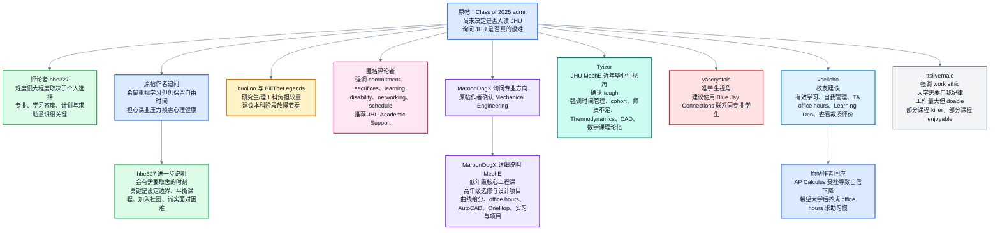

# Reddit r/jhu｜Incoming freshman, scared about difficulty 精读笔记

> **整理说明**：双语逐句块中，**🔹 英文行前一行尾含两个空格**（Markdown 硬换行），预览时英汉不会糊成一段。

---

## 基本信息

| 项目 | 内容 |
|---|---|
| 文章来源 | Reddit 社区 `r/jhu` |
| 原帖链接 | Incoming freshman, scared about difficulty [1](https://www.reddit.com/r/jhu/comments/mwptho) |
| 题目 | **Incoming freshman, scared about difficulty** |
| 发帖者 | `Desperate-Cell-6629` |
| 发帖时间 | Reddit 页面显示约 5 年前，结合 Class of 2025 语境，约为 2021 年春季入学决策期 |
| 主题 | 一名被 Johns Hopkins University 录取的新生，询问 JHU 学业难度、工程专业压力、学习策略、时间管理与校园资源 |
| 作者背景 | Reddit 用户多为化名，未能核验真实身份；可确认的信息仅限帖内公开身份标签：原帖作者为 JHU Class of 2025 admit，意向专业为 Mechanical Engineering；评论者包括 2020 Economics 校友、2022 AMS 硕士生、2022 MatSE 本科生、Engineering Management 研究生、2012 BS/2014 MSE Environmental Engineering 校友等 |
| 背景资料 | JHU 本科生主要在 Homewood 校区学习；JHU 官方介绍称该校 Homewood 校区承载 Arts & Sciences 与 Engineering 本科教学。Academic Support 与 Learning Den 是官方学业支持资源；Learning Den 是 JHU 的核心同伴辅导项目之一。资料参考：JHU Homewood Campus [2](https://www.jhu.edu/life/campuses/homewood/)、JHU Academic Support [3](https://www.jhu.edu/academics/undergraduate-studies/academic-support/)、Learning Den [4](https://academicsupport.jhu.edu/learning-den/)、Blue Jay Connection [5](https://admissions.jhu.edu/portal/bluejayconnect) |

---

## 前情提要

---

## 逐句精读

### 原帖标题与提问者发言：`Desperate-Cell-6629`

🔹 **`Incoming freshman`**, / **`scared about difficulty`**  
🔸 **`即将入学的新生`**，/ 对课程**`难度`**感到害怕。

背景注释：`incoming freshman` 指即将开始大学一年级的新生；在美国大学语境中，freshman 通常指本科一年级学生。`difficulty` 在这里指 JHU 学业挑战、课程强度与适应压力。

> **Incoming freshman** /ˈɪnˌkʌmɪŋ ˈfreʃmən/
> 英文释义：noun phrase, a student who has been admitted and is about to begin the first year of college；名词短语，指“即将入学的一年级大学生”。
> 中文翻译：即将入学的新生。
> 语域：校园、招生、口语。
> 画龙点睛：`incoming` 不只是“进来的”，在教育语境中常表示“即将上任/入学的”，如 `incoming president` 即“候任主席”，`incoming class` 即“新一届学生”。写申请文书或邮件时可用 `incoming freshman at JHU`，比 “new student” 更地道。
>
> **difficulty** /ˈdɪfɪkəlti/
> 英文释义：noun, the state of being hard to do, understand, or deal with；名词，表示“难度、困难、棘手之处”。
> 中文翻译：困难；难度。
> 语域：通用、学术、考试。
> 画龙点睛：`difficulty` 可数时常指具体困难，如 `face difficulties`；不可数时偏抽象，如 `the difficulty of the course`。考试写作中可替换 `problem`，更正式。常见搭配有 `have difficulty doing sth.`，注意后接动名词。

---

🔹 **`Hey`**!  
🔸 **`嘿`**！

背景注释：`Hey` 是网络论坛、邮件、聊天开头常见寒暄语，语气轻松，不适合正式学术写作开头。

> **Hey** /heɪ/
> 英文释义：interjection, used to attract attention or greet someone informally；感叹词，用于非正式打招呼或引起注意。
> 中文翻译：嘿；嗨。
> 语域：口语、网络。
> 画龙点睛：`Hey` 比 `Hi` 更随意，适合同龄人、论坛、聊天；正式邮件中可用 `Dear Professor Smith` 或 `Hello Professor Smith`。在 IELTS/GRE 写作中通常不用 `Hey`，除非写对话或非正式信件。

---

🔹 I'm **`an admit`** / for the **`class of 2025`** / and still haven't **`committed`** to a school...  
🔸 我是 **`2025 届录取生`**，/ 但还没有**`确定入读`**哪所学校……

背景注释：`class of 2025` 在美国大学语境中通常指预计 2025 年毕业的一届学生；如果帖子约在 2021 年春季发布，则该用户处于录取后、入学前的择校阶段。`commit to a school` 指接受录取并交押金/确认入读。

> **admit** /ədˈmɪt/
> 英文释义：noun, especially in admissions contexts, a person who has been admitted to a school or program；名词，在招生语境中指“被录取者”。
> 中文翻译：录取生；被录取者。
> 语域：美国高校招生、半正式。
> 画龙点睛：`admit` 常见作动词“承认；准许进入”，但在美本招生圈可作名词，如 `regular-decision admits`。正式表达可说 `admitted student`。注意不要误译为“承认”。
>
> **commit to a school** /kəˈmɪt tə ə skuːl/
> 英文释义：verb phrase, to formally choose to attend a school after being admitted；动词短语，指被录取后正式决定入读某校。
> 中文翻译：确认入读某校。
> 语域：招生、校园口语。
> 画龙点睛：`commit to` 核心义是“承诺投入”。可用于关系、计划、目标：`commit to a deadline`、`commit to a career path`。这里不是“犯罪”的 `commit a crime`，搭配对象不同，意义完全不同。

---

🔹 I was **`wondering`**, / is **`JHU`** as **`challenging`** / as people **`make it out to be`**?  
🔸 我想问一下，/ **`约翰斯·霍普金斯大学`**真的像大家说的那样**`有挑战性`**吗？

背景注释：`JHU` 是 Johns Hopkins University 的缩写，约翰斯·霍普金斯大学，位于美国马里兰州巴尔的摩，以医学、公共卫生、工程、国际关系等领域闻名。`make it out to be` 指“把它说成某种样子”。

> **wondering** /ˈwʌndərɪŋ/
> 英文释义：verb, thinking about something and wanting to know the answer；动词，表示“想知道；琢磨”。
> 中文翻译：想知道；想问。
> 语域：礼貌口语、邮件。
> 画龙点睛：`I was wondering if/whether...` 是非常地道的委婉提问，比 `I want to know` 更柔和。给教授写邮件可用：`I was wondering whether you would be available during office hours.`
>
> **make it out to be** /meɪk ɪt aʊt tə biː/
> 英文释义：phrasal expression, to describe something as having a particular quality, often exaggeratedly；短语，指“把某事描述成某种样子，常带夸张意味”。
> 中文翻译：把……说成……；渲染成……。
> 语域：口语、评论。
> 画龙点睛：常见结构是 `as ... as people make it out to be`，意思是“是否真像人们说的那么……”。如 `The exam isn't as hard as people make it out to be.` 适合写议论文时表达“名声与实际不符”。

---

🔹 How **`rigorous`** / is it?  
🔸 它到底有多**`严苛`**？

背景注释：`rigorous` 常用于描述课程、训练、研究、制度等“严格、严谨、强度高”。在高校讨论中，`rigorous curriculum` 指课程标准高、要求严、节奏紧。

> **rigorous** /ˈrɪɡərəs/
> 英文释义：adjective, very strict, thorough, and demanding；形容词，表示“严格的、严谨的、要求高的”。
> 中文翻译：严格的；严苛的；严谨的。
> 语域：学术、教育、正式。
> 画龙点睛：`rigorous` 是考试写作高频词，可替换 `hard`，更正式。搭配包括 `rigorous training`、`rigorous research`、`rigorous standards`。注意它不等于单纯“难”，还强调系统性、标准高与要求细致。

---

### 评论者：`hbe327`，帖内身份为 Alumnus - 2020 - Economics

🔹 The **`quick and dirty`** answer / is that it’s as **`challenging`** / as you make it.  
🔸 简短直接地说，/ 它有多**`有挑战性`**，很大程度上取决于你自己怎么安排。

背景注释：`quick and dirty` 是口语表达，意思是“不求细节、先给一个粗略但实用的回答”。评论者以 JHU 经济学 2020 届校友身份发言。

> **quick and dirty** /kwɪk ənd ˈdɜːrti/
> 英文释义：idiom, done quickly and not perfectly, but useful enough for the situation；习语，表示“快速粗略但够用的”。
> 中文翻译：简明粗略的；快速实用的。
> 语域：口语、职场、技术讨论。
> 画龙点睛：这个短语不一定贬义，常用于 `a quick-and-dirty solution/summary`。写正式论文时慎用，可换成 `a brief answer` 或 `a preliminary estimate`。它突出“先给结论，不展开细节”。
>
> **as ... as you make it** /æz æz juː meɪk ɪt/
> 英文释义：comparative structure, something depends largely on how you approach or shape it；比较结构，表示“事情的程度取决于你如何对待它”。
> 中文翻译：取决于你怎么把它变成什么样。
> 语域：口语、建议。
> 画龙点睛：结构 `as difficult/easy/stressful as you make it` 很地道，强调主观选择和行为策略的影响。可用于写作：`College life can be as rewarding as you make it.`

---

🔹 There are definitely people / who **`struggle with`** the difficulty / and there are people / who **`breeze through`** with little issue.  
🔸 的确有人会被这种**`难度`**折腾得很吃力，/ 也有人几乎没遇到什么问题就**`轻松通过`**。

背景注释：这句话用并列结构对比两类学生：一类难以适应，一类适应顺利，暗示 JHU 难度体验因人而异。

> **struggle with** /ˈstrʌɡəl wɪð/
> 英文释义：phrasal verb, to have difficulty dealing with something；动词短语，表示“艰难应对；在……方面吃力”。
> 中文翻译：苦于应对；在……上挣扎。
> 语域：通用、教育、心理。
> 画龙点睛：`struggle with math/anxiety/time management` 都很自然。比 `have problems with` 更有画面感，强调持续费力。写作中可用来描述学生、社会群体、企业面对挑战。
>
> **breeze through** /briːz θruː/
> 英文释义：phrasal verb, to do something very easily or with little effort；动词短语，表示“轻松完成；顺利通过”。
> 中文翻译：轻松通过；毫不费力地完成。
> 语域：口语。
> 画龙点睛：`breeze` 本义“微风”，短语带有“像风一样轻松掠过”的感觉。常说 `breeze through an exam/course/interview`。反义可用 `struggle through`，形成漂亮对比。

---

🔹 A lot of it / **`depends on`** your **`program of study`** / and how seriously you **`take your studies`**.  
🔸 很大一部分取决于你的**`专业项目`**，/ 以及你对学业有多**`认真`**。

背景注释：`program of study` 可指专业、课程计划或学位项目。美国大学不同专业差异很大，工程、医学预科、自然科学等常被认为课业强度较高。

> **depend on** /dɪˈpend ɑːn/
> 英文释义：phrasal verb, to be decided or influenced by something；动词短语，表示“取决于；受……影响”。
> 中文翻译：取决于。
> 语域：通用、学术。
> 画龙点睛：`depend on` 后接名词、代词或从句：`It depends on whether...`。写作中可升级为 `be contingent on` 或 `be determined by`，但日常表达 `depend on` 最自然。
>
> **take your studies seriously** /teɪk jʊr ˈstʌdiz ˈsɪriəsli/
> 英文释义：verb phrase, to treat academic work as important and make real effort；动词短语，表示“认真对待学业”。
> 中文翻译：重视学业；认真学习。
> 语域：校园、口语。
> 画龙点睛：`take sth. seriously` 是高频万能搭配：`take deadlines seriously`、`take feedback seriously`。注意不是 `serious your studies`，而是动词结构 `take + object + seriously`。

---

🔹 If you **`goof off`**, / then yeah / it’s gonna **`suck`**.  
🔸 如果你**`混日子`**，/ 那确实，/ 日子会很**`难受`**。

背景注释：句子语气非常口语化。`gonna` 是 `going to` 的口语缩写；`suck` 在美式英语中常表示“很糟糕”。

> **goof off** /ɡuːf ɔːf/
> 英文释义：phrasal verb, to waste time or avoid work；动词短语，表示“偷懒；混时间；不务正业”。
> 中文翻译：混日子；偷懒。
> 语域：口语。
> 画龙点睛：`goof off` 带轻微责备但不算特别粗鲁。校园语境可说 `I goofed off all semester.` 近义词有 `slack off`，后者更常见于学习和工作场景。
>
> **suck** /sʌk/
> 英文释义：verb, informal, to be very bad, unpleasant, or disappointing；动词，非正式用法，表示“很糟；令人不爽”。
> 中文翻译：糟糕；难受；很烂。
> 语域：口语、俚语。
> 画龙点睛：`suck` 正式场合慎用。可替换为 `be unpleasant`、`be difficult`、`be frustrating`。口语中 `That sucks` 表示“太糟了/真倒霉”，不是字面“吸”。

---

🔹 If you **`make a plan`** / for classes and studying, / **`stick to it`**, / talk to professors before issues **`arise`** / and **`keep up`**, / you’ll be fine.  
🔸 如果你为选课和学习**`制定计划`**，/ 并且**`坚持执行`**，/ 在问题**`出现`**之前就去和教授沟通，/ 同时**`跟上进度`**，/ 你会没问题的。

背景注释：`professors` 指大学教授；美国高校中，主动在 office hours 与教授沟通是重要学习策略。

> **stick to it** /stɪk tə ɪt/
> 英文释义：phrasal verb, to continue following a plan, rule, or decision；动词短语，表示“坚持某事；按计划执行”。
> 中文翻译：坚持执行。
> 语域：通用、口语。
> 画龙点睛：`stick to a plan/schedule/budget` 非常实用。`stick with` 更强调持续做某事或陪伴某人；`stick to` 更强调遵守既定计划、原则、路线。
>
> **arise** /əˈraɪz/
> 英文释义：verb, to happen or begin to exist, especially a problem or situation；动词，表示“出现；产生”，常指问题或情况。
> 中文翻译：出现；产生。
> 语域：正式、学术。
> 画龙点睛：`arise` 的过去式、过去分词是 `arose, arisen`。常见搭配 `problems/issues arise`。比 `happen` 更正式，适合写作：`Several ethical concerns arise from this policy.`
>
> **keep up** /kiːp ʌp/
> 英文释义：phrasal verb, to stay at the same level or pace as others or as required；动词短语，表示“跟上进度”。
> 中文翻译：跟上；保持同步。
> 语域：学习、工作、口语。
> 画龙点睛：常见搭配 `keep up with coursework/readings/the class`。反义表达是 `fall behind`。考试写作中可用：`Students struggle to keep up with the pace of instruction.`

---

### 原帖作者回复

🔹 I see, / I plan on **`prioritizing`** my studies / while in college / but it would be nice / to have some **`free time`** / and still enjoy my **`college life`**.  
🔸 我明白了，/ 我打算在大学期间**`优先重视`**学业，/ 但如果还能有一些**`自由时间`**、/ 继续享受**`大学生活`**，那就很好了。

背景注释：这句话体现美国大学申请者常见顾虑：如何在学业强度、个人生活、社交和心理健康之间取得平衡。

> **prioritize** /praɪˈɔːrətaɪz/
> 英文释义：verb, to treat something as more important than other things；动词，表示“优先考虑；把……置于优先地位”。
> 中文翻译：优先重视。
> 语域：学术、职场、日常。
> 画龙点睛：`prioritize my studies/work/health` 是高频表达。名词是 `priority`，如 `My top priority is academic stability.` 写作中比 `put first` 更正式、更成熟。
>
> **free time** /friː taɪm/
> 英文释义：noun, time when you are not working or studying and can do what you want；名词，表示“不工作或学习的空闲时间”。
> 中文翻译：空闲时间；自由时间。
> 语域：通用。
> 画龙点睛：`free time` 不等于 `spare time` 完全相同，但二者可互换。`leisure time` 更正式，适合写作。常见搭配：`make time for hobbies`、`have enough downtime`。

---

🔹 Most of the reddit posts / I've seen about **`jhu`** / has been about how they have to **`sacrifice`** their **`mental health`** / just to **`keep up with`** the **`coursework`**...  
🔸 我看到的大多数关于 **`JHU`** 的 Reddit 帖子，/ 都是在说他们为了**`跟上课程任务`**，/ 不得不**`牺牲心理健康`**……

背景注释：原句中 `posts ... has been` 存在主谓一致问题，标准写法应为 `posts ... have been`。`mental health` 指心理健康；大学学业压力与心理健康是美国高校讨论中的重要议题。

> **sacrifice** /ˈsækrɪfaɪs/
> 英文释义：verb/noun, to give up something valuable in order to gain or do something else；动词/名词，表示“牺牲；舍弃”。
> 中文翻译：牺牲。
> 语域：通用、正式。
> 画龙点睛：`sacrifice A for B` 表示“为了 B 牺牲 A”。也可说 `make sacrifices`。写作中常用于讨论教育、职业、家庭：`Students should not sacrifice their well-being for grades.`
>
> **mental health** /ˈmentəl helθ/
> 英文释义：noun, a person's emotional and psychological well-being；名词，指人的情绪与心理健康状态。
> 中文翻译：心理健康。
> 语域：医学、教育、公共议题。
> 画龙点睛：`mental health` 是不可数名词，常搭配 `protect, support, harm, affect`。同类表达有 `well-being`，更宽泛，可同时涵盖身心状态与生活质量。
>
> **coursework** /ˈkɔːrswɜːrk/
> 英文释义：noun, written or practical work students do as part of a course；名词，指课程作业、课程任务。
> 中文翻译：课程作业；课业。
> 语域：教育、学术。
> 画龙点睛：`coursework` 通常不可数，不说 `courseworks`。可搭配 `heavy coursework`、`keep up with coursework`、`complete coursework`。比单纯 `homework` 范围更广。

---

### `hbe327` 进一步回复

🔹 I mean / there are definite **`gut-check moments`** / where yeah, / you’re going to have to **`make some sacrifices`** / to do well.  
🔸 我的意思是，/ 确实会有一些**`考验心态的关键时刻`**，/ 那时你为了表现好，/ 的确得做出一些**`取舍和牺牲`**。

背景注释：`gut-check moment` 源自体育/竞争语境，指考验意志、勇气、承受力的时刻。在大学语境中，可指期中、期末、项目截止前等压力节点。

> **gut-check moment** /ˈɡʌt tʃek ˈmoʊmənt/
> 英文释义：noun phrase, a situation that tests one’s courage, resolve, or ability to cope；名词短语，指“考验意志和承受力的时刻”。
> 中文翻译：关键考验时刻；硬仗时刻。
> 语域：口语、体育、校园。
> 画龙点睛：`gut` 本义“肠胃”，引申为“胆量、直觉、内在韧性”。`gut-check` 常表示现实压力逼你检验自己是否扛得住。可写作中转化为 `a test of resilience`。
>
> **make sacrifices** /meɪk ˈsækrɪfaɪsɪz/
> 英文释义：verb phrase, to give up certain benefits, comforts, or opportunities for a goal；动词短语，表示“为目标作出牺牲”。
> 中文翻译：作出牺牲。
> 语域：通用、正式。
> 画龙点睛：`make a sacrifice` 强调具体一次牺牲，`make sacrifices` 强调长期或多方面取舍。可搭配 `academic success`、`career advancement`、`family responsibilities`。

---

🔹 The question is / where do you **`draw the line`**?  
🔸 问题在于，/ 你的**`底线`**划在哪里？

背景注释：`draw the line` 是重要习语，指设定界限，尤其是“我能接受到哪里，不能接受什么”。

> **draw the line** /drɔː ðə laɪn/
> 英文释义：idiom, to set a limit on what you are willing to do or accept；习语，表示“划定界限；设定底线”。
> 中文翻译：划底线；设限。
> 语域：口语、议论文。
> 画龙点睛：可说 `draw the line at sacrificing sleep`，意思是“底线是不牺牲睡眠”。写作中很好用：`Society must draw the line between ambition and exploitation.`

---

🔹 That’s different / for different people.  
🔸 这一点，/ 对不同的人来说是不一样的。

背景注释：该句承接上一句，强调个人边界、压力承受度、目标与价值排序不同。

> **different for different people** /ˈdɪfrənt fər ˈdɪfrənt ˈpiːpəl/
> 英文释义：phrase, varying according to individual circumstances or preferences；短语，表示“因人而异”。
> 中文翻译：因人而异。
> 语域：通用、口语。
> 画龙点睛：英语中“因人而异”可说 `It varies from person to person.` 这比直译 `different for different people` 更正式。写作推荐：`The impact varies from individual to individual.`

---

🔹 There definitely are ways / to **`ensure`** you have some free time / in your schedule / where you can enjoy yourself / and be with friends.  
🔸 确实有办法**`确保`**你的日程里留出一些自由时间，/ 让你可以放松自己，/ 也能和朋友相处。

背景注释：美国大学生活中，时间表设计不仅包括课程，也包括学习、社交、社团、运动、休息与求助资源安排。

> **ensure** /ɪnˈʃʊr/
> 英文释义：verb, to make certain that something happens or is true；动词，表示“确保；保证”。
> 中文翻译：确保。
> 语域：正式、学术、职场。
> 画龙点睛：`ensure` 比 `make sure` 更正式。常见结构：`ensure that + clause`、`ensure access to resources`。注意不要与 `insure` 混淆，后者多指“投保”。
>
> **enjoy yourself** /ɪnˈdʒɔɪ jɔːrˈself/
> 英文释义：verb phrase, to have a pleasant time；动词短语，表示“玩得开心；享受生活”。
> 中文翻译：放松享受；过得开心。
> 语域：口语。
> 画龙点睛：`enjoy yourself` 比 `enjoy` 单独使用更自然，因为 `enjoy` 通常是及物动词，要接宾语。比如 `Enjoy yourself at college` 比 `Enjoy at college` 正确。

---

🔹 The easiest way / to do that / is to **`plan and balance`** your schedule / so you’re not **`overloading`** with classes / too many semesters.  
🔸 最简单的方法，/ 就是**`规划并平衡`**你的课表，/ 避免太多个学期都选课**`过载`**。

背景注释：美国大学通常以学期为单位选课；`overload` 可指选课数量过多、学分过重或学习任务超出承受范围。

> **balance your schedule** /ˈbæləns jʊr ˈskedʒuːl/
> 英文释义：verb phrase, to arrange tasks or classes so that demands are manageable；动词短语，表示“平衡安排日程”。
> 中文翻译：平衡安排课表/日程。
> 语域：校园、职场。
> 画龙点睛：`balance` 常用于时间、责任、利益：`balance work and life`、`balance academic and social commitments`。写作中可替换 `arrange reasonably`，更地道。
>
> **overload** /ˌoʊvərˈloʊd/
> 英文释义：verb/noun, to put too much work, information, or responsibility on someone or something；动词/名词，表示“使负担过重；过载”。
> 中文翻译：使过载；负担过重。
> 语域：教育、技术、职场。
> 画龙点睛：学生常说 `overload on courses` 或 `take an overloaded schedule`。名词如 `information overload` 指“信息过载”。核心是“超过系统承受能力”。

---

🔹 You should also / **`look at`** a few **`clubs`** / to join.  
🔸 你也应该考虑参加几个**`社团`**。

背景注释：美国大学社团是学生拓展社交、职业兴趣、领导力与归属感的重要方式。`look at` 在这里不是“看一眼”，而是“考虑、了解”。

> **look at** /lʊk æt/
> 英文释义：phrasal verb, to consider or examine something as a possibility；动词短语，表示“考虑；了解；查看”。
> 中文翻译：考虑；看看。
> 语域：口语、通用。
> 画龙点睛：`look at options/clubs/programs` 表示“了解可选项”。正式写作可用 `consider`、`explore`。不要机械翻译成“看着几个社团”。
>
> **club** /klʌb/
> 英文释义：noun, an organization for people who share an interest or activity；名词，指“社团；俱乐部”。
> 中文翻译：社团；俱乐部。
> 语域：校园、通用。
> 画龙点睛：大学里的 `clubs` 可包括学术、职业、文化、志愿、运动等。常见搭配：`join a club`、`student club`、`club fair`。写简历时可说 `student organization`，更正式。

---

🔹 In the end, / it’s just about being **`diligent`** / and **`honest with yourself`** / about where you are / and what you’re **`struggling with`**.  
🔸 归根结底，/ 关键就是要**`勤勉`**，/ 也要对自己保持**`诚实`**，/ 清楚自己处在什么状态，/ 正在被什么问题困住。

背景注释：这是关于自我管理的建议：不仅要努力，还要能准确识别自身学习状态与困难来源。

> **diligent** /ˈdɪlɪdʒənt/
> 英文释义：adjective, working carefully and steadily with effort；形容词，表示“勤勉的；认真努力的”。
> 中文翻译：勤勉的；用功的。
> 语域：正式、学术、职场。
> 画龙点睛：`diligent` 比 `hard-working` 更书面。名词是 `diligence`。可说 `a diligent student`、`diligent preparation`。GRE/考研写作中很适合替换简单词。
>
> **honest with yourself** /ˈɑːnɪst wɪð jʊrˈself/
> 英文释义：phrase, willing to recognize the truth about your own situation, limits, or feelings；短语，表示“对自己诚实，愿意承认真实状态”。
> 中文翻译：坦诚面对自己。
> 语域：心理、自我管理、口语。
> 画龙点睛：常见句型：`Be honest with yourself about what you can handle.` 其中 `what you can handle` 表示“你能承受多少”，适合谈压力管理。

---

🔹 If you do that, / you’ll be fine.  
🔸 如果你能做到这些，/ 你会没问题的。

背景注释：`you’ll be fine` 是安慰性表达，语气比 `you will succeed` 更轻松。

> **be fine** /bi faɪn/
> 英文释义：verb phrase, to be all right or able to manage a situation；动词短语，表示“没事；能应付；会好起来”。
> 中文翻译：没问题；会好的。
> 语域：口语、安慰。
> 画龙点睛：`fine` 不只是“好的”，在口语中常用于缓和焦虑：`You'll be fine.`、`It's going to be fine.` 写正式文章时可换成 `be able to cope effectively`。

---

### 评论者：`huolioo`，帖内身份为 Grad - 2022 - AMS

🔹 I'm a **`master student`**, / and here it's **`double the workload`** / of my undergrad, / or even more.  
🔸 我是**`硕士生`**，/ 在这里的**`工作量`**大概是我本科时的两倍，/ 甚至更多。

背景注释：标准英语中更常见说法是 `master's student` 或 `graduate student`，`master student` 非母语者常用但不够地道。`AMS` 在 JHU 语境中通常指 Applied Mathematics and Statistics。

> **master's student** /ˈmæstərz ˈstuːdənt/
> 英文释义：noun phrase, a student studying for a master’s degree；名词短语，指“攻读硕士学位的学生”。
> 中文翻译：硕士生。
> 语域：教育、正式。
> 画龙点睛：更地道写法是 `master's student`，因为这里是 `master's degree` 的所有格形式。也可说 `graduate student`，但在美国 `graduate student` 包括硕士和博士。
>
> **workload** /ˈwɜːrkloʊd/
> 英文释义：noun, the amount of work someone has to do；名词，表示“工作量；任务量”。
> 中文翻译：工作量；课业量。
> 语域：教育、职场。
> 画龙点睛：`heavy workload` 是高频搭配。注意 `workload` 通常可数，如 `a heavy workload`。写作可说 `an excessive academic workload can undermine students' well-being`。

---

🔹 There, / I was also **`working part-time`** / while studying / and still think it was less work.  
🔸 在我本科那里，/ 我还一边学习一边**`兼职`**，/ 但现在回想起来，工作量仍然比这里少。

背景注释：`there` 指评论者之前的本科院校；与 JHU 硕士阶段形成对比。

> **work part-time** /wɜːrk ˌpɑːrt ˈtaɪm/
> 英文释义：verb phrase, to work for fewer hours than a full-time job, often alongside study；动词短语，表示“兼职工作”。
> 中文翻译：兼职。
> 语域：学习、就业。
> 画龙点睛：`part-time` 可作形容词或副词：`a part-time job`、`work part-time`。反义是 `full-time`。留学语境中常与 `while studying` 搭配。
>
> **less work** /les wɜːrk/
> 英文释义：noun phrase, a smaller amount of tasks or effort required；名词短语，表示“更少的工作量”。
> 中文翻译：较少的任务量。
> 语域：口语、通用。
> 画龙点睛：`work` 作“工作量”时不可数，因此用 `less work`，不用 `fewer work`。`fewer` 用于可数名词复数，如 `fewer assignments`。

---

🔹 But I am **`guessing`** / as an undergrad / you can take classes / at a **`slower pace`**, / and I'd definitely **`advise`** that.  
🔸 但我猜，/ 作为本科生，/ 你可以用**`更慢的节奏`**来修课，/ 我也肯定会建议你这么做。

背景注释：美国大学本科生通常有一定选课弹性，可通过减少某学期课程数量、暑期课程或提前规划来调节节奏。

> **slower pace** /ˈsloʊər peɪs/
> 英文释义：noun phrase, a less rapid speed or rhythm of progress；名词短语，表示“较慢的节奏”。
> 中文翻译：更慢的节奏。
> 语域：学习、工作、运动。
> 画龙点睛：`pace` 指速度、节奏，常搭配 `at a slow/fast/steady pace`。学习建议中可说 `learn at your own pace`，意思是“按自己的节奏学习”。
>
> **advise** /ədˈvaɪz/
> 英文释义：verb, to recommend what someone should do；动词，表示“建议；劝告”。
> 中文翻译：建议。
> 语域：正式、半正式。
> 画龙点睛：`advise` 是动词，`advice` 是不可数名词。常见结构：`advise doing sth.` 或 `advise someone to do sth.`。不要说 `advise that to you`。

---

### 评论者：`BillTheLegends`

🔹 Can’t **`agree more`**.  
🔸 完全**`同意`**。

背景注释：这是英语中常见的强烈同意表达，完整形式是 `I can't agree more.` 字面是“我不能同意得更多了”，实际意思是“我再同意不过了”。

> **can’t agree more** /kænt əˈɡriː mɔːr/
> 英文释义：idiom, used to say that you completely agree with someone；习语，表示“完全同意”。
> 中文翻译：再同意不过；完全赞同。
> 语域：口语、评论。
> 画龙点睛：等于 `I completely agree.` 也可说 `I couldn't agree more.` 后者更标准、更常见。注意不能按字面误解为“不能同意更多，所以不同意”。

---

🔹 Especially / for all the **`science and engineering`**.  
🔸 尤其是对所有**`科学与工程`**专业来说。

背景注释：原句为省略句，承接上一条“工作量很大”的观点；`science and engineering` 泛指 STEM 中自然科学与工程学科。

> **science and engineering** /ˈsaɪəns ənd ˌendʒɪˈnɪrɪŋ/
> 英文释义：noun phrase, academic fields involving scientific inquiry and practical technical design；名词短语，指科学研究与工程技术类学科。
> 中文翻译：科学与工程。
> 语域：教育、学术。
> 画龙点睛：美国教育语境常说 `STEM`，即 Science, Technology, Engineering, and Mathematics。若写作强调理工科负担，可说 `students in STEM fields often face demanding workloads`。

---

### 匿名评论者：`[deleted]`

🔹 Hopkins / takes a lot of **`commitment`** / and many **`sacrifices`** will have to be made, / depending on the **`major`** you choose / and your **`career goals`**.  
🔸 霍普金斯需要大量**`投入`**，/ 而且你必须做出很多**`牺牲`**，/ 具体取决于你选择的**`专业`**和你的**`职业目标`**。

背景注释：`Hopkins` 是 Johns Hopkins University 的简称。美国大学中，`major` 指本科主修专业；`career goals` 指职业发展目标，如读研、就业、医学院、工程行业等。

> **commitment** /kəˈmɪtmənt/
> 英文释义：noun, willingness to give time, energy, and effort to something important；名词，表示“投入；承诺；责任感”。
> 中文翻译：投入；承诺。
> 语域：正式、教育、职场。
> 画龙点睛：`commitment` 常搭配 `strong/deep/long-term commitment`。学习语境中强调持续投入，不只是兴趣。动词是 `commit`，形容词是 `committed`。
>
> **career goals** /kəˈrɪr ɡoʊlz/
> 英文释义：noun phrase, aims related to one’s future job or professional life；名词短语，表示“职业目标”。
> 中文翻译：职业目标。
> 语域：教育、职场、申请文书。
> 画龙点睛：申请文书常写 `my long-term career goal is to...`。注意 `career` 强调整体职业生涯，`job` 更偏具体工作岗位。

---

🔹 Make sure / you do not have any **`learning disability`** / before entering college, / as it is not **`uncommon`** / for people to discover / that they have them / once they start college classes.  
🔸 进入大学前，/ 要确认自己没有任何**`学习障碍`**，/ 因为不少人是在开始上大学课程后，/ 才发现自己存在这类问题。

背景注释：`learning disability` 指影响阅读、写作、数学、注意力等学习过程的障碍；在美国高校，相关学生可通过 disability services 申请合理便利。该评论为个人建议，不等同医学诊断意见。

> **learning disability** /ˈlɜːrnɪŋ ˌdɪsəˈbɪləti/
> 英文释义：noun, a condition that makes certain kinds of learning more difficult despite typical intelligence；名词，指在智力正常情况下影响某些学习能力的障碍。
> 中文翻译：学习障碍。
> 语域：教育、医学、心理。
> 画龙点睛：`disability` 不应简单译为“残疾”而带贬义，在教育语境中是中性术语。常见搭配 `learning disabilities`、`disability accommodations`。
>
> **uncommon** /ʌnˈkɑːmən/
> 英文释义：adjective, not rare; not happening often but still possible；形容词，表示“并非罕见的；不常见但会发生的”。
> 中文翻译：不罕见；并非少见。
> 语域：正式、通用。
> 画龙点睛：`It is not uncommon for...` 是经典双重否定结构，语气比 `common` 更委婉，适合写作：`It is not uncommon for freshmen to feel overwhelmed.`

---

🔹 **`Stay on top of`** your work / and always try to **`stay ahead`** / when it is possible.  
🔸 要**`掌控好`**自己的任务，/ 并且在可能的时候，/ 总是尽量**`提前完成`**。

背景注释：这是典型大学学习建议：不要等到截止日期前堆积任务，而要维持领先进度。

> **stay on top of** /steɪ ɑːn tɑːp əv/
> 英文释义：idiom, to remain in control of tasks and not fall behind；习语，表示“掌控；及时处理；不落后”。
> 中文翻译：跟进并掌控。
> 语域：口语、职场、学习。
> 画龙点睛：常见搭配 `stay on top of emails/assignments/deadlines`。比 `do your work` 更强调持续管理。反义是 `fall behind`。
>
> **stay ahead** /steɪ əˈhed/
> 英文释义：verb phrase, to remain in advance of deadlines, competitors, or requirements；动词短语，表示“保持领先；提前完成”。
> 中文翻译：走在前面；提前准备。
> 语域：学习、职场。
> 画龙点睛：学习语境中可说 `stay ahead of the syllabus/readings`。写作中可用来表达竞争：`Companies must innovate to stay ahead of competitors.`

---

🔹 Do your best / to try and **`network with`** other students / as soon as you enter college, / as it will help you later / in your **`college career`**.  
🔸 你一进入大学，/ 就要尽力去和其他同学**`建立人脉与联系`**，/ 因为这会在你之后的**`大学阶段`**帮到你。

背景注释：`college career` 不是“大学职业”，而是“大学生涯”。`network` 在美国校园和职场中表示主动建立社交、学术或职业联系。

> **network with** /ˈnetwɜːrk wɪð/
> 英文释义：verb phrase, to meet and build useful relationships with people；动词短语，表示“与……建立关系网络”。
> 中文翻译：建立人脉；拓展关系。
> 语域：职场、校园、半正式。
> 画龙点睛：`network` 可作名词“网络/人脉”，也可作动词。不要只理解为互联网。常说 `network with alumni/professors/peers`，对求实习、项目和职业发展很重要。
>
> **college career** /ˈkɑːlɪdʒ kəˈrɪr/
> 英文释义：noun phrase, the period and development of one’s life as a college student；名词短语，指“大学生涯”。
> 中文翻译：大学生涯。
> 语域：校园。
> 画龙点睛：`career` 不只指工作生涯，也可指某一阶段经历，如 `academic career`、`college career`、`athletic career`。翻译时要根据上下文处理。

---

🔹 This means / joining **`clubs`** / that **`interest`** you, / especially.  
🔸 这尤其意味着，/ 要加入那些让你**`感兴趣`**的社团。

背景注释：这里承接上一句，说明建立人脉的具体方式之一是加入社团。

> **interest** /ˈɪntrəst/
> 英文释义：verb, to make someone want to know more about or take part in something；动词，表示“使感兴趣”。
> 中文翻译：使……感兴趣。
> 语域：通用。
> 画龙点睛：`clubs that interest you` 中 `interest` 是动词，不是名词。类似结构：`topics that interest me`。形容词区分：`interested` 修饰人，`interesting` 修饰物。
>
> **especially** /ɪˈspeʃəli/
> 英文释义：adverb, more than usual or more than others；副词，表示“尤其；特别”。
> 中文翻译：尤其；特别是。
> 语域：通用、写作。
> 画龙点睛：`especially` 强调某一点特别重要。正式写作可替换 `particularly`。注意拼写不是 `specially`；`specially` 更偏“专门地”。

---

🔹 Have **`fidelity`** toward a schedule / that you create / for yourself.  
🔸 对你为自己制定的日程安排，/ 要保持**`忠实执行`**。

背景注释：`fidelity toward a schedule` 搭配略正式且不太常见；更自然说法是 `stick to the schedule you create for yourself`。

> **fidelity** /fɪˈdeləti/
> 英文释义：noun, faithfulness or loyalty to a person, principle, or plan；名词，表示“忠诚；忠实；严守”。
> 中文翻译：忠诚；忠实执行。
> 语域：正式、法律、技术。
> 画龙点睛：`fidelity` 常见于 `marital fidelity`、`high-fidelity audio`、`fidelity to principles`。学习语境中不如 `stick to` 自然。这里可理解为“严格遵守计划”。
>
> **create for yourself** /kriˈeɪt fər jʊrˈself/
> 英文释义：verb phrase, to make something personally for one’s own use；动词短语，表示“为自己制定/创造”。
> 中文翻译：为自己制定。
> 语域：通用。
> 画龙点睛：`for yourself` 强调自主性。学习计划中可说 `create a realistic schedule for yourself`，其中 `realistic` 表示“切合实际的”。

---

🔹 Study **`EVERY`** section of this website / **`top to bottom`** / before starting / as a freshman at Hopkins.  
🔸 在以霍普金斯新生身份开始大学生活前，/ 要把这个网站的**`每一个`**板块都**`从头到尾`**研究一遍。

背景注释：这里的网站指 JHU Academic Support。JHU 官方 Academic Support 提供学习策略、辅导、咨询等资源；Learning Den 是其中的同伴辅导项目之一。

> **top to bottom** /tɑːp tə ˈbɑːtəm/
> 英文释义：idiom, completely and thoroughly, from beginning to end；习语，表示“从头到尾；彻底地”。
> 中文翻译：从头到尾；彻底。
> 语域：口语、通用。
> 画龙点睛：可说 `read the document top to bottom`。同义表达有 `from start to finish`、`thoroughly`。`EVERY` 全大写在网络语境中表示强调。
>
> **freshman** /ˈfreʃmən/
> 英文释义：noun, a first-year student at a high school or college；名词，指高中或大学一年级学生。
> 中文翻译：一年级新生。
> 语域：美国教育。
> 画龙点睛：现在部分高校为性别中立会用 `first-year student` 替代 `freshman`。写正式申请材料时推荐 `first-year student`，更包容、更现代。

---

🔹 It will **`save you`** a lot of trouble / in the future / when you actually need help / becoming a college student.  
🔸 这会在将来你真正需要帮助、/ 适应大学生身份时，/ 为你**`省去很多麻烦`**。

背景注释：`becoming a college student` 不只是入学身份变化，也包括学习方式、时间管理、求助习惯、社交网络等适应过程。

> **save you trouble** /seɪv juː ˈtrʌbəl/
> 英文释义：verb phrase, to prevent you from having problems or extra difficulty later；动词短语，表示“让你免去麻烦”。
> 中文翻译：省去麻烦。
> 语域：口语、通用。
> 画龙点睛：常见结构 `save someone time/money/trouble`。例如 `Planning ahead can save you a lot of stress.` 这里 `save` 不是“拯救”，而是“节省、免除”。
>
> **actually** /ˈæktʃuəli/
> 英文释义：adverb, used to emphasize what is really true or what happens in reality；副词，表示“实际上；真正地”。
> 中文翻译：真正地；实际上。
> 语域：口语、通用。
> 画龙点睛：`actually` 不总是“事实上反驳”，也可用于强调现实情况。口语中频繁出现，但学术写作中过多使用会显得松散，可替换为 `in practice`。

---

### 评论者：`MaroonDogX`，帖内身份为 Undergrad - 2022 - MatSE

🔹 **`Knowing`** which program/major/general direction / you're interested in / might help us **`answer better`**.  
🔸 如果知道你感兴趣的是哪个项目、专业或大方向，/ 可能能帮助我们**`更好地回答`**。

背景注释：`MatSE` 通常指 Materials Science and Engineering，即材料科学与工程。

> **general direction** /ˈdʒenrəl dəˈrekʃən/
> 英文释义：noun phrase, a broad area of interest or intended path, not yet specific；名词短语，表示“大致方向”。
> 中文翻译：大方向。
> 语域：口语、规划。
> 画龙点睛：当专业尚未确定时，可说 `a general direction`，如 `I'm interested in the general direction of engineering and applied math.` 它比 `major` 更宽泛。
>
> **answer better** /ˈænsər ˈbetər/
> 英文释义：verb phrase, to provide a more useful or accurate response；动词短语，表示“更好地回答”。
> 中文翻译：更准确/更有效地回答。
> 语域：口语。
> 画龙点睛：更正式可说 `provide a more informed answer`。其中 `informed` 表示“基于充分信息的”，适合学术和咨询语境。

---

### 原帖作者回复

🔹 I'm **`going in as`** a **`mechanical engineering`** major!  
🔸 我会以**`机械工程`**专业学生的身份入学！

背景注释：`Mechanical Engineering` 机械工程，通常涉及力学、热力学、材料、机械设计、制造、控制、CAD 等方向。

> **go in as** /ɡoʊ ɪn æz/
> 英文释义：phrasal expression, to enter a school or situation with a particular role, status, or major；短语，表示“以某种身份进入”。
> 中文翻译：以……身份入学/进入。
> 语域：口语、校园。
> 画龙点睛：`go in as a mechanical engineering major` 很口语。正式写法可说 `I intend to enter as a mechanical engineering major` 或 `I have been admitted as...`。
>
> **mechanical engineering** /məˈkænɪkəl ˌendʒɪˈnɪrɪŋ/
> 英文释义：noun, the branch of engineering concerned with machines, mechanics, energy, design, and manufacturing；名词，研究机械、力学、能量、设计与制造的工程学科。
> 中文翻译：机械工程。
> 语域：学术、工程。
> 画龙点睛：常缩写为 `MechE`。相关课程包括 `thermodynamics`、`mechanics`、`CAD`、`materials`。申请和简历中通常写全称，论坛中常用缩写。

---

### `MaroonDogX` 详细回复

🔹 For **`MechE`**, / what I could **`gather`** / is that you'll probably spend your **`underclassmen`** period / studying up on the more general **`core content`** for engineering, / and then you can pretty much **`make do with`** whatever you want / junior/senior year.  
🔸 就**`机械工程`**而言，/ 据我所能了解到的情况，/ 你大概会在**`低年级阶段`**学习工程学更通用的**`核心内容`**，/ 然后到大三、大四时，基本可以根据自己想走的方向来安排。

背景注释：`MechE` 是 Mechanical Engineering 的常见缩写。美国本科中 `underclassmen` 通常指大一、大二；`junior/senior year` 分别指大三、大四。

> **gather** /ˈɡæðər/
> 英文释义：verb, to understand or believe something based on information available；动词，表示“据理解；据了解到”。
> 中文翻译：了解到；推断。
> 语域：口语、半正式。
> 画龙点睛：`what I gather is that...` 很地道，表示“据我了解……”。比 `I know` 更谨慎，适合在信息不完全确定时表达判断。
>
> **underclassmen** /ˌʌndərˈklæsmən/
> 英文释义：noun, first- and second-year college students；名词，指大学低年级学生。
> 中文翻译：低年级学生。
> 语域：美国校园。
> 画龙点睛：单数可为 `underclassman`，但近年来为了性别中立，也可用 `lower-year students` 或 `first- and second-year students`。
>
> **make do with** /meɪk duː wɪð/
> 英文释义：phrasal verb, to manage with what is available, even if it is not ideal；动词短语，表示“将就着用；设法应付”。
> 中文翻译：用……凑合；灵活安排。
> 语域：口语。
> 画龙点睛：这里用法略松，意思接近“根据可选项自行安排”。常见句：`We had to make do with limited resources.` 核心含义是“条件有限但能应付”。

---

🔹 It can be **`rigorous`**, / but **`fair`**, / and **`rewarding`**.  
🔸 它可能会很**`严苛`**，/ 但也算**`公平`**，/ 并且**`有回报`**。

背景注释：该句概括对 JHU MechE 的评价：难但不一定不合理，努力可能带来能力、项目、简历和职业机会。

> **fair** /fer/
> 英文释义：adjective, reasonable, just, and treating people equally；形容词，表示“公平的；合理的”。
> 中文翻译：公平的；合理的。
> 语域：通用。
> 画龙点睛：课程评价中 `fair` 常指考试、评分、工作量与教学目标相符。可说 `The course is hard but fair.` 这是评价高难课程的经典表达。
>
> **rewarding** /rɪˈwɔːrdɪŋ/
> 英文释义：adjective, giving satisfaction, benefits, or a sense of achievement；形容词，表示“有收获的；值得的”。
> 中文翻译：有回报的；有成就感的。
> 语域：教育、职场。
> 画龙点睛：`rewarding` 不一定指金钱奖励，更常指精神满足或长期收益。搭配：`a rewarding experience/career/course`。写作中比 `good` 更精准。

---

🔹 The **`core engineering STEM courses`** / like the calc 1-3, LADE, coding, thermo, etc. / are, IMO, / at least **`moderate workload`**, / and become easier / if you get good **`study groups`** going.  
🔸 核心工程类 **`STEM 课程`**，/ 比如微积分 1 到 3、LADE、编程、热力学等，/ 在我看来，/ 至少是**`中等偏上的工作量`**；/ 如果你能组建起好的**`学习小组`**，这些课会变得更容易。

背景注释：`calc 1-3` 指 Calculus I–III；`LADE` 在工程数学语境中通常指 Linear Algebra and Differential Equations；`thermo` 指 Thermodynamics；`IMO` 是 `in my opinion` 的网络缩写。

> **STEM** /stem/
> 英文释义：acronym, Science, Technology, Engineering, and Mathematics；缩略词，指科学、技术、工程和数学。
> 中文翻译：理工科；STEM 学科。
> 语域：教育、政策、学术。
> 画龙点睛：`STEM courses/fields/majors` 是高频表达。与人文社科可形成对比：`STEM and humanities education should complement each other.`
>
> **moderate workload** /ˈmɑːdərət ˈwɜːrkloʊd/
> 英文释义：noun phrase, an amount of work that is neither light nor extremely heavy；名词短语，表示“中等工作量”。
> 中文翻译：中等工作量。
> 语域：教育、职场。
> 画龙点睛：`moderate` 表示“适中的”，但这里加 `at least` 后语气变成“至少不轻松”。可搭配 `moderate risk`、`moderate difficulty`。
>
> **study group** /ˈstʌdi ɡruːp/
> 英文释义：noun, a group of students who meet to learn or review material together；名词，指“学习小组”。
> 中文翻译：学习小组。
> 语域：校园。
> 画龙点睛：`get a study group going` 是口语表达，意思是“把学习小组组织起来并运转起来”。`get ... going` 常表示“启动、开展”。

---

🔹 Exception being **`gateway computing`**, / where some profs are **`anal`** about whether you can **`collaborate`** or not / because sharing concepts = **`plagiarism`**.  
🔸 例外是 **`Gateway Computing`** 这类课，/ 有些教授会对你能不能**`合作`**非常较真，/ 因为在他们看来，分享思路就等于**`抄袭`**。

背景注释：`gateway computing` 可能指 JHU 工程或入门计算课程。`anal` 是非正式甚至略粗俗的口语，指“过分挑剔、死抠规则”。`plagiarism` 是学术诚信中的严重问题，指抄袭或剽窃。

> **collaborate** /kəˈlæbəreɪt/
> 英文释义：verb, to work together with others on a task or project；动词，表示“合作；协作”。
> 中文翻译：合作；协作。
> 语域：学术、职场。
> 画龙点睛：名词是 `collaboration`。在大学作业中要区分 `collaboration` 与 `unauthorized assistance`，即“被允许的合作”和“未经允许的帮助”。
>
> **plagiarism** /ˈpleɪdʒərɪzəm/
> 英文释义：noun, using another person’s words, ideas, or work without proper acknowledgment；名词，表示“抄袭；剽窃”。
> 中文翻译：抄袭；学术剽窃。
> 语域：学术诚信、法律。
> 画龙点睛：`plagiarism` 不只限文字复制，也包括未经注明使用他人观点、代码、数据。动词是 `plagiarize`。留学写作必须熟悉 `citation` 和 `paraphrase`。
>
> **anal** /ˈeɪnəl/
> 英文释义：adjective, informal and potentially offensive, excessively strict or fussy about details；形容词，非正式且可能冒犯，表示“过分挑剔的”。
> 中文翻译：死抠细节的；过分较真的。
> 语域：俚语、非正式。
> 画龙点睛：正式场合不要用 `anal`，可换成 `strict`、`meticulous`、`particular about rules`。理解即可，不建议在学术写作或邮件中使用。

---

🔹 You'll have some **`freedom`** / to take a **`humanities minor`** / or maybe even something like an **`applied maths double major`** / if you wanted, / without much stress.  
🔸 如果你愿意，/ 你会有一定**`自由度`**去修一个**`人文学科辅修`**，/ 甚至可能修类似**`应用数学双专业`**这样的方向，/ 压力不会太大。

背景注释：`minor` 指辅修；`double major` 指双主修。美国本科课程结构通常允许学生在主修之外修辅修或第二专业，但具体取决于学校政策和时间安排。

> **minor** /ˈmaɪnər/
> 英文释义：noun, a secondary academic subject studied in addition to a major；名词，表示“辅修专业”。
> 中文翻译：辅修。
> 语域：美国大学教育。
> 画龙点睛：`major` 是主修，`minor` 是辅修。动词也可说 `major in economics`、`minor in history`。注意 `minor` 还可指“未成年人”或“较小的”，需看语境。
>
> **double major** /ˈdʌbəl ˈmeɪdʒər/
> 英文释义：noun, a degree path in which a student completes requirements for two majors；名词，指“双主修”。
> 中文翻译：双专业；双主修。
> 语域：大学教育。
> 画龙点睛：可作动词：`double major in mechanical engineering and applied math`。与 `dual degree` 不同，后者通常涉及两个学位，要求更复杂。

---

🔹 **`Expectation`** is ~5 courses a semester, / but **`to each their own`**.  
🔸 一般预期是每学期大约五门课，/ 但**`各人有各人的选择`**。

背景注释：`~` 表示 approximately，约等于。`semester` 指学期。`to each their own` 是宽容表达，表示每个人选择不同。

> **expectation** /ˌekspekˈteɪʃən/
> 英文释义：noun, what is considered likely, normal, or required；名词，表示“预期；通常要求”。
> 中文翻译：预期；常规标准。
> 语域：通用、教育。
> 画龙点睛：课程语境中 `expectation` 可指默认课业负担。常见搭配：`meet expectations`、`set realistic expectations`。写作中很常用。
>
> **to each their own** /tuː iːtʃ ðer oʊn/
> 英文释义：idiom, everyone has their own preferences or ways of doing things；习语，表示“各有所好；各有各的选择”。
> 中文翻译：各人有各人的选择。
> 语域：口语。
> 画龙点睛：传统说法是 `to each his own`，现在更常用性别中立的 `their`。适合表达尊重差异，但正式写作可换成 `preferences vary among individuals`。

---

🔹 Plenty / take more or less.  
🔸 很多人会选得更多或更少。

背景注释：这里省略主语补充信息，完整理解为 `Plenty of students take more or fewer courses.`

> **plenty** /ˈplenti/
> 英文释义：pronoun/determiner, a large number or amount of something；代词/限定词，表示“大量；许多”。
> 中文翻译：很多；大量。
> 语域：口语、通用。
> 画龙点睛：`plenty of + 可数复数/不可数名词`，如 `plenty of students`、`plenty of time`。单独用 `Plenty do...` 是口语省略，正式写作应补全名词。
>
> **more or less** /mɔːr ɔːr les/
> 英文释义：phrase, a greater or smaller amount; or approximately；短语，可表示“更多或更少”，也可表示“大约”。
> 中文翻译：更多或更少；大致。
> 语域：通用。
> 画龙点睛：这里是字面“更多或更少”。在句子 `It's more or less finished` 中则表示“差不多完成”。同一短语要根据语境判断。

---

🔹 Here also comes / the **`fair part`**.  
🔸 但这里也就说到了它**`公平`**的一面。

背景注释：该句承上启下，准备解释课程为什么虽难但还算公平，例如曲线给分、教授和 TA 帮助等。

> **fair part** /fer pɑːrt/
> 英文释义：noun phrase, the aspect of something that is reasonable or just；名词短语，指“公平/合理的一面”。
> 中文翻译：公平的一面。
> 语域：口语。
> 画龙点睛：`the ... part` 常用于拆解复杂评价，如 `the hard part`、`the rewarding part`、`the tricky part`。写作中可用 `aspect` 替代 `part`，更正式。
>
> **here comes** /hɪr kʌmz/
> 英文释义：phrase, used to introduce something that is about to appear or be discussed；短语，表示“接下来是……”。
> 中文翻译：接下来谈到。
> 语域：口语。
> 画龙点睛：常见句：`Here comes the problem.`、`Here comes the interesting part.` 语气生动，适合口语或评论，不太适合严肃论文。

---

🔹 Also, / the **`curves`** can sometimes be **`godly`**, / but usually only for exams.  
🔸 另外，/ **`曲线调分`**有时会非常**`给力`**，/ 但通常只适用于考试。

背景注释：`curve` 在美国大学课程中指根据全班表现调整分数或等级。`godly` 是网络口语，夸张表示“非常好、神级”。

> **curve** /kɜːrv/
> 英文释义：noun/verb, a grading adjustment based on class performance；名词/动词，指根据群体表现进行的成绩曲线调整。
> 中文翻译：曲线给分；调分。
> 语域：美国教育、口语。
> 画龙点睛：`grade on a curve` 表示“按曲线评分”。学生常说 `The exam was curved.` 译为“考试调分了”。不要按字面译成“曲线”。
>
> **godly** /ˈɡɑːdli/
> 英文释义：adjective, slang, extremely good or impressive；形容词，俚语，表示“极好的；神级的”。
> 中文翻译：神级的；特别给力的。
> 语域：网络、俚语。
> 画龙点睛：正式英语中 `godly` 原义是“虔诚的、神圣的”，但网络语境常夸张表示“非常强”。正式场合可换成 `generous`，如 `a generous curve`。

---

🔹 I've seen ~60%'s on exams / in the math dept, / that get **`curved up`** / to like a B+/A-, / although it does **`depend on`** your prof's **`syllabus`**/method.  
🔸 我见过数学系考试里大约 **`60%`** 的分数，/ 被**`曲线调高`**到类似 B+ 或 A-；/ 不过这确实取决于教授的**`课程大纲`**和评分方法。

背景注释：`math dept` 是 `math department` 的省略，即数学系。`syllabus` 是大学课程大纲，通常列出评分标准、作业、考试、课程政策等。

> **curve up** /kɜːrv ʌp/
> 英文释义：phrasal verb, to raise grades through a grading curve；动词短语，表示“通过曲线评分调高分数”。
> 中文翻译：曲线调高。
> 语域：校园口语。
> 画龙点睛：`curved up to a B+` 很校园化。正式表述可说 `the scores were adjusted upward according to the grading curve`。
>
> **syllabus** /ˈsɪləbəs/
> 英文释义：noun, a document describing a course’s topics, requirements, policies, and grading；名词，指课程大纲。
> 中文翻译：课程大纲。
> 语域：教育、正式。
> 画龙点睛：复数可为 `syllabi` 或 `syllabuses`。美国大学第一节课常发 syllabus，务必阅读其中 `grading policy`、`late policy`、`collaboration policy`。

---

🔹 If you don't **`keep up with`** homework, / that will definitely **`bite you`**.  
🔸 如果你不**`跟上`**作业进度，/ 它肯定会反过来**`坑到你`**。

背景注释：`bite you` 是口语比喻，指某事后来造成不良后果，类似中文“反噬”。

> **keep up with** /kiːp ʌp wɪð/
> 英文释义：phrasal verb, to continue doing something at the required pace；动词短语，表示“跟上……进度”。
> 中文翻译：跟上。
> 语域：学习、工作。
> 画龙点睛：`keep up with homework/readings/classes` 是留学高频表达。反义：`fall behind on homework`。介词要用 `with`，不要漏掉。
>
> **bite you** /baɪt juː/
> 英文释义：idiom, to cause problems for you later because of neglect or a mistake；习语，表示“日后给你造成麻烦”。
> 中文翻译：反过来坑你；造成后果。
> 语域：口语。
> 画龙点睛：常见完整表达 `come back to bite you`，如 `Skipping homework will come back to bite you during finals.` 生动表达“前期偷懒，后期遭殃”。

---

🔹 But generally, / courses are **`forgiving`**, / and 9/10 profs and **`TAs`** / are happy to help / at **`office hours`**.  
🔸 但总体来说，/ 课程还是比较**`有容错空间`**的，/ 而且十个教授和**`助教`**里有九个，/ 都很愿意在**`答疑时间`**帮助学生。

背景注释：`TA` 是 Teaching Assistant，助教；`office hours` 是教授或助教每周固定开放给学生咨询课程问题的时间。

> **forgiving** /fərˈɡɪvɪŋ/
> 英文释义：adjective, allowing room for mistakes without severe punishment or consequences；形容词，表示“有容错空间的；不苛刻的”。
> 中文翻译：宽容的；有补救余地的。
> 语域：通用、教育。
> 画龙点睛：`forgiving` 原义“宽恕的”，课程语境中指评分、政策或结构允许补救。反义可用 `unforgiving`，如 `an unforgiving grading system`。
>
> **TA** /ˌtiː ˈeɪ/
> 英文释义：noun, teaching assistant, a graduate or undergraduate assistant who helps teach a course；名词，指助教。
> 中文翻译：助教。
> 语域：大学教育。
> 画龙点睛：`TA office hours` 是大学学习资源。与教授相比，TA 有时更容易接近，能帮助理解作业、实验、评分标准。
>
> **office hours** /ˈɔːfɪs ˈaʊərz/
> 英文释义：noun, scheduled times when instructors are available to meet students；名词，指教师或助教固定答疑接待时间。
> 中文翻译：办公答疑时间。
> 语域：大学教育。
> 画龙点睛：在美国大学，主动参加 `office hours` 是学习能力的一部分，不代表“差生”。邮件可写：`Could I come to your office hours to discuss problem set 3?`

---

🔹 Again tho, / **`careful with`** gateway computing, / they generally don't **`curve`**.  
🔸 但还是要再说一句，/ 对 Gateway Computing 要**`小心`**，/ 这类课一般不**`曲线调分`**。

背景注释：`tho` 是 `though` 的网络缩写。评论者再次强调计算入门课可能评分严格，且不一定调分。

> **careful with** /ˈkerfəl wɪð/
> 英文释义：phrase, used to warn someone to be cautious about something；短语，表示“对……小心”。
> 中文翻译：小心；谨慎对待。
> 语域：口语。
> 画龙点睛：完整表达可说 `Be careful with...`。学习语境：`Be careful with deadlines/collaboration policies/grade weights.` 介词常用 `with`。
>
> **generally** /ˈdʒenrəli/
> 英文释义：adverb, in most cases, though not always；副词，表示“通常；一般来说”。
> 中文翻译：一般来说。
> 语域：通用、学术。
> 画龙点睛：`generally` 能让判断更稳妥，避免绝对化。写作中可用 `in general`、`as a rule`。注意它不等于 `always`。

---

🔹 With **`upperclassman electives`**, / you can generally do what you want, / but getting skills like how to use **`AutoCAD`** / or equivalent / is a **`must`**.  
🔸 到了**`高年级选修课`**阶段，/ 你通常可以选择自己想学的内容，/ 但掌握 **`AutoCAD`** 或同类软件使用技能，/ 是**`必须的`**。

背景注释：`upperclassman` 指高年级本科生，大三/大四；`electives` 是选修课。AutoCAD 是 Autodesk 公司开发的计算机辅助设计软件，常用于工程制图、机械设计、建筑等。

> **elective** /ɪˈlektɪv/
> 英文释义：noun, a course that students choose rather than one that is required；名词，指“选修课”。
> 中文翻译：选修课。
> 语域：教育。
> 画龙点睛：反义词是 `required course` 或 `core requirement`。可说 `take electives in robotics`，表示“选修机器人方向课程”。
>
> **equivalent** /ɪˈkwɪvələnt/
> 英文释义：noun/adjective, something that has the same function, value, or level as another；名词/形容词，表示“等同物；等效的”。
> 中文翻译：同类替代；等效的。
> 语域：正式、技术。
> 画龙点睛：常见搭配 `or equivalent`，表示“或同等水平/同类工具”。简历中可写 `AutoCAD or equivalent CAD software`。
>
> **a must** /ə mʌst/
> 英文释义：noun phrase, something that is necessary or strongly recommended；名词短语，表示“必须具备的东西”。
> 中文翻译：必备项。
> 语域：口语、建议。
> 画龙点睛：`a must` 很地道，如 `Time management is a must in college.` 正式写作可改为 `is essential` 或 `is indispensable`。

---

🔹 Some skills / highly **`depend on`** your interests.  
🔸 有些技能，/ 很大程度上取决于你的兴趣方向。

背景注释：机械工程内部方向较多，例如航空航天、机器人、制造、热流体、生物力学等，不同方向需要不同技能组合。

> **highly depend on** /ˈhaɪli dɪˈpend ɑːn/
> 英文释义：verb phrase, to be strongly influenced or determined by something；动词短语，表示“高度取决于”。
> 中文翻译：很大程度上取决于。
> 语域：通用、半正式。
> 画龙点睛：更标准常说 `depend heavily on` 或 `depend largely on`。写作推荐：`The required skills depend largely on one's area of interest.`
>
> **interest** /ˈɪntrəst/
> 英文释义：noun, a subject or activity someone enjoys or wants to learn about；名词，表示“兴趣；关注领域”。
> 中文翻译：兴趣；兴趣方向。
> 语域：通用、教育。
> 画龙点睛：可数时常说 `interests`，表示多个兴趣领域。申请文书中可说 `my research interests include...`，比 `things I like` 更正式。

---

🔹 If you **`end up`** joining with JHU, / there's an online **`messaging platform`** called **`OneHop`** / where you can basically ask **`alumni`** whatever you want, / so long as you don't **`faff about`**.  
🔸 如果你最后**`选择加入`** JHU，/ 有一个名为 **`OneHop`** 的在线**`消息平台`**，/ 你基本上可以在上面向**`校友`**询问任何想问的问题，/ 只要你别**`瞎折腾/浪费别人时间`**。

背景注释：`alumni` 是校友复数。`OneHop` 是 JHU 校友和学生联系资源之一。`faff about` 是英式口语，表示磨蹭、瞎忙、浪费时间。

> **end up doing** /end ʌp ˈduːɪŋ/
> 英文释义：phrasal verb, to finally do or become something, often after uncertainty；动词短语，表示“最后做了……；最终成为……”。
> 中文翻译：最终；到头来。
> 语域：口语、通用。
> 画龙点睛：后接动名词：`end up choosing Hopkins`，不能说 `end up to choose`。适合表达结果与原计划可能不同。
>
> **alumni** /əˈlʌmnaɪ/
> 英文释义：noun plural, former students or graduates of a school；复数名词，指校友。
> 中文翻译：校友。
> 语域：教育、正式。
> 画龙点睛：单数传统区分：`alumnus` 男校友，`alumna` 女校友；复数 `alumni` 常泛指校友群体。现在也常用 `alums`，更口语且性别中立。
>
> **faff about** /fæf əˈbaʊt/
> 英文释义：phrasal verb, British informal, to waste time doing unimportant things；动词短语，英式非正式，表示“瞎忙；磨蹭；浪费时间”。
> 中文翻译：瞎折腾；磨蹭。
> 语域：英式口语。
> 画龙点睛：美式英语中不太常见。正式替换可用 `waste time` 或 `be unprepared and unfocused`。这里暗示问校友时要具体、礼貌、有准备。

---

🔹 I'd use it **`ASAP`** / to get an idea of what you want, / or at least a **`direction`** / to **`head in`**.  
🔸 我会**`尽快`**使用它，/ 以便搞清楚自己想要什么，/ 或者至少找到一个可以**`前进`**的方向。

背景注释：`ASAP` 是 `as soon as possible` 的缩写；`head in a direction` 指朝某个方向走，常用于职业、学术规划。

> **ASAP** /ˌeɪ es eɪ ˈpiː/
> 英文释义：abbreviation, as soon as possible；缩写，表示“尽快”。
> 中文翻译：尽快。
> 语域：邮件、职场、口语。
> 画龙点睛：`ASAP` 有时显得催促，给教授或上级写邮件慎用。更礼貌可说 `at your earliest convenience`，但学生内部建议中用 ASAP 很自然。
>
> **get an idea of** /ɡet ən aɪˈdiə əv/
> 英文释义：phrase, to develop a basic understanding of something；短语，表示“初步了解”。
> 中文翻译：了解大概；形成想法。
> 语域：口语、通用。
> 画龙点睛：常说 `get a better idea of what to expect`，表示“更清楚该期待什么”。非常适合咨询、选校、职业规划语境。
>
> **head in** /hed ɪn/
> 英文释义：phrasal verb, to move or develop toward a direction or goal；动词短语，表示“朝……方向前进”。
> 中文翻译：朝……方向走。
> 语域：口语、规划。
> 画龙点睛：常见结构 `a direction to head in`，意为“可以努力的方向”。也可说 `head toward a career in robotics`。

---

🔹 From a **`general standpoint`**, / you generally are **`encouraged`** / to get your **`core classes`** done / as early as comfortably possible, / because of **`Senior Design Projects`**.  
🔸 从**`一般角度`**看，/ 通常会鼓励你在自己能承受的前提下，/ 尽早完成**`核心课程`**，/ 因为后面会有**`高年级设计项目`**。

背景注释：原文写作 `Form a general standpoint` 应为 `From a general standpoint`。Engineering Senior Design Project 通常是高年级综合设计/实践项目，展示工程能力。

> **standpoint** /ˈstændpɔɪnt/
> 英文释义：noun, a position or perspective from which something is considered；名词，表示“立场；角度”。
> 中文翻译：角度；立场。
> 语域：正式、议论文。
> 画龙点睛：常见搭配 `from a practical standpoint`、`from an academic standpoint`。可替换 `perspective`，但 `standpoint` 更强调判断出发点。
>
> **encourage** /ɪnˈkɜːrɪdʒ/
> 英文释义：verb, to advise or support someone to do something；动词，表示“鼓励；建议”。
> 中文翻译：鼓励；建议。
> 语域：教育、正式。
> 画龙点睛：被动结构 `be encouraged to do sth.` 常译为“被鼓励去做某事”。在政策语境中也可表示“建议但非强制”。
>
> **core classes** /kɔːr ˈklæsɪz/
> 英文释义：noun phrase, required foundational courses in a program；名词短语，指专业基础必修课。
> 中文翻译：核心课程。
> 语域：教育。
> 画龙点睛：`core` 表示“核心、基础”。常见搭配：`core curriculum`、`core requirement`、`core competency`。与 `electives` 相对。

---

🔹 That's your **`ticket to`** showing off your skills, / for some engineering students.  
🔸 对一些工程学生来说，/ 这就是展示自己技能的**`入场券/机会`**。

背景注释：这里的 `that` 指 Senior Design Projects。工程设计项目常可用于简历、作品集、面试和实习申请。

> **ticket to** /ˈtɪkɪt tuː/
> 英文释义：idiom, a means of gaining access to an opportunity or result；习语，表示“通往……的途径；入场券”。
> 中文翻译：通向……的机会；入场券。
> 语域：口语、比喻。
> 画龙点睛：如 `Internships can be your ticket to a full-time job.` 不是字面车票，而是“实现某结果的关键机会”。
>
> **show off** /ʃoʊ ɔːf/
> 英文释义：phrasal verb, to display abilities or achievements, sometimes proudly；动词短语，表示“展示；炫耀”。
> 中文翻译：展示；炫耀。
> 语域：口语。
> 画龙点睛：`show off skills` 可中性表示展示能力；`show-off` 作名词则偏贬义“爱炫耀的人”。简历语境可换成 `demonstrate skills`，更正式。

---

🔹 Basically, / you do your research on google, / **`ask around`**, / find a **`prospective project`** you'd like, / ask your **`advisor`** to help you / ask the prof to **`let you on`** / until you get accepted onto a project, / and work with others / to get it done.  
🔸 基本上，/ 你需要自己在 Google 上做调研，/ 到处**`打听`**，/ 找到一个你感兴趣的**`潜在项目`**，/ 请你的**`导师`**帮你联系教授、让你加入，/ 直到你被某个项目接收，/ 然后和别人合作把它完成。

背景注释：`advisor` 指学业导师或指导老师；`prof` 是 professor 的口语缩写。工程项目通常需要主动联系导师、教授或团队。

> **ask around** /æsk əˈraʊnd/
> 英文释义：phrasal verb, to ask several people for information or advice；动词短语，表示“到处打听；多方询问”。
> 中文翻译：四处询问。
> 语域：口语。
> 画龙点睛：`ask around about research opportunities` 很地道。比 `ask people` 更强调向多个人收集信息。
>
> **prospective** /prəˈspektɪv/
> 英文释义：adjective, likely or expected to happen or become something in the future；形容词，表示“未来可能的；潜在的”。
> 中文翻译：潜在的；未来的。
> 语域：正式、申请。
> 画龙点睛：`prospective student` 是“准学生”，`prospective employer` 是“潜在雇主”。不要与 `perspective` 视角混淆。
>
> **advisor** /ədˈvaɪzər/
> 英文释义：noun, a person who gives academic or professional guidance；名词，指提供学业或职业指导的人。
> 中文翻译：导师；顾问。
> 语域：教育、职场。
> 画龙点睛：美式常拼 `advisor`，英式也常见 `adviser`。大学里 `academic advisor` 负责选课、毕业要求、专业规划等。

---

🔹 You **`WILL`** want extra time for that, / because if you do it well, / it will be **`worthwhile`** to have / in a **`resume`**, / and if you **`intern`** with a company, / they might just **`pick you up`**.  
🔸 你**`一定`**会希望为它留出额外时间，/ 因为如果你做得好，/ 它会很**`值得`**写进**`简历`**；/ 而且如果你在某家公司**`实习`**，/ 他们可能就会直接**`录用你`**。

背景注释：全大写 `WILL` 表示强烈强调。`resume` 在美式英语中指求职简历；`intern with a company` 指在公司实习；`pick you up` 在这里指雇用或吸收进团队。

> **worthwhile** /ˌwɜːrθˈwaɪl/
> 英文释义：adjective, worth the time, effort, or money spent；形容词，表示“值得花时间/精力的”。
> 中文翻译：值得的。
> 语域：通用、正式。
> 画龙点睛：`worthwhile` 常修饰活动或经历：`a worthwhile project`。区别：`worth + noun/doing`，如 `worth doing`；`worthwhile to do` 也可用。
>
> **resume** /ˈrezəmeɪ/
> 英文释义：noun, a document summarizing one’s education, skills, and work experience；名词，指简历。
> 中文翻译：简历。
> 语域：求职、职场。
> 画龙点睛：美式常用 `resume`，英式常用 `CV`；但学术领域 `CV` 指更长的学术履历。工程学生项目经历很适合放在 `resume`。
>
> **intern** /ˈɪntɜːrn/
> 英文释义：verb/noun, to work temporarily to gain professional experience；动词/名词，表示“实习；实习生”。
> 中文翻译：实习；实习生。
> 语域：职场、校园。
> 画龙点睛：作动词时常说 `intern at/with a company`。名词 `internship` 指实习岗位或经历。`I interned at Tesla` 是自然表达。

---

🔹 Apart from that, / I've heard that the **`aerospace`**/**`biomechanics`** tracks / have **`merit`**, / and that you really can get into some interesting **`internships`**/projects / if you do enough **`legwork`**.  
🔸 除此之外，/ 我听说**`航空航天`**和**`生物力学`**方向也很有**`价值`**；/ 如果你愿意做足**`前期跑腿和调研`**，/ 确实可以进入一些有意思的**`实习`**或项目。

背景注释：`aerospace` 涉及航空航天工程；`biomechanics` 指生物力学，是机械、医学、生物工程交叉领域。`track` 指专业内方向或培养路径。

> **aerospace** /ˈeroʊspeɪs/
> 英文释义：noun/adjective, relating to aircraft, spacecraft, and the technology of flight；名词/形容词，指航空航天领域。
> 中文翻译：航空航天。
> 语域：工程、科技。
> 画龙点睛：`aerospace engineering` 是航空航天工程。`aero-` 与空气、飞行相关；`space` 指太空。机械工程学生常可转向航空、推进、结构、流体等方向。
>
> **merit** /ˈmerɪt/
> 英文释义：noun, value, worth, or a good quality that deserves attention；名词，表示“价值；优点；可取之处”。
> 中文翻译：价值；优点。
> 语域：正式、学术。
> 画龙点睛：`have merit` 是高频正式表达，表示“有道理/有价值”。如 `The proposal has merit, but it needs more evidence.`
>
> **legwork** /ˈleɡwɜːrk/
> 英文释义：noun, practical work such as searching, asking, and gathering information before a task；名词，指前期调查、跑腿、基础工作。
> 中文翻译：前期跑腿；调研工作。
> 语域：口语、职场。
> 画龙点睛：`do the legwork` 表示“做基础准备工作”。申请实习、找项目、联系教授都需要 `legwork`，强调主动性。

---

🔹 Just a **`consideration`**.  
🔸 只是一个可以**`考虑`**的点。

背景注释：这是补充性建议，语气克制，不强迫对方接受。

> **consideration** /kənˌsɪdəˈreɪʃən/
> 英文释义：noun, something to think about when making a decision；名词，表示“需要考虑的因素”。
> 中文翻译：考虑因素。
> 语域：正式、通用。
> 画龙点睛：`take sth. into consideration` 是写作高频短语，表示“把……纳入考虑”。也可说 `a key consideration`，即“关键考虑因素”。

---

🔹 Basically, / **`rigorous`**, / but **`fair`** / and **`potentially rewarding`**.  
🔸 总的来说，/ **`严苛`**，/ 但**`公平`**，/ 而且**`可能很有回报`**。

背景注释：该句呼应前文对 JHU MechE 的总结，构成完整评价闭环。

> **potentially** /pəˈtenʃəli/
> 英文释义：adverb, possibly, if conditions are right；副词，表示“可能地；潜在地”。
> 中文翻译：可能；潜在地。
> 语域：正式、学术。
> 画龙点睛：`potentially rewarding` 比直接说 `rewarding` 更谨慎，表示结果取决于个人投入与机会。学术写作中 `potentially` 常用于避免绝对化判断。
>
> **rewarding** /rɪˈwɔːrdɪŋ/
> 英文释义：adjective, bringing benefit, satisfaction, or achievement；形容词，表示“有收获的”。
> 中文翻译：有回报的；值得的。
> 语域：教育、职场。
> 画龙点睛：可用于课程、职业、项目：`a demanding but rewarding internship`。这种 “demanding but rewarding” 是非常地道的评价模板。

---

### 评论者：`Tyizor`，帖内身份为 Grad - Began 2020 - Engineering Management

🔹 **`Semi-recently`** graduated JHU **`MechE`** here.  
🔸 这里是一位**`不久前`**从 JHU **`机械工程`**毕业的人。

背景注释：`here` 在论坛回复中常用于自我定位，相当于“我就是……”。`Semi-recently` 表示“还算近但不是刚刚”。

> **semi-recently** /ˌsemi ˈriːsəntli/
> 英文释义：adverb, fairly recently, but not extremely recently；副词，表示“较近一段时间内，但不是刚刚”。
> 中文翻译：不久前；还算最近。
> 语域：口语。
> 画龙点睛：前缀 `semi-` 表示“半、部分、某种程度上”。如 `semi-formal` 半正式，`semi-independent` 半独立。`semi-recently` 很口语化，正式可说 `I graduated relatively recently`。
>
> **graduated** /ˈɡrædʒuˌeɪtɪd/
> 英文释义：verb, completed a degree or course of study；动词，表示“毕业”。
> 中文翻译：毕业。
> 语域：教育、通用。
> 画龙点睛：美式常说 `graduate from a university`，但专业语境也可说 `graduate in mechanical engineering`。注意 `graduate` 作名词时也可指“毕业生”或“研究生”。

---

🔹 To answer your question / as **`honestly`** as possible, / yes / it is **`tough`**.  
🔸 尽可能**`诚实`**地回答你的问题：/ 是的，/ 它确实很**`难`**。

背景注释：`tough` 比 `difficult` 更口语，带有“艰难、需要抗压”的意味。

> **honestly** /ˈɑːnɪstli/
> 英文释义：adverb, in a truthful and sincere way；副词，表示“诚实地；坦率地”。
> 中文翻译：诚实地；坦率地。
> 语域：口语、通用。
> 画龙点睛：`Honestly, ...` 可放句首表示坦率评价。但写正式论文不宜频繁使用，正式可说 `To provide a candid answer`。
>
> **tough** /tʌf/
> 英文释义：adjective, difficult and requiring effort, strength, or determination；形容词，表示“艰难的；严峻的”。
> 中文翻译：难的；艰苦的。
> 语域：口语、通用。
> 画龙点睛：`tough` 常用于人、任务、时期：`a tough course`、`a tough semester`、`a tough person`。比 `hard` 更带韧性和压力感。

---

🔹 The **`scale of difficulty`** / will depend on how well you can **`manage your time`**, / **`prioritize`**, / study smart, / and how willing you are / to **`ask questions`** / to teachers, TA's, and fellow classmates.  
🔸 **`困难程度`**会取决于你能多好地**`管理时间`**、/ 分清优先级、/ 聪明学习，/ 以及你有多愿意向老师、助教和同学**`提问`**。

背景注释：`TA's` 标准复数通常写作 `TAs`，撇号形式在非正式网络写作中常见但不规范。`study smart` 指高效学习而非单纯长时间学习。

> **scale of difficulty** /skeɪl əv ˈdɪfɪkəlti/
> 英文释义：noun phrase, the degree or level of how hard something is；名词短语，表示“困难程度”。
> 中文翻译：难度等级；困难程度。
> 语域：教育、通用。
> 画龙点睛：`scale` 可表示“规模、尺度、程度”。写作中可说 `The scale of the challenge depends on available resources.`
>
> **manage your time** /ˈmænɪdʒ jʊr taɪm/
> 英文释义：verb phrase, to plan and control how time is used；动词短语，表示“管理时间”。
> 中文翻译：时间管理。
> 语域：学习、职场。
> 画龙点睛：名词是 `time management`。大学学习中高频搭配：`poor time management`、`effective time management`。比 `use time well` 更正式。
>
> **prioritize** /praɪˈɔːrətaɪz/
> 英文释义：verb, to decide what is most important and deal with it first；动词，表示“确定优先事项”。
> 中文翻译：分清优先级。
> 语域：职场、学习。
> 画龙点睛：`prioritize tasks` 是职场学习核心表达。可说 `prioritize sleep during exam week`，强调在压力中也要排序。

---

🔹 **`Get to know`** your **`cohort`** well / and work with them.  
🔸 要好好**`认识并了解`**你这一届/这一组的同学，/ 并和他们合作。

背景注释：`cohort` 在大学中指同一年级、同项目或同专业的一组学生，尤其在工程、商科、研究生项目中常见。

> **get to know** /ɡet tə noʊ/
> 英文释义：phrase, to become familiar with someone over time；短语，表示“逐渐认识；熟悉”。
> 中文翻译：认识并熟悉。
> 语域：口语、通用。
> 画龙点睛：区别 `know` 与 `get to know`：前者表示已经认识，后者强调过程。可说 `Get to know your professors early.`
>
> **cohort** /ˈkoʊhɔːrt/
> 英文释义：noun, a group of people who share a program, year, or experience；名词，指同届、同批、同项目群体。
> 中文翻译：同届群体；同一批学生。
> 语域：教育、社会科学。
> 画龙点睛：`cohort` 在研究中也指“队列”。如 `a cohort study` 是“队列研究”。校园里 `your cohort` 指与你一起入学或同专业推进的学生群体。

---

🔹 Often / the difficulty of **`MechE`** / is **`centered around`** the fact / that Hopkins leaves the MechE teaching side **`severely understaffed`** / so you get people / who are much more **`suited for research`** / than teaching.  
🔸 很多时候，/ 机械工程的难度集中在这样一个事实：/ Hopkins 的机械工程教学端**`严重人手不足`**，/ 所以你会遇到一些更**`适合做研究`**而不是教学的人来授课。

背景注释：这是评论者个人经历观点，未必代表官方情况。美国研究型大学中，教授常同时承担研究、教学、指导学生等任务；研究能力强不一定意味着课堂教学风格适合所有本科生。

> **centered around** /ˈsentərd əˈraʊnd/
> 英文释义：phrase, mainly focused on or caused by something；短语，表示“围绕……；集中于……”。
> 中文翻译：集中在；围绕。
> 语域：通用、半正式。
> 画龙点睛：正式写作中也可用 `center on` 或 `revolve around`。如 `The debate centers on academic workload.`
>
> **understaffed** /ˌʌndərˈstæft/
> 英文释义：adjective, not having enough employees or staff to do the work properly；形容词，表示“人手不足的”。
> 中文翻译：人手不足。
> 语域：职场、组织管理。
> 画龙点睛：`severely understaffed` 表示“严重缺人”。反义是 `overstaffed`。可用于医院、学校、部门：`The department is understaffed during peak season.`
>
> **suited for** /ˈsuːtɪd fɔːr/
> 英文释义：adjective phrase, appropriate or well matched for a role or purpose；形容词短语，表示“适合……”。
> 中文翻译：适合。
> 语域：通用。
> 画龙点睛：`be suited for research` 与 `be suitable for research` 相近；`suited` 更强调人与岗位/任务匹配。常见：`well-suited to/for teaching`。

---

🔹 Things do seem / to be **`changing for the better`**, / but I wouldn't be surprised / if there's still a few **`hiccups`** / along the way.  
🔸 情况看起来确实在**`向好的方向变化`**，/ 但如果过程中仍然有一些**`小波折`**，/ 我也不会意外。

背景注释：`do seem` 中的 `do` 用于强调“确实”。`hiccup` 本义“打嗝”，引申为小问题、小故障。

> **change for the better** /tʃeɪndʒ fər ðə ˈbetər/
> 英文释义：phrase, to improve；短语，表示“变好；向好发展”。
> 中文翻译：向好的方向改变。
> 语域：通用。
> 画龙点睛：反义是 `change for the worse`。写作可说 `The policy has changed the system for the better.`
>
> **hiccup** /ˈhɪkʌp/
> 英文释义：noun, a small problem, delay, or interruption；名词，表示“小问题；小故障；小波折”。
> 中文翻译：小波折；小问题。
> 语域：口语、职场。
> 画龙点睛：`a few hiccups along the way` 是地道表达，指过程中难免有些小状况。比 `problems` 语气轻。
>
> **along the way** /əˈlɔːŋ ðə weɪ/
> 英文释义：phrase, during the process or journey；短语，表示“在过程中”。
> 中文翻译：一路上；过程中。
> 语域：通用。
> 画龙点睛：既可指实际旅程，也可指学习、职业、项目过程。例：`You will make mistakes along the way.`

---

🔹 Classes to **`watch out for`** early on / would be **`Thermodynamics`** / difficult, / but if you **`get it down pat`** / its not bad.  
🔸 早期需要**`特别留意`**的课程包括**`热力学`**；/ 它很难，/ 但如果你把它**`彻底掌握`**了，/ 其实也还好。

背景注释：原文标点和拼写不够规范：`its` 应为 `it's`。`Thermodynamics` 热力学，是机械工程核心课程，研究热、功、能量转换等。

> **watch out for** /wɑːtʃ aʊt fɔːr/
> 英文释义：phrasal verb, to be careful about something that may be difficult or problematic；动词短语，表示“留意；小心”。
> 中文翻译：当心；特别注意。
> 语域：口语。
> 画龙点睛：`watch out for difficult classes/deadlines` 很自然。区别 `look out for`，也可表示“留意寻找”。
>
> **thermodynamics** /ˌθɜːrmoʊdaɪˈnæmɪks/
> 英文释义：noun, the branch of physics dealing with heat, work, energy, and their transformations；名词，热力学。
> 中文翻译：热力学。
> 语域：科学、工程。
> 画龙点睛：词根 `thermo-` 表示热，`dynamics` 表示力学/动力学。工程专业常简称 `thermo`。
>
> **get it down pat** /ɡet ɪt daʊn pæt/
> 英文释义：idiom, to learn something so well that you can do or explain it easily；习语，表示“熟练掌握”。
> 中文翻译：彻底掌握；练到滚瓜烂熟。
> 语域：口语。
> 画龙点睛：`down pat` 常用于考试、演讲、技能：`I have the formulas down pat.` 意思是非常熟，不是“拍下来”。

---

🔹 Make sure / to ask **`Katz`** questions frequently / and **`CAD`** / time consuming.  
🔸 一定要经常向 **`Katz`** 提问题；/ 另外 **`CAD`** 很**`耗时间`**。

背景注释：`Katz` 可能指某位教授或教师，用户帖文未提供全名，无法可靠核验。`CAD` 是 Computer-Aided Design，即计算机辅助设计，机械工程常用技能。

> **frequently** /ˈfriːkwəntli/
> 英文释义：adverb, often or many times；副词，表示“频繁地；经常”。
> 中文翻译：经常；频繁地。
> 语域：正式、通用。
> 画龙点睛：比 `often` 更正式。可搭配 `ask questions frequently`、`review frequently`。学术写作中常用于描述行为频率。
>
> **CAD** /kæd/
> 英文释义：acronym, computer-aided design, software and methods used to create technical drawings and models；缩略词，计算机辅助设计。
> 中文翻译：计算机辅助设计。
> 语域：工程、设计。
> 画龙点睛：CAD 软件包括 AutoCAD、SolidWorks 等。工程简历常列 `CAD modeling`、`3D modeling`、`technical drawing`。
>
> **time-consuming** /ˈtaɪm kənˌsuːmɪŋ/
> 英文释义：adjective, taking a lot of time；形容词，表示“耗时的”。
> 中文翻译：耗时间的。
> 语域：通用、学习、职场。
> 画龙点睛：标准拼写常加连字符 `time-consuming`。可说 `a time-consuming assignment`。同义：`labor-intensive` 更强调费人力。

---

🔹 Expect 10+ hours per week / for the **`HW`** / if you're doing it **`solo`**.  
🔸 如果你是**`独自`**完成，/ 预计每周要在**`作业`**上花 10 小时以上。

背景注释：`HW` 是 homework 的缩写，常见于学生笔记和网络论坛。`solo` 表示单独完成。

> **HW** /ˌeɪtʃ ˈdʌbəljuː/
> 英文释义：abbreviation, homework；缩写，表示“家庭作业；课后作业”。
> 中文翻译：作业。
> 语域：校园、非正式。
> 画龙点睛：正式邮件或论文中应写 `homework` 或 `assignment`。`HW` 适合笔记、短信、论坛。
>
> **solo** /ˈsoʊloʊ/
> 英文释义：adverb/adjective, alone, without help from others；副词/形容词，表示“独自地；单独的”。
> 中文翻译：独自；单独。
> 语域：口语、音乐、通用。
> 画龙点睛：`do it solo` 很口语。正式可说 `complete it independently`。注意在有合作政策限制的课程中，`solo` 可能是必须要求。
>
> **10+ hours per week** /ten plʌs ˈaʊərz pər wiːk/
> 英文释义：time expression, more than ten hours each week；时间表达，表示“每周十小时以上”。
> 中文翻译：每周 10 小时以上。
> 语域：学习、工作。
> 画龙点睛：`+` 在非正式文本中表示“以上”。正式写作应写 `more than ten hours per week` 或 `over ten hours a week`。

---

🔹 Math classes at Hopkins / tend to be **`overly-theoretical`** / so the difficulty there / is **`luck of the draw`**.  
🔸 Hopkins 的数学课往往**`过于理论化`**，/ 所以那方面的难度有点**`看运气`**。

背景注释：`overly-theoretical` 指过度偏理论，可能相对少应用。`luck of the draw` 指结果取决于分配到的教授、课程版本、考试方式等随机因素。

> **overly theoretical** /ˈoʊvərli ˌθiːəˈretɪkəl/
> 英文释义：adjective phrase, too focused on abstract theory rather than practice；形容词短语，表示“过于理论化的”。
> 中文翻译：过于理论化。
> 语域：学术评价。
> 画龙点睛：`overly` 表示“过度地”，常带负面评价，如 `overly complicated`、`overly cautious`。正式写作中可用 `excessively theoretical`。
>
> **luck of the draw** /lʌk əv ðə drɔː/
> 英文释义：idiom, a result determined by chance rather than control；习语，表示“全凭运气”。
> 中文翻译：看运气；抽签般随机。
> 语域：口语。
> 画龙点睛：常用于无法控制的分配结果：`Getting a good professor is sometimes luck of the draw.` 非正式但非常地道。

---

### 评论者：`yascrystals`

🔹 I’m a **`prospective student`** too / so I may not be able to help as much, / but what major / are you **`planning on`**?  
🔸 我也是一名**`准学生`**，/ 所以可能帮不上太多，/ 但你打算读什么专业？

背景注释：`prospective student` 指有意申请、已经申请或正在考虑入读某校的学生，具体可译为“准学生/潜在学生”。

> **prospective student** /prəˈspektɪv ˈstuːdənt/
> 英文释义：noun phrase, someone who is considering applying to or attending a school；名词短语，指正在考虑申请或入读的学生。
> 中文翻译：准学生；潜在学生。
> 语域：招生、教育。
> 画龙点睛：招生官网常见 `prospective students`。与 `current student` 当前学生、`admitted student` 录取学生不同。
>
> **plan on** /plæn ɑːn/
> 英文释义：phrasal verb, to intend to do something；动词短语，表示“打算；计划”。
> 中文翻译：计划；打算。
> 语域：口语、通用。
> 画龙点睛：后接动名词：`plan on majoring in engineering`。如果后接名词，也可以：`What major are you planning on?` 省略了 choosing/studying。

---

### 原帖作者回复

🔹 **`Mechanical engineering`**!  
🔸 **`机械工程`**！

背景注释：单词组回复，确认专业方向为 Mechanical Engineering。

> **mechanical engineering** /məˈkænɪkəl ˌendʒɪˈnɪrɪŋ/
> 英文释义：noun, an engineering field focused on machines, energy systems, mechanics, and design；名词，聚焦机械、能量系统、力学与设计的工程学科。
> 中文翻译：机械工程。
> 语域：工程、学术。
> 画龙点睛：简写 `MechE` 在美国高校论坛中很常见。相关职业可能包括 mechanical engineer、design engineer、manufacturing engineer、aerospace engineer 等。

---

### `yascrystals` 继续回复

🔹 hi! / so sorry for being so **`late`**, / I was also really **`worried about`** difficulty!  
🔸 嗨！/ 很抱歉回复得这么**`晚`**，/ 我之前也真的很**`担心`**难度问题！

背景注释：`so sorry for being so late` 是网络回复中常见道歉表达，指迟回复。

> **sorry for being late** /ˈsɑːri fər ˈbiːɪŋ leɪt/
> 英文释义：phrase, used to apologize for responding or arriving late；短语，表示“为迟到/迟回复道歉”。
> 中文翻译：抱歉来晚了；抱歉回复晚了。
> 语域：口语、邮件。
> 画龙点睛：邮件中可说 `Sorry for the late reply` 或更正式 `Apologies for my delayed response.` 后者适合给教授或职场对象。
>
> **worried about** /ˈwɜːrid əˈbaʊt/
> 英文释义：adjective phrase, anxious or concerned about something；形容词短语，表示“担心……”。
> 中文翻译：担心。
> 语域：通用、口语。
> 画龙点睛：`worry about` 是动词短语，`be worried about` 是状态。写作中可用 `be concerned about`，更正式。

---

🔹 I’m not sure / if this is **`helpful`** / and I’m sure you’ve heard about this, / but on the **`portal`** / you can look at **`Blue Jay Connections`** / and **`connect with`** 3 students.  
🔸 我不确定这是否**`有帮助`**，/ 也相信你可能已经听说过，/ 但在门户网站上，/ 你可以查看 **`Blue Jay Connections`**，/ 并和 3 名学生**`建立联系`**。

背景注释：JHU 招生相关页面曾提供 Blue Jay Connection/Connections 资源，供录取生或申请者联系在校学生；官方页面现显示 Blue Jay Connection has moved，并引导学生报名 Join-a-Jay 与 Hopkins 学生交流。

> **helpful** /ˈhelpfəl/
> 英文释义：adjective, useful or providing assistance；形容词，表示“有帮助的”。
> 中文翻译：有帮助的。
> 语域：通用。
> 画龙点睛：常见句型：`I hope this is helpful.` 邮件结尾也可说 `Hope this helps.` 简洁自然。
>
> **portal** /ˈpɔːrtəl/
> 英文释义：noun, a website or online system that provides access to services or information；名词，指门户网站或在线系统。
> 中文翻译：门户网站；在线系统。
> 语域：技术、教育。
> 画龙点睛：大学常说 `application portal`、`student portal`。不要译成“传送门”，除非是游戏或科幻语境。
>
> **connect with** /kəˈnekt wɪð/
> 英文释义：phrasal verb, to communicate with or form a relationship with someone；动词短语，表示“与……联系；建立关系”。
> 中文翻译：联系；建立连接。
> 语域：社交、职场、校园。
> 画龙点睛：比 `contact` 更强调关系建立。可说 `connect with current students/alumni/professors`，适合申请咨询和职业社交。

---

🔹 You can choose the students / in the **`major`** / and ask them about their **`experience`**!  
🔸 你可以选择该**`专业`**里的学生，/ 并询问他们的**`经历和体验`**！

背景注释：联系同专业在校生可以获得课程难度、教授、社团、实习、生活平衡等一手信息。

> **major** /ˈmeɪdʒər/
> 英文释义：noun, a student’s main field of study in college；名词，指大学主修专业。
> 中文翻译：专业；主修。
> 语域：美国教育。
> 画龙点睛：`major` 可作名词、动词、形容词。`What’s your major?` 问专业；`major in biology` 表示主修生物。
>
> **experience** /ɪkˈspɪriəns/
> 英文释义：noun, knowledge or feelings gained from doing or living through something；名词，表示“经历；体验；经验”。
> 中文翻译：经历；体验；经验。
> 语域：通用。
> 画龙点睛：不可数时指经验，如 `work experience`；可数时指具体经历，如 `a meaningful experience`。这里更偏学生个人体验。

---

🔹 I found that / to be **`super helpful`**.  
🔸 我觉得那真的**`特别有帮助`**。

背景注释：`super` 在口语中作副词，表示“非常”。正式写作中可用 `very`、`extremely` 或 `highly`。

> **super helpful** /ˈsuːpər ˈhelpfəl/
> 英文释义：adjective phrase, very useful or beneficial；形容词短语，表示“非常有帮助的”。
> 中文翻译：特别有帮助。
> 语域：口语、网络。
> 画龙点睛：`super + adjective` 是美式口语高频结构，如 `super easy`、`super useful`。正式写作中避免滥用，可换成 `highly beneficial` 或 `extremely useful`。
>
> **find something to be** /faɪnd ˈsʌmθɪŋ tə biː/
> 英文释义：verb pattern, to consider or experience something as having a quality；动词结构，表示“认为某物是……”。
> 中文翻译：觉得……是……。
> 语域：半正式、通用。
> 画龙点睛：`I found the course to be challenging but rewarding.` 是很好的写作句型，比 `I think the course is...` 更成熟。

---

### 原帖作者回复

🔹 **`Thanks`**!  
🔸 **`谢谢`**！

背景注释：简短感谢语，网络回复中常见。

> **thanks** /θæŋks/
> 英文释义：interjection/noun, used to express gratitude；感叹词/名词，表示“谢谢”。
> 中文翻译：谢谢。
> 语域：口语、通用。
> 画龙点睛：`Thanks!` 比 `Thank you.` 更随意。正式邮件可说 `Thank you very much for your help.` 或 `I appreciate your guidance.`

---

🔹 I'll **`make sure to`** check that out!  
🔸 我一定会去**`看看`**的！

背景注释：`check that out` 指去查看 Blue Jay Connections 资源。

> **make sure to** /meɪk ʃʊr tə/
> 英文释义：phrase, to be careful or certain to do something；短语，表示“一定要做某事”。
> 中文翻译：确保；一定会。
> 语域：口语、通用。
> 画龙点睛：`make sure to + 动词原形`，如 `Make sure to email your advisor.` 也可说 `make sure that + 从句`。
>
> **check out** /tʃek aʊt/
> 英文释义：phrasal verb, to look at, examine, or try something；动词短语，表示“查看；了解；试试看”。
> 中文翻译：看看；了解一下。
> 语域：口语。
> 画龙点睛：`check out a website/resource/course` 很自然。注意 `check out` 还可表示酒店退房或商店结账，需根据语境判断。

---

### 评论者：`vcelloho`，帖内身份为 Alumnus - 2014 MSE, 2012 BS - Environmental Engineering

🔹 I **`agree with`** others / that a lot of this can be **`balanced`** / with learning how to study **`effectively`** / and **`self direct`**.  
🔸 我同意其他人的看法：/ 其中很多问题都可以通过学习如何**`高效学习`**和**`自我引导`**来平衡。

背景注释：`MSE` 通常指 Master of Science in Engineering；`BS` 指 Bachelor of Science。`self direct` 标准表达更常写作 `self-direct` 或 `be self-directed`。

> **agree with** /əˈɡriː wɪð/
> 英文释义：phrasal verb, to have the same opinion as someone；动词短语，表示“同意某人”。
> 中文翻译：同意。
> 语域：通用。
> 画龙点睛：`agree with a person/opinion`，`agree to a proposal`，`agree on a plan`。三个介词搭配不同，是考试常考点。
>
> **effectively** /ɪˈfektɪvli/
> 英文释义：adverb, in a way that produces the intended result；副词，表示“有效地”。
> 中文翻译：有效地；高效地。
> 语域：正式、学术。
> 画龙点睛：`effective` 强调“能产生结果”，不一定是快；`efficient` 强调“省时省力”。学习上 `study effectively` 更强调方法有效。
>
> **self-directed** /ˌself dəˈrektɪd/
> 英文释义：adjective, able to guide and manage one’s own learning or work；形容词，表示“自我指导的；自主的”。
> 中文翻译：自主学习的；自我引导的。
> 语域：教育、职场。
> 画龙点睛：大学学习非常强调 `self-directed learning`。它比 `study by yourself` 更正式，表示能设目标、找资源、监控进度。

---

🔹 If you find yourself **`struggling`**, / **`reach out early`**, / attend TA office hours / with questions, / and **`take advantage of`** the free **`tutoring services`** / offered by the University / at the **`Learning Den`**.  
🔸 如果你发现自己**`学得吃力`**，/ 要**`尽早求助`**，/ 带着问题去参加助教答疑时间，/ 并且充分利用学校在 **`Learning Den`** 提供的免费**`辅导服务`**。

背景注释：JHU 官方 Learning Den 是 Academic Support 下的核心同伴辅导项目，提供 drop-in tutoring、personalized tutoring、review sessions 等服务。

> **reach out early** /riːtʃ aʊt ˈɜːrli/
> 英文释义：phrase, to ask for help or contact someone before problems become severe；短语，表示“尽早联系；尽早求助”。
> 中文翻译：尽早求助。
> 语域：教育、职场、支持服务。
> 画龙点睛：`reach out to your professor/advisor` 是非常地道的求助表达，比 `ask help` 正确。要说 `ask for help`，不能说 `ask help`。
>
> **take advantage of** /teɪk ədˈvæntɪdʒ əv/
> 英文释义：phrase, to use an opportunity or resource beneficially；短语，表示“利用；充分使用”。
> 中文翻译：充分利用。
> 语域：通用、正式。
> 画龙点睛：该短语也可表示“占便宜/利用某人”，但这里是正面含义。搭配资源：`take advantage of tutoring services/office hours/internship opportunities`。
>
> **tutoring services** /ˈtuːtərɪŋ ˈsɜːrvɪsɪz/
> 英文释义：noun phrase, academic support in which a tutor helps students understand course material；名词短语，表示“辅导服务”。
> 中文翻译：学业辅导服务。
> 语域：教育。
> 画龙点睛：`tutor` 是辅导老师/导师，`tutoring` 是辅导活动。美国大学 tutoring 不等于“补差”，优秀学生也会使用。

---

🔹 One other **`recommendation`** / is that if you have the **`option`** / between two professors / for the same course, / **`lookup`** the professor ratings / collected by the University.  
🔸 另一个**`建议`**是，/ 如果同一门课你可以在两位教授之间**`选择`**，/ 就去查看学校收集的教授评价。

背景注释：原文 `lookup` 作动词时标准写法应为 `look up`；`lookup` 作名词或形容词更常见。美国大学常有官方课程评价或学生评价系统。

> **recommendation** /ˌrekəmenˈdeɪʃən/
> 英文释义：noun, advice or a suggestion about what should be done；名词，表示“建议；推荐”。
> 中文翻译：建议；推荐。
> 语域：正式、通用。
> 画龙点睛：动词是 `recommend`。常见结构 `recommend doing sth.`、`recommend that someone do sth.`。注意 `recommend someone to do` 在美式正式语法中不如前两者常见。
>
> **option** /ˈɑːpʃən/
> 英文释义：noun, a choice or possibility；名词，表示“选择；选项”。
> 中文翻译：选择；选项。
> 语域：通用。
> 画龙点睛：搭配 `have the option to do sth.` 或 `between two options`。写作可用 `alternative`，但 `alternative` 更强调替代方案。
>
> **look up** /lʊk ʌp/
> 英文释义：phrasal verb, to search for information in a source；动词短语，表示“查找”。
> 中文翻译：查询；查阅。
> 语域：通用。
> 画龙点睛：`look up professor ratings` 表示查教授评价。`look up to someone` 则表示“尊敬某人”，不要混淆。

---

🔹 A much better **`instructor`** / can **`make a world of difference`** / in your experience with the course, / I learned this **`the hard way`** / during Chem II.  
🔸 一位好得多的**`授课老师`**，/ 会让你对这门课的体验产生**`天壤之别`**；/ 这是我在化学 II 这门课中**`吃过亏才明白`**的。

背景注释：`Chem II` 通常指 General Chemistry II 或 Chemistry II。`make a world of difference` 是强烈表达，说明教师质量对课程体验影响极大。

> **instructor** /ɪnˈstrʌktər/
> 英文释义：noun, someone who teaches a course or skill；名词，指教师、授课者。
> 中文翻译：授课老师；教师。
> 语域：教育、正式。
> 画龙点睛：`professor` 强调职称，`instructor` 强调授课角色。大学课程表常写 `instructor: Dr. X`，即授课教师。
>
> **make a world of difference** /meɪk ə wɜːrld əv ˈdɪfrəns/
> 英文释义：idiom, to have a very large positive effect；习语，表示“产生巨大影响”。
> 中文翻译：有天壤之别；影响巨大。
> 语域：口语、写作均可。
> 画龙点睛：常用于强调关键因素：`A good mentor can make a world of difference.` 语气强，比 `make a difference` 更有力度。
>
> **learn the hard way** /lɜːrn ðə hɑːrd weɪ/
> 英文释义：idiom, to learn through unpleasant experience or mistakes；习语，表示“吃过苦头才明白”。
> 中文翻译：吃一堑长一智。
> 语域：口语、叙事。
> 画龙点睛：非常地道，可写：`I learned the hard way that procrastination can ruin a semester.` 适合个人经历类写作。

---

### 原帖作者回复

🔹 Thank you so much!  
🔸 太感谢你了！

背景注释：比 `Thanks` 更强烈、更真诚的感谢表达。

> **Thank you so much** /θæŋk juː soʊ mʌtʃ/
> 英文释义：phrase, used to express strong gratitude；短语，表示“非常感谢”。
> 中文翻译：非常感谢。
> 语域：口语、邮件。
> 画龙点睛：正式邮件中可写 `Thank you very much for your advice.` 或 `I sincerely appreciate your guidance.` 后者更正式礼貌。

---

🔹 To be honest, / I had trouble **`keeping up with`** AP calc / this year / so my **`confidence`** in my self / has **`depleted`** so much.  
🔸 说实话，/ 我今年学 AP 微积分时很难**`跟上进度`**，/ 所以我对自己的**`信心`**已经严重**`下降`**了。

背景注释：`AP Calc` 指 AP Calculus，美国高中 Advanced Placement 微积分课程，可分 AB/BC。原文 `my self` 标准写法应为 `myself`，但这里应表达 `my confidence in myself`。

> **have trouble doing** /hæv ˈtrʌbəl ˈduːɪŋ/
> 英文释义：phrase, to find it difficult to do something；短语，表示“做某事有困难”。
> 中文翻译：难以做某事。
> 语域：通用、学习。
> 画龙点睛：结构是 `have trouble/difficulty/problems doing sth.`，后接动名词。不要说 `have trouble to do`。
>
> **AP calc** /ˌeɪ ˈpiː kælk/
> 英文释义：noun phrase, Advanced Placement Calculus, a college-level calculus course in U.S. high schools；名词短语，指美国高中 AP 微积分课程。
> 中文翻译：AP 微积分。
> 语域：美国教育。
> 画龙点睛：`calc` 是 `calculus` 的口语缩写。大学课程中 `Calc I/II/III` 分别对应不同阶段微积分。
>
> **deplete** /dɪˈpliːt/
> 英文释义：verb, to reduce something greatly in amount or strength；动词，表示“大量消耗；削弱”。
> 中文翻译：耗尽；削弱。
> 语域：正式、学术。
> 画龙点睛：`deplete` 常用于资源、能量、信心：`deplete resources`、`depleted energy`。这里说信心下降，地道表达也可用 `my confidence has taken a hit`。

---

🔹 But hopefully / I'll start the **`habit`** / of visiting professors / during **`office hours`** / to get help / once I go to college!  
🔸 但希望等我上大学后，/ 我会开始养成在**`答疑时间`**去找教授求助的**`习惯`**！

背景注释：`visiting professors during office hours` 是美国大学非常重要的学习行为，尤其适合解决概念困惑、考试准备、项目建议和专业规划问题。

> **hopefully** /ˈhoʊpfəli/
> 英文释义：adverb, used to say that one hopes something will happen；副词，表示“希望如此；但愿”。
> 中文翻译：希望；但愿。
> 语域：通用。
> 画龙点睛：`Hopefully, I will...` 现代英语中非常常见。正式写作可用 `I hope that...`，更清晰直接。
>
> **habit** /ˈhæbɪt/
> 英文释义：noun, something you do regularly, often without much conscious effort；名词，表示“习惯”。
> 中文翻译：习惯。
> 语域：通用、心理。
> 画龙点睛：常见搭配 `develop/build/form a habit`，表示“养成习惯”；`break a habit` 表示“戒掉习惯”。不要说 `start the habit` 太直译，更自然是 `develop the habit of...`。
>
> **get help** /ɡet help/
> 英文释义：verb phrase, to receive assistance or support；动词短语，表示“获得帮助”。
> 中文翻译：求助；获得帮助。
> 语域：口语、通用。
> 画龙点睛：`get help from professors/TAs/tutors` 很自然。更主动可说 `seek help`，更正式，适合写作和官方语境。

---

### 评论者：`ttsilvernale`

🔹 It all **`depends on`** / what your **`work ethic`** / is like.  
🔸 这一切都取决于你的**`学习/工作自律精神`**是什么样的。

背景注释：`work ethic` 指一个人面对学习或工作的责任感、勤奋程度、自律性和可靠性。

> **work ethic** /ˈwɜːrk ˈeθɪk/
> 英文释义：noun, a person’s attitude toward work, effort, responsibility, and discipline；名词，指对工作/学习的态度、自律和责任感。
> 中文翻译：工作伦理；勤奋自律精神。
> 语域：职场、教育。
> 画龙点睛：`strong work ethic` 是简历和推荐信高频褒义表达。学生语境中可译为“学习自律性”。注意不是“伦理学”课程，而是态度和习惯。
>
> **be like** /bi laɪk/
> 英文释义：phrase, used to ask about the nature, quality, or character of something；短语，表示“是什么样”。
> 中文翻译：是什么样的。
> 语域：口语。
> 画龙点睛：`What is your work ethic like?` 比 `What is your work ethic?` 更自然，询问特征、状态和表现。

---

🔹 I didn’t have to work much before / and now I’m **`scrambling`** / to figure out / how to **`discipline myself`**.  
🔸 我以前不怎么需要努力学习，/ 现在却在**`手忙脚乱地`**摸索，/ 该如何**`约束自己`**。

背景注释：很多高中表现优异的学生进入高强度大学后，会第一次真正面对自我纪律和学习方法的问题。

> **scramble** /ˈskræmbəl/
> 英文释义：verb, to move or act quickly and with difficulty, often under pressure；动词，表示“匆忙应对；手忙脚乱”。
> 中文翻译：仓促应对；手忙脚乱。
> 语域：口语、新闻。
> 画龙点睛：常见搭配 `scramble to do sth.`，表示“赶忙做某事”。新闻中也常见：`Officials scrambled to respond.`
>
> **figure out** /ˈfɪɡjər aʊt/
> 英文释义：phrasal verb, to understand or solve something after thinking；动词短语，表示“弄明白；想出”。
> 中文翻译：弄清楚；搞明白。
> 语域：口语、通用。
> 画龙点睛：`figure out how to...` 是高频结构：`figure out how to manage time`。正式可用 `determine` 或 `understand`。
>
> **discipline myself** /ˈdɪsəplɪn maɪˈself/
> 英文释义：verb phrase, to train oneself to behave consistently and control impulses；动词短语，表示“自我约束；自律”。
> 中文翻译：约束自己；训练自律。
> 语域：学习、心理、通用。
> 画龙点睛：`discipline` 作名词是“纪律/学科”，作动词是“训练、管束”。`self-discipline` 是名词“自律”，写作中非常有用。

---

🔹 In terms of **`workload`**, / it is a lot, / but certainly **`doable`**.  
🔸 就**`工作量/课业量`**而言，/ 它确实很多，/ 但当然是**`可以完成的`**。

背景注释：这句话平衡了负面与正面：任务量大，但并非无法应对。

> **in terms of** /ɪn tɜːrmz əv/
> 英文释义：prepositional phrase, with regard to a particular aspect；介词短语，表示“就……而言”。
> 中文翻译：就……而言。
> 语域：正式、写作、口语。
> 画龙点睛：写作高频连接语：`In terms of academic pressure, the program is demanding.` 注意不要过度使用，可替换 `regarding`、`with respect to`。
>
> **doable** /ˈduːəbəl/
> 英文释义：adjective, possible to do or complete；形容词，表示“可行的；能完成的”。
> 中文翻译：可以做到的；可完成的。
> 语域：口语、通用。
> 画龙点睛：`doable` 很地道，表示事情虽难但可完成。正式写作可用 `feasible`。比如 `The plan is challenging but feasible.`

---

🔹 Certain classes / are **`killer`** / but many others / are pretty **`enjoyable`**.  
🔸 有些课确实**`很要命`**，/ 但其他很多课也相当**`有趣、令人享受`**。

背景注释：`killer` 在校园口语中形容课程极难、压力大，不一定指字面“杀手”。该句再次体现 JHU 课程体验并非单一负面。

> **killer** /ˈkɪlər/
> 英文释义：adjective/noun, informal, extremely difficult, impressive, or powerful depending on context；形容词/名词，非正式，表示“极难的；很厉害的”。
> 中文翻译：很难的；要命的。
> 语域：口语、俚语。
> 画龙点睛：`a killer class/exam` 指“难到要命的课/考试”。但 `killer app` 可指“杀手级应用”，语义取决于语境。正式可说 `extremely demanding`。
>
> **enjoyable** /ɪnˈdʒɔɪəbəl/
> 英文释义：adjective, pleasant and giving satisfaction；形容词，表示“令人愉快的；有乐趣的”。
> 中文翻译：有趣的；令人享受的。
> 语域：通用。
> 画龙点睛：`enjoyable` 比 `fun` 更适合正式写作。搭配：`an enjoyable course/experience/activity`。可与 `challenging` 搭配：`challenging yet enjoyable`。

# 模块一：翻译与全文概要

*原文为英语，此处直接提供分析性概要。*

---

## 中英文对照概要

**Reddit Discussion Reveals Realities of Academic Rigor at Johns Hopkins University**
**Reddit 讨论揭示约翰·霍普金斯大学学业压力的真实面貌**

This Reddit thread, posted by an incoming `mechanical engineering` major worried about the difficulty at `Johns Hopkins University`, quickly becomes a `crowdsourced guide` on how to `navigate` and `survive` the rigorous academic environment.
这篇 Reddit 帖子由一名担心 `约翰·霍普金斯大学` 学业难度的准 `机械工程` 新生发布，迅速变成了一份关于如何 `应对` 并 `挺过` 严苛学术环境的 `众包指南`。

The prevailing consensus among students and alumni is that the workload is `intense but manageable`, with success hinging far less on innate brilliance and much more on `time management`, `proactive help-seeking`, and `strategic course planning`.
学生与校友们的主流共识是，课业负担 `繁重但可以应对`，成功远不取决于天赋，而更多取决于 `时间管理`、`主动求助` 以及 `策略性的课程规划`。

A key piece of advice is to `treat course selection as a balancing act`—avoid overloading semesters with too many `gateway courses` like Thermodynamics and CAD, which are flagged as particularly time-consuming.
一个关键建议是 `把选课当作一种平衡动作`——避免在学期中塞满太多 `入门核心课`，例如被特别指出极耗时间的热力学和计算机辅助设计。

The thread repeatedly emphasizes the `cultural importance of office hours` and the university’s free academic support resources, such as the `Learning Den`, as vital `safety nets` that many struggling students fail to utilize early enough.
帖子反复强调 `教授答疑时间的文化重要性`，以及学校免费的学术支持资源（如 `学习角`）是至关重要的 `安全网`，而许多感到困难的学生未能尽早利用它们。

While multiple commenters confirm the existence of `gut-check moments` and necessary sacrifices, the overarching narrative is one of `fair, rewarding difficulty`—a system that is tough but ultimately designed to be conquered through `diligence` and `self-honesty`.
尽管多位评论者证实存在 `精神考验的时刻` 和必要的牺牲，但整体的基调是 `公平且有回报的挑战`——一个虽然严酷，但最终可以通过 `勤奋` 和 `诚实面对自我` 来攻克的系统。

---

# 模块二：基本信息与注释

## 2A. 文章基本信息

| 项目 / Item | 内容 / Content |
|---|---|
| **来源 / Source** | **r/jhu** subreddit (Reddit) |
| **题目 / Title** | **Incoming freshman, scared about difficulty** |
| **作者 / Author** | **u/Desperate-Cell-6629** (OP, 匿名 Reddit 用户) |
| **发表日期 / Date** | 约 **2021年** (系统显示“5年前”) |
| **发稿地 / Dateline** | 无 (网络论坛) |
| **文章类型 / Genre** | 网络论坛提问帖 / 经验交流 (Online forum inquiry / experience sharing) |
| **主题领域 / Field** | 高等教育 / 留学适应 / 学术生存策略 |

## 2B. 作者背景

**作者/记者背景：**
主帖作者 `u/Desperate-Cell-6629` 为 Reddit 的一名 `匿名用户`，无可用公开身份信息。该帖本质为一则 `社群求助`，随后引来了多位标注了专业背景的学生、校友及硕士生参与讨论，形成了一份 `匿名的集体经验材料`。因此，本文的分析对象是 `整个讨论串`，而非某个特定记者的报道。

## 2C. 实体、地点、人物注释

### 👤 人物

**u/Desperate-Cell-6629（匿名 Reddit 用户）**
`约翰·霍普金斯大学` `2025届`（约 2025 年毕业）准新生，计划攻读 `机械工程` 专业。发帖表达对学业的忧虑，并透露出之前在 `AP 微积分` 学习中曾遇到困难。

**u/hbe327（校友 – 2020届 – 经济学）**
提供首条高赞回复，强调学业难度取决于个人规划和投入，指出合理选课、保持与教授沟通是应对关键。

**u/MaroonDogX（本科生 – 2022届 – 材料科学与工程）**
为机械工程新生提供了详细的 `长期课程规划路线图`，解析了基础课、高年级选修课、`成绩曲线` 及 `毕业设计项目` 的应对策略。

**u/Tyizor（研究生 – 2020年入学 – 工程管理）**
近期毕业的 `机械工程` 校友，坦率指出机械系 `师资不足` 的现实问题，并点名 `热力学` 和 `CAD` 课程为早期“杀手课”，建议主动提问。

### 🏛️ 地点与机构

**约翰·霍普金斯大学（Johns Hopkins University / JHU）**
位于美国马里兰州巴尔的摩的 `私立研究型大学`，以医学、公共卫生及工程学科闻名。该校以其 `严苛的学术要求` 和高强度的 STEM 课程著称。

**学习角（Learning Den）**
JHU 官方的 `免费朋辈辅导及学术支持中心`。多位回复者建议新生在遇到困难前就提前利用该资源，是学校提供的 `重要安全网`。

**OneHop**
JHU 的 `校友职业社交与指导平台`。回复者建议新生尽早使用它向校友寻求职业和专业方向上的建议。

### 📌 事件与概念

**JHU 机械工程（MechE）课程路径**
该专业典型的 `学术弧线` 是从低年级的 `通用工程核心课`（微积分1-3、线性代数与微分方程、编程、热力学等）过渡到高年级的 `自主选修` 和 `毕业设计`。回复者普遍建议尽早完成核心课以腾出时间投入毕业设计。

**成绩曲线（Curve / Grading Curve）**
指根据全班成绩分布调整最终评分的方式。在 JHU 的理工科课程中常见，有时能将 60% 左右的卷面分 `拉高至 B+ 或 A-`，成为许多学生的 `救命稻草`，但也取决于授课教授的具体规定。

**AP 微积分（AP Calculus）**
美国大学先修课程中的微积分科目。原帖作者提到自己在高中 AP 微积分中遇到困难，导致自信心下降，这一细节成为讨论其是否适合高强度工程院系的 `背景铺垫`。

---

# 模块三：素材与语料库积累

## 3A. 重点词汇解析

### **W — 写作高频词**

---

### **① rigorous** /ˈrɪɡərəs/ *adj.*

- **英文释义**：
  Demanding that particular rules, processes, or standards are strictly followed; **extremely thorough and careful**, or **involving a lot of effort and demanding high standards**.

- **中文释义**：
  严密的；缜密的；`极其严格`的；（课程或训练）`高强度且要求苛刻`的。

- **语域标注**：
  正式 / 学术 / 书面

- **同义词 / 反义词 / 常见搭配**：
  - **a rigorous analysis** 严谨的分析
  - **a rigorous training program** 高强度的训练计划
  - **academically rigorous** 学术上要求极严的 (固定搭配)

- **拓展内容（双语）**：
  “Rigorous” 可以修饰程序、标准、人、课程等。在学术语境中，它比 “difficult” 或 “hard” 更强调 `系统性和高标准的严苛`，而不仅仅是“难”。
  “Rigorous” 可以修饰过程、标准、人或课程。在学术语境中，它比 “difficult” 或 “hard” 更强调系统性的严格与高标准，而不仅仅是困难本身。

- **例句**：
  "The university is known for its **rigorous** **academic standards**, especially in the engineering department."
  “这所大学以其 `严苛的学术标准` 闻名，尤其在工程系。”

---

### **② navigate** /ˈnævɪɡeɪt/ *v.*

- **英文释义**：
  To find a way through a difficult or complicated situation, system, or process, often by making careful decisions.

- **中文释义**：
  驾驭，`成功应对`（复杂困难的情况）；找到正确方法穿越。

- **语域标注**：
  正式 / 书面，也常用于较正式的口语

- **同义词 / 反义词 / 常见搭配**：
  - **navigate a complex system** 在复杂系统中周旋／驾驭
  - **navigate challenges** 应对挑战
  - **steer through**

- **拓展内容（双语）**：
  本义是“导航”，但引申为 `应对复杂局面` 时极其高频。常见搭配包括 **navigate the maze of bureaucracy**（应对迷宫般的官僚体系）、**navigate a difficult period**（度过困难时期）。
  本义为“导航”，其引申义“应对复杂局面”使用频率极高。常见搭配包括 `navigate the bureaucracy`（应对官僚体系）、`navigate a crisis`（度过危机）。

- **例句**：
  "The orientation program is designed to help freshmen **navigate** the **transition** to college-level academics."
  “新生入学指导项目旨在帮助大一学生 `应对` 向大学阶段学业的`过渡`。”

---

### **③ commit to** /kəˈmɪt tuː/ *phrasal verb*

- **英文释义**：
  To make a definite decision or promise to do something or to be involved with something, often requiring long-term effort and dedication.

- **中文释义**：
  `致力于`，下定决心做；承诺投入；`正式确认入学`（大学语境）。

- **语域标注**：
  半正式

- **同义词 / 反义词 / 常见搭配**：
  - **commit to a college** 确定入读某大学
  - **fully committed** 全心投入的
  - **dedicate oneself to**

- **拓展内容（双语）**：
  在美式大学语境中，**commit to a school**（决定入读某校）是一个固定的专门用法，表示你支付了 `enrollment deposit`（入学押金）并决定注册。它不仅仅是“允许”，而是 `双向契约的确认`。
  在美式大学申请语境中，“commit to a school” 是固定表达，意指已缴纳入学押金并最终决定注册入读，它不仅仅是表态，更是契约层面的确认。

- **例句**：
  "After weighing her options, she finally **committed to** Johns Hopkins over several other top-tier universities."
  “权衡再三之后，她最终 `确认入读` 约翰·霍普金斯大学，放弃了另外几所顶尖高校。”

---

### **④ prioritize** /praɪˈɔːrətaɪz/ *v.*

- **英文释义**：
  To decide which of a group of things are the most important so that you can deal with them first.

- **中文释义**：
  `确定优先次序`；优先处理。

- **语域标注**：
  半正式 / 学术

- **同义词 / 反义词 / 常见搭配**：
  - **prioritize A over B** 把 A 放在 B 之前
  - **prioritize tasks** 划分任务优先级
  - **set priorities**

- **拓展内容（双语）**：
  在学术建议中极常用，经常用于 **prioritize your studies**（把学业放在首位）或 **prioritize your mental health**（把心理健康放在首位）。其名词 **priority**（优先事项）也高度相关。
  在学术建议中极其常用，常搭配“把……放在首位”。其名词 `priority`（优先事项）也同样重要。

- **例句**：
  "During finals week, it’s crucial to **prioritize** sleep and a balanced diet over marathon cram sessions."
  “在期末周，`优先保证`睡眠和均衡饮食，比起马拉松式疯狂恶补要关键得多。”

---

### **⑤ proactive** /proʊˈæk.tɪv/ *adj.*

- **英文释义**：
  Acting in anticipation of future problems, needs, or changes, rather than just reacting.

- **中文释义**：
  `主动出击的`，`先发制人的`；积极的。

- **语域标注**：
  半正式 / 商业与学术通用

- **同义词 / 反义词 / 常见搭配**：
  - **a proactive approach** 积极主动的方法
  - **take proactive measures** 采取主动措施
  - **reactive** (反义)

- **拓展内容（双语）**：
  在原文语境中，“proactively seeking help”（主动求助）是绩优生的关键特质。它描述的不是“积极”的性格，而是 `在问题出现之前就采取行动` 的策略思维。
  在原文语境中，“proactively seeking help”（主动寻求帮助）是学霸的关键特质。它描述的并非性格上的“积极”，而是指一种在问题发生前就采取行动的策略性思维。

- **例句**：
  "Instead of waiting until you fail the midterm, be **proactive** and start going to **office hours** in the second week of class."
  “不要等到期中挂科再行动，要 `积极主动`，从开课第二周就去参加`教授答疑时间`。”

---

### **⑥ overwhelming** /ˌoʊvərˈwelmɪŋ/ *adj.*

- **英文释义**：
  Very great in amount, effect, or intensity, especially to the point of being difficult to deal with.

- **中文释义**：
  `压倒性的`；`令人无法应对的`；势不可挡的。

- **语域标注**：
  通用

- **同义词 / 反义词 / 常见搭配**：
  - **an overwhelming workload** 繁重得难以承受的课业量
  - **overwhelming odds** 极小的胜算
  - **an overwhelming sense of relief** 巨大的解脱感

- **拓展内容（双语）**：
  这个词常用来形容负面感受，但也可用于正面（如 overwhelming support）。在学业语境中，几乎总是形容 `workload`、`pressure`、`anxiety` 等。应注意其动词 **overwhelm**（使不知所措）的用法。
  这个词常用来形容负面感受，但也可用于正面情形。在学业语境中，几乎总用来形容工作量、压力或焦虑。需注意其动词 `overwhelm`（使不知所措）的用法。

- **例句**：
  "The transition from high school to a research university can feel **overwhelming**, but taking a reduced course load in the first semester can ease the shock."
  “从高中升入研究型大学的过程可能让人感到 `无法招架`，但在第一个学期减少修课门数可以缓冲这种冲击。”

---

### **⑦ manageable** /ˈmænɪdʒəbl/ *adj.*

- **英文释义**：
  Able to be dealt with or controlled without too much difficulty.

- **中文释义**：
  `可应对的`；`在掌控范围内的`；便于管理的。

- **语域标注**：
  通用

- **同义词 / 反义词 / 常见搭配**：
  - **a manageable workload** 尚在掌控内的工作量
  - **make something manageable** 使某事变得可控
  - **unmanageable** (反义)

- **拓展内容（双语）**：
  原文中核心论点是 `intense but manageable`。这里用 **manageable** 而非 easy，体现了 `一种诚实的乐观`——承认困难存在，但相信可以通过方法和努力控制。这是美式大学评价体系中的关键用词。
  原文的核心论断是“intense but manageable”。使用“manageable”而非“easy”，体现了一种诚实的乐观——承认困难存在，但相信通过方法和努力可以掌控，这是美式大学评价体系中的关键用词。

- **例句**：
  "By breaking the large project into smaller weekly goals, the once daunting task became quite **manageable**."
  “通过将大项目拆解为每周小目标，这项一度令人生畏的任务变得相当 `可控`。”

---

### **⑧ diligent** /ˈdɪlɪdʒənt/ *adj.*

- **英文释义**：
  Showing careful and persistent effort in one's work or duties.

- **中文释义**：
  `勤奋刻苦的`，`勤勉的`；一丝不苟的。

- **语域标注**：
  正式 / 书面

- **同义词 / 反义词 / 常见搭配**：
  - **a diligent student** 勤奋的学生
  - **diligent in doing something** 在做某事时勤勤恳恳
  - **hardworking** (较口语)

- **拓展内容（双语）**：
  **Diligent** 不仅表示“努力”，更强调 `细心和持之以恒`。在学术推荐信中常用。原文用 `being diligent` 指明了大学所看重的素质不是“聪明”，而是 `稳定的持续性输出`。
  “Diligent”不仅指努力，更强调细心和持之以恒，在学术推荐信中十分常用。原文提到“being diligent”，指出大学所看重的并非“聪明”，而是稳定的、持续的投入。

- **例句**：
  "She was a **diligent** researcher who meticulously documented every step of her experiment."
  “她是一位 `勤勉` 的研究者，一丝不苟地记录下实验的每一个步骤。”

---

### **R — 阅读高频词**

---

### **① gut-check moment** /ˈɡʌt‿tʃek ˌmoʊmənt/ *n. phrase*

- **英文释义**：
  A moment or situation that forces you to honestly assess your resolve, abilities, or position, often under stressful conditions.

- **中文释义**：
  `考验决心/能力的时刻`；`灵魂拷问的时刻`。

- **语域标注**：
  口语 / 非正式

- **同义词 / 反义词 / 常见搭配**：
  - **a reality check** 现实的当头棒喝
  - **moment of truth** 关键时刻
  - **face a gut-check moment** 面临意志考验的时刻

- **拓展内容（双语）**：
  由 “gut check”（检验胆量/决心的考验）加 “moment” 构成。**Gut check** 原本来自体育界，指在极度疲惫时考验意志力的那一下。在大学语境中，常指 `通宵备考、成绩不理想等迫使你思考'我还能行吗'的瞬间`。
  来自体育界的“gut check”（意志力考验），在大学语境中常指通宵备考或成绩不佳时，迫使你直面“我到底还行不行”这一问题的瞬间。

- **例句**：
  "Receiving a C-minus on my first physics exam was a real **gut-check moment** that forced me to completely revamp my study habits."
  “第一次物理考试拿了个 C-，那真是一个 `灵魂考验时刻`，迫使我彻底改变了学习习惯。”

---

### **② draw the line** /drɔː ðə laɪn/ *phrasal verb*

- **英文释义**：
  To decide firmly on the limit of what is acceptable or possible in a particular situation.

- **中文释义**：
  `划定界限`；明确容忍或退让的底线。

- **语域标注**：
  口语 / 通用

- **同义词 / 反义词 / 常见搭配**：
  - **set a limit** 设定界限
  - **know where to draw the line** 知道底线在哪里
  - **cross the line** (反义)

- **拓展内容（双语）**：
  原文中“The question is where do you **draw the line**?” 意为在学业牺牲和个人生活之间，你如何划定 `最终的平衡线`。这是一个非常地道的表达“在极端行为前停住”的说法。
  原文提问“where do you draw the line?”，意指在学业牺牲与个人生活之间，如何为不可承受的代价划定界限，是表达“就此打住”的极地道说法。

- **例句**：
  "Studying until 2 a.m. is fine during finals, but you have to **draw the line** at pulling consecutive all-nighters."
  “期末周学到凌晨两点还行，但你必须 `划清底线`，不能连续通宵。”

---

### **③ overload** /ˌoʊvərˈloʊd/ *v. / n.*

- **英文释义**：
  To put too many things into or onto something, or to give someone more work or problems than they can handle.

- **中文释义**：
  `使超载`；`使负担过重`；（课程）`过量的重压`。

- **语域标注**：
  半正式 / 学术

- **同义词 / 反义词 / 常见搭配**：
  - **overload one's schedule** 排课过满
  - **information overload** 信息过载
  - **course overload** 选课过多

- **拓展内容（双语）**：
  在大学场景中，**overload** 尤其指修了超过正常学分的课程，导致无法承受的课业负担。名词短语 **an overload of work** 也很常见。回复者反复告诫不要 **overload your schedule**（排课太满）。
  在大学场景中特别指选修了超过正常学分的课程。回复反复告诫新生不要“排课过满”，也就是不要让自己超负荷。

- **例句**：
  "A common freshman mistake is to **overload** the first semester with advanced courses in a bid to graduate early."
  “大一新生常犯的一个错误是，为了早点毕业而在第一学期 `超负荷` 选太多高阶课程。”

---

### **④ curve** /kɜːrv/ *n.* (grading)

- **英文释义**：
  A system in which the scores of a test are adjusted according to the overall performance of all the students taking it.

- **中文释义**：
  `成绩曲线`；`调分制度`（根据全班成绩分布调整个人得分）。

- **语域标注**：
  学术 / 口语通用

- **同义词 / 反义词 / 常见搭配**：
  - **a generous curve** 慷慨的调分
  - **curve up** 拉高分数
  - **grade on a curve** 根据分布曲线评分

- **拓展内容（双语）**：
  **Curve** 是美式大学特有且极其重要的概念。文中说 60% 的卷面分可以被 **curve up to a B+/A-**，即教授可能通过 `标准化分布` 或 `全员加分` 来调整分数。理解curve的机制是新生必须学会的生存技能。
  “Curve”是美式大学极其重要的概念。文中提到60%的卷面分可以被“curve up to a B+/A-”，即教授可能通过分布曲线或全员加分来调分。理解curve的机制是新生生存必修课。

- **例句**：
  "Don't panic if you get a 65 on the midterm; the professor is known for applying a **generous curve** at the end of the semester."
  “期中考试得了65分也别慌；大家都知道这位教授期末会给一个 `很慷慨的调分`。”

---

### **⑤ hiccup** /ˈhɪkʌp/ *n.*

- **英文释义**：
  A small problem or temporary difficulty that interrupts a process.

- **中文释义**：
  `小问题`；`暂时性的小挫折`；小插曲。

- **语域标注**：
  口语 / 非正式

- **同义词 / 反义词 / 常见搭配**：
  - **a minor hiccup** 无伤大雅的小问题
  - **a slight hiccup** 轻微的小插曲
  - **glitch** 小故障

- **拓展内容（双语）**：
  原文中用 **hiccup** 来描述机械工程系教学管理上的暂时不足，用词非常生动，把一个本应严肃的问题 `轻量化`、非悲剧化处理，暗示“虽然有问题，但不致命”。
  原文用“hiccup”（打嗝）来形容机械系教学中的暂时不足，非常生动，把本应严肃的问题轻松化、非悲剧化，暗示“虽然有问题，但不致命”。

- **例句**：
  "Aside from a few technical **hiccups** during the online exam, the new testing platform worked quite smoothly."
  “除了在线考试期间有几个技术上的 `小插曲`，新的考试平台运行还是相当流畅的。”

---

### **⑥ legwork** /ˈleɡwɜːrk/ *n.*

- **英文释义**：
  The practical, physical, or detailed work involved in getting something done, especially the tiring or boring part of it.

- **中文释义**：
  `跑腿活儿`；`基础调研`；需要投入精力去打基础的繁琐工作。

- **语域标注**：
  口语 / 非正式

- **同义词 / 反义词 / 常见搭配**：
  - **do the legwork** 做前期跑腿工作
  - **somebody's legwork pays off** 下过的苦功夫有了回报
  - **groundwork** 基础工作（较正式）

- **拓展内容（双语）**：
  原文说你只要 **do enough legwork**，就能获得好实习。这里的腿不是真跑，而是 `花时间去搜索信息、联系校友、修改简历` 等一系列前期`笨功夫`。
  原文说只要付出足够的“legwork”，就能得到好实习。这里的“腿”并非真跑腿，而是指花时间去搜索信息、联系校友、修改简历等一系列前期笨功夫。

- **例句**：
  "Landing a competitive internship requires doing the **legwork**: attending career fairs, networking on LinkedIn, and tailoring your résumé."
  “找到一份有竞争力的实习需要下 `笨功夫`：跑招聘会、在领英上社交、有针对性地修改简历。”

---

### **⑦ faff about** /fæf əˈbaʊt/ *phrasal verb*

- **英文释义**：
  (British/informal) To waste time doing unnecessary things or being indecisive; to dither.

- **中文释义**：
  `瞎忙活`；`磨洋工`；做无意义的事浪费别人时间。

- **语域标注**：
  口语 / 非正式（英式英语色彩较浓）

- **同义词 / 反义词 / 常见搭配**：
  - **mess about** 磨蹭胡闹
  - **waste time** 浪费时间
  - **stop faffing about** 别磨蹭了

- **拓展内容（双语）**：
  原文建议在 OneHop 上问校友问题时不要 **faff about**，即 `不要毫无准备地浪费对方时间`。它带有一种轻微的不耐烦感，非常适合用来警示 `低效社交` 或 `目的不明的占用时间`。
  原文建议在OneHop上向校友提问时不要“faff about”，即不要毫无准备地浪费对方时间。它带有轻微的不耐烦情绪，极适合用于警示低效社交或目的不明的占用时间。

- **例句**：
  "We don't have time to **faff about**; the paper’s deadline is midnight and we have only a rough draft."
  “我们没时间 `磨洋工` 了；今晚截止交论文，而我们只有一个草稿。”

---

### **⑧ understaffed** /ˌʌndərˈstæft/ *adj.*

- **英文释义**：
  Not having enough people working in a place of work or department to operate effectively.

- **中文释义**：
  `人手不足的`；编制不够的。

- **语域标注**：
  通用 / 职场及学术语境

- **同义词 / 反义词 / 常见搭配**：
  - **severely understaffed** 严重缺人
  - **chronically understaffed** 常年人手不足
  - **overstaffed** (反义)

- **拓展内容（双语）**：
  原回复者指出的“机械系严重 **understaffed**”，解释了很多教学问题的 `结构性根源`——不是教授不负责，而是以研究为主的教职人员不擅长且不愿意投入教学。这个洞见揭示了研究型大学的普遍矛盾。
  回复者指出机械工程系“严重人手不足”，解释了诸多教学问题的结构性根源：以研究为主的教授不擅长也不愿意投入教学，揭示出研究型大学的普遍矛盾。

- **例句**：
  "The writing center is so **understaffed** during midterm season that you need to book an appointment two weeks in advance."
  “期中季的写作中心严重 `人手不足`，你得提前两周才能约上。”

---

### **T — 翻译重要词**

---

### **① goof off** /ɡuːf ɒf/ *phrasal verb*

- **英文释义**：
  To avoid doing work or to spend time doing nothing in particular when you should be working.

- **中文释义**：
  `偷懒`；`游手好闲`；该做事时却在闲荡。

- **语域标注**：
  口语 / 非正式

- **同义词 / 反义词 / 常见搭配**：
  - **slack off** 懈怠
  - **mess around** 闲逛瞎混
  - **buckle down** (反义) 开始认真做事

- **拓展内容（双语）**：
  这个词在翻译成中文时很容易过度正式化，它就是非常接地气的 `摸鱼`、`溜号`。句中 “If you **goof off**, then yeah it’s gonna suck.” 翻译应为 `"要是你成天划水，那肯定有你受的。"`
  翻译时极易过度正式化，它就是非常接地气的“摸鱼”“溜号”。原句的翻译应为“要是你成天划水，那肯定有你受的”。

- **例句**：
  "Instead of **goofing off** during the lab session, you should take the opportunity to master the equipment."
  “与其在实验课上 `摸鱼`，不如趁这个机会把设备操作搞熟了。”

---

### **② make do with** /meɪk duː wɪð/ *phrasal verb*

- **英文释义**：
  To manage with the limited or not very good things that are available.

- **中文释义**：
  `将就着用`；`勉强应对`；凑合着应付过去。

- **语域标注**：
  口语 / 通用

- **同义词 / 反义词 / 常见搭配**：
  - **get by on** 靠……勉强过活
  - **make the best of** 充分利用/善处
  - **improvisation** 随机应变（名词）

- **拓展内容（双语）**：
  原文说高年级时你可以 **make do with whatever you want**，意指到那时你已经具备了 `百搭的能力`，能够应付各种自主方向。这个短语体现了一种 `资源受限下的务实灵活`。
  原文谈及高年级时你可以“make do with whatever you want”，意指届时你已具备足够能力，可以灵活应付各种自主方向。这个短语体现了一种资源受限下的务实灵活。

- **例句**：
  "We didn’t have a full lab, so we had to **make do with** computer simulations to verify the design."
  “我们没有完善的实验室，只能 `凑合着用` 计算机模拟来验证设计。”

---

### **③ bite you** /baɪt juː/ *phrasal verb* (idiomatic)

- **英文释义**：
  To cause problems, harm, or unpleasant consequences for someone at a later time because they neglected something earlier.

- **中文释义**：
  `带来麻烦`；`秋后算账`；自食其果。

- **语域标注**：
  口语 / 非正式

- **同义词 / 反义词 / 常见搭配**：
  - **come back to haunt you** 日后回来找你麻烦
  - **backfire** 产生反效果
  - **pay off** (正面) 得到好结果

- **拓展内容（双语）**：
  “If you don’t keep up with homework, that will definitely **bite you**.” 这里的 “咬你” 不是身体攻击，而是 `作业欠账会在考试时狠狠拖你的后腿`。
  “If you don’t keep up with homework, that will definitely bite you.” 这里的“咬”不是物理攻击，而是指拖欠作业的恶果会在考试时向你加倍索债。

- **例句**：
  "Procrastinating on the literature review will **bite you** when you realize you have no time to run the experiments."
  “拖延文献综述会 `反噬你`，等你意识到没时间做实验时就晚了。”

---

### **④ uphill battle** /ˌʌpˈhɪl ˈbætl/ *n. phrase* (补充必备词)

- **英文释义**：
  Something that is very difficult to do and requires a lot of effort and determination.

- **中文释义**：
  `艰苦的战斗`；`吃力不讨好的事`。

- **语域标注**：
  通用

- **同义词 / 反义词 / 常见搭配**：
  - **face an uphill battle** 面临苦战
  - **an uphill struggle** 艰苦的奋斗
  - **easy ride** (反义) 轻松的事

- **拓展内容（双语）**：
  常用在形容某个目标特别难以达成。如果说“Passing this course without doing the homework is an **uphill battle**”，意味着 `作业不交想过课是逆水行舟，难如登天`。
  常用于形容某个目标特别难以达成，表现出强烈的阻力和努力感。

- **例句**：
  "Gaining admission to a top-tier engineering program without a strong math foundation is an **uphill battle**."
  “数学底子不硬还想挤进顶尖工程硕士项目，那真是一场 `逆水行舟的苦战`。”

---

### **⑤ pick you up** /pɪk juː ʌp/ *phrasal verb* (idiomatic)

- **英文释义**：
  (In this context) For a company to hire or recruit someone, especially after an internship or trial period.

- **中文释义**：
  （公司）`把你签下来`；`留用`（实习生）；`招收`。

- **语域标注**：
  口语 / 非正式，职场常用

- **同义词 / 反义词 / 常见搭配**：
  - **offer a return** 给出留用 offer
  - **recruit** 招聘
  - **be picked up by** 被……招走

- **拓展内容（双语）**：
  该短语本义是“捡起”，但在文中指公司 `向实习生伸出橄榄枝`，`直接留任`。常用于“If you impress them during the internship, they will **pick you up** for a full-time role.”
  本义为“捡起来”，但在职场语境中专指公司向实习生发出正式的全职录用邀请。具有口语化、主动语态的特点。

- **例句**：
  "After a summer of hard work, the startup decided to **pick her up** as a junior product manager."
  “经过一个夏天的拼命，那家创业公司决定 `把她签下来`，担任产品经理助理。”

---

### **⑥ meretricious** (无关，略过)  -- 需要更多词，这里可以再补几个 T 类词。

---

### **⑥ get it down pat** /ɡet ɪt daʊn pæt/ *idiom*

- **英文释义**：
  To learn, understand, or memorize something so thoroughly that you can do it perfectly without any hesitation.

- **中文释义**：
  `掌握得滚瓜烂熟`；`彻底吃透`。

- **语域标注**：
  口语 / 非正式

- **同义词 / 反义词 / 常见搭配**：
  - **have something down cold** 烂熟于心
  - **master** 精通
  - **wing it** (反义) 应付了事

- **拓展内容（双语）**：
  常指技能或知识经过反复练习后达到的 `本能级熟练度`。原文说把热力学 **get it down pat** 就好办，突出了 `深度理解比硬背有用`。
  常指技能或知识经反复练习后达到本能级的熟练度。原文说只要把热力学吃透就没问题，强调了深度理解的重要性。

- **例句**：
  "The math proofs seemed impossible, but after three weeks of practice I finally **got them down pat**."
  “那些数学证明原本看着像天书，但练了三周之后我终于 `彻底搞通了`。”

---

### **⑦ make a world of difference** /meɪk ə wɜːrld ʌv ˈdɪfrəns/ *idiom*

- **英文释义**：
  To have a very significant or profound effect on a situation.

- **中文释义**：
  `有天壤之别`；`产生重大的积极改变`。

- **语域标注**：
  口语 / 通用

- **同义词 / 反义词 / 常见搭配**：
  - **make a huge difference** 带来巨大不同
  - **make all the difference** 至关重要
  - **be a game-changer** 改变格局的事物

- **拓展内容（双语）**：
  原文说选到好教授能 **make a world of difference**，强调不要仅仅看课程名称，`授课人的不同能重写你的整个学习体验`。
  原文说选到好教授能“make a world of difference”，强调授课人的不同能够完全重写你的学习体验，不应只看课程名称。

- **例句**：
  "Having a senior student mentor can **make a world of difference** when you are trying to navigate the campus bureaucracy."
  “有一个学长学姐做导师，在应对校园官僚体系时体验会 `天差地别`。”

---

### **⑧ learning curve** /ˈlɜːrnɪŋ kɜːrv/ *n.*

- **英文释义**：
  The rate at which someone learns a new skill; a steep learning curve means something is difficult to master quickly.

- **中文释义**：
  `学习曲线`；上手、掌握的难度与速度。

- **语域标注**：
  通用 / 职场与学术

- **同义词 / 反义词 / 常见搭配**：
  - **a steep learning curve** 极为陡峭的学习曲线（需极快掌握大量知识）
  - **on a learning curve** 处于学习适应阶段

- **拓展内容（双语）**：
  在讨论高强度专业时常用。如果说一个软件有 **steep learning curve**，意味着 `入门极难，需要投入巨量前置学习时间`。
  在讨论高强度专业时常用。形容某件事物的入门难度大，需要投入大量前置学习时间。

- **例句**：
  "Every freshman at JHU faces a steep **learning curve**, not just in classes but in learning how to be an effective college student."
  “JHU 的每个新生都要面临一条陡峭的 `学习曲线`，不仅是学业上的，还有学会如何成为一个高效的大学生。”

---

### **S — 熟词僻义 / 引申义**

---

### **① breeze through** /briːz θruː/ *phrasal verb*

- **英文释义**：
  To succeed at something extremely easily, with very little effort.

- **中文释义**：
  `轻松搞定`；`不费吹灰之力地通过`。

- **语域标注**：
  口语 / 非正式

- **同义词 / 反义词 / 常见搭配**：
  - **ace** 考高分轻松拿下
  - **sail through** 顺利通过
  - **struggle with** (反义)

- **拓展内容（双语）**：
  此处 **breeze** 名词义为“微风”，动词短语引申为 `像一阵风一样毫无阻力地完成某事`。常见于考试、课程语境。
  由“微风”引申而来，像一阵风一样毫无阻力地完成某事，常见于考试或课程语境。

- **例句**：
  "He didn't even take notes and still **breezed through** the course with an A."
  “他甚至连笔记都不记，但还是 `毫不费力地` 拿了 A 通过这门课。”

---

### **② make do** /meɪk duː/ *phrasal verb* (已在 T 类用过，引用一下或换一个)

---

### **② hold water** /hoʊld ˈwɔːtər/ *idiom* (补充，非原文)

换一个原文的：**sacrifice** 没有熟词僻义，但有 **gut**。已用过。再用 **deplete**.

---

### **② deplete** /dɪˈpliːt/ *v.*

- **英文释义**：
  To reduce something in quantity or strength; to use up the supply or resources of.

- **中文释义**：
  `耗尽`；`大量消耗`；使枯竭。

- **语域标注**：
  正式 / 学术

- **同义词 / 反义词 / 常见搭配**：
  - **deplete one's energy** 耗尽精力
  - **depleted uranium** 贫铀 (僻义)
  - **replenish** (反义) 补充

- **拓展内容（双语）**：
  原帖作者说自己的自信心 **depleted**，而这个词通常用于资源（如石油、水源）的耗竭，用于人的精神状态时则是一种 `情感资源化` 的比喻，显得生动。
  这个词通常用于形容资源的耗竭（如石油），用在自信上是一种情感资源化的比喻，极其生动。

- **例句**：
  "The series of all-nighters completely **depleted** his ability to focus during the day."
  “连续的熬夜完全 `耗尽` 了他白天的注意力。”

---

### **③ draw (the curve)** /drɔː/ *v.* (熟词僻义)

- **英文释义**：
  (In this context, used passively as “luck of the draw”) To receive something by chance, without any control over the outcome.

- **中文释义**：
  `抽中的结果`；`纯靠运气`。

- **语域标注**：
  口语 / 非正式

- **同义词 / 反义词 / 常见搭配**：
  - **luck of the draw** 全凭运气的事
  - **pot luck** 有什么是什么
  - **by design** 刻意安排的 (反义)

- **拓展内容（双语）**：
  文中“the difficulty there is **luck of the draw**”，意思是数学课的难易 `纯粹看你被分到哪个教授，全凭运气`。**Draw** 这里指“抽签”，不再是绘画。
  这里的“draw”是抽签，不再是绘画。数学课的难易纯粹看你被分配到哪个教授，那就是全凭运气。

- **例句**：
  "Your first roommate assignment is often just the **luck of the draw**, so prepare for some adjustment period."
  “第一个室友通常是 `全凭运气分到的`，所以要做好一段磨合期的心理准备。”

---

### **④ pay off** /peɪ ɒf/ *phrasal verb* (引申义)

- **英文释义**：
  (Of an action) To result in success or a good outcome after effort or time has been invested.

- **中文释义**：
  `得到回报`；`值回票价`；没有白费。

- **语域标注**：
  口语 / 通用

- **同义词 / 反义词 / 常见搭配**：
  - **hard work pays off** 努力有了回报
  - **yield results** 产结果
  - **backfire** (反义) 适得其反

- **拓展内容（双语）**：
  原文本义为“付清款项”，引申为 `投入的时间和精力最终没有白费`。原文说毕业设计做得好的话会 **worthwhile** 并可能 **pay off**。
  本义为“付清款项”，引申为长期投入的时间和精力最终没有白费。常与 hard work, investment, effort 搭配。

- **例句**：
  "All those hours in the lab finally **paid off** when the team's paper was accepted by the journal."
  “当团队的论文被期刊接收时，在实验室里的所有时间都 `值了`。”

---

### **⑤ gate** /ɡeɪt/ *n.* (构词法，熟词僻义)

- **英文释义**：
  Used as a combining form to refer to a scandal or controversy, typically involving the suffix '-gate'; or more literally, a gateway course.

- **中文释义**：
  `门`；引申为 `丑闻` (Watergate类比)；或 `入门关口`。

- **语域标注**：
  新闻 / 教育

- **同义词 / 反义词 / 常见搭配**：
  - **gateway course** 入门基础课
  - **-gate scandal** ……丑闻
  - **floodgate** 闸门，引申为事物的触发口

- **拓展内容（双语）**：
  文中并没有用去丑闻义，但是保留了 **gateway computing**。这个词素含两个重要方向：一是指 `入口/必经之路`，二是自水门事件后的 `丑闻后缀`。阅读国际新闻必备。
  文中用到了“gateway computing”（计算入门课）。“gate”本身既有“入口”的实义，也因水门事件而成为“丑闻”后缀。阅读国际新闻时经常遇到。

- **例句**：
  "For many engineering students, `Thermodynamics` feels like a **gateway** rite of passage rather than just a class."
  “对很多工科生来说，热力学不只是一门课，更像一个 `必经的入门` 考验仪式。”

---

### **⑥ fellowship** /ˈfeloʊʃɪp/ *n.* (引申义，结合学术语境)

- **英文释义**：
  (In academic context) A grant or paid position given to a graduate student to pursue a course of study or research.

- **中文释义**：
  `奖学金`；(学术) `研究员职位`；团体，友谊(基本义)。

- **语域标注**：
  正式 / 学术

- **同义词 / 反义词 / 常见搭配**：
  - **a research fellowship** 研究奖学金/研究员职位
  - **grant** 资助金
  - **community** 团体

- **拓展内容（双语）**：
  **Fellowship** 不只是一般的朋友情谊。在学术语境下，它专门指 `提供给研究生的优渥资助计划`，通常涵盖学费和生活费，是顶尖学生的重要目标。
  在学术语境中专指提供给研究生的优渥资助计划，通常覆盖学费和生活费，是顶尖学生的重要目标。

- **例句**：
  "Receiving the university's most prestigious **fellowship** not only covered her tuition but also offered her a monthly stipend."
  “拿到这所大学最有声望的 `研究员职位资助` 不仅覆盖了她的学费，还为她提供了每月的生活津贴。”

---

### **⑦ paper** /ˈpeɪpər/ *n.* (学术熟词僻义)

- **英文释义**：
  An academic article or scholarly essay, especially one describing research findings.

- **中文释义**：
  `学术论文`；(基本义) 纸张。

- **语域标注**：
  学术 / 正式

- **同义词 / 反义词 / 常见搭配**：
  - **publish a paper** 发表论文
  - **a term paper** 学期论文
  - **research article** 研究文章

- **拓展内容（双语）**：
  在学术邮件或对话中，“paper” 99% 指 `学术文章`，而非普通的纸。新生需尽早适应这一 `学术行话`。
  在大学环境中，“paper” 若无特殊上下文，99% 指学术论文，属于必备的学术行话。

- **例句**：
  "The deadline for the final **paper** is right after spring break, so plan your research time accordingly."
  “期末 `论文` 的截止日期就在春假后，请相应地安排好你的调研时间。”

---

### **⑧ hit the ground running** /hɪt ðə ɡraʊnd ˈrʌnɪŋ/ *idiom* (引申)

- **英文释义**：
  To start doing something new with great energy and enthusiasm, and to immediately work effectively without any delay.

- **中文释义**：
  `立即上手`；`快速进入状态`；旗开得胜。

- **语域标注**：
  口语 / 职场通用

- **同义词 / 反义词 / 常见搭配**：
  - **start off on the right foot** 开个好头
  - **get off to a flying start** 迅速起步
  - **lag behind** (反义) 落后

- **拓展内容（双语）**：
  这个短语从字面“落地就跑”引申为没有任何缓冲期、直接进入高效率状态。经常用在入职、开学等场景。
  字面“落地就跑”，意指没有任何缓冲期，直接进入高效率工作状态，在职场上极为常用。

- **例句**：
  "Thanks to her AP credits, she was able to **hit the ground running** by starting right with sophomore-level engineering courses."
  “多亏了那些 AP 学分，她能 `直接上手` 大二的工科课程，一下子就进入了状态。”

---

### **L — 地道表达**

---

### **① The quick and dirty answer is…** /ðə kwɪk ænd ˈdɜːrti ˈænsər ɪz/

- **英文释义**：
  A very direct, simple, and approximate explanation or solution, without thorough detail or polish; often slightly crude but useful.

- **中文释义**：
  `简单粗暴的回答是……`；大腕儿的直白说法是……。

- **语域标注**：
  口语 / 非正式

- **同义词 / 反义词 / 常见搭配**：
  - **in a nutshell** 简而言之
  - **to put it bluntly** 说白了
  - **the bottom line is** 底线是

- **拓展内容（双语）**：
  **Quick and dirty** 是工程和编程领域的超级高频习语，指一个方案虽然 `不完美、不优雅，但快且管用`。用于回答时，表示 `不跟你兜圈子，直接把最核心的残酷真相告诉你`。
  超级高频的工程/编程习语，指一个方案虽不完美、不优雅，但快且管用。用于回答时，表示直截了当地告诉你最核心、最残酷的真相。

- **例句**：
  "The **quick and dirty answer** is that you need at least four internships to be competitive for that industry."
  “`最直白的说法` 是，你得有至少四份实习经历在那个行业才有竞争力。”

---

### **② hop to it** (未在原文，用同样意思的 **buckle down** 替换？原文没出现，但可以用 **get to it**？不，必须从原文相关提取。可以用 **to each their own**)

---

### **② to each their own** /tu iːtʃ ðɛr oʊn/

- **英文释义**：
  Used to say that everyone has their own preferences, tastes, or way of doing things, and you accept that what is right for one person may not be right for another.

- **中文释义**：
  `萝卜青菜，各有所爱`；`每个人有自己的选择`；众口难调。

- **语域标注**：
  口语

- **同义词 / 反义词 / 常见搭配**：
  - **whatever floats your boat** 随便你怎么喜欢
  - **different strokes for different folks** 各有所好

- **拓展内容（双语）**：
  原文在讨论每学期课外负担时说：“~5 courses a semester, but **to each their own**.” 表示学校给的只是参考，`你爱选几门就几门，后果自负`。用得很地道，既尊重个人差异，也暗含一种 `不予置评` 的态度。
  原文语境为“学校参考是5门课，但你自己看着办”。表达了尊重个人差异、但也暗含“后果自负”的意味。

- **例句**：
  "Some students thrive on 18 credits a semester; **to each their own**."
  “有些学生一学期修18个学分照样风生水起；`各有各的活法`。”

---

### **③ hang in there** — 原文有**scrambling to figure out**，强调手忙脚乱。

---

### **③ scrambling to figure out** /ˈskræmblɪŋ tu ˈfɪɡjər aʊt/

- **英文释义**：
  Moving or acting quickly and with difficulty in order to cope with a situation or to find a solution.

- **中文释义**：
  `手忙脚乱地想办法`；`连滚带爬地试图搞明白`。

- **语域标注**：
  口语 / 非正式

- **同义词 / 反义词 / 常见搭配**：
  - **struggling to grasp** 难以掌握
  - **rushing to adjust** 赶着去适应

- **拓展内容（双语）**：
  原文说自己正在 `手忙脚乱地学着如何自律`。画面感极强，表现出大一新生 `在未站稳脚跟时的慌乱挣扎`。
  画面感极强，表现出大一新生在还没站稳脚跟时，那种慌乱地适应和左支右绌的状态。

- **例句**：
  "During the first month, many freshmen are **scrambling to figure out** how to juggle laundry, lectures, and a social life."
  “头一个月里，好多新生都在 `手忙脚乱地摸索` 如何同时搞定洗衣、听课和社交。”

---

### **④ pull an all-nighter** /pʊl æn ɔːlˈnaɪtər/

- **英文释义**：
  To stay awake all night, usually in order to study or finish work.

- **中文释义**：
  `通宵赶工`；`开夜车`。

- **语域标注**：
  口语 / 学生俚语

- **同义词 / 反义词 / 常见搭配**：
  - **burn the midnight oil** 挑灯夜战 (较旧式)
  - **cram** 考前猛塞
  - **get a good night's sleep** (反义)

- **拓展内容（双语）**：
  学生时代不可避免的高频短语。注意搭配动词是 **pull**。它是一种 `痛苦中带着骄傲` 的熬夜文化符号。
  学生时代不可避免的高频短语，搭配的动词是“pull”。它是一种带着痛苦和骄傲的熬夜文化符号。

- **例句**：
  "He pulled three **all-nighters** in a row to finish the design prototype, and ended up falling asleep during the final presentation."
  “他为了完成设计原型连续 `通宵` 了三个晚上，结果在最终汇报时睡着了。”

---

### **⑤ go down that road** /ɡoʊ daʊn ðæt roʊd/

- **英文释义**：
  To begin a particular course of action or a line of thinking that may lead to certain consequences.

- **中文释义**：
  `走那条路`；`走上……的道路`；那么做。

- **语域标注**：
  口语 / 通用

- **同义词 / 反义词 / 常见搭配**：
  - **take that path** 选择那条路
  - **go there** 挑起那个话题/那么做
  - **steer clear** 避开

- **拓展内容（双语）**：
  原文未直接出现，但适合补充（高亮用法已在其他表达）。可以用“I don’t want to go down that road” 表示 `我不想那么做，因为我知道那会导致不好的后果`。
  一个很常用的非正式表达，表示选择某个可能导致不良后果的行动方向。

- **例句**：
  "If you start ignoring the problem sets now, you'll soon **go down the road** of failing the final."
  “如果你现在就开始无视那些习题集，很快你就会 `走上` 期末挂科的 `不归路`。”

---

### **⑥ a must** /ə mʌst/ *n.*

- **英文释义**：
  Something that is absolutely necessary or essential.

- **中文释义**：
  `必须做的事`；`必不可少的东西`。

- **语域标注**：
  口语 / 通用

- **同义词 / 反义词 / 常见搭配**：
  - **a necessity** 必需品/必要的事
  - **a must-have** 必备单品/事务
  - **optional** (反义)

- **拓展内容（双语）**：
  原文回复中强调会用 AutoCAD 是 **a must**，用法极其简洁地道。在提供建议时直接用 It’s a must 比 It’s necessary 更干脆。
  表示“必不可少”，用法极其简洁地道，在提供建议时比“necessary”更加斩钉截铁。

- **例句**：
  "Visiting the Learning Den early in the semester is **a must** for anyone hoping to ace organic chemistry."
  “学期初就去学习角报个到，是任何想拿有机化学高分的人 `的必修课`。”

---

### **⑦ the hard way** /ðə hɑːrd weɪ/

- **英文释义**：
  Through difficult or painful personal experience, rather than by being told.

- **中文释义**：
  `通过惨痛的教训`；`吃过苦头才明白`。

- **语域标注**：
  口语

- **同义词 / 反义词 / 常见搭配**：
  - **learn something the hard way** 吃了苦头才学到
  - **trial by fire** 烈火试炼
  - **learn from others** (反义) 从他人经历中学

- **拓展内容（双语）**：
  原文一位校友说他因为没选好教授吃了亏：`I learned this the hard way during Chem II.` 意思是 `在化学二上栽了跟头才懂得这个道理`。
  原文校友说他在化学二上“吃了亏才懂得这个道理”，是描述从失败中汲取经验的地道表达。

- **例句**：
  "I learned **the hard way** that starting a term paper the night before is never a viable strategy."
  “我 `吃够了苦头才明白`，前一晚才开始写学期论文是绝对行不通的。”

---

### **⑧ play to your strengths** /pleɪ tu jɔːr streŋkθs/

- **英文释义**：
  To use your natural advantages, skills, or talents in order to succeed.

- **中文释义**：
  `扬长避短`；发挥自身优势。

- **语域标注**：
  半正式 / 职场及学业建议

- **同义词 / 反义词 / 常见搭配**：
  - **capitalize on your strengths** 利用你的长处
  - **play to your advantage** 发挥你的有利条件
  - **work on your weaknesses** (反义) 补短板

- **拓展内容（双语）**：
  在选课和职业规划中高频出现。不建议你硬去学完全不适合的东西，而是 `选择能够最大化你已有优势的路径`。
  选课和职业规划中的高频短语，鼓励你选择能最大化自身优势的路径，而非死磕短板。

- **例句**：
  "If you have strong spatial reasoning, **play to your strengths** by taking more advanced CAD and design electives."
  “如果你空间感很强，那就 `扬长避短`，多选一些高级的 CAD 和设计选修课。”

---

## 3B. 主题拓展搜索关键词

1.  **`Johns Hopkins University STEM workload student experience`** — 搜索 JHU 理工科学生关于课业负担、压力与应对策略的第一手经验分享与采访。
2.  **`how to survive engineering school freshman year advice`** — 搜索面向工科新生的通用生存指南，涵盖时间管理、选课策略与心理健康话题。
3.  **`What is "office hours" college etiquette`** — 搜索如何高效利用教授答疑时间、以及在这一学术互动中的隐性规则与礼仪。

## 3C. 金句积累

**① 原文金句：**

> **“The quick and dirty answer is that it’s as challenging as you make it. There are definitely people who struggle with the difficulty and there are people who breeze through with little issue.”**
> 「`简单粗暴的回答是：它的难度完全取决于你自己怎么对待它。确实有人学得焦头烂额，也真有人能毫发无伤地一路优哉游哉。`」

🖊 **写作启示**：
这个句型是经典的 `先总后分` 结构。**The quick and dirty answer is that…** 开门见山，毫不拖沓，适合用于议论文开头破题。之后用 **There are people who… and there are people who…** 形成强烈对比，直观地勾勒出同一环境下的两极分化现象。在讨论朋辈压力、内卷或学业差异时可直接套用此结构。

---

**② 原文金句：**

> **“In the end, it’s just about being diligent and honest with yourself about where you are and what you’re struggling with.”**
> 「`说到底，一切无非就是勤奋，并且诚实地面对自己当下的状态以及正在面临的困难。`」

🖊 **写作启示**：
这句是 `总结与升华` 的典范。**In the end, it’s just about…** 是一个极为有力的收束结构，用来把前面所有复杂的论证归结到一个简单的核心原则上。**Being diligent and honest with yourself** 构成了一组 `内在行动与外在状态` 的并列，用最朴素的词传达了深刻的大学适应性原则。适用于任何关于“成长”“克服挑战”的个人陈述或总结段。

---

**③ 原文改写提炼：**

> **“If you don’t keep up with the foundational work, those small deficits will eventually bite you when the stakes are highest.”**
> 「`如果你跟不上最基础的工作脚步，这些小欠账最终会在最要命的时刻反噬你一口。`」

🖊 **写作启示**：
原句 “If you don’t keep up with homework, that will definitely bite you.” 经提炼后，**foundational work** 与 **small deficits** 形成更精准的因果链，而 **when the stakes are highest** 增加了 `紧张感和戏剧张力`。**Bite you** 这个拟人比喻让枯燥的道理变得极其生动，非常适合在劝谏类、经验分享类文章中制造记忆点。