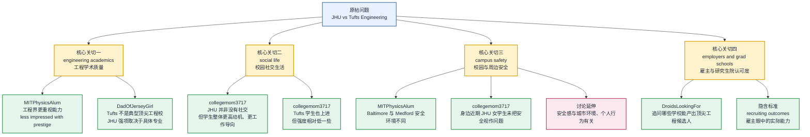

# 基本信息

- 文章来源：College Confidential Forums
- 文章/帖子题目：Johns Hopkins vs Tufts Engineering–Social Life and Safety
- 板块：Colleges & Universities → Johns Hopkins University
- 标签：johns-hopkins-university, tufts-university
- 原帖时间：September 17, 2022
- 话题关闭时间：May 10, 2023
- 链接：https://talk.collegeconfidential.com/t/johns-hopkins-vs-tufts-engineering-social-life-and-safety/3618959
- 主要发言者背景：
  - 2021trackmom：论坛用户，原帖提问者；公开页面未显示可核验的个人背景。
  - MITPhysicsAlum：论坛用户，用户名显示其自称与 MIT Physics 有关联，但公开页面未显示可核验的详细身份信息。
  - DadOfJerseyGirl：论坛用户；页面显示其为 Politics Forum Moderator，并在回帖中自称雇用过大量 CS 与 engineering graduates。
  - collegemom3717：论坛用户；公开页面未显示可核验的个人背景。
  - DroidsLookingFor：论坛用户；页面显示 Parent HS Class of 2024。
- 文本性质：美国大学申请论坛讨论帖，围绕 Johns Hopkins University 与 Tufts University 的工程专业、校园生活、安全性、雇主/研究生院认可度等问题展开。

# 前情提要

---

🔹 My daughter / is considering both **`Johns Hopkins`** and **`Tufts`** / for **`engineering`**, but / wondering about the **`social life`** and **`quality of academics`**.

🔸 我的女儿正在考虑 **`约翰斯·霍普金斯大学`** 和 **`塔夫茨大学`** 的 **`工程专业`**，但她也想了解那里的 **`社交生活`** 和 **`学术质量`**。

背景注释：Johns Hopkins University，常简称 JHU，是位于美国马里兰州 Baltimore 的私立研究型大学，以医学、公共卫生、生物医学工程、国际关系等领域闻名。Tufts University 位于 Massachusetts 的 Medford/Somerville 一带，是美国私立研究型大学，常被视为兼具文理教育、国际关系、医学相关资源与波士顿地区区位优势的学校。engineering 在美国本科语境中通常包括 mechanical engineering, electrical engineering, computer engineering, biomedical engineering, civil engineering 等方向。

> **`consider`** /kənˈsɪdər/
> 词性：verb
> 英文释义：to think carefully about something before making a decision；认真思考某事后再做决定。
> 中文翻译：考虑；斟酌。
> 语域：通用；申请、择校、商务、写作中高频。
> 画龙点睛：**`consider doing sth.`** 表示“考虑做某事”，后接动名词，不接 to do，例如 **`consider applying to Tufts`**。在择校语境里，**`consider A and B for engineering`** 意为“把 A 和 B 作为工程专业选择来考虑”。写作中可替换为 **`weigh`**、**`evaluate`**、**`look into`**，但 consider 最稳妥、最中性。

> **`social life`** /ˈsoʊʃəl laɪf/
> 词性：noun phrase
> 英文释义：the activities involving meeting and spending time with other people for pleasure；与他人交往、娱乐、参加活动的生活。
> 中文翻译：社交生活；校园社交氛围。
> 语域：校园、生活方式、留学讨论高频。
> 画龙点睛：大学讨论中 **`social life`** 不只指 party，还包括 clubs, sports, dorm culture, student organizations, weekend activities。表达“社交生活丰富”可说 **`a vibrant social life`**；“社交生活贫乏”可说 **`a limited social scene`** 或 **`not much of a social life`**。

> **`quality of academics`** /ˈkwɑːləti əv ˌækəˈdemɪks/
> 词性：noun phrase
> 英文释义：the overall standard of teaching, courses, faculty, research, and intellectual rigor；教学、课程、师资、科研与学术强度的总体水平。
> 中文翻译：学术质量；教学与学术水准。
> 语域：教育、申请、评估类正式表达。
> 画龙点睛：**`academics`** 在大学语境中常作复数名词，指课程、学术资源、学习强度等整体学术环境。不要机械译为“学者们”。可搭配 **`strong academics`**、**`rigorous academics`**、**`academic quality`**。雅思/考研写作可用：**`Students often weigh academic quality against campus culture.`**

---

🔹 Is **`JHU`** / really **`all work and no play`** / or / do the students have a more **`typical college campus life`**?

🔸 **`JHU`** 真的就是那种 **`只有学习、没有娱乐`** 的地方吗？还是说学生也拥有一种更 **`典型的大学校园生活`**？

背景注释：JHU 是 Johns Hopkins University 的常用简称。all work and no play 来自英语谚语 “All work and no play makes Jack a dull boy.”，常用来形容某人或某环境过度重视工作/学习而缺少娱乐、社交与放松。这里提问者关心的是 JHU 是否真的如传闻中那样压力大、竞争强、社交少。

> **`all work and no play`** /ɔːl wɜːrk ænd noʊ pleɪ/
> 词性：idiom
> 英文释义：a situation in which someone works or studies too much and has too little relaxation or enjoyment；工作或学习过多、休闲娱乐太少的状态。
> 中文翻译：只工作不玩乐；只学习不娱乐。
> 语域：口语、评论、校园讨论。
> 画龙点睛：这是极地道表达，常用于评价学校、公司、个人生活方式。可说 **`The program is not all work and no play.`** 表示“这个项目并不是只有学习没有生活”。注意它带有一定夸张色彩，适合讨论氛围，不适合严肃数据报告。

> **`typical`** /ˈtɪpɪkəl/
> 词性：adjective
> 英文释义：having the usual features or qualities of a particular type of person, thing, or situation；具有某类事物通常特征的。
> 中文翻译：典型的；通常的。
> 语域：通用；学术与日常皆可。
> 画龙点睛：**`typical college campus life`** 指一般想象中的美国大学生活：上课、宿舍、社团、运动、朋友聚会、校园活动等。typical 可中性，也可带“老一套”的意味，如 **`That’s typical of him.`** 表示“他一贯如此”。写作中可替换为 **`standard`**、**`ordinary`**、**`conventional`**，但语气略不同。

---

🔹 Also, / how about **`safety`** / at **`JHU`**?

🔸 另外，**`JHU`** 的 **`安全情况`** 怎么样？

背景注释：美国大学择校中，campus safety 不仅指校内安保，也包括周边街区治安、夜间出行、公共交通、校警巡逻、紧急报警系统、校外宿舍环境等。JHU 主校区 Homewood 位于 Baltimore 北部，而 Baltimore 的城市治安常在择校讨论中被提及。

> **`safety`** /ˈseɪfti/
> 词性：noun
> 英文释义：the condition of being protected from danger, risk, or injury；免受危险、风险或伤害的状态。
> 中文翻译：安全；安全性。
> 语域：通用；校园、城市、公共政策、工程等领域高频。
> 画龙点睛：在大学申请中，**`safety`** 有两个常见意思：一是这里的“人身/校园安全”；二是 **`safety school`**，即“保底校”。要根据语境判断。**`campus safety`** 是固定搭配，表示“校园安全”；**`public safety`** 表示“公共安全”或“校警/安保部门”。

> **`how about`** /haʊ əˈbaʊt/
> 词性：phrase
> 英文释义：used to ask for information, make a suggestion, or introduce another topic；用于询问信息、提出建议或引入另一个话题。
> 中文翻译：……怎么样；……如何。
> 语域：口语、论坛、非正式写作。
> 画龙点睛：**`How about safety at JHU?`** 是省略句，完整可理解为 **`How is the safety situation at JHU?`**。正式写作中不宜频繁使用 how about，可改为 **`What is the safety situation like at JHU?`** 或 **`How safe is the JHU campus?`**

---

🔹 What about **`Tufts`**?

🔸 那 **`塔夫茨大学`** 呢？

背景注释：Tufts 指 Tufts University。该句是承接上文，对第二所学校提出同样的比较性问题。论坛语境中 What about X? 常用于“那 X 呢？”“X 又如何？”。

> **`What about...?`** /wʌt əˈbaʊt/
> 词性：interrogative phrase
> 英文释义：used to ask for someone’s opinion or information about a particular person, thing, or situation；用于询问关于某人、某物或某情况的信息或看法。
> 中文翻译：……怎么样？……呢？
> 语域：口语、论坛、讨论。
> 画龙点睛：**`What about Tufts?`** 极简但自然，依靠前文补足含义。正式写作中应避免过度省略，可写作 **`How does Tufts compare in this respect?`**，意思是“塔夫茨在这方面相比如何？”

---

🔹 How / is a **`Tufts engineering degree`** / viewed / by **`prospective employers`** and **`grad schools`**?

🔸 **`塔夫茨的工程学位`** 在 **`潜在雇主`** 和 **`研究生院`** 眼中认可度如何？

背景注释：prospective employers 指未来可能招聘该学生的公司或机构。grad schools 是 graduate schools 的口语缩写，指硕士、博士、专业学位项目所在的研究生院。在美国工程教育中，本科学位的就业认可度通常取决于学校声誉、专业强度、项目规模、实习经历、项目作品、GPA、推荐信、研究经历与校友网络。

> **`degree`** /dɪˈɡriː/
> 词性：noun
> 英文释义：an academic qualification given by a college or university after completing a course of study；完成大学课程后获得的学术资格。
> 中文翻译：学位。
> 语域：教育、就业、申请正式语域。
> 画龙点睛：**`an engineering degree`** 指“工程学位”，不一定等于某一具体专业。degree 常与 **`earn`**、**`hold`**、**`pursue`** 搭配，如 **`earn a degree in mechanical engineering`**。注意 degree 也可表示“程度”“度数”，如 **`to some degree`** 表示“在某种程度上”。

> **`prospective`** /prəˈspektɪv/
> 词性：adjective
> 英文释义：expected or likely to become something in the future；未来可能成为某种身份的。
> 中文翻译：未来的；潜在的；可能的。
> 语域：正式；招生、招聘、商务高频。
> 画龙点睛：**`prospective employers`** 是“潜在雇主”，**`prospective students`** 是“意向学生/准申请者”。prospective 强调“将来可能发生”，不同于 **`perspective`** /pərˈspektɪv/ “视角；观点”。二者拼写相近，考试中易混。

> **`grad school`** /ɡræd skuːl/
> 词性：noun phrase
> 英文释义：informal form of graduate school, a university division offering advanced degrees；graduate school 的非正式说法，指提供研究生学位的学院或项目。
> 中文翻译：研究生院；读研阶段。
> 语域：口语、校园、论坛。
> 画龙点睛：正式文书中建议写 **`graduate school`**，论坛和日常交流中常说 **`grad school`**。搭配包括 **`apply to grad school`**、**`get into grad school`**、**`prepare for grad school`**。美国语境中 grad school 包括 master’s programs 和 PhD programs。

---

🔹 How / is the **`campus environment`**?

🔸 那里的 **`校园环境`** 怎么样？

背景注释：campus environment 在择校语境中含义很广，包括地理位置、建筑风格、宿舍、学生氛围、社团文化、课堂外生活、周边街区、交通便利性、安全感、学生压力水平等。

> **`campus environment`** /ˈkæmpəs ɪnˈvaɪrənmənt/
> 词性：noun phrase
> 英文释义：the physical, social, and cultural setting of a college or university；大学的物理、社会与文化环境。
> 中文翻译：校园环境；校园氛围。
> 语域：教育、申请、校园讨论。
> 画龙点睛：这个短语比 **`campus`** 本身更宽泛，不只指建筑和绿地。若强调氛围，可说 **`campus culture`**；强调生活体验，可说 **`campus life`**；强调自然和建筑环境，可说 **`physical campus`**。写申请比较文时，可用：**`The campus environment strongly shapes students’ daily experience.`**

---

🔹 Are students / **`happy to be there`**?

🔸 学生们在那里 **`过得开心、愿意待在那里`** 吗？

背景注释：happy to be there 在大学讨论中常指学生满意度、归属感和整体体验。它不是简单问“是否快乐”，而是在问学生是否对学校选择感到满意，是否有积极的校园体验。

> **`happy to be there`** /ˈhæpi tə bi ðer/
> 词性：adjective phrase
> 英文释义：pleased or satisfied with being in a particular place or situation；对身处某地或某种状态感到满意。
> 中文翻译：愿意待在那里；对在那里感到满意。
> 语域：口语、校园讨论。
> 画龙点睛：**`happy to do sth.`** 表示“乐意做某事”，如 **`I’d be happy to help.`**；而 **`happy to be there`** 更偏“对所在环境满意”。在大学语境中，也可用 **`students seem satisfied`**、**`students feel a strong sense of belonging`** 表达更正式的满意度。

---

🔹 **`Thanks`**!

🔸 **`谢谢`**！

背景注释：论坛提问结尾常用 Thanks! 表达礼貌、简洁、非正式。比 Thank you! 更随意一些。

> **`Thanks`** /θæŋks/
> 词性：interjection / plural noun
> 英文释义：used to express gratitude；用于表达感谢。
> 中文翻译：谢谢。
> 语域：口语、邮件、论坛、日常高频。
> 画龙点睛：**`Thanks!`** 适合非正式场合；正式邮件可用 **`Thank you for your time and consideration.`**。更口语可说 **`Thanks a lot.`**、**`Many thanks.`**。注意 **`Thanks in advance`** 表示“提前感谢”，有时会显得对方必须帮忙，使用需谨慎。

---

🔹 **`As a rule`**, / engineers are much less impressed with **`prestige`** / **`that`** CC parents.

🔸 **`一般来说`**，工程师远没有 College Confidential 上的家长们那么看重 **`名校声望`**。

背景注释：原句中 “that CC parents” 从语法上看应为 “than CC parents”，属于论坛快速打字中的笔误。CC 指 College Confidential，是美国大学申请讨论论坛。这里发言者的观点是：工程行业评价学生时，往往比论坛家长更少被学校“光环”影响，更看重实际能力。

> **`as a rule`** /æz ə ruːl/
> 词性：adverbial phrase
> 英文释义：usually; in most cases；通常；一般来说。
> 中文翻译：一般而言；通常情况下。
> 语域：中性偏正式；议论文、说明文常用。
> 画龙点睛：**`As a rule`** 用来引出一般规律，但不代表绝对。可替换为 **`generally speaking`**、**`in general`**、**`as a general rule`**。写作中很适合提出概括性判断：**`As a rule, employers value relevant experience.`**

> **`be impressed with`** /bi ɪmˈprest wɪð/
> 词性：verb phrase
> 英文释义：to admire or respect someone or something because of a particular quality；因某种品质而钦佩、认可。
> 中文翻译：对……印象深刻；认可……。
> 语域：通用；口语与书面语皆可。
> 画龙点睛：介词常用 **`with`** 或 **`by`**，如 **`I was impressed with her portfolio.`** 强调对成果认可。否定式 **`less impressed with prestige`** 表示“不那么看重名气”。注意 impressed 是人作主语；事物让人印象深刻则用 **`impressive`**。

> **`prestige`** /preˈstiːʒ/
> 词性：noun
> 英文释义：respect and admiration given to someone or something because of reputation, status, or achievement；因声誉、地位或成就而获得的尊重与钦佩。
> 中文翻译：声望；威望；名气。
> 语域：正式；教育、职业、社会地位话题高频。
> 画龙点睛：prestige 不等于 quality。**`school prestige`** 是学校名气，**`academic quality`** 是学术质量。形容词是 **`prestigious`** /preˈstɪdʒəs/，如 **`a prestigious university`**。写作中可表达：**`Prestige may open doors, but skills determine long-term performance.`**

---

🔹 They / are more impressed by **`what you can do`** / than / what other people who went to your school can do.

🔸 他们更看重的是 **`你本人能做什么`**，而不是曾经就读你学校的其他人能做什么。

背景注释：该句强调工程招聘中常见的能力导向逻辑：雇主更关注个人项目、技术能力、实习经历、解决问题能力，而不是单纯依赖校友或学校整体声誉。

> **`what you can do`** /wʌt ju kæn duː/
> 词性：noun clause
> 英文释义：the skills, abilities, or results that you personally are capable of producing；你个人能够展示出的技能、能力或成果。
> 中文翻译：你能做什么；你的实际能力。
> 语域：通用；招聘、教育、职业发展高频。
> 画龙点睛：这是一个名词性从句，可作宾语。相比 **`where you went to school`**，“what you can do” 更强调可证明的能力。求职语境中常用 **`demonstrate what you can do`**，即“展示你的能力”。工程/CS 申请中 portfolio, GitHub, design projects 都是在证明 what you can do。

> **`go to your school`** /ɡoʊ tə jʊr skuːl/
> 词性：verb phrase
> 英文释义：to attend the same school or university；就读于某所学校。
> 中文翻译：上你的学校；与你同校。
> 语域：口语、校园讨论。
> 画龙点睛：**`went to your school`** 是过去式，指“曾经就读于你学校的人”。英语里 **`go to school`** 不一定是“走去学校”，更常表示“上学/就读”。例如 **`She went to MIT`** 意为“她曾就读于 MIT”。

---

🔹 **`JHU`** / takes **`campus safety`** very seriously, but / **`Baltimore`** is not **`Medford`**.

🔸 **`JHU`** 非常重视 **`校园安全`**，但是 **`巴尔的摩`** 毕竟不是 **`梅德福`**。

背景注释：Baltimore 是马里兰州城市，JHU Homewood 校区位于该市。Medford 是马萨诸塞州城市，Tufts 主校区位于 Medford/Somerville 交界附近。该句通过城市对比暗示两校周边治安与城市环境不同。

> **`take sth. seriously`** /teɪk ˈsʌmθɪŋ ˈsɪriəsli/
> 词性：verb phrase
> 英文释义：to regard something as important and give it careful attention；认为某事重要并认真对待。
> 中文翻译：认真对待；高度重视。
> 语域：通用；正式与口语皆可。
> 画龙点睛：高频搭配：**`take safety seriously`**、**`take criticism seriously`**、**`take your studies seriously`**。可用于写作：**`Universities should take student mental health seriously.`** 注意 seriously 修饰 take，不是 serious。

> **`campus safety`** /ˈkæmpəs ˈseɪfti/
> 词性：noun phrase
> 英文释义：measures and conditions related to protecting students and staff on and around a college campus；保护校园内外学生与教职工安全的措施与状态。
> 中文翻译：校园安全。
> 语域：教育、安保、公共管理。
> 画龙点睛：campus safety 常涉及 emergency alerts, campus police, blue-light phones, escort services, dorm access control 等。与 **`campus security`** 相近，但 safety 更强调结果与状态，security 更强调安保措施或人员。

> **`X is not Y`** /eks ɪz nɑːt waɪ/
> 词性：contrast structure
> 英文释义：used to emphasize that two places, people, or situations are meaningfully different；用于强调两者存在实质差异。
> 中文翻译：X 不是 Y；X 与 Y 不同。
> 语域：口语、评论、论证。
> 画龙点睛：**`Baltimore is not Medford`** 表面简单，实际含义丰富：城市规模、治安、社会环境不同。英语中常用这种简洁结构表达隐含对比，如 **`College is not high school.`** “大学不是高中”。

---

🔹 The **`Baltimore crime rate`** / is **`4x`** that of Medford, and / the **`violent crime rate`** / is **`13x higher`**.

🔸 **`巴尔的摩的犯罪率`** 是 Medford 的 **`4 倍`**，而 **`暴力犯罪率`** 则 **`高出 13 倍`**。

背景注释：crime rate 指犯罪率，通常以每 100,000 人犯罪数量衡量。violent crime 通常包括 homicide, robbery, aggravated assault, rape 等类别。论坛发言中的数字为用户引用或概括，具体统计口径可能因年份、数据源、行政边界而不同，阅读时应注意数据来源与时间范围。

> **`crime rate`** /kraɪm reɪt/
> 词性：noun phrase
> 英文释义：the number of crimes committed in a particular area during a certain period, often relative to population；某地区在特定时期内发生的犯罪数量，常按人口比例计算。
> 中文翻译：犯罪率。
> 语域：新闻、社会学、公共政策、城市研究。
> 画龙点睛：rate 表示“比率”，不是“速度”。常见搭配：**`crime rate rises/falls`**、**`a high crime rate`**、**`violent crime rate`**。写作中可说 **`Crime rates vary significantly across neighborhoods.`**

> **`4x`** /fɔːr taɪmz/
> 词性：adverbial numeral expression
> 英文释义：four times as much or as many；四倍。
> 中文翻译：四倍。
> 语域：非正式、数据对比、论坛常见。
> 画龙点睛：**`4x`** 读作 **`four times`**。正式写作可写 **`four times as high as`** 或 **`four times that of`**。例如：**`The rate is four times that of Medford.`** 注意英语倍数表达中 **`twice as high as`** 是“两倍”，而中文“高一倍”可能造成歧义。

> **`violent crime`** /ˈvaɪələnt kraɪm/
> 词性：noun phrase
> 英文释义：crime involving force or threat of force against a person；涉及对人使用暴力或暴力威胁的犯罪。
> 中文翻译：暴力犯罪。
> 语域：法律、新闻、公共安全。
> 画龙点睛：violent crime 与 property crime 相对，后者指盗窃、入室盗窃、车辆盗窃等财产类犯罪。violent 的名词是 **`violence`**，副词是 **`violently`**。考试阅读中常见搭配：**`violent offenders`**、**`violent incidents`**。

---

🔹 I / never felt **`unsafe`** / on either campus, but / felt the need to be more **`cautious`** around **`JHU`** / than **`Tufts`**.

🔸 我在两个校园里都从未觉得 **`不安全`**，但相比 **`Tufts`**，我觉得在 **`JHU`** 周边更需要 **`谨慎`** 一些。

背景注释：either campus 指两所学校的校园。这里发言者区分了“在校园内没有不安全感”与“在 JHU 周边更需要提高警觉”这两个层面。

> **`unsafe`** /ʌnˈseɪf/
> 词性：adjective
> 英文释义：not protected from danger, harm, or risk；不安全的，存在危险的。
> 中文翻译：不安全的。
> 语域：通用；安全、城市、工程、健康话题高频。
> 画龙点睛：**`feel unsafe`** 是非常自然的搭配，强调主观安全感。与 **`be unsafe`** 不同，前者侧重感受，后者侧重客观状态。反义词是 **`safe`**。名词为 **`safety`**。可写：**`Some students feel unsafe walking alone at night.`**

> **`feel the need to do sth.`** /fiːl ðə niːd tə duː/
> 词性：verb phrase
> 英文释义：to think that it is necessary or important to do something；觉得有必要做某事。
> 中文翻译：觉得有必要做某事。
> 语域：通用；口语与书面语皆可。
> 画龙点睛：比 **`need to`** 更委婉，强调主观判断。例：**`I felt the need to be more cautious.`** “我觉得需要更加谨慎。” 写作中也可用 **`consider it necessary to`**，更正式。

> **`cautious`** /ˈkɔːʃəs/
> 词性：adjective
> 英文释义：careful to avoid danger or mistakes；为避免危险或错误而小心的。
> 中文翻译：谨慎的；小心的。
> 语域：通用；安全、投资、决策、医学话题常见。
> 画龙点睛：cautious 常与 **`about`** 搭配，如 **`be cautious about walking alone`**。名词是 **`caution`**，副词是 **`cautiously`**。与 careful 相比，cautious 更强调“风险意识”。反义词可用 **`reckless`** 鲁莽的。

---

🔹 What kind of **`engineering`**?

🔸 是哪一种 **`工程专业`**？

背景注释：该问题非常关键，因为美国大学的 engineering 并不是单一专业。不同学校在 biomedical engineering, mechanical engineering, electrical engineering, computer engineering, environmental engineering 等方向上的声誉与资源差异很大。

> **`what kind of`** /wʌt kaɪnd əv/
> 词性：interrogative phrase
> 英文释义：used to ask about the type or category of something；用于询问某事物的类型或类别。
> 中文翻译：哪一种；什么类型的。
> 语域：通用；口语高频。
> 画龙点睛：**`What kind of engineering?`** 是省略句，完整表达为 **`What kind of engineering is she interested in?`** 在英语口语和论坛中，这种省略非常自然。kind of 也可作副词短语表示“有点儿”，如 **`I’m kind of tired.`**，需根据语境区分。

> **`engineering`** /ˌendʒɪˈnɪrɪŋ/
> 词性：noun
> 英文释义：the study or profession of designing and building machines, structures, systems, or processes using science and mathematics；运用科学和数学设计、建造机器、结构、系统或流程的学科或职业。
> 中文翻译：工程；工程学。
> 语域：学术、职业、技术领域。
> 画龙点睛：engineering 是不可数名词，表示学科整体；具体工程师是 **`engineer`**。美国本科申请中常见 major 包括 **`mechanical engineering`**、**`electrical engineering`**、**`civil engineering`**、**`biomedical engineering`**、**`computer engineering`**。不要把 engineering 简单等同于“工科”，因为 CS 有时独立于工程学院。

---

🔹 **`To be honest`** / as someone who hires a lot of **`CS`** and **`engineering grads`** / **`Tufts`** doesn’t **`strike me as`** a top engineering school, and / I’m **`iffy`** about **`JHU`** / they’re good in certain engineering majors.

🔸 **`坦白说`**，作为一个雇用过许多 **`计算机科学`** 和 **`工程专业毕业生`** 的人，**`Tufts`** 给我的感觉并不是顶尖工程院校；而我对 **`JHU`** 也 **`有些拿不准`**，它们只是在某些工程专业上很强。

背景注释：CS 是 Computer Science，即计算机科学。engineering grads 指工程专业毕业生。该发言者从招聘者视角评价两校工程项目，认为 Tufts 在工程领域不属于典型顶尖工程校，而 JHU 的工程优势取决于具体专业，例如 JHU 通常在 biomedical engineering 等领域更有辨识度。

> **`to be honest`** /tə bi ˈɑːnɪst/
> 词性：discourse marker
> 英文释义：used to introduce a frank or direct opinion；用于引出坦率、直接的意见。
> 中文翻译：坦白说；老实说。
> 语域：口语、论坛、半正式交流。
> 画龙点睛：**`To be honest`** 常用于表达可能不完全讨喜但真实的看法。类似表达有 **`frankly`**、**`honestly`**、**`to be frank`**。正式写作中慎用，可改为 **`From my perspective`** 或 **`In my assessment`**。

> **`CS`** /ˌsiː ˈes/
> 词性：abbreviation
> 英文释义：short for Computer Science, the study of computation, algorithms, software, and information systems；Computer Science 的缩写，研究计算、算法、软件和信息系统。
> 中文翻译：计算机科学。
> 语域：校园、招聘、科技行业常用缩写。
> 画龙点睛：CS 不完全等于 software engineering。CS 偏理论与计算基础，software engineering 更偏软件开发流程和工程实践。美国就业语境中，**`CS grads`** 指计算机专业毕业生，是招聘讨论高频表达。

> **`grad`** /ɡræd/
> 词性：noun, informal
> 英文释义：a graduate of a school, college, or university；学校、学院或大学毕业生。
> 中文翻译：毕业生。
> 语域：口语、校园、招聘论坛。
> 画龙点睛：grad 是 graduate 的非正式缩写。**`engineering grads`** = engineering graduates。注意 **`grad student`** 在美式英语中常指研究生，而 **`college grad`** 指大学毕业生。语境决定含义。

> **`strike sb. as`** /straɪk ˈsʌmbədi æz/
> 词性：verb phrase
> 英文释义：to give someone a particular impression；给某人某种印象。
> 中文翻译：让某人觉得是；给某人……的印象。
> 语域：口语、评论、书面表达皆可。
> 画龙点睛：**`Tufts doesn’t strike me as a top engineering school`** 意为“Tufts 给我的印象不像顶尖工程校”。这是非常地道的主观评价表达，比 **`I think Tufts is not...`** 更委婉。可说 **`He strikes me as reliable.`**

> **`iffy`** /ˈɪfi/
> 词性：adjective, informal
> 英文释义：uncertain, doubtful, or of questionable quality；不确定的；可疑的；拿不准的。
> 中文翻译：不太确定的；有疑虑的；拿不准的。
> 语域：非正式、口语。
> 画龙点睛：**`I’m iffy about JHU`** 表示“我对 JHU 有点犹豫/不太确定”。iffy 常用于轻度怀疑：**`The plan sounds iffy.`** “这个计划听起来不太靠谱。” 正式写作可改为 **`I have reservations about...`** 或 **`I am uncertain about...`**

---

🔹 What other **`engineering schools`** / are on your **`list`**?

🔸 你的 **`择校名单`** 上还有哪些 **`工程院校`**？

背景注释：list 在美国大学申请语境中常指 college list，即申请学校清单，通常分为 reach, target/match, safety schools。engineering schools 可指工程学院强的大学，也可指大学内部的工程学院。

> **`engineering school`** /ˌendʒɪˈnɪrɪŋ skuːl/
> 词性：noun phrase
> 英文释义：a college, university, or division within a university that offers engineering programs；开设工程项目的大学、学院或大学内部工程学院。
> 中文翻译：工程院校；工程学院。
> 语域：教育、申请。
> 画龙点睛：在美国，**`school of engineering`** 常是大学内部学院，如 **`Whiting School of Engineering`**。而 **`engineering school`** 在论坛中也可泛指“工程强校”。例如 Purdue, Georgia Tech, UIUC, MIT, Michigan 常被讨论为工程强校。

> **`list`** /lɪst/
> 词性：noun
> 英文释义：a set of names, items, or choices written or considered together；写下或一起考虑的一组名称、项目或选择。
> 中文翻译：清单；名单。
> 语域：通用；申请语境高频。
> 画龙点睛：**`college list`** 是申请季核心词，表示申请学校列表。动词搭配：**`build a list`**、**`narrow down a list`**、**`add schools to a list`**。在申请规划中常说 **`a balanced list`**，即 reach, match, safety 搭配合理的名单。

---

🔹 I / think people sometimes **`miss the point`** / on this **`reputation`**.

🔸 我觉得人们有时会 **`误解`** 这种 **`名声`** 的重点。

背景注释：this reputation 指 JHU “all work and no play” 或过度学习、压力大、社交少的名声。发言者认为外界可能并非完全错误，但抓错了重点：问题不一定是学生没有社交，而是学生群体整体非常上进、目标导向强。

> **`miss the point`** /mɪs ðə pɔɪnt/
> 词性：idiom
> 英文释义：to fail to understand the most important meaning or purpose of something；没有理解某事最重要的意思或目的。
> 中文翻译：没抓住重点；误解关键。
> 语域：口语、议论、评论常用。
> 画龙点睛：高频表达。可说 **`You’re missing the point.`** “你没抓住重点。” point 在这里不是“点”，而是“核心意义”。近义表达：**`fail to see the main issue`**，更正式但不如原表达自然。

> **`reputation`** /ˌrepjəˈteɪʃən/
> 词性：noun
> 英文释义：the general opinion that people have about someone or something；人们对某人或某事的普遍看法。
> 中文翻译：名声；声誉；口碑。
> 语域：通用；教育、商业、人物评价高频。
> 画龙点睛：reputation 可好可坏，取决于修饰语。**`a strong reputation`** 好声誉，**`a bad reputation`** 坏名声，**`a reputation for being intense`** 以强度大闻名。注意 **`reputable`** 表示“有良好声誉的”，如 **`a reputable institution`**。

---

🔹 **`JHU students`** / have a **`social life`** — heck, / there’s even a **`chapter`** of **`KKG`** / on campus!

🔸 **`JHU 的学生`** 是有 **`社交生活`** 的——说真的，校园里甚至还有 **`KKG 女生联谊会的分会`**！

背景注释：KKG 指 Kappa Kappa Gamma，是美国大学中的一个全国性 sorority，即女生联谊会。chapter 在希腊生活 Greek life 语境中指某个全国组织在具体大学校园中的分会。该句用 KKG 的存在来说明 JHU 并非完全没有传统美国大学社交文化。

> **`social life`** /ˈsoʊʃəl laɪf/
> 词性：noun phrase
> 英文释义：activities and relationships involving friends, groups, and leisure；涉及朋友、群体和休闲活动的人际生活。
> 中文翻译：社交生活。
> 语域：校园、生活方式。
> 画龙点睛：这里的 social life 与前文呼应，说明“有社交生活”不等于“派对学校”。英语中可说 **`have a social life`**，也可说 **`maintain a social life`**，后者强调在忙碌中维持社交。

> **`heck`** /hek/
> 词性：interjection
> 英文释义：a mild word used to show surprise, emphasis, or annoyance；表示惊讶、强调或轻微恼怒的温和语气词。
> 中文翻译：说真的；哎呀；甚至可以说。
> 语域：口语、非正式。
> 画龙点睛：heck 是 hell 的温和替代，语气较轻。**`Heck, there’s even...`** 表示“说真的，甚至还有……”。不适合正式写作，但在论坛、演讲、轻松评论中很自然。

> **`chapter`** /ˈtʃæptər/
> 词性：noun
> 英文释义：a local branch of a larger organization；大型组织的地方分会。
> 中文翻译：分会；地方支部。
> 语域：组织、校园、社团。
> 画龙点睛：chapter 常见义是“书的一章”，但在组织语境中是“分会”。例如 **`the local chapter of the alumni association`** 表示“校友会地方分会”。这里 **`a chapter of KKG`** 即 KKG 在 JHU 的校园分会。

---

🔹 But / **`JHU students`** tend to be **`hard-wired`** / as highly **`motivated`** / **`work oriented`**, so / your idea of **`social life`** and theirs / might be different.

🔸 但是，**`JHU 学生`** 往往像是天生就被设定成 **`高度自驱`**、**`以学习和工作为导向`** 的人，所以你理解的 **`社交生活`** 和他们理解的可能并不一样。

背景注释：hard-wired 原本常用于神经科学、计算机或电子系统，表示“硬接线的；先天设定的”。这里是比喻用法，表示 JHU 学生普遍性格或习惯上高度自律、目标明确。work oriented 指价值观或生活方式上偏重学习、工作、产出和成就。

> **`tend to`** /tend tə/
> 词性：verb phrase
> 英文释义：to usually do or be something；通常会；倾向于。
> 中文翻译：往往；倾向于。
> 语域：通用；学术写作高频。
> 画龙点睛：**`tend to be`** 是描述趋势的优雅表达，比 always 更谨慎。写作中用于避免绝对化：**`Highly selective universities tend to attract motivated students.`** 名词是 **`tendency`**，表示“倾向”。

> **`hard-wired`** /ˌhɑːrd ˈwaɪərd/
> 词性：adjective
> 英文释义：having a fixed way of behaving or thinking, as if built into one’s nature；像天生内置一样具有固定行为或思维方式的。
> 中文翻译：天生如此的；像被预设好一样的。
> 语域：比喻、心理、科技、评论。
> 画龙点睛：原义来自电路“硬接线”，引申为“内在设定”。可说 **`humans are hard-wired to seek connection`**。这里不是医学上的严格“先天”，而是形容学生群体普遍非常自驱。写作中要注意它带有比喻色彩。

> **`motivated`** /ˈmoʊtɪveɪtɪd/
> 词性：adjective
> 英文释义：eager and willing to work hard to achieve goals；有动力、有积极性去努力实现目标的。
> 中文翻译：积极主动的；有动力的；自驱的。
> 语域：教育、招聘、心理学高频。
> 画龙点睛：**`highly motivated students`** 是招生、推荐信、招聘中常见褒义表达。动词是 **`motivate`**，名词是 **`motivation`**。注意 motivated by 表示“受……驱动”，如 **`motivated by curiosity`**。

> **`work-oriented`** /ˈwɜːrk ˌɔːrientɪd/
> 词性：adjective
> 英文释义：focused mainly on work, tasks, or achievement；主要关注工作、任务或成就的。
> 中文翻译：以工作为导向的；重视学习/工作的。
> 语域：评论、职业、教育。
> 画龙点睛：**`-oriented`** 是高频后缀，表示“以……为导向”。如 **`career-oriented`** 职业导向的，**`research-oriented`** 研究导向的，**`student-oriented`** 以学生为中心的。这里 work-oriented 指学生社交可能也围绕学习、项目、目标展开。

---

🔹 **`IME`** / **`Tufts students`** are **`similarly inclined`**, but / less **`intensely`** so.

🔸 **`以我的经验来看`**，**`Tufts 的学生`** 也有类似倾向，只是没有那么 **`强烈`**。

背景注释：IME 是论坛和网络语境中的缩写，表示 In My Experience，即“以我的经验来看”。similarly inclined 指“有类似倾向”。该句把 Tufts 与 JHU 做柔和对比：两校学生都上进，但 JHU 的强度可能更高。

> **`IME`** /ˌaɪ em ˈiː/
> 词性：abbreviation
> 英文释义：short for “in my experience,” used to introduce an opinion based on personal experience；In My Experience 的缩写，用于引出基于个人经验的看法。
> 中文翻译：以我的经验来看。
> 语域：网络、论坛、非正式。
> 画龙点睛：类似缩写还有 **`IMO`** = in my opinion，**`IMHO`** = in my humble opinion。正式写作不要使用 IME，应写全 **`In my experience`** 或 **`Based on my experience`**。

> **`inclined`** /ɪnˈklaɪnd/
> 词性：adjective
> 英文释义：having a tendency, preference, or natural leaning toward something；对某事有倾向、偏好或自然倾向。
> 中文翻译：倾向于……的；有……偏好的。
> 语域：中性偏正式；教育、心理、评论、议论文常用。
> 画龙点睛：**`be inclined to do sth.`** 表示“倾向于做某事”，如 **`I’m inclined to agree.`** “我倾向于同意。” 本句中 **`similarly inclined`** 是固定式表达，意为“有类似倾向”。inclined 还可表示“愿意的”，如 **`I’m not inclined to discuss it.`** 语气比 **`want to`** 更克制、更书面。

> **`intensely`** /ɪnˈtensli/
> 词性：adverb
> 英文释义：to a very strong or extreme degree；以非常强烈或极高的程度。
> 中文翻译：强烈地；高度地；极其。
> 语域：通用；评论、文学、心理、学术描述中常见。
> 画龙点睛：intensely 来自形容词 **`intense`**，常搭配情绪、竞争、兴趣、关注等：**`intensely competitive`** 激烈竞争的，**`intensely focused`** 高度专注的，**`intensely interested`** 极感兴趣的。句中 **`less intensely so`** 是省略表达，完整意思是 “Tufts students are similarly inclined, but not as intensely inclined as JHU students.”

> **`less intensely so`** /les ɪnˈtensli soʊ/
> 词性：elliptical phrase
> 英文释义：having the same quality or tendency, but to a weaker degree；具有相同特质或倾向，但程度较弱。
> 中文翻译：只是程度没那么强；没有那么强烈。
> 语域：口语、评论、论坛；书面表达中也可用。
> 画龙点睛：**`so`** 在这里代替前面的整个状态，即 **`similarly inclined`**。英语中常用 **`more so`**、**`less so`** 表示“更是如此/较少如此”。例如：**`The first option is risky; the second less so.`** “第一个选择有风险，第二个风险较小。” 这种表达简洁、地道，适合高级写作。

---

🔹 **`Re: safety`** — / almost all of the **`current/recent JHU students`** I know / happen to be **`female`**, and / **`anecdotally`** none of them / have found **`safety`** to be a problem.

🔸 **`关于安全问题`**——我认识的几乎所有 **`在读或近期就读 JHU 的学生`** 恰好都是 **`女性`**；而且就 **`个人见闻`** 来看，她们当中没有人觉得 **`安全`** 是个问题。

背景注释：Re: 是 regarding 或 in reference to 的缩写，常见于邮件标题、论坛讨论和回复中，表示“关于……”。current/recent JHU students 指当前在读或最近就读于 Johns Hopkins University 的学生。该句中的 female 之所以被提及，是因为在校园安全讨论中，女性学生的夜间出行、人身安全感、周边环境感知等常被家长特别关注。anecdotally 表明该信息来自个人经验或身边案例，而非系统统计数据。

> **`Re:`** /riː/
> 词性：preposition-like abbreviation
> 英文释义：regarding; in reference to；关于；就……而言。
> 中文翻译：关于；至于。
> 语域：邮件、论坛、办公、非正式到半正式写作。
> 画龙点睛：**`Re:`** 最常见于邮件标题，如 **`Re: Your application`** 表示“关于你的申请”。论坛中 **`Re: safety`** 意为“关于安全问题”。正式正文中可写 **`Regarding safety`** 或 **`As for safety`**。注意 **`re`** 不是动词，也不是 here 的缩写。

> **`current/recent`** /ˈkɜːrənt ˈriːsənt/
> 词性：compound adjective phrase
> 英文释义：current means happening or existing now; recent means having happened not long ago；current 表示现在的，recent 表示不久前的。
> 中文翻译：当前的/近期的。
> 语域：教育、新闻、调查、论坛讨论。
> 画龙点睛：**`current students`** 指“在读学生”，**`recent students`** 在此可理解为“最近就读过的学生”，更常见表达是 **`recent graduates`** “近期毕业生”。斜杠 **`current/recent`** 是论坛中的压缩写法，正式写作中可改为 **`current students and recent graduates`**，表达更清晰。

> **`happen to be`** /ˈhæpən tə bi/
> 词性：verb phrase
> 英文释义：to be something by chance or coincidence；碰巧是；恰好是。
> 中文翻译：碰巧是；恰好为。
> 语域：通用；口语与书面语皆可。
> 画龙点睛：**`happen to do sth.`** 表示“碰巧做某事”，如 **`I happen to know him.`** “我碰巧认识他。” 本句 **`happen to be female`** 强调这些学生是女性只是发言者样本中的偶然情况，并非刻意筛选。语气上也避免把个人经验说成普遍规律。

> **`female`** /ˈfiːmeɪl/
> 词性：adjective / noun
> 英文释义：relating to women or girls; a woman or girl；与女性有关的；女性。
> 中文翻译：女性的；女性。
> 语域：中性；统计、医学、社会讨论常用。
> 画龙点睛：female 作形容词非常常见，如 **`female students`**。作名词时在日常语境中有时显得生硬或不够礼貌，尤其单独称呼人为 **`females`** 时可能带有物化感；更自然可用 **`women`**。本句 **`happen to be female`** 是形容词用法，语气中性。

> **`anecdotally`** /ˌænɪkˈdoʊtəli/
> 词性：adverb
> 英文释义：based on personal stories or individual examples rather than systematic evidence；基于个人经历或个别例子，而非系统证据。
> 中文翻译：据个人见闻；从个案经验来看。
> 语域：评论、学术讨论、论坛、新闻分析。
> 画龙点睛：这是非常重要的批判性阅读词。**`anecdotal evidence`** 指“轶事证据/个案证据”，说服力弱于统计数据。句中 **`anecdotally`** 是发言者主动降低断言强度：她不是说“JHU 一定安全”，而是说“我认识的人没有把安全当问题”。写作中可用它区分 experience 与 data。

> **`find sth. to be a problem`** /faɪnd ˈsʌmθɪŋ tə bi ə ˈprɑːbləm/
> 词性：verb phrase
> 英文释义：to experience or judge something as problematic；经历后认为某事是问题。
> 中文翻译：觉得某事成问题；认为某事是个麻烦。
> 语域：通用；评论、反馈、调查中常见。
> 画龙点睛：**`find + object + complement`** 是高级但常用结构，如 **`I found the course challenging.`** “我觉得这门课有挑战性。” 本句 **`none of them have found safety to be a problem`** 比 **`none of them think safety is a problem`** 更强调“基于实际体验后的判断”。

---

🔹 **`In line with the above`**, / they tend to be **`sensible`** and relatively **`mature`**, and / their **`social life`** does not typically involve / a lot of highly **`risky behavior`**.

🔸 **`与上面所说一致`**，她们往往比较 **`理性`**，也相对 **`成熟`**；而她们的 **`社交生活`** 通常并不涉及大量高度 **`冒险的行为`**。

背景注释：the above 指前面关于 JHU 学生“高度自驱、学习/工作导向”的描述。sensible and relatively mature 在这里说明学生行为方式相对审慎。risky behavior 指可能增加危险或不良后果的行为，在大学语境中可能包括深夜独自外出、过量饮酒、无计划进入不熟悉街区、参加失控聚会等。

> **`in line with`** /ɪn laɪn wɪð/
> 词性：prepositional phrase
> 英文释义：consistent with or similar to something；与……一致；符合……。
> 中文翻译：与……一致；符合……。
> 语域：正式与半正式；学术、商业、评论常用。
> 画龙点睛：**`in line with the above`** 意为“与上面所说一致”。常见搭配：**`in line with expectations`** 符合预期，**`in line with policy`** 符合政策，**`in line with previous findings`** 与此前发现一致。写作中非常实用，可用来连接论点和证据。

> **`sensible`** /ˈsensəbəl/
> 词性：adjective
> 英文释义：showing good judgment and practical awareness；表现出良好判断力和务实意识的。
> 中文翻译：明智的；理性的；懂分寸的。
> 语域：通用；口语与书面语皆可。
> 画龙点睛：sensible 不等于 sensitive。**`sensible`** 是“理智的、明智的”，**`sensitive`** 是“敏感的、体贴的”。例如 **`a sensible decision`** 是“明智决定”，**`a sensitive issue`** 是“敏感问题”。本句中 sensible 强调学生会做安全判断，不太鲁莽。

> **`relatively`** /ˈrelətɪvli/
> 词性：adverb
> 英文释义：to a certain degree when compared with something else；相对于其他事物而言达到某种程度。
> 中文翻译：相对地；比较而言。
> 语域：学术、评论、新闻、日常通用。
> 画龙点睛：relatively 是写作中避免绝对化的高频副词。**`relatively mature`** 表示“相对成熟”，不是“绝对成熟”。类似缓和表达还有 **`comparatively`**、**`somewhat`**、**`to some extent`**。雅思/考研写作中用它能让判断更严谨。

> **`mature`** /məˈtʃʊr/ 或 /məˈtʊr/
> 词性：adjective / verb
> 英文释义：fully developed in behavior, judgment, or emotional control；在行为、判断或情绪控制方面发展较充分的。
> 中文翻译：成熟的；稳重的。
> 语域：通用；心理、教育、人物评价高频。
> 画龙点睛：mature 可形容人、想法、市场、技术。**`a mature student`** 可指“成熟稳重的学生”，在英国英语中也可指“成年后返校读书的学生”。动词 **`mature`** 表示“成熟起来”，如 **`He matured quickly in college.`** 反义词为 **`immature`**。

> **`typically`** /ˈtɪpɪkli/
> 词性：adverb
> 英文释义：usually; in a way that is normal for a particular person or group；通常；典型地。
> 中文翻译：通常；一般来说。
> 语域：通用；说明文、评论、数据解读常用。
> 画龙点睛：typically 与 always 不同，表示“通常如此”，仍允许例外。句中 **`does not typically involve`** 说明“通常不涉及”，不是说“绝不涉及”。写作中用 typically 可以让论断更稳妥：**`Students typically benefit from early exposure to research.`**

> **`involve`** /ɪnˈvɑːlv/
> 词性：verb
> 英文释义：to include something as a necessary or common part；包含；涉及。
> 中文翻译：涉及；包含；需要。
> 语域：通用；学术、工作、法律、教育高频。
> 画龙点睛：**`involve doing sth.`** 后接动名词，不接 to do。例如 **`The job involves traveling.`** 不是 **`involves to travel`**。本句 **`social life does not typically involve risky behavior`** 是非常自然的搭配，表示“社交生活通常不包含冒险行为”。

> **`risky behavior`** /ˈrɪski bɪˈheɪvjər/
> 词性：noun phrase
> 英文释义：actions that increase the chance of harm, danger, or negative consequences；增加伤害、危险或负面后果可能性的行为。
> 中文翻译：冒险行为；高风险行为。
> 语域：公共卫生、心理、教育、校园安全。
> 画龙点睛：risky 来自 risk，常见搭配：**`risky behavior`**、**`risky investment`**、**`risky strategy`**。在校园语境中 risky behavior 可能涉及 alcohol, drugs, unsafe travel, late-night wandering 等。注意 **`risk behavior`** 也存在于公共卫生术语中，但普通表达更常用 **`risky behavior`**。

---

🔹 **`Just out of curiosity`** / which schools / in your experience / produce the **`engineering candidates/hires`** / you find **`top notch`**?

🔸 **`只是出于好奇`**，以你的经验来看，哪些学校培养出的 **`工程类候选人/录用者`** 会让你觉得 **`非常优秀`**？

背景注释：这句话是 DroidsLookingFor 对 DadOfJerseyGirl 的追问。前者看到后者自称招聘过许多 CS 与工程毕业生后，进一步询问在招聘者经验中，哪些学校的工程候选人或实际录用者最出色。candidates 通常指求职候选人，hires 指已经被录用的人。top notch 是口语中表示“顶尖、一流”的表达。

> **`just out of curiosity`** /dʒʌst aʊt əv ˌkjʊriˈɑːsəti/
> 词性：discourse phrase
> 英文释义：used to introduce a question asked mainly because one is interested, not because it is urgent or necessary；用于引出一个主要出于兴趣而提出的问题。
> 中文翻译：只是出于好奇；冒昧问一下。
> 语域：口语、论坛、日常交流。
> 画龙点睛：这是非常地道的缓和语气表达，用来让问题显得不那么唐突。类似表达有 **`I’m curious`**、**`Out of curiosity`**、**`Just wondering`**。例如：**`Just out of curiosity, how did you choose your major?`** 语气自然、礼貌。

> **`in your experience`** /ɪn jʊr ɪkˈspɪriəns/
> 词性：prepositional phrase
> 英文释义：based on what you have personally seen, done, or observed；根据你的个人经历或观察。
> 中文翻译：以你的经验来看；根据你的经验。
> 语域：口语、论坛、访谈、专业讨论。
> 画龙点睛：**`in your experience`** 常用于请对方给出基于实践的判断，而非纯理论看法。它与 **`in your opinion`** 相近，但更强调经验来源。答语常以 **`In my experience...`** 开头。职场、留学咨询、面试交流中都非常实用。

> **`produce`** /prəˈduːs/
> 词性：verb
> 英文释义：to create, develop, or bring about a particular result or type of person；产生、培养或造就某种结果或某类人。
> 中文翻译：产生；培养出；造就。
> 语域：通用；教育、经济、科技、生产领域常见。
> 画龙点睛：这里 produce 不是“生产产品”，而是教育语境中的“培养出人才”。如 **`universities produce skilled graduates`**。注意 produce 作动词重音在后 /prəˈduːs/，作名词表示“农产品”时重音在前 /ˈproʊduːs/。

> **`candidate`** /ˈkændɪdət/ 或 /ˈkændədeɪt/
> 词性：noun
> 英文释义：a person being considered for a job, position, award, or admission；被考虑担任职位、获得奖项或录取资格的人。
> 中文翻译：候选人；申请人。
> 语域：招聘、政治、考试、申请正式语域。
> 画龙点睛：招聘中 **`job candidate`** 指求职候选人；申请中 **`PhD candidate`** 可指博士候选人。这里 **`engineering candidates`** 指申请工程类岗位的求职者。candidate 不等于 applicant：applicant 是“申请者”，candidate 往往已进入筛选或被认真考虑阶段。

> **`hire`** /ˈhaɪər/
> 词性：noun / verb
> 英文释义：as a noun, a person who has been employed; as a verb, to employ someone for a job；作名词指被雇用者，作动词指雇用某人。
> 中文翻译：录用者；雇员；雇用。
> 语域：招聘、职场、商业。
> 画龙点睛：本句 **`hires`** 是名词，指“被录用的人”。常见搭配：**`new hires`** 新员工，**`recent hires`** 最近录用者，**`make a hire`** 完成招聘。动词例句：**`The company hires many engineers each year.`**

> **`top notch`** /ˌtɑːp ˈnɑːtʃ/
> 词性：adjective, informal
> 英文释义：excellent; of very high quality；优秀的；一流的。
> 中文翻译：顶尖的；一流的；非常出色的。
> 语域：口语、评论、推荐；非正式但常见。
> 画龙点睛：也常写作 **`top-notch`**，作定语时通常加连字符，如 **`a top-notch engineering program`**。近义词有 **`excellent`**、**`outstanding`**、**`first-rate`**、**`superb`**。正式写作中可用 **`high-caliber`** 或 **`exceptional`** 替代。

---

🔹 **`Many state flagships`**, / and some of the private **`usual-suspects`**.

🔸 很多 **`州旗舰大学`**，还有一些私立大学里那些 **`大家通常会想到的名校`**。

背景注释：这句话是 DadOfJerseyGirl 对“哪些学校培养出顶尖工程候选人”的回答。state flagships 指美国各州最具代表性、资源最强的公立大学，例如 University of Michigan, UC Berkeley, University of Illinois Urbana-Champaign, Georgia Tech, University of Texas at Austin, University of Wisconsin-Madison 等常在工程教育中被提及的公立强校。usual suspects 原本可指“通常被怀疑的一群人”，这里是幽默用法，指在私立工程强校讨论中经常被想到的学校，如 MIT, Stanford, Carnegie Mellon, Cornell 等。具体名单取决于专业方向和招聘领域。

> **`state flagship`** /steɪt ˈflæɡʃɪp/
> 词性：noun phrase
> 英文释义：the leading public university in a U.S. state system, often with strong research resources and broad academic programs；美国某州公立大学体系中最具代表性、资源最强的大学。
> 中文翻译：州旗舰大学；州内旗舰公立大学。
> 语域：美国高等教育、申请、政策讨论。
> 画龙点睛：**`flagship`** 原义是“旗舰”，引申为“最重要、最具代表性的机构或产品”。美国申请语境中，**`state flagship`** 通常指州内最主要的公立研究型大学。工程领域中，许多 state flagships 因规模大、科研强、校友多、招聘广而非常受雇主认可。

> **`private`** /ˈpraɪvət/
> 词性：adjective
> 英文释义：not owned, controlled, or funded primarily by the government；非政府拥有、控制或主要资助的。
> 中文翻译：私立的；私人的。
> 语域：教育、经济、法律、日常通用。
> 画龙点睛：大学语境中 **`private universities`** 指私立大学，与 **`public universities`** 公立大学相对。private 不一定等于“更好”或“更贵得不值”，public 也不一定等于“质量低”。美国工程教育中，很多公立大学工程实力极强。

> **`usual suspects`** /ˈjuːʒuəl ˈsʌspekts/
> 词性：idiomatic noun phrase
> 英文释义：the people or things that are normally expected to be involved, mentioned, or considered；通常会被想到、提到或考虑的人或事物。
> 中文翻译：那些老面孔；通常会想到的对象；常被提及者。
> 语域：口语、幽默、评论。
> 画龙点睛：该短语来自 crime/police 语境中的“惯常嫌疑人”，后来广泛用于幽默表达。**`the private usual suspects`** 在这里不是贬义，而是指“私立大学里那些一提工程强校就会想到的学校”。正式写作可改为 **`well-known private engineering schools`**。

---

🔹 Not **`Tufts`** / though.

🔸 不过，**`Tufts`** 不在其中。

背景注释：though 在句末是口语化转折，表示“不过”。这句话延续上一句，明确排除 Tufts：在该发言者的招聘经验中，Tufts 并不是他首先想到的工程强校来源。

> **`though`** /ðoʊ/
> 词性：adverb / conjunction
> 英文释义：however; despite this；不过；然而。
> 中文翻译：不过；可是。
> 语域：口语、论坛、日常交流高频。
> 画龙点睛：though 放句末非常地道，语气比 however 更口语：**`It’s expensive. It’s worth it, though.`** “它很贵，不过值得。” 本句 **`Not Tufts though`** 是省略句，完整为 **`Not Tufts, though.`** 意思是“不过不包括 Tufts。”

> **`not X though`** /nɑːt eks ðoʊ/
> 词性：elliptical contrast structure
> 英文释义：used to exclude something from a previous general statement；用于把某对象从前面的概括中排除出去。
> 中文翻译：不过不包括 X；但 X 不是。
> 语域：口语、论坛、非正式评论。
> 画龙点睛：这是英语口语中非常常见的简洁排除结构。例如：**`Many schools are strong in engineering. Not that one, though.`** 注意 though 放在句末时前面常有逗号，但论坛中常省略标点。

---

🔹 I’d **`go with`** **`Hopkins`**, / without knowing more / specifics like what **`branch of engineering`**.

🔸 如果没有更多信息——比如具体是哪一个 **`工程分支`**——我会 **`选择`** **`Hopkins`**。

背景注释：Hopkins 是 Johns Hopkins University 的简称。branch of engineering 指工程学下的具体分支，如 biomedical engineering, mechanical engineering, electrical engineering, civil engineering, chemical engineering, computer engineering 等。发言者表示，在缺少具体专业方向信息的情况下，会倾向选择 JHU。

> **`I’d`** /aɪd/
> 词性：contraction
> 英文释义：short for “I would” or “I had,” depending on context；I would 或 I had 的缩写，具体取决于语境。
> 中文翻译：我会；我已经。
> 语域：口语、论坛、非正式写作。
> 画龙点睛：本句中 **`I’d`** = **`I would`**，表示假设情况下的选择。**`I’d go with Hopkins`** 意思是“我会选 Hopkins”。在口语建议中，I’d 比 I will 更委婉，因为它暗含“如果是我的话”。

> **`go with`** /ɡoʊ wɪð/
> 词性：phrasal verb
> 英文释义：to choose or accept one option among several；在多个选项中选择某一个。
> 中文翻译：选择；采用。
> 语域：口语、论坛、商务讨论。
> 画龙点睛：**`go with`** 是非常地道的“选择”表达，比 choose 更口语。可说 **`I’d go with the cheaper option.`** “我会选更便宜的那个。” 它也可表示“与……相配”，如 **`This shirt goes with those pants.`**

> **`without knowing more`** /wɪˈðaʊt ˈnoʊɪŋ mɔːr/
> 词性：prepositional phrase
> 英文释义：despite not having additional information；在没有更多信息的情况下。
> 中文翻译：在不了解更多情况的前提下。
> 语域：通用；建议、判断、分析中常用。
> 画龙点睛：该表达用于给建议前加限制条件，避免过度断言。类似表达：**`based on limited information`**、**`given what we know`**、**`with the information provided`**。写作和咨询场景中很有用，因为它体现判断边界。

> **`specifics`** /spəˈsɪfɪks/
> 词性：plural noun
> 英文释义：particular details or facts about something；关于某事的具体细节。
> 中文翻译：具体情况；细节。
> 语域：通用；申请、商务、法律、技术讨论高频。
> 画龙点睛：specific 作形容词是“具体的”，specifics 作复数名词指“具体细节”。常见搭配：**`go into specifics`** 进入细节，**`provide specifics`** 提供具体信息。本句中 specifics 后接 like 引出例子，即具体工程方向。

> **`branch of engineering`** /bræntʃ əv ˌendʒɪˈnɪrɪŋ/
> 词性：noun phrase
> 英文释义：a particular field or specialization within engineering；工程学中的某个具体领域或专业方向。
> 中文翻译：工程分支；工程专业方向。
> 语域：教育、专业咨询、技术领域。
> 画龙点睛：branch 可表示学科“分支”，如 **`a branch of science`**。工程分支差异很大：JHU 在 biomedical engineering 上辨识度强，但如果是 mechanical 或 electrical，很多大型公立工程强校可能更有传统优势。因此择校时问 branch 很关键。

---

🔹 I think / it **`carries`** much more **`respect`** / in general.

🔸 我认为总体而言，它 **`更受认可`**，也更有 **`声望`**。

背景注释：it 指 Hopkins，即 Johns Hopkins University。carries much more respect 是比较口语但很自然的表达，意思是“拥有更高认可度/更能赢得尊重”。in general 表示总体判断，不针对所有工程细分专业或所有招聘场景。

> **`carry respect`** /ˈkæri rɪˈspekt/
> 词性：verb phrase
> 英文释义：to have or command respect because of reputation, quality, or status；因声誉、质量或地位而具有认可度或受人尊重。
> 中文翻译：具有认可度；受尊重；有分量。
> 语域：评论、教育、职业讨论。
> 画龙点睛：carry 在这里不是“携带”，而是“具有、带有、承载”。类似表达有 **`carry weight`**，意为“有分量、有影响力”。例如 **`A degree from that program carries weight with employers.`** 这类表达很适合写教育和职业认可度。

> **`respect`** /rɪˈspekt/
> 词性：noun / verb
> 英文释义：admiration or recognition given to someone or something because of qualities, achievements, or status；因品质、成就或地位而给予的尊重或认可。
> 中文翻译：尊重；认可；声望。
> 语域：通用；教育、职业、社会评价高频。
> 画龙点睛：respect 作不可数名词时常指总体尊重：**`earn respect`** 赢得尊重，**`command respect`** 令人尊敬。作复数 **`respects`** 可表示“方面”，如 **`in many respects`** “在许多方面”。本句中 respect 更接近“行业认可度”。

> **`in general`** /ɪn ˈdʒenrəl/
> 词性：adverbial phrase
> 英文释义：usually; considering the whole situation rather than specific details；总体而言；一般来说。
> 中文翻译：总体来说；一般而言。
> 语域：通用；议论文、说明文、口语高频。
> 画龙点睛：**`in general`** 用于概括性判断，但保留例外空间。类似表达有 **`generally`**、**`overall`**、**`as a whole`**。本句用它说明 JHU 的总体声望更强，但并不等于每个工程专业都一定比 Tufts 强。

---

🔹 **`As for safety`**, / **`Baltimore`** is a **`ridiculously dangerous`** place, but / most of the **`horrible things`** happen / some distance away from campus.

🔸 **`至于安全`**，**`巴尔的摩`** 是一个 **`危险得离谱`** 的地方；不过，大多数 **`可怕的事情`** 都发生在离校园有一段距离的地方。

背景注释：Baltimore 是 Maryland 的大城市，也是 JHU 所在城市。ridiculously dangerous 是强烈主观表达，语气夸张，属于论坛评论，不是正式统计表述。some distance away from campus 表示这些事件不在校园紧邻区域，而是在与校园有一定距离的地方发生。

> **`as for`** /æz fɔːr/
> 词性：prepositional phrase
> 英文释义：used to introduce a new topic or return to a topic already mentioned；用于引入新话题或回到已提到的话题。
> 中文翻译：至于；关于。
> 语域：口语、书面语皆可；讨论中高频。
> 画龙点睛：**`As for safety`** 意为“至于安全问题”。as for 常带轻微转换话题的功能：**`As for cost, we need more information.`** 与 **`regarding`** 相比，as for 更口语；与 **`with regard to`** 相比，更简洁。

> **`ridiculously`** /rɪˈdɪkjələsli/
> 词性：adverb
> 英文释义：to an extreme degree, often in a way that seems unreasonable or absurd；程度极高，常带荒唐、离谱之感。
> 中文翻译：极其；离谱地；荒唐地。
> 语域：口语、评论；带强烈情绪色彩。
> 画龙点睛：ridiculously 可修饰形容词，表示“极其”：**`ridiculously expensive`** 贵得离谱，**`ridiculously easy`** 简单得离谱。它比 very 情绪更强，不适合正式客观报告。这里 **`ridiculously dangerous`** 是强烈个人判断。

> **`dangerous`** /ˈdeɪndʒərəs/
> 词性：adjective
> 英文释义：likely to cause harm, injury, or damage；可能造成伤害、损害或危险的。
> 中文翻译：危险的。
> 语域：通用；安全、医学、社会、新闻高频。
> 画龙点睛：dangerous 可修饰 place, situation, person, activity。名词是 **`danger`**，反义词是 **`safe`**。注意 **`dangerous`** 描述客观或主观危险程度，而 **`risky`** 更强调“存在风险、结果不确定”。

> **`horrible`** /ˈhɔːrəbəl/
> 词性：adjective
> 英文释义：very bad, unpleasant, frightening, or shocking；非常糟糕、令人不快、可怕或震惊的。
> 中文翻译：可怕的；糟糕的；令人震惊的。
> 语域：口语、评论、新闻叙述。
> 画龙点睛：horrible 语气强烈，可指道德上恶劣、体验很差或令人恐惧。**`horrible things`** 在此含糊指犯罪、暴力事件等。正式写作中应避免模糊词，可具体写 **`violent incidents`**、**`serious crimes`**。

> **`some distance away from`** /sʌm ˈdɪstəns əˈweɪ frəm/
> 词性：adverbial phrase
> 英文释义：not very near; located at a certain distance from something；不太近；离某处有一段距离。
> 中文翻译：离……有一段距离。
> 语域：通用；地理位置、旅行、校园描述。
> 画龙点睛：**`some distance away`** 比 **`far away`** 更模糊、更中性，表示“有一定距离但未必很远”。在安全讨论中，这种表达可用来区分“城市整体风险”和“校园邻近风险”。

---

🔹 Not saying / that there aren’t some **`scary areas`** / right outside of campus / there are, but / the **`bulk of the activity`** / is not that close to campus.

🔸 我不是说校园外面就没有一些 **`让人害怕的区域`**——确实有；但大部分相关 **`事件活动`** 并没有离校园那么近。

背景注释：right outside of campus 指校园边界外不远处。scary areas 是口语化表达，指让人感觉不安全或环境令人不安的街区。bulk of the activity 中 activity 不是普通“活动”，而是委婉指前文中的犯罪、危险事件或治安问题。

> **`Not saying that...`** /nɑːt ˈseɪɪŋ ðæt/
> 词性：elliptical phrase
> 英文释义：I am not saying that...; used to clarify or limit a claim；我不是说……；用于澄清或限定说法。
> 中文翻译：我不是说……。
> 语域：口语、论坛、辩论。
> 画龙点睛：完整形式是 **`I’m not saying that...`**。这种结构常用于避免被误解：先承认例外，再强调主论点。例如 **`I’m not saying it is perfect, but it works.`** “我不是说它完美，但它有效。”

> **`scary`** /ˈskeri/
> 词性：adjective
> 英文释义：frightening or making people feel afraid；令人害怕的；让人不安的。
> 中文翻译：吓人的；可怕的；令人不安的。
> 语域：口语、日常评论。
> 画龙点睛：scary 比 dangerous 更主观，强调“让人感觉害怕”。一个地方可能 **`feel scary`**，但客观犯罪率未必最高。正式表达可用 **`unsafe`**、**`high-risk`**、**`troubled`**，但语气和含义不同。

> **`right outside of`** /raɪt aʊtˈsaɪd əv/
> 词性：prepositional phrase
> 英文释义：immediately outside or very close to the outside of something；就在……外面；紧邻……外侧。
> 中文翻译：就在……外面；紧挨着……外侧。
> 语域：口语、位置描述。
> 画龙点睛：right 在这里不是“正确”，而是副词，表示“正好、恰恰、就在”。如 **`right next to`** 就在旁边，**`right after class`** 下课后马上。**`right outside campus`** 表示离校园边界很近。

> **`bulk`** /bʌlk/
> 词性：noun
> 英文释义：the majority or largest part of something；某事物的大部分、主体。
> 中文翻译：大部分；主体。
> 语域：通用；商业、统计、评论、物流。
> 画龙点睛：**`the bulk of...`** 是高频表达，意为“……的大部分”。例如 **`the bulk of the evidence`** 大部分证据，**`the bulk of the work`** 大部分工作。不要误解为“体积”这一具体意义；此处表示危险事件的大多数。

> **`activity`** /ækˈtɪvəti/
> 词性：noun
> 英文释义：things that are happening, especially in a particular area or field；某地区或领域正在发生的事情。
> 中文翻译：活动；事件；动向。
> 语域：通用；可中性，也可委婉。
> 画龙点睛：activity 在安全语境中常可委婉指 criminal activity，即“犯罪活动”。本句 **`the bulk of the activity`** 根据前文应理解为“多数犯罪/危险事件”，而不是学生社团活动。阅读时要靠上下文判断词义。

---

🔹 There’s a **`perimeter`** / around campus, / maybe a couple of blocks wide / in each direction.

🔸 校园周围有一个 **`外围区域`**，大概向每个方向延伸几个街区那么宽。

背景注释：perimeter 指边界、外围或周边防护范围。在美国城市中，block 指由街道围成的街区，也常用来估算距离。该句表示 JHU 校园周围可能存在一个相对受关注、受巡逻或更安全的缓冲地带。

> **`perimeter`** /pəˈrɪmətər/
> 词性：noun
> 英文释义：the outer edge or boundary of an area；某一区域的外缘或边界。
> 中文翻译：边界；外围；周边范围。
> 语域：安保、地理、军事、数学、校园管理。
> 画龙点睛：perimeter 在数学中是“周长”，在安全语境中是“警戒线/外围区域”。常见搭配：**`security perimeter`** 安全警戒范围，**`campus perimeter`** 校园周边界线。这里强调校园周围有一个相对明确的范围。

> **`a couple of`** /ə ˈkʌpəl əv/
> 词性：quantifier phrase
> 英文释义：two or a small number of；两个或少数几个。
> 中文翻译：两三个；几个。
> 语域：口语、日常交流。
> 画龙点睛：严格说 couple 是“两”，但口语中 **`a couple of blocks`** 常可模糊表示“两三个街区”。正式写作中如需精确，应使用具体数字。注意美式口语中常把 of 弱读，听起来像 **`a couple blocks`**。

> **`block`** /blɑːk/
> 词性：noun
> 英文释义：a section of a city or town enclosed by streets；由街道围成的一段城区或街区。
> 中文翻译：街区；街段。
> 语域：城市生活、方向描述、房地产、校园周边。
> 画龙点睛：美国人常用 block 表示城市距离：**`two blocks away`** 两个街区远。block 长度不固定，取决于城市布局。不要机械换算成固定米数。**`a couple of blocks wide`** 表示宽度大约覆盖几个街区。

> **`in each direction`** /ɪn iːtʃ dəˈrekʃən/
> 词性：adverbial phrase
> 英文释义：toward every side or way from a central point；从中心向每个方向。
> 中文翻译：向每个方向；四周各方向。
> 语域：通用；空间描述、数学、交通。
> 画龙点睛：该短语常用于描述范围扩散：**`The search area extends two miles in each direction.`** “搜索区域向各方向延伸两英里。” 本句中中心点是 campus，表示校园周边各方向的外围范围。

---

🔹 It’s got nice **`shops`** and **`restaurants`** / and is well **`patrolled`** / by **`campus police`**.

🔸 那一带有不错的 **`商店`** 和 **`餐馆`**，并且由 **`校园警察`** 进行良好 **`巡逻`**。

背景注释：It 指前一句中的校园外围区域。campus police 指大学自己的警务或安保部门，在美国大学中可能具有不同执法权限；有些校园警察具有正式警察权力，有些更接近安保部门。well patrolled 表示该区域有人定期巡逻，因此安全感较强。

> **`It’s got`** /ɪts ɡɑːt/
> 词性：informal verb phrase
> 英文释义：it has；它有。
> 中文翻译：它有；那里有。
> 语域：口语、论坛、日常交流。
> 画龙点睛：**`It’s got`** = **`It has got`**，在美式口语中常等同于 **`It has`**。例如 **`The campus has got great facilities.`** 正式写作建议用 **`It has`**，但论坛语境中 it’s got 很自然。

> **`shop`** /ʃɑːp/
> 词性：noun / verb
> 英文释义：a place where goods or services are sold；出售商品或服务的地方。
> 中文翻译：商店；店铺。
> 语域：通用；生活场景高频。
> 画龙点睛：美式英语中 store 更常用，英式英语中 shop 更常见。但 **`shops and restaurants`** 是固定生活便利度表达。作动词时 **`shop for groceries`** 表示买食品杂货，**`shop around`** 表示货比三家。

> **`patrol`** /pəˈtroʊl/
> 词性：verb / noun
> 英文释义：to move around an area to watch for trouble or make sure it is safe；在某区域巡查以发现问题或确保安全。
> 中文翻译：巡逻；巡查。
> 语域：安保、军事、警务、校园安全。
> 画龙点睛：本句 **`is well patrolled`** 是被动结构，表示“被很好地巡逻覆盖”。patrol 可作名词：**`police patrol`** 警察巡逻，**`night patrol`** 夜间巡逻。形容一个区域安全可说 **`a well-patrolled area`**。

> **`campus police`** /ˈkæmpəs pəˈliːs/
> 词性：noun phrase
> 英文释义：police or security personnel responsible for safety on and around a college campus；负责大学校园内外安全的警务或安保人员。
> 中文翻译：校园警察；校警。
> 语域：教育、公共安全。
> 画龙点睛：campus police 与 ordinary security guards 不完全相同。美国一些大学校警拥有逮捕权和执法权；另一些学校则由 campus safety 或 public safety 部门负责。阅读校园安全材料时，要注意 **`campus police`**、**`public safety`**、**`security`** 的权限差别。

---

🔹 **`Definitely`** / feels **`safe`**.

🔸 **`确实`** 让人感觉 **`安全`**。

背景注释：这是口语省略句，完整表达可理解为 “It definitely feels safe.” 主语 it 指前文的校园周边区域。feels safe 强调主观安全感，不等同于统计意义上的绝对安全。

> **`definitely`** /ˈdefɪnətli/
> 词性：adverb
> 英文释义：certainly; without doubt；肯定地；毫无疑问地。
> 中文翻译：确实；肯定；当然。
> 语域：口语、书面语皆可；口语中高频。
> 画龙点睛：definitely 用于加强语气。注意拼写是 **`definitely`**，不是 definately。口语中可单独回答：**`Definitely.`** “当然。” 写作中过度使用会显得主观，可用 **`clearly`**、**`certainly`**、**`strongly suggests`** 等替换。

> **`feel safe`** /fiːl seɪf/
> 词性：verb phrase
> 英文释义：to have a sense of being protected from danger；感觉自己处于安全状态。
> 中文翻译：感觉安全；有安全感。
> 语域：通用；校园、城市、心理、旅行语境常见。
> 画龙点睛：**`feel safe`** 是主观感受，**`be safe`** 更偏客观状态。择校时两者都重要：一个地方统计上可能较安全，但学生未必 feel safe；反之也可能主观安全感高但客观风险存在。

---

🔹 Also, / there are **`Fells Point`** and **`Inner Harbor`**, / about **`3-4 miles away`**.

🔸 此外，还有 **`Fells Point`** 和 **`Inner Harbor`**，大约在 **`3 到 4 英里之外`**。

背景注释：Fells Point 是 Baltimore 一个历史悠久的滨水街区，以酒吧、餐馆、鹅卵石街道和夜生活闻名。Inner Harbor 是 Baltimore 的内港区域，是旅游、餐饮、博物馆、水族馆和城市活动的重要区域。3-4 miles away 表示距离 JHU Homewood 校区约三到四英里，通常需要乘车、打车或使用公共交通。

> **`Fells Point`** /felz pɔɪnt/
> 词性：proper noun
> 英文释义：a historic waterfront neighborhood in Baltimore known for dining, nightlife, and historic streets；巴尔的摩一个历史滨水街区，以餐饮、夜生活和历史街道闻名。
> 中文翻译：费尔斯角。
> 语域：地名；城市生活、旅游。
> 画龙点睛：美国城市地名常含 point, harbor, heights, square 等词。Point 在地名中常表示“岬角、突出地、滨水地带”。阅读大学周边环境讨论时，地名往往暗示学生可去的餐饮、娱乐、实习或城市体验区域。

> **`Inner Harbor`** /ˈɪnər ˈhɑːrbər/
> 词性：proper noun
> 英文释义：a major waterfront and tourist area in downtown Baltimore；巴尔的摩市中心的重要滨水和旅游区域。
> 中文翻译：内港。
> 语域：地名；旅游、城市生活。
> 画龙点睛：harbor 表示“港口、港湾”。**`inner harbor`** 字面是“内港”，常指城市靠内侧的港湾区域。Baltimore 的 Inner Harbor 是城市知名地标，周边有餐饮、博物馆、商业和观光资源。

> **`mile`** /maɪl/
> 词性：noun
> 英文释义：a unit of distance equal to 1,609 meters；英制长度单位，约等于 1,609 米。
> 中文翻译：英里。
> 语域：美式日常、交通、地理。
> 画龙点睛：美国日常距离常用 mile。**`3-4 miles away`** 约为 4.8 到 6.4 公里。表达距离可说 **`three miles from campus`** 或 **`a ten-minute drive away`**。注意 away 强调“离某处多远”。

---

🔹 Those / are **`fabulous`** / for **`walking around`**, **`eating`**, **`drinking`**, etc.

🔸 那些地方非常适合 **`四处走走`**、**`吃饭`**、**`喝点东西`** 等活动，体验 **`很棒`**。

背景注释：Those 指 Fells Point 和 Inner Harbor。walking around, eating, drinking 是典型城市休闲活动。在美国大学生活语境中，周边可步行或短途出行的餐饮娱乐区域会显著影响学生的校外生活体验。

> **`fabulous`** /ˈfæbjələs/
> 词性：adjective
> 英文释义：extremely good, enjoyable, or impressive；极好的；令人愉快的；令人印象深刻的。
> 中文翻译：极好的；很棒的。
> 语域：口语、评论、推荐；语气热情。
> 画龙点睛：fabulous 比 good 语气强，带明显正面情绪。可形容 place, food, experience, performance。正式写作中可替换为 **`excellent`**、**`outstanding`**、**`highly appealing`**。日常推荐中 **`It’s fabulous for...`** 很自然。

> **`walk around`** /wɔːk əˈraʊnd/
> 词性：phrasal verb
> 英文释义：to move through an area on foot, often without a fixed destination；在某区域步行闲逛，常无固定目的。
> 中文翻译：四处走走；闲逛。
> 语域：日常、旅游、校园生活。
> 画龙点睛：**`walk around`** 强调在某地随意走动、感受环境。类似表达：**`stroll around`** 更悠闲，**`wander around`** 更随意甚至无目的。城市体验中常说 **`It’s a nice area to walk around.`**

> **`drinking`** /ˈdrɪŋkɪŋ/
> 词性：gerund / noun
> 英文释义：the act of consuming drinks, often alcoholic drinks depending on context；饮用饮料；语境中常指饮酒。
> 中文翻译：喝东西；饮酒。
> 语域：日常、餐饮、夜生活。
> 画龙点睛：在 **`eating, drinking, etc.`** 这样的城市休闲语境中，drinking 常可能指酒吧饮酒。若想明确“喝饮料”可说 **`having drinks`**；若明确“饮酒”可说 **`drinking alcohol`**。大学安全讨论中 drinking 常与风险行为相关。

> **`etc.`** /et ˈsetərə/
> 词性：abbreviation
> 英文释义：and other similar things；以及诸如此类。
> 中文翻译：等等；诸如此类。
> 语域：通用；书面与非正式皆可。
> 画龙点睛：etc. 来自拉丁语 et cetera。正式写作中不要在 etc. 前列举过少项目，也不要写 **`and etc.`**，因为 etc. 已含 and。句中表示还有其他休闲活动，如 shopping, sightseeing, meeting friends 等。

---

🔹 **`Quite nice`**.

🔸 **`相当不错`**。

背景注释：这是一个极简省略句，完整理解为 “Those areas are quite nice.” 在论坛和口语中，这类短句常用于补充评价、加强前一句。

> **`quite`** /kwaɪt/
> 词性：adverb
> 英文释义：to a fairly high degree; rather；达到相当程度；颇为。
> 中文翻译：相当；颇；挺。
> 语域：通用；英美用法略有差异。
> 画龙点睛：quite 在美式英语中常表示“相当、很”，如 **`quite nice`** = “很不错”。在英式英语中语气有时较弱，接近“还算”。考试阅读中要根据语境判断强度。这里为美国论坛语境，基本是正面评价。

> **`nice`** /naɪs/
> 词性：adjective
> 英文释义：pleasant, enjoyable, or satisfactory；令人愉快的；不错的；令人满意的。
> 中文翻译：不错的；宜人的；好的。
> 语域：口语、日常高频。
> 画龙点睛：nice 是高频万能形容词，但在高级写作中应避免过度使用。可根据具体含义替换为 **`pleasant`**、**`attractive`**、**`welcoming`**、**`well-maintained`**、**`enjoyable`**。本句作为口语评价很自然。

---

🔹 You’d have to **`drive`** or **`Uber`** / through some **`nasty areas`** / to get there, but / it’s never been a problem / **`as far as I know`**.

🔸 你得 **`开车`** 或 **`叫 Uber`** 穿过一些 **`不太好的区域`** 才能到那里；不过，**`据我所知`**，这从来没有造成过什么问题。

背景注释：Uber 是美国常用网约车平台，在大学生短途出行中很常见。nasty areas 是非常口语化、主观色彩强的表达，指环境差、令人不适或安全感较低的街区。as far as I know 表示发言者只基于自己所知范围作判断。

> **`have to`** /ˈhæv tə/
> 词性：modal-like verb phrase
> 英文释义：must; need to do something because it is necessary；必须；不得不。
> 中文翻译：必须；需要；不得不。
> 语域：通用；口语和书面语皆可。
> 画龙点睛：**`have to`** 比 must 更常用于客观需要。**`You’d have to drive or Uber`** 是 would + have to，表示在假设情况下“你得……”。它不是强制命令，而是说明现实条件。

> **`Uber`** /ˈuːbər/
> 词性：proper noun / verb, informal
> 英文释义：a ride-hailing company; informally, to travel by using Uber；网约车公司；也可非正式作动词表示打 Uber。
> 中文翻译：Uber；叫 Uber；打网约车。
> 语域：日常、城市出行、口语。
> 画龙点睛：品牌名常被动词化，如 **`Google it`** “谷歌一下”，**`Uber there`** “打 Uber 去那里”。正式写作可用 **`take a ride-hailing service`** 或 **`use a rideshare service`**。这里 Uber 与 drive 并列，作动词使用。

> **`nasty`** /ˈnæsti/
> 词性：adjective
> 英文释义：very unpleasant, bad, or offensive；令人不快的；糟糕的；讨厌的。
> 中文翻译：糟糕的；不太好的；令人不舒服的。
> 语域：口语；带主观和负面情绪。
> 画龙点睛：nasty 可形容 weather, smell, injury, person, area。**`nasty areas`** 在城市语境中可能暗指治安差、贫困、环境破败，但这种说法主观且可能带偏见。正式表达宜用 **`disadvantaged neighborhoods`**、**`higher-crime areas`** 或 **`less safe areas`**。

> **`as far as I know`** /æz fɑːr æz aɪ noʊ/
> 词性：adverbial phrase
> 英文释义：based on the information I have, though I may not know everything；据我所知，尽管我可能不了解全部情况。
> 中文翻译：据我所知；就我了解而言。
> 语域：口语、书面语皆可；谨慎表达常用。
> 画龙点睛：这是非常实用的限定语，用来降低断言强度。类似表达有 **`to my knowledge`**、**`from what I know`**。例如 **`As far as I know, the program is still active.`** 它能体现说话者不把个人认知冒充绝对事实。

---

🔹 **`Medford`** may be safer, yes, but / it’s very **`blah`** and seems **`depressed`** to me.

🔸 **`Medford`** 也许确实更安全；不过在我看来，它非常 **`平淡无趣`**，而且显得有些 **`萧条`**。

背景注释：Medford 是 Massachusetts 的城市，Tufts 主校区位于 Medford/Somerville 附近。blah 是口语词，表示乏味、平庸、没有特色。depressed 在描述地区时可表示经济或氛围上的萧条、低迷；但这是发言者主观印象，不等同于客观经济数据。

> **`may be`** /meɪ bi/
> 词性：modal verb phrase
> 英文释义：might be; possibly is；可能是；也许是。
> 中文翻译：也许是；可能是。
> 语域：通用；谨慎判断。
> 画龙点睛：**`may be`** 是情态动词 may + be，表示可能性；**`maybe`** 是副词，表示“也许”。例如 **`It may be safer.`** = “它可能更安全。” **`Maybe it is safer.`** = “也许它更安全。” 两者拼写和语法位置不同。

> **`blah`** /blɑː/
> 词性：adjective, informal
> 英文释义：dull, uninteresting, or lacking distinctive qualities；乏味的；没意思的；缺乏特色的。
> 中文翻译：无聊的；平淡的；没什么特色的。
> 语域：非常口语化；评论、日常对话。
> 画龙点睛：blah 可作形容词，也可表示“等等废话”如 **`blah blah blah`**。说一个地方 **`very blah`** 意为“不太有活力/没什么吸引力”。正式表达可用 **`unremarkable`**、**`somewhat dull`**、**`lacking vibrancy`**。

> **`depressed`** /dɪˈprest/
> 词性：adjective
> 英文释义：economically weak, lacking activity, or emotionally low；经济低迷的、缺乏活力的，或情绪低落的。
> 中文翻译：萧条的；低迷的；抑郁的。
> 语域：经济、心理、城市评论。
> 画龙点睛：depressed 描述人时通常是“抑郁的”；描述地区、市场、经济时是“萧条的、低迷的”。例如 **`a depressed area`** “经济萧条地区”，**`depressed housing market`** “低迷的房地产市场”。本句中是城市氛围评价，不是医学诊断。

> **`to me`** /tə miː/
> 词性：prepositional phrase
> 英文释义：in my opinion or perception；在我看来；对我而言。
> 中文翻译：在我看来；对我来说。
> 语域：口语、论坛、评论。
> 画龙点睛：**`seems depressed to me`** 明确这是个人感受。英语评论中用 **`to me`** 可避免把主观判断说成事实。类似表达：**`in my view`**、**`from my perspective`**、**`I find it...`**。写作中尤其适合处理争议性评价。

---

🔹 I think / this is **`natural`** — / there’s far more kids / in **`public`** — / the large **`flagships`** have **`engineering`** / and most who think **`Tufts`** / will think **`arts & sciences`**.

🔸 我觉得这很 **`自然`**——**`公立大学`** 里的学生数量要多得多；大型 **`旗舰公立大学`** 都设有 **`工程专业`**，而大多数想到 **`Tufts`** 的人，会首先想到 **`文理学院/文理学科`**。

背景注释：public 在这里指 public universities，即美国公立大学。large flagships 指大型州旗舰大学。arts & sciences 通常指文理学院或文理学科，包括 humanities, social sciences, natural sciences 等。该句解释为什么招聘者更常从大型公立工程强校看到工程候选人：这些学校工程项目规模大、学生数量多，而 Tufts 在公众印象中更偏文理教育。

> **`natural`** /ˈnætʃərəl/
> 词性：adjective
> 英文释义：expected, normal, or understandable in a particular situation；在特定情况下正常的、可以理解的。
> 中文翻译：自然的；正常的；可以理解的。
> 语域：通用；议论、解释、心理描述常用。
> 画龙点睛：natural 不只表示“自然界的”。本句 **`this is natural`** 意为“这种现象很正常/可以理解”。类似表达有 **`understandable`**、**`not surprising`**。写作中可用：**`It is natural for employers to encounter more graduates from larger programs.`**

> **`public`** /ˈpʌblɪk/
> 词性：adjective / noun
> 英文释义：provided, owned, or funded by the government; in this context, public universities；由政府提供、拥有或资助的；此处指公立大学。
> 中文翻译：公立的；公立大学。
> 语域：教育、政策、社会讨论。
> 画龙点睛：美国的 **`public universities`** 通常由州政府体系支持，州内学生学费较低。句中 **`in public`** 是省略说法，意思是“在公立大学体系中”。注意 **`in public`** 也可表示“公开地”，如 **`speak in public`**，需看语境。

> **`flagship`** /ˈflæɡʃɪp/
> 词性：noun / adjective
> 英文释义：the most important or leading institution, product, or program in a group；一个体系中最重要、最具代表性的机构、产品或项目。
> 中文翻译：旗舰；旗舰级机构。
> 语域：教育、商业、科技、媒体。
> 画龙点睛：教育语境中 **`the large flagships`** 指大型州旗舰大学。商业中可说 **`flagship store`** 旗舰店，科技中可说 **`flagship model`** 旗舰机型。核心含义都是“最具代表性、资源最多、影响最大”。

> **`arts & sciences`** /ɑːrts ænd ˈsaɪənsɪz/
> 词性：noun phrase
> 英文释义：academic fields including humanities, social sciences, and natural sciences, often excluding professional schools like engineering or business；包括人文学科、社会科学和自然科学的文理学科，通常区别于工程、商科等职业学院。
> 中文翻译：文理学科；文理学院。
> 语域：美国高等教育。
> 画龙点睛：**`College of Arts and Sciences`** 是美国大学常见学院名称，通常涵盖英语、历史、经济、数学、物理、生物等。它不等于中文狭义“艺术与科学”，而是 liberal arts and sciences 的核心本科教育体系。Tufts 常被外界更多联想到文理教育与国际关系，而非大型工程学院。

---

# 模块一：翻译与全文概要

## 英文翻译

原文已经是英文，此处不再翻译。

## 中英文对照概要

**Johns Hopkins vs. Tufts Engineering: A Deep Dive into Academic Culture, Safety, and Social Life**
**约翰·霍普金斯大学 vs. 塔夫茨大学工程专业：学术文化、安全与社交生活的深度比较**

**A parent's query about choosing between `Johns Hopkins University (JHU)` and `Tufts University` for engineering sparks a candid online discussion among forum users, delving into `academic reputation`, `campus safety`, and `social environment`.**
一位家长关于在 `约翰·霍普金斯大学` 和 `塔夫茨大学` 之间选择工程专业的询问，在论坛用户中引发了一场坦率的在线讨论，深入探讨了 `学术声誉`、`校园安全` 和 `社交环境`。

**While both are prestigious, the consensus suggests stark differences: Tufts is perceived as having a more `balanced, collaborative` culture, whereas JHU is characterized by a `pre-med intensity` that permeates its engineering school, leading to a `work-centric` social life.**
尽管两所都是名校，但共识表明它们存在显著差异：塔夫茨大学被认为拥有更 `平衡、协作` 的文化，而约翰·霍普金斯大学的特色在于其 `医学预科式的强度` 渗透到了工学院，导致了一种 `以学业为中心` 的社交生活。

**The safety discussion moves beyond campus, with users citing `city-level crime statistics`—`Baltimore's violent crime rate` is noted as being `13 times higher` than `Medford's`—to paint a clear picture of the contrasting `urban environments` and the resulting `need for vigilance`.**
关于安全的讨论超越了校园范畴，用户引用了 `城市层面的犯罪统计数据`——指出 `巴尔的摩的暴力犯罪率` 比 `梅德福` `高出13倍`——清晰地描绘了截然不同的 `城市环境` 及其导致的 `保持警惕的需要`。

**From an employer's perspective, the thread reveals a crucial insight: in engineering, demonstrable `competence` and `innate intelligence` often outweigh `institutional prestige`, challenging the notion that a brand-name degree guarantees career success.**
从雇主的角度来看，该讨论串揭示了一个关键洞见：在工程领域，可展示的 `能力` 和 `内在才智` 往往比 `院校声望` 更重要，这对名校学位保障职业成功的观念提出了挑战。

**Ultimately, the advice converges on fit: students at JHU often thrive in a `highly competitive, outcome-driven` atmosphere that mirrors top-tier research institutions, while Tufts offers a `still-rigorous-but-more-rounded` undergraduate experience that attracts students seeking both `intellectual challenge` and a `vibrant college life`.**
最终，建议归结为适合度：约翰·霍普金斯大学的学生通常在一种反映顶级研究机构的 `高度竞争、结果导向` 的氛围中茁壮成长，而塔夫茨大学则提供了一种 `依然严谨但更全面` 的本科体验，吸引那些同时寻求 `智力挑战` 和 `充满活力的校园生活` 的学生。

---

# 模块二：基本信息与注释

## 2A. 文章基本信息

| 项目 / Item | 内容 / Content |
|---|---|
| **来源 / Source** | `College Confidential Forums` |
| **题目 / Title** | `Johns Hopkins vs Tufts Engineering–Social Life and Safety` |
| **作者 / Author** | `2021trackmom` (Original Post), multiple forum users |
| **发表日期 / Date** | September 17, 2022 (First post) |
| **发稿地 / Dateline** | Online, primarily U.S.-based users |
| **文章类型 / Genre** | `Online Forum Discussion` / 在线论坛讨论 |
| **主题领域 / Field** | `Higher Education`, `Engineering Education`, `College Admissions` / 高等教育、工程教育、大学申请 |

## 2B. 作者背景

**作者/记者背景：**
本文非传统文章，而是一个由用户 `2021trackmom` 发起的在线论坛讨论串。根据用户名和发帖内容推断，该用户是一位正在帮助女儿进行大学调研的家长，并非专业记者。其他主要参与者，如 `MITPhysicsAlum`、`DadOfJerseyGirl` 和 `collegemom3717`，同样是在 `College Confidential` 论坛上分享第一手经验和专业见解的匿名用户。这些用户的背景多样，包括 `校友`、`在校学生家长` 和 `招聘经理`。此内容属于 `用户生成内容`，未经过专业编辑流程。

## 2C. 实体、地点、人物注释

### 👤 人物

- **2021trackmom (`2021trackmom`)**
    该讨论串的 `原始发帖人`。据其描述，是一位正在为其 `女儿` 调研 `工程专业` 本科院校的母亲。

- **MITPhysicsAlum (`MITPhysicsAlum`)**
    论坛活跃用户，从其用户名推断为 `麻省理工学院` 校友。在讨论中提供了关于 `工程学院声誉` 和 `环境安全` 的犀利见解，并强调了 `实际能力` 在工程行业中的重要性。

- **DadOfJerseyGirl (`DadOfJerseyGirl`)**
    论坛用户，身份标识为 `Politics Forum Moderator`。自称雇用了大量 `计算机科学` 和 `工程` 专业毕业生，从雇主视角质疑了 `塔夫茨大学` 和 `约翰·霍普金斯大学` 作为工程强校的 `行业认可度`。

- **collegemom3717 (`collegemom3717`)**
    论坛用户，可能是一位在校生或校友的母亲。对 `约翰·霍普金斯大学` 学生群体的 `性格特征` （高进取心、工作导向）做出了细致入微的描述，并提供了关于 `女性学生` 在 `巴尔的摩` 安全感的轶事证据。

### 🏛️ 地点与机构

- **约翰·霍普金斯大学 (`Johns Hopkins University` / `JHU`)**
    位于美国 `马里兰州` `巴尔的摩市` 的 `私立研究型大学`。以其在 `医学`、`公共卫生` 和 `生物医学工程` 领域的顶尖水平而闻名，其 `高度竞争` 的学术文化是讨论的焦点。

- **塔夫茨大学 (`Tufts University`)**
    位于美国 `马萨诸塞州` `梅德福市` 的 `私立研究型大学`。以其 `国际关系` 和 `跨学科` 研究著称，但工程学院在本次讨论中被一些用户认为并非传统的 `顶级` 强校。

- **巴尔的摩市 (`Baltimore`)**
    美国 `马里兰州` 最大的城市。在讨论中，其较高的 `犯罪率` 被视为评估 `约翰·霍普金斯大学` 周边安全性的关键负向因素。

- **梅德福市 (`Medford`)**
    美国 `马萨诸塞州` 的郊区城市，`塔夫茨大学` 主校区所在地。其相对较低的 `犯罪率` 被用来反衬 `巴尔的摩` 的安全问题。

### 📌 事件与概念

- **卡帕·卡帕·伽玛姐妹会 (`Kappa Kappa Gamma` / `KKG`)**
    一个全国性的 `女性社交联谊会`。讨论中提到 `约翰·霍普金斯大学` 存在其分会，用以佐证该校并非完全没有 `社交生活`。

---

# 模块三：素材与语料库积累

## 3A. 重点词汇解析

### **W — 写作高频词**

---

### **① permeate** /ˈpɜːrmieɪt/ *v.*

- **英文释义**：
  To spread through every part of something, especially in a way that affects every aspect of it.

- **中文释义**：
  渗透；弥漫；充满。

- **语域标注**：
  书面语，学术语境。

- **同义词 / 反义词 / 常见搭配**：
  - `pervade` 弥漫于
  - `saturate` 浸透
  - `be infused with` 被注入（某种特质）

- **拓展内容（中英混合）**：
  `permeate` 强调一种无形的特质（如焦虑、乐观、文化）逐渐扩散到整体的每个角落。它比 `spread through` 更有文学性。可及物也可不及物，常与 `through` 连用。

- **例句**：
  "A `pre-med intensity` `permeates` the entire undergraduate experience at JHU, even within its engineering school."
  “一种 `医学预科式的强度` `渗透` 到了约翰·霍普金斯大学的整个本科体验中，甚至在它的工学院里也是如此。”

---

### **② stark** /stɑːrk/ *adj.*

- **英文释义**：
  Unpleasantly or sharply clear; impossible to avoid or ignore.

- **中文释义**：
  （对比）鲜明的，明显的；严酷的。

- **语域标注**：
  书面语，常用于新闻报道和评论。

- **同义词 / 反义词 / 常见搭配**：
  - `sharp contrast` 鲜明对比
  - `striking difference` 显著差异
  - `glaring` 显眼的
  - **反义词**: `subtle` 微妙的

- **拓展内容（中英混合）**：
  `stark` 的核心在于程度之高以至于无法忽视，常与 `contrast`、`reality`、`warning`、`difference` 等词搭配。`Stark reality` 是一个极其地道的搭配，意为“赤裸裸的现实”。在建筑风格中，它意为“荒凉、简陋的”。

- **例句**：
  "The `stark` difference in `violent crime rates` between the two cities is a critical factor for any prospective student."
  “两个城市之间 `暴力犯罪率` 的 `鲜明` 差异，是任何一位潜在学生都需要考虑的关键因素。”

---

### **③ converge** /kənˈvɜːrdʒ/ *v.*

- **英文释义**：
  To come together from different directions to reach the same point or conclusion.

- **中文释义**：
  汇集；汇聚；（观点等）趋于一致。

- **语域标注**：
  书面语，学术与技术语境。

- **同义词 / 反义词 / 常见搭配**：
  - `coalesce` 联合，合并
  - `merge` 融入
  - `meet` 交汇
  - **反义词**: `diverge` 分歧

- **拓展内容（中英混合）**：
  本意指线条或道路在一点相交，引申为意见、观点、利益的一致。在讨论中，不同的建议“汇聚”到一个共同点上。名词为 `convergence`。

- **例句**：
  "The advice from all the forum participants eventually `converged` on one critical point: the importance of `personal fit`."
  “所有论坛参与者的建议最终都 `汇聚` 到一个关键点上：`个人适合度` 的重要性。”

---

### **④ candid** /ˈkændɪd/ *adj.*

- **英文释义**：
  Telling the truth, even when the subject is difficult or embarrassing; frank and straightforward.

- **中文释义**：
  坦率的；直言不讳的。

- **语域标注**：
  正式与非正式通用。

- **同义词 / 反义词 / 常见搭配**：
  - `frank` 坦白的
  - `forthright` 直截了当的
  - `blunt` 生硬的，耿直的
  - **反义词**: `evasive` 闪烁其词的

- **拓展内容（中英混合）**：
  `candid` 带有一种真诚和毫无保留的意味，常用于形容讨论、意见或照片（抓拍的）。`Candid conversation` 是非常常见的搭配。

- **例句**：
  "The `candid` discussion online provided a more `unvarnished view` of campus life than any official brochure."
  “线上的 `坦率` 讨论提供了比任何官方宣传册都更 `不加修饰的` 校园生活视角。”

---

### **⑤ outweigh** /aʊtˈweɪ/ *v.*

- **英文释义**：
  To be greater or more important than something else.

- **中文释义**：
  比…更重要；比…更有价值；重于。

- **语域标注**：
  通用。

- **同义词 / 反义词 / 常见搭配**：
  - `supersede` 取代
  - `take precedence over` 优先于
  - `be more significant than` 比…更显著
  - **反义词**: `be outweighed by` 被…超过

- **拓展内容（中英混合）**：
  这是决策和比较分析中的核心动词。一个因素的利（benefits）大于弊（risks），就可以用 `outweigh`。

- **例句**：
  "From an employer's standpoint, a candidate's `demonstrable skills` often `outweigh` the `prestige` of their alma mater."
  “从雇主的角度来看，候选人 `可展示的技能` 往往比其母校的 `声望` `更重要`。”

---

### **⑥ thrive** /θraɪv/ *v.*

- **英文释义**：
  To grow, develop, or be successful in a particular set of conditions.

- **中文释义**：
  蓬勃发展；茁壮成长；如鱼得水。

- **语域标注**：
  通用，常用于个人成长与商业语境。

- **同义词 / 反义词 / 常见搭配**：
  - `flourish` 繁荣，兴旺
  - `prosper` 兴旺发达
  - `bloom` 开花，兴旺
  - **反义词**: `languish` 变得衰弱

- **拓展内容（中英混合）**：
  `thrive` 强调的是在特定环境下的健康、成功和幸福感。`Thrive on challenge` 表示在挑战中成长。不规则变化: `thrived` 或 `throve`, `thrived` 或 `thriven`。

- **例句**：
  "Some students `thrive` in a `hyper-competitive` atmosphere, while others need a more `collaborative` environment to flourish."
  “有些学生在 `高度竞争` 的氛围中 `茁壮成长`，而另一些学生则需要更 `协作` 的环境才能蓬勃发展。”

---

### **⑦ inquiry** /ɪnˈkwaɪəri/ *n.*

- **英文释义**：
  An act of asking for information; an official investigation.

- **中文释义**：
  询问；查询；调查。

- **语域标注**：
  正式，书面语。

- **同义词 / 反义词 / 常见搭配**：
  - `query` 疑问，询问
  - `question` 问题
  - `investigation` 调查
  - **反义词**: `response` 回复

- **拓展内容（中英混合）**：
  比 `question` 更正式。`Line of inquiry` 指调查方向或审问思路。在英式英语中也写作 `enquiry`，前者更常用于正式调查。

- **例句**：
  "A parent's simple `inquiry` about two schools sparked a deep, multi-faceted `thread` on the forum."
  “一位家长就两所学校提出的一个简单 `询问`，在论坛上引发了一个深入、多层面的 `讨论串`。”

---

### **⑧ intensity** /ɪnˈtensəti/ *n.*

- **英文释义**：
  The quality of being felt very strongly or having a very strong effect; the state of being very serious and concentrated.

- **中文释义**：
  强度；强烈；紧张。

- **语域标注**：
  通用。

- **同义词 / 反义词 / 常见搭配**：
  - `fervor` 热情
  - `vehemence` 激烈
  - `concentration` 集中
  - **反义词**: `laxity` 松懈

- **拓展内容（中英混合）**：
  可以用来形容情感、努力、光、颜色、竞争等多种事物。在形容学校文化时，`academic intensity` 是一个常见搭配。

- **例句**：
  "The `academic intensity` at top-tier universities can be both a `source of growth` and a `source of stress` for students."
  “顶尖大学的 `学术强度` 对学生来说，既是 `成长的源泉`，也是 `压力的来源`。”

---

### **L — 地道表达**

---

### **① all work and no play** /phr./

- **英文释义**：
  A situation where someone spends all their time working and has no time for leisure or enjoyment.

- **中文释义**：
  只工作不娱乐；只学习不玩耍。

- **语域标注**：
  非正式，俗语。

- **同义词 / 反义词 / 常见搭配**：
  - `nose to the grindstone` 埋头苦干
  - `workaholic lifestyle` 工作狂般的生活方式
  - **反义词**: `work-life balance` 工作与生活的平衡

- **拓展内容（中英混合）**：
  源自谚语 “All work and no play makes Jack a dull boy.” （只工作不玩耍，聪明孩子也变傻。）用来质疑一种没有放松和社交的枯燥生活模式。

- **例句**：
  "Is JHU really `all work and no play`, or do the students have a more `typical college campus life`?"
  “约翰·霍普金斯大学真的 `只学习不玩耍`，还是学生们拥有更 `典型的大学校园生活`？”

---

### **② hard-wired** /hɑːrdˈwaɪərd/ *adj.*

- **英文释义**：
  If someone is hard-wired to behave in a particular way, it is a natural and unchangeable part of their character.

- **中文释义**：
  天生的；固有的；本能的。

- **语域标注**：
  非正式，常用于心理学和科技语境。

- **同义词 / 反义词 / 常见搭配**：
  - `innate` 天生的
  - `inherent` 内在的
  - `ingrained` 根深蒂固的

- **拓展内容（中英混合）**：
  本意是计算机的硬件连接，现广泛喻指生物或人天生的行为倾向。`Hard-wired for survival` 指生存本能与生俱来。

- **例句**：
  "JHU students tend to be `hard-wired` as `highly motivated` and `work-oriented`."
  “约翰·霍普金斯大学的学生往往是 `天生` 具有 `高度进取心` 和 `工作导向` 的。”

---

### **③ in line with** /prep./

- **英文释义**：
  In agreement or conformity with something.

- **中文释义**：
  与…一致；符合。

- **语域标注**：
  正式与半正式。

- **同义词 / 反义词 / 常见搭配**：
  - `consistent with` 与…相符
  - `in accordance with` 根据，依照
  - `in keeping with` 与…协调一致
  - **反义词**: `at odds with` 与…不一致

- **拓展内容（中英混合）**：
  用于连接一个陈述和它的支撑证据。它是一个非常稳妥的学术和正式写作连接词。

- **例句**：
  "`In line with` the above, they tend to be `sensible` and `relatively mature`."
  “`与上述情况一致`，她们往往 `很理智` 且 `相对成熟`。”

---

### **④ strike someone as** /phr./

- **英文释义**：
  To cause someone to have a particular feeling or opinion about something.

- **中文释义**：
  给（某人）以…印象；让（某人）觉得。

- **语域标注**：
  通用，非常口语化。

- **同义词 / 反义词 / 常见搭配**：
  - `come across as` 给人的印象是
  - `seem to be` 似乎是
  - `give the impression of` 给人以…印象

- **拓展内容（中英混合）**：
  这是一个表达主观印象的高频短语。`It strikes me that...` 也是常用句型，意为“我突然想到...”。

- **例句**：
  "Tufts `doesn’t strike me as` a `top engineering school`."
  “塔夫茨大学 `给我的印象` `不是` 一所 `顶级工程院校`。”

---

### **⑤ take something seriously** /phr./

- **英文释义**：
  To consider something to be important and deserving of attention and respect.

- **中文释义**：
  认真对待；高度重视。

- **语域标注**：
  通用。

- **同义词 / 反义词 / 常见搭配**：
  - `place a high premium on` 高度重视
  - `prioritize` 优先考虑
  - **反义词**: `trifle with` 轻视，玩弄

- **拓展内容（中英混合）**：
  这是一个极其常用的动宾短语。在主语和宾语之间可加副词 `very` 或 `extremely` 来加重语气。

- **例句**：
  "JHU `takes campus safety` very `seriously`, but the city itself presents `unavoidable risks`."
  “约翰·霍普金斯大学非常 `重视` `校园安全`，但城市本身就呈现出 `无法避免的风险`。”

---

### **⑥ miss the point** /phr./

- **英文释义**：
  To fail to understand the essential or most important part of something.

- **中文释义**：
  没抓住重点；未能领会要旨。

- **语域标注**：
  非正式。

- **同义词 / 反义词 / 常见搭配**：
  - `overlook the essence` 忽略本质
  - `get the wrong end of the stick` （英式）完全误解
  - **反义词**: `get to the heart of the matter` 触及问题核心

- **拓展内容（中英混合）**：
  常用来礼貌或不客气地指出对方理解有误，关注了次要问题而忽略了核心。

- **例句**：
  "I think people sometimes `miss the point` on this reputation. JHU students do have a social life, but their `definition of fun` is just different."
  “我认为人们有时对这个名声 `没抓住重点`。约翰·霍普金斯大学的学生确实有社交生活，只是他们 `对玩乐的定义` 不同罢了。”

---

### **⑦ be iffy about** /ˈɪfi/ *adj.*

- **英文释义**：
  To be uncertain or doubtful about something.

- **中文释义**：
  对…不确定；对…持怀疑态度。

- **语域标注**：
  非正式，口语。

- **同义词 / 反义词 / 常见搭配**：
  - `skeptical of` 对…怀疑的
  - `dubious about` 对…半信半疑的
  - `on the fence about` 对…犹豫不决的

- **拓展内容（中英混合）**：
  来自连词 `if`，意为“充满如果的”，因此表达了情况的不确定性。既可形容计划 (`The plan is iffy.`)，也可形容人的态度 (`I'm iffy about it.`)。

- **例句**：
  "To be honest, I’m `iffy about` JHU as a top-tier engineering school, except in certain `specialized majors`."
  “说实话，我对约翰·霍普金斯大学是顶级工程院校这一点 `持怀疑态度`，除了某些 `特定专业` 之外。”

---

### **⑧ anecdotally** /ˌænɪkˈdoʊtəli/ *adv.*

- **英文释义**：
  According to or by means of personal accounts or stories rather than systematic scientific or statistical analysis.

- **中文释义**：
  根据轶事证据地；据传闻地。

- **语域标注**：
  半正式，常用于承认证据的主观性和局限性。

- **同义词 / 反义词 / 常见搭配**：
  - `based on hearsay` 基于道听途说
  - `according to personal accounts` 根据个人叙述
  - **反义词**: `statistically` 根据统计数据

- **拓展内容（中英混合）**：
  这个词非常有用，可以在写作中优雅地承认自己的观察并非普遍真理，增加了表达的客观性和严谨性。

- **例句**：
  "`Anecdotally`, none of the female JHU students I know have found `safety` to be a problem, but I acknowledge this isn't a `statistical certainty`."
  “`据我所知`，我认识的所有约翰·霍普金斯大学女学生都不认为 `安全` 是个问题，但我承认这并非 `统计上的确定性`。”

---

## 3B. 主题拓展搜索关键词

1.  **`"institutional prestige" vs "demonstrable skills" engineering hiring`** — 搜索在工程领域招聘中，学历光环与实际能力哪个更受雇主青睐的讨论和报告。
2.  **`Johns Hopkins University campus culture work-life balance reviews`** — 搜索关于约翰·霍普金斯大学校园文化、学业压力与学生生活平衡的真实学生评价与反馈。
3.  **`college town vs urban campus safety comparison`** — 搜索对比大学城式校园与都市校园在安全环境、犯罪率和管理措施方面的差异。

## 3C. 金句积累

**① 原文/改写金句：**

> **"As a rule, engineers are much less impressed with ‘prestige’ than CC parents. They are more impressed by `what you can do` than `what other people who went to your school` can do."**
> **「通常，工程师对‘声望’的看重程度远低于大学论坛上的家长们。比起`毕业学校里的其他人能做什么`，他们更看重 `你自己能做什么`。」**

🖊 **写作启示**：
这个句型通过 `more... than...` 的对比结构，鲜明地颠覆了传统认知。`As a rule` 是一个很地道的开头，意为“一般而言”。`be impressed with` 表达了重视的来源，最后的 `what` 引导的从句对比非常精妙，适合在议论文中阐述“个人能力 vs. 集体光环”的核心观点。

**② 原文/改写金句：**

> **"I think people sometimes `miss the point` on this reputation. JHU students have a social life, but their `definition of social life` might be radically different from that of a `typical college student`."**
> **「我想人们有时对这个名声 `没抓住重点`。约翰·霍普金斯大学的学生确实有社交生活，但他们对 `社交生活的定义` 可能与 `典型大学生` 的定义有天壤之别。」**

🖊 **写作启示**：
这个句子的高明之处在于它重新定义了一个概念（“社交生活”），而不是简单地否认或承认。`miss the point` 提供了一个强有力的反驳起点，`but` 后面的 `definition of...` 则是重新构建论证框架的万能句式，适用于讨论文化差异、代沟等任何因定义不同而产生的认知偏差问题。

**③ 原文/改写金句：**

> **"`Ultimately, the advice `converges` on `personal fit`: a student can `thrive` in a `pressure-cooker environment` if that aligns with their `innate drive`, but may `languish` without a more `collaborative support system`."**
> **「`最终，所有建议都 `汇聚` 到 `个人适合度` 上：一个学生如果内在动力十足，可能会在 `高压锅式的环境` 中 `如鱼得水`，但如果缺乏一个更具 `协作性的支持系统`，则可能会 `萎靡不振`。」**

🖊 **写作启示**：
这是一个非常工整的总结性长句。`Converge on` 表明结论的普适性；`thrive in... if...` 和 `languish without...` 构成一个精巧的条件对立句式，同时使用了 `pressure-cooker environment`（高压锅环境，形容极度紧张）和 `innate drive`（内在驱动力）这两个地道表达，是任何总结性段落或结尾段的绝佳模仿对象。