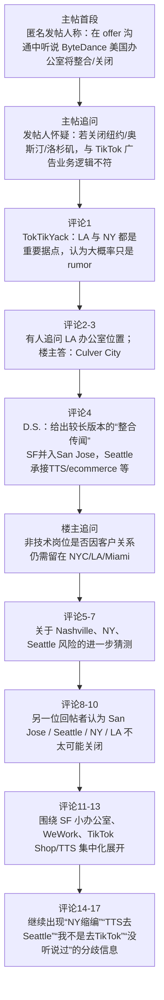
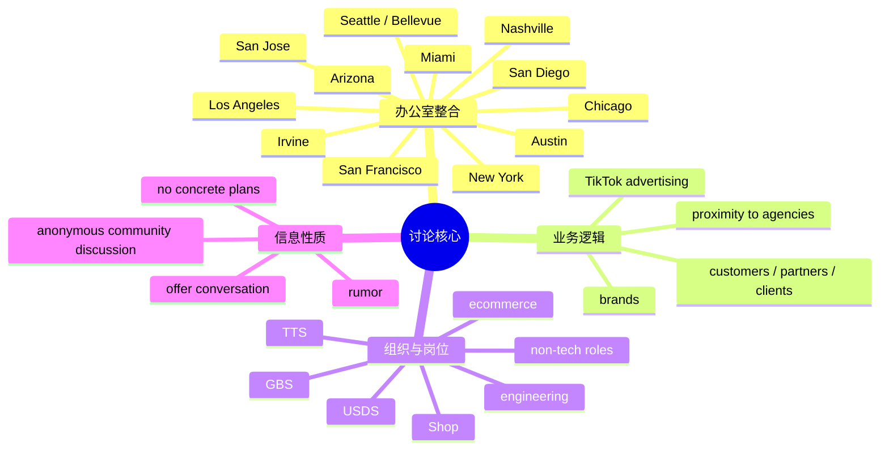

# Blind：ByteDance U.S. Office Consolidation（双语精读笔记）

本文整理自 Blind **Tech Industry** 板块讨论帖 *ByteDance U.S. Office Consolidation*，性质为**匿名职场社区讨论**，含首帖与多条跟帖；信息多为个人传闻、内部观察与推测，**不等同于公司正式公告**。首帖发布时间 **May 17, 2025**；首帖作者为匿名用户 **31116023**（页面显示验证来源为 **LinkedIn**）。Blind 为面向已验证职场人士的匿名社区，用户身份与职位**无法公开核验**。

---

## 前情提要

### 文章来源与基本信息

- 来源网站：**Blind / Teamblind**
- 帖子标题：**ByteDance U.S. Office Consolidation**
- 板块：**Tech Industry**
- 首帖发布时间：**May 17, 2025**
- 首帖作者：**匿名用户 “31116023”**（页面显示验证来源为 **LinkedIn**）
- 文本性质：**匿名职场社区讨论帖**，内容包含首帖与多条跟帖评论，信息来源以个人传闻、内部观察、推测和回应为主，并**不等同于公司正式公告**。
- 作者背景简介：Blind 官方帮助页面说明，Blind 是一个**面向已验证职场人士的匿名社区**，用户通常通过工作邮箱或 LinkedIn 等方式完成职业身份验证，但对外保持匿名；因此本帖作者与回帖者的真实身份、职位、部门**无法公开核验**。
  - 参考：
    - https://help.teamblind.com/article/128-linkedin-verification
    - https://us.teamblind.com/faq
    - https://www.teamblind.com/post/bytedance-us-office-consolidation-xwwe5ltu

### 文章结构信息图

---

## 逐句精读

### 🔹ByteDance U.S. Office Consolidation  
🔸**字节跳动美国办公室整合**

#### 背景注释

- **ByteDance**：字节跳动，中国互联网公司，TikTok 的母公司。
- **Office Consolidation**：常见商业表达，指将多个办公室、楼层或团队集中到更少的办公地点，以降低成本、提高协同或调整组织布局。

> **Consolidation / office consolidation**
>
> 1. **consolidation** *(n.)* = **the act of combining several things into a single, stronger, or more effective whole**；**整合；合并；集中化**  
> 语域：**商业、管理、新闻**
>
> 2. 常见搭配：**industry consolidation, debt consolidation, office consolidation, consolidate operations**
>
> 3. 画龙点睛：**consolidation** 在商业英语中很高频，常对应“整合资源/收缩战线/集中办公”。做阅读时看到它，不要只机械译成“巩固”，要结合语境判断是**组织整编**还是**业务合并**。写作里可用 **consolidate teams / consolidate regional offices** 提升正式度。

---

### 🔹I was told / in an offer conversation / that some ByteDance U.S. offices would be closing.  
🔸**我在一次与 offer 相关的沟通中被告知，字节跳动在美国的一些办公室将会关闭。**

#### 背景注释

- **offer conversation**：通常指求职流程中的录用沟通、薪资谈判或岗位确认交流。
- **ByteDance U.S. offices**：指字节跳动在美国境内的办公点，并不必然等于 TikTok 的全部独立法人实体或业务线。

> **be told**
>
> 1. **be told** *(verb phrase)* = **to receive information from someone**；**被告知；听别人说**  
> 语域：**通用、口语、叙述**
>
> 2. 画龙点睛：这里的 **I was told** 明确提示信息并非作者亲眼确认，而是**二手信息**。做阅读判断语气时，要注意这类表达会降低信息确定性。写作里若想保留谨慎口吻，可用 **I was told that... / I’ve been told...**。
>
> **offer**
>
> 1. **offer** *(n.)* = **a proposal of employment from an employer to a candidate**；**录用通知；工作邀请**  
> 语域：**招聘、人力资源、职场**
>
> 2. 常见搭配：**job offer, offer call, verbal offer, offer negotiation**
>
> 3. 画龙点睛：求职语境里 **offer** 往往不是“提供”而是**录用机会**。考试翻译常把它误成“提议”。若写求职经历，可说 **during the offer stage / in the offer discussion**，比简单说 **when I got the offer** 更自然。
>
> **would be closing**
>
> 1. **would be closing** *(verb phrase)* = **were expected or said to close in the future**；**将会关闭；据说会关闭**  
> 语域：**新闻、转述、推测**
>
> 2. 画龙点睛：这里的 **would** 不是单纯过去将来时，也带有**转述、非完全确认**色彩。英文里报道传闻、计划、内部消息时常用这种说法，比 **will close** 更审慎。

---

### 🔹It sounded like / there would be consolidation / in San Jose, Seattle and San Francisco.  
🔸**听起来，圣何塞、西雅图和旧金山将会进行办公整合。**

#### 背景注释

- **San Jose**：美国加州湾区重要科技城市。
- **Seattle**：美国华盛顿州城市，大型科技企业聚集地。
- **San Francisco**：美国加州旧金山，科技、金融、媒体资源集中。

> **sound like**
>
> 1. **sound like** *(verb phrase)* = **to seem or appear from what one has heard**；**听起来像是；给人的感觉是**  
> 语域：**口语、新闻转述**
>
> 2. 画龙点睛：**It sounded like...** 与 **It seems that...** 类似，但更强调“基于听到的信息形成印象”，不是事实确认。阅读中这是判断**传闻色彩**的重要信号。
>
> **consolidation**
>
> 1. **consolidation** *(n.)* = **the combining of offices, functions, or resources into fewer units**；**整合；归并；集中**  
> 语域：**商业、组织管理**
>
> 2. 常见搭配：**workforce consolidation, office consolidation, market consolidation**
>
> 3. 画龙点睛：这里不一定等于彻底关闭，而可能指**搬迁、并楼层、减少租赁面积、团队迁移**。翻译时要避免绝对化成“全部裁撤”。

---

### 🔹Places like New York, Austin, Los Angeles / would seemingly shut down.  
🔸**像纽约、奥斯汀、洛杉矶这样的地点，看起来反而会被关闭。**

#### 背景注释

- **New York / Austin / Los Angeles**：均为美国重要商业城市；文中提及这些城市，是因为它们在广告、品牌、科技、商务拓展等方面具有不同战略意义。
- **seemingly**：表示“表面看来”“似乎”，说明发帖人仍在转述，不是定论。

> **seemingly**
>
> 1. **seemingly** *(adv.)* = **apparently; as it appears**；**看似；似乎；表面上**  
> 语域：**新闻、正式写作**
>
> 2. 近义：**apparently, ostensibly**
>
> 3. 画龙点睛：**seemingly** 常用于表达“根据现有表象得出的判断”，带一定保留。学术或议论文里可用于避免武断，如 **seemingly minor changes can have major effects**。
>
> **shut down**
>
> 1. **shut down** *(phrasal verb)* = **to close a business, office, system, or operation**；**关闭；停运；停办**  
> 语域：**商业、新闻、口语**
>
> 2. 常见搭配：**shut down an office / plant / operation / website**
>
> 3. 画龙点睛：这是高频短语动词。商业语境中既可指**永久关闭**，也可指**停用、停止运营**。考试中要根据上下文判断强度；不能见到就一律翻成“倒闭”。

---

### 🔹That seems implausible / based on TikTok’s advertising business model.  
🔸**考虑到 TikTok 的广告业务模式，这件事似乎不太可信。**

#### 背景注释

- **TikTok’s advertising business model**：指 TikTok 通过品牌广告、效果广告、商家投放、内容变现等方式形成商业收入的模式。
- 作者认为，若过度关闭靠近客户与广告机构的城市办公室，可能与广告业务拓展逻辑相冲突。

> **implausible**
>
> 1. **implausible** *(adj.)* = **not likely to be true or believable**；**不合情理的；不太可信的**  
> 语域：**正式、评论、新闻**
>
> 2. 反义：**plausible**
>
> 3. 画龙点睛：这是阅读和写作中的高价值词。比 **unlikely** 更强调“从逻辑上站不住脚”。写作中可说 **The claim is implausible given the market structure**，显得更学术、更严谨。
>
> **business model**
>
> 1. **business model** *(n.)* = **the way a company creates value and earns revenue**；**商业模式**  
> 语域：**商业、管理、财经**
>
> 2. 常见搭配：**advertising business model, subscription-based model, monetization model**
>
> 3. 画龙点睛：**model** 在这里不是“模特/模型”，而是“运作机制”。阅读时要特别熟悉这一义项。翻译时常与 **revenue model / monetization strategy** 结合出现。

---

### 🔹How could they close offices / in close proximity to media agencies and brands / that monetize TikTok?  
🔸**他们怎么会关闭那些紧邻媒体代理公司和借助 TikTok 获利的品牌的办公室呢？**

#### 背景注释

- **media agencies**：媒体代理公司或广告代理机构，通常帮助品牌进行广告投放与营销采购。
- **brands that monetize TikTok**：这里可理解为通过 TikTok 平台进行营销、销售、内容合作并实现商业收益的品牌。
- **in close proximity to**：正式表达，指“地理上接近”。

> **in close proximity to**
>
> 1. **in close proximity to** *(phrase)* = **very near or close to something**；**靠近；邻近**  
> 语域：**正式、商业、书面**
>
> 2. 近义：**near, close to, adjacent to**
>
> 3. 画龙点睛：这是一个非常适合替换 **near** 的书面表达，雅思写作、GRE 阅读都常见。它提升正式度，但不宜在口语中过度使用。
>
> **media agency**
>
> 1. **media agency** *(n.)* = **a company that plans and buys advertising media for clients**；**媒体代理公司；媒介代理机构**  
> 语域：**广告、营销、商务**
>
> 2. 画龙点睛：它不只是“媒体公司”，而常是帮助品牌规划投放渠道、预算和广告采购的专业机构。翻译时要注意与 **media company** 区分。
>
> **monetize**
>
> 1. **monetize** *(v.)* = **to generate revenue from something**；**使产生收益；实现变现**  
> 语域：**商业、互联网、平台经济**
>
> 2. 常见搭配：**monetize content / traffic / an audience / a platform**
>
> 3. 画龙点睛：互联网语境里的核心词。它强调“把流量、内容、用户、平台转成收入”。写作里若要表达“实现商业化”，**monetize** 比 **make money from** 更专业。

---

### 🔹Anyone else hearing similar?  
🔸**还有别人也听到了类似的说法吗？**

#### 背景注释

- 这是论坛常见提问句式，用于向其他匿名用户征询是否有相同消息来源或内部观察。

> **similar**
>
> 1. **similar** *(adj.)* = **almost the same; of the same kind**；**相似的；类似的**  
> 语域：**通用**
>
> 2. 常见搭配：**similar information, similar concerns, similar reports**
>
> 3. 画龙点睛：这里省略了名词，完整可理解为 **hearing similar things/reports**。英语论坛、口语里常有这种省略。阅读时要能补全隐含成分。

---

### 🔹LA is headquarters in the US / so I don't see that happening.  
🔸**洛杉矶是其在美国的总部所在地，所以我不觉得那会发生。**

#### 背景注释

- **LA**：Los Angeles 的缩写。
- 该回帖者以“总部所在地”为依据，判断关闭洛杉矶办公室不太可能。

> **headquarters**
>
> 1. **headquarters** *(n., singular/plural in form)* = **the main office of an organization**；**总部**  
> 语域：**商业、机构、新闻**
>
> 2. 常见搭配：**U.S. headquarters, corporate headquarters, be headquartered in**
>
> 3. 画龙点睛：**headquarters** 形式上像复数，但常表示单一地点。写作中常用被动结构 **The company is headquartered in...**，非常高频。
>
> **I don’t see that happening**
>
> 1. *(idiomatic expression)* = **I think that is unlikely to happen**；**我不认为那会发生**  
> 语域：**口语、论坛表达**
>
> 2. 画龙点睛：这是一种委婉表达怀疑的口语说法，比 **That won’t happen** 更柔和。日常讨论或半正式场景很实用。

---

### 🔹NY also houses / majority of GBS and Shop.  
🔸**纽约那边也承载着大部分的 GBS 和 Shop 业务。**

#### 背景注释

- **NY**：New York。
- **houses** 在这里不是“房子”，而是“容纳、设有、安置”。
- **GBS**：在企业语境里通常可指 **Global Business Solutions** 或类似商务支持部门，但此帖未作官方展开。
- **Shop**：此处大概率指 **TikTok Shop** 相关业务。

> **house**
>
> 1. **house** *(v.)* = **to contain, accommodate, or provide space for**；**容纳；设有；安置**  
> 语域：**正式、商业、说明文**
>
> 2. 画龙点睛：这是典型的熟词僻义。阅读里 **The building houses... / The division houses...** 很常见，不能只理解成名词“房屋”。掌握这一义项能明显提升阅读速度。
>
> **majority**
>
> 1. **majority** *(n.)* = **the larger number or part**；**大多数；主体部分**  
> 语域：**通用、正式**
>
> 2. 常见搭配：**the majority of staff / users / operations**
>
> 3. 画龙点睛：**the majority of + 复数名词** 是写作高频结构，可替代 **most of**，更书面。翻译时常根据语境译为“大部分”“多数”“主体”。

---

### 🔹Guaranteed / its a rumor.  
🔸**可以肯定，这就是个传言。**

#### 背景注释

- 回帖者用较强口吻表达否定判断，但仍属于个人观点。
- 原文 **its** 应为 **it’s**，属于论坛口语化拼写疏漏。

> **rumor**
>
> 1. **rumor** *(n.)* = **a piece of unofficial information that may or may not be true**；**传闻；流言**  
> 语域：**新闻、口语、职场**
>
> 2. 常见搭配：**circulate a rumor, rumor has it..., dismiss as a rumor**
>
> 3. 画龙点睛：在职场论坛中，**rumor** 往往意味着未获官方确认的信息。写作时若要保持客观，可用 **unverified rumor** 或 **market rumor**，语气更谨慎。
>
> **guaranteed**
>
> 1. **guaranteed** *(adv./adjective-like forum use)* = **certainly; without doubt**；**肯定地；准保**  
> 语域：**口语、论坛**
>
> 2. 画龙点睛：这里不是严格语法上的完整句，而是论坛里的强调性独立用法。阅读社媒文本时，要适应这种**省略句**与**口语断句**。

---

### 🔹Where is the LA office located?  
🔸**洛杉矶办公室具体在什么地方？**

#### 背景注释

- 这是对办公点具体地理位置的追问，说明讨论从“会不会关闭”转向“到底是哪一个办公室”。

> **located**
>
> 1. **be located** *(verb phrase)* = **to be situated in a particular place**；**位于；坐落于**  
> 语域：**正式、说明文、商务**
>
> 2. 画龙点睛：这是最常见的地点表达之一。写作中可替换简单的 **is in**，如 **The office is located in Culver City**，更自然正式。

---

### 🔹Culver City.  
🔸**卡尔弗城。**

#### 背景注释

- **Culver City**：位于洛杉矶县，邻近影视、媒体和广告产业资源。
- 在本讨论里，这一回答强化了“LA 办公点接近媒体行业”的潜在合理性。

> **office location**
>
> 1. 这里是**省略句**，完整表达可理解为 **It’s in Culver City.**
>
> 2. 画龙点睛：论坛回复中常用单个地名作完整答复。阅读时要主动补足被省略的主谓结构，训练“语篇恢复能力”。

---

### 🔹San Francisco will be shutting down, / consolidating into San Jose.  
🔸**旧金山办公室将会关闭，并并入圣何塞。**

#### 背景注释

- 这是某位回帖者给出的内部传闻式说法，非正式公告。
- **consolidating into San Jose**：表示人员或业务向圣何塞集中。

> **shut down**
>
> 1. **shut down** *(phrasal verb)* = **to cease operations**；**关闭；停止运营**
>
> 2. 画龙点睛：在办公室语境中，它未必意味着团队消失，也可能只是**搬到别处继续办公**。要结合后面的 **consolidating into** 一起理解。
>
> **consolidate into**
>
> 1. **consolidate into** *(verb phrase)* = **to merge or combine into one location or structure**；**整合并入……；集中到……**
>
> 2. 画龙点睛：这个结构在企业重组、校区合并、业务归口等话题里很常见。写作中可说 **smaller units were consolidated into one regional hub**。

---

### 🔹Mountain View, Palo Alto and Santa Clara / already shut down / within the last three years.  
🔸**山景城、帕洛阿尔托和圣克拉拉的办公室在过去三年里已经关闭了。**

#### 背景注释

- **Mountain View / Palo Alto / Santa Clara**：均位于加州湾区，是科技公司高度集中的城市。
- **within the last three years**：表示从发言当下往前推三年这一时间范围。

> **within the last three years**
>
> 1. *(time expression)* = **during the three-year period counting backward from now**；**在过去三年内**
>
> 2. 画龙点睛：该结构常见于新闻与说明文。与 **in the last three years** 意思接近，但 **within** 更强调“这个时间区间之内”。
>
> **already**
>
> 1. **already** *(adv.)* = **before now; by this time**；**已经**
>
> 2. 画龙点睛：这里的 **already** 带有“这并非第一次发生”的语感，用于强化说话人论证：既然此前已有办公点关停，现在继续整合也不奇怪。

---

### 🔹New York and Austin / will dense down / to less floors.  
🔸**纽约和奥斯汀将会收缩办公规模，缩减到更少的楼层。**

#### 背景注释

- **dense down** 不是特别标准的正式书面表达，这里应理解为口语化的 **densify / reduce footprint / shrink to fewer floors**。
- **less floors** 规范写法更常见为 **fewer floors**。

> **dense down**
>
> 1. *(informal/nonstandard workplace phrasing)* ≈ **to reduce office footprint and fit people into fewer floors**；**压缩办公面积；把人员集中到更少楼层**
>
> 2. 语域：**口语、论坛、内部行话**
>
> 3. 画龙点睛：遇到这种“不完全标准”的论坛英语，不必死抠字面。核心是理解真实意图：**不是整个城市点位立刻消失，而是缩租、并层、压缩空间**。
>
> **floor**
>
> 1. **floor** *(n.)* = **a level of a building**；**楼层**
>
> 2. 常见搭配：**occupy two floors, reduce to one floor, office floor plan**
>
> 3. 画龙点睛：商业地产和办公室语境里，**floor** 常直接关联租赁面积、组织规模与成本结构，阅读职场新闻时非常高频。

---

### 🔹Los Angeles / will also dense close / and close c3 and such.  
🔸**洛杉矶那边也会进一步收缩压缩，并关闭 C3 之类的点位。**

#### 背景注释

- 原句口语化、非标准，疑似表达 **densify/close some sub-sites**。
- **c3** 在帖内未获解释，可能是内部楼区、办公点、项目代号或楼层编号，**无法公开核实**，因此只能保留字面。

> **and such**
>
> 1. **and such** *(phrase)* = **and similar things; and the like**；**诸如此类；等等**
>
> 2. 语域：**口语**
>
> 3. 画龙点睛：这类尾部补充表达常用于说话人不想展开全部细节时。阅读时说明信息**不完全具体**，往往是口头转述风格。
>
> **close**
>
> 1. **close** *(v.)* = **to stop operating or shut something**；**关闭**
>
> 2. 画龙点睛：本句出现两次与“收缩/关闭”相关动作，体现的不是单一动作，而是**规模压缩 + 部分点位停用**的组合概念。

---

### 🔹Irvine, San Diego, Austin, Miami, Chicago / are all getting dense down / to not renewing the lease.  
🔸**尔湾、圣地亚哥、奥斯汀、迈阿密和芝加哥这些地点都在被进一步压缩，方向是不再续租。**

#### 背景注释

- **not renewing the lease**：商业地产语境，指租约到期后不再续签。
- 这一说法说明“办公室关闭”可能通过“租约自然到期后退出”实现。

> **renew the lease**
>
> 1. **renew the lease** *(phrase)* = **to extend a rental agreement for another term**；**续租；续签租约**
>
> 2. 语域：**房地产、商务、行政**
>
> 3. 画龙点睛：企业缩编新闻常出现这一表达。它往往比“立即关闭”更温和，暗示通过**租约到期退出**来完成办公点调整。
>
> **lease**
>
> 1. **lease** *(n.)* = **a contract by which property is rented**；**租约**
>
> 2. 常见搭配：**office lease, sign a lease, lease renewal**
>
> 3. 画龙点睛：职场与商业阅读中，**lease** 是判断公司扩张或收缩的重要线索。看到 **not renewing the lease**，通常可推断办公面积在缩减。

---

### 🔹They will continue to work on / expanding USDS offices / like Nashville and the one in Arizona.  
🔸**他们会继续推进 USDS 办公点的扩张，比如纳什维尔以及亚利桑那的那个办公室。**

#### 背景注释

- **USDS**：在 TikTok/ByteDance 相关语境中，通常指 **U.S. Data Security**，即美国数据安全相关架构或团队。
- **Nashville**：美国田纳西州纳什维尔。
- **the one in Arizona**：指亚利桑那州的某办公点，但帖中未写明具体城市。

> **expand**
>
> 1. **expand** *(v.)* = **to increase in size, scope, or number**；**扩大；扩张**
>
> 2. 常见搭配：**expand operations, expand offices, expand headcount**
>
> 3. 画龙点睛：与前文“关闭/收缩”并列时，**expand** 显示公司调整并非单向削减，而是**一边缩、一边投**。阅读商业文章时要警惕这种“局部收缩、局部扩张”的结构。
>
> **work on**
>
> 1. **work on** *(phrasal verb)* = **to devote effort to developing or improving something**；**致力于；推进**
>
> 2. 画龙点睛：这里不是“在……上工作”的字面义，而是“推进某项事务”。这是高频熟词活用。

---

### 🔹If you are TTS/ecommerce, / then you will be forced to go to Seattle (Bellevue) / unless you have engineering background / then you can choose San Jose.  
🔸**如果你属于 TTS/电商业务线，那么你会被要求去西雅图（贝尔维尤）；除非你有工程技术背景，那你可以选择圣何塞。**

#### 背景注释

- **TTS**：结合上下文，大概率指 **TikTok Shop** 相关体系或其简称用法；帖中未作官方展开。
- **ecommerce**：电商业务。
- **Bellevue**：贝尔维尤，位于西雅图都会区，是许多科技公司办公集中地。
- **engineering background**：工程/技术背景，意味着岗位归属可能影响办公地点选择。

> **be forced to**
>
> 1. **be forced to** *(verb phrase)* = **to be compelled to do something**；**被迫；被要求不得不**
>
> 2. 语域：**通用、带主观色彩**
>
> 3. 画龙点睛：这类表达反映说话人对政策的主观感受，语气比 **be required to** 更强。阅读时要区分**事实内容**与**情绪态度**。
>
> **background**
>
> 1. **background** *(n.)* = **a person’s education, training, and experience**；**背景；履历；专业出身**
>
> 2. 常见搭配：**engineering background, academic background, professional background**
>
> 3. 画龙点睛：求职和岗位匹配语境里，**background** 常指“专业路径”而不是“家庭背景”。写作时很实用。
>
> **choose**
>
> 1. **choose** *(v.)* = **to select from more than one option**；**选择**
>
> 2. 不规则变化：**choose – chose – chosen**
>
> 3. 画龙点睛：若考试考词形变化，这是常考不规则动词。这里说明并非所有员工完全没有灵活性，仍有地点选择差异。

---

### 🔹They are there / to compete with Amazon / and poach Amazon employees.  
🔸**他们之所以把相关业务放在那里，是为了和亚马逊竞争，并从亚马逊挖人。**

#### 背景注释

- **Amazon**：美国大型科技公司，总部位于西雅图地区。
- **poach employees**：商业/招聘语境中指从竞争对手那里高薪或定向挖走人才。

> **compete with**
>
> 1. **compete with** *(phrase)* = **to try to be more successful than another company or person**；**与……竞争**
>
> 2. 画龙点睛：商业英语最基础但极高频的结构之一。可扩展为 **compete for talent / market share / customers**。
>
> **poach**
>
> 1. **poach** *(v.)* = **to attract or take employees, clients, or customers from another organization**；**挖走；挖角**
>
> 2. 语域：**商业、招聘、媒体**
>
> 3. 画龙点睛：这是一个很地道的职场词。它常带“从竞争对手处抢人才”的意味。写作里比 **hire from competitors** 更生动、更贴近商业报道。
>
> **there**
>
> 1. **there** 在本句中指前文提到的 **Seattle/Bellevue** 地区。
>
> 2. 画龙点睛：阅读长句时，要能迅速回指前文地点，避免把 **there** 误解成空泛副词。

---

### 🔹San Jose is the ByteDance hub, / they currently own 3 giant ass buildings, / two for BDEE and one for USDS.  
🔸**圣何塞是字节跳动的枢纽，他们目前在那里拥有三栋非常大的楼，两栋给 BDEE，一栋给 USDS。**

#### 背景注释

- **hub**：中心、枢纽。
- **BDEE**：帖中未解释，可能为内部部门简称，**无法公开核实**。
- **USDS**：见前文注释。
- **giant ass**：强烈口语化、略带粗俗色彩，用于强调“非常大”。

> **hub**
>
> 1. **hub** *(n.)* = **the center of activity, operations, or transportation**；**枢纽；中心**  
> 语域：**商业、交通、科技**
>
> 2. 常见搭配：**regional hub, business hub, engineering hub**
>
> 3. 画龙点睛：在公司布局文章里，**hub** 常表示资源、人员、决策或某类职能的集中地，是理解组织地理结构的关键词。
>
> **currently**
>
> 1. **currently** *(adv.)* = **at the present time**；**目前；当前**
>
> 2. 画龙点睛：表示当前状态，暗示未来可能变化。商业报道中用它可避免把暂时情况写成永久事实。
>
> **giant ass**
>
> 1. *(informal/slang intensifier)* = **extremely large**；**特别大；巨大无比**
>
> 2. 语域：**强口语、非正式**
>
> 3. 画龙点睛：论坛英语里常见这种强化表达。精读时要识别其情绪色彩，但正式写作绝不能照搬，可替换为 **very large / massive**。

---

### 🔹I was told / they did research / and the Bay Area engineering market / have the best of the best, / even with the high costs.  
🔸**我听说他们做过研究，认为湾区的工程人才市场即使成本很高，仍然汇集了最顶尖的人才。**

#### 背景注释

- **Bay Area**：美国加州湾区，科技人才高度集中。
- **engineering market**：这里不是“工程市场”字面意思，而是指工程师人才供给与招聘市场。
- 原句中 **have** 更规范地说应为 **has**，属于论坛写作中的一致性疏漏。

> **the best of the best**
>
> 1. *(idiomatic phrase)* = **the very finest people or things available**；**精英中的精英；最优秀的一批**
>
> 2. 语域：**口语、宣传、评价**
>
> 3. 画龙点睛：带有明显强调色彩。阅读中既要懂其意思，也要意识到它不是中性统计结论，而是偏主观、强化性的表达。
>
> **even with**
>
> 1. **even with** *(phrase)* = **despite; in spite of**；**即便有；尽管有**
>
> 2. 画龙点睛：这是非常实用的让步表达，口语和写作都能用，如 **Even with limited resources, they delivered results.**
>
> **cost**
>
> 1. **costs** *(n.)* = **expenses or financial burdens**；**成本；开支**
>
> 2. 画龙点睛：商业分析中，人才密度与用人成本常并列出现。看到 **high costs**，要联想到薪资、租金、运营成本等综合支出。

---

### 🔹It’s also next to the airport, / so who’s to say / they could utilize that space and geographical location / to fly in future endeavors / instead of Los Angeles.  
🔸**而且那地方还紧邻机场，所以谁又能断言他们不会利用那里的空间和地理位置，来承接未来的布局，而不是放在洛杉矶呢？**

#### 背景注释

- **next to the airport**：强调交通便利性。
- **who’s to say...**：反问式表达，意为“谁能断定……不可能呢？”
- **future endeavors**：这里指未来计划、未来业务尝试或后续项目。
- **utilize**：正式词，近义于 use，但更书面。

> **utilize**
>
> 1. **utilize** *(v.)* = **to make practical and effective use of something**；**利用；有效使用**
>
> 2. 语域：**正式、商业、学术**
>
> 3. 画龙点睛：虽然很多场景 **use** 就够了，但 **utilize** 更有“充分利用资源”的意味。写作中适度使用可提升正式度，但不宜滥用。
>
> **geographical location**
>
> 1. **geographical location** *(n. phrase)* = **the physical place of something in relation to other places**；**地理位置**
>
> 2. 画龙点睛：这是说明区位优势的常见表达。商业选址、城市比较、物流分析中很高频。
>
> **endeavor**
>
> 1. **endeavor** *(n.)* = **an effort, project, or undertaking**；**努力；事业；项目尝试**
>
> 2. 语域：**正式**
>
> 3. 画龙点睛：比 **effort** 更正式，也常带“事业/项目”的意味。搭配 **future endeavors** 时，往往泛指未来计划而不具体点名。

---

### 🔹What about non-tech roles?  
🔸**那非技术岗位呢？**

#### 背景注释

- **non-tech roles**：非工程、非研发类岗位，可能包括销售、市场、运营、商务合作、法务、HR 等。

> **role**
>
> 1. **role** *(n.)* = **a job or function performed by a person**；**岗位；职能；角色**
>
> 2. 常见搭配：**technical roles, leadership roles, client-facing roles**
>
> 3. 画龙点睛：职场英语里 **role** 比 **job** 更灵活，可指岗位职责、职位类型或组织功能，是高频核心词。

---

### 🔹Seems like those / that are external-facing / and need to be in proximity of their customers, partners, clients, etc. / may have reasons to be in NYC, LA, Miami.  
🔸**看起来，那些面向外部、并且需要靠近客户、合作伙伴、客户方等对象的岗位，可能仍有理由留在纽约、洛杉矶和迈阿密。**

#### 背景注释

- **external-facing**：企业中面向外部关系人、客户、合作方、市场渠道的一类岗位。
- **customers, partners, clients**：三者有细微差别：
  - **customers** 偏购买者/消费者；
  - **partners** 偏合作伙伴；
  - **clients** 常指接受专业服务的一方。

> **external-facing**
>
> 1. **external-facing** *(adj.)* = **dealing directly with people or organizations outside the company**；**面向外部的；对外的**
>
> 2. 语域：**商业、组织管理**
>
> 3. 画龙点睛：这是现代职场英语非常常见的复合形容词。可类推记忆 **client-facing, customer-facing, public-facing**。
>
> **in proximity of**
>
> 1. *(phrase; more idiomatic: in proximity to)* = **near or close to**；**靠近；接近**
>
> 2. 画龙点睛：原句写作略口语化，但核心仍是“地理接近客户”。商务写作中更自然的形式是 **in close proximity to**。
>
> **client-facing**
>
> 1. 虽原句未直接出现，但与 **external-facing** 强相关，指**直接面向客户的**。
>
> 2. 画龙点睛：考试写作中若讨论工作性质，**client-facing roles require physical proximity to major markets** 这类句式很有表达力。

---

### 🔹Nashville will be shut down / before NY does / but NY is on the list too.  
🔸**纳什维尔会在纽约之前先被关掉，但纽约也在名单上。**

#### 背景注释

- **on the list**：指“在可能被处理/关闭/调整的名单中”。
- 回帖者继续提供未证实的传闻信息。

> **on the list**
>
> 1. *(phrase)* = **included among the items or targets being considered**；**在名单上；被列入考虑范围**
>
> 2. 画龙点睛：在职场、裁员、重组语境中，这个短语常有潜在风险含义。理解时要联系上下文判断是“候选名单”还是“风险名单”。
>
> **before**
>
> 1. **before** *(prep./conj.)* = **earlier than; prior to**；**在……之前**
>
> 2. 画龙点睛：本句不是单纯时间先后，而是在比较两个地点的**优先关闭顺序**。

---

### 🔹I assume Seattle is at risk / after today / due to TTS layoffs.  
🔸**我猜西雅图在今天之后也有风险，因为 TTS 出现了裁员。**

#### 背景注释

- **at risk**：处于风险之中。
- **layoffs**：裁员。
- **after today**：结合帖子页面日期，应理解为“在发帖当日出现某事之后”；论坛中这种相对时间常依赖语境。

> **assume**
>
> 1. **assume** *(v.)* = **to suppose something to be true without complete proof**；**假定；猜测；认为**
>
> 2. 画龙点睛：这是表达推断但保留不确定性的关键词。阅读时，一看到 **I assume / I guess / I suspect**，就要意识到后面是说话人的主观推测。
>
> **at risk**
>
> 1. **at risk** *(phrase)* = **in danger of being harmed, lost, or affected negatively**；**处于风险中**
>
> 2. 常见搭配：**jobs at risk, office at risk, projects at risk**
>
> 3. 画龙点睛：该短语适用于商业、健康、政策等多种语境，写作实用性很强。
>
> **layoff**
>
> 1. **layoff** *(n.)* = **the dismissal of employees because of business reasons**；**裁员**
>
> 2. 常见搭配：**announce layoffs, conduct layoffs, survive layoffs**
>
> 3. 画龙点睛：商业新闻核心词。它通常强调公司经营或组织调整导致的裁撤，而非个体因表现问题被解雇。

---

### 🔹I would say / of the offices you listed, / San Jose, Seattle (Bellevue), NY, and LA / are very unlikely to be shutdown.  
🔸**要我说，在你列出的这些办公室里，圣何塞、西雅图（贝尔维尤）、纽约和洛杉矶都非常不可能被关掉。**

#### 背景注释

- 该回帖与前文传闻形成对照，表明社区内部信息并不一致。
- **very unlikely**：明确表达低概率判断。

> **I would say**
>
> 1. *(hedging phrase)* = **in my opinion; if you ask me**；**要我说；我认为**
>
> 2. 语域：**口语、论坛**
>
> 3. 画龙点睛：这是典型的**缓和语气**表达，既给出判断，又保留个人意见空间。写作中比直接断言更稳妥。
>
> **unlikely**
>
> 1. **unlikely** *(adj.)* = **not probable; not expected to happen**；**不太可能的**
>
> 2. 常见搭配：**highly unlikely, very unlikely, unlikely to do**
>
> 3. 画龙点睛：与 **implausible** 相比，**unlikely** 更偏“概率低”，而 **implausible** 更偏“逻辑上站不住”。细微区分很重要。
>
> **shut down**
>
> 1. 此处应为 **be shut down**，原句写作略不规范。
>
> 2. 画龙点睛：论坛文本常有语法不完整现象，精读时要抓核心结构和意思，不必被小错误打断理解。

---

### 🔹These are major hubs / for a lot of business functions.  
🔸**这些地点承载着很多业务职能，是主要枢纽。**

#### 背景注释

- **business functions**：企业中的不同职能板块，如销售、运营、市场、产品、数据、安全、商业化等。

> **major hub**
>
> 1. **major hub** *(n. phrase)* = **a principal center of operations or activity**；**主要枢纽；核心中心**
>
> 2. 画龙点睛：商业报道里，**hub** 一词往往意味着规模、战略性和跨团队协同，不只是普通办公室。
>
> **function**
>
> 1. **function** *(n.)* = **a particular purpose, role, or department within an organization**；**职能；功能；部门职责**
>
> 2. 常见搭配：**business function, support function, core function**
>
> 3. 画龙点睛：组织管理语境里，**function** 常比 **department** 更抽象，强调“职能类别”而非行政归属。

---

### 🔹I hear there is a small SF office.  
🔸**我听说旧金山那边有一个小型办公室。**

#### 背景注释

- **SF**：San Francisco 的常见缩写。
- **I hear**：再次表明信息来自听闻，而非官方确认。

> **I hear**
>
> 1. *(reporting phrase)* = **I have heard; people say**；**我听说**
>
> 2. 画龙点睛：与 **I was told** 一样，都是降低信息确定性的典型信号。做信息可靠性判断时非常关键。
>
> **small office**
>
> 1. **small office** = **a relatively limited office site in size or headcount**；**小型办公室**
>
> 2. 画龙点睛：商业讨论中，“小”不一定只指面积，也可能指团队人数少、业务权重低、租用的是灵活办公空间。

---

### 🔹Likely to get shut down?  
🔸**有可能被关掉吗？**

#### 背景注释

- 省略主语后的论坛追问，完整应为 **Is it likely to get shut down?**

> **likely to**
>
> 1. **likely to** *(phrase)* = **probable to; expected to**；**很可能会**
>
> 2. 画龙点睛：口语与写作均高频。注意它与 **be likely that** 的结构差异，考试改写常考。
>
> **get shut down**
>
> 1. *(passive-like expression)* = **end up being closed**；**被关闭**
>
> 2. 画龙点睛：**get + 过去分词** 在口语中常表示“某事发生到某对象身上”，比 **be shut down** 更口语、更动态。

---

### 🔹Yes, / as it’s a WeWork / and those people can move to San Jose.  
🔸**是的，因为那是个 WeWork 办公点，而且那边的人可以搬到圣何塞去。**

#### 背景注释

- **WeWork**：提供共享办公空间和灵活租赁方案的公司品牌。
- 如果办公点属于共享办公空间，则退出成本可能相对较低，因而更容易被整合。

> **as**
>
> 1. **as** *(conj.)* = **because; since**；**因为**
>
> 2. 画龙点睛：这里不是“作为”，而是因果连词。阅读时要快速辨认。
>
> **move to**
>
> 1. **move to** *(phrase)* = **relocate to another place**；**搬到；迁往**
>
> 2. 画龙点睛：组织调整语境里，**people can move to...** 常暗示人员保留、地点迁移，而非直接裁撤。

---

### 🔹They closed down the San Diego WeWork, / and it was off to LA or gone.  
🔸**他们已经关掉了圣地亚哥的 WeWork 办公点；那边的人要么去洛杉矶，要么就走人。**

#### 背景注释

- **off to LA or gone**：高度口语化，意思是“要么调去洛杉矶，要么离开公司/岗位不再保留”。

> **close down**
>
> 1. **close down** *(phrasal verb)* = **to shut a site or operation entirely**；**关闭；停掉**
>
> 2. 画龙点睛：与 **shut down** 基本相近，论坛和新闻中常可互换。
>
> **off to**
>
> 1. *(phrase)* = **heading to; sent to**；**去往；被调往**
>
> 2. 画龙点睛：口语里很简洁，带“动身、被转去”的感觉。正式写作可改为 **relocated to LA**。
>
> **gone**
>
> 1. **gone** *(adj./past participle-like use)* = **no longer there; removed; no longer employed in context**；**没了；离开了**
>
> 2. 画龙点睛：在职场语境下，它可能含蓄表示“离职/岗位取消/不再留任”。要根据上下文理解，而非机械译成“消失”。

---

### 🔹Not closing.  
🔸**不会关。**

#### 背景注释

- 这是对前面“SF 可能关闭”说法的直接反驳。
- 省略完整主语与谓语补足，是论坛常见极简回复。

> **not closing**
>
> 1. *(elliptical sentence)* = **It is not closing.**；**不会关闭**
>
> 2. 画龙点睛：社媒和论坛里大量出现这种省略句。精读时要恢复为完整句，训练真实语料理解能力。

---

### 🔹Did you get an offer from TikTok Shop?  
🔸**你拿到的是 TikTok Shop 的 offer 吗？**

#### 背景注释

- **TikTok Shop**：TikTok 生态中的电商业务板块。
- 回帖者试图通过岗位归属判断地点安排。

> **get an offer**
>
> 1. **get an offer** *(phrase)* = **to receive a job offer**；**拿到录用通知**
>
> 2. 画龙点睛：求职英语高频表达。口语里 **get an offer** 比 **receive an offer** 更自然；正式写作则后者更稳妥。

---

### 🔹For TTS / yes it’s gonna be centralized to Seattle mostly / for new offers, / with some flexibility to place in San Jose.  
🔸**如果是 TTS 这条线，那确实会主要向西雅图集中，尤其是针对新的 offer；不过在安排到圣何塞方面仍有一定灵活性。**

#### 背景注释

- **centralized to Seattle mostly**：表示主要集中到西雅图。
- **new offers**：说明针对新招募人员的地点政策可能更统一。
- **flexibility**：表示仍有例外空间。

> **centralize**
>
> 1. **centralize** *(v.)* = **to bring activities or authority into one main place**；**集中化；统一归拢**
>
> 2. 常见搭配：**centralize operations, centralize hiring, centralize teams**
>
> 3. 画龙点睛：组织调整题材中的核心动词。与 **consolidate** 接近，但 **centralize** 更突出“朝一个中心集中”。
>
> **flexibility**
>
> 1. **flexibility** *(n.)* = **the ability to adjust or allow variation**；**灵活性；弹性**
>
> 2. 画龙点睛：商业沟通里非常常见。若公司政策不是绝对一刀切，常用 **with some flexibility / there is flexibility around location**。
>
> **place**
>
> 1. **place** *(v.)* = **to assign someone to a position or location**；**安排；安置；分派**
>
> 2. 画龙点睛：这里不是“放置”字面义，而是 HR/组织语境下的“安排工作地点”。熟词僻义，值得重点掌握。

---

### 🔹The rumor is true.  
🔸**这个传言是真的。**

#### 背景注释

- 这是另一位回帖者的断言，与前述“Guaranteed it’s a rumor”形成直接冲突，说明帖子内部信息分歧明显。

> **rumor**
>
> 1. 前文已释，此处强调的是“传言内容属实”的判断。
>
> 2. 画龙点睛：同一线程中对同一 **rumor** 的不同判断，是论坛文本分析时判断“信息噪音”的关键。

---

### 🔹No concrete plans / but these “top leaders” / are considering a massive scale back on NY first.  
🔸**目前还没有具体方案，但这些“高层领导”正在考虑先对纽约进行大规模收缩。**

#### 背景注释

- **concrete plans**：具体、明确、可执行的计划。
- **top leaders**：高层领导，带引号说明说话人可能保持距离或带一点质疑。
- **scale back**：缩减规模。
- **NY first**：先从纽约开始。

> **concrete**
>
> 1. **concrete** *(adj.)* = **specific, definite, and clear**；**具体的；明确的**
>
> 2. 画龙点睛：阅读中常和 **plan, evidence, proposal, measure** 搭配。不要只记“混凝土”这个义项。
>
> **consider**
>
> 1. **consider** *(v.)* = **to think about carefully before deciding**；**考虑**
>
> 2. 画龙点睛：商业新闻里 **is considering** 往往表示“正在研究中，尚未敲定”，语义上介于传闻与正式决定之间。
>
> **scale back**
>
> 1. **scale back** *(phrasal verb)* = **to reduce the size, amount, or extent of something**；**缩减；收缩**
>
> 2. 常见搭配：**scale back operations, scale back hiring, scale back office space**
>
> 3. 画龙点睛：这是商业英语核心短语。比 **cut** 更中性、更常见于公司公告与新闻报道。

---

### 🔹For TTS / all roles are consolidating to Seattle.  
🔸**对于 TTS 而言，所有岗位都在向西雅图集中。**

#### 背景注释

- **all roles**：全部岗位；但这只是回帖者说法，不代表官方文件。
- 与前文“mostly... with some flexibility”相比，这里口径更绝对。

> **all roles**
>
> 1. **all roles** *(n. phrase)* = **every position within the relevant group**；**所有岗位**
>
> 2. 画龙点睛：绝对化表述在论坛中常见，但精读时要意识到它可能带有夸张或概括倾向。
>
> **consolidate to**
>
> 1. **consolidate to** *(phrase)* = **to move and combine into one place**；**集中到**
>
> 2. 画龙点睛：与 **consolidate into** 接近。组织地点变化题材中非常实用。

---

### 🔹I would not be working for TikTok.  
🔸**我并不是要去 TikTok 任职。**

#### 背景注释

- 发帖者澄清自己拿到的机会并非 TikTok 本体岗位，可能是字节跳动体系内其他业务或关联岗位。

> **work for**
>
> 1. **work for** *(phrase)* = **to be employed by**；**为……工作；受雇于**
>
> 2. 画龙点睛：最基础但最常用的雇佣关系表达。注意与 **work on**、**work in** 区分。

---

### 🔹Don’t want to clarify / as it would blow my cover.  
🔸**我不想说得更具体，因为那样会暴露我的身份。**

#### 背景注释

- **blow my cover**：习语，原义类似“暴露伪装/暴露身份”；在匿名论坛中指泄露足以识别本人身份的信息。
- **clarify**：澄清、说明清楚。

> **clarify**
>
> 1. **clarify** *(v.)* = **to make something clearer or easier to understand**；**澄清；说明清楚**
>
> 2. 语域：**正式、通用**
>
> 3. 画龙点睛：写作里很常用，如 **clarify the issue / clarify one’s position**。比 **explain more** 更凝练正式。
>
> **blow one’s cover**
>
> 1. *(idiom)* = **to reveal someone’s hidden identity or secret position**；**暴露身份；露馅**
>
> 2. 语域：**口语、习语**
>
> 3. 画龙点睛：原本常见于谍战/卧底语境，后来也广泛用于匿名社交场景。非常地道，记住后口语表达会更灵活。

---

### 🔹havent heard anything like that  
🔸**我没听说过那样的事。**

#### 背景注释

- 原文应为 **haven’t**，论坛中省略撇号很常见。
- 这是线程中的另一条否定性证词。

> **hear anything like that**
>
> 1. *(phrase)* = **receive any similar information or report**；**听到类似的消息**
>
> 2. 画龙点睛：论坛与口语中很常见。它不是字面“听到声音”，而是“听闻消息”。遇到 **hear of / hear about / hear that** 时都要联想到“获知信息”。

---

# ByteDance U.S. Office Consolidation | 字节跳动美国办公室整合讨论

---

## 模块一：翻译与全文概要

### 全文英文翻译
（原文已为英文，无需翻译）

### 精练概要

**英文版：**

The LinkedIn discussion captures an unfolding narrative of ByteDance's strategic office footprint restructuring across the United States. Based on first-hand accounts from current and former employees, the company is executing a calculated geographic consolidation, strengthening core hubs in San Jose, Seattle (Bellevue), New York, and Los Angeles while systematically downsizing or exiting secondary markets including San Francisco, Austin, Miami, Chicago, and Nashville. The underlying rationale appears multifaceted: San Jose's position as the Bay Area tech talent epicenter with superior engineering talent pools justifies maintaining massive real estate holdings (three buildings serving engineering divisions and the U.S. Data Services team). Seattle's emergence as a TikTok Shop centralization point reflects the company's e-commerce ambitions and deliberate poaching of Amazon engineers in its own backyard. Meanwhile, the ostensible retention of customer-facing roles in New York and Los Angeles underscores the indispensability of geographic proximity to media agencies and brand partners that monetize TikTok's advertising ecosystem—a reality that renders wholesale office closures in these cities implausible, despite early rumors. The consolidation narrative thus reveals ByteDance's pragmatic spatial economics: concentration where talent density peaks, decentralization where client relationships demand physical presence.

**中文版：**

这场LinkedIn讨论呈现了**字节跳动美国办公室战略性重组**的逐步展开过程。根据现任和前任员工的第一手账述，该公司正在执行一项计算周密的地理集中战略，强化**圣何塞、西雅图（贝尔维尤）、纽约和洛杉矶**等核心枢纽，同时系统性地缩减或退出圣弗朗西斯科、奥斯汀、迈阿密、芝加哥和纳什维尔等次级市场。其背后的战略理由是多方面的：圣何塞作为**湾区科技人才的中心**，拥有最优越的工程人才库，足以支撑公司维持庞大的房产（三栋建筑分别服务于工程部门和美国数据服务团队）。西雅图作为**TikTok Shop集中地**的浮现，反映了该公司的电商野心和有意从亚马逊挖角工程师的做法。与此同时，纽约和洛杉矶**客户对接角色的保留**强调了与媒体代理商和品牌合作方地理邻近的必要性（这些机构是TikTok广告生态的变现关键），这使得这些城市的全面办公室关闭看似**缺乏说服力**。因此，整合叙事揭示了字节跳动的务实空间经济学：人才密度高处集中，客户关系需要则分散。

---

## 模块二：基本信息与注释

### 2A. 文章基本信息

| 项目 | 内容 |
|------|------|
| **来源 / Source** | LinkedIn | LinkedIn |
| **发表日期 / Publication Date** | May 17-22, 2025 | 2025年5月17日-22日 |
| **内容类型 / Content Type** | Professional Discussion Thread | 职业讨论帖 |
| **发帖人身份 / Original Poster** | Tech Industry Professional (Anonymous) | 科技行业专业人士（匿名） |
| **讨论主题 / Main Topic** | ByteDance US Office Consolidation Strategy | 字节跳动美国办公室整合战略 |

---

### 2B. 地点与公司注释

**San Jose (圣何塞)**
- 位于美国加州硅谷核心区域，是全球科技人才最密集的地区之一
- 北临旧金山，靠近机场，地理位置优越
- 字节跳动在该地拥有三栋大型建筑，分别用于BDEE（ByteDance Engineering Excellence）部门和USDS（美国数据服务）团队

**Seattle/Bellevue (西雅图/贝尔维尤)**
- 美国太平洋西北地区的科技中心，亚马逊全球总部所在地
- 字节跳动将此地作为TikTok Shop业务的核心集中地
- 用于吸引和挖角亚马逊工程人才

**San Francisco (圣弗朗西斯科)**
- 字节跳动在该市租赁WeWork办公空间，规模较小
- 根据讨论，该办公室内的员工将被转移到圣何塞

**Culver City (卡尔弗城)**
- 洛杉矶地区的重要商业中心，好莱坞及媒体产业聚集地
- 字节跳动美国总部所在地

**WeWork**
- 全球知名的共享办公空间提供商，提供灵活租赁合同

---

## 模块三：素材与语料库积累

### 3A. 重点词汇解析

#### **W - 写作高频词**

**1. consolidation** /ˌkɑːn.səl.ɪ'deɪ.ʃən/
- **词性 / POS:** noun (countable, uncountable) | 名词（可数/不可数）

- **英文释义 / English Definition:** 
  - (Economics) The combination of companies through takeovers and mergers, resulting in fewer businesses in an industry
  - (Commerce) The process of joining organizations or departments together
  - (Business) The strengthening and stabilization of a company's position of power or success

- **中文释义 / Chinese Translation:** 
  - （经济学）通过收购和兼并使公司合并，导致行业中企业数量减少
  - （商业）组织或部门联合在一起的过程
  - （商业）加强和稳定公司权力地位或成功的过程

- **语域标注 / Register:** 
  - **Formal, Academic, Business** | 正式、学术、商业用语

- **同义词/反义词 / Synonyms/Antonyms:**
  - Synonyms: merger, integration, combination, unification | 同义词：兼并、整合、结合、统一
  - Antonyms: fragmentation, dispersal, decentralization | 反义词：碎片化、分散、去中心化

- **常见词组 / Common Collocations:**
  - Office consolidation（办公室整合）
  - Market consolidation（市场整合）
  - Consolidation process（整合过程）
  - Further consolidation（进一步整合）

- **拓展内容 / Extended Content:**
  - 动词形式：consolidate | 动词形式：consolidate
  - 形容词形式：consolidated | 形容词：consolidated
  - 副词形式：consolidatedly（罕用）| 副词形式：consolidatedly（罕见）
  - *This is a time for consolidation, not for expansion.*（这是一个整合而非扩张的时期。）
  - 搭配：consolidate one's position（巩固某人的地位）

- **例句 / Example Sentence:**
  - *The company's **consolidation** strategy in Southeast Asia has reduced operational costs by 30%.*
  - 该公司在东南亚的**整合**战略已将运营成本降低了30%。

---

**2. implausible** /ɪm'plɔː.zə.bəl/
- **词性 / POS:** adjective | 形容词

- **英文释义 / English Definition:**
  - Not seeming reasonable or likely to be true; difficult to believe; provoking disbelief

- **中文释义 / Chinese Translation:**
  - 不合理或不太可能真实的；难以置信的；令人怀疑的

- **语域标注 / Register:**
  - **Formal, Academic** | 正式、学术用语

- **同义词/反义词 / Synonyms/Antonyms:**
  - Synonyms: unlikely, incredible, dubious, unbelievable, far-fetched | 同义词：不太可能、难以置信、可疑、不可信、牵强附会
  - Antonyms: plausible, believable, credible, reasonable | 反义词：似乎合理的、可信的、有根据的、合理的

- **常见词组 / Common Collocations:**
  - Implausible claim（不可信的声称）
  - Implausible theory（不太可能的理论）
  - Implausible explanation（说不通的解释）
  - Highly implausible（极其不可信的）

- **拓展内容 / Extended Content:**
  - 名词形式：implausibility（不可信性）| 名词形式：implausibility
  - 副词形式：implausibly（不可信地）| 副词形式：implausibly
  - 反义词形容词：plausible（似乎合理的）
  - 常用表达：*It seems highly implausible that...* （似乎极其不可信...）

- **例句 / Example Sentence:**
  - *The **implausible** plot twist in the movie left audiences bewildered and dissatisfied.*
  - 电影中**难以置信的**剧情转折让观众感到困惑和不满。

---

**3. proximity** /prɑːk'sɪm.ə.ti/
- **词性 / POS:** noun (uncountable) | 名词（不可数）

- **英文释义 / English Definition:**
  - Nearness in distance or time; the state of being near to something or someone

- **中文释义 / Chinese Translation:**
  - 距离或时间上的接近；靠近某物或某人的状态

- **语域标注 / Register:**
  - **Formal, Written** | 正式、书面用语

- **同义词/反义词 / Synonyms/Antonyms:**
  - Synonyms: closeness, nearness, propinquity | 同义词：接近、邻近、相近
  - Antonyms: distance, remoteness, separation | 反义词：距离、远距、分离

- **常见词组 / Common Collocations:**
  - Close proximity（接近）
  - Geographic proximity（地理邻近）
  - In proximity to（靠近于...）
  - Proximity to schools（靠近学校）

- **拓展内容 / Extended Content:**
  - 形容词形式：proximate（近的）| 形容词形式：proximate
  - 常用短语：*in close proximity to* （与...紧邻）
  - 相关概念：spatial proximity（空间邻近），temporal proximity（时间邻近）
  - 衍生词：proximal（解剖学术语，近端的）

- **例句 / Example Sentence:**
  - *The advertising agency chose its office location for its **proximity** to major media studios in Midtown Manhattan.*
  - 广告公司选择办公地点是因为它靠近**曼哈顿中城的主要媒体工作室。**

---

**4. monetize** /'mɑː.nə.taɪz/
- **词性 / POS:** verb (transitive) | 及物动词

- **英文释义 / English Definition:**
  - To turn something into money; to generate income or profit from an asset, product, or service
  - To convert something non-revenue-generating into a source of income

- **中文释义 / Chinese Translation:**
  - 将某物转变为金钱；从资产、产品或服务中产生收入或利润
  - 将不产生收入的东西转变为收入来源

- **语域标注 / Register:**
  - **Formal, Business, Digital Media** | 正式、商业、数字媒体用语

- **同义词/反义词 / Synonyms/Antonyms:**
  - Synonyms: profit from, capitalize on, commercialize, revenue-generate | 同义词：从...获利、充分利用、商业化、产生收入
  - Antonyms: subsidize, give away | 反义词：补贴、赠送

- **常见词组 / Common Collocations:**
  - Monetize content（将内容变现）
  - Monetize advertising（通过广告变现）
  - Monetize users（通过用户变现）
  - Fully monetized（完全变现的）

- **拓展内容 / Extended Content:**
  - 名词形式：monetization（变现、货币化）| 名词形式：monetization
  - 形容词形式：monetized（已变现的）、monetizable（可变现的）| 形容词形式：monetized, monetizable
  - 不规则动词：monetize → monetized → monetized
  - 相关概念：ad-supported monetization（广告支持的变现），subscription-based monetization（基于订阅的变现）

- **例句 / Example Sentence:**
  - *TikTok's platform **monetizes** content through advertising partnerships and e-commerce integration.*
  - TikTok通过广告合作和电商整合来**变现**内容。

---

**5. poach** /poʊtʃ/
- **词性 / POS:** verb (transitive) | 及物动词

- **英文释义 / English Definition:**
  - (In business context) To hire an employee who is already employed by a competing company
  - To recruit or attract away someone's employees or customers

- **中文释义 / Chinese Translation:**
  - （商业语境）聘用已在竞争公司工作的员工
  - 招聘或吸引他人的员工或客户

- **语域标注 / Register:**
  - **Formal, Business** | 正式、商业用语

- **同义词/反义词 / Synonyms/Antonyms:**
  - Synonyms: headhunt, recruit from competitors, steal (informal), attract away | 同义词：物色、从竞争对手处招聘、挖角（非正式）、吸引离开
  - Antonyms: retain, keep | 反义词：保留、保持

- **常见词组 / Common Collocations:**
  - Poach employees（挖员工）
  - Poach talent（挖人才）
  - Poach customers（挖客户）
  - Poach from competitors（从竞争对手处挖）

- **拓展内容 / Extended Content:**
  - 名词形式：poaching（挖角）| 名词形式：poaching
  - 过去式：poached | 过去式：poached
  - 相关表达：*talent poaching* （人才挖角）、*employee poaching* （员工挖角）
  - 法律地位：Generally legal but ethically debated | 一般合法但存在伦理争议

- **例句 / Example Sentence:**
  - *ByteDance's Seattle operations are designed to **poach** top engineering talent from Amazon's headquarters in Bellevue.*
  - 字节跳动在西雅图的运营旨在从贝尔维尤的亚马逊总部**挖取**顶尖工程人才。

---

#### **R - 阅读高频词**

**1. dense** /dens/
- **词性 / POS:** adjective | 形容词

- **英文释义 / English Definition:**
  - Made of or containing a lot of things or people that are very close together
  - Difficult to see through; thick and heavy
  - (Informal) Lacking intelligence; slow to understand

- **中文释义 / Chinese Translation:**
  - 由或包含大量紧密相靠的物体或人组成的
  - 不易透视；厚重的
  - （非正式）缺乏智慧；理解缓慢的

- **语域标注 / Register:**
  - **Standard, Informal (when meaning "stupid"), Technical** | 标准、非正式（表示"愚蠢"时）、技术性

- **同义词/反义词 / Synonyms/Antonyms:**
  - Synonyms: thick, compact, crowded, concentrated | 同义词：厚的、紧凑的、拥挤的、浓缩的
  - Antonyms: thin, sparse, dispersed, loose | 反义词：薄的、稀疏的、分散的、松散的

- **常见词组 / Common Collocations:**
  - Dense forest（茂密森林）
  - Dense population（人口密集）
  - Dense undergrowth（密集灌木）
  - Dense fog（浓雾）

- **拓展内容 / Extended Content:**
  - 副词形式：densely（密集地）| 副词形式：densely
  - 名词形式：density（密度）、denseness（密集）| 名词形式：density, denseness
  - 比较级：denser | 比较级：denser
  - 最高级：densest | 最高级：densest

- **例句 / Example Sentence:**
  - *San Jose's **dense** engineering talent pool and proximity to the airport make it ByteDance's preferred Bay Area hub.*
  - 圣何塞**密集的**工程人才库和靠近机场的地理位置使其成为字节跳动偏爱的湾区枢纽。

---

**2. hub** /hʌb/
- **词性 / POS:** noun (countable) | 名词（可数）

- **英文释义 / English Definition:**
  - The central and most important part of an area, system, or activity to which all other parts are connected
  - A city or place where there is a lot of business activity and important connections

- **中文释义 / Chinese Translation:**
  - 一个地区、系统或活动的中心和最重要的部分，所有其他部分都与其相连
  - 有大量商业活动和重要联系的城市或地点

- **语域标注 / Register:**
  - **Formal, Business** | 正式、商业用语

- **同义词/反义词 / Synonyms/Antonyms:**
  - Synonyms: center, core, focal point, nerve center | 同义词：中心、核心、焦点、神经中枢
  - Antonyms: periphery, margin, edge | 反义词：外围、边缘

- **常见词组 / Common Collocations:**
  - Tech hub（科技枢纽）
  - Commercial hub（商业中心）
  - Transportation hub（交通枢纽）
  - Regional hub（区域枢纽）

- **拓展内容 / Extended Content:**
  - 复数形式：hubs | 复数形式：hubs
  - 常用表达：*major hub* （主要枢纽）、*central hub* （中心枢纽）
  - 衍生概念：hub-and-spoke model（轮辐模式）

- **例句 / Example Sentence:**
  - *New York remains a vital **hub** for TikTok's advertising and e-commerce partnerships with major media agencies.*
  - 纽约仍然是TikTok与主要媒体代理商进行广告和电商合作的重要**枢纽**。

---

**3. renew** /rɪ'nuː/
- **词性 / POS:** verb (transitive/intransitive) | 及物/不及物动词

- **英文释义 / English Definition:**
  - To begin something again; to extend the validity or continuation of something
  - To make something new or restore it to good condition

- **中文释义 / Chinese Translation:**
  - 重新开始某事；延长或继续某事的有效性
  - 使某物焕然一新或恢复良好状态

- **语域标注 / Register:**
  - **Standard, Formal** | 标准、正式用语

- **同义词/反义词 / Synonyms/Antonyms:**
  - Synonyms: extend, prolong, continue, restore, revive | 同义词：延长、耽搁、继续、恢复、复兴
  - Antonyms: terminate, end, cancel | 反义词：终止、结束、取消

- **常见词组 / Common Collocations:**
  - Renew a lease（续租）
  - Renew a contract（续约）
  - Renew a subscription（续订）
  - Renew one's efforts（更新努力）

- **拓展内容 / Extended Content:**
  - 名词形式：renewal（续期、更新）| 名词形式：renewal
  - 形容词形式：renewable（可更新的）| 形容词形式：renewable
  - 过去分词：renewed（更新的、恢复的）| 过去分词：renewed
  - 动名词：renewing（续期、更新）| 动名词：renewing

- **例句 / Example Sentence:**
  - *ByteDance has decided not to **renew** leases at several secondary office locations, opting instead to consolidate operations.*
  - 字节跳动已决定不**续租**多个次级办公地点的租约，转而选择整合运营。

---

**4. lease** /liːs/
- **词性 / POS:** noun (countable) | 名词（可数）; verb (transitive) | 及物动词

- **英文释义 / English Definition:**
  - (Noun) A legal agreement to rent property for a fixed period of time
  - (Verb) To rent property to someone; to rent from someone

- **中文释义 / Chinese Translation:**
  - （名词）在固定期限内租赁财产的法律协议
  - （动词）将财产租赁给某人；从某人处租赁

- **语域标注 / Register:**
  - **Formal, Legal, Business** | 正式、法律、商业用语

- **同义词/反义词 / Synonyms/Antonyms:**
  - Synonyms: rental agreement, contract, rent, hire | 同义词：租赁协议、合同、租赁、聘用
  - Antonyms: ownership, purchase | 反义词：所有权、购买

- **常见词组 / Common Collocations:**
  - Lease agreement（租赁协议）
  - Long-term lease（长期租赁）
  - Lease renewal（租赁续期）
  - Lease term（租赁期限）

- **拓展内容 / Extended Content:**
  - 名词形式（第二含义）：lessor（出租人）、lessee（承租人）| 名词形式：lessor, lessee
  - 过去式：leased | 过去式：leased
  - 衍生词：lease out（出租），sublease（转租）
  - 相关概念：operating lease（经营租赁），capital lease（融资租赁）

- **例句 / Example Sentence:**
  - *Not **renewing** the **lease** at multiple WeWork locations signals ByteDance's strategic pivot away from flexible, short-term office arrangements.*
  - 不**续期**多个WeWork地点的**租约**表明字节跳动战略上正在远离灵活的短期办公安排。

---

**5. rumor** /'ruː.mɚ/ (American) / 'ruː.mə/ (British)
- **词性 / POS:** noun (countable) | 名词（可数）; verb (transitive, passive) | 及物动词（多用被动）

- **英文释义 / English Definition:**
  - (Noun) Information or a story that may or may not be true, passed from person to person
  - (Verb) It is rumored that... = people say/claim (often without confirmed evidence)

- **中文释义 / Chinese Translation:**
  - （名词）可能真也可能假的信息或故事，在人们间口头传播
  - （动词）据说...=人们说/声称（通常没有确认的证据）

- **语域标注 / Register:**
  - **Standard, Informal (when discussing unverified information)** | 标准、非正式（讨论未经证实信息时）

- **同义词/反义词 / Synonyms/Antonyms:**
  - Synonyms: hearsay, gossip, report, claim, allegation | 同义词：道听途说、谣言、报告、声称、指控
  - Antonyms: fact, confirmed information, verified truth | 反义词：事实、已确认信息、验证的真理

- **常见词组 / Common Collocations:**
  - Office closure rumors（办公室关闭的谣言）
  - Rumor has it（谣言说）
  - Spread rumors（传播谣言）
  - Unconfirmed rumors（未经证实的谣言）

- **拓展内容 / Extended Content:**
  - 英式拼写：rumour | 英式拼写：rumour
  - 动词搭配：*It is rumored that...* （据说...）
  - 形容词形式：rumored/rumoured（据称的）| 形容词形式：rumored/rumoured
  - 相关表达：*wild rumors* （野生谣言）、*baseless rumors* （无根据的谣言）

- **例句 / Example Sentence:**
  - *Early **rumors** about ByteDance closing Los Angeles offices proved **implausible** given the city's role as a media hub.*
  - 关于字节跳动关闭洛杉矶办公室的早期**谣言**被证明是**缺乏说服力的**，因为该城市作为媒体枢纽的角色。

---

#### **T - 翻译重要词**

**1. ecommerce** /ˌiː.'kɑː.mɝs/
- **词性 / POS:** noun (uncountable) | 名词（不可数）

- **英文释义 / English Definition:**
  - The activity of buying and selling goods on the internet; business conducted via the internet

- **中文释义 / Chinese Translation:**
  - 在互联网上买卖商品的活动；通过互联网进行的商业活动

- **语域标注 / Register:**
  - **Formal, Business, Technology** | 正式、商业、技术用语

- **同义词/反义词 / Synonyms/Antonyms:**
  - Synonyms: online shopping, internet commerce, digital commerce | 同义词：在线购物、互联网商务、数字商务
  - Antonyms: brick-and-mortar retail, in-store shopping | 反义词：实体零售、店铺购物

- **常见词组 / Common Collocations:**
  - E-commerce platform（电商平台）
  - E-commerce business（电商业务）
  - E-commerce strategy（电商战略）
  - TikTok Shop（TikTok电商平台）

- **拓展内容 / Extended Content:**
  - 变体写法：e-commerce / ecommerce（两种均接受）
  - 相关术语：B2C（企业对消费者）、B2B（企业对企业）、C2C（消费者对消费者）
  - 衍生词：e-commerce seller（电商卖家）、e-commerce marketplace（电商市场）

- **例句 / Example Sentence:**
  - *TikTok Shop's consolidation to Seattle reflects ByteDance's commitment to integrating **ecommerce** capabilities into its short-form video platform.*
  - TikTok Shop向西雅图的集中反映了字节跳动致力于将**电商**功能整合到其短视频平台中的承诺。

---

**2. engineering** /ˌen.dʒɪ'nɪr.ɪŋ/
- **词性 / POS:** noun (uncountable) | 名词（不可数）; adjective | 形容词

- **英文释义 / English Definition:**
  - The practical application of science and mathematics to solve problems and design structures
  - The design and building of engines, machines, roads, bridges, etc.
  - (In tech context) The division responsible for software/technical development

- **中文释义 / Chinese Translation:**
  - 应用科学和数学解决问题和设计结构的实践
  - 发动机、机械、道路、桥梁等的设计和建造
  - （在科技语境中）负责软件/技术开发的部门

- **语域标注 / Register:**
  - **Formal, Technical, Professional** | 正式、技术、专业用语

- **同义词/反义词 / Synonyms/Antonyms:**
  - Synonyms: technical development, construction, design | 同义词：技术开发、建筑、设计
  - Antonyms: humanities, non-technical fields | 反义词：人文科学、非技术领域

- **常见词组 / Common Collocations:**
  - Software engineering（软件工程）
  - Engineering talent（工程人才）
  - Engineering department（工程部门）
  - Civil engineering（土木工程）

- **拓展内容 / Extended Content:**
  - 名词形式：engineer（工程师）| 名词形式：engineer
  - 动词形式：engineer（策划、设计）| 动词形式：engineer
  - 形容词形式：engineered（工程设计的）| 形容词形式：engineered
  - 衍生术语：BDEE（ByteDance Engineering Excellence）

- **例句 / Example Sentence:**
  - *San Jose's superior **engineering** talent pool and proximity to global tech companies justify ByteDance's three large buildings in the area.*
  - 圣何塞优越的**工程**人才库和靠近全球科技公司的地理位置为字节跳动在该地区拥有三栋大型建筑奠定了基础。

---

**3. leverage** /'lev.ɚ.ɪdʒ/
- **词性 / POS:** noun (uncountable) | 名词（不可数）; verb (transitive) | 及物动词

- **英文释义 / English Definition:**
  - (Noun) Strength or power to act; a means of gaining an advantage or influence
  - (Verb) To use something as a leverage point; to gain an advantage from

- **中文释义 / Chinese Translation:**
  - （名词）行动的力量或权力；获得优势或影响力的手段
  - （动词）利用某物作为杠杆支点；从中获得优势

- **语域标注 / Register:**
  - **Formal, Business** | 正式、商业用语

- **同义词/反义词 / Synonyms/Antonyms:**
  - Synonyms: advantage, power, influence, exploit, utilize | 同义词：优势、力量、影响力、利用、使用
  - Antonyms: disadvantage, weakness | 反义词：劣势、弱点

- **常见词组 / Common Collocations:**
  - Leverage technology（利用技术）
  - Leverage resources（利用资源）
  - Leverage position（利用地位）
  - Competitive leverage（竞争优势）

- **拓展内容 / Extended Content:**
  - 过去式：leveraged | 过去式：leveraged
  - 形容词形式：leveraged（有杠杆的）| 形容词形式：leveraged
  - 搭配：*leverage + noun* （利用...）
  - 衍生概念：financial leverage（财务杠杆）

- **例句 / Example Sentence:**
  - *ByteDance can **leverage** San Jose's geographic location near the airport to distribute resources to future ventures nationwide.*
  - 字节跳动可以**利用**圣何塞靠近机场的地理位置，向全国范围内的未来项目分配资源。

---

**4. endeavor** /ɪn'dev.ɚ/
- **词性 / POS:** noun (countable) | 名词（可数）; verb (intransitive) | 不及物动词

- **英文释义 / English Definition:**
  - (Noun) A serious or determined attempt to achieve something; an undertaking
  - (Verb) To make a serious effort; to try hard to do something

- **中文释义 / Chinese Translation:**
  - （名词）为实现某事而做的认真或坚定的尝试；事业
  - （动词）做出认真努力；努力做某事

- **语域标注 / Register:**
  - **Formal, Written** | 正式、书面用语

- **同义词/反义词 / Synonyms/Antonyms:**
  - Synonyms: attempt, effort, undertaking, try, venture | 同义词：尝试、努力、事业、试图、冒险
  - Antonyms: abandonment, surrender | 反义词：放弃、投降

- **常见词组 / Common Collocations:**
  - Joint endeavor（共同事业）
  - Future endeavor（未来事业）
  - Business endeavor（商业事业）
  - Scientific endeavor（科学事业）

- **拓展内容 / Extended Content:**
  - 变体拼写：endeavour (British) | 变体拼写：endeavour（英式）
  - 过去式：endeavored / endeavoured | 过去式：endeavored / endeavoured
  - 同义表达：*who's to say* （谁说得准...）、*in future endeavors* （在未来的事业中）

- **例句 / Example Sentence:**
  - *San Jose's capacity could serve as a distribution point for ByteDance's **future endeavors** in different U.S. regions.*
  - 圣何塞的容量可以成为字节跳动在美国不同地区**未来事业**的分配点。

---

#### **S - 熟词僻义/引申义**

**1. blow (one's) cover** /bloʊ ˈkʌv.ɚ/
- **词性 / POS:** phrasal verb | 短语动词

- **英文释义 / English Definition:**
  - To reveal or expose one's true identity, intentions, or secret activities unintentionally or accidentally
  - To fail to maintain a disguise or deception

- **中文释义 / Chinese Translation:**
  - 无意中或意外地泄露、暴露某人的真实身份、意图或秘密活动
  - 未能保持伪装或欺骗

- **语域标注 / Register:**
  - **Informal, Colloquial** | 非正式、口语

- **同义词/反义词 / Synonyms/Antonyms:**
  - Synonyms: expose oneself, reveal identity, be discovered, give oneself away | 同义词：暴露自己、泄露身份、被发现、自我暴露
  - Antonyms: maintain cover, stay undercover, keep secret | 反义词：保持伪装、保持秘密

- **常见词组 / Common Collocations:**
  - Blow one's cover（暴露某人的身份）
  - Don't blow my cover（别暴露我的身份）
  - Blow someone's cover（揭露某人的真实身份）
  - Risk blowing one's cover（冒着暴露身份的风险）

- **拓展内容 / Extended Content:**
  - 来源背景：源自谍报/间谍术语，"cover" 意指伪装身份 | 来源背景：源自谍报术语
  - 同义表达：*expose the truth about someone* 、*give away a secret*
  - 正式替代表达：*to expose one's true identity* （正式）
  - 常见搭配：*risk blowing one's cover* （冒着暴露身份的风险）

- **例句 / Example Sentence:**
  - *The employee stated they could not clarify their role at ByteDance for fear of **blowing their cover** in discussions about office consolidation.*
  - 该员工表示，由于害怕在办公室整合讨论中**暴露身份**，他们无法澄清自己在字节跳动的职位。

---

**2. dense** (figurative meaning) /dens/
- **引申义 / Extended Meaning:** Lacking intelligence; slow to understand

- **中文释义 / Chinese Translation:** 
  - 缺乏智慧；理解缓慢

- **语域标注 / Register:**
  - **Informal, Colloquial, Pejorative** | 非正式、口语、贬义

- **例句 / Example Sentence:**
  - *"Am I being dense?" the commenter asked, acknowledging difficulty in understanding the office consolidation structure.*
  - "我很迟钝吗？"评论者问道，承认他对办公室整合结构理解困难。

---

**3. shut down** /ʃʌt 'daʊn/
- **词性 / POS:** phrasal verb | 短语动词

- **英文释义 / English Definition:**
  - To close a business, operation, or facility permanently or temporarily
  - To stop functioning; to cease operations

- **中文释义 / Chinese Translation:**
  - 永久或暂时关闭业务、运营或设施
  - 停止运作；停止营业

- **语域标注 / Register:**
  - **Standard, Business** | 标准、商业用语

- **同义词/反义词 / Synonyms/Antonyms:**
  - Synonyms: close down, cease operations, terminate, halt | 同义词：关闭、停止营业、终止、暂停
  - Antonyms: open, launch, start operations | 反义词：开放、启动、开始营业

- **常见词组 / Common Collocations:**
  - Office shutdown（办公室关闭）
  - Operational shutdown（运营关闭）
  - Temporary shutdown（临时关闭）
  - Shutdown plan（关闭计划）

- **拓展内容 / Extended Content:**
  - 名词形式：shutdown（关闭、停止运作）| 名词形式：shutdown
  - 过去式：shut down | 过去式：shut down
  - 搭配：*shut down operations* （关闭运营）、*shut down offices* （关闭办公室）

- **例句 / Example Sentence:**
  - *Despite early discussions, the **shutdown** of major Los Angeles and New York offices seems **implausible** given their strategic importance to TikTok's advertising business.*
  - 尽管有早期讨论，但鉴于洛杉矶和纽约主要办公室对TikTok广告业务的战略重要性，**关闭**它们似乎**不太可信**。

---

**4. dense (down)** - 引申义"减少楼层数" /dens daʊn/
- **词性 / POS:** phrasal verb (informal, insider jargon) | 短语动词（非正式、业内术语）

- **含义解释 / Meaning Explanation:**
  - To reduce office floor space or physical presence in a location while maintaining operations
  - 在保持运营的同时减少某地点的办公楼层或物理存在

- **中文释义 / Chinese Translation:**
  - 在保持营业的同时缩减某地点的办公楼层数或物理存在

- **语域标注 / Register:**
  - **Informal, Business, Insider terminology** | 非正式、商业、业内术语

- **例句 / Example Sentence:**
  - *ByteDance plans to **dense down** New York, Austin, and Los Angeles offices, maintaining operations but reducing floor space.*
  - 字节跳动计划在纽约、奥斯汀和洛杉矶**缩减楼层**，保持运营但减少楼层空间。

---

#### **L - 地道表达**

**1. who's to say** /huːz tə 'seɪ/
- **词性 / POS:** idiom | 习语

- **英文释义 / English Definition:**
  - A rhetorical expression used to introduce speculation or future possibility; "no one can know for certain"

- **中文释义 / Chinese Translation:**
  - 用来引入推测或未来可能性的修辞表达；"没有人能确定"

- **语域标注 / Register:**
  - **Informal, Conversational** | 非正式、会话用语

- **同义词/反义词 / Synonyms/Antonyms:**
  - Synonyms: who knows, it's possible that, maybe, perhaps | 同义词：谁知道呢、可能是、也许
  - Antonyms: certainly, definitely, no doubt | 反义词：肯定、绝对、毫无疑问

- **常见搭配 / Common Collocations:**
  - Who's to say what will happen...（谁说得准会发生什么...）
  - Who's to say...（谁说得准...）

- **拓展内容 / Extended Content:**
  - 表达变体：*Who's to know?* （谁知道呢？）、*Who can say?* （谁能说呢？）
  - 修辞用法：常用于在不确定的情境下提出想象性的可能性
  - 发音：通常在快速口语中缩写为 */huz tə seɪ/*

- **例句 / Example Sentence:**
  - ***Who's to say** ByteDance couldn't utilize San Jose's proximity to the airport to distribute resources to future endeavors in different regions?*
  - **谁说得准**字节跳动不能利用圣何塞靠近机场的地理位置，向不同地区的未来事业分配资源呢？

---

**2. come into play** /kʌm ˌɪn.tu 'pleɪ/
- **词性 / POS:** idiom | 习语

- **英文释义 / English Definition:**
  - To become important or relevant; to start having an effect or influence on a situation
  - To begin to be significant in determining an outcome

- **中文释义 / Chinese Translation:**
  - 变得重要或相关；开始对局面产生影响或作用
  - 开始在决定结果中发挥重要作用

- **语域标注 / Register:**
  - **Standard, Formal-Informal** | 标准、正式-非正式

- **同义词/反义词 / Synonyms/Antonyms:**
  - Synonyms: become important, matter, be relevant, take effect | 同义词：变得重要、重要、相关、生效
  - Antonyms: be irrelevant, not matter, cease to matter | 反义词：不相关、不重要、停止重要

- **常见搭配 / Common Collocations:**
  - Come into play（开始起作用）
  - Factors come into play（因素开始起作用）
  - Geography comes into play（地理位置开始起作用）

- **拓展内容 / Extended Content:**
  - 同义短语：*come into effect* 、*come into operation* 、*become a factor*
  - 时态灵活性：*come, came, coming into play* 可根据语境变化
  - 文化背景：体育术语中常用，表示"开始发挥作用"

- **例句 / Example Sentence:**
  - *Geography **comes into play** when considering why New York and Los Angeles remain essential bases for TikTok's advertising partnerships.*
  - 在考虑为什么纽约和洛杉矶对TikTok的广告合作仍然至关重要时，地理位置**开始起作用**。

---

**3. on the list** /ɑːn ðə 'lɪst/
- **词性 / POS:** preposition phrase | 介词短语

- **英文释义 / English Definition:**
  - Being considered as a candidate or target for something; scheduled or planned for something
  - Marked or mentioned as something to be done, evaluated, or affected

- **中文释义 / Chinese Translation:**
  - 被考虑作为某事的候选人或目标；被计划或安排
  - 被标记或提及作为要做、评估或受影响的事情

- **语域标注 / Register:**
  - **Informal, Conversational** | 非正式、会话用语

- **同义词/反义词 / Synonyms/Antonyms:**
  - Synonyms: scheduled, planned, slated for, under consideration | 同义词：计划、安排、预定、考虑中
  - Antonyms: off the list, ruled out, excluded | 反义词：从列表中删除、排除、不包括

- **常见搭配 / Common Collocations:**
  - On the list（在列表上）
  - High on the list（高优先级）
  - At the top of the list（在列表顶部）
  - Put on the list（列入列表）

- **拓展内容 / Extended Content:**
  - 相关短语：*on my to-do list* （在我的待办清单上）
  - 衍生用法：*New York is on the list for consolidation* （纽约在整合名单上）
  - 字面与引申兼有

- **例句 / Example Sentence:**
  - *Nashville will be shut down before New York, but New York is still **on the list** for significant office consolidation and cost reduction.*
  - 纳什维尔将在纽约之前关闭，但纽约仍然**在列表上**进行重大办公室整合和成本削减。

---

**4. be at risk** /bi æt 'rɪsk/
- **词性 / POS:** verb phrase | 动词短语

- **英文释义 / English Definition:**
  - To be in a vulnerable position; to be in danger of suffering harm, loss, or failure
  - To have a significant possibility of negative consequences

- **中文释义 / Chinese Translation:**
  - 处于脆弱地位；有可能遭受伤害、损失或失败
  - 有可能遭受负面后果

- **语域标注 / Register:**
  - **Standard, Formal-Informal** | 标准、正式-非正式

- **同义词/反义词 / Synonyms/Antonyms:**
  - Synonyms: be endangered, be threatened, be in danger, be vulnerable | 同义词：受威胁、面临危险、容易受伤害
  - Antonyms: be safe, be secure, be protected | 反义词：安全、有保障、受保护

- **常见搭配 / Common Collocations:**
  - At risk of（冒...的风险）
  - Put at risk（使处于危险中）
  - High risk（高风险）
  - Be at risk from...（面临...的风险）

- **拓展内容 / Extended Content:**
  - 语法变体：*put someone at risk* （使某人处于危险中）
  - 名词形式：*risk* 作为名词也常用
  - 强调表达：*be at serious/significant risk* （面临严重风险）

- **例句 / Example Sentence:**
  - *Given recent layoffs in the TikTok Shop division, Seattle operations are **at risk** of further consolidation.*
  - 鉴于TikTok Shop部门最近的裁员，西雅图的运营**面临风险**可能会进一步整合。

---

### 3B. 主题拓展搜索关键词

1. **ByteDance office consolidation strategy 2024-2025**
   （字节跳动办公室整合战略2024-2025年）
   
2. **Tech company geographic concentration Silicon Valley vs Seattle**
   （科技公司地理集中：硅谷与西雅图）
   
3. **TikTok Shop e-commerce business model geographic distribution**
   （TikTok Shop电商业务模式的地理分布）

---

### 3C. 金句积累

**金句一：**

**英文原文：**
*"San Jose is the Bytedance hub, they currently own 3 giant ass buildings, two for bdee and one for USDS. I was told they did research and the Bay Area engineering market have the best of the best, even with the high costs. It's also next to the airport, so who's to say they could utilize that space and geographical location to fly in future endeavors instead of Los Angeles."*

**中文翻译：**
*"圣何塞是字节跳动的枢纽中心，他们目前拥有3栋巨大的建筑，其中两栋用于BDEE部门，一栋用于USDS。据我所知，他们进行了研究，湾区的工程市场拥有顶尖人才，即使成本高昂。由于该地靠近机场，谁说不准他们可以利用那个空间和地理位置来支持未来在其他地区而非洛杉矶的事业发展呢。"*

**应用场景：** 论证地理位置和人才密集的重要性、说明企业战略决策中成本效益的平衡

---

**金句二：**

**英文原文：**
*"How could they close offices in close proximity to media agencies and brands that monetize TikTok? Anyone else hearing similar?"*

**中文翻译：**
*"他们怎么可能关闭靠近媒体代理商和为TikTok变现的品牌的办公室呢？还有其他人听说过类似的情况吗？"*

**应用场景：** 提出质疑性论证，强调商业逻辑的矛盾之处、用修辞问题推进讨论

---

**金句三：**

**英文原文：**
*"LA is headquarters in the US so I don't see that happening. NY also houses majority of GBS and Shop. Guaranteed its a rumor."*

**中文翻译：**
*"洛杉矶是公司在美国的总部，所以我看不出这会发生。纽约也是全球商务服务和电商部门的主要所在地。我敢保证这只是谣言。"*

**应用场景：** 根据已知事实驳斥不可靠的信息、展示批判性思维、用具体的证据支撑立场

---

---

## 总结性导读

这篇LinkedIn讨论是一份**业内信息流的典型案例**，展示了：

1. **信息层级的复杂性 / Information Hierarchy Complexity**
   - 官方信息缺失，员工基于第一手经历提出预测
   - Absence of official statements; employees make predictions based on firsthand experience

2. **地理战略的显性化 / Explicit Geographic Strategy**
   - 企业地点选择反映深层商业逻辑（人才、客户邻近性、成本）
   - Office locations reveal underlying business logic (talent, customer proximity, cost)

3. **谣言与事实的博弈 / The Rumor-Fact Game**
   - **implausible**（不可信）一词多次出现，反映参与者对逻辑一致性的执着
   - The word "implausible" appears repeatedly, reflecting participants' commitment to logical consistency

核心学习价值：掌握职场英文讨论的关键词汇、学习如何用证据推理而非谣言发言。

---

**学习完毕 / Learning Complete**